# TRACKING STATES OR TRACKING COSETS? AN ALGEBRAIC ACCOUNT OF LEARNED STATE TRACKING

Zhiyu Zhang   
Conflux Labs Ltd   
zhiyu\_zhang1@alumni.brown.edu

Yupeng Li Michigan State University yupengli@msu.edu

## ABSTRACT

State tracking requires composing a sequence of updates, but accuracy alone does not reveal what a model has learned. We study neural networks trained to predict the running product of group elements. We identify quotient solutions in Transformers, where models recover the quotient class while predicting nearly uniformly among its members. The reciprocal of class size predicts partial accuracy without a fitted parameter, extending parity-based accounts to non-parity quotients. Our baseline Transformers’ predictions change little under prefix reordering beyond the exact-tracking frontier. We prove that, for finite groups under uniform i.i.d. full-group inputs, optimal order-blind exact accuracy converges to the reciprocal of abelianization class size as prefix length grows, consistent with the observed abelianization plateaus. Sequential updates permit more: any partition into right cosets of a subgroup, normal or not, survives sequential updates. In our census of standard Transformers, every recovered coset partition comes from a normal subgroup, whereas parameter-matched recurrent networks pass through both normal and non-normal right-coset stages during training. On $A _ { 5 } ,$ we identify low-dimensional subspaces of the recurrent state that encode non-normal cosets. In the three-dimensional cases, coset mean vectors form approximate dodecahedra, and swapping the state components in these subspaces transfers the donor’s coset state through a shared input suffix. Our results connect partial accuracy, learning stages, and internal computation through the subgroup cosets that models learn to track.

## 1 INTRODUCTION

Tracking a changing state requires composing a sequence of updates. This problem arises when language models follow entities in prompts (Kim and Schuster, 2023), execute programs (Nye et al., 2021), or predict game moves (Li et al., 2023). Studies have found evidence of internal state representations (Li et al., 2021). Yet strong predictive performance does not imply faithful recovery of the underlying state space (Vafa et al., 2024).

Prior work establishes parallel shortcuts (Liu et al., 2023), identifies associative and parity-assisted scans (Li et al., 2025), and characterizes the acquisition of group representations in two-layer networks (Marchetti et al., 2026). We connect these accounts by asking which states the model can still tell apart. We characterize this information through group quotients and the uncertainty within their classes, then show how a broader family of subgroup cosets describes recurrent learning stages.

In our group composition task, the state is a running product (Liu et al., 2023). Quotient tracking identifies a class of possible states without distinguishing its members (Fig. 1). For $S _ { 4 }$ , parity leaves 12 possible states and the finer $S _ { 3 }$ quotient leaves four. We find that class size predicts partial accuracy when the model identifies the class but predicts nearly uniformly within it. We prove that the product properties recoverable without input order are exactly those determined by the abelianization and show that, under uniform i.i.d. full-group inputs on finite groups, optimal order-blind accuracy converges to the reciprocal class size.

Sequential tracking permits more than quotient solutions. Any partition into right cosets of a subgroup survives sequential updates, even when the subgroup is not normal and its classes do not form a quotient group. We find these non-normal coset stages in recurrent networks, including on $A _ { 5 }$ which has no nontrivial proper quotient group. We then test whether the network actually uses these coset states. On $A _ { 5 } ,$ a few directions of the recurrent state encode the cosets, and exchanging those components transfers the donor’s coset state through a shared input suffix.

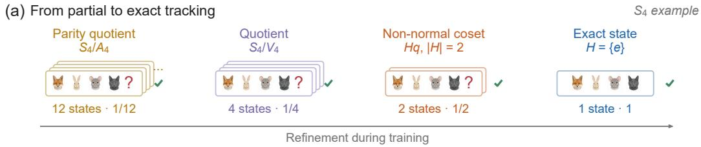

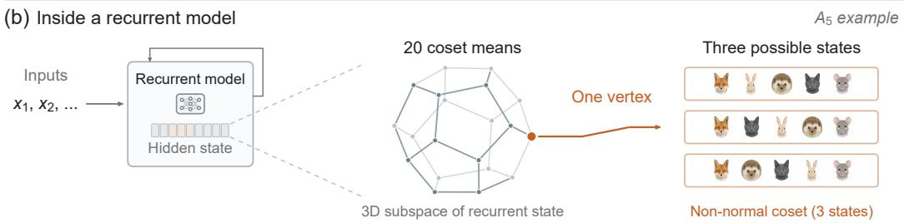  
Figure 1: Models track classes of states and carry them in memory. (a) A possible refinement on $S _ { 4 } .$ , not a universal training sequence. The surveyed Transformers track the abelianization or finer quotients, while recurrent networks can pass through non-normal coset stages. (b) An $A _ { 5 }$ GRU’s 20 coset mean vectors form an approximate dodecahedron in a three-dimensional subspace. Each vertex represents a non-normal $\bar { C _ { 3 } }$ coset with three possible states. Edges illustrate selected possible transitions between cosets, not neural connections.

1. A quantitative account of partial tracking. We identify quotient solutions beyond parity (Li et al., 2025), account for their partial accuracy through class size and output uncertainty, and establish both the recoverable information and the asymptotic accuracy limit without input order (§§3–4).

2. From persistent solutions to learning stages. We connect Transformer quotient solutions with normal and non-normal coset stages in recurrent training, showing that refinement need not follow a sequence of quotient groups (§5).

3. An internal representation of coset states. We identify the geometry of coset mean vectors in hidden space and show through state interventions that the corresponding subspaces carry subsequent coset predictions (§6).

## 2 BACKGROUND AND PRELIMINARIES

Group composition as state tracking. A group G is a set of invertible transformations with an associative composition operation and an identity e. Each input $x _ { t } \in G$ updates the state by $q _ { t } = q _ { t - 1 } x _ { t }$ , starting from $q _ { 0 } = e$ . The task is to predict every running product $q _ { t } = x _ { 1 } \cdot \cdot \cdot x _ { t } ,$ a model of state tracking used in prior work (Liu et al., 2023; Li et al., 2025). A group is abelian if all elements commute. For permutation groups, we compose left to right, $( p q ) ( i ) = q ( p ( i ) )$ ). We use $S _ { n }$ for permutations of n objects, $A _ { n }$ for even permutations, $C _ { n }$ for the cyclic group of order $n ,$ and $V _ { 4 }$ for the Klein four-group.

Cosets and quotient states. A subgroup $H \leq G$ partitions G into right cosets $H q = \{ h q : h \in H \}$ each containing |H| states. Tracking only the coset of $q _ { t }$ leaves its members indistinguishable. For example, if $H = \{ e , h \}$ , each class is the pair $\{ q , h q \}$ . A subgroup is normal when $H q = q H$ for every $q \in G$ . We then write $N \ \leq \ G$ , and its classes form the quotient group $G / \bar { N }$ , with $( q N ) ( r N ) = ( q r ) N$ . We also call a quotient class afiber. Full tracking has $H = \{ e \}$

Updating and combining summaries. Right cosets support sequential updates because $( H q ) x =$ $H ( q x )$ . Composing two classes by multiplying their representatives is well-defined only for normal subgroups. More generally, if state summaries can be combined to recover a summary of their product, the states sharing $e \mathbf { \hat { s } }$ summary form a normal subgroup $( \operatorname { A p p } . \operatorname { A } )$ . These constraints do not specify a neural implementation.

Abelianization. The commutator subgroup $K = [ G , G ]$ is generated by the commutators $[ x , y ] =$ $x y x ^ { - 1 } y ^ { - 1 }$ . The quotient $G ^ { \mathrm { a b } } = G / K$ , called the abelianization, is commutative. When K is finite, we write $f = | K |$ for its class size $( \mathrm { F i g . 1 a ) }$

Input order. The multiset of an input sequence records its elements and their counts, without their order. We call a model order-blind if its output depends only on these counts. Section 4 establishes which product information such a model can recover exactly on every input.

## 3 QUOTIENT TRACKING IN TRANSFORMERS

## 3.1 EXPERIMENTAL SETUP

We train models with cross-entropy loss at every position of length-100 sequences. The finite-group experiments use independent uniform inputs from the full group unless stated otherwise. We also test infinite groups with finite input alphabets. Our group suite includes every non-abelian group of order at most ${ \bar { 1 } } 2 ,$ selected larger groups through order 125, and the abelian control $C _ { 8 }$ . Recipe A uses a 4-layer, width-256 GPT-NeoX transformer (Black et al., 2022) with 3.16M parameters. Recipe B, adapted from Liu et al. (2023), uses a 3-layer, width-512 GPT-2 transformer (Radford et al., 2019). The baseline uses three seeds per group; configurations and exceptions are in Apps. H and I.

For the most probable output $\hat { q } _ { t } ,$ , we measure exact accuracy $A _ { \mathrm { e x a c t } } : = \mathrm { P r } ( \hat { q } _ { t } = q _ { t } )$ and quotient accuracy $A _ { \mathrm { q u o t i e n t } } : = \mathrm { P r } ( \hat { q } _ { t } N = q _ { t } N )$ . Their ratio is exact accuracy conditional on a correct quotient, $\dot { A _ { \mathrm { e x a c t } | Q } } : = \mathrm { P r } ( \hat { q } _ { t } = q _ { t }  { | } \hat { q } _ { t } N = q _ { t } N )$ , and $| G | A _ { \mathrm { e x a c t } }$ is exact accuracy in units of chance. The exact and quotientfrontiers are the longest contiguous prefixes with accuracy at least .75 and .90, respectively. Beyond the transition region, we also measure uncertainty within the true quotient class. Evaluation windows, sample counts, and threshold choices are detailed in App. K.

## 3.2 THE CLASS SIZE PREDICTS PARTIAL ACCURACY

Under recipe A, we find that Transformers settle at group-dependent exact accuracies beyond the exact frontier. Across the groups we examined, these accuracy levels often closely match the reciprocal abelianization class size, $1 / f$ (Fig. 2a,d,e, Table 1). This match suggests that models retain the abelianization class while leaving its members unresolved. We test this interpretation without prescribing a subgroup. In a separate census across nine groups, we group states with similar mean output distributions and test whether the recovered partitions form cosets. The states that Transformers fail to distinguish are grouped exactly according to their abelianization class $( \mathrm { A p p . } \mathrm { N } )$

Without predictive information distinguishing $f$ equiprobable class members, conditional exact accuracy is $1 / f$ . Allowing for class errors gives $A _ { \mathrm { e x a c t } } \approx A _ { \mathrm { q u o t i e n t } } / f .$ , with no fitted parameter (Table 1). Near-uniform probabilities alone do not imply this argmax accuracy (we test output uniformity separately in $\ S 3 . 3 )$ . Comparing $A _ { 4 }$ and $\mathrm { S L } ( 2 , 3 )$ isolates class size from abelianization alone. Both have abelianization $C _ { 3 } ,$ but $f$ equals four and eight, with conditional accuracies near $1 / 4$ and $1 / 8 ,$ , respectively. The dihedral groups follow the same prediction. We establish the special role of abelianization without input order in $\ S 4$

This prediction requires finite classes, not a finite group. We compare finite Heisenberg groups $H _ { 3 } ( \bar { \mathbb { Z } } / p )$ with the infinite groups $G _ { p } = H _ { 3 } ( \mathbb { Z } ) / \langle z ^ { \tilde { p } } \rangle$ , where ${ \boldsymbol z } = ( 0 , 0 , 1 )$ . In $G _ { p } ,$ the coordinates x, y are unbounded, but each abelianization class contains only p states. With full-group inputs for the finite groups and a finite alphabet for $G _ { p } ,$ , both families accurately track the quotient and approach $1 / 3$ exact accuracy for $p = 3 ( \mathrm { F i g } . 2 \mathrm { d } , \mathrm { e } ;$ Table 1). Specific methods are given in App. J.1.

## 3.3 ACCURATE CLASSES, UNRESOLVED MEMBERS

We now test the uniform-output assumption directly, using $A _ { 4 }$ as an example. Under recipe A, a model trained on $A _ { 4 }$ identifies the correct class in $A _ { 4 } / \bar { V _ { 4 } } \cong C _ { 3 }$ with 99.96% accuracy across positions 17–100, while exact accuracy is only 24.98% (Fig. 2a), and only 0.0527% of its output mass lies outside that four-state class. In contrast, with the same architecture and budget, we obtain 99.26% full-state accuracy on $C _ { 8 } ,$ , where every abelianization class contains a single state. Repeated inputs account for the separate early dip at position 2 (Fig. 2a, App. C.1).

(a)  
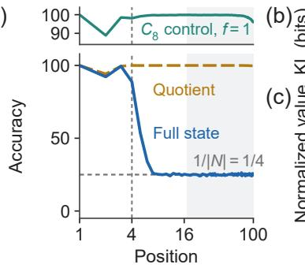

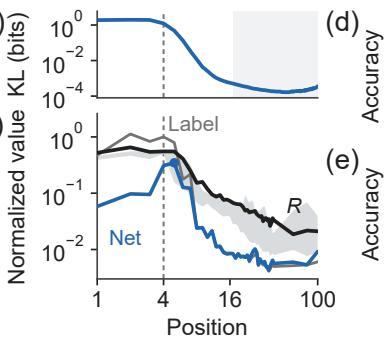

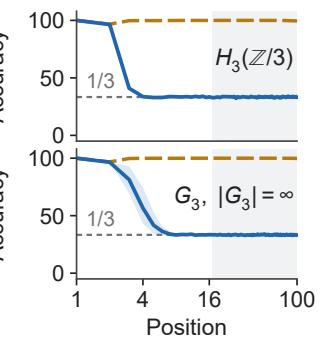  
Figure 2: Quotient structure explains partial tracking. (a) Exact and quotient accuracy in $A _ { 4 } .$ , with $| \bar { N } | = f =$ 4; the $C _ { 8 }$ control tracks the full state. (b) Per-example within-class KL for the same $A _ { 4 }$ checkpoint. (c) Its class-member gradient terms. Label and Net are normalized by the largest Label or Model norm at positions $\geq 3 ;$ R is the Label cancellation ratio defined in §3.5. The gray band is the range of R across six $\operatorname { S L } ( 2 , 3 )$ and $S _ { 4 }$ models, whose class sizes differ. (d,e) Finite $\bar { H _ { 3 } } ( \bar { \mathbb { Z } } / 3 )$ and infinite $G _ { 3 } = H _ { 3 } ( \mathbb { Z } ) / \langle z ^ { 3 } \rangle$ both approach their common $1 / 3$ class-size baseline. Shading marks the evaluation window 17–100, and bands in $^ { ( \mathrm { d } , \mathrm { e } ) }$ show three-seed ranges. Appendix C gives protocols.

We next ask whether individual predictions distinguish states within the correct quotient class. We restrict each prediction to its true class, renormalize it, and compute its KL divergence from uniform before averaging. Across 8,192 sequences and positions 17–100, the mean divergence is only .000232 bits (Fig. 2b). Thus the within-class distributions are close to uniform on average. The negligible log-likelihood gain likewise indicates no average advantage for the true member (App. K). In hidden states, our linear probes recover quotient identity but remain near chance for a state’s index within its class (App. L, Fig. S7).

Table 1: Quotient-class size and partial accuracy, min–max over the same runs. Here $f = | [ G , G ] |$ is the size of an abelianization class. Cond. is $A _ { \mathrm { e x a c t } } / A _ { \mathrm { q u o t i e n t } }$ . We report ×chance as $| G | A _ { \mathrm { { e x a c t } } }$ With accurate quotient tracking, the class-size prediction gives ×chance approximately $| G | / f . C _ { 8 }$ has singleton classes and $A _ { 5 }$ a single class; we omit conditional and quotient accuracies for these controls. $A _ { 5 }$ and $S _ { 5 }$ share f but differ twofold in the predicted ×chance. ∗148,438 training steps; unmarked rows use 74,219. We use all available doubled-budget runs where possible (App. I). †The $G _ { 5 }$ window includes an early transition; exact accuracy at positions 70–100 is .1995–.1997.
<table><tr><td> $G$ </td><td>|G| f 1/f Cond. (%) Quot. (%) ×chance</td></tr><tr><td> $C _ { 8 }$  81 1</td><td>-7.88-7.96</td></tr><tr><td> $D _ { 4 } ^ { * }$ </td><td> $\displaystyle 8 ~ 2 ~ 1 / 2 ~ 4 9 . 9 5 { - 5 0 . 0 5 ~ 9 9 . 9 4 - 9 9 . 9 9 }$ </td></tr><tr><td></td><td>4.00  $8 ~ 2 ~ 1 / 2 ~ 4 9 . 9 1 { - } 4 9 . 9 6 ~ 9 9 . 9 2 { - } 9 9 . 9 3 $  3.99</td></tr><tr><td> $Q _ { 8 } ^ { * }$   $S _ { 3 }$ </td><td> $6 ~ 3 ~ 1 / 3 ~ 3 3 . 3 2 - 3 3 . 3 9 9 9 . 8 9 - 9 9 . 9 2$ </td></tr><tr><td> $D _ { 6 } ^ { * }$ </td><td>12 31/3 33.31–33.47 99.86–99.97 3.99–4.01</td></tr><tr><td></td><td>1231/3 33.25–33.36 99.51–99.93 3.97–3.99</td></tr><tr><td> $\mathrm { D i c } _ { 3 }$   $A _ { 4 } ^ { * }$ </td><td>1241/425.00–25.02 99.97 3.00</td></tr><tr><td> ${ \bar { D _ { 5 } } } $ </td><td>10 51/5 19.99–20.07 89.34–99.99 1.79–2.01</td></tr><tr><td> $C _ { 7 } { \rtimes } C _ { 3 }$ </td><td>21 71/7 14.24–14.30 99.93–99.95 2.99–3.00</td></tr></table>

<table><tr><td>G</td><td>|G| f 1/f</td><td>Cond. (%) Quot. (%)</td><td>×chance</td></tr><tr><td> ${ \mathrm { S L } } ( 2 , 3 ) ^ { * }$   $S _ { 4 }$   $S _ { 5 }$  120 601/60</td><td>24 8 1/8 24 121/12</td><td>12.45–12.49 99.95–99.98 8.30–8.36 99.77–99.98 1.65–1.66 79.36–99.99</td><td>2.99–3.00 1.99–2.00 1.57–1.99</td></tr><tr><td> $A _ { 5 }$   $H _ { 3 } ( \mathbb { Z } / 3 )$ </td><td>60 60 1/60 27 3 1/3</td><td>一 33.32–33.43 99.82–99.96</td><td>0.99-1.01 8.98–9.02</td></tr><tr><td> $H _ { 3 } ( \mathbb { Z } / 5 ) ^ { * }$ </td><td>125 5 1/5</td><td>19.95–19.96 99.87–99.97 24.90–24.94</td><td></td></tr><tr><td> $G _ { 3 }$   $G _ { 4 }$ </td><td>∞ 3 1/3 8</td><td>33.29–33.40 99.96 4 1/4 24.99–25.11 99.95–99.97</td><td>一 一</td></tr><tr><td> $G _ { 5 }$ </td><td>∞5</td><td> $1 / 5 ~ 2 1 . 1 5 { - } 2 1 . 8 1 ^ { \dagger } ~ 9 9 . 9 2 { - } 9 9 . 9 3$ </td><td>1</td></tr><tr><td></td><td></td><td></td><td></td></tr></table>

## 3.4 BEYOND THE ABELIANIZATION

Quotient tracking also extends beyond the abelianization. With recipe B and odd-permutation inputs, we find a Transformer model tracking $S _ { 4 } / V _ { 4 } \cong S _ { 3 }$ (Fig. S4a). This quotient refines the two parity classes into six classes of four states and retains order-sensitive information. Quotient accuracy is near 100% through position 20 and falls to $72 \%$ at position 100, while conditional exact accuracy averages 25.01% over positions 17–100. Within these classes, mean per-example KL from uniform is .00272 bits. Across $\bar { 2 } 1$ runs on seven groups, we observe intermediate quotient behavior in five runs, one on $S _ { 4 }$ , two on $D _ { 1 5 }$ , and two on $Q _ { 1 6 } .$ . Appendix M.2 gives coverage, selection thresholds, distribution diagnostics, and reordering tests. We also observe quotient stages before recurrent models reach exact tracking (§5.2 and App. N), although their learning order varies across runs.

## 3.5 LEARNING SIGNALS WITHIN QUOTIENT CLASSES

We ask whether the loss still supplies a signal for distinguishing members of a learned class. We construct input variants with the same quotient target but different full-state targets, covering every member of the class. For each variant, we isolate the component of the cross-entropy gradient with respect to all trainable parameters that distinguishes class members. Its Label term contrasts the true target with a uniform label on the class; its Model term measures the model’s departure from within-class uniformity. Their sum is Net. We average these vectors before taking their norms (derivation in $\mathrm { A p p . } \mathrm { Q } )$

For the $A _ { 4 }$ model studied in $\ S 3 . 3 ,$ the Net signal peaks at position 5 and falls to 1.63% of that peak at position 40 (Fig. $2 \mathrm { c } )$ . To distinguish small individual signals from cancellation between examples, we also measure $\begin{array} { r } { \breve { R } = \Vert \sum _ { i } \ell _ { i } \Vert / \breve { \sum _ { i } } \Vert \ell _ { i } \Vert } \end{array}$ , where $\ell _ { i }$ is a variant’s Label gradient. A small R means that contributions largely cancel when combined. At position 40, R is 0.8–3.3% across nine $A _ { 4 } , \mathrm { S L } ( 2 , 3 )$ and $S _ { 4 }$ Transformers, covering class sizes $f = \bar { 4 } , 8 , 1 2$ . Thus a nonzero signal on each example can leave little signal after averaging.

Cancellation suggests an obstacle to refinement. If logits and their parameter sensitivities are identical across class members, averaging their distinct targets produces a uniform class target. Uniform outputs alone do not guarantee this condition, since their parameter sensitivities may differ. We also modify backpropagated gradients while leaving the forward computation unchanged. Generic gradient perturbations do not improve the frontier relative to controls. An intervention aligned with a parameter-update direction obtained from later training improves local accuracy but still does not advance the frontier. These tests leave the causal role of cancellation in persistent partial learning unresolved (App. Q).

## 4 THE ALGEBRAIC BOUNDARY WITHOUT INPUT ORDER

Next, we test whether models’ full predictions depend on input order. Under recipe A (uniform i.i.d. full-group inputs), prefix shuffling changes the full output distribution little beyond the exact frontier in 28 runs across seven groups (Fig. S8; App. M.1). What product information survives without order?

Theorem 1 (State information available without order). Fix $t \geq 3$ and $\phi : G  \mathbb { R }$ . There exists an order-blind model that outputs $\phi ( x _ { 1 } \cdots x _ { t } )$ on every sequence in $G ^ { t }$ ifand only $i f \phi$ is constant on [G, G]-cosets.

The proof and length-two exception are in App. A. We next ask how accurately a model can predict the full product from the multiset.

Proposition 1 (Optimal order-blind accuracy). Let $| [ G , G ] | = f < \infty .$ . For any distribution of length-t words over afinite alphabet in $G ,$ let M be the input multiset and define

$$
C _ { t } = \mathbb { E } _ { M } \left[ \operatorname* { m a x } _ { g \in G } \operatorname* { P r } ( q _ { t } = g \mid M ) \right] .\tag{1}
$$

The maximum exact accuracy ofan order-blind model is $C _ { t } \geq 1 / f$ . Equality holds precisely when the conditional product distribution is uniform on its [G, G]-cosetfor almost every multiset.

This includes infinite groups with finite classes, such as $G _ { p } .$ Can input counts favor particular members of the correct class and raise accuracy above $1 / \dot { f } ?$ For finite groups under uniform full-group inputs, we show that this advantage is bounded and vanishes with sequence length.

Theorem 2 (Asymptotic order-blind accuracy). For a finite group $G$ under uniform i.i.d. inputs from $G , C _ { t }$ is non-increasing in t and converges to $1 / f ,$ , where $\bar { f } = | [ G , G ] |$ . For every $t \geq 1$

$$
0 \leq C _ { t } - \frac { 1 } { f } \leq \left( 1 - \frac { 1 } { f } \right) \sqrt { \frac { t + 3 } { 2 ^ { t + 1 } } } .
$$

Thus $1 / f$ is the asymptotic limit of optimal order-blind accuracy, not just a uniform-guessing baseline. Under these assumptions, an order-blind predictor’s exact accuracy also approaches its abelianization accuracy divided by $f ,$ without requiring uniform outputs. We prove the bound and give sharper group-specific bounds in App. A.1.

At finite lengths, some multisets still favor particular products.

Corollary 1 (Finite-length excess). For finite non-abelian G under independent uniform inputs from $G , C _ { t } \geq 1 / f + | G | ^ { - t } ( \bar { 1 } - 1 / f ) > 1 / f$ at every finite $t \geq 1$

The all-identity multiset gives this lower bound. Since the convergence bound can be loose, we also compute the full excess $\bar { C } _ { t } - 1 / f$ for ten non-abelian groups through order 24. $\mathbf { A } \mathbf { t } t = 1 7$ , the start of our standard evaluation window, these calculations give excesses of approximately $1 . 5 \times 1 0 ^ { - 4 }$ to $3 . 1 \times 1 0 ^ { - 3 }$ . For larger groups in this calculation, we sample multisets and enumerate their orderings exactly. These are numerical estimates, rather than rigorous bounds. Monotonicity ensures that any rigorous upper bound on $C _ { 1 7 } - 1 / f$ also holds at all later positions. Proofs, enumeration details, and the relation to general state summaries are in Apps. A and F.

Reordering tests connect our plateaus to this limit, without proving strict order-blindness or explaining training’s choice. Non-abelian quotients remain order-sensitive (App. M.2), and restricted alphabets require separate analysis (App. G).

## 5 PERSISTENCE AND REFINEMENT OF STATE RESOLUTION

We now ask how training changes the state distinctions models recover.

## 5.1 PERSISTENT QUOTIENT SOLUTIONS

We find that longer training extends exact prefixes without necessarily refining resolution beyond them. Our five-million-update $S _ { 4 }$ run ends at frontier 9. Over positions 17–100, it reaches 99.67% abelianization accuracy, but exact accuracy conditional on a correct quotient remains 8.28%, near 1/12. The finer $S _ { 3 }$ quotient stays below 34.1% throughout training (Fig. 3a,b). Further long runs and GPT-2/Llama controls retain class-size baselines beyond their exact prefixes (App. N).

For state-space models, we also find the same separation in parameter-matched Mamba-2 models (Dao and Gu, 2024). On each of $D _ { 4 } , A _ { 4 }$ , and $S _ { 4 }$ , two of three two-layer models accurately recover the abelianization, with conditional exact accuracy remaining near the class-size baseline. A separate four-layer parameter-matched $D _ { 4 }$ configuration improves quotient accuracy without improving within-class resolution (App. N.1).

We also test whether equal feature-acquisition scores yield equal output resolutions. We match the scores of Marchetti et al. (2026) in an $S _ { 3 } \times C _ { 3 }$ control. Despite the matched scores, models recover the $C _ { 3 }$ factor accurately while retaining only parity information about the $S _ { 3 }$ factor (App. N), suggesting that the score alone cannot determine the resolution learned.

## 5.2 FROM QUOTIENTS TO COSET RESOLUTIONS

Our two-layer, parameter-matched LSTM and GRU models can also reach resolutions that are not quotient groups (App. B). Three LSTM runs on $S _ { 5 }$ exhibit eight sustained coset stages, two for the normal subgroup $A _ { 5 }$ and six for non-normal subgroups. One run reaches exact tracking through subgroups of orders 24, 6, and 2, without an observed intermediate $A _ { 5 }$ stage. Three GRU runs instead pass through $A _ { 5 }$ and then non-normal subgroups of orders 12 and 3, and two reach exact tracking within the budget (Fig. 3c). A stage requires both a unique fit of pooled prediction errors to a subgroup coset and accuracy near $1 / | \mathbf { \bar { \boldsymbol { H } } } |$ , sustained over successive evaluations. We give the thresholds and all trajectories in Apps. N and B.

(a)  
(b)  
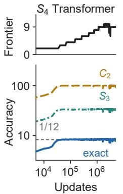  
(c)

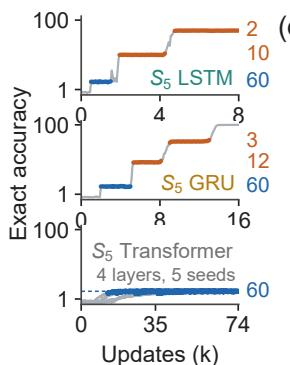  
(d)

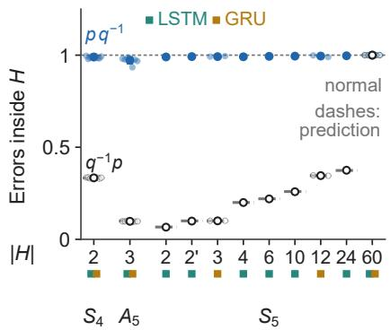  
Figure 3: Training can extend an exact prefix or refine the tracked class. (a,b) A five-millionupdate $S _ { 4 }$ Transformer. Very long training extends frontiers only moderately. (c) $S _ { 5 }$ trajectories. Blue/orange intervals mark normal/non-normal coset stages. LSTM and GRU examples maximize distinct stages, then completed duration (App. B). (d) Error fractions satisfying $p q ^ { - 1 } \in H$ (filled) or $q ^ { - 1 } p \in H$ (open), for truth q and prediction $p .$ Horizontal lines predict the latter by conjugation. Small dots are stage averages. Large dots and bars give their mean ± SD. Primes distinguish subgroup types; squares identify architectures.

The distinction is clearest on $A _ { 5 } ,$ which has no nontrivial proper normal subgroup. All three LSTM and three GRU runs in our successful learning-rate arms pass through cosets of a three-element subgroup $C _ { 3 }$ . These 20 classes leave three possible states each, giving partial accuracy near $1 / 3$ Thus an intermediate state resolution need not be a quotient at all. All six runs reach near-exact tracking, although one LSTM later loses it (App. B).

We test the coset interpretation by asking where a model’s incorrect full-state predictions fall. Let p be an incorrect prediction and q the true state. If p remains in the true coset $H q ,$ , then $p = h q$ for some $h \in H$ . Equivalently, $p q ^ { - 1 } = h \in H$ . Reversing the order gives $q ^ { - 1 } p = q ^ { - 1 } h q$ , which belongs to the conjugate subgroup $q ^ { - 1 } H q$ . Since the true state $q$ varies across examples, these reverse-order errors need not lie in one fixed copy of H. Fig. 3d compares both fractions of errors inside H with the algebraic prediction. We find that incorrect predictions are indeed concentrated in the true coset, while the reverse-order fractions match our prediction (Fig. 3d; full derivation in App. B). Their agreement hence supports right-coset structure beyond the accuracy plateau alone.

In our census of standard Transformers, we recover no non-normal coset partitions. All five four-layer $S _ { 5 }$ runs end at the $A _ { 5 }$ stage (Fig. 3c); broader surveys across groups and depths are reported in App. B. This is an observed contrast, not an architectural prohibition. It’s worth noting that with recirculation, which feeds representations from preceding positions back into the model (Mozer et al., 2026), we do observe a non-normal coset stage in one $S _ { 4 }$ Transformer trajectory (App. B.2).

## 6 INTERNAL REPRESENTATION OF COSET STATES

We next ask whether the cosets in model predictions correspond to an internal state that the network uses. We begin by transferring recurrent activations between sequences and testing which coset the subsequent predictions follow. Here, we study the $C _ { 3 }$ stages of the six $A _ { 5 }$ networks above, at three times within each stage. For a subgroup ${ \tilde { H } } ^ { * } = \mathrm { S t a b } ( a , { \bar { b } } ) \cong C _ { 3 }$ , the three states in a right coset $H q$ send objects a and b to the same ordered pair of locations. We therefore label each coset by $( q ( a ) , q ( b ) )$ ). Other tests are in App. B.3.

## 6.1 LOCATING AND TRANSFERRING THE COSET STATE

We first replace a recurrent layer state with one from a different coset. At position t, we insert a donor’s recurrent layer state into a recipient sequence and continue with the recipient’s remaining inputs. We measure whether subsequent predictions follow the donor’s coset as it is updated by those inputs, calling this fraction donor agreement. Recipient agreement instead measures whether predictions follow the recipient’s original coset under the same subsequent inputs. This transfer motivates a more specific question: which components of the layer state carry the coset?

To locate them, we group the recorded layer states by the true coset of the running product and average within each group across sequences and positions. This gives one mean vector for each of the 20 cosets. We subtract the mean of these vectors and apply singular value decomposition (SVD) to identify directions that distinguish the classes. First, we patch only the recipient’s components along the leading directions with those of the donor, leaving the rest unchanged. These subspaces have three dimensions in four models and seven in two LSTMs. Swapping them nearly reproduces full-layer transfer (Fig. 4c). Across the six models and three sampled times per model, donor agreement is 90.0–99.9% over the next 50 positions we measure, within 2.5 percentage points of full-layer replacement. Swapping only the remaining directions instead preserves the recipient’s coset on 89.1–99.9% of predictions. We thus locate a small subspace that transfers the tracked class through subsequent inputs. The intervention formula, all models, and controls are in App. B.5. Separate tests on $S _ { 5 }$ also transfer coset predictions (App. N).

(a)  
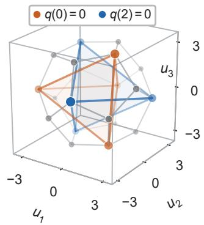

(b)  
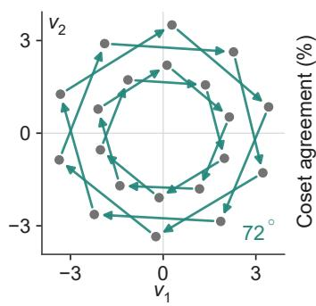

(c)  
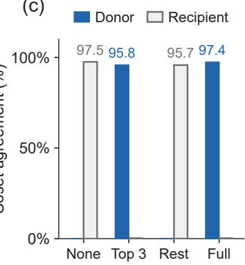  
Figure 4: Recurrent model carries a non-normal coset state. One $A _ { 5 }$ GRU during its $C _ { 3 }$ stage, using layer 1. (a) The 20 measured coset means (as vertices) in their leading three directions $( u _ { 1 } , u _ { 2 } , u _ { 3 } )$ The colors highlight cosets sharing the location of one tracked object i. (b) The successor classes under a 5-cycle, viewed along the fitted rotation axis in coordinates $( v _ { 1 } , v _ { 2 } )$ . Arrows indicate means’ rotation. (c) Coset agreement after replacing none, the leading three directions, their complement, or the full layer state with a donor’s components. Protocols and all six models are in App. B.3.

## 6.2 THE GEOMETRY AND UPDATES OF THE COSET STATE

This prompts us to ask what these causally effective directions represent. For the four models with a three-dimensional coset subspace, we plot each centered coset mean along the three leading SVD directions. When plotted out in 3D, we find that the 20 points lie almost exactly at the vertices of a regular dodecahedron, a solid with 12 congruent regular pentagonal faces and 20 vertices (Fig. 4a). Each point represents a coset of three possible group elements. We confirm the arrangement quantitatively by comparing normalized pairwise inner products with those of a regular dodecahedron (App. B.4). We also find internal geometries reflecting learned abelian quotients in Transformers (App. R). This suggests that the models learn an intrinsic geometric representation of the coset state in parallel to merely computing the group operations.

We then test whether updating inputs respect this geometry. Each input x sends a coset $H q$ to Hqx as defined in $\ S 2 .$ , specifying a permutation of the 20 means. In the 3D cases, a fitted rotation $R _ { x }$ closely matches each such permutation of class means. Using row-vector coordinates, $v _ { H q } R _ { x } \approx v _ { H q x } ,$ , the fitted maps satisfy $\bar { R } _ { x } R _ { y } \approx R _ { x y } \ ( \mathrm { A p p }$ . B.4). Fig. 4b shows the $7 2 ^ { \circ }$ rotation for one 5-cycle.

The measured rotations explain why the geometry is dodecahedral. Although these cosets do not form a quotient group, each input still permutes them through $H q \mapsto H q x$ . In an exact rotation-based code, their representation vectors take the form $v _ { H q } = w R _ { q }$ , where w $R _ { h } = w$ for every $h \in H$ because inputs from H leave the reference vector unchanged. Three is the smallest dimension of a nontrivial real linear action of $A _ { 5 }$ . In its three-dimensional rotation representations, $C _ { 3 }$ fixes a single axis, and rotating a nonzero vector on this axis by $A _ { 5 }$ produces the 20 vertices of a regular dodecahedron. Our measurements approximately realize this minimal-dimensional code (App. B.4).

The two LSTMs with seven-dimensional coset subspaces combine three- and four-dimensional components. Neither component alone transfers the coset reliably, but replacing both does (App. B.5). The fitted group action describes class mean hidden vectors, while individual samples’ activations vary within each class and do not undergo rigid rotations. Together, the interventions and geometry identify an internal representation of a $\breve { G } \mathrm { - s e t }$ , a set permuted by group inputs, rather than a quotient group. Its class means approximately realize the sequential update $H q \mapsto$ Hqx from §2 as a linear action.

## 7 RELATED WORK

Shortcuts and learned information. Liu et al. (2023) establish parallel shortcuts for state computation; Li et al. (2025) identify associative and parity-assisted scans. We characterize the state distinctions learned, extending parity accounts to non-parity and non-abelian quotients and relating class size to partial accuracy. Expressivity bounds (Barrington, 1989; Hahn, 2020; Merrill and Sabharwal, 2025) and length-generalization tests (Delétang et al., 2023) address complementary limits.

Cosets and internal computation. Stander et al. (2024) identify coset circuits for group multiplication. Wu et al. (2025) connect them to irreducible representations and certify performance; their stabilizer account includes non-normal subgroups. We connect these codes’ resolution to sequential tracking accuracy and training stages, and test whether exchanging their components transfers coset predictions through a shared suffix.

Features and state resolution. Fourier analyses (Nanda et al., 2023; Chughtai et al., 2023) and low-rank tensors (Shutman et al., 2025) explain arithmetic and group learning. Marchetti et al. (2026) characterize encoding-dependent representation acquisition in two-layer networks under alternating gradient flow (Kunin et al., 2025). A full representation matrix distinguishes elements modulo its kernel; a vector orbit distinguishes cosets of its stabilizer. We measure which resolution is expressed in predictions and how much uncertainty remains within its classes. Our matched-score control (App. N) examines transfer to Transformers outside their theoretical setting.

Learning stages and recurrence. Learning can precede accuracy gains (Power et al., 2022; Barak et al., 2022; Nanda et al., 2023). Forner et al. (2026) analyze staged retrieval and updates in a solvable model of chain-of-thought tracking; Sahasrabudhe (2026) separates plateau uncertainty from duration through a marginal-to-conditional transition. We identify acquired state distinctions and gradient cancellation that may impede refinement, complementing feature-competition accounts (Pezeshki et al., 2021). Our comparisons draw on recurrent expressivity and error bounds (Merrill et al., 2024; Chung et al., 2026), composition tests (Lee, 2026), and added recurrence (Mozer et al., 2026).

## 8 CONCLUSION

We characterize learned state tracking through the subgroup cosets that models resolve. Class size and output uncertainty explain structured partial accuracy, while normal and non-normal coset stages connect persistent solutions with further learning. We go beyond output descriptions to identify subspaces that causally carry the tracked coset. Together with the exact order-blind boundary, these results give an algebraic account of what models preserve, what remains unresolved, and how partial states are represented inside models and support continued computation.

Training recipes can determine whether models reach exact tracking or remain at a partial resolution. We hypothesize that input distributions shape both the internal representations models learn and the gradients that refine them. How these effects govern the selection and refinement of coset states remains open.

## REPRODUCIBILITY STATEMENT

The appendices specify model configurations, data distributions, evaluation windows, seed coverage, and the distinction between confirmatory and exploratory analyses. Run-level manifests identify the Table 1 cohorts and retain all initial-budget results. The order-blind calculation includes a brute-force check at short lengths. Mathematical assumptions and proofs are given in App. A; measurement and intervention protocols are described in Apps. C, B.3, P, and Q.

## ETHICS STATEMENT

The experiments use synthetic group-composition sequences and involve no human subjects or personal data. The conclusions concern controlled algorithmic tasks and do not establish performance or safety properties of deployed language models.

## AI USE STATEMENT

We set the research questions, chose which findings to pursue, fixed the claim this paper is organized around, proposed and sketched out key proofs, proposed experiments that resulted in novel discoveries, and decided what entered the manuscript and what stayed out. Within that direction we used generative AI tools (Claude Code and OpenAI Codex, across several model versions over the project period) for the following tasks that require disclosure. They helped generate the synthetic datasets, in the sense that they wrote the group-composition sampler scripts; they helped check and complete our mathematical proofs, supplied ingredients for some proofs and drafted them, refined our hypotheses, designed experiments and controls and gave feedback on the methodology, implemented the training, evaluation and analysis code, aggregated and reformatted the stored run outputs into the reported tables, and translated between languages, since we discussed the research largely in Chinese and drafted the manuscript in English. Every other required category involved AI assistance at some stage; generating cartoon images for our illustrations is one example. The tools worked from our instructions and we kept or discarded what came back.

We used the same tools for tasks with recommended disclosure: producing the figures, suggesting experimental parameters, writing and editing code, searching for and summarizing related work, identifying gaps, brainstorming, proposing the structure of the paper, formatting references, proposing candidate titles and keywords, and drafting and revising every section, this statement included.

We have reviewed all AI-assisted work. Results that this paper reports as confirmatory were registered before their analysis, the appendix labels the exploratory ones, and the numbers in the tables and figures were reconciled with the stored run logs rather than with a model’s summary of them. Both authors checked the mathematical statements and the proofs, read the data-generation and analysis code, and re-ran spot checks of the reported quantities. Checks preceding our own review were also AI-assisted, including cross-model adversarial audits of the reported numbers and simulated reviews of the draft and codes, and we do not count that as independent human verification. We take responsibility for the final content of this work, including the text, claims, proofs, code and figures produced with the aid of generative AI.

## REFERENCES

Nikita Alexeev and Peter Zograf. Hultman numbers, polygon gluings and matrix integrals. arXiv preprint arXiv:1111.3061, 2011. URL https://arxiv.org/abs/1111.3061.

Boaz Barak, Benjamin Edelman, Surbhi Goel, Sham Kakade, Eran Malach, and Cyril Zhang. Hidden progress in deep learning: SGD learns parities near the computational limit. In Advances in Neural Information Processing Systems (NeurIPS), volume 35, pages 21750–21764, 2022. URL https://papers.nips.cc/paper\_files/paper/2022/hash/ 884baf65392170763b27c914087bde01-Abstract-Conference.html.

David A. Barrington. Bounded-width polynomial-size branching programs recognize exactly those languages in NC1. Journal of Computer and System Sciences, 38(1):150–164, 1989. Conference version: STOC 1986.

Sidney Black, Stella Biderman, Eric Hallahan, Quentin Anthony, Leo Gao, Laurence Golding, Horace He, Connor Leahy, Kyle McDonell, Jason Phang, Michael Pieler, Usvsn Sai Prashanth, Shivanshu Purohit, Laria Reynolds, Jonathan Tow, Ben Wang, and Samuel Weinbach. GPT-NeoX-20B: An open-source autoregressive language model. In Proceedings of BigScience Episode #5 – Workshop on Challenges & Perspectives in Creating Large Language Models, 2022. arXiv:2204.06745.

Bilal Chughtai, Lawrence Chan, and Neel Nanda. A toy model of universality: Reverse engineering how networks learn group operations. In International Conference on Machine Learning (ICML), 2023. arXiv:2302.03025.

Jiwan Chung, Heechan Choi, and Seon Joo Kim. Rethinking state tracking in recurrent models through error control dynamics. arXiv preprint arXiv:2605.07755, 2026.

Tri Dao and Albert Gu. Transformers are SSMs: Generalized models and efficient algorithms through structured state space duality. In Proceedings ofthe 41st International Conference on Machine Learning, volume 235 of Proceedings ofMachine Learning Research, pages 10041–10071. PMLR, 2024. URL https://proceedings.mlr.press/v235/dao24a.html.

Grégoire Delétang, Anian Ruoss, Jordi Grau-Moya, Tim Genewein, Li Kevin Wenliang, Elliot Catt, Chris Cundy, Marcus Hutter, Shane Legg, Joel Veness, and Pedro A. Ortega. Neural networks and the chomsky hierarchy. In International Conference on Learning Representations (ICLR), 2023. URL https://arxiv.org/abs/2207.02098.

Niklas Forner, Marcel Kühn, Matthias Thamm, and Bernd Rosenow. Learning dynamics of chain-of-thought state tracking in a solvable transformer model. arXiv preprint arXiv:2606.18164, 2026.

Michael Hahn. Theoretical limitations of self-attention in neural sequence models. Transactions of the Associationfor Computational Linguistics, 8:156–171, 2020. doi: 10.1162/tacl\_a\_00306. URL https://aclanthology.org/2020.tacl-1.11/.

Najoung Kim and Sebastian Schuster. Entity tracking in language models. In Proceedings ofthe 61st Annual Meeting of the Association for Computational Linguistics (Volume 1: Long Papers), pages 3835–3855, 2023. doi: 10.18653/v1/2023.acl-long.213. URL https://aclanthology.org/2023.acl-long.213/.

Daniel Kunin, Giovanni Luca Marchetti, Feng Chen, Dhruva Karkada, James B. Simon, Michael R. DeWeese, Surya Ganguli, and Nina Miolane. Alternating gradient flows: A theory of feature learning in two-layer neural networks. arXiv preprint arXiv:2506.06489, 2025.

Jeonghoon Lee. A held-out transition-pair falsifier for long-horizon non-abelian state tracking. arXiv preprint arXiv:2606.07254, 2026.

Belinda Z. Li, Maxwell Nye, and Jacob Andreas. Implicit representations of meaning in neural language models. In Proceedings ofthe 59th Annual Meeting ofthe Associationfor Computational Linguistics and the 11th International Joint Conference on Natural Language Processing (Volume 1: Long Papers), pages 1813–1827, 2021. doi: 10.18653/v1/2021.acl-long.143. URL https://aclanthology.org/2021.acl-long.143/.

Belinda Z. Li, Zifan Carl Guo, and Jacob Andreas. (how) do language models track state? In International Conference on Machine Learning (ICML), 2025. arXiv:2503.02854.

Kenneth Li, Aspen K. Hopkins, David Bau, Fernanda Viégas, Hanspeter Pfister, and Martin Wattenberg. Emergent world representations: Exploring a sequence model trained on a synthetic task. In International Conference on Learning Representations (ICLR), 2023. URL https://openreview.net/forum?id=DeG07\_TcZvT.

Bingbin Liu, Jordan T. Ash, Surbhi Goel, Akshay Krishnamurthy, and Cyril Zhang. Transformers learn shortcuts to automata. In International Conference on Learning Representations (ICLR), 2023. arXiv:2210.10749.

Ilya Loshchilov and Frank Hutter. Decoupled weight decay regularization. In International Conference on Learning Representations (ICLR), 2019. arXiv:1711.05101.

Giovanni Luca Marchetti, Daniel Kunin, Adele Myers, Francisco Acosta, and Nina Miolane. Sequential group composition: A window into the mechanics of deep learning. arXiv preprint arXiv:2602.03655, 2026.

William Merrill and Ashish Sabharwal. A little depth goes a long way: The expressive power of log-depth transformers. arXiv preprint arXiv:2503.03961, 2025.

William Merrill, Jackson Petty, and Ashish Sabharwal. The illusion of state in state-space models. In International Conference on Machine Learning (ICML), 2024. arXiv:2404.08819.

Michael C. Mozer, Shoaib Ahmed Siddiqui, Danny Sawyer, Sunny Sanyal, and Rosanne Liu. Recirculation. arXiv preprint arXiv:2608.17981, 2026.

Neel Nanda, Lawrence Chan, Tom Lieberum, Jess Smith, and Jacob Steinhardt. Progress measures for grokking via mechanistic interpretability. In International Conference on Learning Representations (ICLR), 2023. arXiv:2301.05217.

Maxwell Nye, Anders Johan Andreassen, Guy Gur-Ari, Henryk Michalewski, Jacob Austin, David Bieber, David Dohan, Aitor Lewkowycz, Maarten Bosma, David Luan, Charles Sutton, and Augustus Odena. Show your work: Scratchpads for intermediate computation with language models. arXiv preprint arXiv:2112.00114, 2021. URL https://arxiv.org/abs/2112.00114.

Mohammad Pezeshki, Sekou-Oumar Kaba, Yoshua Bengio, Aaron Courville, Doina Precup, and Guillaume Lajoie. Gradient starvation: A learning proclivity in neural networks. In Advances in Neural Information Processing Systems (NeurIPS), 2021.

Alethea Power, Yuri Burda, Harri Edwards, Igor Babuschkin, and Vedant Misra. Grokking: Generalization beyond overfitting on small algorithmic datasets. arXiv preprint arXiv:2201.02177, 2022. URL https://arxiv.org/abs/2201.02177.

Alec Radford, Jeffrey Wu, Rewon Child, David Luan, Dario Amodei, and Ilya Sutskever. Language models are unsupervised multitask learners. Technical report, OpenAI, 2019.

Mihir Sahasrabudhe. Marginals before conditionals. arXiv preprint arXiv:2603.10074, 2026.

Maor Shutman, Oren Louidor, and Ran J. Tessler. Learning words in groups: fusion algebras, tensor ranks and grokking. arXiv preprint arXiv:2509.06931, 2025.

Dashiell Stander, Qinan Yu, Honglu Fan, and Stella Biderman. Grokking group multiplication with cosets. In International Conference on Machine Learning (ICML), 2024. arXiv:2312.06581.

Jianlin Su, Yu Lu, Shengfeng Pan, Ahmed Murtadha, Bo Wen, and Yunfeng Liu. RoFormer: Enhanced transformer with rotary position embedding. Neurocomputing, 568, 2024. arXiv:2104.09864.

Keyon Vafa, Justin Y. Chen, Ashesh Rambachan, Jon Kleinberg, and Sendhil Mullainathan. Evaluating the world model implicit in a generative model. In Advances in Neural Information Processing Systems (NeurIPS), volume 37, 2024. URL https://proceedings.neurips.cc/paper\_files/paper/2024/hash/ 2f6a6317bada76b26a4f61bb70a7db59-Abstract-Conference.html.

Wilson Wu, Louis Jaburi, Jacob Drori, and Jason Gross. Towards a unified and verified understanding of group-operation networks. In International Conference on Learning Representations (ICLR), 2025. arXiv:2410.07476.

## A ALGEBRAIC STATEMENTS AND PROOFS

Composable summaries. Suppose a summary $s : G \to S$ admits an operation $M$ such that $s ( g h ) = M ( s ( g ) , s ( h ) )$ for all $g , h \in G$ . Restrict S to the image of $s .$ Associativity, an identity, and inverses are inherited from $G ,$ so this image is a group and s is a homomorphism. Its kernel $N = \{ g : s ( g ) = s ( e ) \}$ } is normal, and two products have the same summary exactly when they lie in the same N-coset. Thus a summary that composes arbitrary segments has the resolution of a group quotient. This statement does not assume that a neural model has learned such an exact summary.

Sequential summaries. Suppose instead that $s ( g x ) = U ( s ( g ) , x )$ for every $g , x \in G$ . Define $g \sim g ^ { \prime }$ when $s ( g ) = s ( g ^ { \prime } )$ . The update rule makes this equivalence relation invariant under right multiplication. Its identity class $\dot { H } = \{ h : s ( h ) = s ( e ) \}$ is a subgroup. Indeed, $a \sim e$ and $b \sim e$ imply ab $\sim b \sim e ;$ multiplying $a \sim e$ by $a ^ { - 1 }$ gives $\dot { e } \sim a ^ { - 1 }$ . Moreover, $g \sim q$ if and only if $g q ^ { \bar { - } 1 } \sim e ,$ so the class of q is exactly $H q$ . Conversely, every right-coset partition defines a sequential update $U ( H q , x ) = H ( q x )$ . Normality is unnecessary. If updates are initially specified only on a finite alphabet that generates G as a monoid, composition of those updates gives the same conclusion.

These statements classify exact, state-dependent summaries, not arbitrary history-dependent hidden states. The distinction motivates the measurements in App. $\mathrm { N } ;$ observing a partition does not establish that a neural network implements either exact summary rule.

Lemma 1 (Reordering preserves the abelianized product). $I f$ two sequences have the same multiset ofentries, their products have the same image in ${ \dot { G } } / [ G , { \dot { G } } ]$

Proof. The projection to $G / [ G , G ]$ is a homomorphism from G to an abelian group. Products of the images therefore do not depend on their order. □

Proof of Theorem 1. Any function constant on $[ G , G ]$ -cosets is recoverable from the multiset, since the projected elements commute. Conversely, choosing $( x , y , z , e , \ldots , e )$ and swapping the second and third entries gives $\phi ( x y z ) = \phi ( x z y )$ . Since $x y z = ( x z y ) [ y ^ { - 1 } , z ^ { - 1 } ]$ , varying x gives $\phi ( g [ y ^ { - 1 } , z ^ { - 1 } ] ) = \phi ( g )$ for every $g , y , z$ . These commutators generate $[ G , G ]$ , so ϕ is constant on its cosets.

The length-two exception. For $t = 2 ,$ , order invariance requires $\phi ( x y ) = \phi ( y x )$ . The two products are conjugate; conversely, this identity for all $x , y$ implies conjugation invariance. Thus class functions, including functions finer than the abelianization, are recoverable at length two. The free third factor in Theorem 1 strengthens conjugation invariance to invariance under multiplication by every commutator.

Proof of Proposition 1. Fix a multiset M with positive probability. Since an order-blind model has access only to M, its optimal prediction is a most probable value of $q _ { t }$ given M. Its conditional accuracy is therefore

$$
\operatorname* { m a x } _ { g \in G } \operatorname* { P r } ( q _ { t } = g \mid M ) ,
$$

and averaging over $M$ gives $C _ { t }$ . By Lemma 1, all products obtained by reordering M have the same image in $\bar { G } / \bar { [ G , G ] }$ . The conditional product distribution is thus supported on one $[ G , G ]$ -coset with $f$ elements. Its largest probability is at least $1 / f$ , with equality exactly when it is uniform on that coset. Taking expectations gives $\begin{array} { r } { \dot { C } _ { t } \geq 1 / f ; } \end{array}$ equality holds if and only if this uniformity condition holds for almost every $M .$

For finite non-abelian G with independent uniform full-group inputs, the all-identity multiset $M _ { 0 } =$ $\{ e , \ldots , e \}$ occurs with probability $| G | ^ { - t }$ . Conditional on $M _ { 0 }$ , the product is deterministically e, so the optimal accuracy is 1. Every other multiset contributes at least $1 / f$ , giving

$$
C _ { t } \geq | G | ^ { - t } + \frac { 1 - | G | ^ { - t } } { f } > \frac { 1 } { f } .
$$

This proves Corollary 1.

What a conditional ratio can establish. Consider a randomized prediction that is uniform on $H q _ { t }$ . Its exact accuracy is $1 / | H |$ , and the probability of the correct [G, G]-coset is $| H \cap [ G , G ] | / | H |$ Their ratio is $1 / | H \cap [ G , G ] |$ . It equals $1 / f$ only $\operatorname { i f } \left[ G , G \right] \subseteq H ;$ ; every subgroup containing $[ \bar { G } , \bar { G } ]$ is normal. Otherwise the ratio is at least $2 { \dot { / } } { \dot { f } }$ . These facts apply to the specified uniform-coset model. For learned outputs, we also check class accuracy and the per-example distribution; a ratio alone neither establishes uniformity nor excludes arbitrary hidden encodings.

## A.1 ASYMPTOTIC ORDER-BLIND ACCURACY

We prove Theorem 2 by showing that the product distribution conditional on the input multiset approaches the uniform distribution on its abelianization class, on average over multisets. Throughout, $G \mathrm { i s }$ fixed and finite, $K = [ G , G ] , f = | K |$ , and the inputs $X _ { 1 } , \ldots , X _ { t }$ are independent and uniform on $G .$ . Write $q _ { t } = X _ { 1 } \cdot \cdot \cdot \dot { X _ { t } }$ and let $M _ { t }$ be their multiset. For each possible $M ,$ set

$$
D _ { M } ( g ) = \mathrm { P r } ( q _ { t } = g \mid M _ { t } = M ) .
$$

By Lemma $1 , D _ { M }$ is supported on a unique K-coset $F ( M )$ , although its support need not fill that coset. Let $U _ { M }$ be uniform on $F ( M )$ and therefore we have $U _ { M } ( g ) = 1 / \bar { f }$ for $g \in F ( M )$ and 0 otherwise. We define

$$
\mathrm { T V } ( \mu , \nu ) = \frac 1 2 \sum _ { g \in G } | \mu ( g ) - \nu ( g ) | , \qquad \Delta _ { t } = \mathbb { E } _ { M } \mathrm { T V } ( D _ { M } , U _ { M } ) .
$$

## A.1.1 AN EXPLICIT FINITE-LENGTH BOUND

We measure the remaining within-class bias by its mean squared distance from uniform,

$$
\Phi _ { t } = \mathbb { E } _ { M } \sum _ { g \in G } \bigl ( D _ { M } ( g ) - U _ { M } ( g ) \bigr ) ^ { 2 } = \mathbb { E } _ { M } \sum _ { g \in F ( M ) } \bigl ( D _ { M } ( g ) - U _ { M } ( g ) \bigr ) ^ { 2 } .\tag{2}
$$

We first relate this quantity to prediction accuracy, then compute it exactly using the dimensions of the irreducible representations of G. This yields both group-specific bounds and the group-independent bound in Theorem 2.

From squared bias to accuracy. For $f > 1$ , the following bounds hold:

$$
\Phi _ { t } \le C _ { t } - \frac { 1 } { f } \le \sqrt { ( 1 - 1 / f ) \Phi _ { t } } , \qquad \Delta _ { t } \le \frac { \sqrt { f } } { 2 } \sqrt { \Phi _ { t } } .\tag{3}
$$

To prove the lower bound, write $p _ { g } ~ = ~ D _ { M } ( g )$ on the $f$ elements of $F ( M )$ . Then $\sum _ { g } ( p _ { g } \mathrm { ~ - ~ }$ $\begin{array} { r } { 1 / f ) ^ { 2 } = \sum _ { q } p _ { q } ^ { 2 } - 1 / f \leq \operatorname* { m a x } _ { g } p _ { g } - 1 / f } \end{array}$ . For the upper bound, let $v _ { g } = D _ { M } ( g ) - 1 / f$ . We use $v = \langle v _ { g } \mid g \in F ( M ) \rangle$ and $u = \langle 1 / f , \dots , 1 / f \rangle$ to represent vectors in $\mathbb { R } ^ { f }$ . We choose element $j$ which maximizes $v _ { j }$ . Since $\textstyle \sum _ { g } v _ { g } = 0$ , we have

$$
\operatorname* { m a x } _ { g } p _ { g } - 1 / f = \langle v , e _ { j } - u \rangle \leq \sqrt { 1 - 1 / f } \| v \| _ { 2 } .
$$

Here $e _ { j }$ is the point mass at element $j .$ . Cauchy–Schwarz also gives $\mathrm { T V } ( D _ { M } , U _ { M } ) \leq \sqrt { f } \| v \| _ { 2 } / 2$ Averaging and applying Jensen’s inequality proves Eq. $( 3 ) . \operatorname { I f } f = 1$ , all three errors are zero.

An exact expression for the squared bias. Let $\widehat { G }$ be a complete set of inequivalent irreducible unitary complex representations of $G .$ For $\pi \in { \widehat { G } } ,$ write $d _ { \pi }$ for its dimension and $\chi _ { \pi } ( g ) = \operatorname { t r } \pi ( g )$ for its character. We will show that, for every $t \geq 1$

$$
\Phi _ { t } = \frac { 1 } { | G | } \sum _ { { \pi } \in \widehat { G } \atop d _ { \pi } > 1 } d _ { \pi } ^ { 1 - t } \left[ { \binom { d _ { \pi } + t + 1 } { t + 2 } } - { \binom { d _ { \pi } } { t + 2 } } \right] ,\tag{4}
$$

with ${ \binom { n } { k } } = 0$ for integers $k > n \ge 0$ . This is an exact expression for $\Phi _ { t } .$ , not for the optimal accuracy $C _ { t }$ . Together with Eq. (3), it gives computable bounds on $C _ { t }$

Define $\begin{array} { r } { \widehat { \mu } ( \pi ) = \sum _ { g } \mu ( g ) \pi ( g ) } \end{array}$ and $\| A \| _ { \mathrm { H S } } ^ { 2 } = \mathrm { t r } ( A A ^ { * } )$ . The finite-group Plancherel identity gives

$$
\sum _ { g } | D _ { M } ( g ) - U _ { M } ( g ) | ^ { 2 } = \frac { 1 } { | G | } \sum _ { \pi \in \widehat { G } } d _ { \pi } \Vert \widehat { D } _ { M } ( \pi ) - \widehat { U } _ { M } ( \pi ) \Vert _ { \mathrm { H S } } ^ { 2 } .
$$

The one-dimensional representations are trivial on $K$ and constant on $F ( M )$ , so their terms vanish. Conversely, an irreducible representation trivial on K factors through the abelian group $G / K$ and is one-dimensional. For each remaining representation, averaging $\pi ( k )$ over $k \in K$ , given by ${ \begin{array} { r } { { \frac { 1 } { f } } \sum _ { k \in K } \pi ( k ) } \end{array} }$ , projects vectors to K-fixed vectors. The subspace spanned by all K-fixed vectors is G-invariant because K is normal, and must be either zero of the whole space by irreducibility. If it is the whole space, then the representation is trivial on K and hence one dimensional. Thus $\widehat { U } _ { M } ( \pi ) = 0$ when $d _ { \pi } > 1$ , and

$$
\Phi _ { t } = { \frac { 1 } { | G | } } \sum _ { d _ { \pi } > 1 } d _ { \pi } \mathbb { E } _ { M } \| \widehat { D } _ { M } ( \pi ) \| _ { \mathrm { H S } } ^ { 2 } .\tag{5}
$$

Let q and $q ^ { \prime }$ be products of independent uniform orderings conditional on the same multiset. Since $\widehat { D } _ { M } ( \pi ) = \mathbb { E } [ \pi ( q ) \mid M ]$ , we have

$$
\begin{array} { r } { \mathbb { E } _ { M } \| \widehat { D } _ { M } ( \pi ) \| _ { \mathrm { H S } } ^ { 2 } = \mathbb { E } \chi _ { \pi } ( q q ^ { \prime - 1 } ) . } \end{array}
$$

Equivalently, draw independent uniform $x _ { 1 } , \ldots , x _ { t } \in G$ and a uniform permutation $\theta \in S _ { t }$ , and set $q = x _ { 1 } \cdot \cdot \cdot x _ { t }$ and $q ^ { \prime } = x _ { \theta ( 1 ) } \cdot \cdot \cdot x _ { \theta ( t ) }$ . Repeated values cause no bias because each distinct ordering of a multiset has the same number of labeled permutations.

For a fixed θ and an irreducible representation of dimension $d ,$ expand the trace of $\pi ( x _ { 1 } \cdot \cdot \cdot x _ { t } x _ { \theta ( t ) } ^ { - 1 } \cdot \cdot \cdot x _ { \theta ( 1 ) } ^ { - 1 } )$ . Each independent input appears once as a matrix and once as its adjoint. Schur orthogonality gives

$$
\begin{array} { r } { \mathbb { E } _ { x } \bigl [ \pi ( x ) _ { i j } \overline { { \pi ( x ) _ { k \ell } } } \bigr ] = d ^ { - 1 } \delta _ { i k } \delta _ { j \ell } . } \end{array}
$$

The t averages contribute $d ^ { - t }$ and identify matrix indices. If $L ( \theta )$ is the number of free index classes after these identifications, summing over them gives

$$
\mathbb { E } _ { x _ { 1 } , \ldots , x _ { t } } \chi _ { \pi } \bigl ( q q ^ { \prime - 1 } \bigr ) = d ^ { L ( \theta ) - t } .\tag{6}
$$

We make the combinatorial identification explicit. Place the 2t factors around a polygon, with cyclic indices $i _ { 1 } , \dots , i _ { 2 t }$ at its vertices. The inverse of $x _ { j }$ occupies edge $\alpha _ { j } = 2 t + \bar { 1 } - \bar { \theta ^ { - 1 } } ( j )$ . Its orthogonality constraints are $i _ { j } = i _ { \alpha _ { j } + 1 }$ and $i _ { j + 1 } = i _ { \alpha _ { j } } ^ { \bar { } }$ , with indices read cyclically. These are exactly the endpoint identifications obtained by gluing each positive edge to its oppositely oriented inverse edge. The positive edges form one contiguous half of the polygon and the inverse edges the other. Consequently, $L ( \theta )$ is the number of vertices of the polygon gluing enumerated by the Hultman numbers (Alexeev and Zograf, 2011, Theorem 1); the matching runs over all permutations as θ does. In particular, $L ( \theta ) \leq t + 1$

Writing $c ( n , k )$ for the number of permutations of n objects with k cycles, that enumeration gives

$$
\operatorname* { P r } _ { \theta } ( L ( \theta ) = k ) = { \left\{ \begin{array} { l l } { 2 c ( t + 2 , k ) / ( t + 2 ) ! , } & { k \equiv t + 1 { \pmod { 2 } } , } \\ { 0 , } & { { \mathrm { o t h e r w i s e } } . } \end{array} \right. }
$$

Using $\begin{array} { r } { \sum _ { k } c ( n , k ) d ^ { k } = d ( d + 1 ) \cdots ( d + n - 1 ) } \end{array}$ ) and selecting the indicated parity yields

$$
\mathbb { E } _ { \theta } d ^ { L ( \theta ) - t } = d ^ { - t } \left[ { \binom { d + t + 1 } { t + 2 } } - { \binom { d } { t + 2 } } \right] .\tag{7}
$$

This is also the coefficient formula in Alexeev and Zograf (2011, Theorem 3(i)). Substituting into Eq. (5) proves Eq. (4).

A bound requiring only class size. Since $L ( \theta ) - t - 1 \leq 0$ and $d _ { \pi } \geq 2$ in the remaining sum,

$$
\Phi _ { t } = \frac { 1 } { | G | } \sum _ { d _ { \pi } > 1 } d _ { \pi } ^ { 2 } \mathbb { E } _ { \theta } d _ { \pi } ^ { L ( \theta ) - t - 1 }
$$

$$
\leq \frac { 1 } { | G | } \sum _ { d _ { \pi } > 1 } d _ { \pi } ^ { 2 } \mathbb { E } _ { \theta } 2 ^ { L ( \theta ) - t - 1 } = \left( 1 - \frac { 1 } { f } \right) \frac { t + 3 } { 2 ^ { t + 1 } } .
$$

Here $\textstyle \sum _ { \pi \in { \widehat { G } } } d _ { \pi } ^ { 2 } = | G |$ , exactly $| G / K | = | G | / f$ representations are one-dimensional, and the last expectation follows from $\mathrm { E q . } ( 7 )$ at $d = 2$ . Combining this with Eq. (3) proves the explicit bound and convergence in Theorem 2.

Why the optimal accuracy cannot increase with length. If $m _ { x }$ is the count of x in $M .$ , conditioning on the last input gives

$$
D _ { M } ( g ) = \sum _ { x : m _ { x } > 0 } \frac { m _ { x } } { t } D _ { M - \{ x \} } ( g x ^ { - 1 } ) .
$$

Taking the maximum and using its convexity bounds ma $\mathrm { x } _ { g } D _ { M } ( g )$ by the same weighted average of maxh $D _ { M - \{ x \} } ( h )$ . Deleting a uniformly chosen occurrence from an i.i.d. multiset of length t leaves an $\mathrm { i . i . d . }$ . multiset of length $t - 1$ . Averaging therefore gives $C _ { t } \leq C _ { t - 1 }$ for $t \geq 2$ , completing the theorem. The same argument proves $\Delta _ { t } \le \Delta _ { t - 1 }$ , since translating $U _ { M - \{ x \} }$ on the right by x gives $U _ { M }$ , and total variation is convex.

## A.1.2 AN ELEMENTARY PROOF OF CONVERGENCE

We give an independent proof of convergence that avoids representation theory. Under the standing assumption of uniform i.i.d. inputs from $G ,$ we establish constants $L = L ( G ) \geq 1$ and $\rho = \rho ( G ) \in$ $( 0 , 1 )$ such that

$$
0 \leq C _ { t } - \frac { 1 } { f } \leq \Delta _ { t } \leq \left( 1 - \frac { 1 } { f } \right) \rho ^ { \lfloor t / L \rfloor } .\tag{8}
$$

The same argument extends to any fixed i.i.d. input law with full support on $G ,$ , although $\rho$ then also depends on that law. We give this extension at the end of the proof.

For abelian $G ,$ , the multiset determines the product, so $C _ { t } = 1$ and $\Delta _ { t } = 0 $ ; take $L = 1$ and $\rho = 1 / 2$ Below assume $f > 1$

A multiset whose products cover the commutator subgroup. We first construct a fixed multiset $M _ { * }$ whose reorderings attain every element of $K$ . Use the convention $[ a , b ] = a b a ^ { - 1 } b ^ { - 1 }$ . Every $k \in K$ is a finite product of such commutators, since $[ a , b ] ^ { - 1 } = [ b , a ]$ . Choose a word $W _ { k }$ formed by concatenating the corresponding quadruples $( a , b , a ^ { - 1 } , \dot { b ^ { - 1 } } )$ ; take $\dot { W _ { e } }$ to be empty. Reordering each quadruple as $( a , a ^ { - 1 } , b , \dot { b } ^ { - 1 } )$ gives a word $W _ { k } ^ { 0 }$ with the same multiset and product e.

Concatenate all $W _ { k }$ in a fixed order and call the resulting multiset $M _ { * }$ , of length $L > 0$ . To obtain product $k ,$ retain its segment $W _ { k }$ and replace every other segment $W _ { h }$ by $W _ { h } ^ { \overline { { 0 } } }$ . Conversely, every reordering has trivial image in $G / K$ . Thus its possible products are exactly $K .$ Conditional on $M _ { * } ,$ every distinct word has positive, equal probability: counting labeled permutations assigns each word the same multiplicity $\textstyle \prod _ { x } m _ { x } !$ , where $m _ { x }$ is the count of x.

Let $D ,$ ∗ be this conditional product distribution. Since $D _ { * } ( k ) > 0$ for every $k \in K$ , we can set

$$
\varepsilon = f \operatorname* { m i n } _ { k \in K } D _ { * } ( k ) \in ( 0 , 1 ] .
$$

$\mathrm { I f } \varepsilon < 1$ , then $D _ { * } = \varepsilon U _ { K } + ( 1 - \varepsilon ) R$ for a probability distribution R on $K , \operatorname { I f } \varepsilon = 1$ , then $D _ { * } = U _ { K }$

A special block contracts the error. For probability distributions on $G ,$ define the ordered convolution

$$
( \mu * \nu ) ( g ) = \sum _ { h \in G } \mu ( h ) \nu ( h ^ { - 1 } g ) ,
$$

the law of the product of independent draws from $\mu$ and ν in that order. $\operatorname { I f } \mu$ is supported on a coset $F = c K$ and ν on $F ^ { \prime } = c ^ { \prime } K$ , then $\mu * U _ { K } = U _ { F }$ and $U _ { F } * \nu = U _ { F F ^ { \prime } }$ . The second identity uses normality of $K ,$ , which gives $U _ { K } * \delta _ { c ^ { \prime } } = \delta _ { c ^ { \prime } } * U _ { K }$ . Right convolution is a Markov kernel and contracts total variation, so

$$
\mathrm { T V } ( \mu * \nu , U _ { F F ^ { \prime } } ) = \mathrm { T V } ( \mu * \nu , U _ { F } * \nu ) \leq \mathrm { T V } ( \mu , U _ { F } ) .
$$

For a special block with law $D _ { * }$ and $\varepsilon < 1$

$$
\mu * D _ { * } - U _ { F } = ( 1 - \varepsilon ) ( \mu - U _ { F } ) * R ,
$$

and hence

$$
\mathrm { T V } ( \mu * D _ { * } , U _ { F } ) \leq ( 1 - \varepsilon ) \mathrm { T V } ( \mu , U _ { F } ) .
$$

$\operatorname { I f } \varepsilon = 1$ , that block makes the error zero immediately. Subsequent blocks preserve uniformity on the resulting coset.

Conditioning on blocks and then forgetting their boundaries. Partition the inputs into $n = \lfloor t / L \rfloor$ complete blocks of length $L$ and a remainder of length $r = t - n L$ . Let $M ^ { ( \bar { 1 } ) } , \ldots , M ^ { ( n ) }$ be the multisets of the complete blocks, listed in block order, and let $M ^ { \mathrm { ( r e m ) } }$ be the multiset of the remainder, empty when $r = 0$ . Define

$$
Z = \big ( M ^ { ( 1 ) } , \dots , M ^ { ( n ) } , M ^ { ( \mathrm { r e m } ) } \big ) .
$$

Thus $Z$ determines the total input multiset $M _ { t }$ . Given $Z ,$ the blocks remain independent: each conditioning event involves only that block’s independent input coordinates. Within each block, the distinct orderings are equiprobable. Thus the conditional law $D _ { Z }$ of $q _ { t }$ is the ordered convolution of the block laws. An empty remainder has law $\delta _ { e }$

Let $N$ count the complete blocks with multiset $M _ { * }$ . The initial distance $\mathrm { T V } ( \delta _ { e } , U _ { K } )$ is $1 - 1 / f$ Each such special block contracts it by at most $1 - \varepsilon ;$ other blocks, including the remainder, cannot increase it. Therefore

$$
\mathrm { T V } ( D _ { Z } , U _ { M _ { t } } ) \leq ( 1 - 1 / f ) ( 1 - \varepsilon ) ^ { N } .
$$

When $\varepsilon = 1$ , the factor is interpreted as 1 if $N = 0$ and as 0 otherwise. We have used independence conditional on the block multisets, not independence conditional on the total multiset.

A complete block has multiset M∗ with probability

$$
p = \frac { L ! } { \prod _ { x } m _ { x } ! } | G | ^ { - L } > 0 .
$$

Since $M _ { * }$ contains a nonidentity element, it differs from the all-identity multiset, so $p \leq 1 - | G | ^ { - L } <$ 1. The complete blocks are independent before conditioning, giving N ∼ Binomia $\operatorname { l } ( n , p )$ . It follows that

$$
\mathbb { E } _ { Z } \operatorname { T V } ( D _ { Z } , U _ { M _ { t } } ) \le ( 1 - 1 / f ) \mathbb { E } ( 1 - \varepsilon ) ^ { N } = ( 1 - 1 / f ) ( 1 - p \varepsilon ) ^ { n } .
$$

Since $Z$ determines $M _ { t } ,$ by the tower property, $D _ { M _ { t } } ( g ) = \mathbb { E } [ D _ { Z } ( g ) \mid M _ { t } ]$ . Since $U _ { M _ { t } }$ is fixed given $M _ { t } ,$ convexity of total variation gives

$$
\Delta _ { t } \leq \mathbb { E } _ { Z } \mathrm { T V } ( D _ { Z } , U _ { M _ { t } } ) \leq ( 1 - 1 / f ) ( 1 - p \varepsilon ) ^ { \lfloor t / L \rfloor } .
$$

Set $\rho = 1 - p \varepsilon \in ( 0 , 1 ) . \operatorname { I f } t < L .$ , this reduces to the general bound $1 - 1 / f$ for a distribution supported on $f$ points. Finally, for every M the largest atom of $D _ { M }$ is at least $1 / f$ , and the single-event bound for total variation yields

$$
0 \leq \operatorname* { m a x } _ { g } D _ { M } ( g ) - 1 / f \leq \mathrm { T V } ( D _ { M } , U _ { M } ) .
$$

Averaging proves Eq. (8), providing an independent proof of convergence.

For nonuniform inputs, suppose the inputs are instead i.i.d. with a fixed law ν satisfying $\nu ( x ) > 0$ for every $x \in G .$ Every ordering of a multiset with counts $( m _ { x } ) _ { x \in G }$ has the same probability $\Pi _ { x \in G } { \dot { \nu ( x ) ^ { m _ { x } } } }$ . Consequently, conditional on a multiset, its distinct orderings remain equiprobable. The construction of $M _ { * }$ , its conditional product law $D _ { * }$ ∗, and the contraction factor $1 - \varepsilon$ are therefore unchanged.

The probability that a complete block has multiset M∗ becomes

$$
p _ { \nu } = \frac { L ! } { \prod _ { x \in G } m _ { x } ! } \prod _ { x \in G } \nu ( x ) ^ { m _ { x } } > 0 .
$$

Since $M _ { * }$ differs from the all-identity multiset,

$$
p _ { \nu } \leq 1 - \nu ( e ) ^ { L } < 1 .
$$

Repeating the block argument proves Eq. (8) with $C _ { t }$ and $\Delta _ { t }$ evaluated under $\nu ,$ and with

$$
\rho _ { \nu } = 1 - p _ { \nu } \varepsilon \in ( 0 , 1 ) .
$$

Thus $L$ and ε can be chosen to depend only on $G ,$ while the convergence rate $\rho _ { \nu }$ also depends on the input law.

Consequences for an order-blind predictor. Let $\widehat { q } _ { t } = \psi _ { t } ( M _ { t } , \omega _ { t } )$ , where the external randomness $\omega _ { t }$ is independent of all test inputs; deterministic predictors are included. Define its exact and abelianization accuracies by

$$
A _ { t } = \operatorname* { P r } ( \widehat { q } _ { t } = q _ { t } ) , \qquad Q _ { t } = \operatorname* { P r } ( \widehat { q } _ { t } K = q _ { t } K ) .
$$

Conditional on $M _ { t }$ , the prediction is independent of $q _ { t }$ . Writing $r _ { t } ( g \mid M ) = \operatorname* { P r } ( \widehat { q } _ { t } = g \mid M _ { t } = M )$ we obtain

$$
A _ { t } = \mathbb { E } _ { M } \sum _ { g } D _ { M } ( g ) r _ { t } ( g \mid M ) , \qquad Q _ { t } / f = \mathbb { E } _ { M } \sum _ { g } U _ { M } ( g ) r _ { t } ( g \mid M ) .
$$

Since $0 \leq r _ { t } ( g \mid M ) \leq 1$ and $D _ { M } - U _ { M }$ has total mass zero,

$$
\left| A _ { t } - Q _ { t } / f \right| \leq \Delta _ { t } \leq \frac { \sqrt { f } } { 2 } \sqrt { \Phi _ { t } } .\tag{9}
$$

If $Q _ { t } \to 1$ , then $A _ { t } \to 1 / f$ and $C _ { t } - A _ { t } \to 0$ . This conclusion does not require uniform predictor outputs. It is the conditional law of the true product that becomes uniform on average.

Scope of the limit. Uniformization holds in expectation over multisets, not for every multiset: the all-identity multiset determines the product at every length. The group is finite and inputs are uniform on the full group for the explicit bound in Theorem 2; its excess bound is uniform over finite groups. The elementary block proof additionally applies to a fixed nonuniform i.i.d. input law with full support on $G ,$ with $\rho$ depending on that law. Its constants may be loose. Neither argument applies unconditionally to restricted alphabets or infinite groups: sampling only e in a non-abelian group gives $C _ { t } = 1$ , not $1 / f . \ \mathrm { A p p . ~ F }$ retains the finite-length calculations. Finally, finite-length reordering tests do not prove strict order-blindness at arbitrary lengths or $Q _ { t } \to 1$ for a learned model.

## B NON-NORMAL COSET STAGES AND THEIR INTERNAL REPRESENTATION

## B.1 TRAINING COHORTS AND STAGE IDENTIFICATION

We extend the recurrent census of App. N to $A _ { 5 }$ and $S _ { 5 }$ . All inputs are independent and uniform over the full group, training length is 100, and the reported accuracies average positions 17–100. We use two-layer LSTM and GRU models matched to the four-layer recipe-A Transformer’s parameter count, in fp32. On $A _ { 5 } ,$ , embedding and hidden widths are 442 for LSTM and 510 for GRU, giving 3,185,996 and 3,188,580 parameters against the Transformer’s 3,190,272. On $S _ { 5 } ,$ the GRU width is 508, with 3,224,904 parameters against 3,220,992. We use AdamW, batch size $2 5 6 ,$ , zero weight decay, gradient clipping at $^ { 1 , }$ , and linear decay scheduled over 74,219 updates without warmup; the runs below stop earlier. The $\boldsymbol { A } _ { 5 } \ \mathrm { L S T M s }$ use learning rate $1 0 ^ { - 3 }$ , 8,000 updates, and evaluations every 50 updates. The GRU arms that show the stages below use $3 \times 1 0 ^ { - 4 } , \dot { 1 } 6 { , } 0 0 0$ updates, and evaluations every 100 updates. Each arm has seeds 42–44. These are descriptive experiments. The lower GRU learning rate was added after inspecting the $1 0 ^ { - 3 }$ arm; it is not a preregistered architecture comparison.

We identify stages from prediction errors rather than from accuracy alone. For each incorrect argmax prediction $p$ of state $q ,$ define $h _ { R } = p q ^ { - 1 }$ and $h _ { L } = q ^ { - 1 } p$ . We normalize the counts of $h _ { R }$ over incorrect predictions to obtain a distribution $D _ { R }$ . For each candidate subgroup $H$ , we compute

$$
d _ { H } = \frac { 1 } { 2 } \sum _ { g \in G } \left| D _ { R } ( g ) - \frac { \mathbf { 1 } \{ g \in H \setminus \{ e \} \} } { | H | - 1 } \right| .
$$

We enumerate all 59 subgroups of $A _ { 5 }$ and all 156 of $S _ { 5 }$ . A partial stage requires a best-fitting nontrivial proper subgroup with $d _ { H } < . 1 5 .$ , exact accuracy within 15% of $1 / | \bar { H } |$ , and an interval lasting at least 300 updates. We also check the competing subgroup fits. The thresholds were chosen during the earlier descriptive analysis, and are not presented as preregistered. A stage in this sense describes the pooled errors and accuracy; it does not by itself imply uniform output probabilities on every sequence. The blind row-partition tests in App. N provide a separate diagnostic.

On $A _ { 5 }$ , the three-element subgroups fix two objects pointwise; each has 20 right cosets. The sustained intervals are updates 1,450–2,350, 1,250–1,900, and 1,150–1,900 plus 2,100–2,650 for the three LSTMs, and 4,500–6,400, 4,100–9,200, and 3,600–7,400 for the three GRUs. The largest accepted $d _ { H }$ is .099 for LSTMs and .149 for GRUs; the next-best subgroup is at least .600 away within these intervals. The third LSTM reaches approximately .99 accuracy at updates 4,000–5,000 before becoming unstable. On $S _ { 5 }$ , all three lower-learning-rate GRUs first recover the $A _ { 5 }$ quotient, then the right cosets of an order-12 subgroup fixing one object and an order-3 subgroup fixing two. Two reach near-exact tracking within 16,000 updates; the third remains at the order-3 stage.

<table><tr><td>Group</td><td>Model</td><td>Seed</td><td>Sustained subgroup orders</td><td>Final exact accuracy</td></tr><tr><td> $A _ { 5 }$ </td><td>LSTM</td><td>42</td><td>3</td><td>.9996</td></tr><tr><td rowspan="10"> $S _ { 5 }$ </td><td>LSTM</td><td>43</td><td>3</td><td>.9923</td></tr><tr><td>LSTM</td><td>44</td><td>3 (two intervals)</td><td>.0877*</td></tr><tr><td>GRU</td><td>42</td><td>3</td><td>.9938</td></tr><tr><td>GRU</td><td>43</td><td>3</td><td>.9961</td></tr><tr><td>GRU</td><td>44</td><td>3</td><td>.9950</td></tr><tr><td>LSTM</td><td>42</td><td> $6 0  1 0  2$ </td><td>.4997</td></tr><tr><td>LSTM</td><td>43</td><td> $2 4  6  2$ </td><td>1.0000</td></tr><tr><td>LSTM</td><td>44</td><td> $6 0  4$ </td><td>.4868</td></tr><tr><td>GRU</td><td>42</td><td> $6 0  1 2  3$ </td><td>.9973</td></tr><tr><td>GRU</td><td>43</td><td> $6 0  1 2  3$ </td><td>.9996</td></tr><tr><td></td><td>GRU</td><td>44</td><td> $6 0  1 2  3$ </td><td>.3317</td></tr></table>

Table 2: Recurrent stages in the reported learning-rate arms. Orders refer to the unresolved subgroup H, not the number of cosets. Only the order-60 stages are nontrivial normal quotients. ∗The third $A _ { 5 }$ LSTM reaches approximately .99 accuracy and subsequently loses it; its final accuracy must not be read as failure to reach an accurate state earlier.

The other learning-rate arms matter for interpreting this result. $\mathrm { A t ~ } 1 0 ^ { - 3 }$ , the three $A _ { 5 }$ GRUs have final accuracy .034–.036 even after 40,000 updates, without a fitting partial coset stage; the three $S _ { 5 }$ GRUs retain the $A _ { 5 }$ quotient with exact accuracy .02–.04. Thus the observed normal/non-normal distinction is not a claim that every recurrent model necessarily leaves a quotient stage.

Transformer coverage. Figure 3c shows five four-layer recipe-A $S _ { 5 }$ models with width 256, four heads, and 3,220,992 parameters, matching the configuration in Table 1. Inputs are independent and uniform over all 120 group elements. Seeds 42–46 use AdamW at $5 \times 1 0 ^ { - 5 }$ , zero weight decay, linear decay over 74,219 updates without warmup, batch size 256, training length 100, and bf16 autocast. Using FP32 census readouts, we evaluate 2,048 sequences at positions 17–100 every 50 updates and at the final update, giving 1,486 evaluations per run. Scoring all 156 subgroups with the fit and accuracy criteria above detects no non-normal coset at any of the 7,430 evaluations; all five runs end in an accepted $A _ { 5 }$ stage. Stage acceptance uses the same 300-update duration as the recurrent census. This dense census addresses the possibility of missing short stages on the older 1,000-update grid. The first 20,000 updates form the shared budget window with the lower-rate recurrent controls; only two of these five Transformers have entered an accepted $A _ { 5 }$ stage by then. Results at 74,219 updates are budget extensions, not a matched-time comparison. Seeds 42–44 and 45–46 run on different GPU models; these are five new trajectories, not bitwise replays of Table 1.

The 41-model cross-group census is reported separately in App. N. Here we add three 12-layer $S _ { 5 }$ trajectories with width 256, four heads, and 9,539,072 parameters. They use AdamW at $5 \times 1 0 ^ { - 5 }$ zero weight decay, linear learning-rate decay over 74,219 updates, batch size 256, and bf16 autocast. We evaluate every 1,000 updates and at the final update, giving 75 sampled times per run and 225 in total. The sustained-stage duration is 3,000 updates at this coarser sampling rate. All detected nontrivial coset stages correspond to the normal subgroup $A _ { 5 } ,$ . One run’s exact accuracy rises to .029 near the end, with increasing preference for the true member but no finer subgroup partition. None of the three reaches exact tracking. These are new trajectories with the original seeds, not bitwise replays of the earlier training histories.

A separate census covers 108 final $S _ { 5 }$ evaluations, 36 each at depths 4, 8, and 12. Of these, 89 uniquely fit the $A _ { 5 }$ stage under the subgroup and accuracy criteria, and 19 fit no partial subgroup stage. We recover no non-normal coset partitions. Predictions that fit no stage include unstructured or increasingly concentrated outputs; they must not be counted as quotient solutions. The 225 trajectory samples and 108 final evaluations are different coverage summaries, not 333 independently trained models.

Table 3: Stage summaries and full evaluation ranges for Fig. 3d. R is the fraction of errors with $p q ^ { - 1 } \in H ; L$ uses $q ^ { - 1 } p \in H$ . Means and sample SDs weight stages equally. Ranges include every evaluation within accepted stages. A dash indicates a single stage, for which SD is undefined. Primes match the subgroup types in the figure.
<table><tr><td>Group</td><td>|H| Stages</td><td> $R \colon { \mathrm { m e a n } } \pm \mathrm { S D }$ </td><td>R: range</td><td> $L \colon { \mathrm { m e a n } } \pm \mathrm { S D }$ </td><td>L: range</td></tr><tr><td> $S _ { 4 }$ </td><td>2 9</td><td> $0 . 9 8 9 6 \pm 0 . 0 0 6 8$ </td><td>0.8935-1.0000</td><td> $0 . 3 3 3 7 \pm 0 . 0 0 2 3$ </td><td>0.3055-0.3382</td></tr><tr><td>A5</td><td>3 7</td><td> $0 . 9 7 1 8 \pm 0 . 0 1 7 8$ </td><td>0.8510-0.9998</td><td> $0 . 0 9 7 9 \pm 0 . 0 0 2 4$ </td><td>0.0856–0.1025</td></tr><tr><td> $S _ { 5 }$ </td><td>2 1</td><td>0.9903 ()</td><td>0.9589–0.9999</td><td>0.0660 ()</td><td>0.0638-0.0676</td></tr><tr><td> $S _ { 5 }$ </td><td>2′ 1</td><td>0.9922 (—)</td><td>0.9215–0.9997</td><td>0.0989 ()</td><td>0.0951-0.1010</td></tr><tr><td> $S _ { 5 }$ </td><td>3 3</td><td> $0 . 9 9 2 0 \pm 0 . 0 0 2 9$ </td><td>0.8800-1.0000</td><td> $0 . 1 0 0 3 \pm 0 . 0 0 0 3$ </td><td>0.0962-0.1016</td></tr><tr><td> $S _ { 5 }$ </td><td>4 1</td><td>0.9912 ()</td><td>0.8880-0.9994</td><td> $0 . 1 9 9 7 \left( - \right)$ </td><td>0.1832-0.2018</td></tr><tr><td> $S _ { 5 }$ </td><td>6 1</td><td>0.9936 (—)</td><td>0.9735-0.9994</td><td>0.2195 ()</td><td>0.2172–0.2214</td></tr><tr><td> $S _ { 5 }$ </td><td>10 1</td><td>0.9947 ()</td><td>0.9739-1.0000</td><td>0.2584 ()</td><td>0.2559–0.2600</td></tr><tr><td> $S _ { 5 }$ </td><td>12 3</td><td>0.9951 ± 0.0049</td><td>0.9774-1.0000</td><td>0.3459 ± 0.0009</td><td>0.3433-0.3476</td></tr><tr><td> $S _ { 5 }$ </td><td>24 1</td><td> $0 . 9 9 6 6 \left( - \right)$ </td><td>0.9908-0.9995</td><td>0.3751 ()</td><td>0.3745-0.3757</td></tr><tr><td> $S _ { 5 }$ </td><td>60 5</td><td> $1 . 0 0 0 0 \pm 0 . 0 0 0 0$ </td><td>0.9983-1.0000</td><td>1.0000 ± 0.0000</td><td>0.9983-1.0000</td></tr></table>

Reading Fig. 3. Panels $^ { ( \mathrm { a } , \mathrm { b } ) }$ use the same five-million-update $S _ { 4 }$ run and the exact and quotient definitions of App. K. Panel (c) displays one $S _ { 5 }$ LSTM and one GRU, selected first by the number of distinct accepted subgroup orders, then by total duration of stages that end before the last evaluation, and finally by seed. This picks seeds 42 and 43, respectively, without using whether the run solves the task. All five four-layer Transformer trajectories from the dense census are shown. The recurrent and Transformer budgets and evaluation intervals differ as specified above.

Panel (d) groups stages by group and conjugacy type of H. We first average each reading over all evaluations in a stage, retaining its first and last evaluation. Small dots show these stage means, with horizontal offsets for visibility. Large dots give their equally weighted mean; bars show one sample standard deviation across stage means, using denominator $m - 1$ for m stages. We omit the standard deviation when $m = 1$ and do not truncate bars at zero or one. Stages can come from the same run, so this spread is descriptive, not a confidence interval or an estimate of variation across independent seeds. Table 3 retains the full minimum–maximum range over all evaluations, including boundaries. In particular, the $A _ { 5 }$ reading reaches .8510 in one accepted stage even though its stage average is higher. We report the fractions of incorrect predictions with $\bar { h _ { R } } \in H$ and $h _ { L } \in H . \operatorname { I f } p = h q .$ , then $\begin{array} { r } { h _ { L } ^ { - } = q ^ { - 1 } h q } \end{array}$ . If, conditional on an error, q and h are independently uniform on G and $H \backslash \{ e \}$ , the predicted second fraction is

$$
\sum _ { c } { \frac { | ( H \setminus \{ e \} ) \cap { \mathcal { C } } | } { | H | - 1 } } { \frac { | H \cap { \mathcal { C } } | } { | { \mathcal { C } } | } } ,
$$

where the sum runs over conjugacy classes C of nonidentity elements. This idealized reference does not fit an additional parameter. A normal H gives one, whereas a non-normal H generally gives a smaller value. For an order-two subgroup generated by a double transposition, it gives $1 / 3$ in $S _ { 4 }$ and $1 / 1 5$ in $S _ { 5 } ;$ a transposition in $S _ { 5 }$ gives $\bar { 1 / 1 0 }$

## B.2 COSET TRACKING WITH RECIRCULATION

We test whether non-normal coset stages also occur in a Transformer with recurrent feedback. Following the recirculation construction of Mozer et al. (2026), we feed the preceding position’s final-block residual stream into the current position before its first block. The source vector is rescaled to the destination’s norm, then mixed with weights $\alpha = . 2 5$ and $\beta = . 7 5$ . Each of r feedback rounds uses the preceding round’s representations, for $r + 1$ forward passes per training update. Specifically, let $d _ { t } ^ { ( k ) }$ and $s _ { t } ^ { ( k ) }$ be the input to the first block and output of the last block at position t in pass k. After an ordinary pass $k = 0 ;$ , each pass $k = 1 , \ldots , r$ uses

$$
\mathcal { d } _ { t } ^ { ( k ) } = \alpha \frac { \| d _ { t } ^ { ( k - 1 ) } \| _ { 2 } } { \operatorname* { m a x } ( \| s _ { t - 1 } ^ { ( k - 1 ) } \| _ { 2 } , 1 0 ^ { - 6 } ) } s _ { t - 1 } ^ { ( k - 1 ) } + \beta d _ { t } ^ { ( k - 1 ) } , \qquad t \ge 2 ,
$$

then recomputes the blocks with shared weights. Position 1 remains $d _ { 1 } ^ { ( k ) } = d _ { 1 } ^ { ( 0 ) }$ . The $\beta = 1$ control retains $\alpha = . 2 5$ . Feedback is active during both training and evaluation, with gradients through it.

This increases computation and effective depth; the comparison does not isolate recurrence from those changes.

We use recipe A on $S _ { 4 } ,$ , including its full-group i.i.d. inputs, batch size 256, learning rate $5 \times 1 0 ^ { - 5 }$ with linear decay, and 74,219-update budget. We train in bf16 and evaluate the coset census in fp32 on 2,048 sequences over positions 17–100 every 250 updates. We score all 30 subgroups using the pooled-error criterion above. A stage must last at least 300 updates, so two observations 250 updates apart alone do not suffice. These are descriptive experiments, separate from the standard-Transformer census. Table 4 reports all 11 completed runs in this comparison, including three follow-ups, and the original interrupted trajectory. The four-round seed-42 follow-up restarts from initialization with the same seed; it is a repeated run, not a new independent seed. The shuffled-source control was added after observing the non-normal stage. An earlier attempted one-round shuffle used a different, serial update schedule and is excluded; the reported control matches the four-round forward-pass count. It is therefore a post-result control, not an independent confirmation.

<table><tr><td>Configuration</td><td>Seed</td><td>Sustained subgroup</td><td>Last census exact</td></tr><tr><td>No feedback</td><td>42 / 43 / 44</td><td> $A _ { 4 }$ </td><td>.0825 / .0836 / .0808</td></tr><tr><td>One round</td><td>42/43</td><td> $A _ { 4 }$ </td><td>.0849 / .0840</td></tr><tr><td>One round</td><td>44</td><td> $V _ { 4 }$ </td><td>.2466</td></tr><tr><td>Four rounds, restart</td><td>42</td><td> $D _ { 4 }$  then  $V _ { 4 }$ </td><td>.2709</td></tr><tr><td>Four rounds</td><td>43</td><td>none</td><td>.1398</td></tr><tr><td>Four rounds</td><td>44</td><td> $V _ { 4 }$ </td><td>.5412</td></tr><tr><td>Four rounds,  $\beta = 1$ </td><td>42</td><td> $A _ { 4 }$ </td><td>.0841</td></tr><tr><td>Four rounds, shuffled source</td><td>42</td><td> $A _ { 4 }$ </td><td>.0842</td></tr><tr><td>Four rounds, interrupted</td><td>42</td><td> $D _ { 4 } ~ ( \mathrm { n o n \mathrm { - n o r m a l } ) }$ </td><td>.1986</td></tr></table>

Table 4: Recirculation census on $S _ { 4 }$ . Completed runs reach 74,219 updates; the interrupted run’s last census is at 38,750. A listed stage can precede the last evaluation. The shuffled control cyclically shifts source vectors across the batch, preserving the number of feedback rounds.

In the interrupted four-round trajectory, an order-eight non-normal subgroup $H \cong D _ { 4 }$ fits 59 consecutive evaluations from updates 14,500 to 29,000. It defines three right cosets with eight states each. Throughout this stage, exact accuracy is .1088–.1420, the pooled-error fit has total variation at most .1368, and the next-best subgroup fit has total variation at least .5589. At update 19,000, exact accuracy is 12.39% and correct-coset accuracy is 99.60%. The run later leaves the 1/8 stage and was accidentally terminated after its 38,750-update evaluation. We retain the observed interval as a descriptive result, but exclude this run from completed-run counts. The complete same-seed restart also passes through this non-normal $D _ { 4 }$ stage, from updates 13,750 to 17,500 (16 evaluations). Exact accuracy is .1087–.1241, total variation is at most .1362, and the next-best fit has total variation at least .5595. It then enters a normal $V _ { 4 }$ stage from 18,500 to 74,219; final exact and correct- $. V _ { 4 } .$ -coset accuracies are 27.09% and 99.92%. Neither of the other two completed four-round seeds exhibits a non-normal stage; seed 44 instead passes through $V _ { 4 }$ from updates 7,250 to 30,000. The non-normal stage therefore repeats under the same initialization seed but is not replicated across seeds.

The one-round follow-ups also differ. Seed 43 ends with an $A _ { 4 }$ stage, with exact accuracy 8.40% and correct-coset accuracy 99.90%. Seed 44 instead sustains a V stage from updates 38,000 to 74,219, ending at 24.66% exact and 98.94% correct-coset accuracy. This contradicts our initial prediction that one feedback round would remain at the abelianization plateau. More feedback rounds are therefore not required to recover a finer quotient in this setup.

The feedback remains part of the evaluated model. Removing it from the interrupted run at updates 20,000 and 35,000 reduces exact accuracy to .0413 and .0419, near the $1 / 2 4$ chance level. Conversely, adding four-round feedback only at inference to a model trained without it gives .0425. The observed coset structure therefore belongs to the jointly trained weights and feedback configuration. It does not establish the same structure in an ordinary Transformer without feedback.

## B.3 LOCATING THE RECURRENT COSET STATE

We analyze the $A _ { 5 }$ order-three stages in three LSTMs and three GRUs, at three saved training times each. This gives 18 evaluations of six trained models, not 18 independent runs. The replay trajectories recover the same subgroups as the original census but need not match its training history bitwise. In particular, changing the evaluation interval consumes random numbers differently, and the recurrent kernels are not bitwise deterministic. The geometry and intervention analyses were added after inspecting the stages.

For each model, we generate 4,096 fresh independent uniform sequences of length 100. We fit class means, subspaces, and readouts on the first 3,072 sequences and evaluate on the remaining 1,024. The three sampled times within a run use the same sequence pool. We take the first GRU layer’s hidden state and the second LSTM layer’s concatenated hidden and cell states, following layer-replacement diagnostics. Layers are numbered from one. We denote the resulting row vector by $s _ { t }$ to distinguish it from the group state $q _ { t }$

Let $c _ { t } = H q _ { t }$ be the true coset. For each of the 20 values of $c _ { t } ,$ , we average $s _ { t }$ over fit-split positions 17–100 to obtain $\mu _ { c }$ . We subtract the unweighted mean of these 20 vectors and stack them as the rows of M. The right singular vectors of $M$ give orthonormal hidden-state directions. We select k by the largest adjacent singular-value ratio among the first 12 singular values and let $U _ { k }$ contain the leading k directions. This rule was chosen after inspecting the spectra. It returns $k = 3$ for all three GRUs and LSTM seed 43, and $k = 7$ for LSTM seeds $4 2$ and 44, at all three sampled times. It measures variation between class means, not the fraction of total hidden-state variance explained.
<table><tr><td>Model</td><td>Step</td><td> $A _ { \mathrm { { c o s e t } } }$ </td><td>k</td><td>Top k</td><td>Rest</td><td>Full</td><td>Residual</td></tr><tr><td>LSTM 42</td><td>1,500</td><td>0.987</td><td>7</td><td>0.987</td><td>0.985</td><td>0.988</td><td>0.00172</td></tr><tr><td>LSTM 42</td><td>1,900</td><td>0.995</td><td>7</td><td>0.994</td><td>0.992</td><td>0.994</td><td>0.00155</td></tr><tr><td>LSTM 42</td><td>2,100</td><td>0.993</td><td>7</td><td>0.993</td><td>0.989</td><td>0.992</td><td>0.00106</td></tr><tr><td>LSTM 43</td><td>1,450</td><td>0.993</td><td>3</td><td>0.985</td><td>0.987</td><td>0.989</td><td>0.00056</td></tr><tr><td>LSTM 43</td><td>1,600</td><td>0.999</td><td>3</td><td>0.999</td><td>0.997</td><td>0.999</td><td>0.00051</td></tr><tr><td>LSTM 43</td><td>1,700</td><td>0.999</td><td>3</td><td>0.999</td><td>0.997</td><td>0.999</td><td>0.00047</td></tr><tr><td>LSTM 44</td><td>1,400</td><td>0.998</td><td>7</td><td>0.998</td><td>0.999</td><td>0.998</td><td>0.00226</td></tr><tr><td>LSTM 44</td><td>1,600</td><td>0.998</td><td>7</td><td>0.997</td><td>0.998</td><td>0.997</td><td>0.00208</td></tr><tr><td>LSTM 44</td><td>1,850</td><td>0.992</td><td>7</td><td>0.984</td><td>0.988</td><td>0.985</td><td>0.00204</td></tr><tr><td>GRU 42</td><td>5,000</td><td>0.932</td><td>3</td><td>0.900</td><td>0.891</td><td>0.916</td><td>0.00094</td></tr><tr><td>GRU 42</td><td>5,500</td><td>0.971</td><td>3</td><td>0.942</td><td>0.943</td><td>0.960</td><td>0.00098</td></tr><tr><td>GRU 42</td><td>6,000</td><td>0.979</td><td>3</td><td>0.958</td><td>0.957</td><td>0.974</td><td>0.00099</td></tr><tr><td>GRU 43</td><td>4,800</td><td>0.961</td><td>3</td><td>0.930</td><td>0.935</td><td>0.953</td><td>0.00131</td></tr><tr><td>GRU 43</td><td>5,600</td><td>0.985</td><td>3</td><td>0.974</td><td>0.974</td><td>0.984</td><td>0.00120</td></tr><tr><td>GRU 43</td><td>6,300</td><td>0.987</td><td>3</td><td>0.977</td><td>0.976</td><td>0.982</td><td>0.00121</td></tr><tr><td>GRU 44</td><td>4,600</td><td>0.974</td><td>3</td><td>0.949</td><td>0.949</td><td>0.960</td><td>0.00108</td></tr><tr><td>GRU 44</td><td>5,600</td><td>0.987</td><td>3</td><td>0.981</td><td>0.974</td><td>0.988</td><td>0.00108</td></tr><tr><td>GRU 44</td><td>6,500</td><td>0.994</td><td>3</td><td>0.978</td><td>0.979</td><td>0.989</td><td>0.00108</td></tr></table>

Table 5: All 18 $A _ { 5 }$ mechanism evaluations. $A _ { \mathrm { { c o s e t } } }$ is the fraction of full-state argmax predictions in the correct right coset. k is the number of fitted directions. “Top $k ^ { \prime \prime }$ reports donor agreement after replacing those components; “Rest” reports recipient agreement after replacing their complement; “Full” reports donor agreement after replacing the full selected layer state. Residual is the mean relative squared error of orthogonal fits to the class-mean action.

## B.4 GEOMETRY AND ITS SCOPE

For an input x, let $a _ { x } ( c )$ be the successor coset under right multiplication. Writing the projected centered means as row vectors $v _ { c } ,$ , we fit an orthogonal matrix $R _ { x }$ to minimize $\begin{array} { r } { \sum _ { c } \| v _ { c } R _ { x } - \dot { v _ { a _ { x } ( c ) } } \| ^ { 2 } } \end{array}$ We divide by $\textstyle \sum _ { c } \| v _ { a _ { x } ( c ) } \| ^ { 2 }$ to report relative squared error. The action of all 60 inputs has mean residual .00047–.00226 across the 18 evaluations. At each evaluation, 200 arbitrary permutations of successor means give a minimum residual at least .649; randomly relabeling the cosets gives at least .847. These controls test whether a comparably good fit could be obtained without the true group action. We also check class means computed only from held-out sequences in the fitted basis.

In the three-dimensional cases, normalized pairwise inner products lie near the dodecahedral values $\{ \pm \sqrt { 5 } / 3 , \pm 1 / 3 , - 1 \}$ . For 20 vertices, the corresponding ordered-pair counts are 60, 120, 120, 60, 20 in descending order. This tests the geometry numerically rather than judging a projection by eye. The traces of the fitted group matrices identify a three-dimensional irreducible representation of

$A _ { 5 }$ , meaning one with no proper nonzero invariant linear subspace. Specifically, we compare the character $\chi ( x ) = \mathrm { t r } ( R _ { x } )$ on conjugacy classes with the $A _ { 5 }$ character table. The two inequivalent three-dimensional representations give the same geometry with different group-element labels; we make no claim that training prefers one. The seven-dimensional cases split into three- and fourdimensional invariant subspaces. The latter carries the geometry of tracking one object, and the two components together encode the coset. We obtain each component from the eigenspace near one of $\begin{array} { r } { ( d / 6 \bar { 0 } ) \sum _ { x \in A _ { 5 } } \bar { \chi } ( x ^ { - 1 } ) R _ { x } } \end{array}$ , where $\chi$ is its character and $d = \chi ( e )$ its dimension. This separates the components even when their singular values overlap. We verify the multiplication law of the fitted mean-action matrices and report both components in the intervention controls below.

The group action describes the class means much more accurately than it describes every individual transition. On held-out transitions ending at positions 17–100 at one sampled time per model, rotation of the previous state has relative squared error .016–.085. Predicting the next class mean directly has error .015–.066. Orthogonal maps fitted to the individual transitions have mean group-composition defects of .033–.118, compared with at most .0014 for the mean-action matrices. Here the defect is $\| R _ { x } R _ { y } - R _ { x y } \| _ { F } / \sqrt { k }$ , averaged over 300 sampled input pairs; $\| \cdot \| _ { F }$ is the square root of the sum of squared matrix entries. For within-class deviations $\epsilon _ { t } = v _ { t } - v _ { c _ { t } }$ , we fit a scalar α in $\epsilon _ { t } \approx \alpha \epsilon _ { t - 1 } R _ { x _ { t } }$ by least squares. The fitted factors .36–.60 describe contraction rather than rigid rotation. These measurements support an organized code of class means, but not literal rotation of each individual recurrent state.

Why the three-dimensional code is dodecahedral. We give the exact algebraic statement underlying the approximate fits above. Let $\rho : G \to O ( d )$ be an orthogonal representation, so $\rho ( x ) \rho ( y ) = \rho ( x y )$ , and let $v _ { H q }$ be row vectors satisfying $v _ { H q x } = v _ { H q } \rho ( x )$ . Setting $w = v _ { H }$ gives

$$
v _ { H q } = w \rho ( q ) , \qquad w \rho ( h ) = w \quad ( h \in H ) .
$$

Conversely, any vector w fixed by H defines such a code: if $q ^ { \prime } = h q ,$ then $w \rho ( q ^ { \prime } ) = w \rho ( h ) \rho ( q ) =$ $w \rho ( q )$ . Thus the code is the orbit of w, the set of its images under the group. Its vectors distinguish all cosets exactly when the subgroup fixing w is precisely H. This construction requires a group action on the cosets, not a quotient group structure.

For $G = A _ { 5 } ,$ , the irreducible representation dimensions are 1, 3, 3, 4, 5; the only one-dimensional representation is trivial. Hence three is the smallest dimension of a nontrivial real linear action. In either three-dimensional irreducible representation, the character $\chi _ { 3 } ( g ) = \operatorname { t r } \rho ( g )$ is 3 at the identity and 0 on 3-cycles. For $H \cong C _ { 3 }$ , the subspace $V ^ { \dot { H } }$ of vectors fixed by every $h \in H$ therefore has dimension

$$
\dim V ^ { H } = { \frac { 1 } { | H | } } \sum _ { h \in H } \chi _ { 3 } ( h ) = { \frac { 3 + 0 + 0 } { 3 } } = 1 .
$$

Indeed, the average of $\rho ( h )$ over $H$ is the projection onto $V ^ { H }$ , so its trace counts that dimension. Both three-dimensional orthogonal actions identify $A _ { 5 }$ with the rotations of a regular dodecahedron, with different labels for the rotations. A subgroup $C _ { 3 }$ fixes the axis through two opposite vertices. A nonzero vector on that axis has stabilizer exactly $C _ { 3 } ,$ , and its orbit consists of the 20 vertices, up to a common scale and an orthogonal change of coordinates. This both constructs a three-dimensional code distinguishing all 20 cosets and shows that no lower-dimensional linear action can do so.

Orthogonality matters for the Euclidean shape: a general invertible linear change of coordinates can stretch the same orbit into a non-regular polyhedron. Our empirical claim combines a threedimensional subspace, approximately orthogonal maps on class means, and the independent pairwise inner-product check. The exact argument does not establish an exact update law for individual hidden states or explain why training selects this representation.

The four-dimensional component and one-object tracking. In the two seven-dimensional LSTMs, the four-dimensional component approximately groups cosets according to the location of one object. The corresponding five group means form an approximate regular 4-simplex, a set of five equidistant vertices in four dimensions. For example, in LSTM seed 42 at update 1,900, the normalized pairwise inner products of these five means range from −.30 to −.21, compared with $- 1 / 4$ for a regular 4-simplex.

This shape also has an algebraic explanation, conditional on the one-object grouping. Let $K \cong A _ { 4 }$ fix that object. The four-dimensional representation of $A _ { 5 }$ acts by permuting coordinates in $\{ u \in$ $\mathbb { R } ^ { 5 } : \textstyle \sum _ { i } u _ { i } = 0 \}$ . Its K-fixed vectors are multiples of $e _ { j } - \mathbf { 1 } / 5$ , whose orbit is a regular 4-simplex. Here $e _ { j }$ is the coordinate vector for the fixed object and 1 is the all-ones vector. Equivalently, K contains the identity, three double transpositions, and eight 3-cycles, giving

$$
\dim V _ { 4 } ^ { K } = { \frac { 4 + 3 \cdot 0 + 8 \cdot 1 } { 1 2 } } = 1 , \qquad \dim V _ { 3 } ^ { K } = { \frac { 3 + 3 ( - 1 ) + 8 \cdot 0 } { 1 2 } } = 0 .
$$

This additional grouping is substantive: dim $V _ { 4 } ^ { C _ { 3 } } = 2 ,$ , so C -equivariance alone does not force a simplex in the four-dimensional component. Both components are needed for the measured coset transfer, as shown by the interventions below.

## B.5 STATE INTERVENTIONS AND CONTROLS

At position 50, we form 2,000 ordered donor–recipient pairs with different true cosets, sampled from the held-out sequence pool. Pairs can reuse sequences. Let $s _ { r } , s _ { d }$ be the selected layer states and $P _ { k } = U _ { k } U _ { k } ^ { \top }$ . Replacing the leading components means setting

$$
s _ { r } ^ { \prime } = s _ { r } + ( s _ { d } - s _ { r } ) P _ { k } .
$$

The complementary intervention uses $I - P _ { k }$ instead. Full-layer replacement sets $s _ { r } ^ { \prime } = s _ { d } .$ , while the no-intervention control leaves $s _ { r }$ unchanged. For LSTMs, the vector concatenates that layer’s hidden and cell states, which are split back after the edit; other layers remain the recipient’s.

We then feed the recipient’s remaining 50 inputs to the edited network. For suffix product $w _ { j }$ at offset j, the donor target is $H ( q _ { d } w _ { j } )$ and the recipient target is $H ( q _ { r } w _ { j } )$ . We compare the coset of the network’s full-state argmax with each target, averaging first over the 50 positions and then over pairs. The two targets remain distinct under their common suffix. The reported bars describe these paired measurements; repeated positions and reused sequences are not independent experimental units. Table 5 gives every model and sampled time.

Replacing only the leading k components gives donor agreement .8997–.9990. The complementary replacement gives recipient agreement .8908–.9990, while full-layer replacement gives donor agreement .9158–.9995. The leading-component result is within .025 of full-layer replacement in every evaluation. For the GRU in Fig. 4 (seed 42, update 6,000, fixing objects 0 and 2), the four conditions give 97.5% recipient agreement without an edit, 95.8% donor agreement for the leading three directions, 95.7% recipient agreement for the complement, and 97.4% donor agreement for full replacement.

We separately replace the two invariant components in the seven-dimensional LSTMs at their middle sampled times. The three-dimensional component alone gives donor agreement .162 and .167; the four-dimensional component alone gives .205 and .206. Replacing both gives .994 and .997. Thus the four-dimensional component is not an incidental addition to a sufficient three-dimensional state. Additional controls on these same middle samples compare raw-feature and standardized linear classifiers. Both decode cosets accurately, but their weight subspaces have different intervention effects. Raw-feature classifier directions transfer the coset, whereas unitwise standardization can select low-variance directions with little causal effect. We therefore do not use this comparison to claim a general separation between linear probes and causal computation.

Two further checks use one LSTM and one GRU at their middle sampled times. We construct prefixes ending in every one of the 60 group elements by setting the last input to $q _ { 4 9 } ^ { - 1 } g$ , then continue with shared suffixes. States with the same right coset have continuation agreement at least .995, whereas agreement across cosets is at most .012. The identity class recovers the same three-element subgroup without specifying its members in the test. Replacing the selected layer with norm-matched Gaussian states or coordinate-shuffled states gives only .04–.065 agreement with the donor’s coset, near the $1 / 2 0$ chance rate; self-replacement changes no logits. These controls distinguish transfer of state content from an arbitrary perturbation. Their coverage is two models, separate from the six-model subspace measurements above.

## C MEASUREMENTS FOR THE MAIN FIGURES

## C.1 THE $A _ { 4 }$ OUTPUT EXAMPLE

Fig. 2(a–c) uses the raw recipe A checkpoint trained with seed 42 for 74,219 updates. Its 12-element vocabulary gives 3,165,696 parameters. The canonical evaluation uses 8,192 i.i.d. sequences of length 128, sampling seed 248041, FP32 evaluation and batches of 256; panels (a) and (b) retain positions 1–100. Natural-log diagnostic values are divided by ln 2 to report bits. In positions 17–100, mean KL is $2 . 3 2 1 2 \times 1 0 ^ { - 4 }$ bits and $\Delta \mathrm { L L } = - 2 . 5 2 8 1 \times 1 0 ^ { - 4 }$ bits.

A replay with the same checkpoint and sampling settings also exports softmax probabilities. All 688,128 observations in positions 17–100 enter the matrix, grouped by true state; no selection on quotient correctness is made. Each row is the mean distribution over candidate elements conditional on a true element. Both axes use the same ordering of the 12 elements in three actual cosets of four. Within-coset entries range from 0.249395 to 0.250588; outside-coset entries range from $4 . 6 8 3 1 \times 1 0 ^ { - 5 } \mathrm { t o } 9 . 2 1 8 8 \times 1 0 ^ { - 5 }$ . The mean probability outside the true coset is 0.0526916%. These are measured probabilities, without thresholding or replacement by an ideal block matrix. The KL and log-likelihood diagnostics are computed per example after restriction and renormalization to the true fiber, not from the averaged matrix. Panel (b) plots the KL diagnostic; the log-likelihood gain is reported in the text.

Replay checks find at most $1 . 0 3 \times 1 0 ^ { - 7 }$ nats discrepancy in per-position KL, $8 . 2 4 \times 1 0 ^ { - 8 }$ nats in the likelihood difference, and two of 8,192 argmax decisions at any position. Panels (a) and (b) preserve the canonical evaluation; the output matrix uses the exported replay. GPU forward passes need not be bit-identical across evaluations.

Panel (c) uses an additional census of eight complete input orbits at the same checkpoint. Label is the target-specific term in Eq. 13; Net is the corresponding projected cross-entropy term after adding Model. Their norms after averaging are divided by the largest Label or Model norm on the measured grid at positions $\geq 3$ . The exclusion of positions 1–2 keeps the repeated-input artifact above from setting the scale. The ratio R is computed within each orbit as $\| \textstyle \sum _ { k } \ell _ { k } \| / \sum _ { k } ^ { } \| \ell _ { k } \|$ and then summarized by its median; it is not divided by the common norm reference. The gray band is the min–max range of this ratio across the six matched SL(2, 3) and $S _ { 4 }$ models. The full nine-model profiles use 32 orbits and are reported separately in App. Q. For the eight-orbit $A _ { 4 }$ measurement in panel (c), the raw Net norm peaks at 44.6659 at position 5 and is .7272 at position 40, or 1.63% of that peak.

The early accuracy dip. Recipe A uses rotary embeddings in queries and keys, with no additive position embedding or prepended start token. On a constant prefix $( g , \ldots , g )$ , all value vectors are identical at each layer: normalized attention averages the same vector regardless of its weights, and the pointwise updates preserve this equality. The model therefore gives the same output at every position of that prefix. Correctly predicting g at position 1 forces an error on $( g , g )$ at position 2 whenever $g \neq e ,$ , whose target is $\scriptstyle { \dot { g } } ^ { \bar { 2 } }$

Enumerating all ordered pairs for all three $A _ { 4 }$ seeds and all three $C _ { 8 }$ seeds finds exactly these errors, with every other pair correct. Their counts in the canonical evaluation are 639/8,192 for $A _ { 4 }$ and 912/8,192 for $C _ { 8 }$ , reproducing the plotted accuracies of 92.20% and 88.87%. For a quotient $G / N$ , the repeated pair is wrong only when $g \notin N ;$ the $A _ { 4 } / V _ { 4 }$ count is 475/8,192, giving 94.20% quotient accuracy. These are short-prefix errors of the specified architecture, not evidence of the later within-fiber uncertainty. The reported plateau measurements use positions 17–100.

Table 6 extends the main example to the other twelve groups. Its selected completed endpoints differ from the budget-specific cohorts in Table 1, which retain incomplete quotient channels. Neither table should be read as a common-budget success rate for the selected endpoints.

## C.2 FINITE AND INFINITE HEISENBERG CURVES

Fig. 2(d,e) uses the original final evaluations of $H _ { 3 } ( \mathbb { Z } / 3 )$ with full-group inputs and $G _ { 3 } ~ =$ $\bar { H _ { 3 } } ( \mathbb { Z } ) / \langle z ^ { 3 } \rangle$ with the finite alphabet $\{ - 1 , 0 , 1 \} ^ { 2 } \times \mathbb { Z } / 3$ . The former predicts an element index; the latter predicts three coordinates. Both have abelianization classes of size three. Each curve averages training seeds 42–44; bands show their observed minimum and maximum at every position, without smoothing. Evaluations use 8,192 length-128 sequences at seed 248041 with bf16 autocast; the figure retains positions 1–100. These are the same evaluations used for the corresponding rows of Table 1, rather than the separate FP32 replay used for the $A _ { 4 }$ example. Full configurations and per-run results are in App. J.1.

<table><tr><td>Group</td><td>Seed</td><td>Updates</td><td>Full (%)</td><td>Quotient (%)</td><td>100/f</td><td>KL</td><td>∆LL</td></tr><tr><td> $D _ { 4 }$ </td><td>43</td><td>148,438</td><td>50.063</td><td>99.948</td><td>50.000</td><td>0.313</td><td>-0.329</td></tr><tr><td> $Q _ { 8 }$ </td><td>42</td><td>148,438</td><td>49.910</td><td>99.927</td><td>50.000</td><td>0.230</td><td>-0.251</td></tr><tr><td> $S _ { 3 }$ </td><td>42</td><td>74,219</td><td>33.353</td><td>99.906</td><td>33.333</td><td>0.346</td><td>-0.337</td></tr><tr><td> $D _ { 6 }$ </td><td>44</td><td>148,438</td><td>33.364</td><td>99.968</td><td>33.333</td><td>0.236</td><td>-0.179</td></tr><tr><td> $\mathrm { D i c } _ { 3 }$ </td><td>44</td><td>74,219</td><td>33.235</td><td>99.933</td><td>33.333</td><td>0.593</td><td>-0.667</td></tr><tr><td> $D _ { 5 }$ </td><td>42</td><td>74,219</td><td>20.078</td><td>99.993</td><td>20.000</td><td>0.244</td><td>-0.212</td></tr><tr><td> $C _ { 7 } \rtimes C _ { 3 }$ </td><td>42</td><td>74,219</td><td>14.240</td><td>99.926</td><td>14.286</td><td>0.311</td><td>-0.311</td></tr><tr><td> $\operatorname { S L } ( 2 , 3 )$ </td><td>42</td><td>74,219</td><td>12.494</td><td>99.938</td><td>12.500</td><td>0.383</td><td>-0.428</td></tr><tr><td> $S _ { 4 }$ </td><td>42</td><td>74,219</td><td>8.342</td><td>99.986</td><td>8.333</td><td>0.234</td><td>-0.193</td></tr><tr><td> $S _ { 5 }$ </td><td>42</td><td>74,219</td><td>1.671</td><td>99.966</td><td>1.667</td><td>0.438</td><td>-0.397</td></tr><tr><td> $C _ { 8 }$ </td><td>42</td><td>74,219</td><td>99.256</td><td>99.256</td><td>100.000</td><td></td><td></td></tr><tr><td> $A _ { 5 }$ </td><td>42</td><td>74,219</td><td>1.658</td><td>100.000</td><td>1.667</td><td>0.058</td><td>-0.050</td></tr></table>

Table 6: The other 12 groups, supplementing the $A _ { 4 }$ main figure. All values use positions 17–100 and all examples of the same 8,192-sequence FP32 evaluation protocol. KL and ∆LL are in $1 0 ^ { - 3 }$ bits. Endpoint selection for nontrivial proper quotients requires quotient accuracy $\geq 9 9 . 9 \%$ , preferring the smaller eligible completed budget and then the smaller eligible seed; full-state accuracy is not used for selection. $C _ { 8 } \left( { \dot { Q } } = G \right)$ and $A _ { 5 }$ (trivial Q) are controls, fixed to seed 42 at 74,219 updates. $C _ { 8 }$ singleton-fiber diagnostics are omitted. This table describes selected endpoints, not success rates over seeds.

## C.3 MATCHED TRAINING, PROBES, AND GRADIENTS

Matched models and behavior. The three groups use the same full-alphabet uniform i.i.d. input distribution, four-layer NeoX backbone (width 256, four attention heads), training length 100, batch size 256, and AdamW recipe (initial learning rate $5 \times 1 0 ^ { - 5 }$ , zero weight decay, no warmup, linear decay over 74,219 updates). All diagnostics use raw final weights from training seeds 42, 43, and 44; checkpoint hashes are shared across the probe and gradient measurements. Vocabulary-dependent parameter counts differ: 3,165,696 for ${ \bar { A _ { 4 } } }$ and 3,171,840 for the other groups. The source records retain all 76 original training-log evaluations and their original precision. Quotient accuracy maps the full-state argmax prediction to its quotient class.

Linear probes. We apply the same fixed linear-probe protocol to all nine models. From 2,048 fresh i.i.d. sequences (sampling seed 500000), we use hidden states at positions 17–100, splitting entire sequences into 1,638 training and 410 test sequences. A linear softmax classifier is trained for 300 full-batch Adam updates at learning rate 0.01, with fixed initialization seeds 164 for fiber rank and 165 for quotient class. Fiber rank is the sorted index of the exact state within its true quotient class. The numbers of fiber and quotient classes are (4, 3), (8, 3), and (12, 2). A within-sequence shuffled-label control uses shuffle seed 9999 and probe seed 166. Layer-0 and shuffled-control result are retained with the figure data. This experiment constrains the specified linear decoding task; it does not exclude other encodings or nonlinear decoders.

Gradient measurements. The same nine frozen models enter the gradient analysis in App. Q. That appendix gives the decomposition, sample construction, normalization, numerical checks, and interpretation together with Fig. S9.

The gradient and direction diagnostics are defined together in App. Q.

## D PROTOCOLS AND ENDPOINT COVERAGE FOR FIGURE 3

Fig. S2 preserves the original broader comparison. Fig. S1 retains the $S _ { 4 }$ Transformer–LSTM comparison, including the dense LSTM replay through 3,000 updates. Its Transformer data also

underlie panels (a,b) of the main Fig. 3; the $S _ { 5 }$ panels use the distinct protocols in App. B. Fixedcheckpoint gradients remain in Fig. S9, with definitions and protocol in App. Q.

(a)

$$
{ \cal S } _ { 4 } ,
$$

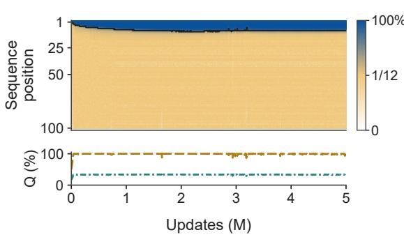  
(b)

$$
{ \cal S } _ { 4 } ,
$$

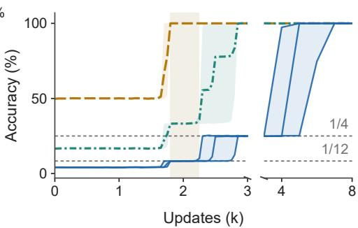

$$
--- C _ { 2 }
$$

$$
\cdots s _ { 3 }
$$

Figure S1: Quotient stages in the $S _ { 4 }$ comparison. (a) The long Transformer run retained in the main figure. (b) LSTM exact accuracy for individual seeds and quotient accuracy means with seed ranges. The horizontal scale changes at 3k updates, where dense replay gives way to the original logs. Beige shading marks the shared $\bar { 1 } / 1 2$ stage; dashed references give $\bar { 1 / 1 2 }$ and $1 { \dot { / } } 4$

The $S _ { 4 }$ comparison. We use the complete five-million-update Transformer log for seed 43. The four-layer, width-256 NeoX model uses four heads, full-group i.i.d. uniform inputs, training length 100, effective batch size 256, BF16 autocast, and AdamW with constant learning rate $5 \times \mathrm { 1 \bar { 0 } ^ { - 5 } }$ , no warmup or decay, zero weight decay, and gradient clipping at 1. Evaluations use 1,024 length-128 sequences at update 1 and every 5,000 updates thereafter. We retain all 1,001 evaluations without smoothing. The supplementary heatmap shows full-state accuracy at positions 1–100. Its black curve gives the longest contiguous prefix with exact accuracy at least .75, marking the last qualifying position. The color scale is linear separately on $[ 0 , 1 / 1 2 ]$ and [1/12, 1], assigning half the color range to each interval. The lower curves average $C _ { 2 }$ and $S _ { 3 }$ quotient accuracies over positions 17–100. Quotient correctness is measured by projecting the full-state argmax. The exact frontier never exceeds 10 and ends at 9, so this window stays outside it. The final logged quotient and conditional exact accuracies are 99.67% and 8.28%; the maximum $S _ { 3 }$ accuracy across the log is 34.05%. Table 18 uses a separate terminal evaluation with 8,192 sequences, so its last decimal places differ.

The other $S _ { 4 }$ logs, seeds 44 and 45, end at 2,410,000 and 965,000 updates after interrupted runs. Their last quotient accuracies are 99.97% and 100.00%, and conditional exact accuracies are 9.41% and 8.81%, respectively. We do not extrapolate these shorter records or pool them into a five-millionupdate seed range. The original $D _ { 4 }$ trajectory remains in Fig. S2a. The $S _ { 4 }$ Transformer and LSTM panels illustrate different learning outcomes; their schedules and numerical precision differ, so the comparison does not isolate architecture as the cause.

Resolving the $S _ { 4 } \mathbf { L S T M }$ stages. For seeds 42–44, Fig. S1b uses the existing dense replays through update 3,000, with evaluations every 50 updates, followed by the original logs at 1,000-update intervals through update 8,000. The replay uses the same training script, initialization/data seeds, recipe, FP32 precision, and 74,219-update learning-rate schedule; it stops at update 3,000. Both logs evaluate 1,024 sequences on the same window. Across every shared evaluation and all three channels, the largest absolute difference between replay and original accuracies is .000884. The display separates the two records at 3,000 updates and changes the horizontal scale there; it does not omit a time interval. Full-state curves retain individual seeds on both sides. Quotient curves are seed means, and bands are seed ranges. We interpolate only between recorded evaluations and apply no smoothing.

The $C _ { 2 }$ stage requires quotient accuracy at least .99 and exact accuracy within .05 of $1 / 1 2 .$ , at an evaluation preceding the run’s first exact accuracy of .90. Without this ordering condition the criterion would also score a late regression, in which a run that has already solved the task falls back toward the class-size baseline while its quotient readout stays accurate. No run in this replay window meets the criterion only after solving, so the count of 15 of 18 is the same with and without the condition. The stage spans updates 1,700–2,800, 1,800–2,250, and 1,800–2,450 for seeds 42, 43, and 44, respectively, containing 23, 10, and 14 dense evaluations. The beige interval is their intersection, 1,800–2,250, rather than their union. The original 1,000-update grid samples each stage only once, at update 2,000.

The separate 2,048-sequence coset census used for the 15-of-18 count (App. N) gives slightly different boundary evaluations from the 1,024-sequence accuracy replay above. In that census, the fifteen stages differ widely in duration. On the 50-update grid they span 50 to 1,050 updates, with a median of 200, and contain 2 to 22 evaluations, with a median of 5. Four rest on two evaluations: $A _ { 4 }$ at $5 \times 1 0 ^ { - 5 }$ seed 44, $D _ { 4 }$ at $1 0 ^ { - 3 }$ seeds 43 and 44, and $S _ { 4 }$ at $1 0 ^ { - 3 }$ seed 43. The 1,000-update grid of the main training logs places at most one evaluation inside any of the fifteen, and none inside nine of them, so that grid cannot resolve a stage even where one is present. We therefore report stage widths rather than requiring a minimum duration. The denser display makes these transient stages visible without averaging their different departure times into a single full-state curve. These readouts do not establish within-class softmax uniformity during the transient stages.

Panel letters below refer to Fig. S2.

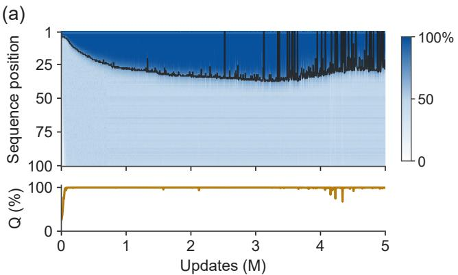

(b)  
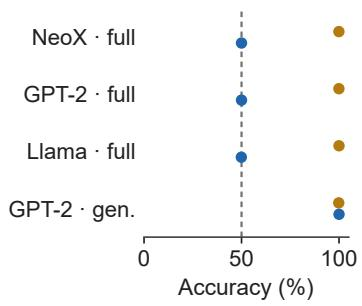

(c)  
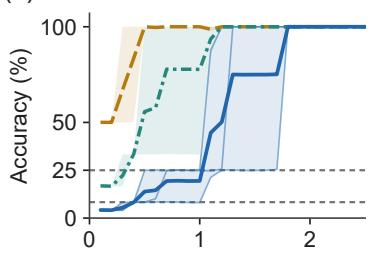

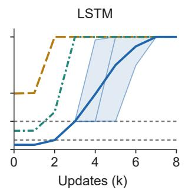

$$
--- C _ { 2 }
$$

$$
\cdots s _ { 3 }
$$

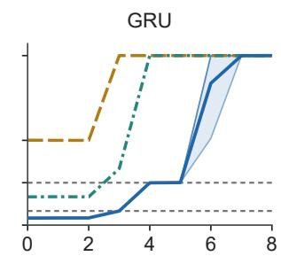

Figure S2: Additional training and architecture comparisons. (a) The original $D _ { 4 }$ long-training display. (b) $D _ { 4 }$ endpoints at positions 70–100: quotient accuracy and exact accuracy conditional on a correct quotient, under different budgets and recipes. (c) Original $S _ { 4 }$ trajectories for a bilinear RNN (TC/RNN), LSTM, and GRU. Lines and bands show means and ranges across three seeds; thin blue lines retain individual full-state runs. TC/RNN selects the most probable class after summing its members’ probabilities; LSTM and GRU project the full-state argmax.

Each panel reports a distinct experiment. In panel (a), the four-layer, width-256 NeoX model uses full-alphabet i.i.d. $D _ { 4 }$ inputs, batch size 256, training length 100, and a constant learning rate $5 \times 1 0 ^ { - 5 }$ without warmup or decay. Seed 45 is evaluated at step 1 and every 5,000 updates thereafter, with 1,024 evaluation sequences per log entry. The heatmap shows positions 1–100. Its contiguous-prefix curve is a descriptive readout, not a fitted growth law; a low-accuracy hole at an earlier position can reduce that prefix even when later positions remain accurate. The lower trace averages quotient accuracy over positions 17–100.

Panel (b) uses 8,192 sequences per terminal evaluation and fixes the window to positions 70–100 in every row. The baseline recipe (A in Table 7) has four layers, width 256, batch size 256, AdamW at $5 \times 1 0 ^ { - 5 }$ , and linear learning-rate decay without warmup; raw weights are evaluated. The Liu replication recipe (B) uses a three-layer, width-512 GPT-2, batch size 16, sinusoidal positional embeddings, AdamW initially at $1 0 ^ { - \bar { 4 } }$ , and a plateau scheduler; EMA weights are evaluated. The full-alphabet GPT-2 in recipe A instead uses learned positional embeddings. See App. H for the full model specifications. Thus the two GPT-2 rows are not an isolated input-alphabet ablation.

For each run, the evaluator projects the full argmax onto the quotient, so exact correctness implies quotient correctness. We sum the exact and quotient correct counts over the window, take their ratio, and then average these per-run ratios over seeds. The bars are observed seed ranges, not confidence intervals or temporal variability. The main panel retains both existing NeoX seeds at the 148,438-update budget (43 and 44), and all three seeds (42–44) in each other displayed condition, without an accuracy threshold. Conditions were selected after inspecting results; the panel is not an exhaustive success-rate estimate. The generator endpoints reach full-state accuracy. Terminal evaluations exist for all three generator seeds, but complete local training logs are available only for seed 42; the endpoint summary does not establish temporal stability for all three.

<table><tr><td>Model</td><td>Input / recipe</td><td>Updates</td><td>Seeds</td><td>Q (%)</td><td>Full | Q (%)</td></tr><tr><td>NeoX</td><td>full / A</td><td>74,219</td><td>3</td><td>81.727</td><td>50.043</td></tr><tr><td>NeoX</td><td>full / A</td><td>148,438</td><td>2</td><td>99.932</td><td>49.987</td></tr><tr><td>GPT-2</td><td>full / A</td><td>74,219</td><td>3</td><td>99.945</td><td>49.990</td></tr><tr><td>Llama</td><td>full / A</td><td>74,219</td><td>3</td><td>99.990</td><td>49.902</td></tr><tr><td>NeoX</td><td>gen. / A</td><td>74,219</td><td>3</td><td>72.575</td><td>50.015</td></tr><tr><td>GPT-2</td><td>full / B</td><td>312,500</td><td>3</td><td>94.214</td><td>49.959</td></tr><tr><td>GPT-2</td><td>gen. / B</td><td>312,500</td><td>3</td><td>99.857</td><td>99.999</td></tr></table>

Table 7: All 20 available candidate endpoints considered for Fig. S2b, grouped by condition and budget. Entries are seed means on positions 70–100. Shorter budgets and partial quotient channels are retained. The table uses the same evaluator and per-run ratio as the main panel; budgets are not pooled.

Panel (c) uses the original $S _ { 4 }$ logs for seeds 42–44 in each recurrent family. The TC bilinear RNN uses fixed 64-dimensional input encodings, hidden dimension 128, batch size 256, Adam at $1 0 ^ { - 3 }$ and 20,000 updates. LSTM (two layers, width 444) and GRU (two layers, width 512) use the matched baseline recipe at $5 \times 1 0 ^ { - 5 }$ , with learned embeddings and 74,219 updates, evaluated in FP32 every 1,000 updates. All plotted metrics average positions 17–100. The display ends at 2,500 updates for TC and 8,000 for LSTM/GRU; full-state accuracy remains at least 99% at all subsequent logged evaluations in these nine runs. TC quotient readouts sum candidate probabilities within each coset before taking the argmax, whereas LSTM/GRU project the full argmax. Their quotient accuracies are therefore different readouts, and the conditional ratio in panel (b) is not applied to TC. The runs in Fig. S2c use only their original logs.

For $S _ { 4 }$ , the two displayed quotient images are $S _ { 4 } / [ S _ { 4 } , S _ { 4 } ] \cong C _ { 2 }$ and $S _ { 4 } / V _ { 4 } \cong S _ { 3 } ,$ with kernel sizes 12 and 4. The reference floors are consequently $1 / 1 2$ and $1 / 4$ . Acquisition times vary: TC seed 44 has no resolved $C _ { 2 } .$ -only stage on its recorded grid. A mean curve can blur or interpolate the individual plateaus, which is why individual full-state curves and seed ranges are retained. These accuracy trajectories alone do not establish per-sample softmax uniformity at the transient stages.

## E ADDITIONAL CURVES UNDER THEIR ORIGINAL EXPERIMENTAL SETUPS

These supporting plots retain their original data and setup-specific captions. They are separate from the matched final checkpoints in Figs. 2 and S9. The run-level law plot retains the original census, including incomplete quotient channels; it is distinct from the selected endpoints in Table 6. Figure S3 shows how the quotient and exact channels separate over training and compares the original run-level plateaus with the class-size prediction. Figure S4 connects an intermediate quotient to the loss of within-class predictive gain beyond the frontier. Figure S5 shows how depth changes tracking on generator inputs and how accuracy deteriorates beyond the training horizon.

(a)  
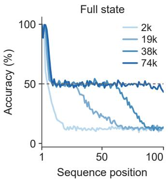

(b)  
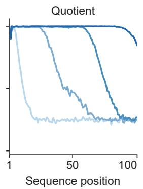

(c)  
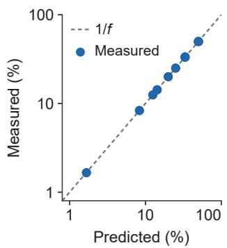  
Figure S3: (a, b) Accuracy against position for $D _ { 4 }$ under recipe A at four checkpoints (2k, 19k, 38k and 74k steps), for the exact channel (a) and the quotient channel (b). The dashed line in the exact panel is $1 / | [ G , G ] |$ . The quotient channel becomes accurate throughout the horizon as training proceeds, while the exact channel advances only a few positions. (c) The measured plateau against $\operatorname { \bar { 1 } } / | [ G , G ] |$ for every run in the original census with a recorded quotient readout; the updated $S _ { 3 }$ evaluations in Table 1 are not included. Both axes in (c) are logarithmic and report percentages; the diagonal is the reference prediction, with no fitted parameters.

(a)  
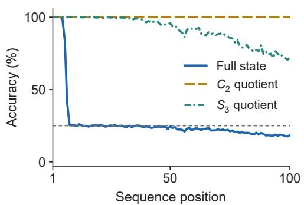

(b)  
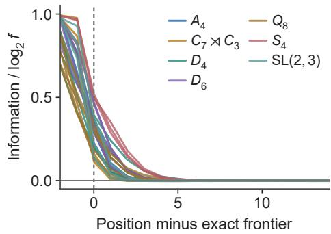  
Figure S4: (a) A run that stops at an intermediate quotient. On $S _ { 4 }$ under narrowed support, the $S _ { 3 }$ -image accuracy is near 100% through position 20 and falls to 72% at position 100, while the exact frontier is 6. The residual inside the corresponding normal subgroup sits at $1 / | V _ { 4 } |$ . (b) Decrease in within-fiber information near the exact frontier. Each curve is one of 28 checkpoints and plots $\Delta \mathrm { L L } / \log _ { 2 } f .$ , with $\Delta \mathrm { L L }$ defined in App. K. Curves are aligned so that zero denotes the first position after the contiguous exact prefix. Values near zero indicate no mean log-score gain over uniform prediction.

## F COMPUTING THE ORDER-BLIND CEILING

Proposition 1 bounds the exact accuracy of every order-blind model by $C _ { t } = \mathbb { E } _ { M } [ \operatorname* { m a x } _ { g } \operatorname* { P r } ( q _ { t } = g \ |$ $M ) \bar { ] }$ . Here the numerical calculations use finite groups and independent uniform full-group inputs. We compute or estimate $C _ { t }$ while enumerating each multiset’s orderings exactly. Write $D _ { M }$ for the law of the product of a uniformly random ordering of the multiset M. Removing the last factor gives the recursion $\begin{array} { r } { D _ { M } ( g ) = \sum _ { x } ^ { } \frac { m _ { x } } { | M | } D _ { M - x } ( g x ^ { - 1 } ) } \end{array}$ ). We run this recursion over all multisets of size t in increasing t, weighting each M by its multinomial probability. For $S _ { 3 } , D _ { 4 }$ and $Q _ { 8 }$ this is exact over multisets and over orderings through $t = 1 7$ . For $D _ { 5 }$ it is exact through $t = 1 4 ;$ for $D _ { 6 }$ $\mathrm { D i c _ { 3 } }$ and $A _ { 4 }$ through $t = 1 2 { \mathrm { : } }$ ; for $C _ { 7 } \mathrm { { \times } } \mathrm { { \bar { C } } _ { 3 } , \mathrm { { S L } ( \bar { 2 } , 3 ) } }$ and $S _ { 4 }$ through $t = 8$ . Beyond those lengths the number of multisets is too large to enumerate, and at $t = 1 7$ we run the same exact recursion over the sub-multisets of each of 100 sampled multisets and report the mean with its standard error. This

(a)  
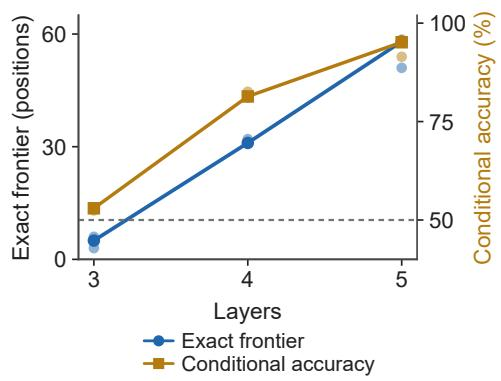

(b)  
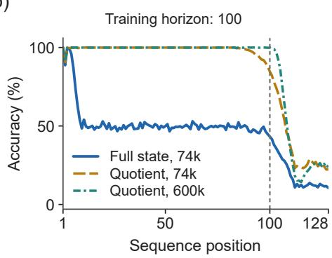  
Figure S5: (a) On the generator stream (recipe B, NeoX backbone with rotary embeddings) additional depth extends the exact frontier and improves conditional accuracy; the dashed line is $1 / | [ G , G ] |$ for $D _ { 4 } .$ (b) Past the training horizon of 100 positions both exact and quotient accuracy decline.

mean is an unbiased estimate of $C _ { t }$ (an estimator that samples orderings would be biased upward by the maximum). The enumerator carries a brute-force self-test against all $| G | ^ { t }$ sequences at small t. Table 8 lists the excess $C _ { t } - 1 / | [ G , G ] |$ and the probability mass of multisets whose orderings do not cover the whole coset. This mass is positive at every finite t for the non-abelian groups considered, as shown by the all-identity multiset. The enumeration quantifies its finite-length contribution.
<table><tr><td> $G$ </td><td>f</td><td> $t = 3$ </td><td> $t = 4$ </td><td> $t = 8$ </td><td> $t = 1 2$ </td><td> $t = 1 7$ </td><td>non-sweep mass</td></tr><tr><td> $S _ { 3 }$ </td><td>3</td><td>0.3009</td><td>0.2130</td><td>0.0516</td><td>0.0120</td><td>0.0019</td><td> $8 . 4 \mathrm { e } { - } 0 6 ( t = 1 7 )$ </td></tr><tr><td> $D _ { 4 }$ </td><td>2</td><td>0.2188</td><td>0.1484</td><td>0.0323</td><td>0.0070</td><td>0.0010</td><td> $2 . 3 \mathrm { e } { - } 0 5 ( t = 1 7 )$ </td></tr><tr><td> $Q _ { 8 }$ </td><td>2</td><td>0.2188</td><td>0.1484</td><td>0.0323</td><td>0.0070</td><td>0.0010</td><td> $2 . 3 \mathrm { e } { - } 0 5 ( t = 1 7 )$ </td></tr><tr><td> $D _ { 6 }$ </td><td>3</td><td>0.3009</td><td>0.2130</td><td>0.0516</td><td>0.0120</td><td> $0 . 0 0 2 7 { \scriptstyle \pm 6 . 8 \mathrm { e } - 0 4 }$ </td><td> $3 . 9 \mathrm { e } { - } 0 4 \left( t = 1 2 \right)$ </td></tr><tr><td> $\mathrm { D i c } _ { 3 }$ </td><td>3</td><td>0.3009</td><td>0.2130</td><td>0.0516</td><td>0.0120</td><td> $0 . 0 0 3 1 { \scriptstyle \pm 9 . 4 \mathrm { e } - 0 4 }$ </td><td> $3 . 9 \mathrm { e } { - } 0 4 \left( t = 1 2 \right)$ </td></tr><tr><td> $A _ { 4 }$ </td><td>4</td><td>0.2500</td><td>0.1568</td><td>0.0200</td><td>0.0023</td><td> $1 . 6 \mathrm { e } { - } 0 4 { \pm } 5 . 2 \mathrm { e } { - } 0 5$ </td><td> $1 . 1 \mathrm { e } { - } 0 5 \ : ( t = 1 2 )$ </td></tr><tr><td> $D _ { 5 }$ </td><td>5</td><td>0.3500</td><td>0.2480</td><td>0.0614</td><td>0.0142</td><td> $0 . 0 0 2 1 { \scriptstyle \pm 3 . 6 \mathrm { e } } { \cdot 0 } 4$ </td><td> $6 . 7 \mathrm { e } { - } 0 5 ( t = 1 4 )$ </td></tr><tr><td> $C _ { 7 } { \rtimes } C _ { 3 }$ </td><td>7</td><td>0.2902</td><td>0.1799</td><td>0.0244</td><td></td><td> $1 . 5 \mathrm { e } \mathrm { - } 0 4 { \pm } 1 . 8 \mathrm { e } \mathrm { - } 0 5$ </td><td> $1 . 2 { \mathrm { e } } { \cdot } 0 3 \left( t = 8 \right)$ </td></tr><tr><td> $\operatorname { S L } ( 2 , 3 )$ </td><td>8</td><td>0.3507</td><td>0.2457</td><td>0.0550</td><td>一</td><td> $0 . 0 0 2 0 { \scriptstyle \pm 3 . 5 \mathrm { e } - 0 4 }$ </td><td> $1 . 9 \mathrm { e } \mathrm { - } 0 2 \left( t = 8 \right)$ </td></tr><tr><td> $S _ { 4 }$ </td><td>12</td><td>0.3244</td><td>0.2066</td><td>0.0323</td><td>一</td><td> $7 . 1 \mathrm { e } { - } 0 4 { \pm } 2 . 7 \mathrm { e } { - } 0 4$ </td><td> $1 . 7 \mathrm { e } { - } 0 2 ( t = 8 )$ </td></tr></table>

Table 8: Excess of the exact order-blind ceiling over $1 / | [ G , G ] |$ , by prefix length. Entries at $t = 1 7$ with a standard error are Monte Carlo over 100 multisets with exact orderings; all other entries are exact over all multisets. The last column is the probability mass of multisets whose orderings do not sweep their coset, at the largest exactly enumerated length.

## G RECOVERING CENTRAL COORDINATES

We now investigate how models recover state distinctions beyond the abelianization. Prior work shows that models can reach exact state tracking when updates are drawn from a small generating set rather than uniformly from the full group (Liu et al., 2023; Li et al., 2025). We therefore use generator-restricted inputs to study how models refine quotient-level solutions. The prediction task remains unchanged: at every position, the model predicts the running product. These input sets are different from the full-group baseline in Sec. 3.

A finite-group example. On $D _ { 4 }$ , let r denote a quarter-turn and s a reflection. With inputs restricted to $\{ r , s \}$ , three parities determine the full state: the total number of r tokens, the total number of s tokens, and the number of r tokens at even input positions. For example, rs and sr contain the same tokens but place r at different position parities and produce different states. We recover these counts with probes and test their contributions through activation replacement (App. O, Eq. 12). We next study a task requiring finer order information than these parity counts.

## G.1 TRACKING BEYOND ODD/EVEN COUNTS

We use the integer Heisenberg group $H _ { 3 } ( \mathbb { Z } )$ , whose multiplication is

$$
( x , y , z ) ( u , v , w ) = ( x + u , y + v , z + w + x v ) .
$$

Each input $g _ { i } = ( u _ { i } , v _ { i } , 0 )$ is one of $a = ( 1 , 0 , 0 ) , a ^ { - 1 } = ( - 1 , 0 , 0 ) , b = ( 0 , 1 , 0 ) , \mathrm { o r } b ^ { - 1 } = $ $( 0 , - 1 , \bar { 0 } )$ . Starting from $( 0 , 0 , 0 )$ , write the running product as $( \dot { X } _ { t } , Y _ { t } , Z _ { t } )$ . The first two coordinates are the net counts of a and b and give the abelianization, while $Z _ { t }$ retains input order. For example, $a ^ { 4 } b ^ { 4 }$ and $b ^ { 4 } a ^ { 4 }$ have identical token counts at both odd and even positions, but give (4, 4, 16) and (4, 4, 0) respectively.

To test whether Transformers distinguish such products, we train three four-layer models at learning rate $1 0 ^ { - 3 }$ . We predict x, y, and z with separate classification heads and minimize the sum of their cross-entropies at every position. We find models reach 98.07–98.17% joint state accuracy (all three coordinates correct) over positions 17–100, and 92.81–93.74% at position 100. For separate, coordinate-controlled pairs that preserve odd/even token counts while changing $z ,$ both predictions are correct in 96.9% of pairs, averaged over seeds. We thus conclude that these models distinguish products that knowing odd/even counts alone cannot resolve (App. P).

Ordered prefix counts. We use the group update to identify information needed for z prediction. Multiplying by $( u _ { i } , v _ { i } , 0 )$ adds $u _ { i }$ to $X , v _ { i }$ to $Y$ , and $X _ { i - 1 } v _ { i }$ to $Z .$ . Summing these updates gives

$$
X _ { t } = \sum _ { i \leq t } u _ { i } , \qquad Y _ { t } = \sum _ { i \leq t } v _ { i } , \qquad Z _ { t } = \sum _ { i \leq t } X _ { i - 1 } v _ { i } .\tag{10}
$$

For example, aa gives (2, 0, 0), multiplying by b gives $a a b = ( 2 , 1 , 2 )$ , whereas appending $b ^ { - 1 }$ gives $( 2 , - 1 , - \bar { 2 } )$ . Thus a changes the count that a later b or $b ^ { - 1 }$ uses to update $Z _ { t }$

We first test whether the running count $X _ { t }$ is represented in the model. A single linear readout per model recovers $X _ { t }$ across sampled positions 16–100 from normalized second-block outputs, with $R ^ { 2 } = . 9 9 4$ –.999. Subtracting the known current increment $u _ { t }$ gives the preceding count $\dot { X } _ { t - 1 }$ used in the update of $Z _ { t } ( { \mathrm { A p p . } } \mathrm { P . } 4 )$ .

Next, we ask whether count-associated activations influence predictions of the central coordinate. At position $j ,$ we regress the concatenated outputs of the first-layer attention heads on $X _ { j - 1 } , Y _ { j } , Z _ { j }$ the total count of a and $a ^ { - 1 }$ , and the current token. The fitted coefficient $\beta _ { x }$ is the activation-space direction associated with a one-unit increase in the preceding net a-count after controlling for the other predictors. On held-out inputs, we replace $h _ { j }$ by $h _ { j } + \delta \bar { \beta } _ { x }$ , leave the tokens and model weights unchanged, and run the rest of the network. We then compare the predicted mean z with and without the perturbation (App. P.5).

Figure S6a shows the change in predicted mean $z ,$ divided by δ, for each current token. We find positive effects at b and negative effects at $b ^ { - 1 }$ , consistent with $v _ { i }$ in Eq. 10. Mean responses at $a ^ { \pm 1 }$ remain closer to zero (App. P.5).

Since we have shown that perturbing count-associated activations at one position changes the predicted $z ,$ we next ask whether the same perturbation at two positions with $b ^ { \pm 1 }$ has additive effects, corresponding to the last identity in Eq. 10. For example, if the two individual interventions change the prediction ${ \bf b y } + 2 . 0 \ \mathrm { a n d } + 1 . { \dot { 8 } } .$ , additivity will imply a joint prediction change of +3.8. Figure S6b compares this predicted sum with the measured joint change. The 18 paired effects broadly follow the additivity line, with a maximum deviation of .30 units of z. The individual responses vary across positions and models, so mixed $b , b ^ { - 1 }$ pairs need not cancel. This comparison tests whether measured effects add; the fitted perturbations need not have unit gain.

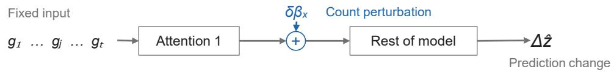

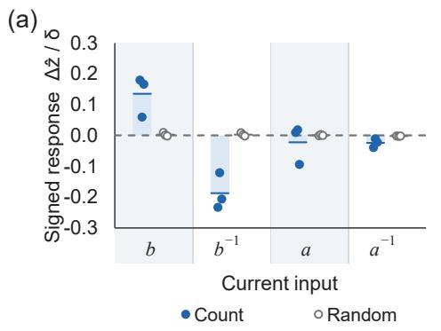

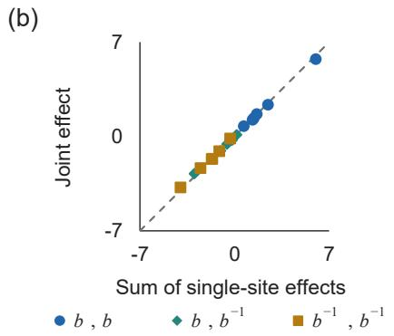  
Figure S6: Prefix-count perturbations have signed, approximately additive effects. Three $\bar { H _ { 3 } } ( \mathbb { Z } )$ models trained at $1 \bar { 0 } ^ { - 3 }$ . Here $\Delta \hat { z }$ is the change in predicted mean z. (a) Responses per unit perturbation at position $6 4 ,$ , averaged over outputs at positions 64, 72, 96, and 100. Filled dots show seeds, bars their mean, and open dots random-direction controls. (b) Joint effects versus summed single-site effects, with $\delta = + 4$ at both sites. Each of 18 points is a mean over test words for one seed, token pattern, and pair type; the diagonal denotes additivity. Directions are fitted globally in (a), by position and pattern in (b) (App. P.5).

## H CONFIGURATIONS

Recipe A. GPT-NeoX causal transformer (Black et al., 2022), 4 layers, width 256, 4 heads, rotary position embedding (Su et al., 2024) on a quarter of each head, 3,163,648 parameters; token alphabet is the whole group; training length 100; AdamW (Loshchilov and Hutter, 2019), learning rate $5 \times 1 0 ^ { - 5 }$ , weight decay $0 ,$ linear decay to zero with no warmup, batch 256, 74,219 steps, bf16, no dropout, no weight averaging. Evaluation every 1,000 steps on $\bar { 1 } { , } 0 2 4$ sequences of length 128; final evaluation on 8,192 sequences at seed 248041 (16,384 for the $S _ { 5 }$ anchor). Seeds 42, 43, 44 unless stated. The constant-learning-rate arms of $\ S 5$ keep the recipe and hold the rate at $5 \times 1 0 ^ { - 5 }$ for 600k steps, with one historical $D _ { 4 }$ trajectory and four additional runs continued to 5M updates (App. N). The doubled-budget cells of Table 1 run the same recipe for 148,438 steps. Settlement window: positions 17–100.

Recipe B. Replication of Liu et al. (2023), App. B: GPT-2 block with fixed sinusoidal position embeddings and a separate linear state head, 3 layers (4 in one arm), width 512, 8 heads, MLP width 512, dropout .1; training length 100, evaluation length 128; AdamW at $1 0 ^ { - 4 }$ (their grid is $\{ 3 \times 1 0 ^ { - 5 } , \dot { 1 } 0 ^ { - 4 } , 3 \times 1 0 ^ { - 4 } \} )$ , weight decay $1 0 ^ { - 4 }$ , batch 16, 5M sequences (312,500 steps), $\mathrm { f p } 3 2$ , gradient clip 1, weights evaluated through an exponential moving average with decay .9; we implement the incompletely specified patience scheduler with ReduceLROnPlateau (factor .5, patience 6 evaluations of 5,000 steps) on the EMA all-position accuracy. Token alphabet is the generator set $\{ r , s \}$ in the generator-input runs, the full group in the full-alphabet comparison, and a union of complete cosets in the support-axis and ladder arms $( [ G , G ]$ -cosets throughout, except the C -cosets of $C _ { 9 } )$ . Settlement window: positions 9–100, with frontier thresholds as in recipe A.

Comparison C. The architecture and training settings of recipe B on the full alphabet of $D _ { 4 } ,$ , in four cells: GPT-2 or GPT-NeoX block, with fixed sinusoidal position embeddings or full-head rotary embeddings and no additive position embedding; 312,500 steps, 8,192-sequence final evaluation, three seeds per cell.

Recurrent control. A weight-shared bilinear recurrence $z _ { t } = u _ { t } / ( 1 + \mathrm { R M S } ( u _ { t } ) )$ with $u _ { t } ~ =$ $( z _ { t - 1 } W _ { z } ) \odot ( \varphi ( x _ { t } ) W _ { x } )$ , state dimension $1 2 8 , \varphi$ a frozen random orthonormal encoding of dimension 64 (32 for $D _ { 9 }$ and $S _ { 3 } \times C _ { 3 }$ , whose runs predate the wider groups), linear readout to G and to each intermediate quotient (coset probabilities summed before the argmax); Adam at $1 0 ^ { - 3 }$ , gradient clip 1, batch 256, training length 100, full-alphabet i.i.d. inputs, 20k steps, evaluation every 100 steps to step 2,000 and every 500 thereafter on 1,024 sequences, final evaluation on 8,192 sequences; groups $D _ { 8 }$ $Q _ { 1 6 } , S _ { 4 } , D _ { 1 5 } , D _ { 2 7 } , C _ { 9 } , D _ { 9 } , S _ { 3 } \times C _ { 3 } , D _ { 2 1 } , D _ { 2 5 } ;$ seeds 42, 43, 44 in the confirmatory round. The frequency battery adds ten seeds per group at a 5k-step budget (a truncation whose class agrees with the full history in 30 of 30 earlier runs) and a $\phantom { - } 1 2 \times 2$ crossing of initialization seed against data seed on $D _ { 9 }$ and $D _ { 2 7 }$ at 20k steps. A stage is recorded when some quotient’s accuracy over positions 17–100 reaches .95 while exact accuracy is at most .5. Its accuracy is checked against $1 / | N |$ for the kernel N of the quotients reached, within ±.04.

160M depth ladder. GPT-NeoX/Pythia-160M architecture (hidden 768, 12 heads, MLP 3072, rotary on a quarter of each head, parallel residual, untied embeddings, vocabulary 50283 after the released resize) at 3, 4, 7 and 12 blocks (98.5M, 105.6M, 126.9M and 162.3M parameters); for each seed one 12-block master is initialized from scratch and every shallower model is its exact block-prefix, with shared components checked by hash across depths; $S _ { 3 } , { \mathrm { i . i . d . } }$ . uniform over all six elements, length 100, cross-entropy at every prefix; fp32, AdamW at $5 \times 1 0 ^ { - 5 }$ , weight decay 0, no warmup, linear-decay horizon 148,440, gradient clip 1, micro-batch 32 with accumulation 4, 10,000 steps; evaluation on 1,024 fixed sequences (seed 248041) every 500 steps with exact and parity frontiers defined as the first position below .98; formal seeds 2901–2908, bridge seeds 42–44 reported separately.

$S _ { 5 }$ depth census. The recipe A architecture at 4, 8 and 12 layers (width 256, 4 heads), $S _ { 5 }$ full alphabet, training length 100 and evaluation length 200, fp32 master weights with bf16 autocast, effective batch 256, 74,219 steps with linear decay; 36 paired (initialization, data-order) seed pairs reused across depths; evaluation on $4 { , } 0 9 6$ fixed sequences every 1,000 steps. A run is parity-first when its parity frontier (first position below .98) is at least 20 and at least 20 positions ahead of the exact frontier. A run is associative-like when the exact frontier is at least 20 and the two frontiers are within 5 of each other.

Pythia-160M arms. We train from scratch under the recipe of Li et al. (2025) for $S _ { 3 }$ on the Pythia-160M architecture, using AdamW at $5 \times 1 0 ^ { - 5 }$ , their schedule and batch size, and fp32. We run three seeds from scratch and one from the pretrained checkpoint, and classify the outcomes at 10k steps using their cutoff rule. Sequences are sampled online, i.i.d. uniform, which matches the distribution of their released data (1M sequences, 900k for training) but not its repetition over 20 epochs. The within-fiber entropy, coset mass and orbit statistics of §3.3 and App. Q are read on the one from-scratch seed that entered the parity-first regime.

Looped transformer (one-seed pilot). Two shared pre-norm GELU transformer blocks applied for L loops, with no position encoding of any kind, width 128, 4 heads, MLP width 512, no dropout, 398,848 parameters; $D _ { 4 }$ full alphabet, curriculum over lengths 2, 4, 8 and 16 with loop count equal to length and stage caps of 500, 1,000, 1,500 and 3,000 steps; AdamW at $3 \times 1 0 ^ { - 4 }$ , weight decay .01, gradient clip 1, batch 128, bf16; evaluation at lengths 16 and 32 for up to 40 loops on 2,048 sequences; seed 42. The run was classified as OTHER because no stage reached its .98 promotion threshold; it is excluded from the confirmatory evidence. The number of accurate positions increased by about one per loop, with position 2 a persistent error. No region was both correct on the quotient and flat inside the fiber.

Expert-split MLP (one-seed pilots). A function-preserving split of each recipe A MLP into two routed halves. Continued from the 148,438-step $D _ { 4 }$ seed-43 weights for 20k steps against a dense continuation, both arms have frontier 6 and conditional accuracy .498. Trained from scratch at horizon 40 for 40k steps against a dense twin, the respective frontiers are 11 and 6, while conditional accuracy over positions 17–40 is .502–.505. These pilots are excluded from the confirmatory comparisons. A learned mixture-of-experts readout and a split readout, both trained on the frozen weights, achieve .500–.506 at positions 40, 70 and 100.

Pythia-70M prelude (exploratory). Two arms were run at 10k steps on $S _ { 3 }$ with the recipe above. From scratch, exact and parity accuracy first fall below .98 at positions 9 and 91 (a quotient-first run). From the pretrained checkpoint, both fall at position 8, with parity accuracy .529 over positions 8–100. This run retains only a short accurate prefix.

## I COVERAGE OF ARCHITECTURES AND TRAINING SUPPORTS

The tables below catalog the experimental packages underlying this draft. “Completed” denotes a package evaluated under its fixed criteria, not asymptotic convergence. Pilot and exploratory results document coverage and are excluded from the confirmatory comparisons. The matched two-layer LSTM and GRU studies include 18 runs each on $D _ { 4 } , A _ { 4 } .$ , and $S _ { 4 }$ . The Mamba-2 study adds 18 two-layer runs on these groups and three four-layer $D _ { 4 }$ runs (App. N.1). No Markov-input or powerlaw-input results are included here. The repeated-epoch run with the released $S _ { 5 }$ pipeline remained at chance under bf16 and is excluded from the mechanism comparison; the 160M experiments reported here sample inputs online.

The additional five-million-update runs are listed in App. N; the three integer Heisenberg models and their probe/intervention coverage are specified in App. P.

Table 9: Architecture coverage, part 1 of 3. Status refers to the evaluation package; completed packages need not reach full tracking. All listed outcomes and seed counts are retained.
<table><tr><td>Architecture</td><td>Recipe / measure</td><td>Groups; seeds</td><td>Outcome</td><td>Status; location</td></tr><tr><td>GPT-NeoX 4L, d=256, 4 heads, quarter rotary (recipe A)</td><td>A; full alphabet</td><td>13 groups; 3</td><td>plateau law</td><td>completed; §3</td></tr><tr><td>Recipe A at 2 and 6 layers</td><td>A; full alphabet</td><td> $D _ { 4 } ; 3 + 3$ </td><td>ratio .4986–.5034; frontier 2–3 at two</td><td>completed; §5</td></tr><tr><td>Recipe A at 2/3/5/6 layers, widths 364/296/228/208 (parameter-matched) and 256</td><td>A; full alphabet</td><td> $D _ { 4 } ; 3$  each</td><td>layers, 5–12 at six ratio .4991–.5017, frontier 3–8, no escape</td><td>completed; §5</td></tr><tr><td>(shared grid) Recipe A at 2 and 6 layers, and at the doubled budget</td><td> $\mathbf { A } ;$  full alphabet</td><td> $A _ { 4 } ,$   $\mathrm { { S L } } ( 2 , 3 ) ;$   $3 \mathrm { e a c h }$ </td><td>ratio  $1 / f \pm . 0 0 1 1 ;$  frontier +3/+5 on  $A _ { 4 } , + 2 / + 1 \mathrm { o n }$ </td><td>completed; §5</td></tr><tr><td>Recipe A at 4, 8, 12 layers</td><td>A; full alphabet</td><td> $S _ { 5 } ; 3 6$  pairs</td><td> $\operatorname { S L } ( 2 , 3 )$  parity-first or no progress; 0 of 36</td><td>completed; §5</td></tr><tr><td>Recipe A at d=512, 8 heads</td><td>A; full alphabet</td><td> $D _ { 4 } ; 3$ </td><td>associative plateau, ratio</td><td>completed; §5</td></tr><tr><td>Recipe A + sinusoidal absolute PE</td><td>A; full alphabet</td><td> $D _ { 4 } ; 3$ </td><td>.4998–.5013 slower quotient, ratio .4995–.5011</td><td>completed; §5</td></tr><tr><td>Recipe A backbone under recipe B optimizer  $( 1 0 ^ { - 4 } ;$ </td><td>full alphabet</td><td> $D _ { 4 } ; 3 + 3$ </td><td>plateau (.499–.500); collapse to uniform</td><td>completed; App. O</td></tr><tr><td> $3 \times \mathrm { \hat { 1 0 } ^ { - 4 } } \mathrm { \hat { ) } }$  GPT-2 block, learned absolute PE, 4L/256</td><td>A; full alphabet</td><td> $D _ { 4 } ; 3$ </td><td>frontier 15–24, ratio</td><td>completed; §5</td></tr><tr><td>Llama block (full rotary, SwiGLU, RMSNorm), 4L/256</td><td>A; full alphabet</td><td> $D _ { 4 } ; 3$ </td><td>.4993-.5008 frontier 18–20, ratio .4977–.4997</td><td>completed; §5</td></tr></table>

Table 10: Architecture coverage, part 2 of 3. Status refers to the evaluation package; completed packages need not reach full tracking. All listed outcomes and seed counts are retained.
<table><tr><td>Architecture</td><td>Recipe / measure</td><td>Groups; seeds</td><td>Outcome</td><td>Status; location</td></tr><tr><td>NeoX 4L/256, no position embedding</td><td>A; full alphabet</td><td> $D _ { 4 } ; 1$ </td><td>frontier 5, quotient unfinished, ratio .5002</td><td>completed; §5</td></tr><tr><td>Recipe A on the generator stream</td><td> $\operatorname { A } ; \{ r , s \}$ </td><td> $D _ { 4 } ; 3$ </td><td>plateau, ratio .499–.516</td><td>completed; App. O</td></tr><tr><td>GPT-2 sinusoidal 3L, d=512, 8 heads (recipe B)</td><td> $\operatorname { L i u } ; \{ r , s \}$ </td><td> $D _ { 4 } ; 3 ( + 1$  at depth 4, +1 at  $3 \times 1 0 ^ { - 4 } )$ </td><td>escape 3/3; depth 4 escapes;  $3 \times \dot { 1 0 } ^ { - 4 }$  partial</td><td>completed; App. O</td></tr><tr><td>Recipe B minus PE; on full alphabet; with recipe A optimizer; MLP 2048</td><td>Liu / A block</td><td> $D _ { 4 } ; 3 \mathrm { e a c h }$ </td><td>chance; plateau 2/3; frozen frontier; escape</td><td>completed; App. O</td></tr><tr><td>GPT-2 rotary; NeoX sinusoidal; NeoX rotary, all 3L/512</td><td>Liu;  $\{ r , s \}$ </td><td> $D _ { 4 } ; 3$  each</td><td>escape 1 / partial 2 (ratio .82–.998); escape 1 / partial 2 (.86–.99); plateau</td><td>completed; NeoX-rotary cell in §5, the other two only</td></tr><tr><td>NeoX rotary 3L/512 at 4 and 5 layers</td><td>Liu;  $\{ r , s \}$ </td><td> $D _ { 4 } ; 3$  each</td><td>(.524–.532) ratio .814, .951; frontier 31–32, 51-58</td><td>here completed; §5</td></tr><tr><td rowspan="2">Comparison C: GPT-2 / NeoX × sinusoidal / rotary, 3L/512 Pythia-160M, 12 blocks</td><td>Liu; full alphabet</td><td> $D _ { 4 } ; 3$  each</td><td>plateau 10/12, partial 2/12, escape 0</td><td>completed; §3</td></tr><tr><td>Li; online</td><td> $S _ { 3 } ; 3$  scratch + 1</td><td>1 parity-first, 3 associative</td><td>completed; §3.3, App. Q</td></tr><tr><td>Pythia-160M architecture, 3/4/7/12 blocks, paired</td><td>Li; online</td><td>pretrained  $ { \bar { S } } _ { 3 } ; 8 ( + 3$  bridge)</td><td>frontier median 6.5/9/15/39; quotient</td><td>completed; §5</td></tr><tr><td>Pythia-70M</td><td>Li; online</td><td> $S _ { 3 } ; 1 + 1$ </td><td>7/5/7/7 of 8 quotient-first; stall</td><td>exploratory; not used</td></tr></table>

Table 11: Architecture coverage, part 3 of 3. Status refers to the evaluation package; completed packages need not reach full tracking. All listed outcomes and seed counts are retained.
<table><tr><td>Architecture</td><td>Recipe / measure</td><td>Groups; seeds</td><td>Outcome</td><td>Status; location</td></tr><tr><td>Looped transformer, 2 shared blocks, no position encoding, d=128</td><td>curriculum to 16</td><td> $D _ { 4 } ; 1$ </td><td>one position per loop; no quotient shelf</td><td>pilot; not used</td></tr><tr><td>Expert-split MLP; MoE readout Bilinear recurrence, state 128</td><td>A</td><td> $D _ { 4 } ; 1$  pair each</td><td>frontier 11 vs  $6 ;$  fiber .498-.506  $1 / | N \rrangle$  floors 13/13;</td><td>exploratory; not used completed; §5</td></tr><tr><td></td><td> $\mathrm { A d a m } 1 0 ^ { - 3 }$  ; full alphabet</td><td>10 groups;  $3 \ : ( + 1 0 )$ </td><td>acquired across positions in 16/16 amplitude sets</td><td></td></tr><tr><td>Two-layer polynomial net on group-Fourier input Pooled (order-blind by</td><td>6 configs, 30k Adam  $1 0 ^ { - 3 }$  , 20k</td><td> $D _ { 4 } ; 1$   $S _ { 3 } \times C _ { 3 } ; 1$ </td><td>learning order quotient only .40 at</td><td>exploratory; not used exploratory;</td></tr><tr><td>construction) MLP; pooled + recurrent sum</td><td></td><td></td><td>20k; registered ceiling test missed (gap .255)</td><td>not used</td></tr><tr><td>Two-layer LSTM, width 444 (parameter-matched to recipe A)</td><td> $\mathbf { A } ;$  full alphabet</td><td> $D _ { 4 } , A _ { 4 } ,$   $S _ { 4 } ; 3$  per  $\mathrm { a r m } , 2$  arms</td><td>escape 18/18; transient stages at 1/|N| levels</td><td>completed; §5</td></tr><tr><td>Two-layer GRU, width 512 (parameter-matched to recipe A)</td><td> $\mathbf { A } ;$  full alphabet</td><td> $D _ { 4 } , A _ { 4 } ,$   $S _ { 4 } ; 3 \mathrm { p e r }$   $\mathrm { a r m } , 2$  arms</td><td>escape 18/18; 1,000-step evaluation grid, no dense replay</td><td>completed; §5</td></tr><tr><td>Mamba-2, 2L/496, state 80 (parameter-matched)</td><td>Full alphabet; two learning rates; FP32</td><td> $D _ { 4 } , A _ { 4 } ,$   $S _ { 4 } ; 3 \mathrm { p e r }$  arm</td><td> $\mathrm { a t 1 0 ^ { - 3 } }$  , 6/9 resolve the quotient; conditional exact near  $1 / | N |$ </td><td>completed; App. N.1</td></tr><tr><td>Mamba-2, 4L/352, state 48 (parameter-matched)</td><td>Full alphabet;  $5 \times 1 0 ^ { - 5 } ; \mathrm { F P } 3 2$ </td><td> $D _ { 4 } ; 3$ </td><td>quotient  $9 8 . 8 2 \substack { - 9 9 . 9 7 \% } .$  conditional exact near  $1 / 2$  recipe B quarter-rotary arms;</td><td>completed; App. N.1</td></tr><tr><td>Not run or incomplete</td><td></td><td></td><td>parameter-matched recipe B depth arms (registered, running);  $Q _ { 8 }$  support attribution</td><td></td></tr></table>

Table 12: Training-support and encoding coverage, part 1 of 2. Outcomes refer to the listed recipes and budgets. Pilot and inconclusive results are retained.
<table><tr><td>Training support / encoding</td><td>Recipe</td><td>Groups; seeds</td><td>Outcome</td><td>Location</td></tr><tr><td>Full alphabet, i.i.d. uniform</td><td>A, C, LSTM, bilinear, 160M</td><td>all</td><td>quotient stages and  $\hat { 1 } / | N |$  levels</td><td>§3</td></tr><tr><td>Generator stream  $\{ r , s \} , \mathrm { i . i . d . }$ </td><td>B; A</td><td> $D _ { 4 } ; 3$  per arm</td><td>escape (B); plateau (A)</td><td> $\mathsf { A p p . O }$ </td></tr><tr><td>Two  $[ G , G ]$  -cosets of  $D _ { 4 } ,$   $\{ r K , s K \}$  , lift bias  $\dot { \varepsilon } \in \{ 0 , . 5 , . 9 , . 9 5 , . 9 9 \}$ </td><td>B</td><td> $D _ { 4 } ; 3 \mathrm { a t } \varepsilon { = } 0$  and .99, 1 otherwise</td><td>crawl or escape at  $\varepsilon { = } 0 ;$  the ε axis is retired as an</td><td> $\mathsf { A p p . O }$ </td></tr><tr><td>Three  $[ G , G ] \mathrm { - c o s e t s }$  of  $D _ { 4 }$ </td><td>B</td><td> $D _ { 4 } ; 3$ </td><td>explanatory variable flat, frontier 7–11</td><td> $\mathsf { A p p . O }$ </td></tr><tr><td>Two cosets of  $Q _ { 8 } , \{ i K , j K \} ;$ </td><td>B</td><td> $Q _ { 8 } ; 3 + 1$ </td><td>all crawl; baseline</td><td> $\mathsf { A p p . O }$ </td></tr><tr><td>matched full-support baseline Single reflection coset of  $D _ { 3 } ,$ </td><td>B</td><td>3,1,3</td><td>flat escape at  $_ { 3 ; }$  crawl at</td><td> $\mathsf { A p p . O }$ </td></tr><tr><td> $D _ { 5 } , D _ { 7 }$  Ladder supports: reflections of  $D _ { 9 } , D _ { 1 5 } , \bar { D } _ { 2 7 } ;$  odd</td><td>B</td><td>7 groups; 3 each</td><td>5,7 stages at intermediate</td><td>§3.4</td></tr><tr><td>permutations of  $S _ { 4 } ;$  two cosets of  $D _ { 8 } , Q _ { 1 6 } ;$  non-multiples of 3 in  $C _ { 9 }$ </td><td></td><td></td><td>quotients</td><td></td></tr><tr><td>Horizons 24, 48, 100; curriculum  $2 4 {  } 4 8 {  } 1 0 0 ;$  reverse continuation to 24</td><td>A</td><td> $D _ { 4 } ; 3 , 3 , 3 ; 2$ </td><td>frontier 10–13 at 24; no curriculum gain</td><td>§5</td></tr><tr><td>Frozen Fourier encoding, 2-dim irrep amplitude  $\times \{ 1 / 4 , 1 , \dot { 2 } , 4 , \dot { 8 } \} , \mathrm { f p } 3 2$  control</td><td>A</td><td> $D _ { 4 } ; 1 7$  runs</td><td>frontier 4.3→9.5, characters starved</td><td>§5</td></tr></table>

Table 13: Training-support and encoding coverage, part 2 of 2. Outcomes refer to the listed recipes and budgets. Pilot and inconclusive results are retained.
<table><tr><td>Training support / encoding</td><td>Recipe</td><td>Groups; seeds</td><td>Outcome</td><td>Location</td></tr><tr><td>Frozen Peter-Weyl encoding, tied scores</td><td>A</td><td> $S _ { 3 } \times C _ { 3 } ; 3$ </td><td>characters learned, 2-dim irrep not</td><td>App. N</td></tr><tr><td> $S _ { 3 } \times C _ { 3 }$  encoding: frozen / trainable × amplitude 1, 2</td><td>A</td><td>1 each, 10k steps</td><td>no rescue of the 2-dim irrep</td><td>pilot; incomplete; not used</td></tr><tr><td>Equal-dimension embedding rows, four arms</td><td>12L/256, Li schedule</td><td> $S _ { 3 } , S _ { 5 } ; 1 \mathrm { k }$  steps</td><td>frontier 2 in every arm</td><td>incon- clusive; not used</td></tr><tr><td>Coset-union flows of  $S _ { 3 } \times C _ { 3 }$   $D _ { 5 } , D _ { 7 } , Q _ { 8 } , S _ { 4 } , S _ { 5 }$ </td><td>3L/128 pilot, 6k steps, length 64</td><td>6 groups; 1</td><td>quotient learned; exact|quotient stays at  $1 / | [ G , G ] |$  ; gain vanishes on the full</td><td>exploratory; not used</td></tr><tr><td>Exact Fourier degree of the fiber and quotient sectors under a measure family from the full alphabet to the generator stream</td><td>zero training</td><td> $D _ { 4 } , S _ { 3 } , D _ { 6 } ,$   $Q _ { 8 }$ </td><td>stream pure degree t under the full alphabet; reduced degree only on unpaired-lift</td><td>completed; App. O</td></tr><tr><td>Released pipeline of Li et al. (2025) on  $S _ { 5 } { \mathrm { : } }$  fixed 1M-sequence dataset repeated for 20 epochs, bf16 Not run</td><td>their code and architecture</td><td> $S _ { 5 } ; 1$ </td><td>supports remained at chance under bf16; excluded from mechanism analysis Markov or correlated tokens; power-law frequencies; tilted full-support measures</td><td>not used</td></tr></table>

## J RUNS BEHIND TABLE 1

The first table preserves the original finite-group suite: three seeds per group at 74k updates, plus two $D _ { 4 }$ , three $Q _ { 8 }$ , and three ${ \bar { D _ { 6 } } }$ runs at 148k. Its manifest is paper/figures/law\_rows\_ current.json.

The original manifest, law\_rows.json, is retained for Fig. S3. quotient is the quotient-channel accuracy; dashes denote the abelian and simple-group controls. The $S _ { 3 }$ rows use the updated evaluation described in App. L.

Table 14: Original finite-group runs retained for reproducibility.
<table><tr><td> $G$ </td><td>seed</td><td>budget</td><td>exact|quotient</td><td>quotient</td><td>exact</td></tr><tr><td> $C _ { 8 }$ </td><td>42</td><td>74k</td><td>0.9918</td><td></td><td>0.9918</td></tr><tr><td> $C _ { 8 }$ </td><td>43</td><td>74k</td><td>0.9945</td><td></td><td>0.9945</td></tr><tr><td> $C _ { 8 }$ </td><td>44</td><td>74k</td><td>0.9849</td><td></td><td>0.9849</td></tr><tr><td> $D _ { 4 }$ </td><td>42</td><td>74k</td><td>0.5002</td><td>0.990</td><td>0.4950</td></tr><tr><td> $D _ { 4 }$ </td><td>43</td><td>74k</td><td>0.4992</td><td>0.951</td><td>0.4748</td></tr><tr><td> $D _ { 4 }$ </td><td>44</td><td>74k</td><td>0.4999</td><td>0.849</td><td>0.4245</td></tr><tr><td> $D _ { 4 }$ </td><td>43</td><td>148k</td><td>0.5005</td><td>0.999</td><td>0.5002</td></tr><tr><td> $D _ { 4 }$ </td><td>44</td><td>148k</td><td>0.4995</td><td>1.000</td><td>0.4994</td></tr><tr><td> $Q _ { 8 }$ </td><td>42</td><td>74k</td><td>0.4989</td><td>0.826</td><td>0.4122</td></tr><tr><td> $Q _ { 8 }$ </td><td>43</td><td>74k</td><td>0.4992</td><td>0.761</td><td>0.3799</td></tr><tr><td> $Q _ { 8 }$ </td><td>44</td><td>74k</td><td>0.4997</td><td>0.630</td><td>0.3146</td></tr><tr><td> $Q _ { 8 }$ </td><td>42</td><td>148k</td><td>0.4996</td><td>0.999</td><td>0.4993</td></tr><tr><td> $Q _ { 8 }$ </td><td>43</td><td>148k</td><td>0.4991</td><td>0.999</td><td>0.4987</td></tr><tr><td> $Q _ { 8 }$ </td><td>44</td><td>148k</td><td>0.4996</td><td>0.999</td><td>0.4992</td></tr><tr><td> $S _ { 3 }$ </td><td>42</td><td>74k</td><td>0.3338</td><td>0.999</td><td>0.3335</td></tr><tr><td> $S _ { 3 }$ </td><td>43</td><td>74k</td><td>0.3339</td><td>0.999</td><td>0.3336</td></tr><tr><td> $S _ { 3 }$ </td><td>44</td><td>74k</td><td>0.3332</td><td>0.999</td><td>0.3329</td></tr><tr><td> $D _ { 6 }$ </td><td>42</td><td>74k</td><td>0.3322</td><td>0.944</td><td>0.3137</td></tr><tr><td> $D _ { 6 }$ </td><td>43</td><td>74k</td><td>0.3327</td><td>0.819</td><td>0.2726</td></tr><tr><td> $D _ { 6 }$ </td><td>44</td><td>74k</td><td>0.3341</td><td>0.912</td><td>0.3047</td></tr><tr><td> $D _ { 6 }$ </td><td>42</td><td>148k</td><td>0.3345</td><td>0.999</td><td>0.3341</td></tr><tr><td> $D _ { 6 }$ </td><td>43</td><td>148k</td><td>0.3331</td><td>0.999</td><td>0.3326</td></tr><tr><td> $D _ { 6 }$ </td><td>44</td><td>148k</td><td>0.3347</td><td>1.000</td><td>0.3345</td></tr><tr><td> $\mathrm { D i c _ { 3 } }$ </td><td>42</td><td>74k</td><td>0.3336</td><td>0.997</td><td>0.3326</td></tr><tr><td> $\mathrm { D i c _ { 3 } }$ </td><td>43</td><td>74k</td><td>0.3327</td><td>0.995</td><td>0.3311</td></tr><tr><td> $\mathrm { D i c _ { 3 } }$ </td><td>44</td><td>74k</td><td>0.3325</td><td>0.999</td><td>0.3323</td></tr><tr><td> $A _ { 4 }$ </td><td>42</td><td>74k</td><td>0.2498</td><td>1.000</td><td>0.2497</td></tr><tr><td> $A _ { 4 }$ </td><td>43</td><td>74k</td><td>0.2503</td><td>1.000</td><td>0.2502</td></tr><tr><td> $A _ { 4 }$ </td><td>44</td><td>74k</td><td>0.2509</td><td>1.000</td><td>0.2509</td></tr><tr><td> $D _ { 5 }$ </td><td>42</td><td>74k</td><td>0.2007</td><td>1.000</td><td>0.2006</td></tr><tr><td> $D _ { 5 }$ </td><td>43</td><td>74k</td><td>0.1999</td><td>0.893</td><td>0.1786</td></tr><tr><td> $D _ { 5 }$ </td><td>44</td><td>74k</td><td>0.2002</td><td>0.997</td><td>0.1995</td></tr><tr><td> $C _ { 7 } \rtimes C _ { 3 }$ </td><td>42</td><td>74k</td><td>0.1430</td><td>0.999</td><td>0.1429</td></tr><tr><td> $C _ { 7 } \rtimes C _ { 3 }$ </td><td>43</td><td>74k</td><td>0.1424</td><td>0.999</td><td>0.1423</td></tr><tr><td> $C _ { 7 } \rtimes C _ { 3 }$ </td><td>44</td><td>74k</td><td>0.1427</td><td>1.000</td><td>0.1426</td></tr><tr><td> $\mathrm { S L } ( 2 , 3 )$ </td><td>42</td><td>74k</td><td>0.1251</td><td>0.999</td><td>0.1250</td></tr><tr><td> $\mathrm { S L } ( 2 , 3 )$ </td><td>43</td><td>74k</td><td>0.1246</td><td>1.000</td><td>0.1245</td></tr><tr><td> $\operatorname { S L } ( 2 , 3 )$ </td><td>44</td><td>74k</td><td>0.1248</td><td>0.999</td><td>0.1247</td></tr><tr><td> $S _ { 4 }$ </td><td>42</td><td>74k</td><td>0.0830</td><td>1.000</td><td>0.0829</td></tr><tr><td> $S _ { 4 }$ </td><td>43</td><td>74k</td><td>0.0836</td><td>0.998</td><td>0.0835</td></tr><tr><td> $S _ { 4 }$ </td><td>44</td><td>74k</td><td>0.0833</td><td>1.000</td><td>0.0833</td></tr><tr><td> $S _ { 5 }$ </td><td>42</td><td>74k</td><td>0.0166</td><td>1.000</td><td>0.0166</td></tr><tr><td> $S _ { 5 }$ </td><td>43</td><td>74k</td><td>0.0166</td><td>1.000</td><td>0.0166</td></tr><tr><td> $S _ { 5 }$ </td><td>44</td><td>74k</td><td>0.0165</td><td>0.794</td><td>0.0131</td></tr><tr><td> $A _ { 5 }$ </td><td>42</td><td>74k</td><td></td><td></td><td>0.0165</td></tr><tr><td> $A _ { 5 }$ </td><td>43</td><td>74k</td><td>一</td><td></td><td>0.0168</td></tr><tr><td> $A _ { 5 }$ </td><td>44</td><td>74k</td><td>一</td><td>一</td><td>0.0168</td></tr></table>

Table 1 uses all available matching 148k runs for $D _ { 4 } , Q _ { 8 } , D _ { 6 } , A _ { 4 } , { \mathrm { S L } } ( 2 , 3 )$ , and $H _ { 3 } ( \mathbb { Z } / 5 )$ , and all original 74k runs for the remaining groups. Its manifest is paper/tables/tab1\_law\_ manifest.json. This is a post-hoc choice of reporting budget, without a seed-level accuracy filter. Some longer-budget cohorts were commissioned after incomplete quotient learning at the initial budget; $D _ { 4 }$ has only two doubled-budget seeds. The table therefore summarizes observed resolutions at stated budgets, rather than estimating their frequency under a common training budget. The Heisenberg runs and additional doubled-budget evaluations appear below.

## J.1 FINITE AND INFINITE HEISENBERG GROUPS IN TABLE 1

Write Heisenberg elements as $( x , y , z )$ , with product $( x , y , z ) ( u , v , w ) = ( x + u , y + v , z + w + x v )$ For $H _ { 3 } ( \mathbb { Z } / p )$ all coordinates are reduced modulo p; the group has $p ^ { 3 }$ elements, abelianization $( \mathbb { Z } / p ) ^ { 2 }$ and commutator subgroup of order $p .$ . We use $p = 3 , 5 .$ , uniform full-group inputs, and an elementindex output head. For $\dot { G _ { p } } = H _ { 3 } ( \tilde { \mathbb { Z } } ) / \langle z ^ { p } \rangle$ , only the central coordinate is reduced modulo $p .$ This group is infinite, with abelianization $\mathbb { Z } ^ { 2 }$ and p elements in each abelianization class. For $p = 3 , 4 , 5$ inputs are uniform on $\{ - 1 , 0 , 1 \} ^ { 2 } \times \mathbb { Z } / p \colon$ a finite alphabet of 9p elements containing nine complete commutator cosets. Separate output heads classify $x , y \in [ - 1 2 8 , 1 2 8 ]$ and $z \in \mathbb { Z } / p$ . The quotient readout requires both x and y to be correct.

All five conditions use four GPT-NeoX blocks, width 256, four attention heads, and seeds 42–44. Training uses AdamW at $5 \times 1 0 ^ { - 5 }$ , zero weight decay, linear decay without warmup, batch size 256, length 100, 74,219 updates, and bf16 autocast. A further three full-alphabet $H _ { 3 } ( \mathbb { Z } / 5 )$ runs use the same recipe with 148,438 updates. Final evaluations use 8,192 iid length-128 words. Table 15 uses the same positions 17–100 for every run and reports the ratio of pooled exact to pooled quotient accuracy. Exact correctness implies quotient correctness in both readouts, so this ratio is conditional exact accuracy.

The initial $H _ { 3 } ( \mathbb { Z } / 5 )$ runs have quotient accuracies .9458–.9966; all remain below, including the two below the registered .99 criterion. Table 1 uses the full doubled-budget cohort, with quotient accuracy .9987–.9997 and conditional exact accuracy .1995–.1996. For $G _ { 5 }$ , positions 17–100 overlap the exact-accuracy transition and give conditional accuracy $. 2 1 1 5  – . 2 1 8 \bar { 1 }$ . At positions 70–100, exact accuracy is .1995–.1997. We retain the common window in Table 1 rather than substituting this later window. The agreement with $1 / p$ is an empirical result under these configurations, not a consequence of finite commutator size alone. Finite-group element classification and infinite-group coordinate prediction also differ in their support and output heads.

<table><tr><td>G</td><td>Seed</td><td>Exact|quotient</td><td>Quotient</td><td>Exact</td></tr><tr><td> $H _ { 3 } ( \mathbb { Z } / 3 )$ </td><td>42</td><td>0.3343</td><td>0.9991</td><td>0.3339</td></tr><tr><td> $H _ { 3 } ( \mathbb { Z } / 3 )$ </td><td>43</td><td>0.3332</td><td>0.9982</td><td>0.3326</td></tr><tr><td> $H _ { 3 } ( \mathbb { Z } / 3 )$ </td><td>44</td><td>0.3336</td><td>0.9996</td><td>0.3334</td></tr><tr><td> $H _ { 3 } ( \mathbb { Z } / 5 )$ </td><td>42</td><td>0.1999</td><td>0.9966</td><td>0.1993</td></tr><tr><td> $H _ { 3 } ( \mathbb { Z } / 5 )$ </td><td>43</td><td>0.1997</td><td>0.9786</td><td>0.1954</td></tr><tr><td> $H _ { 3 } ( \mathbb { Z } / 5 )$ </td><td>44</td><td>0.1986</td><td>0.9458</td><td>0.1879</td></tr><tr><td> $G _ { 3 }$ </td><td>42</td><td>0.3329</td><td>0.9996</td><td>0.3328</td></tr><tr><td> $G _ { 3 }$ </td><td>43</td><td>0.3340</td><td>0.9996</td><td>0.3339</td></tr><tr><td> $G _ { 3 }$ </td><td>44</td><td>0.3334</td><td>0.9996</td><td>0.3332</td></tr><tr><td> $G _ { 4 }$ </td><td>42</td><td>0.2505</td><td>0.9996</td><td>0.2504</td></tr><tr><td> $G _ { 4 }$ </td><td>43</td><td>0.2511</td><td>0.9995</td><td>0.2510</td></tr><tr><td> $G _ { 4 }$ </td><td>44</td><td>0.2499</td><td>0.9997</td><td>0.2498</td></tr><tr><td> $G _ { 5 }$ </td><td>42</td><td>0.2181</td><td>0.9992</td><td>0.2179</td></tr><tr><td> $G _ { 5 }$ </td><td>43</td><td>0.2159</td><td>0.9993</td><td>0.2158</td></tr><tr><td> $G _ { 5 }$ </td><td>44</td><td>0.2115</td><td>0.9993</td><td>0.2113</td></tr></table>

Table 15: Original Heisenberg runs. All values use positions 17–100 and the original final evaluations; each condition has 74,219 updates. Seed identifiers are retained here for reproducibility.

<table><tr><td> $G$ </td><td>Seed</td><td>Updates</td><td>Exact|quotient</td><td>Quotient</td><td>Exact</td></tr><tr><td> $A _ { 4 }$ </td><td>42</td><td>148k</td><td>0.2502</td><td>0.9997</td><td>0.2501</td></tr><tr><td> $A _ { 4 }$ </td><td>43</td><td>148k</td><td>0.2502</td><td>0.9997</td><td>0.2501</td></tr><tr><td> $A _ { 4 }$ </td><td>44</td><td>148k</td><td>0.2500</td><td>0.9997</td><td>0.2500</td></tr><tr><td>SL(2, 3)</td><td>42</td><td>148k</td><td>0.1249</td><td>0.9998</td><td>0.1249</td></tr><tr><td>SL(2, 3)</td><td>43</td><td>148k</td><td>0.1245</td><td>0.9998</td><td>0.1245</td></tr><tr><td>SL(2, 3)</td><td>44</td><td>148k</td><td>0.1246</td><td>0.9995</td><td>0.1245</td></tr><tr><td> $H _ { 3 } ( \mathbb { Z } / 5 )$ </td><td>42</td><td>148k</td><td>0.1996</td><td>0.9997</td><td>0.1995</td></tr><tr><td> $H _ { 3 } ( \mathbb { Z } / 5 )$ </td><td>43</td><td>148k</td><td>0.1995</td><td>0.9988</td><td>0.1992</td></tr><tr><td> $H _ { 3 } ( \mathbb { Z } / 5 )$ </td><td>44</td><td>148k</td><td>0.1995</td><td>0.9987</td><td>0.1992</td></tr></table>

Table 16: Additional doubled-budget runs used in Table 1. All values use positions 17–100 of the independent final evaluation. The doubled-budget $D _ { 4 } , Q _ { 8 }$ , and $D _ { 6 }$ runs are listed above with the original finite-group suite.

## K READOUT DEFINITIONS AND WINDOW SENSITIVITY

Final evaluations use 8,192–16,384 held-out sequences. The default windows are positions 17–100 for recipe A and 9–100 for recipe B; we separately check whether they overlap the exact frontier or its transition region.

Within-class output diagnostics. We ask whether a prediction distinguishes the true state from the other members of its quotient class. Let $s = x _ { 1 : t }$ denote an input prefix, $q _ { t }$ its true product, and $C _ { s } = q _ { t } N$ its finite true class. For the model output $p _ { \theta } ( g \mid s )$ , define the probability mass on this class and the renormalized distribution within it by

$$
m _ { s } = \sum _ { g \in C _ { s } } p _ { \theta } ( g \mid s ) , \qquad \tilde { p } _ { s } ( g ) = \frac { p _ { \theta } ( g \mid s ) } { m _ { s } } \quad ( g \in C _ { s } ) .
$$

This separates two questions. The mass $m _ { s }$ measures how much probability reaches the correct class; $\tilde { p } _ { s }$ measures how it is divided among class members. The identity $\log _ { 2 } p _ { \theta } ( q _ { t } \mid s ) = \log _ { 2 } m _ { s } +$ $\log _ { 2 } \tilde { p } _ { s } ( q _ { t } )$ ) makes that separation explicit. We use the true class for this diagnostic even when the model’s most probable state lies outside it.

Deriving the log-likelihood gain. A model that knows only the class and predicts uniformly assigns $1 / | N |$ to the true state. The improvement in log score for one prefix is therefore

$$
d _ { s } = \log _ { 2 } \tilde { p } _ { s } ( q _ { t } ) - \log _ { 2 } ( 1 / | N | ) = \log _ { 2 } \bigl ( | N | \tilde { p } _ { s } ( q _ { t } ) \bigr ) .
$$

Averaging yields

$$
\Delta \mathrm { L L } = \mathbb { E } _ { s } [ d _ { s } ] = \log _ { 2 } \vert N \vert - \mathbb { E } _ { s } [ - \log _ { 2 } \tilde { p } _ { s } ( q _ { t } ) ] .\tag{11}
$$

Thus ∆LL is the reduction in within-class cross-entropy relative to uniform prediction. Positive values mean better average log scores, zero means equal scores, and negative values mean worse scores. For a four-state class, assigning the true state probabilities $1 / 4 , 1 / \bar { 2 } .$ , and $1 / 8$ gives per-prefix gains of 0, 1, and −1 bits, respectively. A negative gain is not negative mutual information; this statistic is a prediction score.

Why also measure KL divergence. A near-zero mean gain does not establish uniform outputs. Nonuniform predictions can favor wrong states, and positive and negative gains can offset across examples. We therefore also compute

$$
D = \mathbb { E } _ { s } \left[ \sum _ { g \in C _ { s } } \tilde { p } _ { s } ( g ) \log _ { 2 } \bigl ( | N | \tilde { p } _ { s } ( g ) \bigr ) \right] = \log _ { 2 } | N | - \mathbb { E } _ { s } [ H ( \tilde { p } _ { s } ) ] \geq 0 .
$$

Here H is entropy in bits. Unlike ∆LL, this quantity detects any concentration within a class, whether or not it favors the true state. It is zero exactly when the within-class prediction is uniform almost surely. Small D supports near-uniform outputs on average; neither diagnostic rules out information in hidden representations that the output head does not use. For abelianization classes, $N = [ G , G ]$ and $| N | = { \bar { f } }$

Averaging and the plotted example. We compute each diagnostic per example and position, then average over the specified evaluation window. We include all examples regardless of quotient prediction. These expectations are within one model, not averages across seeds or diagnostics of an averaged confusion matrix. For $A _ { 4 }$ in Sec. 3.3, 8,192 sequences and positions 17–100 give 688,128 observations. Figure 2b instead shows per-position means over the same 8,192 sequences at positions 1–100. The separate output-matrix replay averages probabilities first, so its block structure alone cannot establish that each prediction is nearly uniform. The per-example diagnostics test that possibility.

Frontiers and threshold selection. The exact frontier $F _ { e }$ is the longest prefix whose exact accuracy is at least .75 at every position. The quotient frontier $F _ { q }$ uses .90. The .75 threshold was selected on 2026-08-22 after an exploratory inspection of fourteen runs and then fixed; it was not selected before those runs. The .90 threshold and package-specific criteria were fixed before the runs to which they apply. The intermediate- quotient analysis also uses a .70 class-accuracy threshold selected at analysis time. We distinguish completion of a registered evaluation package from a persistent stage in a training trajectory; neither establishes asymptotic convergence.

Window checks. Baseline windows cover positions 17–100; recipe B and its full-group variants initially used 9–100. A plateau window should exclude the exact frontier and its transition region. The standard check starts at least six positions beyond $F _ { e } ,$ , supplemented by position-wise readouts. In a standard-budget battery, 28 of 28 runs have $| \dot { \Delta } \mathrm { L L } | < . 0 1 \dot { 4 } \dot { 5 }$ bits beyond $\bar { F } _ { e } + 6$ . Longer training can broaden the transition: a 600k-update $D _ { 4 }$ run with frontier 39 has conditional accuracies .75, .64, .54, and .50 at offsets 1, 11, 21, and 31, respectively. Thus six positions is not a universal bound on transition width.

Full-group cross-recipe correction. Three GPT-2/sinusoidal runs under the full-group variant of B initially gave conditional accuracies .5489, .5321, and .5252. Their exact frontiers, 17, 13, and 12, overlap the original 9–100 window. Restricting the window to 17–100 gives argmax ratios .5071, .5015, and .5002, with mean true-element masses .5033, .5008, and .5002; residual information is at most .00621 bits. Starting only one position beyond the frontier leaves .0017–.0120 bits and two ambiguous cells under the original criterion. These are window corrections, not independent replications.

The other backbone/position cells include an uncorrected .5230 ratio whose frontier overlaps the window; no corrected reading is available. Two NeoX/sinusoidal seeds have incomplete quotient accuracy (.795 and .717). Elsewhere, fixed 17–100 windows give ratios .6475, .5302, and .5370 when they include positions already tracked exactly. Such values are retained in the source records and do not constitute measurements of a uniform plateau.

## L ADDITIONAL EVIDENCE FOR QUOTIENT PREDICTIONS

Coverage of the baseline table. The three standard-budget $D _ { 4 }$ ratios are .50018, .49922, and .49995. One run passed its registered criterion, one had insufficient statistical power, and one had quotient accuracy .849. Two doubled-budget runs give .50047 and .49952. Table 1 uses these two; App. J retains all five evaluations. The updated $S _ { 3 }$ cell uses seeds 42–44, each trained for 74,219 updates under the same recipe. FP32 evaluation on 8,192 sequences at seed 248041 over positions 17– 100 gives quotient accuracy 99.89–99.92% and conditional exact accuracy 33.32–33.39%. Quotient predictions map the full-state argmax to its coset. Seeds 43–44 were added to the original seed 42; all three use this evaluation protocol. The $C _ { 8 }$ and $A _ { 5 }$ controls use exact accuracy. For comparison with the original $C _ { 8 }$ evaluation in Table 1, FP32 replay on 8,192 sequences over positions 17–100 gives 99.2555%, 99.5356%, and 98.5979% for seeds 42, 43, and 44. These are the main-text control values; the table retains the original bf16 evaluation over positions 16–100. The reported cohorts and budgets are listed below.

<table><tr><td>G</td><td>|G|</td><td>f</td><td>1/f</td><td>Cond. (%)</td><td>Quot. (%)</td><td>Exact (%)</td><td>Chance (%)</td><td>×chance</td><td>Updates</td></tr><tr><td> $C _ { 8 }$ </td><td>8</td><td>1</td><td>1</td><td></td><td></td><td>98.49–99.45</td><td>12.50</td><td>7.88-7.96</td><td>74k</td></tr><tr><td> $D _ { 4 } ^ { * }$ </td><td>8</td><td>2</td><td>1/2</td><td>49.95–50.05</td><td>99.94–99.99</td><td>49.94–50.02</td><td>12.50</td><td>4.00</td><td>148k</td></tr><tr><td> $Q _ { 8 } ^ { * }$ </td><td>8</td><td>2</td><td>1/2</td><td>49.91-49.96</td><td>99.92-99.93</td><td>49.87–49.93</td><td>12.50</td><td>3.99</td><td>148k</td></tr><tr><td> $S _ { 3 }$ </td><td>6</td><td>3</td><td>1/3</td><td>33.32-33.39</td><td>99.89–99.92</td><td>33.29-33.36</td><td>16.67</td><td>2.00</td><td>74k</td></tr><tr><td> $D _ { 6 } ^ { * }$ </td><td>12</td><td>3</td><td>1/3</td><td>33.31-33.47</td><td>99.86–99.97</td><td>33.26-33.45</td><td>8.33</td><td>3.99-4.01</td><td>148k</td></tr><tr><td> $\mathrm { D i c } _ { 3 }$ </td><td>12</td><td>3</td><td>1/3</td><td>33.25-33.36</td><td>99.51–99.93</td><td>33.11-33.26</td><td>8.33</td><td>3.97-3.99</td><td>74k</td></tr><tr><td> $A _ { 4 } ^ { * }$ </td><td>12</td><td>4</td><td>1/4</td><td>25.00–25.02</td><td>99.97</td><td>25.00–25.01</td><td>8.33</td><td>3.00</td><td>148k</td></tr><tr><td> $D _ { 5 }$ </td><td>10</td><td>5</td><td>1/5</td><td>19.99–20.07</td><td>89.34–99.99</td><td>17.86–20.06</td><td>10.00</td><td>1.79–2.01</td><td>74k</td></tr><tr><td> $C _ { 7 } { \rtimes } C _ { 3 }$ </td><td>21</td><td>7</td><td>1/7</td><td>14.24-14.30</td><td>99.93-99.95</td><td>14.23-14.29</td><td>4.76</td><td>2.99-3.00</td><td>74k</td></tr><tr><td> $\mathrm { S L } ( 2 , 3 ) ^ { * }$ </td><td>24</td><td>8</td><td>1/8</td><td>12.45–12.49</td><td>99.95–99.98</td><td>12.45–12.49</td><td>4.17</td><td>2.99–3.00</td><td>148k</td></tr><tr><td> $S _ { 4 }$ </td><td>24</td><td>12</td><td>1/12</td><td>8.30–8.36</td><td>99.77–99.98</td><td>8.29–8.35</td><td>4.17</td><td>1.99–2.00</td><td>74k</td></tr><tr><td> $S _ { 5 }$ </td><td>120</td><td>60</td><td>1/60</td><td>1.65-1.66</td><td>79.36–99.99</td><td>1.31-1.66</td><td>0.83</td><td>1.57–1.99</td><td>74k</td></tr><tr><td> $A _ { 5 }$ </td><td>60</td><td>60</td><td>1/60</td><td></td><td></td><td>1.65-1.68</td><td>1.67</td><td>0.99-1.01</td><td>74k</td></tr><tr><td> $H _ { 3 } ( \mathbb { Z } / 3 )$ </td><td>27</td><td>3</td><td>1/3</td><td>33.32-33.43</td><td>99.82–99.96</td><td>33.26-33.39</td><td>3.70</td><td>8.98–9.02</td><td>74k</td></tr><tr><td> $H _ { 3 } ( \mathbb { Z } / 5 ) ^ { * }$ </td><td>125</td><td>5</td><td>1/5</td><td>19.95-19.96</td><td>99.87–99.97</td><td>19.92-19.95</td><td>0.80</td><td>24.90–24.94</td><td>148k</td></tr><tr><td> $G _ { 3 }$ </td><td>8</td><td>3</td><td>1/3</td><td>33.29-33.40</td><td>99.96</td><td>33.28-33.39</td><td></td><td></td><td>74k</td></tr><tr><td> $G _ { 4 }$ </td><td>8</td><td>4</td><td>1/4</td><td>24.99–25.11</td><td>99.95–99.97</td><td>24.98–25.10</td><td></td><td></td><td>74k</td></tr><tr><td> $G _ { 5 }$ </td><td>8</td><td>5</td><td>1/5</td><td>21.15–21.81†</td><td>99.92–99.93</td><td>21.13–21.79†</td><td></td><td></td><td>74k</td></tr></table>

Table 17: Budget-specific cohorts underlying Table 1. Measured accuracies are in percent; 74k and 148k denote 74,219 and 148,438 updates. †The common $G _ { 5 }$ window includes an early transition (App. J.1).

Time-resolved readouts. In 35 runs carrying both accuracy readouts, 3,218 logged evaluations have a largest standardized deviation from $1 \bar { / f }$ of 3.6 standard errors on the original evaluated windows. Evaluations are 1,000 updates apart, so this does not exclude intermediate excursions. The original standard errors treat token observations as Bernoulli samples; positions within a sequence and successive checkpoints are correlated. This standardized summary is therefore not a test with independent observations. A separate distribution study covers 37 checkpoints in eight groups and two recipes. Its original evaluators include selection on correct quotient predictions before averaging within-fiber diagnostics. The historical bounds $| \Delta \mathrm { L L } | \leq . 0 0 \bar { 7 } 2 2$ and $\bar { D } \leq . 0 1 3 0$ bits retain those protocols and should not be read as one unconditional test. Figure 2 and Table 6 instead use all examples. Within-fiber renormalization and selection on quotient correctness are distinct operations. Near-uniform residuals under the original selection rules also occur when overall class accuracy is low, including $Q _ { 8 }$ at .59 and .83 and $D _ { 6 }$ at .82. These cases motivate reporting class accuracy separately from conditional exact accuracy.

Linear decoding within and between classes. We separately train linear probes to predict the quotient class and the fixed index of a state within its class (its within-class rank). These are readouts of hidden representations, distinct from the model’s output accuracy. In matched $A _ { 4 } , \mathrm { S L } ( 2 , 3 )$ , and $S _ { 4 }$ models, mean layer-4 rank accuracies are 24.85%, 12.60%, and 8.24%, close to chance levels of 25%, 12.5%, and 8.33%; mean quotient-class decoding exceeds 99.9%. Figure S7 retains all four blocks. The protocol and shuffled-label controls are specified in App. C. These null results concern this linear readout, not the absence of all within-class information.

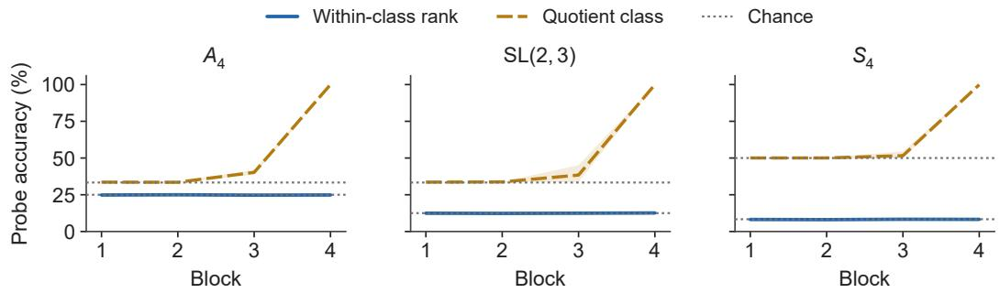  
Figure S7: Linear decoding of quotient classes and within-class ranks. Curves and bands are means and ranges across three training seeds per group. Dotted lines give each task’s chance accuracy. Probes use hidden states at positions 17–100, with training and test sequences disjoint.

Additional probes. $\mathsf { A } D _ { 4 }$ binary within-fiber probe gives .4980–.5024 across layers in checkpoints where the quotient class is decodable at layer 4; shuffled-label controls pass. Nevertheless, a learned character can be linearly unreadable (.511) when represented as a product of two linearly readable characters. This is a concrete reason to restrict conclusions from null probes. In SL(2, 3), three quotient-class means are 114–124 degrees apart at layer 4, and within-class spread is .0024 of between-class distance. These geometric measurements support class separation without proving absence of finer nonlinear information.

Finite resolution. The flatness bounds are empirical tolerances. For $\mathrm { D i c } _ { 3 } ,$ , a within-fiber improvement of approximately .0052 bits has a confidence interval excluding zero. Such probabilistic information is not excluded by the theorem about exact recovery on every input. The accuracy correction in Proposition 1 is a different quantity from this log-likelihood improvement and cannot be compared directly in bits. Transition positions and confidently incorrect outputs are not classified as uniform quotient states.

## M INTERMEDIATE QUOTIENT STAGES AND ORDER SENSITIVITY

## M.1 REORDERING UNDER RECIPE A

We test whether the full-group models’ predictions use input order under recipe A. For each of 2,048 sequences per run, we randomly reorder the prefix at each position and compare the original and reordered output distributions at that position using Jensen–Shannon divergence in bits. The elements and their counts are preserved, and reordering preserves the input distribution under independent uniform full-group sampling. Across 28 runs on $D _ { 4 } , Q _ { 8 } , A _ { 4 } ^ { \cdot } , D _ { 6 } , S _ { 4 } , { \mathrm { S L } } ( 2 , 3 )$ , and ${ \bar { C } } _ { 7 } \rtimes C _ { 3 } ,$ mean divergence beyond each run’s exact frontier ranges from .0012 to .0163 bits. All runs pass the identity-permutation and within-frontier sensitivity controls. Position-wise information and reordering readouts reach their low-information regions within two positions of each other in 23 of 26 runs.

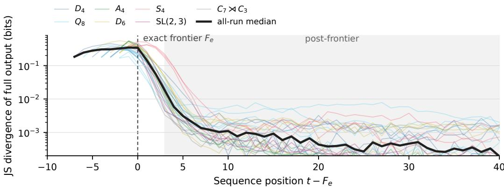  
Figure S8: Full-output sensitivity to prefix reordering under recipe A. Each thin curve is one of 28 Transformer checkpoints; colors identify the seven underlying groups and the black curve is their pointwise median. We align each curve at its exact frontier $F _ { e }$ , the last position in the contiguous prefix with exact accuracy at least .75. At each position, we randomly reorder each input prefix without changing its multiset, then compute the Jensen–Shannon divergence in bits between the original and reorderedfull output distributions. Sensitivity drops sharply after $F _ { e }$ . This behavioral test does not establish strict order-blindness.

## M.2 INTERMEDIATE QUOTIENT STAGES UNDER RECIPE B

The 21-run study uses recipe B with three seeds on each of seven groups. Supports are reflection cosets for $D _ { 9 } , D _ { 1 5 }$ , and $D _ { 2 7 } ;$ odd permutations for $S _ { 4 } ;$ two commutator cosets for $D _ { 8 }$ and $Q _ { 1 6 } ;$ and nonmultiples of three for $C _ { 9 }$ . Both the support and recipe differ from the baseline table. Intermediate behavior occurs in one $S _ { 4 } ,$ two $D _ { 1 5 } ,$ , and two $Q _ { 1 6 }$ seeds; no such stage is observed in $D _ { 2 7 }$ . The $D _ { 9 }$ gaps close rapidly, while two $D _ { 8 }$ seeds remain at the abelianization. Of all 21 runs, the frozen endpoint criteria classify five as plateaus, fifteen as partial, and one as escape. These endpoint labels differ from the five runs with intermediate quotient behavior; they do not imply that every partial run is still improving. In this study, escape means exact accuracy at least .90 over positions 9–100. A plateau requires exact accuracy at most .60, joint quotient accuracy at least .80, and conditional exact accuracy within .05 of the baseline $1 / f$ . The remaining runs in this study are labeled partial. These are endpoint categories, not guarantees of subsequent training behavior.

The $S _ { 4 }$ example is exact through position 6 and has conditional accuracy approximately .25 inside its $S _ { 3 }$ classes from positions 7–100. Its $S _ { 3 }$ class accuracy declines from 1.00 through position 20 to .72 at position 100, while parity remains accurate throughout. A $D _ { 1 5 }$ stage gives .201 against the $1 / 5$ baseline. Runs still progressing can give .8623 on this same quotient or .6174 on a $Q _ { 1 6 }$ quotient with baseline $1 / 2$

For the main-text $S _ { 4 }$ example, a fixed-window FP32 replay of the same saved checkpoint uses 8,192 sequences and positions 17–100. Quotient accuracy is 89.3312%, exact accuracy is 22.3406%, and their ratio is 25.0087%. Restricting every prediction to its true $S _ { 3 }$ class before averaging gives KL .0027219 bits and ∆LL = −.0026327 bits. This diagnostic includes all examples, including incorrect quotient predictions. The original 9–100 evaluation gives conditional exact accuracy .2502; the .2500 residual readout below instead excludes the exact frontier and six further positions.

The residual analysis examines 13 runs and 31 candidate quotient levels. Three learned intermediate stages give conditional accuracies .2500, .2010, and .4995, with $| \Delta \mathrm { L L } | \leq . 0 0 2 8 9$ bits. Their coarser classes retain .43–1.36 bits. Only sufficiently learned class channels are included; conditioning on correct guesses from an unlearned channel can spuriously produce information estimates as high as 1.37 bits. The .70 class threshold was chosen during analysis, and transition-region filtering changes the number of apparently informative levels. The study therefore does not establish an exhaustive or preregistered classification of learned partitions.

Reordering under recipe B. On the restricted input alphabets used above, the three runs with acquired non-abelian quotients give .46, .54, and .24 bits on those channels, versus at most .02 bits on the abelianization. One still-changing run remains order-sensitive even when its projected channels appear insensitive, illustrating why both diagnostics and the stage qualification are necessary. The two recipes differ in architecture, input alphabet, and training budget; their reordering results do not constitute a controlled comparison.

## N ADDITIONAL TRAINING AND ARCHITECTURE COMPARISONS

Training duration. In the 600k-update $D _ { 4 }$ study, exact frontiers end at 20, 22, and 39. The fastest run undergoes three temporary collapses at 325k, 365k, and 415k updates. Fits to its 120 evaluation points do not separate linear growth from a logarithmic trajectory (RMSE 6.302 versus 6.306). Extrapolated completion budgets of $1 0 ^ { 6 . 2 }$ and $1 \bar { 0 } ^ { 8 . 1 }$ updates depend on these indistinguishable fits and are not predictions of asymptotic behavior. The separate five-million-update run reaches frontier 37 at 3.005M updates and ends at 21. Mean exact accuracy over positions 17–100 peaks at 62.51% and ends at 51.91%. Quotient accuracy falls to 67.62% before recovering to 98.71%; long training can lose either type of information.

Additional five-million-update endpoints. Four further full-group runs complete five million updates with the four-layer, width-256 NeoX backbone, batch size 256, and constant learning rate $5 \times 1 0 ^ { - 5 } \colon D _ { 4 }$ seed 43, $A _ { 4 }$ seeds 43 and 44, and $S _ { 4 }$ seed 43. This is 1.28 billion training sequences per run, distinct from recipe B’s five-million-sequence budget. These runs are separate from the historical $D _ { 4 }$ trajectory in Fig. S2a. Table 18 uses final position-wise accuracy arrays and common fixed windows. They do not include a per-example output-distribution audit. On $S _ { 4 } ,$ the finer $S _ { 3 }$ image accuracy is only 33.14% over positions 17–100, so the endpoint does not establish that this non-abelian quotient was learned.

<table><tr><td>Group</td><td>Exact 17-100</td><td>Quotient 17–100</td><td>Exact 70-100</td><td>Exact 101-128</td></tr><tr><td> $D _ { 4 }$ </td><td>53.33</td><td>99.55</td><td>49.65</td><td>15.04</td></tr><tr><td> $A _ { 4 } ~ ( 4 3 )$ </td><td>35.47</td><td>99.96</td><td>25.13</td><td>19.87</td></tr><tr><td>A4 (44)</td><td>33.13</td><td>99.98</td><td>25.01</td><td>18.09</td></tr><tr><td> $S _ { 4 }$ </td><td>8.30</td><td>99.69</td><td>8.31</td><td>4.43</td></tr></table>

Table 18: Additional five-million-update final accuracies (%). Quotient readouts use the abelianization. Parentheses distinguish the two $A _ { 4 }$ seeds.

Horizon and spectrum. At horizon 24, exact frontiers cover 42–54% of the horizon; horizons 48 and 100 reach similar absolute positions. A two-seed continuation at horizon 24 adds 3 and 2 positions, versus a loss of one position in each horizon-100 continuation, but does not meet the registered confirmation criterion. At horizon 24 on SL(2, 3), the preregistered windows contain only 10–11 positions and yield conditional accuracies .1442/.1697/.1585 (seeds 42/43/44); the latter two retain their PARTIAL labels, although exact accuracy at position 24 is .126/.124/.127 and subsequent distribution diagnostics identify transition shoulders extending 9–11 positions beyond the exact frontier.1 Curriculum training provides no clear benefit. Boosting a two-dimensional Fourier component increases the mean frontier from 4.3 to 9.0–9.5 while reducing quotient accuracy to $. 3 7 { - } . 4 1$ . Comparisons use the frozen-encoding control, whose quotient accuracy is .843, rather than the learned-embedding baseline. Direction and dose dependence are supported; the registered effect-size criterion is ambiguous. The lower-amplitude arm learns characters approximately 10k updates earlier. The input-encoding intervention remains confined to $D _ { 4 } ;$ the horizon intervention also covers $A _ { 4 }$ and $\mathrm { S L } ( 2 , 3 )$

Backbone, width, and depth. GPT-2 and Llama reach $D _ { 4 }$ frontiers of 15–24 and 18–20 positions, respectively, while preserving post-frontier conditional accuracy near 1/2. Removing positions from the NeoX baseline gives frontier 5 in one underpowered run; adding sinusoidal positions slows quotient learning. Increasing width to 512 does not remove the plateau. Under full-group inputs, the 2–6-layer $D _ { 4 }$ grid comprises 18 runs: 12 parameter-matched runs with counts within 1.1% of 3,163,648, and six shared-width runs at width 256; their stored conditional accuracies span .4991–.5017 across the full grid. Additional depth mainly improves class accuracy and extends frontiers to 4–8 positions. Budget and depth interventions on $A _ { 4 }$ and $\operatorname { S L } ( 2 , 3 )$ comprise 18 runs; doubling the budget and adding two layers give median exact-frontier gains of 3 and 5 positions on $A _ { 4 } ,$ and 2 and 1 on SL(2, 3), respectively. All 18 stored conditional ratios are within .0012 of the corresponding class-size baseline on the original evaluation windows: positions 5–100, 17–100, and 65–100 for two, four, and six layers, respectively. On a common 17–100 window, the largest excesses are .0275 for an $A _ { 4 }$ six-layer run and .0144 for an SL(2, 3) six-layer run, consistent with wider positional transition regions. The six two-layer runs have incomplete quotient learning and retain their UNDERPOWERED labels. The original generator-input depth comparison is not parametermatched; its largest models remain partially accurate (.69–.79), despite losing the original plateau. The subsequent parameter-matched generator-input comparison gives conditional accuracies .5092, .6304, and .6470 for three-layer models and .9137, .9746, and .9404 for five-layer models (seeds 42/43/44), with the stored ratios evaluated over positions 9–100 and 33–100, respectively, rather than a common window.

Depth and input distribution. A full-group $D _ { 4 }$ sweep over 2–6 layers contains 18 runs, including 12 parameter-matched runs and six shared-width runs; their stored conditional accuracies span .4991– .5017. Additional depth improves quotient learning and extends the exact prefix modestly. Under a generator-input recipe, a separate 3–5-layer sweep extends the frontier from 3–6 to 51–58 positions, with median conditional accuracy rising from .530 to .951. The original sweep also increases parameter count, so it does not isolate depth. In a subsequent $D _ { 4 }$ generator-input comparison at approximately 6.32 million parameters, five-layer models reach token accuracies .776–.884 over positions 1–100, compared with .353–.396 for three-layer models across three seeds each, although all six runs remain classified as PARTIAL. The support and optimization dependence is examined in §G. Reducing the training horizon from 100 to 24 on $A _ { 4 }$ moves the median exact frontier from 4 to 8 positions (conditional accuracy .2481–.2500), and reducing it to 48 on SL(2, 3) moves the median from 3 to 6 (.1284–.1319), while the 24-position SL(2, 3) condition retains two PARTIAL runs with conditional accuracies .1697 and .1585 in the preregistered $[ F _ { e } ( . 7 5 ) + 6 , H ]$ windows, where H is the training horizon.

Larger models. A paired Pythia-160M-architecture study uses eight new seeds with shared block prefixes at 3, 4, 7, and 12 layers. At the 10k-update classification point, median exact cutoffs are 6.5, 9, 15, and 39, while quotient-first outcomes occur in 7, 5, 7, and 7 of eight seeds. Parameter count varies from 98.5M to 162.3M. Three previously observed seeds are separate replication checks. A width-256 $S _ { 5 }$ study with 36 paired seeds at 4, 8, and 12 layers finds no associative-like outcome; parity-first counts are 33, 28, and 31. These are budget-specific observations, not claims about eventual convergence. Definitions and complete model specifications are in App. H.

Matched recurrent models. Two-layer LSTM and GRU models have embedding/hidden widths 444 and 512 and match baseline parameter counts within .2% and .15%. Each family has eighteen runs: three groups, two learning rates, and three seeds. Fig. S1b shows the LSTM’s dense 50- update replay through update 3,000 and the original logs thereafter (App. D). Fifteen runs meet the abelianization-stage criterion on 2–23 dense evaluations; four of these runs have only two qualifying evaluations, 50 updates apart. These are transient stages, not evidence of persistent plateaus. The three $A _ { 4 }$ runs at $\mathrm { i 0 ^ { - 3 } }$ cross quotient and exact thresholds in the same interval. Stage accuracies are .499–.509 on $D _ { 4 } , . 2 5 3  – . 2 6 1$ on $A _ { 4 } ,$ , and .083–.085 followed by .247–.253 on $S _ { 4 }$ . The GRU curves in Fig. S2 use the original 1,000-update grid; the coset census below uses denser evaluations. Recurrent controls use fp32 and shared GPUs, whereas the baseline uses bf16 autocast. Three groups and one size do not support a general convergence claim for gated recurrence.

Blind partition census. For each stored checkpoint we evaluate a fixed set of 2,048 sequences (seed 248,041) at positions 17–100 and form $P [ q , p ]$ , the mean probability placed on p when the running product is $q .$ We cluster the rows of $P$ by connecting every pair at total variation below .15 and taking connected components (single-linkage clustering). We take H to be the block containing the identity, and test whether H is a subgroup, whether the blocks are its right cosets $H q$ or its left cosets $q H$ , and whether H is normal. A second diagnostic repeats these tests on the sets $\begin{array} { r } { S ( q ) = \{ p : P [ q , p ] \geq \frac { 1 } { 2 } \operatorname* { m a x } _ { p ^ { \prime } } P [ q , p ^ { \prime } ] \} } \end{array}$ . No step refers to $[ G , G ]$ or to any pre-chosen subgroup. We accept the support sets as a coset partition only when they equal $H q \left( \mathrm { o r } q H \right)$ for every $q ,$ with $H = S ( e )$ a subgroup. Thus the procedure can return a partition the quotient readouts of $\ S 3$ cannot express.

We run it on 41 Transformer checkpoints across nine groups and on recurrent checkpoints from the matched arms. Row clustering returns 38 non-trivial identity blocks, each equal to $[ { \bar { G } } , G ]$ , and three singleton partitions. The singletons are two long-trained ${ \dot { D } } _ { 4 }$ checkpoints whose exact frontier has entered the evaluation window (exact accuracies .6022 and .6387), and a nearly solved twelve-layer $S _ { 5 }$ checkpoint (.9048). The support procedure also returns 38 non-trivial commutator blocks and three singleton partitions, but not at the same checkpoints. The two $D _ { 4 }$ checkpoints retain commutator cosets under this procedure; two twelve-layer $S _ { 5 }$ checkpoints with residual errors instead split into singletons. Neither procedure recovers a non-normal coset partition. These counts concern this checkpoint census, not every Transformer resolution; the finer normal quotients in $\ S 3 . 4$ use a separate recipe and cohort.

The recurrent side returns one. Replaying the $S _ { 4 }$ GRU runs with a census every 100 updates $( 5 \times 1 0 ^ { - 5 } ;$ : every 250), three runs hold a stage at exact accuracy .48–.55 with the $S _ { 3 }$ readout at .99 or above. Writing each off-diagonal prediction as $p = h q$ , the mass concentrates on the single element $h = ( 0 3 ) ( 1 2 )$ at .945–1.000; writing it as $p = q h$ instead spreads the same mass over the three double transpositions at .321–.337 each. That spread is the prediction rather than a null result: on a right-coset stage the left reading returns $q ^ { - 1 } h q$ , which sweeps the conjugacy class of $h .$ The blind census recovers $H = \{ e , ( 0 3 ) \bar { ( 1 2 ) } \}$ with right cosets and no normality on the same checkpoints. One stage earlier, at exact accuracy .249–.251, the same tally splits evenly over all three double transpositions at .331–.335, leaving the whole $V _ { 4 }$ fiber unresolved; that stage is the ordinary quotient $S _ { 4 } / \bar { V _ { 4 } }$ , and one statistic therefore separates a normal stage from the coset stage above it.

Three matched LSTM runs on $S _ { 5 }$ at learning rate $1 0 ^ { - 3 }$ , replayed with a census every 50 updates through update 8,000, take different refinement paths. Two first show the quotient by $A _ { 5 } ;$ the third has no observed intermediate nontrivial quotient stage. We score all 156 subgroups of $S _ { 5 }$ at every evaluation rather than reporting a single candidate: for each H we take the total variation between the observed tally and the uniform distribution on $H \backslash \{ e \}$ that a right-coset stage on H would produce. A stage is an interval on which the best H has total variation below .15, exact accuracy within 15% of $1 / | H |$ , and a duration of at least 300 updates.

Seeds 42 and 44 first hold $A _ { 5 } ,$ the only non-trivial proper normal subgroup of $S _ { 5 }$ and the one the sign readout names, for 1,000 and 1,150 updates. Seed 42 then holds an order-ten subgroup at .0986–.1090 for 2,300 updates and $H = \{ e , ( 0 4 ) \bar { ( } 1 3 ) \}$ } at .4904–.5010 for the remaining 3,250; seed 44 holds the Klein group {e, (0 1)(2 4), (0 2)(1 4), (0 4)(1 2)} at .2276–.2759 for 1,900. Seed 43 has no observed intermediate nontrivial quotient stage. $A _ { 5 }$ is the only non-trivial proper normal subgroup of $S _ { 5 }$ and across all 161 evaluations of that run the total variation to A never falls below .500, while its sign readout stays between .496 and .839 until the run solves. It instead walks the point-stabiliser chain: $S _ { 4 }$ at .0410–.0421 for 400 updates, the copy of $S _ { 3 }$ permuting {1, 3, 4} at .1638–.1704 for 900, and $H = \{ e , ( 3 4 ) \}$ at .4805–.5129 for 1,200. Of these eight stages the two $A _ { 5 }$ stages are normal and the other six are not, and seed 43 reaches exact tracking by update 3,850 without an observed intermediate nontrivial quotient stage. At update 8,000, seeds 42 and 44 remain at exact accuracies .4997 and .4868, respectively. The latter is already above its identified $1 / 4$ stage and is not classified as a new stage.

Within each of the eight identified stage intervals, exactly one of the 156 subgroups meets the fit threshold at every evaluation. The largest accepted total variation is .112, while every alternative is at least .503 away. This separation establishes uniqueness within the accepted intervals, not throughout training. Of 483 scheduled evaluations, 386 have one fitting subgroup and 97 have none; 22 of the latter precede the run’s first exact accuracy of .90. Evaluations with no errors do not define a normalized off-diagonal distribution and are not treated as partial stages. Orders 3, 5, 8, 12, and 20 occur among $S _ { 5 }$ subgroups but not among the eight stages.

The left reading again lands where a right-coset stage puts it, on the conjugacy class of $h \colon$ .0666 against 1/15 for the double transposition and .0977 against 1/10 for the transposition, two different predictions on one group. A blind partition of the stored seed-42 checkpoint at update 8,000 agrees, returning 60 blocks of two with nearest-neighbour distances .0002–.0008 against the .15 threshold. This test clusters mean softmax rows. In contrast, the dense replay criterion uses pooled full-state argmax errors and accuracy; it does not establish per-example softmax uniformity or independently recover a full row partition at every stage. The non-normal interpretation is supported by the error structure and subgroup checks, not by reciprocal accuracy alone.

Display of the $S _ { 5 }$ stages. Figure 3c retains all 161 scheduled evaluations of the selected LSTM seed, each using 2,048 sequences on positions 17–100. The log accuracy axis separates the reciprocal levels. Colored segments mark accepted intervals; intervening segments remain gray. The selection rule, GRU and Transformer trajectories, and pooled error-statistic panel (d) are specified in App. B.

These censuses are descriptive and were not preregistered. The stages they describe are transient, and the recurrent runs carry the fp32 and shared-GPU disclosures above.

Causal audit of a non-normal coset stage. The censuses above read outputs. To ask whether the recurrent state itself carries the coset, we preregistered a five-seed replication on $S _ { 5 }$ with the matched two-layer LSTM, 8,000 updates, a checkpoint every 50 updates, and four nested claims: the full state is a causal G-set state; a class-mean between-coset subspace is sufficient and necessary; canonical $H \backslash G$ coordinates are causally used; and the raw coordinates satisfy a literal affine representation law. A selector reading only the output census admitted a run when one non-normal order-two subgroup fit at seven consecutive evaluations (300 updates) with total variation below .15, exact accuracy within .075 of $1 / 2 ,$ , and a runner-up gap of at least .10. It took the first such window and the seventh checkpoint in it. Confirmation required three of five runs.

One run qualified. Seed 23,204 held $H = \{ e , ( 0 4 ) ( 1 2 ) \}$ from update 2,100, and the audit ran on its update-2,400 checkpoint with fresh length-40 prefixes and disjoint fit and test splits of 2,880 sequences each, with intervals clustered by prefix history. Enumerating all 120 continuations of every test prefix (345,600 resumed forward passes), right-coset top-1 accuracy has a clustered 95% lower bound of .998, and the functional stabilizer of the identity state separates H without being given it: the largest distance inside H is .008 and the smallest outside is .988. Replacing the full $( \bar { h } , \bar { c } )$ state moves the prediction to the donor coset in every cross-coset pair, retains the recipient coset in none, and reproduces the clean donor output. A rank-59 between-coset subspace, fitted from fit-split class means alone, gives target-coset accuracy .999 when kept and .040 when removed, while a matched random subspace gives .073 and .999. A decoder of the 60 canonical coordinates reads .979 held out and .981 on the true next state, and a minimum-norm edit setting the recipient’s coset scores to the donor’s moves the prediction to the donor coset in .992 of pairs, against .000 for the matched random control.

The literal representation law fails at the same checkpoint. Input-conditioned affine operators predict held-out one-step coordinates with $R ^ { 2 }$ .958, and states reconstructed from them keep the target coset in .998 of cases, but the operator stabilizer at the identity coset does not separate H (largest distance inside 26.0 against smallest outside 23.0) and $T _ { x } T _ { y }$ does not match $T _ { x y } ^ { - } \ ( R ^ { 2 } = - 0 . 5 2 )$ . We therefore report a causal coset-valued state with a strong one-step affine approximation, not a recovered representation. An earlier audit of a different $S _ { 5 }$ LSTM checkpoint, not preregistered, gives the same pattern including this failure.

Incidence, not the interventions, is what the package leaves open. Scored post hoc by the descriptive criterion used above, the five runs hold thirteen stages: four are $A _ { 5 }$ and nine are not normal, at orders 2, 3, 6, and 12. Only seed 23,204 held an order-two stage, which is what the selector was preregistered to admit, so the package returned one qualifying run of five (Wilson 95% interval .036–.624) and no across-seed replication

We then preregistered the same audit for two order-three stages in the same cohort, conditional on output selection rather than on incidence: seeds 23,203 and 23,205 at updates 4,050 and 6,750, with $| H | = 3$ and 40 right cosets. Replacing the full state again moves the prediction to the donor coset in every cross-coset pair, retains the recipient coset in none, and reproduces the clean donor output, in both cells, and the between-coset subspace is again sufficient and necessary in both. The registered thresholds are met in one of the two. Seed 23,205 falls below the .98 bound on continuation coset accuracy at .976 and below the .95 bound on the held-out coset decoder at .901, so that cell is scored a miss on two of the four claims and the conditional package returns no replication either. The affine representation law fails at all three audited checkpoints.

Bilinear recurrence. A separate state-128 model covers ten groups with three seeds each, plus ten-seed follow-ups. All thirteen tested stages match their $1 / | N |$ accuracy levels within the registered band. Among thirty initial cells, ten pass through the abelianization, eleven through finer quotients, and nine show no detected stage. The abelian $C _ { 9 }$ also exhibits a $C _ { 3 }$ stage in two seeds. Unlike the transformers and matched LSTMs, this model acquires a stage across positions within three evaluations in all sixteen measured cases. It differs in encoding, optimizer, and readout: coset probabilities are summed before argmax. Its stage accuracies therefore do not establish the perexample output flatness measured for transformers.

Equal-score encoding control. On $S _ { 3 } \times C _ { 3 }$ , we match the factors entering the analytic representation score of Marchetti et al. (2026). The complex one-dimensional $C _ { 3 }$ character (with its conjugate) and the real two-dimensional standard representation of $S _ { 3 }$ have equal normalized Fourier amplitudes and equal $C _ { \rho } n _ { \rho } = 2 \colon 2 \times 1$ and $1 \times 2$ , respectively. Here $n _ { \rho }$ is the representation dimension and $C _ { \rho }$ is the real/complex type factor. These matches tie the candidate score at every prefix length. The full Peter–Weyl input encoding is frozen, with all block amplitudes equal and a random orthogonal mixing chosen by the run seed; each token embedding has norm .32.

Table 19: Matched-score encoding control on $S _ { 3 } \times C _ { 3 }$ at 74,219 updates. Accuracies $( \% )$ are averaged over positions 17–100. Each frontier is the largest $F \leq 1 { \bar { 0 } } 0$ for which every position $1 , \ldots , F$ reaches its stated accuracy threshold.
<table><tr><td>Seed</td><td> $C _ { 3 }$ </td><td> $\mathrm { S i g n }$ </td><td> $S _ { 3 }$ </td><td>| sign</td><td> $F _ { C _ { 3 } } ( . 9 0 )$ </td><td> $F _ { S _ { 3 } } ( . 7 5 )$ </td></tr><tr><td>42</td><td>99.88</td><td>99.89</td><td></td><td>33.37</td><td>100</td><td>3</td></tr><tr><td>43</td><td>99.58</td><td>99.66</td><td></td><td>33.35</td><td>100</td><td>2</td></tr><tr><td>44</td><td>98.60</td><td>99.80</td><td></td><td>33.36</td><td>100</td><td>2</td></tr></table>

Three seeds (42–44) use a four-layer, width-256 GPT-NeoX model with four heads, rotary positions, and no dropout. Inputs are sampled independently and uniformly from all 18 group elements, with cross-entropy supervision at each prefix of length-100 sequences. AdamW uses learning rate $5 \times 1 0 ^ { - 5 }$ linear decay to zero over 74,219 updates, batch size 256, zero weight decay, gradient clipping at 1, and BF16 autocast. Final evaluation uses 8,192 fresh length-128 sequences with a fixed evaluation seed. Table 19 reports positions 17–100. Readouts sum full-state probabilities over the other factors before taking argmax; $S _ { 3 } \mid$ sign is $S _ { 3 }$ accuracy restricted to examples with a correct sign readout. Since $[ S _ { 3 } \times \bar { C } _ { 3 } , \bar { S } _ { 3 } \times C _ { 3 } ] \stackrel { . } { = } \bar { A } _ { 3 } \times \{ 0 \}$ , sign information alone leaves three possible $S _ { 3 }$ states and gives the $1 / 3$ reference level.

All three seeds retain the separation despite the matched score factors. This limits a score-only account of output resolution in this Transformer setup. It does not test the original two-layer theorem: the architecture, loss, prefix supervision, and training rule differ, and the deliberate tie violates its distinct-score assumption. The control does not uniquely identify order dependence as the cause, nor does an output readout establish the absence of internal matrix features.

## N.1 MATCHED STATE-SPACE MODELS

We test whether a selective state-space model learns the same output resolutions as our Transformer and recurrent controls. We train Mamba-2 (Dao and Gu, 2024) on $D _ { 4 } , A _ { 4 }$ , and $S _ { 4 }$ , retaining all 18 two-layer runs and all three four-layer $D _ { 4 }$ runs in Table 20. No run reaches .90 full-state accuracy on positions 17–100 at the final evaluation. Several instead predict the abelianization accurately while their conditional exact accuracy remains near the class-size baseline.

Models and parameter matching. The two-layer model has hidden width 496, expansion factor 2, head dimension 32, 31 heads, state size 80, one state group, and a convolution kernel of size 4. It has 3,164,778, 3,168,746, and 3,180,650 trainable parameters on $D _ { 4 } , A _ { 4 } .$ and $S _ { 4 } ,$ respectively. These are within 0.28% of the corresponding four-layer, width-256 NeoX controls. The four-layer $D _ { 4 }$ model uses width 352, 22 heads, and state size 48, with 3,166,312 parameters. All other configuration fields are shared. Thus the depth comparison holds total parameters approximately fixed by changing width and state size as well. We use Mamba2ForCausalLM from Transformers 5.13.1, with untied input embeddings and output weights, no cache, and the pure-PyTorch chunked state-space duality implementation (chunk size 50), without fused kernels.

Training and arm selection. We sample length-100 sequences online, independently and uniformly from the full group, and supervise the product at every position with cross-entropy. AdamW uses zero weight decay, gradient clipping at 1, no warmup, and linear learning-rate decay to zero over 74,219 updates. The effective batch size is 256, accumulated over four batches of 64. Training and evaluation use FP32 without autocast, as in the LSTM and GRU controls; recipe-A Transformers use BF16 autocast. The comparison therefore does not isolate architecture from numerical precision.

For each group we run seeds 42–44 at initial learning rates $5 \times 1 0 ^ { - 5 }$ and $1 0 ^ { - 3 }$ . The preregistered rule assigns the higher-rate arm to the group-level comparison when at least two of three lower-rate runs have quotient accuracy below .99. All three groups meet this condition. The registered four-layer $D _ { 4 }$ branch is run because the two-layer study does not reach exact tracking. $\mathrm { A t ~ 5 ~ } \times \mathrm { 1 0 ^ { - 5 } }$ , only one of its three seeds falls below .99 quotient accuracy, so no higher-rate four-layer arm is triggered. The table retains both two-layer arms and every seed, including runs with incomplete quotient learning.

Readouts and results. During training we evaluate 1,024 length-128 sequences every 1,000 updates using sampling seed s + 148999 for training seed s. Final evaluation uses 8,192 fresh sequences with sampling seed 248041. All values below average positions 17–100. We project each full-state argmax onto the abelianization to measure quotient correctness. Since an exact prediction is necessarily quotient-correct, conditional exact accuracy is the ratio of the two correct counts on this common window. The finer $S _ { 3 }$ readout for $S _ { 4 }$ uses the same projection rule.

At learning rate $1 0 ^ { - 3 }$ , two of three seeds per group exceed .99 quotient accuracy, with conditional exact accuracy within .001 of $1 / 2 , 1 / 4$ , and $\bar { 1 / 1 2 }$ on $D _ { 4 } , A _ { 4 }$ , and $S _ { 4 }$ , respectively. The remaining seed in each group does not meet the quotient threshold. The two quotient-resolved $S _ { 4 }$ runs reach only 33.33% and 33.26% on the finer ${ \dot { S } } _ { 3 }$ quotient. At $5 \times 1 0 ^ { - 5 }$ on $D _ { 4 } .$ , the four-layer configuration improves quotient accuracy from $4 1 . 7 0 { - } 6 2 . 5 4 \%$ to 98. $. 8 2 \mathrm { - } 9 9 . 9 7 \%$ , while conditional exact accuracy stays near $1 / 2$ . These results distinguish acquiring a quotient from resolving states within its classes. They establish finite-budget outcomes under the reported recipes; accuracy readouts alone do not establish uniform per-example output probabilities or a complete sequence of transient quotient stages in Mamba-2.

## O SUPPORT INTERVENTIONS AND FAILED PREDICTIONS

Task and counting solution. We train models to predict each running product, using inputs drawn independently and uniformly from a specified set of group elements. We call this set the input alphabet. In $D _ { 4 }$ , let r be a quarter-turn and s a reflection, with $r ^ { 4 } = s ^ { 2 } = e$ and $s r s = r ^ { - 1 }$ . On the input set $\{ r , s \}$ , let $R _ { t }$ and $S _ { t }$ count rotations and reflections through position t, and let $E _ { t }$ count rotations at even positions. Then

$$
q _ { t } = r ^ { ( R _ { t } \mathrm { ~ m o d ~ } 2 ) + 2 ( E _ { t } \mathrm { ~ m o d ~ } 2 ) } s ^ { S _ { t } \mathrm { ~ m o d ~ } 2 } .\tag{12}
$$

Thus three parities recover the full state. We prove the identity below and test both whether models use these counts and how changing the allowed inputs affects learning. All support comparisons in this appendix specify their training recipe; they are separate from the full-group baseline.

The recipe-B generator replication reaches .9992–.9999 at depth 3 and 1.0000 in a depth-4 arm. A single higher-learning-rate run is partial rather than fully accurate. Cross-support transfer is poor in both directions, so success on generators does not imply competence on arbitrary full-group inputs.

Removing positions gives chance performance in three seeds. Switching to full group inputs produces two plateaus and one partial solution; replacing the optimization block gives frontiers 12, 21, and 22 that do not improve with 3.8 times the budget. Changing MLP width preserves successful tracking but changes its speed. Reverse comparisons using the baseline model on generators, or under the alternative optimizer at $1 0 ^ { - 4 }$ , remain near $1 / 2 . \mathrm { A t } \bar { 3 } \times 1 0 ^ { - 4 }$ , three reverse-comparison seeds improve and then collapse to uniform predictions. These are conditional ablations of complete recipes, not universal necessity or sufficiency results.

<table><tr><td>Group</td><td>Layers</td><td>Initial LR</td><td>Seed</td><td>Exact</td><td>Quotient</td><td>Exact | quotient</td></tr><tr><td> $D _ { 4 }$ </td><td>2</td><td> $5 \times 1 0 ^ { - 5 }$ </td><td>42</td><td>31.17</td><td>62.54</td><td>49.84</td></tr><tr><td> $D _ { 4 }$ </td><td>2</td><td> $5 \times 1 0 ^ { - 5 }$ </td><td>43</td><td>30.29</td><td>60.69</td><td>49.90</td></tr><tr><td> $D _ { 4 }$ </td><td>2</td><td> $5 \times 1 0 ^ { - 5 }$ </td><td>44</td><td>20.83</td><td>41.70</td><td>49.97</td></tr><tr><td> $D _ { 4 }$ </td><td>2</td><td> $1 0 ^ { - 3 }$ </td><td>42</td><td>49.06</td><td>98.11</td><td>50.01</td></tr><tr><td> $D _ { 4 }$ </td><td>2</td><td> $1 0 ^ { - 3 }$ </td><td>43</td><td>49.84</td><td>99.85</td><td>49.91</td></tr><tr><td> $D _ { 4 }$ </td><td>2</td><td> $1 0 ^ { - 3 }$ </td><td>44</td><td>49.86</td><td>99.91</td><td>49.91</td></tr><tr><td> $A _ { 4 }$ </td><td>2</td><td> $5 \times 1 0 ^ { - 5 }$ </td><td>42</td><td>10.00</td><td>40.10</td><td>24.94</td></tr><tr><td> $A _ { 4 }$ </td><td>2</td><td> $5 \times 1 0 ^ { - 5 }$ </td><td>43</td><td>8.46</td><td>33.49</td><td>25.27</td></tr><tr><td> $A _ { 4 }$ </td><td>2</td><td> $5 \times 1 0 ^ { - 5 }$ </td><td>44</td><td>24.77</td><td>99.38</td><td>24.92</td></tr><tr><td> $A _ { 4 }$ </td><td>2</td><td> $1 0 ^ { - 3 }$ </td><td>42</td><td>15.93</td><td>63.92</td><td>24.92</td></tr><tr><td> $A _ { 4 }$ </td><td>2</td><td> $1 0 ^ { - 3 }$ </td><td>43</td><td>25.03</td><td>99.89</td><td>25.05</td></tr><tr><td> $A _ { 4 }$ </td><td>2</td><td> $1 0 ^ { - 3 }$ </td><td>44</td><td>25.02</td><td>99.86</td><td>25.05</td></tr><tr><td> $S _ { 4 }$ </td><td>2</td><td> $5 \times 1 0 ^ { - 5 }$ </td><td>42</td><td>5.70</td><td>68.04</td><td>8.37</td></tr><tr><td> $S _ { 4 }$ </td><td>2</td><td> $5 \times 1 0 ^ { - 5 }$ </td><td>43</td><td>7.63</td><td>91.55</td><td>8.33</td></tr><tr><td> $S _ { 4 }$ </td><td>2</td><td> $5 \times 1 0 ^ { - 5 }$ </td><td>44</td><td>5.34</td><td>64.92</td><td>8.23</td></tr><tr><td> $S _ { 4 }$ </td><td>2</td><td> $1 0 ^ { - 3 }$ </td><td>42</td><td>5.50</td><td>65.71</td><td>8.37</td></tr><tr><td> $S _ { 4 }$ </td><td>2</td><td> $1 0 ^ { - 3 }$ </td><td>43</td><td>8.35</td><td>99.97</td><td>8.35</td></tr><tr><td> $S _ { 4 }$ </td><td>2</td><td> $1 0 ^ { - 3 }$ </td><td>44</td><td>8.35</td><td>99.71</td><td>8.37</td></tr><tr><td> $D _ { 4 }$ </td><td>4</td><td> $5 \times 1 0 ^ { - 5 }$ </td><td>42</td><td>49.40</td><td>98.82</td><td>50.00</td></tr><tr><td> $D _ { 4 }$ </td><td>4</td><td> $5 \times 1 0 ^ { - 5 }$ </td><td>43</td><td>49.91</td><td>99.97</td><td>49.93</td></tr><tr><td> $D _ { 4 }$ </td><td>4</td><td> $5 \times 1 0 ^ { - 5 }$ </td><td>44</td><td>49.79</td><td>99.57</td><td>50.00</td></tr></table>

Table 20: All matched Mamba-2 endpoints after 74,219 updates. Accuracies are percentages on positions 17–100. “Quotient” is the abelianization readout; “Exact | quotient” conditions on its correctness. Reference conditional accuracies are 50%, 25%, and $1 0 0 / 1 \dot { 2 } \%$ on $D _ { 4 }$ , $A _ { 4 } ,$ , and $S _ { 4 }$ . Each row is one completed run, without selection by accuracy.

For two $D _ { 4 }$ commutator cosets, frontiers are 44, 81, and 100; three cosets give frontiers 7–11. A lift-bias sweep is retained in the coverage table but not interpreted as a single causal axis because it also changes exposure and path statistics. Reflection-coset inputs permit full tracking in two of three $D _ { 3 }$ seeds, with the third reaching frontier 85; $D _ { 5 }$ and $D _ { 7 }$ have frontiers 30 and 17–42. The unequal seed counts are listed in App. I.

The matched two-coset $Q _ { 8 }$ and $D _ { 4 }$ comparison controls group order, fiber and quotient sizes, support size, and budget. Both input supports admit the position-weighted counting form characterized by Lemma 2. All three $Q _ { 8 }$ runs improve, with frontiers 17, 21, and 48 and ratios .5483, .5733, and .7026. This rejects the registered prediction that the decomposition is required for improvement. A possible speed difference is based on three paired runs with overlapping cross-seed ranges.

Exact Fourier-degree calculations provide a separate description of the input supports. Under fullgroup inputs, both quotient and residual sectors have pure degree t in the checked groups. On $D _ { 4 }$ generators, residual degrees are $\lfloor t / 2 \rfloor$ and $\lceil t / 2 \rceil$ ; on $S _ { 3 }$ and $D _ { 6 }$ they span multiple degrees centered near $t / 2$ . Balanced $Q _ { 8 }$ inputs $\{ \pm i , \bar { \pm } j \}$ and two-coset $D _ { 4 }$ inputs retain degree t. These identities distinguish the supports but do not supply a learning-rate law.

A counting criterion for restricted supports. Let G be nilpotent of class at most two, let $K =$ $[ G , G ] \subseteq { \bar { Z } } ( G )$ , and let $\pi : G \to Q = G / K$ be the quotient map. Fix a section $s : Q \to G ,$ , so every element has a unique representation $s ( q ) z$ with $z \in K$ . We write K additively. For a nonempty input alphabet $\Sigma \subseteq G$ , let $A = \pi ( \Sigma ) \subseteq Q$ be its quotient image and define the commutator pairing

$$
\omega ( q , q ^ { \prime } ) = [ s ( q ) , s ( q ^ { \prime } ) ] \in K , \qquad [ u , v ] = u v u ^ { - 1 } v ^ { - 1 } .
$$

Centrality of K makes this pairing independent of the section. For a word $w = x _ { 1 } \cdot \cdot \cdot x _ { T }$ , let $z ( w )$ denote the central coordinate of its product and let $M ( w )$ denote its input multiset.

Lemma 2 (Position-weighted counting on a support). The following conditions are equivalent:

1. There arefunctions $F$ : {multisets over $\Sigma \} \to K$ and $c : A  K$ such that,for every word over $\Sigma ,$

$$
z ( w ) = F ( M ( w ) ) + \sum _ { i = 1 } ^ { T } i c ( \pi ( x _ { i } ) ) .
$$

2. The commutator pairing has a potential on $A \colon \omega ( q , q ^ { \prime } ) = c ( q ^ { \prime } ) - c ( q )$ for some $c : A  K .$   
3. For $\begin{array} { r } { \begin{array} { r l } & { \varrho \nu e r y \ : q , q ^ { \prime } , q ^ { \prime \prime } \in A , \omega ( q , q ^ { \prime } ) + \omega ( q ^ { \prime } , q ^ { \prime \prime } ) + \omega ( q ^ { \prime \prime } , q ) = 0 . } \end{array} } \end{array}$

Proof. For two letters $u , v ,$ , centrality gives $\boldsymbol { u } \boldsymbol { v } = [ u , v ] v \boldsymbol { u }$ and hence $z ( u v ) - z ( v u ) = \omega ( \pi ( u ) , \pi ( v ) )$ The two words have the same multiset. Under condition 1, subtracting their weighted terms gives

$$
\bigl [ c ( \pi ( u ) ) + 2 c ( \pi ( v ) ) \bigr ] - \bigl [ c ( \pi ( v ) ) + 2 c ( \pi ( u ) ) \bigr ] = c ( \pi ( v ) ) - c ( \pi ( u ) ) ,
$$

which proves $1 \Rightarrow 2$

Assume condition 2. Swapping adjacent letters $u , v$ at positions $i , i + 1$ changes the product coordinate by $\omega ( \pi ( u ) , \pi ( v ) )$ when the difference is taken as the original word minus the swapped word. The surrounding prefix and suffix do not change this difference because the commutator is central. The weighted sum changes by exactly $c ( \pi ( v ) ) - c ( \pi ( u ) )$ . Thus $\begin{array} { r } { z ( w ) - \sum _ { i } i c ( \pi ( x _ { i } ) ) } \end{array}$ is invariant under adjacent swaps. Any two words with the same multiset are connected by such swaps, so this difference defines $F ( \bar { M } ( w ) )$ ), proving $2 \Rightarrow 1$

Condition 2 implies condition 3 by telescoping. Conversely, fix $q _ { 0 } \in A$ and set $c ( q ) = \omega ( q _ { 0 } , q )$ Condition 3 applied to $( q _ { 0 } , q , q ^ { \prime } )$ yields $\omega \bar { ( q , q ^ { \prime } ) ^ { - } } = c ( q ^ { \prime } ) - c \bar { ( q } )$ 口

The proof does not require a special choice of section. Any additional terms that depend only on the input multiset are absorbed into $F ,$ so we do not need an explicit pairwise formula for the central coordinate. The lemma characterizes the displayed position-weighted counting form, not every computation that might use counts.

For $D _ { 4 } , K = \langle r ^ { 2 } \rangle \cong C _ { 2 }$ and $Q \cong C _ { 2 } \times C _ { 2 }$ . Writing quotient elements as $( a , b )$ , the commutator pairing is $\omega ( ( a , b ) , ( a ^ { \prime } , b ^ { \prime } ) ) = a b ^ { \prime } +$ ba′ in $C _ { 2 }$ . Any two quotient classes satisfy the cycle condition. For three distinct classes $q , q ^ { \prime } , q ^ { \prime \prime }$ , their cycle sum is $\dot { \omega ( q + q ^ { \prime \prime } , q ^ { \prime } + q ^ { \prime \prime } ) } \stackrel { . . } { = } 1$ , because the two arguments are distinct nonzero vectors in $\dot { C _ { 2 } } \times C _ { 2 }$ . The counting form therefore exists exactly when the allowed inputs belong to at most two commutator cosets. Concretely, r and $r ^ { 3 }$ belong to one coset, and s and $r ^ { 2 } s$ to another. Adding $r ^ { 3 }$ to $\{ r , s \}$ therefore preserves the criterion, whereas adding $e ,$ which belongs to a third coset, violates it. In the latter case, no sum of token contributions weighted only by absolute position can recover the central coordinate, even with an arbitrary multiset-dependent term. This does not exclude richer computations using input order.

On $\{ r , s \}$ , let the kth r occur at position $p _ { k }$ . There are $p _ { k } - k$ preceding reflections, so the rotation exponent is

$$
a _ { t } = \sum _ { k = 1 } ^ { R _ { t } } ( - 1 ) ^ { p _ { k } - k } \equiv R _ { t } - 2 \sum _ { k = 1 } ^ { R _ { t } } ( p _ { k } - k ) \equiv R _ { t } ^ { 2 } - 2 E _ { t } \equiv ( R _ { t } \bmod 2 ) + 2 ( E _ { t } \bmod 2 ) { \pmod { 4 } } .
$$

The reflection exponent is $S _ { t }$ mod $2 ,$ proving Eq. 12 for all lengths. For $H _ { 3 } ( \mathbb { Z } / p )$ with odd $p ,$ the quotient images of $\{ a , a ^ { - 1 } , b , b ^ { - 1 } \}$ violate the cycle condition: the triple $( a , a ^ { - 1 } , b )$ has cycle sum $- 2 \omega ( a , b ) \neq 0$ . This excludes the displayed counting form on that support; the associated training outcomes are empirical results rather than consequences about learnability.

Transfer in both directions. Twelve generator-trained endpoints evaluated on the full alphabet give exact accuracy .124–.125 and quotient accuracy .249–.250, the chance levels, with peaked rather than uniform outputs; these inputs contain tokens never seen in training. In the reverse direction all tokens are trained: six recipe-B full-alphabet models evaluated on $\{ r , s \bar  \}$ sequences keep conditional accuracy $. 5 0 – . 5 5$ with exact frontiers 7–11, and five of six lose the quotient itself (joint accuracy .29–.35 against a positional chance level of .50).

<table><tr><td>Alphabet</td><td>Cosets</td><td>Form</td><td>Runs</td><td>Outcome (recipe B)</td></tr><tr><td>{r, s} (preregistered)</td><td>2</td><td>yes</td><td>3</td><td>conditional .9997–1.000 at 25–45k up- dates</td></tr><tr><td> $\{ r , r ^ { 3 } , s , r ^ { 2 } s \}$  (two cosets)</td><td>2</td><td>yes</td><td>3</td><td>frontiers 44, 81, 100</td></tr><tr><td> $\{ r , r ^ { 3 } , s \}$ </td><td>2</td><td>yes</td><td>2</td><td>frontier 38 rising; 24 stalled (300k)</td></tr><tr><td> $\{ r , s , e \}$  (preregistered)</td><td>3</td><td>no</td><td>3</td><td>frontiers 25, 26, 23; conditional .50</td></tr><tr><td> $\{ r , s , r s \}$ </td><td>3</td><td>no</td><td>1</td><td>frontier 20</td></tr><tr><td> $\{ r , s , r ^ { 2 } \}$ </td><td>3</td><td>no</td><td>1</td><td>frontier 14</td></tr><tr><td>three nontrivial cosets</td><td>3</td><td>no</td><td>3</td><td>frontiers 7–11</td></tr><tr><td>full alphabet</td><td>4</td><td>no</td><td>3</td><td>frontiers 12–22</td></tr></table>

Table 21: Support criterion against $D _ { 4 }$ outcomes under recipe B. Frontiers are the number of leading positions with exact accuracy at least .75, read at 150k updates unless noted; earlier rows come from the support interventions above. The two preregistered rows use seeds $4 7 { - } 4 9$ under a frozen protocol; an earlier exploratory set (seeds 42–44) gave the same classification for both alphabets, and the remaining new rows are exploratory. The criterion characterizes availability of the stated counting form; it does not guarantee that training learns it.

What the $\{ r , s \}$ models compute. At the input of the last block of the successful $\{ r , s \}$ models, ridge regressions read the running counts of r at odd positions, of r at even positions, of $r ,$ and of s with $R ^ { 2 } . 9 7 - . 9 9 $ , with different directions at odd and at even positions; the parities of these counts are at chance until the final layer. We then replace the residual stream entering the last block. With a donor that flips one odd and one even token, replacing all odd-position prefix states moves the output toward the odd-flip label only (never toward the even-flip label), replacing a growing fraction of those states moves it monotonically, and replacing states before the flipped position does nothing. Replacing half the prefix leaves the takeover incomplete (.21–.69) because the query position’s own residual also carries the base counts; replacing it as well gives takeover .76–1.00 at positions 32 and 64 in eight models, with cross-class rates at most .03. A prefix-product representation would instead make the outcome depend on which flip comes later and would produce the double-flip label, neither of which occurs. A preregistered held-out test on two new seeds meets all 18 frozen criteria in one seed and 14 in the other (misses: .760 against .80 at position 64, and three margins of .004–.06 at position 100). The results above distinguish the exploratory intervention study from its held-out confirmation; their criteria and outcomes are reported separately.

## P HEISENBERG TRACKING, PREFIX COUNTS, AND INTERVENTIONS

The integer Heisenberg task lets us ask how a model recovers state information that depends on input order. Here we first derive the computation required for the central coordinate. We then test whether trained models distinguish words that have the same counts but different products, whether the required prefix count is readable from their activations, and how editing count-associated activations changes their predictions. These tests address behavior, representation, and the effect of an intervention. However, they do not identify a complete circuit.

## P.1 TASK AND TRAINING

The counting identity. An element of $H _ { 3 } ( \mathbb { Z } )$ has coordinates $( x , y , z )$ , with multiplication

$$
( x , y , z ) ( u , v , w ) = ( x + u , \ y + v , \ z + w + x v ) .
$$

We use the four tokens $a \ = \ ( 1 , 0 , 0 ) , a ^ { - 1 } \ = \ ( - 1 , 0 , 0 ) , b \ = \ ( 0 , 1 , 0 ) ,$ , and $b ^ { - 1 } = ( 0 , - 1 , 0 )$ Write token i as $g _ { i } = ( u _ { i } , v _ { i } , 0 )$ and its running product as $g _ { 1 } \cdot \cdot \cdot g _ { i } = ( X _ { i } , Y _ { i } , Z _ { i } )$ , starting from $( 0 , 0 , 0 )$ . Thus $u _ { i }$ is the signed increment to the a count and $v _ { i }$ is the signed increment to the b count. Multiplication gives

$$
X _ { i } = X _ { i - 1 } + u _ { i } , \qquad Y _ { i } = Y _ { i - 1 } + v _ { i } , \qquad Z _ { i } = Z _ { i - 1 } + X _ { i - 1 } v _ { i } .
$$

The first two coordinates are therefore net counts. Summing the last update gives

$$
Z _ { t } = \sum _ { i \leq t } X _ { i - 1 } v _ { i } = \sum _ { k < i \leq t } u _ { k } v _ { i } .
$$

Each b or $b ^ { - 1 }$ contributes according to the signed number of a tokens that preceded it. This derivation follows directly from group multiplication. To give an example how Z differs while $( X , Y )$ is the same, aab, aba, and baa all have $( \mathbf { \bar { \cal X } } , { \cal Y } ) = ( 2 , 1 )$ , but their products have $Z = 2 , 1 , 0 .$ , respectively: the b encounters two, one, or no preceding a tokens. Final net counts alone do not determine $\dot { Z } .$ Therefore, a model that predicts $\bar { Z }$ accurately for arbitrary words must take their order into account.

Architecture and data. We test whether models’ predictions distinguish order-sensitive products. We use $H _ { 3 } ( \mathbb { Z } )$ with the multiplication in Sec. G.1. Each word contains independent uniform samples from $\{ a , a ^ { \dot { - } 1 } , b , b ^ { - 1 } \}$ . The backbone has four GPT-NeoX blocks, width 256, four attention heads, and $3 , 1 6 0 { , } 5 7 6$ parameters. Separate linear heads classify $x , y \in [ - 1 2 8 , 1 2 8 ]$ and $z \in [ - 5 1 2 , 5 1 2 ]$ with an additional out-of-window class for z, giving $3 , 5 5 4 , 8 1 6$ parameters in total. Loss is the sum of three cross-entropies at every position. A prediction is jointly correct only when all three coordinates are correct; the abelianization readout requires both x and y to be correct.

Three models use learning rate $1 0 ^ { - 3 }$ and seeds 42–44, with AdamW, zero weight decay, linear learning-rate decay without warmup, batch size 256, length 100, 74,219 updates, and bf16 autocast.   
The final evaluation uses 8,192 iid length-128 words. Table 22 reports the original final evaluations;   
subsequent frozen-checkpoint replays can differ slightly with numerical precision and batch shape.   
Paired tests below use their own controls and must not replace these unconditional iid accuracies.

<table><tr><td>Seed</td><td>Joint 17–100</td><td>Quotient 17-100</td><td>Joint at 100</td><td>Joint 101–128</td></tr><tr><td>42</td><td>98.10</td><td>100.00</td><td>92.90</td><td>36.82</td></tr><tr><td>43</td><td>98.17</td><td>100.00</td><td>93.74</td><td>37.32</td></tr><tr><td>44</td><td>98.07</td><td>100.00</td><td>92.81</td><td>27.32</td></tr></table>

Table 22: Integer Heisenberg final accuracy (%). All models use learning rate $1 0 ^ { - 3 }$ . Joint accuracy requires all coordinates; quotient accuracy requires $( x , y )$

The underlying group is infinite, but the tested words and output ranges are bounded. A sufficiently large finite quotient could agree on this window. These experiments establish order-sensitive tracking at tested lengths, not unbounded integer computation or a causal benefit of an infinite state space. Uniform-within-class baselines from the finite-group experiments do not extend to a uniform distribution on the infinite center. Comparisons with finite Heisenberg tasks also change support and output parameterization.

## P.2 REORDERING TESTS

We test whether the models respect several consequences of the Heisenberg group law. Each condition constructs a pair of input sequences through a controlled edit. Several tests edit a block within a common prefix p and suffix s; the odd/even-count test instead reorders the whole sequence. Some edits preserve the final product, whereas others preserve $( X , Y )$ but change Z by a known amount. We use $A = a ^ { - 1 } , B = \mathsf { \bar { b } } ^ { - 1 }$ , and

$$
c = [ a , b ] = a b A B = ( 0 , 0 , 1 ) .
$$

Adjacent inverse-pair reversal. We sample the same random prefix p and suffix s and compare $p g g ^ { - 1 } s$ with $p g ^ { - 1 } g s$ , where g is one of the four input tokens. Both inserted pairs multiply to the identity. The two input sequences therefore have the same length, counts of each token, and final product, although their intermediate states differ. This local test asks whether reversing an immediate cancellation changes the model’s prediction.

Adjacent noncommuting swap. We compare pghs with phgs, where g and h act along different coordinate axes. For example, $a b = ( 1 , 1 , 1 )$ whereas ba $\mathbf { \Sigma } = ( 1 , 1 , 0 )$ . Exchanging the two tokens preserves their counts and the final $( { \dot { X } } , Y )$ coordinates, but changes $Z$ by 1 or −1, depending on their signs. This test asks whether the model responds to the simplest order-dependent change in the product.

Odd/even-count-preserving reordering. We independently permute the tokens occupying the odd and even positions of a randomly sampled input sequence, retaining pairs for which $Z$ changes. The original and reordered sequences contain the same number of each token at odd positions and at even positions, and consequently have the same final $( X , Y )$ . Their different values of $Z$ show that neither total token counts nor separate odd- and even-position counts determine the product. This test distinguishes Heisenberg tracking from the position-parity statistic sufficient for the $D _ { 4 }$ task.

Long-range cancellation. Let $w = g _ { 1 } \cdot \cdot \cdot g _ { 8 }$ . Within the same random prefix and suffix, we compare the locally cancelling block

$$
g _ { 1 } g _ { 1 } ^ { - 1 } \cdot \cdot \cdot g _ { 8 } g _ { 8 } ^ { - 1 }
$$

with the nested block

$$
w w ^ { - 1 } = g _ { 1 } \cdot \cdot \cdot g _ { 8 } g _ { 8 } ^ { - 1 } \cdot \cdot \cdot g _ { 1 } ^ { - 1 } .
$$

Both blocks contain the same tokens and multiply to the identity. In the first block, every generator is cancelled immediately; in the second, the matching inverse can occur many positions later. This test asks whether the longer-range arrangement makes an otherwise identical cancellation harder to track.

Central-commutator relocation. Let $c = [ a , b ] = a b A B = ( 0 , 0 , 1 )$ . We sample a prefix $p ,$ a middle segment $m ,$ and a suffix $s ,$ and compare

$$
p c ^ { 4 } m s \qquad \mathrm { w i t h } \qquad p m c ^ { 4 } s .
$$

Because c is central in $H _ { 3 } ( \mathbb { Z } )$ , it commutes with the product of $m ,$ and the two sequences have the same final product. They introduce the same central contribution at different positions, however, and hence follow different intermediate states. This test asks whether relocating that contribution affects the prediction.

Commutator inversion. Within the same random prefix and suffix, we replace $c ^ { 4 }$ by $c ^ { - 4 }$ . The two blocks contain equal numbers of $a , A , b ,$ , and $B ,$ and both leave $X$ and $\mathrm { { \bar { \Delta } } }$ unchanged. Their contributions to $Z$ are +4 and −4, so the replacement changes the final central coordinate by 8. This test asks whether the model predicts the direction and magnitude of that change.

Rectangular commutator rewriting. We compare the block

$$
c ^ { 4 } = ( a b A B ) ^ { 4 }
$$

with

$$
a ^ { 2 } b ^ { 2 } A ^ { 2 } B ^ { 2 } ( a A ) ^ { 2 } ( b B ) ^ { 2 } .
$$

The rectangular loop $a ^ { 2 } b ^ { 2 } A ^ { 2 } B ^ { 2 }$ and $c ^ { 4 }$ both have product (0, 0, 4). The appended inverse pairs multiply to the identity and make the two blocks equal in length and in their counts of each token. Thus the complete input sequences have the same final product but express the central contribution through different local arrangements. This test asks whether the model recognizes the same group element beyond the repeated literal pattern abAB.

Evaluation protocol. We evaluate the three models at lengths 32, 64, and 100, using all seven transformations above. Matched random controls have the same length, token counts, and final state as each test word. All prefixes satisfy $| x | , | y | \leq 3 2$ and $| z | \leq 2 5 6$ ; final coordinates satisfy $| x | , | y | \leq 1 6 \mathrm { a n d } | z | \leq 6 4$ . This conditional sample is easier than the unconditional iid evaluation.

Each condition and length contains 1,024 shared pairs, giving 21,504 distinct pairs across the battery, reused across models. Before model evaluation, 36 attempted pairs were excluded after failing to obtain a matched control within 4,096 attempts. Integer $3 \times 3$ matrix multiplication independently checks every prefix. We evaluate predictions at the final position of each word.

Results. On the odd/even-count-preserving test at position 100, the models correctly predict both members in 96.875% of pairs on average. Their predicted displacement equals the true displacement in 96.940%; this latter criterion can hold even if both endpoints are wrong. At length 100, long-range cancellation, central-commutator relocation, and rectangular rewriting do not meet the prespecified criterion for degradation relative to matched controls. That criterion requires the edited-minus-control accuracy difference to have a 95% confidence interval entirely below −10 percentage points in at least two of three models.

Sensitivity to central displacement. We separately test whether predicted differences in Z track changes of different magnitudes and remain detectable after a common suffix. This test uses 24,576 fresh pairs, with generator block exchanges inducing signed differences of magnitude 1, 4, or 16, plus zero-displacement controls. Frozen coordinate readouts are evaluated after 0, 8, and 32 common suffix tokens. A threshold is set from the 95th percentile of absolute readout differences on an independent zero-displacement calibration set. Detection requires exceeding this threshold with the correct sign. After 32 suffix tokens, response slopes across signed displacements are .905–.952 across the three models. Detection of magnitude 16 reaches 100%, with false-positive rates 4.44–4.83%. Smaller displacements are not certified in every model. These readouts measure central information, not causal necessity or a unique update circuit.

Together, the reordering results show that the models distinguish products that total token counts, including separate odd- and even-position counts, cannot distinguish. We next ask whether their activations contain the prefix counts appearing in the update for $\check { Z }$

## P.3 SINGLE-POSITION RAW-COUNT PROBES

We first ask whether an activation at a single position contains counts accumulated over the preceding inputs. We fit separate linear readouts for the numbers of a and $a ^ { - 1 }$ , and for their difference $X _ { t - 1 }$ This exploratory follow-up uses one frozen model (learning rate $1 0 ^ { - 3 }$ , seed 42), after earlier net-count results were available.

We generate two disjoint sets of length-100 words. We use 2,048 words to fit the readout and 2,048 new words to test it. For each word, we record the model’s 256-dimensional activation vector at one chosen layer and position. A linear probe is a fitted weighted sum of these 256 activation values, plus a constant, that estimates a known count. The count is calculated from the input word, not from the model’s prediction. We fit a separate probe for each quantity, layer, and position, using positions 32, 64, and 100.

Before fitting, we subtract each activation coordinate’s fit-set mean and divide by its fit-set standard deviation, floored at $1 0 ^ { - 8 }$ . We choose the readout weights to minimize mean squared prediction error plus .001 times the sum of squared weights. This penalty is called ridge regularization; the additive constant is not penalized. We apply the same transformation and fitted weights to the test words. Only the probes are fitted; the task model remains unchanged. Probe fitting uses 64-bit arithmetic, while model evaluations retain bf16 precision.

Besides the two individual counts and their difference $X _ { t - 1 } .$ , we test readouts of the current contribution $X _ { t - 1 } v _ { t }$ and accumulated coordinate $Z _ { t } .$ . Probe fitting includes all four possible current tokens. Table 23 reports count predictions from the first Transformer block’s output, evaluated on test words whose current token is $b .$ “Single-position” means that the probe sees only one activation vector; the count it predicts covers the entire preceding prefix. We verify the target values independently by multiplying the inputs as integer $3 \times 3$ Heisenberg matrices.

We measure the mean absolute error (MAE) in count units and the fraction of predictions that equal the true count after rounding to the nearest integer. We also report $R ^ { 2 } = 1 - { \textstyle \sum _ { r } } ( y _ { r } - { \hat { y } } _ { r } ) ^ { 2 } / \sum _ { r } ( y _ { r } ^ { ' } - { \bar { y } } ) ^ { 2 }$ where $y _ { r }$ and ${ \hat { y } } _ { r }$ are the true and predicted values for test word $r ,$ and $\bar { y }$ is the mean true value in that test set. Thus $R ^ { 2 } = 1$ is perfect prediction; $R ^ { 2 } = 0$ matches the squared error of always predicting y¯. Negative values are worse than that constant prediction.

<table><tr><td></td><td colspan="2">a count</td><td colspan="2"> $a ^ { - 1 }$  count</td><td colspan="2">Net a count</td></tr><tr><td>Position</td><td>MAE</td><td>Exact (%)</td><td>MAE</td><td>Exact (%)</td><td>MAE</td><td>Exact (%)</td></tr><tr><td>32</td><td>0.0381</td><td>100.00</td><td>0.0366</td><td>100.00</td><td>0.0040</td><td>100.00</td></tr><tr><td>64</td><td>0.0887</td><td>100.00</td><td>0.0847</td><td>100.00</td><td>0.0069</td><td>100.00</td></tr><tr><td>100</td><td>0.1513</td><td>99.22</td><td>0.1465</td><td>99.42</td><td>0.0088</td><td>100.00</td></tr></table>

Table 23: First-block readout of preceding counts at a b token. MAE is in count units; exact denotes accuracy after rounding to the nearest integer. Test subsets contain 532, 499, and 514 examples at positions 32, 64, and 100.

At the tested positions, first-block activations support nearly exact readout of both individual counts and their difference (Table 23). After rounding, the individual-count readouts are 99.22–100% accurate and the net-count readout is 100% accurate on the reported current-b subsets. To check that these readouts depend on learned activations, we fit two control readouts. The first uses only the current token’s embedding, before any Transformer block processes it. The second randomly permutes the association between fitting activations and their target counts, while leaving the test set correctly paired. At position 64, the a-count embedding control gives $R ^ { 2 } = - . 0 0 0 4 6$ and 9.62% rounded accuracy; the readout fitted with shuffled counts gives $R ^ { 2 } = - . 0 1 3 7 0$ and 10.22%. A further linear readout uses only the true prefix coordinates (X, Y) and four indicators identifying the current token, rather than activations. It gives $R ^ { 2 } = . 6 6 9 3 9$ and 19.64%. Thus the hidden state supports a more accurate linear raw-count readout than this coordinate baseline. The comparison does no exclude nonlinear coordinate encodings or prove that the output uses the recovered counts.

Because these probes are fitted separately at each position, they do not establish that the same linear readout works across positions.

## P.4 A COUNT READOUT SHARED ACROSS POSITIONS

We next ask whether the net count can be read out using the same linear map at different positions. For each model and chosen point in the network, such as the output of its second block, we fit one probe using examples from nine positions. Each example consists of one word’s activation at one position and the true count at that position. All nine positions share the same readout weights and additive constant. This exploratory follow-up uses the three frozen models and independent sets of 4,096 fit and 1,024 test words of length 100, with i.i.d. uniform generator inputs. The sets are disjoint from each other and from the earlier paired data checked by the analysis script. We collect activations at positions 8, 12, 16, 24, 32, 48, 64, 80, 100. Positions 8, 12, and 16 are diagnostic locations outside the standard 17–100 evaluation window.

The 4,096 fitting words therefore supply 4096 × 9 activation–count pairs. We use the standardization and ridge fit described above, with penalty .001. We test the resulting probe at each position on the 1,024 unseen words, without changing its coefficients or additive constant. The target is $\begin{array} { r } { X _ { t } = \sum _ { i < t } u _ { i } , } \end{array}$ , including the current input. The preceding count required by the central-coordinate update is $\bar { X } _ { t - 1 } = X _ { t } - u _ { t } ;$ the known current token supplies $u _ { t }$ . The interventions below target this preceding count.

Table 24 reports second-block outputs after each activation vector $h$ is divided by its Euclidean length $\| h \| _ { 2 } = ( \bar { \sum _ { k } } h _ { k } ^ { 2 } ) ^ { 1 / 2 }$ , floored at $1 0 ^ { - 8 }$ . This removes differences in the overall activation magnitude before fitting the readout. Across models and sampled positions 16–100, $R ^ { 2 }$ ranges from .99351 to .99880. As an additional check, we allow a separate rescaling and additive offset of this probe’s prediction at each position. The fitted multiplicative factors are .973–1.016 over positions 16–100. The table uses the original shared probe, without these adjustments.

<table><tr><td>Seed</td><td>8</td><td>12</td><td>16</td><td></td><td>24</td><td>32</td><td>48</td><td>64</td><td>80</td><td>100</td></tr><tr><td>42</td><td>0.9786</td><td>0.9919</td><td></td><td>0.9942</td><td>0.9962</td><td>0.9977</td><td>0.9983</td><td>0.9984</td><td>0.9988</td><td>0.9986</td></tr><tr><td>43</td><td>0.9767</td><td>0.9926</td><td></td><td>0.9948</td><td>0.9977</td><td>0.9979</td><td>0.9982</td><td>0.9984</td><td>0.9988</td><td>0.9985</td></tr><tr><td>44</td><td>0.9775</td><td>0.9911</td><td></td><td>0.9935</td><td>0.9967</td><td>0.9973</td><td>0.9974</td><td>0.9969</td><td>0.9980</td><td>0.9972</td></tr></table>

Table 24: Shared count readout: test $R ^ { 2 }$ at each position for a single probe per model on normalized second-block outputs. All models use learning rate $1 0 ^ { - 3 }$ . No position-specific refitting is used.

We also test activations without length normalization, token embeddings, the separate attention and feedforward outputs within Transformer blocks, and probes fitted separately at each position. A second shared probe targets $X _ { t } / t _ { : }$ , the average signed a increment per input token. Across all tested models, network locations, positions, and normalization choices, the largest $R ^ { 2 }$ from a probe fitted to randomly reassigned target values is .12844. Both $X _ { t }$ and $X _ { t } / t$ have strong shared readouts at the second block. Count readability therefore does not identify a unique code or show that one layer converts an average count into a total count. This test concerns readability on the sampled words.

For the separate position-specific probes, we fit linear probes, fitted with the same ridge penalty, for $X _ { t }$ and $\bar { Y _ { t } }$ from unnormalized second-block outputs at positions 32, 41, 61, 64, 81, 100. Each model uses 4,096 fit words and 1,024 held-out words. Across the eighteen model–position combinations,

$X _ { t }$ has $R ^ { 2 } = . 9 9 9 7 7 7 { - . 9 9 9 9 4 0 }$ and rounded accuracy $9 9 . 5 1 \mathrm { - } 1 0 0 \% ; Y _ { t }$ has $R ^ { 2 } = . 9 9 9 7 0 4 \mathrm { - . 9 9 9 9 6 2 }$ and rounded accuracy 99.61–100%.

These results establish linear readability. We next test whether perturbing count-associated activations changes the model’s prediction of $Z .$

## P.5 COUNT-DIRECTION INTERVENTIONS

We estimate how first-layer attention activations vary with the preceding net count, while accounting for other measured input properties. We then add a multiple of this fitted count direction to the activation and measure the change in the predicted central coordinate, keeping the input word fixed. Fig. S6 tests the signs of these changes at one position and their approximate additivity across two positions. We use the same three models trained at $1 0 ^ { - 3 }$ , seeds 42–44, as the behavioral results and shared decoding probes. No weights are retrained.

Fitting the encoding direction. We fit an encoding map from known input properties to activations, then use its count coefficient to perturb the model. This reverses the direction of the decoding probes above, which map activations to counts; their weights are not used for these interventions. At position $j ,$ each of the first layer’s four attention heads produces 64 numbers. We join these four lists into one vector $h _ { j } \in \mathbb { R } ^ { 2 5 6 }$ , before the layer’s output projection mixes them. For each input word, these 256 recorded values are what the encoding regression is fitted to predict. We record them during ordinary model evaluation with bf16 precision and fit the regression using 64-bit arithmetic.

For panel (a), we use $n = 4 0 9 6$ fitting words of length 100 and fix $j = 6 4$ . Each token is sampled independently and uniformly from the four generators. For each word, we calculate eight numbers to use as the regression’s inputs, and collect them in a vector

$$
d = ( X _ { j - 1 } , Y _ { j } , Z _ { j } , S _ { j } , \mathrm { o n e h o t } ( g _ { j } ) ) , \qquad S _ { j } = \sum _ { i \leq j } | u _ { i } | .
$$

The first four entries are the preceding net count $X _ { j - 1 }$ , the current coordinates $Y _ { j }$ and $Z _ { j } .$ , and $S _ { j }$ the total number of a or $a ^ { - 1 }$ tokens through position $j ,$ , without subtracting inverse tokens. The last four entries identify the current token. We use oneho $\mathsf { t } ( a ) = ( 1 , 0 , 0 , 0 )$ , onehot $( a ^ { - 1 } ) = ( 0 , 1 , 0 , 0 )$ onehot $( b ) = ( 0 , \dot { 0 , } 1 , 0 )$ , and onehot $( b ^ { - 1 } ) = ( 0 , 0 , 0 , \dot { 1 } )$ . All eight numbers come from the input word, not from model predictions. For example, the prefix aab at $j = 3 \operatorname { g i v e s } { d } = ( 2 , 1 , 2 , 2 , 0 , 0 , 1 , 0 )$ The fitted map predicts the activation vector as

$$
\widehat { h } _ { j } ( d ) = \alpha + B ^ { \top } d = \alpha + \beta _ { x } X _ { j - 1 } + \beta _ { y } Y _ { j } + \beta _ { z } Z _ { j } + \beta _ { s } S _ { j } + B _ { \mathrm { t o k } } \mathrm { o n e h o t } ( g _ { j } ) .
$$

Here $\alpha$ is a 256-dimensional constant vector, each $\beta$ is a 256-dimensional coefficient vector, and the four columns of $B _ { \mathrm { t o k } }$ give token-specific offsets. The matrix $B \in \mathbb { R } ^ { 8 \times 2 5 6 }$ collects these eight coefficient vectors as rows. The extra inputs let the fit account for changes associated with $Y _ { j } , Z _ { j } , \bar { S } _ { j }$ and the current token instead of assigning all such changes to $X _ { j - 1 }$ . This is a linear adjustment, not a guarantee that the count is causally isolated.

We use one $\beta _ { x }$ for all four current tokens; only the token offsets change. We fit with the ridge penalty $1 0 ^ { - 3 }$ and express the coefficients in the original count units, as detailed below. Thus $\beta _ { x }$ is the fitted change in all 256 activation values when the preceding net count increases by one and the other regression inputs are held fixed. We do not rescale $\beta _ { x }$ to have unit length.

From the fit to an intervention. Let $e _ { 1 } = ( 1 , 0 , \ldots , 0 )$ have the same length as d. Adding $\delta e _ { 1 }$ to d increases only its first entry, the preceding net count, by δ. The fitted map then changes by

$$
\widehat { h } _ { j } ( d + \delta e _ { 1 } ) - \widehat { h } _ { j } ( d ) = \delta \beta _ { x } .
$$

We add this difference to the model’s observed activation, rather than replacing that activation by the regression prediction. Thus $\delta = 2$ adds twice the fitted per-count vector. The part of the actual activation not explained by the regression, $h _ { j } - \widehat { h } _ { j } ( d )$ , is left unchanged. Holding the other regression inputs fixed describes a change within the fitted linear map; it does not edit the input word or guarantee a pure or exact change of the model’s internally represented count.

Intervention and output measurement. We replace only $h _ { j } \ b y \ h _ { j } + \delta \beta _ { x }$ , then apply the original output projection and all remaining network operations. For predicted probabilities $p _ { t } ( z )$ over the integer classes $\mathcal { Z } = \{ - 5 1 2 , \ldots , 5 \bar { 1 2 } \}$ , define

$$
\hat { z } _ { t } = \frac { \sum _ { z \in \mathcal { Z } } z p _ { t } ( z ) } { \sum _ { z \in \mathcal { Z } } p _ { t } ( z ) } , ~ \Delta \hat { z } _ { t } = \hat { z } _ { t } ^ { \mathrm { p e r t } } - \hat { z } _ { t } ^ { \mathrm { c l e a n } } .
$$

The labels “pert” and “clean” denote evaluations with and without the activation edit. The extra output class for values outside [−512, 512] has no single numerical coordinate, so we omit it and divide by the probability remaining on the integer classes. Thus $\hat { z } _ { t }$ is the mean predicted integer coordinate. It differs from the most probable integer (the argmax), and $\Delta \hat { z } _ { t }$ measures a change in this mean rather than accuracy.

One position and the signed response. The update $Z _ { j } = Z _ { j - 1 } + X _ { j - 1 } v _ { j }$ motivates comparing the four current tokens. An ideal increase in the preceding count increases the current $Z$ at $b ,$ , decreases it at $b ^ { - 1 }$ , and leaves it unchanged at $a ^ { \pm 1 }$ . We test how the network responds to the fitted activation perturbation. For panel (a), we perturb $j = 6 4$ by $\delta = \pm 2$ on 1,024 held-out words. We group test words by their token at position 64. Within each group, we average $\Delta \hat { z } _ { t } / \delta$ over test words, perturbation signs, and output positions $t = 6 4 , 7 2 , 9 6 , 1 0 0$ . Dividing by $\delta$ expresses the output change per unit of the nominal count change. A filled point is this mean for one model; bars and strokes average the three models and are not error bars. Open points use a random activation direction. That original control has length matched to a count coefficient fitted separately on words with current token a, rather than to the coefficient fitted on all four tokens and used for the filled points. The two direction lengths therefore need not match. We plot the measured responses without rescaling either result.

Interpreting the token-dependent response. The count-direction perturbations produce opposite mean responses at b and $\bar { b ^ { - 1 } }$ (Fig. S6a), consistent with the signs in the group update. The $a ^ { \pm 1 }$ responses are smaller but need not vanish. To see the distinction, consider two ideal group states just before position $j$ that differ only in $X _ { j - 1 }$ by $\delta .$ . They have the same $Y _ { j - 1 }$ and $Z _ { j - 1 }$ and receive identical remaining inputs. Subtracting their update equations gives

$$
\Delta X _ { t } = \delta , \qquad \Delta Y _ { t } = 0 , \qquad \Delta Z _ { t } = \delta \sum _ { i = j } ^ { t } v _ { i } \quad ( t \geq j ) .
$$

Indeed, $\Delta X _ { i }$ remains $\delta ,$ so $\Delta Z _ { i } = \Delta Z _ { i - 1 } + \delta v _ { i }$ with $\Delta Z _ { i - 1 } = 0$ . Summing yields the expression above. The immediate change $\Delta Z _ { j } = \delta v _ { j }$ is zero at $a ^ { \pm 1 }$ , but later outputs can change through subsequent $b ^ { \pm 1 }$ tokens.

Our intervention edits an activation rather than a group state, and the plotted response averages outputs at 64, 72, 96, 100. The ideal immediate zero response at $a ^ { \pm 1 }$ is therefore not a constraint on the measured response. For seeds 42–44, the signed mean responses $\Delta \hat { z } / \delta$ at a are $\left( . 0 0 9 7 , . 0 1 8 1 , - . 0 9 4 3 \right)$ , compared with $\left( - . 0 0 1 0 , . 0 0 2 3 , - . 0 0 \bar { 0 } 0 1 \right)$ for the random direction. $\mathbf { A } \mathbf { t } \ a ^ { - 1 }$ they are $( - . 0 3 9 8 , - . 0 1 0 8 , - . 0 2 2 1 )$ , compared with $( - . 0 0 2 2 , - . 0 0 3 4 , - . 0 0 1 7 )$ . We retain these residuals and controls in the figure under the scaling specified above. The results support a tokendependent signed response, but do not establish a pure count edit or identify the source of the residuals.

Two positions and the additivity test. Panel (b) asks whether the joint effect of two perturbations is predicted by their separate effects. For each fixed test word, we perform four forward passes: clean, perturbing only $j ,$ perturbing only k, and perturbing both. Write their final predicted means as $\hat { z } ^ { 0 } , \hat { z } ^ { j }$ $\bar { z } ^ { k }$ , and $\hat { z ^ { j } } { ^ k }$ . We form

$$
E _ { j } = \hat { z } ^ { j } - \hat { z } ^ { 0 } , \quad E _ { k } = \hat { z } ^ { k } - \hat { z } ^ { 0 } , \quad E _ { j k } = \hat { z } ^ { j k } - \hat { z } ^ { 0 } .
$$

The plotted point is $( \mathbb { E } [ E _ { j } ] + \mathbb { E } [ E _ { k } ] , \mathbb { E } [ E _ { j k } ] )$ , with expectations over the same test words. The line $y = x$ is therefore the prediction of additive mean effects; it does not require each individual word to satisfy additivity. Both axes measure changes in predicted z, not accuracies or alternative settings of the perturbation size.

Length-100 words have fixed tokens at positions 16, 32, 48, 64, and 80, using either pattern $\mathrm { \mathrm { P } } ,$ $( b , b ^ { \top 1 } , b , b ^ { - 1 } , b )$ , or pattern $\mathrm { Q } , ( b ^ { - 1 } , b , b ^ { - 1 } , b , b ^ { - 1 } )$ . Pattern Q inverts each specified token without reversing their order. Other tokens remain i.i.d. uniform. Each pattern has 4,096 fit and 1,024 independent test words, checked against prior data for overlap. We fit $\beta _ { x }$ separately at each position and pattern using $( X _ { j - 1 } , Y _ { j } , Z _ { j } , \breve { S } _ { j } )$ ; the current token is fixed at each fitted site. We add $+ 4 \beta _ { x }$ at both selected positions and read $\hat { z } _ { 1 0 0 }$ . The same positive count increment is used even at a $b ^ { - 1 }$ site, so opposite response signs are not imposed by choosing opposite injection signs.

The $( b , b ) , ( b ^ { - 1 } , b ^ { - 1 } )$ , and mixed site pairs are respectively (16, 48), (32, 64), and (48, 32) for $\mathrm { P } ;$ they are (32, 64), (16, 48), and (64, 16) for Q. The implemented mixed pairs differ from the protocol’s example (48, 64); the figure reports the executed sites. All 18 points are retained, one for each combination of three seeds, two patterns, and three pair types. A mixed pair places one perturbation at b and the other at $b ^ { - 1 }$ . The $( b , b ) ^ { \dagger }$ pairs lie above and right of the origin, and the $( b ^ { - 1 } , b ^ { - 1 } )$ pairs below and left. Mixed-pair effects range from −2.770 to +.127; they need not vanish because single-site responses differ across positions, models, and patterns even with the same $\delta = 4$

Additivity results. For each of the eighteen plotted conditions, we subtract the sum of the two mean single-position effects from the mean joint effect. This difference, $r = \mathbb { E } [ E _ { j k } ] - \mathbb { E } [ E _ { j } ] - \mathbb { E } [ E _ { k } ]$ , is zero for exactly additive mean effects. Across the eighteen conditions, the square root of the mean of $r ^ { 2 }$ is .125 units of $z ,$ , and the largest |r| is .299. The points broadly follow the additivity line, but this does not imply equal sensitivities at different positions. For example, seed $4 2 \mathrm { { ' s } }$ mixed pair in pattern Q has a joint effect of −2.770 against a single-site sum of −2.988. Its substantial nonzero response is distinct from its .219 additivity residual. The experiment supports approximate additivity of mean responses, without establishing exact sample-wise cancellation.

How we fit the encoding map. For each fitting word, we have a list of known input quantities d and a recorded activation vector $h _ { j }$ . We arrange these observations as two tables, with one row per word. The table $D \in \mathbb { R } ^ { n \times p }$ contains the $p$ regression inputs; the table $H \in \mathbb { R } ^ { n \times 2 5 6 }$ contains the 256 activation values we want to predict. Thus the same row in $D$ and $H$ always refers to the same word. Panel (a) has $n = 4 0 9 6$ rows and $p = 8$ input columns. Column 1 of D, for example, contains $X _ { j - 1 }$ for all fitting words.

We first put the input columns on comparable scales. Let $\bar { d } _ { r }$ be the mean of input column r across the fitting words, and let $s _ { r }$ be its standard deviation, floored at $1 0 ^ { - 8 }$ . The standard deviation uses divisor n. We subtract the mean and divide by $s _ { r }$ in each column. For each activation column, we subtract its mean but do not divide by its standard deviation. In matrix notation these operations are

$$
F _ { i r } = \frac { D _ { i r } - \bar { d } _ { r } } { s _ { r } } , \qquad H _ { c } = H - { \bf 1 } \bar { h } ^ { \top } .
$$

Here i indexes fitting words, r indexes regression inputs, $\bar { h }$ is the vector of 256 mean activation values, and 1 is a column of n ones. Thus $\bar { F }$ contains the rescaled regression inputs and $H _ { c }$ contains the activations after subtracting their means. This procedure also applies to the four token-indicator columns.

We fit a coefficient matrix $W \in \mathbb { R } ^ { p \times 2 5 6 }$ so that FW predicts $H _ { c } .$ We minimize the squared prediction errors across all words and activation coordinates, with a penalty on large coefficients,

$$
\widehat { W } = \arg \operatorname* { m i n } _ { W } \left\{ \frac { 1 } { n } \| H _ { c } - F W \| _ { F } ^ { 2 } + \lambda \| W \| _ { F } ^ { 2 } \right\} , \qquad \lambda = 1 0 ^ { - 3 } .
$$

The notation $\| M \| _ { F } ^ { 2 }$ means the sum of the squared entries of a matrix M. The first term measures fitting error; the second is the ridge penalty. Setting the derivative with respect to W to zero gives

$$
( \boldsymbol { F } ^ { \top } \boldsymbol { F } + n \lambda I _ { p } ) \widehat { W } = \boldsymbol { F } ^ { \top } H _ { c } ,
$$

where $I _ { p }$ is the $p \times p$ identity matrix. We solve this linear system for $\widehat { W }$

The intervention is specified in actual count units, so we undo the column rescaling before using the fitted coefficients. Dividing row r of $\widehat { W }$ by $s _ { r }$ r gives row r of $B .$ . We restore the mean activation through the constant α and take the first coefficient vector as the count direction,

$$
B _ { r : } = \widehat { W } _ { r : } / s _ { r } , \qquad \alpha = \bar { h } - B ^ { \top } \bar { d } , \qquad \beta _ { x } = B _ { 1 : } ^ { \top } .
$$

The notation $B _ { r } { } _ { : }$ denotes every entry in row r. These definitions give $\widehat { h } _ { j } ( d ) = \alpha + B ^ { \top }$ d in the original units. The constant α is not penalized. All means, scales, and fitted coefficients are computed from fitting words and kept fixed for the independent test words.

For panel (b), we repeat the same procedure separately for each model, position, and token pattern, with 4,096 fitting words per pattern. There are only four input columns, $d = ( X _ { j - 1 } , Y _ { j } , \bar { Z } _ { j } , S _ { j } )$ because the current token is fixed at each chosen position. Consequently these fits do not use token-indicator columns and do not share a count direction across positions.

## P.6 ACTIVATION PATCHING BETWEEN MATCHED INPUTS

The preceding interventions add a fitted direction. Here we instead transfer activations between two inputs that differ by a controlled change in the preceding count, and test which replacements transmit the corresponding change in $Z .$ We call the unmodified run the recipient and the run on the edited input the donor. We use the same three frozen models. Readouts fit $4 { , } 0 9 6$ new words and are checked on 1,024 independent words. Three intervention rounds each use 2,048 fresh pairs: 6,144 distinct pairs in total, reused across models. At position $j = 3 2$ or 64, changing a to $a ^ { - 1 }$ or conversely at $j - 1$ changes $X _ { j - 1 }$ by $\delta = \pm 2$ , while preserving $Y _ { j - 1 } , Z _ { j - 1 } ,$ , the current token, and the suffix. The candidate local contribution therefore changes by δvj. We replace selected recipient activations by the corresponding donor activations, while leaving the recipient’s other computation paths intact.

We first test the input to the second layer’s feedforward network (MLP). The quantity of interest is $C _ { j } = X _ { j - 1 } v _ { j }$ , the increment added to $Z$ at the current token. We compare replacing the full MLP input with transferring only a fitted linear component associated with this increment. Subsequent exploratory rounds test attention values and then queries, keys, and their combinations, using fresh pairs and protocol amendments written before each round. We check that inserting an activation’s original value leaves the prediction unchanged, restoring the original MLP input removes the corresponding input-path edit, and replacements leave the coordinates outside the selected intervention unchanged. Model weights remain fixed.

To compare the response across the two count changes and current tokens, we divide the change in predicted mean $z \ \mathbf { b y } \ \delta v _ { j }$ , the change in the task’s current central-coordinate increment. We average this ratio over words with current token b or $b ^ { - 1 }$ and output positions $j , j + 8 , j + 3 2$ , 100. A ratio of one means that the mean output response matches that current increment. It does not mean that individual predictions are correct or that this increment equals the full change in the true state at later positions.

Table $2 5$ separates an internal readout from effects on the output. The MLP C column reports the change in the probe’s estimate of $C _ { j }$ after replacing an MLP input, divided by $\delta { v } _ { j }$ . It measures an internal readout, not the model’s output coordinate.

The isolated-C column measures the downstream response when transferring only a fitted component associated with $C _ { j }$ . To construct it, we fit an encoding regression for the second-layer MLP output using $X _ { j - 1 } , Y _ { j - 1 } , Z _ { j - 1 }$ , indicators for three of the four current tokens, and $C _ { j }$ . The omitted token is represented by all-zero indicators and the fitted constant. We take the coefficient of $C _ { j }$ and rescale it so that moving one unit along it increases the linear probe’s estimate of $C _ { j }$ by one. We then measure the donor-minus-recipient change in that estimate and multiply this difference by the rescaled direction. Adding the resulting vector to the recipient’s MLP output transfers the decoded change without replacing the full output. This construction does not guarantee that other information in the activation remains unchanged.

The layer-3 KV column instead transfers the donor’s full key (K) and value (V) vectors at the selected position in the third attention layer. Keys determine how other positions attend to this position; values supply the information they receive. Both this column and the isolated-C column report the normalized change in the model’s predicted mean z. Its accompanying exact-shift accuracy measures how often the argmax prediction changes by the expected ±2.

Third-layer KV replacements retain $( x , y )$ predictions in 100% of cases, but the isolated linear C component carries only a small fraction of the predicted effect (Table 25). Full donor vectors can contain other features; their effect is not specific evidence for $C .$ . Differences between seeds’ key and value sensitivity do not establish distinct high-level algorithms. These tests identify activation replacements that affect the central-coordinate prediction, but do not isolate the count contribution as their causal feature.

<table><tr><td>Seed</td><td>MLP C readout</td><td>Isolated C</td><td>Layer-3 KV</td><td>Exact shift (%)</td></tr><tr><td>42</td><td>.861</td><td>.00021</td><td>.909</td><td>83.08</td></tr><tr><td>43</td><td>.983</td><td>-.00021</td><td>.638</td><td>27.44</td></tr><tr><td>44</td><td>.651</td><td>-.00001</td><td>.812</td><td>61.21</td></tr></table>

Table 25: Count-sensitive readouts and interventions. The MLP column measures the change in the decoded local contribution after an input replacement; isolated $C$ and KV columns measure changes in the predicted mean z. All three are divided by the task-level increment change $\delta { v } _ { j }$ . Exact shift is the fraction of argmax predictions changing by the expected $\pm 2$ under KV replacement. All models use learning rate $\mathrm { \overline { { 1 0 } } ^ { - 3 } }$

Further exploratory probes estimate unsigned counts, which count a and $a ^ { - 1 }$ together rather than subtracting them. However, probes fitted to randomly reassigned targets reach $R ^ { 2 } = . 0 7 9$ , above the prespecified maximum of .02 allowed for that control. We therefore do not treat weak readouts of counts over only a short part of the preceding sequence as confirmed evidence. A separate 2,048-word direction-injection test distinguishes net count X from unsigned count S. At the first layer and position 64, a nominal +2 X injection shifts the current predicted mean x by .0011, .1792, and .0012 in seeds $4 2 { - } 4 4$ , respectively; the same S injection changes the current predicted mean x by less than $4 \times 1 0 ^ { - 6 }$ in each model. Larger injections introduce nonspecific disruption. Together, the direction interventions show that count-associated activation changes affect central-coordinate predictions, and the patching tests show that selected activation replacements transmit part of the expected change. They do not yet isolate a complete implementation of the prefix-count update or exclude other order-sensitive computations.

## Q GRADIENT CONDITIONS, DIAGNOSTICS, AND INTERVENTIONS

We distinguish three questions in the gradient analysis. First, does the average loss gradient provide a signal for separating states within a learned quotient class? Second, under what conditions would that signal cancel? Third, can changing the learning signal improve tracking? The measurements, sufficient condition, and interventions below address these questions separately.

For intuition, consider a class with two possible target states. The loss on one example favors the first state, while the loss on a related example favors the second. If parameter changes affect both examples’ logits identically, these opposing target-specific contributions cancel on average. If the sensitivities differ, the model can instead receive a signal that separates the two states, even when it currently assigns them equal probabilities. The formal argument below makes this distinction explicit.

From cross-entropy to class-member contrasts. At one input prefix, let $z _ { \theta }$ be the vector of logits, p its softmax, y the one-hot target, and $J = \partial z _ { \theta } / \partial \theta$ the Jacobian with respect to all trainable parameters. The cross-entropy gradient is $J ^ { \top } ( p - \dot { y } )$ . Define the orthogonal projection $P$ by ${ \begin{array} { r } { { \dot { ( } } P v ) _ { g } = | K | ^ { - 1 } \sum _ { h \in g K } v _ { h } } \end{array} }$ , where $K = [ G , G ]$ . It replaces each coordinate by the average over its quotient class. Thus $P ( p - y )$ is constant within classes, whereas $( I - P ) ( p - y )$ contains only contrasts between their members. Applying $J ^ { \top }$ to the latter gives

$$
h = J ^ { \top } ( I - P ) ( p - y ) = \underbrace { J ^ { \top } ( P y - y ) } _ { \ell { \mathrm { ~ ( L a b e l ) } } } + \underbrace { J ^ { \top } ( p - P p ) } _ { m { \mathrm { ~ ( M o d e l ) } } } .\tag{13}
$$

The identity follows by expanding $( I - P ) ( p - y )$ . The Label term compares the true label with a uniform label on its class. The Model term compares current probabilities with their within-class averages. Their sum, Net, is a component of the cross-entropy gradient, not the full gradient or the actual AdamW update.

Constructing examples and averaging. We use raw final weights of three recipe-A models per group for $\bar { A _ { 4 } , \mathrm { S L } } ( 2 , \bar { 3 } )$ , and $S _ { 4 }$ , trained for 74,219 updates with seeds 42–44. For each of 32 fresh i.i.d. base sequences (sampling seed 189401), replace its first input $x _ { 1 }$ by $k x _ { 1 }$ for every $k \in K$ . At any measured position, the resulting targets are $k q _ { t }$ . They enumerate the complete true class because $K$ is normal. We call this set of input variants an orbit. The quotient target is unchanged, while every class member becomes a target exactly once. We compute $\ell , m , h$ on each variant, average vectors over the complete orbit and then over the 32 base sequences, obtaining $\bar { \ell } , \bar { m } , \bar { h } = \bar { \ell } + \bar { m }$ . Norms are taken after averaging. We never average parameter vectors across separately trained models.

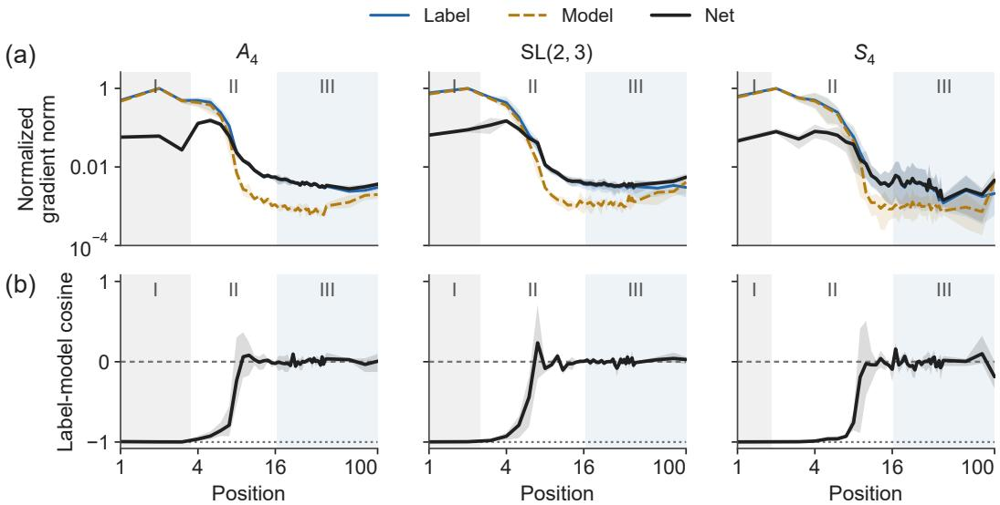  
Figure S9: Learning signals within quotient classes. Matched $A _ { 4 } , \mathrm { S L } ( 2 , 3 )$ , and $S _ { 4 }$ Transformers, three seeds each. (a) Norms of averaged Label, Model, and Net terms, divided by the common per-model reference S. (b) Cosine between the averaged Label and Model terms. Each position uses 32 complete input orbits. Lines and bands show seed means and ranges; positions vary within a fixed checkpoint. The definitions and averaging procedure are given in this appendix.

Reading the two panels. We measure positions 1–40, 60, 80, and 100 at a fixed checkpoint. Panel (a) plots $\| \bar { \ell } _ { t } \| , \| \bar { m } _ { t } \|$ , and $\| \bar { h } _ { t } \|$ . Within each model, all three are divided by the same reference $S = \mathrm { m a x } _ { t } \operatorname* { m a x } ( \lVert \bar { \ell } _ { t } \rVert , \lVert \bar { m } _ { t } \rVert )$ over this grid. Panel (b) plots

$$
c _ { t } = \frac { \bar { \ell } _ { t } ^ { \top } \bar { m } _ { t } } { \| \bar { \ell } _ { t } \| \| \bar { m } _ { t } \| } .
$$

A cosine of −1, 0, or 1 means opposite, orthogonal, or aligned average vectors. Cancellation depends on both direction and magnitude, as

$$
\lVert \bar { h } _ { t } \rVert ^ { 2 } = \lVert \bar { \ell } _ { t } \rVert ^ { 2 } + \lVert \bar { m } _ { t } \rVert ^ { 2 } + 2 \lVert \bar { \ell } _ { t } \rVert \lVert \bar { m } _ { t } \rVert c _ { t } .
$$

We compute all quantities within each model before plotting the three-seed mean and minimum– maximum range. Bands describe training-run variation, not uncertainty from the 32 sampled sequences. We apply no smoothing. Regions I–III are spatial guides, not inferred mechanism boundaries. Region I ends at the group mean of max $( 1 . 5 , F _ { e } - . 5 )$ ; region III is positions 17–100.

What the spatial profiles establish. The late-position net signal is consistently small relative to each model’s peak, but the early profile is not universally a near-zero region followed by a frontier peak. Table 26 reports all nine runs. At position 1, all have perfect argmax accuracy, yet their net norms are 30–64% of their own peak. Cross-entropy can still improve prediction confidence after accuracy reaches 100%. For $S _ { 4 }$ seed 42, the largest net signal occurs at position 2 with 96.19% accuracy. Conversely, the position-40 norm is only 0.8–3.5% of the peak in every run. These ratios use maxt $\| \bar { h } _ { t } \|$ , whereas the figure uses S to compare its three terms.

Two different effects can produce a small net gradient. When p approaches the correct one-hot label, $p - y$ becomes small and the Label and Model terms balance. Alternatively, class-member signals can become small only after averaging examples whose targets differ. These are distinct from cancellation between the two already-averaged terms. In the late window, absolute Label–Model cosines have medians .039, .026, and .057 for the three groups; they do not show two large, oppositely directed mean terms. Small mean vectors also make their directions sensitive to sampling. These are spatial measurements at final checkpoints, not a proof of permanent training arrest.

<table><tr><td>Group</td><td>Seed</td><td>t*</td><td>Accuracy at t*</td><td> $\| \bar { h } _ { 1 } \| / \| \bar { h } _ { t _ { * } } \|$ </td><td> $\| \bar { h } _ { 4 0 } \| / \| \bar { h } _ { t _ { * } } \|$ </td></tr><tr><td> $A _ { 4 }$ </td><td>42</td><td>5</td><td>53.44</td><td>30.33</td><td>1.93</td></tr><tr><td> $A _ { 4 }$ </td><td>43</td><td>5</td><td>58.79</td><td>38.58</td><td>2.27</td></tr><tr><td> $A _ { 4 }$ </td><td>44</td><td>4</td><td>81.93</td><td>45.25</td><td>2.53</td></tr><tr><td>SL(2, 3)</td><td>42</td><td>4</td><td>50.21</td><td>40.95</td><td>2.34</td></tr><tr><td>SL(2, 3)</td><td>43</td><td>4</td><td>36.27</td><td>46.01</td><td>3.51</td></tr><tr><td>SL(2, 3)</td><td>44</td><td>3</td><td>88.59</td><td>37.97</td><td>1.13</td></tr><tr><td> $S _ { 4 }$ </td><td>42</td><td>2</td><td>96.19</td><td>63.56</td><td>1.82</td></tr><tr><td> $S _ { 4 }$ </td><td>43</td><td>4</td><td>42.22</td><td>33.42</td><td>0.81</td></tr><tr><td> $S _ { 4 }$ </td><td>44</td><td>6</td><td>12.16</td><td>50.23</td><td>1.94</td></tr></table>

Table 26: Per-model net-gradient profiles behind Fig. S9. t maximizes $\| \bar { h } _ { t } \|$ over the measured grid. Ratios and accuracy are percentages. Accuracy at position 1 is 100% in every row.

Numerical checks. Each orbit-mean proxy is differentiated directly using a shared full-orbit forward batch, with TF32 disabled. We use FP32 derivatives and FP64 accumulation, independently differentiate the three terms, and check $\bar { h } = \bar { \ell } + \bar { m }$ relative to $\lVert \bar { \ell } \rVert + \lVert \bar { m } \rVert$ . The original $S _ { 4 }$ seed-44 profile failed the $1 0 ^ { - 3 }$ tolerance at five positions; its entire 43-position profile is therefore recomputed in FP64. The original measurements and comparison are retained. The within-orbit ratio $\begin{array} { r } { \dot { R } _ { \mathrm { l a b e l } } = \| \mathbb { E } _ { k } \ell _ { k } \| / \mathbb { E } _ { k } \| \ell _ { k } \overline { { \| } } } \end{array}$ measures cancellation across variants and differs from the pooled two-term balance $B \stackrel { \cdot \cdot \cdot } { = } \| \bar { h } \| ^ { \cdot } / ( \| \tilde { \ell } \| + \| \bar { m } \| )$ and from $c _ { t }$

Cancellation within a class at the matched checkpoints. We additionally measure the nine checkpoints above using a dense census over positions 1–40 (Fig. S10). To distinguish cancellation across examples from cancellation between average terms, we compute two dimensionless ratios. Within a complete input orbit, let $\ell _ { k } = J _ { k } ^ { \top } ( P y _ { k } - y _ { k } )$ be the Label contribution defined in Eq. 13. We measure

$$
R _ { t } = \frac { \| \sum _ { k \in K } \ell _ { k } \| } { \sum _ { k \in K } \| \ell _ { k } \| } .
$$

An aligned set of contributions has $R _ { t } = 1$ , while exact cancellation gives $R _ { t } = 0$ . We report the median of this ratio over eight orbits per position. The dashed $1 / { \sqrt { f } }$ levels are geometric references for $f$ equal-norm, pairwise-orthogonal vectors, not a fitted baseline or a null distribution for the model’s gradients. At position 40, the nine ratios range from .00796 to .03322, below these references.

For the second ratio we pool Label and Model vectors across the eight complete orbits and compute

$$
B _ { t } = \frac { \Vert \bar { \ell } _ { t } + \bar { m } _ { t } \Vert } { \Vert \bar { \ell } _ { t } \Vert + \Vert \bar { m } _ { t } \Vert } .
$$

A small $B _ { t }$ indicates cancellation between these two averaged terms; it does not measure cancellation within an orbit. At position 40, $B _ { t } = . 6 3 4 \substack { - . 8 3 7 }$ , unlike the small within-orbit $R _ { t } .$ Accuracy in this census uses 8,192 sequences, independently of the gradient samples. All curves use the same frozen weights, and no seed averaging or smoothing is applied. Both gradient panels in this census use eight orbits; the earlier norm and cosine profiles use 32 complete orbits. Their estimates must not be interchanged merely because they use the same checkpoints.

These measurements identify a candidate obstacle to refinement. They do not establish that the total gradient vanishes, that no information changes during a plateau, or that cancellation causes a model to remain there.

Sufficient conditions. Consider right multiplication of one input slot by an element of $K = [ G , G ]$ Independent uniform full-group inputs are invariant under this action. The target remains in the same K-coset, and averaging over the complete action sends it uniformly through that coset. Assume (R1) logits and (R2) their parameter Jacobian are invariant under the action at the position being studied.

(a)  
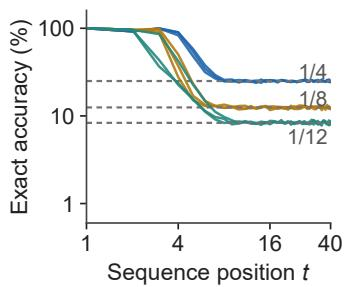  
(b)

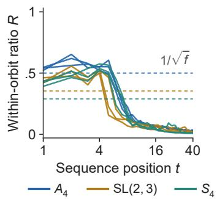

(c)  
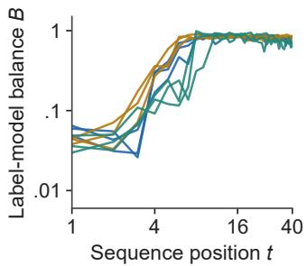  
Figure S10: Cancellation across examples differs from balance between mean terms. The same nine $A _ { 4 } , \mathrm { S L } ( 2 , 3 )$ , and $S _ { 4 }$ checkpoints as Fig. S9, using the additional census defined above. (a) Exact accuracy and class-size references. (b) Within-orbit Label ratio $R ,$ with geometric $1 / \sqrt { f }$ references. (c) Label–Model balance B after pooling those orbits. Each line is one seed. The small late-position R supports cancellation across class members, while B distinguishes this from cancellation of two large mean terms.

Orbit averaging then replaces the one-hot label y by the uniform-fiber label u while preserving the other terms, giving

$$
\mathbb { E } [ J ^ { \top } ( p - y ) ] = \mathbb { E } [ J ^ { \top } ( p - u ) ] .\tag{14}
$$

R2 does not follow from R1. For a binary logit $z = \theta x$ , with equally likely $x \in \{ - 1 , 1 \}$ and label $( x + 1 ) / 2$ , predictions are identical at $\theta = 0$ . Nevertheless, the population cross-entropy gradient ${ \mathrm { i s ~ } } - 1 / 2 ,$ , because the Jacobian changes sign with x. Output uniformity therefore does not by itself prevent refinement. Our measurements test signatures consistent with the condition; they do not establish invariance of the complete parameter Jacobian.

Directional identity. For nonzero gradient contributions $g _ { i }$ , write $v _ { i } = g _ { i } / \lVert g _ { i } \rVert$ . Their mean pairwise cosine satisfies

$$
{ \overline { { \cos } } } = - { \frac { 1 } { f - 1 } } + { \frac { \| \sum _ { i } v _ { i } \| ^ { 2 } } { f ( f - 1 ) } } .\tag{15}
$$

This follows by expanding the squared sum. It is an identity for normalized vectors, distinct from the pooled label/model cosine in Fig. S9b. Fourteen of eighteen measurements over fiber sizes 2–60 are within .0015 of the lower bound; all lie at or above it. A second prospective $S _ { 5 }$ checkpoint reproduces the $f = 6 0$ signature (-.01692 versus $- 1 / 5 9 )$ . The abelian positive control gives at least .9969. These checks do not independently prove the population invariance assumptions.

Profile qualifications. $\mathrm { A t } \ S _ { 4 }$ seed $4 2 \mathrm { { ' s } }$ largest net signal, position 2, exact accuracy is 96.19%, label/model cosine is -.9975, and $\| \bar { h } \| / ( \| \bar { \ell } \| + \bar { \| } \bar { m } \| ) = . \bar { 0 3 } 5 1$ . A net-signal peak can therefore coexist with substantial cancellation. Late-position cosine estimates vary across seeds because the mean vectors are small.

Cross-group comparison of the average Label signal. A separate study measures 44 checkpoint– input-distribution pairs across sixteen groups. For each pair, we average the Label gradients over the full commutator orbit at input position 1 and over 32 base sequences from that model’s input distribution. This gives $\bar { \ell } _ { t }$ as above. Since the orbit-averaged label residual $P y - y$ is zero, this quantity measures its covariance with the logit Jacobian. It differs from the orbit cancellation ratio R, which normalizes by the individual gradient norms.

We choose the measured positions from behavior before measuring gradients. Let $F$ be the exact frontier at threshold .75. The reference position is $t _ { e } = \operatorname* { m a x } ( 2 , \bar { F } \bar { + } 1 )$ and the later position is $t _ { f } = \operatorname* { m i n } ( 1 0 0 , \operatorname* { m a x } ( 4 0 , t _ { e } + 2 0 ) )$ ). A pair is eligible if $t _ { f } - t _ { e } \geq 2 0$ , quotient accuracy at both positions is at least .90, exact accuracy at $t _ { e }$ exceeds $1 / f + . { \mathrm { 0 5 } }$ , and exact accuracy at $t _ { f }$ is within .10 of $1 / f$ . Twenty eligible pairs had not had these gradient measurements inspected before the protocol was fixed. Their ratios $\| \bar { \ell } _ { t _ { f } } \| / \| \bar { \ell } _ { t _ { e } } \|$ are .0009–.0149. Thus the result concerns positions with an acquired quotient and class-size accuracy, not every position beyond the frontier.

A ten-pair follow-up instead uses $t _ { f } = 1 0 0$ and the maximum average Label norm over $\{ \mathrm { m a x } ( 2 , { \cal F } -$ $2 ) , \ldots , \operatorname* { m i n } ( 1 0 0 , \hat { F } + 2 ) \}$ as its reference. This window must contain accuracies both above and below .75; position 100 must be at least 20 positions beyond the window, with quotient accuracy at least .90 and exact accuracy within .10 of $1 / f$ . Seven pairs meet these conditions and show suppression; three fail them. This is a design repair after inspecting the first results, not an independent confirmation. The excluded $D _ { 1 5 }$ run is still improving and has ratio 1.14; two excluded runs have unlearned quotients.

For three two-coset $Q _ { 8 }$ seeds, we use the same frontier-window reference and select the first position in $\{ 4 0 , 5 0 , \ldots , 1 0 0 \}$ satisfying the distance, quotient-accuracy and class-size-accuracy conditions. The ratios are .0012, .0009, and .0284, with the largest on an accelerating trajectory. These follow-ups use the same 32-sequence orbit averaging, but their different position-selection rules prevent pooling the ratios into one statistic.

Intervention protocols. The generic-release continuation starts from the $D _ { 4 }$ seed-43 checkpoint at 200k updates. The forward computation is unchanged; a custom backward rule rotates hidden gradients at the final layer-normalization output. Opposite signs are assigned to sequences paired by a central action at input position $^ { 7 . }$ . Identity and pair-shared rotations provide controls. The rotation magnitude is .1 and applies at positions 14–50 for 10k updates, followed by 5k updates with ordinary backpropagation. All four arms use the same paired stream, batch 256, length 100, and a freshly initialized AdamW optimizer at $5 \times 1 0 ^ { - 5 }$ with zero weight decay. Evaluation uses 2,048 sequences every 1,000 updates and 8,192 at the endpoint.

For the aligned intervention, let $v = ( \theta _ { 2 0 0 k } - \theta _ { 2 5 0 k } ) / \| \theta _ { 2 0 0 k } - \theta _ { 2 5 0 k } \|$ , so a gradient step along −v points toward the observed future checkpoint. With n token losses and active set $B ,$ the custom backward rule adds the rank-one term

$$
A _ { i } = \frac { n } { | B | } \frac { r _ { i } ^ { H } } { \| r _ { i } ^ { H } \| ^ { 2 } } v ^ { \top } , \qquad r _ { i } ^ { H } = ( I - P ) ( p _ { i } - y _ { i } ) , \quad i \in B ,
$$

to the parameter-to-logit Jacobian, scaled by the intervention strength. Thus mean cross-entropy adds a controlled gradient along v while leaving the forward logits unchanged. The active positions are 14–18. This study uses SGD at $5 \times 1 0 ^ { - 5 }$ without clipping, with the same batch, evaluation, 10k intervention, and 5k washout schedule. The 30% dose is calibrated to the distance between the base and future checkpoints. Lower-dose, opposite-sign, and orthogonal-direction arms are controls. The last-block comparison restricts this added direction to the final transformer block or its parameter complement; it does not replace the block’s native hidden-state Jacobian.

Intervention outcomes. The generic backward perturbation has 17-fold selectivity in the plateau region versus 1.23 near the frontier. All four continued arms, including the identity control, end at frontier 13 from a starting frontier of 14. Generic release thus provides no improvement relative to the control. Alignment with a future-training direction gives signed, dose-dependent local improvement that survives washout, but does not cross the discrete frontier at the tested 30% dose. Because it uses future information, it is a diagnostic upper bound rather than a training method. Restoring only last-block parameter support recovers 22–29% of the effect, below the 80% criterion; the upstream complement is three times more efficient per unit $L _ { 2 }$ perturbation. The intervention chain rests on four matched pairs.

Larger-model check. Of three $S _ { 3 }$ models trained from scratch in the Pythia-160M architecture with the Li recipe, one enters a parity-first phase. In that phase, coset mass is at least .99 and within-fiber entropy is 1.580–1.583 bits, close to $\log _ { 2 } \dot { 2 }$ 3. Orbit ratios are .02–.06 and mean pairwise cosine is -.50. These statistics use 24 sequences per cell, compared with 256 for the behavioral check. Other seeds learn associative-like solutions and can be confidently wrong beyond their exact frontier, with coset mass .50 and sharply nonuniform within-fiber outputs. This limits the quotient description to the observed regimes.

## R INTERNAL GEOMETRY OF TRANSFORMER QUOTIENT PREDICTIONS

We ask whether the quotient classes visible in Transformer predictions also have an identifiable internal representation. We find that their mean hidden vectors usually occupy a small subspace whose geometry agrees with the abelian quotient. Replacing the activation in this subspace transfers the predicted class at the intervention position. We then test a separate question, whether replacing one position also transfers that class to later predictions. This separates a representation used for the current readout from a state that is carried through subsequent updates.

## R.1 MODELS AND CONSTRUCTION OF CLASS MEANS

We analyze 40 saved training endpoints across the eleven groups in Table 27. All use four-layer, width-256 recipe-A Transformers with uniform i.i.d. full-group inputs. The collection includes both original- and doubled-budget endpoints from the training cohorts in App. J; endpoints from the same training seed are not independent replicates. We reevaluate the frozen models in $\mathrm { f p } 3 2$ on length-100 sequences, without further training. All measurements below use the 51st input position $( t = 5 1$ zero-based index 50, with no beginning-of-sequence token). The abelian $C _ { 8 }$ task serves as a full-state control.

Let $A = G / [ G , G ]$ be the abelianization, $K = | A |$ , and $c _ { i } \in A$ the true quotient class of the prefix product in sequence i, with $n _ { c }$ sequences assigned to class c. We collect the hidden vector $h _ { i } \in \mathbb { R } ^ { 2 5 6 }$ after the final LayerNorm. For each class we average the vectors assigned to it, and then center these K means,

$$
\mu _ { c } = \frac { 1 } { n _ { c } } \sum _ { i : c _ { i } = c } h _ { i } , \qquad \bar { \mu } = \frac { 1 } { K } \sum _ { c \in A } \mu _ { c } , \qquad M _ { c , : } = ( \mu _ { c } - \bar { \mu } ) ^ { \top } .\tag{16}
$$

We use 4,096 sequences per endpoint, or $^ { 1 6 , 3 8 4 }$ for the two Heisenberg groups. These are averages over ground-truth classes, not clusters fitted to the activations. If $M = \bar { L } \Sigma \bar { V } ^ { \top }$ is its singular value decomposition, we retain the r columns of $V$ whose singular values satisfy $\sigma _ { j } / \sigma _ { 1 } \geq . 1 0$ . This threshold is an analysis choice. We denote these orthonormal directions by $U ^ { \setminus } \in \mathbb { R } ^ { 2 5 6 \times r }$ and the projected mean by $\begin{array} { r } { \dot { v _ { c } } = U ^ { \top } ( \mu _ { c } - \bar { \mu } ) } \end{array}$ . Centering alone guarantees rank at most $K - 1 ;$ our question is which smaller dimension and geometry the models use.

## R.2 GEOMETRY FOLLOWS THE QUOTIENT ACTION

Fig. S11 shows representative class means. The $A _ { 4 }$ model places its three quotient classes near a triangle. The $Q _ { 8 }$ and $\mathrm { D i c } _ { 3 }$ models both have four classes, but their geometries support different actions. The former uses two sign directions for $C _ { 2 } \times C _ { 2 }$ , while the latter supports a quarter-turn for $C _ { 4 }$ . The $C _ { 8 }$ model uses an approximately octagonal arrangement. The $H _ { 3 } ( \mathbb { Z } / 5 )$ example separates its 25 classes using two two-dimensional planes, each of which groups them into five clusters.

We test these patterns by fitting the action on the class means. For every nonidentity $a \in A$ , we find the orthogonal matrix $\dot { R } _ { a }$ minimizing $\begin{array} { r } { \sum _ { c } \| R _ { a } v _ { c } - v _ { c a } \| ^ { 2 } } \end{array}$ . Its relative fit error is

$$
\epsilon _ { a } = \left( \frac { \sum _ { c } \| R _ { a } v _ { c } - v _ { c a } \| ^ { 2 } } { \sum _ { c } \| v _ { c a } \| ^ { 2 } } \right) ^ { 1 / 2 } .\tag{17}
$$

The largest error across all fitted maps and endpoints is .124. These fits test whether the geometry accommodates the known quotient permutations. They do not measure the model’s token-by-token transformation of individual activations.

The low dimensions have a natural algebraic interpretation. A complex character of an abelian group is a map $\chi : A \to \{ z \in \mathbb { C } : | z | = 1 \}$ with $\chi ( a b ) = \chi ( a ) \chi ( b )$ ). Its real and imaginary parts form a plane on which group elements act as rotations; a real-valued character gives a sign direction. A collection is faithful when it distinguishes all group elements. Thus two independent sign directions suffice for $C _ { 2 } \times C _ { 2 }$ , one rotation plane for $C _ { 4 }$ or $C _ { 8 }$ , and two independent rotation planes for $C _ { 3 } ^ { 2 }$ or $C _ { 5 } ^ { 2 }$ . For Fig. S11e,f, we use the two strongest independent character pairs of $C _ { 5 } ^ { 2 }$ . For each character we form $\begin{array} { r } { w _ { \chi } = \sum _ { c } ( \mu _ { c } - \bar { \mu } ) \overline { { \chi ( c ) } } } \end{array}$ and orthonormalize its real and imaginary parts to obtain the displayed plane. This visualization uses the quotient labels; it is not a label-free discovery procedure.

$$
A _ { 4 } / V _ { 4 } \cong C _ { 3 }
$$

(c)  
(a)  
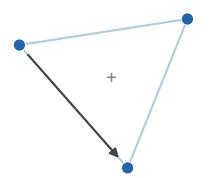

$$
Q _ { 8 } / C _ { 2 } \cong C _ { 2 } \times C _ { 2 }
$$

$$
\mathsf { D i c } _ { 3 } / C _ { 3 } \cong C _ { 4 }
$$

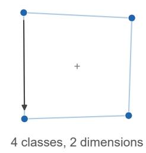

(d)  
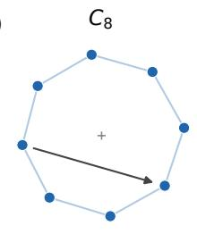

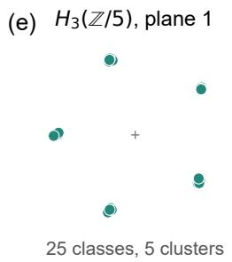

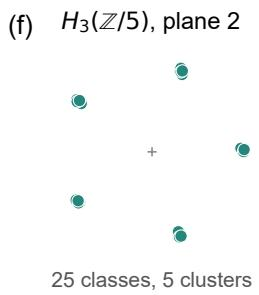  
Figure S11: Transformer class means reflect the learned abelian quotient. Each dot is the mean hidden vector of one true class at $t = 5 1$ . Panels (a–d) show the two leading singular directions. Edges are visual guides; arrows connect the identity class mean to its image under one quotient generator, rather than tracing individual hidden-state updates. Panels (e,f) show two character planes of one $H _ { 3 } ( \mathbb { Z } / 5 )$ model. Several of its 25 means overlap in each plane, while their paired coordinates distinguish all 25 classes. Axis orientation and scale are arbitrary and differ between panels. Examples use seed 42 for $A _ { 4 } ,$ doubled-budget $Q _ { 8 }$ and doubled-budget ${ \dot { H _ { 3 } } } ( \mathbb { Z } / 5 )$ , and seed 44 for $\mathrm { D i c _ { 3 } }$ and $C _ { 8 }$ Table 27 includes all endpoints.

In 38 of 40 endpoints, the retained rank and the fitted maps’ trace and determinant patterns agree with a faithful real representation of minimum dimension. We compare multisets of traces within each element-order and determinant-sign category, with absolute trace tolerance .30; this is a numerical compatibility check, not a proof of an exact representation. Determinants matter here. For $C _ { 2 } ^ { 2 }$ , the three nonidentity maps have traces approximately $0 , 0 , - 2$ and determinant signs $- 1 , - 1 , + 1 ;$ ; for $C _ { 4 }$ the traces are the same but all determinants are positive. Among the 28 endpoints for which $K - 1$ exceeds the minimum faithful dimension, none uses all K − 1 centered class directions.

We retain both exceptions in Table 27. One $Q _ { 8 }$ endpoint (seed 44, original budget) has rank one and only .510 quotient accuracy at this position. One doubled-budget $H _ { 3 } ( \mathbb { Z } / 5 )$ endpoint (seed 44) has rank six rather than four, consistent with an additional character pair. The observed preference for minimum dimension is therefore common in this collection, not universal.

## R.3 THE CLASS-MEAN SUBSPACE CONTROLS THE CURRENT READOUT

We test whether the identified directions affect predictions by transferring them between sequences. We draw a fresh pool of 2,048 sequences, split into 1,024 recipient–donor pairs, independently of the sequences used to estimate U. Let $h _ { r }$ and $h _ { d }$ be their activations at $t = 5 1$ . We replace only the recipient’s projection onto the class-mean subspace,

$$
\begin{array} { r } { h _ { r } ^ { \prime } = h _ { r } + U U ^ { \top } ( h _ { d } - h _ { r } ) . } \end{array}\tag{18}
$$

Donor vectors, basis vectors, and recipient replacements all refer to the same location, after the final LayerNorm and before the linear output head. As controls we replace the complementary projection $I \bar { - } U U ^ { \top }$ , the whole vector, or a random rank-r projection. For the latter we orthonormalize independent Gaussian directions and average five draws per endpoint. Self-replacement on eight sequences per endpoint reproduces the original logits exactly at both intervention boundaries used here, across all endpoints and all three replacement types (whole vector, subspace, and complement).

Table 27: Geometry and same-position transfer across all 40 Transformer endpoints. n counts endpoints, r is the retained class-mean rank, and $r _ { \mathrm { m i n } }$ is the minimum faithful real dimension of A. Q is quotient accuracy at $t = 5 1$ . The final three columns give donor-class agreement after replacing the class-mean subspace (Sub.), its orthogonal complement (Comp.), or a same-rank random subspace (Rand.). Values are ranges across endpoints; each random value first averages five controls. No endpoint is excluded, including the low-accuracy $Q _ { 8 }$ endpoint. The protocol and agreement metric are defined below.
<table><tr><td>G</td><td>A</td><td>n</td><td>r</td><td> $r _ { \mathrm { m i n } }$ </td><td>Q</td><td>Sub.</td><td>Comp.</td><td>Rand.</td></tr><tr><td> $C _ { 8 }$ </td><td>C8</td><td>3</td><td>2</td><td>2</td><td>0.997-1.000</td><td>0.930–0.991</td><td>0.000–0.009</td><td>0.000–0.001</td></tr><tr><td> $D _ { 4 }$ </td><td>C2</td><td>5</td><td>2</td><td>2</td><td>1.000</td><td>0.999-1.000</td><td>0.000–0.001</td><td>0.000–0.001</td></tr><tr><td> $A _ { 4 }$ </td><td>C3</td><td>3</td><td>2</td><td>2</td><td>1.000</td><td>1.000</td><td>0.000</td><td>0.000</td></tr><tr><td> $Q _ { 8 }$ </td><td>C{2 1</td><td>4</td><td>1,2</td><td>2</td><td>0.510-1.000</td><td>0.482-1.000</td><td>0.000-0.172</td><td>0.000-0.166</td></tr><tr><td>C7x  $C _ { 3 }$ </td><td>C3</td><td>3</td><td>2</td><td>2</td><td>1.000</td><td>1.000</td><td>0.000</td><td>0.000</td></tr><tr><td> $D _ { 6 }$ </td><td>26</td><td>4</td><td>2</td><td>2</td><td>1.000</td><td>1.000</td><td>0.000–0.001</td><td>0.000-0.001</td></tr><tr><td> $S _ { 4 }$ </td><td>C2</td><td>3</td><td>1</td><td>1</td><td>1.000</td><td>1.000</td><td>0.000</td><td>0.000</td></tr><tr><td> $\mathrm { S L } ( 2 , 3 )$ </td><td>C3</td><td>3</td><td>2</td><td>2</td><td>1.000</td><td>1.000</td><td>0.000</td><td>0.000</td></tr><tr><td> $\mathrm { D i c _ { 3 } }$ </td><td>C4</td><td>3</td><td>2</td><td>2</td><td>1.000</td><td>0.999-1.000</td><td>0.000</td><td>0.000</td></tr><tr><td> $H _ { 3 } ( \mathbb { Z } / 3 )$ </td><td>7</td><td>3</td><td>4</td><td>4</td><td>1.000</td><td>0.999-1.000</td><td>0.000</td><td>0.000</td></tr><tr><td> $H _ { 3 } ( \mathbb { Z } / 5 )$ </td><td>C2</td><td>6</td><td>4,6</td><td>4</td><td>0.968-1.000</td><td></td><td>0.974-1.0000.000–0.001</td><td>0.000-0.003</td></tr></table>

We score pairs with different true quotient classes. Donor-class agreement is the fraction for which the patched model’s predicted class equals the donor’s true class; recipient-class agreement is defined analogously. Throughout this section, we assign the model’s highest-probability full state to its quotient class, rather than taking an argmax after summing probabilities within classes. This definition also applies to Q in Table 27.

Of the 40 endpoints, 39 have $Q \geq . 9 5$ . Within this set, subspace replacement gives .9297–1.0000 donor agreement, with 35 endpoints at or above .99. Complement replacement gives at most .0091 donor agreement, and random replacement at most .0033. The lowest recipient agreement after complement replacement is .9422. These controls show that the measured directions selectively transfer the current class readout. They do not establish that the subspace is necessary, which would require an erasure or ablation test, or that it carries all information available in the hidden vector.

## R.4 DOES A LOCAL REPLACEMENT PROPAGATE TO LATER POSITIONS?

A successful readout intervention need not install a state that the model then updates. We therefore replace the whole hidden vector at $t = 5 1$ after the penultimate block, where the remaining attention block can still use it at later positions. We keep all input tokens and all other positions unchanged. If this intervention installed the donor class $c _ { d } ( t )$ in place of $c _ { r } ( t )$ and the model carried it through the recipient suffix, the predicted class at u $> t$ would become

$$
c _ { \mathrm { s h i f t } } ( u ) = c _ { d } ( t ) c _ { r } ( t ) ^ { - 1 } c _ { r } ( u ) .\tag{19}
$$

Here $c _ { r } ( t ) ^ { - 1 } c _ { r } ( u )$ is the quotient product of the unchanged suffix. We compare the prediction with both this shifted target and the original recipient target $c _ { r } ( u )$ on the same different-class pairs.

At positions 52, 56, and 71, the median shifted-target agreements across the 40 endpoints are .0090, .0006, and .0005, respectively; median original-target agreements are .9678, .9960, and .9982. At position 71, shifted agreement ranges from zero to .1612, with the largest value in the low-accuracy $Q _ { 8 }$ endpoint. Thus the single-position replacement usually does not produce a sustained change to subsequent quotient predictions. This test has a specific limit. Even at the intervention position, donor agreement from the penultimate-block replacement ranges from .286 to 1.000, so it does not uniformly install a donor state. Nor does replacing one position rule out a representation distributed across several positions. We therefore identify a causal contribution to the current quotient readout, while leaving its sequential implementation unresolved.