# The Gold in Bias: Maturing the AI Design Process through Verification

Samira Maghool∗ Pegaso University, Italy

Paolo Ceravolo† University of Milan, Italy

## Abstract

Background: Bias in AI systems is typically framed as a flaw to be minimized, yet it also serves as a critical indicator of underlying weaknesses in data, modeling assumptions, and system design. Existing approaches often treat bias as an isolated problem rather than as evidence that can strengthen verification and governance across the AI lifecycle.

Objectives: This paper aims to reconceptualize bias as a diagnostic tool that supports rigorous AI verification. We seek to develop a multidimensional framework to analyze bias, demonstrate how biases emerge in both Traditional and Generative AI, and provide a structured pathway for verification-driven mitigation.

Methods: We present a multidimensional framework analyzing bias across four dimensions: origin sources, emergence points throughout the AI modeling lifecycle, technical and methodological causes, and validation approaches for detection and mitigation. Through a comprehensive typology spanning traditional and generative AI systems, we demonstrate how biases manifest and propagate across development stages. Our analysis encompasses 30 distinct bias types, 16 verification methods, and 20 countermeasures, providing an actionable roadmap for practitioners. We introduce a hierarchical evidence framework that distinguishes internal validity (mechanistic integrity of AI systems) from external validity (contextual reliability in deployment environments).

Results: The framework reveals how biases manifest and propagate across modeling stages, enabling systematic mapping between bias types, verification techniques, and efective countermeasures. The proposed evidence hierarchy clarifies how diferent verification strategies contribute to mechanistic integrity and contextual reliability.

Conclusions: We advocate for “Ethics by Design” principles that integrate bias verification throughout the development lifecycle, enabling the construction of fairer, more robust, and trustworthy AI systems.

## 1 Introduction

The rapid adoption of Artificial Intelligence (AI) across industry, administration, and other domains requires rigorous scrutiny of its design and evaluation – especially as AI systems increasingly influence critical decisions, from medical diagnoses to automated audit procedures (Li et al., 2023; Wang et al., 2022). Historically, AI system design has emphasized the technical correctness of learning procedures, focusing on whether algorithms are properly implemented and trained on carefully curated ground truth datasets (Lakshmanan et al., 2020). In this paradigm, ground truth is often considered the sole source of validity, with system performance judged almost entirely by its ability to reproduce or approximate labelled data. Although this approach has advanced optimization and benchmarking, it risks overlooking important factors such as data biases, misalignment with real-world conditions, limited model interpretability, and uneven performance across populations.

These considerations can be formalized through the lens of internal and external validity (Mendling et al., 2025). Internal validity refers to the extent to which observed model behavior can be attributed to intended design choices rather than confounding factors, including data representation, feature selection, and assumptions embedded in algorithmic reasoning. External validity captures the degree to which model performance generalizes beyond controlled training and testing conditions, reflecting robustness and fairness across diverse populations, contexts, and applications. Both forms of validity are necessary for building AI systems that are not only technically correct but also trustworthy and socially reliable (Wang and Ding, 2024; Panigutti et al., 2021; Bansal et al., 2021).

Dysfunctional or biased outcomes in AI systems are increasingly recognized as multifaceted, resulting not only from flawed training data, but also from decisions throughout the design and deployment pipeline (Shah and Sureja, 2025). These problems often arise from the cumulative efects of decisions made at diferent development stages (Prado et al., 2020). For example, algorithmic bias can result from apparently neutral preprocessing steps, such as image normalization techniques that inadvertently suppress features critical to certain groups (Menezes et al., 2021), or from problem formulation that overlooks social or cultural context (Maghool et al., 2023). Additionally, metrics emphasizing aggregate performance, such as overall accuracy, can obscure significant diferences across subgroups (Huang et al., 2021). Defining such subgroups is critical, as it determines which forms of variation become visible (Maghool et al., 2024a). However, as illustrated by Simpson’s paradox, aggregate-level performance gains can alter or reverse subgroup-leve conclusions, making data segmentation choices determinant of assessment results (Sharma et al., 2022).

Nevertheless, bias in AI systems is not an intrinsic or universally objective property – it becomes meaningful only relative to defined goals or references (Binns, 2018; Bueter, 2022). What counts as “biased” depends on what the system is designed to optimize, who it serves, and what values are prioritized (Mehrabi et al., 2021). Identifying bias is not purely technical, but requires deliberate choices about performance benchmarks, fairness criteria, and social references (Selbst et al., 2019). Moreover, verifying bias can involve diferent evidence levels, from statistical measures and technical checks to stakeholder feedback or real-world observations (Bengio et al., 2024).

A growing body of research has addressed AI bias from technical (De la Peña Sarracén and Rosso, 2023; Shah and Sureja, 2025), ethical (Binns, 2018; Bueter, 2022), and social perspectives (Soprano et al., 2024; Selbst et al., 2019), ranging from algorithmic fairness (e.g., demographic parity, equalized odds) (Mehrabi et al., 2021) to accountability mechanisms (Wieringa, 2020), institutional governance (Mittelstadt, 2019; Messeri and Crockett, 2024), and participatory design practices (Spinde et al., 2025; Katell et al., 2020). However, bias need not be understood solely as a flaw to be corrected; it can also serve for critically examining and improving design practices. Indeed, it can serve as a diagnostic lens, an opportunity to uncover hidden assumptions, clarify value trade-ofs, contextual constraints, and strengthen design practices. From this perspective, bias becomes a design tool for reinforcing the integrity, robustness, and trustworthiness of AI systems.

Embracing this perspective, our paper aims to illustrate typical cases of bias throughout the AI modelling lifecycle. Our objective is to provide a comprehensive view by explicitly linking each case to a specific bias type, the stages at which it emerges, the technical mechanisms causing it, and the validation instruments that can identify it.

To achieve this objective, we analyse bias across four distinct dimensions. Each dimension introduces concepts that help characterise the diferent cases discussed in the paper and identify corresponding technical methods and practices. More specifically, following the Introduction, Section 4 presents our conceptualization of bias and introduces the dimensions used to describe related concepts in the following subsections. Subsection 4.1 discusses the diferent sources of bias in AI systems, resulting in four main categories of distortion. Subsection 4.2 outlines the main steps of the AI modeling lifecycle. Subsection 4.3 provides an overview of technical flaws that may lead to bias in AI models, followed by Subsection 4.4 that discusses the forms of evidence employed across validation approaches. Section 5 illustrates examples categorized by the concepts from previous sections. Section 6 discusses diferent verification approaches. Section 7 presents mitigation strategies and countermeasures, while, Section 8 concludes with final remarks and directions for future research.

## 2 Aim and Scope of the Study

This study aims to develop a unified framework that ofers a comprehensive and structured account of the types of bias discussed in the literature. The final goal is to support developers, researchers, and regulators in recognising, analysing, and mitigating these biases, while positioning bias verification as a core element of trustworthy, evidence-based AI design. By systematically examining bias, we can identify recurring patterns that facilitate detection, as well as specific diferences that necessitate targeted mitigation strategies.

Within this broader perspective, the paper considers bias across both Traditional AI (TAI) and Generative AI (GenAI), treating it as a context-dependent phenomenon that can result in allocative harms in decision-oriented systems (Raji and Buolamwini, 2022; Norori et al., 2021) and representational harms in content-generating models (Watson-Daniels, 2024; Birhane et al., 2023). We describe the distinct mechanisms through which these distortions arise and analyse how bias can emerge at any stage of the AI lifecycle, from problem formulation to deployment, highlighting the importance of continous verification mechanisms and efective countermeasures.

To address these challenges, we examine bias along four complementary dimensions:

1. A — Source of Bias: conceptual origins and mechanisms that generate distortions relative to expected behaviour (Section 4.1).

2. B — AI Modeling Lifecycle: stages at which distortions emerge, propagate, or intensify (Section 4.2).

3. C — Technical and Methodological Limitations: design or implementation issues that foster bias (Section 4.3).

4. D — Validation Approaches: methods for verifying and quantifying bias, organised into levels of evidence reflecting increasing rigour (Section 4.4).

## 3 Methodological Approach

This paper adopts a design science research approach, in which the objective is to develop a conceptual and methodological artefact that supports the understanding and diagnosis of bias across diverse AI systems. Our approach involves three interrelated phases that progressively deepen our understanding and refine the proposed framework.

## 3.1 Phase 1: Conceptual Grounding and Structuring

The conceptual grounding is formalised into four analytical dimensions (A–D) presented in Section 4, each composed of labelled concepts that are used consistently throughout the paper. These dimensions were developed through systematic literature review and synthesis of existing frameworks in AI bias research, fairness in machine learning, and AI verification methodologies. This structured taxonomy enables the precise classification of bias and establishes a shared vocabulary that links underlying mechanisms, lifecycle stages, and verification methods, thereby supporting a more systematic analysis of bias in AI systems.

## 3.2 Phase 2: Cross-Dimensional Mapping of Bias Cases

In the second phase, the paper conducts a systematic cross-mapping of bias cases using the four analytical dimensions.

In Section 5, 30 examples relevant to both TAI and GenAI were collected and analysed. Examples were selected based on the following criteria: (i) documented evidence in peer-reviewed literature or authoritative technical reports; (ii) representation of diverse application domains (healthcare, finance, criminal justice, content generation); (iii) coverage of both traditional AI (TAI) and generative AI (GenAI) systems; (iv) illustration of distinct bias manifestation patterns across the AI lifecycle; and (v) availability of suficient technical detail to enable cross-dimensional analysis.

To enhance readability and facilitate cross-references, each dimension is assigned a letter and each concept within a dimension is assigned a number. For instance, when we refer to C2. Missing or incomplete data in the text, we unambiguously indicate the second concept introduced in Section 4.3. The mapping we propose clarifies the nature of the diferent examples we analyse, illustrating how complex distortions can be broken down into identifiable components. This decomposition facilitates both verification and mitigation strategies by revealing the specific mechanisms through which bias emerges and propagates.

## 3.3 Phase 3: Integration into Evidence-Based Verification Frameworks

The final phase synthesises the insights from the previous steps into hierarchies of evidence for internal and external validity presented in Section 6. These hierarchies represent diferent levels of rigour, from basic metric-based validation to approaches designed for continuous monitoring in production environments. The resulting 16 verification methods and 20 countermeasures account for the difering nature of bias in TAI and GenAI systems, ofering structured guidance for selecting appropriate evaluation strategies based on system type, risk level, and deployment context. Each verification method is mapped to the types of bias it can detect (Phase 2 taxonomy) and the forms of evidence it produces (internal vs. external validity).

Together, these three phases produce a coherent methodological artefact that connects conceptual definitions, lifecycle reasoning, technical analysis, and evidence-based verification, ultimately supporting the implementation of “Ethics by Design” principles in AI development.

## 4 Conceptually Grounding Bias in AI

Bias represents a distortion that can compromise decision-making or goals such as accuracy, fairness, or robustness. Yet defining what counts as distortion is far from straightforward (Bueter, 2022; Murikah et al., 2024). Bias is often seen as deviation from an objective truth, but this assumes rigid criteria. In practice, AI systems operate in dynamic environments where labels are subjective, data shift, and notions of correctness or fairness vary by context. An alternative interpretation views bias as deviation from a reference standard, such as data distribution, domainspecific validation practices, or normative expectations. In this view, bias becomes a contextsensitive phenomenon: what appears biased in one setting may reflect intentional alignment in another (Binns, 2018).

This contextual nature becomes evident when design choices shape downstream outcomes (Weinberg, 2022). A healthcare triage model trained on biased data may deprioritize marginalized groups, while predictive policing can reinforce systemic inequalities. Similar techniques, however, raise fewer concerns in non-sensitive domains such as retail forecasting. These examples demonstrate that bias arises from the interplay of technical objectives, social values and application goals. As bias can arise at any stage of the AI lifecycle, it should be viewed as an opportunity to improve the quality of the design.

In this work we analyze bias in terms of its conceptual source (A) the lifecycle stage(s) at which it emerges (B), the technical or methodological limitations that are responsible for it (C), and the forms of evidence appropriate for detecting and interpreting it (D).

## 4.1 Sources of Bias

To provide a structured overview of bias in AI, we begin by examining its general sources, grounding our analysis in the categories of bias established in pre-AI literature that emphasize societal and human origins. This foundation is essential for two reasons. First, it connects our framework to existing scholarship on bias. Second, it enables us to trace how social context and human judgment influence the technical manifestations of bias in AI systems. Identifying the root sources before examining their technical instantiation allows us to better understand how societal prejudices, human subjectivity, and design choices shape AI outcomes across the development pipeline. We categorize bias sources into three groups: Societal Prejudices, Human Subjectivity, and Technical Limitations.

## A1. Societal prejudices

This concept refer to systemic inequalities and social norms that may embed into AI systems. When training data or institutional practices reflect historical injustices, stereotypes or structural discrimination, AI systems reproduce and amplify these distortions. This may result in Social Bias in various forms such as Historical and Confirmation bias which undermine fairness in areas such as hiring, lending, law enforcement, and healthcare (Barocas et al., 2023). Rather than providing impartial decision-making, these systems risk exacerbating existing disparities.

## A2. Human subjectivity

Human subjectivity introduces bias through individual judgment, selection, and cognitive constraints. Those involved in the design process, such as data annotators, developers, and decision-makers, bring their own implicit biases, cultural perspectives, and selective attention, which can lead to inconsistent or skewed inputs. This source of bias can cause Data Representation Bias once the data does not meet the data coverage requirements. Human subjectivity could also cause Measurement and Decision Bias in cases like biased thresholdsetting (Mitchell et al., 2019) and Usage Bias when subjectivity leads to the system being misused.

## A3. Technical limitations

Technical limitations generate bias through algorithmic constraints, imbalanced datasets, and narrow design choices that fail to generalise across populations. These produce Data Representation Bias, Measurement and Decision Bias, and Usage Bias when opaque interfaces hinder responsible application.

Figure 1 categorises bias types—Social Bias, Data Representation Bias, Measurement and Decision Bias, and Usage Bias—by their emergent sources: Societal Prejudices, Human Subjectivity, and Technical Limitations. Blue frames indicate biases highly probable in GenAI, orange frames denote biases in both GenAI and TAI, and green frames mark traditional AI-specific biases.

While valuable for tracing origins, this taxonomy alone does not guide intervention design, as biases emerge at diferent abstraction levels requiring stage-specific responses. We therefore supplement it by mapping each bias type to its corresponding lifecycle stage (Section 4.2), technical limitations fostering its emergence (Section 4.3), and appropriate validation approaches (Section 4.4). This extended framework connects bias roots to concrete design and evaluation practices.

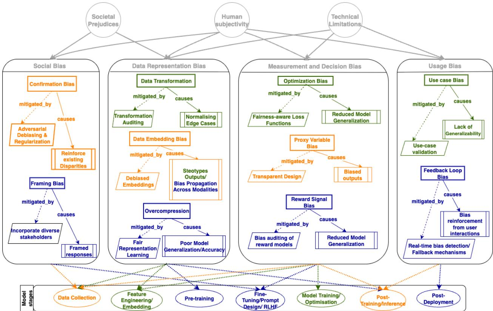  
Figure 1: Categorization of diferent types of bias, Social Bias, Data Representation Bias, Measurement and Decision Bias, and Usage Bias, by their emergent sources: Societal Prejudices, Human Subjectivity, and Technical Limitation. For each category, a few examples of bias types are recalled. Framed blue examples demonstrate those types that, with high probability, happen in the GenAI system, while orange frames happen in both systems, and Green frames only for TAI.

## 4.2 The AI Modeling Lifecycle

In order to understand where bias can emerge during the development of a system, it is helpful to outline the typical stages of AI modelling. While diferent works describe the pipeline with slight variations (González-Sendino et al., 2023), most of the literature identifies the following stages:

In the TAI lifecycle, Data Collection, Feature Engineering/Embedding are followed by

Table 1: Stages of the AI lifecycle.
<table><tr><td rowspan=1 colspan=1>AI Modeling Stage</td><td rowspan=1 colspan=1>Description</td></tr><tr><td rowspan=1 colspan=1>B1. Data Collection</td><td rowspan=1 colspan=1>Gathering raw data from sensors, databases, user interactions, web scraping, or third-party providers. In Traditional AI (TAI), data often include tabular formats, images,or domain-specific corpora. In Generative AI (GenAI), large-scale multimodal datasets(text, images, audio, etc.) are collected, often from Internet-scale sources.</td></tr><tr><td rowspan=1 colspan=1>B1. Feature EngineeringEmbedding</td><td rowspan=1 colspan=1>Transforms raw data into structured features or dense representations. In TAI, this in-cludes manual feature selection (normalization, one-hot encoding, domain-specific extrac-tion). In GenAI, it relies on automated embedding methods (tokenization, word/sentenceor multimodal encoders).</td></tr><tr><td rowspan=1 colspan=1>B1. Pre-Training</td><td rowspan=1 colspan=1>A defining step in GenAI, where foundational models (e.g., LLMs like GPT, vision modelslike CLIP) are trained on massive unlabeled or weakly labeled datasets to learn general-purpose representations. In TAI, this stage is often absent, as models are trained directlyon task-specific data.</td></tr><tr><td rowspan=1 colspan=1>B1. Fine-Tuning/ PromptDesign / RLHF</td><td rowspan=1 colspan=1>Adapts or aligns generic models to specific tasks. Includes: Fine-Tuning — furthertraining on smaller, task-specific datasets; Prompt Design — crafting inputs to steeroutputs without modifying model parameters; RLHF — using human feedback to traina reward model that guides reinforcement learning for more aligned outputs.</td></tr><tr><td rowspan=1 colspan=1>B1. Model Training/Op-timization</td><td rowspan=1 colspan=1>In TAI, objectives focus on accuracy, precision, or recall, optimizing parameters to mini-mize loss. In GenAI, objectives include likelihood maximization, adversarial (GAN) losses,or transformer-specific training criteria.</td></tr><tr><td rowspan=1 colspan=1>B1. Deployment</td><td rowspan=1 colspan=1>The trained model is integrated into real-world environments where it performs or auto-mates decisions.</td></tr><tr><td rowspan=1 colspan=1>B1. Post-Deployment</td><td rowspan=1 colspan=1>Covers both inference and maintenance. In TAI, it produces predictions or scores; inGenAI, it generates new outputs (e.g., text, images). It includes decoding strategies(greedy, beam search, nucleus sampling), output calibration, and ongoing monitoring,retraining, auditing, and compliance updates.</td></tr></table>

Model Training/Optimization and end up with Deployment and Post-Deployment stages. While the GenAI systems’ full stage implementation contains Data Collection, Feature Engineering/Embedding, Pre-Training, Fine-Tuning/Prompt Design/RLHF, Inference, Deployment and, Post-Deployment.

Figure 1 schematically outlines our approach in studying bias. In this approach, we move from Source to Mechanism (How it happens) to Manifestation (The resulting type of bias) and finally to the emergent Stage of the AI life cycle.

Although there is considerable overlap between diferent types of biases in TAI and GenAI models, the stages of the models prone to bias could difer.

## 4.3 Bias in the Modeling Process

Traditional evaluation exploits dataset ground truth to compute quality metrics such as F1 score or Area under the ROC curve (AUC) (Huang et al., 2021). While quantitatively clear, these measures assume labels reliably represent objective truth, an assumption often violated when data fails to capture the full range of phenomena the deployed AI system will encounter. Consequently, evaluation must move beyond model-data comparison to consider the broader target system in which the model operates. Although the concept of the target system is abstract and cannot be denoted completely, it allows us to identify recurring flaws that can emerge throughout the design and development process.

To frame our discussion, we can refer to the Venn diagram in Figure 2. This diagram illustrates the three crucial, and often distinct, domains of model evaluation: what the model has learned (M), the information encapsulated in the training and test data (D), and the true requirements of the real-world system (S). Conventional evaluation methodologies primarily assess the intersection of M and D —that is, how well the model captures the statistical regularities encoded in its dataset. While this focus is necessary for internal validation, it can also be myopic because it overlooks

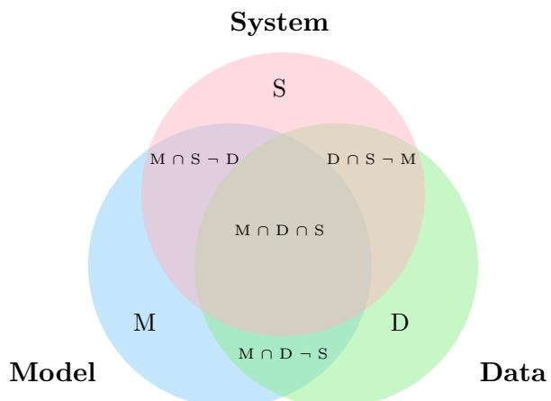  
Figure 2: This Venn diagram illustrates the three perspectives in model evaluation: M (what the model has learnt), D (what is present in the training and test data) and S (what is truly required by the system in the real world). Classical evaluation focuses on the intersection of M and D. Gaps between D and S or M and S, however, highlight areas where the model may fail to generalise or overfit to irrelevant patterns.

other sources of failure.

Building on these conceptual distinctions, we can identify common aspects of AI modeling that lead to bias. The following subsections introduce seven common sources of bias in modeling.

## C1. Biased data.

When the patterns captured by the model from the data do not authentically exist within the system, we are in the region M ∩ D¬S. In this situation, the model inherits distortions originating from the sources used to acquire the data. Such distortions often reflect stereotypes, sampling imbalances, or historical inequities embedded in the social, cultural, or institutional contexts in which the data were generated (Sec. 5.1.4). They may also emerge from temporal or contextual shifts, commonly referred to as concept drift, where the data distribution evolves over time and no longer represents the current state of the system (Sec. 5.4.5).

## C2. Missing or incomplete data.

When the available data provides only a partial representation of the system, the model is trained on an incomplete view of the phenomena it is meant to capture. This situation corresponds to the region $S { \neg } D { \neg } M$ , where parts of the system are not reflected in the data. This type of incompleteness can be caused by limitations in the way data is collected, such as the omission of relevant cases, attributes, or subpopulations (such as Data Coverage Bias in Sec. 5.2.1). It can also result from measurement constraints, privacy restrictions or selective recording practices that exclude certain events or groups systematically (Sec. 5.3.1). Missingness becomes a source of bias when certain classes are not represented, or when the absence of data correlates with sensitive or outcome-related variables. This distorts the relationships that the model learns from the available evidence.

## C3. Systematic misclassification.

Even when model, data, and system overlap $( M \cap D \cap S )$ , bias may persist as systematic misclassification. As Fig. 3 illustrates, decision boundaries may incorrectly separate classes, especially for instances near class boundaries or in low-density regions far from learned distributions, producing stable yet incorrect classifications. The scaling principle (Kaplan et al., 2020) suggests that larger datasets and expressive architectures like deep neural networks should approximate true decision boundaries more closely. However, scaling cannot fully capture rare events in distribution long tails. Moreover, residual uncertainty can persists (Hüllermeier and Waegeman, 2021): aleatoric uncertainty from intrinsic class ambiguity, and epistemic uncertainty when instances fall outside well-represented training regions. This issue is exacerbated by incorrect labelling (Sec. 5.3.3) and inadequate feature representation (Sec. 5.2.3). When labels are inconsistent or features fail to capture relevant dimensions, misclassification reflects not only model capacity but representational fidelity. Thus, even under apparent alignment, bias endures due to labelling imperfections, representational limits, or inherent uncertainty, revealing fundamental constraints of data-driven inference.

## C4. Incorrect or noisy labelling.

When there is an imperfect correspondence between data instances and their true system states, the learning process is afected by labelling errors. These errors distort the alignment between the system, the data and the model in two main ways (Northcutt et al., 2021). Firstly, when examples that exist in the system are not correctly identified or labelled in the data, a misalignment occurs. In this case, either relevant instances are omitted from the training set, S¬D¬M or they are incorrectly marked as irrelevant D ∩ S¬M. This prevents the model from learning the true underlying associations. Secondly, labeling noise may occur even when examples are correctly included in both the system and the data, corresponding to the region ${ \cal M } \cap { \cal D } \cap { \cal S } .$ , but are associated with an incorrect class or target value. In this case, the data provide misleading supervision, meaning the model learns patterns that are either systematically or randomly incorrect. This results in unreliable or biased predictions. As illustrated in Figure 5, labeling errors can arise from various causes, such as human annotation mistakes (Sec. 5.3.2), ambiguous or overlapping class definitions, inadequate domain expertise or inconsistencies in data integration processes. Regardless of their source, such errors undermine the fidelity of the learning process, propagating distortions throughout the model’s internal representations and subsequent inferences.

## C5. Feature underrepresentation.

When the features available in the data fail to capture the relevant dimensions of the system, the model learns from an impoverished or distorted representation of reality. As illustrated in Fig. 4, varying the number or scale of features can substantially alter the separability of classes within the model’s decision space. If key explanatory variables are missing, aggregated or measured on the wrong scale, the decision boundaries inferred by the model may not align with the true structure of the system. This condition is primarily reflected in the region D ∩ S¬M. However, feature underrepresentation can also propagate distortions into other regions, for instance by inducing noise or hallucinations M ∩ D¬S or systematic misclassification M ∩ D ∩ S. Feature underrepresentation may be caused by measurement limitations, domain simplifications or design choices that restrict the range of the input space. It can also result from inadequate feature selection and scaling, which alters the relative influence of variables and reshapes the geometry of the decision surface (Sec. 5.2.3).

## C6. Data imbalance.

When the data disproportionately represent certain classes, groups, or conditions of the system, the model learns a skewed approximation of the underlying distribution (Sec. 5.2.2). In such cases, the learned decision boundaries are optimized toward the dominant classes, often at the expense of minority or infrequent ones. This situation can be described as a distortion primarily occurring within ${ \cal M } \cap { \cal D } \cap { \cal S } .$ , where the sampling frequencies of system instances are unevenly reflected in the data, resulting in biased learning outcomes. Data imbalance can manifest both at the class level—where one category vastly outnumbers others—and at the feature or subgroup level—where specific demographic, temporal, or contextual segments are underrepresented (Gilhuber et al., 2023).

The causes of data imbalance are diverse. They may arise from structural asymmetries in the system itself (e.g., historical biases or rare events), from sampling or data acquisition procedures that overlook minority categories, or from deliberate curation decisions that favor specific data sources (Shah and Sureja, 2025).

## C7. Contextual or prompt bias.

Unlike TAI, which maps predefined inputs to outputs within a fixed feature space, GenAI relies on contextual prompts to actively construct its outputs. While this enables GenAI to generate responses that closely match the intended system, it also makes the model highly sensitive to the framing of input. When the prompt or context is misleading, incomplete or incorrectly specified, the model may produce outputs that difer from the true system — an efect analogous to feature underrepresentation, whereby critical information is absent or distorted. Formally, this corresponds to the region $D \cap S \lnot M$ , in which the data and system contain relevant information, but the model fails to capture or interpret it due to contextual misalignment (Sec. 5.4.2). In GenAI, such misalignment often arises from prompt-induced bias stemming from ambiguous phrasing, narrow constraints or omitted context, which reduces the expressiveness of the input space and skews generation (Sec. 5.4.4). While TAI is generally less context-dependent, it can also exhibit user-induced bias when its interface or intended use is misunderstood, leading to mis-specified inputs or misinterpretation of outputs. Therefore, in both paradigms, bias emerges not only from data and model limitations, but also from the dynamic interaction between human users, the model and the surrounding system context.

## 4.4 Validation and Evidence in Bias Verification

From a design science perspective, bias verification repositions bias from a defect to a diagnostic tool in AI design. Operationalising this requires considering the evidential layers through which bias is identified, interpreted and managed. TAI systems, with narrowly defined tasks and fixed inputs/outputs, enable straightforward internal validation using ground truth, stable distributions and standardised metrics (accuracy, precision, recall). However, internal validity deteriorate under changing conditions, as contextual shifts invalidate prior assurances. GenAI systems complicate verification through open-ended outputs and probabilistic mechanisms. Their behaviour depends on prompts, context and evolving states, requiring broader, continuously updated evidence that encompasses correctness, adequacy, reliability and generalisability in dynamic environments.

In this regard, the distinction between internal and external validity ofers a structured approach to linking the technical verification of AI systems with their contextual and ethical validation (Mendling et al., 2025).

## D1. Internal Validity

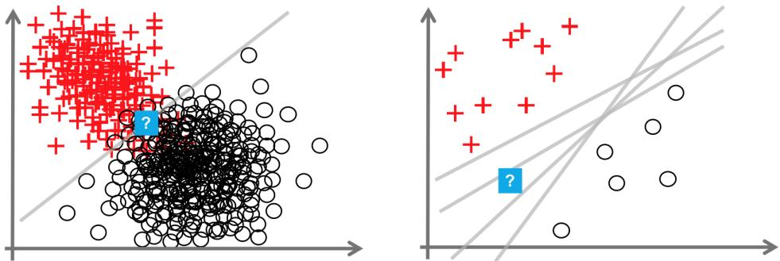

Figure 3: Taken from (Hüllermeier and Waegeman, 2021). Illustration of systematic misclassification within the region M ∩ D ∩ S. The left panel depicts an aleatoric condition, where class boundaries overlap and instances near the frontier are inherently ambiguous, leading to unavoidable misclassifications. The right panel shows an epistemic condition, where instances occur in regions of the decision space that are underrepresented in the training data, resulting in uncertain or systematically incorrect predictions.  
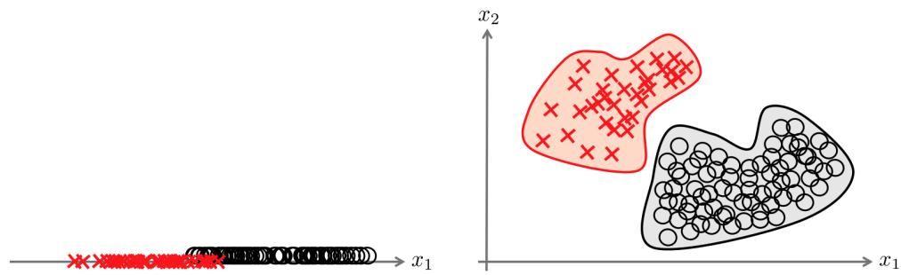  
Figure 4: Taken from (Hüllermeier and Waegeman, 2021). The figure shows how varying the number or scale of features afects class separability within the model’s decision space. When key features are missing or inadequately scaled, the resulting projection of the system into the data constrains the model, leading to distorted or overlapping decision boundaries.

Concerns the extent to which a model’s observed behaviour can be causally attributed to its intended design — that is, its architecture, training data and optimisation procedures — rather than to uncontrolled or confounding factors. In the context of bias verification, internal validity establishes whether identified biases originate from identifiable mechanisms within the design process, such as data imbalance, representation error, or objective misalignment. It provides strong, albeit narrowly scoped, evidence of mechanistic integrity, showing that the model behaves as designed and that its biases are traceable within the system’s internal logic.

## D2. External Validity

By contrast, concerns the generalisability of the model’s behaviour and the persistence or transformation of bias across diferent contexts, datasets, and user interactions. It provides evidence of ecological reliability, showing whether the system remains robust, fair, and trustworthy once deployed. In this view, bias is not merely an internal design artefact, but a contextually mediated phenomenon that may be amplified, shifted, or attenuated when the system interacts with dynamic

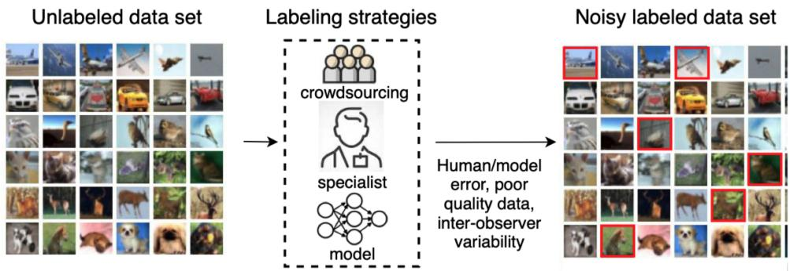  
Figure 5: Taken from (Cordeiro and Carneiro, 2020). Illustration of labeling errors and their impact on the alignment between system, data, and model. Incorrect or noisy labels can distort the learning process in two distinct ways. Examples belonging to the system are not correctly identified in the data, resulting in partial misalignment D ∩ S¬M. Examples are correctly included within M ∩D ∩S but are associated with the wrong class, leading the model to learn systematically incorrect decision boundaries. Both forms of error illustrate how mislabeling propagates bias even when data quantity and model capacity appear suficient.

social or environmental conditions.

Taken together, these two forms of validity establish a hierarchy of evidence for verifying bias. Internal validity supports verification, confirming that the system’s mechanisms and internal biases are identifiable and reproducible, while external validity supports validation, ensuring that these mechanisms yield acceptable and reliable outcomes in situ. This dual framework aligns with the broader goal of design science: to mature AI systems through iterative cycles of controlled verification and contextual validation, thereby transforming bias into a constructive resource for reflective and accountable design.

## 5 Illustrative Examples of AI Bias

Although the theory of AI bias has been extensively studied, concrete examples are needed to reveal how it manifests and afects real-world outcomes. In this section, we present cases from various fields, including healthcare, recruitment, and generative content, to demonstrate how biased data, modelling choices, or representational errors can result in erroneous decisions, perpetuate stereotypes, and reinforce structural inequalities. These examples emphasise the importance of addressing bias throughout the entire AI lifecycle and demonstrate the practical consequences of unchecked algorithmic distortions in both TAI and GenAI systems.

## 5.1 Social Bias

Social bias is among the most insidious forms of distortion and originates from societal prejudices embedded in the data (e.g., stereotypes, systematic inequalities), as it reflects deep-seated prejudices in society, making it less apparent. This category of bias is not confined to a specific context but permeates human practices and the artifacts they produce. Unlike TAI systems that predict labels or numerical outputs, GenAI models generate text, images, or multimedia content, which makes biases more visible and impactful in narrative, visual, and contextual forms. In the following, some types of bias categorized as Social Bias are presented.

## 5.1.1 Historical Bias

Historical bias refers to the embedding of past inequities or systemic discrimination into datasets and algorithms. It arises when data reflects historical injustices, thereby perpetuating these patterns in modern decision-making systems.

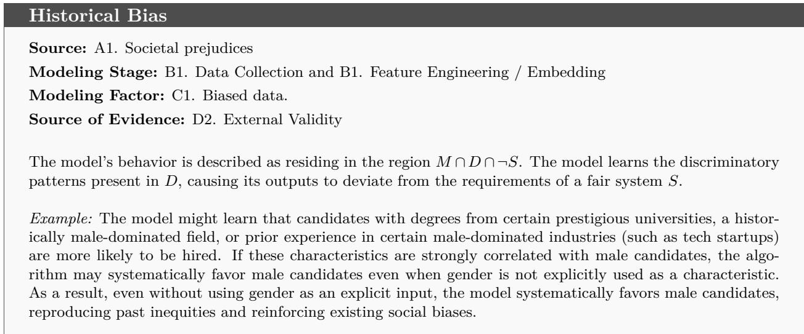

## 5.1.2 Survivorship Bias

It occurs when analysis focuses only on subjects that have “survived” a selection process, overlooking those that did not. This can lead to skewed conclusions because the missing data from non-survivors often contains critical insights (Elston, 2021).

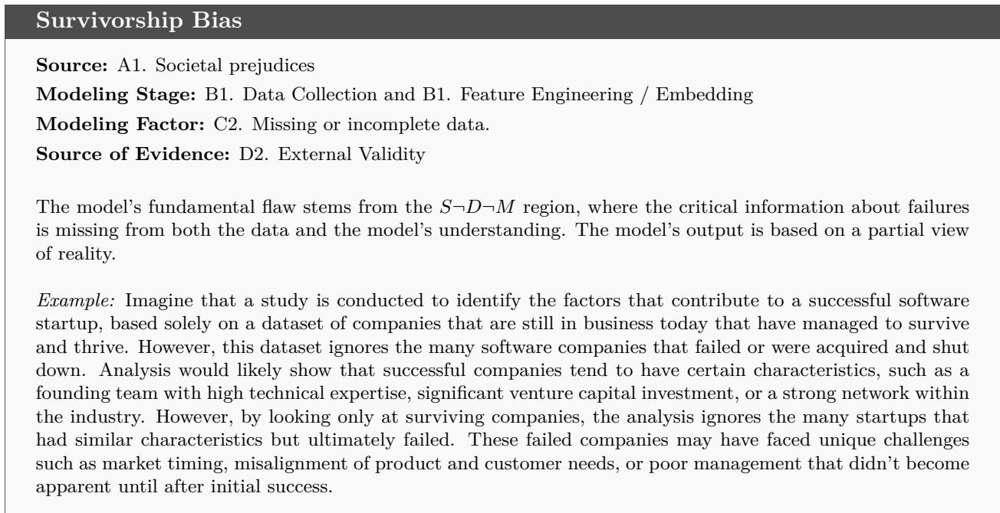

## 5.1.3 Subjectivity Bias

Occurs when personal opinions, beliefs, or preferences of individuals influence the data collection, interpretation, or decision-making process, leading to non-objective outcomes (Tversky and Kah-

neman, 1974). For instance, researchers may unintentionally interpret ambiguous results in ways that align with their hypotheses or expectations.

Subjectivity Bias   
Source: A1. Societal prejudices and A2. Human subjectivity   
Modeling Stage: B1. Data Collection and B1. Feature Engineering / Embedding   
Modeling Factor: C1. Biased data. and C2. Missing or incomplete data.   
Source of Evidence: D1. Internal Validity and D2. External Validity   
S denotes the objective labels, while D contains labels distorted by human subjectivity, introducing noise.   
Therefore Model learns this biased labeling pattern (M ∩ D ∩ ¬S). In other situations, true labels may   
be absent from S (S ∩ ¬D) due to subjective interpretation. Consequently, M cannot learn correct rules   
(S ∩ ¬D ∩ ¬M).   
Example: Consider a company that is developing a sentiment analysis model to detect whether customer   
reviews are positive, neutral, or negative. They hire several human annotators to label a dataset of reviews.   
Regarding this review example, “The product arrived late, but the customer service was very helpful”, Anno   
tator A, who values punctuality, labels this as Negative; Annotator B, who prioritizes helpful service, labels   
it as Positive and; Annotator C chooses Neutral because the statement contains both positive and negative   
aspects.   
The subjectivity of each annotator afects the label, and the model trained on this inconsistent labeling will   
inherit this subjectivity producing biased predictions in deployment.

## 5.1.4 Cultural Bias

Arises when cultural norms, values, or perspectives influence the design, implementation, or interpretation of research, tools, or systems, leading to unfair advantages or disadvantages for specific cultural groups. For instance, Standardized Testing or contexts unfamiliar to certain cultural groups can disadvantage students not aligned with the dominant culture.

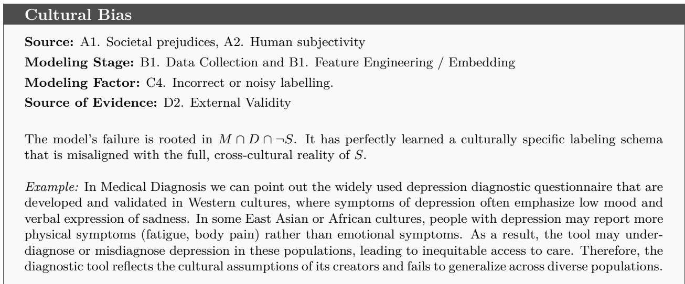

## 5.1.5 Confirmation Bias

Confirmation Bias is the tendency to seek, interpret, and remember information that confirms one’s pre-existing beliefs or hypotheses while disregarding or undervaluing information that contradicts them. In TAI, confirmation bias occurs when developers, data scientists, or systems favor Training data, features, or outcomes that align with pre-existing assumptions or hypotheses, potentially leading to overfitting, poor generalization, or reinforcement of incorrect patterns (Gilhuber et al., 2023; Klayman and Ha, 1987).

Anchoring Bias   
Source: A2. Human subjectivity   
Modeling Stage: B1. Data Collection, B1. Feature Engineering / Embedding   
Modeling Factor: C1. Biased data., C2. Missing or incomplete data.   
Source of Evidence: D2. External Validity   
The initial, anchored assumptions (e.g., “age/income are most important”) cause the team to create a skewed   
dataset (D) by over-weighting certain features.

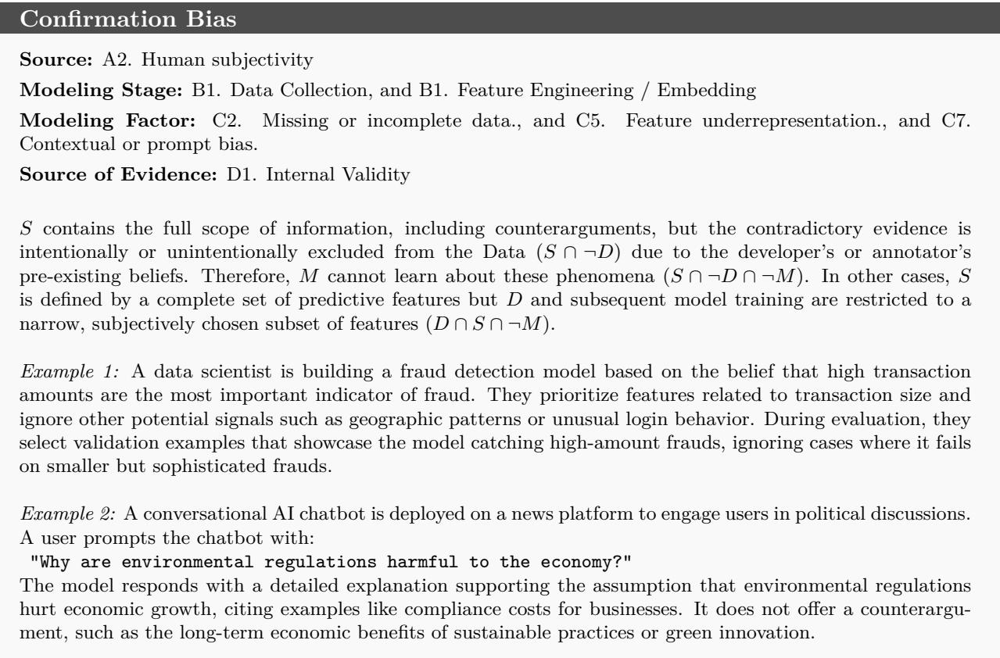

In GenAI instead, during fine-tuning, if annotators systematically favor responses that align with dominant cultural beliefs or commonly held opinions, the model learns to mimic these tendencies. This amplifies bias by rewarding conformity to majority perspectives rather than critical or balanced reasoning.

## 5.1.6 Anchoring Bias

Anchoring bias is a cognitive bias where an individual relies too heavily on an initial piece of information when making decisions or judgments, even when subsequent information suggests the anchor is irrelevant or incorrect. It can afect model performance due to over-reliance on default or initial parameters, influence feature selection or weighting, especially if initial assumptions are incorrect, or skew results in iterative labeling or reinforcement learning (Rhue, 2023).

M learns from this artificially biased data, resulting in a suboptimal and unfair model that is misaligned with S (S ∩ ¬D ∩ ¬M).

Example: Consider a team is building a machine learning credit scoring model and initially assumes that age and income are the most important predictors of creditworthiness, based on previous industry practices. They select and overweight features related to these two variables early in development. Even when exploratory data analysis later suggests that debt-to-income ratio or recent payment history are stronger predictors, the team sticks to their initial assumptions because their feature selection and model tuning were anchored to these early beliefs.

## 5.1.7 Group Attribution Bias

Occurs when individuals attribute the behavior or characteristics of a single member of a group to the entire group or vice versa. It reflects a tendency to generalize based on limited information and often leads to stereotyping. Assuming all members of a demographic group share a particular trait because one prominent individual does is a common example of this type of bias. In AI, models trained on biased data may unfairly attribute behaviors or characteristics to groups, leading to discriminatory outcomes (e.g., predictive policing models disproportionately targeting minority communities).

Group Attribution Bias   
Source: A2. Human subjectivity   
Modeling Stage: B1. Data Collection, B1. Feature Engineering / Embedding   
Modeling Factor: C1. Biased data.   
Source of Evidence: D2. External Validity   
D is a historical record skewed by societal prejudices and over-policing, creating a false correlation between   
features such as demographics and crime rate. M then learns this spurious correlation from the data (M ∩   
D ∩ ¬S).   
Example:   
A predictive policing AI system is trained on historical crime data that disproportionately reflects over-policing   
in certain neighborhoods, often with higher populations of minority communities. Therefore, the model learns   
to associate crime risk with demographic or geographic features. As a result, the system continually flags   
these communities for higher surveillance, even when actual crime rates do not justify it.   
This leads to a self-reinforcing loop where more police presence leads to more reported incidents, which then   
feeds back into the model. This model unfairly attributes risk to an entire group or area based on biased   
historical data.

## 5.1.8 Echo Chamber Bias

The Echo Chamber efect in GenAI occurs when a model repeatedly reinforces or amplifies a user’s opinions, tone, or reasoning during multi-turn interactions. This happens because conversational AI systems are optimized to maintain coherence and user satisfaction, often by aligning with the user’s assumptions instead of challenging them or introducing alternative perspectives. Unlike oneshot confirmation bias, which occurs in a single response, the Echo Chamber efect compounds over multiple conversational turns, gradually strengthening the user’s initial stance and creating a sense of validation.

Echo chamber Bias   
Source: A2. Human subjectivity   
Modeling Stage: B1. Data Collection, and B1. Feature Engineering / Embedding   
Modeling Factor: C1. Biased data.   
Source of Evidence: D2. External Validity   
S is the balanced, nuanced, and evidence-based view on a topic. D in this context is the conversation history,   
which becomes increasingly skewed and one-sided due to the user’s repeated biased inputs. M is trained to   
be context-aware and aligns its responses with this progressively more biased conversational data. Therefore,   
the model’s behavior is a direct result of learning from and adapting to the biased data of the conversation   
thread, placing it in the M ∩ D ∩ ¬S region.   
Example: A user interacts with a chatbot about immigration policy:   
User: “Immigrants are taking away jobs from locals, right?”   
Model: “Many people believe immigration can impact job availability. Some argue that   
competition increases.”   
User: “Exactly! And that’s why immigration should be reduced.”   
Model: “Yes, reducing immigration is often suggested as a way to protect local employment.”   
Over time, the model mirrors and strengthens the user’s perspective, creating an echo chamber efect, even   
though economic research provides more nuanced views.

## 5.1.9 Framing Bias

In GenAI, Framing Bias refers to the bias introduced by how a task, prompt, or dataset is structured or contextualized, which influences what the model learns to generate and how it generates it. It reflects the perspective or assumptions embedded in the framing, whether by developers, annotators, or users which can steer the model toward particular narratives, interpretations, or tones. Framing bias in GenAI occurs when the wording, structure, or presentation of input data and prompts leads the model to favor certain perspectives, values, or interpretations while ignoring or downplaying others. Framing bias can happen during Prompt Framing by Users , Annotation and Feedback Framing, System Prompt Framing (Instruction Tuning).

Framing Bias   
Source: A2. Human subjectivity   
Modeling Stage: B1. Data Collection, B1. Feature Engineering / Embedding   
Modeling Factor: C7. Contextual or prompt bias.   
Source of Evidence: D2. External Validit   
S is the complete, multi-faceted reality of the topic (e.g., both positive and negative impacts of social   
media). D is the user’s prompt, which presents a framed, narrow, and subjective slice of the system. M   
is highly sensitive to this input context and generates an output that aligns with the framed perspective   
model. Therefore, the core failure is that the input data provides a biased context that misrepresents the full   
system. This leads the model to produce an output that, while aligned with the prompt, is misaligned with   
S (M ∩ D¬S).   
Example: Compare the following two prompts:   
Prompt A: “Explain why social media is bad for teenagers.”   
The model focuses more on negative efects (addiction, anxiety).   
Prompt B: “Discuss the impact of social media on teenagers.”   
The model presents both pros (connection, self-expression) and cons (Body Image Issues, Privacy and Safety   
Risks).

## 5.2 Data Representation Bias

Representation bias can arise once the data is imbalanced or the representation of populations or scenarios is incomplete. This skewed sampling leads directly to Data Coverage Bias, where the final insights or prediction models are not generalizable to the full population. The trained models on these dataset are biased, underperforming, or unfair when applied to underrepresented groups or scenarios. An illustrative example is found in urban trafic datasets, which frequently overlook the needs of individuals with disabilities. This oversight leads to AI-driven solutions that fail to consider their experiences and requirements, rendering systems less inclusive.

Data Representation Bias in GenAI refers to systematic distortion caused by how information is encoded, structured, and prioritized within the training data. This category of bias influences what the model learns as “important” and how concepts are represented internally.

Representation bias occurs before and during training, due to several reasons such as: Imbalanced token frequencies such as some words, cultural concepts, or dialects occur more often, Data formatting inconsistencies such as formal vs. informal language dominates and, Hierarchical structures in text like headlines prioritized over body text in scraped datasets.

## 5.2.1 Data Coverage (Selection) Bias

Data Coverage Bias occurs when the training data lacks suficient diversity or completeness across the full range of concepts, languages, contexts, or scenarios that the model is expected to handle. Unlike selection bias (which is about how data is sampled), coverage bias focuses on gaps or omissions in the dataset that lead to systematic blind spots in the model’s knowledge or generation capabilities. This type of bias may occur during Data Collection, once the corpus emphasizes certain domains but underrepresents others; at the Preprocessing Stage, where rare or low frequency data may be pruned during deduplication or cleaning steps, removing underrepresented voices while retaining dominant narratives; or eventually at the Model Training Stage even if included, underrepresented data may not influence the model efectively due to low frequency compared to dominant categories.

In the context of GenAI, this bias leads models to produce outputs that reflect dominant patterns in the training corpus while underrepresenting or misrepresenting minority voices, cultural contexts, and low-resource languages. For example, a language model trained primarily on Englishlanguage Western media may produce fluent and contextually rich responses for Western topics but struggle with non-Western cultural references, low-resource languages, or marginalized community perspectives. This not only reduces the inclusivity and generalizability of the model but also risks reinforcing existing societal inequalities by privileging mainstream content and neglecting global diversity. Data coverage bias contributes to hallucination once there is a Lack of Grounded Information. If a model has never or rarely seen data about a specific topic or demographic, it guesses or fabricates responses using patterns from unrelated but more common data or produces outputs that are plausibly sound but factually incorrect or nonsensical. It may also occur by overgeneralization from dominant data when certain domains dominate the training data, and the model overapplies learned associations to unfamiliar contexts. In addition, inadequate representation of edge cases may also lead the model to generate typical or averaged responses, and hallucinated content. Once data coverage is thin, the model may use statistical interpolation to fill in gaps (Uncertainty Filling), leading to “confidently wrong" outputs.

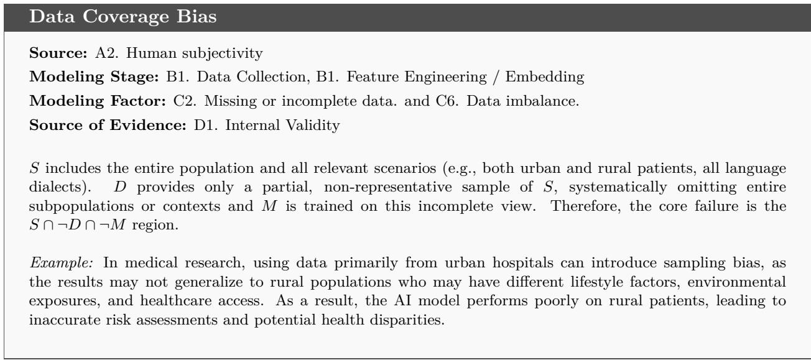

## 5.2.2 Bias by Class Imbalance

Bias by Class Imbalance arises when certain classes or categories are significantly underrepresented in the training data, often due to historical inequities, systemic discrimination, or unequal access to the systems or environments that generate data. This imbalance can lead to models that are biased toward the majority class, systematically misclassifying or overlooking minority classes. It reflects not just technical flaws, but often deep-rooted social inequalities embedded in the data.

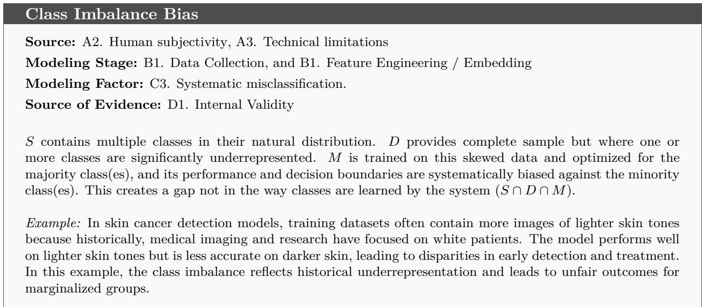

## 5.2.3 Dimensionality Reduction (Data Transformation)

Data Representation Bias may happen in the Data Transformation or Data Encoding for the downstream algorithms’ usage. Dimensionality Reduction step may cause loss of critical information relevant to specific groups while emphasizing less important dimensions.

Representation bias can emerge in the feature extraction step, in selecting the features that favor certain groups or neglect important attributes for others. Further more, in the feature selection stage, by Selection of features that encode implicit biases.

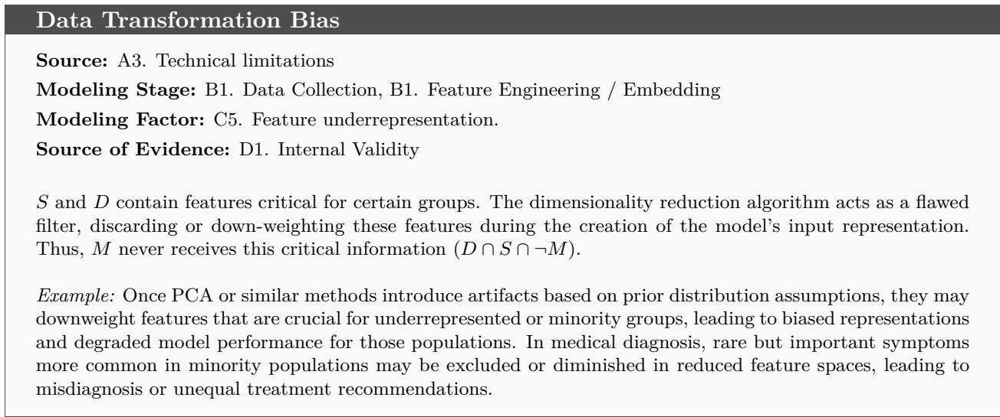

## 5.2.4 Data Encoding Bias

Representation bias may also occur when embedding spaces of textual contents or images preserve or amplify social, cultural, or demographic stereotypes present in the training data. This transformation may reflect a particular tendency while neglecting others, causing bias against underrepresented instances in the latent space. For example, techniques that represent words or phrases through numerical values can emphasize common linguistic associations while ignoring less frequent contexts or meanings (Mohammadi et al., 2025b). Similarly, relying on aggregate statistics, such as averages, can obscure diferences between majority and minority groups, reducing the system’s ability to capture diversity.

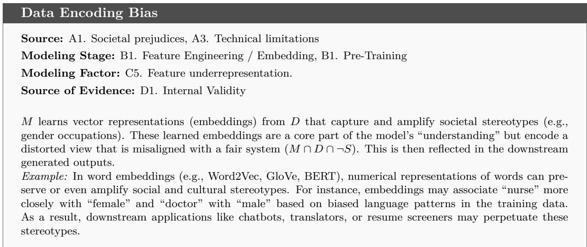

GenAI models often inherit biases from their underlying embedding representations. Embedding Bias can emerge in diferent contexts of GenAI models:

• Static Word Embeddings Bias: Word2Vec and GloVe capture co-occurrence statistics from large corpora, often reflecting biased social norms. This context is in common with TAI and NLP, earlier discussed extensively.

• Contextual Embeddings Bias: Transformer-based models such as BERT and GPTs, use dynamic embeddings that change based on context, making bias detection and mitigation more complex. For example, A GPT model is asked to complete: “The programmer finished the project. (...) went to the conference...”. The model outputs “He”, relying on a statistically dominant “programmer → male” association in its contextual embeddings, despite no gender specification in the prompt.

• Multimodal Embeddings Bias: Models like CLIP (Contrastive Language–Image Pretraining) align text and image embeddings but may reinforce visual stereotypes or cultural imbalances. For example, a fashion retailer’s multimodal model, when prompted with “business casual outfit”, predominantly generates images of light-skinned models in Western attire, as its embeddings were trained on internet data that underrepresents non-Western fashion and darker skin tones.

• Overcompression Bias: During embedding formation, models compress high-dimensional inputs into low-dimensional spaces. Frequent patterns dominate the representational space, while rare or minority features are “averaged out” or inaccurately clustered. For example, in a language model’s embedding space, dialects, minority identities, or cultural concepts with low token frequency are clustered inaccurately or lose their distinct meaning, leading to higher rates of misrepresentation or hallucination when generating content related to these topics.

## 5.3 Measurement and Decision Bias

Measurement Bias or Instrument Bias can arises when the measurement tools or instruments used in research systematically favor certain outcomes or groups, leading to inaccurate data or skewed results. On the other hand, Decision bias refers to the logical decisions made by a data collector, a developer or systematically by model in the training process.

GenAI systems also inherit or amplify measurement and decision biases that arise at diferent stages of Data Collection, Model Training, and Deployment. The intersection of measurement bias and decision bias in GenAI systems presents critical challenges for fairness, accountability, and reliability. While measurement bias provides distorted inputs, such as biased representations of gender roles, Decision bias amplifies or filters outputs based on subjective preferences during fine-tuning or inference.

## 5.3.1 Measurement Bias

This can occur due to poorly calibrated instruments, difering interpretations, or inappropriate tools for the population under study. In the GenAI context, by Instrument Bias we refer mainly to those biases imposed by systemic distortions introduced by technical artifacts, including software libraries, tokenizers, filters, annotation tools, quality metrics, and other engineering decisions. For example, at Data Collection stage, a web scraper collects mostly text from Western news outlets and forums, underrepresenting voices from the Global South or non-English communities. Tokenization tools used are often trained on dominant languages or corpora. They split minoritylanguage words or dialects into multiple sub-tokens, increasing length and reducing semantic clarity. Automated quality scoring tools, such as perplexity, readability, and classifier-based filters, often favor mainstream grammar and vocabulary and lead to a biased ranking of data. For example, a data deduplication pipeline keeps formal essays but removes spoken word transcripts or nonstandard poetry.

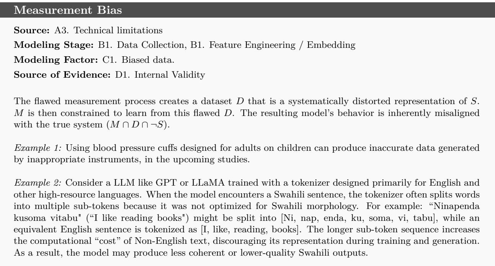

## 5.3.2 Labeling Bias

Labeling Bias occurs when data annotators introduce biases, consciously or unconsciously, during the labeling process or feedback mechanism, which subsequently influence how the model interprets, learns, and generates content.

Labeling tools, interfaces, and annotation instructions play a crucial role in shaping annotator decisions, often reinforcing specific social norms. For example, under vague or poorly defined labeling guidelines, annotators might flag terms such as “queer pride” as political or inappropriate, even when these terms are not inherently ofensive.

This issue is particularly significant in GenAI because labeled data is central to fine-tuning, supervised learning.

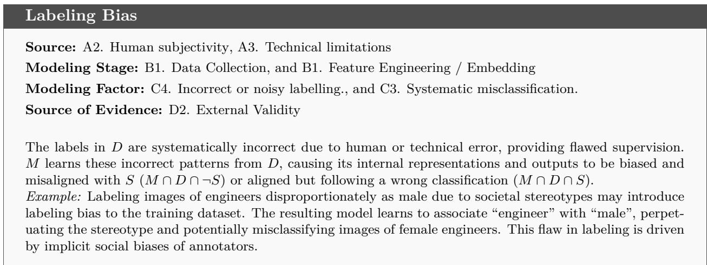

## 5.3.3 Algorithmic Bias

Algorithmic bias is linked to errors that decision logic applied by an algorithm, which can introduce significant distortions if evaluation criteria are inadequately chosen or implicitly reflect biases present in training data, flawed design or biased decision-making process. For example, automated grading systems often use clustering algorithms to group students with similar characteristics. If these algorithms fail to consider socioeconomic and cultural factors that influence student performance, they risk mislabeling individuals as less capable, perpetuating cycles of inequality.

Some forms of Algorithmic Bias are as follow:

• Optimization Bias occurs during training procedure once a model’s objective function, constraints, or evaluation metrics are improperly chosen or overly simplified, leading to suboptimal or biased results that do not align with real-world fairness or utility goals. Models optimized for “coherence” or “realism” may prioritize majority viewpoints (e.g., generating “nurse” as female). Poor Metric Selection and Local Optima could be among the possible causes of Optimization Bias.

Optimization Bias   
Source: A3. Technical limitations   
Modeling Stage:B1. Model Training / Optimization   
Modeling Factor: C3. Systematic misclassification.   
Source of Evidence: D1. Internal Validity   
M s successfully learning the patterns in D, but the chosen objective function (e.g., overall accuracy)   
causes it to optimize for a goal that is misaligned with the real-world system’s requirements for fairness   
or utility (M ∩ D ∩ ¬S).   
Example: In a hiring system, a model that is optimized for metrics like accuracy, precision, or recall   
while excluding fairness constraints, such as equal opportunity, from the optimization process in a   
hiring algorithm optimizing for eficiency may unintentionally prioritize applicants from a privileged   
group.

• Thresholding Bias in AI models typically emerges during the decision-making stage, particularly when a threshold is applied to the output probabilities or scores of a model to make a final classification or prediction. This bias can be introduced, amplified, or mitigated depending on how the threshold is chosen and how it interacts with imbalanced data or population subgroups. Thresholding Bias can emerge at Post-Training/Inference Stage, where a model (e.g., a classifier) outputs a probability score and a threshold is used to decide class membership. At this stage, the model has been trained and is now generating predictions (scores or probabilities). This typically happens during evaluation, or validation steps on hold-out datasets before deployment. Bias can emerge if thresholds are optimized for overall performance without fairness considerations. A global threshold of x might yield 90% precision overall, but only 70% for a minority group. Also, diferent subgroups may have diferent score distributions after training. A single threshold may lead to diferent error rates (e.g., higher false negatives for one group). Applying the same threshold without accounting for diferent costs of false positives/negatives across groups (Asymmetric cost of errors) can lead to thresholding bias.

Thresholding bias may also arise due to a lack of subgroup calibration, where a model’s probability estimates are not calibrated equally well across groups, a global threshold leads to inconsistent decisions. Also, Thresholding Bias could become evident at the Deployment Stage, where the model is now live and making decisions in real-world scenarios.

## Thresholding Bias

Source: A2. Human subjectivity, A3. Technical limitations

Modeling Stage:B1. Model Training / Optimization, B1. Deployment, B1. Post-Deployment

Modeling Factor: C1. Biased data., C3. Systematic misclassification.

Source of Evidence: D2. External Validity

The core model exists in the aligned space (M ∩ D ∩ S), but the final decision rule (the threshold) applied to its outputs can create misalignment. A single threshold may work for the majority in the data but fail for subgroups, efectively pushing their outcomes into the M ∩ D ∩ ¬S region.

Example: In a hiring model, women and men might receive diferent score distributions, leading to fewer women being selected if the threshold is not calibrated for fairness.

• Overfitting Bias refers to the systematic error introduced during Training/Optimization when a model is too complex relative to the amount or diversity of the training data or once the choice of hyperparameter, architectures, and features are not validated correctly, tuning for accuracy without considering generalizability. The overfitted model memorizes the training data rather than learning to generalize. The bias here is not in the sense of model biasvariance tradeof, but in the sense of biased performance across groups due to overfitting. Data Leakage may also lead to overfitting, where the information from the test set leaks into the training process.

## Overfitting Bias

Source: A3. Technical limitations

Modeling Stage:B1. Model Training / Optimization

Modeling Factor: C1. Biased data.

Source of Evidence: D2. External Validity

M memorizes spurious correlations and noise specific to D but fails to capture the underlying principles of the real-world system (M ∩ D ∩ ¬S), leading to poor generalization.

Example: A tech company develops a deep learning model to predict candidate success (e.g., retention and performance) based on historical hiring data. The goal is to automate parts of the hiring process and shortlist promising applicants. The training dataset consists largely of past hires, who are predominantly male and come from a limited number of universities and regions. The model is overparameterized (such as a deep neural network with many layers) and is trained to maximize accuracy. Without proper regularization or subgroup validation, the model starts to memorize patterns associated with the dominant group, like “success" correlates with graduating from a certain university or having certain keywords common in male resumes.

• Inductive Bias refers to the assumptions made by a learning algorithm to generalize beyond the training data. These biases guide the model in selecting hypotheses and influence how it interprets unseen data, shaping its ability to generalize efectively. Unlike overfitting or thresholding bias, which are runtime or post-training issues, inductive bias is built-in early, and it guides how the model will behave during training and prediction. For example, at the Model training stage, if one choose a Convolutional Neural Networks (CNNs), it assumes a spatial locality inductive bias, making them well-suited for image data or the Decision Tree algorithms that implicitly assume the data can be split hierarchically, which is an inductive bias of the algorithm or choosing the gradient-based methods that assumes smoothness of the loss function. So that this type of bias is not necessarily harmful or a sign of error, but it is a built-in assumption of the model.

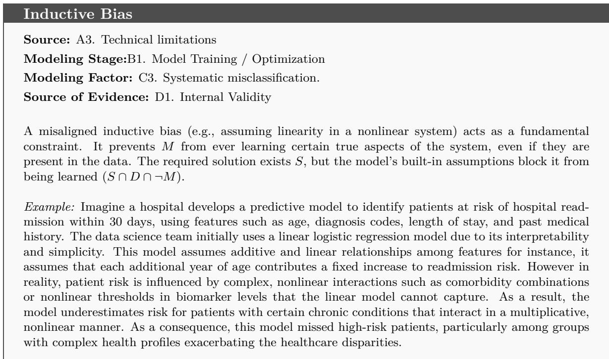

• Reward Signal Bias In GenAI, Reward Signal Bias refers to the bias introduced during the fine-tuning phase, especially in Reinforcement Learning from Human Feedback (RLHF), where models are trained to optimize for human preferences. Reward Signal Bias occurs when the feedback or scoring system used to fine-tune a model reflects skewed, subjective, or culturally dominant values. It may emerge due to Biased annotators’ preferences, unclear or narrow reward criteria, overemphasis on fluency or persuasiveness and, homogeneity in feedback sources once raters mostly come from similar backgrounds.

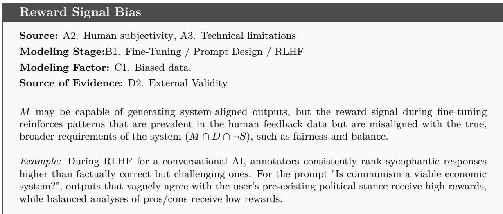

• Benchmarking and Evaluation Bias refers to the systematic distortion in model assessment that arises from the use of flawed, narrow, or non-representative benchmarks, evaluation metrics, or testing procedures. This bias does not exist in the model itself but in how we measure and define what “good” performance looks like, which has significant implications for what models get deployed, fine-tuned, or celebrated.

The selection of training and testing datasets is crucial. Overreliance on widely-used but limited benchmarks such as ImageNet for vision or GLUE for language can constrain evaluation to scenarios that do not reflect real-world diversity or edge cases. Additionally, focusing on global performance metrics (e.g., accuracy, F1 score) without disaggregated reporting may obscure poor performance on underrepresented subgroups, reinforcing structural inequities. Consequences of this bias include overestimation of generalization capability to real-world settings, unfair or unsafe deployment decisions, particularly for minority or vulnerable groups, erosion of trust among impacted stakeholders, misguided research eforts that are driven by leaderboard optimization rather than real-world relevance.

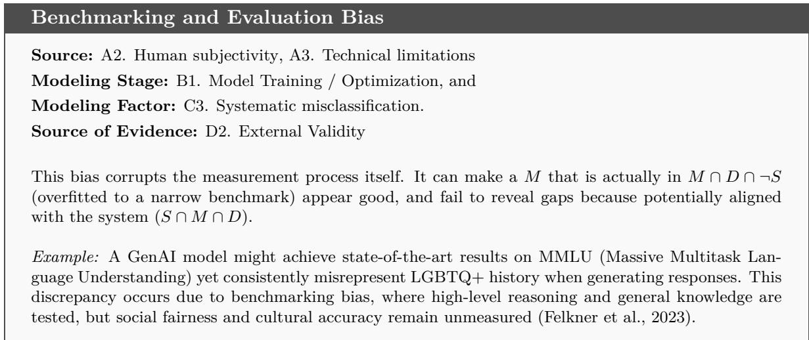

• Proxy Variable Bias occurs when a variable that is not explicitly sensitive acts as a stand-in (proxy) for that sensitive attribute, leading to indirect discrimination even when the sensitive variable is excluded. This distortion may happen at Data Collection/Feature Selection stage where training data includes proxy variables (for example, postal code or first name) that encode sensitive information implicitly. At Preprocessing/Feature Engineering, during encoding or transforming features and creating composite features (e.g., risk scores) their dependency on sensitive attributes could be masked and result in an implicit sensitive feature (proxy). Even if the model appears fair, it may systematically disadvantage certain groups due to proxies at the Deployment/Inference and cause proxy bias. Also it can happen in RLHF Fine-Tuning once annotators may rate certain language styles or topics as less helpful or more aggressive, indirectly penalizing cultural or community-specific speech patterns, which act as proxies for group identity.

Proxy Variable Bias   
Source: A1. Societal prejudices, A2. Human subjectivity   
Modeling Stage: B1. Feature Engineering / Embedding, and B1. Model Training / Optimization   
Modeling Factor: C1. Biased data.   
Source of Evidence: D2. External Validity   
M use a proxy variable (e.g., zip code) that is a valid correlate in the training data but its use leads   
to decisions that are unfair and misaligned with the ethical goals of the real-world system (M ∩D ∩¬S).

Example: Imagine a language model used to generate credit risk assessments or financial advice. The model is not given explicit attributes like race or income level, but it learns from historical financial texts where certain zip codes, schools, or even first names strongly correlate with socioeconomic status. User Prompt: “Provide financial tips for someone living in neighborhood x.” Where x is a zip code historically associated with low-income communities, the model might produce overly cautious or less optimistic advice, assuming higher financial risk. Here, the zip code acts as a proxy for socioeconomic background. This behavior mirrors patterns in the training data rather than unbiased reasoning.

## 5.4 Usage Bias

Misalignment between training conditions and real-world application settings may lead to Usage Bias that does not arise from the model itself but is tied to how the model is used, deployed, or interacted with by end-users.

## 5.4.1 Use-Case Bias

Use-Case Bias arises when an AI system is designed, trained, or evaluated for a specific use-case, but is deployed or interpreted diferently in practice, leading to inappropriate, unfair, or harmful outcomes. Even a technically “accurate” model can become biased or unsafe if used out of context. Another reason could be at the Training stage where the model is trained for a limited task, but ignoring broader contexts or downstream implications. At the Deployment stage, where the model is reused, repurposed, or scaled beyond its intended domain or population there is a high risk of emerging use-case bias. Users misunderstand model capabilities, or rely on it for decisions it was not designed to support.

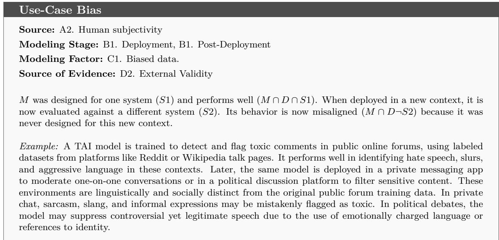

## 5.4.2 Interface-induced Bias

Interface-induced Bias occurs when the design of the user interface (UI) of an AI system influences how users interact with the model, often in ways that introduce or reinforce bias even if the model itself is fair. Therefore, this type of bias emerges as a consequence of how people interpret, trust, or act on on model outputs, based on the design, layout, language, or interactivity of the interface. For instance, the user interface can influence interaction patterns and amplify contextspecific distortions. An opaque interface that conceals the complexity of underlying decision-making algorithms may lead users to overly trust results without understanding their limitations. A risk prediction tool that displays a “high risk” label in red bold font but does not present the confidence levels or reasons, may make the user overreact or misinterpret about what actually “high risk” means.

This makes the interface a powerful gatekeeper of creativity, expression, and even values. In the context of GenAI like ChatGPT, DALL-E interface-induced bias can occur at Prompting where auto-complete or prompt suggestions that reflect dominant culture or stereotypes, Post-Deployment where users “like” on generated outputs inform future Fine-tuning, favoring popular (possibly biased) styles. In GenAI, Interface-Induced Bias is particularly critical because users are not just selecting from static outputs; they are actively shaping and co-creating content through the interface. Low digital literacy among users exacerbates usage bias, as individuals expecting impartial and objective results from a search algorithm may fail to recognize the influence of factors like personalization or advertising.

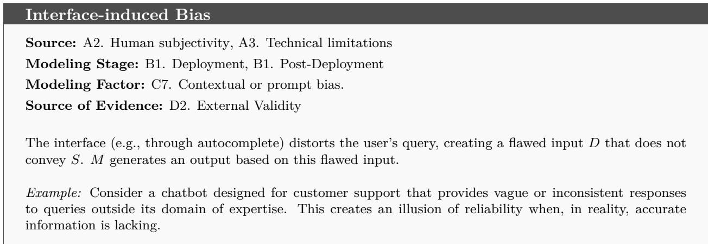

## 5.4.3 Feedback Loop Bias

Feedback Loop Bias is an amplifying bias mechanism mainly in the GenAI when user interactions (e.g., upvotes/downvotes) train the model to prioritize certain outputs and reinforce existing biases. As an example of possible consequences, we can mention Echo Chambers on social media once algorithms using generative AI prioritize divisive content that garners more engagement. Also, Bias Escalation can emerge if users reward stereotypical outputs and the model learns to reproduce them. The bias imposed on the system by the feedback loop can also lead to Model Drift such as the Microsoft Tay scenario (Mohammed, 2025) became racist due to adversarial user inputs.

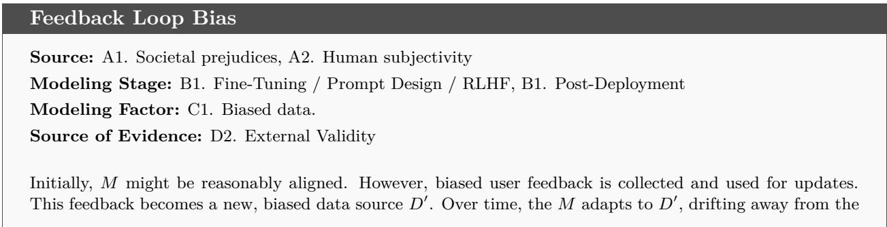

true system and moving into M ∩ D′ ∩ ¬S.   
Example: Consider a customer service chatbot fine-tuned with RLHF, where users can “thumbs up” or “thumbs   
down” responses. If users repeatedly upvote overly agreeable or excessively apologetic responses (e.g., “I’m   
so sorry for your inconvenience” in every interaction), the model starts over-optimizing for that tone, even in   
contexts where it is inappropriate or unhelpful. This feedback loop skews the chatbot’s personality toward   
exaggerated politeness or submissiveness, rather than balanced, informative responses.

## 5.4.4 Prompt Bias

It is a type of bias introduced when user inputs in the form of prompts contain implicit stereotypes, leading questions, or culturally loaded language that shapes the model’s output which clearly may lead to reinforcement of stereotypes. For example, a prompt like “Generate an image of a nurse” in a gender-specified language such as Italian, may default to female-presenting figures due to societal stereotypes in training data. Moreover, prompting may lead to inappropriate/unsafe outputs, for example asking “Why are [group] bad at science?” can generate harmful generalizations. Designing prompts may be also culturally insensitive, for example, requests for “traditional wedding attire” might default to Western-centric imagery, erasing non-dominant cultures.

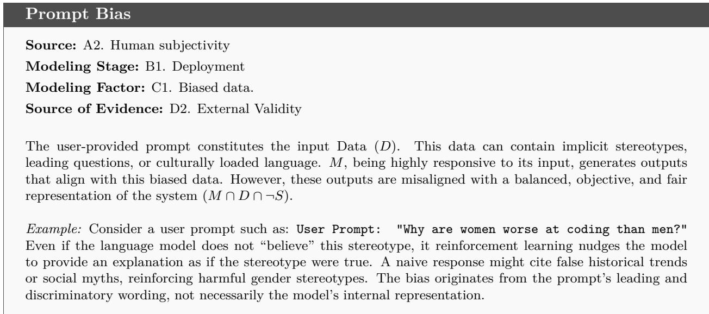

## 5.4.5 Temporal Bias

Temporal Bias arises when an AI model is trained on a static snapshot of data that does not account for evolving real-world trends, knowledge, or social norms. Because the model’s knowledge is fixed at the time of training, it may generate outdated, misleading, or socially insensitive outputs as contexts change over time. Temporal bias may emerge at Data Collection Stage where training datasets are typically compiled at a single point in time, reflecting the knowledge, norms, and events of that period.

It can also appear at the Model Training and Deployment once trained, models cannot autonomously update themselves with new events or evolving cultural expectations without explicit fine-tuning or retraining.

Temporal Bias may result in producing responses with outdated information, such as giving old political oficeholders, prices, or technology facts. It may also make the GenAI model reflecting obsolete social attitudes reinforcing gender roles or stereotypes that were prevalent when the training data was collected but are now inappropriate and, failing to incorporate recent global events or policy changes such as legal reforms, or technological advances.

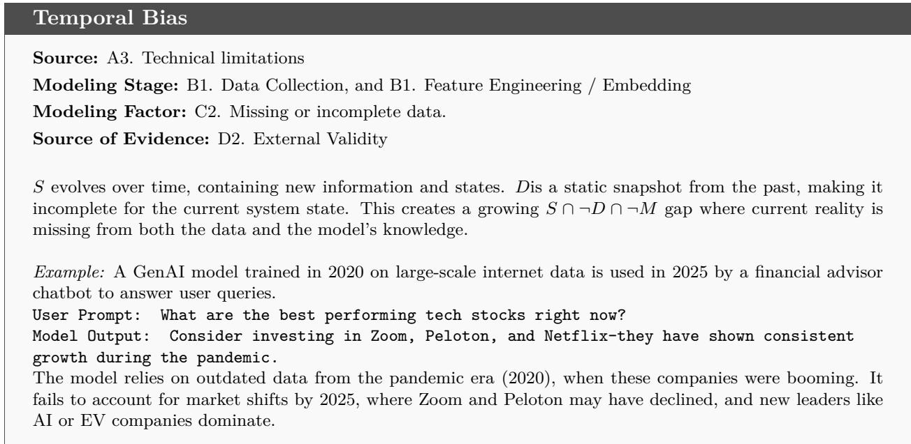

## 6 Verification Approaches

While several studies argue that AI verification should be evidence-based (Myllyaho et al., 2021; Anisetti et al., 2023; Maghool et al., 2024b), with diferent levels of evidence conferring diferent degrees of assurance (Brundage et al., 2020), no shared framework yet clarifies what these levels entail. This mirrors early evidence-based medicine, which lacked standardized hierarchies until frameworks such as the Oxford CEBM levels emerged (Weissler et al., 2021).

## 6.1 Internal and External Validity in AI Verification

As mentioned in Section 4.4, structured approach to verification should distinguish between internal and external validity, following the logic of empirical sciences.

Internal validity includes data quality, algorithmic accuracy and alignment between design steps, as well as adherence to standards such as ISO/IEC 25059. Bias, fairness and equality metrics are also important because they quantify the efects of system behaviour on diferent groups. The capability to test multiple dimensions of simultaneously enables us to identify potential tradeofs between diferent criteria and make informed decisions about which metrics are most relevant to a given context and stakeholder needs. This multidimensional approach allows us to assess algorithmic performance more comprehensively across diverse populations and use cases.

External validity is particularly challenging for both TAI and GenAI systems, as context variability and domain shifts can undermine laboratory findings. Task- and ability-based benchmarks, such as MMLU (Massive Multitask Language Understanding) family (Wang et al., 2024), BLEU (Bilingual Evaluation Understudy) (Post, 2018), ROUGE (Recall-Oriented Understudy for Gisting Evaluation) (Lin, 2004), GLUE (Wang et al., 2018), SuperGLUE (Wang et al., 2019), BIG-Bench (Srivastava et al., 2023) and HumanEval (Chen et al., 2021) for code generation, serve as partial indicators of external validity.

Explainability-based audits are essential for assessing external validity (Artyukhov et al.; Swamy et al., 2025). The degree of model transparency, ranging from white-box (full access) through gray-box (partial) to black-box (opaque), determines which explainability methods can be applied. Regardless of the approach, these methods help auditors to determine whether a system generalises appropriately to new contexts, or whether it relies on spurious correlations that may not extend beyond the training environment. This distinction is crucial for establishing confidence in claims about external validity.

## 6.2 Toward a Hierarchy of Verification Evidence

Overall, despite the growing variety of verification methods, the field lacks a framework that classifies their evidential strength across AI paradigms and risk levels. Creating such a hierarchy would help to align verification practices with the evidentiary rigour already adopted in other high-stakes fields, bringing AI verification closer to becoming a more mature, evidence-based discipline.

Table 2: Hierarchy of Evidence Levels for Internal Validity in AI Verification
<table><tr><td>Level</td><td>Description</td><td>Methods and Metrics</td></tr><tr><td>I1 - Metric-Based Verification</td><td>Evidence derived from standardized quanti- tative metrics applied to specific datasets, focusing on the measurement of performance related to isolated tasks.</td><td>Accuracy, F1-score, OmniAccuracy, and fairness indices such as demographic parity and equalized odds.</td></tr><tr><td>I2 - Process-Aligned Verification</td><td>Evidence resulting from the integration of verification activities across the design life- cycle. It ensures consistency among data, models and objectives, as well as compliance with quality standards.</td><td>Trace alignment, data-model conformance checking, explainability validation, compli- ance with ISO/IEC 25059, data consistency, and model calibration metrics.</td></tr><tr><td>I3 – Formal and Structural Verification</td><td>Evidence obtained through formal modeling, static analysis, or interpretable representa- tions that enable reasoning about internal logic, dependencies, and component behav-</td><td>White-box testing, symbolic reasoning, for- mal proofs, structural coverage analysis, and invariant satisfaction.</td></tr><tr><td>I4 – Integrated Verification</td><td>ior. Comprehensive and multi-dimensional evi- dence combining performance, robustness, bias detection, and epistemic uncertainty quantification. This ensures alignment across all design and testing stages.</td><td>Causal validation, uncertainty estimation, bias-robustness trade-offs.</td></tr></table>

Table 3: Hierarchy of Evidence Levels for External Validity in AI Verification
<table><tr><td>Level</td><td>Description</td><td>Methods and Evidence</td></tr><tr><td rowspan="2">E1 - Simulated or Synthetic Testing</td><td>Evidence obtained from controlled or syn- thetic environments. The potential for gen- eralisation is limited due to the artificial</td><td rowspan="2">Simulation-based evaluation, synthetic data generation, stress tests, and sandboxed ex- perimentation.</td></tr><tr><td>conditions and lack of contextual variabil- ity.</td></tr><tr><td rowspan="2">E2 – Benchmark-Based Validation</td><td>Evidence derived from standardized bench- marks or curated datasets, offers compara- bility, but has limited real-world generalisa-</td><td rowspan="2">Use of public benchmarks such as MMLU, BLEU, ROUGE, GLUE, SuperGLUE, BIG- bench, or HumanEval, and leaderboard- based validation.</td></tr><tr><td>tion. Evidence is gathered from evaluations in re- alistic or domain-specific contexts that re-</td></tr><tr><td rowspan="2"></td><td>flect actual usage conditions. This level in- cludes assessing dataset completeness to en- sure that the training data adequately rep- resent the diversity of operational contexts</td><td rowspan="2">sity analysis, and coverage-based complete- ness metrics.</td></tr><tr><td>and populations. Evidence obtained through evaluations that integrate internal transparency with exter-</td></tr><tr><td></td><td>nal testing allows interpretable links to be established between internal mechanisms and real-world outcomes. Evidence was accumulated through real-</td><td>interpretability-driven evaluations.</td></tr><tr><td>E5 - Continuous and Longitudinal Monitoring</td><td>world operation, with a focus on the sys- tem&#x27;s dynamic performance and reliability over time.</td><td>Post-deployment monitoring, incident re- porting, continuous auditing, and reliability metrics such as Mean Time Between Failures (MTBF) and performance drift tracking.</td></tr></table>

The hierarchies presented in Tables 2 and 3 organize verification practices according to the strength of evidence they provide within two complementary dimensions: internal and external validity. Together, they define a first attempt for a conceptual maturity model for evidence-based AI verification.

For internal validity, low-level evidence (I1–I2) relies on isolated performance metrics and lacks integration across the design lifecycle. In contrast, higher levels (I3–I4) emphasize process alignment, formal reasoning, and the interplay of bias, robustness, and epistemic uncertainty.

For external validity, evidence strength increases with contextual realism, transparency, and temporal persistence. Early-stage verification (E1–E2) ensures comparability, but provides limited insight into real-world behaviour. The intermediate levels (E3–E4) incorporate transparent and contextual evaluations that emphasise the importance of dataset completeness for determining generalisability. The highest level (E5) provides continuous evidence through real-world monitoring and adaptive verification.

Taken together, these hierarchies delineate a path toward evidence-based maturity in AI verification. Traditional AI systems typically achieve evidence around levels I3–E2, focusing on benchmark performance and process alignment. In contrast, GenAI systems often operate at levels I2–E3, emphasizing contextual yet less formalized testing. Reaching the upper levels (I5–E5) requires the systematic integration of design conformance, bias-aware metrics, analysis of dataset completeness, and continuous real-world monitoring. This provides a more reliable foundation for the deployment of trustworthy AI.

## 6.3 List of Verification Methods

In this section we propose techniques to measure, detect, or verify whether bias is present, typically used before or alongside model deployment. Table 4 associates each method with the bias types it addresses most efectively.

## • D1.1. Fairness Metrics

This technique uses standardized, quantitative metrics to evaluate whether an AI model treats specific subgroups diferently. Unlike general performance metrics, fairness metrics explicitly measure disparate impact and equity across groups defined by protected attributes, such as race, gender, and age.

Demographic Parity / Disparate Impact Ratio measures if the positive outcome rate (e.g., getting a loan) is the same across groups. A ratio significantly less than 1 (e.g., 0.8) indicates a potential bias.

Equalized Odds controls whether the model has similar True Positive Rates (TPR) and False Positive Rates (FPR) across groups. This is a stricter test than demographic parity.

Predictive Parity checks if the likelihood that a positive prediction is correct is similar across groups.

These metrics are calculated on a curated test set, providing a controlled, laboratory-style measurement of the model’s inherent propensity for bias. In this sense they provide low-level evidence suitable for Internal Validity (I1).

## • D1.2. Group-wise Performance Metrics

Group-wise performance metrics provide quantitative evidence of whether a model’s performance is consistent across subpopulations in the validation data (Barocas et al., 2023). Disaggregated evaluation generates separate ROC curves per subgroup, enabling comparison of Area Under the Curve (AUC) and threshold behaviors to detect if the model has systematically learned worse predictive functions for certain groups. These metrics provide highstrength evidence of internal misalignment and serve a basis for assessing External Validity. Testing on explicitly segmented data allows us to assess the model’s cross-group robustness, providing high-level verification evidence (I4-E5), whereas isolated performance reports yield only low-level evidence (I1-I2-E3).

## • D1.3. Group-wise Error Rates

Significant diferences in metrics such as the False Positive Rate (FPR) and the False Negative Rate (FNR) across subgroups directly indicate specific biases. For example, a higher FPR means that there are disproportionate false alarms for that group. These metrics provide quantitative evidence of whether the model’s classification mechanism is consistently calibrated across subgroups. While isolated metrics provide low-level Internal Validity (I1), subpopulation-based analysis across datasets serves as high-level evidence (I4).

## • D1.4. Cluster analysis/ Analogy tests

These techniques detect bias at the level of the model’s conceptual understanding by inspecting its internal geometry to verify whether it has learned representations encoding societa biases from training data (Ethayarajh et al., 2019). Cluster analysis and analogy tests are primarily Internal Validity techniques ofering insight into learned biases at the representational level. Clustering algorithms applied to embeddings can reveal whether the model groups concepts along stereotypical lines. Analogy tests use vector arithmetic, such as the Word Embedding Association Test (WEAT) (Caliskan et al., 2017), to measure the closeness of concepts using statistical significance. These findings have profound implications for External Validity, as flawed internal geometry leads to stereotypical outputs in real-world applications. These techniques provide strong, mechanistic evidence of sources of bias (I3-I4- E4).

## • D1.5. Algorithmic Transparency

This technique uses Explainable AI (XAI) methods—such as SHAP, LIME, and Attention Visualization—to make black-box model decision-making interpretable by revealing which features drive predictions and how they influence outputs (Eiband et al., 2018). For Internal Validity, it identifies biased patterns in the model’s reasoning. For External Validity, it assesses whether the model’s reasoning generalizes consistently across populations, contexts, and real-world datasets. It detects when models learn diferent, often worse, rules for underrepresented groups. It provides moderate-strength, ecological evidence of bias (I2-I3-E4) by demonstrating failures in robust generalization and highlighting instances when models cannot apply uniform standards across diverse real-world conditions.

## • D1.6. Correlation Analysis

Correlation analysis in bias detection identifies associations between model inputs or features and sensitive attributes (e.g., race, gender). Strong correlations suggest potential proxy variables that allow the model to discriminate indirectly, even when protected attributes are excluded from training (Lee et al., 2022). This reveals fundamental flaws in data representation that compromise internal fairness by allowing the model to learn biased shortcuts. When applied systematically across feature sets and combined with causal analysis, this method provides high-level Internal Validation (I4).

## • D1.7. Causal Inference

This method models cause-and-efect relationships between variables and identifies whether features act as causal proxies for sensitive attributes (Cohausz et al., 2025; Nashed et al., 2025). Directed Acyclic Graphs (DAGs) represent causal assumptions between variables (e.g., race influences zip code but not vice versa), while do-Calculus provides mathematical rules for verifying if those causal efects hold from observational data, despite confounding variables (Pearl, 2009). It provides high-level evidence (I4) for Internal Validity.

## • D1.8. Mutual Information

Mutual Information (MI) quantifies the non-linear dependence between two random variables, measuring how much knowing one variable reduces uncertainty about another (Cover, 1999). For Internal Validity, MI provides strong, quantitative evidence of statistical dependency between a model’s feature and a protected attribute (I4), proving the feature is an information-theoretic proxy regardless of linearity. For External Validity, high MI across datasets signals the model’s latent capacity to discriminate in real-world contexts, providing moderately strong evidence (E3).

## • D1.9. Counterfactual evaluation

This technique tests for bias by creating counterfactual instances where proxy indicators (e.g., names, or zip codes) are systematically swapped and observing whether the model’s output changes unjustifiably (Kusner et al., 2017). Counterfactual evaluation provides direct, causal evidence of biased mechanisms (I3-I4) by demonstrating that the model’s output is sensitive to changes in proxies and proving that proxies actively contribute to biased decisions.

## • D2.1. Control Groups

This methodology either shields a control group from the AI system’s influence or exposes them to a neutral baseline. Then, it compares their outcomes to those of the treatment group exposed to the full system. This comparison isolates the system’s causal efect, including biased outcomes (Kohavi et al., 2020). For Internal Validity, control groups provide strong causal evidence (I4) by attributing observed bias directly to the AI system’s mechanics. For External Validity, they ofer low-to-moderate strength evidence of real-world impact (E1-E2), since we are in an experimental environment anyway.

## • D2.2. Longitudinal Studies

Longitudinal studies track how biases and model performance evolve over time, making temporal patterns such as bias drift and long-term harm observable (Davis et al., 2025). They ofer moderate-strength evidence (I2) for Internal Validity by showing whether a biased mechanism persists, which suggest that it is a structural property rather than a statistical artifact. For External Validity, they provide very strong evidence (E5): post-deployment observations capture real-world dynamics, shifting social contexts, user behaviors, and data distributions. Thus, despite its complexity, longitudinal evaluation is the gold standard for assessing longterm fairness and robustness.

## • D2.3. Data Audits

A proactive, systematic audit of datasets across the AI lifecycle (collection, pre-processing, post-deployment) helps identify imbalances, representation gaps, and proxy variables. Data auditing supports early detection of such issues (Boyd, 2021) through: Systematic Profiling, which examines distributions across sensitive attributes, class imbalance, subgroupcorrelated missingness, and feature skew; Proxy Variable Detection, which analyzes correlations or mutual information to flag features acting as proxies (e.g., zip code” predicting race”); and Coverage Analysis, which assesses whether the data represents the scenarios and populations the model must handle. Auditing ofers moderate-to-high strength evidence: ongoing post-deployment audits detect data drift and representation shift (I2–E5), providing early warnings of declining external validity. Label audits can also reveal annotator bias in GenAI outputs. Dataset completeness—the representativeness and balance of contexts, categories, and populations—critically afects external validity (Albalak et al., 2024). Incomplete datasets can limit generalisability even when internal metrics seem adequate. While quantitative measures remain limited, emerging approaches include coverage metrics (Whalen et al., 2006), representational diversity analysis (Kamikubo et al., 2022), and embedding-space redundancy measures (Xiao et al., 2023).

## • D2.4. Benchmarks

Standardized datasets and tests quantify specific forms of social bias (e.g., stereotypes, representational harms) in AI models, particularly language models. These benchmarks ofer controlled settings to probe learned associations. StereoSet (Nadeem et al., 2020) presents contextual prompts and measures whether models prefer stereotype-aligned completions. CrowS-Pairs provides sentence pairs difering only in stereotypical vs. neutral phrasing, to test whether models assign higher likelihoods to the stereotypical option. Such benchmarking provides predictive External Validity evidence (E2): strong benchmark performance indicates a higher likelihood of biased or harmful outputs in real-world applications. However, overfitting to a benchmark can introduce new biases. For example, models learning benchmark-specific artifacts rather than genuinely reducing harmful associations, thereby undermining the validity of the evaluation itself.

## • D2.5. User Experience Audits

Interface auditing evaluates how UI/UX elements, such as default settings, option ordering, wording, and visual cues, can shape user behaviour in ways that introduce or amplify bias. Auditing autocomplete suggestions, default parameters, and preselected options reveals whether an interface reinforces dominant (and potentially biased) patterns. Teleological tests such as the User Acceptance Rate (UAR) and Designer Acceptance Rate (DAR) extend this perspective by assessing alignment between designer and user purposes (Fumagalli and Ferrario, 2025). This approach requires stakeholders and vendors to publicly state system purposes, activating a negotiation process that raises awareness, helps prevent misuse, and grounds trustworthiness in a social and deliberative framework. Together, interface audits and teleological tests provide real-world evidence (E3): because they reveal how the system will behave in practice and how even a technically fair model can still cause harm through design choices.

## • D2.6. Continuous Monitoring

Continuously tracking an AI system’s inputs, outputs, and performance after deployment enables the early detection of emerging biases, performance decay, and behaviors that only appear in real-world use. For external validity, such dynamic monitoring ofers the strongest evidence (E5) by moving beyond lab tests to provide direct proof of how the system performs and afects users in its operational environment. This is crucial for identifying biases that only surface at scale or over time. Continuous monitoring also builds longitudinal evidence on system adequacy and reliability (Jeyaraman, 2025). Metrics such as mean time between failures (MTBF) (MTBF) and performance decay trends reveal long-term behavior and adaptation, which is especially important for GenAI models whose behavior shifts with updates and user interactions.

## • D2.7. Temporal Fairness Checks

This concept extends continuous monitoring by focusing specifically on fairness over time, addressing model staleness and shifting social norms (Davis et al., 2025). Ongoing equity checks include Scheduled Re-assessment, where fairness metrics (e.g., demographic parity, equalized odds) are recalculated regularly using recent data, and Monitoring for Decay, aimed at detecting fairness drift—when a once-fair model grows biased as real-world conditions change. This provides high-strength evidence of sustained validity and equity (I4–E5), showing whether outcomes remain fair not only at launch but months or years later. Such tracking is essential for long-term trust and regulatory compliance.

## 7 Bias Mitigation Strategies and Countermeasures before and after Model Deployment

Once bias is verified in the verification step, interventions and countermeasures are required to modify the data, model, or interaction processes and prevent bias from propagating throughout the rest of the AI life cycle. Below, we discuss a list of countermeasures to address the detected bias.

## • CM1. Incorporating Fully Representative Data

Representative data allows the model to learn from the full spectrum of social, cultural, and demographic contexts. It ensures that the training data is balanced and representative of diverse populations, avoiding the overrepresentation of specific groups or perspectives (Suresh and Guttag, 2021).

## • CM2. Synthetic Data Generation

If the data lacks adequate coverage, we may utilize Synthetic Data Generation techniques to fill gaps where underrepresented groups or perspectives exist (Mohammadi et al., 2025a). This ensures that the model learns from a more balanced viewpoint, which can reduce bias. If the synthetic data accurately reflects the conditions of excluded examples, e.g. non-survivors, it can significantly reduce bias.

## • CM3. Bias-aware and Adversarial Training

Bias-aware training techniques are widely discussed in the literature (Zhang et al., 2018). These approaches incorporate fairness constraints or regularization terms directly into the training process to limit the propagation of bias in model outputs. They often penalize biased behaviour, for example through adversarial training setups that discourage the model from encoding or reproducing harmful patterns (Beutel et al., 2017).

## • CM4. Counter-prompting/Bias-Aware RLHF and Input Curation

To mitigate confirmation and echo-chamber bias, counter-prompting techniques can encourage models to provide more balanced viewpoints (Liu et al., 2023). Likewise, bias-aware

RLHF trains models to prioritise perspective diversity and penalise uncritical or repetitive agreement (Bai et al., 2022).

## • CM5. Explainable Interface Design

Designing interfaces that clearly communicate an AI system’s reasoning, limitations, and confidence (Eiband et al., 2018), helps to reduce usage bias by preventing over-trust or misinterpretation. Explainable interfaces can also ofer disclaimers or prompt-reformulation suggestions to promote more diverse and less biased outputs (Liao et al., 2020).

## • CM6. Implementing Human in the Loop Mechanism

In GenAI, human-in-the-loop feedback, where moderators periodically review outputs, helps prevent harmful biases, especially in sensitive domains like healthcare, legal advice, and hiring. User feedback loops also reveal unintended social biases that emerge over time, allowing for corrective updates. Involving diverse stakeholders (e.g., social scientists, ethicists, afected communities) throughout development, training, and evaluation further strengthens bias detection (Dellermann et al., 2019).

## • CM7. Balanced Dataset Curation and Weighted Sampling

To address data coverage bias, it is essential to curate balanced datasets to bolster underrepresented groups (e.g., non-binary pronouns), and apply sampling strategies such as weighted sampling to ensure equitable representation. Approaches like DALL-E’s content filtering during pre-processing help remove harmful content, while evaluating performance across diverse benchmarks verifies fairness and inclusivity across groups (Johnson and Khoshgoftaar, 2019).

## • CM8. Debiasing Static Embedding

Embeddings can be adjusted to weaken stereotypical associations (e.g., FairDifusion for equitable image generation). Methods such as Hard Debiasing or Iterative Nullspace Projection (INLP) explicitly remove bias directions—like gender—from word embeddings (Bolukbasi et al., 2016), while Soft Debiasing reduces bias through regularization while preserving semantics. These approaches are efective for static embeddings (e.g., Word2Vec, GloVe) but less suitable for contextual models that generate embeddings on the fly.

## • CM9. Debiasing Contextual Embedding

Intervention layers can adjust embedding trajectories. Training adapters or LoRA modules (Hu et al., 2022) can debias embeddings during fine-tuning, using bias benchmark datasets such as StereoSet (Nadeem et al., 2020) and CrowS-Pairs (Nangia et al., 2020) or performing cluster analyses.

## • CM10. Contrastive Learning

Multimodal models like CLIP (Radford et al., 2021) learn by bringing similar image-text pairs closer in embedding space while pushing dissimilar pairs apart. Without constraints, this contrastive learning can inadvertently encode demographic biases—for instance, associating certain professions more strongly with specific genders or ethnicities present in training data.

Contrastive learning with fairness constraints addresses this issue by incorporating demographic parity requirements directly into the contrastive loss function. This ensures that embeddings maintain similar distances across diferent demographic groups while preserving the model’s discriminative power.

## • CM11. Thresholding

Once the thresholding bias is approved at the verififcation phase, some strategies such as: Group-specific thresholds (fairness through awareness), Post-processing techniques (e.g., equalized odds post-processing) (Corbett-Davies et al., 2017), Calibration by subgroup, and the use of Fairness-aware metrics in model tuning are highly advised (Berk et al., 2021).

## • CM12. Improving the Generalizability

To avoid consequences of overfitting, such as poor generalization to minority groups, memorizing instead of generalizing, and unreliable performance metrics, a valid technique is regularization (e.g., L1/L2) (Srivastava et al., 2014). Moreover, performing cross-validation across subgroups to ensure balanced and diverse training data (Berk et al., 2021), and monitoring performance disaggregated by group are also helpful.

## • CM13. Choosing Flexible Architectures

To prohibit negative consequences of Inductive Bias, we need to avoid using models with restrictive assumptions (e.g., linear models) on complex, nonlinear problems rather than using flexible and less prescriptive models like neural networks with Attention mechanisms (Devlin et al., 2019), Neural Architecture Search (NAS) (Liu et al., 2018), Meta-learning (models that learn to learn) and reduce the hand-crafted assumptions (Vanschoren, 2018).

## • CM14. Diversifying Feedback Sources and Reward Signals

To mitigate Reward Signal Bias, diversify human feedback by recruiting annotators from varied social backgrounds and balancing annotations across gender, geography, and political perspectives (Santurkar et al., 2023). Rating guidelines should include fairness, empathy, and inclusion criteria and employ auxiliary classifiers or fairness constraints to penalize exclusive responses.

## • CM15. Multi-objective Optimization

Using Multi-Objective Optimization, containing several reward signals, such as helpfulness, fairness, and inclusivity, can guide learning to avoid over-optimization on a single metric (Martinez et al., 2020).

## • CM16. Fairness-aware Feature Selection/ Adversarial Debiasing/ Counterfactual Fairness

Using fairness-aware feature selection and adversarial debiasing methods that filter or adjust for proxy variables (Zhang et al., 2018), applying counterfactual fairness to reduce dependence on proxies during training (Kusner et al., 2017), and evaluating models using group-level performance metrics and test for disparate impact, could be a crucial countermeasure.

## • CM17. Removing Bias Direction

After Counterfactual Evaluation, using Swapping Proxy Indicators like changing names and locations to detect output disparities. If the output changes unjustifiably, proxy bias is likely present in the dataset. Techniques like Iterative Nullspace Projection (INLP) can also remove encoded bias directions from embeddings (Bolukbasi et al., 2016).

## • CM18. Inclusive Prompt Engineering, Output Filtering, and User Education

By designing inclusive prompts, systems can suggest equitable inputs like “Generate a diverse group of scientists...”. Tools such as Google’s Perspective API1 or guardrail models like OpenAI’s Moderation API2 can flag toxic or biased content in real-time. User education through tooltips and disclaimers (e.g., “Potential stereotypes in prompts”) helps users understand how phrasing afects outputs.

## • CM19. Decoupling Feedback Input from Training Data

To challenge prompt and feedback loop bases, it could be beneficial to Decouple Feedback input from training data, like separating user engagement metrics, such as clicks, from model updates to avoid rewarding harmful content (Brundage et al., 2020; Jagerman et al., 2020).

## • CM20. Incremental/ Continual Learning, RAG for Temporal Updates

In order to mitigate the Temporal Bias, Incremental or continual learning to update models with new data regularly, Retrieval-augmented generation (RAG) to combine static model knowledge with dynamic external sources, Timestamped outputs or disclaimers indicating the knowledge cut-of date and eventually Fairness checks over time to monitor and correct outdated cultural representations are highly recommended (Izacard et al., 2023).

Table 4: Bias Categories with Corresponding Verification and Countermeasures.
<table><tr><td>Bias Category</td><td>Verification (Bias Detection / Diagnosis)</td><td>rection)</td><td>Countermeasures (Bias Mitigation / Cor-</td></tr><tr><td rowspan="7">1. Social Bias5.1</td><td></td><td>• D1.5. Algorithmic Transparency</td><td>• CM1. Incorporating Fully Representative Data</td></tr><tr><td></td><td>• D1.2. Group-wise Performance Metrics</td><td></td></tr><tr><td></td><td>• D1.3. Group-wise Error Rates</td><td>• CM2. Synthetic Data Generation</td></tr><tr><td></td><td>• D1.1. Fairness Metrics</td><td>• CM3. Bias-aware and Adversarial Training</td></tr><tr><td></td><td>• D1.6. Correlation Analysis</td><td>• CM4. Counter-prompting/Bias-Aware RLHF and Input Curation</td></tr><tr><td></td><td>• D2.2. Longitudinal Studies</td><td>• CM5. Explainable Interface Design</td></tr><tr><td></td><td>• D2.4. Benchmarks</td><td>• CM6. Implementing Human in the Loop</td></tr><tr><td rowspan="5">2. Data Represen- tation Bias5.2</td><td></td><td>• D2.3. Data Audits D1.4. Cluster analysis/ Analogy tests</td><td>Mechanism • CM2. Synthetic Data Generation</td></tr><tr><td></td><td>• D2.4. Benchmarks</td><td>• CM7. Balanced Dataset Curation and</td></tr><tr><td></td><td></td><td>Weighted Sampling</td></tr><tr><td></td><td>• D1.2. Group-wise Performance Metrics • D2.6. Continuous Monitoring</td><td>• CM8. Debiasing Static Embedding</td></tr><tr><td></td><td></td><td>• CM9. Debiasing Contextual Embedding</td></tr><tr><td rowspan="5">3. Measurement &amp; Decision Bias5.3</td><td></td><td>• D1.3. Group-wise Error Rates</td><td>RLHF and Input Curation • CM3. Bias-aware and Adversarial Training</td></tr><tr><td></td><td>• D1.2. Group-wise Performance Metrics</td><td>• CM11. Thresholding</td></tr><tr><td></td><td>• D2.3. Data Audits</td><td>• CM12. Improving the Generalizability</td></tr><tr><td></td><td>• D1.6. Correlation Analysis</td><td>• CM14. Diversifying Feedback Sources and</td></tr><tr><td></td><td>• D1.7. Causal Inference</td><td>Reward Signals</td></tr><tr><td rowspan="5">4. Usage Bias5.4</td><td></td><td>• D2.5. User Experience Audits</td><td>• CM15. Multi-objective Optimization CM5. Explainable Interface Design</td></tr><tr><td></td><td>• D2.6. Continuous Monitoring</td><td>CM18. Inclusive Prompt Engineering,</td></tr><tr><td></td><td>• D2.7. Temporal Fairness Checks</td><td>Output Filtering, and User Education</td></tr><tr><td></td><td></td><td>• CM19. Decoupling Feedback Input from Training Data</td></tr><tr><td></td><td></td><td>• CM20. Incremental/ Continual Learning, RAG for Temporal Updates</td></tr></table>

## 8 Conclusion

After our long journey through this paper, we can draw a few conclusions about the evolving role of bias verification as a scientific and ethical instrument for ensuring trustworthy, socially aligned AI systems.

## 8.1 Toward Evidence-Based Responsible AI

The pervasiveness of bias throughout the AI design lifecycle highlights the importance of a culture of verification based on evidence-based methods. Rather than treating ethics as an afterthought, an Ethics by Design approach embeds social responsibility in every phase of development. This approach requires a multidisciplinary efort integrating technical, social, and normative expertise to ensure AI systems are eficient and aligned with human well-being and sustainability goals.

The hierarchies of evidence for internal and external validity (Tables 2–3) provide a structured approach to responsible AI. Internal validity evolves from metric-based assessments to comprehensive, bias-aware, and uncertainty-informed verification (I5), and external validity progresses from synthetic testing to continuous, real-world monitoring (E5). Together, these hierarchies establish a maturity model for AI assurance, allowing developers to calibrate their verification strategies based on the risk level and deployment context of the system.

## 8.2 Traditional and Generative AI: Divergent Challenges

The approach to bias verification difers substantially between TAI and GenAI. TAI systems, typically task-specific, manifest bias in data collection, feature selection, or thresholding—resulting primarily in allocative harms such as unfair access to credit, jobs, or healthcare. GenAI, in contrast, operates through dynamic latent representations and user interactions, leading to representational harms—misinformation, stereotyping, or cultural exclusion. Verification in TAI systems often relies on well-defined quantitative metrics, whereas GenAI systems require hybrid evaluation frameworks that combine quantitative metrics with qualitative assessments conducted by humans.

The proposed evidence hierarchies reveal that GenAI systems typically remain at a mid-level of maturity (I2–E3). These systems emphasize benchmark performance without longitudinal validation or analysis of dataset completeness. To achieve higher maturity levels (I5–E5), systems must undergo integrated evaluations that connect fairness and accuracy metrics with real-world task benchmarking, dataset completeness assessments, and continuous post-deployment monitoring.

## 8.3 Conclusion and Outlook

Responsible AI remains a formidable challenge because it requires constructing verifiable chains of evidence that connect internal and external dimensions. of system validity. Aligning bias verification, formal conformance, and real-world validation within a single, coherent, evidence-based framework is far from trivial. It demands continuous monitoring, multidisciplinary collaboration, and methodological rigor. However, overcoming these challenges is essential for achieving demonstrable trustworthiness. Such integration not only reinforces technical assurance, but also operationalizes ethical responsibility, fostering AI systems that are transparent, equitable, and resilient in evolving social contexts.

## References

Alon Albalak, Yanai Elazar, Sang Michael Xie, Shayne Longpre, Nathan Lambert, Xinyi Wang, Niklas Muennighof, Bairu Hou, Liangming Pan, Haewon Jeong, et al. A survey on data selection for language models. arXiv preprint arXiv:2402.16827, 2024.

Marco Anisetti, Claudio A Ardagna, Nicola Bena, and Ernesto Damiani. Rethinking certification for trustworthy machine-learning-based applications. IEEE Internet Computing, 27(6):22– 28, 2023.

Artem Artyukhov, Iurii Volk, Oleksandr Dluhopolskyi, Nadiia Artyukhova, and Olena Zelikovska. Evaluating the quality of education: Application of black, gray, and white box methods.

Yuntao Bai, Saurav Kadavath, Sandipan Kundu, Amanda Askell, Jackson Kernion, Andy Jones, Anna Chen, Anna Goldie, Azalia Mirhoseini, Cameron McKinnon, et al. Constitutional ai: Harmlessness from ai feedback. arXiv preprint arXiv:2212.08073, 2022.

Gagan Bansal, Besmira Nushi, Ece Kamar, Eric Horvitz, and Daniel S Weld. Is the most accurate ai the best teammate? optimizing ai for teamwork. In Proceedings of the AAAI Conference on Artificial Intelligence, volume 35, pages 11405– 11414, 2021.

Solon Barocas, Moritz Hardt, and Arvind Narayanan. Fairness and machine learning: Limitations and opportunities. MIT press, 2023.

Yoshua Bengio, Geofrey Hinton, Andrew Yao, Dawn Song, Pieter Abbeel, Trevor Darrell, Yuval Noah Harari, Ya-Qin Zhang, Lan Xue, Shai Shalev-Shwartz, et al. Managing extreme ai risks amid rapid progress. Science, 384(6698):842– 845, 2024.

Richard Berk, Hoda Heidari, Shahin Jabbari, Michael Kearns, and Aaron Roth. Fairness in crimina justice risk assessments: The state of the art. Sociological Methods & Research, 50(1):3– 44, 2021.

Alex Beutel, Jilin Chen, Zhe Zhao, and Ed H Chi. Data decisions and theoretical implications when adversarially learning fair representations. arXiv preprint arXiv:1707.00075, 2017.

Reuben Binns. Fairness in machine learning: Lessons from political philosophy. In Conference on fairness, accountability and transparency, pages 149– 159. PMLR, 2018.

Abeba Birhane, Sanghyun Han, Vishnu Boddeti, Sasha Luccioni, et al. Into the laion’s den: Investigating hate in multimodal datasets. Advances in Neural Information Processing Systems, 36:21268– 21284, 2023.

Tolga Bolukbasi, Kai-Wei Chang, James Y Zou, Venkatesh Saligrama, and Adam T Kalai. Man is to computer programmer as woman is to homemaker? debiasing word embeddings. Advances in neural information processing systems, 29, 2016.

Karen L Boyd. Datasheets for datasets help ml engineers notice and understand ethical issues in training data. Proceedings of the ACM on Human-Computer Interaction, 5(CSCW2):1– 27, 2021.

Miles Brundage, Shahar Avin, Jasmine Wang, Haydn Belfield, Gretchen Krueger, Gillian Hadfield, Heidy Khlaaf, Jingying Yang, Helen Toner, Ruth Fong, et al. Toward trustworthy ai development: mechanisms for supporting verifiable claims. arXiv preprint arXiv:2004.07213, 2020.

Anke Bueter. Bias as an epistemic notion. Studies in History and Philosophy of Science, 91:307– 315, 2022.

Aylin Caliskan, Joanna J Bryson, and Arvind Narayanan. Semantics derived automatically from language corpora contain human-like biases. Science, 356(6334):183– 186, 2017.

Mark Chen, Jerry Tworek, Heewoo Jun, Qiming Yuan, Henrique Ponde De Oliveira Pinto, Jared Kaplan, Harri Edwards, Yuri Burda, Nicholas Joseph, Greg Brockman, et al. Evaluating large language models trained on code. arXiv preprint arXiv:2107.03374, 2021.

Lea Cohausz, Jakob Kappenberger, and Heiner Stuckenschmidt. Causal graphs and fairness in machine learning: Addressing practical challenges in causal fairness evaluation. Journal of Artificial Intelligence Research, 84, 2025.

Sam Corbett-Davies, Emma Pierson, Avi Feller, Sharad Goel, and Aziz Huq. Algorithmic decision making and the cost of fairness. In Proceedings of the 23rd acm sigkdd international conference on knowledge discovery and data mining, pages 797– 806, 2017.

Filipe R Cordeiro and Gustavo Carneiro. A survey on deep learning with noisy labels: How to train your model when you cannot trust on the annotations? In 2020 33rd SIBGRAPI conference on graphics, patterns and images (SIBGRAPI), pages 9– 16. IEEE, 2020.

Thomas M Cover. Elements of information theory. John Wiley & Sons, 1999.

Sharon E Davis, Chad Dorn, Daniel J Park, and Michael E Matheny. Emerging algorithmic bias: fairness drift as the next dimension of model maintenance and sustainability. Journal of the American Medical Informatics Association, 32(5):845– 854, 2025.

Gretel Liz De la Peña Sarracén and Paolo Rosso. Systematic keyword and bias analyses in hate speech detection. Information Processing & Management, 60(5):103433, 2023.

Dominik Dellermann, Philipp Ebel, Matthias Söllner, and Jan Marco Leimeister. Hybrid intelligence. Business & Information Systems Engineering, 61(5):637– 643, 2019.

Jacob Devlin, Ming-Wei Chang, Kenton Lee, and Kristina Toutanova. Bert: Pre-training of deep bidirectional transformers for language understanding. In Proceedings of the 2019 conference of the North American chapter of the association for computational linguistics: human language technologies, volume 1 (long and short papers), pages 4171– 4186, 2019.

Malin Eiband, Hanna Schneider, Mark Bilandzic, Julian Fazekas-Con, Mareike Haug, and Heinrich Hussmann. Bringing transparency design into practice. In Proceedings of the 23rd international conference on intelligent user interfaces, pages 211– 223, 2018.

Dirk M Elston. Survivorship bias. Journal of the American Academy of Dermatology, 2021.

Kawin Ethayarajh, David Duvenaud, and Graeme Hirst. Understanding undesirable word embedding associations. arXiv preprint arXiv:1908.06361, 2019.

Virginia K Felkner, Ho-Chun Herbert Chang, Eugene Jang, and Jonathan May. Winoqueer: A community-inthe-loop benchmark for anti-lgbtq+ bias in large language models. arXiv preprint arXiv:2306.15087, 2023.

Mattia Fumagalli and Roberta Ferrario. Leveraging teleological explanation to support generalpurpose ai assessment. AI & SOCIETY, pages 1– 18, 2025.

Sandra Gilhuber, Rasmus Hvingelby, Mang Ling Ada Fok, and Thomas Seidl. How to overcome confirmation bias in semi-supervised image classification by active learning. In Machine Learning and Knowledge Discovery in Databases: Research Track, pages 330– 347, Cham, 2023. Springer Nature Switzerland. ISBN 978-3-031-43415-0.

Rubén González-Sendino, Emilio Serrano, Javier Bajo, and Paulo Novais. A review of bias and fairness in artificial intelligence. 2023.

Edward J Hu, Yelong Shen, Phillip Wallis, Zeyuan Allen-Zhu, Yuanzhi Li, Shean Wang, Lu Wang, Weizhu Chen, et al. Lora: Low-rank adaptation of large language models. ICLR, 1(2):3, 2022.

Chenxi Huang, Shu-Xia Li, César Caraballo, Frederick A Masoudi, John S Rumsfeld, John A Spertus, Sharon-Lise T Normand, Bobak J Mortazavi, and Harlan M Krumholz. Performance metrics for the comparative analysis of clinical risk prediction models employing machine learning. Circulation: Cardiovascular Quality and Outcomes, 14(10):e007526, 2021.

Eyke Hüllermeier and Willem Waegeman. Aleatoric and epistemic uncertainty in machine learning: An introduction to concepts and methods. Machine learning, 110(3):457– 506, 2021.

Gautier Izacard, Patrick Lewis, Maria Lomeli, Lucas Hosseini, Fabio Petroni, Timo Schick, Jane Dwivedi-Yu, Armand Joulin, Sebastian Riedel, and Edouard Grave. Atlas: Few-shot learning with retrieval augmented language models. Journal of Machine Learning Research, 24(251):1– 43, 2023.

Rolf Jagerman, Ilya Markov, and Maarten De Rijke. Safe exploration for optimizing contextual bandits. ACM Transactions on Information Systems (TOIS), 38(3):1– 23, 2020.

Brindha Priyadarshini Jeyaraman. Monitoring and Maintenance of LLMs, pages 201– 241. Apress, Berkeley, CA, 2025. ISBN 979-8-8688-1700-7. doi: 10.1007/979-8-8688-1700-7\_7. URL https: //doi.org/10.1007/979-8-8688-1700-7\_7.

Justin M Johnson and Taghi M Khoshgoftaar. Survey on deep learning with class imbalance. Journal of big data, 6(1):1– 54, 2019.

Rie Kamikubo, Lining Wang, Crystal Marte, Amnah Mahmood, and Hernisa Kacorri. Data representativeness in accessibility datasets: A meta-analysis. In Proceedings of the 24th International ACM SIGACCESS Conference on Computers and Accessibility, pages 1– 15, 2022.

Jared Kaplan, Sam McCandlish, Tom Henighan, Tom B Brown, Benjamin Chess, Rewon Child, Scott Gray, Alec Radford, Jefrey Wu, and Dario Amodei. Scaling laws for neural language models. arXiv preprint arXiv:2001.08361, 2020.

Michael Katell, Meg Young, Dharma Dailey, Bernease Herman, Vivian Guetler, Aaron Tam, Corinne Bintz, Daniella Raz, and PM Kraft. Toward situated interventions for algorithmic equity: lessons from the field. In Proceedings of the 2020 conference on fairness, accountability, and transparency, pages 45– 55, 2020.

Joshua Klayman and Young-Won Ha. Confirmation, disconfirmation, and information in hypothesis testing. Psychological review, 94(2):211, 1987.

Ron Kohavi, Diane Tang, and Ya Xu. Trustworthy online controlled experiments: A practical guide to a/b testing. Cambridge University Press, 2020.

Matt J Kusner, Joshua Loftus, Chris Russell, and Ricardo Silva. Counterfactual fairness. Advances in neural information processing systems, 30, 2017.

Valliappa Lakshmanan, Sara Robinson, and Michael Munn. Machine learning design patterns. O’Reilly Media, 2020.

Joshua Lee, Yuheng Bu, Prasanna Sattigeri, Rameswar Panda, Gregory Wornell, Leonid Karlinsky, and Rogerio Feris. A maximal correlation approach to imposing fairness in machine learning. In ICASSP 2022-2022 IEEE International Conference on Acoustics, Speech and Signal Processing (ICASSP), pages 3523– 3527. IEEE, 2022.

Bo Li, Peng Qi, Bo Liu, Shuai Di, Jingen Liu, Jiquan Pei, Jinfeng Yi, and Bowen Zhou. Trustworthy ai: From principles to practices. ACM Computing Surveys, 55(9):1– 46, 2023.

Q Vera Liao, Daniel Gruen, and Sarah Miller. Questioning the ai: informing design practices for explainable ai user experiences. In Proceedings of the 2020 CHI conference on human factors in computing systems, pages 1– 15, 2020.

Chin-Yew Lin. Rouge: A package for automatic evaluation of summaries. In Text summarization branches out, pages 74– 81, 2004.

Hanxiao Liu, Karen Simonyan, and Yiming Yang. Darts: Diferentiable architecture search. arXiv preprint arXiv:1806.09055, 2018.

Pengfei Liu, Weizhe Yuan, Jinlan Fu, Zhengbao Jiang, Hiroaki Hayashi, and Graham Neubig. Pre-train, prompt, and predict: A systematic survey of prompting methods in natural language processing. ACM computing surveys, 55(9):1– 35, 2023.

Samira Maghool, Elena Casiraghi, and Paolo Ceravolo. Enhancing fairness and accuracy in machine learning through similarity networks. In International Conference on Cooperative Information Systems, pages 3– 20. Springer, 2023.

Samira Maghool, Elena Casiraghi, and Paolo Ceravolo. Enhancing fairness and accuracy in machine learning through similarity networks. In Cooperative Information Systems, pages 3– 20, Cham, 2024a. Springer Nature Switzerland. ISBN 978-3-031-46846-9.

Samira Maghool, Paolo Ceravolo, and Filippo Berto. A novel assurance procedure for fair data augmentation in machine learning. 2024b.

Natalia Martinez, Martin Bertran, and Guillermo Sapiro. Minimax pareto fairness: A multi objective perspective. In International conference on machine learning, pages 6755– 6764. PMLR, 2020.

Ninareh Mehrabi, Fred Morstatter, Nripsuta Saxena, Kristina Lerman, and Aram Galstyan. A survey on bias and fairness in machine learning. ACM computing surveys (CSUR), 54(6):1– 35, 2021.

Jan Mendling, Henrik Leopold, Henning Meyerhenke, and Benoît Depaire. Methodology of algorithm engineering. ACM Comput. Surv., 58(4), 10 2025. ISSN 0360-0300. doi: 10.1145/3769071. URL https://doi.org/10.1145/3769071.

Hanna F Menezes, Arthur SC Ferreira, Eanes T Pereira, and Herman M Gomes. Bias and fairness in face detection. In 2021 34th SIBGRAPI Conference on Graphics, Patterns and Images (SIBGRAPI), pages 247– 254. IEEE, 2021.

Lisa Messeri and MJ Crockett. Artificial intelligence and illusions of understanding in scientific research. Nature, 627(8002):49– 58, 2024.

Margaret Mitchell, Simone Wu, Andrew Zaldivar, Parker Barnes, Lucy Vasserman, Ben Hutchinson, Elena Spitzer, Inioluwa Deborah Raji, and Timnit Gebru. Model cards for model reporting. In Proceedings of the conference on fairness, accountability, and transparency, pages 220– 229, 2019.

Brent Mittelstadt. Principles alone cannot guarantee ethical ai. Nature machine intelligence, 1 (11):501– 507, 2019.

Fatemeh Mohammadi, Tommaso Romano, Samira Maghool, and Paolo Ceravolo. Artificial conversations, real results: Fostering language detection with synthetic data. arXiv preprint arXiv:2503.24062, 2025a.

Fatemeh Mohammadi, Marta Annamaria Tamborini, Paolo Ceravolo, Costanza Nardocci, and Samira Maghool. Identifying gender stereotypes and biases in automated translation from english to italian using similarity networks. arXiv preprint arXiv:2502.11611, 2025b.

Anwar Mohammed. Artificial intelligence-powered cyber attacks: Adversarial machine learning. Authorea Preprints, 2025.

Wilberforce Murikah, Jef Kimanga Nthenge, and Faith Mueni Musyoka. Bias and ethics of ai systems applied in auditing-a systematic review. Scientific African, 25:e02281, 2024.

Lalli Myllyaho, Mikko Raatikainen, Tomi Männistö, Tommi Mikkonen, and Jukka K Nurminen. Systematic literature review of validation methods for ai systems. Journal of Systems and Software, 181:111050, 2021.

Moin Nadeem, Anna Bethke, and Siva Reddy. Stereoset: Measuring stereotypical bias in pretrained language models. arXiv preprint arXiv:2004.09456, 2020.

Nikita Nangia, Clara Vania, Rasika Bhalerao, and Samuel R Bowman. Crows-pairs: A challenge dataset for measuring social biases in masked language models. arXiv preprint arXiv:2010.00133, 2020.

Samer B Nashed, Saaduddin Mahmud, Claudia V Goldman, and Shlomo Zilberstein. Causal explanations for sequential decision making. Journal of Artificial Intelligence Research, 83, 2025.

Natalia Norori, Qiyang Hu, Florence Marcelle Aellen, Francesca Dalia Faraci, and Athina Tzovara. Addressing bias in big data and ai for health care: A call for open science. Patterns, 2(10), 2021.

Curtis Northcutt, Lu Jiang, and Isaac Chuang. Confident learning: Estimating uncertainty in dataset labels. Journal of Artificial Intelligence Research, 70:1373– 1411, 2021.

Cecilia Panigutti, Alan Perotti, André Panisson, Paolo Bajardi, and Dino Pedreschi. Fairlens: Auditing black-box clinical decision support systems. Information Processing & Management, 58(5):102657, 2021.

Judea Pearl. Causality. Cambridge university press, 2009.

Matt Post. A call for clarity in reporting bleu scores. arXiv preprint arXiv:1804.08771, 2018.

Miguel De Prado, Jing Su, Rabia Saeed, Lorenzo Keller, Noelia Vallez, Andrew Anderson, David Gregg, Luca Benini, Tim Llewellynn, Nabil Ouerhani, et al. Bonseyes ai pipeline—bringing ai to you: End-to-end integration of data, algorithms, and deployment tools. ACM Transactions on Internet of Things, 1(4):1– 25, 2020.

Alec Radford, Jong Wook Kim, Chris Hallacy, Aditya Ramesh, Gabriel Goh, Sandhini Agarwal, Girish Sastry, Amanda Askell, Pamela Mishkin, Jack Clark, et al. Learning transferable visual models from natural language supervision. In International conference on machine learning, pages 8748– 8763. PmLR, 2021.

Inioluwa Deborah Raji and Joy Buolamwini. Actionable auditing revisited: Investigating the impact of publicly naming biased performance results of commercial ai products. Communications of the ACM, 66(1):101– 108, 2022.

Lauren Rhue. The anchoring efect, algorithmic fairness, and the limits of information transparency for emotion artificial intelligence. Information Systems Research, 2023.

Shibani Santurkar, Esin Durmus, Faisal Ladhak, Cinoo Lee, Percy Liang, and Tatsunori Hashimoto. Whose opinions do language models reflect? In International Conference on Machine Learning, pages 29971– 30004. PMLR, 2023.

Andrew D Selbst, Danah Boyd, Sorelle A Friedler, Suresh Venkatasubramanian, and Janet Vertesi. Fairness and abstraction in sociotechnical systems. In Proceedings of the conference on fairness, accountability, and transparency, pages 59– 68, 2019.

Milind Shah and Nitesh Sureja. A comprehensive review of bias in deep learning models: Methods, impacts, and future directions. Archives of Computational Methods in Engineering, 32(1):255– 267, 2025.

Rahul Sharma, Minakshi Kaushik, Sijo Arakkal Peious, Markus Bertl, Ankit Vidyarthi, Ashwani Kumar, and Dirk Draheim. Detecting simpson’s paradox: A step towards fairness in machine learning. In European Conference on Advances in Databases and Information Systems, pages 67– 76. Springer, 2022.

Michael Soprano, Kevin Roitero, David La Barbera, Davide Ceolin, Damiano Spina, Gianluca Demartini, and Stefano Mizzaro. Cognitive biases in fact-checking and their countermeasures: A review. Information Processing & Management, 61(3):103672, 2024.

Timo Spinde, Fei Wu, Wolfgang Gaissmaier, Gianluca Demartini, Isao Echizen, and Helge Giese. Enhancing media literacy: The efectiveness of (human) annotations and bias visualizations on bias detection. Information Processing & Management, 62(6):104244, 2025.

Aarohi Srivastava, Abhinav Rastogi, Abhishek Rao, Abu Awal Md Shoeb, Abubakar Abid, Adam Fisch, Adam R Brown, Adam Santoro, Aditya Gupta, Adrià Garriga-Alonso, et al. Beyond the imitation game: Quantifying and extrapolating the capabilities of language models. Transactions on machine learning research, 2023.

Nitish Srivastava, Geofrey Hinton, Alex Krizhevsky, Ilya Sutskever, and Ruslan Salakhutdinov. Dropout: a simple way to prevent neural networks from overfitting. The journal of machine learning research, 15(1):1929– 1958, 2014.

Harini Suresh and John Guttag. A framework for understanding sources of harm throughout the machine learning life cycle. In Proceedings of the 1st ACM Conference on Equity and Access in Algorithms, Mechanisms, and Optimization, pages 1– 9, 2021.

Vinitra Swamy, Jibril Frej, and Tanja Käser. The future of human-centric explainable artificial intelligence (xai) is not post-hoc explanations. Journal of Artificial Intelligence Research, 84, 2025.

Amos Tversky and Daniel Kahneman. Judgment under uncertainty: Heuristics and biases. Science, 185(4157):1124– 1131, 1974. doi: 10.1126/science.185.4157.1124. URL https://www.science. org/doi/abs/10.1126/science.185.4157.1124.

Joaquin Vanschoren. Meta-learning: A survey. arXiv preprint arXiv:1810.03548, 2018.

Alex Wang, Amanpreet Singh, Julian Michael, Felix Hill, Omer Levy, and Samuel R Bowman. Glue: A multi-task benchmark and analysis platform for natural language understanding. arXiv preprint arXiv:1804.07461, 2018.

Alex Wang, Yada Pruksachatkun, Nikita Nangia, Amanpreet Singh, Julian Michael, Felix Hill, Omer Levy, and Samuel Bowman. Superglue: A stickier benchmark for general-purpose language understanding systems. Advances in neural information processing systems, 32, 2019.

Ping Wang and Heng Ding. The rationality of explanation or human capacity? understanding the impact of explainable artificial intelligence on human-ai trust and decision performance. Information Processing & Management, 61(4):103732, 2024.

Yubo Wang, Xueguang Ma, Ge Zhang, Yuansheng Ni, Abhranil Chandra, Shiguang Guo, Weiming Ren, Aaran Arulraj, Xuan He, Ziyan Jiang, et al. Mmlu-pro: A more robust and challenging multi-task language understanding benchmark. Advances in Neural Information Processing Systems, 37:95266– 95290, 2024.

Zeyu Wang, Mingyu Li, Jia Lu, and Xin Cheng. Business innovation based on artificial intelligence and blockchain technology. Information Processing & Management, 59(1):102759, 2022.

Jamelle Watson-Daniels. Algorithmic fairness and color-blind racism: Navigating the intersection. arXiv preprint arXiv:2402.07778, 2024.

Lindsay Weinberg. Rethinking fairness: An interdisciplinary survey of critiques of hegemonic ml fairness approaches. J. Artif. Int. Res., 74, 9 2022. ISSN 1076-9757. doi: 10.1613/jair.1.13196. URL https://doi.org/10.1613/jair.1.13196.

E Hope Weissler, Tristan Naumann, Tomas Andersson, Rajesh Ranganath, Olivier Elemento, Yuan Luo, Daniel F Freitag, James Benoit, Michael C Hughes, Faisal Khan, et al. The role of machine learning in clinical research: transforming the future of evidence generation. Trials, 22(1):537, 2021.

Michael W Whalen, Ajitha Rajan, Mats PE Heimdahl, and Steven P Miller. Coverage metrics for requirements-based testing. In Proceedings of the 2006 international symposium on Software testing and analysis, pages 25– 36, 2006.

Maranke Wieringa. What to account for when accounting for algorithms: a systematic literature review on algorithmic accountability. In Proceedings of the 2020 conference on fairness, accountability, and transparency, pages 1– 18, 2020.

Meng Xiao, Dongjie Wang, Min Wu, Pengfei Wang, Yuanchun Zhou, and Yanjie Fu. Beyond discrete selection: Continuous embedding space optimization for generative feature selection. In 2023 IEEE International Conference on Data Mining (ICDM), pages 688– 697. IEEE, 2023.

Brian Hu Zhang, Blake Lemoine, and Margaret Mitchell. Mitigating unwanted biases with adversarial learning. In Proceedings of the 2018 AAAI/ACM Conference on AI, Ethics, and Society, pages 335– 340, 2018.