# The Tokens Remember: When Tokenization Bypasses Knowledge Editing and Unlearning

Manit Baser†, Aditya Nawal†, Dinil Mon Divakaran‡, Mohan Gurusamy†

†National University of Singapore ‡A\*STAR Institute of Advanced Intelligence and Computing, Singapore

Abstract—Open-weight LLMs give downstream users control over the inference stack, but this flexibility can undermine postrelease guarantees that sensitive knowledge has been modified or removed. Model editing and machine unlearning are used to modify or remove targeted knowledge without retraining models from scratch. However, existing security evaluations of these techniques face two critical limitations. First, they typically require access to either the original pre-edit/unlearning model or auxiliary classifiers to detect modifications or reconstruct pre-edit behavior. Second, they evaluate modifications under the canonical tokenization of an input, implicitly treating tokenization as a benign preprocessing step. We show that this assumption creates a security gap: the same input string can be represented by alternative valid tokenizations that induce different computational trajectories, allowing an adversary to bypass localized modifications and recover information intended to be suppressed.

We introduce Toketive, a simple yet powerful referencefree attack that exploits the tokenization-based side channel to (i) detect modified knowledge and (ii) reconstruct the corresponding pre-edit response. Toketive operates solely on the released model and requires neither the pre-edit model, training data, shadow models, nor auxiliary classifiers. Across five LLMs, six datasets, and six state-of-the-art editing and unlearning techniques, we find that 38.6% of alternative tokenizations bypass the modification and recover the pre-edit response. Toketive detects modified facts with an F1 score of 84.2%, a 26.2% relative gain over the strongest baseline, and reconstructs preedit responses with 74.5% top-5 accuracy, 21.7% higher than the best baseline. Our results reveal a fundamental gap between canonical-tokenization evaluation and the post-release security guarantees expected from model editing and unlearning, showing that localized modifications should not be treated as robust knowledge-control boundaries without adversarial evaluation over alternative representations.

## I. INTRODUCTION

The rapid progress of large language models (LLMs) has been accompanied by the widespread release of high-performance open-weight models, facilitating democratized access to state-of-the-art capabilities. Models such as Llama [1], Qwen [2], Mistral [3], Gemma [4], DeepSeek [5], GLM [6], and OLMo [7] now achieve performance comparable to many proprietary models while remaining publicly accessible. These have accelerated innovation by enabling model customization, domain adaptation, and scientific reproducibility [8], [9], [10], [11]. As of August 2026, Hugging Face hosts over 395,000 open-weight text-generation checkpoints [12]. The growing importance of open-weight models is also reflected by concerns over sovereignty, as recent restrictions (temporarily) limited access to some frontier models [13], [14], [15].

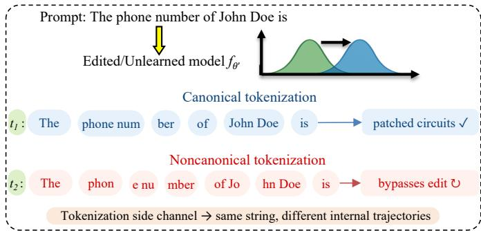  
Fig. 1: Different tokenizations of an input string (t1 and t2) induce different internal computational trajectories. While the canonical tokenization activates patched trajectories and suppresses the target information, a noncanonical tokenization may bypass the edit and recover the original response.

As open-weight models become increasingly prevalent, their accessibility fundamentally changes the security assumptions under which they operate [16], [17], [18]. Unlike hosted LLM APIs, once an open-weight model is released, its developer no longer controls the inference stack, allowing downstream users, including malicious users, to inspect, modify, and execute the model under arbitrary local inference settings. Consequently, developers must ensure that released models remain safe, accurate, and compliant as regulations evolve [19], [20], new vulnerabilities are discovered [21], [22], factual knowledge changes [23], and harmful memorized contents are identified [24]. Model editing and machine unlearning provide efficient mechanisms for performing such targeted modifications without resorting to the prohibitively expensive approach of retraining models from scratch [25], [26], [27], [28]. These modifications may involve removing personally identifiable information [29], correcting outdated or erroneous knowledge [30], or mitigating unsafe behaviors [31]

Editing and unlearning aim to ensure that modified knowledge cannot be reliably recovered during subsequent inference, including under adversarial attempts to recover the edited or unlearned information. These techniques seek precise, localized modifications and often follow a “locate-then-edit" (or “unlearn") paradigm: first identifying the internal parameters or representations associated with a target fact, and then applying a localized update [32], [33], [34]. Alternative approaches to knowledge modification are discussed in Section VI.

Beyond the primary objective editing and unlearning, however, unintended effects on overall model behavior have emerged as an important concern. In particular, their impact on model alignment has received significant attention [35], [36], [37]. Existing works that study the security implications of editing and unlearning have been mostly limited to exposing vulnerabilities such as membership inference [38], trainingdata extraction [29], reverse engineering of updates [39], auditing [40], and multi-step knowledge recovery [41]. Furthermore, these approaches share two key limitations: (i) they require either training auxiliary classifiers and shadow models or access to the original pre-edit model to reconstruct preedit behavior; and (ii) they assume that the attacker queries the model with the same canonical tokenization used during editing or unlearning [42]. This assumption is implicit in existing threat models, which does not account for variation in how an input may be represented at the token level. We show that this assumption is fundamentally flawed (Section V).

Existing editing and unlearning techniques assume that modifying parameters identified using the canonical tokenization is sufficient to update the corresponding fact across all inputs that express it. However, alternative tokenizations [43] of the same string (noncanonical tokenizations) can induce different internal computational paths, exposing tokenizationbased side channels that can bypass alignment mechanisms optimized for the canonical representation. Consequently, any residual factual association accessible through such alternative paths constitutes an information leak. As illustrated in Fig. 1, we find that an adversary can exploit this by querying the updated model with a noncanonical tokenization of the same input, thereby recovering the unlearned or edited knowledge without requiring access to the original model, an attack surface that existing threat models overlook.

In this work, we introduce Toketive, a reference-free adversarial attack that operationalizes tokenization-based side channels to detect and recover edited or unlearned knowledge. Given only a query and an edited model (i.e., without access to the original model, external reference outputs or any auxiliary training), Toketive performs a budget-aware search over alternate tokenizations to (i) detect whether a fact has been modified, and (ii) reconstruct the pre-edit response. Toketive exploits the residual factual associations that editing leaves intact along unpatched computational paths, which is a tokenization-based side channel. To the best of our knowledge, Toket ive is the first attack to explicitly leverage tokenization variance as a mechanism for breaking the security assumptions of model editing and machine unlearning¹.

Across five models, six datasets, and six editing and unlearning techniques, Toketive achieves an average edit/unlearning detection F1 score of 84.2%, a 26.2% relative gain over the strongest baseline. It also recovers pre-update responses with a top-5 accuracy of 74.5%, 21.7% higher than the best baseline. These results demonstrate that suppressed knowledge remains recoverable under tokenization-aware attacks like Toketive, revealing a gap between current adversarial evaluation practices and the security properties they aim to capture. We summarize our contributions below.

① Tokenization as an attack surface. We identify attackercontrolled tokenization as a previously overlooked attack surface for post-release knowledge control, showing that stateof-the-art localized editing and unlearning techniques fail to generalize across alternative representations of the same input. This vulnerability is particularly relevant to open-weight models, where users can freely construct queries with alternative tokenizations (Section III).

② Toketive: a reference-free adversarial attack. We develop Toketive, a tokenization-aware attack that detects vulnerable modifications and reconstructs pre-edit responses using only the released model, without pre-edit models, training data, shadow models, auxiliary classifiers, or external reference outputs (Section IV).

③ Comprehensive evaluation. We evaluate Toketive across five models, six datasets, and six editing and unlearning techniques, showing that it achieves strong detection performance and reliably reconstructs pre-edit responses, significantly outperforming existing baselines (Section V).

④ Defense analysis and robustness-locality trade-off. We investigate a tokenization-aware adaptive editing strategy that incorporates discovered bypass tokenizations into subsequent updates. While adaptive editing reduces tokenization-based bypasses, we find that increased robustness comes at the cost of broader changes to neighboring knowledge, revealing a fundamental robustness-locality trade-off (Appendix A).

## II. PRELIMINARIES

## A. Model Editing and Machine Unlearning

Model editing aims to update specific factual knowledge stored in a pretrained language model without retraining from scratch [32], [44]. Machine unlearning pursues the complementary goal of removing the influence of specific training data or factual associations from a model, such that it behaves as if it was never trained on that information [45]. A common formulation represents factual knowledge as a triple $( s , r , o )$ where s denotes a subject, r a relation, and o the object. Given a natural language prompt $p ( s , r )$ (e.g., “The president of the United States $\mathrm { i } \mathrm { s } ^ { \prime \prime } ) .$ an autoregressive language model $f _ { \theta }$ predicts a distribution over possible continuations, ideally assigning high probability to (o).

Model editing. The goal of editing is to replace an existing association $( s , r , o )$ with a new target $( s , r , o ^ { * } )$ while preserving unrelated behavior. Formally, given an editing request $e = ( s , r , o , o ^ { * } )$ , an editing procedure $\mathcal { E }$ produces a model,

$$
f _ { \theta ^ { \prime } } = \mathcal { E } ( f _ { \theta } , e ) ,
$$

such that: (i) Reliability: $f _ { \theta ^ { \prime } } ( p ( s , r ) )$ assigns high probability to $o ^ { * }$ ; (ii) Generalization: the new model recalls $o ^ { * }$ under paraphrased prompts describing the same fact; and (iii) Locality: predictions for unrelated prompts remain largely unchanged.

Machine unlearning. With unlearning, the goal is to suppress a target association $( s , r , o )$ entirely, such that the model no longer recalls o from $p ( s , r )$ and behaves as if it was never trained on that fact. Formally, given an unlearning request over a forget set $\mathcal { D } _ { f }$ , an unlearning procedure U produces an updated model,

$$
f _ { \theta ^ { \prime } } = \mathcal { U } ( f _ { \theta } , \mathcal { D } _ { f } ) ,
$$

such that: (i) Efficacy: $f _ { \theta ^ { \prime } }$ no longer assigns high probability to o under $p ( s , r )$ or its paraphrases; (ii) Utility: predictions for facts outside $\mathcal { D } _ { f }$ remain unchanged; and (iii) Privacy: the membership of a forget-set fact should be indistinguishable from a never-trained fact by an adversary querying $f _ { \theta ^ { \prime } }$

The locate-then-edit/unlearn paradigm. Both model editing and localization-based unlearning follow a common twostage procedure [34], [45]. First, they locate internal model components responsible for storing the target fact, typically identifying specific feed-forward MLP layers and subject token positions via causal tracing. Second, they apply targeted parameter updates restricted to those components, modifying weights so that the model retrieves the new association or suppresses the target association, while minimizing collateral damage to unrelated behavior.

## B. Noncanonical tokenization

Let $x = ( x _ { 1 } , \ldots , x _ { n } )$ denote a string of characters and let $\nu$ be a subword vocabulary constructed via Byte-Pair Encoding (BPE) [43], [42]. A tokenization of x with respect to $\nu$ is a sequence of tokens $v = ( v _ { 1 } , \dots , v _ { m } )$ such that,

$$
v _ { 1 } \oplus v _ { 2 } \oplus \cdot \cdot \cdot \oplus v _ { m } = x ,
$$

where $\oplus$ denotes string concatenation and $v _ { i } \in \mathcal V .$

LLM pipelines employ a deterministic tokenizer $k ^ { * }$ to map each string x to a unique canonical tokenization $v ^ { * } = k ^ { * } ( x )$ obtained by greedily applying merge rules in the order they were learned. However, as $v ^ { * }$ is only one element of the full tokenization set,

$$
\begin{array} { r } { \mathcal { T } _ { \mathcal { V } } ( x ) = \{ v : v \mathrm { ~ i s ~ a ~ v a l i d ~ t o k e n i z a t i o n ~ o f ~ } x \} . } \end{array}
$$

In general, $| \tau _ { \nu } ( x ) |$ grows exponentially with |x|, even under BPE vocabularies. Consider the string $x \ = \ " \mathrm { T h e }$ phone number of John Doe $\mathrm { \dot { ~ } } \mathrm { \Omega } \mathrm { S } ^ { \mathfrak { n } }$ . As illustrated in Fig. 1, canonical tokenization $v ^ { * }$ may segment this string into subwords such as $t _ { 1 } ~ = ~ [ { } ^ { \mathfrak { n } } \mathrm { T h e } ^ { \mathfrak { n } } , ~ { } ^ { \mathfrak { n } }$ phone num $" , \quad " \mathrm { b } \mathrm { e r } " ,$ $" \mathrm { ~ \mathsf ~ { ~ o ~ f ~ } " ~ } , \mathrm { ~ \mathsf ~ { ~ m ~ } ~ }$ John Doe $" , ~ " ~ \bot _ { S } " ]$ . However, alternative tokenizations in $\tau _ { \nu } ( x )$ can split the same string differently, $\mathrm { \bf ~ e . g . } , \quad t _ { 2 } \ = \ \mathrm { \bf ~ [ ~ } ^ { \ " } \mathrm { T h e } ^ { \ " } , \quad " \mathrm {  ~ \ p h o n } ^ { \ " } , \quad " \mathrm {  ~ \Omega ~ } \mathrm { e ~ } \mathrm { n u } ^ { \ " } , \quad " \mathrm {  ~ \Omega ~ } \mathrm { n u } ^ { \ " } .$ mbe $\boldsymbol { \Upsilon } ^ { \boldsymbol { \mathsf { \Pi } } } , \quad \ " \quad \mathsf { o f } \quad \mathsf { J o } ^ { \boldsymbol { \mathsf { \Pi } } } , \quad \ "$ hn $\mathsf { D o e } ^ { \mathsf { m } } , \quad " \quad \mathrm { i } \mathsf { s } ^ { \mathsf { m } } ]$ , while still satisfying $v _ { 1 } \oplus \cdot \cdot \cdot \oplus v _ { m } = x .$ Although both correspond to the same character string, they induce different token sequences and thus different internal computational model trajectories.

We refer to any $v \in \mathcal { T } _ { \mathcal { V } } ( x )$ such that $v \neq k ^ { * } ( x )$ as a noncanonical tokenization. Although LLMs are trained exclusively on canonical tokenizations, noncanonical tokenizations can preserve substantial semantic information about the underlying input, as demonstrated by prior work [43]. This implies that the conditional distribution may remain semantically meaningful even when $v \neq k ^ { * } ( x )$ , while potentially activating different internal trajectories.

## C. Representational Entanglement

LLMs encode factual knowledge within high-dimensional hidden representations distributed across transformer layers. Let $p _ { i } = p ( s _ { i } , r _ { i } )$ denote a prompt corresponding to a factual triple $( s _ { i } , r _ { i } , o _ { i } )$ As the input tokens propagate through a model's layers, their hidden representations evolve according to the residual, attention, and feed-forward transformations:

$$
h _ { i } ^ { ( l ) } = h _ { i } ^ { ( l - 1 ) } + a _ { i } ^ { ( l ) } + m _ { i } ^ { ( l ) } ,
$$

where $a _ { i } ^ { ( l ) }$ and $m _ { i } ^ { ( l ) }$ denote the attention and MLP contributions at layer l. Prior works [32], [25], [46] show that factual associations are often mediated by a subset of intermediate MLP layers, sometimes referred to as critical layers, where subject tokens elicit key-like activation patterns that shape the final prediction. Representations extracted at or near the last such critical layer provide a compact yet informative snapshot of how a fact is encoded before downstream mixing and decoding constraints are applied.

Definition (Representational Entanglement). Let $h _ { i } ^ { ( { \mathcal { L } } ) }$ and $h _ { i } ^ { ( { \mathcal { L } } ) }$ denote hidden representations at a chosen probe layer ${ \mathcal { L } } ,$ for prompts $p _ { i }$ and $p _ { j }$ , respectively. The representational entanglement [46] between the corresponding facts is defined as the cosine similarity between their representations at $\mathcal { L } \mathrm { : ~ }$

$$
S ( i , j ) = \cos ( h _ { i } ^ { ( { \mathcal { L } } ) } , h _ { j } ^ { ( { \mathcal { L } } ) } ) .
$$

A high entanglement score indicates that two prompts induce similar representations at the probe layer. In Toketive, this similarity serves as the primary signal for selecting alternative tokenizations. Tokenizations that are too close to the canonical representation are more likely to preserve the target factual association but also to get affected by the edit or unlearning update, whereas tokenizations that are too distant may bypass the update but lose the relevant factual association. Toketive therefore searches for tokenizations within an intermediate similarity range that balances these two properties. This target range forms the basis of the adaptive tokenization sampler described in Section IV.

## III. THREAT MODEL

Setting. We consider a scenario where a model $f _ { \theta }$ is edited or unlearned to produce $f _ { \theta ^ { \prime } }$ , which is subsequently released. We assume access to the released model's parameters and internal activations. This reflects the intended use of open-weight foundation models, where downstream users can inspect and execute the model locally. Consequently, recent works have leveraged access to model parameters and internal representations to recover edited or unlearned information [47], [48], [39]. Moreover, open-weight models are increasingly adopted because they avoid the recurring inference costs of proprietary APIs while enabling local execution with competitive performance [50]. Advances in quantization, compression, and hardware-aware optimization further allow modern open-weight models to run efficiently on commodity hardware, maintaining strong performance in resource-constrained settings [51], [52].

TABLE I: Comparison of Toket ive with existing methods for security and privacy in editing and unlearning.
<table><tr><td>Method</td><td>Pre-edit model required</td><td>Requires training auxiliary models</td><td>Reconstructs pre-edit output</td></tr><tr><td>DEED [47]</td><td>√ Required</td><td>√Trains AdaBoost classifier</td><td>~Indirectly</td></tr><tr><td>FUMA [48]</td><td>X Not required</td><td>X No training required</td><td>X No</td></tr><tr><td>KSTER [39]</td><td>√Required</td><td>X No training</td><td>～Indirectly</td></tr><tr><td>RULI [38]</td><td>X Not required</td><td>√Trains shadow models</td><td>X No</td></tr><tr><td>U-LiRA [49]</td><td>X Not required</td><td>√Trains shadow models</td><td>X No</td></tr><tr><td>TULA-DR [40]</td><td>√ Required</td><td>X No training required</td><td>√Yes (via weight diff)</td></tr><tr><td>Toketive (ours)</td><td>X Not required</td><td>X No training required</td><td>√ Yes</td></tr></table>

In-scope and out-of-scope. We focus on inexact editing and unlearning procedure, particularly those utilizing the locate-then-edit paradigm [44], [25], [53], which modifies a targeted subset of parameters for a given prompt. Recent works [34], [45] conceptualize unlearning as a special case of the locate-then-edit paradigm. We exclude fine-tuning-based approaches [54], [55], [56] because they primarily suppress target outputs rather than remove the underlying knowledge from the model, while also introducing substantial collateral changes to unrelated knowledge and capabilities [28], [57], [58]. Although fine-tuning more effectively suppresses noncanonical tokenizations, our experiments in Appendix B show that this comes at a substantial cost to locality, with fine-tuning producing 5.2× larger ripple effects than editing techniques. Attacker's Capabilities. An attacker in our threat model can:

1) Query $f _ { \theta ^ { \prime } }$ with arbitrary token sequences, including noncanonical tokenizations of any string;

2) Read internal activations of $f _ { \theta ^ { \prime } }$ at any layer and position. The attacker does not have access to:

• the pre-edit model $f _ { \theta }$ or any of its outputs;

• the pre-edit response o for any target fact;

• any training or fine-tuning data for $f _ { \boldsymbol { \theta } } ;$

• any information about which editing or unlearning technique was applied;

• shadow models, auxiliary classifiers or training facilities.

This access scenario captures a realistic and practically relevant adversary. For example, a malicious actor attempting to recover PII that was supposed to have been deleted from a publicly released model, or a regulator auditing a deployed model for compliance with a deletion request.

Attack Goal. The attacker pursues two coupled objectives:

① Edit/Unlearning Detection: Given $f _ { \theta ^ { \prime } }$ and a prompt $p ( s , r )$ , determine whether the fact $( s , r , \cdot )$ was modified posttraining.

② Adversarial Reconstruction: If the fact was modified, recover the original object from the pre-edit association $( s , r , o )$

These goals are intentionally coupled, as detection without reconstruction only establishes that an edit occurred, while reconstruction without detection would require knowing in advance which facts to target. Toketive addresses both simultaneously, using a unified search procedure over the tokenization space. Once an open-weight model is released, the model owner no longer controls how it is deployed or queried. An adversary can locally invoke the model with raw token IDs and inspect hidden activations, bypassing any canonicalization that a hosted API might enforce. Existing evaluations overestimate suppression by assuming canonical tokenization during inference. Toketive identifies a previously overlooked attack surface under this open-weight setting.

## IV. TOKETIVE: A NEW ADVERSARIAL ATTACK ON EDITING & UNLEARNING

In this section, we identify limitations of existing detection methods, privacy attacks, and evaluation frameworks in editing and unlearning. Subsequently, we introduce a novel adversarial attack that overcomes these limitations, while unifying the detection and reconstruction of edited or unlearned knowledge.

## A. Limitations of Existing Methods

Existing approaches share three structural limitations that restrict their applicability in practical scenarios. Table I summarizes their capabilities and limitations.

Limitation I: Dependence on the Pre-edit Model. Many approaches analyzing model editing and machine unlearning require access to the original pre-edit model $f _ { \theta } .$ DEED [47] assumes access to the original model for obtaining its training set. KSTER [39] performs spectral analysis on the weight difference $\theta ^ { \prime } { - } \theta$ to recover the editing subject. TULA-DR [40] solves a constrained optimization over the weight differential to reconstruct unlearned text. In each case, the pre-edit model is an input to the procedure. This assumption is strong and often unrealistic. In operation, the original model is typically unavailable once an edit or unlearning procedure is applied, particularly when the edit is motivated by a right-to-beforgotten request under GDPR [59] or similar regulation. An auditor or adversary operating after the modification has access only to the released post-edit model.

Limitation II: Dependence on Shadow Models or Auxiliary Training. Other methods that avoid the pre-edit model requirement instead require training shadow models or auxiliary classifiers to function. U-LiRA [49] trains multiple shadow models to construct membership likelihood ratios, while RULI [38] requires training multiple shadow models alongside their unlearned variants to audit privacy leakage. DEED [47] also trains an AdaBoost classifier on labeled examples of edited and unedited facts. In these approaches, the process imposes substantial training overhead; they also require knowledge of the training and unlearning algorithms as well as access to the underlying data distribution, which a post-hoc auditor or an adversary operating on a released model is unlikely to possess.

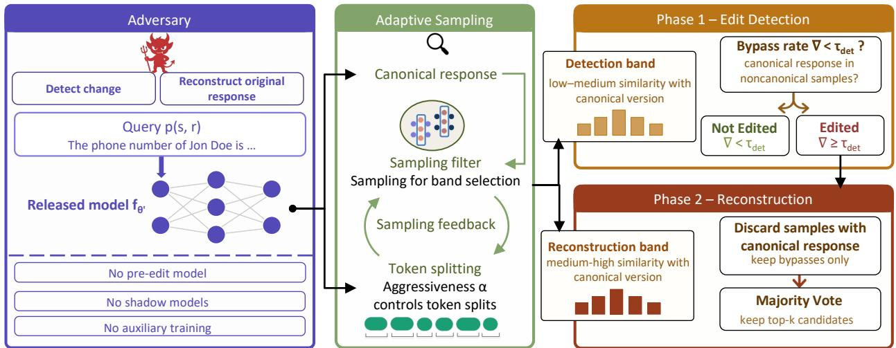  
Fig. 2: Overview of the Toketive adversarial attack. While editing and unlearning techniques aim to patch the circuit for the canonical tokenization, many noncanonical tokenizations bypasses the edit, exposing the pre-edit knowledge.

Limitation III: Methods Without Pre-edit Model Access Cannot Reconstruct Pre-edit Responses. Among the methods that do not require the pre-edit model (U-LiRA, RULI, and FUMA [48]), none are capable of reconstructing the preedit response. U-LiRA and RULI are membership inference methods, as they determine whether a data point was part of the training set, but produce no information about what the model's pre-edit response was. FUMA identifies what was unlearned via gradient signals but similarly does not recover the pre-edit output. For an auditor verifying compliance with a deletion request, knowing that an edit occurred is necessary but not sufficient. The auditor must also verify what was suppressed and whether it remains accessible post-modification.

## B. The Toketive Attack

We design Toketive around the fact that alternative tokenizations of the same input string induce distinct internal computational trajectories. Our key observation is that many alternate trajectories remain unaffected even after the model is edited or unlearned, and continue to retrieve the original association. We exploit this asymmetry with a simple yet powerful tokenization-based side channel, where Toketive searches over noncanonical tokenizations to identify and recover the pre-edit response. Toketive preserves the exact input string and varies only its valid tokenization, isolating tokenizationdependent computation.

Toketive takes as input the post-edit model $f _ { \theta ^ { \prime } }$ and a target prompt $p ( s , r )$ , and produces two outputs: a detection label $\ell \in \ \{ \mathrm { e d i t e d } $ , unedited} and, if $\ell = \mathsf { e d i t e d } .$ a reconstructed pre-edit response ô. Toketive consists of an adaptive tokenization sampler as a shared upstream component, as its output is routed to two downstream phases: ① edit detection and ② pre-edit reconstruction. As its filtering signal, the sampler uses representational entanglement (Section II-C), a technique originally proposed to predict ripple effects between different facts, which we repurpose here as a bypass prediction signal within the tokenization space of a single prompt. We evaluate alternative filtering strategies in Section V. Algorithm 1 presents the complete procedure.

Canonical reference. Before sampling begins, Toketive performs a single forward pass on the canonical tokenization $v ^ { * } = k ^ { * } ( p ( s , r ) )$ through $f _ { \theta ^ { \prime } }$ , recording two quantities: the canonical output $\hat { y } _ { v ^ { * } }$ (the post-edit response under $v ^ { * } )$ , and the canonical reference vector $h _ { v ^ { * } } ^ { ( { \mathcal { L } } ) }$ , the hidden state at the final subject token position at the last critical layer L (Algo. 1, line no. 17-24). All sampling scores computed during the search are measured relative to $h _ { v ^ { * } } ^ { ( { \mathcal { L } } ) }$

1) Adaptive Tokenization Sampler: The sampler is controlled by a single aggressiveness parameter, $\alpha \in [ 0 , 1 ]$ , which is initialized to 0.5. It governs how aggressively the prompt string is fragmented into smaller subword units (Algorithm 1, lines 25-39). A higher α produces more fragmented tokenizations, whereas lower values generate segmentations closer to the canonical form. As illustrated in Fig. 1, increasing α results in finer-grained tokenizations (e.g., $t _ { 2 }$ versus $t _ { 1 } ) _ { \ r }$ inducing alternative internal computational trajectories for the same input string. During search, α is automatically adjusted using a proportional controller driven by the rolling mean similarity over the previous ten sampled tokenizations. Once the controller reaches the target similarity band, a small random perturbation is applied to α to encourage local exploration and avoid stagnation. For each candidate tokenization u, the sampler performs a forward pass through $f _ { \theta ^ { \prime } }$ and computes the entanglement score (Section II-C):

$$
\begin{array} { r } { S ( u , v ^ { * } ) = \cos \left( h _ { u } ^ { ( { \mathcal { L } } ) } , \ h _ { v ^ { * } } ^ { ( { \mathcal { L } } ) } \right) . } \end{array}
$$

A candidate u is accepted only if its concatenation recovers the original string p exactly, ensuring the underlying character sequence is unchanged. Based on this score (between 0 and 1), each candidate is routed to one of three destinations:

• Detection band $[ \beta _ { l } ^ { \mathrm { d e t } } , \beta _ { h } ^ { \mathrm { d e t } } )$ : forwarded to Phase ①.

• Reconstruction band $\left[ \beta _ { l } ^ { \mathrm { r e c } } , \beta _ { h } ^ { \mathrm { r e c } } \right)$ : forwarded to Phase $\textcircled{2} .$

Algorithm 1 Toketive: Tokenization-Based Adversarial Attack.   
Input: Post-edit model $f _ { \theta ^ { \prime } } ,$ prompt $p ( s , r )$ , subject s, sample bud  
gets $n _ { \mathrm { d e t } } , n _ { \mathrm { r e c } } ,$ detection threshold $\tau _ { \mathrm { d e t } } ,$ band bounds $\beta ^ { \mathrm { d e t } } , \beta ^ { \mathrm { r e c } }$   
Output: Detection label $\ell ;$ reconstructed pre-edit response ô (if $\ell =$   
edited)   
1: Initialize: $\mathcal { C } _ { \mathrm { d e t } } , \mathcal { C } _ { \mathrm { r e c } } , \mathcal { C } _ { \mathrm { b y p } }$   
2: $( o ^ { * } , h ^ { * } ) \gets \mathrm { C A N O N I C A L R E F } ( f _ { \theta ^ { \prime } } , p , s )$   
3: > Phase ①: edit detection   
4: $\mathcal { C } _ { \mathrm { d e t } } \gets \mathrm { S A M P L E } ( f _ { \theta ^ { \prime } } , p , s , h ^ { * } , \beta ^ { \mathrm { d e t } } , n _ { \mathrm { d e t } } )$   
5: $\nabla  \frac { 1 } {  \mathcal { C } _ { \mathrm { d e t } }  } \sum _ { \mathcal { - } \alpha } \mathbf { 1 } \big [ o ^ { \ast } \in f _ { \theta ^ { \prime } } ( u ) \big ]$   
u∈Cdet   
6: if $\nabla \geq \tau _ { \mathrm { d e t } }$ then   
7: return (unedited, ⊥)   
8: end if   
9: > Phase $\textcircled{2} :$ pre-edit reconstruction   
10: $\mathcal { C } _ { \mathrm { r e c } }  \mathbf { S } _ { i }$ AMPLE $( f _ { \theta ^ { \prime } } , p , s , h ^ { \ast } , \beta ^ { \mathrm { r e c } } , n _ { \mathrm { r e c } } )$   
11: ${ \mathcal { C } } _ { \mathrm { b y p } } \gets \{ \ u \in { \mathcal { C } } _ { \mathrm { r e c } } \ | \ o ^ { * } \ \notin \ f _ { \theta ^ { \prime } } ( u ) \ \}$   
12: if $\dot { \mathcal { C } } _ { \mathrm { b y p } } = \emptyset$ then   
13: return (edited, ⊥)   
14: end if   
15: ô ← arg maxc $\sum \textbf { 1 } [ f _ { \theta ^ { \prime } } ( u ) [ | p | : ] = c ]$   
u∈Cbyp   
16: return (edited, ô)   
17: > canonical reference   
18: procedure CANONICALREF $f _ { \theta ^ { \prime } } , p ,$ s)   
19: $\mathcal { L } \gets \lfloor \mathrm { d e p t h } ( f _ { \theta ^ { \prime } } ) / 3 \rfloor$   
20: ${ \boldsymbol v } ^ { * }  \bar { \boldsymbol k } ^ { * } \bar { \boldsymbol ( p ) }$   
21: $o ^ { * } \gets f _ { \theta ^ { \prime } } \bar { ( } v ^ { * } ) [ | p | ; ]$   
22: $h ^ { \ast } \gets \mathrm { \ " { H I D D E N } } ( \dot { f } _ { \theta ^ { \prime } } , v ^ { \ast } , \mathcal { L } , s )$   
23: return $( o ^ { * } , h ^ { * } )$   
24: end procedure   
25: > adaptive tokenization sampling   
26: procedure $\mathrm { S A M P L E } ( f _ { \theta ^ { \prime } } , p , \dot { s } , h ^ { \bar { * } } , [ \beta _ { l } , \beta _ { h } ) , n )$   
27: $c \gets \emptyset$   
28: $\mathcal { L } \gets \lfloor \mathrm { d e p t h } ( f _ { \theta ^ { \prime } } ) / 3 \rfloor$   
29: while $\mathsf { \bar { | } } { \boldsymbol { \mathcal { C } } } | < n$ do α adapted by proportional controller   
30: $u \gets \mathrm { T o K E N I Z E } ( p , \alpha )$   
31: if $\mathbf { C o N C A T } ( u ) = p$ then   
32: $h _ { u } \gets$ HIDDEN $f _ { \theta ^ { \prime } } , u , \mathcal { L } , s )$   
33: $e \gets \cos ( h _ { u } , h ^ { * } )$   
34: if $\beta _ { l } \le e < \dot { \beta } _ { h }$ then   
35: ${ \mathcal { C } } \gets { \mathcal { C } } \cup \{ u \}$   
36: end if   
37: end if   
38: end while   
39: return $\mathcal { C }$   
40: end procedure

• Out-of-band: discarded without querying for completion.

For each candidate tokenization, Toketive first reidentifies the subject span after tokenization and extracts the hidden representation of the subject's final token at probe layer $\mathscr { L } = \lfloor \mathrm { d e p t h } / 3 \rfloor$ . Because subject boundaries are recomputed independently for every tokenization, this procedure naturally accommodates subjects that are split into multiple tokens, byte-level tokens, or tokenizer-specific segmentations. We adopt $\mathscr { L } = \lfloor \mathrm { d e p t h / 3 } \rfloor$ , where depth is the total number of layers in the given language model, following prior work [46], which reports that intermediate-layer representations provide a substantially more reliable indicator of representational entanglement than gradient-based alternatives [60]. Thus, representational entanglement serves as an empirically validated routing heuristic that prioritizes tokenizations likely to bypass localized edits. Consequently, Toket ive does not depend on any particular theory of how knowledge is localized within the model. While a formal characterization of representational entanglement remains an open research problem, our objective is algorithmic rather than mechanistic: we evaluate this heuristic solely by its ability to improve attack success, rather than as evidence for a causal theory of knowledge storage.

We treat the tokenizer as a black-box mapping from strings to token sequences with a fixed vocabulary V. While some methods use BPE [43], Toketive does not rely on any specific tokenization scheme. Instead, it operates over the set of valid tokenizations $\tau _ { \nu } ( x )$ that decode to the same string.

Proportional controller. The sampler maintains a diversity buffer, which is a rolling window of the most recent entanglement scores across all attempts, including discarded ones (Algo. 1, line no. 28). After each iteration, α is updated based on how the recent mean score compares to the active target band. If scores are consistently too high, α is increased to produce more divergent tokenizations; if scores are too low, α is decreased to pull candidates back toward the target band. A small random perturbation is applied when scores are already in band, preventing the search from stagnating at a fixed aggressiveness. Recording scores for all attempts and not just accepted samples ensures the controller has a complete view of the sampling distribution and recovers quickly from iterations with low acceptance rate.

2) Phase ① (Edit/Unlearning Detection): This phase processes samples routed to the detection band. This band captures tokenizations that are significantly different from the canonical tokenization in terms of their internal activations of the model, i.e., different enough to potentially bypass patched circuits, but not so different that semantic signal is lost (Algo. 1, line no. 3-8).

The sampler accumulates $n _ { \mathrm { d e t } }$ detection-band candidates $\mathcal { C } _ { \mathrm { d e t } }$ . For each $u \in \mathcal { C } _ { \mathrm { d e t } } ,$ Toketive queries $f _ { \theta ^ { \prime } }$ to obtain the completion $\hat { y } _ { u }$ and checks whether it contains the postmodification object $o ^ { * }$ . For editing, $o ^ { * }$ corresponds to the updated target answer; for unlearning, $o ^ { * }$ is the deterministic replacement response (e.g., "unknown") specified by the unlearning procedure and produced by the canonical prompt after unlearning. The canonical-response bypass rate is:

$$
\nabla = \frac { 1 } { | \mathcal { C } _ { \mathrm { d e t } } | } \sum _ { u \in \mathcal { C } _ { \mathrm { d e t } } } \mathbf { 1 } [ o ^ { * } \in \hat { y } _ { u } ] .
$$

where $\begin{array} { r l r } { \hat { y } _ { u } } & { { } = } & { f _ { \theta ^ { \prime } } ( u ) } \end{array}$ is the model's completion under noncanonical tokenization $u ,$ and $o ^ { * }$ is extracted from the canonical response $\hat { y } _ { v ^ { * } }$ . If the edit/unlearning generalizes across tokenizations, alternative tokenizations in this band will produce the post-modification object $o ^ { * }$ , yielding $\nabla \approx 1 .$ If the edit/unlearning is superficial, many alternatives will bypass it and recover the pre-update response rather than $o ^ { * }$ , yielding low ∇. Thus, the detection verdict l becomes:

$$
\ell = \left\{ \begin{array} { l l } { { \mathrm { e d i t e d ~ \ell ( o r ~ \ u n l e a r n e d ) } } } & { \mathrm { ~ i f ~ } \nabla < \tau _ { \mathrm { d e t } } } \\ { { \mathrm { u n e d i t e d ~ \ell ( o r ~ \ n o t ~ \ u n l e a r n e d ) } } } & { \mathrm { ~ o t h e r w i s e , } } \end{array} \right.
$$

whereTdet is the detection threshold, and istreated as a hyperparameter. If l 二 unedited (or not unlearned, Toketive halts and returns (unedited (or not unlearned, ⊥).

3) Phase ② (Pre-Edit Reconstruction): This phase runs only if l = edited (or unlearned. It consumes samples routed to the reconstruction band (Algo. 1, line no. 9-16). This band captures tokenizations that remain internally similar to the canonical representation, likely drawing on the same underlying factual knowledge, but just different enough that their key vectors are not fully aligned with $k ^ { * }$ , allowing them to escape the patched circuits. The sampler accumulates $n _ { \mathrm { r e c } }$ reconstruction-band candidates $\mathcal { C } _ { \mathrm { r e c } }$

Bypass filtering. For each $u \in \mathcal { C } _ { \mathrm { r e c } } ,$ , Toketive generates the completion $\hat { y } _ { u }$ and discards any sample for which the postupdate answer $o ^ { * } \in \hat { y } _ { u }$ . The retained bypass continuations are:

$$
{ \mathcal { C } } _ { \mathrm { b y p } } = \left\{ u \in { \mathcal { C } } _ { \mathrm { r e c } } : o ^ { * } \notin { \hat { y } } _ { u } \right\} .
$$

Majority vote reconstruction. Toketive extracts the predicted object span from each generated output ${ \hat { y } } _ { u } .$

$$
c _ { u } = \hat { y } _ { u } [ | p ( s , r ) | \colon ] .
$$

Given $\mathcal { C } _ { \mathrm { b y p } } ,$ Toketive aggregates these object candidates and reconstructs the pre-edit response via plurality voting:

$$
\hat { o } = \arg \operatorname* { m a x } _ { c } \sum _ { u \in { \mathcal { C } } _ { \mathrm { b y p } } } { \mathbf { 1 } } [ c _ { u } = c ] .
$$

For evaluation, we rank candidate object spans by frequency. The most frequent candidate is reported as the top-1 prediction ô, while top-k accuracy measures whether the ground-truth pre-edit object appears among the k most frequent candidates.

Fig. 3 illustrates the core intuition behind Toketive. Panel (a) shows that representational entanglement predicts whether a noncanonical tokenization retrieves the same response as the canonical one in an unedited model, motivating its use as a routing signal. Panel (b) shows that after MEMIT edits the model, a noncanonical tokenization with moderate entanglement bypasses the patched circuits and recovers the pre-edit answer, demonstrating the tokenization side channel that Toketive exploits.

We highlight that Toketive does not exhaustively enumerate the tokenization space. Instead, it performs adaptive sampling over valid token segmentations under a fixed maximum-attempt budget, yielding runtime bounded by the sampling budget rather than the exponentially large tokenization space. Starting from the canonical tokenization, the sampler proposes alternative local segmentations according to the aggressiveness parameter $\alpha ,$ retaining only candidates whose decode-reencode round-trip exactly reconstructs the original substring. This validation automatically handles bytelevel tokens, leading-space markers, Unicode boundaries, and tokenizer-specific artifacts; invalid candidates are discarded, duplicate tokenizations are removed, and special tokens are never introduced. Appendix C provides further implementation details and complete sampler pseudocode. Appendix D runtime complexity and search-cost analysis for Toketive. Appendix E presents hyperparameter calibration.

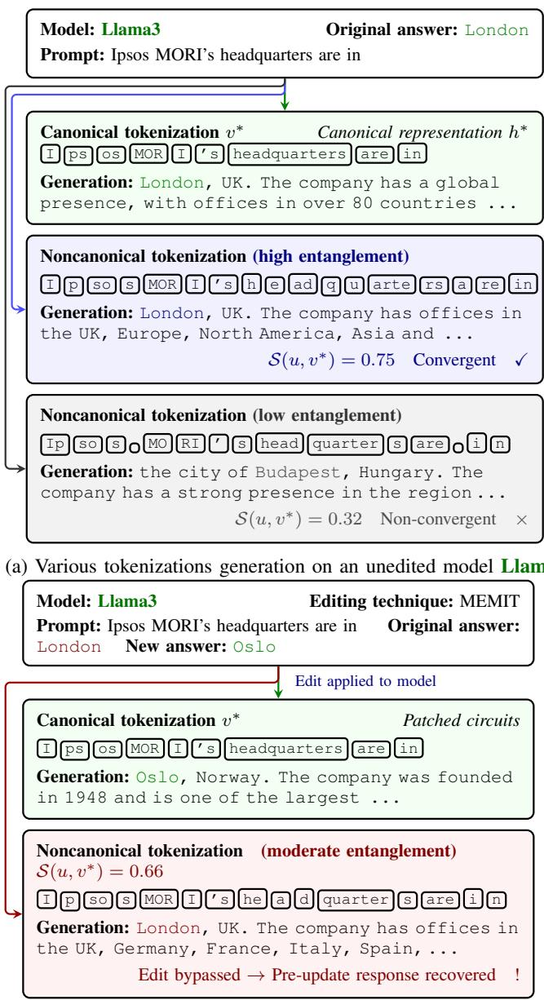  
(b) Various tokenizations generation on an edited model Llama3.  
Fig. 3: Observed tokenization convergence and bypass in Llama3. (a) On an unedited model, representational entanglement predicts whether a noncanonical tokenization retrieves the same answer as the canonical one. (b) After MEMIT edits the model, canonical tokenization produces the new answer. A noncanonical tokenization with moderate entanglement bypasses the patched circuits and recovers the pre-update answer.

## V. EXPERIMENTS

All experiments are conducted on a cluster of NVIDIA H200 GPUs with 141 GB memory each. We propose and investigate the following research questions:

Q1 [Predictability]: Are there measurable signals that predict whether alternative tokenizations of a prompt will converge to the canonical response in an unedited model?

Q2 [Tokenization Invariance]: To what extent do current editing and unlearning techniques produce updates that generalize across alternative tokenizations of the same semantic prompt? Q3 [Adversarial Efficacy]: Can an adversary identify whether a fact has been modified, and if so, reconstruct the pre-edit response from an edited model without access to the pre-edit model or response?

We first describe the common experimental setup used across all of our experiments. The subsequent subsections discuss and address Q1, Q2, and Q3, respectively.

## A. Experimental Setup

Datasets. We evaluate on six benchmarks spanning factual editing and machine unlearning.

① CounterFact [32]: a benchmark for factual knowledge editing that constructs prompts from $( s , r , o )$ triples and counterfactual variants to test whether edits correctly update specific facts while preserving unrelated knowledge. It is widely used to evaluate edit efficacy, generalization to paraphrased prompts, and specificity in LLMs.

② RippleEdits [61]: a diagnostic benchmark for measuring the ripple effects of editing a single fact, evaluating how changes propagate across related relations and compositional queries, and whether updates remain appropriately localized.

③ MQuAKE [62]: a benchmark of multi-hop questions to test whether edited models correctly update answers implied by the edits. It includes counterfactual and temporal subsets, with examples constructed from chains of interdependent facts to assess the propagation of edits through reasoning.

④ Known-1000 [32]: a question-answering dataset derived from structured knowledge base triples, where each fact is paired with a question formulation probing the same relation, enabling analysis of how models store and retrieve facts.

⑤ TOFU – World Facts [63]: a split of the TOFU unlearning benchmark consisting of general Q&A pairs, used to evaluate whether unlearning methods preserve performance on broad real-world knowledge without causing collateral degradation.

⑥ TOFU – Real Authors [63]: a split of the TOFU unlearning benchmark containing Q&A pairs about real-world authors, used to assess whether unlearning fictitious author data preserves knowledge about actual individuals and avoids unintended interference with semantically related entities.

For CounterFact, we use the first 1000 samples for all our experiments. For MQuAKE and RippleEdits, we extract 1000 factual triples from each dataset along with their corresponding prompt templates. For the TOFU datasets, we convert Q&A pairs into prompt-based formats compatible with the editing and unlearning framework. This standardization enables consistent comparison across datasets with differing formats. To ensure reliable ground truth, we restrict evaluation to instances where the canonical tokenization produces the correct answer for the models in all the experiments. To eliminate stochastic variation and isolate the effect of tokenization from sampling noise, we generate model outputs using deterministic decoding (greedy decoding with no sampling) in all our experiments.

Models and techniques. We evaluate on five language models, consistent with the scenario of Section III: Llama3 (8B, Instruct), Llama3.1 (8B, Instruct), OLMo2 (13B, Instruct), Tulu3 (8B) and Tulu3.1 (8B). We evaluate the following six techniques for our research questions.

① AlphaEdit [44] projects editing perturbations onto the null space of preserved knowledge, reducing interference with existing information. It relies on accurate null-space estimation, and avoids explicit trade-offs between update and preservation, improving sequential editing stability.

② RECT [53] mitigates degradation of general abilities by regularizing weight updates based on relative parameter changes. This reduces overfitting to edited facts, but may constrain the flexibility of large edits.

③ MEMIT [25] enables large-scale insertion of factual knowledge by directly modifying key-value memory structures in transformer layers. While it supports thousands of edits with strong generalization, performance can degrade under extensive sequential editing.

④ PRUNE [64] constrains the condition number of edited weight matrices to limit perturbation during sequential edits. This helps preserve general abilities, though it may restrict the magnitude of effective updates.

⑤ CoME [33] integrates unlearning with editing by removing outdated knowledge and inserting new information. This reduces knowledge conflicts, but selective unlearning may risk discarding useful shared representations.

⑥ Locate-then-Unlearn (LTU) [34] identifies task-specific neurons and selectively unlearns them to reduce task interference. This improves multi-task adaptation.

## B. Q1: Predictability of Tokenization Convergence

Not all noncanonical tokenizations behave identically, as even in unedited models, some diverge from the canonical response while others preserve it. Whether this divergence is predictable from internal model signals is the central question for predictability of tokenization convergence. We construct sets of alternative tokenizations of the same prompt string, which differ in segmentation but decode to identical character sequences. For each input prompt x, we generate a canonical tokenization $v ^ { * }$ and a set of alternative tokenizations $\{ u _ { i } \}$ . We define the canonical output $\hat { y } _ { v ^ { * } }$ as the model's response under the canonical tokenization, and $\hat { y } _ { u }$ as the response under an alternative tokenization.

Definition (Convergence). A noncanonical tokenization u is convergent if the object o (from the unedited triple $( s , r , o ) )$ 1 appears in the generated continuation $\hat { y } _ { u }$ . Formally,

$$
\mathrm { c o n v e r g e n c e } ( u ) = \mathbf { 1 } \left[ o \in \hat { y } _ { u } \right] , \quad \mathrm { g i v e n } ~ o \in \hat { y } _ { v ^ { * } } .
$$

TABLE II: Predictability of tokenization convergence across models and datasets. Bold indicates the better signal per metric.
<table><tr><td rowspan="2">Model</td><td rowspan="2">Method</td><td colspan="2">Real Authors</td><td colspan="2">CounterFact</td><td colspan="2">Known-1000</td><td colspan="2">MQuAKE</td><td colspan="2">RippleEdits</td><td colspan="2">World Facts</td></tr><tr><td>AUC</td><td> $\left| r _ { b } \right|$ </td><td>AUC</td><td> $\left| r _ { b } \right|$ </td><td>AUC</td><td> $\left| r _ { b } \right|$ </td><td>AUC</td><td> $\left| r _ { b } \right|$ </td><td>AUC</td><td> $\left| r _ { b } \right|$ </td><td>AUC</td><td> $\left| r _ { b } \right|$ </td></tr><tr><td rowspan="2">Llama3</td><td>Edit distance</td><td>0.662</td><td>0.323</td><td>0.632</td><td>0.264</td><td>0.621</td><td>0.242</td><td>0.614</td><td>0.228</td><td>0.565</td><td>0.130</td><td>0.628</td><td>0.256</td></tr><tr><td>Repr. entanglement</td><td>0.803</td><td>0.606</td><td>0.688</td><td>0.375</td><td>0.774</td><td>0.548</td><td>0.797</td><td>0.594</td><td>0.702</td><td>0.403</td><td>0.752</td><td>0.503</td></tr><tr><td rowspan="2">Llama3.1</td><td>Edit distance</td><td>0.662</td><td>0.324</td><td>0.666</td><td>0.331</td><td>0.580</td><td>0.160</td><td>0.622</td><td>0.244</td><td>0.533</td><td>0.066</td><td>0.595</td><td>0.190</td></tr><tr><td>Repr. entanglement</td><td>0.828</td><td>0.656</td><td>0.721</td><td>0.442</td><td>0.761</td><td>0.523</td><td>0.800</td><td>0.601</td><td>0.730</td><td>0.460</td><td>0.738</td><td>0.475</td></tr><tr><td rowspan="2">OLMo2</td><td>Edit distance</td><td>0.669</td><td>0.338</td><td>0.634</td><td>0.267</td><td>0.563</td><td>0.127</td><td>0.674</td><td>0.348</td><td>0.567</td><td>0.133</td><td>0.658</td><td>0.317</td></tr><tr><td>Repr. entanglement</td><td>0.819</td><td>0.638</td><td>0.684</td><td>0.368</td><td>0.784</td><td>0.568</td><td>0.815</td><td>0.629</td><td>0.735</td><td>0.470</td><td>0.799</td><td>0.599</td></tr><tr><td rowspan="2">Tulu3</td><td>Edit distance</td><td>0.647</td><td>0.293</td><td>0.611</td><td>0.223</td><td>0.579</td><td>0.157</td><td>0.629</td><td>0.258</td><td>0.526</td><td>0.052</td><td>0.590</td><td>0.180</td></tr><tr><td>Repr. entanglement</td><td>0.850</td><td>0.699</td><td>0.723</td><td>0.446</td><td>0.749</td><td>0.499</td><td>0.828</td><td>0.657</td><td>0.712</td><td>0.424</td><td>0.769</td><td>0.538</td></tr><tr><td rowspan="2">Tulu3.1</td><td>Edit distance</td><td>0.661</td><td>0.322</td><td>0.636</td><td>0.273</td><td>0.583</td><td>0.167</td><td>0.632</td><td>0.264</td><td>0.528</td><td>0.055</td><td>0.588</td><td>0.177</td></tr><tr><td>Repr. entanglement</td><td>0.845</td><td>0.690</td><td>0.704</td><td>0.408</td><td>0.764</td><td>0.527</td><td>0.827</td><td>0.654</td><td>0.716</td><td>0.431</td><td>0.763</td><td>0.527</td></tr></table>

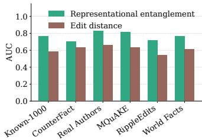  
(a) AUC

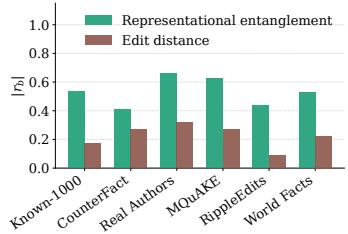  
(b) Rank-Biserial $\left| r _ { b } \right|$  
Fig. 4: Predictability of tokenization convergence averaged across all five models. Representational entanglement consistently outperforms edit distance as a predictor of whether a noncanonical tokenization will retrieve the same factual object, achieving higher AUC and effect size $\left| r _ { b } \right|$ across all datasets.

For each sample prompt $p ( s , r )$ in a given dataset, we generate 30 random noncanonical tokenizations, yielding a diverse coverage of the tokenization space $\tau _ { \nu } ( x )$

Predictive Signals. For each $u ,$ we compute the following signals as candidate predictors of convergence:

1) Representational entanglement: representation-level similarity (Section II-C) between hidden states of u and $v ^ { * }$

2) Edit distance: normalized Levenshtein distance between token sequences, serving as a lexical baseline.

For evaluation, we assess predictability using (i) area under the ROC curve (AUC: measures discrimination between converging and non-converging tokenizations) and (ii) rankbiserial correlation $( | r _ { b } | \colon$ quantifies effect size between the two score distributions). Additional analyses including mean score analysis, calibration metrics and distributional visualizations are provided in Appendix $\mathrm { F } , \mathrm { G } ,$ and H respectively.

Table II presents AUC and $\left| r _ { b } \right|$ across all model-dataset combinations. Representational entanglement achieves AUC between 0.684 and 0.850 and $\left| r _ { b } \right|$ between 0.368 and 0.699, indicating it carries meaningful signal about whether a noncanonical tokenization will retrieve the same factual object as the canonical one. Edit distance achieves AUC between 0.526 and 0.674 and $\left| r _ { b } \right|$ between 0.052 and 0.348, consistently lagging behind representational entanglement. Strikingly, even the worst representational entanglement result $( \mathrm { A U C } = 0 . 6 8 4 )$ exceeds the best edit distance result $( \mathrm { A U C } = 0 . 6 7 4 )$ , suggesting a consistent separation between the two signals across settings.

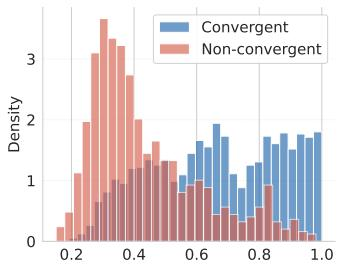

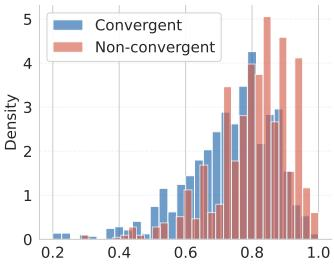  
(b) Edit distance

(a) Repr. entanglement  
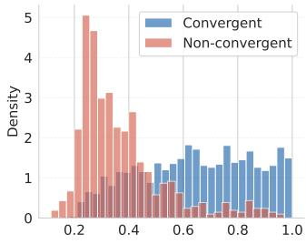

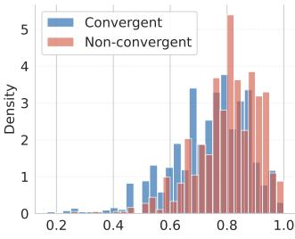  
(c) Repr. entanglement  
(d) Edit distance  
Fig. 5: Score distributions for convergent and non-convergent noncanonical tokenizations for Llama3.1 ((a), (b)) and Tulu3 ((c), (d)) for Real Authors. Representational entanglement shows a better separation between the two groups, while edit distance distributions overlap substantially.

The gap is most pronounced on RippleEdits, where edit distance approaches random performance across all models while representational entanglement remains reliable. This highlights a fundamental limitation of lexical metrics, that surface-level token similarity is a poor proxy for internal computation. Fig. 4 summarizes AUC and $\left| r _ { b } \right|$ averaged across all five models.

Fig. 5 shows the score distributions for convergent and nonconvergent tokenizations for two representative models on the Real Authors dataset [63]. Convergent tokenizations consistently appear with higher representational entanglement values than non-convergent ones, indicating that internal representational similarity to the canonical tokenization is a reliable indicator of factual retrieval. No such ordering is observed for edit distance, where convergent and non-convergent tokenizations exhibit substantially overlapping score distributions, indicating that token-level surface similarity may carry little information about internal computational behavior. Representational entanglement directly reflects whether two tokenizations activate similar hidden representations, motivating its use as the routing criterion in Toketive's adaptive sampler (Section IV-B1).

TABLE III: Bypass rates (%) for noncanonical tokenizations across models, techniques, and datasets. Each cell reports the percentage of noncanonical tokenizations that evade the edit and recover the pre-update response. Color intensity for each model reflects relative bypass rate, with darker shades indicating higher bypass rates.
<table><tr><td rowspan=1 colspan=8>Model     Technique  Known-1000  CounterFact  Real Authors MQuAKE RippleEdits  World Facts</td></tr><tr><td rowspan=1 colspan=2>MEMIT</td><td rowspan=1 colspan=1>36.5</td><td rowspan=1 colspan=1>50.3</td><td rowspan=1 colspan=1>43.8</td><td rowspan=1 colspan=1>46.9</td><td rowspan=1 colspan=1>37.5</td><td rowspan=1 colspan=1>27.0</td></tr><tr><td rowspan=1 colspan=2>RECT</td><td rowspan=1 colspan=1>39.1</td><td rowspan=1 colspan=1>51.6</td><td rowspan=1 colspan=1>46.4</td><td rowspan=1 colspan=1>49.7</td><td rowspan=1 colspan=1>42.3</td><td rowspan=1 colspan=1>30.1</td></tr><tr><td rowspan=2 colspan=2>PRUNELlama3AlphaEdit</td><td rowspan=1 colspan=1>35.8</td><td rowspan=1 colspan=1>49.3</td><td rowspan=1 colspan=1>42.6</td><td rowspan=1 colspan=1>49.5</td><td rowspan=1 colspan=1>37.7</td><td rowspan=1 colspan=1>28.7</td></tr><tr><td rowspan=1 colspan=1>33.8</td><td rowspan=1 colspan=1>47.3</td><td rowspan=1 colspan=1>42.6</td><td rowspan=1 colspan=1>43.1</td><td rowspan=1 colspan=1>35.6</td><td rowspan=1 colspan=1>23.2</td></tr><tr><td rowspan=1 colspan=2>CoME</td><td rowspan=1 colspan=1>32.9</td><td rowspan=1 colspan=1>48.3</td><td rowspan=1 colspan=1>44.1</td><td rowspan=1 colspan=1>42.7</td><td rowspan=1 colspan=1>33.1</td><td rowspan=1 colspan=1>21.1</td></tr><tr><td rowspan=1 colspan=2>LTU</td><td rowspan=1 colspan=1>32.1</td><td rowspan=1 colspan=1>39.1</td><td rowspan=1 colspan=1>57.1</td><td rowspan=1 colspan=1>47.5</td><td rowspan=1 colspan=1>26.9</td><td rowspan=1 colspan=1>51.8</td></tr><tr><td rowspan=1 colspan=2>MEMIT</td><td rowspan=1 colspan=1>42.0</td><td rowspan=1 colspan=1>49.1</td><td rowspan=1 colspan=1>42.1</td><td rowspan=1 colspan=1>39.7</td><td rowspan=1 colspan=1>32.3</td><td rowspan=1 colspan=1>30.9</td></tr><tr><td rowspan=1 colspan=2>RECT</td><td rowspan=1 colspan=1>43.9</td><td rowspan=1 colspan=1>51.5</td><td rowspan=1 colspan=1>45.2</td><td rowspan=1 colspan=1>42.0</td><td rowspan=1 colspan=1>38.3</td><td rowspan=1 colspan=1>34.5</td></tr><tr><td rowspan=2 colspan=2>PRUNELlama3.1AlphaEdit</td><td rowspan=1 colspan=1>39.9</td><td rowspan=1 colspan=1>48.3</td><td rowspan=1 colspan=1>43.4</td><td rowspan=1 colspan=1>39.5</td><td rowspan=1 colspan=1>30.2</td><td rowspan=1 colspan=1>29.7</td></tr><tr><td rowspan=1 colspan=1>36.9</td><td rowspan=1 colspan=1>45.8</td><td rowspan=1 colspan=1>40.5</td><td rowspan=1 colspan=1>31.2</td><td rowspan=1 colspan=1>30.2</td><td rowspan=1 colspan=1>22.1</td></tr><tr><td rowspan=1 colspan=2>CoME</td><td rowspan=1 colspan=1>38.3</td><td rowspan=1 colspan=1>44.3</td><td rowspan=1 colspan=1>37.8</td><td rowspan=1 colspan=1>35.2</td><td rowspan=1 colspan=1>25.3</td><td rowspan=1 colspan=1>23.9</td></tr><tr><td rowspan=1 colspan=2>LTU</td><td rowspan=1 colspan=1>42.8</td><td rowspan=1 colspan=1>46.0</td><td rowspan=1 colspan=1>56.4</td><td rowspan=1 colspan=1>42.2</td><td rowspan=1 colspan=1>27.8</td><td rowspan=1 colspan=1>48.6</td></tr><tr><td rowspan=1 colspan=2>MEMIT</td><td rowspan=1 colspan=1>36.1</td><td rowspan=1 colspan=1>29.0</td><td rowspan=1 colspan=1>38.5</td><td rowspan=1 colspan=1>24.6</td><td rowspan=1 colspan=1>35.8</td><td rowspan=1 colspan=1>36.6</td></tr><tr><td rowspan=1 colspan=1></td><td rowspan=1 colspan=1>RECT</td><td rowspan=1 colspan=1>38.0</td><td rowspan=1 colspan=1>30.0</td><td rowspan=1 colspan=1>38.6</td><td rowspan=1 colspan=1>24.2</td><td rowspan=1 colspan=1>36.1</td><td rowspan=1 colspan=1>35.7</td></tr><tr><td rowspan=2 colspan=1>OLMo2</td><td rowspan=1 colspan=1>PRUNE</td><td rowspan=1 colspan=1>36.0</td><td rowspan=1 colspan=1>27.8</td><td rowspan=1 colspan=1>38.0</td><td rowspan=1 colspan=1>24.0</td><td rowspan=1 colspan=1>35.4</td><td rowspan=1 colspan=1>32.9</td></tr><tr><td rowspan=1 colspan=1>AlphaEdit</td><td rowspan=1 colspan=1>29.7</td><td rowspan=1 colspan=1>26.7</td><td rowspan=1 colspan=1>37.2</td><td rowspan=1 colspan=1>19.7</td><td rowspan=1 colspan=1>31.9</td><td rowspan=1 colspan=1>25.6</td></tr><tr><td rowspan=1 colspan=1></td><td rowspan=1 colspan=1>CoME</td><td rowspan=1 colspan=1>33.8</td><td rowspan=1 colspan=1>27.7</td><td rowspan=1 colspan=1>37.1</td><td rowspan=1 colspan=1>21.7</td><td rowspan=1 colspan=1>35.3</td><td rowspan=1 colspan=1>32.3</td></tr><tr><td rowspan=1 colspan=1></td><td rowspan=1 colspan=1>LTU</td><td rowspan=1 colspan=1>38.7</td><td rowspan=1 colspan=1>36.5</td><td rowspan=1 colspan=1>37.5</td><td rowspan=1 colspan=1>31.9</td><td rowspan=1 colspan=1>39.6</td><td rowspan=1 colspan=1>36.9</td></tr><tr><td rowspan=1 colspan=1></td><td rowspan=1 colspan=1>MEMIT</td><td rowspan=1 colspan=1>39.8</td><td rowspan=1 colspan=1>45.8</td><td rowspan=1 colspan=1>37.1</td><td rowspan=1 colspan=1>42.2</td><td rowspan=1 colspan=1>45.5</td><td rowspan=1 colspan=1>32.3</td></tr><tr><td rowspan=1 colspan=1></td><td rowspan=1 colspan=1>RECT</td><td rowspan=1 colspan=1>42.1</td><td rowspan=1 colspan=1>47.3</td><td rowspan=1 colspan=1>39.8</td><td rowspan=1 colspan=1>43.1</td><td rowspan=1 colspan=1>47.4</td><td rowspan=1 colspan=1>37.4</td></tr><tr><td rowspan=2 colspan=1>Tulu3</td><td rowspan=1 colspan=1>PRUNE</td><td rowspan=1 colspan=1>40.3</td><td rowspan=1 colspan=1>45.5</td><td rowspan=1 colspan=1>36.8</td><td rowspan=1 colspan=1>41.4</td><td rowspan=1 colspan=1>44.8</td><td rowspan=1 colspan=1>32.4</td></tr><tr><td rowspan=1 colspan=1>AlphaEdit</td><td rowspan=1 colspan=1>33.8</td><td rowspan=1 colspan=1>39.2</td><td rowspan=1 colspan=1>35.7</td><td rowspan=1 colspan=1>33.0</td><td rowspan=1 colspan=1>35.7</td><td rowspan=1 colspan=1>23.5</td></tr><tr><td rowspan=1 colspan=1></td><td rowspan=1 colspan=1>CoME</td><td rowspan=1 colspan=1>38.0</td><td rowspan=1 colspan=1>42.1</td><td rowspan=1 colspan=1>34.6</td><td rowspan=1 colspan=1>37.2</td><td rowspan=1 colspan=1>39.8</td><td rowspan=1 colspan=1>28.0</td></tr><tr><td rowspan=1 colspan=1></td><td rowspan=1 colspan=1>LTU</td><td rowspan=1 colspan=1>33.8</td><td rowspan=1 colspan=1>40.5</td><td rowspan=1 colspan=1>48.7</td><td rowspan=1 colspan=1>46.0</td><td rowspan=1 colspan=1>40.1</td><td rowspan=1 colspan=1>53.9</td></tr><tr><td rowspan=2 colspan=1></td><td rowspan=1 colspan=1>MEMIT</td><td rowspan=1 colspan=1>43.5</td><td rowspan=1 colspan=1>49.7</td><td rowspan=1 colspan=1>49.0</td><td rowspan=1 colspan=1>42.8</td><td rowspan=1 colspan=1>38.6</td><td rowspan=1 colspan=1>30.5</td></tr><tr><td rowspan=1 colspan=1>RECT</td><td rowspan=1 colspan=1>46.3</td><td rowspan=1 colspan=1>50.5</td><td rowspan=1 colspan=1>51.1</td><td rowspan=1 colspan=1>44.2</td><td rowspan=1 colspan=1>43.7</td><td rowspan=1 colspan=1>35.0</td></tr><tr><td rowspan=2 colspan=1>Tulu3.1</td><td rowspan=1 colspan=1>PRUNE</td><td rowspan=1 colspan=1>43.2</td><td rowspan=1 colspan=1>47.2</td><td rowspan=1 colspan=1>47.8</td><td rowspan=1 colspan=1>40.6</td><td rowspan=1 colspan=1>37.6</td><td rowspan=1 colspan=1>32.3</td></tr><tr><td rowspan=1 colspan=1>AlphaEdit</td><td rowspan=1 colspan=1>37.0</td><td rowspan=1 colspan=1>43.0</td><td rowspan=1 colspan=1>45.3</td><td rowspan=1 colspan=1>38.4</td><td rowspan=1 colspan=1>32.2</td><td rowspan=1 colspan=1>20.8</td></tr><tr><td rowspan=1 colspan=1></td><td rowspan=1 colspan=1>CoME</td><td rowspan=1 colspan=1>40.1</td><td rowspan=1 colspan=1>45.5</td><td rowspan=1 colspan=1>45.5</td><td rowspan=1 colspan=1>39.7</td><td rowspan=1 colspan=1>30.7</td><td rowspan=1 colspan=1>26.6</td></tr><tr><td rowspan=1 colspan=2>LTU</td><td rowspan=1 colspan=1>39.6</td><td rowspan=1 colspan=1>44.0</td><td rowspan=1 colspan=1>58.9</td><td rowspan=1 colspan=1>45.1</td><td rowspan=1 colspan=1>39.0</td><td rowspan=1 colspan=1>54.0</td></tr></table>

## C. Q2: Tokenization Invariance of Editing and Unlearning

Even when an edit or unlearning operation succeeds under the canonical tokenization, the update may fail to generalize to alternative tokenizations of the same input string. We measure this directly via the bypass rate (the fraction of noncanonical tokenizations that evade the update and recover the preupdate response). A tokenization-invariant update would yield a bypass rate of zero, as no alternative tokenization would be able to retrieve the suppressed knowledge. High bypass rates indicate that the update is superficial, aim to patch the canonical computational path while leaving residual factual associations intact along alternate trajectories.

For measuring the bypass rate, we utilise the same samples and their respective noncanonical tokenizations as in Q1. For each fact, we apply the editing or unlearning technique. The bypass rate for a given model, technique, and dataset is:

$$
\mathsf { b y p a s s ~ r a t e } = \frac { 1 } { K } \sum _ { i = 1 } ^ { K } \mathbf { 1 } \big [ o \in \hat { y } _ { u _ { i } } \big ] ,
$$

where $o$ is the pre-update object, $u _ { i }$ are the $K \ = \ 3 0$ noncanonical tokenizations of $p ( s , r )$ , and $\hat { y } _ { u _ { i } }$ is the model completion under $u _ { i } .$

Table III reports bypass rates across all five models, six datasets, and six techniques. Several consistent patterns emerge. Bypass rates range from 19% to 57% with an average of 38.6%, demonstrating that no technique achieves tokenization-invariant updates. Even AlphaEdit, the most robust technique as per these results, leaves a substantial fraction of noncanonical tokenizations capable of recovering the preupdate response. LTU (Locate-then-Unlearn) is the most vulnerable technique, as it achieves notably high bypass rates on Real Authors and World Facts across all models. Additional qualitative examples are provided in Appendix I. A detailed breakdown of output distributions across all combinations of datasets, models, and techniques is provided in Appendix J.

Fig. 6 illustrates the tokenization invariance failure for MEMIT on Real Authors. Before editing, 70.1% of noncanonical tokenizations recover the old answer. After editing, this drops to 43.8%, but a substantial fraction of tokenizations continue to bypass the edit, showing that MEMIT patches the canonical path without achieving tokenization-invariant suppression. Post-edit, 26.5% of noncanonical tokenizations produce neither the old nor the new answer (Others). The entanglement histograms show that old-answer tokenizations cluster at higher similarity scores while new-answer tokenizations concentrate at lower scores, consistent with the band structure exploited by Toketive (Section IV-B). Fig. 7 summarizes bypass rates averaged across all five models per technique and dataset. These results show that current adversarial evaluations, which assess edit or unlearning success exclusively under canonical tokenizations, fail to capture an important failure mode of editing and unlearning techniques. A fact that appears successfully suppressed under standard metrics may remain recoverable by a tokenization-aware adversary.

TABLE IV: Edit detection performance of various methods averaged across editing and unlearning techniques for each model and dataset. True positive rate (TPR), false positive rate (FPR), Precision (Prec.), and F1 are reported as percentages. Color intensity within each model group reflects relative F1 magnitude. Best F1 scores are indicated in boldface.
<table><tr><td colspan="3"></td><td colspan="3">Known-1000</td><td colspan="3">CounterFact</td><td colspan="3">TOFU-Real Authors</td><td colspan="3"></td><td colspan="3">MQuAKE</td><td colspan="3">RippleEdits</td><td colspan="3">TOFU-World Facts</td></tr><tr><td>Model Method</td><td></td><td>TPR</td><td>FPR</td><td>Prec.</td><td>F1</td><td>TPR FPR</td><td>Prec.</td><td>F1</td><td>TPR</td><td>FPR</td><td>Prec.</td><td>F1</td><td>TPR</td><td>FPR Prec.</td><td>F1</td><td>TPR</td><td>FPR</td><td>Prec.</td><td>F1</td><td>TPR</td><td>FPR</td><td>Prec.</td><td>F1</td></tr><tr><td></td><td>Random-sampling</td><td>40.9</td><td>0.0</td><td>100.0</td><td>58.0 40.6</td><td>1.6</td><td>96.1</td><td>57.0</td><td>24.4</td><td>0.0</td><td>100.0</td><td>39.3 57.8</td><td>0.0</td><td>100.0</td><td>73.2</td><td>34.1</td><td>26.8</td><td>56.0</td><td>42.4</td><td>18.9</td><td>0.0</td><td>100.0</td><td>31.8</td></tr><tr><td></td><td>Edit Distance</td><td>60.6</td><td>14.0</td><td>81.2</td><td>69.4 62.2</td><td>11.9</td><td>83.9</td><td>71.5</td><td>49.4</td><td>14.1</td><td>77.8</td><td>60.5 70.0</td><td>18.9</td><td>78.7</td><td>74.1</td><td>58.3</td><td>20.8</td><td>73.7</td><td>65.1</td><td>29.4</td><td>12.8</td><td>69.7</td><td>41.4</td></tr><tr><td>ILIlmm3</td><td>FUMA-gradient</td><td>100.0</td><td>100.0</td><td>50.0</td><td>66.7 100.0</td><td>100.0</td><td>50.0</td><td>66.7</td><td>96.1</td><td>90.0</td><td>51.6</td><td>67.2 100.0</td><td>100.0</td><td>50.0</td><td>66.7</td><td>100.0</td><td>100.0</td><td>50.0</td><td>66.7</td><td>96.7</td><td>96.7</td><td>50.0</td><td>65.9</td></tr><tr><td></td><td>Toketive (ours)</td><td>81.9</td><td>15.5</td><td>84.0</td><td>82.9 87.2</td><td>15.2</td><td>85.1</td><td>86.1</td><td>82.8</td><td>9.5</td><td>89.8</td><td>86.1 95.0</td><td>14.3</td><td>86.9</td><td>90.8</td><td>90.9</td><td>15.3</td><td>85.6</td><td>88.2</td><td>78.7</td><td>13.2</td><td>85.7</td><td>82.1</td></tr><tr><td></td><td>Random-sampling</td><td>37.8</td><td>0.0</td><td>100.0</td><td>54.8 34.4</td><td>0.5</td><td>98.4</td><td>51.0</td><td>24.4</td><td>10.0</td><td>71.0</td><td>36.4 53.3</td><td>5.0</td><td>91.4</td><td>67.4</td><td>32.2</td><td>5.0</td><td>86.6</td><td>47.0</td><td>18.9</td><td>2.8</td><td>87.3</td><td>31.1</td></tr><tr><td></td><td>Edit Distance</td><td>61.8</td><td>14.5</td><td>81.0</td><td>70.1 65.0</td><td>14.0</td><td>82.3</td><td>72.6</td><td>55.0</td><td>14.5</td><td>79.2</td><td>64.9 72.7</td><td>28.3</td><td>72.0</td><td>72.3</td><td>62.0</td><td>21.7</td><td>74.1</td><td>67.5</td><td>31.7</td><td>16.1</td><td>66.3</td><td>42.9</td></tr><tr><td>II31</td><td>FUMA-gradient</td><td>99.5</td><td>96.7</td><td>50.7</td><td>67.2 100.0</td><td>100.0</td><td>50.0</td><td>66.7</td><td>100.0</td><td>100.0</td><td>50.0</td><td>66.7 96.1</td><td>96.7</td><td>49.9</td><td>65.7</td><td>100.0</td><td>100.0</td><td>50.0</td><td>66.7</td><td>100.0</td><td>100.0</td><td>50.0</td><td>66.7</td></tr><tr><td></td><td>Toketive (ours)</td><td>83.0</td><td>12.6</td><td>86.8</td><td>84.8 89.4</td><td>13.5</td><td>86.9</td><td>88.1</td><td>83.9</td><td>15.0</td><td>84.8 84.4</td><td>93.9</td><td>15.2</td><td>86.1</td><td>89.8</td><td>83.6</td><td>15.8</td><td>84.1</td><td>83.9</td><td>76.3</td><td>12.6</td><td>85.8</td><td>80.8</td></tr><tr><td></td><td>Random-sampling</td><td>65.0</td><td>0.0</td><td>100.0</td><td>78.8 45.6</td><td>0.0</td><td>100.0</td><td>62.6</td><td>82.2</td><td>1.1</td><td>98.7 89.7</td><td>55.6</td><td>0.0</td><td>100.0</td><td>71.4</td><td>78.9</td><td>2.2</td><td>97.2</td><td>87.1</td><td>48.4</td><td>0.0</td><td>100.0</td><td>65.2</td></tr><tr><td></td><td>Edit Distance</td><td>84.5</td><td>10.6</td><td>88.9</td><td>86.6 71.8</td><td>13.3</td><td>84.3</td><td>77.6</td><td>80.8</td><td>10.1</td><td>88.9 84.6</td><td>73.1</td><td>15.0</td><td>83.0</td><td>77.7</td><td>69.5</td><td>26.1</td><td>72.7</td><td>71.0</td><td>51.7</td><td>7.9</td><td>86.8</td><td>64.8</td></tr><tr><td>O02</td><td>FUMA-gradient</td><td>50.0</td><td>50.0</td><td>50.0</td><td>50.0 23.3</td><td>23.3</td><td>50.0</td><td>31.8</td><td>100.0</td><td>100.0</td><td>50.0 66.7</td><td>33.9</td><td>33.3</td><td>50.4</td><td>40.5</td><td>23.3</td><td>23.3</td><td>50.0</td><td>31.8</td><td>5.6</td><td>3.3</td><td>62.8</td><td>10.2</td></tr><tr><td></td><td>Toketive (ours)</td><td>92.8</td><td>12.8</td><td>87.9</td><td>90.3 89.1</td><td>17.1</td><td>83.9</td><td>86.4</td><td>93.6</td><td>12.2</td><td>88.5 90.9</td><td>93.9</td><td>16.6</td><td>85.0</td><td>89.2</td><td>95.4</td><td>17.3</td><td>84.6</td><td>89.7</td><td>61.1</td><td>0.0</td><td>100.0</td><td>75.9</td></tr><tr><td></td><td>Random-sampling</td><td>33.9</td><td>0.0</td><td>100.0</td><td>50.6 42.8</td><td>1.1</td><td>97.5</td><td>59.5</td><td>19.4</td><td>0.0</td><td>100.0 32.5</td><td>41.2</td><td>0.0</td><td>100.0</td><td>58.4</td><td>43.3</td><td>4.4</td><td>90.7</td><td>58.6</td><td>15.0</td><td>0.0</td><td>100.0</td><td>26.1</td></tr><tr><td>Tulu</td><td>Edit Distance</td><td>69.5</td><td>6.8</td><td>91.1</td><td>78.8 66.1</td><td>11.7</td><td>85.0</td><td>74.3</td><td>50.0</td><td>6.5</td><td>88.4 63.9</td><td>68.8</td><td>12.2</td><td>84.9</td><td>76.0</td><td>63.4</td><td>15.0</td><td>80.8</td><td>71.1</td><td>22.8</td><td>7.5</td><td>75.3</td><td>35.0</td></tr><tr><td></td><td>FUMA-gradient</td><td>100.0</td><td>100.0</td><td>50.0</td><td>66.7 100.0</td><td>100.0</td><td>50.0</td><td>66.7</td><td>88.9</td><td>83.3</td><td>51.6 65.3</td><td>99.5</td><td>100.0</td><td>49.9</td><td>66.4</td><td>96.7</td><td>96.7</td><td>50.0</td><td>65.9</td><td>98.3</td><td>96.7</td><td>50.4</td><td>66.7</td></tr><tr><td></td><td>Toketive (ours)</td><td>87.2</td><td>8.3</td><td>91.3</td><td>89.2 88.2</td><td>15.5</td><td>85.1</td><td>86.6</td><td>79.7</td><td>8.9</td><td>90.0 84.5</td><td>92.3</td><td>13.5</td><td>87.3</td><td>89.7</td><td>81.6</td><td>10.7</td><td>88.4</td><td>84.9</td><td>40.6</td><td>0.5</td><td>98.7</td><td>57.5</td></tr><tr><td>Tluu3</td><td>Random-sampling Edit Distance</td><td>30.0 61.6</td><td>0.0</td><td>100.0</td><td>46.2 41.1</td><td>1.1</td><td>97.4</td><td>57.8</td><td>21.6</td><td>8.7</td><td>71.4 33.2</td><td>32.2</td><td>0.0</td><td>100.0</td><td>48.7</td><td>40.6</td><td>1.6</td><td>96.1</td><td>57.0</td><td>15.0</td></table>

## D. Q3: Adversarial Efficacy of Toketive

We evaluate whether Toketive can (i) detect whether a fact has been modified, and (ii) reconstruct the original response, using only the post-edit model fθ' and target prompt p(s, r). To ensure reliable evaluation, we restrict our analysis to instances where edits are successful as per Efficacy Score [32], i.e., where P(new fact) > P(old fact). For edit detection, we compare Toketive against three baselines:

① Random sampling: uniform random noncanonical tokenizations with no band selection.

② Edit distance: band routing based on normalized Levenshtein distance between token sequences, replacing representational entanglement as the filtering signal.

③ FUMA-gradient: inspired by FUMA [48], we adapt a gradient-based detection signal that requires only the postedit model fθ,, without access to the original model or any candidate set. For each prompt p(s, r), we compute the L2 norm of the gradient of the token-average loss with respect to all model parameters as a continuous edit detection score.

For pre-modification response reconstruction, we compare Toketive against the first two baselines, as gradient norms in FUMA-gradient provide no information about the content of the pre-edit response. We report top-1 and top-5 accuracy, where a fact is considered recovered if the pre-edit object o appears among the top-k most frequent bypass responses.

Construction of negative samples. Each fact is evaluated twice using the same detector: once on the edited (or unlearned) model and once on the corresponding unedited base model. For the unedited model, the detector measures whether noncanonical tokenizations continue to reproduce the canonical response, exactly as in the edited setting. Consequently, false positives arise solely from the intrinsic variability introduced by noncanonical tokenizations, rather than from separately constructed or mismatched negative samples.

Edit Detection. Table IV reports TPR, FPR, Precision, and F1-scores for edit detection averaged across editing and unlearning techniques. Toketive consistently achieves the highest F1 across all models and datasets, with an average of 84.2%, substantially outperforming all baselines. The second highest F1-score is achieved by Edit distance, with a value of 66.7%. Random sampling achieves near-zero FPR and perfect precision in many settings, but at the cost of very low TPR, indicating that uniformly sampled noncanonical tokenizations rarely fall in the detection band and therefore fail to reliably flag edited facts. Edit distance improves recall over random sampling but consistently underperforms Toketive across all settings, indicating that lexical token distance is an insufficient proxy for internal computational divergence. The FUMA-adapted gradient baseline achieves near-perfect TPR but also near-perfect FPR on most model-dataset combinations, collapsing to a precision of approximately 50% and an average F1-score of 60.8%. This indicates the gradient norm signal is non-discriminative for such a strict setting where the original unedited models are not available.

Pre-Edit Reconstruction. Table V reports top-1 and top-5 accuracy averaged across techniques. Toketive achieves an average top-1 accuracy of 60.9% and top-5 accuracy of 74.5%, consistently outperforming the other baselines by at least 21.7%. Random sampling achieves substantially lower accuracy across all models and datasets with an average Top-1 and Top-5 accuracy of 30.7% and 36.9% respectively, demonstrating that unstructured tokenization search is insufficient for reliable reconstruction. Bypass continuations without band filtering are too diverse to concentrate on the pre-update object. Edit distance improves over random sampling and in some OLMo2 settings approaches over Toketive, but underperforms across the majority of model-dataset combinations. The gap between Toket ive and edit distance is most pronounced on MQuAKE and CounterFact, showing that representational entanglement provides a stronger signal for identifying bypass tokenizations that encode factual associations.

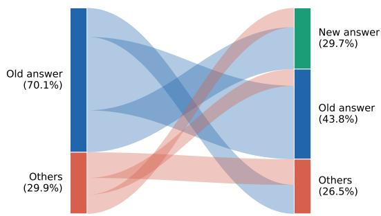

(a) Response redistribution before and after editing.  
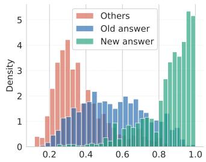  
(b) Repr. entanglement score distributions.

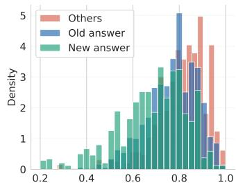  
(c) Edit distance score distributions.

Fig. 6: Analysis of tokenization invariance for MEMIT on the Real Authors dataset (Llama3). (a) Sankey diagram showing the redistribution of noncanonical tokenization responses before and after editing. (b,c) Score distributions of noncanonical tokenizations grouped by their post-edit response category.  
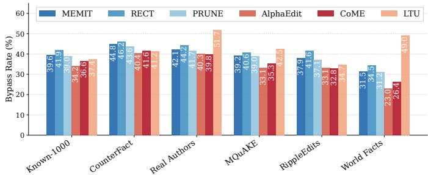  
Fig. 7: Bypass rates (%) averaged across all five models per editing and unlearning technique and dataset. All techniques exhibit substantial bypass rates across all datasets, showing that they do not achieve tokenization-invariant updates.

## VI. RELATED WORK

Model Editing and Machine Unlearning. Model editing aims to update specific factual associations in pretrained language models without retraining from scratch. These techniques typically follow a locate-then-edit paradigm, using causal tracing to identify feed-forward MLP layers responsible for storing a target fact, and targeted weight updates modify the stored association [32], [25], [44], [53], [64], [65], [66], [67], [68], [69], [70], [71], [72], [73], [74], [75], [76], [77]. There are also parameter-preserving editing techniques which augment the models with external modules rather than modifying weights directly [78], [79], [80], [81], [82], [78]. Machine unlearning pursues the complementary goal of removing the influence of specific training data such that the model behaves as if it was never trained on that information [83], [84], [85], [86], [87], [88]. Recent work has unified editing and unlearning under the same framework, treating unlearning as a special case of targeted editing [45], [34], [33]. Alternative approaches to knowledge modification exist, but operate at different levels of granularity and cost. For instance, retraining from scratch provides the strongest guarantees but is infeasible at deployment scale [27]. Fine-tuning offers a more practical option, but it can also become prohibitively expensive [44]. Retrieval-augmented generation (RAG) shifts knowledge control outside the model by utilizing external data, but recent works [89], [90] show it can introduce new safety failures.

Evaluation of Editing and Unlearning. Various benchmarks for model editing exist, assessing the reliability, generalization and locality of model editing techniques [32], [91], [92]. MQuAKE [62] and ThinkEval [41] extend these by evaluating indirect knowledge leakage through multi-hop and multi-step querying respectively. A well-documented failure mode of editing and unlearning is the ripple-effect propagation of edits to other facts [61], [60], [46], [93]. For unlearning, TOFU [63] WMDP [94], RWKU [95] have become standard evaluation suites, evaluating unlearning efficacy, model utility response quality, and hallucination avoidance.

Security Implications of Editing and Unlearning. While the impact of editing and unlearning on model alignment and safety has received significant attention [35], [36], [37], [96], [97], [98], [57], the security implications of these techniques are important as well. Membership inference attacks have been applied to unlearned models to assess whether forget-set membership can be inferred post-hoc [38], [49]. FUMA [48] shows that gradient signals can identify what was unlearned in LLMs. Training-data extraction attacks show that PII removal through editing is often incomplete [29]. Reverse engineering of weight updates recovers editing subjects from weight differentials [39], and TULA-DR [40] reconstructs unlearned text through constrained optimization over weight differences. However, all of these evaluate editing and unlearning exclusively under the canonical tokenization, implicitly assuming that canonical evaluation is sufficient to characterize model behavior. Recent data-centric metrics [99] improve the measurement of unlearning, but don't account for tokenization-aware adversaries as well. While UnUnlearning [100] shows that unlearned knowledge can be reintroduced via in-context learning, we show that even under standard querying, tokenizationaware adversaries can recover suppressed knowledge.

Adversarial tokenization. Modern tokenizers map each string to a canonical token sequence, but the same string can be represented by many noncanonical tokenizations using the model vocabulary [101]. Recent works show that models retain substantial semantic competence under such tokenizations, and that this flexibility can be weaponized for safety bypasses without changing the visible text of a request [42], [43].

TABLE V: Pre-edit response reconstruction accuracy of various methods averaged across editing and unlearning techniques for each model and dataset. Top-1 Acc. (%) reports the fraction of facts for which the pre-edit object o is the most frequent bypass continuation. Top-5 Acc. (%) reports the fraction of facts for which o appears among the five most frequent bypass continuations. Color intensity within each model group reflects relative Top-k accuracy magnitude.
<table><tr><td rowspan="2">Model</td><td rowspan="2">Method</td><td colspan="2">Known-1000</td><td colspan="2">CounterFact</td><td colspan="2">TOFU-Real Authors</td><td colspan="2">MQuAKE</td><td colspan="2">RippleEdits</td><td colspan="2">TOFU-World Facts</td></tr><tr><td>Top-1%</td><td>Top-5%</td><td>Top-1%</td><td>Top-5%</td><td>Top-1%</td><td>Top-5%</td><td>Top-1%</td><td>Top-5%</td><td>Top-1%</td><td>Top-5%</td><td>Top-1%</td><td>Top-5%</td></tr><tr><td rowspan="3">Llama3</td><td>Random-sampling</td><td>33.7</td><td>39.8</td><td>36.7</td><td>40.0</td><td>21.1</td><td>21.1</td><td>41.7</td><td>54.4</td><td>20.2</td><td>29.7</td><td>13.9</td><td>18.3</td></tr><tr><td>Edit Distance</td><td>52.0</td><td>59.9</td><td>57.2</td><td>61.7</td><td>44.6</td><td>49.4</td><td>52.4</td><td>68.5</td><td>37.4</td><td>58.0</td><td>21.1</td><td>29.2</td></tr><tr><td>Toketive (ours)</td><td>55.4</td><td>66.8</td><td>70.5</td><td>79.5</td><td>68.4</td><td>73.4</td><td>68.3</td><td>86.7</td><td>52.6</td><td>71.5</td><td>48.9</td><td>68.5</td></tr><tr><td rowspan="3">Llama3.1</td><td>Random-sampling</td><td>25.0</td><td>36.6</td><td>30.0</td><td>34.4</td><td>22.2</td><td>22.8</td><td>28.9</td><td>47.8</td><td>15.0</td><td>25.0</td><td>16.1</td><td>17.2</td></tr><tr><td>Edit Distance</td><td>45.0</td><td>61.6</td><td>57.8</td><td>63.9</td><td>50.0</td><td>54.5</td><td>49.4</td><td>70.6</td><td>32.2</td><td>62.0</td><td>23.9</td><td>31.7</td></tr><tr><td>Toketive (ours)</td><td>60.0</td><td>76.6</td><td>72.2</td><td>85.0</td><td>68.9</td><td>70.0</td><td>59.7</td><td>83.5</td><td>44.5</td><td>61.7</td><td>47.1</td><td>63.7</td></tr><tr><td rowspan="3">OLMo2</td><td>Random-sampling</td><td>51.6</td><td>63.3</td><td>37.8</td><td>45.0</td><td>77.8</td><td>82.2</td><td>37.2</td><td>52.2</td><td>62.2</td><td>70.5</td><td>47.8</td><td>48.4</td></tr><tr><td>Edit Distance</td><td>64.4</td><td>82.4</td><td>55.4</td><td>71.3</td><td>75.6</td><td>80.4</td><td>45.5</td><td>71.6</td><td>61.9</td><td>69.0</td><td>48.4</td><td>51.7</td></tr><tr><td>Toketive (ours)</td><td>71.1</td><td>89.5</td><td>60.0</td><td>80.0</td><td>87.8</td><td>92.7</td><td>62.1</td><td>85.2</td><td>64.9</td><td>83.3</td><td>55.0</td><td>59.4</td></tr><tr><td rowspan="3">Tulu3</td><td>Random-sampling</td><td>29.4</td><td>33.9</td><td>32.2</td><td>38.3</td><td>19.4</td><td>19.4</td><td>32.2</td><td>40.5</td><td>32.8</td><td>38.4</td><td>13.9</td><td>15.0</td></tr><tr><td>Edit Distance</td><td>60.0</td><td>67.1</td><td>49.4</td><td>64.5</td><td>49.4</td><td>50.0</td><td>48.9</td><td>67.6</td><td>47.3</td><td>62.6</td><td>19.4</td><td>22.8</td></tr><tr><td>Toketive (ours)</td><td>75.0</td><td>82.8</td><td>63.5</td><td>77.7</td><td>63.3</td><td>72.7</td><td>58.9</td><td>81.9</td><td>55.4</td><td>70.9</td><td>38.0</td><td>39.1</td></tr><tr><td rowspan="3">Tulu3.1</td><td>Random-sampling</td><td>23.9</td><td>28.9</td><td>28.9</td><td>37.2</td><td>19.4</td><td>19.4</td><td>23.9</td><td>32.2</td><td>33.4</td><td>38.9</td><td>13.9</td><td>14.4</td></tr><tr><td>Edit Distance</td><td>47.2</td><td>60.9</td><td>49.3</td><td>65.4</td><td>50.0</td><td>52.2</td><td>47.7</td><td>60.0</td><td>45.0</td><td>59.6</td><td>18.3</td><td>21.7</td></tr><tr><td>Toketive (ours)</td><td>64.5</td><td>81.4</td><td>65.4</td><td>77.1</td><td>69.5</td><td>76.5</td><td>61.8</td><td>80.5</td><td>51.6</td><td>71.4</td><td>42.9</td><td>45.0</td></tr></table>

## VII. DISCUSSION: TOWARD TOKENIZATION-ROBUST EDITING AND UNLEARNING

Our results reveal that editing and unlearning techniques lack tokenization invariance, enabling adversaries to recover suppressed knowledge through alternative tokenizations. This raises the question: how can such vulnerabilities be mitigated?

A natural direction is to enforce tokenization-robust updates, ensuring that modifications generalize across multiple valid tokenizations of a given input. We investigate this direction through an adaptive unlearning experiment as presented in Appendix A, where MEMIT iteratively incorporates tokenizations that bypass the preceding update. Our results show that this strategy can substantially reduce the bypass rate, from 0.32 for MEMIT to 0.04 after four adaptive iterations. However, this increased robustness comes at a substantial cost to locality. The corresponding ripple effect increases from 1.0× to 8.6×, indicating that the broader updates significantly alter neighboring facts beyond the target being unlearned. These results reveal a robustness-locality trade-off, where greater resistance to tokenization-based attacks comes at the cost of broader changes to neighboring knowledge.

More generally, enforcing tokenization invariance is challenging because the space of valid tokenizations grows with input length, and different tokenizations can induce distinct internal computational trajectories. Explicitly covering this space through repeated editing may therefore require increasingly broad parameter modifications, as observed in our adaptive experiment. This suggests that simply extending localized updates to additional tokenizations may not provide a scalable solution while preserving the locality that motivates targeted editing and unlearning [61], [60], [46].

Finally, architectural or representational approaches, such as learning tokenization-agnostic representations, may offer a more principled solution, but would require rethinking how subword tokenization interacts with model internals.

Overall, our adaptive-editing results suggest that improving tokenization robustness through increasingly broad parameter updates is possible, but comes at the expense of the locality that motivates targeted editing and unlearning. Developing more principled approaches that provide tokenization-robust knowledge modification without substantially expanding collateral effects remains an open problem.

## VIII. CONCLUSION

We introduced Toketive, a reference-free adversarial attack that exposes tokenization dependence as a previously overlooked vulnerability in model editing and machine unlearning. By treating tokenization as a side channel rather than a fixed preprocessing step, Toketive demonstrates that state-of-the-art editing and unlearning techniques produce superficial updates that fail to generalize across alternative tokenizations of the same input string. Across five models, six datasets, and six editing and unlearning techniques, we observe an average bypass rate of 38.6%, indicating that suppressed knowledge remains broadly accessible to a tokenization-aware adversary. Toketive unifies edit detection and pre-edit response reconstruction without requiring access to the original model, shadow models, or auxiliary classifiers, thereby avoiding assumptions that limit the practicality of prior approaches in their settings. Empirically, Toketive achieves strong performance in both detection and reconstruction, attaining an F1 score of 84.2% and a top-5 reconstruction accuracy of 74.5%, while outperforming the strongest baselines by 26.2% and 21.6%, respectively. Our results show that current editing and unlearning techniques lack robustness to tokenizationlevel variation, allowing tokenization-aware adversaries like Toketive to recover suppressed knowledge from openweight models, highlighting a gap between their intended behavior and their actual robustness in practice.

## ETHICS CONSIDERATIONS

This work studies security vulnerabilities in model editing and machine unlearning techniques for LLMs. In particular, we demonstrate that tokenization-aware adversaries can recover knowledge that was intended to be removed or modified. While such capabilities could be misused to extract sensitive or suppressed information, they also address a critical concern, i.e., current editing and unlearning techniques may provide a false sense of security in open-weight models.

Our goal is to advance understanding of the limitations of post-release knowledge control and to inform the design of more robust and reliable defenses. We carefully balance risks and benefits throughout this study. First, our threat model is limited to querying publicly available models using alternative tokenizations of the same input string; we do not study or enable attacks that require access to private training data, proprietary systems, or hidden interfaces. Second, all of our experiments are conducted on publicly available models and benchmark datasets, and no sensitive real-world data are involved.

We further mitigate potential harm by focusing on structural vulnerabilities (specifically, tokenization-induced variations in internal representations) rather than providing deploymentready tools for large-scale exploitation. Our evaluation highlights fundamental limitations of existing techniques and emphasizes the need for improved evaluation protocols and defenses, rather than prescribing immediate attack deployment. We will include a clear usage statement in our repository, indicating that our work is intended solely for research and evaluation purposes, and not for misuse or unauthorized data extraction.

Consistent with prior work in machine learning security, we view this research as contributing to defensive understanding by exposing blind spots in current approaches. We follow established ethical guidelines for security research, scope our claims conservatively, and avoid releasing artifacts that could directly facilitate misuse without appropriate safeguards.

Our research involves no human subjects and did not require institutional review board approval. We explicitly consider potential downstream misuse, scope our claims to realistic open-weight settings, and frame our contribution as exposing vulnerabilities to inform the design of more robust defenses rather than facilitating attacks.

## REFERENCES

[1] A. Grattafiori, A. Dubey, A. Jauhri, A. Pandey, A. Kadian, A. Al-Dahle, A. Letman, A. Mathur, A. Schelten, A. Vaughan et al., "The llama 3 herd of models," arXiv preprint arXiv:2407.21783, 2024.

[2] A. Yang, A. Li, B. Yang, B. Zhang, B. Hui, B. Zheng, B. Yu, C. Gao, C. Huang, C. Lv et al., "Qwen3 technical report," arXiv preprint arXiv:2505.09388, 2025.

[3] A. H. Liu, K. Khandelwal, S. Subramanian, V. Jouault, A. Rastogi, A. Sadé, A. Jeffares, A. Jiang, A. Cahill, A. Gavaudan et al., "Ministral 3," arXiv preprint arXiv:2601.08584, 2026.

[4] G. Team, S. E. Abd, V. Aggarwal, R. Algayres, A. Andreev, O. Bachem, I. Ballantyne, C. Brick, V. Cărbune, M. Casbon et al., "Gemma 4 technical report," arXiv preprint arXiv:2607.02770, 2026.

[5] A. Xu, B. Lin, B. Xue, B. Wang, B. Xu, B. Wu, B. Zhang, C. Lin, C. Dong, C. Ling et al., "Deepseek-v4: Towards highly efficient million-token context intelligence," arXiv preprint arXiv:2606.19348, 2026.

[6] A. Zeng, X. Lv, Z. Hou, Z. Du, Q. Zheng, B. Chen, D. Yin, C. Ge, C. Huang, C. Xie et al., "Glm-5: from vibe coding to agentic engineering," arXiv preprint arXiv:2602.15763, 2026.

[7] T. Olmo, A. Ettinger, A. Bertsch, B. Kuehl, D. Graham, D. Heineman, D. Groeneveld, F. Brahman, F. Timbers, H. Ivison et al., "Olmo 3," arXiv preprint arXiv:2512.13961, 2025.

[8] A. Calvi, A. Sooriyarachchi, G. Pistilli, G. Lample, M. Buyl, M. Augustin, M. Müller, P. Stock, T. Bewley, W. Bouaziz et al., “Shieldstral," arXiv preprint arXiv:2607.25857, 2026.

[9] S. Vijay, A. Priyanshu, D. Chapoteau, A. Goldblatt, J. He, K. Majd, F. Burch, B. Saglam, T. Matsumoto, Z. Yang et al., "Antares: Foundation models for agentic vulnerability localization."

[10] P. Kassianik, B. Saglam, A. Chen, B. Nelson, A. Vellore, M. Aufiero, F. Burch, D. Kedia, A. Zohary, S. Weerawardhena et al., "Llama-3.1-foundationai-securityllm-base-8b technical report," arXiv preprint arXiv:2504.21039, 2025.

[11] A. ElZemity, S. Li, and B. Arief, “Small, free, and effective: Orchestrating open-weight small language models to outperform single llm for malware analysis," arXiv preprint arXiv:2607.20216, 2026.

[12] Hugging Face. (2026) Text generation models. [Online]. Available: https://huggingface.co/models?pipeline\_tag=text-generation

[13] Anthropic. (2026) Statement on the us government directive to suspend access to fable 5 and mythos 5. Anthropic. [Online]. Available: https://www.anthropic.com/news/fable-mythos-access

[14] K. Kwok. (2026) Open-source ai is imperfect hedge against u.s. clout. Reuters Breakingviews. [Online]. Available: https: //www.reuters.com/commentary/breakingviews/open-source-ai-is-imp erfect-hedge-against-us-clout-2026-07-29/

[15] T. Wang and I. Solaiman. (2025) On the shifting global compute landscape. Hugging Face. [Online]. Available: https://huggingface.co /blog/huggingface/shifting-compute-landscape

[16] M. Makiej, "Open-source and open-weight ai models: Understanding the risks of criminal misuse and governance gaps," 2026, journal of High Technology Law, Suffolk University Law School, April 13, 2026. Accessed: 2026-08-05. [Online]. Available: https://sites.suffolk .edu/jhtl/2026/04/13/open-source-and-open-weight-ai-models-underst anding-the-risks-of-criminal-misuse-and-governance-gaps/

[17] Y. Pang, W. Meng, X. Liao, and T. Wang, "Paladin: Defending llmenabled phishing emails with a new trigger-tag paradigm," arXiv preprint arXiv:2509.07287, 2025.

[18] Y. Xu, A. Liu, X. Hu, L. Wen, and H. Xiong, "Mark your llm: Detecting the misuse of open-source large language models via watermarking," arXiv preprint arXiv:2503.04636, 2025.

[19] Future of Life Institute. (2024) Implementation timeline. Future of Life Institute. [Online]. Available: https://artificialintelligenceact.eu/im plementation-timeline/

[20] Jones Day. (2025, Aug.) Eu ai act: European commission publishes general-purpose ai code of practice. Jones Day. [Online]. Available: https://www.jonesday.com/en/insights/2025/08/eu-ai-act-european-c ommission-publishes-generalpurpose-ai-code-of-practice

[21] M. Russinovich, G. Severi, B. Bullwinkel, Y. Cai, K. Hines, and A. Salem. (2026) A one-prompt attack that breaks llm safety alignment. Microsoft Security Blog. [Online]. Available: https://www.microsoft com/en-us/security/blog/2026/02/09/prompt-attack-breaks-llm-safety/

[22] K. Lyu, H. Zhao, X. Gu, D. Yu, A. Goyal, and S. Arora, "Keeping llms aligned after fine-tuning: The crucial role of prompt templates," Advances in Neural Information Processing Systems, vol. 37, pp. 118603–118631, 2024.

[23] Q. Chen, T. Zhang, X. He, D. Li, C. Wang, L. Huang, and H. Xue', "Lifelong knowledge editing for LLMs with retrieval-augmented continuous prompt learning," in Proceedings of the 2024 Conference on Empirical Methods in Natural Language Processing, Y. Al-Onaizan, M. Bansal, and Y.-N. Chen, Eds. Miami, Florida, USA: Association for Computational Linguistics, Nov. 2024, pp. 13 565–13 580. [Online]. Available: https://aclanthology.org/2024.emnlp-main.751/

[24] A. Kassem, O. Mahmoud, and S. Saad, "Preserving privacy through dememorization: An unlearning technique for mitigating memorization risks in language models," in Proceedings of the 2023 Conference on Empirical Methods in Natural Language Processing, 2023, pp. 4360– 4379.

[25] K. Meng, A. S. Sharma, A. J. Andonian, Y. Belinkov, and D. Bau, “Mass-editing memory in a transformer," in Proceedings of the International Conference on Learning Representations, 2023, 2023, available at urlhttps://iclr.cc/virtual/2023/oral/12726.

[26] T. T. Nguyen, T. T. Huynh, Z. Ren, P. L. Nguyen, A. W.-C. Liew, H. Yin, and Q. V. H. Nguyen, "A survey of machine unlearning," ACM Trans. Intell. Syst. Technol., vol. 16, no. 5, Sep. 2025. [Online]. Available: https://doi.org/10.1145/3749987

[27] H. Hu, S. Wang, J. Chang, H. Zhong, R. Sun, S. Hao, H. Zhu, and M. Xue, “A duty to forget, a right to be assured? exposing vulnerabilities in machine unlearning services," in Proceedings of the Network and Distributed System Security Symposium (NDSS), 2024.

[28] P. Batorski, P. Spurek, and P. Swoboda, "Grom: Gradient-free rapid one-shot machine unlearning," arXiv preprint arXiv:2608.05783, 2026.

[29] S. Cheng, S. Meng, H. Xu, H. Zhang, S. Hao, C. Yue, W. Ma, M. Han, F. Zhang, and Z. Li, “Effective {PII} extraction from {LLMs} through augmented {Few-Shot} learning," in 34th USENIX Security Symposium (USENIX Security 25), 2025, pp. 8155–8173.

[30] A. Loth, M. Kappes, and M.-O. Pahl, "Industrialized deception: The collateral effects of llm-generated misinformation on digital ecosystems," arXiv preprint arXiv:2601.21963, 2026.

[31] J. Wu, K. Li, Z. Huang, X. Li, X. Wang, and C. Hong, “ EnchTable: Unified Safety Alignment Transfer in Fine-tuned Large Language Models ," in 2026 IEEE Symposium on Security and Privacy (SP). Los Alamitos, CA, USA: IEEE Computer Society, May 2026, pp. 1335-1353. [Online]. Available: https: //doi.ieeecomputersociety.org/10.1109/SP63933.2026.00072

[32] K. Meng, D. Bau, A. Andonian, and Y. Belinkov, "Locating and editing factual associations in gpt," Advances in neural information processing systems, vol. 35, pp. 17 359–17 372, 2022.

[33] D. Jung, J. Seo, J. Lee, C. Park, and H. Lim, "CoME: An unlearningbased approach to conflict-free model editing," in Proceedings of the 2025 Conference of the Nations of the Americas Chapter of the Association for Computational Linguistics: Human Language Technologies (Volume 1: Long Papers), L. Chiruzzo, A. Ritter, and L. Wang, Eds. Albuquerque, New Mexico: Association for Computational Linguistics, Apr. 2025, pp. 6410–6422. [Online]. Available: https://aclanthology.org/2025.naacl-long.325/

[34] S. Liang, H. Sun, T.-E. Lin, Y. Wu, Z. Wang, Y. Li, and R. Yan, “Locate-then-unlearn: An effective method of multi-task continuous learning for large language models," 2024.

[35] S. Wang, Y. Zhu, H. Liu, Z. Zheng, C. Chen, and J. Li, "Knowledge editing for large language models: A survey," vol. 57, no. 3, Nov. 2024. [Online]. Available: https://doi.org/10.1145/3698590

[36] P. Spohn, L. Girrbach, J. Bader, and Z. Akata, "Align-then-unlearn: Embedding alignment for LLM unlearning," in ICML 2025 Workshop on Machine Unlearning for Generative AI, 2025. [Online]. Available: https://openreview.net/forum?id=pyhbguXKXQ

[37] Y. Jiang, Y. Wang, C. Wu, W. Zhong, X. Zeng, J. Gao, L. Li, X. Jiang, L. Shang, R. Tang, Q. Liu, and W. Wang, "Learning to edit: Aligning LLMs with knowledge editing," in Proceedings of the 62nd Annual Meeting of the Association for Computational Linguistics (Volume 1: Long Papers), L.-W. Ku, A. Martins, and V. Srikumar, Eds. Bangkok, Thailand: Association for Computational Linguistics, Aug. 2024, pp. 4689–4705. [Online]. Available: https://aclanthology.org/2024.acl-long.258/

[38] N. Naderloui, S. Yan, B. Wang, J. Fu, W. H. Wang, W. Liu, and Y. Hong, “"Rectifying privacy and efficacy measurements in machine unlearning: A new inference attack perspective," in 34th USENIX Security Symposium (USENIX Security 25), 2025, pp. 5545–5564.

[39] Z. Sun, M. Luo, Y. Wang, Z. Chen, and T. He, "Reverse-engineering model editing on language models," arXiv preprint arXiv:2602.10134, 2026.

[40] J. Du, Z. Wang, J. Zhang, X. Pang, J. Hu, and K. Ren, "Textual unlearning gives a false sense of unlearning," in Forty-second International Conference on Machine Learning, 2025. [Online]. Available: https://openreview.net/forum?id=jyxwWQjU4J

[41] M. Baser, D. M. Divakaran, and M. Gurusamy, "Thinkeval: Practical evaluation of knowledge leakage in LLM editing using thought-based knowledge graphs," Transactions on Machine Learning Research, 2026. [Online]. Available: https://openreview.net/forum?id=IR2GAw 90BB

[42] B. S. Zheng, A. Liu, O. Ahia, J. Hayase, Y. Choi, and N. A. Smith, “"Broken tokens? your language model can secretly handle

non-canonical tokenizations," in The Thirty-ninth Annual Conference on Neural Information Processing Systems, 2025. [Online]. Available: https://openreview.net/forum?id=WrYWolqKh3

[43] R. Geh, Z. Shao, and G. Van den Broeck, "Adversarial tokenization," in Proceedings of the 63rd Annual Meeting of the Association for Computational Linguistics (Volume 1: Long Papers), 2025, pp. 20 738– 20765.

[44] J. Fang, H. Jiang, K. Wang, Y. Ma, J. Shi, X. Wang, X. He, and T.-S. Chua, “Alphaedit: Null-space constrained knowledge editing for language models," in Proceedings of the International Conference on Learning Representations, 2025, 2025, https://openreview.net/attachm ent?id=HvSytvg3Jh&name=pdf, accessed 2025-12-06.

[45] Z. Li, X. Wang, W. F. Shen, M. Kurmanji, X. Qiu, D. Cai, C. Wu, and N. D. Lane, “Editing as unlearning: Are knowledge editing methods strong baselines for large language model unlearning?" in Proceedings of the AAAI Conference on Artificial Intelligence, vol. 40, no. 44, 2026, pp. 37 627–37 635.

[46] M. Baser, A. Yildiz, D. M. Divakaran, and M. Gurusamy, "CLaRE-ty amid chaos: Quantifying representational entanglement to predict ripple effects in LLM editing," in Findings of the Association for Computational Linguistics: ACL 2026, M. Liakata, V. P. Moreira, J. Zhang, and D. Jurgens, Eds. San Diego, California, United States: Association for Computational Linguistics, Jul. 2026, pp. 29 373–29 405. [Online]. Available: https://aclanthology.org/2026.findi ngs-acl.1469/

[47] P. Youssef, Z. Zhao, C. Seifert, and J. Schlötterer, "Has this fact been edited? detecting knowledge edits in language models," in Proceedings of the 2025 Conference of the Nations of the Americas Chapter of the Association for Computational Linguistics: Human Language Technologies (Volume 1: Long Papers), 2025, pp. 9768–9784.

[48] A. Deepak, M. Mou, J. Huang, and D. Yang, "Identifying unlearned data in llms via membership inference attacks," in Proceedings of the 2025 Conference on Empirical Methods in Natural Language Processing, 2025, pp. 10 884–10 903.

[49] J. Hayes, I. Shumailov, E. Triantafillou, A. Khalifa, and N. Papernot “Inexact unlearning needs more careful evaluations to avoid a false sense of privacy," in 2025 IEEE Conference on Secure and Trustworthy Machine Learning (SaTML). IEEE, 2025, pp. 497–519.

[50] R. Wolfe, I. Slaughter, B. Han, B. Wen, Y. Yang, L. Rosenblatt, B. Herman, E. Brown, Z. Qu, N. Weber, and B. Howe, "Laboratoryscale ai: Open-weight models are competitive with chatgpt even in low-resource settings," in Proceedings of the 2024 ACM Conference on Fairness, Accountability, and Transparency, ser. FAccT '24. New York, NY, USA: Association for Computing Machinery, 2024, p. 1199–1210. [Online]. Available: https://doi.org/10.1145/3630106.3658 966

[51] S. Park, S. Jeon, C. Lee, S. Jeon, B.-S. Kim, and J. Lee, “A survey on inference engines for large language models: Perspectives on optimization and efficiency," ACM Trans. Intell. Syst. Technol., Mar. 2026, just Accepted. [Online]. Available: https://doi.org/10.1145/3803798

[52] J. Ni, J. Pu, Z. Yang, K. Zhou, H. Wang, X. Xiao, D. Wang, X. Li, J. Luo, and C. Hu, “From large to super-tiny: End-to-end optimization for cost-efficient llms," arXiv preprint arXiv:2504.13471, 2025.

[53] J.-C. Gu, H.-X. Xu, J.-Y. Ma, P. Lu, Z.-H. Ling, K.-W. Chang, and N. Peng, "Model editing harms general abilities of large language models: Regularization to the rescue," in Proceedings of the 2024 Conference on Empirical Methods in Natural Language Processing, Y. Al-Onaizan, M. Bansal, and Y.-N. Chen, Eds. Miami, Florida, USA: Association for Computational Linguistics, Nov. 2024, pp. 16801–16819. [Online]. Available: https://aclanthology.org/2024.emnlp-main.934/

[54] Y. Sinha, M. Mandal, and M. Kankanhalli, "UnSTAR: Unlearning with self-taught anti-sample reasoning for LLMs," Transactions on Machine Learning Research, 2025. [Online]. Available: https: //openreview.net/forum?id=mNXCViKZbI

[55] N. Li, A. Pan, A. Gopal, S. Yue, D. Berrios, A. Gatti, J. D. Li, A.- K. Dombrowski, S. Goel, G. Mukobi, N. Helm-Burger, R. Lababidi, L. Justen, A. B. Liu, M. Chen, I. Barrass, O. Zhang, X. Zhu, R. Tamirisa, B. Bharathi, A. Herbert-Voss, C. B. Breuer, A. Zou, M. Mazeika, Z. Wang, P. Oswal, W. Lin, A. A. Hunt, J. Tienken-Harder, K. Y. Shih, K. Talley, J. Guan, I. Steneker, D. Campbell, B. Jokubaitis, S. Basart, S. Fitz, P. Kumaraguru, K. K. Karmakar, U. Tupakula, V. Varadharajan, Y. Shoshitaishvili, J. Ba, K. M. Esvelt, A. Wang,

and D. Hendrycks, "The wmdp benchmark: measuring and reducing malicious use with unlearning," in Proceedings of the 41st International Conference on Machine Learning, ser. ICML'24. JMLR.org, 2024.

[56] W. Yang, R. Tang, H. Zang, D. Su, Q. Cao, J. Wang, H. Shen, X. Cheng, and F. Sun, “Fine-tuning done right in model editing," in International Conference on Learning Representations, vol. 2026, 2026, pp. 71 683– 71702.

[57] J. Betley, D. C. H. Tan, N. Warncke, A. Sztyber-Betley, X. Bao, M. Soto, N. Labenz, and O. Evans, "Emergent misalignment: Narrow finetuning can produce broadly misaligned LLMs," in Forty-second International Conference on Machine Learning, 2025. [Online]. Available: https://openreview.net/forum?id=aOIJ2gVRWW

[58] Y. Hong, Y. Zou, L. Hu, Z. Zeng, D. Wang, and H. Yang, "Dissecting fine-tuning unlearning in large language models," in Proceedings of the 2024 Conference on Empirical Methods in Natural Language Processing, 2024, pp. 3933–3941.

[59] A. Oesterling, J. Ma, F. Calmon, and H. Lakkaraju, "Fair machine unlearning: Data removal while mitigating disparities," in Proceedings of The 27th International Conference on Artificial Intelligence and Statistics, ser. Proceedings of Machine Learning Research, S. Dasgupta, S. Mandt, and Y. Li, Eds., vol. 238. PMLR, 02–04 May 2024, pp. 3736–3744. [Online]. Available: https://proceedings.mlr.press/v238/oesterling24a.html

[60] J. Qin, Z. Zhang, C. Han, P. Yu, M. Li, and H. Ji, "Why does new knowledge create messy ripple effects in LLMs?" in Proceedings of the 2024 Conference on Empirical Methods in Natural Language Processing, Y. Al-Onaizan, M. Bansal, and Y.-N. Chen, Eds. Miami, Florida, USA: Association for Computational Linguistics, Nov. 2024, pp. 12 602–12 609. [Online]. Available: https://aclanthology.org/2024.emnlp-main.700/

[61] R. Cohen, E. Biran, O. Yoran, A. Globerson, and M. Geva, “"Evaluating the ripple effects of knowledge editing in language models," Transactions of the Association for Computational Linguistics, vol. 12, pp. 283-298, 2024. [Online]. Available: https://direct.mit.edu/tacl/arti cle/doi/10.1162/tacl\_a\_00644/120576

[62] Z. Zhong, Z. Wu, C. Manning, C. Potts, and D. Chen, "MQuAKE: Assessing knowledge editing in language models via multi-hop questions," in Proceedings of the 2023 Conference on Empirical Methods in Natural Language Processing, H. Bouamor, J. Pino, and K. Bali, Eds. Singapore: Association for Computational Linguistics, Dec. 2023, pp. 15 686–15 702. [Online]. Available: https://aclanthology.org/2023.emnlp-main.971/

[63] P. Maini, Z. Feng, A. Schwarzschild, Z. C. Lipton, and J. Z. Kolter, “TOFU: A task of fictitious unlearning for LLMs," in Red Teaming GenAI: What Can We Learn from Adversaries?, 2025. [Online]. Available: https://openreview.net/forum?id=P8seBluN3c

[64] J.-Y. Ma, H. Wang, H.-X. Xu, Z.-H. Ling, and J.-C. Gu, "Perturbation-restrained sequential model editing," in Proceedings of the International Conference on Learning Representations (ICLR 2025), 2025. [Online]. Available: https://openreview.net/pdf?id=bfI8 cp8qmk

[65] Z. Zhang, Y. Li, Z. Kan, K. Cheng, L. Hu, and D. Wang, "Locatethen-edit for multi-hop factual recall under knowledge editing," in Forty-second International Conference on Machine Learning, 2025. [Online]. Available: https://openreview.net/forum?id=kAWtGZIHzm

[66] Z. Zhao, G. Xu, X. Li, K. Wei, and J. Zhong, “"FedLEKE: Federated locate-then-edit knowledge editing for multi-client collaboration," in Findings of the Association for Computational Linguistics: ACL 2025, W. Che, J. Nabende, E. Shutova, and M. T. Pilehvar, Eds. Vienna, Austria: Association for Computational Linguistics, Jul. 2025, pp. 14247–14 258. [Online]. Available: https://aclanthology.org/2025.findi ngs-acl.733/

[67] X. Li, S. Wang, S. Li, S. Song, B. Ji, M. Jun, and J. Yu, "Rethinking residual distribution in locate-then-edit model editing," in The Thirtyninth Annual Conference on Neural Information Processing Systems.

[68] Z. Zhao, G. Xu, X. Li, K. Wei, and J. Zhong, "Fleke: Federated locatethen-edit knowledge editing," arXiv preprint arXiv:2502.15677, 2025.

[69] X. Li, S. Wang, S. Li, S. Song, B. Ji, M. Jun, and J. Yu, "Rethinking residual distribution in locate-then-edit model editing," Advances in Neural Information Processing Systems, vol. 38, pp. 78 348–78 374 2026.

[70] H. Pan, X. Wang, Y. Cao, Z. Shi, X. Yang, J. Li, and M. Wang, "Precise localization of memories: A fine-grained neuron-level knowledge

editing technique for llms," in International Conference on Learning Representations, vol. 2025, 2025, pp. 482–502.

[71] J. Wang, S. Wang, J. Wu, and J. Sun, "Same: Safety-aware model editing guided by safety transformation," in Proceedings of the 64th Annual Meeting of the Association for Computational Linguistics (Volume 1: Long Papers), 2026, pp. 35 324–35 343.

[72] S. Wang, Q. Wang, R. Niu, H. Kong, and Y. Chang, "Microedit: Neuron-level knowledge disentanglement and localization in lifelong model editing," in Proceedings of the 2025 Conference on Empirical Methods in Natural Language Processing, 2025, pp. 33 870–33 884.

[73] H. Jiang, J. Fang, N. Zhang, G. Ma, M. Wan, X. Wang, X. He, and T.- s. Chua, “Anyedit: Edit any knowledge encoded in language models," arXiv preprint arXiv:2502.05628, 2025.

[74] S. Lyu, Y. Gu, X. Wang, J. Huang, S. Luan, Y. Cui, X.-W. Chang, and P. Lu, “Evoedit: Evolving null-space alignment for robust and efficient knowledge editing," in Findings of the Association for Computational Linguistics: ACL 2026, 2026, pp. 1520–1540.

[75] A. Gupta, P. Prateepamornkul, M. Lu, A. Alaa, T. Hartvigsen, and G. Anumanchipalli, “Lifelong knowledge editing requires better regularization," arXiv preprint arXiv:2502.01636, 2025.

[76] H. Park, G. Choi, M. Kim, and Y. Jo, "Context-robust knowledge editing for language models," in Findings of the Association for Computational Linguistics: ACL 2025, 2025, pp. 10 360–10 385.

[77] C. Shen, T. Shi, W. Yu, X. Zhang, and J. Xu, "Genrecedit: Adapting model editing for generative recommendation with cold-start items," arXiv preprint arXiv:2603.14259, 2026.

[78] S. Qi, B. Yang, K. Jiang, X. Wang, J. Li, Y. Zhong, Y. Yang, and Z. Zheng, "In-context editing: Learning knowledge from selfinduced distributions," in The Thirteenth International Conference on Learning Representations, 2025. [Online]. Available: https: //openreview.net/forum?id=w6rHCuN3YG

[79] Z. Huang, Y. Shen, X. Zhang, J. Zhou, W. Rong, and Z. Xiong, “Transformer-patcher: One mistake worth one neuron," in Proceedings of the International Conference on Learning Representations (ICLR 2023), 2023. [Online]. Available: https://openreview.net/pdf?id=4oYU GeGBPm

[80] T. Hartvigsen, S. Sankaranarayanan, H. Palangi, Y. Kim, and M. Ghassemi, “Aging with grace: Lifelong model editing with discrete keyvalue adaptors," Advances in Neural Information Processing Systems, vol. 36, pp. 47 934–47 959, 2023.

[81] E. Mitchell, C. Lin, A. Bosselut, C. D. Manning, and C. Finn, "Memory-based model editing at scale," in International Conference on Machine Learning. PMLR, 2022, pp. 15 817–15 831.

[82] C. Zheng, L. Li, Q. Dong, Y. Fan, Z. Wu, J. Xu, and B. Chang, "Can we edit factual knowledge by in-context learning?" in Proceedings of the 2023 Conference on Empirical Methods in Natural Language Processing, H. Bouamor, J. Pino, and K. Bali, Eds. Singapore: Association for Computational Linguistics, Dec. 2023, pp. 4862–4876. [Online]. Available: https://aclanthology.org/2023.emnlp-main.296/

[83] Y. Sinha, M. Mandal, and M. Kankanhalli, "Unstar: Unlearning with self-taught anti-sample reasoning for llms," arXiv preprint arXiv:2410.17050, 2024.

[84] V. S. Chundawat, A. K. Tarun, M. Mandal, and M. Kankanhalli, "Can bad teaching induce forgetting? unlearning in deep networks using an incompetent teacher," in Proceedings of the AAAI Conference on Artificial Intelligence, vol. 37, no. 6, 2023, pp. 7210–7217.

[85] J. Ji, Y. Liu, Y. Zhang, G. Liu, R. R. Kompella, S. Liu, and S. Chang, "Reversing the forget-retain objectives: An efficient llm unlearning framework from logit difference," Advances in Neural Information Processing Systems, vol. 37, pp. 12 581–12 611, 2024

[86] S. Liu, Y. Yao, J. Jia, S. Casper, N. Baracaldo, P. Hase, Y. Yao, C. Y. Liu, X. Xu, H. Li et al., "Rethinking machine unlearning for large language models," Nature Machine Intelligence, vol. 7, no. 2, pp. 181– 194, 2025.

[87] J. Ren, Z. Dai, X. Tang, H. Liu, J. Zeng, Z. Li, R. Goutam, S. Wang, Y. Xing, and Q. He, “A general framework to enhance fine-tuningbased llm unlearning," in Findings of the Association for Computational Linguistics: ACL 2025, 2025, pp. 18 464–18 476.

[88] J. Jia, Y. Zhang, Y. Zhang, J. Liu, B. Runwal, J. Diffenderfer B. Kailkhura, and S. Liu, "Soul: Unlocking the power of secondorder optimization for llm unlearning," in Proceedings of the 2024 Conference on Empirical Methods in Natural Language Processing, 2024, pp. 4276–4292.

[89] B. An, S. Zhang, and M. Dredze, "RAG LLMs are not safer: A safety analysis of retrieval-augmented generation for large language models," in Proceedings of the 2025 Conference of the Nations of the Americas Chapter of the Association for Computational Linguistics: Human Language Technologies (Volume 1: Long Papers), L. Chiruzzo, A. Ritter, and L. Wang, Eds. Albuquerque, New Mexico: Association for Computational Linguistics, Apr. 2025, pp. 5444–5474. [Online]. Available: https://aclanthology.org/2025.naacl-long.281/

[90] S. Cho, S. Jeong, J. Seo, T. Hwang, and J. C. Park, “Typos that broke the rag's back: Genetic attack on rag pipeline by simulating documents in the wild via low-level perturbations," in Findings of the Association for Computational Linguistics: EMNLP 2024, 2024, pp. 2826–2844.

[91] A. Akyürek, E. Pan, G. Kuwanto, and D. Wijaya, "DUnE: Dataset for unified editing," in Proceedings of the 2023 Conference on Empirical Methods in Natural Language Processing, H. Bouamor, J. Pino, and K. Bali, Eds. Singapore: Association for Computational Linguistics, Dec. 2023, pp. 1847–1861. [Online]. Available: https: //aclanthology.org/2023.emnlp-main.114/

[92] J. Hoelscher-Obermaier, J. Persson, E. Kran, I. Konstas, and F. Barez, "Detecting edit failures in large language models: An improved specificity benchmark," in Findings of the Association for Computational Linguistics: ACL 2023, A. Rogers, J. Boyd-Graber, and N. Okazaki, Eds. Toronto, Canada: Association for Computational Linguistics, Jul. 2023, pp. 11 548–11 559. [Online]. Available: https://aclanthology.org/2023.findings-acl.733/

[93] R. Rinberg, U. Bhalla, I. Shilov, and R. Gandikota, "Ripplebench: Capturing ripple effects by leveraging existing knowledge repositories," in Mechanistic Interpretability Workshop at NeurIPS 2025, 2025.

[94] N. Li, A. Pan, A. Gopal, S. Yue, D. Berrios, A. Gatti, J. D. Li, A.-K. Dombrowski, S. Goel, G. Mukobi, N. Helm-Burger, R. Lababidi, L. Justen, A. B. Liu, M. Chen, I. Barrass, O. Zhang, X. Zhu, R. Tamirisa, B. Bharathi, A. Herbert-Voss, C. B. Breuer, A. Zou, M. Mazeika, Z. Wang, P. Oswal, W. Lin, A. A. Hunt, J. Tienken-Harder, K. Y. Shih, K. Talley, J. Guan, I. Steneker, D. Campbell, B. Jokubaitis, S. Basart, S. Fitz, P. Kumaraguru, K. K. Karmakar, U. Tupakula, V. Varadharajan, Y. Shoshitaishvili, J. Ba, K. M. Esvelt, A. Wang, and D. Hendrycks, “The WMDP benchmark: Measuring and reducing malicious use with unlearning," in Proceedings of the 41st International Conference on Machine Learning, ser. Proceedings of Machine Learning Research, R. Salakhutdinov, Z. Kolter, K. Heller, A. Weller, N. Oliver, J. Scarlett, and F. Berkenkamp, Eds., vol. 235. PMLR, 21–27 Jul 2024, pp. 28 525–28 550. [Online]. Available: https://proceedings.mlr.press/v235/li24bc.html

[95] Z. Jin, P. Cao, C. Wang, Z. He, H. Yuan, J. Li, Y. Chen, K. Liu, and J. Zhao, “"RWKU: Benchmarking real-world knowledge unlearning for large language models," in The Thirty-eight Conference on Neural Information Processing Systems Datasets and Benchmarks Track, 2024. [Online]. Available: https://openreview.net/forum?id=wOmtZ5FgMH

[96] Z. Shi, Y. Zhou, J. Li, Y. Jin, Y. Li, D. He, F. Liu, S. Alharbi, J. Yu, and M. Zhang, "Safety alignment via constrained knowledge unlearning," in Proceedings of the 63rd Annual Meeting of the Association for Computational Linguistics (Volume 1: Long Papers), W. Che, J. Nabende, E. Shutova, and M. T. Pilehvar, Eds. Vienna, Austria: Association for Computational Linguistics, Jul. 2025, pp. 25 515–25 529. [Online]. Available: https://aclanthology.org/2025.acl-long.1240/

[97] Y. Wang, F. Weng, S. Yang, Z. Qin, M. Huang, and W. Wang, "DELMAN: Dynamic defense against large language model jailbreaking with model editing," in Findings of the Association for Computational Linguistics: ACL 2025, W. Che, J. Nabende, E. Shutova, and M. T. Pilehvar, Eds. Vienna, Austria: Association for Computational Linguistics, Jul. 2025, pp. 11 465–11 481. [Online]. Available: https://aclanthology.org/2025.findings-acl.598/

[98] Z. Zhang, J. Yang, Y. Lu, P. Ke, S. Cui, C. Zheng, H. Wang, and M. Huang, "From theft to bomb-making: The ripple effect of unlearning in defending against jailbreak attacks," in Socially Responsible and Trustworthy Foundation Models at NeurIPS 2025, 2025. [Online]. Available: https://openreview.net/forum?id=4opLLO GVav

[99] X. Lu, X. Niu, G. K. R. Lau, N. Bui, R. H. L. Sim, J. R. Himawan, F. Wen, C.-S. Foo, S.-K. Ng, and B. K. H. Low, "Waterdrum: Watermark-based data-centric unlearning metric," in The Fourteenth International Conference on Learning Representations, 2026. [Online]. Available: https://openreview.net/forum?id=5GVfneFvhq

[100] I. Shumailov, J. Hayes, E. Triantafillou, G. Ortiz-Jimenez, N. Papernot, M. Jagielski, I. Yona, H. Howard, and E. Bagdasaryan, "Ununlearning: Unlearning is not sufficient for content regulation in advanced generative ai," arXiv preprint arXiv:2407.00106, 2024.

[101] D. Wang, Y. Li, J. Jiang, Z. Ding, Z. Luo, G. Jiang, J. Liang, and D. Yang, “Tokenization matters! degrading large language models through challenging their tokenization," arXiv preprint arXiv:2405.17067, 2024.

## OPEN SCIENCE AND RESPONSIBLE DISCLOSURE

This paper supports reproducibility while accounting for safety and responsible disclosure concerns.

Artifacts. We provide an anonymous artifact repository containing: (i) the source code for Toketive, (ii) scripts and configuration files for all experiments (RQ-1, RQ-2, and RQ-3), (iii) documentation describing the experimental workflow and environment.

Access During Review. All artifacts are hosted in an anonymous repository accessible to the program committee during double-blind review. The repository contains no identifying information and is available at: https://anonymous.4open.scie nce/r/Toketive.

Reproducibility. All core claims in the paper can be independently evaluated using the provided artifacts. To support reproducibility, we provide code, detailed documentation and dataset information.

Models and Datasets. All five models evaluated in this work are publicly available open-weight models accessible via HuggingFace. All datasets are publicly available benchmarks.

## ACKNOWLEDGMENTS

This paper was edited for grammar, spelling, and light style polishing using ChatGPT and Claude.

## APPENDIX AADAPTIVE EDITING AND UNLEARNING AGAINSTTOKENIZATION-BASED BYPASSES

To evaluate whether tokenization-aware editing and unlearning can mitigate the vulnerability exposed by Toketive, we additionally consider an adaptive variant of MEMIT. Unlike the standard setting, where the editing procedure operates only on the canonical tokenization of the target prompt, the adaptive procedure explicitly incorporates bypass tokenizations discovered after each editing iteration. This experiment evaluates whether a developer who is aware of the tokenization-based side channel, and can eliminate the residual factual associations exposed by alternative tokenizations.

Experimental Setup. We conduct the experiment on Llama3 using the same highly entangled edit-control fact pairs described in Appendix B. Specifically, we use 1,000 editcontrol pairs with representational entanglement greater than 0.9. We evaluate standard MEMIT against adaptive MEMIT under the same unlearning objective and measure both the tokenization bypass rate and the resulting ripple effects.

Starting from the canonical prompt, standard MEMIT is first applied to suppress the target fact. We then use Toketive to search for noncanonical tokenizations that continue to recover the original response. When a bypass tokenization is identified, it is added as an additional unlearning target and MEMIT is applied again. This process is repeated for up to four adaptive iterations. Thus, each iteration expands the set of tokenizations explicitly covered by the unlearning procedure.

TABLE VI: Expected Calibration Error (ECE) of representational entanglement and edit distance as predictors of tokenization convergence across models and datasets. Lower ECE indicates better calibration. Bold indicates the better signal.
<table><tr><td>Model</td><td>Method</td><td>Authors</td><td>CounterFact</td><td>Known-1000</td><td>MQuAKE</td><td>RippleEdits</td><td>WorldFacts</td></tr><tr><td>Llama3</td><td>Repr. Entanglement</td><td>0.174</td><td>0.102</td><td>0.120</td><td>0.089</td><td>0.118</td><td>0.112</td></tr><tr><td rowspan="2">Llama3.1</td><td>Edit Distance</td><td>0.398</td><td>0.283</td><td>0.215</td><td>0.336</td><td>0.235</td><td>0.424</td></tr><tr><td>Repr. Entanglement</td><td>0.168</td><td>0.121</td><td>0.108</td><td>0.043</td><td>0.133</td><td>0.133</td></tr><tr><td rowspan="2">OLMo2</td><td>Edit Distance</td><td>0.404</td><td>0.317</td><td>0.324</td><td>0.266</td><td>0.254</td><td>0.461</td></tr><tr><td>Repr. Entanglement</td><td>0.180</td><td>0.097</td><td>0.090</td><td>0.037</td><td>0.097</td><td>0.174</td></tr><tr><td rowspan="2">Tulu3.1</td><td>Edit Distance</td><td>0.298</td><td>0.197</td><td>0.225</td><td>0.156</td><td>0.200</td><td>0.442</td></tr><tr><td>Repr. Entanglement</td><td>0.233</td><td>0.104</td><td>0.145</td><td>0.051</td><td>0.061</td><td>0.216</td></tr><tr><td rowspan="2">Tulu3</td><td>Edit Distance</td><td>0.466</td><td>0.288</td><td>0.375</td><td>0.266</td><td>0.346</td><td>0.534</td></tr><tr><td>Repr. Entanglement</td><td>0.228</td><td>0.132</td><td>0.133</td><td>0.077</td><td>0.077</td><td>0.192</td></tr><tr><td></td><td>Edit Distance</td><td>0.439</td><td>0.333</td><td>0.348</td><td>0.306</td><td>0.356</td><td>0.483</td></tr></table>

TABLE VII: Maximum Calibration Error (MCE) of representational entanglement and edit distance as predictors of tokenization convergence across models and datasets. MCE measures the worst-case calibration gap across score bins. Lower MCE indicates better worst-case calibration. Bold indicates the better signal per model-dataset pair.
<table><tr><td>Model</td><td>Dataset Method</td><td>Authors</td><td>CounterFact</td><td>Known-1000</td><td>MQuAKE</td><td>RippleEdits</td><td>WorldFacts</td></tr><tr><td>Llama3-8B</td><td>Repr. Entanglement</td><td>0.293</td><td>0.214</td><td>0.269</td><td>0.207</td><td>0.202</td><td>0.193</td></tr><tr><td rowspan="2">Llama3.1-8B</td><td>Edit Distance</td><td>0.473</td><td>0.380</td><td>0.373</td><td>0.427</td><td>0.441</td><td>0.498</td></tr><tr><td>Repr. Entanglement</td><td>0.273</td><td>0.340</td><td>0.163</td><td>0.093</td><td>0.190</td><td>0.280</td></tr><tr><td rowspan="2">OLMo2-13B</td><td>Edit Distance</td><td>0.446</td><td>0.380</td><td>0.504</td><td>0.381</td><td>0.546</td><td>0.577</td></tr><tr><td>Repr. Entanglement</td><td>0.436</td><td>0.263</td><td>0.166</td><td>0.116</td><td>0.203</td><td>0.252</td></tr><tr><td rowspan="2">Tulu3.1-8B</td><td>Edit Distance</td><td>0.330</td><td>0.250</td><td>0.392</td><td>0.201</td><td>0.394</td><td>0.513</td></tr><tr><td>Repr. Entanglement</td><td>0.366</td><td>0.258</td><td>0.281</td><td>0.161</td><td>0.095</td><td>0.363</td></tr><tr><td rowspan="2">Tulu3-8B</td><td>Edit Distance</td><td>0.537</td><td>0.380</td><td>0.539</td><td>0.379</td><td>0.578</td><td>0.681</td></tr><tr><td>Repr. Entanglement</td><td>0.384</td><td>0.393</td><td>0.295</td><td>0.220</td><td>0.102</td><td>0.329</td></tr><tr><td rowspan="2"></td><td>Edit Distance</td><td>0.495</td><td>0.393</td><td>0.510</td><td>0.363</td><td>0.605</td><td>0.620</td></tr><tr><td></td><td></td><td></td><td></td><td></td><td></td><td></td></tr></table>

Algorithm 2 Adaptive MEMIT Unlearning   
Require: Pretrained model M, canonical prompt $p _ { c } .$ , original   
response $O _ { \mathrm { o l d } }$ , target response $O _ { \mathrm { n e w } } .$ ,maximum iterations   
$T$   
Ensure: Updated model M   
1: $M \gets \mathrm { M E M I T } ( M , p _ { c } \to o _ { \mathrm { n e w } } )$   
2: for t = 2 to T do   
3: S ← GenerateNoncanonicalTokenizations ${ \mathfrak { s } } ( p _ { c } )$   
4: b ←∅   
5: for each $p \in S$ do   
6: if M (p) contains $O _ { \mathrm { o l d } }$ then   
7: $b  p$   
8: break   
9: end if   
10: end for   
11: if $b = \emptyset$ then   
12: break   
13: end if   
14: M ← MEMIT $( M , b \to o _ { \mathrm { n e w } } )$   
15: end for   
16: return M

Adaptive Editing. Algorithm 2 summarizes the adaptive procedure. Given a canonical prompt $p _ { c } ,$ its original response $O _ { \mathrm { o l d } } .$ ,and the desired unlearning response $O _ { \mathrm { n e w } }$ , we first perform standard MEMIT unlearning on $p _ { c } .$ At each subsequent iteration, we generate a set of noncanonical tokenizations of $p _ { c }$ and identify a tokenization whose model response still contains $O _ { \mathrm { o l d } }$ . If such a bypass is found, we apply MEMIT to that tokenization using the same unlearning target $O _ { \mathrm { n e w } }$

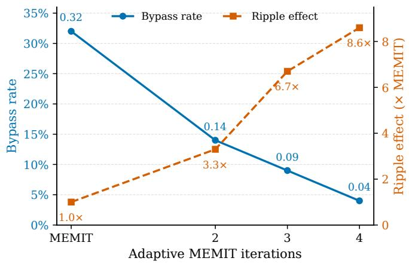  
Fig. 8: Increasing the number of adaptive MEMIT iterations progressively reduces the bypass rate, but substantially increases the ripple effect on neighboring knowledge. Bypass rate and ripple effect are measured relative to standard MEMIT.

TABLE VIII: Effect of adaptive MEMIT on tokenizationbased bypasses and collateral changes. Ripple effects are normalized to standard MEMIT.
<table><tr><td>Method</td><td>Bypass Rate ↓</td><td>Ripple Effect ↓</td></tr><tr><td>MEMIT</td><td>0.32</td><td>1.0×</td></tr><tr><td>Adaptive MEMIT (2 iter.)</td><td>0.14</td><td>3.3×</td></tr><tr><td>Adaptive MEMIT (3 iter.)</td><td>0.09</td><td>6.7×</td></tr><tr><td>Adaptive MEMIT (4 iter.)</td><td>0.04</td><td>8.6×</td></tr></table>

The procedure terminates when no bypass is found or when the maximum number of adaptive iterations is reached.

Results. As shown in Fig. 8, Adaptive MEMIT substantially reduces the effectiveness of tokenization-based bypasses. The bypass rate decreases from 0.32 for standard MEMIT to 0.14 after two adaptive iterations, 0.09 after three iterations, and 0.04 after four iterations. Thus, explicitly incorporating discovered bypass tokenizations into subsequent unlearning updates can substantially improve robustness against tokenizationaware adversaries. However, this increased robustness comes at a progressively larger cost to locality. The ripple effect increases from 1.0× for standard MEMIT to 3.3×, 6.7×, and 8.6× after two, three, and four adaptive iterations, respectively. Each additional adaptive iteration therefore reduces the remaining bypasses while simultaneously increasing collateral changes to neighboring knowledge.

These results reveal a clear trade-off between tokenization robustness and update locality. While a developer can the mitigate tokenization-based side-channel by explicitly incorporating discovered bypass tokenizations into the unlearning procedure, doing so progressively expands the region of the model affected by the update. In particular, reducing the bypass rate from 0.32 to 0.04 requires an 8.6× increase in ripple effects relative to standard MEMIT. This suggests that tokenization-aware defenses can improve robustness, but may undermine the locality that motivates targeted editing and unlearning.

## APPENDIX B

## FINE-TUNING FOR TARGETED UNLEARNING AND EDITING

We evaluate vanilla fine-tuning when used for targeted unlearning to examine whether its broader parameter updates provide greater robustness to tokenization-based bypasses. We evaluate fine-tuning in terms of both tokenization bypass rate and collateral changes to neighboring knowledge. We conduct this experiment on Llama3 using 1,000 edit-control fact pairs selected from the factual entanglement artifacts of [41]. We restrict the evaluation to highly entangled pairs, with representational entanglement greater than 0.9, providing a stringent setting in which modifications to the target fact are likely to affect neighboring knowledge. We measure the bypass rate using the same protocol as our main experiments and quantify collateral changes using the original-answer logprobability shift following [41].

Results. Fine-tuning substantially reduces the bypass rate, from 0.32 for MEMIT to 0.08, indicating that its broader parameter updates provide greater robustness to alternative tokenizations. However, this increased robustness comes at a substantial cost to locality. Fine-tuning produces a 5.2× larger ripple effect than MEMIT, indicating that suppressing a broader set of tokenization variants also causes substantially greater changes to neighboring knowledge. Thus, although fine-tuning provides stronger robustness against tokenizationbased bypasses, its collateral effects make it less suitable for targeted unlearning and editing, where localized modification is a primary objective. The fine-tuning configuration and evaluation protocol are provided in Table X.

TABLE IX: Comparison of MEMIT and vanilla fine-tuning for targeted unlearning. Bypass rate measures the fraction of alternative tokenizations that recover the pre-update response. Ripple effect is normalized to MEMIT.
<table><tr><td>Method</td><td>Bypass Rate ↓</td><td>Ripple Effect ↓</td></tr><tr><td>MEMIT</td><td>0.32</td><td>1.0×</td></tr><tr><td>Fine-tuning</td><td>0.08</td><td>5.2×</td></tr></table>

TABLE X: Configuration of the fine-tuning baseline and the shared evaluation protocol. All values are the defaults in the released code; no per-fact or per-model tuning was performed.
<table><tr><td>Parameter</td><td>Value</td></tr><tr><td colspan="2">Fine-tuning optimization</td></tr><tr><td>Trainable parameters</td><td>All (full model, no freezing)</td></tr><tr><td>Optimizer</td><td>SGD, momentum = 0</td></tr><tr><td>Learning rate</td><td> $5 \times 1 0 ^ { - 5 }$  25</td></tr><tr><td>Maximum steps Early-stopping loss</td><td> $5 \times 1 0 ^ { - 2 }$ </td></tr><tr><td>Batch size</td><td>1 (single prompt-target pair)</td></tr><tr><td>Objective</td><td>Causal-LM cross-entropy</td></tr><tr><td>Model precision</td><td>fp32</td></tr><tr><td>Protocol</td><td></td></tr><tr><td>Model</td><td>Llama3</td></tr><tr><td>Editing baseline</td><td>MEMIT</td></tr></table>

## APPENDIX C

## TOKENIZATION SAMPLING PROCEDURE

To facilitate reproducibility, we provide the complete tokenization sampling procedure used by Toketive. Toketive does not rely on a formal theory of knowledge localization, nor do we claim that representational entanglement or residual computational paths constitute the definitive mechanism by which factual knowledge is stored in LLMs. Algorithm 3 specifies the candidate-generation process, adaptive controller update, tokenizer constraints, duplicate handling, and attempt budget used to generate alternative tokenizations. The sampler operates without tokenizer-specific heuristics: candidate segments are retained only when they satisfy the tokenizer round-trip constraint $\tau ^ { - 1 } ( \tau ( c ) ) = c ,$ ensuring that each sampled tokenization decodes exactly to the original input. The adaptive controller updates α using the cosine similarities of the most recent B scored proposals, while all scored proposals, including those outside the target similarity band, are retained in the history. We use a maximum of nM sampling attempts for n requested tokenizations, with $M = 3 0 0$ attempts per sample.

The sampler uses a fixed budget of $M = 3 0 0$ proposals per requested sample, yielding a maximum of nM attempts for a quota of n: $n _ { \mathrm { d e t } } = 2 0$ for detection and $n _ { \mathrm { r e c } } = 5 0$ for reconstruction. The loop terminates as soon as the quota is met, so these values represent worst-case rather than typical sampling costs. If the budget is exhausted before the quota is reached, we fill the shortfall using validated but out-ofband proposals in ascending order of their distance to the target band. This maintains a fixed sample size and ensures comparable detection and reconstruction statistics across facts. Thus, the band boundaries serve as sampling targets rather than hard guarantees; if the fallback pool is also insufficient, the procedure returns fewer than n samples. Algorithm 3 (Lines 3 and 15) specifies both behaviors.

## APPENDIX D

## COST AND EFFICIENCY ANALYSIS OF TOKET I VE

The dominant cost of Toketive for each edited fact is the number of forward passes through $f _ { \theta ^ { \prime } }$ . The canonical reference step requires a single forward pass to extract hidden states.

The detection and reconstruction samplers each perform at most $M \cdot n _ { \mathrm { d e t } }$ and $M \cdot n _ { \mathrm { r e c } }$ tokenization attempts, respectively, where M is the per-sample attempt budget. Each attempt requires a forward pass to compute hidden representations for the entanglement score (cost $\mathcal { O } ( F ) )$ , while each accepted sample additionally incurs an autoregressive generation cost (cost O(G)).

The total cost per fact is therefore:

$$
\mathcal { O } ( M ( n _ { \mathrm { d e t } } + n _ { \mathrm { r e c } } ) \cdot F ^ { \prime } + ( n _ { \mathrm { d e t } } + n _ { \mathrm { r e c } } ) \cdot G ) ,
$$

where F denotes the cost of a single forward pass, and $G$ denotes the cost of autoregressive generation, which scales with output length and typically satisfies $G \gg F$

The random and edit-distance baselines avoid hidden-state extraction, eliminating the F-term associated with scoring. Their cost is dominated by generation:

$$
\mathcal { O } ( ( n _ { \mathrm { d e t } } + n _ { \mathrm { r e c } } ) \cdot G ) ,
$$

with negligible additional overhead from tokenization and editdistance computation. In the worst case, Toketive performs $M ( n _ { \mathrm { d e t } } + n _ { \mathrm { r e c } } )$ forward passes for scoring; in practice, the sampler terminates early once band quotas are satisfied.

## APPENDIX E

## HYPERPARAMETER CALIBRATION

They are selected once using a single development configuration and are kept fixed for all remaining 179 experiments. No model-, dataset-, or editing-technique-specific retuning is performed. We intentionally avoid per-target tuning to demonstrate that Toketive doesn't depend on target-specific calibration.

a) Detection threshold $\tau _ { d e t \bullet }$ The detection threshold $\tau _ { \mathrm { d e t } }$ was calibrated on a single held-out configuration: Llama3 with MEMIT on Known-1000. Fig. 9 shows F1 as a function of $\tau _ { \mathrm { d e t } }$ for this configuration. F1 peaks sharply at $\tau ^ { * } ~ = ~ 0 . 1 0$ $( \mathrm { F 1 } = 8 2 . 9 \% )$ and degrades monotonically for larger values. We adopt $\tau _ { \mathrm { d e t } } ~ = ~ 0 . 1 0$ as a fixed threshold and apply it uniformly across all remaining 179 model-dataset-technique combinations without further tuning. The consistent detection performance reported in Table IV across diverse models and datasets suggests that this threshold generalizes well beyond the calibration setting.

b) Band boundaries.: Band boundaries for the representational entanglement were determined by sweeping $\beta _ { h } ^ { \mathrm { d e t } }$ (with $\beta _ { l } ^ { \mathrm { d e t } } = 0$ fixed) for detection and $\beta _ { l } ^ { \mathrm { r e c } }$ (with $\beta _ { h } ^ { \mathrm { r e c } } = 1 . 0$ fixed) for reconstruction on the same held-out configuration, using F1 and top-1 accuracy as the respective criteria. The values used are as follows.

For the representational entanglement sampler:

• Detection band: $[ \beta _ { l } ^ { \mathrm { d e t } } , \beta _ { h } ^ { \mathrm { d e t } } ) = [ 0 . 3 , 0 . 5 )$

• Reconstruction band: $[ \beta _ { l } ^ { \mathrm { r e c } } , \beta _ { h } ^ { \mathrm { r e c } } ) = [ 0 . 7 , 1 . 0 )$

For the edit distance sampler, we utilise the following values:

• Detection band: $[ \beta _ { l } ^ { \mathrm { d e t } } , \beta _ { h } ^ { \mathrm { d e t } } ) = [ 0 . 8 0 , 1 . 0 0 )$

• Reconstruction band: $[ \beta _ { l } ^ { \mathrm { r e c } } , \beta _ { h } ^ { \mathrm { r e c } } ) = [ 0 . 0 0 , 0 . 5 0 )$

The detection band for entanglement ([0.30, 0.50)) captures tokenizations that are meaningfully divergent from canonical internally but retain sufficient semantic signal to produce coherent completions. The reconstruction band ([0.70, 1.00)) targets high-similarity tokenizations that are likely to draw on the same factual subspace as the canonical path while being just divergent enough to escape patched circuits, consistent with the design motivation in Section IV-B1.

For edit distance, the detection band ([0.80, 1.00)) selects highly divergent tokenizations at the lexical level, while the reconstruction band ([0.00, 0.50)) selects tokenizations that are lexically close to canonical. These choices mirror the entanglement band logic but operate on token-sequence surface similarity rather than hidden-state similarity.

All band boundaries and $\tau _ { \mathrm { d e t } }$ are fixed at the calibrated values for all 180 experiments reported in this paper. No perdataset or per-model tuning was performed.

## APPENDIX F MEAN SCORE ANALYSIS

Table XI reports the mean representational entanglement and edit distance scores for convergent and non-convergent noncanonical tokenizations, along with their difference (Conv — Non-conv), across all models and datasets.

For representational entanglement, convergent tokenizations consistently achieve higher mean scores than non-convergent ones across all model-dataset combinations, with differences ranging from 0.124 to 0.278. The direction of this difference is stable, as convergent tokenizations are always more similar to the canonical hidden state than non-convergent ones, indicating that representational entanglement scores carry a consistent directional signal about factual retrieval behavior. The largest gaps appear on Real Authors and MQuAKE, where the mean difference exceeds 0.20 for most models, while RippleEdits and CounterFact show smaller but still consistent separations.

```latex
Algorithm 3 Adaptive tokenization sampler used by Toketive. $\tau , \tau ^ { - 1 }$ are the tokenizer's encode/decode maps with special
tokens disabled on all calls; $v ^ { * } = \tau ( p )$ is the canonical tokenization; HıDDEN extracts the subject-final hidden state at probe
layer L. Constants: maximum segment length $W = 1 9$ characters, attempt budget $M = 3 0 0$ per requested sample, step
$\begin{array} { r } { \eta = 0 . 0 8 , } \end{array}$ buffer $B = 1 0 , \alpha _ { 0 } = 0 . 5 .$ The round-trip test $\tau ^ { - 1 } ( \tau ( c ) ) = c$ is what keeps segments byte- and Unicode-safe without
tokenizer-specific rules; D records every scored proposal, including rejected candidates, so the controller adapts using the full
observed proposal history. Here s denotes the subject whose final-token position is probed, and $h ^ { \ast } = \operatorname { H I D D E N } ( f _ { \theta ^ { \prime } } , v ^ { \ast } , \mathcal { L } , s )$
the canonical reference representation against which candidate tokenizations are scored.
```

1: procedure $\mathrm { S A M P L E } ( f _ { \theta ^ { \prime } } , \underline { { p } } , s , h ^ { * } , [ \beta _ { l } , \beta _ { h } ) , n )$   
2: C, F, S ← ∅; D ← []; α ← α0; $k  0$   
3: while $| { \mathcal { C } } | < n$ and $k < n M$ do   
4: k ← k + 1; α ←UPDATEALPHA $\iota ( \alpha , D , \beta \iota , \beta _ { h } ) ;$ u ←GENTOK(p, α)   
5: if u = ⊥ or u $\in S$ then continue invalid or duplicate   
6: S ← S ∪ {u}; e ← cos(HIDDEN $\mathsf { \Omega } _ { \mathsf { N } } ( f _ { \theta ^ { \prime } } , u , \mathcal { L } , s ) , h ^ { * } )$ ; append e to D   
7: if $\beta _ { l } \le e < \beta _ { h }$ then   
8: ${ \mathcal { C } } \gets { \mathcal { C } } \cup \{ u \}$   
9: else   
10: $d \gets \operatorname* { m i n } ( | e - \beta _ { l } | , | e - \beta _ { h } | ) ; \ \mathcal { F } \gets \mathcal { F } \cup \{ ( u , d ) \}$ distance to band   
11: end if   
12: end while   
13: if $| { \mathcal { C } } | < n$ then move $( u , d )$ from $\mathcal { F }$ into C in ascending d until $| { \mathcal { C } } | = n$ or ${ \mathcal { F } } = \emptyset$   
14: return C   
15: end procedure   
16: procedure GENTOK(p, α)   
17: m ← 1 if α < 0.3; 2 if α < 0.5; 3 if $\alpha < 0 . 7 ;$ else 4 max tokens per segment   
18: $u  [ ] ; i  0$   
19: while $\bar { i } <$ |p| do   
20: $A \xleftarrow { \left\{ \left( \tau ( c _ { i j } ) , j \right) : c _ { i j } = p [ i : j ] , 0 < j - i \leq W , j \leq | p | , | \tau ( c _ { i j } ) | \leq m , \tau ^ { - 1 } ( \tau ( c _ { i j } ) ) = c _ { i j } \right\} }$   
21: if $\overset { \triangledown } { \mathcal { A } } = \emptyset$ then   
22: $u  u \| \tau ( p [ i ] ) ; i  i + 1$ single-character fallback ensures progress   
23: else   
24: for all $( t , j ) \in A ,$ with $\ell \gets j - i$ do   
25: if $\alpha \leq 0 . 5$ then $w ( t , j ) \dot {  } \ell / 2$ favor longer segments   
26: else $w ( t , j ) \gets 1 /$ max(1, l/2), doubled if $| t | > 1$ favor short, multi-token splits   
27: end for   
28: sample $( t , j ) \sim A$ with $\begin{array} { r } { P ( t , j ) = w ( t , j ) / { \sum _ { ( t ^ { \prime } , j ^ { \prime } ) \in \mathcal { A } } w ( t ^ { \prime } , j ^ { \prime } ) } } \end{array}$ u ← u||t; i ← j   
29: end if   
30: end while   
31: return ⊥ if u = v\* or $\tau ^ { - 1 } ( u ) \neq p ,$ else u   
32: end procedure   
33: procedure UPDATEALPHA(α, $D , \beta _ { l } , \beta _ { h } )$   
34: if $| D | < B$ then return α   
35: § ← mean $\left( D [ | D | - B : | D | ] \right)$   
36: if $\bar { s } > \beta _ { h }$ then return min $( 0 . 9 5 , \alpha + \eta )$   
37: if $\bar { s } < \beta _ { l }$ then return max(0.05, α − η)   
38: return clip(α + ε, 0.05, 0.95), $\varepsilon \sim \mathcal { U } ( - \eta / 2 , \eta / 2 )$ in-band jitter avoids stagnation   
39: end procedure

TABLE XI: Mean representational entanglement and edit distance scores for convergent (Conv) and non-convergent (Nonconv) noncanonical tokenizations, and their difference (Conv — Non-conv), across all models and datasets. Positive differences indicate higher scores for convergent tokenizations. For representational entanglement, a positive difference reflects stronger internal similarity to the canonical hidden state for convergent tokenizations.
<table><tr><td>Model</td><td>Method</td><td>Conv</td><td>Real Authors Non-conv</td><td>Diff</td><td>Conv</td><td>CounterFact Non-conv</td><td>Diff</td><td>Conv</td><td>Known-1000 Non-conv</td><td>Diff</td><td>Conv</td><td>MQuAKE Non-conv</td><td>Diff</td><td>Conv</td><td>RippleEdits Non-conv</td><td>Diff</td><td>Conv</td><td>World Facts Non-conv</td></tr><tr><td rowspan="3">Llama3</td><td rowspan="3">Repr. Ent. Edit distance</td><td></td><td>0.436</td><td>0.233</td><td></td><td></td><td>0.124</td><td></td><td></td><td></td><td>0.548</td><td>0.202</td><td>0.793</td><td>0.669</td><td>0.124</td><td>0.775</td><td>0.635</td><td>Diff 0.140</td></tr><tr><td>0.669</td><td></td><td></td><td>0.717</td><td>0.593</td><td></td><td>0.737</td><td>0.549 0.771</td><td>0.188</td><td>0.750</td><td>0.774</td><td></td><td></td><td></td><td></td><td></td><td>0.797</td></tr><tr><td>0.736</td><td>0.807 0.442</td><td>-0.071 0.249</td><td>0.682 0.732</td><td>0.752 0.592</td><td>-0.070 0.141</td><td>0.708 0.733</td><td>0.565</td><td>-0.064 0.169</td><td>0.717</td><td></td><td>-0.057</td><td>0.740</td><td>0.772</td><td>-0.032 0.739</td><td></td><td>-0.058</td></tr><tr><td rowspan="3">Llama3.1</td><td>Repr. Ent. Edit distance</td><td>0.691 0.738</td><td>0.810</td><td>-0.072</td><td>0.671</td><td>0.758</td><td>-0.087</td><td>0.724 0.769</td><td>-0.045</td><td>0.765 0.708</td><td>0.559 0.772</td><td>0.206 -0.065</td><td>0.812 0.749</td><td>0.680 0.768</td><td>0.132 -0.019</td><td>0.773 0.746</td><td>0.642 0.789</td><td>0.131 -0.043</td></tr><tr><td></td><td></td><td></td><td></td><td>0.677</td><td>0.539</td><td>0.139</td><td>0.675</td><td></td><td></td><td></td><td></td><td></td><td></td><td></td><td></td><td>0.530</td><td>0.207</td></tr><tr><td>Repr. Ent.</td><td>0.598</td><td>0.332 0.803</td><td>0.266 -0.075</td><td></td><td>0.748</td><td>-0.067</td><td>0.465 0.720</td><td>0.210</td><td>0.731</td><td>0.465</td><td>0.267</td><td>0.754 0.741</td><td>0.609</td><td>0.146</td><td>0.737 0.737</td><td></td><td>-0.073</td></tr><tr><td rowspan="3">Tulu3</td><td>Edit distance</td><td>0.728</td><td></td><td></td><td>0.681</td><td></td><td>0.146</td><td>0.756 0.533</td><td>-0.037 0.175</td><td>0.673 0.743</td><td>0.767 0.508</td><td>-0.094 0.235</td><td></td><td>0.771</td><td>-0.030 0.129</td><td>0.744</td><td>0.811 0.574</td><td>0.170</td></tr><tr><td>Repr. Ent.</td><td>0.649</td><td>0.371 0.805</td><td>0.278 -0.066</td><td>0.712 0.699</td><td>0.566 0.754</td><td>-0.056</td><td>0.708 0.730</td><td></td><td>0.710</td><td></td><td></td><td>0.784</td><td>0.655</td><td></td><td></td><td>0.788</td><td>-0.043</td></tr><tr><td>Edit distance</td><td>0.739</td><td>0.374</td><td></td><td></td><td></td><td></td><td>0.771 0.524</td><td>-0.041 0.191</td><td>0.745</td><td>0.776 0.512</td><td>-0.066 0.233</td><td>0.748 0.788</td><td>0.759 0.656</td><td>-0.011 0.132</td><td>0.745 0.750</td><td>0.583</td><td>0.166</td></tr><tr><td rowspan="3">Tulu3.1</td><td>Repr. Ent. Edit distance</td><td>0.648 0.738</td><td>0.809</td><td>0.274 -0.071</td><td>0.703 0.698</td><td>0.575 0.765</td><td>0.129 -0.067</td><td>0.715 0.728</td><td>0.771</td><td>-0.044</td><td></td><td></td><td></td><td></td><td></td><td></td><td></td><td></td></tr><tr><td></td><td></td><td></td><td></td><td></td><td></td><td></td><td></td><td></td><td>0.711</td><td>0.779</td><td>-0.068</td><td>0.755</td><td>0.767</td><td>-0.012</td><td>0.739</td><td>0.780</td><td>-0.042</td></tr><tr><td></td><td></td><td></td><td></td><td></td><td></td><td></td><td></td><td></td><td></td><td></td><td></td><td></td><td></td><td></td><td></td><td></td><td></td></tr></table>

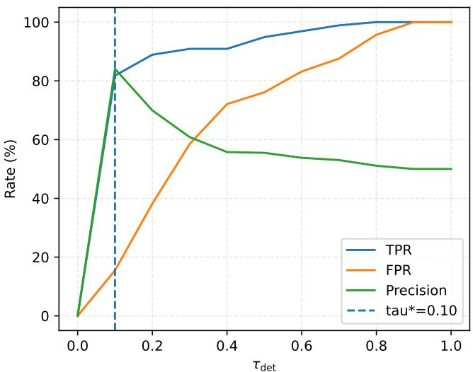  
(a) TPR, FPR, and Precision

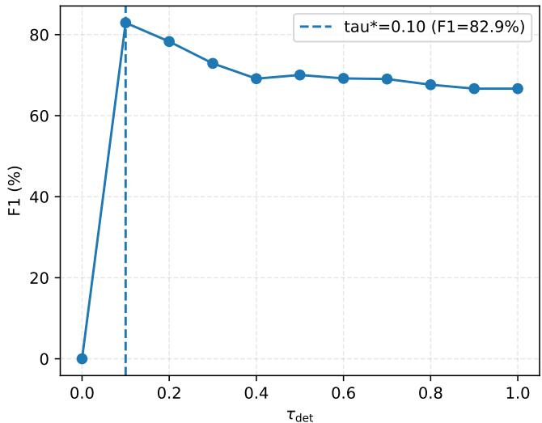  
(b) F1 score  
Fig. 9: Sensitivity of edit detection performance to the detection threshold $\tau _ { \mathrm { d e t } } ,$ averaged across all models, datasets, and techniques. (a) TPR, FPR, and Precision as a function of $\tau _ { \mathrm { d e t } } . \ \mathrm { A t } \tau ^ { * } = 0 . 1 0$ , TPR and Precision are both near 83% while FPR remains low, marking the optimal precision-recall balance. (b) F1 score as a function of $\tau _ { \mathrm { d e t } }$ . F1 peaks sharply at $\tau ^ { * } = 0 . 1 0$ (82.9%) and degrades monotonically for larger values, confirming this as a robust operating point. The plateau near $6 7 \%$ at $\tau _ { \mathrm { d e t } }  1 . 0$ corresponds to the degenerate case where all facts are labeled edited $( \mathrm { T P R } = 1 0 0 \% , \mathrm { F P R } = 1 0 0 \%$ Precision ≈ 50%).

For edit distance, the pattern is reversed and substantially weaker. Non-convergent tokenizations have slightly higher mean edit distances than convergent ones in all settings, yielding negative differences ranging from —0.011 to –0.094. The magnitude of this separation is small (typically 0.03-0.07) indicating that convergent and non-convergent tokenizations differ only marginally in their lexical distance from the canonical sequence. This indicates that while edit distance captures some surface-level variation, it does not reliably separate the two groups, consistent with the low AUC and $\left| r _ { b } \right|$ values reported in Table II.

Taken together, these mean score differences provide additional support that representational entanglement captures a meaningful internal signal about factual retrieval, while edit distance does not. The consistent positive direction of the entanglement difference across all $5 \times 6 = 3 0$ model-dataset combinations, with no exceptions, further validates its use as the routing criterion in Toketive's adaptive sampler.

## APPENDIX G

## DISTRIBUTIONAL VISUALIZATIONS

Figures 10-21 present distributional visualizations of representational entanglement and edit distance as predictors of tokenization convergence. Figures 22-27 shows ROC curves for all models across all six datasets, illustrating the discrimination advantage of representational entanglement over edit distance at all operating thresholds. Across all combinations, representational entanglement consistently exhibits a rightward shift for convergent tokenizations relative to non-convergent ones, with clearly separated interquartile ranges in most settings. Edit distance distributions overlap substantially between convergent and non-convergent groups across all datasets, with nearidentical medians and largely overlapping interquartile ranges. As visible in the violin plots, the edit distance distributions for convergent and non-convergent tokenizations share similar shapes and central tendencies, and representational entanglement distributions show a pronounced mass shift toward higher scores for convergent tokenizations.

## APPENDIX H CALIBRATION ANALYSIS

Beyond discrimination (AUC) and effect size $( | r _ { b } | )$ reported in Section V-B, we evaluate the calibration of representational entanglement and edit distance as predictors of tokenization convergence. A well-calibrated signal produces confidence scores whose magnitude reliably reflects the actual probability of convergence, not just their relative ordering. We measure calibration using Expected Calibration Error (ECE), computed by partitioning scores into ten equal-width bins and measuring the weighted average gap between mean predicted score and observed convergence rate per bin. Lower ECE indicates better calibration.

Table VI reports ECE for representational entanglement and edit distance across all five models and six datasets. Representational entanglement is substantially better calibrated (lower valyes) than edit distance across all settings. The gap is most pronounced on TOFU-World Facts, where edit distance ECE exceeds 0.4 across all models while representational entanglement remains below 0.25. This indicates that edit distance scores are not only less discriminative (as shown by AUC and [rb] in Table II) but also poorly calibrated. Representational entanglement, by contrast, produces scores whose magnitude is meaningfully aligned with convergence probability, justifying its use as a routing signal in Toketive's adaptive sampler rather than merely as a ranking criterion.

TABLE XII: Examples of Toketive outcomes on Llama3 edited with AlphaEdit. All responses are generated after editing. The edited target answer is George R.R. Martin, while the pre-edit answer is George Orwell. Alternative tokenizations can therefore recover the suppressed answer even though the canonical tokenization produces the edited response.
<table><tr><td>Tokenization</td><td>Token sequence</td><td>Post-edit response</td></tr><tr><td>Noncanonical</td><td> $[ { ^ { \prime } \mathrm { T } ^ { \prime } } , { ^ { \prime } \mathrm { h } ^ { \prime } } , { ^ { \prime } \mathrm { e } ^ { \prime } } , { ^ { \prime } }$   $' , ' \mathrm { n ^ { \prime } } , ' \mathrm { o v e ^ { \prime } } , ' \mathrm { 1 ^ { \prime } } , '$ </td><td>The novel 1984 was written by George Orwell, a British author, and published in 1949. The book is a . .</td></tr><tr><td>Noncanonical</td><td> $' , ' 1 9 8 ^ { \prime } , ' 4 ^ { \prime } , . . . . ]$   $[ { ' } \mathrm { T h } ^ { \prime } \ , { ' } \mathrm { e } ^ { \prime } \ , { ' }$   $' , ' \mathrm { n o v } ^ { \prime } , ' \mathrm { e 1 } ^ { \prime } , '$ </td><td>The novel 1984 was written by Michael Moorcock in 1948. It was a satire ..</td></tr><tr><td>Canonical</td><td> $' , ' 1 9 8 ' , ' 4 ' , ' , ' , . . . ]$   $\mathrm { [ ^ { \prime } \ T h e ^ { \prime } \ , ^ { \prime } \ n o v e ] ^ { \prime } \ , ^ { \prime } }$   $' ~ , ~ ' ~ 1 9 8 ^ { \prime } ~ , ~ ' ~ 4 ^ { \prime } ~ , ~ ' ~ \quad \mathsf { w a s ^ { \prime } } ~ , ~ '$   $\mathrm { { w r i t t e n ^ { \prime } \cdot ^ { \prime } \Delta \ b y ^ { \prime } \ l } }$ </td><td>The novel 1984 was written by George R.R. Martin, and it was published in 1979. The novel ...</td></tr></table>

Table VII reports Maximum Calibration Error (MCE), which measures the worst-case calibration gap across bins rather than the average. MCE is more sensitive to localized miscalibration and complements ECE by identifying settings where a signal fails badly in a specific score range even if its average calibration is acceptable. Representational entanglement achieves lower MCE than edit distance in the majority of model-dataset combinations. OLMo2 is a partial exception: edit distance achieves lower MCE on Real Authors (0.330 vs. 0.436) and CounterFact (0.250 vs. 0.263), suggesting that the worst-case calibration of entanglement scores is slightly degraded for this model on these datasets. However, representational entanglement retains lower MCE on the remaining four datasets for OLMo2, and its ECE advantage holds uniformly(Table VI). Taken together, ECE and MCE show that representational entanglement produces more reliable confidence estimates than edit distance across the full score range and across all models, further supporting its use as the routing signal in Toket ive's adaptive sampler.

## APPENDIX I

## QUALITATIVE EXAMPLES OF TOKENIZATION-AWARERECOVERY

Table XII presents three representative outcomes of Toketive on Llama3 edited with AlphaEdit. All responses are generated after the editing procedure. In the first case, a noncanonical tokenization recovers the original pre-edit answer, George Orwell, despite the canonical tokenization producing the edited answer, George R.R. Martin. This represents a successful bypass of the edit. In the second case, the noncanonical tokenization produces an incorrect response, Michael Moorcock, rather than recovering either the pre-edit or edited answer. This illustrates a failed recovery despite successfully deviating from the edited behavior. Finally, the canonical tokenization produces the intended edited answer, George R.R. Martin, demonstrating that the edit remains effective under the representation on which it was originally applied. Together, these examples illustrate that tokenizationaware sampling can separate tokenizations that preserve the original factual association from those that either lose the association or remain affected by the edit.

## APPENDIX J

## ADDITIONAL ANALYSIS FOR Q2: TOKENIZATION INVARIANCE OF EDITING AND UNLEARNING

Table XIII reports the full breakdown of noncanonical tokenization responses across all five models, six datasets, and six techniques. For each combination, we report the fraction of noncanonical tokenizations that produce the new answer (New%), the pre-update answer (Old%), or neither (Other%). The bypass rate reported in the main paper (Table III) corresponds directly to the Old% column here.

Several patterns are consistent across all models and datasets. The Old% column shows that a substantial fraction of noncanonical tokenizations recover the pre-update response in every setting, with no technique achieving near-zero bypass rates. The New% column shows that the post-edit answer is produced by a minority of noncanonical tokenizations in most settings, indicating that the edit generalizes poorly beyond the canonical path. The Other% column (tokenizations producing neither the old nor the new answer) is largest for LTU across most settings.

TABLE XIII: Full breakdown of noncanonical tokenization responses across models, techniques, and datasets. New (%) reports the fraction producing the post-edit answer $o ^ { * }$ ; Old (%) reports the fraction recovering the pre-update answer o (bypass rate); Other (%) reports the fraction producing neither.
<table><tr><td></td><td></td><td colspan="3">Known-1000</td><td colspan="3">CounterFact</td><td colspan="3">TOFU-Real Authors</td><td colspan="3">MQuAKE</td><td colspan="3">RippleEdits</td><td colspan="3">TOFU-World Facts</td></tr><tr><td>Model</td><td>Technique</td><td>New</td><td>Old</td><td>Other</td><td>New</td><td>Old</td><td>Other</td><td>New Old</td><td></td><td>Other</td><td>New</td><td>Old Other</td><td></td><td>New</td><td>Old</td><td>Other</td><td>New</td><td>Old Other</td></tr><tr><td rowspan="4">LIamma3</td><td rowspan="4">MEMIT RECT PRUNE</td><td>21.5 19.3</td><td>36.5</td><td>42.0 41.5</td><td>16.8 50.3</td><td></td><td>32.9 29.7</td><td>43.8 46.4</td><td>26.5</td><td>15.6</td><td>46.9 49.7</td><td>37.5 38.5</td><td>21.0</td><td>37.5</td><td>41.5 40.8</td><td>48.0 44.0</td><td>27.0</td><td>25.0</td></tr><tr><td></td><td>39.1</td><td></td><td>15.2</td><td>51.6</td><td>33.2</td><td>26.5</td><td></td><td>27.1</td><td>11.7</td><td></td><td>16.9</td><td>42.3</td><td></td><td></td><td>30.1</td><td>25.9</td></tr><tr><td>21.0</td><td>35.8</td><td>43.2</td><td>17.8</td><td>49.3</td><td>32.9</td><td>31.1 42.6</td><td>26.3</td><td>12.6</td><td>49.5</td><td>37.9</td><td>23.0</td><td>37.7</td><td>39.3</td><td>44.9</td><td>28.7</td><td>26.4</td></tr><tr><td>AlphaEdit 24.6</td><td>33.8</td><td>41.6</td><td>20.7</td><td>47.3</td><td>32.0 30.0</td><td>42.6</td><td>27.4</td><td>17.1</td><td>43.1</td><td>39.7</td><td>24.9</td><td>35.6</td><td>39.5</td><td>54.3</td><td>23.2</td><td>22.5</td></tr><tr><td rowspan="8"></td><td>CoME LTU</td><td>25.5 32.9</td><td></td><td>41.6</td><td>19.8 48.3</td><td>32.0</td><td>29.0</td><td>44.1</td><td>26.9</td><td>18.5</td><td>42.7</td><td>38.8</td><td>29.8</td><td>33.1</td><td>37.1</td><td>56.1</td><td>21.1</td><td>22.8</td></tr><tr><td></td><td>4.5 32.1</td><td></td><td>63.4</td><td>6.4 39.1</td><td>54.5</td><td>1.0</td><td>57.1</td><td>41.9</td><td>1.3</td><td>47.5</td><td>51.2</td><td>1.6</td><td>26.9</td><td>71.5</td><td>12.2</td><td>51.8</td><td>36.0</td></tr><tr><td>MEMIT</td><td>21.9 42.0</td><td></td><td>36.1</td><td>19.5 49.1</td><td>31.4</td><td>30.4</td><td>42.1</td><td>27.5</td><td>15.5</td><td>39.7</td><td>44.8</td><td>25.0</td><td>32.3</td><td>42.7</td><td>49.3</td><td>30.9</td><td>19.7</td></tr><tr><td>RECT</td><td>19.6</td><td>43.9</td><td>36.5</td><td>16.0 51.5</td><td></td><td>32.5 27.0</td><td>45.2</td><td>27.7</td><td>12.7</td><td>42.0</td><td>45.2</td><td>21.3</td><td>38.3</td><td>40.5</td><td>44.5</td><td>34.5</td><td>20.9</td></tr><tr><td>PRUNE</td><td>23.1</td><td>39.9</td><td>37.1</td><td>21.2</td><td>48.3</td><td>30.5</td><td>29.3 43.4</td><td>27.3</td><td>15.4</td><td>39.5</td><td>45.1</td><td>29.1</td><td>30.2</td><td>40.7</td><td>51.3</td><td>29.7</td><td>18.9</td></tr><tr><td>AlphaEdit</td><td>28.0</td><td>36.9</td><td>35.1</td><td>26.1</td><td>45.8</td><td>28.1</td><td>31.6 40.5</td><td>27.9</td><td>21.4</td><td>31.2</td><td>47.4</td><td>31.0</td><td>30.2</td><td>38.8</td><td>59.3</td><td>22.1</td><td>18.7</td></tr><tr><td>CoME</td><td>27.0</td><td>38.3</td><td>34.7</td><td>27.0</td><td>44.3</td><td>28.7 34.8</td><td>37.8</td><td>27.4</td><td>19.7</td><td>35.2</td><td>45.0</td><td>34.3</td><td>25.3</td><td>40.4</td><td>57.3</td><td>23.9</td><td>18.8</td></tr><tr><td>LTU</td><td>5.8</td><td>42.8</td><td>51.4</td><td>4.9</td><td>46.0</td><td>49.1</td><td>1.2 56.4</td><td>42.4</td><td>0.3</td><td>42.2</td><td>57.5</td><td>1.9</td><td>27.8</td><td>70.3</td><td>13.7</td><td>48.6</td><td>37.6</td></tr><tr><td rowspan="8">O02</td><td>MEMIT</td><td>36.1</td><td></td><td>48.8</td><td>18.7 29.0</td><td>52.3</td><td>11.4</td><td>38.5</td><td>50.1</td><td>17.3</td><td>24.6</td><td>58.2</td><td>11.5</td><td>35.8</td><td>52.7</td><td>28.1</td><td>36.6</td><td>35.3</td></tr><tr><td>RECT</td><td>15.1 13.1 38.0</td><td></td><td>49.0</td><td>18.2 30.0</td><td>51.8</td><td>11.3</td><td>38.6</td><td>50.1</td><td>17.5</td><td>24.2</td><td>58.3</td><td>11.6</td><td>36.1</td><td>52.3</td><td>29.2</td><td>35.7</td><td>35.2</td></tr><tr><td>PRUNE</td><td>13.9</td><td>36.0</td><td>50.1</td><td>20.9 27.8</td><td>51.3</td><td>11.6</td><td>38.0</td><td>50.3</td><td>17.9</td><td>24.0</td><td>58.1</td><td>12.2</td><td>35.4</td><td>52.4</td><td>31.6</td><td>32.9</td><td>35.4</td></tr><tr><td>AlphaEdit</td><td>18.0</td><td>29.7</td><td>52.3</td><td>22.2 26.7</td><td></td><td>51.1</td><td>12.7 37.2</td><td>50.1</td><td>21.6</td><td>19.7</td><td>58.7</td><td>15.1</td><td>31.9</td><td>53.1</td><td>37.7</td><td>25.6</td><td>36.7</td></tr><tr><td>CoME</td><td>15.8</td><td>33.8</td><td>50.4</td><td>20.9</td><td>27.7</td><td>51.4</td><td>12.5 37.1</td><td>50.4</td><td>19.6</td><td>21.7</td><td>58.7</td><td>12.3</td><td>35.3</td><td>52.4</td><td>31.6</td><td>32.3</td><td>36.1</td></tr><tr><td>LTU</td><td>6.8</td><td>38.7</td><td>54.5</td><td>5.6</td><td>36.5</td><td>57.9</td><td>6.1 37.5</td><td>56.4</td><td>6.9</td><td>31.9</td><td>61.2</td><td>5.2</td><td>39.6</td><td>55.2</td><td>13.1</td><td>36.9</td><td>30.0</td></tr><tr><td>MEMIT RECT</td><td>22.4</td><td>43.5</td><td>34.1</td><td>19.0</td><td></td><td></td><td></td><td></td><td></td><td></td><td></td><td>25.9</td><td>38.6</td><td></td><td></td><td>30.5</td><td></td></tr><tr><td rowspan="5">luu</td><td></td><td>46.3</td><td></td><td></td><td>49.7 50.5</td><td>31.2 31.9</td><td>27.4 24.9</td><td>49.0 51.1</td><td>23.6 24.0</td><td>20.1</td><td>42.8</td><td>37.1</td><td></td><td></td><td>35.4</td><td>55.6</td><td></td><td>13.9 13.4</td></tr><tr><td>PRUNE</td><td>19.7 24.0 43.2</td><td></td><td>33.9 32.8</td><td>17.6 21.8</td><td></td><td></td><td></td><td></td><td>18.8</td><td>44.2</td><td>37.0</td><td>20.1 27.1</td><td>43.7 37.6</td><td>36.2 35.2</td><td>51.6 53.5</td><td>35.0 32.3</td><td>14.2</td></tr><tr><td>AlphaEdit 31.7</td><td>37.0</td><td>31.3</td><td>27.5</td><td>47.2 43.0</td><td>31.0 29.5</td><td>28.4 31.1</td><td>47.8 45.3</td><td>23.8 23.6</td><td>22.7 25.9</td><td>40.6 38.4</td><td>36.7 35.7</td></table>

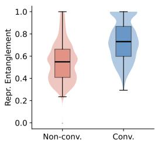  
(a) Llama3

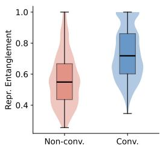  
(b) Llama3.1

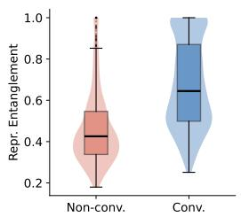  
(c) OLMo2

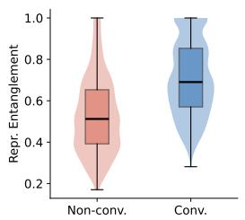  
(d) Tulu3

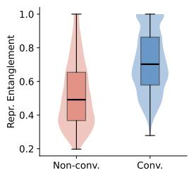  
(e) Tulu3.1  
Fig. 10: Representational entanglement score distributions for Known-1000 across all five models. Convergent tokenizations shown in blue, non-convergent in red.

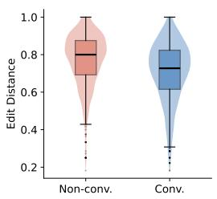  
(a) Llama3

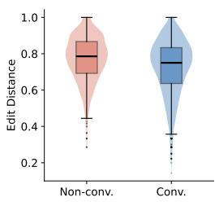  
(b) Llama3.1

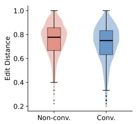  
(c) OLMo2

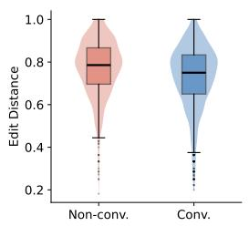  
(d) Tulu3

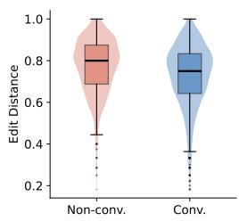  
(e) Tulu3.1  
Fig. 11: Edit distance score distributions for Known-1000 across all five models. Convergent tokenizations shown in blue, non-convergent in red.

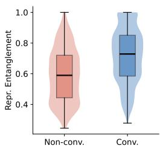  
(a) Llama3

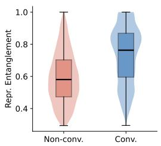  
(b) Llama3.1

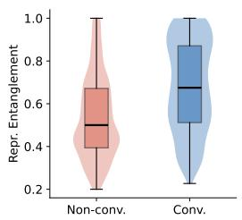  
(c) OLMo2

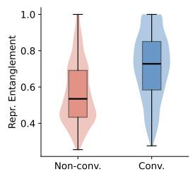  
(d) Tulu3

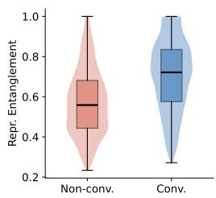  
(e) Tulu3.1  
Fig. 12: Representational entanglement score distributions for CounterFact across all five models.

  
(a) Llama3

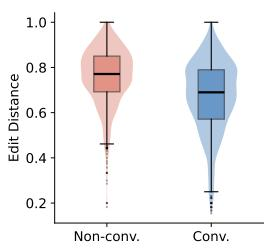  
(b) Llama3.1

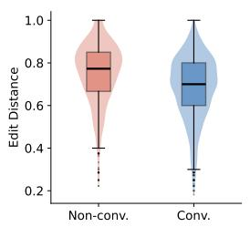  
(c) OLMo2

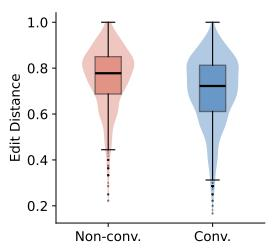  
(d) Tulu3

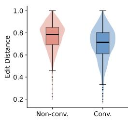  
(e) Tulu3.1  
Fig. 13: Edit distance score distributions for CounterFact across all five models.

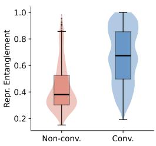  
(a) Llama3

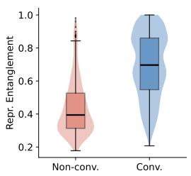  
(b) Llama3.1

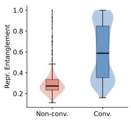  
(c) OLMo2

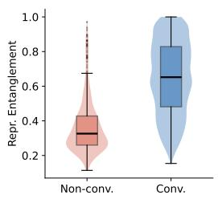  
(d) Tulu3

  
(e) Tulu3.1  
Fig. 14: Representational entanglement score distributions for Real Authors across all five models.

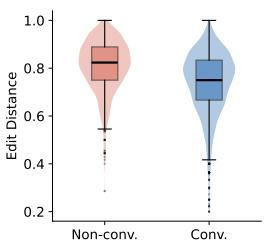  
(a) Llama3

  
(b) Llama3.1

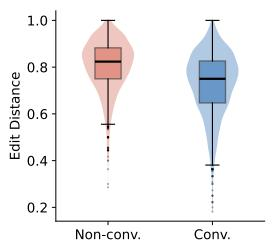  
(c) OLMo2

  
(d) Tulu3

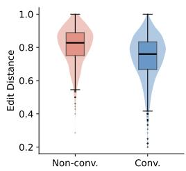  
(e) Tulu3.1

Fig. 15: Edit distance score distributions for Real Authors across all five models.  
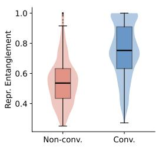  
(a) Llama3

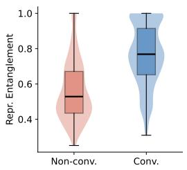  
(b) Llama3.1

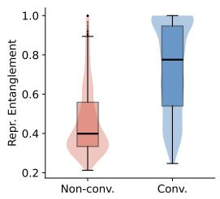  
(c) OLMo2

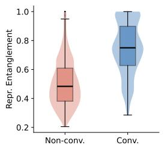  
(d) Tulu3

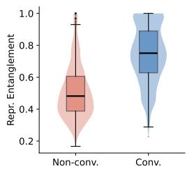  
(e) Tulu3.1

Fig. 16: Representational entanglement score distributions for MQuAKE across all five models.  
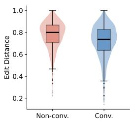  
(a) Llama3

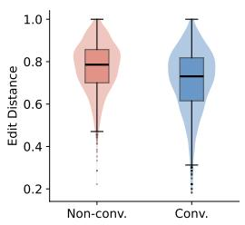  
(b) Llama3.1

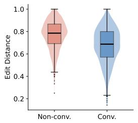  
(c) OLMo2

  
(d) Tulu3

  
(e) Tulu3.1

Fig. 17: Edit distance score distributions for MQuAKE across all five models.  
  
(a) Llama3

  
(b) Llama3.1

  
(c) OLMo2

  
(d) Tulu3

  
(e) Tulu3.1

Fig. 18: Representational entanglement score distributions for RippleEdits across all five models.  
  
(a) Llama3

  
(b) Llama3.1

  
(c) OLMo2

  
(d) Tulu3  
Fig. 19: Edit distance score distributions for RippleEdits across all five models.

  
(e) Tulu3.1

  
(a) Llama3

  
(b) Llama3.1

  
(c) OLMo2

  
(d) Tulu3

  
(e) Tulu3.1  
Fig. 20: Representational entanglement score distributions for World Facts across all five models.

  
(a) Llama3

  
(b) Llama3.1

  
(c) OLMo2

  
(d) Tulu3

  
(e) Tulu3.1  
Fig. 21: Edit distance score distributions for World Facts across all five models.

  
(a) Llama3

  
(b) Llama3.1

  
(c) OLMo2

  
(d) Tulu3

  
(e) Tulu3.1  
Fig. 22: ROC curves for Known-1000 across all five models. Representational entanglement (blue) vs. edit distance (red) Dashed line indicates random baseline.

  
(a) Llama3

  
(b) Llama3.1

  
(c) OLMo2  
Fig. 23: ROC curves for CounterFact across all five models.

  
(d) Tulu3

  
(e) Tulu3.1

  
(a) Llama3

  
(b) Llama3.1

  
(c) OLMo2

  
(d) Tulu3  
Fig. 24: ROC curves for Real Authors across all five models.  
(e) Tulu3.1

  
(a) Llama3

  
(b) Llama3.1

  
(c) OLMo2

  
(d) Tulu3  
Fig. 25: ROC curves for MQuAKE across all five models.


  
(a) Llama3

  
(b) Llama3.1

  
(c) OLMo2

  
(d) Tulu3  
Fig. 26: ROC curves for RippleEdits across all five models.


  
(a) Llama3

  
(b) Llama3.1  
(c) OLMo2

  
Fig. 27: ROC curves for World Facts across all five models.  
(d) Tulu3  
(e) Tulu3.1

  
(e) Tulu3.1


  
(e) Tulu3.1