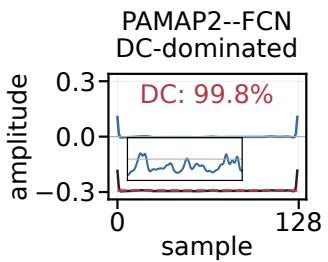
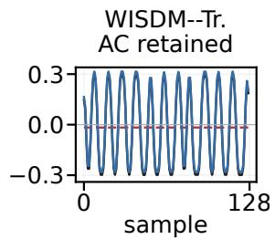
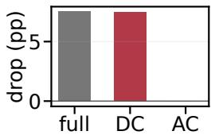
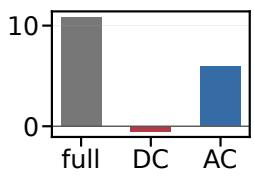
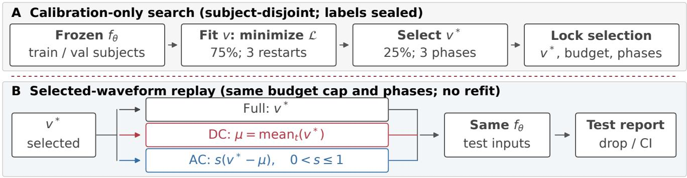
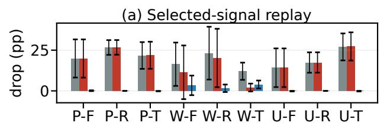
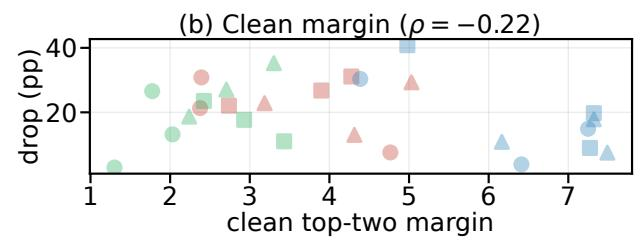
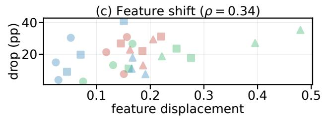
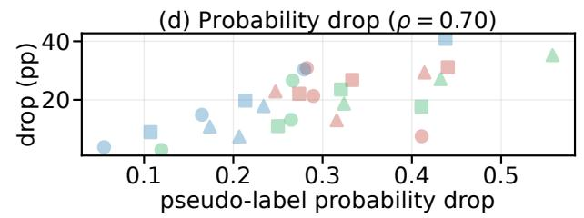

# WHEN TEMPORAL PERTURBATIONS ACT LIKE SENSOR BIASES: LABEL-FREE AUDITING OF WEARABLE ACTIVITY RECOGNIZERS

Qingyu Wu1,∗, Yuan Wei1,∗, Renju Liu2, and Hua Cheng1,†

1Defense Innovation Institute, Academy of Military Science, Beijing, China 2School of Software Engineering, South China University of Technology, Guangzhou, China ∗Equal contribution; †Corresponding author; Email: chenghua ams@163.com

## ABSTRACT

Wearable human-activity recognition (HAR) models operate across sensors, subjects, and backbones, yet a smooth waveform may appear temporal while exploiting primarily a persistent sensor offset. We introduce SpectrumAudit, a label-sealed audit that fits a phaserandomized full-window stimulus on calibration windows from subjects held out from training and testing. After selection, it replays its exact DC projection and budget-constrained zero-mean residual on the same frozen victim without refitting. Across 27 victims from three datasets and three backbones, the selected waveforms cause 2.87–40.83-point three-phase robust accuracy losses. Under this replay budget, DC is more damaging than AC on 24/27 victims and recovers at least 90% of the full drop on 22/27; all 5 failures occur on WISDM. In a held-out UTD-MHAD check, the selected waveform causes 13.49-pp accuracy and 11.68-pp macro-F1 losses, versus −0.66 pp for matched random changes. The audit diagnoses offset versus zero-mean variation under a common peak-budget cap. The code will be released upon acceptance.

Index Terms— human activity recognition, wearable sensing, adversarial robustness, universal perturbation, spectral audit

## 1. INTRODUCTION

Wearable human-activity recognition (HAR) underpins mobile health, assistive technology, and context-aware systems. Its reliability depends on sensor modality, subject composition, and deployment protocol [1]. Recent self-supervised and lightweight architectures improve transfer and label efficiency [2, 3, 4, 5]. Sensor–language and wearable foundation models extend this line of work to broader interfaces [6, 7]. Yet a perturbation-induced failure may reflect the learned representation, input normalization, or evaluation protocol rather than a temporal mechanism.

Adversarial perturbations offer controlled probes of these dependencies. Prior work covers per-example and universal attacks, targeted objectives, smooth parameterizations, and black-box search [8, 9, 10, 11, 12]. In wearable and biosignal systems, attack behavior likewise depends on the sensing modality and access model, spanning inertial wearables, Wi-Fi sensing, and EEG systems [13, 14, 15, 16]. Attack success alone, however, does not reveal which waveform component produces the failure. A smooth stimulus that survives phase shifts may therefore appear temporal even when most of its effect comes from a persistent offset.

We ask whether a selected waveform acts through a persistent offset or time-varying content. A separately optimized constant control can establish that an offset is harmful, but cannot show that the selected full waveform derives its effect from that offset. Conversely,

## full DC AC

  
Fig. 1. Component-wise replay for smooth waveforms. (a) Illustrative channels from selected PAMAP2 and WISDM waveforms, shown with their temporal means and zero-mean residuals. The PAMAP2 trace is nearly flat (99.8% DC energy); its residual inset uses native amplitudes over samples 2–125. (b) Worst-phase accuracy drops when the full waveform, its exact DC component, or its budget-constrained AC residual is replayed on all channels. Both signals are smooth, but their dominant components differ.

removing the temporal mean before optimization would preclude testing whether that component matters. We separate selection from diagnosis: a waveform is selected on unlabeled calibration windows from held-out subjects, then its exact DC component and budgetconstrained zero-mean residual are replayed on the same frozen victim without refitting. Figure 1 illustrates the distinction: signals with similar smooth appearance can have different dominant components.

Our contributions are threefold. First, we establish a labelsealed, subject-disjoint audit spanning three datasets, three backbone families, and three independent victim seeds per setting. Second, we introduce a select-then-project test for assessing whether a selected failure is carried by a persistent offset or zero-mean temporal content. Third, we pair the diagnostic with matched objective and access controls and exploratory victim-level analyses. Together, these choices separate component-level diagnosis from both attack strength and between-victim variation.

## 2. RELATED WORK

Research on wearable HAR has expanded from task-specific convolutional and recurrent classifiers to compact Transformers, selfsupervised encoders, and cross-dataset learners [17, 18, 2, 3]. Largescale pretraining and foundation encoders further extend transfer across sensors and model families [4, 5, 6, 7]. This diversity makes a single-checkpoint evaluation inadequate. We therefore span three task-trained backbone families. TimesFM is designed for forecasting, whereas MOMENT is a general time-series encoder; neither supplies native HAR logits without downstream adaptation [19, 20]. Evaluating either as a victim would require a pre-specified HAR adapter and training policy; our claims do not extend to adapted foundation models.

Time-series attacks include universal and per-example constructions, targeted and untargeted objectives, smooth waveform parameterizations, and black-box search [8, 9, 10, 11, 12]. Wearable and related biosignal settings add modality-specific constraints, spanning inertial HAR, mmWave and Wi-Fi sensing, and EEG [13, 14, 15, 16]. These studies are not directly commensurate because victim access, supervision, perturbation budget, and phase protocol vary. Accordingly, we adapt their objective and access principles to a common HAR protocol and use the resulting controls to compare protocol conditions rather than to rank published systems.

What remains unresolved is whether a selected waveform’s temporal mean or zero-mean variation carries its effect. Our labelsealed, subject-disjoint audit addresses this question by replaying both components after selection on each victim.

## 3. LABEL-SEALED AUDIT

Overview. Figure 2 summarizes the two-stage audit: selection precedes attribution. A frozen victim guides waveform fitting and selection on unlabeled calibration windows; the locked waveform is then replayed on that victim in full and after DC/AC projection.

## 3.1. Threat model and protocol

Let a frozen classifier return logits ℓ(x) and features $h ( x )$ for a standardized window $\boldsymbol { x } ~ \in ~ \mathbb { R } ^ { C \times T }$ We consider an auditor that receives unlabeled windows from held-out subjects; labels remain sealed for the audit, pseudo-label, and transfer controls. We include label-aware smooth UAP only as a privileged diagnostic; it is outside the admissible label-free audit. We set $T = 1 2 8$ and constrain every waveform by $\| v \| _ { \infty } \le \epsilon = 0 . 3 0$ in training-standarddeviation units. Victim training uses a subject-disjoint validation split; the calibration windows are split 75/25 for optimization and unlabeled selection; this is a window-level holdout, and final test subjects remain separate. Victims are trained with Adam (learning rate $1 0 ^ { - 3 }$ , weight decay $1 0 ^ { - 4 } )$ for at most 40 epochs, with early stopping after six stale validation epochs. Per-channel rawunit allowances are 0.10–7.32 (PAMAP2), 1.46–2.11 (WISDM), and 0.09–15.89 (USC-HAD); differing units preclude perceptual or physical realizability claims.

The audit assumes a frozen differentiable HAR classifier with activity logits and an intermediate representation. We evaluate PAMAP2 [21], WISDM [22], and USC-HAD [23], each paired with an FCN, a residual CNN, and a patch Transformer. Each of the nine dataset–backbone settings has three independently trained victim seeds, giving 27 victims. Three-phase robust drop is the minimum over shifts 0, 42, and 85, not all 128. Mainline cells summarize three seeds; Table 1 uses one per cell.

## 3.2. Probes and objectives

For each victim, the full-window probe optimizes $v \in \mathbb { R } ^ { C \times T }$ with two sample-domain low-pass passes; their physical cutoffs therefore vary with the dataset sampling rate. During fitting, each window receives a random circular shift, $x _ { \phi } = x + \mathrm { r o l l } _ { \phi } ( v )$ . We retain DC during search so that failures due to a persistent offset remain observable. After selection, we assess component dominance by replaying the exact DC component of the frozen waveform and budget-constrained zero-mean residual. With clean pseudo-labels ${ \hat { y } } = \arg \operatorname* { m a x } _ { j } \ell _ { j } ( x )$ , the label-free objective is

$$
\begin{array} { r l } & { \mathcal { L } ( v ) = - \operatorname { C E } ( \ell ( x _ { \phi } ) , \hat { y } ) - \lambda _ { h } d _ { \cos } ( h ( x ) , h ( x _ { \phi } ) ) } \\ & { ~ - \lambda _ { J } \operatorname { J S } ( p , p _ { \phi } ) + \lambda _ { T V } \operatorname { T V } ( v ) , } \end{array}\tag{1}
$$

where $d _ { \mathrm { c o s } }$ is one minus cosine similarity; p and $p _ { \phi }$ denote the clean and attacked softmax distributions. We set $( \lambda _ { h } , \lambda _ { J } , \lambda _ { T V } ) =$ $( 1 , 0 . 2 5 , 0 . 1 0 )$ . The unlabeled selector maximizes $J _ { \mathrm { m i n } } + 0 . 2 5 \bar { J } +$ $0 . 1 0 C _ { \mathrm { m i n } } \ + \ 0 . 0 2 5 \bar { C } \ + \ 0 . 0 5 \operatorname* { m a x } ( D _ { \mathrm { m i n } } , 0 )$ across checkpoints and restarts; J, C, and D denote phase-wise JS divergence, prediction-change rate, and clean-pseudo-label probability drop (subscripts/overbars: phase minimum/mean). The constant control learns one bounded value per channel; zero-mean AC uses eight ratealigned Fourier components at 0.5–8 Hz. Smoothness constrains the probe but does not establish a temporal mechanism.

After selection, we decompose each full-window waveform without refitting or reselection. Its exact DC projection is the perchannel temporal mean, $\begin{array} { r } { { v } _ { \mathrm { D C } } = { T } ^ { - 1 } \sum _ { t } { v } _ { t } , } \end{array}$ , and its AC residual is $v _ { \mathrm { A C } } = v - v _ { \mathrm { D C } }$ . If cancellation in v makes $\| v _ { \mathrm { A C } } \| _ { \infty } > \epsilon .$ , only the residual is scaled down to the original budget; its temporal mean remains zero. Replaying the full signal, exact DC, and budgetconstrained AC on the same frozen victim provides a within-victim test of whether the selected stimulus relies on persistent or timevarying content. We predefine DC dominance as $\Delta _ { \mathrm { D C } } > \Delta _ { \mathrm { A C } }$ and 90% recovery as $\Delta _ { \mathrm { D C } } \geq 0 . 9 \Delta _ { \mathrm { f u l l } }$ under the worst phase.

## 3.3. Matched comparison controls

All controls share the subject split, $\ell _ { \infty }$ budget, and three-phase test metric, while their waveform parameterizations and model access differ. Each target-model full-window search uses three paired Adam restarts (learning rate 0.03, batch size 256, 600 updates) with checkpoints every 50 updates. Pairing fixes probe initialization, minibatch order, and phase sequence; the label-aware row also uses a label-based selection score. The independently optimized constant and Fourier AC controls use their own parameterizations: constant runs for 350 updates with restart-level selection; AC runs for 600 updates with 50-step selection. Constant uses the audit objective, whereas AC uses pseudo-label CE. Auxiliary-ensemble transfer fits and selects on source models only; random universal is unfitted. The literature-derived rows are protocol-matched adaptations, not reproductions.

Random universal uses no victim logits. Pseudo-label UAP– CE removes the representation and JS terms, adapting Rathore et al. [9] to the common smooth parameterization [10]. Label-aware smooth UAP uses calibration labels for fitting and selection, outside the admissible audit; this row does not isolate label use during fitting alone. Auxiliary-ensemble transfer trains on the two non-target backbones, adapting Huang et al. [24], and uses the target only at evaluation. Test labels remain sealed until every candidate is frozen. Table 1 contrasts these objective and access choices under the common protocol.

  
Fig. 2. Select-then-project protocol. (A) A frozen victim guides fitting on 75% of unlabeled calibration windows and selection on the remaining 25% within the held-out calibration subjects. (B) After selection is locked, three separate branches replay full, exact DC, and zero-mean AC on the same victim; s only reduces AC to the original budget constraint. Test labels are used only for the final report.

## 4. EVALUATION

We first isolate objective and access effects with paired target-model searches and matched controls. We then characterize victim variation before attributing selected failures to waveform components.

## 4.1. Matched objective and access controls

The first question is whether the representation and distribution terms change attack strength under paired search trajectories. Table 1 reports a nine-setting development grid with one fixed victim per dataset–backbone cell; it is not a population estimate. Each paired search shares the probe initialization, minibatch order, and phase sequence, while the auxiliary-transfer row withholds the target checkpoint during fitting.

On this development grid, the representation-aware and pseudolabel objectives yield mean drops of 23.98 and 23.94 pp, respectively, with a 3/3/3 ours/pseudo/tie split (p = 0.938). The other rows provide no-model, label-aware, and source-only reference points. Across 27 victims, the paired search yields 20.18± 8.84 pp for the proposed objective and 20.11±9.20 pp for UAP–CE (12/8/ 7 wins/losses/ties; cluster sign-flip p = 0.797). The paired difference (ours minus UAP–CE) is +0.07 pp (95% setting-cluster bootstrap CI [−0.69, 0.72]). These results do not establish an attack-strength advantage; the mechanism claim is instead tested by post-selection component replay.

Table 1. Matched controls on nine development settings (one fixed victim per dataset–backbone cell; mean±SD across cells). Literature-derived rows are protocol-matched adaptations, not reproductions of published rates. “target” means the frozen target checkpoint is used during fitting; “source” means only the two non-target backbones are used; “target+Y” uses calibration labels in fitting and selection. Drops are in percentage points; Y denotes calibration labels.
<table><tr><td>Method</td><td>Access</td><td>Drop (pp)</td></tr><tr><td>Random universal</td><td>none</td><td>-0.08±0.29</td></tr><tr><td>Pseudo-label UAP-CE [9]</td><td>target</td><td>23.94±9.16</td></tr><tr><td>Label-aware smooth UAP [10]</td><td>target+Y</td><td>15.99±8.45</td></tr><tr><td>Auxiliary-ensemble transfer [24]</td><td>source</td><td>21.46±9.93</td></tr><tr><td>SpectrumAudit (ours)</td><td>target</td><td>23.98±8.10</td></tr></table>

## 4.2. Across-victim variation

We next ask how the full-window effect varies across 27 victims before attributing losses to waveform components. Table 2 reports a separate mainline search and independently optimized constant and zero-mean controls. Across individual victims, the three-phase robust accuracy drop spans 2.87–40.83 percentage points. Robust macro-F1 also decreases on all 27 victims, spanning 5.71–35.86 percentage points, so the effect is not confined to accuracy. All 27 clean checkpoints exceed the test-set majority-class baseline (13.2%, 36.1%, and 19.8% for PAMAP2, WISDM, and USC-HAD), although USC-HAD mean clean accuracy is 46.8–49.4% across backbones. These data do not support an architecture ranking: the Transformer drop changes from 27.0 pp on USC-HAD to 12.1 pp on WISDM.

Panels 3(b)–(d) relate this variation to victim diagnostics. Feature displacement shows a weaker unadjusted trend than pseudolabel probability drop. Fixed-effect regressions estimate positive coefficients for both post-intervention quantities (HC3 $p < 0 . 0 0 4 )$ , but not for clean margin or input-gradient norm. These analyses are exploratory and non-causal. The dataset–backbone interaction is not significant $( p = 0 . 4 7 5 )$ ; the cell differences do not justify a claim of intrinsic Transformer robustness. We treat each victim seed as a replication within its dataset–backbone cell and keep the conclusion at the level of audit behavior.

As a check beyond the three-dataset benchmark, we repeat the label-sealed search on one FCN victim trained on UTD-MHAD [25] and evaluate held-out subjects 7–8. The selected waveform causes a 13.49-pp three-phase robust accuracy drop and an 11.68-pp macro-F1 drop, whereas a matched random waveform changes accuracy by −0.66 pp. We treat this single result as a three-phase protocol check rather than a population estimate.

## 4.3. Component-level attribution

We finally replay each selected waveform without further optimization to determine which component retains the effect under the common perturbation budget. Post-selection replays yield larger DC than AC drops on 24/27 victims (9/9 on PAMAP2 and USC-HAD; 6/9 on WISDM) and at least 90% recovery on 22/27; all five recovery failures occur on WISDM, including all three Transformer seeds. Among the independently optimized controls, the constant control exceeds AC on 21/27 victims and 9/9 cell means. The pairedobjective replications show the same pattern: larger DC than AC drops on 24/27 and at least 90% recovery on 21/27 for each objective. The mainline AC residual requires budget scaling on 14/27 victims, so these are budget-constrained replays, not an equal-energy comparison or an additive attribution of loss. An equal-peak-budget DC+AC composite averages 10.26±6.45 pp across phases. Relative to the larger isolated component, its phase-averaged drop is higher on 7 settings and lower on 2 settings. Across the nine cell means, the DC–AC three-phase robust-drop difference is 16.95 pp (95% settingcluster bootstrap CI [10.86, 22.06]; cluster sign-flip $p = 0 . 0 0 7 8 )$ We report this cell-weighted summary as a secondary check; the primary evidence remains the victim-level replay counts.

Table 2. Mainline and independently optimized controls on 27 frozen victims $( \epsilon = 0 . 3 0 ) $ ; full-window, Const., $\mathbf { A C } ,$ and $\Delta _ { F - C }$ entries are mean±sample SD over three seeds, whereas Clean is the three-seed mean; accuracy drops are in percentage points. Const. and AC are independently optimized mechanism controls, not matched attack rankings or post-selection projections. $\Delta { } _ { F - C }$ is full minus constant in three-phase worst-case drop; $\mathrm { C } { > } \mathrm { A C }$ counts constant wins over AC.
<table><tr><td>Dataset</td><td>Victim</td><td>Clean (%)</td><td>Full-window</td><td>Const. ctrl.</td><td>AC ctrl.</td><td> $\Delta _ { F - C }$ </td><td> $\mathrm { C } { > } \mathrm { A C }$ </td></tr><tr><td>PAMAP2</td><td>FCN</td><td>60.7</td><td> $1 9 . 9 { \pm } 1 1 . 7 $ </td><td> $2 1 . 8 { \pm } 9 . 2 $ </td><td> $1 . 1 { \pm } 2 . 0 $ </td><td> $- 1 . 9 { \pm } 2 . 8 $ </td><td>3/3</td></tr><tr><td>PAMAP2</td><td>ResCNN</td><td>58.0</td><td> $2 6 . 6 { \pm } 4 . 5 $ </td><td> $2 6 . 1 { \pm } 4 . 7$ </td><td> $2 . 5 { \pm } 2 . 4 $ </td><td> $0 . 6 { \pm } 1 . 4 $ </td><td>3/3</td></tr><tr><td>PAMAP2</td><td>Tr.</td><td>64.3</td><td> $2 1 . 7 { \pm } 8 . 2 $ </td><td> $2 3 . 2 { \pm } 9 . 1 $ </td><td> $4 . 7 { \pm } 4 . 1$ </td><td> $- 1 . 5 { \pm } 1 . 1$ </td><td>3/3</td></tr><tr><td>WISDM</td><td>FCN</td><td>91.6</td><td> $1 6 . 4 { \pm } 1 3 . 3 $ </td><td> $1 4 . 2 { \pm } 1 4 . 2 $ </td><td> $1 2 . 9 { \pm } 7 . 8 $ </td><td> $2 . 1 { \pm } 3 . 8 $ </td><td>1/3</td></tr><tr><td>WISDM</td><td>ResCNN</td><td>91.0</td><td> $2 3 . 2 { \pm } 1 6 . 2$ </td><td> $2 1 . 1 { \pm } 1 7 . 4 $ </td><td> $1 4 . 8 { \pm } 0 . 4 $ </td><td> $2 . 1 \pm 3 . 9$ </td><td>1/3</td></tr><tr><td>WISDM</td><td>Tr.</td><td>85.3</td><td> $1 2 . 1 { \pm } 5 . 3 $ </td><td> $1 5 . 0 { \pm } 9 . 3 $ </td><td> $9 . 1 { \pm } 5 . 1 $ </td><td> $- 3 . 0 { \pm } 1 3 . 4 $ </td><td>1/3</td></tr><tr><td>USC-HAD</td><td>FCN</td><td>47.8</td><td> $1 4 . 2 { \pm } 1 1 . 9$ </td><td> $1 4 . 5 { \pm } 1 1 . 8 $ </td><td> $2 . 3 { \pm } 1 . 6 $ </td><td> $- 0 . 3 { \pm } 0 . 5 $ </td><td>3/3</td></tr><tr><td>USC-HAD</td><td>ResCNN</td><td>46.8</td><td> $1 7 . 4 { \pm } 6 . 3 $ </td><td> $1 9 . 8 { \pm } 3 . 4 $ </td><td> $5 . 9 { \pm } 1 . 2 $ </td><td> $- 2 . 4 \pm 3 . 9$ </td><td>3/3</td></tr><tr><td>USC-HAD</td><td>Tr.</td><td>49.4</td><td> $2 7 . 0 { \pm } 8 . 3 $ </td><td> $1 7 . 0 { \pm } 4 . 1$ </td><td> $1 . 8 { \pm } 2 . 7$ </td><td> $1 0 . 0 { \pm } 1 1 . 8 $ </td><td>3/3</td></tr></table>

  
Fig. 3. Component replay and exploratory diagnostics for 27 frozen victims. (a) Replays of the same selected waveform: mean±sample SD over three victim seeds per setting. DC exceeds AC on 24/27 victims and recovers at least 90% of the full drop on 22/27. AC is scaled down to budget on 14/27 victims. (b)–(d) Each marker is one victim seed; colors and shapes encode the dataset and backbone, respectively (see legend). All drops are three-phase worst-case accuracy losses in percentage points. $\rho$ is the unadjusted Spearman correlation, not a causal effect.

sults: DC here denotes a constant component in standardized model input, not an identified physical sensor bias.

As a phase-alignment check, we also replayed the 27 selected full waveforms at all 128 circular shifts. Relative to the all-shift minimum, the three-phase minimum is higher by 0.31 pp on average and 1.59 pp at most. The component counts remain three-phase re-

## 5. CONCLUSION

Across the evaluated task-trained HAR victims, component replays indicate that selected failures are usually DC-dominated rather than carried by zero-mean variation under the tested phases and peak budget. The broader lesson is that a smooth, phase-robust perturbation should not be interpreted as temporal evidence without componentmatched replay; the select-then-project audit provides a label-sealed way to make that distinction. The present protocol targets differentiable, task-trained victims and sample-domain smoothness, while physical sensing, black-box transfer, and foundation-model backbones remain natural next steps.

## Compliance with Ethical Standards

We use public wearable-sensor datasets; no new human or animal data. OpenAI GPT-5.6 assisted with language polishing, parts of the experimental code, and figure-generation/layout support; the authors take full responsibility for independently checking text, citations, figures, code, permissions, and LLM-use policy compliance.

## 6. REFERENCES

[1] Harish Haresamudram, Chi Ian Tang, Sungho Suh, Paul Lukowicz, and Thomas Plotz, “Past, present, and future of¨ sensor-based human activity recognition using wearables: A surveying tutorial on a still challenging task,” Proc. ACM Interact. Mob. Wearable Ubiquitous Technol., vol. 9, no. 2, pp. 1–44, 2025.

[2] Aleksej Logacjov, “Self-supervised learning for accelerometer-based human activity recognition: A survey,” Proc. ACM Interact. Mob. Wearable Ubiquitous Technol., vol. 8, no. 4, pp. 1–42, 2024.

[3] Zhiqing Hong, Zelong Li, Shuxin Zhong, Wenjun Lyu, Haotian Wang, Yi Ding, Tian He, and Desheng Zhang, “CrossHAR: Generalizing cross-dataset human activity recognition via hierarchical self-supervised pretraining,” Proc. ACM Interact. Mob. Wearable Ubiquitous Technol., vol. 8, no. 2, pp. 1–26, 2024.

[4] Hang Yuan, Shing Chan, Andrew P. Creagh, Catherine Tong, Aidan Acquah, David A. Clifton, and Aiden Doherty, “Selfsupervised learning for human activity recognition using 700,000 person-days of wearable data,” npj Digital Medicine, vol. 7, no. 1, 2024.

[5] Minghui Yao, Lei Zhang, Dongzhou Cheng, Hao Wu, and Aiguo Song, “WaveHAR: Learning wavelet representation for wearable human activity recognition,” IEEE Transactions on Instrumentation and Measurement, vol. 74, pp. 1–14, 2025.

[6] Minghui Qiu, Cekai Weng, Mingming Fan, and Kaishun Wu, “Towards customizable foundation models for human activity recognition with wearable devices,” Proc. ACM Interact. Mob. Wearable Ubiquitous Technol., vol. 9, no. 3, pp. 1–29, 2025.

[7] Yuwei Zhang, Kumar Ayush, Siyuan Qiao, A. Ali Heydari, Girish Narayanswamy, Maxwell A. Xu, Ahmed A. Metwally, Jinhua Xu, Jake Garrison, Xuhai Xu, Tim Althoff, Yun Liu, Pushmeet Kohli, Jiening Zhan, Mark Malhotra, Shwetak Patel, Cecilia Mascolo, Xin Liu, Daniel McDuff, and Yuzhe Yang, “SensorLM: Learning the language of wearable sensors,” in Advances in Neural Information Processing Systems, 2025, vol. 38, NeurIPS 2025.

[8] Hassan Ismail Fawaz, Germain Forestier, Jonathan Weber, Lhassane Idoumghar, and Pierre-Alain Muller, “Adversarial attacks on deep neural networks for time series classification,” in Proc. Int. Joint Conf. Neural Networks (IJCNN), 2019, pp. 1–8.

[9] Pradeep Rathore, Arghya Basak, Sri Harsha Nistala, and Venkataramana Runkana, “Untargeted, targeted and universal adversarial attacks and defenses on time series,” in Proc. Int. Joint Conf. Neural Networks (IJCNN), 2020, pp. 1–8.

[10] Gautier Pialla, Hassan Ismail Fawaz, Maxime Devanne, Jonathan Weber, Lhassane Idoumghar, Pierre-Alain Muller, Christoph Bergmeir, Daniel Schmidt, Geoffrey Webb, and Germain Forestier, “Smooth perturbations for time series adversarial attacks,” in Advances in Knowledge Discovery and Data Mining, 2022, pp. 485–496.

[11] Gautier Pialla, Hassan Ismail Fawaz, Maxime Devanne, Jonathan Weber, Lhassane Idoumghar, Pierre-Alain Muller,¨

Christoph Bergmeir, Daniel F. Schmidt, Geoffrey I. Webb, and Germain Forestier, “Time series adversarial attacks: An investigation of smooth perturbations and defense approaches,” International Journal of Data Science and Analytics, vol. 19, no. 1, pp. 129–139, 2025.

[12] Daizong Ding, Mi Zhang, Fuli Feng, Yuanmin Huang, Erling Jiang, and Min Kyu Yang, “Black-box adversarial attack on time series classification,” in Proceedings of the AAAI Conference on Artificial Intelligence, 2023, vol. 37, pp. 7358–7368.

[13] Ramesh Kumar Sah and Hassan Ghasemzadeh, “Adar: Adversarial activity recognition in wearables,” in 2019 IEEE/ACM International Conference on Computer-Aided Design (IC-CAD), 2019, pp. 1–8.

[14] Yucheng Xie, Ruizhe Jiang, Xiaonan Guo, Yan Wang, Jerry Cheng, and Yingying Chen, “Universal targeted adversarial attacks against mmWave-based human activity recognition,” in IEEE INFOCOM 2023–IEEE Conference on Computer Communications, 2023, pp. 1–10.

[15] Byungjun Kim, Amogh Panchagatti, and Peter Gerstoft, “Realtime adversarial attack to deep learning-based Wi-Fi human activity recognition,” in Proc. IEEE Int. Conf. Acoust. Speech Signal Process. (ICASSP), 2025.

[16] Sheng-hua Zhong, Sijia Zhao, Zhijiao Xiao, Zhi Zhang, and Yan Liu, “Attention-guided universal adversarial perturbations for EEG-based brain–computer interfaces,” Expert Systems with Applications, vol. 268, pp. 126362, 2025.

[17] Yexu Zhou, Haibin Zhao, Yiran Huang, Till Riedel, Michael Hefenbrock, and Michael Beigl, “TinyHAR: A lightweight deep learning model designed for human activity recognition,” in Proc. ACM Int. Symp. Wearable Computers (ISWC), 2022, pp. 89–93.

[18] Harish Haresamudram, Irfan Essa, and Thomas Plotz, “As-¨ sessing the state of self-supervised human activity recognition using wearables,” Proc. ACM Interact. Mob. Wearable Ubiquitous Technol., vol. 6, no. 3, pp. 1–47, 2022.

[19] Abhimanyu Das, Weihao Kong, Rajat Sen, and Yichen Zhou, “A decoder-only foundation model for time-series forecasting,” in Proc. Int. Conf. Machine Learning (ICML). 2024, vol. 235 of Proc. Mach. Learn. Res., pp. 10148–10167, PMLR.

[20] Mononito Goswami, Konrad Szafer, Arjun Choudhry, Yifu Cai, Shuo Li, and Artur Dubrawski, “MOMENT: A family of open time-series foundation models,” in Proc. Int. Conf. Machine Learning (ICML). 2024, vol. 235 of Proc. Mach. Learn. Res., pp. 16115–16152, PMLR.

[21] Attila Reiss and Didier Stricker, “Introducing a new benchmarked dataset for activity monitoring,” in 2012 16th International Symposium on Wearable Computers, 2012, pp. 108–109.

[22] Jennifer R. Kwapisz, Gary M. Weiss, and Samuel A. Moore, “Activity recognition using cell phone accelerometers,” ACM SIGKDD Explorations Newsletter, pp. 74–82, 2011.

[23] Mi Zhang and Alexander A. Sawchuk, “USC-HAD: A daily activity dataset for ubiquitous activity recognition using wearable sensors,” in Proc. ACM Ubiquitous Computing, 2012, pp. 1036–1043.

[24] Lifeng Huang, Han Wang, Chen Wan, Zusheng Zhang, Shaojian Qiu, and Qiong Huang, “Improving transferability of datafree universal adversarial perturbations via auxiliary ensembles,” IEEE Trans. Multimedia, pp. 1–13, 2026.

[25] Chen Chen, Roozbeh Jafari, and Nasser Kehtarnavaz, “UTD-MHAD: A multimodal dataset for human action recognition utilizing a depth camera and a wearable inertial sensor,” in 2015 IEEE International Conference on Image Processing (ICIP), 2015, pp. 168–172.