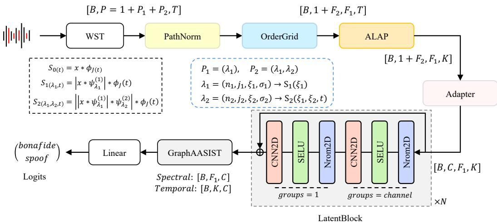

# WST-GRAPH: TOPOLOGY-PRESERVING WAVELET SCATTERING FRONT-END FOR SPEECH DEEPFAKE DETECTION

Kwok-Ho Ng, Tingting Song, Bingwen Feng, Zhihua Xia

College of Cyber Security, Jinan University, Guangzhou, China

## ABSTRACT

The acoustic front-end determines which forensic cues a speech deepfake detector can exploit. The wavelet scattering transform (WST) provides stable multiscale coefficients with explicit coordinates, yet direct flattening obscures the parent relation between paths. We introduce WST-Graph, reconstructing these paths as a sparse modulation-carrier grid for an AASIST graph backend. Modulation-level normalization and length-aware adaptive local attention pooling produce fixed relative-time representations while retaining the acoustic axes before learned adaptation. This yields a waveform-to-graph interface with a fixed, parameter-free WST. Our configurations remain competitive with AASIST while using approximately 60% fewer trainable parameters and show clear gains on selected out-of-domain benchmarks. These results underscore the value of preserving parent-child relations within the carrier–modulation topology when constructing a compact, physically grounded interface for graph-based speech deepfake detection. Code will be released at GitHub.

Index Terms— Wavelet scattering transform, Speech deepfake detection, Audio anti-spoofing.

## 1. INTRODUCTION

Recent speech synthesis and voice conversion systems generate increasingly natural speech [1, 2, 3], raising risks of impersonation, fraud, and disinformation [4] and motivating evaluation campaigns such as ASVspoof [5, 6, 7]. Speech deepfake detectors (SSD) can also degrade substantially under unseen generators and recording conditions [8]. Some recent state-of-the-art systems employ selfsupervised learning (SSL) front-ends to improve detection performance, but do so at the cost of substantially larger parameter counts [9]. Moreover, analyzing synthetic artifacts from SSL hidden states is challenging because they lack explicit acoustic coordinates.

Conventional anti-spoofing methods use inspectable magnitude, cepstral, and phase-derived features, including linear frequency cepstral coefficients (LFCC), constant Q cepstral coefficients (CQCC), and modified group delay [10, 11]. Raw waveform-based systems avoid prescribing a fixed hand-crafted spectrum. For example, the end-to-end system RawNet2 jointly learned its waveform encoder with the classifier [12]. The AASIST applied a parameterized Sinc-Net [13] and a residual convolutional encoder before constructing spectral and temporal graphs [14]. Its Sinc filters retain interpretable passbands, but the subsequent 2-D pooling and residual convolutions mix neighboring frequency-time responses and progressively reduce temporal resolution before graph construction. The resulting channels no longer carry explicit carrier or modulation-frequency coordinates. This motivates a front-end that delays feature fusion across distinct spatiotemporal pathways, thereby preserving explicit acoustic axes for graph processing and coordinate-aligned analysis.

To address this, the wavelet scattering transform (WST) presents a promising candidate [15, 16]. It cascades multiresolution wavelet filterbanks, complex modulus operators, and low-pass averaging filters to produce stable, locally translation-invariant multiscale coefficients. Specifically, first-order coefficients capture the averaged wavelet-modulus responses within carrier bands, while secondorder coefficients characterize the temporal modulations of the corresponding first-order envelopes [16, 17]. Crucially, because every second-order path remains explicitly linked to its parent carrier band, the WST inherently preserves a structured carrier-modulation organization before any learned channel mixing.

Recently, WST-X integrated scattering features with SSL representations [18]. Specifically, its 1-D variant (WST-X1) globally pools 1-D scattering coefficients, whereas its 2-D variant (WST-X2) spatially flattens a 2-D scattering tensor computed from SSL feature maps. In contrast, we retain the internal topology of 1-D scattering to serve as an explicit, structured interface for graph-based backends.

To this end, we propose the WST-Graph front-end. First, utilizing the parent relation inherent in WST metadata, we group second-order paths by modulation band and align them according to their parent carrier bands. This constructs a sparse joint modulationcarrier grid without prematurely averaging away valid second-order coefficients. Within this grid, first-order coefficients occupy a dedicated channel, and a fixed binary mask identifies structurally absent path combinations. Second, modulation-level normalization standardizes paths sharing the same modulation band. Within this stage, length-aware channel-wise adaptive local attention pooling (ALAP) segments each valid temporal trajectory into a fixed number of relative-time intervals, pooling every channel-carrier pair independently within each interval. A pointwise adapter then introduces the initial cross-order and cross-modulation fusion exclusively at the same carrier-time coordinate. Following this, three depthwiseseparable residual blocks model local carrier-time contexts while preserving the latent grid dimensions, ensuring compatibility with AASIST-style graph backends. We deploy the spectro-temporal graph architecture of AASIST as a concrete backend to model global interactions between the carrier and relative-time nodes. Third, we conduct a three-seed empirical study of the scattering scale and firstorder filterbank resolution, together with a controlled comparison of second-order modulation-filter resolution.

## 2. PROPOSED METHODS

## 2.1. Scattering Paths and Path Normalization

Let $x _ { b } ( t )$ denote the b-th waveform. The first two orders of a one-dimensional WST are $S _ { b } ^ { ( 1 ) } ( \lambda _ { 1 } , t ) = ( | x _ { b } * \psi _ { \lambda _ { 1 } } | * \phi _ { J } ) ( t )$ and $S _ { b } ^ { ( 2 ) } ( \lambda _ { 1 } , \lambda _ { 2 } , t ) \ : = \ : ( \vert \vert x _ { b } \ast \psi _ { \lambda _ { 1 } } \vert \ast \psi _ { \lambda _ { 2 } } \vert \ast \phi _ { J } ) ( t )$ , obtained by cascading complex Morlet convolutions, modulus nonlinearities, and low-pass averaging. Here, $\lambda _ { i }$ indexes the wavelet applied at layer i.

  
Fig. 1. Overview of the proposed WST-Graph pipeline. GraphAASIST follows the graph backbone of the original AASIST architecture.

Kymatio [19] provides its discrete index $n _ { i } ,$ scale $j _ { i } ,$ , and normalized center-frequency coordinate $\xi _ { i }$ . Thus, a first-order path carries $( n _ { 1 } , j _ { 1 } , \xi _ { 1 } )$ , while a second-order key $( n _ { 1 } , n _ { 2 } )$ maps to $( \xi _ { 1 } , \xi _ { 2 } )$ where $\xi _ { 1 }$ identifies the parent carrier and $\xi _ { 2 }$ its envelope-modulation frequency.

We discard the zeroth-order low-pass component and stack all admissible first- and second-order coefficients along Kymatio’s path axis. This gives a flat-path tensor $\textbf { S } \in \ \mathbb { R } ^ { B \times \breve { P } \times \vec { T } }$ , where ${ \bar { P } } = P _ { 1 } + P _ { 2 }$ , and $P _ { 1 }$ and $P _ { 2 }$ denote the numbers of retained firstand second-order paths, respectively. Before OrderGrid recovers the carrier–modulation topology described above, PathNorm maps the non-negative scattering amplitudes to the log domain to compress their dynamic range,

$$
X _ { b , p , t } = \log \left( S _ { b , p , t } + \epsilon \right) .\tag{1}
$$

Let $L _ { b } \ \leq \ T$ be the effective number of valid WST frames for the b-th training utterance, excluding temporal padding. For a designated statistics aggregation group g, we define its valid support domain $\Omega _ { g } = \{ ( b , p , t ) : g ( p ) = \bar { g } , 0 \leq t < L _ { b } \}$ and the corresponding sample count $N _ { g } = | \Omega _ { g } |$ . PathNorm estimates the groupspecific mean and standard deviation, respectively:

$$
\mu _ { g } = \frac { 1 } { N _ { g } } \sum _ { ( b , p , t ) \in \Omega _ { g } } X _ { b , p , t } ,\tag{2}
$$

$$
\sigma _ { g } = \sqrt { \operatorname* { m a x } \left( \frac { 1 } { N _ { g } } \sum _ { ( b , p , t ) \in \Omega _ { g } } X _ { b , p , t } ^ { 2 } - \mu _ { g } ^ { 2 } , 0 \right) } .\tag{3}
$$

The normalized scattering paths are subsequently obtained by:

$$
Z _ { b , p , t } = \frac { X _ { b , p , t } - \mu _ { g ( p ) } } { \operatorname* { m a x } ( \sigma _ { g ( p ) } , \sigma _ { \mathrm { m i n } } ) + \epsilon } ,\tag{4}
$$

where $\sigma _ { \mathrm { m i n } }$ enforces a strict lower bound on the scaling factor. We consider three distinct group assignment policies:

$$
l o g . p a t h ( g _ { \mathrm { p a t h } } ( p ) = p ) , l o g . o r d e r ( g _ { \mathrm { o r d e r } } ( p ) = o ( p ) ) ,\tag{5}
$$

and log modulation, defined as:

$$
g _ { \mathrm { m o d } } ( p ) = \{ 0 , \qquad o ( p ) = 1 , \qquad\tag{6}
$$

The log modulation policy groups first-order paths together and second-order paths by $n _ { 2 } .$ , standardizing each group while preserving its carrier-dependent variation. We also evaluate two baselines: log only, which bypasses standardization $( \mathbf { Z } \ = \ \mathbf { X } )$ , and none, which further omits the log transform $( \mathbf { Z } = \mathbf { S } )$ . Crucially, the effective length $L _ { b }$ isolates padded frames exclusively during training statistics estimation; a subsequent temporal mask prevents them from contaminating the ALAP operation. Because structurally absent cells are introduced only during grid mapping (OrderGrid), a topology mask is omitted at this stage, and every policy strictly preserves the $B \times P \times T$ tensor shape.

## 2.2. Topology Recovery via OrderGrid

The joint second-order scattering transform is not a full Cartesian product of all first- and second-order wavelets. For the temporal scattering implementation considered here, the Kymatio retains an ordered scattering path if and only if the dyadic scales satisfy $j _ { 1 } ( n _ { 1 } ) <$ $j _ { 2 } ( n _ { 2 } )$ . Consequently, the admissible path set $A = \left\{ ( n _ { 1 } , n _ { 2 } ) \right.$ $j _ { 1 } ( n _ { 1 } ) \ < \ j _ { 2 } ( n _ { 2 } ) \}$ is inherently sparse. For every retained path, Kymatio metadata supplies its scattering order, discrete filter keys, dyadic scale, and center-frequency coordinate. To robustly reconstruct the topology, OrderGrid aligns paths using these discrete keys. Let $f \in \{ 1 , \ldots , F _ { 1 } \}$ index the first-order keys $n _ { 1 } ( f )$ sorted by increasing center frequency $\xi _ { 1 } ,$ , and let $m \in \{ 1 , \ldots , F _ { 2 } \}$ index the unique second-order keys n2(m) sorted by increasing $\xi _ { 2 } .$ . Let $\pi _ { 1 } ( f )$ and the partial map $\pi _ { 2 } ( m , f )$ retrieve the corresponding indices on the flat path axis $\{ 1 , \ldots , P _ { 1 } \}$ }, with $\pi _ { 2 } ( m , f )$ defined only when $( n _ { 1 } ( f ) , n _ { 2 } ( m ) ) \in { \mathcal { A } } .$

The normalized scattering paths are subsequently embedded into a structured joint modulation-carrier tensor $\mathbf { G } \in \mathbb { R } ^ { \check { B } \times ( 1 + F _ { 2 } ) \times F _ { 1 } \times T }$ The grid assignment is defined by $G _ { b , 0 , f , t } = Z _ { b , \pi _ { 1 } ( f ) , t }$ , and for the second-order paths:

$$
G _ { b , m , f , t } = \left\{ \begin{array} { l l } { Z _ { b , \pi _ { 2 } ( m , f ) , t } , } & { \mathrm { i f } ( n _ { 1 } ( f ) , n _ { 2 } ( m ) ) \in \mathcal { A } , } \\ { 0 , } & { \mathrm { o t h e r w i s e } , } \end{array} \right. 1 \leq m \leq F _ { 2 } .\tag{7}
$$

By framing the tensor construction this way, the first-order representation of shape $B \times F _ { 1 } \times T$ is concatenated along the channel dimension as channel 0, while channels $1 \leq m \leq F _ { 2 }$ contain the available normalized second-order paths for each modulation band $\xi _ { 2 , m }$ . This tensor expansion yields a total shape $B \times ( 1 + F _ { 2 } ) \times F _ { 1 } \times T$ , ensuring that no valid scattering coefficient is averaged or discarded prematurely. To preserve this underlying structural sparsity, we maintain a fixed structural binary mask M $\in \{ 0 , 1 \} ^ { ( \mathrm { { i } } + F _ { 2 } ) ^ { \bullet } \kappa F _ { 1 } }$ , where $M _ { 0 , f } = 1$ and $M _ { m , f } = \mathbb { 1 } \left[ ( n _ { 1 } ( f ) , n _ { 2 } ( m ) ) \right] \in \hat { \mathcal { A } }$ for $m \geq 1$ . Thus, $M _ { m , f } = 0$ denotes a structural vacancy dictated by the scattering topology rather than a measured zero amplitude response. OrderGrid initializes these cells to zero, and the downstream ALAP leverages M to exclude them from pooling calculations. This fixed structural mask operates independently of the utterance-dependent valid temporal duration $L _ { b }$

## 2.3. Length-aware Channel-wise Temporal Pooling

All waveforms are padded or cropped to $N$ samples, while $N _ { b }$ records the valid sample count. We obtain $L _ { b }$ by counting WST frame centers that precede $N _ { b }$ . The valid prefix interval $[ 0 , L _ { b } )$ is dynamically partitioned into K relative-time intervals:

$$
I _ { b , k } = \left[ \left\lfloor \frac { k L _ { b } } { K } \right\rfloor , \left\lfloor \frac { ( k + 1 ) L _ { b } } { K } \right\rfloor \right) , 0 \leq k < K .\tag{8}
$$

To aggregate temporal features without destroying structural axes, we propose a channel-wise ALAP layer. $\mathrm { ~ A ~ 1 ~ } \times k _ { t }$ depthwise temporal convolution sweeps the frame axis to generate logits $q _ { b , c , f , t } .$ Crucially, this scorer operates independently across channels $c \in$ $\{ 0 , \ldots , F _ { 2 } \}$ and is shared across carriers $f \in \{ 1 , \ldots , F _ { 1 } \}$ , avoiding premature feature mixing. For any valid cell where $M _ { c , f } = 1$ the pooled representation $Y _ { b , c , f , k }$ is computed via localized softmaxnormalized weights:

$$
\alpha _ { b , c , f , k , t } = \frac { \exp ( { q _ { b , c , f , t } / \tau } ) } { \sum _ { u \in I _ { b , k } } \exp ( { q _ { b , c , f , u } / \tau } ) } , t \in I _ { b , k } ,\tag{9}
$$

$$
Y _ { b , c , f , k } = \sum _ { t \in I _ { b , k } } \alpha _ { b , c , f , k , t } G _ { b , c , f , t } ,\tag{10}
$$

where τ is a fixed temperature scaling factor. Cells in structurally absent regions $( M _ { c , f } = 0 )$ remain strictly zero-initialized and are excluded from pooling. This operation contracts the variable temporal dimension to a fixed grid size K, yielding $\mathbf { Y } \in \mathbb { R } ^ { B \times ( 1 + F _ { 2 } ) \times F _ { 1 } ^ { \bullet } \times K }$

## 2.4. Channel Adaptation and Graph Classification

A pointwise channel Adapter performs the first learned mixing across the $1 + F _ { 2 }$ scattering channels at each carrier–time coordinate $( f , k )$ , applying $\mathbf { W } _ { \mathrm { a d } } \ \in \ \mathbb { R } ^ { C \times ( 1 + F _ { 2 } ) }$ to map them to $C$ latent dimensions via $\mathbf { H } _ { \mathrm { e } , : , f , k } \ = \ \mathrm { S E L U } \left( \mathrm { B N } \left( \mathbf { W } _ { \mathrm { a d } } \bar { \mathbf { Y } } _ { b , : , f , k } \right) \right)$ , yielding $\mathbf { H } \in \mathbb { R } ^ { B \times C \times F _ { 1 } \times K }$ . A subsequent latent block is repeated N times (see Fig. 1) under two spatial convolution configurations: latent-D employs a depthwise spatial convolution, while latent-G utilizes a grouped spatial convolution. Both variants append a full $1 \times 1$ projection, strictly preserve the dimensions $B \times { \bar { C } } \times F _ { 1 } \times K$ , and support ordered D/G compositions.

GraphAASIST forms spectral nodes by reducing the K axis and temporal nodes by reducing the $F _ { 1 }$ axis $\dot { \mathcal { U } _ { b , f } ^ { S } } = \{ \bar { \mathbf { H } _ { b , : , f , k } } \} _ { k = 1 } ^ { K }$ , and $\mathcal { U } _ { b , k } ^ { T } = \{ \mathbf { H } _ { b , : , f , k } \} _ { f = 1 } ^ { F _ { 1 } }$ . For either sequence ${ \mathcal { U } } = \{ { \mathbf { u } } _ { i } \} _ { i = 1 } ^ { R }$ , define $\begin{array} { r } { \mathbf { A } = \operatorname* { m a x } _ { i } | \mathbf { u } _ { i } | , \mathbf { M } = \frac { 1 } { R } \sum _ { i } \mathbf { u } _ { i } , \mathbf { G } _ { p } = \left( \frac { 1 } { R } \sum _ { i } \operatorname* { m a x } ( | \mathbf { u } _ { i } | , \epsilon ) ^ { p } \right) ^ { 1 / p } , } \end{array}$ $\begin{array} { r } { \mathbf { D } = \mathrm { S t d } _ { i } ( \mathbf { u } _ { i } ) , \mathbf { M } _ { \alpha } = \sum _ { i } \alpha _ { i } \mathbf { u } _ { i } , \mathbf { D } _ { \alpha } = \mathrm { S t d } _ { \alpha } ( \mathbf { u } _ { i } ) , \mathrm { w h e r e ~ } \alpha \ = } \end{array}$ softmax(e). Let $\Pi ( \mathbf { a } , \mathbf { b } ) { \overline { { = } } } \mathbf { \tilde { W } } [ \mathbf { a } \| \mathbf { b } ]$ , where $[ \cdot | | \cdot ]$ combines two $C \mathrm { - }$ dimensional statistics along the feature axis and $\mathbf { \dot { W } } \in \mathbb { R } ^ { C \times { 2 C } }$ . We compare max(A), max mean(Π(A, M)), gem mean $( \Pi ( \mathbf { G } _ { p } , \mathbf { M } ) )$ , mean std(Π(M, D)), atten $\left( \Pi ( \mathbf { M } _ { \alpha } , \mathbf { D } _ { \alpha } ) \right)$ , max atten $\big ( \Pi ( \mathbf { A } , \mathbf { M } _ { \alpha } ) \big )$ ).

These operators are applied independently to $\mathcal { U } ^ { S }$ and $\boldsymbol { \mathcal { U } } ^ { T }$ . Asym-A uses $( \Pi ( \mathbf { G } _ { p } , \mathbf { M } ) , \mathbf { \bar { \Pi } } \mathbf { I } ( \mathbf { A } , \mathbf { M } ) )$ for the spectral and temporal branches, respectively; Asym-B reverses them. This gives $\hat { \mathbf { V } } ^ { S } \in$ $\mathbb { R } ^ { B \times F _ { 1 } \times \overset { \prime } { C } }$ and $\mathbf { V } ^ { T } \in \mathbb { R } ^ { \check { B } \times K \times C }$ . Attentive pooling uses relative ALAP-bin positions for $\mathcal { U } ^ { S }$ and normalized log-frequency positions for $\boldsymbol { \mathcal { U } } ^ { \hat { T } } ;$ a separate $\log _ { 2 } \xi _ { 1 }$ embedding is added to $\mathbf { V } ^ { \dot { S } }$ . The nodes enter the homo and hetero graph attention stages of AASIST. Finally, a linear classifier outputs logits.

## 3. EXPERIMENTS AND RESULTS

## 3.1. Implementation Details

Datasets and Metrics. Models are trained on ASVspoof 2019 LA (ASV19), resampled to 16 kHz. Training and development utterances use random 4s crops (64,000 samples) with short files rightpadded with zeros; evaluation windows start at the absolute onset. Cross-dataset generalization is benchmarked via Speech DF Arena [20], including 14 distinct sets (13 out-of-domain (OOD)). We report the equal error rate (EER [%] ↓) following standard ASVspoof protocols. Model and Training Setup. The WST front-end uses $\bar { J } = 8 , Q = ( Q _ { 1 } , Q _ { 2 } ) = ( 8 , 1 )$ , maximum order 2, and oversampling 1. We set $\mathrm { A L A P } K = 6 4 ( k _ { t } = 5 )$ , adapter width $C = 6 4$ , and GraphAASIST uses dimensions (64, 32) with max node construction. All networks are optimized for 12 epochs across three seeds using focal loss $( \gamma = 2 ,$ , weights [0.9, 0.1]) and AdamW (learning rate $\bar { 1 } 0 ^ { - 3 }$ with cosine decay) under FP32/BF16 mixed precision.

## 3.2. Temporal Reduction and Local Context

Initial Configuration. We establish a baseline front-end utilizing a fixed WST, OrderGrid, a pointwise adapter, and the default Abs-Max GraphAASIST backend, omitting the latent blocks and fixing PathNorm to log only in Eq. (1).

Table 1. Uniform bin averaging versus ALAP at different temporal resolutions. Results are reported as three-seed average EER (%) with the best result in brackets. Bold indicates best results.
<table><tr><td>Setting</td><td>Param</td><td> $K = 3 2$ </td><td> $K = 4 8$ </td><td> $K = 6 4$ </td></tr><tr><td>Uniform</td><td>86,024</td><td>21.81 (18.48)</td><td>19.25 (16.17)</td><td>22.12 (18.49)</td></tr><tr><td>ALAP</td><td>86,073</td><td>21.46 (19.91)</td><td>22.05 (19.38)</td><td>19.14 (14.91)</td></tr></table>

Both ALAP and its parameter-free baseline must downsample the valid duration of each channel-carrier trajectory into a fixed number of relative-time bins K. The baseline replaces $\mathrm { { A L A P } ^ { \prime } s }$ learned attention weights with a uniform average, defined as $Y _ { b , c , f , k } ^ { \mathrm { a v g } } ~ =$ $\begin{array} { r } { \frac { 1 } { \vert I _ { b , k } \vert } \sum _ { t \in I _ { b , k } } G _ { b , c , f , t } } \end{array}$ . We hypothesize that uniform averaging dilutes localized spoofing artifacts, whereas $\mathbf { A L A P } \mathbf { \bar { s } }$ channel-wise attention preserves them with negligible parameter overhead. We evaluate $K \in \{ 3 2 , 4 8 , 6 4 \}$ in Table 1. ALAP introduces only 49 parameters. While uniform averaging peaks at $K = 4 8 ( 1 9 . 2 5 \%$ average, 16.17% best EER), ALAP demonstrates its advantage at $K = 6 4$ by delivering a lower average EER of 19.14% and an overall best EER of 14.91%. Consequently, we provisionally retain ALAP with $K = 6 4$

Based on this choice, we investigate whether the local carriertime context should be modeled using depthwise (D), grouped (G), or mixed residual blocks across different block counts N. As shown in Table 2, the D family performs optimally at $N = 3 \left( \mathrm { D } 3 \right)$ , achieving the lowest average EER of 4.98% with 100k parameters. Increasing the depth to $N = 4$ or introducing grouped interactions

Table 2. Results are reported in EER (%), with configurations M1 (DG), M2 (GD), M3 (DDG), and M4 (DGG).
<table><tr><td>N</td><td>Param</td><td>Type D</td><td>Param</td><td>Type G</td><td>Mixed</td></tr><tr><td>1</td><td>91k</td><td>8.38 (6.15)</td><td>95k</td><td>8.21 (8.10)</td><td>M1: 6.74 (5.68)</td></tr><tr><td>2</td><td>96k</td><td>6.52 (5.77)</td><td>104k</td><td>6.80 (6.32)</td><td>M2: 5.92 (4.22)</td></tr><tr><td>3</td><td>100k</td><td>4.98 (4.80)</td><td>113k</td><td>7.03 (5.88)</td><td>M3: 5.46 (5.01)</td></tr><tr><td>4</td><td>105k</td><td>5.74 (4.77)</td><td>122k</td><td>6.82 (5.64)</td><td>M4: 6.32 (4.88)</td></tr></table>

leads to performance degradation. Consequently, D3 is retained for the following task.

## 3.3. Normalization and Graph-Node Construction

With ALAP and D3 fixed, we evaluate five normalization configurations based on Eq. (4): no processing (none), log compression alone (log only), and fitted path-, order-, and modulation-level normalization. As shown in Table 3, modulation-level scaling

Table 3. Rows and columns specify the groupings for mean centering and standard-deviation scaling, respectively, with diagonal entries corresponding to log path, log order, and log modulation. Results are reported as “Avg. (best)”. Bold indicates the lowest EER.
<table><tr><td>Mean \ Std.</td><td>path</td><td>order</td><td>modulation</td></tr><tr><td>path</td><td>4.16 (3.76)</td><td>4.72 (3.31)</td><td>4.04 (3.42)</td></tr><tr><td>order</td><td>5.17 (4.48)</td><td>4.26 (3.69)</td><td>3.96 (3.68)</td></tr><tr><td>modulation</td><td>4.20 (4.01)</td><td>4.59 (4.16)</td><td>3.80 (3.33)</td></tr></table>

consistently yields the lowest average EER across all centering strategies. Notably, none yields a lower average EER than the reused log only baseline (4.72% vs. 4.98%), proving that log compression alone is insufficient without proper alignment. Crucially, applying modulation-level statistics to both centering and scaling achieves the lowest overall average EER of 3.80%, leading us to fix the log modulation policy. Using modulation-level

Table 4. Results are reported in average EER (%), with columns evaluating alternative graph-node pooling operators.
<table><tr><td>Node</td><td>max</td><td>max+mean gem+mean</td><td>mean+std</td></tr><tr><td>EER (%)</td><td>3.80 (3.33)</td><td>3.86 (3.49) 3.53 (3.00)</td><td>3.83 (3.31)</td></tr><tr><td>EER (%)</td><td>atten 3.25 (3.06)</td><td>max+atten Asym-A 3.38 (2.54) 3.57 (2.64)</td><td>Asym-B 3.58 (3.26)</td></tr></table>

normalization, we evaluate different pooling strategies to compress the latent grid into graph nodes. As shown in Table 4, attentive statistics achieves the lowest average EER of 3.25%, compared to 3.87% for the baseline absmax. While this improvement introduces 19k additional parameters, it provides a favorable capacity-accuracy trade-off. Accordingly, attentive statistics are retained.

## 3.4. Model Capacity and Scattering Resolution

With all structural modules fixed, we evaluate the remaining capacity and resolution hyperparameters. First, varying the relative-time interval count K and graph feature width C reveals that increasing K is more consistently beneficial than expanding C. The lowest EER is achieved at $K = C = 6 4$ , while $K = 6 4 , C = 3 2$ serves as a lighter competitive configuration (3.39% EER, 83k parameters). Fixing $K = C = 6 4$ , we then investigate the acoustic geometry by varying the averaging scale J and first-order filterbank resolution $Q _ { 1 } .$ Finally, comparing second-order resolutions shows that increasing from $Q _ { 2 } = 1 \mathrm { t o } Q _ { 2 } = 2$ expands the number of modulation

Table 5. Hyperparameter optimization results across varying grid capacities and acoustic resolutions. Results are reported in EER (%).
<table><tr><td> $C \backslash K$ </td><td>Param</td><td> $K = 3 2$ </td><td> $K = 4 8$ </td><td> $K = 6 4$ </td></tr><tr><td>32</td><td>83,195</td><td>4.51 (4.20)</td><td>3.81 (3.57)</td><td>3.39 (3.23)</td></tr><tr><td>48</td><td>99,739</td><td>4.28 (3.86)</td><td>3.61 (3.20)</td><td>3.47 (3.35)</td></tr><tr><td>64</td><td>119,867</td><td>4.47 (3.96)</td><td>3.97 (3.34)</td><td>3.25 (3.06)</td></tr><tr><td>J\Q1</td><td>Param</td><td> $Q _ { 1 } = 6$ </td><td> $Q _ { 1 } = 8$ </td><td> $Q _ { 1 } = 1 0$ </td></tr><tr><td>6</td><td>119,725</td><td>7.06 (5.88)</td><td>7.51 (6.71)</td><td>6.95 (6.45)</td></tr><tr><td>8</td><td>119,867</td><td>3.29 (2.92)</td><td>3.25 (3.06)</td><td>4.07 (2.97)</td></tr><tr><td>10</td><td>120,009</td><td>5.81 (5.22)</td><td>6.53 (6.30)</td><td>6.59 (6.14)</td></tr></table>

bands from 6 to 13, further reducing the EER from 3.25% to 2.93%. Since this adjustment alters modulation coverage, the improvement cannot be attributed to the minor parameter increment alone.

## 3.5. Baseline Comparison and OOD Evaluation

Table 6 compares WST-Graph against reproduced AASIST and AASIST-L baselines under a unified protocol. WST-Graph-Q82 achieves 2.92% EER on ASVspoof2019 LA using 120k parameters, representing a 59.6% reduction compared to AASIST. Across the

Table 6. Out-of-domain evaluation of reproduced AASIST baselines and our proposed configurations, reporting single-seed results.
<table><tr><td>System</td><td colspan="3">AASIST AASIST-L Graph-Q81 Graph-Q82</td></tr><tr><td>Param</td><td>297k</td><td>85k</td><td>119k 120k</td></tr><tr><td>ITW</td><td>45.41</td><td>43.07</td><td>46.07 44.46</td></tr><tr><td>ASV19LA</td><td>2.74</td><td>3.45 3.07</td><td>2.92</td></tr><tr><td>ASV21LA</td><td>14.82</td><td>15.48 13.92</td><td>8.53</td></tr><tr><td>ASV21DF</td><td>19.96</td><td>21.25 21.00</td><td>18.15</td></tr><tr><td>ASV5T1</td><td>37.94</td><td>34.07 33.84</td><td>35.55</td></tr><tr><td>FoR</td><td>27.51</td><td>10.46 34.84</td><td>30.34</td></tr><tr><td>Codecfake</td><td>48.46</td><td>49.11 47.13</td><td>49.26</td></tr><tr><td>ADD22T1</td><td>47.81</td><td>47.51 49.30</td><td>44.68</td></tr><tr><td>ADD22T3.2</td><td>38.91</td><td>31.56 31.48</td><td>31.69</td></tr><tr><td>ADD23T1.2R1</td><td>52.01</td><td>49.80 44.63</td><td>47.85</td></tr><tr><td>ADD23T1.2R2</td><td>43.31</td><td>37.55 34.38</td><td>39.52</td></tr><tr><td>DFADD</td><td>45.69</td><td>38.82 15.23</td><td>21.56</td></tr><tr><td>LibriSeVoc</td><td>38.11</td><td>41.06 38.14</td><td>33.58</td></tr><tr><td>Sonar</td><td>43.06</td><td>45.28 35.78</td><td>39.53</td></tr></table>

13 OOD datasets, WST-Graph-Q81 yields the lowest EER among all four systems on seven evaluation sets. WST-Graph demonstrates its most pronounced advantage on DFADD; across the remaining domains, it remains generally competitive without consistently large margins.

## 4. CONCLUSION

We introduced WST-Graph, a topology-preserving scattering frontend for graph-based SDD. Our sequential study demonstrates that performance is sensitive to temporal granularity, local-context extent, the semantic level used to calibrate WST paths, graph-node statistics, and modulation resolution. These findings highlight how representation geometry and information aggregation jointly shape detection. Future work will exploit the preserved, physically interpretable carrier-modulation coordinates for decision attribution and deepfake source tracing.

## 5. COMPLIANCE WITH ETHICAL STANDARDS

This study uses publicly available datasets and does not involve new data collection from human participants. No ethical approval was required.

## 6. ACKNOWLEDGMENT

The authors have no relevant conflicts of interest to disclose. We use AI for coding assistance and polishing writing.

## 7. REFERENCES

[1] Bowen Zhang, Congchao Guo, Geng Yang, Hang Yu, Haozhe Zhang, Heidi Lei, Jialong Mai, Junjie Yan, Kaiyue Yang, Mingqi Yang, et al., “Minimax-speech: Intrinsic zero-shot text-to-speech with a learnable speaker encoder,” arXiv preprint arXiv:2505.07916, 2025.

[2] Shi Lian, Changtao Li, Bohan Li, Hankun Wang, Da Zheng, Junfeng Tian, Yufeng Ma, Colin Zhang, and Kai Yu, “dots. tts technical report,” arXiv preprint arXiv:2606.07080, 2026.

[3] Bajian Xiang, Cheng Wen, Han Zhao, Hao Wang, Haoxu Wang, Jiawei Jin, Jiayan Cui, Jie Chen, Mengxi Nie, Tianyu Zhao, et al., “Qwen-audio-3.0-tts: Freely controllable and highly robust speech synthesis with multi-stage training paradigm,” arXiv preprint arXiv:2607.23938, 2026.

[4] Momina Masood, Mariam Nawaz, Khalid Mahmood Malik, Ali Javed, Aun Irtaza, and Hafiz Malik, “Deepfakes generation and detection: state-of-the-art, open challenges, countermeasures, and way forward: Deepfakes generation and detection: state-of-the-art, open challenges, countermeasures, and way forward,” Applied intelligence, vol. 53, no. 4, pp. 3974– 4026, 2023.

[5] Andreas Nautsch, Xin Wang, Nicholas Evans, Tomi H Kinnunen, Ville Vestman, Massimiliano Todisco, Hector Del-´ gado, Md Sahidullah, Junichi Yamagishi, and Kong Aik Lee, “Asvspoof 2019: Spoofing countermeasures for the detection of synthesized, converted and replayed speech,” IEEE Transactions on Biometrics, Behavior, and Identity Science, vol. 3, no. 2, pp. 252–265, 2021.

[6] Junichi Yamagishi, Xin Wang, Massimiliano Todisco, Md Sahidullah, Jose Patino, Andreas Nautsch, Xuechen Liu, Kong Aik Lee, Tomi Kinnunen, Nicholas Evans, and Hector´ Delgado, “ASVspoof 2021: accelerating progress in spoofed and deepfake speech detection,” in 2021 Edition of the Automatic Speaker Verification and Spoofing Countermeasures Challenge, 2021, pp. 47–54.

[7] Xin Wang, Hector Delgado, Hemlata Tak, Jee weon Jung, Hye´ jin Shim, Massimiliano Todisco, Ivan Kukanov, Xuechen Liu, Md Sahidullah, Tomi H. Kinnunen, Nicholas Evans, Kong Aik Lee, and Junichi Yamagishi, “ASVspoof 5: crowdsourced speech data, deepfakes, and adversarial attacks at scale,” in The Automatic Speaker Verification Spoofing Countermeasures Workshop (ASVspoof2024), 2024, pp. 1–8.

[8] Nicolas Muller, Pavel Czempin, Franziska Diekmann, Adam¨ Froghyar, and Konstantin Bottinger, “Does Audio Deepfake¨ Detection Generalize?,” in Interspeech 2022, 2022, pp. 2783– 2787.

[9] Hemlata Tak, Massimiliano Todisco, Xin Wang, Jee weon Jung, Junichi Yamagishi, and Nicholas Evans, “Automatic Speaker Verification Spoofing and Deepfake Detection Using Wav2vec 2.0 and Data Augmentation,” in The Speaker and Language Recognition Workshop (Odyssey 2022), 2022, pp. 112–119.

[10] Jiangyan Yi, Chenglong Wang, Jianhua Tao, Xiaohui Zhang, Chu Yuan Zhang, and Yan Zhao, “Audio deepfake detection: A survey,” arXiv preprint arXiv:2308.14970, 2023.

[11] Gul Tahaoglu, Daniele Baracchi, Dasara Shullani, Massimo Iuliani, and Alessandro Piva, “Deepfake audio detection with spectral features and resnext-based architecture,” Knowledge-Based Systems, vol. 323, pp. 113726, 2025.

[12] Hemlata Tak, Jose Patino, Massimiliano Todisco, Andreas Nautsch, Nicholas Evans, and Anthony Larcher, “End-to-end anti-spoofing with rawnet2,” in ICASSP 2021-2021 IEEE International Conference on Acoustics, Speech and Signal Processing (ICASSP). IEEE, 2021, pp. 6369–6373.

[13] Mirco Ravanelli and Yoshua Bengio, “Speaker recognition from raw waveform with sincnet,” in 2018 IEEE spoken language technology workshop (SLT). IEEE, 2018, pp. 1021– 1028.

[14] Jee-weon Jung, Hee-Soo Heo, Hemlata Tak, Hye-jin Shim, Joon Son Chung, Bong-Jin Lee, Ha-Jin Yu, and Nicholas Evans, “Aasist: Audio anti-spoofing using integrated spectrotemporal graph attention networks,” in ICASSP 2022-2022 IEEE international conference on acoustics, speech and signal processing (ICASSP). IEEE, 2022, pp. 6367–6371.

[15] Stephane Mallat, “Group invariant scattering,” ´ Communications on Pure and Applied Mathematics, vol. 65, no. 10, pp. 1331–1398, 2012.

[16] Joakim Anden and St´ ephane Mallat, “Deep scattering spec-´ trum,” IEEE Transactions on Signal Processing, vol. 62, no. 16, pp. 4114–4128, 2014.

[17] Joakim Anden, Vincent Lostanlen, and St´ ephane Mallat, “Joint´ time-frequency scattering for audio classification,” in 2015 IEEE 25th International Workshop on Machine Learning for Signal Processing (MLSP). IEEE, 2015, pp. 1–6.

[18] Xi Xuan, Davide Carbone, Wenxin Zhang, Ruchi Pandey, and Tomi H Kinnunen, “Wst-x series: Wavelet scattering transform for interpretable speech deepfake detection,” arXiv preprint arXiv:2602.02980, 2026.

[19] Mathieu Andreux, Tomas Angles, Georgios Exarchakis,´ Roberto Leonarduzzi, Gaspar Rochette, Louis Thiry, John Zarka, Stephane Mallat, Joakim And´ en, Eugene Belilovsky,´ et al., “Kymatio: Scattering transforms in python,” Journal ofMachine Learning Research, vol. 21, no. 60, pp. 1–6, 2020.

[20] Sandipana Dowerah, Atharva Kulkarni, Ajinkya Kulkarni, Hoan My Tran, Joonas Kalda, Artem Fedorchenko, Benoit Fauve, Damien Lolive, Tanel Alumae, and Mathew Magimai.-¨ Doss, “Speech df arena: A leaderboard for speech deepfake detection models,” IEEE Open Journal of Signal Processing, pp. 1–9, 2026.