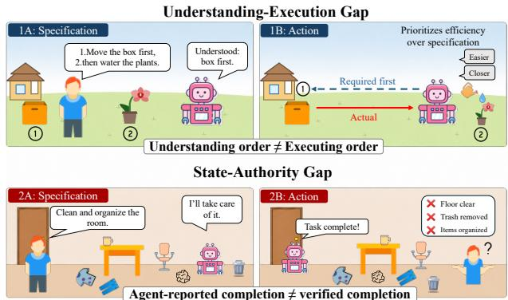
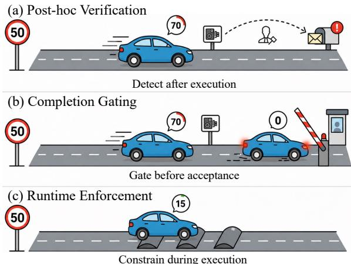
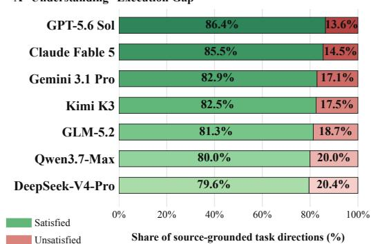
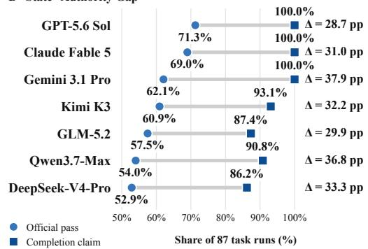
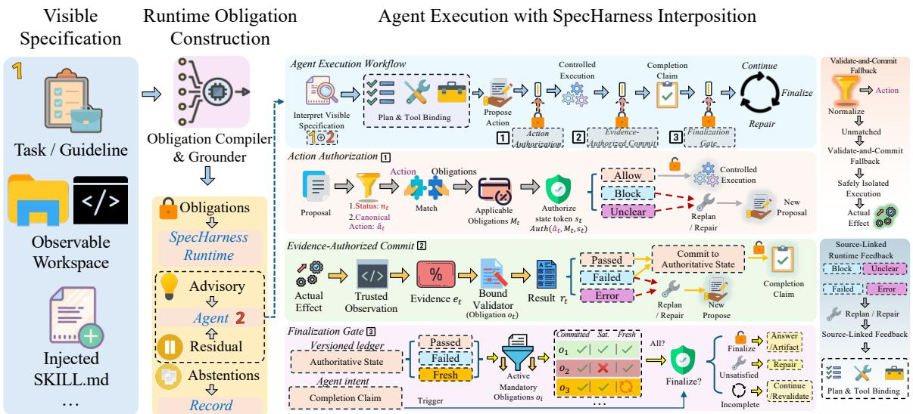

# Who Holds the Pen? Let Specifications, Not Agents, Sign Of

Haiqing Li1, Xin Ma2, Yinhao Wu1, Wenliang Zhong1, Feng Jiang1, Thao M. Dang1, Xiao Hu1, Hehuan Ma1, Yuzhi Guo3, Junzhou Huang1

1Department of Computer Science and Engineering, The University of Texas at Arlington, Arlington, TX, USA 2Monash University, Melbourne, VIC, Australia

3Department of Computer Science, Kent State University, Kent, OH, USA

## Abstract

Large language model agents operate under external specifica- tions, including task instructions, guidelines, output schemas, and reusable skills. In most systems, however, these specifi- cations remain context for the same model that acts, evaluates outcomes, and declares completion. This collapses proposal and acceptance within the agent, leaving no independent spec- ification authority boundary. This creates two structural gaps. The understanding–execution gap arises because understand- ing a requirement does not ensure satisfying it during execu- tion. The state–authority gap arises because an agent’s inter- pretation or completion claim does not prove that the required state has been achieved. We quantify these gaps on Skills- Bench. Using only agent-visible task prompts, workspace in- formation, and injected skill specifications, we extract 509 source-grounded task directions and assess whether they are satisfied during execution. Across seven models, only 79.6%– 86.4% of these directions are satisfied. Moreover, agents completion-claim rates exceed oficial evaluator pass rates by 28.7–37.9 percentage points. We formulate specification authority as a separation between agent proposals and au- thoritative state: agents may plan, act, and request comple- tion, but only admissible evidence from qualified providers may establish specification-governed state. SpecHarness op- erationalizes this paradigm by compiling agent-visible spec- ifications into source-linked obligations and governing ex- ecution and finalization through versioned obligation state. Reliably executable or verifiable requirements are mediated or validated at runtime; ambiguous or subjective requirements remain advisory or are excluded from enforcement. We instan tiate and evaluate SpecHarness on guideline-following and artifact-generation tasks. Our results support treating speci- fications not merely as influences on agent behavior, but as authority over what constitutes correct execution and compli- ant completion. Authoritative judgments about specificationdefined state should remain independent of the agent’s self- assessment.

## Introduction

Large language model agents increasingly control complex tasks by inspecting environments, planning steps, selecting skills, invoking tools, and deciding when to stop (Li et al. 2026a; Wang et al. 2023). Their behavior is expected to follow external specifications at three levels: task instruc- tions, guidelines, and policies define goals, constraints, and completion conditions; tool schemas, API documentation, operating procedures, and SKILL.md files define operation semantics, preconditions, arguments, and execution order; and manifests, schemas, and contracts define required arti- facts and their acceptance conditions. However, most systems still treat these specifications only as agent-readable context rather than as a basis for an external runtime to govern ex- ecution and acceptance. Agents may therefore omit require- ments, violate procedures, misuse tools, misinterpret efects, combine constraints incorrectly, or claim completion before the required state has been established (Bandi et al. 2026).

  
Figure 1: Two structural gaps in specification following. Top: The agent understands the required order but exe-cutes the steps incorrectly, illustrating the understanding– execution gap. Bottom: The agent claims completion before the specification-required state is established, illustrating the state–authority gap.

This mismatch produces the two gaps illustrated in Fig- ure 1. Requirements may be correctly interpreted yet fail to govern execution, creating the understanding–execution gap. Moreover, agent actions and self-assessments cannot authoritatively establish specification-defined state, creating the state–authority gap. The key question is therefore not only when or how execution is checked, but who may estab- lish specification-governed state and authorize completion. We quantify both gaps on all 87 SkillsBench tasks using a compiler selected from seven candidate language mod- els on development annotations and frozen before evalua- tion; the full comparison and selection protocol are reported in Appendix A.1. Using only agent-visible task prompts, workspace information, and injected skill specifications, the selected compiler extracts 509 source-grounded task direc- tions. Across seven representative language models, only 79.6%–86.4% of these directions are satisfied, while agents completion-claim rates exceed oficial pass rates by 28.7– 37.9 percentage points. These findings quantify both gaps across the evaluated agents (Figure 3).

Some approaches (Ouyang et al. 2022; Bai et al. 2022) internalize specification following through model training, but still leave the same model responsible for both acting un- der a specification and judging whether it has been satisfied. As shown in Figure 2, inference-time methods intervene at three stages: post-hoc verification checks artifacts or final states after execution; completion gating checks completion claims before acceptance but usually leaves prior execution and intermediate state unconstrained; and runtime enforce- ment (Mazzocchetti 2026) constrains behavior during execution, as in VIGIL (Li et al. 2026c), which monitors agent– tool interactions for temporal, argument, and value-flow vi- olations. These approaches improve verification, acceptance control, or behavioral compliance, but do not jointly govern execution and evidence-authorized state commitment. What is missing is an explicit specification authority boundary governing both execution and accepted state.

We formulate this distinction as the State Authority Principle: for reliably grounded and verified conditions, the specification defines what may be accepted, while an external runtime determines whether the required state has been estab- lished. SpecHarness operationalizes this principle as a runtime architecture for specification-governed agents. Agents still interpret tasks, plan, select tools and skills, implement solutions, and repair failures, but only propose actions, state changes, and completion; SpecHarness commits the corre- sponding authoritative state. It converts verifiable require- ments in agent-visible materials into source-linked obliga- tions, checks them through controlled execution or autho- rized validation, and updates state only when the required ev- idence satisfies its commit rule. Ambiguous, subjective, conflicting, or unverifiable requirements remain advisory rather than becoming hard obligations, and continue to guide the agent. These mechanisms follow directly from the two gaps: operational obligations narrow the understanding–execution gap, while evidence-authorized commitment prevents self- assessment from establishing accepted state. For example, authorizing an array-processing action confirms only its pre- conditions, arguments, and ordering constraints; the corre- sponding obligation state is committed only after an autho- rized validator verifies the required path, shape, data type, and finite values. SpecHarness thus allows specifications not only to describe desired behavior, but also to govern which verifiable states and outcomes may be accepted. Agent proposes; SpecHarness commits. The main contributions of this paper are as follows:

1. We identify the missing specification authority boundary and its two observable consequences: the understanding– execution and state–authority gaps.

2. We formulate the State Authority Principle, separating proposal autonomy from state authority: agents pro- pose, while an external runtime commits specification- governed state only from admissible evidence produced

  
Figure 2: Three intervention paradigms for specification compliance. (a) Post-hoc verification detects violations only after execution has completed. (b) Completion gating checks the agent’s completion claim before acceptance but does not constrain the preceding execution. (c) Runtime enforce-ment intervenes during execution to prevent or constrain specification-violating actions.

by qualified providers.

3. We instantiate and evaluate SpecHarness, an obligation– evidence–commit architecture governing decision, arti- fact, and completion state across GuideBench and Skills- Bench.

## Related Work

Post-hoc Verification (Fig. 2(a)). Post-hoc methods assess specification compliance after an answer, trajectory, or artifact is produced. NSVIF (Su et al. 2026) represents naturallanguage instructions as logical and semantic constraints and reports interpretable violations. SkillsBench (Li et al. 2026b) evaluates skill-guided executions with deterministic verifiers over final artifacts and environment states. AgentRx (Barke et al. 2026) synthesizes trajectory invariants, checks them step by step, and produces auditable violation logs with sup- porting evidence, while AgentOps (Dong, Lu, and Zhu 2024) identifies the artifacts and lifecycle data needed for observ- ability. These methods provide evidence about completed executions, but use it for diagnosis rather than to govern authoritative task state.

Completion Gating (Fig. 2(b)). Failure analyses motivate explicit control at the completion boundary. MAST (Cemri et al. 2026) identifies verification and termination as a major category of multi-agent failure, including premature termina- tion and missing or incorrect verification. Verify-gated com- pletion (Nguyen and Tran 2026) treats an agent’s completion claim as a proposal and places a read-only verifier before task acceptance, using fail-closed admission and auditable event records. Such designs block unsupported completion claims but verify primarily at terminal admission. SpecHarness in- stead organizes verification around source-grounded obli- gations and specification-governed state transitions, making completion the final commit rather than the sole verification point.

A Understanding--Execution Gap  

  
Figure 3: Empirical evidence for the two structural gaps across seven language models. Top: Models satisfy $7 9 . 6 \% -$ 86.4% of the 509 source-grounded task directions recovered from agent-visible materials. Bottom: Agent-reported com-pletion rates exceed oficial verifier pass rates by 28.7–37.9 percentage points.

Runtime Enforcement (Fig. 2(c)). Runtime enforcement constrains behavior or state transitions during execution. VIGIL (Li et al. 2026c), AgentSpec (Wang, Poskitt, and Sun 2025), and FORGE (Palumbo et al. 2026) enforce specification-derived policies through trace checking, run- time rules, or action mediation. Verification-gated mission- state governance (Tang et al. 2026) further commits pro-posed mission updates only after deterministic verification. SpecHarness builds on classical reference-monitor (Saltzer and Schroeder 1975), runtime-verification (Leucker and Schallhart 2009), and transactional-commit (Gray and Lam-port 2004) principles rather than treating them as new primitives. Its agent-specific contribution is to compile visible specifications into source-linked obligations and use qual- ified evidence to govern versioned state and finalization; preventive mediation remains limited to closure-audited sur- faces (Appendix B.2).

## SpecHarness: Runtime Specification Authority

SpecHarness reallocates runtime authority: agents plan and act, while only specification-authorized evidence may estab- lish authoritative state.

Problem Setting and State Authority. For a task instance $x ,$ let

$$
V _ { x } = ( T _ { x } , G _ { x } , K _ { x } , W _ { x } )\tag{1}
$$

denote its agent-visible context: task prompt $T _ { x }$ , applicable guidelines $G _ { x }$ , injected skill specifications $K _ { x } .$ , and observ- able workspace state and schemas $W _ { x }$ . Held-out verifiers and oracle solutions are evaluation-only and excluded from $V _ { x }$ and runtime enforcement. Let $H _ { \mathrm { e x e c } }$ denote the executor, observer, and validator substrate available to SpecHarness.

At time t, the agent proposes $p _ { t }$ , the runtime observes evidence $e _ { t } ,$ , and SpecHarness maintains authoritative state $s _ { t } = ( L _ { t } , C _ { t } , \nu _ { t } )$ , comprising a versioned obligation ledger, derived control state, and dependency versions. Let $k _ { i }$ be obligation $o _ { i } { \ ' } { \bf s }$ assertion key and $s _ { t } [ \bar { k } ]$ its ledger value, or ⊥ if absent. SpecHarness enforces $\dot { s } _ { t + 1 } [ k ] \ \neq \ s _ { t } [ k ] \ \Rightarrow$ $\exists o _ { i } , e _ { t } : \mathsf { W i t n e s s } _ { t } ( k , o _ { i } , e _ { t } )$ , where Witness $( k , o _ { i } , e _ { t } )$ re-quires $\begin{array} { r } { k \ = \ k _ { i } . } \end{array}$ , admissible evidence $\mathrm { A d m } _ { i } ( e _ { t } , s _ { t } ; H _ { \mathrm { e x e c } } )$ and a corresponding commi $\cdot ( o _ { i } , e _ { t } , k )$ event. Admissibility is defined below. This state-write invariant defines SpecHar- ness: agent actions, outputs, and self-assessments cannot di- rectly establish authoritative state. Thus, the agent proposes; SpecHarness commits. A commit may record validated suc-cess or failure; satisfaction is determined separately.

Runtime Obligation Construction. SpecHarness seg-ments the visible context into source-addressable units and assigns each a disposition:

$$
\begin{array} { r l } & { \mathcal { U } _ { x } = \mathrm { S e g m e n t } ( V _ { x } ) = \{ u _ { j } = ( q _ { j } , \ell _ { j } ) \} _ { j = 1 } ^ { n _ { x } } , } \\ & { ~ \delta _ { x } : \mathcal { U } _ { x } \to \{ \mathrm { H A R D } , \mathrm { A D V I S O R Y } , \mathrm { A B S T A I N } , \mathrm { R E S I D U A L } \} . } \end{array}\tag{2}
$$

Here, $q _ { j }$ identifies the visible source and $\ell _ { j }$ its requirement text. Reusable policies and skill specifications may yield templates; task prompts and instance-specific guidelines are compiled per task, while the observable workspace grounds entities, paths, arguments, outputs, and completion condi- tions. Using development annotations derived only from agent-visible materials, we compare seven language-model compilers, select one by development-set extraction quality, and freeze it before execution; compiler details and the selec- tion protocol are provided in Appendix A.1. Held-out oficial verifiers are used only afterward for post-hoc obligation– test alignment and final evaluation. Let $Q _ { x } ^ { \star } = { \mathcal { C } } ^ { \star } ( { \bar { \mathcal { U } } } _ { x } )$ be the frozen compiler output and $\mathcal { D } _ { x } =$ Directions $( Q _ { x } ^ { \star } )$ the source-addressable index for direction-level measurement and trace attribution. Given $H _ { \mathrm { e x e c } }$ , the obligation builder constructs

$$
\begin{array} { r } { \mathcal { B } ( Q _ { x } ^ { \star } , H _ { \mathrm { e x e c } } )  \Gamma _ { x } ^ { \star } = \big ( \mathcal { O } _ { \mathrm { h a r d } } , \mathcal { O } _ { \mathrm { a d v } } , \mathcal { U } _ { \mathrm { a b s } } , R _ { x } \big ) . } \end{array}\tag{3}
$$

Here, $\Gamma _ { x } ^ { \star }$ is the task-specific obligation IR maintained by the runtime: $\mathcal { O } _ { \mathrm { h a r d } }$ contains mandatory obligations that may block covered transitions or completion, $\mathcal { O } _ { \mathrm { a d v } }$ contains non- blocking obligations and guidance, $\mathcal { U } _ { \mathrm { a b s } }$ records abstentions, and $R _ { x }$ preserves residual context. Directions and obliga- tions need not correspond one-to-one: several directions may ground one obligation, while advisory, abstained, and resid- ual directions create no independent blocking rules. Thus, $\mathcal { D } _ { x }$ supports measurement and trace attribution, whereas $\Gamma _ { x } ^ { \star }$ governs authorization, validation, commitment, and finaliza- tion. A grounded obligation is

$$
o _ { i } = \langle \mathsf { s r c } _ { i } , \mathsf { a u t h } _ { i } , \mathsf { e f f e c t } _ { i } , \mathsf { s t a t e } _ { i } , \mathsf { c t r l } _ { i } \rangle ,\tag{4}
$$

encoding provenance, action matching and authorization, ex- ecution and validation, state commitment and satisfaction, and dependency and enforcement control, respectively. An obligation enters $\mathcal { O } _ { \mathrm { h a r d } }$ only if it is mandatory, its parameters are source-grounded, it has an authorized evidence provider, and its validator is qualified for blocking under the devel- opment protocol; otherwise, it remains advisory or triggers abstention. Validator qualification and closure stress tests appear in Appendices B.1–B.2.

  
Figure 4: SpecHarness compiles agent-visible specifications into source-linked obligations, mediates closure-audited actions, validates observed efects, commits versioned state from authorized evidence, and permits finalization only when all fresh mandator obli ations are satisfied. Advisor and abstained re uirements remain outside hard enforcement.

The builder also derives a declared action surface ${ \mathcal { A } } _ { \mathrm { d e c l } }$ . A closure audit identifies actions eli ible for bounded mediateand-commit; other safely isolated declared channels use validate-and-commit, while unsupported channels are rejected. Hard classification alone does not imply preventive mediation. Moreover, admissible evidence may commit a validated failure without satisfying $o _ { i }$

Agent Interface and Proposals. The agent retains the original task context, applicable skills, and residual con- text $R _ { x } .$ and receives advisory guidance and source-linked runtime feedback. SpecHarness alone maintains the author- itative ledger and exposes only derived feedback and con- trol decisions. The agent submits proposals in three tagged classes:

$$
\mathcal { P } = \mathcal { P } _ { \mathrm { a c t } } \not \cup \mathcal { P } _ { \mathrm { r e p a i r } } \not \cup \mathcal { P } _ { \mathrm { f i n a l i z e } } ,\tag{5}
$$

for actions with bound arguments, repairs targeting reported failures, and finalization requests. Proposals express intent, not authoritative fact. The agent may plan, select tools, gen- erate code, interpret errors, and revise artifacts, but cannot modify the ledger, inject validator outcomes, mark obligations satisfied, or authorize finalization. Action-bearing pro- posals proceed to authorization; finalization is determined solely by committed obligation state at current evidence ver- sions.

Action Authorization and Controlled Execution. SpecHarness first maps each action proposal to a canoni- cal action. For matched proposals, it identifies the relevant obligations and returns an authorization decision:

$$
\begin{array} { r l } & { ( \hat { a } _ { t } , n _ { t } ) = \mathrm { N o r m a l i z e } ( p _ { t } ) , } \\ & { \quad \quad \quad n _ { t } \in \{ \mathrm { E x A C T } , \mathrm { N O R M A L I Z E D } , \mathrm { U N M A T C H E D } \} , } \\ & { \quad \quad M _ { t } = \{ o _ { i } \in O _ { x } ^ { \mathrm { a c t } } ( s _ { t } ) : \mathrm { M a t c h } _ { i } ( \hat { a } _ { t } , s _ { t } ) = 1 \} , } \\ & { \quad \quad \quad u _ { t } = \mathrm { A u t h } ( \hat { a } _ { t } , M _ { t } , s _ { t } ) , } \\ & { \quad \quad \quad u _ { t } \in \{ \mathrm { A L L O W } , \mathrm { B L O C K } , \mathrm { U N C L E A R } \} . } \end{array}\tag{6}
$$

An unmatched proposal raises an error when mediation is expected, enters validate-and-commit on a safely isolated declared channel, follows the base policy when explicitly out of scope, or is rejected when unsupported.

Let $\pi \sim _ { \mathrm { e f f } }$ a mean that execution path π can produce an efect equivalent to canonical action a, and let $\mathrm { G o v e r n e d B y A u t h } ( \pi , a )$ mean that π is mediated as a and subjected to its authorization procedure. The action surface is closed for a if and only if every available efect-equivalent path is either governed or denied:

$$
\begin{array} { r l } & { \mathrm { C l o s e d } ( a , H _ { \mathrm { e x e c } } ) = 1 } \\ & { \iff \forall \pi \in \mathrm { A v a i l P a t h s } ( H _ { \mathrm { e x e c } } ) , } \\ & { \quad \pi \sim _ { \mathrm { e f f } } a \Rightarrow \mathrm { G o v e r n e d B y A u t h } ( \pi , a ) \lor \mathrm { D e n i e d } ( \pi ) . } \end{array}\tag{7}
$$

Define ${ \mathcal { A } } _ { \mathrm { s t a t i c } } = \{ a \in { \mathcal { A } } _ { \mathrm { d e c l } } : \operatorname { C l o s e d } ( a , H _ { \mathrm { e x e c } } ) = 1 \}$ and let Preventive $( M _ { t } )$ hold if $M _ { t }$ contains a hard obliga- tion with mode block.

Actions in $\mathcal { A } _ { \mathrm { s t a t i c } }$ use bound controlled executors, and preventive matches require $u _ { t } = \mathbf { A } \mathbf { L }$ low for dispatch. Closure then yields

$$
\begin{array} { r l } & { \hat { a } _ { t } \in { \mathcal A } _ { \mathrm { s t a t i c } } \wedge \mathrm { P r e v e n t i v e } ( M _ { t } ) \wedge u _ { t } \not = \mathrm { s L L o w } } \\ & { \Rightarrow \mathbb J \pi \in \mathrm { A v a i l P a t h s } ( H _ { \mathrm { e x e c } } ) : } \\ & { \qquad \pi \sim _ { \mathrm { e f f } } \hat { a } _ { t } \wedge \mathrm { B y p a s s e s A u t h } ( \pi , \hat { a } _ { t } , s _ { t } ) . } \end{array}\tag{8}
$$

Here, BypassesAuth denotes an efect-equivalent path out-side the applicable authorization procedure. Under the au- dited boundary and threat model, no-bypass applies only to closure-audited actions; isolated channels use post-efect validation, and finalization still requires all fresh mandatory obligations to be satisfied (Appendix B.2).

Efect Validation, Commitment, and Recovery. After ex-ecution, trusted observers produce evidence $e _ { t }$ for obligation $o _ { i } ,$ its bound validator returns $r _ { t } .$ , and SpecHarness constructs dependency digest $d _ { t }$ and provenance record $\rho _ { t }$ . Evidence is admissible if

$$
\begin{array} { r l } { \mathrm { A d m } _ { i } ( e _ { t } , s _ { t } ; H _ { \mathrm { e x e c } } ) \iff \mathrm { T r u s t e d } _ { i } ( e _ { t } ; H _ { \mathrm { e x e c } } ) } & { } \\ & { \land c _ { i } ( e _ { t } , s _ { t } ) } \\ & { \land r _ { t } \in \{ \mathrm { P A S S E D } , \mathrm { F A I L E D } \} . } \end{array}\tag{9}
$$

The ledger update is

$$
L _ { t + 1 } [ o _ { i } ] = \left\{ \begin{array} { l l } { ( r _ { t } , d _ { t } , \rho _ { t } ) , } & { \mathrm { A d m } _ { i } ( e _ { t } , s _ { t } ; H _ { \mathrm { e x e c } } ) , } \\ { L _ { t } [ o _ { i } ] , } & { \mathrm { o t h e r w i s e } . } \end{array} \right.\tag{10}
$$

Trusted checks the bound provider, channel, validator, scope, and version metadata, which $\rho _ { t }$ records with the commit-event identifier. The ledger update and commit event are atomic. Both passed and failed may be committed; val- idator errors, efects without admissible evidence, and agent claims cannot create authoritative state.

A committed result is fresh if its dependency digest matches current artifact, input, validator, environment, and dependent-obligation versions; a known mismatch yields stale, and incomplete version evidence yields unknown. Satisfaction is

$$
\begin{array} { r } { \mathrm { S a t } _ { t } ( o _ { i } ) \iff o _ { i } \in \mathrm { d o m } ( L _ { t } ) \wedge h _ { i } ( L _ { t } , s _ { t } ) } \\ { \qquad \wedge \mathrm { F r e s h } _ { t } ( o _ { i } ) = \mathrm { T R U E } . \qquad } \end{array}\tag{11}
$$

Let ${ \mathcal { O } } _ { x } ^ { \mathrm { a c t , m a n d } } ( s _ { t } )$ be the mandatory subset of ${ \mathcal { O } } _ { x } ^ { \mathrm { a c t } } ( s _ { t } )$ . Fi- nalization requires

$$
\mathrm { F i n a l i z e A l l o w e d } _ { t } ( x ) \Rightarrow \forall o _ { i } \in \mathcal { O } _ { x } ^ { \mathrm { a c t , m a n d } } ( s _ { t } ) , \mathrm { S a t } _ { t } ( o _ { i } ) .\tag{12}
$$

Mutations recompute freshness for afected entries and de- pendents, marking them stale or unknown until revalida- tion. SpecHarness returns source-linked feedback, the agent may propose repairs, and only new admissible evidence can recommit state. The guarantee covers grounded mandatory obligations, not the full natural-language specification.

## Experiments

Benchmarks. We evaluate SkillsBench (Li et al. 2026b) and GuideBench (Diao et al. 2025) under diferent authoritative-state semantics. SkillsBench contains 87 tool- use and artifact-production tasks; agent-visible prompts, workspaces, and injected skills provide runtime inputs, while held-out verifiers determine success. GuideBench contains 1,042 guideline-constrained decision tasks and tests gener- alization from execution and artifact state to decision state. Across both benchmarks, held-out verifiers, references, and oracles are used only for evaluation, never for obligation construction or runtime feedback.

Experimental Setup and Baselines. The seven models (GPT-5.6, Claude Fable 5, Gemini 3.1, Kimi K3, GLM-5.2 (Zeng et al. 2026), Qwen3.7 (Qwen Team 2026), and DeepSeek-V4 (Xu et al. 2026a)) in Table 1 also serve as candidate compilers. Using fixed development annotations and a prespecified protocol, we select GPT-5.6 Sol and freeze it before evaluation. Its output $Q _ { x } ^ { \star }$ defines direction index $\mathcal { D } _ { x } = \mathrm { D i r e c t i o n s } ( Q _ { x } ^ { \star } )$ and runtime IR $\Gamma _ { x } ^ { \star } ,$ , yielding 509 directions across 87 SkillsBench tasks. An evaluation- only audit aligns them with 573 of 585 held-out oficial test functions, including 406 fine-grained matches; this measures alignment, not recovery of verifier semantics. Full compiler- selection results appear in Appendix $\mathsf { A } . 1 ;$ extraction, cover- age, and alignment results appear in Appendix A.2. All agent runs use OpenHands (Wang et al. 2025) as the shared execution substrate for both Raw and SpecHarness; configuration details appear in Appendix C.1.

On SkillsBench, the same seven models serve sepa- rately as task agents. The frozen $\mathcal { D } _ { x }$ provides a com- mon source-grounded measurement surface and denomina- tor across agents and conditions, while execution evidence determines $\mathbf { \bar { \it S } } _ { m , c } ( x ) \subseteq { \mathcal { D } } _ { x }$ . Neither set uses oficial veri- fiers or oracles. We compare Raw and SpecHarness across all agents and, with GPT-5.6 Sol fixed, compare Agentic Rubrics (Raghavendra et al. 2026), VeriMAP (Xu et al. 2026b), AgentSpec (Wang, Poskitt, and Sun 2025), and SpecHarness as post-hoc verification, completion gating, runtime enforcement, and mediate-and-commit methods.

On GuideBench, removing four duplicate rules from 301 guideline entries yields 297 obligation templates and 5,817 task-level instances across 1,042 tasks. Without an indepen- dent extraction oracle, they define a common measurement surface but not complete semantic recovery. We compare Raw and SpecHarness across the same seven agents and, with GPT-5.6 Sol fixed, compare adapted RvLLM (Zhang et al. 2026), adapted VeriMAP (Xu et al. 2026b), SatLM (Ye et al. 2023), and SpecHarness as post-hoc verification, completion gating, computation substrate, and evidence-authorized commitment methods. Paired conditions share inputs, bud- gets, timeouts, and tool access. Frozen obligations and valida- tors evaluate all conditions read-only; only SpecHarness uses their evidence to commit authoritative state and authorize fi- nalization. Appendix C.2 audits baseline implementations, runtime access, budgets, and completion rules.

Metrics. For benchmark $b \in \{ \mathrm { S B } , \mathrm { G B } \}$ , let $\mathcal { Z } _ { x } ^ { b }$ denote the common frozen measurement surface for instance x, and let $S _ { m , c } ^ { b } ( x ) \subseteq \mathcal { Z } _ { x } ^ { b }$ contain the units whose satisfaction is supported by the shared validators. Let $N _ { m , c } ^ { b }$ be the valid runs, $P _ { m , c } ^ { b }$ the oficially passing runs, and $A _ { m , c } ^ { b }$ the runs accepted by the condition-specific runtime. We define

$$
\begin{array} { r l } & { G _ { m , c } ^ { \mathrm { U E } , b } = \cfrac { \sum _ { x } | \mathcal { Z } _ { x } ^ { b } \setminus S _ { m , c } ^ { b } ( x ) | } { \sum _ { x } | \mathcal { Z } _ { x } ^ { b } | } , } \\ & { G _ { m , c } ^ { \mathrm { S A } , b } = \cfrac { | A _ { m , c } ^ { b } \setminus P _ { m , c } ^ { b } | } { N _ { m , c } ^ { b } } . } \end{array}\tag{13}
$$

For SkillsBench, $\mathcal { Z } _ { x } ^ { \mathrm { S B } } \ = \ \mathcal { D } _ { x }$ is the frozen task-direction index; for GuideBench, $\mathcal { Z } _ { x } ^ { \mathrm { G B } } = \mathcal { O } _ { \mathrm { a c t } } ^ { \mathrm { G B } } ( x )$ is the common set of active, measurable guideline obligations. The same frozen validators measure all conditions read-only, while only SpecHarness uses their results for state commitment and finalization. U–E operationally measures unrealized source- grounded units, not latent comprehension. $A _ { m , c } ^ { b }$ follows the condition-specific rule: ungated terminal claims, native veri- fier or gate decisions, or ledger-derived finalization. Since all valid Raw runs end in an accepted ungated claim, Raw S–A equals 1−Pass. Oficial pass rate is $\mathrm { P a } \mathrm { \bar { s s } } _ { m , c } ^ { b } = | P _ { m , c } ^ { b } | / N _ { m , c } ^ { b } .$ Oficial Pass is primary; U–E and S–A are diagnostic, and S– A is reported with Pass and Raw-pass preservation to expose over-refusal.

<table><tr><td></td><td colspan="3">Raw Agent</td><td colspan="3">SpecHarness</td><td colspan="3">Change vs. Raw (pp)</td></tr><tr><td>Model</td><td>Pass↑</td><td>U-E↓</td><td>S-A↓</td><td>Pass↑</td><td>U-E↓</td><td>S-A↓</td><td>Pass</td><td>U-E</td><td>S-A</td></tr><tr><td>GPT-5.6 Sol</td><td>71.3</td><td>13.6</td><td>28.7</td><td>85.1</td><td>6.3</td><td>6.9</td><td>+13.8</td><td>-7.3</td><td>-21.8</td></tr><tr><td>Claude Fable 5</td><td>69.0</td><td>14.5</td><td>31.0</td><td>81.6</td><td>7.1</td><td>10.3</td><td>+12.6</td><td>-7.4</td><td>-20.7</td></tr><tr><td>Gemini 3.1 Pro</td><td>62.1</td><td>17.1</td><td>37.9</td><td>79.3</td><td>8.4</td><td>12.6</td><td>+17.2</td><td>-8.7</td><td>-25.3</td></tr><tr><td>Kimi K3</td><td>60.9</td><td>17.5</td><td>32.2</td><td>67.8</td><td>10.8</td><td>14.9</td><td>+6.9</td><td>-6.7</td><td>-17.3</td></tr><tr><td>GLM-5.2</td><td>57.5</td><td>18.7</td><td>29.9</td><td>69.0</td><td>9.6</td><td>11.5</td><td>+11.5</td><td>-9.1</td><td>-18.4</td></tr><tr><td>Qwen3.7-Max</td><td>54.0</td><td>20.0</td><td>36.8</td><td>65.5</td><td>11.2</td><td>17.2</td><td>+11.5</td><td>-8.8</td><td>-19.6</td></tr><tr><td>DeepSeek-V4-Pro</td><td>52.9</td><td>20.4</td><td>33.3</td><td>63.2</td><td>12.0</td><td>16.1</td><td>+10.3</td><td>-8.4</td><td>-17.2</td></tr><tr><td>Macro Average</td><td>61.1</td><td>17.4</td><td>32.8</td><td>73.1</td><td>9.3</td><td>12.8</td><td>+12.0</td><td>-8.1</td><td>-20.0</td></tr></table>

Table 1: Cross-model results on all 87 SkillsBench tasks. Pass is the oficial-verifier pass rate; U–E and S–A are the understanding– execution and state–authority gaps. Change columns report percentage-point diferences from Raw. Macro Average is the unweighted mean across seven task-agent models.

## Results

Main Results on SkillsBench. Tables 1 and 2 show that SpecHarness reduces both specification-following gaps across the evaluated agents. Even the strongest Raw agent retains substantial U–E and S–A gaps, while SpecHarness improves all seven models without gains tracking baseline capability. Macro Pass rises from 61.1% to 73.1%, U–E falls from 17.4% to 9.3%, and S–A from 32.8% to 12.8%. The macro Pass gain has a 95% paired task-bootstrap interval excluding zero, and exact per-model McNemar tests remain significant after Holm correction; full statistics appear in Appendix D.1. Because SpecHarness includes online val- idation, feedback, and repair, the main comparison evalu- ates the complete governed runtime rather than the isolated efect of authoritative commitment; detailed computational overhead is reported in Appendix D.3. The larger S–A re- duction than Pass gain is consistent with both failure recov- ery and rejection of unsupported completion claims. Across the evaluated models, greater baseline capability does not eliminate the gaps when specifications remain transient con- text: execution may still drift from visible requirements, and completion remains self-issued. The paradigm comparison further separates execution control from acceptance author- ity: AgentSpec achieves lower U–E but higher S–A than VeriMAP. Action constraints reduce divergence without es- tablishing efects, whereas completion checks filter terminal claims without governing prior trajectories. In SpecHarness, source-linked obligations govern covered execution, while finalization requires evidence-backed satisfaction of all fresh mandatory obligations. Remaining gaps reflect its bound- ary: ungrounded or unobservable requirements remain advi- sory or abstained, while safely isolated channels outside the closure-audited surface use validate-and-commit. Across the evaluated adaptations, the complete SpecHarness architec- ture yields smaller gaps than the compared alternatives.

<table><tr><td>Method</td><td>Pass↑ U-E↓ S-A↓ Prov.</td><td></td><td>Eff.</td><td>Cmt.</td></tr><tr><td>Agentic Rubrics (ACL&#x27;26)</td><td>Post-hoc Verification 74.7 12.6 23.0</td><td>△</td><td>△</td><td>×</td></tr><tr><td>VeriMAP (EACL&#x27;26)</td><td>Completion Gating 79.3 9.6 20.7</td><td>△</td><td></td><td>×</td></tr><tr><td>AgentSpec (ICSE’26)</td><td>Runtime Enforcement 78.2 8.8 24.1</td><td>√</td><td>×</td><td>×</td></tr><tr><td></td><td>Mediate-and-Commit</td><td></td><td></td><td></td></tr><tr><td></td><td></td><td></td><td></td><td></td></tr><tr><td></td><td></td><td></td><td></td><td></td></tr><tr><td></td><td></td><td></td><td></td><td></td></tr><tr><td></td><td></td><td></td><td></td><td></td></tr><tr><td></td><td></td><td></td><td></td><td></td></tr><tr><td></td><td></td><td></td><td></td><td></td></tr><tr><td></td><td></td><td></td><td></td><td></td></tr><tr><td></td><td></td><td></td><td></td><td></td></tr><tr><td></td><td></td><td></td><td></td><td></td></tr><tr><td></td><td></td><td></td><td></td><td></td></tr><tr><td></td><td></td><td></td><td></td><td></td></tr><tr><td></td><td></td><td></td><td></td><td></td></tr><tr><td>SpecHarness</td><td></td><td></td><td></td><td></td></tr><tr><td></td><td></td><td></td><td></td><td></td></tr><tr><td></td><td></td><td>V</td><td></td><td>√</td></tr><tr><td></td><td>85.1 6.3 6.9</td><td></td><td></td><td></td></tr><tr><td></td><td></td><td></td><td></td><td></td></tr><tr><td></td><td></td><td></td><td></td><td></td></tr><tr><td></td><td></td><td></td><td></td><td></td></tr><tr><td></td><td></td><td></td><td></td><td></td></tr><tr><td></td><td></td><td></td><td></td><td></td></tr><tr><td></td><td></td><td></td><td></td><td></td></tr><tr><td></td><td></td><td></td><td></td><td></td></tr><tr><td></td><td></td><td></td><td></td><td></td></tr><tr><td></td><td></td><td></td><td></td><td></td></tr><tr><td></td><td></td><td></td><td></td><td></td></tr><tr><td></td><td></td><td></td><td></td><td></td></tr><tr><td></td><td></td><td></td><td></td><td></td></tr><tr><td></td><td></td><td></td><td></td><td></td></tr><tr><td></td><td></td><td></td><td></td><td></td></tr><tr><td></td><td></td><td></td><td></td><td></td></tr><tr><td></td><td></td><td></td><td></td><td></td></tr><tr><td></td><td></td><td></td><td></td><td></td></tr><tr><td></td><td></td><td></td><td></td><td></td></tr><tr><td></td><td></td><td></td><td></td><td></td></tr><tr><td></td><td></td><td></td><td></td><td></td></tr><tr><td></td><td></td><td></td><td></td><td></td></tr><tr><td></td><td></td><td></td><td></td><td></td></tr><tr><td></td><td></td><td></td><td></td><td></td></tr><tr><td></td><td></td><td></td><td></td><td></td></tr><tr><td></td><td></td><td></td><td></td><td></td></tr><tr><td></td><td></td><td></td><td></td><td></td></tr><tr><td></td><td></td><td></td><td></td><td></td></tr><tr><td></td><td></td><td></td><td></td><td></td></tr><tr><td></td><td></td><td></td><td></td><td></td></tr><tr><td></td><td></td><td></td><td></td><td></td></tr><tr><td></td><td></td><td></td><td></td><td></td></tr><tr><td></td><td></td><td></td><td></td><td></td></tr><tr><td></td><td></td><td></td><td></td><td></td></tr><tr><td></td><td></td><td></td><td></td><td></td></tr></table>

Table 2: SkillsBench paradigm comparison with GPT-5.6 Sol fixed. Pass is the oficial-verifier pass rate; U–E and S– A are the two structural gaps. Prov., Ef., and Cmt. denote source-linked provenance, observable-efect validation, and versioned authoritative commitment. Markers indicate full (✓), partial or adaptation-dependent (△), or no support (×) in the evaluated adaptations.

<table><tr><td rowspan="2">Model</td><td colspan="3">Raw → SpecHarness</td></tr><tr><td>Pass↑</td><td>U-E↓</td><td>S-A↓</td></tr><tr><td>GPT-5.6 Sol</td><td>91.3→95.1</td><td>8.2→3.5</td><td>8.7→3.8</td></tr><tr><td>Claude Fable 5</td><td>89.6→94.0</td><td>9.1→4.1</td><td>10.4→4.7</td></tr><tr><td>Gemini 3.1 Pro</td><td>88.2→93.2</td><td>8.7→3.8</td><td>11.8→5.2</td></tr><tr><td>Kimi K3</td><td>85.7→90.6</td><td>11.6→5.9</td><td>14.3→7.4</td></tr><tr><td>GLM-5.2</td><td>84.4→89.8</td><td>10.3→5.2</td><td>15.6→8.1</td></tr><tr><td>Qwen3.7-Max</td><td>82.8→88.7</td><td>12.8→6.7</td><td>17.2→9.3</td></tr><tr><td>DeepSeek-V4-Pro</td><td>81.5→87.5</td><td>11.9→6.1</td><td>18.5→10.1</td></tr><tr><td>Macro Average</td><td>86.2→91.3</td><td>10.4→5.0</td><td>13.8→6.9</td></tr></table>

Table 3: GuideBench results across seven agents. Each cell reports Raw → SpecHarness; U–E and S–A denote the two decision-state gaps.

Results on GuideBench. Tables 3 and 4 show that the state-authority problem extends to guideline-governed deci- sions. SpecHarness improves all seven agents, raising macro Pass from 86.2% to 91.3%, while reducing U–E from 10.4% to 5.0% and S–A from 13.8% to 6.9%. The results indicate that the abstraction transfers from artifact state to rule-local decision state: applicable rules induce obligations, and au- thorized evidence supports the corresponding commitments. As in artifact tasks, agent proposals cannot establish authori- tative state. High answer accuracy is therefore insuficient: a plausible answer may omit a rule, misresolve priority, or rely on unsupported judgments. SatLM lowers U–E by executing declarative rules with an external solver, but retains higher S–A because solver outputs are not committed as authori- tative decision state. Post-hoc verification and completion gating inspect or reject outputs without maintaining committed rule-local state. SpecHarness instead derives acceptance from guideline applications committed through authorized evidence, extending obligation–evidence–commit from ar- tifact to decision state. Category-level results and residual failures appear in Appendix D.2; benchmark mappings and execution traces appear in Appendices E.1–E.2.

<table><tr><td>Method</td><td>Pass↑</td><td>U-E↓ S-A↓</td><td>Prov.</td><td>Eff.</td><td>Cmt.</td></tr><tr><td>RvLLM (NeurIPS&#x27;25)</td><td>Post-hoc Verification 90.5 7.0</td><td>7.8</td><td>△</td><td>△</td><td>×</td></tr><tr><td>VeriMAP (EACL&#x27;26)</td><td>Completion Gating 91.7 6.2</td><td>6.7</td><td>△</td><td>√</td><td>×</td></tr><tr><td>SatLM (NeurIPS’23)</td><td>Computation Substrate 92.3 4.9</td><td>6.4</td><td>×</td><td>△</td><td>×</td></tr><tr><td colspan="6">Evidence-Authorized Commitment</td></tr><tr><td>SpecHarness</td><td>95.1 3.5</td><td>3.8</td><td></td><td>√</td><td>√</td></tr></table>

Table 4: GuideBench paradigm comparison with GPT-5.6 Sol fixed. Metrics and markers follow Table 2.

## Ablation and Operational Analysis

Complementary Authority Mechanisms. Table 5 evalu-ates architecture variants within the same interaction frame- work, but does not isolate commitment under matched trajectories or compute. Removing mediation primarily increases U–E, removing efect validation increases unsupported ac- ceptance, and removing commitment produces the largest S–A degradation. Removing blocking qualification lowers S–A only by reducing Raw-pass preservation, showing that conservative rejection is not equivalent to reliable authority. Skill-derived obligations expand the procedural require- ments governed by this chain rather than merely remind- ing the agent through context. Full SpecHarness therefore balances action control, efect evidence, authoritative accep- tance, and selective blocking.

<table><tr><td>Variant</td><td>Pass↑</td><td>U-E↓</td><td>S-A↓</td><td>Pres.↑</td></tr><tr><td>Full SpecHarness</td><td>85.1</td><td>6.3</td><td>6.9</td><td>96.8</td></tr><tr><td>w/o Mediation</td><td>80.5</td><td>10.0</td><td>11.5</td><td>95.2</td></tr><tr><td>w/o Effect Validation</td><td>78.2</td><td>9.4</td><td>16.1</td><td>93.5</td></tr><tr><td>w/o Commitment</td><td>81.6</td><td>8.1</td><td>25.3</td><td>98.4</td></tr><tr><td>w/o Blocking Qualification</td><td>79.3</td><td>8.8</td><td>5.7</td><td>90.3</td></tr><tr><td>w/o Skill Obligations</td><td>77.0</td><td>12.0</td><td>14.9</td><td>91.9</td></tr></table>

Table 5: Runtime architecture ablation on SkillsBench with GPT-5.6 Sol fixed. Pres. denotes paired Raw-pass preserva- tion.

Freshness-Governed State Validity. Table 6 evaluates 248 targeted dependency mutations. Without invalidation, every mutation leaves outdated evidence admissible for com- pletion. Full SpecHarness invalidates all afected entries, re- stores 95.8% through revalidation, and recovers 95.6% of tasks after repair. These results show that versioned state is necessary to prevent stale completion under the evaluated mutations.

<table><tr><td>Variant</td><td>Stale Acc.↓</td><td>Invalid.↑</td><td></td><td>Revalid.↑ Recovery↑</td></tr><tr><td>Full SpecHarness</td><td>0.0</td><td>100.0</td><td>95.8</td><td>95.6</td></tr><tr><td>w/o Freshness</td><td>100.0</td><td>0.0</td><td>N/A</td><td>N/A</td></tr></table>

Table 6: Freshness invalidation and recovery (%) over 248 paired targeted SkillsBench mutations; protocol and denom- inators appear in Appendix B.3.

<table><tr><td>Runtime Mode</td><td>SkillsBench</td><td>GuideBench</td></tr><tr><td>Mediate-and-commit</td><td>44.0%</td><td>0.0%</td></tr><tr><td>Validate-and-commit</td><td>56.0%</td><td>100.0%</td></tr></table>

Table 7: Runtime-mode allocation among constructed hard obligations; GuideBench uses validate-and-commit exclu- sively.

Enforcement Scope and Evaluation Independence. Table 7 summarizes the runtime modes assi ned to constructed hard obligations. In SkillsBench, 44.0% of hard obligations lie on closure-audited action surfaces and use mediate-and- commit; the remaining 56.0% use validate-and-commit on safely isolated channels. GuideBench has no closure-audited physical action surface, so all rule-local decision-state obli- gations use validate-and-commit. These proportions bound our claim: SpecHarness governs the grounded, observable mandatory portion of the specification, not the full natural- language specification. The compiler is selected using devel- opment annotations derived only from agent-visible materi- als. Its output and the resulting obligation surface are then frozen before evaluation. The same frozen runtime validators evaluate all conditions read-only under a shared protocol; only SpecHarness uses their evidence for commitment and finalization. Held-out oficial evaluators are used only for fi- nal pass measurement and post-hoc alignment: they neither construct obligations nor provide runtime feedback.

## Conclusion

SpecHarness reframes specification following as a problem of state authority rather than reasoning or verification alone. Its contribution is not a new validator or commit primitive in isolation, but an agent-specific authority boundary that pre- vents proposals, actions, and self-assessments from directly establishing specification-governed state. The obligation– evidence–commit architecture operationalizes this boundary across action authorization, efect validation, freshness, and finalization by compiling heterogeneous agent-visible spec- ifications into source-linked conditions whose state may be updated only from admissible evidence. Our experiments evaluate the complete architecture, including its feedback- and-repair loop, rather than isolating commitment under matched compute. Within its stated scope of grounded and monitorable conditions, SpecHarness shows how specifica- tions can serve as an external basis for execution and accep- tance rather than remain transient behavioral context.

## References

Bai, Y.; Kadavath, S.; Kundu, S.; Askell, A.; Kernion, J.; Jones, A.; Chen, A.; Goldie, A.; Mirhoseini, A.; McKinnon, C.; et al. 2022. Constitutional ai: Harmlessness from ai feedback. arXiv preprint arXiv:2212.08073.

Bandi, C.; Dumitru, R.-G.; Hertzberg, B.; Agarwal, D.; Boo, G.; Polakam, T.; Hassaan, S.; Da, J.; Kim, H.; Gupta, V.; et al. 2026. Mcp-atlas: A large-scale benchmark for tool- use competency with real mcp servers. arXiv preprint arXiv:2602.00933.

Barke, S.; Goyal, A.; Khare, A.; Singh, A.; Nath, S.; and Bansal, C. 2026. AgentRx: Diagnosing AI Agent Failures from Execution Trajectories. arXiv preprint arXiv:2602.02475.

Cemri, M.; Pan, M. Z.; Yang, S.; Agrawal, L. A.; Chopra, B.; Tiwari, R.; Keutzer, K.; Parameswaran, A.; Klein, D.; Ram- chandran, K.; et al. 2026. Why do multi-agent llm systems fail? Advances in Neural Information Processing Systems, 38.

Diao, L.; Xu, X.; Sun, W.; Yang, C.; and Zhang, Z. 2025. Guidebench: Benchmarking domain-oriented guideline fol- lowing for llm agents. In Proceedings of the 63rd Annual Meeting of the Association for Computational Linguistics (Volume 1: Long Papers), 11361–11399.

Dong, L.; Lu, Q.; and Zhu, L. 2024. Agentops: Enabling observability of llm agents. arXiv preprint arXiv:2411.05285.

Gray, J.; and Lamport, L. 2004. Consensus on transaction commit. arXiv preprint cs/0408036.

Leucker, M.; and Schallhart, C. 2009. A brief account of runtime verification. The journal of logic and algebraic programming, 78(5): 293–303.

Li, H.; Zhong, W.; Wu, Y.; Ma, H.; Guo, Y.; Dang, T. M.; and Huang, J. 2026a. Guidelines as Environments: A World Model Approach to Rule Following. In Proceedings of the 64th Annual Meeting of the Association for Computational Linguistics (Volume 1: Long Papers), 16302–16318.

Li, X.; Liu, Y.; Chen, W.; You, B.; Di, Z.; He, Y.; Zheng, S.; Choe, K. W.; Sun, J.; Wang, S.; et al. 2026b. SkillsBench: Benchmarking how well agent skills work across diverse tasks. arXiv preprint arXiv:2602.12670.

Li, Y.; Chen, Y.; Wen, H.; Zhang, B.; Liu, H.; Wang, P.; Feng, Y.; and Tian, Y. 2026c. VIGIL: Runtime Enforcement of Behavioral Specifications in AI Agent Skills. arXiv preprint arXiv:2606.26524.

Mazzocchetti, A. M. 2026. Cryptographic Runtime Gov- ernance for Autonomous AI Systems: The Aegis Archi- tecture for Verifiable Policy Enforcement. arXiv preprint arXiv:2603.16938.

Nguyen, H.-D.; and Tran, X.-T. 2026. Verify-Gated Comple- tion as Admission Control in a Governed Multi-Agent Run- time: A Bounded Architecture Case Study. arXiv preprint arXiv:2605.17998.

Ouyang, L.; Wu, J.; Jiang, X.; Almeida, D.; Wainwright, C. L.; Mishkin, P.; Zhang, C.; Agarwal, S.; Slama, K.; Ray, A.; et al. 2022. Training language models to fol- low instructions with human feedback. arXiv preprint arXiv:2203.02155.

Palumbo, N.; Choudhary, S.; Choi, J.; Amir, G.; Chalasani, P.; and Jha, S. 2026. Formal policy enforcement for real- world agentic systems. arXiv preprint arXiv:2602.16708.

Qwen Team. 2026. Qwen3.7-Plus: Multimodal Agent Intelligence.

Raghavendra, M.; Gunjal, A.; Liu, B.; and He, Y. 2026. Agentic Rubrics as Contextual Verifiers for SWE Agents. In Liakata, M.; Moreira, V. P.; Zhang, J.; and Jurgens, D., eds., Proceedings ofthe 64th Annual Meeting ofthe Associationfor Computational Linguistics (Volume 1: Long Papers), 15265–15290. San Diego, California, United States: Asso- ciation for Computational Linguistics. ISBN 979-8-89176- 390-6.

Saltzer, J. H.; and Schroeder, M. D. 1975. The protection of information in computer systems. Proceedings of the IEEE, 63(9): 1278–1308.

Su, Y.; Xu, K.; Gao, Y.; Yang, F.; Li, C.; Yang, M.; and Xu, T. 2026. Neuro-Symbolic Verification on Instruction Following of LLMs. arXiv preprint arXiv:2601.17789.

Tang, G.; Jia, Q.; Tan, Y.; Huang, Z.; Ji, N.; and Chen, G. 2026. Verification-Gated A entic Mission-State Gover- nance for Intelligent Industrial Multi-Robot Systems. arXiv preprint arXiv:2606.31339.

Wang, G.; Xie, Y.; Jiang, Y.; Mandlekar, A.; Xiao, C.; Zhu, Y.; Fan, L.; and Anandkumar, A. 2023. Voyager: An open- ended embodied agent with large language models. arXiv preprint arXiv:2305.16291.

Wang, H.; Poskitt, C. M.; and Sun, J. 2025. Agentspec: Customizable runtime enforcement for safe and reliable llm agents. arXiv preprint arXiv:2503.18666.

Wang, X.; Li, B.; Song, Y.; Xu, F. F.; Tang, X.; Zhuge, M.; Pan, J.; Song, Y.; Li, B.; Singh, J.; et al. 2025. Openhands: An open platform for ai software developers as generalist agents. In International Conference on Learning Representations, volume 2025, 65882–65919.

Xu, A.; Lin, B.; Xue, B.; Wang, B.; Xu, B.; Wu, B.; Zhang, B.; Lin, C.; Dong, C.; Ling, C.; et al. 2026a. Deepseek-v4: Towards highly eficient million-token context intelligence. arXiv preprint arXiv:2606.19348.

Xu, T.; Zhang, D.; Mitra, K.; and Hruschka, E. 2026b. Verification-aware planning for multi-agent systems. In Proceedings of the 19th Conference of the European Chapter ofthe Associationfor Computational Linguistics (Volume 1: Long Papers), 7528–7546.

Ye, X.; Chen, Q.; Dillig, I.; and Durrett, G. 2023. Satlm: Satisfiability-aided language models using declara- tive prompting. Advances in Neural Information Processing Systems, 36: 45548–45580.

Zeng, A.; Lv, X.; Hou, Z.; Du, Z.; Zheng, Q.; Chen, B.; Yin, D.; Ge, C.; Huang, C.; Xie, C.; et al. 2026. Glm-5: from vibe coding to agentic engineering. arXiv preprint arXiv:2602.15763.

Zhang, Y.; Emma, S.; En, A.; and Dong, J. S. 2026. Rvllm: Llm runtime verification with domain knowledge. Advances in Neural Information Processing Systems, 38: 80568–80588.

## A Specification Compilation and Coverage A.1 Compiler Selection and Freezing Protocol

We select the compiler solely on a task-disjoint development set. We compare seven candidates: GPT-5.6 Sol, Claude Fable 5, Gemini 3.1, Kimi K3, GLM-5.2, Qwen3.7, and DeepSeek-V4. The development set contains 14 tasks from the SkillsBench tasks-extra/ partition and is disjoint at the task-instance level from the 87 evaluation tasks. Us- ing only agent-visible prompts, workspace information, and injected skills, we segment these tasks into 65 source units and annotate 81 source-grounded directions; 55 units admit concrete machine-checkability candidates. Task-family and skill overlap are allowed, so the split ensures task-instance and evaluation-information separation rather than full dis- tributional independence. All candidates receive the same visible materials, segmentation, instructions, output schema, and decoding settings. Development annotations are frozen before comparison and are not revised using candidate out- puts. Oficial tests, evaluator implementations, reference so- lutions, task-agent trajectories, U–E or S–A results, Raw-versus-SpecHarness comparisons, and oficial pass outcomes are unavailable during selection. Let $\mathcal { U } _ { \mathrm { d e v } }$ be the 65 source units, $\mathcal { D } _ { \mathrm { d e v } }$ the 81 annotated directions, and $\widehat { \mathcal { D } } _ { c }$ the directions extracted by compiler c. A prediction matches an annotation only if it uses the same source unit and preserves the anno- tated behavior or acceptance condition. Each annotation may be matched once; duplicates and unmatched predictions do not increase coverage:

$$
\mathrm { C o v } _ { \mathrm { d e v } } ( c ) = \frac { \left| \left\{ d \in \mathcal { D } _ { \mathrm { d e v } } : \exists \hat { d } \in \widehat { \mathcal { D } } _ { c } , \mathrm { M a t c h } ( \hat { d } , d ) \right\} \right| } { \left| \mathcal { D } _ { \mathrm { d e v } } \right| } .\tag{14}
$$

For an extracted direction $\hat { d } ,$ Acct $( \hat { d } )$ requires an explicit disposition and a nonempty evaluation provider and crite- rion. Valid( ˆd) additionally requires a valid source anchor and Boolean machine-checkability field. Mapped (u) holds when source unit u grounds a direction or is explicitly marked advisory, abstained, or residual:

$$
\mathrm { A c c o u n t e d } ( c ) = \frac { \sum _ { \hat { d } \in \widehat { \mathcal { D } } _ { c } } \mathbf { 1 } [ \mathrm { A c c t } ( \hat { d } ) ] } { | \widehat { \mathcal { D } } _ { c } | } ,
$$

$$
\mathrm { U n i t M a p } ( c ) = \frac { \sum _ { u \in { \mathcal { U } } _ { \mathrm { d e v } } } \mathbf { 1 } [ \mathrm { M a p p e d } _ { c } ( u ) ] } { | \mathcal { U } _ { \mathrm { d e v } } | } ,\tag{15}
$$

$$
\mathrm { V a l i d R e c } ( c ) = \frac { \sum _ { \hat { d } \in \widehat { \mathcal { D } } _ { c } } \mathbf { 1 } [ \mathrm { V a l i d } ( \hat { d } ) ] } { | \widehat { \mathcal { D } } _ { c } | } .
$$

Development coverage is the prespecified selection crite- rion. The other metrics audit structural completeness and are not combined with coverage. Machine-checkability indicates a possible validator, not qualification for hard enforcement. Table 8 reports the development-set comparison.

As shown in Table 8, GPT-5.6 Sol achieves the highest development coverage and is selected as the compiler. Its in- structions, output schema, decoding settings, and construc- tion procedure are then frozen. No oficial test, evaluation tra- jectory, runtime result, or experimental comparison is used to revise the compiler or reconsider the selection.

## A.2 Post-Selection Full-Task Coverage Audit

After selection and freezing, we apply all seven unchanged candidates to the 87 SkillsBench tasks as a post-selection sen- sitivity audit. This audit does not afect compiler selection, the selected output, the obligation surface, or any experi- mental setting. It checks full-task construction completeness and correspondence with independently defined benchmark requirements. A task is direction-accounted when every ex- tracted direction has an explicit disposition, provider, and criterion. It is unit-mapped when every visible source unit grounds a direction or is explicitly marked advisory, ab- stained, or residual. Broad correspondence matches an of- ficial test to the same visible requirement dimension at the level of artifact, structure, numeric value, preservation, be- havior, or order and coverage. Fine-grained correspondence additionally requires path-, field-, or multi-token semantic evidence. Table 9 reports the number of extracted directions, tasks with complete direction accounting, tasks with com- plete source-unit mapping, and correspondence with the 585 oficial test functions.

Table 9 supports, but does not define, the development-set choice. GPT-5.6 Sol is the only candidate with complete task- level direction accounting and source-unit mapping, and it also has the highest broad and fine-grained correspondence. Gemini 3.1 reaches 95.90% broad correspondence but re- mains incomplete on both construction measures. Oficial tests are inspected only after all candidate outputs are com- plete and frozen. They are never given to candidate com- pilers, task agents, runtime validators, or the feedback-and- repair loop. The audit does not revise extractions, construct obligations, produce repair feedback, or transfer evaluator logic into the runtime. Runtime obligations and validators are derived from agent-visible specifications and the exe- cution substrate. The construction measures establish com- pleteness over each compiler’s extracted direction surface, not complete recall of the natural-language specification. Broad correspondence shows that a direction covers the same visible requirement dimension as an oficial test; it does not imply recovery of the complete verifier logic. The selected 509 directions therefore form a common source-grounded measurement surface, not an exhaustive reconstruction of the specification or evaluator. Compiler selection uses only frozen development annotations. It never uses task-agent tra- jectories, completion claims, repair outcomes, U–E or S– A results, Raw-versus-SpecHarness comparisons, condition- specific execution results, oficial-test correspondence, or of- ficial pass outcomes. Oficial evaluators are used only after selection for this audit and final pass measurement, and never for runtime feedback or condition-specific obligation satis- faction.

## B Runtime Implementation and Assurance

## B.1 Validator Qualification and Commitment Protocol

Runtime validators are constructed from agent-visible spec- ifications, observable workspace state, and criteria recorded by the frozen compiler. Oficial tests, reference solutions, evaluator outputs, and task-agent outcomes are unavailable during construction and qualification. Validators are frozen before task-agent execution and are not revised using Pass, U–E, S–A, ablation, or condition-comparison results. A val- idator qualifies for blocking only if its inputs are observ- able within the trusted boundary, its criterion is deterministic and source-linked, and the same workspace and dependency state reproduces the same output. Qualification covers satisfying cases, targeted violations, malformed or missing inputs, unavailable providers, and execution failures. Requirements without a qualified provider remain advisory, abstained, or residual. Table 10 reports qualification results obtained be- fore task-agent evaluation. A validator enters the blocking set only after its full suite produces the prespecified outcomes; otherwise, it is excluded. Any qualification-time correction uses only these cases and occurs before freezing.

<table><tr><td>Compiler</td><td>Matched</td><td>Dev. Cov.↑</td><td>Accounted↑</td><td>Unit Map↑</td><td>Valid Rec.↑</td></tr><tr><td>GPT-5.6 Sol</td><td>77/81</td><td>95.1%</td><td>98.8%</td><td>100.0%</td><td>97.6%</td></tr><tr><td>Claude Fable 5</td><td>75/81</td><td>92.6%</td><td>100.0%</td><td>98.5%</td><td>98.7%</td></tr><tr><td>Gemini 3.1</td><td>73/81</td><td>90.1%</td><td>97.4%</td><td>96.9%</td><td>96.1%</td></tr><tr><td>Kimi K3</td><td>71/81</td><td>87.7%</td><td>98.6%</td><td>95.4%</td><td>97.2%</td></tr><tr><td>GLM-5.2</td><td>69/81</td><td>85.2%</td><td>96.0%</td><td>93.8%</td><td>94.7%</td></tr><tr><td>Qwen3.7</td><td>67/81</td><td>82.7%</td><td>97.2%</td><td>92.3%</td><td>96.0%</td></tr><tr><td>DeepSeek-V4</td><td>65/81</td><td>80.2%</td><td>94.8%</td><td>90.8%</td><td>93.5%</td></tr></table>

Table 8: Candidate-compiler results on 14 task-disjoint development tasks with 65 source units and 81 annotated directions. Matched is the numerator of development coverage. Accounted and Valid Rec. use extracted records as their denominator; Unit Map uses the 65 source units.

<table><tr><td>Audit Metric</td><td>GPT-5.6 Sol</td><td>Claude Fable 5</td><td>Gemini 3.1</td><td>Kimi K3</td><td>GLM-5.2</td><td>Qwen3.7</td><td>DeepSeek-V4</td></tr><tr><td>Directions</td><td>509</td><td>521</td><td>496</td><td>517</td><td>481</td><td>468</td><td>492</td></tr><tr><td>Direction-accounted tasks</td><td>87/87 (100.00%)</td><td>86/87 (98.85%)</td><td>86/87 (98.85%)</td><td>86/87 (98.85%)</td><td>85/87 (97.70%)</td><td>84/87 (96.55%)</td><td>85/87 (97.70%)</td></tr><tr><td>Unit-mapped tasks</td><td>87/87 (100.00%)</td><td>85/87 (97.70%)</td><td>86/87 (98.85%)</td><td>85/87 (97.70%)</td><td>84/87 (96.55%)</td><td>83/87 (95.40%)</td><td>84/87 (96.55%)</td></tr><tr><td>Broad test correspondence 573/585 (97.95%)</td><td></td><td>555/585 (94.87%)</td><td>561/585 (95.90%)</td><td>552/585 (94.36%)</td><td>546/585 (93.33%)</td><td>537/585 (91.79%)</td><td>526/585 (89.91%)</td></tr><tr><td>Fine-grained subset</td><td>406/585 (69.40%)</td><td>382/585 (65.30%)</td><td>389/585 (66.50%)</td><td>374/585 (63.93%)</td><td>365/585 (62.39%)</td><td>349/585 (59.66%)</td><td>337/585 (57.61%)</td></tr><tr><td>Below broad criterion</td><td>12/585 (2.05%)</td><td>30/585 (5.13%)</td><td>24/585 (4.10%)</td><td>33/585 (5.64%)</td><td>39/585 (6.67%)</td><td>48/585 (8.21%)</td><td>59/585 (10.09%)</td></tr></table>

Table 9: Post-selection construction and oficial-test correspondence for the seven frozen candidates. Task-level rates use 87 tasks; correspondence rates use 585 oficial test functions. These results do not participate in compiler selection.

<table><tr><td>Validator Qualification</td><td>SkillsBench GuideBench</td></tr><tr><td>Candidate validators</td><td>278 104</td></tr><tr><td>Qualified for blocking</td><td>250 96</td></tr><tr><td>Satisfying cases</td><td>556 208</td></tr><tr><td>Targeted violations</td><td>834 312</td></tr><tr><td>Malformed or missing cases</td><td>278 104</td></tr><tr><td>Provider or execution errors</td><td>278 104</td></tr><tr><td>Expected outcomes</td><td>1929/1946 720/728</td></tr><tr><td>Outcome mismatches</td><td>17 8</td></tr></table>

Table 10: Validator qualification before task-agent evalua- tion. Expected outcomes count cases producing the prespec- ified result.

For SkillsBench, the 250 qualified validators are grounded validator instances bound one-to-one to the 250 hard obli- gations; shared implementations with diferent grounded pa- rameters are counted separately. Each invocation returns

$$
r _ { t } \in \left\{ \mathrm { { P A S S E D } , \mathrm { { F A I L E D } , \mathrm { { E R R O R } } } } \right\}\tag{16}
$$

with the obligation identifier, validator identity and ver- sion, dependency versions, and attributable evidence. A qualified, admissible, and fresh passed result may estab- lish satisfaction. A failed result may commit authorita- tive non-satisfaction and trigger repair, but cannot satisfy the obligation. A error may enter the diagnostic trace but does not establish satisfaction or failure, update authorita- tive state, or permit finalization while the afected obligation remains mandatory. Commitment is atomic. Before updat- ing the ledger, the runtime checks the obligation, provider, validator identity and version, scope, result type, and de- pendency versions. Agent actions, self-reports, completion claims, tool-return strings, and unqualified observations can- not modify authoritative state. Revalidation creates a new versioned commitment while preserving prior provenance. The same frozen validators measure all conditions read-only. Only SpecHarness uses their evidence online for commit- ment, source-linked feedback, repair, and finalization. The comparison therefore evaluates the complete architecture rather than commitment under matched online access, in- teraction, or compute.

## B.2 Trusted Boundary, Closure Audit, and No-Bypass Tests

The trusted boundary contains the obligation ledger, au- thorization service, qualified validators, dependency-version store, and audited capability wrappers. The agent, its prompts and memory, proposed arguments, self-reports, and natural- language tool-return strings remain outside this boundary. For each candidate mediated surface, we construct a capa- bility graph over agent-accessible tools, wrappers, subpro- cess interfaces, and artifact stores. A protected action class a qualifies for preventive mediation only if no reachable efect- equivalent path bypasses its authorization procedure:

$$
\neg \exists p [ { \mathrm { R e a c h a b l e } } ( p ) \land { \mathrm { E f f e c t E q } } ( p , a ) \land { \mathrm { B y p a s s e s A u t h } } ( p , a ) ] .\tag{17}
$$

Table 11 reports the stress tests, and Table 12 reports the re- sulting obligation-level allocation. Stress-test cases and obli- gations use diferent denominators: one action surface may support multiple obligations. Thus, the 11 detected viola- tions do not correspond one-to-one with the 140 validate- and-commit obligations.

<table><tr><td>Audit Class</td><td>Cases</td><td>Correct Violations</td></tr><tr><td>Direct access</td><td>220</td><td>220 0</td></tr><tr><td>Alternate path</td><td>176</td><td>174 2</td></tr><tr><td>Path handling</td><td>264</td><td>261 3</td></tr><tr><td>Subprocess</td><td>132</td><td>128 4</td></tr><tr><td>Malformed proposal</td><td>220</td><td>220 0</td></tr><tr><td>Token scope</td><td>220</td><td>220 0</td></tr><tr><td>Stale token</td><td>220</td><td>220 0</td></tr><tr><td>Fallback path</td><td>176</td><td>174 2</td></tr><tr><td>Total</td><td>1628</td><td>1617 11</td></tr></table>

Table 11: Closure stress tests over candidate mediated sur- faces. Detected violations exclude the corresponding paths or surfaces from closure-qualified mediation.

All 11 detected bypasses occurred on candidate paths or surfaces excluded from closure-qualified mediation; no unre- solved bypass remained on any surface receiving the preven- tive no-bypass claim. Authorized proposals must pass obli- gation matching and authorization before execution. Unau- thorized, ambiguous, stale, malformed, or efect-equivalent alternate proposals must be blocked or clarified. Authoriza- tion permits an attempt but does not establish satisfaction; the resulting efect must still be observed and validated.

<table><tr><td>Runtime Qualification</td><td>Obligations</td><td>Share</td></tr><tr><td>Closure-audited mediation</td><td>110/250</td><td>44.0%</td></tr><tr><td>Safely isolated validation</td><td>140/250</td><td>56.0%</td></tr><tr><td>Total hard obligations</td><td>250/250</td><td>100.0%</td></tr></table>

Table 12: Runtime-mode qualification of constructed Skills- Bench hard obligations.

A preventive no-bypass claim applies only when ev- ery reachable efect-equivalent path is represented in the capability graph and mediated within the trusted bound- ary. Surfaces with unresolved bypasses are excluded. If their efects remain safely isolated and observable, they use validate-and-commit; otherwise, they remain outside hard enforcement. These guarantees are conditional on the au- dited graph, trusted boundary, efect-equivalence relation, and threat model. They exclude undeclared external chan- nels, compromised trusted components, validator defects, and efects outside the observable environment.

## B.3 Freshness Invalidation and Recovery Protocol

Each commitment is bound to the versions of the dependen- cies used by its evidence provider and is fresh only when all versions match:

$$
\mathrm { F r e s h } ( c _ { t } ) \iff \forall d \in \mathrm { D e p s } ( c _ { t } ) , \mathrm { v e r } _ { c _ { t } } ( d ) = \mathrm { v e r } _ { t } ( d ) .\tag{18}
$$

A dependency mutation invalidates afected commitments and propagates through the dependency graph. Invalidated entries remain in the historical trace but cannot support fi- nalization. A known mismatch ields stale; incom lete ver- sion information yields unknown. Both require new admis- sible evidence. The runtime updates dependency versions, invalidates afected entries, and reruns their validators. Pass- ing revalidation creates a fresh satisfied commitment. Failed revalidation commits current non-satisfaction and may trig- ger repair. Errors enter the diagnostic trace without updating authoritative state. Repairs repeat invalidation and revalida- tion before finalization. A mutation trial may afect multiple ledger entries, and several trials may afect the same task. Trials count injected mutations, Afected Entries counts in-validated commitments, and Recovered uses Afected Tasks as its denominator.

As shown in Table 13, all 595 afected entries are in- validated, 570 are restored by revalidation, and 218 of 228 afected tasks recover after repair. Without freshness inval- idation, all 248 mutations leave previously committed ev- idence eligible for reuse during finalization. Unrecovered cases remain unsatisfied or incomplete rather than reusing stale evidence. The protocol covers declared dependencies in the observable workspace, not untracked external state or undeclared dependencies.

## C Experimental Protocol

## C.1 Tasks, Models, and Execution Settings

All SkillsBench conditions use the same 87 tasks, initial workspaces, agent-visible prompts, injected skills, tool interfaces, and oficial evaluation procedure. All GuideBench conditions use the same 1,042 tasks, guideline entries, task inputs, and oficial evaluation. Four duplicate GuideBench rules are removed before constructing the 297 shared tem- plates and 5,817 task-level obligation instances. SkillsBench agents run in OpenHands under the same execution image, workspace initialization, tool permissions, environment vari- ables, and network policy across paired conditions. Each run starts from a fresh workspace, and no files or state are reused across runs. GuideBench uses the same prompt construction and model interface across paired conditions; each model retains the same decoding configuration within each com- parison. We evaluate GPT-5.6 Sol, Claude Fable 5, Gemini 3.1 Pro, Kimi K3, GLM-5.2, Qwen3.7-Max, and DeepSeek-V4-Pro as task agents. Table 14 reports the provider model identifiers used in the experiments. The same model end- point is retained within each paired comparison. The selected GPT-5.6 Sol compiler is invoked separately and shares no task-agent trajectory, memory, or evaluation outcome.

A run ends when its condition accepts completion, the in- teraction limit is reached, the wall-clock timeout expires, or an unrecoverable infrastructure failure occurs. Paired runs of the same task-agent model share task inputs, initial workspaces, base prompts, tool access, nominal interaction budgets, nominal token budgets, wall-clock timeouts, and condition-independent environment settings. These controls match configured ceilings, not realized calls, tokens, repair steps, or wall-clock time. No run is selectively repeated or reconfigured using oficial Pass, U–E, or S–A outcomes. Ofi- cial SkillsBench verifiers and GuideBench answer labels are invoked only after condition-specific execution ends. They do not enter prompts, obligation construction, runtime val- idation, repair feedback, or finalization. The measurement surfaces and runtime validators are frozen before task-agent evaluation.

<table><tr><td>Mutation Class</td><td></td><td></td><td></td><td></td><td>Trials Affected Entries Invalidated Revalidated Affected Tasks Recovered</td><td></td></tr><tr><td>Artifact content</td><td>80</td><td>190</td><td>190</td><td>183</td><td>72</td><td>69</td></tr><tr><td>Path or identity</td><td>50</td><td>121</td><td>121</td><td>116</td><td>46</td><td>44</td></tr><tr><td>Schema or configuration</td><td>46</td><td>108</td><td>108</td><td>103</td><td>42</td><td>40</td></tr><tr><td>Upstream obligation</td><td>42</td><td>104</td><td>104</td><td>99</td><td>39</td><td>37</td></tr><tr><td>Validator or environment</td><td>30</td><td>72</td><td>72</td><td>69</td><td>29</td><td>28</td></tr><tr><td>Total</td><td>248</td><td>595</td><td>595</td><td>570</td><td>228</td><td>218</td></tr></table>

Table 13: Freshness results by dependency-mutation class. All 595 afected entries are invalidated; 570/595 (95.8%) are revalidated, and 218/228 (95.6%) afected tasks recover after repair.

<table><tr><td>Agent</td><td>Provider Model ID</td></tr><tr><td>GPT-5.6 Sol</td><td> $\mathtt { g p t - 5 . 6 - s o l }$ </td></tr><tr><td>Claude Fable 5</td><td> $\mathtt { c l a u d e - f a b l e - } 5$ </td></tr><tr><td>Gemini 3.1 Pro</td><td>gemini-3.1-pro-preview</td></tr><tr><td>Kimi K3</td><td> $\mathtt { k i m i - k 3 }$ </td></tr><tr><td>GLM-5.2</td><td> ${ \mathfrak { g l m } } - 5 . 2$ </td></tr><tr><td>Qwen3.7-Max</td><td>qwen3.7-max</td></tr><tr><td>DeepSeek-V4-Pro</td><td> $\mathtt { d e e p s e e k - v 4 - p r o }$ </td></tr></table>

Table 14: Provider model identifiers used for the evaluated task agents. The same model endpoint is retained within each paired comparison.

## C.2 Baseline Adaptation, Runtime Access, and Completion Rules

Baselines are adapted to the same benchmark interfaces and shared execution substrate. Each adaptation preserves the method’s defining intervention point without adding unsup- ported capabilities. Table 15 reports the implemented run- time access and completion semantics.

Raw agents receive the original task context and native tool outputs but no frozen runtime-validator feedback. Their terminal completion claims are accepted without an addi- tional gate. Agentic Rubrics and RvLLM operate after output production and do not mediate or gate prior execution. Ver- iMAP evaluates terminal completion before acceptance but does not maintain versioned authoritative state. AgentSpec constrains matched actions but does not commit observed efects as authoritative obligation state. SatLM externalizes rule computation but does not maintain versioned evidence- authorized commitments. SpecHarness combines online val- idator evidence, source-linked feedback, repair, versioned commitment, and ledger-derived finalization.

Paired conditions share task inputs, initial workspaces, task-agent models, base prompts, tool access, and condition- independent environment settings. The same frozen valida- tors measure all conditions read-only, but only SpecHarness consumes their outputs online. Thus, validator definitions and measurement criteria are shared, whereas condition- specific acceptance rules, online feedback, repair trajecto-ries, and realized compute are not matched. The comparison therefore evaluates the complete SpecHarness architecture rather than the isolated causal efect of commitment.

Acceptance follows each condition’s implemented rule. Raw and post-hoc methods retain the agent’s terminal claim without an additional runtime gate. Completion-gating meth- ods accept only when their gate passes. Runtime-enforcement methods use their native termination rule, and SatLM returns its solver-derived answer. SpecHarness accepts only when every active mandatory obligation has a fresh satisfied com- mitment. Oficial benchmark Pass is computed independently after execution for all conditions.

Runs are paired by task and task-agent model. Infras- tructure failures are handled under the same condition- independent policy within each paired comparison. No run is excluded, repeated, extended, or reconfigured because of its oficial Pass result, U–E value, S–A value, or contribution to a reported comparison.

## D Statistical Analysis and Additional Results

## D.1 Significance Tests and Confidence Intervals

All uncertainty estimates preserve the paired experimen- tal design. For each benchmark, we draw 10,000 bootstrap samples by resampling tasks with replacement. Raw and SpecHarness use the same sampled task indices, and all measurement units associated with a sampled task remain in the same cluster. Within each replicate, metric changes are first computed separately for each task-agent model and then macro-averaged without model weighting. Percentile intervals use the 2.5th and 97.5th percentiles of the resulting paired bootstrap distribution.

For U–E, unrealized measurement units are aggregated over the complete frozen benchmark surface within each model before the seven model-level rates are macro-averaged. Thus, SkillsBench directions and GuideBench obligation in- stances are weighted by their occurrence in the frozen mea- surement surface, rather than by an equal-weighted average of task-level U–E rates.

For SkillsBench Pass, we additionally conduct an exact two-sided McNemar test for each task-agent model using its 87 paired outcomes. Holm correction controls the family- wise error rate across the seven tests.

The diferences between the two discordant counts cor- respond to SpecHarness improvements of 12, 11, 15, 6, 10, 10, and 9 tasks, respectively. All seven comparisons re- main significant after Holm correction. These tests establish paired end-to-end diferences between the evaluated con- ditions; they do not isolate authoritative commitment from online validation, feedback, repair, or realized compute.

<table><tr><td>Benchmark</td><td>Condition</td><td>Runtime Evidence Validator Feedback Action Mediation State Commitment</td><td></td><td></td><td></td><td>Completion Rule</td></tr><tr><td>SkillsBench</td><td>Raw</td><td>No</td><td>No</td><td>No</td><td>No</td><td>Ungated agent claim</td></tr><tr><td>SkillsBench</td><td>Agentic Rubrics</td><td>No</td><td>No</td><td>No</td><td>No</td><td>Ungated agent claim</td></tr><tr><td>SkillsBench</td><td>VeriMAP</td><td>Terminal</td><td>Gate result</td><td>No</td><td>No</td><td>Verifier gate</td></tr><tr><td>SkillsBench</td><td>AgentSpec</td><td>Policy state</td><td>Rule decision</td><td>Yes</td><td>No</td><td>Native termination</td></tr><tr><td>SkillsBench</td><td>SpecHarness</td><td>Online</td><td>Source-linked</td><td>Closure-audited</td><td>Versioned</td><td>Fresh mandatory satisfaction</td></tr><tr><td>GuideBench Raw</td><td></td><td>No</td><td>No</td><td>N/A</td><td>No</td><td>Ungated agent claim</td></tr><tr><td>GuideBench RvLLM</td><td></td><td>No</td><td>No</td><td>N/A</td><td>No</td><td>Ungated agent claim</td></tr><tr><td>GuideBench VeriMAP</td><td></td><td>Terminal</td><td>Gate result</td><td>N/A</td><td>No</td><td>Verifier gate</td></tr><tr><td>GuideBench SatLM</td><td></td><td>Solver result</td><td>No</td><td>N/A</td><td>No</td><td>Solver-derived answer</td></tr><tr><td></td><td>GuideBench SpecHarness</td><td>Online</td><td>Source-linked</td><td>N/A</td><td>Versioned</td><td>Fresh mandatory satisfaction</td></tr></table>

Table 15: Runtime access and completion semantics of the evaluated adaptations. Runtime Evidence denotes evidence available to the condition during execution; all conditions are evaluated afterward by the same frozen measurement validators. Entries describe the implemented conditions rather than every capability of the original systems.

<table><tr><td>Benchmark</td><td>Metric</td><td>Change</td><td>95% CI</td></tr><tr><td>SkillsBench</td><td>Pass U-E S-A</td><td>+12.0 -8.1 -20.0</td><td>[+9.1, +14.9]  $[ - 9 . 0 , - 7 . 2 ]$   $[ - \dot { 2 } 2 . 8 , - 1 7 . 4 \ ]$ </td></tr><tr><td>GuideBench</td><td>Pass U-E S-A</td><td>+5.1 -5.4 -6.9</td><td> $[ + 4 . 4 , + 5 . 8 ]$   $[ - 6 . 0 , - 4 . 8 ]$   $[ - 7 . 6 , - 6 . 2 ]$ </td></tr></table>

Table 16: Paired task-bootstrap changes from Raw to SpecHarness in percentage points. Intervals use 10,000 task- level replicates.
<table><tr><td>Agent</td><td>Raw Only SpecHarness Only</td><td>Exact p</td><td>Holm p</td></tr><tr><td>GPT-5.6 Sol</td><td>1</td><td>13 0.00183 0.01099</td><td></td></tr><tr><td>Claude Fable 5</td><td>1</td><td>12 0.00342 0.01709</td><td></td></tr><tr><td>Gemini 3.1 Pro</td><td>1</td><td>16 0.00027 0.00192</td><td></td></tr><tr><td>Kimi K3</td><td>0</td><td>60.031250.03125</td><td></td></tr><tr><td>GLM-5.2</td><td>1</td><td>11 0.00635 0.02539</td><td></td></tr><tr><td>Qwen3.7-Max</td><td>1</td><td>11 0.00635 0.02539</td><td></td></tr><tr><td>DeepSeek-V4-Pro</td><td>1</td><td>100.01172 0.02539</td><td></td></tr></table>

Table 17: Exact paired McNemar tests for SkillsBench Pass. Raw Only and SpecHarness Only are discordant task counts; p-values are two-sided.

## D.2 Category-Level Results and Residual Failures

Requirement categories are assigned only for analysis and do not alter the frozen compiler, validators, obligation state, or runtime decisions. SkillsBench categories partition the 509 source-grounded directions; GuideBench categories parti- tion the 5,817 rule-local obligation instances. Rates are com- puted within category over the corresponding frozen mea- surement units.

Residual oficial failures are categorized from held-out evaluator outcomes after execution. Categories describe the immediate unresolved failure rather than a unique causal ex- planation. Requirements outside the grounded or observable hard-enforcement scope are distinguished from failures of qualified hard obligations. Validator errors and exhausted interaction limits leave afected mandatory obligations unre-

<table><tr><td>SkillsBench Category</td><td>Units Raw U-E Spec. U-E Change</td><td></td><td></td></tr><tr><td>Artifact content</td><td>80</td><td>17.0 8.4</td><td>-8.6</td></tr><tr><td>Structural constraints</td><td>105</td><td>18.5 9.7</td><td>-8.8</td></tr><tr><td>Numeric constraints</td><td>92</td><td>16.8 8.6</td><td>-8.2</td></tr><tr><td>Preservation</td><td>74</td><td>15.9 8.2</td><td>-7.7</td></tr><tr><td>Behavioral requirements</td><td>86</td><td>18.8 10.6</td><td>-8.2</td></tr><tr><td>Order and coverage</td><td>72</td><td>16.9 9.9</td><td>-7.0</td></tr><tr><td>Overall</td><td>509</td><td>17.4 9.3</td><td>-8.1</td></tr></table>

Table 18: SkillsBench U–E by requirement category (%).
<table><tr><td>GuideBench Category Instances Raw U-E Spec. U-E</td><td></td><td></td><td>Change</td></tr><tr><td>Applicability</td><td>1,300</td><td>10.1</td><td>4.8 -5.3</td></tr><tr><td>Priority</td><td>1,100</td><td>10.7</td><td>5.0 -5.7</td></tr><tr><td>Exceptions</td><td>900</td><td>11.2</td><td>5.5 -5.7</td></tr><tr><td>Required response</td><td>1,200</td><td>10.3</td><td>4.9 -5.4</td></tr><tr><td>Output constraints</td><td>800</td><td>9.8</td><td>4.7 -5.1</td></tr><tr><td>Other rule relations</td><td>517</td><td>10.4</td><td>5.1 -5.3</td></tr><tr><td>Overall</td><td>5,817</td><td>10.4 5.0</td><td>-5.4</td></tr></table>

Table 19: GuideBench U–E by rule-local analysis category (%).

solved.

<table><tr><td>SkillsBench Residual Failure</td><td>Count</td></tr><tr><td>Outside hard-enforcement scope Qualified obligation unresolved Repair or interaction exhausted</td><td>35</td></tr><tr><td rowspan="3">Validator error or unavailable</td><td>28</td></tr><tr><td>22</td></tr><tr><td>51</td></tr><tr><td>Held-out evaluator mismatch Total</td><td>28 164</td></tr></table>

Table 20: Residual SkillsBench oficial failures under SpecHarness, aggregated over seven models. The total equals the sum of the per-model oficial-failure counts.

Condition-execution tokens include all task-agent input and output tokens, and calls count task-agent model invoca- tions. Wall-clock time additionally includes online validator execution, source-linked feedback, and repair. Compiler se- lection, validator qualification, task-specific obligation con- struction, and oficial post-run evaluation are excluded from these paired execution costs. Task-specific preprocessing is

<table><tr><td>GuideBench Residual Failure</td><td>Count</td></tr><tr><td>Outside hard-enforcement scope Qualified obligation unresolved Validator error or unavailable Repair or interaction exhausted</td><td>125 96 173 147</td></tr><tr><td>Held-out evaluator mismatch</td><td>96</td></tr><tr><td>Total</td><td>637</td></tr></table>

Table 21: Residual GuideBench oficial failures under SpecHarness, aggregated over seven models. The total satis- fies $6 3 7 = 7 \times 1 , 0 4 2 - 6 , 6 5 7$ , where $^ { 6 , 6 5 7 }$ is the aggregate oficial-pass count.

reported separately.

For each task-agent model, token and wall-clock overheads are computed as the ratio of the mean SpecHarness cost per task to the corresponding Raw cost. Call overhead is the paired mean diference in task-agent calls per task. The fi- nal row macro-averages these model-level quantities without weighting models by token volume or execution time.

## D.3 Absolute Runtime Cost and Diagnostic Traceability

This diagnostic comparison evaluates the information ex- posed by the complete conditions rather than diagnostic qual- ity under matched trace access. Raw lacks the native ledger and source-linked runtime evidence that SpecHarness is de- signed to produce. The reported 1.24× wall-clock ratio cov-ers condition execution only; task-specific preprocessing is reported separately. SpecHarness averages 1.53× task-agent tokens, 1.24× condition-execution time, and 0.36 additional task-agent calls per task relative to Raw. These diferences characterize the complete online validation, feedback, and repair architecture rather than commitment alone.

Diagnostic traceability is evaluated on a fixed SkillsBench failure-replay set shared by both conditions. Raw diagnos- tics use the native trajectory and terminal output without access to the SpecHarness ledger or online validator feed- back; SpecHarness diagnostics use its native source-linked runtime trace. A report is actionable when it identifies the relevant source requirement, failed or unresolved condition, and repair target.

## E Benchmark Instantiations and Execution Traces

## E.1 SkillsBench and GuideBench Instantiations

Table 24 summarizes how the common obligation–evidence– commit abstraction is instantiated under the diferent state semantics of SkillsBench and GuideBench.

In SkillsBench, visible task and skill requirements are compiled into source-linked obligations over observable workspace state. Obligations on closure-audited action sur- faces use mediate-and-commit, while safely isolated chan- nels use validate-and-commit. Evidence records bind ob- served artifact state to the corresponding dependency ver- sions.

In GuideBench, visible guidelines are compiled into rule- local obligations whose applicability depends on the supplied decision context. Because the benchmark does not expose a closure-audited physical action surface, hard obligations use validate-and-commit. A bound rule validator checks both applicability and agreement of the proposed decision with the applicable guideline before committing rule-local evidence.

## E.2 End-to-End Execution Traces

Table 25 follows one representative mandatory obligation through the end-to-end runtime protocol for each benchmark. Other active obligations are omitted for space but remain subject to the same evidence, commitment, freshness, satisfaction, and finalization rules. The examples are audited protocol replays instantiated from actual agent-visible task, skill, guideline, and context materials; they are not presented as verbatim logs of naturally occurring trajectories.

The SkillsBench example uses the data-to-d3 task. Its visible task requires a browser-accessible ap- plication at /root/output/index.html, together with js/d3.v6.min.js, js/visualization.js, css/style.css, and copied input data. The visible d3-visualization skill additionally requires ofline, deterministic dependency use.

The GuideBench example uses zero-based instance chat\_tasks.json[176]. Its context states that the user has an existing booking and requests cancellation. Guideline rule\_6 requires cancellation of the booking and a response confirming successful cancellation. The observed dialogue satisfies both checks, making option A the supported deci- sion.

For compactness, $o _ { S }$ denotes the selected SkillsBench lay- out obligation and $q _ { S }$ its bound validator. Similarly, $o _ { G }$ de- notes the selected GuideBench rule-local obligation and $q _ { G }$ its bound validator. In the GuideBench replay, $q _ { G }$ checks both rule applicability and agreement of option A with the same active obligation.

For each selected obligation, the replay traverses the same state-transition discipline:

source → qualified obligation

$$
 { \mathrm { s c o p e d p r o p o s a l } }  { \mathrm { o b s e r v e d e v i d e n c e } }
$$

→ versioned commitment → freshness check

(19)

→ global finalization check.

The SkillsBench replay shows how one artifact obligation is authorized, observed, committed, invalidated, and revali- dated. It does not enumerate the task’s other obligations con- cerning copied data, rendered content, layout, interaction, or visual behavior. The agent’s file writes remain propos- als until trusted workspace observation produces admissible evidence. Changing a bound artifact invalidates the earlier commitment, and repair requires new evidence at the current dependency version.

The GuideBench replay follows rule\_6 and its supported decision while omitting unrelated or additional active rule- local obligations. The proposed option does not establish the answer state. The bound validator checks both applicabil- ity and decision agreement for the same obligation before committing authoritative evidence.

<table><tr><td>Agent</td><td>Raw Tokens/Task</td><td>SpecHarness Tokens/Task</td><td>Token Ratio</td><td>Time Ratio</td><td>Calls/Task Difference</td></tr><tr><td>GPT-5.6 Sol</td><td>68,161</td><td>104,286</td><td>1.53×</td><td>1.24×</td><td>+0.36</td></tr><tr><td>Claude Fable 5</td><td>65,000</td><td>97,500</td><td>1.50×</td><td>1.25×</td><td>+0.34</td></tr><tr><td>Gemini 3.1 Pro</td><td>72,000</td><td>113,040</td><td>1.57×</td><td>1.22×</td><td>+0.40</td></tr><tr><td>Kimi K3</td><td>69,000</td><td>106,950</td><td>1.55×</td><td>1.26×</td><td>+0.38</td></tr><tr><td>GLM-5.2</td><td>64,000</td><td>97,280</td><td>1.52×</td><td>1.23×</td><td>+0.35</td></tr><tr><td>Qwen3.7-Max</td><td>70,000</td><td>107,800</td><td>1.54×</td><td>1.25×</td><td>+0.37</td></tr><tr><td>DeepSeek-V4-Pro</td><td>68,000</td><td>102,000</td><td>1.50×</td><td>1.23×</td><td>+0.32</td></tr><tr><td>Macro average</td><td></td><td></td><td>1.53×</td><td>1.24×</td><td>+0.36</td></tr></table>

Table 22: Condition-execution cost over the 87 SkillsBench tasks. Ratios and call diferences are computed separately for each task-agent model and then macro-averaged without model weighting.

<table><tr><td>Diagnostic Measure</td><td></td><td>Raw SpecHarness</td></tr><tr><td>Actionable source-linked reports (%) 42.5</td><td></td><td>96.2</td></tr><tr><td>Normalized feedback time</td><td>1.00</td><td>0.44</td></tr></table>

Table 23: Diagnostic information exposed by the complete conditions. The comparison does not assume matched trace access.

These representative obligation-level replays demonstrate the shared authority discipline without treating a committed passed result as automatic satisfaction or treating satisfaction of the selected obligation as suficient for task completion. In a complete run, an obligation is satisfied only when its commitment predicate holds and its evidence is fresh. The finalization gate ranges over the full active mandatory set and permits completion only when every member is satisfied.

<table><tr><td>Benchmark</td><td>Visible Specification</td><td>Governed State</td><td>Qualified Evidence</td><td>Runtime Mode</td></tr><tr><td>SkillsBench</td><td>Task, workspace, and skill</td><td>Artifact, execution, and completion state</td><td>Controlled execution and workspace validators</td><td>Mediate-and-commit or validate-and-commit</td></tr><tr><td>GuideBench</td><td>Guideline and decision context</td><td>Rule-local decision and completion state</td><td>Rule-application and decision Validate-and-commit validators</td><td></td></tr></table>

Table 24: Instantiation of the SpecHarness authority model in SkillsBench and GuideBench.

<table><tr><td></td><td>Step Runtime Boundary</td><td>SkillsBench: data-to-d3</td><td>GuideBench: chat [176]</td><td>Authority Invariant</td></tr><tr><td></td><td>1 Source compilation</td><td>Compile the required output paths and local D3 dependency from task . md and the visible D3 skill.</td><td>Compile rule_6: an existing booking plus cancellation Every obligation retains an intent requires cancellation and an explicit success confirmation.</td><td>agent-visible source anchor.</td></tr><tr><td></td><td>2 Disposition and qualification</td><td>Mark os mandatory and bind it to qs, whose inputs are observable workspace paths.</td><td>Mark  $o _ { G }$  mandatory and bind its applicability and decision checks to the same rule-local obligation.</td><td>Only grounded requirements with qualified evidence providers enter hard</td></tr><tr><td></td><td>3 Dependency binding</td><td>Bind os to index. htm1, the local JS and CSS files, and copied data at workspace version vo.</td><td>Bind oG to rule_6, the dialogue context, and the candidate-option set at input version go.</td><td>enforcement. Evidence remains valid only for its recorded dependency versions.</td></tr><tr><td></td><td>4 Agent proposal</td><td>Propose controlled writes under /root/output.</td><td>Propose option A: the dialogue follows the cancellation guideline.</td><td>Agent intent cannot directly update authoritative state.</td></tr><tr><td></td><td>5 Obligation matching</td><td>Match the proposed writes to  $o _ { S }$  and return  $u _ { 1 } = \mathbf { A L L O W }$  for the canonical output paths.</td><td>Activate  $o _ { G } ;$  rules whose antecedents are false remain inactive.</td><td>Authorization and applicability are scoped to matched obligations.</td></tr><tr><td></td><td>6 Controlled execution</td><td>Execute the allowed writes through the closure-audited file surface; writes outside the authorized path set require remains a validate-and-commit decision. a new decision.</td><td>No physical action is mediated; the proposed answer</td><td>Agent intent cannot bypass the applicable runtime procedure.</td></tr><tr><td></td><td>7 Trusted observation</td><td>Observe the files bound to os at version v1, independently of tool-return strings or the agent&#x27;s self-report.</td><td>Observe cancellation intent, existing booking, cancellation action, success confirmation, and the proposed option in the fixed context.</td><td>Evidence describes observed state rather than claimed state.</td></tr><tr><td>8</td><td>Validation</td><td>qS returns PAssED: the required files exist and the page uses the local D3 v6 dependency.</td><td>qG returns PAssED after checking both applicability of  $\mathtt { r u l e \_ 6 }$  and agreement of option A with that rule.</td><td>Only qualified, attributable, version-matched evidence is admissible.</td></tr><tr><td></td><td>9 Atomic commitment</td><td>Commit (oS, PAssED, v1, qS〉.</td><td>Commit (oG, PAssED, go, qG).</td><td>A committed PAssED result establishes authoritative evidence; satisfaction also requires its predicate and</td></tr><tr><td></td><td>10 Freshness check</td><td>A controlled edit to index. html advances the dependency to  $_ { v _ { 2 } ; }$  the commitment at v1 becomes sTALE. committed evidence remains fresh.</td><td>The guideline and dialogue remain at  $^ { g _ { 0 } , }$  so the</td><td>freshness. A committed result cannot support satisfaction after a bound dependency changes.</td></tr><tr><td colspan="3">11 Repair and revalidation Repair the local script reference, revalidate at</td><td>No repair is required; options B-D remain unsupported commit new PAssED evidence that supersedes the v1 entry. because they contradict the active rule and observed dialogue.</td><td>Repair changes current state; it does not revive stale evidence.</td></tr><tr><td></td><td>12 Finalization gate</td><td> $o _ { S }$  is satisfied only if its evidence is fresh and its satisfaction predicate holds; other active obligations are checked separately.</td><td>oG is satisfied only if its evidence is fresh and its rule-local satisfaction predicate holds.</td><td>Satisfaction of one obligation is necessary but not sufficient for global finalization.</td></tr></table>

Table 25: Representative obligation-level protocol replays embedded in the end-to-end SkillsBench and GuideBench workflows. Each row illustrates an authority boundary for the selected obligation; other active obligations are omitted for space. A committed passed result contributes authoritative evidence, while satisfaction additionally requires the obligation predicate and current freshness. Finalization requires satisfaction of all active mandatory obligations. The examples use actual agent-visible benchmark materials, and the SkillsBench dependency mutation is controlled.