# F4R: Failure-Driven Recognition, Reconstruction, Refinement, and Redeployment for Continual Robot Self-Improvement

Zhuoyuan Yu1,∗,§, Jiacheng Wang3,∗, Tianle Liu2,∗, Yihua Ren∗, Peng Yu3, Chen Bai2, Ziheng Zhang2,‡, Yufei Jia2, Jindou Jia1, Yuhang Zhang1, Xinrui Zhang2, Shang Yujing1, Yuxiang Chen2, Chuhao Zhou1,†, Tiancai Wang2,†, Jianfei Yang1,†

1Nanyang Technological University, 2Dexmal, 3Xi’an Jiaotong University

∗Equal contribution †Corresponding authors ‡Project leader

§Work done during interning at Dexmal.

The real-world performance of current vision-language-action models is fundamentally constrained by the limited coverage of expert demonstrations and their insuficient understanding of physical interactions. A common remedy is to collect additional real-world demonstrations of newly encountered failures. However, this process is costly, ineficient, potentially unsafe, and dificult to scale. To address this challenge, we propose Failure for Rising (F4R), a failure-driven real-to-sim-to-real closed-loop learning framework that converts real-world failures into targeted policy improvement. F4R first uses an agent to automatically identify and diagnose failures from rollouts. It reconstructs each failure as an interactive, object-centric table-top environment that preserves the task-relevant spatial and physical conditions. The policy is then refined through failure-conditioned sim-real co-training followed by targeted reinforcement learning in the reconstructed environments. The improved policy is subsequently redeployed, while newly observed failures are continuously fed back into the next reconstruction and learning cycle. Real-world evaluations on four manipulation tasks show that F4R achieves 93.75% In-Distribution and 90.0% Out-of-Distribution (OOD) success, outperforming the budget-matched Targeted BC baseline by 18.75 percentage points under OOD conditions without collecting additional real-world corrective demonstrations.

Project Website: https://yuj0e.github.io/F4R\_Website

## 1 Introduction

Recent advances in robot learning have substantially expanded robots’ ability to perform diverse manipulation tasks. Modern vision-language-action models are trained on large and diverse demonstration datasets (Kim et al., 2025; Black et al., 2024). This scale enables them to learn broad visuomotor priors and generalize across tasks, objects, scenes, and robot embodiments. Nevertheless, strong performance on established benchmarks does not necessarily translate into reliable real-world deployment. Current policies remain brittle under Out-Of-Distribution (OOD) settings, e.g., unfamiliar object configurations, changes in camera viewpoint or robot initialization, and the presence of distracting objects or visual clutter (Fei et al., 2026; Lee et al., 2025). Such variations can silently disrupt perception, spatial reasoning, and closed-loop action execution, ultimately leading to task failures. More importantly, these failures tend to arise in long-tailed scenarios that are underrepresented or even entirely absent in the original training data, exposing a persistent gap between training data and real-world conditions.

A straightforward way to improve coverage of longtail scenarios is to collect more diverse real-world demonstrations. However, real-world data collection requires substantial human efort, hardware resources, and operational coordination, making it impractical to exhaustively capture rare failure cases (Khazatsky et al., 2024). The real-to-sim-to-real paradigm ofers a more scalable alternative by using real-world data to construct simulation environments, where tasks, scenes, and initial conditions can be systematically diversified for policy improvement (Mandlekar et al., 2023; Nasiriany et al., 2024).

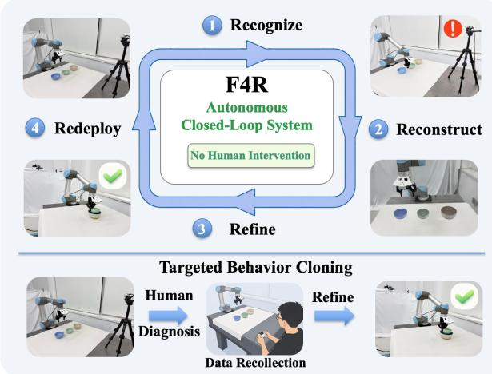  
Figure 1 Comparison of policy-improvement paradigms. F4R forms an autonomous closed loop that recognizes deployment failures, reconstructs them in simulation, refines the policy, and redeploys it without human intervention. In contrast, targeted behavior cloning follows an open-loop pipeline that requires manual diagnosis and repeated realworld data recollection, resulting in substantial human efort and limited scalability.

However, the efectiveness of real-to-sim-to-real learning depends on how the simulation environments are constructed. Manually designed scenarios or broad randomization may increase diversity, but they are not necessarily aligned with the failure distribution encountered in real-world deployment (Lin et al., 2026). As a result, the added diversity may improve overall performance, yet it does not necessarily provide targeted supervision signals for the recurring failure modes observed during real-world deployment. Our key insight is that each real-world failure identifies a specific set of conditions under which the current policy lacks robustness. Reconstructing these conditions in interactive simulation turns each realworld failure into a targeted and reusable training scenario, allowing the robot to revisit hard cases and explore corrective behaviors without collecting additional costly and unsafe real-world demonstrations.

Building on this insight, we propose F4R, a failuredriven real-to-sim-to-real framework that iteratively refines robot policies using failures observed during deployment. F4R employs a Vision-Language Model (VLM)-based diagnostic agent to identify failed executions and infer their underlying causes from deployment videos, and then reconstructs the corresponding objects and spatial configurations in interactive simulation. Since each reconstructed scene captures only one instance of a failure mode, F4R applies failure-aware randomization to generate a diverse set of failure-relevant configurations around the reconstructed scene. Using successful real-world demonstrations as seeds, F4R uses MimicGen to adapt their object-centric motion segments to the randomized reconstructed scenes and retains successful simulated rollouts for sim-real co-training. Following sim-real co-training, F4R further refines the policy through targeted reinforcement learning in the same environments before redeployment, allowing newly observed failures to drive subsequent refinement cycles. With this iterative refinement process, F4R achieves a 90.0% OOD success rate, outperforming the budget-matched Targeted BC baseline by 18.75 percentage points without additional real-world corrective demonstrations.

Our contributions are summarized as follows:

1. We develop a failure-guided reconstruction pipeline that converts real-world failures into geometrically consistent, photorealistic, and interactive simulation environments.

2. We propose a two-stage refinement strategy that combines failure-relevant sim-real co-training with targeted reinforcement learning, allowing newly observed failures to drive subsequent refinement cycles.

3. The components are integrated into F4R, a realto-sim-to-real framework that iteratively turns real-world failures into reusable training assets. Extensive experiments demonstrate its efectiveness in policy improvement without additional real-world corrective demonstrations.

## 2 Related Work

## 2.1 Real-to-Sim Reconstruction for Robot Learning

Grounding simulation environments in real-world observations provides a promising approach to narrowing the sim-to-real gap. RialTo (Torne Villasevil et al., 2024) reconstructs digital twins from realworld scans for RL-based policy adaptation. Recent studies increasingly leverage 3D Gaussian Splatting to improve visual fidelity. RL-GSBridge (Wu et al., 2025) couples Gaussian representations with simulation meshes, while RoboGSim (Li et al., 2025) and GS-Playground (Jia et al., 2026) integrate scene reconstruction, composition, physics, and data generation. RoboSplat (Yang et al., 2025) enables scene editing for data diversification, whereas EmbodieDreamer (Wang et al., 2025) and RoboSimGS (Zhao et al., 2026a) further improve visual and physical alignment. In parallel, URDFormer (Chen et al., 2024b) and Scalable Real2Sim (Pfaf et al., 2025) automate the recovery of simulation-ready geometry and physical properties.

Most existing pipelines, however, remain scene- or task-driven: the target environment is typically selected independently of the policy’s observed deployment failures. Consequently, the generated simulation data may increase overall diversity but are not explicitly concentrated on the hardest conditions under which the deployed policy is least robust. In contrast, F4R uses deployment failures to determine both what should be reconstructed and how each reconstructed scene should be expanded, thereby forming a failurecentered training distribution for targeted policy refinement.

## 2.2 VLA Adaptation via Sim-Real Co-Training and RL

Supervised fine-tuning is widely used to adapt generalist robot policies, but its performance is constrained by the coverage of available demonstrations. Sim-Real Co-training (Maddukuri et al., 2025) broadens this coverage by jointly training on real and simulated data, while task-relevant representation alignment improves cross-domain transfer (Cheng et al., 2025). Nevertheless, these approaches still rely on simulated demonstrations that suficiently cover deploymentrelevant conditions.

Reinforcement learning complements supervised training by improving policies through interaction. ReinboT (Zhang et al., 2025) introduces return maximization into ofline VLA training, while Con-RFT (Chen et al., 2025) combines ofline value learning with online refinement. SimpleVLA-RL (Li et al., 2026) scales outcome-based online RL through VLAspecific sampling and parallel interaction, and Rein-Flow (Zhang et al., 2026) and FPO (Lyu et al., 2026) extend RL to flow-based policies. RLinf-Co (Shi et al., 2026) combines sim-real co-training with simulation RL and real-data supervision. However, these methods generally optimize over predefined distributions rather than using deployment failures to determine where refinement is most needed.

Recent systems exploit execution feedback more explicitly. ASPIRE (Lu et al., 2026) diagnoses failures and repairs code-as-policy programs, consolidating validated solutions into a reusable skill library. TwinRL (Xu et al., 2026) reconstructs a workspacelevel digital twin to expand SFT coverage, initialize simulation RL, and guide human-in-the-loop realworld refinement. In contrast, F4R uses deployment failures to jointly determine what should be reconstructed and where training should be concentrated, forming a closed loop that converts newly observed failures into reusable simulation environments and targeted policy updates.

## 3 Method

F4R is an iterative real-to-sim-to-real framework that turns real-world failures into reusable training assets. As illustrated in Figure. 2, at refinement round r, the current policy $\pi _ { \theta } ^ { \bar { ( r ) } }$ is deployed in the real world to collect failed rollouts. F4R then (i) identifies the earliest failed subtask and the scene factors associated with it, (ii) reconstructs these task-relevant conditions in simulation and expands them through failure-aware randomization, (iii) generates successful corrective demonstrations and refines the policy through simreal co-training followed by targeted reinforcement learning, and (iv) redeploys the updated policy to initiate the next round.

## 3.1 Problem Formulation

Following (Chi et al., 2023), we denote $\mathcal { D } _ { \mathrm { r e a l } }$ as the original real-world demonstration set and the policy at refinement round r by $\pi _ { \boldsymbol { \theta } } ^ { ( r ) }$ . At time step $t ,$ the policy receives a visual observation $o _ { t }$ , robot state $s _ { t } .$ and language instruction ℓ. Let $c _ { t } = ( o _ { t } , s _ { t } , \ell )$ denote the policy context at time t. Given $c _ { t } .$ , the policy predicts an action chunk

$$
\mathbf { a } _ { t : t + H - 1 } \sim \pi _ { \theta } ^ { ( r ) } ( \cdot \mid c _ { t } ) ,\tag{1}
$$

where H is the action horizon. A deployment rollout is denoted by $\tau _ { i } = \{ ( c _ { i , t } , a _ { i , t } ) \} _ { t = 1 } ^ { T _ { i } } .$ , with binary task outcome $S ( \tau _ { i } ) \in \{ 0 , 1 \}$ . The failures observed at round r form ${ \mathcal { D } } _ { \mathrm { f a i l } } ^ { ( r ) } = \{ \tau _ { i } \ | \ S ( \tau _ { i } ) = 0 \}$ , and $N _ { r } = | \mathcal { D } _ { \mathrm { f a i l } } ^ { ( r ) } |$ |. The goal is to improve the policy around these observed failure scenarios while preserving the capabilities supported by $\mathcal { D } _ { \mathrm { r e a l } }$

## 3.2 Failure Recognition and Diagnosis

For each failed rollout $\tau _ { i }$ of $T _ { i }$ frames, F4R receives synchronized third-person and wrist-view image streams $\mathbf { I } _ { i } ^ { g } = \{ I _ { i , t } ^ { g } \} _ { t = 1 } ^ { T _ { i } }$ and $\mathbf { I } _ { i } ^ { w } = \{ I _ { i , t } ^ { w } \} _ { t = 1 } ^ { T _ { i } }$ , together with the task instruction $\ell _ { i } . \mathrm { ~ A ~ }$ lightweight temporal proposal module $\mathcal { P }$ identifies a small set of interaction-centered intervals from the two video streams. Each interval is summarized as a temporally ordered multi-view evidence board:

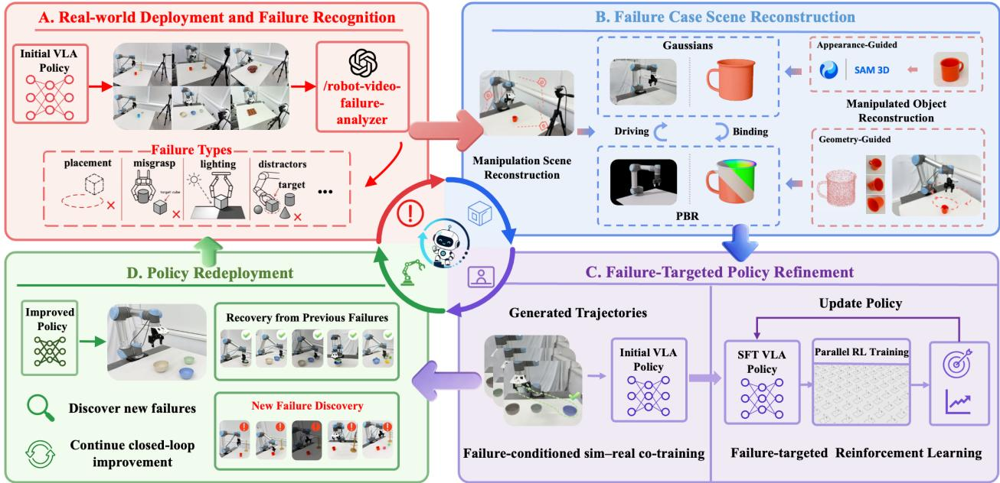  
Figure 2 Overview of the F4R architecture. (A) An initial policy is deployed in the real world to collect failure trajectories and task-relevant observations. (B) F4R reconstructs the failure scene in two stages. The resulting PBR meshes drive physical simulation, while the aligned Gaussians enable photorealistic rendering. (C) The policy first acquires corrective behaviors through failure-conditioned sim-real co-training and then improves them through targeted RL in the reconstructed environments. (D) The refined policy is redeployed and discovers new failure cases, closing the real-to-sim-to-real learning loop.

$$
\begin{array} { r } { \mathcal { W } _ { i } = \mathcal { P } ( \mathbf { I } _ { i } ^ { g } , \mathbf { I } _ { i } ^ { w } ) = \{ [ s _ { i , k } , e _ { i , k } ] \} _ { k = 1 } ^ { K _ { i } } , } \\ { \mathcal { B } _ { i , k } = \mathrm { B o a r d } \Big ( \{ \big ( I _ { i , t } ^ { g } , I _ { i , t } ^ { w } , t \big ) \} _ { t = s _ { i , k } } ^ { e _ { i , k } } \Big ) . } \end{array}\tag{2}
$$

Here, $[ s _ { i , k } , e _ { i , k } ]$ denotes the k-th proposed temporal interval, and Board(·) arranges synchronized thirdperson and wrist-view frames, together with their timestamps, into a temporally ordered visual board. The intervals are ordered chronologically, while an additional state board $B _ { i } ^ { \mathrm { s t a t e } }$ summarizes the initial and terminal scene states.

A VLM-based diagnostic agent $\mathcal { A } _ { \phi }$ examines the resulting evidence boards in temporal order and identifies the earliest visually supported failure, producing a structured failure record

$$
\begin{array} { r l } & { \mathcal { F } _ { i } = \mathcal { A } _ { \phi } \Big ( \{ \mathcal { B } _ { i , k } \} _ { k = 1 } ^ { K _ { i } } , { \mathcal { B } } _ { i } ^ { \mathrm { s t a t e } } , \ell _ { i } \Big ) } \\ & { \quad = ( t _ { i } ^ { \star } , \mathcal { O } _ { i } , \sigma _ { i } , \mathcal { Z } _ { i } , \mathcal { E } _ { i } , \kappa _ { i } ) , } \end{array}\tag{3}
$$

where $t _ { i } ^ { \star }$ is the earliest failure time, $\mathcal { O } _ { i }$ contains the task-relevant objects, $\sigma _ { i }$ describes the failed subtask and failure type, $\mathcal { Z } _ { i }$ specifies the failure-relevant scene factors, $\mathcal { E } _ { i }$ contains frame-grounded evidence, and $\kappa _ { i }$ denotes the diagnosis confidence. The resulting record determines which scene components should be reconstructed and which variables should be randomized.

Additional implementation details on temporal proposal generation, board construction, and diagnostic prompting are provided in Appendix.

## 3.3 Failure Case Reconstruction

Conditioned on the failure record $\mathcal { F } _ { i \underline { { : } } }$ F4R constructs a nominal interactive environment $\bar { \mathcal { M } } _ { i }$ that preserves the task-relevant objects $\mathcal { O } _ { i }$ , their spatial configuration, and the failure-associated conditions $\mathcal { Z } _ { i }$ . Reconstruction is performed at two levels: a shared manipulation scene recovers the static workspace, while reusable object assets recover the geometry, appearance, and optional articulation of the manipulated objects.

Manipulation scene reconstruction. As a one-time setup, a short RGB sequence of the workspace is captured with a smartphone and reconstructed using 3D Gaussian Splatting. The reconstructed workspace is registered to the simulator world frame and integrated with the robot and camera models in Isaac Sim. We denote the resulting shared scene asset by S. It provides a photorealistic representation of the static workspace and is reused across failure cases and refinement rounds. This capture is the only humanassisted stage of F4R, while failure diagnosis, object reconstruction, scene adaptation, and policy refinement proceed automatically.

Manipulated object reconstruction. For each taskrelevant object $o \in \mathcal { O } _ { i }$ , the robot autonomously acquires multi-view RGB-D observations $\gamma _ { o }$ using its wrist camera. The observations are stored in a COLMAP-style format (Schönberger and Frahm, 2016), including calibrated RGB-D frames, camera intrinsics and poses, and optional object masks. The reconstruction pipeline is summarized as

$$
\begin{array} { r } { \mathcal { V } _ { o } \to g _ { o } ^ { \mathrm { p c d } } \to g _ { o } ^ { \mathrm { m e s h } } \to \bar { g } _ { o } ^ { \mathrm { m e s h } } \to g _ { o } ^ { \mathrm { P B R } } \to g _ { o } ^ { \mathrm { G S } } . } \end{array}\tag{4}
$$

Specifically, depth refinement and TSDF fusion (Tan et al., 2026; Curless and Levoy, 1996) produce the metric point cloud $g _ { o } ^ { \mathrm { p c d } }$ . ShapeR (Siddiqui et al., 2026) completes the geometry into $g _ { o } ^ { \mathrm { m e s h } }$ , which is regularized into a watertight mesh $\bar { g } _ { o } ^ { \mathrm { m e s h } }$ . For articulated objects, a VLM together with P3-SAM (Ma et al., 2025) recovers the part-level kinematic structure $\scriptstyle { \mathcal { K } } _ { o }$ . Hunyuan3D (Team Hunyuan3D et al., 2025) synthesizes PBR materials to obtain $g _ { o } ^ { \mathrm { P B R } }$ , whose renderings are used to optimize the aligned Gaussian representation $g _ { o } ^ { \mathrm { G S } }$ . The object asset is represented as $\mathsf { A } _ { o } = ( g _ { o } ^ { \mathrm { P B R } } , g _ { o } ^ { \mathrm { G S } } , \mathcal { K } _ { o } )$ , supporting physical interaction, photorealistic rendering, and optional articulation, respectively. Regardless of the reconstruction route, the diagnosed factors $\mathcal { Z } _ { i }$ are grounded using the visual evidence $\mathcal { E } _ { i }$ into a nominal simulator parameter vector $\widehat { \xi } _ { i } .$ which specifies the object poses and articulation states, robot initialization, camera configuration, appearance, and physical properties. The shared scene asset S and object assets $\{ \mathsf { A } _ { o } \} _ { o \in \mathcal { O } _ { i } }$ are then assembled as

$$
\widehat { \mathcal { M } } _ { i } = \mathrm { A s s e m b l e } \left( \mathsf { S } , \{ \mathsf { A } _ { o } \} _ { o \in \mathcal { O } _ { i } } ; \widehat { \pmb { \xi } _ { i } } \right) .\tag{5}
$$

The resulting environment instantiates the taskrelevant conditions associated with failure i and serves as the center of subsequent failure-aware randomization.

## 3.4 Failure-Targeted Policy Refinement

A reconstructed scene represents only one realization of a failure and may cause overfitting. F4R expands each scene into a local failure-centered distribution and refines the policy through sim-real co-training followed by targeted RL.

Failure-aware domain randomization. Let $\widehat { \mathcal { M } } _ { i }$ denote the reconstructed simulation environment for failure $i ,$ and let $\xi _ { i } ^ { f }$ denote its recovered parameter vector, including object poses, robot initialization, camera configuration, appearance, and physical properties. F4R samples a new parameter vector $\xi$ and constructs a randomized environment $\mathcal { M } _ { i , \xi }$ as

$$
\xi \sim p _ { i } ^ { F } \Big ( \xi \mid \xi _ { i } ^ { f } , \mathcal { F } _ { i } \Big ) , \qquad \mathcal { M } _ { i , \xi } = \operatorname { R a n d } \Big ( \widehat { \mathcal { M } } _ { i } ; \xi \Big )\tag{6}
$$

where the failure record ${ \mathcal { F } } _ { i }$ determines the randomized variables and their ranges. Failure-relevant variables are sampled around the recovered configuration, while unrelated variables remain fixed. This preserves task semantics while covering local variations around the observed failure.

The overall failure-centered distribution is

$$
p _ { F } ( { \mathcal { M } } ) = { \frac { 1 } { | { \mathcal { D } } _ { \mathrm { f a i l } } | } } \sum _ { i = 1 } ^ { | { \mathcal { D } } _ { \mathrm { f a i l } } | } p _ { i } ^ { F } \Big ( { \mathcal { M } } \mid { \widehat { \mathcal { M } } } _ { i } , { \mathcal { F } } _ { i } \Big ) .\tag{7}
$$

It determines both where corrective demonstrations are generated and where RL interaction is concentrated.

Stage I: Failure-conditioned sim–real co-training. F4R uses successful trajectories from historical realworld rollouts as seed demonstrations for Mimic-Gen (Mandlekar et al., 2023). MimicGen adapts these demonstrations to environments sampled from $p _ { F } ( \mathcal { M } )$ , forming the failure-targeted dataset $\mathcal { D } _ { \mathrm { s i m } } ^ { F }$ . If the available successful trajectories are insuficient to support MimicGen, AnyGrasp (Fang et al., 2023) is used to generate additional grasp proposals and supplement the seed demonstrations. The resulting simulated trajectories are co-trained with the original real-world data:

$$
\begin{array} { r } { \mathcal { L } _ { \mathrm { C T } } ( \theta ) = \mathcal { L } _ { \mathrm { S F T } } \left( \theta ; \mathcal { D } _ { \mathrm { r e a l } } \right) + \lambda _ { \mathrm { s i m } } \mathcal { L } _ { \mathrm { S F T } } \left( \theta ; \mathcal { D } _ { \mathrm { s i m } } ^ { F } \right) } \end{array}\tag{8}
$$

The simulated data provide failure-specific corrections, while the real data preserve existing capabilities and provide a stable initialization for RL.

Stage II: Failure-targeted reinforcement learning. Starting from the co-trained policy, $\theta _ { \mathrm { R L } } ^ { ( 0 ) } = \theta _ { \mathrm { C T } }$ , F4R performs PPO in environments sampled from $p _ { F } ( \mathcal { M } )$ It retains the original task reward without failurespecific reward shaping. An auxiliary SFT objective on the original real-world data is used during optimization:

$$
\mathcal { L } _ { \mathrm { F 4 R } } ( \theta ) = \mathcal { L } _ { \mathrm { P P O } } \left( \theta ; p _ { F } ( \mathcal { M } ) \right) + \beta \mathcal { L } _ { \mathrm { S F T } } \left( \theta ; \mathcal { D } _ { \mathrm { r e a l } } \right)\tag{9}
$$

RL improves closed-loop and contact-sensitive behaviors, while real-data supervision mitigates catastrophic forgetting.

<table><tr><td rowspan="2">Method</td><td colspan="4">In Distribution</td><td rowspan="2">ID Avg.</td><td colspan="4">Out of Distribution</td><td rowspan="2">OOD Avg.</td></tr><tr><td>Pick Fruits</td><td>Place Cup on Coaster</td><td>Stack Bowls</td><td>Place Block in Drawer</td><td> $\mathrm { P i c k }$  Fruits</td><td>Place Cup on Coaster</td><td>Stack Bowls</td><td>Place Block in Drawer</td></tr><tr><td>Base</td><td>70%</td><td>60%</td><td>50%</td><td>70%</td><td>62.5%</td><td>40%</td><td>35%</td><td>30%</td><td>0%</td><td>26.25%</td></tr><tr><td>Targeted BC</td><td>100%</td><td>95%</td><td>80%</td><td>90%</td><td>91.25%</td><td>85%</td><td>80%</td><td>60%</td><td>60%</td><td>71.25%</td></tr><tr><td>RLinf-Co</td><td>95%</td><td>85%</td><td>80%</td><td>90%</td><td>87.5%</td><td>90%</td><td>70%</td><td>70%</td><td>80%</td><td>77.5%</td></tr><tr><td>F4R (Ours)</td><td>100%</td><td>95%</td><td>85%</td><td>95%</td><td>93.75%</td><td>100%</td><td>95%</td><td>80%</td><td>85%</td><td>90%</td></tr></table>

Table 1 Success rates on four representative tasks under the original distribution and the deployment-derived failure distribution.

## 3.5 Closed-Loop Redeployment

After refinement, the updated policy is redeployed and evaluated on both previous failures and new configurations. Failures that persist or emerge anew are incorporated into the next round of reconstruction and refinement. Through this iterative deployment– reconstruction–refinement process, F4R converts transient real-world failures into reusable training assets and progressively aligns policy improvement with the conditions encountered during actual operation.

## 4 Experiments

We evaluate F4R through simulation and real-world experiments. Our evaluation addresses five questions. (1) Can F4R improve real-world performance on observed deployment failures? (2) Do the reconstructed environments preserve task-relevant behavioral dificulty and reduce real data requirements? (3) Does F4R generalize across diferent failure-inducing variations? (4) Does F4R support efective closed-loop policy improvement? (5) How do diferent parts afect the optimization and capability retention?

## 4.1 Experimental Setup

Tasks and Evaluation Protocol. We evaluate our method on eight tabletop manipulation tasks (Figure 3) by comparing binary success rates. Four representative tasks are further selected for policy-refinement experiments. We define the In-Distribution (ID) setting as task configurations covered by the original data-collection distribution, and the Out-of-Distribution (OOD) setting as deployment failure conditions absent from that distribution. Realworld performance is measured over 20 trials in each setting, while simulation performance is evaluated using one rollout in each of 100 parallel environments. All methods use identical evaluation configurations and trial budgets.

Implementation Details. Our platform consists of a UR5e with a Robotiq 2F-85 gripper and two Intel RealSense D435i cameras: a fixed third-person camera and a wrist-mounted camera. We initialize the policy from $\pi _ { 0 . 5 }$ (Intelligence et al., 2025) and fine-tune LoRA adapters using AdamW. Supervised Fine-Tuning (SFT) is performed with FSDP on four NVIDIA H20 GPUs, using 32 samples per GPU. Policy refinement uses PPO with trainable LoRA adapters and a value head. Since H20 GPUs lack RT cores, two NVIDIA RTX 4090 GPUs run Isaac Lab and collect rollouts from 256 environments, while the H20 GPUs handle policy inference and optimization. The two sides communicate through a Ray cluster over SSH. PPO is trained for 200 update steps.

## 4.2 Real-World Refinement on Deployment Failures

Table 1 evaluates F4R on failures encountered during real-world deployment. We compare against Targeted Behavior Cloning (Targeted BC), which collects corrective demonstrations from the real failure distribution, and RLinf-Co, which performs sim–real co-training followed by simulation RL. Targeted BC receives one hour of real-world data collection. RLinf-Co and F4R instead collect simulated experience for 10 minutes using 256 parallel environments, with the remaining 50 minutes accounting for reconstruction. In practice, scene reconstruction takes 25–30 minutes and object preparation takes 5–10 minutes. Importantly, scene reconstruction is a one-time setup. The reconstructed environment can be reused across subsequent failure-refinement cycles and only needs to be rebuilt when the physical workspace changes. Because task horizons vary, we match data-preparation time rather than trajectory count. RLinf-Co and F4R use identical architectures, training settings, and rollout budgets. Their only diference is the training distribution: RLinf-Co uses broad domain randomization, whereas F4R concentrates randomization around diagnosed failures.

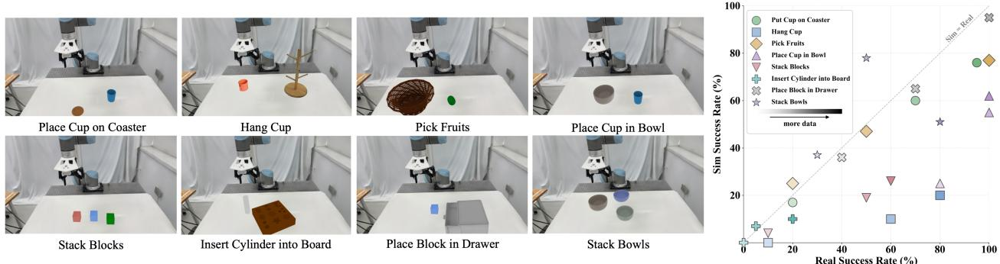

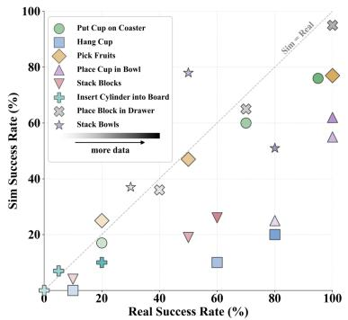  
Figure 3 Sim–real behavioral consistency. Reconstructed environments for eight tabletop tasks and simulation versus real-world success rates for 24 policy checkpoints. Each marker represents one task and demonstration scale.

Targeted BC achieves 91.25% success on the original distribution and 71.25% on the failure distribution, showing that corrective demonstrations are efective but require substantial real-world interaction. RLinf-Co improves failure-distribution success to 77.5%. Its training loss also converges, suggesting that the remaining gap is not caused by insuficient optimization. Instead, broad randomization may enlarge the sim-to-real gap and dilute training around relevant failures. By concentrating both trajectory generation and RL interaction on failure-relevant variations, F4R achieves 93.75% and 90.0% success on the original and failure distributions, respectively. It outperforms Targeted BC and RLinf-Co by 18.75 and 12.5 percentage points on the failure distribution.

The benefit is particularly clear on the multi-stage Place Block in Drawer task. Notably, when the drawer orientation difers from the original demonstrations, the base policy fails all closing attempts. This suggests that the supervised fine-tuned VLA model learns orientation-specific action patterns rather than transferable drawer kinematics. Targeted BC reaches 60% success, while RLinf-Co and F4R achieve 80% and 85%, respectively. These results highlight the value of simulation interaction for acquiring contactsensitive behaviors that are dificult to capture with fixed demonstrations.

## 4.3 Reliability of Autonomous Failure Diagnosis

We independently evaluate the reliability of F4R’s diagnosis module on eight tasks. For each task, we collect ten rollout trajectories, yielding 80 trajectories in total. Each trajectory is manually annotated with its failure stage and underlying cause. GPT-5.5, equipped with our robot-video-failure-analyzer skill, then predicts both labels. A diagnosis is considered correct only when both predictions match the human

annotations.
<table><tr><td>Result</td><td>Trajectories</td><td>Rate</td></tr><tr><td>Correct after one attempt</td><td>69 / 80</td><td>86.25%</td></tr><tr><td>Correct within two attempts</td><td>74 / 80</td><td>92.50%</td></tr><tr><td>Remaining: camera-viewpoint shift</td><td>4/ 80</td><td>5.00%</td></tr><tr><td>Remaining: illumination change</td><td>2 / 80</td><td>2.50%</td></tr></table>

Table 2 Autonomous failure-diagnosis accuracy. Results on 80 manually annotated trajectories from eight tasks.

As shown in Table 2, F4R correctly diagnoses 69 of 80 trajectories on the first attempt, achieving 86.25% accuracy. A second attempt resolves five of the remaining eleven cases, increasing accuracy to 92.5%. Among the six unresolved trajectories, four involve subtle camera-viewpoint shifts, and two involve illumination changes. These failures often require comparing the current observation with earlier frames to separate visual changes from actual task events. To assess compatibility with diferent VLM backends, we further evaluate several mainstream models on the public ViFailback dataset (Zeng et al., 2025). Without task-specific adaptation, the best-performing GPT model achieves nearly 70% accuracy; complete results are provided in the appendix. These findings reveal a remaining limitation in reasoning over fine-grained temporal evidence, motivating the simulation-side validation and fallback mechanisms in F4R.

## 4.4 Sim–Real Consistency and Data Efficiency

A reconstructed environment is useful only if it preserves real-world behavioral trends. We evaluate this property across eight tabletop tasks with diverse objects and interaction complexities. For each task, we train policies using 10, 30, and 50 real-world demonstrations, yielding 24 checkpoints evaluated under matched configurations and success criteria in simulation and reality. This setup assesses whether reconstruction captures both task dificulty and performance gains from additional training data.

Figure 3 shows a strong positive correlation between simulation and real-world success rates (Pearson $r = 0 . 7 6 2 5 , p = 1 . 4 9 \times 1 0 ^ { - 5 } )$ . Checkpoints trained with more demonstrations generally move toward the upper-right region, while the reconstructed environments preserve broad diferences in task dificulty. Deviations from the diagonal reflect residual gaps in appearance, contact dynamics, and execution sensitivity, so simulation success is not an exact estimate of real-world performance. Nevertheless, the consistent ranking across tasks, checkpoints, and data scales supports using these environments as behavioral proxies.

## 4.5 Robustness Across Failure Conditions

We evaluate whether F4R generalizes beyond a single reconstructed condition using four heterogeneous deployment failure-inducing variations in Pick Fruits. These variations cover geometric, visual, and clutterrelated shifts.

<table><tr><td>Condition</td><td>Base</td><td>F4R  $\mathrm { w } / \mathrm { o }$  RL</td><td>F4R</td></tr><tr><td>Object layout</td><td>40%</td><td>100%</td><td>100%</td></tr><tr><td>Illumination</td><td>55%</td><td>80%</td><td>90%</td></tr><tr><td>Background</td><td>65%</td><td>100%</td><td>100%</td></tr><tr><td>Distractors</td><td>25%</td><td>55%</td><td>70%</td></tr></table>

Table 3 Robustness across failure conditions. Real-world success rates on Pick Fruits under four variations.

As shown in Table 3, F4R improves performance under every condition, increasing the average success rate from 46.25% to 90.0%. Co-training alone reaches 83.75%, while targeted RL provides further gains under illumination and distractors. These consistent improvements demonstrate that F4R generalizes across diverse failure-inducing variations.

## 4.6 Multi-Round Closed-Loop Refinement.

To evaluate multi-round closed-loop refinement, we conduct three consecutive refinement cycles on two tasks. After each cycle, the refined policy is redeployed, and newly observed failures are used to guide the next round of reconstruction and training. As shown in Figure 4, the success rate on Stack Bowls progressively increases from 30% to 80%, 90%, and 95%. This gradual improvement suggests that successive cycles address residual failure modes that remain after earlier refinements. On Pick Fruits, the first cycle raises performance from 40% to 100%, which is maintained throughout the next two cycles. The diferent convergence patterns indicate that F4R can support both gradual correction and rapid saturation, depending on task dificulty. Overall, these results show that F4R can continually address newly observed failures while preserving capabilities acquired in earlier rounds.

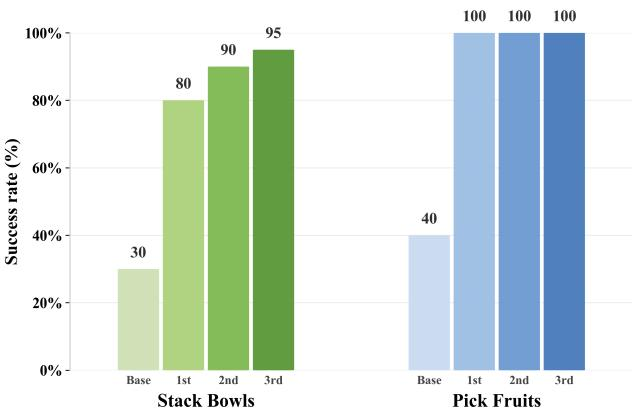  
Figure 4 Multi-round closed-loop policy refinement. Real world success rates of the base policy and the refined policies after three consecutive F4R cycles.

## 4.7 Ablation Study

<table><tr><td>Method</td><td>ID Avg.</td><td>OOD Avg.</td></tr><tr><td>Base</td><td>62.5%</td><td>26.25%</td></tr><tr><td>F4R w/o Failure Diag.</td><td>87.5%</td><td>77.5%</td></tr><tr><td>F4R w/o Real-Data</td><td>85%</td><td>86.25%</td></tr><tr><td>F4R</td><td>93.75%</td><td>90%</td></tr></table>

Table 4 Ablation of failure diagnosis and real-data supervision. Average real-world success rates (%) over four tasks under ID and OOD conditions. “w/o Failure Diag.” uses broad domain randomization, while $^ { 6 } \mathrm { w } / \mathrm { o }$ Real-Data” removes real-data supervision from the SFT and RL stages.

Efects of Failure Diagnosis and Real-Data Supervision. Table 4 evaluates the two components. Replacing failure-aware randomization with broad randomization reduces ID and OOD success by 6.25 and 12.5 points, showing that diagnosis is particularly important for targeting OOD failures. Removing realdata supervision throughout refinement reduces ID success by 8.75 points but OOD success by only 3.75 points. This indicates that failure-targeted simulation corrects observed weaknesses, while real data mainly prevents forgetting. Combining both components, F4R achieves 93.75% ID and 90.0% OOD success.

Efects of Co-Training and RL. Table 5 isolates the contributions of the two policy-refinement stages. Removing Stage I leaves RL to optimize the base policy using simulated interaction and sparse task-success rewards, while retaining auxiliary supervision from the original real-world data. This variant improves the Base by only 13.75 percentage points under ID conditions and 6.25 points under OOD conditions, reaching 76.25% and 32.5%, respectively. The limited OOD improvement indicates that the base policy rarely discovers successful behaviors in severe failure regions through sparse-reward exploration alone. In contrast, Stage I co-training without subsequent RL achieves 90.0% ID and 83.75% OOD success, showing that failure-conditioned corrective demonstrations provide an efective initialization and account for most of the overall gain. Stage II RL further improves the co-trained policy by 3.75 and 6.25 points, yielding 93.75% ID and 90.0% OOD success. These results show that co-training addresses the primary failure modes and alleviates exploration dificulty, while RL further refines closed-loop behaviors beyond fixed demonstrations.

<table><tr><td>Method</td><td>ID Avg.</td><td>OOD Avg.</td></tr><tr><td>Base</td><td>62.5%</td><td>26.25%</td></tr><tr><td>F4R w/o Stage I SFT</td><td>76.25%</td><td>32.5%</td></tr><tr><td>F4R w/o Stage II RL</td><td>90%</td><td>83.75%</td></tr><tr><td>F4R</td><td>93.75%</td><td>90%</td></tr></table>

Table 5 Ablation of the policy-refinement stages. Average real-world success rates (%) over four tasks under ID and OOD conditions. Stage I denotes failure-driven sim–real co-training, and Stage II denotes reinforcement learning.

## 5 Conclusion

In this work, we present F4R, a failure-driven real-tosim-to-real framework that transforms deployment failures into targeted training opportunities. F4R employs an agent equipped with a dedicated failure discovery and diagnosis skill to analyze failed trajectories, reconstructs their task-relevant conditions in simulation, and refines the policy through failure-conditioned sim–real co-training followed by targeted RL. Real-world experiments demonstrate consistent improvements under both ID and OOD conditions, outperforming a budget-matched Targeted BC baseline while reducing reliance on additional real-world demonstrations. Multi-round refinement further shows that failures discovered after redeployment can guide subsequent updates, supporting continuous closed-loop improvement. These results establish deployment failures as practical signals for directing simulation generation and policy optimization. Future work will scale F4R to broader manipulation domains and investigate more eficient mechanisms to prioritize and reuse accumulated failure cases as deployment proceeds.

## References

Shuai Bai, Yuxuan Cai, Ruizhe Chen, Keqin Chen, Xionghui Chen, Zesen Cheng, Lianghao Deng, Wei Ding, Chang Gao, Chunjiang Ge, et al. Qwen3-vl technical report. arXiv preprint arXiv:2511.21631, 2025.

Kevin Black, Noah Brown, Danny Driess, Adnan Esmail, Michael Equi, Chelsea Finn, Niccolo Fusai, Lachy Groom, Karol Hausman, Brian Ichter, Szymon Jakubczak, Tim Jones, Liyiming Ke, Sergey Levine, Adrian Li-Bell, Mohith Mothukuri, Suraj Nair, Karl Pertsch, Lucy Xiaoyang Shi, James Tanner, Quan Vuong, Anna Walling, Haohuan Wang, and Ury Zhilinsky. π0: A vision-language-action flow model for general robot control, 2024. https://arxiv.org/abs/2410. 24164.

Danpeng Chen, Hai Li, Weicai Ye, Yifan Wang, Weijian Xie, Shangjin Zhai, Nan Wang, Haomin Liu, Hujun Bao, and Guofeng Zhang. Pgsr: Planar-based gaussian splatting for eficient and high-fidelity surface reconstruction. IEEE Transactions on Visualization and Computer Graphics, 31(9):6100–6111, 2024a.

Qiuyu Chen, Aaron Walsman, Marius Memmel, Kaichun Mo, Alex Fang, Dieter Fox, and Abhishek Gupta. URD-Former: A pipeline for constructing articulated simulation environments from real-world images. In Proceedings of Robotics: Science and Systems, Delft, Netherlands, July 2024b. doi: 10.15607/RSS.2024.XX.124.

Yuhui Chen, Shuai Tian, Shugao Liu, Yingting Zhou, Haoran Li, and Dongbin Zhao. ConRFT: A reinforced fine-tuning method for VLA models via consistency policy. In Proceedings of Robotics: Science and Systems, Los Angeles, CA, USA, June 2025. doi: 10.15607/RSS. 2025.XXI.019.

Shuo Cheng, Liqian Ma, Zhenyang Chen, Ajay Mandlekar, Caelan Garrett, and Danfei Xu. Generalizable domain adaptation for sim-and-real policy co-training. In Advances in Neural Information Processing Systems, 2025.

Cheng Chi, Zhenjia Xu, Siyuan Feng, Eric Cousineau, Yilun Du, Benjamin Burchfiel, Russ Tedrake, and Shuran Song. Difusion policy: Visuomotor policy learning via action difusion. In Robotics: Science and Systems, 2023.

Brian Curless and Marc Levoy. A volumetric method for building complex models from range images. In Proceedings of the 23rd Annual Conference on Computer Graphics and Interactive Techniques, SIGGRAPH ’96, page 303–312, New York, NY, USA, 1996. Association for Computing Machinery. ISBN 0897917464. doi: 10.1145/237170.237269. https://doi.org/10.1145/ 237170.237269.

Hao-Shu Fang, Chenxi Wang, Hongjie Fang, Minghao Gou, Jirong Liu, Hengxu Yan, Wenhai Liu, Yichen Xie, and Cewu Lu. Anygrasp: Robust and eficient grasp

perception in spatial and temporal domains. IEEE Transactions on Robotics, 39(5):3929–3945, 2023.

Senyu Fei, Siyin Wang, Junhao Shi, Zihao Dai, Jikun Cai, Pengfang Qian, Li Ji, Xinzhe He, Shiduo Zhang, Zhaoye Fei, Jinlan Fu, Jingjing Gong, and Xipeng Qiu. LIBERO-Plus: A progressive robustness benchmark for visual-language-action models. In Proceedings of the IEEE/CVF Conference on Computer Vision and Pattern Recognition (CVPR), pages 38574–38583, June 2026.

Physical Intelligence, Kevin Black, Noah Brown, James Darpinian, Karan Dhabalia, Danny Driess, Adnan Esmail, Michael Equi, Chelsea Finn, Niccolo Fusai, Manuel Y. Galliker, Dibya Ghosh, Lachy Groom, Karol Hausman, Brian Ichter, Szymon Jakubczak, Tim Jones, Liyiming Ke, Devin LeBlanc, Sergey Levine, Adrian Li-Bell, Mohith Mothukuri, Suraj Nair, Karl Pertsch, Allen Z. Ren, Lucy Xiaoyang Shi, Laura Smith, Jost Tobias Springenberg, Kyle Stachowicz, James Tanner, Quan Vuong, Homer Walke, Anna Walling, Haohuan Wang, Lili Yu, and Ury Zhilinsky. π0.5: a visionlanguage-action model with open-world generalization, 2025. https://arxiv.org/abs/2504.16054.

Yufei Jia, Heng Zhang, Ziheng Zhang, Junzhe Wu, Mingrui Yu, Zifan Wang, Dixuan Jiang, Zheng Li, Chenyu Cao, Zhuoyuan Yu, Xun Yang, Haizhou Ge, et al. GS-Playground: A high-throughput photorealistic simulator for vision-informed robot learning. In Proceedings of Robotics: Science and Systems, 2026.

Bernhard Kerbl, Georgios Kopanas, Thomas Leimkühler, and George Drettakis. 3D Gaussian Splatting for realtime radiance field rendering. ACM Transactions on Graphics, 42(4), July 2023. https://repo-sam.inria.fr/ fungraph/3d-gaussian-splatting/.

Alexander Khazatsky, Karl Pertsch, Suraj Nair, Ashwin Balakrishna, Sudeep Dasari, Siddharth Karamcheti, Soroush Nasiriany, Mohan Kumar Srirama, Lawrence Yunliang Chen, Kirsty Ellis, et al. Droid: A large-scale in-the-wild robot manipulation dataset. In RSS 2024 Workshop: Data Generation for Robotics, 2024.

Moo Jin Kim, Karl Pertsch, Siddharth Karamcheti, Ted Xiao, Ashwin Balakrishna, Suraj Nair, Rafael Rafailov, Ethan P Foster, Pannag R Sanketi, Quan Vuong, et al. Openvla: An open-source vision-language-action model. In Conference on Robot Learning, pages 2679–2713. PMLR, 2025.

Jason Lee, Jiafei Duan, Haoquan Fang, Yuquan Deng, Boyang Li, Shuo Liu, Bohan Fang, Jieyu Zhang, Yi Ru Wang, Sangho Lee, et al. Molmoact: Action reasoning models that can reason in space. In Workshop on Making Sense of Data in Robotics: Composition, Curation, and Interpretability at Scale at CoRL 2025, 2025.

Haozhan Li, Yuxin Zuo, Jiale Yu, Yuhao Zhang, Zhaohui Yang, Kaiyan Zhang, et al. SimpleVLA-RL: Scaling

VLA training via reinforcement learning. In The Fourteenth International Conference on Learning Representations, 2026. https://openreview.net/forum?id= TQhSodCM4r.

Xinhai Li, Jialin Li, Ziheng Zhang, Rui Zhang, Fan Jia, Tiancai Wang, Haoqiang Fan, Kuo-Kun Tseng, and Ruiping Wang. Robogsim: A real2sim2real robotic gaussian splatting simulator, 2025. https://arxiv.org/ abs/2411.11839.

Zijun Lin, Jiafei Duan, Haoquan Fang, Dieter Fox, Ranjay Krishna, Cheston Tan, and Bihan Wen. FailSafe: Reasoning and recovery from failures in vision-languageaction models. In Proceedings of the IEEE/RSJ International Conference on Intelligent Robots and Systems (IROS), 2026.

Runyu Lu, Yubo Wu, Ethan Kou, Letian Fu, Wenli Xiao, Ajay Mandlekar, Yinzhen Xu, Guanya Shi, Ken Goldberg, Ang Chen, Mosharaf Chowdhury, Yuke Zhu, Linxi "Jim" Fan, and Guanzhi Wang. Aspire: Agentic /skills discovery for robotics, 2026. https: //arxiv.org/abs/2607.00272.

Mingyang Lyu, Yinqian Sun, Erliang Lin, Huangrui Li, Ruolin Chen, Feifei Zhao, and Yi Zeng. Reinforcement fine-tuning of flow-matching policies for visionlanguage-action models, 2026. https://arxiv.org/abs/ 2510.09976.

Changfeng Ma, Yang Li, Xinhao Yan, Jiachen Xu, Yunhan Yang, Chunshi Wang, Zibo Zhao, Yanwen Guo, Zhuo Chen, and Chunchao Guo. P3-sam: Native 3d part segmentation, 2025. https://arxiv.org/abs/2509.06784.

Abhiram Maddukuri, Zhenyu Jiang, Lawrence Yunliang Chen, Soroush Nasiriany, Yuqi Xie, Yu Fang, Wenqi Huang, Zu Wang, Zhenjia Xu, Nikita Chernyadev, Scott Reed, Ken Goldberg, Ajay Mandlekar, Linxi Fan, and Yuke Zhu. Sim-and-real co-training: A simple recipe for vision-based robotic manipulation, 2025. https://arxiv.org/abs/2503.24361.

Ajay Mandlekar, Soroush Nasiriany, Bowen Wen, Iretiayo Akinola, Yashraj Narang, Linxi Fan, Yuke Zhu, and Dieter Fox. Mimicgen: A data generation system for scalable robot learning using human demonstrations. In Conference on Robot Learning, pages 1820–1864. PMLR, 2023.

Soroush Nasiriany, Abhiram Maddukuri, Lance Zhang, Adeet Parikh, Aaron Lo, Abhishek Joshi, Ajay Mandlekar, and Yuke Zhu. Robocasa: Large-scale simulation of everyday tasks for generalist robots. In RSS 2024 Workshop: Data Generation for Robotics, 2024.

Nicholas Pfaf, Evelyn Fu, Jeremy Binagia, Phillip Isola, and Russ Tedrake. Scalable real2sim: Physics-aware asset generation via robotic pick-and-place setups. In 2025 IEEE/RSJ International Conference on Intelligent Robots and Systems (IROS), pages 6296–6303, 2025. doi: 10.1109/IROS60139.2025.11246653.

Nikhila Ravi, Valentin Gabeur, Yuan-Ting Hu, Ronghang Hu, Chaitanya Ryali, Tengyu Ma, Haitham Khedr, Roman Rädle, Chloe Rolland, Laura Gustafson, Eric Mintun, Junting Pan, Kalyan Vasudev Alwala, Nicolas Carion, Chao-Yuan Wu, Ross Girshick, Piotr Dollár, and Christoph Feichtenhofer. Sam 2: Segment anything in images and videos. arXiv preprint arXiv:2408.00714, 2024. https://arxiv.org/abs/2408.00714.

Johannes Lutz Schönberger and Jan-Michael Frahm. Structure-from-motion revisited. In Conference on Computer Vision and Pattern Recognition (CVPR), 2016.

Liangzhi Shi, Shuaihang Chen, Feng Gao, Yinuo Chen, Kang Chen, Tonghe Zhang, Hongzhi Zang, Jiakai Zhou, Weinan Zhang, Chao Yu, and Yu Wang. Beyond imitation: Reinforcement learning-based sim-real cotraining for vla models, 2026. https://arxiv.org/abs/ 2602.12628.

Yawar Siddiqui, Duncan Frost, Samir Aroudj, Armen Avetisyan, Henry Howard-Jenkins, Daniel DeTone, Pierre Moulon, Qirui Wu, Zhengqin Li, Julian Straub, Richard Newcombe, and Jakob Engel. Shaper: Robust conditional 3d shape generation from casual captures, 2026. https://arxiv.org/abs/2601.11514.

Bin Tan, Changjiang Sun, Xiage Qin, Hanat Adai, Zelin Fu, Tianxiang Zhou, Han Zhang, Yinghao Xu, Xing Zhu, Yujun Shen, and Nan Xue. Masked depth modeling for spatial perception, 2026. https://arxiv.org/ abs/2601.17895.

Team Hunyuan3D, Shuhui Yang, Mingxin Yang, Yifei Feng, Xin Huang, Sheng Zhang, Zebin He, Di Luo, Haolin Liu, Yunfei Zhao, Qingxiang Lin, Zeqiang Lai, Xianghui Yang, Huiwen Shi, Zibo Zhao, Bowen Zhang, Hongyu Yan, Lifu Wang, Sicong Liu, Jihong Zhang, Meng Chen, Liang Dong, Yiwen Jia, Yulin Cai, Jiaao Yu, Yixuan Tang, Dongyuan Guo, Junlin Yu, Hao Zhang, Zheng Ye, Peng He, Runzhou Wu, Shida Wei, Chao Zhang, Yonghao Tan, Yifu Sun, Lin Niu, Shirui Huang, Bojian Zheng, Shu Liu, Shilin Chen, Xiang Yuan, Xiaofeng Yang, Kai Liu, Jianchen Zhu, Peng Chen, Tian Liu, Di Wang, Yuhong Liu, Linus, Jie Jiang, Jingwei Huang, and Chunchao Guo. Hunyuan3d 2.1: From images to high-fidelity 3d assets with productionready pbr material, 2025. https://arxiv.org/abs/2506. 15442.

Marcel Torne Villasevil, Anthony Simeonov, Zechu Li, April Chan, Tao Chen, Abhishek Gupta, and Pulkit Agrawal. Reconciling reality through simulation: A real-to-sim-to-real approach for robust manipulation. In Proceedings of Robotics: Science and Systems, Delft, Netherlands, July 2024.

Boyuan Wang, Xinpan Meng, Xiaofeng Wang, Zheng Zhu, Angen Ye, Yang Wang, Zhiqin Yang, Chaojun Ni, Guan Huang, and Xingang Wang. Embodiedreamer: Advancing real2sim2real transfer for policy training via

embodied world modeling, 2025. https://arxiv.org/ abs/2507.05198.

Yuxuan Wu, Lei Pan, Wenhua Wu, Guangming Wang, Yanzi Miao, Fan Xu, and Hesheng Wang. RL-GSbridge: 3d gaussian splatting based real2sim2real method for robotic manipulation learning. In 2025 IEEE International Conference on Robotics and Automation (ICRA), pages 192–198. IEEE, 2025.

Qinwen Xu, Jiaming Liu, Rui Zhou, Shaojun Shi, Nuowei Han, Zhuoyang Liu, Chenyang Gu, Shuo Gu, Yang Yue, Gao Huang, Wenzhao Zheng, Sirui Han, Peng Jia, and Shanghang Zhang. TwinRL: Digital twin-driven reinforcement learning for real-world robotic manipulation. In Proceedings of the 34th ACM International Conference on Multimedia. Association for Computing Machinery, 2026.

Sizhe Yang, Wenye Yu, Jia Zeng, Jun Lv, Kerui Ren, Cewu Lu, Dahua Lin, and Jiangmiao Pang. Novel Demonstration Generation with Gaussian Splatting Enables Robust One-Shot Manipulation. In Proceedings of Robotics: Science and Systems, Los Angeles, CA, USA, June 2025.

Xianchao Zeng, Xinyu Zhou, Youcheng Li, Jiayou Shi, Tianle Li, Liangming Chen, Lei Ren, and Yong-Lu Li. Diagnose, correct, and learn from manipulation failures via visual symbols, 2025. https://arxiv.org/abs/2512. 02787.

Hongyin Zhang, Zifeng Zhuang, Han Zhao, Pengxiang Ding, Hongchao Lu, and Donglin Wang. Reinbot: Amplifying robot visual-language manipulation with reinforcement learning. In International Conference on Machine Learning, pages 77254–77271. PMLR, 2025.

Tonghe Zhang, Chao Yu, Sichang Su, and Yu Wang. ReinFlow: Fine-tuning flow matching policy with online reinforcement learning. Advances in Neural Information Processing Systems, 38:106282–106319, 2026.

Haoyu Zhao, Cheng Zeng, Linghao Zhuang, Yaxi Zhao, Shengke Xue, Hao Wang, Xingyue Zhao, Zhongyu Li, Kehan Li, Siteng Huang, Mingxiu Chen, Xin Li, Deli Zhao, and Hua Zou. High-fidelity simulated data generation for real-world zero-shot robotic manipulation learning with gaussian splatting. IEEE Robotics and Automation Letters, 11(5):5310–5317, 2026a. doi: 10.1109/LRA.2026.3671535.

Haoyu Zhao, Cheng Zeng, Linghao Zhuang, Yaxi Zhao, Shengke Xue, Hao Wang, Xingyue Zhao, Zhongyu Li, Kehan Li, Siteng Huang, et al. High-fidelity simulated data generation for real-world zero-shot robotic manipulation learning with gaussian splatting. IEEE Robotics and Automation Letters, 2026b.

## Supplementary Material

## Contents

S1. Failure Recognition and Diagnosis Details 13   
S2. Failure-Case Reconstruction Details 21   
S3. Failure-Aware Randomization and Refinement . 24   
S4. Complete Experimental Setup 26   
S5. Additional Quantitative Results 30   
S6. Qualitative Results and Limitations . 33

## Supplementary Overview

This supplementary material provides implementation details, complete experimental protocols, additional quantitative results, qualitative analyses, and reproducibility information for F4R. The material is organized as follows:

• Section S1 describes failure recognition and diagnosis, including temporal evidence proposal, evidence-board construction, prompting, validation, and additional VLM evaluations.

• Section S2 details manipulation-scene and manipulated-object reconstruction and clarifies the human efort required by the system.

• Section S3 provides failure-aware randomization, MimicGen data generation, co-training, and PPO implementation details.

• Section S4 specifies the robot platform, tasks, distributions, success criteria, baselines, and budget matching.

• Section S5 reports complete and additional quantitative results.

• Section S6 presents qualitative examples, failure cases, limitations, and safety considerations.

## S1 Failure Recognition and Diagnosis Details

## S1.1 Input and output

A task-specific binary success checker first separates successful and failed deployment rollouts. The diagnostic skill operates only on known failures; accordingly, its sample-level JSON fixes success=no and focuses on localizing and attributing the earliest cause. For failed rollout i, the input contains RGB frames with matching indices from a wrist-mounted camera (eyeinhand in the released code) and a fixed external camera (main). If the streams have diferent lengths, only their common prefix is retained:

$$
\tau _ { i } = \{ ( I _ { i , t } ^ { w } , I _ { i , t } ^ { g } ) \} _ { t = 0 } ^ { T _ { i } - 1 } , \qquad T _ { i } = \mathrm { m i n } ( T _ { i } ^ { w } , T _ { i } ^ { g } ) ,\tag{S1}
$$

where w and $g$ denote the wrist and global views. The pipeline generates temporal proposals, constructs evidence boards, identifies the earliest causal failure, and aggregates the results into

$$
\mathfrak { D } _ { i } = \big ( t _ { i } ^ { \star } , o _ { i } ^ { \star } , u _ { i } ^ { \star } , y _ { i } ^ { \star } , L _ { i } ^ { \star } , E _ { i } ^ { \star } , \kappa _ { i } \big ) ,\tag{S2}
$$

where $t _ { i } ^ { \star }$ is the earliest visible failure frame, $o _ { i } ^ { \star }$ is the target object, $u _ { i } ^ { \star }$ is the first failed operation, $y _ { i } ^ { \star }$ is the failure type, $L _ { i } ^ { \star }$ contains one to three scene-factor labels, $E _ { i } ^ { \star }$ is frame-grounded textual evidence, and $\kappa _ { i }$ is confidence. This diagnosis is incorporated into the downstream failure record

$$
\mathcal { F } _ { i } = ( \tau _ { i } , O _ { i } , R _ { i } , z _ { i } ) , \qquad z _ { i } = ( u _ { i } ^ { \star } , y _ { i } ^ { \star } , L _ { i } ^ { \star } ) ,\tag{S3}
$$

where $O _ { i }$ contains relevant objects and $R _ { i }$ contains object–object and object–container relations. Table S1 summarizes the diagnosis fields and their allowed values.

Table S1 Diagnosis taxonomy and structured output.
<table><tr><td>Field</td><td>Meaning</td><td>Allowed values / example</td></tr><tr><td>first_failure_frame</td><td>Earliest visible anomaly</td><td>printed source-frame index</td></tr><tr><td>first_failure_window</td><td>Supporting evidence board</td><td>sample_w02/final_state</td></tr><tr><td>target_object</td><td>Object manipulated at first fail- task-specific object name ure</td><td></td></tr><tr><td>operation</td><td>First failed stage</td><td>grasp, transport, place, release, uncertain</td></tr><tr><td>failure_type</td><td>Visible execution outcome</td><td>place/grasp failure, outside, slip, tip, collision, occlusion</td></tr><tr><td>matched_labels</td><td>Failure-relevant scene factors</td><td>pose, stiffness, friction, lighting, background, view, clutter</td></tr><tr><td>critical_events</td><td>Supporting event sequence</td><td>window, event type, description</td></tr><tr><td>evidence</td><td>Auditable textual statement</td><td>view and printed frame identifiers</td></tr><tr><td>confidence</td><td>Evidence consistency</td><td> $\kappa _ { i } \in [ 0 . 1 0 , 0 . 9 5 ]$ </td></tr></table>

## S1.2 Temporal evidence proposal

Processing the full dual-view video as a dense sequence is unnecessarily expensive and can obscure short interaction events. F4R therefore proposes sparse temporal windows using visual changes in both views. The complete trajectory is scanned every $s = 3$ frames. The in-house videos accompanying this supplement are recorded at 30 Hz and $1 2 8 0 \times 7 2 0$ , giving an efective scan rate of 10 Hz. Proposal generation converts each sampled frame to grayscale and resizes it to $1 6 0 \times 9 0$ without modifying the source video.

For view $v \in \{ w , g \}$ , the mean absolute grayscale change is

$$
d _ { i , t } ^ { v } = \frac { 1 } { H W } \sum _ { p = 1 } ^ { H W } | G _ { i , t } ^ { v } ( p ) - G _ { i , t - s } ^ { v } ( p ) | .\tag{S4}
$$

The signal is smoothed with a five-sample moving average $S _ { 5 } ,$ robustly standardized using the trajectory median and median absolute deviation (MAD), and smoothed again:

$$
\begin{array} { r l } & { a _ { i , t } ^ { v } = S _ { 5 } ( d _ { i , t } ^ { v } ) , } \\ & { \hat { d } _ { i , t } ^ { v } = S _ { 5 } \bigg ( \frac { a _ { i , t } ^ { v } - \mathrm { m e d } ( a _ { i } ^ { v } ) } { \operatorname* { m a x } \left( 1 . 4 8 2 6 ~ \mathrm { M A D } \left( a _ { i } ^ { v } \right) , 1 0 ^ { - 6 } \right) } \bigg ) . } \end{array}\tag{S5}
$$

The external view better preserves object–container relations, while the wrist view is more sensitive to local contact and occlusion. Their scores are fused as

$$
q _ { i , t } = \operatorname* { m a x } \Bigl ( 1 . 2 \hat { d } _ { i , t } ^ { g } , 0 . 8 5 \hat { d } _ { i , t } ^ { w } \Bigr ) .\tag{S6}
$$

For a selected center frame $t _ { i , k }$ , the corresponding candidate window is

$$
\mathcal { W } _ { i , k } = \left[ \operatorname* { m a x } ( 0 , t _ { i , k } - 1 2 0 ) , \operatorname* { m i n } ( T _ { i } - 1 , t _ { i , k } + 1 8 0 ) \right] .\tag{S7}
$$

Only peaks with $q _ { i , t } > 0$ are eligible. The ten highest-scoring peaks are retained with a minimum separation of 240 frames. Each peak is expanded by 120 preceding and 180 subsequent frames, retaining additional evidence for post-contact events such as slipping, bouncing, and incorrect placement. Start and end context windows of at most 301 frames are always added. Before merging, the pipeline therefore contains at most 12 intervals. After sorting by start frame, adjacent intervals are merged when their temporal gap is at most 60 frames. The union defines the merged interval, while its center, score, and reason are inherited from the stronger proposal. Algorithm S1 summarizes the complete procedure, and Table S2 lists the parameters used in all experiments.

## S1.3 Dual-view evidence-board construction

Each candidate interval $\mathcal { W } _ { i , k }$ is compressed into event board $\boldsymbol { B } _ { i , k } .$ A tile pairs images with the same source-frame index, placing the wrist view on the left and the external view on the right. Tiles are ordered chronologically, read from left to right and top to bottom, with four tiles per row. Each view is resized with aspect-ratiopreserving letterboxing to 320 × 180 pixels. The paired region is 640 × 180 with a 42-pixel header containing the sample, window, order, and original frame index.

Algorithm S1 Temporal Evidence Proposal. Sparse windows retain the interaction events and goal-level state   
evidence required for diagnosis.   
Require: Synchronized trajectory τ   
Ensure: Candidate windows $\{ \mathcal { W } _ { i , k } \} _ { k = 1 } ^ { K _ { i } }$   
1: Retain the common prefix and scan every third frame.   
2: Resize grayscale frames to $1 6 0 \times 9 0$ and compute Eq. (S4).   
3: Apply five-sample smoothing, MAD standardization, and a second smoothing pass.   
4: Fuse the two views using Eq. (S6).   
5: Retain at most ten positive peaks separated by 240 frames.   
6: Expand each peak by 120 frames before and 180 frames after it.   
7: Add start/end context windows containing at most 301 frames.   
8: Merge intervals separated by at most 60 frames.   
9: Sort the resulting intervals chronologically.

Table S2 Temporal-proposal parameters.
<table><tr><td>Parameter</td><td>Value</td><td>Definition</td></tr><tr><td>Scan stride s</td><td>3 frames</td><td>Change-estimation interval</td></tr><tr><td>Scan resolution</td><td>160 × 90</td><td>Grayscale proposal input</td></tr><tr><td>Smoothing S5</td><td>5 samples</td><td>Before and after MAD scaling</td></tr><tr><td>Peak threshold</td><td> $q _ { i , t } > 0$ </td><td>Positive standardized change</td></tr><tr><td>Maximum peaks</td><td>10</td><td>Highest-scoring motion peaks</td></tr><tr><td>Pre/post span</td><td>120/180 frames</td><td>Peak-window expansion</td></tr><tr><td>Minimum peak gap</td><td>240 frames</td><td>Peak suppression distance</td></tr><tr><td>Merge gap</td><td>60 frames</td><td>Maximum gap merged</td></tr><tr><td>Context span</td><td>≤ 301 frames</td><td>Start/end windows</td></tr></table>

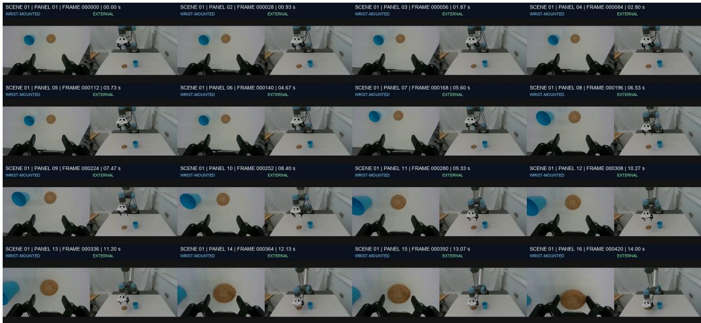  
Figure S1 Temporal evidence board. The board contains 16 ordered time points in this example. Each panel pairs synchronized wrist and global observations. Adaptive sampling becomes denser around the candidate interaction while retaining interval-level context. Event boards contain up to 24 time points.

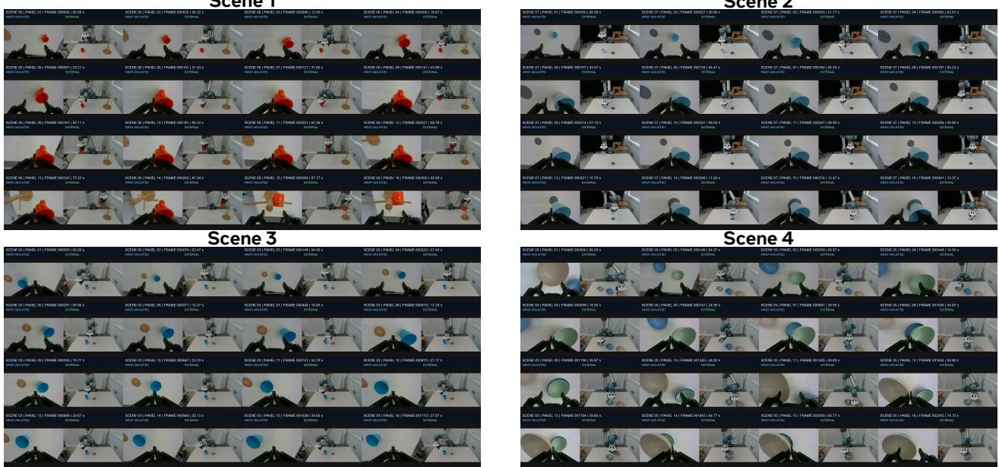  
Figure S2 Full-rollout storyboards from the in-house dataset. Each board uniformly samples 16 synchronized wrist/external pairs. The original frame index and timestamp remain visible in every panel.

An event board contains at most 24 synchronized time points. If interval length $L \leq 2 4 .$ , all frames are retained. Otherwise, 12 anchors are sampled uniformly over the interval and 12 dense samples are drawn around the proposal center with radius min $( \lfloor L / 4 \rfloor , 8 )$ . The indices are merged, deduplicated, sorted, and truncated to 24. The maximum layout is $4 \times 6 ,$ producing a $2 5 6 0 \times 1 3 3 2$ JPEG at quality 90.

State board $B _ { i } ^ { s }$ is independent of motion detection. When $T _ { i } \ \leq \ 1 6$ , all synchronized frames are retained; otherwise, the first eight and final eight are used. Its headers are marked START or END and have height 46 pixels, yielding a maximum 2560 × 904 JPEG. No intermediate frames are added: event boards capture interaction dynamics, whereas the state board tests whether the terminal state satisfies the task. Each VLM request contains one composite JPEG, corresponding to at most 48 single-view images for an event request and 32 for a state request. Figure S1 visualizes a representative temporal evidence board.

In-house dual-view rollouts. The accompanying qualitative set contains ten videos forming five synchronized pairs. Odd-numbered videos provide the fixed external view and even-numbered videos provide the wrist view. Each full-rollout board uniformly samples 16 time points for visual inspection; these overview boards are distinct from the adaptive event boards sent to the VLM. They use a 4 × 4 layout, place the wrist view on the left, and report the panel number, source frame, and timestamp. Exact sampled indices and timestamps are provided in supplementary\_assets/inhouse\_storyboards\_manifest.json, together with the script used to reproduce the boards from paired videos. The five full-rollout boards are shown in Fig. S2.

Scene 1

Scene 2

## S1.4 Diagnostic prompting

Diagnosis uses an inference-time controller $\mathcal { A } _ { \phi }$ that calls a pretrained VLM through an OpenAI-compatible chat-completions API. The model, prompt set, JSON schema, and temperature (0.05) are fixed; the controller is not a separately trained diagnostic network. Given $K _ { i }$ event boards, one diagnosis uses $K _ { i } + 3$ semantic calls: one call for each event board, one state-board call, one focused call on the earliest positive event board, and one text-only aggregation call. If no event response contains parseable positive evidence, the state board is reused as the focused visual input. The window-level output is

$$
\mathbf { r } _ { i , k } = \mathcal { A } _ { \phi } ( \mathcal { B } _ { i , k } ) = \big ( h _ { i , k } , o _ { i , k } , u _ { i , k } , y _ { i , k } , E _ { i , k } , c _ { i , k } \big ) ,\tag{S8}
$$

where $h _ { i , k }$ indicates visible failure evidence, $o _ { i , k }$ is the target object, $u _ { i , k }$ is the operation, $y _ { i , k }$ is the failure type, $E _ { i , k }$ cites observations and printed frame indices, and $c _ { i , k }$ is window-level confidence.

Earliest causal failure. Windows are inspected by ascending start frame. The earliest window with contains\_ failure\_evidence=true and parseable JSON becomes the focused board. The focused pass scans from its first tile and returns the first printed frame at which a visible anomaly can explain eventual failure. Later drops, empty transport motions, and incomplete terminal states are treated as consequences when an earlier cause is visible. If the first tile already contains an abnormal state, the system reports only its earliest visible time and lowers confidence rather than treating that frame as the physical onset.

Prompt templates. All visual calls share the system instruction:

You analyze robot manipulation evidence and return strict JSON only.

The event prompt states that the sample is a known failed trial, specifies the left/right view convention and frame headers, enumerates the allowed operations and failure types, and requests contains\_failure\_ evidence, failure\_frame\_range, matched\_labels, visible objects, target object, description, frame-grounded evidence, and confidence. The state prompt compares only START and END tiles and returns objects present initially, inside the container, still outside, or missing at termination. The focused prompt requests the first visible anomaly, copying first\_failure\_frame from the printed header rather than the panel index. Finally, the text-only aggregation prompt combines window, state, and focused JSON; it uses the focused result for the first failed subtask and repeated event/state evidence to verify failure type and scene factors. Table S3 summarizes the inputs and structured outputs of the four calls.

Table S3 Diagnostic calls and structured outputs. Each visual request contains one composite JPEG and returns strict JSON.
<table><tr><td>Call</td><td>Core instruction</td><td>Required JSON fields</td></tr><tr><td>Event window</td><td>ure</td><td>Identify visible accident or goal-level fail- window, evidence flag, type, frame range, object, operation, labels, evidence, confidence</td></tr><tr><td>State board</td><td>not infer motion</td><td>Compare initial and terminal states; do final-state failure, start objects, inside/outside objects, labels, evidence, confidence</td></tr><tr><td>Focused re-query</td><td>board</td><td>Find earliest anomaly in earliest positive first frame, target object, operation, type, labels, evidence, confidence</td></tr><tr><td>Aggregation</td><td>Verify the first cause using all preceding JSON</td><td>first failed subtask, critical events, labels, evidence, sample confidence</td></tr></table>

The released v2 script does not inject a separate free-form language instruction into these four prompts. Instead, task semantics are supplied by the configured candidate-label list, object aliases, and the preceding binary success checker. Applying the analyzer to a new task therefore requires replacing these task-specific entries, while the temporal proposal, board construction, call order, and JSON interface remain unchanged.

Taxonomy and confidence. Allowed operations are grasp\_from\_table, transport\_to\_bowl, place\_into\_ bowl, release, and uncertain. Failure types are place\_failed, grasp\_failed, object\_left\_outside, object\_ slipped, basket\_tipped, collision, occlusion, and uncertain. Scene factors include pose, contact stifness, friction, illumination, background, camera viewpoint, and tabletop clutter; task-specific labels may replace this default set. The aggregator self-reports $\kappa _ { i } \in [ 0 . 1 0 , 0 . 9 5 ]$ from evidence consistency. This score is not a calibrated probability and is not thresholded directly.

For the multi-object collection implementation, the candidate task labels are failure to place an object in the bowl, grasp-time slipping, collision with a neighboring object, grasping the wrong object, insertion failure, and target occlusion. Appearance aliases map recognizable objects to specific fruit names (mangosteen, banana, green apple, and red apple), so the failed subtask records the manipulated object rather than only its color and shape. Other tasks can replace both the aliases and candidate labels without changing the inference procedure.

For ViFailback, we retain the benchmark’s native cause labels—task planning, gripper 6D pose, gripper state, and human intervention. They are used only in the public-benchmark adapter and are not merged with the F4R failure-type or scene-factor taxonomies.

Focused pass, caching, and transport retries. The focused pass is part of every diagnosis rather than a stochastic resampling step. After the event calls screen all boards, only the earliest positive board is resubmitted with a narrower request for failure frame, target object, operation, and failure type. It does not add images, reorder the board, request reflection, or resample the interval. Per-window results, the state result, and the focused result are cached separately; –resume skips a completed sample, while an interrupted run reuses existing intermediate JSON. API transport or timeout errors repeat the identical request up to four times with waits of 5, 10, 15, and 20 seconds. These retries do not change the evidence or count as new diagnosis attempts.

Simulation-side validation and fallback. For diagnosis–reconstruction attempt a, the initial policy is evaluated in the reconstructed distribution $p _ { F } ^ { ( a ) } ( \mathcal { M } )$ , yielding success $s ^ { ( a ) }$ . If $s ^ { ( a ) } \leq 0 . 7 0$ , the environment reproduces the observed weakness and $\mathcal { F } _ { i } ^ { ( a ) }$ is accepted. If $s ^ { ( a ) } > 0 . 7 0$ , diagnosis and reconstruction are repeated. After three consecutive rejections, F4R switches to broad domain randomization. Visual diagnosis and caching are handled by the analyzer, while this validation loop is executed by the upper-level F4R workflow.

Diagnosis-to-randomization export. The released exporter converts the accepted diagnosis into an initial set of randomization targets, summarized in Table S4. Multiple supported labels are merged. The reset window begins before $t _ { i } ^ { \star }$ by clip(0.05t⋆, 30, 180) frames; when no valid frame is available, the fallback margin is 90 frames. This export provides an auditable initial configuration that the upper-level workflow further constrains using task feasibility and reconstruction metadata.

Table S4 Diagnosis-to-randomization mapping implemented by the diagnostic skill.
<table><tr><td>Diagnosed condition</td><td>Exported randomization targets</td></tr><tr><td>Object not placed in bowl</td><td>bowl position, opening orientation, object initial pose</td></tr><tr><td>Object slips during grasp</td><td>friction, object mass, contact parameters, gripper closing speed</td></tr><tr><td>Collision with nearby object</td><td>clutter density, obstacle position</td></tr><tr><td>Wrong object grasped</td><td>similar objects, color, texture, occlusion</td></tr><tr><td>Insertion failure</td><td>hole-position offset, peg angle, clearance, friction</td></tr><tr><td>Target occluded</td><td>camera viewpoint, illumination, occluder placement</td></tr></table>

Reproducible execution. The implementation is divided into deterministic preprocessing and cached VLM inference. The released commands first detect windows with stride 3, top-10 peaks, 120/180-frame context, and 240-frame suppression; then generate event and state boards; run GPT-5.5 inference; and export review and randomization records. The associated scripts and their default arguments are included in supplementary\_assets/robot-video-failure-analyzer. Intermediate outputs are stored as event\_ windows.json, per-window storyboard manifests, cached JSON responses, a sample-level summary, a review CSV, and failure\_conditioned\_dr\_v2.json. Responses are parsed as strict JSON; if surrounding text is returned, the first complete JSON object is recovered. Unparseable event responses are marked and cannot become the focused positive window. Returned labels are filtered against the configured candidate list before export.

The expected directory layout is sample\_id/eyeinhand/\*.jpg and sample\_id/main/\*.jpg; filenames are naturally sorted before the common prefix is selected. The inference script reads an OpenAI-compatible endpoint from AIO\_BASE\_URL and its key from AIO\_API\_KEY. Table S5 lists the exact stage-to-artifact interface.

Public-benchmark diagnostic audit. Table S6 reports the five cases visualized in Fig. S3. Frame localization is reported separately from cause/subtask accuracy. The three correct cases identify the right cause and stage but localize it late, whereas the two errors confuse an obvious terminal consequence with an earlier failure.

Table S5 Diagnostic-skill scripts and generated artifacts.
<table><tr><td>Script</td><td>Function</td><td>Primary output</td></tr><tr><td>detect_event_windows.py</td><td>Dual-view change scanning and window merging</td><td>event_windows.json/.csv</td></tr><tr><td>make_event_storyboards.py</td><td></td><td>Adaptive event-board construction event JPEGs and manifest</td></tr><tr><td>make_state_comparisons.py</td><td>First-eight/last-eight state-board construction</td><td>state JPEGs and manifest</td></tr><tr><td>analyze_failure_v2.py</td><td>Window, state, focused, and aggregate VLM calls</td><td>cached and sample-level JSON</td></tr><tr><td>export_review_csv.py</td><td>Human-readable diagnostic audit review_v2.csv</td><td></td></tr><tr><td>export_failure_conditioned_dr.py</td><td>Failure-aware reset and randomization export</td><td>failure_conditioned_dr_v2.json</td></tr></table>

Correct: Coke can  
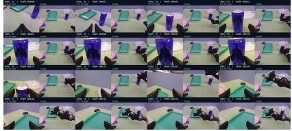

Correct: Spatula  
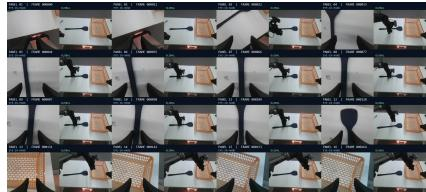  
Incorrect: Duck

Correct: Cube  
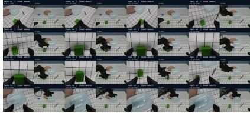  
Incorrect: Marker

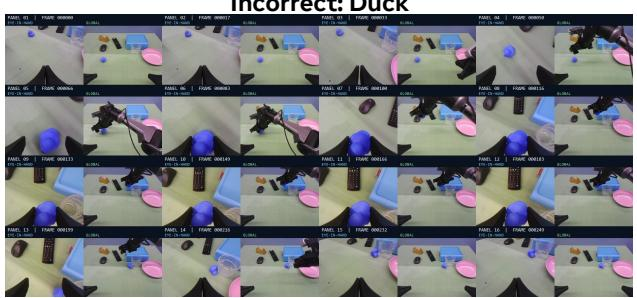

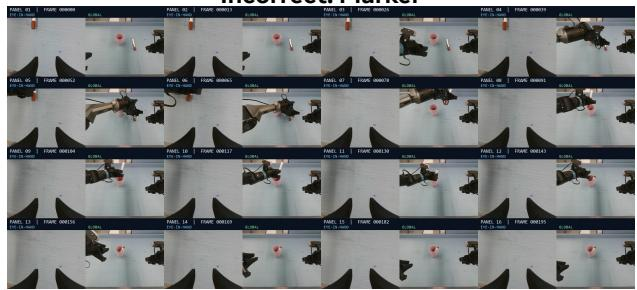  
Figure S3 Representative diagnosis cases. The first row shows three correctly diagnosed rollouts, while the second row shows two incorrect ViFailback cases. A diagnosis is correct only when both cause and failed subtask match the annotation. The error cases substitute a salient downstream consequence for an earlier causal failure.

Table S6 Qualitative ViFailback audit. Prediction/annotation pairs for the five visualized cases.
<table><tr><td>Result</td><td>Sample</td><td>Prediction / annotation</td><td>Frame (pred./GT)</td><td>Evidence or error</td></tr><tr><td>Correct</td><td>Coke can</td><td>gripper state, subtask 2 / same</td><td>152 / 112</td><td>Can remains on table after gripper withdrawal</td></tr><tr><td>Correct</td><td>Spatula</td><td>gripper state, subtask 2 / same</td><td>120 / 75</td><td>Arm transports while spatula remains on table</td></tr><tr><td>Correct</td><td>Green cube</td><td>gripper state, subtask 2 / same</td><td>203  /  137</td><td>Transport continues after cube is lost Similar object masks later pose error</td></tr><tr><td>Error</td><td>Duck</td><td>task planning, subtask 1 / 6D pose, 50 / 175 subtask 3</td><td></td><td>near cup</td></tr><tr><td>Error</td><td>Marker</td><td>6D pose, subtask 3 / task planning, 130 / 63 subtask 1</td><td></td><td>Rim placement is mistaken for the first cause</td></tr></table>

## S1.5 Autonomous diagnosis benchmark

We evaluate the diagnosis module on 80 rollout trajectories from eight tabletop tasks, with ten trajectories per task. Human annotators label both the earliest failure stage and its underlying cause. A prediction is counted as correct only when both labels match the annotation. F4R uses GPT-5.5 with our robot-video-failure-analyzer skill for this experiment.

As shown in Table S7, 69 of 80 trajectories are correctly diagnosed on the first attempt, yielding 86.25% accuracy. A second attempt resolves five additional cases and increases cumulative accuracy to 92.5%. Of the six unresolved trajectories, four involve subtle camera viewpoint shifts and two involve illumination changes. These cases require fine-grained comparisons with earlier frames to distinguish visual changes from task events, revealing a remaining limitation in temporal evidence retention and reasoning.

Table S7 Autonomous failure diagnosis. Accuracy after one and two attempts on 80 trajectories across eight tasks.
<table><tr><td>Outcome</td><td>Count</td><td>Percentage</td></tr><tr><td>Correct after one attempt</td><td>69/80</td><td>86.25%</td></tr><tr><td>Correct within two attempts</td><td>74/80</td><td>92.50%</td></tr><tr><td>Remaining: camera viewpoint</td><td>4/80</td><td>5.00%</td></tr><tr><td>Remaining: illumination</td><td>2/80</td><td>2.50%</td></tr></table>

Annotation protocol. All 80 inputs are known failed trajectories. Each trajectory is manually annotated with the earliest failed operation and its underlying cause. A prediction is counted as correct only when both fields match the annotation; later consequences are not accepted as substitutes for the earliest cause.

## S1.6 Complete ViFailback evaluation

We additionally evaluate multiple mainstream VLM backends on the public ViFailback benchmark (Zeng et al., 2025). All models receive the same storyboard input and prompt without benchmark-specific adaptation. This evaluation is separate from our 80-trajectory benchmark: ViFailback measures general failure attribution on a public dataset, whereas our benchmark uses task-specific dual-view rollouts and requires the joint prediction of failure stage and cause. Figure S4 reports the complete backend comparison.

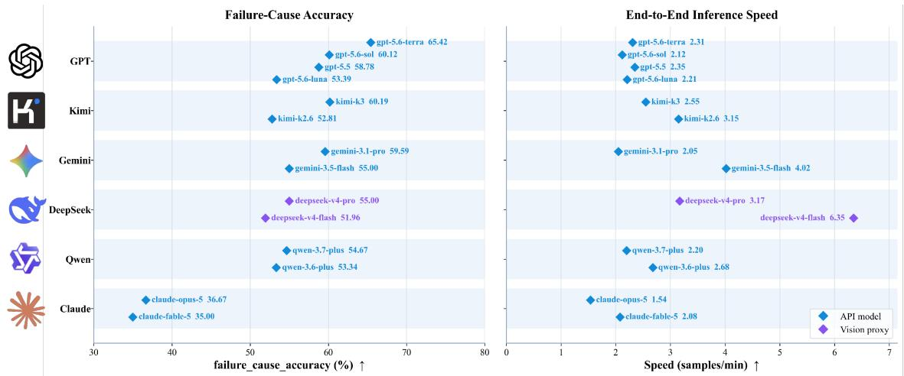  
Figure S4 Complete ViFailback results. Failure-cause accuracy and end-to-end inference speed of mainstream VLM configurations without benchmark-specific adaptation.

GPT-5.6-Terra achieves the highest failure-cause accuracy (65.42%), while Gemini-3.5-Flash provides the highest throughput (4.02 samples/min). Claude models frequently collapse predictions into the gripper 6D-pose category, suggesting dificulty separating transient gripper-state and task-planning failures from pose errors. More importantly, even the best backend remains below 70% without task-specific adaptation. This result motivates the simulation-side validation and broad-randomization fallback used by F4R, rather than treating a single VLM diagnosis as ground truth.

## S2 Failure-Case Reconstruction Details

## S2.1 Manipulation-scene reconstruction

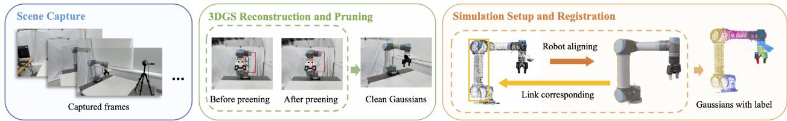  
Figure S5 Manipulation-scene reconstruction. The scene is first reconstructed into a 3D Gaussian representation from captured videos. After pruning reconstruction outliers, the Gaussian primitives are aligned with the simulated robot using a scale-aware afine transformation. The aligned robot mesh is then used to assign link-level labels to the Gaussians, enabling the simulation-driven motion of Gaussian representations.

To enable photorealistic simulation rendering while minimizing the manual efort required for environment reconstruction, we propose a Gaussian-based rendering and simulation coupling pipeline. Specifically, we employ 3D Gaussian Splatting (3DGS) (Kerbl et al., 2023) as the rendering frontend and Isaac Sim as the simulation backend. The robot appearance is represented by link-level Gaussian primitives, which are associated with the corresponding robot links and driven by the rigid transformations provided by the simulator. Fig. S5 illustrates the overall reconstruction and simulation integration workflow.

We first capture the target manipulation scene using an iPhone camera. During acquisition, the camera intrinsics remain fixed by locking the focal length and avoiding camera switching. The captured video is reconstructed into a photorealistic Gaussian representation using 3DGS. Since the reconstruction may contain irrelevant artifacts, such as floating Gaussians and robot cables, we perform a lightweight cleanup procedure to remove these components and isolate the robot-related Gaussians for subsequent alignment.

Meanwhile, we import the robot model into Isaac Sim and initialize its configuration to match the realworld robot state. The local-to-world rigid transformations of all robot links are extracted from Isaac Sim and used to place the corresponding robot link meshes in the reconstructed scene. To establish geometric correspondence between the reconstructed robot Gaussians primitives and the simulated robot, we adopt a coarse-to-fine registration pipeline consisting of FPFH feature matching, RANSAC-based Sim3 estimation, and Sim3 ICP refinement. The Sim3 transformation compensates for the potential scale discrepancy between the reconstructed Gaussian representation and the simulator-defined robot geometry.

After alignment, the robot Gaussians primitives are associated with individual robot links and transformed into their corresponding local coordinate systems. During simulation, the link-level Gaussian representations are transformed using the local-to-world rigid transformations from Isaac Sim, allowing the rendered robot appearance to faithfully follow the simulated robot motion. For the manipulation scene, the tabletop height is estimated by fitting the tabletop surface from the reconstructed Gaussians and further verified with physical measurements. The detailed reconstruction and simulation parameters are provided in Table S8.

With the aligned Gaussian representation and simulation assets, the simulated robot motions and interactions can be faithfully reflected in the rendered observations. This coupling significantly reduces the efort required for constructing simulation environments while maintaining a small visual gap between simulation rendering and real-world observations. Qualitative comparisons between rendered views and real camera observations are presented in Fig. S6.

Table S8 Scene reconstruction settings.
<table><tr><td>Setting</td><td>Value</td></tr><tr><td>Smartphone model</td><td>IPhone 17 Pro</td></tr><tr><td>Capture resolution / frame rate</td><td>1920×1080 / 30 FPS</td></tr><tr><td>Capture duration / frame count</td><td>≈ 5 min</td></tr><tr><td>3DGS optimization iterations</td><td>30000</td></tr><tr><td>3DGS optimization hyperparameters</td><td>Default</td></tr><tr><td>Scene-to-simulator registration method</td><td>FPFH→Sim3 RANSAC→Sim3 ICP</td></tr><tr><td>Scene setup time Reuse condition</td><td>≈ 30 min Reused unless the workspace changes</td></tr></table>

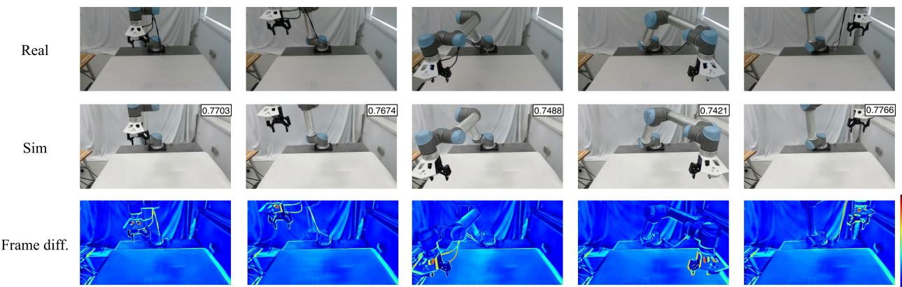  
Figure S6 Scene reconstruction quality. The top row shows images captured from the first-person perspective using a real-world RealSense D435i camera; the second row displays images rendered using Gaussian Splatting, with the SSIM between the sim-real images listed in the top-right corner; the third row shows the frame diference.

## S2.2 Manipulated-object reconstruction

For object reconstruction, F4R supports two complementary approaches: (1) direct generation of simulationready assets from images and (2) geometric reconstruction from multi-view observations. Since image-based asset generation follows existing image-to-3D pipelines, we omit its implementation details and focus on the multi-view reconstruction approach adopted in our experiments. The object assets using in the experiments are shown in Figure S7 and the hyper parameters of object reconstruction are listed in Table S9.

Each manipulated object is reconstructed from a COLMAP-style RGB-D dataset (Schönberger and Frahm, 2016) collected by the wrist camera, including calibrated RGB images, metric depth maps, camera intrinsics, poses, and optional object masks. During preprocessing, the camera poses are converted from world-to-camera to base-to-camera transformations. To improve reconstruction accuracy, the depth maps can be refined using a learned depth estimator (Tan et al., 2026) conditioned on RGB images, raw depth observations, and normalized camera intrinsics. The refined depth is constrained to a valid metric range and combined with object masks before being back-projected into camera-frame point clouds. These point clouds are voxel-downsampled and augmented with surface normals for subsequent registration.

To obtain a consistent object geometry, neighboring observations are associated within a temporal window, and point correspondences are established through nearest-neighbor matching in the world coordinate system based on the initial robot poses. Camera poses are further optimized through a robust nonlinear optimization problem over SE(3), combining point-to-plane geometric alignment with a robot-pose prior that regularizes translation and rotation updates. With the optimized poses, masked TSDF fusion (Curless and Levoy, 1996) produces a metric reconstruction, including a point cloud $g _ { i } ^ { \mathrm { p c d } }$ and an initial mesh. The fused geometry is further denoised before asset generation.

The reconstructed geometry is completed into a watertight mesh $\bar { g } _ { i } ^ { \mathrm { m e s h } }$ using ShapeR (Siddiqui et al., 2026), followed by geometric regularization operations including voxelization, hole filling, iso-surface extraction, smoothing, and optional mesh simplification. For appearance reconstruction, object masks are first propagated from RGB observations using SAM2 (Ravi et al., 2024). Informative reference views are then selected according to foreground coverage, image sharpness, and object-view distance, while enforcing angular diversity among selected viewpoints. The selected views are provided to a Hunyuan3D 2.1 (Team Hunyuan3D et al., 2025) texture inpainting workflow implemented in ComfyUI to generate the textured mesh $g _ { i } ^ { \mathrm { t e x } }$

The textured mesh is subsequently rendered into a synthetic COLMAP-style dataset containing RGB images, depth maps, object masks, camera parameters, and sampled surface points. These renderings are used to optimize the Gaussian representation (Chen et al., 2024a), producing the final rendering asset $g _ { i } ^ { \mathrm { G S } }$

For articulated objects, an additional semantic and kinematic reasoning module is incorporated following RoboSimGS (Zhao et al., 2026b). Specifically, a multimodal large language model (Bai et al., 2025) can infer movable parts and their kinematic relationships from multi-view renderings, followed by mesh segmentation (Ma et al., 2025).

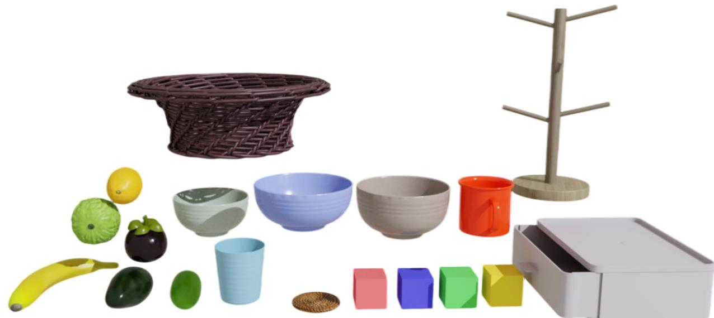  
Figure S7 Object reconstruction quality. Rendering of object assets using in the experiments.

## S2.3 Automation and human Effort

The autonomous closed loop of F4R starts after the initial workspace initialization. The initial smartphone capture and scene setup require one-time human involvement, while subsequent failure detection, reconstruction, simulation refinement, and corrective data generation are automated. Reconstructed scenes and object assets can be reused for unchanged environments. Table S10 summarizes the automation boundary of each stage.

Table S9 Object reconstruction settings.
<table><tr><td>Parameter</td><td>Value</td></tr><tr><td>Input depth range</td><td>[0.05, 2.0] m</td></tr><tr><td>Back-projection stride</td><td>1 px</td></tr><tr><td>Per-frame voxel size</td><td>0.003 m</td></tr><tr><td>Normal radius</td><td>3.0× voxel size</td></tr><tr><td>Normal max neighbors</td><td>30</td></tr><tr><td>Frame-pair window</td><td>3 neighboring frames</td></tr><tr><td>Max correspondence distance</td><td>0.015 m</td></tr><tr><td>Max correspondences per pair</td><td>3000</td></tr><tr><td>Pose optimizer</td><td>robust least squares, Huber loss</td></tr><tr><td>Optimizer iterations</td><td>50</td></tr><tr><td>Huber scale</td><td>1.0</td></tr><tr><td>Robot translation prior</td><td> $\sigma _ { t } = 0 . 0 0 2$  m</td></tr><tr><td>Robot rotation prior</td><td> $\sigma _ { R } = 0 . 2 ^ { \circ }$ </td></tr><tr><td>TSDF voxel size</td><td>0.002 m</td></tr><tr><td>TSDF truncation distance</td><td>6× voxel size</td></tr><tr><td>TSDF depth range</td><td>[0.15, 1.20] m</td></tr><tr><td>Output voxel downsampling</td><td>0.0015 m</td></tr><tr><td>Statistical outlier removal</td><td>20 neighbors, std ratio 1.5</td></tr><tr><td>Radius outlier removal</td><td>radius 0.005 m, min neighbors 8</td></tr><tr><td>Mesh generation conditioned images</td><td>16</td></tr><tr><td>Mesh generation denoising steps</td><td>25</td></tr><tr><td>Mesh inpainting reference images</td><td>4</td></tr></table>

Table S10 Human-effort breakdown. Automation boundary of F4R.
<table><tr><td>Stage</td><td>Human involvement</td><td>Frequency</td><td>Typical time</td></tr><tr><td>Workspace smartphone capture</td><td>One-time manual</td><td>New workspace</td><td>3–5 min</td></tr><tr><td>Scene reconstruction and alignment</td><td>Lightweight verification</td><td>New/changed workspace</td><td>~20 min</td></tr><tr><td>Wrist RGB-D object observation</td><td>Automatic robot execution</td><td>New object/failure case</td><td>~2 min</td></tr><tr><td>Object asset reconstruction</td><td>Automatic</td><td>New object</td><td>5–10 min</td></tr><tr><td>Corrective data generation</td><td>Automatic</td><td>Each refinement cycle</td><td>~10 min</td></tr><tr><td>Real-world corrective demonstration</td><td>Not required</td><td></td><td>0 min</td></tr></table>

## S3 Failure-Aware Randomization and Policy Refinement

## S3.1 Failure-aware domain randomization

Let $\widehat { \mathcal { M } } _ { i }$ denote the reconstructed simulator environment for failure i, and let $\xi _ { i } ^ { f }$ denote its recovered parameters, including object poses, robot initialization, camera configuration, appearance, and physical properties. Given failure record $\mathcal { F } _ { i } .$ F4R samples

$$
\boldsymbol { \xi } \sim p _ { i } ^ { F } ( \boldsymbol { \xi } \mid \xi _ { i } ^ { f } , \mathcal { F } _ { i } ) , \qquad \mathcal { M } _ { i , \boldsymbol { \xi } } = \operatorname { R a n d } ( \widehat { \mathcal { M } } _ { i } ; \boldsymbol { \xi } ) ,\tag{S9}
$$

where $\mathcal { M } _ { i , \xi }$ is the randomized instance produced from $\widehat { \mathcal { M } } _ { i }$ . Failure-relevant variables are sampled locally around the recovered configuration, while unrelated variables are fixed or weakly perturbed. Samples that violate task semantics, cause initial collisions, place objects outside the workspace, or make the task infeasible are rejected.

Across the accepted failures, the training distribution is

$$
p _ { F } ( { \mathcal { M } } ) = { \frac { 1 } { | { \mathcal { D } } _ { \mathrm { f a i l } } | } } \sum _ { i = 1 } ^ { | { \mathcal { D } } _ { \mathrm { f a i l } } | } p _ { i } ^ { F } ( { \mathcal { M } } \mid { \widehat { \mathcal { M } } } _ { i } , { \mathcal { F } } _ { i } ) .\tag{S10}
$$

During training, accepted failures are sampled uniformly, so each reconstructed failure distribution contributes equally without reweighting by frequency, severity, validation score, or training progress. Table S11 specifies the task-conditioned local variables.

Table S11 Failure-aware randomization ranges. Active variables and sampling distributions for the four refinement tasks.
<table><tr><td>Task / failure</td><td>Variable</td><td>Nominal source</td><td>Feasibility constraint</td></tr><tr><td>Pick Fruits</td><td>Fruit pose  $( x , y , \psi )$ </td><td>diagnosed scene</td><td>reachable; no overlap</td></tr><tr><td>Pick Fruits</td><td>Basket pose / visibility</td><td>diagnosed scene</td><td>target remains valid</td></tr><tr><td>Place Cup on Coaster</td><td>Cup pose</td><td>diagnosed scene</td><td>reachable</td></tr><tr><td>Place Cup on Coaster</td><td>Coaster pose / wrist visibility</td><td>diagnosed scene</td><td>valid placement area</td></tr><tr><td>Stack Bowls</td><td>Bowl poses / placement order</td><td>diagnosed scene</td><td>stable initial state</td></tr><tr><td>Place Block in Drawer</td><td>Block pose</td><td>diagnosed scene</td><td>reachable</td></tr><tr><td>Place Block in Drawer</td><td>Drawer pose / orientation</td><td>diagnosed scene</td><td>collision-free; operable</td></tr><tr><td>All</td><td>Camera extrinsics</td><td>calibration</td><td>workspace visible</td></tr><tr><td>All</td><td>Illumination / appearance</td><td>recovered scene</td><td>physically plausible</td></tr><tr><td>All</td><td>Friction / mass</td><td>asset estimate</td><td>stable initialization</td></tr></table>

## S3.2 Corrective trajectory generation

F4R uses historical successful real-world rollouts as seed trajectories for MimicGen (Mandlekar et al., 2023). MimicGen segments these demonstrations into object-centric motion segments and adapts them to environments sampled from $p _ { F } ( \mathcal { M } )$ . If the available successful rollouts do not provide suficient grasp coverage, AnyGrasp (Fang et al., 2023) supplies candidate grasp poses. A task-specific motion planner or controller then connects the selected grasp to the remaining manipulation segments. Only trajectories satisfying the simulation success criterion are retained in $\mathcal { D } _ { \mathrm { s i m } } ^ { F } \mathrm { ; }$ unsuccessful rollouts are discarded and resampled for supervised co-training but remain available as interaction experience during PPO. Table S12 reports the resulting data statistics.

Table S12 Corrective-data generation statistics. Historical seeds denote real-world successful rollouts used to initialize MimicGen-style generation. Generated denotes all candidate simulated rollouts before filtering. Successful denotes rollouts satisfying the simulator success predicate. Final $| \mathcal { D } _ { \mathrm { s i m } } ^ { F } |$ denotes the number of trajectories retained for supervised co-training.
<table><tr><td colspan="2">Task</td><td>seeds</td><td>Historical</td><td>Generated</td><td>Successful</td><td>Retained generated</td><td>AnyGrasp used</td><td>Final  $| \mathcal { D } _ { \mathrm { s i m } } ^ { F } |$ </td><td>Avg. horizon</td></tr><tr><td colspan="2">Pick Fruits</td><td>24</td><td></td><td>500</td><td>438</td><td>82.0%</td><td>64 /  410</td><td>410</td><td>62.5</td></tr><tr><td>Place Coaster</td><td>Cup</td><td>on</td><td>22</td><td>560</td><td>462</td><td>76.8%</td><td>118  / 430</td><td>430</td><td>71.3</td></tr><tr><td>Stack Bowls</td><td></td><td>28</td><td></td><td>640</td><td>486</td><td>70.3%</td><td>156  / 450</td><td>450</td><td>83.7</td></tr><tr><td>Place Drawer</td><td>Block</td><td>in 26</td><td></td><td>620</td><td>421</td><td>61.3%</td><td>142  / 380</td><td>380</td><td>96.4</td></tr></table>

## S3.3 Stage I: sim–real co-training

F4R co-trains the failure-targeted simulation trajectories with the original real-world data:

$$
\begin{array} { r } { \mathcal { L } _ { \mathrm { C T } } ( \theta ) = \mathcal { L } _ { \mathrm { S F T } } ( \theta ; \mathcal { D } _ { \mathrm { r e a l } } ) + \lambda _ { \mathrm { s i m } } \mathcal { L } _ { \mathrm { S F T } } ( \theta ; \mathcal { D } _ { \mathrm { s i m } } ^ { F } ) . } \end{array}\tag{S11}
$$

The simulated data provide failure-specific corrections, while the real data preserve the policy’s existing capabilities and provide a stable initialization for RL.

## S3.4 Stage II: failure-targeted reinforcement learning

The PPO stage is initialized from the co-trained policy and interacts with 256 parallel environments sampled from $p _ { F } ( \mathcal { M } )$ . F4R retains the original sparse task reward and does not introduce failure-specific reward shaping. During PPO, an auxiliary SFT loss on the original real-world data regularizes the policy:

$$
\begin{array} { r } { \mathcal { L } _ { \mathrm { F 4 R } } ( \theta ) = \mathcal { L } _ { \mathrm { P P O } } ( \theta ; p _ { F } ( \mathcal { M } ) ) + \beta \mathcal { L } _ { \mathrm { S F T } } ( \theta ; \mathcal { D } _ { \mathrm { r e a l } } ) . } \end{array}\tag{S12}
$$

Co-training enables the policy to reach meaningful states in severe failure regions; PPO then improves closed-loop and contact-sensitive behavior. The complete SFT and PPO configuration is listed in Table S13.

## Table S13 SFT and PPO hyperparameters.

<table><tr><td>Stage</td><td>Hyperparameter</td><td>Value</td></tr><tr><td>SFT</td><td>Base policy</td><td>π0.5</td></tr><tr><td>SFT</td><td>Trainable modules</td><td>LoRA</td></tr><tr><td>SFT</td><td>Optimizer</td><td>AdamW</td></tr><tr><td>SFT</td><td>Learning rate</td><td> $2 . 5 \times 1 0 ^ { - 5 }$ </td></tr><tr><td>SFT</td><td>GPUs</td><td>4 × NVIDIA H20</td></tr><tr><td>SFT</td><td>Distributed strategy</td><td>PyTorch FSDP</td></tr><tr><td>SFT</td><td>Samples per GPU / global batch</td><td> $3 2 / 1 2 8 $ </td></tr><tr><td>SFT</td><td> $\lambda _ { \mathrm { s i m } } ~ /$  real:sim sampling ratio</td><td>1:10</td></tr><tr><td>SFT</td><td>Epochs / update steps / warmup</td><td>step-based / 30,000 / 1,000</td></tr><tr><td>SFT</td><td>Weight decay / Adam betas / schedule</td><td> $1 0 ^ { - 1 0 } \mathrm { ~ / ~ } ( 0 . 9 , 0 . 9 5 ) \mathrm { ~ / ~ } \mathrm { c o s i n e }$ </td></tr><tr><td>SFT</td><td>Visual resolution / action normalization</td><td>2 views at 224 × 224 / OpenPI norm stats + delta joints</td></tr><tr><td>SFT</td><td>Action horizon H / control frequency</td><td>50 / 30 Hz</td></tr><tr><td>PPO</td><td>Parallel environments</td><td>256</td></tr><tr><td>PPO</td><td>Update steps</td><td>200</td></tr><tr><td>PPO</td><td>Rollout horizon / transitions per update</td><td>900 env steps / 4,608 action chunks</td></tr><tr><td>PPO</td><td>Learning rate / clip ratio</td><td> $5 \times 1 0 ^ { - 6 } / \ [ 0 . 9 , 1 . 2 ]$ </td></tr><tr><td>PPO</td><td>Discount  $\gamma ~ / \operatorname { G A E } \lambda$ </td><td> $0 . 9 9 \ / \ 0 . 9 5$ </td></tr><tr><td>PPO</td><td>Entropy / value coefficients</td><td> $0 ~ / ~ 1$ </td></tr><tr><td>PPO</td><td>Epochs per update / minibatch size</td><td>2 / 4,608</td></tr><tr><td>PPO</td><td>Max gradient norm / advantage normalization</td><td>1.0 / enabled</td></tr><tr><td>PPO</td><td>KL regularization / early stopping</td><td> $\beta _ { \mathrm { K L } } = 0 ~ /$  none</td></tr><tr><td>PPO</td><td>Auxiliary real-data coefficient β</td><td>0.1</td></tr><tr><td>PPO</td><td>Trainable modules</td><td>Full policy parameters + value head</td></tr><tr><td>PPO</td><td>Reward</td><td>Original sparse task reward</td></tr></table>

Distributed learner–rollout architecture. Four H20 GPUs perform policy inference and optimization, while two RTX 4090 GPUs run Isaac Lab 3.0 and collect rollouts. The nodes form a Ray cluster over SSH. Training is synchronous: each PPO iteration synchronizes the actor parameters, collects a complete rollout batch, and then updates the policy. Parameters are broadcast every iteration (weight\_sync\_interval=1) and before evaluation. The scheduler and Arena subprocess queues are unbounded (maxsize=0). For Stack Bowls, each update collects $2 5 6 \times 9 0 0 = 2 3 0$ ,400 low-level transitions, equivalent to 4,608 action chunks. Throughput was not directly logged and can be derived as $1 1 5 , 2 0 0 / T _ { \mathrm { s t e p } }$ environment steps/s or $4 { , } 6 0 8 / T _ { \mathrm { s t e p } }$ action chunks/s.

## S4 Complete Experimental Setup

## S4.1 Robot platform and calibration

The real-world platform consists of a 6-DoF UR5e robot and a Robotiq 2F-85 gripper. Two Intel RealSense D435i cameras provide visual observations: a fixed third-person camera captures global context, and a wrist-mounted camera captures fine-grained interaction details.

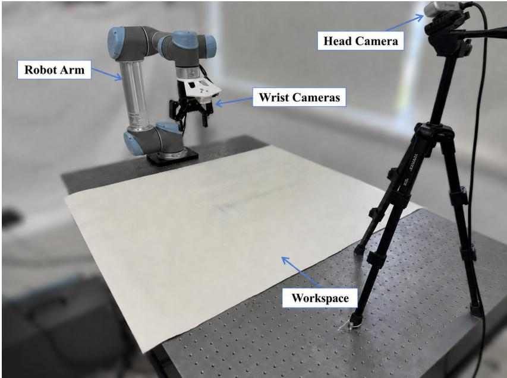  
Figure S8 Real-robot platform. The dual-view perception system combines global task context with local manipulation observations.

Table S14 Robot, camera, and control settings. Hardware, observation, calibration, control, and safety configurations used in all real-world experiments.
<table><tr><td>Setting</td><td>Value</td></tr><tr><td>Robot / gripper</td><td>UR5e / Robotiq 2F-85</td></tr><tr><td>Cameras</td><td>2 × Intel RealSense D435i</td></tr><tr><td>Camera placement</td><td>Fixed third-person and wrist-mounted views</td></tr><tr><td>Camera capture</td><td>640 × 480 RGB at 30 Hz</td></tr><tr><td>Policy image resolution</td><td>224 × 224 RGB with aspect-ratio-preserving resize</td></tr><tr><td>Hand-eye calibration</td><td>Target-based calibration; extrinsics fixed across trials</td></tr><tr><td>Base-world calibration</td><td>Target-based rigid-frame alignment; fixed across trials</td></tr><tr><td>Camera synchronization</td><td>Software synchronization using nearest timestamps</td></tr><tr><td>Robot control mode / frequency</td><td>Joint-position control at 30 Hz</td></tr><tr><td>Action space</td><td>6 joint positions and one binary gripper command</td></tr><tr><td>Joint safety limits</td><td>Controller-enforced position, velocity, and acceleration limits</td></tr><tr><td>Gripper encoding</td><td>0 if raw command &lt; 50; 1 otherwise</td></tr><tr><td>Episode horizon</td><td>1500 control steps</td></tr><tr><td>Safety termination</td><td>Emergency stop or risk of collision, joint-limit violation, or workspace exit</td></tr></table>

## S4.2 Eight-task benchmark

All eight tasks are used to evaluate sim–real behavioral consistency. Four representative tasks are additionally used for policy-refinement experiments. In-distribution (ID) conditions follow the configurations covered by the collected demonstrations. Out-of-distribution (OOD) conditions correspond to deployment-derived failure configurations not covered by those demonstrations.

## S4.3 ID and OOD distributions

For each task, we evaluate all methods under an in-distribution (ID) setting and an out-of-distribution (OOD) setting. ID initializations follow the nominal task distribution used during policy pre-training and standard deployment. OOD initializations expand the object-pose and distractor-placement ranges while preserving task semantics and physical feasibility.

Table S15 Eight-task benchmark. Language instructions, objects, binary success criteria, episode horizons, and numbers of real-world demonstrations used to train the evaluated checkpoints.
<table><tr><td>Task</td><td>Language instruction</td><td>Objects</td><td>Success criterion</td><td>Horizon (steps)</td></tr><tr><td>Pick Fruits</td><td>Place the fruit in the bas- fruit, basket ket.</td><td></td><td>Fruit remains stably contained in the basket</td><td>1500</td></tr><tr><td>Place Cup on Coaster</td><td>Place the cup on the coaster.</td><td>cup, coaster</td><td>Cup remains stably supported by the coaster</td><td>1500</td></tr><tr><td>Hang Cup</td><td>Hang the cup on the rack.</td><td>cup, rack</td><td>Cup remains suspended from the rack after release</td><td>1500</td></tr><tr><td></td><td>Place Cup in Bowl Place the cup in the bowl.</td><td>cup, bowl</td><td>Cup remains stably contained in the bowl</td><td>1500</td></tr><tr><td>Stack Blocks</td><td>Stack one block on the other.</td><td>two blocks</td><td>Upper block remains stably supported by the lower block</td><td>1500</td></tr><tr><td>Insert Cylinder into Board</td><td>Insert the cylinder into the board.</td><td>cylinder, insertion board</td><td>Cylinder remains inserted in the designated hole</td><td>1500</td></tr><tr><td>Place Block in Drawer</td><td>Put the block in the drawer and close it.</td><td>block, drawer</td><td>Block is inside and the drawer is fully closed</td><td>1500</td></tr><tr><td>Stack Bowls</td><td>Stack one bowl on the two bowls other.</td><td></td><td>Upper bowl remains stably supported by the lower bowl</td><td>1500</td></tr></table>

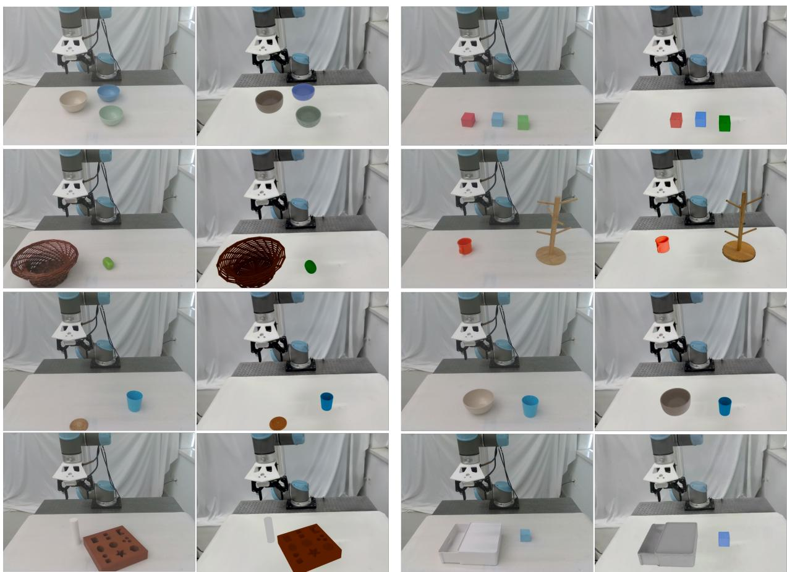  
Figure S9 Real–simulation paired views. The reconstructed environments preserve the task-relevant objects, spatial relations, and viewpoints across all eight tasks.

All evaluation initializations are pre-generated with fixed random seeds before running any method. The same initial configurations are reused for all methods within each task and evaluation setting. In real-world evaluation, we use the same reset protocol and trial budget for all methods. In simulation, the same seeded environments are replayed for every method.

Robot initialization, camera extrinsics, illumination, textures, background, and simulator physical parameters are held fixed across ID and OOD evaluation unless otherwise specified. For articulated-object tasks, the articulation state is fixed to the task-specific nominal initial state. Table S16 reports the task-specific ID and OOD ranges.

Table S16 ID and OOD evaluation distributions. Positions are expressed in the robot workspace frame. OOD cases use deployment-derived failure orientations outside the ID yaw range while satisfying the same reachability and collision constraints.
<table><tr><td>Setting</td><td>Translation range</td><td>Yaw range</td><td>Feasibility constraint</td><td>Trials per task</td><td>Shared init.</td></tr><tr><td>ID</td><td> $\begin{array} { r } { x \sim \mathcal { U } ( 0 . 0 2 , 0 . 8 8 ) ~ \mathrm { m } , } \end{array}$   $y \sim \mathcal { U } ( - 0 . 1 8 5 , 0 . 9 5 7 ) ~ \mathrm { m } ,$   $z = z _ { 0 }$ </td><td> $\psi \sim \mathcal { U } ( - \pi / 6 , \pi / 6 )$ </td><td>Reachable and collision-free</td><td>20</td><td>Yes</td></tr><tr><td>OOD</td><td>Same feasible workspace</td><td> $\psi \in [ - \pi / 3 , - \pi / 6 )$   $\cup ( \pi / 6 , \pi / 3 ]$ </td><td>Reachable and collision-free</td><td>20</td><td>Yes</td></tr></table>

Task-specific randomized entities and deployment-derived failure variables
<table><tr><td>Task</td><td>Randomized entities</td><td>Deployment-derived OOD variable</td><td>Source</td></tr><tr><td>Pick Fruits</td><td>Fruit and basket poses</td><td>Fruit-basket relative pose</td><td>Deployment</td></tr><tr><td>Place Cup on Coaster</td><td>Cup and coaster poses</td><td>Cup-coaster relative pose</td><td>Deployment</td></tr><tr><td>Hang Cup</td><td>Cup pose</td><td>Cup-rack relative pose</td><td>Deployment</td></tr><tr><td>Place Cup in Bowl</td><td>Cup and bowl poses</td><td>Cup-bowl relative pose</td><td>Deployment</td></tr><tr><td>Stack Blocks</td><td>Initial poses of both blocks</td><td>Inter-block displacement and yaw</td><td>Deployment</td></tr><tr><td>Insert Cylinder into Board</td><td>Cylinder and board poses</td><td>Cylinder-hole relative pose</td><td>Deployment</td></tr><tr><td>Place Block in Drawer</td><td>Block pose and drawer state</td><td>Block-drawer pose and opening</td><td>Deployment</td></tr><tr><td>Stack Bowls</td><td>Initial poses of both bowls</td><td>Inter-bowl displacement and yaw</td><td>Deployment</td></tr></table>

## S4.4 Success criteria and evaluation protocol

Real-world performance is measured over 20 trials per task under both ID and OOD conditions. Simulation performance is measured using one rollout in each of 100 parallel environments. All methods share the same initial configurations, trial budget, task horizon, and binary success criteria.

A trial is counted as successful only when the task-specific goal condition is satisfied at the end of the episode and remains stable after robot release. For pick-and-place tasks, the manipulated object must be placed inside the target region without toppling or leaving the workspace. For stacking tasks, all bowls must remain stacked after release. For drawer tasks, the target object must be placed inside the drawer and the drawer state must remain within the task-defined valid range.

Real-world outcomes are judged by a blinded human evaluator from recorded trial videos according to the predefined binary success criteria. The evaluator is not shown the method identity during scoring. Ambiguous outcomes are counted as failures unless the success condition is clearly satisfied. For each task and evaluation setting, we report the success rate over 20 trials.

## S4.5 Baselines and budget matching

Targeted BC. Targeted BC relies on human diagnosis of the observed failures and collects corrective demonstrations in the corresponding real-world failure distribution. It is allocated one hour of end-to-end real-world data-preparation time, including scene initialization, object rearrangement, environment resets,

and preparation for repeated collection attempts. The allocated time excludes subsequent policy training.   
Targeted BC uses the same base policy, LoRA configuration, and SFT procedure as F4R.

RLinf-Co. RLinf-Co (Shi et al., 2026) performs sim–real co-training followed by simulation-based RL. To isolate the efect of failure-aware randomization, RLinf-Co and F4R use the same policy architecture, realworld training data, simulator assets, optimization hyperparameters, update schedule, number of parallel environments, and rollout budget. They difer only in the construction of the simulated training distribution: RLinf-Co applies broad, task-level domain randomization, whereas F4R concentrates randomization around failure modes diagnosed from real-world deployments.

Budget matching. We match all methods by an end-to-end data-preparation wall-clock budget rather than by trajectory count. Targeted BC is allocated one hour for real-world data collection, including scene initialization, object rearrangement, environment resets, and preparation for repeated collection attempts. RLinf-Co and F4R are each allocated the same one-hour budget: 50 minutes for method-specific preparation and 10 minutes for parallel simulated rollout collection. For F4R, preparation includes failure diagnosis, scene and object reconstruction, simulator integration, and validation. For RLinf-Co, the same allowance covers simulator and object-asset construction, configuration of broad domain randomization, integration, and validation. Scene reconstruction typically requires 25–30 minutes, while preparing a new object asset requires 5–10 minutes; the remaining time is used for integration and validation.

The reconstructed scene is a reusable asset and only needs to be updated when the physical workspace changes. When only the manipulated object changes, the scene is reused and only a new object asset is prepared. Because task horizons and parallel collection produce diferent numbers of trajectories, we control for data-preparation time rather than trajectory count.

Table S17 Budget and cost breakdown. Initial-cycle and amortized costs under the matched comparison.
<table><tr><td>Method</td><td>Human corrective data</td><td>Scene setup</td><td>Object setup</td><td>Sim collection</td><td>Training</td><td>Reusable assets</td></tr><tr><td>Targeted BC</td><td>60 min</td><td></td><td>0</td><td>0</td><td>15h</td><td></td></tr><tr><td>RLinf-Co</td><td>0</td><td>shared 25–30 min</td><td>5-10 min</td><td>10 min</td><td>10-14h</td><td>Yes</td></tr><tr><td>F4R</td><td>0</td><td>shared 25–30 5–10 min min</td><td></td><td>10 min</td><td>10-14h</td><td>Yes</td></tr><tr><td>Later F4R cycle, unchanged 0 workspace/object</td><td></td><td>0</td><td>0</td><td>10 min</td><td>10-14h</td><td>Reused</td></tr></table>

Table S18 Per-task Targeted BC data collection. Failed attempts are excluded from the training data. Trajectory length is measured as the number of transitions recorded at 30 Hz.
<table><tr><td>Task</td><td>Collection time</td><td>Successful demos</td><td>Failed attempts</td><td>Mean length</td></tr><tr><td>Pick Fruits</td><td>1.0h</td><td>48</td><td>2</td><td>570</td></tr><tr><td>Place Cup on Coaster</td><td>1.0 h</td><td>42</td><td>3</td><td>630</td></tr><tr><td>Stack Bowls</td><td>1.0 h</td><td>24</td><td>3</td><td>1,740</td></tr><tr><td>Place Block in Drawer</td><td>1.0 h</td><td>35</td><td>2</td><td>860</td></tr></table>

## S5 Additional Quantitative Results

## S5.1 Complete real-world results

Table S19 reports the count form of the main real-world results. Each entry is the number of successful trials out of 20. Macro averages are computed by averaging the four task success rates with equal task weight

Table S19 Complete real-world results. Successful trials out of 20 under ID and deployment-derived OOD conditions.
<table><tr><td rowspan="2">Method</td><td colspan="4">ID</td><td rowspan="2">ID Avg.</td><td colspan="4">OOD</td><td rowspan="2">OOD Avg.</td></tr><tr><td>Pick</td><td>Cup</td><td>Bowls</td><td>Drawer</td><td>Pick</td><td>Cup</td><td>Bowls</td><td>Drawer</td></tr><tr><td>Base</td><td>14/20</td><td>12/20</td><td>10/20</td><td>14/20</td><td>62.50%</td><td>8/20</td><td>7/20</td><td>6/20</td><td>0/20</td><td>26.25%</td></tr><tr><td>Targeted BC</td><td>20/20</td><td>19/20</td><td>16/20</td><td>18/20</td><td>91.25%</td><td>17/20</td><td>16/20</td><td>12/20</td><td>12/20</td><td>71.25%</td></tr><tr><td>RLinf-Co</td><td>19/20</td><td>17/20</td><td>16/20</td><td>18/20</td><td>87.50%</td><td>18/20</td><td>14/20</td><td>14/20</td><td>16/20</td><td>77.50%</td></tr><tr><td>F4R</td><td>20/20</td><td>19/20</td><td>17/20</td><td>19/20</td><td>93.75%</td><td>20/20</td><td>19/20</td><td>16/20</td><td>17/20</td><td>90.00%</td></tr></table>

F4R improves OOD success by 18.75 percentage points over Targeted BC and 12.5 points over RLinf-Co. The largest distinction is not simply additional optimization: RLinf-Co uses an identical optimization and rollout budget but spreads interaction across broad variations. Failure diagnosis instead concentrates F4R’s data generation and RL interaction on deployment-relevant weaknesses.

## S5.2 Full sim–real consistency results

For each of eight tasks, we train policies using 10, 30, and 50 real-world demonstrations, yielding 24 checkpoints. Each checkpoint is evaluated under matched configurations and success criteria in simulation and the real world. The resulting success rates exhibit a strong positive correlation $( r = 0 . 7 6 2 5 , p = 1 . 4 9 \times 1 0 ^ { - 5 } )$ , showing that the reconstructed environments preserve both broad task dificulty and performance changes induced by additional data. Table S20 reports all checkpoint values.

Table S20 Complete sim–real consistency results. Raw success rates for all 24 checkpoints. The sim–real gap |∆| is reported in percentage points (pp).
<table><tr><td>Task</td><td>Demonstra- tions</td><td>Real success (%)</td><td>Sim success (%)</td><td>|∆| (pp)</td><td>Trials (real/sim)</td></tr><tr><td>Pick Fruits</td><td>10</td><td>20</td><td>25</td><td>5</td><td>20/100</td></tr><tr><td>Pick Fruits</td><td>30</td><td>50</td><td>47</td><td>3</td><td>20/100</td></tr><tr><td>Pick Fruits</td><td>50</td><td>100</td><td>77</td><td>23</td><td>20/100</td></tr><tr><td>Put Cup on Coaster</td><td>10</td><td>20</td><td>17</td><td>3</td><td>20/100</td></tr><tr><td>Put Cup on Coaster</td><td>30</td><td>70</td><td>60</td><td>10</td><td>20/100</td></tr><tr><td>Put Cup on Coaster</td><td>50</td><td>95</td><td>76</td><td>19</td><td>20/100</td></tr><tr><td>Hang Cup</td><td>10</td><td>10</td><td>0</td><td>10</td><td>20/100</td></tr><tr><td>Hang Cup</td><td>30</td><td>60</td><td>10</td><td>50</td><td>20/100</td></tr><tr><td>Hang Cup</td><td>50</td><td>80</td><td>20</td><td>60</td><td>20/100</td></tr><tr><td>Place Cup in Bowl</td><td>10</td><td>80</td><td>25</td><td>55</td><td>20/100</td></tr><tr><td>Place Cup in Bowl</td><td>30</td><td>100</td><td>55</td><td>45</td><td>20/100</td></tr><tr><td>Place Cup in Bowl</td><td>50</td><td>100</td><td>62</td><td>38</td><td>20/100</td></tr><tr><td>Stack Blocks</td><td>10</td><td>10</td><td>4</td><td>6</td><td>20/100</td></tr><tr><td>Stack Blocks</td><td>30</td><td>50</td><td>19</td><td>31</td><td>20/100</td></tr><tr><td>Stack Blocks</td><td>50</td><td>60</td><td>26</td><td>34</td><td>20/100</td></tr><tr><td>Insert Cylinder into Board</td><td>10</td><td>0</td><td>0</td><td>0</td><td>20/100</td></tr><tr><td>Insert Cylinder into Board</td><td>50</td><td>5</td><td>7</td><td>2</td><td>20/100</td></tr><tr><td>Insert Cylinder into Board</td><td>100</td><td>20</td><td>10</td><td>10</td><td>20/100</td></tr><tr><td>Place Block in Drawer</td><td>10</td><td>40</td><td>36</td><td>4</td><td>20/100</td></tr><tr><td>Place Block in Drawer</td><td>30</td><td>70</td><td>65</td><td>5</td><td>20/100</td></tr><tr><td>Place Block in Drawer</td><td>50</td><td>100</td><td>95</td><td>5</td><td>20/100</td></tr><tr><td>Stack Bowls</td><td>10</td><td>30</td><td>37</td><td>7</td><td>20/100</td></tr><tr><td>Stack Bowls</td><td>30</td><td>50</td><td>78</td><td>28</td><td>20/100</td></tr><tr><td>Stack Bowls</td><td>50</td><td>80</td><td>51</td><td>29</td><td>20/100</td></tr></table>

## S5.3 Multi-round closed-loop refinement

We conduct three consecutive refinement cycles on Stack Bowls and Pick Fruits. After each cycle, the updated policy is redeployed and newly observed failures are fed into the next diagnosis and refinement cycle. Stack Bowls improves from 30% to 80%, 90%, and 95%. Pick Fruits improves from 40% to 100% in the first cycle and maintains this performance in later evaluations. These results show that F4R can address residual failures while retaining capabilities acquired in earlier rounds. Table S21 details each cycle.

Table S21 Per-cycle closed-loop refinement. Diagnosed failures, randomized variables, new data, and real-world success.
<table><tr><td>Task</td><td>Cycle</td><td>Success</td><td>Newly observed failure</td><td>Assets reused</td></tr><tr><td>Stack Bowls</td><td>0</td><td>30%</td><td>Initial deployment failures</td><td></td></tr><tr><td>Stack Bowls</td><td>1</td><td>80%</td><td>Object Order</td><td>Yes</td></tr><tr><td>Stack Bowls</td><td>2</td><td>90%</td><td>Object Placement</td><td>Yes</td></tr><tr><td>Stack Bowls</td><td>3</td><td>95%</td><td>Illumination</td><td>Yes</td></tr><tr><td>Pick Fruits</td><td>0</td><td>40%</td><td>Initial deployment failures</td><td></td></tr><tr><td>Pick Fruits</td><td>1</td><td>100%</td><td>Object Placement</td><td>Yes</td></tr><tr><td>Pick Fruits</td><td>2</td><td>100%</td><td></td><td>Yes</td></tr><tr><td>Pick Fruits</td><td>3</td><td>100%</td><td></td><td>Yes</td></tr></table>

## S5.4 Cross-task capability retention

To evaluate whether F4R supports continual improvement beyond one-shot refinement, we conduct two consecutive deployment–refinement cycles. After each cycle, the refined policy is redeployed, and newly observed failures are used to guide the next round of reconstruction and training.

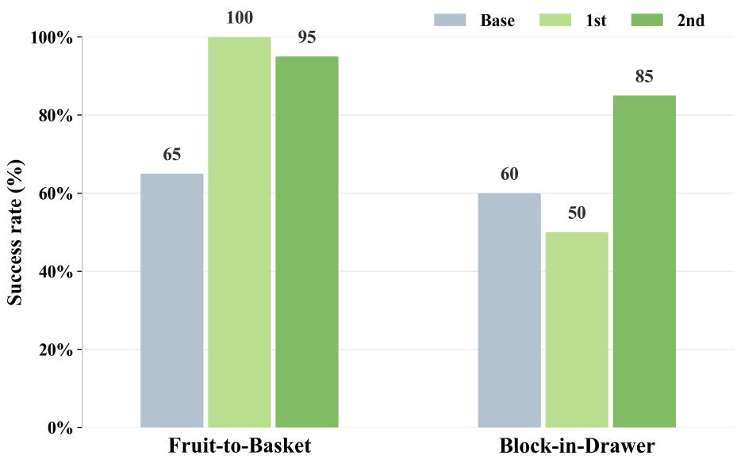  
Figure S10 Evaluation on multi tasks.

As shown in Figure S10, the success rate on Fruit-to-Basket increases from 65% to 100% after the first cycle and remains near saturation at 95% after the second. On Cup-on-Coaster, performance initially decreases from 60% to 50%, indicating that a single targeted update may expose or introduce failure modes not covered by the current training distribution. Feeding these failures into the second cycle raises the success rate to 90%. Overall, the average success rate increases from 62.5% to 92.5% after two cycles, demonstrating that F4R can repeatedly convert deployment feedback into further policy improvement.

## S6 Qualitative Results and Limitations

## S6.1 Failure cases

Table S22 summarizes these limitations and possible mitigations.

Table S22 Current limitations and possible mitigations.
<table><tr><td>Component</td><td>Failure mode</td><td>Consequence</td><td>Possible mitigation</td></tr><tr><td>Diagnosis</td><td>Subtle viewpoint or illumination change</td><td>Incorrect causal attribution</td><td>Longer temporal memory and explicit view normalization</td></tr><tr><td>Diagnosis</td><td>Multiple simultaneous failures</td><td>Ambiguous earliest cause</td><td>Causal multi-hypothesis diagnosis</td></tr><tr><td>Reconstruction</td><td>Transparent, reflective, or thin objects</td><td>Incomplete geometry/depth</td><td>Specialized sensing or material-aware reconstruction</td></tr><tr><td>Reconstruction</td><td>Ambiguous articulation</td><td>Incorrect joint axis/limits</td><td>Active articulation probing</td></tr><tr><td>Simulation</td><td>Friction/contact mismatch</td><td>Sim-real execution gap</td><td>Online parameter identification</td></tr><tr><td>Simulation</td><td>Deformable objects or dynamic scenes</td><td>Invalid rigid-scene assumption</td><td>Deformable/dynamic reconstruction</td></tr><tr><td>Refinement</td><td>Sparse-reward exploration failure</td><td>Insufficient PPO improvement</td><td>Better initialization or generic progress rewards</td></tr><tr><td>Refinement</td><td>Overly local failure distribution</td><td>Limited broader robustness</td><td>Adaptive mixture with broad randomization</td></tr><tr><td>Continual loop</td><td>Growing failure memory</td><td>Increasing sampling/training cost</td><td>Failure clustering and curriculum management</td></tr></table>

## S6.2 Scope and safety

Our current evaluation focuses on tabletop manipulation with predominantly rigid objects. The method has not yet been validated on deformable objects, dynamic scenes, mobile manipulation, or long-horizon assembly. Scaling to many objects and accumulated failures also requires strategies for merging, prioritizing, and retiring failure distributions.

During real-robot deployment, a human operator remains available for emergency stop and hardware safety, but does not diagnose failures or provide corrective demonstrations for F4R. Rollouts terminate on timeout, communication loss, detected collision, or other abnormal conditions. By shifting repeated failure correction to simulation, F4R reduces the number of potentially risky real-world retries.

## S6.3 Reproducibility

Software and model versions. We use π as the base VLA policy and GPT-5.5 as the failure-diagnosis backend. The simulation environment is built with Isaac Sim 5.1 and Isaac Lab 2.3.2. Training uses CUDA 12.4, PyTorch 2.6.0, Transformers 4.40.1, and Ray 2.54.0, while the real-robot system runs ROS Noetic. All experiments use a fixed random seed of 42. Detailed training hyperparameters are provided in Table S13.