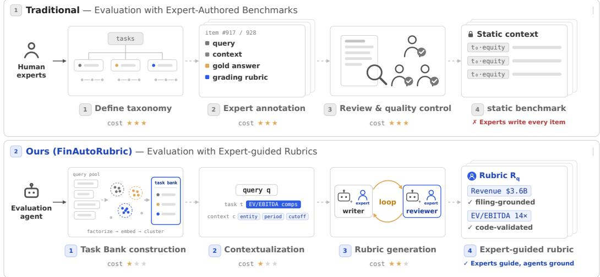
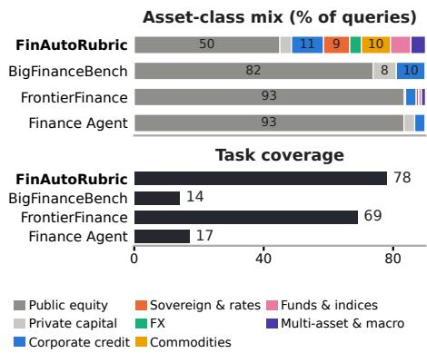
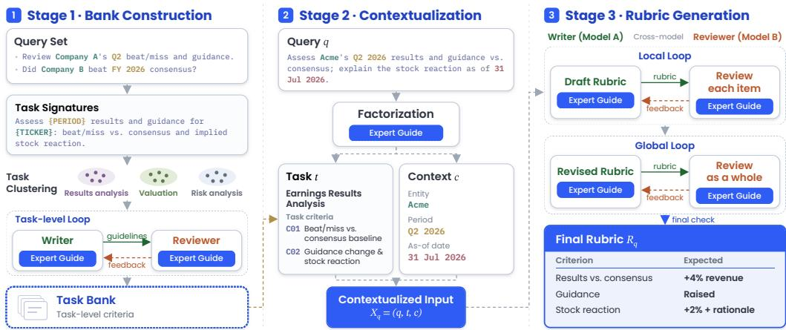
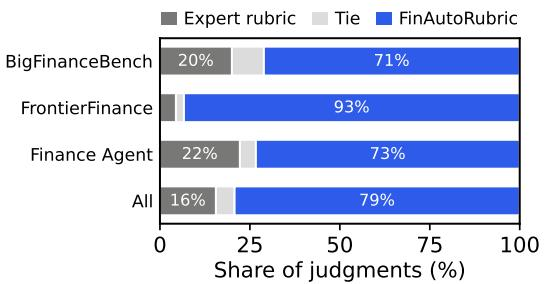
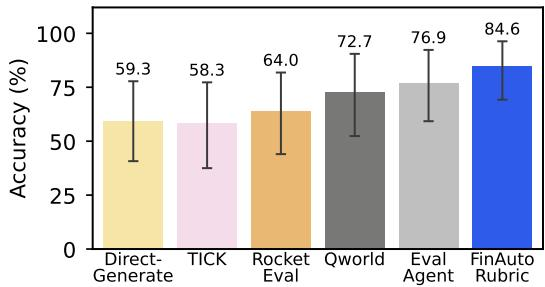
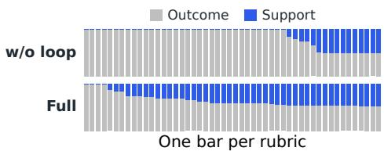

# FINAUTORUBRIC: EXPERT-GUIDED AUTOMATIC RUBRIC GENERATION FOR EVALUATING FINANCIAL RESEARCH AGENTS

Hoyoung Lee<sup>1,2,∗</sup>, Suyeol Yun<sup>1,∗</sup>, Jack Haverty<sup>1</sup>, Yunju Cho<sup>1</sup>, Meesong Kim<sup>1</sup>, Daekyung Park<sup>1</sup>, Sumin Kim<sup>1</sup>, Jihoon Kwon<sup>1</sup>, Jasmine Jia Geng<sup>3</sup>, Andrew Chin Yin Luo<sup>5</sup>, Edward Tong<sup>6</sup>, Yu Yu<sup>7</sup>, Zach Golkhou<sup>8</sup>, Minkyu Kim<sup>9</sup>, Igor Halperin<sup>10</sup>, Young Cha<sup>11</sup>, Alejandro Lopez-Lira<sup>12</sup>, Chanyeol Choi<sup>1,†</sup>, Yongjae Lee<sup>1,2,†</sup>

<sup>1</sup>LinqAlpha <sup>2</sup>UNIST <sup>3</sup>MassMutual Life Insurance <sup>4</sup>AllianceBernstein

<sup>5</sup>Wolfe Research <sup>6</sup>Google <sup>7</sup>BlackRock <sup>8</sup>J.P. Morgan Chase <sup>9</sup>State Street Corporation <sup>10</sup>Fidelity Investments <sup>11</sup>Blackstone <sup>12</sup>University of Florida

## ABSTRACT

Evaluating finance research agents requires rubrics that reflect expert standards and fix the values correct as of an information cutoff. Expert-reviewed finance benchmarks rely on fixed, per-item rubrics, which are costly to extend and cannot encode each institution’s own standard. In FinAutoRubric, experts specify reusable evaluation guidance, while agents and code carry out query-specific rubric generation, review, and validation. This expert guidance governs every agent, as prompts and as rules that code enforces, and a Task Bank of reusable criteria carries it across tasks. In long-horizon loops that follow the expert guidance, a writer agent researches every expected value and a reviewer agent verifies it, and failures escalate to a human. On three expert-authored finance benchmarks, its rubrics track expert scoring as closely as the strongest evaluated generator while stating the expert rubric’s expected value for more criteria, their scores agree with human grading, and in-house analysts prefer them in a blind review. The released 100-query FinAutoRubric Benchmark, built from in-house analysts’ key questions across 78 tasks and eight asset classes, shows that rubrics from an earlier model generation still leave headroom for a later one.

## 1 INTRODUCTION

Language-model agents can now perform long-horizon retrieval, computation, and evidence synthesis with tools (Gou et al., 2025), and on real-world professional tasks their deliverables approach expert quality (Patwardhan et al., 2025). Finance-agent evaluation has accordingly moved beyond closed-form question answering over filings (Islam et al., 2023; Mateega et al., 2025). Other benchmarks cover SEC-filing analytics, auditing, spreadsheets, and trading reasoning (Jiang et al., 2026; Wang et al., 2026b; Ravnik et al., 2026; Agrawal et al., 2026) and financial retrieval (Kim & Huang, 2026; Choi et al., 2025a;b). Evaluating LLMs in finance must also consider their biases in investment analysis (Kong et al., 2026; Lee et al., 2025) and whether their summaries preserve the decision a financial source supports (Lee et al., 2026). Recent benchmarks evaluate agents that search filings and market data (Hu et al., 2026) and, in open-ended investment research, reconcile inconsistent definitions and defend a decision-relevant conclusion with evidence (Vidgen et al., 2026). Because such research has many parts to judge and more than one defensible analysis, these benchmarks grade not against a single answer but against item-specific expert rubrics that combine many crite ria, as do benchmarks across professional domains (Akyürek et al., 2025; Wang et al., 2026c).

In BigFinanceBench (Wang et al., 2026a), FrontierFinance (Zhang et al., 2026), and Finance Agent Benchmark (Bigeard et al., 2025), experts write each query, author or audit its rubric, and review the item before release (Figure 1). Such work makes the benchmarks costly to build and slow to update, yet their answers depend on when and for whom they are given. New filings and market events change which figures are correct (Zhang et al., 2026), and the professional perspective changes which consequences matter. Each rubric thus fixes one information cutoff, the last date whose information an answer may use, and one perspective, and the standard behind it, from adfi<sub>missible evidence to point allocation, stays implicit in the item. BigFinanceBench time-anchors its</sub> queries to freeze their answers, FrontierFinance proposes periodic re-annotation with newer dates, and Finance Agent Benchmark issues new releases (Vals AI, 2026), so moving to a new date repeats the expert work item by item. Unlike domains where one answer key serves every user, the standard in finance varies by institution. Institutions that receive a similar query operate under different compliance rules and data, including licensed and internal sources a public benchmark excludes, so each needs its own evaluation standard, with its definitions of materiality, permitted evidence, and risk. A public benchmark fixes one standard for every user and cannot evaluate an agent against its institution’s own, and no finance benchmark in Figure 2a generates rubrics on demand or accepts custom guidance. Per-item authoring also limits coverage to what a fixed pool of experts knows. The three public sets devote most of their queries to public equity (Figure 2b), and extending one to a new asset class means authoring new items. We therefore ask whether generated rubrics can meet three requirements at once. They should measure responses as expert rubrics do, extend to tasks and contexts no expert has authored, and follow a standard the institution can inspect and control.

  
Figure 1: Traditional benchmarks (top) have experts write each query and its reference answer, author or audit its rubric, and review every item, so each benchmark is costly to build, slow to update, and fixed to one context per item. In FinAutoRubric (bottom), experts write reusable guidance once and screen a model-drafted Task Bank, and agents and code generate, review, and validate a rubric for each query in its context, so an institution can apply its own standard to new queries and cutoffs.

Automatic rubric generation could remove this per-item cost, but most existing methods target general domains. They write criteria from the question, at most with a reference answer or retrieved documents (Cook et al., 2024; Wei et al., 2025; Su et al., 2026; Wadhwa et al., 2025; Shao et al., 2026), learn or evolve them from contrasted responses (Liu et al., 2026; Shao et al., 2026), derive them from model-generated financial reports (Luan et al., 2026), or draw on reusable expert skills (Lin et al., 2026). Finance-agent evaluation instead needs rubrics that fix a correct answer’s values as of the information cutoff and follow the standard of the institution that uses them. JADE verifies a response’s own claims at evaluation time, but none researches such values as of the cutoff before any response exists, and none applies an institution’s rules to the rubric as coded checks.

Our key insight is that reusable expert guidance can govern not only what a rubric checks but also how its expected values are researched, verified, and weighted, before any response exists and as of a stated information cutoff. We introduce FinAutoRubric, an expert-guided rubric generation framework. Experts specify reusable evaluation guidance, while agents and code carry out query-specific rubric generation, review, and validation. The guidance covers evidence, calculation, evaluation scope, and point allocation, and an expert-curated Task Bank of reusable task-level criteria carries it across tasks. For each query, an agent separates its task from the entities, periods, requested out puts, and open interpretations the rubric must reflect and matches the task to the bank. A writer agent grounds every expected value in a cited source or an executed script, using only sources at or before the cutoff that the evaluated agents can also reach, such as data connectors an institution exposes to both, and never sees a reference answer or a response under evaluation. A reviewer agent reopens every source and re-derives every value, and code validates each submission and applies the point budget and acceptance gates, escalating failures to a human. A new query or cutoff therefore needs no new expert authoring. Because every decision leaves a trace, an institution can inspect its standard and revise it through the guidance.

<table><tr><td>Benchmark</td><td>Open- ended</td><td>Auto- generated</td><td>On- demand</td><td>Custom guidance</td></tr><tr><td>FinanceBench</td><td>x</td><td>x</td><td>x</td><td>x</td></tr><tr><td>FinDER</td><td>x</td><td>x</td><td>x</td><td>x</td></tr><tr><td>FinRetrieval</td><td>x</td><td></td><td>x</td><td>x</td></tr><tr><td>FinAgentBench</td><td>x</td><td>x</td><td>x</td><td>x</td></tr><tr><td>FinanceQA</td><td>x</td><td>x</td><td>x</td><td>x</td></tr><tr><td>Fin-RATE</td><td></td><td>▲</td><td>x</td><td>x</td></tr><tr><td>PRBench</td><td></td><td>x</td><td>x</td><td>x</td></tr><tr><td>Finance Agent Benchmark</td><td></td><td></td><td>x</td><td>x</td></tr><tr><td>APEX-Agents</td><td></td><td>x</td><td>x</td><td>x</td></tr><tr><td>ProfBench</td><td></td><td>x</td><td>x</td><td>x</td></tr><tr><td>BigFinanceBench</td><td></td><td>x</td><td>x</td><td>x</td></tr><tr><td>FrontierFinance</td><td></td><td>x</td><td>x</td><td>x</td></tr><tr><td>FinAutoRubric</td><td></td><td></td><td>V</td><td>L</td></tr></table>

(a) Properties (✔ full, ▲ partial, ✘ none).

  
(b) Asset-class mix and task coverage.  
Figure 2: The finance-benchmark landscape. (a) Properties of existing finance benchmarks. Ondemand means a rubric can be generated for a new query or cutoff without re-authoring, and custom guidance means an evaluator can supply its own guidance and audit how it is applied. (b) Asset-class mix (top) and distinct primary-task count (bottom), measured on the public set of each benchmark.

This paper makes two contributions.

• FinAutoRubric: expert-guided generation of evidence-grounded, context-specific rubrics. Reusable expert guidance, carried across tasks by a Task Bank of reusable criteria, guides queryspecific research and review for new queries and cutoffs, while coded rules govern validation and point allocation. An institution can inspect and revise this guidance. On three finance benchmarks, its rubrics state the expert’s expected value for more criteria than any evaluated generator while tracking expert scoring as closely as the strongest of them, their scores agree with human grading of responses, and in-house analysts prefer them in a blind review.

• FinAutoRubric Benchmark: financial-research evaluation with broad task and asset-class coverage. Its 100 queries are built from the key questions of in-house analysts, and FinAutoRubric writes their rubrics without per-item expert authoring. They span 78 primary tasks and eight asset classes, extending evaluation beyond the predominantly public-equity focus of existing benchmarks. We release all queries and rubrics and score six solvers.<sup>1</sup>

## 2 THE FINAUTORUBRIC FRAMEWORK

FinAutoRubric separates reusable expert guidance and task criteria from the context, evidence, and values that each query requires, and turns a query q into a rubric $R _ { q }$ in three stages (Figure 3). Stage 1 builds a Task Bank of reusable task-level criteria once per query pool, Stage 2 contextualizes each query against the bank, and Stage 3 turns the matched criteria into the concrete criteria of $R _ { q }$ through writer–reviewer loops that research expected values. Expert guidance G controls every agent in two ways, as instructions $\mathcal { G } _ { \mathrm { p r o m p t } }$ in its prompt and as rules ${ \mathcal { G } } _ { \mathrm { c o d e } }$ coded into the orchestrator, the program that runs every stage, rejects outputs that break them, and requests human intervention on failure.

  
Figure 3: FinAutoRubric overview. Every agent follows an expert guide. Stage 1 builds a Task Bank of reusable task-level criteria from a query set. Stage 2 separates a query’s task from its instancespecific context and matches the task to the bank. In the long-horizon Stage 3 loops, a reviewer from a different model family verifies every item of the writer’s draft, and the reviewer side rather than the writer edits the whole rubric for a fresh session to confirm, while code validates every output.

## 2.1 BANK CONSTRUCTION (STAGE 1)

Domain experts specify the recurring quality requirements of investment research in a principle library (Appendix E). The library is part of G, so revising it and rebuilding the Task Bank updates every later rubric. To build the bank, each in-house analyst query is converted into its task t, a onesentence task signature that states the requested operation without the query’s specific companies and periods. The signatures are embedded and clustered into task candidates that share one analytical operation. For each candidate, an author and a reviewer from different model families see only its signatures and the principle library and write its task-level criteria, which are atomic, tagged with the principles they realize, and free of query-specific values, sources, dates, and entities, and the orchestrator returns any conditional or untagged criterion for repair. A publication reviewer accepts, edits, or deletes each draft. Models thus write every criterion, and domain experts only screen the high-level entries for issues and remove duplicate or unnecessary tasks, leaving a frozen Task Bank of 200 tasks (Appendix F) whose entries give common criteria for queries matched to their task.

## 2.2 CONTEXTUALIZATION (STAGE 2)

Stage 2 contextualizes the query before any evidence is gathered, so that no retrieved value can shape the task definition. A factorization agent performs it in two turns, and both $\mathcal { G } _ { \mathrm { p r o m p t } }$ and $\mathcal { G } _ { \mathrm { c o d e } }$ govern it. In the first turn, the factorization guidance in its prompt directs the agent to separate the query q into its task signature t and its instance-specific context c, which sorts the query spans that carry the instance into eight typed binding arrays (entities, periods, metrics, assumptions, deliverables, output constraints, convention topics, and populations). The guidance limits the signature to a value-free statement of the requested operation, requires every binding to copy a query span verbatim, and admits an open interpretation of the query as a convention topic only when it is material, so an institution controls the separation by revising G. In the second turn, the orchestrator adds the bank and the principle library to the agent’s workspace, and the matching guidance directs the agent to select a bank task only on a complete and unique fit and otherwise to write task-level criteria from t and the principles alone, so every query stays under expert guidance. The same guidance has the agent record, for each part of the request, whether the selected criteria would narrow its scope or require an output it does not ask for, and it forbids such a conflict from overriding the query. The orchestrator enforces the corresponding rules of ${ \mathcal { G } } _ { \mathrm { c o d e } } .$ . It writes the information cutoff into the context itself, as an inclusive date after which no source can support an expected value. It rejects any binding that is not a verbatim query span or that changes between the two turns and any alignment that leaves part of the request unchecked, and it returns each finding to the agent for repair (Appendix H traces one query). After matching, t denotes the selected task with its criteria, and the contextualized input $X _ { q } = ( q , t , c )$ is the input to Stage 3.

## 2.3 RUBRIC GENERATION (STAGE 3)

Point budget. In its first turn, the factorization agent also writes a routing plan, carried in c, that lists the obligations the query binds, each anchored to a verbatim query span. Its guidance in G<sub>prompt</sub> gives an obligation reference verification when sourced facts or a reproducible calculation decide it, and judgment verification only when more than one well-supported conclusion can satisfy it. Point allocation, in contrast, follows ${ \mathcal { G } } _ { \mathrm { c o d e } }$ . Before any research, the orchestrator divides 100 points equally among the obligations and freezes this initial budget while the writer researches, so no retrieved value can shape it. Weighting obligations by importance now would steer the writer’s search toward what the model already expects to matter, a bias that is costly in finance, where decisive information is often recent or sparsely available. After research, the composition agent of the global loop can move points across obligations when minor ones dilute the one the query centers on.

Writer. Following its instructions in $\mathcal { G } _ { \mathrm { p r o m p t } } .$ , the writer receives $X _ { q }$ and the frozen budget and, with web search and Python code execution, gathers evidence, computes expected values, and submits an evidence record, a candidate answer, and a typed task contract. The contract binds each obligation to the targets that decide it, such as a numeric value, an attributed claim, or an analytical judgment, and gives each target a score role. A core outcome is what the query explicitly asks for or fixes, either the answer itself or an input the query stipulates, and required justification and support cover the work behind it. The evidence and calculation guidance admits expected values only from cited sources or executed scripts and leaves a value that cannot be grounded unresolved. A numeric target states its accepted values and a tolerance, and a requested final value is graded at the precision the query states. When the evidence grounds several choices of a convention topic, each keeps its own accepted value, so an answer passes under the route it adopts but cannot mix routes. The orchestrator rather than the writer splits each obligation’s points by score role. A reference obligation with noncore targets reserves half of its points for its core outcomes, and a judgment target splits its points between a thesis row and rows for its evidence and reasoning.

Local loop. The writer’s output enters a local loop that verifies every item. A validator from $\mathcal { G } _ { \mathrm { c o d e } }$ , the same code the writer can run in its sandbox, checks every submission against the contract, for example that target kinds match each obligation’s verification mode and that every target is scored exactly once, and returns any finding to the writer for repair. Under reviewer instructions in $\mathcal { G } _ { \mathrm { p r o m p t } }$ , a content reviewer from a different model family, in its own isolated sandbox, reopens every stored source, checks it against the cutoff, and re-derives each value, calculation, and score role. It feedback returns the candidate to the writer, and each revision is reviewed again, up to a bound.

Global loop. A global loop then reviews the rubric as a whole. A composition agent from the reviewer family judges the rendered rubric for the properties its instructions list, such as binary grading, no double scoring, and outcome priority. It may split or merge rows and move points, but the orchestrator accepts an edit only under the gates of $\mathcal { G } _ { \mathrm { c o d e } }$ . Points must sum to 100, outcome rows must keep more than half of them, every change needs a material finding of the matching kind, and a fresh session must confirm the edited rubric. In the QVC rubric of Appendix I, the two requested leverage ratios held exactly half of the points and the LTM denominator as many as each ratio. The confirmed edit raised each ratio from 25 to 30 points, lowered the denominator from 25 to 15, and removed from every row a requirement to ground each input in a primary filing, which the query does not ask.

Acceptance. A rubric is accepted only when it passes every rule of ${ \mathcal { G } } _ { \mathrm { c o d e } }$ , including the absence of blockers such as a post-cutoff source, a missing review, or contamination. When a loop ends without passing, the orchestrator blocks the run and requests human intervention rather than return an unvalidated rubric. The human restarts the run from the failed stage, reusing stages that passed, and the restart must pass the same rules. Every stage leaves a record, from bindings to evidence, reviews, and gate decisions, so an institution can trace how its guidance shaped each rubric.

## 3 EXPERIMENTAL SETUP

We compare rubric sources by scoring the same responses with a fixed three-judge ensemble. A response y to a query q is the agent’s full trace of messages, tool calls, and tool results, followed by its final answer. No generator sees the responses, and the expert rubric serves as the reference.

## 3.1 DATASETS

Three finance benchmarks release their expert rubrics. We use all 50 queries of the BigFinanceBench public release and all 27 public queries of Finance Agent Benchmark v2 (Vals AI, 2026), whose items are expert-reviewed and graded against per-item checks. To limit cost, we sample 48 Frontier-Finance queries, eight from each of its six use cases. For human grading, ProfBench supplies ten finance tasks with expert-graded model responses.

## 3.2 BASELINES

Direct-Generate asks the author model for the rubric in one call from the query, the information cutoff, and our output schema, following Hong et al. (2026). TICK (Cook et al., 2024) and Rock etEval (Wei et al., 2025) generate checklists from the query, the latter without its reference answer. Qworld (Su et al., 2026) expands the query into scenarios, perspectives, and weighted criteria, and EvalAgent (Wadhwa et al., 2025) aggregates criteria from retrieved web pages and, like Direct-Generate, receives the information cutoff. OpenRubrics (Liu et al., 2026) and DR Tulu (Shao et al., 2026), which need a trained rubric model or RL rollouts, and JADE (Lin et al., 2026), part of whose checklist comes from each response, are excluded. Comparisons use matched settings (Appendix B).

## 3.3 MODELS AND ENVIRONMENT

Every model role runs inside an agent harness, the software that runs a model’s tool-use loop and lets it execute code, read files, and search the web. The writer, GPT-5.6 Sol on the Codex harness, also runs Stage 2. The reviewer roles run Claude Opus 5 on the Claude Code harness, so writing and review differ in model family and harness. These roles use high reasoning effort.

A rubric must depend only on the query and its context, so three safeguards keep benchmark data out of generation. First, every role runs in its own isolated sandbox, and a reviewer sees only the writer’s submission. Second, every sandbox is blocked from Hugging Face and GitHub, which host benchmark data. Third, an automatic audit checks every agent trace and working file. This audit is needed because the harnesses’ web search runs on the model provider’s servers and bypasses the block. It flags any tool call that names a benchmark dataset or opens its page. It also flags any file with an answer-key field, and a flagged draft is withheld from review.

The eight solvers are the models whose BigFinanceBench traces are public (Claude Opus 4.7, GPT-5.5, GPT-5.4 mini, Gemini 3 Flash, GLM-5.1, Kimi K2.6, Qwen3.6-27B, and Gemma 4 31B). BigFinanceBench is therefore scored on its published traces. For FrontierFinance and Finance Agent Benchmark, the same models answer on the BigFinanceBench harness, which offers web search, SEC filing search, and code execution. The solvers of §4.4 use the same harness, and no solver generates rubrics. Three judges at medium effort, Muse Spark 1.3, GLM-5.3-Flash, and DeepSeek V4.1-Flash, decide pass/fail and coverage by majority vote (§4.4 averages judge scores).

## 3.4 METRICS

A rubric $R _ { q }$ scores y by the point-weighted share of its criteria that y passes,

$$
s ( q , y ; R _ { q } ) \ = \ \frac { \sum _ { r \in R _ { q } } w _ { r } \ { \bf 1 } \big [ y \ p a s s e s \ r \big ] } { \sum _ { r \in R _ { q } } w _ { r } } ,\tag{1}
$$

where $w _ { r }$ is the source’s native weight, with Qworld’s signed weights normalized as in Appendix B. Following Hong et al. (2026), we compare the scores that generated and expert rubrics give the same responses, measuring ordering and magnitude. We also adapt rubric recall from RubricBench (Zhou et al., 2026), additionally requiring agreement on the expected value. PReMISE (Roy et al., 2026) instead audits the rubrics themselves under a fixed judge.

Table 1: Comparison of FinAutoRubric with other automatic generation baselines against expert rubrics. Coverage is the share of expert criteria matched with the expert rubric’s expected value.
<table><tr><td></td><td colspan="3">BigFinanceBench</td><td colspan="3">FrontierFinance</td><td colspan="3">Finance Agent</td></tr><tr><td>Method</td><td> $\tau _ { b }$  ↑</td><td>MAE↓</td><td>Coverage↑</td><td> $\tau _ { b } ~ ^ { \prime }$  ←</td><td>MAE↓</td><td>Coverage↑</td><td>Tb ↑</td><td>MAE↓</td><td>Coverage↑</td></tr><tr><td>Direct-Generate</td><td>0.488</td><td>26.3</td><td>32.5</td><td>0.494</td><td>22.2</td><td>32.9</td><td>0.579</td><td>31.7</td><td>46.4</td></tr><tr><td>TICK</td><td>0.522</td><td>31.1</td><td>20.5</td><td>0.499</td><td>41.2</td><td>13.4</td><td>0.620</td><td>19.9</td><td>19.0</td></tr><tr><td>RocketEval</td><td>0.499</td><td>29.1</td><td>22.2</td><td>0.419</td><td>34.1</td><td>17.1</td><td>0.613</td><td>22.7</td><td>28.0</td></tr><tr><td>Qworld</td><td>0.423</td><td>26.1</td><td>24.1</td><td>0.345</td><td>25.5</td><td>17.1</td><td>0.542</td><td>42.5</td><td>16.9</td></tr><tr><td>EvalAgent</td><td>0.491</td><td>26.4</td><td>24.2</td><td>0.536</td><td>20.7</td><td>21.5</td><td>0.549</td><td>25.2</td><td>19.3</td></tr><tr><td>FinAutoRubric</td><td>0.616</td><td>19.0</td><td>60.8</td><td>0.510</td><td>22.2</td><td>40.7</td><td>0.678</td><td>19.2</td><td>80.8</td></tr></table>

Kendall’s $\tau _ { b }$ measures agreement between the two rubrics’ response rankings within each query, counting concordant and discordant response pairs and adjusting for tied scores. We average it equally over queries with at least three responses and non-constant scores under both rubrics. MAE is the mean absolute difference between generated- and expert-rubric scores over all query–response pairs, in percentage points. It catches rubrics that keep the ordering but shift the score level.

Coverage is the fraction of expert criteria matched by at least one generated criterion, computed per query and averaged equally across queries. Each expert criterion counts equally, and the judges decide matches following Su et al. (2026). A match requires the same demand and the same expected value. Appendix C also reports a value-free variant that matches on the demand alone.

## 4 RESULTS

We organize the results around three questions. RQ1 asks how closely the generated rubrics agree with expert scoring (§4.1) and with human judgments of the rubrics and of the responses they score (§4.2). RQ2 asks what the Task Bank, contextualization, and the reviews of both loops each contribute to rubric quality (§4.3). RQ3 asks how the loops bring point allocation within the rules of G (§4.3), an observation of compliance with the current rules rather than a test of customization to other guidance. §4.4 reports the benchmark and its task and asset-class coverage.

## 4.1 COMPARISON WITH EXPERT-AUTHORED RUBRICS

Generated rubrics track expert scoring. Table 1 scores the same eight responses to each query under every generated rubric and under the expert rubric. FinAutoRubric has the highest $\tau _ { b }$ and lowest MAE on BigFinanceBench and Finance Agent Benchmark, and on FrontierFinance EvalAgent leads on both within noise, a gap that §4.2 relates to the expert rubrics. The paired intervals (Appendix C) place FinAutoRubric’s BigFinanceBench $\tau _ { b }$ above four of the five baselines, with the interval against TICK just reaching zero, and its BigFinanceBench MAE below all five, while elsewhere its differences from the strongest baseline are within noise. FinAutoRubric therefore track expert scoring as closely as the strongest evaluated generator and leads on BigFinanceBench.

FinAutoRubric states the expert’s value for more criteria than any baseline. FinAutoRubric matches an expert criterion with its expected value for 60.8% of BigFinanceBench, 40.7% of FrontierFinance, and 80.8% of Finance Agent Benchmark criteria. Direct-Generate has the highest coverage among the baselines on each benchmark, at 32.5%, 32.9%, and 46.4%. The baselines name most of the expert’s criteria without their values. Under coverage without values (Appendix C), every baseline covers 47% to 95% of the expert criteria and Qworld and EvalAgent lead FinAutoRubric on every benchmark, yet Qworld has the lowest $\tau _ { b }$ on all three. That variant rewards enumeration, which helps most on FrontierFinance, whose expert rubrics list many facts the query does not request, and that is where EvalAgent matches FinAutoRubric on agreement. A criterion without its decisive value cannot separate a correct response from a plausible wrong one. Appendix I shows rubrics from all three benchmarks next to the expert originals.

  
Figure 4: Blind test of expert and FinAutoRubric rubrics. Analysts choose between two anonymized rubrics per query.

  
Figure 5: Pairwise agreement between rubricbased scoring and human grading on ProfBench Finance. Error bars show 95% bootstrap CIs.

## 4.2 HUMAN EVALUATION

Analysts prefer FinAutoRubric rubrics in a blind review. The comparisons so far treat the expert rubric as ground truth, although it can contain confirmed errors (Appendix D). Three experienced in-house analysts compared the expert and FinAutoRubric rubrics of 45 queries, 15 per benchmark, blind to source and without reference answers. For each query they chose the rubric they would rather grade with and rated each rubric’s fit for use. Each analyst alone significantly prefers FinAutoRubric (Figure 4, Appendix D), so the generated rubrics hold up without treating the expert rubric as ground truth. The expert rubric wins mainly on BigFinanceBench and Finance Agent Benchmark, where FinAutoRubric also agrees most with expert scoring (§4.1), and rarely on FrontierFinance, where that agreement is lowest. There, lower agreement need not indicate a weaker rubric, since all three analysts prefer FinAutoRubric. Some objections reflect opposite granularity preferences. Most of two analysts’ expert-rubric choices come from Finance Agent Benchmark, where FinAutoRubric also scores inputs and intermediate steps, and all of the third’s from BigFinanceBench, where the expert rubric scores every step and FinAutoRubric does not, a choice an institution can set in its guidance. Others point to genuine gaps, such as unrequested inputs, missing steps, points concentrated on a minor part of the query, and overly wide tolerances.

Rubric-conditioned scores agree with human grading of responses. ProfBench’s reference comes from its expert graders, who scored three model responses per task criterion by criterion against the task’s rubric. Every pair of responses they score unequally serves as a human judgment. Each source generates a rubric from the query without seeing the responses, the judges of §3.3 score both responses of a pair under it, and a pair is correct when the two orders agree. Judge ties are excluded. FinAutoRubric reaches the highest pairwise accuracy of all sources, a lead within noise on a set this small (Figure 5, Appendix C).

## 4.3 CONTRIBUTION OF EACH COMPONENT

The Task Bank provides reusable criteria. Table 2 removes each carrier of the expert guidance in turn. Without the bank, the fallback path still follows the principle library, yet agreement and coverage fall while MAE barely changes. The largest task-level gains are in driver-based projection and valuation-basis comparison, whose bank entries specify reusable checks on assumptions, intermediate cal-

Table 2: Ablation on BigFinanceBench.
<table><tr><td>Variant</td><td>Tb↑</td><td>MAE↓ Coverage↑</td></tr><tr><td>w/o Task Bank</td><td>0.581 18.4</td><td>56.0</td></tr><tr><td>w/o contextualization 0.485</td><td>24.3</td><td>57.9</td></tr><tr><td>w/o loop</td><td>0.523 28.5</td><td>41.9</td></tr><tr><td>Full</td><td>0.616 19.0</td><td>60.8</td></tr></table>

culations, and comparable measurement bases (Appendix F.1). Financial-metric retrieval, stipulated recalculation, and investor-return tasks do not improve, so the bank helps where quality rests on reusable analytical checks rather than on retrieved facts.

Context shapes both the rubric and the scores it assigns. Without Stage 2, the writer still receives the query and the information cutoff, but agreement falls furthest of all variants, MAE rises, and coverage changes little. The comparison evaluates generation end to end, so the 11 of 50 runs that still fail after two human recovery attempts count as zero (Appendix B). The validator and composition review are also absent here, so the comparison measures their joint removal with Stage 2. Fixed rubrics often penalize answers with altered periods, scopes, or assumptions (Appendix J). This checks sensitivity to answer violations rather than adaptation through rubric regeneration, and the analysis also identifies a query–rubric scope mismatch.

Table 3: Solver performance on the FinAutoRubric Benchmark, as point-weighted pass share (%). Overall averages all queries, and each dimension averages the queries that contain it (87, 93, 81, and 54). Cells give the mean ± SD over the three judges outside the solver’s family, and bars show Overall with a one-SD whisker. Bold marks the best value in each column and an underline the second best, and † marks the rubric writer’s or reviewer’s family.
<table><tr><td>Model</td><td>Overall</td><td>Quantitative</td><td>Factual</td><td>Judgment</td><td>Support</td></tr><tr><td>S GPT-6 Astra†</td><td> $7 7 . 3 \pm 3 . 4$ </td><td> ${ \bf 7 0 . 3 \pm 1 . 8 }$ </td><td> ${ \bf 6 8 . 6 \pm 4 . 5 }$ </td><td> ${ \bf 8 6 . 5 \pm 4 . 2 }$ </td><td> $7 1 . 5 \pm 2 . 2$ </td></tr><tr><td>Al Fable 5.1†</td><td> $\underline { { 7 1 . 6 } } \pm 5 . 2 =$ </td><td> $6 5 . 6 \pm 1 . 4$ </td><td> $6 2 . 8 \pm 7 . 7$ </td><td> $8 0 . 6 \pm 7 . 0$ </td><td> $6 5 . 7 \pm 3 . 4$ </td></tr><tr><td>Muse Spark 1.3</td><td> $7 1 . 2 \pm 1 . 6$ </td><td> $6 4 . 7 \pm 0 . 8$ </td><td> $6 6 . 2 \pm 4 . 0$ </td><td> $8 0 . 2 \pm 2 . 3$ </td><td> $6 5 . 4 \pm 2 . 2$ </td></tr><tr><td>DeepSeek V4.1-Flash</td><td> $6 7 . 6 \pm 5 . 1$ </td><td> $6 2 . 2 \pm 1 . 7$ </td><td> $6 2 . 8 \pm 7 . 8$ </td><td> $7 5 . 8 \pm 6 . 8$ </td><td> $6 1 . 0 \pm 4 . 3$ </td></tr><tr><td>Gemini 3.8 Flash</td><td> $6 2 . 7 \pm 4 . 3$ </td><td> $6 1 . 4 \pm 0 . 8$ </td><td> $5 1 . 2 \pm 5 . 6$ </td><td> $6 8 . 2 \pm 6 . 3$ </td><td> $5 9 . 9 \pm 2 . 3$ </td></tr><tr><td>GLM-5.3</td><td> $5 5 . 2 \pm 4 . 7$ </td><td> $5 1 . 5 \pm 1 . 1$ </td><td> $4 6 . 8 \pm 7 . 1$ </td><td> $6 6 . 6 \pm 6 . 0$ </td><td> $4 1 . 5 \pm 3 . 7$ </td></tr></table>

The loops credit support while keeping outcomes   
first. Without the reviews of both loops, we score   
the writer’s first draft with the same role-weighted   
points. Removing the reviews lowers coverage and   
raises MAE more than removing any other compo  
nent, so the reviews matter most for stating the ex  
pert’s values and matching the expert’s score levels.   
Figure 6 shows how. The drafts err in both direc  
tions, most giving every point to outcome rows and   
some giving support at least half, and the loops rebal  
ance both, raising support overall while bringing ev  
ery rubric within the outcome-majority rule of ${ \bar { \mathcal { G } } } _ { \mathrm { c o d e } } .$   
Every point change carried a material finding and a fr esh-session confirmation.

  
Figure 6: Point split of the 50 BigFinanceBench rubrics. Outcome points reward what the query asks for or fixes, and support points the intermediate steps. The loops rebalance drafts in both directions.

## 4.4 THE FINAUTORUBRIC BENCHMARK

The 100-query FinAutoRubric Benchmark is built from the key questions of in-house analysts, so its queries reflect the research that analysts actually carry out. They cover more Task Bank tasks than any public expert set and all eight asset classes, and only half concern public equity, the asset class that dominates the public sets (Figure 2b). We release all 100 queries with their rubrics.

Table 3 scores six solvers with one response per query. The three judges of §3.3 score each response, and Qwen3.8 Flash stands in for a judge that shares the solver’s family (Appendix B). Four dimensions follow the targets of §2.3. Quantitative and Factual criteria check the numeric and non-numeric values that reference obligations request, Judgment criteria score judgment obligations through their thesis, evidence, and reasoning, and Support criteria check the justification behind a reference answer. Support carries only a small share of the points.

GPT-6 Astra leads overall and in every dimension, and the solvers spread widely. GPT-6 Astra belongs to a later model generation than GPT-5.6 Sol, which wrote the rubrics, yet it stays well below full marks. A weaker writer can evaluate a stronger agent because the long-horizon loops hold it to the expert guidance at every step, from sourcing each value to allocating its points, so the rubric rests on the guidance and the evidence rather than on the writer’s own ability. Every solver scores highest on Judgment, whose targets accept any well-supported conclusion, and lower on the dimensions that fix one expected value or method, although the dimension columns cover different numbers of queries. Two features of the evaluation design bear on the spread. Solvers from the writer’s or reviewer’s family († in Table 3) may benefit from closer alignment in convention choices and intermediate inputs, and Gemini 3.8 Flash exhausts the shared step budget far more often than any other solver because it issues about one tool call per step. These are judge scores against the released rubrics rather than expert-verified correctness. Automated review checks source grounding and internal consistency under the selected conventions, so it does not certify that an ambiguous query was read as its author intended.

## 5 CONCLUSION

In FinAutoRubric, experts write reusable evaluation guidance, a Task Bank carries it across tasks, and agents and code generate, review, and validate each query’s rubric in long-horizon loops that enforce the guidance, escalate failures to a human, and leave an inspectable trace. This lets an institution build its own benchmark as its tasks and information change. On three finance benchmarks, the rubrics track expert scoring as closely as the strongest evaluated generator and state the expert’s expected value for more criteria than any baseline, their scores agree with human grading, and analysts prefer them in a blind review. These rubrics take more time and cost than those of the baselines, which come from a single model call or a short fixed pipeline, since each query runs long-horizon writer and reviewer sessions. On the 100 analyst-derived queries of the FinAutoRubric Benchmark, rubrics written by an earlier model generation still leave room to separate a later one. Calibration to expert point scales and same-task consistency still need direct measurement, and we do not study generated rubrics as training rewards (Gunjal et al., 2025; Liu et al., 2026).

## REFERENCES

Yogesh Agrawal, Aniruddha Dutta, Md Mahadi Hasan, Santu Karmaker, and Aritra Dutta. Fin-TradeBench: A financial reasoning benchmark for LLMs. arXiv preprint arXiv:2603.19225, 2026. URL https://arxiv.org/abs/2603.19225.

Afra Feyza Akyürek, Advait Gosai, Chen Bo Calvin Zhang, Vipul Gupta, Jaehwan Jeong, Anisha Gunjal, Tahseen Rabbani, Maria Mazzone, David Randolph, Mohammad Mahmoudi Meymand, Gurshaan Chattha, Paula Rodriguez, Diego Mares, Pavit Singh, Michael Liu, Subodh Chawla, Pete Cline, Lucy Ogaz, Ernesto Hernandez, Zihao Wang, Pavi Bhatter, Marcos Ayestaran, Bing Liu, and Yunzhong He. PRBench: Large-scale expert rubrics for evaluating high-stakes professional reasoning. arXiv preprint arXiv:2511.11562, 2025. URL https://arxiv.org/abs/ 2511.11562.

Antoine Bigeard, Langston Nashold, Rayan Krishnan, and Shirley Wu. Finance agent benchmark: Benchmarking LLMs on real-world financial research tasks. arXiv preprint arXiv:2508.00828, 2025. URL https://arxiv.org/abs/2508.00828.

Ricardo J. G. B. Campello, Davoud Moulavi, and Jörg Sander. Density-based clustering based on hierarchical density estimates. In Advances in Knowledge Discovery and Data Mining (PAKDD), pp. 160–172, 2013. doi: 10.1007/978-3-642-37456-2\_14. URL https://doi.org/10. 1007/978-3-642-37456-2\_14.

Chanyeol Choi, Jihoon Kwon, Jaeseon Ha, Hojun Choi, Chaewoon Kim, Yongjae Lee, Jy-yong Sohn, and Alejandro Lopez-Lira. FinDER: Financial dataset for question answering and evaluating retrieval-augmented generation. In Proceedings of the 6th ACM International Conference on AI in Finance, ICAIF ’25, pp. 638–646. Association for Computing Machinery, 2025a. doi: 10.1145/3768292.3770361. URL https://doi.org/10.1145/3768292.3770361.

Chanyeol Choi, Jihoon Kwon, Alejandro Lopez-Lira, Chaewoon Kim, Minjae Kim, Juneha Hwang, Jaeseon Ha, Hojun Choi, Suyeol Yun, Yongjin Kim, and Yongjae Lee. FinAgentBench: A benchmark dataset for agentic retrieval in financial question answering. In Proceedings ofthe 6th ACM International Conference on AI in Finance, ICAIF ’25, pp. 632–637. Association for Computing Machinery, 2025b. doi: 10.1145/3768292.3770362. URL https://doi.org/10.1145/ 3768292.3770362.

Jonathan Cook, Tim Rocktäschel, Jakob Foerster, Dennis Aumiller, and Alex Wang. Ticking all the boxes: Generated checklists improve LLM evaluation and generation. arXiv preprint arXiv:2410.03608, 2024. URL https://arxiv.org/abs/2410.03608.

Boyu Gou, Zanming Huang, Yuting Ning, Yu Gu, Michael Lin, Weijian Qi, Andrei Kopanev, Botao Yu, Bernal Jiménez Gutiérrez, Yiheng Shu, Chan Hee Song, Jiaman Wu, Shijie Chen, Hanane Nour Moussa, Tianshu Zhang, Jian Xie, Yifei Li, Tianci Xue, Zeyi Liao, Kai Zhang, Boyuan Zheng, Zhaowei Cai, Viktor Rozgic, Morteza Ziyadi, Huan Sun, and Yu Su. Mind2Web 2: Evaluating agentic search with agent-as-a-judge. arXiv preprint arXiv:2506.21506, 2025. URL https://arxiv.org/abs/2506.21506.

Anisha Gunjal, Anthony Wang, Elaine Lau, Vaskar Nath, Yunzhong He, Bing Liu, and Sean Hendryx. Rubrics as rewards: Reinforcement learning beyond verifiable domains. arXiv preprint arXiv:2507.17746, 2025. URL https://arxiv.org/abs/2507.17746.

Hanhua Hong, Yizhi Li, Jiaoyan Chen, Luu Gia Huy, Sophia Ananiadou, Jung-jae Kim, and Chenghua Lin. Can LLMs write reliable rubrics? A meta-evaluation for experiment reproduction. arXiv preprint arXiv:2607.12835, 2026. URL https://arxiv.org/abs/2607.12835.

Liang Hu, Jianpeng Jiao, Jiashuo Liu, Dongyuan Mutu, Yanle Ren, Zhoufutu Wen, Kaiyuan Zhang, Xuanliang Zhang, Xiang Gao, Tianci He, Fei Hu, Yali Liao, Zaiyuan Wang, Jingkai Liu, Daibin Sun, Ziqing Zeng, Zhiyuan Zeng, Chenghao Yang, Qianyu Yang, Mingren Yin, Xinying Feng, Ge Zhang, Xinyi Zhang, Xiying Zhao, Zhenwei Zhu, Hongseok Namkoong, and Wenhao Huang. FinSearchComp: Towards a realistic, expert-level evaluation of financial search and reasoning. In International Conference on Learning Representations (ICLR), 2026. URL https://proceedings.iclr.cc/paper\_files/paper/2026/file/ 4d42358702dff82e1436550a05ade260-Paper-Conference.pdf.

Pranab Islam, Anand Kannappan, Douwe Kiela, Rebecca Qian, Nino Scherrer, and Bertie Vidgen. FinanceBench: A new benchmark for financial question answering. arXiv preprint arXiv:2311.11944, 2023. URL https://arxiv.org/abs/2311.11944.

Yidong Jiang, Junrong Chen, Eftychia Makri, Jialin Chen, Peiwen Li, Ali Maatouk, Leandros Tassiulas, Eliot Brenner, Bing Xiang, and Rex Ying. Fin-RATE: A real-world financial analytics and tracking evaluation benchmark for LLMs on SEC filings. In Proceedings of the ACM SIGKDD Conference on Knowledge Discovery and Data Mining (KDD), 2026. doi: 10.1145/3770855.3817528. URL https://arxiv.org/abs/2602.07294.

Eric Y. Kim and Jie Huang. FinRetrieval: A benchmark for financial data retrieval by AI agents. arXiv preprint arXiv:2603.04403, 2026. URL https://arxiv.org/abs/2603.04403.

Yaxuan Kong, Hoyoung Lee, Yoontae Hwang, Alejandro Lopez-Lira, Bradford Levy, Dhagash Mehta, Qingsong Wen, Chanyeol Choi, Yongjae Lee, and Stefan Zohren. Position: Evaluating LLMs in finance requires explicit bias consideration. In Forty-third International Conference on Machine Learning Position Paper Track, 2026. URL https://openreview.net/forum? id=EDsAEXBFBk.

Hoyoung Lee, Junhyuk Seo, Suhwan Park, Junhyeong Lee, Wonbin Ahn, Chanyeol Choi, Alejandro Lopez-Lira, and Yongjae Lee. Your AI, not your view: The bias of LLMs in investment analysis. In Proceedings of the 6th ACM International Conference on AI in Finance, ICAIF ’25, pp. 150–158. Association for Computing Machinery, 2025. doi: 10.1145/3768292.3770375. URL https://doi.org/10.1145/3768292.3770375.

Hoyoung Lee, Suhwan Park, Seunghan Lee, Jun Seo, Jaehoon Lee, Sungdong Yoo, Minjae Kim, CheolWon Na, Zhangyang Wang, Zach Golkhou, Minkyu Kim, Sotirios Sabanis, Alejandro Lopez-Lira, Dhagash Mehta, Soonyoung Lee, Chanyeol Choi, Wonbin Ahn, and Yongjae Lee. When summaries distort decisions: Information fidelity in LLM-compressed financial analysis. arXiv preprint arXiv:2606.29251, 2026. URL https://arxiv.org/abs/2606.29251.

Lanbo Lin, Jiayao Liu, Tianyuan Yang, Li Cai, Yuanwu Xu, Lei Wei, Sicong Xie, and Guannan Zhang. JADE: Expert-grounded dynamic evaluation for open-ended professional tasks. In Proceedings of the International Conference on Machine Learning (ICML), volume 306 of Proceedings ofMachine Learning Research, 2026. URL https://arxiv.org/abs/2602.06486.

Tianci Liu, Ran Xu, Tony Yu, Ilgee Hong, Carl Yang, Tuo Zhao, and Haoyu Wang. Open-Rubrics: Towards scalable synthetic rubric generation for reward modeling and LLM alignment. In Proceedings of the 64th Annual Meeting of the Association for Computational Lin guistics (ACL), pp. 17417–17437, 2026. doi: 10.18653/v1/2026.acl-long.791. URL https: //aclanthology.org/2026.acl-long.791/. arXiv:2510.07743.

Beidi Luan, Rui Sun, Sinuo Wang, Yan Gu, Chao Li, Zhenliang Xiong, Jing Li, and Zuo Bai. FinResearchBench II: A deep research benchmark with consensus-derived gold rubrics for distinguishing financial report quality. arXiv preprint arXiv:2607.12252, 2026. URL https: //arxiv.org/abs/2607.12252.

Spencer Mateega, Carlos Georgescu, and Danny Tang. FinanceQA: A benchmark for evaluating financial analysis capabilities of large language models. arXiv preprint arXiv:2501.18062, 2025. URL https://arxiv.org/abs/2501.18062.

Leland McInnes and John Healy. Accelerated hierarchical density based clustering. In IEEE International Conference on Data Mining Workshops (ICDMW), pp. 33–42, 2017. doi: 10.1109/ ICDMW.2017.12. URL https://doi.org/10.1109/ICDMW.2017.12.

Leland McInnes, John Healy, and James Melville. UMAP: Uniform manifold approximation and projection for dimension reduction. arXiv preprint arXiv:1802.03426, 2018. URL https: //arxiv.org/abs/1802.03426.

Tejal Patwardhan, Rachel Dias, Elizabeth Proehl, Grace Kim, Michele Wang, Olivia Watkins, Simón Posada Fishman, Marwan Aljubeh, Phoebe Thacker, Laurance Fauconnet, Natalie S. Kim, Patrick Chao, Samuel Miserendino, Gildas Chabot, David Li, Michael Sharman, Alexandra Barr, Amelia Glaese, and Jerry Tworek. GDPval: Evaluating AI model performance on real-world economically valuable tasks. arXiv preprint arXiv:2510.04374, 2025. URL https: //arxiv.org/abs/2510.04374.

Jan Ravnik, Matjaž Licen, Felix Bührmann, Bithiah Yuan, Felix Stinson, and Tanvi Singh. FinSheet-ˇ Bench: From simple lookups to complex reasoning, where LLMs break on financial spreadsheets. arXiv preprint arXiv:2603.07316, 2026. URL https://arxiv.org/abs/2603.07316.

Swastik Roy, Rajkumar Pujari, Tharindu Kumarage, Charith Peris, Rahul Gupta, Anna Rumshisky, Pradeep Natarajan, and Venkatesh Saligrama. PReMISE: Policy rubrics as measurement specifications for LLM judges. arXiv preprint arXiv:2605.30803, 2026. URL https://arxiv. org/abs/2605.30803.

Rulin Shao, Akari Asai, Shannon Zejiang Shen, Hamish Ivison, Varsha Kishore, Jingming Zhuo, Xinran Zhao, Molly Park, Samuel G. Finlayson, David Sontag, Tyler Murray, Sewon Min, Pradeep Dasigi, Luca Soldaini, Faeze Brahman, Wen-tau Yih, Tongshuang Wu, Luke Zettlemoyer, Yoon Kim, Hannaneh Hajishirzi, and Pang Wei Koh. DR Tulu: Reinforcement learning with evolving rubrics for deep research. In International Conference on Machine Learning (ICML), 2026. URL https://arxiv.org/abs/2511.19399.

Yuchang Su, Shanghua Gao, Pengwei Sui, Curtis R. Ginder, and Marinka Zitnik. Qworld: Questionspecific evaluation criteria for LLMs. In Conference on Language Modeling (COLM), 2026. URL https://arxiv.org/abs/2603.23522.

Vals AI. Finance agent benchmark v2. https://www.vals.ai/benchmarks/fabv2, 2026. Accessed September 2026.

Bertie Vidgen, Austin Mann, Abby Fennelly, John Wright Stanly, Lucas Rothman, Marco Burstein, Julien Benchek, David Ostrofsky, Anirudh Ravichandran, Debnil Sur, Neel Venugopal, Alannah Hsia, Isaac Robinson, Calix Huang, Olivia Varones, Daniyal Khan, Michael Haines, Austin Bridges, Jesse Boyle, Koby Twist, Zach Richards, Chirag Mahapatra, Brendan Foody, and Osvald Nitski. APEX-Agents. arXiv preprint arXiv:2601.14242, 2026. URL https://arxiv.org/ abs/2601.14242.

Manya Wadhwa, Zayne Sprague, Chaitanya Malaviya, Philippe Laban, Junyi Jessy Li, and Greg Durrett. EvalAgent: Discovering implicit evaluation criteria from the web. In Conference on Language Modeling (COLM), 2025. URL https://openreview.net/forum?id= erGpkHCybv. arXiv:2504.15219.

Alex Wang, Georg Meinhardt, Jacob Katz, Joseph H. Kim, Pratyush K. Chaudhary, Chase Blagden, and Eric Xu. BigFinanceBench: A workflow-grounded benchmark for financial-research agents. arXiv preprint arXiv:2606.03829, 2026a. URL https://arxiv.org/abs/2606.03829.

Yan Wang, Keyi Wang, Shanshan Yang, Jaisal Patel, Jeff Zhao, Fengran Mo, Xueqing Peng, Lingfei Qian, Yankai Chen, Víctor Gutiérrez-Basulto, Jimin Huang, Guojun Xiong, Xiao-Yang Liu, Xue Liu, and Jian-Yun Nie. FinAuditing: A financial taxonomy-structured multi-document benchmark for evaluating LLMs. In Proceedings of the International ACM SIGIR Conference on Research and Development in Information Retrieval (SIGIR), Resource Track, 2026b. URL https:// arxiv.org/abs/2510.08886.

Zhilin Wang, Jaehun Jung, Ximing Lu, Shizhe Diao, Ellie Evans, Jiaqi Zeng, Pavlo Molchanov, Yejin Choi, Jan Kautz, and Yi Dong. ProfBench: Multi-domain rubrics requiring professional knowledge to answer and judge. In International Conference on Learning Representations (ICLR), 2026c. URL https://openreview.net/forum?id=VwNzKPqBxk. arXiv:2510.18941.

Tianjun Wei, Wei Wen, Ruizhi Qiao, Xing Sun, and Jianghong Ma. RocketEval: Efficient automated LLM evaluation via grading checklist. In International Conference on Learning Representations (ICLR), 2025. URL https://proceedings.iclr.cc/paper\_files/paper/2025/ hash/937defc32e8ad2daba66a0e434177ae9-Abstract-Conference.html.

Yuhao Zhang, O. Ozan Koyluoglu, Thejas Venkatesh, Richard Diehl Martinez, Vishank Bhatia, Arash Alidoust, and Ashwin Paranjape. FrontierFinance: A challenging benchmark for measuring frontier intelligence of finance agents. arXiv preprint arXiv:2608.11683, 2026. URL https: //arxiv.org/abs/2608.11683.

Junyi Zhou, Qiyuan Zhang, Yufei Wang, Fuyuan Lyu, Yidong Ming, Can Xu, Qingfeng Sun, Kai Zheng, Peng Kang, Xue Liu, and Chen Ma. RubricBench: Aligning model-generated rubrics with human standards. In Proceedings of the 64th Annual Meeting of the Association for Computational Linguistics (ACL), pp. 31179–31200, 2026. doi: 10.18653/v1/2026.acl-long.1439. URL https://aclanthology.org/2026.acl-long.1439/.

## A FRAMEWORK DETAILS

This appendix records the contracts behind §2. Every model stage writes its output as files that the orchestrator validates against a typed contract. A stage that violates its contract gets one repair turn in the same session, and the writer gets up to two further turns to repair validator findings before its submission is final. A configuration lock records the bank, principle, prompt, and validator hashes (Appendix B).

Factorization and context. The factorization turn runs with no catalog or bank in the workspace and outputs the task signature t, the context bindings, and a routing plan. The bindings are eight arrays (entities, periods, metrics, assumptions, deliverables, output constraints, convention topics, populations), each row copying its query span verbatim. A convention topic lists its discrete choices without resolving them and records whether the query itself fixes one, with at most two material topics per deliverable. A population states its membership definition and its closure rule. The routing plan lists the query’s requests, each with a verbatim span and the obligations it binds, and the obligations, each with a definition, a verification mode (reference or judgment), a coverage mode (single, enumerated, exhaustive, or thematic), and a routing basis that quotes the query span and gives a reason. A mixed request is split into separate obligations, since no mixed mode exists. The orchestrator then injects the frozen bank, its catalog, and the principle library. The context turn copies the bindings and the routing plan unchanged, matches t against the catalog, and copies the task-level criteria on a complete, unique fit. Otherwise it writes task-level criteria for t alone under an identifier that hashes t. Criteria written this way that contain numbers absent from t or an entity or period span from the bindings are recorded as advisories rather than rejected. A schema alignment then maps every obligation to the task-level criteria that cover it and marks it compatible or in conflict with a coded reason, so that a change of scope that a bank entry would impose is recorded rather than hidden. The context file carries the information cutoff, the selected criteria with their origin, the bindings and routing plan unchanged, the alignment, and one rule line per activated principle.

Point budget and writer contract. From the query, the cutoff, and the validated routing plan alone, the orchestrator writes a budget policy that gives each obligation an equal integer share of 100 points, the remainder going to the first obligations in order, and records the hashes of its inputs. The writer submits a task contract, an evidence record, and a candidate. The task contract lists the requests, the obligations, one score block per obligation carrying its frozen budget, and the targets. Each target has a kind (numeric, categorical, set member, attributed claim, availability assertion, or analytical judgment), a score role, an identity scope, source anchors, evidence references, dependency identifiers, and a resolution status. A resolved reference target lists its accepted alternatives, each with a value, a unit, and the convention choices it assumes, and a numeric target states its acceptance comparison (relative or absolute tolerance, rounding, source precision, or exact). A judgment target carries instead a judgment contract with its thesis scope, required evidence use, reasoning criteria, acceptable alternative conclusions, and disqualifying factual errors. The evidence record lists sources (url, title, publication date), facts (value, unit, basis, as-of date, source identifiers), derived values (value, unit, method, operands, calculation file), convention assessments that ground or reject each choice with evidence, population members with their inclusion decision, and economic invariants. The candidate holds the answer and one requirement text per criterion, bound to its score block and targets.

Validator. One pure validator, shipped to the writer’s sandbox and rerun by the orchestrator on every submission, checks the three files together. It binds the score blocks to the frozen budget. It checks target kinds and score roles against the verification mode. A reference obligation hold only reference kinds and a grounded answer for each resolved target, a judgment obligation holds only judgment targets with a complete contract, and every block has a core outcome. It checks that coverage is complete and that each target is scored exactly once, including the closure of exhaustive obligations. It also checks that evidence references resolve, that a target consuming derived evidence names the targets that produce it, that dependent targets share their scenario, that convention and population closures hold, and that no source postdates the cutoff. A contract may hold at most 500 targets. Each finding carries a code, the objects it concerns, and a repair scope. A contamination gate runs after the writer turn, before any reviewer sees the candidate.

Reviews. The content review returns a status, per-target checks with the evidence it re-verified, source checks against the cutoff, obligation checks, a coverage check, and issues tagged with failure categories (temporal basis, source access, convention, acceptance policy, or structure) and with whether each issue is patch-ready and whether it requires new research. Revision 1 may edit only the current candidate, its query-scoped files, already-bound evidence, and exact official URLs that the review supplies. Revision 2 runs only for patch-ready issues that need no new research. It may open the sources or run the searches that an issue names and add targets, facts, derived values, sources, and criteria, while request, obligation, and score-block identifiers stay frozen. A revision that keeps every identifier set receives a review scoped to the changed issues, and one that changes an identifier set receives a full review. Revision 3 may run once under the same conditions and receives a final full review. Reviewers cannot edit the candidate.

Points and composition. Within each block the scorecard splits the budget by role as in §2.3, in exact fractions. The public projection keeps the scorable targets, drops a block that requires all of its targets when any of them is unresolved, renders one row per target and, for a judgment target, a thesis row with 6/13 of its points and one row per evidence or reasoning component, and apportions 100 points in tenths by largest remainder. A public gate blocks a projection that leaves a requested obligation without points or gives labeled substitutes for unavailable outcomes more than 50 points. The composition agent receives the task, the projection with its row-to-target bindings, the verified target references and requirements, and the verified answer, but no raw evidence and no earlier review transcripts. Its review reports the eight checks of Table 14, issues with their severity and the rows and targets they concern, and, when it revises, the full public rubric with every row bound to its targets and to a kind, outcome or support. The orchestrator applies the gates of §2.3, rejects a rubric that exposes internal identifiers, and hands the exact revised JSON to a fresh session for confirmation. Each of the two sessions may use one repair turn when its output violates the review schema. An adequate rubric that the agent leaves unchanged finishes after the proposal.

Acceptance. A run is accepted only when the validator passes, the content review passes with no blocking issue, the composition is confirmed or passes unchanged, and no blocker is set. Blockers are contamination of the writer or a reviewer, reviewer setup failure, a missing scorecard, a review or composition bound to a different candidate, a failed public gate, a missing, failed, or unvalidated composition, and a failed output contract. Contamination detection blocks known benchmark, dataset, and code-hosting domains at the container network level and scans turn traces and work files for dataset or answer-key access. A contaminated candidate is quarantined and not reviewed.

## B RUN CONFIGURATION

The writer is GPT-5.6 Sol, and the content reviewer, the composition agent, and its confirmation session are Claude Opus 5, all at high reasoning effort, and baselines use the same author model and effort. No single judge produces every criterion-level judgment in the completed experiments. Tables 1 and 4 and Figure 5 use a three-judge majority and Table 3 a mean of per-judge scores, each described under Solvers and judges below. Solvers, turn budgets, timeouts, and bank-construction settings follow.

Bank construction. The offline pipeline of §2.1 consists of query factorization on GPT-5.6 terra at medium effort in batches of ten, 3,072-dimensional Gemini text embeddings, UMAP (McInnes et al., 2018) to 12 dimensions (cosine metric, 30 neighbors, minimum distance 0, seed 42) and HDBSCAN (Campello et al., 2013; McInnes & Healy, 2017) with leaf selection (minimum cluster size 30, minimum samples 10), and counterbalanced authoring and review of task-level criteria on GPT-5.6 Sol and Claude Opus 5 at high reasoning effort, followed by the automated publication reviewer and the manual expert gate. The frozen bank holds 200 tasks with 1,224 criteria (3 to 11 per task, mean 6.1).

Generation configuration. Every role runs in its own container built from a fixed image, as a non-root user on a read-only root file system with all capabilities dropped, no host mounts, and private working, home, and temporary volumes, so no two roles share a workspace or a CLI configuration, and the orchestrator passes only the committed submission files from writer to reviewer. The writer has a cumulative budget of 3,600 seconds per query, and the reviewer roles share one cumulative budget of 3,000 seconds per query. Known benchmark, dataset, and code-hosting hosts are blocked at the container network level, and the light contamination policy scans turn traces and work files. Each run manifest locks the input and configuration hashes, the container image and its build revision, the CLI versions, the models and reasoning efforts, the bank and principle hashes, the stage-prompt hashes, and the validator artifact hash.

Matching rules. Every generator uses the same author model and reasoning effort as the Fin-AutoRubric writer, not the defaults of its original paper. EvalAgent receives the same web access and cutoff instruction as FinAutoRubric. Criterion-level pass/fail decisions use the same judges and prompt, and scores aggregate with each source’s native weights. RocketEval generates its checklist without its reference-response input, and the shared binary judges replace its token-probability scoring. Qworld’s criteria carry signed weights, and passing a negative criterion means that the response shows the penalized behavior. Following Qworld, a score divides the signed sum of passed weights by the sum of positive weights, and we clip it to [0, 1]. The scored record for every source and every benchmark is the response of §3, the agent’s trace followed by its final answer, taken from the public BigFinanceBench traces and, for FrontierFinance and Finance Agent Benchmark, from locally generated response pools. Each tool input or result is capped at 2,000 characters, and the oldest tool blocks are elided beyond 80,000 characters. Every source is scored on every selected query, and no query is dropped for a failed generation. The 48 FrontierFinance queries are the first eight of each use case in a deterministic order fixed before any scoring, after excluding one query whose expert rubric lists 339 criteria against a median of 21, and no query was selected or removed on the strength of any method’s score.

Solvers and judges. Responses for FrontierFinance and Finance Agent Benchmark come from the eight-model pool of §3.3, generated with the BigFinanceBench harness. The solvers for the FinAutoRubric Benchmark are GPT-6 Astra, Muse Spark 1.3, Fable 5.1, DeepSeek V4.1-Flash, GLM-5.3, and Gemini 3.8 Flash, each with one response per query. All use medium reasoning effort. Every run has a budget of 50 steps, and a run that reaches it receives one closing turn with only the final-answer tool. Gemini 3.8 Flash reached the budget on 11 queries, GLM-5.3 on 2, Muse Spark 1.3 and DeepSeek V4.1-Flash on 1 each, and GPT-6 Astra and Fable 5.1 on none. Only Gemini 3.8 Flash receives its provider’s reasoning details back on every turn, as its provider requires for multi-turn tool use. Requests that failed with provider errors were retried, runs they interrupted were regenerated, and so was one Gemini 3.8 Flash run that ended without an answer. None of these models generates rubrics for this comparison.

Every criterion-level pass/fail decision and every coverage decision behind Tables 1 and 4 is the majority of three judges, Muse Spark 1.3, GLM-5.3-Flash, and DeepSeek V4.1-Flash, all at medium effort under one frozen evaluator prompt. A criterion passes, and an expert criterion counts as covered, when at least two of the three say so. Every row and every column is scored by that same ensemble, so no cell of Table 1 is confounded with a change of judge. For Table 3, each response is scored at medium effort by three judges outside its own model family under one frozen evaluator prompt, and its score is the mean of the three per-judge point-weighted scores. GPT-6 Astra, Fable 5.1, and Gemini 3.8 Flash are scored by the three judges above. For Muse Spark 1.3, GLM-5.3, and DeepSeek V4.1-Flash, Qwen3.8 Flash replaces the judge from the solver’s own family. The ProfBench evaluation in Figure 5 uses the same three judges and majority rule, applied identically to all six rubric sources.

Ablation failures. Only w/o contextualization in Table 2 has failed runs, 11 of 50 after two recovery attempts. A failed query scores zero on each of its eight responses in MAE and has zero coverage, and both metrics average all 50 queries. All-zero scores would leave $\tau _ { b }$ undefined, so a failed query instead contributes $\tau _ { b } = 0$ and stays in the denominator. One failed query has constant expert scores and is excluded from every row, so this row averages $\tau _ { b }$ over 47 queries, 37 defined and 10 set to zero. The other rows average $\tau _ { b }$ over their queries with non-constant scores, 45 for Full, 44 for w/o Task Bank, and 40 for w/o loop.

## C UNCERTAINTY

Table 4 repeats every cell of Table 1 with a percentile bootstrap 95% interval over 10,000 replicates, and adds the same interval for coverage without values and for the ProfBench results in Figure 5. Each interval is marginal. It is the uncertainty of that cell on its own, obtained by resampling queries with the responses of a query kept together $( \tau _ { b }$ and MAE), the per-query coverage values (coverage), or the response pairs and, separately, whole tasks (ProfBench). Because every source is scored on the same queries, the same eight responses, and the same three judges, the comparisons of Table 1 are paired, and two overlapping marginal intervals do not establish that the corresponding rows are indistinguishable. Table 5 therefore gives paired intervals for the difference between FinAutoRubric and each baseline, resampling the same queries for both in every replicate. FinAutoRubric’s MAE is lower than every baseline’s on BigFinanceBench, and its $\tau _ { b }$ is higher than four of the five there, with the interval against TICK just reaching zero. On Finance Agent Benchmark and FrontierFinance, the differences from the strongest baseline are within noise.

## D BLIND EXPERT REVIEW

Protocol. Three experienced in-house analysts each reviewed the same 45 queries, 15 from each of BigFinanceBench, FrontierFinance, and Finance Agent Benchmark, mixed into one sequence in which no benchmark appears more than three times in a row. For each query the analyst saw the query, its information cutoff, and two rubrics labelled alpha and beta with the points of every row. Neither the source of a rubric, the benchmark, nor a reference answer was shown. Which source appears as alpha was drawn anew for every query, balanced within each benchmark (the expert rubric is alpha on 23 of the 45 queries), and the display order alternates between queries, so identifying the labels of one query reveals nothing about the next. The guideline asked the analysts to judge each rubric as a grading instrument, weighing coverage, correctness, gradability, weighting, fairness to valid alternative methods, and granularity, and not to weigh point format or writing style. For each query the analyst chose the rubric they would rather grade with, or a tie, rated each rubric from 1 (would not use) to 5 (would use without changes), and wrote a rationale. An overall comment closed the review. The review ran as a local browser page, and the analysts could ask a coding assistant with web access to check figures against public sources. Analyst A did so on every query, analyst B did not use it, and analyst C used it to check figures on most queries and to draft the wording of the rationales, and states that the preferences and ratings are their own. The source names are hidden, but the point formats differ. FinAutoRubric allots a 100-point budget in steps of 0.1, whereas the expert rubrics carry the benchmark’s own integer points (BigFinanceBench) or one point per row (FrontierFinance and Finance Agent Benchmark, which grade rows uniformly), so an analyst can tell the two rubrics of a query apart without knowing which is which.

Results. Table 6 breaks Figure 4 down by analyst. Every analyst prefers FinAutoRubric overall, with $p < 0 . 0 0 1$ for each, but the preference is not significant on every benchmark alone. Analysts A and B do not separate the two rubrics on Finance Agent Benchmark (9 to 5 and 10 to 5), and analysts B and C do not on BigFinanceBench (11 to 3 and 6 to 6). All three analysts give the same verdict on 23 of the 45 queries, every one of them for FinAutoRubric, and at least two agree on 44. Pairwise, analysts A and B agree on 36 queries, A and C on 28, and B and C on 26. Fleiss’ κ over the three verdicts is 0.03 and Gwet’s AC1 is 0.60. The κ is low relative to the raw agreement because FinAutoRubric takes most verdicts, which inflates the agreement expected by chance, and because the expert rubric’s wins come from different analysts on different benchmarks. A majority prefers the expert rubric on five queries. Four are from Finance Agent Benchmark (Q03, Q22, Q26, Q30), and on each of them FinAutoRubric writes more rows (14 to 25, against 5 to 9). One i from BigFinanceBench (Q41), where it writes fewer (3 against 12). Row count does not explain the pattern as a whole. On the 18 queries where FinAutoRubric writes more rows than the expert rubric (14 Finance Agent Benchmark, 3 FrontierFinance, 1 BigFinanceBench), the 54 judgments split 39 for FinAutoRubric, 2 ties, and 13 for the expert rubric, all 13 from analysts A and B. On the other 27 queries the 81 judgments split 68, 5, and 8, with 6 of the 8 from analyst C. Table 7 lists every judgment.

Rationales. The rationales for FinAutoRubric mostly concern scope and weighting. Analyst A’s overall comment is that “the better rubrics were the ones that stayed close to what the question actually asked and put more weight on the final answer.” On FrontierFinance queries the analysts point to expert rows for facts the query does not request (all three analysts on Q01, analyst A on Q05 and Q37, analyst C on Q37), the pattern of Table 16. Analyst B’s most frequent reason is weighting by importance. A flat list of steps rewards progress rather than a usable result, so that on Q13 an answer that stops halfway, “which delivers no meaningful responses to user”, still earns half of the expert rubric’s points. Analyst B’s overall comment adds that the choice of rubric matters little when an answer is good, and that what separates rubrics is whether they catch a weak one. Analyst C’s most frequent reason is the opposite one, credit for each step. Their overall comment holds that “step-by-step grading is the biggest differentiator on calculation questions” because “when a mistake happens, a grader can see where, and one error doesn’t wipe out the rest of the answer.”

Table 4: Uncertainty for every cell of Table 1, for coverage without values, and for the ProfBench results in Figure 5. Coverage without values counts an expert criterion as covered when a generated criterion demands the same thing, whatever value it states. Brackets are percentile bootstrap 95% intervals over 10,000 replicates, resampling queries with the responses of a query kept together (τ<sub>b</sub>, MAE), the per-query coverage values (coverage), or the response pairs and, separately, whole tasks (ProfBench). Each interval is marginal, that is, the uncertainty of that cell alone. The comparisons of Table 1 are paired across rows, so two overlapping intervals here do not imply that the corresponding rows are indistinguishable.
<table><tr><td>Method</td><td>BigFinanceBench</td><td>FrontierFinance</td><td>Finance Agent</td></tr><tr><td>Kendall&#x27;s τb</td><td></td><td></td><td></td></tr><tr><td>Direct-Generate</td><td>0.488 [0.388, 0.583]</td><td>0.494 [0.410, 0.575]</td><td>0.579 [0.470, 0.686]</td></tr><tr><td>TICK</td><td>0.522 [0.422, 0.617]</td><td>0.499 [0.424, 0.572]</td><td>0.620 [0.528, 0.708]</td></tr><tr><td>RocketEval</td><td>0.499 [0.391, 0.598]</td><td>0.419 [0.331, 0.502]</td><td>0.613 [0.507, 0.712]</td></tr><tr><td>Qworld</td><td>0.423 [0.337, 0.504]</td><td>0.345 [0.241, 0.445]</td><td>0.542 [0.464, 0.619]</td></tr><tr><td>EvalAgent</td><td>0.491 [0.412, 0.569]</td><td>0.536 [0.466, 0.603]</td><td>0.549 [0.482, 0.617]</td></tr><tr><td>FinAutoRubric</td><td>0.616 [0.518, 0.706]</td><td>0.510 [0.416, 0.597]</td><td>0.678 [0.575, 0.775]</td></tr><tr><td>MAE (pp)</td><td></td><td></td><td></td></tr><tr><td>Direct-Generate</td><td>26.3 [21.8, 31.0]</td><td>22.2 [18.9, 25.7]</td><td>31.7 [25.4, 38.5]</td></tr><tr><td>TICK</td><td>31.1 [25.8, 36.3]</td><td>41.2 [36.2, 46.3]</td><td>19.9 [14.3, 27.1]</td></tr><tr><td>RocketEval</td><td>29.1 [24.4, 33.8]</td><td>34.1 [29.0, 39.4]</td><td>22.7 [17.0, 29.8]</td></tr><tr><td>Qworld</td><td>26.1 [21.9, 30.4]</td><td>25.5 [21.6, 29.4]</td><td>42.5 [35.4, 50.0]</td></tr><tr><td>EvalAgent</td><td>26.4 [23.4, 29.5]</td><td>20.7 [17.5, 24.0]</td><td>25.2 [21.7, 29.1]</td></tr><tr><td>FinAutoRubric</td><td>19.0 [14.8, 23.5]</td><td>22.2 [18.8, 25.9]</td><td>19.2 [13.6, 25.9]</td></tr><tr><td>Coverage (%)</td><td></td><td></td><td></td></tr><tr><td>Direct-Generate</td><td>32.5 [25.4, 40.1]</td><td>32.9 [27.0, 39.1]</td><td>46.4 [34.2, 58.7]</td></tr><tr><td>TICK</td><td>20.5 [15.3, 26.2]</td><td>13.4 [9.2, 18.4]</td><td>19.0 [12.6, 25.5]</td></tr><tr><td>RocketEval</td><td>22.2 [15.9, 29.2]</td><td>17.1 [12.4, 22.4]</td><td>28.0 [17.2, 39.5]</td></tr><tr><td>Qworld</td><td>24.1 [17.8, 31.2]</td><td>17.1 [11.9, 23.2]</td><td>16.9 [9.1, 26.0]</td></tr><tr><td>EvalAgent</td><td>24.2 [18.3, 30.8]</td><td>21.5 [15.7, 28.2]</td><td>19.3 [11.8, 28.0]</td></tr><tr><td>FinAutoRubric</td><td>60.8 [51.8, 69.9]</td><td>40.7 [34.1, 47.4]</td><td>80.8 [70.4, 90.0]</td></tr><tr><td>Coverage without values (%)</td><td></td><td></td><td></td></tr><tr><td>Direct-Generate TICK</td><td>65.1 [56.7, 73.4]</td><td>46.7 [40.7, 52.9]</td><td>87.8 [80.6, 94.1]</td></tr><tr><td></td><td>74.1 [65.6, 82.1]</td><td>52.2 [43.2, 61.3]</td><td>92.1 [85.6, 97.2]</td></tr><tr><td>RocketEval</td><td>70.2 [61.0, 79.0]</td><td>51.9 [42.8, 61.1]</td><td>90.8 [84.7, 96.2]</td></tr><tr><td>Qworld</td><td>91.8 [86.7, 96.2]</td><td>68.1 [59.0, 76.8]</td><td>93.9 [89.3, 98.0]</td></tr><tr><td>EvalAgent</td><td>89.9 [84.3, 94.8]</td><td>62.6 [54.2, 70.5]</td><td>95.3 [90.0, 99.2]</td></tr><tr><td>FinAutoRubric</td><td>77.7 [70.6, 84.4]</td><td>44.6 [38.1, 51.2]</td><td>93.5 [87.1, 98.4]</td></tr><tr><td>ProfBench Finance, pairwise accuracy (%)</td><td></td><td></td><td></td></tr><tr><td>Method Correct/decided</td><td>Accuracy</td><td>CI95 over pairs</td><td>CI95 over tasks</td></tr><tr><td>Direct-Generate</td><td>16/27</td><td>59.3 58.3</td><td>[44.8, 76.0]</td></tr><tr><td>TICK</td><td>14/24</td><td>[40.7, 77.8] [37.5, 77.3]</td><td>[40.9, 77.3]</td></tr><tr><td>RocketEval</td><td>16/25</td><td></td><td></td></tr><tr><td></td><td></td><td>[44.0, 81.8]</td><td>[47.8, 79.2]</td></tr><tr><td>Qworld</td><td>16/22</td><td>[52.4, 90.5]</td><td>[50.0, 93.8]</td></tr><tr><td>EvalAgent</td><td>20/26</td><td>[59.3, 92.3]</td><td>[63.0, 91.3]</td></tr><tr><td>FinAutoRubric</td><td>22/26</td><td>[69.2, 96.3]</td><td>[73.1, 96.0]</td></tr></table>

Table 5: Paired differences between FinAutoRubric and each baseline on Table 1. Each entry is FinAutoRubric minus the baseline with a percentile bootstrap 95% interval over 10,000 replicates, and each replicate resamples the same queries, with their responses kept together, for both sources. A positive $\Delta \tau _ { b }$ and a negative ∆MAE favor FinAutoRubric.
<table><tr><td>Baseline</td><td>BigFinanceBench</td><td>FrontierFinance</td><td>Finance Agent</td></tr><tr><td> $\Delta \tau _ { b }$ </td><td></td><td></td><td></td></tr><tr><td>Direct-Generate</td><td>+0.128 [+0.023, +0.241]</td><td>+0.017 [−0.083, +0.116]</td><td> $+ 0 . 0 9 8 \ [ - 0 . 0 1 4 , + 0 . 2 0 9 ]$ </td></tr><tr><td>TICK</td><td>+0.094 [−0.001, +0.190]</td><td>+0.011 [-0.095, +0.114]</td><td>+0.058 [−0.026, +0.143]</td></tr><tr><td>RocketEval</td><td>+0.118 [+0.002, +0.240]</td><td>+0.092 [−0.020, +0.198]</td><td>+0.065 [−0.036, +0.166]</td></tr><tr><td>Qworld</td><td>+0.193 [+0.095, +0.295]</td><td>+0.165 [+0.077, +0.250]</td><td> $+ 0 . 1 3 6 [ - 0 . 0 0 1 , + 0 . 2 5 7 ]$ </td></tr><tr><td>EvalAgent</td><td>+0.125 [+0.032, +0.219]</td><td> $- 0 . 0 2 6 \left[ - 0 . 1 1 7 , + 0 . 0 6 0 \right]$ </td><td>+0.129 [+0.035, +0.221]</td></tr><tr><td>∆MAE (pp)</td><td></td><td></td><td></td></tr><tr><td>Direct-Generate</td><td> $- 7 . 3 \ [ - 1 4 . 3 , - 0 . 3 ]$ </td><td> $+ 0 . 1 \ [ - 2 . 9 , + 3 . 0 ]$ </td><td>-12.5 [−20.9, −4.2]</td></tr><tr><td>TICK</td><td> $- 1 2 . 1 \ [ - 1 7 . 7 , - 6 . 6 ]$ </td><td> $- 1 9 . 0 \left[ - 2 4 . 9 , - 1 3 . 0 \right]$ </td><td> $- 0 . 7 \ [ - 6 . 7 , + 5 . 9 ]$ </td></tr><tr><td>RocketEval</td><td> $- 1 0 . 1 \ [ - 1 5 . 9 , - 4 . 3 ]$ </td><td> $- 1 1 . 9 \ [ - 1 7 . 7 , - 6 . 2 ]$ </td><td> $- 3 . 6 \ [ - 8 . 4 , + 1 . 3 ]$ </td></tr><tr><td>Qworld</td><td> $- 7 . 0 \ [ - 1 3 . 7 , - 0 . 6 ]$ </td><td> $- 3 . 2 \ [ - 8 . 4 , + 2 . 0 ]$ </td><td> $- 2 3 . 4 \ : [ - 3 1 . 2 , - 1 4 . 6 ]$ </td></tr><tr><td>EvalAgent</td><td> $- 7 . 4 \ [ - 1 2 . 3 , - 2 . 3 ]$ </td><td> $+ 1 . 5 \ [ - 2 . 4 , + 5 . 4 ]$ </td><td> $- 6 . 1 \ [ - 1 0 . 8 , - 0 . 7 ]$ </td></tr></table>

Table 6: Blind expert review by analyst and benchmark. Each cell counts the queries on which the analyst preferred FinAutoRubric (F), called a tie (=), or preferred the expert rubric (E). Fit is the mean 1–5 fitness-for-use rating of the FinAutoRubric and the expert rubric. Each analyst used the scale differently, so fit is comparable within a row only. p is a two-sided exact sign test of FinAutoRubric against expert preferences, ties excluded.
<table><tr><td>Analyst</td><td>BigFinanceBench F/=/E</td><td>FrontierFinance F/=/E</td><td>Finance Agent F/=/E</td><td>All F/=/E</td><td>Fit (F / E)</td><td>p</td></tr><tr><td>A</td><td>15/0/0</td><td>15/0/0</td><td>9/1/5</td><td>39/1/5</td><td>4.67 / 2.96</td><td> $1 . 4 \times 1 0 ^ { - 7 }$ </td></tr><tr><td>B</td><td>11/1/3</td><td>13/0/2</td><td>10/0/5</td><td>34/1/10</td><td>3.76 / 2.96</td><td> $3 . 9 \times 1 0 ^ { - 4 }$ </td></tr><tr><td>C</td><td>6/3/6</td><td>14/1/0</td><td>14/1/0</td><td>34/5/6</td><td>3.29/ 2.58</td><td> $8 . 4 \times 1 0 ^ { - 6 }$ </td></tr><tr><td>Pooled</td><td>32/4/9</td><td>42/1/2</td><td>33/2/10</td><td>107/7/21</td><td>一</td><td>_</td></tr></table>

On Finance Agent Benchmark, where the expert rubric lists the outputs at one point each with few inputs, this favours FinAutoRubric on every decided query. Analyst C also credits FinAutoRubric’s tolerance bands, which the expert rubrics of BigFinanceBench and Finance Agent Benchmark often lack, and notes that neither source gives carry-forward credit when a later step is computed correctly from an earlier wrong figure.

The rationales against FinAutoRubric name five weaknesses. First, it gives points for inputs and intermediate steps. On the five queries where analyst A prefers the expert rubric, all from Finance Agent Benchmark (Q03, Q17, Q22, Q26, Q30), the objection is that FinAutoRubric’s rows “put too much weight on inputs and intermediate calculations” (Q03) or add inputs the query does not request, and analyst B notes on Q07 that an answer that retrieves only the base revenues earns 12.4 points under FinAutoRubric and none under the expert rubric. Second, and the reverse, it scores too few steps. On the six BigFinanceBench queries where analyst C prefers the expert rubric (Q15, Q27, Q35, Q40, Q41, Q43), the expert rubric scores each step of the calculation, whereas FinAutoRubric covers the inputs in aggregate rows or not at all and so “can’t show which quarter went wrong” (Q15). Third, it concentrates points in one or two rows. All three analysts object to Q26, where the first two rows (the new chief executive’s name and start date) carry half of the points although most of the query concerns the share-price reaction, and to Q41, where 50 points rest on the acquired firm’s asset base. Analysts B and C also object to Q44, where 75 points rest on the final answer. Fourth, analyst A finds the 1% tolerance too wide on Q06, Q07, and Q17, where it “can accept an incorrect 365-day basis” for a fiscal-year day count. Fifth, analyst B finds the fractional points of Q36 unexplained (“Why some are placed 2.8, some are 4.4”). The rationales of analysts A and C also discuss individual values in both rubrics, which we do not assess here.

Expert-error checks. Three of the 45 queries contain an error in the expert rubric. We confirmed two of them against the issuer’s Form 10-K before the review. On Shake Shack (Q04), the expert rubric carries the stipulated changes to pre-opening and general and administrative expenses into restaurant-level profit, a metric that excludes both. On Intel (Q24), it states that Data Center and AI and Network and Edge revenue declined in 2024, while both grew. Analysts A and C named both errors and preferred FinAutoRubric on both queries. Analyst B judged both on weighting, preferred the expert rubric on Q04 and FinAutoRubric on Q24, and did not comment on the values. The third came to light in the review. On Tesla (Q42, Table 16), the expert rubric’s Q4 2024 automotive sales item (E07) does not reconcile with its automotive regulatory credits, leasing, and total items (E08, E09, E04), and analyst A identifies it as the third-quarter figure. Analysts A and C named this error, and all three analysts preferred FinAutoRubric on Q42.

Table 7: Every judgment of the blind expert review. Rows gives the number of rows of the expert and the FinAutoRubric rubric. For each analyst, the verdict is F (FinAutoRubric preferred), E (expert rubric preferred), or = (tie), followed by the fit-for-use ratings of the FinAutoRubric and the expert rubric. Kit ids give the order in which the analysts saw the queries.
<table><tr><td>Kit id</td><td>Query</td><td>Rows (E/F)</td><td>A</td><td>A fit</td><td>B</td><td>B fit</td><td>C</td><td>C fit</td></tr><tr><td colspan="7">BigFinanceBench</td><td></td><td></td></tr><tr><td>Q04</td><td>Shake Shack restaurant-level profit</td><td>11/4</td><td>F</td><td>5/1</td><td>E</td><td>4/4</td><td>F</td><td>4/3</td></tr><tr><td>Q09</td><td>EnviroStar insider sale price</td><td>14/4</td><td>F</td><td>5/4</td><td>F</td><td>4/4</td><td>F</td><td>4/3</td></tr><tr><td>Q10</td><td>2U–Simmons take rate</td><td>5/4</td><td>F</td><td>5/4</td><td>F</td><td>4/3</td><td>F</td><td>4/3</td></tr><tr><td>Q12</td><td>Prestige organic growth</td><td>10/4</td><td>F</td><td>5/3</td><td>F</td><td>4/2</td><td>=</td><td>3/3</td></tr><tr><td>Q15</td><td>Texas Roadhouse Bubba's 33 capex share</td><td>16/3</td><td>F</td><td>5/2</td><td>F</td><td>4/2</td><td>E</td><td>3/4</td></tr><tr><td>Q23</td><td>Venture fund associate carry</td><td>18/4</td><td>F</td><td>5/3</td><td>F</td><td>4/3</td><td>=</td><td>3/3</td></tr><tr><td>Q27</td><td>Charles River debt book vs. fair value</td><td>13/5</td><td>F</td><td>5/3</td><td>F</td><td>4/3</td><td>E</td><td>3/4</td></tr><tr><td>Q32</td><td>Premier admin fee shareback</td><td>11/4</td><td>F</td><td>5/4</td><td>F</td><td>4/3</td><td>=</td><td>3/3</td></tr><tr><td>Q33</td><td>Align SBC effect on non-GAAP EPS</td><td>15/4</td><td>F</td><td>5/2</td><td>F</td><td>4/4</td><td>F</td><td>4/3</td></tr><tr><td>Q35</td><td>Boeing 737/787 delivery CAGR</td><td>11/6</td><td>F</td><td>5/4</td><td>F</td><td>4/3</td><td>E</td><td>2/3</td></tr><tr><td>Q38</td><td>QVC LTM leverage</td><td>15/8</td><td>F</td><td>5/2</td><td>F</td><td>4/3</td><td>F</td><td>3/2</td></tr><tr><td>Q40</td><td>Netflix–WBD pro forma leverage</td><td>26/7</td><td>F</td><td>5/2</td><td>F</td><td>3/4</td><td>E</td><td>2/3</td></tr><tr><td>Q41</td><td>Homrich Berg–WMS multiple arbitrage</td><td>12/3</td><td>F</td><td>4/3</td><td>E</td><td>2/4</td><td>E</td><td>2/3</td></tr><tr><td>Q43</td><td>Toast core net take rate</td><td>12/8</td><td>F</td><td>5/4</td><td>=</td><td>4/4</td><td>E</td><td>2/3</td></tr><tr><td>Q44</td><td>JFrog fastest-growing geography</td><td>10/11</td><td>F</td><td>5/4</td><td>E</td><td>4/4</td><td>F</td><td>3/2</td></tr><tr><td colspan="9">FrontierFinance</td></tr><tr><td>Q01</td><td>US Steel employee count</td><td>7/2 6/18</td><td>F</td><td>4/2</td><td>F</td><td>4/3</td><td>F</td><td>4/3</td></tr><tr><td>Q05</td><td>Meta capex guidance</td><td>15/12</td><td>F</td><td>4/2 5/2</td><td>F F</td><td>4/4</td><td>=</td><td>2/2</td></tr><tr><td>Q11</td><td>Student-loan moratorium effects</td><td></td><td>F</td><td></td><td>F</td><td>4/2</td><td>F</td><td>3/2</td></tr><tr><td>Q13</td><td>Duolingo market-size figures</td><td>6/6</td><td>F</td><td>5/2</td><td></td><td>4/2</td><td>F</td><td>3/2</td></tr><tr><td>Q18</td><td>Zillow Enhanced Markets</td><td>7/7</td><td>F</td><td>5/2</td><td>F</td><td>4/3</td><td>F</td><td>4/3</td></tr><tr><td>Q20</td><td>GE segment capex 2017–2022</td><td>45/40</td><td>F</td><td>4/3</td><td>F</td><td>3/3</td><td>F</td><td>4/3</td></tr><tr><td>Q21</td><td>MVPDs vs. broadcasters</td><td>20/6</td><td>F</td><td>5/2</td><td>F</td><td>4/2</td><td>F</td><td>4/2</td></tr><tr><td>Q24</td><td>Intel revenue slowdown drivers</td><td>40/7</td><td>F</td><td>5/2</td><td>F</td><td>4/3</td><td>F</td><td>3/2</td></tr><tr><td>Q29</td><td>GitLab tax loss carryforwards</td><td>27/11</td><td>F</td><td>5/3</td><td>F</td><td>4/3</td><td>F</td><td>3/2</td></tr><tr><td>Q31</td><td>Marqeta unit economics</td><td>44/23</td><td>F</td><td>5/2</td><td>F</td><td>4/2</td><td>F</td><td>4/2</td></tr><tr><td>Q34</td><td>Coca-Cola guidance by segment</td><td>17/38</td><td>F</td><td>5/2</td><td>E</td><td>4/4</td><td>F</td><td>4/3</td></tr><tr><td>Q36</td><td>YouTube TV price history</td><td>20/31</td><td>F</td><td>5/2</td><td>E</td><td>2/3</td><td>F</td><td>3/2</td></tr><tr><td>Q37</td><td>Delta EPS guidance</td><td>9/9</td><td>F</td><td>5/2</td><td>F</td><td>4/2</td><td>F</td><td>2/1</td></tr><tr><td>Q39</td><td>Microsoft capex mix</td><td>15/13</td><td>F</td><td>5/2</td><td>F</td><td>4/2</td><td>F</td><td>2/1</td></tr><tr><td>Q42</td><td>Tesla revenue breakdown</td><td>16/10</td><td>F</td><td>5/2</td><td>F</td><td>4/3</td><td>F</td><td>2/1</td></tr><tr><td colspan="9">Finance Agent Benchmark</td></tr><tr><td>Q02</td><td>Lockheed DCF, exit multiple vs. perpetuity</td><td>3/8</td><td>F</td><td>4/2</td><td>F</td><td>4/2</td><td>F</td><td>4/2</td></tr><tr><td>Q03</td><td>EPAM take-private LBO</td><td>5/20</td><td>E</td><td>2/4</td><td>E</td><td>3/4</td><td>F</td><td>4/3</td></tr><tr><td>Q06</td><td>Pfizer-Seagên deal metrics</td><td>9/9</td><td>F</td><td>4/3</td><td>F</td><td>4/2</td><td>=</td><td>3/3</td></tr><tr><td>Q07</td><td>CrowdStrike vs. Palo Alto revenue CAGR</td><td>4/8</td><td>F</td><td>5/4</td><td>E</td><td>4/4</td><td>F</td><td>4/3</td></tr><tr><td>Q08</td><td>Baker Hughes-Chart premium and rationale</td><td>9/24</td><td>F</td><td>5/4</td><td>F</td><td>4/3</td><td>F</td><td>4/3</td></tr><tr><td>Q14</td><td>IonQ-SkyWater deal multiple</td><td>10/11</td><td>F</td><td>5/3</td><td>F</td><td>4/2</td><td>F</td><td>4/3</td></tr><tr><td>Q16</td><td>FTAI, AerCap, Willis leverage</td><td>13/28</td><td>F</td><td>5/3</td><td>F</td><td>4/2</td><td>F</td><td>4/3</td></tr><tr><td>Q17</td><td>Home Depot vs. Lowe's inventory days</td><td>8/14</td><td>E</td><td>4/5</td><td>F</td><td>4/2</td><td>F</td><td>4/3</td></tr><tr><td>Q19</td><td>Gaming stocks share price returns</td><td>11/27</td><td>=</td><td>4/4</td><td>F</td><td>3/2</td><td>F</td><td>4/3</td></tr><tr><td>Q22</td><td></td><td>9/25</td><td></td><td>4/5</td><td></td><td>3/4</td><td></td><td>3/2</td></tr><tr><td></td><td>ServiceNow, HubSpot, Toast returns</td><td></td><td>E</td><td></td><td>E</td><td></td><td>F</td><td></td></tr><tr><td>Kit id Query</td><td></td><td>Rows (E/F)</td><td>A</td><td>A fit</td><td>B</td><td>B fit</td><td>C</td><td>C fit</td></tr><tr><td>Q25</td><td>Marriott vs. Wyndham loyalty share</td><td>7/18</td><td>F</td><td>4/3</td><td>F</td><td>4/3</td><td>F</td><td>4/2</td></tr><tr><td>Q26</td><td>Sun Communities CEO transition</td><td>8/14</td><td>E</td><td>4/5</td><td>E</td><td>3/3</td><td>F</td><td>3/2</td></tr><tr><td>Q28</td><td>Amazon server useful life</td><td>12/15</td><td>F</td><td>5/3</td><td>F</td><td>4/2</td><td>F</td><td>3/2</td></tr><tr><td>Q30</td><td>VSE implied 2026 guidance</td><td>9/20</td><td>E</td><td>4/5</td><td>E</td><td>3/4</td><td>F</td><td>4/3</td></tr><tr><td>Q45</td><td>Kraft Heinz adjusted margins</td><td>14/16</td><td>F</td><td>5/3</td><td>F</td><td>4/3</td><td>F</td><td>4/3</td></tr></table>

## E PRINCIPLE LIBRARY

The principle library is the expert-authored text from which every task-level criterion of §2 is written. The bank author and reviewer of Stage 1 receive it in full, and the writer and reviewers of Stage 3 receive the one-line rule of each principle that the matched task-level criteria activate. It is the customization point of the framework, and editing it and recompiling the bank changes every subsequently generated rubric. Its preamble activates a principle only when violating it would materially reduce factual reliability or decision usefulness, treats an activated principle as a source of observable task-level criteria rather than a criterion quota, and requires each task schema to carry criteria that encode its defining object, operation, or material failure mode. It excludes execution economics such as tool budgets, latency, and cost. Each principle then states a rule, the tasks for which it activates, and a focus that bounds what it may require. Table 8 gives the title and rule of each principle verbatim together with its realization in the frozen bank, and the full text will be released as bank/principles.md with the code.

## F BANK CONSTRUCTION

The bank is built offline from a pool of in-house analyst queries. A factorization agent rewrites each query as a one-sentence task signature and its bindings, and no later stage sees a raw query. The task signatures are embedded and clustered (Appendix B), and each cluster that shares one analytical operation becomes a task candidate. For each candidate, an author and a reviewer from different model families see only the candidate’s task signatures and the principle library. The author writes a task schema with a name, a definition, and criteria tagged with the principles they realize, and the reviewer revises it. The orchestrator returns any criterion written as a conditional clause for repair, so that every criterion applies to every query of the task. A publication reviewer then accepts, edits, or deletes each draft. Domain experts finally review the resulting tasks and remove duplicate or unnecessary ones before the bank is frozen. The frozen bank holds 200 tasks and 1,224 criteria (3 to 11 per task, mean 6.1), and Table 8 gives the realization of each principle across the bank.

Two complete entries. The frozen entry of a task holds its name, its definition, and its task-level criteria with principle tags. T0225 is the task a BigFinanceBench query on Snowflake’s cost-to-serve per dollar of revenue matches, and T0054, a credit-analyst report task, is one of the two tasks with the most criteria in the bank.

Derived Operating Unit-Economics Calculation (T0225). Calculate requested company operatingefficiency or unit-economics measures from disclosed operating and financial inputs plus specified allocation, counterfactual, cost, or retention assumptions, and report the derived measure or comparison through a reproducible bridge. Task-level criteria.

C01 Reports every requested operating-efficiency or unit-economics measure and comparison for the specified entity, operating scope, and period in the requested unit and form. (P1)

C02 Identifies every load-bearing input with traceable source attribution and labels disclosed, stipulated, assumption-derived, estimated, proxy, and unavailable values accurately. (P3)

C03 Uses inputs aligned to the correct entity, fiscal period, metric definition, operating scope, information basis, currency, and unit. (P4, P5)

C04 States the unit-economics formula and applies the request’s allocation, counterfactual, cost, fee, or retention treatment to the shown inputs through reproducible intermediate calculations. (P6)

C05 Computes and reports arithmetically correct results that reconcile with the stated inputs, assumptions, and intermediates, preserving signs, scale, units, percentage conversion, and justified precision. (P1, P7)

Table 8: Principle library and its realization in the frozen Task Bank (200 tasks, 1,224 criteria). The title and rule of each principle are verbatim, and the preamble, activation conditions, and focus of each principle will be released in bank/principles.md with the code. Tasks counts bank tasks with at least one criterion tagged with the principle, and Criteria counts tagged criteria, and a criterion may carry several tags.
<table><tr><td>Principle and rule</td><td></td><td>Tasks</td><td>Criteria</td></tr><tr><td colspan="2">Task fidelity</td><td>197</td><td>395</td></tr><tr><td>P1</td><td>Scope fidelity and material completeness. The answer must satisfy the task actually asked, in the requested form, without omitting material components.</td><td></td><td></td></tr><tr><td colspan="2">Grounding P3 Factual accuracy, source authenticity, and claim-status honesty.</td><td>196</td><td>345</td></tr><tr><td>P4</td><td>Load-bearing external claims must be independently verifiable and correctly distinguished as disclosed, observed, estimated, guided, modeled, assumed, unavailable, or interpretive. Correct entity, period, metric basis, and comparability. Material facts and</td><td></td><td></td></tr><tr><td></td><td>comparisons must use the correct entity, security, period, metric definition, scope, unit, and accounting or regulatory basis.</td><td></td><td></td></tr><tr><td colspan="2">Temporal integrity P5 Temporal and information-set integrity. The answer must respect the relevant</td><td>175</td><td>211</td></tr><tr><td></td><td>period and information boundary without lookahead or stale information presented as current.</td><td></td><td></td></tr><tr><td colspan="2">Analytical discipline P6 Method, assumptions, and limitations transparency. Material methods,</td><td>74</td><td>93</td></tr><tr><td>P7</td><td>definitions, assumptions, input bases, and limitations must be visible enough to evaluate the result. Numerical reconciliation and internal consistency. Inputs, intermediate results, terminal values, narrative statements, and conclusions must reconcile</td><td>94</td><td>111</td></tr><tr><td>P8</td><td>without contradiction. Causal discipline. A causal explanation must be supported by a plausible</td><td>62</td><td>107</td></tr><tr><td></td><td>mechanism, correct timing, verified premises, and evidence proportionate to the claimed strength of linkage.</td><td></td><td></td></tr><tr><td colspan="2">Investment judgment P2 Decision relevance, expectations, and what is priced in. Decision-oriented</td><td>110</td><td></td></tr><tr><td></td><td>answers must connect evidence to the relevant mechanism, comparison baseline, implication, and conclusion.</td><td></td><td>188</td></tr><tr><td>P9</td><td>Risk, uncertainty, counter-case, and invalidation. Material uncertainty and the strongest task-specific alternative must be represented when they affect the requested judgment.</td><td>64</td><td>69</td></tr><tr><td>P10</td><td>Decision-ready prioritization and concision. Synthesis-oriented answers must prioritize the most material findings while preserving the evidence, qualifications, and reasoning required for the task&#x27;s intended use.</td><td>106</td><td>119</td></tr></table>

Investment-Grade and High-Yield Credit Analyst Report (T0054). Produce a decision-ready investment-grade or high-yield/distressed credit report for the requested issuer, obligor, or debt instrument covering credit quality, financial capacity, capital structure and liquidity, market valuation or relative value, material risks, and a supported credit conclusion in the requested scope. Task-level criteria.

C01 Uses the requested issuer, obligor, instrument, and transaction terms as the subject of the credit analysis without substituting a different entity or security. (P1, P4)

C02 Assesses the subject’s business and industry profile and identifies the factors that materially affect its capacity to service debt. (P1, P2)

C03 Presents financial performance and core credit metrics on the correct entity, consolidation, accounting, currency, unit, and reporting-period basis. (P4)

C04 Assesses liquidity, debt maturities, capital structure, and the analyzed instrument’s priority or security position sufficiently to support the credit view. (P1, P9)

C05 Provides a fair-value, spread, yield, or relative-value assessment against a relevant curve, peer set, or comparable-credit baseline and states the material method, assumptions, and basis adjustments. (P2, P6)

C06 Attributes load-bearing disclosures, ratings, market observations, and comparable-credit inputs to identifiable sources and labels estimates, proxies, reconstructions, and unavailable inputs honestly. (P3)

C07 Aligns financial evidence to the relevant reporting periods and gives an explicit as-of date or observation window for market-sensitive inputs and ratings. (P5)

C08 Keeps the stated inputs, credit metrics, valuation calculations, units, periods, intermediate results, and terminal outputs numerically consistent with one another. (P7)

C09 Commits to a supported credit or investment-value conclusion and explains its implication relative to the stated comparison baseline or current market pricing. (P2)

C10 Identifies the material downside risks, presents a concrete counter-case to the conclusion, and states observable developments that would invalidate or materially weaken the view. (P9)

C11 Conforms to the requested language, analysis depth, and geographic or market scope. (P1)

## F.1 WITHIN-TASK COMPARISON

Table 9 groups the recurring BigFinanceBench tasks by their saved Full-system Stage 2 routing labels, which differ from the annotated primary tasks of Figure 2b, and reuses the scores of Table 2, without additional generation or judging. For each query, $\tau _ { b }$ measures agreement with expert-rubric scores over the same eight responses. We report the difference in mean $\tau _ { b }$ between Full and w/o Task Bank within each task, using the same subset with defined $\tau _ { b }$ under both variants. The nine recurring tasks contain 44 queries, of which 39 enter these matched summaries, and the six singleton tasks are omitted.

Full has higher mean agreement in six of nine tasks, with the largest gains in driver-based projection and valuation-basis comparison. Their bank entries specify reusable constraints on assumption application, intermediate calculations, and comparable measurement bases. Retrieval and stipulated recalculation show no gain, and investor-return tasks also decline, so the gains do not extend to all calculation-intensive tasks. The table’s final column summarizes these reusable criteria and does not establish which criterion caused a score difference. The comparison retains the outputs and scoring rules of Table 2, including the two w/o Task Bank drafts rendered by deterministic projection.

Table 9: Within-task ranking agreement and reusable bank criteria on BigFinanceBench. $\Delta \tau _ { b }$ is Full minus w/o Task Bank in mean ranking agreement over the same matched queries within each task. Descriptions summarize the bank entries, without attributing the observed differences to individual criteria. Task names are abbreviated.
<table><tr><td> $\Delta \tau _ { b }$ </td><td>Reusable criteria provided by the bank</td></tr><tr><td>-0.055</td><td>Financial metric retrieval. Entity, period, and metric alignment; source attribution; direct growth or ratio calculations.</td></tr><tr><td>-0.023</td><td>Metric recalculation. Specified adjustments and definitions; input-to-result bridge; signs, tax treatment, and precision.</td></tr><tr><td>+0.058</td><td>Unit economics. Unit-economics formulas; allocation and counterfactual assumptions; reconciliation of inputs and derived measures.</td></tr><tr><td>+0.073</td><td>Pro forma/value creation. Financing, debt, ownership, and synergy conventions; intermediate bridge to pro forma outcomes.</td></tr><tr><td>+0.271</td><td>Driver-based projection. Correct bases for stipulated drivers; projection sequence; distinction between reported inputs and modeled outputs.</td></tr><tr><td>-0.063</td><td>Investor return/payout. Participant-level cash flows; ownership and waterfall conventions; return and payout calculations.</td></tr><tr><td>+0.028</td><td>Multiples valuation. Consistent enterprise/equity and trailing/forward bases; aligned pricing dates; comparable multiple definitions.</td></tr><tr><td>+0.236</td><td>Valuation-basis difference. Comparable claim scope and valuation dates; both valuation inputs; signed or absolute difference conventions.</td></tr><tr><td>+0.147</td><td>Capex retrieval/derivation. CapEx definition and reporting scope; period alignment; attribution and reproducible aggregation or ratios.</td></tr></table>

## G PROMPTS

Table 10 lists every prompt of FinAutoRubric, which will be released under prompts/generation/ with the code. The offline prompts are those of Stage 1 (§2.1), and the online prompts are those of Stages 2 and 3 (§2.2, §2.3) as shipped for the pipeline profile behind every reported rubric. Each prompt is a Markdown file that the orchestrator hands to an agent as its instruction for one turn. The orchestrator appends the stage input as a JSON object to the offline prompts, and the online agent reads its inputs from files in its workspace. Query factorization runs on GPT-5.6 terra, and the author and reviewer of a task schema are counterbalanced between GPT-5.6 Sol and Claude Opus 5 (Appendix B). Online, the writer role (GPT-5.6 Sol on the Codex harness) runs the factorization, context, writer, and revision turns in one thread, and every review runs in a fresh Claude Opus 5 session on the Claude Code harness. The prompts will be released verbatim except that the implementation’s name for the orchestrator, host, is written as orchestrator outside file and field names, and that schema and profile identifiers and hash-bookkeeping instructions are omitted.

Table 10: Prompts of FinAutoRubric, to be released under prompts/generation/ with the code. Lines counts the lines of each Markdown file, and the last column names what the orchestrator supplies to the turn.
<table><tr><td>File</td><td>Role</td><td></td><td>Lines Orchestrator input</td></tr><tr><td colspan="4">Stage 1, offline (offline/, system prompts in system_prompts. md) query_factorizer</td></tr><tr><td></td><td>Query factorization, batches of ten</td><td>48</td><td>Query batch with its input contract</td></tr><tr><td>task_schema_author</td><td>Author, one call per task candidate</td><td>45</td><td>Candidate (task id, signature texts), principle library</td></tr><tr><td>task_schema_reviewer</td><td>Reviewer from the other model family</td><td>62</td><td>Candidate, principle library, author draft</td></tr><tr><td>task_schema_publication_reviewer Publicationreviewer</td><td>(accept, edit, or delete)</td><td></td><td>62 Candidate, principle library, draft</td></tr><tr><td colspan="4">Stages 2 and 3, online (online/)</td></tr><tr><td>typed_factorization</td><td>Writer role, turn 1</td><td></td><td>68 Query id, raw query, cutoff, with no bank in the</td></tr><tr><td>typed_context_builder</td><td>Writer role, turn 2</td><td></td><td>workspace 51 Frozen bank, catalog, principle library, cutoff,</td></tr><tr><td>fresh_writer</td><td>Writer role, turn 3</td><td></td><td>fallback task id 241 Frozen point budget,</td></tr><tr><td>typed_authoring_reference</td><td>Reference in the</td><td></td><td>authoring reference 96 Hash recorded with the validator artifact</td></tr><tr><td>typed_full_reviewer</td><td>writer&#x27;s workspace Content reviewer, one session per review</td><td></td><td>182 Review input, skeleton bound to candidate, contract, evidence, and review-policy</td></tr><tr><td>fresh_revision</td><td>Writer role, revision</td><td></td><td>hashes 114 Feedback level, filtered review, and for revisions 2 and 3 the post-review scope</td></tr><tr><td>typed_delta_reviewer</td><td>Delta reviewer after a revision that keeps every identifier set</td><td></td><td>report 56 Change-scope report, review skeleton</td></tr><tr><td>typed_public_agent_reviewer</td><td>Composition agent, proposal and confirmation</td><td></td><td>186 Composition input, per-query JSON Schema of the review record</td></tr><tr><td>appended_instructions</td><td>Text the orchestrator appends</td><td></td><td>Validator instruction, structural repair turn, composition instruction,</td></tr></table>

## H ONE QUERY END TO END

This appendix reproduces the artifacts that the pipeline of §2 produced for one BigFinanceBench query, in the order in which they were produced. The query asks for the simple average, over the past five reported quarters as of 2026-01-09, of the share of Texas Roadhouse capital expenditure dedicated to its Bubba's 33 brand, as a percentage with one decimal place. Its information cutoff is 2026-03-01, so the query fixes the window by its own date while the cutoff bounds the admissible sources. The query is item Q15 of the blind review (Appendix D). The writer side ran five turns, which were factorization, contextualization, one contract repair of the context file, the writer draft, and one validator-guided repair. The reviewer side ran three fresh sessions, the content review, the composition proposal, and its confirmation.

## H.1 FACTORIZATION

The factorization turn ran with no bank in the workspace and returned the file below. The task signature carries no entity, period, or number, and every binding row copies a span of the query in its surface field, and the orchestrator rejects a row whose span does not occur in the query. The convention topic CT01 records that a simple average of a percentage can be read as the mean of the five quarterly shares or as the ratio of the five-quarter totals, without choosing between them. The population POP01 closes the window at exactly the five most recent quarters reported by 2026-01- 09. The routing plan binds the single request to one obligation, O001, with reference verification and single coverage, since a sourced and reproducible calculation decides it.

Texas Roadhouse query · factorization output · factorization.json   
{   
"task\_signature": "Calculate the simple average of a brand-specific capital-expenditure   
,→ share of total capital expenditure across the requested reported-quarter window and   
,→ return a rounded percentage.",   
"context\_bindings": {   
"entities": [   
{   
"id": "E01",   
"surface": "Texas Roadhouse (NASDAQ: TXRH)"   
},   
{   
"id": "E02",   
"surface": "Bubba's 33"   
}   
],   
"periods": [   
{   
"id": "P01",   
"surface": "over the past 5 reported quarters as of 1/9/2026"   
}   
],   
"metrics": [   
{   
"id": "M01",   
"surface": "capex dedicated to Bubba's 33"   
},   
{   
"id": "M02",   
"surface": "overall capex spent"   
}   
],   
"assumptions": [   
{   
"id": "A01",   
"surface": "simple average"   
}   
],   
"deliverables": [   
{   
"id": "D01",   
"surface": "what is the simple average capex dedicated to Bubba's 33 as a   
,→ percentage of overall capex spent?",   
"description": "Calculate and report the simple average of Bubba's 33 capital   
,→ expenditure as a percentage of overall capital expenditure across the five reported   
,→ quarters in scope."   
}

```jsonl
],
"output_constraints": [
"id": "O01",
"surface": "as a percentage with one decimal point"
}
],
"convention_topics": [
"id": "CT01",
"topic": "Cross-quarter percentage aggregation",
"surface": "simple average capex dedicated to Bubba's 33 as a percentage of overall
,→ capex spent",
"choices": [
"Arithmetic mean of the five quarterly Bubba's 33-to-overall capex percentages",
"Five-quarter aggregate Bubba's 33 capex divided by five-quarter aggregate
,→ overall capex"
],
"query_fixed": false,
"deliverable_ids": [
"D01"
]
}
],
"populations": [
"id": "POP01",
"surface": "the past 5 reported quarters as of 1/9/2026",
"definition": "The five most recent fiscal quarters reported by Texas Roadhouse as
,→ of 1/9/2026.",
"closure": "The population is closed when exactly the five most recent distinct
,→ fiscal quarters reported by Texas Roadhouse on or before 1/9/2026 have been identified,
,→ without omitting or substituting any quarter.",
"deliverable_ids": [
"D01"
]
}
},
"routing_plan": {
"schema_version": "post-env-routing-plan/v1",
"requests": [
"request_id": "D001",
"source_span": "what is the simple average capex dedicated to Bubba's 33 as a
,→ percentage of overall capex spent? Please provide answer as a percentage with one
,→ decimal point",
"description": "Calculate the requested five-quarter average capex percentage and
,→ present it to one decimal place.",
"obligation_bindings": [
{
"obligation_id": "O001",
"scope_description": "Establish the reported-quarter population and capex
,→ inputs, reproduce the percentage calculation under the selected convention, and apply
,→ the requested rounding."
]
}
],
"obligations": [
"obligation_id": "O001",
"definition": "Determine the simple average of Bubba's 33 capital expenditure as a
,→ percentage of overall capital expenditure for the five reported quarters in scope and
,→ round the result to one decimal place.",
"verification_mode": "reference",
"coverage_mode": "single",
"routing_basis": {
"query_span": "simple average capex dedicated to Bubba's 33 as a percentage of
,→ overall capex spent",
"reason": "The requested result is a single reproducible calculation whose
,→ quarter membership and capex inputs are established by sourced facts."
}
}
]
}
}
```

## H.2 POINT BUDGET

Before any research, the orchestrator read the raw query, the cutoff, and the validated routing plan and froze the budget. With one obligation, O001 receives all 100 points under the role of final answer. The writer later bound a single core-outcome target to O001, so the scorecard assigns that target the whole budget.

## H.3 CONTEXTUALIZATION

After the orchestrator injected the frozen bank and the principle library, the context turn matched the signature to bank task T0025, Capital Expenditure Retrieval and Direct Derivation, with the reason “The task signature exactly matches the bank schema's included signature for averaging a business unit's capital expenditures as a share of total capital expenditures across reported quarters.'' The schema alignment marked O001 compatible with all six task-level criteria of T0025, which realize P1 and P3 to P7, and the orchestrator copied those six principles into the context file. The first context file named the schema origin task\_bank rather than bank, the orchestrator rejected it against the contract, and the agent corrected the field in its one repair turn. The selected task and its criteria follow.

```csv
Texas Roadhouse query · selected bank task · task_context.json
{
"schema_origin": "bank",
"task_id": "T0025",
"task_name": "Capital Expenditure Retrieval and Direct Derivation",
"definition": "Retrieve and report the requested capital-expenditure information for one
,→ or more entities and periods, including CapEx amounts, spending categories, company
,→ plans or guidance, and third-party expectations, and produce any requested direct
,→ aggregation, ratio, or comparison from the supporting data.",
"task_criteria": [
{
"criterion_id": "C01",
"description": "Return every requested CapEx result at the specified entity, period,
,→ frequency, category, and presentation granularity, explicitly identifying unavailable
,→ requested observations instead of silently omitting or replacing them.",
"principle_ids": [
"P1"
]
},
{
"criterion_id": "C02",
"description": "State a sufficiently specific CapEx definition and reporting basis
,→ for every result, covering the relevant gross-versus-net treatment, capitalized-spend
,→ boundary, currency, unit and scale, and category or segment scope.",
"principle_ids": [
"P4"
]
},
{
"criterion_id": "C03",
"description": "Bind every result to the correct entity and explicitly identified
,→ reporting period and frequency, resolving fiscal-versus-calendar conventions and
,→ preserving a like-for-like basis across aggregations and comparisons.",
"principle_ids": [
"P4",
"P5"
]
},
{
"criterion_id": "C04",
"description": "Support every material CapEx observation with attribution to a
,→ specific filing, statement line item, company disclosure, transcript, or third-party
,→ data artifact at sufficient detail to locate the reported information.",
"principle_ids": [
"P3"
]
},
{
"criterion_id": "C05",
"description": "Identify every result as a reported actual, company plan or guidance,
,→ third-party expectation, or answer-derived output, and provide the source, reporting,
,→ or snapshot date that fixes its information vintage.",
"principle_ids": [
```

"P3",   
"P5"   
]   
},   
{   
"criterion\_id": "C06",   
"description": "Make every result auditable from its supporting observations by   
,→ reproducing source values faithfully and exposing the material inputs, arithmetic,   
,→ aggregation, ratio definition, or comparison rule used to obtain the output; all   
,→ displayed values must reconcile at the stated precision.",   
"principle\_ids": [   
"P6",   
"P7"   
]   
}   
],   
"reason": "The task signature exactly matches the bank schema's included signature for   
,→ averaging a business unit's capital expenditures as a share of total capital   
,→ expenditures across reported quarters; its direct CapEx ratio derivation and rounded-  
,→ percentage output are fully covered, including source, basis, period, and reconciliation   
,→ failure modes."   
}

## H.4 WRITER DRAFT AND VALIDATION

The writer retrieved five Texas Roadhouse filings from SEC EDGAR, four Forms 10-Q and one Form 10-K, all published before the query's as-of date, and recorded 13 facts, 9 derived values, and the five population members (Table 11). It resolved CT01 to the arithmetic mean as the direct reading of a simple average and recorded the aggregate ratio as rejected. The task contract therefore carries one numeric core-outcome target, T0001, whose single accepted value is 11.8 percent, compared after half-up rounding to one decimal place, and the draft rubric has one row (Table 13). Before submitting, the writer ran the sandbox validator twice. The first run returned 34 findings, among them target kinds that did not match the reference obligation and targets without an identity, and the second returned 2. The orchestrator's own run of the same validator on the submission returned the same two findings, an empty rationale for each CT01 choice in the evidence record. The writer filled both in its one validator-guided repair turn, and the resubmission passed.

Table 11: Evidence record of the Texas Roadhouse query. Amounts are in USD thousands as reported in the segment capital-expenditure tables of the cited filings, and every filing predates both the query's as-of date (2026-01-09) and the cutoff (2026-03-01). The fourth quarter of 2024 has no standalone table and is derived as fiscal 2024 less the first 39 weeks. CT01 is the aggregation convention declared at factorization. The writer grounded the arithmetic mean and rejected the aggregate ratio as a different measure.
<table><tr><td>Quarter</td><td>Source (publication date)</td><td>Bubba&#x27;s 33</td><td>Total</td><td>Share (%)</td></tr><tr><td>Q3 2024</td><td>S001 Form 10-Q (2024-11-01)</td><td>6,735</td><td>91,061</td><td>7.3961</td></tr><tr><td>Q4 2024</td><td>S002 Form 10-K (2025-02-28) less S001 39 weeks,</td><td>13,289</td><td>107,802</td><td>12.3272</td></tr><tr><td></td><td>38,557 – 25,268 and 354,341 – 246,539</td><td></td><td></td><td></td></tr><tr><td>Q1 2025</td><td>S003 Form 10-Q (2025-05-09)</td><td>12,959</td><td>77,389</td><td>16.7453</td></tr><tr><td>Q2 2025</td><td>S004 Form 10-Q (2025-08-08)</td><td>12,949</td><td>92,523</td><td>13.9954</td></tr><tr><td>Q3 2025</td><td>S005 Form 10-Q (2025-11-07)</td><td>10,797</td><td>128,896</td><td>8.3765</td></tr><tr><td colspan="2">CT01 arithmetic mean of the five quarterly shares (grounded, accepted value 11.8) CT01 five-quarter aggregate ratio, 56,729 / 497,671 (rejected)</td><td></td><td></td><td>11.7681 11.3989</td></tr></table>

## H.5 CONTENT REVIEW

The content reviewer, on a different model family and in its own container, received the contextualized input, the task contract, the evidence record, the candidate, and the validator result. It reopened all five filings, confirmed every input against their segment tables, recomputed the fourth-quarter derivation and the mean of 11.768121 percent, and confirmed that the window ends at the third quarter of 2025 because the fourth-quarter results were not yet reported on 2026-01-09. It also noted that the aggregate route gives 11.4 percent and that no source postdates the cutoff. It returned the status passed with no issues (Table 12), so no content revision followed.

Table 12: Content review of the Texas Roadhouse candidate, verbatim. The reviewer ran in a fresh session of a different model family, reopened every cited filing, and recomputed the target. It returned the status passed with an empty issue list, so no content revision was needed.
<table><tr><td>Check</td><td>Object</td><td>Verdict</td><td>Detail</td></tr><tr><td>Coverage</td><td>D001</td><td>passed</td><td>Request D001 is fully answered: the candidate reports 11.8% to one decimal place with the quarter-level inputs, the CT01 convention and the Q4 2024 derivation disclosed, satisfying criteria C01-C06 (scope, USD-thousands segment basis, fiscal-period binding, exact filing attribution, reported-actual vs. derived labeling, and reproducible</td></tr><tr><td>Obligation O001</td><td></td><td>passed</td><td>arithmetic). Single-coverage reference obligation is routed to exactly To001; closure_rule include/exclude wording matches the query span, observed member T0001 equals expected_target_count 1, and population members PM001-PM005 (S001-S005) are the five most recently</td></tr><tr><td>Source</td><td>S001</td><td>passed</td><td>reported quarters as of 2026-01-09 with no unresolved segments. Segment note confirms 13 weeks ended 9/24/2024 capital expenditures Bubba&#x27;s 33 6,735 and Total 91,061, and 39 weeks 25,268 and 246,539 (F001, F002, F005, F006).</td></tr><tr><td>Source</td><td>S002</td><td>passed</td><td>FY ended 12/31/2024 segment table confirms Bubba&#x27;s 33 capital expenditures 38,557 and Total 354,341, matching the cash-flow line of (354,341) (F003, F004).</td></tr><tr><td>Source</td><td>S003</td><td>passed</td><td>13 weeks ended 4/1/2025 segment table confirms capital expenditures 61,343 / 12,959 / 3,087 / 77,389 (F007, F008).</td></tr><tr><td>Source</td><td>S004</td><td>passed</td><td>13 weeks ended 7/1/2025 segment table confirms capital expenditures 76,515 / 12,949 / 3,059 / 92,523 (F009, F010).</td></tr><tr><td>Source</td><td>S005</td><td>passed</td><td>13 weeks ended 9/30/2025 segment table confirms capital expenditures 94,945 / 10,797 / 23,154 / 128,896 (F011, F012); segment note wording supports F013 that corporate-related capital expenditures sit in Other and</td></tr><tr><td>Target</td><td>T0001</td><td>passed</td><td>Bubba&#x27;s 33 covers company Bubba&#x27;s 33 restaurants. Entity/period/metric/basis, all five quarterly inputs, the Q4 2024 subtraction, the arithmetic mean 11.768121% and half-up rounding to 11.8 percent verified directly against S001-S005 segment capital-expenditure tables; core_outcome role, numeric kind, empty</td></tr></table>

## H.6 COMPOSITION REVIEW AND ACCEPTANCE

The composition proposal judged the writer's one-row projection, which put all 100 points on the final percentage, and failed independent\_checks with one material issue (Table 14). A response that uses the correct window and derives the fourth quarter correctly but slips on one arithmetic step would score zero. Its revision lowers the outcome row to 60 points and adds two support rows of 20 points, one for the window and averaging method and one for the derived fourth quarter, each passable on demonstrated working. The orchestrator accepted the edit only after its gates held. The points sum to 100.0 in tenths, the outcome row keeps more than half of them, the layout change rests on a material finding of the kind that permits it, and a fresh confirmation session passed all eight checks. The accepted rubric of Table 13 is the rubric the analysts saw in the blind review. To score a response, a judge marks each of its three rows passed or failed, and the score is the point-weighted share of passed rows.

Table 13: The Texas Roadhouse rubric before and after composition review. The writer's draft binds one numeric core-outcome target and receives the whole frozen budget. The accepted rubric, the one a judge receives, keeps that target and adds two support rows. Texts are verbatim.
<table><tr><td>Row</td><td>Requirement</td><td>Points</td></tr><tr><td>Writer draft</td><td></td><td></td></tr><tr><td></td><td>R001 Report the resolved five-quarter simple-average Bubba&#x27;s 33 capex share as a percentage rounded to one decimal place under CT01.</td><td>100.0</td></tr><tr><td>Accepted rubric</td><td>Final answer: reports the simple average of Bubba&#x27;s 33 capital expenditure as a percentage</td><td>60.0</td></tr><tr><td>R1</td><td>of Texas Roadhouse total capital expenditure over the five reported quarters as of 1/9/2026. The query fixes the precision, so round the response&#x27;s percentage half up to one decimal place and require 11.8 percent. An equivalent expression of the same quantity (for example an unrounded 11.77 percent that rounds to 11.8, or the decimal fraction 0.118) passes. No derivation or source citation is required for this row.</td><td></td></tr><tr><td>R2</td><td>Uses the correct measurement window and averaging method: the five most recently reported quarters as of 1/9/2026 are fiscal Q3 2024, Q4 2024, Q1 2025, Q2 2025 and Q3 2025, and the answer is formed as the arithmetic mean of the five quarter-specific Bubba&#x27;s 33 shares of total capital expenditure. Passes on demonstrated working even if the final percentage is wrong.</td><td>20.0</td></tr><tr><td>R3</td><td>Shows that the fourth quarter of 2024 is derived by subtracting the first 39 weeks of 2024 from full-year 2024 rather than read directly from a quarterly table, reaching Bubba&#x27;s 33 capital expenditure of about USD 13.3 million and total capital expenditure of about USD 107.8 million for that quarter (a quarterly share of about 12.3 percent). Accept values within 1 percent of these amounts, in any equivalent unit or scale, and accept the share stated within 1 percent of 12.3 percent. Passes independently of the final answer.</td><td>20.0</td></tr></table>

Table 14: The eight boolean checks of the composition review for the Texas Roadhouse rubric. The proposal session judged the writer's one-row projection and failed one check. The confirmation session, a fresh session given the original projection, the proposed rubric, and the verified answer, passed all eight.
<table><tr><td>Check</td><td>Passes when</td><td></td><td>Proposal Confirmation</td></tr><tr><td>outcome_priority</td><td>requested final content carries the majority of the points, and a concise correct answer earns</td><td>L</td><td>L</td></tr><tr><td>independent_checks</td><td>outcome credit each separable material wrong turn has its own row, so partial credit survives an error</td><td>x</td><td>L</td></tr><tr><td>requirements_preserved</td><td>elsewhere no incomplete answer can pass every row, and every represented target stays covered</td><td>L</td><td>L</td></tr><tr><td>no_double_scoring</td><td>the same outcome, method, or scope error is not graded twice</td><td>L</td><td>L</td></tr><tr><td>grading_precision</td><td>a requested value is graded at the precision the query states and other values within the tolerance rule, never more strictly</td><td>L</td><td>L</td></tr><tr><td>fact_preservation</td><td>verified facts, values, dates, population scope, and supported conventions are unchanged</td><td>L</td><td>L</td></tr><tr><td>minimality</td><td>nothing changes beyond what a material defect requires, and incidental demands such as source attribution are removed</td><td>L</td><td>L</td></tr><tr><td>binary_grading</td><td>every row yields a single pass or fail, with no bands or partial points</td><td>L</td><td>V</td></tr></table>

## I GENERATED AND EXPERT RUBRICS SIDE BY SIDE

QVC leverage (BigFinanceBench). Table 15 shows an accepted FinAutoRubric rubric next to the expert original, with the text of both as released. The query asks for QVC’s LTM gross and net leverage as of September 30, 2025, to two decimal places. Section 2.3 uses its composition edit as

Points. Expert 36 in total, 10 on the two requested ratios. FinAutoRubric 100 in total, 60 on the two ratios, 15 on the roll-forward row R6, and 5 on each input.

Table 15: A calculation query from BigFinanceBench (information cutoff 2026-03-01). The expert rubric computes LTM Adjusted OIBDA as \$888M in E6 but divides by \$880M in E9 and E13, which gives 7.52x and 5.45x instead of the 7.45x and 5.40x that E10 and E14 require. It also gives the credit-agreement rationale E1, which the query does not ask for, as many points as either requested ratio. The FinAutoRubric rubric scores the five reported inputs (R1–R5), the LTM roll forward (R6), and the two requested ratios (R7–R8).
<table><tr><td colspan="2">Query. What is the LTM gross and net leverage for QVC (Qurate Retail) as of September 30, 2025? Provide answer to 2 decimal places</td></tr><tr><td colspan="2">EXPERT-AUTHORED RUBRIC (BigFinanceBench)</td></tr><tr><td></td><td>E1 (5 pt) Correctly identifies adjusted OIBDA as R1 (5 pt) Reports QVC Group (Qurate Retail) consolidated debt principal proxy for cash flow that is used in credit agreement as appropriate for purposes of</td></tr><tr><td></td><td>value: USD 6,615 million; passes within 1% of USD 6,615 million. Any calculating leverage ratios equivalent scale or notation (e.g., $6.615 billion) is acceptable. E2 (1 pt) Record adjusted OIBDA for 9 months R2 (5 pt) Reports QVC Group consolidated cash and cash equivalents as of</td></tr><tr><td>E3 $1,103.00M</td><td>ended Sep 30, 2025 as $576.00M September 30, 2025 (the accepted figure is cash and cash equivalents, with (1 pt) Record adjusted OIBDA for 2024 as restricted cash excluded). Accepted value: USD 1,817 million; passes within 1% of USD 1,817 million. Equivalent scale or notation is acceptable.</td></tr><tr><td></td><td>E4 (1 pt) Record adjusted OIBDA for 9 months R3 (5 pt) Reports consolidated QVC Group Adjusted OIBDA (issuer-defined) for ended Sep 30, 2024 as $791.00M the most recent full fiscal year preceding the measurement date, used as the</td></tr><tr><td>E5</td><td>(2 pt) Calculate LTM adjusted OIBDA as starting point of the LTM roll-forward. Accepted value: USD 1,103 million; $576.00M + $1,103.00M - $791.00M passes within 1% of USD 1,103 million.</td></tr><tr><td>E7</td><td>E6 (2 pt) Calculate LTM adjusted OIBDA = R4 (5 pt) Reports consolidated QVC Group Adjusted OIBDA for the prior-year $888.0M nine-month period (nine months ended September 30, 2024) that is removed in (1 pt) Identify QVC total consolidated debt the LTM roll-forward. Accepted value: USD 791 million; passes within 1% of</td></tr><tr><td></td><td>outstanding as of September 30, 2025 as USD 791 million. $6615.0M R5 (5 pt) Reports consolidated QVC Group Adjusted OIBDA for the current E8 (1 pt) Identify QVC cash and cash equivalents nine-month period (nine months ended September 30, 2025) that is added in the</td></tr><tr><td>E9</td><td>as of September 30, 2025 as $1,817.00M LTM roll-forward. Accepted value: USD 576 million; passes within 1% of USD (2 pt) Calculate LTM Gross Leverage as the 576 million. total consolidated debt outstanding as of R6 (15 pt) Builds the LTM Adjusted OIBDA denominator used for both leverage September 30, 2025 of $6615.00M divided by ratios by rolling forward the stated Adjusted OIBDA inputs (full fiscal year plus LTM adjusted OIBDA as of September 30,</td></tr><tr><td></td><td>the current nine months less the prior-year nine months), with arithmetic 2025 of $880.0MM consistent with those inputs, and reports the resulting denominator. Accepted E10 (5 pt) Calculates LTM Gross Leverage as of value: USD 888 million; passes within 1% of USD 888 million. This row may September 30, 2025 as 7.45x, when rounded to pass even if a final leverage ratio is wrong.</td></tr><tr><td></td><td>two decimal places R7 (30 pt) Reports LTM gross leverage for the consolidated QVC Group parent as of E11 (2 pt) Calculate Total Net Debt Outstanding as September 30, 2025, on the debt and LTM Adjusted OIBDA basis described total consolidated debt outstanding as of above. Accepted answer: 7.45x. The query stipulates two decimal places, so</td></tr><tr><td></td><td>September 30, 2025 of $6615.0M less Cash round both the reported and the accepted value half up to 2 decimals before and Cash equivalents as of September 30, 2025 comparing. A correct, concise answer passes without restating the supporting of $1817.0M workings. E12 (5 pt) Calculates Total Net Debt Outstanding as R8 (30 pt) Reports LTM net leverage (consolidated debt less cash and cash</td></tr></table>

an example, and all three analysts of the blind review preferred the generated rubric for this query (Q38 in Table 7).

The expert rubric contradicts its own answer. E6 computes LTM Adjusted OIBDA as \$888M, but the method rows E9 and E13 divide debt and net debt by \$880M. Dividing by \$880M gives 7.52x and 5.45x, and dividing by \$888M gives the 7.45x and 5.40x that the final rows E10 and E14 expect, so no answer can pass both E9 and E10 or both E13 and E14. The expert rubric also gives E1, a rationale for Adjusted OIBDA that the query does not ask for, as many points as either requested ratio, and it puts 10 of its 36 points on the two ratios the query requests.

Every row is one grounded decision. Each row of the generated rubric is one pass/fail decision on one value. An input row states the figure it expects, the basis on which it is read, here the consolidated QVC Group, issuer-defined Adjusted OIBDA, and cash excluding restricted cash, and a 1% tolerance, so the judge applies the condition written in the row. The ratio rows compare values after the half-up rounding to two decimals that the query stipulates, and the roll-forward row R6 passes even if a final ratio is wrong. Points come from the budget fixed from the query and the gated composition edit (§2.3) rather than from the writer. Before the edit the two ratios held exactly half of the points, and every row also required each input to be grounded in a primary filing, which the query does not ask. The confirmed edit gave the ratios 60 points and removed that requirement.

Other expert-authored benchmarks. Tables 16 and 17 extend the comparison to a retrievalstyle query from FrontierFinance and a reconciliation query from Finance Agent Benchmark. Both rubrics are shown as released, the generated rubrics are copied from the public rubric files of Table 1, and their points sum to 100. The FrontierFinance query has an information cutoff of 2025-02-04, so the most recent reported quarter at the cutoff is Q4 2024 and every value in the generated rubric comes from disclosures published before that date. Seven of the sixteen expert items concern full year figures that the query does not request, and the expert’s Q4 automotive sales figure does not reconcile with its own subtotal. All three analysts of the blind review preferred the generated rubric for this query (Q42 in Table 7). The Finance Agent Benchmark query asks for a reconciliation from GAAP net income to Adjusted EBITDA, two margins, and the basis-point gap between them. The expert rubric weights its fourteen items equally, so the four requested outputs carry 4 of 14 shares, and it requires the gap to two decimal places of a basis point. The generated rubric gives the twelve reconciliation lines 20 points, checks that they tie to operating income and to Adjusted EBITDA, and puts 80 points on the four requested outputs, each with its rounding rule.

Table 16: A retrieval-style query from FrontierFinance (information cutoff 2025-02-04). The expert rubric has 16 binary items, five of them marked must-have (†) by the benchmark, and seven items concern full-year 2024 figures that the query does not request. Its Q4 2024 automotive sales item E07 does not reconcile with items E08, E09, and E04 (Appendix D). The FinAutoRubric rubric scores only the requested quarter, with the seven disclosed revenue lines as the requested outcome (R1–R7) and three support rows for the reporting quarter, the nested subtotal structure, and the unit (R8–R10).

<table><tr><td rowspan=1 colspan=2>Query. Provide TSLA&#x27;s revenue breakdown for the most recent quarter.</td></tr><tr><td rowspan=1 colspan=1>EXPERT-AUTHORED RUBRIC (FrontierFinance)</td><td rowspan=1 colspan=1>FINAUTORUBRIC (generated)</td></tr><tr><td rowspan=3 colspan=1>E01 Summarizes the revenue of Tesla, Inc.(TSLA) in a table format.E02 † States that the most recent quarter forTesla, Inc. (TSLA) is Q4 2024 ending onDecember 31, 2024.E03 † States that Tesla, Inc. (TSLA) reportedtotal revenue of USD 25.7 billion in Q4 2024.E04 † States that Tesla, Inc. (TSLA) reportedautomotive segment revenue of USD 19.7billion in Q4 2024.E05 † States that Tesla, Inc. (TSLA) reportedenergy generation and storage segmentrevenue of USD 3 billion in Q4 2024.E06 † States that Tesla, Inc. (TSLA) reportedservices and other revenue of USD 2.8 billionin Q4 2024.E07 States that Tesla, Inc. (TSLA) reportedautomotive sales revenue of USD 18.83billion under the Automotive segment in Q42024.E08 States that Tesla, Inc. (TSLA) reportedautomotive regulatory credits revenue ofUSD 692 million in Q4 2024, under theAutomotive segment.E09 States that Tesla, Inc. (TSLA) reportedautomotive leasing revenue of USD 447million in Q4 2024.E10 States that Tesla, Inc. (TSLA) reportedautomotive sales revenue of USD 72.5 billionfor the full year 2024 under its Automotivesegment.E11 States that Tesla, Inc. (TSLA) reportedautomotive regulatory credits revenue ofUSD 2.8 billion for the full year 2024.E12 States that Tesla, Inc. (TSLA) reportedautomotive leasing revenue of USD 1.8billion under the Automotive segment for thefull year 2024.E13 States that Tesla, Inc. (TSLA) reported totalautomotive revenue of USD 77.1 billion forfull-year 2024.E14 States that Tesla, Inc. (TSLA) reportedrevenue of USD 10.1 billion from the EnergyGeneration and Storage segment for the fullyear 2024.E15 States that Tesla, Inc. (TSLA) reportedServices and Other segment revenue of USD10.5 billion for full-year 2024.E16 States that Tesla, Inc. (TSLA) reported totalrevenue of USD 97.7 billion for the full year2024.</td><td></td></tr><tr><td rowspan=1 colspan=1>line item as approximate</td></tr><tr><td rowspan=1 colspan=1>Any equivalent scale or notation (for example</td></tr></table>

Points. Expert 16 binary items with uniform weight. FinAutoRubric 100 in total, 70 on the seven revenue lines (R1–R7) and 30 on the support rows. The role-weighted policy gave the support rows half of the points; the composition review moved 20 of them to the revenue lines on an outcome-priority finding.

Table 17: A reconciliation query from Finance Agent Benchmark (information cutoff 2026-03-01). The expert rubric weights its fourteen items equally, so the four outputs the query requests (E9, E12, E13, and E14) carry 4 of 14 shares, and E14 requires the gap to two decimal places of a basis point. E10 gives the license income as \$54 million without the sign it takes in the bridge, unlike E3, E4, and E7. The FinAutoRubric rubric scores the twelve reconciliation lines (R1–R12), two of which check that the lines tie to operating income and to Adjusted EBITDA, and the four requested outputs (R13–R16).

Query. Using the Q4 and full year fiscal 2024 earnings press release for NASDAQ: KHC (filed February 12, 2025 as Exhibit 99.1 to Form 8-K, for the period ended December 28, 2024), construct the complete reconciliation from GAAP net income to company-reported Adjusted EBITDAfor thefiscal year ended December 28, 2024. State the company-reported Adjusted EBITDA margin. Identify the dollar amount of equity award compensation expense separately excluded in Kraft Heinz’s Adjusted EBITDA definition, and calculate what the Adjusted EBITDA margin would be on a cash-adjusted basis — defined as Adjusted EBITDA less the equity award compensation expense add-back, divided by net sales. What is the difference in basis points between the company-reported Adjusted EBITDA margin and the cash-adjusted Adjusted EBITDA marginforfiscal year 2024?

EXPERT-AUTHORED RUBRIC (Finance Agent Benchmark)

E2 Interest expense was \$912 million.

E3 Other expense/(income) was \$(85) million.

E4 Provision for/(benefit from) income taxes was \$(1,890) million.

E5 Depreciation & Amortization (D&A) (excluding restructuring activities) was \$948 million.

E6 Restructuring activities were \$27 million.

E7 Unrealized losses/(gains) on commodity hedges were \$(19) million.

E8 Impairment losses were \$3,669 million.

E9 Equity award compensation expense separately excluded was \$109 million.

E10 Divestiture-related license income was \$54 million.

E11 Company-reported Adjusted EBITDA was \$6,363 million.

E12 Company-reported Adjusted EBITDA margin was 24.62%.

E13 Cash-adjusted EBITDA margin (after removing the \$109 million equity award compensation add-back) was 24.20%.

FINAUTORUBRIC (generated)

E14 The basis point difference between company-reported and cash-adjusted Adjusted EBITDA margin was 42.17 bps.

<table><tr><td></td><td>R1 (1.7 pt) Reconciliation starting point: states Kraft Heinz GAAP net income/(loss) for the twelve months ended December 28, 2024 as $2,746 million (USD millions; accept</td></tr><tr><td></td><td>a value within 0.5 million). R2 (1.7 pt) Reconciliation add-back: states interest expense for the twelve months ended December 28, 2024 as $912 million, added back to net income (USD millions; accept a</td></tr><tr><td></td><td>value within 0.5 million). R3 (1.7 pt) Reconciliation adjustment: states other expense/(income) for the twelve months ended December 28, 2024 as $(85) million, i.e. a negative 85 adjustment in the bridge</td></tr><tr><td></td><td>(USD millions; accept a value within 0.5 million). R4 (1.7 pt) Reconciliation adjustment: states the provision for/(benefit from) income taxes for the twelve months ended December 28, 2024 as $(1,890) million, i.e. a negative</td></tr><tr><td></td><td>1,890 adjustment reflecting a tax benefit (USD millions; accept a value within 0.5 million). R5 (1.7 pt) Reconciliation subtotal: states operating income/(loss) for the twelve months ended December 28, 2024 as $1,683 million and shows that it ties to the preceding lines</td></tr><tr><td></td><td>($2,746 + $912 - $85 - $1,890 = $1,683 million). Accept a value within 0.5 million. R6 (1.7 pt) Reconciliation add-back: states depreciation and amortization (excluding restructuring activities) for the twelve months ended December 28, 2024 as $948</td></tr><tr><td></td><td>million (USD millions; accept a value within 0.5 million). R7 (1.7 pt) Reconciliation adjustment: states divestiture-related license income for the twelve months ended December 28, 2024 as $(54) million, i.e. a negative 54 adjustment</td></tr><tr><td></td><td>(USD millions; accept a value within 0.5 million). R8 (1.7 pt) Reconciliation add-back: states restructuring activities for the twelve months ended December 28, 2024 as $27 million (USD millions; accept a value within 0.5</td></tr><tr><td></td><td>million). R9 (1.6 pt) Reconciliation adjustment: states unrealized losses/(gains) on commodity hedges for the twelve months ended December 28, 2024 as $(19) million, i.e. a negative</td></tr><tr><td></td><td>19 adjustment (USD millions; accept a value within 0.5 million). R10 (1.6 pt) Reconciliation add-back: states impairment losses for the twelve months ended</td></tr><tr><td></td><td>December 28, 2024 as $3,669 million (USD millions; accept a value within 0.5 million). R11 (1.6 pt) Reconciliation add-back: states equity award compensation expense for the</td></tr><tr><td></td><td>twelve months ended December 28, 2024 as $109 million within the bridge (USD millions; accept a value within 0.5 million). R12 (1.6 pt) Reconciliation endpoint: states company-reported Adjusted EBITDA for the</td></tr><tr><td></td><td>twelve months ended December 28, 2024 as $6,363 million and shows that it ties to the adjustments from operating income ($1,683 + $948 - $54 + $27 - $19 + $3,669 + $109 = $6,363 million). Accept a value within 0.5 million.</td></tr><tr><td></td><td>R13 (20 pt) States the company-reported Adjusted EBITDA margin for fiscal 2024 as 24.62% (accepted value 24.6189%; compare after rounding both to two decimal places, half up), computed on fiscal 2024 net sales of $25,846 million as the denominator. R14 (20 pt) Identifies the equity award compensation expense separately excluded under</td></tr><tr><td></td><td>Kraft Heinz&#x27;s Adjusted EBITDA definition as $109 million for fiscal 2024 (accept a value within 0.5 million), and ties it to the definition&#x27;s exclusion of equity award compensation expense (excluding restructuring activities).</td></tr><tr><td></td><td>R15 (20 pt) Shows cash-adjusted Adjusted EBITDA of $6,363 - $109 = $6,254 million and states the resulting cash-adjusted margin on net sales as 24.20% (accepted value</td></tr><tr><td></td><td>24.1972%; compare after rounding both to two decimal places, half up). R16 (20 pt) States the fiscal 2024 difference between the company-reported Adjusted EBITDA margin and the cash-adjusted margin as about 42 basis points (accepted value</td></tr></table>

Points. Expert 14 items with uniform weight. FinAutoRubric 100 in total, 20 on the twelve reconciliation lines and 20 on each of the four requested outputs.

## J SENSITIVITY TO CONTEXT VIOLATIONS

We pair 32 existing BigFinanceBench answers with 50 synthetic variants that violate a requested period, calculation scope, or assumption, recomputing affected quantities. The 82 distinct final answers are scored under fixed Full rubrics by Muse Spark 1.3, GLM-5.3-Flash, and DeepSeek V4.1-Flash at medium effort. Criterion-level majority votes determine point-weighted scores, and shared originals are scored once. Eight pairs tie and one increases. Original answers are not certified correct, and five pairs have a zero-scored original under Full.

Approved w/o contextualization rubrics exist for 41 of these pairs from 26 queries. On this matched subset, Full lowers scores in 34 pairs (82.9%), with a mean decrease of 55.0 points, whereas w/o contextualization lowers scores in 40 pairs (97.6%), with a mean decrease of 43.0 points. The nine pairs lacking an approved w/o contextualization rubric are excluded from this comparison. Full thus imposes larger average penalties but does not penalize more pairs. These differences also reflect criterion content and weights. A numeric-only venture-carry answer earns 60 points under Full but only 6.1 under w/o contextualization, which limits the latter’s possible penalty.

The Full reversal is a Chipotle case. The question increases new store openings, but the accepted Full rubric applies the increase to all year-end stores. The factorization agent had recorded both readings as a convention topic, and the content review checked the rubric against the selected reading rather than the choice itself. A variant using the year-end scope scores 55 against the original’s zero. The w/o contextualization rubric uses new openings and scores the same pair 45.5 and zero. This reveals a query–rubric interpretation mismatch, rather than evidence of uniform sensitivity. The historical w/o contextualization arm also omits the typed validator and composition review, precluding attribution to contextualization alone.

All 246 Full and 201 w/o contextualization judgments are valid after recovering 14 and one failed jobs, respectively. Model identities and the evaluator prompt remain fixed. Full recovery and w/o contextualization scoring exclude DeepSeek’s Krea provider route and cap output at 32,768 tokens, whereas the initial Full run had no explicit DeepSeek output cap. These calls also use a processenforced 300-second timeout.