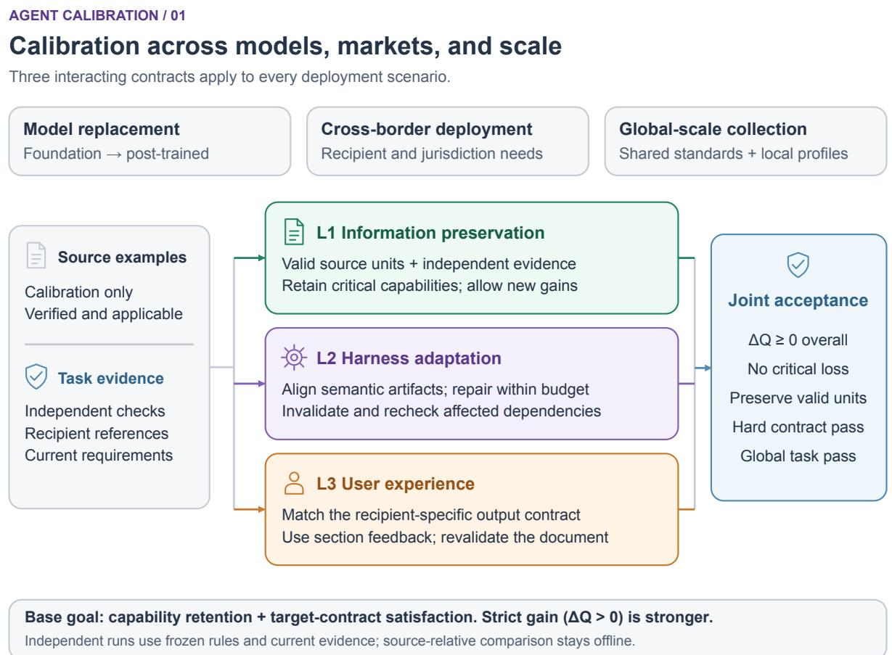
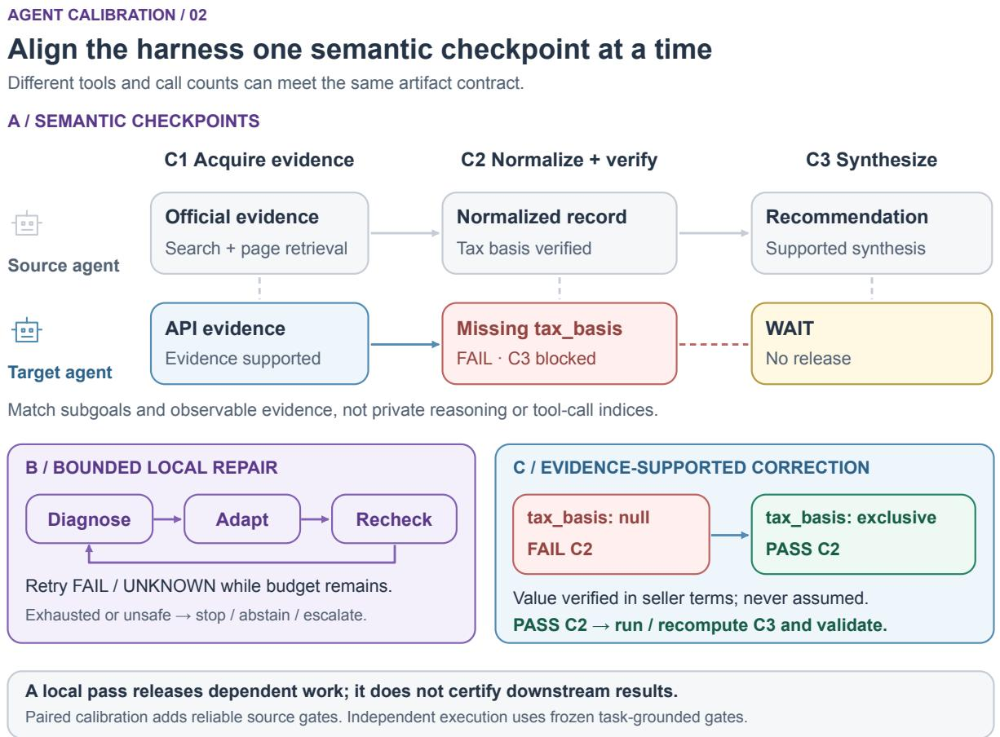
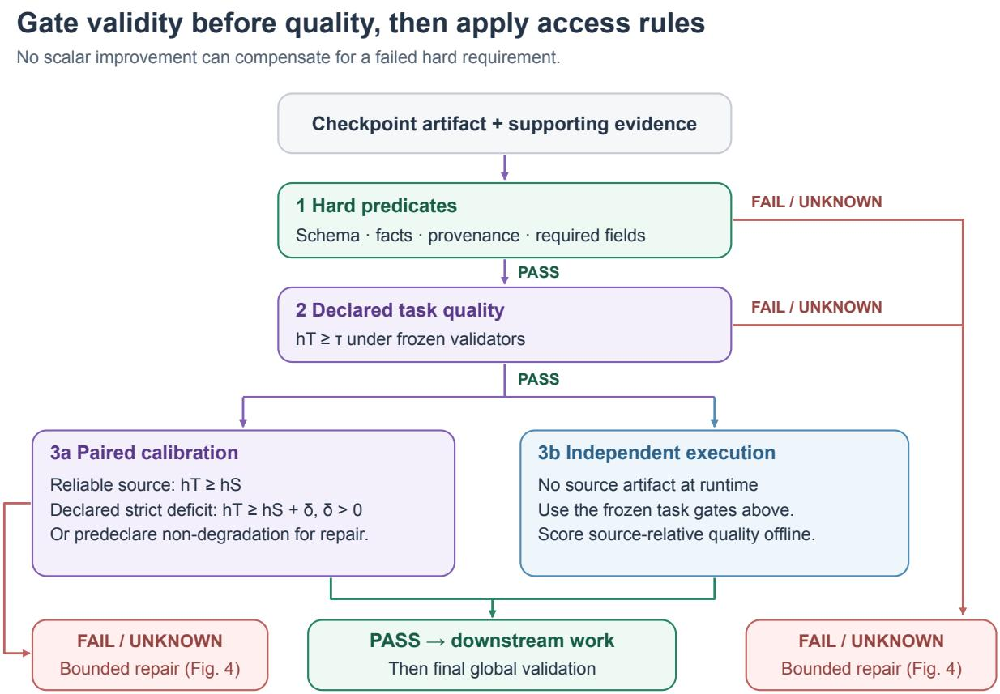
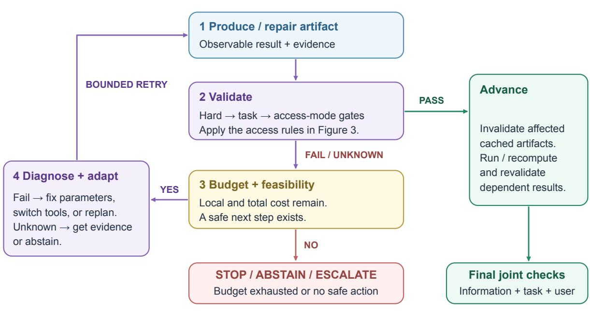
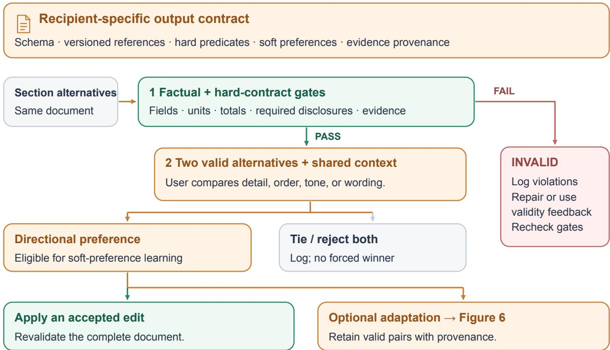
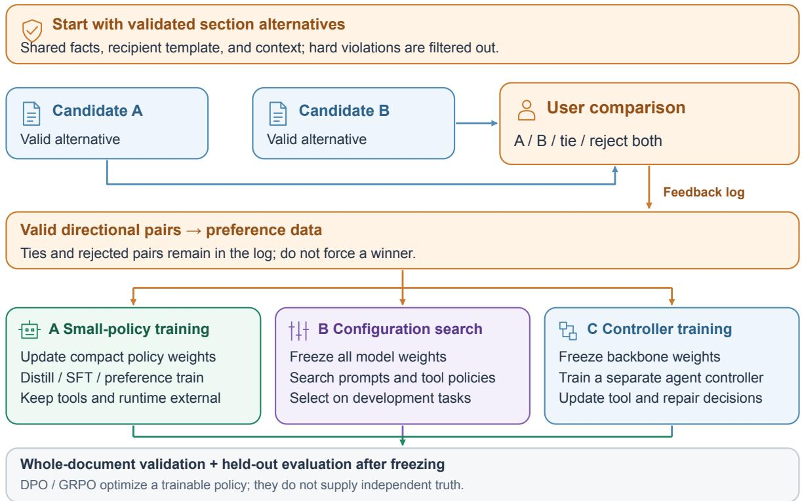
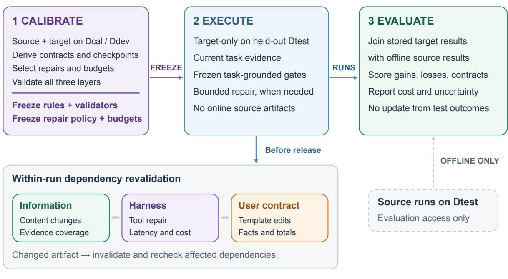

# From Migration to Calibration: Preserving Agent Capabilities across Models, Jurisdictions, and Scale

Yaxiao Liu PwC China AI Center yaxiao.y.liu@cn.pwc.com rootliu@gmail.com

Yiwen Liu PwC China AI Center 202383049@uibe.edu.cn

Pengbo Liu PwC China AI Center liupengbo@mails.neu.edu.cn

Yihua Guan PwC China AI Center 202311260036@mail.bnu.edu.cn

Jiaxing Song Tsinghua University jxsong@tsinghua.edu.cn

September 28, 2026

Methodological proposal — no empirical results reported

## Abstract

Agents need calibration when deployment conditions change: replacing a driving model, includ ing a foundation-to-post-trained transition; crossing jurisdictions; or scaling across heterogeneous markets and sources. Interface compatibility alone does not establish capability retention or targetcontract satisfaction. We formulate agent calibration as constrained behavioral adaptation across three interacting layers: information preservation, harness adaptation, and user acceptance; the layers apply to every scenario, not one-to-one to the three. The basic objective is non-degradation on prespecified capability measures while satisfying target requirements; aggregate improvement is stronger. Information calibration preserves independently validated source content still applicable to the target task. Harness calibration aligns observable artifacts at semantic checkpoints and repairs them through iteration, tool substitution, or local replanning within explicit budgets. User calibration enforces recipient-specific output contracts: templates, schemas, and section-level preferences. A global e-commerce example shows how shared standards coexist with site- and marketspecific adapters and validation. We distinguish trainable policies from frozen-backbone configuration or controller optimization, and evidence verification from relative judgment and DPO/GRPO optimization. Recent harness-transfer and judge-validity studies motivate target-native execution records, separate audits of task validity and near-tie ranking, and matched target-native optimization controls. We propose held-out evaluations for model changes, cross-border adaptation, and scale, including a factorial test of source evidence and checkpoint repair and group-level reporting to prevent aggregate gains from masking local failures. This is a methodological proposal; implementation and empirical validation remain future work.

Keywords: agent calibration; capability preservation; cross-border adaptation; deployment scale; semantic checkpoints; output contracts.

## 1. Introduction

An agent’s behavior emerges from a foundation model together with its prompts, context construction, tools, execution policy, and interaction constraints. Changing the model may be desirable for capability, availability, cost, or deployment reasons. Interface compatibility establishes that a target model can be called; it does not establish that the surrounding configuration remains efective.

This paper asks how a working source agent can inform a target agent without becoming a ceiling on the target’s capability. Treating the source answer as the sole reference conflates preserving useful behavior with reproducing limitations. A target may produce better evidence, a shorter execution path, or an explanation that better serves the user. At the same time, an improvement in average quality can conceal the loss of a decisive qualification on an individual question. A useful adaptation objective therefore needs explicit preservation constraints and a separate criterion for additional gain.

The motivating hypothesis is that diferences in models’ intrinsic knowledge organization can change which external instructions and execution strategies are efective. However, behavior alone does not identify this internal cause: training distributions, instruction following, context processing, and tool-use capabilities may also explain transfer failures. Our operational formulation concerns observable configuration dependence. It does not assume that every model replacement requires all components to be rewritten.

We use calibration to mean adjustment of agent behavior to explicit task and user contracts after a change in model, operating context, or deployment scale, through external configuration or explicitly declared policy updates. This usage difers from probability calibration, which concerns agreement between confidence and empirical frequency. Migration names the system change; calibration names the evaluation and adaptation process needed to assess that change.

We distinguish three deployment motivations. Model replacement includes switching model families and moving from a foundation model to a post-trained or distilled model. Specialized training may improve some behaviors while changing other task, instruction, or tool-use behaviors; preservation must be tested rather than inferred from the model label. Cross-border deployment, such as moving an agent from the United States to China, changes the relevant recipients, templates, terminology, operating conditions, and potentially applicable requirements. Largescale deployment, such as collecting e-commerce data globally, exposes heterogeneous sites and markets, larger workloads, and rare failures that a small pilot may miss. Cross-border or scale calibration can be necessary even when model weights remain unchanged.

These are three reasons to calibrate, not three additional layers. Each scenario requires information, harness, and user-contract calibration. The operational question is whether the adapted agent retains useful capabilities while meeting the destination’s requirements. Improving on the source is desirable, but preservation plus target-contract satisfaction is already a meaningful outcome.

The proposed framework has three components. First, valid information from the source is preserved under evidence-based evaluation, while the target is allowed to exceed the source. Second, execution is aligned at semantic checkpoints, allowing diferent tools and diferent numbers of calls to achieve the same subgoal. Third, acceptance conditions account for the intended user’s explicit requirements and evolving preferences. Figure 1 summarizes their interaction.

Recent work already optimizes harnesses with frozen models, transfers capability through reusable harnesses, and distills harness-assisted execution into a target policy [21, 22, 23, 24]. Our proposed contribution is therefore more specific: an auditable preservation contract over applicable valid information, target-native execution with evidence-checked semantic checkpoints, and recipient-specific acceptance conditions. The experimental protocol isolates the added value of source evidence and checkpoint repair against equal-budget target-native optimization. The three-layer taxonomy, generic harness search, and the use of DPO or GRPO alone are not claimed as novel algorithms. We report no experimental performance and make no universal improvement guarantee.

  
Figure 1: Three calibration layers shared by model replacement, cross-border deployment, and global scale. Independently validated, target-applicable source examples and task references inform the information, harness, and user contracts. The layers interact and are not a fixed serial pipeline. Joint acceptance requires non-degradation, no critical loss of applicable valid information, targetcontract satisfaction, and global task validation; aggregate improvement is a stronger objective. Independent deployment uses frozen rules and current task evidence without online source access.

## 2. Related Work

## 2.1. Prompt transfer and harness optimization

PromptBridge studies performance drift under model switches and uses calibration examples to obtain transferable prompt mappings [1]. Accordingly, the general claim that model changes require calibration is not new. Our proposed distinction is a joint contract over valid information, intermediate execution artifacts, and user acceptance, rather than prompt-level task scores alone.

HarnessDev evaluates the construction and evolution of runnable agent infrastructure and reports that gains depend on the execution model [2]. HarnessOpt-Bench measures harness optimization with bounded evaluation access and held-out assessment [3]. Together, these works motivate both model-sensitive harness design and strong optimization baselines. Beating an unchanged source harness on the target model would not establish that the proposed three-layer procedure is superior to ordinary target-specific tuning.

## 2.2. Recovery, personalization, and evaluation

ToolMaze studies dynamic replanning and anomaly recovery when tools fail [4]. This motivates distinguishing successful invocation from semantically adequate output and reporting recovery cost. Cross-model calibration additionally asks how unlike source and target traces should be compared and whether successful repairs transfer to unseen tasks.

Work on cultural and personal alignment distinguishes group norms from individual preferences [5]. UXBench studies assistant user experience [6], PersonaJudge models individual judgments using evaluator-specific demonstrations [7], and work on implicit behavioral alignment examines whether inferred preferences shape behavior [8]. These perspectives motivate a user layer that cannot be reduced to nationality-based templates. EMPATH further motivates multidimensional assessment of emotional-support behavior and evaluator limitations [9]. We treat these as adjacent evaluation settings, not evidence that our calibration procedure has achieved cultural or emotional alignment.

Reference-free judges may overrate incorrect answers [10]. Retrieval and abstention ofer alternatives to forced judgments under insuficient evidence [11]. DPO [12] and GRPO [13], by contrast, optimize policies using preferences or rewards; they do not independently establish factual truth. Our framework separates these roles. The cited preprints provide a focused contextual review, not an exhaustive systematic review or a claim about citation-based popularity.

## 2.3. Agent training and frozen-backbone adaptation

Agent Lightning separates agent execution from RL training [14], whereas GEPA optimizes prompts through reflective evolutionary search [15]. AgentDistillation transfers tool-using behavior to smaller models [16], and Reflexion uses textual feedback and episodic memory without weight updates [17]. These precedents motivate diferent implementation routes, not interchangeable meanings of agent training.

An orchestration-trace survey organizes reward and credit assignment across agent interactions [18]. DiDPO constructs fine-grained credit units from code diferences [19]; its name denotes Difin-Dif Policy Optimization, not Direct Preference Optimization. CodeGrep trains a retrieval agent with GRPO for a frozen downstream coding agent [20]. We borrow the distinction between local credit and final utility, while treating transfer from coding to user-specific report calibration as an untested hypothesis.

## 2.4. Recent harness transfer and judge-validity evidence

Harness-Zero [21] addresses mismatch between an optimized harness and a deployment harness. A harnessing agent reviews a proposed student action before execution, accepts or corrects it within the target action space, and produces executed target-native trajectories for supervised distillation. Private review context is excluded from the student trajectory. This provides a concrete training precedent for our smaller-policy route. We additionally propose explicit valid-information obligations, post-execution checkpoint validation, and recipient-contract evaluation; these additions require separate evidence of benefit.

Beyond Prompts [22] treats frozen-model harness optimization as resource-bounded selection over prompts and guarded tool-boundary middleware. Its PRISM procedure separates repair, candidate gating, and held-out scorecard roles, and evaluates reliability across conditions and repeated searches. AI4AI at Test-Time [23] instead uses a strong builder and a small validation slice to construct a reusable harness for a fixed weaker model. The exported harness is then evaluated without further builder intervention. Its test-time framing does not imply a strong helper on every deployment query. Both are stronger comparisons than direct model substitution or prompt-only tuning; our primary claim must survive a matched target-native search control.

HarnessBandit [24] schedules multi-harness GRPO training using learnability and estimated gradient transferability across harnesses. It supports studying how training efort should be allocated when a shared policy is trainable. It does not supply an independent correctness judge, and its gradient comparison cannot be transferred directly to unrelated closed-API backbones. We treat it as an optional training extension, separately from our main external-calibration setting.

GAUGE [25] distinguishes ranking validity from construct validity in user-simulated agent evaluation. A judge may preserve broad agent rankings while becoming unreliable for closely performing agents, and perceived satisfaction need not measure task completion. This motivates separate audits of factual/task validity, recipient preference, and near-tie ranking in our setting. We do not assume that numerical findings from its conversational benchmarks transfer to report or tool calibration.

## 3. Problem Formulation

Let a source agent be $A _ { S } = ( M _ { S } , \theta _ { S } , E _ { S } )$ and a target agent be $A _ { T } = \left( M _ { T } , \theta _ { T } , E _ { T } \right)$ . Here $M$ is the model, E the tool environment, and $\theta = ( P , H , U )$ the prompt/context configuration, harness policy, and user-acceptance rules. Given task $q ,$ user context $^ { c , }$ and execution randomness $\omega ,$ an agent produces an answer a and observable trace $\tau$ . Traces contain tool inputs and outputs, evidence references, and state transitions. They do not require access to private internal reasoning.

Calibration, development, and hidden test data are denoted $\begin{array} { r } { D _ { c a l } , \ D _ { d e v } , } \end{array}$ and $D _ { t e s t }$ . Reusable configurations are selected on the first two splits and frozen before testing. Permitted within-run repair actions, checkpoint-generation rules, and budgets must also be fixed before testing. The primary setting uses model-external adaptation accessible through closed APIs; we also specify a trainable-policy route for comparison. Model weights are denoted $\phi ,$ separately from external configuration $\theta ;$ a learned controller has parameters $\psi$ . A frozen backbone fixes $\phi ,$ , but need not fix $\psi$

We distinguish two access regimes. In paired calibration, source answers and intermediate artifacts are available on calibration tasks. In independent deployment, the target uses task requirements, frozen rules, and its own evidence. Source test runs may be collected for ofline comparison but must not influence target execution. An online paired regime may additionally run the source on every new task; it must be evaluated separately and charged for both agents.

The target deployment specification also records jurisdiction and recipient, contract version, site or market profile, workload, and operating budget. Model identity may remain fixed: $M _ { T } = M _ { S }$ is permitted. A deployment contract combines a shared core with explicit local profiles. Conflicting requirements are surfaced for resolution; a local profile must not silently override an incompatible core requirement.

Let $Q ( q , a ; c )$ be a quality function whose rubric does not depend on model identity. For fixed task weights $w _ { i }$ summing to one, the aggregate quality diference is

$$
\Delta Q = \sum _ { i } w _ { i } [ Q ( q _ { i } , a _ { i } ^ { T } ; c _ { i } ) - Q ( q _ { i } , a _ { i } ^ { S } ; c _ { i } ) ] .
$$

The basic objective is $\Delta Q \ge 0$ , together with non-degradation on each prespecified critical capability dimension, preservation of applicable valid source information, and satisfaction of target hard constraints. The stronger improvement objective additionally requires $\Delta Q > 0$ . Aggregate quality alone cannot certify capability retention. Empirical non-inferiority tests require preregistered margins and uncertainty intervals; a positive point estimate is insuficient, and any nonzero margin must be labeled approximate retention.

When target requirements difer from source requirements, evaluate both outputs under the same target rubric and separately evaluate a shared-task capability subset. Failure of an old template under a new contract is a target-adaptation deficit, not by itself evidence that an underlying reasoning capability was lost. The source is neither normalized to a perfect score nor used as a quality upper bound. This is a research objective, not a guarantee of feasibility: a weaker target, inadequate tools, incompatible constraints, or a restrictive budget may prevent success.

## 4. Information Calibration: Preserve Valid Content, Permit Gain

## 4.1. Traceable summaries and independent validity

For each answer, construct a summary decomposed into information units: claims, conclusions, necessary conditions, supporting evidence, and actionable recommendations. Each unit retains a span in the original answer. Qualifications must stay attached to the claims they constrain. Summarization supports comparison; it is not a source of truth, and the original answer remains available for audit.

Label source units as valid and relevant, incorrect, irrelevant, or unresolved. Let $U _ { i } ^ { S , v }$ contain the independently validated source units relevant and applicable to the target task. Incorrect and irrelevant content creates no preservation obligation. Unresolved content remains visible for review rather than being silently accepted or discarded. The union of source and target summaries is only a verification checklist: an independent task specification is still needed to detect omissions shared by both answers.

Applicability matters when deployment contracts change. Preserve shared facts, evidence, and necessary qualifications, while replacing source-only formatting or superseded target-inapplicable instructions. Define applicability rules and semantic mappings before comparing target outputs, using the target specification and independent evidence. Report excluded units, reasons, unresolved cases, and the retained denominator separately. Do not drop units after observing an unfavorable target result. If a target schema cannot represent a required valid fact, report a contract conflict and seek an authorized representation rather than silently losing it.

Let $F ( u , a ) \in [ 0 , 1 ]$ measure correct expression of unit $u ,$ including its necessary qualifications, in answer a. Strict preservation requires

$$
\forall i , \forall u \in U _ { i } ^ { S , v } : \quad F ( u , a _ { i } ^ { T } ) \geq F ( u , a _ { i } ^ { S } ) .
$$

This unit-level condition operationalizes preservation of every valid source summary element. It is stronger than preserving an average summary score. Any tolerance ϵ defines approximate preservation and must be reported as such. Uncertainty in unit extraction and scoring must also be measured; a point estimate is not a certificate of truth.

## 4.2. Gain and loss are separate outcomes

Report the fraction of tasks with any valid-unit loss, critical omission rate, valid coverage, newly added correct information, and newly introduced errors. Tasks with no validated source units need a separate denominator convention; they provide no evidence about preservation. Quality $Q$ combines correctness, completion, relevance, evidence, and concision using a predefined rubric. Extra text receives no credit merely for being longer.

A target answer that adds useful performance comparisons but omits a source answer’s valid ofline-only restriction fails strict preservation. A target that corrects a source’s false claim that a product is free does not fail preservation on that claim. These are constructed illustrations, not observations from an experiment.

Average gain cannot compensate for a preservation violation. Conversely, verbatim retention is unnecessary: semantically equivalent compression is permitted. Report answer length and user constraints to reveal cases in which the preservation rule encourages verbosity. Zero observed violations on a finite test set does not imply zero future loss.

## 5. Harness Calibration through Semantic Checkpoints

## 5.1. A shared semantic contract

A source trace and a target trace may difer in tools, ordering, and call count. Comparing call j in one trace with call $j$ in the other is therefore generally inappropriate. We instead define a directed acyclic checkpoint graph $G = ( V , E )$ over subgoal dependencies. Iteration occurs inside a checkpoint; workflows with repeated stages can be represented by a finite, budget-bounded unfolding.

A checkpoint is

$$
v = ( g _ { v } , \mathrm { p r e } _ { v } , \mathcal { Z } _ { v } , \mathcal { V } _ { v } , \mathrm { d e p } _ { v } ) ,
$$

where $g _ { v }$ is the semantic subgoal, $\mathrm { p r e } _ { v }$ its preconditions, $\mathcal { Z } _ { v }$ an artifact schema, $\mathcal { V } _ { v }$ a validator, and $\mathrm { d e p } _ { v }$ the downstream dependency set. The contract is derived from task requirements and validated source experience. Redundant or erroneous source steps should be removed or revised rather than made mandatory.

An alignment relation $R \subseteq V \times S ( \tau _ { T } )$ links checkpoints to target trace segments. A segment can contain several calls; one call may produce artifacts for several checkpoints. Alignment is accepted only when its artifact and evidence satisfy the relevant schema and preconditions. This relation permits many-to-many execution correspondences without equating unlike tool APIs. An unmatched checkpoint is reported as unmatched, not imputed as a successful comparison.

Figure 2 illustrates three semantic goals: acquire evidence, normalize and validate it, and synthesize an answer. A source can retrieve pages while a target queries an API; both can satisfy the same evidence contract. The checkpoint compares observable outputs and their support, not unverifiable accounts of the model’s internal reasoning.

## 5.2. Validation and continuation criteria

The validator returns pass, fail, or unknown, together with evidence and a gap diagnosis. Let $h _ { v } ( z )$ denote task-grounded quality of artifact $z ,$ and let $\tau _ { v }$ be its minimum acceptable quality. Hard predicates, such as schema validity and supported provenance, are checked separately and cannot be traded away for a higher scalar score.

When a reliable source artifact $z _ { v } ^ { S }$ is available, a non-degradation gate additionally requires $h _ { v } ( z _ { v } ^ { T } ) \geq h _ { v } ( z _ { v } ^ { S } )$ . The stronger repair criterion for a checkpoint where the source was initially better is

  
Figure 2: Stepwise harness calibration. (a) Source and target traces align at semantic checkpoints despite diferent tool calls. A missing required tax-basis field at C2 blocks dependent synthesis at C3. (b) Local repair diagnoses the deficit, adapts the tool or strategy, and repeats hard and declared quality checks within a bounded budget; exhaustion stops or escalates. Passing C2 permits C3 to run, or to be recomputed if already cached, and requires its own validation. (c) An illustrative record is corrected using verified seller terms, not an assumed tax value. Source-relative checks use reliable source artifacts during paired calibration; independent deployment uses frozen rules and current task evidence.

$$
\mathrm { p a s s } _ { v } ( z _ { v } ^ { T } ) \ \wedge \ h _ { v } ( z _ { v } ^ { T } ) \geq h _ { v } ( z _ { v } ^ { S } ) + \delta _ { v } , \qquad \delta _ { v } > 0 .
$$

This expresses the intended strict improvement after repairing an identified deficit. It may be impossible if the source saturates the metric or the target lacks a required capability. We therefore distinguish two predeclared experimental policies: strict improvement after deficit, which stops or escalates when that gate cannot be reached, and non-degradation repair, which permits continuation after meeting the independent contract and matching the reliable source reference. Neither policy claims that every initial target checkpoint must outperform the source. Their results must not be pooled as if the criteria were identical.

In independent deployment, source-relative gates cannot be evaluated online without source access. Continuation then depends on independent checkpoint requirements; source-relative quality is assessed ofline. This distinction prevents a hidden source oracle from being mistaken for successful generalization. Figure 3 summarizes the gate hierarchy and the two access modes.

AGENT CALIBRATION / 03

Figure 3: Checkpoint validation gates. Hard predicates such as schema validity and supported provenance precede task-grounded scalar quality and cannot be traded away. In paired calibration, a non-degradation gate compares the target artifact with a reliable source artifact; a diagnosed deficit invokes either a predeclared strict-improvement or non-degradation repair policy. Independent deployment uses frozen task-grounded gates, with source-relative quality scored ofline. Any failed or unknown gate, including the paired source-relative gate, enters the bounded repair loop of Figure 4. A local pass permits dependent work but does not certify the final answer.

## 5.3. Diagnose, repair, and revalidate

At a deficient checkpoint, the controller chooses among refining the current tool’s inputs, adding relevant context and iterating, switching to a compatible tool, locally replanning the subgoal, or stopping and escalating. The diagnosis should identify an observable deficiency. Missing data coverage suggests tool substitution; inadequate query parameters may justify another iteration with the same tool. Repeating an unchanged call is not a universal repair strategy.

An idealized action objective is

$$
a ^ { * } = \arg \operatorname* { m a x } _ { a \in { \mathcal { A } } ( s ) } \left[ \widehat { \mathrm { P r } } ( \mathrm { p a s s } \mid s , a ) - \lambda \widehat { \mathrm { c o s t } } ( s , a ) \right] ,
$$

where state s contains only available observations and remaining budget. Estimates may be fitted on calibration data. A first implementation can instead use fixed diagnostic rules; the equation does not imply that a trained controller already exists. Cost includes calls, tokens, latency, tool charges, and any additional verification.

Each repair is followed by the same checkpoint validation. Unknown outcomes trigger bounded evidence collection or abstention, not automatic acceptance. Before any action, the controller checks local and global budgets. Exhaustion produces a recorded failure or a predefined escalation outcome. An escalation counts as unresolved until its separate intervention is evaluated. Retryable operations should be idempotent or sandboxed so that a repair does not duplicate real-world side efects.

A changed artifact invalidates dependent cached artifacts. They must be recomputed or explicitly revalidated before release. Passing local gates does not establish global correctness: final information, task, and user acceptance checks remain necessary. Figure 4 makes this control flow explicit.

## 5.4. Constructed execution example

Consider a task comparing two software subscriptions under a specified country, billing period, and currency. Checkpoint C1 requires oficial, dated price evidence. C2 requires normalizing billing periods while retaining region, tax treatment, and eligibility restrictions. C3 requires a recommendation supported by the resulting comparison and consistent with the user’s priorities.

Suppose the source obtains suficient evidence using search and page retrieval. The target retrieves a structured API record but loses the tax-basis qualification during normalization, leaving tax\_basis: null. C1 can pass while C2 fails. The controller first tests whether the API record contains the missing field. If it does, a parser or parameter repair can be appropriate. If the API omits that information, further identical queries are unlikely to help; the controller can switch to oficial page retrieval. In Figure 2, the retrieved seller terms establish tax\_basis: exclusive; this value is an illustrative verified finding, not a default to impute when evidence is missing. The repaired artifact is checked again before C3 proceeds. If an earlier recommendation already exists, it is invalidated when the normalized price or tax treatment changes, then recomputed or explicitly revalidated.

This example illustrates how a target can use a diferent path and still satisfy shared semantic obligations. It does not supply measured repair success rates. A successful repair of one instance becomes reusable calibration only if the corresponding configuration or rule improves performance on held-out tasks.

## 5.5. Proposed actions are not verified artifacts

Target-native execution requires more than translating a source trace into the target tool schema. Before execution, check that a proposed action belongs to the target’s action space and satisfies its preconditions and side-efect policy. If a reviewer substitutes a diferent action, record both the rejected proposal and the action actually taken. Execute only the accepted action, then validate the observed artifact against the checkpoint contract. Pre-execution approval cannot certify a result that has not yet been observed; a syntactically valid call can return stale, incomplete, or semantically wrong data.

Evidence gathering and tool repair both consume local and global budgets.   
Unknown is not a pass. A local pass never establishes full-answer correctness.

  
Figure 4: Bounded checkpoint repair. Every repair returns an observable artifact to the gates in Figure 3. Failed or unknown judgments trigger a check of remaining local and global budgets and action feasibility. A diagnosed failure can prompt parameter repair, tool substitution, or local replanning; an unknown judgment requires evidence or abstention. Exhaustion or absence of a feasible action stops or escalates. A pass permits downstream work while invalidating afected cached artifacts, which must be recomputed or explicitly revalidated before final joint checks. Evidence gathering and tool repair both consume the shared budgets.

For each attempt, retain the checkpoint and contract versions, target-visible context identifier, proposed and executed actions, actual tool observation, artifact identifier, supporting evidence, validator verdict, dependency versions, and resource use. A rejected or unexecuted proposal is an audit event, not an executed transition. A changed observation must trigger the same downstream invalidation rules as any other repair. This record connects the alignment in Figure 2 to the gates and repair loop in Figures 3–4 without requiring private internal reasoning.

When these records are used for distillation, follow the target-native principle illustrated by Harness-Zero [21]: pair an accepted executed action with the history available to the deployment policy at that point. Exclude private reviewer deliberation and source-only evidence from the student’s inputs unless an equivalent retrieval mechanism is explicitly available at deployment. Record any privileged information used to select a teaching action, because removing it from the input does not by itself make that action inferable from the student-visible history. Final validation and held-out deployment determine whether the training signal transfers.

## 6. User Calibration: Output Contracts and Human Feedback

## 6.1. User experience extends beyond cultural expression

The acceptance target is the output a particular recipient can use. It includes document structure, required fields, terminology, evidence placement, units, disclosure conditions, and review workflow, in addition to language, tone, culture, and emotional intent. A report suitable for one organization or reporting purpose may be unsuitable for another even when its factual assertions are identical.

Consider adapting a financial-report agent between United States and Chinese deployment settings. The relevant target is not an assumed national writing style. It is the particular recipient, report type, reporting period, and applicable version of the reporting requirements. We use this as a task-design example, not as a claim that either jurisdiction has one universal template or as a specification of actual accounting rules. Experiments must supply authoritative, dated requirements and qualified review where needed.

Represent the output contract as $C _ { t } = ( S , R , H , P _ { t } , L _ { t } )$ , where $S$ is the document schema, R the reference templates and approved examples, H the hard acceptance predicates, $P _ { t }$ contextual soft preferences, and $L _ { t }$ their provenance and revision history. User examples reveal preferred presentation but do not establish factual truth or regulatory authority. Missing or conflicting requirements trigger clarification or abstention, rather than confident template invention.

Hard gates include required sections, correct totals and units, indispensable disclosures, and evidence consistency when these are stipulated by the task. Soft preferences can include paragraph order, detail level, terminology variants, and tone. A preference for a shorter answer cannot silently remove a mandatory disclosure. Conflicting hard requirements make the instance unresolved until the responsible authority clarifies them.

## 6.2. Reference-guided, section-level preference calibration

Start with a user-approved template and examples, map required information to sections, and generate alternative realizations of one section under the same evidence and document context. Ask the user to choose, edit, reject both, or request evidence. Store $( x _ { j } , y _ { j } ^ { + } , y _ { j } ^ { - } )$ only when a meaningful preference exists, where $x _ { j }$ contains the task, contract version, evidence, surrounding accepted sections, and section role. Feedback can target a paragraph, table, or disclosure block; it need not be reduced to a whole-document score.

For a trainable policy, a proposed section-conditioned DPO objective is

$$
\mathcal { L } _ { s e c } = - \mathbb { E } \left[ \log \sigma \left( \beta \left[ \log \frac { \pi _ { \phi } ( y _ { j } ^ { + } \mid x _ { j } ) } { \pi _ { r e f } ( y _ { j } ^ { + } \mid x _ { j } ) } - \log \frac { \pi _ { \phi } ( y _ { j } ^ { - } \mid x _ { j } ) } { \pi _ { r e f } ( y _ { j } ^ { - } \mid x _ { j } ) } \right] \right) \right] .
$$

This applies the DPO objective [12] to a proposed section-level dataset; it is not a new DPO derivation or an evaluated algorithm. Compare preferred and dispreferred variants that pass the factual and hard-contract gates when learning soft preference. Invalid outputs instead supply validity supervision or repair examples. Log ties, all-invalid pairs, and unresolved comparisons without fabricating a winner.

Section scores are not additive certificates of document quality. Locally preferred paragraphs may disagree on totals, duplicate disclosures, or omit a cross-reference. After each accepted change, invalidate afected dependencies and revalidate the complete document, including all validinformation obligations. Hold out whole documents, users, and template families as appropriate;

splitting paragraphs from the same document across training and test sets leaks context. Figure 5 shows how hard gates precede preference learning.

## AGENT CALIBRATION / 05

## Hard constraints before user preferences

For US/CN reporting, specify the recipient, report type, period, and applicable reference version.

  
Section preference is not a certificate of whole-document correctness.

Figure 5: Output-contract admissibility before preference learning. A recipient-specific contract supplies a schema, versioned references, hard predicates, soft preferences, and evidence provenance. Invalid alternatives are logged for repair or validity supervision and must pass the gates before entering soft-preference comparisons. Two valid alternatives under shared context can yield a directional preference, a tie, or rejection of both; a winner is never forced. An accepted edit requires whole-document revalidation, while valid directional pairs can support the adaptation routes in Figure 6.

## 6.3. Three implementation routes and a critical distinction

Route A: distill and post-train a smaller agent policy. Collect validated task trajectories and accepted outputs, distill tool-use behavior into a smaller policy, then optionally apply sectionconditioned DPO or reward-based RL. AgentDistillation [16] supports the feasibility of distilling tool-using behavior; Agent Lightning [14] provides a precedent for separating agent execution from RL training. Neither establishes that a whole runtime, external databases, or tool implementations disappear into model weights. The smaller policy still requires its environment, validators, and execution harness.

Harness-Zero [21] sharpens the data requirement: use accepted, actually executed target-native actions and their resulting observations rather than assuming raw source trajectories are compatible training examples. Compare target-native SFT with source-trace imitation and with target-native SFT plus contract-grounded preference training. Any schema translation needed by the imitation baseline must be declared. This extension is relevant when policy weights are accessible; it is not necessary for the closed-API experiments.

Route B: optimize configuration with all weights frozen. Optimize prompts, reference retrieval, memory, tool selection rules, and repair budgets through evaluated configuration search. GEPA [15] and Reflexion [17] motivate learning from textual feedback without backbone updates. This is not gradient-based DPO merely because preferences are compared.

AI4AI [23] supplies a reusable-harness precedent: a builder uses calibration feedback, exports a configuration, and leaves the deployment loop. Charge builder calls as calibration cost. Beyond Prompts [22] motivates searching prompt and middleware changes jointly and keeping search feedback separate from final assessment. A helper retained online is a diferent access regime with additional inference cost, whether or not it is the original source model.

Route C: train a separate controller with a frozen backbone. Freeze the backbone but train a separate controller $\pi _ { \psi }$ over tool choice, retries, routing, or section revision actions. CodeGrep [20] exemplifies a learned retrieval component serving a frozen downstream agent. DPO requires suitable conditional action probabilities; GRPO requires sampled actions, rewards, and actual policy updates.

If one trainable policy is shared across harnesses, a HarnessBandit-style scheduler [24] can be compared with uniform allocation. Its gradient-transfer signal is defined in a common parameter space. Applying this idea to a separate controller is a proposed extension, not a demonstrated result of HarnessBandit; comparing gradients from diferent model families is outside this protocol.

At the system level, human judgments can improve an agent rather than only a standalone response model. However, agent-level human-feedback optimization is the umbrella term: rewardmodel-based RLHF, direct preference optimization, and fully frozen reflective search are diferent implementations. Report which parameters or artifacts change, the feedback source, and the training and inference costs. No method can correct an unreliable judge solely by normalizing its scores.

## 6.4. Culture, emotion, and individual variation

Cultural context and emotional expression remain dimensions of the contract, rather than its definition. Individual feedback takes precedence over inferred group defaults; inferred emotion is a hypothesis, not a confirmed profile fact. Preserve appropriate communicative intent without requiring the source’s surface wording, and correct source behavior that is dismissive or falsely reassuring. Evaluate template compliance, factual validity, clarity, user preference, and understood intent separately. Dynamic preferences require temporal evaluation: later feedback cannot inform earlier decisions.

## 7. Joint Procedure and Reliable Relative Evaluation

## 7.1. Calibration and deployment

The three layers interact. More complete content may exceed a user’s reading budget; a tone revision may remove a qualification; a tool repair may exceed a latency limit. A substantive change therefore triggers the afected checks again. The process first establishes admissibility and then optimizes quality and cost among admissible configurations.

Algorithm 1. Contract-based calibration and execution.

Collect valid preferences, then specify which parameters or artifacts may change.

  
Figure 6: User-contract calibration and three alternative implementation routes. Symmetric, validated section candidates share evidence, a recipient template, and document context; users may prefer either, tie, or reject both. Valid directional pairs support preference learning, while all outcomes remain in the feedback log. Route A updates a smaller policy while retaining external tools and runtime. Route B searches configurations with all model weights frozen. Route C freezes the backbone and trains a separate controller. Every route requires whole-document validation and held-out evaluation after freezing. DPO and GRPO are candidate policy optimizers, not independent sources of truth.

CALIBRATE(source, target, destination\_contract, Dcal, Ddev, budgets) Collect source answers and observable artifacts on Dcal. Freeze target-applicability rules; validate applicable source information. Build checkpoint contracts from shared standards and local profiles. Run the uncalibrated target and record layer-specific deficits. Audit validator constructs and near-tie judgments on calibration data. Collect contextual section preferences and validate output contracts. Optimize external configurations or the declared trainable policy/controller within separate feedback, training, and inference budgets. Evaluate candidates on Ddev; select and freeze the configuration, checkpoint-generation rules, contract versions, validators, repair policy, judge thresholds, and budgets. Return frozen configuration and audit records.

EXECUTE(task, user\_conditions, frozen\_configuration)

Instantiate checkpoints from the task using frozen rules.

For each dependency-ready checkpoint:

Check the proposed action against the target action space and preconditions.

Execute an accepted action; log its actual observation and artifact.

Validate the observed artifact and declared access-mode gate.

While the gate is not passed:

If the next action exceeds any budget: return unresolved/failure.

If judgment is unknown: obtain evidence or return abstention.

Otherwise: diagnose, check, and execute a permitted repair action.

Charge the action; invalidate artifacts affected by changed inputs.

Revalidate the checkpoint.

Revalidate all affected dependencies and final task/user requirements.

Return answer, evidence, costs, and unresolved conditions.

EVALUATE\_OFFLINE(target\_runs, source\_runs)

Compare final quality, critical capabilities, and applicable-unit retention.

Report destination-contract satisfaction and site/market group outcomes.

Report violations, failures, abstentions, and costs on all test tasks.

For a new independent-deployment task, source artifacts are not invented or silently retrieved. The source-relative conditions are reserved for ofline evaluation unless the experiment explicitly permits online paired access. Learned contracts are hypotheses about useful requirements, not perfect substitutes for independent task evidence. Figure 7 traces the three phases and the crosslayer revalidation triggers.

## 7.2. Evidence before preference

The evaluator first seeks executable tests, trusted task records, traceable sources, or human-verified labels as appropriate. It then compares eligible outputs with model identities hidden and answer order randomized. Possible outcomes include target preferred, source preferred, tie, both unacceptable, and insuficient evidence. Disagreement or missing support triggers retrieval or adjudication rather than a forced winner.

Report judgment coverage, incorrect-answer acceptance rate, order sensitivity, and agreement with independent human annotations. Agreement among several model judges is not equivalent to independent truth, since their biases may be correlated. Retrieved evidence must itself be checked for relevance, currency, and support for the claim.

Abstention is not removed from the denominator to inflate success. Report both evaluablesubset results and full-sample outcomes, including the cost of obtaining additional evidence. The proposed protocol does not inherit any formal risk guarantee from a cited evaluator unless that evaluator’s assumptions and implementation are actually satisfied.

Following GAUGE’s distinction [25], audit two diferent properties. Construct validity asks whether a metric measures the intended property: use independently verified task outcomes for completion and correctness, and recipient judgments for usability and preference. Keep these labels separate. A user liking a financial report does not establish correct totals, complete disclosures, or satisfied reporting requirements. A completion bit can expose gross failures but cannot certify the report’s contents.

Ranking validity asks whether the evaluator orders candidates correctly at the resolution relevant to calibration. On a separate annotated audit set, include closely performing pairs, clear wins, ties, and fluent but factually defective outputs. Define quality-gap bins using independent task labels or adjudication, not the judge scores being tested. Within each bin, report erroneous acceptance, pairwise disagreement, abstention, order sensitivity, and coverage with sample counts and uncertainty. Near ties must remain ties or unknown when evidence is insuficient; forced ranking is not useful training supervision. Set judge thresholds on calibration/development data and freeze them before a held-out audit. If the audit changes the evaluator, a new held-out evaluation is required.

AGENT CALIBRATION / 07 Calibrate, freeze, execute, then evaluate Keep source access and optimization separate from independent test-time execution.  
  
Dtest never selects configurations, validators, repair policies, or budgets. A new calibration cycle needs fresh held-out evaluation; test feedback is not a training loop.  
Figure 7: Joint calibration, frozen execution, and ofline evaluation. Adaptation on calibration data and selection on development data precede freezing of checkpoint rules, validators, repair policies, and budgets. On held-out test tasks, target execution uses current evidence and frozen task-grounded gates; source test artifacts enter only ofline evaluation. Within-run repairs or edits trigger dependency revalidation across information, harness, and user contracts before release. This local revalidation is distinct from updating reusable configurations: test outcomes never select configurations, validators, repair policies, or budgets, and a new calibration cycle requires fresh held-out evaluation.

## 7.3. DPO and GRPO are optimizers, not truth criteria

DPO learns from preferred and dispreferred response pairs [12]. Its reference policy is an optimization reference distribution, not an independent factual answer and not necessarily the source agent. Preferences supplied by an overgenerous judge can train the target toward the same error. Using

preference optimization to train a judge still requires reliable supervision.

GRPO uses group-relative rewards to construct advantages, schematically

$$
A _ { k } = \frac { r _ { k } - \bar { r } } { \sigma _ { r } + \varepsilon } .
$$

Relative normalization does not improve the validity of $r _ { k }$ [13]. A group containing only incorrect answers can still have a relative winner; equal rewards provide no diferential signal. Absolute admissibility checks should precede relative selection, and an all-invalid group should not be treated as a successful preference comparison.

The framework supports the three implementation routes in Section 6.3 under the same evidence-constrained evaluation. DPO and GRPO are candidate optimizers when the selected policy is trainable; their labeling and training costs must be included. Sampling and reranking closed-API outputs without policy updates is not GRPO.

## 7.4. One framework, three deployment scenarios

Model replacement and post-training. Keep tasks, tools, and recipient contracts fixed initially. The source supplies validated capability examples and checkpoint artifacts. Calibrate prompts and execution policies for the replacement model, including a post-trained derivative, and measure retention across reasoning, evidence use, tool execution, and output adherence. A smaller or specialized target may be infeasible under the same contract and budget; the procedure must report the deficit rather than promise to recover missing capability. Weight updates, when available, constitute a declared training route rather than a prerequisite for calibration.

Cross-border deployment. Hold underlying records and business intent fixed while changing the destination contract and relevant tool environment. For a financial report moving from a US recipient to a Chinese recipient, obtain the actual target template, required fields, terminology, reporting period, and dated requirements from the user or a qualified reference. This is a constructed task, not a claim about any country’s specific reporting law. Preserve applicable financial facts and qualifications; adapt retrieval and validation checkpoints; then calibrate sections and revalidate the complete report. DPO-style preferences can improve presentation among admissible candidates, but cannot establish regulatory compliance or override hard requirements.

Global e-commerce data collection. Define a common record contract covering product and variant identity, raw price and currency, units, availability, source provenance, collection time, and explicit missingness. Site- and market-specific profiles describe field meanings and permitted collection interfaces. Preserve raw observations alongside any normalized value and its transformation provenance; do not silently equate tax-exclusive and tax-inclusive prices or treat unknown shipping charges as zero. Such rules are illustrative dataset requirements, not universal market rules.

The harness checkpoints are authorized acquisition, extraction, normalization, identity reconciliation, and dataset validation. Each produces a typed artifact with supporting evidence. An extraction failure can trigger a diferent adapter or bounded iteration; a normalization repair invalidates dependent aggregates and exports. The final output must satisfy both the common schema and the applicable local profile. Source exemplars help construct these contracts during calibration; global independent deployment does not require a source-model run for every listing. When no comparable source exemplar exists, use task-grounded validation and report that source-relative preservation is unmeasured.

Scaling requires more than repeating a locally successful run. Test unseen sites and markets, layout changes, duplicate records, missing fields, workload bursts, and bounded tool failures. Version adapters and contracts, retain failure provenance, and revalidate afected groups after changes. Report per-group quality and unresolved cases alongside throughput and cost. Passing a global average cannot compensate for failure of a mandatory market or site contract.

## 8. Experimental Protocol and Falsifiable Hypotheses

## 8.1. Research questions and controls

The evaluation asks whether joint calibration improves final quality while controlling validinformation loss; whether diagnosed iteration or tool substitution outperforms fixed retries; whether user adaptation improves acceptance without factual or intent degradation; whether gains survive comparison with equal-budget target-native optimization; and whether evidence plus abstention reduces erroneous acceptance by judges.

Use at least two model families and evaluate adaptation in both directions. Define relative model strength on the tasks studied rather than by brand. Freeze exact versions, access dates, decoding settings, context limits, and tool versions. Concrete model identifiers must be recorded when experiments are actually run, not filled in as if they had already been evaluated.

Vary model, tool environment, recipient/jurisdiction contract, site/market heterogeneity, and workload independently before studying combined shifts. Tool conditions should include unchanged tools, functional substitutes, transient failure, and well-formed but semantically wrong outputs. User conditions should include explicit requirements, dynamic corrections, and conflicts between cultural defaults and personal preferences. A factorial design is preferable when feasible; any reduced design should be chosen before observing results.

## 8.2. Data, budgets, and baselines

A pilot can use 30 independent tasks in each of three classes: evidence-grounded question answering, structured tool tasks, and interactions with user conditions. This is a costing and rubric pilot, not a claim of suficient statistical power. Determine the main study’s sample size from pilot variability, clustering, and a prespecified power analysis. Keep related task variants in the same split.

Compare the source agent, direct model substitution, prompt/information-only calibration, harness-only calibration, user-only calibration, the full framework, and leave-one-layer-out variants. Include a strong target-native optimizer with the same task standards and tuning budget. Fixed retry baselines isolate the benefit of diagnostic action selection from the benefit of extra calls. Judge ablations remove independent evidence or abstention. Harness ablations compare strict improvement after deficit with non-degradation repair, semantic alignment with a call-index comparator where meaningful, and dependency invalidation with its omission in a sandbox.

Specify what the strong optimizer may change. Include prompt-plus-middleware search motivated by Beyond Prompts [22] and reusable builder-generated harnesses motivated by AI4AI [23], alongside GEPA-style optimization [15]. Use the original implementation where feasible; label taskadapted reimplementations and narrower edit spaces explicitly. All receive the same independent task standards, calibration/development splits, tool permissions, builder-model allowance, and declared resource ceilings. Target-native controls receive task references but no paired source artifacts; the controlled source-evidence experiment in Section 8.6 isolates that diference. Separate repair feedback, candidate-selection checks, and the sealed test scorecard so the final evaluator cannot become a search oracle.

Charge source-trace collection, candidate search, tool calls, evaluation, and adjudication in fullcost reports. Also report incremental costs when source traces already exist. Equal token counts

do not imply equal monetary cost across APIs; include cost- and call-budget sensitivity analyses.   
Online paired access is a separate condition with its source-model costs explicitly included.

Repeat the entire calibration search with independent seeds, rather than only rerunning one selected configuration. Report distributions of held-out gain, preservation violations, and worstgroup performance across those searches, plus calibration and deployment costs separately. Beyond Prompts [22] motivates this reliability analysis, but its specific selection metric should not be claimed without reproducing its definition and sampling procedure. Source collection must fit the full-budget condition; a target-native control may spend the corresponding budget on its own calibration search.

## 8.3. Testing output contracts and training routes

Construct report tasks from supplied records and versioned recipient-specific templates. Include diferent templates for the same underlying facts, section edits that afect other sections, missing mandatory fields, and misleading but stylistically attractive variants. Use synthetic or appropriately authorized records. Domain reviewers establish the hard requirements; intended users assess usability. Do not infer compliance merely from a model preference score.

Compare exemplar prompting, whole-document feedback, section feedback, and section feedback with dependency-aware revalidation. Compare smaller-policy distillation alone, distillation plus preference training, fully frozen configuration search, and a frozen backbone with a trained controller. Match feedback and tuning budgets where feasible; otherwise present quality-cost curves and disclose mismatched resources. Include GEPA-style optimization and a target-native policy baseline. Measure annotation time, accepted edits, complete-document acceptance, hard-gate failures, cross-section contradictions, and transfer to held-out users and templates.

Credit assignment should be tested rather than assumed: compare final-document rewards with checkpoint/section signals and counterfactual ablations where afordable. A section reward can encourage local polish at the expense of global correctness. A trained controller can exploit validator weaknesses just as a trained response policy can.

## 8.4. Three application tracks

Track A: capability retention under model change. Test cross-family replacement and foundation-to-post-trained replacement as distinct conditions, using accessible, well-documented model pairs. Where matched training lineage is unavailable, report an observational comparison and avoid attributing diferences causally to post-training. Fix tools and contracts, then add controlled tool changes. Evaluate critical capability dimensions separately, with both retention and stronger-improvement hypotheses.

Track B: cross-border contract adaptation. Reuse underlying records with distinct, reviewer-specified destination contracts. Include a same-model condition to isolate contract adaptation from model replacement. Split by template family and record source, and report mandatoryfield compliance, factual retention, whole-document acceptance, and unresolved conflicts. Domainreviewed task conformance is the measured outcome; broad legal compliance is not inferred from these tests.

Track C: global scale and standardization. Split e-commerce tasks by site and market, with unseen combinations held out. Separately vary source diversity and workload/concurrency so their efects are not conflated. Use controlled fixtures or authorized data sources, including cases with difering units, currencies, tax/shipping semantics, and product variants. Measure schema conformance, semantic field accuracy, entity-resolution errors, provenance completeness, duplication, missingness, and freshness, alongside throughput, latency, and total cost. Report site- and market-level results, worst-group performance with uncertainty, and the fraction of groups meeting all mandatory gates. A low-resource group cannot be hidden by volume-weighted averages.

The three tracks share the same three-layer ablations and budget accounting. They test whether a common procedure transfers across scenarios, not whether one layer belongs to one scenario. Combined-shift experiments follow isolated controls. Predeclare which contracts and capability dimensions are critical, and freeze target-applicability rules before the hidden test.

## 8.5. Outcomes and statistical analysis

The co-primary outcomes are paired test-task quality diference $\Delta Q$ and the proportion of tasks violating valid-unit preservation. They must not be collapsed into a score that allows gains to erase losses. Secondary outcomes include task success, critical omissions, introduced errors, checkpoint recovery, unresolved alignments, budget exhaustion, user acceptance, intent deviations, latency, and total cost.

Use paired comparisons on the same tasks and perturbations. Multiple seeds are within-task repeats, not independent tasks. Use task-clustered paired bootstrap intervals, with user and task dependence handled in user studies. For scale experiments, account for site/market clustering and report group sample sizes; many listings from one site are not independent evidence of generalization across sites. Prespecify primary hypotheses and multiplicity handling. Preserve failed runs, timeouts, abstentions, and infeasible constraints in reporting.

An aggregate improvement with critical information loss is partial success, not strict preservation. Improvement restricted to online paired access is not evidence of independent deployment. If equal-budget target-native optimization matches the framework, the contribution may lie in its auditability rather than superior optimization. If strict checkpoint improvement fails due to saturated source scores, report that infeasibility instead of silently relaxing the gate.

No performance tables or significance claims are supplied in this proposal. A completed empirical paper should report results by model direction, gain-loss-cost tradeofs, repair actions by failure type, user-level variation, and representative failures. Stronger-target, weaker-target, and insuficient-tool conditions should all be represented.

## 8.6. Minimal experiment that can refute the proposed advantage

Before expanding to all training routes, run a two-by-two controlled study: paired source evidence available or absent during calibration, crossed with semantic checkpoint repair or final-output-only repair. Keep the target model, outer configuration optimizer, task references, validators, feedback allowance, and total budgets fixed. In the final-only condition, intermediate observations may inform generation but do not trigger checkpoint acceptance gates or local repair; bounded wholerun retries remain available. This separates the contribution of source-informed calibration from that of a more capable optimizer or additional retry budget.

For all four conditions, freeze configurations before testing and prohibit online source access. Evaluate source-unit preservation ofline using the same independently validated units, including for the source-free conditions. Estimate source-evidence and checkpoint efects, and their interaction, on quality, preservation violations, and hard-contract satisfaction. Account for repeated tasks and searches in uncertainty estimates. Report realized spending as well as ceilings; add a cost frontier when no single operating point uses resources comparably.

Use verifiable numerical questions and the paired financial-report templates as initial tasks. Introduce controlled missing fields, well-formed but incorrect unit/tax labels, unavailable tools, and upstream corrections that make downstream sections stale. Include unperturbed tasks so a repair-heavy policy cannot appear beneficial merely because all cases require repair. The injected field and its independent reference identify the expected failure; recovery is counted only after the actual artifact and the complete output pass their checks. These are proposed perturbation experiments, not results from the existing ofline software dry run.

The distinctive claim weakens if source evidence adds no measurable value to the same optimizer, if checkpoint repair performs no better than equal-budget final-only repair, or if gains disappear under independent judges and near-tie audits. A method can still provide useful audit records in those cases, but it should not claim superior calibration eficacy. Optional target-native distillation and multi-harness RL experiments follow this test; they cannot substitute for it.

## 9. Limitations and Responsible Use

Summary extraction, validity labeling, and checkpoint alignment introduce measurement error. Strict preservation can conflict with concision. Independent evidence is incomplete for many openended tasks, and user acceptance does not have a single objective truth. Conclusions from verifiable tasks should not be extended to subjective preferences without appropriate evidence.

Joint calibration expands the search space and may be expensive. Incorrect diagnoses can waste repair budgets, and locally adequate artifacts can still yield a globally inadequate answer. Modelservice changes, tool updates, and evolving information complicate reproducibility. Our framework neither identifies internal knowledge organization causally nor guarantees that every target model can outperform its source.

The new harness studies [21, 22, 23, 24] also constrain the novelty claim: optimization, reusable capability transfer, and target-native distillation already have direct precedents. The remaining hypothesis is that explicit preservation obligations and validated checkpoint repair add measurable value under changed deployment contracts. The evaluator itself is a possible failure point [25]; tuning to a judge can improve its score without improving the intended property. Held-out evidence checks reduce this risk but do not eliminate it.

User studies require appropriate consent and handling of personal information. Preference records should retain provenance and permit correction or withdrawal. Inferred emotions should not be persisted as confirmed facts. Experiments involving externally consequential tools should use controlled environments and explicit side-efect policies. These requirements concern the proposed study design; no user study has yet been conducted.

## 10. Conclusion

Agent calibration supports three deployment goals: retaining capability when the driving model changes, satisfying destination requirements across borders, and maintaining standards at global scale. A more capable target should be allowed to improve while losses and acceptance failures remain visible. We have formulated this objective as a three-layer calibration contract, with semantic checkpoints providing an operational interface between unlike harnesses. Bounded local repair permits iteration, tool substitution, and replanning without requiring trace imitation; independent evidence and abstention prevent relative preference from being mistaken for correctness.

These scenarios share information, harness, and user-contract layers; they do not map one-toone onto them. Capability retention and target-contract satisfaction define the basic objective, with improvement as a stronger outcome.

The central empirical question is whether these contracts and repair decisions improve preservation, task quality, and user acceptance beyond comparable target-native optimization. The present contribution is a methodological proposal with a concrete evaluation protocol. Demonstrating reusable calibration requires implementation and held-out experiments; a repaired example alone is insuficient.

## References

1. Yaxuan Wang, Quan Liu, Zhenting Wang, Zichao Li, Wei Wei, Yang Liu, and Yujia Bao. PromptBridge: Cross-Model Prompt Transfer for Large Language Models. 2025. arXiv:2512.01420.

2. Yuhao Wu et al. HarnessDev: Can LLMs Create and Evolve Their Own Agent Harness? 2026. arXiv:2609.01437.

3. Varun Ursekar, Apaar Shanker, Yash Maurya, Shehab Yasser, Vijay S. Kalmath, Veronica Chatrath, and Yuan Xue. HarnessOpt-Bench: Evaluating LLMs at Harness Optimization. 2026. arXiv:2608.06301.

4. Dongsheng Zhu et al. When Tools Fail: Benchmarking Dynamic Replanning and Anomaly Recovery in LLM Agents. 2026. arXiv:2606.05806.

5. Angana Borah, Isabelle Augenstein, and Rada Mihalcea. Whose Norms? Disentangling Cultural and Personal Alignment in Large Language Models. 2026. arXiv:2606.07877.

6. Mengze Hong et al. UXBench: Benchmarking User Experience in AI Assistants. 2026. arXiv:2606.09570.

7. Zeyu He et al. PersonaJudge: Simulating Individual Human Preference Judgments with Evaluator-Specific Demonstration Data. 2026. arXiv:2607.05742.

8. Jiajia Song et al. From Profiling to Synthesis: Benchmarking Implicit Behavioral Alignment in Personalized LLM Agents. 2026. arXiv:2608.02171.

9. Camilo Chacon-Sartori. EMPATH: A Multilingual Auditor-Judge Benchmark for Safety Evaluation of Emotional-Support Chatbots. 2026. arXiv:2606.30256.

10. Kranti Chalamalasetti and Sowmya Vajjala. LLM Judges Can Be Too Generous When There Is No Reference Answer. 2026. arXiv:2607.12885.

11. Sher Badshah, Ali Emami, and Hassan Sajjad. Judge, Retrieve, or Abstain: Uncertainty-Guarded LLM Judging with Provable Risk Guarantees. 2026. arXiv:2608.17994.

12. Rafael Rafailov, Archit Sharma, Eric Mitchell, Stefano Ermon, Christopher D. Manning, and Chelsea Finn. Direct Preference Optimization: Your Language Model is Secretly a Reward Model. 2023. arXiv:2305.18290.

13. Zhihong Shao, Peiyi Wang, Qihao Zhu, Runxin Xu, Junxiao Song, Mingchuan Zhang, Y. K. Li, Y. Wu, and Daya Guo. DeepSeekMath: Pushing the Limits of Mathematical Reasoning in Open Language Models. 2024. arXiv:2402.03300.

14. Xufang Luo, Yuge Zhang, Zhiyuan He, Zilong Wang, Siyun Zhao, Dongsheng Li, Luna K. Qiu, and Yuqing Yang. Agent Lightning: Train ANY AI Agents with Reinforcement Learning. 2025. arXiv:2508.03680.

15. Lakshya A. Agrawal et al. GEPA: Reflective Prompt Evolution Can Outperform Reinforcement Learning. 2025; revised 2026. arXiv:2507.19457.

16. Minki Kang, Jongwon Jeong, Seanie Lee, Jaewoong Cho, and Sung Ju Hwang. Distilling LLM Agent into Small Models with Retrieval and Code Tools. 2025.

arXiv:2505.17612.

17. Noah Shinn, Federico Cassano, Edward Berman, Ashwin Gopinath, Karthik Narasimhan, and Shunyu Yao. Reflexion: Language Agents with Verbal Reinforcement Learning. 2023. arXiv:2303.11366.

18. Chenchen Zhang. Reinforcement Learning for LLM-based Multi-Agent Systems through Orchestration Traces. 2026. arXiv:2605.02801.

19. Xucong Wang, Zhe Zhao, Liheng Yu, Di Wu, Xiaofeng Cao, and Pengkun Wang. DiDPO: Dif-in-Dif Policy Optimization for Coding Agent Training. 2026. arXiv:2608.07147.

20. Wuya Chen, Yihao Yang, Yang Cao, and Yue Lin. CodeGrep: An RL-Trained Retrieval Agent for LLM Coding Agents. 2026. arXiv:2608.05886.

21. Haoran Ye, Yuxing Lu, Haonan Dong, Zhaochen Su, and Guojie Song. Harness-Zero: Harness Distillation via Agent-as-Harness. 2026. arXiv:2609.24974, v1, September 21.

22. Cen Mia Zhao, Haibo Ruan, Wenjie Chen, Pei-fen Tu, Usman Abbasi, and Joel Hesch. Beyond Prompts: Measuring and Optimizing LLM Tool-Agent Harnesses. 2026. arXiv:2609.05736, v2, September 9 (first posted September 4).

23. Cheng Qian, Wenting Zhao, Liangwei Yang, Heng Wang, Jielin Qiu, Heng Ji, Silvio Savarese, Huan Wang, and Shelby Heinecke. AI4AI at Test-Time: Strong-to-Weak Capability Transfer via Harnesses. 2026. arXiv:2608.12307, v1, August 12.

24. Hongliang Wei, Xiaobing Tu, Yinggui Wang, Zhengxi Liu, Rongkun Xue, Jinkui Ren, Xiantao Zhang, Debin Zhao, and Xiaopeng Fan. HarnessBandit: Joint Learnability– Transferability Scheduling for Multi-Harness Agentic Reinforcement Learning. 2026. arXiv:2609.13739, v1, September 12.

25. Umesh Bodhwani, Thanh Tran, and Kai Wei. GAUGE: When Not to Trust LLMas-a-Judge in User-Simulated Evaluation of Task-Oriented Agents. 2026. arXiv:2609.12191, v1, September 10.