# FromPitch2Board: Benchmarking LLM Agents in Long-Horizon Football Management

Peiyu Zang1,2

1School of Mathematical Sciences, Beijing Normal University 2CoRe Lab, Institute for Artificial Intelligence, Peking University

Long-horizon agent benchmarks typically report how far an agent progresses, but do not identify whether its performance comes from the foundation model, scafold, responsibility scope, match-control granularity, or horizon. We introduce FromPitch2Board, a deterministic football-management benchmark that studies five configurable factors through controlled comparisons on a single simulator, using paired seeds and a frozen calibration. We evaluate four foundation models and four agent scafolds. In the Model Track, Coach points Z-scores span 0.19, while Manager points Z-scores span 0.68, with GPT-5.6 showing a sharp rise in passivity under responsibility expansion. Its responsibility ladder rises from 46.1 to 58.1 points with recruitment, then falls to 46.8 under full management, localizing the regression to the final responsibility boundary. Across that boundary, its skipped-decision rate rises from 1.1% to 57.9%. Within the Flash–Pro pair crossed across every scafold, scafold choice changes Manager points Z-scores by up to 0.48 relative to the fixed stateless scafold. The 3Y cohort shows a directional reversal in mean ranking between years one and three, while a selected Claude Code+Pro configuration peaks in year three and remains below that peak, showing that responsibility scope and horizon expose behavior changes that a single headline score conceals.

Keywords: long-horizon agents, agent benchmarks, football management, tool use, evaluation

Code: https://github.com/factnn/FromPitch2Board

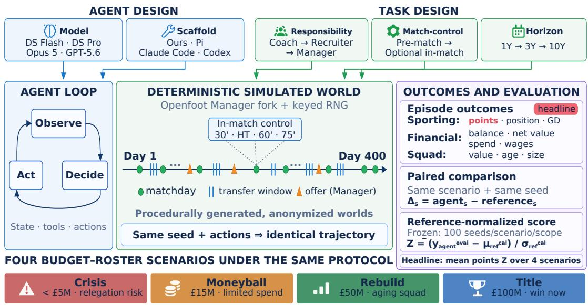  
Figure 1: FromPitch2Board separates five experimental factors. Responsibility and horizon operationalize functional composition and temporal persistence; match-control granularity configures decision density, while model and scafold support attribution under paired-seed evaluation.

## 1. Introduction

Large language models are increasingly evaluated as agents that interact with software, people, and persistent worlds (Liu et al., 2024, Mialon et al., 2024). Long-horizon agency poses two distinct problems. Temporal persistence asks whether competence survives recurring, state-dependent decisions whose consequences accumulate. Functional composition asks whether competence on an existing responsibility set is preserved when additional heterogeneous responsibilities are assigned to the same agent. WebArena and OSWorld test realistic computer use (Zhou et al., 2024, Xie et al., 2024); SWE-bench tests whether models can resolve repository-scale issues (Jimenez et al., 2024); and τ-bench and ToolSandbox evaluate stateful tool use and user interaction (Yao et al., 2024, Lu et al., 2025). These benchmarks have made agent evaluation substantially more realistic, but their episodes remain bounded around a specified task. They do not directly test functional composition and temporal persistence in one controlled setting.

Our results make this distinction concrete. GPT-5.6 records the highest Model-Track Coach score, although the four models are separated by only 0.19 Z. Giving it recruitment authority improves its season points, but adding full-management responsibilities removes that gain and returns its sporting performance near the greedy reference. Across this last boundary, its skipped-decision rate—the share of decision points at which it takes no action and continues—rises from 1.1% to 57.9%, while invalid actions remain at zero. A single-role score therefore conceals both where performance changes and how the degradation appears in behavior. This paper studies how behavior changes as responsibility expands beyond a narrower responsibility scope.

Why existing benchmarks do not measure this. Several lines of work capture pieces of the problem. Plan ning benchmarks test long action sequences (Zhang et al., 2026, Sun et al., 2026), while ultra-long-horizon suites extend them to more persistent settings (Li et al., 2026, Luo et al., 2025). Memory benchmarks instead isolate retention over extended interactions (Wu et al., 2025, Xu et al., 2026). Game environments provide partial observability and sequential consequences, but generally expose a fixed player role (Kurach et al., 2020, Paglieri et al., 2025, Guertler et al., 2025). Long-horizon business simulations introduce ac cumulated resources and delayed objectives: Vending-Bench studies operational coherence (Backlund and Petersson, 2025), while CEO-Bench and YC-Bench evaluate organizational decision making over simulated time (Chen et al., 2026, He et al., 2026a). FM-Bench is the closest concurrent work, evaluating full-control football managers over as many as twenty seasons (Wang et al., 2026). These designs establish that longhorizon management is dificult, but do not jointly vary model, scafold, responsibility scope, match-control granularity, and horizon within one environment. An endpoint score cannot attribute performance to a factor.

Our question and design requirements. We ask whether competence is preserved as responsibilities expand and persists across time, and how model and scafold shape both outcomes. This requires more than extending episode length. The environment must preserve partial information, a functioning transfer economy, and competing sporting and financial objectives. Candidate and reference policies must face matched exogenous randomness, while normalization must remain stable across scenarios. Finally, the agent interface must itself be treated as an experimental factor: SWE-agent shows that agent–computer interfaces afect software-engineering outcomes (Yang et al., 2024), and Continual Harness studies adaptation around a fixed foundation model (Karten et al., 2026b). AgentScope and Agent Lightning likewise make the surrounding agent system an explicit object of design or optimization (Gao et al., 2024, He et al., 2026b). PokéAgent similarly distinguishes model and agent tracks (Karten et al., 2026a), motivating a controlled cross rather than attributing every observed diference to the model alone.

FromPitch2Board. We build FromPitch2Board (Figure 1) on Openfoot Manager (Openfoot Manager Contributors, 2026), an independently developed football-management simulator that we make deterministic using keyed random streams throughout world generation, matches, and turn-level simulation. Responsibility from Coach through Recruiter to Manager tests functional composition, while horizons from one to ten seasons test temporal persistence. A separately configurable match-control axis varies decision granularity from pre-match choices to live intervention. A Model Track fixes a stateless scafold while changing the foundation model; an Agent Track evaluates Ours, Pi, Claude Code, and Codex under a common interface. Headline comparisons use paired seeds and frozen, responsibility-scope- and scenario-specific reference distributions calibrated over 100 seeds. This factor-controlled design exposes responsibility boundaries, scafold efects, and temporal degradation that a single endpoint score obscures.

Our contributions are four:

• A deterministic compositional-management benchmark that varies model, scafold, responsibility scope, match-control granularity, and horizon within one simulation and protocol.

• Functional-composition diagnostics, including the Composition Gap and a responsibility ladder that localizes GPT-5.6’s sporting regression to the Recruiter–Manager boundary.

• Temporal-persistence diagnostics showing a directional reversal in mean ranking within the three-year cohort and that a ten-year trajectory peaks early and remains below that peak.

• Controlled model–scafold attribution within a fully crossed Flash–Pro pair.

## 2. Related Work

Long-horizon management. Business simulations evaluate resource allocation and organizational decisions over extended horizons (Han et al., 2026, Shi et al., 2026, Sugiura et al., 2026, Chen et al., 2025), with CEO-Bench and YC-Bench focusing on startup management (Chen et al., 2026, He et al., 2026a). FM-Bench is the closest concurrent comparison: it evaluates full-control football managers using deterministic replay, scripted and human baselines, and a privileged-information oracle (Wang et al., 2026). FromPitch2Board asks a diferent question. Rather than fixing the management role, it varies responsibility scope, match-control granularity, and horizon within the same world to locate where performance changes.

Attributing agent performance. Agent outcomes reflect both the foundation model and the surrounding interface. Harness-Bench and The Scafold Efect directly cross foundation models with execution harnesses on coding tasks (Yao et al., 2026, Vats and Golev, 2026). SWE-agent and Continual Harness provide earlier evidence for interface design and adaptation (Yang et al., 2024, Karten et al., 2026b), while PokéAgent separates model and agent tracks across game tasks (Karten et al., 2026a). Planning and memory benchmarks isolate particular cognitive demands (Zhang et al., 2026, Wu et al., 2025, Packer et al., 2023), but do not cross them with management scope. FromPitch2Board combines these perspectives by crossing model and scafold while independently configuring responsibility scope, match-control granularity, and horizon. See Appendix A.1.

## 3. FromPitch2Board: Task and Benchmark Design

FromPitch2Board is a single simulation of professional club football management with three separately configurable task axes: responsibility scope, match-control granularity, and horizon. Responsibility and

horizon test functional composition and temporal persistence, respectively; match-control granularity varies the density and timing of decisions.

## 3.1. Task axes for composition and persistence

FromPitch2Board configures responsibility scope, match-control granularity, and horizon on the same simulated world. The responsibility scope axis is a strict three-rung ladder. Coach selects the starting eleven, manages rotation and squad condition across matchdays, and chooses pre-match tactics, with transfers frozen. Recruiter adds the buying side of the market: scouting under partial observability and bidding, while selling remains unavailable. Manager adds incoming-ofer negotiation, transfer-listing, and responsibility for wage and transfer budgets. Moving up this ladder changes the available responsibilities without changing the world, opponent, horizon, or scoring.

Expanding responsibility can introduce decision opportunities, such as incoming ofers; we treat these as part of the added management scope rather than as a separate cadence intervention.

The match-control granularity axis is separate. Its default setting allows pre-match lineup and tactical decisions. Enabling in-match control adds checkpoints at the 30th minute, half-time, the 60th minute, and the 75th minute; the agent then observes the live score, phase, and player condition and may substitute players or change formation and play style. Finally, the horizon axis extends an otherwise fixed Manager configuration from one season to three or ten consecutive seasons, allowing squad aging, contract expiry, and long-term finances to accumulate.

## 3.2. Decision cadence and partial observability

Time advances day by day and pauses at decision points: every matchday of the managed club (all responsibil ity scopes), roughly every three days during open transfer windows (Recruiter and Manager), and whenever a fresh transfer ofer arrives (Manager). The managed club is one actor in a living economy rather than a sandboxed object: every other club is run by its own AI that buys, sells, and adapts within the same simulated economy. Such an active economy is a property shared by recent management benchmarks (Wang et al., 2026, Backlund and Petersson, 2025) and a precondition for our setting: a benchmark whose opponents are static fixtures measures solitaire, not management. A single season of four hundred simulated days contains between roughly forty and fifty decision points; a decade-long horizon multiplies that by ten, and in-match control adds four stops per matchday. The agent observes its own squad’s ratings, while market-player abilities remain hidden until scouting, which provides noisy estimates.

## 3.3. Scenarios and tracks

Four budget-and-roster scenarios instantiate the management spectrum: crisis (a relegation-zone club with a transfer budget under £5M), moneyball (mid-table, £15M, a board objective of a top-half finish while keeping net spend under £5M), rebuild (an aging squad with a £50M budget and a top-four objective), and title (a strong squad with a £100M budget, expected to win). Each scenario fixes club strength rank and budgets, so dificulty is a property of the world, not of the prompt.

The Model Track fixes our stateless scafold (observe, then take one action, with no session memory) and swaps only the foundation model, isolating the foundation-model efect under a fixed scafold. The Agent Track evaluates four named scafolds: Ours, Pi, Claude Code, and Codex. Ours is our standardized stateless observe–act scafold. The other three are agentic coding CLIs: Pi deliberately uses a minimal agent design, whereas Claude Code and Codex are full-featured coding agents. All receive the same task interface and evaluation protocol while retaining their native tool loops and context management. Every scafold runs in its own workspace outside the simulator and cannot read simulator source, internal state, or other runs. This measures end-to-end scafold-configuration efects under a shared external task protocol. The tracks together implement the attribution question of Section 1.

## 3.4. Environment: deterministic, agent-native

FromPitch2Board builds on Openfoot Manager (Openfoot Manager Contributors, 2026), an independently developed, open-source, agent-facing football-management simulator with a player-level match engine and transfer economy. We retain its text interface and add keyed random streams throughout world generation, matches, and turn-level simulation, producing bit-identical replay under a fixed action sequence. Because the simulator predates this benchmark, its dynamics were not designed for the tested agents. Evaluation worlds, players, and club identities are procedurally generated and anonymized, reducing direct instancelevel contamination. Experiments use the medium world of three national leagues (about 120 clubs), with simulator-only seasons taking five seconds.

## 3.5. Evaluation protocol

Metrics. A finished episode records ten raw outcomes: points, final position, and goal diference; balance, net value, net transfer spend, and wage bill; and squad value, average age, and squad size. Net value is the change in club net worth, cash plus squad value, relative to the start of the episode, so multi-season curves remain anchored to the same initial state. Points is the headline ranking metric; every ranking here is a points statistic. Other raw outcomes and derived budget-violation and squad-size diagnostics are auxiliary and are not combined into an aggregate score. For Manager and Recruiter these cover net value, squad value, transfer- and wage-budget violations, and squad size against the 22–26 target; for Coach, where transfers are frozen, only average age. We report them alongside points because sporting, financial, and squad-health outcomes need not move together.

Paired evaluation and reference-normalized scoring. Raw scores across seeds are noisy, so the candidate and reference run the same evaluation seeds in the same scenario and world. For seed s, we report the paired diference $\Delta _ { s } = y _ { s } ^ { \mathrm { a g e n t } } - y _ { s } ^ { \mathrm { r e f } }$ . For central paired contrasts, we report $\bar { \Delta } = n ^ { - 1 } \sum _ { s } \Delta _ { s }$ with uncertainty stated explicitly (mean±SE unless noted). This matching controls variance by aligning seeded exogenous randomness across policies. Separately, we freeze a one-hundred-seed calibration distribution for the greedy reference per scenario and responsibility scope. The normalized score is

$$
Z = \frac { \bar { y } _ { \mathrm { e v a l } } ^ { \mathrm { a g e n t } } - \mu _ { \mathrm { c a l } } ^ { \mathrm { r e f } } } { \sigma _ { \mathrm { c a l } } ^ { \mathrm { r e f } } } .
$$

Thus, the paired protocol supports low-variance raw comparisons, while Z places candidates on a stable reference scale. Table scores equally average the four scenario-specific Z-scores.

Resource-use accounting. The runner records input, output, and cache-read tokens, wall-clock time, and invalid-action rate where available. Costs are converted to a common pricing baseline (pre-August-17 list prices for DeepSeek and undiscounted oficial list prices for Claude and GPT).

<table><tr><td>Track</td><td>Scaffold</td><td>Model</td><td>Coach Z</td><td>Manager Z</td><td>Composition Gap</td></tr><tr><td rowspan="5">Model</td><td>Ours</td><td>DS Flash</td><td>+0.51</td><td>+0.67</td><td>-0.16</td></tr><tr><td>Ours</td><td>DS Pro</td><td>+0.59</td><td>+0.76</td><td>-0.17</td></tr><tr><td>Ours</td><td>Opus 5</td><td>+0.55</td><td>+0.61</td><td>-0.06</td></tr><tr><td>Ours</td><td>GPT-5.6</td><td>+0.70</td><td>+0.08</td><td>+0.62</td></tr><tr><td>Rule policy</td><td>Greedy reference</td><td>+0.08</td><td>-0.09</td><td>+0.17</td></tr><tr><td rowspan="6">Agent</td><td>Pi</td><td>DS Flash</td><td>+0.55</td><td>+1.08</td><td>-0.53</td></tr><tr><td>Pi</td><td>DS Pro</td><td>+0.55</td><td>+1.17</td><td>-0.62</td></tr><tr><td>Claude Code</td><td>DS Flash</td><td>+0.54</td><td>+1.02</td><td>-0.48</td></tr><tr><td>Claude Code</td><td>DS Pro</td><td>+0.46</td><td>+0.95</td><td>-0.49</td></tr><tr><td>Codex</td><td>DS Flash</td><td>+1.05</td><td>+1.15</td><td>-0.10</td></tr><tr><td>Codex</td><td>DS Pro</td><td>+1.39</td><td>+1.14</td><td>+0.25</td></tr></table>

Table 1: Main leaderboard across model, scafold, and responsibility. Rows average four scenarios with eight seeds each against the frozen calibration; bold marks per-track extrema.

Determinism. The simulator uses keyed random streams, yielding deterministic trajectories under fixed seeds and action sequences; horizons compose consistently across multi-season runs. The keyed RNG partitions randomness into semantic sub-streams for days, matches, and scouting, so consuming randomness in one domain does not shift unrelated draws in another. The guarantee covers the simulator; hosted-mode inference is not part of it and may vary across repeated calls.

## 4. Experiments

Setup. Unless noted otherwise, one-season results use the medium world, four scenarios, and eight paired seeds (42–49) under the scoring protocol of Section 3. The Model Track compares DS Flash, DS Pro, Opus 5, and GPT-5.6 with the Ours scafold; the Agent Track compares Ours, Pi, Claude Code, and Codex. The Ours+Flash and Ours+Pro cells are shared between the two tracks, giving ten unique configurations. Each contains 64 episodes (four scenarios, eight seeds, and two responsibility scopes), for 640 episodes in the main leaderboard. Exact model identifiers and reasoning settings appear in Appendix A.10.

The results follow two primary questions: whether competence is preserved as responsibilities expand and whether it persists across seasons. Model–scafold crosses support attribution; match-control, memory, cost, and resource use are supporting diagnostics.

## 4.1. RQ1: Functional composition across responsibilities

The Model-Track rows of Table 1 report Coach and Manager Z-scores for the four models. The Coach scores occupy a narrow range: the best and worst models are separated by only 0.19 Z. The Manager scope is more dispersed, with a 0.68-Z range driven by GPT-5.6’s score of +0.08; the other three models remain within 0.15 Z. DS Pro achieves the highest mean Model-Track Manager score at a lower cost than Opus 5 and GPT-5.6. The composition axis shows behavior that the Coach ranking hides. We define the Composition Gap as $Z _ { \mathrm { { C o a c h } } } - Z _ { \mathrm { { M a n a g e r } : } }$ , so a positive value denotes a decrease in normalized advantage relative to the scope-specific reference after management responsibilities are added. Accordingly, the GPT-5.6 boundary result is established by the paired raw Recruiter-to-Manager contrast, and the Composition Gap serves as a complementary reference-normalized diagnostic. Flash, Pro, and Opus 5 remain flat or improve relative to their scope-specific references (−0.17 to −0.06), whereas GPT-5.6 has a gap of +0.62 and falls to the level of the greedy reference. With Coach and Manager calibrated separately, the gap measures a within-model change in reference-normalized advantage rather than raw points.

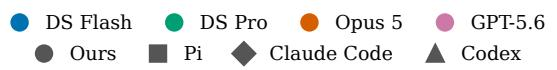

(a) Composition map  
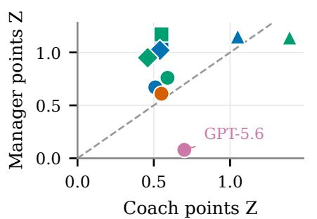

(b) Composition Gap by model and scenario  
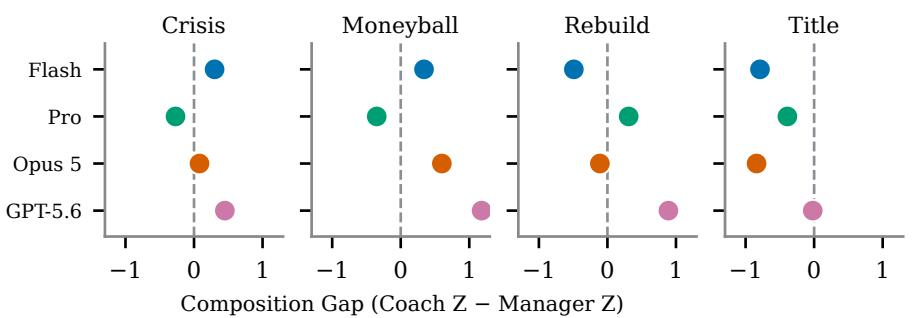

(c) Responsibility ladder  
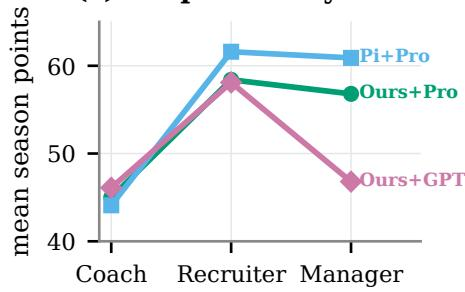

(d) Paired sporting regression  
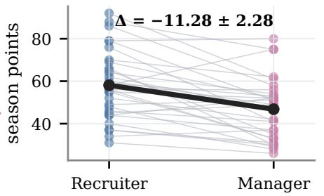

(e) Behavioral signature  
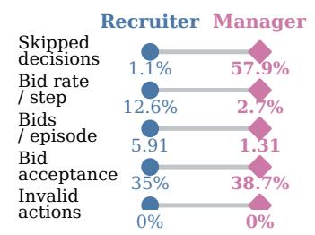  
Figure 2: Responsibility expansion exposes a model-dependent behavioral signature. Panels connect the composition map and scenario gaps (a–b) to responsibility ladders, 32 paired GPT-5.6 episodes, and the resulting behavior (c–e).

Finding 1. Under an aligned protocol, Model-Track Coach scores span 0.19 Z, but responsibility expansion separates models: three retain or improve their relative advantage, while GPT-5.6 loses 0.62 Z. The Composition Gap exposes a change in reference-normalized advantage that the single-role ranking hides.

To localize where added responsibilities change behavior, the responsibility ladder evaluates three rungs on the same scafold: coach-only, coach-plus-recruitment (buying, no selling), and full manager. Mean season points across the ladder are $4 5 . 0  5 8 . 4  5 6 . 8$ (Figure 2): buying is a net gain of 13.4 points, while the full-management rung costs 1.6 points but raises net value by £6.8M and reduces squad size. Repeating the ladder with the Pi scafold yields $4 4 . 1  6 1 . 6  6 0 . 9$ points. Thus, across both tested scafolds, the large change occurs when buying is enabled, whereas full management changes mean points by less than two. We additionally evaluate the middle rung for GPT-5.6. Its raw-point trajectory is $4 6 . 1  5 8 . 1  4 6 . 8 \colon$ recruitment improves performance by 12.0 points, but the gain disappears under the bundle of full-management responsibilities. In a paired comparison, Recruiter exceeds Manager by $1 1 . 2 8 \pm 2 . 2 8$ points (mean ± SE, n = 32). Thus the GPT-5.6 sporting regression is localized to the Recruiter-to-Manager responsibility boundary, not to recruitment access itself. Across that boundary, its skipped-decision rate rises from 1.1% to 57.9%, while its bid rate falls from 12.6% to 2.7% (5.91 to 1.31 bids per episode), so participation also declines in absolute count; both configurations have zero invalid actions. Among bids with an explicit accepted/rejected result, acceptance does not fall (35.0% versus 38.7%). The sporting regression therefore has a behavioral signature of passivity rather than malformed or invalid actions.

The regression is sporting rather than universal. Relative to Recruiter, Manager loses 11.28 points, 4.19 league places, and 21.75 goal-diference units, while spending £5.73M less and reducing wages by £33.1k. Cash rises by £5.79M, but net value does not improve $( - \mathscr { L } 0 . 8 3 \mathrm { M } \pm \pounds 2 . 0 7 \mathrm { M } \mathrm { S E } )$ , and squad value falls by £6.61M. Full management therefore induces financial retrenchment, not a uniform outcome collapse or a compensating increase in net value.

Finding 2. Responsibility efects are model-dependent. For GPT-5.6, recruitment raises season points, while full-management responsibilities remove the entire gain; its boundary traces exhibit a sharp rise in passivity rather than invalid actions.

## 4.2. Attribution: scafold and model contrasts

The Agent-Track rows of Table 1 give the scafold-by-model matrix. Pi, Claude Code, and Codex each obtain higher mean Manager scores than Ours, the fixed stateless scafold, for both tested models. Paired over the same scenarios and seeds, the scafold gains over Ours are +0.41 ± 0.15, +0.35 ± 0.13 and $+ 0 . 4 8 \pm 0 . 1 7$ Z for Flash (Pi, Claude Code, Codex) and +0.40 ± 0.25, $+ 0 . 1 8 \pm 0 . 2 2$ and $+ 0 . 3 8 \pm 0 . 1 8 \mathrm { ~ Z ~ }$ for Pro (mean ± SE, clustered by seed as in Table 6). The four Pro-minus-Flash contrasts range from $- 0 . 0 8 \mathrm { ~ t o ~ } { \ t i 0 . 0 9 \mathrm { ~ Z } } ,$ with seed-clustered SEs of 0.11–0.22 Z. Holding the model fixed, the Manager scores span 0.48 Z for Flash and 0.41 Z for Pro; the best Coach configuration overall is Codex (+1.39). The individual contrasts appear in Table 20.

A contemporaneous paired ablation on Flash compares the Claude Code scafold with and without session continuity. Coach scores are efectively unchanged (+0.60 versus +0.61 Z), while Manager scores show a directional decrease with continuity (+0.81 versus +1.08 Z; paired diference $- 3 . 5 6 \pm 2 . 2 8$ points). The long-horizon comparison in Section 4.4 is a separate experiment whose Claude Code arms use a no-memory configuration.

Finding 3. Within the Flash–Pro pair crossed across all scafolds, estimated Manager gains over Ours, the stateless scafold, range from 0.18 to 0.48 Z, while Pro-minus-Flash estimates range from −0.08 to +0.09 Z. These contrasts describe the tested configurations. In a contemporaneous Flash ablation, session continuity leaves Coach performance unchanged and is directionally worse on Manager.

## 4.3. Supporting diagnostic: match-control granularity

To test the finest timescale, the same coach episodes are re-run with in-match control enabled: checkpoints at $3 0 ^ { \prime } .$ , half-time, 60′, 75′, with substitutions and live tactic changes, on the same seeds and world. Agents use the axis: DS Pro substitutes 38% more often than DS Flash (1.62 versus 1.17 substitutions per match), but it does not help them (Figure 3(d)). Across the eight paired episodes, the control-minus-default diference is $- 3 . 3 8 \pm 3 . 0 3$ points for DS Flash (mean±SE; four negative, three positive, and one tied) and $- 9 . 6 3 \pm 3 . 7 5$ for DS Pro (seven negative and one positive).

Finding 4. Minute-level intervention is actively used but yields no detectable benefit in season-level outcomes under our current evaluation: the paired estimate is −3.38 points for DS Flash and −9.63 points for DS Pro at n = 8 pairs each.

## 4.4. RQ2: Temporal persistence across horizons

We ran four scafold-model combinations over three consecutive seasons (3Y) across four scenarios. Every configuration contains eight seeds per scenario (32 trajectories). For the 10Y case study we use Claude Code+Pro, preselected under the no-memory Manager configuration before the 10Y evaluation. We chose rebuild and title as contrasting management objectives and ran eight seeds per scenario against the greedy reference. The Claude Code long-horizon episodes use a no-memory configuration rather than the session continuity protocol of the main Agent Track. Three-year results change the ranking within the same 3Y cohort (Figure 4): Claude Code+Pro leads in year one by 2.8 ± 2.5 points over Ours+Flash, whereas by year three Ours+Flash finishes first (79.0, versus 73.8 for Claude Code+Flash, 72.9 for Ours+Pro, and 72.8 for Claude Code+Pro), leading by 5.3 ± 1.9, 6.2 ± 2.8 and 6.2 ± 2.1 points. Paired contrasts use 32 matched scenario–seed observations, with standard errors clustered by seed; across the three seasons the margin in favour of Ours+Flash widens by 4.6 to 9.0 points (Table 20). Within Flash, the scafold ordering reverses; within Pro, the two scafolds converge to efectively the same Y3 score. The ten-year Claude Code curve peaks in year three (85.4), before its season-points trajectory falls to 47.1 by year six and remains far below its year-three peak thereafter. This decline coincides with substantial squad attrition (Appendix A.13). Across ten seasons the agent accumulates 602.4 points versus 388.7 for the greedy reference, so the decline is relative to its own early peak, not a cumulative deficit; the reference follows fixed conservative rules and shows no comparable early peak.

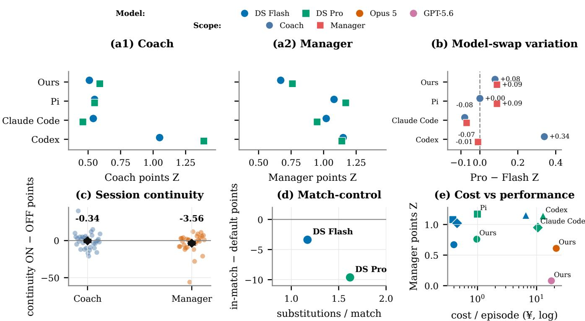  
Figure 3: Scafold and model contrasts within the Flash–Pro pair. Absolute scores and model swaps (a–b) precede continuity, match-control, and cost diagnostics (c–e); Manager scafold spans are 0.48/0.41 Z versus a maximum Manager model swap of 0.09 Z.

Finding 5. The 3Y cohort shows a directional reversal in mean ranking between years one and three. The 10Y case reveals a later decline in season points, motivating evaluation across multiple horizons.

## 4.5. Supporting diagnostics: cost and resource use

Costs are converted to a common undiscounted list-price baseline, with DeepSeek frozen at its pre-August-17 prices. For the reported Model-Track episodes (64 per model), Opus 5 and GPT-5.6 cost approximately 22× and 18× as much as DS Pro, respectively, while scoring below it on the Manager scope (Figure 3(e)). Across the six stateful Flash/Pro scafold configurations, cached-input volume is over two orders of magnitude larger than for the two stateless configurations. The separate no-memory Claude Code configuration loses to the stateless scafold at three years.

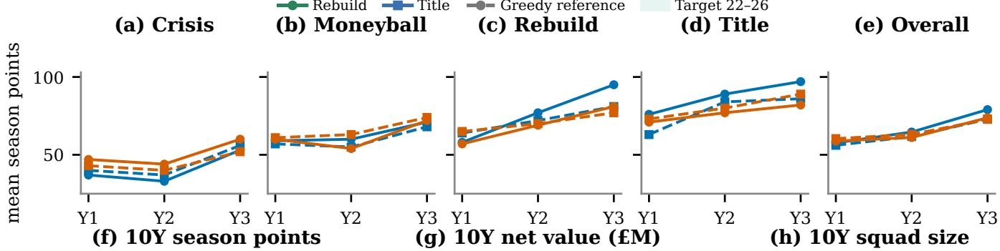

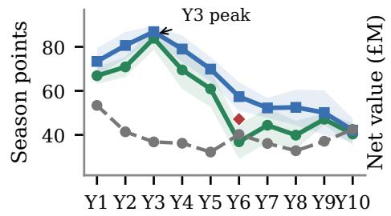

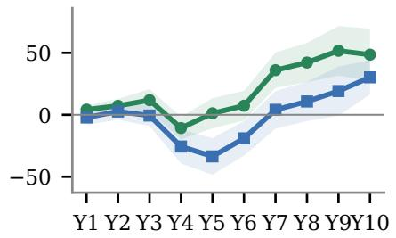

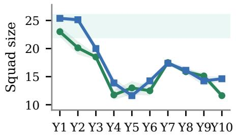  
Figure 4: Early rankings can change over longer horizons. Scenario and overall 3Y means (a–e) accompany 10Y sporting, net-value, and squad-size trajectories (f–h); the selected agent peaks in year 3 and stays below that level in every later year. Bands in (f–h) show ±1 SE within each scenario; the red diamond marks the cross-scenario mean at year 6.

Finding 6. For the tested model versions and price snapshot, price is poorly aligned with Manager performance: DS Pro outperforms Opus 5 and GPT-5.6 while costing 18–22× less.

## 5. Discussion

Functional composition. FromPitch2Board measures whether competence on an existing responsibility set is preserved as responsibility expands. GPT-5.6 coaches and recruits efectively at the Recruiter rung, but its sporting performance and participation decline after expansion to full management: responsibility expansion coincides with sharply reduced participation rather than malformed or invalid actions. This passivity extends to shared duties: GPT-5.6’s matchday skip rate rises from 0.2% as Recruiter to 58.0% as Manager, rather than being confined to newly introduced management events (Appendix A.12). Separately, the Flash–Pro model–scafold cross shows that agent outcomes can depend materially on scafold choice, motivating configuration-level rather than model-only attribution. Functional composition is therefore an empirical property of an agent configuration, not a consequence that can be inferred from isolated task scores.

Temporal persistence and scope. Multi-season results pose the parallel temporal question: competence observed in year one need not determine later rankings or trajectories. FM-Bench (Wang et al., 2026), developed concurrently in a diferent simulator and interface, reports a related execution gap in which recorded plans are not subsequently carried out. This supports measuring sustained engagement. The paired Flash ablation finds session continuity neutral on Coach and directionally worse on Manager. The long-horizon evaluation uses a separate no-memory protocol.

Scope of the measurements. All results are operational measurements inside a simulator whose worlds, players, and clubs are procedurally generated and anonymized. They characterize the tested model versions, scafolds, and protocol rather than the providers that serve them, and they are neither psychological claims about a model nor evidence that any evaluated system is suitable for real organizational, employment, sporting, or financial decisions. Running the benchmark consumes computation and paid inference, which is why we report token and cost accounting alongside the performance results.

## 6. Conclusion

FromPitch2Board uses football management as a controlled testbed for two questions in long-horizon agency: whether competence is preserved as heterogeneous responsibilities expand and whether it persists across repeated, state-dependent decisions. Functional composition is not monotonic: GPT-5.6 improves from Coach to Recruiter, then loses that gain under full management as its behavior becomes markedly passive. Three-year results show a directional reversal in mean ranking, and a selected ten-year trajectory peaks early and remains below that peak. Model–scafold crosses allow some efects to be localized to a tested factor rather than treating every agent outcome as a property of the model alone.

Limitations and Future Work. Results cover one simulated management domain, four foundation models, and the configurations of Section 4, so cross-domain transfer remains untested. The model–scafold cross is complete only for Flash–Pro, and the ten-year trajectory follows a single scafold–model combination. Single-season outcomes remain noisy at eight evaluation seeds per cell. Future work should test engagementaware scafolds, long-horizon memory designs, and whether these patterns generalize across domains and horizons.

## References

Axel Backlund and Lukas Petersson. Vending-bench: A benchmark for long-term coherence of autonomous agents. CoRR, abs/2502.15840, 2025. doi: 10.48550/ARXIV.2502.15840. URL https://doi.org/10 .48550/arXiv.2502.15840.

Victor Barrès, Honghua Dong, Soham Ray, Xujie Si, and Karthik Narasimhan. τ2-bench: Evaluating conversational agents in a dual-control environment. CoRR, abs/2506.07982, 2025. doi: 10.48550/ARXIV.2506. 07982. URL https://doi.org/10.48550/arXiv.2506.07982.

Haozhe Chen, Karthik Narasimhan, and Zhuang Liu. Ceo-bench: Can agents play the long game? CoRR, abs/2606.18543, 2026. doi: 10.48550/ARXIV.2606.18543. URL https://doi.org/10.48550/arX iv.2606.18543.

Yanxu Chen, Zijun Yao, Yantao Liu, Jin Ye, Jianing Yu, Lei Hou, and Juanzi Li. Stockbench: Can LLM agents trade stocks profitably in real-world markets? CoRR, abs/2510.02209, 2025. doi: 10.48550/ARXIV.2510. 02209. URL https://doi.org/10.48550/arXiv.2510.02209.

Anthony Costarelli, Mat Allen, Roman Hauksson, Grace Sodunke, Suhas Hariharan, Carlson Cheng, Wenjie Li, and Arjun Yadav. Gamebench: Evaluating strategic reasoning abilities of LLM agents. CoRR, abs/2406.06613, 2024. doi: 10.48550/ARXIV.2406.06613. URL https://doi.org/10.48550/arX iv.2406.06613.

Marc-Alexandre Côté, Ákos Kádár, Xingdi Yuan, Ben Kybartas, Tavian Barnes, Emery Fine, James Moore, Matthew J. Hausknecht, Layla El Asri, Mahmoud Adada, Wendy Tay, and Adam Trischler. Textworld: A learning environment for text-based games. In Tristan Cazenave, Abdallah Safidine, and Nathan R. Sturtevant, editors, Computer Games - 7th Workshop, CGW 2018, Held in Conjunction with the 27th International Conference on Artificial Intelligence, IJCAI 2018, Stockholm, Sweden, July 13, 2018, Revised Selected Papers, volume 1017 of Communications in Computer and Information Science, pages 41–75. Springer, 2018. doi: 10.1007/978-3-030-24337-1\_3. URL https://doi.org/10.1007/978-3-030 -24337-1\_3.

Dawei Gao, Zitao Li, Weirui Kuang, Xuchen Pan, Daoyuan Chen, Zhijian Ma, Bingchen Qian, Liuyi Yao, Lin Zhu, Chen Cheng, Hongzhu Shi, Yaliang Li, Bolin Ding, and Jingren Zhou. Agentscope: A flexible yet robust multi-agent platform. CoRR, abs/2402.14034, 2024. doi: 10.48550/ARXIV.2402.14034. URL https://doi.org/10.48550/arXiv.2402.14034.

Leon Guertler, Bobby Cheng, Simon Yu, Bo Liu, Leshem Choshen, and Cheston Tan. Textarena. CoRR, abs/2504.11442, 2025. doi: 10.48550/ARXIV.2504.11442. URL https://doi.org/10.48550/arX iv.2504.11442.

Danijar Hafner. Benchmarking the spectrum of agent capabilities. In The Tenth International Conference on Learning Representations, ICLR 2022, Virtual Event, April 25-29, 2022. OpenReview.net, 2022. URL https://openreview.net/forum?id=1W0z96MFEoH.

Yi Han, Lingfei Qian, Yan Wang, Yueru He, Xueqing Peng, Dongji Feng, Yankai Chen, Haohang Li, Yupeng Cao, Jimin Huang, Xue Liu, Jian-Yun Nie, and Sophia Ananiadou. Can LLM agents be cfos? A benchmark for resource allocation in dynamic enterprise environments. CoRR, abs/2603.23638, 2026. doi: 10.48550 /ARXIV.2603.23638. URL https://doi.org/10.48550/arXiv.2603.23638.

Muyu He, Adit Jain, Anand Kumar, Vincent Tu, Soumyadeep Bakshi, Sachin Patro, and Nazneen Rajani. Yc bench: Benchmarking AI agents for long-term planning and consistent execution. CoRR, abs/2604.01212, 2026a. doi: 10.48550/ARXIV.2604.01212. URL https://doi.org/10.48550/arXiv.2604.01212.

Zhiyuan He, Siwei Zhang, Zhiwen Zhou, Yuqing Yang, Yu Kang, Yuge Zhang, Luna K Qiu, Tin Yan Tsui, Jiahang Xu, and Chong Luo. Agent lightning v1. 0: Towards harnessed agentic rl. arXiv preprint arXiv:2608.17528, 2026b.

Carlos E. Jimenez, John Yang, Alexander Wettig, Shunyu Yao, Kexin Pei, Ofir Press, and Karthik R. Narasimhan. Swe-bench: Can language models resolve real-world github issues? In The Twelfth International Conference on Learning Representations, ICLR 2024, Vienna, Austria, May 7-11, 2024. OpenReview.net, 2024. URL https://openreview.net/forum?id=VTF8yNQM66.

Seth Karten, Jake Grigsby, Tersoo Upaa Jr, Junik Bae, Seonghun Hong, Hyunyoung Jeong, Jaeyoon Jung, Kun Kerdthaisong, Gyungbo Kim, Hyeokgi Kim, Yujin Kim, Eunju Kwon, Dongyu Liu, Patrick Mariglia, Sangyeon Park, Benedikt Schink, Xianwei Shi, Anthony Sistilli, Joseph Twin, Arian Urdu, Matin Urdu, Qiao Wang, Ling Wu, Wenli Zhang, Kunsheng Zhou, Stephanie Milani, Kiran Vodrahalli, Amy Zhang, Fei Fang, Yuke Zhu, and Chi Jin. The pokeagent challenge: Competitive and long-context learning at scale. CoRR, abs/2603.15563, 2026a. doi: 10.48550/ARXIV.2603.15563. URL https://doi.org/10.48550/arXiv.2603.15563.

Seth Karten, Joel Zhang, Tersoo Upaa Jr, Ruirong Feng, Wenzhe Li, Chengshuai Shi, Chi Jin, and Kiran Vodrahalli. Continual harness: Online adaptation for self-improving foundation agents. CoRR, abs/2605.09998, 2026b. doi: 10.48550/ARXIV.2605.09998. URL https://doi.org/10.48550/arXiv.2605.09998.

Karol Kurach, Anton Raichuk, Piotr Stanczyk, Michal Zajac, Olivier Bachem, Lasse Espeholt, Carlos Riquelme, Damien Vincent, Marcin Michalski, Olivier Bousquet, and Sylvain Gelly. Google research football: A novel reinforcement learning environment. In The Thirty-Fourth AAAI Conference on Artificial Intelligence, AAAI 2020, The Thirty-Second Innovative Applications of Artificial Intelligence Conference, IAAI 2020, The Tenth AAAI Symposium on Educational Advances in Artificial Intelligence, EAAI 2020, New York, NY, USA, February 7-12, 2020, pages 4501–4510. AAAI Press, 2020. doi: 10.1609/AAAI.V34I04.5878. URL https://doi.org/10.1609/aaai.v34i04.5878.

Heinrich Küttler, Nantas Nardelli, Alexander H. Miller, Roberta Raileanu, Marco Selvatici, Edward Grefen stette, and Tim Rocktäschel. The nethack learning environment. In Hugo Larochelle, Marc’Aurelio Ranzato, Raia Hadsell, Maria-Florina Balcan, and Hsuan-Tien Lin, editors, Advances in Neural Information Processing Systems 33: Annual Conference on Neural Information Processing Systems 2020, NeurIPS 2020, December 6-12, 2020, virtual, 2020. URL https://proceedings.neurips.cc/paper/2020/hash/569ff98 7c643b4bedf504efda8f786c2-Abstract.html.

Zongxia Li, Zhongzhi Li, Yucheng Shi, Ruhan Wang, Junyao Yang, Zhichao Liu, Xiyang Wu, Anhao Li, Yue Yu, Ninghao Liu, Lichao Sun, Haotao Mi, and Leowei Liang. Long-horizon-terminal-bench: Testing the limits of agents on long-horizon terminal tasks with dense reward-based grading. CoRR, abs/2607.08964, 2026. doi: 10.48550/ARXIV.2607.08964. URL https://doi.org/10.48550/arXiv.2607.08964.

Xiao Liu, Hao Yu, Hanchen Zhang, Yifan Xu, Xuanyu Lei, Hanyu Lai, Yu Gu, Hangliang Ding, Kaiwen Men, Kejuan Yang, Shudan Zhang, Xiang Deng, Aohan Zeng, Zhengxiao Du, Chenhui Zhang, Sheng Shen, Tianjun Zhang, Yu Su, Huan Sun, Minlie Huang, Yuxiao Dong, and Jie Tang. Agentbench: Evaluating llms as agents. In The Twelfth International Conference on Learning Representations, ICLR 2024, Vienna, Austria, May 7-11, 2024. OpenReview.net, 2024. URL https://openreview.net/forum?id=zAdUB0aCTQ.

Jiarui Lu, Thomas Holleis, Yizhe Zhang, Bernhard Aumayer, Feng Nan, Haoping Bai, Shuang Ma, Shen Ma, Mengyu Li, Guoli Yin, Zirui Wang, and Ruoming Pang. Toolsandbox: A stateful, conversational, interactive evaluation benchmark for LLM tool use capabilities. In Luis Chiruzzo, Alan Ritter, and Lu Wang, editors, Findings of the Association for Computational Linguistics: NAACL 2025, Albuquerque, New Mexico, USA, April 29 - May 4, 2025, volume NAACL 2025 of Findings of ACL, pages 1160–1183. Association for Computational Linguistics, 2025. doi: 10.18653/V1/2025.FINDINGS-NAACL.65. URL https: //doi.org/10.18653/v1/2025.findings-naacl.65.

Haotian Luo, Huaisong Zhang, Xuelin Zhang, Haoyu Wang, Zeyu Qin, Wenjie Lu, Guozheng Ma, Haiying He, Yingsha Xie, Qiyang Zhou, Zixuan Hu, Hongze Mi, Yibo Wang, Naiqiang Tan, Hong Chen, Yi R. Fung, Chun Yuan, and Li Shen. Ultrahorizon: Benchmarking agent capabilities in ultra long-horizon scenarios. CoRR, abs/2509.21766, 2025. doi: 10.48550/ARXIV.2509.21766. URL https://doi.org/10.48550 /arXiv.2509.21766.

Grégoire Mialon, Clémentine Fourrier, Thomas Wolf, Yann LeCun, and Thomas Scialom. GAIA: a benchmark for general AI assistants. In The Twelfth International Conference on Learning Representations, ICLR 2024, Vienna, Austria, May 7-11, 2024. OpenReview.net, 2024. URL https://openreview.net/forum?id= fibxvahvs3.

Robert Müller and Clemens Müller. Cattle trade: A multi-agent benchmark for LLM blufing, bidding, and bargaining. CoRR, abs/2605.14537, 2026. doi: 10.48550/ARXIV.2605.14537. URL https: //doi.org/10.48550/arXiv.2605.14537.

Openfoot Manager Contributors. Openfoot manager: An open-source football management simulation game. https://github.com/openfootmanager/openfootmanager, 2026. GitHub repository, accessed August 31, 2026.

Charles Packer, Vivian Fang, Shishir G. Patil, Kevin Lin, Sarah Wooders, and Joseph E. Gonzalez. Memgpt: Towards llms as operating systems. CoRR, abs/2310.08560, 2023. doi: 10.48550/ARXIV.2310.08560. URL https://doi.org/10.48550/arXiv.2310.08560.

Davide Paglieri, Bartlomiej Cupial, Samuel Coward, Ulyana Piterbarg, Maciej Wolczyk, Akbir Khan, Eduardo Pignatelli, Lukasz Kucinski, Lerrel Pinto, Rob Fergus, Jakob Nicolaus Foerster, Jack Parker-Holder, and Tim Rocktäschel. BALROG: benchmarking agentic LLM and VLM reasoning on games. In The Thirteenth International Conference on Learning Representations, ICLR 2025, Singapore, April 24-28, 2025. OpenReview.net, 2025. URL https://openreview.net/forum?id=fp6t3F669F.

Dongmin Park, Minkyu Kim, Beongjun Choi, Junhyuck Kim, Keon Lee, Jonghyun Lee, Inkyu Park, Byeong-Uk Lee, Jaeyoung Hwang, Jaewoo Ahn, Ameya Sunil Mahabaleshwarkar, Bilal Kartal, Pritam Biswas, Yoshi Suhara, Kangwook Lee, and Jaewoong Cho. Orak: A foundational benchmark for training and evaluating LLM agents on diverse video games. CoRR, abs/2506.03610, 2025. doi: 10.48550/ARXIV.2506.03610. URL https://doi.org/10.48550/arXiv.2506.03610.

Qiming Shi, Yulong Tao, Linbo Jin, Zhaolu Kang, Yibo Dou, Jiawen Zhu, Tianjun Pan, Shaokang Fu, Chengyu Wang, Siyue Li, Yaping Cheng, Di Weng, and Chengfu Huo. Merchantbench: Benchmarking LLM agents for long-term coherence in e-commerce operations. CoRR, abs/2607.28956, 2026. doi: 10.48550/ARXIV.2607.28956. URL https://doi.org/10.48550/arXiv.2607.28956.

Issa Sugiura, Daichi Hattori, Kazuo Araragi, Keita Ogawa, Shota Onose, Taro Makino, Teppei Usuki, and Takashi Ishida. Cofeebench: Benchmarking long-horizon LLM agents in heterogeneous multi-agent

economies. CoRR, abs/2606.16613, 2026. doi: 10.48550/ARXIV.2606.16613. URL https://doi.org/ 10.48550/arXiv.2606.16613.

Haoyu Sun, Wenxuan Wang, Mingyang Song, Jujie He, Weinan Zhang, Yang Liu, Yang Yang, and Yu Cheng. Agent planning benchmark: A diagnostic framework for planning capabilities in LLM agents. CoRR, abs/2606.04874, 2026. doi: 10.48550/ARXIV.2606.04874. URL https://doi.org/10.48550/arX iv.2606.04874.

Naman Vats and Oleg Golev. The scafold efect in coding agents: Harness choice as a hidden variable in coding-agent evaluation. arXiv preprint arXiv:2607.22585, 2026.

Tianyou Wang, Chongyang Gao, Kezhen Chen, Chen Dong, Yinghao He, Donghan Li, Wangcheng Xu, Hongjiu Zhang, and Chi Li. Fm-bench: A benchmark for long-horizon management with competing agents. arXiv preprint arXiv:2608.18423, 2026.

Di Wu, Hongwei Wang, Wenhao Yu, Yuwei Zhang, Kai-Wei Chang, and Dong Yu. Longmemeval: Benchmarking chat assistants on long-term interactive memory. In The Thirteenth International Conference on Learning Representations, ICLR 2025, Singapore, April 24-28, 2025. OpenReview.net, 2025. URL https://openreview.net/forum?id=pZiyCaVuti.

Yue Wu, Xuan Tang, Tom M. Mitchell, and Yuanzhi Li. Smartplay : A benchmark for llms as intelligent agents. In The Twelfth International Conference on Learning Representations, ICLR 2024, Vienna, Austria, May 7-11, 2024. OpenReview.net, 2024. URL https://openreview.net/forum?id=S2oTVrlcp3.

Tianbao Xie, Danyang Zhang, Jixuan Chen, Xiaochuan Li, Siheng Zhao, Ruisheng Cao, Toh Jing Hua, Zhoujun Cheng, Dongchan Shin, Fangyu Lei, Yitao Liu, Yiheng Xu, Shuyan Zhou, Silvio Savarese, Caiming Xiong, Victor Zhong, and Tao Yu. Osworld: Benchmarking multimodal agents for open-ended tasks in real computer environments. In Amir Globersons, Lester Mackey, Danielle Belgrave, Angela Fan, Ulrich Paquet, Jakub M. Tomczak, and Cheng Zhang, editors, Advances in Neural Information Processing Systems 37: Annual Conference on Neural Information Processing Systems 2024, NeurIPS 2024, Vancouver, BC, Canada, December 10 - 15, 2024, 2024. URL http://papers.nips.cc/paper\_files/paper/2024/hash/5 d413e48f84dc61244b6be550f1cd8f5-Abstract-Datasets\_and\_Benchmarks\_Track.html.

Wujiang Xu, Yu Wang, Kai Mei, Kaiqu Liang, Zhenting Wang, Mingyu Jin, Han Zhang, Shi-Xiong Zhang, Wenyue Hua, Sambit Sahu, and Dimitris N. Metaxas. Memgym: a long-horizon memory environment for LLM agents. CoRR, abs/2605.20833, 2026. doi: 10.48550/ARXIV.2605.20833. URL https: //doi.org/10.48550/arXiv.2605.20833.

John Yang, Carlos E. Jimenez, Alexander Wettig, Kilian Lieret, Shunyu Yao, Karthik Narasimhan, and Ofir Press. Swe-agent: Agent-computer interfaces enable automated software engineering. In Amir Globersons, Lester Mackey, Danielle Belgrave, Angela Fan, Ulrich Paquet, Jakub M. Tomczak, and Cheng Zhang, editors, Advances in Neural Information Processing Systems 37: Annual Conference on Neural Information Processing Systems 2024, NeurIPS 2024, Vancouver, BC, Canada, December 10 - 15, 2024, 2024. URL http://papers.nips.cc/paper\_files/paper/2024/hash/5a7c947568c1b1328ccc5230172 e1e7c-Abstract-Conference.html.

Shunyu Yao, Noah Shinn, Pedram Razavi, and Karthik Narasimhan. -bench: A benchmark for tool-agent-user interaction in real-world domains. CoRR, abs/2406.12045, 2024. doi: 10.48550/ARXIV.2406.12045. URL https://doi.org/10.48550/arXiv.2406.12045.

Yilun Yao, Xinyu Tan, Chao-Hsuan Liu, Yaoming Li, Zhengyang Wang, Wenhan Yu, Zhewen Tan, Yuxuan Tian, Guangxiang Zhao, Lin Sun, Xiangzheng Zhang, and Tong Yang. Harness-bench: Measuring harness efects across models in realistic agent workflows. arXiv preprint arXiv:2605.27922, 2026.

Yinger Zhang, Shutong Jiang, Renhao Li, Jianhong Tu, Yang Su, Lianghao Deng, Xudong Guo, Chenxu Lv, and Junyang Lin. Deepplanning: Benchmarking long-horizon agentic planning with verifiable constraints. In Maria Liakata, Viviane P. Moreira, Jiajun Zhang, and David Jurgens, editors, Proceedings of the 64th Annual Meeting of the Association for Computational Linguistics (Volume 1: Long Papers), ACL 2026, San Diego, California, United States, July 2-7, 2026, pages 7377–7407. Association for Computational Linguistics, 2026. doi: 10.18653/V1/2026.ACL-LONG.335. URL https://doi.org/10.18653/v1/2026.acl-l ong.335.

Stephan Zheng, Alexander Trott, Sunil Srinivasa, David C. Parkes, and Richard Socher. The AI economist: Optimal economic policy design via two-level deep reinforcement learning. CoRR, abs/2108.02755, 2021. URL https://arxiv.org/abs/2108.02755.

Shuyan Zhou, Frank F. Xu, Hao Zhu, Xuhui Zhou, Robert Lo, Abishek Sridhar, Xianyi Cheng, Tianyue Ou, Yonatan Bisk, Daniel Fried, Uri Alon, and Graham Neubig. Webarena: A realistic web environment for building autonomous agents. In The Twelfth International Conference on Learning Representations, ICLR 2024, Vienna, Austria, May 7-11, 2024. OpenReview.net, 2024. URL https://openreview.net/for um?id=oKn9c6ytLx.

Kunlun Zhu, Hongyi Du, Zhaochen Hong, Xiaocheng Yang, Shuyi Guo, Zhe Wang, Zhenhailong Wang, Cheng Qian, Robert Tang, Heng Ji, and Jiaxuan You. Multiagentbench : Evaluating the collaboration and competition of LLM agents. In Wanxiang Che, Joyce Nabende, Ekaterina Shutova, and Mohammad Taher Pilehvar, editors, Proceedings of the 63rd Annual Meeting of the Association for Computational Linguistics (Volume 1: Long Papers), ACL 2025, Vienna, Austria, July 27 - August 1, 2025, pages 8580–8622. Association for Computational Linguistics, 2025. doi: 10.18653/V1/2025.ACL-LONG.421. URL https://doi.org 10.18653/v1/2025.acl-long.421.

## A. Appendix

## A.1. Benchmark comparison

Table 2 emphasizes the closest comparisons rather than an exhaustive leaderboard. The broader lineage includes text-based and open-ended game environments (Côté et al., 2018, Küttler et al., 2020, Hafner, 2022, Wu et al., 2024, Costarelli et al., 2024, Park et al., 2025), updated conversational evaluation (Barrès et al., 2025), and economic or competitive multi-agent simulations (Zheng et al., 2021, Zhu et al., 2025, Müller and Müller, 2026). These works inform the environment and interaction setting, while our comparison focuses on the controlled variation of responsibility, scafold, and horizon.

## A.2. Task interface

At each decision point the runner provides one JSON observation and accepts one JSON action. Decisions are triggered on matchdays, upon incoming ofers (Manager only), and on scheduled market days approximately every three days during open transfer windows (Recruiter and Manager only). When triggers coincide the runner ranks them matchday first, ofer second, market day third, so one decision always takes one action. The observation carries the date, step index, a matchday flag, league position and points, budget and window state, the squad (opaque id, name, position, overall rating, age, condition, fitness, morale, injury and transfer-list flags, wage, market value), the current market listing, any incoming ofers, and the result of the previous action. Market ratings are hidden until the player is scouted.

Within a match the runner stops the clock only for Substitute, MatchTactics and Continue, the three in-match actions that every scope holds.

observation {"step": 0, "date": "2026-07-01",   
"is\_matchday": true, "points": 0,   
"league\_position": 19, "budget": 5000000,   
"transfer\_window\_open": true, "offers": [],   
"next\_fixture":   
"2026-07-01 Club\_06 vs Club\_32 (A)",   
"squad": [{"id": "bc351785-...",   
"name": "Player\_683",   
"position": "Goalkeeper", "ovr": 73,   
"age": 34, "condition": 89,   
"fitness": 75, "morale": 48,   
"injured": false,

<table><tr><td>Benchmark</td><td>Horizon</td><td>Timescale</td><td>Scope axis</td><td>Harness×model</td><td>Det.</td><td>Multi-obj.</td><td>Same interface</td></tr><tr><td>FromPitch2Board</td><td>1-10y</td><td>min→career</td><td>Coach→Manager</td><td>Flash-Pro</td><td>yes</td><td>yes</td><td>yes</td></tr><tr><td>FM-Bench (Wang et al., 2026)</td><td>5-20y</td><td>season→career</td><td>no</td><td>no</td><td>yes</td><td>yes</td><td>yes</td></tr><tr><td>PokéAgent (Karten et al., 2026a)</td><td>long</td><td>minute→run</td><td>no</td><td>partial</td><td>no</td><td>no</td><td>yes</td></tr><tr><td>CEO/YC (Chen et al., 2026, He et al., 2026a)</td><td>100s turns</td><td>day→year</td><td>no</td><td>no</td><td>NR</td><td>partial</td><td>yes</td></tr><tr><td>Enterprise (Han et al., 2026)</td><td>132mo</td><td>month→decade</td><td>no</td><td>no</td><td>NR</td><td>partial</td><td>yes</td></tr><tr><td>WebArena/OSWorld (Zhou et al., 2024, Xie et al., 2024)</td><td>bounded</td><td>minutes</td><td>no</td><td>no</td><td>no</td><td>no</td><td>yes</td></tr><tr><td>τ-bench (Yao et al., 2024)</td><td>session</td><td>minutes</td><td>no</td><td>no</td><td>no</td><td>no</td><td>yes</td></tr><tr><td>GRF (Kurach et al., 2020)</td><td>match</td><td>minute→match</td><td>no</td><td>no</td><td>NR</td><td>no</td><td>yes</td></tr></table>

Table 2: Comparison with representative agent benchmarks. “NR” denotes a dimension not reported by the source paper.

Table 3: Action availability by responsibility scope. The scope is fixed for the whole episode and enforced by the runner: an out-of-scope action is rejected with an explanatory message and consumes the decision point. Substitute and MatchTactics are available to all three responsibility scopes only when in-match control is enabled.
<table><tr><td>Action</td><td>Coach</td><td>Recruiter</td><td>Manager</td></tr><tr><td>Continue (skipped decision)</td><td></td><td></td><td></td></tr><tr><td>SetLineup</td><td></td><td></td><td></td></tr><tr><td>SetTactics</td><td></td><td></td><td></td></tr><tr><td>SetMatchPlan</td><td></td><td></td><td></td></tr><tr><td>Substitute</td><td></td><td></td><td></td></tr><tr><td>MatchTactics</td><td></td><td></td><td></td></tr><tr><td>Scout</td><td>一</td><td></td><td></td></tr><tr><td>MakeBid</td><td>一</td><td></td><td></td></tr><tr><td>AcceptOffer</td><td>一</td><td></td><td></td></tr><tr><td>RejectOffer</td><td>一</td><td></td><td></td></tr><tr><td>CounterOffer</td><td></td><td></td><td></td></tr><tr><td>ListPlayer</td><td></td><td></td><td></td></tr></table>

"transfer\_listed": false,   
"wage": 5329,   
"market\_value": 1065800}, ...]}   
action {"action": "SetMatchPlan",   
"params": {"player\_ids":   
["bc351785-...", ...11 ids...],   
"play\_style": "Defensive"}}   
environment "Set lineup (11 of 11 provided ids are in   
your squad) and Defensive tactics for the   
next match."

Objective. Each scenario ships a qualitative goal in the prompt (e.g. avoid relegation in the crisis scenario, finish in the top half while keeping net transfer spend small in the moneyball scenario), and episodes are scored by league points. The agent never sees the calibration statistics or the normalisation that builds Z.

Runner rules. The action set contains no contract renewal and the observation does not expose contract end dates: a player whose contract expires leaves the squad automatically, and the agent sees only that the player is gone. Squad maintenance therefore runs through bids, sales and transfer-listing, never through retention. Lineups are slot-aligned: the engine keeps the requested starters and fills every empty slot with the best available player for that slot, and if fewer than eight of the requested players are still available it discards the request and selects an automatic best-fit eleven. No minimum-squad rule applies and no error is raised, so a squad that cannot field eleven players degrades silently.

Greedy reference. The greedy reference is a scripted policy that sees exactly the same observation as the LLM agents and consumes one action per decision point. At each decision point it enumerates the actions its scope permits, scores the resulting selections with a hand-written utility U = ovr + role\_fit − 0.5(100 − condition) − 0.2(100 − fitness), where role\_fit subtracts 8 for fielding a player out of position and injured players are excluded, and takes the highest-scoring action. In the Manager scope it additionally treats a position group as needy while that group’s best player is rated below the squad average plus four, scouts before bidding, prices bids for value, accepts ofers at 1.1× valuation for surplus players and 1.8× for starters, and lists non-starters aged 27 or over.

## A.3. Experiment matrix

Table 4 lists the axis each experiment varies and the configurations it is run on. Only the Flash–Pro model pair is crossed with all four scafolds. Every other axis is varied one at a time, so the design attributes diferences to a tested factor within the stated configurations rather than decomposing variance over the full product of axes.

## A.4. Per-scenario Model-Track results

Table 5 reports points Z for each scenario. Each entry uses eight evaluation seeds; Table 1 is the equal-weight mean of the four unrounded scenario statistics in the corresponding row. Scenario entries are rounded independently for display and therefore need not reproduce the aggregate rounding exactly.

Leaderboard uncertainty and scale sensitivity. Table 6 reports standard errors obtained by treating each evaluation seed as a cluster containing its four scenario-normalized scores. The frozen calibration statistics are held fixed. This uncertainty describes variation over the eight evaluation seeds, rather than uncertainty in the 100-seed calibration distribution.

As a scale sensitivity check, the Model-Track raw Coach/Manager means are 43.56/54.94 (DS Flash), 44.69/55.72 (DS Pro), 44.06/53.88 (Opus 5), and 46.12/46.81 (GPT-5.6). GPT-5.6 gains only 0.69 ± 1.77 raw points from Coach to Manager, whereas the other three models gain 9.81–11.38. The positive normalized

<table><tr><td>Experiment</td><td></td><td>Factor (levels)</td><td>varied Run on</td></tr><tr><td>Main board, Track</td><td>leader- foundation Model model (4)</td><td></td><td>Ours scaffold</td></tr><tr><td>Main board, Track</td><td>Agent</td><td>leader- scaffold (4)</td><td>Flash-Pro pair</td></tr><tr><td>Responsibility ladder Match-control</td><td></td><td>responsibility scope (3)</td><td>DS Pro stateless; Pi; GPT-5.6 in-match con- DS Flash; DS Pro</td></tr><tr><td>granularity</td><td></td><td>trol (2)</td><td>Session conti- session memory Claude Code + Flash</td></tr><tr><td>nuity</td><td></td><td>(2)</td><td>Thinking bud- reasoning cap DS Flash; DS Pro</td></tr><tr><td>get Horizon</td><td></td><td>(3)</td><td></td></tr><tr><td></td><td></td><td>seasons (1/3/10)</td><td>3Y: four configura- tions; 10Y: one</td></tr><tr><td>Model / scope</td><td>crisis</td><td>moneyball rebuild</td><td>title</td></tr><tr><td>DS Flash / Coach</td><td> $+ 0 . 4 9$ </td><td>+0.61 +0.79</td><td>+0.16</td></tr><tr><td>DS Flash / Manager +0.19</td><td></td><td>+0.27</td><td> $+ 1 . 2 8 \quad + 0 . 9 5 $ </td></tr><tr><td>DS Pro / Coach</td><td>+0.30</td><td>+0.62</td><td> $+ 0 . 9 5 \quad + 0 . 4 8 \quad$ </td></tr><tr><td>DS Pro / Manager</td><td>+0.57</td><td>+0.97</td><td> $+ 0 . 6 4 \quad + 0 . 8 7$ </td></tr><tr><td> $\mathrm { O p u s } 5 / \mathrm { C o a c h }$ </td><td>+0.38</td><td>+0.85</td><td> $+ 0 . 7 7 \quad + 0 . 1 9$ </td></tr><tr><td>Opus 5 / Manager</td><td>+0.30</td><td>+0.25</td><td> $+ 0 . 8 8 + 1 . 0 3$ </td></tr><tr><td>GPT-5.6 / Coach</td><td> $+ 0 . 2 5$ </td><td>+1.17</td><td> $+ 0 . 9 9 \quad + 0 . 4 1$ </td></tr><tr><td>GPT-5.6 / Manager</td><td>-0.20</td><td>-0.01</td><td> $+ 0 . 1 0 + 0 . 4 3$ </td></tr></table>

Table 4: Experiment matrix. The leaderboard crosses four scafolds with the Flash–Pro model pair; the remaining axes are varied on the configurations listed.

Table 5: Per-scenario Model-Track points Z-scores (8 seeds per entry).

<table><tr><td>Scaffold</td><td>Model</td><td>Coach  $\mathrm { Z } \pm \mathrm { S E }$ </td><td>Manager  $\mathrm { Z } \pm \mathrm { S E }$ </td></tr><tr><td>Ours</td><td>DS Flash</td><td> $0 . 5 1 0 \pm 0 . 1 5 8$ </td><td> $0 . 6 7 3 \pm 0 . 1 8 7$ </td></tr><tr><td>Ours</td><td>DS Pro</td><td> $0 . 5 8 9 \pm 0 . 1 5 7$ </td><td> $0 . 7 6 4 \pm 0 . 2 4 0$ </td></tr><tr><td>Ours</td><td>Opus 5</td><td> $0 . 5 4 7 \pm 0 . 1 8 8$ </td><td> $0 . 6 1 5 \pm 0 . 1 4 2$ </td></tr><tr><td>Ours</td><td>GPT-5.6</td><td> $0 . 7 0 4 \pm 0 . 1 5 8$ </td><td> $0 . 0 8 0 \pm 0 . 1 5 5$ </td></tr><tr><td>Pi</td><td>DS Flash</td><td> $0 . 5 5 4 \pm 0 . 1 2 6$ </td><td> $1 . 0 7 9 \pm 0 . 1 2 5$ </td></tr><tr><td>Pi</td><td>DS Pro</td><td> $0 . 5 5 2 \pm 0 . 2 0 7$ </td><td> $1 . 1 6 5 \pm 0 . 1 0 9$ </td></tr><tr><td>Claude Code</td><td>DS Flash</td><td> $0 . 5 4 3 \pm 0 . 1 3 2$ </td><td> $1 . 0 2 2 \pm 0 . 1 7 7$ </td></tr><tr><td>Claude Code</td><td>DS Pro</td><td> $0 . 4 6 2 \pm 0 . 1 7 3$ </td><td> $0 . 9 4 5 \pm 0 . 2 5 3$ </td></tr><tr><td>Codex</td><td>DS Flash</td><td> $1 . 0 4 7 \pm 0 . 1 3 3$ </td><td> $1 . 1 5 2 \pm 0 . 1 6 7$ </td></tr><tr><td>Codex</td><td>DS Pro</td><td> $1 . 3 9 2 \pm 0 . 2 2 5$ </td><td> $1 . 1 4 3 \pm 0 . 1 4 5$ </td></tr></table>

Table 6: Seed-clustered uncertainty for the main points leaderboard. Each estimate uses four scenarios and eight seeds per scenario.

Composition Gap therefore denotes lost advantage relative to the Manager reference, while the separate Recruiter comparison localizes the loss of the recruitment gain.

## A.5. Session-continuity ablation

We evaluate the Flash session scafold with and without continuity on the same scenarios and eight seeds. The two arms are identical except for whether the scafold carries its session context across turns. Coach changes by only −0.34 points on average, whereas Manager changes by −3.56 points (paired standard error 2.28), or approximately −0.27 Z after scenario-specific normalization. This supports a directional Manager-specific efect.

## A.6. Thinking-budget ablation

A thinking-budget ablation (2048-token cap, 8192-token cap, and non-binding) on title+rebuild × 8 seeds shows sensitivity to the cap. DS Pro gains 8.2 points from 2048 to 8192, while DS Flash spans 5.4 points across the three settings. This sensitivity motivates using an aligned, non-binding reasoning protocol in the main comparison.

## A.7. Token, cost, and runtime accounting

Table 7 reports token, runtime, and cost accounting by configuration. One episode spans one configuration, one scenario, and one seed. Dashes denote inapplicable scores. DeepSeek costs use the pre-August-17 list prices (Pro: ¥3/¥6; Flash: ¥1/¥2 per million input/output tokens, with the recorded cache-read price); no paid-bill discount is applied. Opus 5 uses its oficial \$5/\$25 input/output list price. GPT-5.6 uses its original \$5/\$0.50/\$30 uncached-input/cached-input/output list price rather than the later promotional price. The gateway that served Opus 5 and GPT-5.6 billed these two models at 0.29 of the oficial list prices at this snapshot, and it may omit billed reasoning tokens from its returned usage objects, so we recover both costs as the measured platform bill divided by 0.29. The GPT-5.6 Recruiter evaluation maps its ¥300 invoice to ¥1,034 on the same frozen oficial-price baseline. All rows consequently represent undiscounted list-price-equivalent costs at the declared price snapshot.

Additional aggregate-only cost records are ¥470.5 for the four 3Y configurations, ¥352.0 for the 16-episode Claude Code+DS Pro 10Y evaluation, and ¥136.4 for the ladder and 8192-token-budget episodes.

The DeepSeek rows in Table 7 sum to ¥2,221.7, and the three additional aggregate records above sum to ¥958.9. Adding ¥1,375 for Opus 5 and ¥2,172 for the two GPT-5.6 evaluations gives ¥7,413 overall. The table separates measured token counts from billed-cost normalization: cache reads can be large for session scafolds without contributing proportionally to cost because their unit price is much lower than fresh input.

<table><tr><td>Configuration</td><td>Episodes</td><td>Manager Z</td><td>Input</td><td>Output</td><td>Cache read</td><td>Wall time</td><td>Cost (¥)</td></tr><tr><td>Ours + DS Flash</td><td>64</td><td>+0.67</td><td>11.8M</td><td>7.08M</td><td>1.67M</td><td>1,058s</td><td>25.5</td></tr><tr><td>Ours + DS Pro</td><td>64</td><td>+0.76</td><td>11.4M</td><td>4.88M</td><td>1.60M</td><td>1,017s</td><td>62.3</td></tr><tr><td>Claude Code + DS Flash (session continuity)</td><td>64</td><td>+1.02</td><td>15.8M</td><td>1.83M</td><td>467.6M</td><td>322s</td><td>28.9</td></tr><tr><td>Claude Code + DS Pro (session continuity)</td><td>64</td><td>+0.95</td><td>215.6M</td><td>2.34M</td><td>434.2M</td><td>661s</td><td>671.8</td></tr><tr><td>Pi + DS Flash</td><td>64</td><td>+1.08</td><td>13.8M</td><td>1.62M</td><td>374.1M</td><td>397s</td><td>24.5</td></tr><tr><td>Pi + DS Pro</td><td>64</td><td>+1.17</td><td>13.8M</td><td>2.11M</td><td>386.2M</td><td>532s</td><td>63.8</td></tr><tr><td>Pi + DS Pro (Recruiter rung)</td><td>32</td><td></td><td>10.4M</td><td>0.92M</td><td>278.2M</td><td>532s</td><td>43.8</td></tr><tr><td>Claude Code + DS Flash (continuity on, paired rerun)</td><td>64</td><td>+0.81</td><td>15.4M</td><td>2.09M</td><td>439.3M</td><td>340s</td><td>28.4</td></tr><tr><td>Claude Code + DS Flash (continuity off, paired rerun)</td><td>64</td><td>+1.08</td><td>15.6M</td><td>2.06M</td><td>451.7M</td><td>334s</td><td>28.9</td></tr><tr><td>Codex + DS Flash</td><td>64</td><td>+1.15</td><td>408.9M</td><td>2.43M</td><td>363.9M</td><td>830s</td><td>421.0</td></tr><tr><td>Codex + DS Pro</td><td>64</td><td>+1.14</td><td>266.1M</td><td>3.08M</td><td>243.9M</td><td>1,107s</td><td>822.8</td></tr><tr><td>Opus 5</td><td>64</td><td>+0.61</td><td>35.2M</td><td>0.62M</td><td>0.01M</td><td>508s</td><td>1,375</td></tr><tr><td>GPT-5.6</td><td>64</td><td>+0.08</td><td>32.2M</td><td>1.36M</td><td>10.7M</td><td>730s</td><td>1,138</td></tr><tr><td>GPT-5.6 (Recruiter rung)</td><td>32</td><td></td><td>9.29M</td><td>0.52M</td><td>0.13M</td><td>588s</td><td>1,034</td></tr></table>

Table 7: Token, runtime, and normalized-cost accounting. Token and cost columns aggregate the episodes listed for each configuration; wall time is the mean per episode rather than a batch elapsed time. Dashes mark inapplicable scores.

## A.8. Environment baselines

We first check that the environment orders weak and strong policies as expected. Table 8 shows a monotone capability ladder on both scopes. These are simulation controls and incur no inference cost.

## A.9. Full responsibility-ladder diagnostics

The DS Pro stateless ladder is run as a separate cohort with eight seeds per scenario (96 episodes). For Pi and GPT-5.6, the Recruiter rung is evaluated on the same scenarios and seeds as the Coach and Manager endpoints reported in the main tracks (Tables 10 and 11).

<table><tr><td>Scope</td><td>Policy</td><td>Points Z</td></tr><tr><td>Coach</td><td>Random actions</td><td>-1.83</td></tr><tr><td>Coach</td><td>Best-XI heuristic</td><td>-0.30</td></tr><tr><td>Coach</td><td>Greedy reference</td><td>+0.08</td></tr><tr><td>Manager</td><td>Random manager</td><td>-2.83</td></tr><tr><td>Manager</td><td>Passive / no-op</td><td>-0.51</td></tr><tr><td>Manager</td><td>Greedy reference</td><td>-0.09</td></tr></table>

Table 8: Environment baseline ordering. The expected weak-to-strong ordering holds on both responsibility scopes.
<table><tr><td>Responsibility</td><td>Overall</td><td>Crisis</td><td>Moneyball</td><td>Rebuild</td><td>Title</td><td>Steps</td></tr><tr><td>Coach only</td><td>45.0</td><td>35</td><td>50</td><td>50</td><td>44</td><td>38.0</td></tr><tr><td>+ Recruitment</td><td>58.4</td><td>41</td><td>65</td><td>57</td><td>71</td><td>47.0</td></tr><tr><td>+ Full management</td><td>56.8</td><td>38</td><td>65</td><td>55</td><td>69</td><td>47.9</td></tr></table>

Table 9: DS Pro stateless responsibility ladder by scenario (eight seeds each; 96 episodes). Overall and scenario means are rounded independently.

<table><tr><td>Responsibility</td><td>Overall</td><td>Crisis</td><td>Moneyball</td><td>Rebuild</td><td>Title</td></tr><tr><td>Coach only</td><td>44.1</td><td>40.6</td><td>46.4</td><td>42.9</td><td>46.4</td></tr><tr><td>+ Recruitment</td><td>61.6</td><td>37.4</td><td>65.9</td><td>66.0</td><td>77.0</td></tr><tr><td>+ Full management</td><td>60.9</td><td>40.8</td><td>67.4</td><td>60.9</td><td>74.6</td></tr></table>

Table 10: DS Pro responsibility ladder with Pi (eight seeds per scenario), where Coach and Manager correspond to the Agent-Track evaluations.

<table><tr><td>Responsibility</td><td>Overall</td><td>Crisis</td><td>Moneyball</td><td>Rebuild</td><td>Title</td></tr><tr><td>Coach only</td><td>46.1</td><td>36.9</td><td>53.3</td><td>47.5</td><td>46.9</td></tr><tr><td>+ Recruitment</td><td>58.1</td><td>41.9</td><td>55.1</td><td>62.8</td><td>72.6</td></tr><tr><td>+ Full management</td><td>46.8</td><td>32.0</td><td>49.3</td><td>48.8</td><td>57.3</td></tr></table>

Table 11: GPT-5.6 responsibility ladder (eight seeds per scenario). Recruiter exceeds Manager by $1 1 . 2 8 \pm 2 . 2 8$ paired points (n = 32).

<table><tr><td>Outcome</td><td>Recruiter</td><td>Manager</td><td>Manager — Recruiter</td><td>Paired SE</td></tr><tr><td>Points</td><td>58.09</td><td>46.81</td><td>-11.28</td><td>2.28</td></tr><tr><td>League position ↓</td><td>9.13</td><td>13.31</td><td>+4.19</td><td>1.00</td></tr><tr><td>Goal difference</td><td>8.75</td><td>-13.00</td><td>-21.75</td><td>4.05</td></tr><tr><td>Balance (£M)</td><td>61.53</td><td>67.32</td><td>+5.79</td><td>2.08</td></tr><tr><td>Net value (£M)</td><td>9.66</td><td>8.83</td><td>-0.83</td><td>2.07</td></tr><tr><td>Net spend (£M)</td><td>10.43</td><td>4.70</td><td>-5.73</td><td>2.08</td></tr><tr><td>Wage bill (£k)</td><td>329.47</td><td>296.41</td><td>-33.06</td><td>5.24</td></tr><tr><td>Squad value (£M)</td><td>65.89</td><td>59.28</td><td>-6.61</td><td>1.05</td></tr><tr><td>Average age</td><td>24.83</td><td>25.04</td><td>+0.20</td><td>0.07</td></tr><tr><td>Squad size</td><td>23.53</td><td>22.03</td><td>-1.50</td><td>0.21</td></tr></table>

Table 12: GPT-5.6 Recruiter-to-Manager paired outcomes $( n = 3 2$ matched episodes). Full management improves liquidity but reduces sporting and squad-value outcomes.

For the stateless DS Pro ladder, the final responsibility rung changes more than points. Relative to recruitment only, net spend falls from £17.1M to £8.2M, net value rises from £2.9M to £9.7M, squad value falls from £65.7M to £63.1M, and squad size contracts from 23.5 to 22.3 players. Thus, the −1.6-point change accompanies a measurable financial and roster trade-of, rather than an across-the-board regression.

## A.10. Protocol-alignment experiments

Main evaluation configuration. The served DeepSeek versions are DeepSeek-V4-Flash-0731 and DeepSeek-V4-Pro-0813, abbreviated as DS Flash and DS Pro. The other served identifiers are claude -opus-5 and gpt-5.6-sol, abbreviated as Opus 5 and GPT-5.6. All four models use the same stateless scafold and declared maximum-reasoning setting, with non-binding token ceilings. The Agent Track evaluates Ours, Pi, Claude Code, and Codex through the shared task interface.

<table><tr><td>Scaffold/model</td><td>Reasoning protocol</td><td>Coach Z</td><td>Manager Z</td></tr><tr><td>Ours / Flash</td><td>2048-token cap</td><td>+0.49</td><td>+0.87</td></tr><tr><td>Ours / Flash</td><td>non-binding</td><td>+0.51</td><td>+0.67</td></tr><tr><td>Ours / Pro</td><td>2048-token cap</td><td>+0.44</td><td>+0.46</td></tr><tr><td>Ours / Pro</td><td>non-binding</td><td>+0.59</td><td>+0.76</td></tr><tr><td>Pi /Flash</td><td>minimal</td><td>+0.66</td><td>+1.08</td></tr><tr><td>Pi/ Flash</td><td>max</td><td>+0.55</td><td>+1.08</td></tr><tr><td>Pi / Pro</td><td>minimal</td><td>+0.76</td><td>+1.25</td></tr><tr><td>Pi / Pro</td><td>max</td><td>+0.55</td><td>+1.17</td></tr></table>

Table 13: Protocol-alignment arms motivating the shared non-binding, max-reasoning protocol used by the main leaderboard.
<table><tr><td>Model</td><td>2048-token cap</td><td>8192-token cap</td><td>Non-binding</td></tr><tr><td>DS Pro</td><td>56.6</td><td>64.8</td><td>59.8</td></tr><tr><td>DS Flash</td><td>66.9</td><td>61.5</td><td>65.1</td></tr></table>

Table 14: Thinking-budget ablation on title and rebuild (eight seeds each), reported as raw mean points.
<table><tr><td>Model</td><td>Session continuity</td><td>Coach Z</td><td>Manager Z</td></tr><tr><td>DS Flash</td><td>continuity off</td><td>+0.61</td><td>+1.08</td></tr><tr><td>DS Flash</td><td>continuity on</td><td>+0.60</td><td>+0.81</td></tr></table>

Table 15: Contemporaneous Flash session-continuity ablation.

<table><tr><td></td><td colspan="2">DS Flash</td><td colspan="2">DS Pro</td></tr><tr><td>Scenario / seed Default Control</td><td></td><td></td><td>Δ Default t Control</td><td>Δ</td></tr><tr><td>Rebuild / 42</td><td>41</td><td>41 0</td><td>43 28</td><td>-15</td></tr><tr><td>Rebuild / 43</td><td>62</td><td>49 -13</td><td>66 48</td><td>-18</td></tr><tr><td>Rebuild / 44</td><td>32</td><td>29 -3</td><td>31</td><td>30 -1</td></tr><tr><td>Rebuild / 45</td><td>45</td><td>49</td><td>+4 52</td><td>50 -2</td></tr><tr><td>Title / 42</td><td>37</td><td>41</td><td>+4 48</td><td>32 -16</td></tr><tr><td>Title / 43</td><td>50</td><td>35</td><td>-15 48</td><td>29 -19</td></tr><tr><td>Title / 44</td><td>38</td><td>45</td><td>+7 43</td><td>53 3+10</td></tr><tr><td>Title / 45</td><td>40</td><td>29-11</td><td>43</td><td>27-16</td></tr><tr><td> $\mathrm { M e a n } \pm { \cal S } \mathrm { E }$ </td><td> $- 3 . 3 8 \pm 3 . 0 3$ </td><td></td><td> $- 9 . 6 3 \pm 3 . 7 5$ </td><td></td></tr></table>

Table 16: Match-control comparison on the eight paired episodes. ∆ is control minus the default pre-match-only Coach score.

## A.11. Per-scenario Agent-Track results

Table 19 expands the Agent Track across scenarios. The scafold advantage is not confined to one favorable budget condition: all six external-scafold configurations exceed their corresponding stateless Manager aggregate, although the magnitude and the strongest scafold vary by scenario.

<table><tr><td>Configuration</td><td>Crisis Y1/Y2/Y3</td><td>Moneyball Y1/Y2/Y3</td><td>Rebuild Y1/Y2/Y3</td><td>Title Y1/Y2/Y3</td></tr><tr><td>Greedy</td><td>33/19/20</td><td>41/32/33</td><td>53/40/38</td><td>54/42/35</td></tr><tr><td>Claude Code + Flash (no memory)</td><td>47/44/60</td><td>60/54/72</td><td>57/69/81</td><td>71/77/82</td></tr><tr><td>Claude Code + Pro (no memory)</td><td>43/40/52</td><td>61/63/74</td><td>65/70/77</td><td>73/80/89</td></tr><tr><td> $\mathrm { O u r s } + \mathrm { F l a s h }$ </td><td>37/33/53</td><td>59/60/71</td><td>58/77/95</td><td>76/89/97</td></tr><tr><td> $\mathrm { O u r s } + \mathrm { P r o }$ </td><td>40/37/56</td><td>57/55/68</td><td>64/72/81</td><td>63/84/86</td></tr></table>

Table 17: Three-season scenario means (eight seeds per scenario; 32 trajectories per configuration). Figure 4 uses unrounded values.
<table><tr><td></td><td>Y1</td><td>Y2</td><td>Y3</td><td>Y4</td><td>Y5</td><td>Y6</td><td>Y7</td><td>Y8</td><td>Y9</td><td>Y10</td></tr><tr><td>Claude Code + Pro</td><td>70.1</td><td>75.8</td><td>85.4</td><td>74.2</td><td>65.4</td><td>47.1</td><td>48.3</td><td>46.2</td><td>48.6</td><td>41.3</td></tr><tr><td>Greedy</td><td>53.4</td><td>41.4</td><td>36.8</td><td>36.2</td><td>32.2</td><td>40.2</td><td>36.1</td><td>32.8</td><td>37.1</td><td>42.5</td></tr><tr><td>Claude  $\mathrm { C o d e } + \mathrm { P r o } ,$  cumulative</td><td>70.1</td><td>145.9</td><td>231.3</td><td>305.5</td><td>370.9</td><td>418.0</td><td>466.3</td><td>512.5</td><td>561.1</td><td>602.4</td></tr><tr><td>Greedy, cumulative</td><td>53.4</td><td>94.8</td><td>131.6</td><td>167.8</td><td>200.0</td><td>240.2</td><td>276.3</td><td>309.1</td><td>346.2</td><td>388.7</td></tr></table>

Table 18: Ten-season points, averaged over rebuild and title (eight seeds per scenario in every year). The agent peaks in year 3 and subsequently declines, finishing slightly below the greedy reference in year 10; across the full decade it nevertheless accumulates substantially more points than the reference (602.4 against 388.7), so the decline is relative to its own peak rather than a cumulative deficit. Cumulative rows sum the displayed annual means.

<table><tr><td>Scaffold/model</td><td>Scope</td><td>Crisis</td><td>Moneyball</td><td>Rebuild</td><td>Title</td></tr><tr><td>Pi/ Flash</td><td>Coach</td><td>+0.38</td><td>+0.78</td><td>+0.91</td><td>+0.14</td></tr><tr><td>Pi/Flash</td><td>Manager</td><td>+0.17</td><td>+1.40</td><td>+1.31</td><td>+1.43</td></tr><tr><td>Pi / Pro</td><td>Coach</td><td>+0.59</td><td>+0.61</td><td>+0.63</td><td>+0.38</td></tr><tr><td>Pi / Pro</td><td>Manager</td><td>+0.58</td><td>+1.31</td><td>+0.90</td><td>+1.87</td></tr><tr><td>Claude Code / Flash</td><td>Coach</td><td>+0.36</td><td>+1.04</td><td>+0.61</td><td>+0.16</td></tr><tr><td>Claude Code / Flash</td><td>Manager</td><td>+0.67</td><td>+0.96</td><td>+0.69</td><td>+1.76</td></tr><tr><td>Claude Code / Pro</td><td>Coach</td><td>+0.44</td><td>+0.39</td><td>+0.71</td><td>+0.31</td></tr><tr><td>Claude Code / Pro</td><td>Manager</td><td>+0.35</td><td>+0.88</td><td>+0.97</td><td>+1.59</td></tr><tr><td>Codex / Flash</td><td>Coach</td><td>+0.33</td><td>+1.32</td><td>+1.10</td><td>+1.44</td></tr><tr><td>Codex / Flash</td><td>Manager</td><td>+0.76</td><td>+0.90</td><td>+0.92</td><td>+2.02</td></tr><tr><td>Codex/ Pro</td><td>Coach</td><td>+1.34</td><td>+1.70</td><td>+1.61</td><td>+0.92</td></tr><tr><td>Codex / Pro</td><td>Manager</td><td>+0.42</td><td>+1.21</td><td>+1.51</td><td>+1.43</td></tr></table>

Table 19: Per-scenario Agent-Track points Z-scores, computed against the frozen responsibility-scope- and scenariospecific calibration (eight seeds per entry).

<table><tr><td>Contrast</td><td>Δ</td><td> $S \mathrm { E _ { s e e d } }$ </td><td> ${ \mathrm { S E } } _ { \mathrm { p a i r } }$ </td><td>t</td></tr><tr><td colspan="5">Manager points Z (32 paired cells, 8 seed clusters)</td></tr><tr><td>Pi — Ours (Flash)</td><td>+0.41</td><td>0.15</td><td>0.17</td><td>2.7</td></tr><tr><td>Claude Code – Ours (Flash)</td><td>+0.35</td><td>0.13</td><td>0.18</td><td>2.7</td></tr><tr><td>Codex – Ours (Flash)</td><td>+0.48</td><td>0.17</td><td>0.22</td><td>2.9</td></tr><tr><td>Pi – Ours (Pro)</td><td>+0.40</td><td>0.25</td><td>0.19</td><td>1.6</td></tr><tr><td>Claude Code – Ours (Pro)</td><td>+0.18</td><td>0.22</td><td>0.19</td><td>0.8</td></tr><tr><td>Codex — Ours (Pro)</td><td>+0.38</td><td>0.18</td><td>0.21</td><td>2.1</td></tr><tr><td>Pro — Flash (Ours)</td><td>+0.09</td><td>0.15</td><td>0.18</td><td>0.6</td></tr><tr><td>Pro − Flash (Pi)</td><td>+0.09</td><td>0.11</td><td>0.18</td><td>0.8</td></tr><tr><td>Pro — Flash (Claude Code)</td><td>-0.08</td><td>0.22</td><td>0.15</td><td>-0.4</td></tr><tr><td>Pro — Flash (Codex)</td><td>-0.01</td><td>0.14</td><td>0.24</td><td>-0.1</td></tr><tr><td colspan="5">Year-one points, 3Y cohort (32 paired cells, 8 seed clusters)</td></tr><tr><td>Ours +Flash — Claude Code+Flash</td><td>-1.1</td><td>2.3</td><td>2.4</td><td>-0.5</td></tr><tr><td>Ours+Flash - Ours+Pro</td><td>+1.6</td><td>1.0</td><td>2.1</td><td>1.5</td></tr><tr><td>Ours+Flash — Claude Code+Pro</td><td>-2.8</td><td>2.5</td><td>2.3</td><td>-1.1</td></tr><tr><td>Year-three points, 3Y cohort (32 paired cells, 8 seed clusters)</td><td></td><td></td><td></td><td></td></tr><tr><td colspan="5"></td></tr><tr><td>Ours+Flash — Claude Code+Flash</td><td>+5.3</td><td>1.9</td><td>3.3</td><td>2.8</td></tr><tr><td> $\mathrm { O u r s + F l a s h \mathrm { ~ - ~ } O u r s + P r o }$ </td><td>+6.2</td><td>2.8</td><td>3.0</td><td>2.2</td></tr><tr><td>Ours +Flash — Claude Code+Pro</td><td>+6.2</td><td>2.1</td><td>3.0</td><td>3.0</td></tr><tr><td>Year three minus year one, 3Y cohort (interaction)</td><td></td><td></td><td></td><td></td></tr><tr><td colspan="5"></td></tr><tr><td> $\mathrm { O u r s + F l a s h \mathrm { - } C l a u d e \ C o d e + F l a s h }$ </td><td>+6.4</td><td>4.0</td><td>3.9</td><td>1.6</td></tr><tr><td> $\mathrm { O u r s + F l a s h \mathrm { ~ - ~ } O u r s + P r o }$ </td><td>+4.6</td><td>2.7</td><td>3.9</td><td>1.7</td></tr><tr><td>Ours +Flash – Claude  $\mathtt { C o d e + P r o }$ </td><td>+9.0</td><td>3.7</td><td>3.9</td><td></td></tr><tr><td></td><td></td><td></td><td></td><td>2.4</td></tr></table>

Table 20: Paired contrasts. Each comparison matches configurations by scenario and seed. $\mathrm { S E } _ { \mathrm { s e e d } }$ clusters observations by seed, while $\mathrm { S E _ { p a i r } }$ treats scenario–seed diferences as independent. Three-year contrasts use 32 matched observations. The final block reports the year-three-minus-year-one interaction, that is how much each margin shifts between the two seasons, so a positive value is a widening lead rather than a single-season diference.

## A.12. Event-level behavior analysis

The Manager trajectories expose diferent routes to similar aggregate scores. Table 21 separates action frequency from execution success. GPT-5.6’s bids are not broadly malformed or inefective; it enters the market much less often. DS Pro instead obtains transactions through repeated participation despite a lower success rate per bid.

GPT-5.6’s inactivity is not confined to the responsibilities that the Manager rung adds. On the 1,216 matchday decision points that both rungs contain, its skipped rate rises from 0.2% to 58.0%, and market-day participation falls by a similar factor, so the decline covers the duties it performed as a Recruiter. Incoming ofers, the decision type unique to the Manager rung, account for only 18 of its 1,544 decision points.

<table><tr><td>Configuration</td><td>Skipped decisions</td><td>Bid rate / step</td><td>Resolved-bid acceptance</td></tr><tr><td>Ours + DS Pro / Manager</td><td>16.9%</td><td>13.9%</td><td>33%</td></tr><tr><td>GPT-5.6 / Recruiter</td><td>1.1%</td><td>12.6%</td><td>35.0%</td></tr><tr><td>GPT-5.6 / Manager</td><td>57.9%</td><td>2.7%</td><td>38.7%</td></tr></table>

Table 21: Action profiles. Skipped decisions counts decision points at which the agent issued no action and continued. GPT rates aggregate 32 paired episodes per responsibility rung; acceptance uses bids with explicit outcomes.
<table><tr><td>Scope</td><td>Trigger</td><td>Decision points</td><td>Skipped</td><td>Skipped (%)</td></tr><tr><td>Recruiter</td><td>Matchday</td><td>1,216</td><td>3</td><td>0.2</td></tr><tr><td>Recruiter</td><td>Market day</td><td>288</td><td>14</td><td>4.9</td></tr><tr><td>Manager</td><td>Matchday</td><td>1,216</td><td>705</td><td>58.0</td></tr><tr><td>Manager</td><td>Market day</td><td>310</td><td>179</td><td>57.7</td></tr><tr><td>Manager</td><td>Incoming offer</td><td>18</td><td>10</td><td>55.6</td></tr></table>

Table 22: Where GPT-5.6 stops acting, by the event that triggered each decision point. Triggers are identified by deterministic replay of the recorded action sequences. Both rungs contain the same 1,216 matchday decision points.
<table><tr><td>Scenario</td><td>Recruiter</td><td>Manager</td><td>∆(pp)</td><td>Positive pairs</td></tr><tr><td>Crisis</td><td>0.0%</td><td>57.2%</td><td>+57.2</td><td>8/8</td></tr><tr><td>Moneyball</td><td>1.0%</td><td>61.2%</td><td>+60.2</td><td>8/8</td></tr><tr><td>Rebuild</td><td>0.0%</td><td>58.6%</td><td>+58.6</td><td>8/8</td></tr><tr><td>Title</td><td>0.0%</td><td>54.9%</td><td>+54.9</td><td>8/8</td></tr><tr><td>All 32 pairs</td><td></td><td></td><td>median +57.9</td><td>32/32</td></tr></table>

Table 23: Matchday skipped-decision rate per episode, paired across the two responsibility rungs. Every matched episode increases, so the aggregate change is not driven by a subset of trajectories. The two rungs share the same 1,216 matchday decision points; their state trajectories diverge through the agents’ own decisions.

## A.13. Sporting–financial divergence over ten seasons

The long-horizon trajectory is multi-objective rather than a monotone exhaustion of resources. Both scenarios reach their sporting peak in year 3, incur a sharp contraction in squad size and net value around years 4–6, and later recover financial net value without recovering league performance (Table 24). This is the delayed-feedback pattern that is not visible in the one-season score.

Contract expiries are the largest recorded outflow during the sharp squad contraction in years 3–5. Over the first nine seasons 25.3 players leave on expiry and 21.5 are sold, against 16.3 arrivals; year 3 alone records 6.9 expiries, 2.4 sales and 1.1 arrivals, and squad size falls from 22.6 in year 2 to 12.3 in year 5.

<table><tr><td>Scenario / metric</td><td>Y1</td><td>Y3</td><td>Y4</td><td>Y6</td><td>Y9</td><td>Y10</td></tr><tr><td>Rebuild points</td><td>66.9</td><td>83.9</td><td>69.5</td><td>36.9</td><td>47.1</td><td>40.4</td></tr><tr><td>Rebuild net value (£M)</td><td>4.2</td><td>11.8</td><td>-10.7</td><td>7.3</td><td>51.7</td><td>48.5</td></tr><tr><td>Rebuild squad size</td><td>23.0</td><td>18.5</td><td>11.8</td><td>12.5</td><td>15.1</td><td>11.6</td></tr><tr><td>Title points</td><td>73.4</td><td>86.9</td><td>79.0</td><td>57.4</td><td>50.1</td><td>42.1</td></tr><tr><td>Title net value (£M)</td><td>-2.2</td><td>-0.6</td><td>-25.6</td><td>-19.0</td><td>19.1</td><td>30.2</td></tr><tr><td>Title squad size</td><td>25.4</td><td>20.0</td><td>13.9</td><td>14.2</td><td>14.2</td><td>14.6</td></tr></table>

Table 24: Claude Code+Pro 10Y checkpoints (eight seeds per scenario in every reported year).
<table><tr><td>Season Bought</td><td>Sold Released Squad at end</td></tr><tr><td>1 5.6 4.1</td><td>0.0 24.2</td></tr><tr><td>1.7 3.7</td><td>2.5 22.6</td></tr><tr><td>2 3 1.1 2.4</td><td>6.9 19.2</td></tr><tr><td>4 2.7</td><td>1.7 5.6</td></tr><tr><td>5 2.1 2.6</td><td>12.8 3.8 12.3</td></tr><tr><td>6 1.2 1.4</td><td>0.2 13.4</td></tr><tr><td>7 0.6</td><td>1.2 1.3</td></tr><tr><td>8 0.8 2.4</td><td>17.4 1.8 16.0</td></tr><tr><td>9 0.5 2.0</td><td>3.2 14.7</td></tr><tr><td>Total 16.3</td><td>21.5 25.3</td></tr></table>

Table 25: Claude Code+Pro roster flow over the first nine seasons, averaged over rebuild and title (eight seeds per scenario). Released denotes contract expiry. Squad size also moves with youth intake and retirements, which are not recorded as transfer movements, so the columns need not sum to the change in squad size.