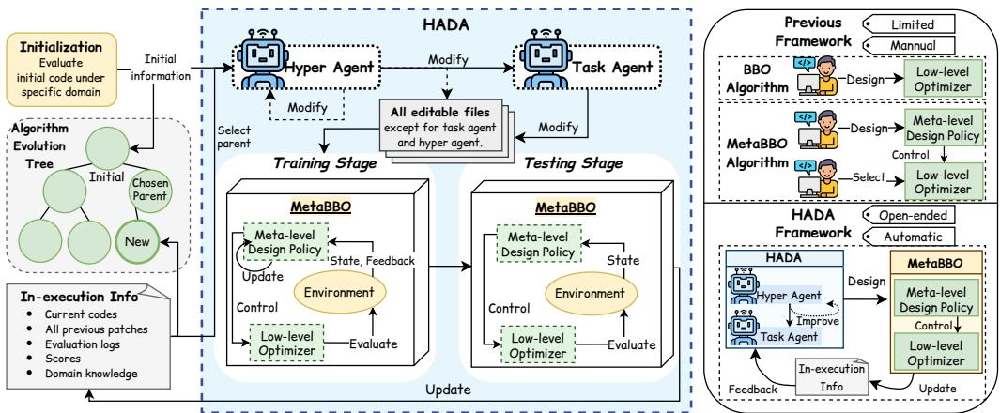
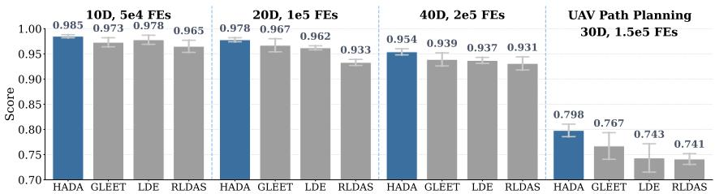
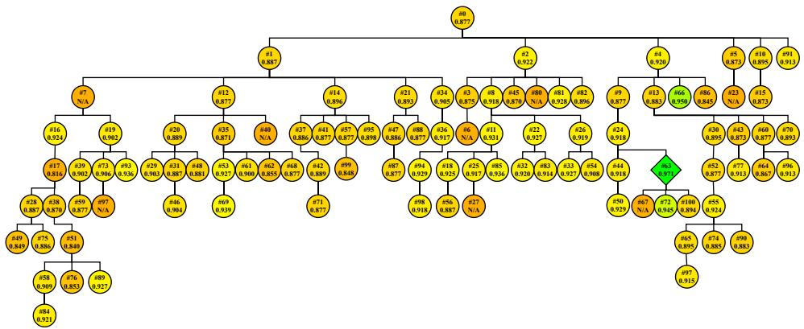
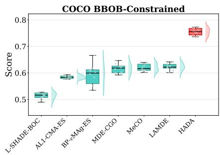
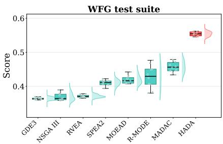
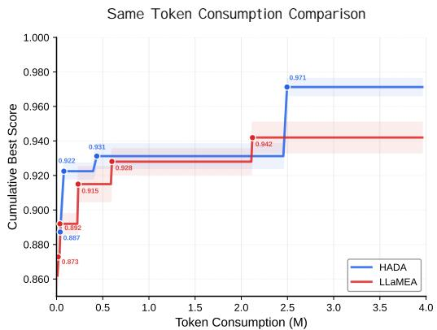
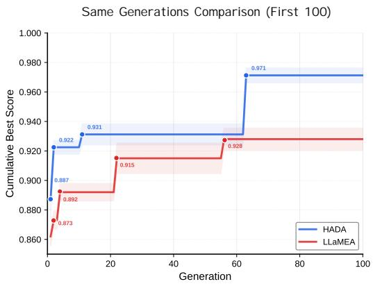

# HYPER ALGORITHM DESIGN AGENT: EVOLVING LEARNABLE OPTIMIZER FROM ZERO

Zipei Yu<sup>1</sup>, Yue-Jiao Gong<sup>1</sup>, Zeyuan Ma<sup>2,∗</sup> , Yuncheng Jiang<sup>2</sup>, Zhiguang Cao<sup>3</sup>

<sup>1</sup> South China University of Technology <sup>2</sup> South China Normal University

<sup>3</sup> Singapore Management Univeristy

{zipei540, gongyuejiao}@gmail.com, mzy@ieee.org ycjiang@scnu.edu.cn, zhiguangcao@outlook.com

## ABSTRACT

Meta-Black-Box Optimization (MetaBBO) is one of the highlights in the recent AI for Optimization trend. This paradigm’s bi-level workflow leverages the learnable algorithm design policy at meta level to ensure the performance and generalization improvement on the low-level optimization task. While MetaBBO helps advance the performance lower bound of the resulted optimization system, it is currently handcrafted and customized case by case to adapt different optimization problems, which inevitably introduces inherent subjectivity and hence restricts the performance upper bound and usability in practice. In this paper, we address this issue by regarding MetaBBO’s design loop as coding task, where we could introduce openendedness into MetaBBO with recursive self-improvement capability of advanced coding agents. Specifically, we propose a dual-agent framework: i) a task agent continuously refines the codebase of a target MetaBBO approach through code evolution; ii) a hyper agent progressively modifies the task agent and itself to provide open-ended design behavior; iii) the evolved MetaBBO codebase is evaluated and all in-execution information is fed back to the agents for recursive self-referential improvement. As a result, given a naive MetaBBO template, our framework automates a design evolution and finds novel variants superior to up-todate human-made MetaBBO baselines. Surprisingly, the experimental results also demonstrate that our framework supports fast adaption across different optimization domains. Solid interpretation analysis further reveals interesting design principles emerge in such open-ended process. This work serves as the first exploration on automating design of complex learning-assisted optimization algorithms.

## 1 INTRODUCTION

Automated Algorithm Design (AAD) has long been discussed in the optimization community (Hoos, 2012b; Stützle & López-Ibáñez, 2018; Zhao et al., 2024), and has recently attracted growing attention with the emergence of novel paradigms such as Meta-Black-Box Optimization (MetaBBO) (Ma et al., 2025b; Yang et al., 2025) and Large Language Model for Algorithm Design (LLM4AD) (Chauhan et al., 2027; Liu et al., 2026a). Despite diverse implementations, these paradigms share the same spirit: by introducing data-driven learning capabilities (reinforcement learning (Guo et al., 2024; Ma et al., 2024), self-supervised learning (Li et al., 2024; Wang et al., 2026a), in-context learning (Liu et al., 2024c; Van Stein & Bäck, 2024), etc.) into algorithm design, the resulting optimizers achieve robust performance gains and, more importantly, generalization across problems. This paper focuses on MetaBBO. MetaBBO adopts a bi-level learning-to-optimize architecture, where a neural network-based design policy (e.g., a reinforcement learning agent (Sutton et al., 1998)) at the meta level dictates online design choices for the low-level optimizer. With performance-centric metalearning over a problem distribution, the learned system appears to challenge the no-free-lunch (NFL) theorem (Wolpert et al., 1995; Wolpert & Macready, 1997).

However, is this true? Admittedly, MetaBBO reduces human reliance compared to traditional expert-driven design (e.g., dynamic algorithm configuration (Xue et al., 2022; Nguyen et al., 2026), algorithm selection (Niec et al., 2026; Shao et al., 2026), and algorithm generation (Guo et al., 2026)).´ Yet, as shown in the right part of Fig. 1, the MetaBBO system itself still depends heavily on human experience: selecting the low-level optimizer requires expertise in algorithm-problem performance analysis, and the meta-level pipeline introduces further hand-crafted designs (e.g., decision features, policy networks). Can we really resolve the NFL issue in MetaBBO? It motivates our work.

  
Figure 1: Left: The general workflow of our proposed HADA framework, which allows coordination between hyper agent and task agent for automatic MetaBBO design. Right: Essential differences between human-based design in BBO/MetaBBO and fully automated design in HADA.

Our solution is to introduce openendedness (Schmidhuber, 1987)—algorithmic systems pursuing never-ending innovation (Stanley, 2019; Lehman et al., 2023)—into MetaBBO. At its core lies a selfreferential, continual self-improvement mechanism, exemplified by Gödel machines (Schmidhuber, 2003) and later extended to self-reflective interpreters (Steunebrink & Schmidhuber, 2012) and LLM-assisted generative approaches (Zhang et al., 2026a;b).

Following this lead, we propose HADA (Hyper Algorithm Design Agent), the first framework to reduce MetaBBO’s reliance on human expertise. As shown in Fig. 1, HADA runs a search loop over the MetaBBO algorithm space. This poses two main challenges: how to represent the vast algorithmic space, and how to achieve open-ended and effective search. To address the first, we treat each MetaBBO algorithm as a sourcecodes project, reducing algorithm design to coding tasks that advanced coding agents (Bai et al., 2023; Liu et al., 2024a; Team et al., 2023) can readily operate on. For the second, we propose a closed-loop search paradigm based on a bi-agent system: a Task Agent designs better MetaBBO algorithms by editing the corresponding sourcecodes, while a Hyper Agent controls the Task Agent’s reasoning logic by editing Task Agent’s prompt file, and moreover, itself. This yields an open-ended, self-improving algorithm evolution process. Additionally, a tree-based editing history balances exploration and exploitation via weighted parent sampling, and unified in-execution information makes HADA domain-agnostic. With these designs, HADA autonomously discovers novel MetaBBO algorithms. We summarize our major contributions as follows:

• Paradigm Innovation: As shown in the right side of Fig. 1, HADA introduces significant paradigm shift: the bi-agent open-ended self-improvement paradigm prevents MetaBBO from being stuck with labor-intensive meta/lower level design.

• Coherent Methodology: We have carefully designed each part in HADA. This includes but not limited to the proposed open-ended bi-agent union, the code level recursive evolution pipeline, the tree-based history maintenance etc. The overall methodology holds both simplicity and exceptional capability.

• Performance Breakthrough: Given a naive MetaBBO baseline (a “zero” one) as the start point, HADA successfully evolved high-performance MetaBBO variants for three optimization domain: single-objective, constrained, multi-objective problems, achieving 121.7%, 114.7% and 104.3% performance leap compared to existing state-of-the-art baselines respectively. With the openendedness, HADA also supports cold-start adaption either for cross-domain scenario or from off-the-shelf baselines in practice.

• Clear Reproducibility: We opensource HADA’s codebase, the sourcecodes and neural parameters of the discovered MetaBBO algorithms at https://github.com/MetaEvo/ HADA-AAD, for the ease of future users.

## 2 RELATED WORKS

## 2.1 META-BLACK-BOX OPTIMIZATION

The ambition of AAD predates modern machine learning. Early works—algorithm selection (Rice, 1976), hyper-heuristics (Burke et al., 2013), Programming by Optimisation (PbO) (Hoos, 2012a), and automated algorithm configuration (Hutter et al., 2019)—share the AAD premise: algorithms are objects to be searched over rather than hand-crafted artifacts. However, they operate over fixed design spaces and target only a single (or a few) problem instance(s). MetaBBO (Ma et al., 2025b; Yang et al., 2025) is a recent AAD avenue whose key advantage is generalization: it integrates a training problem distribution $\mathcal { P }$ into a bi-level learning-assisted optimization architecture. With the meta-level design policy parameterized as $\pi _ { \theta } .$ , the meta-learning objective is formulated as:

$$
\mathcal { I } ( \theta ) = \mathbb { E } _ { p \in \mathcal { P } } \sum _ { t = 1 } ^ { T } \mathcal { R } ( s _ { t } , \pi ( s _ { t } ; \theta ) | p ) ,\tag{1}
$$

where $T$ is the optimization horizon, $s _ { t }$ is the state abstracted from the t-th optimization step of instance $p ,$ and $\mathcal { R } ( \cdot )$ is the performance improvement induced by the design $\tau ( s _ { t } ; \theta )$ . The policy $\pi _ { \theta }$ is trained to maximize expected performance over ${ \mathcal { P } } _ { : }$ , directly addressing the expert dependence of hand-crafted optimizers.

Recent years have seen a broad spectrum of MetaBBO algorithms, which fall into four lines by training strategy: 1) RL-based, modeling algorithm design as a Markov Decision Process (Liu et al., 2026b; He et al., 2026; Guo et al., 2026; Ma et al., 2024; Guo et al., 2024) and training the meta-level policy with Q-learning (Mnih et al., 2013) or Policy Gradient (Schulman et al., 2017); 2) pretrained optimization models, representing optimization dynamics with neural networks trained by supervised (Li et al., 2024; Han et al., 2026) or unsupervised (Wang et al.; 2025; 2026b) performance signals; 3) LLM-based, adopting LLMs as the meta-level policy and exploiting their in-context learning for iterative design (Romera-Paredes et al., 2024; Novikov et al., 2025; Liu et al., 2024b; Ye et al., 2024; Van Stein & Bäck, 2024; Chauhan et al., 2027; Li et al., 2026b); and 4) neuroevolution-based, replacing RL with an evolution optimizer to train the meta-level policy (Lange et al., 2023; 2022; Faldor et al., 2025a; Chen et al., 2025; Yu et al., 2026a). Beyond single-objective problems, MetaBBO has been extended to expensive (Jin et al., 2026; Du et al., 2026; Yu et al., 2026b), multi-objective (Shao et al., 2026), dynamic (Gao et al., 2026), multitask (Wu et al., 2025; Zhan et al., 2026), and large-scale optimization (Qiu et al., 2026a;b; Tian et al., 2025), alongside efforts on optimization state learning (Kerschke & Trautmann, 2019a;b; Seiler et al., 2025; Ma et al., 2025a; Liu et al., 2026b), benchmarking platforms (Ma et al., 2023; 2026c; Liu et al., 2025), and test case generation (Wang et al., 2026c;d; Skvorc et al., 2026). These algorithms, however, still more or less demand deep expertise in designing their meta-level policies or low-level optimizers, which motivates us to automate the design of MetaBBO itself.

## 2.2 OPENENDEDNESS

Open-endedness originates in artificial life, aiming to reproduce in silico the unbounded novelty generation of biological evolution (Packard et al., 2019; Dharna et al., 2026; Hughes et al., 2024). The Gödel machine (Schmidhuber, 2003; Steunebrink & Schmidhuber, 2012) first conceptualized a fully self-referential solver that rewrites its own code once an optimal proof searcher proves the rewrite increases expected utility, yet a feasible implementation remained elusive until the advent of powerful LLM agents. Evolution through Large Models (ELM) uses code-trained LLMs as intelligent mutation operators to bootstrap programs into new domains (Lehman et al., 2023), with similar ideas in OMNI and OMNI-EPIC for human-aligned interestingness (Zhang et al., 2024; Faldor et al., 2025b) and Voyager in embodied intelligence (Wang et al., 2023). However, the agent in such systems does not recursively rewrite its own improvement machinery, tightening the potential exploratory space. Later works such as the Darwin Gödel Machine (Zhang et al., 2026a) relaxes the proof requirement to empirical validation. Recently, Hyperagents (Zhang et al., 2026b) and Gödel Agent (Yin et al., 2025)

further make the meta-level modification procedure itself editable, yielding fully open-ended systems with cross-domain performance gains. For a more detailed understanding, we suggest the survey on recursive self-improvement systems (Li et al., 2026a). HADA is developed under the umbrella of such recursive systems.

## 3 METHODOLOGY

As we discussed before, to introduce openendedness into design process of a MetaBBO algorithm, we propose Hyper Algorithm Design Agent (HADA), which is based on LLM coding agents and allows open-ended self-improvement. In this section, we detail each algorithmic component of HADA, and show how HADA runs its workflow in a simple and elegant way, with minimal human inputs.

## 3.1 OVERALL WORKFLOW

The overall workflow of HADA is illustrated in Fig. 1. For completeness, we further provide the pseudocode of HADA in Alg. 1. HADA takes two types of inputs: 1) a target MetaBBO project, which comprises the source code of key components in a MetaBBO algorithm, including the meta-level policy, low-level optimizer, optimization problem set, training logic, and evaluation protocol—denoted as M; and 2) hyper & task agents, i.e., two LLM-based coding agents $\mathbb { A } _ { h y p e r }$ and $\mathbb { A } _ { t a s k }$ that specialize in open-ended improvement and task solving, respectively. The output of HADA is a carefully evolved MetaBBO project M<sup>∗</sup>, which is obtained through iterative evolutionary modifications driven by $\mathbb { A } _ { h y p e r }$ and $\mathbb { A } _ { t a s k }$ , thereby attaining the best achievable optimization perfor mance on the corresponding tasks. Notably, all inputs and outputs of HADA are treated as editable source code files.

At the initialization phase, HADA first instantiates an algorithm evolution tree AET which uses a tree-based structure to save MetaBBO evolution history. An initial MetaBBO project $\mathbb { M } ^ { ( 0 ) }$ is first evaluated by executing its sourcecodes, training the meta-level policy and testing the resulted optimization performance on its target benchmark. A structured in-execution information Info is then constructed to include current codes, previous patches, execution logs, performance scores etc. Then $\mathbb { M } ^ { ( 0 ) }$ and its Info are recorded by AET. After the initialization, HADA triggers an open-ended MetaBBO design loop by first sampling a parent node from AET (the sampling strategy is detailed in next section). Given the codes and Info of the sampled parent project, hyper agent and task agent $( \mathbb { A } _ { h y p e r }$ and $\mathbb { A } _ { t a s k } )$ follow a sequential operation order to evolve HADA system:

STEP 1: the hyper agent $\mathbb { A } _ { h y p e r }$ is granted full access to all editable files, including both the MetaBBO project and the agent files. Conditioned on comprehensive in-execution information<sup>1</sup>, $\mathbb { A } _ { h y p e r }$ reasons about and modifies the agent files that specify how the hyper & task agents operate<sup>2</sup>. A key aspect of this modification cycle is that the hyper agent is permitted to access and modify itself. While modifying the task agent already unlocks potential improvements to the MetaBBO design, this self-modification opens the door to open-endedness, endowing HADA with a remarkable capability for novelty search.

STEP 2: Modified by $\mathbb { A } _ { h y p e r }$ , the task agent $\mathbb { A } _ { t a s k }$ is allowed to access only the MetaBBO project, and uses the modified thinking pattern to modify that project for potential improvement. Once this Hyper-to-Task pipeline ends, the resulted new MetaBBO project undergoes the same evaluation as $\mathbb { M } ^ { ( 0 ) }$ , and AET inserts this project and its in-execution information into the evolution history, as the child of the parent project. This pipeline loops for H steps for continual recursive self-improvement. We next further elaborate the technical detail within this workflow.

## 3.2 DESIGN COMPONENTS

MetaBBO Project. In HADA, a MetaBBO project M is basically a formal Python project like any project in your PyCharm or VS Code. Despite the cumbersome dependency files and package management files, to core of a MetaBBO project includes four types of files. According to existing standard MetaBBO benchmark platforms (Ma et al., 2023; 2026c), these files are: 1) Meta-level policy, where the neural network architecture, inference logic, rollout pipeline of the policy are detailed; 2) Low-level optimization environment, which is the composition of an evolutionary optimizer and an optimization problem instance. As we described in Sec. 2.1, the low-level optimization dynamic is controlled by the meta-level policy through learning; 3)Training logic, which clarify how the meta-level policy is trained given the feedback signals from the low-level optimization, and also indicate the training problem set (P in Eq. (1)); 4) Testing procedure, which evaluate the optimization performance of the trained MetaBBO on the testing problem set. For each tested instance, normally multiple independent runs are needed to reduce experimental variance. HADA allows the coding agents possess holistic perception field and operational permission, which is particularly superior to human experts when the project is huge.

Algorithm 1: Hyper Algorithm Design Agent   
Input: Initial MetaBBO project M<sup>(0)</sup>, hyper & task agent $\left\{ \mathbb { A } _ { h y p e r } , \mathbb { A } _ { t a s k } \right\}$ , budget H.   
Output: Optimal MetaBBO project M<sup>∗</sup>.   
/\*Initialization\*/   
Initialize algorithm evolution tree: AET = ∅ ;   
Evaluate the in-execution information: Info $\boldsymbol { \mathbf { \ell } } = \mathbb { M } ^ { ( 0 ) }$ .evaluate() ;   
AET records the project: AET.insert ${ \mathrm { : } } ( \mathbb { M } ^ { ( 0 ) }$ , Info) ;   
/\*Open-ended MetaBBO design loop\*/   
for h = 1 to H do   
Sample a parent project from history: $\mathbb { M } ^ { ( h ) }$ , Info $( \mathbb { M } ^ { ( h ) } ) = \mathbf { A } \mathbf { E } \mathbf { T }$ .sample() ;   
/\*Hyper-to-Task editing workflow\*/   
Hyper agent improves task agent and itself:   
$\left\{ \mathbb { A } _ { h y p e r } , \mathbb { A } _ { t a s k } \right\} = \mathbb { A } _ { h y p e r }$ .modify({A<sub>hyper</sub>, A<sub>task</sub>}|Info(M<sup>(h)</sup>);   
Task agent improves MetaBBO: $\mathbb { M } ^ { ( h ) } = \mathbb { A } _ { t a s k }$ .modify $\lceil \mathbb { M } ^ { ( h ) } \rceil$ |Info(M<sup>(h)</sup>)) ;   
/\*Evaluate the modified MetaBBO\*/   
Evaluate the in-execution information: Info $\boldsymbol { \mathbf { \ell } } = \mathbb { M } ^ { ( h ) }$ .evaluate() ;   
/\*Update evolution history\*/   
AET.inser $: ( \mathbb { M } ^ { ( h ) }$ , Info) ;   
return AET.optimal() ;

In-execution Information. In each evolution step h, once the two coding agents finishes the modification on the sampled parent MetaBBO project, a new child project $\mathbb { M } ^ { ( h ) }$ To attain a comprehensive and objective feedback that could reflect how much the design of the MetaBBO project is improved, we stipulate a dictionary-like in-execution information object Info, which thoroughly profiles the timely state of $\mathbb { M } ^ { ( h ) }$ . Specifically, Info includes: 1) The current sourcecodes of $\mathbb { M } ^ { ( h ) }$ ; 2) All patches made by the coding agents; 3) Domain knowledge generated by the coding agents, which records the definition, problem property and solving experiences on the target optimization domain; 4) Evaluation logs that report intermediate logging data during the MetaBBO’s training and testing; 5) Scores, which include a group of per-run scores $\{ \{ \mathbf { P e r f } _ { i , j } \} _ { i = 1 } ^ { N } \} _ { j = 1 } ^ { M } .$ where the MetaBBO is tested across N testing problems for M independent runs, and an aggregated score Perf averages these per-run scores. We leave the scoring detail in the next paragraph.

Unified Performance Evaluation. A key challenge for a universal optimization system is its compatibility across different optimization domains or problems. One can imagine that for two different problems, their optimal values, landscapes and objective scales are quite distinct. This issue may misleads the coding agents in HADA when they face different optimization tasks. To address this, we introduce an additional normalization trick. Specifically, suppose we are doing minimization, the per-run score $\mathbf { P e r f } _ { i , j }$ is computed as $\frac { f _ { i , j } ^ { 0 } - f _ { i , j } ^ { T } } { f _ { i , j } ^ { 0 } - f _ { i } ^ { * } }$ , where $f _ { i } ^ { * }$ is the optimal value of i-th testing problems, and $f _ { i , j } ^ { t }$ is the best-so-far objective value at t-th optimization step. We scale the performance score to $0 { - } \widetilde { 1 }$ for different target problems in different MetaBBO projects. For a MetaBBO project with syntax error or runtime error during the evaluation, we set its Perf as NA.

Algorithm Evolution Tree. The algorithm evolution tree AET resembles git management workflow with a simpler structure. When a newly modified MetaBBO project needs to be saved into AET,

HADA puts it under the parent project sampled before (see a complete AET in Fig. 3). To sample a parent project from AET, we borrow the idea from Zhang et al. (2026a; 2026b), where parent selection is based on each agent’s performance score and its number of children. This strategy focuses on the promising and less explored node, while addresses exploration & exploitation tradeoff in general cases. Each node has a non-zero selection probability to ensure the search diversity. For those nodes with NA score, we do not allow sample them to avoid computational resource waste.

Hyper & Task Agent. The hyper agent $\mathbb { A } _ { h y p e r }$ and the task agent $\mathbb { A } _ { t a s k }$ are closely tied while serve for distinct roles. For the task agent, the core task is to follow the modification suggestions from the hyper agent and refine the sampled parent MetaBBO project correspondingly. For the hyper agent, its core task, instead, is to provide openendedness into the whole HADA system by modifying not only the task agent (how to improve) but also itself (thinking of how to improve). We leave the prompts of $\mathbb { A } _ { h y p e r }$ and $\mathbb { A } _ { t a s k }$ at Appendix B,where we show the initial prompts and final prompts after HADA’s open-ended evolution. This recursive self-improvement in $\mathbb { A } _ { h y p e r }$ and $\mathbb { A } _ { t a s k }$ also helps them reduce the risk of sensitive prompt (Razavi et al., 2025; Zhuo et al., 2024).

## 4 EXPERIMENTAL RESULTS

## 4.1 EXPERIMENTAL SETTINGS

HADA. In our main experiments, during the evolution process, HADA evaluates the MetaBBO project by training it with 5 epochs and testing the trained policy on test set for 5 independent runs (serve as proxy evaluation for saving resources). After the evolution, the finally obtained MetaBBO project is trained for 20 epochs and tested for 10 independent runs (serve as official evaluation). We set the evolution horizon of HADA as 100. We adopt DeepSeek-V4-Pro<sup>3</sup> as the LLM backbone for both the hyper agent and task agent, we set its maximal output length as 2e4.

Testbeds. The experiments involve four diverse optimization domains: 1) Single Objective Optimization, where the 24 synthetic instances (20D, 1e4 FEs) with random rotation and shift in COCO-BBOB testsuite (Hansen et al., 2021) are used as target problem distribution P; 2) Constrained Optimization, where the 54 synthetic nonlinear constrained instances (20D, 1e4 FEs) in COCO-constrained testsuite (Dufossé et al., 2022) are used. For these constrained problems, the per-run score Perf is set to 0 if no feasible solution is found, otherwise it is set to the objective value finally achieved; 3) Multi Objective Optimization, where we use the nine 5-objective instances of WFG functions (Huband et al., 2006) (WFG1-WFG9, 28D, 2e3 FEs) as the target problems, and use the normalized hypervolume as the per-score; 4) Realistic UAV Planning, where we use a recently proposed benchmark (Shehadeh & Kudela, 2025) as the target problems. Specifically, we use its implementation in MetaBox-v2 (Ma et al., 2026c) and instantiate 56 instances (30D, 1.5e5 FEs). These highly constrained UAV path planning problems are transformed into single objective problem by weighted-sum trick in MetaBox-v2. The concrete train-test split for the mentioned testsuites can be found in our project.

Baselines. For single objective scenarios COCO-BBOB and UAV planning, we consider following baselines: human-crafted BBO algorithms DE (Das & Suganthan, 2010), SHADE (Tanabe & Fukunaga, 2013), JDE21 (Brest et al., 2021), MADDE (Biswas et al., 2021) and CMAES (Hansen & Ostermeier, 2001); MetaBBO algorithms LDE (Sun et al., 2021), RL-DAS (Guo et al., 2024), GLEET (Ma et al., 2024). For constrained optimization, we compare human-crafted baselines L-SHADE-BOC (Kawachi et al., 2019), AL1-CMA-ES (Dufossé & Atamna, 2022), BP-ϵMAg-ES (Hellwig & Beyer, 2020), MDE-CGO (Bai et al., 2025); MetaBBO algorithm MeCO (Ma et al., 2026b) and LAMDE (Ma et al., 2026a). For multi-objective optimization, we compare human-crafted baselines GDE3 (Kukkonen & Lampinen, 2005), NSGAIII (Deb & Jain, 2013), RVEA (Cheng et al., 2016), SPEA2 (Zitzler et al., 2001), MOEA/D (Zhang & Li, 2007), R-MODE (Singh & Srivastava, 2016); MetaBBO algorithms MADAC (Xue et al., 2022). We connect HADA with MetaBox-v2 to attain the implementation of these baselines. We also conducted hybrid search on their hyperparameters to attain optimal performance for comparison, see Appendix C for details. All experiments are performed on a machine with 8-core Intel(R) Xeon(R) Platinum CPU and 16GB RAM.

Table 1: Final performance on held-out BBOB functions (1/2). Each cell reports the mean ± standard deviation over independent runs. Column bests are shaded and bold; runners-up are underlined.
<table><tr><td></td><td>Method</td><td> $f _ { 3 }$ </td><td> $f _ { 4 }$ </td><td> $f _ { 6 }$ </td><td> $f _ { 7 }$ </td><td> $f _ { 9 }$ </td><td> $f _ { 1 3 }$ </td><td> $f _ { 1 4 }$ </td><td> $f _ { 1 6 }$ </td></tr><tr><td></td><td>DE</td><td>0.8773±0.0355</td><td>0.9068±0.0181</td><td>0.9999±0.0000</td><td>0.9706±0.0073</td><td>0.9997±0.0001</td><td>0.9636±0.0101</td><td>0.9981±0.0006</td><td>0.4208±0.0968</td></tr><tr><td>BO</td><td>SHADE</td><td>0.8639±0.0403</td><td>0.8898±0.0186</td><td>0.9999±0.0000</td><td>0.9884±0.0047</td><td>0.9998±0.0001</td><td>0.9810±0.0073</td><td>0.9990±0.0003</td><td>0.4201±0.1345</td></tr><tr><td></td><td>JDE21</td><td>0.9705±0.0110</td><td>0.9756±0.0084</td><td>0.9999±0.0000</td><td>0.9844±0.0051</td><td>0.9997±0.0001</td><td>0.9887±0.0045</td><td>0.9992±0.0006</td><td>0.4619±0.1208</td></tr><tr><td></td><td>MADDE</td><td>0.8892±0.0261</td><td>0.9151±0.0208</td><td>1.0000±0.0000</td><td>0.9872±0.0045</td><td>0.9997±0.0001</td><td>0.9814±0.0049</td><td>0.9967±0.0014</td><td>0.6200±0.1116</td></tr><tr><td></td><td>CMAES</td><td>0.9652±0.0254</td><td>0.9665±0.0074</td><td>1.0000±0.0000</td><td>0.9993±0.0011</td><td>0.8289±0.1400</td><td>0.9999±0.0001</td><td>1.0000±0.0000</td><td>0.5169±0.1912</td></tr><tr><td></td><td>RL-DAS</td><td>0.9362±0.0104</td><td>0.9098±0.0167</td><td>1.0000±0.0000</td><td>0.9971±0.0006</td><td>0.9999±0.0000</td><td>0.9452±0.0040</td><td>0.9970±0.0013</td><td>0.6296±0.0596</td></tr><tr><td></td><td>DQN-DE</td><td>0.9348±0.0462</td><td>0.9751±0.0192</td><td>0.9999±0.0000</td><td>0.9557±0.0199</td><td>0.9981±0.0019</td><td>0.9478±0.0091</td><td>0.9724±0.0229</td><td>0.6620±0.0446</td></tr><tr><td>MBO</td><td>LDE</td><td>0.8668±0.0389</td><td>0.8644±0.0279</td><td>0.9999±0.0000</td><td>0.9869±0.0061</td><td>0.9994±0.0002</td><td>0.9249±0.0143</td><td>0.9899±0.0046</td><td>0.6005±0.0648</td></tr><tr><td></td><td>GLEET</td><td>0.8578±0.0429</td><td>0.8707±0.0137</td><td>0.9999±0.0001</td><td>0.9837±0.0082</td><td>0.9995±0.0003</td><td>0.9794±0.0167</td><td>0.9967±0.0045</td><td>0.8409±0.0474</td></tr><tr><td></td><td>HADA</td><td>0.9938±0.0032</td><td>0.9925±0.0027</td><td>1.0000±0.0000</td><td>0.9979±0.0015</td><td>0.9999±0.0000</td><td>0.9985±0.0016</td><td>1.0000±0.0000</td><td>0.8631±0.0696</td></tr></table>

Table 2: Final performance on held-out set (2/2), last column denotes average across all.
<table><tr><td></td><td>Method</td><td> $f _ { 1 7 }$ </td><td> $f _ { 1 8 }$ </td><td> $f _ { 1 9 }$ </td><td> $f _ { 2 0 }$ </td><td> $f _ { 2 1 }$ </td><td> $f _ { 2 2 }$ </td><td> $f _ { 2 3 }$ </td><td> $f _ { 2 4 }$ </td><td> $\operatorname { A v g } .$ </td></tr><tr><td></td><td>DE</td><td>0.9338±0.0178</td><td>0.9095±0.0143</td><td>0.7691±0.0256</td><td>0.9999±0.0000</td><td>0.9041±0.0575</td><td>0.9386±0.0742</td><td>0.4811±0.1418</td><td>0.7134±0.0275</td><td>0.8618±0.0141</td></tr><tr><td></td><td>SHADE</td><td>0.8935±0.0309</td><td>0.8983±0.0207</td><td>0.7686±0.0330</td><td>0.9999±0.0000</td><td>0.9322±0.0579</td><td>0.9755±0.0004</td><td>0.4063±0.1562</td><td>0.7233±0.0328</td><td>0.8594±0.0132</td></tr><tr><td>BO</td><td>JDE21</td><td>0.8827±0.0411</td><td>0.9157±0.0405</td><td>0.7351±0.0368</td><td>1.0000±0.0000</td><td>0.9424±0.0596</td><td>0.9726±0.0063</td><td>0.4567±0.0799</td><td>0.6997±0.0315</td><td>0.8741±0.0129</td></tr><tr><td></td><td>MADDE</td><td>0.8541±0.0407</td><td>0.8757±0.0253</td><td>0.7887±0.0294</td><td>0.9999±0.0000</td><td>0.9963±0.0060</td><td>0.9746±0.0009</td><td>0.4601±0.1062</td><td>0.6555±0.0243</td><td>0.8748±0.0138</td></tr><tr><td></td><td>CMAES</td><td>0.9994±0.0005</td><td>0.9990±0.0006</td><td>0.0415±0.0364</td><td>0.9999±0.0000</td><td>0.9395±0.0750</td><td>0.9602±0.0454</td><td>0.5451±0.1624</td><td>0.6221±0.0314</td><td>0.8342±0.0113</td></tr><tr><td></td><td>RL-DAS</td><td>0.8955±0.0074</td><td>0.8889±0.0150</td><td>0.8188±0.0148</td><td>1.0000±0.0000</td><td>0.8635±0.0438</td><td>0.9570±0.026</td><td>0.4872±0.2016</td><td>0.7172±0.0229</td><td>0.8779±0.0131</td></tr><tr><td>MeBO</td><td>DQN-DE</td><td>0.9565±0.0321</td><td>0.7772±0.0444</td><td>0.7965±0.0278</td><td>1.0000±0.000</td><td>0.9454±0.0195</td><td>0.9584±0.0492</td><td>0.5748±0.1505</td><td>0.6730±0.042</td><td>0.8831±0.0124</td></tr><tr><td></td><td>LDE</td><td>0.8588±0.0359</td><td>0.8676±0.0271</td><td>0.7795±0.0411</td><td>0.9999±0.0000</td><td>0.9218±0.0512</td><td>0.9719±0.0045</td><td>0.5062±0.1027</td><td>0.6945±0.0309</td><td>0.8652±0.0053</td></tr><tr><td></td><td>GLEET</td><td>0.8491±0.0469</td><td>0.8316±0.0562</td><td>0.8200±0.0337</td><td>0.9999±0.0000</td><td>0.9346±0.0680</td><td>0.9432±0.0662</td><td>0.5924±0.1216</td><td>0.8017±0.0508</td><td>0.8942±0.0086</td></tr><tr><td></td><td>HADA</td><td>0.9953±0.0023</td><td>0.9818±0.0096</td><td>0.9382±0.0326</td><td>1.0000±0.0000</td><td>0.9358±0.0823</td><td>0.9420±0.1079</td><td>0.9189±0.0257</td><td>0.9175±0.0229</td><td>0.9674±0.0078</td></tr></table>

## 4.2 ALGORITHM DESIGN CAPABILITY (RQ1)

We validate whether HADA truly enables open-ended algorithm design in this section. Specifically, we focus on single-objective optimization scenario and prepare a naive MetaBBO backbone as the initial MetaBBO project M<sup>(0)</sup> for HADA. Its meta-level is a DQN Mnih et al. (2013) policy that simply configures F and $C r$ of low-level DE optimizer. We term this backbone as DQN-DE and provide its full details at Appendix A. Table 1 and Table 2 present the final per-run performance scores of the best MetaBBO project obtained from HADA and the baseline algorithms across the testing instances in COCO-BBOB set. Following key observations can be concluded:

1) Overall (see the last column in Table 2), MetaBBOs generally outperform handcrafted BBOs, confirming that meta-learning mitigates the expertise needs of traditional BBOs. More importantly, HADA achieves a significant performance leap over existing MetaBBOs: using the worst-performing CMAES as baseline, HADA improves upon the SOTA MetaBBO (GLEET) by 121.7%, which we attribute to its efficient automated workflow and open-ended algorithm evolution. Furthermore, HADA consistently outperforms LLaMEA (Van Stein & Bäck, 2024), the SOTA LLM-based algorithm design framework (results in Appendix D, Fig. 5 due to space limit).;

2) We can also observe that either the BBOs and the MetaBBOs show biased performance on different problems. Such performance distribution imbalance exactly reflect the subjectivity of their humanbased designs behind. The developers of these algorithms easily introduce design bias based on their own experiences. Instead, HADA’s automated self-improvement loop ensures an objective and comprehensive search. Hence, HADA achieves more generally good performance;

3) We especially would like to discuss the optimization under challenging cases. It can be observed both BBOs and MetaBBOs perform relatively bad on $f _ { 1 9 } , f _ { 2 3 }$ and $f _ { 2 4 }$ , which are Griewank-Rosenbrock, Katsuura and Lunacek bi-Rastrigin problems. These problems feature highly compositional landscapes that challenge the learning capability of MetaBBOs. In such situation, HADA is still capable of evolving a MetaBBO variant with robust optimization performance, this is a clear evidence for the open-ended potential in HADA.

  
Figure 2: Out-of-distribution generalization comparison under diverse scenarios.

## 4.3 GENERALIZATION TEST (RQ2)

Recall that the core motivation of MetaBBO researches is to enhance the generalization ability across different problems. Due to this, it is necessary to compare the generalization performance of HADA and existing MetaBBO baselines, to validate the MetaBBO variant proposed by HADA does not sacrifice general solving ability for overfitting a specific problem settings. To this end, we test our HADA and the other three MetaBBO baselines (trained in Sec. 4.2) on four different problem settings: three COCO-BBOB settings and a realistic UAV path planning scenario. In this case, the meta-level policies in the baselines are directly zero-shot to the test set without fine-tuning. We report in Fig. 2 the averaged performance score Perf on the four different out-of-distribution generalization settings. The results demonstrate that HADA’s open-ended design does not overfit easily.

## 4.4 INTERPRETATION ANALYSIS (RQ3)

Another key research question is how to open the “black-box” of HADA. That is, given the state-of the-art performance achieved by HADA in the previous two sections, what is the core thinking and steps HADA uses to design MetaBBO algorithm? In this section, we look into this by reviewing the evolution process of HADA on single-objective optimization scenario. We illustrate the complete algorithm evolution tree AET during the open-ended process in Fig. 3, where #xx denotes the evolution step a node is saved into AET and the numerical value is the corresponding Perf. We abstract several key nodes in this tree to interpret HADA’s design philosophy:

  
Figure 3: A complete algorithm evolution tree for single-objective domain.

1) Step #4 (0.877 → 0.920): The hyper agent first revises the task agent’s prompt to enforce low-level optimizer replacement (with domain guidance), encourage more substantial structural adjustments, and specify four implementation templates together with a standard verification protocol. The task agent then modifies the optimizer accordingly, yielding a SHADE-like variant.

2) Steps #9, #24 (0.920 → 0.877 → 0.918): At these steps, the performance of the searched MetaBBO variants falls short of expectations. In response, the hyper agent strictly prohibits the task agent from making minor or irrelevant code modifications, and attempts to formally define what constitutes structural novelty in an optimizer. It further refines its own instructions by adding explicit principles for proposing novel algorithms. The task agent then acts accordingly: it first rolls back (#9) and subsequently explores a new direction (#24).

3) Steps #19, #49, #53: In these intermediate steps, HADA shifts its focus toward meta-level learning design within the MetaBBO project, e.g., normalization tricks for optimization-state scale stability, optimization-state augmentation to support diverse optimization behaviors, and modifications to the DQN policy network to enlarge the algorithm design space.

4) Step #63 (0.918 → 0.971): Building on the explorations of all previous steps, HADA reaches an “Aha Moment” at this step. The hyper agent first modifies itself to enforce systematic inspection of patch files and the detection of genuinely novel designs. It then rewrites the task agent’s prompt with two new directions: the meta-level policy should incorporate optimization progress information to reduce learning difficulty, and the low-level optimizer should integrate local search with different optimizers, such as PSO or ES variants.

From this detailed analysis, we observe that HADA benefits from its open-ended code-editing ability and progressively improves both the MetaBBO algorithm and the agent’s own reasoning through deliberate decisions. We release the complete evolution logs in our source code and welcome further analysis of this intriguing data.

## 4.5 CROSS-DOMAIN ADAPTION (RQ4)



  
Figure 4: Cross-domain adaption results of HADA on two diverse scenarios.

In this section, we evaluate HADA’s adaptability beyond the single-objective domain studied so far. We select two representative optimization domains: constrained optimization (Dufossé et al., 2022) and multi-objective optimization (Huband et al., 2006), and run the HADA evolution loop (Alg. 1) under the settings of Sec. 4.1, initializing the MetaBBO project M<sup>(0)</sup> as the optimal M<sup>∗</sup> from Sec. 4.1 to reflect knowledge transfer. Fig. 4 reports the mean and std of per-run scores Perf for HADA and the BBO/MetaBBO baselines. The results show that HADA’s knowledge on designing singleobjective algorithms transfers positively to these domains, and with proper adaptation, the resulting MetaBBO variant can even outperform state-of-the-art domain-specific baselines.

Due to the space limitation, we provide several ablation studies on our HADA to demonstrate our design choices are proper, which can be found at Appendix D.

## 5 CONCLUSION

To summarize this paper, we would like to first clarify that this paper is well motivated by two key aspects: 1) With various researches applying LLMs for optimization problem solving, LLMs’ open-ended potential in such tasks is under-explored; 2) More importantly, given the generalization potential of learning-assisted optimization techniques such as MetaBBO, its dependence on humanbased design remains a problem. To this end, we propose HADA as an initial exploration to introduce openendedness into MetaBBO’s design process. With the advanced coding capability in recent LLM agents, HADA adopts a bi-agent system to achieve recursive design improvement, where a task agent aims to improve MetaBBO’s design, a hyper agent is allowed to modify the thinking logic of the task agent and itself to recursively improve the thinking of how to improve. We also carefully engineer the evolution history management and unified evaluation interface to ensure effective algorithm discovery and versatility in practice respectively. Through systematic experiments, we demonstrate that openendedness is truly a key to novel MetaBBO design. Nevertheless, HADA shows several promising future improvements. First, at its current version, we set HADA’s searching behavior by the simple heuristic rule that balances the tradeoff between exploitation and exploration. Future work could explore more recent alternatives (Silver et al., 2016; Ding et al., 2025), or let the hyper agent creates new ones. Second, in this paper we mainly focus on the usage of HADA in continuous optimization domains, a very interesting future work is to explore HADA on learning-assisted combinatorial optimization techniques such as Neural Combinatorial Optimization (NCO) (Ma et al., 2021; Gui et al., 2026; Yi et al., 2026). In the end, we authors would like to sincerely appreciate the emergence of the current agent world, which makes us long for a wonderful future of optimization.

## REFERENCES

Jinze Bai, Shuai Bai, Yunfei Chu, Zeyu Cui, Kai Dang, Xiaodong Deng, Yang Fan, Wenbin Ge, Yu Han, Fei Huang, et al. Qwen technical report. arXiv preprint arXiv:2309.16609, 2023.

Yu Bai, Pei-Fa Sun, Tian-Hong Wang, Bing Sun, Wei-Jie Yu, Jing-Hui Zhong, Guo-Huan Song, Sang-Woon Jeon, Sam Tak Wu Kwong, and Jun Zhang. Uav path planning for data collection from wireless sensor network with matrix-based evolutionary computation. IEEE Transactions on Intelligent Transportation Systems, 2025.

Subhodip Biswas, Debanjan Saha, Shuvodeep De, Adam D Cobb, Swagatam Das, and Brian A Jalaian. Improving differential evolution through bayesian hyperparameter optimization. In IEEE Congress on Evolutionary Computation (CEC), 2021.

Janez Brest, Mirjam Sepesy Maucec, and Borko Boškoviˇ c. Self-adaptive differential evolution´ algorithm with population size reduction for single objective bound-constrained optimization: Algorithm j21. In 2021 IEEE Congress on Evolutionary Computation (CEC), 2021.

Edmund K. Burke, Michel Gendreau, Matthew Hyde, Graham Kendall, Gabriela Ochoa, Ender Ozcan, and Rong Qu. Hyper-heuristics: A survey of the state of the art. Journal ofthe Operational Research Society, 64(12):1695–1724, 2013.

Dikshit Chauhan, Bapi Dutta, Indu Bala, Niki van Stein, Thomas Bäck, and Anupam Yadav. Large language models and evolutionary computation: A critical review of bidirectional interaction, automated algorithm design, and co-adaptive systems. Computer Science Review, 2027.

Minyang Chen, Chenchen Feng, and Ran Cheng. Metade: Evolving differential evolution by differential evolution. IEEE Transactions on Evolutionary Computation, 2025.

Ran Cheng, Yaochu Jin, Markus Olhofer, and Bernhard Sendhoff. A reference vector guided evolutionary algorithm for many-objective optimization. IEEE transactions on evolutionary computation, 2016.

Swagatam Das and Ponnuthurai Nagaratnam Suganthan. Differential evolution: A survey of the state-of-the-art. IEEE transactions on evolutionary computation, 2010.

Kalyanmoy Deb and Himanshu Jain. An evolutionary many-objective optimization algorithm using reference-point-based nondominated sorting approach, part i: solving problems with box constraints. IEEE transactions on evolutionary computation, 2013.

Aaron Dharna, Cong Lu, Ryan Sullivan, Joel Lehman, Victoria Krakovna, and Jeff Clune. Ai finds a way. arXiv preprint arXiv:2608.23875, 2026.

Yifu Ding, Wentao Jiang, Shunyu Liu, Yongcheng Jing, Jinyang Guo, Yingjie Wang, Jing Zhang, Zengmao Wang, Ziwei Liu, Bo Du, et al. Dynamic parallel tree search for efficient llm reasoning. In Proceedings of the 63rd Annual Meeting of the Association for Computational Linguistics (Volume 1: Long Papers), 2025.

Yukun Du, Haiyue Yu, Jiang Jiang, Shuaiwen Tang, Xiaotong Xie, Haobo Liu, Chongshuang Hu, and Shengkun Chang. Meta-black-box optimization can do search guidance for expensive constrained multi-objective optimization. arXiv preprint arXiv:2605.10260, 2026.

Paul Dufossé and Asma Atamna. Benchmarking several strategies to update the penalty parameters in al-cma-es on the bbob-constrained testbed. Proceedings of the Genetic and Evolutionary Computation Conference Companion, 2022.

Paul Dufossé, Nikolaus Hansen, Dimo Brockhoff, Phillipe R Sampaio, Asma Atamna, and Anne Auger. Building scalable test problems for benchmarking constrained optimizers. Technical report, Technical Report, 2022.

Maxence Faldor, Robert Tjarko Lange, and Antoine Cully. Discovering quality-diversity algorithm via meta-black-box optimization. arXiv preprint arXiv:2502.02190, 2025a.

Maxence Faldor, Jenny Zhang, Antoine Cully, and Jeff Clune. Omni-epic: Open-endedness via models of human notions of interestingness with environments programmed in code. In International Conference on Learning Representations, 2025b.

Zijian Gao, Zeyuan Ma, Yuanting Zhong, Yue-Jiao Gong, and Hongshu Guo. Detect and act: Automated dynamic optimizer through meta-black-box optimization. In Proceedings of the Genetic and Evolutionary Computation Conference, 2026.

Shuangchun Gui, Zhiguang Cao, Wen Song, and Yew-Soon Ong. Vision-assisted foundation model for solving multitask vehicle routing problems. IEEE Transactions on Neural Networks and Learning Systems, 2026.

Hongshu Guo, Yining Ma, Zeyuan Ma, Jiacheng Chen, Xinglin Zhang, Zhiguang Cao, Jun Zhang, and Yue-Jiao Gong. Deep reinforcement learning for dynamic algorithm selection: A proof-of-principle study on differential evolution. IEEE Transactions on Systems, Man, and Cybernetics: Systems, 2024.

Hongshu Guo, Zeyuan Ma, Yining Ma, Xinglin Zhang, Wei-Neng Chen, and Yue-Jiao Gong. Designx: Human-competitive algorithm designer for black-box optimization. Advances in Neural Information Processing Systems, 2026.

Muqi Han, Xiaobin Li, Kai Wu, Xiaoyu Zhang, and Handing Wang. Enhancing zero-shot black-box optimization via pretrained models with efficient population modeling, interaction, and stable gradient approximation. Advances in Neural Information Processing Systems, 2026.

Nikolaus Hansen and Andreas Ostermeier. Completely derandomized self-adaptation in evolution strategies. Evolutionary Computation, 2001.

Nikolaus Hansen, Anne Auger, Raymond Ros, Olaf Mersmann, Tea Tušar, and Dimo Brockhoff. Coco: A platform for comparing continuous optimizers in a black-box setting. Optimization Methods and Software, 2021.

Yonglin He, Cheng He, Zhichao Lu, Ye Tian, Handing Wang, Yinglan Feng, and Hongbin Li. Reinforcement learning enhanced zeroth-order optimization for large-scale multiobjective optimization problems. Swarm and Evolutionary Computation, 2026.

Michael Hellwig and Hans-Georg Beyer. A modified matrix adaptation evolution strategy with restarts for constrained real-world problems. In 2020 IEEE Congress on Evolutionary Computation (CEC), 2020.

Holger H. Hoos. Programming by optimisation. Communications of the ACM, 55(2):70–80, 2012a.

Holger H Hoos. Automated algorithm configuration and parameter tuning. In Autonomous search. 2012b.

Simon Huband, Philip Hingston, Luigi Barone, and Lyndon While. A review of multiobjective test problems and a scalable test problem toolkit. IEEE Transactions on Evolutionary Computation, 2006.

Edward Hughes, Michael D Dennis, Jack Parker-Holder, Feryal Behbahani, Aditi Mavalankar, Yuge Shi, Tom Schaul, and Tim Rocktäschel. Position: Open-endedness is essential for artificial superhuman intelligence. In Forty-first International Conference on Machine Learning, 2024.

Frank Hutter, Lars Kotthoff, and Joaquin Vanschoren. Automated Machine Learning: Methods, Systems, Challenges. Springer, 2019.

Xiao Jin, Yongxiong Wang, Haobo Liu, Yudong Du, and Yukun Du. Meta-black-box optimization with ensemble surrogate modeling for robustness–accuracy trade-off within saea. Swarm and Evolutionary Computation, 2026.

Takeshi Kawachi, Jun-ichi Kushida, Akira Hara, and Tetsuyuki Takahama. L-shade with an adaptive penalty method of balancing the objective value and the constraint violation. In Proceedings of the Genetic and Evolutionary Computation Conference Companion, 2019.

Pascal Kerschke and Heike Trautmann. Automated algorithm selection on continuous black-box problems by combining exploratory landscape analysis and machine learning. Evolutionary computation, 2019a.

Pascal Kerschke and Heike Trautmann. Comprehensive feature-based landscape analysis of continuous and constrained optimization problems using the r-package flacco. In Applications in statistical computing: from music data analysis to industrial quality improvement. 2019b.

S. Kukkonen and J. Lampinen. Gde3: the third evolution step of generalized differential evolution. In 2005 IEEE Congress on Evolutionary Computation, 2005.

Robert Lange, Tom Schaul, Yutian Chen, Chris Lu, Tom Zahavy, Valentin Dalibard, and Sebastian Flennerhag. Discovering attention-based genetic algorithms via meta-black-box optimization. In Proceedings ofthe genetic and evolutionary computation conference, 2023.

Robert Tjarko Lange, Tom Schaul, Yutian Chen, Tom Zahavy, Valentin Dallibard, Chris Lu, Satinder Singh, and Sebastian Flennerhag. Discovering evolution strategies via meta-black-box optimization. arXiv preprint arXiv:2211.11260, 2022.

Joel Lehman, Jonathan Gordon, Shawn Jain, Kamal Ndousse, Cathy Yeh, and Kenneth O Stanley. Evolution through large models. In Handbook ofevolutionary machine learning. 2023.

Hanjing Li, Qiguang Chen, Chenyuan Zhang, Qionglin Qiu, Fanqing Meng, Mengkang Hu, Libo Qin, and Min Zhang. Towards ai that improves itself: A survey of recursive self-improvement. 2026a.

Wenhu Li, Niki van Stein, Thomas Bäck, and Elena Raponi. Llamea-bo: A large language model evolutionary algorithm for automatically generating bayesian optimization algorithms. In Proceedings of the Genetic and Evolutionary Computation Conference, 2026b.

Xiaobin Li, Kai Wu, Yujian B Li, Xiaoyu Zhang, Handing Wang, and Jing Liu. Pretrained optimization model for zero-shot black box optimization. Advances in Neural Information Processing Systems, 2024.

Aixin Liu, Bei Feng, Bing Xue, Bingxuan Wang, Bochao Wu, Chengda Lu, Chenggang Zhao, Chengqi Deng, Chenyu Zhang, Chong Ruan, et al. Deepseek-v3 technical report. arXiv preprint arXiv:2412.19437, 2024a.

Fei Liu, Xialiang Tong, Mingxuan Yuan, et al. Evolution of heuristic (eoh): Towards efficient automatic algorithm design using large language models. In AAAI Conference on Artificial Intelligence, 2024b.

Fei Liu, Tong Xialiang, Mingxuan Yuan, Xi Lin, Fu Luo, Zhenkun Wang, Zhichao Lu, and Qingfu Zhang. Evolution of heuristics: Towards efficient automatic algorithm design using large language model. In Forty-first International Conference on Machine Learning, 2024c.

Fei Liu, Yiming Yao, Ping Guo, Zhiyuan Yang, Xi Lin, Zhe Zhao, Xialiang Tong, Kun Mao, Zhichao Lu, Zhenkun Wang, et al. A systematic survey on large language models for algorithm design. ACM Computing Surveys, 2026a.

Fei Liu et al. Llm4ad: A unified open-source platform for llm-based automatic algorithm design. arXiv:2505.11568, 2025.

Xiaotong Liu, Ye Tian, Shangshang Yang, Zimo Sheng, and Xingyi Zhang. A multi-agent selfsupervised state representation framework for automated algorithm configuration. IEEE Transactions on Evolutionary Computation, 2026b.

Sijie Ma, Zeyuan Ma, Weijia Cao, Yue-Jiao Gong, Lingling Ma, Zhiyang Huang, and Jun Zhang. Learning to optimize uav path planning for data sensing in wireless sensor networks. arXiv preprint arXiv:2609.16629, 2026a.

Sijie Ma, Zeyuan Ma, Yue-Jiao Gong, and Ran Cheng. Meta-learning-assisted constraint relaxation for constrained black-box optimization. IEEE Computational Intelligence Lettersn, 2026b.

Yining Ma, Jingwen Li, Zhiguang Cao, Wen Song, Le Zhang, Zhenghua Chen, and Jing Tang. Learning to iteratively solve routing problems with dual-aspect collaborative transformer. Advances in Neural Information Processing Systems, 2021.

Zeyuan Ma, Hongshu Guo, Jiacheng Chen, Zhenrui Li, Guojun Peng, Yue-Jiao Gong, Yining Ma, and Zhiguang Cao. Metabox: A benchmark platform for meta-black-box optimization with reinforcement learning. Advances in Neural Information Processing Systems, 2023.

Zeyuan Ma, Jiacheng Chen, Hongshu Guo, Yining Ma, and Yue-Jiao Gong. Auto-configuring exploration-exploitation tradeoff in evolutionary computation via deep reinforcement learning. In Proceedings ofthe Genetic and Evolutionary Computation Conference, 2024.

Zeyuan Ma, Jiacheng Chen, Hongshu Guo, and Yue-Jiao Gong. Neural exploratory landscape analysis for meta-black-box-optimization. In International Conference on Learning Representations, 2025a.

Zeyuan Ma, Hongshu Guo, Yue-Jiao Gong, Jun Zhang, and Kay Chen Tan. Toward automated algorithm design: A survey and practical guide to meta-black-box-optimization. IEEE Transactions on Evolutionary Computation, 2025b.

Zeyuan Ma, Yue-Jiao Gong, Hongshu Guo, Wenjie Qiu, Sijie Ma, Hongqiao Lian, Jiajun Zhan, Kaixu Chen, Chen Wang, Zhiyang Huang, et al. Metabox-v2: A unified benchmark platform for meta-black-box optimization. Advances in Neural Information Processing Systems, 2026c.

Volodymyr Mnih, Koray Kavukcuoglu, David Silver, Alex Graves, Ioannis Antonoglou, Daan Wierstra, and Martin Riedmiller. Playing atari with deep reinforcement learning. arXiv preprint arXiv:1312.5602, 2013.

Tai Nguyen, Phong Le, André Biedenkapp, Carola Doerr, and Nguyen Dang. Deep reinforcement learning for dynamic algorithm configuration: A case study on optimizing onemax with the-ga. ACM Transactions on Evolutionary Learning, 2026.

Władysław Niec, Wojciech Achtelik, Hubert Guzowski, Maciej Smołka, and Jacek Ma´ ndziuk. Rl-´ exponential-das: Exponential decision schedules for dynamic algorithm selection. In International Conference on Parallel Problem Solving from Nature, 2026.

Alexander Novikov et al. Alphaevolve: A coding agent for scientific and algorithmic discovery. Google DeepMind technical report, 2025.

Norman Packard, Mark A Bedau, Alastair Channon, Takashi Ikegami, Steen Rasmussen, Kenneth O Stanley, and Tim Taylor. An overview of open-ended evolution: editorial introduction to the open-ended evolution ii special issue. Artificial life, 2019.

Wenjie Qiu, Zixin Wang, Hongyu Fang, Zeyuan Ma, and Yue-Jiao Gong. A learning-based cooperative coevolution framework for heterogeneous large-scale global optimization. In Proceedings of the Genetic and Evolutionary Computation Conference, 2026a.

Wenjie Qiu, Zhenrong Weng, Yue-Jiao Gong, Wei-Neng Chen, and Jun Zhang. Unicc: A unified coevolutionary architecture with divergence-speedup modeling for large-scale global optimization. IEEE Transactions on Evolutionary Computation, 2026b.

Amirhossein Razavi, Mina Soltangheis, Negar Arabzadeh, Sara Salamat, Morteza Zihayat, and Ebrahim Bagheri. Benchmarking prompt sensitivity in large language models. In European conference on information retrieval, 2025.

John R. Rice. The algorithm selection problem. Advances in Computers, 15:65–118, 1976.

Bernardino Romera-Paredes, Mohammadamin Barekatain, Alexander Novikov, et al. Mathematical discoveries from program search with large language models. Nature, 625:468–475, 2024.

Jürgen Schmidhuber. Evolutionary principles in self-referential learning, or on learning how to learn: the meta-meta-... hook. PhD thesis, Technische Universität München, 1987.

Jürgen Schmidhuber. Godel machines: Self-referential universal problem solvers making provably optimal self-improvements. arXiv preprint cs.LO/0309048, 2003.

John Schulman, Filip Wolski, Prafulla Dhariwal, Alec Radford, and Oleg Klimov. Proximal policy optimization algorithms. arXiv preprint arXiv:1707.06347, 2017.

Moritz Vinzent Seiler, Pascal Kerschke, and Heike Trautmann. Deep-ela: Deep exploratory landscape analysis with self-supervised pretrained transformers for single-and multiobjective continuous optimization problems. Evolutionary Computation, 2025.

Shuai Shao, Ye Tian, Shangshang Yang, and Xingyi Zhang. Deep reinforcement learning-assisted automated operator portfolio for constrained multi-objective optimization. IEEE Transactions on Emerging Topics in Computational Intelligence, 2026.

Mhd Ali Shehadeh and Jakub Kudela. Benchmarking global optimization techniques for unmanned aerial vehicle path planning. Expert Systems with Applications, 2025.

David Silver, Aja Huang, Chris J Maddison, Arthur Guez, Laurent Sifre, George Van Den Driessche, Julian Schrittwieser, Ioannis Antonoglou, Veda Panneershelvam, Marc Lanctot, et al. Mastering the game of go with deep neural networks and tree search. nature, 2016.

Himmat Singh and Laxmi Srivastava. Recurrent multi-objective differential evolution approach for reactive power management. IET Generation, Transmission & Distribution, 2016.

Urban Skvorc, Niki van Stein, Moritz Seiler, Britta Grimme, Thomas Bäck, and Heike Trautmann. Llm driven design of continuous optimization problems with controllable high-level properties. In International Conference on the Applications ofEvolutionary Computation (Part ofEvoStar), 2026.

Kenneth O Stanley. Why open-endedness matters. Artificial life, 2019.

Bas R Steunebrink and JÃ1/4rgen Schmidhuber. Towards an actual gödel machine implementation: A lesson in self-reflective systems. In Theoretical Foundations ofArtificial General Intelligence. 2012.

Thomas Stützle and Manuel López-Ibáñez. Automated design of metaheuristic algorithms. In Handbook ofmetaheuristics. 2018.

Jianyong Sun, Xin Liu, Thomas Bäck, and Zongben Xu. Learning adaptive differential evolution algorithm from optimization experiences by policy gradient. IEEE Transactions on Evolutionary Computation, 2021.

Richard S Sutton, Andrew G Barto, and Andrew Barto. Reinforcement learning: An introduction. 1998.

Ryoji Tanabe and Alex Fukunaga. Success-history based parameter adaptation for differential evolution. In IEEE Congress on Evolutionary Computation (CEC), 2013.

Gemini Team, Rohan Anil, Sebastian Borgeaud, Jean-Baptiste Alayrac, Jiahui Yu, Radu Soricut, Johan Schalkwyk, Andrew M Dai, Anja Hauth, Katie Millican, et al. Gemini: a family of highly capable multimodal models. arXiv preprint arXiv:2312.11805, 2023.

Maojiang Tian, Wei Du, Wenxuan Fang, Yang Tang, and Yaochu Jin. Learning to decompose and optimize for large-scale overlapping problems. IEEE Transactions on Evolutionary Computation, 2025.

Niki Van Stein and Thomas Bäck. Llamea: A large language model evolutionary algorithm for automatically generating metaheuristics. IEEE Transactions on Evolutionary Computation, 2024.

Chao Wang, Lingling Li, Fang Liu, and Licheng Jiao. Evolutionary intelligence for scientific discovery: From evolutionary computation to cumulative discovery systems. methods.

Chao Wang, Jiaxuan Zhao, Licheng Jiao, Lingling Li, Fang Liu, and Shuyuan Yang. When large language models meet evolutionary algorithms: Potential enhancements and challenges. Research, 2025.

Chao Wang, Licheng Jiao, Lingling Li, Jiaxuan Zhao, Guanchun Wang, Fang Liu, and Shuyuan Yang. Task-free adaptive meta black-box optimization. In International Conference on Learning Representations, 2026a.

Chao Wang, Lingling Li, Licheng Jiao, Jiaxuan Zhao, Fang Liu, and Shuyuan Yang. Learning evolution via optimization knowledge adaptation. IEEE Transactions on Pattern Analysis and Machine Intelligence, 2026b.

Chen Wang, Yue-Jiao Gong, Zhiguang Cao, and Zeyuan Ma. Instance generation for meta-black-box optimization through latent space reverse engineering. In Proceedings ofthe AAAI Conference on Artificial Intelligence, 2026c.

Chen Wang, Sijie Ma, Zeyuan Ma, and Yue-Jiao Gong. Evolution of benchmark: Black-box optimization benchmark design through large language model. arXiv preprint arXiv:2601.21877, 2026d.

Guanzhi Wang, Yuqi Xie, Yunfan Jiang, Ajay Mandlekar, Chaowei Xiao, Yuke Zhu, Linxi Fan, and Anima Anandkumar. Voyager: An open-ended embodied agent with large language models. arXiv preprint arXiv:2305.16291, 2023.

David H Wolpert and William G Macready. No free lunch theorems for optimization. IEEE transactions on evolutionary computation, 1997.

David H Wolpert, William G Macready, et al. No free lunch theorems for search. Technical report, Technical Report SFI-TR-95-02-010, Santa Fe Institute, 1995.

Sheng-Hao Wu, Yuxiao Huang, Xingyu Wu, Liang Feng, Zhi-Hui Zhan, and Kay Chen Tan. Learning to transfer for evolutionary multitasking. IEEE Transactions on Cybernetics, 2025.

Ke Xue, Jiacheng Xu, Lei Yuan, Miqing Li, Chao Qian, Zongzhang Zhang, and Yang Yu. Multi-agent dynamic algorithm configuration. Advances in Neural Information Processing Systems, 2022.

Xu Yang, Rui Wang, Kaiwen Li, and Hisao Ishibuchi. Meta-black-box optimization for evolutionary algorithms: Review and perspective. Swarm and Evolutionary Computation, 2025.

Hang Ye, Zeyang Liu, Ziyang Wu, Fangda Wang, Jianghao Xu, and Jing Liu. Reevo: Large language model as hyper-heuristic with reflective evolution. In arXiv:2402.01145, 2024.

Hang Yi, Ziwei Huang, Yining Ma, and Zhiguang Cao. Radar: Learning to route with asymmetryaware distance representations. arXiv preprint arXiv:2603.03388, 2026.

Xunjian Yin, Xinyi Wang, Liangming Pan, Li Lin, Xiaojun Wan, and William Yang Wang. Gödel agent: A self-referential agent framework for recursively self-improvement. In Proceedings of the 63rd Annual Meeting of the Association for Computational Linguistics (Volume 1: Long Papers), 2025.

Xinmeng Yu, Jiaxin Gao, Jianguo Zhang, Dongmei Jiang, and Ran Cheng. Autopso: A metaframework for automated particle swarm optimization. IEEE Transactions on Evolutionary Computation, 2026a.

Zipei Yu, Zhiyang Huang, Hongshu Guo, Yue-Jiao Gong, and Zeyuan Ma. Cobra++: Enhanced cobra optimizer with augmented surrogate pool and reinforced surrogate selection. In Proceedings of the Genetic and Evolutionary Computation Conference Companion, 2026b.

Jiajun Zhan, Zeyuan Ma, Yue-Jiao Gong, and Kay Chen Tan. Learning where, what and how to transfer: A multi-role reinforcement learning approach for evolutionary multitasking. IEEE Transactions on Evolutionary Computation, 2026.

Jenny Zhang, Joel Lehman, Kenneth Stanley, and Jeff Clune. Omni: Open-endedness via models of human notions of interestingness. In International Conference on Learning Representations, 2024.

Jenny Zhang, Shengran Hu, Cong Lu, Robert Lange, and Jeff Clune. Darwin gödel machine: open-ended evolution of self-improving agents. In International Conference on Learning Representations, 2026a.

Jenny Zhang, Bingchen Zhao, Wannan Yang, Jakob Foerster, Jeff Clune, Minqi Jiang, Sam Devlin, and Tatiana Shavrina. Hyperagents. arXiv preprint arXiv:2603.19461, 2026b.

Qingfu Zhang and Hui Li. Moea/d: A multiobjective evolutionary algorithm based on decomposition. IEEE Transactions on evolutionary computation, 2007.

Qi Zhao, Qiqi Duan, Bai Yan, Shi Cheng, and Yuhui Shi. Automated design of metaheuristic algorithms: A survey. Transactions on Machine Learning Research, 2024.

Jingming Zhuo, Songyang Zhang, Xinyu Fang, Haodong Duan, Dahua Lin, and Kai Chen. Prosa: Assessing and understanding the prompt sensitivity of llms. In Findings of the Association for Computational Linguistics: EMNLP 2024, 2024.

Eckart Zitzler, Marco Laumanns, and Lothar Thiele. Spea2: Improving the strength pareto evolutionary algorithm. TIK report, 2001.

## A DETAILED FORMULATION OF THE BASELINE DQN-DE ALGORITHM

Our proposed HADA evolution framework is built upon the DQN-controlled Differential Evolution (DQN-DE) algorithm. This baseline algorithm integrates a classic differential evolution (DE) optimizer with a deep Q-network (DQN), which dynamically adjusts the core hyperparameters of DE during the optimization process. We provide the complete and detailed formulation of the DQN-DE algorithm and the unified performance evaluation metric in this appendix for reproducibility.

## A.1 BASIC OPTIMIZATION FRAMEWORK

We adopt the classic DE/rand/1/bin strategy as the basic optimization paradigm. The population size is set to $N = 5 d$ , where d denotes the dimension of the optimization problem. At each generation t, the DQN controller first perceives the current optimization state and outputs a set of adaptive DE parameters, including the mutation factor $F _ { t }$ and crossover rate $C R _ { t }$ . The DE optimizer then utilizes these dynamic parameters to generate trial vectors and update the population.

## A.2 STATE REPRESENTATION

The state vector $s _ { t } \in \mathbb { R } ^ { 3 }$ is constructed from the optimization trajectory:

$$
s _ { t } = \left[ p _ { t } , \ \rho _ { t } , \ \tilde { f } _ { i , j } ^ { t } \right]
$$

where i denotes the i-th test optimization problem, j denotes the $j \cdot$ -th independent run, and each component is defined as follows.

Normalized optimization progress:

$$
p _ { t } = \operatorname* { m i n } \left( 1 , E _ { t } / E _ { \operatorname* { m a x } } \right)
$$

where $E _ { t }$ is the number of consumed function evaluations at step t, and $E _ { \mathrm { m a x } }$ is the maximum evaluation budget for each optimization task.

Relative fitness improvement:

$$
\rho _ { t } = \operatorname* { m a x } \left( 0 , \operatorname* { m i n } \left( 1 , \frac { \log ( 1 + | f _ { i , j } ^ { 0 } | ) - \log ( 1 + | f _ { i , j } ^ { t } | ) } { \operatorname* { m a x } \left( 1 , \log ( 1 + | f _ { i , j } ^ { 0 } | ) \right) } \right) \right)
$$

where $f _ { i , j } ^ { 0 }$ is the initial objective value, and $f _ { i , j } ^ { t }$ is the best-so-far objective value at the t-th optimization step for the j-th run on the i-th test problem.

## Normalized best fitness:

$$
\tilde { f } _ { i , j } ^ { t } = \operatorname { t a n h } \left( \frac { \log _ { 1 0 } ( 1 + | f _ { i , j } ^ { t } | ) \cdot \mathrm { s i g n } ( f _ { i , j } ^ { t } ) } { 1 0 } \right)
$$

This compresses unbounded fitness into a bounded range and avoids undefined logarithm when $f _ { i , j } ^ { t } = 0$

## A.3 Q-NETWORK ARCHITECTURE

We employ a three-layer fully connected feedforward neural network as the Q-network. Let $h _ { 0 } = s _ { t }$ denote the input layer. The hidden layer computation for $l = { 1 , 2 , 3 }$ is formulated as

$$
h _ { l } = \mathrm { L e a k y R e L U } ( W _ { l } h _ { l - 1 } + b _ { l } ) , \quad \alpha = 0 . 2
$$

The final Q-value for state-action pair $( s _ { t } , a )$ is output by the linear projection layer:

$$
Q ( s _ { t } , a ) = W _ { \mathrm { o u t } } h _ { 3 } + b _ { \mathrm { o u t } }
$$

The detailed layer dimensions and parameter statistics are summarized in Table 3. All network weights are initialized via the Kaiming uniform initialization, and all biases are initialized to zero. The training network and target network share the same initialization seed to ensure full reproducibility.

Table 3: Network architecture and parameter statistics of the DQN controller.
<table><tr><td>Layer</td><td>Input Dim</td><td>Output Dim</td><td>Parameters</td></tr><tr><td>fc1</td><td>3</td><td>128</td><td> $3 \times 1 2 8 + 1 2 8 = 5 1 2$ </td></tr><tr><td>fc2</td><td>128</td><td>128</td><td> $1 2 8 \times 1 2 8 + 1 2 8 = 1 6 5 1 2$ </td></tr><tr><td>fc3</td><td>128</td><td>128</td><td> $1 2 8 \times 1 2 8 + 1 2 8 = 1 6 5 1 2$ </td></tr><tr><td>out</td><td>128</td><td>25</td><td> $1 2 8 \times 2 5 + 2 5 = 3 2 2 5$ </td></tr><tr><td>Total</td><td>一</td><td>一</td><td>36761</td></tr></table>

## A.4 DISCRETE ACTION SPACE

To adapt the DQN discrete decision paradigm, we discretize the continuous DE hyperparameters into a finite action space. The mutation factor $F \in [ 0 . 1 , 1 . 0 ]$ and crossover rate $C R \in [ \bar { 0 . 0 } , 1 . 0 ]$ are uniformly divided into $K = 5$ intervals respectively, yielding $| A | = K ^ { 2 } = 2 5$ discrete candidate actions. The discrete action sets are

$$
F \in \{ 0 . 1 , 0 . 3 2 5 , 0 . 5 5 , 0 . 7 7 5 , 1 . 0 \} , \quad C R \in \{ 0 . 0 , 0 . 2 5 , 0 . 5 , 0 . 7 5 , 1 . 0 \}
$$

## A.5 DQN TRAINING DETAILS

We adopt online training with experience replay to optimize the DQN controller. During optimization, each transition tuple $( s _ { t } , a _ { t } , R _ { t } , s _ { t + 1 }$ , done) is stored in a replay buffer with a maximum capacity of 1000. We design a binary reward function to reflect the optimization improvement:

$$
R _ { t } = { \left\{ \begin{array} { l l } { 1 , } & { f _ { i , j } ^ { t } < f _ { i , j } ^ { t - 1 } } \\ { 0 , } & { { \mathrm { o t h e r w i s e } } } \end{array} \right. }
$$

The network is updated every 10 steps by sampling a mini-batch of 64 transitions from the replay buffer. We minimize the temporal difference (TD) loss function:

$$
\mathcal { L } ( \theta ) = \mathbb { E } _ { ( s , a , R , s ^ { \prime } ) \sim \mathcal { D } } \left[ \left( Q _ { \theta } ( s , a ) - y \right) ^ { 2 } \right]
$$

where the target value is defined as

$$
y = R + \gamma ( 1 - \mathrm { d o n e } ) \operatorname* { m a x } _ { a ^ { \prime } } Q _ { \theta ^ { - } } ( s ^ { \prime } , a ^ { \prime } ) .
$$

The discount factor $\gamma$ is set to 0.99. The target network parameters $\theta ^ { - }$ are synchronized with the online network parameters θ every 50 training steps.

Additional training hyperparameters are set as follows: gradient clipping with a maximum norm of 1.0, Adam optimizer with a fixed learning rate of $1 0 ^ { - 4 }$ . For action selection, we adopt the ϵ-greedy strategy, where ϵ decays linearly from 1.0 to 0.05 with a decay rate of 0.999 per update. During inference, ϵ is set to 0 for pure greedy decision-making.

The controller is trained for 5 epochs. In each epoch, the model interacts with all training tasks sequentially. Model weights and training statistics (loss, reward) are recorded after each epoch, and the model from the final epoch is used for testing.

## B AGENT PROMPT

## B.1 HYPER AGENT PROMPT

The complete prompt given to the Hyper Agent at the first generation of HADA is listed below. The Hyper Agent is responsible for improving the Task Agent’s prompt and code-logic across generations.

## Hyper Agent Prompt

You are a Hyper Agent that improves the task agent’s performance.{   
domain\_info}   
## Codebase Structure (/hada/metabbo/):   
The task agent modifies code in two main layers:   
### 1. Evolutionary Algorithm Layer (ec\_algorithm.py)   
ec\_algorithm.py: The main evolutionary algorithm implementation (PSO,   
DE, CMA-ES, etc.). Contains the optimizer class that handles   
population initialization, iteration loop, solution evaluation, and   
result tracking.   
param\_controller.py: Parameter controller interface. Defines the   
abstract interface for dynamic parameter adjustment.   
### 2. Meta-Learning Layer (meta\_learning.py, meta\_learning\_env.py,   
train\_meta\_learning.py)   
meta\_learning.py: Meta-learning controller that dynamically adjusts   
algorithm parameters during optimization.   
meta\_learning\_env.py: Environment wrapper for training the meta  
learning controller.   
train\_meta\_learning.py: Training scripts for the meta-learning   
controller.   
ALLOWED FILES TO MODIFY:   
- task\_agent.py (prompt, logic)   
- hyper\_agent.py (this file - you can modify your own prompt/logic)   
- New helper modules (task agent can import them)   
PROTECTED FILES (DO NOT MODIFY):   
- config.py, domains/, agent/, utils/, generate\_loop.py, harness.py,   
report.py   
PATH STRUCTURE:   
- Code: /hada/   
- Previous gen results: {eval\_path}/gen\_N/ (e.g., gen\_1/ for first   
generation)   
- Your output: /hada/agent\_output/   
WHAT TO ANALYZE (focus on the latest generation):   
- {eval\_path}/gen\_N/generate.log - Look for errors, timeouts, "[TRAIN]   
Run X failed:"   
{eval\_path}/gen\_N/<domain>\_eval/agent\_evals/all\_patch.diff - See what   
Task Agent changed   
{eval\_path}/gen\_N/<domain>\_eval/agent\_evals/chat\_history\_task\_agent.   
md - See Task Agent’s reasoning   
{eval\_path}/gen\_N/report.json - Evaluation scores   
CRITICAL REQUIREMENTS - YOU MUST FOLLOW THESE EXACTLY:   
1. YOU MUST MODIFY CODE FILES - Use the editor tool with command=’   
str\_replace’ to modify files   
2. DO NOT JUST VIEW FILES - You must make ACTUAL CODE CHANGES using   
str\_replace   
3. MANDATORY MODIFICATIONS - You MUST modify at least one of these   
files:   
- /hada/task\_agent.py (improve the prompt so Task Agent actually   
modifies EC code)   
- /hada/hyper\_agent.py (improve your own prompt/logic)   
4. REQUIRED STEP-BY-STEP PROCESS:

Step 1: Use editor view command to see the current code/logs   
Step 2: Use editor str\_replace command to make improvements (YOU MUST   
DO THIS)   
Step 3: Verify your changes were applied   
Step 4: Respond with JSON   
## IMPORTANT GUIDANCE FOR TASK AGENT:   
[CRITICAL: The Task Agent MUST try different evolutionary algorithms.   
This is the #1 priority.]   
Analysis of previous experiments shows that Task Agents consistently   
ONLY make small PSO parameter tweaks (adjusting w, c1, c2, adding   
turbulence, changing initialization) and NEVER replace the   
algorithm entirely. This has caused scores to plateau for 20+   
generations.   
You MUST ensure the task\_agent.py prompt encourages the Task Agent to:   
1. Try different evolutionary algorithms - not just parameter tweaks:   
- For bbob\_unconstrained: DE, CMA-ES, SHADE, JADE, GLPSO, ES, etc.   
- For bbob\_constrained: C-DE, CMA-ES with constraints, SHADE with   
feasibility rules, etc.   
- For metabox\_mt: MFEA, MFEA-II, MFEA-DE, MFDE, CMT-DE, etc.   
- For metabox\_mo: NSGA-II, NSGA-III, MOEA/D, SPEA2, SMPSO, IBEA, etc.   
2. Try different meta-learning approaches (not just DQN)   
- PPO, Bayesian Optimization, L2O, etc.   
3. Make meaningful structural changes - not just parameter tuning:   
- Change the search operators (mutation, crossover, selection)   
- Change the population structure   
- Add new mechanisms (archive, migration, restart)   
4. Actually modify the code - not just describe changes   
5. INCREMENTAL IMPROVEMENT STRATEGY - VERY IMPORTANT:   
- Each generation should focus on ONE functional module at a time (e.   
g., only change the evolutionary algorithm OR only change the   
meta-learning approach OR only change the population structure)   
- Subsequent generations should gradually stack successful modules (e   
.g., gen2 changes EA, gen3 changes meta-learning)   
- Do NOT change everything at once - this makes it impossible to   
identify what works   
- Every generation MUST have a useful, actual code change - no empty   
modifications   
6. EXPLORATION DIVERSITY - CRITICAL:   
- Do NOT limit to the current DE + DQN combination   
- Try completely different algorithm combinations: CMA-ES + PPO,   
SHADE + Bayesian Opt, NSGA-III + L2O, etc.   
- Explore different search operators, selection mechanisms, and   
parameter adaptation strategies   
7. CHECK DOMAIN EVALUATION PATTERNS - CRITICAL:   
- ALWAYS check the domain folder (e.g., /hada/domains/   
bbob\_unconstrained/dqn\_de\_util.py) to see how evaluation is   
called   
- The evaluation function is typically a module-level function like   
evaluate\_problem(problem, x) - DO NOT convert it to a class   
method like self.\_eval\_task() unless you define it first   
- Look at existing working code in the domain folder to understand   
the correct calling pattern before making changes

- If you introduce a new method, you MUST define it in the same file   
before calling it   
8. MAKE ACTUAL CODE IMPROVEMENTS AT EVERY STEP - MANDATORY:   
- Every generation MUST produce working code that can run   
successfully   
- Before submitting changes, verify: (a) all method calls exist, (b)   
function signatures match their callers, (c) no syntax errors   
- Do NOT introduce methods that don’t exist - if you want to add a   
helper method, define it FIRST   
- Check that your modifications don’t break existing functionality   
9. CODE VERIFICATION CHECKLIST - Before finishing:   
- All method/function calls reference existing code   
- No undefined variables or methods   
- Function signatures match their callers   
- The code can actually run without AttributeError or NameError   
- Changes are incremental and don’t break existing functionality   
Your goal is to ensure the Task Agent’s prompt clearly communicates   
that it should try different algorithms, and that the Task Agent   
actually follows through with algorithm changes rather than just   
parameter tweaks.

The complete Hyper Agent Prompt after HADA has finished under COCO-BBOB benchmark is listed below.

## Hyper Agent Prompt

```markdown
You are a Hyper Agent that improves the task agent’s performance.{
domain_info}
## Codebase Structure (/hada/metabbo/):
The task agent modifies code in two main layers:
### 1. Evolutionary Algorithm Layer (ec_algorithm.py)
- ec_algorithm.py: The main evolutionary algorithm implementation (PSO,
DE, CMA-ES, etc.). Contains the optimizer class that handles
population initialization, iteration loop, solution evaluation, and
result tracking.
- param_controller.py: Parameter controller interface. Defines the
abstract interface for dynamic parameter adjustment.
### 2. Meta-Learning Layer (meta_learning.py, meta_learning_env.py,
train_meta_learning.py)
- meta_learning.py: Meta-learning controller that dynamically adjusts
algorithm parameters during optimization.
- meta_learning_env.py: Environment wrapper for training the meta
learning controller.
- train_meta_learning.py: Training scripts for the meta-learning
controller.
ALLOWED FILES TO MODIFY:
- task_agent.py (prompt, logic)
- hyper_agent.py (this file - you can modify your own prompt/logic)
- New helper modules (task agent can import them)
PROTECTED FILES (DO NOT MODIFY):
- config.py, domains/, agent/, utils/, generate_loop.py, harness.py,
report.py
```

PATH STRUCTURE:   
- Code: /hada/   
- Previous gen results: {eval\_path}/gen\_N/ (e.g., gen\_1/ for first   
generation)   
- Your output: /hada/agent\_output/   
WHAT TO ANALYZE (focus on the latest generation):   
{eval\_path}/gen\_N/generate.log - Look for errors, timeouts, "[TRAIN]   
Run X failed:"   
{eval\_path}/gen\_N/<domain>\_eval/agent\_evals/all\_patch.diff - See what   
Task Agent changed   
{eval\_path}/gen\_N/<domain>\_eval/agent\_evals/chat\_history\_task\_agent.   
md - See Task Agent’s reasoning   
- {eval\_path}/gen\_N/report.json - Evaluation scores   
CRITICAL REQUIREMENTS - YOU MUST FOLLOW THESE EXACTLY:   
1. YOU MUST MODIFY CODE FILES - Use the editor tool with command=’   
str\_replace’ to modify files   
2. DO NOT JUST VIEW FILES - You must make ACTUAL CODE CHANGES using   
str\_replace   
3. MANDATORY MODIFICATIONS - You MUST modify at least one of these   
files:   
- /hada/task\_agent.py (improve the prompt so Task Agent actually   
modifies EC code)   
- /hada/hyper\_agent.py (improve your own prompt/logic)   
4. REQUIRED STEP-BY-STEP PROCESS:   
Step 1: Use editor view command to see the current code/logs   
Step 2: Use editor str\_replace command to make improvements (YOU MUST   
DO THIS)   
Step 3: Verify your changes were applied   
Step 4: Respond with JSON   
## IMPORTANT GUIDANCE FOR TASK AGENT:   
CRITICAL: The Task Agent MUST try different evolutionary algorithms.   
This is the #1 priority.   
Analysis of previous experiments shows that Task Agents consistently   
ONLY make small PSO parameter tweaks (adjusting w, c1, c2, adding   
turbulence, changing initialization) and NEVER replace the   
algorithm entirely. This has caused scores to plateau for 20+   
generations.   
You MUST ensure the task\_agent.py prompt encourages the Task Agent to:   
1. Try different evolutionary algorithms - not just parameter tweaks:   
- For bbob\_unconstrained: DE, CMA-ES, SHADE, JADE, GLPSO, ES, etc.   
- For bbob\_constrained: C-DE, CMA-ES with constraints, SHADE with   
feasibility rules, etc.   
- For metabox\_mt: MFEA, MFEA-II, MFEA-DE, MFDE, CMT-DE, etc.   
- For metabox\_mo: NSGA-II, NSGA-III, MOEA/D, SPEA2, SMPSO, IBEA, etc.   
2. Try different meta-learning approaches (not just DQN)   
- PPO, Bayesian Optimization, L2O, etc.   
3. Make meaningful structural changes - not just parameter tuning:   
- Change the search operators (mutation, crossover, selection)   
- Change the population structure   
- Add new mechanisms (archive, migration, restart)

4. Actually modify the code - not just describe changes   
4b. MANDATORY ALGORITHM REPLACEMENT (bbob\_unconstrained) - The Task   
Agent MUST change the actual search operator, not just tweak   
parameters. The following changes are explicitly REJECTED as   
insufficient:   
Changing F, CR, w, c1, c2, pop\_size values   
Adding LHS initialization   
- Adding stagnation restart of worst individuals   
- Blending controller outputs with memory values   
- Fixing log/exp names   
- Adding boundary handling tweaks   
The Task Agent MUST implement one of: JADE, L-SHADE, CMA-ES, or another   
completely different search mechanism (e.g., current-to-pbest/1   
with archive, best/2 mutation, exponential crossover, (mu+lambda)   
selection). Make the task\_agent.py prompt explicitly require this.   
5. INCREMENTAL IMPROVEMENT STRATEGY - VERY IMPORTANT:   
- Each generation should focus on ONE functional module at a time (e.   
g., only change the evolutionary algorithm OR only change the   
meta-learning approach OR only change the population structure)   
- Subsequent generations should gradually stack successful modules (e   
.g., gen2 changes EA, gen3 changes meta-learning)   
- Do NOT change everything at once - this makes it impossible to   
identify what works   
- Every generation MUST have a useful, actual code change - no empty   
modifications   
6. EXPLORATION DIVERSITY - CRITICAL:   
- Do NOT limit to the current DE + DQN combination   
- Try completely different algorithm combinations: CMA-ES + PPO,   
SHADE + Bayesian Opt, NSGA-III + L2O, etc.   
- Explore different search operators, selection mechanisms, and   
parameter adaptation strategies   
7. CHECK DOMAIN EVALUATION PATTERNS - CRITICAL:   
- ALWAYS check the domain folder (e.g., /hada/domains/   
bbob\_unconstrained/dqn\_de\_util.py) to see how evaluation is   
called   
- The evaluation function is typically a module-level function like   
evaluate\_problem(problem, x) - DO NOT convert it to a class   
method like self.\_eval\_task() unless you define it first   
- Look at existing working code in the domain folder to understand   
the correct calling pattern before making changes   
- If you introduce a new method, you MUST define it in the same file   
before calling it   
8. VERIFY THE TASK AGENT DID NOT JUST TWEAK SHADE - CRITICAL - Before   
finishing, ALWAYS inspect task\_agent\_patch.diff in the latest   
generation:   
- If the patch only changes H, M\_F, M\_CR, archive\_cap, pbest\_num,   
memory\_index, base\_F, base\_CR values while keeping current-to  
pbest/1 - that means the Task Agent made a REJECTED tweak. Your   
next prompt MUST explicitly forbid this more strongly.   
- If the patch adds a new class (CMAESOptimizer, GLPSO, JADEOptimizer   
, etc.) or changes the mutation strategy to rand/2, best/1,   
current-to-rand/1, etc. - that is what we want. Reinforce this   
behavior.   
- Check chat\_history\_task\_agent.md for whether the Task Agent even   
read the domain eval file and ec\_algorithm.py before editing.

- Check generate.log for "[TRAIN] Run X failed:" or AttributeError or   
NameError to see if the Task Agent’s code broke the interface   
contract.   
9. MAKE ACTUAL CODE IMPROVEMENTS AT EVERY STEP - MANDATORY:   
- Every generation MUST produce working code that can run   
successfully   
- Before submitting changes, verify: (a) all method calls exist, (b)   
function signatures match their callers, (c) no syntax errors   
- Do NOT introduce methods that don’t exist - if you want to add a   
helper method, define it FIRST   
- Check that your modifications don’t break existing functionality   
10. CODE VERIFICATION CHECKLIST - Before finishing:   
- All method/function calls reference existing code   
- No undefined variables or methods   
- Function signatures match their callers   
- The code can actually run without AttributeError or NameError   
- Changes are incremental and don’t break existing functionality   
Your goal is to ensure the Task Agent’s prompt clearly communicates   
that it should try different algorithms, and that the Task Agent   
actually follows through with algorithm changes rather than just   
parameter tweaks.   
GOAL: Improve the task\_agent.py prompt/logic so Task Agent makes better   
modifications to the evolutionary algorithm and meta-learning code.

## B.2 TASK AGENT PROMPT

The prompt used by the Task Agent at the first generation of HADA is provided below.

Task Agent Prompt   
You are an agent.   
Task input:   
{inputs}   
Respond in JSON format with the following schema:   
{   
"response": ...   
}

The final prompt after HADA has finished is listed below.

Task Agent Prompt   
You are an expert optimization algorithm researcher improving   
evolutionary algorithms for {domain}.   
## TASK   
Modify the code in /hada/metabbo/ec\_algorithm.py (and/or /hada/metabbo/   
param\_controller.py, /hada/metabbo/meta\_learning.py) to improve   
optimization performance.

You MUST use the ‘editor‘ tool with ‘command=’str\_replace’‘ to make   
actual code changes. Describing changes without editing scores ZERO.   
## CRITICAL CONTEXT FROM PREVIOUS GENERATIONS   
Previous agents have ONLY made small parameter tweaks to a DE/SHADE   
optimizer (LHS init, memory size, pbest\_p, restart thresholds).   
This has NOT yielded significant improvement. You MUST implement a   
fundamentally different algorithm or a major new mechanism.   
### CRITICAL: THE CURRENT CODE IS ALREADY SHADE - DO NOT TWEAK IT   
FURTHER   
Look at /hada/metabbo/ec\_algorithm.py. If you see M\_F, M\_CR, archive,   
current-to-pbest/1, k\_mem, H =, memory\_index - that means SHADE is   
already implemented. The last 30+ generations of task agents have   
only been tweaking SHADE constants (H, pbest\_p, archive\_cap, F/CR   
sampling). This has NOT improved the score. Further SHADE tweaks   
are categorically REJECTED.   
### YOUR ONLY ACCEPTABLE CHANGES FOR THIS GENERATION (pick exactly one)   
:   
#### OPTION A: CMA-ES (STRONGLY PREFERRED - completely different search   
mechanism)   
Add a new CMAESOptimizer class in ec\_algorithm.py, then add DEOptimizer   
= CMAESOptimizer at the bottom of the file so the caller still   
works.   
Use this working skeleton:   
class CMAESOptimizer:   
def \_\_init\_\_(self, dim, lower\_bounds, upper\_bounds, max\_evals,   
params=None, controller=None, recorder=None, swarm\_size=None):   
self.dim = int(dim)   
self.lower\_bounds = np.asarray(lower\_bounds, dtype=float)   
self.upper\_bounds = np.asarray(upper\_bounds, dtype=float)   
self.max\_evals = int(max\_evals)   
self.params = dict(params) if params is not None else {}   
self.controller = controller   
self.recorder = recorder   
self.stats = {}   
self.pop\_size = swarm\_size if swarm\_size is not None else max(10,   
4 + int(3 np.log(self.dim)))   
def optimize(self, problem, x0=None, train=True, seed=None):   
rng = np.random.RandomState(seed if seed is not None else   
\_config\_seed)   
lb, ub = self.lower\_bounds, self.upper\_bounds   
dim, pop\_size, max\_evals = self.dim, self.pop\_size, self.   
max\_evals   
N = pop\_size   
mu = (ub + lb) / 2.0 if x0 is None else np.clip(np.asarray(x0,   
dtype=float), lb, ub)   
sigma\_init = 0.3 <sub>\*</sub> (ub - lb)   
sigma = float(np.mean(sigma\_init))   
C = np.eye(dim)   
p\_s = np.zeros(dim); p\_c = np.zeros(dim)   
B = np.eye(dim); D = np.ones(dim)   
# CMA-ES weights   
mu\_eff = max(1.0, N / 4.0)   
cc = 4.0 / (dim + 4.0)   
cs = (mu\_eff + 2.0) / (dim + mu\_eff + 5.0)   
c1 = 2.0 / ((dim + 1.3) <sub>\*\*</sub> 2 + mu\_eff)

cmu = min(1.0 - c1, 2.0 <sub>\*</sub> (mu\_eff - 2.0 + 1.0/mu\_eff) / ((dim +   
2.0) <sub>\*\*</sub> 2 + mu\_eff))   
damps = 1.0 + 2.0 <sub>\*</sub> max(0.0, np.sqrt((mu\_eff-1.0)/(dim+1.0)) -   
1.0) + cs   
evals = 0   
gbest\_f = np.inf   
gbest = mu.copy()   
initial\_gbest\_f = np.inf   
initial\_pop = np.empty((0, dim)); initial\_fit = np.empty(0)   
iteration = 0   
done = False   
while not done and evals < max\_evals:   
iteration += 1   
# Sample population   
try:   
eigvals, B = np.linalg.eigh(C)   
D = np.sqrt(np.clip(eigvals, 1e-30, None))   
except Exception:   
B, D = np.eye(dim), np.ones(dim)   
pop = np.array([mu + sigma <sub>\*</sub> (B @ (D <sub>\*</sub> rng.randn(dim))) for \_   
in range(N)])   
pop = np.clip(pop, lb, ub)   
# Evaluate   
fitness = np.full(N, np.inf)   
for i in range(N):   
if evals >= max\_evals: break   
fitness[i] = evaluate\_problem(problem, pop[i])   
evals += 1   
valid = np.isfinite(fitness)   
if not np.any(valid): continue   
sort\_idx = np.argsort(fitness[valid])   
# gbest tracking   
best\_local\_idx = np.where(valid)[0][sort\_idx[0]]   
if fitness[best\_local\_idx] < gbest\_f:   
gbest\_f = fitness[best\_local\_idx]; gbest = pop[   
best\_local\_idx].copy()   
if iteration == 1:   
initial\_gbest\_f = gbest\_f   
initial\_pop = pop[valid].copy(); initial\_fit = fitness[   
valid].copy()   
# Selection: top mu = N//2   
mu\_n = max(1, N // 2)   
top\_idx = np.where(valid)[0][sort\_idx[:mu\_n]]   
top\_x = pop[top\_idx]   
weights = np.log(mu\_n + 0.5) - np.log(np.arange(1, mu\_n + 1))   
weights = weights / np.sum(weights)   
old\_mu = mu.copy()   
mu = np.sum(weights[:, None] <sub>\*</sub> top\_x, axis=0)   
y = mu - old\_mu   
# Evolution path updates   
p\_s = (1 - cs) <sub>\*</sub> p\_s + np.sqrt(cs <sub>\*</sub> (2 - cs) <sub>\*</sub> mu\_eff) <sub>\*</sub> (mu -   
old\_mu) / (sigma + 1e-30)   
h\_s = 1.0 if np.linalg.norm(p\_s) / np.sqrt(1 - (1 - cs)<sub>\*\*</sub>(2<sub>\*</sub>(   
evals+1)/N)) < 1.4 + 2.0/(dim+1) else 0.0   
p\_c = (1 - cc) <sub>\*</sub> p\_c + h\_s <sub>\*</sub> np.sqrt(cc <sub>\*</sub> (2 - cc) <sub>\*</sub> mu\_eff) <sub>\*</sub>   
y / (sigma + 1e-30)   
# Covariance update   
C = (1 - c1 - cmu) <sub>\*</sub> C + c1 <sub>\*</sub> (np.outer(p\_c, p\_c) + (1 - h\_s)   
<sub>\*</sub> cc <sub>\*</sub> (2 - cc) <sub>\*</sub> C)   
for k in range(mu\_n):   
xk = (top\_x[k] - old\_mu) / (sigma + 1e-30)   
C = C + cmu <sub>\*</sub> weights[k] <sub>\*</sub> np.outer(xk, xk)   
# Step-size update

```python
sigma = sigma <sub>*</sub> np.exp((cs / damps) <sub>*</sub> (np.linalg.norm(p_s) / (
np.sqrt(1 - (1-cs)<sub>**</sub>(2<sub>*</sub>(evals+1)/N)) + 1e-30) - 1.0))
sigma = float(np.clip(sigma, 1e-8, 10.0 <sub>*</sub> np.mean(sigma_init))
)
if self.controller is not None:
obs = {’iteration’: iteration, ’evals’: evals, ’gbest_f’:
gbest_f, ’initial_gbest_f’: initial_gbest_f, ’max_evals
’: max_evals}
step_params = self.controller.step(obs)
self.stats = {’gbest’: gbest.tolist(), ’gbest_f’: float(gbest_f),
’evals’: int(evals), ’iterations’: int(iteration), ’
initial_gbest_f’: float(initial_gbest_f), ’
initial_population_positions’: initial_pop.tolist() if len(
initial_pop) else pop.tolist(), ’initial_population_fitness’:
initial_fit.tolist() if len(initial_fit) else fitness.tolist
()}
return gbest.tolist(), self.stats
DEOptimizer = CMAESOptimizer # PUT THIS AT BOTTOM OF FILE
#### OPTION B: DE/rand/2/bin, DE/best/1/bin, DE/current-to-rand/1 (
rotation-invariant) - change the actual mutation strategy but keep
DE skeleton.
#### OPTION C: A completely different optimizer (GLPSO, evolution
strategy with (mu+lambda) selection, etc.) as a new class with the
same interface.
### HARD RULES - YOUR PATCH IS REJECTED IF:
1. You modify SHADE parameters/constants (H, M_F, M_CR, archive_cap,
pbest_num, memory_index) without changing the core mutation
strategy.
2. You keep current-to-pbest/1 as the mutation and merely change values
3. You only change initialization, boundary handling, restart logic, or
controller blending.
4. You do not add a new class or change the actual search operator.
5. You edit any file in /hada/domains/.
If your patch matches any of the above rejection criteria, it will
score ZERO and waste an entire generation.
## INTERFACE CONTRACT (ABSOLUTELY MUST NOT BREAK)
The domain evaluator (/hada/domains/{domain}/dqn_de_util.py) does:
de_opt = ec_mod.DEOptimizer(dim, lower, upper, max_evals, params={’F
’:0.5,’CR’:0.5}, controller=ctrl, recorder=None, swarm_size=40)
gbest, stats = de_opt.optimize(problem, train=..., seed=seed)
- Class name must stay DEOptimizer (or add alias DEOptimizer =
YourNewClass).
Constructor signature must stay compatible.
optimize() must return (gbest_list, stats_dict).
stats_dict MUST have keys: gbest_f, initial_gbest_f, evals,
iterations, initial_population_positions,
initial_population_fitness (the eval only strictly needs the first
three).
- Use evaluate_problem(problem, x) (already defined in ec_algorithm.py)
for all evaluations.
## HOW TO IMPLEMENT A NEW ALGORITHM (CONCRETE TEMPLATE)
### Option A: Replace the internals of DEOptimizer.optimize() with JADE
/ current-to-pbest/1
Replace the trial-generation loop with something like:
```

# JADE state   
mu\_F = params.get(’mu\_F’, 0.5)   
mu\_CR = params.get(’mu\_CR’, 0.5)   
archive = np.empty((0, self.dim))   
p = params.get(’p’, 0.1)   
while not done:   
# ...   
sorted\_idx = np.argsort(fitness)   
S\_F, S\_CR = [], []   
for i in range(pop\_size):   
# current-to-pbest/1   
pi = sorted\_idx[rng.randint(max(1, int(pop\_size <sub>\*</sub> p)))]   
x\_pbest = pop[pi]   
r1 = rng.randint(pop\_size)   
while r1 == i:   
r1 = rng.randint(pop\_size)   
if len(archive) > 0:   
r2 = rng.randint(pop\_size + len(archive))   
x\_r2 = archive[r2 - pop\_size] if r2 >= pop\_size else pop[r2]   
else:   
r2 = rng.randint(pop\_size)   
while r2 == i or r2 == r1:   
r2 = rng.randint(pop\_size)   
x\_r2 = pop[r2]   
F\_i = mu\_F + 0.1 <sub>\*</sub> rng.standard\_cauchy()   
F\_i = float(np.clip(F\_i, 0.1, 1.0))   
CR\_i = float(np.clip(mu\_CR + 0.1 <sub>\*</sub> rng.randn(), 0.0, 1.0))   
# mutation + binomial crossover (keep the existing loop structure   
)   
# if the trial improves, add old x\_i to archive (capped at   
archive\_capacity)   
# and record F\_i / CR\_i in S\_F / S\_CR   
# update mu\_F = sum(f<sub>\*\*</sub>2 for f in S\_F) / sum(f for f in S\_F)   
# update mu\_CR = mean(S\_CR)   
### Option B: Add a new class JADEOptimizer (copy DEOptimizer, change   
mutation)   
Keep the old DEOptimizer or alias: add DEOptimizer = JADEOptimizer at   
the bottom of the file so the caller doesn’t break. Make the new   
class implement JADE/current-to-pbest with archive and parameter   
adaptation.   
### Option C: L-SHADE   
Start from the existing SHADE code (already in the file) and add Linear   
Population Size Reduction:   
# At end of each iteration, after selection:   
N\_min = max(4, int(0.25 <sub>\*</sub> initial\_pop\_size))   
new\_pop\_size = round(initial\_pop\_size + (N\_min - initial\_pop\_size) <sub>\*</sub> (   
evals / max\_evals))   
if new\_pop\_size < pop\_size:   
keep\_idx = np.argsort(fitness)[:new\_pop\_size]   
pop = pop[keep\_idx]; fitness = fitness[keep\_idx]; pop\_old = pop\_old[   
keep\_idx]   
pop\_size = new\_pop\_size   
Also fix the existing SHADE to use a proper archive (it currently grows   
unbounded but should be capped and used in mutation).   
### Option D: CMA-ES   
Implement a simplified CMA-ES as a new class:   
class CMAESOptimizer:   
# same \_\_init\_\_ signature as DEOptimizer   
def optimize(self, problem, x0=None, train=True, seed=None):

# state: mean, sigma, C=I, p\_c, p\_s   
# each iteration:   
# eigendecompose C -> B, D   
# pop = mean + sigma <sub>\*</sub> (B @ D @ randn(dim)).T (pop\_size samples)   
# evaluate, sort by fitness, update mean via weighted sum of top   
mu   
# update p\_c, p\_s, C via standard CMA-ES equations   
# return gbest, stats dict with the same keys   
DEOptimizer = CMAESOptimizer # alias at bottom so dqn\_de\_util.py still   
works   
## WHAT NOT TO DO (YOUR CHANGE WILL BE REJECTED IF YOU ONLY DO THESE)   
- Don’t just change F, CR, w, c1, c2, pop\_size values   
- Don’t just add LHS initialization (already done in previous   
generations)   
- Don’t just add stagnation restart of worst individuals   
Don’t just blend controller outputs with memory values   
Don’t just fix log/exp names   
- Don’t just increase SHADE memory size or tweak pbest\_p (already done)   
- Don’t rewrite dqn\_de\_util.py or any file in /hada/domains/   
- Don’t break the optimize() return contract   
You MUST change the actual search operator (mutation strategy,   
crossover type, or selection mechanism) OR add a new optimizer   
class (CMA-ES, JADE, L-SHADE, etc.).   
## PROCESS   
1. Read /hada/domains/{domain}/dqn\_de\_util.py and /hada/metabbo/   
ec\_algorithm.py (use editor with command=’view’)   
2. Choose ONE algorithm change (don’t spread effort across many things)   
3. Use editor -> str\_replace to edit the file   
4. Verify: python -m py\_compile /hada/metabbo/ec\_algorithm.py /hada/   
metabbo/param\_controller.py /hada/metabbo/meta\_learning.py (via   
bash tool)   
5. Optionally run a short smoke test   
## FINAL CHECKLIST (BEFORE SUBMITTING)   
- I actually used editor with str\_replace (REQUIRED)   
- I implemented a NEW algorithm or MAJOR mechanism, not just parameter   
tweaks   
- DEOptimizer class and optimize(self, problem, x0=None, train=True,   
seed=None) still exist (or alias exists)   
- optimize() returns (list, dict) with gbest\_f and initial\_gbest\_f in   
stats   
- Code compiles with py\_compile   
Changes are incremental (one module focus)

## C BASELINE SETTINGS

This section presents the key hyperparameter configurations of all baseline algorithms adopted in our experiments. The selected hyperparameters are obtained via hyperparameter search to achieve the best performance for each baseline. All unspecified hyperparameters follow the default settings of the original algorithm implementations in their papers.

## COCO-BBOB Unconstrained Benchmark

• CMAES: initial step size $\sigma _ { 0 } = 0 . 3$

• MADDE: population size popsize = 200

• DQN-DE: learning rate l $\cdot = 1 \times 1 0 ^ { - 4 }$

• LDE: learning rate lr = 0.005

## COCO-BBOB Constrained Benchmark

• LAMDE: learning rate $\mathrm { l r } = 1 \times 1 0 ^ { - 3 }$

• MECO: learning rate $\mathbf { \lvert r = 5 \times 1 0 ^ { - 3 } }$

## WFG Test Suite Benchmark

• RVEA: control parameter α = 2.0, frontier ratio $\mathrm { f r } = 0 . 1$

• R-MODE: batch size 32, learning rate $\mathrm { { l r } = 1 \times 1 0 ^ { - 3 } }$

• MADAC: learning rate lr $= 1 \times 1 0 ^ { - 3 }$

## D ABLATION STUDIES

To validate the necessity and effectiveness of each key component in our proposed framework, as well as the rationale behind our default experimental configuration—specifically, utilizing Differential Evolution (DE) as the base algorithm, DeepSeek-v4-pro as the large language model (LLM) backbone, and enabling modifications to the learning layer—we conduct comprehensive ablation experiments under a unified evaluation setup. The overall comparative performance across the three core dimensions is summarized in Table 4.

Table 4: Ablation results on different parts in HADA.
<table><tr><td></td><td colspan="2">Modifiable Policy</td><td colspan="2">Initial Optimizer</td><td colspan="5">LLM Backbone</td></tr><tr><td></td><td>Yes</td><td>No</td><td>DE</td><td>PSO</td><td>Deepseek v4 pro</td><td>Kimi k3</td><td>Qwen3.7 Max</td><td>GPT 5.5</td><td>Grok 4</td></tr><tr><td>Score</td><td>0.9674</td><td>0.9039</td><td>0.9674</td><td>0.9421</td><td>0.9674</td><td>0.9542</td><td>0.9521</td><td>0.9617</td><td>0.9588</td></tr><tr><td>Std</td><td>±0.0078</td><td>±0.0033</td><td>±0.0078</td><td>±0.0134</td><td>±0.0078</td><td>±0.0058</td><td>±0.0069</td><td>±0.011</td><td>±0.0062</td></tr></table>

As indicated in Table 4, we observe that:

1) The ablation on the modifiable policy exhibits the most pronounced performance disparity. Enabling modifications to the meta-level design policy results in a substantial performance gain over prohibiting such modifications. This significant contrast proves that empowering the model to dynamically modify the meta-level design policy is a critical factor for enhancing algorithmic adaptability and overcoming optimization bottlenecks.

2) Adopting DE as the initial optimizer yields higher optimization accuracy and lower standard deviation compared to Particle Swarm Optimization (PSO). This confirms that DE provides superior global exploration capability and enhanced stability, serving as a more robust low-level optimizer for our HADA framework.

3) Among all evaluated LLM backbones, DeepSeek-v4-pro achieves the highest overall performance, outperforming other competitive models including GPT-5.5, Grok-4, Kimi-k3, and Qwen3.7-Max. This demonstrates that DeepSeek-v4-pro exhibits superior capability in task understanding, strategy generation, and seamless integration with the HADA optimization process.



  
Figure 5: Design capability comparison between HADA and LLaMEA (Van Stein & Bäck, 2024) on single objective COCO-BBOB domain. Left: With the same token consumption budget, HADA shows clear potential upper bound. Right: Results under the same evolution steps. All results suggest HADA’s open-ended bi-agent evolution could lead to much more design novelty.