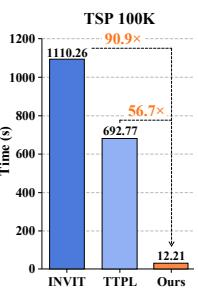
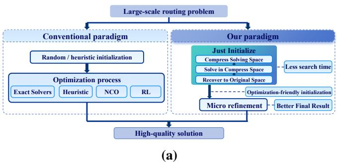
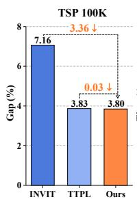
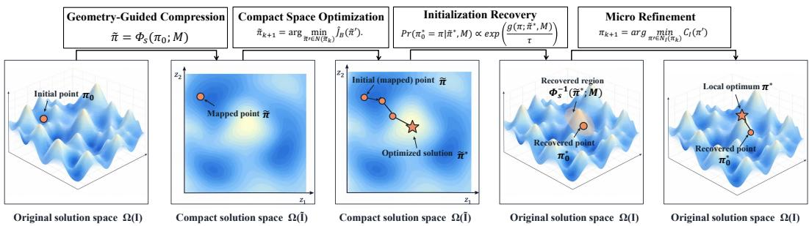
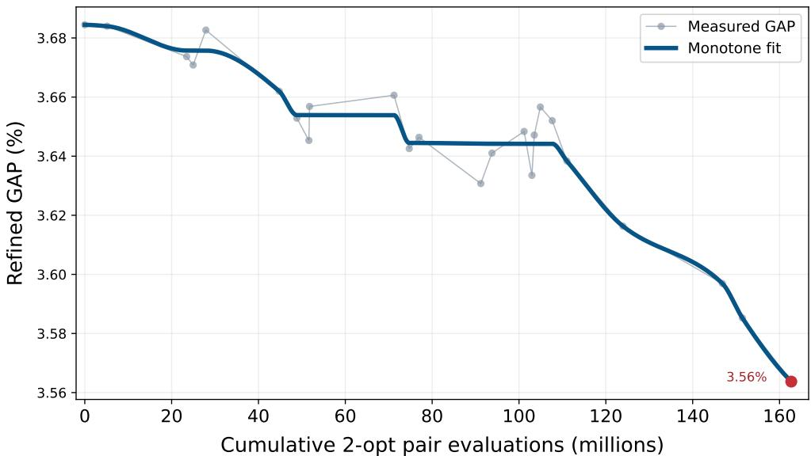
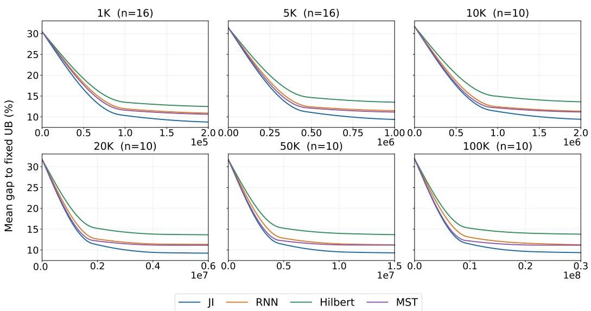
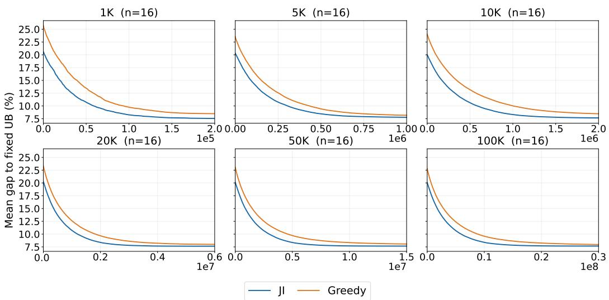

# JUST INITIALIZE: A TRAINING-FREE INITIALIZA-TION COMPONENT FOR LARGE-SCALE ROUTING OP-TIMIZATION

Jiale Zhao1,\*,‡ Sirui Mao2,\* Zimu Chen1,\* Wentao Yang2,\*

Zihan Wang3 Xuefeng Huang4 Junji Cheng1 Liyuanjun Lai1,†

1School of Automation Science and Electrical Engineering, Beihang University, Beijing, China

2School of Computer Science and Engineering, Beihang University, Beijing, China

3School of Cyber Science and Technology, Beihang University, Beijing, China

4School of Mechanical Engineering and Automation, Beihang University, Beijing, China Contact: lailiyuanjun@buaa.edu.cn

\*Equal contribution. †Corresponding author. ‡Project lead.

## ABSTRACT

Large-scale routing problems are difficult to solve efficiently as their search spaces grow rapidly with problem size. Existing approaches primarily improve the optimization procedure itself, often at increasing computational cost. We instead shift the focus to a useful initialization that can be refined into a high-quality solution with limited downstream refinement. We propose Just Initialize, a training-free and solver-agnostic initialization component for large-scale routing optimization. Just Initialize compresses a large routing instance into a compact surrogate space, optimizes its global routing structure, and recovers the resulting solution as an optimization-friendly starting point in the original space. Extensive experiments on Traveling Salesman Problems (TSPs), Capacitated Vehicle Routing Problems (CVRPs), Vehicle Routing Problems with Time Windows (VRPTWs), and Prize-Collecting Traveling Salesman Problems (PCTSPs) demonstrate that Just Initialize achieves high-quality solutions comparable to or better than state-of-the-art methods while substantially reducing computational cost across instances ranging from 1K to 100K nodes, including an average speedup of approximately 70×, sub-second runtimes on 10K-node instances, and runtimes within tens of seconds on 100K-node instances.

## 1 INTRODUCTION

Routing problems are widely encountered in real-world systems such as transportation, autonomous delivery, and industrial workshops (Golden et al., 2023; Elshaer & Awad, 2020). However, their NPhard nature makes solving large-scale instances computationally expensive and time-consuming. Traditional optimization methods have achieved remarkable success in obtaining optimal or nearoptimal solutions. Deterministic algorithms, such as mixed integer programming algorithms, provide strong optimality guarantees but suffer from prohibitive computational costs as problem scales increase. Heuristics and metaheuristics improve search scalability but often rely on iterative evolution and evaluation (Yang et al., 2021; Wang & Tang, 2021). These limitations significantly hinder their applicability to large-scale real-world scenarios, where efficient decision making is increasingly required.

Recently, learning-based methods have emerged as promising alternatives to handcrafted routing solvers. Neural combinatorial optimization (NCO) uses neural networks to learn solution construction or improvement strategies through various training paradigms. Among these, reinforcement learning (RL) trains routing policies through reward-driven interactions with problem environments (Kwon et al., 2020; Kim et al., 2021). Although NCO methods enable efficient inference on unseen instances (Bi et al., 2022; Luo et al., 2023), scaling them to large routing problems remains challenging. Recent studies address this challenge through enhanced neural solvers, hierarchical decomposition, search space reduction, and neural-guided optimization (Ye et al., 2024; Li et al., 2021; Qiu et al., 2022). Despite substantial progress, these approaches primarily improve the solving process itself, often introducing increasingly sophisticated architectures, training procedures, or search mechanisms. This motivates a complementary perspective: improving where optimization begins.

  
(b)  
Figure 1: Rethinking large-scale routing optimization. (a) Conventional paradigm and our paradigm. (b) Performance comparison with SOTA methods on 100K-node TSP instances.

Rather than designing more sophisticated optimization procedures, we ask whether the computa tional burden can be reduced by improving where optimization starts. A good initialization should therefore be judged not only by its immediate solution quality, but also by how efficiently it can be refined into a high-quality solution. A solution with a better initial objective value may require substantial further search, while one with a worse initial value may reach a better result through limited refinement. This perspective shifts the goal of initialization toward identifying starting points with strong refinement potential. Since such starting points are primarily characterized by their global structure rather than fully resolved local decisions, compression provides a natural way to reduce the search space while retaining the information most relevant to subsequent refinement.

Previous studies have explored compression and coarsening to reduce problem size before recovering solutions in the original space (Orloff & Caprera, 1976; Nał˛ecz-Charkiewicz et al., 2025). When recovery is expected to produce a high-quality solution directly, the compressed representation must preserve both global structure and local details, limiting how aggressively the problem can be compressed.

Therefore, we propose Just Initialize, a training-free and solver-agnostic initialization component for large-scale routing optimization. Rather than directly searching for a final solution in the original space, Just Initialize compresses a large routing instance into a compact surrogate space, where promising global structures can be identified efficiently. The resulting compact solution is then recovered as an optimization-friendly starting point in the original space, leaving fine-grained decisions to downstream refinement. In this way, Just Initialize focuses on discovering where optimiza tion should begin rather than resolving the entire solution from scratch.

Our contributions are summarized as follows:

• We introduce Just Initialize, a training-free and solver-independent initialization component that discovers optimization-friendly starting points for large-scale routing problems by separating solution discovery from solution optimization.

• We develop a geometry-guided instance compression procedure to construct compact routing representations, and propose an initialization-oriented objective to evaluate compact solutions according to their downstream optimization potential.

• Extensive experiments on TSPs, CVRPs, VRPTWs, and PCTSPs demonstrate that Just Initialize achieves competitive or superior solution quality compared with state-of-the-art methods, while substantially reducing computational cost and scaling to instances from 1K to 100K nodes.

## 2 RELATED WORKS

## 2.1 TRADITIONAL OPTIMIZATION METHODS

Traditional routing problems are commonly addressed by exact algorithms, heuristics, and metaheuristics. Exact methods provide strong optimality guarantees but become increasingly expensive as problem size grows (Gamst et al., 2024; Aerts-Veenstra et al., 2024). For large-scale instances, heuristic and metaheuristic solvers instead rely on carefully designed neighborhoods and iterative search, including Lin–Kernighan–Helsgaun (Helsgaun, 2000), adaptive large neighborhood search (Ropke & Pisinger, 2006a), hybrid genetic search (Vidal, 2022; Simensen et al., 2022), and specialized local-search procedures (Cook et al., 2024). Recent methods further demonstrate that carefully engineered search can scale to extremely large routing instances (Accorsi & Vigo, 2024). Despite their strong performance, obtaining high-quality solutions typically still requires substantial search as problem size increases.

## 2.2 NEURAL COMBINATORIAL OPTIMIZATION

Neural combinatorial optimization (NCO) learns solution construction or improvement strategies directly from problem instances (Bengio et al., 2021). Reinforcement learning is widely used for training such policies, with representative methods including Attention Model (Kool et al., 2019), POMO (Kwon et al., 2020), collaborative policies (Kim et al., 2021), knowledge distillation (Bi et al., 2022), and symmetry-aware learning (Kim et al., 2022). These methods reduce dependence on manually designed search rules and enable efficient inference after training.

Recent work has increasingly focused on scaling NCO to large routing instances. Existing approaches improve model architectures and training strategies (Luo et al., 2023; Fang et al., 2024; Luo et al., 2025a; Chen et al., 2025; Luo et al., 2025b), decompose large problems into smaller subproblems (Li et al., 2021; Pan et al., 2023; Ye et al., 2024; Zheng et al., 2024), learn alternative solution representations (Qiu et al., 2022; Sun & Yang, 2023), or combine neural predictions with classical optimization procedures (Xin et al., 2021; Kool et al., 2022; Ye et al., 2023). These methods improve scalability from different perspectives, but primarily focus on how solutions are constructed, represented, or optimized during the search process.

## 2.3 PROBLEM REDUCTION AND COMPRESSION

Problem reduction provides another way to improve routing scalability by reducing the number of decisions exposed to the solver. Classical approaches include cluster-first and route-first strategies (Gillett & Miller, 1974; Fisher & Jaikumar, 1981; Beasley, 1983; Prins et al., 2014), explicit problem reduction (Orloff & Caprera, 1976), restricted neighborhood search (Toth & Vigo, 2003), and subproblem-based optimization (Queiroga et al., 2021). More recent studies extend this idea through large-scale decomposition (Kerscher & Minner, 2025) and graph coarsening, where a smaller routing representation is constructed and subsequently expanded to the original problem (Nał˛ecz-Charkiewicz et al., 2025).

Different from existing reduction methods that aim to preserve sufficient information for solution recovery, we use compression to identify optimization-friendly starting points, while leaving detailed routing decisions to subsequent optimization.

## 3 PRELIMINARIES

## 3.1 ROUTING PROBLEMS AND SOLUTION SPACES

Let I be the space of routing instances. Each instance $\boldsymbol { I } = ( G , \boldsymbol { X } , \boldsymbol { K } )$ defines a feasible solution space $\Omega ( I )$ and an objective function $C _ { I }$ . To provide a unified representation across different routing variants, we represent a multi-route solution as a single visiting sequence with route boundaries. Specifically, a solution with routes $( r _ { 1 } , \ldots , r _ { m } )$ is written as

$$
\pi = ( \sigma , \mathbf { b } ) , \qquad \sigma = r _ { 1 } \oplus \cdots \oplus r _ { m } , \qquad b _ { j } = \sum _ { \ell = 1 } ^ { j } | r _ { \ell } | , \quad j = 1 , \ldots , m ,\tag{1}
$$

where σ denotes the visiting sequence and b specifies the breakpoints that partition the sequence into individual routes. Given b, each route can be recovered from the corresponding segment of σ. This representation is equivalent to the original multi-route formulation, while allowing different routing problems to share a common solution representation. For example, a solution to either TSP or PCTSP contains a single segment, whereas CVRP and VRPTW impose additional constraints on route segments and visited nodes.

The optimization objective is defined as

$$
\pi ^ { * } \in \arg \operatorname* { m i n } _ { \pi \in \Omega ( I ) } C _ { I } ( \pi ) .\tag{2}
$$

For later refinement, we define a local neighborhood over the original solution space. A neighboring solution is generated by modifying either the visiting sequence or the route structure while preserving feasibility:

$$
N _ { I } ( \pi ) = \big \{ ( T _ { i , j } ( \sigma ) , \mathbf { b } ) : T _ { i , j } \in \{ \mathrm { s w a p } _ { i , j } , \mathrm { r e v } _ { i : j } \} , i < j \big \} \cap \Omega ( I ) ,\tag{3}
$$

where $\operatorname { s w a p } _ { i , j }$ exchanges two positions in the visiting sequence and $\operatorname { r e v } _ { i : j }$ reverses the segment between positions i and j. This neighborhood defines the local modifications used by downstream refinement procedures.

## 3.2 COMPACT REPRESENTATIONS AND SOLUTION SPACE MAPPING

Given an original routing instance I, we first construct a compact instance by grouping original nodes into a small number of compact units.

$$
\tilde { I } = \Phi _ { c } ( I ) .\tag{4}
$$

The compact instance $\tilde { I }$ induces a lower-dimensional solution space $\Omega ( \tilde { I } )$ , where each compact unit represents a group of original nodes. This correspondence defines a projection from the original solution space to the compact solution space:

$$
\tilde { \pi } = \Phi _ { s } ( \pi ; M ) , \qquad \pi \in \Omega ( I ) , \quad \tilde { \pi } \in \Omega ( \tilde { I } ) .\tag{5}
$$

Here, M records the correspondence between original nodes and compact units established during instance compression. The projection $\Phi _ { s } ( \cdot )$ does not directly compress routing decisions. Instead, it preserves the coarse structural information induced by instance compression while omitting finegrained decisions. Therefore, the projection from the original solution space to the compact solution space is generally many-to-one, where multiple original solutions may correspond to the same compact solution:

$$
\Phi _ { s } ^ { - 1 } ( \tilde { \pi } ; M ) = \{ \pi \in \Omega ( I ) | \Phi _ { s } ( \pi ; M ) = \tilde { \pi } \} .\tag{6}
$$

## 3.3 INITIALIZATION QUALITY MEASUREMENT

The quality of an initialization is determined by how effectively it enables subsequent optimization, rather than solely by its immediate objective value. A feasible solution $\pi _ { 0 } \in \Omega ( I )$ is regarded as an initialization when it is provided as the starting point for downstream optimization. Let $\mathcal { R } _ { I } ( \pi _ { 0 } ; B )$ denote the solution obtained by applying a downstream solver initialized at $\pi _ { 0 }$ with computational budget B. The budget can be measured in runtime, search iterations, or objective evaluations. We first evaluate an initialization by the expected objective after optimization:

$$
J _ { B } ( \pi _ { 0 } ; I , \mathcal { R } ) = \mathbb { E } \left[ C _ { I } ( \mathcal { R } _ { I } ( \pi _ { 0 } ; B ) ) \right] ,\tag{7}
$$

where the expectation accounts for randomness in stochastic solvers and can be omitted for deterministic procedures. Because $C _ { I }$ is a cost to be minimized, a lower $J _ { B }$ indicates a more effective initialization, and initializations are compared by minimizing $J _ { B }$ under a fixed solver and budget.

  
Figure 2: Overview of Just Initialize. The framework compresses the original solution space, optimizes in a compact space, recovers an optimization-friendly initialization, and performs lightweight refinement in the original space.

## 4 METHODOLOGY

## 4.1 OVERVIEW OF JUST INITIALIZE

Building on the formulation in Section 3, Just Initialize constructs an optimization-friendly initialization through three stages: instance compression, compact-space optimization, and solution recovery.

The central idea is to separate solution discovery from solution optimization. Instead of directly searching in the original high-dimensional solution space, Just Initialize first compresses the problem into a compact space, where coarse routing structures can be efficiently explored. The obtained compact solution is then recovered into the original space as an optimization-friendly initialization and further improved through downstream refinement. The following sections describe each com ponent in detail.

## 4.2 GEOMETRY-GUIDED INSTANCE COMPRESSION FOR SOLUTION SPACE REDUCTION

The first stage constructs a compact representation of the original routing instance. Different from conventional compression methods that aim to recover a high-quality solution directly, our goal is to identify optimization-friendly regions while leaving fine-grained decisions to subsequent refinement.

Given an original instance I, we construct a compact instance by grouping nodes into compact units: $\tilde { I } = \Phi _ { c } ( I )$ . The compact instance induces a reduced solution space $\Omega ( \tilde { I } )$ , where solutions are defined over compact units instead of individual nodes. Accordingly, the original solution space is projected through

$$
\tilde { \pi } = \Phi _ { s } ( \pi ; M ) , \quad \pi \in \Omega ( I ) , \tilde { \pi } \in \Omega ( \tilde { I } ) .\tag{8}
$$

Since multiple original solutions may share the same compact structure, $\Phi _ { s }$ is generally many-toone. The compact representation preserves coarse geometric structures and boundary information required for recovery, while omitting unresolved local decisions. The detailed construction procedure is summarized in Algorithm 1.

## 4.3 SOLVING IN THE COMPACT SPACE

After compression, the routing problem is optimized in the compact solution space $\Omega ( \tilde { I } )$ , where each solution represents the ordering of compact units and their corresponding local states. Following the initialization quality criterion defined in Section 3.3, we evaluate a compact solution according to the downstream performance of its recovered initialization.

Since $J _ { B }$ is defined as an expectation over downstream optimization processes, its exact value is generally unavailable. We therefore estimate it using Monte Carlo sampling with a small number of

Algorithm 1: Geometry-Guided Instance Compression for Solution Space Reduction   
Input: Routing instance ${ \overline { { I = ( G , X , K ) } } } ;$ target unit size b   
Output: Compact instance ${ \tilde { I } } ,$ correspondence information M, and solution projection $\Phi _ { s }$   
1 F ← EXTRACTGEOMETRY(G, X)   
2 N ← BUILDNEIGHBORHOOD(V, F)   
3 C ← CONSTRUCTCOMPACTUNITS $\left( V , N , F , b , K \right)$   
4 foreach $C _ { i } \in C$ do   
5 $z _ { i } \gets \boldsymbol { S } |$ UMMARIZEGEOMETRY $( C _ { i } , F )$   
6 T ← EXTRACTBOUNDARYSTATES $( { \dot { C } } _ { i } , F , K ) ;$   
7 $M _ { i } \gets ( C _ { i } , z _ { i } , \mathcal { T } _ { i } , F | _ { C _ { i } } ) ;$   
8 $\tilde { C } \gets$ ESTIMATECONNECTIONS $( C , \{ z _ { i } , \mathcal { T } _ { i } \} , I )$   
9 K˜ ← AGGREGATECONSTRAINTS $( C , K )$   
10 $\tilde { I }  ( C , \{ z _ { i } , \mathcal { T } _ { i } \} , \tilde { C } , \tilde { K } )$   
11 $\Phi _ { s } \gets { \sf C }$ ONSTRUCTSOLUTIONPROJECTION $( C , M )$   
12 return $( \tilde { I } , M , \Phi _ { s } )$

refinement trials:

$$
\hat { J } _ { B } ( \tilde { \pi } ) = \frac { 1 } { S } \sum _ { s = 1 } ^ { S } C _ { I } ( R _ { I } ^ { ( s ) } ( \pi _ { 0 } ; B ) ) ,\tag{9}
$$

where $S$ denotes the number of sampled refinement trajectories and $R _ { I } ^ { ( s ) }$ represents the s-th refinement process.

The compact-space search then aims to identify solutions with better initialization potential. Starting from an initial compact solution, we iteratively update the solution by minimizing ${ \hat { J } } _ { B } $ , the estimated initialization quality. Similar to the neighborhood operators defined in the original solution space, the compact-space neighborhood $N ( \tilde { \pi } )$ is constructed by applying local modifications to compactunit ordering while preserving compact feasibility:

$$
\tilde { \pi } _ { k + 1 } = \arg \operatorname* { m i n } _ { \tilde { \pi } ^ { \prime } \in N ( \tilde { \pi } _ { k } ) } \hat { J } _ { B } ( \tilde { \pi } ^ { \prime } ) .\tag{10}
$$

The final compact solution $\tilde { \pi } ^ { * }$ captures a global routing structure with strong refinement potential and is subsequently recovered to generate an optimization-friendly initialization in the original solution space.

## 4.4 RECOVERING OPTIMIZATION-FRIENDLY INITIALIZATIONS

Given the final compact solution $\tilde { \pi } ^ { * }$ , recovery selects an original-space initialization from the feasible region $\Phi _ { s } ^ { - 1 } ( \tilde { \pi } ^ { * } ; M )$ induced by the solution-space mapping defined in Section 3.2. The structural information M extracted during compression provides guidance for evaluating the compatibility between candidate solutions and the compact representation. Specifically, we define a structural consistency score $g ( \pi ; { \tilde { \pi } } ^ { * } , M )$ to measure how well an original-space solution preserves the compact-unit ordering, geometric structure, and boundary configurations specified $\boldsymbol { \mathbf { b } } \boldsymbol { \mathbf { y } } \ \tilde { \pi } ^ { * }$ and $M$ The detailed formulation of $g ( \pi ; { \tilde { \pi } } ^ { * } , M )$ is provided in Appendix B. The initialization is selected according to:

$$
\operatorname* { P r } ( \pi _ { 0 } ^ { * } = \pi \mid \tilde { \pi } ^ { * } , M ) = \frac { \exp ( g ( \pi ; \tilde { \pi } ^ { * } , M ) / \tau ) } { \sum _ { \pi ^ { \prime } \in \Phi _ { s } ^ { - 1 } ( \tilde { \pi } ^ { * } ; M ) } \exp ( g ( \pi ^ { \prime } ; \tilde { \pi } ^ { * } , M ) / \tau ) } , \quad \pi \in \Phi _ { s } ^ { - 1 } ( \tilde { \pi } ^ { * } ; M ) .\tag{11}
$$

Here, τ controls the trade-off between selecting highly compatible candidates and maintaining diversity. The resulting optimization friendly initialization $\pi _ { 0 } ^ { * }$ is then passed to downstream refinement in the original solution space.

Table 1: Comparison results on large-scale TSP and CVRP instances. Obj. and Gap denote the solution objective and relative gap, respectively. Bold marks the lowest Gap and Time at each scale before rounding; gray highlights our method. OOM: results that exceed GPU memory limits. OOT: the method fails to finish within the predefined time limit.
<table><tr><td rowspan="2">Method</td><td colspan="2">TSP5K</td><td></td><td></td><td>TSP10K</td><td></td><td></td><td>TSP20K</td><td></td><td>TSP50K</td><td></td><td></td><td></td><td>TSP100K</td><td></td></tr><tr><td>Obj.↓</td><td>Gap</td><td>Time</td><td>Obj.↓</td><td>Gap</td><td>Time</td><td>Obj.↓</td><td>Gap</td><td>Time</td><td>Obj.↓</td><td>Gap</td><td>Time</td><td>Obj.↓</td><td>Gap</td><td>Time</td></tr><tr><td>LKH-3 (Reference)</td><td>50.88</td><td>一</td><td>一</td><td>71.76</td><td>一</td><td>一</td><td>101.39</td><td>一</td><td></td><td>159.98</td><td>一</td><td>一</td><td>225.95</td><td>一</td><td>一</td></tr><tr><td>POMO (no aug.)</td><td>88.33</td><td>73.62</td><td>50.6s</td><td>133.64</td><td>86.23</td><td>6.5 min</td><td></td><td>OOM</td><td></td><td></td><td>OOM</td><td></td><td></td><td>OOM</td><td></td></tr><tr><td>POMO (×8 aug.)</td><td>87.62</td><td>72.23</td><td>7.7 min</td><td></td><td>OOM</td><td></td><td></td><td>OOM</td><td></td><td></td><td>OOM</td><td></td><td></td><td>OOM</td><td></td></tr><tr><td>LEHD (greedy)</td><td>59.50</td><td>16.94</td><td>1.2 min</td><td>90.26</td><td>25.77</td><td>7.9min</td><td></td><td>OOM</td><td></td><td></td><td>OOM</td><td></td><td></td><td>OOM</td><td></td></tr><tr><td>INViT</td><td>54.22</td><td>6.57</td><td>46.1 s</td><td>76.76</td><td>6.97</td><td>1.5 min</td><td>108.57</td><td>7.08</td><td>3.1 min</td><td>171.42</td><td>7.15</td><td>8.3 min</td><td>242.13</td><td>7.16</td><td>18.5 min</td></tr><tr><td>SIL</td><td>57.23</td><td>12.49</td><td>1.4 min</td><td>93.50</td><td>30.29</td><td>10.5 min</td><td>179.04</td><td>76.59</td><td>1.6h</td><td></td><td>OOM</td><td></td><td></td><td>OOM</td><td></td></tr><tr><td>L2C-Insert (I = 1000)</td><td>51.73</td><td>1.68</td><td>57.1s</td><td>74.30</td><td>3.54</td><td>58.4s</td><td>105.15</td><td>3.71</td><td>1.0min</td><td>166.13</td><td>3.84</td><td>1.2 min</td><td>237.29</td><td>5.02</td><td>1.6 min</td></tr><tr><td>DIFUSCO</td><td>52.48</td><td>3.15</td><td>26.0s</td><td>73.97</td><td>3.07</td><td>1.3 min</td><td>105.35</td><td>3.91</td><td>4.5 min</td><td>166.03</td><td>3.78</td><td>29.7 min |</td><td></td><td>OOM</td><td></td></tr><tr><td>GLOP</td><td>54.12</td><td>6.38</td><td>1.5 s</td><td>76.59</td><td>6.73</td><td>1.8s</td><td>108.25</td><td>6.76</td><td>3.3 s</td><td>170.91</td><td>6.83</td><td>17.0s</td><td>241.53</td><td>6.90</td><td>1.2 min</td></tr><tr><td>UDC</td><td>52.82</td><td>3.83</td><td>3.5s</td><td>74.69</td><td>4.08</td><td>3.8s</td><td>105.66</td><td>4.21</td><td>5.2s</td><td>166.87</td><td>4.30</td><td>18.7s</td><td>235.84</td><td>4.38</td><td>1.2 min</td></tr><tr><td>H-TSP</td><td>55.07</td><td>8.24</td><td>5.1s</td><td>77.85</td><td>8.48</td><td>9.3s</td><td>110.18</td><td>8.67</td><td>18.8s</td><td>173.89</td><td>8.69</td><td>47.3s</td><td>245.50</td><td>8.65</td><td>1.7 min</td></tr><tr><td>TTPL</td><td>52.81</td><td>3.79</td><td>33.6s</td><td>74.75</td><td>4.17</td><td>1.1 min</td><td>105.51</td><td>4.06</td><td>2.3 min</td><td>166.31</td><td>3.95</td><td>5.8 min</td><td>234.61</td><td>3.83</td><td>11.5 min</td></tr><tr><td>JI+VND</td><td>53.35</td><td>4.87</td><td>15.3s 0.24s</td><td>75.24</td><td>4.85</td><td>28.9s</td><td>106.63</td><td>5.16</td><td>31.5s</td><td>168.14</td><td>5.10</td><td>1.7 min</td><td>238.92</td><td>5.74</td><td>2.7 min</td></tr><tr><td>JI+Refine (Ours)</td><td colspan="3">52.56 3.30</td><td colspan="3">74.20 3.40</td><td colspan="3">105.00 3.56</td><td colspan="3">165.77 3.62 4.83s</td><td colspan="3">234.20 3.65</td></tr><tr><td>Method</td><td></td><td>CVRP5K</td><td></td><td></td><td>CVRP10K</td><td></td><td></td><td>CVRP20K</td><td></td><td></td><td>CVRP50K</td><td></td><td></td><td>CVRP100K</td><td>12.21 s</td></tr><tr><td></td><td>Obj.↓</td><td>Gap</td><td>Time</td><td>Obj.↓</td><td>Gap</td><td>Time</td><td>Obj.↓</td><td>Gap</td><td>Time</td><td>Obj.↓</td><td>Gap</td><td>Time</td><td>Obj.↓</td><td>Gap</td><td>Time</td></tr><tr><td>LKH-3 (Reference)</td><td>86.00</td><td></td><td></td><td>97.97</td><td>一</td><td></td><td>125.10</td><td>一</td><td>一</td><td>236.46</td><td></td><td>一</td><td>409.25</td><td></td><td></td></tr><tr><td>OR-Tools</td><td>108.10</td><td>25.69</td><td>2.0 min</td><td>131.90</td><td>34.64</td><td>2.0min</td><td></td><td>OOM</td><td></td><td></td><td>OOM</td><td></td><td></td><td>O0M</td><td></td></tr><tr><td>LEHD</td><td>104.51</td><td>21.52</td><td>1.4 min</td><td></td><td>OOM</td><td></td><td></td><td>OOM</td><td></td><td></td><td>OOM</td><td></td><td></td><td>OOM</td><td></td></tr><tr><td>INViT</td><td>104.53</td><td>21.55</td><td>1.8 min</td><td>130.29</td><td>32.99</td><td>3.8 min</td><td>183.17</td><td>46.42</td><td>11.4 min</td><td>355.78</td><td>50.46</td><td>57.4 min</td><td>604.34</td><td>47.67</td><td>3.6h</td></tr><tr><td>SIL</td><td>103.24 114.46</td><td>20.05 33.08</td><td>2.6 min</td><td>127.60</td><td>30.24</td><td>5.4min</td><td>191.14</td><td>52.79</td><td>11.4 min</td><td></td><td>OOM</td><td></td><td></td><td>OOM</td><td></td></tr><tr><td>L2C-Insert</td><td></td><td></td><td>59.7s</td><td>148.95</td><td>52.04</td><td>2.0min</td><td>216.71</td><td>73.24</td><td>4.0 min</td><td>409.53</td><td>73.19</td><td>10.0min</td><td>680.13</td><td>66.19</td><td>20.1 min</td></tr><tr><td>GLOP UDC</td><td>122.28 155.31</td><td>42.19 80.59</td><td>3.1 s 14.9s</td><td>129.20</td><td>31.88</td><td>10.2 s</td><td>174.14</td><td>39.20</td><td>27.3s</td><td></td><td>OOM</td><td></td><td></td><td>OOM</td><td></td></tr><tr><td></td><td></td><td></td><td></td><td>361.79</td><td>269.29</td><td>17.2s</td><td>534.78</td><td>327.48</td><td>27.5s</td><td></td><td>OOM</td><td></td><td></td><td>OOM</td><td></td></tr><tr><td>TTPL</td><td>101.81</td><td>18.38 15.56</td><td>44.6s 0.43s</td><td>|127.61 117.31</td><td>30.25 19.80</td><td>1.5 min 0.9s</td><td>179.09</td><td>43.16 22.77</td><td>3.0min 2.2 s</td><td>345.87 284.74</td><td>46.27</td><td>7.5 min</td><td>606.71</td><td>48.25</td><td>15.1 min</td></tr><tr><td>JI+Refine (Ours)</td><td>99.32</td></table>

## 4.5 MICRO REFINEMENT

The $\pi _ { 0 } ^ { * }$ serves as an optimization-friendly initialization rather than a final solution. We therefore perform a lightweight local refinement in the original solution space using the neighborhood operators defined in Section 3.1.

At each iteration, we select the best improving neighbor:

$$
\pi _ { k + 1 } = \arg \operatorname* { m i n } _ { \pi ^ { \prime } \in N _ { I } ( \pi _ { k } ) } C _ { I } ( \pi ^ { \prime } ) , \quad C _ { I } ( \pi _ { k + 1 } ) < C _ { I } ( \pi _ { k } ) .
$$

If no improving neighbor exists, the procedure terminates. Since the initialization already captures the global routing structure, this lightweight refinement only needs to correct remaining local decisions without rebuilding the solution.

## 5 EXPERIMENT

## 5.1 EXPERIMENT SETTINGS

Datasets. We evaluate Just Initialize on four representative routing problems: TSP, CVRP, VRPTW, and PCTSP, covering large-scale instances from 1K to 100K nodes. For TSP and CVRP, we follow previous large-scale synthetic benchmarks and use 80 instances per problem, including 16 instances at each scale of 5K, 10K, 20K, 50K, and 100K nodes. For VRPTW and PCTSP, we use 56 instances for each problem following established generation protocols.

Baselines. We compare against representative methods from classical optimization, neural constructive optimization, heatmap-based approaches, decomposition methods, and neural-enhanced metaheuristics. Empirical reference solutions are generated independently using LKH-3 for TSPs and CVRPs, HGS-PyVRP for VRPTWs, and LKH-3-PCTSP for PCTSPs. These references are used only for computing relative gaps.

Metrics. We report objective value, relative gap, and time cost. For Just Initialize, runtime includes compression, compact-space optimization, solution recovery, and downstream refinement. We additionally evaluate initialization effectiveness by comparing downstream optimization from Just Initialize with alternative starting points.

Implementation Details. Experiments are conducted on an Intel Xeon Platinum 8358P 64-core CPU, eight NVIDIA GeForce RTX 4090 GPUs, and 256 GB RAM. Each configuration is run three times, and the results are averaged; objective values and gaps are reported only for feasible solutions.

## 5.2 COMPARATIVE STUDY

The results are summarized in Tables 1 and 2. Across four routing benchmarks, JI+Refine consistently achieves competitive or superior solution quality while substantially reducing computational cost. On large-scale TSP and CVRP instances, JI+Refine scales to 100K nodes and maintains stable solution gaps, while many existing approaches suffer from rapidly increasing runtime or fail to complete due to computational limitations. Notably, JI+VND also achieves competitive perfor mance compared with many NCO-based methods, demonstrating that the effectiveness of JI mainly comes from providing better optimization-friendly initializations rather than relying on a specific refinement strategy. For VRPTW and PCTSP, JI+Refine achieves competitive solution quality across different scales while reducing the solving time from minutes or hours to seconds.

Overall, JI+Refine achieves an average speedup of approximately 70× compared with existing approaches while preserving comparable solution quality. On 10K-node instances, JI+Refine completes optimization within seconds, and even 100K-node instances can be solved within tens of seconds. These results demonstrate that optimization-friendly initialization, combined with effective refinement, provides an efficient way to reduce the computational burden of large-scale routing optimization.

Beyond the large-scale synthetic benchmarks, we further evaluate JI+Refine under diverse instance distributions, including non-uniform TSP settings with clustered, explosion, and implosion patterns. We also test JI+Refine on widely used TSPLIB and CVRPLIB benchmarks to examine its generalization ability beyond synthetic settings. Across these additional benchmarks, JI+Refine maintains competitive solution quality with consistent computational efficiency, demonstrating robustness across different spatial distributions and benchmark sources. Detailed results are provided in Appendix E.

Table 2: Comparison results on large-scale VRPTW and PCTSP instances.
<table><tr><td rowspan="2">Method</td><td colspan="3">VRPTW2K</td><td colspan="3">VRPTW5K</td><td colspan="3">VRPTW10K</td><td colspan="3">VRPTW20K</td></tr><tr><td>Obj. ↓</td><td>Gap</td><td>Time</td><td>Obj. ↓</td><td>Gap</td><td>Time</td><td>Obj. ↓</td><td>Gap</td><td>Time</td><td>Obj. ↓</td><td>Gap</td><td>Time</td></tr><tr><td>HGS-PyVRP (Reference)</td><td>335.93</td><td></td><td></td><td>823.85</td><td></td><td></td><td>1419.13</td><td>e</td><td></td><td>2479.68</td><td></td><td></td></tr><tr><td>OR-Tools</td><td>352.83</td><td>5.03</td><td>30.0 min</td><td>891.49</td><td>8.21</td><td>2.0 min</td><td>1498.60</td><td>5.60</td><td>10.0 min</td><td>2584.07</td><td>4.21</td><td>30.0 min</td></tr><tr><td>VROOM</td><td>342.08</td><td>1.83</td><td>6.0 min</td><td>831.43</td><td>0.92</td><td>14.7 min</td><td></td><td>OOM</td><td></td><td></td><td>OOM</td><td></td></tr><tr><td>ALNS</td><td>381.58</td><td>13.59</td><td>3.8 h</td><td>901.13</td><td>9.38</td><td>3.6h</td><td>1520.17</td><td>7.12</td><td>3.1 h</td><td>2615.07</td><td>5.46</td><td>3.3h</td></tr><tr><td>JI+Refine (Ours)</td><td>362.91</td><td>8.25</td><td>2.9 s</td><td>863.80</td><td>5.16</td><td>9.6 s</td><td>1478.16</td><td>4.43</td><td>9.3s</td><td>2574.90</td><td>3.96</td><td>15.8s</td></tr><tr><td rowspan="2">Method</td><td colspan="3">PCTSP2K</td><td colspan="3">PCTSP5K</td><td colspan="3">PCTSP10K</td><td colspan="3">PCTSP20K</td></tr><tr><td>Obj. ↓</td><td>Gap</td><td>Time</td><td>Obj. ↓</td><td>Gap</td><td>Time</td><td>Obj. ↓</td><td>Gap</td><td>Time</td><td>Obj. ↓</td><td>Gap</td><td>Time</td></tr><tr><td>LKH-3 (Reference)</td><td>27.28</td><td></td><td></td><td>44.39</td><td></td><td></td><td>66.65</td><td></td><td></td><td>94.99</td><td></td><td></td></tr><tr><td>GLOP-G</td><td></td><td>OOT</td><td></td><td>49.55</td><td>11.63</td><td>1.5s</td><td></td><td>OOT</td><td></td><td></td><td>OOT</td><td></td></tr><tr><td>GLOP-S</td><td></td><td>OOT</td><td></td><td>49.39</td><td>11.26</td><td>6.9s</td><td></td><td>OOT</td><td></td><td></td><td>OOT</td><td></td></tr><tr><td>Attention Model</td><td>58.55</td><td>114.62</td><td>1.6s</td><td>109.38</td><td>146.41</td><td>4.0s</td><td>174.96</td><td>162.51</td><td>7.4s</td><td></td><td>OOM</td><td></td></tr><tr><td>DeepACO</td><td>40.68</td><td>49.12</td><td>1.3 min</td><td>78.98</td><td>77.92</td><td>3.4 min</td><td></td><td>OOM</td><td></td><td></td><td>OOM</td><td></td></tr><tr><td>OR-Tools PCTSP</td><td>29.98</td><td>9.88</td><td>7.5 min</td><td>59.64</td><td>34.35</td><td>7.5 min</td><td>85.31</td><td>27.98</td><td>7.5 min</td><td>125.02</td><td>31.62</td><td>12.8 min</td></tr><tr><td>JI+Refine (Ours)</td><td>30.99</td><td>13.62</td><td>0.5 s</td><td>48.37</td><td>9.01</td><td>1.3s</td><td>70.02</td><td>5.05</td><td>2.9s</td><td>101.30</td><td>6.65</td><td>6.4s</td></tr></table>

## 5.3 EFFECTIVENESS AS A SOLVER INITIALIZATION

We evaluate whether JI can improve downstream optimization by providing more effective initial solutions. Specifically, we compare each solver in its original setting with the corresponding solver augmented by JI initialization. All reported runtimes include the complete JI pipeline. Table 3 reports the final relative gaps and total solving times.

The results show that JI consistently improves both solution quality and computational efficiency across all refinement procedures and problem scales. Compared with the original solvers, JIenhanced solvers achieve lower final gaps with shorter overall runtimes, demonstrating that JI provides effective initializations for downstream optimization. This verifies that improving initialization can reduce the burden of subsequent optimization.

We further evaluate our dedicated refinement strategy under the same JI-generated initialization. Compared with existing refinement procedures using identical initializations, the proposed refinement achieves better solution quality, showing that effective initialization and specialized refinement provide complementary benefits.

Table 3: Search performance with different initializations and refinement procedures. Bold values indicate the better result within each solver pair before rounding.
<table><tr><td></td><td colspan="2">1K</td><td colspan="2">5K</td><td colspan="2">10K</td><td colspan="2">20K</td><td colspan="2">50K</td><td colspan="2">100K</td></tr><tr><td>Solver</td><td>Gap</td><td>Time</td><td>Gap</td><td>Time</td><td>Gap</td><td>Time</td><td>Gap</td><td>Time</td><td>Gap</td><td>Time</td><td>Gap</td><td>Time</td></tr><tr><td>2-opt JI+2-opt</td><td>11.22 8.63</td><td>0.03 s 0.02s</td><td>11.74 9.24</td><td>0.3 s 0.2s</td><td>11.70 9.24</td><td>0.5 s 0.1 s</td><td>11.64 9.21</td><td>1.5 s 0.2s</td><td>11.70 9.21</td><td>9.9s 0.8s</td><td>11.67 9.10</td><td>42.9 s 3.3s</td></tr><tr><td>VND JI+VND</td><td>5.22 4.44</td><td>4.3 s 2.7 s</td><td>5.57 4.77</td><td>35.5 s 24.3s</td><td>5.51 4.85</td><td>42.5 s 28.9 s</td><td>5.78 5.05</td><td>42.4 s 35.4s</td><td>6.64 5.93</td><td>1.4 min 34.9 s</td><td>8.17 6.08</td><td>1.2 min 1.1 min</td></tr><tr><td>ILS JI+ILS</td><td>6.99 6.59</td><td>1.4s 0.9 s</td><td>8.76 8.49</td><td>41.3 s 16.9 s</td><td>9.18 8.75</td><td>40.1 s 12.9 s</td><td>10.03 8.90</td><td>41.8s 31.8s</td><td>10.74 9.04</td><td>1.4 min 1.3 min</td><td>11.21 9.04</td><td>1.4 min 1.3 min</td></tr><tr><td>GLS</td><td></td><td></td><td></td><td></td><td></td><td></td><td></td><td></td><td></td><td></td><td></td><td>1.2 min</td></tr><tr><td>JI+GLS</td><td></td><td></td><td></td><td></td><td></td><td></td><td></td><td></td><td></td><td></td><td></td><td></td></tr><tr><td></td><td></td><td></td><td></td><td></td><td></td><td></td><td></td><td></td><td></td><td></td><td></td><td></td></tr><tr><td></td><td>10.38</td><td>2.8s</td><td>11.22</td><td>43.7 s</td><td>11.44</td><td>43.4s</td><td>11.53</td><td>40.3 s</td><td>11.68</td><td>45 s</td><td>11.66</td><td></td></tr><tr><td></td><td></td><td></td><td></td><td></td><td></td><td></td><td></td><td></td><td></td><td></td><td></td><td></td></tr><tr><td></td><td>8.12</td><td>1.5 s</td><td>9.00</td><td>14.3s</td><td>9.07</td><td>16.6s</td><td>9.13</td><td>34.6s</td><td>9.19</td><td>35.3s</td><td>9.10</td><td>54.8s</td></tr><tr><td></td><td></td><td></td><td></td><td></td><td></td><td></td><td></td><td></td><td></td><td></td><td></td><td></td></tr><tr><td></td><td></td><td></td><td></td><td></td><td></td><td></td><td></td><td></td><td></td><td></td><td></td><td></td></tr><tr><td>JI+Refine</td><td>2.56</td><td>0.04s</td><td>3.48</td><td>0.2s</td><td>3.51</td><td>0.5 s</td><td>3.68</td><td>1.4s</td><td>3.74</td><td>4.8s</td><td>3.80</td><td>12.2s</td></tr></table>

Additional initialization analyses, including matched-gap and greedy-start comparisons as well as search-budget evaluations, are provided in Appendix E.5–E.6.

## 5.4 ABLATION STUDY

We perform ablation studies on uniform TSP instances by removing each component of JI individually, including compression, compressed-space solving, and recovery. The gap increase relative to the full model is reported in parentheses. As shown in Table 4, removing compression or recovery consistently increases the final gap across different scales, with over 1% degradation in largescale instances, while removing the solving stage causes smaller changes. These results verify that compression and recovery are essential for generating effective initializations, and the complete JI pipeline enables optimization to start from more favorable regions of the solution space.

Table 4: JI ablation on uniform TSP instances. Numbers in parentheses denote the gap increase relative to the full model. All results are averaged over three seeds.
<table><tr><td></td><td colspan="2">Full</td><td colspan="2">w/o compress</td><td colspan="2">w/o solve</td><td colspan="2">w/o restore</td></tr><tr><td>Scale</td><td>Gap (%)</td><td>Time (s)</td><td>Gap (%)</td><td>Time (s)</td><td>Gap (%)</td><td>Time (s)</td><td>Gap (%)</td><td>Time (s)</td></tr><tr><td>1K</td><td>2.84</td><td>0.03</td><td>3.59 (+0.75)</td><td>0.04</td><td>3.39 (+0.55)</td><td>0.05</td><td>3.90 (+1.06)</td><td>0.03</td></tr><tr><td>5K</td><td>3.62</td><td>0.16</td><td>4.26 (+0.64)</td><td>0.18</td><td>3.68 (+0.06)</td><td>0.16</td><td>4.44 (+0.82)</td><td>0.17</td></tr><tr><td>10K</td><td>3.49</td><td>0.36</td><td>4.83 (+1.34)</td><td>0.47</td><td>3.60 (+0.11)</td><td>0.35</td><td>4.66 (+1.17)</td><td>0.41</td></tr><tr><td>20K</td><td>3.70</td><td>0.89</td><td>4.88 (+1.18)</td><td>1.20</td><td>3.74 (+0.04)</td><td>0.91</td><td>4.87 (+1.17)</td><td>1.11</td></tr><tr><td>50K</td><td>3.67</td><td>4.23</td><td>4.82 (+1.15)</td><td>7.23</td><td>4.25 (+0.58)</td><td>4.12</td><td>4.96 (+1.29)</td><td>5.30</td></tr><tr><td>100K</td><td>3.78</td><td>12.56</td><td>5.00 (+1.22)</td><td>24.91</td><td>4.34 (+0.56)</td><td>12.75</td><td>5.08 (+1.30)</td><td>16.89</td></tr></table>

## 6 CONCLUSION

In this work, we revisit large-scale routing optimization from the perspective of where optimization begins. Instead of continuously increasing the complexity of optimization procedures, we show that a more effective starting point can fundamentally reduce the difficulty of downstream search. Based on this insight, we propose Just Initialize, a training-free and solver-independent initialization component that separates solution discovery from solution optimization. By exploring coarse global structures in a compact space and recovering them as optimization-friendly starting points, Just Initialize enables existing solvers to focus on refining promising regions rather than searching the entire solution space.

Extensive experiments on TSP, CVRP, VRPTW, and PCTSP demonstrate that Just Initialize scales to instances from 1K to 100K nodes while maintaining competitive solution quality with substantially reduced computational cost. These results reveal that initialization can serve as an effective mechanism for navigating large combinatorial search spaces, providing a complementary direction to improving optimization algorithms themselves.

## 7 ACKNOWLEDGMENTS

This paper is supported by National Key Research and Development Program of China (Grant No. 2024YFB3311900), Beijing Natural Science Foundation (Grant No. L241018) and Beijing Nova Program (Grant No. 2024085).

## AI USE STATEMENT

In this work, we used generative AI tools to aid or polish writing, retrieve and discover related work, and draft sections of the paper.

We have not used generative AI tools for the following other required-disclosure tasks that were relevant to our research but performed entirely by the authors: helping develop theoretical models or conceptual frameworks, proposing or refining hypotheses, and designing or providing feedback on research methodology or experiments.

The remaining required-disclosure tasks are not applicable to this work because our study did not involve them: assisting in the writing of proofs, providing critical ingredients for proving mathematical claims, and formulating mathematical claims.

Additionally, we used generative AI tools for the following recommended-disclosure tasks: drafting parts of a research paper, editing a research paper to improve readability, formatting references, and creating or editing software code (for utility scripts and visualisation functions).

We have reviewed all AI-assisted work. Specifically:

• All AI-generated code was tested on multiple runs, verified for correctness against expected outputs, and peer-reviewed by at least two authors.

• The cleaned dataset was manually inspected for consistency and missing-value handling after AI-assisted preprocessing.

• AI-drafted text was substantially revised to match our scientific voice and checked for factual accuracy against our experimental results.

We take responsibility for the final content of this work, including text, claims, or artifacts produced with the aid of generative AI. The authors alone developed the core research ideas, designed the experiments, and interpreted the final results, without AI involvement.

## ETHICS STATEMENT

This paper studies training-free initialization methods for large-scale routing optimization. It does not involve human subjects, personal data, or privacy-sensitive information. All datasets used are publicly available and contain mathematical problems. We foresee no ethical concerns and declare no conflicts of interest.

## REPRODUCIBILITY STATEMENT

We describe Just Initialize in Section 4, with algorithmic pseudocode and parameter settings in Appendix B. Dataset construction procedures, generation seeds, and additional solver settings are provided in Appendix D. Experimental hardware, evaluation metrics, and runtime measurement conventions are described in Section 5.1.

## REFERENCES

Luca Accorsi and Daniele Vigo. Routing one million customers in a handful of minutes. Computers & Operations Research, 164:106562, 2024. doi: 10.1016/j.cor.2024.106562.

Marjolein Aerts-Veenstra, Marilène Cherkesly, and Timo Gschwind. A unified branch-price-and-cut algorithm for multicompartment pickup and delivery problems. Transportation Science, 58(5): 1121–1142, 2024. doi: 10.1287/trsc.2023.0252.

John E. Beasley. Route first—cluster second methods for vehicle routing. Omega, 11(4):403–408, 1983. doi: 10.1016/0305-0483(83)90033-6.

Yoshua Bengio, Andrea Lodi, and Antoine Prouvost. Machine learning for combinatorial optimization: A methodological tour d’horizon. European Journal of Operational Research, 290(2): 405–421, 2021. doi: 10.1016/j.ejor.2020.07.063.

Jieyi Bi, Yining Ma, Jiahai Wang, Zhiguang Cao, Jinbiao Chen, Yuan Sun, and Yeow Meng Chee. Learning generalizable models for vehicle routing problems via knowledge distillation. In Advances in Neural Information Processing Systems, volume 35, 2022.

Yuanyao Chen, Rongsheng Chen, Fu Luo, and Zhenkun Wang. Improving generalization of neural combinatorial optimization for vehicle routing problems via test-time projection learning. In Advances in Neural Information Processing Systems, volume 38, 2025.

Concorde TSP Solver. Concorde tsp solver. https://math.uwaterloo.ca/tsp/ concorde/.

William Cook, Stephan Held, and Keld Helsgaun. Constrained local search for last-mile routing. Transportation Science, 58(1):12–26, 2024. doi: 10.1287/trsc.2022.1185.

Raafat Elshaer and Hadeer Awad. A taxonomic review of metaheuristic algorithms for solving the vehicle routing problem and its variants. Computers & Industrial Engineering, 140:106242, 2020. doi: 10.1016/j.cie.2019.106242.

Han Fang, Zhihao Song, Paul Weng, and Yutong Ban. INViT: A generalizable routing problem solver with invariant nested view transformer. In Proceedings ofthe 41st International Conference on Machine Learning, volume 235 of Proceedings of Machine Learning Research, pp. 12973– 12992. PMLR, 2024.

Marshall L. Fisher and Ramchandran Jaikumar. A generalized assignment heuristic for vehicle routing. Networks, 11(2):109–124, 1981. doi: 10.1002/net.3230110205.

Mette Gamst, Richard Martin Lusby, and Stefan Ropke. Exact and heuristic methods for the split delivery vehicle routing problem. Transportation Science, 58(4):741–760, 2024. doi: 10.1287/ trsc.2022.0353.

Billy E. Gillett and Leland R. Miller. A heuristic algorithm for the vehicle-dispatch problem. Operations Research, 22(2):340–349, 1974. doi: 10.1287/opre.22.2.340.

Bruce Golden, Xingyin Wang, and Edward Wasil. The Evolution ofthe Vehicle Routing Problem: A Survey ofVRP Research and Practicefrom 2005 to 2022. Synthesis Lectures on Operations Research and Applications. Springer Nature Switzerland, 2023. doi: 10.1007/978-3-031-18716-2.

Google. OR-Tools: Routing. https://developers.google.com/optimization/ routing.

Keld Helsgaun. An effective implementation of the lin–kernighan traveling salesman heuristic. European Journal of Operational Research, 126(1):106–130, 2000. doi: 10.1016/S0377-2217(99) 00284-2.

Keld Helsgaun. An extension of the lin-kernighan-helsgaun tsp solver for constrained traveling salesman and vehicle routing problems. Technical report, Roskilde University, 2017.

Christoph Kerscher and Stefan Minner. Decompose-route-improve framework for solving largescale vehicle routing problems with time windows. Transportation Research Part E: Logistics and Transportation Review, 204:104409, 2025. doi: 10.1016/j.tre.2025.104409.

Minsu Kim, Jinkyoo Park, and Joungho Kim. Learning collaborative policies to solve NP-hard routing problems. In Advances in Neural Information Processing Systems, volume 34, 2021.

Minsu Kim, Junyoung Park, and Jinkyoo Park. Sym-NCO: Leveraging symmetricity for neural combinatorial optimization. In Advances in Neural Information Processing Systems, volume 35, 2022.

Wouter Kool, Herke van Hoof, and Max Welling. Attention, learn to solve routing problems! In International Conference on Learning Representations, 2019.

Wouter Kool, Herke van Hoof, Joaquim Gromicho, and Max Welling. Deep policy dynamic programming for vehicle routing problems. In Integration of Constraint Programming, Artificial Intelligence, and Operations Research, pp. 190–213. Springer, 2022.

Yeong-Dae Kwon, Jinho Choo, Byoungjip Kim, Iljoo Yoon, Youngjune Gwon, and Seungjai Min. POMO: Policy optimization with multiple optima for reinforcement learning. In Advances in Neural Information Processing Systems, volume 33, pp. 21188–21198, 2020.

Sirui Li, Zhongxia Yan, and Cathy Wu. Learning to delegate for large-scale vehicle routing. In Advances in Neural Information Processing Systems, volume 34, 2021.

Fu Luo, Xi Lin, Fei Liu, Qingfu Zhang, and Zhenkun Wang. Neural combinatorial optimization with heavy decoder: Toward large scale generalization. In Advances in Neural Information Processing Systems, volume 36, 2023.

Fu Luo, Xi Lin, Zhenkun Wang, Xialiang Tong, Mingxuan Yuan, and Qingfu Zhang. Self-improved learning for scalable neural combinatorial optimization. arXiv preprint arXiv:2403.19561, 2024.

Fu Luo, Xi Lin, Yaoxin Wu, Zhenkun Wang, Xialiang Tong, Mingxuan Yuan, and Qingfu Zhang. Boosting neural combinatorial optimization for large-scale vehicle routing problems. In International Conference on Learning Representations, 2025a.

Fu Luo, Xi Lin, Mengyuan Zhong, Fei Liu, Zhenkun Wang, Jianyong Sun, and Qingfu Zhang. Learning to insert for constructive neural vehicle routing solver. In Advances in Neural Information Processing Systems, volume 38, 2025b.

Katarzyna Nał˛ecz-Charkiewicz, Arnav Das, Turbasu Chatterjee, Joshua Keene, Paweł Góra, and Carlos C. N. Kuhn. Graph coarsening approach to the vehicle routing problem: An approximation strategy. IEEE Access, 13:22459–22472, 2025. doi: 10.1109/ACCESS.2025.3534677.

Clifford Orloff and David Caprera. Reduction and solution of large scale vehicle routing problems. Transportation Science, 10(4):361–373, 1976. doi: 10.1287/trsc.10.4.361.

Xuanhao Pan, Yan Jin, Yuandong Ding, Mingxiao Feng, Li Zhao, Lei Song, and Jiang Bian. H-TSP: Hierarchically solving the large-scale traveling salesman problem. In Proceedings of the AAAI Conference on Artificial Intelligence, volume 37, pp. 9345–9353, 2023. doi: 10.1609/aaai.v37i8. 26120.

Christian Prins, Philippe Lacomme, and Caroline Prodhon. Order-first split-second methods for vehicle routing problems: A review. Transportation Research Part C: Emerging Technologies, 40:179–200, 2014. doi: 10.1016/j.trc.2014.01.011.

Ruizhong Qiu, Zhiqing Sun, and Yiming Yang. DIMES: A differentiable meta solver for combinatorial optimization problems. In Advances in Neural Information Processing Systems, volume 35, 2022.

Eduardo Queiroga, Ruslan Sadykov, and Eduardo Uchoa. A POPMUSIC matheuristic for the capacitated vehicle routing problem. Computers & Operations Research, 136:105475, 2021. doi: 10.1016/j.cor.2021.105475.

Gerhard Reinelt. TSPLIB—a traveling salesman problem library. ORSA Journal on Computing, 3 (4):376–384, 1991. doi: 10.1287/ijoc.3.4.376.

Stefan Ropke and David Pisinger. An adaptive large neighborhood search heuristic for the pickup and delivery problem with time windows. Transportation Science, 40(4):455–472, 2006a. doi: 10.1287/trsc.1050.0135.

Stefan Ropke and David Pisinger. An adaptive large neighborhood search heuristic for the pickup and delivery problem with time windows. Transportation Science, 40(4):455–472, 2006b. doi: 10.1287/trsc.1050.0135.

Martin Simensen, Geir Hasle, and Magnus Stålhane. Combining hybrid genetic search with ruinand-recreate for solving the capacitated vehicle routing problem. Journal of Heuristics, 28:653– 697, 2022. doi: 10.1007/s10732-022-09500-9.

Zhiqing Sun and Yiming Yang. DIFUSCO: Graph-based diffusion solvers for combinatorial optimization. In Advances in Neural Information Processing Systems, volume 36, 2023.

Paolo Toth and Daniele Vigo. The granular tabu search and its application to the vehicle-routing problem. INFORMS Journal on Computing, 15(4):333–346, 2003. doi: 10.1287/ijoc.15.4.333. 24890.

Thibaut Vidal. Hybrid genetic search for the CVRP: Open-source implementation and SWAP\* neighborhood. Computers & Operations Research, 140:105643, 2022. doi: 10.1016/j.cor.2021. 105643.

VROOM Project. VROOM: Vehicle routing open-source optimization machine. https:// github.com/VROOM-Project/vroom.

Qi Wang and Chunlei Tang. Deep reinforcement learning for transportation network combinatorial optimization: A survey. Knowledge-Based Systems, 233:107526, 2021. doi: 10.1016/j.knosys. 2021.107526.

Liang Xin, Wen Song, Zhiguang Cao, and Jie Zhang. NeuroLKH: Combining deep learning model with lin–kernighan–helsgaun heuristic for solving the traveling salesman problem. In Advances in Neural Information Processing Systems, volume 34, 2021.

Weibo Yang, Liangjun Ke, David Z. W. Wang, and Jasmine Siu Lee Lam. A branch-price-and-cut algorithm for the vehicle routing problem with release and due dates. Transportation Research Part E: Logistics and Transportation Review, 145:102167, 2021. doi: 10.1016/j.tre.2020.102167.

Haoran Ye, Jiarui Wang, Zhiguang Cao, Helan Liang, and Yong Li. DeepACO: Neural-enhanced ant systems for combinatorial optimization. In Advances in Neural Information Processing Systems, volume 36, 2023.

Haoran Ye, Jiarui Wang, Helan Liang, Zhiguang Cao, Yong Li, and Fanzhang Li. GLOP: Learning global partition and local construction for solving large-scale routing problems in real-time. In Proceedings of the AAAI Conference on Artificial Intelligence, volume 38, pp. 20284–20292, 2024. doi: 10.1609/aaai.v38i18.30009.

Zhi Zheng, Changliang Zhou, Xialiang Tong, Mingxuan Yuan, and Zhenkun Wang. UDC: A unified neural divide-and-conquer framework for large-scale combinatorial optimization problems. In Advances in Neural Information Processing Systems, volume 37, 2024.

## A BASELINES AND BENCHMARKS

## A.1 BASELINES

We compare Just Initialize with the methods in Tables 1 and 2. Each description below summarizes a method’s main strength and the corresponding computational or modeling tradeoff.

Classical solvers and metaheuristics. LKH-3 (Helsgaun, 2017) combines Lin–Kernighan search with problem-specific extensions and repeated local search. Concorde (Concorde TSP Solver) provides exact TSP solutions and optimality certificates through branch-and-cut, at a computational cost that rises sharply with instance size. HGS (Vidal, 2022) combines population diversity with specialized CVRP local search, while crossover and route improvement add search overhead. OR-Tools and its PCTSP configuration (Google) offer flexible routing constraints and established search operators, with solution quality depending on the chosen search strategy and time limit. VROOM (VROOM Project) rapidly constructs and improves feasible vehicle routes with capacities and time windows, trading exact guarantees for heuristic search speed. ALNS (Ropke & Pisinger, 2006b) explores route changes through adaptive removal and repair operators with repeated reconstruction. PCTSP-ILS iteratively changes the visited-customer set and tour to explore prize–penalty tradeoffs, while repeated local improvement increases runtime.

Neural construction and diffusion methods. POMO (Kwon et al., 2020) exploits multiple equivalent starting points to produce diverse candidate routes, while eightfold augmentation multiplies inference work relative to the unaugmented configuration. LEHD (Luo et al., 2023) uses a heavy decoder to make context-aware construction decisions on large instances, while sequential decoding raises inference cost. INViT (Fang et al., 2024) uses invariant nested views to transfer routing decisions across scales and distributions, while processing multiple views adds computation. SIL (Luo et al., 2024) learns from solutions improved by local reconstruction and uses linear-complexity attention for scale, while generating and retraining on pseudo-labels adds training effort. L2C-Insert (Luo et al., 2025b) can place a customer at any valid position in a partial route, while evaluating insertion positions costs more than simple append decisions. The Attention Model (Kool et al., 2019) learns route construction directly with attention, while autoregressive decoding remains sequential as the instance grows. DIFUSCO (Sun & Yang, 2023) uses diffusion-generated edge scores to guide global tour construction, while denoising and tour recovery add inference stages.

Decomposition and learned search. GLOP (Ye et al., 2024) combines global partitioning with local neural construction to scale to large routing instances, while the final tour depends on the quality of the partition. GLOP-G (Ye et al., 2024) uses greedy partition decoding to reduce sampling work, while a single partition offers less exploration than sampled decoding. UDC (Zheng et al., 2024) jointly learns division and solution of subproblems across routing tasks, while reunion must reconcile decisions made in separate parts. H-TSP (Pan et al., 2023) constructs large tours through hierarchical node selection and local routing, while early subset decisions influence later connections. L2D (Li et al., 2021) learns which subroutes to delegate to a local solver for focused improvement, while repeated delegated searches add runtime. TTPL (Chen et al., 2025) adapts a learned policy to test-instance features to address distribution shift, while the projection step add test-time work. DeepACO (Ye et al., 2023) combines learned heuristic information with ant-colony exploration, while more ants and iterations increase the search budget.

## A.2 BENCHMARKS

Let $N = \{ 1 , \ldots , n \}$ be the set of cities or customers. For a node set V, let $A ( V ) = \{ ( i , j ) : i , j \in$ $V , i \neq j \}$ be its directed arc set and let $d _ { i j }$ be the instance-defined travel distance. The formulations below describe the feasible routes and objectives; Appendix D specifies how their attributes and reference values are generated.

For synthetic instances, coordinates and distance-related quantities use a $1 0 ^ { 6 }$ integer export; VRPTW time attributes and PCTSP prizes, penalties, and quota are scaled consistently, while demands and capacities retain their original units. Reported synthetic objectives are divided by 106. Public TSP instances use their source distance rules and unscaled objectives. For an instance objective C and its recorded reference $C _ { \mathrm { r e f } }$ , the reported gap is $1 0 0 ( C \dot { - } C _ { \mathrm { r e f } } ) / C _ { \mathrm { r e f } }$ percent; dataset composition and reference procedures are detailed in Appendix D.

Definition A.1 (TSP). For the traveling salesman problem, set $V = N$ and let $x _ { i j } = 1$ when the tour traverses arc $( i , j )$ . Every city has one predecessor and one successor, and the subtour constraints connect them into a single tour:

$$
\operatorname* { m i n } _ { x } \quad \sum _ { ( i , j ) \in A ( V ) } d _ { i j } x _ { i j }\tag{12}
$$

$$
\mathrm { s . t . } \quad \sum _ { j \in V \setminus \{ i \} } x _ { i j } = 1 , \qquad \forall i \in V ,\tag{13}
$$

$$
\sum _ { j \in V \setminus \{ i \} } x _ { j i } = 1 , \qquad \forall i \in V ,\tag{14}
$$

$$
\sum _ { i , j \in S \atop i \ne j } x _ { i j } \leq | S | - 1 , \qquad \forall S \subset V , 2 \leq | S | \leq n - 1 ,\tag{15}
$$

$$
x _ { i j } \in \{ 0 , 1 \} , \qquad \forall ( i , j ) \in A ( V ) .\tag{16}
$$

The synthetic TSP benchmarks contain 96 uniform and 144 extended-distribution instances; the additional 42 public instances retain their original distance definitions.

Definition A.2 (CVRP). For the capacitated vehicle routing problem, let $V = \{ 0 \} \cup N$ , where 0 is the depot, $q _ { i } > 0$ is customer demand, and $Q$ is vehicle capacity. The binary variable $\boldsymbol { x } _ { i j }$ selects arc $( i , j )$ , and the continuous variable $u _ { i }$ is the load delivered up to customer i on its route. The number of depot-to-depot routes is chosen by the solution:

$$
\operatorname* { m i n } _ { x , u } \qquad \sum _ { ( i , j ) \in A ( V ) } d _ { i j } x _ { i j }\tag{17}
$$

$$
{ \mathrm { s . t . } } \quad \sum _ { j \in V \backslash \{ i \} } x _ { i j } = 1 ,
$$

$$
\forall i \in N ,\tag{18}
$$

$$
\sum _ { j \in V \setminus \{ i \} } x _ { j i } = 1 ,
$$

$$
\forall i \in N ,\tag{19}
$$

$$
\sum _ { j \in N } x _ { 0 j } = \sum _ { i \in N } x _ { i 0 } ,\tag{20}
$$

$$
u _ { j } \geq u _ { i } + q _ { j } - Q ( 1 - x _ { i j } ) ,
$$

$$
q _ { i } \leq u _ { i } \leq Q ,
$$

$$
\forall i , j \in N , i \neq j ,\tag{21}
$$

$$
x _ { i j } \in \{ 0 , 1 \} ,
$$

$$
\forall i \in N ,\tag{22}
$$

$$
\forall ( i , j ) \in A ( V ) .\tag{23}
$$

Positive demands and the load constraints also rule out customer-only cycles. The main CVRP comparison uses 80 instances at five scales from 5K to 100K customers, each with one additional depot.

Definition A.3 (VRPTW). The vehicle routing problem with time windows retains customer demands $q _ { i }$ and capacity Q, and adds a service duration $s _ { i }$ and a service-start window $[ a _ { i } , b _ { i } ]$ at each customer. To represent route departures and returns, use a start depot 0 and an end-depot copy $n + 1$ . The arc set $A ^ { \mathrm { { \hat { t } w } } }$ contains arcs from 0 to customers, between distinct customers, and from customers to $n + 1$ The end copy has the depot’s location and window, so $d _ { i , n + 1 } = d _ { i 0 }$ and $\tau _ { i , n + 1 } = \tau _ { i 0 }$ . Here $t _ { i }$ is the continuous service start, $\tau _ { i j }$ is travel time, $u _ { i }$ is continuous cumulative load, and $M _ { i j }$ is a valid time-propagation bound. Waiting is allowed before service begins:

$$
\operatorname* { m i n } _ { x , u , t } \quad \sum _ { ( i , j ) \in A ^ { \mathrm { t w } } } d _ { i j } x _ { i j }\tag{24}
$$

$$
\mathrm { s . t . } \sum _ { j : ( i , j ) \in A ^ { \mathrm { t w } } } x _ { i j } = 1 ,
$$

$$
\forall i \in N ,\tag{25}
$$

$$
\sum _ { j : ( j , i ) \in A ^ { \mathrm { t w } } } x _ { j i } = 1 ,
$$

$$
\forall i \in N ,\tag{26}
$$

$$
\sum _ { j \in N } x _ { 0 j } = \sum _ { i \in N } x _ { i , n + 1 } ,\tag{27}
$$

$$
u _ { j } \geq u _ { i } + q _ { j } - Q ( 1 - x _ { i j } ) ,
$$

$$
\forall i , j \in N , i \neq j ,\tag{28}
$$

$$
q _ { i } \leq u _ { i } \leq Q ,
$$

$$
\forall i \in N ,\tag{29}
$$

$$
t _ { j } \geq t _ { i } + s _ { i } + \tau _ { i j } - M _ { i j } ( 1 - x _ { i j } ) ,
$$

$$
\forall ( i , j ) \in A ^ { \mathrm { t w } } ,\tag{30}
$$

$$
a _ { i } \leq t _ { i } \leq b _ { i } ,
$$

$$
\forall i \in N ,\tag{31}
$$

$$
t _ { 0 } = a _ { 0 } , \quad a _ { 0 } \le t _ { n + 1 } \le b _ { 0 } ,\tag{32}
$$

$$
x _ { i j } \in \{ 0 , 1 \} ,
$$

$$
\forall ( i , j ) \in A ^ { \mathrm { t w } } .\tag{33}
$$

We take $s _ { 0 } = 0 , a _ { n + 1 } = a _ { 0 }$ , and $M _ { i j } = \operatorname* { m a x } \{ 0 , b _ { i } + s _ { i } + \tau _ { i j } - a _ { j } \}$ ; the benchmark has 72 instances from 1K to 20K customers, each with one physical depot.

Definition $A . 4 \ : ( P C T S P )$ . For the prize-collecting traveling salesman problem, let $V = \{ 0 \} \cup N$ , with depot $0 ,$ prize $p _ { i }$ , omission penalty $\lambda _ { i } .$ , and required collected prize $\bar { P } .$ . The binary variable $y _ { i }$ records whether customer i is visited, while $x _ { i j }$ selects tour arcs. A single depot tour minimizes travel plus

penalties for omitted customers:

$$
\operatorname* { m i n } _ { x , y } \quad \sum _ { ( i , j ) \in A ( V ) } d _ { i j } x _ { i j } + \sum _ { i \in N } \lambda _ { i } ( 1 - y _ { i } )\tag{34}
$$

$$
\mathrm { s . t . } \sum _ { j \in V \setminus \{ i \} } x _ { i j } = y _ { i } ,
$$

$$
\forall i \in N ,\tag{35}
$$

$$
\sum _ { j \in V \backslash \{ i \} } x _ { j i } = y _ { i } ,
$$

$$
\forall i \in N ,\tag{36}
$$

$$
\sum _ { j \in N } x _ { 0 j } = \sum _ { i \in N } x _ { i 0 } = 1 ,\tag{37}
$$

$$
\sum _ { i \in S } \sum _ { j \in V \setminus S } x _ { i j } \geq y _ { k } ,
$$

$$
\forall \varnothing \neq S \subseteq N , k \in S ,\tag{38}
$$

$$
\sum _ { i \in N } p _ { i } y _ { i } \ge P ,\tag{39}
$$

$$
x _ { i j } \in \{ 0 , 1 \} ,
$$

$$
\forall ( i , j ) \in A ( V ) ,\tag{40}
$$

$$
y _ { i } \in \{ 0 , 1 \} ,
$$

$$
\forall i \in N .\tag{41}
$$

The PCTSP benchmark contains 72 instances from 1K to 20K optional customers, with $P = 1$ before integer export.

## B IMPLEMENTATION DETAILS OF JUST INITIALIZE

## B.1 ALGORITHMIC IMPLEMENTATION

Algorithm 2 summarizes the implementation of Just Initialize. The procedure constructs an initial solution in the compact space, improves it under a restricted geometric neighborhood, recovers a structurally compatible solution in the original space, and performs a bounded local refinement. During compression, each compact unit additionally retains an ordered sequence of its original nodes, which is used to instantiate the unit during recovery.

The compact representation follows the same structure for all four problem classes, while the attributes retained by a unit reflect the corresponding constraints. TSP primarily uses the local node sequence and its boundary geometry. CVRP additionally retains the aggregated demand of each unit, PCTSP retains aggregated prize and penalty information, and VRPTW augments the unit representation with demand and temporal boundary information. Accordingly, the feasibility test in Algorithm 2 checks only the resources relevant to the current problem.

The compact objective $F _ { P }$ is likewise instantiated according to the routing problem. For TSP, it measures the closed-tour cost induced by the ordered compact fragments. For CVRP, it is the sum of depot-to-depot route costs, with capacity-infeasible routes excluded. VRPTW uses the same distance-based route objective while additionally enforcing capacity and time-window feasibility during concatenation. For PCTSP, the travel cost of the selected compact tour is combined with the penalties of unselected units, and plans that do not satisfy the prize quota are infeasible. The incremental score $\Delta _ { P }$ used during construction follows the same information: required-node problems are primarily guided by incremental connection cost, while optional unit selection also accounts for the prize–penalty structure.

Compact-space search uses the same restricted geometric neighborhood in all cases. Exchange, relocation, and reversal modify the arrangement of compact units, while optional-node instances additionally allow the selected set to change. These variations affect the candidate set but not the subsequent search procedure.

Downstream evaluation is applied only to a small shortlist rather than to every compact neighbor. For deterministic refinement, this evaluation corresponds to a single trajectory of $\widehat { J } _ { B , P }$ . Recovery itself expands each compact route by concatenating the stored local sequences according to their selected orientations. The resulting original-space solution is then refined under the same problem dependent objective and feasibility conditions until no improving candidate remains or the budget $B _ { \mu }$ is exhausted.

Algorithm 2: Implementation of Just Initialize   
Input: Instance $\overline { { I ; } }$ compression scale $b ;$ candidate width $K _ { c } ;$ search budget $T _ { c } ;$ evaluation   
samples S; budgets B, $B _ { \mu } ;$ temperature $\tau$   
Output: Refined initialization πJI   
1 (˜I, M, Φ ) ← COMPRESS(I, b) using Algorithm 1;   
2 Q ← BUILDSPATIALINDEX $( \{ z _ { i } : C _ { i } \in \tilde { I } \} )$ ;   
3 $\tilde { \pi }  \varnothing ,$ U ← REQUIREDCOMPACTUNITS(˜I);   
4 while $\mathcal { U } \neq \emptyset$ do   
5 C ← QUERYCANDIDATES $( \mathcal { Q } , \tilde { \pi } , \mathcal { U } , K _ { c } ) ;$   
6 $\mathcal { A }  \{ ( C _ { i } , t ) : C _ { i } \in \mathcal { C } , t \in \mathcal { T } _ { i } $ , FEASIBLEAPPEND $( \tilde { \pi } , C _ { i } , t , \tilde { K } ) \}$ ;   
7 if $\overset { \triangledown } { \mathcal { A } } = \overset { \triangledown } { \varnothing }$ then   
8 π˜ ← STARTNEWROUTE(˜π);   
9 else   
10 $( C ^ { \star } , t ^ { \star } ) \gets$ arg min $\cdot ( C _ { i } , t ) \in \mathcal { A }$ CONNECTIONCOST $( \tilde { \pi } , C _ { i } , t , \tilde { C } ) ;$   
11 $\tilde { \pi } \gets \tilde { \pi } \oplus ( C ^ { \star } , t ^ { \star } )$ , U ← U \ {C⋆};   
12 for k ← 1 to $T _ { c }$ do   
13 Ci ← SELECTCOMPACTUNIT(˜π), $\mathcal { C } _ { i } \gets$ QUERYCANDIDATES $( \mathcal { Q } , C _ { i } , K _ { c } )$   
14 N ←e GENERATECOMPACTNEIGHBORS $( \tilde { \pi } , C _ { i } , \mathcal { C } _ { i } ) \cap \Omega ( \tilde { I } )$   
15 foreach $\tilde { \pi } ^ { \prime } \in \tilde { \mathcal { N } } \cup \{ \tilde { \pi } \}$ do   
16 $\widehat { J } _ { B } ( \tilde { \pi } ^ { \prime } )  0 ;$   
17 for $s \gets 1$ to $S$ do   
18 P ← RECOVERYCANDIDATES $( \tilde { \pi } ^ { \prime } , M )$   
19 π0 (s) ∼ $\begin{array} { r } { \sum _ { \bar { \pi } \in \mathcal { P } _ { s } } \exp \bigl ( g ( \bar { \pi } ; \tilde { \pi } ^ { \prime } , M ) / \tau \bigr ) ; } \end{array}$ $\exp ( g ( \pi ; \tilde { \pi } ^ { \prime } , M ) / \tau )$   
20 $\pi ^ { ( s ) }  \pi _ { 0 } ^ { ( s ) } ;$   
21 for $r \gets 1$ to B do   
22 N ← CANDIDATERESTRICT $( \mathcal { N } _ { I } ( \pi ^ { ( s ) } ) ) \cap \Omega ( I ) :$   
23 $\pi ^ { \prime } $ arg min $ _ { \bar { \pi } \in \mathcal { N } } C _ { I } ( \bar { \pi } ) ;$   
24 $\mathbf { i f } \mathcal { N } = \emptyset$ or $C _ { I } ( \pi ^ { \prime } ) \ge C _ { I } ( \pi ^ { ( s ) } )$ then   
25 break   
26 $\pi ^ { ( s ) }  \pi ^ { \prime } ;$   
27 $\widehat { J } _ { B } ( \tilde { \pi } ^ { \prime } )  \widehat { J } _ { B } ( \tilde { \pi } ^ { \prime } ) + C _ { I } ( \pi ^ { ( s ) } ) / S ;$   
28 π˜ ← arg min ${ \iota } _ { \bar { \pi } \in \widetilde { N } \cup \{ \tilde { \pi } \} } \widehat { J } _ { B } ( \bar { \pi } ) ;$   
exr $\left( g ( \pi ; \tilde { \pi } , M ) / \tau \right)$   
29 $\mathcal { P } $ RECOVERYCANDIDATES(˜π, M), $\pi _ { 0 } ^ { \star } \sim \frac { \mathrm { c a p } \iota y \iota \cdot \iota , \iota \nu \iota / \iota \prime \jmath } { \sum _ { \bar { \pi } \in \mathcal { P } } \exp \bigl ( g \bigl ( \bar { \pi } ; \tilde { \pi } , M \bigr ) / \tau \bigr ) } ;$   
30 $\pi  \pi _ { 0 } ^ { \star } ;$   
31 for $r \gets 1$ to $B _ { \mu }$ do   
32 Nµ ← CANDIDATERESTRICT $( \mathcal { N } _ { I } ( \pi ) ) \cap \Omega ( I ) ;$   
33 π′ ← arg minπ¯∈N CI(¯π);   
34 if $\mathcal { N } _ { \mu } = \emptyset$ or $C _ { I } ( \pi ^ { \prime } ) \geq C _ { I } ( \pi )$ then   
35 break   
36 $\pi  \pi ^ { \prime } ;$   
37 return π;

## B.2 STRUCTURAL CONSISTENCY SCORE FOR RECOVERY

We provide the explicit formulation of the structural consistency score $g ( \pi ; \tilde { \pi } , M )$ used during initialization recovery. The purpose of the score is to map the geometric information retained by the compact representation to a scalar measure of compatibility for candidate recovered solutions.

Let a compact solution be represented as

$$
\tilde { \pi } = \bigl ( ( C _ { i _ { 1 } } , t _ { i _ { 1 } } ) , \dots , ( C _ { i _ { m } } , t _ { i _ { m } } ) \bigr ) ,\tag{42}
$$

where $C _ { i }$ denotes a compact unit and $t _ { i } ~ \in ~ T _ { i }$ is its selected boundary state. For each unit, the correspondence information M stores its original nodes, geometric summary, boundary states, and local geometric information. We denote by $q _ { i } ( t _ { i } )$ the ordered local node sequence associated with boundary state $t _ { i }$

For a boundary state $t _ { i } ,$ let $a _ { i } ^ { \mathrm { i n } } ( t _ { i } )$ and $a _ { i } ^ { \mathrm { o u t } } ( t _ { i } )$ denote the reference entry and exit locations of compact unit $C _ { i }$ , respectively. For a recovered solution π, let $u _ { i } ^ { \mathrm { i n } } ( \pi )$ and $u _ { i } ^ { \mathrm { o u t } } ( \pi )$ denote the actual entry and exit nodes used by $\pi .$ . Furthermore, let $\tilde { c } _ { i j } ( t _ { i } , t _ { j } )$ denote the connection cost between $C _ { i }$ and $C _ { j }$ estimated from their compact representations.

Geometry-guided boundary selection. For two consecutive compact units $C _ { i }$ and $C _ { j }$ , consider a candidate exit node $u ~ \in ~ C _ { i }$ i and entry node $v \in C _ { j }$ . We define their normalized geometric discrepancy as

$$
\left\{ \begin{array} { l l } { \begin{array} { r l } & { \delta _ { \mathrm { o u t } } ( u ; i ) = \displaystyle \frac { d ( u , a _ { i } ^ { \mathrm { o u t } } ( t _ { i } ) ) } { \dot { \mathrm { d i a m } } ( C _ { i } ) + \varepsilon } , } \\ & { \delta _ { \mathrm { i n } } ( v ; j ) = \displaystyle \frac { d \big ( v , a _ { j } ^ { \mathrm { i n } } ( t _ { j } ) \big ) } { \mathrm { d i a m } ( C _ { j } ) + \varepsilon } , } \end{array} } \\ { \begin{array} { r l } & { \delta _ { \mathrm { c o n n } } ( u , v ; i , j ) = \displaystyle \frac { \big | d ( u , v ) - \tilde { c } _ { i j } ( t _ { i } , t _ { j } ) \big | } { \tilde { c } _ { i j } ( t _ { i } , t _ { j } ) + \varepsilon } , } \\ & { \ell _ { \mathrm { g e o } } ( u , v ; i , j ) = \frac { 1 } { 3 } \left[ \delta _ { \mathrm { o u t } } ( u ; i ) + \delta _ { \mathrm { i n } } ( v ; j ) + \delta _ { \mathrm { c o n n } } ( u , v ; i , j ) \right] . } \end{array} } \end{array} \right.\tag{43}
$$

where $d ( \cdot , \cdot )$ is the distance defined by the original routing instance, diam $\left( C _ { i } \right)$ is the geometric diameter of compact unit $C _ { i }$ , and $\varepsilon > 0$ is a small constant used only for numerical stability.

The three terms measure, respectively, the deviation of the selected exit from the reference exit, the deviation of the selected entry from the reference entry, and the mismatch between the realized inter-unit connection and its compact-space estimate. All terms are normalized to make their scales comparable.

Accordingly, the geometrically preferred connection between two consecutive compact units is

$$
\left( u _ { i j } ^ { * } , v _ { i j } ^ { * } \right) = \arg \operatorname* { m i n } _ { u \in C _ { i } , v \in C _ { j } } \ell _ { \mathrm { g e o } } ( u , v ; i , j ) .\tag{44}
$$

In practice, the lowest-discrepancy pairs are used to construct the recovery candidate set rather than exhaustively enumerating all possible node pairs.

Inter-unit geometric consistency. Let $\mathcal { E } _ { \tilde { \pi } }$ denote the set of consecutive compact-unit pairs induced by $\tilde { \pi } .$ , taken route-wise for multi-route problems. For a complete recovered solution π, we define

$$
L _ { \mathrm { g e o } } ( \pi ; \tilde { \pi } , M ) = \frac { 1 } { | \mathcal { E } _ { \tilde { \pi } } | } \sum _ { ( i , j ) \in \mathcal { E } _ { \tilde { \pi } } } \ell _ { \mathrm { g e o } } \left( u _ { i } ^ { \mathrm { o u t } } ( \pi ) , u _ { j } ^ { \mathrm { i n } } ( \pi ) ; i , j \right) .\tag{45}
$$

A smaller $L _ { \mathrm { g e o } }$ indicates that the recovered solution better preserves the boundary geometry and inter-unit connections represented in the compact solution.

Intra-unit sequence consistency. The compact representation also retains an ordered local sequence for each unit. Let $\pi _ { i }$ denote the subsequence of original nodes belonging to $C _ { i }$ in recovered

solution π, and let $E ( q )$ denote the set of consecutive node pairs in sequence q. We define

$$
L _ { \mathrm { s e q } } ( \pi ; \tilde { \pi } , M ) = \frac { 1 } { | \mathcal { C } _ { \tilde { \pi } } | } \sum _ { C _ { i } \in \mathcal { C } _ { \tilde { \pi } } } \left( 1 - \frac { | E ( \pi _ { i } ) \cap E ( q _ { i } ( t _ { i } ) ) | } { \operatorname* { m a x } ( 1 , | C _ { i } | - 1 ) } \right) ,\tag{46}
$$

where $\mathcal { C } _ { \tilde { \pi } }$ denotes the set of compact units selected by π˜. Thus, $L _ { \mathrm { s e q } } = 0$ when all stored local adjacencies are preserved, and the discrepancy increases as the recovered solution departs from the local structure retained during compression.

Structural consistency score. Since recovery candidates are restricted to $\Phi _ { s } ^ { - 1 } ( \tilde { \pi } ; M )$ , the ordering of compact units specified by $\tilde { \pi }$ is preserved by construction. The remaining compatibility therefore concerns how the compact structure is instantiated at the original-node level. We define

$$
g ( \pi ; \tilde { \pi } , M ) = - \frac { 1 } { 2 } \left( L _ { \mathrm { g e o } } ( \pi ; \tilde { \pi } , M ) + L _ { \mathrm { s e q } } ( \pi ; \tilde { \pi } , M ) \right) .\tag{47}
$$

A larger value of $g$ therefore corresponds to a recovered solution that more faithfully preserves the geometric connections, boundary configurations, and local node structure represented by the compact solution. Because all discrepancy terms are normalized, equal weighting is used without introducing additional problem-specific hyperparameters.

The resulting score is used in the recovery distribution

$$
\operatorname* { P r } ( \pi _ { 0 } ^ { * } = \pi \mid \tilde { \pi } ^ { * } , M ) = \frac { \exp { ( g ( \pi ; \tilde { \pi } ^ { * } , M ) / \tau ) } } { \displaystyle \sum _ { \bar { \pi } \in \Phi _ { s } ^ { - 1 } ( \tilde { \pi } ^ { * } ; M ) } \exp { ( g ( \bar { \pi } ; \tilde { \pi } ^ { * } , M ) / \tau ) } } ,\tag{48}
$$

so that geometrically more consistent candidates receive higher recovery probability while the temperature τ controls the degree of concentration.

## B.3 PARAMETER SETTINGS

Table 5: Shared implementation parameters of Just Initialize. m denotes the number of compact units.
<table><tr><td>Parameter</td><td>Value</td><td>Role</td></tr><tr><td> $K _ { c }$ </td><td>min{64, m}</td><td>Candidate width for compact-solution construction</td></tr><tr><td> $K _ { \mathrm { l o c a l } }$ </td><td>min  $\{ 2 4 , m \}$ </td><td>Candidate width for compact-space local search</td></tr><tr><td> $K _ { \mathrm { m e r g e } }$ </td><td>min{32, m}</td><td>Candidate width for route merging, when applicable</td></tr><tr><td> $S$ </td><td>1</td><td>Number of refinement trials used to estimate  ${ \widehat { J } } _ { B }$ </td></tr><tr><td> $\tau$ </td><td>Low temperature</td><td>Controls the concentration of recovery sampling</td></tr><tr><td> $B _ { \mu }$ </td><td>Bounded</td><td>Maximum number of post-recovery refinement steps</td></tr><tr><td> $s$ </td><td>0</td><td>Random seed for compact-space search</td></tr></table>

Table 5 summarizes the parameters shared across all problem classes. These settings are kept fixed throughout the experiments. The problem-dependent settings primarily involve compression granularity and compact-search budget. For TSP, compact units contain approximately 32 nodes, while PCTSP uses smaller units of 8 nodes. CVRP controls the granularity by accumulated demand, with a target load of 0.8Q per compact unit. For VRPTW, compression groups up to 40 local routes, with individual fragments limited to at most 16 nodes to preserve local temporal structure. The compactsearch budget $T _ { c }$ is scaled with the compressed size m and adjusted to the structural complexity of each problem class. All problem-specific settings are fixed within each problem class and are not tuned for individual instances.

## C THEORETICAL ANALYSIS

We analyze Just Initialize under the computational model that Algorithm 2 implements. An instance contains n nodes, which are grouped into m compact units, so that a unit contains $b = n /$ m nodes on average; we assume $b > 1$ . Each unit carries a constant-size summary of the nodes it contains: its geometry $z _ { i } ,$ its boundary states $\mathcal { T } _ { i } .$ , and, where the problem requires it, aggregated demand, prize, or temporal information. Both spaces are searched with candidate-restricted neighborhoods: a sweep in the original space examines at most K candidate neighbors at each of the n positions, and a sweep in the compact space examines at most $K _ { c }$ candidate units at each of the m units. The refinement operator is a descent procedure: it accepts a move only when the objective strictly decreases, and it terminates when no improving candidate remains or its budget is exhausted. The analysis below addresses three questions in turn, and each result is stated with the assumptions it requires and the design choice it supports.

## C.1 DECISION COUNT AND COST OF THE COMPACT STAGE

Proposition 1 (Decision-space reduction). Under candidate-restricted search, one sweep examines at most

$$
D _ { o } = n K , \qquad D _ { c } = m K _ { c }\tag{49}
$$

candidate decisions in the original and compact spaces, respectively. With $m = n / b .$

$$
\frac { D _ { c } } { D _ { o } } = \frac { K _ { c } } { b K } ,\tag{50}
$$

so that when the two candidate widths are of the same order $( K _ { c } = \Theta ( K ) )$ , the number of decision examined per sweep is reduced by the compression factor b.

Proof. Each sweep visits every position once and examines at most K (respectively $K _ { c } )$ candidates per position, which gives the two counts in Eq. (1). Substituting $m = n / b$ yields Eq. (50). □

Proposition 2 (Cost of a compact decision). Let the connection cost of appending a unit to a partial compact plan be evaluated from the stored summaries of the two units, as in Algorithm $2 .$ Then this evaluation runs in $O ( 1 )$ time, independent of the number b of original nodes represented by a unit, and one construction sweep costs

$$
T _ { \mathrm { c o n s t r u c t } } = O ( m K _ { c } ) ,\tag{51}
$$

whereas evaluating the same number of placements against the full instance costs $O ( n K )$

Proof. The connection cost is a function of the two unit summaries, each of constant size, hence is evaluated in constant time. Multiplying by the number of examined candidates gives $O ( m K _ { c } )$ for the compact sweep. In the original space, each candidate evaluation reads both endpoint neighborhoods and thus costs $O ( K )$ per position, giving $O ( n K )$ per sweep. □

Combining Propositions 1 and 2, the compact stage removes a factor b from both the number of decisions and, by Eq. (50), the geometric work per sweep. The remaining cost of a run decomposes as

$$
T _ { \mathrm { J I } } = T _ { \mathrm { c o m p r e s s } } + O ( m K _ { c } ) + \sum _ { j = 1 } ^ { L } \sum _ { s = 1 } ^ { S } \Bigl ( T _ { \mathrm { r e c } , j , s } + B T _ { \mathrm { m o v e } } \Bigr ) + T _ { \mathrm { f i n a l } } ,\tag{52}
$$

where L is the number of compact candidates whose initialization quality is estimated, $S$ is the number of refinement trials per candidate, $T _ { \mathrm { m o v e } } = O ( n K )$ is the cost of one candidate-restricted improvement step in the original space, and $T _ { \mathrm { f i n a l } } \leq B _ { \mu } T _ { \mathrm { m o v e } }$ is the final refinement. Because $L ,$ $S ,$ and B are fixed by the configuration, the cost of Just Initialize is a bounded multiple of a single original-space sweep. The quantity it controls is therefore the number of sweeps that downstream optimization must perform, which is exactly the criterion introduced in Section 3.3.

## C.2 VALIDITY OF THE COMPACT-SPACE OBJECTIVE

Fix a compact candidate $\tilde { \pi }$ and let its recovered initialization be drawn as $\pi _ { 0 } \sim Q _ { M } ( \cdot \mid \tilde { \pi } )$ , where $Q _ { M }$ is the sampling rule of Section 4. Write

$$
Y ( \tilde { \pi } , \xi ) = C _ { I } \big ( \mathcal { R } _ { I } ( \pi _ { 0 } ; B , \xi ) \big ) , \qquad J _ { B } ( \tilde { \pi } ) = \mathbb { E } \big [ Y ( \tilde { \pi } , \xi ) \big ] ,\tag{53}
$$

where $\mathcal { R } _ { I } ( \pi _ { 0 } ; B , \xi )$ is the solution returned by the downstream solver started at $\pi _ { 0 }$ with budget $B ,$ , and ξ collects any randomness in refinement. This is the compact-space counterpart of the initialization quality functional of Section 3.3: a lower $J _ { B }$ means a more effective initialization.

Proposition 3 (Unbiased estimation and concentration). Let $S \geq 1$ independent trials produce $Y _ { 1 } , \dots , Y _ { S }$ and let $\begin{array} { r } { \widehat { J } _ { B } ( \tilde { \pi } ) = \frac { 1 } { S } \sum _ { s = 1 } ^ { S } Y _ { s } } \end{array}$ . If the trials are identically distributed with finite mean $J _ { B } ( \tilde { \pi } )$ and variance $\sigma ^ { 2 } ( \tilde { \pi } )$ , then

$$
\mathbb { E } \big [ \widehat { J } _ { B } ( \tilde { \pi } ) \big ] = J _ { B } ( \tilde { \pi } ) , \qquad \mathrm { V a r } \big ( \widehat { J } _ { B } ( \tilde { \pi } ) \big ) = \frac { \sigma ^ { 2 } ( \tilde { \pi } ) } { S } .\tag{54}
$$

If in addition $Y _ { s } \in [ 0 , C _ { \mathrm { m a x } } ]$ almost surely, then for every $\varepsilon > 0$

$$
\operatorname* { P r } \biggr ( \bigl | \widehat { J } _ { B } ( \tilde { \pi } ) - J _ { B } ( \tilde { \pi } ) \bigr | \geq \varepsilon \biggr ) \leq 2 \exp \mathopen { } \mathclose \bgroup \left( - \frac { 2 S \varepsilon ^ { 2 } } { C _ { \mathrm { m a x } } ^ { 2 } } \aftergroup \egroup \right) .\tag{55}
$$

Proof. Linearity of expectation gives the first identity, and independence removes the covariance terms, so $\textstyle \operatorname { V a r } ( { \widehat { J } } _ { B } ) = { \frac { 1 } { S ^ { 2 } } } \sum _ { s } \operatorname { V a r } ( Y _ { s } ) = \sigma ^ { 2 } / S$ . The tail bound is Hoeffding’s inequality applied to the independent, bounded variables $Y _ { s }$ □

Corollary 1 (High-probability candidate selection). Let C be the finite set of compact candidates evaluated by the compact-space search and let $S \geq 1$ . For any $\alpha \in ( 0 , 1 )$ , set

$$
\varepsilon = C _ { \mathrm { m a x } } \sqrt { \frac { 1 } { 2 S } \ln \frac { 2 | \mathcal { C } | } { \alpha } } .\tag{56}
$$

With probability at least $1 - \alpha$ , ma $\begin{array} { r } { \mathrm { x } _ { \tilde { \pi } \in \mathcal { C } } | \widehat { J } _ { B } ( \tilde { \pi } ) - J _ { B } ( \tilde { \pi } ) | \leq \varepsilon } \end{array}$ , and the selected candidate $\widehat { \widetilde { \pi } } \in \mathbf { \Xi }$ arg min $_ { \tilde { \pi } \in \mathcal { C } } \widehat { J } _ { B } ( \tilde { \pi } )$ satisfies

$$
J _ { B } \big ( \widehat { \tilde { \pi } } \big ) \leq \operatorname* { m i n } _ { \tilde { \pi } \in \mathcal { C } } J _ { B } ( \tilde { \pi } ) + 2 \varepsilon .\tag{57}
$$

Proof. A union bound over C applied to Eq. (5) gives the uniform deviation event. On that event, with $\tilde { \pi } ^ { \star } = \arg \operatorname* { m i n } _ { \tilde { \pi } \in \mathcal { C } } J _ { B } ( \tilde { \pi } )$ ,

$$
J _ { B } ( \widehat { \tilde { \pi } } ) \leq \widehat { J } _ { B } ( \widehat { \tilde { \pi } } ) + \varepsilon \leq \widehat { J } _ { B } ( \tilde { \pi } ^ { \star } ) + \varepsilon \leq J _ { B } ( \tilde { \pi } ^ { \star } ) + 2 \varepsilon ,\tag{58}
$$

where the second inequality uses the definition of $\widehat { \widetilde { \pi } } .$

□

Corollary 1 justifies the compact-space update of Eq. (8): the candidate returned by the search is, with high probability, within $2 \varepsilon$ of the best initialization quality in the evaluated set, and the deviation shrinks as $1 / \sqrt { S }$ . When refinement is deterministic and recovery is concentrated on a single candidate — the low-temperature setting used in the experiments $- Y$ is deterministic, $\sigma ^ { 2 } = $ 0, a single trial evaluates $J _ { B }$ exactly, and the bound holds with $\varepsilon = 0$

## C.3 DECOMPOSITION OF THE RESIDUAL ERROR

Fix a compact structure $z \in \Omega ( \tilde { I } )$ and let

$$
\Omega _ { z } = \{ \pi \in \Omega ( I ) : \Phi _ { s } ( \pi ; M ) = z \} , \qquad C _ { z } ^ { * } = \operatorname* { m i n } _ { \pi \in \Omega _ { z } } C _ { I } ( \pi ) ,\tag{59}
$$

with $\Omega _ { z } \neq \emptyset .$ , and let $C _ { I } ^ { * } = \mathrm { m i n } _ { \pi \in \Omega ( I ) } C _ { I } ( \pi )$ . Both minima are attained because the feasible spaces are finite and the costs are finite.

Proposition 4 (Error decomposition). For any recovered initialization $\pi _ { r } \in \Omega _ { z }$

$$
C _ { I } ( \pi _ { r } ) - C _ { I } ^ { * } = \underbrace { \bigl ( C _ { z } ^ { * } - C _ { I } ^ { * } \bigr ) } _ { \mathrm { s t r u c t u r a l \ e r r o r } } + \underbrace { \bigl ( C _ { I } ( \pi _ { r } ) - C _ { z } ^ { * } \bigr ) } _ { \mathrm { r e c o v e r y \ e r r o r } } ,\tag{60}
$$

and both terms are nonnegative.

Proof. Adding and subtracting $C _ { z } ^ { * }$ on the left gives the identity. Since $\Omega _ { z } ~ \subseteq ~ \Omega ( I )$ , we have $C _ { z } ^ { * } \geq C _ { I } ^ { * }$ , and since $\pi _ { r } \in \Omega _ { z }$ , we have $C _ { I } ( \pi _ { r } ) \geq C _ { z } ^ { * }$ ; both terms are therefore nonnegative. □

Corollary 2 (Residual error after refinement). Let $\pi _ { f }$ be the solution returned by the descent refinement started at $\pi _ { r }$ . Since every accepted move strictly decreases the objective, $C _ { I } ( \pi _ { f } ) \ \leq$ $C _ { I } ( \pi _ { r } )$ , and hence

$$
C _ { I } ( \pi _ { f } ) - C _ { I } ^ { * } \le \left( C _ { z } ^ { * } - C _ { I } ^ { * } \right) + \left( C _ { I } ( \pi _ { r } ) - C _ { z } ^ { * } \right) .\tag{61}
$$

Proof. The descent operator is non-increasing by definition of the acceptance rule, so $C _ { I } ( \pi _ { f } ) \leq$ $C _ { I } ( \pi _ { r } )$ ; substituting Eq. (10) gives the bound. □

The two terms in $\operatorname { E q . }$ (10) separate the responsibilities of the two stages of Just Initialize. The structural error depends only on which structure was selected, and is therefore controlled by instance compression and by the compact-space search; no amount of improvement within $\Omega _ { z }$ can reduce it. The recovery error depends only on how accurately the recovered initialization instantiates the selected structure, and is the term that local refinement absorbs. This is what licenses aggressive compression: the compressed representation must carry the global structure that determines $C _ { z } ^ { * } ,$ while local detail is not required to be accurate at compression time, because Corollary 2 charges it to the recovery term. It is also consistent with the component ablation of Section 5.4, where replacing compression degrades the final gap more than removing the compact-space search: the former raises the structural term, the latter leaves it essentially unchanged.

Remark 1 (Immediate cost does not determine initialization quality). $J _ { B }$ is not a function of $C _ { I } ( \pi _ { 0 } )$ Two initializations of equal objective value can lie in different basins of the descent operator, so that from one the operator reaches a strictly better local minimum within budget B than from the other. Comparing initializations by their immediate objective is therefore not sound, which is why Section 3.3 compares them by the expected refined objective at a fixed solver and budget, and why the comparisons of Section 5.3 and Appendix E.6 hold the refinement procedure fixed.

## D DATASETS AND PARAMETERS

## D.1 DATASETS

The TSP collection contains 282 instances in three groups. The uniform group has 16 instances at each of 1K, 5K, 10K, 20K, 50K, and 100K nodes; the main comparison reports the 80 instances from 5K to 100K. The extended group follows the clustered, explosion, and implosion generators used by INViT (Fang et al., 2024); each distribution has 16 instances at 1K, 10K, and 100K nodes, for 144 instances in total. The third group contains 42 public benchmark instances, including TSPLIB95 (Reinelt, 1991) cases such as pr2392, rl11849, and pla85900, together with instances from the National TSP, VLSI, TSP Art, and USA collections. We retain their source coordinates and distance definitions: 39 use EUC\_2D and three use CEIL\_2D. The synthetic TSP groups use EUC\_2D after coordinate normalization and integer export.

The CVRP collection has 96 uniform instances, with 16 at each of 1K, 5K, 10K, 20K, 50K, and 100K customers; the main comparison reports the 80 instances from 5K to 100K. VRPTW and PCTSP each contain 72 uniform instances: 16 at each of 1K, 2K, 5K, and 10K customers and eight at 20K. These sizes count customers; each CVRP, VRPTW, and PCTSP instance also has one depot. The VRPTW generator first creates 16 candidates at 20K. The published set contains the eight lowest-reference-cost instances among the 11 candidates for which the reference search converged; the retained instances were renumbered from 01 to 08.

## D.2 PARAMETERS

Table 6 collects the generation settings. Here n is the number of cities for TSP or customers for the other problems, and i is the original generation index within a scale. Each seed initializes one instance independently. The selected VRPTW 20K instances retain their original seeds after renumbering. Synthetic coordinates lie in the unit square and are exported on a $1 0 ^ { 6 }$ integer grid. For CVRP, VRPTW, and PCTSP, the canonical files retain the continuous coordinates and attributes; the corresponding solver files contain the integer export. The TSP exporter deterministically resolves coordinate collisions introduced by rounding.

Table 6: Instance generation settings for the full collections. $U [ a , b ]$ denotes a continuous uniform distribution and $U _ { \mathbb { Z } } [ a , b ]$ an integer uniform distribution.
<table><tr><td>Family</td><td>Sizes × instances</td><td>Sampling and fixed settings</td><td>Generation seed</td></tr><tr><td></td><td> $1 0 0 \mathrm { K } \times 1 6$ </td><td>TSP uniform 1K, 5K, 10K, 20K, 50K, Independent uniform two-dimensional coordi- nates</td><td> $s _ { U } ( n , i )$ </td></tr><tr><td>TSP tended</td><td>distribution</td><td>ex- 1K, 10K, 100K × 16 per Clustered, explosion, or implosion coordinates</td><td> $s _ { E } ( n , i )$ </td></tr><tr><td>CVRP</td><td>1K, 5K, 10K, 20K, 50K, Depot/customers 100K ×16</td><td> $\sim \quad U [ 0 , 1 ] ^ { 2 } ;$  demand Uz[1, 9]</td><td> $\sim \ s _ { R } ( n , i )$ </td></tr><tr><td>VRPTW</td><td>20K ×8</td><td>1K, 2K, 5K, 10K ×16; CVRP-style coordinates and demands; depot window [0, 3]; service time 0.2</td><td> $s _ { R } ( n , i )$ </td></tr><tr><td>PCTSP</td><td>1K, 2K, 5K, 10K ×16; Depot/customers 20K ×8</td><td> $U [ 0 , 1 ] ^ { 2 } ;$  2 prize  $\sim { \cal U } [ 0 , 4 / n ] ;$  penalty  $\sim { \dot { \ U } } [ 0 , 1 . 2 / { \bar { \sqrt { n } } } ] ;$  quota 1</td><td> $s _ { R } ( n , i )$ </td></tr></table>

The seed rules are $s _ { U } ( n , i ) = 4 2 0 0 0 0 + n + i$ for uniform TSP, $s _ { E } ( n , i ) = b + n + i$ for extended TSP, and $s _ { R } ( n , i ) = 2 0 2 6 0 9 0 9 + 9 7 n + 1 0 0 0 0 0 3 i$ for CVRP, VRPTW, and PCTSP. In $s _ { E } ,$ b is 520000 for clustered, 620000 for explosion, and 720000 for implosion.

For the extended TSP distributions, the clustered generator assigns nodes to three Gaussian clusters with center diversity 10. The explosion and implosion generators draw a center and a radius in [0.1, 0.5], then transform points inside the radius; explosion uses an exponential draw with rate 10, while implosion uses a normal draw. All generated TSP point sets are normalized before integer export. In the full CVRP collection, capacities are 250, 500, 1000, and 2000 for 1K, 5K, 10K, and 20K customers, respectively, and remain 2000 at 50K and 100K. VRPTW uses capacities 250, 500, 500, 1000, and 2000 at its five published scales. Its customer-window center is sampled between the travel time from the depot and the latest start allowing a direct return; the half-width is sampled uniformly from [0.1, 1.0] and clipped to the depot window. Instances are resampled until every customer admits a feasible depot–customer–depot trip.

The dataset parameters above describe instance generation; the following fixed values govern the frozen solvers used for the Ours results. Reference-value searches use their own budgets. The TSP solver grows path fragments toward a target length of 32, using 64 candidate neighbors per node and examining eight neighbors when extending a fragment. Its fragment graph retains 16 portal neighbors per fragment. The compact solver uses beam width 6 and at most eight coarse 2-opt passes. On the original tour, refinement uses 64 candidate neighbors and 16 iterated-search perturbations, selecting perturbation positions among the 80 longest edges. The initial local search allows up to 16 passes of 3-opt, and the subsequent Lin–Kernighan search has depth 3.

The CVRP solver uses a Clarke–Wright parameter of $\lambda = 1 . 4$ and a fragment demand threshold of 0.8Q, where Q is vehicle capacity. It uses 32 candidate neighbors per customer and 16 portal neighbors per fragment. Compact-route improvement allows up to 200 inter-route relocate moves. Route-level 2-opt examines 16 candidate neighbors and accepts at most ten moves per route during compression and restoration, followed by at most one move per route in the final refinement stage. The final 2-opt\* search examines eight candidate neighbors and accepts at most four moves.

## E EXTENDED EXPERIMENTS

## E.1 NON-UNIFORM TSP INSTANCES

Experiment Design. To evaluate the generalization ability of Just Initialize (JI), we further conduct experiments on non-uniform TSP instances with three challenging spatial distributions: clustered, explosion, and implosion. Each distribution contains 16 instances at 1K, 10K, and 100K nodes. Unlike learning-based approaches that rely on training data, JI is completely training-free and does not require distribution alignment between training and testing instances. This experiment evaluates whether JI can provide effective initializations under diverse instance distributions.

Table 7: TSP results on clustered distributions (16 instances per size). Bold marks the lowest gap and solve time at each size, excluding Concorde; gray highlights Ours.
<table><tr><td>Method</td><td colspan="3">1K</td><td colspan="3">10K</td><td colspan="3">100K</td></tr><tr><td></td><td>Obj.↓ Gap (%)</td><td></td><td>Time</td><td>Obj.↓</td><td>Gap (%)</td><td>Time</td><td>Obj.↓</td><td>Gap (%)</td><td>Time</td></tr><tr><td>LKH-3 (2.0 h)</td><td>14.22</td><td></td><td></td><td>40.67</td><td></td><td></td><td>120.22</td><td></td><td></td></tr><tr><td>Concorde</td><td>14.22</td><td>0.00</td><td>1.7 min</td><td>40.86</td><td>0.48</td><td>3.0 min</td><td>121.35</td><td>0.94</td><td>3.0 min</td></tr><tr><td>POMO (no aug.)</td><td>22.32</td><td>56.96</td><td>0.6s</td><td>109.77</td><td>169.91</td><td>6.5 min</td><td></td><td>OOM</td><td></td></tr><tr><td>POMO (×8 aug.)</td><td>20.96</td><td>47.41</td><td>3.1 s</td><td></td><td>O0M</td><td></td><td></td><td>OOM</td><td></td></tr><tr><td>LEHD (greedy) INViT</td><td>15.51</td><td>9.07</td><td>4.5s</td><td>54.95</td><td>35.11</td><td>8.0 min</td><td></td><td>OOM</td><td></td></tr><tr><td>SIL</td><td>15.23</td><td>7.09</td><td>8.9s</td><td>44.10</td><td>8.43</td><td>1.5 min</td><td>129.49</td><td>7.71</td><td>18.6 min</td></tr><tr><td>L2C-Insert (I = 1000)</td><td>15.35 14.59</td><td>7.97 2.59</td><td>3.9s 57.7 s</td><td>86.58 41.65</td><td>112.89</td><td>12.0 min 1.0 min</td><td></td><td>00M</td><td>1.6 min</td></tr><tr><td></td><td></td><td></td><td></td><td></td><td>4.15</td><td></td><td>126.81</td><td>5.49</td><td></td></tr><tr><td>DIFUSCO</td><td>16.22</td><td>14.04</td><td>11.8s</td><td>45.85</td><td>12.76</td><td>34.3 s</td><td></td><td>O0M</td><td></td></tr><tr><td>GLOP</td><td>15.11</td><td>6.31</td><td>1.4s</td><td>43.47</td><td>6.89</td><td>1.8s</td><td>128.67</td><td>7.03</td><td>1.2 min</td></tr><tr><td>UDC H-TSP</td><td>14.62 15.41</td><td>2.87 8.41</td><td>3.4s</td><td>42.37</td><td>4.20</td><td>3.7 s</td><td>125.61</td><td>4.48</td><td>1.2 min</td></tr><tr><td></td><td></td><td></td><td>1.2s</td><td>44.46</td><td>9.31</td><td>9.3 s</td><td>130.92</td><td>8.90</td><td>1.7 min</td></tr><tr><td>TTPL</td><td>|14.80</td><td>4.09</td><td>6.9s</td><td>42.04</td><td>3.74</td><td>1.1 min</td><td>124.22</td><td>3.33</td><td>11.5 min</td></tr><tr><td>DeepACO (T = 10)</td><td>14.73</td><td>3.58</td><td>3.8 min</td><td></td><td>OOM</td><td></td><td></td><td>OOM</td><td></td></tr><tr><td>DeeACO (T = 2)</td><td>14.87</td><td>4.61</td><td>53.2s</td><td></td><td>O0M</td><td></td><td></td><td>OOM</td><td></td></tr><tr><td>Ours</td><td>14.63</td><td>2.89</td><td>0.1 s</td><td>42.14</td><td>3.62</td><td>2.0 s</td><td>124.57</td><td>3.11</td><td>37.2s</td></tr></table>

Table 8: TSP results on explosion distributions (16 instances per size). Bold marks the lowest gap and solve time at each size, excluding Concorde; gray highlights Ours.
<table><tr><td>Method</td><td colspan="3">1K Obj.↓ Gap (%)</td><td colspan="3">10K</td><td colspan="3">100K</td></tr><tr><td></td><td></td><td></td><td>Time</td><td>Obj.↓</td><td>Gap (%)</td><td>Time</td><td>Obj.↓</td><td>Gap (%)</td><td>Time</td></tr><tr><td>LKH-3 (2.0 h) Concorde</td><td>17.01 17.01</td><td>0.00</td><td>2.4 min</td><td>40.26 40.43</td><td>0.42</td><td>3.0 min</td><td>108.17 109.33</td><td>1.07</td><td>3.0 min</td></tr><tr><td>POMO (no aug.)</td><td>25.91</td><td>52.34</td><td>0.6s</td><td>117.39</td><td>191.57</td><td>6.5 min</td><td></td><td>OOM</td><td></td></tr><tr><td>POMO (×8 aug.)</td><td>24.75</td><td>45.48</td><td>3.1s</td><td></td><td>OOM</td><td></td><td></td><td>OOM</td><td></td></tr><tr><td>LEHD (greedy)</td><td>17.91</td><td>5.32</td><td>4.1 s</td><td>53.09</td><td>31.88</td><td>8.0 min</td><td></td><td>OOM</td><td></td></tr><tr><td>INViT</td><td>18.30</td><td>7.57</td><td>8.9s</td><td>44.36</td><td>10.18</td><td>1.5 min</td><td>117.23</td><td>8.38</td><td>18.5 min</td></tr><tr><td>SIL</td><td>17.57</td><td>3.30</td><td>3.9s</td><td>99.48</td><td>147.09</td><td>12.0 min</td><td></td><td>OOM</td><td></td></tr><tr><td>L2C-Insert (I = 1000)</td><td>17.24</td><td>1.40</td><td>57.2s</td><td>41.32</td><td>4.23</td><td>1.0 min</td><td>114.60</td><td>5.94</td><td>1.6 min</td></tr><tr><td>DIFUSCO</td><td></td><td></td><td></td><td></td><td></td><td></td><td></td><td></td><td></td></tr><tr><td>GLOP</td><td>18.98</td><td>11.60</td><td>3.2s</td><td>45.69</td><td>13.49</td><td>34.3 s</td><td></td><td>00M</td><td></td></tr><tr><td>UDC</td><td>17.95 17.47</td><td>5.53 2.64</td><td>1.4s 3.4s</td><td>43.01 41.96</td><td>6.84</td><td>1.8 s 3.8s</td><td>115.75 113.11</td><td>7.01</td><td>1.2 min</td></tr><tr><td>H-TSP</td><td>18.56</td><td>9.11</td><td>1.3s</td><td>44.19</td><td>4.22 9.75</td><td>9.7 s</td><td>119.52</td><td>4.57 10.49</td><td>1.2 min 1.7 min</td></tr><tr><td>TTPL</td><td></td><td></td><td></td><td></td><td></td><td></td><td></td><td></td><td></td></tr><tr><td></td><td>18.01</td><td>5.87</td><td>6.9s</td><td>42.73</td><td>6.13</td><td>1.1 min</td><td>113.26</td><td>4.71</td><td>11.6 min</td></tr><tr><td>DeepACO (T = 10) DeeACO (T = 2)</td><td>17.57 17.68</td><td>3.28 3.96</td><td>3.7 min 50.9s</td><td></td><td>OOM</td><td></td><td></td><td>OOM</td><td></td></tr><tr><td></td><td></td><td></td><td></td><td></td><td>O0M</td><td></td><td></td><td>OOM</td><td></td></tr><tr><td>Ours</td><td>17.49</td><td>2.83</td><td>0.1 s</td><td>41.77</td><td>3.75</td><td>1.9s</td><td>112.17</td><td>3.76</td><td>36.7 s</td></tr></table>

Results. As shown in Tables 7, 8, and 9, JI consistently achieves competitive solution quality across all three distributions and different scales, while maintaining substantially lower computational costs. For 10K-node instances, JI obtains low gaps within only a few seconds, and for 100Knode instances, it remains efficient with runtimes within tens of seconds. These results demonstrate that JI can be effectively combined with downstream refinement solvers without additional training or distribution-specific adaptation.

Analysis. The stable performance across clustered, explosion, and implosion distributions demonstrates the strong generalization capability of JI. Although learning-based approaches can exploit distribution-specific patterns through training, their effectiveness may depend on the similarity between training and testing distributions. In contrast, JI does not require such distribution alignment; it directly identifies promising regions from each instance through geometric compression and gen erates solver-compatible initializations. Therefore, JI provides a distribution-agnostic initialization mechanism, enabling efficient refinement across diverse routing scenarios.

Table 9: TSP results on implosion distributions (16 instances per size). Bold marks the lowest gap and solve time at each size, excluding Concorde; gray highlights Ours.
<table><tr><td rowspan="2">Method</td><td colspan="3">1K</td><td colspan="3">10K</td><td colspan="3">100K</td></tr><tr><td>Obj.↓ Gap (%)</td><td></td><td>Time</td><td>Obj.↓</td><td>Gap (%)</td><td>Time</td><td>Obj.↓</td><td>Gap (%)</td><td>Time</td></tr><tr><td>LKH-3 (2.0 h)</td><td>20.29</td><td></td><td></td><td>63.25</td><td></td><td></td><td>189.57</td><td></td><td></td></tr><tr><td>Concorde</td><td>20.29</td><td>0.00</td><td>1.7 min</td><td>63.53</td><td>0.44</td><td>3.0min</td><td>191.64</td><td>1.10</td><td>3.0min</td></tr><tr><td>POMO (no aug.)</td><td>28.85</td><td>42.20</td><td>0.6s</td><td>119.39</td><td>88.76</td><td>6.5 min</td><td></td><td>00M</td><td></td></tr><tr><td>POMO (×8 aug.)</td><td>28.39</td><td>39.94</td><td>3.1 s</td><td></td><td>O0M</td><td></td><td></td><td>OOM</td><td></td></tr><tr><td>LEHD (greedy)</td><td>21.05</td><td>3.75</td><td>4.2s</td><td>81.98</td><td>29.61</td><td>8.0min</td><td></td><td>OOM</td><td></td></tr><tr><td>INViT</td><td>21.50</td><td>5.94</td><td>8.9s</td><td>68.00</td><td>7.53</td><td>1.5 min</td><td>203.77</td><td>7.49</td><td>18.5 min</td></tr><tr><td>SIL</td><td>21.26</td><td>4.78</td><td>4.0s</td><td>90.25</td><td>42.68</td><td>12.0 min</td><td></td><td>OOM</td><td></td></tr><tr><td>L2C-Insert (I = 1000)</td><td>20.45</td><td>0.78</td><td>57.3 s</td><td>64.75</td><td>2.39</td><td>1.0 min</td><td>199.28</td><td>5.12</td><td>1.6 min</td></tr><tr><td>DIFUSCO</td><td>22.49</td><td>10.85</td><td>3.2s</td><td>70.68</td><td>11.75</td><td>34.3 s</td><td></td><td>00M</td><td></td></tr><tr><td>GLOP</td><td>21.33</td><td>5.09</td><td>1.4s</td><td>67.37</td><td>6.50</td><td>1.9 s</td><td>202.59</td><td>6.87</td><td>1.2 min</td></tr><tr><td>UDC</td><td>20.86</td><td>2.76</td><td>3.4s</td><td>65.75</td><td>3.96</td><td>3.8s</td><td>197.83</td><td>4.35</td><td>1.2 min</td></tr><tr><td>H-TSP</td><td>21.92</td><td>7.99</td><td>1.2s</td><td>68.98</td><td>9.06</td><td>9.3 s</td><td>208.96</td><td>10.23</td><td>1.7 min</td></tr><tr><td>TTPL</td><td>|21.08</td><td>3.88</td><td>6.9s</td><td>65.99</td><td>4.33</td><td>1.1 min</td><td>196.36</td><td>3.84</td><td>11.6 min</td></tr><tr><td>DeepACO (T = 10)</td><td>20.91</td><td>3.02</td><td>3.9 min</td><td></td><td>00M</td><td></td><td></td><td>OOM</td><td></td></tr><tr><td>DeepACO (T = 2)</td><td>21.01</td><td>3.55</td><td>53.4s</td><td></td><td>OOM</td><td></td><td></td><td>OOM</td><td></td></tr><tr><td>Ours</td><td>20.88</td><td>2.88</td><td>0.1 s</td><td>65.48</td><td>3.52</td><td>1.9 s</td><td>196.66</td><td>3.74</td><td>38.5 s</td></tr></table>

## E.2 TSPLIB95 INSTANCES

Experiment Design. To further evaluate the generalization ability of Just Initialize (JI) on realworld routing instances, we conduct experiments on 32 TSPLIB95 instances with different scales, ranging from 1K to 85K nodes. These instances contain diverse spatial structures and are widely used as standard benchmarks for evaluating large-scale TSP solvers. JI is directly applied without additional training or instance-specific adaptation, demonstrating its ability to generate effective initializations for unseen routing scenarios.

Results. Table 10 reports the relative optimality gaps on TSPLIB95 instances. JI achieves the lowest average gap among all compared methods, reducing the average gap to 3.54%. Moreover, JI obtains the best-reported gap on 19 out of 32 instances, while successfully solving all instances in the benchmark. Compared with existing methods, JI maintains consistently low gaps across different scales, including large instances with tens of thousands of nodes.

Analysis. The results demonstrate that JI can generalize beyond synthetic distributions to diverse real-world routing instances. Unlike learning-based methods that rely on training distributions to capture instance patterns, JI does not require such distribution alignment. Instead, JI extracts the underlying geometric structure of each instance through compression and provides a promising ini tialization for downstream optimization. This enables JI to remain effective across different instance scales and spatial characteristics, validating the robustness of the proposed initialization mechanism.

Table 10: Relative gaps (%) on TSPLIB95 instances. Bold marks the lowest reported gap in each row; gray highlights Ours. OOM marks out-of-memory on a 24 GB GPU.
<table><tr><td>Instance</td><td>Scale</td><td>LEHD</td><td>TTPL</td><td>H-TSP</td><td>UDC</td><td>GLOP</td><td>JI+Refine (Ours)</td></tr><tr><td>pr1002</td><td>1,002</td><td>4.43%</td><td>0.73%</td><td>7.19%</td><td>2.62%</td><td>5.21%</td><td>4.41%</td></tr><tr><td>u1060</td><td>1,060</td><td>10.01%</td><td>2.54%</td><td>10.84%</td><td>3.55%</td><td>4.82%</td><td>2.08%</td></tr><tr><td>vm1084</td><td>1,084</td><td>5.42%</td><td>1.44%</td><td>12.70%</td><td>3.95%</td><td>5.61%</td><td>3.29%</td></tr><tr><td>pcb1173</td><td>1,173</td><td>7.95%</td><td>1.72%</td><td>8.51%</td><td>5.23%</td><td>7.48%</td><td>4.36%</td></tr><tr><td>d1291</td><td>1,291</td><td>13.46%</td><td>6.22%</td><td>16.11%</td><td>8.32%</td><td>9.59%</td><td>2.47%</td></tr><tr><td>rl1304</td><td>1,304</td><td>8.14%</td><td>4.16%</td><td>14.67%</td><td>6.94%</td><td>10.00%</td><td>2.82%</td></tr><tr><td>rl1323</td><td>1,323</td><td>9.27%</td><td>3.89%</td><td>16.05%</td><td>5.28%</td><td>11.58%</td><td>2.53%</td></tr><tr><td>nrw1379</td><td>1,379</td><td>15.43%</td><td>0.98%</td><td>6.47%</td><td>2.20%</td><td>5.08%</td><td>3.73%</td></tr><tr><td>fl1400</td><td>1,400</td><td>18.10%</td><td>16.99%</td><td>19.64%</td><td>4.65%</td><td>5.50%</td><td>3.48%</td></tr><tr><td>u1432</td><td>1,432</td><td>7.93%</td><td>2.15%</td><td>8.95%</td><td>2.65%</td><td>5.83%</td><td>4.88%</td></tr><tr><td>fl1577</td><td>1,577</td><td>14.98%</td><td>11.01%</td><td>23.07%</td><td>7.52%</td><td>9.69%</td><td>6.66%</td></tr><tr><td>d1655</td><td>1,655</td><td>13.68%</td><td>6.46%</td><td>11.69%</td><td>4.23%</td><td>6.93%</td><td>2.88%</td></tr><tr><td>vm1748</td><td>1,748</td><td>10.11%</td><td>8.25%</td><td>10.78%</td><td>3.95%</td><td>5.51%</td><td>2.77%</td></tr><tr><td>u1817</td><td>1,817</td><td>8.98%</td><td>4.18%</td><td>11.94%</td><td>5.43%</td><td>10.52%</td><td>3.24%</td></tr><tr><td>rl1889</td><td>1,889</td><td>7.50%</td><td>4.91%</td><td>12.40%</td><td>7.57%</td><td>11.31%</td><td>2.86%</td></tr><tr><td>d2103</td><td>2,103</td><td>11.97%</td><td>8.01%</td><td>15.80%</td><td>8.80%</td><td>14.91%</td><td>2.50%</td></tr><tr><td>u2152</td><td>2,152</td><td>9.27%</td><td>2.47%</td><td>14.81%</td><td>5.85%</td><td>9.68%</td><td>4.10%</td></tr><tr><td>u2319</td><td>2,319</td><td>4.14%</td><td>0.22%</td><td>2.20%</td><td>1.04%</td><td>2.19%</td><td>2.26%</td></tr><tr><td>pr2392</td><td>2,392</td><td>12.31%</td><td>2.85%</td><td>18.37%</td><td>4.86%</td><td>7.14%</td><td>2.88%</td></tr><tr><td>pcb3038</td><td>3,038</td><td>13.37%</td><td>5.26%</td><td>8.45%</td><td>4.71%</td><td>7.98%</td><td>3.88%</td></tr><tr><td>f3795</td><td>3,795</td><td>17.51%</td><td>34.75%</td><td>19.09%</td><td>5.96%</td><td>9.51%</td><td>5.65%</td></tr><tr><td>fnl4461</td><td>4,461</td><td>18.95%</td><td>2.39%</td><td>6.44%</td><td>3.14%</td><td>5.97%</td><td>3.17%</td></tr><tr><td>rl5915</td><td>5,915</td><td>24.18%</td><td>4.57%</td><td>16.11%</td><td>9.90%</td><td>13.44%</td><td>2.78%</td></tr><tr><td>rl5934</td><td>5,934</td><td>24.11%</td><td>8.31%</td><td>16.39%</td><td>8.33%</td><td>11.64%</td><td>3.54%</td></tr><tr><td>pla7397</td><td>7,397</td><td>40.94%</td><td>8.61%</td><td>10.74%</td><td>6.67%</td><td>7.73%</td><td>3.25%</td></tr><tr><td>rl11849</td><td>11,849</td><td>37.51%</td><td>5.27%</td><td>15.14%</td><td>7.85%</td><td>11.59%</td><td>3.89%</td></tr><tr><td>usa13509</td><td>13,509</td><td>70.17%</td><td>3.85%</td><td>10.11%</td><td>4.44%</td><td>7.16%</td><td>3.83%</td></tr><tr><td>brd14051</td><td>14,051</td><td>OOM</td><td>4.48%</td><td>9.46%</td><td>3.52%</td><td>5.78%</td><td>3.67%</td></tr><tr><td>d15112</td><td>15,112</td><td>00M</td><td>3.20%</td><td>7.99%</td><td>3.51%</td><td>6.06%</td><td>3.41%</td></tr><tr><td>d18512</td><td>18,512</td><td>OOM</td><td>2.28%</td><td>6.88%</td><td>3.65%</td><td>6.48%</td><td>3.34%</td></tr><tr><td>pla33810</td><td>33,810</td><td>OOM</td><td>4.10%</td><td>10.23%</td><td>8.31%</td><td>10.23%</td><td>4.77%</td></tr><tr><td>pla85900</td><td>85,900</td><td>OOM</td><td>4.95%</td><td>9.91%</td><td>6.65%</td><td>9.19%</td><td>3.88%</td></tr><tr><td>Solved#</td><td></td><td>27/32</td><td>32/32</td><td>32/32</td><td>32/32</td><td>32/32</td><td>32/32</td></tr><tr><td>Best#</td><td></td><td>0/32</td><td>12/32</td><td>0/32</td><td>1/32</td><td>0/32</td><td>19/32</td></tr><tr><td>Avg. gap</td><td></td><td>16.29%</td><td>5.66%</td><td>12.16%</td><td>5.35%</td><td>8.17%</td><td>3.54%</td></tr></table>

## E.3 CVRPLIB INSTANCES

Experiment Design. To further evaluate the applicability of Just Initialize (JI) beyond TSP, we conduct experiments on CVRPLIB instances with diverse scales and customer distributions. The benchmark contains 11 instances ranging from 1K to 30K customers, where additional capacity constraints are introduced compared with TSP. JI is directly applied without additional training or problem-specific adaptation, evaluating whether the proposed initialization mechanism can generalize to different routing formulations.

Results. Table 11 reports the relative gaps on CVRPLIB instances. JI successfully solves all 11 instances and achieves the lowest average gap among all compared methods, reaching an average gap of 7.77%. Moreover, JI obtains the best-reported gap on 8 out of 11 instances, demonstrating consistent performance across different problem scales. These results show that JI maintains competitive solution quality while remaining applicable to large-scale vehicle routing problems with up to 30K customers.

Analysis. The results demonstrate that JI can generalize from TSP to more complex vehicle routing scenarios with additional constraints. Unlike learning-based approaches that require problemspecific training to capture routing patterns, JI does not require such distribution alignment. Instead, JI extracts the geometric structure of each instance through compression and generates effective initializations for downstream optimization. This indicates that the proposed initialization mecha nism is not limited to a specific routing formulation, but provides a general strategy for improving large-scale combinatorial optimization.

Table 11: Relative gaps (%) on CVRPLIB instances. Bold marks the lowest reported gap in each row; gray highlights Ours.
<table><tr><td>Instance</td><td>Scale</td><td>HGS</td><td>OR-Tools</td><td>LEHD</td><td>L2C</td><td>TTPL</td><td>UDC</td><td>GLOP</td><td>Ours</td></tr><tr><td>X-n1001-k43</td><td>1,000</td><td>3.01%</td><td>9.59%</td><td>7.55%</td><td>7.53%</td><td>6.01%</td><td>6.49%</td><td>88.26%</td><td>6.10%</td></tr><tr><td>Leuven1</td><td>3,000</td><td>5.42%</td><td>5.42%</td><td>16.36%</td><td>7.07%</td><td>6.48%</td><td>9.64%</td><td>105.31%</td><td>5.35%</td></tr><tr><td>Leuven2</td><td>4,000</td><td>9.00%</td><td>12.36%</td><td>33.12%</td><td>25.76%</td><td>24.06%</td><td>44.00%</td><td>45.29%</td><td>12.52%</td></tr><tr><td>Antwerp1</td><td>6,000</td><td>5.49%</td><td>7.25%</td><td>15.17%</td><td>6.23%</td><td>6.69%</td><td>9.59%</td><td>130.39%</td><td>4.47%</td></tr><tr><td>Antwerp2</td><td>7,000</td><td>11.27%</td><td>12.41%</td><td>21.36%</td><td>20.00%</td><td>13.54%</td><td>21.08%</td><td>63.61%</td><td>9.56%</td></tr><tr><td>Ghent1</td><td>10,000</td><td>6.74%</td><td>7.11%</td><td>27.64%</td><td>11.15%</td><td>10.64%</td><td>12.36%</td><td>146.15%</td><td>3.96%</td></tr><tr><td>Ghent2</td><td>11,000</td><td>10.43%</td><td>14.92%</td><td>39.85%</td><td>30.34%</td><td>16.08%</td><td>184.76%</td><td>45.79%</td><td>11.36%</td></tr><tr><td>Brussels1</td><td>15,000</td><td>9.54%</td><td>9.89%</td><td>OOM</td><td>15.41%</td><td>9.14%</td><td>17.13%</td><td>139.73%</td><td>6.17%</td></tr><tr><td>Brussels2</td><td>16,000</td><td>12.52%</td><td>16.28%</td><td>OOM</td><td>29.87%</td><td>15.03%</td><td>71.11%</td><td>55.88%</td><td>10.80%</td></tr><tr><td>Flanders1</td><td>20,000</td><td>6.43%</td><td>6.47%</td><td>OOM</td><td>18.07%</td><td>10.05%</td><td>13.91%</td><td>92.53%</td><td>4.31%</td></tr><tr><td>Flanders2</td><td>30,000</td><td>14.55%</td><td>OOT</td><td>OOM</td><td>45.81%</td><td>28.43%</td><td>309.02%</td><td>45.60%</td><td>10.87%</td></tr><tr><td>Solved#</td><td></td><td>11/11</td><td>10/11</td><td>7/11</td><td>11/11</td><td>11/11</td><td>11/11</td><td>11/11</td><td>11/11</td></tr><tr><td>Best#</td><td></td><td>3/11</td><td>0/11</td><td>0/11</td><td>0/11</td><td>0/11</td><td>0/11</td><td>0/11</td><td>8/11</td></tr><tr><td>Avg. gap</td><td></td><td>8.58%</td><td>10.17%</td><td>23.01%</td><td>19.75%</td><td>13.29%</td><td>63.55%</td><td>87.14%</td><td>7.77%</td></tr></table>

## E.4 CASE STUDY

Experiment Design. To investigate how the compact-space solve stage affects the quality of the generated initialization, we perform a case study on a 100K-node uniform TSP instance. During the compact-space optimization process, we sample 24 intermediate solve states with different op timization budgets. Each state is independently recovered to the original space and refined using the same refinement procedure and budget. The resulting solutions are evaluated by their final GAP, allowing us to analyze whether later compact-space states provide better initialization quality.

Table 12: Intermediate solve states on the 100K uniform TSP instance. x denotes cumulative compact-space 2-opt evaluations (millions), and GAP is measured after recovery and refinement.
<table><tr><td>Point</td><td>1</td><td>2</td><td>3</td><td>4</td><td>5</td><td>6</td><td>7</td><td>8</td><td>9</td><td>10</td><td>11</td><td>12</td></tr><tr><td>x</td><td>0.00</td><td>5.13</td><td>23.47</td><td>24.95</td><td>27.88</td><td>44.78</td><td>48.84</td><td>51.61</td><td>51.76</td><td>71.21</td><td>74.72</td><td>76.97</td></tr><tr><td>GAP (%)</td><td>3.684</td><td>3.684</td><td>3.674</td><td>3.671</td><td>3.683</td><td>3.662</td><td>3.653</td><td>3.645</td><td>3.657</td><td>3.661</td><td>3.643</td><td>3.646</td></tr><tr><td>Point</td><td>13</td><td>14</td><td>15</td><td>16</td><td>17</td><td>18</td><td>19</td><td>20</td><td>21</td><td>22</td><td>23</td><td>24</td></tr><tr><td>x</td><td>91.20</td><td>93.77</td><td>101.18</td><td>102.97</td><td>103.52</td><td>104.91</td><td>107.66</td><td>111.03</td><td>123.94</td><td>146.85</td><td>151.44</td><td>162.71</td></tr><tr><td>GAP (%)</td><td>3.631</td><td>3.641</td><td>3.648</td><td>3.634</td><td>3.647</td><td>3.657</td><td>3.652</td><td>3.638</td><td>3.616</td><td>3.597</td><td>3.585</td><td>3.564</td></tr></table>

Figure 3: Solve-state convergence of JI on the 100K uniform TSP instance. Gray markers denote measured GAP values, and the curve shows the overall decreasing trend.

Results. As shown in Table 12 and Figure 3, the refined GAP consistently decreases as the compact-space optimization progresses. The GAP decreases from 3.684% at the initial checkpoint to 3.564% at the final checkpoint, despite small local fluctuations during intermediate stages. This demonstrates that additional optimization in the compact space leads to increasingly effective initializations for downstream refinement.

Analysis. The observed trajectory validates the motivation of JI: the compact-space solve stage is not directly optimizing the final solution, but identifying regions with stronger refinement potential in the original solution space. Although compact-space improvements do not guarantee monotonic decreases after recovery, later solve states generally produce better refined solutions under the same refinement budget. These results indicate that JI effectively guides the search toward more favorable regions before applying expensive fine-grained optimization.

## E.5 CONVERGENCE FROM MATCHED STARTING GAPS

Experiment Design. To evaluate whether JI provides better refinement potential beyond simply achieving a lower initial GAP, we conduct a matched initialization study. Three representative initialization strategies, including randomized nearest-neighbor (RNN), Hilbert space-filling-curve ordering (Hilbert), and minimum-spanning-tree traversal (MST), are selected with initial GAPs matched to JI within 0.05 percentage points. All initializations undergo the same 64-neighbor 2-opt refinement procedure, and their final GAPs and refinement times are compared.

Table 13: Final GAP and refinement time under matched initializations.
<table><tr><td rowspan="2">Scale</td><td colspan="4">Final relative gap (%)</td><td colspan="4">Search time (s)</td></tr><tr><td>JI</td><td>RNN</td><td>Hilbert</td><td>MST</td><td>JI</td><td>RNN</td><td>Hilbert</td><td>MST</td></tr><tr><td>1K</td><td>8.6338</td><td>10.7757</td><td>12.3769</td><td>10.5459</td><td>0.016</td><td>0.015</td><td>0.024</td><td>0.022</td></tr><tr><td>5K</td><td>9.2353</td><td>11.3989</td><td>13.4103</td><td>11.0869</td><td>0.156</td><td>0.150</td><td>0.194</td><td>0.198</td></tr><tr><td>10K</td><td>9.2395</td><td>11.2762</td><td>13.4725</td><td>11.1091</td><td>0.092</td><td>0.092</td><td>0.180</td><td>0.169</td></tr><tr><td>20K</td><td>9.2093</td><td>11.3263</td><td>13.6263</td><td>11.1296</td><td>0.224</td><td>0.211</td><td>0.441</td><td>0.409</td></tr><tr><td>50K</td><td>9.2136</td><td>11.1755</td><td>13.5666</td><td>11.1678</td><td>0.792</td><td>0.836</td><td>1.843</td><td>1.394</td></tr><tr><td>100K</td><td>9.1038</td><td>11.0169</td><td>13.5540</td><td>11.1422</td><td>3.276</td><td>3.104</td><td>6.338</td><td>4.274</td></tr></table>

  
Figure 4: GAP convergence trajectories during 2-opt refinement under matched initializations across six TSP scales.

Results. Table 13 and Figure 4report the refinement performance under matched initial GAPs. JI consistently achieves lower final GAPs across all six scales while using comparable refinement procedures. The convergence trajectories further show that JI maintains a faster improvement trend during optimization and reaches better final solutions than alternative initializations.

Analysis. The matched-gap comparison demonstrates that the effectiveness of JI does not come from simply providing a better initial objective value. Instead, JI generates initial solutions located in regions with stronger downstream refinement potential. Under comparable starting quality and identical optimization procedures, JI enables local search to reach better solutions, supporting our hypothesis that initialization quality should be evaluated by refinement effectiveness rather than immediate solution quality.

## E.6 GREEDY STARTS AND SEARCH EFFICIENCY

Experiment Design. To evaluate whether JI improves optimization efficiency through better initialization, we compare JI with a nearest-neighbor greedy initialization on 96 uniform TSP instances across six scales. Both initializations are refined using the same deterministic 64-neighbor 2-opt procedure. We evaluate the final solution quality, refinement time, convergence trajectory, and the number of candidate evaluations required to reach a target GAP of 10%. This controlled comparison isolates the effect of initialization quality from the optimization procedure.

Table 14: Final GAP and 2-opt refinement time using greedy and JI initializations across different TSP scales.
<table><tr><td rowspan=2 colspan=1>Scale</td><td rowspan=2 colspan=3>GreedyGAP(%) Time(s)</td><td></td><td rowspan=1 colspan=1>JI</td></tr><tr><td></td><td rowspan=1 colspan=1>GAP(%) Time(s)</td></tr><tr><td rowspan=1 colspan=1>1K</td><td rowspan=1 colspan=3>8.4431   0.012</td><td></td><td rowspan=1 colspan=1>7.5405   0.012</td></tr><tr><td rowspan=1 colspan=1>5K</td><td rowspan=1 colspan=1>8.</td><td></td><td rowspan=1 colspan=1>0.072</td><td rowspan=5 colspan=2>7.7279   0.0697.6362   0.1457.6374   0.3307.6603   0.7857.6640   1.879</td><td rowspan=1 colspan=1>7.</td></tr><tr><td rowspan=1 colspan=1>10K</td><td rowspan=1 colspan=1>8.</td><td></td><td rowspan=1 colspan=1>0.161</td><td rowspan=1 colspan=1>7</td></tr><tr><td rowspan=1 colspan=1>20K</td><td rowspan=1 colspan=1>7.</td><td></td><td rowspan=1 colspan=1>0.373</td><td rowspan=1 colspan=1>7.63</td></tr><tr><td rowspan=1 colspan=1>50K</td><td rowspan=1 colspan=1>7.9</td><td></td><td rowspan=1 colspan=1>1.068</td></tr><tr><td rowspan=1 colspan=1>100K</td><td rowspan=1 colspan=3>7.7531   2.826</td></tr></table>

Table 15: Search budgets for reaching a 10% relative GAP under different initializations.
<table><tr><td>Scale</td><td>JI</td><td>Greedy</td><td>Saving(%)</td></tr><tr><td>1K</td><td>60,532</td><td>100,415</td><td>39.72</td></tr><tr><td>5K</td><td>308,912</td><td>434,586</td><td>28.92</td></tr><tr><td>10K</td><td>585,714</td><td>1,000,608</td><td>41.46</td></tr><tr><td>20K</td><td>1,201,814</td><td>1,837,954</td><td>34.61</td></tr><tr><td>50K</td><td>2,972,090</td><td>4,640,830</td><td>35.96</td></tr><tr><td>100K</td><td>5,940,941</td><td>8,894,603</td><td>33.21</td></tr></table>

  
Figure 5: GAP convergence trajectories during 2-opt refinement with greedy and JI initializations across six TSP scales.

Results. Tables 14 and 15, together with Figure 5, show the refinement behavior of JI and greedy initialization. JI consistently achieves lower final GAPs across all scales while using comparable or lower refinement time. The convergence trajectories further demonstrate that JI improves more rapidly during early optimization and maintains a lower GAP throughout the search process. Moreover, JI reaches the 10% GAP target with fewer candidate evaluations, reducing the required search budget by 29–41% across different scales.

Analysis. These results indicate that the improvement of JI comes from providing more optimization-friendly initial solutions rather than modifying the refinement algorithm itself. Although greedy initialization produces feasible solutions with reasonable quality, it does not explicitly exploit the global structure of the solution space. In contrast, JI identifies more promising regions through compact-space optimization, allowing downstream refinement to spend fewer evaluations exploring unfavorable regions. This supports our hypothesis that improving initialization can reduce the computational burden of large-scale optimization by guiding search toward better solution regions.