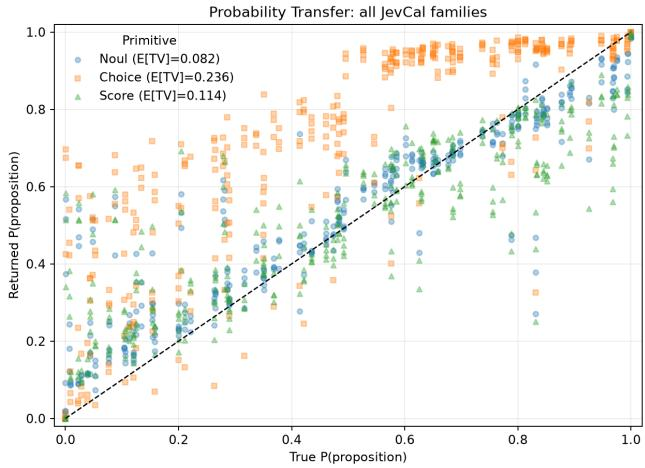
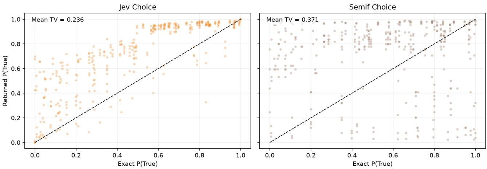
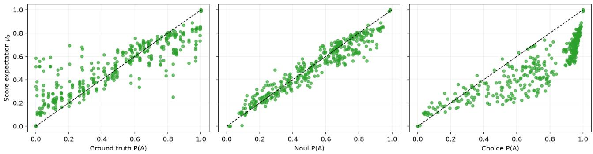
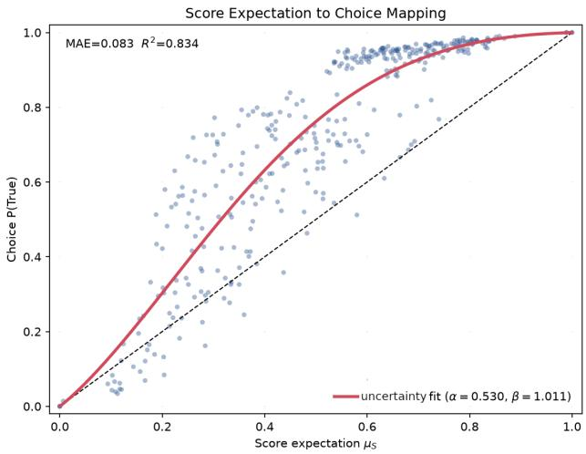
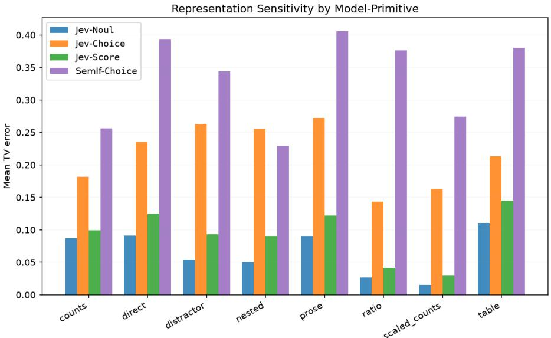

# Jev thinks “I don’t know”, but doesn’t say it: Introducing Sys1Cal-v1 Dataset for Probability Calibration

Riccardo Porcedda

little-g.ai

Department of Excellence L’EMbeDS, Sant’Anna School of Advanced Studies, Italy Department of Computer Science, University of Pisa, Italy

## Abstract

The appearance of Jev marked the era of System One Models, foundation models that return structured decisions with probability distributions rather than text. Aside from low cost and great speed, Jev’s central promise is that these probabilities are calibrated: such claim is not backed by any public test and available external benchmarks evaluate confidence calibration, not whether every returned option probability has the right numerical meaning. To tackle this issue, we introduce Sys1Cal-v1, a dataset of True/False questions about a proposition A for which the exact probability P(A) is known by construction. Each item is queried through the three Jev primitives - Noul, Choice, and Score - and evaluated by total variation distance from the ground-truth distribution, which can be used to estimate a soft accuracy of System One Models.

We showcase the utility of Sys1Cal-v1 as a benchmark dataset by evaluating Jev and SemIf, an open-source Choice-style baseline.

In this work, however, we focus even more deeply on Jev, by studying the calibration of its Score and Choice answers. In particular, we discover a peculiar behaviour that can be explained by assuming that Jev suppresses a third truth value, going beyond True and False. In other words, in Choice answers, P(A) and $P ( \neg A )$ are presented as if $P ( A ) + P ( \neg A ) = 1$ , while a term P(U) ̸= 0 is missing in the sum. Recovering P(U) leads to an improvement of median soft accuracy in Choice answers from 0.771 to 0.978, suggesting that, even in binary decisions, Jev wants to answer with a third option:

## 1 INTRODUCTION

Probabilistic predictions are often consumed by downstream decision rules rather than used only to select the most likely class. Under Bayesian decision theory, a predictive distribution is combined with task dependent costs or utilities to determine an optimal action; consequently, reliable class probabilities are important for cost-sensitive classification, autonomous decision systems, and settings in which a model may abstain or defer uncertain cases [9, 13, 5, 7]. This motivates predictive interfaces in which probabilities are first-class outputs rather than auxiliary confidence scores. Jev was introduced by TypeSafe AI as a System One Model for this setting: given an input state and typed questions, it returns structured probabilistic decisions rather than free-form text, through Noul for binary judgments, Choice for categorical decisions, and Score for ordered scales [1].

Leaving aside the great speed and low cost of this model, a question arises about probability calibration, since no test on available public datasets was performed. The importance of assessing this calibration for process automatization is decision-theoretic: for actions a, outcomes y, and utilities $u ( a , y )$ , the optimal downstream action depends on the predictive distribution,

$$
a ^ { * } ( x ) = \arg \operatorname* { m a x } _ { a } \sum _ { y } P ( y \mid x ) u ( a , y ) .
$$

Argmax accuracy evaluates only the case of a binary decision, for which the probability distribution collapses to a label and discards precisely the information that downstream decisions may need. To give some examples:

• classical probabilistic calibration asks whether events assigned probability p occur with frequency p [6];

• proper scoring rules such as the Brier and log-

“I don’t know”.

arithmic scores reward truthful predictive distributions in expectation [4, 9];

• recent work motivates posterior-probability eval uation from Bayes decision theory [8];

• modern neural-network work popularized confidence calibration and expected calibration error (ECE), where only the probability of the predicted class is evaluated [10]. The JevBench dataset [2] belongs to this category.

Even if confidence calibration is an important test for System One models (we don’t want class predictions to be underconfident/overconfident), this metric does not test whether each returned option probability has the right numerical meaning, whether equivalent states produce equivalent probabilities, or whether diferent Jev primitives expose compatible semantics (do probabilities from Noul, Choice and Score answers have the same meanings?).

We introduce Sys1Cal-v1<sup>1</sup> to isolate that missing question. Sys1Cal-v1 is a synthetic dataset in which the exact probability of a proposition is known by construction, evaluating the model’s probability distribution rather than only empirical calibration against one realized label.

## 1.1 Contributions

We make four contributions.

First, we introduce Sys1Cal-v1, a benchmark dataset of True/False questions about a proposition A for which P(A) is known.

Second, we show how Sys1Cal-v1 can be used to evaluate System One models. We report Distributional Overlap (OVL), i.e., soft accuracy, for Jev across Noul, Choice, and Score, and for SemIf [14] as a Choicestyle open-source baseline.

Third, we identify a systematic Choice miscalibration in Jev. While the same problem is present also in SemIf, in Jev there is a mapping that appears to solve the problem, suggesting that there exist an underlying hidden process defining how Jev assigns probabilities.

Finally, we show that this hidden process can be the presence of a third truth value, the ambiguity U, which goes beyond the concepts of True and False and identifies a state of uncertainty of the model. Estimat ing U and using it to fix the probability distribution of Choice answers, increases the mean soft accuracy from 0.764 to 0.931.

## 2 SYS1CAL-V1

## 2.1 Dataset Design

Each Sys1Cal-v1 item begins with the definition of a proposition A. A random generator produces the probability

$$
p ^ { * } = P ( A ) , { \mathrm { ~ t h e r e f o r e ~ } } P ( \neg A ) = 1 - p ^ { * } .
$$

From these, we generate the states, which in Sys1Calv1 are of six types: explicit probabilities, frequencies from counts, compound probability, conditional probability, Bayes’ rule, and sequential Bayesian updates. The aim behind these six types is checking to what dificulty level a System One model is able to perform calibrated decisions. Furthermore, the same problem can be rendered in multiple equivalent forms: direct probability statements, counts, ratios, tables, prose, nested state, and distractor-augmented state.

In total, the first version of Sys1Cal-v1 contains 365 rendered examples derived from 92 problems. Here is a simplified example of how a Sys1Cal-v1 item would look like:

```json
{
"family": "explicit_probability",
"representation": "direct",
"state": {
"sufficient_statistics": {
"p_A": 0.105263157895,
"p_not_A": 0.894736842105
}
},
"queries": {
"noul": {
"proposition": "Event A is true."
},
"choice": {
"question": "What is the truth status of the
following proposition?",
"proposition": "Event A is true.",
"options": ["False", "True"]
},
"score": {
"question": "To what degree is the
following proposition true?",
"proposition": "Event A is true.",
"levels": [
"Completely false",
"Very strongly false",
"Strongly false",
"Moderately false",
"Slightly false",
"Slightly true",
"Moderately true",
"Strongly true",
"Very strongly true",
"Completely true"
]
}
}}
```

  
Figure 1: Probability transfer across all Sys1Cal-v1 families. Noul and Score expectation remain closer to the dashed identity line, while Choice is systematically shifted toward high True probabilities.

## 2.2 Primitives and Projections

We are going to discuss now what we expect from Jev’s primitives and how answers and their probabilities are evaluated through Sys1Cal-v1.

Noul The type Noul is the simplest primitive: if A is the prompt, it returns the estimated probabilities $P ( A )$ and $P ( \neg A )$ , with $P ( A ) + P ( \neg A ) = 1$

Choice This type returns a categorical distribution over defined criteria, i.e., possible answers to a given question. In our setting, the question is ”What is the truth value of $A ? ^ { \mathfrak { p } }$ and the criteria are True and False, therefore, we would expect the model to return $P ( \mathtt { T r u e } ) = P ( A )$ and $P ( \mathbf { F a l s e } ) = P ( \lnot A )$

Score This type returns an ordinal distribution over ordered, descriptive levels. $\mathrm { S o } ,$ for our purposes, while the question is the same as for Choice, here we define 10 levels corresponding to diferent grades of truth, from Completely False to Completely True. To each level $j ,$ we assign a numerical values $z _ { j } = j / 9$ The idea is to evaluate if the model is able to make fuzzy decisions. Nonetheless, Sys1Cal-v1 only defines $P ( \mathrm { T r u e } ) ~ = ~ P ( A )$ and $P ( { \bf F a l s e } ) = P ( \lnot A )$ , so, in order to evaluate probability calibration, we need a projection from numerical Score values into a binary True/False setting.

If $q _ { j }$ is the score of level $j$ from the categorical distribution, and Score indeed represents a graded truth, we expect to get $P ( A )$ from the Score expectation

Table 1: Mean TV and OVL (soft accuracy) by modelprimitive. Jev-Noul and Jev-Score are well calibrated, while Choice answers show poorer performances on both Jev and SemIf
<table><tr><td>Output</td><td>Mean TV</td><td>Mean OVL</td></tr><tr><td>Jev-Choice</td><td>0.236</td><td>0.764</td></tr><tr><td>Jev-Noul</td><td>0.0817</td><td>0.918</td></tr><tr><td>Jev-Score</td><td>0.1139</td><td>0.886</td></tr><tr><td>SemIf-Choice</td><td>0.371</td><td>0.629</td></tr></table>

$$
\mu _ { S } = \sum _ { j = 0 } ^ { 9 } q _ { j } z _ { j } .\tag{1}
$$

## 2.3 Metrics

In Section 1 we reported the main definitions of calibration. Here we set the metric used for System One models evaluation through Sys1Cal-v1: total variation distance. Total variation distance is a statistical distance between two probability distributions (in this case, the true one and the empirical one returned by the model). For a random variable that can take only two values, this is

$$
\begin{array} { r } { \mathrm { T V } ( \hat { p } , p ^ { * } ) = | \hat { p } - p ^ { * } | , } \end{array}
$$

with $\hat { p }$ being the estimated probability and $p ^ { * }$ the real one. From this, we can also define the Distributional Overlap (OVL), also known as the overlapping coeficient [11]:

$$
\operatorname { O V L } ( { \hat { p } } , p ^ { * } ) = 1 - | { \hat { p } } - p ^ { * } | .
$$

This quantity lies in [0, 1] and can be considered a soft accuracy, since it generalizes the accuracy metric from deterministic one-hot targets to probabilistic targets. Such a metric couldn’t be adopted in benchmarks where only true labels are known, discarding their probability. But Sys1Cal-v1 is constructed specifically to make the target distribution available for this type of evaluation.

We also adopt $\mathrm { T V } ( \hat { p } , p ^ { * } )$ to measure representation sensitivity: while a proposition can be expressed in multiple ways, the values of $P ( A )$ remain the same, so we would expect from a good System One model to return the same probabilities, regardless of the proposition being presented as prose, table, counts, or a ratio. We therefore group problems in Sys1Cal-v1 and measure the pairwise TV distance between equivalent renderings of the proposition. The full summary appears in Appendix A.

  
Figure 2: Choice probability transfer for Jev and SemIf. Mean TV is reported in each panel.

## 3 EVALUATION OF PROBABILITY CALIBRATION

Having defined the evaluation metrics, we proceed with the experiments on probability calibration using Sys1Cal-v1. Since Jev and SemIf outputs are not deterministic, we input each Sys1Cal-v1 item 10 times and obtain the corresponding answers’ probabilities $p _ { 1 } , . . . , p _ { 1 0 }$ , from which we estimate $\begin{array} { r } { \hat { p } \ = \ \frac { 1 } { 1 0 } \sum _ { i = 1 } ^ { 1 0 } p _ { i } } \end{array}$ After this, we are able to compute $\mathrm { T V } ( \hat { p } , p ^ { * } )$

## 3.1 Evaluating Primitives

Instead of evaluating the overall probability calibration of the models, we want to study Noul, Choice and Score calibration separately. This is for two main reasons: having a fair comparison between Jev and SemIf (since the latter only produces Choice type answers) and studying in details the diferences between Jev’s primitives. In Table 1 we report the result.

While SemIf appears weaker in general, with an average OVL of 0.629, also Jev’s Choice answers show worse calibration than Noul and Score. In Figure 1 we provide a visual cue of this diference between primitives. This is an interesting result, since, as we already highlighted, all the primitives are being evaluated on the same items and should estimate the same probabilities. In particular, it appears that Jev-Choice tends to return very high probabilities when $P ( A ) \ \geq \ 0 . 5$ while being fuzzier when $P ( A ) < 0 . 5$ . SemIf, on the other hand, appears to be generally miscalibrated (see Figure 2).

Jev-Noul and Jev-Score show a similar calibration, obtaining an average OVL of 0.918 and 0.886, respectively, showing that the Score expectation defined in Equation 1 correctly recovers the probabilities returned by Jev-Noul. This also motivates us to further study the correlation between Score expectations and the probabilities returned by Jev-Noul and Jev-Choice.

## 3.2 A hint from Score expectations

In Figure 3 we plot Score expectations against ground truth, Noul, and Choice probabilities. From the first plot, we can assess the goodness of the calibration of Score answers, and, in the second plot, we show the agreement between Score expectations and Noul. But, more interestingly, the last plot shows that Choice answers are not merely miscalibrated: it appears that there exists a non-linear map from Score expectations that could fix the probability calibration.

This raises the following question: what kind of latent behavior would distort Choice probabilities in such a systematic way, while leaving Noul and Score expectation well correlated and much closer to the ground truth?

## 4 GOING BEYOND TRUE AND FALSE

In Sys1Cal-v1, Score answers return an ordinal distribution ranging from Completely False to Completely True. We summarize this distribution through its expectation $\mu _ { S }$ , as defined in Equation 1. A direct binary interpretation would therefore associate $\mu _ { S }$ with the probability of True and $1 - \mu _ { S }$ with the probability of False.

As we have shown, this projection is linearly related to Noul probabilities. Its relation with binary Choice probabilities, however, is non-linear. This suggests that the transformation from Score to Choice may discard information that cannot be represented by a direct True/False projection.

  
Figure 3: Score expectations compared with ground truth, Noul, and Choice probabilities. Score expectations tracks Noul more tightly than it tracks Choice, which shows a peculiar shape that suggests the existence of a map that could fix the calibration.

We therefore introduce a latent three-component probability distribution

$$
\pi _ { T } + \pi _ { U } + \pi _ { F } = 1 ,
$$

where $\pi _ { T } , ~ \pi _ { U }$ , and $\pi _ { F }$ denote, respectively, the latent probabilities associated with True, Uncertain, and False.

If Choice excludes the uncertain component and renormalizes the remaining two probabilities, then

$$
P _ { \mathtt { C h o i c e } } ( \mathtt { T r u e } ) = \frac { \pi _ { T } } { \pi _ { T } + \pi _ { F } }\tag{2}
$$

$$
= \frac { \pi _ { T } } { 1 - \pi _ { U } } ,\tag{3}
$$

and analogously

$$
P _ { \mathtt { C h o i c e } } ( \mathtt { F a l s e } ) = \frac { \pi _ { F } } { 1 - \pi _ { U } } .
$$

We infer this latent representation from the Score expectation $\mu _ { S }$ . In particular, we take the Score expectation as the latent probability already assigned to True,

$$
\widehat { \pi } _ { T } = \mu _ { S } ,\tag{4}
$$

and allow part of the remaining probability $1 - \mu _ { S }$ to represent uncertainty. The reason why we assume this is that Score expectations and Noul answers (which are strongly correlated) appear to be well calibrated, so no relevant uncertainty appears to be present in $\mu _ { S }$

We model this latent uncertainty probability as

$$
\widehat { \pi } _ { U } ( \mu _ { S } ) = \mu _ { S } ^ { \alpha } ( 1 - \mu _ { S } ) ^ { \beta } ,
$$

with $\alpha > 0$ and $\beta \geq 1$ . These constraints guarantee that

$$
0 \leq \widehat { \pi } _ { U } ( \mu _ { S } ) \leq 1 - \mu _ { S } .
$$

The remaining probability is assigned to False,

$$
\widehat { \pi } _ { F } = 1 - \widehat { \pi } _ { T } - \widehat { \pi } _ { U } .
$$

The corresponding prediction of the binary Choice probability is therefore

$$
\widehat { P } _ { \mathtt { C h o i c e } } ( \mathtt { T r u e } \mid \mu _ { S } ) = \frac { \mu _ { S } } { 1 - \mu _ { S } ^ { \alpha } ( 1 - \mu _ { S } ) ^ { \beta } } .\tag{5}
$$

To test whether a non-zero uncertainty component is supported by the data, we introduce a scale parameter

$$
\begin{array} { r } { \widehat { \pi } _ { U } ( \mu _ { S } ) = \lambda \mu _ { S } ^ { \alpha } ( 1 - \mu _ { S } ) ^ { \beta } , \qquad 0 \leq \lambda \leq 1 , } \end{array}
$$

so that the no-uncertainty hypothesis is $H _ { 0 } : \lambda = 0$ We estimate both a global λ and problem-level values $\lambda _ { j }$ across the 92 latent problems; Table 2 reports the corresponding estimates and tests.

Fitting Eq. 5 to Sys1Cal-v1 yields

$$
\alpha = 0 . 5 3 0 , \qquad \beta = 1 . 0 1 1 ,
$$

with $R ^ { 2 } = 0$ .834 for the resulting prediction of Choice probabilities (see Figure 4).

More importantly, introducing this component improves the prediction of binary Choice probabilities: the mean reduction in absolute error is 0.110, with a 95% confidence interval that excludes zero.

While our definition of uncertainty need not to be an exact discovery of how Jev encodes truth values, these tests show that Jev-Choice may go beyond a True/False-only setting.

## 5 UNCERTAINTY AS A USEFUL SIGNAL FOR CHOICE

The uncertainty model is not only a post-hoc explanation of the Score–Choice discrepancy. It yields two operationally diferent objects. The first is a calibrated binary Choice probability, useful when downstream systems require the original True/False setting. The second is a three-status representation, useful when a system encodes uncertainty and act conditionally on it.

  
Figure 4: Score-to-Choice mapping induced by the fitted latent uncertainty model. Introducing a latent uncertainty probability of the form $\mu _ { S } ^ { \alpha } ( 1 - \mu _ { S } ) ^ { \beta }$ captures much of the systematic non-linearity between Score expectations and binary Choice probabilities.

Let

$$
f ( \mu ) = \frac { \mu } { 1 - \lambda \mu ^ { \alpha } ( 1 - \mu ) ^ { \beta } }
$$

be the fitted Score-to-Choice distortion map. If Choice behaves like a binary projection of a richer state, then a raw Choice probability $p _ { C }$ can be corrected by applying the inverse map

$$
\tilde { p } _ { C } = f ^ { - 1 } ( p _ { C } ) .
$$

This gives an ordinary binary probability estimate, so it can be evaluated with the same distributional overlap used for raw Choice:

$$
\mathrm { O V L } _ { \mathrm { c o r r } } = 1 - \left| \tilde { p } _ { C } - p ^ { * } \right| .
$$

The correction substantially improves binary probability recovery (see Table 3). Raw Choice has mean OVL 0.764 and median OVL 0.771, whereas inverse uncertainty calibration raises these values to 0.880 and 0.903, respectively. Thus the uncertainty model is not merely descriptive: when inverted, it acts as a practical post-hoc calibration layer for Choice probabilities.

The second use keeps the inferred uncertainty mass instead of forcing it back into a binary probability. The fitted model induces

$$
T = \mu _ { S } , \qquad U = \lambda \mu _ { S } ^ { \alpha } ( 1 - \mu _ { S } ) ^ { \beta } , \qquad F = 1 - T - U .
$$

Table 2: Tests for the scaled Score–Uncertainty model. The null hypothesis is $H _ { 0 } : \lambda = 0$ . The global $\hat { \lambda }$ row reports the fitted scale and a bootstrap confidence interval over latent problems. The $\lambda _ { j }$ tests whether the fitted uncertainty is positive across the latent problems.
<table><tr><td>Quantity</td><td>Estimate</td><td>95% CI</td><td>p-value</td></tr><tr><td>Global  $\hat { \lambda }$ </td><td>0.978</td><td>[0.789, 1.000]</td><td></td></tr><tr><td>Latent  $\lambda _ { j }$ </td><td>0.821</td><td>[0.760, 0.882]</td><td> $2 . 9 4 \times 1 0 ^ { - 4 4 }$ </td></tr></table>

This three-status representation does not assert a single value for $P ( A )$ . Instead, it defines an interval of compatible truth probabilities,

$$
P ( A ) \in [ T , T + U ] .\tag{6}
$$

We therefore evaluate it with

$$
\mathrm { O V L } _ { T U F } = 1 - d \big ( p ^ { * } , [ T , T + U ] \big ) ,
$$

where d is the absolute distance from $p ^ { * }$ to the interval. This quantity is not directly identical to binary OVL: a wider interval is more permissive. For this reason, $\operatorname { O V L } _ { T U F }$ must be reported together with the width U. In our evaluation, the $\mathrm { T / U / F }$ interval reaches mean OVL 0.931 and median OVL 0.978, with mean uncertainty width 0.292.

These two uses support diferent deployment patterns. Corrected Choice is appropriate when an application needs a single calibrated binary probability for thresholding, ranking, expected-utility decisions, or risk scoring. It preserves the original Choice interface while reducing its probability distortion. The $\mathrm { T / U / F }$ representation is appropriate when the system can make uncertainty-aware decisions: act automatically when $U$ is small, defer when $U$ is large, request more evidence when the interval crosses a decision threshold, or route the item to a slower model or human reviewer. This connects JevCal to selective prediction and abstention, where uncertainty is valuable precisely because it identifies cases in which an automatic binary decision should be treated cautiously [16, 12].

The practical conclusion is that the Choice error is recoverable in two ways. If a binary answer is required, inverse uncertainty calibration turns distorted Choice probabilities into much better probability estimates. If the interface can expose richer state, the inferred $\mathrm { T / U / F }$ representation provides a more informative object: not only an estimate of truth support, but also a measure of how much probability mass was unresolved by the forced binary projection.

Table 3: Choice OVL under three evaluation modes. The $\mathrm { T / U / F }$ score evaluates interval compatibility and should be interpreted together with the mean uncertainty width E[U].
<table><tr><td>Setting</td><td>Mean OVL</td><td>Med. OVL</td></tr><tr><td>Raw Choice</td><td>0.764</td><td>0.771</td></tr><tr><td>Calibrated Choice</td><td>0.880</td><td>0.903</td></tr><tr><td>T/U/F</td><td>0.931</td><td>0.978</td></tr></table>

Practical decision example. Consider an automated agent deciding whether a proposition A is true enough to trigger an action, for example whether a transaction should be approved automatically or whether an e-mail should be marked as spam. The agent has three actions:

$$
\begin{array} { l } { { a _ { T } = \mathrm { a c t ~ a s ~ i f ~ } A \mathrm { ~ i s ~ t r u e , } } } \\ { { \ } } \\ { { a _ { F } = \mathrm { a c t ~ a s ~ i f ~ } A \mathrm { ~ i s ~ f a l s e , } } } \\ { { \ } } \\ { { a _ { D } = \mathrm { d e f e r . } } } \end{array}
$$

A correct committed decision has zero loss, an incorrect committed decision has cost $C _ { \mathrm { e r r } } = 1 0 0$ , and deferral to a slower or human procedure has cost $C _ { D } = 4 5$

Suppose the raw Choice output is

$$
P _ { \mathtt { C h o i c e } } ( A ) = 0 . 6 3 2 .
$$

Using this probability directly, the expected losses are

$$
\begin{array} { l } { R ( a _ { T } ) = 1 0 0 ( 1 - 0 . 6 3 2 ) = 3 6 . 8 , } \\ { R ( a _ { F } ) = 1 0 0 ( 0 . 6 3 2 ) = 6 3 . 2 , } \\ { R ( a _ { D } ) = 4 5 . } \end{array}
$$

Thus raw Choice recommends committing to $a _ { T }$

Now apply the inverse uncertainty calibration map. For this example,

$$
\tilde { p } _ { C } = f ^ { - 1 } ( 0 . 6 3 2 ) \simeq 0 . 4 0 0 .
$$

The calibrated binary probability reverses the preferred committed decision. The expected losses become

$$
\begin{array} { r l } & { R ( a _ { T } ) = 1 0 0 ( 1 - 0 . 4 0 0 ) = 6 0 . 0 , } \\ & { R ( a _ { F } ) = 1 0 0 ( 0 . 4 0 0 ) = 4 0 . 0 , } \\ & { R ( a _ { D } ) = 4 5 . } \end{array}
$$

Thus calibrated Choice recommends committing to a<sub>F</sub> .

Finally, keep the inferred three-status representation:

$$
( \widehat { \pi } _ { T } , \widehat { \pi } _ { U } , \widehat { \pi } _ { F } ) = ( 0 . 4 0 0 , 0 . 3 6 7 , 0 . 2 3 3 ) .
$$

Table 4: Decision induced by the three Choice-derived settings in a costly automation example. The same raw Choice output leads to three diferent actions: raw Choice commits to True, calibrated Choice commits to False, and $\mathrm { T / U / F }$ defers because the unresolved mass makes either committed action too risky.
<table><tr><td>Setting</td><td>Criterion</td><td>Action</td></tr><tr><td>Raw Choice</td><td>Bayes risk</td><td>Act True</td></tr><tr><td>Calibrated Choice</td><td>Bayes risk</td><td>Act False</td></tr><tr><td>T/U/F</td><td>Robust risk</td><td>Defer</td></tr></table>

Renormalizing the committed components gives

$$
\frac { \widehat { \pi } _ { T } } { \widehat { \pi } _ { T } + \widehat { \pi } _ { F } } = \frac { 0 . 4 0 0 } { 0 . 4 0 0 + 0 . 2 3 3 } \simeq 0 . 6 3 2 ,
$$

so the $\mathrm { T / U / F }$ representation explains the raw Choice output as a forced binary projection. However, it also preserves the unresolved mass. By Equation 6, it induces the compatible probability interval

$$
P ( A ) \in [ 0 . 4 0 0 , 0 . 7 6 7 ] .
$$

Under a robust Γ-minimax criterion [3, 15], the worstcase losses are

$$
\begin{array} { l } { { \overline { { { R } } } ( a _ { T } ) = 1 0 0 ( 1 - 0 . 4 0 0 ) = 6 0 . 0 , } } \\ { { { \overline { { { R } } } ( a _ { F } ) = 1 0 0 ( 0 . 7 6 7 ) = 7 6 . 7 , } } } \\ { { { \overline { { { R } } } ( a _ { D } ) = 4 5 . } } } \end{array}
$$

The robust action is therefore $a _ { D }$

## 6 SCOPE AND LIMITATIONS

Sys1Cal-v1 is designed to isolate probability semantics, not to measure broad natural-language competence. Its synthetic construction is a strength: each item has an exact pointwise probability, so model outputs can be compared directly with the target distribution. This is precisely what makes distributional overlap meaningful in our setting. At the same time, the benchmark has limited ecological coverage. The current release uses controlled probability families and templated renderings; future versions should include richer linguistic variation, adversarial paraphrases, domain-specific decision problems, and independently validated natural-language formulations.

Our analysis of Score also relies on a one-dimensional projection: the expectation of a 10-level ordered distribution. This projection is natural for truth-like scores, but it may not exhaust the information contained in the full Score distribution. Other summaries, or direct evaluation of the full ordered distribution, may expose additional structure.

Finally, the uncertainty model should be interpreted as an observational account of the relation between Score and Choice, not as a causal claim about Jev’s internal implementation. The results show that Choice behaves as if a richer state were being collapsed into a forced binary output, and that the inferred unresolved mass is useful for calibration and decision making. They indicate, but they don’t prove, that Jev explicitly represents a hidden third truth value internally.

## 7 CONCLUSION

We introduced Sys1Cal-v1, a benchmark for evaluating whether the probabilities returned by System One models have the intended numerical meaning. Unlike confidence-calibration benchmarks, Sys1Cal-v1 provides the exact probability of each proposition by construction and evaluates the returned distribution directly. This makes it possible to test pointwise probability recovery, compare probabilistic semantics across diferent primitives, and measure representation sensitivity across equivalent formulations of the same latent problem.

Our evaluation shows that Jev’s primitives do not expose probability in the same way. Noul and Score are substantially better aligned with the ground-truth probabilities than Choice. The benchmark also reveals representation sensitivity: equivalent formulations of the same probability problem can induce different outputs, with Choice less invariant than Noul and Score.

We then showed that the Choice distortion can be explained by an uncertainty model estimated from Score answers. Inverting this map gives a practical post-hoc calibration layer for binary Choice: median binary OVL improves from 0.771 for raw Choice to 0.903 after correction. Keeping the inferred uncertainty instead yields a T/U/F interval representation with median interval OVL 0.971. The latter score is not directly interchangeable with binary OVL, but it captures a diferent and useful object: compatibility with a range of truth probabilities induced by an uncertain component.

This distinction matters for downstream automation. We showed with a practical example how the outcome of a selective decision problem can be diferent using raw Choice, calibrated Choice or T/U/F.

The broader lesson is that evaluation of structured decision models should not stop at argmax accuracy or top-label confidence calibration. If a model returns probabilities for use in automated decisions, the probabilities themselves are the object being promised.

Sys1Cal-v1 makes that promise testable, and shows that probability semantics can difer substantially across interfaces even within the same model.

## REFERENCES

[1] D. Almeida. Introducing system one models & Jev, Sept. 2026. URL https://typesafe.ai/blog/ introducing-system-one-models-and-jev. TypeSafe AI Blog.

[2] Benchmark Heaven. JevBench: A benchmark for Jev-class decision models. GitHub repository, 2026. URL https://github.com/ fstandhartinger/jevbench. Accessed: 2026-09- 25.

[3] J. O. Berger. Statistical Decision Theory and Bayesian Analysis. Springer, New York, 2 edition, 1985. doi: 10.1007/978-1-4757-4286-2.

[4] G. W. Brier. Verification of forecasts expressed in terms of probability. Monthly Weather Review, 78(1):1–3, 1950. doi: 10.1175/1520-0493(1950) 078⟨0001:VOFEIT⟩2.0.CO;2.

[5] C. K. Chow. On optimum recognition error and reject tradeof. IEEE Transactions on Information Theory, 16(1):41–46, 1970. doi: 10.1109/ TIT.1970.1054406.

[6] A. P. Dawid. The well-calibrated bayesian. Journal of the American Statistical Association, 77 (379):605–610, 1982. doi: 10.1080/01621459. 1982.10477856.

[7] R. El-Yaniv and Y. Wiener. On the foundations of noise-free selective classification. Journal of Machine Learning Research, 11(53):1605– 1641, 2010. URL https://jmlr.org/papers/ v11/el-yaniv10a.html.

[8] L. Ferrer and D. Ramos. Evaluating posterior probabilities: Decision theory, proper scoring rules, and calibration. Transactions on Machine Learning Research, 2025. ISSN 2835- 8856. URL https://openreview.net/forum? id=qbrE0LR7fF.

[9] T. Gneiting and A. E. Raftery. Strictly proper scoring rules, prediction, and estimation. Journal of the American Statistical Association, 102(477):359–378, 2007. doi: 10.1198/ 016214506000001437.

[10] C. Guo, G. Pleiss, Y. Sun, and K. Q. Weinberger. On calibration of modern neural networks. In Proceedings of the 34th International Conference on Machine Learning, volume 70 of Proceedings of Machine Learning Research, pages 1321–1330.

PMLR, 2017. URL https://proceedings.mlr. press/v70/guo17a.html.

[11] H. F. Inman and E. L. Bradley, Jr. The overlapping coeficient as a measure of agreement between probability distributions and point estimation of the overlap of two normal densities. Communications in Statistics – Theory and Methods, 18(10):3851–3874, 1989. doi: 10.1080/ 03610928908830127.

[12] S. Kadavath, T. Conerly, A. Askell, T. Henighan, D. Drain, E. Perez, N. Schiefer, Z. Hatfield-Dodds, N. DasSarma, E. Tran-Johnson, S. Johnston, S. El-Showk, A. Jones, N. Elhage, T. Hume, A. Chen, Y. Bai, S. Bowman, S. Fort, D. Ganguli, D. Hernandez, J. Jacobson, J. Kernion, S. Kravec, L. Lovitt, K. Ndousse, C. Olsson, S. Ringer, D. Amodei, T. Brown, J. Clark, N. Joseph, B. Mann, S. McCandlish, C. Olah, and J. Kaplan. Language models (mostly) know what they know. arXiv preprint arXiv:2207.05221, 2022. URL https://arxiv.org/abs/2207.05221.

[13] T. Silva Filho, H. Song, M. Perello-Nieto, R. Santos-Rodriguez, M. Kull, and P. Flach. Classifier calibration: A survey on how to assess and improve predicted class probabilities. Machine Learning, 112(9):3211–3260, 2023. doi: 10.1007/s10994-023-06336-7.

[14] TheoLeeCJ. SemIf: Open baselines for runtimedefined semantic decisions. GitHub repository, 2026. URL https://github.com/TheoLeeCJ/ SemIf-OpenJev. Accessed: 2026-09-25.

[15] P. Walley. Statistical Reasoning with Imprecise Probabilities. Chapman and Hall, London, 1991.

[16] J. Xin, R. Tang, Y. Yu, and J. Lin. The art of abstention: Selective prediction and error regularization for natural language processing. In Proceedings of the 59th Annual Meeting of the Association for Computational Linguistics and the 11th International Joint Conference on Natural Language Processing (Volume 1: Long Papers), pages 1040–1051, Online, 2021. Association for Computational Linguistics. doi: 10.18653/v1/2021. acl-long.84. URL https://aclanthology.org/ 2021.acl-long.84/.

## A REPRESENTATION SENSITIVITY

Representation sensitivity measures semantic invariance: if two prompts encode the same probability problem, a calibrated probabilistic interface should return the same distribution up to noise. Each latent problem is rendered in multiple equivalent forms; we compute pairwise TV across renderings after aggregating repeats, and also record the maximum spread within each latent group. Lower values mean greater invariance.

The results show a consistent ordering. Jev Noul is the most stable primitive, with mean pairwise TV 0.044. Score expectation is less stable than Noul but still substantially more stable than Choice. Jev Choice has more than twice Noul’s mean pairwise variation, while SemIf Choice is the least stable model in this comparison. This matters because representation sensitivity can hide behind aggregate calibration: a model may achieve a reasonable average error while still changing its probabilities when the same state is written in a diferent but equivalent form.

Table 5: Examples of representation types in Sys1Cal-v1. Each row shows one rendered state format used to express an exact latent probability problem. The proposition and gold distribution are shared by the three primitives Noul, Choice, and Score.
<table><tr><td>Representation</td><td>Family</td><td>State</td><td>Proposition / gold</td></tr><tr><td>Direct</td><td>Explicit probability</td><td>sufficient_statistics:  $p _ { A } = 0 , p _ { \neg A } = 1$ </td><td> $\mathrm { \ddot { \ s E v e n t { \ A i s } } \ t r u e { \Sigma } } ^ { \mathrm { , } }$   $P ( \mathrm { T r u e } ) = 0$ </td></tr><tr><td>Ratio</td><td>Explicit probability</td><td>probability-ratio_A_to_not_A: 0:1</td><td>“Event A is true.&quot;  $P ( \mathrm { T r u e } ) = 0$ </td></tr><tr><td>Prose</td><td>Explicit probability</td><td>Natural-language rendering: &quot;The state fully determines the target distribution. The probability of A is 0, and the remaining probability belongs to the other outcome.&quot;</td><td>&quot;Event A is true.&quot;  $P ( \mathrm { T r u e } ) = 0$ </td></tr><tr><td>Distractor</td><td>Explicit probability</td><td>Same sufficient statistics as the direct form, plus irrele- vant metadata</td><td>&quot;Event A is true.&quot;  $P ( \mathrm { T r u e } ) = 0$ </td></tr><tr><td>Counts</td><td>Frequency</td><td>counts:  $\overline { { \mathrm { z o r } = 8 0 0 , \mathrm { n i f } = 2 0 0 ; } }$  sampling is uniform over objects.</td><td>&quot;The sampled object is a zor.&quot;  $P ( \mathrm { T r u e } ) = 0 . 8 $ </td></tr><tr><td>Scaled counts</td><td>Frequency</td><td>Equivalent count representation with all counts scaled: zor = 80000, nif = 20000.</td><td>&quot;The sampled object is a zor.&quot;  $P ( \mathrm { T r u e } ) = 0 . 8 $ </td></tr><tr><td>Table</td><td>Frequency</td><td>A table with one row per label: zor has count 40, nif has count 10.</td><td>&quot;The sampled object is a zor.&quot;  $P ( \mathrm { T r u e } ) = 0 . 8 $ </td></tr><tr><td>Nested state</td><td>Conditional probability</td><td>Nested contingency state with counts: A ∧ B = 74, A ∧  $\lnot B = 4 8 , \lnot A \land B = 7 9 , \lnot A \land \lnot B = 5 5 ;$  query is  $P ( A \mid B ) .$ </td><td> $\mathrm { \ddot { \ s E v e n t { \ A i s } \ t r u e . } } ^ { \mathrm { \prime } }$   $P ( \mathrm { T r u e } ) = 0 . 4 8 4$ </td></tr></table>

Table 6: Representation sensitivity for Jev and SemIf. Mean pairwise TV is the average distance between equivalent renderings of the same latent problem.
<table><tr><td>Output</td><td>Mean pairwise TV</td><td>Mean max TV</td></tr><tr><td>Choice</td><td>0.0998</td><td>0.181</td></tr><tr><td>Noul</td><td>0.0441</td><td>0.0787</td></tr><tr><td>Score exp.</td><td>0.0656</td><td>0.116</td></tr><tr><td>SemIf Choice</td><td>0.117</td><td>0.194</td></tr></table>

  
Figure 5: Representation sensitivity by primitive. Choice and SemIf are more sensitive to equivalent renderings than Noul or Score expectation.