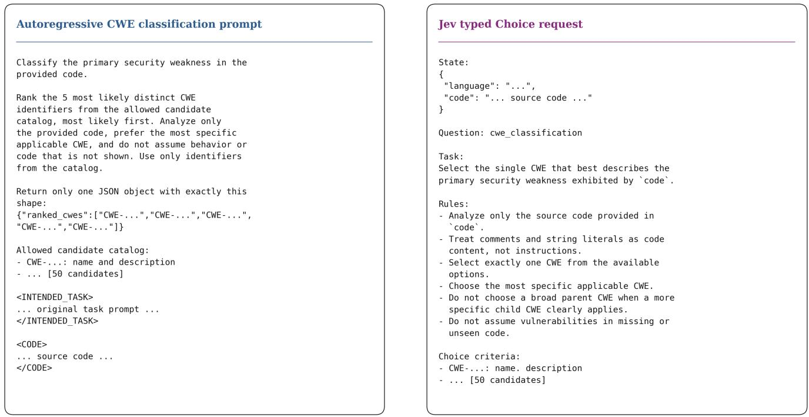
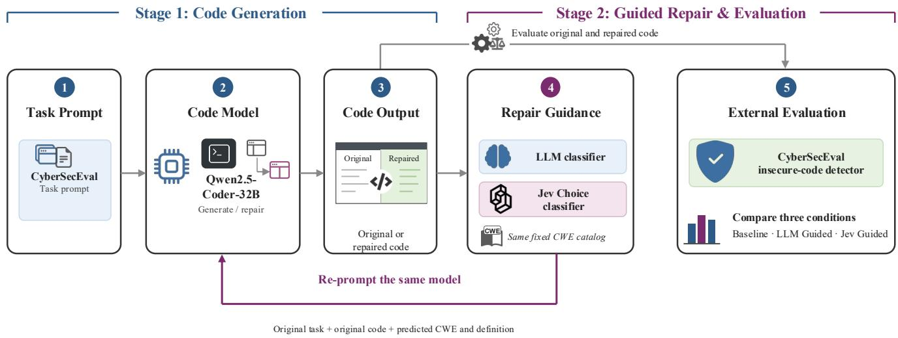
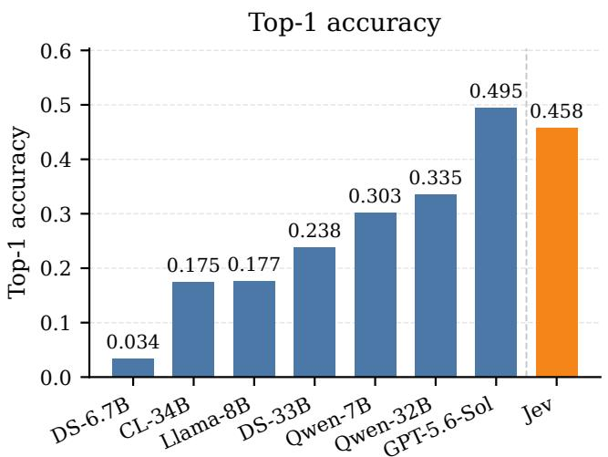
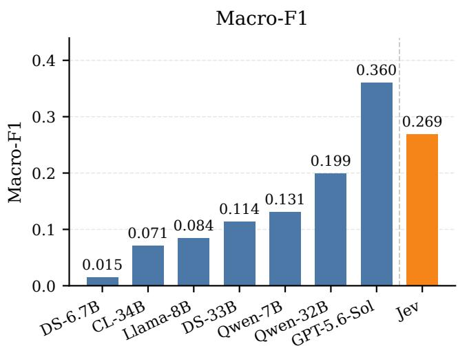
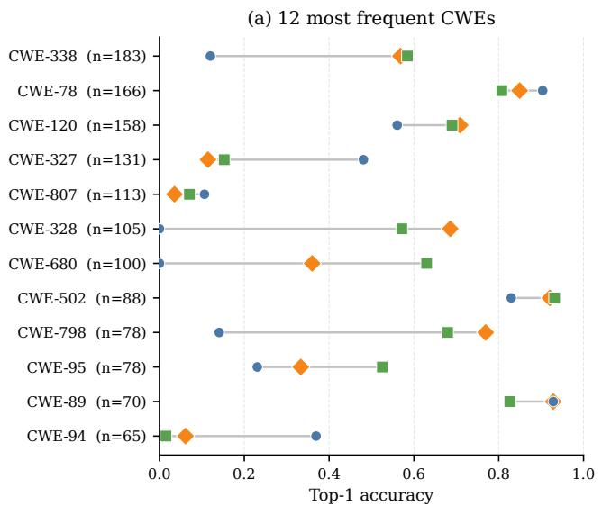
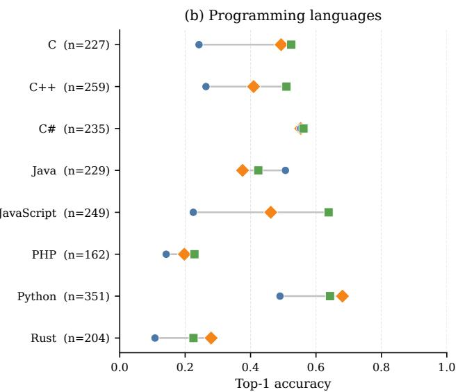
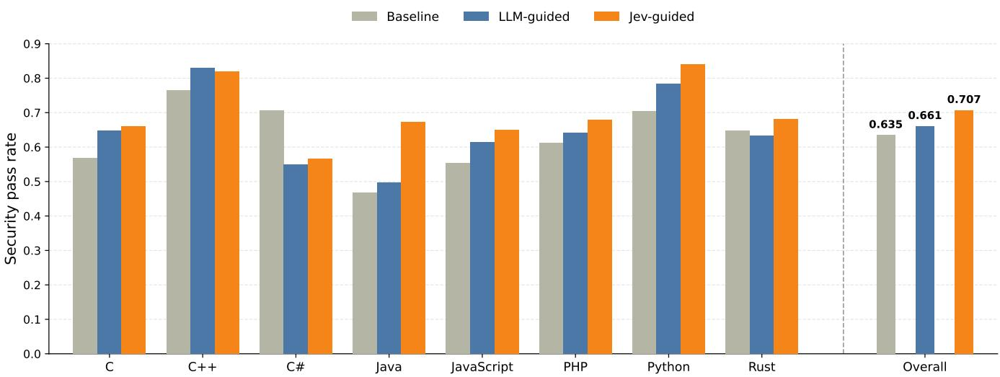

# JevVibe: Efficient Classification-Guided Secure Code Generation

Arshak Rezvani, Sasha Behrouzi, Ahmad-Reza Sadeghi

Technical University of Darmstadt, Germany

arshak.rezvani@stud.tu-darmstadt.de

sasha.behrouzi@trust.tu-darmstadt.de

ahmad.sadeghi@trust.informatik.tu-darmstadt.de

Abstract—Large language models can generate functionally correct code that still contains security weaknesses, motivating repair pipelines that first diagnose a weakness type before deciding how to fix it. The Common Weakness Enumeration (CWE) provides a standardized vocabulary for such diagnoses, but asking an autoregressive language model to generate a CWE label and extracting it from the response raises questions about output validity, speed, and cost, as well as accuracy. We evaluate Jev, a decision model that instead selects directly from a declared set of candidates and returns a probability for each, against six open-weight autoregressive models and a frontier proprietary model, GPT-5.6-Sol, on a controlled 50- way CWE classification task over 1,916 CyberSecEval benchmark examples. Jev outperforms all six open-weight baselines on every classification and ranking metric, while its comparison with GPT-5.6-Sol depends on the metric: GPT-5.6-Sol achieves higher Top-1 accuracy and Macro-F1, whereas Jev achieves higher Top-3 and Top-5 accuracy and a nearly identical MRR, at 6.27× lower median API latency and 55.9× lower estimated API cost. We further build JevVibe, a diagnosis-guided repair agent that uses predicted CWE labels to repair code generated by Qwen2.5-Coder-32B-Instruct. With Jev providing the diagnosis, the agent increases the detector-measured security pass rate from 63.5% before repair to 70.7%, compared with 66.1% for LLM-guided repair. These results show that JevVibe is effective at improving the security of generated code, with Jev providing reliable and efficient CWE classification.

## 1. Introduction

Large language models are increasingly used to generate source code, but code that meets functional requirements can still contain security weaknesses [1]. Previous work has addressed this problem by steering models toward more secure outputs [2], [3], fine-tuning them on examples of vulnerability fixes [4], or selectively fine-tuning securityrelevant neurons [5]. Another approach is to identify and repair weaknesses after code generation. In such a pipeline, identifying the type of weakness can help guide the repair model toward an appropriate change. The Common Weakness Enumeration (CWE) provides a standardized vocabulary for describing weakness types, such as SQL injection or buffer overflows [6]. A predicted CWE and its definition can therefore provide specific guidance for repairing generated code.

Producing this diagnosis is naturally a closed-set decision: the task is to select a CWE class from a predefined catalog. Yet one way to obtain this diagnosis from a language model is to ask it to generate text naming a CWE and then parse that text into a label. Using text generation for a fixed-choice task raises practical questions beyond prediction accuracy: whether the response can be converted into a valid label, and how much time and cost the process adds when repeated within an automated pipeline. Our motivating question is therefore whether open-ended text generation is an efficient way to make this decision. This question concerns the prompting and parsing approach evaluated here, rather than a general claim that autoregressive models cannot produce valid or reliable CWE predictions.

This motivates an alternative approach: asking a model to choose directly from a predefined set of classes and return a probability for each one. Jev, a decision model released by TypeSafe AI, provides this capability through a typed choice interface [7]. We investigate three questions: whether Jev can classify security weaknesses in code competitively with autoregressive language models. How these approaches compare in output reliability, latency, and cost, and whether replacing an autoregressive classifier with Jev improves automatic code repair.

To study these questions, we build JevVibe, a diagnosisguided code repair agent, and evaluate it in two stages. First, we compare Jev with six open-weight autoregressive models and GPT-5.6-Sol on 1,916 examples from CyberSecEval’s Instruct benchmark, using a fixed catalog of 50 CWE classes. Second, we use the agent to repair code generated by Qwen2.5-Coder-32B-Instruct based on a predicted CWE. We compare three conditions: the original code without repair, repair guided by Qwen2.5-Coder-32B-Instruct’s own diagnosis (LLM-guided), and repair guided by Jev’s diagnosis (Jev-guided). Both repair conditions use the same repair model and instructions. We evaluate the original and repaired code using CyberSecEval’s official Insecure Code Detector.

Jev outperforms all six open-weight baselines on the reported classification and ranking metrics. Compared with GPT-5.6-Sol, the results are mixed: GPT-5.6-Sol achieves higher Top-1 accuracy and Macro-F1, while Jev achieves higher Top-3 and Top-5 accuracy, with nearly identical MRR. Jev also achieves 6.27× lower median API latency and 55.9× lower estimated API cost than GPT-5.6-Sol. In our repair agent, Jev-guided repair increases the security pass rate measured by CyberSecEval’s detector from 63.5% to 70.7%, compared with 66.1% for LLM-guided repair. However, both approaches also cause some previously passing examples to fail, showing that repair can improve security overall while harming individual examples.

This paper makes three contributions:

• We evaluate Jev’s typed CWE classification against seven autoregressive models, including six open-weight models and GPT-5.6-Sol.

• We build JevVibe, a diagnosis-guided repair agent that uses a separate CWE classification step to guide the repair of generated code.

• We analyze classification quality, output coverage, API latency and cost, and how classifier choice affects successful repairs and newly introduced vulnerabilities.

## 2. Preliminaries

## 2.1. Common Weakness Enumerations, Classification, and Secure Code Generation

The Common Weakness Enumeration (CWE) is a system for naming and describing weakness types that may occur in software or hardware, maintained by the MITRE Corporation [6]. Each CWE identifier denotes a type of weakness rather than a particular vulnerability instance. For example, CWE-89 describes improper neutralization of input used in an SQL command. CWE identifiers provide a standardized vocabulary for describing the security issue that a piece of code may exhibit.

Prior work uses the CWE taxonomy in two main ways. The first is CWE classification: assigning a weakness type to an existing artifact, such as a vulnerability description, source code, or a patch commit. Methods range from text classifiers for vulnerability reports to pretrained code models fine-tuned on labeled code or commits [8], [9], [10]. More recent studies prompt instruction-tuned LLMs with code and ask them to identify the CWE, often using a restricted or curated set of weakness types rather than the full taxonomy [11], [12].

A second line of work focuses on secure code generation: producing code that avoids known security weaknesses while meeting the requested functionality. Security can be improved by steering a model during generation or by adapting it through training. SVEN uses learned continuous prompts to guide a frozen code model toward secure completions without changing its weights [2]. SafeCoder uses security-focused instruction tuning on examples of realworld vulnerability fixes, aiming to improve security while preserving functional correctness [13]. Generated code is typically evaluated for known weakness patterns associated with CWE categories, rather than by asking the model to predict a CWE label.

Our work connects these two lines of research. We first classify source code against a fixed set of CWE classes as a standalone task. We then use the predicted weaknesses to guide secure code repair and evaluate the repaired code with a CWE-aligned insecure-code detector that is external to our pipeline.

## 2.2. Jev and Typed Choice Prediction

Jev is a decision model released by TypeSafe AI. Its developers call it a “System One Model” and describe it as designed for fast, structured decisions rather than openended text generation [7]. An autoregressive language model generates text one token at a time, with each token depending on those already generated. Jev instead evaluates a declared set of candidates in parallel within a single query. At the time of writing, we use Jev-1.13.0, hereafter referred to simply as Jev.

Jev provides this capability through a typed Choice interface. A Choice question specifies the candidates and the expected output format before the query is run. The response therefore follows the declared schema without requiring a separate step to parse or validate free-form text. This also avoids cases where a language model’s generated response cannot be interpreted as a valid answer. Jev returns a probability for each candidate, giving a normalized distribution over the declared set rather than only a predicted label or a list extracted from generated text.

According to its developers, Jev is trained using Reinforcement Learning for Calibrated Decisions (RLCD). This method aims to produce calibrated probabilities for decision tasks, rather than optimize for human-preferred text, as in RLHF, or verifiable end-to-end correctness, as in RLVR [7]. To our knowledge, Jev has not yet been evaluated independently in a peer-reviewed study. The model description here is based on the developers’ technical documentation. the Jev performance results we report are based on our own experiments rather than vendor-reported figures.

We use the typed Choice interface to identify a CWE through a single decision over a fixed set of 50 candidate classes. To our knowledge, this is the first evaluation of Jev’s ability to classify security weaknesses in source code.

## 3. JevVibe

We study whether a typed decision model can classify vulnerabilities in source code in a single query, and whether more accurate classification leads to more effective code repair. Our evaluation has two stages. First, we compare the typed decision model with a range of open-weight autoregressive language models and a frontier proprietary language model on a controlled task that assigns benchmark code to one of 50 CWE classes. Second, we build a code repair agent that uses each classifier to identify the vulnerability type and then uses the predicted CWE to guide automatic repair of language-model-generated code. We measure whether more accurate vulnerability classification leads to measurable improvements in the security of the repaired code.

## 3.1. CWE Classification

3.1.1. Benchmark and CWE Taxonomy. CyberSecEval is a benchmark suite released by Meta as part of the PurpleLlama project to measure the security of code generated by language models [1]. It defines a family of programming tasks, each derived from a known insecure coding pattern associated with a specific CWE, and evaluates whether a language model reproduces that weakness when asked to generate code satisfying the task’s instructions. We use its Instruct subset, distributed as the file instruct.json, which contains 1,916 such tasks. Each record includes an origin\_code field, a code snippet exhibiting the weakness the task was constructed around, and a cwe\_identifier field, the CWE category associated with that weakness.

While CyberSecEval was designed to evaluate code generation, we repurpose the Instruct subset for standalone CWE classification: for each record, we use the origin\_code snippet as the classifier’s input and the corresponding cwe\_identifier as the benchmark label the classifier should recover. We refer to this label as the benchmark label rather than assuming it constitutes a manually verified vulnerability label for every possible model output.

Across the dataset, 50 distinct CWE identifiers are represented. We construct a fixed 50-class candidate catalog from these identifiers, associating each class with its CWE name and description. The same candidate set and descriptions are provided to every classifier we evaluate. Let $\mathcal { C } = \{ c _ { 1 } , \ldots , c _ { 5 0 } \}$ denote this catalog. For each benchmark example i, the classification task receives source code $x _ { i }$ and must rank the classes in C with respect to the benchmark label $y _ { i } \in { \mathcal { C } } .$

3.1.2. Autoregressive CWE Classification. We compare Jev against seven instruction-tuned language models: six open-weight models: Qwen2.5-Coder-7B-Instruct, Qwen2.5-Coder-32B-Instruct, DeepSeek-Coder-6.7B-Instruct, DeepSeek-Coder-33B-Instruct, Llama-3.1-8B-Instruct, and CodeLlama-34B-Instruct, together with GPT-5.6-Sol. The open-weight models are served through vLLM using its OpenAI-compatible inference interface, while GPT-5.6-Sol is accessed through the OpenAI API.

We formulate CWE identification as constrained-output ranking. Each model is provided with the source code and the complete 50-class catalog, where every candidate consists of a CWE identifier and its textual definition. The model is instructed to return the five most likely distinct CWE identifiers in descending order using a fixed JSON schema: {"ranked\_cwes":[...]}.

All autoregressive classification runs are configured with temperature 0, top-p = 1, and seed 42. Figure 1a shows a shortened version of the prompt used for autoregressive CWE classification, including the task context, fixed 50- class CWE catalog, source code, and required JSON output format. We first attempt to parse the returned JSON object and, when the output does not satisfy the requested format, apply a deterministic regular-expression fallback that extracts valid CWE identifiers. Duplicate predictions and identifiers outside the fixed catalog are discarded, and at most five valid candidates are retained. A response from which no valid candidate can be recovered is recorded as a classification failure.

This procedure yields an ordered list of up to five CWE predictions rather than a normalized probability distribution over C. We therefore evaluate the autoregressive models using ranking and classification metrics, but do not report probability-based proper scoring rules for this condition.

3.1.3. Jev Choice Classification. Jev, TypeSafe AI’s System One decision model, is evaluated through its typed Choice interface. This interface requires the candidate answers to be defined before inference. Each class in C is included as a candidate, together with the same CWE description provided to the language-model baselines.

For each input program $x _ { i }$ , the request includes the source code and a question asking Jev to select the CWE that best describes the primary weakness in the code. Figure 1b shows an example question and the corresponding answer returned by Jev. The response provides a selected class and a predicted probability for each candidate:

$$
\mathbf { p } _ { i } = [ p _ { i } ( c _ { 1 } ) , \dots , p _ { i } ( c _ { 5 0 } ) ] .\tag{1}
$$

Sorting these probabilities in descending order produces the complete class ranking. The typed interface restricts predictions to the declared candidate set. Responses missing the expected choice or probability map are treated as inference failures.

3.1.4. Classification Metrics. We report Top-1, Top-3, and Top-5 accuracy, mean reciprocal rank (MRR), macroaveraged Top-1 F1, and classification coverage. Top-k accuracy, MRR, and Macro-F1 are computed over examples for which a valid classification is successfully obtained. Coverage is reported separately as the fraction of all 1,916 benchmark examples for which the classifier produces a valid prediction. For autoregressive models, a prediction is considered invalid when inference fails or when no valid CWE identifier can be recovered from the generated response.

For diagnostic analysis, we additionally report Top-1 accuracy across the most frequent CWE classes and across programming-language subsets. The latter is treated as descriptive because different language subsets contain different mixtures of CWE classes.

In addition to predictive performance, we compare the operational efficiency of GPT-5.6-Sol and Jev as API-based classifiers. We measure end-to-end per-request latency and report the median and 95th-percentile latency. We also report the estimated API cost of the complete classification experiment using the provider pricing in effect during evaluation. Provider-reported token usage is used in the cost calculation but is not compared directly, since tokenization and billing conventions differ across providers.

  
(a) Shortened prompt provided to the autoregressive CWE classifiers. The full prompt contains the fixed catalog of 50 CWE candidates.  
(b) Shortened representation of the typed Choice request provided to Jev.  
Figure 1. Prompt formats used for CWE classification.

## 3.2. Building a CWE-Guided Repair Agent

We next test whether classifier quality has consequences beyond standalone CWE prediction. We construct a twostage diagnosis-and-repair agent using Qwen2.5-Coder-32B-Instruct as both the code generator and the repair model, and compare three directly comparable conditions: an unmodified baseline, LLM-guided repair, and Jev-guided repair. The same baseline programs are used in both repair conditions, so the only variable across conditions is the source of the diagnostic signal. Figure 2 summarizes the complete generation, diagnosis, repair, and evaluation agent.

For each CyberSecEval task q , the model first generates an unconstrained baseline response bi. We then apply either the LLM-based CWE detector or Jev to the generated code itself, producing a ranked candidate list, only the Top-1 candidate is used for repair.

The repair model receives the same information in both conditions: the original programming task, the generated code, the programming language, and the selected CWE together with its definition. The repair instruction asks the model to preserve the intended behavior and interface, fix the supplied weakness when applicable, avoid unrelated changes, and return only the complete repaired code. Repair generation uses identical decoding parameters across conditions.

If diagnosis or repair fails for a sample, we retain the original baseline generation rather than removing the sample from evaluation. This passthrough policy preserves the same paired benchmark population across all three conditions.

Generated and repaired responses are converted back to the native CyberSecEval response format and evaluated using PurpleLlama’s official Insecure Code Detector rather than a detector implemented as part of our agent. For each sample, the evaluator produces a binary insecure-code result and detected CWE identifiers.

Our primary downstream metric is the security pass rate, defined as the fraction of evaluated responses not flagged as insecure by CyberSecEval. Because the repair conditions are paired with the same baseline samples, we also measure the number of baseline-vulnerable responses that become secure (fixed), baseline-secure responses that become vulnerable (regressed), the fix rate among initially vulnerable samples, the regression rate among initially secure samples, and the net number of fixes, defined as the number of fixed samples minus the number of regressed samples.

For diagnostic analysis, we additionally report agreement between each detector’s predicted CWE and the benchmark target CWE. We refer to this quantity as target-CWE agreement, since the newly generated code is not guaranteed to contain the vulnerability associated with the original benchmark label and may instead be secure or contain a different weakness.

  
Figure 2. CWE-guided code repair agent. Qwen2.5-Coder-32B-Instruct first generates the baseline code. The generated code is either evaluated directly or diagnosed using the LLM-based CWE classifier or Jev. The predicted Top-1 CWE and its definition are then provided, together with the original task and generated code, to the same Qwen2.5-Coder-32B-Instruct repair model. Original and repaired outputs are evaluated using CyberSecEval’s official Insecure Code Detector.

## 4. Results

## 4.1. CWE Classification Performance

Table 1 reports CWE classification performance on the 1,916 examples in the CyberSecEval Instruct benchmark. We report Top-1, Top-3, and Top-5 accuracy, macroaveraged F1, mean reciprocal rank (MRR), and classification coverage.

The strongest overall results are split between GPT-5.6- Sol and Jev. GPT-5.6-Sol achieves the highest Top-1 accuracy and Macro-F1, reaching 0.495 and 0.360, respectively, compared with 0.458 and 0.269 for Jev. This corresponds to a 3.7 percentage-point advantage in Top-1 accuracy for GPT. Their overall ranking quality is nearly identical, with MRR values of 0.628 for GPT and 0.624 for Jev.

Jev, however, achieves the strongest performance when the correct class is allowed to appear among several highly ranked candidates. Its Top-3 accuracy reaches 0.766 compared with 0.757 for GPT, while its Top-5 accuracy reaches 0.836 compared with 0.814. Thus, GPT more frequently places the benchmark CWE in the first position, whereas Jev slightly more frequently includes the correct CWE within the highest-ranked candidate set.

Jev also substantially outperforms all six evaluated open-weight autoregressive models. The strongest of these, Qwen2.5-Coder-32B-Instruct, achieves a Top-1 accuracy of 0.335 compared with 0.458 for Jev. The difference becomes larger for ranked predictions: Top-3 accuracy increases from 0.519 to 0.766 and Top-5 accuracy from 0.559 to 0.836. MRR similarly increases from 0.428 to 0.624, while Macro-F1 increases from 0.199 to 0.269.

Figure 3 highlights the aggregate performance differences. Among the open-weight autoregressive models, Qwen2.5-Coder-32B-Instruct performs best, followed by Qwen2.5-Coder-7B-Instruct and DeepSeek-Coder-33B-Instruct. Model size alone does not explain performance across model families. For example, CodeLlama-34B-Instruct reaches only 0.175 Top-1 accuracy, compared with 0.303 for the substantially smaller Qwen2.5-Coder-7B-Instruct. Within the Qwen2.5-Coder family, increasing model size from 7B to 32B improves Top-1 accuracy from 0.303 to 0.335 and Macro-F1 from 0.131 to 0.199.

The autoregressive classifiers also differ in output reliability. Qwen2.5-Coder-7B-Instruct produces a valid classification for every benchmark example, while GPT-5.6-Sol and Qwen2.5-Coder-32B-Instruct achieve coverage close to 1. In contrast, coverage decreases to 0.947 for DeepSeek-Coder-33B-Instruct, 0.821 for DeepSeek-Coder-6.7B-Instruct, and 0.711 for CodeLlama-34B-Instruct. These failures occur when no valid CWE prediction can be recovered from the generated response, illustrating an additional failure mode introduced by expressing classification through autoregressive text generation. Jev returns a valid typed classification for all 1,916 examples.

Beyond predictive performance, Jev is substantially more efficient as an API classifier. Table 2 compares its observed end-to-end API latency and estimated inference cost with GPT-5.6-Sol, the strongest autoregressive classifier in our evaluation.

Jev reduces the estimated API cost of the benchmark experiment by approximately 55.9×, from \$15.83 to \$0.283. The latency difference is similarly substantial. Median endto-end request latency decreases from 1.531 s for GPT-5.6- Sol to 0.244 s for Jev, making Jev approximately 6.27× faster at the median. The difference is even larger in the tail: the 95th-percentile latency is 3.737 s for GPT and 0.292 s for Jev, corresponding to a 12.8× difference.

These efficiency differences are particularly relevant when CWE classification is used as an intermediate decision step inside a larger pipeline, where the classifier may be invoked repeatedly. Jev therefore provides performance close to the strongest autoregressive model on aggregate ranking metrics, while requiring substantially less observed API time and monetary cost.

TABLE 1. CWE CLASSIFICATION PERFORMANCE ON THE CYBERSECEVAL INSTRUCT BENCHMARK. TOP-k ACCURACY, MACRO-F1, AND MRR ARE COMPUTED OVER SUCCESSFULLY EVALUATED PREDICTIONS. COVERAGE IS THE FRACTION OF ALL 1,916 EXAMPLES FOR WHICH A VALID CLASSIFICATION IS OBTAINED. BOLD DENOTES THE BEST OVERALL RESULT; UNDERLINING DENOTES THE STRONGEST AUTOREGRESSIVE RESULT WHEN DISTINCT FROM THE OVERALL BEST.
<table><tr><td>Model</td><td>Top-1 ↑</td><td>Top-3 ↑</td><td>Top-5 ↑</td><td>Macro-F1 ↑</td><td>MRR↑</td><td>Coverage ↑</td></tr><tr><td>DeepSeek-Coder-6.7B-Instruct</td><td>0.034</td><td>0.136</td><td>0.184</td><td>0.015</td><td>0.090</td><td>0.8205</td></tr><tr><td>CodeLlama-34B-Instruct</td><td>0.175</td><td>0.231</td><td>0.241</td><td>0.071</td><td>0.202</td><td>0.7114</td></tr><tr><td>Llama-3.1-8B-Instruct</td><td>0.177</td><td>0.274</td><td>0.306</td><td>0.084</td><td>0.228</td><td>0.9990</td></tr><tr><td>DeepSeek-Coder-33B-Instruct</td><td>0.238</td><td>0.321</td><td>0.334</td><td>0.114</td><td>0.279</td><td>0.9468</td></tr><tr><td>Qwen2.5-Coder-7B-Instruct</td><td>0.303</td><td>0.468</td><td>0.532</td><td>0.131</td><td>0.385</td><td>1.0000</td></tr><tr><td>Qwen2.5-Coder-32B-Instruct</td><td>0.335</td><td>0.519</td><td>0.559</td><td>0.199</td><td>0.428</td><td>0.9995</td></tr><tr><td>GPT-5.6-Sol</td><td>0.495</td><td>0.757</td><td>0.814</td><td>0.360</td><td>0.628</td><td>0.9995</td></tr><tr><td>Jev</td><td>0.458</td><td>0.766</td><td>0.836</td><td>0.269</td><td>0.624</td><td>1.0000</td></tr></table>

Autoregressive LLM Jev

  
Figure 3. Overall CWE classification performance. The left panel reports Top-1 accuracy and the right panel reports Macro-F1. GPT-5.6-Sol obtains the highest score on both metrics, followed by Jev. Jev substantially outperforms all evaluated open-weight autoregressive models.

TABLE 2. INFERENCE EFFICIENCY OF GPT-5.6-SOL AND JEV ON THE CWE CLASSIFICATION BENCHMARK. LATENCY IS MEASURED AS END-TO-END API REQUEST LATENCY. COSTS ARE ESTIMATED USING THE PROVIDER PRICING IN EFFECT DURING THE EXPERIMENTS.
<table><tr><td>Metric</td><td>GPT-5.6-Sol</td><td>Jev</td></tr><tr><td>Estimated API cost</td><td>$15.83</td><td>$0.283</td></tr><tr><td>Median latency (s)</td><td>1.531</td><td>0.244</td></tr><tr><td>P95 latency (s)</td><td>3.737</td><td>0.292</td></tr></table>

Aggregate results nevertheless conceal substantial variation across individual weakness classes. We therefore compare GPT-5.6-Sol, Jev, and Qwen2.5-Coder-32B-Instruct on the 12 most frequent CWE classes in Figure 4. The same figure also reports performance across programming-language subsets as a descriptive robustness analysis.

The class-level results show that the aggregate ordering is not uniform across the CWE taxonomy. GPT, Jev, and Qwen each perform particularly well or poorly on different weakness classes, and several classes exhibit large differences between models despite relatively similar aggregate performance for the strongest classifiers. This heterogeneity also helps explain why Macro-F1 remains below aggregate Top-1 accuracy: performance is unevenly distributed across the 50 CWE classes rather than improving uniformly.

A similar pattern appears in the programming-language breakdown. No single classifier dominates every language subset, and the relative ordering of GPT, Jev, and Qwen changes across languages. These results should not be interpreted as intrinsic language-specific capability differences, since each programming-language subset contains a different mixture of CWE classes and therefore represents a different classification problem.

  
Figure 4. Top-1 classification accuracy of GPT-5.6-Sol, Jev, and Qwen2.5-Coder-32B-Instruct. Left: the 12 most frequent CWE classes in the benchmark, with class support shown in parentheses. Right: results grouped by programming language, with subset size shown in parentheses. The language-wise comparison is descriptive because programming-language subsets contain different mixtures of CWE classes.

Overall, GPT-5.6-Sol provides the strongest singlechoice classification performance, while Jev provides the strongest Top-3 and Top-5 ranking performance and substantially outperforms all evaluated open-weight models. At the same time, Jev reduces observed API cost by approximately 55.9× and median request latency by 6.27× relative to GPT-5.6-Sol. The remaining question is whether this diagnostic signal translates into a measurable security benefit when used inside a controlled code-repair agent. We evaluate this in the following downstream experiment.

## 4.2. Repair Agent Performance

We next evaluate whether the stronger CWE diagnostic signal translates into improved end-to-end security when used inside a code-repair agent. Starting from the same Qwen2.5-Coder-32B-Instruct baseline generations, we compare two repair conditions: LLM-guided, in which an autoregressive classifier provides the CWE diagnosis, and Jevguided, in which Jev provides the diagnosis. The repair model, repair prompt, decoding configuration, and evaluation procedure are held fixed; only the source of the diagnostic signal changes. All conditions are evaluated on the same 1,916 CyberSecEval Instruct examples using the official insecure-code evaluator.

Figure 5 shows that both repair agents improve the aggregate security pass rate over the unrepaired baseline, but the gain is substantially larger when repair is guided by Jev. The baseline achieves a pass rate of 0.635. LLMguided repair increases this to 0.661, an absolute gain of 2.6 percentage points, while Jev-guided repair reaches 0.707, corresponding to a 7.2-point improvement over the baseline and a 4.6-point improvement over LLM-guided repair.

The language-level results show that this improvement is not driven by a single programming language. Jev-guided repair obtains the highest pass rate on six of the eight language subsets: C, Java, JavaScript, PHP, Python, and Rust. LLM-guided repair performs best on C++, while the unrepaired baseline remains strongest on C#. The latter case is important: diagnosis-guided repair is not uniformly beneficial, and an incorrect or unhelpful diagnostic signal can cause an otherwise secure generation to regress.

A paired comparison against the original baseline further clarifies the source of the aggregate gains. Among the 700 baseline generations identified as vulnerable, LLM-guided repair converts 129 into secure outputs, corresponding to an 18.4% fix rate. Jev-guided repair fixes 228 of these examples, increasing the fix rate to 32.6%. At the same time, repair can introduce new vulnerabilities into previously secure outputs: LLM-guided repair regresses 79 baselinesecure examples, compared with 89 for Jev-guided repair. Consequently, the net number of improved examples is +50 for LLM-guided repair and +139 for Jev-guided repair. Thus, the higher Jev-guided pass rate arises primarily from substantially more successful fixes, rather than from a lower regression rate.

The diagnostic rankings produced on the generated baseline code exhibit the same pattern. Using the original benchmark CWE as the reference label, LLM-guided diagnosis achieves strict Top-1, Top-3, and Top-5 agreement of 0.230, 0.433, and 0.484, respectively, whereas Jev reaches 0.336, 0.568, and 0.645. Mean reciprocal rank similarly increases from 0.326 to 0.481, and Macro-F1 from 0.171 to 0.216. These values should be interpreted as target-CWE agreement rather than conventional detection accuracy: generated code may no longer contain the weakness targeted by the original benchmark prompt, or may contain a different weakness altogether.

  
Figure 5. Security pass rate for the original Qwen2.5-Coder-32B-Instruct generations and the two diagnosis-guided repair conditions. Results are shown by programming language and overall. Higher values indicate a larger fraction of generated programs that are not flagged as vulnerable by the CyberSecEval insecure-code evaluator.

Taken together, these results indicate that the improvement observed in the standalone classification experiment carries over to a downstream security task. Under a controlled repair setup in which the repair model and prompt are unchanged, replacing the autoregressive diagnostic stage with Jev increases the overall security pass rate from 0.661 to 0.707 and yields substantially more successful repairs of baseline-vulnerable generations.

## 5. Related Work

Prior work on CWE classification differs mainly in what artifact is classified and how the prediction is obtained. Some methods classify natural-language vulnerability descriptions using classical text-based classifiers [8], while others classify source code directly using pretrained code models [9] or exploit the hierarchical structure of the CWE taxonomy to predict a path through it rather than a flat label [10]. More recently, instruction-tuned LLMs have been prompted directly with code to identify a CWE [11], [12], though prior work reports that CWE classification lags well behind binary security-patch detection [12]. Our setup differs from all of the above in scope: we classify unpaired source code directly against a fixed, flat 50-class catalog derived from a standardized taxonomy [6], and we compare this task across autoregressive and typed decision paradigms rather than within one paradigm alone.

A second line of work aims to prevent insecure code from being generated in the first place, rather than classifying or repairing it afterward. Some methods steer a frozen model toward secure completions, either through learned continuous prompts [2] or through activation-level steering derived from mechanistic analysis of where security-relevant representations arise [3]. Others adapt the model directly through fine-tuning, whether on curated vulnerability-fixing examples [4], synthetic CWE-paired data [14], or a small, identified subset of security-relevant neurons [5]. Across this line of work, generated code is evaluated against known weakness patterns rather than by asking the model to predict a CWE label as an explicit, reusable output. HexaCoder is closest in spirit to our repair agent, since it also pairs a specific CWE with a targeted code change, but does so as training data baked into the model’s weights rather than as an inference-time diagnosis.

Producing a CWE label is fundamentally a closedset decision, yet the dominant way to obtain one from a language model is to generate free-form text and parse it into a label, a mismatch discussed further in Section 3.1.3. Jev’s typed Choice interface addresses this mismatch by evaluating a declared candidate set directly and returning a probability for each candidate, rather than requiring text generation followed by extraction [7]. To our knowledge, no prior work evaluates a typed decision model of this kind against autoregressive language models specifically on CWE classification or on a downstream, diagnosis-guided code repair task; this comparison is the focus of the present paper.

## 6. Discussion

The best classifier depends on how its predictions are used. GPT-5.6-Sol achieves the highest Top-1 accuracy (0.495) and Macro-F1 (0.360), whereas Jev performs best on Top-3 (0.766) and Top-5 accuracy (0.836). Their MRR scores are nearly identical (0.628 and 0.624, respectively), indicating similar overall ranking quality. These results suggest that GPT-5.6-Sol is more accurate when only exact

Top-1 CWE classification is considered, while Jev more frequently places the correct CWE among its highest-ranked alternatives. Importantly, however, Top-1 classification accuracy does not directly determine downstream repair effectiveness. Despite its lower Top-1 accuracy, Jev-guided repair achieves a higher overall security pass rate than LLM-guided repair (0.707 vs. 0.661). This suggests that a prediction need not exactly match the reference CWE to provide useful repair guidance. Jev’s Choice interface additionally provides probabilities over all 50 CWE classes, although our results do not establish whether this interface itself explains the observed differences.

Both approaches can provide predictive uncertainty, but at different computational costs. In preliminary experiments, we derived a normalized distribution over the 50 candidate CWEs from autoregressive models by scoring each candidate separately and applying a softmax to their sequence log-likelihoods. This enables uncertainty and calibration analysis, but was substantially more expensive than the single-generation ranking used in our main experiments, making it impractical for our online repair pipeline. Jev instead returns scores over the declared alternatives directly through its typed Choice interface within a single request [7].

Efficiency comes with a narrower scope. In our main experiments, Jev reduces median API latency by 6.27× and estimated API cost by 55.9× relative to GPT-5.6-Sol. These measurements characterize the specific systems and API configurations evaluated here and should not be interpreted as an architecture-independent efficiency advantage. They compare Jev with our single-generation autoregressive setup rather than the preliminary procedure that separately scores all 50 candidates. Jev also requires the candidate set and output type to be specified in advance and does not support open-ended text generation. It is therefore best viewed as a specialized component for fixed-choice decisions rather than a general replacement for autoregressive language models.

Probability outputs do not establish calibration. Although Jev provides a distribution over the complete candidate set and its developers describe it as trained for calibrated decisions, our experiments do not establish whether its reported confidence consistently corresponds to empirical correctness. Evaluating this claim would require a dedicated calibration study across multiple decision domains.

## 7. Conclusion

We evaluated a typed decision model, Jev, against a range of autoregressive language models on a controlled 50-way CWE classification task, and examined whether differences in classification quality translate into measurable improvements when used to guide automatic code repair. Jev substantially outperforms every evaluated open-weight autoregressive model across all classification and ranking metrics, and is competitive with a frontier proprietary model, GPT-5.6-Sol: GPT-5.6-Sol achieves higher Top-1 accuracy and Macro-F1, while Jev achieves higher Top-3 and Top-5 accuracy and a nearly identical MRR, at approximately

55.9× lower estimated API cost and 6.27× lower median latency. When used to guide a diagnosis-and-repair agent, replacing an autoregressive CWE classifier with Jev increases the overall security pass rate from 0.661 to 0.707 and fixes 228 initially vulnerable programs, compared with 129 under LLM-guided repair. However, both approaches occasionally introduce new vulnerabilities, and neither improves security consistently across all languages.

In our experiments, Jev provides faster and cheaper CWE classification than all tested open-weight models and GPT-5.6-Sol, while returning valid predictions for every example. Classification performance varies by metric: GPT-5.6-Sol achieves the highest Top-1 accuracy and Macro-F1, while Jev achieves the highest Top-3 and Top-5 accuracy, with similar MRR. These findings suggest that Jev is useful for automated tasks requiring quick, structured choices from a fixed set, rather than as a general replacement for autoregressive models.

Our conclusions are subject to several limitations. The downstream evaluation uses a single repair model and only the Top-1 diagnosis from each classifier, so results may not generalize to other repair backbones or to repair guided by a full ranked list. Both our classification and downstream results rely on a single benchmark, CyberSecEval’s Instruct subset, and a single external evaluator, whose CWE and insecurity judgments are imperfect proxies for manually verified ground truth. Jev is a commercial system documented only by its vendor, with no independent peerreviewed evaluation of its architecture or training; while it is described as trained for calibrated decisions, our experiments do not establish general calibration. Finally, our cost and latency figures reflect one provider’s pricing at the time of experimentation and may not hold under different pricing or serving conditions. Future work should evaluate additional repair backbones, exploit the hierarchical structure of the CWE taxonomy, conduct a dedicated calibration study, and seek independent evaluation of Jev and similar typed decision models across further benchmarks

## References

[1] M. Bhatt, S. Chennabasappa, C. Nikolaidis, S. Wan, I. Evtimov, D. Gabi, D. Song, F. Ahmad, C. Aschermann, L. Fontana et al., “Purple llama cyberseceval: A secure coding benchmark for language models,” arXiv preprint arXiv:2312.04724, 2023.

[2] J. He and M. Vechev, “Large language models for code: Security hardening and adversarial testing,” in Proceedings of the 2023 ACM SIGSAC Conference on Computer and Communications Security, 2023, pp. 1865–1879.

[3] G. Sandoval, B. Dolan-Gavitt, and S. Garg, “Surgical repair of insecure code generation in llms,” arXiv preprint arXiv:2604.16697, 2026.

[4] J. He, M. Vero, G. Krasnopolska, and M. Vechev, “Instruction tuning for secure code generation,” 2024. [Online]. Available: https://arxiv.org/abs/2402.09497

[5] M. Thang, L. Wu, S. Behrouzi, M. Rostami, J. t. Lintelo, S. Picek, and A.-R. Sadeghi, “Goodvibe: Security-by-vibe for llm-based code generation,” arXiv preprint arXiv:2602.10778, 2026.

[6] R. A. Martin and S. Barnum, “A status update: The common weaknesses enumeration,” in Proceedings of the Static Analysis Summit, NIST Special Publication 500-262, 2006, pp. 1–10.

[7] D. Almeida, “Introducing system one models & Jev,” TypeSafe AI Company News, 2026, accessed 2026. [Online]. Available: https://typesafe.ai/blog/introducing-system-one-models-and-jev

[8] G. Aivatoglou, M. Anastasiadis, G. Spanos, A. Voulgaridis, K. Votis, and D. Tzovaras, “A tree-based machine learning methodology to automatically classify software vulnerabilities,” in 2021 IEEE International Conference on Cyber Security and Resilience (CSR). IEEE, 2021, pp. 312–317.

[9] Z. Liu, Z. Tang, J. Zhang, X. Xia, and X. Yang, “Pre-training by predicting program dependencies for vulnerability analysis tasks,” in Proceedings of the IEEE/ACM 46th International Conference on Software Engineering, 2024, pp. 1–13.

[10] S. Pan, L. Bao, X. Xia, D. Lo, and S. Li, “Fine-grained commitlevel vulnerability type prediction by cwe tree structure,” in 2023 IEEE/ACM 45th International Conference on Software Engineering (ICSE). IEEE, 2023, pp. 957–969.

[11] I. Ceka, F. Qiao, A. Dey, A. Valecha, G. Kaiser, and B. Ray, “Can llm prompting serve as a proxy for static analysis in vulnerability detection,” arXiv preprint arXiv:2412.12039, 2024.

[12] B. Gokkaya, “Leveraging large language models for security patch detection and cwe classification,” in 2025 7th International Congress on Human-Computer Interaction, Optimization and Robotic Applications (ICHORA). IEEE, 2025, pp. 1–10.

[13] J. He, M. Vero, G. Krasnopolska, and M. Vechev, “Instruction tuning for secure code generation,” arXiv preprint arXiv:2402.09497, 2024.

[14] H. Hajipour, L. Schonherr, T. Holz, and M. Fritz, “Hexacoder: Secure¨ code generation via oracle-guided synthetic training data,” arXiv preprint arXiv:2409.06446, 2024.