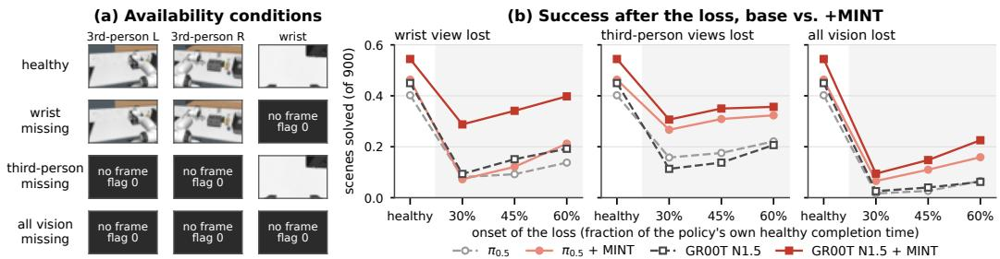
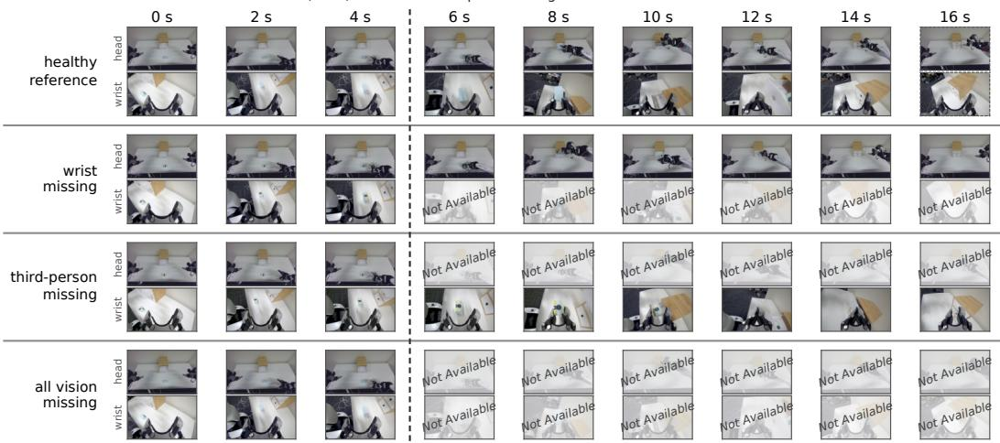
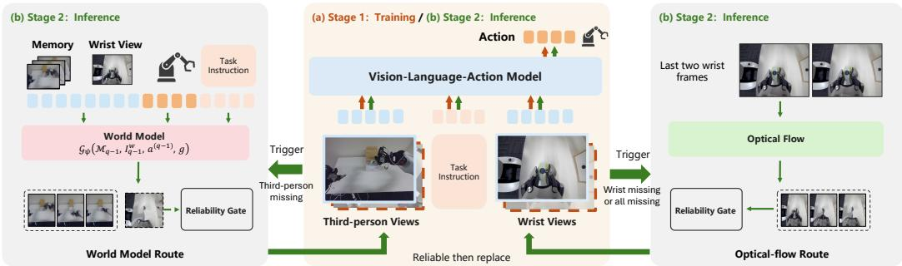
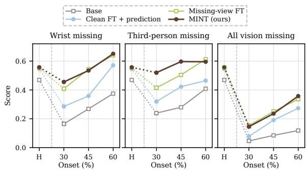
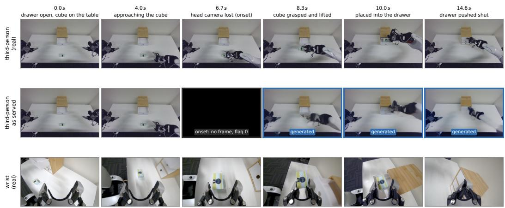
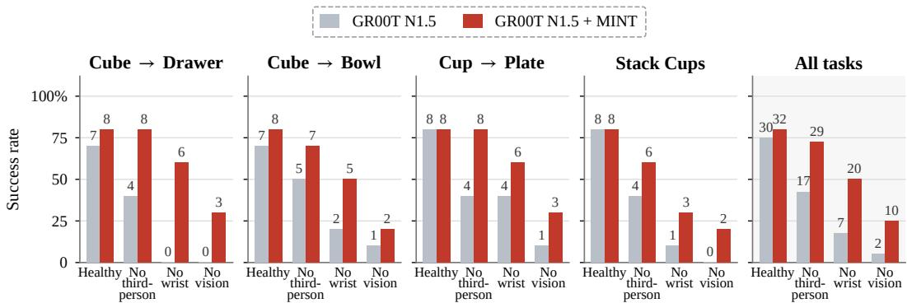
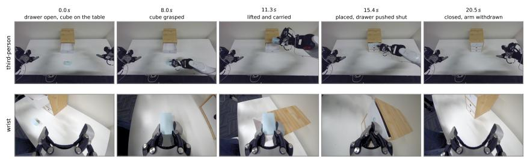
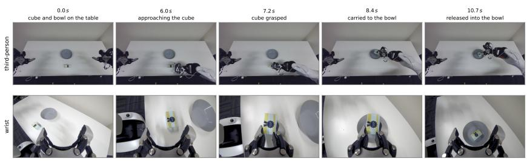
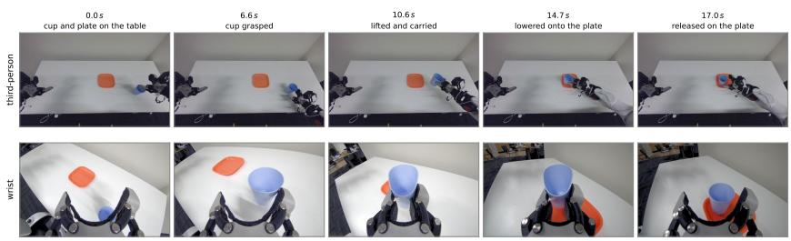
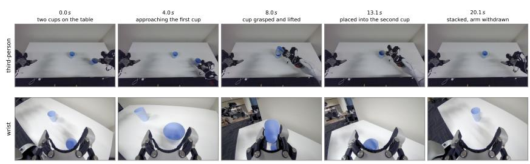

# LEARNING TO ACT UNDER VISUAL INTERRUPTIONS WITH VISION-LANGUAGE-ACTION MODELS

Mingle Jiang1, Rui Xu1, Yunke Wang1, Chang Xu1 1School of Computer Science, The University of Sydney

## ABSTRACT

Vision-language-action (VLA) models have demonstrated strong capabilities in robotic manipulation, but they are typically developed and evaluated with all camera streams available throughout task execution. When a camera stops delivering frames during task execution, the policy must continue acting without access to subsequent observations from the missing view. Despite its practical importance, how such interruptions affect closed-loop manipulation remains insufficiently understood. To investigate this problem, we introduce MAIL-Bench, a benchmark that evaluates visual interruptions with VLA models. By interrupting different cameras at multiple stages of each policy’s successful reference trajectory, MAIL-Bench measures how well policies retain their capabilities when visual inputs become unavailable. Building on this benchmark, we propose MINT, which first trains VLA policies to remain functional under missing visual inputs. At inference time, MINT selectively supplements missing observations using optical-flow extrapolation or an action-conditioned world model, and withdraws predicted views when they become unreliable. Experiments on π0.5 and GR00T N1.5 show that MINT significantly improves task success under camera loss over the original models. Experiments on AgiBot G2 further demonstrate the real-robot deployment under camera loss. The benchmark is available at https://minglejiang.github.io/Mail-Bench/.

## 1 INTRODUCTION

Vision-language-action (VLA) models (Brohan et al., 2023; Octo Model Team et al., 2024; Kim et al., 2025; Black et al., 2025b;a; NVIDIA et al., 2025; Xu et al., 2026a) use visual observations and language instructions to perform robotic manipulation. Standard evaluation benchmarks (Liu et al., 2023; Mees et al., 2022; James et al., 2020; Nasiriany et al., 2026) typically assume that all camera streams remain available throughout task execution. In practice, however, one or more camera streams may become unavailable while a robot is performing a task. Different cameras provide different views of the workspace: wrist cameras capture details near the robot’s gripper, while thirdperson cameras provide a broader view of the scene. When a camera becomes unavailable, the remaining views may not provide the information previously available from that camera. Unlike changes in lighting or camera pose (Pumacay et al., 2024; Fei et al., 2026; Wang et al., 2025), these visual interruptions remove a source of information altogether. This motivates a research question: How well can VLA models perform manipulation when some or all oftheir camera inputs are unavailable?

Existing robustness benchmarks (Pumacay et al., 2024; Chen et al., 2026; Fei et al., 2026; Wang et al., 2025; Hendrycks & Dietterich, 2019) primarily examine changes in visual appearance, camera pose, or image quality while keeping camera streams available. Missing camera inputs pose a different problem: a policy no longer receives observations from one or more of its original camera views. The impact may vary across cameras and tasks, depending on what information remains available from the other views. Yet existing robustness evaluations provide limited insight into how VLA models perform under these conditions.

To investigate this problem, we introduce MAIL-Bench, a paired, closed-loop benchmark for evaluating VLA models with missing camera inputs. Built on RoboCasa365 (Nasiriany et al., 2024; 2026), it covers 18 manipulation tasks and 900 frozen scenes. Rather than removing cameras individually, MAIL-Bench evaluates the loss of distinct visual roles: the wrist view, both third-person views, and all vision. For each policy, we first identify the scenes it can complete with all cameras available and use its successful rollouts as references. We then remove the relevant camera inputs at 30%–60% of the policy’s own completion time and keep them unavailable for the remainder of the episode. Missing frames are delivered as absent rather than replaced by the benchmark with blank or frozen images. By comparing paired rollouts in the same scenes and measuring success conditional on intact-camera success, MAIL-Bench quantifies how much capability a policy retains when visual inputs become unavailable.

  
Figure 1: MAIL-Bench. (a) Four availability conditions on RoboCasa365; an interrupted camera delivers no frame and its availability flag is 0. (b) Scenes solved out of 900 with every camera present (healthy) and after one visual role is lost at 30, 45 or 60% of each policy’s own completion time: camera loss removes a large share of both base policies’ successes, and MINT recovers part of that loss on every role.

Training VLA models with missing camera inputs (Skand et al., 2025; Vanjani et al., 2025) enables them to continue acting without the unavailable views, but it cannot recover the visual information those views would have provided. Predicting missing views with action-conditioned video models (Guo et al., 2026; Bardhan et al., 2026) offers a way to temporarily supplement the remaining observations, although prediction errors may accumulate as the robot and scene change. We therefore propose MINT, which combines training for missing camera inputs with selective visual prediction. During fine-tuning, MINT explicitly marks unavailable cameras and excludes their visual tokens, allowing the policy to act using the inputs that remain. At inference time, it uses optical-flow extrapolation for missing wrist views or all-vision loss, and an action-conditioned world model (Bardhan et al., 2026) for missing third-person views. Predictions are retained only while checks based on available observations and commanded actions are satisfied. Otherwise, they are withdrawn, and the policy continues with the corresponding inputs marked as missing.

Experiments on $\pi _ { 0 . 5 }$ (Black et al., 2025a) and GR00T N1.5 (NVIDIA et al., 2025) reveal that the impact of missing camera inputs depends on which views are unavailable: losing a single wrist camera can be more disruptive than losing both third-person cameras. MINT improves task success under missing camera inputs on both models and, on GR00T N1.5, outperforms a matched clean fine-tuning control with the same training budget. We further deploy MINT on an AgiBot G2, where the same stack runs in real time and the robot completes manipulation tasks in closed loop with a camera interrupted partway through the task.

## 2 RELATED WORK

Robustness Evaluation of Manipulation Policies. Generalist suites measure competence with intact observations (Liu et al., 2023; Nasiriany et al., 2024; 2026; Mees et al., 2022; James et al., 2020; Li et al., 2023; Tao et al., 2025), and perturbation benchmarks (Pumacay et al., 2024; Chen et al., 2026; Fei et al., 2026; Wang et al., 2025; Li et al., 2025) change appearance, geometry, language, camera pose or the simulation-to-real gap, with every frame still delivered. Recent VLA methods have also improved robustness and generalization through task-aware visual selection and run-time intervention (Xu et al., 2026b; Feng et al., 2026). Common-corruption suites (Hendrycks & Dietterich, 2019) degrade image content in the same sense, and a comparative study weighs world action models against VLAs under such perturbations (Zhang et al., 2026). MAIL-Bench instead evaluates the complete loss of a visual stream during an ongoing rollout, rather than a change to the content of an available frame. A camera stops delivering frames altogether, at a moment defined by the evaluated policy’s own healthy trajectory rather than at a fixed step. The loss is applied per visual role rather than per device, the healthy and interrupted rollouts of a scene are paired by construction, and the outcome is scored conditional on healthy success (Table 1).

Table 1: Comparison of visual-robustness evaluation settings. MAIL-Bench uniquely targets persistent visual-stream loss during closed-loop execution.
<table><tr><td>Benchmark</td><td>Visual failure</td><td>Onset</td><td>Post-loss control</td></tr><tr><td>COLOSSEUM (Pumacay et al., 2024)</td><td>Perturbation</td><td></td><td></td></tr><tr><td>RoboTwin 2.0 (Chen et al., 2026)</td><td>Perturbation</td><td></td><td></td></tr><tr><td>VLATest (Wang et al., 2025)</td><td>Perturbation</td><td></td><td></td></tr><tr><td>LIBERO-Plus (Fei et al., 2026)</td><td>Black frame</td><td>Start</td><td>Closed loop</td></tr><tr><td>Missing-modality IL (Ismkhan &amp; Bouchahcia, 2026)</td><td>Camera dropout</td><td>Start</td><td>Open loop</td></tr><tr><td>MAIL-Bench (ours)</td><td>Camera loss</td><td>Mid-episode</td><td>Closed loop</td></tr></table>

Learning with Imperfect or Missing Modalities. Robust policy learning has been studied under imperfect supervision, including learning from suboptimal or noisy demonstrations (Wang et al., 2023b; Wu et al., 2019; Wang et al., 2021; 2024). Closer to our setting, prior work improves robustness to absent sensors through masked multimodal training, camera dropout, missing-state inference, retrieval, and availability-aware representations (Skand et al., 2025; Vanjani et al., 2025; Xu et al., 2025a; Vogt-Lowell et al., 2026; Ismkhan & Bouchahcia, 2026; Wang et al., 2023a; Kim & Hwang, 2026; Xu et al., 2025b; Gao et al., 2026). MINT’s fine-tuning stage follows the masked-training line without adding a component to the policy.

## 3 MAIL-BENCH: MANIPULATION UNDER VISUAL INTERRUPTION

We introduce MAIL-Bench, a benchmark for evaluating how visual-stream interruptions affect manipulation policies on tasks they can otherwise complete.

## 3.1 BENCHMARK CONSTRUCTION

Environment. We build MAIL-Bench on RoboCasa365 (Nasiriany et al., 2026), which provides diverse kitchen environments and everyday manipulation tasks. We select its 18 Atomic-Seen tasks to reduce the confounding effect of task generalization and focus on camera-loss robustness in previously learned tasks. With 50 fixed scenes per task, MAIL-Bench comprises 900 evaluation scenes.

Availability conditions. To make camera-loss conditions comparable across policies with different camera configurations, we group cameras by their visual roles rather than by individual devices. The wrist camera forms the wrist group: it moves with the gripper and observes the manipulated object at close range. The onboard cameras form the third-person group: they are fixed to the robot base and provide broader views of the arm and workspace. Then we consider four availability conditions. Healthy keeps all cameras available and serves as the reference rollout. Wrist missing removes the wrist view, third-person missing removes all onboard views, and all vision missing removes all visual input, leaving only proprioception and the instruction. We use hard missing: once interrupted, a camera group provides no further frames and its availability flag is set to 0.

Interruption timing. Camera loss may occur at different points during task execution. To evaluate this variation, we introduce interruptions at 30%, 45%, and 60% of each policy’s successful healthy completion time. Defining onset relative to the policy’s own execution accounts for differences in execution speed, rather than imposing the same absolute control step on every policy. Together, the three camera-loss conditions and three onset times define nine interruption settings, evaluated against a healthy reference.

## 3.2 BENCHMARK EVALUATION

Evaluation protocol. For each scene, we save the episode metadata and a settled simulator state immediately before policy execution. This state serves as the common starting point for the healthy rollout and all interruption rollouts. For each policy configuration, we first execute a healthy rollout

onset (5.8 s): the lost role stops delivering  
  
Figure 2: A successful healthy rollout defines the reference completion time $T _ { \mathrm { h e a l t h y } }$ . The same scene is then replayed with the selected visual role interrupted at 30%, 45%, or 60% of $T _ { \mathrm { h e a l t h y } }$ and kept unavailable thereafter, while unaffected cameras continue streaming. Shown is an AgiBot G2 drawer example.

with all cameras available. If the rollout succeeds, we record its completion step, $T _ { \mathrm { h e a l t h y } } ;$ ; otherwise, the scene is excluded from interruption evaluation.

Each interruption rollout restarts from the same saved initial state as the healthy rollout and uses the same policy random seed. It receives normal camera observations until the designated interruption control step, which, for onset fraction $f \in \{ 0 . 3 0 , 0 . 4 5 , 0 . 6 0 \}$ , is defined as

$$
T _ { f } = \mathrm { m i n } ( T _ { \mathrm { m a x } } - 1 , \lfloor f \times T _ { \mathrm { h e a l t h y } } + 0 . 5 \rfloor ) ,\tag{1}
$$

where $T _ { \mathrm { m a x } }$ denotes the task horizon.

Let R denote the set of visual roles. The policy receives observations only when it is queried, every few control steps; for each role $r \in \mathcal { R }$ , let $I _ { q } ^ { r }$ denote its camera observation at the q-th query and $m _ { q } ^ { r } \in \{ 0 , 1 \}$ indicate whether it is available. When a camera becomes unavailable at $T _ { f }$ , the benchmark discards the remaining actions of the current chunk and queries the policy immediately; we denote this query by $q _ { f }$ . Before $q _ { f } , m _ { q } ^ { r } = 1 ;$ ; for an interrupted role, from $q _ { f }$ onward $m _ { q } ^ { r } = 0$ and the visual input is replaced by $\mathcal { O } ,$ , indicating that no fresh frame is provided.

After the interruption, subsequent frames from the interrupted camera group are withheld from both the policy and any recovery module. Any replacement view must therefore be generated causally from information available at runtime, such as pre-interruption observations, surviving camera streams, and executed actions, without access to future simulator frames or states. Each successful healthy rollout gives rise to nine fault rollouts, covering three camera-loss conditions and three interruption onsets. Deterministic execution settings and checks for pre-interruption divergence are used to reduce variation unrelated to the camera intervention.

Evaluation metrics. We measure robustness only on scenes that the policy can already solve with all cameras available. For task $j ,$ , let $n _ { i } = 5 0$ be the total number of scenes, $\backslash N _ { j } ^ { H }$ the number solved under the healthy condition, and $N _ { j } ^ { c }$ the number of those same scenes that remain successful under interruption condition c. We define

$$
H _ { j } = \frac { N _ { j } ^ { H } } { n _ { j } } , \qquad M _ { c , j } = \frac { N _ { j } ^ { c } } { N _ { j } ^ { H } } , \qquad S _ { j } = \frac { 1 } { 1 0 } \Big ( H _ { j } + \sum _ { c = 1 } ^ { 9 } M _ { c , j } \Big ) , \qquad S _ { \mathrm { M A I L } } = \frac { 1 } { 1 8 } \sum _ { j = 1 } ^ { 1 8 } S _ { j } .\tag{2}
$$

Here, $H _ { j }$ measures healthy task success, while $M _ { c , j }$ measures how much of that capability is retained after interruption $c .$ Conditioning $M _ { c , j }$ on healthy success prevents robustness from being dominated by a policy’s baseline task competence. For each task, healthy performance and the nine interruption conditions are weighted equally, and the final $S _ { \mathrm { M A I L } }$ score averages equally over all

  
Figure 3: MINT overview. MINT separates robustness to missing visual inputs from visual prediction. The policy is first trained to act under variable camera availability, then selectively receives predicted views at inference time when a camera is interrupted. Unreliable predictions are withdrawn, and the policy falls back to acting from the observations that remain.

18 tasks. We evaluate every interruption condition even if a policy does not normally rely on the corresponding camera, since remaining unaffected by its removal is itself evidence of robustness. If a policy has no healthy success on a task, that task receives a score of zero.

## 4 MINT: ACTING UNDER VISUAL INTERRUPTION

A robust VLA policy should remain functional when a camera becomes unavailable, without relying on the missing view being reconstructed. At the same time, when that view can be predicted reliably, the prediction may temporarily recover useful information that is no longer directly observed. MINT separates these two capabilities: learning with missing visual inputs teaches the policy to act from the observations that remain, while selective visual prediction supplements a missing view only when its prediction is considered reliable.

At the q-th query, given visual observations $\{ I _ { q } ^ { r } \} _ { r \in \mathcal { R } }$ , proprioceptive state $s _ { q } ,$ and task instruction g, the policy predicts an action chunk of h actions

$$
\boldsymbol { a } ^ { ( q ) } \sim \pi _ { \boldsymbol { \theta } } \big ( \cdot \mid \{ I _ { q } ^ { r } \} _ { r \in \mathcal { R } } , s _ { q } , g \big ) ,\tag{3}
$$

where h denotes the action horizon; only the first few actions are executed before the next query. Under visual interruption, one or more roles become unavailable during execution. MINT first adapts the policy to such changes in observation availability and then, at inference time, selectively supplies predicted observations for missing roles when reliable estimates are available.

## 4.1 LEARNING WITH MISSING VISUAL INPUTS

We first train the policy to predict actions when only a subset of its usual visual observations is available. When $m ^ { r } = 0$ , the corresponding view is marked as missing and its visual tokens are excluded from attention, matching the hard-missing semantics of MAIL-Bench.

Each training sample is a demonstration frame with observations $\{ I ^ { r } \} _ { r \in { \mathcal R } }$ , state s, instruction g, and the next h demonstrated actions $a ^ { * }$ . An availability pattern m $\sim \mathcal { C }$ , sampled over the demonstration episode, determines which roles are missing at that frame, and $\tilde { I } ^ { r }$ denotes the input of role r under m. Using the backbone’s original action objective ℓ, we optimize

$$
\mathcal { L } ( \theta ) = \mathbb { E } _ { ( \{ I ^ { r } \} , s , g , a ^ { * } ) \sim \mathcal { D } , m \sim \mathcal { C } } \left[ \ell \Big ( \pi _ { \theta } \Big ( \cdot \vert \{ ( \tilde { I } ^ { r } , m ^ { r } ) \} _ { r \in \mathcal { R } } , s , g \Big ) , a ^ { * } \Big ) \right] ,\tag{4}
$$

where $\mathcal { C }$ is a distribution over temporal camera-availability patterns. It includes healthy, wristmissing, third-person-missing, and all-vision-missing conditions, with both persistent and intermittent interruptions.

The policy architecture, optimization schedule, and action objective are otherwise unchanged. The resulting policy can therefore continue acting from the observations that remain when no reliable estimate of a missing view is available.

## 4.2 PREDICTING MISSING VISUAL INPUTS

Learning with missing visual inputs enables the policy to continue acting when a camera role is unavailable, but it cannot recover information that is no longer observed. At inference time, MINT therefore constructs a candidate prediction for a missing role and supplies it to the policy only while the prediction remains reliable.

Let $\hat { I } _ { q } ^ { r }$ denote a candidate prediction for visual role r at query $q ,$ and let $c _ { q } ^ { r } \in \{ 0 , 1 \}$ indicate whether that prediction is currently accepted. The observation presented to the policy is

$$
( x _ { q } ^ { r } , \bar { m } _ { q } ^ { r } ) = \left\{ \begin{array} { l l } { { ( I _ { q } ^ { r } , 1 ) , } } & { { m _ { q } ^ { r } = 1 , } } \\ { { ( \hat { I } _ { q } ^ { r } , 1 ) , } } & { { m _ { q } ^ { r } = 0 \mathrm { ~ \tiny ~ \wedge ~ } c _ { q } ^ { r } = 1 , } } \\ { { ( \emptyset , 0 ) , } } & { { m _ { q } ^ { r } = 0 \mathrm { ~ \tiny ~ \wedge ~ } c _ { q } ^ { r } = 0 , } } \end{array} \right.\tag{5}
$$

where $\bar { m } _ { q } ^ { r }$ is the availability state seen by the policy. Thus, a missing role is either temporarily replaced by a predicted observation or left explicitly missing, in which case the policy falls back to the behavior learned in Section 4.1.

Optical-flow prediction. The prediction mechanism depends on the visual role that becomes unavailable. For wrist interruption, and for all-vision interruption where no surviving camera is available to validate a generative rollout, we use short-horizon optical-flow extrapolation. From the last two available frames, we estimate

$$
\begin{array} { r } { F ^ { r } = \mathrm { F l o w } \left( I _ { q _ { f } - 2 } ^ { r } , I _ { q _ { f } - 1 } ^ { r } \right) , \qquad \hat { I } _ { q } ^ { r } = \mathrm { W a r p } \left( I _ { q _ { f } - 1 } ^ { r } , F ^ { r } , q - q _ { f } + 1 \right) , \quad q \geq q _ { f } , } \end{array}\tag{6}
$$

where Flow is Farnebäck optical flow (Farnebäck, 2003) and Warp denotes short-horizon extrapolation from the last observed frame. This route is appropriate for wrist views, whose short-term visual dynamics are dominated by camera motion, and provides a conservative prediction when all visual streams are lost.

World-model prediction. Third-person interruption requires modeling changes in both robot and object configuration that cannot be captured reliably by warping the last frame. We therefore use an action-conditioned world model. At each policy query $q ,$ the model predicts the missing third-person views together with an auxiliary wrist view:

$$
( \hat { I } _ { q } ^ { L } , \hat { I } _ { q } ^ { R } , \hat { I } _ { q } ^ { w } ) = \mathcal { G } _ { \psi } \left( \mathcal { M } _ { q - 1 } , I _ { q - 1 } ^ { w } , a ^ { ( q - 1 ) } , g \right) ,\tag{7}
$$

where $\mathcal { M } _ { q - 1 }$ is the model’s rollout memory, initialized at the interruption from the last available observations and updated with its own predictions, $I _ { q - 1 } ^ { w }$ is the surviving wrist observation, $a ^ { ( q - 1 ) }$ is the committed action chunk, and g is the task instruction. We instantiate $\mathcal { G } _ { \psi }$ with PersistWorld (Bardhan et al., 2026), adapted to the task domain with a low-rank fine-tune.

Only $\hat { I } _ { q } ^ { L }$ and $\hat { I } _ { q } ^ { R }$ are supplied to the policy. The auxiliary wrist prediction $\hat { I } _ { q } ^ { w }$ serves a different purpose: because the real wrist view remains observable, its agreement with $\hat { I } _ { q } ^ { w }$ provides an online consistency signal for the otherwise unobserved third-person rollout. Section 4.3 describes how this signal, together with route-specific checks, determines $c _ { q } ^ { r } .$

## 4.3 RELIABILITY-GATED FALLBACK

Predicted observations are intended only as temporary substitutes for missing views. Because prediction errors can accumulate after interruption, MINT continuously monitors each prediction route using a set of route-specific reliability checks. A route remains active only while all of its checks are satisfied. Once rejected, its prediction is withdrawn for the remainder of the episode and the corresponding visual role falls back to the missing-input state learned in Section 4.1.

For a missing visual role $^ { r , }$ let $\{ z _ { q , k } ^ { r } \} _ { k \in \mathcal { K } } ,$ denote its reliability diagnostics at query $q ,$ where $\textstyle { \mathcal { K } } _ { r }$ indexes the route-specific checks. We define route reliability as

$$
\rho _ { q } ^ { r } = \prod _ { k \in \mathcal { K } _ { r } } \mathbf { 1 } \left[ z _ { q , k } ^ { r } \in \mathcal { A } _ { r , k } \right] ,\tag{8}
$$

where $\boldsymbol { \mathcal { A } } _ { r , k }$ denotes the admissible range of the k-th reliability diagnostic (Table 4). Thus, $\rho _ { q } ^ { r } = 1$ only when all route-specific checks are satisfied.

The acceptance state introduced in Eq. 5 is updated as

$$
c _ { q } ^ { r } = c _ { q - 1 } ^ { r } \wedge \rho _ { q } ^ { r } , \qquad c _ { q _ { f } } ^ { r } = 1 .\tag{9}
$$

This recursive update makes rejection irreversible within an episode: once $c _ { q } ^ { r } = 0 .$ , predicted observations for that role are no longer supplied to the policy.

Optical-flow route. The optical-flow route uses two reliability diagnostics: consistency of the propagated view and accumulated robot motion. Both must remain within their respective admissible ranges in Eq. 8. If either check fails, $\rho _ { q } ^ { r } = 0$ , causing the route to be rejected through Eq. 9.

World-model route. The world-model route uses four reliability diagnostics: wrist consistency, visual change, model-distribution deviation, and rollout horizon. Wrist consistency compares an auxiliary predicted wrist observation $\hat { I } _ { q } ^ { w }$ with the corresponding real wrist observation $I _ { q } ^ { w } \mathbf { : }$

$$
\begin{array} { r } { d _ { q } ^ { w } = D \left( \hat { I } _ { q } ^ { w } , I _ { q } ^ { w } \right) , } \end{array}\tag{10}
$$

where $D ( \cdot , \cdot )$ measures normalized visual disagreement. The resulting $d _ { q } ^ { w }$ , together with the other three diagnostics, forms the set of route-specific checks in Eq. 8. If any diagnostic falls outside its admissible range, $\rho _ { q } ^ { r } = 0$ and the route is rejected through Eq. 9.

Once a prediction route is withdrawn, control continues through the policy’s learned missing-input capability rather than relying on continued visual reconstruction.

## 5 EXPERIMENTS

We evaluate MINT across two VLA backbones on MAIL-Bench, use matched controls to disentangle the contributions of learning with missing visual inputs and selective visual prediction, and further examine closed-loop deployment on a physical AgiBot-G2 robot.

## 5.1 EXPERIMENTAL SETUP

Models. We evaluate the RoboCasa365 Human300-trained checkpoints of $\pi _ { 0 . 5 }$ (Black et al., 2025a) and GR00T N1.5 (NVIDIA et al., 2025), together with their respective MINT variants. The base models use their original policy implementations, and MINT is applied without modifying the underlying VLA architecture. All policies are evaluated on the frozen MAIL-Bench suite of 18 Atomic-Seen tasks and 900 scenes described in Section 3. We divide 18 tasks into 3 categories, which are 5 pick-and-place tasks, 6 small-appliance tasks, and 7 fixture and navigation tasks. We report the results of each category in Table 2. The complete task list and results are reported in Appendix C.

Training. Both MINT policies are continued for 30k steps using the original action objective and optimization setup of their original checkpoints. Training uses a temporal availability curriculum over healthy, wrist-missing, third-person-missing and all-vision-missing observations with probabilities {0.60, 0.17, 0.17, 0.06}. For fault episodes, persistent interruptions are sampled with probability 0.7, with onset uniformly drawn from [0.3, 0.7] of the episode. The remaining cases contain short intermittent interruptions. Unavailable visual tokens are masked from policy computation rather than replaced by informative image content.

Ablation Setup. For GR00T N1.5, we construct two matched variants to isolate the two main components of MINT. (1) Clean FT + prediction is fine-tuned for the same 30k steps using the same training data as MINT, but without missing-view examples during training. At inference time, it uses the same prediction mechanism as MINT. (2) Missing-view FT uses the same missing-view-trained checkpoint as MINT and the same serving cadence, but disables generated observations so that in terrupted views remain missing. Thus, Clean FT + prediction versus MINT isolates the contribution of missing-view training under matched inference, while Missing-view FT versus MINT isolates the contribution of selective visual prediction with the policy weights held fixed. More implementation details are provided in Appendix B.

Table 2: MAIL-Bench results. Healthy denotes success rate with all cameras available, while W/T/B report scores under wrist, third-person, and all-vision interruption at 30/45/60% of completion time. AVG is the MAIL-Bench score and ∆ its improvement over the corresponding base checkpoint. Bold marks the best result within each backbone and task category.
<table><tr><td rowspan="2">Method</td><td rowspan="2">Tasks</td><td rowspan="2">Healthy</td><td colspan="3">Wrist missing</td><td colspan="3">Third-person missing</td><td colspan="3">All vision missing</td><td rowspan="2">AVG</td><td rowspan="2">∆</td></tr><tr><td>W30</td><td>W45</td><td>W60</td><td>T30</td><td>T45</td><td>T60</td><td>B30</td><td>B45</td><td>B60</td></tr><tr><td colspan="10">GR00T N1.5 (NVIDIA et al., 2025)</td><td></td><td></td><td></td><td></td><td></td></tr><tr><td>base model</td><td>pick-and-place</td><td>0.732</td><td>0.163</td><td>0.276</td><td>0.341</td><td>0.165</td><td>0.224</td><td>0.424</td><td>0.000</td><td>0.000</td><td>0.010</td><td>0.234</td><td></td></tr><tr><td rowspan="4">+MINT</td><td>small appliances</td><td>0.290</td><td>0.153</td><td>0.277</td><td>0.398</td><td>0.245</td><td>0.296</td><td>0.403</td><td>0.110</td><td>0.170</td><td>0.226</td><td>0.257</td><td></td></tr><tr><td>fixtures &amp; navigation</td><td>0.386</td><td>0.178</td><td>0.253</td><td>0.385</td><td>0.308</td><td>0.319</td><td>0.398</td><td>0.029</td><td>0.084</td><td>0.119</td><td>0.246</td><td></td></tr><tr><td>pick-and-place</td><td>0.724</td><td>0.423</td><td>0.561</td><td>0.673</td><td>0.622</td><td>0.674</td><td>0.647</td><td>0.053</td><td>0.091</td><td>0.166</td><td>0.463</td><td>+0.229</td></tr><tr><td>small appliances fixtures &amp; navigation</td><td>0.450 0.497</td><td>0.493 0.450</td><td>0.536 0.507</td><td>0.631 0.649</td><td>0.602 0.335</td><td>0.628 0.488</td><td>0.573 0.566</td><td>0.307 0.076</td><td>0.419 0.197</td><td>0.528 0.378</td><td>0.517 0.414</td><td>+0.260 +0.168</td></tr><tr><td colspan="10">π0.5 (Black et al., 2025a)</td><td></td><td></td><td></td></tr><tr><td colspan="10">base model</td><td></td><td></td><td></td><td></td></tr><tr><td></td><td>pick-and-place small appliances</td><td>0.636 0.257</td><td>0.059 0.270</td><td>0.098 0.264</td><td>0.200 0.342</td><td>0.239 0.291</td><td>0.245 0.343</td><td>0.375 0.413</td><td>0.000 0.065</td><td>0.014 0.095</td><td>0.089 0.156</td><td>0.196 0.250</td><td></td></tr><tr><td rowspan="4">+MINT</td><td></td><td></td><td>0.151</td><td>0.266</td><td>0.355</td><td>0.453</td><td>0.469</td><td>0.602</td><td>0.043</td><td>0.129</td><td>0.254</td><td>0.308</td><td></td></tr><tr><td>fixtures &amp; navigation pick-and-place</td><td>0.360 0.688</td><td>0.027</td><td>0.111</td><td>0.342</td><td>0.574</td><td>0.735</td><td>0.713</td><td>0.025</td><td>0.090</td><td>0.196</td><td>0.350</td><td>+0.154</td></tr><tr><td>small appliances</td><td>0.333</td><td>0.291</td><td>0.426</td><td>0.350</td><td>0.513</td><td>0.372</td><td>0.480</td><td>0.218</td><td>0.337</td><td>0.370</td><td>0.369</td><td>+0.119</td></tr><tr><td>fixtures &amp; navigation</td><td>0.414</td><td>0.131</td><td>0.261</td><td>0.528</td><td>0.428</td><td>0.498</td><td>0.546</td><td>0.093</td><td>0.128</td><td>0.278</td><td>0.331</td><td>+0.023</td></tr></table>

## 5.2 BENCHMARK RESULTS

Overall Results. As demonstrated in Table 2, MINT improves the performance of VLA base model even with healthy observations. On GR00T N1.5, for example, healthy success on the smallappliance tasks increases from 0.290 to 0.450. Under healthy observation setting, we only have model with availability finetuning and there is no visual generation process for the missing view. This suggests that learning under partial visual observations does not introduce a trade-off with normal execution and may reduce over-reliance on view-specific superficial cues. Once visual inputs are interrupted, we observe more clear improvement. Across 9 interruption conditions, MINT outperforms the GR00T N1.5 and $\pi _ { 0 . 5 }$ base model in almost all cases. The gain spans wrist, third-person, and all-vision loss and persists across early and late interruption onsets, indicating that the benefit is not tied to a particular failure pattern. The consistent improvement across two VLA backbones (i.e., GR00T N1.5 and $\pi _ { 0 . 5 } )$ further suggests that MINT is not specific to a single policy architecture.

Ablation Study. MINT consists of two stages: missing-view training and selective visual prediction at inference and we ablate each on GR00T N1.5. Removing either stage degrades score, and Fig. 4 shows that the two stages cover different failure regimes. Missing-view training governs how far the policy falls when a view is lost early: without it, scores at the 30% onset drop to 0.29/0.32 under wrist/third-person loss, whereas late interruptions (W60) are largely recovered by prediction alone. Prediction, in turn, determines how much of the lost view can be recovered when another view remains: it

  
Figure 4: Ablation on GR00T N1.5. Scores averaged over the three task categories at each interruption onset. $\mathbf { \ddot { H } } ^ { \prime \prime }$ marks the healthy-input score of each variant.

is most effective under early third-person interruption (+0.105 at T30), where the global view can still be inferred from the wrist camera, and its gain shrinks toward the 60% onset as less of the task remains. Under all-vision loss the two curves coincide, since the only prediction available there is short-horizon flow extrapolation of the last frames.

## 5.3 REAL ROBOT EXPERIMENT

We next ask whether the same observation-interface design transfers to a physical robot without changing the underlying VLA architecture. We deploy MINT on an AgiBot G2 using an availabilityaware GR00T N1.5 policy fine-tuned on 203 successful teleoperated episodes spanning four tabletop manipulation tasks. The G2 head camera provides the third-person view and the right wrist camera the wrist view. On all four tasks, we compare GR00T N1.5 with MINT under healthy execution and under third-person, wrist and all-camera interruption. The results are shown in Figure 6. We can observe that with MINT, GR00T N1.5 outperforms the base model in all missing-input settings and has no performance degradation under healthy setting.

Figure 5: Episode on ‘Cube to Drawer’ task with the third-person camera interrupted at step 50. The policy completes grasping, transport, release and drawer closure. Top: real third-person stream, hidden from the policy after interruption. Middle: the third-person view stream and prediction by the world model. Bottom: the wrist stream, which stays available.  
  
Figure 6: Real robot experiment on the AgiBot G2. Success rate of GR00T N1.5 and MINT over 10 trials per task and condition. Numbers above the bars are successful trials.

Figure 5 shows a drawer episode in which the third-person camera is interrupted mid-episode and the world-model route is activated. The healthy reference episode is shown in Appendix D (Figure 7a). After interruption the policy no longer receives real third-person camera frames. From the next query the world model supplies the missing view and the robot completes the task.

## 6 CONCLUSION

In this paper, we propose a new benchmark MAIL-Bench, which provides a systematic evaluation of this problem and shows that interruption severity depends strongly on the visual role that is lost. MINT improves robustness by combining learning under missing visual inputs with selective visual prediction. Across two VLA backbones, it improves interruption robustness without modifying the policy architecture, and the same interface transfers to real-robot deployment.

Future Work. MAIL-Bench currently covers one embodiment and 18 RoboCasa365 Atomic-Seen tasks, and broader validation across benchmarks and robot platforms remains future work. In addition, MINT’s world-model route introduces extra inference and memory overhead, motivating us to develop more efficient future prediction methods.

## REFERENCES

Jai Bardhan, Patrik Drozdik, Josef Sivic, and Vladimir Petrik. Persistent robot world models: Stabilizing multi-step rollouts via reinforcement learning. In European Conference on Computer Vision (ECCV), 2026. arXiv:2603.25685.

Kevin Black, Noah Brown, James Darpinian, Karan Dhabalia, Danny Driess, Adnan Esmail, Michael Robert Equi, Chelsea Finn, Niccolo Fusai, Manuel Y. Galliker, Dibya Ghosh, Lachy Groom, Karol Hausman, Brian Ichter, Szymon Jakubczak, Tim Jones, Liyiming Ke, Devin LeBlanc, Sergey Levine, Adrian Li-Bell, Mohith Mothukuri, Suraj Nair, Karl Pertsch, Allen Z. Ren, Lucy Xiaoyang Shi, Laura Smith, Jost Tobias Springenberg, Kyle Stachowicz, James Tanner, Quan Vuong, Homer Walke, Anna Walling, Haohuan Wang, Lili Yu, and Ury Zhilinsky. π0.5: a vision-language-action model with open-world generalization. In Proceedings of the 9th Conference on Robot Learning (CoRL), volume 305 of Proceedings of Machine Learning Research, pp. 17–40. PMLR, 2025a.

Kevin Black, Noah Brown, Danny Driess, Adnan Esmail, Michael Equi, Chelsea Finn, Niccolo Fusai, Lachy Groom, Karol Hausman, Brian Ichter, et al. π : A vision-language-action flow model for general robot control. In Robotics: Science and Systems (RSS), 2025b. doi: 10.15607/RSS.2025.XXI.010.

Anthony Brohan, Noah Brown, Justice Carbajal, Yevgen Chebotar, Xi Chen, Krzysztof Choromanski, Tianli Ding, Danny Driess, Avinava Dubey, Chelsea Finn, et al. RT-2: Vision-language-action models transfer web knowledge to robotic control. arXiv preprint arXiv:2307.15818, 2023.

Tianxing Chen, Zanxin Chen, Baijun Chen, Zijian Cai, Yibin Liu, Zixuan Li, Qiwei Liang, Xianliang Lin, Yiheng Ge, Zhenyu Gu, Weiliang Deng, Yubin Guo, Tian Nian, Xuanbing Xie, Qiangyu Chen, Kailun Su, Tianling Xu, Guodong Liu, Mengkang Hu, Huan-ang Gao, Kaixuan Wang, Zhixuan Liang, Yusen Qin, Xiaokang Yang, Ping Luo, and Yao Mu. RoboTwin 2.0: A scalable data generator and benchmark with strong domain randomization for robust bimanual robotic manipulation. In International Conference on Machine Learning (ICML), 2026.

Gunnar Farnebäck. Two-frame motion estimation based on polynomial expansion. In Image Analysis (SCIA), volume 2749 of Lecture Notes in Computer Science, pp. 363–370. Springer, 2003. doi: 10.1007/3-540-45103-X\_50.

Senyu Fei, Siyin Wang, Junhao Shi, Zihao Dai, Jikun Cai, Pengfang Qian, Li Ji, Xinzhe He, Shiduo Zhang, Zhaoye Fei, Jinlan Fu, Jingjing Gong, and Xipeng Qiu. LIBERO-Plus: A progressive robustness benchmark for visual-language-action models. In Proceedings of the IEEE/CVF Conference on Computer Vision and Pattern Recognition (CVPR), pp. 38574–38583, 2026.

Yixu Feng, Zinan Zhao, Yanxiang Ma, Chenghao Xia, Chengbin Du, Yunke Wang, and Chang Xu. See what matters: Differentiable grid sample pruning for generalizable vision-language-action model. In Forty-third International Conference on Machine Learning, 2026.

Hongbo Gao, Zhengyu Li, Xueru Nie, Dihao Zhu, Lijun Zhao, Yunke Wang, and Chang Xu. Ra-sod: Reliability-aware rgb-t salient object detection under modality degradation. arXiv preprint arXiv:2609.12622, 2026.

Yanjiang Guo, Lucy Xiaoyang Shi, Jianyu Chen, and Chelsea Finn. Ctrl-World: A controllable generative world model for robot manipulation. In International Conference on Learning Representations (ICLR), 2026. arXiv:2510.10125.

Dan Hendrycks and Thomas Dietterich. Benchmarking neural network robustness to common corruptions and perturbations. In International Conference on Learning Representations (ICLR), 2019.

Hassan Ismkhan and Hamid Bouchahcia. Reinforcement learning-guided retrieval with soft fusion for robust multimodal imitation learning under missing modalities. arXiv preprint arXiv:2606.15514, 2026.

Stephen James, Zicong Ma, David Rovick Arrojo, and Andrew J. Davison. RLBench: The robot learning benchmark & learning environment. IEEE Robotics and Automation Letters (RA-L), 5 (2):3019–3026, 2020. doi: 10.1109/LRA.2020.2974707.

Kyungwon Kim and Dosik Hwang. MUST: Modality-specific representation-aware transformer for diffusion-enhanced survival prediction with missing modality. In Proceedings ofthe IEEE/CVF Conference on Computer Vision and Pattern Recognition (CVPR), pp. 30312–30321, 2026.

Moo Jin Kim, Karl Pertsch, Siddharth Karamcheti, Ted Xiao, Ashwin Balakrishna, Suraj Nair, Rafael Rafailov, Ethan P. Foster, Pannag R. Sanketi, Quan Vuong, et al. OpenVLA: An open-source vision-language-action model. In Proceedings ofthe 8th Conference on Robot Learning (CoRL), volume 270 of Proceedings ofMachine Learning Research, pp. 2679–2713. PMLR, 2025.

Chengshu Li, Ruohan Zhang, Josiah Wong, Cem Gokmen, Sanjana Srivastava, Roberto Martín-Martín, Chen Wang, Gabrael Levine, Michael Lingelbach, Jiankai Sun, et al. BEHAVIOR-1K: A benchmark for embodied AI with 1,000 everyday activities and realistic simulation. In Proceedings ofthe 6th Conference on Robot Learning (CoRL), volume 205 of Proceedings ofMachine Learning Research, pp. 80–93. PMLR, 2023.

Xuanlin Li, Kyle Hsu, Jiayuan Gu, Oier Mees, Karl Pertsch, Homer Rich Walke, Chuyuan Fu, Ishikaa Lunawat, Isabel Sieh, Sean Kirmani, Sergey Levine, Jiajun Wu, Chelsea Finn, Hao Su, Quan Vuong, and Ted Xiao. Evaluating real-world robot manipulation policies in simulation. In Proceedings of the 8th Conference on Robot Learning (CoRL), volume 270 of Proceedings of Machine Learning Research, pp. 3705–3728. PMLR, 2025.

Bo Liu, Yifeng Zhu, Chongkai Gao, Yihao Feng, Qiang Liu, Yuke Zhu, and Peter Stone. LIBERO: Benchmarking knowledge transfer for lifelong robot learning. In Advances in Neural Information Processing Systems 36 (NeurIPS 2023) Datasets and Benchmarks Track, volume 36, 2023.

Oier Mees, Lukas Hermann, Erick Rosete-Beas, and Wolfram Burgard. CALVIN: A benchmark for language-conditioned policy learning for long-horizon robot manipulation tasks. IEEE Robotics and Automation Letters (RA-L), 7(3):7327–7334, 2022. doi: 10.1109/LRA.2022.3180108.

Soroush Nasiriany, Abhiram Maddukuri, Lance Zhang, Adeet Parikh, Aaron Lo, Abhishek Joshi, Ajay Mandlekar, and Yuke Zhu. RoboCasa: Large-scale simulation of household tasks for generalist robots. In Robotics: Science and Systems (RSS), 2024. doi: 10.15607/RSS.2024.XX.050.

Soroush Nasiriany, Sepehr Nasiriany, Abhiram Maddukuri, and Yuke Zhu. RoboCasa365: A large-scale simulation framework for training and benchmarking generalist robots. In International Conference on Learning Representations (ICLR), 2026.

NVIDIA. NVIDIA Isaac GR00T: A foundation model for generalist robots. https://github.com/NVIDIA/Isaac-GR00T, 2025.

NVIDIA, Johan Bjorck, Fernando Castañeda, Nikita Cherniadev, Xingye Da, Runyu Ding, Linxi Fan, Yu Fang, Dieter Fox, Fengyuan Hu, et al. GR00T N1: An open foundation model for generalist humanoid robots. arXiv preprint arXiv:2503.14734, 2025.

Octo Model Team, Dibya Ghosh, Homer Walke, Karl Pertsch, Kevin Black, Oier Mees, Sudeep Dasari, Joey Hejna, Tobias Kreiman, Charles Xu, et al. Octo: An open-source generalist robot policy. In Robotics: Science and Systems (RSS), 2024. doi: 10.15607/RSS.2024.XX.090.

Physical Intelligence. openpi: Open-source models and packages for robotics. https://github.com/Physical-Intelligence/openpi, 2025.

Wilbert Pumacay, Ishika Singh, Jiafei Duan, Ranjay Krishna, Jesse Thomason, and Dieter Fox. THE COLOSSEUM: A benchmark for evaluating generalization for robotic manipulation. In Robotics: Science and Systems (RSS), 2024. doi: 10.15607/RSS.2024.XX.133.

Skand Skand, Bikram Pandit, Chanho Kim, Li Fuxin, and Stefan Lee. Simple masked training strategies yield control policies that are robust to sensor failure. In Proceedings ofthe 8th Conference on Robot Learning (CoRL), volume 270 of Proceedings ofMachine Learning Research, pp. 4463–4482. PMLR, 2025.

Stone Tao, Fanbo Xiang, Arth Shukla, Yuzhe Qin, Xander Hinrichsen, Xiaodi Yuan, Chen Bao, Xinsong Lin, Yulin Liu, Tse-Kai Chan, Yuan Gao, Xuanlin Li, Tongzhou Mu, Nan Xiao, Arnav Gurha, Viswesh Nagaswamy Rajesh, Yong Woo Choi, Yen-Ru Chen, Zhiao Huang, Roberto Calandra, Rui Chen, Shan Luo, and Hao Su. Demonstrating GPU parallelized robot simulation and rendering for generalizable embodied AI with ManiSkill3. In Robotics: Science and Systems (RSS), 2025. doi: 10.15607/RSS.2025.XXI.021.

Pankhuri Vanjani, Paul Mattes, Xiaogang Jia, Vedant Dave, and Rudolf Lioutikov. DisDP: Robust imitation learning via disentangled diffusion policies. Reinforcement Learning Journal, 6: 1180–1199, 2025.

Kevin Vogt-Lowell, Theodoros Tsiligkaridis, Rodney Lafuente-Mercado, Surabhi Ghatti, Shanghua Gao, Marinka Zitnik, and Daniela Rus. When sensors fail: Temporal sequence models for robust ppo under sensor drift. arXiv preprint arXiv:2603.04648, 2026. ICLR 2026 CAO Workshop.

Hu Wang, Yuanhong Chen, Congbo Ma, Jodie Avery, Louise Hull, and Gustavo Carneiro. Multi-modal learning with missing modality via shared-specific feature modelling. In Proceedings ofthe IEEE/CVF Conference on Computer Vision and Pattern Recognition (CVPR), pp. 15878–15887, 2023a. doi: 10.1109/CVPR52729.2023.01524.

Yunke Wang, Chang Xu, Bo Du, and Honglak Lee. Learning to weight imperfect demonstrations. In International conference on machine learning, pp. 10961–10970. PMLR, 2021.

Yunke Wang, Bo Du, and Chang Xu. Unlabeled imperfect demonstrations in adversarial imitation learning. In Proceedings of the AAAI conference on artificial intelligence, volume 37, pp. 10262–10270, 2023b.

Yunke Wang, Minjing Dong, Yukun Zhao, Bo Du, and Chang Xu. Imitation learning from purified demonstrations. In Proceedings of the 41st International Conference on Machine Learning, ICML’24. JMLR.org, 2024.

Zhijie Wang, Zhehua Zhou, Jiayang Song, Yuheng Huang, Zhan Shu, and Lei Ma. VLATest: Testing and evaluating vision-language-action models for robotic manipulation. Proceedings of the ACM on Software Engineering (FSE), 2(FSE):1615–1638, 2025. doi: 10.1145/3729343.

Yueh-Hua Wu, Nontawat Charoenphakdee, Han Bao, Voot Tangkaratt, and Masashi Sugiyama. Imitation learning from imperfect demonstration. In International Conference on Machine Learning, pp. 6818–6827. PMLR, 2019.

Siyu Xu, Yunke Wang, Zijian Wang, Dihao Zhu, Chenghao Xia, Chengbin Du, Daochang Liu, Tao Huang, and Chang Xu. StellaVLA: In-context structured demonstration for generalizable vision-language-action models. arXiv preprint arXiv:2608.11671, 2026a.

Siyu Xu, Zijian Wang, Yunke Wang, Chenghao Xia, Tao Huang, and Chang Xu. Affordance field intervention: Enabling vlas to escape memory traps in robotic manipulation. In Proceedings of the IEEE/CVF Conference on Computer Vision and Pattern Recognition (CVPR), 2026b.

Xiaomeng Xu, Dominik Bauer, and Shuran Song. RoboPanoptes: The all-seeing robot with whole-body dexterity. In Robotics: Science and Systems (RSS), 2025a. doi: 10.15607/RSS.2025.XXI.042.

Yingxue Xu, Fengtao Zhou, Chenyu Zhao, Yihui Wang, Can Yang, and Hao Chen. Distilled prompt learning for incomplete multimodal survival prediction. In Proceedings ofthe IEEE/CVF Conference on Computer Vision and Pattern Recognition (CVPR), pp. 5102–5111, 2025b. doi: 10.1109/CVPR52734.2025.00481.

Zhanguang Zhang, Zhiyuan Li, Behnam Rahmati, Rui Heng Yang, Yintao Ma, Amir Rasouli, Sajjad Pakdamansavoji, Yangzheng Wu, Lingfeng Zhang, Tongtong Cao, Feng Wen, Xinyu Wang, Xingyue Quan, and Yingxue Zhang. Do world action models generalize better than VLAs? A robustness study. arXiv preprint arXiv:2603.22078, 2026.

## A MAIL-BENCH DETAILS

Suite and horizons. The suite fixes the 18 Atomic-Seen tasks, 50 scenes per task and their horizons (Table 3) under RoboCasa365 1.0.1.

Table 3: Task suite. The 18 RoboCasa365 Atomic-Seen tasks and their horizons in control steps (20 Hz).
<table><tr><td>Task</td><td>Horizon</td><td>Task</td><td>Horizon</td></tr><tr><td>CloseBlenderLid</td><td>900</td><td>PickPlaceCounterToStove</td><td>600</td></tr><tr><td>CloseFridge</td><td>900</td><td>PickPlaceDrawerToCounter</td><td>750</td></tr><tr><td>CloseToasterOvenDoor</td><td>450</td><td>PickPlaceSinkToCounter</td><td>900</td></tr><tr><td>CoffeeSetupMug</td><td>600</td><td>PickPlaceToasterToCounter</td><td>600</td></tr><tr><td>NavigateKitchen</td><td>450</td><td>SlideDishwasherRack</td><td>450</td></tr><tr><td>OpenCabinet</td><td>1050</td><td>TurnOffStove</td><td>750</td></tr><tr><td>OpenDrawer</td><td>750</td><td>TurnOnElectricKettle</td><td>450</td></tr><tr><td>OpenStandMixerHead</td><td>450</td><td>TurnOnMicrowave</td><td>450</td></tr><tr><td>PickPlaceCounterToCabinet</td><td>750</td><td>TurnOnSinkFaucet</td><td>600</td></tr></table>

Base policies. We evaluate the RoboCasa365 Human300-trained checkpoints of $\pi _ { 0 . 5 }$ (Black et al., 2025a) and GR00T N1.5 (NVIDIA et al., 2025), served through their native runtimes, openpi (Physical Intelligence, 2025) and Isaac-GR00T (NVIDIA, 2025). Under healthy observations, $\pi _ { 0 . 5 }$ solves 362 of the 900 scenes $( H = 0 . 4 0 2 ; 0 . 3 9 6$ on the RoboCasa365 leaderboard) and GR00T N1.5 solves 405 $( H = 0 . 4 5 0 ; 0 . 4 3 0$ in the original paper and 0.507 on the leaderboard, re-evaluated under the 1.5× RoboCasa365 1.0.1 horizons that MAIL-Bench pins). Missing-view training does not reduce healthy success: on GR00T N1.5, Clean FT + prediction, Missing-view FT and MINT reach $H = 0 . 5 3 2 , 0 . 5 4 0$ and 0.544 (Table 6).

Auxiliary fault operators. The released kernel also implements blackout, freeze, stale delivery, burst dropout, finite-duration loss and recovery for diagnostic use; these are not part of the MAIL-Bench official score.

Determinism. Policy sampling is seeded from the benchmark seed and the simulator is reset to the frozen scene state before every rollout, so paired rollouts differ only through the camera intervention, up to small GPU-renderer differences that MAIL-Bench records.

## B MINT IMPLEMENTATION DETAILS

## B.1 MISSING-VIEW TRAINING

We describe the GR00T N1.5 implementation; $\pi _ { 0 . 5 }$ follows the same recipe within its native backbone. Training uses the curriculum C of Eq. 4 with the values in Table 4: a faulted episode loses a camera group either persistently from a random onset or in short intermittent bursts, and the two third-person cameras always share one availability state.

Unavailable cameras are represented exactly as in the main method: their availability flag is 0, their image slot contains an inert zero placeholder, and their visual tokens are excluded from policy computation through the attention mask

$$
\begin{array} { r } { \mathrm { A t t n } ( Q , K , V ) = \mathrm { s o f t m a x } \Big ( \frac { Q K ^ { \top } } { \sqrt { d } } + \log M \Big ) V , \quad M _ { i j } = \left\{ \begin{array} { l l } { m ^ { r ( j ) } } & { j \mathrm { ~ a ~ v i s u a l ~ t o k e n ~ o f ~ g r o u p ~ } r ( j ) , } \\ { 1 } & { \mathrm { o t h e r w i s e } , } \end{array} \right. } \end{array}\tag{11}
$$

with log $0 = - \infty ,$ , so an unavailable camera contributes zero attention weight while an available camera is processed as usual; changing the pixels of a masked camera leaves the actions unchanged.

## B.2 SERVING AND PREDICTION ROUTES

Withdrawal. Withdrawal follows Eq. 9: once a route fails a check, the role returns to the missing input used in training for the rest of the episode. The optical-flow route is checked only after a minimum tenancy and has no upper limit on its duration; its propagated-view consistency is a flow confidence, the product of a photometric-consistency term, an accumulated-drift term and the fraction of pixels with a valid warp source. The world-model route checks every generated block from the first and is withdrawn at the first rejected block or at the generation cap. The two third-person cameras are admitted and withdrawn together.

World-model route. We use PersistWorld because it is action-conditioned and sustains multistep rollouts within the serving budget, and adapt it to the 18 tasks with a low-rank fine-tune on the demonstrations. On held-out demonstrations, adaptation raises reconstruction PSNR from 16.4 to 18.9 dB and lowers the fraction of out-of-domain conditioning states from 0.18 to 0.01. The rollout memory M of Eq. 7 is initialized from the last available observations, and the auxiliary wrist prediction is used only for the consistency check. The same adaptation is used on the AgiBot G2 (Appendix D).

## B.3 CHOICE OF HYPERPARAMETERS

All hyperparameters were fixed on development scenes disjoint from the 900 benchmark scenes, before benchmark evaluation (Table 4).

Table 4: Hyperparameters of MINT.
<table><tr><td>Hyperparameter</td><td>Value</td></tr><tr><td colspan="2">Optical-flow route</td></tr><tr><td>Min. flow confidence (wrist / third-person)</td><td>0.05 / 0.08</td></tr><tr><td>Motion budget, wrist (end-effector + base)</td><td>0.15 m / 0.70 rad</td></tr><tr><td>Motion budget, third-person (base)</td><td>0.30 m / 0.70 rad</td></tr><tr><td>Minimum tenancy</td><td>64 steps</td></tr><tr><td colspan="2">World-model route</td></tr><tr><td>Max. wrist consistency error  $d _ { q } ^ { w }$ </td><td>0.20</td></tr><tr><td>Visual change (max / min while moving)</td><td>0.35 / 0.002</td></tr><tr><td>Max. out-of-domain conditioning fraction</td><td>0.35</td></tr><tr><td>Generation cap</td><td>8 blocks (64 steps)</td></tr><tr><td colspan="2">Training and serving</td></tr><tr><td>Curriculum C (healthy / wrist / third-person / all vision)</td><td>0.60 / 0.17 / 0.17 / 0.06</td></tr><tr><td>Persistent-interruption probability</td><td>0.7</td></tr><tr><td>Persistent onset (fraction of episode)</td><td>U[0.3,0.7]</td></tr><tr><td>Fine-tuning steps</td><td>30k</td></tr><tr><td>Query interval</td><td>8 steps</td></tr><tr><td>Action horizon h (GR00T N1.5 / π0.5)</td><td>16/50</td></tr></table>

## C MAIL-BENCH PER-TASK AND PER-CONDITION RESULTS

All tables are generated from the scorer output of runs with complete healthy and fault coverage and no audit failure; Table 7 gives paired bootstrap intervals. The task categories of Table 2 are pick-and-place (the five PickPlace tasks), small appliances (CloseBlenderLid, CoffeeSetupMug, OpenStandMixerHead, SlideDishwasherRack, TurnOnElectricKettle, TurnOnMicrowave) and fixtures and navigation (CloseFridge, CloseToasterOvenDoor, NavigateKitchen, OpenCabinet, Open-Drawer, TurnOffStove, TurnOnSinkFaucet). In the per-task tables, $N _ { j } ^ { H }$ is the number of healthy successes out of 50 scenes and “n/a” marks a task without healthy success, which contributes zero to $S _ { j } { \mathrm { ; } }$ values with small $N _ { j } ^ { H }$ rest on few scenes.

## C.1 COMPUTE COST

All experiments run on NVIDIA GeForce RTX 4090 GPUs (24 GB). Evaluating one arm on MAIL Bench takes 60–70 single-worker hours, and fine-tuning takes 12.9 GPU-hours for GR00T N1.5 (30k steps, one GPU) and 15.1 GPU-hours for $\pi _ { 0 . 5 }$ (30k steps, two GPUs). A policy query costs about 5.0 TFLOPs for $\pi _ { 0 . 5 }$ and 2.5 TFLOPs for GR00T N1.5. MINT does not increase the per-step wall-clock time of healthy execution; under interruption, the optical-flow route runs on the CPU,

Table 5: Main results. Healthy success $H ,$ conditional scores $M _ { c }$ under wrist (W), third-person (T) and all-vision (B) interruption at the 30/45/60% onsets, and $S _ { \mathrm { M A I L } }$ (Eq. 2), averaged over the 18 tasks.
<table><tr><td></td><td></td><td colspan="3">Wrist missing</td><td colspan="3">Third-person missing</td><td colspan="3">All vision missing</td><td></td></tr><tr><td>Policy</td><td>H</td><td>W30</td><td>W45</td><td>W60</td><td>T30</td><td>T45</td><td>T60</td><td>B30</td><td>B45</td><td>B60</td><td> $S _ { \mathrm { M A I L } }$ </td></tr><tr><td> $\pi _ { 0 . 5 }$ </td><td>0.402</td><td>0.165</td><td>0.219</td><td>0.307</td><td>0.340</td><td>0.365</td><td>0.476</td><td>0.038</td><td>0.086</td><td>0.176</td><td>0.257</td></tr><tr><td> $\pi _ { 0 . 5 } + \mathbf { M I N T }$ </td><td>0.463</td><td>0.156</td><td>0.274</td><td>0.417</td><td>0.497</td><td>0.522</td><td>0.571</td><td>0.116</td><td>0.187</td><td>0.286</td><td>0.349</td></tr><tr><td>GR00T N1.5</td><td>0.450</td><td>0.165</td><td>0.267</td><td>0.377</td><td>0.247</td><td>0.285</td><td>0.407</td><td>0.048</td><td>0.089</td><td>0.124</td><td>0.246</td></tr><tr><td> $\mathrm { G R 0 0 T N 1 . 5 + M I N T }$ </td><td>0.544 0.457</td><td></td><td>0.532</td><td>0.650</td><td>0.504</td><td>0.586</td><td>0.591</td><td>0.147</td><td>0.242</td><td>0.369</td><td>0.462</td></tr></table>

Table 6: GR00T N1.5 ablation. All variants except the base are served at the same eight-step cadence. Clean $F T +$ prediction is fine-tuned on the same data and steps as MINT without missingview examples; Missing-view FT is the MINT checkpoint without generated views. $\Delta$ is $S _ { \mathrm { M A I L } }$ minus the row above.
<table><tr><td>Arm</td><td></td><td colspan="3">Wrist missing</td><td colspan="3">Third-person missing</td><td colspan="3">All vision missing</td><td></td><td></td></tr><tr><td></td><td>H</td><td>W30</td><td>W45</td><td>W60</td><td>T30</td><td>T45</td><td>T60</td><td>B30</td><td>B45</td><td>B60</td><td> $S _ { \mathrm { M A I L } }$ </td><td> $\Delta$ </td></tr><tr><td>Base</td><td>0.450</td><td>0.165</td><td>0.267</td><td>0.377</td><td>0.247</td><td>0.285</td><td>0.407</td><td>0.048</td><td>0.089</td><td>0.124</td><td>0.246</td><td></td></tr><tr><td>Clean FT + prediction</td><td>0.532</td><td>0.294</td><td>0.369</td><td>0.580</td><td>0.316</td><td>0.419</td><td>0.455</td><td>0.079</td><td>0.191</td><td>0.279</td><td>0.351</td><td> $+ 0 . 1 0 5$ </td></tr><tr><td>Missing-view FT</td><td>0.540</td><td>0.412</td><td>0.542</td><td>0.643</td><td>0.405</td><td>0.495</td><td>0.605</td><td>0.151</td><td>0.252</td><td>0.334</td><td>0.438</td><td>+0.086</td></tr><tr><td>MINT</td><td>0.544</td><td>0.457</td><td>0.532</td><td>0.650</td><td>0.504</td><td>0.586</td><td>0.591</td><td>0.147</td><td>0.242</td><td>0.369</td><td>0.462</td><td>+0.024</td></tr></table>

Table 7: Bootstrap 95% intervals. Scenes are resampled within each task (10,000 resamples), and differences between arms are paired on the same resampled scenes. Top: $S _ { \mathrm { M A I L } }$ and paired differences. Bottom: per-condition paired differences between each backbone with MINT and its base.
<table><tr><td>Arm</td><td> $S _ { \mathrm { M A I L } }$ </td><td>95% interval</td><td>Paired difference</td><td> $\Delta S _ { \mathrm { M A I L } }$ </td><td>95% interval</td></tr><tr><td>π0.5</td><td>0.257</td><td>[0.221, 0.275]</td><td> $\pi _ { 0 . 5 } + \mathrm { M I N T } - \pi _ { 0 . 5 }$ </td><td> $+ 0 . 0 9 1$ </td><td> $[ + 0 . 0 6 3 , + 0 . 1 2 9 ]$ </td></tr><tr><td> $\pi _ { 0 . 5 } + \mathbf { M I N T }$ </td><td>0.349</td><td>[0.325, 0.365]</td><td> $\mathbf { G R } 0 0 \mathrm { T } \mathbf { N } 1 . 5 + \mathbf { M I N T } - \mathbf { G R } 0 0 \mathrm { T } \mathbf { N } 1 . 5$ </td><td>+0.216</td><td> $\dot { [ + 0 . 1 9 0 , + 0 . 2 4 0 ] }$ </td></tr><tr><td> $\mathrm { G R 0 0 T N } 1 . 5 $ </td><td>0.246</td><td>[0.227, 0.265]</td><td> $\operatorname { C l e a n F T } + \operatorname { p r e d i c t i o n } - \operatorname { G R 0 0 T N 1 } . 5$ </td><td>+0.105</td><td> $\mathsf { i } + 0 . 0 7 9 , + 0 . 1 3 0 \mathsf { i }$ </td></tr><tr><td>Clean FT + prediction</td><td>0.351</td><td>[0.332, 0.369]</td><td> ${ \bf M i s s i n g - v i e w F T - C l e a n F T + p r e d i c t i o n }$ </td><td>+0.086</td><td> $\bar { [ + 0 . 0 6 1 , + 0 . 1 0 9 ] }$ </td></tr><tr><td>Missing-view FT</td><td>0.438</td><td>[0.417, 0.455]</td><td>GROOT  $\mathrm { N } 1 . 5 + \mathrm { M I N T } - \mathrm { M i s s i n g  – v i e w F T }$ </td><td>+0.024</td><td> $\bar { [ + 0 . 0 0 8 , + 0 . 0 4 4 ] }$ </td></tr><tr><td> $\mathbf { G R 0 0 T N 1 . 5 + M I N T }$ </td><td>0.462</td><td>[0.443, 0.479]</td><td>GR0OT  ${ \bf N } 1 . 5 + { \bf M I N T } - { \bf C l e a n F T } -$  prediction</td><td>+0.111</td><td> $\left[ + 0 . 0 8 7 , + 0 . 1 3 3 \right]$ </td></tr></table>

<table><tr><td rowspan="2">Condition</td><td colspan="2"> $\pi _ { 0 . 5 } + \mathrm { M I N T } - \pi _ { 0 . 5 }$ </td><td colspan="2">GR00T N1.5 + MINT – GR00T N1.5</td></tr><tr><td> $\Delta M _ { c }$ </td><td>95% interval</td><td> $\Delta M _ { c }$ </td><td>95% interval</td></tr><tr><td>W30</td><td> $- 0 . 0 1 0$ </td><td> $\left\lceil - 0 . 0 6 8 , + 0 . 0 4 4 \right\rceil$ </td><td> $+ 0 . 2 9 1$ </td><td> $[ + 0 . 2 3 5 , + 0 . 3 4 5 ]$ </td></tr><tr><td>W45</td><td>+0.056</td><td> $\left\lceil - 0 . 0 2 2 , + 0 . 1 4 5 \right\rceil$ </td><td> $+ 0 . 2 6 4$ </td><td> $\mathrm { \Omega } \mathrm { | + 0 . 2 0 6 , + 0 . 3 2 1 } ^ { \mathrm { \Omega } }$ </td></tr><tr><td>W60</td><td> $+ 0 . 1 1 0$ </td><td> $\mathrm { \bar { \ t } + 0 . 0 1 8 , + 0 . 1 8 0 \bar { \ l } }$ </td><td> $+ 0 . 2 7 3$ </td><td> $\left[ + 0 . 2 0 8 , + 0 . 3 4 4 \right]$ </td></tr><tr><td>T30</td><td> $+ 0 . 1 5 7$ </td><td> $[ + 0 . 0 7 9 , + 0 . 2 3 7 ]$ </td><td> $+ 0 . 2 5 7$ </td><td> $\left[ + 0 . 1 7 9 , + 0 . 3 3 1 \right]$ </td></tr><tr><td>T45</td><td> $+ 0 . 1 5 8$ </td><td>[+0.095, +0.226]</td><td> $+ 0 . 3 0 1$ </td><td> $\lceil + 0 . 2 2 3 , + 0 . 3 7 2 \rceil$ </td></tr><tr><td>T60</td><td>+0.095</td><td>[+0.043, +0.175]</td><td>+0.184</td><td> $\bar { [ + 0 . 1 1 4 , + 0 . 2 4 9 ] }$ </td></tr><tr><td>B30</td><td>+0.078</td><td>[+0.042, +0.113]</td><td>+0.099</td><td> $[ + 0 . 0 6 7 , + 0 . 1 3 1 ]$ </td></tr><tr><td>B45</td><td>+0.101</td><td>[+0.046, +0.159]</td><td>+0.152</td><td> $\bar { \lceil } + 0 . 1 0 5 , + 0 . 1 9 6 \bar { \rceil }$ </td></tr><tr><td>B60</td><td>+0.110</td><td>[+0.065, +0.185]</td><td>+0.245</td><td> $\left[ + 0 . 1 9 8 , + 0 . 2 9 2 \right]$ </td></tr></table>

whereas the world model adds 9.2 GiB of GPU memory and about 100 TFLOPs per generation, with 7.35 (GR00T N1.5) and $7 . 7 2 \ : ( \pi _ { 0 . 5 } )$ generations per third-person-missing cell on average.

Table 8: Per-task, per-condition results for $\pi _ { 0 . 5 }$ .
<table><tr><td>Task</td><td> $N _ { j } ^ { H }$ </td><td>W30</td><td>W45</td><td>W60</td><td>T30</td><td>T45</td><td>T60</td><td>B30</td><td>B45</td><td>B60</td><td> $S _ { j }$ </td></tr><tr><td>CloseBlenderLid</td><td>0</td><td>n/a</td><td>n/a</td><td>n/a</td><td>n/a</td><td>n/a</td><td>n/a</td><td>n/a</td><td>n/a</td><td>n/a</td><td>0.000</td></tr><tr><td>CloseFridge</td><td>23</td><td>0.70</td><td>0.57</td><td>0.74</td><td>0.09</td><td>0.17</td><td>0.39</td><td>0.09</td><td>0.26</td><td>0.57</td><td>0.403</td></tr><tr><td>CloseToasterOvenDoor</td><td>2</td><td>0.00</td><td>1.00</td><td>1.00</td><td>0.50</td><td>0.50</td><td>1.00</td><td>0.00</td><td>0.50</td><td>1.00</td><td>0.554</td></tr><tr><td>CoffeeSetupMug</td><td>5</td><td>0.00</td><td>0.00</td><td>0.00</td><td>0.20</td><td>0.20</td><td>0.20</td><td>0.00</td><td>0.00</td><td>0.00</td><td>0.070</td></tr><tr><td>NavigateKitchen</td><td>0</td><td>n/a</td><td>n/a</td><td>n/a</td><td>n/a</td><td>n/a</td><td>n/a</td><td>n/a</td><td>n/a</td><td>n/a</td><td>0.000</td></tr><tr><td>OpenCabinet</td><td>34</td><td>0.03</td><td>0.12</td><td>0.18</td><td>0.09</td><td>0.15</td><td>0.15</td><td>0.00</td><td>0.00</td><td>0.00</td><td>0.139</td></tr><tr><td>OpenDrawer</td><td>28</td><td>0.00</td><td>0.04</td><td>0.18</td><td>0.61</td><td>0.75</td><td>0.82</td><td>0.00</td><td>0.00</td><td>0.00</td><td>0.295</td></tr><tr><td>OpenStandMixerHead</td><td>27</td><td>0.81</td><td>0.85</td><td>0.96</td><td>0.56</td><td>0.63</td><td>0.67</td><td>0.11</td><td>0.19</td><td>0.22</td><td>0.554</td></tr><tr><td>PickPlaceCounterToCabinet</td><td>39</td><td>0.05</td><td>0.13</td><td>0.15</td><td>0.00</td><td>0.00</td><td>0.13</td><td>0.00</td><td>0.00</td><td>0.03</td><td>0.127</td></tr><tr><td>PickPlaceCounterToStove</td><td>38</td><td>0.16</td><td>0.18</td><td>0.26</td><td>0.45</td><td>0.55</td><td>0.87</td><td>0.00</td><td>0.03</td><td>0.26</td><td>0.352</td></tr><tr><td>PickPlaceDrawerToCounter</td><td>23</td><td>0.04</td><td>0.04</td><td>0.13</td><td>0.09</td><td>0.09</td><td>0.17</td><td>0.00</td><td>0.04</td><td>0.09</td><td>0.116</td></tr><tr><td>PickPlaceSinkToCounter</td><td>45</td><td>0.04</td><td>0.13</td><td>0.31</td><td>0.44</td><td>0.44</td><td>0.49</td><td>0.00</td><td>0.00</td><td>0.00</td><td>0.277</td></tr><tr><td>PickPlaceToasterToCounter</td><td>14</td><td>0.00</td><td>0.00</td><td>0.14</td><td>0.21</td><td>0.14</td><td>0.21</td><td>0.00</td><td>0.00</td><td>0.07</td><td>0.107</td></tr><tr><td>SlideDishwasherRack</td><td>32</td><td>0.50</td><td>0.50</td><td>0.62</td><td>0.53</td><td>0.69</td><td>0.84</td><td>0.12</td><td>0.16</td><td>0.56</td><td>0.517</td></tr><tr><td>TurnOffStove</td><td>9</td><td>0.33</td><td>0.11</td><td>0.22</td><td>0.89</td><td>0.78</td><td>0.89</td><td>0.11</td><td>0.11</td><td>0.11</td><td>0.374</td></tr><tr><td>TurnOnElectricKettle</td><td>13</td><td>0.31</td><td>0.23</td><td>0.46</td><td>0.46</td><td>0.54</td><td>0.77</td><td>0.15</td><td>0.23</td><td>0.15</td><td>0.357</td></tr><tr><td>TurnOnMicrowave</td><td>0</td><td>n/a</td><td>n/a</td><td>n/a</td><td>n/a</td><td>n/a</td><td>n/a</td><td>n/a</td><td>n/a</td><td>n/a</td><td>0.000</td></tr><tr><td>TurnOnSinkFaucet</td><td>30</td><td>0.00</td><td>0.03</td><td>0.17</td><td>1.00</td><td>0.93</td><td>0.97</td><td>0.10</td><td>0.03</td><td>0.10</td><td>0.393</td></tr><tr><td>Mean over 18 tasks</td><td>362</td><td>0.165</td><td>0.219</td><td>0.307</td><td>0.340</td><td>0.365</td><td>0.476</td><td>0.038</td><td>0.086</td><td>0.176</td><td>0.257</td></tr></table>

Table 9: Per-task, per-condition results for $\pi _ { 0 . 5 }$ + MINT.
<table><tr><td>Task</td><td> $N _ { j } ^ { H }$ </td><td>W30</td><td>W45</td><td>W60</td><td>T30</td><td>T45</td><td>T60</td><td>B30</td><td>B45</td><td>B60</td><td> $S _ { j }$ </td></tr><tr><td>CloseBlenderLid</td><td>2</td><td>0.00</td><td>0.50</td><td>0.00</td><td>0.50</td><td>0.00</td><td>0.00</td><td>0.00</td><td>0.00</td><td>0.00</td><td>0.104</td></tr><tr><td>CloseFridge</td><td>23</td><td>0.70</td><td>0.74</td><td>0.78</td><td>0.48</td><td>0.48</td><td>0.70</td><td>0.26</td><td>0.22</td><td>0.70</td><td>0.550</td></tr><tr><td>CloseToasterOvenDoor</td><td>9</td><td>0.11</td><td>0.22</td><td>0.56</td><td>0.11</td><td>0.22</td><td>0.33</td><td>0.22</td><td>0.22</td><td>0.33</td><td>0.251</td></tr><tr><td>CoffeeSetupMug</td><td>13</td><td>0.00</td><td>0.00</td><td>0.00</td><td>0.46</td><td>0.38</td><td>0.69</td><td>0.00</td><td>0.00</td><td>0.15</td><td>0.195</td></tr><tr><td>NavigateKitchen</td><td>1</td><td>0.00</td><td>0.00</td><td>1.00</td><td>0.00</td><td>0.00</td><td>0.00</td><td>0.00</td><td>0.00</td><td>0.00</td><td>0.102</td></tr><tr><td>OpenCabinet</td><td>36</td><td>0.06</td><td>0.22</td><td>0.31</td><td>0.11</td><td>0.36</td><td>0.25</td><td>0.00</td><td>0.03</td><td>0.03</td><td>0.208</td></tr><tr><td>OpenDrawer</td><td>31</td><td>0.00</td><td>0.16</td><td>0.45</td><td>0.58</td><td>0.74</td><td>0.81</td><td>0.03</td><td>0.13</td><td>0.26</td><td>0.378</td></tr><tr><td>OpenStandMixerHead</td><td>37</td><td>0.38</td><td>0.62</td><td>0.86</td><td>0.70</td><td>0.65</td><td>0.78</td><td>0.59</td><td>0.78</td><td>0.86</td><td>0.698</td></tr><tr><td>PickPlaceCounterToCabinet</td><td>39</td><td>0.05</td><td>0.15</td><td>0.62</td><td>0.67</td><td>0.87</td><td>0.79</td><td>0.03</td><td>0.21</td><td>0.46</td><td>0.463</td></tr><tr><td>PickPlaceCounterToStove</td><td>36</td><td>0.00</td><td>0.17</td><td>0.44</td><td>0.69</td><td>0.94</td><td>0.67</td><td>0.00</td><td>0.06</td><td>0.14</td><td>0.383</td></tr><tr><td>PickPlaceDrawerToCounter</td><td>26</td><td>0.04</td><td>0.08</td><td>0.23</td><td>0.27</td><td>0.38</td><td>0.35</td><td>0.08</td><td>0.12</td><td>0.31</td><td>0.237</td></tr><tr><td>PickPlaceSinkToCounter</td><td>44</td><td>0.05</td><td>0.05</td><td>0.27</td><td>0.50</td><td>0.77</td><td>0.80</td><td>0.02</td><td>0.00</td><td>0.00</td><td>0.333</td></tr><tr><td>PickPlaceToasterToCounter</td><td>27</td><td>0.00</td><td>0.11</td><td>0.15</td><td>0.74</td><td>0.70</td><td>0.96</td><td>0.00</td><td>0.07</td><td>0.07</td><td>0.335</td></tr><tr><td>SlideDishwasherRack</td><td>32</td><td>0.66</td><td>0.72</td><td>0.88</td><td>0.84</td><td>0.84</td><td>0.91</td><td>0.50</td><td>0.81</td><td>0.84</td><td>0.764</td></tr><tr><td>TurnOffStove</td><td>8</td><td>0.00</td><td>0.38</td><td>0.25</td><td>0.88</td><td>0.88</td><td>0.88</td><td>0.00</td><td>0.00</td><td>0.25</td><td>0.366</td></tr><tr><td>TurnOnElectricKettle</td><td>14</td><td>0.21</td><td>0.21</td><td>0.36</td><td>0.57</td><td>0.36</td><td>0.50</td><td>0.21</td><td>0.43</td><td>0.36</td><td>0.349</td></tr><tr><td>TurnOnMicrowave</td><td>2</td><td>0.50</td><td>0.50</td><td>0.00</td><td>0.00</td><td>0.00</td><td>0.00</td><td>0.00</td><td>0.00</td><td>0.00</td><td>0.104</td></tr><tr><td>TurnOnSinkFaucet</td><td>37</td><td>0.05</td><td>0.11</td><td>0.35</td><td>0.84</td><td>0.81</td><td>0.86</td><td>0.14</td><td>0.30</td><td>0.38</td><td>0.458</td></tr><tr><td>Mean over 18 tasks</td><td>417</td><td>0.156</td><td>0.274</td><td>0.417</td><td>0.497</td><td>0.522</td><td>0.571</td><td>0.116</td><td>0.187</td><td></td><td>0.2860.349</td></tr></table>

Table 10: Per-task, per-condition results for GR00T N1.5.
<table><tr><td>Task</td><td> $N _ { j } ^ { H }$ </td><td>W30</td><td>W45</td><td>W60</td><td>T30</td><td>T45</td><td>T60</td><td>B30</td><td>B45</td><td>B60</td><td> $S _ { j }$ </td></tr><tr><td>CloseBlenderLid</td><td>3</td><td>0.00</td><td>0.00</td><td>0.67</td><td>0.00</td><td>0.00</td><td>0.00</td><td>0.00</td><td>0.00</td><td>0.00</td><td>0.073</td></tr><tr><td>CloseFridge</td><td>35</td><td>0.57</td><td>0.71</td><td>0.74</td><td>0.17</td><td>0.31</td><td>0.37</td><td>0.20</td><td>0.29</td><td>0.46</td><td>0.453</td></tr><tr><td>CloseToasterOvenDoor</td><td>12</td><td>0.25</td><td>0.50</td><td>0.92</td><td>0.08</td><td>0.17</td><td>0.42</td><td>0.00</td><td>0.00</td><td>0.08</td><td>0.266</td></tr><tr><td>CoffeeSetupMug</td><td>5</td><td>0.00</td><td>0.00</td><td>0.00</td><td>0.00</td><td>0.00</td><td>0.20</td><td>0.00</td><td>0.00</td><td>0.00</td><td>0.030</td></tr><tr><td>NavigateKitchen</td><td>5</td><td>0.20</td><td>0.20</td><td>0.20</td><td>0.40</td><td>0.00</td><td>0.00</td><td>0.00</td><td>0.20</td><td>0.00</td><td>0.130</td></tr><tr><td>OpenCabinet</td><td>32</td><td>0.19</td><td>0.25</td><td>0.44</td><td>0.06</td><td>0.06</td><td>0.16</td><td>0.00</td><td>0.03</td><td>0.00</td><td>0.183</td></tr><tr><td>OpenDrawer</td><td>28</td><td>0.04</td><td>0.11</td><td>0.29</td><td>0.54</td><td>0.54</td><td>0.61</td><td>0.00</td><td>0.07</td><td>0.18</td><td>0.292</td></tr><tr><td>OpenStandMixerHead</td><td>26</td><td>0.31</td><td>0.58</td><td>0.77</td><td>0.27</td><td>0.42</td><td>0.69</td><td>0.19</td><td>0.23</td><td>0.31</td><td>0.429</td></tr><tr><td>PickPlaceCounterToCabinet</td><td>41</td><td>0.46</td><td>0.61</td><td>0.54</td><td>0.17</td><td>0.22</td><td>0.49</td><td>0.00</td><td>0.00</td><td>0.00</td><td>0.331</td></tr><tr><td>PickPlaceCounterToStove</td><td>41</td><td>0.02</td><td>0.20</td><td>0.41</td><td>0.12</td><td>0.22</td><td>0.46</td><td>0.00</td><td>0.00</td><td>0.02</td><td>0.228</td></tr><tr><td>PickPlaceDrawerToCounter</td><td>21</td><td>0.00</td><td>0.05</td><td>0.00</td><td>0.19</td><td>0.24</td><td>0.48</td><td>0.00</td><td>0.00</td><td>0.00</td><td>0.137</td></tr><tr><td>PickPlaceSinkToCounter</td><td>41</td><td>0.07</td><td>0.24</td><td>0.32</td><td>0.32</td><td>0.32</td><td>0.51</td><td>0.00</td><td>0.00</td><td>0.02</td><td>0.262</td></tr><tr><td>PickPlaceToasterToCounter</td><td>39</td><td>0.26</td><td>0.28</td><td>0.44</td><td>0.03</td><td>0.13</td><td>0.18</td><td>0.00</td><td>0.00</td><td>0.00</td><td>0.209</td></tr><tr><td>SlideDishwasherRack</td><td>24</td><td>0.38</td><td>0.62</td><td>0.58</td><td>0.79</td><td>0.71</td><td>0.79</td><td>0.33</td><td>0.38</td><td>0.54</td><td>0.560</td></tr><tr><td>TurnOffStove</td><td>5</td><td>0.00</td><td>0.00</td><td>0.00</td><td>0.40</td><td>0.60</td><td>0.40</td><td>0.00</td><td>0.00</td><td>0.00</td><td>0.150</td></tr><tr><td>TurnOnElectricKettle</td><td>22</td><td>0.09</td><td>0.32</td><td>0.23</td><td>0.41</td><td>0.50</td><td>0.59</td><td>0.14</td><td>0.27</td><td>0.36</td><td>0.335</td></tr><tr><td>TurnOnMicrowave</td><td>7</td><td>0.14</td><td>0.14</td><td>0.14</td><td>0.00</td><td>0.14</td><td>0.14</td><td>0.00</td><td>0.14</td><td>0.14</td><td>0.114</td></tr><tr><td>TurnOnSinkFaucet</td><td>18</td><td>0.00</td><td>0.00</td><td>0.11</td><td>0.50</td><td>0.56</td><td>0.83</td><td>0.00</td><td>0.00</td><td>0.11</td><td>0.247</td></tr><tr><td>Mean over 18 tasks</td><td></td><td>405 0.165</td><td>0.267</td><td>0.377</td><td>0.247</td><td>0.285</td><td>0.407</td><td>0.048</td><td>0.089</td><td></td><td>0.124 0.246</td></tr></table>

Table 11: Per-task, per-condition results for GR00T N1.5 + MINT.
<table><tr><td>Task</td><td> $N _ { j } ^ { H }$ </td><td>W30</td><td>W45</td><td>W60</td><td>T30</td><td>T45</td><td>T60</td><td>B30</td><td>B45</td><td>B60</td><td> $S _ { j }$ </td></tr><tr><td>CloseBlenderLid</td><td>2</td><td>0.00</td><td>0.00</td><td>0.00</td><td>0.50</td><td>0.50</td><td>0.00</td><td>0.00</td><td>0.00</td><td>0.00</td><td>0.104</td></tr><tr><td>CloseFridge</td><td>30</td><td>0.83</td><td>0.70</td><td>0.80</td><td>0.30</td><td>0.53</td><td>0.63</td><td>0.23</td><td>0.20</td><td>0.37</td><td>0.520</td></tr><tr><td>CloseToasterOvenDoor</td><td>19</td><td>0.26</td><td>0.37</td><td>0.63</td><td>0.37</td><td>0.26</td><td>0.37</td><td>0.00</td><td>0.05</td><td>0.32</td><td>0.301</td></tr><tr><td>CoffeeSetupMug</td><td>11</td><td>0.18</td><td>0.18</td><td>0.64</td><td>0.36</td><td>0.36</td><td>0.64</td><td>0.09</td><td>0.00</td><td>0.09</td><td>0.277</td></tr><tr><td>NavigateKitchen</td><td>14</td><td>0.43</td><td>0.57</td><td>0.50</td><td>0.00</td><td>0.07</td><td>0.14</td><td>0.00</td><td>0.00</td><td>0.07</td><td>0.207</td></tr><tr><td>OpenCabinet</td><td>41</td><td>0.78</td><td>0.73</td><td>0.78</td><td>0.22</td><td>0.39</td><td>0.54</td><td>0.05</td><td>0.07</td><td>0.15</td><td>0.453</td></tr><tr><td>OpenDrawer</td><td>36</td><td>0.28</td><td>0.58</td><td>0.81</td><td>0.64</td><td>0.75</td><td>0.81</td><td>0.08</td><td>0.31</td><td>0.78</td><td>0.575</td></tr><tr><td>OpenStandMixerHead</td><td>34</td><td>0.88</td><td>0.97</td><td>0.94</td><td>0.62</td><td>0.59</td><td>0.62</td><td>0.65</td><td>0.82</td><td>1.00</td><td>0.777</td></tr><tr><td>PickPlaceCounterToCabinet</td><td>42</td><td>0.71</td><td>0.79</td><td>0.88</td><td>0.83</td><td>0.90</td><td>0.76</td><td>0.24</td><td>0.38</td><td>0.57</td><td>0.691</td></tr><tr><td>PickPlaceCounterToStove</td><td>40</td><td>0.25</td><td>0.47</td><td>0.55</td><td>0.75</td><td>0.62</td><td>0.47</td><td>0.00</td><td>0.00</td><td>0.00</td><td>0.392</td></tr><tr><td>PickPlaceDrawerToCounter</td><td>19</td><td>0.05</td><td>0.05</td><td>0.21</td><td>0.21</td><td>0.32</td><td>0.53</td><td>0.00</td><td>0.00</td><td>0.11</td><td>0.185</td></tr><tr><td>PickPlaceSinkToCounter</td><td>42</td><td>0.33</td><td>0.57</td><td>0.88</td><td>0.74</td><td>0.79</td><td>0.79</td><td>0.00</td><td>0.02</td><td>0.02</td><td>0.498</td></tr><tr><td>PickPlaceToasterToCounter</td><td>38</td><td>0.76</td><td>0.92</td><td>0.84</td><td>0.58</td><td>0.74</td><td>0.68</td><td>0.03</td><td>0.05</td><td>0.13</td><td>0.550</td></tr><tr><td>SlideDishwasherRack</td><td>39</td><td>0.82</td><td>0.85</td><td>0.82</td><td>0.72</td><td>0.74</td><td>0.82</td><td>0.49</td><td>0.82</td><td>0.90</td><td>0.775</td></tr><tr><td>TurnOffStove</td><td>10</td><td>0.40</td><td>0.30</td><td>0.40</td><td>0.40</td><td>0.70</td><td>0.60</td><td>0.00</td><td>0.50</td><td>0.30</td><td>0.380</td></tr><tr><td>TurnOnElectricKettle</td><td>34</td><td>0.47</td><td>0.62</td><td>0.59</td><td>0.88</td><td>0.97</td><td>0.76</td><td>0.35</td><td>0.47</td><td>0.65</td><td>0.644</td></tr><tr><td>TurnOnMicrowave</td><td>15</td><td>0.60</td><td>0.60</td><td>0.80</td><td>0.53</td><td>0.60</td><td>0.60</td><td>0.27</td><td>0.40</td><td>0.53</td><td>0.523</td></tr><tr><td>TurnOnSinkFaucet</td><td>24</td><td>0.17</td><td>0.29</td><td>0.62</td><td>0.42</td><td>0.71</td><td>0.88</td><td>0.17</td><td>0.25</td><td>0.67</td><td>0.465</td></tr><tr><td>Mean over 18 tasks</td><td>490</td><td>0.457</td><td>0.532</td><td>0.650</td><td>0.504</td><td>0.586</td><td>0.591</td><td>0.147</td><td>0.242</td><td>0.369</td><td>0.462</td></tr></table>

## D REAL-ROBOT SETUP

The AgiBot G2 has a head-mounted camera and one camera on each wrist, and the right arm manipulates. The head camera supplies the third-person group and the right wrist camera the wrist group. We collected 224 teleoperated episodes of four tabletop tasks and fine-tune an availability-aware GR00T N1.5 checkpoint on the 203 successful ones. Figure 7 shows a healthy episode of each task.

  
(a) Drawer.

  
(b) Cube into bowl.

  
(c) Cup onto plate.

  
(d) Stack cups.  
Figure 7: Healthy episodes of the four AgiBot G2 tasks. (a) drawer, (b) cube into bowl, (c) cup onto plate, (d) stack cups. Each panel shows the head (third-person) camera (top) and the right wrist camera (bottom) at five time points.