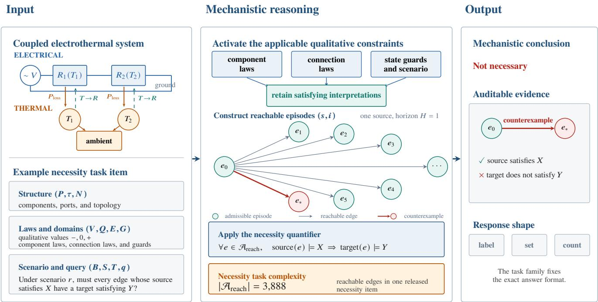
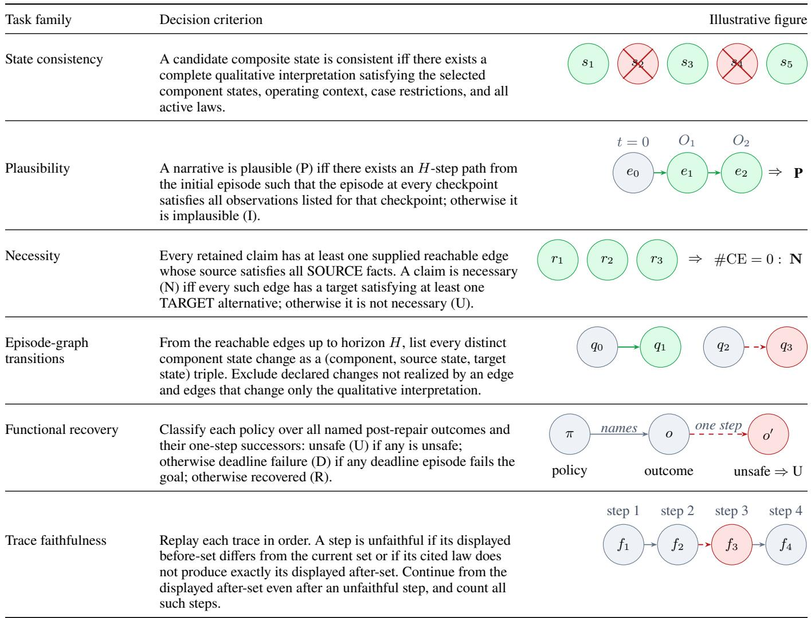
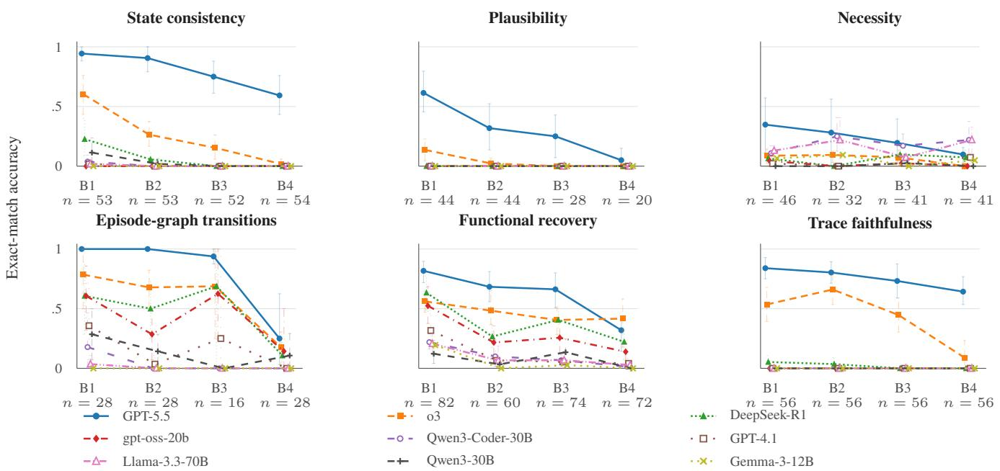
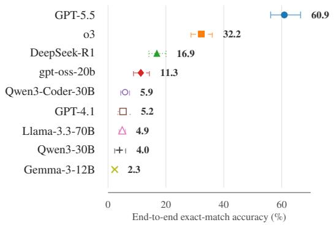
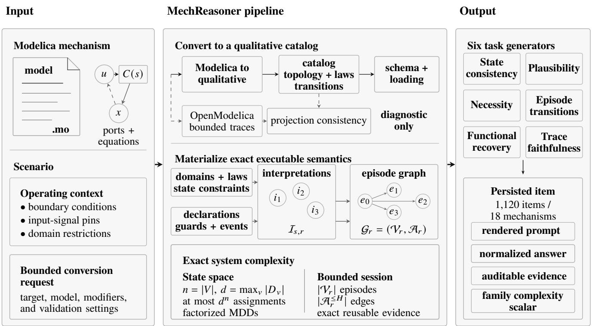

# MechReasoner: A Simulator and Benchmark for Mechanistic Reasoning in Qualitative Physics

Danilo Gusicuma<sup>1,2</sup> André Freitas<sup>1,3</sup>

<sup>1</sup>Idiap Research Institute, Switzerland

<sup>2</sup>École Polytechnique Fédérale de Lausanne (EPFL), Switzerland

<sup>3</sup>Department of Computer Science, University of Manchester, United Kingdom

firstname.lastname@idiap.ch

## Abstract

This work introduces MechReasoner, a mechanistic qualitative simulator grounded in confluence-based qualitative physics, together with a benchmark for mechanistic inference. Current large language models (LLMs) generate fluent mechanistic descriptions that do not reliably follow from underlying structural and causal constraints. The benchmark tests whether answers preserve simulator-licensed ambiguity, quantified claims, episode-graph transition evidence, repairs, and trace-support judgments. Its 1,120 items are generated deterministically from admissible interpretation sets, component states, scenario restrictions, confluence constraints, and derivation steps across 18 catalog mechanisms and six task families. Each mechanism undergoes converter checks of structure and topology and behavioral checks against quantitative simulations. GPT-5.5 accuracy decreases as familyspecific mechanistic complexity increases, from 76.1% in the lowest-complexity bucket (B1) to 38.0% in the highestcomplexity bucket (B4). The negative association remains after controls for rendered-prompt and expected-answer length. These results show that qualitative simulators can support auditable NLP benchmarks for mechanistic inference.

## 1 Introduction

Across domains ranging from physical devices and biological systems to economic models, understanding the world requires reasoning about its underlying mechanisms. However, while state-of-the-art LLMs, including models designed for agentic use, can generate fluent descriptions of devices and processes, they often fail to accurately predict real-world phenomena.

Accounts of mechanisms describe entities and activities organized to produce changes (Machamer, Darden, and Craver 2000). Mechanistic reasoning identifies setup conditions, entities, their activities and properties, and their organization, then chains them to explain how a phenomenon arises (Russ et al. 2008). For this work, this means deriving claims about a system’s states and changes from an explicit representation of its mechanism.

Qualitative physics provides such a representation when exact numerical parameters are unavailable (de Kleer and Brown 1984; Forbus 1984; Kuipers 1984, 1986). It captures the structural and causal constraints that govern how a mechanism can behave and preserves alternative behaviors when the available information is incomplete. The qualitative simulator gives this representation executable semantics by enumerating admissible interpretations, reachable episode paths, and the evidence that licenses them. MechReasoner then assesses whether a reasoner derives claims supported by those semantic objects, including whether a state or episode path is possible, whether an efect or repair is necessary, and whether a derivation is supported.

Current benchmarks rarely score the relation between a mechanism and a claim. Process and physical commonsense tasks infer answers from text (Dalvi et al. 2018; Tandon et al. 2019; Bisk et al. 2020). Recent physics benchmarks emphasize question answering, with some also providing step-level scoring or executable solution artifacts (Wang et al. 2023; Zhang et al. 2025; Imani et al. 2026). Tests that treat an LLM as a simulator score one subsequent state or state diference (Wang et al. 2024). A correct label can still accompany an impossible transition, an omitted valid alternative, or evidence unsupported by the stated laws. Evaluating mechanistic reasoning therefore requires a semantic reference that enumerates admissible states and histories, distinguishes existential from universal claims, retains transition and derivation evidence, and varies complexity while preserving the meaning of correctness.

Two questions organize the study. RQ1. How accurately do LLMs, including agentic-capable reasoning models, solve simulator-grounded tasks requiring mechanistic reasoning? RQ2. How does their performance vary across levels of mechanistic complexity?

MechReasoner addresses this gap with a benchmark that evaluates mechanistic reasoning against an executable qualitative reference.

The benchmark’s essential abstraction represents each mechanism as a constrained possibility space. Components, topology, local laws, operating conditions, and transition rules define the space. Six task families apply operations to this shared object. They test state membership, episode path existence, efect necessity, reachable change projection, repair universality, and derivation support. The simulator materializes the space as admissible interpretations, an episode graph, and auditable evidence.

  
Figure 1: Mechanistic reasoning in one necessity task. The input specifies a coupled electrothermal mechanism, its qualitative structure and laws, a scenario, and a universal query. Applicable constraints yield admissible interpretations and a one-step episode graph. The red edge is a counterexample because its source satisfies X and its target fails to satisfy Y. Necessity complexity counts distinct accepted causal edges reachable within the task horizon, here $| \mathcal { A } _ { \mathrm { r e a c h } } | = 3 { , } 8 8 8$

A qualitative simulator grounded in confluences compiles each encoded mechanism into its admissible interpretations, episode graph, and audit evidence. The simulator generates and scores tasks deterministically. Models receive the persisted text prompts and have no access to the simulator.

Nine model endpoints answer the same 1,120 prompts. Their underlying models span general LLMs and models with dedicated reasoning, with and without documented agentic readiness, but the evaluated configurations are all direct LLM inference: tools and multi-step action loops are disabled. Accuracy requires exact agreement with simulator gold after normalization defined for each task family. Simulator complexity bins are formed separately within each task family. Every model scores lower in the highest complexity bucket than in the lowest after the task families are pooled. GPT-5.5 declines from 76.1% to 38.0%.

Three elements define the benchmark release.

1. The evaluator contracts express mechanistic reasoning as quantified queries over finite qualitative states and histories while retaining ambiguity.

2. The dataset contains 1,120 structured items across 18 mechanisms and six task families. The task semantics make existential claims, universal claims, enumeration of sets, and counts explicit. Gold evidence is inspectable, and complexity measures are defined within each task family.

3. The release includes the typed representation, qualitative simulator, deterministic generators, manifests, evaluators, and analysis artifacts needed to trace each answer to the encoded mechanism. Bounded converter checks and an independent quantitative consistency check grounded on a mechanistic simulator cover 341 observed scenarios across all 18 catalog mechanisms.

The code, catalog, benchmark, and derived artifacts are distributed under GPL-3.0-only.

## 2 Mechanistic Abstraction and Benchmark 2.1 Formal Problem Statement

For each composite state and scenario, the intrastate solver returns the admissible interpretations licensed by the active domains and qualitative constraints. A separate simulation session collects the active transition declarations and combines them with the solved interpretations to construct the episode graph. Benchmark labels are derived from these solved objects.

Definition 1 (Mechanism and interpretations). A qualitative mechanism is

$$
{ \mathcal { M } } = ( P , \tau , V , Q , E , N , S , G , T , B ) .
$$

Here P is the finite set of component instances, τ maps each component to its component type, V is the finite typed variable set attached to components or boundary inputs, and Q assigns each $v \in V$ a finite qualitative quantity space Q(v). E contains component-local qualitative constraints, including state-dependent confluences, while N contains topology and connection-law constraints between components. $S$ is the composite component-state space induced by $P$ and $\tau ,$ G contains state-dependent domain restrictions, $T$ contains component-local transition declarations and their conditions, and B contains admissible scenarios. For a composite state $s \in S$ and scenario $r \in B$ , the compiler instantiates the active component confluences and connection laws and restricts the variable domains using the applicable state and scenario restrictions. The intrastate solver returns

$$
\mathcal { T } _ { s , r } = \Sigma ( \mathcal { M } , s , r ) ,
$$

the finite set of interpretations, i.e., the qualitative assignments that satisfy those active domains and constraints. The simulation session separately collects $T ( s )$ and evaluates those declarations when constructing episode-graph edges.

Figure 1 follows one necessity item from its serialized mechanism and query through admissible interpretations and reachable edges to a conclusion supported by a counterexample.

The simulator preserves each $\mathcal { T } _ { s , r }$ as a set as a semantic choice. Within one composite state, a claim is plausible at the interpretation level when at least one admissible interpretation supports it and necessary at that level when every admissible interpretation supports it. These local notions preserve underdetermination across interpretations. The Necessity task family quantifies over reachable edges with sources that match the claim (Table 1).

Definition 2 (Episode graph). For a scenario r, the episode graph

$$
\mathcal { G } _ { r } = ( \nu _ { r } , \mathcal { A } _ { r } )
$$

contains one node $( s , i )$ for each state $s \in S$ and each interpretation $i \in \mathcal { T } _ { s , r }$ . An edge in $\boldsymbol { A } _ { \boldsymbol { r } }$ connects two distinct nodes when a simulator-derived cause and the causal, continuity, and endpoint checks license the qualitative change. Every changed component state must be licensed by a compatible declaration whose guards hold. An unchanged component needs no declaration, so the graph may also contain interpretation-only edges.

These solved objects define the six task families summarized in Table 1. The supplementary material gives the full clauses for state restrictions, outgoing-transition witnesses, textual verification, and repair candidates.

## 2.2 Simulator Architecture

The intrastate solver instantiates component and connection laws, solves every composite state, and retains its admissible assignments, forced facts, and evidence. A separate session constructs episode-graph edges by applying declaration, guard, causal, continuity, and endpoint checks. These records ground task labels and audits; complexity is computed deterministically from the mechanism specification and simulator records.

Algorithm 1 separates the shared simulator records from the clauses that vary across task families. Table 1 defines each query, Table 2 defines each complexity value, and the supplement specifies candidate construction, validation, and rendering.

## Algorithm 1: Deterministic generation of benchmark tasks

1: Input: mechanisms $\mathcal { M } ,$ task families ${ \mathcal F } ,$ cell quota k, and   
prompt-token ceiling L   
2: $\bar { \mathcal { R } }  [ ]$   
3: for all $M \in { \mathcal { M } }$ do   
4: $Z _ { M } \gets$ SemanticObjects(M)   
5: for all $f \in { \mathcal { F } }$ supported by M do   
6: $\mathcal { A } _ { M , f } \gets [ ]$   
7: for all c ∈ Candidates<sub>f</sub> $( M , Z _ { M } )$ do   
8: $y _ { c } \gets \mathrm { Q u e r y } _ { f } ( c , Z _ { M } )$   
9: $w _ { c } \gets \mathrm { C o m p l e x i t y } _ { f } ( c , Z _ { M } )$   
10: $p _ { c } \gets$ Render<sub>f</sub>(M, c)   
11: if Valid $_ f ( p _ { c } , y _ { c } )$ and Tokens $( p _ { c } ) \leq L$ then   
12: append $\left( p _ { c } , y _ { c } , w _ { c } , \mathrm { A u d i t } ( c , Z _ { M } ) \right)$ to $\mathcal { A } _ { M , f }$   
13: end if   
14: end for   
15: $\mathcal { R } \gets \mathcal { R } \cup \operatorname { S e l e c t L e v e l s } _ { f } ( \mathcal { A } _ { M , f } , \{ \mathrm { D 1 } , \dots , \mathrm { D 4 } \} , k )$   
16: end for   
17: end for   
18: R ← DeduplicateByNormalizedPrompt(R)   
19: persist tasks, gold solutions, manifests, and completion   
hashes   
20: return $\mathcal { R }$

Quantitative–qualitative consistency check The profile admits 12 Modelica Standard Library v4.1.0 examples (Modelica Association 2025) and six compositions of supported components, spanning electrical, translational, rotational, and thermal models. After freezing the outputs of72 bounded OpenModelica runs (Open Source Modelica Consortium 2026), the check covers 341 distinct observed scenarios across all 18 mechanisms. The 341 scenarios comprise 186 projected composite-state configurations and 155 observed component-transition shapes. The numerical and qualitative results follow separate execution paths, and the comparison reads neither benchmark tasks nor gold solutions. The contained experiment has zero contradictions and zero inconclusive cases. The supplement details the observations and their acceptance rules. Modelica Standard Library and OpenModelica remain external dependencies.

## 2.3 Benchmark as a Mechanistic Abstraction

At the benchmark level, a mechanism is not identified with a particular simulator implementation or with one predicted trajectory. For scenario r, its semantic abstraction comprises the finite interpretation sets $\{ \mathcal { T } _ { s , r } \} _ { s \in S } ,$ the episode graph $\mathcal { G } _ { r } .$ , and the rule-evidence records that justify their construction. Each item selects a bounded view of this object and applies a query $q$ whose answer is fixed by the released semantics. The simulator constructs the object and computes the gold answer; the benchmark evaluates whether another reasoner can recover the requested property from its serialized representation. This separation makes the benchmark about mechanistic reasoning rather than simulator imitation.

Task semantics The benchmark is organized around mechanistic questions and currently comprises six task families, each designed to probe a distinct aspect of the problem. Table 1 summarizes the relationship between these families and the semantics they test. State consistency identifies complete candidate component-state vectors admitting a satisfying qualitative assignment; plausibility labels checkpoint narratives witnessed by one exact bounded episode path; necessity labels source-to-target claims with no counterexample in a supplied exact edge graph; episode-graph transition tasks enumerate distinct component-state changes witnessed by reachable edges; functional recovery assigns universal one-step safety/deadline statuses to repair policies; and trace faithfulness counts stale or unsupported displayed propagation steps.

  
Table 1: Task families and the problem semantics each family tests, shown as the illustrative figure behind each task. Green marks valid or forced elements, red marks invalid, blocked, or unsupported ones, and neutral circles are candidates under test. In the illustrative figures, $s _ { i }$ denotes complete candidate component-state vectors, $e _ { i }$ path episodes, $O _ { t }$ checkpoint observations, $r _ { i }$ reachable edge rows, $q _ { i }$ component states, π a repair policy, $o , o ^ { \prime }$ a named outcome and successor, and $f _ { i }$ trace steps.

Benchmark governance The audited comparator pool is deduplicated by normalized prompt. Completion markers bind the catalog, generator, manifest, solutions, and task files. Models receive only persisted prompts with their expected response shape. All fit an 80,000-token o200k\_base ceiling; the maximum is 73,866 tokens.

Evaluator protocol Each backend receives the same fixed system message and persisted prompt, without tools or repository access. No family schema is sent out of band; supporting endpoints receive only generic object mode. The scorer extracts the returned answer, normalizes it by family, and compares it exactly with gold. Rejected outputs are protocol failures, accepted non-gold outputs semantic failures, and request or scorer errors infrastructure failures. End-to-end accuracy retains every model–item record. Family-specific component measures include label-character and candidate– case accuracy, transition-set F1, and trace count-field accuracy. The supplement specifies request controls, retries, message envelopes, normalization, exact evaluator profiles, efective output limits, and reasoning-efort settings.

<table><tr><td>Task family</td><td>Complexity scalar</td><td>What the scalar counts</td></tr><tr><td>State consistency</td><td> $\begin{array} { r } { \sum _ { i = 1 } ^ { n _ { \mathrm { c a n d } } } \sum _ { k = 1 } ^ { n _ { \mathrm { c a s e } } } ( L _ { i } + R _ { i } + } \end{array}$  Ak)</td><td>Active confluences and state and case restrictions for every displayed candidate-case pair</td></tr><tr><td>Plausibility</td><td> $\scriptstyle \sum _ { t = 1 } ^ { \tilde { H } } | O _ { t } |$ </td><td>Displayed qualitative facts across the successor checkpoints in one candidate narrative.</td></tr><tr><td>Necessity</td><td>|Areach|</td><td>Distinct accepted causal edges reachable within the task horizon.</td></tr><tr><td>Episode-graph transitions</td><td> $\begin{array} { r } { \sum _ { x \in \mathcal { X } _ { \mathrm { e x p } } } B _ { x } T _ { x } } \end{array}$ </td><td>Possible boundary-cause and declared-transition pairings at each reachable source episode.</td></tr><tr><td>Functional recovery</td><td></td><td>Displayed repair plans and their distinct accepted one-step effects.</td></tr><tr><td>Trace faithfulness</td><td> $\begin{array} { r } { P + \sum _ { p = 1 } ^ { P } E _ { p } } \end{array}$   $\textstyle \sum _ { g = 1 } ^ { n _ { \mathrm { t r } } } h _ { g } ^ { r }$ </td><td>Displayed trace-step occurrences across the independent traces.</td></tr></table>

Table 2: Metrics for mechanistic complexity computed for each task family without using the expected answer.

## 3 Empirical Analysis

## 3.1 Experiment Design

Model Selection Criteria The nine models span disclosed dense and sparse scales, proprietary and open weights, dedicated reasoning variants, and general, multilingual, code, STEM, and agentic training profiles; GPT-5.5 supplies the frontier reference point. The supplementary Model Inventory separately records dedicated reasoning, documented agentic readiness, and the direct-LLM system class used in this experiment.

Mechanistic Complexity Table 2 lists the scalar for each task family. Each scalar is a deterministic, answerindependent count derived from the qualitative simulator. Retained items are re-scored by the active family metric before complexity buckets and reported slices are computed.

One deterministic B1–B4 analysis-bin assignment is used for every reported figure, table, and control. Within each task family, deterministic, tie-preserving near-quartiles keep every item with the same complexity score in one bin. Each cut is placed at the tie-block boundary nearest its cumulative equal-count target; an exact distance tie selects the earlier boundary.

The labels identify complexity strata within each task family. They do not make the absolute complexity scalars comparable across families. Cross-family comparisons align these strata, and item records retain the concrete quantities defined for their task family. The analysis bins are distinct from the generation-time D1–D4 labels stored with each task. Applied to the 1,120 retained questions, the assignment gives 309/273/267/271 items in B1/B2/B3/B4.

Accuracy controls An exploratory stacked conditionallogistic analysis stacks all 10,080 model–item records, with strata formed by model, task family, and mechanism and CR1 inference clustered by mechanism. The adjusted regression adds log prompt and expected-answer character counts. The supplement reports the fully enumerated wild-cluster test and regression diagnostics.

Dataset Characterization Table 3 summarizes the released benchmark before model scores are considered. The 108 family–mechanism cells each target 16 structured tasks, giving 1,728 targeted generation slots. Generation produced 1,141 task-ID records from 50 complete, 35 partial, and 23 empty pools. Normalized-prompt deduplication removed 21 repeated records, leaving 1,120 unique questions across six task families and 18 mechanisms. The resulting 608-question shortfall is not padded. The mechanism column reports how many mechanisms supply retained items inside each family.

## 3.2 Results

Accuracy declines substantially with mechanistic complexity Figure 2 compares all nine direct-inference model endpoints. GPT-5.5, the strongest model and clearest view above the accuracy floor, has lower B4 than B1 accuracy in all six families, with declines of 19.6–75.0 points. Across the nine models, pooled accuracy falls from 23.7% in B1 to 8.7% in B4; every model scores lower in B4 than B1. The adjusted stacked regression gives a per-bin odds ratio of 0.619 (mechanism-cluster CR1–t<sub>17</sub> 95% interval [0.547, 0.701]). The association is defined within each family and does not support a causal interpretation.

Frontier and reasoning models lead the full benchmark Figure 3 compares overall end-to-end accuracy. GPT-5.5 reaches 60.9%, followed by o3 at 32.2% and DeepSeek-R1 at 16.9%. Notably, gpt-oss-20b at low reasoning efort reaches 11.3%, followed by Qwen3-Coder-30B at 5.9% and GPT-4.1 at 5.2%. All models are evaluated on the same 1,120 items.

Accuracy and component-level performance difer by task family By accuracy, GPT-5.5 is strongest on state consistency (79.7%), followed by episode-graph transitions (78.0%), trace faithfulness (75.4%), functional recovery (62.5%), plausibility (36.0%), and necessity (23.1%). Functional recovery remains comparatively strong after the prompt hides the simulator counts that determine each plan

<table><tr><td>Task family</td><td>Items</td><td>Mech.</td></tr><tr><td>State consistency</td><td>212</td><td>17</td></tr><tr><td>Plausibility</td><td>136</td><td>11</td></tr><tr><td>Necessity</td><td>160</td><td>14</td></tr><tr><td>Episode-graph transitions</td><td>100</td><td>11</td></tr><tr><td>Functional recovery</td><td>288</td><td>18</td></tr><tr><td>Trace faithfulness</td><td>224</td><td>14</td></tr><tr><td>Total</td><td>1,120</td><td>18</td></tr></table>

Table 3: Compact characterization of the benchmark.

  
Figure 2: Accuracy of all nine direct-inference model endpoints across the canonical bins of the simulator-complexity proxy defined relative to each task family. The shared legend applies to every panel, which also shows its bin sample sizes; error bars are 95% percentile intervals from 10,000 item-weighted mechanism-level cluster-bootstrap replicates. B1–B4 order complexity only within each family; the six raw scalars retain diferent units.

  
Figure 3: Overall end-to-end accuracy on the common 1,120- question benchmark. Numbers label point estimates; horizontal bars show 95% percentile intervals from 10,000 itemweighted mechanism-level cluster-bootstrap replicates.

verdict, separating constraint- based recovery inference from the other mechanistic skills under one evaluator and catalog. The corresponding component scores are 98.4% candidate– case accuracy for state consistency, 89.2% plausibility character accuracy, 65.6% necessity character accuracy, 88.3% transition-set F1, 87.3% functional-recovery character accuracy, and 75.4% trace count-field accuracy. The gap shows that a structured answer that misses the accuracy criterion often contains many correct components. Accuracy counts an answer as correct only when its canonical family payload, after the documented extraction and normalization rules, equals gold; component measures capture recovered labels or set elements. Full per-model, per-family results and constant baselines are in the supplement. The non-oracle prompt-text symbolic baseline reconstructs each typed task from the rendered prompt and executes the public qualitative semantics, solving all 1,120 items with 100% accuracy.

## 4 Related Work

Classical qualitative reasoning and simulation. MechReasoner follows qualitative physics, where system behavior emerges from structural models expressed through qualitative variables and confluences.

De Kleer and Brown’s ENVISION architecture separates device structure, qualitative variables, qualitative calculus, and connection laws. Its runtime separates intrastate constraint solving from interstate changes in component state (de Kleer and Brown 1984). Component libraries, topology, inputs, boundary conditions, and active confluences determine allowable states, variable behaviors, transitions, and explanations. MechReasoner retains the full interpretation set to support quantified claims, constrained repair analysis, and explanation checks. This representation aligns with Forbus’s process-centered abstraction (Forbus 1984) and Kuipers’s behavior-from-structure reasoning and qualitative simulation procedure (Kuipers 1984, 1986). Falkenhainer and Forbus show how larger physical domain theories can be assembled compositionally for task-specific reasoning (Falkenhainer and Forbus 1991).

Klenk et al. provide the closest technical predecessor. They give a sound and efective mapping from Modelica models to qualitative reasoning, extend envisioning to support Modelica’s declarative events, and infer three classes of constraints that reduce unrealizable qualitative trajectories (Klenk et al. 2014). Their objective is qualitative analysis of engineering models during design. MechReasoner uses the released qualitative semantics and simulator as the executable grounding for a benchmark.

LLM-era simulator grounding and evaluation. Mind’s Eye converts a physical question to MuJoCo code and injects the simulated outcome as a hint for the answering LM. Utopia measures answers based on relative comparisons across 39 tasks in six physical scenes (Liu et al. 2022). MechReasoner uses its simulator to construct and score the benchmark, while evaluated models receive the qualitative mechanism without simulator outcomes. Gold retains the entire ambiguity set of admissible interpretations, so the evaluator can distinguish possible from necessary conclusions under physical underdetermination.

Wang et al. provide the closest LLM-as-simulator evaluation. Their LLM-Sim contract predicts one subsequent text game state, its state diference, or game progress, with separate measurements for action-driven and environment-driven transitions (Wang et al. 2024). In contrast, MechReasoner evaluates quantified queries over a documented space of admissible states and histories rather than a single predicted successor.

Process and physical commonsense benchmarks from language. Later NLP benchmarks probe related reasoning abilities from text rather than from executable mechanism models. ProPara evaluates state tracking in process descriptions, WIQA asks perturbation and influence questions over procedural text, and PIQA tests physical commonsense over natural-language goals and candidate actions (Dalvi et al. 2018; Tandon et al. 2019; Bisk et al. 2020). These resources provide realistic linguistic coverage and human-authored benchmark settings. They leave reusable device structure and simulator-grounded admissible interpretation sets outside the reported evidence. The benchmark here is narrower and more mechanistic because its task instances expose the objects that separate plausibility from necessity.

Recent physics benchmarks. Recent LLM-era benchmarks scale physics-oriented testing with broader benchmark pipelines. NEWTON introduces an object-attribute repository and templated question generation for physical reasoning (Wang et al. 2023); PhysReason focuses on multi-step physics problems with answer-level and step-level scoring (Zhang et al. 2025); and SymPyBench provides dynamic, parameterized physics tasks with executable solution artifacts for controlled auditing (Imani et al. 2026). These benchmarks measure physical and scientific reasoning via question answering, whereas this one evaluates against executable mechanism models whose state and transition semantics are exposed to the evaluator.

## 5 Conclusion

Mechanistic reasoning requires judging claims against the mechanisms that license them. MechReasoner makes that relation testable by using qualitative physics to construct a constrained possibility space. Claims follow from admissible interpretations or reachable episode paths, while diverse queries preserve underdetermination and support quantified judgments over the same encoded mechanism.

The prompt-text symbolic baseline solves every item, confirming that the prompts encode the released semantics. Direct-inference model accuracy declines as mechanistic complexity increases, and component scores above exact scores show partial structural recovery can fail to produce a coherent final judgment. Prompt and answer length controls leave the association intact, indicating that surface length alone does not account for dificulty with the required mech anistic operations.

## 6 Limitations

The benchmark is limited to 18 mechanisms and six task families. It does not measure agentic deployment, interactive tools, multimodal perception, continuous prediction, openended explanation, or safe engineering practice. The results for agentic-ready models therefore characterize direct inference, not an agent loop; nor does success establish mechanistic internal computation. Exact accuracy compounds errors across fields. Prompt- and answer-length controls leave the complexity association negative and do not remove the surface-form confound.

Generation coverage is nonuniform across task families and mechanisms. Bootstrap intervals clustered by mechanism account for shared task structure, although coverage selection remains; protocol failures stay in the end-to-end denominator. The reported intervals are conditional on one persisted model response per item and capture variation from resampling the mechanism catalog. Variability across repeated model inferences lies outside these intervals.

The prompt-text symbolic baseline shares the released semantics implementation; its 100% accuracy establishes prompt completeness and implementation consistency, not independent gold correctness. The quantitative consistency check does not ensure full benchmark simulation validation. Simulation-based validation is limited to behavior observed in finite runs and therefore cannot validate existential claims for which no supporting behavior was observed. The qualitative abstraction itself follows established formulations in the qualitative-reasoning literature (de Kleer and Brown 1984; Forbus 1984; Kuipers 1984, 1986; Klenk et al. 2014). Within these limits, the check adds task- and gold-independent numerical evidence, yielding no contradiction across all 341 observed scenarios.

## Ethical Statement

Tasks are synthetic and contain no human-subject data. Scores do not establish real-world engineering competence or certify safety-critical deployment. AI assistance supported wording review; the authors independently verified all claims and remain responsible for the submission.

## Acknowledgements

This work was carried out within the Horizon Europe Marie Skłodowska-Curie Actions Doctoral Network GenAIDE (Grant Agreement No. 101226927). This work has received funding from the Swiss State Secretariat for Education, Research and Innovation (SERI).

## A Supplementary Material

## A.1 Simulator Architecture Diagram

Figure 4 summarizes the artifact and trust boundaries from bounded Modelica conversion through benchmark-item persistence.

## A.2 Accuracy Surface Controls

The exploratory robustness analysis stacks all nine evaluated models over the common benchmark with 1,120 questions and six families, retaining protocol failures as incorrect. The resulting 10,080 model–item records use the canonical B assignment for each task, with 309/273/267/271 questions in B1/B2/B3/B4 for each model.

  
Figure 4: MechReasoner system workflow and trust boundaries. Dashed gray arrows mark the diagnostic-only OpenModelica branch, which cannot afect catalog admission, task generation, labeling, or scoring. The labels distinguish exact system scale from the separate family-specific complexity scalar stored with each benchmark item.

Conditional logistic regressions use 765 observed strata formed by model, task family, and mechanism. These strata condition out each joint intercept. The adjusted regression adds log rendered-prompt and canonical expected-answer character counts; “unadjusted” below means unadjusted for these two length measures, since both regressions are stratified.

Of the 765 observed strata, 423 contain invariant outcomes and therefore contribute no conditional likelihood. The fits use the remaining 342 strata and 4,841 records while retaining all 18 mechanisms as clusters. Intervals use a mechanismcluster CR1 covariance with a $t _ { 1 7 }$ reference distribution. The p-values for ordinal efects use a two-sided, fully enumerated Rademacher wild-cluster score test over all $2 ^ { 1 8 }$ sign patterns.

Both ordinal fits converged in six and five Newton iterations. For the adjusted fit, the final score infinity norm is $4 . 6 3 \times 1 0 ^ { - 1 3 }$ , the three-column information matrix is full rank with condition number 117.0, and the largest absolute coeficient is 3.73. After conditioning out the invariant strata, the fitted conditional model triggers no residual separation

<table><tr><td>Analysis-bin effect</td><td>Unadjusted</td><td>Adjusted</td></tr><tr><td>B2 vs B1 OR</td><td>0.486</td><td>0.894</td></tr><tr><td>B3 vs B1 OR</td><td>0.259</td><td>0.734</td></tr><tr><td>B4 vs B1 OR</td><td>0.073</td><td>0.201</td></tr><tr><td>Ordinal coefficient</td><td>-0.822</td><td>-0.479</td></tr><tr><td>Ordinal odds ratio</td><td>0.439</td><td>0.619</td></tr><tr><td>95%OR interval</td><td>[0.370, 0.522]</td><td>[0.547, 0.701]</td></tr><tr><td>Wild-score p</td><td>&lt; 0.0001</td><td>&lt; 0.0001</td></tr></table>

Table 4: Exploratory stacked conditional-logistic robustness check for nine models. Both regressions use strata formed by model, task family, and mechanism; the adjusted regression adds prompt and expected-answer lengths. Intervals use $\mathrm { C R 1 - } t _ { 1 7 }$ inference, and ordinal p-values use the fully enumerated Rademacher wild-cluster score test.

warning.

This post-hoc result remains exploratory. In particular, the wild score test has only 18 cluster contributions and relies on their sign-symmetry approximation; coverage across combinations of family and mechanism is nonuniform, invariant strata do not identify efects within those strata, and unrecorded diferences in prompt content remain. The shared ordinal coeficient summarizes the nine evaluated models without establishing equal gradients across them. The estimate therefore serves as associational sensitivity evidence and does not support a causal or confirmatory claim.

## A.3 Outcome-Separated Metrics and Baselines

Each model–item outcome is classified as correct; a semantic failure (a payload accepted by normalization that difers from gold); a protocolfailure (an empty response or a payload rejected during parsing or normalization); or an infrastructure failure (context rejection, timeout, gateway, or evaluator failure before comparison). For any reported slice $D ,$ let $D _ { A }$ exclude infrastructure failures, $D _ { J }$ contain payloads accepted by normalization, and $D _ { C }$ contain correct answers. When their denominators are nonzero, the metrics are

$$
\begin{array} { r l r } { \mathrm { C o v e r a g e } = \displaystyle \frac { | D _ { A } | } { | D | } , } & { \quad } & { \mathrm { C o m p l i a n c e } = \displaystyle \frac { | D _ { J } | } { | D _ { A } | } , } \\ { \mathrm { A c c } _ { \mathrm { s e m a n t i c } } = \displaystyle \frac { | D _ { C } | } { | D _ { J } | } , } & { \quad } & { \mathrm { A c c } _ { \mathrm { e 2 e } } = \displaystyle \frac { | D _ { C } | } { | D | } . } \end{array}
$$

Compliance therefore measures acceptance by the normalizer.

Accuracy remains the primary metric, but it is not the only substantive score. Fixed label strings use character accuracy; state consistency uses accuracy over every candidate– scenario consistency decision; episode-graph transitions use task-level set $\operatorname { F 1 } ;$ and trace faithfulness uses count-field accuracy. For family component score $m _ { f } \in [ 0 , 1 ]$ , protocol and infrastructure failures receive zero in the end-to-end mean $\begin{array} { r } { M _ { \mathrm { e 2 e } } = | D | ^ { - 1 } \sum _ { r \in D _ { I } } m _ { f } ( r ) } \end{array}$ ; the conditional semantic mean is M<sub>semantic</sub> $\begin{array} { r } { \mathbf { \Pi } = | D _ { J } | ^ { - 1 } \sum _ { r \in D _ { J } } m _ { f } ( r ) } \end{array}$ . Figures use end-to-end accuracy; the other measures separately identify availability, protocol compliance, and agreement among valid answers.

Accuracy error bars are 95% confidence intervals from 10,000 deterministically seeded, mechanism-level clusterbootstrap replicates. Entire item clusters are resampled by mechanism, preserving within-mechanism dependence and item-weighted accuracy. Shared bootstrap draws across models maintain paired comparisons. Table 5 reports these metrics and their bootstrap intervals for GPT-5.5 by task family, alongside the release-derived majority/constant baseline.

The majority/constant baseline repeats the release-wide majority label for fixed strings, predicts every candidate inconsistent for state consistency, uses the empty transition set, or predicts the modal trace count. It is fitted to the released gold-label marginal and is therefore a diagnostic floor rather than a held-out learning baseline. Deterministic replay of the structured generator state obtains 100% accuracy by construction and serves only as an integrity check. The prompt-text symbolic parser is the non-oracle, prompt-only systems baseline. It reconstructs the typed task from the rendered prompt and executes the same public qualitative solver and semantics used elsewhere in the release. Its inference path reads no solutions, catalog files, generator objects, or simulator caches. It parses and solves all 1,120 items with 100% accuracy.

Complete per-model, per-family report. Table 6 reports end-to-end accuracy for every model and family together with each model’s total protocol failures. Ten Qwen3-30B requests (two plausibility and eight functional recovery) returned empty responses and are classified as protocol failures. Protocol failures total 1,296.

## A.4 Operational Semantic Definitions

The operational semantic clauses expand the compact definitions from the main paper. They fix the solved objects and exact admissibility and labeling conditions used by the benchmark.

Definition 3 (Compiled state and admissible interpretation). For ${ \mathcal { M } } , T _ { p , \sigma }$ is the finite set of declared outgoing transition records for component $p$ in local state $\sigma .$ A record t gives a destination state, an optional event coordinate, and finite source and target guard sets $H _ { t } ^ { - }$ and $H _ { t } ^ { + }$ of pairs $( v , A )$ with $A \subseteq Q ( v )$ . We write $\iota \models H$ when $\iota ( v ) \in A$ for every $( v , A ) \in H$ . These transition records do not constrain $\mathcal { T } _ { s , r } \vdots$ the separate simulation session evaluates them only when constructing episode-graph edges.

Given a composite component-state assignment $s \in S$ and a scenario $r \in B$ , the compiler restricts each variable to a domain $D _ { s , r } ( v ) \subseteq Q ( v )$ using the active state constraints and scenario restrictions. It also instantiates the active qualitative constraints

$$
C ( s , r ) = \mathrm { I n s t } _ { s , r } ( E , N )
$$

where Ins $\mathrm { t } _ { s , r }$ selects the active component-local confluences and connection laws, renames them to their component instances, and applies their state and scenario conditions. Each $c \in C ( s , r )$ is a finite list of signed product terms $u _ { 1 } , \ldots , u _ { m }$ Let $\mathrm { q s g n } _ { \iota } ( u _ { j } ) \in \{ - , 0 , + \}$ be the qualitative sign obtained by multiplying the coeficient sign and the signs under ι of all factors, with their exponents respected. Confluence satisfaction is

$$
\iota \models c \iff \mathbb { \lvert \forall } j , \mathrm { q s g n } _ { \iota } ( u _ { j } ) = 0 \rfloor \vee \left[ \exists j , \mathrm { q s g n } _ { \iota } ( u _ { j } ) = + , \right] ,
$$

and $\iota \ \vdash \ C ( s , r ) \ \mathrm { i f f } \ \iota \ \vdash \ c$ for every $c \in C ( s , r )$ . Thus a zero term together with nonzero terms of only one sign does not satisfy a confluence. An admissible interpretation is an assignment ι of qualitative values to every active variable in $V$ such that $\iota ( v ) \bar { \in { \cal D } _ { s , r } ( v ) }$ for every v and all constraints in $C ( s , r )$ are satisfied. The intrastate solver returns the finite set

$$
\begin{array} { c } { { \mathcal { T } _ { s , r } = \{ \iota : \iota ( v ) \in D _ { s , r } ( v ) \mathrm { ~ f o r ~ e v e r y ~ } v , } } \\  { \iota \left[ = C ( s , r ) \right\} . } \end{array}
$$

Operational edge-admission clauses and bounded reachability. The episode-graph definition in the main paper fixes the episode universe $\bar { \mathcal { V } } _ { r }$ and graph $\mathcal { G } _ { r } = ( \nu _ { r } , \mathcal { A } _ { r } ) ^ { \smash { 1 \ldots } }$ . The following clauses specify the deterministic edge-admission procedure used by the released simulator.

<table><tr><td rowspan="3">Task family</td><td colspan="2">Majority/constant</td><td colspan="4">GPT-5.5</td></tr><tr><td>Accuracy</td><td></td><td></td><td>Partial E2E accuracy [95% CI] E2E partial [95% CI] Semantic accuracy</td><td></td><td>Prot. Infra.</td></tr><tr><td>Necessity</td><td>0.0</td><td>50.0</td><td>23.1 [12.8, 34.8]</td><td>65.6 [59.5, 72.0]</td><td>23.1</td><td></td></tr><tr><td>Plausibility</td><td>0.0</td><td>50.0</td><td>36.0 [26.8, 43.8]</td><td>89.2 [86.0, 92.0]</td><td>37.7</td><td>0</td></tr><tr><td>State consistency</td><td>0.0</td><td>67.5</td><td>79.7 [71.9, 87.3]</td><td>98.4 [97.0, 99.3]</td><td>80.1</td><td>0</td></tr><tr><td>Episode-graph transition</td><td>0.0</td><td>0.0</td><td>78.0 [66.2, 94.0]</td><td>88.3 [82.4, 96.6]</td><td>78.0 75.4</td><td>0</td></tr><tr><td>Trace faithfulness</td><td>4.5</td><td>4.5</td><td>75.4 [70.1, 81.2]</td><td>75.4 [70.1, 81.2]</td><td>0 1</td><td>0</td></tr><tr><td>Functional recovery</td><td>11.8</td><td>37.0</td><td>62.5 [54.9, 70.1]</td><td>87.3 [84.5, 90.2]</td><td>62.7</td><td>0</td></tr></table>

Table 5: GPT-5.5 outcome-separated metrics and release-derived simple baselines. Accuracy and partial-score columns are percentages. E2E scores retain every item; the conditional semantic value reports accuracy among valid normalized answers. Prot. and Infra. are counts. The family-specific partial metric is defined in the text.
<table><tr><td>Model</td><td>SC</td><td>P</td><td>N</td><td>T</td><td>FR</td><td>TF</td><td>Prot.</td></tr><tr><td>GPT-5.5</td><td>79.7</td><td>36.0</td><td>23.1</td><td>78.0</td><td>62.5</td><td>75.4</td><td>8</td></tr><tr><td>03</td><td>25.9</td><td>5.1</td><td>6.2</td><td>57.0</td><td>46.9</td><td>43.3</td><td>52</td></tr><tr><td>DeepSeek-R1</td><td>7.1</td><td>0.0</td><td>6.2</td><td>45.0</td><td>39.6</td><td>2.2</td><td>110</td></tr><tr><td>gpt-oss-20b</td><td>0.0</td><td>0.0</td><td>1.9</td><td>39.0</td><td>29.5</td><td>0.0</td><td>152</td></tr><tr><td>Qwen3-Coder-30B</td><td>0.9</td><td>0.0</td><td>18.1</td><td>5.0</td><td>10.4</td><td>0.0</td><td>107</td></tr><tr><td>GPT-4.1</td><td>0.5</td><td>0.0</td><td>3.1</td><td>15.0</td><td>12.8</td><td>0.0</td><td>24</td></tr><tr><td>Llama-3.3-70B</td><td>0.5</td><td>0.0</td><td>15.6</td><td>1.0</td><td>9.7</td><td>0.0</td><td>255</td></tr><tr><td>Qwen3-30B</td><td>3.3</td><td>0.0</td><td>0.6</td><td>15.0</td><td>7.6</td><td>0.0</td><td>441</td></tr><tr><td>Gemma-3-12B</td><td>0.0</td><td>0.0</td><td>5.0</td><td>0.0</td><td>6.2</td><td>0.0</td><td>147</td></tr></table>

Table 6: End-to-end accuracy (%) by model and task family. SC denotes state consistency, P plausibility, N necessity, T episodegraph transitions, FR functional recovery, and TF trace faithfulness. Prot. is the total number of protocol failures across all 1,120 items.

For a source episode $x = \left( s , \iota \right)$ , the constructor derives a cause set $ { \mathcal { C } } _ { r } ( x )$ from the active laws, derivative coordinates, and quantity spaces. A boundary cause is an atomic set of nearest directed termination events after exact coincidence, equality-change, and epsilon ordering. An intrastate cause has an empty event set and is available only when no mandatory point-cell departure preempts it.

For episodes $x , x ^ { \prime } \in \mathcal { V } _ { r }$ and $c \in \mathcal { C } _ { r } ( x )$ , the exact endpoint solver returns the Boolean $\mathrm { E d g e O K } _ { r } ( x , x ^ { \prime } , c )$ . It returns true exactly when all of the following implementation clauses pass:

E1 Each derivative coordinate remains fixed unless a selected event moves it to that event’s target cell; parameters and nondynamic inputs remain fixed.

E2 Every boundary event reaches the nearest cell in its directed quantity space.

E3 Coincident groups, mandatory equality changes, and epsilon ordering are respected.

E4 Every changed non-derivative quantity has either an initiating event or a causal predecessor under an active law.

E5 The target $x ^ { \prime }$ is a solved interpretation of its composite state.

E6 Every continuous quantity remains in the same qualitative cell or moves to an adjacent cell.

E7 Every coordinate change agrees with the source value of its derivative under the qualitative mean-value rule.

E8 Feedback may propagate an event-seeded change but may not initiate a change without an event-seeded causal path.

Declared transitions constrain every component-state change. For $x \ = \ ( s , \iota )$ and $x ^ { \prime } = ( s ^ { \prime } , \bar { \iota } ^ { \prime } )$ , a declaration t is compatible with a change of component p when

$$
t \in T _ { p , s ( p ) } , \quad \mathrm { d s t } ( t ) = s ^ { \prime } ( p ) , \quad \iota \Vdash H _ { t } ^ { - } , \quad \iota ^ { \prime } \vdash H _ { t } ^ { + } ,
$$

and its event coordinate, when present, occurs in c. Let $\mathrm { D e c l } ( x , x ^ { \prime } , c )$ mean that every changed component has such a compatible declaration. An unchanged component needs no declaration. The admissible episode relation is

$$
\begin{array} { r } { \mathcal { A } _ { r } = \{ ( x , x ^ { \prime } , c ) [ \begin{array} { l } { x , x ^ { \prime } \in \mathcal { V } _ { r } , \quad x \neq x ^ { \prime } , } \\ { c \in \mathcal { C } _ { r } ( x ) , } \\ { \mathrm { E d g e O K } _ { r } ( x , x ^ { \prime } , c ) , } \\ { \mathrm { D e c l } ( x , x ^ { \prime } , c ) } \end{array} ] . } \end{array}
$$

For an initial episode $x _ { 0 } .$ , define the exact-depth episode and edge layers by

$$
\begin{array} { r l } & { \quad R _ { 0 } ( x _ { 0 } ) = \{ x _ { 0 } \} , } \\ & { \quad A _ { r } ^ { ( d ) } ( x _ { 0 } ) = \{ ( x , x ^ { \prime } , c ) \in A _ { r } : x \in R _ { d - 1 } ( x _ { 0 } ) \} , } \\ & { \quad R _ { d } ( x _ { 0 } ) = \{ x ^ { \prime } : \exists x , c , ~ ( x , x ^ { \prime } , c ) \in A _ { r } ^ { ( d ) } ( x _ { 0 } ) \} , \qquad d \geq 1 . } \end{array}
$$

The bounded reachable edge set through horizon H is $\begin{array} { r } { \mathcal { A } _ { r } ^ { \le H } ( x _ { 0 } ) = \bigcup _ { d = 1 } ^ { H } \mathcal { A } _ { r } ^ { ( d ) } ( x _ { 0 } ) } \end{array}$

Definition 4 (State-consistency label). Let $r _ { k }$ be the scenario formed by combining the persistent operating-context

restrictions with any additional restrictions displayed for scenario k, and let $s _ { a }$ be candidate row a’s complete composite state. Then

$$
L _ { \mathrm { c o n s } } ( k , a ) = \mathrm { { r E S } } \iff \mathbb { Z } _ { s _ { a } , r _ { k } } \neq \emptyset .
$$

Definition 5 (Bounded-path plausibility). Let $x _ { 0 }$ be the supplied initial episode, let H be the successor horizon, and let $O _ { q , t }$ be the conjunction of observations in narrative q at checkpoint t. Then

$$
L _ { \mathrm { p l a u s } } ( q ) = \mathrm { P } \iff \exists x _ { 1 } , \dots , x _ { H } , c _ { 1 } , \dots , c _ { H }
$$

such that, for every $t = 1 , \ldots , H , ( x _ { t - 1 } , x _ { t } , c _ { t } ) \in \mathcal { A } _ { \sf \sf \sf }$ and $x _ { t } \Vdash O _ { q , t }$ . Otherwise $L _ { \mathrm { p l a u s } } ( q ) = { \mathrm { I } }$ . In particular, all checkpoint observations in one narrative must be witnessed by the same exact-length path.

Definition 6 (Edge-graph necessity). Let $\widehat { A }$ be the exact reachable edge set supplied in the task. A claim $q$ contains a conjunction of source facts $\alpha _ { q }$ and target alternatives $\beta _ { q , 1 } , \ldots , \beta _ { q , m }$ . Define its antecedent-support and counterexample sets as

$$
\operatorname { S u p p } ( q ) = \{ ( x , x ^ { \prime } , c ) \in \widehat { \mathcal { A } } : x \vert = \alpha _ { q } \}
$$

and

$$
\begin{array} { c } { \displaystyle \mathrm { C E } ( } \end{array} { } \mathrm { ( }
$$

A supported benchmark claim must satisfy $\operatorname { S u p p } ( q ) \neq \varnothing$ On this eligible domain, the label is N exactly when $\operatorname { C E } ( q ) =$ ∅ and U otherwise. Necessity is therefore evaluated over the supplied reachable edges, not over independent interpretations.

Definition 7 (Witnessed component-state transitions). Let $x _ { 0 }$ and H be the supplied initial episode and horizon. For $x = \left( s , \iota \right)$ and $x ^ { \prime } = \mathbf { \bar { \Gamma } } ( s ^ { \prime } , \iota ^ { \prime } )$ ), the transition task returns the sorted set

$$
\begin{array} { r l r } & { } & { \mathcal { T } _ { H } ( x _ { 0 } ) = \{ ( p , s ( p ) , s ^ { \prime } ( p ) ) : ( x , x ^ { \prime } , c ) \in \mathcal { A } _ { r } ^ { \leq H } ( x _ { 0 } ) , } \\ & { } & { p \in P , \quad s ( p ) \neq s ^ { \prime } ( p ) \} . } \end{array}
$$

Thus every returned triple is witnessed by an admissible reachable edge. Unrealized declarations and interpretationonly edges are excluded.

Definition 8 (Functional-recovery status). For a repair policy π, let $O _ { \pi }$ be its complete named outcome set and let

$$
\operatorname { S u c c } ( o ) = \{ x \in \mathcal { V } _ { r } : \exists c \in \mathcal { C } _ { r } ( o ) , ( o , x , c ) \in \mathcal { A } _ { r } \}
$$

be the targets of all admissible one-edge episode transitions from outcome $o .$ These are the prompt’s “physical episode edges”: they include interpretation-only edges between distinct episode nodes with the same composite state, but exclude unchanged stuttering. The one-edge (episode-depthone) deadline set is

$$
{ \mathrm { D e a d } } ( o ) = { \left\{ \begin{array} { l l } { \operatorname { S u c c } ( o ) , } & { \operatorname { S u c c } ( o ) \neq \emptyset , } \\ { \{ o \} , } & { \operatorname { S u c c } ( o ) = \emptyset . } \end{array} \right. }
$$

The second branch is a contract-only hold for the deadline check, not a physical episode edge. Writing Unsafe and Goal for the supplied conjunctions, call π unsafe if any $o \in O _ { \pi }$ or any $x \in { \bar { \operatorname { S u c c } } } ( o )$ satisfies Unsafe. If it is not unsafe, call it deadline-failing if some $x \in \operatorname { D e a d } ( o )$ for some $o \in O _ { \pi }$ does not satisfy Goal. The policy status is

$$
L _ { \mathrm { r e c } } ( \pi ) = \left\{ \begin{array} { l l } { \mathrm { U } , } & { \pi { \mathrm { i s ~ u n s a f e } } , } \\ { \mathrm { D } , } & { \pi { \mathrm { i s ~ d e a d l i n e - f a i l i n g } } , } \\ { \mathrm { R } , } & { \mathrm { o t h e r w i s e } . } \end{array} \right.
$$

The task returns one such $\mathrm { U / D / R }$ status in displayed policy order.

Definition 9 (Trace-faithfulness count). Let the independent displayed traces be indexed by $g = 1 , \ldots , n _ { \mathrm { t r } }$ . Trace $g$ starts from the initial working domains $D _ { g , 0 }$ supplied by its referenced context and contains $h _ { g }$ displayed steps. For step $j$ of trace $^ { g , }$ let $b _ { g , j }$ and $a _ { g , j }$ be its displayed beforeand after-sets, $v _ { g , j }$ its target, and $c _ { g , j }$ its cited confluence. If Suppor $\cdot ( c _ { g , j } , \bar { D } _ { g , j - 1 } , v _ { g , j } )$ is the exact set of target cells supported by assignments to the other variables in $c _ { g , j }$ , write $S _ { g , j }$ for this set. Then

$$
\begin{array} { r } { L _ { \mathrm { t r a c e } } ( g , j ) = \mathrm { { r E s } } \iff b _ { g , j } = D _ { g , j - 1 } ( v _ { g , j } ) } \\ { \wedge v _ { g , j } \in c _ { g , j } } \\ { \wedge S _ { g , j } = a _ { g , j } . } \end{array}
$$

Steps within each trace are processed in order, with

$$
D _ { g , j } = D _ { g , j - 1 } [ v _ { g , j } \mapsto a _ { g , j } ]
$$

even when the citation is unfaithful. Each trace resets independently to its own $D _ { g , 0 }$ . The task returns

$$
\sum _ { g = 1 } ^ { n _ { \mathrm { t r } } } \sum _ { j = 1 } ^ { h _ { g } } \mathbf { 1 } [ L _ { \mathrm { t r a c e } } ( g , j ) = \mathrm { N O } ] ,
$$

the total number of unfaithful displayed steps across all traces.

## A.5 Candidate Construction, Validation, and Rendering

All six generators consume validated catalog mechanisms and exact simulator objects; no evaluated LLM participates in candidate construction, labeling, or selection. Each generator first creates a deterministic semantic candidate pool, computes its gold object with the corresponding exact solver, and only then renders the user-facing task. Table 7 records the family-specific construction and admission checks frozen for v1.0.0.

Shared validation and selection. For every candidate, the generator checks the family answer shape and invariants, recomputes the answer-independent complexity scalar, assigns the frozen D1–D4 level. The release targets four tasks per supported family–mechanism–level cell. If exact search or the prompt ceiling prevents filling a cell, the cell remains partial or unsupported rather than receiving a substitute task from another level. Selection uses deterministic ordering and seeded tie breaks; after cell aggregation, normalized duplicate prompts are removed.

<table><tr><td>Family</td><td>Candidate construction</td><td>Semantic admission and fixed controls</td></tr><tr><td>State consistency</td><td>Complete composite-state rows are drawn from the mechanism state space and paired with persistent context plus scenario-specific restrictions. Inconsistent rows are deliberately not prefiltered. One complete initial episode and its exact bounded graph</td><td>The exact intrastate relation is queried for every candidate—scenario pair. Reachability and transition rules are outside this family. Retained candidates must fall in the frozen absolute D1-D4 constraint-count bands. Every narrative contains three to six facts at every</td></tr><tr><td>Plausibility</td><td>yield 32 checkpoint narratives. Positive packets come from one complete path and layer invariants; negative packets are constructed against exact non-witness certificates. Four claims are mined over one exact reachable edge set.</td><td>checkpoint, with 16 P and 16 I labels. All facts in a positive narrative share one exact-length witness. Horizons are 1, 1, 2, and 3 for D1–D4. Antecedents are nonvacuous. Necessary claims require the</td></tr><tr><td>Necessity</td><td>Antecedents contain three or four source facts and consequents contain two or three distinct target alternatives.</td><td>joint disjunction and reject a sufficient proper disjunction; unnecessary claims retain an exact counterexample, including one at the deepest expanded source layer. The normal task has a two-two N/U balance.</td></tr><tr><td>Episode-graph transitions</td><td>A complete initial episode and horizon determine an exact bounded graph; each candidate answer projects distinct component-state changes witnessed by its edges. Seeded surface variants change evidence order only. Removing the declared initial-coordinate restrictions</td><td>The answer must be nonempty. Unrealized declarations and interpretation-only edges are excluded, while simultaneous component changes are projected individually. Preferred horizons are 1, 1, 2, and 2 for D1–D4. Labels quantify over every named outcome and every exact</td></tr><tr><td>Functional recovery</td><td>produces the exhaustive fault-belief episode library for the task. Externally observable goal and unsafe atoms define contracts, and each policy names its complete repaired outcome set.</td><td>one-edge successor. D1–D4 display 1, 3, 5, and 15 plans; D4 contains five each of U, D, R, and policy order is seeded before taking the level prefix.</td></tr><tr><td></td><td>Trace faithfulness Exact local confluence support generates six-step sequential traces. Faithful steps use the exact before-domain and supported after-set; unfaithful steps apply a controlled wrong law, before-domain mismatch, or judgments. near-miss supported set and are rechecked by the same exact solver.</td><td>Trace scenarios are independent but steps within a trace update sequentially. D1–D4 contain 22, 29, 37, and 44 traces, hence 132, 174, 222, and 264 displayed step</td></tr></table>

Table 7: Frozen task-family candidate construction and semantic admission rules.

Rendering and persistence. The family renderer serializes only the mechanism evidence, semantic candidate, instructions, and requested answer shape. Gold objects and audits are persisted separately from task content. Stable task identifiers and completion hashes bind the catalog, generator settings, task, and solution artifacts, so a change in semantic content or rendering invalidates the recorded completion state.

## A.6 Scenario-Level Simulator Protocol

Algorithm 2 expands the construction of the shared semantic objects $Z _ { M }$ invoked by Algorithm 1 in the main paper and makes the two stages of the released v1.0.0 implementation explicit. The intrastate solver returns an active model and a factorized satisfying relation; its ActiveModel contains selected states, domains, active confluences, and qualitative signs, but no transitions. The simulation session separately builds the episode universe, collects T(s) for each source state, and applies declaration, guard, cause, continuity, and endpoint checks through the exact endpoint solver to construct the bounded reachable graph. Small relations may be materialized as a cache, but exact counts and queries operate on the factors or their decision diagrams. Each constrained component receives exact generalized-arc propagation on bounded-scope laws; decision-diagram compilation then prunes impossible prefixes and merges equal confluence residuals.

## A.7 Prompt and Evaluator Contract

The item prompt is generated once per task by the task-family renderer and is stored as the task content. Every evaluation request uses the same two-message envelope: the fixed system message reproduced in each excerpt below, followed by the persisted task content as the user message. No task-family schema is sent out of band. Endpoints whose profiles support a structured response constraint receive only generic JSONobject mode. Each backend receives one request; modeldirected tools, repository access, file inspection, and command execution are outside the comparison protocol.

Request Controls The persisted direct-inference model runs use a shared evaluation protocol that sets: concurrency 20, a 600-second request timeout, a required input capacity of at least 80,000 tokens, a target output limit of 20,000 tokens, and low reasoning efort only for profiles that expose that control. The efective output limit is the smaller of 20,000 and the profile’s declared maximum. Thus the limit is a request ceiling, not a claim about the number of tokens actually produced. Temperature zero is sent only to profiles that support temperature; it is omitted otherwise.

Current Rendered Prompt Excerpts The following boxes reproduce paper-sized excerpts from persisted v1.0.0 prompts. Omissions from long evidence tables are marked explicitly; the task files retain the complete rendered text used during evaluation.

• Cases, evaluated independently: C1: inertia3.w   
in {positive}; C2: inertia1.w in {negative}; base:   
no additional restrictions; C3: inertia2.w in   
{negative}.

Algorithm 2: Factorized state solving and separate episode-graph   
construction   
1: Input: mechanism M, complete state s, restrictions $r ;$ op  
tionally initial episodes $X _ { 0 }$ and horizon H   
Intrastate solve   
2: s¯ ← NormalizeComplete(s)   
3: D ← {v 7→ Values $( Q _ { v } ) : \dot { v } \in V \}$ ; fix parameter cells   
4: C ← ActiveLaws $\mathbf { \mathcal { M } } , \bar { s } )$   
5: D ← Restrict(D, ActiveStateRestrictions(M, s¯) ∪ r)   
6: A ← (¯s, D, C, QualitativeSigns(M))   
7: F ← [ ]   
8: for all $\bar { \boldsymbol { K } } \in$ ConnectedComponents(D, C), cheapest first   
do   
9: $D _ { K } ^ { \star } \gets \mathrm { G A C _ { b o u n d e d } } ( D _ { K } , C _ { K } )$   
10: if some domain in $D _ { K } ^ { \star }$ is empty then   
11: return A, the empty relation, and count 0   
12: end if   
13: π<sub>K</sub> ← ReverseMinFill(D<sup>⋆</sup> , C<sub>K</sub>)   
14: B<sub>K</sub> ← CompileReducedMDD(π<sub>K</sub>, D<sup>⋆</sup><sub>K</sub>, C<sub>K</sub>)   
15: if Count $\left( B \kappa \right) = 0$ then   
16: return A, the empty relation, and count 0   
17: end if   
18: append $B _ { K }$ to $\mathcal { F }$ (store tuples instead when small)   
19: end for   
$2 0 \colon \widehat { \mathcal { T } } _ { s , r } \gets \times _ { K } \mathcal { F } _ { K } ; | \mathcal { T } _ { s , r } | \gets \prod _ { K }$ Count $( \mathcal { F } _ { K } )$   
21: return from solver: $\mathcal { A } , \mathcal { F } , | \mathcal { T } _ { s , r } ^ { \cdot } |$ , and necessary facts   
Episode construction (separate simulation session)   
22: for all complete composite states $s ^ { \prime }$ do   
23: solve $( s ^ { \prime } , r )$ and retain each nonempty factor relation   
24: end for   
$\textstyle 2 5 \colon \mathcal { V } _ { r } \gets \bigcup _ { s ^ { \prime } } \{ ( s ^ { \prime } , \iota ) \colon \iota \in \mathcal { T } _ { s ^ { \prime } , r } \}$   
$2 6 \colon \mathcal T _ { r } \gets \{ s ^ { \prime } \stackrel { \cdot \cdot } { \mapsto } T ( s ^ { \prime } ) : s ^ { \prime }$ occurs in $\left. \mathcal { V } _ { r } \right\}$   
27: O<sub>r</sub> ← ExactEndpointSolver $( \mathcal { V } _ { r } , \bar { \mathcal { T } } _ { r } )$ with cause, causal,   
continuity, declaration, guard, and endpoint checks   
28: A<sup>≤H</sup><sub>r</sub> (X<sub>0</sub>) ← PairedDDExpand $\left( { { X } _ { 0 } ^ { - } } , { { H } , \mathcal { O } _ { r } } \right)$   
29: return from session: $\nu _ { r } , \mathcal { O } _ { r } ,$ and $\dot { A } _ { r } ^ { \le H } ( X _ { 0 } )$

## State Consistency

## System

Answer qualitative mechanistic benchmark tasks as JSON.   
Return only the requested JSON object.

## User

Task family: state consistency

Mechanism id: mechanics\_first

Task id: task\_f1024887d48f01c9

Prompt tokens: 9,380

## Rendered Prompt Excerpt

Audit complete composite-state consistency for this qualitative mechanism.

Semantics: Each candidate row selects one state for every multi-state component and uses the sole state of every other component. A row is consistent in a case exactly when at least one complete joint assignment of qualitative cells satisfies all selected-state restrictions, the persistent context, that case’s restrictions, and every active local and connection law. Persistent background restrictions explicitly include the exact qualitative cell of

## State Consistency: Continued

every displayed bound parameter. Transition reachability is out of scope.

• Component-state clauses: damper has   
ROTATING\_NEGATIVE, REST, and   
ROTATING\_POSITIVE; inertia1, inertia2,   
and inertia3 have the same three local states;   
spring has NEGATIVE\_LOAD, UNLOADED, and   
POSITIVE\_LOAD.

• Candidate complete composite states: S001:   
REST|REST|REST|REST|UNLOADED; S002:   
ROTATING\_NEGATIVE|ROTATING\_POSITIVE|   
ROTATING\_NEGATIVE|ROTATING\_NEGATIVE|   
POSITIVE\_LOAD; S003: ROTATING\_NEGATIVE|   
ROTATING\_POSITIVE|ROTATING\_POSITIVE|   
ROTATING\_NEGATIVE|POSITIVE\_LOAD;   
<S004throughS016>.

• Additional task data:   
<remainingclauses,variables,   
restrictions,andconfluences>.

Qualitative confluence rule: determine each signed term after multiplying its coeficient and factor signs. A zero-sum confluence is satisfiable exactly when all terms are zero, or when at least one positive and one negative term occur. A zero term alongside only positive terms, or alongside only negative terms, does not balance the confluence.

For every case, return the sorted consistent candidate ids and their count.

## Required Output Format

{"answer": {"case\_results": {"C1": {"consistent\_count": 0,   
"consistent\_ids": []}, "C2": {"consistent\_count": 0,   
"consistent\_ids": []}, "C3": {"consistent\_count": 0,   
"consistent\_ids": []}, "base": {"consistent\_count": 0,   
"consistent\_ids": []}}}, "rationale": ""}

## Plausibility

## System

Answer qualitative mechanistic benchmark tasks as JSON.   
Return only the requested JSON object.

## User

Task family: plausibility

Mechanism id: mechanics\_accelerate

Task id: task\_376eb16721d408da

Prompt tokens: 11,948

## Rendered Prompt Excerpt

Classify bounded episode-history plausibility for a qualitative mechanism.

The scenario supplies one complete initial episode and a successor horizon H. Derive the exact reachable episode graph through H transitions. Each candidate narrative gives conjunctive observations at every checkpoint t=1 through H.

## Plausibility: Continued

It is plausible exactly when one path of exactly H admissible edges starts at that episode and satisfies every observation at checkpoint t in the episode reached after exactly t edges. All observations in one narrative must use the same path.

• Episode-edge rules: Nonzero derivatives at points make departure immediate and mandatory; interval departures are optional. Mandatory equality changes suppress finite optional exits. Targets must satisfy declared component-state transitions and guards, event-subset, causality, continuity, and qualitative mean-value constraints. Do not add unchanged stuttering steps.

Model and scenario data: The initial composite state is   
accelerate.unconditional,   
constantAcc.unconditional, and   
mass.REST; the successor horizon is 1;   
accelerate.a=positive,   
accelerate.v=zero,   
constantAcc.y=positive, and   
mass.s=positive;   
<remainingcompactqualitative-model,   
context,andinitial-episodeJSON>.

## • Candidate narratives: Q01: t=1:

accelerate.d1\_\_flange\_\_f=positive AND   
mass.d2\_\_flange\_b\_\_s=positive AND   
mass.flange\_a.s=zero; Q02: t=1:   
accelerate.d2\_\_flange\_\_s=positive AND   
accelerate.s=zero AND   
mass.flange\_a.s=zero; Q03: t=1:   
accelerate.flange.s=zero AND   
mass.a=positive AND mass.s=positive;   
<Q04throughQ32>.

Write labels in query-id order Q01 through Q32. Use P for plausible and I for implausible. The label string must contain exactly 32 uppercase P/I characters, with no spaces, separators, or other letters. Replace all 32 placeholders and return only this compact JSON.

## Necessity: Continued

episode-edge graph produced by the qualitative simulator. It is losslessly normalized so repeated source interpretations, component states, and evidence are stored once. All indices are zero-based; node and edge ordinals are implicit from their supplied row order.

• Scenario data: The successor horizon is 1. The normalized graph contains 65 nodes, 64 distinct edges, and 1 cause over 58 aliased variables, 5 components, and 6 states; <compactaliasedmodel, operatingcontext, andnormalizedgraphrows>.

## Required Output Format

• Claim semantics: Each retained claim has at least one admissible edge whose source satisfies all supplied SOURCE facts. Each claim has SOURCE facts and a disjunction of TARGET facts. It is necessary exactly when every such edge has a target satisfying at least one TARGET alternative. A zero exact counterexample count means necessary; any positive count means not\_necessary.

Claims: Q01: IF SOURCE v1=zero AND SOURCE v36=zero AND SOURCE v44=zero AND SOURCE v50=positive, THEN TARGET v8=zero OR TARGET v37=negative; Q02: IF SOURCE v3=zero AND SOURCE v14=zero AND SOURCE v48=positive, THEN TARGET v35=zero OR TARGET v37=negative; Q03: IF SOURCE v2=zero AND SOURCE v12=zero AND SOURCE v42=zero AND SOURCE v54=positive, THEN TARGET v0=zero OR TARGET v5=negative; Q04: IF SOURCE v1=zero AND SOURCE v36=zero AND SOURCE v44=zero AND SOURCE v50=positive, THEN TARGET v8=positive OR TARGET v37=negative.

Audit every claim against the supplied edge rows. Return N when the exact counterexample count is zero and U when it is positive. Write labels in query-id order Q01 through Q04. Replace each X with N or U and return only this compact JSON object.

{"answer":{"plausibility\_labels":

"XXXXXXXXXXXXXXXX

XXXXXXXXXXXXXXXX"}}

## Required Output Format

## Necessity

## System

Answer qualitative mechanistic benchmark tasks as JSON.   
Return only the requested JSON object.

## User

Task family: necessity

Mechanism id: electrical\_resistor

Task id: task\_4e4e78586f6ee210

Prompt tokens: 17,741

Rendered Prompt Excerpt

Classify bounded temporal necessity claims.

The scenario supplies the complete exact in-scope

{"answer":{"necessity\_labels":"XXXX"}}

## Episode-Graph Transitions

## System

Answer qualitative mechanistic benchmark tasks as JSON.   
Return only the requested JSON object.

User

Task family: transition

Mechanism id: mechanics\_accelerate

Task id: task\_ae9a1a1f30629451

Prompt tokens: 10,564

Rendered Prompt Excerpt

List every admissible component-state transition in this mechanism scenario.

• Additional task data:   
<model\_and\_context\_JSON>.

## Episode-Graph Transitions: Continued

The scenario supplies one complete initial episode and a successor horizon H. Derive the exact reachable episode graph through depth H and return the distinct component-state changes realized by at least one admissible edge whose source depth is less than H. Include edges entering depth H, but no outgoing edges from depth H. Return semantic triples, not episode-edge identifiers.

Transition rules: Mandatory point departures suppress finite optional exits; otherwise only compatible optional event subsets are allowed. Every changed component must match a declared source/target state pair, its guards, and its event coordinate when declared. Targets must satisfy consistency, causality, continuity, and the qualitative mean-value rule. Interpretation-only edges must not be returned.

Model and scenario data: The initial composite state is   
accelerate.unconditional,   
constantAcc.unconditional, and   
mass.REST; the successor horizon is 1;   
accelerate.a=positive,   
accelerate.v=zero,   
constantAcc.y=positive, and   
mass.s=positive;   
<remainingcompactqualitative-model,   
context,andinitial-episodeJSON>.

If one edge changes several components, return one triple per component. Deduplicate triples witnessed by multiple edges or causes. Return the exact list sorted by component, then source\_state, then target\_state.

## Required Output Format

{"answer": {"admissible\_component\_state\_transitions": []}, "rationale": ""}

## Functional Recovery

## System

Answer qualitative mechanistic benchmark tasks as JSON.   
Return only the requested JSON object.

## User

Task family: functional recovery

Mechanism id: mechanics\_accelerate

Task id: task\_53fd103754d4f659

Prompt tokens: 10,737

## Rendered Prompt Excerpt

Classify one-step temporal functional recovery for a qualitative mechanism.

The displayed fault-belief episode library is the complete uncertainty set for this task; do not add other catalog episodes. Each repair policy names its complete possible post-repair episode ids. Evaluate policies independently and universally over every named outcome. For each outcome, derive every admissible successor after exactly one physical episode edge. If the outcome has no successor, hold that outcome for the deadline check only. This contract hold is

## Functional Recovery: Continued

not a physical episode edge.

• Fault definition: Basis loss\_of\_declared\_ initial\_coordinate\_restrictions; lost restrictions accelerate.s in {zero} and accelerate.v in {zero}.

Fault-belief episode library: E01 has composite state accelerate.unconditional,   
constantAcc.unconditional, and   
mass.MOVING\_NEGATIVE; selected cells include accelerate.d1\_\_flange\_\_f=negative, accelerate.s=zero,   
accelerate.v=negative, mass.s=positive, and mass.v=negative;   
<remainingepisodecells>.

• Recovery contract: Horizon and deadline are both 1; goal\_atoms requires accelerate.d1\_\_flange\_\_f=negative; unsafe\_atoms is accelerate.d1\_\_flange\_\_f=zero.

• Repair policies: R01 names the outcome episode E01.

Status priority for each policy: U if any outcome or successor satisfies unsafe\_atoms; otherwise D if any deadline episode fails goal\_atoms; otherwise R. The function is only the external goal/unsafe contract.

Write one status character in displayed policy order. Replace all 1 placeholders and return only this compact JSON.

## Required Output Format

{"answer":{"plan\_statuses":"X"}}

## Trace Faithfulness

## System

Answer qualitative mechanistic benchmark tasks as JSON.   
Return only the requested JSON object.

## User

Task family: trace faithfulness

Mechanism id: thermal\_two\_masses

Task id: task\_df5b99d5a8acd200

Prompt tokens: 10,060

## Rendered Prompt Excerpt

Audit independent qualitative propagation traces.

Restart from the referenced context’s initial domains for each case. At every displayed step, the before-set must equal the target variable’s current domain. A cited law supports a target cell exactly when the other distinct variables can take cells from their current domains so that the qualitative sum is satisfiable: all terms zero, or at least one positive and one negative term.

• Context X01: Selected states include conduction.REVERSE\_HEAT\_FLOW, mass1.HEATING, and mass2.COOLING; conduction.G starts in {positive},

## Trace Faithfulness: Continued

conduction.port\_a.Q\_flow in {negative}, and seven other displayed domains in {negative, zero, positive}.

• Displayed laws: Tsensor1.law\_50ac08c818ee2f2e, Tsensor1.law\_50ac08c818ee2f2e.d1, Tsensor2.law\_50ac08c818ee2f2e, Tsensor2.law\_50ac08c818ee2f2e.d1, conduction.law\_63510044227e162d, <fiveadditionallaws>.

```csv
Case C001, context X01: Steps are
[1,Tsensor1.d1__port__Q_flow,
[negative,zero,positive],[zero]
,Tsensor1.law_50ac08c818ee2f2e],
[2,Tsensor2.port.Q_flow,[negative,
zero,positive],[zero],Tsensor2.law_
50ac08c818ee2f2e],
[3,Tsensor2.d1__port__Q_flow,
[negative,zero,positive],[zero]
,Tsensor2.law_50ac08c818ee2f2e.d1],
[4,conduction.Q_flow,[negative,zero,
positive],[negative],conduction.law_
af234bf2c7beec25],
[5,conduction.port_b.Q_flow,
[negative,zero,positive],[positive]
,Tsensor1.law_50ac08c818ee2f2e], and
[6,conduction.dT,[negative,zero,
positive],[negative,zero],conduction.
law_63510044227e162d].
```

• Additional task data:   
<remaining\_contexts\_and\_cases>.

Multiply factor signs normally; use the supplied cell-sign maps. A step is faithful if the cited law contains the target and its exact supported target-cell set equals the displayed after-set. Apply every displayed after-set even after an unfaithful citation. Cases are independent. The step fields are [index,target,before,after,cited\_law id].

## Required Output Format

{"answer":{"unfaithful\_step\_count":0}}

Answer extraction and normalization rules Extraction follows this ordered procedure.

1. Read the backend text response.

2. Parse the complete response.

3. If complete-response parsing fails and a matching fenced object is present, parse that object. If the matched fence is malformed, extraction fails immediately.

4. Only if no matching fence is present, parse the text spanning the first opening brace through the last closing brace, if present.

5. If the parsed value is an object with an answer field, use that field; otherwise use the parsed value itself as the family-specific payload.

6. Normalize the family-specific payload and compare its canonical form with the simulator gold object when computing accuracy.

Every family normalizer projects the parsed object onto the documented family payload, so unrelated top-level fields are discarded. The expected answer is used only to determine the requested keys or fixed output width, not to repair or infer model-supplied values. The six canonicalization rules are:

State consistency. Only requested scenario ids are retained. Missing scenarios and requested scenarios whose values are not objects become zero consistent candidates, while unrequested scenarios and fields are discarded. Candidate ids are stripped; invalid ids are discarded, and ids matching S[0-9]+ are deduplicated and sorted by their numeric suffix. A count may be an integer, an integral number, or a decimal digit string; an omitted count defaults to the number of retained ids. Malformed or negative counts and count–id mismatches are rejected.

Plausibility. The current plausibility labels payload must be exactly the requested 32-character width and contain only P or I, in query-id order. No case folding, trimming, or label repair is applied.

Necessity. The current necessity labels payload must be exactly the requested four-character width and contain only N or U, in query-id order. No case folding, trimming, or label repair is applied.

Episode-graph transitions. Admissible component state transitions must be an array whose entries contain exactly component, source state, and target state with nonempty string values. Duplicate triples are rejected; accepted triples are sorted lexicographically by those three fields before comparison.

Functional recovery. Plan statuses must have exactly the requested width and contain only U, D, or R, in displayed policy order. No case folding, trimming, or status repair is applied.

Trace faithfulness. Unfaithful step count must be an integer; booleans, numeric strings, and nonintegral numbers are rejected. The accepted integer is compared directly with the simulator count.

Rate limits wait and retry automatically. Other backend or transport failures are persisted and may be targeted manually with the unchanged prompt; the final attempt and its history are retained. Retries do not combine samples or repair an invalid answer after the model has responded.

The outcome classes and reported metrics are defined in Section A.3.

## A.8 Per-Task Family Complexity Curves

The curves appear in Figure 2 of the main paper. To construct their B1–B4 analysis bins, unique retained items within each task family are ordered by (C(i), mechanism id, task id). Items with equal C(i) form an indivisible tie block. Each of the three cuts is placed at the tie-block boundary nearest its cumulative equal-count target; an exact distance tie selects the earlier boundary. This deterministic rule produces near-equal quartiles while preserving every tie block.

## A.9 OpenModelica–Qualitative Consistency Check

OpenModelica supplies a numerical execution path separate from the qualitative solver. For fixed Modelica instances, its persisted traces are projected onto the qualitative componentstate vocabulary and compared with qualitative results only after the numerical scenarios have been frozen. The comparison reads no benchmark tasks or gold solutions and has no path to admission, generation, labeling, or scoring. Here, “independent” means that the numerical and qualitative results follow separate execution paths and that the comparison is task- and gold-independent; it does not mean clean-room implementation. The comparison is limited to behavior observed in the finite runs.

Pinned execution environment. The deterministic regression suite pins OpenModelica 1.26.9 and the DASSL solver in openmodelica/openmodelica:v1.26.9- minimal. The validation configuration records the exact run method, tolerance, time window, output grid, initialvalue overrides, and artifact hashes. Settings not explicitly overridden remain OpenModelica’s DASSL defaults.

Each fixed Modelica instance is compiled once. The bounded suite includes a nominal run and, where applicable, source-cycle, one-at-a-time initial-coordinate perturbation, and numerical-robustness runs. It does not construct a Cartesian product of initial conditions or perturb mechanism parameters. Source-cycle runs are checked only after projection to selected qualitative properties; isolated numerical samples are not mapped to benchmark episode nodes.

Frozen comparison protocol. The check freezes the OpenModelica observations before qualitative comparison. extract records each distinct composite-state vector and observed component transition together with its run and timestamp. A numerical value within $1 0 ^ { - 9 }$ of a point landmark retains the snapped cell and the cell containing the raw value. predict checks each frozen state for exact MDD nonemptiness and each transition for a directed path in the declared transition graph. score joins the frozen observations and qualitative results by stable scenario identifier.

A state is a direct agreement when its crisp relation is nonempty. When that relation is empty, the observation is boundary-compatible exactly when every frozen raw-side boundary-candidate group contains at least one alternative with a nonempty exact relation. It is a contradiction when the crisp relation and at least one complete raw-side candidate group are both exactly empty. A transition agrees when its declared directed path exists. A crisp or boundary-candidate solve that exceeds its explicit work limit before either disposition is established is inconclusive.

<table><tr><td>Scenario type</td><td>Observed</td><td>Direct</td><td>Boundary</td><td>Contradict</td><td>Inconcl.</td></tr><tr><td>Composite states</td><td>186</td><td>184</td><td>2</td><td>0</td><td>0</td></tr><tr><td>Transition shapes</td><td>155</td><td>155</td><td>0</td><td>0</td><td>0</td></tr><tr><td>Total</td><td>341</td><td>339</td><td>2</td><td>0</td><td>0</td></tr></table>

Table 8: OpenModelica–qualitative consistency check for 341 distinct observed scenarios from 72 pinned OpenModelica experiments across all 18 catalog mechanisms. The frozen rule classifies 339 as direct agreements and two as boundary-compatible; none is contradictory or inconclusive.

Results and boundary scenarios. The two boundarycompatible states occur in mechanics\_branched\_ three\_mass at 0.001 s and mechanics\_damper at 0.735 or 0.757 s. In both scenarios, the $1 0 ^ { - 9 }$ landmark tolerance maps small positive velocities to REST, while the scaled damper forces remain positive. The raw equations $f _ { 1 } ~ = ~ 5 v _ { \mathrm { l e a f 1 } } , ~ f _ { 2 } ~ = ~ 8 v _ { \mathrm { l e a f 2 } }$ , and $\textit { f } = \ 2 5 v$ remain satisfied, and exact MDD checks accept the corresponding MOVING\_POSITIVE states. These landmark efects yield no physical contradiction.

Coverage boundary. Simulation-based validation is limited to behavior observed in the 72 finite runs and therefore cannot validate existential claims for which no supporting behavior was observed. The qualitative abstraction itself follows established formulations in the qualitative-reasoning literature (Forbus 1984; Kuipers 1984, 1986; Klenk et al. 2014).

## A.10 Model Inventory

Table 9 summarizes the evaluated model inventory. All evaluators use the direct-LLM protocol in Section A.7; display labels map to the persisted profiles in Table 10. We call an LLM agentic-capable only when first-party sources document or evaluate closed-loop, multi-step tool use: selecting actions toward a goal, updating decisions from observations, and continuing, revising, or stopping. Reasoning, long context, or isolated function calling alone is insuficient. Tool-capable denotes structured tool calling without such evidence; general denotes no documented tool-use capability; and reasoning is an independent, provider-documented modifier. An agentic system additionally supplies orchestration, tools, state, policies, and stopping conditions (OpenAI 2025d). Because our evaluations use no such scafold, these classes describe documented model capabilities, not the evaluated configurations.

## A.11 Released Mechanism Inventory

This inventory reports provenance, task-family support, and retained counts for the 18 released mechanisms.

<table><tr><td>Model</td><td>Scale</td><td>Architecture</td><td>Documented profile</td><td>Capability class</td></tr><tr><td>GPT-5.5 (OpenAI 2026)</td><td>Frontier (undisclosed)</td><td>Undisclosed GPT architecture</td><td>Reasoning, coding, tool-heavy agents, and long-running tasks; 1.05M context</td><td>Agentic-capable reasoning LLM</td></tr><tr><td>o3 (OpenAI 2025c)</td><td>(undisclosed)</td><td>Undisclosed reasoning architecture</td><td>Multi-step reasoning across text, code, and images; function calling</td><td>Agentic-capable reasoning LLM</td></tr><tr><td>DeepSeek-R1 (DeepSeek-AI 2025)</td><td>671B total / 37B active</td><td>Sparse MoE transformer</td><td>Reasoning model based on DeepSeek-V3-Base with cold-start data and reinforcement learning</td><td>Reasoning LLM</td></tr><tr><td>gpt-oss-20b (OpenAI 2025a) Qwen3-Coder-30B</td><td>21B total / 3.6B active</td><td>Sparse MoE transformer</td><td>Reasoning post-training and interleaved web, Python, and Agentic-capable developer-tool use</td><td>reasoning LLM</td></tr><tr><td>(Qwen Team 2025b) GPT-4.1 (OpenAI</td><td>30.5B total / 3.3B active</td><td>Sparse MoE transformer Undisclosed GPT</td><td>Code-specialized, repository-scale, agentic coding and browser use Instruction following, coding, tool use, long context, and</td><td>Agentic-capable coding LLM Agentic-capable</td></tr><tr><td>2025b) Llama-3.3-70B (Meta 70B 2024)</td><td>(undisclosed)</td><td>architecture Dense autoregressive</td><td>powering agents General-purpose multilingual model with documented tool-use evaluation</td><td>LLM Tool-capable LLM</td></tr><tr><td></td><td></td><td>transformer with GQA</td><td></td><td></td></tr><tr><td>Qwen3-30B (Qwen Team 2025a) Gemma-3-12B</td><td>30.5B total / 3.3B active 12B</td><td>Sparse MoE transformer Dense decoder-only</td><td>Multilingual reasoning with thinking modes and external-tool integration General-purpose multilingual, code and math exposure;</td><td>Agentic-capable reasoning LLM General LLM</td></tr></table>

Table 9: Model set spanning scale, architecture, reasoning, and documented agentic capability, ordered by descending accuracy. Capability classes summarize the cited first-party documentation.
<table><tr><td>Display label</td><td>Exact evaluator profile</td><td>Effective output-token limit</td><td>Reasoning-effort request</td></tr><tr><td>GPT-5.5</td><td> $\mathrm { g p t } - 5 . 5$ </td><td>20,000</td><td>low</td></tr><tr><td>03</td><td>03</td><td>20,000</td><td>low</td></tr><tr><td>DeepSeek-R1</td><td> $\scriptstyle \mathrm { D e e p S e e k - R 1 }$ </td><td>20,000</td><td>not sent</td></tr><tr><td>gpt-oss-20b</td><td> $\mathsf { o p e n a i / q p t { - } s s s { - } } 2 0 \mathrm { b }$ </td><td>20,000</td><td>low</td></tr><tr><td>Qwen3-Coder-30B</td><td> $\mathtt { q w e n / q w e n 3 - c o d e r - 3 0 b - a 3 b - i n s t r u c t }$ </td><td>20,000</td><td>not sent</td></tr><tr><td>GPT-4.1</td><td> $\mathrm { g p t - 4 . 1 }$ </td><td>20,000</td><td>not sent</td></tr><tr><td>Llama-3.3-70B</td><td> $\mathtt { I I a m a - 3 . 3 - 7 0 B - I n s t r u c t }$ </td><td>8,192</td><td>not sent</td></tr><tr><td>Qwen3-30B</td><td> $\mathtt { q w e n / q w e n 3 - 3 0 b - a 3 b }$ </td><td>16,384</td><td>low</td></tr><tr><td>Gemma-3-12B</td><td> $\mathfrak { g o o g l e / g e m m a - 3 - 1 2 b - i t }$ </td><td>16,384</td><td>not sent</td></tr><tr><td>Catalog mechanism id</td><td>Provenance</td><td>Supported task families</td><td>Retained</td></tr><tr><td>electrical_ electrothermal_</td><td>Repository composition</td><td>SC, FR, TF</td><td>48</td></tr><tr><td>resistor_parallel electrical_resistor electrical_</td><td>MSL 4.1.0 Repository</td><td>SC, P, N, T, FR, TF SC, P, N, FR, TF</td><td>68 69</td></tr><tr><td>electrothermal_ resistor_ladder</td><td>composition</td><td></td><td></td></tr><tr><td>mechanics_branched_ three_mass</td><td>Repository composition</td><td>SC, FR, TF</td><td>44</td></tr><tr><td>mechanics_compare_ braking_force</td><td>MSL 4.1.0</td><td>SC, P, N, T, FR, TF</td><td>96</td></tr><tr><td>mechanics_compare_</td><td>MSL 4.1.0</td><td>SC, P, N, T, FR, TF</td><td>96</td></tr><tr><td>braking_torque mechanics_first</td><td>MSL 4.1.0</td><td>SC, FR, TF</td><td>44</td></tr><tr><td>mechanics_grounded_</td><td>Repository</td><td>SC, P, N, T, FR, TF</td><td>64</td></tr><tr><td>geared_dual_inertia mechanics_sign_</td><td>composition MSL 4.1.0</td><td>SC, N, T, FR</td><td>44</td></tr><tr><td>convention</td><td></td><td></td><td></td></tr><tr><td>mechanics_accelerate mechanics_damper</td><td>MSL 4.1.0 MSL 4.1.0</td><td>P, N, T, FR, TF SC, P, N, T, FR</td><td>68</td></tr><tr><td>mechanics_first_</td><td>MSL 4.1.0</td><td>SC, FR, TF</td><td>53 44</td></tr><tr><td>grounded mechanics_initial_</td><td></td><td></td><td></td></tr><tr><td>conditions</td><td>MSL 4.1.0</td><td>SC, N, FR, TF</td><td>56</td></tr><tr><td>mechanics_oscillator</td><td>MSL 4.1.0</td><td>SC, N, T, FR, TF</td><td>52</td></tr><tr><td>mechanics_why_arrows thermal_branched_star</td><td>MSL 4.1.0</td><td>SC, P, N, T, FR</td><td>60</td></tr><tr><td></td><td>Repository</td><td>SC, P, N, T, FR</td><td>60</td></tr><tr><td>thermal_two_masses</td><td>composition MSL 4.1.0</td><td></td><td></td></tr><tr><td>thermal_three_node_ chain</td><td>Repository composition</td><td>SC, P, N, FR, TF SC, P, N, T, FR, TF</td><td>65 89</td></tr></table>

Table 10: Exact evaluator profiles and negotiated output and reasoning controls. “Not sent” means that the endpoint profile does not expose a configurable reasoning-efort parameter; it does not classify the model as non-reasoning.

Table 11: Exact released catalog inventory. SC denotes state consistency, P plausibility, N necessity, T episode-graph transitions, FR functional recovery, and TF trace faithfulness. “Supported” means that the release retained at least one task for the family– mechanism cell.

## References

Bisk, Y.; Zellers, R.; Le Bras, R.; Gao, J.; and Choi, Y. 2020. PIQA: Reasoning about Physical Commonsense in Natural Language. In Proceedings of the AAAI Conference on Artificial Intelligence, volume 34(05), 7432–7439.

Dalvi, B.; Huang, L.; Tandon, N.; Yih, W.-t.; and Clark, P. 2018. Tracking State Changes in Procedural Text: a Challenge Dataset and Models for Process Paragraph Comprehension. In Proceedings of the 2018 Conference of the North American Chapter of the Association for Computational Linguistics: Human Language Technologies, Volume 1 (Long Papers), 1595–1604. New Orleans, Louisiana: Association for Computational Linguistics.

de Kleer, J.; and Brown, J. S. 1984. A Qualitative Physics Based on Confluences. Artificial Intelligence, 24(1–3): 7–83.

DeepSeek-AI. 2025. DeepSeek-R1 Incentivizes Reasoning in LLMs through Reinforcement Learning. Nature, 645: 633–638.

Falkenhainer, B.; and Forbus, K. D. 1991. Compositional Modeling: Finding the Right Model for the Job. Artificial Intelligence, 51(1–3): 95–143.

Forbus, K. D. 1984. Qualitative Process Theory. Artificial Intelligence, 24(1–3): 85–168.

Google. 2025. Gemma 3 Model Card.

Imani, S.; Moon, S.; Ahmadyan, A.; Zhang, L.; Kirmani, A.; and Damavandi, B. 2026. SymPyBench: A Dynamic Benchmark for Scientific Reasoning with Executable Python Code. In Proceedings of the 19th Conference of the European Chapter ofthe Associationfor Computational Linguistics (Volume 5: Industry Track), 105–118. Rabat, Morocco: Association for Computational Linguistics.

Klenk, M.; de Kleer, J.; Bobrow, D. G.; and Janssen, B. 2014. Qualitative Reasoning with Modelica Models. In Proceedings ofthe Twenty-Eighth AAAI Conference on Artificial Intelligence, 1084–1090.

Kuipers, B. 1984. Commonsense Reasoning about Causality: Deriving Behavior from Structure. Artificial Intelligence, 24(1–3): 169–203.

Kuipers, B. 1986. Qualitative Simulation. Artificial Intelligence, 29(3): 289–338.

Liu, R.; Wei, J.; Gu, S. S.; Wu, T.-Y.; Vosoughi, S.; Cui, C.; Zhou, D.; and Dai, A. M. 2022. Mind’s Eye: Grounded Language Model Reasoning through Simulation. ArXiv:2210.05359.

Machamer, P.; Darden, L.; and Craver, C. F. 2000. Thinking about Mechanisms. Philosophy ofScience, 67(1): 1–25.

Meta. 2024. Llama 3.3 70B Instruct Model Card.

Modelica Association. 2025. Modelica Standard Library v4.1.0. https://modelica.org/news/2025-05-23-release-msl-4\_1\_0/.

Open Source Modelica Consortium. 2026. OpenModelica. https://openmodelica.org/news/openmodelica-1.26.9/. Version 1.26.9.

OpenAI. 2025a. gpt-oss-120b & gpt-oss-20b Model Card.

OpenAI. 2025b. Introducing GPT-4.1 in the API.

OpenAI. 2025c. OpenAI o3 Model Documentation.

OpenAI. 2025d. A Practical Guide to Building Agents. Accessed 2026-07-29.

OpenAI. 2026. GPT-5.5 Model Documentation.

Qwen Team. 2025a. Qwen3-30B-A3B Model Card.

Qwen Team. 2025b. Qwen3-Coder-30B-A3B-Instruct Model Card.

Russ, R. S.; Scherr, R. E.; Hammer, D.; and Mikeska, J. 2008. Recognizing Mechanistic Reasoning in Student Scientific Inquiry: A Framework for Discourse Analysis Developed from Philosophy of Science. Science Education, 92(3): 499–525.

Tandon, N.; Dalvi, B.; Sakaguchi, K.; Clark, P.; and Bosselut, A. 2019. WIQA: A Dataset for “What if...” Reasoning over Procedural Text. In Proceedings of the 2019 Conference on Empirical Methods in Natural Language Processing and the 9th International Joint Conference on Natural Language Processing (EMNLP-IJCNLP), 6076–6085. Hong Kong, China: Association for Computational Linguistics.

Wang, R.; Todd, G.; Xiao, Z.; Yuan, X.; Côté, M.-A.; Clark, P.; and Jansen, P. 2024. Can Language Models Serve as Text-Based World Simulators? In Proceedings of the 62nd Annual Meeting of the Association for Computational Linguistics (Volume 2: Short Papers), 1–17. Bangkok, Thailand: Association for Computational Linguistics.

Wang, Y.; Duan, J.; Fox, D.; and Srinivasa, S. 2023. NEW-TON: Are Large Language Models Capable of Physical Reasoning? In Findings of the Association for Computational Linguistics: EMNLP 2023, 9743–9758. Singapore: Association for Computational Linguistics.

Zhang, X.; Dong, Y.; Wu, Y.; Huang, J.; Jia, C.; Fernando, B.; Shou, M. Z.; Zhang, L.; and Liu, J. 2025. PhysReason: A Comprehensive Benchmark towards Physics-Based Reasoning. In Proceedings of the 63rd Annual Meeting of the Association for Computational Linguistics (Volume 1: Long Papers), 16593–16615. Vienna, Austria: Association for Computational Linguistics.