# Nereus: Adaptive Parallelism for LLM Post-Training

Songlin Jiang1,\* Tuo Shi2,\* Sitong Zhang1 Zeke Wang3

Mario Di Francesco1 Bo Zhao1,†

1Aalto University 2Shenzhen University of Advanced Technology 3Zhejiang University

## Abstract

Reinforcement learning (RL) post-training for large language models (LLMs) coordinates multiple models across generation, inference, and training on GPU clusters. Several factors may change during a run, including resource availability, sequence length, memory pressure, and stage bottlenecks. As a consequence, an execution plan that was initially suitable can then become slow or even infeasible over time. However, adapting a job whose models share GPUs entails significant challenges: deciding whether a new plan is worth the transition cost, reusing the job’s distributed state, and coordinating GPU transfers across models and stages.

Nereus targets these challenges as a cost-aware runtime that adapts RL post-training jobs into eficient execution plans. Its low-overhead controller selects a memory-feasible global plan and admits the transition using a cost model calibrated against the running job. To estimate and execute a transition, Nereus represents the distributed state of each replica of a model-stage (one model in one stage) as an Elastic Model Unit. It then employs a global transition graph to order the transformations and GPU transfers of these units. In a trace built from real data, online TP/PP adaptation reduces average step latency by 27.7% relative to the initial fixed TP/PP layout with DP scaling. In a 1,000-step run reaching 1,024 GPUs, six transitions consume 0.079% of total run time. Nereus improves end-to-end 8B PPO throughput by 2.14–7.27× over OpenRLHF and by 1.10–1.47× over Verl across diverse clusters.

CCS Concepts: • Computing methodologies → Machine learning; • Computer systems organization → Parallel architectures.

Keywords: large language models, reinforcement learning, adaptive parallelism, distributed systems, GPU clusters, elastic execution

## 1 Introduction

Reinforcement learning (RL) post-training is an important part ofdeveloping large language models (LLMs) [3, 30]. Each run is a distributed workload that coordinates an actor with the critic, reward, and reference models required by the RL algorithm across generation, inference, and training stages [5, 11, 17, 37]. A model-stage is one model assigned to one stage (e.g., actor generation). An execution plan assigns GPUs to the model-stages and sets their data, tensor, and pipeline parallelism (DP/TP/PP) degrees [25]; it also determines state placement, communication, and the division of work.

One RL post-training run can use 100,000 GPU-hours [15]. During that run, GPUs may fail or be revoked [43, 50], and cluster schedulers may reassign nodes [19]. Moreover, network contention can slow down communication [14]. At the same time, workload characteristics change as the actor learns: our measurements show a 16× increase in generated sequence length within 1,000 steps (§3.2), reflecting how actors learn to produce longer trajectories [3]. This growth increases memory pressure, which can render the current execution plan infeasible and shift bottlenecks among generation, inference, and training stages [37, 57]. Consequently, static provisioning faces a trade-of: allocating resources early for the final sequence length wastes resources, whereas provisioning only for the initial length risks running out of memory later. The set of changes in resource supply, workload demand, and achieved hardware eficiency is called drift.

Existing systems only partially address this problem. Several RL post-training frameworks support large spaces of execution plans, but keep their allocation and parallelism choices fixed after startup, even as diferent stages become bottlenecks [5, 11, 17, 37]. Elastic training systems can change a running plan, but typically manage just one model [12, 19, 26, 43]. At a coarse granularity, checkpoint systems preserve state for failure recovery [47], whereas checkpoint-based resharding restarts the job and reconstructs state through host memory or storage [21, 39, 40, 44]. At a finer granularity, single-model state-management systems instead expose one model or its shards as the state unit [12, 43]. In RL post-training, DynaRL selects resource assignments across stages only within a fixed pool and executes them through per-component migrations [46]. Coordinating coupled RL models leaves three questions open: when to adapt, what state to reuse, and how to transition.

First, deciding when to transition requires selecting a global plan and verifying that its expected savings outweigh the transition cost, accounting for all coupled model-stages. Second, determining what to reuse is dificult because current and target plans share logical state (parameters and optimizer state) but difer in sharding, placement, and replication. While transitions can reuse GPU-resident state [12, 43], the choice of state unit involves a granularity trade-of: a coarse unit simplifies planning but transfers redundant state, whereas a fine unit minimizes transfer but leaves complex shard-level constraints to the planner. Third, executing how to transition is highly constrained: when no free GPUs remain, one model-stage must release resources before another can expand. The runtime must carefully order these crossstage dependencies while preserving each model-stage’s logical state and respecting GPU memory limits.

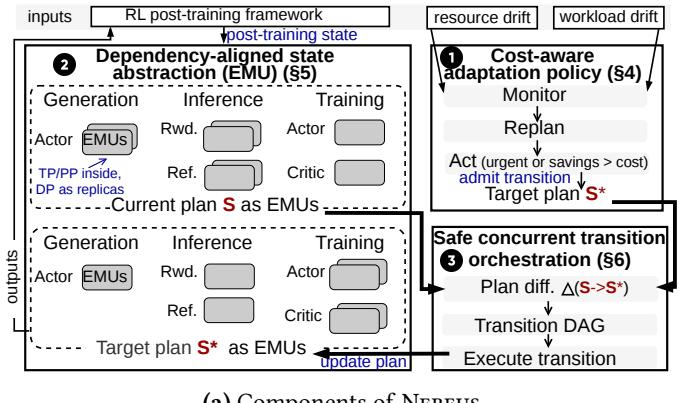  
(a) Components of Nereus

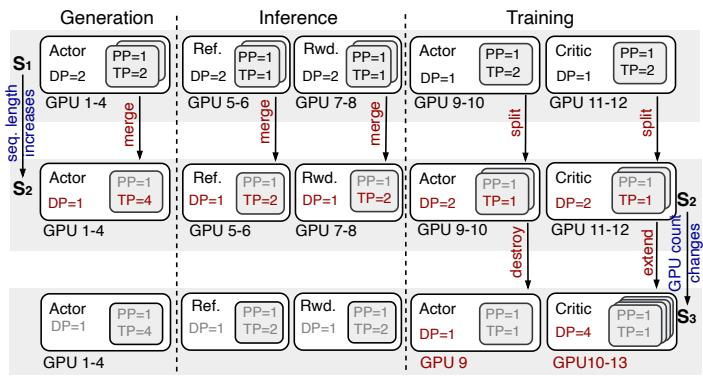  
(b) Two plan transitions on one job  
Figure 1. Nereus overview. (a) 1 The controller replans on drift and admits the transition to $S ^ { * }$ only if the current plan is infeasible or the savings repay the transition cost (§4). 2 Both plans are represented as EMUs, one per model-stage replica, with TP/PP inside the unit and DP as the replica count (§5). 3 The transition engine compiles the plan diference into a global transition DAG, adding resource-dependency edges when transient GPU overlap blocks an acquisition (§6). (b) Sequence-length growth reshards the five model-stages, with Merge in generation and inference, and Split in training $( S _ { 1 }  S _ { 2 } )$ . A change in the GPU count removes an actor-training replica with Destroy and adds critic replicas with Extend $( S _ { 2 }  S _ { 3 } )$

These challenges jointly motivate Nereus, an online, costaware runtime that dynamically adapts execution plans and distributed state for RL post-training on GPU clusters. Our key insight is that plan adaptation becomes tractable when the state boundary matches the job’s dependencies. This state boundary allows Nereus’s transition engine to execute plan changes directly, without reconstructing the full job state. Specifically, this work establishes the following key contributions, one for each question.

(1) Low-overhead, cost-aware adaptation policy. We propose a control policy that decides when to adapt under workload drift and resource volatility. By combining lightweight, event-driven triggers with an online-calibrated cost model, the policy identifies memory-feasible target plans and admits transitions when expected performance gains outweigh estimated transition overhead (§4). The policy also complements fault-tolerance systems, dynamically replanning from intact units during sudden node failures.

(2) A dependency-aligned state abstraction via Elastic Model Units. We introduce the Elastic Model Unit (EMU), a principled state abstraction that defines what state to reuse by aligning state boundaries with model dependencies. This abstraction encapsulates intra-model tensor and pipeline parallelism inside the unit, while exposing data-parallel replicas for flexible scaling. We define four core state-transformation primitives that cover all parallel configurations in the plan space while preserving training semantics (§5).

(3) Safe, concurrent transition orchestration. We design an execution protocol that coordinates how to transition across coupled models under tight cluster resources. The transition engine compiles global plan changes into a directed acyclic graph (DAG) of EMU primitives to maximize safe, concurrent state transfers (§6). To avoid deadlocks in memory-constrained environments, the protocol dynamically prioritizes resource-releasing operations without blocking independent concurrent transfers.

Nereus is implemented in 43k lines of Python, C++, and CUDA/HIP, integrating with vLLM, DeepSpeed, and Megatron-LM, using standard NCCL/RCCL collectives. Across the evaluated clusters, Nereus improves end-to-end 8B PPO throughput by 2.14–7.27× (median 3.99×) over OpenRLHF and by 1.10–1.47× over Verl. Its selected plans stay within 5% of the empirical optimum in all 18 measured settings. In a trace built from real data (§7.3.3), online TP/PP adaptation reduces average step latency by 27.7% relative to a fixed layout with DP scaling. Across three held-out traces, Nereus averages 858.7 s/step compared to 928.3 s for DynaRL-style admission. Scaling with EMUs is 3.8–16.2× faster than with Oobleck and Tenplex, and coordinated transitions succeed in all overlap trials, compared to only 34–62% for DynaRL’s per-component migrations. Finally, six transitions during a 1,000-step run scaling to 1,024 GPUs consume just 0.079% of total execution time.

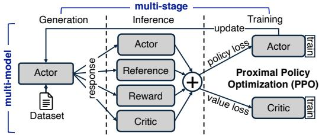  
Figure 2. Multi-model, multi-stage workflow of RL posttraining with Proximal Policy Optimization (PPO).

## 2 Design Overview

Nereus separates its low-overhead adaptation policy from transition orchestration (Fig. 1a). The controller’s monitor reads sequence length, available GPUs, peak memory, and achieved compute and communication eficiency. The planner selects a memory-feasible target S∗ with the lowest predicted steady-state step latency. Admission checks feasibility and whether the savings repay the one-time transition cost estimated by the transition engine (§4).

Because several models appear at multiple stages of an RL post-training step, reusing GPU-resident state calls for permodel-stage state units and coordination across model-stages that share GPUs. Nereus therefore represents the current and target plans as collections of Elastic Model Units (EMUs, §5). Each EMU contains the tightly coupled TP/PP layout and state of one model-stage replica, and the number of replicas sets the DP degree. The engine converts the plan diference into Split, Merge, Extend, and Destroy primitives, orders their dependencies in a global transition DAG (§6), and executes it after admission. Fig. 1b shows two such transitions, triggered by sequence-length growth and GPU-count changes.

## 3 Background and Design Space

RL post-training couples model-stages whose resource needs and performance change during a run. Adapting the execution plan therefore requires a global view.

## 3.1 RL Post-Training Execution Model

RL post-training algorithms such as Proximal Policy Optimization (PPO) [34], ReMax [20], and Group Relative Policy Optimization (GRPO) [35] run several models across the three stages. Take PPO (Fig. 2) as an example [30]. Its actor generates responses, the reward model scores them, the critic estimates their values, and a frozen reference model constrains policy updates. Generation produces responses, and inference computes their probabilities, values, and rewards. Training updates the actor and critic from these signals. As a result, a model can have diferent compute and memory needs across the three stages.

Execution plans and coupling. The execution plan defined in §1 couples these model-stages through their GPU assignments and parallelism. DP runs replicas on diferent data, TP partitions tensors within a layer, and PP partitions layers into sequential pipeline stages [33, 38]. For example, raising TP for actor generation changes how actor weights must be resharded after training. Accelerating the actor has little efect if the critic remains the bottleneck. Such coupling exists in both synchronous and asynchronous frameworks. Synchronous systems such as Verl (HybridFlow) [37] leave workers waiting at a barrier when stages are imbalanced. Asynchronous systems such as AReaL [5] instead show mismatched rollout and update rates.

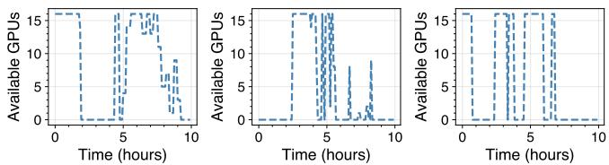  
(a) us-east-2b zone (b) us-west-2a zone (c) us-west-2c zone

Figure 3. Frequent GPU availability fluctuations in shared cloud environments (p3.2xlarge nodes) over ten hours.  
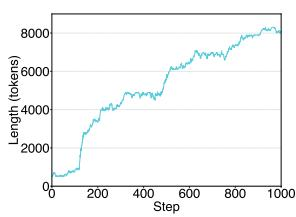  
(a) Sequence-length growth

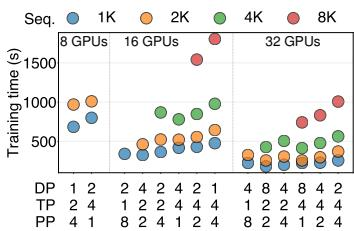  
(b) Best plan shifts with length  
Figure 4. Generated sequence length grows during training (a), changing which measured training plan is fastest (b). Missing data points indicate out-of-memory (OOM) errors.

Coupling also constrains transition execution. Serialized model-stages may share GPUs, but concurrent model-stages in a valid plan use disjoint GPU sets. When the job has no free GPUs, one model-stage may need to release GPUs before another can expand. A transition must therefore respect transient GPU ownership across model-stages, which the global transition DAG encodes.

## 3.2 Sources of Drift

The best plan can change during a run: a static plan can become ineficient or infeasible when resource supply, workload demand, or achieved hardware eficiency changes.

Resource supply. The total number of GPUs available to a job can change during a run. Spot instances may be reclaimed, and shared-cluster schedulers may reallocate nodes [4, 19, 26, 48, 50]. An analysis of AWS traces [50] found more than ten availability changes for a 16-GPU job over ten hours (Fig. 3). In our plan enumeration for Llama-3.1-8B, the best TP/PP layout difers between 32 and 256 GPUs. A resource change can therefore call for a diferent plan, not just a resize.

Table 1. Approaches to online RL post-training adaptation along the three design decisions of $\ S 3 . 3 \colon$ when to adapt (timing), what state to reuse (the boundary), and how to transition. Nereus uses a dependency-aligned model-stage boundary.
<table><tr><td></td><td>Approach</td><td>Representative systems</td><td>Timing (when)</td><td>Boundary (what)</td><td>Execution (how)</td></tr><tr><td>A</td><td>Fixed-plan RL post-training execution</td><td>TRL [42], DeepSpeed-Chat [53]; Verl [37], AReaL [5], ReaL [25], PUZZLE [17], RLHFuse [57], ROLL [45], OpenRLHF [11]</td><td>none: plan fixed at startup</td><td></td><td></td></tr><tr><td>B</td><td>Checkpoint/restart</td><td>DCP [40], MCP [39], UCP [21], GCR [54]; Gemini [47], ByteCheckpoint [44]</td><td>on failure or restart</td><td>checkpoint state</td><td>checkpoint + restart</td></tr><tr><td>C</td><td>Single-model state management</td><td>Tenplex [43], Oobleck [12]</td><td></td><td>on a resource change selective single-model state host/GPU state transfer</td><td></td></tr><tr><td>0</td><td>Dynamic scheduling in a DynaRL [46] fixed pool</td><td></td><td>utilization and predicted throughput</td><td>per-component state</td><td>global allocation with per-component migration</td></tr><tr><td></td><td>Dependency-aligned elastic multi-model state management</td><td>NEREUS</td><td>payback-based admission</td><td>dependency-aligned model-stage replica (EMU)</td><td>DAG of four primitives over GPU-direct links where available</td></tr></table>

Workload demand. As training progresses, actors can generate longer trajectories [3], increasing the key-value (KV) cache footprint during generation and the activation memory during training. For Llama-3.1-8B [23], generated sequence length grows from 500 to 8,000 tokens within 1,000 steps (Fig. 4a). At 16 GPUs, the best (DP, TP, PP) training plan changes with this growth. (4,2,2) is fastest at 2K tokens but runs out of memory at 4K. (4,4,1) remains feasible at 4K but adds communication overhead at 2K (Fig. 4b).

Achieved hardware eficiency. Network congestion, thermal throttling, and multi-tenant interference change the step latency of a plan even when its allocation and workload remain fixed [2, 14, 51]. These efects can shift the best plan and make calibration against measured execution useful. Ofline estimates can also be wrong: for the Llama-3.1-8B model, an ofline predictor [18] selects an infeasible plan at 8 GPUs. At 64–256 GPUs, its selected plans are up to 1.56× slower than the best measured plans. Nereus therefore calibrates its compute, communication, and memory estimates against the running job (§4.1–§4.2).

Drift afects model-stages diferently, so adaptation must cover the whole job rather than resize one model-stage. In Fig. 1b, longer sequences change the five model-stages, with diferent resharding directions for generation and training, while a change in GPU count removes an actor-training replica and adds critic replicas. Training can use Split to lower TP only while it has memory headroom, and (4,2,2) has no headroom at 4K (Fig. 4b).

## 3.3 Design Space for Online Adaptation

Online adaptation links three decisions. First, when to adapt depends on whether a feasible target plan exists under the current resource and memory constraints, and whether its global step-latency savings can repay the transition cost before conditions change again [13, 31]. Second, the state boundary determines what state can be reused or must be moved. A coarse boundary moves job-wide state even for a localized change [21, 44], while a shard-level boundary requires coordinating shard routing and collective synchronization [43]. Finally, how the transition executes determines its cost. State transfers should use GPU-direct paths where possible, and primitives that contend for the same GPUs must be ordered [12, 24, 41, 43]. Prior approaches make these decisions per job, model, or component (Tab. 1), and even replanning without payback-based admission trails Nereus (§7.3.3). Nereus addresses all three with a cost-aware adaptation policy (§4), a dependency-aligned state abstraction (§5), and safe concurrent transition orchestration (§6).

## 4 Cost-Aware Adaptation Policy

The controller decides when to adapt: it replans on resource or memory events or threshold crossings and admits an executable transition if the current plan is infeasible (urgent) or the savings repay the transition cost (opportunistic).

## 4.1 Monitor Phase: Detecting Runtime Drift

The monitor reads sequence length, the available GPU pool $P _ { \mathrm { g p u } } ,$ peak memory, and achieved compute and communication eficiencies to track drift and calibrate the cost model (§4.2). Ray and NVML (or ROCm SMI) [1, 27, 29] provide the hardware inventory. Framework instrumentation provides kernel and collective times.

Since these signals behave diferently, the monitor uses two kinds of triggers. A change in $P _ { \mathrm { g p u } }$ or a predicted memory violation triggers replanning. A drifting signal � triggers replanning when it difers from its reference value (its value at the last replan) by more than a relative threshold $\delta _ { x }$ . All experiments use $\delta _ { \mathrm { l e n } } = 3 0 \%$ for per-step sequence length. Reference values are reset after every replan, even when the candidate transition is rejected, so a persistent deviation does not retrigger at every step. Either trigger starts a CPUside replan when any running transition ends, or at once if GPUs are lost (§4.3). The admission rule in §4.3 then decides whether to execute the transition.

Nereus adapts at safe boundaries: RL-step completion in synchronous execution and weight synchronization in asynchronous execution. The RL framework schedules weight synchronization and handles in-flight rollouts, which keep their policy versions. Afected EMUs first complete in-flight accesses, collectives, and optimizer updates. The transition then carries parameter tensors, optimizer tensors, update counters, and RNG and dataloader state into the target layout, preserving model-stage versions, policy versions, and the framework’s sample-consumption rules.

## 4.2 Replan Phase: Selecting a Target Plan

Let M be the set ofmodel-stages in the RL job. A plan assigns every model-stage M $\in { \mathcal { M } }$ a candidate $\pi _ { M } = \langle \mathrm { t p } _ { M } , \mathrm { p p } _ { M } , \mathrm { d p } _ { M }$ $\mathcal { R } _ { M } \rangle$ , consisting of its TP, PP, and DP degrees and assigned GPU set $\mathcal { R } _ { M }$ . At the controller level, the global plan is $s =$ $\{ \pi _ { M } \mid M \in M \}$ . The planner seeks the lowest-latency plan that fits within the memory and GPU-pool constraints:

$$
\begin{array} { r l } & { S ^ { * } = \arg \underset { \pmb { \operatorname* { m i n } } } { \operatorname* { m i n } } \quad \widehat { L } _ { \mathrm { s t e p } } ( S ) } \\ & { \mathrm { s . t . } \quad \mathrm { M e m } _ { \mathrm { p e a k } } ( S ) \leq \mathrm { M e m } _ { \mathrm { c a p } } , } \\ & { \quad \quad \quad \sum _ { \boldsymbol { \ M } \in C _ { s } } | \mathcal { R } _ { \boldsymbol { \ M } } | \leq | P _ { \mathrm { g p u } } | , \quad \forall s \in \{ \mathsf { G e n } , \mathrm { I n f } , \mathsf { T r a i n } \} . } \end{array}\tag{1}
$$

Here, $S ^ { * }$ is the target plan, and $\widehat { L } _ { \mathrm { s t e p } } ( S )$ is the predicted endto-end RL-step latency. $\mathrm { M e m } _ { \mathrm { p e a k } } ( \bar { S } )$ is the largest predicted per-GPU memory footprint over the plan’s execution schedule. The first constraint bounds it by the per-GPU memory capacity $\mathrm { M e m } _ { \mathrm { c a p } } .$ . The second constraint bounds the total GPU allocation of $C _ { s }$ by the pool size, where $C _ { s }$ contains the model-stages that run concurrently during stage � on disjoint GPU sets. Solving Eq. (1) online requires three components: a cost model for the objective and constraints, online calibration, and a search fast enough to run at every replan.

Cost model. Nereus extends the cost-model-guided planning of NanoFlow and Alpa [55, 59] to coupled multi-model plans. For each model-stage candidate, the cost model estimates the local computation, pipeline bubbles, and the tightly coupled TP/PP collectives of each replica. It estimates computation time from peak compute, and collective time from the bandwidth of each communication path. The modelstage estimate adds DP synchronization and is determined by its slowest replica. At the job level, Nereus derives an execution-overlap graph from the RL workflow, and $\widehat { L } _ { \mathrm { s t e p } }$ is the critical-path latency of that graph. The graph serializes model-stages that share GPUs and runs independent ones in parallel. These parallel model-stages form the $C _ { s }$ of Eq. (1).

For asynchronous execution, the critical path spans the interval between successive weight synchronizations, which are the safe boundaries.

Peak memory covers parameters, gradients, optimizer state, activations, KV cache, co-resident idle model-stages, and workspaces. Shapes, precision, sharding, batch size, sequence length, and recomputation set these footprints [18]. Measured peaks (§4.1) calibrate them, and the feasibility check (§4.3) uses the same estimates with 10% headroom. Calibration. Nereus calibrates its cost model online without requiring a complete execution profile before startup. At startup, operation shapes and sharding rules provide FLOP counts, message volumes, and memory footprints. The hardware inventory provides peak compute and link bandwidths. Because peak rates overstate what kernels and collectives achieve, Nereus learns the shortfall from measured execution times. It stores one eficiency per operation class (e.g., GEMM, attention, or an all-reduce on one link type) rather than per operation, so plans built from the same classes share these eficiencies. Unseen classes start with conservative val ues and are refined after each step. A new model can reuse estimates when its operation shapes and classes match.

Plan search. Nereus first estimates each model-stage’s DP/TP/PP candidates, discarding those that exceed memory capacity or are dominated, to form a latency–resource frontier. Candidates keep TP groups within one node when possible. Dynamic programming then selects one candidate per model-stage under the plan-level memory bound and stage-wise GPU budgets to produce $S ^ { * }$ , minimizing predicted steady-state latency.

Replanning runs in one CPU process on the head node, using no GPUs or training nodes. §7.3.1 reports calibration fit, decision overhead, and replanning memory, and §7.3.2 evaluates selection quality by executing all 480 valid plans.

## 4.3 Act Phase: Admitting a Transition

A replan yields a target plan $S ^ { * }$ . Nereus applies two criteria, feasibility and profitability, and executes an admitted transition only at a safe boundary (§4.1).

Feasibility. A transition is executable when, for its target plan and DAG, GPU memory can hold the retained state, workspaces, intermediate units (including replicas created by Split, §5.2), co-resident model state, and collective bufers. The controller performs this memory and GPU-pool check before state movement. $\operatorname { I f } S ^ { * }$ is rejected, Nereus tries slightly slower candidates with cheaper transitions as the new $S ^ { * }$ before keeping the current plan. Resource revocation, placement change, or memory pressure that invalidates the current plan triggers the urgent path, which runs the same check and preserves logical state while waiving profitability. This path also considers smaller per-replica batches and recomputation, and falls back to checkpoint/restart if no candidate passes. Nereus detects lost GPUs, aborts communicators that include the dead ranks, and replans from the intact units. Fault-tolerance systems [12, 47] restore state whose last copy is lost.

Profitability. The transition engine estimates the criticalpath cost $\widehat { L } _ { \mathrm { t r a n } }$ of state movement and setup between the current and target EMU collections (§5–§6). Let $\Delta L = \widehat { L } _ { \mathrm { s t e p } } ( S ) -$ $\widehat { L } _ { \mathrm { s t e p } } ( S ^ { * } )$ be the predicted per-step latency savings from switching the current plan S to the target plan $S ^ { * }$ . An executable opportunistic transition is admitted if

$$
\Delta L > 0 \quad \wedge \quad { \frac { \widehat { L } _ { \mathrm { t r a n } } } { \Delta L } } \leq \gamma H _ { x } .\tag{2}
$$

The ratio is the payback period: the steps needed for savings $\Delta L$ to repay $\widehat { L } _ { \mathrm { t r a n } }$ . For the triggering signal $x , H _ { x }$ estimates the steps until its next threshold crossing (for $P _ { \mathrm { g p u } } ,$ its next change). If several signals trigger at once, Nereus uses the smallest $H _ { x }$ . The confidence margin $\gamma \in [ 0 ,$ 1] (0.5 by default) requires payback within a fraction of�� steps, reserving time for uncertainty. Setting $\gamma = 0$ admits only urgent transitions. §7.3.3 evaluates sensitivity to �.

Each � is an exponential moving average of past intervals between crossings, updated at crossings rather than telemetry samples or admitted transitions. Resetting the reference value after every replan lets steady sequence-length growth produce repeated crossings (§4.1). Before the first interval is observed, $H _ { x }$ is one step.

The admission rule applies the payback principle of Pollux [31] and Sia [13] to one coupled job. Because resizing one model-stage can force changes to others, Δ� covers the full RL step and $\widehat { L } _ { \mathrm { t r a n } }$ covers the complete transition. For example, a generation replica may be cheap to add unless its GPUs must come from training. Releasing and resharding that training state can make the same resize fail Eq. (2).

## 5 Dependency-Aligned State Abstraction (EMU)

To estimate and execute a candidate transition, the runtime needs a state boundary that exposes what state to reuse without exposing every shard-level decision.

Definition of EMU. An EMU is one model-stage replica and the dependency-aligned state unit for online adaptation: $\mathsf { E M U } = \left. \mathsf { M } , \mathsf { T } _ { \mathrm { t p \times p p } } , \mathsf { R } , \theta , \omega \right.$ . Here, M = (model, stage) identifies the model-stage, Ttp×pp gives its TP/PP layout, and R is its GPU set $( | { \mathsf { R } } | = { \mathsf { t p } } \times { \mathsf { p p } } )$ . Actor generation and actor training are thus separate model-stages, whose weights the RL framework synchronizes at safe boundaries. The parameter shards are $\pmb { \theta } = \left\{ \theta _ { i } \right\} _ { i = 1 } ^ { \mathrm { t p } \times \mathrm { p p } }$ . For training, optimizer shards � follow the same layout. Neither � nor � is sharded across DP replicas (ZeRO-0). DP is excluded from the internal structure of a single EMU (§5.1), so the DP degree of model-stage M is the number of its active EMUs. DP scaling thus only adds or removes units. The planner reasons about whole units, while each primitive handles the underlying shards. §6.2 lists the full logical state of a unit.

Table 2. State boundaries for online adaptation, with the measured resource-scaling cost for an 8B actor/critic workload from 16 to 32 GPUs on Cluster #3 (the 16→32 column of Tab. 4). The checkpoint row is measured with UCP [21] and the shard-level row with Tenplex [43].
<table><tr><td>Boundary</td><td>State managed</td><td>Planning unit</td><td>Cost</td></tr><tr><td>Checkpoint/restart</td><td>whole job</td><td>checkpoint</td><td>836.74 s</td></tr><tr><td>Shard level</td><td>shards</td><td>shard</td><td>66.43 s</td></tr><tr><td>Model-stage (EMU)</td><td>units</td><td>EMU</td><td>6.52 s</td></tr></table>

Valid EMU collections. An EMU collection is valid when each unit contains the shards required by its TP/PP layout, concurrently executing units have disjoint GPU sets, and units with the same model-stage index M are DP replicas of the same logical state.

Representing a global plan. §4 expresses a plan as $s =$ $\{ \pi _ { M } \mid M \in M \}$ , where each $\pi _ { M }$ specifies TP, PP, DP, and a GPU allocation for one model-stage. The runtime maps $\pi _ { M }$ to the collection $E _ { \mathsf { M } } = \Phi ( \pi _ { \mathsf { M } } ) = \{ \mathsf { E M } _ { 1 } , \mathsf { E M } _ { 2 } , \hdots , \mathsf { E M } _ { \mathrm { d p _ { M } } } \}$ . All units in the collection have the TP/PP layout specified by $\pi _ { M }$ and their disjoint GPU sets together form the allocation $\mathcal { R } _ { M }$ The union $\textstyle { \mathcal { E } } ( S ) = \bigcup _ { M \in M } E _ { M }$ is the runtime representation of S, and a transition turns it into E (S∗) (§6).

## 5.1 Why the Model-Stage Boundary

A useful state boundary for RL post-training should satisfy four requirements. It should (i) confine state movement to the afected model-stage, (ii) let the planner operate on replicas, (iii) preserve parameter and optimizer state at safe boundaries (§6.2), and (iv) express DP/TP/PP changes with a small set of primitives (§5.2).

The dependency structure determines the boundary. In RL post-training, not all dimensions of distributed state and parallelism are coupled equally. TP and PP require tightly synchronized execution. Ranks exchange activations and gradients through collectives and point-to-point sends, so changing one shard’s layout generally requires coordinated changes in the others. DP is loosely coupled by comparison. Replicas run the same computation and synchronize periodically, but one replica can be created, removed, or reassigned without restructuring the internal communication pattern of the others. A job-level boundary can move unrelated state under localized drift, while a shard-level boundary exposes tightly coupled TP/PP resharding decisions to the planner (Tab. 2). Nereus keeps TP, PP, and their distributed state inside an EMU while leaving DP outside, preserving each replica’s internal synchronization and allowing adaptation at the replica level.

The model-stage boundary also localizes state changes to the parts of the workflow afected by the heterogeneous drift in §3.2. EMUs are the state units over which DP/TP/PP choices are expressed, transformed, and evaluated online, while the controller (§4) selects among these choices.

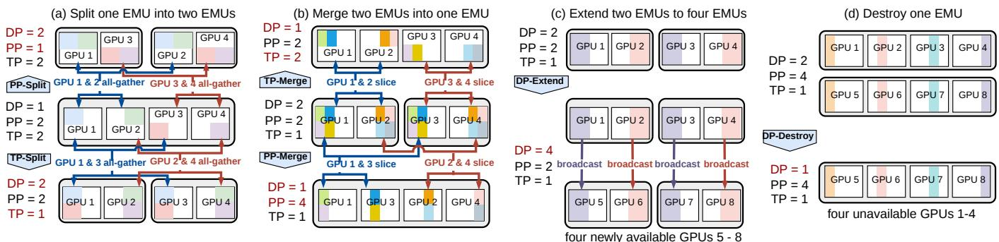  
Figure 5. Core EMU primitives for online adaptation: Split (a) and Merge (b) reshard state by converting between tightly coupled TP/PP structure and loosely coupled replicas, while Extend (c) and Destroy (d) scale resources by creating or removing replicas. For the example in §5.1, Extend adds replicas for critic training, and Extend followed by Merge increases TP for actor generation without changing its DP degree.

Example. Consider actor generation and critic training for 8B models initially sharing a 16-GPU pool, each configured as (TP=1, PP=4, DP=2), i.e., 8 GPUs per model-stage. Suppose the sequence length increases from 2K to 4K and the pool grows to 32 GPUs. The two models require diferent transitions. The actor increases TP from 1 to 2, to provide memory for the larger KV cache during generation and avoid OOM errors. The critic increases DP from 2 to 4, to use the additional GPUs for training. This reflects stage-specific bottlenecks: longer sequences increase memory pressure during actor generation, while critic training benefits more from replica-level throughput. After the transition, the actor uses (TP=2, PP=4, DP=2), and the critic uses (TP=1, PP=4, DP=4).

The example combines an actor TP change with critic DP scaling. Tab. 2 isolates the resource-scaling cost for the same 16→32-GPU workload and compares this cost with checkpoint- and shard-level alternatives. Each measured cost reflects a state boundary together with its primitives and transport implementation.

## 5.2 Core EMU Primitives for Online Adaptation

Given the EMU boundary, Nereus reduces online adaptation to four core primitives over EMUs. They cover two kinds of adaptation: parallelism resharding, via Split and Merge, and resource scaling, via Extend and Destroy. Each primitive hides the underlying state movement (e.g., collective communication) and exposes only its efect on the EMU collection.

(a) $\mathsf { S p l i t } ( \mathsf { E r u U } , \mathsf { T } _ { \mathrm { s u b } } ) \to \{ \mathsf { E r w U } _ { 1 } , \dots , \mathsf { E r w U } _ { k } \}$ }: partitions one EMU with layout T into � independent units with a smaller layout $\mathsf { T } _ { \mathrm { s u b } } , \mathsf { e . g . }$ , reducing PP=2 to PP=1 or TP=2 to TP=1 (Fig. 5a). It converts one tightly coupled unit into loosely coupled replicas by resharding (�, �) across the same GPU set R.

(b) M $\mathsf { e r g e } ( \{ \mathsf { E M U } _ { 1 } , \ldots , \mathsf { E M U } _ { k } \} , \mathsf { T } ) \to \mathsf { E M U } ^ { \prime } ;$ fuses � replicas of the same model-stage state into a larger EMU with layout T, e.g., increasing TP=1 to TP=2 or PP=2 to PP=4 (Fig. 5b). It reshards the replicated state into one tightly coupled TP/PP unit.

(c) Extend(EMU, R′) → {EMU, EMU′}: replicates an existing unit onto a newly allocated and disjoint GPU set R′. The new unit EMU′ preserves the original model-stage index M and layout T, and holds replicated copies of � and �. Each application increases DP by one, and extending both replicas raises DP=2 to DP=4 (Fig. 5c).

(d) Destroy(EMU) → ∅: terminates a redundant unit, releases its GPUs R, and discards its copy of (�, �) while another replica of the same model-stage retains the logical state. This reduces DP by one, e.g., from DP=2 to DP=1 (Fig. 5d).

Split and Merge are defined for any integer factor � between compatible layouts. Repeated Extend and Destroy applications adjust the DP degree by multiple units. The planner searches power-of-two TP/PP degrees, following common practice on GPU clusters.

The plan space. The EMU representation uses homogeneous TP/PP within a model-stage, since all units sharing M are replicas of one layout. Diferent model-stages can use diferent layouts to match their computation and memory requirements. §7.3.2 shows that the selected plans stay within 5% of the empirical optimum in this plan space.

Composing primitives. Compositions of Split, Destroy, Extend, and Merge cover every transition in this plan space but require intermediate memory and a schedule that retains each model-stage’s logical state (§6).

## 6 Safe Concurrent Transition Orchestration

Starting from the EMU collections in §5, Nereus plans how to transition per model-stage and adds cross-model-stage edges only when transient GPU overlap blocks an acquisition. The resulting global transition DAG (Fig. 6) has a critical-path cost $\widehat { L } _ { \mathrm { t r a n } } ,$ used for admission (§4.3) and estimated from bytes, link bandwidth, and communicator setup (§4.2).

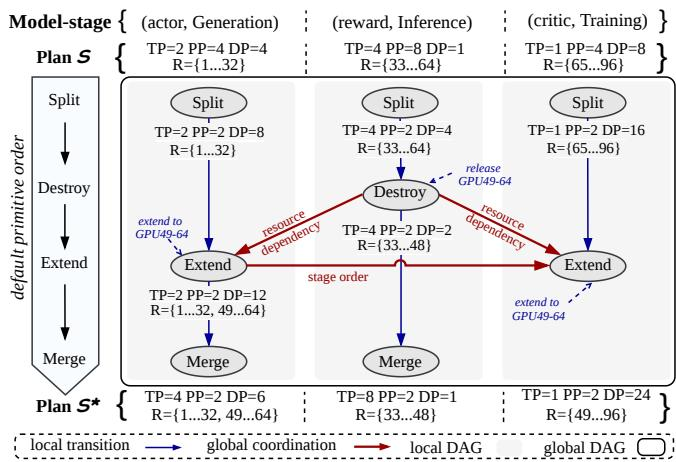  
Figure 6. Constructing the global transition DAG from S to $S ^ { * }$ : Nereus first translates each model-stage’s change into a local DAG, then adds cross-model-stage dependency edges under transient GPU overlap.

## 6.1 Decomposition and DAG Construction

The current and target global plans are $S = \{ \pi _ { M } \mid M \in M \}$ and $S ^ { * } = \{ \pi _ { \ l { M } } ^ { * } \ | \ { \cal { M } } \in { \cal { M } } \}$ . Their runtime representations $\mathcal { E } ( S )$ and $\mathcal { E } ( S ^ { * } )$ contain the corresponding EMU collections ${ \cal E } _ { M } = \Phi ( { \boldsymbol \pi } _ { M } )$ and $E _ { M } ^ { * } = \Phi ( \pi _ { M } ^ { * } )$ defined in §5. Nereus sum marizes the change for model-stage M as $\Delta _ { M } = ( E _ { M } \to E _ { M } ^ { * } )$ which captures TP/PP resharding, DP scaling, and GPU reassignment. It then collects $\Delta = \left\{ \Delta _ { \mathsf { M } } \ | \ M \in M \right\}$ , one subproblem per model-stage.

For each model-stage M, Nereus translates $\Delta _ { M }$ into a local DAG in the default order Split → Destroy → Extend → Merge. It first computes the largest TP/PP layout $\mathsf { T } _ { \mathrm { { s u b } } }$ into which both current and target units can be split. The engine applies Split to obtain units with layout $\mathsf { T } _ { \mathrm { { s u b } } }$ . Next, Destroy removes redundant units and releases their GPUs, and Extend adds replicas on the target GPUs. A unit with no other replica is destroyed only after Extend copies it. Finally, Merge combines the intermediate units to obtain the target TP/PP layout T∗ and DP degree. In Fig. 6, for reward inference, the engine splits the current (TP=4, PP=8) unit into four (TP=4, PP=2) units, destroys two, and merges the remaining two into the target (TP=8, PP=2).

Valid local DAGs do not determine a global execution order when model-stages share a near-capacity GPU pool. Nereus combines local DAGs with two deterministic rules: release-before-acquire prioritizes resource-releasing primitives, and stage order breaks ties in generation → inference → training order. In Fig. 6, actor and critic Extend wait for reward Destroy to release GPUs 49–64. In Fig. 1b, critic Extend onto GPU 10 waits for actor Destroy. When an acquisition is blocked, the engine selects an executable Destroy that releases the needed GPUs and inserts the corresponding resource-dependency edge. Destroy primitives that depend, directly or transitively, on the blocked acquisition are not selected, so the DAG stays acyclic and free of circular waits (§7.4.4). If no such Destroy exists, the target plan fails the feasibility check. A blocked Extend waits for its target GPUs, while Split retains its GPUs but runs only when its source and replica bufers pass the feasibility check.

Control-plane eficiency. Ordering primitives under statetransfer dependencies and resource requirements is a classic resource-constrained project scheduling problem [9]. Nereus builds local DAGs in a fixed order, then greedily adds crossmodel-stage edges. §7.4.3 compares its planning time and schedule quality with an of-the-shelf SCIP solver [10] on this transition-DAG scheduling problem.

## 6.2 DAG Execution and Safety

The global transition DAG orders EMU primitives according to their state and resource dependencies. A primitive is ready only after its predecessors complete and its resource require ments are satisfied. Ready primitives run concurrently across GPU groups and streams. Split uses position-wise AllGather within the smallest enclosing TP/PP group. Merge assembles the target layout from replicated state (shards already resident on target ranks are not copied). Extend uses rankaligned Broadcast, and Destroy performs local teardown and memory release without collectives.

Safe concurrent execution. Retained state, intermediate units, and collective bufers must fit together in GPU memory at each operation: Split keeps source bufers live until the collectives reading them complete, and Destroy releases memory only after teardown. The readiness, lifetime, and ordering rules coordinate concurrent state movement, while the feasibility check enforces the per-GPU capacity bound (§4.3). Since Destroy removes only redundant copies, a transition that stops partway loses no logical state unless the last copy is lost, and Nereus replans from the intact units.

Transport: sharded state over RDMA fabrics. Inter-GPU state movement uses standard NCCL/RCCL collectives over communicators created for the transition. Nereus uses GPUdirect RDMA where available and introduces no custom RDMA stack. Intra-node movement usually uses NVLink or Infinity Fabric, while inter-node movement uses RDMAcapable fabrics (InfiniBand, Slingshot) directly between GPU bufers, without host staging. Eficiency comes from how Nereus matches these collectives to the sharding layout. For Extend, Nereus builds one communicator per rank pair at the same TP/PP position in the source unit and its new replica. Each shard is sent once as a contiguous bufer to the corresponding destination rank. Rank pairs transfer concurrently, subject to shared link bandwidth.

Resharding–transport interplay. A transition is faster when target shard boundaries align with source ranks. When they do not, state must be resharded across the network. For compatible layouts, each resharding uses the largest common layout $\mathsf { T } _ { \mathrm { { s u b } } }$ . Layout changes then run locally after the required collectives. Transfers remain contiguous.

Preserving training semantics. At a safe boundary, Split and Merge change placement and sharding without changing logical state. An EMU’s logical state $\Lambda ~ = ~ ( \theta , \omega , c , v , p )$ includes parameters, optimizer tensors, update counters $c ,$ model-stage and policy versions $v ,$ and the minibatch position $\boldsymbol { p }$ of the last completed update. Extend copies this state to a new DP replica, and Destroy removes only a redundant copy. Besides $\Lambda ,$ EMUs hold RNG and dataloader state, which new replicas derive from their DP rank and $\boldsymbol { p }$ in a global sample order, so no training sample is repeated or skipped. At synchronous step completion, no rollout is in flight, and KV caches and gradient bufers hold no state. DP scaling preserves the global batch size dp × � × � by adjusting � and $^ { a , }$ the per-replica batch size and gradient-accumulation steps. The planner considers only DP degrees for which such � and � exist. Fixed logical minibatches, loss normalization, sampling policy, and optimizer-step counts preserve the update rule up to floating-point reduction order.

## 7 Evaluation

Q1 evaluates the complete system, Q2 contribution (1), Q3 contributions (2) and (3), and Q4 generality and the observed training behavior.

Q1. Does Nereus improve end-to-end RL post-training performance across model sizes and cluster scales? (§7.2)

Q2. How well does the cost model fit measured trainingstage latency and select target plans, and how does transition admission afect performance under drift? (§7.3)

Q3. Are Nereus’s EMU primitives and transition engine eficient at cluster scale, and does cross-model-stage coordination avoid GPU conflicts? (§7.4)

Q4. Do the performance benefits extend to other RL algorithms and execution modes, and does adaptation preserve the observed training behavior? (§7.5)

## 7.1 Experimental Setup

Unless otherwise stated, experiments use the default workload: Llama-3.1-8B [23] with PPO [30] and vLLM [16] for rollout generation. Each comparison uses the same model, prompts, sampling parameters, maximum response length, and GPU budget at each step. Generation-stage latency includes rollout and CPU-side response processing.

Testbeds. We use three GPU clusters (Tab. 3) spanning accelerator vendors, interconnects, and scales.

Baselines. We compare Nereus with OpenRLHF [11] and Verl [37] for synchronous and Laminar [36] for asynchro nous execution. Nereus runs on top of OpenRLHF, Verl, and Laminar. For each baseline, we sweep parallelism and memory settings (e.g., vLLM TP degree, Megatron TP/PP, ZeRO stage) and fix its fastest setting at startup per GPU budget.

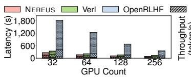  
(a) Step latency

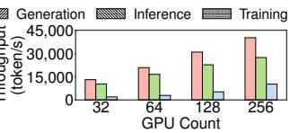  
(b) Throughput  
Figure 7. Llama-3.1-8B PPO performance at fixed GPU budgets on Cluster #2.

For transition eficiency (§7.4), we compare with UCP [21], MCP [39], Gemini [47], Tenplex [43], and Oobleck [12]. These baselines move the same parameter and optimizer state, and their setup time is counted. We isolate DynaRL-style admission on held-out traces (§7.3.3) and DynaRL’s per-component migration in the coordination comparison (§7.4.4).

Models and RL algorithms. Beyond Llama-3.1-8B, we evaluate Qwen3-14B, Qwen3-32B [32], and Llama-3.3-70B [23]. Generality experiments replace PPO with ReMax [20] or GRPO [35]. All end-to-end workloads use prompts from OpenRLHF prompt-collection-v0.1. For each workload, the actor, reference, reward, and (when present) critic models have equal size.

Metrics. We measure end-to-end throughput (generated response tokens per RL step divided by step latency), step latency (including transitions), stage latency, and transition cost. Transition cost is the time spent on setup (communicator creation) and on moving or resharding parameter and optimizer state during one transition. We also report reward, the PPO KL estimate, and the gap to the empirical optimum. Unless stated otherwise, each latency and throughput value averages 50 steps after one warm-up step, with a max–min step-latency spread below 2%.

## 7.2 End-to-End Performance

We first compare complete-system performance against OpenRLHF and Verl.1 At fixed GPU budgets, adaptation is primarily workload-driven. Within each run, Nereus adapts to changing sequence lengths and stage bottlenecks, and we report the results across multiple fixed budgets. §7.3.3 then evaluates TP/PP adaptation and admission on traces built from real data, with the same runtime and transition engine.

7.2.1 Overall Performance. Built on Verl, Nereus outperforms both baselines on Cluster #2 (Fig. 7). It reduces step latency by up to 86.3% relative to OpenRLHF and 31.9% relative to Verl. Throughput increases by up to 7.27× and 1.47×, respectively. Nereus reduces stage latency by up to 11.5%, 41.6%, and 29.6% versus Verl for generation, inference, and training, respectively, with the same trend on Cluster #3. For the Llama-3.1-8B PPO comparisons, the speedup over

Table 3. Testbed GPU clusters. GCD denotes a graphics compute die, counted as one GPU. Bandwidths are nominal, and inter-node bandwidth is listed per link as send+receive.
<table><tr><td>Property</td><td>Cluster #1</td><td>Cluster #2</td><td>Cluster #3</td></tr><tr><td>#Nodes / #GPUs</td><td>128 / 1,024</td><td>64 / 256</td><td>8 / 64</td></tr><tr><td>GPUs per node</td><td>8× AMD MI250X GCDs (64 GB)</td><td>4× NVIDIA A100 64 GB</td><td>8× NVIDIA H200 141 GB</td></tr><tr><td>Intra-node network</td><td>Infinity Fabric (400 GB/s)</td><td>NVLink 3.0 (600 GB/s)</td><td>NVLink 4.0 (900 GB/s)</td></tr><tr><td>CPUs per node</td><td>1× 64-core AMD EPYC 7A53</td><td>1× 32-core Intel Xeon Platinum 8358</td><td>2× 32-core Intel Xeon Platinum 8562Y+</td></tr><tr><td>Host memory</td><td>512 GB</td><td>512 GB</td><td>2 TB</td></tr><tr><td></td><td></td><td>Inter-node network 4× HPE Cray Slingshot-11 (25+25 GB/s) 4× HDR100 InfiniBand (12.5+12.5 GB/s)</td><td>1× HDR InfiniBand (25+25 GB/s)</td></tr></table>

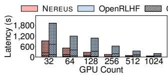  
(a) Step latency

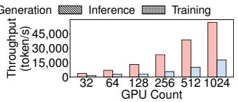  
(b) Throughput  
Figure 8. Strong scalability on Cluster #1.

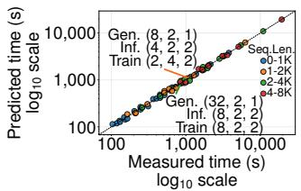  
(a) Calibration fit

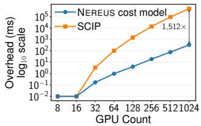  
(b) Decision overhead  
Figure 10. Cost-model fit to measured training-stage latency (a) and target-plan selection time (b). Annotations in (a) list the (DP, TP, PP) tuples for two example global plans.

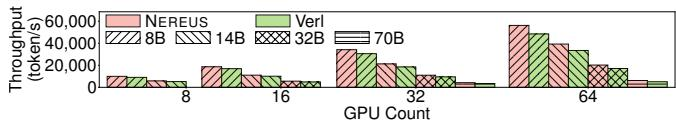  
Figure 9. PPO throughput across 8B–70B models and GPU budgets on Cluster #3.

OpenRLHF spans 2.14–7.27× (median 3.99×) across all clusters and scales. The 7.27× maximum occurs on Cluster #2 at 64 GPUs. On NVIDIA clusters, the speedup over Verl spans 1.10–1.47× (median 1.21×).

7.2.2 Scalability. These end-to-end gains also persist at larger scales, up to 1,024 GPUs on Cluster #1. From 32 to 1,024 GPUs, Nereus’s step latency falls by 15×, versus 10× for OpenRLHF. At 1,024 GPUs, its end-to-end speedup over OpenRLHF is 3.20× (Fig. 8). On Cluster #2, scaling from 32 to 256 GPUs reduces Nereus’s step latency by 3.1×, versus 2.7× for Verl (Fig. 7a).

We further compare models from 8B to 70B across their feasible GPU budgets on Cluster #3. Nereus outperforms Verl for every model size, so the end-to-end gains persist beyond the 8B setting (Fig. 9).

## 7.3 Cost-Aware Adaptation Policy

We evaluate cost-model calibration and overhead, plan selection against empirical optima, and admission under drift.

## 7.3.1 Online Cost-Model Calibration and Overhead.

For the default workload on Cluster #2, we evaluate the online cost model’s training-stage latency term on 72 measured plans spanning 8–256 GPUs and sequence-length buckets of 0–1K, 1–2K, 2–4K, and 4–8K tokens. This term is calibrated only on operation-level kernel and collective timings (§4.2)

from separate runs, so these plans are out-of-sample. The predictions have a 4.96% mean absolute percentage error and 14.61% maximum error, with �2 = 0.9993 (Fig. 10a).

We compare Nereus’s decision overhead with a SCIPbased solver [10] for Eq. (1). Nereus keeps the decision overhead low (Fig. 10b), from 0.17 ms at 32 GPUs to 338 ms at 1,024 GPUs, whereas solver-based search grows from 3.4 ms to 511 s. Peak replanning memory stays below 100 MB.

7.3.2 Closeness to Empirical Optima. For the default workload on Cluster #2, we enumerate and execute 480 valid plans across 18 settings (sequence lengths 1K, 2K, and 4K at GPU counts 8, 16, 32, 64, 128, and 256). The minimum measured step latency in each setting is the empirical optimum within the controller’s plan space. Each plan is executed directly, without a transition. The 480 plans are also held out and do not overlap the 72 plans of §7.3.1. Nereus exactly matches the empirical optimum in 61.1% of settings and stays within 5% in all settings, with a 0% median gap and a 95th-percentile (p95) gap of 4.1%.

## 7.3.3 Decision Quality Under Dynamic Runtime Drift.

We run four policies on Cluster #2 over held-out sequencelength and GPU traces, with the same runtime, planner, and EMU primitives. The static policy keeps its initial TP/PP layout, and 3-step adapt always switches to the planner’s target every three steps. All policies scale DP with the available GPUs. Under DynaRL-style admission, any transition with Δ� > 0 is admitted, while Nereus also requires the savings to repay the transition cost. We repeat the evaluation on two more held-out traces with the same settings and plans.

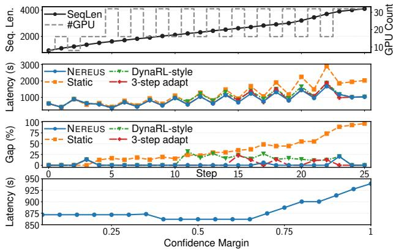  
Figure 11. Controller policies under held-out sequencelength and GPU-supply drift: step latency, gap to the best plan at each step, and sensitivity to the confidence margin.

All traces are built from real data (Figs. 3 and 4a). In the first trace (Fig. 11), average sequence length grows from 1,147.5 tokens (steps 0–3) to 3,722 tokens (steps 20–25). The p95 length grows from 1,339 to 4,072 tokens, while available GPUs vary from 8 to 32. Under this drift, Nereus admits two TP/PP transitions, at steps 3 and 23, together with DP scaling.

Nereus achieves the lowest average step latency (861.9 s, versus 1,191.6 s for static), reducing latency by 27.7% over the initial fixed TP/PP layout, 8.3% over DynaRL-style admission, and 2.5% over 3-step adapt. In the confidence-margin sweep (Fig. 11, bottom), latency is lowest at $\gamma = 0 . 4 – 0 . 6 5$ (861.9 s, 2 transitions). At $\gamma = 1$ , latency reaches 939.5 s with 14 transitions, matching DynaRL-style admission on the first trace, as the extra transitions cost more than they save.

Across three held-out traces, each run five times on hardware, Nereus $( \gamma = 0 . 5 ,$ , fixed before these experiments) averages 858.7 s/step (5.2 s standard deviation across traces), versus 873.8 s (12.6 s) for 3-step adapt and 928.3 s (19.7 s) for DynaRL-style admission. All runs use a 32-GPU allocation, within which Nereus releases and reacquires GPUs as the trace changes. The five runs of each trace difer by less than 1%. Nereus makes two TP/PP transitions per trace, each taking 6.5–16 s, and no admitted plan ran out of memory.

## 7.4 EMUs and Transition Orchestration

We measure the cost of the EMU boundary, primitives, and GPU-direct transport (§7.4.1–§7.4.2), DAG planning time (§7.4.3), and cross-model-stage coordination (§7.4.4).

7.4.1 Resource-Scaling Cost. We measure Extend cost for the 8B actor/critic workload on Cluster #3. Extend takes 2.45–8.48 s from 4→8 through 32→64 GPUs (Tab. 4). Nereus is 3.8–9.9× faster than Oobleck, 6.7–10.8× faster than Gemini, 9.3–16.2× faster than Tenplex, and 115.7–284.1× faster than UCP (Gemini and UCP also persist state).

Transition cost remains a small fraction of run time at full cluster scale. Six TP/PP transitions in a 1,000-step PPO run reaching 1,024 GPUs on Cluster #1 consume 49.5 s of 62,353 s (0.079%). The largest one, which also doubles the GPUs from 512 to 1,024, takes 31.55 s, versus 1,629 s for UCP. Split and Extend dominate it, and Merge and Destroy cost little.

Table 4. Cost (s) of doubling the GPUs for the 8B actor/critic workload on Cluster #3. †Also persists state.
<table><tr><td>System</td><td>4→8</td><td>8→16</td><td>16→32</td><td>32→64</td></tr><tr><td>UCP†</td><td>695.94</td><td>798.94</td><td>836.74</td><td>981.21</td></tr><tr><td>Tenplex</td><td>39.72</td><td>51.68</td><td>66.43</td><td>89.92</td></tr><tr><td>Gemini†</td><td>26.56</td><td>37.12</td><td>56.83</td><td>87.25</td></tr><tr><td>Oobleck</td><td>10.54</td><td>21.48</td><td>39.06</td><td>83.72</td></tr><tr><td>NEREUS</td><td>2.45</td><td>5.58</td><td>6.52</td><td>8.48</td></tr></table>

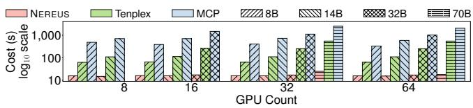  
Figure 12. Parallelism-resharding cost on Cluster #3. MCP also persists state. Missing bars indicate OOM in all systems.

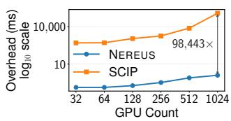  
(a) Planning overhead

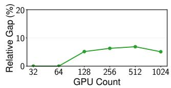  
(b) Gap to SCIP  
Figure 13. Transition planning across 32–1,024 GPUs.

7.4.2 Parallelism-Resharding Cost. We measure TP/PP resharding using Split and Merge for models from 8B to 70B parameters. We compare against MCP and Tenplex. MCP (checkpoint-based) and Tenplex (shard-level) are the closest coarse- and fine-grained alternatives to EMU resharding. Gemini and Oobleck appear only in the resource-scaling comparison (§7.4.1). Gemini targets checkpoint-based recovery, while Oobleck reconfigures pipelines under node changes and uses FSDP within pipeline stages [12, 47]. For a 70B model on 64 GPUs, Nereus reduces transition cost by 99.1% relative to MCP and by 96.7% relative to Tenplex (Fig. 12). For the 8B model, each bar averages Split/Merge transitions over the same feasible TP/PP layouts at each GPU count. Resharding takes a stable 15.7–16.1 s in Nereus across 8–64 GPUs, versus 62.7–65.0 s for Tenplex’s shard-level resharding and 329.9–486.5 s for MCP.

7.4.3 Transition Planning. We compare transition-DAG planning with SCIP [10], which solves the scheduling problem of §6.1. Nereus’s greedy heuristic produces similar schedules in less planning time (Fig. 13). At 1,024 GPUs, Nereus takes 1.22 ms versus 120.10 s for SCIP. Planning is 98,443× faster at this scale, where SCIP’s planning time exceeds Nereus’s step latency (Fig. 8a). The relative gap to SCIP in transition completion time stays within 6.9% at every scale (5.1% at 1,024 GPUs). This gap measures schedule quality within the same formulation, whereas §7.3.2 reports targetplan quality against the empirical optimum.

Table 5. Coordination under three transition types: success rate (%), successful-trial time (s), and added resourcedependency edges. DynaRL-style uses per-component migration with independent local DAGs. SM-CS, CM-SS, and CM-CS denote same-model cross-stage, cross-model samestage, and cross-model cross-stage overlap.
<table><tr><td rowspan="2">Type</td><td rowspan="2">GPUs</td><td colspan="2">Overlap DynaRL-style</td><td colspan="2">NEREUS</td><td rowspan="2">Edges</td></tr><tr><td>Succ.</td><td>Time</td><td>Succ.</td><td>Time</td></tr><tr><td>SM-CS</td><td>32</td><td>62</td><td>8.48</td><td>100</td><td>9.80</td><td>1</td></tr><tr><td>CM-SS</td><td>48</td><td>56</td><td>8.93</td><td>100</td><td>10.80</td><td>2</td></tr><tr><td>CM-CS</td><td>48</td><td>34</td><td>10.44</td><td>100</td><td>12.60</td><td>2</td></tr></table>

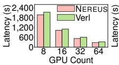  
(a) ReMax

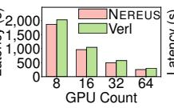  
(b) GRPO

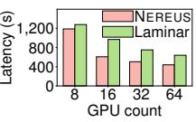  
(c) Async. RL  
Figure 14. Step latency on Cluster #3 for ReMax and GRPO (eight samples per prompt) and asynchronous RL.

7.4.4 Cross-Model-Stage Coordination. For the three transition types of Tab. 5, we compare Nereus on Cluster #3 with DynaRL’s per-component migration, which runs the local DAGs independently. We run 100 trials per system and type, with randomized launch timing and GPU assignment. A trial succeeds only if all local DAGs finish within 20 s and reach the target EMU collections without shared-GPU conflicts. Nereus inserts 1–2 resource-dependency edges and succeeds in all trials. DynaRL-style succeeds in 34–62%, and each failure is a shared-GPU deadlock that a longer timeout cannot resolve. Counting failures as 20 s yields 12.86–16.75 s for DynaRL-style versus 9.80–12.60 s for Nereus.

## 7.5 Generality and Training Behavior

We assess performance beyond synchronous PPO and compare the observed training behavior of Nereus and Verl over equal RL-step counts.

7.5.1 Generality Across Algorithms and Execution Modes. On Cluster #3, with ReMax and GRPO, Nereus out performs Verl at every GPU count (Fig. 14), reducing latency by up to 13.3% for ReMax and 15.8% for GRPO.

We also evaluate Nereus in a fully asynchronous RL setting, where it achieves up to 37.3% lower step latency than

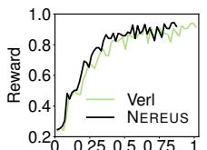  
Wall-clock time (h)

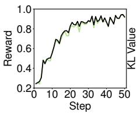

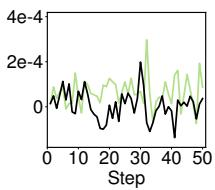  
Figure 15. Training behavior over the first 50 steps: reward against wall-clock time (left), reward and PPO KL estimate against step (middle, right).

Laminar [36] (Fig. 14c). Here, step boundaries are weight synchronizations between training and rollout, with adaptation subject to the safe-boundary conditions in §4.1.

7.5.2 Training Behavior Under Adaptation. Over the first 50 steps, Nereus tracks Verl’s reward and PPO KL estimate (the mean log-probability drop of sampled tokens from the rollout policy to the updated policy, Fig. 15). Both systems reach reward 0.90 at step 32. Nereus reaches 0.94 at step 48, and Verl at step 49. At step 50, Nereus’s reward is 0.9199 versus 0.9160 for Verl, and the mean absolute PPO KL estimate over the 50 steps is $4 . 9 \times 1 0 ^ { - 5 }$ versus $7 . 4 \times 1 0 ^ { - 5 }$

In wall-clock terms, Nereus reaches reward 0.90 after 0.56 h versus 0.65 h for Verl, and 0.94 after 0.84 h versus 0.99 h. The same 50 steps, including four transitions, complete in 3,141 s instead of3,646 s, a 13.9% wall-clock reduction relative to Verl, with closely matched reward and KL curves.

## 8 Related Work

RL post-training systems optimize synchronous and asynchronous execution. Synchronous frameworks (e.g., Verl [37]) improve flexibility and eficiency [11, 17, 28, 52], while asynchronous frameworks (e.g., Laminar [36]) run generation, inference, and training concurrently to handle varying trajectory lengths [5, 6, 8, 45, 49, 58, 60]. ReaL [25] and ROLL [45] optimize initial plans or placements. StreamRL [56] adds generation replicas online but restarts to reconfigure trainers. DynaRL [46] reallocates GPUs within a step and a fixed pool, based on sustained underutilization and predicted global throughput gains. Nereus instead adapts across steps and pool changes, with payback-based admission, dependencyaligned EMUs, and safe concurrent transition orchestration. Cluster schedulers [7, 13, 31] resize or reassign resources across jobs but do not coordinate plan transitions within a running RL post-training job. Nereus applies the payback principle (§4.3) inside one coupled job.

State-management systems focus on selective state manipulation or migration for a single model under changing parallelism and resources [12, 19, 41, 43]. They establish the value of reusing GPU-resident state but do not coordinate multimodel, multi-stage adaptation. Checkpoint systems manage state coarsely for fault tolerance [47] and incur restart pauses during plan transitions [21, 39, 40, 44, 54]. Nereus reuses

GPU-resident state per model-stage replica and coordinates changes across model-stages that share GPUs.

Transfer engines such as fabric-lib [22] provide RDMA point-to-point paths for KV cache transfer, MoE dispatch, and RL weight synchronization. They complement Nereus, which decides which state moves and in what order.

## 9 Conclusion

Plan adaptation becomes tractable when the state boundary matches the job’s dependencies. Nereus decides when to adapt, what state to reuse, and how to transition, through a cost-aware adaptation policy, a dependency-aligned state abstraction, and safe concurrent transition orchestration. Its selected plans stay within 5% of the empirical optimum in all 18 measured settings. In a real-data trace, it lowers average step latency by 27.7% versus the initial fixed TP/PP layout. Across three held-out traces, it averages 858.7 s/step, versus 928.3 s for DynaRL-style admission. Six transitions in a 1,000- step run reaching 1,024 GPUs take 0.079% ofrun time. Scaling is 3.8–16.2× faster than Oobleck and Tenplex, and coordi nated transitions succeed in all overlap trials, versus 34–62% for DynaRL’s per-component migration. Nereus improves 8B PPO throughput by 2.14–7.27× over OpenRLHF and by 1.10–1.47× over Verl across the evaluated clusters. The gains extend to ReMax, GRPO, and asynchronous RL. The modelstage boundary and modular runtime also provide a path to extend adaptation to context/expert parallelism, autoscaling external tool services, and additional RL frameworks.

## Acknowledgments

This work was supported by the Research Council of Finland (Grant Nos. 362729 and 358877), Business Finland (Grant No. 169/31/2024), and the Finnish Ministry of Education and Culture’s Doctoral Education Pilot through the Finnish Doctoral Program Network in Artificial Intelligence (AI-DOC, Decision No. VN/3137/2024-OKM-6). The authors acknowledge computing resources of EuroHPC JU projects (EHPC-REG-2025R02-367, EHPC-DEV-2024D09-039 and EHPC-DEV-2025D10-012), Aalto Science-IT project and CSC – IT Center for Science, Finland.

## References

[1] Advanced Micro Devices, Inc. 2026. ROCm System Management Interface (ROCm SMI). htps://github.com/ROCm/rocm-systems/ tree/develop/projects/rocm-smi-lib.

[2] Erfan Darzi, Aldo Pareja, Kaveh Jalilian, and Shreeanant Bharad waj. 2025. GPU Tail Latency Diagnosis for Serverless and HPC Workloads using eBPF. In Proceedings ofthe 11th International Workshop on Serverless Computing (Nashville, TN, USA) (WoSC11 ’25). Association for Computing Machinery, New York, NY, USA, 26–30. doi:10.1145/3774899.3775015

[3] DeepSeek-AI. 2025. DeepSeek-R1 incentivizes reasoning in LLMs through reinforcement learning. Nature 645, 8081 (2025), 633–638. doi:10.1038/s41586-025-09422-z

[4] Jiangfei Duan, Ziang Song, Xupeng Miao, Xiaoli Xi, Dahua Lin, Harry Xu, Minjia Zhang, and Zhihao Jia. 2024. Parcae: Proactive, Liveput-Optimized DNN Training on Preemptible Instances. In 21st USENIX Symposium on Networked Systems Design and Implementation (NSDI 24). USENIX Association, Santa Clara, CA, 1121–1139.

[5] Wei Fu, Jiaxuan Gao, Xujie Shen, Chen Zhu, Zhiyu Mei, Chuyi He, Shusheng Xu, Guo Wei, Jun Mei, Jiashu Wang, Tongkai Yang, Binhang Yuan, and Yi Wu. 2025. AReaL: A Large-Scale Asynchronous Reinforcement Learning System for Language Reasoning. In Advances in Neural Information Processing Systems, Vol. 38. Curran Associates, Inc., San Diego, CA, USA, 36256–36282.

[6] Wei Gao, Yuheng Zhao, Tianyuan Wu, Shaopan Xiong, Weixun Wang, Dakai An, Lunxi Cao, Dilxat Muhtar, Zichen Liu, Haizhou Zhao, Ju Huang, Siran Yang, Yongbin Li, Wenbo Su, Jiamang Wang, Lin Qu, Bo Zheng, and Wei Wang. 2026. RollArt: Disaggregated Multi-Task Agentic RL Training at Scale. In 20th USENIX Symposium on Operating Systems Design and Implementation (OSDI 26). USENIX Association, Seattle, WA, 863–881.

[7] Diandian Gu, Yihao Zhao, Yinmin Zhong, Yifan Xiong, Zhenhua Han, Peng Cheng, Fan Yang, Gang Huang, Xin Jin, and Xuanzhe Liu. 2023. ElasticFlow: An Elastic Serverless Training Platform for Distributed Deep Learning. In Proceedings of the 28th ACM International Conference on Architectural Support for Programming Languages and Operating Systems, Volume 2 (Vancouver, BC, Canada) (ASPLOS 2023). Association for Computing Machinery, New York, NY, USA, 266–280. doi:10.1145/3575693.3575721

[8] Zhenyu Han, Ansheng You, Haibo Wang, Kui Luo, Guang Yang, Wenqi Shi, Menglong Chen, Sicheng Zhang, Zeshun Lan, Chunshi Deng, Huazhong Ji, Wenjie Liu, Yu Huang, Yixiang Zhang, Chenyi Pan, Jing Wang, Xin Huang, Chunsheng Li, and Jianping Wu. 2025. AsyncFlow: An Asynchronous Streaming RL Framework for Eficient LLM Post-Training. arXiv:2507.01663 [cs.LG]

[9] Willy Herroelen, Bert De Reyck, and Erik Demeulemeester. 1998. Resource-constrained project scheduling: A survey of recent developments. Computers & Operations Research 25, 4 (1998), 279–302. doi:10.1016/S0305-0548(97)00055-5

[10] Christopher Hojny, Mathieu Besançon, Ksenia Bestuzheva, Sander Borst,João Dionísio,Johannes Ehls, Leon Eifler, Mohammed Ghannam, Ambros Gleixner, Adrian Göß, Alexander Hoen, Jacob von Holly-Ponientzietz, Rolfvan der Hulst, Dominik Kamp, Thorsten Koch, Kevin Kofler, Jurgen Lentz, Marco Lübbecke, Stephen J. Maher, Paul Matti Meinhold, Gioni Mexi, Til Mohr, Erik Mühmer, Krunal Kishor Patel, Marc E. Pfetsch, Sebastian Pokutta, Chantal Reinartz Groba, Felipe Serrano, Yuji Shinano, Mark Turner, Stefan Vigerske, Matthias Walter, Dieter Weninger, and Liding Xu. 2025. The SCIP Optimization Suite 10.0. arXiv:2511.18580 [math.OC] doi:10.48550/arXiv.2511.18580

[11] Jian Hu, Xibin Wu, Wei Shen, Jason Klein Liu, Weixun Wang, Songlin Jiang, Haoran Wang, Hao Chen, Bin Chen, Wenkai Fang, Xianyu, Yu Cao, Haotian Xu, and Yiming Liu. 2025. OpenRLHF: A Ray-based Easy-to-use, Scalable and High-performance RLHF Framework. In Proceedings ofthe 2025 Conference on Empirical Methods in Natural Language Processing: System Demonstrations, Ivan Habernal, Peter Schulam, and Jörg Tiedemann (Eds.). Association for Computational Linguistics, Suzhou, China, 656–666. doi:10.18653/v1/2025.emnlpdemos.48

[12] Insu Jang, Zhenning Yang, Zhen Zhang, Xin Jin, and Mosharaf Chowdhury. 2023. Oobleck: Resilient Distributed Training of Large Models Using Pipeline Templates. In Proceedings ofthe 29th Symposium on Operating Systems Principles (Koblenz, Germany) (SOSP ’23). Association for Computing Machinery, New York, NY, USA, 382–395. doi:10.1145/3600006.3613152

[13] Suhas Jayaram Subramanya, Daiyaan Arfeen, Shouxu Lin, Aurick Qiao, Zhihao Jia, and Gregory R. Ganger. 2023. Sia: Heterogeneityaware, goodput-optimized ML-cluster scheduling. In Proceedings of the

29th Symposium on Operating Systems Principles (Koblenz, Germany) (SOSP ’23). Association for Computing Machinery, New York, NY, USA, 642–657. doi:10.1145/3600006.3613175

[14] Saurabh Jha, Archit Patke, Jim Brandt, Ann Gentile, Benjamin Lim, Mike Showerman, Greg Bauer, Larry Kaplan, Zbigniew Kalbarczyk, William Kramer, and Ravi Iyer. 2020. Measuring Congestion in High Performance Datacenter Interconnects. In 17th USENIX Symposium on Networked Systems Design and Implementation (NSDI 20). USENIX Association, Santa Clara, CA, 37–57.

[15] Devvrit Khatri, Lovish Madaan, Rishabh Tiwari, Rachit Bansal, Sai Surya Duvvuri, Manzil Zaheer, Inderjit S. Dhillon, David Brandfonbrener, and Rishabh Agarwal. 2026. The Art of Scaling Reinforcement Learning Compute for LLMs. In The Fourteenth International Conference on Learning Representations (ICLR ’26). OpenReview.net, Rio de Janeiro, Brazil.

[16] Woosuk Kwon, Zhuohan Li, Siyuan Zhuang, Ying Sheng, Lianmin Zheng, Cody Hao Yu, Joseph E. Gonzalez, Hao Zhang, and Ion Stoica. 2023. Eficient Memory Management for Large Language Model Serving with PagedAttention. In Proceedings ofthe 29th Symposium on Operating Systems Principles (Koblenz, Germany) (SOSP ’23). Association for Computing Machinery, New York, NY, USA, 611–626. doi:10.1145/3600006.3613165

[17] Kinman Lei, Yuyang Jin, Mingshu Zhai, Kezhao Huang, Haoxing Ye, and Jidong Zhai. 2024. PUZZLE: Eficiently Aligning Large Language Models through Light-Weight Context Switch. In 2024 USENIXAnnual Technical Conference (USENIX ATC 24). USENIX Association, Santa Clara, CA, 127–140.

[18] Cheng Li. 2023. LLM-Analysis: Latency and Memory Analysis of Transformer Models for Training and Inference. htps://github.com/ cli99/llm-analysis.

[19] Mingzhen Li, Wencong Xiao, Hailong Yang, Biao Sun, Hanyu Zhao, Shiru Ren, Zhongzhi Luan, Xianyan Jia, Yi Liu, Yong Li, Wei Lin, and Depei Qian. 2023. EasyScale: Elastic Training with Consistent Accuracy and Improved Utilization on GPUs. In Proceedings ofthe International Conference for High Performance Computing, Networking, Storage and Analysis (Denver, CO, USA) (SC ’23). Association for Computing Machinery, New York, NY, USA, Article 55, 14 pages. doi:10.1145/3581784.3607054

[20] Ziniu Li, Tian Xu, Yushun Zhang, Zhihang Lin, Yang Yu, Ruoyu Sun, and Zhi-Quan Luo. 2024. ReMax: A Simple, Efective, and Eficient Reinforcement Learning Method for Aligning Large Language Models. In Proceedings of the 41st International Conference on Machine Learning (ICML’24). JMLR.org, Vienna, Austria, Article 1172, 36 pages.

[21] Xinyu Lian, Sam Ade Jacobs, Lev Kurilenko, Masahiro Tanaka, Stas Bekman, Olatunji Ruwase, and Minjia Zhang. 2025. Universal Checkpointing: A Flexible and Eficient Distributed Checkpointing System for Large-Scale DNN Training with Reconfigurable Parallelism. In Proceedings ofthe 2025 USENIX Conference on Usenix Annual Technical Conference (Boston, MA, USA) (USENIXATC ’25). USENIX Association, USA, Article 90, 16 pages.

[22] Nandor Licker, Kevin Hu, Vladimir Zaytsev, and Lequn Chen. 2026. fabric-lib: RDMA Point-to-Point Communication for LLM Systems. In Proceedings ofMachine Learning and Systems, Vol. 8. MLSys, Bellevue, WA, USA, 169–185.

[23] Llama Team, AI @ Meta. 2024. The Llama 3 Herd of Models. arXiv:2407.21783 [cs.AI] doi:10.48550/arXiv.2407.21783

[24] Luo Mai, Guo Li, Marcel Wagenländer, Konstantinos Fertakis, Andrei-Octavian Brabete, and Peter Pietzuch. 2020. KungFu: Making Training in Distributed Machine Learning Adaptive. In 14th USENIXSymposium on Operating Systems Design and Implementation (OSDI 20). USENIX Association, USA, 937–954.

[25] Zhiyu Mei, Wei Fu, Kaiwei Li, Guangju Wang, Huanchen Zhang, and Yi Wu. 2025. ReaL: Eficient RLHF Training of Large Language Models with Parameter Reallocation. In Proceedings of Machine Learning and

Systems, Vol. 7. MLSys, Santa Clara, CA, USA, 20 pages.

[26] Zizhao Mo, Huanle Xu, and Chengzhong Xu. 2024. Heet: Accelerating Elastic Training in Heterogeneous Deep Learning Clusters. In Proceedings ofthe 29th ACM International Conference on Architectural Support for Programming Languages and Operating Systems, Volume 2 (La Jolla, CA, USA) (ASPLOS ’24). Association for Computing Machinery, New York, NY, USA, 499–513. doi:10.1145/3620665.3640375

[27] Philipp Moritz, Robert Nishihara, Stephanie Wang, Alexey Tumanov, Richard Liaw, Eric Liang, Melih Elibol, Zongheng Yang, William Paul, Michael I. Jordan, and Ion Stoica. 2018. Ray: A Distributed Framework for Emerging AI Applications. In 13th USENIX Symposium on Operating Systems Design and Implementation (OSDI 18). USENIX Association, Carlsbad, CA, 561–577.

[28] NVIDIA. 2025. NeMo RL: A Scalable and Eficient Post-Training Library. htps://github.com/NVIDIA-NeMo/RL. GitHub repository.

[29] NVIDIA. 2026. NVIDIA Management Library (NVML). htps:// developer.nvidia.com/management-library-nvml.

[30] Long Ouyang, Jefrey Wu, Xu Jiang, Diogo Almeida, Carroll L. Wain wright, Pamela Mishkin, Chong Zhang, Sandhini Agarwal, Katarina Slama, Alex Ray, John Schulman, Jacob Hilton, Fraser Kelton, Luke Miller, Maddie Simens, Amanda Askell, Peter Welinder, Paul F. Christiano, Jan Leike, and Ryan Lowe. 2022. Training language models to follow instructions with human feedback. In Proceedings of the 36th International Conference on Neural Information Processing Systems (New Orleans, LA, USA) (NIPS ’22). Curran Associates Inc., Red Hook, NY, USA, Article 2011, 15 pages.

[31] Aurick Qiao, Sang Keun Choe, Suhas Jayaram Subramanya, Willie Neiswanger, Qirong Ho, Hao Zhang, Gregory R. Ganger, and Eric P. Xing. 2021. Pollux: Co-adaptive Cluster Scheduling for Goodput-Optimized Deep Learning. In 15th USENIX Symposium on Operating Systems Design and Implementation (OSDI 21). USENIX Association, USA, 1–18.

[32] Qwen Team. 2025. Qwen3 Technical Report. arXiv:2505.09388 [cs.CL] doi:10.48550/arXiv.2505.09388

[33] Samyam Rajbhandari, Jef Rasley, Olatunji Ruwase, and Yuxiong He. 2020. ZeRO: memory optimizations toward training trillion parameter models. In Proceedings of the International Conference for High Performance Computing, Networking, Storage and Analysis (SC ’20). IEEE Press, Atlanta, GA, USA, Article 20, 16 pages. doi:10.1109/SC41405.2020.00024

[34] John Schulman, Filip Wolski, Prafulla Dhariwal, Alec Radford, and Oleg Klimov. 2017. Proximal Policy Optimization Algorithms. arXiv:1707.06347 [cs.LG]

[35] Zhihong Shao, Peiyi Wang, Qihao Zhu, Runxin Xu, Junxiao Song, Xiao Bi, Haowei Zhang, Mingchuan Zhang, Y. K. Li, Y. Wu, and Daya Guo. 2024. DeepSeekMath: Pushing the Limits of Mathematical Reasoning in Open Language Models. arXiv:2402.03300 [cs.CL]

[36] Guangming Sheng, Yuxuan Tong, Borui Wan, Wang Zhang, Chaobo Jia, Xibin Wu, Yuqi Wu, Xiang Li, Chi Zhang, Yanghua Peng, Haibin Lin, Xin Liu, and Chuan Wu. 2026. Laminar: A Scalable Asynchronous RL Post-Training Framework. In Proceedings of the 21st European Conference on Computer Systems (Edinburgh, United Kingdom) (EuroSys ’26). Association for Computing Machinery, New York, NY, USA, 400–422. doi:10.1145/3767295.3803580

[37] Guangming Sheng, Chi Zhang, Zilingfeng Ye, Xibin Wu, Wang Zhang, Ru Zhang, Yanghua Peng, Haibin Lin, and Chuan Wu. 2025. Hybrid-Flow: A Flexible and Eficient RLHF Framework. In Proceedings of the Twentieth European Conference on Computer Systems (Rotterdam, Netherlands) (EuroSys ’25). Association for Computing Machinery, New York, NY, USA, 1279–1297. doi:10.1145/3689031.3696075

[38] Mohammad Shoeybi, Mostofa Patwary, Raul Puri, Patrick LeGresley, Jared Casper, and Bryan Catanzaro. 2020. Megatron-LM: Training Multi-Billion Parameter Language Models Using Model Parallelism. arXiv:1909.08053 [cs.CL]

[39] Megatron Team. 2024. Dist Checkpointing Package. htps://docs. nvidia.com/megatron-core/developer-guide/nightly/api-guide/core/ dist\_checkpointing.html.

[40] PyTorch Team. 2024. Distributed Checkpointing Recipe. htps://docs. pytorch.org/tutorials/recipes/distributed\_checkpoint\_recipe.html.

[41] John Thorpe, Pengzhan Zhao, Jonathan Eyolfson, Yifan Qiao, Zhihao Jia, Minjia Zhang, Ravi Netravali, and Guoqing Harry Xu. 2023. Bamboo: Making Preemptible Instances Resilient for Afordable Training of Large DNNs. In 20th USENIX Symposium on Networked Systems Design and Implementation (NSDI 23). USENIX Association, Boston, MA, 497–513.

[42] Leandro von Werra, Younes Belkada, Lewis Tunstall, Edward Beeching, Tristan Thrush, Nathan Lambert, Shengyi Huang, Kashif Rasul, and Quentin Gallouédec. 2020. TRL: Transformer Reinforcement Learning.

[43] Marcel Wagenländer, Guo Li, Bo Zhao, Luo Mai, and Peter Pietzuch. 2024. Tenplex: Dynamic Parallelism for Deep Learning using Paralleliz able Tensor Collections. In Proceedings ofthe ACM SIGOPS 30th Symposium on Operating Systems Principles (Austin, TX, USA) (SOSP ’24). Association for Computing Machinery, New York, NY, USA, 195–210. doi:10.1145/3694715.3695975

[44] Borui Wan, Mingji Han, Yiyao Sheng, Yanghua Peng, Haibin Lin, Mofan Zhang, Zhichao Lai, Menghan Yu, Junda Zhang, Zuquan Song, Xin Liu, and Chuan Wu. 2025. ByteCheckpoint: a unified checkpointing system for large foundation model development. In Proceedings ofthe 22nd USENIX Symposium on Networked Systems Design and Implementation (Philadelphia, PA, USA) (NSDI ’25). USENIX Association, USA, Article 30, 20 pages.

[45] Weixun Wang, Shaopan Xiong, Gengru Chen, Wei Gao, Sheng Guo, Yancheng He, Ju Huang, Jiaheng Liu, Zhendong Li, Xiaoyang Li, Zichen Liu, Haizhou Zhao, Dakai An, Lunxi Cao, Qiyang Cao, Wanxi Deng, Feilei Du, Yiliang Gu, Jiahe Li, Xiang Li, Mingjie Liu, Yijia Luo, Zihe Liu, Yadao Wang, Pei Wang, Tianyuan Wu, Yanan Wu, Yuheng Zhao, Shuaibing Zhao, Jin Yang, Siran Yang, Yingshui Tan, Huimin Yi, Yuchi Xu, Yujin Yuan, Xingyao Zhang, Lin Qu, Wenbo Su, Wei Wang, Jiamang Wang, and Bo Zheng. 2025. Reinforcement Learning Optimization for Large-Scale Learning: An Eficient and User-Friendly Scal ing Library. arXiv:2506.06122 [cs.LG] doi:10.48550/arXiv.2506.06122

[46] Yuanqing Wang, Hao Lin, Junhao Hu, Chunyang Zhu, Quanlu Zhang, Zhen Guo, Yuchen Zhang, Xu Fu, Si Xu, Bo Dai, Zixiao Huang, Chao Yu, Boxun Li, Guohao Dai, Zhi Yang, and Yu Wang. 2026. DynaRL: Flex ible and Dynamic Scheduling of Large-Scale Reinforcement Learning Training. In 20th USENIX Symposium on Operating Systems Design and Implementation (OSDI26). USENIX Association, Seattle, WA, 847–862.

[47] Zhuang Wang, ZhenJia, Shuai Zheng, Zhen Zhang, Xinwei Fu, T. S. Eugene Ng, and Yida Wang. 2023. GEMINI: Fast Failure Recovery in Distributed Training with In-Memory Checkpoints. In Proceedings of the 29th Symposium on Operating Systems Principles (Koblenz, Germany) (SOSP ’23). Association for Computing Machinery, New York, NY, USA, 364–381. doi:10.1145/3600006.3613145

[48] Christin Whitton, William Jones, Craig Walker, Vanessa Job, Steven Senator, and Nathan DeBardeleben. 2025. Are We There Yet? Predicting the Queue Wait Times for HPCJobs . In 2025 IEEE International Conference on Cluster Computing (CLUSTER). IEEE Computer Society, Los Alamitos, CA, USA, 1–12. doi:10.1109/CLUSTER59342.2025.11186489

[49] Bo Wu, Sid Wang, Yunhao Tang, Jia Ding, Eryk Helenowski, Liang Tan, Tengyu Xu, Tushar Gowda, Zhengxing Chen, Chen Zhu, Xiaocheng Tang, Yundi Qian, Beibei Zhu, and Rui Hou. 2025. LlamaRL: A Distributed Asynchronous Reinforcement Learning Framework for Eficient Large-scale LLM Training. arXiv:2505.24034 [cs.LG] doi:10.48550/arXiv.2505.24034

[50] Zhanghao Wu, Wei-Lin Chiang, Ziming Mao, Zongheng Yang, Eric J. Friedman, Scott Shenker, and Ion Stoica. 2024. Can’t Be Late: Optimizing Spot Instance Savings under Deadlines. In 21st USENIXSymposium on Networked Systems Design and Implementation (NSDI 24). USENIX Association, Santa Clara, CA, 185–203.

[51] Miguel G. Xavier, Kassiano J. Matteussi, Fabian Lorenzo, and Cesar A. F. De Rose. 2016. Understanding performance interference in multitenant cloud databases and web applications. In 2016 IEEE International Conference on Big Data (Big Data). IEEE, Washington, DC, USA, 2847– 2852. doi:10.1109/BigData.2016.7840933

[52] Youshao Xiao, Zhenglei Zhou, Fagui Mao, Weichang Wu, Shangchun Zhao, Lin Ju, Lei Liang, Xiaolu Zhang, and Jun Zhou. 2025. FlexRLHF: A Flexible Placement and Parallelism Framework for Eficient RLHF Training. In 2025 IEEE International Parallel and Distributed Processing Symposium (IPDPS). IEEE, Milan, Italy, 358–369. doi:10.1109/ IPDPS64566.2025.00039

[53] Zhewei Yao, Reza Yazdani Aminabadi, Olatunji Ruwase, Samyam Rajbhandari, Xiaoxia Wu, Ammar Ahmad Awan, Jef Rasley, Minjia Zhang, Conglong Li, Connor Holmes, Zhongzhu Zhou, Michael Wyatt, Molly Smith, Lev Kurilenko, Heyang Qin, Masahiro Tanaka, Shuai Che, Shuaiwen Leon Song, and Yuxiong He. 2023. DeepSpeed-Chat: Easy, Fast and Afordable RLHF Training of ChatGPT-like Models at All Scales. arXiv:2308.01320 [cs.LG] doi:10.48550/arXiv.2308.01320

[54] Shaoxun Zeng, Tingxu Ren, Jiwu Shu, and Youyou Lu. 2026. GPU Checkpoint/Restore Made Fast and Lightweight. In 24th USENIX Conference on File and Storage Technologies (FAST’26). USENIX Association, Santa Clara, CA, 239–254.

[55] Lianmin Zheng, Zhuohan Li, Hao Zhang, Yonghao Zhuang, Zhifeng Chen, Yanping Huang, Yida Wang, Yuanzhong Xu, Danyang Zhuo, Eric P. Xing, Joseph E. Gonzalez, and Ion Stoica. 2022. Alpa: Automating Inter- and Intra-Operator Parallelism for Distributed Deep Learning. In 16th USENIX Symposium on Operating Systems Design and Implementation (OSDI 22). USENIX Association, Carlsbad, CA, 559–578.

[56] Yinmin Zhong, Zili Zhang, Xiaoniu Song, Hanpeng Hu, Chao Jin, Bingyang Wu, Nuo Chen, Yukun Chen, Yu Zhou, Changyi Wan, Hongyu Zhou, Yimin Jiang, Yibo Zhu, and Daxin Jiang. 2025. StreamRL: Scalable, Heterogeneous, and Elastic RL for LLMs with Disaggregated Stream Generation. arXiv:2504.15930 [cs.LG] doi:10.48550/arXiv.2504. 15930

[57] Yinmin Zhong, Zili Zhang, Bingyang Wu, Shengyu Liu, Yukun Chen, Changyi Wan, Hanpeng Hu, Lei Xia, Ranchen Ming, Yibo Zhu, and Xin Jin. 2025. Optimizing RLHF Training for Large Language Models with Stage Fusion. In 22nd USENIX Symposium on Networked Systems Design and Implementation (NSDI 25). USENIX Association, Philadelphia, PA, 489–503.

[58] Yuzhen Zhou, Jiajun Li, Yusheng Su, Gowtham Ramesh, Zilin Zhu, Xiang Long, Chenyang Zhao, Jin Pan, Xiaodong Yu, Ze Wang, Kangrui Du, Jialian Wu, Ximeng Sun, Jiang Liu, Qiaolin Yu, Hao Chen, Zicheng Liu, and Emad Barsoum. 2025. APRIL: Active Partial Rollouts in Reinforcement Learning to Tame Long-tail Generation. arXiv:2509.18521 [cs.LG] doi:10.48550/arXiv.2509.18521

[59] Kan Zhu, Yufei Gao, Yilong Zhao, Liangyu Zhao, Gefei Zuo, Yile Gu, Dedong Xie, Tian Tang, Qinyu Xu, Zihao Ye, Keisuke Kamahori, Chien-Yu Lin, Ziren Wang, Stephanie Wang, Arvind Krishnamurthy, and Baris Kasikci. 2025. NanoFlow: Towards Optimal Large Language Model Serving Throughput. In 19th USENIX Symposium on Operating Systems Design and Implementation (OSDI 25). USENIX Association, Boston, MA, 749–765.

[60] Zilin Zhu, Chengxing Xie, Xin Lv, and slime Contributors. 2025. slime: An LLM post-training framework for RL Scaling. htps://github.com/ THUDM/slime. GitHub repository. Corresponding author: Xin Lv.