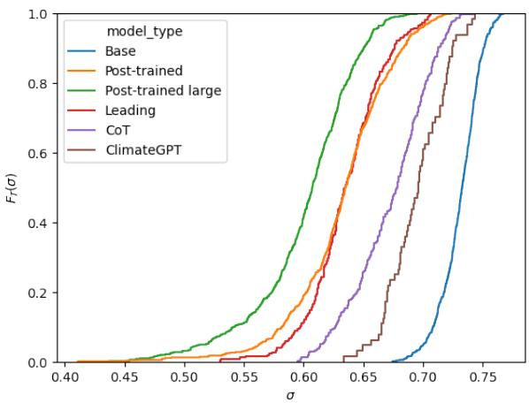
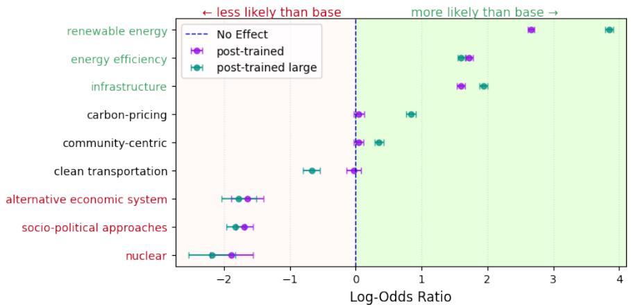
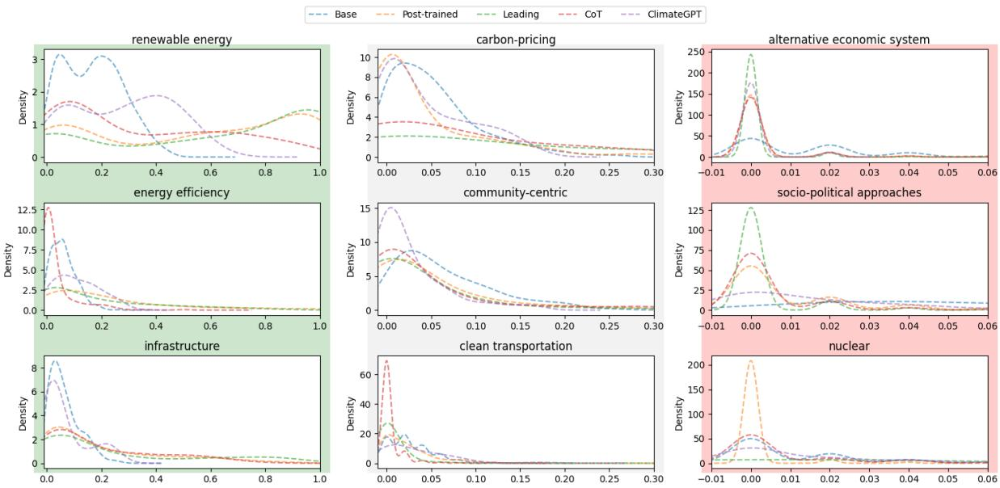
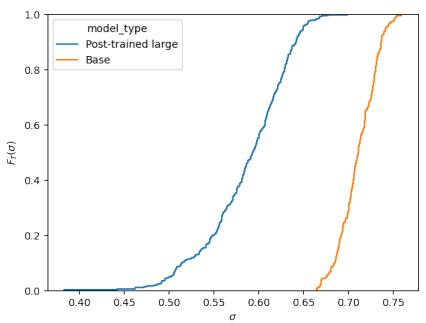
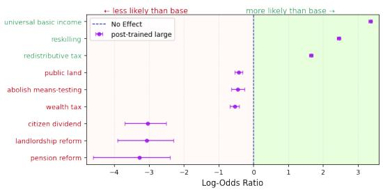
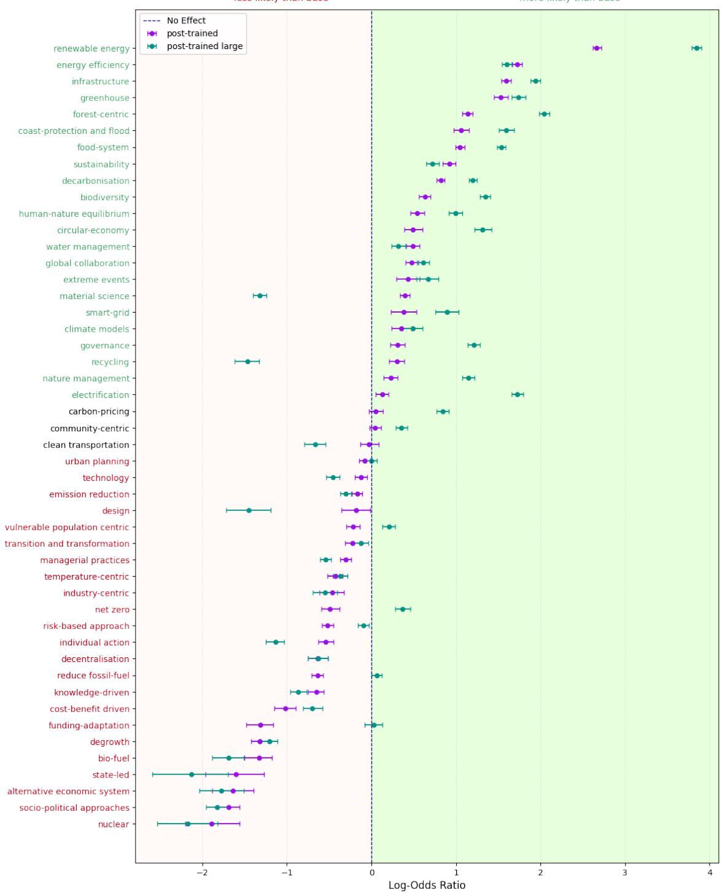
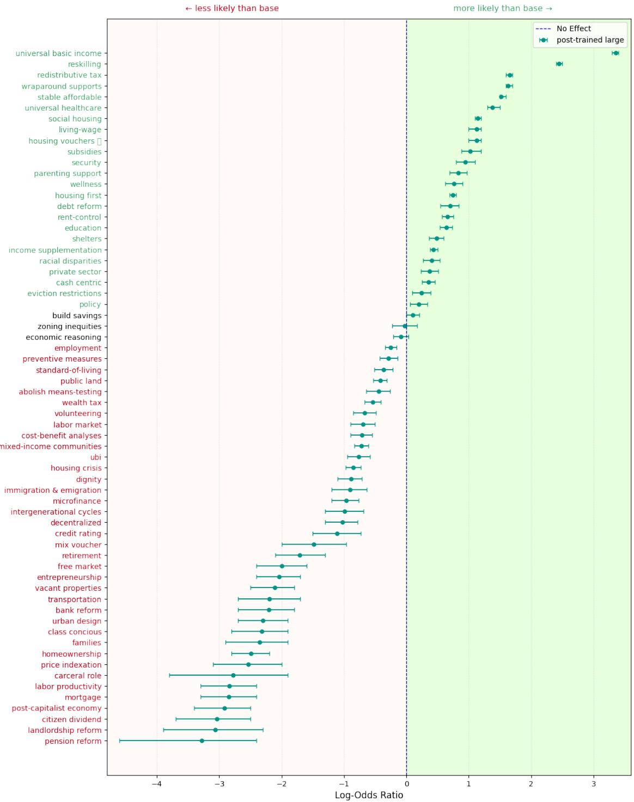

# Narrowing the Horizon: Quantifying Topic Saliency Shifts in Generative Monoculture

Oriane Peter and Elena Simperl and Kate Devlin King’s College London London, United Kingdom oriane.peter@kcl.ac.uk

## Abstract

As Large Language Models (LLMs) become central to how we access and share information, they play an increasingly powerful role in shaping global knowledge. However, as these models evolve, their outputs risk converging into a generative monoculture, where the diversity of perspectives they represent narrows over time. Studies at the model level often fail to pinpoint which specific topics or viewpoints are being marginalised or amplified in this process. In this paper, we introduce a method to measure shifts in topic saliency across model families, tracking what gains or loses prominence during post-training. Applying this approach to a case study of climate change discourse, we demonstrate how homogenisation affects the representation of diverse solutions across different models. We also test interventions to counter this trend, showing that specialised models can help preserve a broader range of perspectives. This underscores the importance of monitoring topic saliency to diagnose the risks of monoculture and to ensure AI systems reflect a pluralism of ideas. Data and Code are accessible here.

## 1 Introduction

Large Language Models (LLMs) mediate an increasing share of global knowledge production, from academic writings (Liang et al., 2024), journalistic outputs (Thurman et al., 2025) to Wikipedia articles (Brooks et al., 2024). Concomitantly, recent empirical research suggests that outputs across disparate model families are converging toward a narrow, homogenous subset of representations, a phenomenon coined generative monoculture (Wu et al., 2025). The intersection of this monoculture with the massive scale of LLM deployment raises concerns regarding the collapse of epistemic diversity, i.e., the plurality of knowledge accessible (Peterson, 2025). Such a global loss of diversity may have far-reaching consequences, potentially eroding our collective capacity to address multifaceted challenges where a pluralistic stance is key.

While prior work has investigated homogenisation at various scales, from internal model representations (Guo et al., 2025; Hamilton, 2024; Murthy et al., 2025; Sorensen et al., 2024) to downstream impacts on users (Chen et al., 2024; Padmakumar and He, 2024; Wang et al., 2025a; Sourati et al., 2026) and society (Wu et al., 2025; Gillespie, 2024; Bommasani et al., 2022), studies at the model level often fail to robustly identify the specific topics or perspectives around which models converge. This lack of resolution prevents a concrete assessment of the consequences of generative monoculture. Rather than treating homogenisation as an undifferentiated loss of diversity, identifying which information is lost is therefore necessary for a nuanced analysis of the resulting societal impacts. We argue that this resolution can be obtained by quantifying shifts in topic saliency across model families. The goal of this work is therefore not to propose an alternative to existing homogenisation measurements, but rather a complementary analysis at the topic level. Since these impacts are most evident when grounded in specific contexts, we propose a methodology for quantifying shifts in topic saliency and apply it to the domain of climate change discourse. This approach moves beyond theoretical diversity loss to identify concrete societal risks and actionable, model-level mitigation strategies. We thus make three contributions:

• A methodology for quantifying shifts in topic saliency during LLM homogenisation;

• Empirical evidence demonstrating that tracking topic saliency is essential for evaluating the impact of generative monoculture and the efficacy of specific interventions, within the context of climate change discourse; and

• An evaluation of mitigation strategies, providing empirical support for the use of specialised models in mitigating the effects of output convergence.

## 2 Background

## 2.1 LLM Homogenisation

LLMs have been empirically shown to tend towards generative monoculture, or the “significant narrowing of model output diversity relative to available training data for a given task” (Wu et al., 2025). This effect leads to highly repetitive outputs with lower semantic diversity than would be generated by humans writing (Jiang et al., 2025; Wu et al., 2025; Guo et al., 2025; Gillespie, 2024; Murthy et al., 2025) or simple web searches (Wright et al., 2026). This homogenisation extends beyond individual model families, with model outputs increasingly resembling one another (Jiang et al., 2025; Wu et al., 2025; Kim et al., 2025). Furthermore, this diversity loss worsens when models are trained on synthetic output (Hamilton, 2024; Schaeffer et al., 2025; Shumailov et al., 2024; Guo et al., 2024; Alemohammad et al., 2024) and has a homogenising effect on users (Chen et al., 2024; Padmakumar and He, 2024; Park et al., 2024; Sourati et al., 2026; Srivastava, 2025), suggesting the emergence of a feedback loop which may increase this narrowing over time.

Whilst there are many factors contributing to models reproducing only a subset of their training diversity, ranging from training batch composition (Farnadi et al., 2024) to decoding algorithm choice (Holtzman et al., 2020; Pavlovic and Poesio, 2024; Dhamala et al., 2023), post-training has been most consistently identified as the main driver of output flattening (Casper et al., 2023; Kirk et al., 2024; Sorensen et al., 2024; O’Mahony et al., 2024; Hamilton, 2024; Feng et al., 2024; Murthy et al., 2025).

## 2.2 Epistemic Collapse

Output homogenisation is not an issue in and of itself. For example, after post-training, models should generate texts which are less toxic, more accurate, and better aligned with the user’s request, all of which may reduce the set of likely outputs. However, this homogenisation does become undesirable when it threatens humans’ epistemic diversity. Peterson (2025) describes this phenomenon as Knowledge Collapse: a “progressive narrowing over time (or across technological iterations) of the set of information available to humans”. This narrowing is brought both by generative monoculture and the increasing roles of LLMs systems as ‘Knowledge Distribution Systems’: infrastructures that mediate epistemic resources at scale (Lavazza and Farina, 2026). AI-mediated knowledge distribution, from web search summarisation to chatbots, is becoming comparatively easier to access than alternatives, such as libraries. Consequently, humans are increasingly unlikely to encounter perspectives outside the narrow set promoted by these systems, or the even narrower echo-chambers which the personalisation of AI systems can lead to (Kirk et al., 2023; Sharma et al., 2024). The combination of the scale of their deployment and generative monoculture leads, in effect, to a shrinkage of the set of points of view replicated, and, potentially, to a collapse of accessible knowledge.

Furthermore, the knowledge that remains accessible serves an ‘agenda-setting’ function: the salience of accessible knowledge influences public attitudes and thus shapes political agendas (Mc-Combs and Shaw, 1972; Bhat et al., 2026). While mass media exerted similar effects before the advent of digital resources, these new technologies have shifted the centralised authority of media toward a complex network of influences, shaped by algorithmic recommender systems, user-generated content, and search engines (Almakaty, 2025). When only a few LLMs function as a centralised ‘Knowledge Distribution System’, the authority to determine what knowledge is propagated becomes once again concentrated in a few dominant institutions, shifting informative and interpretive power toward often private actors and interests (Gur-Arieh et al., 2026; Lavazza and Farina, 2026; Peter and Devlin, 2025).

## 2.3 Homogenisation and Pluralism

Therefore, to understand the implications of generative monoculture, it is necessary to characterise exactly what is lost and which knowledge remains after collapse, as these remnants outline the new boundaries of public discourse and the resulting shifts in political power.

However, current research into homogenisation is primarily descriptive; it succeeds in quantifying the extent of the effect but stops short of qualifying its nature. For example, Jiang et al. (2025) identifies both intra-model repetition and inter-model homogeneity across a wide array of real-world queries. Similarly, Wright et al. (2026) empirically demonstrates that across 27 models, LLM outputs produce a significantly narrower set of claims compared to even basic web searches. While both works effectively illustrate a systemic loss of diversity, they provide little insight into which specific perspectives or cultural frameworks endure.

On the other hand, research on LLMs pluralism does focus on whose opinions are being left out. These approaches are concerned with identifying which humans or whose values are present in a model’s outputs, clustered across sociodemographic lines, such as nationality (DURMUS et al., 2024; Sorensen et al., 2024; Santurkar et al., 2023; Atari et al., 2023) or political orientation (Wright et al., 2024; Feng et al., 2023; Rozado, 2024; Röttger et al., 2026). They have demonstrated that LLMs are most often reflective of the perspective of a small, privileged subgroup (Atari et al., 2023; DURMUS et al., 2024), an effect which is also intensified by post-training (Sorensen et al., 2024). However, these methods seek to identify the bias of the model, or the leaning expressed stance, rather than the breadth of topics or concepts elicited in the first place.

Consequently, neither homogenisation nor pluralism offers an analytical investigation of topiclevel shifts in LLMs’ homogenisation. We propose to do so by complementing diversity studies with a quantification of pluralism, measured as shifts in topic saliency. Accordingly, we develop a robust, free-text-based methodology that identifies which types of perspectives are prioritised and which are ’smoothed away’ during post-training. For a more detailed discussion of how our methodology relates to and diverges from existing homogenisation and pluralism benchmarks, see subsection A.1.

## 2.4 The Wicked Problem of Climate Change

To ground our analysis in concrete societal implications of homogenisation, we focus on the ‘wicked’ problem of climate change. ‘Wicked problems are complex but existential risks that lack singular definitions or solutions. These challenges resist reductionist approaches, requiring instead interdisciplinary frameworks to explore the many facets of the issue (Lönngren and van Poeck, 2021; Incropera, 2015). Therefore, epistemic collapse severely undermines our collective ability to address such challenges: By flattening the public discourse and accessible information, these models may fail to support the plurality of perspectives necessary to address global environmental crises and exert a dangerous narrowing ‘agendasetting’ influence on policy priorities (McCombs and Shaw, 1972; Trielli and Diakopoulos, 2022). Consequently, we analyse the homogenisation of climate solutions to understand how LLMs shape the collective understanding of viable interventions.

## 3 Methodology: Quantifying Topic Saliency Shifts

Our proposed methodology to identify social harms by measuring shifts in topic saliency satisfies several desiderata. Given that demonstrating systematic knowledge suppression requires identifying a convergent narrowing trend, it offers an analysis across diverse model families. Additionally, it allows for distinguishing between preserved and suppressed topics in order to draw explicit conclusions on the consequences of topic set shrinking. Finally, it provides insight into how post-training interventions trigger these shifts, thereby informing mitigation strategies.

We use base models (pre-trained only) as our baseline for measuring homogenisation, meaning the signal available before the diversity reduction resulting from post-training (see subsection 2.1) 1. While a real-world corpora might introduce uncontrollable confounds such as sample selection or audience intent, this baseline isolates the homogenisation effects under controlled, reproducible conditions on identical prompts. Furthermore, because the base models are already a compression of pretraining data, which are themself a filtered version of human knowledge, we argue that this reference point is conservative: any measured homogenisation likely underestimates the true narrowing effect relative to human diversity of opinion. Therefore, we define homogenisation as the contraction of the topic set represented in a model’s output distribution relative to its base baseline.

Using a pre-trained model as a baseline requires safeguarding against its tendency toward task-irrelevant noise, which would falsely inflate baseline diversity. We mitigate this by applying a targeted key term extraction pipeline to isolate domain-relevant concepts, grounding our analysis in the specific context of focus.

This baseline allows for a cheap and controlled comparison of the variation in topic prominence in the model output, caused by diverse design interventions. This baseline does not, however, provide insight into the validity or quality of the surfaced topics, which must be compared with the relevant literature, an analysis we provide in the discussion.

In this paper, we test the effect of post-training, increased parameter count, using leading (if not state-of-the-art) models, training specialised models, and prompt engineering on the frequency of mention of different climate solutions.

## 3.1 Models

Our evaluation includes three variants across eight open-source model families: Apertus, Gemma 2, Gemma 3, Llama 3, Mistral, OLMo 3, Qwen 2.5, and Qwen 3. For each family, we evaluate the base and post-trained version of the model closest to 8B parameters. We also include a variant with the highest available parameter counts (ranging from 27b to 80b) to control for scaling effects. Additionally, we benchmark against efficient and cost-optimised versions of leading closed-source models, specifically Claude Haiku, Llama 4, GPT-5-Nano, and Grok 4.1 Fast, which represent the latest fast-inference variants available from major developers as of early 2026. We refer to this model as ’leading’ in the rest of the paper 2. Finally, we also test a model specifically fine-tuned to answer climate-related questions ClimateGPT (Thulke et al., 2024), see subsection A.3 for more details.

## 3.2 Prompting

We elicit a broad set of concepts via open-text prompting through a set of 64 paraphrased prompts with similar meaning but varying linguistic structure, such as “In a sentence, describe the {best / most promising} concrete {approach / solution} to {climate adaptation / resolve the climate crisis} .” (see subsubsection A.2.1 for all combinations). We deliberately use ambiguous phrasing to test how models converge on a narrow set of interpretations of terms like ‘best’ or ‘efficient’. Following the sampling protocols of Jiang et al. (2025) and Wu et al. (2025), we sample each prompt n=50 times with a temperature T=1.0 and top-p=0.9. This procedure yielded a total of 92’800 distinct completions (64 prompts x 50 iterations x 29 models).

Furthermore, we test a Chain-of-Thought (CoT) version of the prompt on leading models, following observations by Meincke et al. (2024) that CoT prompting can widen the diversity of generated ideas. We adapted the product-design-based CoT prompt from Meincke et al. (2024) to fit our use case, first asking the model to ‘brainstorm’ maximally diverse solutions before answering the same core question used in our base prompting strategy, see subsubsection A.2.2 for the details. To ensure a direct comparison with the base results, evaluation is performed exclusively on this final output. This generates (64 prompts x 50 iterations x 4 models) 12’800 extra completions, leading to a total of 105’600 data points.

## 3.3 Topic Extraction

To identify which solutions are covered by the model responses, we employ a two-stage exploratory topic extraction pipeline. First, we extract representative keywords from the free-text completions using an LLM-as-a-judge framework (Mansour et al., 2025). To ensure the quality of the keyword extraction step, we conducted a manual validation experiment. We randomly sampled and manually annotated 195 outputs (5 prompts for each model setup). We then compared gpt-5-mini against this ground truth and the best-performing model from Mansour et al. (2025): LLaMA 3.1 70B. The gpt-5-mini judge achieved a 0.84 F1 fuzzy matching score and a 0.94 recall, strongly outperforming Llama (0.75 F1, 0.7 recall), ensuring that our pipeline rarely produces false negatives. We also verified that the missed keywords did not systematically belong to the same topic; see subsubsection A.2.3 for more details. For all subsequent experiments, we therefore extracted keywords using gpt-5-mini, yielding 95’568 unique keywords across the climate corpus.

The keywords were then grouped into topics through a hybrid annotation strategy, which provides a more robust ground truth than fully automated classification (Baumann et al., 2025) by balancing two competing objectives: maintaining an exploratory framework to avoid imposing researcher-defined preconceptions of climate solutions, while simultaneously mitigating the risk of propagating the inherent biases of the models under study.

Our pipeline operates in three stages. First, we randomly select a representative subset of 12,000 keywords across all model outputs and prompts.

We perform an exploratory pre-grouping of these keywords by clustering their semantic embeddings using HDBSCAN (Campello et al., 2013). Second, these initial clusters are manually curated and assigned topical labels; this ensures the resulting taxonomy is grounded in human-verified categories rather than purely algorithmic groupings. Finally, this curated subset serves as the gold-standard reference for categorising the remaining 83’568 keywords via a k-Nearest Neighbour (k-NN) classification within the same embedding space. All embeddings are obtained through the OpenAI textembedding-3-small model, see subsubsection A.2.4 for the details.

This workflow produced 48 distinct climaterelated topics. To validate the reliability of this pipeline, we performed manual verification on a balanced test set, achieving an accuracy of 89%. Representative keyword lists for each topic and examples of associated answers are provided in subsection A.4.

## 3.4 Metrics

Quantifying Homogeneity To ensure we measure genuine semantic diversity rather than variations stemming from irrelevant or low-quality "noise", which is more frequent in pre-trained models, we compute the diversity of the keywords rather than comparing full outputs, as keywords are already filtered for relevance. We rely on the mean cosine distance between the keywords embeddings, which is a commonly used measure of diversity (Jiang et al., 2025; O’Mahony et al., 2024; Guo et al., 2025, 2024), using OpenAI’s textembedding-3-small embeddings.

Formally, for each model m and prompt p, we pool all keywords extracted across the $N = 5 0$ outputs into a single list ${ \cal L } _ { m , p } = \{ w _ { 1 } , \ldots , w _ { K } \}$ where K is the total number of keywords elicited by prompting m with p. The semantic spread $\sigma _ { m , p }$ is defined as the mean pairwise cosine distance across this aggregate list:

$$
\sigma _ { m , p } = \frac { 1 } { \binom { K } { 2 } } \sum _ { i < j } d _ { c o s } ( w _ { i } , w _ { j } )\tag{1}
$$

Note that we use the full list of keywords rather than the set of distinct keywords, as repeated keywords across trials show lower diversity, thus capturing both conceptual narrowing and lexical repetition.

To evaluate the performance of different model types $\tau$ (such as base vs post-trained models), we define the Empirical Cumulative Distribution Function (ECDF) over the set of all observed spreads:

$$
F _ { \mathcal { T } } ( x ) = \frac { 1 } { | M _ { \mathcal { T } } | | P | } \sum _ { m \in M _ { \mathcal { T } } } \sum _ { p \in P } \mathbb { I } ( \sigma _ { m , p } \le x )\tag{2}
$$

where $M _ { T }$ represents the set of models belonging to type $\mathcal { T } , P$ is the set of prompts, and I is the indicator function. A rightward shift in $F _ { \mathcal { T } } ( x )$ signifies that a model type consistently produces a higher degree of semantic diversity.

Quantifying Topic Saliency Shifts To estimate and isolate the effect of post-training on topic prevalence, we define a Bayesian Binomial Generalised Linear Mixed Model (GLMM). For each topic k, the number of occurrences $y _ { k i }$ out of $N = 5 0$ samples for a given model and prompt is modelled as:

$$
y _ { k i } \sim \mathrm { B i n o m i a l } ( N , p _ { k i } )\tag{3}
$$

$$
\mathrm { l o g i t } ( p _ { k i } ) = \alpha + \sum _ { j \in \{ F T , L a r g e \} } \beta _ { j } \cdot X _ { j } + \gamma _ { m [ i ] } + \delta _ { q [ i ] }\tag{4}
$$

where α is the intercept representing the baseline log-odds in the base state; $\beta _ { j }$ are the fixed effects for post-trained and large (higher parameters count) variants; $\gamma _ { m [ i ] } \sim N ( 0 , \sigma _ { m } ^ { 2 } )$ is the random effect for the model family; and $\delta _ { q [ i ] } \sim N ( 0 , \sigma _ { q } ^ { 2 } )$ is the random effect for the specific prompt variation.

This framework accounts for random effects from both individual model families and specific prompt formulations, thereby controlling for inherent model-specific biases and the varying propensity of certain prompts to elicit specific concepts. By treating the transition from base to post-trained (with both similar and increased parameter counts) as a fixed effect, we statistically isolate the directional impact of post-training alignment on topic prevalence. We utilised the Bambi library (Capretto et al., 2022) for Bayesian estimation, identifying credible shifts in the latent distribution across 48 topics.

Comparing Mitigation Approaches To assess how mitigation strategies recover topic-level diversity, we compare the output density profiles of a specialised model (ClimateGPT) and four popular leading models (prompted with both vanilla and CoT approaches). While GLMMs offer robust evaluation of post-training effects, they require access to base model states, which is not possible for proprietary leading models. Given their global ubiquity (Aubakirova et al., 2026), understanding the topic prevalence of these models is also critical to identifying generative monocultures. We therefore utilise Kernel Density Estimation (KDE) to analyse the distribution of prompt-level win rates. Each win rate represents the proportion of $N = 5 0$ repetitions in which a topic was mentioned for a specific model-prompt pair. By contrasting these distributional shapes, we can compare the topic saliency shift between model types, with a left shift indicating suppression and a right one promotion.

## 3.5 Assessing Generalisation

Our core analysis focuses on climate change to ensure methodological rigour and the domain grounding and depth necessary to identify the impacts of homogenisation. However, to evaluate generalisability, we apply our framework to a second wicked problem: homelessness and poverty (Rittel and Webber, 1973; Gruendel, 2022).

Specifically, we evaluate the same 8 base models alongside their corresponding post-trained large variants using 64 domain-adapted prompt variations (detailed in subsubsection A.2.1). Across 51,200 generated completions (64 prompts × 50 iterations × 16 models), we extracted 23,096 keywords. From these, 1,314 keywords were clustered and manually curated into a reference set for K-NN classification, resulting in 64 distinct categories. Representative keyword lists are available in Table 9.

## 4 Results

## 4.1 Quantifying Homogeneity

As expected, Figure 1 shows that the base versions consistently retain the highest diversity across all models and variations, validating their use as a baseline. Additionally, a comparison between the post-trained and large post-trained versions of the same models reveals that while post-training diminishes output diversity, increasing model scale appears to exacerbate this homogenisation. Furthermore, while leading models mitigate some of the homogenisation observed in larger previousgeneration models, they do not offer higher diversity than smaller post-trained variants. Notably, both CoT prompting and model specialisation increase keyword heterogeneity; the specialised ClimateGPT model, in particular, appears to conserve the highest degree of semantic diversity.

  
Figure 1: Empirical Cumulative Distribution Function (ECDF) $( F _ { \mathcal { T } } ( \sigma ) )$ ) of intra-prompt semantic spread (σ). Higher values (shifts to the right) of σ indicate greater semantic diversity within the model’s output distribution.

## 4.2 Quantifying Topic Saliency Shifts

Figure 2 illustrates the GLMM results for the top, middle, and bottom three topics, ranked by the logodds ratio of the post-training effect. Our results demonstrate that certain topics, such as Renewable Energy, are significantly amplified by post-training. This effect is further exacerbated by increasing model size; for example, a log-odds ratio of 3.8 indicates that this topic is approximately $e ^ { 3 . 8 }$ ≈ 44.7 times more likely to appear in the output of a large model than in the smaller base version.

Conversely, topics related to systemic change, such as Socio-political Approaches or Alternative Economic Systems, are credibly suppressed following post-training. Notably, the mention of Nuclear Energy also becomes significantly less likely postalignment. The complete list of effects for all 48 topics is provided in Figure 6.

Qualitatively, we can see that the base models provide answers coherent with the prompt, and that post-trained outputs tend to be more concise and technical answers. For example, when asked about the “best concrete pathway to resolve the climate crisis”, a pre-trained version of the google gemma-2-9b model’s outputs include plausible-sounding answers such as: “The pathway we need is a social and environmental transformation at a societal level, starting with the realization that climate change is also a social and economic justice problem, then going on to develop and implement strategies for tackling the many dimensions of the climate crisis, from energy supply to mobility and agriculture, while prioritizing a fair and just transition for all stakeholders in the process.”, while the posttrained version gives answers such as: “Rapidly transitioning to renewable energy sources while simultaneously implementing ambitious carbon capture and storage technologies is the most effective way to mitigate the climate crisis.”. More qualitative examples can be found in Table 10.

  
Figure 2: Bayesian GLMM Credible Intervals for topic frequency shifts. The plot displays the top, middle, and bottom three topics, ordered by the log-odds ratio of the post-training effect. Intervals are shown for the post-training (purple) and the post-training large (green) model effect relative to a pre-trained baseline. Topics in green indicate a credible increase in prevalence, black no effect, and red suppression. The log-odds ratio represents the shift in likelihood compared to the baseline (N.B. a log-odds of 4 indicates an exp(4) ≈ 54 times more likely appearance.)

## 4.3 Comparing Mitigation Approaches

Confirming the effect observed in subsection 4.1, Figure 3 shows how leading models generally follow the frequency patterns observed in smaller posttrained models, often increasing the promotions or suppression of a topic. A notable exception is Carbon Pricing, which leading models promote more actively than previous generations and Nuclear Power, which is much more frequently present in leading outputs. Otherwise, leading models exhibit either an even higher concentration at zero incidence (no mention), or push popular topics toward systematic representation (1, always mentioned).

CoT does mitigate some of the extremes of leading models, such as the systematic promotion of Renewable Energy or Energy Efficiency and some of the erasure of Alternative Economic Systems and Socio-Technical Approaches. However, its impact remains limited. Notably, the distributions for the latter two topics remain heavily concentrated around zero. It also seems to introduce the suppression of other topics, such as Clean Transportation.

ClimateGPT seem to, in general, preserves more of the distributional trends observed in pre-trained models, although it still shows some promoting or suppressing tendency, especially concerning Alternative Economic System.

## 4.4 Assessing Generalisation

Results on the poverty and homelessness use-case show the same pattern as for the climate topic when comparing base vs. large post-trained models, as shown in Figure 4 and Figure 5. Alignment reduces semantic keyword spread $( 0 . 7 1 \pm 0 . 0 2  0 . 5 9$ ± 0.05) and systematically promotes topics such as reskilling (log-OR = 2.4) and universal basic income (log-OR = 3.3), whilst suppressing others, such as landlordship reform (log-OR = -3.1) and pension reform (log-OR = -3.3). The complete list of effects for all 64 topics is provided in Figure 7.

## 5 Discussion

## 5.1 The Consequences of Homogenisation

Homogenisation metrics confirm that post-training reduces diversity and that interventions such as specialised fine-tuning or CoT prompting can partially recover it. However, these aggregate measures alone cannot reveal what is actually being lost: which topics are suppressed and promoted, and what this means for climate discourse. By quantifying shifts in topic saliency post-training, we can discern clear ’winners and losers’ in the model’s topical hierarchy. While topics like alternative energy and energy efficiency become nearsystematic, appearing up to almost 50 times more frequently, socio-political and alternative economic keywords rarely appear after post-training. Interestingly, while leading models mostly follow the promotional patterns of smaller open-source models, they sometimes exhibit a more polarised narrowing: they advocate more aggressively for carbon pricing and nuclear energy while more sharply pruning alternative economic or sociopolitical frameworks.

  
Figure 3: Distribution of Topic Saliency. The Kernel Density Estimation (KDE) curves visualise the density of prompt-level win rates (the proportion of N = 50 trials in which a topic is mentioned for a given prompt). A concentration at $x = 0$ indicates that the model is predisposed to omit the topic across the prompt set, while a concentration at x = 1 reflects a systematic tendency to include it.

  
Figure 4: Poverty and Homelessness ECDF

  
Figure 5: Poverty and Homelessness Credible Intervals

This characterisation illuminates the societal consequences of diversity loss. It reveals a coherent directional homogenisation at an ecosystem level: across both small and leading models, energy and infrastructure solutions are prioritised over alternative socio-political frameworks or radical economic changes. Such a pattern mirrors an existing ’technical-fix’ bias which has already been identified within the climate discourse literature. As O’Brien (2018) argues in her work, while there are three potential spheres of transformation, much of the current discourse focuses on the practical (technical solutions) or personal sphere, at the expense of the political spheres (social and systemic change). This narrowness fundamentally limits our collective ability to reach climate targets, and the authors argue that change can only be meaningfully leveraged when all three spheres are being acted upon.

Thus, by narrowing the reflected solutions set, LLMs might contribute to the marginalisation of critical dimensions of transformation and collapse the interpretation of what constitutes a ‘good’ climate solution, obscuring the fact that social changes are often more rapid and cost-effective for emission reduction than technological fixes alone (Shukla et al., 2022). In this light, LLMs may actually flatten the necessary nuanced and ‘wicked’ reality of the climate crisis, potentially narrowing the public’s perception of the possible, resulting policy agendas, and ultimately, the range of attempted mitigations.

## 5.2 Assessing Mitigations Approaches

While homogenisation metrics suggest that both CoT prompting and specialised fine-tuning mitigate diversity loss, quantifying shifts in topic saliency allows for a more nuanced interpretation of this result. It reveals that while neither approach fully avoids topic suppression, ClimateGPT maintains a frequency profile most comparable to base models. This finding suggests that maintaining diverse perspectives on, among others, climate solutions may require adopting smaller, specialised models, rather than relying on a small number of centrally-aligned, generalist models. Nonetheless, the suppressive tendencies of such models still necessitate careful monitoring. By showing that pluralism requires specialisation, we provide empirical support for a decentralised LLM ecosystem, one comprising diverse, specialised models rather than globallydistributed generalist systems optimised for universal alignment (Lavazza and Farina, 2026; Peter and Devlin, 2025; Varshney, 2024). Furthermore, our approach allows to qualify the pluralisms of these specialised models.

## 5.3 Generalisation

Extending our evaluation to a new area confirms that LLMs restrict solution diversity across multiple domains. Like climate change, there is no single silver bullet for solving poverty and homelessness. Focusing solely on demand-side policies, like universal basic income, leaves underlying supply-side causes unaddressed, such as predatory evictions and profit-maximising practices (Hilber and Schöni; Amin et al., 2026). When models under-report systemic solutions like landlordship reform, they narrow the range of actionable options presented to decision-makers, ultimately impairing effective public policy design. Although fully characterising topic saliency shifts in this domain requires further study, this experiment confirms the broad relevance of our methodology and shows how systemic homogenisation undermines a wide range of multi-faceted problem solving .

## 6 Conclusion

In this work, we provide empirical evidence that quantifying shifts in topic saliency is essential to delineate the potential societal effect of homogenisation and whether proposed mitigations address these risks. We introduce a novel methodology to identify these shifts, and apply it to climate change discourse across major LLM families. Our analysis reveals that post-training substantially narrows proposed solutions: renewable energy becomes almost 50 times more likely to appear, whilst nuclear, socio-political, and alternative economic solutions credibly decrease in salience. This flattening undermines the nuanced responses necessary for addressing complex societal challenges.

We also showed that specialised fine-tuning can partially mitigate these effects. This provides empirical evidence that decentralising AI systems could help counter the worsening of generative monoculture. When generalist models are used to distribute knowledge and perspectives on complex social issues, they risk collapsing the epistemic range of options deemed feasible and centralising agenda-setting power. Our method provides a tool to identify and characterise this effect across use cases. We also demonstrated how this narrowing extends beyond climate change to other wicked problems such as poverty and homelessness.

In the future, our approach could be applied to study the narrowing of LLM representations on other multifaceted social challenges, such as global financial stability (Mainelli, 2008) or the erosion of democracy (Theis, 2016). It could also be extended to study impacts beyond post-training, such as the biasing effects of Retrieval-Augmented Generation (Dai et al., 2024) or the narrowing caused by model collapse (Schaeffer et al., 2025).

## 7 Limitations

Our proposed methodology has several limitations, which mostly stem from an effort not to overcomplicate it. In particular, we acknowledge that in production environments, LLMs’ chat interfaces or agents are frequently deployed within Retrieval-Augmented Generation (RAG) pipelines, which might change the saliency of mentioned topics, depending on their presence in the retrieved set. However, the generator’s inherent biases remain a critical point of failure (Wang et al., 2025b), and it is thus essential to understand the model’s internal tendency to suppress or emphasise certain topics, as this can persist even when contrary information is present in the retrieved context.

Additionally, our prompts are not conditioned by pre-existing information about a user, and consequently, they may not encompass the full breadth of colloquial or persona-based interactions typical of consumer chatbots. Using a standardised, technical query format ensures that the observed homogenisation is a reflection of the models’ underlying conceptual priors rather than a reaction to specific sociolinguistic cues or persona-driven steerability, but might reduce the diversity of elicited topics.

Furthermore, while we designed our methodology to be agnostic to the specific caused of homogenisation, we only demonstrated it’s effectiveness with post-training alignment. The same controlled-comparison framework could apply to other interventions, such as the diversity loss of model collapse, where the baseline could become earlier models. More work is necessary to assess the impacts of other architectural or training decisions besides post-training.

Ultimately, our study thus serves as a necessary baseline for the default state of these models and can serve as a basis for understanding the behaviour of more complex, integrated AI systems. Future work should expand this mapping to include diverse user personas and investigate how the introduction of external knowledge via RAG interacts with the internalised homogenisation documented here.

## 8 Ethical Considerations

While this paper describes the risks of homogenisation, it is important to acknowledge that outputs’ diversity for diversity’s sake should not be the goal either. For example, while post-training reduces the plurality of reproduced viewpoints, maximising for diversity inherently risks reintroducing the harmful or toxic perspectives that post-training seeks to reduce. This trade-off underscores the necessity of identifying which topics are suppressed during homogenisation, as some exclusions may indeed be ethically desirable. While we demonstrate that certain excluded topics are important to climate discourse, the objective is not the blanket elimination of safety filters, but rather ensuring that no valuable topic is erased.

Optimising for this boundary, however, immediately forces the contentious question of who decides what valuable means, and conversely, what constitutes toxic or harmful. Grounding these investigations in specific contexts allows anchoring these value-laden concepts, for example, defining the terms differently for climate change or children’s education, but it does not resolve the underlying question of epistemic authority.

Furthermore, the solutions we propose, such as decentralising or specialising post-training, remain interventions confined to the model level. However, broader systemic, institutional, and regulatory efforts are required to effectively mitigate the risks of generative monoculture and knowledge collapse.

## Acknowledgments

This work was supported by the Engineering and Physical Sciences Research Council, grant number EP/Y009800/1, Responsible AI UK.

## References

Dhruv Agarwal, Mor Naaman, and Aditya Vashistha. 2025. AI Suggestions Homogenize Writing Toward Western Styles and Diminish Cultural Nuances. In Proceedings of the 2025 CHI Conference on Human Factors in Computing Systems, pages 1–21. ArXiv:2409.11360 [cs].

Sina Alemohammad, Josue Casco-Rodriguez, Lorenzo Luzi, Ahmed Imtiaz Humayun, Hossein Babaei, Daniel LeJeune, Ali Siahkoohi, and Richard Baraniuk. 2024. Self-Consuming Generative Models Go MAD. In Proceedings ofThe Twelfth International Conference on Learning Representations.

Safran Safar Almakaty. 2025. Agenda setting theory in the digital media age: a comprehensive and critical literature review. Future Technology, 4(2):51–60.

A. J. Alvero, Jinsook Lee, Alejandra Regla-Vargas, René F. Kizilcec, Thorsten Joachims, and Anthony Lising Antonio. 2024. Large language models, social demography, and hegemony: comparing authorship in human and synthetic text. Journal ofBig Data, 11(1):138.

Raid Amin, Sudakshina Singha Roy, James Aristilde, Vera Averina, Jelani Clark, Brian Ferdman, Gabriella Ferro, Sarlina Joseph, Arielle Post, Abhishek Sharma, Jun Xu, and Johnathon Graham. 2026. A Spatiotemporal Analysis of Evictions & Homelessness in the USA. Statistics and Public Policy, 13(1):2637439.

Barrett R Anderson, Jash Hemant Shah, and Max Kreminski. 2024. Homogenization Effects of Large Language Models on Human Creative Ideation. In Proceedings of the 16th Conference on Creativity & Cognition, C&amp;C ’24, pages 413–425, New York, NY, USA. Association for Computing Machinery.

Anthropic. 2025. Introducing Claude Haiku 4.5.

Mohammad Atari, Mona Xue, Peter Park, Damián Blasi, and Joseph Henrich. 2023. Which Humans?

Malika Aubakirova, Alex Atallah, Chris Clark, Justin Summerville, and Anjney Midha. 2026. State of AI: An Empirical 100 Trillion Token Study with Open-Router. arXiv preprint arXiv:2601.10088.

Keqin Bao, Jizhi Zhang, Yang Zhang, Xinyue Huo, Chong Chen, and Fuli Feng. 2024. Decoding Matters: Addressing Amplification Bias and Homogeneity Issue in Recommendations for Large Language Models. In Proceedings of the 2024 Conference on Empirical Methods in Natural Language Processing, pages 10540–10552, Miami, Florida, USA. Association for Computational Linguistics.

Joachim Baumann, Paul Röttger, Aleksandra Urman, Albert Wendsjö, Flor Miriam Plaza-del Arco, Johannes B. Gruber, and Dirk Hovy. 2025. Large Language Model Hacking: Quantifying the Hidden Risks of Using LLMs for Text Annotation. arXiv preprint. ArXiv:2509.08825 [cs].

Advait Bhat, Marianne Aubin Le Quéré, Mor Naaman, and Maurice Jakesch. 2026. Reactive Writers: How Co-Writing with AI Changes How We Engage with Ideas. In Proceedings of the 2026 CHI Conference on Human Factors in Computing Systems, CHI ’26, pages 1–21, New York, NY, USA. Association for Computing Machinery.

Rishi Bommasani, Kathleen A. Creel, Ananya Kumar, Dan Jurafsky, and Percy Liang. 2022. Picking on the same person: does algorithmic monoculture lead to outcome homogenization? In Proceedings ofthe 36th International Conference on Neural Information Processing Systems, NIPS ’22, pages 3663–3678, Red Hook, NY, USA. Curran Associates Inc.

Creston Brooks, Samuel Eggert, and Denis Peskoff. 2024. The Rise of AI-Generated Content in Wikipedia. In Proceedings of the First Workshop on Advancing Natural Language Processing for Wikipedia, pages 67–79, Miami, Florida, USA. Association for Computational Linguistics.

Ricardo J. G. B. Campello, Davoud Moulavi, and Joerg Sander. 2013. Density-Based Clustering Based on Hierarchical Density Estimates. In Advances in Knowledge Discovery and Data Mining, pages 160– 172, Berlin, Heidelberg. Springer.

Tomás Capretto, Camen Piho, Ravin Kumar, Jacob Westfall, Tal Yarkoni, and Osvaldo A. Martin. 2022. Bambi: A Simple Interface for Fitting Bayesian Linear Models in Python. Journal ofStatistical Software, 103:1–29.

Stephen Casper, Xander Davies, Claudia Shi, Thomas Krendl Gilbert, Jérémy Scheurer, Javier Rando, Rachel Freedman, Tomasz Korbak, David Lindner, Pedro Freire, Tony Tong Wang, Samuel Marks, Charbel-Raphael Segerie, Micah Carroll,

Andi Peng, Phillip Christoffersen, Mehul Damani, Stewart Slocum, Usman Anwar, and 13 others. 2023. Open Problems and Fundamental Limitations of Reinforcement Learning from Human Feedback. Transactions on Machine Learning Research.

Xiaoyang Chen, Ben He, Hongyu Lin, Xianpei Han, Tianshu Wang, Boxi Cao, Le Sun, and Yingfei Sun. 2024. Spiral of Silence: How is Large Language Model Killing Information Retrieval?—A Case Study on Open Domain Question Answering. In Proceedings of the 62nd Annual Meeting of the Association for Computational Linguistics (Volume 1: Long Papers), pages 14930–14951, Bangkok, Thailand. Association for Computational Linguistics.

Sunhao Dai, Chen Xu, Shicheng Xu, Liang Pang, Zhenhua Dong, and Jun Xu. 2024. Bias and Unfairness in Information Retrieval Systems: New Challenges in the LLM Era. In Proceedings of the 30th ACM SIGKDD Conference on Knowledge Discovery and Data Mining, KDD ’24, pages 6437–6447, New York, NY, USA. Association for Computing Machinery.

Fabrizio Dell’Acqua, Edward McFowland III, Ethan R Mollick, Hila Lifshitz-Assaf, Katherine Kellogg, Saran Rajendran, Lisa Krayer, François Candelon, and Karim R Lakhani. 2023. Navigating the jagged technological frontier: Field experimental evidence of the effects of ai on knowledge worker productivity and quality. Harvard business school technology & operations mgt. Unit working paper, (24-013).

Jwala Dhamala, Varun Kumar, Rahul Gupta, Kai-Wei Chang, and Aram Galstyan. 2023. An Analysis of The Effects of Decoding Algorithms on Fairness in Open-Ended Language Generation. In 2022 IEEE Spoken Language Technology Workshop (SLT), pages 655–662.

Anil R. Doshi and Oliver P. Hauser. 2024. Generative AI enhances individual creativity but reduces the collective diversity of novel content. Science Advances, 10(28):eadn5290.

Esin DURMUS, Karina Nguyen, Thomas Liao, Nicholas Schiefer, Amanda Askell, Anton Bakhtin, Carol Chen, Zac Hatfield-Dodds, Danny Hernandez, Nicholas Joseph, Liane Lovitt, Sam McCandlish, Orowa Sikder, Alex Tamkin, Janel Thamkul, Jared Kaplan, Jack Clark, and Deep Ganguli. 2024. Towards measuring the representation of subjective global opinions in language models. In First Conference on Language Modeling.

Golnoosh Farnadi, Mohammad Havaei, and Negar Rostamzadeh. 2024. Position: Cracking the code of cascading disparity towards marginalized communities. In International Conference on Machine Learning, pages 13072–13085. PMLR.

Shangbin Feng, Chan Young Park, Yuhan Liu, and Yulia Tsvetkov. 2023. From Pretraining Data to Language Models to Downstream Tasks: Tracking the Trails of Political Biases Leading to Unfair NLP Models.

In Proceedings of the 61st Annual Meeting of the Association for Computational Linguistics (Volume 1: Long Papers), pages 11737–11762, Toronto, Canada. Association for Computational Linguistics.

Shangbin Feng, Taylor Sorensen, Yuhan Liu, Jillian Fisher, Chan Young Park, Yejin Choi, and Yulia Tsvetkov. 2024. Modular Pluralism: Pluralistic Alignment via Multi-LLM Collaboration. In Proceedings ofthe 2024 Conference on Empirical Methods in Natural Language Processing, pages 4151– 4171, Miami, Florida, USA. Association for Computational Linguistics.

Gemma Team. 2024. Gemma.

Gemma Team. 2025. Gemma 3.

Tarleton Gillespie. 2024. Generative AI and the politics of visibility. Big Data & Society, 11(2):20539517241252131.

Aaron Grattafiori, Abhimanyu Dubey, Abhinav Jauhri, Abhinav Pandey, Abhishek Kadian, Ahmad Al-Dahle, Aiesha Letman, Akhil Mathur, Alan Schelten, Alex Vaughan, Amy Yang, Angela Fan, Anirudh Goyal, Anthony Hartshorn, Aobo Yang, Archi Mitra, Archie Sravankumar, Artem Korenev, Arthur Hinsvark, and 542 others. 2024. The llama 3 herd of models. Preprint, arXiv:2407.21783.

Anke Gruendel. 2022. The Technopolitics of Wicked Problems: Reconstructing Democracy in an Age of Complexity. Critical Review, 34(2):202–243. \_eprint: https://doi.org/10.1080/08913811.2022.2052597.

Yanzhu Guo, Guokan Shang, and Chloé Clavel. 2025. Benchmarking linguistic diversity of large language models. Transactions ofthe Associationfor Computational Linguistics, 13:1507–1526.

Yanzhu Guo, Guokan Shang, Michalis Vazirgiannis, and Chloé Clavel. 2024. The Curious Decline of Linguistic Diversity: Training Language Models on Synthetic Text. In Findings ofthe Associationfor Computational Linguistics: NAACL 2024, pages 3589–3604, Mexico City, Mexico. Association for Computational Linguistics.

Shira Gur-Arieh, Angelina Wang, and Sina Fazelpour. 2026. Ambiguity collapse by llms: A taxonomy of epistemic risks. Available at SSRN 6118186.

Sil Hamilton. 2024. Detecting Mode Collapse in Language Models via Narration. In Proceedings of the First edition of the Workshop on the Scaling Behavior of Large Language Models (SCALE-LLM 2024), pages 65–72, St. Julian’s, Malta. Association for Computational Linguistics.

Alex Havrilla, Andrew Dai, Laura O’Mahony, Koen Oostermeijer, Vera Zisler, Alon Albalak, Fabrizio Milo, Sharath Chandra Raparthy, Kanishk Gandhi, Baber Abbasi, Duy Phung, Maia Iyer, Dakota Mahan, Chase Blagden, Srishti Gureja, Mohammed Hamdy,

Wen-Ding Li, Giovanni Paolini, Pawan Sasanka Ammanamanchi, and Elliot Meyerson. 2024. Surveying the Effects of Quality, Diversity, and Complexity in Synthetic Data From Large Language Models. arXiv preprint. ArXiv:2412.02980 [cs].

Alejandro Hernández-Cano, Alexander Hägele, Allen Hao Huang, Angelika Romanou, Antoni-Joan Solergibert, Barna Pasztor, Bettina Messmer, Dhia Garbaya, Eduard Frank Durech, Idoˇ Hakimi, Juan García Giraldo, Mete Ismayilzada, Negar Foroutan, Skander Moalla, Tiancheng Chen, Vinko Sabolcec, Yixuan Xu, Michaelˇ Aerni, Badr AlKhamissi, and 82 others. 2025. Apertus: Democratizing Open and Compliant LLMs for Global Language Environments. https://arxiv.org/abs/2509.14233.

Christian A L Hilber and Olivier Schöni. Housing Policy and Affordable Housing. In Anindya Banerjee, editor, Oxford Research Encyclopedia ofEconomics and Finance, page 0. Oxford University Press.

JL Hodges and E Fix. 1951. Discriminatory analysis, nonparametric discrimination: Consistency properties. USA. FSchool ofAviation Medicine, Randolph Field, Texas.

Ari Holtzman, Jan Buys, Li Du, Maxwell Forbes, and Yejin Choi. 2020. The Curious Case of Neural Text Degeneration. In Proceedings of the 8th International Conference on Learning Representations.

Frank P. Incropera. 2015. Climate Change: A Wicked Problem: Complexity and Uncertainty at the Intersection ofScience, Economics, Politics, and Human Behavior. Cambridge University Press, Cambridge.

Albert Q. Jiang, Alexandre Sablayrolles, Arthur Mensch, Chris Bamford, Devendra Singh Chaplot, Diego de las Casas, Florian Bressand, Gianna Lengyel, Guillaume Lample, Lucile Saulnier, Lélio Renard Lavaud, Marie-Anne Lachaux, Pierre Stock, Teven Le Scao, Thibaut Lavril, Thomas Wang, Timothée Lacroix, and William El Sayed. 2023. Mistral 7b. Preprint, arXiv:2310.06825.

Liwei Jiang, Yuanjun Chai, Margaret Li, Mickel Liu, Raymond Fok, Nouha Dziri, Yulia Tsvetkov, Maarten Sap, and Yejin Choi. 2025. Artificial Hivemind: The Open-Ended Homogeneity of Language Models (and Beyond). In Proceedings of The Thirty-ninth Annual Conference on Neural Information Processing Systems Datasets and Benchmarks Track.

Elliot Myunghoon Kim, Avi Garg, Kenny Peng, and Nikhil Garg. 2025. Correlated Errors in Large Language Models. In Proceedings of the 42nd International Conference on Machine Learning, pages 30038–30066. PMLR.

King’s College London e-Research team. 2026. King’s Computational Research, Engineering and Technology Environment (CREATE).

Hannah Rose Kirk, Bertie Vidgen, Paul Röttger, and Scott A. Hale. 2023. Personalisation within bounds: A risk taxonomy and policy framework for the alignment of large language models with personalised feedback. arXiv preprint. ArXiv:2303.05453 [cs].

Robert Kirk, Ishita Mediratta, Christoforos Nalmpantis, Jelena Luketina, Eric Hambro, Edward Grefenstette, and Roberta Raileanu. 2024. Understanding the Effects of RLHF on LLM Generalisation and Diversity. The Twelfth International Conference on Learning Representations.

Mika Koivisto and Simone Grassini. 2023. Best humans still outperform artificial intelligence in a creative divergent thinking task. Scientific Reports, 13(1):13601.

Andrea Lavazza and Mirko Farina. 2026. Generative AI as a Knowledge Distribution System. Social Epistemology, 0(0):1–17. \_eprint: https://doi.org/10.1080/02691728.2026.2623557.

Noah Lee, Na An, and James Thorne. 2023. Can Large Language Models Capture Dissenting Human Voices? In Proceedings ofthe 2023 Conference on Empirical Methods in Natural Language Processing, pages 4569–4585, Singapore. Association for Computational Linguistics.

Weixin Liang, Yaohui Zhang, Zhengxuan Wu, Haley Lepp, Wenlong Ji, Xuandong Zhao, Hancheng Cao, Sheng Liu, Siyu He, Zhi Huang, Diyi Yang, Christopher Potts, Christopher D. Manning, and James Y. Zou. 2024. Mapping the Increasing Use of LLMs in Scientific Papers. In Proceedings ofthe First Conference on Language Modeling.

Jiaming Luo, Colin Cherry, and George Foster. 2024. To Diverge or Not to Diverge: A Morphosyntactic Perspective on Machine Translation vs Human Translation. Transactions of the Association for Computational Linguistics, 12:355–371.

Johanna Lönngren and Katrien van Poeck. 2021. Wicked problems: a mapping review of the literature. International Journal of Sustainable Development & World Ecology, 28(6):481–502. \_eprint: https://doi.org/10.1080/13504509.2020.1859415.

Michael Mainelli. 2008. The wicked problem of good financial markets. The Journal of Risk Finance, 9(5):502–508.

Nacef Ben Mansour, Hamed Rahimi, and Motasem Alrahabi. 2025. How Well Do Large Language Models Extract Keywords? A Systematic Evaluation on Scientific Corpora. In Proceedings of the 1st Workshop on AI and Scientific Discovery: Directions and Opportunities, pages 13–21, Albuquerque, New Mexico, USA. Association for Computational Linguistics.

Maxwell E. McCombs and Donald L. Shaw. 1972. The Agenda-Setting Function of Mass Media. The Public Opinion Quarterly, 36(2):176–187.

Leland McInnes, John Healy, Nathaniel Saul, and Lukas Großberger. 2018. UMAP: Uniform Manifold Approximation and Projection. Journal ofOpen Source Software, 3(29):861.

Lennart Meincke, Ethan R. Mollick, and Christian Terwiesch. 2024. Prompting Diverse Ideas: Increasing AI Idea Variance. SSRN Electronic Journal.

Meta AI. 2024. Introducing llama 4: Advancing multimodal intelligence.

Mistral AI. 2025. Medium is the new large. | Mistral AI.

Sonia Krishna Murthy, Tomer Ullman, and Jennifer Hu. 2025. One fish, two fish, but not the whole sea: Alignment reduces language models’ conceptual diversity. In Proceedings ofthe 2025 Conference ofthe Nations ofthe Americas Chapter ofthe Association for Computational Linguistics: Human Language Technologies (Volume 1: Long Papers), pages 11241– 11258, Albuquerque, New Mexico. Association for Computational Linguistics.

Team Olmo, :, Allyson Ettinger, Amanda Bertsch, Bailey Kuehl, David Graham, David Heineman, Dirk Groeneveld, Faeze Brahman, Finbarr Timbers, Hamish Ivison, Jacob Morrison, Jake Poznanski, Kyle Lo, Luca Soldaini, Matt Jordan, Mayee Chen, Michael Noukhovitch, Nathan Lambert, and 50 others. 2026. Olmo 3. Preprint, arXiv:2512.13961.

Karen O’Brien. 2018. Is the 1.5°C target possible? Exploring the three spheres of transformation. Current Opinion in Environmental Sustainability, 31:153– 160.

Laura O’Mahony, Leo Grinsztajn, Hailey Schoelkopf, and Stella Biderman. 2024. Attributing Mode Collapse in the Fine-Tuning of Large Language Models. In ICLR 2024 Workshop on Mathematical and Empirical Understanding ofFoundation Models.

Vishakh Padmakumar and He He. 2024. Does Writing with Language Models Reduce Content Diversity? In The Twelfth International Conference on Learning Representations.

Peter S. Park, Philipp Schoenegger, and Chongyang Zhu. 2024. Diminished diversity-of-thought in a standard large language model. Behavior Research Methods, 56(6):5754–5770.

Maja Pavlovic and Massimo Poesio. 2024. Understanding The Effect Of Temperature On Alignment With Human Opinions. arXiv preprint. ArXiv:2411.10080 [cs].

Oriane Peter and Kate Devlin. 2025. Decentralising LLM Alignment: A Case for Context, Pluralism, and Participation. Proceedings of the AAAI/ACM Conference on AI, Ethics, and Society, 8(2):1988– 1999.

Andrew J. Peterson. 2025. AI and the problem of knowledge collapse. AI & SOCIETY.

Elinor Poole-Dayan, Jiayi Wu, Taylor Sorensen, Jiaxin Pei, and Michiel A. Bakker. 2026. Benchmarking overton pluralism in llms. In The Fourteenth International Conference on Learning Representations (ICLR).

Qwen Team. 2024. Qwen2.5: A party of foundation models.

Qwen Team. 2025. Qwen3 technical report. Preprint, arXiv:2505.09388.

Horst W. J. Rittel and Melvin M. Webber. 1973. Dilemmas in a general theory of planning. Policy Sciences, 4(2):155–169.

David Rozado. 2024. The political preferences of LLMs. PLOS ONE, 19(7):e0306621.

Paul Röttger, Musashi Hinck, Valentin Hofmann, Kobi Hackenburg, Valentina Pyatkin, Faeze Brahman, and Dirk Hovy. 2026. IssueBench: Millions of Realistic Prompts for Measuring Issue Bias in LLM Writing Assistance. Transactions of the Association for Computational Linguistics, 14:318–340.

Paul Röttger, Valentin Hofmann, Valentina Pyatkin, Musashi Hinck, Hannah Kirk, Hinrich Schuetze, and Dirk Hovy. 2024. Political Compass or Spinning Arrow? Towards More Meaningful Evaluations for Values and Opinions in Large Language Models. In Proceedings of the 62nd Annual Meeting of the Associationfor Computational Linguistics (Volume 1: Long Papers), pages 15295–15311, Bangkok, Thailand. Association for Computational Linguistics.

Shibani Santurkar, Esin Durmus, Faisal Ladhak, Cinoo Lee, Percy Liang, and Tatsunori Hashimoto. 2023. Whose Opinions Do Language Models Reflect? In Proceedings ofthe 40th International Conference on Machine Learning, pages 29971–30004. PMLR.

Rylan Schaeffer, Joshua Kazdan, Alvan Caleb Arulandu, and Sanmi Koyejo. 2025. Position: Model Collapse Does Not Mean What You Think. arXiv preprint. ArXiv:2503.03150 [cs].

Nikhil Sharma, Q. Vera Liao, and Ziang Xiao. 2024. Generative Echo Chamber? Effect of LLM-Powered Search Systems on Diverse Information Seeking. In Proceedings ofthe 2024 CHI Conference on Human Factors in Computing Systems, CHI ’24, pages 1–17, New York, NY, USA. Association for Computing Machinery.

Anudeex Shetty, Amin Beheshti, Mark Dras, and Usman Naseem. 2025. VITAL: A New Dataset for Benchmarking Pluralistic Alignment in Healthcare. In Proceedings of the 63rd Annual Meeting of the Association for Computational Linguistics (Volume 1: Long Papers), pages 22954–22974, Vienna, Austria. Association for Computational Linguistics.

Chufan Shi, Haoran Yang, Deng Cai, Zhisong Zhang, Yifan Wang, Yujiu Yang, and Wai Lam. 2024. A Thorough Examination of Decoding Methods in the

Era of LLMs. In Proceedings of the 2024 Conference on Empirical Methods in Natural Language Processing, pages 8601–8629, Miami, Florida, USA. Association for Computational Linguistics.

P. R. Shukla, Jim Skea, Andreas Reinhard Reisinger, and IPCC, editors. 2022. Climate change 2022: mitigation ofclimate change. IPCC, Geneva.

Ilia Shumailov, Zakhar Shumaylov, Yiren Zhao, Nicolas Papernot, Ross Anderson, and Yarin Gal. 2024. AI models collapse when trained on recursively generated data. Nature, 631(8022):755–759.

Aaditya Singh, Adam Fry, Adam Perelman, Adam Tart, Adi Ganesh, Ahmed El-Kishky, Aidan McLaughlin, Aiden Low, AJ Ostrow, Akhila Ananthram, Akshay Nathan, Alan Luo, Alec Helyar, Aleksander Madry, Aleksandr Efremov, Aleksandra Spyra, Alex Baker-Whitcomb, Alex Beutel, Alex Karpenko, and 467 others. 2026. Openai gpt-5 system card. Preprint, arXiv:2601.03267.

Taylor Sorensen, Jared Moore, Jillian Fisher, Mitchell L. Gordon, Niloofar Mireshghallah, Christopher Michael Rytting, Andre Ye, Liwei Jiang, Ximing Lu, Nouha Dziri, Tim Althoff, and Yejin Choi. 2024. Position: A Roadmap to Pluralistic Alignment. In Proceedings of the 41st International Conference on Machine Learning, pages 46280–46302. PMLR.

Zhivar Sourati, Alireza S. Ziabari, and Morteza Dehghani. 2026. The homogenizing effect of large language models on human expression and thought. Trends in Cognitive Sciences.

Shashank Srivastava. 2025. Large Language Models Threaten Language’s Epistemic and Communicative Foundations. In Proceedings ofthe 2025 Conference on Empirical Methods in Natural Language Processing, pages 28662–28676, Suzhou, China. Association for Computational Linguistics.

John J. Theis. 2016. Political Science, Civic Engagement, and the Wicked Problems of Democracy. New Directionsfor Community Colleges, 2016(173):41– 49.

David Thulke, Yingbo Gao, Petrus Pelser, Rein Brune, Rricha Jalota, Floris Fok, Michael Ramos, Ian van Wyk, Abdallah Nasir, Hayden Goldstein, Taylor Tragemann, Katie Nguyen, Ariana Fowler, Andrew Stanco, Jon Gabriel, Jordan Taylor, Dean Moro, Evgenii Tsymbalov, Juliette de Waal, and 7 others. 2024. ClimateGPT: Towards AI Synthesizing Interdisciplinary Research on Climate Change. arXiv preprint. ArXiv:2401.09646 [cs].

Neil Thurman, Sina Thäsler-Kordonouri, and Richard Fletcher. 2025. AI adoption by UK journalists and their newsrooms: Surveying applications, approaches, and attitudes. Technical report, Reuters Institute for the Study of Journalism.

Daniel Trielli and Nicholas Diakopoulos. 2022. Algorithmic agendasetting: The shape of search media during the 2020 US election. In International symposium on online journalism, volume 12, pages 45–70. Number: 1.

Kush R. Varshney. 2024. Decolonial AI Alignment: Openness, Visesa-Dharma, and Including Excluded Knowledges. In Proceedings ofthe AAAI/ACM Conference on AI, Ethics, and Society, volume 7, pages 1467–1481. Number: 1.

Angelina Wang, Jamie Morgenstern, and John P. Dickerson. 2025a. Large language models that replace human participants can harmfully misportray and flatten identity groups. Nature Machine Intelligence, 7(3):400–411.

Fei Wang, Xingchen Wan, Ruoxi Sun, Jiefeng Chen, and Sercan O Arik. 2025b. Astute RAG: Overcoming Imperfect Retrieval Augmentation and Knowledge Conflicts for Large Language Models. In Proceedings of the 63rd Annual Meeting of the Association for Computational Linguistics (Volume 1: Long Papers), pages 30553–30571, Vienna, Austria. Association for Computational Linguistics.

Dustin Wright, Arnav Arora, Nadav Borenstein, Srishti Yadav, Serge Belongie, and Isabelle Augenstein. 2024. LLM Tropes: Revealing Fine-Grained Values and Opinions in Large Language Models. In Findings ofthe Associationfor Computational Linguistics: EMNLP 2024, pages 17085–17112, Miami, Florida, USA. Association for Computational Linguistics.

Dustin Wright, Sarah Masud, Jared Moore, Srishti Yadav, Maria Antoniak, Peter Ebert Christensen, Chan Young Park, and Isabelle Augenstein. 2026. Epistemic Diversity and Knowledge Collapse in Large Language Models. arXiv preprint. ArXiv:2510.04226 [cs].

Fan Wu, Emily Black, and Varun Chandrasekaran. 2025. Generative monoculture in large language models. In The Thirteenth International Conference on Learning Representations.

xAI. 2025. Grok 4.1 Fast and Agent Tools API.

Simone Zhang, Janet Xu, and AJ Alvero. 2025. Generative AI Meets Open-Ended Survey Responses: Research Participant Use of AI and Homogenization. Sociological Methods & Research, page 00491241251327130.

## A Appendix

## A.1 Methodological Comparisons

While our method is intended as a novel and complementary focus on LLM homogenisation measurement, it borrows much from pluralism research. Here, we therefore discuss how it diverges from both these domains.

## A.1.1 Comparisons to Homogenisation

LLM homogenisation is commonly assessed by sampling model responses to a variety of prompts, where a larger resulting output space signifies greater diversity (Havrilla et al., 2024). A reduction in output diversity is consequently identified by a decrease in the coverage of this potential sampling space. However, estimating the potential output space requires a broad range of inputs, leading to a lack of topic-level differentiation in results. We aim to fill this gap in our paper, and are therefore not proposing an alternative to existing homogenisation measurements, but rather a complementary analysis at the topic level.

Consequently, our proposed approach relies on pre-existing semantic-based homogenisation metrics, see Figure 1. There are four common ways to quantify the diversity of outputs of a model: Lexical dispersion serves as the most granular approach, assessing inherent vocabulary and word choice variety through n-gram analysis. While useful for identifying repetitive phrasing, it often fails to capture conceptual overlaps. Syntactic dispersion offers a higher-level view by evaluating variations in grammatical structures and sentence constructions. Moving further into the conceptual realm, logical diversity utilises Natural Language Inference (NLI) models to focus on the variety of propositions or opinions conveyed. While this is a common measure for pluralism (see Table 2), it is not adapted to identifying thematic similarity. Finally, semantic dispersion moves beyond surface features to quantify diversity based on the text’s underlying embeddings, used as a proxy for meaning.

While we prioritise a semantic measure to capture the thematic clustering central to our analysis, we apply this metric to extracted keywords rather than full-text outputs. This approach implicitly accounts for lexical diversity; because identical terms share the same vector representation, their literal repetition naturally reduces the pairwise semantic distance, reflecting both conceptual and vocabularybased narrowing.

Table 1 provides an overview of these dispersionbased methods, their associated metrics, and references.

## A.1.2 Comparisons to Pluralism

LLM Pluralism research, in contrast, looks to characterise what models do or do not output. Much of this literature evaluates what Sorensen et al. (2024) categorises as distributional pluralism, where researchers compare value-laden opinion distributions in model outputs to those of human populations. This is typically measured by calculating the distance between a model’s probability weights on specific tokens and the distribution of a human survey population (DURMUS et al., 2024; Sorensen et al., 2024; Santurkar et al., 2023; Atari et al., 2023; Wright et al., 2024; Rozado, 2024).

<table><tr><td>Type Lexical Dispersion</td><td>Target n-gram</td><td>Metrics</td></tr><tr><td></td><td></td><td>Distinct (Shi et al., 2024; Kirk et al., 2024; Guo et al., 2025, 2024; Zhang et al., 2025), Entropy (Dhamala et al., 2023), Jaccard index (O&#x27;Mahony et al., 2024; Wang et al., 2025a) Normalised Compression (O&#x27;Mahony et al., 2024), Token-Type Ratio (Guo et al., 2024, 2025; Agarwal et al., 2025), Bleu (Bao et al., 2024), Self-Bleu (O&#x27;Mahony et al., 2024; Guo et al., 2024; Holtzman et al., 2020; Chen et al.,</td></tr><tr><td rowspan="2">Syntactic Dispersion Semantic Dispersion</td><td>Morphosyntactic Pattern</td><td>Entropy (Luo et al., 2024)</td></tr><tr><td>Syntactic Graph Word Embeddings</td><td>DivSyn (Guo et al., 2025, 2024) Pairwise Cosine Distance (Koivisto and</td></tr><tr><td rowspan="2"></td><td>(Glove) Sentence Em- beddings (Trans-</td><td>Grassini, 2023; Zhang et al., 2025) Pairwise Cosine Distance (O&#x27;Mahony et al., 2024; Kirk et al., 2024; Guo et al., 2025, 2024; Wu et al., 2025; Agarwal et al., 2025; Pad-</td></tr><tr><td>Other Text Embed- ding</td><td>Jiang et al., 2025), Covariance Matrix De- terminant (Wang et al., 2025a), Vendi Score (Wang et al., 2025a), Cosine Distance to ’Av- erage’ Group Embedding (Anderson et al. 2024; Doshi and Hauser, 2024), Pairwise Dot- Product (Dell&#x27;Acqua et al., 2023), Pairwise Jaccard index (Wu et al., 2025), Pairwise Fin- gerprint Similarity (Wu et al., 2025) tf-idf + Pairwise Cosine Distance (Zhang et al., 2025), LIWC + Pairwise Cosine Distance</td></tr><tr><td>&#x27;Logic&#x27; Dispersion</td><td>NLI Prediction</td><td>(Alvero et al., 2024), CIELAB + Pairwise Per- ceptual Similarity (Murthy et al., 2025) Contradiction Frequency (Kirk et al., 2024; Feng et al., 2024)</td></tr></table>

Table 1: Summary of Existing Homogenisation Metrics. NLI refers to Natural Language Inference

However, Röttger et al. (2024) demonstrates that these methodologies often lack robustness due to extreme format sensitivity, where models yield vastly different results depending on prompt wording or when forced-choice surveys are replaced with free-text open-ended queries. They argue that this instability stems in part from an attempt to attribute discrete, static opinions to LLMs, when they are best understood as a superposition of personas. Furthermore, they suggest increasing robustness through free-text evaluations within a wellscoped task. In a subsequent study, they built on this insight to explore the distributions of models’ reflected stances on political topics, demonstrating consistent and convergent bias across providers (Röttger et al., 2026).

While this latter paper is motivated by the same concern as ours is, namely that LLMs often emphasise specific perspectives and ideas at the expense of others, our methodologies diverge in scope.

Röttger et al. (2026) investigates the coverage of perceptions of LLMs, or their bias over a static set of 216 issues. In contrast, this work focuses on the thematic breadth to understand the coverage or diversity of issues which can be elicited in the first place.

Our framing of plurality is therefore closer to what Sorensen et al. (2024) qualifies as Overton pluralism, or the coverage of a spectrum of reasonable responses. Existing studies on Overton pluralism quantify how much of an identified set of values is covered by a model’s outputs (Feng et al., 2024; Shetty et al., 2025), or to what extent a human cohort agrees with a model’s statement (Poole-Dayan et al., 2026). Yet, they do not discuss which specific topics are included or excluded from the model’s ‘Overton window’ or the implications of such omissions.

Our work thus occupies a middle ground between Overton and distributional pluralism by shifting the unit of analysis from surface-level tokens to topic saliency shifts. We are concerned with both the breadth of the Overton window, the set of topics mentioned in relation to an issue, and the probability mass assigned to each of these topics. In particular, we measure how post-training or diversity mitigation techniques influence this likelihood. By evaluating the ‘distributional’ aspect of the ‘Overton’ set, we can identify credible increases or decreases in the prominence of specific themes and their implications, filling this research gap.

Table 2 provides an overview of existing measures of distributional and Overton pluralism.

## A.2 Methodological Details

## A.2.1 Vanilla Prompting

To ensure a controlled comparison between pretrained and post-trained/instruction-tuned models, we adapted our prompting strategy to align with each model’s training objective. For pre-trained models, which are trained for text completion, we used the following template: “IfI had to describe the {adj} concrete {noun} to {entity} in a sentence, I would write the following:”. In contrast, instruction-tuned models were prompted using this instruction format: “In a sentence, describe the {adj} concrete {noun} to {entity}.”. For the OLMo model, we further wrapped the post-trained prompt in the required <|im\_start|> and <|im\_end|> tokens to match its instruction-tuning format. We limited the number of generated tokens to 100. The specific lexical components used to populate these templates are listed in Table 3 for the climate usecase and Table 4 for the one on poverty and homelessness. We took the Cartesian product of these sets (4 × 4 × 4) to generate 64 unique prompt instances, allowing us to account for the influence of specific phrasing.

## A.2.2 CoT procedure

We designed the Chain-of-Thought (CoT) procedure by adapting the diversity-enhancing approach of Meincke et al. (2024), recontextualising it from product design to climate solutions. Our implementation delivers instructions sequentially for two primary reasons: first, to simulate the multi-turn interactions typical of conversational chatbots; and second, to isolate the final response for direct comparison with vanilla prompting. By keeping the final instruction identical across both methods, we ensure that subsequent analyses of topic saliency remain methodologically consistent.

The sequential procedure follows this structure, using the variable base (e.g. "the best concrete action to resolve the climate crisis"):

• Instruction 1: "Generate a list of 15 ideas on {base} (short titles only)."

• Instruction 2: "Review the list and determine whether the ideas are distinct and bold; modify them as needed to ensure maximum variance. No two ideas should be the same."

• Instruction 3 (Final Output): "In a sentence, describe {base}."

See Table 5 for an example of a CoT completion.

## A.2.3 Keywords Extraction

Keyword extraction was performed using the openai/gpt-5-mini model on openrouter. To optimise for consistency and extraction quality, the model’s reasoning effort was set to ‘minimal’, and it was provided with a few-shot prompt designed for information retrieval within the climate adaptation domain. The prompt, shown below, explicitly instructs the model to identify specific actors, metrics, and actions while ensuring the extracted terms are relevant to the input question. Examples of outputs and extracted keywords can be found in subsection A.4.

<table><tr><td>Type</td><td>Target</td><td>Metrics</td></tr><tr><td rowspan="2">Distributional</td><td>Human vs. token distributions</td><td>Jensen-Shannon (Pavlovic and Poesio, 2024; DURMUS et al., 2024; Sorensen et al., 2024; Feng et al., 2024; Lee et al., 2023; Shetty et al., 2025), Wasserstein (Santurkar et al., 2023)</td></tr><tr><td>Topic stance distri- bution per models</td><td>Jensen-Shannon (Röttger et al., 2026)</td></tr><tr><td rowspan="2">Overton</td><td>LLM output vs. value list</td><td>NLI (Feng et al., 2024; Shetty et al., 2025), LLM-as-a-Judge Win Rate (Feng et al., 2024; Shetty et al., 2025)</td></tr><tr><td>Human agreement</td><td>Average Coverage (proportion of human view- points represented within outputs) (Poole- Dayan et al., 2026)</td></tr></table>

Table 2: Summary of Existing Distributional and Overton Pluralism Metrics
<table><tr><td>Adjectives</td><td>Nouns</td><td>Entities Climate</td></tr><tr><td>best</td><td>approach</td><td>survive climate change</td></tr><tr><td>most efficient</td><td>action</td><td>climate adaptation</td></tr><tr><td>most promising</td><td>pathway</td><td>resolve the climate crisis</td></tr><tr><td>recommended</td><td>solution</td><td>achieve long-term climate sustainability</td></tr></table>

Table 3: Lexical components used in climate prompt generation.

To validate the extraction, we manually annotated 195 completions and compared the keywords extracted by textttLLaMA 3.1 70B against gpt-5-mini. Matches were identified by retrieving the closest fuzzy match via the Python rapidfuzz library, accepting pairs with a similarity score above 50. The resulting validation metrics are detailed in Table 6. Furthermore, we categorised the unextracted keywords to confirm that no specific topic was systematically missed or underestimated by our approach. At most 0.5% of missed keywords belonged to any single category, indicating that omission errors were uniformly distributed and did not introduce systematic bias.

## A.2.4 Keywords Classification

To ground the climate keywords classification in human annotations, we started by clustering and labelling a reference set of 12,000 keywords randomly sampled from keywords extracted from our dataset. We then manually curated the clusters into distinct topics. We then used this reference to classify the remaining keywords into these topics. The same procedure was repeated on 1,314 poverty and homelessness keywords.

Embeddings All extracted keywords were transformed into high-dimensional vectors using the OpenAI text-368-embedding-3-small model.

This provided the semantic foundation for all subsequent clustering and classification steps.

Clustering First, we performed an exploratory grouping of the 12,000 reference keywords using a density-based clustering pipeline. To mitigate the curse of dimensionality, we first reduced the embeddings to 20 dimensions using UMAP (n\_neighbors = 15) (McInnes et al., 2018). We then applied HDBSCAN using Euclidean distance ( min\_size = 50 and min\_samples=15) (Campello et al., 2013).

Topic Attribution The resulting clusters were qualitatively reviewed; clusters were merged or split where necessary to ensure conceptual consistency. Each refined cluster was then manually assigned a descriptive topic name to serve as a ground-truth label for the reference set.

K-Nearest Neighbours (KNN) Classification The remaining keywords were classified using a K-nearest neighbour (KNN) approach (Hodges and Fix, 1951). To strengthen the semantic signal, reference embeddings were generated using a structured template: ‘Topic: {topic\_name}, Keywords: {keywords}’

For each new keyword, the 20 nearest neighbours were retrieved. A topic was assigned if it represented at least 30% of the neighbours (a plurality threshold). This process successfully categorised 97.5% of the keyword corpus. The negligible volume of unlabeled keywords suggests that our initial 12,000-word reference set provided sufficient coverage of the topic space; consequently, unlabeled keywords were discarded.

<table><tr><td>Adjectives</td><td>Nouns</td><td>Entities Poverty</td></tr><tr><td>best</td><td>approach</td><td>solve poverty and homelessness</td></tr><tr><td>most efficient</td><td>action</td><td>ensure everyone has basic financial security and a stable place to live</td></tr><tr><td>most promising</td><td>pathway</td><td>guarantee sufficient income and reliable shelter for all</td></tr><tr><td>recommended</td><td>solution</td><td>overcome severe economic hardship and residential instability</td></tr></table>

Table 4: Lexical components used in poverty prompt generation.

Validation To validate the KNN classification, we conducted a manual audit on a stratified sample of the newly labelled keywords (approximately 10 examples per topic). During reannotation, the KNN-assigned labels were hidden to prevent bias. The classifier achieved 88% accuracy. A manual error analysis revealed that most discrepancies occurred in ambiguous cases where the KNN’s choice was still contextually defensible. For instance, the keyword ‘buy less plastic’ was manually labelled as ‘individual action’, while the KNN categorised it as ‘degrowth’. Therefore, we deemed the KNN performance sufficient for the remainder of the analysis.

## A.2.5 Budget

Large models output generation, keywords extraction and keywords embeddings were all computed using OpenRouter’s infrastructure for less than 50£ in total.

## A.3 Models

Models with parameters up to 13B were executed on local infrastructure (King’s College London e-Research team, 2026) using the Hugging Face Transformers librar y 3 on NVIDIA GPUs. For larger models, inference was performed via the OpenRouter API 4. To avoid artificial repetition of output across multiple trials due to provider-side caching, a unique request\_id was injected into the system prompt header for every API call. A detailed list of the models used in this work can be found in Table 7.

## A.4 Examples

The lists of all topics and three representative, frequent keywords can be found in table Table 8 for the climate topic and in Table 9 for the poverty and homelessness topic. Examples of answers of both base and post-trained models and extracted keywords can be found in Table 10.

## A.5 Full GLMM Results

Figure 6 shows the climate experiment subsection 4.2 results on all 48 topics while Figure 7 shows the poverty and homelessness experiment results on all 64 topics.

<table><tr><td>Turn #</td><td>Role</td><td>Content</td></tr><tr><td>1</td><td>User</td><td>Generate a list of 15 ideas on the best concrete approach to achieve long term climate sustainability (short title only)</td></tr><tr><td>2</td><td>Assistant</td><td>1. Net-Zero Grid Electrification, 2. Deep Building Energy Retrofits, 3. Zero-Carbon Concrete Mixes, 4. Low-Carbon Ce- ment Substitution, 5. Industrial Heat Decarbonization, 6. Methane Leak Detection &amp; Repair, 7. Citywide Heat Pumps Deployment, 8. Circular Construction Materials, 9. Low-Carbon Transportation Networks, 10. EV Charging &amp; Fleet Electrification, 11. Renew- able Energy Storage Buildout, 12. Nature-Based Carbon Seques- tration, 13. Climate-Resilient Water Infrastructure, 14. Urban Forest &amp; Cool Roof Programs, 15. Climate-Aligned Policy &amp;</td></tr><tr><td>3</td><td>User</td><td>Carbon Pricing Go through the list and determine whether the ideas are different and bold, modify the ideas as needed to make them bolder and more different. No two ideas should be the same. This is impor- tant!</td></tr><tr><td>4</td><td>Assistant</td><td>1. Build a 100% Renewable “Transnational Grid&quot;, 2. Mandate All New Buildings to Be Net-Plus-Energy, 3. Replace Cement With Fully Alternative Binders, 4. Cap Cement Carbon Intensity to Ultra-Low Targets, 5. Electrify Steel Kilns and Cement Plants Nationwide, 6. Zero-Tolerance Methane Policy With Continuous Monitoring, 7. Deliver Heat-Pump Microgrids for Every Neigh- borhood, 8. Require True Circular Construction (Design for Disas- sembly), 9. Shift to Zero-Emission Freight Corridors by 2030, 10. Ban Diesel Fleets; Full Depot-to-Route Electrification, 11. Stan- dardize Utility-Scale Storage as Core Grid Infrastructure, 12. Pay for Verified Soil Carbon Through Regenerative Farming at Scale, 13. Harden Water Systems for Extremes With Real-Time Control, 14. Scale “Cool City&quot; Infrastructure: High-Albedo Streets Ev-</td></tr><tr><td>5 User</td><td></td><td>erywhere, 15. Enforce Carbon-Transparent Supply Chains With Legal Liability In a sentence, describe the best concrete approach to achieve long</td></tr><tr><td>6</td><td>Assistant</td><td>term climate sustainability. The best concrete approach is to rapidly decarbonize buildings, grids, and industry with proven electrification plus low-carbon materials, while cutting methane, enforcing circular/efficient con- struction, and funding long-term measurement-backed resilience.</td></tr></table>

Table 5: Example of Chain of Thought Output for the prompt “best concrete approach to achieve long term climate sustainability”

<table><tr><td>Model</td><td>F1</td><td>Recall</td></tr><tr><td>LLaMA 3.1 70B</td><td>0.75</td><td>0.7</td></tr><tr><td>gpt-5-mini</td><td>0.84</td><td>0.94</td></tr></table>

Table 6: Fuzzy matching score against manual annotation of keywords extraction

Keyword Extraction Prompt   
Role: You are an expert Linguistic Analyst specialising in Information Retrieval in the context   
of Climate Adaptation.   
Task: Extract highly specific key terms from EACH of the provided Responses, using the Question   
to determine relevance.   
Instructions:   
• Length: Each term must be between 1 and 4 words long.   
• Relevance: Only extract terms that directly address or explain the core subject of the   
Question. Do not extract terms that are only found in the question itself. If no relevant   
terms exist in the Answer, return an empty list.   
Examples:   
• Example 1:   
Question: In a sentence, describe the best concrete action to survive climate change.   
Response: To survive climate change, one of the most effective concrete actions individuals   
can take is to drastically reduce their carbon footprint by transitioning to a plant-based   
diet, minimizing air travel, and using renewable energy sources such as solar or wind power   
for their homes and transportation.   
Keywords and Rational:   
- ’individuals’ -> Climate adaptation actors.   
- ’carbon footprint’ -> Climate adaptation metrics.   
- ’plant-based diet’, ’minimizing air travel’, ’renewable energy’, ’solar power’, ’wind   
power’ -> Climate adaptation actions.   
• Example 2:   
Question: In a sentence, describe the best concrete action to resolve the climate crisis.   
Response: To resolve the climate crisis, the best concrete action is to rapidly transition   
to 100% renewable energy worldwide by investing in solar, wind, and other clean energy   
technologies, improving energy efficiency, and implementing policies like carbon pricing   
and green infrastructure development, as outlined in reports by organizations such as IRENA   
and the IPCC.   
Keywords and Rational:   
- ’IRENA’, ’IPCC’ -> Climate adaptation actors.   
- ’renewable energy’, ’clean energy technologies’, ’improving energy efficiency’,   
’implementing policies’, ’carbon pricing’, ’green infrastructure development’ -> Climate   
adaptation actions.   
Input:   
Question: {question}   
Responses: {template}

<table><tr><td>Model Identifier</td><td>Category</td><td>Provider</td><td>Source</td></tr><tr><td>Google (Gemma)</td><td></td><td></td><td></td></tr><tr><td>Gemma-2-9B</td><td>Base</td><td>Local GPU</td><td>(Gemma Team, 2024)</td></tr><tr><td>Gemma-2-9B-IT</td><td>Post-Trained</td><td>Local GPU</td><td>(Gemma Team, 2024)</td></tr><tr><td>Gemma-3-12B-PT</td><td>Base</td><td>Local GPU</td><td>(Gemma Team, 2025)</td></tr><tr><td>Gemma-3-12B-IT</td><td>Post-Trained</td><td>Local GPU</td><td>(Gemma Team, 2025)</td></tr><tr><td>Gemma-2-27B-IT</td><td>Post-Trained Large</td><td>OpenRouter</td><td>(Gemma Team, 2024)</td></tr><tr><td>Meta (Llama)</td><td></td><td></td><td></td></tr><tr><td>Llama-3.1-8B</td><td>Base</td><td>Local GPU</td><td>(Grattafiori et al., 2024)</td></tr><tr><td>Llama-3.1-8B-Instruct</td><td>Post-Trained</td><td>Local GPU</td><td>(Grattafiori et al., 2024)</td></tr><tr><td>Llama-3.3-70B-Instruct</td><td>Post-Trained Large</td><td>OpenRouter</td><td>(Grattafiori et al., 2024)</td></tr><tr><td>Llama-4-Maverick</td><td>Leading</td><td>OpenRouter</td><td>(Meta AI, 2024)</td></tr><tr><td>Mistral AI</td><td></td><td></td><td></td></tr><tr><td>Mistral-7B-v0.3</td><td>Base</td><td>Local GPU</td><td>(Jiang et al., 2023)</td></tr><tr><td>Mistral-7B-Instruct-v0.3</td><td>Post-Trained</td><td>Local GPU</td><td>(Jiang et al., 2023)</td></tr><tr><td>Mistral-Medium-3.1</td><td>Post-Trained Large</td><td>OpenRouter</td><td>(Mistral AI, 2025)</td></tr><tr><td>Allen AI (OLMo)</td><td></td><td></td><td></td></tr><tr><td>Olmo-3-1025-7B</td><td>Base</td><td>Local GPU</td><td>(Olmo et al., 2026)</td></tr><tr><td>OLMo-3-7B-Instruct</td><td>Post-Trained</td><td>Local GPU</td><td>(Olmo et al., 2026)</td></tr><tr><td>OLMo-3.1-32B-Instruct</td><td>Post-Trained Large</td><td>OpenRouter</td><td>(Olmo et al., 2026)</td></tr><tr><td>Qwen</td><td></td><td></td><td></td></tr><tr><td>Qwen2.5-7B</td><td>Base</td><td>Local GPU</td><td>(Qwen Team, 2024)</td></tr><tr><td>Qwen2.5-7B-Instruct</td><td>Post-Trained</td><td>Local GPU</td><td>(Qwen Team, 2024)</td></tr><tr><td>Qwen-2.5-72b-instruct</td><td>Post-Trained Large</td><td>OpenRouter</td><td>(Qwen Team, 2024)</td></tr><tr><td>Qwen3-8B-Base</td><td>Base</td><td>Local GPU</td><td>(Qwen Team, 2025)</td></tr><tr><td>Qwen3-8B</td><td>Post-Trained</td><td>Local GPU</td><td>(Qwen Team, 2025)</td></tr><tr><td>Qwen3-next-80b-a3b-instruct</td><td>Post-Trained Large</td><td>OpenRouter</td><td>(Qwen Team, 2025)</td></tr><tr><td>Swiss AI (Apertus)</td><td></td><td></td><td></td></tr><tr><td>Apertus-8B-2509</td><td>Base</td><td>Local GPU</td><td>(Hernández-Cano et al., 2025)</td></tr><tr><td>Apertus-8B-Instruct-2509</td><td>Post-Trained</td><td>Local GPU</td><td>(Hernández-Cano et al., 2025)</td></tr><tr><td>Apertus-70B-Instruct</td><td>Post-Trained Large</td><td>OpenRouter</td><td>(Hernández-Cano et al., 2025)</td></tr><tr><td>OpenAI</td><td></td><td></td><td></td></tr><tr><td>GPT-5-Nano</td><td>Leading</td><td>OpenRouter</td><td>(Singh et al., 2026)</td></tr><tr><td>Anthropic</td><td></td><td></td><td></td></tr><tr><td>Claude-Haiku-4.5</td><td>Leading</td><td>OpenRouter</td><td>(Anthropic, 2025)</td></tr><tr><td>xAI</td><td></td><td></td><td></td></tr><tr><td>Grok-4.1-Fast</td><td>Leading</td><td>OpenRouter</td><td>(xAI, 2025)</td></tr><tr><td>Endowment for Climate Intelligence</td><td></td><td></td><td></td></tr><tr><td>ClimateGPT-13B</td><td>ClimateGPT</td><td>Local GPU</td><td>(Thulke et al., 2024)</td></tr></table>

Table 7: The suite of LLMs evaluated in this study, by family and category used in the paper, citation and license.

<table><tr><td>Topic Name</td><td>Keywords</td></tr><tr><td>alternative economic system</td><td>green finance, diversifying economies, basic income</td></tr><tr><td>bio-fuel</td><td>green hydrogen, biochar, biofuels</td></tr><tr><td>biodiversity</td><td>ecosystem restoration, biodiversity, ecosystem-based adaptation</td></tr><tr><td>circular-economy</td><td>circular economy, circular reuse, regenerative economy</td></tr><tr><td>clean transportation</td><td>sustainable transportation, public transportation, low-carbon transportation</td></tr><tr><td>climate models</td><td>early warning systems, climate projections, data-driven planning</td></tr><tr><td>coast-protection and flood</td><td>sea walls, flood barriers, coastal protection</td></tr><tr><td>community-centric</td><td>community engagement, community preparedness, community-led planning</td></tr><tr><td>cost-benefit driven</td><td>cost-effective, benefit-cost ratios, cost-benefit analysis</td></tr><tr><td>decarbonisation</td><td>carbon capture and storage, carbon sequestration, natural carbon sinks</td></tr><tr><td>decentralisation</td><td>decentralized solutions, local adaptation, self-sufficiency</td></tr><tr><td>degrowth</td><td>reduce consumption, reduce energy consumption, consume less</td></tr><tr><td>design</td><td>climate-resilient design, sustainable design, design for disassembly</td></tr><tr><td>electrification emission reduction</td><td>electrification, electrifying transportation, electrify buildings</td></tr><tr><td>energy efficiency</td><td>reduce emissions, reduce carbon emissions, cutting methane</td></tr><tr><td>extreme events</td><td>energy efficiency, energy-efficient technologies, energy-efficient</td></tr><tr><td>food-system</td><td>extreme weather, extreme heat, storms</td></tr><tr><td>forest-centric</td><td>sustainable land use, sustainable agriculture, plant-based diet</td></tr><tr><td>funding-adaptation</td><td>reforestation, mangroves, urban forests</td></tr><tr><td>global collaboration</td><td>investment, climate finance, public investment</td></tr><tr><td>governance</td><td>international cooperation, ipcc, paris agreement</td></tr><tr><td>greenhouse</td><td>equitable policies, policy changes, enforceable standards</td></tr><tr><td>human-nature equilibrium</td><td>greenhouse gas emissions, reduce greenhouse gas emissions, cut greenhouse gas emissions nature-based solutions, human well-being, natural capital</td></tr><tr><td>individual action</td><td>carbon footprint, behavioral changes, behavioral change, lifestyle changes</td></tr><tr><td>industry-centric</td><td>industry, transforming industry, industrial emissions</td></tr><tr><td>infrastructure</td><td>resilient infrastructure, climate-resilient infrastructure, green infrastructure</td></tr><tr><td>knowledge-driven</td><td>education, local knowledge, research and development</td></tr><tr><td>managerial practices</td><td>continuous monitoring, proactive planning, adaptive management</td></tr><tr><td>material science</td><td></td></tr><tr><td>nature management</td><td>low-carbon concrete, permeable pavements, fly ash</td></tr><tr><td>net zero</td><td>restoring wetlands, soil health, conservation</td></tr><tr><td>nuclear</td><td>net-zero emissions, net-zero by 2050, net-zero</td></tr><tr><td></td><td>nuclear power, nuclear energy, nuclear fission</td></tr><tr><td>recycling</td><td>recycled aggregates, recycled materials, reduce waste</td></tr><tr><td>reduce fossil-fuel</td><td>phase out fossil fuels, replace fossil fuels, stop burning fossil fuels</td></tr><tr><td>renewable energy</td><td>renewable energy, solar power, wind power</td></tr><tr><td>risk-based approach</td><td>mitigation, reduce vulnerability, enhance resilience</td></tr><tr><td>smart-grid</td><td>grid modernization, smart grids, grid storage</td></tr><tr><td>socio-political approaches</td><td>collective action, systemic change, political will</td></tr><tr><td>state-led</td><td>national planning, government action, government intervention</td></tr><tr><td>sustainability</td><td>sustainable practices, sustainable development, durability</td></tr><tr><td>carbon pricing</td><td>carbon pricing, global carbon pricing, carbon tax</td></tr><tr><td>technology</td><td>green technologies, technological innovation, geoengineering</td></tr><tr><td>temperature-centric</td><td>urban heat island, limit warming 1.5°c, heat resilience</td></tr><tr><td>transition and transformation</td><td>just transition, rapid transition, equitable transition</td></tr><tr><td>urban planning</td><td>green roofs, urban green spaces, urban planning</td></tr><tr><td>vulnerable population centric</td><td>vulnerable communities, equity, climate justice</td></tr><tr><td>water management</td><td>water management, stormwater management, drought-resistant agriculture</td></tr><tr><td>bank reform</td><td>abolish banking system, financial system reform, state-owned bank financial literacy, emergency fund, personalized budget</td></tr><tr><td>build savings</td><td></td></tr><tr><td>carceral role</td><td>criminal justice reform, prevent criminalization, address criminal justice injustice</td></tr><tr><td>cash centric</td><td>targeted cash assistance, direct cash assistance, unconditional cash transfers</td></tr><tr><td>citizen dividend</td><td>social contract, social dividend, universal basic dividend</td></tr><tr><td>class concious</td><td>working class, social movement, grassroots movement</td></tr><tr><td>cost-benefit analyses</td><td>case management, strategic resource allocation, benefits</td></tr><tr><td>credit rating</td><td>credit-building, rebuilding credit, credit</td></tr><tr><td>debt reform</td><td>debt relief, debt management, reducing debt</td></tr><tr><td>decentralized</td><td>decentralized initiatives, democratic control, collective responsibility</td></tr><tr><td>dignity</td><td>human dignity, dignified home, dignity</td></tr><tr><td>economic reasoning</td><td>economic security, economic stability, economic resilience</td></tr><tr><td>education</td><td>education, education programs, accessible education</td></tr><tr><td>employment</td><td>stable employment, job creation, employment opportunities</td></tr><tr><td>end means-testing</td><td>no means-testing, no preconditions, non-means-tested financial floor</td></tr><tr><td>entrepreneurship</td><td>entrepreneurship, social entrepreneurship, entrepreneurial opportunities</td></tr><tr><td>eviction restrictions</td><td>tenant protections, eviction prevention, eviction prevention services</td></tr><tr><td>families</td><td>empower families, family stability, family planning</td></tr><tr><td>free market</td><td>local market needs, market volatility, free markets</td></tr><tr><td>universal basic income</td><td>universal basic income, guaranteed basic income, guaranteed minimum income</td></tr><tr><td>homeownership</td><td>homeownership, affordable homeownership, homeownership pathway</td></tr><tr><td>housing crisis</td><td>affordable housing supply, affordable housing construction, increase affordable housing supply</td></tr><tr><td>housing first</td><td>affordable housing initiatives, public housing, housing first</td></tr><tr><td>housing vouchers</td><td>government-subsidized housing, subsidized housing, housing subsidies</td></tr><tr><td>immigration</td><td>emigration &amp; prevent displacement, emigration &amp; reduce displacement, emigration &amp; mobility</td></tr><tr><td>income supplementation</td><td>social safety nets, robust social safety nets, income support</td></tr><tr><td>intergenerational cycles</td><td>break cycles of poverty, break the cycle, break poverty cycles</td></tr><tr><td>job-training</td><td>job training, vocational training, job training and placement</td></tr><tr><td>labor market</td><td>labor protections, right to work, worker protections</td></tr><tr><td>labor productivity</td><td>earning potential, food production, means of production</td></tr><tr><td>landlordship reform</td><td>amend landlord laws, community-based landlords, abolition of landlordism</td></tr><tr><td>living-wage</td><td>living-wage jobs, living wage, guaranteed living-wage jobs</td></tr><tr><td>microfinance</td><td>microloans, financial inclusion, low-cost financial services</td></tr><tr><td>mix voucher</td><td>voucher programs, vouchers, cash or voucher</td></tr><tr><td>mixed-income communities</td><td>community engagement, community resources, mixed-income developments</td></tr><tr><td>mortgage</td><td>low-interest mortgages, affordable mortgages, interest-free loan</td></tr><tr><td>parenting support</td><td>childcare, childcare support, counseling</td></tr><tr><td>pension</td><td>state pension, pension inequality, universal basic pension</td></tr><tr><td>policy</td><td>policy reforms, policy changes, political interventions</td></tr><tr><td>preventive measures</td><td>addiction treatment, immediate relief, personal responsibility</td></tr><tr><td>post-capitalist economy</td><td>abolish capitalism, post-capitalist economy, avoid private capital accumulation</td></tr><tr><td>price indexation</td><td>indexed to inflation, cost of living index, fair pricing</td></tr><tr><td>private sector</td><td>public-private partnerships, high-demand sectors, cross-sector collaboration</td></tr><tr><td>public land</td><td>community land trusts, public ownership, access to land</td></tr><tr><td>racial disparities</td><td>systemic inequalities, racial disparities, discrimination</td></tr><tr><td>redistributive tax</td><td></td></tr><tr><td></td><td>progressive taxation, wealth redistribution, equitable taxation</td></tr><tr><td>rent-control</td><td>rent control, rent stabilization, rent control measures</td></tr><tr><td>retirement</td><td>financial independence, long-term financial planning, retirement income</td></tr><tr><td>security</td><td>financial security, foundational safety net, basic security</td></tr><tr><td>shelters</td><td>stable shelter, affordable shelter, secure shelter</td></tr><tr><td>social housing</td><td>social housing, universal affordable housing, social housing programs</td></tr><tr><td>standard-of-living</td><td>minimum standard of living, meet basic needs, stable living conditions</td></tr><tr><td>subsidies</td><td>wage subsidies, rent subsidies, government assistance</td></tr><tr><td>transportation</td><td>public transportation, accessible public services, free public transport</td></tr><tr><td>ubi</td><td>universal basic income (ubi), unemployment insurance, universal child benefit</td></tr><tr><td>universal healthcare</td><td>healthcare, accessible healthcare, universal healthcare</td></tr><tr><td>urban design</td><td>green infrastructure, right to the city, inclusive urban planning</td></tr><tr><td>vacant properties</td><td>vacant property repurposing, repurpose vacant properties, real estate crowdfunding</td></tr><tr><td>volunteering</td><td>non-profit organizations, local non-profit organizations, mutual aid</td></tr><tr><td>wealth tax</td><td>land-value taxes, closing tax loopholes, wealth tax</td></tr><tr><td>mental health</td><td>mental health care, mental health counseling, mental health resources</td></tr><tr><td>wraparound supports</td><td>mental health services, comprehensive support services, omprehensive social services</td></tr><tr><td>zoning inequities</td><td>equitable access, zoning reform, inclusionary zoning</td></tr></table>

Table 8: Climate Change Topics and Most Frequent Associated Keywords

Table 9: Poverty and Homelessness Topics and Most Frequent Associated Keywords

<table><tr><td>Model Name Qwen/Qwen3-8B-Base (base)</td><td>Keywords</td><td>Output</td></tr><tr><td></td><td>&#x27;vegan lifestyle&#x27;, &#x27;plant- based diet&#x27;</td><td>&quot;If we continue to eat animals as we do now, the temper- ature will rise to 4 degrees Celsius or more by the end of this century, threatening our survival. Our health, econ- omy, food supply, and social stability would all suffer if we keep using fossil fuels to produce meat. What a beautiful world it would be if we could all just consume plant-based foods instead of living in a chaotic atmo- sphere of thousands of species dying off.&quot;</td></tr><tr><td>Qwen/Qwen3-8B (post-trained)</td><td>&#x27;renewable energy&#x27;, &#x27;fos- sil fuel use&#x27;, &#x27;mitigating global warming&#x27;</td><td>&quot;The best concrete action to survive climate change is to transition to renewable energy sources such as solar and wind power, significantly reducing our reliance on fossil fuels and mitigating the impacts of global warming.&quot;</td></tr><tr><td>Apertus-8B-2509 (base)</td><td>&#x27;social cohesion&#x27;, &#x27;trans- parent decision making&#x27;, &#x27;knowledge production&#x27; &#x27;renewable</td><td>&quot;Social cohesion based on radical, transparent and ethi- cal decision making, as well as efficient organization of knowledge production and state planning&quot;</td></tr><tr><td>Apertus-8B-Instruct-2509 (post-trained)</td><td>energy sources&#x27;, &#x27;greenhouse gas emissions&#x27;, &#x27;green infrastructure&#x27;</td><td>&quot;To address climate change, the best concrete solution is the immediate and rapid global transition to renewable energy sources, significantly reducing greenhouse gas emissions while promoting sustainable practices and green infrastructure development.&quot;</td></tr><tr><td>Olmo-3-1025-7B (base)</td><td>&#x27;economic growth cri- tique’, &#x27;UNEP GEO-6”</td><td>&quot;solve the economic system and you will solve the cli- mate problem. And this might sound absurd, but in my opinion, all other solutions proposed so far, are noth- ing but short term political measures, which will leave us with another problem tomorrow. So we must finally agree that economic growth is bad for the climate. This is also the clear conclusion of the latest United Nations Environmental Program (UNEP) Global Environmental Outlook (GEO-6).</td></tr><tr><td>Olmo-3-7B-Instruct (post-trained)</td><td>&#x27;high-performance ma- terials&#x27;, &#x27;optimized en- ergy efficiency&#x27;, &#x27;rein- forced concrete&#x27;</td><td>&quot;A reinforced concrete structure built with high- performance materials and optimized for energy effi- ciency can provide excellent durability and resilience to withstand the impacts of climate change.&quot;</td></tr></table>

Table 10: Examples of completions and extracted keywords for the prompt “best concrete solution to survive climate change”

  
Figure 6: Bayesian GLMM Credible Intervals for climate topic. The plot displays the results for all 48 topics, ordered by the log-odds ratio of the post-trained effect. Intervals are shown for the post-trained (purple) and post-trained large (green) model effect relative to the pre-trained baseline. Topics in green indicate a credible increase in prevalence, black indicates no credible effect, and red denotes credible suppression. The log-odds ratio represents the shift in likelihood compared to the baseline; for example, a log-odds of -2.0 for Nuclear Energy indicates it is exp(-2) 0.135 times as likely to appear, representing a roughly seven-fold decrease in prevalence.

  
Figure 7: Bayesian GLMM Credible Intervals for poverty topic. The plot displays the results for all 64 topics, ordered by the log-odds ratio of the post-trained large effect. Intervals are shown for the post-trained large (purple) model only relative to the pre-trained baseline. Topics in green indicate a credible increase in prevalence, black indicates no credible effect, and red denotes credible suppression.