# PDE-JEPA: PREDICTIVE REPRESENTATION LEARN-ING OF LATENT DYNAMICS MODELING FOR PARA-METRIC PDES

Zhentao Tan, Jianrong Zhang, Ruijie Quan & Yi Yang\*

Zhejiang University. \*Corresponding author.

tanzhentao@zju.edu.cn, zhangjrjlu@gmail.com, quanruijie@zju.edu.cn yangyics@zju.edu.cn

## ABSTRACT

Physical trajectories contain more than snapshots of a system: they also reveal how its states evolve under governing conditions. However, representation learning for parametric partial differential equations (PDEs) has largely relied on reconstruction-based objectives that emphasize recovering observed physical fields. In this paper, we investigate predictive representation pretraining as an alternative to reconstruction-based learning. We find that predictive representations preserve rich physical information, yet this advantage alone does not ensure accurate field evolution. Based on these observations, we introduce PDE-JEPA for parametric PDE dynamics. Specifically, we first train an encoder using a masked-latent prediction to capture the underlying regularities of PDE dynamics. To explicitly adapt the pretrained representation toward a more dynamics-aligned state space, we then introduce a geometry projector that aligns latent trajectory geometry with the evolution geometry of physical fields. Finally, building on this geometry-aligned latent space, we further develop a physics-structured latent predictor that decomposes the dynamics into parameter-independent evolution and parameter-dependent response components. Extensive experiments on nine widely used PDE benchmarks demonstrate that our framework outperforms existing state-of-the-art methods by an average of 33.4% in-distribution, while achieving an average improvement of 51.4% when extrapolating to unseen governing parameters. The project page is available here.

## 1 INTRODUCTION

Real-world systems exhibit complex dynamics across diverse physical processes (Cross & Hohenberg, 1993), which are mainly governed by partial differential equations (PDEs) (Evans, 2022). Solving these equations typically relies on classical numerical methods (LeVeque, 2007), which can achieve high accuracy but often incur substantial computational cost. This computational bottleneck has motivated learning-based PDE solvers that approximate physical evolution directly from data (Li et al., 2020; Karniadakis et al., 2021). However, practical applications (Wang et al., 2024; Tan et al., 2026a) often involve variations in coefficients, forcing terms, and boundary conditions across physical environments. Parametric PDEs describe the resulting families of related dynamics, requiring models to capture temporal evolution while generalizing to unseen governing conditions.

Existing approaches to parametric PDEs have largely focused on improving models through parameter conditioning (Takamoto et al., 2023; Zhou et al., 2024; Bischof et al., 2026), adaptation across environments (Kassaï Koupaï et al., 2024; Yang & Ren, 2026), in-context learning (Kassaï Koupaï et al., 2026; Patel et al., 2026), or fine-tuning pretrained foundation models (Hao et al., 2024; Herde et al., 2024; McCabe et al., 2025). In latent dynamics models, the latent state representations are commonly learned through reconstruction-based objectives (Serrano et al., 2024b; Wang & Wang, 2024; Hagnberger et al., 2026), sometimes augmented with dynamics-aware losses (Wu et al., 2022; Li et al., 2025). However, reconstruction fidelity alone does not establish whether physically relevant information is readily accessible (Qu et al., 2026). Moreover, it does not guarantee that the learned latent space is well suited for accurate temporal evolution (Brettin et al., 2025), particularly under shifts in governing conditions. This raises a central question: what makes a latent representation suitable for accurate prediction and extrapolation of parametric PDE dynamics?

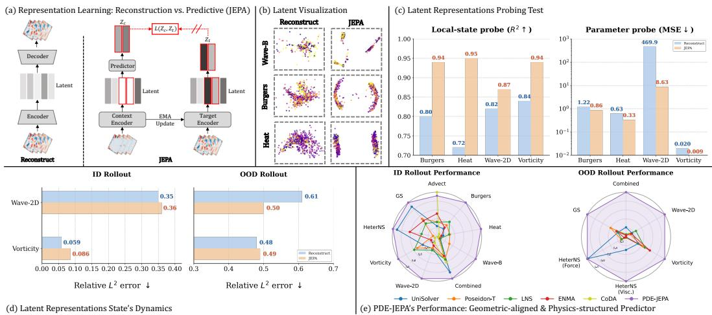  
Figure 1: Overview of our key observations. Predictive representation (JEPA) learns physically informative representations, but informativeness alone does not ensure effective forecasting of parametric PDEs. Our approach, PDE-JEPA, improves PDE forecasting and extrapolation through geometry alignment and physics-structured latent prediction.

We explore this question through JEPA-based predictive representation learning. As illustrated in Figure 1(a), we predict masked latent targets rather than reconstructing observations (Assran et al., 2023). While such objectives have achieved considerable success in world modeling (Terver et al., 2025; Mur-Labadia et al., 2026; Klindt et al., 2026; Maes et al., 2026; Yan et al., 2026) and demonstrated early promise in parameter probing (Qu et al., 2026), their utility for parametric PDE dynamics remains largely unexplored. We therefore conduct an in-depth dissection of reconstruction-based and predictive representations through frozen-encoder probes and autoregressive rollout evaluation. Figure 1(b–d) shows the results, with additional analyses in Appendix D.1. Our analysis yields two key observations.

Observation 1: Predictive learning yields more informative representations of physical dynamics. We first examine how reconstruction-based and predictive learning organize physical information in latent space. Figure 1(b) suggests clearer parameter-dependent organization in JEPA features than in reconstruction-based features. For example, in the Burgers dataset, the JEPA representation exhibits two branches associated with different parameter ranges. To assess the physical relevance of these features, we evaluate two complementary probes on frozen representations, as shown in Figure 1(c). A local-state probe measures how accurately instantaneous physical fields can be recovered from the features. A parameter probe evaluates how well the governing conditions can be inferred from them. Across the evaluated PDEs, JEPA achieves stronger performance on both probing tasks. These results demonstrate that predicting dynamics in latent space encourages the encoder to retain both fine-grained state information and global governing factors that drive physical evolution.

Observation 2: Informative representations are not necessarily easy to evolve. Physical probing evaluates what can be recovered from representations of observed states. Autoregressive forecasting poses a different challenge: repeatedly evolving predicted states without access to future observations. Figure 1(d) reveals a mismatch between these two capabilities. Despite its stronger probing performance, the vanilla JEPA-based model produces higher ID rollout errors than the reconstruction-based baseline on both Wave-2D and Vorticity. Under parameter shifts, JEPA achieves lower OOD error on Wave-2D and comparable performance on Vorticity. These results suggest that predictive pretraining provides a physically informative starting point, but its representational advantages alone do not ensure accurate recursive evolution.

Taking these observations together, we define the central challenge as preserving the physical information captured during pretraining (observation 1) while adapting the latent organization to the demands of long-horizon evolution and parameter generalization (observation 2). In this paper, we introduce PDE-JEPA, a framework for learning evolvable state spaces for parametric PDEs. Specifically, we first view predictive pretraining as a foundation to build upon rather than a complete solution to latent dynamics modeling. Based on pretrained representations, we then introduce the Physics-Aligned Latent Geometry (PAG) module, a lightweight residual geometry projector that aligns latent trajectory geometry with the evolution geometry of physical fields to enhance latent evolution while preserving the information encoded by the original representation via an anchor loss. Finally, to further improve generalization to unseen governing conditions, we develop the Physics-Structured Latent Predictor (PSP) that decomposes the dynamics into parameter-independent evolution and parameter-dependent responses. This structure reflects the common form of parametric PDEs, in which governing parameters modulate specific dynamical components, and provides an explicit inductive bias for extrapolation under unseen governing conditions.

We evaluate PDE-JEPA on 9 parametric PDE benchmarks spanning transport, diffusion, reaction– diffusion, wave propagation, and fluid dynamics. Our method achieves the lowest rollout error across most in-distribution benchmarks and all five benchmarks evaluated under out-of-distribution governing conditions. For example, as shown in Figure 1 (e), PDE-JEPA achieves the most improvement on Heat against Poseidon-T for the ID setting. Further analyses show that these gains are accompanied by more physically aligned latent trajectories and more consistent responses to changes in governing parameters. To sum up, our contributions are listed below:

• To our knowledge, we are the first to systematically study JEPA for parametric PDEs and show that informative representations alone do not ensure accurate rollout. We thus propose PDE-JEPA, combining PAG and PSP for accurate forecasting and OOD extrapolation.

• We propose PAG module, a lightweight geometry projector that aligns latent trajectory geometry with physical evolution to substantially improve rollout accuracy, while preserving the pretrained representation through an anchor loss.

• We further introduce the PSP, which incorporates PDE formulation inductive bias by separating parameter-independent evolution from parameter-dependent responses, improving OOD extrapolation.

## 2 RELATED WORK

## 2.1 PARAMETRIC PDE SOLVERS

Learning-based PDE solvers broadly span physics-informed methods (Karniadakis et al., 2021; Toscano et al., 2025) and data-driven neural operators (Lu et al., 2021; Wu et al., 2024; Tan et al., 2026b). We focus on the latter for parametric forecasting, with the Fourier Neural Operator (FNO) (Li et al., 2020) providing a foundational framework. Parametric generalization has since been explored through explicit parameter conditioning (Brandstetter et al., 2022; Takamoto et al., 2023; Cho et al., 2024; Berman & Peherstorfer, 2024; Hagnberger et al., 2024), multi-environment adaptation (Yin et al., 2021; Kirchmeyer et al., 2022; Huang et al., 2022; Kassaï Koupaï et al., 2024) and in-context operator learning (Yang et al., 2023; Yang & Osher, 2024; Serrano et al., 2024a; Kassaï Koupaï et al., 2026; Patel et al., 2026). More recently, general-purpose PDE solvers leverage large-scale multi-physics pretraining (McCabe et al., 2024; Hao et al., 2024; Herde et al., 2024; Zhou et al., 2024; McCabe et al., 2025; Wang et al., 2026a; Wu et al., 2026). Complementary work further explores operator decomposition (Gopakumar et al., 2026) and joint parameter-boundary conditioning (Li et al., 2026). Parametric PDE solvers are not the scope of this paper, we approach parametric forecasting through latent-state dynamics, asking how the learned state space should be structured for evolution and extrapolation across governing conditions.

## 2.2 LATENT LEARNING FOR PDE DYNAMICS

Latent PDE models represent physical states in learned latent spaces and model temporal evolution directly in representation space (Benner et al., 2015; Wiewel et al., 2019; Maulik et al., 2021; Han et al., 2022). A central design choice in this paradigm is how the latent state itself is learned. Many existing approaches obtain latent representations through reconstruction objectives, where the latent variables are optimized to recover the observed physical fields (Chen et al., 2022; Wu et al., 2022; Li et al., 2025). Furthermore, reconstruction objectives are often combined with additional losses that encourage latent dynamical predictability (Regazzoni et al., 2024). More recent approaches extend latent-space forecasting through autoregressive modeling over quantized or continuous latent representations (Serrano et al., 2024a; Kassaï Koupaï et al., 2026), but the learned state space is still reconstruction oriented. In contrast, our encoder is pretrained through masked latent prediction rather than physical-field reconstruction, allowing the state representation to be learned from predictable spatiotemporal structure in representation space. We then explicitly align the latent trajectory geometry for downstream dynamics modeling.

## 2.3 PREDICTIVE LEARNING FOR PHYSICAL SYSTEMS

Predictive representation learning provides an alternative to reconstruction-based self-supervision by learning features from predictable structure rather than directly recovering observations. Jointembedding predictive architectures (JEPAs) instantiate this idea through latent prediction, beginning with I-JEPA (Assran et al., 2023) and later extending to video with V-JEPA (Bardes et al., 2024; Mur-Labadia et al., 2026). Related physical self-supervision has explored Lie-symmetrybased invariance (Mialon et al., 2023) and masked reconstruction (Zhou & Farimani, 2024). More recently, predictive representations have been shown to encode governing physical factors more effectively (Qu et al., 2026) and have been extended to 3D aerodynamic fields with AeroJEPA (Giral et al., 2026). Separately, latent trajectory geometry has been explicitly shaped to facilitate downstream dynamics (Wang et al., 2026b). Our work studies whether predictive representations can serve as informative latent states for parametric dynamics, and how their geometry should be adapted for long-horizon evolution and extrapolation.

## 3 PRELIMINARIES AND PROBLEM SETUP

## 3.1 PARAMETRIC PDE DYNAMICS

We consider time-dependent physical systems governed by a family of PDEs,

$$
\frac { \partial { \bf u } } { \partial t } = \mathcal { F } \left( t , { \bf x } , { \bf u } , \nabla { \bf u } , \nabla ^ { 2 } { \bf u } , \ldots ; \xi \right) , \qquad { \bf x } \in \Omega , \ t \in ( 0 , T ] ,\tag{1}
$$

subject to

$$
\mathcal { B } _ { \xi } [ \mathbf { u } ] ( t , \mathbf { x } ) = 0 , \qquad \mathbf { x } \in \partial \Omega , \qquad \mathbf { u } ( 0 , \mathbf { x } ) = \mathbf { u } _ { 0 } ( \mathbf { x } ) .\tag{2}
$$

Here, $\mathbf { u } ( t , \mathbf { x } ) \in \mathbb { R } ^ { C }$ denotes the physical fields on the domain Ω with C channels and B denotes a boundary operator. $\boldsymbol { \xi }$ characterizes the governing environment, including PDE coefficients, forcing terms, and boundary conditions. A fixed $\boldsymbol { \xi }$ therefore defines a particular dynamical system, while varying ξ induces a family of related but distinct physical evolutions.

## 3.2 JOINT-EMBEDDING PREDICTIVE LEARNING

Joint-Embedding Predictive Architectures (JEPAs) learn representations by predicting missing content in a learned latent space rather than reconstructing the observation itself (LeCun et al., 2022; Assran et al., 2023; Bardes et al., 2024). Let C and M denote the index sets of visible context tokens and masked target tokens, respectively. Given the visible context $\mathbf { x } _ { \mathcal { C } }$ and target mask tokens m, the context encoder $E _ { \theta }$ produces context representations, and the predictor $P _ { \phi }$ predicts the target representations at positions $i \in \mathcal { M }$ provided by an EMA target encoder $\bar { E } _ { \theta }$

$$
\mathcal { L } _ { \mathrm { J E P A } } = \frac { 1 } { | \mathcal { M } | } \sum _ { i \in \mathcal { M } } \left. P _ { \phi } ( E _ { \theta } ( \mathbf { x } _ { \mathcal { C } } ) , \mathbf { m } ) _ { i } - \mathrm { s g } \big ( \bar { E } _ { \theta } ( \mathbf { x } ) _ { i } \big ) \right. _ { 1 } .\tag{3}
$$

By predicting directly in representation space, JEPA encourages latent features to capture predictable spatiotemporal structure. V-JEPAs demonstrate strong motion understanding and temporally consistent representations (Mur-Labadia et al., 2026), while recent studies on physical systems show that JEPA features encode governing physical factors effectively (Qu et al., 2026). These results motivate us to investigate JEPA as a state representation for parametric physical dynamics.

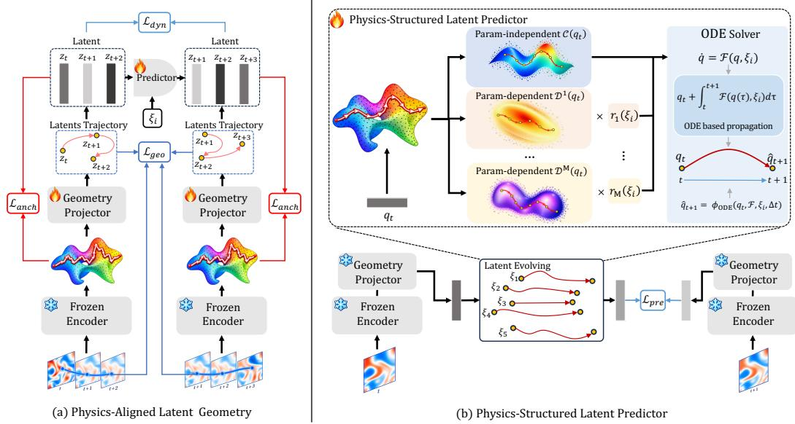  
Figure 2: Overview of PDE-JEPA. (a) We first adapt the frozen predictive representation initialized by JEPA with a light weight geometry projector that aligns latent trajectory geometry with physical evolution. (b) We then evolve the aligned latent states using a physics-structured latent predictor, which decomposes the dynamics into parameter-independent and parameter-dependent components and integrates their combined dynamics with an ODE solver.

## 4 METHOD

## 4.1 PREDICTIVE PHYSICAL STATES

We adopt the pretrained JEPA representation as the base latent space. Given a physical trajectory ${ \mathbf { u } } _ { 0 : T } = \{ { \mathbf { u } } _ { t } \} _ { t = 0 } ^ { T }$ , we encode the full state trajectory as

$$
\mathbf { z } _ { 0 : T } = E ( \mathbf { u } _ { 0 : T } ) , \qquad \mathbf { u } _ { 0 : T } \in \mathbb { R } ^ { | \mathcal { X } | \times T \times C } , \quad \mathbf { z } _ { 0 : T } \in \mathbb { R } ^ { N \times T \times D } ,\tag{4}
$$

where |X| denotes the grid number and C the number of physical-field channels. The encoder maps $\mathbf { u } _ { 0 : t }$ to NT spatial latent tokens $\mathbf { z } _ { 0 : T }$ , each of dimension D. Although JEPA is pretrained on full trajectory, downstream states, such as those used for predictor training, are encoded framewise following (Mur-Labadia et al., 2026), ensuring that $\mathbf { z } _ { t }$ contains no information from future observations.

Importantly, the parameter $\boldsymbol { \xi }$ is provided to neither the encoder nor the JEPA predictor during pretraining, encouraging the encoder to learn parameter-agnostic physical representations. We keep $E$ frozen throughout the subsequent geometry-alignment and dynamics-learning stages, and use the resulting latent trajectory $\{ \mathbf { z } _ { t } \} _ { t = 0 } ^ { T }$ as the input to the geometry projector.

## 4.2 PHYSICS-ALIGNED LATENT GEOMETRY

Although predictive pretraining yields a physically informative state space, its geometry is not explicitly optimized for temporal evolution. We observe a clear mismatch between physical and latent trajectories: latent states exhibit larger turning angles. For example, the mean turning angle increases from 31.3° to 60.5° on Vorticity and from $1 \mathrm { \check { 8 } } . 2 \mathrm { \check { \Omega } }$ to $5 9 . 4 ^ { \circ }$ on Burgers. Such excessive turning produces more zig-zag latent trajectories, potentially complicating rollout propagation. We therefore align latent trajectory geometry with physical evolution while preserving the information already encoded by JEPA. The overview is presented in Figure 2 (a).

Residual geometry projection. Given latents $\mathbf { z } _ { \mathrm { 0 : } T }$ , we introduce a token-wise projector

$$
\begin{array} { r } { \mathbf { q } _ { t } = \mathbf { z } _ { t } + G _ { \phi } ( \mathbf { z } _ { t } ) , \qquad G _ { \phi } ( \mathbf { z } ) = W _ { 2 } \sigma \big ( W _ { 1 } \mathrm { L N } ( \mathbf { z } ) \big ) , } \end{array}\tag{5}
$$

where $\sigma$ is GELU, LN is layernorm, and $W _ { 2 }$ is zero-initialized so that $\mathbf { q } _ { t } = \mathbf { z } _ { t }$ initially. It therefore acts as a lightweight coordinate correction rather than relearning the state representation.

Physical trajectory alignment. We align latent trajectory geometry with evolution measured in physical-field space. Define the normalized temporal directions

$$
\mathbf { d } _ { t } ^ { u } = \frac { \mathbf { u } _ { t + 1 } - \mathbf { u } _ { t } } { \| \mathbf { u } _ { t + 1 } - \mathbf { u } _ { t } \| _ { 2 } + \epsilon } , \qquad \mathbf { d } _ { t } ^ { q } = \frac { \mathbf { q } _ { t + 1 } - \mathbf { q } _ { t } } { \| \mathbf { q } _ { t + 1 } - \mathbf { q } _ { t } \| _ { 2 } + \epsilon } .\tag{6}
$$

For temporal lag $\ell ,$ we measure trajectory turning by similarity between two directions

$$
s _ { t , \ell } ^ { u } = \bigl \langle \mathbf { d } _ { t } ^ { u } , \mathbf { d } _ { t + \ell } ^ { u } \bigr \rangle , \qquad s _ { t , \ell } ^ { q } = \bigl \langle \mathbf { d } _ { t } ^ { q } , \mathbf { d } _ { t + \ell } ^ { q } \bigr \rangle ,\tag{7}
$$

and minimize

$$
\mathcal { L } _ { \mathrm { g e o } } = \sum _ { \ell \in \{ 1 , 2 , 4 \} } w _ { \ell } \ \mathrm { S m o o t h L 1 } \left( s _ { t , \ell } ^ { q } , \mathrm { s g } ( s _ { t , \ell } ^ { u } ) \right) .\tag{8}
$$

The multi-lag objective captures local and longer-range directional consistency.

Preserving informativeness. To prevent geometric alignment from distorting the pretrained state information, we use an identity anchor

$$
\mathcal { L } _ { \mathrm { a n c h o r } } = \frac { \| \mathbf { q } - \mathbf { z } \| _ { 2 } ^ { 2 } } { \| \mathbf { z } \| _ { 2 } ^ { 2 } + \epsilon } .\tag{9}
$$

We further train an auxiliary conditional causal predictor to estimate $\Delta \mathbf q _ { t } = \mathbf q _ { t + 1 } - \mathbf q _ { t }$

$$
\mathcal { L } _ { d y n } = \frac { \| \widehat { \Delta \mathbf { q } } _ { t } - \Delta \mathbf { q } _ { t } \| _ { 2 } ^ { 2 } } { \| \Delta \mathbf { q } _ { t } \| _ { 2 } ^ { 2 } + \epsilon } ,\tag{10}
$$

so that the aligned coordinates remain dynamically predictable. The geometry stage optimizes

$$
{ \mathcal { L } } _ { \mathrm { a l i g n } } = { \mathcal { L } } _ { d y n } + \lambda _ { \mathrm { g e o } } { \mathcal { L } } _ { \mathrm { g e o } } + \lambda _ { \mathrm { a n c h o r } } { \mathcal { L } } _ { \mathrm { a n c h o r } } .\tag{11}
$$

The JEPA encoder remains frozen. After alignment, we discard the auxiliary predictor and freeze the projector before training the final physics-structured dynamics model.

## 4.3 PHYSICS-STRUCTURED LATENT PREDICTOR

The geometry-aligned representation supports temporal evolution, but OOD generalization still requires extrapolating across governing parameters. A standard conditional predictor can inject the parameter directly to the networks, allowing arbitrary state-parameter interactions that may fit the training range well but extrapolate unreliably beyond it. We instead explicitly structure how the governing parameter enters the latent dynamics with formulation inductive bias.

Structured latent vector field. We model $\mathbf { q } ( t )$ as a continuous-time parametric dynamical system,

$$
\frac { d { \bf q } } { d t } = F _ { \theta } ( { \bf q } ; \pmb { \xi } ) ,\tag{12}
$$

rather than allowing ξ to interact arbitrarily with the latent state throughout the dynamics network, we separate a shared state evolution from a set of parameter-dependent responses:

$$
\frac { d \mathbf { q } } { d t } = C _ { \theta } ( \mathbf { q } ) + \sum _ { j = 1 } ^ { M } r _ { j } ( \pmb { \xi } ) D _ { \theta } ^ { ( j ) } ( \mathbf { q } ) .\tag{13}
$$

Here, $C _ { \theta }$ captures shared evolution, while $D _ { \boldsymbol { \theta } } ^ { ( j ) }$ represents a state-dependent response associated with the j-th parameter. $r _ { j } ( \pmb { \xi } )$ are normalized physical parameters and M is the number of parameters. This decomposition reflects a common structure in parametric PDEs, where governing coefficients modulate specific components. For example, the Navier-Stokes equation in vorticity form is

$$
\frac { \partial \omega } { \partial t } = - ( { \bf u } \cdot \nabla ) \omega + \nu \nabla ^ { 2 } \omega ,\tag{14}
$$

where ν explicitly scales the viscous response. Motivated by this structure, the Eq. 13 becomes

$$
\frac { d { \bf q } } { d t } = C _ { \theta } ( { \bf q } ) + r ( \nu ) D _ { \theta } ( { \bf q } ) .\tag{15}
$$

We do not require either response to recover the exact analytical PDE operators; the decomposition provides a physics-inspired inductive bias on how governing parameters enter the latent dynamics.

Table 1: ID rollout performance across PDE benchmarks. All results are reported in Relative $L ^ { 2 }$ error, lower is better. Best results are bold and second-best results are underlined
<table><tr><td>Method</td><td>Advect</td><td>Burgers</td><td>Heat</td><td>Wave-B</td><td>Combined</td><td>Wave-2D</td><td>Vorticity</td><td>HeterNS</td><td>GS</td></tr><tr><td colspan="10">Parametric Solvers</td></tr><tr><td>FNO</td><td>0.0390</td><td>0.4972</td><td>0.3449</td><td>0.9819</td><td>0.0374</td><td>0.9913</td><td>0.1411</td><td>0.0210</td><td>0.0547</td></tr><tr><td>CAPE</td><td>0.0094</td><td>0.2230</td><td>0.2130</td><td>0.9780</td><td>0.0085</td><td></td><td></td><td></td><td></td></tr><tr><td>CoDA</td><td>0.0068</td><td>0.5460</td><td>0.7670</td><td>1.0200</td><td>0.0120</td><td>0.7770</td><td>0.6780</td><td></td><td></td></tr><tr><td>GEPS</td><td>0.0930</td><td>0.3989</td><td>0.6641</td><td>0.6317</td><td>0.0097</td><td>0.5138</td><td>0.0821</td><td>0.1032</td><td>0.0332</td></tr><tr><td colspan="10">In-Context Solvers</td></tr><tr><td>ViT-in-context</td><td>0.0902</td><td>0.4720</td><td>0.5820</td><td>0.4720</td><td>0.0885</td><td>0.3900</td><td>0.1730</td><td></td><td>0.0690</td></tr><tr><td>[CLS] ViT</td><td>0.1400</td><td>0.1360</td><td>0.1160</td><td>0.9710</td><td>0.0446</td><td>0.2710</td><td>0.9720</td><td></td><td>0.0480</td></tr><tr><td>Zebra</td><td>0.0079</td><td>0.1540</td><td>0.1150</td><td>0.2450</td><td>0.0096</td><td>0.2070</td><td>0.1190</td><td></td><td>0.0440</td></tr><tr><td colspan="10">Foundation Models</td></tr><tr><td>UniSolver</td><td>0.0284</td><td>0.1838</td><td>0.1933</td><td>0.4049</td><td>0.0087</td><td>0.4009</td><td>0.0954</td><td>0.0098</td><td>0.0323</td></tr><tr><td>MPP</td><td>0.0312</td><td>0.4547</td><td>0.5629</td><td>0.3856</td><td>0.0519</td><td>0.8815</td><td>0.4509</td><td>0.0347</td><td>0.2698</td></tr><tr><td>DPOT-S</td><td>0.0390</td><td>0.6480</td><td>0.4638</td><td>0.4063</td><td>0.0365</td><td>0.3152</td><td>0.1686</td><td>0.0896</td><td>0.4159</td></tr><tr><td>Poseidon-T</td><td>0.0203</td><td>0.1280</td><td>0.0933</td><td>0.1093</td><td>0.0137</td><td>0.4211</td><td>0.0679</td><td>0.1009</td><td>0.0544</td></tr><tr><td colspan="10">Latent Solvers</td></tr><tr><td>LE-PDE</td><td>0.0212</td><td>0.0869</td><td>0.1053</td><td>0.6927</td><td>0.0299</td><td>0.5140</td><td>0.5816</td><td>0.2380</td><td>0.1225</td></tr><tr><td>LNS</td><td>0.0207</td><td>0.0982</td><td>0.0997</td><td>0.4002</td><td>0.0136</td><td>0.3539</td><td>0.0592</td><td>0.0254</td><td>0.0734</td></tr><tr><td>MAE-PDE</td><td>0.1943</td><td>0.4467</td><td>0.3726</td><td>0.5285</td><td>0.0667</td><td>0.7792</td><td>0.1327</td><td>0.1798</td><td>0.0406</td></tr><tr><td>ENMA</td><td>0.0131</td><td>0.1607</td><td>0.2712</td><td>0.6295</td><td>0.0160</td><td>0.5285</td><td>0.2320</td><td>0.0144</td><td>0.0607</td></tr><tr><td>Ours</td><td>0.0074</td><td>0.0428</td><td>0.0274</td><td>0.0350</td><td>0.0074</td><td>0.1140</td><td>0.0348</td><td>0.0089</td><td>0.0284</td></tr><tr><td>Rel. Impr.</td><td>-8.8%</td><td>50.7%</td><td>70.6%</td><td>68.0%</td><td>12.9%</td><td>44.9%</td><td>41.2%</td><td>9.2%</td><td>12.1%</td></tr></table>

Continuous-time propagation. We propagate latent between observations using an ODE solver,

$$
\begin{array} { r } { \widehat { \mathbf { q } } _ { t + 1 } = \Phi _ { \mathrm { O D E } } \left( \mathbf { q } _ { t } , F _ { \theta } , \pmb { \xi } , \Delta t \right) , } \end{array}\tag{16}
$$

where ΦoDE integrates the learned vector field over one observation interval. In practice, we use a fixed-step fourth-order Runge-Kutta (RK4) solver. Long-horizon predictions are obtained by recursively integrating the predicted states. We then supervise it with predictor objective

$$
\mathcal { L } _ { \mathrm { p r e } } = \frac { \| \widehat { \mathbf { q } } _ { t + 1 } - \mathbf { q } _ { t + 1 } \| _ { 2 } ^ { 2 } } { \| \Delta \mathbf { q } _ { t } \| _ { 2 } ^ { 2 } + \epsilon } .\tag{17}
$$

## 5 EXPERIMENTS

## 5.1 EXPERIMENTS SETUP

Datasets. We evaluate on nine parametric PDE benchmarks spanning transport, diffusion, waves, reaction–diffusion, and fluid dynamics. Seven follow Zebra (Serrano et al., 2024a): Advection varies the transport speed, Burgers and Heat vary diffusion and forcing, Wave-B varies boundary conditions, Combined varies three differential coefficients, Wave-2D varies wave celerity and damping, and Vorticity varies viscosity. We further include HeterNS from UniSolver (Zhou et al., 2024) and Gray-Scott (GS) from ENMA (Kassaï Koupaï et al., 2026). Detailed equations, parameter ranges, and data splits and generation are provided in Appendix A.

Baselines. We compare against a broad set of PDE solvers covering four representative paradigms. Parametric solvers include FNO (Li et al., 2020), CAPE (Takamoto et al., 2023), CoDA (Kirchmeyer et al., 2022), and GEPS (Kassaï Koupaï et al., 2024); in-context solvers include ViT-in-context, [CLS] ViT (Peebles & Xie, 2023), and Zebra (Serrano et al., 2024a); foundation models include UniSolver (Zhou et al., 2024), MPP (McCabe et al., 2024), DPOT-S (Hao et al., 2024), and Poseidon-T (Herde et al., 2024); and latent solvers include LE-PDE (Wu et al., 2022), LNS (Li et al., 2025),

Table 2: Module ablation on rollout.
<table><tr><td rowspan="2">Model</td><td colspan="2">Vorticity</td><td colspan="2">Wave-2D</td></tr><tr><td>ID</td><td>OOD</td><td>ID</td><td>OOD</td></tr><tr><td>Vanilla</td><td>.086</td><td>.491</td><td>.363</td><td>.502</td></tr><tr><td>+ PAG</td><td>.040</td><td>.397</td><td>.143</td><td>.321</td></tr><tr><td>+ PSP</td><td>.034</td><td>.288</td><td>.114</td><td>.157</td></tr></table>

Table 3: Representation geometry before and after alignment.
<table><tr><td>Dataset</td><td>Angle MAE (°)</td><td>Sym. Acc. MAE Lag-1 Cos. MAE</td><td></td></tr><tr><td>Vorticity</td><td>29.1 → 6.3 (-78%)</td><td>.46 →.10 (-77%)</td><td> $. 3 6 \to . 0 5 ( - 8 4 \% )$ </td></tr><tr><td></td><td>Wave-2D 35.5→10.1 (-71%) .46 →.14 (-68%)</td><td></td><td> $. 5 0 \to . 1 4 ( - 7 4 \% )$ </td></tr><tr><td>Burgers</td><td>41.4→20.8 (-49%).73→.37 (-49%)</td><td></td><td> $. 4 3 \to . 1 7 ( - 5 9 \% )$ </td></tr><tr><td>GS</td><td>28.8→20.4 (-29%) .39 →.27 (-30%)</td><td></td><td> $. 3 9 \to . 2 6 ( - 3 2 \% )$ </td></tr></table>

MAE-PDE (Zhou & Farimani, 2024), and ENMA (Kassaï Koupaï et al., 2026). These baselines span direct operator learning, parameter-conditioned adaptation, in-context prediction, large-scale PDE pretraining, and latent-space dynamics modeling.

Metrics. We evaluate accuracy using the relative $L ^ { 2 }$ error over the full rollout trajectory,

$$
\mathcal { E } _ { \mathrm { r e l } } = \frac { 1 } { N _ { \mathrm { t e s t } } } \sum _ { j = 1 } ^ { N _ { \mathrm { t e s t } } } \frac { \lvert \lvert \hat { \mathbf { u } } _ { j } ^ { 1 : T } - \mathbf { u } _ { j } ^ { 1 : T } \rvert \rvert _ { 2 } } { \lvert \lvert \mathbf { u } _ { j } ^ { 1 : T } \rvert \rvert _ { 2 } } ,\tag{18}
$$

where $\hat { \mathbf { u } } ^ { 1 : T }$ and $\mathbf { u } ^ { 1 : T }$ denote the predicted and ground-truth trajectories, respectively. Lower values indicate better long-horizon forecasting accuracy.

## 5.2 IN-DISTRIBUTION GENERALIZATION

Table 1 reports in-distribution rollout performance. Our method achieves the lowest relative $L ^ { 2 }$ on eight of nine benchmarks and ranks second on Advection. The gains are particularly large on Burgers, Heat, Wave-B, Wave-2D, and Vorticity. Although the strongest baseline varies across systems— from LE-PDE and Poseidon-T to Zebra and LNS—our method remains consistently strong, suggesting that its benefits extend across diverse dynamical regimes. Advection is the only case where our method is not best (0.0074 vs. 0.0068 for CoDA). We attribute this small gap partly to the translationdominated dynamics, where structures mainly move across the domain rather than change their shape, thus reconstruction ability matters most. Indeed, several methods already achieve errors below $1 0 ^ { - 2 } .$ , indicating a near-saturated regime. In contrast, the larger gains on other non-linear systems suggest that our approach becomes more effective as the underlying dynamics grow more complex.

## 5.3 OUT-OF-DISTRIBUTION EXTRAPOLATION

We next evaluate extrapolation to governing conditions outside the training distribution. Due to space constraints, Table 4 reports a representative subset of baselines, with the full comparison provided in the Appendix D.3.1. Our method achieves the lowest error on all five benchmarks. The gains are particularly large on Combined, Wave-2D, and GS, improving over the strongest baselines by 77.9%, 74.2%, and 59.7%, respectively. Moreover, the ID-to-OOD degradation remains limited on these sys-

Table 4: OOD rollout performance across PDE benchmarks. Relative $L ^ { 2 }$ error is reported, lower is better. Best results are bold and second-best results are underlined.
<table><tr><td>Method</td><td>Combined Wave-2D Vorticity</td><td></td><td></td><td>HeterNS Visc./Force</td><td>GS</td></tr><tr><td>UniSolver Poseidon-T LNS ENMA</td><td>0.038 0.146 0.1667 0.243</td><td>1.003 1.511 0.610 1.151</td><td>0.923 0.665 0.481 0.467</td><td>0.037/0.105 0.560/0.821 0.610/0.932 1.501/2.271</td><td>0.1636 0.083 0.146 0.134</td></tr><tr><td>Zebra Ours Rel. Impr.</td><td>0.008 77.9%</td><td>0.680 0.157 74.2%</td><td>0.320 0.288 9.7%</td><td>0.011/0.103 69.5%/1.5%59.7%</td><td>一 0.033</td></tr></table>

tems, increasing only from 0.0074 to 0.0084, 0.1140 to 0.157, and 0.0284 to 0.0337, respectively, indicating strong extrapolation beyond the training regimes.

## 5.4 EFFECT OF PAG

We first examine whether PAG facilitates long-horizon evolution. As shown in Table 2, adding the PAG reduces Vorticity error from 0.086 to 0.040 on ID data and from 0.491 to 0.397 on OOD data, corresponding to 53.4% and 19.1% improvements. To characterize this geometric change, we compare the original representation z and aligned representation q with the physical trajectory using Angle MAE for local turning angles, Sym. Acc. MAE for second-order temporal variation, and Lag-1 Cos. MAE for directional consistency between consecutive increments. As shown in Table 3, alignment reduces all three errors, with particularly large reductions on Vorticity (78%/77%/84%) and Wave-2D (71%/68%/74%), while Burgers and GS show smaller but consistent improvements. Since these metrics are computed directly on z and q without a dynamics predictor, they confirm that the projector itself aligns latent trajectory geometry more closely with physical-field evolution. More analyses are in Appendix D.2

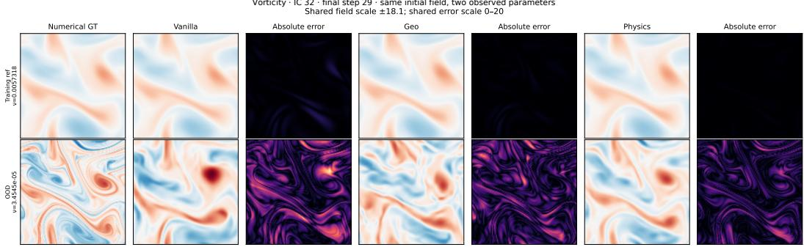  
Figure 3: Visualization on Vorticity under matched initial conditions on final timestep. Prediction errors are shown for the vanilla, geometry-aligned and physics-structured models. More visualization can be found in Appendix D.4.

## 5.5 PARAMETER-RESPONSE MECHANISM FOR PSP

We then isolate the effect of the physics-structured predictor on top of the geometry-aligned representation. As shown in Table 2, adding the PSP further reduces OOD rollout error from .397 to .288 on Vorticity and from .321 to .157 on Wave-2D. To understand this gain, Table 5 evaluates parameter-conditioned responses under matched initial conditions (ICs). The structured predictor

Table 5: Parameter-response consistency under matched ICs.
<table><tr><td colspan="3">Field</td><td colspan="2">Latent</td></tr><tr><td>Dataset</td><td></td><td>Model Cos. ↑ Amp. → 1 Cos. ↑ Amp. → 1</td><td></td><td></td></tr><tr><td>Vorticity</td><td>PAG</td><td>.626 .846</td><td>.913</td><td>1.142</td></tr><tr><td rowspan="3">Wave-2D PAG</td><td>+PSP .708</td><td>.987</td><td>.924</td><td>1.043</td></tr><tr><td>.958</td><td>.979</td><td>.939</td><td>.990</td></tr><tr><td>+PSP .986</td><td>.996</td><td>.947</td><td>1.002</td></tr></table>

consistently improves parameter-conditioned responses in both field and latent spaces. Here, Cos. measures the directional agreement between the predicted and reference parameter-induced changes, while Amp. measures whether the response magnitude is correct, with values closer to 1 indicating better agreement. Figure 3 provides complementary qualitative evidence: when only the governing parameter is changed, the structured predictor more faithfully follows the corresponding numerical solution, particularly under the OOD condition. More analyses are in Appendix D.2.

## 6 CONCLUSION

In this paper, we study how learned state-space structure affects parametric PDE dynamics. Predictive JEPA pretraining yields physically informative representations, while explicit trajectory alignment further improves long-horizon evolution. Building on this, PDE-JEPA combines physicsaligned latent geometry with a structured predictor that separates shared evolution from parameterdependent responses. Across nine PDE benchmarks, it achieves strong ID performance and substantially improves extrapolation to unseen governing conditions. Further analyses show better physical trajectory alignment and more consistent parameter-conditioned responses. Overall, generalizable physical forecasting depends not only on the evolution model, but also on learning a state-space geometry suited for evolution and extrapolation.

## AI USE STATEMENT

Generative AI was employed only as an auxiliary tool during the development of this work. Its use was limited to tasks such as improving written presentation, reorganizing portions of the manuscript, assisting with draft preparation, and supporting code implementation and troubleshooting. The scientific content of the paper, including the derivation and presentation of equations, the analysis of experimental results, and the interpretation of the findings, was produced and determined by the authors. No generative AI system was used to create experimental observations, determine reported results, or make scientific conclusions on behalf of the authors. Any code produced with AI assistance was manually inspected, executed, and validated against the intended implementation and experimental behavior. Similarly, AI-assisted prose was subsequently edited by the authors, and all numerical values reported in the manuscript were verified against the corresponding experimental records. The authors remain fully responsible for the accuracy, validity, and integrity of all material presented in this work.

## REFERENCES

Akio Arakawa. Computational design for long-term numerical integration of the equations of fluid motion: Two-dimensional incompressible flow. part i. Journal of computational physics, 135(2): 103–114, 1997.

Mahmoud Assran, Quentin Duval, Ishan Misra, Piotr Bojanowski, Pascal Vincent, Michael Rabbat, Yann LeCun, and Nicolas Ballas. Self-supervised learning from images with a joint-embedding predictive architecture. In 2023 IEEE/CVF Conference on Computer Vision and Pattern Recognition (CVPR), pp. 15619–15629. IEEE, 2023.

Adrien Bardes, Quentin Garrido, Jean Ponce, Xinlei Chen, Michael Rabbat, Yann LeCun, Mahmoud Assran, and Nicolas Ballas. Revisiting feature prediction for learning visual representations from video. arXiv preprint arXiv:2404.08471, 2024.

Peter Benner, Serkan Gugercin, and Karen Willcox. A survey of projection-based model reduction methods for parametric dynamical systems. SIAM review, 57(4):483–531, 2015.

Jules Berman and Benjamin Peherstorfer. Colora: Continuous low-rank adaptation for reduced implicit neural modeling of parameterized partial differential equations. arXiv preprint arXiv:2402.14646, 2024.

Rafael Bischof, Michal Piovarci, Michael Kraus, Siddhartha Mishra, and Bernd Bickel. Hypino: Multi-physics neural operators via hyperpinns and the method of manufactured solutions. Advances in Neural Information Processing Systems, 38:144798–144831, 2026.

Johannes Brandstetter, Daniel Worrall, and Max Welling. Message passing neural pde solvers. arXiv preprint arXiv:2202.03376, 2022.

Andrew E Brettin, Laure Zanna, and Elizabeth A Barnes. Learning propagators for sea surface height forecasts using koopman autoencoders. Geophysical Research Letters, 52(4): e2024GL112835, 2025.

John Charles Butcher. Numerical methods for ordinary differential equations. John Wiley & Sons, 2016.

Peter Yichen Chen, Jinxu Xiang, Dong Heon Cho, Yue Chang, GA Pershing, Henrique Teles Maia, Maurizio M Chiaramonte, Kevin Carlberg, and Eitan Grinspun. Crom: Continuous reduced-order modeling of pdes using implicit neural representations. arXiv preprint arXiv:2206.02607, 2022.

Woojin Cho, Minju Jo, Haksoo Lim, Kookjin Lee, Dongeun Lee, Sanghyun Hong, and Noseong Park. Parameterized physics-informed neural networks for parameterized pdes. arXiv preprint arXiv:2408.09446, 2024.

Djork-Arné Clevert, Thomas Unterthiner, and Sepp Hochreiter. Fast and accurate deep network learning by exponential linear units (elus). arXiv preprint arXiv:1511.07289, 2015.

James W Cooley and John W Tukey. An algorithm for the machine calculation of complex fourier series. Mathematics of computation, 19(90):297–301, 1965.

Mark C Cross and Pierre C Hohenberg. Pattern formation outside of equilibrium. Reviews of modern physics, 65(3):851, 1993.

Aaron Defazio and Konstantin Mishchenko. Learning-rate-free learning by d-adaptation. In International conference on machine learning, pp. 7449–7479. PMLR, 2023.

John R Dormand and Peter J Prince. A family of embedded runge-kutta formulae. Journal of computational and applied mathematics, 6(1):19–26, 1980.

Lawrence C Evans. Partial differential equations, volume 19. American mathematical society, 2022

Francisco Giral, Abhijeet Vishwasrao, Andrea Arroyo Ramo, Mahmoud Golestanian, Federica Tonti, Adrian Lozano-Duran, Steven L Brunton, Sergio Hoyas, Hector Gomez, Soledad Le Clainche, et al. Aerojepa: Learning semantic latent representations for scalable 3d aerodynamic field modeling. arXiv preprint arXiv:2605.05586, 2026.

S Godounov. A difference method for numerical calculation of discontinuous solutions of the equation of hydrodynamics. Matematicheskii Sbornik, 47(89-3):271–306, 1959.

Vignesh Gopakumar, Ander Gray, Dan Giles, Lorenzo Zanisi, Matt J Kusner, Timo Betcke, Stanislas Pamela, and Marc Peter Deisenroth. Learning physical operators using neural operators. arXiv preprint arXiv:2602.23113, 2026.

John Guibas, Morteza Mardani, Zongyi Li, Andrew Tao, Anima Anandkumar, and Bryan Catanzaro. Efficient token mixing for transformers via adaptive fourier neural operators. In International conference on learning representations, 2021.

Jan Hagnberger, Marimuthu Kalimuthu, Daniel Musekamp, and Mathias Niepert. Vectorized conditional neural fields: A framework for solving time-dependent parametric partial differential equations. arXiv preprint arXiv:2406.03919, 2024.

Jan Hagnberger, Daniel Musekamp, and Mathias Niepert. Calm-pde: Continuous and adaptive convolutions for latent space modeling of time-dependent pdes. Advances in Neural Information Processing Systems, 38:160431–160489, 2026.

Xu Han, Han Gao, Tobias Pfaff, Jian-Xun Wang, and Li-Ping Liu. Predicting physics in meshreduced space with temporal attention. arXiv preprint arXiv:2201.09113, 2022.

Zhongkai Hao, Chang Su, Songming Liu, Julius Berner, Chengyang Ying, Hang Su, Anima Anandkumar, Jian Song, and Jun Zhu. Dpot: Auto-regressive denoising operator transformer for largescale pde pre-training. arXiv preprint arXiv:2403.03542, 2024.

Maximilian Herde, Bogdan Raonić, Tobias Rohner, Roger Käppeli, Roberto Molinaro, Emmanuel De Bezenac, and Siddhartha Mishra. Poseidon: Efficient foundation models for pdes. Advances in Neural Information Processing Systems, 37:72525–72624, 2024.

Xiang Huang, Zhanhong Ye, Hongsheng Liu, Shi Ji, Zidong Wang, Kang Yang, Yang Li, Min Wang, Haotian Chu, Fan Yu, et al. Meta-auto-decoder for solving parametric partial differential equations. Advances in Neural Information Processing Systems, 35:23426–23438, 2022.

Guang-Shan Jiang and Chi-Wang Shu. Efficient implementation of weighted eno schemes. Journal of computational physics, 126(1):202–228, 1996.

George Em Karniadakis, Ioannis G Kevrekidis, Lu Lu, Paris Perdikaris, Sifan Wang, and Liu Yang. Physics-informed machine learning. Nature Reviews Physics, 3(6):422–440, 2021.

Armand Kassaï Koupaï, Jorge Mifsut Benet, Yuan Yin, Jean-Noël Vittaut, and Patrick Gallinari. Boosting generalization in parametric pde neural solvers through adaptive conditioning. Advances in Neural Information Processing Systems, 37:70659–70692, 2024.

Armand Kassaï Koupaï, Lise Le Boudec, Louis Serrano, and Patrick Gallinari. Enma: Tokenwise autoregression for continuous neural pde operators. Advances in Neural Information Processing Systems, 38:127341–127409, 2026.

Matthieu Kirchmeyer, Yuan Yin, Jérémie Donà, Nicolas Baskiotis, Alain Rakotomamonjy, and Patrick Gallinari. Generalizing to new physical systems via context-informed dynamics model. In International conference on machine learning, pp. 11283–11301. PMLR, 2022.

David Klindt, Yann LeCun, and Randall Balestriero. When does lejepa learn a world model? arXiv preprint arXiv:2605.26379, 2026.

Simon Kornblith, Mohammad Norouzi, Honglak Lee, and Geoffrey Hinton. Similarity of neural network representations revisited. In International conference on machine learning, pp. 3519– 3529. PMIR, 2019.

Yann LeCun et al. A path towards autonomous machine intelligence version 0.9. 2, 2022-06-27. Open Review, 62(1):1–62, 2022.

Randall J LeVeque. Finite difference methods for ordinary and partial differential equations: steadystate and time-dependent problems. SIAM, 2007.

Ruoyan Li, Yizhou Sun, and Wei Wang. Generalized neural operator for parametric and boundaryvalue problems. arXiv preprint arXiv:2607.21932, 2026.

Zijie Li, Saurabh Patil, Francis Ogoke, Dule Shu, Wilson Zhen, Michael Schneier, John R Buchanan Jr, and Amir Barati Farimani. Latent neural pde solver: A reduced-order modeling framework for partial differential equations. Journal of Computational Physics, 524:113705, 2025.

Zongyi Li, Nikola Kovachki, Kamyar Azizzadenesheli, Burigede Liu, Kaushik Bhattacharya, Andrew Stuart, and Anima Anandkumar. Fourier neural operator for parametric partial differential equations. arXiv preprint arXiv:2010.08895, 2020.

Ze Liu, Han Hu, Yutong Lin, Zhuliang Yao, Zhenda Xie, Yixuan Wei, Jia Ning, Yue Cao, Zheng Zhang, Li Dong, et al. Swin transformer v2: Scaling up capacity and resolution. In 2022 IEEE/CVF Conference on Computer Vision and Pattern Recognition (CVPR), pp. 11999–12009. IEEE, 2022.

Lu Lu, Pengzhan Jin, Guofei Pang, Zhongqiang Zhang, and George Em Karniadakis. Learning nonlinear operators via deeponet based on the universal approximation theorem of operators. Nature machine intelligence, 3(3):218–229, 2021.

Lucas Maes, Quentin Le Lidec, Damien Scieur, Yann LeCun, and Randall Balestriero. Leworldmodel: Stable end-to-end joint-embedding predictive architecture from pixels. arXiv preprint arXiv:2603.19312, 2026.

Romit Maulik, Bethany Lusch, and Prasanna Balaprakash. Reduced-order modeling of advectiondominated systems with recurrent neural networks and convolutional autoencoders. Physics of Fluids, 33(3), 2021.

Michael McCabe, Bruno Régaldo-Saint Blancard, Liam Parker, Ruben Ohana, Miles Cranmer, Alberto Bietti, Michael Eickenberg, Siavash Golkar, Geraud Krawezik, Francois Lanusse, et al. Multiple physics pretraining for spatiotemporal surrogate models. Advances in Neural Information Processing Systems, 37:119301–119335, 2024.

Michael McCabe, Payel Mukhopadhyay, Tanya Marwah, Bruno Regaldo-Saint Blancard, Francois Rozet, Cristiana Diaconu, Lucas Meyer, Kaze WK Wong, Hadi Sotoudeh, Alberto Bietti. et al. Walrus: A cross-domain foundation model for continuum dynamics. arXiv preprint arXiv:2511.15684, 2025.

Grégoire Mialon, Quentin Garrido, Hannah Lawrence, Danyal Rehman, Yann LeCun, and Bobak Kiani. Self-supervised learning with lie symmetries for partial differential equations. Advances in Neural Information Processing Systems, 36:28973–29004, 2023.

Thomas Müller, Alex Evans, Christoph Schied, and Alexander Keller. Instant neural graphics primitives with a multiresolution hash encoding. ACM transactions on graphics (TOG), 41(4):1–15, 2022.

Lorenzo Mur-Labadia, Matthew Muckley, Amir Bar, Mido Assran, Koustuv Sinha, Mike Rabbat, Yann LeCun, Nicolas Ballas, and Adrien Bardes. V-jepa 2.1: Unlocking dense features in video self-supervised learning. arXiv preprint arXiv:2603.14482, 2026.

Adam Paszke, Sam Gross, Francisco Massa, Adam Lerer, James Bradbury, Gregory Chanan, Trevor Killeen, Zeming Lin, Natalia Gimelshein, Luca Antiga, et al. Pytorch: An imperative style, highperformance deep learning library. Advances in neural information processing systems, 32, 2019.

Yash Patel, Abhiti Mishra, and Ambuj Tewari. Continuum transformers perform in-context learning by operator gradient descent. In International Conference on Learning Representations, volume 2026, pp. 15968–15998, 2026.

Karl Pearson. Liii. on lines and planes of closest fit to systems of points in space. The London, Edinburgh, and Dublin philosophical magazine and journal of science, 2(11):559–572, 1901.

William Peebles and Saining Xie. Scalable diffusion models with transformers. In 2023 IEEE/CVF International Conference on Computer Vision (ICCV), pp. 4172–4182. IEEE, 2023.

Helen Qu, Rudy Morel, Michael McCabe, Alberto Bietti, François Lanusse, Shirley Ho, and Yann LeCun. Representation learning for spatiotemporal physical systems. arXiv preprint arXiv:2603.13227, 2026.

Francesco Regazzoni, Stefano Pagani, Matteo Salvador, Luca Dede', and Alfio Quarteroni. Learning the intrinsic dynamics of spatio-temporal processes through latent dynamics networks. Nature Communications, 15(1):1834, 2024.

Louis Serrano, Armand Kassaï Koupaï, Thomas X Wang, Pierre Erbacher, and Patrick Gallinari. Zebra: In-context generative pretraining for solving parametric pdes. arXiv preprint arXiv:2410.03437, 2024a.

Louis Serrano, Thomas X Wang, Etienne Le Naour, Jean-Noël Vittaut, and Patrick Gallinari. Aroma: Preserving spatial structure for latent pde modeling with local neural fields. Advances in Neural Information Processing Systems, 37:13489–13521, 2024b.

Makoto Takamoto, Francesco Alesiani, and Mathias Niepert. Learning neural pde solvers with parameter-guided channel attention. In International Conference on Machine Learning, pp. 33448–33467. PMLR, 2023.

Zhentao Tan, Yuze Hao, Boyi Zou, Mingsheng Long, Yi Yang, and Gang Bao. Harnessing ai for inverse partial differential equation problems: Past, present, and prospects. arXiv preprint arXiv:2605.16966, 2026a.

Zhentao Tan, Ruijie Quan, and Yi Yang. From points to edges: Edge-conditioned spectral operators for physics-sensitive pde learning. arXiv preprint arXiv:2608.06894, 2026b.

Basile Terver, Tsung-Yen Yang, Jean Ponce, Adrien Bardes, and Yann LeCun. What drives success in physical planning with joint-embedding predictive world models? arXiv preprint arXiv:2512.24497, 2025.

Zhan Tong, Yibing Song, Jue Wang, and Limin Wang. Videomae: Masked autoencoders are dataefficient learners for self-supervised video pre-training. Advances in neural information processing systems, 35:10078–10093, 2022.

Juan Diego Toscano, Vivek Oommen, Alan John Varghese, Zongren Zou, Nazanin Ahmadi Daryakenari, Chenxi Wu, and George Em Karniadakis. From pinns to pikans: Recent advances in physicsinformed machine learning. Machine Learning for Computational Science and Engineering, 1(1): 15,2025.

Lloyd N Trefethen. Spectral methods in MATLAB. SIAM, 2000.

Haixin Wang, Yadi Cao, Zijie Huang, Yuxuan Liu, Peiyan Hu, Xiao Luo, Zezheng Song, Wanjia Zhao, Jilin Liu, Jinan Sun, et al. Recent advances on machine learning for computational fluid dynamics: A survey. arXiv preprint arXiv:2408.12171, 2024.

Hong Wang, Haiyang Xin, Jie Wang, Xuanze Yang, Fei Zha, Yan Jiang, et al. Mixture-of-experts operator transformer for large-scale pde pre-training. Advances in Neural Information Processing Systems, 38:31498–31527, 2026a.

Tian Wang and Chuang Wang. Latent neural operator for solving forward and inverse pde problems. Advances in Neural Information Processing Systems, 37:33085–33107, 2024.

Ying Wang, Oumayma Bounou, Gaoyue Zhou, Randall Balestriero, Tim GJ Rudner, Yann LeCun and Mengye Ren. Temporal straightening for latent planning. arXiv preprint arXiv:2603.12231, 2026b.

Gerhard Wanner and Ernst Hairer. Solving ordinary differential equations II, volume 375. Springer Berlin Heidelberg New York, 1996.

Steffen Wiewel, Moritz Becher, and Nils Thuerey. Latent space physics: Towards learning the temporal evolution of fluid flow. In Computer graphics forum, volume 38, pp. 71–82. Wiley Online Library, 2019.

Haixu Wu, Huakun Luo, Haowen Wang, Jianmin Wang, and Mingsheng Long. Transolver: A fast transformer solver for pdes on general geometries. arXiv preprint arXiv:2402.02366, 2024.

Haixu Wu, Minghao Guo, Zongyi Li, Zhiyang Dou, Mingsheng Long, Kaiming He, and Wojciech Matusik. Geopt: Scaling physics simulation via lifted geometric pre-training. arXiv preprint arXiv:2602.20399, 2026.

Tailin Wu, Takashi Maruyama, and Jure Leskovec. Learning to accelerate partial differential equations via latent global evolution. Advances in Neural Information Processing Systems, 35:2240– 2253, 2022.

Haodong Yan, Jiaguan Zhu, Mingyuan Jia, Ruiqing Yin, Junjie He, Zhide Zhong, Junfeng Li, Jinxuan Lu, Hengtao Li, Tianran Zhang, et al. Is forward prediction enough? physical state grounding for jepa world models. arXiv preprint arXiv:2608.06799, 2026.

Hao-Ran Yang and Chuan-Xian Ren. A physics-preserved transfer learning method for differential equations. Advances in Neural Information Processing Systems, 38:11829–11856, 2026.

Liu Yang and Stanley J Osher. Pde generalization of in-context operator networks: A study on 1d scalar nonlinear conservation laws. Journal of Computational Physics, 519:113379, 2024.

Liu Yang, Siting Liu, Tingwei Meng, and Stanley J Osher. In-context operator learning with data prompts for differential equation problems. Proceedings of the National Academy of Sciences, 120(39):e2310142120, 2023.

Yuan Yin, Ibrahim Ayed, Emmanuel de Bézenac, Nicolas Baskiotis, and Patrick Gallinari. Leads: Learning dynamical systems that generalize across environments. Advances in Neural Information Processing Systems, 34:7561–7573, 2021.

Anthony Zhou and Amir Barati Farimani. Masked autoencoders are pde learners. arXiv preprint arXiv:2403.17728, 2024.

Hang Zhou, Yuezhou Ma, Haixu Wu, Haowen Wang, and Mingsheng Long. Unisolver: Pdeconditional transformers towards universal neural pde solvers. arXiv preprint arXiv:2405.17527, 2024.

## APPENDIX CONTENTS

A Dataset details 17   
A.1 Advection 17   
A.2 Burgers equation 18   
A.3 Heat equation 19   
A.4 Wave-B: one-dimensional waves with varying boundaries . 20   
A.5 Combined Equation . 20   
A.6 Vorticity: two-dimensional incompressible flow 21   
A.7 HeterNS 22   
A.8 Wave-2D: damped two-dimensional waves . 23   
A.9 Gray-Scott Equation 24   
B Architecture Details 24   
B.1 Pretraining Stage 25   
B.2 Geometry Alignment Stage 25   
B.3 Predictor Learning Stage 27   
B.4 Decoder Learning Stage 28   
C Implementation Details 30   
C.1 PDE-JEPA Implementation 30   
C.1.1 Physics-Structured Latent Predictor Implementations 30   
C.1.2 Latent time integration. 31   
C.2 Baseline Implementations . 33   
D Additional experiments 39   
D.1 Representation Analyses 39   
D.1.1 Models and evaluation protocol 39   
D.1.2 Parameter Information Analyses 40   
D.1.3 Variance concentration and latent organization 41   
D.1.4 Temporal and spatial organization 42   
D.1.5 Extension to other PDEs 43   
D.1.6 Direct Reconstruction versus Autoregressive Rollout 45   
D.2 Mechanism Analyses 47   
D.2.1 Evaluation protocol and dynamics diagnostics . 47   
D.2.2 Parameter-dependent dynamics 48   
D.2.3 Latent trajectory geometry 50   
D.2.4 Field and latent rollout accuracy 51   
D.2.5 Physics Supervision Reduces Error Propagation . 55   
D.2.6 Extension to 1D PDEs 56   
D.3 Extended Experiments and Ablation Studies 57   
D.3.1 Full OOD results 57   
D.3.2 Geometry Alignment Module 57   
D.3.3 Predictor Module 58   
D.4 Trajectory Visualizations 61   
D.4.1 Advection 61   
D.4.2 Burgers 61   
D.4.3 Heat 61   
D.4.4 Wave-B 62   
D.4.5 Combined Equation 62   
D.4.6 Wave-2D 62   
D.4.7 Vorticity 63   
D.4.8 Gray-Scott 63   
D.4.9 HeterNS . 63

## A DATASET DETAILS

We consider nine PDE datasets: Advection, Burgers, Heat, Wave-B, Combined Equation, Vorticity, HeterNS, Wave-2D, and Gray-Scott. Advection, Wave-B, Combined Equation, Wave-2D, and Vorticity are followed from Zebra (Serrano et al., 2024a). Burgers and Heat are generated following MP-PDE (Brandstetter et al., 2022), with an additional forcing coefficient, while all other settings are kept consistent with Zebra. Gray-Scott is adopted from ENMA (Kassaï Koupaï et al., 2026), and HeterNS from Unisolver (Zhou et al., 2024). A summary of the dataset configurations is provided in Table 6 and 7, with further details given below.

Table 6: Datasets overview. Counts denote trajectory number. A dash means that no separate OOD split is specified for the audited dataset version. One-dimensional shapes use $( T , X ) { \mathrm { ~ } }$ twodimensional shapes use $( C , X , Y , T )$
<table><tr><td>Dataset</td><td>Shape per trajectory</td><td>Train</td><td>Val.</td><td>Test</td><td>OOD</td></tr><tr><td>Advection</td><td> $1 4 0 \times 2 5 6$ </td><td>12,000</td><td>120</td><td>120</td><td>1</td></tr><tr><td>Burgers</td><td> $2 5 0 \times 2 5 6$ </td><td>12,000</td><td>120</td><td>120</td><td></td></tr><tr><td>Heat</td><td> $2 5 0 \times 2 5 6$ </td><td>12,000</td><td>120</td><td>120</td><td>1</td></tr><tr><td>Wave-B</td><td> $2 5 0 \times 2 5 6$ </td><td>12,000</td><td>120</td><td>120</td><td>一</td></tr><tr><td>Combined Equation</td><td> $1 4 0 \times 2 5 6$ </td><td>12,000</td><td>120</td><td>120</td><td>120</td></tr><tr><td>Vorticity</td><td> $1 \times 1 2 8 \times 1 2 8 \times 3 0$ </td><td>12,000</td><td>1,200</td><td>1,200</td><td>120</td></tr><tr><td>Wave-2D</td><td> $2 \times 6 4 \times 6 4 \times 3 0$ </td><td>12,000</td><td>1,200</td><td>1,200</td><td>120</td></tr><tr><td>Gray-Scott</td><td> $2 \times 3 2 \times 3 2 \times 2 0$ </td><td>12,000</td><td>1,200</td><td>1,200</td><td>120</td></tr><tr><td>HeterNS</td><td> $1 \times 6 4 \times 6 4 \times 2 0$ </td><td>15,000</td><td>1,500</td><td>1,500</td><td>1,500</td></tr></table>

Table 7: In-distribution (In-D) and out-of-distribution (Out-D) parameter settings for each dataset.
<table><tr><td>Dataset</td><td>Parameter</td><td>In-D</td><td>Out-D</td></tr><tr><td rowspan="3">Combined</td><td>α</td><td> $\mathcal { U } ( [ 0 , 1 ] )$ </td><td>[1.0682, 1.7581]</td></tr><tr><td>β</td><td> $\mathcal { U } ( [ 0 , 0 . 4 ] )$ </td><td>same as In-D</td></tr><tr><td>γ</td><td>U([0, 1])</td><td>same as In-D</td></tr><tr><td>Vorticity</td><td>ν</td><td> $[ 1 0 ^ { - 3 } , 1 0 ^ { - 2 } ]$ </td><td> $[ 1 0 ^ { - 5 } , 1 0 ^ { - 4 } ]$ </td></tr><tr><td rowspan="2">HeterNS</td><td>ν</td><td> $\{ 1 0 ^ { - 5 } , 5 \times 1 0 ^ { - 5 } , 1 0 ^ { - 4 } , 5 \times 1 0 ^ { - 4 } , 1 0 ^ { - 3 } \}$ </td><td>Interp.:  $( \{ 2 , 3 , 4 , 6 , 7 , 8 , 9 \} \times 1 0 ^ { - 5 } )$   $\cup ( \{ 2 , 3 , 4 , 6 , 7 , 8 , 9 \} \times 1 0 ^ { - 4 } )$ </td></tr><tr><td>m</td><td>{1, 2, 3}</td><td> $\begin{array} { c } { { \mathrm { E x t r a . : } \left\{ 2 , 3 , 4 , 5 , 6 , 7 , 8 , 9 \right\} \times 1 0 ^ { - 3 } } } \\ { { \left\{ 1 , 2 , 3 \right\} \left( \mathrm { v i s c o s i t y O O D } \right) } } \end{array}$  {0.5, 1.5, 2.5, 3.5} (forcing OOD)</td></tr><tr><td rowspan="2">Wave-2D</td><td>C</td><td>[100, 500]</td><td>[500, 550]</td></tr><tr><td>k</td><td>[0, 50]</td><td>[50, 60]</td></tr><tr><td rowspan="2">Gray-Scott</td><td>F</td><td>U([0.023, 0.045])</td><td>U([0.045, 0.0467])</td></tr><tr><td>k</td><td> $\mathcal { U } ( [ 0 . 0 5 9 0 , 0 . 0 6 4 0 ] )$ </td><td> $\mathcal { U } ( [ \bar { 0 } . 0 5 7 0 , 0 . 0 5 9 \bar { 0 } ] )$ </td></tr></table>

## A.1 ADVECTION

Equation and environments. We solve the constant-speed transport equation

$$
\partial _ { t } u + \beta \partial _ { x } u = 0 , \qquad x \in [ 0 , L ) , \qquad L = 1 2 8 ,\tag{19}
$$

with periodic boundaries. The sole environment parameter is the speed $\beta \sim \mathrm { U n i f } [ 0 , 4 ]$ . We draw 1,200 training environments and 12 environments for each of validation and testing, with ten independently seeded initial conditions per environment.

Initial conditions. Each trajectory starts from a random superposition of three cosine modes

$$
\begin{array} { c } { { \displaystyle { u _ { 0 } ( x ) = \sum _ { j = 1 } ^ { 3 } A _ { j } \cos \left( \frac { 2 \pi \ell _ { j } x } { L } + \phi _ { j } \right) , } } } \\ { { \displaystyle { A _ { j } \sim \mathrm { U n i f } [ - 0 . 5 , 0 . 5 ] , \quad \phi _ { j } \sim \mathrm { U n i f } [ 0 , 2 \pi ] , \quad \ell _ { j } \sim \mathrm { U n i f } \{ 1 , 2 , 3 , 4 , 5 \} . } } } \end{array}\tag{20}
$$

The mode coefficients are sampled independently for each initial condition.

Numerical generation. We use the adapter provided by ENMA to generate trajectories analytically via periodic translation,

$$
u ( x , t ) = u _ { 0 } \left( ( x - \beta t ) \bmod L \right) ,
$$

on a 256-point spatial grid. The solution is evaluated at 250 uniformly spaced times over t ∈ [0, 100], with the last 140 frames retained, corresponding approximately to $t \in [ 4 4 . 1 8 , 1 0 0 ]$ . The visualization is shown in Figure 4.

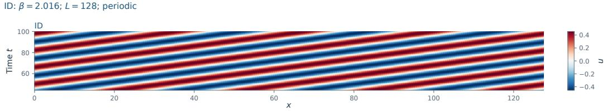

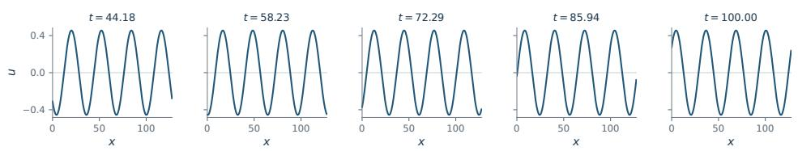  
Figure 4: Advection. Transport speed $\beta = 2 . 0 1 5 9 7 $ , within the training support $[ 0 , 4 ] ,$ , with periodic boundaries on a domain of length 128. The stored segment spans $t \simeq 4 4 . 1 8$ to 100.

## A.2 BURGERS EQUATION

Equation and environments. On a periodic interval of length $L = 1 6 ,$ we solve

$$
\partial _ { t } u + \partial _ { x } \bigl ( { \textstyle \frac { 1 } { 2 } } u ^ { 2 } - \beta \partial _ { x } u \bigr ) = F ( t , x ) , \qquad \beta \sim \mathrm { L o g U n i f o r m } [ 1 0 ^ { - 3 } , 5 ] ,\tag{21}
$$

where the forcing is

$$
F ( t , x ) = \sum _ { j = 1 } ^ { 5 } A _ { j } \sin \left( \omega _ { j } t + \frac { 2 \pi \ell _ { j } x } { L } + \phi _ { j } \right) ,\tag{22}
$$

$$
A _ { j } \sim \mathrm { U n i f } [ - 0 . 5 , 0 . 5 ] , \quad \omega _ { j } \sim \mathrm { U n i f } [ - 0 . 4 , 0 . 4 ] , \quad \ell _ { j } \sim \mathrm { U n i f } \{ 1 , 2 , 3 \} , \quad \phi _ { j } \sim \mathrm { U n i f } [ 0 , 2 \pi ] .
$$

Here log-uniform sampling means that $\log \beta$ is uniform between the logarithms of the two endpoints. Diffusivity and all 20 forcing coefficients are fixed within an environment and vary between environments.

Initial conditions. For each trajectory, we independently draw

$$
u _ { 0 } ( x ) = \sum _ { j = 1 } ^ { 5 } \widetilde { A } _ { j } \sin \left( \frac { 2 \pi \widetilde { \ell } _ { j } x } { L } + \widetilde { \phi } _ { j } \right) ,\tag{23}
$$

using the amplitude, integer mode, and phase distributions in Eq. equation 22. These initialcondition coefficients are independent of the environment's forcing coefficients. The split contains 1,200/12/12 environments for training/validation/testing, with ten trajectories per environment. All three splits use the same parameter support.

Numerical generation. The local MP-PDE implementation uses WENO reconstruction (Jiang & Shu, 1996) with Godunov flux splitting (Godounov, 1959) for the nonlinear term, finite differences for diffusion, and an adaptive Dormand–Prince 4/5 integrator (Dormand & Prince, 1980) with tolerances of $1 0 ^ { - 5 }$ . Trajectories are generated on 256 spatial points over $t \in [ 0 , 4 ]$ , with 250 snapshots evaluated and every tenth frame retained to form 25-frame sequences. We follow the implementation-specific spatial discretization and forcing range $[ - 0 . 4 , 0 . 4 ]$ used by the released generator. The visualization is shown in Figure 5.

ID: β = 0.06535478; α = γ = 0; L = 16; periodic

ID: β = 0.072296; quadratic flux coefficient = 1/2; L = 16; periodic  
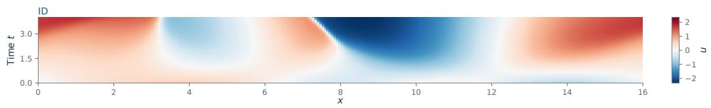

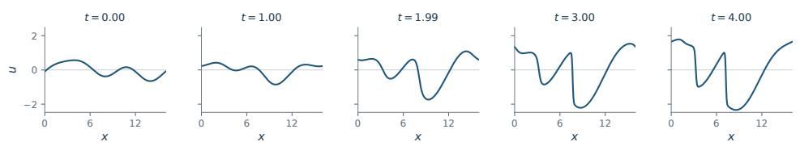  
A =[0.4977, - 0.2734, 0.0885, 0.3890, -0.1924], ω =[-0.0670, -0.0152, 0.1894, - 0.3888, 0.2575] l = [2, 3, 2, 1, 3], φ =[2.4889, 2.5450, 3.3907, 2.1356, 1.0119]

Figure 5: Burgers. Viscosity $\beta = 0 . 0 7 2 2 9 6$ , within the training support $[ 1 0 ^ { - 3 } , 5 ]$ , with periodic boundaries on a domain of length 16. The forcing is $\begin{array} { r } { F ( t , x ) = \sum _ { j = 1 } ^ { 5 } A _ { j } \sin ( \omega _ { j } t + 2 \pi \ell _ { j } x / 1 6 + \phi _ { j } ) } \end{array}$ its coefficients $A _ { j } , \omega _ { j } , \ell _ { j }$ , and $\phi _ { j }$ are listed beneath.

## A.3 HEAT EQUATION

Equation and environments. We solve

$$
\partial _ { t } u = \beta \partial _ { x x } u + F ( t , x ) , \qquad x \in [ 0 , 1 6 ] , \qquad \beta \sim \mathrm { L o g U n i f o r m } [ 1 0 ^ { - 3 } , 5 ] ,\tag{24}
$$

with periodic differentiation. The forcing is the five-mode process in Eq. equation 22;

Initial conditions. Initial conditions are independently sampled from Eq. equation 23. Following Burgers, one environment fixes the diffusivity and the complete forcing realization, while its ten trajectories have independent initial conditions.

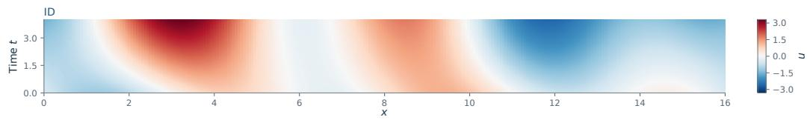

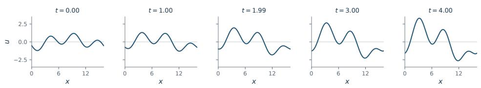  
A =[-0.0299,0.2421,0.3093,0.1221, - 0.4877], ω=[0.2606, - 0.0843, - 0.0132,0.3864, - 0.0725] l = [2, 2, 3, 1, 1], φ = [6.0991, 0.2230, 4.4812, 0.7316, 3.0142]

Figure 6: Heat. Diffusivity $\beta = 0 . 0 6 5 3 5 4 8$ , within the training support $[ 1 0 ^ { - 3 } , 5 ]$ . The trajectory solves $\partial _ { t } u \ : = \ : \beta \partial _ { x x } u + F ( t , x )$ on a periodic interval of length 16, with the five-mode forcing coefficients shown beneath.

Numerical generation. We generate the heat trajectories using the local MP-PDE implementation with the nonlinear and dispersive terms disabled, leaving a finite-difference diffusion operator and an adaptive Dormand–Prince 4/5 integrator (Dormand & Prince, 1980) with tolerances of $1 0 ^ { - 5 }$ Each trajectory is evaluated on 256 spatial points at 250 uniformly spaced times over $t \in [ 0 , 4 ]$ Every tenth frame is retained to form 25-frame sequences; we use 1,200/12/12 train/validation/test environments with ten trajectories per environment. The visualization is shown in Figure 6.

## A.4 WAVE-B: ONE-DIMENSIONAL WAVES WITH VARYING BOUNDARIES

Equation and environments. We consider

$$
\partial _ { t t } u - c ^ { 2 } \partial _ { x x } u = 0 , \qquad x \in [ - 8 , 8 ] , \quad c = 2 .\tag{25}
$$

Each endpoint independently uses either homogeneous Dirichlet conditions $( u = 0 ,$ denoted D) or homogeneous Neumann conditions $( \partial _ { x } u = 0$ , denoted N). This defines four environments: DD, DN, ND, and NN. Wave speed is fixed and is not an environment variable.

Initial conditions. For each trajectory, a pulse center $s \sim \mathrm { U n i f } [ - 4 , 4 ]$ determines both initial displacement and initial velocity:

$$
u ( x , 0 ) = \exp [ - ( x - s ) ^ { 2 } ] , \qquad \partial _ { t } u ( x , 0 ) = - 2 c ( x - s ) \exp [ - ( x - s ) ^ { 2 } ] .\tag{26}
$$

The four environments each contain 3,000 training trajectories, 30 validation trajectories, and 30 test trajectories. All four boundary combinations occur in every split: this split tests generalization to new initial conditions, not unseen boundary types.

Numerical generation. We generate the trajectories using the MP-PDE Chebyshev differentiation operator (Trefethen, 2000) on a 256-point nonuniform grid, with an implicit Radau integrator (Wanner & Hairer, 1996) over $t \in [ 0 , 1 0 0 ]$ and tolerances of $1 0 ^ { - 3 }$ . Each trajectory is evaluated at 250 output times. For model input, the sequence is reordered into forward physical time and every tenth frame is retained, yielding 25-frame trajectories. The visualization is shown in Figure 7.

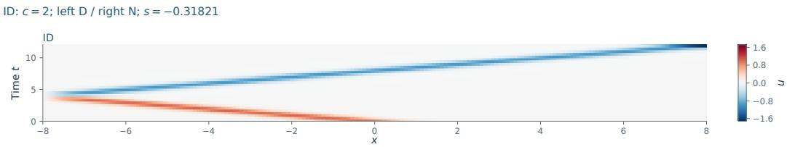

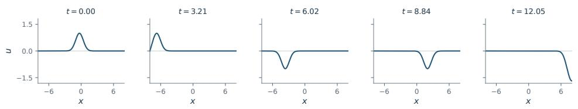  
Figure 7: Wave-B. Wave speed $c = 2 ,$ a left Dirichlet and a right Neumann boundary, and initial pulse center $s = - 0 . 3 1 8 2 1$ . The initial displacement and velocity are $u _ { 0 } ( x ) \ = \ e ^ { - ( x - s ) ^ { 2 } }$ and $v _ { 0 } ( x ) = - 2 c ( x - s ) u _ { 0 } ( x )$ . The plot shows $t \simeq 0 \mathrm { - } 1 2 . 0 5$ after restoring forward time from the reversed storage order, retaining the original nonuniform Chebyshev grid.

## A.5 COMBINED EQUATION

Equation and environments. The Combined Equation follows the setting of Zebra, which adopts the benchmark introduced by MP-PDE et al. (Brandstetter et al., 2022) without the forcing term. The dynamics are governed by

$$
\partial _ { t } u + \partial _ { x } \left( \alpha u ^ { 2 } - \beta \partial _ { x } u + \gamma \partial _ { x x } u \right) = 0 ,\tag{27}
$$

with initial conditions given by random finite sums of sinusoidal modes,

$$
u _ { 0 } ( x ) = \sum _ { j = 1 } ^ { J } A _ { j } \sin \left( \frac { 2 \pi \ell _ { j } x } { L } + \phi _ { j } \right) .\tag{28}
$$

For training, 1,200 parameter triplets are sampled uniformly from $\alpha \in [ 0 , 1 ] , \beta \in [ 0 , 0 . 4 ]$ , and $\gamma \in$ $[ 0 , 1 ] ,$ , with ten trajectories generated for each parameter setting, yielding 12,000 training trajectories. An additional 120 trajectories are used for testing. Following Zebra, solutions are generated using the MP-PDE solver (Brandstetter et al., 2022) on 256 spatial points over $t \in [ 0 , 1 0 ]$ , with 140 temporal snapshots. Temporal downsampling by a factor of ten gives trajectories of shape $2 5 6 \times 1 4$

OOD data. The OOD split contains 120 trajectories with $\alpha \in [ 1 . 0 6 8 2 , 1 . 7 5 8 1 ]$ , extending beyond the ID range $\alpha \in [ 0 , 1 ]$ , while $\beta$ and $\gamma$ remain within their respective ID ranges. Separate OOD training and validation splits contain ten trajectories each and are excluded from the ID data. The visualization is shown in Figure 8.

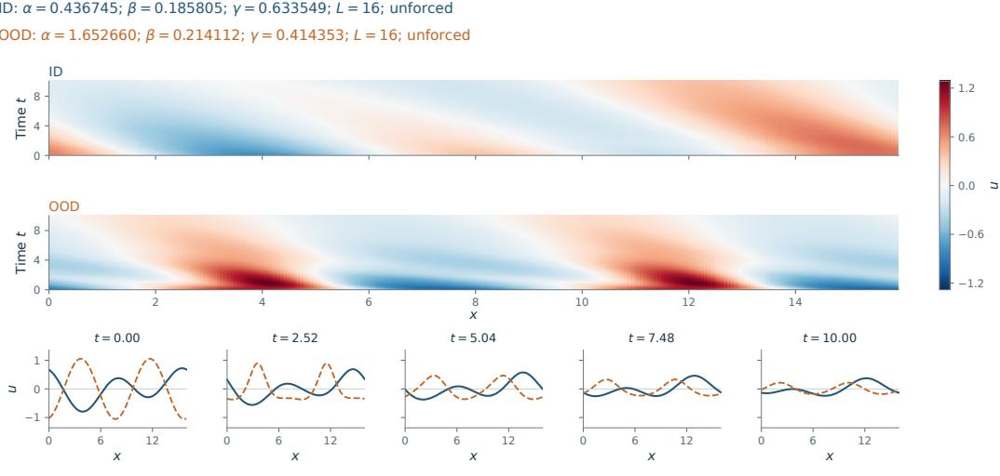  
Figure 8: Combined Equation. ID: $( \alpha , \beta , \gamma ) ~ = ~ ( 0 . 4 3 6 7 4 5 , 0 . 1 8 5 8 0 5 , 0 . 6 3 3 5 4 9 )$ ; OOD: $( \bar { \alpha _ { , } } \beta , \gamma ) = ( 1 . 6 5 2 6 6 0 , 0 . 2 \bar { 1 } 4 1 1 2 , 0 . 4 1 4 3 5 3 )$ . The OOD nonlinear-transport coefficient exceeds the ID interval [0, 1], while $\beta$ and $\gamma$ remain within their ID ranges [0, 0.4] and [0, 1]. Both trajectories use periodic boundaries, no external forcing, and the same saved coordinates on $x \in [ 0 , 1 6 )$ and $t \in [ 0 , 1 0 ]$ . Their initial fields and all three coefficients differ, so every trajectories have different initial conditions.

## A.6 VORTICITY: TWO-DIMENSIONAL INCOMPRESSIBLE FLOW

Equation and environments. The dataset contains unforced two-dimensional incompressible flow in vorticity form on a periodic square:

$$
\partial _ { t } \omega + ( \mathbf { u } \cdot \nabla ) \omega = \nu \Delta \omega , \qquad \nabla \cdot \mathbf { u } = 0 ,\tag{29}
$$

where velocity is recovered from a streamfunction through a Poisson solve. Viscosity ν is the environment parameter. The ID support is $[ 1 0 ^ { - 3 } , 1 0 ^ { - 2 } ]$ , with 1,200 training and 120 validation/test environments per split, each containing ten trajectories. The OOD release contains 12 viscosities on a linear grid spanning $[ 1 0 ^ { - 5 } , 1 0 ^ { - 4 } ]$ , again with ten trajectories per viscosity.

Initial conditions. The initial vorticity fields are generated from the prescribed energy spectrum

$$
E ( k ) = \frac { 4 } { 3 } \sqrt { \pi } \left( \frac { k } { k _ { 0 } } \right) ^ { 4 } \frac { 1 } { k _ { 0 } } \exp \left[ - \left( \frac { k } { k _ { 0 } } \right) ^ { 2 } \right] ,\tag{30}
$$

with the corresponding vorticity spectrum

$$
\omega ( k ) = \sqrt { \frac { E ( k ) } { \pi k } } .\tag{31}
$$

Numerical generation. We follow the numerical solver used in Zebra (Serrano et al., 2024a), combining a five-point finite-difference Laplacian, the Arakawa Jacobian (Arakawa, 1997), an FFTbased Poisson solver (Cooley & Tukey, 1965), and fourth-order Runge-Kutta integration (Butcher, 2016). The simulation is performed on a $5 1 2 \times 5 1 2$ grid over $t \in [ 0 , 2 ]$ , and the resulting trajectories are spatially and temporally subsampled to $1 2 8 \times 1 2 8$ resolution with 30 frames. The visualization is shown in Figure 9.

ID: ν = 0.0001; forcing frequency m = 2; amplitude = 0.1 OOD: ν = 0.003; forcing frequency m = 2; amplitude = 0.1  
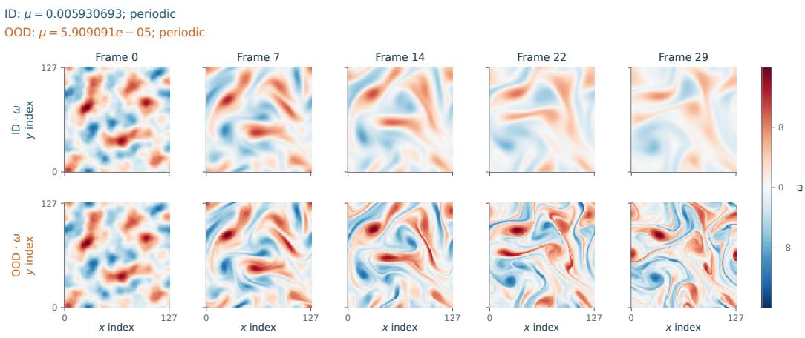  
Figure 9: Vorticity. ID: $\nu = 0 . 0 0 5 9 3 0 6 9 ;$ OOD: $\nu = 5 . 9 0 9 0 9 \times 1 0 ^ { - 5 }$ , below the training support $[ 1 \breve { 0 } ^ { - 3 } , 1 0 ^ { - 2 } ]$ . ID and OOD both use initial-condition, and their first saved vorticity fields are exactly equal. Rows compare the same five saved-frame positions, with periodic boundaries and a shared symmetric color scale.

## A.7 HETERNS

Equation and environments. HeterNS considers the two-dimensional incompressible Navier-Stokes equation in vorticity form on the unit torus. All settings are identical to those used in Uni-Solver (Zhou et al., 2024); we include this description only for completeness.

$$
\begin{array} { c } { \partial _ { t } \omega + \mathbf { u } \cdot \nabla \omega = \nu \Delta \omega + f ( \mathbf { x } ) , } \\ { \nabla \cdot \mathbf { u } = 0 , } \end{array}\tag{32}
$$

where ν is the viscosity coefficient and the forcing is

$$
f ( \mathbf { x } ) = 0 . 1 \left[ \sin \left( \omega _ { f } \pi ( x _ { 1 } + x _ { 2 } ) \right) + \cos \left( \omega _ { f } \pi ( x _ { 1 } + x _ { 2 } ) \right) \right] .\tag{33}
$$

The PDE environment is therefore determined by the viscosity ν and forcing frequency $\omega _ { f } .$ The training environments use $\nu \in \left\{ 1 0 ^ { - 5 } , 5 \times 1 0 ^ { - 5 } , 1 0 ^ { - 4 } , 5 \times 1 0 ^ { - 4 } , 1 0 ^ { - 3 } \right\} , \omega _ { f } \in \left\{ 1 , 2 , 3 \right\}$ , giving 15 distinct PDE configurations. Each configuration contains 1,000 trajectories, yielding 15,000 training trajectories in total. The ID test set keeps the same PDE configurations while using unseen initial conditions. The visualization is shown in Figure 10.

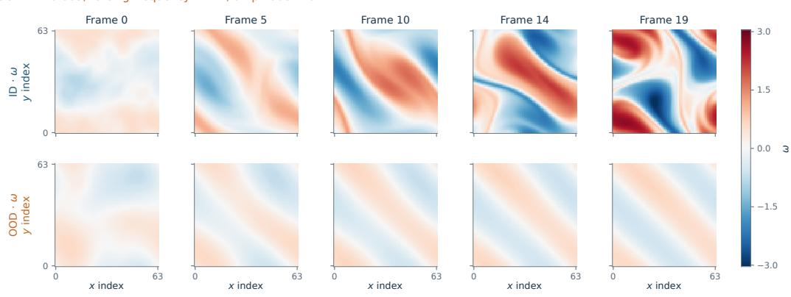  
Figure 10: HeterNS. ID: $\nu \simeq 1 0 ^ { - 4 } ;$ OOD: $\nu \simeq 3 \times 1 0 ^ { - 3 }$ , above the training range $[ 1 0 ^ { - 5 } , 1 0 ^ { - 3 } ]$ Both use $F ( x , y ) = 0 . 1 [ \sin ( 2 \pi ( x + y ) ) + \cos ( 2 \pi ( x + y ) ) ]$

OOD data. We consider three OOD settings. For viscosity interpolation, we use $\nu \in$ $\left( \{ 2 , 3 , 4 , 6 , 7 , 8 , 9 \} \times 1 0 ^ { - 5 } \right) \cup \left( \{ 2 , 3 , 4 , 6 , 7 , 8 , 9 \} \times 1 0 ^ { - 4 } \right)$ , with $m \in \{ 1 , 2 , 3 \}$ . For viscosity extrapolation, we use $\nu \in \{ 2 , 3 , 4 , 5 , 6 , 7 , 8 , 9 \} \times 1 0 ^ { - 3 }$ , again with $m \in \{ 1 , 2 , 3 \}$ . For forcing OOD, we fix $\nu = 1 0 ^ { - 5 }$ and use unseen forcing frequencies $m \in \{ 0 . 5 , 1 . 5 , 2 . 5 , 3 . 5 \}$ . We sample 1,500 OOD trajectories in total, consisting of 900 viscosity-interpolation trajectories, 510 viscosity-extrapolation trajectories, and 90 forcing-OOD trajectories.

## A.8 WAVE-2D: DAMPED TWO-DIMENSIONAL WAVES

Equation and environments. The released data represent

$$
\partial _ { t t } u = c ^ { 2 } \Delta u - k \partial _ { t } u ,\tag{34}
$$

with two stored channels, $( u , \partial _ { t } u )$ . Direct inspection establishes $c \in [ 1 0 0 , 5 0 0 ]$ and $k \in [ 0 , 5 0 ]$ for the ID data. Training uses 1,200 distinct parameter pairs selected from ${ \textrm { a } } 1 0 0 \times 1 0 0$ Cartesian parameter grid; validation and test each contain 120 pairs. Each pair has 10 initial conditions.

Initial conditions. The initial condition is constructed as a sum of five Gaussian functions,

$$
\omega _ { 0 } ( x , y ) = \sum _ { i = 1 } ^ { 5 } \exp \left( - \frac { ( x - x _ { i } ) ^ { 2 } + ( y - y _ { i } ) ^ { 2 } } { 2 \sigma _ { i } ^ { 2 } } \right) ,\tag{35}
$$

where $x _ { i } , y _ { i } \sim \mathcal { U } ( [ 0 , 1 ] )$ and $\sigma _ { i } \sim \mathcal { U } ( [ 0 . 0 2 5 , 0 . 1 ] )$ . Each Gaussian has unit amplitude.

Numerical generation. Following Zebra (Serrano et al., 2024a), the spatial domain is discretized on $1 6 4 \times 6 4$ grid using a $1 5 \times 5$ discrete Laplacian operator with dirichlet boundary conditions. The dynamics are integrated using a fourth-order Runge-Kutta scheme with time step $\dot { \Delta } t = 6 . 2 5 \times 1 0 ^ { - 6 }$ over $t \in [ 0 , 5 \times 1 \mathbf { \bar { 0 } } ^ { - 3 } ]$ . The visualization is shown in Figure 11.

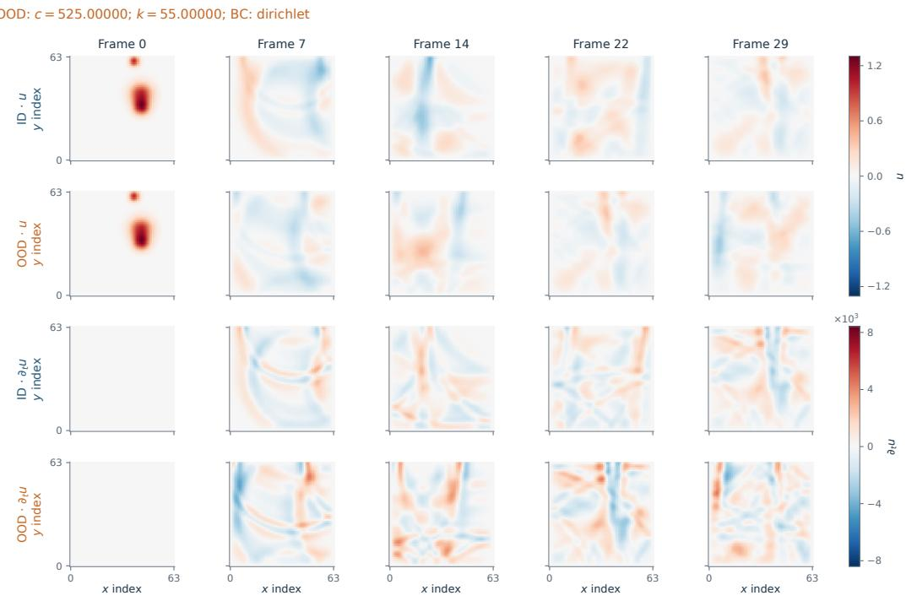  
Figure 11: Wave-2D:. ID: $( c , k ) = ( 3 9 8 . 9 8 9 9 0 , 4 3 . 9 3 9 3 9 )$ ; OOD: $( c , k ) = ( 5 2 5 , 5 5 )$ , outside the training ranges $c \in [ 1 0 0 , 5 0 0 ]$ and $k \in [ 0 , 5 0 ]$

OOD data. The designated OOD release has 12 parameter pairs from the $5 \times 5 \mathrm { g r i d } c \in [ 5 0 0 , 5 5 0 ]$ $k \in [ 5 0 , 6 0 ]$ , with ten trajectories per pair. Eleven pairs are outside the ID support, while $( c , k ) \dot { = }$ (500, 50) lies on its boundary. Thus this file contains 110 strict parameter-extrapolation trajectories and ten boundary-support trajectories.

## A.9 GRAY-SCOTT EQUATION

Equation and environments. The Gray-Scott dataset describes a two-dimensional reactiondiffusion system governed by

$$
\begin{array} { l } { \displaystyle { \frac { \partial u } { \partial t } = D _ { u } \Delta u - u v ^ { 2 } + F ( 1 - u ) , } } \\ { \displaystyle { \frac { \partial v } { \partial t } = D _ { v } \Delta v - u v ^ { 2 } - ( F + k ) v , } } \end{array}\tag{36}
$$

where periodic boundary conditions are imposed and the diffusion coefficients are fixed to $D _ { u } \ = \ 0 . 1 0 2$ and $D _ { v } ~ = ~ 0 . 2 0 4$ For ID trajectories, the reaction parameters are sampled as $F \ \sim \ \mathcal { U } ( [ 0 . 0 2 3 , 0 . 0 4 5 ] )$ and $\begin{array} { r } { k \ \sim \ \mathcal { U } ( [ 0 . 0 5 9 0 , 0 . 0 6 4 0 ] ) } \end{array}$ For OOD evaluation, following ENMA (Kassaï Koupaï et al., 2026), we use $\ddot { F } \sim \mathcal { U } ( [ 0 . 0 4 5 , \dot { 0 } . 0 4 6 7 ] )$ and $k \sim \mathcal { U } ( [ 0 . 0 5 7 0 , 0 . 0 5 9 0 ] )$ The spatial domain is discretized on a $3 2 \times 3 2$ grid with spatial resolution $\Delta s = 2$ The visualization is shown in Figure 12.

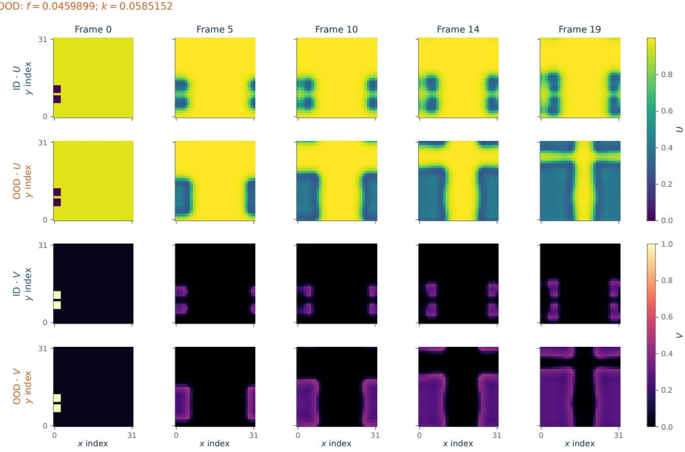  
Figure 12: Gray-Scott. ID: (f, k) = (0.0364141, 0.0627879); OOD: $\begin{array} { r l } { ( f , k ) } & { { } = } \end{array}$ (0.0459899, 0.0585152), outside the training ranges $f \in [ 0 . 0 2 3 , 0 . 0 4 5 ]$ and $k \in [ 0 . 0 5 9 , 0 . 0 6 4 ]$

## B ARCHITECTURE DETAILS

Our framework is trained in four stages: predictive representation pretraining, geometry alignment, latent predictor learning, and decoder training. We describe the architecture and tensor flow of each stage below. Let an input trajectory be

$$
\mathbf { X } \in \mathbb { R } ^ { B \times T \times C \times H \times W } ,
$$

where $B , T , C , H$ , and $W$ denote the batch size, temporal length, number of physical channels, and spatial resolution, respectively.

## B.1 PRETRAINING STAGE

Encoder. The pretraining stage learns physical representations using a joint-embedding predictive objective (JEPA). Given a trajectory

$$
{ \bf X } = [ { \bf x } _ { 1 } , \ldots , { \bf x } _ { T } ] , \qquad { \bf x } _ { t } \in \mathbb { R } ^ { C \times H \times W } ,
$$

each frame is partitioned into non-overlapping spatial patches and projected into D-dimensional tokens. With a temporal tubelet size of one, this patch embedding does not mix information across adjacent frames, yielding N spatial tokens per time step.

The resulting spatiotemporal tokens are then processed jointly by a Vision Transformer. Specifically, the $T \times N$ tokens are arranged as a single sequence and augmented with spatial and temporal positional information before being passed through a stack of multi-head self-attention and feedforward blocks. The encoder therefore produces

$$
\mathbf { Z } = f _ { \theta } ( \mathbf { X } ) \in \mathbb { R } ^ { B \times T \times N \times D } ,
$$

where each temporal slice

$$
\mathbf { z } _ { t } = [ \mathbf { Z } ] _ { t } \in \mathbb { R } ^ { N \times D }
$$

is obtained in the context of the full trajectory rather than by independently encoding $\mathbf { x } _ { t }$

Masked latent prediction. During pretraining, a subset of latent tokens is masked from the context encoder. A predictor receives the visible context representations together with embeddings corresponding to the masked target positions and predicts their latent representations. The prediction target is produced by a momentum-updated target encoder.

Let

$$
\mathbf { Z } ^ { c } \in \mathbb { R } ^ { B \times N _ { c } \times D }
$$

denote the visible context tokens and

$$
\mathbf { Z } ^ { t } \in \mathbb { R } ^ { B \times N _ { t } \times D }
$$

the latent representations of the target tokens, where $N _ { c }$ and $N _ { t }$ denote the number of context and target tokens, respectively. The latent predictor maps the context representation to

$$
\widehat { \mathbf { Z } } ^ { t } = p _ { \psi } ( \mathbf { Z } ^ { c } ) \in \mathbb { R } ^ { B \times N _ { t } \times D } .
$$

The pretraining objective aligns the predicted target representations with those generated by the target encoder,

$$
\mathcal { L } _ { \mathrm { p r e } } = \mathcal { D } \left( \widehat { \mathbf { Z } } ^ { t } , \mathbf { Z } ^ { t } \right) ,
$$

where D denotes the latent-space prediction loss. After pretraining, the encoder $f _ { \theta }$ is retained as the representation model for the following stages.

## B.2 GEOMETRY ALIGNMENT STAGE

The pretrained representation preserves predictive information about the physical trajectory, but its latent coordinates are not explicitly constrained to reflect the evolution geometry of the underlying physical states. We therefore introduce a lightweight geometry projector to adapt the latent state space before learning the dynamics model.

Geometry projector. The pretrained encoder is frozen during this stage. For each latent token

$$
\mathbf { z } _ { t , n } \in \mathbb { R } ^ { D } ,
$$

the geometry projector applies a token-wise residual transformation,

$$
\begin{array} { r } { \mathbf q _ { t , n } = \mathbf z _ { t , n } + g _ { \phi } ( \mathbf z _ { t , n } ) , } \end{array}
$$

where

$$
g _ { \phi } : \mathbb { R } ^ { D }  \mathbb { R } ^ { D }
$$

is a multilayer perceptron consisting of normalization, channel expansion to an intermediate dimension $D _ { g } ,$ nonlinear activation, and projection back to D.

The projector therefore preserves the complete latent tensor shape,

$$
\begin{array} { r } { \mathbf { Q } = \mathbf { Z } + g _ { \phi } ( \mathbf { Z } ) \in \mathbb { R } ^ { B \times T \times N \times D } . } \end{array}
$$

The transformation is independently applied to every token and time step. In particular, the projector does not perform temporal or spatial-token mixing, and only adjusts the latent channel coordinates.

Temporal geometry alignment. To characterize the temporal geometry of the physical trajectory, each physical state is flattened as

$$
\widetilde { \mathbf { x } } _ { t } \in \mathbb { R } ^ { C H W } ,
$$

while each projected latent state is flattened across its token and channel dimensions,

$$
\widetilde { \mathbf { q } } _ { t } \in \mathbb { R } ^ { N D } .
$$

Temporal displacement vectors are then computed independently in the two state spaces,

$$
\Delta \mathbf { x } _ { t } = \widetilde { \mathbf { x } } _ { t + 1 } - \widetilde { \mathbf { x } } _ { t } ,
$$

and

$$
\Delta \mathbf q _ { t } = \widetilde { \mathbf q } _ { t + 1 } - \widetilde { \mathbf q } _ { t } .
$$

Although the physical and latent states have different feature dimensions, i.e.,

$$
C H W \neq N D ,
$$

their trajectory geometry can be compared through dimension-independent directional statistics. For a temporal offset l, we compute

$$
s _ { t , \ell } ^ { x } = \frac { \Delta \mathbf { x } _ { t } ^ { \top } \Delta \mathbf { x } _ { t + \ell } } { \| \Delta \mathbf { x } _ { t } \| _ { 2 } \| \Delta \mathbf { x } _ { t + \ell } \| _ { 2 } } ,
$$

and

$$
s _ { t , \ell } ^ { q } = \frac { \Delta \mathbf q _ { t } ^ { \top } \Delta \mathbf q _ { t + \ell } } { \| \Delta \mathbf q _ { t } \| _ { 2 } \| \Delta \mathbf q _ { t + \ell } \| _ { 2 } } .
$$

Both quantities are scalar directional similarities, allowing the trajectory geometry of the two spaces to be directly aligned. The geometry loss aggregates the discrepancy across a set of temporal offsets S,

$$
\mathcal { L } _ { \mathrm { g e o } } = \sum _ { \ell \in S } w _ { \ell } \mathcal { D } _ { \mathrm { g e o } } \left( s _ { t , \ell } ^ { q } , s _ { t , \ell } ^ { x } \right) ,
$$

where we controls the contribution of each temporal scale.

To prevent the projector from unnecessarily altering the predictive representation, we additionally constrain the projected states to remain close to the pretrained latent states,

$$
\mathcal { L } _ { \mathrm { a n c h o r } } = \mathcal { D } _ { \mathrm { a n c h o r } } ( \mathbf { Q } , \mathbf { Z } ) .
$$

The geometry-alignment stage optimizes only the projector parameters while keeping the pretrained encoder fixed.

Auxiliary conditional causal predictor. In addition to geometric alignment, we introduce an auxiliary causal predictor to encourage the projected space to remain compatible with parameterdependent dynamics. Given the projected latent history and the physical parameter $\xi ,$ the predictor estimates the next latent displacement,

$$
\widehat { \Delta \mathbf { q } _ { t } } = P _ { \psi } \left( \mathbf { q } , \pmb { \xi } \right) ,
$$

where $\boldsymbol { \xi }$ is embedded as a conditioning token and supplied to the causal predictor. Importantly, the geometry projector itself is parameter-independent and takes only the pretrained latent representation as input; parameter information enters exclusively through the auxiliary dynamics predictor.

The corresponding prediction objective is

$$
\begin{array} { r } { \mathcal { L } _ { d y n } = \mathcal { D } _ { \mathrm { p r e d } } \left( \widehat { \Delta \mathbf { q } } _ { t } , \Delta \mathbf { q } _ { t } \right) , } \end{array}
$$

where

$$
\Delta \mathbf q _ { t } = \mathbf q _ { t + 1 } - \mathbf q _ { t } .
$$

Together with the geometry and anchor objectives, the alignment-stage loss is

$$
{ \mathcal { L } } _ { \mathrm { a l i g n } } = { \mathcal { L } } _ { d y n } + \lambda _ { \mathrm { g e o } } { \mathcal { L } } _ { \mathrm { g e o } } + \lambda _ { \mathrm { a n c h o r } } { \mathcal { L } } _ { \mathrm { a n c h o r } } .
$$

The pretrained encoder remains frozen, while the geometry projector and auxiliary predictor are jointly optimized during this stage.

## B.3 PREDICTOR LEARNING STAGE

After geometry alignment, physical evolution is modeled directly in the aligned latent state space. Given a projected latent state

$$
\mathbf { q } \in \mathbb { R } ^ { N \times D }
$$

Physics-structured latent predictor. The latent transition is decomposed into a parameterindependent evolution component and a parameter-dependent response component. we model its evolution through a parameter-structured latent vector field,

$$
\dot { q } _ { t } = \mathcal { F } _ { \boldsymbol { \theta } } ( q _ { t } , \xi ) = \mathcal { F } _ { \mathrm { e v o } } ( q _ { t } ) + \mathcal { F } _ { \mathrm { p a r } } ( q _ { t } , \xi ) ,
$$

The evolution branch

$$
\mathcal { F } _ { \mathrm { e v o } } : \mathbb { R } ^ { N \times D }  \mathbb { R } ^ { N \times D }
$$

models dynamics shared across different governing conditions. The parameter-dependent branch

$$
\mathcal { F } _ { \mathrm { p a r } } : \mathbb { R } ^ { N \times D } \times \mathbb { R } ^ { D _ { \xi } }  \mathbb { R } ^ { N \times D }
$$

captures the change in latent evolution induced by the governing parameters.

Both branches preserve the spatial-token structure of the representation, so that their outputs can be directly combined with the current latent state. For continuous-time predictors, the next latent state is obtained by numerically integrating the vector field over one observation interval,

$$
\hat { q } _ { t + 1 } = \Phi _ { \mathrm { O D E } } ( q _ { t } , \mathcal { F } _ { \theta } , \xi , \Delta t ) .
$$

Autoregressive rollout. For long-horizon prediction, the predicted latent state is recursively used as the input to the next transition,

$$
\widehat { \mathbf { q } } _ { t + k } = \mathcal { P } \left( \widehat { \mathbf { q } } _ { t + k - 1 } , \pmb { \xi } \right) ,
$$

where $\mathcal { P }$ denotes the complete latent transition operator.

The dynamics are therefore evolved entirely in the learned latent space. Physical predictions are recovered only when needed through a reconstruction head

$$
\mathcal { D } _ { \omega } : \mathbb { R } ^ { N \times D }  \mathbb { R } ^ { C \times H \times W } .
$$

This avoids repeatedly mapping autoregressive predictions between the physical and latent domains during rollout.

## B.4 DECODER LEARNING STAGE

The decoder is trained after the geometry projector and latent predictor have been learned. During this stage, the encoder, geometry projector, and latent predictor are all frozen, and only the decoder parameters are optimized.

Rollout-based latent generation. Given a physical trajectory

$$
\mathbf { X } = [ \mathbf { x } _ { 0 } , \mathbf { x } _ { 1 } , \ldots , \mathbf { x } _ { T - 1 } ] \in \mathbb { R } ^ { B \times T \times C \times H \times W } ,
$$

only the initial physical state $\mathbf { x } _ { \mathrm { 0 } }$ is used to construct the latent input. It is first mapped by the frozen encoder and geometry projector as

$$
\mathbf { z } _ { 0 } = f _ { \theta } ( \mathbf { x } _ { 0 } ) \in \mathbb { R } ^ { B \times N \times D } ,
$$

$$
\begin{array} { r } { \mathbf q _ { 0 } = \mathbf z _ { 0 } + g _ { \phi } ( \mathbf z _ { 0 } ) \in \mathbb R ^ { B \times N \times D } . } \end{array}
$$

Starting from $q _ { 0 } ,$ the frozen physics-structured latent predictor recursively generates the remaining latent states by integrating the learned latent vector field:

$$
\begin{array} { r } { \hat { q } _ { t + 1 } = \Phi _ { \mathrm { O D E } } ( \hat { q } _ { t } , F _ { \theta } , \xi , \Delta t ) , \qquad \hat { q } _ { 0 } = q _ { 0 } . } \end{array}
$$

In our implementation, $\Phi _ { \mathrm { O D E } }$ is instantiated using fourth-order Runge-Kutta integration with four substeps.

This produces the complete latent rollout

$$
\begin{array} { r } { \widehat { \mathbf { Q } } = [ \mathbf { q } _ { 0 } , \widehat { \mathbf { q } } _ { 1 } , \dots , \widehat { \mathbf { q } } _ { T - 1 } ] \in \mathbb { R } ^ { B \times T \times N \times D } . } \end{array}
$$

Thus, future ground-truth states $\mathbf { x } _ { 1 } , \ldots , \mathbf { x } _ { T - 1 }$ are never encoded to construct the decoder input. They are used only as reconstruction targets. This exposes the decoder during training to the same autoregressive latent distribution encountered at inference time, including deviations accumulated during latent rollout.

Decoder. Before decoding, the temporal and spatial-token dimensions of the rollout are combined,

$$
\begin{array} { r } { \widehat { \mathbf { Q } } \in \mathbb { R } ^ { B \times T \times N \times D }  \mathbb { R } ^ { B \times T N \times D } . } \end{array}
$$

The latent tokens are first normalized and projected from the latent dimension D to an initial convolutional feature dimension $D _ { 0 }$ . Since each latent state contains a two-dimensional token grid with

$$
N = N _ { h } N _ { w } ,
$$

the token sequence is rearranged into frame-wise spatial feature maps,

$$
\mathbb { R } ^ { B \times T N \times D _ { 0 } }  \mathbb { R } ^ { ( B T ) \times D _ { 0 } \times N _ { h } \times N _ { w } } .
$$

The decoder then progressively reconstructs the physical spatial resolution. Starting from the coarse latent token grid, residual convolutional blocks refine the features, followed by a sequence of spatial upsampling stages,

$$
\widehat { \mathbf { Q } } ^ { ( s + 1 ) } = \mathcal { R } ^ { ( s ) } \left( \mathrm { U p } _ { 2 } \left( \widehat { \mathbf { Q } } ^ { ( s ) } \right) \right) ,
$$

where $\mathrm { { U p } _ { 2 } ( \cdot ) }$ denotes a factor-of-two spatial interpolation and $\mathcal { R } ^ { ( s ) }$ denotes the residual convolutional refinement at stage s. After S stages, the feature resolution is restored from

$$
N _ { h } \times N _ { w }
$$

to

$$
H \times W .
$$

A final convolutional head maps the reconstructed features to the $C$ physical channels. The frame dimension is then restored, yielding

$$
\widehat { \mathbf { X } } = \mathcal { D } _ { \omega } \left( \widehat { \mathbf { Q } } \right) \in \mathbb { R } ^ { B \times T \times C \times H \times W } .
$$

Although the full latent rollout is provided jointly as the decoder input tensor, the spatial reconstruction is performed frame-wise: the temporal dimension is folded into the batch dimension before the convolutional decoding blocks. Consequently, the decoder itself does not model temporal evolution.

Training objective. The complete ground-truth physical trajectory serves as the reconstruction target,

$$
\mathcal { L } _ { \mathrm { d e c } } = \mathcal { D } _ { \mathrm { p h y } } \left( \widehat { \mathbf { X } } , \mathbf { X } \right) .
$$

During this stage $f _ { \theta } , g _ { \phi } , \mathcal { P } _ { \psi }$ remain frozen, and gradients are propagated only through $\mathcal { D } _ { \omega }$

## C IMPLEMENTATION DETAILS

All codes are written in Pytorch (Paszke et al., 2019). All experiments are conducted on 4 RTX PRO 6000 Blackwell 96G with approximately total of 9000 GPU hours.

## C.1 PDE-JEPA IMPLEMENTATION

The hyperparameter settings for PDE-JEPA's architecture across all datasets are summarized in Table 8. All stages use AdamW with $( \beta _ { 1 } , \beta _ { 2 } ) = ( 0 . 9 , 0 . 9 9 9 )$ , except structured predictors, which use (0.9, 0.95).

## C.1.1 PHYSICS-STRUCTURED LATENT PREDICTOR IMPLEMENTATIONS

Following the general formulation in Section 4.3, the predictor first maps the current latent state through a shared backbone,

$$
\mathbf { H } _ { \theta } ( \mathbf { q } ) = \mathcal { H } _ { \theta } ( \mathbf { q } ) ,
$$

and applies independent component heads to the shared features,

$$
C _ { \theta } ( \mathbf { q } ) = h _ { C , \theta } ( \mathbf { H } _ { \theta } ( \mathbf { q } ) ) , \qquad D _ { \theta } ^ { ( j ) } ( \mathbf { q } ) = h _ { j , \theta } ( \mathbf { H } _ { \theta } ( \mathbf { q } ) ) , \quad j = 1 , \dots , M .
$$

Each component has the same spatial and channel dimensions as the latent state, i.e.,

$$
C _ { \theta } ( \mathbf { q } ) , D _ { \theta } ^ { ( j ) } ( \mathbf { q } ) \in \mathbb { R } ^ { N \times D } .
$$

The latent vector field is then parameterized as

$$
\dot { \mathbf { q } } = C _ { \theta } ( \mathbf { q } ) + \sum _ { j = 1 } ^ { M } r _ { j } ( \pmb { \xi } ) D _ { \theta } ^ { ( j ) } ( \mathbf { q } ) ,
$$

where $r _ { j } ( \pmb { \xi } )$ denotes the normalized coefficient associated with the j-th parameter-dependent component. We instantiate this general form according to the governing structure of each PDE.

For a training set of $N _ { \mathrm { t r } }$ trajectories, we denote

$$
\langle g ( a ) \rangle _ { \mathrm { t r } } = \frac { 1 } { N _ { \mathrm { t r } } } \sum _ { i = 1 } ^ { N _ { \mathrm { t r } } } g ( a _ { i } ) .
$$

Vorticity. For Vorticity, the latent vector field is

$$
\dot { \mathbf { q } } = \mathbf { C } _ { \theta } ( \mathbf { q } ) + r _ { \nu } \mathbf { D } _ { \theta } ^ { \nu } ( \mathbf { q } ) , \qquad r _ { \nu } = \frac { \nu - \nu _ { 0 } } { s _ { \nu } } ,
$$

where

$$
\nu _ { 0 } = \frac { \nu _ { \mathrm { m i n } } ^ { \mathrm { t r } } + \nu _ { \mathrm { m a x } } ^ { \mathrm { t r } } } { 2 } , \qquad s _ { \nu } = \frac { \nu _ { \mathrm { m a x } } ^ { \mathrm { t r } } - \nu _ { \mathrm { m i n } } ^ { \mathrm { t r } } } { 2 } .
$$

Here $\nu _ { \mathrm { m i n } } ^ { \mathrm { t r } }$ and $\nu _ { \mathrm { m a x } } ^ { \mathrm { t r } }$ denote the minimum and maximum viscosities in the ID training split

Wave-2D. For Wave-2D, we use

$$
\dot { \mathbf { q } } = \mathbf { C } _ { \theta } ( \mathbf { q } ) + r _ { c ^ { 2 } } \mathbf { D } _ { \theta } ^ { c } ( \mathbf { q } ) - r _ { k } \mathbf { D } _ { \theta } ^ { k } ( \mathbf { q } ) ,
$$

where

$$
r _ { c ^ { 2 } } = { \frac { c ^ { 2 } } { s _ { c ^ { 2 } } } } , \qquad r _ { k } = { \frac { k } { s _ { k } ^ { \mathrm { W a v e } } } } ,
$$

with

$$
s _ { c ^ { 2 } } = \sqrt { \langle c ^ { 4 } \rangle _ { \mathrm { t r } } } , \qquad s _ { k } ^ { \mathrm { W a v e } } = \sqrt { \langle k ^ { 2 } \rangle _ { \mathrm { t r } } } .
$$

Gray-Scott. For Gray-Scott, the predictor is

$$
\dot { \mathbf { q } } = \mathbf { C } _ { \theta } ( \mathbf { q } ) + \frac { F } { s _ { F } } \mathbf { D } _ { \theta } ^ { F } ( \mathbf { q } ) + \frac { k } { s _ { k } ^ { \mathrm { G S } } } \mathbf { D } _ { \theta } ^ { k } ( \mathbf { q } ) ,
$$

where

$$
s _ { F } = \langle | F | \rangle _ { \mathrm { t r } } , \qquad s _ { k } ^ { \mathrm { G S } } = \langle | k | \rangle _ { \mathrm { t r } } .
$$

Combined Equation. For the combined equation, we associate separate latent vector fields with the transport, diffusion, and dispersion coefficients:

$$
\dot { \mathbf { q } } = - \frac { \alpha } { s _ { \alpha } } \mathbf { D } _ { \theta } ^ { \alpha } ( \mathbf { q } ) + \frac { \beta } { s _ { \beta } } \mathbf { D } _ { \theta } ^ { \beta } ( \mathbf { q } ) - \frac { \gamma } { s _ { \gamma } } \mathbf { D } _ { \theta } ^ { \gamma } ( \mathbf { q } ) ,
$$

where the coefficient scales are

$$
s _ { p } = \sqrt { \langle p ^ { 2 } \rangle _ { \mathrm { t r } } } , \qquad p \in \{ \alpha , \beta , \gamma \} .
$$

HeterNS. For HeterNS, viscosity and the spatial forcing field are modeled separately:

$$
\dot { \mathbf { q } } = \mathbf { C } _ { \theta } ( \mathbf { q } ) + r _ { \nu } \mathbf { D } _ { \theta } ^ { \nu } ( \mathbf { q } ) + m \mathbf { D } _ { \theta } ^ { m } ( \mathbf { q } ) ,
$$

where

$$
r _ { \nu } = \frac { \nu - \nu _ { 0 } } { s _ { \nu } } ,
$$

and

$$
\nu _ { 0 } = \frac { \nu _ { \mathrm { m i n } } ^ { \mathrm { t r } } + \nu _ { \mathrm { m a x } } ^ { \mathrm { t r } } } { 2 } , \qquad s _ { \nu } = \frac { \nu _ { \mathrm { m a x } } ^ { \mathrm { t r } } - \nu _ { \mathrm { m i n } } ^ { \mathrm { t r } } } { 2 } .
$$

## C.1.2 LATENT TIME INTEGRATION.

For predictors formulated as continuous latent vector fields, we obtain the next latent state by numerically integrating

$$
\dot { \mathbf { q } } = \mathcal { F } _ { \boldsymbol { \theta } } ( \mathbf { q } , \boldsymbol { \xi } ) ,
$$

where $\mathcal { F } _ { \theta }$ denotes the corresponding physics-structured vector field defined above. Given the current latent state $\mathbf { q } _ { t }$ and the physical interval $\Delta t$ between two consecutive frames, we use the classical fourth-order Runge-Kutta (RK4) scheme with M substeps. Let $h = \Delta t / M$ and ${ \bf q } _ { t } ^ { ( 0 ) } = { \bf q } _ { t }$ . For each substep $m = 0 , \ldots , M - 1$

$$
\begin{array} { r l } & { \mathbf { k } _ { 1 } = \mathcal { F } _ { \theta } \left( \mathbf { q } _ { t } ^ { ( m ) } , \pmb { \xi } \right) , } \\ & { \mathbf { k } _ { 2 } = \mathcal { F } _ { \theta } \left( \mathbf { q } _ { t } ^ { ( m ) } + \frac { h } { 2 } \mathbf { k } _ { 1 } , \pmb { \xi } \right) , } \\ & { \mathbf { k } _ { 3 } = \mathcal { F } _ { \theta } \left( \mathbf { q } _ { t } ^ { ( m ) } + \frac { h } { 2 } \mathbf { k } _ { 2 } , \pmb { \xi } \right) , } \\ & { \mathbf { k } _ { 4 } = \mathcal { F } _ { \theta } \left( \mathbf { q } _ { t } ^ { ( m ) } + h \mathbf { k } _ { 3 } , \pmb { \xi } \right) , } \end{array}
$$

and the latent state is updated as

$$
{ \bf q } _ { t } ^ { ( m + 1 ) } = { \bf q } _ { t } ^ { ( m ) } + \frac { h } { 6 } \left( { \bf k } _ { 1 } + 2 { \bf k } _ { 2 } + 2 { \bf k } _ { 3 } + { \bf k } _ { 4 } \right) .
$$

After M substeps, the prediction for the next frame is

$$
\widehat { \mathbf { q } } _ { t + 1 } = \mathbf { q } _ { t } ^ { ( M ) } .
$$

We use $M = 4 { \mathrm { R K } } 4$ substeps for each latent transition.

Table 8: Implementation and training hyperparameters of PDE-JEPA.
<table><tr><td>Hyperparameter</td><td>Combined</td><td>Advection</td><td>Burgers</td><td>Heat</td><td>Wave-B</td><td>GS</td><td>Wave2D</td><td>Vorticity</td><td>HeterNS</td></tr><tr><td>Model input grid Sampled frames / stride</td><td>256 14/10</td><td>256 14/5</td><td>256 25/ 10</td><td>256 25 / 10</td><td>256 25/ 10</td><td>32×32 20 /1</td><td>64×64 30/1</td><td>128×128 30 /1</td><td>64×64 20/ 1</td></tr><tr><td>Channels / patch size Latent dimension</td><td>1/4 192</td><td>1/4 192</td><td>1/4 192</td><td>1/4 192</td><td>1/4 192</td><td>2/4×4 192</td><td>2/4×4 192</td><td>1/8×8 192</td><td>1/4×4 192</td></tr><tr><td>Stage 1: Pretraining Encoder depth Predictor depth Predictor hidden size Encoder attention heads</td><td>12 12 384 3</td><td>12 12 384 3</td><td>12 12 384 3</td><td>12 12 384 3</td><td>12 12 384</td><td>24 24 384</td><td>12 12 384</td><td>12 12 384</td><td>12 12 384</td></tr><tr><td>Predictor attention heads MLP ratio Dropout Normalization type</td><td>12 4 0</td><td>12 4 0</td><td>12 4 0</td><td>12 4 0 LayerNorm LayerNorm LayerNorm LayerNorm LayerNorm LayerNorm LayerNorm LayerNorm LayerNorm</td><td>3 12 4 0</td><td>3 12 4 0</td><td>3 12 4 0</td><td>3 12 4</td><td>3 12 4</td></tr><tr><td>Activation Positional encoding Epoch</td><td>GELU RoPE 15 + 20 32</td><td>GELU RoPE 15 + 30</td><td>GELU RoPE</td><td>GELU RoPE</td><td>GELU RoPE</td><td>GELU RoPE</td><td>GELU RoPE</td><td>0 GELU</td><td>0 GELU</td></tr><tr><td>Global batch Peak LR Final LR</td><td>3.5×10</td><td>32 -43.5×10</td><td>20 + 50 32 -43.5×10 -4</td><td>20 + 50 32 43.5×10</td><td>20 + 50 32</td><td>20 + 50 32</td><td>20 + 50 32</td><td>RoPE 20 + 50 32</td><td>RoPE 20 + 50 32</td></tr><tr><td>Weight decay</td><td>10-6 0.04</td><td>10-6 0.04</td><td>10-6</td><td>4 10-6</td><td>3.5×10 10-6</td><td>-43.5×10 10-6</td><td>-43.5×10 10-6 0.04</td><td>-43.5×10 10-6 0.04</td><td>3.5×10 10-6 0.04 2/0</td></tr><tr><td>Warmup epochs</td><td>2/0</td><td>2/0</td><td>0.04 2/0</td><td>0.04 2/0</td><td>0.04</td><td>0.04 2/0</td><td></td><td></td><td>.15 / .70</td></tr><tr><td>EMA momentum</td><td>0.99925 .15/.70</td><td>0.99925</td><td>0.99925</td><td>0.99925</td><td>2/0 0.99925</td><td>0.99925</td><td>2/0 0.99925</td><td>2/0 0.99925</td><td>0.99925</td></tr><tr><td>Spatial mask scales</td><td></td><td>.12 / .60</td><td>.15 / .70</td><td>.15 / .70</td><td>.15 / .70</td><td>.15 / .70</td><td>.12 /.60</td><td>.15 / .70</td><td>2</td></tr><tr><td>Stage 2: Geometry Alignment</td><td></td><td></td><td></td><td></td><td></td><td>2</td><td>2</td><td>2</td><td>384</td></tr><tr><td>Projector MLP layers</td><td>2</td><td>2</td><td>2</td><td></td><td></td><td></td><td></td><td>384</td><td></td></tr><tr><td>Projector hidden width</td><td>384</td><td>384</td><td></td><td>2</td><td>2 384</td><td>384</td><td>384</td><td></td><td>True</td></tr><tr><td>Projector residual</td><td>True</td><td></td><td>384</td><td>384</td><td></td><td></td><td></td><td></td><td>True</td></tr><tr><td></td><td></td><td>True</td><td>True</td><td>True</td><td></td><td></td><td>True</td><td></td><td></td></tr><tr><td>Zero output initialization</td><td>True</td><td>True</td><td>True</td><td></td><td>True</td><td>True</td><td></td><td>True</td><td>24</td></tr><tr><td>Causal predictor depth</td><td>24</td><td>24</td><td></td><td>True</td><td>True</td><td>True</td><td>True 24</td><td>True</td><td>384</td></tr><tr><td>Causal predictor width</td><td>384</td><td></td><td>24</td><td>24</td><td>24</td><td>24</td><td></td><td>24</td><td>12</td></tr><tr><td>Causal predictor head</td><td></td><td>384</td><td>384</td><td>384</td><td>384</td><td>384</td><td>384</td><td>384 12</td><td></td></tr><tr><td></td><td>12</td><td>12</td><td>12</td><td>12</td><td>12</td><td>12</td><td>12</td><td></td><td>LN</td></tr><tr><td>Normalization</td><td>LN</td><td>LN</td><td>LN</td><td>LN</td><td>LN</td><td>LN</td><td>LN</td><td>LN</td><td>GELU</td></tr><tr><td>Activation</td><td>GELU</td><td>GELU</td><td>GELU</td><td>GELU</td><td>GELU</td><td></td><td>GELU</td><td>GELU</td><td>50</td></tr><tr><td>Epoch</td><td>50</td><td>50</td><td>50</td><td>50</td><td></td><td>GELU 50</td><td>50</td><td>50</td><td></td></tr><tr><td>Global batch</td><td>16</td><td>16</td><td></td><td>16</td><td>50</td><td></td><td></td><td>16</td><td></td></tr><tr><td></td><td>5×10−5</td><td>5×10-5</td><td>16</td><td></td><td>16</td><td></td><td></td><td></td><td>16</td></tr><tr><td>Peak LR</td><td></td><td></td><td>5×10-5</td><td>5×10−5</td><td>5×10−5</td><td>5×10</td><td>-5 5×10−5</td><td>5×10−5</td><td>5×10-5</td></tr><tr><td>Final LR</td><td>10−6</td><td>10−6</td><td>10−6</td><td>10−6</td><td></td><td></td><td></td><td>10−6</td><td>10−6</td></tr><tr><td></td><td>0.04</td><td>0.04</td><td></td><td></td><td>10−6</td><td>10−6</td><td>10−6</td><td></td><td></td></tr><tr><td>Weight decay</td><td></td><td></td><td>0.04</td><td>0.04</td><td>0.04</td><td>0.04</td><td>0.04</td><td>0.04</td><td>0.04</td></tr><tr><td>Warmup epochs</td><td>5</td><td>5</td><td>5</td><td>5</td><td>5</td><td></td><td></td><td>5</td><td>5</td></tr><tr><td>Loss weights</td><td>.1 / .01</td><td>.1 / .01</td><td>.1 / .01</td><td>.1 / .01</td><td>.1 / .01</td><td>.1 /.01</td><td>.1 /.01</td><td>.1 /.01</td><td>.1/.01</td></tr><tr><td></td><td></td><td></td><td></td><td></td><td></td><td></td><td></td><td></td><td></td></tr><tr><td>(λgeom, λanchor)</td><td></td><td></td><td></td><td></td><td></td><td></td><td></td><td></td><td></td></tr><tr><td>Stage 3: Predictor Learning</td><td></td><td></td><td></td><td></td><td></td><td></td><td></td><td></td><td>RK4×4</td></tr><tr><td>Dynamics / integrator</td><td>RK4×4</td><td>RK4×4</td><td>RK4×4</td><td>RK4×4</td><td>RK4×4</td><td>RK4×4</td><td>RK4×4 24</td><td>RK4×4</td><td>24</td></tr><tr><td>Predictor depth</td><td>24</td><td>24</td><td>24</td><td>24</td><td>24</td><td></td><td>384</td><td>24</td><td>384</td></tr><tr><td>Hidden size</td><td>384</td><td>384</td><td>384</td><td>384</td><td>384</td><td>384</td><td></td><td>384</td><td>12</td></tr><tr><td>Attention heads</td><td>12</td><td>12</td><td>12</td><td>12</td><td>12</td><td></td><td></td><td>12</td><td></td></tr><tr><td>MLP ratio</td><td>4</td><td>4</td><td>4</td><td>4</td><td>3.90104</td><td></td><td>3.85938</td><td>4</td><td></td></tr><tr><td>Feed-forward width</td><td>1536</td><td>1536</td><td>1536</td><td>1536</td><td>1498 LN</td><td>1536 LN</td><td>1482</td><td>1536 LN</td><td>1536 LN GELU</td></tr><tr><td>Normalization Activation</td><td>LN GELU</td><td>LN GELU</td><td>LN GELU</td><td>LN GELU</td></table>

Continued on next page

Table 8 – continued from previous page
<table><tr><td>Hyperparameter</td><td>Combined Advection</td><td></td><td>Burgers</td><td>Heat</td><td>Wave-B</td><td>GS</td><td>Wave2D</td><td>Vorticity</td><td>HeterNS</td></tr><tr><td>Global batch</td><td>96</td><td>64</td><td>16</td><td>16</td><td>32</td><td>16</td><td>32</td><td>16</td><td>32</td></tr><tr><td>Peak LR</td><td> $2 \times 1 0 ^ { - }$ </td><td> $1 0 ^ { - 4 }$ </td><td> $1 0 ^ { - 4 }$ </td><td>10⁻4</td><td>2×10 -4</td><td>10⁻4</td><td>10 -4</td><td>10⁻4</td><td> $3 \times { 1 0 } ^ { - 4 }$ </td></tr><tr><td>Final LR</td><td> $1 0 ^ { - 5 }$ </td><td>10⁻6</td><td> $1 0 ^ { - 6 }$ </td><td>10-6</td><td> $1 0 ^ { - 6 }$ </td><td>10 -6</td><td>10-6</td><td>10⁻⁶</td><td>0</td></tr><tr><td>Weight decay</td><td> $1 0 ^ { - 4 }$ </td><td>0.04</td><td>0.04</td><td>0.04</td><td> $1 0 ^ { - 4 }$ </td><td>0.04</td><td>0.04</td><td>0.04</td><td>0.01</td></tr><tr><td>Warmup epochs</td><td>50</td><td>50</td><td>10</td><td>10</td><td>10</td><td>10</td><td>10</td><td>10</td><td>50</td></tr></table>

## C.2 BASELINE IMPLEMENTATIONS

We provide the implementation details of the baselines used in our experiments. We compare our method against FNO (Li et al., 2020), CAPE (Takamoto et al., 2023), CoDA (Kirchmeyer et al., 2022), GEPS (Kassaï Koupaï et al., 2024), ViT-in-context, [CLS] ViT (Peebles & Xie, 2023), Zebra (Serrano et al., 2024a), UniSolver (Zhou et al., 2024), MPP (McCabe et al., 2024), DPOT-S (Hao et al., 2024), Poseidon-T (Herde et al., 2024), LE-PDE (Wu et al., 2022), LNS (Li et al., 2025), MAE-PDE (Zhou & Farimani, 2024), and ENMA (Kassaï Koupaï et al., 2026). For CAPE, CoDA, Zebra, [CLS] ViT, and ViT-in-context, we directly adopt the results reported in Zebra (Serrano et al., 2024a). All remaining baselines are implemented and evaluated under our experimental setting, and their implementation details are described below. All reimplemented baselines use the same evaluation trajectories / metric / rollout protocol.

FNO. We concatenated the temporal history along the channel dimension and appended spatial coordinates to the input. We stacked four Fourier layers, each combining a spectral convolution with a pointwise convolution and GELU activation. The 1D models used 32 Fourier modes and a hidden width of 195, whereas the 2D models used 12 modes per spatial axis and a width of 66. We used a two-frame history for the all datasets and generated trajectories autoregressively. The configuration is in Table 9.

Table 9: FNO implementation hyperparameters.
<table><tr><td>Hyperparameter</td><td>Combined</td><td>Advection</td><td>Burgers</td><td>Heat</td><td>Wave-B</td><td>GS</td><td>Wave2D</td><td>Vorticity</td><td>HeterNS</td></tr><tr><td>Model input grid</td><td>256</td><td>256</td><td>256</td><td>256</td><td>256</td><td>32 × 32</td><td>64 × 64</td><td>128 × 128</td><td>64 × 64</td></tr><tr><td>State channels</td><td>1</td><td>1</td><td>1</td><td>1</td><td>1</td><td>2</td><td>2</td><td>1</td><td>1</td></tr><tr><td>Fourier layers</td><td>4</td><td>4</td><td>4</td><td>4</td><td>4</td><td>4</td><td>4</td><td>4</td><td>4</td></tr><tr><td>Hidden width</td><td>195</td><td>195</td><td>195</td><td>195</td><td>195</td><td>66</td><td>66</td><td>66</td><td>66</td></tr><tr><td>Modes per spatial axis</td><td>32</td><td>32</td><td>32</td><td>32</td><td>32</td><td>12</td><td>12</td><td>12</td><td>12</td></tr><tr><td>Input history (frames)</td><td>2</td><td>2</td><td>2</td><td>2</td><td>2</td><td>2</td><td>2</td><td>2</td><td>2</td></tr><tr><td>Layer normalization</td><td>False</td><td>False</td><td>False</td><td>False</td><td>False</td><td>False</td><td>False</td><td>False</td><td>False</td></tr><tr><td>Input instance normalization</td><td>True</td><td>True</td><td>True</td><td>True</td><td>True</td><td>True</td><td>True</td><td>True</td><td>True</td></tr><tr><td>Activation</td><td>GELU</td><td>GELU</td><td>GELU</td><td>GELU</td><td>GELU</td><td>GELU</td><td>GELU</td><td>GELU</td><td>GELU</td></tr><tr><td>Coordinate features</td><td>Grid</td><td>Grid</td><td>Grid</td><td>Grid</td><td>Grid</td><td>Grid</td><td>Grid</td><td>Grid</td><td>Grid</td></tr><tr><td>Temporal stride</td><td>10</td><td>10</td><td>10</td><td>10</td><td>10</td><td>1</td><td>1</td><td>1</td><td>1</td></tr><tr><td>Training epochs (budget)</td><td>500</td><td>500</td><td>500</td><td>500</td><td>500</td><td>500</td><td>500</td><td>500</td><td>500</td></tr><tr><td>Batch size / GPU</td><td>32</td><td>32</td><td>32</td><td>32</td><td>32</td><td>32</td><td>32</td><td>16</td><td>32</td></tr><tr><td>Training rollout steps</td><td>1</td><td>1</td><td>1</td><td>1</td><td>1</td><td>1</td><td>2</td><td>1</td><td>1</td></tr><tr><td>Optimizer</td><td>Adam</td><td>Adam</td><td>Adam</td><td>Adam</td><td>Adam</td><td>Adam</td><td>Adam</td><td>Adam</td><td>Adam</td></tr><tr><td>Peak learning rate</td><td>0.001</td><td>0.001</td><td>0.001</td><td>0.001</td><td>0.001</td><td>0.001</td><td>10−4</td><td>0.001</td><td>0.001</td></tr><tr><td>Weight decay</td><td>10−6</td><td>10-6</td><td>10−6</td><td>10−6</td><td>10−6</td><td>10−6</td><td>10-6</td><td>10−6</td><td>10−6</td></tr><tr><td>LR schedule</td><td>OneCycle</td><td>OneCycle</td><td>OneCycle</td><td>OneCycle</td><td>OneCycle</td><td>OneCycle</td><td>OneCycle</td><td>OneCycle</td><td>OneCycle</td></tr><tr><td>Warmup epochs</td><td>40</td><td>40</td><td>40</td><td>40</td><td>40</td><td>40</td><td>20</td><td>40</td><td>40</td></tr><tr><td>Gradient clipping</td><td>10000</td><td>10000</td><td>10000</td><td>10000</td><td>10000</td><td>10000</td><td>1</td><td>10000</td><td>10000</td></tr></table>

Adam uses $( \beta _ { 1 } , \beta _ { 2 } ) = ( 0 . 9 , 0 . 9 )$ ; both OneCycle division factors are $1 0 ^ { 4 }$

GEPS. We used an FNO backbone whose weights and activations were modulated by a learned four-dimensional environment code. The 1D models contained eight Fourier layers with width 64 and 16 modes; the 2D models contained four Fourier layers with width 16 and 12 modes per spatial axis. The local convolution branches used kernel sizes of 1 in 1D and $7 \times 7$ in 2D. We included spatial coordinates and used code-conditioned Swish activations. At evaluation, the environment code was adapted using a support trajectory while the shared network parameters remained frozen. The configuration is in Table 10.

Table 10: GEPS implementation hyperparameters.
<table><tr><td>Hyperparameter</td><td>Combined</td><td>Advection</td><td>Burgers</td><td>Heat</td><td>Wave-B</td><td>GS</td><td>Wave2D</td><td>Vorticity</td><td>HeterNS</td></tr><tr><td>Model input grid</td><td>128</td><td>128</td><td>128</td><td>128</td><td>128</td><td>32 × 32</td><td> $6 4 \times 6 4$ </td><td> $6 4 \times 6 4$ </td><td> $6 4 \times 6 4$ </td></tr><tr><td>State channels</td><td>1</td><td>1</td><td>1</td><td>1</td><td>1</td><td>2</td><td>2</td><td>1</td><td>1</td></tr><tr><td>Fourier layers</td><td>8</td><td>8</td><td>8</td><td>8</td><td>8</td><td>4</td><td>4</td><td>4</td><td>4</td></tr><tr><td>Hidden width</td><td>64</td><td>64</td><td>64</td><td>64</td><td>64</td><td>16</td><td>16</td><td>16</td><td>16</td></tr><tr><td>Modes per spatial axis</td><td>16</td><td>16</td><td>16</td><td>16</td><td>16</td><td>12</td><td>12</td><td>12</td><td>12</td></tr><tr><td>Local convolution kernel</td><td>1</td><td>1</td><td>1</td><td>1</td><td>1</td><td>7</td><td>7</td><td>7</td><td>7</td></tr><tr><td>Environment code size</td><td>4</td><td>4</td><td>4</td><td>4</td><td>4</td><td>4</td><td>4</td><td>4</td><td>4</td></tr><tr><td>Adaptation factor</td><td>1</td><td>1</td><td>1</td><td>1</td><td>1</td><td>1</td><td>1</td><td>1</td><td>1</td></tr><tr><td>Activation</td><td>Swish</td><td>Swish</td><td>Swish</td><td>Swish</td><td>Swish</td><td>Swish</td><td>Swish</td><td>Swish</td><td>Swish</td></tr><tr><td>Coordinate features</td><td>Grid</td><td>Grid</td><td>Grid</td><td>Grid</td><td>Grid</td><td>Grid</td><td>Grid</td><td>Grid</td><td>Grid</td></tr><tr><td>Model input frames</td><td>1</td><td>1</td><td>1</td><td>1</td><td>1</td><td>1</td><td>1</td><td>1</td><td>1</td></tr><tr><td>Training epochs</td><td>20000</td><td>20000</td><td>20000</td><td>20000</td><td>20000</td><td>20000</td><td>20000</td><td>20000</td><td>20000</td></tr><tr><td>Batch size</td><td>64</td><td>64</td><td>64</td><td>64</td><td>64</td><td>64</td><td>64</td><td>64</td><td>256</td></tr><tr><td>Optimizer</td><td>Adam</td><td>Adam</td><td>Adam</td><td>Adam</td><td>Adam</td><td>Adam</td><td>Adam</td><td>Adam</td><td>Adam</td></tr><tr><td>Shared-weight LR</td><td>0.001</td><td>0.001</td><td>0.001</td><td>0.001</td><td>0.001</td><td>0.001</td><td>0.001</td><td>0.001</td><td>0.001</td></tr><tr><td>Environment-code LR</td><td>0.01</td><td>0.01</td><td>0.01</td><td>0.01</td><td>0.01</td><td>0.01</td><td>0.01</td><td>0.01</td><td>0.01</td></tr><tr><td>Min. learning rate</td><td> $1 0 ^ { - 5 }$ </td><td> $1 0 ^ { - 5 }$ </td><td> $1 0 ^ { - 5 }$ </td><td> $1 0 ^ { - 5 }$ </td><td> $1 0 ^ { - 5 }$ </td><td> $1 0 ^ { - 5 }$ </td><td> $1 0 ^ { - 5 }$ </td><td> $1 0 ^ { - 5 }$ </td><td> $1 0 ^ { - 5 }$ </td></tr><tr><td>LR schedule</td><td>Cosine</td><td>Cosine</td><td>Cosine</td><td>Cosine</td><td>Cosine</td><td>Cosine</td><td>Cosine</td><td>Cosine</td><td>Cosine</td></tr><tr><td>Rollout curriculum (steps)</td><td>1/2/4</td><td>1/2/4</td><td>1/2/4</td><td>1/2/4</td><td>1/2/4</td><td>1/2/4</td><td>1/2/4</td><td>1/2/4</td><td>1/2/4</td></tr><tr><td>Gradient clipping</td><td>1</td><td>1</td><td>1</td><td>1</td><td>1</td><td>1</td><td>1</td><td>1</td><td>1</td></tr><tr><td>Adaptation epochs</td><td>500</td><td>500</td><td>500</td><td>500</td><td>500</td><td>500</td><td>500</td><td>500</td><td>500</td></tr><tr><td>Adaptation batch size</td><td>32</td><td>32</td><td>12</td><td>12</td><td>32</td><td>32</td><td>32</td><td>120</td><td>64</td></tr><tr><td>Adaptation learning rate</td><td>0.01</td><td>0.01</td><td>0.01</td><td>0.01</td><td>0.01</td><td>0.01</td><td>0.01</td><td>0.01</td><td>0.01</td></tr><tr><td>Adaptation rollout steps</td><td>4</td><td>4</td><td>4</td><td>4</td><td>4</td><td>4</td><td>4</td><td>4</td><td>4</td></tr></table>

Adam uses $( \beta _ { 1 } , \beta _ { 2 } ) = ( 0 . 9 , 0 . 9 )$  
Unisolver. We used a PDE-conditioned transformer with ten blocks, a hidden size of 256, eight attention heads, and a feed-forward width of 1008. Domain-level PDE parameters and pointwise geometric features modulated the transformer through separate AdaLN-Zero conditioning branches. Geometry was represented by distances to a reference grid. We used patches of 16 points for 1D inputs, $2 \times 2$ patches for Gray-Scott, and 4 × 4 patches for Wave2D and Vorticity. Given the current field, the model predicted a residual update that was added to the input state for autoregressive forecasting. The configuration is in Table 11.

Table 11: UniSolver implementation hyperparameters.
<table><tr><td>Hyperparameter</td><td>Combined</td><td>Advection</td><td>Burgers</td><td>Heat</td><td>Wave-B</td><td>GS</td><td>Wave2D</td><td>Vorticity</td></tr><tr><td>Model input grid</td><td>128</td><td>128</td><td>128</td><td>128</td><td>128</td><td> $3 2 \times 3 2$ </td><td> $6 4 \times 6 4$ </td><td>64 × 64</td></tr><tr><td>Spatial patch size</td><td>16</td><td>16</td><td>16</td><td>16</td><td>16</td><td> $2 \times 2$ </td><td>4 × 4</td><td>4×4</td></tr><tr><td>State channels</td><td>1</td><td>1</td><td>1</td><td>1</td><td>1</td><td>2</td><td>2</td><td>1</td></tr><tr><td>Transformer depth</td><td>10</td><td>10</td><td>10</td><td>10</td><td>10</td><td>10</td><td>10</td><td>10</td></tr><tr><td>Hidden size</td><td>256</td><td>256</td><td>256</td><td>256</td><td>256</td><td>256</td><td>256</td><td>256</td></tr><tr><td>MLP ratio</td><td>3.9375</td><td>3.9375</td><td>3.9375</td><td>3.9375</td><td>3.9375</td><td>3.9375</td><td>3.9375</td><td>3.9375</td></tr><tr><td>Attention heads</td><td>8</td><td>8</td><td>8</td><td>8</td><td>8</td><td>8</td><td>8</td><td>8</td></tr><tr><td>Dropout</td><td>0</td><td>0</td><td>0</td><td>0</td><td>0</td><td>0</td><td>0</td><td>0</td></tr><tr><td>Block normalization</td><td> $\mathrm { A d a L N }$ </td><td>AdaLN</td><td>AdaLN</td><td>AdaLN</td><td>AdaLN</td><td>AdaLN</td><td>AdaLN</td><td>AdaLN</td></tr><tr><td>MLP activation</td><td>GELU</td><td>GELU</td><td>GELU</td><td>GELU</td><td>GELU</td><td>GELU</td><td>GELU</td><td>GELU</td></tr><tr><td>Position / geometry</td><td>Ref. dist.</td><td>Ref. dist.</td><td>Ref. dist.</td><td>Ref. dist.</td><td>Ref. dist.</td><td>Ref. dist.</td><td>Ref. dist.</td><td>Ref. dist.</td></tr><tr><td>Reference grid</td><td>16</td><td>16</td><td>16</td><td>16</td><td>16</td><td> $8 \times 8$ </td><td> $4 \times 4$ </td><td> $4 \times 4$ </td></tr><tr><td>Input history (frames)</td><td>1</td><td>1</td><td>1</td><td>1</td><td>1</td><td>1</td><td>1</td><td>1</td></tr><tr><td>Residual prediction</td><td>True</td><td>True</td><td>True</td><td>True</td><td>True</td><td>True</td><td>True</td><td>True</td></tr><tr><td>Training epochs</td><td>100</td><td>100</td><td>100</td><td>100</td><td>100</td><td>100</td><td>100</td><td>100</td></tr><tr><td>Batch size / GPU</td><td>64</td><td>64</td><td>64</td><td>64</td><td>64</td><td>64</td><td>64</td><td>64</td></tr><tr><td>Optimizer</td><td> $\mathrm { A d a m W }$ </td><td> $\mathrm { A d a m W }$ </td><td> $\mathrm { A d a m W }$ </td><td> $\mathrm { A d a m W }$ </td><td> $\mathrm { A d a m W }$ </td><td> $\mathrm { A d a m W }$ </td><td> $\mathrm { A d a m W }$ </td><td> $\mathrm { A d a m W }$ </td></tr><tr><td>Peak learning rate</td><td> $3 \times { 1 0 } ^ { - 4 }$ </td><td> $3 \times { 1 0 } ^ { - 4 }$ </td><td> $3 \times { 1 0 } ^ { - 4 }$ </td><td> $3 \times { 1 0 } ^ { - 4 }$ </td><td> $3 \times { 1 0 } ^ { - 4 }$ </td><td> $3 \times { 1 0 } ^ { - 4 }$ </td><td> $3 \times { 1 0 } ^ { - 4 }$ </td><td> $3 \times { 1 0 } ^ { - 4 }$ </td></tr><tr><td>Weight decay</td><td> $1 0 ^ { - 4 }$ </td><td> $1 0 ^ { - 4 }$ </td><td> $1 0 ^ { - 4 }$ </td><td>10⁻⁴</td><td> $1 0 ^ { - 4 }$ </td><td> $1 0 ^ { - 4 }$ </td><td> $1 0 ^ { - 4 }$ </td><td> $1 0 ^ { - 4 }$ </td></tr><tr><td>LR schedule</td><td>Cosine</td><td>Cosine</td><td>Cosine</td><td>Cosine</td><td>Cosine</td><td>Cosine</td><td>Cosine</td><td>Cosine</td></tr><tr><td>Warmup epochs</td><td>5</td><td>5</td><td>5</td><td>5</td><td>5</td><td>5</td><td>5</td><td>5</td></tr><tr><td>Gradient clipping</td><td>1</td><td>1</td><td>1</td><td>1</td><td>1</td><td>1</td><td>1</td><td>1</td></tr></table>

MPP. We used the AViT-B (Müller et al., 2022) architecture with twelve blocks that alternated temporal attention and axial spatial attention. The model used a hidden size of 768, twelve attention heads, an MLP ratio of 4, and $1 6 \times 1 6$ spatial patches. A learned projection embedded the physical

state variables, and a patch decoder reconstructed the next field from up to sixteen history frames. For 1D inputs, we repeated the field along a synthetic axis of length 16 to preserve the 2D patch architecture. We used relative positional biases, LayerNorm on queries and keys, and a maximum drop-path rate of 0.1. All reported runs were trained from scratch. We use DAdaptAdan, a family of Adan (Defazio & Mishchenko, 2023) as optimizer. The configuration is in Table 12.

Table 12: MPP implementation hyperparameters.
<table><tr><td>Hyperparameter</td><td>Combined</td><td>Advection</td><td>Burgers</td><td>Heat</td><td>Wave-B</td><td>GS</td><td>Wave2D</td><td>Vorticity</td><td>HeterNS</td></tr><tr><td>Spatial patch size</td><td>16</td><td>16</td><td>16</td><td>16</td><td>16</td><td>16 × 16</td><td>16 × 16</td><td>16 × 16</td><td>16 × 16</td></tr><tr><td>Space-time blocks</td><td>12</td><td>12</td><td>12</td><td>12</td><td>12</td><td>12</td><td>12</td><td>12</td><td>12</td></tr><tr><td>Hidden size</td><td>768</td><td>768</td><td>768</td><td>768</td><td>768</td><td>768</td><td>768</td><td>768</td><td>768</td></tr><tr><td>MLP ratio</td><td>4</td><td>4</td><td>4</td><td>4</td><td>4</td><td>4</td><td>4</td><td>4</td><td>4</td></tr><tr><td>Attention heads</td><td>12</td><td>12</td><td>12</td><td>12</td><td>12</td><td>12</td><td>12</td><td>12</td><td>12</td></tr><tr><td>Attention dropout</td><td>0</td><td>0</td><td>0</td><td>0</td><td>0</td><td>0</td><td>0</td><td>0</td><td>0</td></tr><tr><td>Max. drop-path rate</td><td>0.1</td><td>0.1</td><td>0.1</td><td>0.1</td><td>0.1</td><td>0.1</td><td>0.1</td><td>0.1</td><td>0.1</td></tr><tr><td>QK normalization</td><td>LN</td><td>LN</td><td>LN</td><td>LN</td><td>LN</td><td>LN</td><td>LN</td><td>LN</td><td>LN</td></tr><tr><td>Spatial norm denominator</td><td>std-div.</td><td>std-div.</td><td>std-div.</td><td>std-div.</td><td>std-div.</td><td>RMS</td><td>std-div.</td><td>std-div.</td><td>std-div.</td></tr><tr><td>Temporal normalization</td><td>IN</td><td>IN</td><td>IN</td><td>IN</td><td>IN</td><td>IN</td><td>IN</td><td>IN</td><td>IN</td></tr><tr><td>Activation</td><td>GELU</td><td>GELU</td><td>GELU</td><td>GELU</td><td>GELU</td><td>GELU</td><td>GELU</td><td>GELU</td><td>GELU</td></tr><tr><td>Positional bias</td><td>Relative</td><td>Relative</td><td>Relative</td><td>Relative</td><td>Relative</td><td>Relative</td><td>Relative</td><td>Relative</td><td>Relative</td></tr><tr><td>Max. input history</td><td>16</td><td>16</td><td>16</td><td>16</td><td>16</td><td>16</td><td>16</td><td>16</td><td>16</td></tr><tr><td>State channels</td><td>1</td><td>1</td><td>1</td><td>1</td><td>1</td><td>2</td><td>2</td><td>1</td><td>1</td></tr><tr><td>Initialization</td><td>Scratch</td><td>Scratch</td><td>Scratch</td><td>Scratch</td><td>Scratch</td><td>Scratch</td><td>Scratch</td><td>Scratch</td><td>Scratch</td></tr><tr><td>Training epochs</td><td>500</td><td>500</td><td>500</td><td>500</td><td>500</td><td>500</td><td>500</td><td>500</td><td>500</td></tr><tr><td>Batch size / process</td><td>16</td><td>16</td><td>16</td><td>16</td><td>16</td><td>16</td><td>16</td><td>8</td><td>16</td></tr><tr><td>Global batch size</td><td>16</td><td>16</td><td>16</td><td>16</td><td>16</td><td>16</td><td>16</td><td>16</td><td>16</td></tr><tr><td>Steps per epoch</td><td>125</td><td>125</td><td>125</td><td>125</td><td>125</td><td>125</td><td>125</td><td>125</td><td>125</td></tr><tr><td>Gradient accumulation</td><td>1</td><td>1</td><td>1</td><td>1</td><td>1</td><td>1</td><td>1</td><td>1</td><td>1</td></tr><tr><td>Optimizer</td><td colspan="9">DAdaptAdan DAdaptAdan DAdaptAdan DAdaptAdan DAdaptAdan DAdaptAdan DAdaptAdan DAdaptAdan DAdaptAdan</td></tr><tr><td>LR multiplier</td><td>1</td><td>1</td><td>1</td><td>1</td><td>1</td><td>1</td><td>1</td><td>1</td><td>1</td></tr><tr><td>Weight decay</td><td>0.001</td><td>0.001</td><td>0.001</td><td>0.001</td><td>0.001</td><td>0.001</td><td>0.001</td><td>0.001</td><td>0.001</td></tr><tr><td>LR schedule</td><td>Cosine</td><td>Cosine</td><td>Cosine</td><td>Cosine</td><td>Cosine</td><td>Cosine</td><td>Cosine</td><td>Cosine</td><td>Cosine</td></tr><tr><td>Applied warmup steps</td><td>50</td><td>50</td><td>50</td><td>50</td><td>50</td><td>50</td><td>50</td><td>50</td><td>50</td></tr></table>

LN denotes LayerNorm and IN denotes InstanceNorm.

DPOT-S. We fine-tuned the pretrained DPOT-S backbone on the target PDE datasets. We retained six adaptive Fourier neural operator blocks with a hidden size of 1024, eight Fourier channel groups, and an MLP ratio of 1. Inputs were represented on a 128 × 128 grid and embedded using 8 × 8 spatial patches. Learned positional embeddings and temporal aggregation combined the ten-frame input buffer before Fourier processing. The model used GroupNorm and GELU, followed by a convolutional upsampling head, and was fine-tuned using the target solution trajectories. The configuration is in Table 13.

Table 13: DPOT implementation hyperparameters.
<table><tr><td>Hyperparameter</td><td>Combined</td><td>Advection</td><td>Burgers</td><td>Heat</td><td>Wave-B</td><td>GS</td><td>Wave2D</td><td>Vorticity</td><td>HeterNS</td></tr><tr><td>Model input grid</td><td>128×128</td><td>128×128</td><td>128× 128</td><td>128×128</td><td>128× 128</td><td>128×128</td><td>128× 128</td><td>128×128</td><td>128×128</td></tr><tr><td>Spatial patch size</td><td>8 × 8</td><td>8 × 8</td><td>8 × 8</td><td>8 × 8</td><td>8 × 8</td><td>8 × 8</td><td>8 × 8</td><td>8 × 8</td><td>8 × 8</td></tr><tr><td>AFNO depth</td><td>6</td><td>6</td><td>6</td><td>6</td><td>6</td><td>6</td><td>6</td><td>6</td><td>6</td></tr><tr><td>Hidden size</td><td>1024</td><td>1024</td><td>1024</td><td>1024</td><td>1024</td><td>1024</td><td>1024</td><td>1024</td><td>1024</td></tr><tr><td>MLP ratio</td><td>1</td><td>1</td><td>1</td><td>1</td><td>1</td><td>1</td><td>1</td><td>1</td><td>1</td></tr><tr><td>Fourier blocks</td><td>8</td><td>8</td><td>8</td><td>8</td><td>8</td><td>8</td><td>8</td><td>8</td><td>8</td></tr><tr><td>Fourier modes (configured)</td><td>32</td><td>32</td><td>32</td><td>32</td><td>32</td><td>32</td><td>32</td><td>32</td><td>32</td></tr><tr><td>Padded state channels</td><td>4</td><td>4</td><td>4</td><td>4</td><td>4</td><td>4</td><td>4</td><td>4</td><td>4</td></tr><tr><td>History buffer (frames)</td><td>10</td><td>10</td><td>10</td><td>10</td><td>10</td><td>10</td><td>10</td><td>10</td><td>10</td></tr><tr><td>Initial true frames</td><td>1</td><td>1</td><td>1</td><td>1</td><td>1</td><td>1</td><td>1</td><td>1</td><td>1</td></tr><tr><td>Block normalization</td><td>GN</td><td>GN</td><td>GN</td><td>GN</td><td>GN</td><td>GN</td><td>GN</td><td>GN</td><td>GN</td></tr><tr><td>Normalization groups</td><td>8</td><td>8</td><td>8</td><td>8</td><td>8</td><td>8</td><td>8</td><td>8</td><td>8</td></tr><tr><td>Activation</td><td>GELU</td><td>GELU</td><td>GELU</td><td>GELU</td><td>GELU</td><td>GELU</td><td>GELU</td><td>GELU</td><td>GELU</td></tr><tr><td>Positional embedding</td><td>Learned</td><td>Learned</td><td>Learned</td><td>Learned</td><td>Learned</td><td>Learned</td><td>Learned</td><td>Learned</td><td>Learned</td></tr><tr><td>Initialization</td><td>DPOT-S</td><td>DPOT-S</td><td>DPOT-S</td><td>DPOT-S</td><td>DPOT-S</td><td>DPOT-S</td><td>DPOT-S</td><td>DPOT-S</td><td>DPOT-S</td></tr><tr><td>Training epochs</td><td>200</td><td>200</td><td>200</td><td>200</td><td>200</td><td>200</td><td>200</td><td>200</td><td>200</td></tr><tr><td>Batch size / GPU</td><td>16</td><td>16</td><td>16</td><td>16</td><td>16</td><td>16</td><td>16</td><td>16</td><td>16</td></tr><tr><td>Optimizer</td><td>Adam</td><td>Adam</td><td>Adam</td><td>Adam</td><td>Adam</td><td>Adam</td><td>Adam</td><td>Adam</td><td>Adam</td></tr><tr><td>Peak learning rate</td><td>0.001</td><td>0.001</td><td>0.001</td><td>0.001</td><td>0.001</td><td>0.001</td><td>0.001</td><td>0.001</td><td>0.001</td></tr><tr><td>Weight decay</td><td>10−6</td><td>10−6</td><td>10−6</td><td>10−6</td><td>10-6</td><td>10−6</td><td>10−6</td><td>10-6</td><td>10−6</td></tr><tr><td>LR schedule</td><td>OneCycle</td><td>OneCycle</td><td>OneCycle</td><td>OneCycle</td><td>OneCycle</td><td>OneCycle</td><td>OneCycle</td><td>OneCycle</td><td>OneCycle</td></tr></table>

Continued on next page

Table 13 – continued from previous page
<table><tr><td>Hyperparameter</td><td>Combined Advection</td><td></td><td>Burgers</td><td>Heat</td><td>Wave-B</td><td>GS</td><td>Wave2D</td><td>Vorticity</td><td>HeterNS</td></tr><tr><td>Warmup epochs</td><td>40</td><td>40</td><td>40</td><td>40</td><td>40</td><td>40</td><td>40</td><td>40</td><td>40</td></tr><tr><td>Gradient clipping</td><td>10000</td><td>10000</td><td>10000</td><td>10000</td><td>10000</td><td>10000</td><td>10000</td><td>10000</td><td>10000</td></tr></table>

DPOT-S is initialized from the saved pretrained checkpoint mode1\_S . pt h. All tasks are adapted to a 128× 128 input with four state slots; 1D signaĪs are lifted to the 2D input representation. The ten-frame network buffer is initialized by repeating the single available initial frame. The eight Fourier blocks are AFNO (Guibas et al., 2021) channel groups, not attention heads. The nominal mode count is 32. Adam uses (0.9, 0.9), and both OneCycle division factors are $1 0 ^ { 4 }$

Poseidon-T. We initialized the ScOT encoder-decoder from the pretrained Poseidon-T checkpoint and fine-tuned it on the target PDE datasets. The model used four resolution stages in each branch, with four transformer blocks per stage and skip connections between corresponding stages. The stage widths H was 48, 96, 192, 384, with 3, 6, 12, 24 attention heads, respectively. We retained 4 × 4 patches, an MLP ratio of 4, shifted-window attention with a configured window size of 16, and timeconditioned LayerNorm. Input and output projections were adapted to the required channels, and the transformer backbone remained trainable during fine-tuning. The configuration is in Table 14.

Table 14: Poseidon implementation hyperparameters.
<table><tr><td>Hyperparameter</td><td>Combined</td><td>Advection</td><td>Burgers</td><td>Heat</td><td>Wave-B</td><td>GS</td><td>Wave2D</td><td>Vorticity</td><td>HeterNS</td></tr><tr><td>Model input grid</td><td>64 × 64</td><td>64 × 64</td><td>64 × 64</td><td>64 × 64</td><td>64 × 64</td><td>64 × 64</td><td>64 × 64</td><td>128×128</td><td>64 × 64</td></tr><tr><td>Spatial patch size</td><td>4 × 4</td><td> $4 \times 4$ </td><td> $4 \times 4$ </td><td> $4 \times 4$ </td><td> $4 \times 4$ </td><td> $4 \times 4$ </td><td>4× 4</td><td>4× 4</td><td>4 × 4</td></tr><tr><td>Encoder / decoder stages</td><td>4/4</td><td>4/4</td><td>4/4</td><td>4/4</td><td>4/4</td><td>4/4</td><td>4/4</td><td>4/4</td><td>4/4</td></tr><tr><td>Depths per branch</td><td>4/4/4/4</td><td>4/4/4/4</td><td>4/4/4/4</td><td>4/4/4/4</td><td>4/4/4/4</td><td>4/4/4/4</td><td>4/4/4/4</td><td>4/4/4/4</td><td>4/4/4/4</td></tr><tr><td>Stage hidden sizes</td><td>H</td><td>H</td><td>H</td><td>H</td><td>H</td><td>H</td><td>H</td><td>H</td><td>H</td></tr><tr><td>Stage attention heads</td><td>3/6/12/24</td><td>3/6/12/24</td><td>3/6/12/24</td><td>3/6/12/24</td><td>3/6/12/24</td><td>3/6/12/24</td><td>3/6/12/24</td><td>3/6/12/24</td><td>3/6/12/24</td></tr><tr><td>MLP ratio</td><td>4</td><td>4</td><td>4</td><td>4</td><td>4</td><td>4</td><td>4</td><td>4</td><td>4</td></tr><tr><td>Window size (configured)</td><td>16</td><td>16</td><td>16</td><td>16</td><td>16</td><td>16</td><td>16</td><td>16</td><td>16</td></tr><tr><td>Input channels (incl. PDE)</td><td>4</td><td>2</td><td>3</td><td>3</td><td>6</td><td>4</td><td>4</td><td>2</td><td>3</td></tr><tr><td>Output channels</td><td>1</td><td>1</td><td>1</td><td>1</td><td>1</td><td>2</td><td>2</td><td>1</td><td>1</td></tr><tr><td>Attention / hidden dropout</td><td>0/0</td><td>0/0</td><td>0/0</td><td>0/0</td><td>0/0</td><td>0/0</td><td>0/0</td><td>0/0</td><td>0/0</td></tr><tr><td>Drop-path rate</td><td>0</td><td>0</td><td>0</td><td>0</td><td>0</td><td>0</td><td>0</td><td>0</td><td>0</td></tr><tr><td>QK normalization</td><td>L2 cosine</td><td>L2 cosine</td><td>L2 cosine</td><td>L2 cosine</td><td>L2 cosine</td><td>L2 cosine</td><td>L2 cosine</td><td>L2 cosine</td><td>L2 cosine</td></tr><tr><td>Block normalization</td><td>Cond. LN</td><td>Cond. LN</td><td>Cond. LN</td><td>Cond. LN</td><td>Cond. LN</td><td>Cond. LN</td><td>Cond. LN</td><td>Cond. LN</td><td>Cond. LN</td></tr><tr><td>Activation</td><td>GELU</td><td>GELU</td><td>GELU</td><td>GELU</td><td>GELU</td><td>GELU</td><td>GELU</td><td>GELU</td><td>GELU</td></tr><tr><td>Positional bias</td><td>Cont. rel.</td><td>Cont. rel.</td><td>Cont. rel.</td><td>Cont. rel.</td><td>Cont. rel.</td><td>Cont. rel.</td><td>Cont. rel.</td><td>Cont. rel.</td><td>Cont. rel.</td></tr><tr><td>Initialization</td><td>Poseidon-</td><td>Poseidon-</td><td>Poseidon-</td><td>Poseidon-</td><td>Poseidon-</td><td>Poseidon-</td><td>Poseidon-</td><td>Poseidon-</td><td>Poseidon-</td></tr><tr><td>Training epochs</td><td>T 100</td><td>T 100</td><td>T 100</td><td>T</td><td>T 100</td><td>T 100</td><td>T</td><td>T</td><td>T</td></tr><tr><td>Batch size</td><td>64</td><td>64</td><td>64</td><td>100 64</td><td>64</td><td>64</td><td>100 64</td><td>100 64</td><td>100 64</td></tr><tr><td>Optimizer</td><td>AdamW</td><td>AdamW</td><td>AdamW</td><td>AdamW</td><td>AdamW</td><td>AdamW</td><td>AdamW</td><td>AdamW</td><td>AdamW</td></tr><tr><td>Backbone / head LR</td><td> $5 \times 1 0 ^ { - 4 }$ </td><td> $5 \times 1 0 ^ { - 4 }$ </td><td> $5 \times 1 0 ^ { - 4 }$ </td><td> $5 \times 1 0 ^ { - 4 }$ </td><td> $5 \times 1 0 ^ { - 4 }$ </td><td> $5 \times 1 0 ^ { - 4 }$ </td><td> $5 \times 1 0 ^ { - 4 }$ </td><td> $5 \times 1 0 ^ { - 4 }$ </td><td> $5 \times 1 0 ^ { - 4 }$ </td></tr><tr><td></td><td> $1 0 ^ { - 6 }$ </td><td> $1 0 ^ { - 6 }$ </td><td> $1 0 ^ { - 6 }$ </td><td> $1 0 ^ { - 6 }$ </td><td>10⁻⁶</td><td> $1 0 ^ { - 6 }$ </td><td> $1 0 ^ { - 6 }$ </td><td>10⁻6</td><td> $1 0 ^ { - 6 }$ </td></tr><tr><td>Weight decay LR schedule</td><td>Cosine</td><td>Cosine</td><td>Cosine</td><td>Cosine</td><td>Cosine</td><td>Cosine</td><td>Cosine</td><td>Cosine</td><td></td></tr><tr><td></td><td>0.05</td><td>0.05</td><td>0.05</td><td>0.05</td><td>0.05</td><td>0.05</td><td>0.05</td><td></td><td>Cosine</td></tr><tr><td>Warmup fraction Gradient clipping</td><td>5</td><td>5</td><td>5</td><td>5</td><td>5</td><td>5</td><td>5</td><td>0.05 5</td><td>0.05 5</td></tr></table>

All models are initialized from the pretrained Poseidon-T checkpoint and fine-tuned on the corresponding target PDE dataset. L2 cosine denotes query/key unit normalization in SwinV2 attention (Liu et al., 2022). Cont. rel. denotes continuous relative positional bias, with absolute positional embeddings disabled. Cond. LN denotes time-conditioned LayerNorm. The same learning rate is used for the backbone and task-specific input/output projections, and the transformer backbone remains trainable during fine-tuning. The 256-point 1D signals are arranged on a 16 × 16 serpentine grid and resized to 64 × 64 before being passed to the model.

LE-PDE. We used a convolutional autoencoder with four downsampling blocks, GroupNorm as GN, and ELU activations (Clevert et al., 2015). The dynamic encoder maps the input history to a 256-dimensional latent, while a context encoder extracts a 64-dimensional static code from another trajectory in the same environment. Their concatenation is evolved by a five-layer residual MLP with hidden width 256, and the decoder reconstructs the physical field. The configuration is given in Table 15.

Table 15: LE-PDE implementation hyperparameters.
<table><tr><td>Hyperparameter</td><td>Combined</td><td>Advection</td><td>Burgers</td><td>Heat</td><td>Wave-B</td><td>GS</td><td>Wave2D</td><td>Vorticity</td><td>HeterNS</td></tr><tr><td>Model input grid</td><td>256</td><td>256</td><td>256</td><td>256</td><td>256</td><td>32 × 32</td><td>64 × 64</td><td>64 × 64</td><td>64 × 64</td></tr><tr><td>State channels</td><td>1</td><td>1</td><td>1</td><td>1</td><td>1</td><td>2</td><td>2</td><td>1</td><td>1</td></tr><tr><td>Input history (frames)</td><td>1</td><td>1</td><td>1</td><td>1</td><td>1</td><td>1</td><td>1</td><td>1</td><td>10</td></tr><tr><td>Context trajectory frames</td><td>10</td><td>10</td><td>10</td><td>10</td><td>15</td><td>7</td><td>10</td><td>10</td><td>20</td></tr><tr><td>Encoder downsampling blocks</td><td>4</td><td>4</td><td>4</td><td>4</td><td>4</td><td>4</td><td>4</td><td>4</td><td>4</td></tr><tr><td>Base convolution width</td><td>16</td><td>16</td><td>16</td><td>16</td><td>16</td><td>16</td><td>16</td><td>16</td><td>16</td></tr><tr><td>Dynamic latent size</td><td>256</td><td>256</td><td>256</td><td>256</td><td>256</td><td>256</td><td>256</td><td>256</td><td>256</td></tr><tr><td>Static latent size</td><td>64</td><td>64</td><td>64</td><td>64</td><td>64</td><td>64</td><td>64</td><td>64</td><td>64</td></tr><tr><td>Evolution MLP linear layers</td><td>5</td><td>5</td><td>5</td><td>5</td><td>5</td><td>5</td><td>5</td><td>5</td><td>5</td></tr><tr><td>Evolution hidden size</td><td>256</td><td>256</td><td>256</td><td>256</td><td>256</td><td>256</td><td>256</td><td>256</td><td>256</td></tr><tr><td>Activation</td><td>ELU</td><td>ELU</td><td>ELU</td><td>ELU</td><td>ELU</td><td>ELU</td><td>ELU</td><td>ELU</td><td>ELU</td></tr><tr><td>AE normalization</td><td>GN</td><td>GN</td><td>GN</td><td>GN</td><td>GN</td><td>GN</td><td>GN</td><td>GN</td><td>GN</td></tr><tr><td>Latent noise amplitude</td><td>10-5</td><td>10-5</td><td>10-5</td><td>10-5</td><td>10−5</td><td>10-5</td><td>10-5</td><td>10−5</td><td>10-5</td></tr><tr><td>One-shot context</td><td>True</td><td>True</td><td>True</td><td>True</td><td>True</td><td>True</td><td>True</td><td>True</td><td>True</td></tr><tr><td>AE pretraining epochs</td><td>20</td><td>20</td><td>20</td><td>20</td><td>20</td><td>20</td><td>20</td><td>20</td><td>20</td></tr><tr><td>Subsequent training epochs</td><td>200</td><td>200</td><td>200</td><td>200</td><td>200</td><td>200</td><td>200</td><td>200</td><td>200</td></tr><tr><td>Initially frozen AE epochs</td><td>20</td><td>20</td><td>20</td><td>20</td><td>20</td><td>20</td><td>20</td><td>20</td><td>20</td></tr><tr><td>Batch size</td><td>64</td><td>64</td><td>64</td><td>64</td><td>64</td><td>20</td><td>20</td><td>20</td><td>12</td></tr><tr><td>Optimizer</td><td>Adam</td><td>Adam</td><td>Adam</td><td>Adam</td><td>Adam</td><td>Adam</td><td>Adam</td><td>Adam</td><td>Adam</td></tr><tr><td>Dynamics learning rate</td><td>0.001</td><td>0.001</td><td>0.001</td><td>0.001</td><td>0.001</td><td>0.001</td><td>0.001</td><td>0.001</td><td>0.001</td></tr><tr><td>AE fine-tuning LR</td><td>10-5</td><td>0.001</td><td>0.001</td><td>10-5</td><td>10-5</td><td>10-5</td><td>10-5</td><td>10-5</td><td>10-5</td></tr><tr><td>Weight decay</td><td>0</td><td>0</td><td>0</td><td>0</td><td>0</td><td>0</td><td>0</td><td>0</td><td>0</td></tr><tr><td>LR schedule</td><td>Cosine</td><td>Cosine</td><td>Cosine</td><td>Cosine</td><td>Cosine</td><td>Cosine</td><td>Cosine</td><td>Cosine</td><td>Cosine</td></tr><tr><td>Gradient clipping</td><td>1</td><td>1</td><td>1</td><td>1</td><td>1</td><td>1</td><td>1</td><td>1</td><td>1</td></tr><tr><td>Prediction loss weights</td><td>1/.1/.1/.1</td><td>1/.1/.1/.1</td><td>1/.1/.1/.1</td><td>1/.1/.1/.1</td><td>1/.1/.1/.1</td><td>1/.1/.1/.1</td><td>1/.1/.1/.1</td><td>1/.1/.1/.1</td><td>1/.1/.1/.1</td></tr><tr><td>Latent loss weights</td><td>1/1/1/1</td><td>1/1/1/1</td><td>1/1/1/1</td><td>1/1/1/1</td><td>1/1/1/1</td><td>1/1/1/1</td><td>1/1/1/1</td><td>1/1/1/1</td><td>1/1/1/1</td></tr></table>

The encoder uses four spatial downsampling blocks, GroupNorm as GN, and ELU. The latent evolution network has three Linear-ELU pairs followed by two additional linear layers. A different trajectory from the same environment supplies the one-shot context. The prediction and latent losses use four rollout steps with the listed weights; reconstruction and consistency coefficients are both 1.  
LNS. We used a convolutional autoencoder with a spatially structured latent space and a parameterconditioned convolutional propagator. The 1D encoder maps 256 points to 16 latent sites with four channels, while the 2D encoder downsamples each axis by 8 with 64 latent channels. A three-block conditional residual propagator evolves the latent state using Fourier-embedded PDE parameters, with the pretrained autoencoder frozen during dynamics training. The configuration is given in Table 16.

Table 16: LNS implementation hyperparameters.
<table><tr><td>Hyperparameter</td><td>Combined</td><td>Advection</td><td>Burgers</td><td>Heat</td><td>Wave-B</td><td>GS</td><td>Wave2D</td><td>Vorticity</td><td>HeterNS</td></tr><tr><td>Model input grid</td><td>256</td><td>256</td><td>256</td><td>256</td><td>256</td><td>32 × 32</td><td>64 × 64</td><td>128× 128</td><td>64 × 64</td></tr><tr><td>State channels</td><td>1</td><td>1</td><td>1</td><td>1</td><td>1</td><td>2</td><td>2</td><td>1</td><td>1</td></tr><tr><td>Latent spatial grid</td><td>8</td><td>8</td><td>8</td><td>8</td><td>8</td><td>4× 4</td><td>8 × 8</td><td>8 × 8</td><td>8 × 8</td></tr><tr><td>Latent channels</td><td>16</td><td>16</td><td>16</td><td>16</td><td>16</td><td>64</td><td>64</td><td>64</td><td>64</td></tr><tr><td>Encoder channel schedule</td><td>E1</td><td>El</td><td>E1</td><td>E1</td><td>El</td><td>E2</td><td>E2</td><td>E2</td><td>E2</td></tr><tr><td>Decoder channel schedule</td><td>D1</td><td>D1</td><td>D1</td><td>D1</td><td>D1</td><td>D2</td><td>D2</td><td>D2</td><td>D2</td></tr><tr><td>AE residual blocks / level</td><td>1</td><td>1</td><td>1</td><td>1</td><td>1</td><td>1</td><td>1</td><td>1</td><td>1</td></tr><tr><td>AE attention heads</td><td>8</td><td>8</td><td>8</td><td>8</td><td>8</td><td>8</td><td>8</td><td>8</td><td>8</td></tr><tr><td>AE attention head size</td><td>64</td><td>64</td><td>64</td><td>64</td><td>64</td><td>64</td><td>64</td><td>64</td><td>64</td></tr><tr><td>Dynamics blocks</td><td>3</td><td>3</td><td>3</td><td>3</td><td>3</td><td>3</td><td>3</td><td>3</td><td>3</td></tr><tr><td>Dynamics hidden size</td><td>128</td><td>128</td><td>128</td><td>128</td><td>128</td><td>128</td><td>128</td><td>128</td><td>128</td></tr><tr><td>Condition input size</td><td>3</td><td>1</td><td>3</td><td>21</td><td>2</td><td>2</td><td>2</td><td>1</td><td>2</td></tr><tr><td>Condition embedding size</td><td>96</td><td>64</td><td>84</td><td>84</td><td>64</td><td>64</td><td>64</td><td>64</td><td>64</td></tr><tr><td>Dynamics dilation</td><td>2</td><td>2</td><td>2</td><td>2</td><td>2</td><td>2</td><td>2</td><td>2</td><td>2</td></tr><tr><td>Periodic geometry</td><td>True</td><td>True</td><td>True</td><td>True</td><td>False</td><td>True</td><td>False</td><td>True</td><td>True</td></tr><tr><td>AE / dynamics epochs</td><td>100 / 100</td><td>100 / 100</td><td>100 / 100</td><td>100 / 100</td><td>100 / 100</td><td>100 / 100</td><td>100 / 100</td><td>100 / 100</td><td>100 / 100</td></tr><tr><td>AE batch / GPU</td><td>8</td><td>8 14</td><td>8 25</td><td>8 25</td><td>8 25</td><td>8 20</td><td>8 30</td><td>8 30</td><td>8 20</td></tr><tr><td>AE frames / trajectory Dynamics batch / GPU</td><td>14 100</td><td>100</td><td>100</td><td>100</td><td>100</td><td>100</td><td>100</td><td>100</td><td>100</td></tr><tr><td>Optimizer</td><td></td><td>Adam</td><td>Adam</td><td>Adam</td><td>Adam</td><td>Adam</td><td>Adam</td><td>Adam</td><td>Adam</td></tr><tr><td>AE learning rate</td><td>Adam 3×10−4</td><td>3×10 -4</td><td>3×10−4</td><td>3×10−4</td><td>3×10−4</td><td>3×10−4</td><td>3×10−4</td><td>3×10−4</td><td>3×10−4</td></tr></table>

Continued on next page

Table 16 – continued from previous page
<table><tr><td>Hyperparameter</td><td>Combined Advection Burgers-F</td><td></td><td></td><td>Heat</td><td>Wave-B</td><td>GS</td><td>Wave2D</td><td>Vorticity</td><td>HeterNS</td></tr><tr><td>Dynamics learning rate</td><td> $5 \times 1 0 ^ { - 4 }$ </td><td> $5 \times 1 0 ^ { - 4 }$ </td><td> $5 \times 1 0 ^ { - 4 }$ </td><td> $5 \times 1 0 ^ { - 4 }$ </td><td> $5 \times 1 0 ^ { - 4 }$ </td><td> $5 \times 1 0 ^ { - 4 }$ </td><td> $5 \times 1 0 ^ { - 4 }$ </td><td> $5 \times 1 0 ^ { - 4 }$ </td><td> $5 \times 1 0 ^ { - 4 }$ </td></tr><tr><td>Minimum learning rate</td><td> $1 0 ^ { - 6 }$ </td><td> $1 0 ^ { - 6 }$ </td><td> $1 0 ^ { - 6 }$ </td><td> $1 0 ^ { - 6 }$ </td><td> $1 0 ^ { - 6 }$ </td><td> $1 0 ^ { - 6 }$ </td><td> $1 0 ^ { - 6 }$ </td><td> $1 0 ^ { - 6 }$ </td><td> $1 0 ^ { - 6 }$ </td></tr><tr><td>Weight decay</td><td>0</td><td>0</td><td>0</td><td>0</td><td>0</td><td>0</td><td>0</td><td>0</td><td>0</td></tr><tr><td>LR schedule</td><td>Cosine</td><td>Cosine</td><td>Cosine</td><td>Cosine</td><td>Cosine</td><td>Cosine</td><td>Cosine</td><td>Cosine</td><td>Cosine</td></tr><tr><td>Gradient clipping</td><td>1</td><td>1</td><td>1</td><td>1</td><td>1</td><td>1</td><td>1</td><td>1</td><td>1</td></tr></table>

E1=[64, 64, 64, 128, 128, 128]; D1=[128, 128, 128, 64, 64]; E2=[64, 64, 64, 128, 128]; D2=[128, 128, 64, 64]. AE Àdam betas are (0.5, 0.9); dynamics use Adam defaults (0.9, 0.999). Evaluation is recursive from one true initial frame.

MAE-PDE. we pretrained a masked autoencoder on five-frame solution windows. Its ViT encoder used four layers, hidden size 192, six attention heads, an MLP ratio of 2, and learned positional embeddings. The time-space patches were $1 \times 8$ in $\mathrm { 1 D , 1 \times 4 \times 4 }$ for Gray-Scott, and $1 \times 8 \times 8$ for the other 2D datasets. We masked 75% of tokens in 1D and 90% in 2D and used a two-layer reconstruction decoder with width 64 and four heads. For forecasting, we froze the encoder and projected its representation to a 64-dimensional condition for an FNO with four layers and width 48. The forecaster used 24 modes in 1D, eight per axis for Gray-Scott, and twelve per axis for the other 2D datasets, predicting residual updates from the five-frame history. The configuration is given in Table 17.

Table 17: MAE-PDE implementation hyperparameters.
<table><tr><td>Hyperparameter</td><td>Combined</td><td>Advection</td><td>Burgers</td><td>Heat</td><td>Wave-B</td><td>GS</td><td>Wave2D</td><td>Vorticity</td><td>HeterNS</td></tr><tr><td>Model input grid</td><td>256</td><td>256</td><td>256</td><td>256</td><td>256</td><td>32 × 32</td><td>64 × 64</td><td>64 × 64</td><td>64 × 64</td></tr><tr><td>State channels</td><td>1</td><td>1</td><td>1</td><td>1</td><td>1</td><td>2</td><td>2</td><td>1</td><td>1</td></tr><tr><td>Patch size (time, space)</td><td>1 × 8</td><td>1 × 8</td><td>1 × 8</td><td>1 × 8</td><td>1 × 8</td><td> $1 \times 4 \times 4 1 \times 8 \times 8 1 \times 8 \times 8 1 \times 8 \times 8$ </td><td></td><td></td><td></td></tr><tr><td>Input history (frames)</td><td>5</td><td>5</td><td>5</td><td>5</td><td>5</td><td>5</td><td>5</td><td>5</td><td>5</td></tr><tr><td>Transformer depth</td><td>4</td><td>4</td><td>4</td><td>4</td><td>4</td><td>4</td><td>4</td><td>4</td><td>4</td></tr><tr><td>Hidden size</td><td>192</td><td>192</td><td>192</td><td>192</td><td>192</td><td>192</td><td>192</td><td>192</td><td>192</td></tr><tr><td>MLP ratio</td><td>2</td><td>2</td><td>2</td><td>2</td><td>2</td><td>2</td><td>2</td><td>2</td><td>2</td></tr><tr><td>Attention heads</td><td>6</td><td>6</td><td>6</td><td>6</td><td>6</td><td>6</td><td>6</td><td>6</td><td>6</td></tr><tr><td>Attention head size</td><td>32</td><td>32</td><td>32</td><td>32</td><td>32</td><td>32</td><td>32</td><td>32</td><td>32</td></tr><tr><td>Dropout</td><td>0</td><td>0</td><td>0</td><td>0</td><td>0</td><td>0</td><td>0</td><td>0</td><td>0</td></tr><tr><td>Block normalization</td><td>Layer</td><td>Layer</td><td>Layer</td><td>Layer</td><td>Layer</td><td>Layer</td><td>Layer</td><td>Layer</td><td>Layer</td></tr><tr><td>Activation</td><td>Norm</td><td>Norm</td><td>Norm</td><td>Norm</td><td>Norm</td><td>Norm</td><td>Norm</td><td>Norm</td><td>Norm</td></tr><tr><td></td><td>GELU</td><td>GELU</td><td>GELU</td><td>GELU</td><td>GELU</td><td>GELU</td><td>GELU</td><td>GELU</td><td>GELU</td></tr><tr><td>Positional embedding MAE decoder depth / width</td><td>Learned</td><td>Learned</td><td>Learned</td><td>Learned</td><td>Learned</td><td>Learned</td><td>Learned</td><td>Learned</td><td>Learned</td></tr><tr><td></td><td>2/64</td><td>2/64</td><td>2/ 64</td><td>2/64</td><td>2/64</td><td>2/64</td><td>2/64</td><td>2/64</td><td>2/64</td></tr><tr><td>MAE decoder heads</td><td>4</td><td>4</td><td>4</td><td>4</td><td>4</td><td>4</td><td>4</td><td>4</td><td>4</td></tr><tr><td>Masking ratio</td><td>0.75</td><td>0.75</td><td>0.75</td><td>0.75</td><td>0.75</td><td>0.9</td><td>0.9</td><td>0.9</td><td>0.9</td></tr><tr><td>FNO layers / width</td><td>4/48</td><td>4/48</td><td>4/48</td><td>4/48</td><td>4/48</td><td>4/48</td><td>4/48</td><td>4/48</td><td>4/48</td></tr><tr><td>FNO modes per axis</td><td>24</td><td>24</td><td>24</td><td>24</td><td>24</td><td>8</td><td>12</td><td>12</td><td>12</td></tr><tr><td>FNO condition embedding</td><td>64</td><td>64</td><td>64</td><td>64</td><td>64</td><td>64</td><td>64</td><td>64</td><td>64</td></tr><tr><td>Pretrain / forecast epochs Pretrain / forecast batch</td><td>20 / 10</td><td>20 / 10</td><td>20 / 10</td><td>20 / 10</td><td>20 / 10</td><td>20 / 10</td><td>20 / 10</td><td>20 / 10</td><td>20 / 10</td></tr><tr><td></td><td>96</td><td>128</td><td>128</td><td>128</td><td>128</td><td>12</td><td>12</td><td>12</td><td>12</td></tr><tr><td>Pretraining LR</td><td>0.001</td><td>0.001</td><td>0.001</td><td>0.001</td><td>0.001</td><td>0.001</td><td>0.001</td><td>0.001</td><td>0.001</td></tr><tr><td>Forecasting LR</td><td>8×10 -4</td><td>8×10 4</td><td>8×10 -4</td><td>8×10</td><td>8×10 4</td><td>8×10 -4</td><td>8×10 -4</td><td>8×10 4</td><td>8×10 4</td></tr><tr><td>Weight decay</td><td>10⁻⁴</td><td>10⁻4</td><td>10⁻4</td><td>10⁻4</td><td>10⁻⁴</td><td>10⁻⁴</td><td>10⁻⁴</td><td>10⁻4</td><td>10⁻4</td></tr><tr><td>Optimizer / schedule</td><td>AdamW / cos.</td><td>AdamW / cos.</td><td>AdamW /</td><td>AdamW /</td><td>AdamW /</td><td>AdamW /</td><td>AdamW /</td><td>AdamW /</td><td>AdamW /</td></tr><tr><td>Warmup fraction</td><td>0.1</td><td>0.1</td><td>cos. 0.1</td><td>cos. 0.1</td><td>cos. 0.1</td><td>cos. 0.1</td><td>cos. 0.1</td><td>cos. 0.1</td><td>cos. 0.1</td></tr><tr><td>Gradient clipping</td><td>1</td><td>1</td><td>1</td><td>1</td><td>1</td><td>1</td><td>1</td><td>1</td><td>1</td></tr></table>

AdamW uses $( \beta _ { 1 } , \beta _ { 2 } ) = ( 0 . 9 , 0 . 9 8 )$ during pretraining and $( \beta _ { 1 } , \beta _ { 2 } ) = ( 0 . 9 , 0 . 9 9 9 )$ during forecasting.

ENMA. We encoded solution trajectories with a convolutional variational autoencoder using 32 latent channels. A temporal transformer provided context to a spatial transformer that predicted masked latent tokens; each stack contained six layers with a hidden size of 512, eight attention heads, and a feed-forward width of 2048. Each token covered one latent spatial site. Both stacks used RMSNorm, query/key normalization, SwiGLU, sinusoidal positional embeddings, and rotary attention. A conditional flow-matching head with three residual blocks and width 512 generated latent values, which were mapped back to physical fields by the VAE decoder. The configuration is given in Table 18.

Table 18: ENMA implementation hyperparameters.
<table><tr><td>Hyperparameter</td><td>Combined</td><td>Advection</td><td>Burgers</td><td>Heat</td><td>Wave-B</td><td>GS</td><td>Wave2D</td><td>Vorticity</td><td>HeterNS</td></tr><tr><td>Model input grid</td><td>128</td><td>128</td><td>128</td><td>128</td><td>128</td><td>32 × 32</td><td>64 × 64</td><td>64 × 64</td><td>64 × 64</td></tr><tr><td>VAE spatial reduction</td><td>8</td><td>8</td><td>8</td><td>8</td><td>8</td><td>4×4</td><td>4×4</td><td>4×4</td><td>4× 4</td></tr><tr><td>Latent spatial grid</td><td>16</td><td>16</td><td>16</td><td>16</td><td>16</td><td>64</td><td>256</td><td>256</td><td>256</td></tr><tr><td>Latent channels</td><td>32</td><td>32</td><td>32</td><td>32</td><td>32</td><td>32</td><td>32</td><td>32</td><td>32</td></tr><tr><td>Latent spatial patch size</td><td>1</td><td>1</td><td>1</td><td>1</td><td>1</td><td>1 × 1</td><td>1 × 1</td><td>1 × 1</td><td>1 × 1</td></tr><tr><td>Transformer depth</td><td>6</td><td>6</td><td>6</td><td>6</td><td>6</td><td>6</td><td>6</td><td>6</td><td>6</td></tr><tr><td>Hidden size</td><td>512</td><td>512</td><td>512</td><td>512</td><td>512</td><td>512</td><td>512</td><td>512</td><td>512</td></tr><tr><td>FFN hidden size</td><td>2048</td><td>2048</td><td>2048</td><td>2048</td><td>2048</td><td>2048</td><td>2048</td><td>2048</td><td>2048</td></tr><tr><td>MLP ratio</td><td>4</td><td>4</td><td>4</td><td>4</td><td>4</td><td>4</td><td>4</td><td>4</td><td>4</td></tr><tr><td>Attention heads</td><td>8</td><td>8</td><td>8</td><td>8</td><td>8</td><td>8</td><td>8</td><td>8</td><td>8</td></tr><tr><td>Dropout</td><td>0</td><td>0</td><td>0</td><td>0</td><td>0</td><td>0</td><td>0</td><td>0</td><td>0</td></tr><tr><td>Block normalization Activation</td><td>RMSNorm SwiGLU</td><td>RMSNorm SwiGLU</td><td>RMSNorm SwiGLU</td><td>RMSNorm SwiGLU</td><td>RMSNorm SwiGLU</td><td>RMSNorm SwiGLU</td><td>RMSNorm SwiGLU</td><td>RMSNorm SwiGLU</td><td>RMSNorm SwiGLU</td></tr><tr><td>Positional encoding</td><td>Sin. +</td><td>Sin. +</td><td>Sin. +</td><td>Sin. +</td><td>Sin. +</td><td>Sin. +</td><td>Sin. +</td><td>Sin. +</td><td>Sin. +</td></tr><tr><td></td><td>RoPE</td><td>RoPE</td><td>RoPE</td><td>RoPE</td><td>RoPE</td><td>RoPE</td><td>RoPE</td><td>RoPE</td><td>RoPE</td></tr><tr><td>Flow head depth / width</td><td>3/512</td><td>3/512</td><td>3/512</td><td>3/512</td><td>3/512</td><td>3/512</td><td>3/512</td><td>3/512</td><td>3/512</td></tr><tr><td>Sampling steps</td><td>10</td><td>10</td><td>10</td><td>10</td><td>10</td><td>10</td><td>10</td><td>10</td><td>10</td></tr><tr><td>Latent training frames</td><td>14</td><td>14</td><td>14</td><td>14</td><td>14</td><td>10</td><td>10</td><td>10</td><td>10</td></tr><tr><td>VAE / dynamics epochs VAE / dynamics batch /</td><td>200 /300</td><td>200 / 300</td><td>200 /300</td><td>200 / 300</td><td>200 /300</td><td>200 /300</td><td>200 / 300</td><td>500 / 1000</td><td>200 / 300</td></tr><tr><td>GPU</td><td>32/32</td><td>32/32</td><td>32/32</td><td>32 / 32</td><td>32/ 32</td><td>32 / 64</td><td>32 /64</td><td>32 /64</td><td>32/64</td></tr><tr><td>VAE / dynamics LR</td><td>0.001</td><td>0.001</td><td>0.001</td><td>0.001</td><td>0.001</td><td>0.001</td><td>0.001</td><td>0.001</td><td>0.001</td></tr><tr><td>VAE weight decay</td><td>0.001</td><td>0.001</td><td>0.001</td><td>0.001</td><td>0.001</td><td>0.001</td><td>0.001</td><td>0.001</td><td>0.001</td></tr><tr><td>Dynamics weight decay</td><td>10−4</td><td>10 -4</td><td>10−4</td><td>10 -4</td><td>10 -4</td><td>10 -4</td><td>10−4</td><td>10 -4</td><td>10−4</td></tr><tr><td>VAE KL weight</td><td>5×10−4</td><td>5×10−4</td><td>5×10−4</td><td>5×10−4</td><td>5×10−4</td><td>5×10−4</td><td>5×10−4</td><td>5×10−4</td><td>5×10−4</td></tr><tr><td>Optimizer / schedule</td><td>AdamW /</td><td>AdamW /</td><td>AdamW /</td><td>AdamW /</td><td>AdamW /</td><td>AdamW /</td><td>AdamW /</td><td>AdamW /</td><td>AdamW /</td></tr><tr><td>Gradient clipping</td><td>cos. 1</td><td>cos. 1</td><td>cos. 1</td><td>cos. 1</td><td>cos. 1</td><td>cos. 1</td><td>cos. 1</td><td>cos. 1</td><td>cos. 1</td></tr></table>

AdamW uses $( \beta _ { 1 } , \beta _ { 2 } ) = ( 0 . 9 , 0 . 9 9 9 )$ for the VAE and $( \beta _ { 1 } , \beta _ { 2 } ) = ( 0 . 9 , 0 . 9 5 )$ for the latent dynamics model.

## D ADDITIONAL EXPERIMENTS

Terminology. For brevity, throughout the appendix we refer to the JEPA baseline as Vanilla, the model with Physics-Aligned Latent Geometry (PAG) as Geo, and the full model with both PAG and the Physics-Structured Latent Predictor (PSP) as Physics. Thus, Vanilla→Geo isolates the effect of PAG, whereas Geo→Physics isolates the additional effect of PSP.

## D.1 REPRESENTATION ANALYSES

We compare the representations learned by JEPA with LNS (Li et al., 2025), which learns an autoencoder-based latent state, and VideoMAE (Tong et al., 2022), which learns representations through masked pixel reconstruction. We organize our analysis mainly on Vorticity around three questions. Q1: What physical information is encoded? We first examine whether the representations preserve governing parameters and local physical states through parameter and local-state probing in subsection D.1.2 and D.1.5. Q2: How is this information organized? We then characterize the global and spatial organization of the latent space through variance concentration, crossmodel similarity, and local spatial structure in subsection D.1.3. Q3: Is the representation easy to evolve? Finally, we study temporal trajectory geometry and explicitly separate state reconstruction from autoregressive rollout accuracy in subsection D.1.4 and D.1.6. Together, these analyses distinguish physical informativeness from latent organization and temporal evolvability.

## D.1.1 MODELS AND EVALUATION PROTOCOL

Let z = E(x) denote a frozen encoder representation of the model's native observation x. The primary VideoMAE baseline is the 10 M-parameter Tiny encoder pretrained for 100 epochs.

We analyze the learned representations from three complementary analyses on Vorticity. First, we evaluate parameter readout using attentive probes over the representations of the first 16 observed frames, using 10%, 50%, and 100% of the labeled training data. Second, we evaluate local physicalstate accessibility using resolution- and dimension-controlled linear probes across multiple PDEs.

Third, we analyze the latent organization of 2,400 training, 120 external-ID, and 120 far-OOD trajectories across LNS, VideoMAE, and JEPA. For each 30-frame trajectory, we construct 15 representations corresponding to adjacent frame pairs, centered at times 0.5, 2.5, . . . , 28.5. For LNS and JEPA, each representation is obtained by averaging the features of the two adjacent frames. For VideoMAE, we use the corresponding tubelet features extracted from two overlapping 16-frame clips (frames 0–15 and 14–29). Thus, the VideoMAE context changes between the pair centers at 14.5 and 16.5. All representations are extracted from observed trajectories and are used only for representation analysis, rather than causal forecasting.

For the Vorticity latent-organization analysis, we process each model independently. We first standardize each latent channel using statistics computed from the training trajectories and then fit a model-specific 16-dimensional PCA basis (PCA16 (Pearson, 1901)) on the standardized training representations. The retained PCA coordinates are further normalized by a single global scale determined by their total retained variance, without whitening individual principal components. We use this PCA16 space to characterize variance concentration and temporal geometry, and additionally perform an auxiliary linear viscosity readout. The linear probe is fitted on 1,800 training trajectories and evaluated on 600 internal holdout trajectories, while the external-ID and far-OOD trajectories are kept as separate test sets. Because PCA is fitted independently for each model, neither the PCA axes nor the original latent dimensions are assumed to be shared across JEPA, LNS, and VideoMAE.

## D.1.2 PARAMETER INFORMATION ANALYSES

We mainly discuss in Vorticity. The 10%, 50%, and 100% label budgets are nested subsets of complete viscosity environments, containing 1,200, 6,000, and 12,000 training trajectories. The regression target is train-standardized log viscosity. Probe optimization runs for 100 epochs with a fixed seed, and checkpoint selection uses ID validation data before evaluation on the ID test set.

JEPA achieves normalized test MSEs of 0.042597, 0.012902, and 0.009310 across the three supervision budgets (Table 19). Its advantage is modest at 10%, but widens with more labeled data: at 100%, JEPA reduces error by 55.3% relative to LNS and 50.9% relative to VideoMAE. Compared with VideoMAE, the reduction increases from 7.9% to 47.5% to 50.9% as supervision grows, indicating that the strongest separation emerges in the higher-label regime rather than under limited supervision.

Table 19: Primary comparison. Vorticity viscosity readout from frozen JEPA, LNS, and Video-MAE.
<table><tr><td>Representation</td><td>MSE, 10%↓</td><td>MSE, 50%↓</td><td>MSE, 100% ↓</td><td> $R ^ { 2 } ,$  100%↑</td><td>Rel. MAE (%) ↓</td></tr><tr><td>JEPA, raw z</td><td>0.042597</td><td>0.012902</td><td>0.009310</td><td>0.9897</td><td>4.12</td></tr><tr><td>LNS AE</td><td>0.043677</td><td>0.028622</td><td>0.020830</td><td>0.9769</td><td>6.00</td></tr><tr><td>VideoMAE-Tiny</td><td>0.046264</td><td>0.024560</td><td>0.018950</td><td>0.9790</td><td>5.88</td></tr></table>

Native-token attentive probes use the first 16 observed frames. MSE uses train-standardized log viscosity. VideoMAE denotes the 10M-parameter Tiny encoder pretrained for 100 epochs.

VideoMAE nevertheless provides a strong physical representation: its full-budget $R ^ { 2 }$ is 0.9790 and mean relative viscosity error is 5.88%, compared with 0.9769 and 6.00% for LNS and 0.9897 and 4.12% for JEPA. VideoMAE outperforms LNS at the two larger budgets, while LNS has slightly lower error at 10%.

Table 20: Viscosity information in the aligned pooled representations.
<table><tr><td>Representation</td><td>Holdout  $R ^ { 2 } \uparrow$ </td><td>External ID  $R ^ { 2 } \uparrow$ </td><td> $\mathbf { k } \mathbf { N } \mathbf { N } { - } 5 \mathbf { \Lambda } R ^ { 2 }$  ←</td><td> $\mathrm { F a r - O O D } R ^ { 2 } \uparrow$ </td><td>Far-OOD RMSE↓</td></tr><tr><td>JEPA, raw z</td><td>0.9555</td><td>0.9659</td><td>0.7820</td><td>-11.2557</td><td>4.0933</td></tr><tr><td>LNS</td><td>0.9484</td><td>0.1422</td><td>0.6780</td><td>-23.3780</td><td>5.7730</td></tr><tr><td>VideoMAE-Tiny</td><td>0.9182</td><td>0.9194</td><td>0.7586</td><td>-15.9398</td><td>4.8123</td></tr></table>

Linear probes use PCA16 features at the final two-frame center, 28.5, with 1,800 fitting trajectories, 600 internal holdout trajectories, and separate 120-trajectory ID and far-OOD sets. The kNN-5 column uses all 15 centers in the internal holdout. Far-OOD RMSE is standardized by the training target scale.

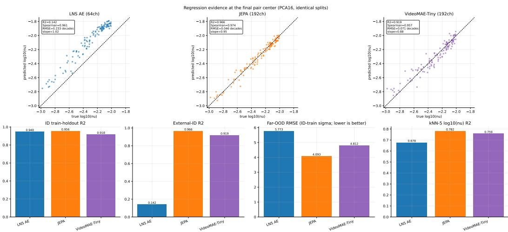  
Figure 13: Viscosity readout across evaluation regimes. Upper panels compare external-ID viscosity predictions with numerical truth at the final two-frame center. Lower panels report internal holdout readout, external-ID readout, far-OOD standardized RMSE, and five-neighbor readout. LNS retains strong rank ordering despite a calibration shift on external ID.

The standardized PCA-based comparison reaches a consistent conclusion using a much smaller linear readout (Table 20; Figure 13). At the final two-frame center, JEPA has internal-holdout/external-ID $R ^ { 2 }$ of 0.9555/0.9659, compared with 0.9484/0.1422 for LNS and 0.9182/0.9194 for VideoMAE. LNS's external-ID decline coexists with a Spearman correlation of 0.9605, and the prediction scatter shows a systematic offset despite preserved ordering. However, strong ID readout does not directly translate to parameter extrapolation. On far-OOD viscosities, all three linear probes yield negative $R ^ { 2 }$ , with standardized RMSEs of 4.0933, 5.7730, and 4.8123 for JEPA, LNS, and VideoMAE, respectively. JEPA therefore retains the smallest extrapolation error, but it does not provide reliable out-of-range prediction.

A five-nearest-neighbor probe (kNN-5) over all aligned pair centers further separates physical information from linear probing. Viscosity $R ^ { 2 }$ is 0.7820 for JEPA, 0.6780 for LNS, and 0.7586 for VideoMAE. VideoMAE therefore retains substantial local parameter organization even though its dominant PCA structure differs visibly from the other two models.

## D.1.3 VARIANCE CONCENTRATION AND LATENT ORGANIZATION

The three representations exhibit markedly different variance concentrations (Figure 14; Table 21). After standardizing the training channels, LNS is highly concentrated in a few dominant directions: its first two principal components explain 97.11% of the variance, and only two components are required to reach 95% explained variance. JEPA is less concentrated, with 86.47% captured by the first two components and six components required for 95% variance. VideoMAE exhibits the broadest spectrum, with only 45.02% captured by the first two components and eight components required to reach 95%. The corresponding entropy effective ranks are 1.31, 2.77, and 8.92 for LNS, JEPA, and VideoMAE, respectively. These results show that LNS compresses variation into a small number of dominant directions, whereas JEPA and particularly VideoMAE distribute variation across a broader latent subspace.

Neither a compact spectrum nor a higher effective rank directly ranks physical usefulness. LNS retains strong viscosity ordering in a concentrated representation, JEPA combines a moderately distributed spectrum with stronger readout, and VideoMAE's larger effective rank partly reflects temporal-position structure. The pairwise linear centered kernel alignment (CKA) (Kornblith et al., 2019) matrix further characterizes the differences between their representations (Table 22). On 10,000 aligned pooled samples, linear CKA is 0.8018 between JEPA and LNS, compared with 0.1361 between JEPA and VideoMAE and 0.1964 between LNS and VideoMAE. Despite this low cross-model similarity, VideoMAE achieves an external-ID viscosity $R ^ { 2 }$ of 0.9194 (Table 20). Thus, different representation structures can support useful viscosity inference.

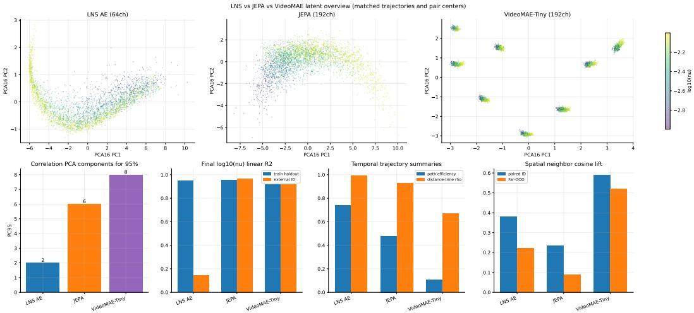  
Figure 14: Primary baseline families on matched Vorticity trajectories and two-frame centers. The upper panels show model-specific pooled PCA coordinates colored by viscosity. Lower panels summarize variance concentration, held-out linear readout, training-trajectory geometry, and nativegrid spatial similarity.

Table 21: Variance concentration and temporal organization of pooled features.
<table><tr><td>Representation</td><td>PC95</td><td>Eff. rank</td><td>Top-2 var. (%)</td><td>ID path efficiency ↑</td><td>ID distance-time ρ ↑</td></tr><tr><td>JEPA</td><td>6</td><td>2.77</td><td>86.47</td><td>0.4901</td><td>0.9451</td></tr><tr><td>LNS</td><td>2</td><td>1.31</td><td>97.11</td><td>0.7581</td><td>0.9925</td></tr><tr><td>VideoMAE-Tiny</td><td>8</td><td>8.92</td><td>45.02</td><td>0.1070</td><td>0.6695</td></tr></table>

Spectral statistics use training-channel-standardized pooled features. Temporal statistics use external ID trajectories in each model's PCA16 space. Higher path efficiency means a straighter path; neither it nor effective rank is a physical-accuracy score. These are pooled-channel spectra, not token PCA spectra.

## D.1.4 TEMPORAL AND SPATIAL ORGANIZATION

We next examine whether physically informative representations also induce latent trajectories that are easy to evolve. Path efficiency, defined as the endpoint displacement divided by the accumulated step length, measures how directly a trajectory progresses through latent space. On external ID data, LNS achieves a path efficiency of 0.7581, compared with 0.4901 for JEPA and 0.1070 for VideoMAE (Table 21). The corresponding correlations between elapsed time and distance from the initial state are 0.9925, 0.9451, and 0.6695, respectively. Thus, LNS follows a straighter and more monotonically separating trajectory than JEPA, despite JEPA exhibiting stronger physical readout in the preceding analyses. This distinction suggests that physical structure and evolvability are complementary properties: a representation may encode governing factors well without automatically yielding the simplest geometry for rollout. The same trend is observed on the training trajectories (Figure 15), motivating the explicit geometry adaptation introduced later.

VideoMAE requires an additional caveat because its pooled geometry is strongly influenced by clip-relative position. Relative tubelet position is nearly perfectly linearly readable $( R ^ { 2 } = 0 . 9 9 9 5 )$ and explains 94.5% of the pooled PCA16 variance (Figure 16). Although its stitched trajectory is sensitive to the clip-context boundary, temporal progression remains well organized within each individual view $( \rho \approx 0 . 9 5 )$ . We therefore treat its pooled temporal geometry as context dependent rather than as a context-invariant instantaneous state.

All three representations also preserve local spatial organization (Table 23; Figure 17). On their shared $1 6 \times 1 6$ token grids, LNS and JEPA obtain ID neighbor-distant cosine lifts of 0.3809 and 0.2335, respectively, with corresponding far-OOD values of 0.2218 and 0.0902. VideoMAE also exhibits persistent local structure, but its $8 \times 8$ token grid has a different physical spacing. Its spatial statistics are therefore included as a descriptive reference rather than a resolution-controlled comparison. Overall, these results further separate physical informativeness from geometric simplicity: JEPA provides a physically informative representation, while additional geometric adaptation is needed to make its latent evolution more favorable for rollout.

Table 22: Pairwise linear CKA on 10,000 aligned pooled samples.
<table><tr><td>Model</td><td>JEPA</td><td>LNS</td><td>VideoMAE</td></tr><tr><td>JEPA</td><td>1.0000</td><td>0.8018</td><td>0.1361</td></tr><tr><td>LNS</td><td>0.8018</td><td>1.0000</td><td>0.1964</td></tr><tr><td>VideoMAE</td><td>0.1361</td><td>0.1964</td><td>1.0000</td></tr></table>

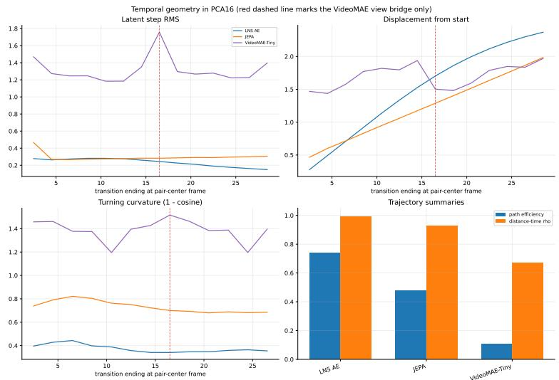  
Figure 15: Temporal organization in model-specific pooled PCA16 coordinates. UpperLeft: Latent step magnitude measures the size of consecutive temporal transitions; LNS contracts, JEPA stays stable, and VideoMAE fluctuates sharply. UpperRight: Distance from the initial state measures global temporal progression; LNS separates most steadily; JEPA remains stable; VideoMAE is disrupted. LowerLeft: Temporal turning, quantified by one minus the cosine similarity between consecutive latent increments, measures changes in trajectory direction; LNS turns least, JEPA moderately, and VideoMAE most. LowerRight: Path efficiency and distance-time correlation summary; LNS is most smooth; JEPA remains ordered; VideoMAE is most context dependent.

Table 23: Spatial organization of the primary representation families.
<table><tr><td>Representation</td><td>Native grid</td><td>ID neighbor cos. ↑</td><td>ID distant cos. ↑</td><td>ID lift ↑</td><td>Far-OOD lift ↑</td></tr><tr><td>JEPA</td><td> $1 6 \times 1 6$ </td><td>0.4792</td><td>0.2457</td><td>0.2335</td><td>0.0902</td></tr><tr><td>LNS</td><td> $1 6 \times 1 6$ </td><td>0.4501</td><td>0.0692</td><td>0.3809</td><td>0.2218</td></tr><tr><td>VideoMAE-Tiny</td><td>8×8</td><td>0.6210</td><td>0.0296</td><td>0.5914</td><td>0.5192</td></tr></table>

Lift denotes neighboring-token minus distant-token cosine similarity, averaged across the 15 two-frame centers. A larger lift indicates stronger local spatial organization.

## D.1.5 EXTENSION TO OTHER PDES

The attentive comparison further extends JEPA and LNS to Wave2D, Burgers, and Heat (Table 24; Figure 18), where JEPA achieves lower test MSE across all label budgets. At full supervision, the error reductions are 21.5%, 59.1%, and 13.8%, respectively. The largest gains appear in Wave2D wave-speed readout (R2: 0.4783→0.5893) and Burgers log-diffusivity (0.2020→0.6734), while Heat remains challenging for both models.

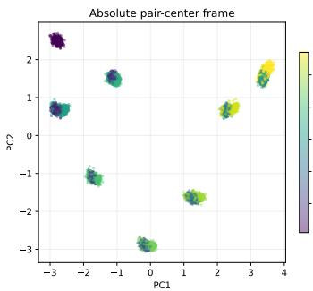

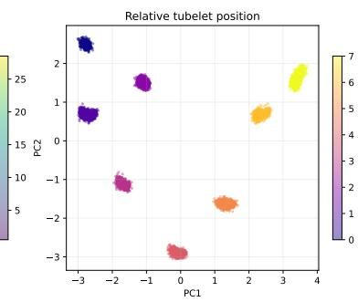

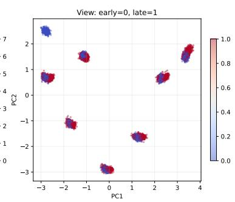  
Figure 16: VideoMAE pooled features colored by absolute time, relative tubelet position, and clip identity. Left: Absolute-time coloring tests whether the clusters reflect physical time. Middle: Relative-position coloring shows that the clusters are primarily organized by tubelet position within the input clip. Right: Early/late view coloring shows substantial overlap within clusters, indicating that clip identity alone does not explain the separation.

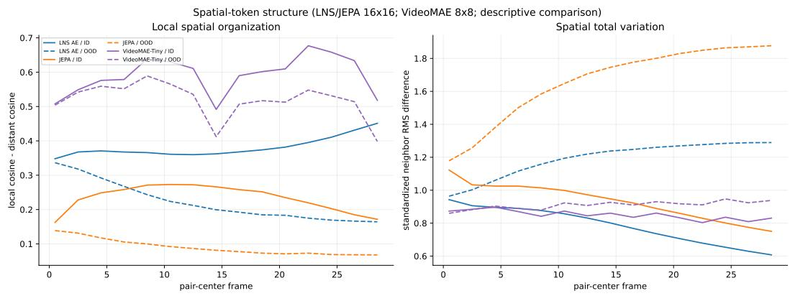  
Figure 17: Native-token spatial organization on paired ID and far-OOD trajectories. Left: Local spatial organization. Local lift measures spatial locality; LNS exceeds JEPA, while VideoMAE is highest descriptively. Right: Spatial total variation. Spatial variation grows most under JEPA OOD, while ID becomes smoother.

To assess whether the full-budget improvements are consistent across specific test trajectories, we bootstrap the JEPA-LNS MSE difference, where negative values favor JEPA. The 95% intervals remain below zero on Wave2D $( [ - 0 . 1 2 9 4 , - 0 . 0 7 1 8 ] )$ and Burgers $( \left[ - 1 . 0 2 7 3 , - 0 . 0 8 4 7 \right] )$ , indicating consistent improvements across resampled environments. For Heat, the interval ([—0.1867, 0.0102]) crosses zero, so the improvement is less conclusive.

Table 24: Parameter readout across label budgets and PDEs.
<table><tr><td>Dataset</td><td>Budget</td><td>LNS MSE↓</td><td>JEPA MSE↓</td><td>Decrease (%) ↑</td><td>LNS  $R ^ { 2 }$  ↑</td><td>JEPA  $R ^ { 2 } \uparrow$ </td></tr><tr><td>Wave2D</td><td>10%</td><td>0.503139</td><td>0.472475</td><td>6.1</td><td>0.4359</td><td>0.4684</td></tr><tr><td>Wave2D</td><td>50%</td><td>0.476702</td><td>0.431590</td><td>9.5</td><td>0.4651</td><td>0.5143</td></tr><tr><td>Wave2D</td><td>100%</td><td>0.464928</td><td>0.364986</td><td>21.5</td><td>0.4783</td><td>0.5893</td></tr><tr><td>Burgers</td><td>10%</td><td>0.905448</td><td>0.694140</td><td>23.3</td><td>0.1057</td><td>0.3144</td></tr><tr><td>Burgers</td><td>50%</td><td>0.868372</td><td>0.511263</td><td>41.1</td><td>0.1423</td><td>0.4950</td></tr><tr><td>Burgers</td><td>100%</td><td>0.807950</td><td>0.330690</td><td>59.1</td><td>0.2020</td><td>0.6734</td></tr><tr><td>Heat</td><td>10%</td><td>0.662985</td><td>0.629060</td><td>5.1</td><td>-0.1061</td><td>-0.0495</td></tr><tr><td>Heat</td><td>50%</td><td>0.651126</td><td>0.637604</td><td>2.1</td><td>-0.0863</td><td>-0.0638</td></tr><tr><td>Heat</td><td>100%</td><td>0.649273</td><td>0.559498</td><td>13.8</td><td>-0.0832</td><td>0.0665</td></tr></table>

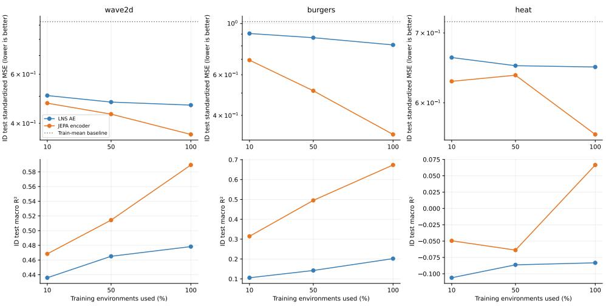  
Figure 18: Parameter readout versus the number of labeled training environments. Top row: gives test standardized MSE; Bottom row: gives R-squared.

For local-state analysis, we use MAE-PDE (Zhou & Farimani, 2024) as a alternative to VideoMAE. Using a shared $8 \times 8$ grid and 16 PCA channels, JEPA achieves the strongest ID/OOD linear readout on CFD (0.9921/0.9492) (CFD refers to Vorticity in this subsection) and Wave2D (0.8773/0.8633), compared with 0.9578/0.8818 and 0.8258/0.7254 for LNS (Table 25). MAE-PDE shows weaker controlled local-state readout on CFD and Wave2D $( R ^ { 2 } \approx 0 . 1 0$ and 0.37). Overall, local physicalstate information and governing-parameter information remain distinct representation properties.

Table 25: Dimension-controlled local physical-state readout.
<table><tr><td>Representation</td><td>CFD ID  $R ^ { 2 }$  ↑</td><td>CFD OOD  $R ^ { 2 } \uparrow$ </td><td>Wave2D ID  $R ^ { 2 }$  ↑</td><td>Wave2D OOD  $R ^ { 2 } \uparrow$ </td></tr><tr><td>LNS</td><td>0.9578</td><td>0.8818</td><td>0.8258</td><td>0.7254</td></tr><tr><td>JEPA</td><td>0.9921</td><td>0.9492</td><td>0.8773</td><td>0.8633</td></tr><tr><td>MAE-PDE, single</td><td>0.0962</td><td>0.0698</td><td>0.3658</td><td>0.3063</td></tr><tr><td>MAE-PDE, history-5</td><td>0.1034</td><td>0.0758</td><td>0.3696</td><td>0.2933</td></tr></table>

Matched CFD and Wave2D space-time cuts compare the physical field with each model's trainfitted PC1 along the same trajectories (Figures 19 and 20). On the 1D PDEs, the corresponding PC1 maps visualize their space-time organization (Figure 21). The space-time maps reveal qualitatively different organizations across the representations. On Wave2D and CFD, JEPA's leading component forms coherent spatiotemporal structures that track the propagation and deformation of the underlying physical fields, whereas LNS appears smoother and MAE-PDE exhibits more blockwise or stripe-like organization. Similar equation-specific patterns emerge on the 1D PDEs, particularly for Burgers and Heat. Overall, JEPA exhibits more coherent and physically aligned spatiotemporal organization across PDEs.

## D.1.6 DIRECT RECONSTRUCTION VERSUS AUTOREGRESSIVE ROLLOUT

Accurate reconstruction measures how well a representation preserves a physical state; forecasting additionally requires predicting its evolution. We examine these properties separately. Direct reconstruction decodes the ground-truth representation at each time, $\widetilde { u } _ { t } = D _ { \mathrm { r e c } } ( z _ { t } )$ . Autoregressive rollout instead decodes predicted latent states, $\widehat { \boldsymbol { u } } _ { t } = D _ { \mathrm { r o l l } } ( \widehat { \boldsymbol { z } } _ { t } )$ , generated from the observed prefix without access to future states. For the evaluated frame set $\tau$ , we average the physical relative $L ^ { 2 }$ error over trajectories and report

$$
e _ { a } = \frac { 1 } { N } \sum _ { i = 1 } ^ { N } \frac { \Vert u _ { i , \mathcal { T } } ^ { a } - u _ { i , \mathcal { T } } \Vert _ { 2 } } { \Vert u _ { i , \mathcal { T } } \Vert _ { 2 } } , \qquad R = \frac { e _ { \mathrm { r o l l } } } { e _ { \mathrm { r e c } } } ,\tag{37}
$$

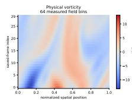

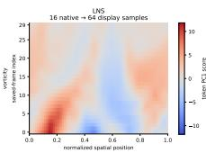  
CFD token PC1 space-time: 64-point spatial display interpolation —NOT 64 native tokens Matched ID case 600, loq10(v)=-2.32

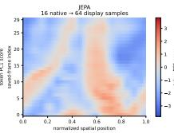

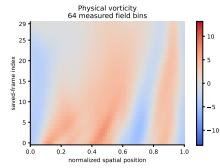

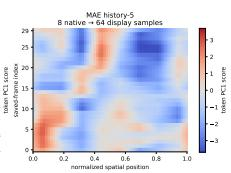

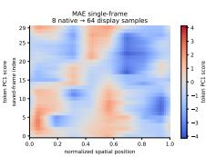

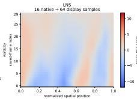

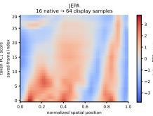

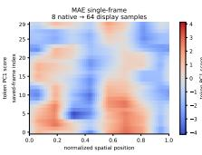

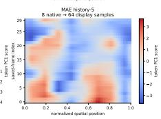  
Figure 19: CFD physical-field and token-PC1 space-time maps.Matched CFD space-time maps along a fixed spatial line comparing physical vorticity with each model's token-PC1 representation

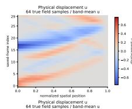  
Wave2D token PC1 space-time: 64-point spatial display interpolation — NOT 64 native tokens Matched ID case 600, c=330.3, k=18.69

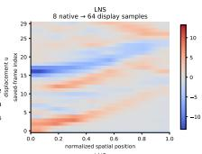

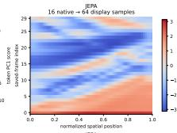

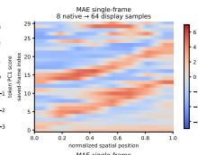

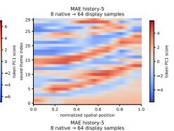

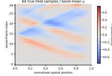

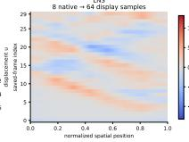

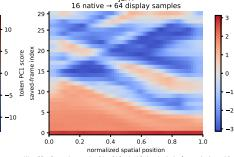  
Wave2D: all encodlers receive 64 × 64 Du. da/t) the physical reference is chansel 0. =. Physical u: ariginal G x 4 channel 0, averaged over the same eight-rowicolumn band Gs real samples in the varying direction. Symmmetric full-range model local color scales shered across both pages and both cutic no clilpping.

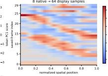

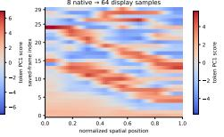  
Figure 20: Matched Wave2D displacement and token-PC1 space-time maps.

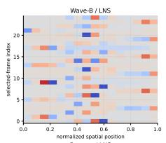

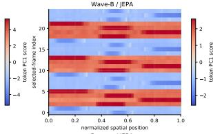

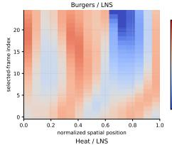

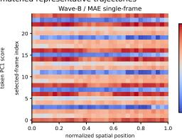

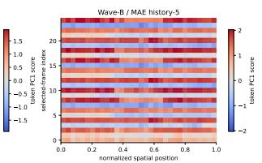

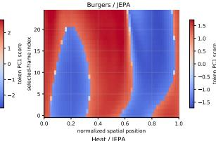

  
Native spatial grids: symmetric per-panel color limits at the 99th absolute percentile. PC signs are arbitrary

  
Figure 21: Matched Wave-B, Burgers, and Heat token-PC1 space-time maps.

where $a \in \{ \mathrm { r e c } , \mathrm { r o l l } \}$ and the norm covers time, space, and physical channels. Thus, R is a ratio of mean errors.

Table 26: Direct reconstruction and autoregressive rollout errors on the ID validation sets for JEPA and Zebra. We report $R = e _ { \mathrm { r o l l } } / e _ { \mathrm { r e c } }$ , which measures the increase from reconstruction to rollout error; larger values indicate a larger reconstruction-prediction gap. Parentheses denote the decoder input. Zebra results are unavailable for Gray-Scott.
<table><tr><td>Dataset (input)</td><td> $e _ { \mathrm { r e c } }$ </td><td> $e _ { \mathrm { r o l l } }$ </td><td>JEPA-R</td><td> $e _ { \mathrm { r e c } }$ </td><td> $e _ { \mathrm { r o l l } }$ </td><td>Zebra-R</td></tr><tr><td>Advection (z)</td><td>0.0029</td><td>0.0235</td><td>8.12</td><td>0.0003</td><td>0.0079</td><td>26.33</td></tr><tr><td>Burgers (z)</td><td>0.0151</td><td>0.135</td><td>8.99</td><td>0.0016</td><td>0.1540</td><td>96.25</td></tr><tr><td>Heat (z)</td><td>0.0085</td><td>0.0808</td><td>9.51</td><td>0.0019</td><td>0.1150</td><td>60.53</td></tr><tr><td>Wave-B (z)</td><td>0.0125</td><td>0.1115</td><td>8.92</td><td>0.0011</td><td>0.2450</td><td>222.73</td></tr><tr><td>Wave-2D (z)</td><td>0.0415</td><td>0.363</td><td>8.74</td><td>0.0010</td><td>0.2070</td><td>207.00</td></tr><tr><td>Combined (z)</td><td>0.0027</td><td>0.0332</td><td>12.31</td><td>0.0022</td><td>0.0079</td><td>3.59</td></tr><tr><td>Vorticity (z)</td><td>0.0104</td><td>0.086</td><td>8.26</td><td>0.0170</td><td>0.1190</td><td>7.00</td></tr><tr><td>GS (z)</td><td>0.0079</td><td>0.0807</td><td>10.22</td><td></td><td></td><td></td></tr></table>

Table 26 shows a clear separation between reconstruction fidelity and temporal predictability. For JEPA, the rollout-to-reconstruction ratio remains relatively consistent across datasets, ranging from 8.12 to 12.31. In contrast, Zebra exhibits much larger and more variable gaps on several benchmarks, including Burgers (96.25×), Wave-B (222.73×), and Wave2D (207.00×), despite its substantially smaller reconstruction errors. The ratio alone, however, does not rank rollout accuracy: for example, Zebra has a much larger ratio on Wave2D but a lower absolute rollout error than JEPA, whereas JEPA achieves lower rollout error on Burgers, Heat, Wave-B, and Vorticity. These results therefore show that reconstruction quality and temporal predictability are distinct properties, and that a representation with lower reconstruction error is not necessarily easier to evolve accurately over time.

## D.2 MECHANISM ANALYSES

We investigate how geometry alignment and physics-structured prediction improve latent dynamics and long-horizon forecasting. We organize our mechanism analysis around four questions. Q1: Does geometry projection align latent evolution with the underlying physical trajectory? We examine full-dimensional latent trajectory geometry in subsection D.2.3 and controlled 1D experiments in subsection D.2.6 to determine whether the projected representation better reflects physical evolution. Q2: Does the physics-structured predictor capture parameter-dependent dynamics more faithfully? We compare predicted and numerical parameter responses at matched initial conditions in both latent and physical spaces in subsection D.2.2. Q3: Do these improvements translate into better forecasting under parameter shift? We evaluate field- and latent-space rollout accuracy across ID and OOD regimes in subsection D.2.4. Q4: Why does physics supervision improve long-horizon extrapolation? We separate one-step prediction defects from subsequent error amplification to identify the source of the long-horizon improvement in subsection D.2.5. Together, the analyses support all four questions: geometry projection improves physical alignment, the structured predictor better captures parameter-dependent dynamics, these gains improve field forecasting under parameter shift, and reduced error amplification provides a mechanism for the long-horizon extrapolation benefit.

## D.2.1 EVALUATION PROTOCOL AND DYNAMICS DIAGNOSTICS

Experimental setup. We analyze three JEPA-based systems on Vorticity: Vanilla, which evolves standardized encoder features; Geo, which evolves features transformed by the frozen geometry projector; and Physics, which further introduces the structured parameter-dependent predictor. Wave2D provides compatible Geo and Physics systems. Within each dataset, Geo and Physics share the same frozen encoder, projector, decoder, numerical precision, and integration scheme, and all free rollouts start from the observed initial state. For Vorticity, we include a 120 Bridge data ranging viscosity between $[ 1 0 ^ { - 4 } , 1 0 ^ { - 3 } ]$ for further analysis.

Parameter response. For parameter-response analysis, each of the 120 OOD trajectories is paired with a training-reference trajectory sharing the same initial condition but a different physical parameter, so the two rollouts start from the same latent state and differ only in the supplied parameter. We evaluate the resulting finite parameter response over 29 future steps, while the 1,200 ID-validation trajectories are used separately for standard rollout evaluation. Because the OOD split reuses training initial conditions, this protocol tests parameter generalization at fixed initial conditions. A separate perturbation analysis uses depth-eight Vorticity predictors, denoted Free-D and Physics-D, where Physics-D adds supervision on the viscosity-dependent branch.The 1D controls likewise follow their own dataset-specific protocols.

For two different parameters $\xi _ { a }$ and $\xi _ { b } ,$ we compare the predicted response $\Delta \widehat { x } _ { t } = \widehat { x } _ { t } ( \xi _ { b } ) - \widehat { x } _ { t } ( \xi _ { a } )$ with the numerical response $\bar { \Delta } x _ { t } = \bar { x } _ { t } ( \xi _ { b } ) - \bar { x } _ { t } \big ( \xi _ { a } \big )$ , where x denotes either the decoded field or latent state. We measure response direction (Cos.), magnitude (Amp.), and relative error as

$$
C _ { x } ( t ) = \frac { \langle \Delta \widehat { x } _ { t } , \Delta x _ { t } \rangle } { \| \Delta \widehat { x } _ { t } \| _ { 2 } \| \Delta x _ { t } \| _ { 2 } } , \qquad R _ { x } ( t ) = \frac { \| \Delta \widehat { x } _ { t } \| _ { 2 } } { \| \Delta x _ { t } \| _ { 2 } } , \qquad E _ { x } ( t ) = \frac { \| \Delta \widehat { x } _ { t } - \Delta x _ { t } \| _ { 2 } } { \| \Delta x _ { t } \| _ { 2 } } .
$$

The targets are $C _ { x } = R _ { x } = 1$ and $E _ { x } = 0$ . Metrics are averaged over time and then across the 120 matched initial conditions, with paired confidence intervals obtained by resampling complete initial conditions 1,000 times. Geo and Physics are compared against the same frozen target representation $q _ { t } = G ( E ( u _ { t } ) )$ , so their latent-response comparison is independent of the physical decoder.

## D.2.2 PARAMETER-DEPENDENT DYNAMICS

On Vorticity, the main improvement comes from a more accurate direction of the parameter-induced dynamics while preserving the response magnitude (Table 27; Figure 22). The mean field-response cosine increases from 0.5161 for Vanilla to 0.6259 for Geo and 0.7079 for Physics, whereas only physics maintain field-response magnitude ratios close to one. In the shared projected latent space, Physics further increases the response cosine from 0.9128 to 0.9240 and reduces Geo's magnitude overestimation from 1.1423 to 1.0428. Thus, geometry alignment makes the parameter response substantially more directionally consistent, while the structured predictor further improves its direction and latent amplitude calibration.

Table 27: Parameter-response accuracy at fixed initial conditions.
<table><tr><td>Dataset</td><td>Model</td><td> $C _ { u } \to 1$ </td><td> $R _ { u } \to 1$ </td><td> $C _ { q } \to 1$ </td><td> $R _ { q } \to 1$ </td></tr><tr><td>Vorticity</td><td>Vanilla</td><td>0.5161</td><td>0.7923</td><td>0.7802</td><td>1.0138</td></tr><tr><td>Vorticity</td><td>Geo</td><td>0.6259</td><td>0.8462</td><td>0.9128</td><td>1.1423</td></tr><tr><td>Vorticity</td><td>Physics</td><td>0.7079</td><td>0.9870</td><td>0.9240</td><td>1.0428</td></tr><tr><td>Wave2D</td><td>Geo</td><td>0.9582</td><td>0.9786</td><td>0.9389</td><td>0.9903</td></tr><tr><td>Wave2D</td><td>Physics</td><td>0.9861</td><td>0.9959</td><td>0.9465</td><td>1.0023</td></tr></table>

Means over 29 steps and 120 matched initial conditions. Cosine has target 1; the magnitude ratio also has target 1. Geo and Physics use the same unquantized projected latent target. Vanilla uses its own standardized encoder coordinates.

Wave2D shows an even cleaner improvement in both response direction and magnitude (Figure 23). Physics increases the field-response cosine from 0.9582 to 0.9861 and moves the magnitude ratio from 0.9786 to 0.9959, closely matching the numerical parameter response. In latent space, the cosine also improves from 0.9389 to 0.9465, while the magnitude ratio moves from 0.9903 to 1.0023. These results show that the structured predictor more faithfully captures the combined effect of changing $( c , k )$ in both latent and physical space, with the largest gain appearing in the decoded field response.

The temporal decomposition exposes a meaningful difference between the equations (Table 28; Figure 24). Over steps 22–29, Vorticiy retains positive field and latent cosine gains of 0.1693 and 0.0346. Wave2D retains a field cosine gain of 0.0528, but its latent cosine decreases from 0.8900 to 0.8789. The paired change is -0.0111 [-0.0216, -0.0011], and latent relative-response error increases by 0.0234 [0.0050, 0.0431]. Average improvement therefore coexists with a measurable late-horizon latent limitation. A single whole-rollout average would conceal this reversal.

  
Figure 22: Vorticity parameter-response magnitude and direction at fixed initial conditions. Curves average all 120 matched pairs; shaded bands are pointwise 95% initial-condition bootstrap intervals. Upper row measures decoded fields. Lower row measures latent states. Both magnitude and cosine have target 1.

  
Figure 23: Wave2D parameter-response magnitude and direction at fixed initial conditions. Curves average all 120 matched pairs; shaded bands are pointwise 95% initial-condition bootstrap intervals. Upper row measures decoded fields. Lower row measures latent states. Both magnitude and cosine have target 1.

Table 28: Paired changes in response accuracy: Physics minus Geo.
<table><tr><td>Dataset</td><td>Steps</td><td> $\Delta C _ { u }$  [95% CI]</td><td> $\Delta C _ { q }$  [95% CI]</td><td> $\Delta E _ { q }$  [95% CI]</td></tr><tr><td>NS</td><td>1-29</td><td>+0.0820 [0.0716, 0.0935]</td><td>+0.0112 [0.0084, 0.0144]</td><td>-0.0595 [-0.0695, -0.0509]</td></tr><tr><td>NS</td><td>22-29</td><td>+0.1693 [0.1472, 0.1937]</td><td>+0.0346 [0.0288, 0.0411]</td><td>-0.1067 [-0.1215, -0.0932]</td></tr><tr><td>Wave2D</td><td>1-29</td><td>+0.0279 [0.0236, 0.0321]</td><td>+0.0077 [0.0025, 0.0122]</td><td>-0.0368 [-0.0468, -0.0258]</td></tr><tr><td>Wave2D</td><td>22-29</td><td>+0.0528 [0.0435, 0.0625]</td><td>-0.0111 [-0.0216, -0.0011]</td><td>+0.0234 [0.0050, 0.0431]</td></tr></table>

Positive cosine changes and negative relative-error changes favor Physics. Intervals use 1,000 paired bootstrap resamples of complete initial conditions; steps within an initial condition remain together.

  
Figure 24: Paired changes in parameter-response direction. With 95% initial-condition bootstrap intervals. All denotes steps 1–29 and late denotes steps 22–29. The Wave2D late latent interval lies below zero, while its late field interval lies above zero.

## D.2.3 LATENT TRAJECTORY GEOMETRY

This section examines how parameter changes reshape latent trajectories and whether the predicted trajectory geometry matches the projected numerical dynamics. We consider two complementary diagnostics. First, for matched initial conditions under two parameter settings, we measure crossparameter trajectory separation and velocity-direction similarity (Figure 25). Second, for each individual trajectory, we measure speed, curvature, and path efficiency in the full projected latent space (Table 29; Figure 28). The projected numerical trajectory, $q _ { t } = G ( E ( u _ { t } ) )$ ), serves as the reference, while PCA is used only for qualitative visualization.

Cross-parameter trajectory geometry. On Vorticity, Physics more closely reproduces the late geometry of the projected numerical trajectories (Figure 25). Its cross-parameter separation is 0.2743 versus 0.2694 for the projected truth, compared with 0.2995 for Geo, while its velocitydirection similarity is 0.2296 versus 0.2124 for the projected truth and 0.1804 for Geo. On Wave2D, the numerical trajectories under the two parameter settings are themselves nearly orthogonal at late times, with a velocity-direction similarity of —0.0010; Physics closely reproduces this behavior at —0.0014, compared with —0.0026 for Geo. Thus, cross-parameter direction similarity should be interpreted relative to the numerical dynamics rather than as a standalone measure of organization.

  
Figure 25: Full-dimensional geometry of the two trajectories generated from each matched initial condition. Velocity-direction cosine compares the two parameter settings within a model, whereas response cosine compares predicted and true parameter-induced differences. Lower crossparameter direction similarity can therefore be correct, as the Wave2D projected-truth curve illustrates. Shading uses 1,000 initial-condition bootstrap resamples.

The corresponding PCA trajectory families provide qualitative examples of how the same initial state branches under different parameter settings (Figures 26 and 27). These visualizations are illustrative only; all quantitative geometry metrics are computed in the full latent space.

Single-trajectory temporal geometry. The aggregate trajectory statistics reveal different behaviors across equations (Table 29; Figure 28). On Wave2D, Physics more closely matches the projected numerical speed and curvature than Geo: its mean speed is 0.5759 versus 0.5664 for the projected truth, while its curvature is 1.4768 versus 1.4755. On Vorticity, however, Physics produces a slower and smoother trajectory than the projected numerical reference, with speed 0.0624 versus 0.0718 and curvature 0.9768 versus 1.1934. Despite this departure, Physics achieves better parameter-response direction and lower field rollout error. These results show that smoother latent dynamics are not necessarily more physical; the relevant criterion is agreement with the projected numerical trajectory rather than smoothness alone.

Table 29: Trajectory geometry in the shared projected coordinates on the original OOD split.
<table><tr><td>Dataset</td><td>Source</td><td>Mean speed</td><td>Mean curvature</td><td>Path efficiency</td></tr><tr><td>Vorticity</td><td>Projected truth</td><td>0.0718</td><td>1.1934</td><td>0.1449</td></tr><tr><td>Vorticity</td><td>Geo</td><td>0.0737</td><td>1.1557</td><td>0.1452</td></tr><tr><td>Vorticity</td><td>Physics</td><td>0.0624</td><td>0.9768</td><td>0.1673</td></tr><tr><td>Wave2D</td><td>Projected truth</td><td>0.5664</td><td>1.4755</td><td>0.0775</td></tr><tr><td>Wave2D</td><td>Geo</td><td>0.5548</td><td>1.4539</td><td>0.0784</td></tr><tr><td>Wave2D</td><td>Physics</td><td>0.5759</td><td>1.4768</td><td>0.0759</td></tr></table>

Each row averages 120 trajectories. Speed is the step displacement norm divided by the square root of latent dimension; curvature is the change in normalized step direction. Projected truth is unquantized.

## D.2.4 FIELD AND LATENT ROLLOUT ACCURACY

To connect parameter-response accuracy with forecasting, we report the mean per-frame NRMSE over steps 1–29 (Table 30). On Vorticity, Physics reduces field error from 0.0429 to 0.0362 on ID validation and from 0.3917 to 0.2966 on OOD trajectories, corresponding to reductions of 15.6% and 24.3%. Wave2D shows a larger improvement in physical space: OOD field error decreases from 0.3039 to 0.1521 and far-OOD error from 0.2652 to 0.1405, while the corresponding latent-space gains are smaller and reverse under the far-OOD condition (0.2212→0.2366). The horizon curves show that these differences persist across rollout (Figure 29). Overall, the structured predictor consistently improves physical-field forecasting, although lower field error does not require uniformly lower latent error.

Table 30: Average rollout error on the original evaluation splits.
<table><tr><td>Dataset</td><td>Space</td><td>Split</td><td>Geo AUEC ↓</td><td>Physics AUEC ↓</td><td>Reduction (%) ↑</td></tr><tr><td>Vorticity</td><td>Field</td><td>ID-val</td><td>0.0429</td><td>0.0362</td><td>15.61</td></tr><tr><td>Vorticity</td><td>Field</td><td>OOD</td><td>0.3917</td><td>0.2966</td><td>24.27</td></tr><tr><td>Wave2D</td><td>Field</td><td>ID-val</td><td>0.1548</td><td>0.1083</td><td>30.01</td></tr><tr><td>Wave2D</td><td>Field</td><td>OOD</td><td>0.3039</td><td>0.1521</td><td>49.94</td></tr><tr><td>Wave2D</td><td>Field</td><td>Far-OOD</td><td>0.2652</td><td>0.1405</td><td>47.03</td></tr><tr><td>Wave2D</td><td>Latent</td><td>ID-val</td><td>0.1447</td><td>0.1357</td><td>6.18</td></tr><tr><td>Wave2D</td><td>Latent</td><td>OOD</td><td>0.2479</td><td>0.2168</td><td>12.54</td></tr><tr><td>Wave2D</td><td>Latent</td><td>Far-OOD</td><td>0.2212</td><td>0.2366</td><td>-6.97</td></tr></table>

AUEC averages per-frame NRMSE over steps 1–29. OOD uses all 120 original OOD trajectories; the Wave2D far-OOD group contains ten trajectories at (c, k) = (512.5, 60).

  
Figure 26: Vorticity predicted and true latent trajectories for all four initial conditions selected. Each panel fits one joint PCA to the two predicted and two true trajectories. Solid curves are predictions; dashed curves are truth. Stars mark the common predicted initial state.

  
Figure 27: Wave2D predicted and true latent trajectories for all four initial conditions selected. Each panel fits one joint PCA to the two predicted and two true trajectories. Solid curves are predictions; dashed curves are truth. Stars mark the common predicted initial state.

  
Figure 28: Speed and direction-change curvature in the shared projected state space. Shading is a trajectory bootstrap interval. The first curvature value is undefined and omitted. Physics is smoother than projected truth on Vorticity; the Wave2D speed and curvature are slightly larger than Geo. Smoothness alone does not rank predictive accuracy.

  
Figure 29: Original-protocol rollout diagnostics. Vorticity panels show ID-val and the farthest available OOD viscosity; Wave2D panels show all original OOD trajectories in field and latent space.

The final-step field visualizations put these averages alongside individual parameter changes (Figure 30; Figure 31). The Wave2D example shows smaller OOD field errors for Physics even though the preceding latent metrics identify a late-horizon limitation.

  
Figure 30: Vorticity final-step fields for IC 32, with the training-reference parameter above and the OOD parameter below. The two parameter settings start from exactly the same vorticity field.

  
Figure 31: Wave2D final-step fields for IC 32, with the training-reference parameter above and the OOD parameter below.

## D.2.5 PHYSICS SUPERVISION REDUCES ERROR PROPAGATION

To understand why physics supervision improves long-horizon extrapolation, we separate two sources of rollout error: the error introduced at each prediction step and the subsequent propagation of existing errors. Let $q _ { t } = G ( E ( u _ { t } ) )$ denote the projected numerical trajectory, $\widehat { q _ { t } }$ the free rollout, and $\Psi _ { \theta }$ one prediction step. Defining the rollout error $e _ { t } = { \widehat { q } } _ { t } - q _ { t }$ and the one-step defect $r _ { t } = \Psi _ { \theta } ( q _ { t } ) - q _ { t + 1 }$ gives

$$
\begin{array} { r } { e _ { t + 1 } = r _ { t } + \left[ \Psi _ { \theta } ( q _ { t } + e _ { t } ) - \Psi _ { \theta } ( q _ { t } ) \right] \approx r _ { t } + A _ { t } e _ { t } , \qquad A _ { t } = J \Psi _ { \theta } ( q _ { t } ) . } \end{array}
$$

Thus, long-horizon error depends not only on one-step prediction quality, but also on how strongly existing errors are amplified during rollout.

We test this mechanism using the Free-D and Physics-D Vorticity predictors described in Section D.2.1. In addition to ID and far-OOD evaluation, we use an intermediate Bridge regime with $\nu \in [ 1 0 ^ { - 4 } , 1 0 ^ { - 3 } ]$ , lying between the training range $( \sim [ 1 0 ^ { - 3 } , 1 0 ^ { - 2 } ] )$ and the far-OOD range $( [ 1 0 ^ { - 5 } , 1 0 ^ { - 4 } ] )$ . To quantify error propagation, we measure the finite-time perturbation gain

$$
A _ { K } ( q , \delta q ) = \frac { \| F _ { \theta } ^ { ( K ) } ( q + \delta q ) - F _ { \theta } ^ { ( K ) } ( q ) \| _ { 2 } } { \| \delta q \| _ { 2 } } ,\tag{38}
$$

where $F _ { \boldsymbol { \theta } } ^ { ( K ) }$ denotes the K-step prediction map. Larger values indicate stronger amplification of an initial latent perturbation.

Physics-D substantially reduces long-horizon amplification under distribution shift (Figure 32; Table 31). At $K = 2 9$ , the median gain changes only slightly on ID data, from 1.2860 to 1.2653, but decreases from 8.8056 to 4.9087 on Bridge and from 15.5361 to 6.4286 on far-OOD. On the far-OOD trajectories, Physics-D has lower gain in 98.3% of cases. The horizon curves further show that this difference grows with rollout length, indicating that physics supervision mainly changes the stability of long-horizon evolution rather than the local ID dynamics.

Importantly, the lower amplification is not explained by better one-step fitting. As shown in Table 31, Physics-D has slightly larger teacher-forced error on all three splits: 0.002188 versus 0.002086 on ID, 0.020687 versus 0.019979 on Bridge, and 0.027629 versus 0.026543 on far-OOD. Nevertheless, its long-horizon errors improve under distribution shift. On far-OOD trajectories, the final-step latent error decreases from 0.169647 to 0.159624, while the whole-rollout error decreases from 0.096307 to 0.090602. Bridge shows the same trend with a smaller margin, whereas ID rollout error slightly increases.

Perturbation amplification is also associated with long-horizon prediction error: across the 480 evaluated initial states, the Spearman correlation between log gain and final-step latent error is approximately 0.81 for both predictors. This association weakens after controlling for viscosity, indicating that amplification explains only part of the rollout behavior.

  
Figure 32: Finite-time perturbation amplification on Vorticity. Physics-D leaves ID amplification nearly unchanged but substantially suppresses long-horizon amplification on Bridge and far-OOD trajectories.

Table 31: One-step prediction error, perturbation amplification, and latent rollout error on Vorticity.
<table><tr><td>Split</td><td>Model</td><td>N</td><td>Teacher error</td><td> $A _ { 2 9 }$ </td><td>Final latent error</td><td>Whole latent error</td></tr><tr><td>ID</td><td>Free-D</td><td>120</td><td>0.002086</td><td>1.2860</td><td>0.036409</td><td>0.022268</td></tr><tr><td>ID</td><td>Physics-D</td><td>120</td><td>0.002188</td><td>1.2653</td><td>0.040790</td><td>0.025092</td></tr><tr><td>Bridge</td><td>Free-D</td><td>240</td><td>0.019979</td><td>8.8056</td><td>0.135650</td><td>0.077281</td></tr><tr><td>Bridge</td><td>Physics-D</td><td>240</td><td>0.020687</td><td>4.9087</td><td>0.133460</td><td>0.075893</td></tr><tr><td>OOD</td><td>Free-D</td><td>120</td><td>0.026543</td><td>15.5361</td><td>0.169647</td><td>0.096307</td></tr><tr><td>OOD</td><td>Physics-D</td><td>120</td><td>0.027629</td><td>6.4286</td><td>0.159624</td><td>0.090602</td></tr></table>

Overall, these results separate one-step prediction error from error propagation. Physics-D does not improve the former and slightly worsens it, but substantially reduces the latter under Bridge and far-OOD conditions. The resulting reduction in long-horizon rollout error therefore provides direct evidence that suppressed error amplification is an important contributor to the extrapolation benefit of physics supervision.

## D.2.6 EXTENSION TO 1D PDES

The one-dimensional experiments provide two complementary controls on the role of geometry. First, Burgers, Heat, and Wave-B compare the same held-out trajectories before and after the frozen geometry projection. Each test set contains 120 trajectories which is different from Table 3 with 25 observed frames, and all metrics use the full native state vectors. Projection reduces the turningangle MAE from 46.0253 to 23.3122 degrees on Burgers, from 78.1210 to 23.0318 on Heat, and from 13.3181 to 5.7452 on Wave-B; the weighted multi-lag geometry error also decreases on all three datasets (Table 32).

Table 32: Geometry projection on held-out one-dimensional trajectories.
<table><tr><td>Dataset</td><td>N</td><td>Angle MAE: z</td><td>Angle MAE: q</td><td>Multi-lag: z</td><td>Multi-lag: q</td></tr><tr><td>Burgers</td><td>120</td><td>46.0253</td><td>23.3122</td><td>0.2387</td><td>0.0530</td></tr><tr><td>Heat</td><td>120</td><td>78.1210</td><td>23.0318</td><td>0.6688</td><td>0.0150</td></tr><tr><td>Wave-B</td><td>120</td><td>13.3181</td><td>5.7452</td><td>0.0746</td><td>0.0184</td></tr></table>

All metrics use the full 120-trajectory ID-test split and 25 observed frames. Angle errors are in degrees; multilag error compares latent and physical increment-direction cosines at lags 1, 2, and 4. Smaller is better.

Wave-B further shows that the objective is alignment rather than simply reducing curvature. Its mean physical turning angle is 118.7228 degrees, compared with 111.8439 for the encoder state and 118.4202 after projection. Thus, projection can either increase or decrease latent turning as needed to better match the physical trajectory geometry. These results isolate a coordinate-level effect of Geo, but do not imply that lower geometry error necessarily guarantees lower forecast error.

## D.3 EXTENDED EXPERIMENTS AND ABLATION STUDIES

## D.3.1 FULL OOD RESULTS

Our method achieves the best OOD rollout performance across all evaluated PDE benchmarks 33. The largest gains are observed on Combined and Wave2D, where the error is reduced from the previous best 0.038 to 0.008 and from 0.610 to 0.157, respectively. On Vorticity, our method further improves over Zebra from 0.320 to 0.288, while substantial gains are also obtained on HeterNS and Gray-Scott. These results demonstrate consistently stronger parameter extrapolation across heterogeneous PDE dynamics.

Table 33: Full OOD rollout performance across PDE benchmarks. Relative $L ^ { 2 }$ error is reported, lower is better. Best results are bold and second-best results are underlined. - means the method diverges.
<table><tr><td>Method</td><td>Combined Wave-2D Vorticity</td><td></td><td></td><td>HeterNS Visc./Force</td><td>GS</td></tr><tr><td>FNO</td><td></td><td></td><td>0.447</td><td>-/-</td><td>0.192</td></tr><tr><td>GEPS</td><td>0.570</td><td>1.005</td><td>0.421</td><td>0.162/-</td><td>0.184</td></tr><tr><td>UniSolver</td><td>0.038</td><td>1.003</td><td>0.923</td><td>0.037/0.105</td><td>0.1636</td></tr><tr><td>MPP</td><td>1</td><td></td><td>0.845</td><td>-/-</td><td></td></tr><tr><td>DPOT</td><td></td><td>1.197</td><td>0.483</td><td>2.43/1.47</td><td>0.597</td></tr><tr><td>Poseidon-T</td><td>0.146</td><td>1.511</td><td>0.665</td><td>0.560/0.821</td><td>0.083</td></tr><tr><td>LE-PDE</td><td>0.169</td><td>0.924</td><td>0.715</td><td>0.334/0.923</td><td>0.239</td></tr><tr><td>LNS</td><td>0.1667</td><td>0.610</td><td>0.481</td><td>0.610/0.932</td><td>0.146</td></tr><tr><td>MAE-PDE</td><td>0.254</td><td>1.070</td><td>0.503</td><td>0.045/0.248</td><td>0.196</td></tr><tr><td>ENMA</td><td>0.243</td><td>1.151</td><td>0.467</td><td>1.501/2.271</td><td>0.134</td></tr><tr><td>Zebra</td><td>一</td><td>0.680</td><td>0.320</td><td>一</td><td>一</td></tr><tr><td>Ours</td><td>0.008</td><td>0.157</td><td>0.288</td><td>0.011/0.103</td><td>0.033</td></tr><tr><td>Rel. Impr.</td><td>77.9%</td><td>74.2%</td><td>9.7%</td><td>69.5%/1.5%</td><td>59.7%</td></tr></table>

## D.3.2 GEOMETRY ALIGNMENT MODULE

Optimization behavior of geometry alignment. We first examine the optimization behavior of the geometry projector. Figure 33 reports both the geometry loss and the anchor loss during training on four representative PDE systems. The two objectives exhibit a consistent complementary pattern. For Vorticity, Burgers, and Wave-2D, the geometry loss decreases rapidly during the early stage of training and subsequently approaches a stable regime, indicating that the projector progressively aligns the latent trajectory with the geometry of the physical evolution. Gray-Scott shows substantially noisier geometry optimization, but the loss remains bounded throughout training.

In parallel, the anchor loss increases from its initially small value and gradually stabilizes at a dataset-dependent level. Burgers reaches this regime almost immediately, while Vorticity exhibits a transient overshoot before settling to a lower plateau. Wave-2D stabilizes after the initial rise with a mild downward drift, whereas Gray-Scott undergoes a longer adjustment before reaching a relatively steady regime. Together, these curves suggest that geometry alignment does not proceed by unconstrained deformation of the pretrained representation: as the geometry discrepancy is reduced, the anchor term becomes active and limits excessive deviation from the original latent structure. The absence of persistent growth in either objective further indicates that the two constraints can be jointly optimized across PDE systems with substantially different dynamics. This complementary behavior motivates examining whether the anchor constraint is necessary when lower geometric discrepancy can otherwise be achieved through more aggressive deformation of the latent space.

Although the anchor loss stabilizes during training, its role is not to simply minimize the geometry discrepancy. We therefore remove the anchor while keeping the remaining alignment objective unchanged. As shown in Table 34, removing the anchor further reduces the turning-angle MAE from $6 . 3 ^ { \circ }$ to $4 . 8 ^ { \circ }$ on Vorticity and from $1 0 . 1 ^ { \circ }$ to $7 . 6 ^ { \circ }$ on Wave-2D. However, the resulting representations become substantially less informative: local-state probing deteriorates across all evaluated datasets, accompanied by considerably higher parameter-probing error. The ID/OOD rollout errors also increase from 0.040/0.397 to 0.047/0.423 on Vorticity and from 0.143/0.321 to 0.166/0.354 on Wave-2D. Thus, lower geometric error alone does not imply a better state space for dynamics prediction. The anchor constraint prevents over-deformation of the pretrained representation, balancing trajectory alignment with preservation of dynamics-relevant information.

  
(a) GS  
(b) Vorticity  
(c) Burgers  
(d) Wave-2D  
Figure 33: Anchor and Geometry training loss for four benchmarks.

Table 34: Effect of the anchor constraint in geometry alignment. Removing the anchor further decreases the turning-angle error, but substantially degrades the information retained in the representation and leads to worse ID and OOD rollout accuracy.
<table><tr><td>Dataset</td><td>Variant</td><td>Angle MAE (°) ↓</td><td>Local-state  $R ^ { 2 } \uparrow$ </td><td>Param. MSE ↓</td><td>ID Rollout ↓</td><td>OOD Rollout ↓</td></tr><tr><td>Wave-2D</td><td>+ Anchor</td><td>10.1</td><td>0.87</td><td>8.63</td><td>0.143</td><td>0.321</td></tr><tr><td rowspan="3">Vorticity</td><td>w/o Anchor</td><td>7.6</td><td>0.74</td><td>31.7</td><td>0.166</td><td>0.354</td></tr><tr><td>+ Anchor</td><td>6.3</td><td>0.94</td><td>0.009</td><td>0.040</td><td>0.397</td></tr><tr><td>w/o Anchor</td><td>4.8</td><td>0.81</td><td>0.024</td><td>0.047</td><td>0.423</td></tr></table>

Geo modules behavior on AE. We further examine whether geometry alignment provides a representation-agnostic benefit or specifically complements predictive representations. For LNS, we freeze the pretrained encoder and apply the same geometry projector as in PDE-JEPA. We then train the dynamics predictors from scratch on the original and geometry-aligned latent spaces using identical architectures, capacities, and optimization budgets. As shown in Table 35, the original LNS representation already exhibits a substantially smaller trajectory-angle discrepancy than JEPA $( 9 . 3 7 ^ { \circ } \ \mathrm { { v s . 2 9 . 1 ^ { \circ } } ) }$ and a lower ID rollout error (0.059 vs. 0.086). Applying geometry alignment to JEPA reduces the angle discrepancy to $6 . 3 0 ^ { \circ }$ and simultaneously improves rollout error to 0.040. In contrast, the same alignment only slightly reduces the LNS angle discrepancy from 9.37° to 8.21°, while degrading rollout accuracy from 0.059 to 0.062. More aggressive deformation without the anchor further reduces the angle error to 5.94°, but increases rollout error to 0.071. These results show that improved physical-geometry agreement does not universally translate into better latent dynamics. Instead, geometry alignment specifically addresses the substantial geometric mismatch of JEPA representations, whereas deforming the reconstruction-oriented LNS latent space can disturb its learned dynamical organization.

## D.3.3 PREDICTOR MODULE

Structured prediction and capacity on Gray-Scott. Gray-Scott supplies an additional matched comparison between a direct conditional transition and a structured continuous predictor,

$$
\dot { { \bf q } } = { \bf C } _ { \theta } ( { \bf q } ) + \frac { F } { s _ { F } } { \bf D } _ { \theta } ^ { F } ( { \bf q } ) + \frac { k } { s _ { k } ^ { \mathrm { G S } } } { \bf D } _ { \theta } ^ { k } ( { \bf q } )
$$

where F and k are the reaction parameters and the scales are fixed from training. They share the frozen latent cache, sampled transitions, global batch of 64, optimizer schedule, 50 training epochs, and ID-validation selection rule. The continuous predictor uses RK4 with four substeps.

Table 35: Effect of geometry alignment on JEPA and LNS representations. Angle MAE measures the discrepancy between latent and physical trajectory geometry. Anchor deviation is computed as $\| q - z \| _ { 2 } ^ { 2 } / ( \| z \| _ { 2 } ^ { 2 } + \epsilon )$ . Lower is better for all metrics.
<table><tr><td>Representation</td><td>Variant</td><td>Angle MAE (°)↓</td><td>Anchor Deviation  $\downarrow$ </td><td>ID Rollout Rel.  $L ^ { 2 } \downarrow$ </td></tr><tr><td>JEPA</td><td>Original</td><td>29.1</td><td>0</td><td>0.086</td></tr><tr><td>JEPA</td><td>+ Geo</td><td>6.30</td><td>0.08</td><td>0.040</td></tr><tr><td>LNS</td><td>Original</td><td>9.37</td><td>0</td><td>0.059</td></tr><tr><td>LNS</td><td>+ Geo</td><td>8.21</td><td>0.03</td><td>0.062</td></tr><tr><td>LNS</td><td>+ Geo w/o Anchor</td><td>5.94</td><td>0.21</td><td>0.071</td></tr></table>

The comparison tests the complete prediction rule, including its parameterization and numerical integration.

The structured predictor substantially improves multi-step accuracy despite nearly identical teacher errors (Table 36; Figure 34). Relative to the direct predictor, the 8-block structured model reduces the final-step pooled latent error from 0.630593 to 0.275269 and the whole-rollout error from 0.457266 to 0.171373, while maintaining essentially the same teacher error (0.041156 vs. 0.041170). The improvement is already visible at intermediate horizons, with $h _ { 8 }$ decreasing from 0.399747 to 0.124119. These results show that the structured prediction rule provides a clear ID-validation benefit for Gray-Scott, complementing the coarse Advection result and indicating that the effect of predictor structure depends on the equation and its sampled dynamics.

  
Figure 34: Gray-Scott latent prediction on the complete ID-validation set. The direct and structured eight-block predictors have equal parameter counts and training budgets. The twenty-fourblock model tests additional capacity within the structured family.

Increasing the structured predictor from eight to twenty-four blocks provides a further, though more modest, improvement under the same optimizer-step budget. The final-step error decreases from 0.275269 to 0.253280, while the whole-rollout error decreases from 0.171373 to 0.162613; the earlier-horizon errors also improve from 0.053405 to 0.051337 at $h _ { 1 }$ and from 0.124119 to 0.119414 at $h _ { 8 } .$ Thus, additional capacity consistently benefits the structured Gray-Scott predictor, in line with the trend observed on Vorticity.

Table 36: Gray-Scott prediction rule and capacity controls on ID validation.
<table><tr><td>Predictor</td><td>Params (M)</td><td>Teacher ↓</td><td> $h _ { 1 } \downarrow$ </td><td> $h _ { 8 } \downarrow$ </td><td> $h _ { 1 9 } \downarrow$ </td><td>Whole ↓</td></tr><tr><td>Direct (8 blocks)</td><td>14.42</td><td>0.041156</td><td>0.058798</td><td>0.399747</td><td>0.630593</td><td>0.457266</td></tr><tr><td>Structured (8 blocks)</td><td>14.42</td><td>0.041170</td><td>0.053405</td><td>0.124119</td><td>0.275269</td><td>0.171373</td></tr><tr><td>Structured (24 blocks)</td><td>42.81</td><td>0.039671</td><td>0.051337</td><td>0.119414</td><td>0.25328</td><td>0.162613</td></tr></table>

Physical-tangent supervision We next examine explicit factorization and physical-tangent supervision. Given a physical state u with instantaneous PDE tangent ù, we obtain its corresponding latent tangent through the Jacobian-vector product (JVP)

$$
\dot { q } _ { \mathrm { p h y s } } = J _ { E } ( u ) \dot { u } = D _ { u } E ( u ) \dot { u } ,
$$

where E is the frozen encoder. This computes the directional derivative of the representation along the physical evolution without forming the full encoder Jacobian. We compare a conditional generator M0, a strictly factorized generator M1, and the same factorized generator with JVP supervision M2,

$$
\mathrm { M 0 : } \quad \dot { q } = F _ { \theta } ( q , \beta / s _ { \beta } ) , \qquad \mathrm { M 1 , M 2 : } \quad \dot { q } = ( \beta / s _ { \beta } ) A _ { \theta } ( q ) .
$$

M2 additionally penalizes the discrepancy between the predicted latent tangent and $\dot { q } _ { \mathrm { p h y s } }$ with weight 0.1. All models share the frozen representation and decoder, use RK4 with four substeps, and are trained for 12,200 optimizer steps; M1 and M2 additionally share the same initialization.

As shown in Table 37, explicit factorization substantially improves prediction: from M0 to M1, the raw whole-rollout latent error decreases from 0.1100 to 0.0848, the selected latent error from 0.1091 to 0.0821, and the field RelL2 from 0.1009 to 0.0769, with corresponding reductions in phase and speed error. Adding JVP supervision further improves the aggregate trajectory metrics, yielding the lowest teacher error (0.0034), raw whole-rollout latent error (0.0200), selected latent error (0.0798), and field RelL2 (0.0737). M1 nevertheless retains lower phase and speed errors than M2, suggesting that the tangent constraint primarily improves aggregate rollout accuracy rather than every dynamical diagnostic. Overall, the matched comparison supports both explicit factorization and physical-tangent supervision at a temporal resolution that better resolves the local dynamics.

Table 37: Ablation of factorization and physical-tangent supervision on raw-interval Advection. All models are trained and evaluated under the same raw-interval protocol; M1 isolates the effect of explicit factorization over the conditional baseline M0, while M2 further adds physicaltangent JVP supervision.
<table><tr><td>Model</td><td>Teacher↓</td><td>Raw latent whole ↓</td><td>Selected latent whole ↓</td><td>Field RelL2 ↓</td><td>Phase</td><td>Speed</td></tr><tr><td>MO: conditional</td><td>0.0039</td><td>0.1100</td><td>0.1091</td><td>0.1009</td><td>2.4208</td><td>0.2128</td></tr><tr><td>M1: factorized</td><td>0.0035</td><td>0.0848</td><td>0.0821</td><td>0.0769</td><td>1.1478</td><td>0.1018</td></tr><tr><td>M2: factorized + JVP</td><td>0.0034</td><td>0.0200</td><td>0.0798</td><td>0.0737</td><td>1.6361</td><td>0.1189</td></tr></table>

Integration Strategies. We further examine whether the performance of the structured predictor depends strongly on the numerical integrator. As shown in Table 38, low-order integration noticeably degrades prediction accuracy. Using Euler increases the final-step and whole-rollout errors to 0.1914 and 0.0936, respectively, whereas RK2 reduces them to 0.1648 and 0.0796. Moving from RK2 to RK4 provides a further improvement, reaching 0.159669 final-step error and 0.077184 whole-rollout error.

Table 38: Effect of numerical integration accuracy on Vorticity OOD prediction. Higher-order integration substantially improves over Euler, while forecasting accuracy largely saturates by RK4.
<table><tr><td>Predictor</td><td>Integral</td><td>Late teacher</td><td>Final</td><td>Whole</td><td>Round trip</td></tr><tr><td>Physics-D</td><td>Euler</td><td>0.0518</td><td>0.1914</td><td>0.0936</td><td>1.1243</td></tr><tr><td>Physics-D</td><td>RK2</td><td>0.0462</td><td>0.1648</td><td>0.0796</td><td>0.8465</td></tr><tr><td>Physics-D</td><td>RK4</td><td>0.045295</td><td>0.159669</td><td>0.077184</td><td>0.781600</td></tr><tr><td>Physics-D</td><td>RK8</td><td>0.045275</td><td>0.159705</td><td>0.077226</td><td>0.670196</td></tr></table>

Beyond RK4, however, the forward-prediction metrics essentially saturate. RK8 yields nearly identical final and whole-rollout errors (0.159705 and 0.077226), despite further reducing the round-trip error from 0.781600 to 0.670196. This distinction suggests that higher-order integration continues to improve numerical reversibility, while RK4 already provides sufficient precision for forward forecasting. Therefore, the predictive advantage of the structured model is unlikely to arise simply from using an increasingly accurate numerical solver; rather, the learned continuous dynamics account for most of the forecasting gain once integration error is sufficiently controlled.

## D.4 TRAJECTORY VISUALIZATIONS

## D.4.1 ADVECTION

Figure 35 visualizes Advection trajectories for two different values of the governing parameter $\beta ,$ showing the ground truth, forecast, absolute error, and representative spatial profiles over time.

(a) β = 2.418  

  
(b) β = 0.3005  
Figure 35: Qualitative Advection forecasts under different governing parameters.

## D.4.2 BURGERS

Figure 36 visualizes Burgers trajectories for two different values of the governing parameter $\beta$ with fixed $\alpha = 1$ and $\gamma = 0 .$ , showing the ground truth, forecast, absolute error, and representative spatial profiles over time.

## D.4.3 HEAT

Figure 37 visualizes Heat trajectories for two different values of the governing parameter $\beta$ with fixed $\alpha = 0$ and $\gamma = 0$ , showing the ground truth, forecast, absolute error, and representative spatial profiles over time.

(a) β = 2.515, α = 1, γ = 0  

  
(b) β = 1.102, α = 1, γ = 0  
Figure 36: Qualitative Burgers forecasts under different governing parameters.

## D.4.4 WAVE-B

Figure 38 visualizes Wave-B trajectories under two different boundary conditions, showing the ground truth, forecast, absolute error, and representative spatial profiles over time.

## D.4.5 COMBINED EQUATION

Figure 39 visualizes Combined Equation trajectories under representative ID and OOD governing parameters, showing the ground truth, forecast, absolute error, and representative spatial profiles over time.

## D.4.6 WAVE-2D

Figure 40 visualizes Wave-2D trajectories under representative ID and OOD governing parameters (c, k), showing the ground truth, forecast, and absolute error across representative rollout frames.

(a) β = 0.06535, α = 0, γ = 0  

  
(b) β = 0.04978, α = 0, γ = 0  
Figure 37: Qualitative Heat forecasts under different governing parameters.

## D.4.7 VORTICITY

Figure 41 visualizes Vorticity trajectories under representative ID and OOD viscosity values ν, showing the ground truth, forecast, and absolute error across representative rollout frames.

## D.4.8 GRAY-SCOTT

Figure 42 visualizes Gray-Scott trajectories under representative ID and OOD reaction parameters $( \bar { F } , k )$ , showing the ground truth, forecast, and absolute error across representative rollout frames.

## D.4.9 HETERNS

Figure 43 visualizes HeterNS trajectories under representative ID, OOD forcing, and OOD viscosity conditions, showing the ground truth, forecast, and absolute error across representative rollout frames.

  
(a) BC = (1, 0)

  
(b) BC = (0, 0)

  
Figure 38: Qualitative Wave-B forecasts under different boundary conditions

Ground truth--- Forcast  
β=0.2116, α=0.2921, γ=0.486, ν=0  

(a) ID: β = 0.2116, α = 0.2921, γ = 0.486, ν = 0  
β=0.2048, α=1.068, γ=0.9309, ν=0  

  
(b) 00D: β = 0.2048, α = 1.068, γ = 0.9309, ν = 0

  
Figure 39: Qualitative Combined Equation forecasts under ID and OOD governing parameters.

(a) ID: c = 394.9, k = 0  
  
(b) OOD: c = 512.5, k = 57.5  
Figure 40: Qualitative Wave-2D forecasts under ID and OOD governing parameters.

(a) ID: ν = 0.001047  
  
(b) O0D: ν = 1.818 × 10−5  
Figure 41: Qualitative Vorticity forecasts under ID and OOD viscosity regimes.

(a) ID: F = 0.04054, k = 0.059  
  
(b) 00D: F = 0.04522, k = 0.05785  
Figure 42: Qualitative Gray-Scott forecasts under ID and OOD reaction parameters.

(a) ID: $\nu = 1 0 ^ { - 5 }$ m = 1  

(b) OOD forcing: $\nu = 1 0 ^ { - 5 } ,$ m = 0.5  
  
(c) OOD viscosity: ν = 0.002, m = 1  
Figure 43: Qualitative HeterNS forecasts under ID and OOD governing conditions.