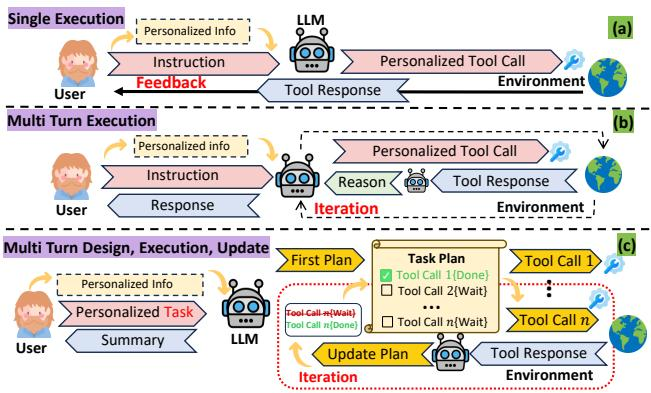
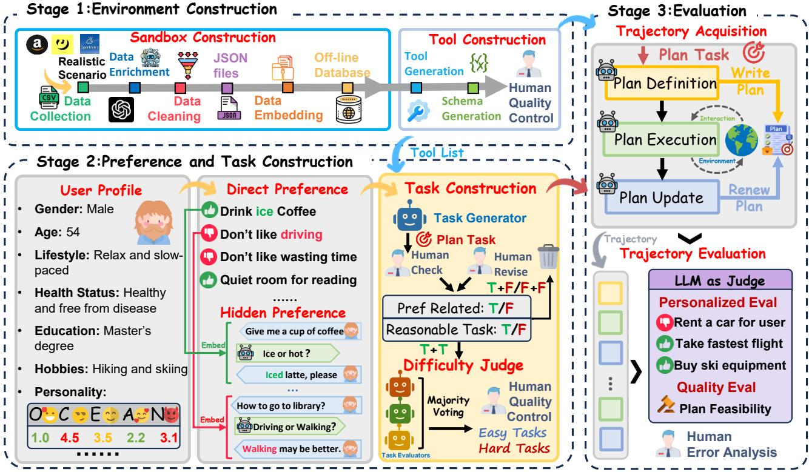
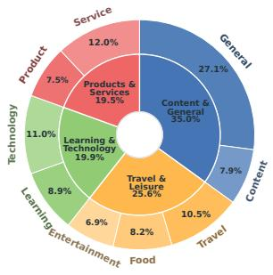
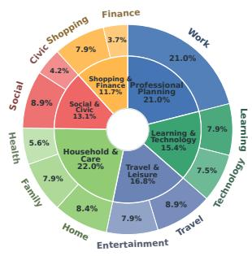
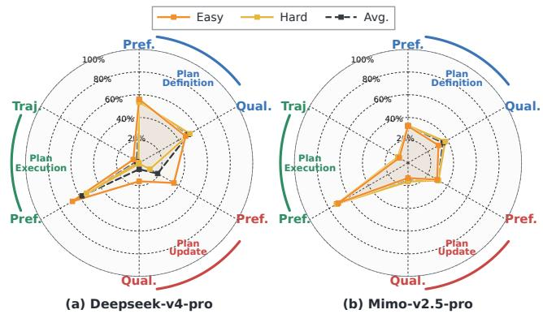
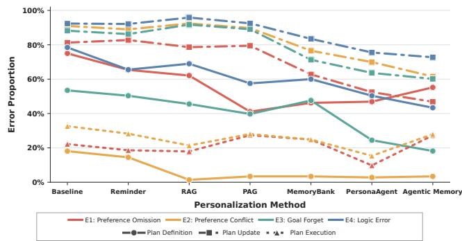

# PDEU-Bench: Benchmarking the Personalized Planning Lifecycle of Tool-Calling LLM Agents

Huayi Lai1, Shichao Song1, Qingchen Yu2, Simin Niu1, Mengwei Wang1, Hanyu Wang1, Xun Liang1∗

1Renmin University of China 2Beihang University xliang@ruc.edu.cn

## Abstract

Large language model (LLM) agents are evolving from toolcalling systems that execute isolated instructions into taskoriented agents that pursue user goals through sustained, multi-step interactions. However, existing benchmarks for personalized tool use largely assess isolated calls or reactive execution, leaving unclear whether agents can formulate, execute, and revise an explicit plan while preserving user preferences throughout long-term interaction. To address this gap, we introduce PDEU-Bench (Personalized plan Definition, plan Execution, and plan Update Benchmark), a benchmark for evaluating the complete planning lifecycle of personalized tool-using agents. PDEU-Bench comprises 214 longhorizon interaction tasks spanning 12 everyday domains and 94 tools, with stage-specific assessments of preference adherence and plan quality. Extensive evaluations of 15 representative open-source and closed-source LLMs reveal a pronounced gap between local tool execution and dynamic plan ning: LLMs can often instantiate preferences in individual calls, yet struggle to construct coherent plan definition and plan update. We further evaluate mainstream personalization and memory-augmentation methods. Although these methods improve particular stages, none of the evaluated methods reliably propagates user preferences throughout the complete lifecycle, and their gains frequently fail to transfer to subsequent execution. Fine-grained error analysis further reveals that preference omissions and conflicts persist throughout the planning lifecycle, highlighting the need for future research to parameterize LLMs with preference-aware information retrieval and memory capabilities. We provide the relevant code and data in the appendix to support future research.

## Introduction

Personalized agentic tool use has become a foundational capability of large language models (LLMs). Traditional personalization primarily leverages user information to generate responses (Zhao et al. 2025) or recommendations aligned with individual preferences (Shang et al. 2026; Huang et al. 2026). In contrast, emerging LLM agents are expected to make personalized decisions (Huang et al. 2025; Cheng et al. 2025b), formulate plans (Zhang et al. 2026b), and execute actions within specific interactive environments (Liu et al. 2026). Agents must interpret high-level, underspecified requests, infer latent user preferences from interaction histories, and continually revise their action plans as tool outputs reshape the space of feasible next steps.

  
Figure 1: Motivation for PDEU-Bench: a benchmark for personalized tool-use planning across the whole planning lifecycle. (a) Single-turn evaluation focuses on an isolated personalized single execution. (b) Multi-turn reactive evaluation extends interaction through repeated reasoning and plan execution. (c) PDEU-Bench treats the plan as an explicit, evolving object and evaluates its core lifecycle through plan definition, plan execution (Tool Call), and feedback-driven plan update.

Successful task completion therefore requires more than selecting appropriate tools and producing syntactically valid arguments. Agents must decompose complex objectives, coordinate subgoals and tool dependencies, translate personalized constraints into executable actions, and adapt their plans to environmental feedback(Chen et al. 2026a). Without effective planning, long tool-use trajectories are vulnerable to cascading errors (Liu et al. 2026), redundant interactions that inflate cost and latency (Lodha et al. 2026; Sun et al. 2026), and gradual drift from user-specific constraints and the intended goal (Yu et al. 2026; Qin et al. 2025).

As illustrated in part(a) and part(b) in Figure 1, existing personalized tool-use benchmarks largely focus on either single-turn execution, which evaluates an isolated personalized tool call (Xiu et al. 2026; Cheng et al. 2025b), or multiturn reactive execution, which extends interaction through repeated reasoning and tool execution (Qian et al. 2025; Wang et al. 2025b). Although the latter increases the interaction horizon, both settings focus solely on task execution; neither treats an explicit and evolving plan as the primary evaluation object. This raises a central question: Can an agent formulate, execute, and continually update an actionable plan while remaining executable and aligned with user preferences?

To address this gap, we design and develop PDEU-Bench (Personalized plan Definition, plan Execution, Update Benchmark), a multi-stage agentic benchmark for evaluating the planning lifecycle in personalized tool-use tasks, which systematically evaluates LLM’s personalized plan definition, plan execution, and plan update capabilities in multi-round tool-calling interactions. As shown in Figure 1(c), PDEU-Bench treats the plan as an explicit and evolving evaluation object and decomposes its lifecycle into three interconnected yet independently measurable stages:

• Plan Definition: which evaluates whether an agent can combine an underspecified user request with personalized context to formulate a structured, executable, and preference-aligned initial plan;

• Plan Execution: which evaluates whether an agent can select appropriate tools according to the plan and accurately instantiate task constraints and user preferences as tool-call arguments;

• Plan Update: which evaluates whether an agent can revise afected subsequent steps in response to tool outputs while preserving goals, dependencies, and preferences that remain valid.

PDEU-Bench comprises 214 personalized scenarios across 12 everyday domains and 94 tools, integrating user goals, personalized contexts, tool interfaces, and executable environments into unified task trajectories. By separately evaluating plan definition, plan execution, and plan update, it extends personalized tool-use evaluation from isolated calls to the complete planning lifecycle. Using PDEU-Bench, we evaluate 15 mainstream open-source and closed-source LLMs, revealing performance deficiencies in mainstream LLMs and highlighting a clear gap between planning capabilities and tool execution capabilities. Furthermore, we evaluated six preference-enhancement methods and found that existing approaches exhibit significant performance limitations. Our main contributions are summarized as follows:

• We introduce PDEU-Bench, an open-source benchmark for personalized tool-use planning across plan definition, plan execution, and plan update, covering 214 scenarios, 12 domains, and 94 tools.

• We evaluate 15 representative open-source and closedsource LLMs, revealing a clear gap between plan execution and lifecycle-level planning, with personalized plan definition and feedback-driven plan updating are key bottlenecks.

• We systematically evaluate six personalization and memory augmentation strategies and find that none improves performance across all three stages simultaneously, revealing a general limitation in preserving user preferences throughout the planning lifecycle.

<table><tr><td rowspan="2">Existing Benchmarks</td><td rowspan="2">Multi-turn Planning</td><td colspan="3">Plan Action</td></tr><tr><td>Definition</td><td>Execution</td><td>Update</td></tr><tr><td>PTBench</td><td>X</td><td>X</td><td>√</td><td>X</td></tr><tr><td>ToolSpectrum</td><td>X</td><td>X</td><td>√</td><td>X</td></tr><tr><td>PEToolBench</td><td>X</td><td>X</td><td>√</td><td>X</td></tr><tr><td>Claw-Anything</td><td>X</td><td>X</td><td>√</td><td>X</td></tr><tr><td>ASTRA-Bench</td><td>X</td><td>X</td><td>√</td><td>X</td></tr><tr><td>MPT</td><td>X</td><td>X</td><td>√</td><td>X</td></tr><tr><td>DeepPlanning</td><td>X</td><td>√</td><td>X</td><td>X</td></tr><tr><td>TravelBench</td><td>X</td><td>√</td><td>X</td><td>X</td></tr><tr><td>Family Tool</td><td>√</td><td>X</td><td>√</td><td>X</td></tr><tr><td>UserBench</td><td>√</td><td>X</td><td>√</td><td>X</td></tr><tr><td>ETAPP</td><td>√</td><td>X</td><td>√</td><td>X</td></tr><tr><td>GroupTravelBench</td><td>√</td><td>X</td><td>√</td><td>X</td></tr><tr><td>MCP-Persona</td><td>√</td><td>X</td><td>√</td><td>X</td></tr><tr><td>PersonalWAB</td><td>√</td><td>X</td><td>√</td><td>X</td></tr><tr><td>APOLLO</td><td>√</td><td>X</td><td>√</td><td>X</td></tr><tr><td>VitaBench2.0</td><td>√</td><td>X</td><td>√</td><td>X</td></tr><tr><td></td><td></td><td></td><td></td><td></td></tr><tr><td>PDEU-Bench</td><td>√</td><td>√</td><td>V</td><td>√</td></tr></table>

Table 1: Comparison of existing benchmarks in terms of multi-turn planning and plan action capabilities.

## Related Work

## Benchmarks for LLM Personalized Tool Use

As shown in Table 1, existing benchmarks for personalized tool-using LLMs largely focus on either task execution or isolated planning capabilities. Single-turn benchmarks such as PTBench(Huang et al. 2025), ToolSpectrum(Cheng et al. 2025b), PEToolBench(Xu et al. 2025b), Claw-Anything(Lin et al. 2026), ASTRA-Bench(Xiu et al. 2026), and MPT(Yoon, Kim, and Kim 2026) mainly evaluate whether agents can infer user preferences and issue valid tool calls, while Deep-Planning(Zhang et al. 2026b) assesses plan generation without execution or revision. Multi-turn benchmarks, including FamilyTool(Wang et al. 2025b), UserBench(Qian et al. 2025), ETAPP(Hao et al. 2025), GroupTravelBench(Cheng et al. 2026), MCP-Persona(Wang et al. 2026), Personal-WAB(Cai et al. 2025), APOLLO(Chen et al. 2026b), and VitaBench2.0(Chen et al. 2026a), extend evaluation to longer interaction trajectories but still center on task completion rather than plan definition. TravelBench(Cheng et al. 2025a) and DeepPlanning(Zhang et al. 2026b) evaluated plan definition capabilities but were limited to single-round plan setting. In contrast, PDEU-Bench is an agentic benchmark to evaluate personalized tool-using LLMs throughout the entire planning lifecycle, jointly covering plan definition, execution, and feedback-driven update while measuring whether user preferences and plan quality are maintained consistently across stages.

  
Figure 2: Overview of the proposed benchmark PDEU-Bench

## Benchmarks for LLM Personalized Planning

LLM-based personalized planning can be divided into roleplaying planning and preference-following planning. Roleplaying planning primarily focuses on evaluating whether the decisions and plans made by role-playing LLM regarding role-related tasks align with the role’s requirements(Lai et al. 2026; Dai et al. 2026). Preference-following planning instead aims to align plans and actions with users’ explicit or implicit preferences. However, existing work in this direction exhibits strong domain specificity, focusing on settings such as e-commerce shopping (Ling et al. 2026; Zhang et al. 2026b), travel (Xie et al. 2024; Wang et al. 2025a; Singh et al. 2024; Karmakar et al. 2026), healthcare(Hsu et al. 2025),household(Xu et al. 2025a) or sports(Shin, Hsieh, and Kim 2025). These benchmarks lack a general purpose evaluation across diverse user needs and typically assess plan definition or plan execution in isolation, without systematically evaluating plan update. In contrast, PDEU-Bench comprises 214 personalized planning tasks spanning 12 everyday domains, it is a comprehensive multi-domain agentic benchmark for evaluating the full planning lifecycle in personalized planning, covering plan definition, tool-grounded plan execution, and feedback-driven plan update.

## PDEU Benchmark

As shown in Figure 2, PDEU-Bench includes 3 components: Environment Construction(Stage 1), Preference , Task Construction(Stage 2) and Trajectory Evaluation(Stage 3).

## Environment Construction

Sandbox Construction Considering the network fluctuations and high maintenance costs associated with online evaluation environments, we develop an extensible ofline sandbox to ensure the stability of the evaluation process and the reproducibility of the results. As shown in Figure 2 , the sandbox isolates experiments from external environmental variables, preventing external factors from afecting API outputs and thereby ensuring evaluation accuracy. Realworld API data is used to generate corresponding outputs (e.g., weather from Open-Meteo Forecast API), enhancing the fidelity of the simulated scenarios. To further enrich the number of available tools and simulate real-world complexities, gpt-5.5 is used to generate data on news topics. Statistical analysis showed that 85.7% of the data was based on realistic scenarios. For further details, please refer to appendix.

After data enrichment, we deterministically clean and normalize the heterogeneous records, and serialize them into a unified JSONL schema with provenance metadata and structured attributes. We then pre-encode the records using "multilingual-e5-small" (Wang et al. 2024) to construct an ofline semantic index. The resulting sandbox integrates external evidence with deterministic execution states, enabling reproducible tool observations and feedback throughout evaluation.

Tool Construction To support realistic interaction with the ofline sandbox, we construct 94 functional APIs supporting 12 everyday domains and covering both informationseeking and state-changing operations. Following the OpenAI function-calling specification(Qu et al. 2025). GPT-5.5(Singh et al. 2025) is used to generate each API schema with a standardized structure and preference-sensitive parameters designed to instantiate task-relevant user preferences. The generated schemas are then assigned to two professional annotators for manual verification of functional correctness and the inclusion ofpreference-sensitive parameters. Schemas that fail either criterion are revised and rechecked.

(a) Interaction Topic Distribution  
(b) Task Topic Distribution  

  
Figure 3: Six high-level planning categories and the proportion of individual task types within each category.

## Preference and Task Construction

Long-term interaction histories typically reflect stable user profiles and traits at a coarse level, while personalized preferences are implicitly expressed in individual interactions (Chen et al. 2026a). As illustrated in Figure 2, a multistage automated generation pipeline was designed and developed for simulation.

Preference Construction Preference data were constructed to capture context-dependent user preferences implicitly expressed across interaction histories. First, 300 persona seeds were sampled from PersonaHub (Ge et al. 2024) and expanded into coherent fictional profiles (e.g., big five personality traits and hobbies). Guided by preference construction theory (Slovic 1995), multidimensional preferences were instantiated across ten everyday domains (e.g., like of iced cofee in food domain). Following PrefEval (Zhao et al. 2025), these preferences were implicitly conveyed through 15-25 two-turn episodic interactions per user using experiences, choices, and consequences. Consistency among profiles, preferences, and interactions was reviewed by three professional annotators, with invalid instances revised or discarded. Overall, 83.0% of instances were retained unchanged and 17.0% after minor revision; none were discarded.

Task Construction For each user, a multi-step planning task was generated based on the corresponding profile, direct preferences, and available tool set. Preference descriptions were not explicitly exposed in the user request. Each candidate was then manually assessed by 3 professional annotators using two binary criteria: preference relevance, which determined whether task completion required profilegrounded preferences, and task reasonableness, which assessed whether the request was coherent and executable with the available tools. Candidate tasks are discarded only when they simultaneously lack suficient preference relevance and cannot be completed with the available tools (F+F); otherwise, they undergo manual revision and re-evaluation(T+F), in this stage, 45.0% of the tasks were retained without revision, 41.0 % were retained after revision, and 14.0% were discarded.To evaluate the impact of task dificulty on model performance, task dificulty was independently assessed by three heterogeneous LLM evaluators drawn from diferent model families and configurations: mimo-v2.5-pro, gemini-3.1-Flash, and gpt-5.5. A professional annotator checked the results after majority voting, check appendix for details. Of the retained 214 tasks, 68 were rated as easy and 146 as hard.

## Task Evaluation

Trajectory Acquisition As shown in Figure 2, each task is executed under a standardized three-stage protocol in which the plan is maintained as an explicit, versioned state. A schema-validated initial plan is produced before tool use, after which an action–observation–update cycle is enforced; every execution attempt, including failures, must be followed by a plan update. Plan versions, tool calls, observations, and termination states are logged and automatically validated for temporal and structural consistency. Task inputs, tool contracts, and sandbox states are held fixed, enabling reproducible and leakage-free assessment of plan definition, plan execution, and plan update.

Trajectory Evaluation Each trajectory is evaluated using fine-grained binary rubrics. Plan definition and plan update are assessed for preference adherence and plan quality, with each update judged as a transition conditioned on the preceding plan, action, and observation. Plan execution evaluates only preference-aware tool argument instantiation, while response quality is excluded to avoid conflating agent behavior with environmental availability. Evidence-grounded labels are assigned by a fixed judge and deterministically aggregated into stage-level metrics, with success requiring all applicable criteria to be satisfied without prescribing a reference trajectory. To operationalize lifecycle-level reliability in long-horizon settings, we adopt a strict trajectorylevel success criterion, under which an instance is considered successful only if all applicable preference and planning requirements are satisfied at every relevant stage and transition. Failure modes are further analyzed by 4 professional annotators from the complementary perspectives of preference adherence and plan quality.

Evaluation Matrix Preference adherence is evaluated at plan definition (D), plan execution (E), and plan update (U) using fine-grained binary rubrics. Let N denote the number of evaluated instances and $P _ { i } ^ { s } \in \{ 0 , 1 \}$ the preferencepass indicator for instance i at stage s. For Plan Definition, $\overset { \cdot } { P _ { i } ^ { D } } = 1$ only if the initial plan both covers all relevant preferences and avoids preference violations. For Plan Execution, $P _ { i } ^ { E } = 1$ only if every tool call correctly instantiates the applicable preferences in its arguments. For Plan Update, $\dot { P } _ { i } ^ { \bar { U } } = 1$ only if every update retains valid preferences, replans accordingly, grounds them in subsequent actions, and introduces no violation. Preference Accuracy is computed separately for each stage:

<table><tr><td rowspan="2">Models</td><td rowspan="2">Pref. Score Qual. Score</td><td rowspan="2"></td><td colspan="3">Plan Definition</td><td colspan="3">Plan Update</td><td>Plan Execution</td></tr><tr><td>Pref. Acc.</td><td>Qual. Acc. Joint Acc.</td><td></td><td>Pref. Acc.</td><td>Qual. Acc.</td><td>Joint Acc.</td><td>Pref. Acc.</td></tr><tr><td colspan="10">Closed-Source Models</td></tr><tr><td>gpt-5.6-terra</td><td>0.6632</td><td>0.4350</td><td>0.7908</td><td>0.7329</td><td>0.6027</td><td>0.3425</td><td>0.1370</td><td>0.1370</td><td>0.8562</td></tr><tr><td>claude-sonnet-5</td><td>0.6134</td><td>0.3219</td><td>0.7055</td><td>0.5616</td><td>0.4452</td><td>0.2192</td><td>0.0822</td><td>0.0753</td><td>0.9157</td></tr><tr><td>grok-4.5</td><td>0.6112</td><td>0.3767</td><td>0.8151</td><td>0.7123</td><td>0.5959</td><td>0.0858</td><td>0.0411</td><td>0.0068</td><td>0.9328</td></tr><tr><td>gpt-5.4</td><td>0.5551</td><td>0.3630</td><td>0.8082</td><td>0.6918</td><td>0.5959</td><td>0.1781</td><td>0.0342</td><td>0.0205</td><td>0.6791</td></tr><tr><td>grok-4.3</td><td>0.5296</td><td>0.3767</td><td>0.7466</td><td>0.7123</td><td>0.5686</td><td>0.1164</td><td>0.0411</td><td>0.0274</td><td>0.7260</td></tr><tr><td>gpt-5.4-mini</td><td>0.4680</td><td>0.2945</td><td>0.4863</td><td>0.5205</td><td>0.2808</td><td>0.1712</td><td>0.0685</td><td>0.0411</td><td>0.7466</td></tr><tr><td>gemini-3.5-flash</td><td>0.4438</td><td>0.1849</td><td>0.2671</td><td>0.3356</td><td>0.1712</td><td>0.1301</td><td>0.0342</td><td>0.0274</td><td>0.9344</td></tr><tr><td>gemini-3.1-flash-lite</td><td>0.4414</td><td>0.1164</td><td>0.2329</td><td>0.1507</td><td>0.0411</td><td>0.1849</td><td>0.0822</td><td>0.0616</td><td>0.9066</td></tr><tr><td>Average Performance</td><td>0.5408</td><td>0.3086</td><td>0.6066</td><td>0.5522</td><td>0.4127</td><td>0.1785</td><td>0.0651</td><td>0.0496</td><td>0.8372</td></tr><tr><td colspan="10">Open-Source Models</td></tr><tr><td>mimo-v2.5-pro</td><td>0.4518</td><td>0.2547</td><td>0.3271</td><td>0.3551</td><td>0.1308</td><td>0.3087</td><td>0.1542</td><td>0.1121</td><td>0.7196</td></tr><tr><td>mimo-v2.5</td><td>0.4276</td><td>0.3117</td><td>0.3904</td><td>0.2808</td><td>0.1575</td><td>0.3384</td><td>0.3425</td><td>0.1945</td><td>0.5541</td></tr><tr><td>deepseek-v4-pro</td><td>0.4361</td><td>0.2781</td><td>0.5421</td><td>0.5000</td><td>0.2991</td><td>0.1869</td><td>0.0561</td><td>0.0374</td><td>0.5794</td></tr><tr><td>deepseek-v4-flash</td><td>0.4714</td><td>0.2089</td><td>0.4178</td><td>0.3699</td><td>0.1781</td><td>0.0616</td><td>0.0479</td><td>0.0205</td><td>0.9347</td></tr><tr><td>deepseek-v3.2</td><td>0.4145</td><td>0.2363</td><td>0.4452</td><td>0.4178</td><td>0.2192</td><td>0.0822</td><td>0.0548</td><td>0.0411</td><td>0.7162</td></tr><tr><td>deepseek-v3.1</td><td>0.4328</td><td>0.3357</td><td>0.3336</td><td>0.3973</td><td>0.2397</td><td>0.2425</td><td>0.2740</td><td>0.2166</td><td>0.7225</td></tr><tr><td>qwen3.5-397b-a17b</td><td>0.4310</td><td>0.2671</td><td>0.4178</td><td>0.4726</td><td>0.2534</td><td>0.1712</td><td>0.0616</td><td>0.0342</td><td>0.7040</td></tr><tr><td>Average Performance</td><td>0.4379</td><td>0.2704</td><td>0.4106</td><td>0.3991</td><td>0.2111</td><td>0.1988</td><td>0.1416</td><td>0.0981</td><td>0.7044</td></tr></table>

Table 2: Average accuracy across models for plan definition, update, and execution on “easy” and “hard” tasks. Bold and underlined values mark the best and second best results.

$$
\mathrm { P r e f A c c . } _ { s } = \frac { 1 } { N } \sum _ { i = 1 } ^ { N } P _ { i } ^ { s } , \qquad s \in \{ D , E , U \} .\tag{1}
$$

Preference accuracy is displayed as "Pref. $\operatorname { A c c } ! ^ { \prime }$ in Table 2 and Table 3. The overall Preference Score is defined as the mean of the three stage-level accuracies. Plan quality is evaluated at Plan Definition and Plan Update. Let $Q _ { i } ^ { s } \ \stackrel { \cdot } { \in } \ \{ 0 , 1 \}$ denote whether instance i satisfies all quality criteria at stage $s \in \{ D , U \}$ . For Plan Definition, six criteria are applied: goal and success-criterion coverage, step actionability, dependency and ordering correctness, tool and information acquisition, constraint feasibility, and global coherence. For Plan Update, the corresponding criteria assess remaininggoal coverage, replanning correctness, remaining-step actionability, information acquisition and verification, postupdate feasibility, and global coherence. Thus, $Q _ { i } ^ { D } = 1$ only if all six initial-plan criteria are passed, whereas $Q _ { i } ^ { U } = 1$ only if all six criteria are passed for every update. Plan Quality Accuracy(Qual. Acc.) is defined as

$$
\mathrm { Q u a l i t y A c c . } _ { s } = \frac { 1 } { N } \sum _ { i = 1 } ^ { N } Q _ { i } ^ { s } , \qquad s \in \{ D , U \} .\tag{2}
$$

The overall Quality Score is the mean of $\mathrm { Q A c c } _ { D }$ and $\mathrm { Q A c c } _ { U }$ No quality score is assigned to Plan Execution because toolreturn quality can’t reflect the correctness of the agent’s call. Joint Accuracy(Joint Acc.) is used to calculate the percentage of tasks that pass both preference compliance checks and plan rationality checks. Check appendix for details.

  
Figure 4: LLM’s performance across tasks of varying dificulty. Pref., Qual., and Traj. represent preference adherence accuracy, plan quality accuracy, and task trajectory accuracy, respectively.

## Quality Control

Majority voting based on diferent parameters and family was adopted to minimize sampling variance and stabilize consensus labels (Vasselli et al. 2025). As shown in Figure 3, the resulting benchmark contains 214 tasks across six categories, with source interactions spanning 9 user-interest themes. To reduce subjective diferences in manual annotation and manual statistics, all human-involved stages, including schema verification, task review and revision, and post-vote quality control and adjudication, followed stage-specific instructions and predefined criteria. Check appendix for more details.

<table><tr><td rowspan="2">Models</td><td rowspan="2">Methods</td><td rowspan="2">Pref. Score Qual. Score</td><td rowspan="2"></td><td colspan="3">Plan Definition</td><td colspan="3">Plan Update</td><td>Plan Execution</td></tr><tr><td>Pref. Acc.</td><td>Qual. Acc.</td><td>Joint Acc.</td><td>Pref. Acc.</td><td>Qual. Acc.</td><td>Joint Acc.</td><td>Pref. Acc.</td></tr><tr><td rowspan="7">Gemini</td><td>Baseline</td><td>0.4414</td><td>0.1164</td><td>0.2329</td><td>0.1507</td><td>0.0411</td><td>0.1849</td><td>0.0822</td><td>0.0616</td><td>0.9066</td></tr><tr><td>Reminder</td><td>0.3949(↓)</td><td>0.1506(↑)</td><td>0.3219(↑)</td><td>0.2260(↑)</td><td>0.0753(↑)</td><td>0.1644(↓)</td><td>0.0753(↓)</td><td>0.0685(↑)</td><td>0.6986(↓)</td></tr><tr><td></td><td></td><td></td><td></td><td>RAG-based Methods</td><td></td><td></td><td></td><td></td><td></td></tr><tr><td></td><td>0.4497(↑)</td><td>0.1301(↑)</td><td>0.3836(↑)</td><td>0.2192(↑)</td><td>0.1370(↑)</td><td>0.2123(↑)</td><td>0.0411(↓)</td><td>0.0342(↓)</td><td>0.7534(↓)</td></tr><tr><td>RAG PAG</td><td>0.4908(↑)</td><td>0.2226(↑)</td><td>0.5753(↑)</td><td>0.3699(↑)</td><td>0.2945(↑)</td><td>0.2055(↑)</td><td>0.0753(↓)</td><td>0.0753(↑)</td><td>0.6918(↓)</td></tr><tr><td colspan="10">Memory-based Methods</td></tr><tr><td></td><td>MemoryBank PersonaAgent</td><td>0.5414(↑)</td><td>0.2603(↑)</td><td>0.5411(↑)</td><td>0.3562(↑)</td><td>0.2603(↑)</td><td>0.3699(↑)</td><td>0.1644(↑)</td><td>0.1438(↑)</td><td>0.7132(↓)</td></tr><tr><td></td><td>Agentic Memory</td><td>0.6118(↑) 0.5570(↑)</td><td>0.3664(↑) 0.4041(↑)</td><td>0.5342(↑) 0.4452(↑)</td><td>0.4863(↑)</td><td>0.4272(↑) 0.3904(↑)</td><td>0.4726(↑)</td><td>0.2466(↑)</td><td>0.2055(↑)</td><td>0.8288(↓)</td></tr><tr><td rowspan="7">Deepseek</td><td></td><td></td><td></td><td></td><td>0.5411(↑)</td><td></td><td>0.5205(↑)</td><td>0.2671(↑)</td><td>0.2192(↑)</td><td>0.7055(↓)</td></tr><tr><td>Baseline</td><td>0.4714</td><td>0.2089</td><td>0.4178</td><td>0.3699</td><td>0.1781</td><td>0.0616</td><td>0.0479</td><td>0.0205</td><td>0.9347</td></tr><tr><td>Reminder</td><td>0.4634(↓)</td><td>0.3082(↑)</td><td>0.4315(↑)</td><td>0.4452(↑)</td><td>0.3014(↑)</td><td>0.3288(↑)</td><td>0.1712(↑)</td><td>0.1301(↑)</td><td>0.6301(↓)</td></tr><tr><td></td><td></td><td></td><td></td><td>RAG-based Methods</td><td></td><td></td><td></td><td></td><td></td></tr><tr><td>RAG PAG</td><td>0.5392(↑) 0.5537(↑)</td><td>0.3082(↑)</td><td>0.4521(↑)</td><td>0.5548(↑)</td><td>0.3425(↑)</td><td>0.2397(↑)</td><td>0.0616(↑)</td><td>0.0342(↑)</td><td>0.9259(↓)</td></tr><tr><td></td><td></td><td>0.2705(↑)</td><td>0.5959(↑)</td><td>0.4863(↑)</td><td>0.3082(↑)</td><td>0.1918(↑)</td><td>0.0548(↑)</td><td>0.0411(↑)</td><td>0.8734(↓)</td></tr><tr><td colspan="10">Memory-based Methods</td></tr><tr><td></td><td>MemoryBank</td><td>0.5991(↑)</td><td>0.2568(↑)</td><td>0.7192(↑)</td><td>0.4863(↑)</td><td>0.3904(↑)</td><td>0.1438(↑)</td><td>0.0274(↓)</td><td>0.0137(↓)</td><td>0.9243(↓)</td></tr><tr><td></td><td>PersonaAgent</td><td>0.5803(↑)</td><td>0.2842(↑)</td><td>0.7671(↑)</td><td>0.5274(↑)</td><td>0.4658(↑)</td><td>0.1370(↑)</td><td>0.0411(↓)</td><td>0.0137(↓)</td><td>0.8368(↓)</td></tr><tr><td></td><td>Agentic Memory</td><td>0.5064(↑)</td><td>0.2603(↑)</td><td>0.5137(↑)</td><td>0.4658(↑)</td><td>0.2877(↑)</td><td>0.1370(↑)</td><td>0.0548(↑)</td><td>0.0342(↑)</td><td>0.8687(↓)</td></tr></table>

Table 3: Average accuracy on “easy” and “hard” tasks for gemini-3.1-flash-lite (Gemini) and deepSeek-v4-flash (Deepseek). "↓" and "↑" indicate decreases and improvements relative to the baseline respectively.

## Experiments

## Evaluation Settings

Baseline Models Fifteen mainstream LLMs from diverse model families and capability tiers are evaluated. Including OpenAI GPT series(Singh et al. 2025),Anthropic Claude series(Anthropic 2026), Google Gemini series(Google Deep-Mind 2026a,b), xAI Grok series(xAI 2025), DeepSeek-AI DeepSeek series(Xu et al. 2026; Liu et al. 2025, 2024), Alibaba Qwen series(Yang et al. 2025) and Xiaomi mimo series(Team et al. 2026). For models with multiple thinking intensities, LLMs with diferent modes of thinking are set to the "default" thinking intensity to ensure fairness and reproducibility. We run experiments on a severwith 48-core Intel CPU and 4 NVIDIA RTX 3090 GPUs. LLMs are evaluated by API calling and the temperature is set to 0 for reproducibility, check appendix for details.

Experimental Methods The efects of personalization and memory augmentation are examined on gemini-3.1-flash-lite and deepseek-v4-flash using seven settings organized into four categories. In the unaugmented Baseline, the complete implicit interaction history is provided without explicit preference reminders, retrieval, or memory transformation. The prompt-based Reminder method additionally inserts a fixed instruction to recall and follow user preferences before plan definition, plan execution, and plan update. Among retrievalbased methods, RAG(Arslan et al. 2024) retrieves the top-3 task-relevant historical interactions, while PAG(Richardson et al. 2023) supplements the same evidence with a static, taskconditioned user profile derived from the complete history. Among memory-based methods, MemoryBank(Zhong et al. 2024) adds independently summarized interaction memories to the retrieval pool; PersonaAgent(Zhang et al. 2026a) augments PAG with task-relevant external knowledge to support action selection; and Agentic Memory(Chen et al. 2026a) maintains a versioned user profile that is conservatively updated by the evaluated model after each planning, action, and update turn. All saved trajectories are assessed using the same fine-grained binary rubrics. Check appendix for more information about the methods.

## Main Result

Current LLMs can instantiate preferences locally, but cannot reliably maintain an executable and preferenceconsistent dynamic plan. As shown in Table 2, across the 15 models, the average preference score is 49.27%, whereas the average quality score is 29.08%. Even gpt-5.6-terra, which leads both metrics, achieves only 66.32% in preference score. Overall, existing models remain substantially limited in their ability to define and update plans.

Baseline Performance Analysis Plan definition remains challenging and plan update constitutes the primary bottleneck, and plan execution is comparatively strong. At plan definition, average preference and quality accuracies reach 51.51% and 48.07%, but only 31.86% joint accuracy is achieved, indicating that preferences, objectives, dependencies, and feasibility constraints are rarely integrated simultaneously. After tool feedback, average preference, quality, and joint accuracies fall to 18.80%, 10.08%, and 7.02%, respectively, as invalidated steps are seldom revised without disrupting valid constraints. By contrast, execution preference accuracy averages 77.52%. Thus, reliable preference grounding in execution does not imply lifecycle-level plan-

<table><tr><td rowspan=2 colspan=1>Model</td><td rowspan=2 colspan=1>Error Type</td><td rowspan=1 colspan=1>Planning Stage</td></tr><tr><td rowspan=1 colspan=1>Update Definition Execution</td></tr><tr><td rowspan=3 colspan=1>Deepseekv4-pro</td><td rowspan=3 colspan=1>E1: Preference omissionE2: Preference conflictE3: Goal forgettingE4: Logic error</td><td rowspan=1 colspan=1>79.9    43.9      23.4</td></tr><tr><td rowspan=1 colspan=1>89.3    10.7      38.3</td></tr><tr><td rowspan=1 colspan=1>86.0     7.5        一93.5    47.2       一</td></tr><tr><td rowspan=4 colspan=1>Gemini-3.1flash-lite</td><td rowspan=4 colspan=1>E1: Preference omissionE2: Preference conflictE3: Goal forgettingE4: Logic error</td><td rowspan=1 colspan=1>81.3    75.0      22.2</td></tr><tr><td rowspan=1 colspan=1>91.0    18.1      32.6</td></tr><tr><td rowspan=1 colspan=1>88.2    53.5       一</td></tr><tr><td rowspan=1 colspan=1>92.4    78.5       一</td></tr></table>

Table 4: Error-type prevalence among failed instances (%) for the two baseline LLMs.“–” denotes not applicable.

## ning competence.

Impact ofTask Dificulty Similarly low personalized tooluse planning performance is observed for mainstream LLMs across task dificulty levels. For plan execution, trajectory correctness (Traj.) is manually measured to assess execution stability. As shown in Figure 4, deepseek-v4-pro and mimov2.5-pro exhibit closely aligned performance on the easy and hard subsets across all three planning stages and the Traj. metric, with no consistent advantage on easier tasks. This consistency indicates that the observed deficiencies are systematic limitations of current LLMs and are largely independent of task dificulty.

## Analysis of Improved Methods

Improved methods can strengthen plan definition and Plan Update, but substantially weaken preference adherence during Plan Execution. As shown in Table 3, Definition joint accuracy is improved by every method, and Update gains are obtained in several settings. However, execution preference accuracy is reduced across both models under all tested methods. The baseline imbalance is therefore reversed rather than resolved: stronger plan formulation and revision are accompanied by less reliable preference grounding in tool arguments. Existing methods thus fail to preserve their planning gains throughout the complete lifecycle.

## Error Analysis

To identify the main drivers of agent failure in PDEU-Bench, observed errors are grouped into four non-mutually-exclusive categories: (E1) Preference Omission, denoting an omitted or unretained preference; (E2) Preference Conflict, denoting a direct violation of an explicit or inferred preference; (E3) Goal Forgetting, denoting the loss of task objectives or success criteria; and (E4) Logic Error, denoting infeasible steps, invalid dependencies, or inconsistent revisions. Multiple categories may be assigned to a single failed trajectory. Since Plan Execution assesses preference grounding in tool arguments rather than plan structure, only E1 and E2 are applicable at this stage.

Baseline Error Analysis Both plan definition and plan update exhibit substantial preference-following failures, manifested as preference omission and preference conflict. As shown in Table 4, during plan definition, preference omission afects 43.9–75.0% of failed instances, while preference conflicts occur in 10.7–18.1%. Plan-quality errors are also evident at this stage: goal forgetting afects 7.5–53.5% of failed instances, and logic errors occur in 47.2–78.5%. These failures become substantially more severe during plan update, where preference omission and preference conflict reach 79.9–81.3% and 89.3–91.0%, respectively; meanwhile, goal forgetting rises to 86.0–88.2% and logic errors to 92.4– 93.5%. Even during the comparatively reliable plan execution stage, 22.2–38.3% of failed instances remain afected by preference-related errors.

  
Figure 5: Error Proportion of 6 improved methods, tested on gemini-3.1-flash-lite. The circular, square, and triangular dots represent the error distribution in plan definition, plan update, and plan execution, respectively.

Improved Methods Error Analysis The ability of mainstream methods to mitigate personalized preferencefollowing errors remains limited. As shown in Figure 5, more consistent reductions are achieved by memory-based methods than by prompting- or retrieval-based methods, particularly during plan definition and plan update; however, these gains are not reliably transferred to Plan Execution. Consequently, none ofthe evaluated methods consistently preserves user preferences throughout the complete planning lifecycle.

## Conclusion

We introduce PDEU-Bench, a multi-domain benchmark for evaluating personalized tool-using agents across Plan Definition, tool-grounded Plan Execution, and feedback-driven Plan Update. Its 214 long-horizon tasks span 12 everyday domains and 94 tools, with an explicit, versioned plan treated as the central evaluation object. Experiments on 15 mainstream LLMs reveal a pronounced gap between local preference grounding and lifecycle planning: initial plans remain brittle, and Plan Update constitutes the principal bottleneck. Six personalization and memory-augmentation methods yield stage-specific gains that do not reliably transfer across the planning lifecycle. Error analysis further identifies persistent preference omission, preference conflict, goal forgetting, and logical inconsistency. PDEU-Bench provides a reproducible testbed for developing agents that incorporate environmental feedback while maintaining user preferences, task objectives, and plan dependencies over long-horizon interactions.

## References

Anthropic. 2026. Introducing Claude Sonnet 5. https://www. anthropic.com/news/claude-sonnet-5.

Arslan, M.; Ghanem, H.; Munawar, S.; and Cruz, C. 2024. A Survey on RAG with LLMs. Procedia computer science, 246: 3781–3790.

Cai, H.; Li, Y.; Wang, W.; Zhu, F.; Shen, X.; Li, W.; and Chua, T.-S. 2025. Large language models empowered personalized web agents. In Proceedings of the ACM on Web Conference 2025, 198–215.

Chen, Y.; Zhang, Y.; Cai, Z.; Shi, Y.; Yao, Z.; Cui, C.; Zheng, J.; Huo, Y.; Su, X.; Gu, Q.; et al. 2026a. VitaBench 2.0: Evaluating Personalized and Proactive Agents in Long-Term User Interactions. arXiv preprint arXiv:2605.27141.

Chen, Z.-Y.; Lu, S.; Xie, Q.; Wang, X.; and Lin, Y. 2026b. Towards Preference Following in Tool Calling Language Agents. In Findings of the Association for Computational Linguistics: ACL 2026, 33565–33581.

Cheng, X.; Hu, Y.; Zhang, X.; Xu, L.; Pan, Z.; Li, X.; and Liu, Y. 2025a. TravelBench: A Real-World Benchmark for Multi-Turn and Tool-Augmented Travel Planning. arXiv preprint arXiv:2512.22673.

Cheng, X.; Hu, Y.; Zheng, L.; Pan, Z.; Li, X.; and Liu, Y. 2026. GroupTravelBench: Benchmarking LLM Agents on Multi-Person Travel Planning. arXiv preprint arXiv:2605.25200.

Cheng, Z.; Wang, H.; Liu, Z.; Guo, Y.; Guo, Y.; Wang, Y.; and Wang, H. 2025b. ToolSpectrum: Towards personalized tool utilization for large language models. In Findings of the Association for Computational Linguistics: ACL 2025, 20679–20699.

Dai, Y.; Peng, X.; Qian, L.; and Xie, Z. 2026. Can LLMs Be CEOs? Benchmarking Strategic Resource Reallocation with Multi-Role Agent Simulation. arXiv preprint arXiv:2606.17459.

Ge, T.; Chan, X.; Wang, X.; Yu, D.; Mi, H.; and Yu, D. 2024. Scaling synthetic data creation with 1,000,000,000 personas. arXiv preprint arXiv:2406.20094.

Google DeepMind. 2026a. Gemini-3.1-Flash-Lite Model Card. https://deepmind.google/models/model-cards/ gemini-3-1-flash-lite/.

Google DeepMind. 2026b. Gemini-3.5-Flash Model Card. https://deepmind.google/models/model-cards/gemini-3-5- flash/.

Hao, Y.; Cao, P.; Jin, Z.; Liao, H.; Chen, Y.; Liu, K.; and Zhao, J. 2025. Evaluating personalized tool-augmented llms from the perspectives of personalization and proactivity. In Proceedings of the 63rd Annual Meeting of the Association for Computational Linguistics (Volume 1: Long Papers), 21897– 21935.

Hsu, H.-L.; Dao, C.-T.; Wang, L.; Shuai, Z.; Phan, T. N. M.; Ding, J.-E.; Liao, C.-C.; Hu, P.; Han, X.; Hsu, C.-H.; et al. 2025. Medplan: a two-stage rag-based system for personalized medical plan generation. In Proceedings of the 63rd Annual Meeting of the Association for Computational Linguistics (Volume 6: Industry Track), 1072–1082.

Huang, J.; Wang, S.; Ning, L.; Fan, W.; Wang, S.; Yin, D.; and Li, Q. 2026. Towards next-generation recommender systems: A benchmark for personalized recommendation assistant with llms. In Proceedings of the Nineteenth ACM International Conference on Web Search and Data Mining, 217–226.

Huang, X.; Huang, Y.; Liu, W.; Zeng, X.; Wang, Y.; Tang, R.; Xie, H.; and Lian, D. 2025. Advancing and benchmarking personalized tool invocation for llms. arXiv preprint arXiv:2505.04072.

Karmakar, P.; Chaudhuri, S.; Mallick, S.; Gupta, M.; Jana, A.; and Ghosh, S. 2026. Triptide: A benchmark for adaptive travel planning under disruptions. In Findings of the Association for Computational Linguistics: ACL 2026, 40269– 40292.

Lai, H.; Song, S.; Niu, S.; Wang, H.; Yang, J.; Wang, Z.; Yin, Z.; and Liang, X. 2026. RoleCDE: Benchmarking and Mitigating Role–Alignment Trade-ofs in Role-Playing Agents. In Findings of the Association for Computational Linguistics: ACL 2026, 2226–2248.

Lin, Y.; Liang, X.; Wang, H.; Gu, Q.; Cheng, S.; Chen, J.; Wu, S.; Pan, F.; Fan, L.; Zhao, S.; et al. 2026. Claw-Anything: Benchmarking Always-On Personal Assistants with Broader Access to User’s Digital World. arXiv preprint arXiv:2605.26086.

Ling, Y.; Yuan, C.; Dong, S.; Yang, Y.; Mocherla, N.; and Goyal, A. 2026. ShopperBench: A benchmark for personalized shopping with persona-guided simulation. In Proceedings of the 19th Conference of the European Chapter ofthe Associationfor Computational Linguistics (Volume 5: Industry Track), 837–846.

Liu, A.; Feng, B.; Xue, B.; Wang, B.; Wu, B.; Lu, C.; Zhao, C.; Deng, C.; Zhang, C.; Ruan, C.; et al. 2024. Deepseek-v3 technical report. arXiv preprint arXiv:2412.19437.

Liu, A.; Mei, A.; Lin, B.; Xue, B.; Wang, B.; Xu, B.; Wu, B.; Zhang, B.; Lin, C.; Dong, C.; et al. 2025. Deepseek-v3. 2: Pushing the frontier of open large language models. arXiv preprint arXiv:2512.02556.

Liu, J.; Lin, Q.; Qian, C.; Wang, R.; Acikgoz, E. C.; Yang, X.; Liu, J.; Wang, Z.; Chen, X.; Ji, H.; et al. 2026. PlanBench-XL: Evaluating Long-Horizon Planning of LLM Tool-Use Agents in Large-Scale Tool Ecosystems. arXiv preprint arXiv:2606.22388.

Lodha, A.; Varnosfaderani, M. P.; Chakraborty, A.; and Mithal, A. 2026. Less Context, Better Agents: Eficient Context Engineering for Long-Horizon Tool-Using LLM Agents. arXiv preprint arXiv:2606.10209.

Qian, C.; Liu, Z.; Prabhakar, A.; Liu, Z.; Zhang, J.; Chen, H.; Ji, H.; Yao, W.; Heinecke, S.; Savarese, S.; et al. 2025. Userbench: An interactive gym environment for user-centric agents. arXiv preprint arXiv:2507.22034.

Qin, T.; Bai, F.; Hu, T.-Y.; Vemulapalli, R.; Koppula, H. S.; Xu, Z.; Jin, B.; Cemri, M.; Lu, J.; Wang, Z.; et al. 2025. COM-PASS: Benchmarking Constrained Optimization in LLM Agents. arXiv preprint arXiv:2510.07043.

Qu, C.; Dai, S.; Wei, X.; Cai, H.; Wang, S.; Yin, D.; Xu, J.; and Wen, J.-R. 2025. Tool learning with large language

models: A survey. Frontiers of Computer Science, 19(8): 198343.

Richardson, C.; Zhang, Y.; Gillespie, K.; Kar, S.; Singh, A.; Raeesy, Z.; Khan, O. Z.; and Sethy, A. 2023. Integrating summarization and retrieval for enhanced personalization via large language models. arXiv preprint arXiv:2310.20081.

Shang, Y.; Liu, P.; Yan, Y.; Wu, Z.; Sheng, L.; Yu, Y.; Jiang, C.; Zhang, A.; Xu, F.; Wang, Y.; et al. 2026. Agentrecbench: Benchmarking llm agent-based personalized recommender systems. Advances in Neural Information Processing Systems, 38.

Shin, D.; Hsieh, G.; and Kim, Y.-H. 2025. Planfitting: Personalized exercise planning with large language model-driven conversational agent. In Proceedings of the 7th ACM Conference on Conversational User Interfaces, 1–19.

Singh, A.; Fry, A.; Perelman, A.; Tart, A.; Ganesh, A.; El-Kishky, A.; McLaughlin, A.; Low, A.; Ostrow, A.; Ananthram, A.; et al. 2025. Openai gpt-5 system card. arXiv preprint arXiv:2601.03267.

Singh, H.; Verma, N.; Wang, Y.; Bharadwaj, M.; Fashandi, H.; Ferreira, K.; and Lee, C. 2024. Personal large language model agents: A case study on tailored travel planning. In Proceedings ofthe 2024 conference on empirical methods in natural language processing: industry track, 486–514.

Slovic, P. 1995. The construction of preference. American psychologist, 50(5): 364.

Sun, C.-E.; Liu, L.; Yan, G.; Wang, Z.; and Weng, T.-W. 2026. LLM Agents Already Know When to Call Tools–Even Without Reasoning. arXiv preprint arXiv:2605.09252.

Team, X. M.; Liu, A.; Ma, A.; Chen, B.; Yang, B.; Wang, C.; Zhang, C.; Tang, C.; Wang, C.; Lou, C.; et al. 2026. Full-Pipeline Inference Optimization for MiMo-V2. 5 Series: Pushing Hybrid SWA Eficiency to the Limit. arXiv preprint arXiv:2607.13095.

Vasselli, J.; Kardinata, E. A.; Sakai, Y.; and Watanabe, T. 2025. Multilingual Dialogue Generation and Localization with Dialogue Act Scripting. In Proceedings of the 2025 Conference on Empirical Methods in Natural Language Processing, 32884–32899.

Wang, K.; Shen, Y.; Lv, C.; Zheng, X.; and Huang, X.-J. 2025a. Triptailor: A real-world benchmark for personalized travel planning. In Findings of the Association for Computational Linguistics: ACL 2025, 9705–9723.

Wang, L.; Yang, N.; Huang, X.; Yang, L.; Majumder, R.; and Wei, F. 2024. Multilingual e5 text embeddings: A technical report. arXiv preprint arXiv:2402.05672.

Wang, W.; Niu, P.; Zou, G.; Yang, X.; Wang, J.; Shi, H.; Du, Y.; Chai, J.; Pang, X.; Tang, S.; et al. 2026. MCP-Persona: Benchmarking LLM Agents on Real-World Personal Applications via Environment Simulation. arXiv preprint arXiv:2606.02470.

Wang, Y.; Guo, Y.; Zheng, Y.; Yin, Z.; Chen, S.; Yang, J.; Chen, J.; Li, Y.; Huang, X.; and Qiu, X. 2025b. FamilyTool: A Multi-hop Personalized Tool Use Benchmark. arXiv preprint arXiv:2504.06766.

xAI. 2025. Grok 4 Model Card. https://data.x.ai/2025-08- 20-grok-4-model-card.pdf.

Xie, J.; Zhang, K.; Chen, J.; Zhu, T.; Lou, R.; Tian, Y.; Xiao, Y.; and Su, Y. 2024. Travelplanner: A benchmark for real-world planning with language agents. arXiv preprint arXiv:2402.01622.

Xiu, Z.; Sun, D. Q.; Cheng, K.; Patel, M.; Zhang, Y.; Lu, J.; Attia, O.; Vemulapalli, R.; Tuzel, O.; Cao, M.; et al. 2026. Astra-bench: Evaluating tool-use agent reasoning and action planning with personal user context. arXiv preprint arXiv:2603.01357.

Xu, A.; Lin, B.; Xue, B.; Wang, B.; Xu, B.; Wu, B.; Zhang, B.; Lin, C.; Dong, C.; Ling, C.; et al. 2026. Deepseek-v4: Towards highly eficient million-token context intelligence. arXiv preprint arXiv:2606.19348.

Xu, M.; Yang, X.; Liang, W.; Zhang, C.; and Zhu, Y. 2025a. Learning to plan with personalized preferences. arXiv preprint arXiv:2502.00858.

Xu, Q.; Li, Y.; Xia, H.; Liu, F.; Yang, M.; and Li, W. 2025b. Petoolllm: Towards personalized tool learning in large language models. In Findings ofthe Associationfor Computational Linguistics: ACL 2025, 21488–21503.

Yang, A.; Li, A.; Yang, B.; Zhang, B.; Hui, B.; Zheng, B.; Yu, B.; Gao, C.; Huang, C.; Lv, C.; et al. 2025. Qwen3 technical report. arXiv preprint arXiv:2505.09388.

Yoon, Y.; Kim, M.; and Kim, T. 2026. Latent Preference Modeling for Cross-Session Personalized Tool Calling. arXiv preprint arXiv:2604.17886.

Yu, Z.; Xiao, K.; Zhao, H.; Luo, T.; and Zeng, X. 2026. Shopping Companion: Benchmarking and Training LLM Agents for Long-Horizon Preference-Grounded E-Commerce Tasks. arXiv preprint arXiv:2603.14864.

Zhang, W.; Zhang, X.; Zhang, C.; Yang, L.; Shang, J.; Wei, Z.; Zou, H. P.; Huang, Z.; Wang, Z.; Gao, Y.; et al. 2026a. PersonaAgent: Bridging Memory and Action for Personalized LLM Agents. In Findings of the Association for Computational Linguistics: ACL 2026, 26421–26439.

Zhang, Y.; Jiang, S.; Li, R.; Tu, J.; Su, Y.; Deng, L.; Guo, X.; Lv, C.; and Lin, J. 2026b. DeepPlanning: Benchmarking Long-Horizon Agentic Planning with Verifiable Constraints. arXiv preprint arXiv:2601.18137.

Zhao, S.; Hong, M.; Liu, Y.; Hazarika, D.; and Lin, K. 2025. Do LLMs Recognize Your Preferences? Evaluating Personalized Preference Following in LLMs. arXiv:2502.09597.

Zhong, W.; Guo, L.; Gao, Q.; Ye, H.; and Wang, Y. 2024. Memorybank: Enhancing large language models with longterm memory. In Proceedings of the AAAI conference on artificial intelligence, volume 38, 19724–19731.