# PERSONA FOLLOWING IS NOT SELECTIVE CONTROL: THE NEUTRALITY GAP IN LLM USER SIMULATION

A PREPRINT

Jiashen Ren1, Wenlin Zhang1, Bohan Zhang2, Xiaopeng Li1, Zichuan Fu1, Wanyu Wang1, Junyi Li1, Xiangyu Zhao1,∗

1City University of Hong Kong 2Stanford University

jiashen.ren@my.cityu.edu.hk xy.zhao@cityu.edu.hk ∗Corresponding author

## ABSTRACT

Persona prompting is widely used to construct user simulations with large language models (LLMs), yet it relies on a largely untested assumption: specifying one user attribute should change that attribute alone. We test this assumption and identify a systematic failure of selective control: across all eight black-box LLMs we audit, changing a target attribute also shifts responses along unspecified, non-target attributes. For example, describing a user as more risk-seeking shifts color choices, even though the prompt never mentions color. We term this phenomenon cross-attribute influence. Semantic controls that rephrase the target trait, in-context manipulations of attribute correlations, and interventions on internal representations collectively suggest that models treat a persona prompt as evidence about the user rather than as an intervention on a single attribute. Models then extend the inferred profile to unspecified preferences, a process we call trait-conditioned completion; evidence from internal representations further suggests partial coupling between target and non-target responses. We next ask whether explicitly specifying non-target attributes restores selective control. When a nontarget attribute is assigned a clear direction, models generally follow the declaration and suppress the target attribute’s influence. However, when the same attribute is declared neutral, the target continues to affect choices across all five open-weight checkpoints, even when the model correctly reports the declared absence of preference. We call this disparity in non-target preservation the neutrality gap. The gap demonstrates that successful persona following—producing behavior consistent with the stated persona—does not imply selective persona control, which additionally requires changing the target response while keeping non-target attributes stable. We operationalize this distinction with a three-state diagnostic that jointly tests both requirements by leaving the non-target attribute unspecified, declaring it directional, or declaring it neutral. Because directional tests can be passed by simply following the stated persona, the neutral state reveals failures of selective control that directional tests can miss. In a post hoc analysis of independent items, neutral declarations leave 51–81% of items target-sensitive (67–93% with no declaration), against at most 1 of 320 item–pole comparisons under directional ones.

Keywords large language models · user simulation · persona prompting · LLM evaluation · selective persona control · neutrality gap · representation analysis

## 1 Introduction

Persona prompting has become a common approach to user simulation based on large language models (LLMs) (Argyle et al., 2023; Aher et al., 2023; Dillion et al., 2023; Park et al., 2023). Researchers use predefined user descriptions to simulate users with specific attributes, identities, and behavioral dispositions (Salewski et al., 2023; Lutz et al., 2025; Jiang et al., 2024). Applications include economic decision-making (Filippas et al., 2024) and social science experiments (Ashokkumar et al., 2026; Hullman et al., 2026). In many of these settings, a persona prompt manipulates

a target attribute, and subsequent behavioral changes are interpreted as effects of that attribute (Hu & Collier, 2024;   
Serapio-Garc´ıa et al., 2025; Hartley et al., 2025).

This interpretation requires the manipulation to be selective: it must change the target attribute while preserving other attributes intended to remain fixed. If the same prompt also changes other attributes that affect behavior, the observed differences combine effects from multiple attributes and cannot be cleanly attributed to the target attribute alone (Chester & Lasko, 2021; Gui & Toubia, 2023). For example, changing a user’s risk preference would not constitute a selective manipulation if it also changed an unrelated color preference that the prompt never specified. This raises a question: when one persona attribute is controlled, do unspecified non-target attributes that should remain unchanged stay stable?

Specifying one attribute does not guarantee that the others stay unchanged. LLMs learn statistical associations among concepts and user attributes from their training data. A stated attribute can therefore provide evidence about others even when those attributes are not mentioned (Salewski et al., 2023; Santurkar et al., 2023; Gupta et al., 2024; Liu et al., 2024). Prior work has also documented systematic biases, instability, and unintended changes in LLM-based user simulations and persona-conditioned behavior (Santurkar et al., 2023; Bisbee et al., 2024; Cheng et al., 2023b; Gupta et al., 2024; Lutz et al., 2025). More directly, recent work shows that experimental treatments can change unspecified user attributes and confound LLM-simulated experiments (Gui & Toubia, 2023; Lin et al., 2026). Yet whether persona manipulation can change the intended attribute without also shifting other attributes remains largely untested.

We directly test this requirement by varying the target persona attribute while holding the task, options, and non-target information fixed. Across all eight black-box (API-accessed) LLMs we audit and five open-weight checkpoints, this change also shifts responses on unspecified non-target attributes. For example, describing a user as more risk-seeking shifts color choices, even though the persona never mentions color (Figure 1a). These shifts follow the semantic associations of the target attribute, reverse with its polarity where the model’s default answer leaves room, and remain far weaker for unrelated control attributes. This challenges the assumption that manipulating a persona attribute is an independent intervention that affects that attribute alone. We term this phenomenon cross-attribute influence, a change in non-target responses induced by a change in the target attribute.

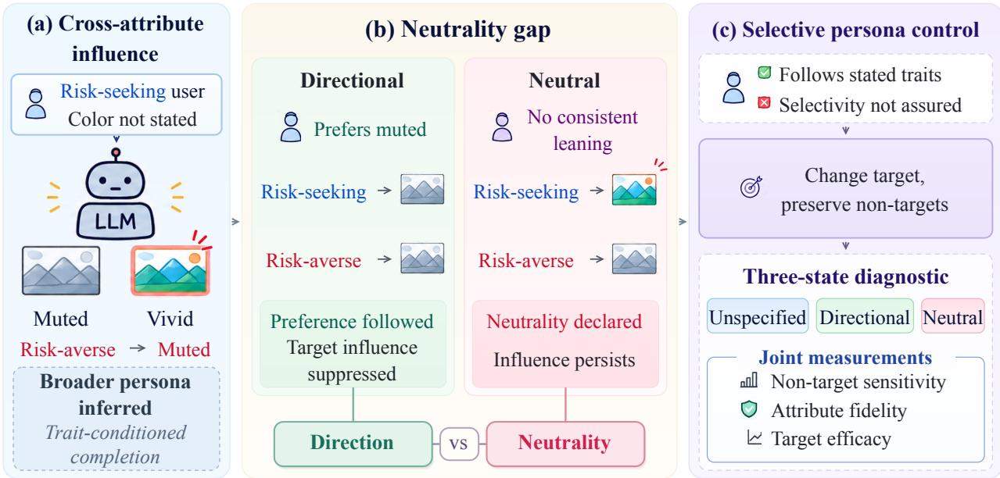  
Figure 1: From cross-attribute influence to selective persona control. (a) Target attributes can shift non-target responses. (b) Directional declarations suppress this influence more effectively than neutral declarations, revealing a neutrality gap. (c) Our three-state diagnostic distinguishes selective persona control from persona following. Highlighted choices indicate qualitative tendencies only.

Semantic, contextual, and internal analyses collectively suggest why this happens: models treat a persona prompt as evidence about the user rather than as an intervention on a single attribute, and then extend the inferred profile to unspecified preferences associated with the target. We call this process trait-conditioned completion. We next ask whether explicitly specifying the non-target attribute restores selective control. When a non-target attribute is assigned a clear direction, models generally follow the declaration and suppress the target attribute’s influence. However, when the same attribute is declared neutral, the target continues to affect choices on all five open-weight checkpoints, even when the model correctly reports the declared neutral state. We define the neutrality gap as this difference in non-target attribute preservation between directional and neutral declarations under otherwise identical prompts; no tested prompt design reliably preserves declared neutrality.

These findings establish a key distinction in persona evaluation. Existing evaluations typically assess persona following: whether models respond according to specified persona attributes (e.g., Jiang et al., 2024; Lutz et al., 2025). We introduce selective persona control as a stricter requirement: when a change in the target attribute successfully changes the target response, non-target attributes intended to remain unchanged should stay stable. Because changing the target attribute can also shift these non-target attributes, persona following does not imply selective persona control. A model can play the described user faithfully and still change more than the intended attribute. Directional persona-following tests cannot reveal this failure, because a model can pass them by simply following the stated direction; a neutral declaration removes that option.

We summarize our main contributions as follows:

(1) We directly test the selective control assumption underlying persona prompting and identify cross-attribute influence as a systematic failure across black-box and open-weight LLMs, which shows that persona prompts cannot be assumed to act as independent interventions on single attributes.

(2) We explain this failure as trait-conditioned completion: models read a persona prompt as evidence about the user. Semantic controls, contextual correlation manipulations, and interventions on internal representations support this account; the internal interventions also show partial coupling between target and non-target responses.

(3) Testing the remedy it implies, we identify the neutrality gap and introduce selective persona control as a distinct evaluation requirement. We operationalize this requirement through a three-state diagnostic protocol that distinguishes persona following from selective control.

## 2 Selective Persona Control: Framework and Setup

## 2.1 Framework Overview

Attributing a behavioral difference to the edited attribute requires three answers: whether other attributes move, why they move, and whether stating them keeps them fixed. Our framework answers them in three stages (Figure 1). First, a field audit varies one persona attribute across eight black-box LLMs and measures how far non-target responses move (Section 3). Second, semantic controls, in-context correlations, base checkpoints, and erasure of persona-induced subspaces trace its source (Sections 3 and 4). Third, a three-state diagnostic assesses whether explicitly specifying the non-target attribute restores selective control (Section 5).

Three information states. What can be preserved depends on what the prompt says about the non-target attribute, and an unspecified attribute is not a declared-neutral one. Let T be the target attribute and Z the non-target attribute, with assigned values t and z. One template renders the three states with the question and options held fixed (verbatim materials in Appendix A.6.9). The bare prompt states only the target. A directional declaration adds a signed line, “The user strongly prefers muted, understatedfinishes” (z=−1; somewhat at $| z | = . 5 )$ . A neutral declaration instead adds “The user has no consistent leaning in colour saturation” (z=0; an option-specific wording, “Between [pole] and [pole], the user is indifferent,” is used where noted). Candidate prompt designs may add one further instruction. By construction, the ground-truth non-target answer is independent of T given Z. In either form, z=0 states no leaning and does not require a 50/50 answer. The test asks whether the answer changes when only the target does, which needs no neutral ground truth.

Three measurements. Selective control needs three checks: the non-target answer stays put when only the target changes and follows a declared direction, while the target response still changes. Non-target sensitivity is the total variation (TV) distance between the non-target-answer distributions at the two target levels, computed within each option order and label assignment and then averaged, so opposite-sign effects stay visible. Low sensitivity alone is not enough, because a constant response that ignores Z is perfectly insensitive. Attributefidelity is measured by its error, the TV distance to the ground-truth non-target answer. Target efficacy is the movement toward the target-positive option when T changes, and its retention relative to the bare prompt must stay above a prespecified floor. A comparison is sensitive when its TV exceeds .15, and a prompt design preserves the non-target attribute when at most 5% of evaluation worlds (generated tasks, described below) contain a sensitive comparison (definitions, a conservative variant that also counts probability mass outside the valid answer set, and the neutral ground truth in Appendices A.10 and A.10.6). The three states and three measurements form the three-state diagnostic protocol. Target efficacy and fidelity under directional declarations measure persona following; selective persona control additionally requires non-target sensitivity within this tolerance at every declared level, including the neutral one.

## 2.2 Experimental Setup

Datasets. The field audit tests whether the influence exists on natural questionnaire items, with author-annotated attribute labels, fixed in advance, marking responses as target or non-target (Appendix A.3). Because natural items fix no correct non-target answer, structured worlds pair question texts with sampled parameters of an attribute-dependent decision rule, which fixes a ground-truth answer and lets the three states be assigned exactly. No model weights are trained, so there is no training split; prompt designs are chosen on validation worlds and tested once on held-out ones. Independent items over two tuned attribute pairs and two others, written blind to model outputs by LLMs from several families (one for some pairs), test transfer to untuned texts (Table 1).

Table 1: Evaluation designs. Appendix A.2 lists every design and its analysis unit.
<table><tr><td>Design</td><td>Items and split</td><td>Models</td><td>Readout</td></tr><tr><td>Field audit</td><td>16 non-target, 30 target items; 94+18-item bank</td><td>8 black-box</td><td>20 samples per item</td></tr><tr><td>Structured worlds</td><td>40 texts; 162 validation, 477 held-out worlds</td><td>5 open-weight</td><td>answer probabilities</td></tr><tr><td>Independent items</td><td>200 items (160 non-target), four pairs</td><td>4 primary + 1</td><td>answer probabilities</td></tr><tr><td>Internal coupling</td><td>47 items, 18 conditions, two item folds</td><td>5 + 4 held-out</td><td>seven-point position</td></tr></table>

Backbones. The audit covers eight black-box LLMs: DeepSeek-V4-Flash, GPT-5.5, Kimi-K2.6, Gemini-3-Flash-Preview, GLM-5.2, Qwen3.5-397B, Nemotron-3-Super, and MiMo-V2.5-Pro. Because the declaration and internal analyses need exact answer probabilities or hidden states, which these APIs do not expose, they use five open-weight checkpoints from four families, Qwen2.5-32B, Qwen3-32B, Mistral-Small-3.1-24B, Gemma-2-27B, and OLMo-2-32B (hereafter Qwen2.5, Qwen3, Mistral, Gemma-2, and OLMo-2); some analyses also use Qwen3.5-9B, matched base checkpoints, or held-out checkpoints (Appendix A.2).

Evaluation metrics. Non-target sensitivity, attribute fidelity, and target efficacy (defined above) evaluate the declarations; Sections 3 and 4 report the non-target shift (Appendix A.4) and its erasure (CEP, RET).

Implementation details. Black-box models are sampled at provider-default settings (128-token limit; option orders shuffled under fixed seeds); open-weight checkpoints are scored by exact answer-label probabilities in bfloat16; erasure removes rank-4 subspaces in a late-layer band, fit and scored on disjoint item folds. Headline intervals use an item-clustered bootstrap (B=2,000) with Benjamini–Hochberg correction. Open-weight runs use one NVIDIA RTX PRO 6000 Blackwell GPU (96 GB); Appendix A.13 gives software and API provenance.

Controls and comparisons. As the study evaluates a requirement rather than a new model, its comparisons are controls: the no-information reference, unrelated control attributes, semantic rewordings, random subspaces, directional declarations, and mitigation instructions (Section 5); representation-level control, as in activation steering (Rimsky et al., 2024) and Persona Vectors (Chen et al., 2025), is examined through persona-induced subspaces (Section 4).

## 3 Trait-Conditioned Completion: Behavioral Evidence

A persona-based study attributes a behavioral difference to the attribute its prompt changes, which is valid only if no other attribute changes with it. We first test whether persona control induces cross-attribute influence, using the field audit of eight black-box models. We then ask what carries it, lexical form or semantic content, by renaming the trait while keeping its meaning, and where the association comes from, model priors or contextual correlations, by comparing base with instruct checkpoints and supplying correlations in context. Each experiment changes only the target attribute and measures the non-target shift, the resulting change in the non-target answer.

Does persona control induce cross-attribute influence? The field audit compares a risk-seeking prompt with a fixed five-attribute baseline persona on everyday preferences that the attribute labels place outside risk. On all eight black-box models, the prompt shifts these preferences toward their attention-grabbing, non-default pole (e.g., vivid over muted), raising that pole’s probability by .43 on average; every model passes the prespecified effect floor and Benjamini–Hochberg correction (Benjamini & Hochberg, 1995). Three checks rule out simpler readings. The shift tracks content, not position: moving the non-default option to the other end of the scale, with the question and the default option fixed, moves the response with it $( 8 / 8 )$ . It depends on the trait: in a higher-sample audit of two models, unrelated control attributes (punctual, detail-oriented) move the same answers off the scale midpoint in 12% of samples, against 99% under the risk prompt. It also runs both ways: a cautious prompt shows no shift here because two baseline clauses already state that direction, but with them deleted, the risk→color influence appears in both directions on the five primary checkpoints and Qwen3.5-9B (Appendix A.7). A behavioral difference under a risk prompt can therefore mix the effect of risk with that of a color preference the prompt never stated.

Is cross-attribute influence lexical or semantic? A trait defined only by its behavior under an invented name reproduces the shift (non-target answer-token log-odds 9.13 against 9.06 for the natural label), whereas an arbitrary code yields far less (1.59; Figure 2a). Its reversal with polarity, and a signed-shift model that fits better than an extremity-only one (Appendix A.5), rule out a content-free preference for extreme options (Cronbach, 1946; Paulhus, 1991; Van Vaerenbergh & Thomas, 2013). The influence is therefore semantic: it follows the trait’s meaning, not its name.

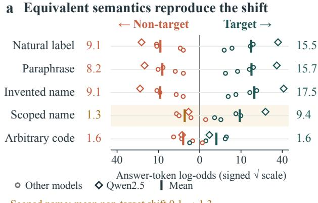  
Scoped name: mean non-target shift 9.1 → 1.3

b Correlation shifts response  
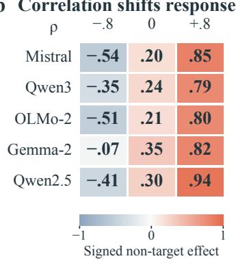  
Figure 2: Equivalent semantics reproduce the shift, and supplied correlations redirect it. (a) Answer-token logodds relative to the no-information reference (no stated preferences), on non-target and target items under five wording conditions; “Scoped name” replaces the examples with a risk-only scope. Points are the five checkpoints (diamonds: Qwen2.5); ticks and numbers give their means. Non-target values are mirrored leftward on a signed-square-root axis. (b) Signed effect of the bare prompt on the semantically positive non-target option at each demonstration correlation ρ (64 shared worlds; means and intervals in Appendix A.8; Gemma-2’s negative-ρ interval includes zero).

Does cross-attribute influence arise from model priors or contextual correlations? Priors would make it a fixed, correctable property of each model; contextual correlations would make it depend on the rest of the prompt. It arises from both. Base checkpoints show that the prior predates post-training: on the same items, their shifts predict those of the matched instruct checkpoints $( R ^ { 2 } { = } . 6 2 { - } . { \dot { 8 } } 1$ in four families; a smaller 8B pair reaches .43; Appendix A.8). Supplied correlations also redirect it. In structured worlds over four attribute pairs, sixteen in-context demonstrations approximate $P ( T { = } t , Z { = } z ) = ( 1 + \rho t z ) / 4$ with $\rho \in \{ - . 8 , 0 , + . 8 \}$ and balanced marginals. $D _ { p } ( \rho )$ is the signed difference in non-target-option probability between target values. When the prompt gives only $\dot { T }$ , the correlation redirects the target-induced non-target response on all five checkpoints (endpoint contrast $D _ { p } ( + . 8 ) - D _ { p } ( - . 8 )$ of .90–1.40 on a [−2, 2] range; Figure 2b). Taken together, the three answers point to trait-conditioned completion: models read a persona prompt as evidence about the user and fill unstated attributes from associations learned in training or supplied in context.

## 4 Internal Evidence for Partial Target–Non-Target Coupling

Section 3 suggests that models read a persona as evidence about one user, so target and non-target responses should be coupled internally; without coupling, representation-level control such as activation steering (Rimsky et al., 2024) or Persona Vectors (Chen et al., 2025) could remove the influence without losing the manipulation. We test the coupling by erasing what personas write into the hidden state, then ask whether a subspace aimed at the non-target shift alone separates the two.

Is cross-attribute influence internally coupled to the target response? Erasure tests the coupling directly. A prespecified program crosses eighteen prompt conditions, including a no-information reference, with 47 items answered on a seven-point scale, on the five primary checkpoints (Appendix A.9). A condition’s displacement is its hidden-state change relative to that reference. We erase a subspace by projecting it out of the reference-centered hidden state (Belrose et al., 2023), at every position from the end of the question to the answer (Arditi et al., 2024), in a band of late layers; the subspace is fit and scored on two disjoint item folds. Each answer is scored by its expected scale position under the answer-label probabilities; a shift is its difference from the reference. CEP (causal explanatory power) is the fraction of the mean non-target shift that erasure removes (values above 1 overshoot the reference); RET (retention) is the fraction of the mean target shift kept (Figure 3). Erasing a rank-4 subspace fit only from two style personas (attention-grabbing versus default choices), which never mention risk, removes 1.10–1.37 of the non-target shift but keeps only −.17 to .20 of the risk target response. Rank-matched random subspaces have no effect $( \mathrm { C E P } \stackrel { \cdot } { \leq } . 0 1 , \mathrm { R E T } \geq . 9 7 )$ . The pattern replicates on three of four held-out checkpoints; the fourth is uninterpretable because random subspaces also disrupt it (a post hoc check). On this readout, the two responses share a component of the displacement.

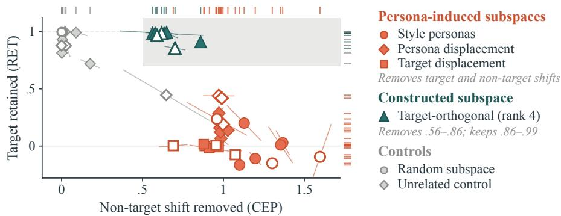  
Open: held-out · Bars: item folds · Rugs: spread · Shading: selective region  
Figure 3: Persona-induced subspaces remove target and non-target shifts together. Non-target shift removed (CEP) against target response retained (RET) after erasure, on the five primary and three held-out checkpoints. Persona-induced subspaces are fit to the style personas’ contrast, the risk persona’s own displacement, or its displacement on target items. Of those plotted, only the constructed target-orthogonal subspace enters the selective region (shaded; CEP ≥ .5, RET ≥ .7).

Can cross-attribute influence be separated from the target response? Coupling may be partial, so we construct a separation. Projecting the target displacement out of the non-target displacement yields a rank-4 target-orthogonal subspace. On the five primary and three held-out checkpoints, it removes .56–.86 of the non-target shift while retaining .86–.99 of the target response (point estimates). No tested persona-induced subspace does so at this rank and band on checkpoints that pass the random control. The construction is also local. Refit on a binary-choice readout (a separate panel, in TV units not comparable with CEP), it lowers the non-target shift by at most .20; on unrelated tasks, it meets all five collateral-utility criteria on one of five checkpoints and all but one on two others (Appendix A.9). Target and non-target responses thus share part of the persona-induced representation; a constructed subspace separates them, mainly on the seven-point readout.

## 5 The Neutrality Gap: Directional Declarations Reduce Sensitivity More Than Neutral Ones

Section 3 suggests that models fill in the non-target attributes a prompt leaves unspecified. A natural remedy is to specify these attributes explicitly. A directional declaration states a leaning, which a model can satisfy simply by following it, as persona-following tests do. A neutral declaration, however, states no leaning, so it tests whether the attribute itself stays stable. We compare the two forms (Figure 4), then ask whether the gap between them arises from extracting the declared state or from using it, and which instructions reduce the influence.

Do directional declarations suppress cross-attribute influence? In exploratory structured worlds with a supplied attribute correlation (Section 3), declaring the non-target value overrides that correlation on all five checkpoints. The endpoint contrast falls from .90–1.40 to at most .07 (Appendix A.10). Because TV between target levels depends only on a shared answer tendency (the two levels’ mean answer log-odds) and a target-induced margin (half their difference), a declaration could lower TV by output saturation alone; a post hoc algebraic decomposition (Appendix A.10.6) shows that it also cuts the margin itself, so the override is nearly complete on the probability scale, with a log-odds residual.

<table><tr><td colspan="7">a Structured worlds (held-out)</td></tr><tr><td colspan="7">Non-target level z -1</td></tr><tr><td></td><td>Mistral</td><td>.00</td><td>-.5 .02</td><td>0 .60</td><td>+.5 .07</td><td>+1 .00</td></tr><tr><td>Qwen3</td><td>.00</td><td>.00</td><td>.52</td><td>.04</td><td></td><td>.04</td></tr><tr><td>OLMo-2</td><td>.00</td><td>.02</td><td></td><td>.60</td><td>.05</td><td>.02</td></tr><tr><td>Gemma-2</td><td>.02</td><td>.03</td><td></td><td>.76</td><td>.13</td><td>.00</td></tr><tr><td>Qwen2.5</td><td>.00</td><td>.00</td><td></td><td>.38</td><td>.03</td><td>.01</td></tr><tr><td colspan="7">Outlined: neutral declaration. The two sets are not pooled.</td></tr></table>

b Independent items
<table><tr><td rowspan=2 colspan=1>Mistral</td><td rowspan=1 colspan=1>Bare</td><td rowspan=1 colspan=2>Dir. Neut.</td></tr><tr><td rowspan=1 colspan=1>.93</td><td rowspan=1 colspan=1>.00</td><td rowspan=1 colspan=1>.79</td></tr><tr><td rowspan=1 colspan=1>Qwen3</td><td rowspan=1 colspan=1>.78</td><td rowspan=1 colspan=1>.00</td><td rowspan=1 colspan=1>.51</td></tr><tr><td rowspan=1 colspan=1>OLMo-2</td><td rowspan=1 colspan=1>.76</td><td rowspan=1 colspan=1>.003</td><td rowspan=1 colspan=1>.58</td></tr><tr><td rowspan=1 colspan=1>Gemma-2</td><td rowspan=1 colspan=1>.79</td><td rowspan=1 colspan=1>.00</td><td rowspan=1 colspan=1>.81</td></tr><tr><td rowspan=1 colspan=1>Qwen3.5-9B</td><td rowspan=1 colspan=1>.67</td><td rowspan=1 colspan=1>.00</td><td rowspan=1 colspan=1>.67</td></tr><tr><td rowspan=1 colspan=4>Share above .15ó</td></tr></table>

Figure 4: Declared neutrality leaves the non-target choice target-sensitive in both item sets. (a) Structured worlds: share of held-out worlds whose TV between target levels exceeds .15 at each non-target level (477 worlds over 40 non-target texts per model; the outlined column declares no consistent leaning). (b) Independent items: share of the 160 non-target items (bare, neutral) or 320 item–pole comparisons (directional) above .15, in the open frame with an option-specific neutral wording; Qwen3.5-9B replaces Qwen2.5. The two sets differ in frame, wording, unit, and models, so they are not pooled. The level split in (a) and all of (b) are post hoc (Appendix A.10).

Do neutral declarations suppress cross-attribute influence? Far less than directional ones. We test each checkpoint’s best candidate prompt design once on held-out worlds; none met the feasibility criterion on the validation worlds used for selection (Appendix A.10). Every checkpoint fails the 5% tolerance of Section 2: TV exceeds .15 in 39–76% of worlds, and in post hoc checks the verdict holds with intervals clustered by text (Table 21) and at any sensitivity threshold below .95. The failures sit at the neutral level, where 38–76% of worlds exceed .15, against 0–13% at the directional levels (Figure 4a; post hoc). Even without the neutral level, the rate under the conservative variant (Section 2) stays above the tolerance on four of five checkpoints. Held-out worlds reuse the texts, so we also test the independent items. At the neutral level, 51–81% of them exceed .15, close to the 67–93% under the bare prompt, against at most 1 of 320 item–pole comparisons under directional declarations (Figure 4b; open frame, with no system instruction forcing one option). The neutral-level shifts follow the bare prompt’s direction: where both exceed .15, they share its sign in 1,237 of 1,240 held-out world comparisons and in most independent-item comparisons. In the same decomposition, the neutral level keeps a median .37–.87 of the bare margin and pushes the shared answer tendency toward saturation far less than the directional extremes do. Nor does the effect hinge on one wording: two paraphrases (two checkpoints), the option-specific wording (six checkpoints), and deleting the instruction to use the description (four checkpoints) leave it in place, and a tie-breaking rule only attenuates it (Appendix A.10). Models follow a declared direction, not a declared absence of preference: the neutrality gap.

Does the neutrality gap arise from extracting the declared state or from using it? The neutral level still carries the bare prompt’s influence. A model that fails to extract the declared state would be helped by clearer wording; one that extracts it but does not use it would pass a manipulation check in which it restates the persona (Hauser et al., 2018) while its choices vary. In independent contexts, the same description and alternatives are posed three ways: which state the description declares, which alternative to choose, and which response fits once indifferent and not enough information are added to the options. We run this on the structured texts (six checkpoints) and the independent items (five; Appendix A.11). Reports of the neutral declaration are mostly adequate, yet most choices remain affected by the target attribute. In about two thirds of comparisons in both item sets, adequate reporting coexists with a sensitive choice, and inadequate reporting never coexists with a stable choice (Table 2); on the independent items the dissociation is strongest for risk→color, weakest for an intensity-matched hue pair. At the task level, the failure appears in choice even where the report is correct.

Which instructions reduce cross-attribute influence? A neutral declaration supplies no direction to follow, so we test whether instructions that supply one work where prohibiting the influence does not. On two black-box models, we test a scope-and-default instruction, which combines a scope rule for the target with an explicit default for non-target attributes. It suppresses the influence (containment; Appendix A.12) in 23 of the 31 informative model–task–persona cells, where the bare prompt clearly moves the answer, against 13–14 for the default or the scope rule alone and at most 5 for a negation-only instruction or a prefix labeling each rating or A/B question as not a risk decision. On the open-weight checkpoints, an attribute-scope instruction without a default lowers neutral-level sensitivity in 8 of 12 checkpoint–pair cells but leaves no comparison above .15 in only one, and adding an indifferent option lowers sensitivity but is not a repair either (Appendix A.11). In a separate lookup task whose rule names the deciding attribute, non-target sensitivity is .001–.003 on all five checkpoints at target efficacy .79–.94 (Appendix A.12.2), so very low sensitivity is attainable when the decision rule is supplied. Models thus follow a clear alternative direction, which suppresses the influence, but no tested prompt design reliably preserves declared neutrality, a requirement of selective control that directional tests do not check.

Table 2: Reporting a declared neutral state does not ensure an invariant choice. Option-specific neutral wording. Correct report: minimum over target levels of P(correct report), averaged over orders and labels. Report and choice sensitivity: TV between target levels. Comparisons by adequate report (≥ .90) and sensitive choice (TV > .15). Exploratory; per-model values in Appendix A.11.
<table><tr><td></td><td></td><td></td><td></td><td></td><td colspan="2">Comparisons: choice sensitive / stable</td></tr><tr><td>Item set</td><td>Check- points</td><td>Correct report</td><td>Report sens.</td><td>Choice sens.</td><td>Adequate report</td><td>Inadequate report</td></tr><tr><td>Structured texts</td><td>6</td><td>.892-1.000</td><td>≤ .064</td><td>&lt; .001–.967</td><td>161 / 66 of 240</td><td>13 /0</td></tr><tr><td>Independent items</td><td>5</td><td>.901-1.000</td><td>≤ .053</td><td>.043-.987</td><td>515 / 262 of 800</td><td>23/0</td></tr></table>

## 6 Related Work

Synthetic users and causal validity. Persona-conditioned agents support synthetic populations (Argyle et al., 2023; Filippas et al., 2024; Aher et al., 2023; Park et al., 2023) whose validity has been questioned (Cheng et al., 2023b; Tjuatja et al., 2024; Hullman et al., 2026; Hu & Collier, 2024; Dominguez-Olmedo et al., 2024); statistical realism is a weak proxy for treatment-effect accuracy (Li & Ji, 2026). Gui & Toubia (2023) trace confounding to unspecified attributes and reveal the design rather than add covariates. Lin et al. (2026) formalize user drift and find that setting-relevant confounders reduce it, whereas generic ones help inconsistently. However, neither tests a declaration of no preference or intervenes on internal representations; our diagnostic and erasure analysis address both, following construct and manipulation validity (Cronbach & Meehl, 1955; Campbell & Fiske, 1959; Chester & Lasko, 2021; Hauser et al., 2018; Jacobs & Wallach, 2021; Blodgett et al., 2021; Rottger et al., 2024) and negative controls (Lipsitch et al., 2010; Shi¨ et al., 2020).

Defaults, inferred users, and consistency. Model defaults are not neutral (Santurkar et al., 2023), and persona wording affects how far behavior shifts (Lutz et al., 2025; Weeber et al., 2026). BBQ (Parrish et al., 2022) tests reliance on stereotypes when information is insufficient, whereas our neutral declaration explicitly states that the attribute has no consistent leaning. Neplenbroek et al. (2025) show that, for some groups, demographic attributes inferred from conversational signals persist even after an identity is explicitly stated, and that steering toward a no-information state can fail where steering toward a stated group succeeds. Assigned personas can also carry stereotyped correlates into other attributes (Reusens et al., 2025), and audits document persona-linked bias, caricature, and inconsistency (Gupta et al., 2024; Deshpande et al., 2023; Liu et al., 2024; Cheng et al., 2023a; Wang et al., 2025; Perez et al., 2023; Bisbee et al., 2024; Xiao et al., 2026). These studies primarily concern inferred identities, stereotypes, or role coherence (Andreas, 2022; Shanahan et al., 2023). Unlike steering an inferred identity toward a no-information state, we test whether a preference declared neutral in the prompt stays stable when a different, stated attribute changes, while also requiring the target response to change as intended.

Editing specificity and activation control. Knowledge editing is judged by efficacy, generalization, and specificity (Meng et al., 2022; Cohen et al., 2024); non-target attribute preservation is the behavioral analog of specificity. Activation steering controls high-level behavior (Turner et al., 2023; Rimsky et al., 2024; Zou et al., 2023), with structured, partly forecastable side effects (Ong et al., 2026), and multi-concept control remains open (Wehner et al., 2025). Activation patching localizes where persona tokens are processed (Poonia & Jain, 2025). Persona features control emergent misalignment (Wang et al., 2026), Persona Vectors monitor trait shifts (Chen et al., 2025), and personality directions interfere even after orthogonalization (Bhandari et al., 2026). Models encode and amplify real-world correlations among an entity’s numerical attributes (Takagi et al., 2025). Our erasure evidence builds on linear concept erasure (Ravfogel et al., 2020, 2022; Belrose et al., 2023) and work on linear representations (Park et al., 2024; Arditi et al., 2024; Gurnee et al., 2026), and bounds constructed selectivity with controls that steering success alone lacks (Tan et al., 2024).

## 7 Conclusion

Persona prompting assumes that specifying one attribute changes that attribute alone. Our results point to why this assumption fails: models read a persona prompt as evidence about the user rather than as a selective intervention on one attribute. Trait-conditioned completion then carries the stated trait into unstated attributes the model associates with it, whether the association was learned in training or supplied in context; risk→color is one instance. A declaration can counter this completion, but only asymmetrically: models follow a stated direction but do not preserve a declared neutral state. Preserving declared neutrality is the open problem these results pinpoint: no tested prompt design reliably achieves it. This asymmetry is invisible to persona-following tests, because a model can pass them simply by following the stated direction. The neutral state removes that option: it shows whether the attribute itself stays stable, and it needs only invariance to the target, not a ground-truth answer. A study that attributes a behavioral change to one edited prompt attribute needs a preservation check of this kind, and the three-state diagnostic supplies one. Passing a persona-following test shows that the model plays the described user; it does not show that only the intended attribute changed. A persona prompt can define a coherent character without defining a valid experiment.

Limitations. The field audit covers one attribute pair; the other pairs are tested on open-weight checkpoints, as are the neutral-declaration and internal analyses, which need exact answer probabilities or hidden states that the black-box APIs do not uniformly expose. Directional instructions also need checking in use: in ten-turn dialogues, a scope-and-default instruction reduces the influence on all eight black-box models but keeps it below our prespecified floor, with the target retained, at every measured turn on only three (Appendix A.12). Materials are English and text-only. We use no human benchmark because selectivity is defined by what the prompt states, not by how people behave; whether the inferred preferences match real users is a separate question (Appendix A.14).

## AI Use Statement

Generative AI assistants were used to provide feedback on existing hypotheses, analysis plans, and experimental methodology; assist with implementation, data cleaning and reformatting, analysis, and interpretation of results; and generate synthetic item banks. They were also used for editing existing author-written text and figures. Generative AI was not used to develop the conceptual framework, formulate mathematical claims, or write mathematical proofs. Translation and qualitative or thematic data analysis are not applicable to this work. All AI-assisted work was reviewed by the authors, who take responsibility for the study design, analyses, interpretations, and final content.

## Ethics Statement

This work measures whether persona prompts move non-target attributes. The study involves no human subjects. Model-generated associations between traits and preferences are not evidence about people, and no claim about social groups is made from them. The constructed target-orthogonal intervention could also conceal selected side effects while preserving the target response; we report it as a scientific control, not a deployment recipe. The results caution against research or product decisions based on persona-conditioned synthetic users without checking that non-target attribute stay invariant to the target.

## Reproducibility Statement

Appendix A.2 identifies the models, materials, unit of analysis, and status of each main design; Appendix A.1 maps claims to evidence; Appendices A.3 and A.10 define the estimands and decision rules; and Appendix A.13 records API provenance, checkpoint identifiers, corrections, and dated deviations. Core prompts and complete headline tables, complete mathematical proofs, and their assumptions are included in the appendix. The code and data release contains the items, wordings, worlds, and splits; the cached scores behind every number in Sections 3–5 and the Conclusion (per item, world, or cell where these were stored); a standard-library script that recomputes each of these numbers and prints it beside the value in the paper; and the prompt-rendering, scoring, and erasure code. Raw per-call responses and hidden-state activations are omitted for size. Post hoc, exploratory, and revised-rule analyses are explicitly labeled.

## References

Gati V. Aher, Rosa I. Arriaga, and Adam Tauman Kalai. Using large language models to simulate multiple humans and replicate human subject studies. In Proceedings ofthe 40th International Conference on Machine Learning, volume 202 of Proceedings ofMachine Learning Research, pp. 337–371. PMLR, 2023.

Jacob Andreas. Language models as agent models. In Findings of the Association for Computational Linguistics: EMNLP 2022, pp. 5769–5779, 2022.

Andy Arditi, Oscar Obeso, Aaquib Syed, Daniel Paleka, Nina Panickssery, Wes Gurnee, and Neel Nanda. Refusal in language models is mediated by a single direction. In Advances in Neural Information Processing Systems, 2024.

Lisa P. Argyle, Ethan C. Busby, Nancy Fulda, Joshua R. Gubler, Christopher Rytting, and David Wingate. Out of one, many: Using language models to simulate human samples. Political Analysis, 31(3):337–351, 2023.

Ashwini Ashokkumar, Luke Hewitt, Isaias Ghezae, and Robb Willer. Large language models can predict the results of social science experiments. Nature, 656(8126):115–122, 2026.

Chen Avin, Ilya Shpitser, and Judea Pearl. Identifiability of path-specific effects. In Proceedings of the 19th International Joint Conference on Artificial Intelligence, pp. 357–363, 2005.

Nora Belrose, David Schneider-Joseph, Shauli Ravfogel, Ryan Cotterell, Edward Raff, and Stella Biderman. LEACE: Perfect linear concept erasure in closed form. In Advances in Neural Information Processing Systems, 2023.

Yoav Benjamini and Yosef Hochberg. Controlling the false discovery rate: A practical and powerful approach to multiple testing. Journal ofthe Royal Statistical Society: Series B (Methodological), 57(1):289–300, 1995.

Pranav Bhandari, Usman Naseem, and Mehwish Nasim. Do personality traits interfere? Geometric limitations of steering in large language models. In Findings of the Association for Computational Linguistics: ACL 2026, pp. 29284–29293. Association for Computational Linguistics, 2026.

James Bisbee, Joshua D. Clinton, Cassy Dorff, Brenton Kenkel, and Jennifer M. Larson. Synthetic replacements for human survey data? The perils of large language models. Political Analysis, 32(4):401–416, 2024.

Ann-Renee Blais and Elke U. Weber. A domain-specific risk-taking (DOSPERT) scale for adult populations. ´ Judgment and Decision Making, 1(1):33–47, 2006.

Peter H. Bloch, Fred´ eric F. Brunel, and Todd J. Arnold. Individual differences in the centrality of visual product´ aesthetics: Concept and measurement. Journal ofConsumer Research, 29(4):551–565, 2003.

Su Lin Blodgett, Gilsinia Lopez, Alexandra Olteanu, Robert Sim, and Hanna Wallach. Stereotyping Norwegian salmon: An inventory of pitfalls in fairness benchmark datasets. In Proceedings ofthe 59th Annual Meeting ofthe Association for Computational Linguistics and the 11th International Joint Conference on Natural Language Processing (Volume 1: Long Papers), pp. 1004–1015, 2021.

ByteDance Seed. Seed2.0 model card: Towards intelligence frontier for real-world complexity. arXiv preprint arXiv:2607.00248, 2026.

Donald T. Campbell and Donald W. Fiske. Convergent and discriminant validation by the multitrait-multimethod matrix. Psychological Bulletin, 56(2):81–105, 1959.

Runjin Chen, Andy Arditi, Henry Sleight, Owain Evans, and Jack Lindsey. Persona vectors: Monitoring and controlling character traits in language models. arXiv preprint arXiv:2507.21509, 2025.

Myra Cheng, Esin Durmus, and Dan Jurafsky. Marked personas: Using natural language prompts to measure stereotypes in language models. In Proceedings ofthe 61st Annual Meeting ofthe Associationfor Computational Linguistics, pp. 1504–1532, 2023a.

Myra Cheng, Tiziano Piccardi, and Diyi Yang. CoMPosT: Characterizing and evaluating caricature in LLM simulations. In Proceedings ofthe 2023 Conference on Empirical Methods in Natural Language Processing, pp. 10853–10875. Association for Computational Linguistics, 2023b.

David S. Chester and Emily N. Lasko. Construct validation of experimental manipulations in social psychology: Current practices and recommendations for the future. Perspectives on Psychological Science, 16(2):377–395, 2021.

Silvia Chiappa. Path-specific counterfactual fairness. In Proceedings of the AAAI Conference on Artificial Intelligence, volume 33, pp. 7801–7808, 2019.

Kalia Cleridou and Adrian Furnham. Personality correlates of aesthetic preferences for art, architecture, and music. Empirical Studies ofthe Arts, 32(2):231–255, 2014.

C. J. Clopper and E. S. Pearson. The use of confidence or fiducial limits illustrated in the case of the binomial. Biometrika, 26(4):404–413, 1934. doi: 10.1093/biomet/26.4.404.

Roi Cohen, Eden Biran, Ori Yoran, Amir Globerson, and Mor Geva. Evaluating the ripple effects of knowledge editing in language models. Transactions ofthe Associationfor Computational Linguistics, 12:283–298, 2024.

Lee J. Cronbach. Response sets and test validity. Educational and Psychological Measurement, 6(4):475–494, 1946.

Lee J. Cronbach and Paul E. Meehl. Construct validity in psychological tests. Psychological Bulletin, 52(4):281–302, 1955.

DeepSeek-AI, Anyi Xu, Bangcai Lin, Bing Xue, Bingxuan Wang, et al. DeepSeek-V4: Towards highly efficient million-token context intelligence. arXiv preprint arXiv:2606.19348, 2026.

Ameet Deshpande, Vishvak Murahari, Tanmay Rajpurohit, Ashwin Kalyan, and Karthik Narasimhan. Toxicity in ChatGPT: Analyzing persona-assigned language models. In Findings of the Association for Computational Linguistics: EMNLP 2023, pp. 1236–1270. Association for Computational Linguistics, 2023.

Danica Dillion, Niket Tandon, Yuling Gu, and Kurt Gray. Can AI language models replace human participants? Trends in Cognitive Sciences, 27(7):597–600, 2023.

Ricardo Dominguez-Olmedo, Moritz Hardt, and Celestine Mendler-Dunner. Questioning the survey responses of large¨ language models. In Advances in Neural Information Processing Systems, volume 37, 2024.

Apostolos Filippas, John J Horton, and Benjamin S Manning. Large language models as simulated economic agents: What can we learn from Homo Silicus? In Proceedings of the 25th ACM Conference on Economics and Computation (EC ’24), pp. 614–615, 2024.

Gemma Team, Morgane Riviere, Shreya Pathak, Pier Giuseppe Sessa, Cassidy Hardin, et al. Gemma 2: Improving open language models at a practical size. arXiv preprint arXiv:2408.00118, 2024.

Gemma Team, Aishwarya Kamath, Johan Ferret, Shreya Pathak, Nino Vieillard, et al. Gemma 3 technical report. arXiv preprint arXiv:2503.19786, 2025.

Gemma Team, Sherif El Abd, Vaibhav Aggarwal, Robin Algayres, Alek Andreev, et al. Gemma 4 technical report. arXiv preprint arXiv:2607.02770, 2026.

GLM-5-Team, Aohan Zeng, Xin Lv, Zhenyu Hou, Zhengxiao Du, et al. GLM-5: from vibe coding to agentic engineering. arXiv preprint arXiv:2602.15763, 2026.

Google DeepMind. Gemini 3 Flash model card. https://storage.googleapis.com/deepmind-media/ Model-Cards/Gemini-3-Flash-Model-Card.pdf, December 2025.

Aaron Grattafiori, Abhimanyu Dubey, Abhinav Jauhri, Abhinav Pandey, Abhishek Kadian, et al. The Llama 3 herd of models. arXiv preprint arXiv:2407.21783, 2024.

George Gui and Olivier Toubia. The challenge of using LLMs to simulate human behavior: A causal inference perspective. arXiv preprint arXiv:2312.15524, 2023.

Shashank Gupta, Vaishnavi Shrivastava, Ameet Deshpande, Ashwin Kalyan, Peter Clark, Ashish Sabharwal, and Tushar Khot. Bias runs deep: Implicit reasoning biases in persona-assigned LLMs. In International Conference on Learning Representations, 2024.

Wes Gurnee, Nicholas Sofroniew, Adam Pearce, Mateusz Piotrowski, Isaac Kauvar, Runjin Chen, Anna Soligo, Paul Bogdan, Euan Ong, Rowan Wang, Ben Thompson, David Abrahams, Subhash Kantamneni, Emmanuel Ameisen, Joshua Batson, and Jack Lindsey. Verbalizable representations form a global workspace in language models. Transformer Circuits Thread, 2026. URL https://transformer-circuits.pub/2026/workspace/. arXiv:2607.15495.

John Hartley, Conor Brian Hamill, Dale Seddon, Devesh Batra, Ramin Okhrati, and Raad Khraishi. How personality traits shape LLM risk-taking behaviour. In Findings of the Association for Computational Linguistics: ACL 2025, pp. 21068–21092, 2025.

David J. Hauser, Phoebe C. Ellsworth, and Richard Gonzalez. Are manipulation checks necessary? Frontiers in Psychology, 9:998, 2018.

Tiancheng Hu and Nigel Collier. Quantifying the persona effect in LLM simulations. In Proceedings ofthe 62nd Annual Meeting of the Association for Computational Linguistics (Volume 1: Long Papers), pp. 10289–10307. Association for Computational Linguistics, 2024.

Jessica Hullman, David Broska, Huaman Sun, and Aaron Shaw. This human study did not involve human subjects: Validating LLM simulations as behavioral evidence. arXiv preprint arXiv:2602.15785, 2026.

Abigail Z. Jacobs and Hanna Wallach. Measurement and fairness. In Proceedings of the 2021 ACM Conference on Fairness, Accountability, and Transparency, pp. 375–385, 2021.

Hang Jiang, Xiajie Zhang, Xubo Cao, Cynthia Breazeal, Deb Roy, and Jad Kabbara. PersonaLLM: Investigating the ability of large language models to express personality traits. In Findings of the Association for Computational Linguistics: NAACL 2024, pp. 3605–3627. Association for Computational Linguistics, 2024.

Kimi Team, Tongtong Bai, Yifan Bai, Yiping Bao, S. H. Cai, et al. Kimi K2.5: Visual agentic intelligence. arXiv preprint arXiv:2602.02276, 2026.

John L. Lastovicka, Lance A. Bettencourt, Renee Shaw Hughner, and Ronald J. Kuntze. Lifestyle of the tight and´ frugal: Theory and measurement. Journal ofConsumer Research, 26(1):85–98, 1999.

Kenneth Li, Tianle Liu, Naomi Bashkansky, David Bau, Fernanda Viegas, Hanspeter Pfister, and Martin Wattenberg.´ Measuring and controlling instruction (In)Stability in language model dialogs. In First Conference on Language Modeling (COLM), 2024.

Zonghan Li and Feng Ji. Statistical realism is not evidence that LLMs can estimate treatment effects in social science experiments. arXiv preprint arXiv:2604.02458, 2026.

Victoria Lin, Taedong Yun, Maja Mataric, John Canny, Arthur Gretton, and Alexander D’Amour. The illusion of ´ intervention: Your LLM-simulated experiment is an observational study. arXiv preprint arXiv:2605.20767, 2026.

Marc Lipsitch, Eric Tchetgen Tchetgen, and Ted Cohen. Negative controls: A tool for detecting confounding and bias in observational studies. Epidemiology, 21(3):383–388, 2010.

Patrick Litle and Marvin Zuckerman. Sensation seeking and music preferences. Personality and Individual Differences, 7(4):575–578, 1986.

Andy Liu, Mona Diab, and Daniel Fried. Evaluating large language model biases in persona-steered generation. In Findings ofthe Associationfor Computational Linguistics: ACL 2024, pp. 9832–9850. Association for Computational Linguistics, 2024.

Marlene Lutz, Indira Sen, Georg Ahnert, Elisa Rogers, and Markus Strohmaier. The prompt makes the person(a): A systematic evaluation of sociodemographic persona prompting for large language models. In Findings of the Associationfor Computational Linguistics: EMNLP 2025, pp. 23212–23237, 2025.

Andreas Maurer and Massimiliano Pontil. Empirical Bernstein bounds and sample variance penalization. In Proceedings of the 22nd Annual Conference on Learning Theory, 2009. URL https://arxiv.org/abs/0907.3740.

Robert R. McCrae and Paul T. Costa, Jr. Conceptions and correlates of openness to experience. In Robert Hogan, John Johnson, and Stephen Briggs (eds.), Handbook of Personality Psychology, pp. 825–847. Academic Press, 1997.

Kevin Meng, David Bau, Alex Andonian, and Yonatan Belinkov. Locating and editing factual associations in GPT. In Advances in Neural Information Processing Systems, volume 35, pp. 17359–17372, 2022.

Mistral AI. Mistral Small 3.1. https://mistral.ai/news/mistral-small-3-1, 2025. Release announcement, March 17, 2025.

Moonshot AI. Kimi K2.6: Advancing open-source coding. https://www.kimi.ai/blog/kimi-k2-6, 2026.

Nils Myszkowski and Martin Storme. How personality traits predict design-driven consumer choices. Europe’s Journal of Psychology, 8(4):641–650, 2012.

Vera Neplenbroek, Arianna Bisazza, and Raquel Fernandez. Reading between the prompts: How stereotypes shape´ LLM’s implicit personalization. In Proceedings of the 2025 Conference on Empirical Methods in Natural Language Processing, pp. 20367–20400. Association for Computational Linguistics, 2025.

NVIDIA, Aakshita Chandiramani, Aaron Blakeman, Abdullahi Olaoye, Abhibha Gupta, et al. Nemotron 3 Super: Open, efficient mixture-of-experts hybrid Mamba-Transformer model for agentic reasoning. arXiv preprint arXiv:2604.12374, 2026.

Chong Yong Ong, Alson Wei Jie Sim, Peixin Zhang, and Jun Sun. Forecasting side effects of activation steering. arXiv preprint arXiv:2608.11227, 2026.

OpenAI. GPT-5.5 system card. https://deploymentsafety.openai.com/gpt-5-5, April 2026.

OpenAI, Sandhini Agarwal, Lama Ahmad, Jason Ai, Sam Altman, et al. gpt-oss-120b & gpt-oss-20b model card. arXiv preprint arXiv:2508.10925, 2025.

Joon Sung Park, Joseph C. O’Brien, Carrie Jun Cai, Meredith Ringel Morris, Percy Liang, and Michael S. Bernstein. Generative agents: Interactive simulacra of human behavior. In Proceedings ofthe 36th Annual ACM Symposium on User Interface Software and Technology (UIST), 2023.

Kiho Park, Yo Joong Choe, and Victor Veitch. The linear representation hypothesis and the geometry of large language models. In Proceedings of the 41st International Conference on Machine Learning, volume 235 of Proceedings of Machine Learning Research, pp. 39643–39666. PMLR, 2024.

Alicia Parrish, Angelica Chen, Nikita Nangia, Vishakh Padmakumar, Jason Phang, Jana Thompson, Phu Mon Htut, and Samuel R. Bowman. BBQ: A hand-built bias benchmark for question answering. In Findings of the Association for Computational Linguistics: ACL 2022, pp. 2086–2105. Association for Computational Linguistics, 2022.

Delroy L. Paulhus. Measurement and control of response bias. In John P. Robinson, Phillip R. Shaver, and Lawrence S. Wrightsman (eds.), Measures ofPersonality and Social Psychological Attitudes, pp. 17–59. Academic Press, 1991.

Ethan Perez, Sam Ringer, Kamile Luko˙ siˇ ut¯ e, Karina Nguyen, Edwin Chen, Scott Heiner, Craig Pettit, Catherine Olsson,˙ Sandipan Kundu, Saurav Kadavath, et al. Discovering language model behaviors with model-written evaluations. In Findings ofthe Associationfor Computational Linguistics: ACL 2023, pp. 13387–13434, 2023.

Pouya Pezeshkpour and Estevam Hruschka. Large language models sensitivity to the order of options in multiple-choice questions. In Findings ofthe Associationfor Computational Linguistics: NAACL 2024, pp. 2006–2017, 2024.

Ansh Poonia and Maeghal Jain. Dissecting persona-driven reasoning in language models via activation patching. In Findings ofthe Associationfor Computational Linguistics: EMNLP 2025, pp. 24553–24566, 2025.

Qwen Team. Qwen3.5: Towards native multimodal agents. https://qwen.ai/blog?id=qwen3.5, February 2026a.

Qwen Team. Qwen3.6-Plus: Towards real world agents. https://qwen.ai/blog?id=qwen3.6, April 2026b.

Qwen Team, An Yang, Baosong Yang, Beichen Zhang, Binyuan Hui, et al. Qwen2.5 technical report. arXiv preprint arXiv:2412.15115, 2024.

Shauli Ravfogel, Yanai Elazar, Hila Gonen, Michael Twiton, and Yoav Goldberg. Null it out: Guarding protected attributes by iterative nullspace projection. In Proceedings of the 58th Annual Meeting of the Association for Computational Linguistics, pp. 7237–7256, 2020.

Shauli Ravfogel, Michael Twiton, Yoav Goldberg, and Ryan Cotterell. Linear adversarial concept erasure. In Proceedings of the 39th International Conference on Machine Learning, volume 162 of Proceedings of Machine Learning Research, pp. 18400–18421. PMLR, 2022.

Manon Reusens, Bart Baesens, and David Jurgens. Are economists always more introverted? Analyzing consistency in persona-assigned LLMs. In Findings of the Association for Computational Linguistics: EMNLP 2025, pp. 11268–11287. Association for Computational Linguistics, 2025.

Nina Rimsky, Nick Gabrieli, Julian Schulz, Meg Tong, Evan Hubinger, and Alexander Turner. Steering Llama 2 via contrastive activation addition. In Proceedings ofthe 62nd Annual Meeting ofthe Associationfor Computationa Linguistics, pp. 15504–15522, 2024.

Paul Rottger, Valentin Hofmann, Valentina Pyatkin, Musashi Hinck, Hannah Rose Kirk, Hinrich Sch¨ utze, and Dirk¨ Hovy. Political compass or spinning arrow? Towards more meaningful evaluations for values and opinions in large language models. In Proceedings ofthe 62nd Annual Meeting ofthe Associationfor Computational Linguistics, pp. 15295–15311, 2024.

Leonard Salewski, Stephan Alaniz, Isabel Rio-Torto, Eric Schulz, and Zeynep Akata. In-context impersonation reveals large language models’ strengths and biases. In Advances in Neural Information Processing Systems, volume 36, pp. 72044–72057, 2023.

Shibani Santurkar, Esin Durmus, Faisal Ladhak, Cinoo Lee, Percy Liang, and Tatsunori Hashimoto. Whose opinions do language models reflect? In Proceedings ofthe 40th International Conference on Machine Learning, volume 202 of Proceedings ofMachine Learning Research, pp. 29971–30004. PMLR, 2023.

Melanie Sclar, Yejin Choi, Yulia Tsvetkov, and Alane Suhr. Quantifying language models’ sensitivity to spurious features in prompt design or: How I learned to start worrying about prompt formatting. In International Conference on Learning Representations, 2024.

Gregory Serapio-Garc´ıa, Mustafa Safdari, Clement Crepy, Luning Sun, Stephen Fitz, Peter Romero, Marwa Abdulhai,´ Aleksandra Faust, and Maja J. Mataric. A psychometric framework for evaluating and shaping personality traits in´ large language models. Nature Machine Intelligence, 7(12):1954–1968, 2025.

Murray Shanahan, Kyle McDonell, and Laria Reynolds. Role play with large language models. Nature, 623:493–498, 2023.

Xu Shi, Wang Miao, and Eric Tchetgen Tchetgen. A selective review of negative control methods in epidemiology. Current Epidemiology Reports, 7(4):190–202, 2020.

Hirohane Takagi, Gouki Minegishi, Shota Kizawa, Issey Sukeda, and Hitomi Yanaka. Interpreting multi-attribute confounding through numerical attributes in large language models. In Proceedings ofthe 14th International Joint Conference on Natural Language Processing and the 4th Conference ofthe Asia-Pacific Chapter ofthe Association for Computational Linguistics, pp. 1098–1115. Asian Federation of Natural Language Processing and Association for Computational Linguistics, 2025.

Daniel Tan, David Chanin, Aengus Lynch, Brooks Paige, Dimitrios Kanoulas, Adria Garriga-Alonso, and Robert\` Kirk. Analysing the generalisation and reliability of steering vectors. In Advances in Neural Information Processing Systems, 2024.

Lindia Tjuatja, Valerie Chen, Tongshuang Wu, Ameet Talwalkar, and Graham Neubig. Do LLMs exhibit human-like response biases? A case study in survey design. Transactions ofthe Associationfor Computational Linguistics, 12: 1011–1026, 2024.

Alexander Matt Turner, Lisa Thiergart, Gavin Leech, David Udell, Juan J. Vazquez, Ulisse Mini, and Monte MacDiarmid. Steering language models with activation engineering. arXiv preprint arXiv:2308.10248, 2023.

Yves Van Vaerenbergh and Troy D. Thomas. Response styles in survey research: A literature review of antecedents, consequences, and remedies. International Journal ofPublic Opinion Research, 25(2):195–217, 2013.

Evan Pete Walsh, Luca Soldaini, Dirk Groeneveld, Kyle Lo, et al. 2 OLMo 2 furious (COLM’s version). In Conference on Language Modeling (COLM), 2025.

Angelina Wang, Jamie Morgenstern, and John P. Dickerson. Large language models that replace human participants can harmfully misportray and flatten identity groups. Nature Machine Intelligence, 7(3):400–411, 2025.

Miles Wang, Tom Dupre la Tour, Olivia Watkins, Alex Makelov, Ryan A. Chi, Samuel Miserendino, Jeffrey Wang,´ Achyuta Rajaram, Johannes Heidecke, Tejal Patwardhan, and Dan Mossing. Persona features control emergent misalignment. In International Conference on Learning Representations, 2026.

Elke U. Weber, Ann-Renee Blais, and Nancy E. Betz. A domain-specific risk-attitude scale: Measuring risk perceptions´ and risk behaviors. Journal ofBehavioral Decision Making, 15(4):263–290, 2002.

Franziska Weeber, Vera Neplenbroek, Jan Batzner, and Sebastian Pado. One persona, many cues, different results: How´ sociodemographic cues impact LLM personalization. In Proceedings ofthe 64th Annual Meeting ofthe Associationfor Computational Linguistics (Volume 1: Long Papers), pp. 44892–44921. Association for Computational Linguistics, 2026.

Jan Wehner, Sahar Abdelnabi, Daniel Tan, David Krueger, and Mario Fritz. Taxonomy, opportunities, and challenges of representation engineering for large language models. Transactions on Machine Learning Research, 2025. URL https://openreview.net/forum?id=2U1KIfmaU9.

Sarah Wiegreffe, Oyvind Tafjord, Yonatan Belinkov, Hannaneh Hajishirzi, and Ashish Sabharwal. Answer, assemble, ace: Understanding how LMs answer multiple choice questions. In International Conference on Learning Representations, 2025.

Anne V. Wilson and Silvia Bellezza. Consumer minimalism. Journal ofConsumer Research, 48(5):796–816, 2022.

Yunze Xiao, Vivienne J. Zhang, Chenghao Yang, Ningshan Ma, Weihao Xuan, and Jen-tse Huang. The chameleon’s limit: Investigating persona collapse and homogenization in large language models. arXiv preprint arXiv:2604.24698, 2026. doi: 10.48550/arXiv.2604.24698.

Xiaomi LLM-Core Team, Bangjun Xiao, Bingquan Xia, Bo Yang, Bofei Gao, et al. MiMo-V2-Flash technical report. arXiv preprint arXiv:2601.02780, 2026.

Xiaomi MiMo Team. MiMo-V2.5-Pro. https://huggingface.co/collections/XiaomiMiMo/ mimo-v25, 2026.

An Yang, Anfeng Li, Baosong Yang, Beichen Zhang, Binyuan Hui, et al. Qwen3 technical report. arXiv preprint arXiv:2505.09388, 2025.

Chujie Zheng, Hao Zhou, Fandong Meng, Jie Zhou, and Minlie Huang. Large language models are not robust multiple choice selectors. In International Conference on Learning Representations, 2024.

Andy Zou, Long Phan, Sarah Chen, James Campbell, Phillip Guo, Richard Ren, Alexander Pan, Xuwang Yin, Mantas Mazeika, Ann-Kathrin Dombrowski, Shashwat Goel, Nathaniel Li, Michael J. Byun, Zifan Wang, Alex Mallen, Steven Basart, Sanmi Koyejo, Dawn Song, Matt Fredrikson, J. Zico Kolter, and Dan Hendrycks. Representation engineering: A top-down approach to AI transparency. arXiv preprint arXiv:2310.01405, 2023.

Marvin Zuckerman. Behavioral Expressions and Biosocial Bases of Sensation Seeking. Cambridge University Press, 1994.

## A Appendix

The appendix is organized for checking the paper’s six claims. Appendix A.1 maps claims to evidence; Appendices A.2– A.6 give the designs, definitions, and verbatim core materials; Appendices A.7–A.12 report the results and essentia controls. Provenance and scope are in Appendices A.13 and A.14. The mathematical definitions, complete proposition proofs, and assumptions are retained in Appendices A.3–A.5. Several appendices use formal terms from the underlying construct-validity analysis; Table 4 in Appendix A.1 maps the main ones to their main-text terms.

## A.1 Guide to the Evidence

This appendix contains the designs, complete headline results, and qualifications needed to assess Sections 3–5. Table 3 identifies where to check each claim. Prespecified means that the relevant rule was fixed before scoring; exploratory means that no confirmatory decision is claimed; post hoc identifies analyses performed after results were available. These labels do not imply preregistration. Different item sets, model panels, response formats, and measurement scales are not pooled.

Table 3: Main claims, necessary evidence, and limits. Across rows, black-box prevalence (C1) covers one attribute pair, and C3–C5 use open-weight checkpoints only (Appendix A.14).
<table><tr><td>Claim</td><td>Evidence retained here</td><td>Main qualification</td></tr><tr><td>C1. Cross-attribute influence</td><td>Per-model audit, pole controls, unrelated control attributes, construct coding, and the baseline-clause deletion (App. A.7).</td><td>Black-box scores are relative to a baseline stating the cautious direction; the coding is author-assigned, but two-model recodings keep the</td></tr><tr><td>C2. Trait-conditioned completion</td><td>Semantic controls, correlation manipulation, and same-item base-instruct prediction (App. A.8).</td><td>The arbitrary code is not activation-matched (the scoped invented name is the activation-retaining contrast); base prediction is not a causal</td></tr><tr><td>C3. Partial internal coupling</td><td>Erasure design, point estimates, intervals, control checks, and readout and utility limits (App. A.9).</td><td>estimate of post-training. Three of four held-out checkpoints replicate; the fourth is uninterpretable. No general-utility or neutral-state</td></tr><tr><td>C4. Neutrality gap</td><td>Prompt-design selection, held-out and independent-item results, scale decomposition, wording controls, and ground-truth identifiability (App. A.10).</td><td>Holdout reuses texts (the independent items supply new ones); level splits are post hoc; neutral fidelity is not identified and not needed for</td></tr><tr><td>C5. Reporting versus preserving</td><td>Branched-task design, full per-pair results, frame and coverage limits, and the failed internal positive control (App. A.11).</td><td>the invariance test. Exploratory task-level dissociation, not a localized internal process</td></tr><tr><td></td><td>C6. Mitigation boundary Containment rules and full counts, scope-only controls, the rule-lookup A supplied direction is not reference, and the dialogue result used in the Conclusion (App. A.12).</td><td>neutrality; the rule reference is not a matched neutral condition.</td></tr></table>

Mathematical basis and inference. Appendix A.3 gives the definitions and algebraic relations; Appendix A.4 states the path-admissibility assumption and the limit of its interpretation. Appendix A.5 contains both propositions, their complete proofs, and the sample-size calculation showing that the reported audits support bank-level detection but not finite-sample certificates. The world-level certificate in Appendix A.10.4 is a separate procedure; the same appendix states its dependence limitation and shows that every declared violation survives text-clustered re-analysis. Neither certificate is inferred from passing a descriptive screen.

How to check a quantitative claim. The designs and panels are in Appendix A.2, and the prompt templates are in Appendix A.6. Each results section states its own denominator, measurement scale, reference condition, decision rule, and exceptions. Corrections, post hoc rules, and limitations remain in Appendices A.13 and A.14 even when they weaken a claim.

Table 4: Main-text terms and their formal appendix counterparts. The two columns name the same quantity or object; the appendix term is defined where listed.
<table><tr><td>Main text</td><td>Appendix term</td><td>Defined in</td></tr><tr><td>non-target shift</td><td>leakage</td><td>App. A.3, A.9</td></tr><tr><td>author-annotated attribute labels</td><td>construct scope specification</td><td>App. A.3</td></tr><tr><td>attention-grabbing, non-default pole</td><td>marked pole; markedness</td><td>App. A.3</td></tr><tr><td>non-target attribute, as a prompt factor</td><td>discriminant factor C–R</td><td>App. A.3.1</td></tr><tr><td>field audit</td><td>field track</td><td>App. A.3</td></tr><tr><td>higher-sample audit (Section 3)</td><td>dense audit</td><td>App. A.2</td></tr><tr><td>style personas (Section 4)</td><td>marked-versus-default personas</td><td>App. A.9</td></tr><tr><td>selective persona control, field-audit form</td><td>(€, τ)-construct-surgical; LU, RT</td><td>Def. 1</td></tr><tr><td>share of answers moved off the scale midpoint</td><td>escape</td><td>App. A.3.3</td></tr><tr><td>cross-attribute influence as a causal path</td><td>forbidden-path effect</td><td>App. A.4</td></tr><tr><td>target / non-target items (Figure 2)</td><td>on-construct / leakage items</td><td>App. A.8.1</td></tr><tr><td>unrelated control attribute</td><td>null (codebook label)</td><td>App. A.7.1</td></tr><tr><td>two tuned attribute pairs</td><td>certification pairs</td><td>App. A.10.1</td></tr><tr><td>suppressing the influence in a cell</td><td>containment</td><td>App. A.12</td></tr><tr><td>signed-shift model (Section 3)</td><td>gate × direction account</td><td>App. A.3.3</td></tr><tr><td>structured-world prompts (Section 2)</td><td>declaration battery; battery frame</td><td>App. A.10.1</td></tr></table>

## A.2 Evaluation Designs and Model Panels

The field audit measures changes on attributes outside a declared construct scope; as a test of non-target invariance, it needs no human ground-truth preference, but it cannot measure fidelity, which needs a ground-truth answer. Structured worlds supply one and separate absent, directional, and neutral declarations. Independent items test new texts, rather than additional parameter draws over the structured catalog. Table 5 gives the units of the analyses used in the main paper. Orders, answer-code maps, and repeated calls are within-unit repeats.

Model panels. The primary open-weight panel is Qwen2.5-32B-Instruct (Qwen Team et al., 2024), Qwen3-32B (Yang et al., 2025), Mistral-Small-3.1-24B-Instruct (Mistral AI, 2025), Gemma-2-27B-IT (Gemma Team et al., 2024), and OLMo-2-0325-32B-Instruct (Walsh et al., 2025). The independent-item and readout-refit panel replaces Qwen2.5 with Qwen3.5-9B (Qwen Team, 2026a); the latter is not the black-box panel’s Qwen3.5-397B. The baseline-deletion and structured-text report/choice comparisons use the primary five plus Qwen3.5-9B. Wording confirmation covers Mistral and Qwen3 only. Held-out representation checks use Llama-3.1-8B-Instruct (Grattafiori et al., 2024), GPT-OSS-20B (OpenAI et al., 2025), Gemma-3-27B-IT (Gemma Team et al., 2025), and Gemma-4-31B-IT (Gemma Team et al., 2026); three replicate the erasure pattern, and the fourth is uninterpretable because it fails its random-control check. The black-box panel (queried only through provider APIs; several of these models also have open weights, but none was run locally) is DeepSeek-V4-Flash (DeepSeek-AI et al., 2026), GPT-5.5 (OpenAI, 2026), Kimi-K2.6 (Moonshot AI, 2026), which shares the Kimi K2.5 architecture (Kimi Team et al., 2026), Gemini-3-Flash-Preview (Google DeepMind, 2025), GLM-5.2 (GLM-5-Team et al., 2026), Qwen3.5-397B (Qwen Team, 2026a), Nemotron-3-Super (NVIDIA et al., 2026), and MiMo-V2.5-Pro (Xiaomi MiMo Team, 2026), which builds on MiMo-V2-Flash (Xiaomi LLM-Core Team et al., 2026). The dense audit and containment comparison use GPT-5.5 and Kimi-K2.6; the ten-turn comparison cited in the Conclusion uses all eight black-box models on substitute API providers (Appendix A.12.3). Base-pair coverage is specified with its results (Appendix A.8.3); exact open-weight IDs and API provider limitations are in Appendix A.13.

Text independence and material provenance. Of the 40 held-out non-target texts, 39 also occur in validation. The holdout separates parameter draws, not question texts. The independent bank was written from authored specifications without access to model outputs and fixed before scoring; it is model-generated, not human-normed, and the neutral-versus-directional contrast holds its items fixed. Its non-target items have 5/11/4/1 generator families per pair (color/hue/sound/layout), respectively; its target pairs have 5/10/1/1. No family-level interval is asserted on single-family quantities. The four structured-world pairs are risk weight→color, time preference→sound, social contact→layout, and time of day→color; only the first two enter prompt-design selection and held-out evaluation. The independent hue and layout items change both attribute and content; they are not one-factor interventions on markedness.

Table 5: Designs supporting the main claims. Counts describe each design separately. The last column gives each design’s analysis unit and whether its analysis was prespecified, descriptive, exploratory, or post hoc.
<table><tr><td>Design</td><td>Materials and comparison</td><td>Unit / status</td></tr><tr><td>Headline field audit</td><td>16 non-target style items and 30 risk-axis target items, 20 draws per cell; Item; prespecified. 7 same-axis pole reversals, 5 draws per cell.</td><td></td></tr><tr><td>Factorial / worked criterion</td><td>Full bank: three prompt conditions, four factor cells, 94 non-target and 18 Item / cell; descriptive, not target items, 20 draws; compressed factorial with a stated default pole: six profiles, 8 non-target and 6 target items, 4 draws.</td><td>certified (App. A.5).</td></tr><tr><td>Dense audit</td><td>17 items outside the target domain (12 aesthetic, 2 communication, 1 ambient, 2 ingestive) and 4 risk items; seven-point responses, 30 draws;</td><td>Item; descriptive; coding sensitivity post hoc.</td></tr><tr><td>Semantic controls</td><td>ingestive (ambiguous) cells excluded from headlines. 94 non-target and 18 target items, scored as answer-token log-odds under Item; descriptive contrasts. five wording conditions.</td><td></td></tr><tr><td>Base and representation bank</td><td>47 seven-point items: 13 non-target, 4 ambiguous, 30 target; 18 condition Item; prespecified program, wordings in the representation program; two fit/evaluation folds.</td><td>with logged deviations.</td></tr><tr><td>Explicit-evidence bank</td><td>64 worlds, 16 per attribute pair, 42 non-target texts; 16 demonstrations; absent, declared, mentioned, or past-choice evidence; no neutral level.</td><td>World; exploratory.</td></tr><tr><td>Validation / held-out worlds</td><td>162 validation and 477 in-scope held-out worlds; 40 non-target texts over risk→color and time→sound; five declared levels.</td><td>World; prompt design selected on validation; level/cluster analyses post hoc.</td></tr><tr><td>Wording, prompt, report/choice</td><td>80 structured texts: 20 non-target and 20 target per pair; wording confirmation in the battery frame; report/choice in separate open-frame contexts.</td><td>Text; wording prespecified; prompt controls descriptive; report/choice exploratory.</td></tr><tr><td>Independent items</td><td>200 new texts: 160 non-target, 40 target, over risk→color, time→sound, risk→hue, time→layout; absent, both directions, and the neutral</td><td>Item; family-clustered; exploratory; level split post</td></tr><tr><td></td><td>declaration (option-specific wording). Readout and utility checks Readout refit: 13 non-target and 30 target items, two folds, seven-point and binary formats. Collateral utility: 60 items; separate from the persona</td><td>hoc. Item; exploratory refit / prespecified utility criteria</td></tr><tr><td>Rule reference / containment</td><td>audit. Rule lookup: 64 worlds per checkpoint over four pairs. Containment: two World / cell; exploratory / black-box models, eight tasks, three personas, 31 informative cells per instruction.</td><td>(App. A.9). descriptive.</td></tr></table>

Decision rules. The headline audit uses a probability-scale effect floor .05, item-clustered bootstrap tests $( B = 2 , 0 0 0 )$ and Benjamini–Hochberg correction at q = .05 over its declared family. The held-out evaluation uses sensitivity threshold .15 and tolerance .05, fixed before held-out evaluation. Containment requires an influence-reduction rule and target retention at least .60; the held-out evaluation uses a .90 retention floor. Representation controls and exploratory report/choice references are stated in their own sections. A pass under one rule is not a pass under another. Deviations, including rules changed after a run, are retained in Appendix A.13.

## A.3 Formal Definitions, Estimands, and Algebraic Identities

Field-track construct scope. The field track seeks the target distribution $P ^ { * }$ under a controlled textual assignment of the target factor with the other prompt-layer factors at their defaults, while the model returns $P _ { \theta } ( Y \mid C _ { p } { = } c )$ (a path-specific reading in Appendix A.4). A construct scope specification partitions item cells into a target set $\mathcal { P } _ { p }$ and a non-target set $\mathcal { U } _ { p }$ and records why a cell is non-target (Jacobs & Wallach, 2021): a literature-based construct distinction (Weber et al., 2002; Blais & Weber, 2006; Bloch et al., 2003; Cleridou & Furnham, 2014), which motivates an audit without establishing zero association in a human population, a premise the declared target distribution does not need; an explicit instruction; or a generative ground-truth rule. With $\Delta _ { p , b } ( d , q )$ the persona-minus-reference shift toward the judge-normed marked option on item q in domain d, the audit averages absolute non-target-cell shifts by declared weights, and a design meets the field-track criterion when that mean is within the declared tolerance and bare-prompt-relative retention meets the declared floor. Because a natural trait fixes no ground-truth non-target answer, a prompt design can score as insensitive on this track while misrepresenting the user; fidelity is therefore measured only on constructed worlds.

Table 6 collects the symbols for main-text quantities and the appendices, marking the appendix-local ones. The field-track criterion is the following.

Table 6: Notation. Symbols for main-text quantities, the field audit, and the declaration battery; the last two rows list appendix-local symbols and conventional reuse.
<table><tr><td>Symbol</td><td>Meaning</td><td>Where</td></tr><tr><td> $T , Z ; t , z$ </td><td>target and non-target attribute; their assigned values (z=0 is the Sections 2, 5 declared-neutral level)</td><td></td></tr><tr><td> $w , q , b$ </td><td>constructed world; non-target or target query; prompt design (also Section 2, the field-audit design index)</td><td>Appendix A.3</td></tr><tr><td> $\pi _ { b } ( \cdot \mid t , z , q , w ) , \pi _ { Z } ^ { * }$ </td><td>answer distribution under prompt design b; ground-truth reference</td><td>Section 2</td></tr><tr><td> $L _ { \mathrm { s e n s } } , E _ { Z } , a _ { w , z } , u _ { t }$ </td><td>non-target sensitivity; attribute-fidelity error; conservative per-world residual; unassigned answer mass</td><td>Section 2, Appendix A.10</td></tr><tr><td> $\rho , D _ { p } ( \rho )$ </td><td>demonstrated correlation; signed non-target-option difference</td><td>Section 3,</td></tr><tr><td> $\ell _ { t } , \alpha _ { w } , \eta _ { w } , \sigma$ </td><td>between the target levels semantic log-odds at target level t; shared answer tendency;</td><td>Appendix A.10 Section 5,</td></tr><tr><td> $h , U , h _ { \mathrm { r e f } } , k ; \mathrm { C E P , R E T }$ </td><td>target-induced margin; logistic sigmoid hidden state; orthonormal basis of the erased subspace; no-information reference state; subspace rank; leakage removed Appendix A.9</td><td>Appendix A.10.6 Section 4,</td></tr><tr><td> $\Delta _ { p , b } ( d , q ) , L _ { U } , \mathcal { T } ( p , b ) , R _ { T } , ( \epsilon , \tau )$ </td><td>and target retained field audit: persona-minus-reference shift on item q in domain d; Appendices A.3</td><td></td></tr><tr><td> $\mathcal { P } _ { p } , \mathcal { U } _ { p } , \omega _ { d , q } , s _ { p }$ </td><td>leakage; target effect; retention; declared tolerances target and non-target cell sets of persona  $p ;$ </td><td>and A.5 declared weights; the Appendix A.3</td></tr><tr><td> $C , c _ { 0 } , R , S , \mathrm { d o } _ { \mathcal { P } } , P ^ { * } , P _ { \theta } , \Delta ^ { * } ( d , q )$ </td><td>persona&#x27;s signed pole prompt-layer factor vector and its defaults; target and discriminant factors; protocol assignment; target and realized</td><td>Appendices A.3.1</td></tr><tr><td> $p _ { p } ( q ) , p _ { 0 } ( q ) , g _ { p } ( q ) , \eta _ { p } ( q )$ </td><td>distributions; target estimand marked-choice probability under persona p; reference prompt; its Appendix A.3.2</td><td></td></tr><tr><td> $G _ { p , d } , \mathrm { D i r } _ { p , d } , \delta _ { G } , y _ { \mathrm { m i d } } , \phi _ { p , d } , m _ { d , q } ,$   $\xi _ { p , d , q } , \lambda , w$ </td><td>logit; logit shift escape; conditional direction; midpoint-band half-width; scale midpoint; effective gate; item markedness contrast; cell residual;</td><td>Appendix A.3.3</td></tr><tr><td> $\mathrm { S R } , \mathrm { C O } _ { b }$ </td><td>persona intensities; domain loadings surgicality ratio; containment openness (the residual gate G of</td><td>Appendix A.3.4</td></tr><tr><td> $n , \delta , \alpha , \kappa , \Phi$ </td><td>Appendix A.12) panel size; choice-scale leakage; test level; marked-winner</td><td>Proposition 1</td></tr><tr><td> $M , n _ { i } , \zeta _ { i } , \gamma$ </td><td>probability bound; standard normal distribution function number of non-target cells; contrasts per cell; Hoeffding radii;</td><td></td></tr><tr><td> $\tau _ { \mathrm { D L } } , I ^ { 2 } ; \nu$ </td><td>confidence parameter heterogeneity statistics (Appendix A.13.2); margin-perturbation appendix-local</td><td>Proposition 2</td></tr><tr><td> $B ; o , \mathrm { o p t _ { 1 } , o p t _ { 2 } } ; p ; r ;$  Krippendorff&#x27;s</td><td>budget (Appendix A.10.9) bootstrap replicates; an answer option and the two options of a non-target query (Appendix A.10); p-values (elsewhere p indexes</td><td>conventional</td></tr></table>

Definition 1 (Construct-surgical persona intervention). For design b with bare-persona reference $b _ { \mathrm { r e f } }$ , define

$$
L _ { U } ( p , b ) = \sum _ { ( d , q ) \in \mathcal { U } _ { p } } \omega _ { d , q } | \Delta _ { p , b } ( d , q ) | , \quad T ( p , b ) = \mathbb { E } _ { ( d , q ) \in \mathcal { P } _ { p } } [ s _ { p } \Delta _ { p , b } ( d , q ) ] , \quad R _ { T } ( p , b ) = \frac { T ( p , b ) } { T ( p , b _ { \mathrm { r e f } } ) }\tag{A.1}
$$

with declared weights $\omega _ { d , q } \geq 0$ summing to one and $s _ { p } \in \{ - 1 , + 1 \}$ the persona’s expected pole (Appendix $\mathbf { A } . 3 . 3 ) ;$ $R _ { T }$ is defined when $\mathcal { P } _ { p } \ne \emptyset$ and $\mathcal { T } ( p , b _ { \mathrm { r e f } } ) \geq \mathcal { T } _ { \mathrm { m i n } } > 0$ . Design b is (ϵ, τ)-construct-surgical if $L _ { U } ( p , b ) \leq \epsilon$ and $R _ { T } ( p , b ) \geq \tau ;$ applications also declare a tolerance for $L _ { U } ^ { \operatorname* { m a x } } ( p , \bar { b } ) = \operatorname* { m a x } _ { ( d , q ) \in \mathcal { U } _ { p } } | \Delta _ { p , b } ( d , \bar { q } ) |$

## A.3.1 Target Distribution and Notation

The study declares a factor vector $C = ( R , C _ { - R } )$ over prompt-layer text fields, default levels $^ { c _ { 0 } , }$ an item bank, and readout scales. Write do for controlled assignment of these fields by the study design. The target distribution

$$
P ^ { * } ( Y \mid \mathrm { d o } _ { \mathcal { P } } ( R { = } r , ~ C _ { - R } { = } c _ { 0 } ) )\tag{A.2}
$$

is defined by this declaration: it is the completion distribution the study design intends, in which only the named factor departs from its default. Equivalently, the target estimand for item q in domain d is

$$
\Delta ^ { * } ( d , q ) \ = \ \mathbb { E } [ Y _ { d , q } \ | \ \mathrm { d o } _ { \mathcal { P } } ( R { = } r _ { 1 } , C _ { - R } { = } c _ { 0 } ) ] \ - \ \mathbb { E } [ Y _ { d , q } \ | \ \mathrm { d o } _ { \mathcal { P } } ( R { = } r _ { 0 } , C _ { - R } { = } c _ { 0 } ) ]\tag{A.3}
$$

Three clarifications fix the semantics. First, do names a controlled assignment of prompt-layer text, which the experimenter can actually perform; it is not an identified intervention on a latent internal variable of the model or of any human population. Second, the discriminant factors $C _ { - R }$ appear inside the assignment: defaults are part of the declared manipulation, not an observational conditioning event. Third, $P ^ { * }$ is a normative reference fixed before evaluation; the audit measures how far the realized conditional completion $P _ { \theta }$ departs from it on declared cells. When a prompt design leaves $C _ { - R }$ textually unset, $c _ { 0 }$ is the declared semantic default (ordinary, unremarkable preferences), and the audit’s reference prompt estimates the model’s behavior at that default.

## A.3.2 Setup and Headroom Identity

For item q in domain d with a marked pole fixed by norming, let $Y _ { p , q }$ be the simulated choice under persona p and let $p _ { p } ( q ) = \mathrm { P r } ( Y _ { p , q } = \mathrm { m a r k e d } )$ for binary items, with the $K \cdot$ -point scale analog using midpoint $y _ { \mathrm { m i d } } = ( K { + } 1 ) / 2$ All estimands are reference-adjusted: $\Delta _ { p } \dot { ( } q ) = p _ { p } ( q ) - p _ { 0 } ( q )$ , where $p _ { 0 }$ is the same model’s reference prompt (the baseline persona in the field audit; the no-information reference elsewhere). On the logit scale, $g _ { p } ( q ) = \mathrm { l o g i t } p _ { p } ( q ) =$ $g _ { 0 } ( q ) + \eta _ { p } ( q )$ , and the choice-rate shift obeys the headroom identity

$$
\Delta _ { p } ( q ) = \frac { p _ { 0 } ( q ) \left( 1 - p _ { 0 } ( q ) \right) \left( e ^ { \eta _ { p } ( q ) } - 1 \right) } { 1 - p _ { 0 } ( q ) + p _ { 0 } ( q ) e ^ { \eta _ { p } ( q ) } } \frac { p _ { 0 } e ^ { \eta } \gg 1 } { 1 - p _ { 0 } ( q ) } 1 - p _ { 0 } ( q )\tag{A.4}
$$

The identity follows by writing $p _ { p } = p _ { 0 } e ^ { \eta _ { p } } / ( 1 - p _ { 0 } + p _ { 0 } e ^ { \eta _ { p } } )$ and subtracting $p _ { 0 }$ over the common denominator. This explains why endpoint (escape) magnitudes saturate for strong personas and why headline inference uses signed quantities. This identity carries the paper’s saturation argument; no separate saturating link function is fitted.

## A.3.3 Gate and Direction (Audit Variables)

Escape and conditional direction are

$$
G _ { p , d } = \mathrm { P r } \left( | Y - y _ { \mathrm { m i d } } | > \delta _ { G } \right) , \qquad \mathrm { D i r } _ { p , d } = \mathrm { P r } \left( Y > y _ { \mathrm { m i d } } | | Y - y _ { \mathrm { m i d } } | > \delta _ { G } \right)\tag{A.5}
$$

with $\delta _ { G }$ the declared half-width of the midpoint band. A content-free extreme-response style predicts Dir ≈ .50 once escaped; trait-conditioned completion predicts Dir → 1 for marked-pole personas and $\mathrm { D i r }  0$ for default-pole personas. The cell-level measurement model that motivates these audit variables is

$$
\Delta _ { p , d , q } \approx \phi _ { p , d } s _ { p } m _ { d , q } + \xi _ { p , d , q }\tag{A.6}
$$

with $s _ { p }$ the persona’s signed markedness loading (direction codebook), $m _ { d , q }$ the item’s normed markedness contrast, $\phi _ { p , d } \geq 0$ the effective gate, and $\xi _ { p , d , q }$ a cell residual. The construct-validity failure is $\phi _ { p , d } > 0$ on cells the construct scope specification codes as non-target. When the trait-by-domain shift matrix happens to factorize, the outer-product form $\Delta \approx \lambda \otimes w$ (signed persona intensities λ with $\mathrm { s i g n } ( \lambda _ { p } ) = s _ { p } ,$ , and domain loadings w) is used strictly as the compact descriptive abstraction of the gate-and-direction account. The term markedness follows linguistic markedness, the non-default against the default form, and its use for persona portrayals (Cheng et al., 2023a); here it is normed per item option, not per social group. Absolute-value plug-in estimates can include sampling noise, so headline inference uses signed shifts (Appendix A.3.2); the finite-sample bound for these estimates is Proposition 2, with its sample-size requirements in Remark 2.

## A.3.4 Surgicality Ratio, Frontier, and Containment Classification

Under an orthogonal factor design (target factor R, discriminant factor S), with pooled fixed effects $\beta _ { R  \mathrm { t a r g e t } } , \beta _ { R  \mathrm { d i s c } } ,$ the surgicality ratio is $\mathrm { S R } = \beta _ { R  \mathrm { d i s c } } / \beta _ { R  \mathrm { t a r g e t } }$ (raw), or the analogous ratio of standardized effects. The point $( \mathrm { S R } , R _ { T } )$ is a scale-normalized view of the same leakage–retention tradeoff as Definition $1 ;$ exact zero leakage with unit retention is a limiting ideal, not the only application-relevant criterion. For multiple instructions $b ,$ the nondominated $\{ ( L _ { U } ( p , b ) , R _ { T } ( p , b ) ) \}$ frontier summarizes that tradeoff. In a model–task–persona cell, containment openness for instruction b is

$$
\mathrm { C O } _ { b } = { \frac { \mathrm { l o g i t } ( p _ { b } ) - \mathrm { l o g i t } ( p _ { 0 } ) } { \mathrm { l o g i t } ( p _ { A } ) - \mathrm { l o g i t } ( p _ { 0 } ) } }\tag{A.7}
$$

with $p _ { 0 } , p _ { A }$ , and $p _ { b }$ the non-target rates under the no-information reference, the bare prompt, and the bare prompt plus instruction $b ,$ each clipped to $[ \breve { 1 } 0 ^ { - 6 } , 1 - 1 0 ^ { - 6 } ]$ before the logit; this is the residual gate $G$ of Appendix A.12, not the escape $G _ { p , d }$ of Appendix $\mathbf { A . } 3 . 3 . \mathbf { A }$ cell is informative when the bare prompt moves the non-target rate by at least .10 from a reference rate below .80 $( | p _ { A } - p _ { 0 } | \geq . 1 0 , p _ { 0 } < . 8 0 )$ ; cells with $p _ { 0 } \geq . 8 0$ , or with $p _ { A } \geq . 8 0$ within .10 of $p _ { 0 }$ are saturated, the remaining cells with $\left| p _ { A } - p _ { 0 } \right| < . 1 0$ are uninformative, and neither kind enters a denominator. An informative cell with $p _ { 0 } > . 0 2$ is contained when $| \mathrm { C O } _ { b } | \le . 3 0$ and over-corrected when $\mathrm { C O } _ { b } < - . 3 0 $ ; where $p _ { 0 } \leq . 0 2$ the logit ratio is unstable, and the cell is contained when the probability-scale repair $1 - ( p _ { b } - p _ { 0 } ) / ( p _ { A } - p _ { 0 } )$ is at least .70. In both cases the instruction must keep at least .60 of the bare prompt’s reference-adjusted target effect: a cell that meets the influence-reduction criterion below that retention floor counts as dilution, any other informative cell leaks, and dilutions and over-corrections count as failures. Because saturation is judged by the reference rate, a bare rate of 1.0 leaves a cell informative, and the clipped logit of $p _ { A }$ then inflates the denominator of $\mathrm { C O } _ { b } \mathrm { : }$ six synthetic A/B cell with $p _ { A } = 1 . 0$ count as contained on the logit scale while removing 15–60% of the probability-scale influence (one under scope-and-default). Appendix A.12 applies this rule (Table 34).

## A.4 Path-Specific Reading: Total and Forbidden-Path Effects

The audit variables admit a compact causal restatement that turns the construct-validity requirement into a path constraint. Let $P$ denote the persona intervention with a reference level ∅ (the design’s reference prompt: the baseline persona in the field audit, the no-information reference elsewhere), let $C _ { R }$ be the target construct named by the persona and $C _ { S }$ a discriminant construct, let $Y _ { d }$ be the outcome in domain d, and write the construct scope specification as $\mathcal { L } _ { p , d } \in \{ 1 , 0 , ? \}$ (target, non-target, ambiguous). Because the persona is assigned by the protocol, $P$ is a controlled textual factor, and the total effect in a cell is identified by the same reference-adjusted contrast used throughout:

$$
\mathrm { T E } _ { p , d } ^ { \mathcal { P } } = \mathbb { E } [ Y _ { d } \mid \mathrm { d o } _ { \mathcal { P } } ( P = p ) ] - \mathbb { E } [ Y _ { d } \mid \mathrm { d o } _ { \mathcal { P } } ( P = \emptyset ) ] , \qquad \widehat { \mathrm { T E } } _ { p , d } = \Delta _ { p , d }\tag{A.8}
$$

A persona intervention is allowed to reach an outcome through admissible paths, routed through the named construct, but not through forbidden paths, routed outside it (Figure 5). The construct scope specification is the path-admissibility labeling, and construct-surgicality is a path-specific validity target under a protocol-assigned textual factor, with the retained movement’s sign fixed by the persona’s named pole.

## Preserve the target route; bound the non-target route

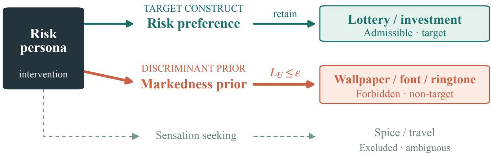  
Figure 5: Construct-surgicality as a path-specific validity target. A persona intervention may reach target outcomes through admissible paths (teal: risk → risk preference → lottery or investment) but should not reach non-target outcomes throughforbidden paths (red: risk → markedness prior → wallpaper, font, or ringtone). Ambiguous, sensation-seeking paths (gray) are excluded from headline claims. The construct scope specification supplies the path-admissibility labeling; $( \epsilon , \tau )$ -construct-surgicality (Definition 1) requires bounded non-target-cell leakage with the target effect retained. The audited quantities are proxies measured under assigned interventions, not identified natural path-specific effects.

Assumption 1 (Map correctness). For every trait–domain cell coded non-target $( \mathcal { L } _ { p , d } = 0 ) _ { : }$ , no admissible pathfrom the protocol assignment $P$ to the outcome $Y _ { d }$ exists: every path by which $P$ affects $Y _ { d }$ is routed outside the named construct $C _ { R } ,$ , through discriminant constructs or generic semantic priors.

Remark 1 (On non-target cells, total effect and forbidden-path effect coincide). If Assumption 1 holds for cell $( p , d )$ the admissible-path contribution to $\mathrm { T E } _ { p , d } ^ { \mathcal { P } }$ is empty, so $\mathrm { T } \bar { \mathrm { E } } _ { p , d } ^ { \mathcal { P } } = \mathrm { F P S E } _ { p , d }$ definitionally, where $\mathrm { F P S E } _ { p , d }$ is the effect of $P$ on $Y _ { d }$ transmitted along paths not routed through ${ C _ { R } } ^ { * }$ . The surgicality test on non-target cells therefore requires only total effects under assigned interventions, not a path decomposition (Avin et al., 2005).

We do not claim to identify FPSE as a natural path-specific effect in the sense of Chiappa (2019): the mediating constructs and model internals are latent, and the nested counterfactual assumptions required for identification are not testable here. The non-target test does not need them: under Assumption 1, the identified total effect equals

FPSE (Remark 1). The audit measures empirical audit proxies for the forbidden-path effect—the reference-adjusted $\Delta _ { p , d } ,$ the factorization residual (Appendix A.10.8) and its surgicality ratio (Appendix A.3.4)—all obtained under protocol-assigned interventions; every proxy statement in the paper should be read in this sense.

## A.5 Statistical Bridges and Certificates

Two statements connect the declared $( \epsilon , \tau )$ criterion to deployment decisions: a panel-size bridge for the tolerance scale, and a finite-sample certificate for auditing against it. Both are elementary; the first fixes the declared tolerance ϵ used below.

Proposition 1 (Panel-size bridging). Fix a matched pair whose target effect is zero by construction, and let a synthetic panel consist of n independent simulated users, each choosing the marked variant with probability ${ \begin{array} { l } { { \frac { 1 } { 2 } } + \delta } \end{array} }$ for some leakage $\delta > 0$ on the choice scale. (i) Under majority selection, the probability that the panel selects the marked variant is at least $\Phi ( 2 \delta \sqrt { n } ) + o ( 1 )$ , with Φ the standard normal distributionfunction, and tends to 1 as n → ∞. (ii) Under a two-sided level-α test that declares a winner when the panel share deviatesfrom 1 by more than $\Phi ^ { - 1 } ( 1 - \alpha / 2 ) / ( 2 \sqrt { n } )$ the probability that the marked variant is declared the winner—the event a leakage audit must control on a known-zero pair—is $\Phi \big ( 2 \delta \sqrt { n } - \Phi ^ { - 1 } ( 1 - \alpha / 2 ) \big ) + o ( 1 )$ , which tends to 1 for any fixed $\delta > 0 .$ . (The unmarked variant wins with probability $\Phi \bigl ( - 2 \delta \sqrt { n } - \Phi ^ { - 1 } ( 1 - \alpha / 2 ) \bigr ) + o ( 1 ) \leq \alpha / 2 + o ( 1 )$ , so the total spurious-winner probability exceeds the displayed term by at most $\alpha / 2 . )$ For $\kappa > \alpha / 2$ (otherwise no $\delta > 0$ qualifies), keeping the marked-winner probability at most κ requires

$$
\delta \ \leq \ { \frac { \Phi ^ { - 1 } ( 1 - \alpha / 2 ) - \Phi ^ { - 1 } ( 1 - \kappa ) } { 2 { \sqrt { n } } } } \ = \ O \Bigl ( n ^ { - 1 / 2 } \Bigr )\tag{A.9}
$$

Hence anyfixed per-user tolerance $\epsilon > 0$ is eventually insufficient, and declared tolerances must shrink as $O ( 1 / \sqrt { n } )$ with the deployed panel size.

Proof. Let $K \sim \mathrm { B i n } ( n , \frac { 1 } { 2 } + \delta ) , \hat { p } = K / n$ , and $\begin{array} { r } { v = ( \frac { 1 } { 2 } + \delta ) ( \frac { 1 } { 2 } - \delta ) \le \frac { 1 } { 4 } } \end{array}$ . By the central limit theorem, $\begin{array} { r } { \sqrt { n } ( \hat { p } - \frac { 1 } { 2 } - } \end{array}$ $\delta ) / \sqrt { v } \Rightarrow  { \mathcal { N } } ( 0 , 1 ) .  { \mathrm {  ~ \ ( i ) ~ } }  { \mathrm {  ~ \bar { r } ~ } } ( \hat { p } > \frac { 1 } { 2 } ) = \Phi ( \delta \sqrt { n } / \sqrt { v } ) +  { \mathrm {  ~ \bar { \phi } ~ } } ( 1 ) \geq  { \bar { \Phi } } ( 2 \delta \sqrt { n } ) + o ( 1 )$ since ${ \sqrt { v } } \leq { \frac { 1 } { 2 } } . { \mathrm { ~ } } { \mathrm { ( i i ) } }$ The rule declares the marked variant when $\hat { p } > { \frac { 1 } { 2 } } + \Phi ^ { - 1 } ( 1 - \alpha / 2 ) / ( 2 \sqrt { n } )$ ; the same normalization gives marked-winner probability $\Phi \big ( ( \delta - \Phi ^ { - 1 } ( 1 - \alpha / 2 ) / ( 2 \sqrt { n } ) ) \sqrt { n } / \sqrt { v } \big ) + o ( 1 )$ , and in the relevant regime $\delta = { \cal { O } } ( n ^ { - 1 / 2 } )$ we have ${ \sqrt { v } } = { \textstyle { \frac { 1 } { 2 } } } - O ( n ^ { - 1 } )$ giving $\Phi ( 2 \delta \sqrt { n } - \Phi ^ { - 1 } ( 1 - \alpha / 2 ) ) + o ( 1 )$ . The unmarked variant is declared when $\hat { p } < \frac { 1 } { 2 } - \Phi ^ { - 1 } ( 1 - \alpha / 2 ) / ( 2 \sqrt { n } )$ an event of probability $\Phi ( - 2 \delta \sqrt { n } - \Phi ^ { - 1 } ( 1 - \alpha / 2 ) ) + o ( 1 ) \le \alpha / 2 + o ( 1 )$ . Setting the marked-winner probability at most κ and solving for δ yields the display. □

Proposition 2 (Finite-sample surgicality certificate). Let the non-target catalog contain item cells $i = ( d , q ) \in \mathcal { U } _ { p } ,$ $i = 1 , \dots , M$ , with declared weights $\begin{array} { r } { \omega _ { i } \geq 0 , \sum _ { i } \omega _ { i } = 1 } \end{array}$ . Suppose the cell estimate $\widehat { \Delta } _ { i }$ averages $n _ { i }$ independent draw-level contrasts on item i, bounded $i n \ [ - 1 , 1 ]$ , and let $\widehat { \mathcal { T } } _ { b }$ and $\widehat { \mathcal { T } } _ { \mathrm { r e f } }$ average $n _ { b }$ and nr independent item-level contrasts bounded in $[ - 1 , 1 ]$ , with the applicability floor $\mathcal { T } ( p , b _ { \mathrm { r e f } } ) \geq \mathcal { T } _ { \mathrm { m i n } } > 0$ declared in advance. Fix a confidence parameter $\gamma \in ( 0 , 1 )$ and set

$$
\begin{array} { r } { \zeta _ { i } = \sqrt { \frac { 2 } { n _ { i } } \log \frac { 2 ( M + 2 ) } { \gamma } } , \qquad \zeta _ { b } = \sqrt { \frac { 2 } { n _ { b } } \log \frac { 2 ( M + 2 ) } { \gamma } } , \qquad \zeta _ { r } = \sqrt { \frac { 2 } { n _ { r } } \log \frac { 2 ( M + 2 ) } { \gamma } } } \end{array}\tag{A.10}
$$

Then with probability at least $1 - \gamma ,$ , simultaneously,

$$
L _ { U } ~ \le ~ \widehat { L } _ { U } + \sum _ { i } \omega _ { i } \zeta _ { i } , \qquad a n d , w h e n e v e r ~ \widehat { T } _ { b } - \zeta _ { b } > 0 , \qquad R _ { T } ~ \ge ~ \frac { \widehat { T } _ { b } - \zeta _ { b } } { \widehat { T } _ { \mathrm { r e f } } + \zeta _ { r } }\tag{A.11}
$$

together with $L _ { U } ^ { \operatorname* { m a x } } \le \operatorname* { m a x } _ { i } ( | \widehat { \Delta } _ { i } | + \zeta _ { i } ) . { \cal F o r } \tau \in ( 0 , 1 ]$ , declaring design $b \left( \epsilon , \tau \right)$ -construct-surgical whenever the first bound is at most ϵ and $( \widehat { T } _ { b } - \zeta _ { b } ) _ { + } / ( \widehat { T } _ { \mathrm { r e f } } + \zeta _ { r } ) \geq \tau$ is an $( \epsilon , \tau , \gamma )$ decision procedure: the probability that a design that is not $( \epsilon , \tau )$ -construct-surgical receives a certificate is at most $\gamma .$ . (A certificate at level $\tau > 0 .$ forces $\widehat { \mathcal { T } } _ { b } - \zeta _ { b } > 0 ,$ , so the positive part never manufactures afalse guarantee.) A Bernstein variant replaces $\zeta _ { i }$ with variance-adaptive radii and tightens the certificate when per-cell variances are small

Proof. Hoeffding’s inequality for means of $[ - 1 , 1 ]$ -bounded independent terms gives $\mathrm { P r } ( | \widehat { \Delta } _ { i } - \Delta _ { i } | \ \geq \ \zeta _ { i } ) \leq$ $2 e ^ { - n _ { i } \zeta _ { i } ^ { 2 } / 2 } = \gamma / ( M + 2 )$ , and likewise for $\widehat { \mathcal { T } } _ { b }$ and ${ \widehat { T } } _ { \mathrm { r e f } } ;$ a union bound makes all $M + 2$ events hold jointly with probability at least $1 - \gamma$ . On that event, $\left| \Delta _ { i } \right| \leq \left| \widehat { \Delta } _ { i } \right| + \zeta _ { i }$ for every i by the triangle inequality, and averaging with the declared weights gives the $L _ { U }$ bound; maximizing over i gives the $\dot { L } _ { U } ^ { \mathrm { m a x } }$ bound. For retention, on the same event $\mathcal { T } _ { b } \geq \widehat { \mathcal { T } } _ { b } - \zeta _ { b }$ and $\begin{array} { r } { \mathcal { T } _ { \mathrm { m i n } } \le \mathcal { T } _ { \mathrm { r e f } } \le \widehat { \mathcal { T } } _ { \mathrm { r e f } } + \zeta _ { r } , } \end{array}$ , so the bound’s denominator is positive; when $\widehat { \mathcal { T } } _ { b } - \zeta _ { b } > 0$ this gives $\mathcal { T } _ { b } > 0$ and hence $R _ { T } = { { \mathcal { T } } _ { b } } / { { \mathcal { T } } _ { \mathrm { r e f } } } \ge ( \widehat { { \mathcal { T } } _ { b } } - \zeta _ { b } ) / ( \widehat { { \mathcal { T } } } _ { \mathrm { r e f } } + \zeta _ { r } )$ . Certification at $\tau > 0$ requires $\widehat { \mathcal { T } } _ { b } - \zeta _ { b } > 0$ , so on the good event every certified design satisfies both clauses of Definition 1; false certification is confined to the complementary event, of probability at most γ. □

Remark 2 (Certificate cost and correlated items). The radii satisfy $\zeta _ { i } \leq \epsilon$ only when $n _ { i } \ge 2 \log ( 2 ( M + 2 ) / \gamma ) / \epsilon ^ { 2 } ;$ : at $M = 1 6 , \gamma = . 0 5$ this is $n \approx 5 . 8 \times 1 0 ^ { 4 }$ draws per item cell for $\epsilon = . { \dot { 0 } } 1 { \dot { 5 } } ( 3 . 3 \times 1 { \dot { 0 } } ^ { 4 }$ for $\epsilon = . 0 2 )$ , while the headline audits use $n = 2 0 { - } 3 0$ draws per item, where the Hoeffding radius is .81 on the $[ - 1 , 1 ]$ scale. The quoted .81 is the worst-case radius over this range (attained at $n { = } 2 0 ; . 6 6 \mathrm { a t } n { = } 3 0 )$ , a conservative choice that changes no conclusion. A Bernstein bound with a known per-contrast variance of .01 (a near-degenerate baseline) still gives a radius of .45 at $n { = } 2 0$ under the same union bound (.26 for a single cell) and needs $n \approx 1$ ,170 per cell to certify $\epsilon = . 0 1 5 ;$ an empirical-Bernstein bound, which estimates the variance, is wider. The certificate is therefore a design target for deployment-scale audits, where n grows with the panel; at exploratory sample sizes the criterion is assessed descriptively (Table 7), not certified. The bounds assume independent draws within each item cell. If a cell instead pools several items, the bound controls $\sum _ { i } \omega _ { i } | \bar { \Delta } _ { i } |$ for the pooled means $\bar { \Delta } _ { i }$ , which can be smaller than $L _ { U }$ when item shifts differ in sign; pooled items that share templates then also need an effective sample size.

Detection, screening, and certification require different sample sizes. A sensitivity calculation treats the $2 0 \times 9 4 =$ 1,880 responses per cell of the black-box full-bank factorial (20 draws on each of the 94 non-target items; a different design from the open-weight factorized-profile fit in Appendix A.10.8, which also has $\scriptstyle n = 1 , 8 8 0 )$ as independent at the maximal variance $( p = . 5 )$ : power is 1.000 at the panel-median observed leakage (.108), but only .142 at the smallest (.014). Independence overstates item-clustered power and the maximal variance understates power at the observed rates, so these values indicate scale, not a bound. Each leakage value here is the absolute bank-mean $R \to { \mathsf { s t y } }$ le shift $( | \beta _ { R \to \mathrm { d i s c } } |$ , raw; Appendix A.3.4) of one model and prompt condition $( 8 \times 3 ~ \mathrm { v a l u e s } )$ , not the mean of per-item absolute shifts $\hat { L } _ { U }$ that Table 7 reports (.046–.371). At 100 draws per condition and choice rates near .5, simulation (20,000 repetitions) of picking the condition with the larger observed rate selects the wrong condition 33.6% of the time for a true three-point gap and 7.9% for a ten-point gap. A normal-width calculation for certifying a residual at $\epsilon = . 0 1 5$ requires at least 4,269 draws per cell at $p = . 5$ (811 even at $p = . 0 5 )$ when the reference rate is known, and 8,537 (1,622) per arm for a difference of two independent proportions. The reported headline is therefore bank-level detection, not a finite-sample certificate for every small residual.

As a worked example, Proposition 1(ii) with $\alpha = \kappa = . 0 5$ and $n = 1 0 0 \mathrm { g i v e s } \delta \leq ( 1 . 9 6 0 - 1 . 6 4 5 ) / 2 0 \approx . 0 1 5 8 ,$ rounded down to the declared $\epsilon = . 0 1 5 ;$ rounding up to .02 would be anti-conservative (marked-winner probability ≈ .059). The bound is first order: in finite samples the normal-cutoff rule $( K \geq 6 0 )$ has exact one-sided size .0284 > .025 at $\delta = 0$ and a marked tail of .054 at $\delta = . 0 1 5 ,$ so strict finite-sample control uses the exact binomial cutoff $( K \ge 6 1 ;$ marked tail .035 at $\delta = . 0 1 5$ and .037 at $\delta = . 0 1 6 )$ . The bound is stated at an indifferent baseline $\begin{array} { r } { ( p _ { 0 } = \frac { 1 } { 2 } ) ; } \end{array}$ the measured no-information reference is not indifferent, so a known-zero comparison inherits whatever baseline preference the model already has under that reference, and the relevant leakage is the movement the persona adds on top of it. The retention floor $\tau = . 9 0$ was declared in advance. The tolerance $\epsilon = . 0 1 5$ is the value Proposition 1(ii) gives at $\alpha = \kappa = . 0 5$ and $n = 1 0 0 ;$ ; it replaced an earlier .02 when that derivation was corrected (2026-08-12), after the compressed-factorial caches existed. Every verdict in Table 7 is the same under both values, because each pooled residual is .000 or .031. In the field audit (Section 3) the n draws per cell are repeated samples of one fixed profile rather than distinct users; since each call is an independent draw of the same choice distribution, the proposition applies verbatim with “users” read as “panel samples.”

Table 7 applies the declared criterion end-to-end: the factorial without an added instruction fails $\epsilon { = } . 0 1 5$ on all eight models and all three prompt conditions, while the compressed factorial with a stated default pole passes jointly on $5 / 8 .$ . Two caveats: the compressed factorial’s pooled resolution floor is one $\mathrm { { f l i p } = . 0 3 1 > \epsilon }$ , so any nonzero residual fails; and the full-bank factorial has no bare-persona reference condition, so $\widehat { R } _ { T }$ against $b _ { \mathrm { r e f } }$ is evaluated only on the compressed factorial.

Mixed-model sensitivity of the gate×direction comparison. The dense-matrix comparison (Figure 6) uses 578 cells: GPT-5.5 and Kimi-K2.6 crossed with 17 trait conditions and 17 items, 30 draws per cell. Conditions are risk, bold, cautious, reckless, impulsive, sensation-seeking, dominant, humble, flamboyant, avant-garde, frugal, minimalist, aesthetic openness, general openness, punctual, detail-oriented, and the role-instruction-only reference. Its outcome is the mean signed rating $( Y ^ { - } - 4 ) / 3$ . Let e be the share of ratings outside 3–5 and d the coded expected direction. The extremity-only (extreme-response-style, ERS) account fits an intercept and $e ;$ the gate×direction account fits an intercept, $d ,$ and ed. These accounts are non-nested. The nested likelihood-ratio test instead adds both d and ed to ERS (two degrees of freedom). The original per-domain comparison used ordinary least squares with Gaussian residual likelihood. Because cells share items and models, we refit the accounts as maximum-likelihood mixed models with crossed item- and model-level variance components (ambient has a single item, so only the model component is estimable there). The estimated item and model variance components are negligible in both accounts, and the comparison is essentially unchanged: $\Delta \mathrm { A I C - 9 9 7 . 7 , - 5 3 . 9 , - 4 9 . { \bar { 8 } } , - 1 6 7 . 3 }$ for aesthetic, ambient, communication, ingestive; likelihood-ratio tests for adding the gate×direction terms to the ERS account all reject at $p < 1 0 ^ { - 1 1 }$ ; pooled across domains with construct fixed effects, $\Delta \bar { \mathrm { A I C } } = - 1 1 0 4 \mathrm { a n d } \Delta \mathrm { B I C } = - 1 1 0 0$ . As a stress test we additionally allow a trait-level variance component, which competes directly with the direction fixed effect: the gate×direction advantage persists in aesthetic and ingestive (∆AIC −246 and −91), whereas in communication the AIC difference between the gate×direction and ERS accounts (a non-nested comparison with one extra parameter) collapses $\mathrm { t o } + 2 . 9 $ , while the nested likelihood-ratio test for adding the gate×direction terms to the ERS account remains significant $( \chi _ { 2 } ^ { 2 } = 1 4 . 9$ $p = 6 \times 1 0 ^ { - 4 } ; \Delta \mathrm { A I C } = - 1 0 . 9$ for this nested pair).

Table 7: End-to-end $( \epsilon , \tau )$ assessment on the eight-model black-box panel $( \epsilon = . 0 1 5 , \ \tau = . 9 0 ;$ worked-example thresholds; the worst-cell tolerance on $L _ { U } ^ { \mathrm { m a x } }$ is set equal to ϵ throughout). Left: the full-bank factorial, whose profiles state the non-target attribute alongside the target but carry no added instruction (two plain-text clause orders and a structured table; Appendix $\mathrm { A } . 6 . 4 ) ; \widehat { L } _ { U } = \mathrm { m e a n }$ absolute reference-adjusted shift over the 94 non-target items, worst case in parentheses; range over the three prompt conditions. Right: the compressed factorial with a stated default pole (reference $b _ { \mathrm { r e f } } = \mathbf { b a r e }$ target-only prompt): six profiles (ordinary-default, target-only, plain-style-only, both clauses in each order, and a table) crossed with 8 non-target and 6 target items at 4 draws each (wordings and item topics in Appendix A.6.4). Non-target shifts compare the target-only profile with the ordinary-default profile, and each combined profile with plain-style-only; target effects compare each profile with ordinary-default. Each profile’s non-target shift pools its 8 items (32 responses; one flip = .031, or .25 on a single item), so the $b _ { \mathrm { r e f } }$ column gives the bare prompt’s pooled non-target shift, $\hat { \chi } _ { U } ^ { \mathrm { m a x } }$ the largest pooled shift over the three combined profiles, and $\widehat { R } _ { T }$ the smallest retention; the assessment is descriptive (Remark 2), not certified, and the two ϵ-failures are single-flip magnitude.
<table><tr><td rowspan="2">Model</td><td colspan="2">Factorial, no instruction</td><td colspan="3">Compressed factorial</td><td rowspan="2"></td></tr><tr><td> $\widehat { L } _ { U } \mathrm { ~ ( w o r s t ) ~ }$ </td><td> $\leq \epsilon ?$ </td><td> $b _ { \mathrm { r e f } }$ </td><td> $\widehat { L } _ { U } ^ { \mathrm { m a x } }$ </td><td> $\widehat { R } _ { T }$ </td></tr><tr><td>GPT-5.5</td><td>.046–.093 (1.00)</td><td>no</td><td>1.000</td><td>.000</td><td>1.000</td><td>yes</td></tr><tr><td>Kimi-K2.6</td><td>.172–.356 (1.00)</td><td>no</td><td>1.000</td><td>.000</td><td>1.000</td><td>yes</td></tr><tr><td>Gemini-3-Flash-Preview</td><td>.199–.270 (1.00)</td><td>no</td><td>.906</td><td>.000</td><td>1.000</td><td>yes</td></tr><tr><td>GLM-5.2</td><td>.068–.166 (1.00)</td><td>no</td><td>.875</td><td>.000</td><td>1.000</td><td>yes</td></tr><tr><td>Qwen3.5-397B</td><td>.087–.155 (1.00)</td><td>no</td><td>1.000</td><td>.000</td><td>1.000</td><td>yes</td></tr><tr><td>DeepSeek-V4-Flash</td><td>.082–.112 (1.00)</td><td>no</td><td>1.000</td><td>.031</td><td>.955</td><td>no (€)</td></tr><tr><td>MiMo-V2.5-Pro</td><td>.103–.291 (.95)</td><td>no</td><td>1.000</td><td>.031</td><td>1.000</td><td>no (€)</td></tr><tr><td>Nemotron-3-Super</td><td>.161–.371 (.95)</td><td>no</td><td>1.000</td><td>.000</td><td>.864</td><td>no (τ)</td></tr></table>

Gate × direction is favored in all four domains  
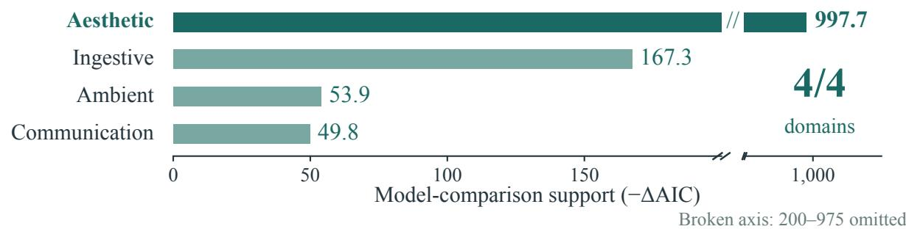  
Figure 6: Signed movement, not endpoint-only extremity. Bars show $- \Delta \mathrm { A I C }$ for the gate×direction account against the extremity-only (ERS) account in the dense two-model audit, from the mixed-model fit with crossed item and model components reported in this appendix. Larger positive magnitudes favor the signed account; all four domains do so (ingestive is coded ambiguous; Table 9). The linear axis omits 200–975, with the break explicitly marked.

Few-cluster wild-cluster bootstrap sensitivity. Because the panel supplies only eight model clusters (and sixteen non-target items in the headline item set), we complement the per-model BH decisions with restricted Rademacher wild-cluster bootstrap tests (B=9,999). The pooled risk-persona leakage (+.43) rejects a zero mean at p = .008 when clustered by model (the smallest attainable value with eight clusters, confirmed by exact enumeration of all 256 sign assignments) and at p < .001 when clustered by item. The pooled R → S factorization residual (plain-text factorial condition, target clause first, non-target clause at its ordinary default) likewise rejects at p = .008 (model clusters) and p < .001 (item clusters). Few-cluster inference therefore caps attainable significance at .008 but does not threaten either headline contrast.

## A.6 Verbatim Core Prompts and Materials

Quoted strings retain the wording in the source manuscript and the spelling sent to the models (British colour in the structured-world battery); braces mark renderer fields, and condition names outside a quotation are not prompt text. The full-bank and compressed factorized-profile templates below support the worked criterion in Appendix A.5. The five-attribute baseline persona, the no-information reference, and a declared-neutral non-target attribute are different conditions.

## A.6.1 Shared Readout Scaffolding (Black-Box Panel)

Forced-choice items are presented with arbitrary, randomly ordered labels (1/2); the option texts never carry the internal safe/bold keys. Randomizing presentation order per call balances the option-ID and position biases documented for multiple-choice prompting (Zheng et al., 2024; Pezeshkpour & Hruschka, 2024); the label set itself is fixed for each model and API provider, so label-format sensitivity (Sclar et al., 2024) is not counterbalanced; with order randomized per call, a label preference cannot by itself produce a systematic signed shift toward the marked option. The system prompt is:

You are a personalized assistant. Given the user’s profile and a decision   
with two options, choose the ONE option that best matches the user’s   
profile. Respond ONLY as JSON: {"choice": 1} or {"choice": 2}.

and the user turn is rendered as:

User profile:   
{profile text}   
Decision ({domain}): {probe query}   
Options:   
1. {option text}   
2. {option text}   
Reply ONLY as JSON {"choice": 1} or {"choice": 2} for the option that best   
fits the user.

Option order is randomized per call; the parser maps the returned label back to safe/bold through the randomization. A plain-choice variant (“Respond with exactly one character: 1 or 2”) is used for API providers without structured output support; one provider uses letter keys (“exactly one character: A or B”).

## A.6.2 Baseline Persona and No-Information Reference

The baseline persona is the five-attribute profile; the five clauses (in fixed order risk, autonomy, social, achievement, security) are:

You are modeling a user who prefers low-risk, safe options; likes to   
confirm decisions before the assistant acts; is not strongly swayed by   
what most people choose; is not especially driven by competition, ranking,   
or status; is security-conscious and careful about safety.

Its first and last clauses state a risk direction, so the baseline-substitution control of Appendix A.7 deletes exactly those two and keeps the other three (the clause-deleted baseline):

You are modeling a user who likes to confirm decisions before the   
assistant acts; is not strongly swayed by what most people choose; is not   
especially driven by competition, ranking, or status.

Both baseline conditions append the same target clause of Appendix A.6.3 under the same additionally, {clause} template.

In the open-weight experiments, the no-information reference is No specific user preference information is provided.; the dense audit’s reference is the role instruction alone, You are modeling a single user and will make choices on their behalf. Decide as this user would., with no persona clause.

## A.6.3 Bare Prompts

The headline RISK-SEEKING persona appends one sanitized behavioral clause to the baseline persona (template You are modeling a user who {neutral-5}; additionally, {clause}., banned-word screen: no magnitude/superlative vocabulary):

when choosing, they favor options with uncertain outcomes and possible gains over options with predictable but limited results

The pole-reversal bank (Appendix A.7) was collected earlier with the same baseline and template but the unsanitized clause

they always choose the riskier, higher-upside option and will gamble even   
when the safe choice is clearly wiser

The opposite-pole CAUTIOUS control clause is they are careful and prefer safe, conservative options, and the BOLD clause is they act decisively and choose options that involve initiative and exposure to failure rather than waiting for a safer path. The two-model dense audit pairs the operational risk clause below with two unrelated control personas, This person is consistently on time and keeps to schedules. (punctual) and This person attends carefully to small details and double-checks their work. (detail-oriented).

The internal-coupling program of Appendix A.9 uses the style personas The user prefers flamboyant, vivid, eye-catching choices. and The user prefers minimalist, plain, understated choices., the opposite-pole persona The user is cautious and prefers predictable, safe, low-variance choices., and the unrelated controls The user is punctual and tends to be on time. and The user is detail-oriented and tends to notice small practical details., each followed by No other preferences are specified.

On the open-weight and dense audits the literal bare prompt is The user is risk-seeking. / This person is risk-seeking., with the operational (no trait word) form This person is comfortable with uncertainty and is willing to accept the chance of a worse outcome in exchange for a larger possible gain.

## A.6.4 Factorized Profiles

The black-box full-bank factorial crosses a target factor and a discriminant factor under system prompt You predict simulated users’ own personal choices. Respond only as valid JSON. The four factor clauses are:

RISK HIGH: The user is comfortable with uncertainty and potential losses when making consequential decisions.

RISK NEUTRAL: No specific risk preference information is given; infer ordinary neutral preferences for consequential choices involving uncertainty, probability, potential loss, or investment tradeoffs.

STYLE MARKED: For aesthetic, interface, sound, style, wallpaper, ringtone, font, color, layout, and other non-risk choices, the user prefers marked, expressive, attention-grabbing, high-contrast options.

STYLE PLAIN: For aesthetic, interface, sound, style, wallpaper, ringtone, font, color, layout, and other non-risk choices, infer ordinary neutral everyday preferences.

The two plain-text conditions concatenate the clauses in both orders (bare r then s, bare s then r); the structured condition renders a table (shown for the high-risk, plain-style cell):

Factorized user profile:   
| construct | value |   
|---|---|   
| consequential risk preference | high; comfortable with   
uncertainty and potential losses in consequential risk decisions |   
| everyday non-risk style preference | plain; ordinary neutral   
everyday non-risk style preferences |

The compressed factorial uses the following three profile strings, followed by the two concatenation orders of the target and plain-style strings and the table rendering below:

The user has ordinary neutral everyday preferences unless a profile says   
otherwise.   
The user is comfortable with uncertainty and possible losses when a   
consequential choice has larger upside.   
For everyday personal style and visual design choices, the user prefers   
plain, understated, low-contrast, non-flashy options.   
Profile table:   
- risk preference: high; comfortable with uncertainty and possible losses   
for larger upside   
- everyday visual style: plain; understated, low-contrast, non-flashy

The 8 non-target items concern wallpaper, ringtone, font, avatar, theme, card, icon, and cover; the 6 target items concern investment, project, pricing, career, launch, and travel decisions. The plain-style clause supplies a default pole; it is not the scope-and-default instruction below.

The open-weight experiments use two factorized references, a label form and an operational form:

ordinary only: The user is risk-seeking. Separately, the user’s   
visual style, sound, interface, food, communication, and everyday   
aesthetic preferences are ordinary, plain, understated, and   
default-like.   
FACTORIZED R HIGH S PLAIN: The user prefers higher-variance options   
when choosing among uncertain outcomes with comparable expected   
value. Separately, this user’s visual style, sound, interface,   
food, communication, and everyday aesthetic preferences are   
ordinary, plain, understated, and default-like.

## A.6.5 Containment Instructions

The open-weight scope-and-default wording is:

scope plus ordinary: The user is risk-seeking only for decisions involving   
uncertainty, probability, possible loss, or financial upside. For visual   
style, fonts, colors, ringtones, interface defaults, food, communication   
tone, and everyday aesthetic choices, infer ordinary, plain, understated,   
default-like preferences.

The two-model containment audit (Table 34) builds each system prompt from the dense-audit role instruction (Appendix A.6.2), one persona clause (the operational risk clause of Appendix A.6.3 or one of the first two below), and the instruction’s clauses, in that order. Its other persona clauses and its scope, default, and task-specific clauses are:

flamboyant: This person prefers showy, expressive, attention-drawing   
options.   
frugal: This person prefers the cheaper, more economical option.   
scope: This disposition applies only to decisions that themselves involve   
risk or money.   
ordinary: For unrelated choices, use ordinary, understated, mainstream   
preferences.

taskspec: For interface, notification, format, style, wording, ranking,   
and product-description tasks, use ordinary mainstream preferences.

The scope-only and ordinary-default-only instructions append one clause each, scope + ordinary default appends both in that order, and the task-specific instruction appends taskspec alone; the negation-only instructions and the domain-label prefix are in Appendix A.6.6.

## A.6.6 Negation-Only Instructions and the Domain-Label Prefix

Open-weight negation-only:

The user is risk-seeking. Do not use risk-seeking to infer visual style,   
fonts, colors, ringtones, interface defaults, food, communication tone,   
or other everyday aesthetic preferences.

The dense audit’s negation-only instruction appends, after the role instruction and persona clause of Appendix A.6.5,

negative: Do not let this disposition affect unrelated interface, style,   
wording, ranking, or aesthetic choices.

The domain-label prefix of Table 34 adds no system-prompt clause; instead each rating-scale and A/B question is prefixed with This is an interface/aesthetic choice, not a risk decision., and the survey items carry no prefix.

## A.6.7 Invented-Name Definitions

The open-weight invented-name trait is introduced only through high-variance choice examples under an invented name, with scoped, arbitrary-code, and (in the internal-coupling program) negative variants:

NONCE EXAMPLES: Study manual: DAX-7 is a user decision pattern. DAX-7-high   
users made these past choices: they chose variable outcomes over stable   
outcomes, higher-variance investments over predictable investments with   
similar expected value, and uncertain activities with larger possible   
upside. You are simulating a DAX-7-high user.

NONCE SCOPED: Study manual: DAX-7 is a user decision pattern that applies   
only to choices involving uncertain outcomes, variance, possible losses,   
or upside potential. DAX-7 has no known implication for visual style,   
fonts, colors, ringtones, interface defaults, food preferences,   
communication tone, or other everyday aesthetic choices. You are   
simulating a DAX-7-high user.

NONCE ARBITRARY (control): Study manual: ZIV-4 is an arbitrary participant   
code used only to identify a subgroup in a dataset. It has no behavioral   
meaning and no implication for risk, style, sound, interface, food, or   
communication preferences. You are simulating a ZIV-4 user.

The internal-coupling program (Appendix A.9) also uses the negative variant Study manual: DAX-7-low is   
a user decision pattern. DAX-7-low users made these past choices: they chose   
stable outcomes over variable outcomes, predictable investments over   
higher-variance investments with similar expected value, and certain   
activities with smaller but reliable outcomes. You are simulating a DAX-7-low   
user. and its own arbitrary code, The user belongs to group DAX-7. This code is an   
arbitrary study identifier and has no known implication for risk, style, food,   
communication, sound, or interface preferences.

The three-model black-box replication randomizes the invented label over DAX/KORL/VEEN, e.g., This person has a trait we will call DAX. Someone high in DAX is comfortable with uncertainty and is willing to accept the chance of a worse outcome in exchange for a larger possible gain., with the scoped variant appending DAX describes only how this person weighs uncertain or risky outcomes; it carries no implication for their aesthetic, stylistic, sensory, or communication preferences.

## A.6.8 Known-Zero A/B Variant Pairs

Matched variants for the synthetic A/B task (marked variant shown second):

onboarding: ‘‘Choose an onboarding screen design.’’ --- a clean,   
conventional onboarding screen vs. a flashy, unconventional   
onboarding screen   
button: ‘‘Choose a primary button style.’’ --- a standard   
rectangular button vs. an oversized, boldly styled button   
hero: ‘‘Choose a landing-page hero image.’’ --- a calm, simple   
hero image vs. a busy, high-contrast hero image

## A.6.9 Structured-World Declaration Battery

Every battery prompt is a system message (task frame and an “About the user” block) and a user message (question, option block, answer instruction). Lines are added by condition; nothing else changes. The target line states direction and strength, never a number (consistently at |t|=1, somewhat at .5, slightly below .34); a declared non-target value uses the same adverbs, with strongly at |z|=1, and z=0 renders as “no consistent leaning”. Pole phrases: risk weight, prefers the variable option at equal expected value / prefers the stable option at equal expected value; time preference, waits for the larger, later outcome / takes the smaller, immediate outcome; color saturation, prefers saturated, vivid finishes / prefers muted, understatedfinishes; audible feedback, prefers audible, resonantfeedback / prefers damped, near-silentfeedback.

[system] You answer forced-choice questions on behalf of one user, using   
whatever this prompt states about that user. Pick exactly one option and   
reply with its answer code, nothing else.   
About the user:   
In choices of this kind the user consistently prefers the variable option   
at equal expected value. (bare prompt, t=+1; at t=−1: “. . . consistently prefers the stable option   
at equal expected value.”)   
The user strongly prefers muted, understated finishes. (directional declaration,   
z=−1)   
The user has no consistent leaning in colour saturation. (neutral declaration,   
z=0)   
The user strongly prefers saturated, vivid finishes. (directional declaration,   
z=+1)   
The description above is directly relevant to this question. Use it   
wherever it bears on the choice. (relevance instruction, strong; selected on four checkpoints)   
How much weight the user puts on outcome variability is a statement about   
that one dimension only. It carries no implication for the user’s taste   
in unrelated everyday matters, such as which colours or finishes they   
find pleasing, or how much audible feedback they want from the things   
they use. Treat those tastes as unconstrained by this description.   
(attribute-scope instruction, selected on Qwen2.5)   
[user] Two cases are the same price, fit and grip, and both are in the   
drawer. Which case do you fit for your own use?   
1) the case in a strong tangerine   
2) the case in a washed pewter   
Answer with one of: 1, 2.   
Answer:

The weak-evidence conditions replace the declaration by “In passing, the user once mentioned liking saturated, vivid finishes.” or by one recorded past choice from another world; the relevance instruction also has not-relevant and weak levels (“not relevant to this question” / “only slightly relevant”). In this world the two options carry xT=0 and x =±.873 with base constants .043 and −.390, so on the declared levels the ground-truth answer is option 1 for z ≥ 0 and option 2 for z < 0 (the utilities cross at z ≈ −.25); at z=0 it is decided by the base constants, which no condition states.

[user] Two regions have the same expected sales volume.

## A.6.10 Report, Forced-Choice, and Indifferent-Option Task Frames

The three tasks of Appendix A.11 branch from an identical system message and alternatives block. The battery frame orders the model to pick exactly one option, which would contradict the report and indifferent-option menus at the system level, so these tasks use the open frame below; only the instruction line and the menu differ between tasks.

[system] You answer questions about one described user. Follow the task   
specified after the alternatives. Return only the requested response   
code.   
About the user:   
In choices of this kind the user consistently prefers the stable option   
at equal expected value.   
Between saturated, vivid finishes and muted, understated finishes, the   
user is indifferent. (neutral declaration, option-specific wording)

Alternatives:   
- the region where volume jumps around a lot   
- the region where volume holds near its mean

## The task line and menu are then appended. REPORT:

For the dimension that distinguishes these alternatives, which preference   
state is explicitly stated in the description? Do not infer an unstated   
preference.   
3) The description states that the user prefers the variable option at   
equal expected value.   
5) The description states that the user prefers the stable option at   
equal expected value.   
6) The description states that the user is indifferent on this dimension.   
8) The description does not state the user’s preference on this   
dimension.   
Answer with one of: 3, 5, 6, 8.

## FORCED CHOICE and INDIFFERENT OPTION share an instruction line and differ only in the menu:

Which response best matches this user’s preference for these   
alternatives? Select one response and return only its code.   
(FORCED CHOICE) 1) the region where volume jumps around a lot   
2) the region where volume holds near its mean   
Answer with one of: 1, 2.   
(INDIFFERENT OPTION) 3) the region where volume jumps around a lot   
5) the region where volume holds near its mean   
6) The user is indifferent between these two alternatives.   
8) The description does not give enough information to tell.   
Answer with one of: 3, 5, 6, 8.

The two meta responses occupy the third and fourth menu slots under two code maps and are reordered under the other two, so neither a code nor a position binds to a category; the indifferent and not enough information categories are never collapsed. The non-target readout substitutes the non-target question and its two alternatives into the same frame, leaving the description block unchanged.

## A.6.11 Item Banks and Generator Overlap

The 16 non-target items of the headline item set ask, e.g.:

styl 01: Pick a phone wallpaper: a bold vivid design, or a plain neutral   
one? (safe = plain, bold = vivid)   
styl 02: Choose a notification sound: an unusual novel tone, or the   
standard default? (safe = standard, bold = novel)

The 94 full-bank non-target items were written by GPT-5.5 from a domain list alone, blind to the persona conditions, the trait vocabulary and the analysis, and were judge-normed before confirmatory use. That generator is itself a panel identity, so the bank is not independent of the panel. The overlap shows no sign of inflating the result it could bias: on its own 94 items GPT-5.5 is at the low end of the panel: its mean absolute non-target shift $\widehat { L } _ { U }$ ranges over .046–.093 across the three prompt conditions, the lowest of the eight at both ends (Table 7), and its standardized surgicality ratio ranks third (Table 38). The other seven identities never saw their own generator. The headline item set is a separate 16-item bank; there GPT-5.5 also sits below the panel median (risk shift .375 against .440, fifth of eight), and dropping it leaves the headline at 7/7. A second 100-item bank, generated the same way by DeepSeek-V4-Flash for a generator-robustness comparison, enters none of the analyses reported here. The larger residual concern is LLM authorship: marked and default poles written by any language model inherit priors the tested models may share, which is why every item’s pole is fixed by the three-judge norming rather than by its generator alone. The items are of the form:

blind wallpaper 00: A person chooses wallpaper for a small guest room. ---   
plain beige paper vs. black velvet damask

Dense-audit rating items present K=7 labeled scale points and the instruction template Reply with ONLY a JSON object $\{ "  \Upsilon \mathrm { a t i n g " : k } \}$ , where k is one integer from 1 to {K}.

## A.7 Cross-Attribute Influence: Audit and Essential Controls

The tables below provide the field-audit results and the controls used in Section 3. Each model count uses the panel and items specified below; separate extension panels are not pooled.

## A.7.1 Coding of Expected Poles and Non-Target Cells

Two coding objects decide what the audit counts: the expected semantic pole of each persona, with axis-level codes transferred to items (Table 8), and the construct scope specification, which codes each trait–domain cell as a target cell, a non-target cell, an ambiguous cell, or an unrelated control (Table 9).

Expected poles and judge agreement. Table 8 gives each persona’s expected semantic pole, its basis, and its status. The hypothesis came from exploratory observation; the codes themselves were declared before the confirmatory panel runs were scored, in a judge-normed item manifest in which three judges (Doubao-Seed-2.0-Pro (ByteDance Seed, 2026), GPT-5.5 (OpenAI, 2026), and Qwen3.6-Plus (Qwen Team, 2026b)) coded trait-implied direction for 13 item axes from examples, with each axis code transferred to its items. Separately, they rated both options of 126 fixed-choice items for semantic extremity, the distance from a typical choice on a 0–100 scale. The ratings agree at absolute-agreement ICC .903 and Krippendorff α=.903 over the 252 options, and their means track how rarely models choose each option under the five-attribute baseline persona, 100(1 − choice rate), at r=.865 (212 options of the 106 items with such runs). Exploratory rows (reckless, dominant) are marked and excluded from headlines. The risk → markedness row carries an explicit caveat: it is a hypothesis about the model’s semantic association, and whether a domain is a target or a non-target cell for the risk-seeking persona is determined solely by the construct scope specification.

Table 8: Expected semantic poles of the audited personas. Poles are fixed before analysis; target and non-target cells are coded separately by the construct scope specification (Table 9). Boundary-case personas are not used in headline statistics.
<table><tr><td>Persona</td><td>Expected pole</td><td>Basis</td><td>Status</td><td>Headline?</td></tr><tr><td>risk-seeking</td><td>marked / vivid / intense</td><td>semantic hypothesis, not a construct-scope code</td><td>prespecified</td><td>yes, with caveat</td></tr><tr><td>bold / flamboyant</td><td>marked / expressive</td><td>definitionally aligned</td><td>prespecified</td><td>yes</td></tr><tr><td>frugal</td><td>plain / sparse / default</td><td>anti-excess association</td><td>conservative</td><td>secondary</td></tr><tr><td>minimalist</td><td>plain / sparse</td><td>definitionally aligned</td><td>prespecified</td><td>yes</td></tr><tr><td>punctual</td><td>no aesthetic direction</td><td>unrelated control</td><td>prespecified</td><td>yes (as null)</td></tr><tr><td>detail-oriented</td><td>no documented markedness mapping</td><td>unrelated control</td><td>conservative</td><td>yes (as null)</td></tr><tr><td>reckless</td><td>marked possible but unstable</td><td>boundary case</td><td>exploratory</td><td>no</td></tr><tr><td>dominant</td><td>social assertiveness, not aesthetics</td><td>boundary case</td><td>exploratory</td><td>no</td></tr></table>

Non-target-cell coding. Table 9 gives the cell-level construct scope specification; two further rows (flamboyant, sensation-seeking) appear only in the full codebook, which is not reproduced here. In the codebook, construct-distal describes semantic distance from the named construct, and the specification’s codes appear as licensed (target cell) and unlicensed (non-target cell); headline cells are the non-target cells of the distal domains, ambiguous cells excluded.

Table 9: Construct scope specification: target and non-target cells, basis, and handling. Ambiguous cells are reported descriptively and excluded from headline statistics.
<table><tr><td>Trait</td><td>Domain</td><td>Code</td><td>Basis / ambiguity reason</td><td>Headline?</td></tr><tr><td>risk-seeking</td><td>investment / lottery</td><td>target (+risk)</td><td>domain-specific risk attitude (Weber et al., 2002; Blais &amp; Weber, 2006)</td><td>target</td></tr><tr><td>risk-seeking</td><td>clean aesthetic</td><td>non-target</td><td>no construct-theoretic path in the scope specification; not a zero-association premise, since Big Five traits predict how central visual design is to consumer choice in a</td><td>yes</td></tr><tr><td>risk-seeking</td><td>communication</td><td>non-target</td><td>2012) no construct-theoretic path; risk attitude is domain-specific (Weber et al., 2002; Blais &amp;</td><td>yes</td></tr><tr><td>risk-seeking</td><td>ambient audio</td><td>non-target (sensitivity)</td><td>Weber, 2006) treated with sensitivity checks; associations between sensation seeking and music reported in humans (Litle &amp; Zuckerman,</td><td>yes</td></tr><tr><td>risk-seeking</td><td>ingestive / travel</td><td>ambiguous</td><td>1986) stimulation-adjacent covariance plausible (Zuckerman, 1994)</td><td>excluded</td></tr><tr><td>openness</td><td>art / design</td><td>target (+complex)</td><td>aesthetic-openness literature (McCrae &amp; Costa, 1997; Cleridou &amp; Furnham, 2014)</td><td>positive control</td></tr><tr><td>minimalist</td><td>style / design</td><td>target (—marked)</td><td>consumer minimalism (Wilson &amp; Bellezza, 2022)</td><td>positive control</td></tr><tr><td>frugal</td><td>cost / consumption</td><td>target (—spend)</td><td>frugality scale (Lastovicka et al., 1999)</td><td>positive control</td></tr><tr><td>punctual</td><td>clean aesthetic</td><td>null</td><td>no documented mapping</td><td>yes (null)</td></tr><tr><td>detail-oriented</td><td>clean aesthetic</td><td>null</td><td>no documented mapping</td><td>yes (null)</td></tr></table>

## A.7.2 Headline Item Set, Unrelated Control Attributes, and Polarity

Headline item set. Table 10 gives the per-model values behind the field-audit result of Section 3. Against the risk-stating five-attribute baseline, the risk-seeking prompt moves the 16 non-target items toward their marked poles on all eight black-box models (mean baseline-adjusted shift +.43, per model +.10 to +.80), passing the prespecified floor and BH decision on 8/8; the bold prompt passes on 5/8, and the cautious prompt on 0/8, reflecting a baseline that already states the cautious direction (Appendix A.7.3). On a separate bank of seven same-axis item pairs, collected earlier with the unsanitized risk-seeking clause (Appendix A.6.3) and 5 draws per cell, reversing which end of the attribute carries the marked option, with the question stem and the default option fixed, reverses the risk-seeking prompt’s response on 8/8. Every nonzero item-level shift under the risk-seeking prompt points to the marked pole (87/87 moving model–item cells, 0 opposite); this cross-model sign-agreement count is reported descriptively, and confirmatory weight rests on the per-model decisions (Appendix A.2), with the wild-cluster tests of Appendix A.5 as a sensitivity check.

Unrelated control attributes on the same non-target cells. This control holds the items fixed and varies only the persona. Under the default coding of Table 9, the dense pair (GPT-5.5, Kimi-K2.6) answers the same items of the non-target families (clean aesthetic, communication, and ambient audio), which the codebook codes as null cells for the punctual and detail-oriented controls, under the risk-seeking persona and under the two unrelated control attributes. Pooled over model × trait × family cells (n-weighted), the risk-seeking prompt escapes the midpoint band (Appendix A.3.3) with probability .99 (900 samples) against .12 for the control attributes (1,800 samples), an escape gap of .87. Because item, format, and salience are identical across personas, the gap isolates the trait up to residual differences in label intensity between the risk and control personas. A second coding, a literature-anchored prior over trait–domain cells coded separately for each trait, scores each persona only on the items of its own cells: the risk-seeking persona on five non-target items (clean-aesthetic and communication families), the control attributes on the items coded null for them (punctual on five, detail-oriented on two, in the clean-aesthetic, ambient, and ingestive families), with only one item common to both sets. Under it the risk-seeking prompt escapes with probability .98 (reference-adjusted escape .97; absolute signed shift .82; 300 samples) and the control attributes at .09, with near-zero signed movement (420 samples); the gap is .90 (.983 against .086 before rounding). Because its item sets differ between personas, this coding does not hold the items fixed; the default coding is the held-domain contrast.

Table 10: Field-audit headline item set on the eight black-box models. Baseline-adjusted signed shift toward the marked option, averaged over the 16 non-target items (20 draws per item; unparseable draws are dropped), against the risk-stating five-attribute baseline (Appendix A.6.2); ∗ passes the prespecified decision (shift at least .05, then BH at q=.05 across the eight models for each prompt). Pole reversal: the risk-seeking prompt’s shift toward the designated marked option on a separate bank of seven same-axis item pairs, with the marked option at one end of the attribute (plus) and then at the other (minus); a model passes when both shifts are at least .10 and BH-significant. Values rounded half up.
<table><tr><td></td><td colspan="3">Shift on non-target items, by prompt</td><td>Pole reversal</td></tr><tr><td>Model</td><td>Risk-seeking</td><td>Bold (aligned)</td><td>Cautious (opposite pole)</td><td>plus/minus</td></tr><tr><td>DeepSeek-V4-Flash</td><td>+.50*</td><td>+.34*</td><td>-.03</td><td>1.00/1.00</td></tr><tr><td>GPT-5.5</td><td>+.38*</td><td>+.02</td><td>.00</td><td>1.00/.94</td></tr><tr><td>Kimi-K2.6</td><td>+.10*</td><td>+.06</td><td>.00</td><td>1.00/.94</td></tr><tr><td>Gemini-3-Flash-Preview</td><td>+.80*</td><td>+.65*</td><td>.00</td><td>1.00/.83</td></tr><tr><td>GLM-5.2</td><td>+.11*</td><td>.00</td><td>.00</td><td>.91/.51</td></tr><tr><td>Qwen3.5-397B</td><td>+.57*</td><td>+.60*</td><td>.00</td><td>.86/.57</td></tr><tr><td>Nemotron-3-Super</td><td>+.36*</td><td>+.17*</td><td>.00</td><td>.63/.36</td></tr><tr><td>MiMo-V2.5-Pro</td><td>+.63*</td><td>+.38*</td><td>.00</td><td>.91/.83</td></tr><tr><td>Mean</td><td>+.43</td><td>+.28</td><td>-.00</td><td></td></tr><tr><td>Passing</td><td>8/8</td><td>5/8</td><td>0/8</td><td>8/8</td></tr></table>

Robustness to the coding. Because the specification is author-coded from the literature, the default-coding contrast is recomputed under stricter and adversarial codings: the clean-aesthetic family alone; dropping the ambient or the communication family; and recoding the ambiguous ingestive cells as non-target and pulling them into the headline set (recoding ambiguous cells as target cells leaves the headline set unchanged by construction). The escape gap never falls below .87 under any coding variant, so the headline does not depend on the author coding. These recodings bound the headline’s sensitivity to the coding, not the coding’s reliability, for which no independent-rater agreement statistic is reported. (The item-level marked-pole codes, a separate object, come from the three judges’ axis codes above.) The one item-level caveat runs the other way: the elevated ambient rate under the unrelated controls (.50) is concentrated in a single playlist-energy item on one model and points toward the low-energy pole, so we treat that family as partially ambiguous rather than as evidence that unrelated control attributes leak. No claim here rests on the complete R × S×readout asymmetry grid of the factorial or on the over-extremization analysis of the target-cell positive controls, so neither is reported.

## A.7.3 The Cautious Prompt’s Null Reflects the Baseline

The cautious prompt’s target readout is floor-censored. On the headline item set of the eight black-box models, the target readout of the cautious prompt (the opposite-pole control) is floor-censored rather than inert: the baseline persona already selects the safe option on all 30 risk-axis items for every model (p(bold) = 0.000 in 240/240 model–item cells), leaving no downward headroom, whereas the risk-seeking prompt moves +.59 on average on the same items. Once the baseline leaves headroom, the same prompt is directionally active: with the baseline’s risk clauses deleted, it lowers the non-target readout on all six open-weight checkpoints (Table 11), so its 0/8 on the non-target items reflects baseline headroom rather than inertia of the label.

Deleting the baseline’s risk clauses makes the cross-attribute influence two-sided. The five-attribute baseline persona (Appendix A.6.2) opens with prefers low-risk, safe options and closes with is security-conscious and careful about safety, so the cautious prompt is scored against a baseline that already states the cautious direction. The risk→color cell is scored on the five primary checkpoints and on Qwen3.5-9B, an additional 9B checkpoint, under two baselines that differ only in those two clauses: the five-attribute profile (the risk-stating baseline) and the same profile with the two risk clauses deleted and the autonomy, social, and achievement clauses kept (the clause-deleted baseline). Items, target clauses, option order, code map, and decision rule are held fixed (the 20 risk→color non-target texts of the structured set, Table 5; forced choice; both baselines verbatim in Appendix A.6.2). Table 11 gives the signed shift in marked-option probability against each baseline’s own no-target prompt.

Table 11: Deleting the baseline’s risk clauses makes cross-attribute influence two-sided. Signed shift in markedoption probability on the non-target color readout, against the same baseline’s no-target prompt; $p _ { 0 }$ is that prompt’s own marked-option probability. Deleted−stated is the paired contrast (clause-deleted minus risk-stating) with a 95% bootstrap interval over the 20 texts.
<table><tr><td></td><td colspan="2">Risk-stating baseline</td><td colspan="2">Clause-deleted baseline</td><td colspan="2">Deleted—stated</td></tr><tr><td>Checkpoint</td><td>po</td><td>cautious</td><td>po</td><td>cautious</td><td></td><td>cautious</td></tr><tr><td>Qwen2.5-32B</td><td>.050</td><td>-.002</td><td>.135</td><td>-.099</td><td></td><td>−.097 [−.159, −.042]</td></tr><tr><td>Qwen3-32B</td><td>.036</td><td>-.000</td><td>.247</td><td>-.214</td><td></td><td>-.213 [−.301, −.133]</td></tr><tr><td>OLMo-2-32B</td><td>.022</td><td>-.009</td><td>.117</td><td>-.102</td><td></td><td>-.093 [−.147, −.055]</td></tr><tr><td>Gemma-2-27B</td><td>.025</td><td>-.000</td><td>.480</td><td>-.455</td><td></td><td>-.455 [−.489, −.407]</td></tr><tr><td>Mistral-Small-3.1-24B</td><td>.041</td><td>-.009</td><td>.311</td><td>-.280</td><td></td><td>-.272 [−.360, −.185]</td></tr><tr><td>Qwen3.5-9B</td><td>.087</td><td>-.020</td><td>.315</td><td>-.259</td><td></td><td>-.238 [−.264, −.211]</td></tr></table>

Under the risk-stating baseline the non-target readout starts at $p _ { 0 } { = } . 0 2 2 { - } . 0 8 7$ and the target readout at ≤ .018, and the cautious prompt moves the non-target readout by at most .021. Under the clause-deleted baseline the same readout starts at .117–.480 and the cautious prompt moves it −.099 to −.455, with the paired contrast negative and its interval excluding zero on $6 / 6 .$ . The risk-seeking prompt’s shift is large under the clause-deleted baseline (+.364 to +.752) and its contrast is null on 4/6 and positive on two, so the substitution does not trade one direction for the other; it restores headroom that the risk-stating baseline removes. The target readout behaves the same way (cautious contrast −.003 to −.233, negative on $6 / 6 )$

Scope of the baseline result. The clause deletion was run on six open-weight checkpoints, not on the black-box panel, whose scores remain relative to the risk-stating profile; on those six, deleting the clauses leaves the risk-seeking contrast null on 4/6 and positive on two, so the risk-stating profile limits the cautious readout rather than inflating the risk-seeking one. The structured-world declaration battery contains no such profile, and the open-weight and dense audits use their own baselines (Appendix A.6.2).

## A.8 Trait-Conditioned Completion: Behavioral Evidence

The semantic-control, supplied-correlation, and base-prediction experiments have different readouts and are reported separately. Their conjunction motivates trait-conditioned completion; it does not identify a unique inference algorithm.

## A.8.1 Semantic Controls: Meaning, Not Wording

Means for the semantic-control conditions. Table 12 lists the equal-weight five-checkpoint means behind Figure 2a: reference-adjusted answer-token log-odds on the 94-item style bank (leakage) and the 18-item target risk bank of the same open-weight analysis (on-construct); Figure 7a shows each checkpoint. The invented name matches the natural label on both banks. The arbitrary code is also weak on the on-construct bank (1.64 against 15.48), so it is a low-activation control rather than an activation-matched one; the scoped name, which replaces the examples with a risk-only scope (Appendix A.6.7), keeps an on-construct effect of 9.38 while leaking 1.32 and is the contrast that retains activation.

Table 12: Semantic-control conditions: five-checkpoint mean log-odds. Reference-adjusted answer-token log-odds relative to the no-information reference; equal-weight means over the five primary checkpoints.
<table><tr><td>Condition</td><td>On-construct (18 items)</td><td>Leakage (94 items)</td></tr><tr><td>Natural label</td><td>15.48</td><td>9.06</td></tr><tr><td>Operational paraphrase</td><td>15.71</td><td>8.17</td></tr><tr><td>Invented name</td><td>17.50</td><td>9.13</td></tr><tr><td>Scoped name</td><td>9.38</td><td>1.32</td></tr><tr><td>Arbitrary code</td><td>1.64</td><td>1.59</td></tr></table>

Invented-name example domains are disjoint from the audited families. The invented trait’s defining examples (abstract outcome variance, investment choices, uncertain leisure activities) are lexically and semantically disjoint from the 94-item non-target bank of the open-weight analysis (2/94 items share only a function word, and at most the

10-item travel-planning family is arguably adjacent). On a three-model black-box replication (GPT-5.5, Kimi-K2.6, DeepSeek-V4-Flash; the dense audit’s 17-item bank, 30 requested draws per cell, role-instruction-only reference, and item-clustered bootstrap with $B = 2 , 0 0 0$ ; there the invented trait is defined by an operational outcome-variance description rather than by examples), restricting the readout post hoc by domain tag to the 9 aesthetic/UI items (avatar, color scheme, font, icons, keyboard, layout density, lock screen, motion, wallpaper) leaves the leakage intact (+1.02, 95% CI [0.98, 1.06], versus +0.89 on all 17 items; the scoped variant stays at $\bar { . 1 7 } \mathrm { - } . 2 1$ on the same subsets), so example-domain overlap does not explain the leakage (DeepSeek-V4-Flash extends the frozen two-model design). Its arbitrary-code condition is not a null control: that invented name is defined by an unrelated listing rule (preferring options listed earlier and with shorter names), and it moves responses toward the default pole $\left( - . 8 0 , \mathsf { \bar { C } I } \left[ - . \mathsf { \bar { 8 } } 6 , - . 7 3 \right] \right.$ outside the prespecified null band $| \mathrm { s h i f t } | < . 1 0 )$ . The two analyses report different scales: the black-box-replication values are per-item mean reference-adjusted shifts on a 7-point readout whose signed scale-point displacement is rescaled to [−1, 1], so shifts range over [−2, 2], whereas the open-weight figures of Section 3 and Figure 2a (9.13 versus 9.06) are mean answer-token log-odds shifts over the open-weight 94-item bank.

L Natural label · P Paraphrase · I Invented name · S Scoped name · C Arbitrary code  
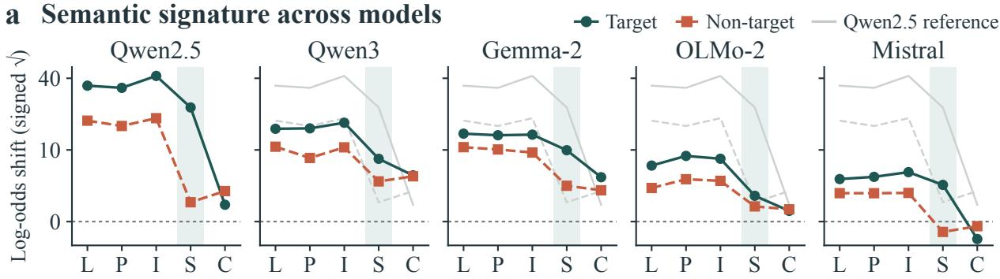

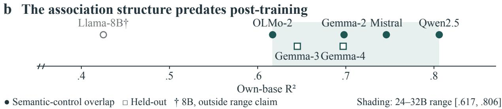  
Figure 7: Semantic signatures and own-base prediction. (a) Target (circles, solid) and non-target (squares, dashed) log-odds shifts for each checkpoint in Figure 2a. Pale curves repeat Qwen2.5; the common signed-square-root scale retains original-unit tick labels and negative values. L, natural label; P, paraphrase; I, invented name; S, scoped name (risk-only scope, no examples); C, arbitrary code. Lines guide comparisons between categorical conditions; shading marks S. (b) Own-base $R ^ { 2 }$ for seven base–instruct pairs. Filled circles overlap the semantic-control checkpoints; open squares are the Gemma-3 and Gemma-4 pairs, and the hollow circle is the Llama-3.1-8B pair. Vertical separation distinguishes groups only. The shaded 24–32B primary-panel range [.617, .806] is not a confidence interval; Llama-3.1- 8B is outside that scale claim. The axis starts at .35.

## A.8.2 Supplied Correlations Redirect the Completion

Correlation responses in the explicit-evidence bank. Table 13 gives the bare-prompt estimates and intervals behind Figure 2b. Sixteen demonstrations drawn from training-split worlds, each showing both attributes and the ground-truth option text (never the test’s answer code), approximate $\stackrel { \cdot } { P } ( T = t , Z = z ) = ( 1 + \stackrel { \cdot } { \rho } t z ) / 4$ with balanced marginals; the endpoint settings realize correlations of $\pm . 7 5$ , and $\rho { = } 0$ is a length-matched shuffled control (generator, estimands, and counts in Appendix A.10). The endpoint contrasts .90–1.40 of Section 3 are the differences between the $\rho { = } + . 8$ and $\rho { = } { - } . 8$ columns. Table 13 pools the four attribute pairs, the level at which Section 3 states the result; direct-declaration contrasts are in Table 18.

Table 13: Bare-prompt correlation responses in the explicit-evidence bank. Signed effects on the semantically positive non-target option, with 95% world-bootstrap intervals (64 shared worlds, 42 non-target texts, B=2,000, both code maps). Nominal ρ labels are retained; the displayed endpoint demonstrations realize correlations of ±.75.
<table><tr><td rowspan=1 colspan=5>Model                                   $\rho = - . 8$                               ρ= 0                           ρ= +.8</td></tr><tr><td rowspan=1 colspan=2>Mistral                          -.543 [−.672, −.403]</td><td rowspan=1 colspan=2>.202 [.036, .366]</td><td rowspan=1 colspan=1>.853 [.797, .907]</td></tr><tr><td rowspan=1 colspan=1>Qwen3-32B                     -.347 [</td><td rowspan=1 colspan=1>−.477, -.213]</td><td rowspan=1 colspan=1>.242 [</td><td rowspan=1 colspan=1>.090, .382]</td><td rowspan=1 colspan=1>.794 [.713, .873]</td></tr><tr><td rowspan=1 colspan=1>OLMo-2-32B                    -.511 [−</td><td rowspan=1 colspan=1>.659, −.351]</td><td rowspan=1 colspan=1>.208 [</td><td rowspan=1 colspan=1>.062, .352]</td><td rowspan=1 colspan=1>.796 [.718, .865]</td></tr><tr><td rowspan=1 colspan=1>Gemma-2-27B                    −.071 [</td><td rowspan=1 colspan=1>−.215, .067]</td><td rowspan=1 colspan=1>.354 [</td><td rowspan=1 colspan=1>.211, .493]</td><td rowspan=1 colspan=1>.824 [.723, .911]</td></tr><tr><td rowspan=1 colspan=2>Qwen2.5-32B                   -.413 [−.606, −.204]</td><td rowspan=1 colspan=1>.298 [</td><td rowspan=1 colspan=1>.146, .450]</td><td rowspan=1 colspan=1>.941 [.886, .984]</td></tr></table>

## A.8.3 Matched Base Checkpoints Predict Instruct-Model Shifts

Own-base prediction. A base checkpoint is read as a raw language model, without a chat template, on the 47 seven-point-scale items of Section 4; its same-item reference-adjusted shifts (14 trait profiles × 47 items; the profiles are risk, cautious, reckless, dominant, rebellious, humble, avant-garde, flamboyant, minimalist, frugal, punctual, detail-oriented, and the invented name with and without its scope) predict those of the matched instruct checkpoint. $R ^ { 2 }$ is the squared same-item correlation, tested against trait-permutation nulls. Matched pairs exist for four 24–32B families—Qwen2.5-32B, Mistral-Small-3.1-24B, OLMo-2-32B, and Gemma, one family whose base is available in three generations (Gemma-2-27B, Gemma-3-27B, Gemma-4-31B)—and for one smaller pair, Llama-3.1-8B. Own-base R2 is .806, .746, and .617 for the first three and .698, .645, and .697 along the Gemma chain (all p=.002; own-base residual r=.291/.259/.344 beyond a shared predictor averaged over the other bases of this set, Llama-3.1-8B and the other two Gemma generations), so all six 24–32B pairs lie within .617–.806 (Figure 7b). Llama-3.1-8B gives own-base R2=.425 (n=658), below that range and outside the scale claim. This is same-item predictive association across the three Gemma generations, not evidence of a stable rank-one representation or a transportable internal intervention. Qwen3-32B has no public same-size base, and GPT-OSS-20B releases none, so their own-base cells are empty (checkpoints in Table 39; panel coverage in Appendix A.2).

A base average from other families. The mean shift of the Qwen2.5-32B, Mistral, and OLMo-2 bases, excluding any base from the target’s own family, predicts all five primary checkpoints at $R ^ { 2 } { = } . 6 5 8 { - } . 7 7 4 \ ( 5 / 5 )$ . This includes Qwen3-32B, which has no own-base pair: .658 from the Mistral and OLMo-2 bases, and .715 when the same-family Qwen2.5 base is included.

Scope. The matched-base results above are same-item associations, not a randomized intervention on post-training; they do not establish what fraction of completion is caused by pretraining or instruction tuning. Missing own-base pairs are not imputed from other families.

## A.9 Internal Coupling: Erasure, Controls, and Limits

These interventions concern the bare persona prompt, the unspecified state in which completion is measured; the neutral declaration is tested behaviorally in Appendix A.10. We give the subspace construction, fit/evaluation split, control checks, and readout and utility limits.

## A.9.1 Design and Measurement

A prespecified program with ten predictions, priors, and pass rules (deviations are logged with dates, Appendix A.13) asks what leakage looks like inside the residual stream of five primary checkpoints; this appendix reports the late-erasure prediction and its controls. Under a separate prespecification, its causal core is applied to four held-out checkpoints. Eighteen fixed condition wordings (the bare prompt, two operational target wordings, the opposite-pole prompt (CAUTIOUS), a marked and a default persona, four factorized or scoped repairs, explicit negation, three invented-name wordings, an arbitrary code, and the two unrelated control attributes, with the no-information reference as the eighteenth) are crossed with the 47-item seven-point bank and with pole-flipped renderings of its 17 items outside the target domain (13 coded non-target, 4 ambiguous); states are read at every decoder layer at six semantically aligned positions, and four base checkpoints are collected identically. Every subspace and axis below is fit on one half of the items and evaluated on the other half, in two folds; target items are split the same way. Each subspace is the top-k singular basis in residual coordinates of the fit-half per-item condition-minus-reference displacements read at the answer position, where what is decodable and what is causally responsible need not coincide (Wiegreffe et al., 2025). It is computed separately at every layer of the band, so the erasure at a layer uses that layer’s own basis; the rank-1 response-coordinate (scale) axis is instead the unembedding direction of scale point 7 minus scale point 1 pulled back through the final normalization weight, the same axis at every layer and for every condition, and so is not fit from any persona’s displacement.

Centered question-to-answer erasure. Erasing a subspace in centered form,

$$
\begin{array} { r }  \begin{array} { r } { \begin{array} { r } { \boldsymbol { h } \mapsto \boldsymbol { h } - \boldsymbol { U } \boldsymbol { U } ^ { \top } ( \boldsymbol { h } - h _ { \mathrm { r e f } } ) , } \end{array} } \end{array} \end{array}\tag{A.12}
$$

at every question-to-answer position and at every layer of a depth band, cannot be undone by re-reading the persona prefix within the band; $h _ { \mathrm { r e f } }$ is the no-information reference run’s state at the same item, layer, and position (the question-to-answer text is identical across conditions). Leakage removed (causal explanatory power, CEP) is read on held-out non-target items under the target prompt, retention (RET) on held-out target items, side effect on a punctualpersona run, and carry on the opposite-pole run. In the band from relative depth .65 upward (Table 14), replacing the whole question-to-answer span with that of the no-information reference defines the ceiling (1.00), and erasing the persona’s own top-4 directions reaches it: .97–1.03 of the leakage removed on $5 / 5$ (positive control; pass rule CEP $\geq . 5 )$ . That control shows only that this lever family can reach the leakage at all, since it collapses retention with it. A rank-4 subspace fit from the marked versus default personas, which never mention risk, removes all of the trait prompt’s non-target-item leakage (1.10–1.37; values above one overshoot past the reference toward the default pole), most of its target effect (retention −.17 to .20), and .48–1.33 of the opposite-pole effect, on every model; the top-4 directions of the trait prompt’s displacement on target items remove . $. { \bar { 8 8 } } { - . 9 7 }$ of the leakage in return. Each primary checkpoint receives 20 random rank-4 frames, drawn independently for each fold and layer. Separately, the held-out runs use five frames per checkpoint. The primary frames’ two-fold averages have $\mathrm { C E P } \leq . 0 1 $ and retention $\geq . 9 7$ (individual fold-by-frame cells reach .0124 and .9685), and even rank-16 frames remove at most .03 (retention $\geq . 9 4 )$ the unrelated-control subspace removes at most .18 on the five primary checkpoints, and erasing the style-persona subspace moves the punctual-persona run by SIDE .036–.069. SIDE is the mean absolute change in signed scale shift (expected scale point $- 4 ) / 3$ over held-out non-target items and then folds; .10 is a .3-point move. Carry is the fraction of the opposite-pole run’s non-target shift removed. At each rank and band, the control check requires own-subspace $\mathrm { C E P } \geq . 5 ,$ median and 95th-percentile |CEP| over 20 rank-matched random frames $\leq$ .10 and .20, self-subspace $\mathrm { S I D E } \le . 1 0$ , and no numerical or tokenization errors. The complete $k { = } 4$ control check passes on $4 / 5 \colon$ Gemma-2’s self-subspace SIDE is .103, just above the .10 rule, so its raw markedness cell remains visible but is not counted among checkpoints that pass that configuration’s control check. Markedness with the 1-D scale contrast projected out still removes the leakage (1.09–1.33), but the broader rank-4 answer-serialization subspace is not inert: its raw CEP values span .84–1.07 across the five table rows, and it removes the leakage on all $4 / 4$ checkpoints that pass the control check. The upper endpoint 1.07 belongs to the excluded Gemma-2 configuration. Markedness with that answer span projected out still removes both effects, so it is not contained in the answer subspace; the stronger claim of independence from answer commitment is nevertheless rejected (Table 15).

Rank and depth stability. The rank and depth conclusions do not depend on one selected cell. A fixed sweep over $k \in \{ 1 , 2 , 4 , 6 \}$ and bands [.45, .65], [.55, .75], [.65, .85], [.75, 1], and [.65, 1] requires two consecutive passing ranks in the order 1, 2, 4, 6 at band [.65, 1], or two consecutive passing bands in the order $[ . 6 5 , . 8 5 ] , [ . 7 5 , 1 ] , [ . 6 \bar { 5 } , 1 ]$ at rank 4. A cell must pass the control check, have own-subspace CEP lower 95% bound $\geq . 5 ,$ and keep answer-token mass within .15 of the no-information run; the tested style-persona subspace additionally requires CEP lower bound $\geq . 5$ and RET upper bound $< . 7 ,$ , while target-orthogonal requires CEP lower bound $\geq . 5 ,$ , RET lower bound $\geq . 7 ,$ and $\mathrm { S I D E } \leq . 1 0$ Both the style-persona subspace and the constructed target-orthogonal subspace form such a region on $5 / 5$ models after the required 95% item-paired bootstrap bounds are applied (B=2,000; Figure 8a). All non-random scored cells retain the seven-point answer channel under the prespecified probability-mass check; for the fixed-setting markedness cell the largest fold-by-block erased-minus-reference mass difference is .00033 against the .15 limit. The same levers are weak or absent on $3 / 5$ models in the .45–.65 band (on Qwen3 the question-to-answer span does not yet carry the effect: ceiling .02). Thus the supported statement is a late rank/band region, fit per model, not an intrinsic rank of four or a shared cross-model vector.

Constructed selectivity. At each layer, let $D _ { T }$ and $D _ { U }$ have as columns the fit-half persona-minus-reference displacement vectors on target and non-target items, respectively. With $U _ { T } = \mathrm { S V D } _ { k } ( D _ { T } )$ denoting its orthonormal leading left-singular basis, the construction is

$$
D _ { U \perp T } = ( I - U _ { T } U _ { T } ^ { \top } ) D _ { U } , \qquad U _ { U \perp T } = \mathrm { S V D } _ { 4 } ( D _ { U \perp T } ) .\tag{A.13}
$$

The projection uses the target displacement span, not a direction learned from evaluation items. Both bases are fitted separately within each model, layer, and item fold; $k = 4$ is the primary target-span rank, and the sensitivity check removes the whole fit-half target span (rank 15: each fold fits 15 target items, so the requested $k = 1 6$ returns 15 directions). The selective point-estimate region is $\mathrm { C E P \ge . 5 }$ and $\operatorname { R E T } \geq . 7 ;$ the adjacent-region analysis additionally uses the declared interval and control checks. Equation (A.13) is a compact statement of the fitted construction, not a new intervention.

Table 14: Centered-erasure point estimates (CEP/RET). Same band [.65, 1], rank 4 except the 1-D scale axis, held-out item halves. Values above one overshoot the reference; negative retention reverses the target. ‡Gemma-2 fails the full fixed-setting SIDE check but has passing adjacent settings. †Gemma-4 fails the random-control check and is excluded from the interpretable held-out count; its estimates remain visible. In each column block the upper rows are the five primary checkpoints and the lower rows the held-out checkpoints; the second block holds controls and complementary constructions.
<table><tr><td>Model</td><td>full</td><td>own</td><td>markedness</td><td>target&#x27;s own</td><td>target- orthogonal</td></tr><tr><td>Qwen2.5-32B</td><td>1.00/.00</td><td>.98/.07</td><td>1.13/.20</td><td>.88/-.00</td><td>.86/.91</td></tr><tr><td>Qwen3-32B</td><td>1.00/-.00</td><td>.98/.16</td><td>1.37/.03</td><td>.97/-.01</td><td>.63/.99</td></tr><tr><td>Gemma-2-27B‡</td><td>.99/-.00</td><td>.98/.12</td><td>1.35/.01</td><td>.96/.01</td><td>.56/.99</td></tr><tr><td>OLMo-2-32B</td><td>1.00/-.00</td><td>.97/.29</td><td>1.10/-.17</td><td>.91/-.02</td><td>.58/.99</td></tr><tr><td>Mistral</td><td>1.00/-.00</td><td>1.03/.14</td><td>1.20/-.11</td><td>.88/.02</td><td>.65/.99</td></tr><tr><td>Llama-3.1-8B-Instruct</td><td>1.00/-.00</td><td>1.00/.19</td><td>1.30/-.15</td><td>.69/.00</td><td>.62/.99</td></tr><tr><td>GPT-OSS-20B</td><td>1.00/.01</td><td>.97/.44</td><td>.96/.24</td><td>1.07/-.08</td><td>.59/.97</td></tr><tr><td>Gemma-3-27B-IT</td><td>1.00/-.00</td><td>.99/.42</td><td>1.60/-.09</td><td>.95/.01</td><td>.70/.86</td></tr><tr><td>Gemma-4-31B-IT†</td><td>1.01/.00</td><td>1.00/.01</td><td>1.09/.64</td><td>.67/-.00</td><td>1.02/.97</td></tr><tr><td>Model</td><td>leakage- orthogonal target</td><td>markedness ⊥ scale axis</td><td>scale axis 1-D</td><td>unrel. control</td><td>random</td></tr><tr><td>Qwen2.5-32B</td><td>-.02/.02</td><td>1.10/.32</td><td>.40/.80</td><td>.18/.72</td><td>.00/.99</td></tr><tr><td>Qwen3-32B</td><td>-.00/-.03</td><td>1.33/.05</td><td>1.53/.21</td><td>.01/.93</td><td>.00/1.00</td></tr><tr><td>Gemma-2-27B‡</td><td>-.05/1.11</td><td>1.24/.01</td><td>.56/.99</td><td>.02/1.00</td><td>.00/1.00</td></tr><tr><td>OLMo-2-32B</td><td>-.00/.73</td><td>1.09/-.08</td><td>1.63/.30</td><td>.00/.81</td><td>.00/1.00</td></tr><tr><td>Mistral</td><td>-.02/1.00</td><td>1.17/-.02</td><td>.52/.57</td><td>.09/.99</td><td>.00/1.00</td></tr><tr><td>Llama-3.1-8B-Instruct</td><td>-.00/.54</td><td>1.26/-.10</td><td>1.12/−.09</td><td>.03/.88</td><td>.00/1.00</td></tr><tr><td>GPT-OSS-20B</td><td>.03/.10</td><td>.89/.29</td><td>.56/.79</td><td>.65/.45</td><td>.01/1.00</td></tr><tr><td>Gemma-3-27B-IT</td><td>.00/.72</td><td>1.58/.04</td><td>1.64/.07</td><td>.00/.88</td><td>.00/1.00</td></tr><tr><td>Gemma-4-31B-IT†</td><td>.00/-.00</td><td>.62/.58</td><td>1.30/-1.44</td><td>.90/.20</td><td>.85/-.49</td></tr></table>

The top-4 leakage-displacement directions are fit after projecting out the rank-4 target-displacement span, using fit-half items only. This constructed subspace removes .56–.86 of leakage at .91–.99 target retention on the primary five and .59–.70 at .86–.99 on the three interpretable held-out checkpoints. Removing the whole fit-half target span gives .47–.83 at .93–1.00. At the fixed setting, no tested persona-induced subspace enters the selective region on the eight interpretable checkpoints; in the rank/band sweep one mid-band cell does (OLMo-2, the risk persona’s own displacement, rank 1, band [.45, .65]: CEP .68, RET .71). This is a finite family of fitted interventions, not a proof tha all persona representations are inseparable. A target-referenced construction is not itself a persona-induced subspace.

## A.9.2 What the Controls Do and Do Not Establish

The second prespecification, dated 2026-09-02 before held-out runs, fixed the four held-out checkpoints and reused the bank, folds, conditions, and erasure protocol. It required own $\mathrm { C E P } \geq . 5 ;$ joint removal (style-persona $\mathrm { C E P \ge . 5 }$ and at least .1 above the random mean, style-persona $\mathrm { R E T } < . 7 .$ , target-displacement $\mathrm { C E P } \geq . 5 ) $ ; scale-axis control (style-persona orthogonal to scale CEP ≥ .5); and style-persona $\mathrm { S I D E } \leq . \mathrm { i } \mathrm { \bar { 5 } }$ . The random-control check was added after the Gemma-4 run.

Which control count applies? The point estimates of the second prespecification retain eight checkpoints after excluding the random-control failure. The full rank-4 control check additionally excludes the Gemma-2 configuration (above), not the model, which passes adjacent rank/band settings. The eight-checkpoint point estimates, the $4 / 5$ fixed-setting full check, the $5 / 5$ interval-supported region, and the 3/4 $3 / 4$ held-out replication therefore answer different questions and are reported separately.

Table 16 distinguishes the conclusions supported by each control check.

Table 15: Interval estimates and the answer-span control on the five primary checkpoints (band $[ . 6 5 , 1 ] , k = 4 )$ Markedness, target-orthogonal, and answer entries are point estimates with 95% item-paired bootstrap intervals $( B = 2 , 0 0 0 )$ ; marked⊥answer is the compact point CEP/RET pair. The answer column erases the rank-4 span of the seven scale-point unembedding rows; marked⊥answer reports CEP/RET after removing that span from the markedness subspace. $\Delta \mu$ is the largest absolute erased-minus-reference mean scale-point mass difference across folds and non-target/target blocks. The columns are shown in two blocks. †The full control check fails because self-subspace SIDE is .103 against the .10 rule.
<table><tr><td>Model</td><td>marked CEP</td><td>marked RET</td><td>Target-orthogonal CEP</td><td>Target-orthogonal RET</td></tr><tr><td>Qwen2.5-32B</td><td>+1.13 [+1.03, +1.23]</td><td>+0.20 [−0.02, +0.41]</td><td>+0.86 [+0.77, +0.93]</td><td>+0.91 [+0.87, +0.95]</td></tr><tr><td>Qwen3-32B</td><td>+1.37 [+1.28, +1.45]</td><td>+0.03 [−0.04, +0.09]</td><td>+0.63 [+0.59, +0.68]</td><td>+0.99 [+0.96, +1.02]</td></tr><tr><td>Gemma-2-27B†</td><td>+1.35 [+1.31, +1.40]</td><td>+0.01 [−0.11,+0.12]</td><td>+0.56 [+0.52, +0.60]</td><td>+0.99 [+0.95, +1.01]</td></tr><tr><td>OLMo-2-32B</td><td>+1.10 [+1.07, +1.14]</td><td>-0.17 [−0.24, -0.09]</td><td>+0.58 [+0.54, +0.63]</td><td>+0.99 [+0.96, +1.01]</td></tr><tr><td>Mistral</td><td>+1.20 [+1.15, +1.24]</td><td>-0.11 [−0.16, -0.06]</td><td>+0.65 [+0.61, +0.69]</td><td>+0.99 [+0.98, +1.00]</td></tr><tr><td>Model</td><td>answer CEP</td><td>marked⊥answer</td><td>max|∆µ|</td><td></td></tr><tr><td>Qwen2.5-32B</td><td>+0.93 [+0.87, +0.98]</td><td> $+ 1 . 0 7 / + 0 . 4 3$ </td><td>0.0000</td><td></td></tr><tr><td>Qwen3-32B</td><td>+0.99 [+0.95, +1.03]</td><td> $+ 1 . 1 5 / + 0 . 1 1$ </td><td>0.0000</td><td></td></tr><tr><td>Gemma-2-27B†</td><td>+1.07 [+1.04, +1.10]</td><td>+1.25/+0.08</td><td>0.0001</td><td></td></tr><tr><td>OLMo-2-32B</td><td>+0.84 [+0.82, +0.87]</td><td> $+ 1 . 1 0 / + 0 . 0 3$ </td><td>0.0000</td><td></td></tr><tr><td>Mistral</td><td>+1.00 [+0.97, +1.03]</td><td>+1.14/-0.01</td><td>0.0003</td><td></td></tr></table>

Table 16: What each control count establishes. Counts have different denominators and are not pooled; the procedures, interval estimates, and failures behind each row are given in this appendix.
<table><tr><td>Audit question</td><td>Result</td><td>Supported interpretation</td></tr><tr><td>Fixed-setting rank-4 seven-point check</td><td>4/5</td><td>Passes every control on four; Gemma-2 misses only the side-effect rule (.103 against .10).</td></tr><tr><td>Adjacent rank/depth region</td><td>5/5</td><td>Late dependence survives confidence-bound testing.</td></tr><tr><td>Held-out seven-point replication</td><td>3/4</td><td>The fourth checkpoint is uninterpretable because its random control fails.</td></tr><tr><td>Binary check, transported subspaces</td><td>1/5</td><td>Transport without refitting is not panel-wide; refitting inside each readout defines no pass criterion and is format-dependent and model-heterogeneous</td></tr><tr><td>Answer span: non-containment / inde- 4/4 / 0/4</td><td></td><td>(Appendix A.9.3), so no count applies to it. Markedness still removes the leakage with the answer span projected out, but that span alone also removes it.</td></tr><tr><td>pendence All collateral-utility criteria</td><td>1/5</td><td>Two more checkpoints miss one criterion each; selectivity on audited items is not broad utility preservation.</td></tr></table>

Held-out replication. Four held-out checkpoints never used in the program—Llama-3.1-8B-Instruct, GPT-OSS-20B, Gemma-3-27B-IT, and Gemma-4-31B-IT, the local snapshots of the checkpoint registry in Appendix A.13—were collected and erased under the identical procedure (bands .65–1 and .65–.85, rank 4, same folds). The positive control passes on all four (own top-4 CEP .97–1.00). On the three that also pass the random-control check, the markedness subspace removes leakage and target effect together (joint removal; .96–1.60 at retention −.15 to .24), the joint removal survives projection of the 1-D scale contrast (.89–1.58), and the constructed target-orthogonal subspace is selective (.59–.70 at .86–.99; held-out rows of Table 14). On Gemma-4-31B-IT rank-4 erasure is destructive even with random or unrelated-control frames (random .85/ − .49, unrelated control .90/.20) and moves a punctual-persona run by .28–.40 against .04–.07 for the style-persona subspace on the primary checkpoints, so the checkpoint fails the random-control check (a post hoc check; Appendix A.13) and the prespecified SIDE limit (.277 against .15), and is excluded from the interpretable count while remaining in the table. GPT-OSS-20B is the one checkpoint on which the unrelated-control subspace also removes a large share (.65 at .45 retention): its unrelated-control persona displacements overlap the directions whose erasure removes the leakage, a scope note on the control rather than on the claim, since the markedness subspace still exceeds the random subspace by .95.

Answer commitment and general utility. Figure 8b–c reports the binary-transport and utility checks separately from the seven-point result; the answer-span control is reported with Table 15. A separate 60-item collateral-utility check has five prespecified criteria: accuracy retention ≥ .95, absolute accuracy $\mathrm { { l o s s } \leq . 0 3 }$ , order-consistency loss ≤ .05, unrelated-control ${ \mathrm { S I D E } } \leq . 1 0 ,$ and answer-token KL at most the random-frame 95th percentile plus .01. Its 60 two-option items contain no risk or style-marking words: 20 arithmetic, general-knowledge, and simple-logic questions and 20 format-following questions, each keyed with A and B equally often, plus 20 unrelated-control items contrasting punctual or detail-oriented options with relaxed ones. Each appears in both orders without a persona and under the target prompt with the fold-0-fitted subspace erased. Accuracy uses the 80 keyed presentations and order consistency the 60 items, both against the no-information run; unrelated-control SIDE is the absolute change in $2 p - 1$ relative to the unedited target-prompt run, averaged over the 20 unrelated-control items in both orders, where p is the probability of the punctual or detail-oriented option. The KL limit is the 95th percentile under 20 random rank-4 frames plus .01. The constructed subspace meets all five on Mistral (1/5); Qwen2.5 misses only order consistency and OLMo-2 only unrelated-control SIDE (Figure 8c). The constructed subspace is selective on the audited items; it meets every collateral criterion on one checkpoint and all but one on two more. The punctual half of the unrelated-control block contrasts keeping a time buffer with cutting it close, which borders on risk; OLMo-2 misses the SIDE rule on both halves (.20 punctual, .16 detail-oriented), so its miss does not come from that overlap.

## a Interval-bound rank and band cells

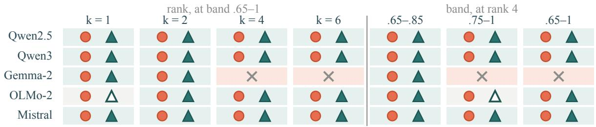

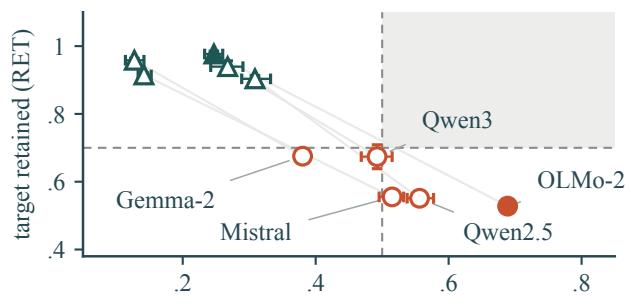

c Collateral-utility checks  
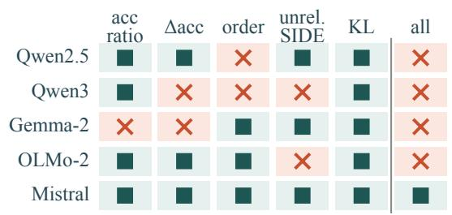  
Figure 8: Prespecified robustness and boundary checks. (a) Interval-bound rank and band cells on the seven-point readout: circles denote the style-persona subspace and triangles the constructed target-orthogonal subspace; filled symbols clear the required 95% bound, hollow symbols pass only at the point estimate (in b, fail the control check), and crosses fail the control check; cell shading marks where the subspace clears the bound. (b) Binary-readout CEP–RET with item-paired intervals. Filled symbols identify the sole model that passes the control check; hollow points remain descriptive. (c) Collateral-utility checks for the constructed subspace; only Mistral passes all five.

## A.9.3 Readout Boundary and Matched-Format Refitting

Without refitting, the binary A/B and 1/2 runs are valid on all five primary checkpoints: full replacement reproduces the no-information reference at its ceiling, and the bare effect clears its floor. Subspaces fit on the seven-point readout and transported to these choices nevertheless pass the own-subspace positive control on OLMo-2 only (CEP .57 [.55, .59]; the other four range from .17 to .43), below the prespecified 3/5 rule (Figure 8b). This is a failure of the transported intervention family, not evidence that binary-choice behavior has no modifiable representation.

Refitting design. A separate exploratory analysis fits the same intervention inside each format. The panel is Qwen3.5- 9B, Qwen3-32B, Mistral-Small-3.1-24B, Gemma-2-27B, and OLMo-2-32B; Qwen3.5 replaces Qwen2.5, so this is not the primary five-checkpoint panel. All use bf16, eager attention, and disabled chat thinking. Of the 47 seven-point items, the 13 non-target and 30 target items are scored; the four ambiguous items are excluded. Fold 0 fits on 7 non-target and 15 target items and evaluates on the complementary 6 and 15; fold 1 reverses the halves. The readouts are the seven-point scale (two presentations) and binary choice (A/B and 1/2, both option orders). Presentations are averaged within item before statistics, not counted as independent observations.

The table below uses the rank-4 constructed subspace, fitted within each format by the projection above, over the question-to-answer span at every layer from relative depth .65 upward. Its center is the no-information reference forward-pass state at the same scored item, layer, and position; it is not a train-mean center. Conditions include the no-information reference, the target persona, punctual and detail-oriented unrelated-control personas, and four directional non-target-preference conditions. No condition is a neutral declaration. The intervention requires an item-matched no-information reference forward pass on the evaluation item, although the subspace fit uses only training items.

Estimand and inference. Let $\boldsymbol { \pi } _ { p , i } ^ { 0 }$ and $\pi _ { 0 , i } ^ { 0 }$ be the unedited persona and no-information reference answer distributions on non-target item i, and let $\pi _ { p , i } ^ { b }$ and $\pi _ { 0 , i } ^ { b }$ be their edited counterparts. Every π is normalized inside that format’s designated candidate answers. The reported distance reduction is

$$
\Delta \mathrm { T V } _ { b } = \frac { 1 } { 1 3 } \sum _ { i = 1 } ^ { 1 3 } \left[ \mathrm { T V } ( \pi _ { p , i } ^ { 0 } , \pi _ { 0 , i } ^ { 0 } ) - \mathrm { T V } ( \pi _ { p , i } ^ { b } , \pi _ { 0 , i } ^ { b } ) \right] .\tag{A.14}
$$

Target retention is the edited mean signed target effect divided by the unedited mean effect on the 30 target items at the same readout; it is a ratio of means, not a mean of itemwise ratios. This ∆TV is an absolute distance reduction, not the normalized signed-shift fraction CEP. Neither scale bounds the other, and the model panels differ as well. Pointwise intervals in the refit analysis use 2,000 item-bootstrap draws, with presentation averaged first, conditional on the two fitted folds; they exclude refit uncertainty, family generalization, and multiplicity control. The compact constructed-subspace table reports point estimates, not a test of differences between methods or models. No pass rule is declared for refitting and no model is omitted on outcome.

The .20 statement in Section 4 is the rounded maximum .198 in the binary column of Table $^ { 1 7 ; }$ it is a boundary on these tested constructed-subspace cells, not a general upper bound on binary-readout interventions.

Table 17: Readout-refit boundary for the constructed subspace. Matched-format fitting and evaluation, paired no-information reference, rank 4, two item folds. Each entry is absolute leakage-TV reduction / target-effect retention. The construction, fit split, reference, and estimand are specified above. Entries are point estimates; this table has no pass/fail decision.
<table><tr><td>Checkpoint</td><td>Seven-point</td><td>Binary choice</td></tr><tr><td>Qwen3.5-9B</td><td>.511/.945</td><td>.068/.985</td></tr><tr><td>Qwen3-32B</td><td>.243/.954</td><td>.070/.997</td></tr><tr><td>Mistral-Small-3.1-24B</td><td>.048/.955</td><td>.001/1.000</td></tr><tr><td>Gemma-2-27B</td><td>.004/.989</td><td>.001/1.000</td></tr><tr><td>OLMo-2-32B</td><td>.187/.977</td><td>.198/1.000</td></tr></table>

Paired-reference edits have zero reference drift by construction. Under this center, restoration TV to the original reference is the post-intervention persona–reference TV; closing part of the gap is not the same as returning to the original reference behavior. Random subspaces are near-null, which does not identify nuisance information.

## A.10 The Neutrality Gap: Design, Results, and Qualifications

This section supplies the estimands, selection procedure, complete headline numbers, and controls for Section 5. Validation contrasts, dependence checks, and numerical sensitivity calculations are included below. The held-out tail rule is fixed in the analysis plan; level splits, scale decompositions, threshold sensitivity, and independent-item level tabulations are post hoc.

## A.10.1 Estimands, World Banks, and Prompt-Design Selection

Estimands. For a non-target query in world w at declared level $z ,$ non-target sensitivity $L _ { \mathrm { s e n s } }$ compares the two target levels at that non-target value and query; its normalized-choice version is the TV between the decoded twooption distributions (Section 2). Attribute-fidelity error $E _ { Z }$ compares non-target responses with the task ground truth, target efficacy is the signed probability effect on target queries, and retention is defined against an adequate positive baseline effect; together these distinguish selective behavior, attribute collapse, and loss of the target manipulation. The conservative per-world residual $a _ { w , z } =$ min{1, $L _ { \mathrm { s e n s } } ( w , z ) + u _ { + } + u _ { - } \}$ adds to normalized-choice TV the unassigned answer mass $u _ { t } .$ , the probability outside the legal answer codes at target level t. A world enters the tail when any of its five non-target-level comparisons exceeds the sensitivity threshold, so the conservative tail rate measures failure of the declared robust criterion, not a count of fully observed semantic shifts, while the normalized-TV rate tests whether the pattern persists without the widening. These estimands are related $^ { \mathrm { t o , } }$ but are not renamed versions of, the field-audit measures of Definition 1: $L _ { U }$ uses persona-minus-reference shifts, the surgicality ratio compares regression coefficients (Appendix A.3.4), and CEP/RET summarize erasure-induced removal and retention under their own normalization, scales, and references.

World banks and prompt-design selection. Structured worlds are drawn by one generator, with a ground-truth answer, over four attribute pairs: risk weight → color preference, time preference → sound preference, social contact → layout preference, and time of day → color preference. The explicit-evidence bank (Appendix A.10.2) samples all four. Candidate prompt designs are selected on 162 in-scope validation worlds and evaluated on 477 in-scope held-out worlds; both banks use two attribute pairs, risk weight → color preference and time preference → sound preference (the certification pairs, on which the selected prompt designs are evaluated), and their 40 non-target texts. Other declared pairs supply separate collateral checks. The evaluation bank has 958 scored test worlds: 477 from the two certification pairs and 481 from the other two pairs, used for collateral checks. Output validity uses all 958; sensitivity uses the 477 in-scope worlds. The separate development bank has 256 worlds (64 per pair). The evaluation generator has 320 worlds per pair; a salted hash split assigns 320 to validation and 960 to test, with two unscored dry-run prompts excluded. The evaluation records of the five primary checkpoints share one world set, so model and threshold comparisons stay paired. The non-target levels include an explicitly neutral level whose ground-truth answer is fixed by the options’ base constants rather than by any stated preference (Appendix A.10.6). Validation selects strong relevance for OLMo-2 and Gemma-2, attribute scope for Qwen2.5, and strong relevance for the shared Qwen3/Mistral record (verbatim in Appendix A.6.9). Each checkpoint has four candidates appended to the declaration-only prompt: attribute scope and relevance at its not-relevant $( ^ { 6 6 } \bar { \mathrm { T } }$ he description above is not relevant to this question. Answer from what the question itself states”), weak, and strong levels. A candidate is feasible when validation mean sensitivity is at most .05, fidelity error at most .10, target retention at least .90, and collateral sensitivity at most .05. Candidates are ranked by feasibility on every checkpoint in their record, then by worst validation mean conservative sensitivity, then by fixed candidate order; for Qwen3 and Mistral, the larger of the two sensitivities is used. The least-infeasible candidate therefore minimizes that worst-case sensitivity; fidelity, retention, and collateral sensitivity enter only through feasibility. Every candidate fails this validation feasibility criterion, though selected candidates meet sensitivity and fidelity bounds at $z { = } \pm 1$ (Table 20); matched validation contrasts are descriptive because selection used those data. The rule-lookup pilot is a successful rule reference with different tasks, not a matched fourth condition here.

## A.10.2 Directional Declarations under Supplied Correlations

The explicit-evidence bank asks whether a declared non-target value overrides a correlation supplied in context. It contains 64 worlds per model, 16 from each of the four attribute pairs—two of them outside the certification pairs—with 42 distinct non-target texts, and it was declared exploratory before scoring, with no pass/fail decision. Each test prompt uses the battery frame without an added instruction and 16 in-context demonstrations drawn with balanced marginals and joint probabilities $( 1 + \rho T Z ) / 4 \colon$ endpoint counts are 7/1/1/7 or reversed, realizing correlations of .75 and −.75, and the zero-correlation table is 4/4/4/4; the $\rho$ labels remain the nominal settings $- . 8 , 0 , + . 8 .$ The non-target attribute appears in one of four information conditions: absent (bare), a direct declaration at $z { = } \pm 1$ , a passing mention, or one recorded past choice (Appendix A.6.9); this bank has no neutral level. At each setting $D _ { p }$ is the signed non-target-option probability difference between target levels, and the endpoint contrast $D _ { p } ( + . 8 ) - D _ { p } ( \dot { - } . 8 )$ has range $[ - 2 , 2 ] ;$ ; the margin contrast replaces probability by semantic log-odds, and a retained fraction divides a condition’s mean contrast by the bare condition’s mean contrast. Means are formed within and across worlds; code maps and non-target-value repetitions do not create independent worlds, and the aggregation retains both code maps within each world (Appendix A.13).

On the probability scale the direct declaration lowers the endpoint contrast from .90–1.40 to at most .07, an attenuation of 94–100%; on the log-odds scale 5–31% of the bare margin contrast remains (Table 18). Gemma-2’s small negative probability fraction is reported as estimated, not clipped, and the model ordering is descriptive, not a multiplecomparison test of adjacent pairs. The weak-evidence forms override less: a passing mention keeps .03–.31 of the bare probability contrast and one past choice .18–.44, against at most .06 for the direct declaration. Text-clustered intervals for this bank are in Appendix A.10.4 and its log-odds decomposition in Appendix A.10.6.

Table 18: Direct-declaration contrasts relative to the bare prompt (explicit-evidence bank; 64 worlds per model over four attribute pairs; both code maps retained). Endpoint contrast $D _ { p } ( \bar { + } . 8 ) - D _ { p } ( - . 8 )$ under the bare prompt and under the direct declaration; retained fractions on the probability and margin scales with 95% world-bootstrap intervals (B=2,000); median absolute margin under the declaration. Exploratory.
<table><tr><td>Model</td><td>Endpoint contrast bare / declared</td><td>Probability fraction [95% interval]</td><td>Margin fraction [95% interval]</td><td>Declared median absolute margin (nat)</td></tr><tr><td>Mistral</td><td>1.3963 / 0.0358</td><td>0.0256 [0.0109, 0.0443]</td><td>0.0975 [0.0775, 0.1203]</td><td>6.3125</td></tr><tr><td>Qwen3</td><td>1.1406 / 0.0662</td><td>0.0581 [0.0235, 0.0954]</td><td>0.3058 [0.2600, 0.3540]</td><td>16.0000</td></tr><tr><td>OLMo-2</td><td>1.3077 / 0.0459</td><td>0.0351 [0.0183, 0.0567]</td><td>0.1965 [0.1688, 0.2264]</td><td>9.3750</td></tr><tr><td>Gemma-2</td><td>0.8951 / -0.0027</td><td>-0.0031 [-0.0335, 0.0296]</td><td>0.0703 [0.0421, 0.0979]</td><td>10.2500</td></tr><tr><td>Qwen2.5</td><td>1.3537 / 0.0075</td><td>0.0056 [-0.0000, 0.0182]</td><td>0.0474 [0.0389, 0.0575]</td><td>33.3750</td></tr></table>

## A.10.3 Matched Validation Comparisons

Each table uses the same 162 in-scope validation worlds per model. “Declaration” is the declaration-only condition and “Selected” that model’s validation-selected candidate. Values use normalized-choice TV and the deterministic ground-truth reference; bare prompts have no individual Z fidelity target. The selected-minus-declaration interval is world-paired with 2,000 bootstrap replicates and is an exploratory, post-selection comparison. A declaration alone lowers normalized sensitivity from .60–.78 to .10–.16, and the selected candidate changes it by −.014 to +.001 further, except on Qwen2.5 (−.076 [−.093, −.060]).

All non-target-value levels. Table 19 reports matched validation results across all non-target levels.

Table 19: Matched validation results across all non-target-value levels. Relative to the declaration alone, the selected candidate changes sensitivity by at most .015 except on Qwen2.5 (−.076); both remain far below the bare prompt (.60–.78).
<table><tr><td>Model</td><td>Bare sensitivity</td><td>Declaration sensitivity</td><td>Selected sensitivity</td><td>Selected — declaration [95% interval]</td><td>Selected fidelity error</td><td>Selected target effect</td></tr><tr><td>Mistral</td><td>0.7196</td><td>0.1033</td><td>0.0891</td><td>-0.0143 [-0.0225, -0.0063]</td><td>0.1087</td><td>0.9830</td></tr><tr><td>Qwen3</td><td>0.5968</td><td>0.1282</td><td>0.1205</td><td>-0.0077 [-0.0124, -0.0035]</td><td>0.1196</td><td>0.9042</td></tr><tr><td>OLMo-2</td><td>0.6987</td><td>0.1131</td><td>0.1106</td><td>-0.0025 [-0.0071, 0.0021]</td><td>0.1141</td><td>0.9903</td></tr><tr><td>Gemma-2</td><td>0.7750</td><td>0.1647</td><td>0.1653</td><td>0.0006 [-0.0097, 0.0112]</td><td>0.1190</td><td>0.9520</td></tr><tr><td>Qwen2.5</td><td>0.7161</td><td>0.1436</td><td>0.0674</td><td>-0.0762 [-0.0926, -0.0597]</td><td>0.1088</td><td>0.9971</td></tr></table>

The all-level fidelity column includes the neutral stratum, whose ground-truth reference is not identifiable from the prompt (Appendix A.10.6); the extreme-level (z=±1) values in Appendix A.10.3 are the interpretable fidelity comparison. Because that reference does not depend on the prompt, the expected fidelity error at z = 0 is .5 for any design, so the all-level fidelity condition sits near its .10 bound by construction; the selected candidates fail feasibility on sensitivity (.067–.165) regardless.

Extreme non-target values only. Non-target comparisons are restricted to Z = −1 or Z = +1. Target comparisons use available target rows under the same prompt design, already with endpoint non-target values; the unchanged target column does not imply an unmeasured five-level target grid. Table 20 reports the matched validation comparison restricted to the two extreme non-target values.

Table 20: Matched validation results at the extreme non-target values. Both conditions are nearly insensitive here (sensitivity at most .042, fidelity error at most .021), so the residual sensitivity in Table 19 comes from the other levels.
<table><tr><td>Model</td><td>Declaration sensitivity</td><td>Selected sensitivity</td><td>Selected — declaration [95% interval]</td><td>Declaration fidelity error</td><td>Selected fidelity error</td><td>Selected target effect</td></tr><tr><td>Mistral</td><td>0.0043</td><td>0.0018</td><td>-0.0026 [-0.0044, -0.0012]</td><td>0.0045</td><td>0.0030</td><td>0.9830</td></tr><tr><td>Qwen3</td><td>0.0134</td><td>0.0189</td><td>0.0055 [-0.0002, 0.0131]</td><td>0.0085</td><td>0.0127</td><td>0.9042</td></tr><tr><td>OLMo-2</td><td>0.0010</td><td>0.0042</td><td>0.0033 [0.0003, 0.0074]</td><td>0.0092</td><td>0.0076</td><td>0.9903</td></tr><tr><td>Gemma-2</td><td>0.0018</td><td>0.0055</td><td>0.0038 [-0.0003, 0.0097]</td><td>0.0010</td><td>0.0029</td><td>0.9520</td></tr><tr><td>Qwen2.5</td><td>0.0420</td><td>0.0062</td><td>-0.0359 [-0.0553, -0.0175]</td><td>0.0210</td><td>0.0031</td><td>0.9971</td></tr></table>

## A.10.4 The Held-Out Tail Sits at the Neutral Level

Each checkpoint’s selected candidate, the declaration alone, and the bare prompt are scored once on the 477 held-out worlds, and the held-out split was opened once for each set of models evaluated. The sensitivity threshold (.15) and the tolerance (.05) were fixed before held-out evaluation. All five checkpoints violate the declared tail requirement under both scores (Table 21), and the verdict holds at any threshold below .95 (Table 24); the level split, threshold sweep, multiplicity reallocations, and text-cluster re-expression below are post hoc.

Table 21: Held-out prompt-design evaluation. Sensitive-world share: the share of the 477 worlds with at least one comparison above the sensitivity threshold, under the conservative variant and normalized-choice TV (sensitivity threshold .15, tolerance .05); brackets give 95% intervals over 40 non-target texts. The first four models use the relevance instruction (strong); Qwen2.5 uses the attribute-scope instruction. z=0 texts: non-target texts whose mean normalized TV at the neutral level exceeds .15. $L _ { \mathrm { s e n s } }$ includes / excludes z=0. The level columns are post hoc diagnostics (Appendix A.10.4).
<table><tr><td>Model</td><td>Conservative share</td><td>Normalized-TV share [text CI]</td><td>z=0 texts /40</td><td> $L _ { \mathrm { s e n s } }$  all / no z=0</td></tr><tr><td>Mistral</td><td>.90</td><td>.61 [.48, .74]</td><td>27</td><td>.081/ .014</td></tr><tr><td>Qwen3</td><td>.64</td><td>.58 [.46, .71]</td><td>23</td><td>.107 / .013</td></tr><tr><td>OLMo-2</td><td>.62</td><td>.62 [.50, .75]</td><td>30</td><td>.104/.013</td></tr><tr><td>Gemma-2</td><td>.76</td><td>.76 [.65, .87]</td><td>34</td><td>.155 / .035</td></tr><tr><td>Qwen2.5</td><td>.39</td><td>.39 [.25, .52]</td><td>20</td><td>.061 / .009</td></tr></table>

Level split of the tail. Table 22 splits the union failures (worlds that fail at any non-target level) by non-target level. Without z=0 the conservative union falls to 13–77 of 477 worlds (3–16%), and at the two extreme levels to 0–46 (0–10%), whereas 180–431 worlds fail at the neutral level.

Table 22: Conservative and normalized-TV held-out failure-tail rates (every column uses the conservative score except the normalized-TV union).
<table><tr><td>Model</td><td>Conservative union /477</td><td>Normalized-TV union /477</td><td>Conservative z = 0 count</td><td>Nonzero-z union</td><td>Extreme ±1 union</td></tr><tr><td>Mistral</td><td>431 (90.4%)</td><td>293 (61.4%)</td><td>431</td><td>45</td><td>0</td></tr><tr><td>Qwen3</td><td>303 (63.5%)</td><td>279 (58.5%)</td><td>281</td><td>74</td><td>46</td></tr><tr><td>OLMo-2</td><td>296 (62.1%)</td><td>296 (62.1%)</td><td>288</td><td>43</td><td>8</td></tr><tr><td>Gemma-2</td><td>364 (76.3%)</td><td>364 (76.3%)</td><td>364</td><td>77</td><td>8</td></tr><tr><td>Qwen2.5</td><td>184 (38.6%)</td><td>184 (38.6%)</td><td>180</td><td>13</td><td>6</td></tr></table>

Table 23 gives the normalized-TV counts at each level, the shares plotted in Figure 4a.

Selected added instructions versus the declaration alone. The added instructions leave most neutral-level exceedances in place. Worlds exceeding the sensitivity threshold at z=0 number 285 for Mistral’s selected candidate against 294 for the declaration alone, 248 against 287 for Qwen3, 288 against 289 for OLMo-2, 364 against 344 for Gemma-2, and 180 against 213 for Qwen2.5. Qwen2.5’s attribute-scope instruction acts mainly at directional values: 13 against 127 worlds at z=+.5 and 6 against 35 at z=+1.

Table 23: Held-out worlds whose normalized-choice TV exceeds .15 at each non-target level (selected candidate; counts of 477 worlds). A world can exceed the threshold at several levels, so the union is not the row sum; it equals the normalized-TV union of Table 22.
<table><tr><td>Model</td><td>z=-1</td><td> $z { = } { - } . 5$ </td><td>z=0</td><td> $z { = } { + . 5 }$ </td><td>z=+1</td><td>Union</td></tr><tr><td>Mistral</td><td>0</td><td>8</td><td>285</td><td>35</td><td>0</td><td>293</td></tr><tr><td>Qwen3</td><td>0</td><td>0</td><td>248</td><td>18</td><td>17</td><td>279</td></tr><tr><td>OLMo-2</td><td>0</td><td>10</td><td>288</td><td>25</td><td>8</td><td>296</td></tr><tr><td>Gemma-2</td><td>8</td><td>13</td><td>364</td><td>64</td><td>0</td><td>364</td></tr><tr><td>Qwen2.5</td><td>0</td><td>0</td><td>180</td><td>13</td><td>6</td><td>184</td></tr></table>

Robustness to the sensitivity threshold. Table 24 scores the selected candidates’ cached cells, post hoc, at sensitivity thresholds from .05 to .50 with the tolerance held at .05; at .15 it reproduces every count of Table 22. The verdict does not depend on the sensitivity threshold: the smallest threshold at which a model’s union tail rate would fall to .05 is .953–1.000 under normalized TV and .998–1.000 under the conservative score, so every model violates the tail at any threshold below .95, and a certified pass, which needs a Clopper–Pearson bound below the tolerance, would need a threshold at least as high; at .50, 28–64% of worlds still fail. On normalized TV neither does its location: at every tested threshold the neutral level alone flags at least 4.4 times as many worlds as the four directional levels together. Under the conservative score the unassigned-mass widening compresses that ratio at low thresholds, to at least 2.9 from .10 upward and to parity for Mistral at .05, where every world is flagged at the neutral level and at some directiona level. The directional levels are not free of exceedances either: under normalized TV, the tolerance without z=0 would be met from .06 on Qwen2.5 but only from .32–.94 on the other four, while the two extreme levels stay at or below .04 at every tested threshold. The declaration-only condition gives the same union verdict $( \tau ^ { * } \geq . 9 8$ under both scores).

Table 24: Sensitivity-threshold robustness of the held-out tail (selected candidates, 477 worlds, normalized-choice TV). Each cell gives the share of worlds whose neutral-level comparison exceeds the threshold / the same at any of the four directional levels; the neutral shares at .15 match Figure $4 , \tau ^ { * } ;$ : the smallest threshold at which the union-tail point rate over all five levels reaches the .05 tolerance (normalized TV / conservative score); $\tau _ { \mathrm { d i r } } ^ { * } \colon$ the same without z=0 (normalized TV).
<table><tr><td rowspan="2">Model</td><td colspan="7">Sensitivity threshold: neutral / directional share</td><td rowspan="2"> $\tau _ { \mathrm { d i r } } ^ { * }$ </td></tr><tr><td>.05</td><td>.10</td><td>.15</td><td>.20</td><td>.30</td><td>.50</td><td> $\tau ^ { * }$ </td></tr><tr><td>Mistral</td><td>.77/.14</td><td>.66/.08</td><td>.60/.07</td><td>.50/.05</td><td>.44/.05</td><td>.30/.04</td><td>.953/1.000</td><td>.317</td></tr><tr><td>Qwen3</td><td>.64/.06</td><td>.55/.06</td><td>.52/.06</td><td>.52/.06</td><td>.47/.05</td><td>.47/.05</td><td>1.000/1.000</td><td>.560</td></tr><tr><td>OLMo-2</td><td>.78/.13</td><td>.66/.11</td><td>.60/.09</td><td>.59/.09</td><td>.50/.07</td><td>.43/.03</td><td>1.000/1.000</td><td>.385</td></tr><tr><td>Gemma-2</td><td>.81/.18</td><td>.79/.16</td><td>.76/.16</td><td>.74/.14</td><td>.73/.14</td><td>.60/.13</td><td>1.000/1.000</td><td>.940</td></tr><tr><td>Qwen2.5</td><td>.45/.05</td><td>.42/.03</td><td>.38/.03</td><td>.34/.03</td><td>.29/.03</td><td>.27/.02</td><td>.998/.998</td><td>.060</td></tr></table>

Post hoc multiplicity reallocations. The analysis plan’s certificate, its finite-sample test of the declared conditions (distinct from the bound of Proposition 2), uses empirical-Bernstein bounds for bounded world-level means and exact Clopper–Pearson bounds for world-level exceedance indicators (Maurer & Pontil, 2009; Clopper & Pearson, 1934). The sensitivity variable is bounded in [0, 1]. Each certificate tests eight conditions: mean conservative sensitivity; the maximum conservative cell residual over 2,385 bank cells (a maximum without a confidence bound); the share of worlds with any cell above the sensitivity threshold; fidelity error; target effect; retention relative to the bare prompt; output validity; and collateral sensitivity. For mean, maximum, tail, fidelity, target effect, retention, validity, and collateral, the screening thresholds are respectively $\leq . 0 5 , \leq . 1 5 , \leq . 0 5$ (cell threshold . $1 5 ) , \leq . 1 0 , \geq . 1 0 , \geq . 9 0 , \geq . 9 8 , \mathrm { a n d } \leq . 0 5 ;$ strict thresholds $\mathrm { a r e } \leq . 0 1 5 , \stackrel { - } { \leq } . 0 5 , \stackrel { - } { \leq } . 0 2$ (cell threshold .05), ≤ .05, ≥ .10, ≥ .90, ≥ .99, and ≤ .02. All ten declared outcomes are violated, in every case through the maximum and tail conditions. The declared per-condition α is .0125 in the record that covers Qwen3 and Mistral jointly and .025 in each single-model record. Two post hoc checks tighten that allocation: the first divides each declared α by eight, and the second uses . $. 0 5 / ( 1 0 \times 8 ) = . 0 0 0 6 2 5$ across all ten model-by-threshold-set assessments (five models, each under a research-screening and a strict-application threshold set) and eight conditions. All conservative tail lower bounds remain above .31 under the panel-wide calculation, well above the declared .05 tolerance. The reallocations turn some mean conditions from violated to inconclusive (Qwen2.5’s strict-application one under either reallocation, OLMo-2’s screening one under the panel-wide allocation, lower bound .048; Qwen2.5’s screening one is inconclusive as declared), and every outcome stays violated through the maximum and tail conditions, so the per-model multiplicity table is not reproduced.

Text-level units and clustered intervals. Every world bank is drawn by the same generator from a fixed catalog of 20 question stems per construct, each with one option pair. Each block of 20 worlds uses every stem once; later blocks revisit the catalog in a fresh permutation with independent hidden ground-truth parameters (base constants and non-target loadings). The rendered prompt depends only on text, presentation order, and declared levels, so sensitivity is the same (up to batch-padding rounding) for worlds sharing text and order; only the fidelity label differs (hidden base constant). In the two certification pairs each non-target text has 13–18 worlds in the evaluation bank of its pair, 8–16 among the 477 in-scope held-out worlds, and 1–8 validation worlds, from which candidates were selected; 39 of the 40 held-out texts also occur in validation (one printer-choice text has no validation world). “Held-out” therefore means a hash-partitioned set of parameter draws and worlds within a shared catalog, not unseen texts, which the independent items supply (Appendix A.10.5); the 64 explicit-evidence worlds carry 42 non-target texts, and the neutral-wording confirmation scores that catalog under different input conditions rather than new tasks. The certificate declares the world as cluster unit and computes empirical-Bernstein and Clopper–Pearson bounds under independent-world assumptions from this catalog. Because blocks are permuted and hash-partitioned, coverage conditions are unestablished, so the nominal guarantees and world-bootstrap intervals are reported as issued, not as verified claims; the text-cluster analysis below replaces world-level independence with clustering by text. Table 25 re-expresses the selected candidates’ neutral level results with the text as cluster unit (text-cluster bootstrap, B=2,000), summarizing variation across the 40 catalog texts; unseen texts are tested in Appendix A.10.5. Means and point estimates are unchanged, every declared violated outcome survives, and every tail rate stays above .05; the declared outcomes remain as issued. For the declaration-only condition, neutral-level exceedance counts are 28, 25, 32, 30, and 24 texts in model order. For the selected candidates, same-sign counts sum to 120 of 122 model–text comparisons (world level 1,237 of 1,240).

Table 25: Held-out neutral-level results with the question text as cluster unit (selected candidate, 40 non-target texts, 477 worlds). Exceedance counts at z=0: worlds above .15, and texts whose mean over their worlds is above .15; rates with 95% text-cluster bootstrap intervals; parentheses give a post hoc one-sided lower bound at level .05/8.
<table><tr><td>Model</td><td>z=0 exceed. worlds / texts</td><td>Tail, normalized TV rate [CI] (lower)</td><td>Tail, conservative rate [CI]</td><td> $L _ { \mathrm { s e n s } } \mathrm { a l l }$  [CI]</td><td> $L _ { \mathrm { s e n s } } ~ \mathsf { n o } ~ z { = } 0$  [CI]</td><td>Fidelity error, directional [CI]</td></tr><tr><td>Mistral</td><td>285/27</td><td>.614 [.483, .739] (.448)</td><td>.904 [.826, .967]</td><td>.081 [.058, .105]</td><td>.014 [.005, .026]</td><td>.011 [.005, .020]</td></tr><tr><td>Qwen3</td><td>248 / 23</td><td>.585 [.456, .709] (.423)</td><td>.635 [.509, .755]</td><td>.107 [.079, .134]</td><td>.013 [.001, .029]</td><td>.016 [.000, .038]</td></tr><tr><td>OLMo-2</td><td>288/30</td><td>.621 [.497, .745] (.454)</td><td>.621 [.498, .747]</td><td>.104 [.084, .125]</td><td>.013 [.005, .023]</td><td>.014 [.003, .033]</td></tr><tr><td>Gemma-2</td><td>364/34</td><td>.763 [.655, .866] (.618)</td><td>.763 [.660, .865]</td><td>.155 [.125, .185]</td><td>.035 [.015, .058]</td><td>.018 [.008, .029]</td></tr><tr><td>Qwen2.5</td><td>180/ 20</td><td>.386 [.248, .515] (.216)</td><td>.386 [.252, .519]</td><td>.061 [.036, .089]</td><td>.009 [.000, .027]</td><td>.005 [.000, .013]</td></tr></table>

For the explicit-evidence bank, resampling its 42 non-target texts leaves the direct-declaration retained fractions of the margin contrast at .097 [.077, .122], .306 [.255, .362], .196 [.166, .226], .070 [.037, .101], and .047 [.039, .057] (Mistral, Qwen3, OLMo-2, Gemma-2, Qwen2.5; world-bootstrap intervals in Table 18), and the retained probabilityscale fractions at .026 [.011, .045], .058 [.022, .099], .035 [.019, .056], −.003 [−.036, .031], and .006 [−.000, .019].

## A.10.5 The Level Pattern on the Independent Items

The held-out worlds are separate parameter draws over the same 40 non-target texts (Appendix A.10.4), so they cannot show that the level pattern carries to unseen texts. The independent items can: 200 texts (160 non-target and 40 target) over four attribute pairs (risk weight → color, time preference → sound, risk weight → hue, time preference → layout), written by 21 generator families without access to model outputs (Appendix A.2). The forced-choice condition of the report-versus-choice comparison (Appendix A.11) scores every non-target item under all four non-target states—absent, z=+1, z=−1, and the neutral declaration (option-specific wording)—so the level split of Section 5 can be computed on texts no prompt design was tuned on. This is a post hoc tabulation of cached scores, not a certificate, and its design differs from the held-out evaluation in ways that travel with every number below: the frame is the open frame (Appendix A.6.10), not the battery frame with a selected added instruction; the neutral wording is the option-specific indifference sentence (W3 of Appendix A.10.7), not W0; there are no ±.5 levels and no conservative unassigned-mass widening; the unit is the item, with generator-family cluster intervals (21 families, B=2,000); and the checkpoints are Qwen3-32B, OLMo-2-32B, Gemma-2-27B, Mistral-Small-3.1-24B, and Qwen3.5-9B, so Qwen2.5-32B is not in this panel. Per item and state, normalized-choice TV between the two target levels is computed within each order-by-map comparison and averaged over the four comparisons.

Table 26 reproduces the held-out level pattern: directional declarations leave at most 1 of 320 item–pole comparisons above .15, while the neutral declaration leaves 51–81% of items. The log-odds decomposition of Section 5 (Appendix A.10.6) is restricted here, post hoc, to items whose bare margin $| \eta _ { w } |$ is at least .5 nat, so that margin ratios are defined (132, 83, 155, 47, and 154 of 160 items for Mistral, OLMo-2, Qwen3, Qwen3.5-9B, and Gemma $- 2 ;$ the held-out decomposition uses no such filter). On those items directional declarations raise the shared tendency $\left| \alpha _ { w } \right|$ by a median 5.5–21.5 nat and keep a median .02–.10 of the bare margin (.29 at Qwen3.5-9B’s negative pole), while the neutral declaration moves $| \alpha _ { w } | \mathrm { \ b y - 0 . 2 \ t o + 1 . 2 }$ nat and keeps .30–.73 of it. Over all items the medians rise (OLMo-2’s neutral ratio to 1.13, Qwen3.5-9B’s negative pole to .70). Where both the neutral-level and the bare shift exceed .15, the two share a sign in 419 of 447 item comparisons (104 of 117 on Mistral, 59 of 66 on Qwen3). The bridge condition, which scores the same items in the battery frame, keeps the neutral level high (65–83% of items) and directional exceedances at most 4 of 320 on four checkpoints, but Qwen3.5-9B exceeds .15 in 64 of its 320 directional comparisons there, so the directional bound holds panel-wide only in the open frame; sign agreement there is 469 of 555. The pair columns show the attribute-pair dependence also visible in Table 33b: risk → color exceeds on all items for every model, while hue, sound, and layout range from 0 to 40 of 40.

Table 26: The level pattern on the independent items (post hoc). Share whose normalized-choice TV between target levels exceeds .15 in the open frame with the option-specific neutral wording: of the 160 non-target items for the bare and neutral states, of the 320 item–pole comparisons for directional declarations (both poles pooled), with generator-family cluster intervals for the neutral state, and the count of the 40 items per pair above .15 at the neutral level. Not pooled with the held-out results.
<table><tr><td></td><td colspan="4">Share above .15</td><td colspan="4">Neutral: items above .15 of 40</td></tr><tr><td>Checkpoint</td><td>Bare</td><td>Directional</td><td>Neutral [95% CI]</td><td></td><td>Color</td><td>Hue</td><td>Sound</td><td>Layout</td></tr><tr><td>Qwen3-32B</td><td>.78</td><td>.000</td><td>.51 [.32, .73]</td><td></td><td>40</td><td>3</td><td>31</td><td>8</td></tr><tr><td>OLMo-2-32B</td><td>.76</td><td>.003</td><td>.58 [.28, .78]</td><td></td><td>40</td><td>0</td><td>12</td><td>40</td></tr><tr><td>Gemma-2-27B</td><td>.79</td><td>.000</td><td>.81 [.65, .94]</td><td></td><td>40</td><td>39</td><td>13</td><td>38</td></tr><tr><td>Mistral-Small-3.1-24B</td><td>.93</td><td>.000</td><td>.79 [.67, .88]</td><td></td><td>40</td><td>18</td><td>35</td><td>34</td></tr><tr><td>Qwen3.5-9B</td><td>.67</td><td>.000</td><td></td><td>.67 [.43, .91]</td><td>40</td><td>33</td><td>30</td><td>4</td></tr></table>

## A.10.6 Direction, Scale, and Identifiability of the Neutral-Level Response

Direction and scale of the neutral-level shifts. The neutral-level exceedances are not near-tie instability. For each world we compare the signed neutral-level shift, $P ( \mathrm { o p t } _ { 1 } \mid t = + 1 ) - P ( \mathrm { o p t } _ { 1 } \mid t = - 1 )$ , with the bare-prompt shift in the same world. Where both exceed .15 in absolute value, they have the same sign in 1,237 of 1,240 cases; the three exceptions are on Qwen2.5. The declaration-only condition gives 1,285 of 1,297. Relative to the unstated ground-truth answer the direction is close to evenly split, 712 toward and 653 away, as expected when the answer is decided by the declared target level rather than by the hidden base constant. The shifts are also large on the semantic log-odds scale (Table 27). Argmax flips count, among all 477 worlds, those whose more probable option at z=0 differs between the two target levels.

Table 27: Neutral-level shifts, sign agreement, and semantic log-odds changes. Large neutral-level shifts almost never oppose the bare prompt (3 in total, all on Qwen2.5), split roughly evenly toward and away from the ground truth, and change semantic log-odds more at z = 0 (2.96–10.66 nat) than at the extremes (0.34–2.87 nat).
<table><tr><td>Model</td><td>Large shifts at z = 0</td><td>Same sign as bare</td><td>Opposite</td><td>Toward / away from truth</td><td>Argmax flips</td><td>Log-odds (nat) z = 0</td><td>Log-odds (nat) extremes</td></tr><tr><td>Mistral</td><td>285</td><td>255</td><td>0</td><td>153 / 132</td><td>165</td><td>2.96</td><td>0.34</td></tr><tr><td>Qwen3</td><td>248</td><td>222</td><td>0</td><td>131 / 117</td><td>230</td><td>10.66</td><td>1.31</td></tr><tr><td>OLMo-2</td><td>288</td><td>277</td><td>0</td><td>150/ 138</td><td>222</td><td>6.65</td><td>0.91</td></tr><tr><td>Gemma-2</td><td>364</td><td>321</td><td>0</td><td>181 / 183</td><td>296</td><td>10.03</td><td>0.88</td></tr><tr><td>Qwen2.5</td><td>180</td><td>162</td><td>3</td><td>97/83</td><td>127</td><td>9.79</td><td>2.87</td></tr></table>

Counts use each selected candidate on 477 in-scope held-out worlds; a shift is large when normalized-choice TV exceeds .15. Same-sign and opposite-sign counts include only worlds whose bare-prompt shift is also large. Log-odds columns are mean absolute changes between target levels of log $P ( \mathrm { o p t } _ { 1 } )$ − log $P \bar { ( \mathrm { o p t } _ { 2 } ) }$ from cached answer log-probabilities without clipping; the extremes column pools $z = - 1$ and $z = + 1$ (954 paired comparisons over 477 worlds). At directional extremes the change exceeds 1 nat in 8% (Mistral), 49% (Qwen3), 34% (OLMo-2), and 33% (Gemma-2) under the relevance instruction (strong), and 66% for Qwen2.5 under the attribute-scope instruction.

Identifiability of the neutral ground truth and decomposition of the mean conditions. Non-target options have zero target loading, so ground-truth utility is $z x _ { Z } ( o ) + \mathrm { b a s e } ( o )$ , with $x _ { Z } ( o )$ the non-target loading and base(o) the hidden base constant. $\mathrm { A t } \ z = 0$ the argmax is the option with larger base(o), unstated in the rendering. A check over all 256 non-target worlds of the generator’s four-pair development bank (64 per attribute pair; these are not the 477 held-out worlds) finds the neutral answer equal to that option in every world, and in that bank the neutral level has the smallest mean ground-truth margin: the top-two utility gap is .55 at z = 0, 1.07–1.19 at $| z | = . 5$ , and $2 . 1 9 { - } 2 . 3 1 \ \mathrm { a t } \ | z | = 1$ Table 28 reports fidelity and sensitivity on the held-out worlds by non-target level, including the non-identifiable neutral ground truth stratum.

Table 28: Fidelity and sensitivity by non-target level. Fidelity error is about .49 at $z = 0$ on every model, where the ground truth is not identifiable from the prompt, against at most .052 at the other levels; excluding $z = 0$ therefore lowers both means.
<table><tr><td>Model</td><td>Fidelity error by  $z = ( - 1 , - . 5 , 0 , . 5 , 1 )$ </td><td>Mean fidelity error, all levels / directional only</td><td>Mean sensitivity, all levels / directional only</td></tr><tr><td>Mistral</td><td>.003, .008, .492, .032, .003</td><td>.108 /.011</td><td>.081 / .014</td></tr><tr><td>Qwen3</td><td>.000, .000, .494, .045, .019</td><td>.112 /.016</td><td>.107 / .013</td></tr><tr><td>OLMo-2</td><td>.000, .007, .492, .034, .014</td><td>.109 /.014</td><td>.104 /.013</td></tr><tr><td>Gemma-2</td><td>.007, .011, .487, .052, .000</td><td>.111 / .018</td><td>.155 / .035</td></tr><tr><td>Qwen2.5</td><td>.000, .000, .499, .012, .006</td><td>.103 / .005</td><td>.061 / .009</td></tr></table>

Values are complete-case normalized-choice quantities for the selected candidate; certificate conditions add unassigned mass widening (mean conservative sensitivities .168, .138, .105, .156, and .061). Fidelity error at $z = 0$ is .485–.493 for the declaration-only condition as well. The mean fidelity condition is therefore dominated by a stratum whose reference the model cannot recover from the prompt, and the mean sensitivity condition by the same stratum’s completion. Neither decomposition changes the declared outcomes; both are diagnostics of what the outcomes measure. These quantities are recomputed from the cached held-out scores with the evaluation code’s cell transformations: no model was rescored, no candidate reselected, and no threshold changed.

Log-odds decomposition of the declared levels. For a non-target comparison with semantic log-odds $\begin{array} { r l } { \ell _ { t } } & { { } = } \end{array}$ log $P ( \mathrm { o p t } _ { 1 } ) \mathrm { ~ - ~ } \mathrm { l o g } \bar { P } ( \mathrm { o p t } _ { 2 } )$ at the two target levels, write $\alpha _ { w } = ( \ell _ { + } + \ell _ { - } ^ { \top } ) / 2$ and $\eta _ { w } ~ = ~ ( \ell _ { + } - \ell _ { - } ) / 2$ , so that $\ell _ { t } = \alpha _ { w } + t \eta _ { w }$ exactly and the normalized two-option TV is

$$
\mathrm { T V } = | \sigma ( \alpha _ { w } + \eta _ { w } ) - \sigma ( \alpha _ { w } - \eta _ { w } ) | .\tag{A.15}
$$

The decomposition is an algebraic re-expression of the cached answer log-probabilities (no clipping), not a mechanism claim; $\alpha _ { w }$ is the answer tendency shared by the two levels and $\eta _ { w }$ the target-induced margin. A declaration could reduce TV by moving $\left| \alpha _ { w } \right|$ toward saturation with $\eta _ { w }$ intact, by reducing $| \eta _ { w } |$ , or both. Table 29 compares, world by world, the bare prompt with each checkpoint’s selected candidate at the declared levels (477 held-out worlds; post hoc). At the directional extremes $\left| \alpha _ { w } \right|$ rises by 4.8–25.9 nat and the median world retains .03–.14 of its bare $| \eta _ { w } |$ (below half in $6 9 – 9 7 \%$ of worlds); at $z { = } 0 \ | \alpha _ { w } |$ rises by .18–.76 nat (3.38 for Qwen2.5) and the median world retains .37–.87 of its bare $\lvert \eta _ { w } \rvert$ | with the bare sign in 80–87% of worlds. In the explicit-evidence bank (128 non-target comparisons per ρ-level cell) the direct declaration raises $| \alpha _ { w }$ | by 4.0–26.9 nat and leaves a median .05–.30 of the bare $| \eta _ { w } |$ across $\bar { \rho \in \{ - . 8 , 0 , + . 8 \} }$ and $z \in \{ - 1 , + 1 \}$ . Sub-nat differences in this table sit inside the batch-padding band of Appendix A.10.9; the level contrasts above are one to two orders larger.

## A.10.7 Wording and Instruction Controls

Neutral-wording confirmation: design (prespecified). The confirmation asks whether the neutral-level response depends on the no-leaning sentence and whether an explicit neutral decision rule changes it. It uses Qwen3-32B and Mistral-Small-3.1-24B, the two certification pairs, and the structured texts with their target counterparts (80 texts: 20 non-target and 20 target per pair); each text is scored in both presentation orders and both code maps (which controls for the position, option-ID, and label-format sensitivities documented for multiple-choice prompting; Zheng et al., 2024; Pezeshkpour & Hruschka, 2024; Sclar et al., 2024) and at both target values, under eight conditions: the bare prompt, the directional declarations at z=±1, the declaration battery’s neutral line (W0, “The user has no consistent leaning in {domain}.”), two general paraphrases of it (W1, “The user’s taste in {domain} shows no stable tendency either way.”; W2, “When it comes to {domain}, the user has no settled preference.”), an option-specific indifference statement (W3, “Between {positive pole} and {negative pole}, the user is indifferent.”), and W0 followed by a decision rule independent of the target (W4, “. . . When two options differ only in {domain}, the user takes whichever is listed first.”); 5,120 prompts per model. Every prompt is scored at a fixed per-model padded width (164 tokens for Qwen3 and 152 for Mistral, minimum four rows, full-sequence scoring of every answer code), so the bare, directional, and W0 rows are same-geometry baselines rather than the batch-local held-out numbers; the readout check (median probability of at least .02 on answer codes over the first 32 prompts) passed on both models and all 10,240 records parse. The unit is the question text; order, code map, and target level are within-text repeats, and intervals are text-cluster bootstraps (B=2,000). The sensitivity threshold is the paper’s .15; no other threshold, selection, or wording search was permitted, and the four outcome branches (all general wordings fail; only W1–W2 succeed; only the W4 rule succeeds; only W3 succeeds) were declared before scoring.

Table 29: Shared tendency $\alpha _ { w }$ and target-induced margin $\eta _ { w }$ by declared level (selected candidate versus bare prompt, 477 held-out worlds per model; means with 95% world-bootstrap intervals, nat). “Median ratio” is the median over worlds of $| \eta _ { w } | / | \eta _ { w , \mathrm { b a r e } } | , \ L ^ { * } < \frac { 1 } { 2 } \ L ^ { , }$ the share of worlds below half the bare margin, and “same sign” the share whose $\eta _ { w }$ has the bare sign; both are undefined for the bare reference rows (–).
<table><tr><td>Model</td><td>Level</td><td>mean  $\left| \alpha _ { w } \right|$ </td><td>mean</td><td> $| \eta _ { w } |$ </td><td>median ratio</td><td> $< \mathit { \frac { 1 } { 2 } }$ </td><td>same sign</td><td>mean TV</td></tr><tr><td>Mistral</td><td>bare</td><td>1.21 [1.13, 1.29]</td><td></td><td>3.01 [2.85, 3.16]</td><td>1</td><td>1</td><td>一</td><td>.68</td></tr><tr><td></td><td>z=-1</td><td>6.02 [5.98, 6.07]</td><td></td><td>.16 [.15, .18]</td><td>.05</td><td>.97</td><td>.76</td><td>.001</td></tr><tr><td></td><td>z=0</td><td>1.84 [1.75, 1.94]</td><td></td><td>1.48 [1.36, 1.60]</td><td>.39</td><td>.54</td><td>.81</td><td>.348</td></tr><tr><td></td><td>z=+1</td><td>6.08 [6.03, 6.13]</td><td></td><td>.18 [.16, .21]</td><td>.03</td><td>.97</td><td>.79</td><td>.002</td></tr><tr><td>Qwen3</td><td>bare</td><td>3.48 [3.22, 3.74]</td><td></td><td>6.01 [5.52, 6.48]</td><td>1</td><td></td><td>一</td><td>.53</td></tr><tr><td></td><td>z=-1</td><td>14.94 [14.74, 15.14]</td><td></td><td>.37 [.34, .40]</td><td>.05</td><td>.83</td><td>.69</td><td>.000</td></tr><tr><td></td><td>z=0</td><td>3.65 [3.42, 3.88]</td><td></td><td>5.33 [4.88, 5.78]</td><td>.87</td><td>.18</td><td>.80</td><td>.483</td></tr><tr><td></td><td>z=+1</td><td>14.34 [14.02, 14.65]</td><td></td><td>.93 [.86, 1.01]</td><td>.14</td><td>.69</td><td>.78</td><td>.028</td></tr><tr><td>OLMo-2</td><td>bare</td><td>1.98 [1.83, 2.14]</td><td></td><td>4.60 [4.31, 4.90]</td><td>1</td><td>一</td><td>一</td><td>.64</td></tr><tr><td></td><td>z=-1</td><td>10.11 [10.03, 10.19]</td><td></td><td>.44 [.40, .48]</td><td>.09</td><td>.92</td><td>.84</td><td>.000</td></tr><tr><td></td><td>z=0</td><td>2.48 [2.34, 2.63]</td><td></td><td>3.33 [3.06, 3.58]</td><td>.76</td><td>.29</td><td>.83</td><td>.470</td></tr><tr><td></td><td>z=+1</td><td>9.11 [8.95, 9.26]</td><td></td><td>.48 [.44, .51]</td><td>.09</td><td>.90</td><td>.86</td><td>.007</td></tr><tr><td>Gemma-2</td><td>bare</td><td>1.75 [1.61, 1.89]</td><td></td><td>5.84 [5.49, 6.16]</td><td>1</td><td></td><td></td><td>.74</td></tr><tr><td></td><td>z=-1</td><td>10.12 [9.97, 10.24]</td><td></td><td>.42 [.39, .46]</td><td>.06</td><td>.92</td><td>.88</td><td>.013</td></tr><tr><td></td><td>z=0</td><td>2.51 [2.33, 2.69]</td><td></td><td>5.02 [4.73, 5.32]</td><td>.85</td><td>.14</td><td>.87</td><td>.637</td></tr><tr><td></td><td>z=+1</td><td>10.57 [10.47, 10.67]</td><td></td><td>.45 [.41, .50]</td><td>.08</td><td>.93</td><td>.84</td><td>.000</td></tr><tr><td>Qwen2.5</td><td>bare</td><td>5.87 [5.50, 6.23]</td><td></td><td>13.29 [12.34, 14.20]</td><td>1</td><td></td><td>一</td><td>.65</td></tr><tr><td></td><td>z=-1</td><td>31.74 [31.20, 32.27]</td><td></td><td>.96 [.89, 1.04]</td><td>.08</td><td>.92</td><td>.70</td><td>.000</td></tr><tr><td></td><td>z=0</td><td>9.25 [8.92, 9.62]</td><td></td><td>4.89 [4.52, 5.29]</td><td>.37</td><td>.67</td><td>.82</td><td>.267</td></tr><tr><td></td><td>z=+1</td><td>30.67 [30.17,31.14]</td><td></td><td>1.90 [1.65, 2.19]</td><td>.14</td><td>.82</td><td>.69</td><td>.013</td></tr></table>

Wording results and limits. General no-preference paraphrases and the option-specific wording all leave a response, with model- and pair-dependent magnitudes (Table 30). The first-listed tie-break (W4) reduces mean TV to .13–.49, but 6–18 of 20 texts per pair still exceed .15; the rule is executed with probability .62–.83. Target efficacy under the neutral wordings is .96–1.00. This confirms persistence for these wordings on two checkpoints and the same structured texts (the option-specific wording also on the six checkpoints of Table 31), not unrestricted prompt robustness.

Relevance and scope instructions. The instruction control holds texts, model, options, and scoring fixed while crossing no extra instruction, the selected strong relevance instruction, and the attribute-scope instruction. It uses the neutral declaration (option-specific wording, W3), six checkpoints, and 20 non-target plus 20 target texts per pair, with 2,000 text-clustered bootstrap resamples. It is a descriptive comparison on texts, not another held-out-world evaluation. Without a relevance instruction, all 20 risk→color texts exceed .15 on all six checkpoints (per-text values in the code and data release; means in Table 31); the response therefore is not created by that sentence. Of the twelve relevance-minus-none contrasts, eight intervals include zero, three indicate increases, and one a decrease. Scope reduces the response in eight cells but empties the .15 tail in only one; it explicitly names the tested non-target domains, so this is not evidence of protection for unnamed domains. Target retention is .989–1.017 on the primary five under the three instructions, but on Qwen3.5-9B it is .780 under relevance versus .887 under none; these ratios use this condition’s own denominator. Each instruction is contrasted only with no instruction, so relevance and scope are not ranked against each other.

Table 30: Neutral-wording confirmation: non-target sensitivity on the non-target texts. Mean normalized-choice TV between the two target values with 95% text-cluster intervals, and the number of the 20 texts per pair whose text-level mean TV exceeds .15. “dir.” pools the two directional declarations.
<table><tr><td>Model Pair</td><td></td><td>bare</td><td>dir. z=−1 / +1</td><td>W0 battery line</td><td>W1 no stable tendency</td><td>W2 no settled preference</td><td>W3 indifferent between poles</td><td>W4W0 + first-listed rule</td></tr><tr><td>Qwen3 risk → color</td><td></td><td>.91 [.80, .99]; 20/20</td><td>.00 / .00; 0/20</td><td>.94 [.85, 1.00]; 20/20</td><td>.89 [.78, .97]; .83 [.71, .93]; .87 [.80, .94]; .49 [.38, .62]; 19/20</td><td>19/20</td><td>20/20</td><td>18/20</td></tr><tr><td></td><td>Qwen3 time → sound .26 [.17, .34];</td><td>14/20</td><td>.00 / .04; 0-2/20</td><td>10/20</td><td>13/20</td><td>.18 [.12, .25]; .25 [.18, .32]; .23 [.15, .31]; .13 [.07, .20]; .15 [.08, .22]; 12/20</td><td>7/20</td><td>8/20</td></tr><tr><td></td><td>Mistral risk → color</td><td>.90 [.81, .96]; 20/20</td><td>.00 / .01; 0/20</td><td>19/20</td><td>20/20</td><td>20/20</td><td>.62 [.51, .73]; .73 [.64, .81]; .80 [.71, .88]; .90 [.85, .94]; .28 [.21, .35]; 20/20</td><td>16/20</td></tr><tr><td></td><td>Mistral time → sound .47 [.37, .56];</td><td>17/20</td><td>.00 / .00; 0/20</td><td>9/20</td><td>14/20</td><td>17/20</td><td>.19 [.12, .26]; .20 [.16, .26]; .27 [.21, .33]; .16 [.12, .21]; .13 [.08, .17]; 9/20</td><td>6/20</td></tr></table>

Table 31: The cross-attribute response is present with no relevance instruction and is reduced, not removed, by an attribute-scope instruction. Non-target-query TV between t=+1 and t=−1 under the neutral declaration (option-specific wording, W3), with no extra instruction; the two contrasts are paired condition-minus-none differences over the same 20 texts with 95% bootstrap intervals, so the level reached under an instruction is the first column plus that contrast. TV is computed over the legal answer codes after normalization, so it is a change of distribution within them rather than an error rate, and the contrasts are paired descriptive differences, not causal estimates. No multiplicity correction over the 24 paired comparisons; the texts are the structured texts, not held-out worlds.
<table><tr><td>Checkpoint</td><td>No instruction</td><td>Relevance – none</td><td>Scope – none</td></tr><tr><td colspan="4">risk weight → color preference</td></tr><tr><td>Qwen2.5-32B</td><td>.979 [.958, .998]</td><td>-.023 [−.047, .003]</td><td>-.436 [-.531, -.343]</td></tr><tr><td>Qwen3-32B</td><td>.876 [.806, .937]</td><td>+.040 [−.019, .103]</td><td>-.592 [−.680, −.499]</td></tr><tr><td>OLMo-2-32B</td><td>.774 [.710, .829]</td><td>+.036 [.018, .055]</td><td>-.068 [−.100, −.038]</td></tr><tr><td>Gemma-2-27B</td><td>.945 [.879, .997]</td><td>+.024 [−.013, .075]</td><td>+.028 [−.023, .088]</td></tr><tr><td>Mistral-Small-3.1-24B</td><td>.897 [.849, .936]</td><td>-.012 [−.028, .009]</td><td>-.300 [−.344, −.261]</td></tr><tr><td>Qwen3.5-9B</td><td>.530 [.469, .588]</td><td>−.000 [−.012, .011]</td><td>-.148 [−.177, −.118]</td></tr><tr><td colspan="4">time preference → sound preference</td></tr><tr><td>Qwen2.5-32B</td><td>.255 [.180, .331]</td><td>−.038 [−.090, .016]</td><td>-.060 [−.136, .012]</td></tr><tr><td>Qwen3-32B</td><td>.134 [.070, .206]</td><td>+.004 [−.041, .047]</td><td>-.022 [−.100, .052]</td></tr><tr><td>OLMo-2-32B</td><td>.228 [.173, .288]</td><td>-.004 [−.018, .011]</td><td>-.041 [−.074, -.007]</td></tr><tr><td>Gemma-2-27B</td><td>.188 [.122, .266]</td><td>+.073 [.024, .127]</td><td>-.093 [−.135, −.054]</td></tr><tr><td>Mistral-Small-3.1-24B</td><td>.162 [.120, .209]</td><td>−.051 [−.091, −.014]</td><td>-.089 [-.133, -.049]</td></tr><tr><td>Qwen3.5-9B</td><td>.210 [.186, .237]</td><td>+.051 [.025, .080]</td><td>+.004 [−.021, .030]</td></tr></table>

## A.10.8 Explicit Specification Leaves a Residual in Other Designs

In the explicit-evidence bank a direct declaration leaves a log-odds residual (5–31% of the bare margin contrast; Table 18) even where its probability-scale contrast is near zero. Two other designs that specify the non-target attribute explicitly also leave a residual (descriptive). On the five primary checkpoints, with the discriminant explicitly fixed in a factorized profile (the orthogonal target-by-discriminant design of Appendix A.3.4), the target still shifts it: a mixed model of answer-token log-odds relative to the no-information reference, with risk, style, and their interaction coded at ±1 and crossed checkpoint and item random intercepts, estimates the risk coefficient on style-item log-odds at β=3.01 (95% CI [2.53, 3.49]; n=1,880 = 5 × 94 × 4). Averaged over style, the high-minus-low risk contrast is 2β, about 6.02 nat, on a different response scale from the TV measures of this appendix. On the eight-model black-box panel, the standardized surgicality ratio of the black-box factorial pools to .068 [.037, .099], .055 [.039, .071], and .059 [.034, .085] for the bare profile with the target clause first, the bare profile with the discriminant clause first, and the structured table, with per-model values for the first form in Table 38 and between-model prediction intervals that span zero for two of the three prompt forms (Appendix A.13). Both are consistent with the log-odds residual of directional declarations: explicit specification suppresses most of the cross-attribute influence without removing it. The designs, response scales, and model panels differ, so these quantities are not pooled or compared in magnitude.

## A.10.9 Numerical Scope of the Scores

Scoring numerics. All readouts are two-option answer log-probabilities under bf16 inference with left padding. Padded batch width can change a prompt’s score, most on saturated cells, where bf16 log-probabilities move on a .0625–.5 nat grid. Behavioral scorings, including the validation and held-out banks and the explicit-evidence bank, retain batch-local padding, so held-out neutral results are checked directly. In the held-out bank both target levels of every non-target comparison were scored in the same batch of sixteen (2,385 of 2,385 pairs per model and condition), hence one padded width per pair. The perturbation is adversarial within budget ν: for cached margins $\ell _ { + }$ and $\ell _ { - }$ (the two target levels), the retained sensitivity is $\begin{array} { r } { L _ { w } ^ { ( \nu ) } = \operatorname* { m i n } _ { | e _ { + } | , | e _ { - } | \leq \nu } | \sigma ( \ell _ { + } + e _ { + } ) - \sigma ( \ell _ { - } + e _ { - } ) | } \end{array}$ , which for a monotone σ equals $\lvert \sigma ( \ell _ { \mathrm { m a x } } - \nu ) - \sigma ( \ell _ { \mathrm { m i n } } + \nu ) \rvert$ when the margins are more than 2ν apart and zero otherwise; an exceedance is robust when $L _ { w } ^ { ( \nu ) } > . 1 5$ , a non-exceedance is fragile when the opposite perturbation exceeds .15, and a sign agreement is robust when neither pair’s margins can cross. Table 32 reports the counts at $\nu = . 5$ nat and at a conservative $\nu = 1 . 7 5$ nat; these are sensitivity-analysis budgets chosen from drifts seen in our scoring runs, not error bounds on every computation path.

Table 32: Numerical robustness of the neutral-level counts (selected candidate, 477 held-out worlds per model). Counts retained under adversarial margin perturbations of $\nu = . 5$ and 1.75 nat; “enter” counts non-exceeding worlds that the opposite perturbation could push above .15 at $\nu = . 5 ,$ . Sign agreements are the 1,237 comparisons reported in Section 5; the last column also requires the .15 magnitude condition to survive.
<table><tr><td>Model</td><td>z=0 exceedances all  $\mathrm { / \nu { = } . 5 / 1 . 7 5 }$ </td><td>Normalized-TV tail all / ν=.5 (enter)</td><td>Sign kept  $\nu { = } . 5 / 1 . 7 5 \mathrm { o f } n$ </td><td>Sign and magnitude kept ν=.5 /1.75</td></tr><tr><td>Mistral</td><td>285 / 203 / 123</td><td>293 / 203 (85)</td><td>242 / 164 of 255</td><td>182 / 123</td></tr><tr><td>Qwen3</td><td>248 / 232 / 222</td><td>279 / 258 (16)</td><td>222 / 222 of 222</td><td>222 /216</td></tr><tr><td>OLMo-2</td><td>288 / 253 / 194</td><td>296 / 267 (48)</td><td>277 / 257 of 277</td><td>239 /189</td></tr><tr><td>Gemma-2</td><td>364 / 351 / 279</td><td>364 / 351 (16)</td><td>321 / 305 of 321</td><td>303 /268</td></tr><tr><td>Qwen2.5</td><td>180 / 144 / 115</td><td>184 / 154 (14)</td><td>162 / 157 of 162</td><td>132 /115</td></tr></table>

At $\nu = . 5$ nat, 71–96% of the neutral-level exceedances and 1,224 of the 1,237 sign agreements survive. The neutrallevel log-odds changes of 3–10.7 nat lie far above the band, whereas log-odds changes below about half a nat, such as Mistral’s directional-extremes mean of .34, are not distinguishable from it.

## A.11 Reporting a Declared State versus Preserving It in Choice

The report, forced-choice, and indifferent-option tasks branch from the same description and alternatives in independent contexts; one task is never conditioned on another’s answer. This is an exploratory task-level comparison, not a within-response sequence or a mechanistic localization.

Design and estimands. Report offers the two pole statements, indifference, and “not stated”; forced choice offers the two alternatives; the indifferent-option task adds “indifferent” and “not enough information”, kept as separate categories. Both option orders, balanced code maps, both target levels, and four non-target states (absent, both directional poles, and the neutral declaration in its option-specific wording) are scored. The open frame avoids a system instruction that would otherwise force a binary answer; a battery-frame bridge is scored separately (battery frame in Appendix A.6.9; open-frame templates in Appendix A.6.10). Full legal response sequences are scored, not generated.

R averages, over order and map and then items, the minimum over target levels of the correct report category’s probability. L is TV between target levels over the task’s full legal menu, not the indifferent-option distribution renormalized onto its two alternatives. Indifferent-option and forced-choice L therefore have different answer spaces. Retention divides each task’s signed target effect by that task’s own effect under an unspecified non-target state. The references $R \geq . 9 0$ , choice $L > . 1 5$ , and report $L  \leq . 0 5$ are exploratory screens, not equivalence tests or certificates.

Samples, units, and answer coverage. Structured texts: 40 non-target and 40 target texts, two attribute pairs, six checkpoints (the primary five plus Qwen3.5-9B), 20 non-target texts per model–pair cell. Independent items: 160 non-target and 40 target texts, four pairs, five checkpoints (Qwen3.5-9B replaces Qwen2.5), 40 non-target and 10 target items per cell. The latter were fixed before scoring and not human-normed. Color/sound reuse the constructs on new content; hue/layout change both attribute and content. The sets are not pooled. Text bootstrap intervals use $B = 2 { , } 0 0 0 { \mathrm { : } }$ independent-item intervals cluster by generator family. Layout has one family on both sides, and sound one on its target side, so those quantities have no family-level interval. Retention intervals were not computed for the structured texts. All records parse; median outside-menu mass is at most .018, but minimum covered mass ranges over .586–.999 across structured-text checkpoints and .178–.962 across independent-item checkpoints. Normalization does not erase this coverage limit.

Full per-model results. Table 33a retains every model–pair cell, including exceptions. Qwen3.5-9B’s structured risk→color report is below the .90 screen (.892), and Qwen2.5’s time→sound choice has no material residual. The indifferent option lowers sensitivity in most cells but is not a universal repair: Gemma-2’s risk→color indifferent-option sensitivity remains .943 (structured) / .974 (independent), whereas OLMo-2’s low indifferent-option sensitivity comes with retention .133 / .285. A lower indifferent-option TV alone is not preserved underlying preference.

Frame control: the effect exceeds .15 under both frames in every risk→color cell and in 10 of the 21 others. The battery frame orders the model to pick exactly one option, which would contradict the report and indifferent-option menus at the system level, so the three main tasks use an open frame and only the bridge keeps the battery frame. On Qwen3-32B and Mistral-Small-3.1-24B, the two checkpoints of the neutral-wording confirmation, the bridge reproduces that confirmation’s values on the same texts (Table 30) within ±.007 in all eight comparisons (two pairs, unspecified state and neutral declaration); no such reference exists for the other checkpoints or for the independent items, so this agreement is verified only on those two checkpoints. Neither frame bounds the other, and which one leaves the larger effect varies by cell: the open frame is larger in 4 of the 12 structured-text cells and 8 of the 20 independent-item cells. On risk → color the effect exceeds .15 under both frames in all six structured-text and all five independent-item cells, so there it is not an artifact of the open frame. Elsewhere the frames can disagree about whether there is an effect at all, in both directions (battery-frame against open-frame values): four cells exceed .15 only under the battery frame (Qwen2.5 time → sound, .257 against < .001; Qwen3 time → layout, .599 against .088; OLMo-2 risk → hue, .297 against .087; Mistral risk → hue, .180 against .142), three only under the open frame (Qwen3 time → sound, .133 against .338 on the structured texts and .145 against .509 among the independent items; Mistral time → layout, .138 against .209), and four under neither (Qwen3 risk → hue, .121 / .043; OLMo-2 and Gemma-2 time → sound among the independent items, .137 / .140 and .143 / .118; Qwen3.5-9B time → layout, .069 / .103). Within this exploratory comparison, the effect is therefore frame-independent for risk → color; in the other 21 cells the two frames agree on whether it exceeds .15 in 14 (10 above, 4 below), so frame-independence is not claimed panel-wide.

Under the neutral declaration, inadequate reporting never coexists with a stable choice; the unspecified state differs. Classification is per text or item: report-adequate iff its $R \geq . 9 0$ , choice-sensitive iff its forced-choice $L > . 1 5$ . Under the neutral declaration the 240 structured-text comparisons (40 distinct non-target texts in each of six checkpoints) split into 161 adequate report / sensitive choice, 66 adequate / stable, 13 inadequate / sensitive, and 0 inadequate / stable; the 800 independent-item comparisons (5 checkpoints × 4 pairs × 40 items) split into 515 / 262 / 23 / 0, by pair 179/0/21/0 (risk → color), 91/107/2/0 (hue), 121/79/0/0 (sound) and 124/76/0/0 (layout). In neither item set does a comparison under the neutral declaration combine inadequate reporting with a stable choice. Other non-target states do fill that cell: on the structured texts 14 of 240 under the unspecified state and 2 of 240 at z=+1, on the independent items 73 of 800 under the unspecified state and 42 of 1,600 across the two directional states. The unspecified state behaves differently throughout and is reported separately: 131 / 26 / 69 / 14 on the structured texts—with Mistral on risk → color at 0 of 20 adequate $( R = . { \bar { 7 } } 6 3 )$ , joined by Qwen3.5-9B at 3 of 20 on risk → color (R = .817) and 1 of 20 on time → sound (R = .786)—and 330 / 98 / 299 / 73 on the independent items, where report correctness falls to .734 [.709, .766] (Mistral, risk → color). Failing to answer not stated for an omitted attribute is a different failure from failing to use a declared neutral one; in the report task the reference is text entailment, while an unspecified profile may license inference in a preference task, so the two are not interchangeable. The report task supplies an identifiable reference at the neutral level for the report readout only; the forced-choice neutral cell remains unidentifiable and is still read as a sensitivity result.

Directional declarations are followed in all three tasks, sometimes at a cost to the target. On the structured texts directional agreement is .975–1.000 in the report task, .976–1.000 in forced choice and .949–1.000 in the indifferentoption task; its mass on indifferent under directional declarations $\mathbf { i s } \leq . 0 1 6 ,$ and directional non-target $L { \mathrm { ~ i s } } \leq . 0 1 8$ (forced choice) and ≤ .036 (indifferent option). On the independent items directional forced-choice $L  \leq . 0 1 2$ and indifferent-option $L \le . 0 0 9$ , mass on indifferent is ≤ .006 and on not enough information ≤ .003, indifferent-option pole agreement is .980–1.000 at z=+1 and . $9 8 8 { - } 1 . 0 0 0 \ { \mathrm { a t } } \ z { = } { - } 1$ , and directional report correctness is .830–1.000. The low sensitivities are therefore not bought by general abstention. They are not cost-free at every attribute value either: at z=−1 on risk → color the forced-choice and indifferent-option target effects retain .241/.152 (OLMo-2), .433/.359 (Qwen3), .532/.493 (Gemma-2), .652/.716 (Qwen3.5-9B) and .840/.848 (Mistral) of the unspecified-state effect on the structured texts, and .117 [.009, .248] / .117 [.012, .248] (OLMo-2), .308/.279 (Qwen3), .561/.562 (Gemma-2), .865/.841 (Qwen3.5-9B) and .925/.948 (Mistral) on the independent items.

Table 33: Reporting a declared neutral state versus using it, per checkpoint and attribute pair. Neutral declaration (option-specific wording); both orders, both target levels, balanced code maps. (a) Structured texts (20 non-target texts per model–pair cell). (b) Independent items (40 non-target and 10 target items per cell): color and sound keep the structured texts’ non-target attributes on different decision content, while hue and layout replace the non-target attribute with one whose poles are matched in intensity and change the item content at the same time. The two item sets are not pooled. R: order- and map-averaged minimum over target levels of the probability of the correct reported category. L: paired TV between target levels over each task’s full legal menu, never renormalized onto the two alternatives. P(indiff.): indifferent-option mass on indifferent. Ret.: indifferent-option target effect divided by the same task’s effect under the unspecified state; no cell of that column carries an interval in (a), and in (b) only the color and hue rows carry a family-clustered one (OLMo-2 risk → color .285 [.234, .316]; OLMo-2 risk → hue .408 [.252, .590]). ‡: the layout pair rests on one generator family on both sides, so no quantity in that row carries a family-level interval. †: the sound pair’s target side rests on one family, so its retention carries none. Entries below .001 are shown as < .001; in (a), Gemma-2 on risk → color falls from .9430 to .9426. Screening references (R ≥ .90, L > .15) are exploratory.
<table><tr><td>Model</td><td>Pair</td><td>R</td><td> $L _ { \mathrm { r e p o r t } }$ </td><td> $L _ { \mathrm { f o r c e d } }$ </td><td> $L _ { \mathrm { i n d i f f } }$ </td><td> $P ( \mathrm { i n d i f f } . )$ </td><td>Ret.</td></tr><tr><td colspan="6">(a) Structured texts, six checkpoints</td><td></td><td></td></tr><tr><td>Qwen2.5</td><td>risk → color</td><td>1.000</td><td>&lt; .001</td><td>.368</td><td>&lt; .001</td><td>1.000</td><td>1.000</td></tr><tr><td>Qwen2.5</td><td>time → sound</td><td>1.000</td><td>&lt; .001</td><td>&lt; .001</td><td>.009</td><td>.995</td><td>1.000</td></tr><tr><td>Qwen3</td><td>risk → color</td><td>.982</td><td>.010</td><td>.967</td><td>.257</td><td>.858</td><td>.979</td></tr><tr><td>Qwen3</td><td>time → sound</td><td>.997</td><td>.003</td><td>.338</td><td>.134</td><td>.911</td><td>1.000</td></tr><tr><td>Mistral</td><td>risk → color</td><td>.946</td><td>.044</td><td>.834</td><td>.561</td><td>.622</td><td>1.022</td></tr><tr><td>Mistral</td><td>time → sound</td><td>.975</td><td>.008</td><td>.238</td><td>.148</td><td>.908</td><td>.999</td></tr><tr><td>Gemma-2</td><td>risk → color</td><td>1.000</td><td>&lt; .001</td><td>.943</td><td>.943</td><td>.205</td><td>.970</td></tr><tr><td>Gemma-2</td><td>time → sound</td><td>1.000</td><td>&lt; .001</td><td>.156</td><td>.075</td><td>.962</td><td>1.000</td></tr><tr><td>OLMo-2</td><td>risk → color</td><td>.989</td><td>.002</td><td>.599</td><td>.005</td><td>.995</td><td>.133</td></tr><tr><td>OLMo-2</td><td>time → sound</td><td>.989</td><td>.005</td><td>.212</td><td>.019</td><td>.988</td><td>.640</td></tr><tr><td>Qwen3.5-9B</td><td>risk → color</td><td>.892</td><td>.063</td><td>.526</td><td>.287</td><td>.768</td><td>.791</td></tr><tr><td>Qwen3.5-9B</td><td>time → sound</td><td>.971</td><td>.010</td><td>.179</td><td>.034</td><td>.919</td><td>.964</td></tr><tr><td colspan="8">(b) Independent items, five checkpoints</td></tr><tr><td>Qwen3</td><td>risk → color</td><td>.976</td><td>.013</td><td>.974</td><td>.251</td><td>.861</td><td>.946</td></tr><tr><td>Qwen3</td><td>risk → hue</td><td>1.000</td><td>&lt; .001</td><td>.043</td><td>&lt; .001</td><td>1.000</td><td>.994</td></tr><tr><td>Qwen3</td><td>time → sound</td><td>1.000</td><td>&lt; .001</td><td>.509</td><td>.103</td><td>.945</td><td>1.000†</td></tr><tr><td>Qwen3</td><td>time → layout‡</td><td>1.000</td><td>&lt; .001</td><td>.088</td><td>&lt; .001</td><td>1.000</td><td>1.000</td></tr><tr><td>Mistral</td><td>risk → color</td><td>.985</td><td>.008</td><td>.729</td><td>.489</td><td>.683</td><td>1.003</td></tr><tr><td>Mistral</td><td>risk → hue</td><td>.995</td><td>.001</td><td>.142</td><td>.002</td><td>.995</td><td>.998</td></tr><tr><td>Mistral</td><td>time → sound</td><td>.982</td><td>.005</td><td>.257</td><td>.106</td><td>.933</td><td>1.000†</td></tr><tr><td>Mistral</td><td>time → layout‡</td><td>.992</td><td>.001</td><td>.209</td><td>.026</td><td>.973</td><td>1.000</td></tr><tr><td>Gemma-2</td><td>risk → color</td><td>1.000</td><td>&lt; .001</td><td>.987</td><td>.974</td><td>.346</td><td>.965</td></tr><tr><td>Gemma-2</td><td>risk → hue</td><td>.986</td><td>.014</td><td>.502</td><td>.317</td><td>.831</td><td>.998</td></tr><tr><td>Gemma-2</td><td>time → sound</td><td>1.000</td><td>&lt; .001</td><td>.118</td><td>.032</td><td>.984</td><td>1.000†</td></tr><tr><td>Gemma-2</td><td>time → layout‡</td><td>1.000</td><td>&lt; .001</td><td>.295</td><td>.027</td><td>.986</td><td>1.000</td></tr><tr><td>OLMo-2</td><td>risk → color</td><td>.993</td><td>&lt; .001</td><td>.586</td><td>.005</td><td>.994</td><td>.285</td></tr><tr><td>OLMo-2</td><td>risk → hue</td><td>.987</td><td>.002</td><td>.087</td><td>.002</td><td>.998</td><td>.408</td></tr><tr><td>OLMo-2</td><td>time → sound</td><td>.992</td><td>.002</td><td>.140</td><td>.021</td><td>.987</td><td>.940†</td></tr><tr><td>OLMo-2</td><td>time → layout‡</td><td>.935</td><td>.044</td><td>.325</td><td>.005</td><td>.996</td><td>.683</td></tr><tr><td>Qwen3.5-9B</td><td>risk → color</td><td>.901</td><td>.053</td><td>.391</td><td>.077</td><td>.888</td><td>.949</td></tr><tr><td>Qwen3.5-9B</td><td>risk → hue</td><td>.965</td><td>.019</td><td>.204</td><td>.021</td><td>.974</td><td>.961</td></tr><tr><td>Qwen3.5-9B</td><td>time → sound</td><td>.980</td><td>.003</td><td>.192</td><td>.020</td><td>.954</td><td>.983†</td></tr><tr><td>Qwen3.5-9B</td><td>time → layout‡</td><td>.973</td><td>.004</td><td>.103</td><td>.004</td><td>.979</td><td>.957</td></tr></table>

Scope of the inference. Correct reporting establishes that the declaration can be extracted when the task asks for it; it does not establish that choice uses the same representation. A target-sensitive choice is not proof that an internal neutral state has been overwritten.

A prespecified internal state swap failed its positive control. On Mistral-Small-3.1-24B, a four-state readout fitted on held-out material (the two non-certification pairs, social contact → layout and time of day → color, and three neutral wordings, never the sentence used above) recovers the non-target state at the selected site with .996 balanced accuracy on held-out development data and .887 on transfer. The readout is rank 3 at layer 31 of 40, the final task-instruction token, selected from four depths and two positions by development balanced accuracy alone. Its four states are unspecified, the two directional poles, and an explicit neutral declaration. Transfer applies the readout unchanged to certification pairs with option-specific wording: unspecified and neutral are each correct on 960/960 repeated prompts, while every directional error confuses the poles. Gap closure is $[ P _ { \mathrm { p a t c h e d } } ( \mathrm { d o n o r } ) - P _ { \mathrm { c l e a n } } ] / [ P _ { \mathrm { d o n o r } } - \bar { P } _ { \mathrm { c l e a n } } ]$ , with $P _ { \mathrm { c l e a n } }$ from the unpatched recipient run. The positive control swaps $z = - 1$ and $z = + 1$ in otherwise identical item, task, target-level, and presentation conditions (480 pairs); it required median gap closure ≥ .5 on report and forced-choice tasks and a rank-matched random subspace below half the fitted effect. The observed median closure is .000 on all three tasks, as for the random control. A full-vector replacement at the same site also transferred nothing, at RMS displacement .0201 versus .00497 for the rank-3 edit at unit edit strength. The state is readable at this site but not used there: even full replacement transfers nothing, so the answer depends on this information, if at all, through other positions or earlier layers. The unspecified ↔ neutral swap was not run, and no layer, rank, or position was re-selected after the control failed.

## A.12 Mitigation: Supplied Directions and Their Limits

A non-target direction can supply an alternative to the completion; a prohibition supplies none. The comparisons below test this distinction without treating a replacement direction as neutrality.

## A.12.1 Instructions That Supply a Direction Contain More Than Prohibition or Relabeling

A scope-and-default instruction contains most informative cells; a prohibition or a domain label contains few. Table 34 lists the per-instruction outcomes behind Section 5: the scope-and-default instruction contains more of the cross-attribute influence than a negation-only instruction or a prefix that labels each question as not a risk decision, with the other instructions in between (wordings in Appendices A.6.5 and A.6.6). The domain-label prefix adds no system-prompt clause and is applied to rating-scale and A/B questions only, so its two informative survey cells carry no instruction. The cells cross the two black-box models of the dense audit (GPT-5.5 and Kimi-K2.6) with three personas (risk, flamboyant, frugal; wordings in Appendix A.6.5) and eight tasks: 12 aesthetic seven-point ladders pooled as one task and five single ladders (message style, greeting warmth, playlist energy, food spice, snack portion) as separate tasks, each scored as the share of endpoint ratings over 30 draws; a survey of 15 five-point preference statements answered as one array by 60 simulated respondents (share of extreme responses); and a synthetic A/B task over 20 known-zero pairs (share choosing the marked variant; three shown in Appendix A.6.8). Target retention is read on a 34-item risk-attitude battery. A model–task–persona cell is informative when the bare prompt moves the non-target rate by at least .10 from a reference rate below .80, which leaves 31 cells per instruction. A cell counts as contained when the instruction removes at least 70% of the bare-prompt influence (residual gate $| G | \le . 3 0$ on the logit scale, or probability-scale repair of at least .70 where the reference rate is at most .02; Appendix A.3.4) while keeping at least .60 of the target effect; over-correction $( G < - . 3 0 )$ and dilution (influence removed but target retention below .60) count as failures. Containment depends on the task as well as the instruction: on the forced-choice synthetic A/B task even the scope-and-default instruction contains only 3 of its 5 informative cells. On the logit scale, six synthetic A/B cells whose bare rate reaches 1.0 count as contained while removing 15–60% of the probability-scale influence (one under scope-and-default). Dropping over-corrections and dilutions from the denominator would give .82, .60, .50, and .45 for the first four rows. The counts are descriptive, over distinct cells. The flamboyant persona’s own wording (“showy, expressive, attention-drawing options”) covers these style tasks, and Table 8 codes its pole as definitionally aligned, so its cells test whether an instruction’s scope overrides a persona’s own content. On the cross-attribute cells of the risk and frugal personas (18 informative), scope-and-default and the default alone each contain 14, the task-specific instruction 12, the scope rule alone 8, the negation-only instruction 5, and the domain-label prefix 4: supplying a direction contains most cross-attribute influence, prohibition and relabeling little, and the scope rule adds containment where the persona’s own wording covers the task (flamboyant: 9 against 0 of 13).

Scope without a default. The attribute-scope instruction (Scope − none in Table 31, under the neutral declaration in its option-specific wording) lowers neutral-level sensitivity in eight of twelve cells but removes every exceedance of .15 in only one. The attribute-scope instruction names both tested non-target attributes. Its effect is therefore not an unrestricted relevance gate, and it does not preserve neutrality in the tested panel.

Table 34: Instruction-type containment on informative behavioral cells. Outcomes of the 31 informative cells per instruction wording (two black-box models of the dense audit, eight tasks, three personas; distinct cells) and the contained share.
<table><tr><td>Instruction wording</td><td>Contained</td><td>Leaks</td><td>Over-corrects</td><td>Dilutes</td><td>Contained share</td></tr><tr><td>Scope + ordinary default</td><td>23</td><td>5</td><td>3</td><td>0</td><td>.74</td></tr><tr><td>Task-specific</td><td>15</td><td>10</td><td>2</td><td>4</td><td>.48</td></tr><tr><td>Ordinary default only</td><td>14</td><td>14</td><td>0</td><td>3</td><td>.45</td></tr><tr><td>Scope only</td><td>13</td><td>16</td><td>2</td><td>0</td><td>.42</td></tr><tr><td>Negation-only</td><td>5</td><td>26</td><td>0</td><td>0</td><td>.16</td></tr><tr><td>Domain-label prefix</td><td>4</td><td>27</td><td>0</td><td>0</td><td>.13</td></tr></table>

## A.12.2 A Rule-Lookup Reference

Design. This exploratory pilot, declared before scoring, asks how low non-target sensitivity can go when the prompt supplies the decision rule. It is a separate task, not a matched condition of the prompt-design evaluation, so it gives no matched estimate of adding a rule to the evaluated prompt designs. Each prompt states both attributes in words, the target leaning and a directional non-target preference, and then a verbal rule naming the attribute that decides the question: “Rulefor this question: choose the option that matches the user’s stated [attribute]. The user’s [other attribute] has no bearing on this question; do not let it influence the choice.” The ground truth is a lookup with no base term and no arithmetic: the correct option carries the stated pole of the named attribute. The lookup task uses the structured worlds’ own questions and option texts (the target scenario’s for the target question, the non-target scenario’s for the non-target question). The multi-attribute task uses generic scenes whose two options each combine a target pole with the opposite non-target pole; the same pair serves both questions, so the two rules disagree whenever t and z share a sign, and following the target on the non-target question is leakage. Each checkpoint sees 64 structured worlds, 16 from each of four attribute pairs (risk weight→color, time preference→sound, social contact→layout, time of day→color), crossed with directional values only $( t , z \in \{ \pm 1 \} )$ , both option orders, and two answer-code maps (4,096 prompts per checkpoint); the pilot therefore says nothing directly about the neutral level. Readouts per task and question are rule agreement (the top choice carries the named attribute’s pole), also split by that attribute’s pole; P(ground truth), the probability of the ground-truth option; on the non-target question, sensitivity, the TV between t=+1 and t=−1 within the same z, code map, and order; and on the target question, the target effect P(target-positive option $\mid t = + 1 ) - P ( \cdot \mid t = - 1 )$ . Intervals are 95% world-bootstrap intervals (B=2,000). Results are read against a .90 reference level for rule execution, with no pass/fail criterion. Table 35 reports the lookup task; the multi-attribute task is summarized after it.

Table 35: With the deciding attribute named, the non-target choice is insensitive to the target. Lookup task of the explicit-rule pilot (64 worlds per checkpoint; directional values only). Target question: rule agreement overall and by target pole, probability of the ground-truth option, and target effect. Non-target question: rule agreement and sensitivity (TV between the two target values). Point estimates; the text gives upper interval endpoints for non-target sensitivity. Exploratory.
<table><tr><td></td><td colspan="5">Target question</td><td colspan="2">Non-target question</td></tr><tr><td></td><td colspan="3">Rule agreement</td><td></td><td></td><td></td><td></td></tr><tr><td>Checkpoint</td><td>all</td><td>t=+1</td><td>t=-1</td><td>P(ground truth)</td><td>Target effect</td><td>Rule agreement</td><td>Sensitivity</td></tr><tr><td>Mistral</td><td>.979</td><td>1.000</td><td>.959</td><td>.972</td><td>.943</td><td>1.000</td><td>.001</td></tr><tr><td>Qwen3</td><td>.916</td><td>.992</td><td>.840</td><td>.910</td><td>.820</td><td>.989</td><td>.003</td></tr><tr><td>OLMo-2</td><td>.893</td><td>.984</td><td>.801</td><td>.896</td><td>.793</td><td>.998</td><td>.003</td></tr><tr><td>Gemma-2</td><td>.910</td><td>.996</td><td>.824</td><td>.909</td><td>.818</td><td>.991</td><td>.002</td></tr><tr><td>Qwen2.5</td><td>.971</td><td>1.000</td><td>.941</td><td>.972</td><td>.944</td><td>.999</td><td>.002</td></tr></table>

Reading the reference. Non-target sensitivity is .001–.003 with upper 95% interval endpoints at most .008, at target effects .79–.94. OLMo-2’s target ground-truth probability is .896, below the .90 reference, and negative-pole target rule agreement is .80–.96 versus .984–1.000 at the positive pole. These task errors remain visible in Table 35. In the multi-attribute task, where the two rules conflict whenever t and z share a sign, non-target rule agreement is .949–1.000 and non-target sensitivity .000–.100 (upper 95% endpoints at most .124) at target effects .77–.98. Sensitivity is higher than in the lookup task on four of five checkpoints, but the named rule still decides the non-target choice. As in the lookup task, target errors remain: OLMo-2’s target ground-truth probability is .886, and negative-pole target rule agreement is .79–.98 against 1.000 at the positive pole. Both tasks name a deciding attribute and supply a direction, so neither tests the neutral level.

## A.12.3 Dialogue Instruction Used in the Conclusion

Section 7 cites this dialogue comparison. It is not matched to the original field-audit collection or to the containment comparison of Appendix A.12: instructions, items, and API access can differ.

Black-box panel: over ten turns the repair lowers leakage on all eight models but keeps it below the floor throughout on three. This check asks whether a system-prompt persona fades over a dialogue (Li et al., 2024) and whether the scope-and-default repair survives it. Each dialogue has ten assistant turns: measurement turns 1, 5, and 10 (before any filler, after three filler exchanges, and after seven), with seven fixed shopping-assistant questions that mention no trait, answered by the model in between. At each measurement turn the dialogue branches (item answers never re-enter context) into six forced-choice aesthetic non-target items, each between a default option and an attention-grabbing marked one (phone wallpaper, ringtone, reading font, lock screen, keyboard theme, app icons), and two target (risk) items; n=10 dialogues per condition, four conditions (bare target prompt, scoped target prompt, bare opposite-pole prompt, no-information reference), 1,240 calls per model. The scoped prompt appends “This disposition applies only to decisions that themselves involve risk or money. For other choices, this person has ordinary, understated preferences.” Prespecified labels use the bootstrap CI of leak(10)/leak(1): amplifies means the CI lies wholly above 1; persists means turn-10 leakage passes the effect-floor-then-BH decision and the ratio CI contains 1; washes out means turn-10 leakage fails the floor after turn-1 leakage passed. The analyzer additionally labels leakage that remains above the floor with a ratio CI wholly below 1 as persists (attenuating); this is the Nemotron case below. For the scoped arm, the repair persists only if scoped leakage stays below the .05 floor at all three measurement turns with retention ≥.90. Results (Table 36): bare-prompt non-target leakage persists on $8 / 8$ models—none washes out; the only attenuation (Nemotron-3-Super, ratio CI [.269, .690]) still leaves turn-10 leakage at .450, nine times the floor. In point estimates, the scoped prompt lowers leakage below the bare prompt’s on $8 / \bar { 8 }$ models at every measurement turn, but the repair persists on only 3/8. On four models scoped leakage is already above the floor at measurement turn 1 (.183–.433, against bare .700–.933); of these, Qwen3.5-397B rises monotonically $( . 2 1 7 {  } . 4 5 0 {  } . 5 1 7 )$ , while Kimi-K2.6 and MiMo-V2.5-Pro fall below the floor by turn 10. GPT-5.5 holds at turn 1 (.000) but not at turn 5 (.200). Retention stays .90–1.05 everywhere, so the shortfall is in containment, not in the target effect. The opposite-pole control never moves toward the marked pole $( 8 / 8 ) ;$ its drift is away from it, by up $\mathrm { t o } - . 2 6 7$ (GLM-5.2, MiMo-V2.5-Pro). Because measurement turn 1 precedes any filler, the four turn-1 shortfalls occur before any conversation; they therefore do not require accumulated dialogue history. The three passes are one-sided: their scoped leakage moves toward the default pole that the instruction states (to −.067, −.183, and −.100), so they fail an absolute two-sided .05 rule, a distinction retained with the analyzer correction in Appendix A.13.

Table 36: Multi-turn persistence and repair on the eight black-box models (substitute API providers). Leakage = reference-adjusted signed shift toward the marked pole on the six non-target items at turns 1/5/10 (turn 1 precedes any filler); ratio = leak(10)/leak(1) with item-clustered bootstrap CI; retention = target rate at turn 10 (scoped condition) against bare turn 1. Repair persists = scoped leakage below the .05 floor at all three turns and retention $\geq . 9 0 !$ ; otherwise the first failing measured turn is shown.
<table><tr><td>Model</td><td>Bare  $1 / 5 / 1 0$ </td><td>Ratio [CI]</td><td>Scoped  $1 / 5 / 1 0$ </td><td>Ret.</td><td>Repair</td></tr><tr><td>DeepSeek-V4-Flash</td><td>.800/.800/.817</td><td>1.02 [.89, 1.16]</td><td>.333/.317/.367</td><td>1.05</td><td>fails (t1)</td></tr><tr><td>GPT-5.5</td><td>1.00/.867/.917</td><td>.92 [.78, 1.00]</td><td>.000/.200/.067</td><td>1.00</td><td>fails (t5)</td></tr><tr><td>Kimi-K2.6</td><td>.833/.767/.717</td><td>.86 [.50, 1.20]</td><td>.433/.117/.000</td><td>1.00</td><td>fails (t1)</td></tr><tr><td>Gemini-3-Flash-Preview</td><td>1.00/1.00/.933</td><td>.93 [.83, 1.00]</td><td>.000/.000/-.067</td><td>1.00</td><td>persists</td></tr><tr><td>GLM-5.2</td><td>.633/.567/.550</td><td>.87 [.45, 1.37]</td><td>-.133/-.150/-.183</td><td>1.00</td><td>persists</td></tr><tr><td>Qwen3.5-397B</td><td>.933/.933/.917</td><td>.98 [.94, 1.00]</td><td>.217/.450/.517</td><td>1.00</td><td>fails (t1)</td></tr><tr><td>Nemotron-3-Super</td><td>.900/.567/.450</td><td>.50 [.27, .69]</td><td>-.100/-.017/-.083</td><td>.90</td><td>persists</td></tr><tr><td>MiMo-V2.5-Pro</td><td>.700/.615/.667</td><td>.95 [.79, 1.14]</td><td>.183/.183/.017</td><td>.95</td><td>fails (t1)</td></tr></table>

## A.13 Provenance, Corrections, and Analysis Status

This appendix retains the provenance limitations and deviations that affect the main claims. Experimental caches and runners are not part of this document.

## A.13.1 API Collection and Serving Limits

The full-bank cache records 26,880 valid responses per black-box model (three prompt conditions, four factor cells, 94 non-target and 18 target items, 20 draws; Table 37); this is not the smaller headline item set’s sample count. Temperature is omitted and inherits the provider default, with a recorded 128-token limit. Option order uses deterministic client seeds; the APIs expose no sampling seed or checkpoint hash. Request-side model IDs and API providers, not exac weight revisions, identify the panel.

Table 37: Full-bank cache provenance. Temperature is recorded as null (parameter not sent), the recorded output limit is 128 tokens, and the system prompt is fixed across rows. Think: the thinking setting recorded in the cache (notes below).
<table><tr><td>Model</td><td>Provider-facing ID</td><td>API provider</td><td>Think</td><td>Valid records</td></tr><tr><td>DeepSeek-V4-Flash</td><td>deepseek-v4-flash</td><td>DeepSeek API</td><td>on</td><td>26,880</td></tr><tr><td>GPT-5.5</td><td>gpt-5.5</td><td>commercial gateway A</td><td>on</td><td>26,880</td></tr><tr><td>Kimi-K2.6</td><td>kimi-k2.6</td><td>commercial gateway A</td><td>off</td><td>26,880</td></tr><tr><td>GLM-5.2</td><td>glm-5.2:cloud</td><td>Ollama API</td><td>off</td><td>26,880</td></tr><tr><td>Nemotron-3-Super</td><td>nemotron-3-</td><td>Ollama API</td><td>off</td><td>26,880</td></tr><tr><td>Qwen3.5-397B</td><td>super:cloud qwen3.5:397b-cloud</td><td>Ollama API</td><td>off</td><td>26,880</td></tr><tr><td>MiMo-V2.5-Pro</td><td>mimo-v2.5-pro</td><td>commercial gateway B</td><td>default</td><td>26,880</td></tr><tr><td>Gemini-3-Flash-Preview</td><td>gemini-3-</td><td>Ollama API</td><td>off</td><td>26,880</td></tr><tr><td></td><td>flash-preview</td><td></td><td></td><td></td></tr></table>

Decoding and anonymity. Commercial gateways A–D are anonymized. A serving gateway does not identify weight openness. “Off” denotes a sent disable flag; “on/default” denotes no such flag, not a verified internal reasoning mode. MiMo’s caches record thinking enabled with no disable flag, while the runner’s default is disabled thinking with a larger output limit; invocation flags were not serialized, so this discrepancy cannot be resolved at the per-record level.

Provider substitution. Original API access later became unavailable for six models. New calls use commercial gateways C/D, including for the two models whose original access remained available; among reported results, only the ten-turn dialogue comparison (Appendix A.12.3) uses them. The backend that serves an account can differ even on a shared gateway. Some substitute providers also change available thinking controls. Comparisons within each serving configuration (provider and backend) are retained, but comparisons to the original cached results use different serving configurations and are not interpreted as model drift. Only GPT-5.5 and Kimi-K2.6 returned response-side version strings in a version probe; the other six rely on request strings and access windows.

## A.13.2 Endpoint Classification and Between-Model Heterogeneity

Between-model heterogeneity and prediction intervals. DerSimonian–Laird heterogeneity statistics for the three pooled conditions of Appendix A.10.8 (each an R → S ratio under one prompt form): bare R-then-S clause order $\tau _ { \mathrm { D L } } \mathrm { = } . 0 3 3 , I ^ { 2 } \mathrm { = } 6 3 \% , \bar { Q ( 7 ) } \mathrm { = } 1 9 . 1 , p \mathrm { = } . 0 0 8$ ; bare S-then-R order $\tau _ { \mathrm { D L } } \mathrm { = } . 0 \bar { 0 } 9 , I ^ { \bar { 2 } } \mathrm { = } 1 5 \% , Q ( 7 ) \mathrm { = } 8 . 3 , p \mathrm { = } . 3 1$ ; structured table τDL=.028, I2=85%, Q(7)=46.3, p<.0001. The corresponding 95% prediction intervals are [−.021, .157], [.025, .085], and [−.017, .136]: the pooled residual is positive on average across the designed panel, but for the two heterogeneous conditions a new model family could plausibly show a near-zero residual, so the pooled point value should not be read as a universal constant.

## A.13.3 Open-Weight Checkpoints and Scoring

Implementation of the open-weight readout. Checkpoints are loaded with Hugging Face transformers in bfloat16, with left padding and single-GPU placement unless memory forces device map=auto. The semanticcontrol and representation analyses use eager attention for the Gemma and GPT-OSS families and SDPA elsewhere; the readout-refit analysis loads all five of its checkpoints with eager attention (Appendix A.9.3). The seven-point readout is a next-token logit read at the answer position over the token ids of the digits 1–7 (both bare and space-prefixed variants), taken after the chat template with the answer prefix {"choice": ; base checkpoints use the raw-LM seven-point readout with no chat template. Nothing is sampled. Geometry activations are cached at every decoder layer at six aligned positions in float16, and in float32 for every Gemma checkpoint, whose late residual stream overflows float16. The prompt-design evaluation and the report–choice comparison read answer log-probabilities over the legal responses instead (Appendices A.10.9 and A.11); the prompt-design evaluation’s recorded environment is one NVIDIA RTX PRO 6000 Blackwell GPU (96 GB), bfloat16, PyTorch 2.11.0 (CUDA 12.8 build), and transformers 5.10.2.

Table 38: Endpoint classification of the eight black-box models (descriptive metadata; not used for group inference). Standardized surgicality ratio, bare condition with the R clause first, with 95% bootstrap intervals, over the complete designed panel (26,880/26,880 valid records per model).
<table><tr><td>Model</td><td>Endpoint type</td><td>Std. ratio</td><td>CI</td></tr><tr><td>GLM-5.2</td><td>open-weight via API</td><td>.022</td><td>[−.017, .069]</td></tr><tr><td>DeepSeek-V4-Flash</td><td>open-weight via API</td><td>.027</td><td>[.004, .056]</td></tr><tr><td>GPT-5.5</td><td>proprietary closed API</td><td>.051</td><td>[.007, .116]</td></tr><tr><td>MiMo-V2.5-Pro</td><td>open-weight via API</td><td>.057</td><td>[.028, .087]</td></tr><tr><td>Qwen3.5-397B</td><td>open-weight via API</td><td>.104</td><td>[.025, .202]</td></tr><tr><td>Gemini-3-Flash-Preview</td><td>proprietary closed API</td><td>.137</td><td>[.038, .233]</td></tr><tr><td>Kimi-K2.6</td><td>open-weight via API</td><td>.153</td><td>[.030, .285]</td></tr><tr><td>Nemotron-3-Super</td><td>open-weight via API</td><td>.163</td><td>[.082, .246]</td></tr><tr><td>Random-effects pool (8)</td><td>pooled</td><td>.068</td><td>[.037, .099]</td></tr></table>

Table 39: Open-weight checkpoint registry (Hugging Face repository ids; display names as used in figures and text; the five primary checkpoints first). All checkpoints are scored at release precision: bf16 throughout.
<table><tr><td>Display name</td><td>Instruct checkpoint</td><td>Base checkpoint</td></tr><tr><td>Qwen3-32B</td><td>Qwen/Qwen3-32B</td><td>none public at this scale; other families&#x27; bases predict it (R2=.658)</td></tr><tr><td>Qwen2.5-32B</td><td>Qwen/Qwen2.5-32B-Instruct</td><td>Qwen/Qwen2.5-32B</td></tr><tr><td>Mistral-Small-3.1-24B</td><td>mistralai/Mistral-Small-3.1-24B-</td><td>mistralai/Mistral-Small-3.1-24B-</td></tr><tr><td>Gemma-2-27B</td><td>Instruct-2503 google/gemma-2-27b-it</td><td>Base-2503 google/gemma-2-27b</td></tr><tr><td>OLMo-2-32B</td><td>allenai/OLMo-2-0325-32B-Instruct</td><td>allenai/OLMo-2-0325-32B</td></tr><tr><td>Gemma-3-27B</td><td></td><td></td></tr><tr><td>Llama-3.1-8B</td><td>google/gemma-3-27b-it meta-11ama/Llama-3.1-8B-Instruct</td><td>google/gemma-3-27b-pt meta-1lama/Llama-3.1-8B</td></tr><tr><td>GPT-OSS-20B</td><td>openai/gpt-oss-20b</td><td>none released</td></tr><tr><td>Gemma-4-31B</td><td></td><td>google/gemma-4-31B</td></tr><tr><td>Qwen3.5-9B</td><td>google/gemma-4-31B-it Qwen/Qwen3.5-9B</td><td>Qwen/Qwen3.5-9B-Base (base not used; the checkpoint is outside the 24–32B primary panel</td></tr><tr><td></td><td></td><td>and distinct from Qwen3.5-397B in the black-box panel)</td></tr></table>

## A.13.4 Corrections and Deviations That Qualify the Claims

Explicit-evidence aggregation. The bank was declared exploratory before scoring (2026-09-11), with no pass/fail rule. Its first summary omitted answer-code map from the grouping key, overwriting one map. The 2026-09-12 correction retains both maps within each world, is invariant to record order, and uses the original 64 worlds without new calls. Declared-value margin fractions change by at most .012. Tables 18 and 13 use the corrected aggregation.

Neutral wording and independent items. Table 30 uses counts of texts above .15, correcting an earlier conditionlevel share under that label; mean TV and thresholds are unchanged. Independent-item scores were resumed from hash-checked completed records, not counted twice. Qwen3.5-9B was scored in a separate run; its addition was not in the original structured-text or independent-item declarations; it has the lowest report correctness in both sets (.892, .901) and leaves the open-frame independent-item neutral and directional ranges unchanged; in the battery-frame bridge it is the one checkpoint whose directional comparisons often exceed .15 (64 of 320). The neutrality level split is post hoc, and the structured-text comparison adds model coverage rather than new texts.

Containment and dialogue rules. The containment counts use a reconciled cell rule $( | G | \leq . 3 0 , . 7 0$ repair where the reference rate is at most .02, a .10 informative floor, and the prespecified .60 retention floor) that was set after the two earlier planned classifications existed. The probability-scale classifier requires repair of at least .70 and retention of at least .60; it excludes absolute persona shifts below .10 and reference rates at least .80, and calls an opposite-sign residual of magnitude at least .05 an over-correction. The logit-gate classifier uses $| G | \le . 2 5$ , a minimum absolute persona signal of .25 logit units, and the same retention floor; it excludes saturated reference rates and saturated persona rates with probability shifts below .10. The reconciled counts are therefore descriptive; two re-analysis files carrying the same cell statistics are collapsed to distinct cells. The dialogue analyzer was corrected from an absolute to the prespecified signed .05 floor after interim numbers had been seen; both readings are retained and differ only on the three models whose scoped leakage moves toward the default pole (Table 36).

Representation analysis. The program was specified before its first run (2026-09-02), with later changes: referencecentered erasure replaced uncentered erasure after a smoke test damaged the no-information reference run; the side-effect readout was moved to the punctual-persona run; uninformative principal angles were dropped and the trivially met decodability criterion replaced; Gemma-2 activations were recollected in float32 after float16 overflow. The randomcontrol check excluding Gemma-4-31B-IT (random $\mathrm { C E P } \leq . 2 , \mathrm { R E T } \geq . 8 )$ was added after that checkpoint’s run; its random frame scores $. 8 \bar { 5 } / - . 4 9$ against at most .01 CEP on every other checkpoint, so the exclusion does not hinge on these cutoffs. Fixed rank/band, binary-transfer, and collateral-utility rules were committed before full-panel jobs, but some model revision fields were recovered afterward. Post-run hash manifests and deterministic reconstructions do not retroactively preregister runs.

Reproduction materials. Recomputing statistics requires fixed item banks and splits, prompt renderers, selection rules, answer scores or sufficient statistics, and aggregation scripts. Cached-score recomputation differs from new collection, which for six of the eight black-box models cannot reuse the original serving configuration, and from activation-level experiments, which require separate caches.

## A.14 Limits of the Conclusions

Scope and external validity. Cross-model field prevalence rests on one canonical attribute pair; the other pairs are tested on open-weight checkpoints. Neutral-declaration, report–choice, and internal results also cover open-weight checkpoints only. They score exact answer-token probabilities for every world or item, and the internal results also read hidden states; black-box APIs expose no hidden states and do not uniformly expose exact answer probabilities. Extending the neutral-declaration test to the black-box panel therefore requires a sampled-choice estimator with its own calibration, because sampling error enters the sensitivity estimate at the .15 threshold and the log-odds decomposition that separates a suppressed target effect from output saturation (Appendix A.10.6) cannot be applied at comparable precision. On the black-box panel, the full-bank factorial states an ordinary default for the non-target attribute (“infer ordinary neutral everyday preferences”; Appendix A.6.4) rather than a declaration of no leaning, which leaves a residual influence above the declared $\epsilon { = } . 0 1 5$ on all eight models (Appendix A.10.8; Table 7). The construct specification is author-coded; stricter and adversarial recodings keep the two-model audit’s risk–control gap at or above .87 (Appendix A.7). All materials are English and text-only. We use no human benchmark, because selectivity is defined by what the prompt states rather than by how people behave, and we evaluate no demographic population model or unrestricted task distribution. The full-bank items are LLM-written and judge-normed, so the measured influence is established for such items; their generator’s panel membership shows no sign of inflating its own result (Appendix A.6.11). Pole norming does not establish human validity, which the selectivity measures do not require. Simulated choices are not evidence that real risk-seeking people share the inferred preferences.

Neutrality is an invariance claim. A neutral declaration differs from leaving an attribute unstated or directing it toward an ordinary/default pole. At the structured world’s neutral level, an unstated base constant determines the ground-truth answer, making it unidentifiable from the prompt. Neutrality therefore concerns target-induced movement, not fidelity to that hidden answer. Forced choice and the indifferent-option task have different answer spaces; the indifferent option may reduce both measured sensitivity and the target effect, and correct reporting need not imply preserved choice.

Generalization and statistical status. World-level holdout reuses texts; the independent items reproduce the level pattern on new texts, within controlled generator families and without cluster intervals for single-family quantities. Their directional bound is open-frame-specific: in the battery frame, directional exceedances stay at most 4 of 320 on four checkpoints but reach 64 on Qwen3.5-9B. Paraphrase and tie-break confirmation covers two checkpoints, and the option-specific wording six; report/choice remains exploratory. Tail tolerances were fixed before held-out evaluation, not preregistered, and nominal independent-world coverage is unestablished; post hoc checks keep the verdict at any threshold below .95 and with texts as clusters, but create no new confirmatory guarantee.

Internal and mitigation claims. Dependence is established for the tested centered question-to-answer erasures in a late rank/band region on the seven-point readout; transported to binary choice, the own-subspace control passes on one of five checkpoints (Appendix A.9.3), so this is not a universal causal decomposition. Locally selective constructed subspaces need not be persona-induced or preserve general utility. Readout refits include no neutral declaration, and the direct neutral-state intervention failed its positive control (Appendix A.11). Directions, defaults, and explicit rules can limit cross-attribute influence without preserving an absence of preference. These results neither prove impossibility nor identify a complete mechanism for the neutrality gap.