# Explore, Execute, Evolve: A Skill Acquisition and Reuse Loop for Embodied Agents

Sicheng Xie1,2,3,\*, Yitong Chen1,2,3,\*, Haidong Cao1, Shunlin Lu3, Zuxuan Wu1,2,3,†, Yu-Gang Jiang1,†

1Institute of Trustworthy Embodied AI, Fudan University 2Shanghai Innovation Institute 3NeoteAI.

## Abstract

Vision-language-action and world-action models have demonstrated impressive capabilities in robotics, yet generalization to unseen tasks remains challenging. More recently, general-purpose multimodal agents have shown great potential for zero-shot robotic task solving. However, they often incur high execution costs by reasoning and exploring the physical world from scratch. To reduce these costs, we introduce RoboSkill, a framework that connects skill acquisition and reuse through an Explore, Execute, Evolve loop. Within this loop, the agent explores to gather task-relevant information, executes tasks while adapting to feedback, and evolves its skill library based on execution records. It then reuses these skills to guide exploration and execution in the next cycle, closing the loop. To improve loop eficiency, we complement vision with tactile feedback to reduce uncertainty during physical interaction. We further augment textual guidance with reusable code to reduce reasoning overhead during skill reuse. On LIBERO-10, RoboSkill improves first-episode success rates by 12.5–25.0 percentage points and reduces average runtime by 7.6–72.4% across four agents. On real robots, it improves success rates by 8.3 percentage points and reduces average runtime for successful trials by at least 14.4%.

Code: https://github.com/SII-dannyXSC/RoboSkill

## 1 Introduction

Embodied AI has advanced rapidly through vision-language-action models [2, 4, 10, 11, 18, 21, 26, 33] and world-action models [1, 12, 13, 20, 28, 29]. Although these models support fast task execution, they still face limitations in generalizing to unseen tasks. More recently, general-purpose multimodal agents [6, 15, 17, 30] have begun to exhibit zero-shot task-solving abilities across diverse robotic tasks. Yet this flexibility remains expensive: each execution largely starts anew, requiring repeated perception, physical trial and error, and recovery from failure.

A natural way to avoid starting anew is to reuse skills from prior executions. Agents in software environments, including web, GUI, and coding agents, have shown how interaction histories can be distilled into reusable skills [22, 25, 27, 32]. Extending this idea to embodied agents, however, places diferent demands on execution. Software interactions typically expose structured states and relatively reliable action feedback. By contrast, physical interaction unfolds through partial observations, changing scenes, and embodiment-dependent constraints. Its outcomes are also uncertain: executing a command does not guarantee the intended physical efect [7]. Consequently, reusing a skill often requires more than replaying a fixed plan. The agent must gather missing information, verify physical outcomes, and recover when execution deviates from plan.

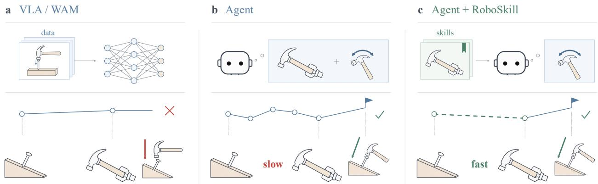  
Figure 1 RoboSkill accelerates agent execution through skill reuse. In this tilted-nail example, a VLA/WAM follows the vertical hammering strategy learned from its training data. An embodied agent reasons about both grasping and striking, while RoboSkill accelerates execution by reusing the grasping skill and reasoning only about the strike direction.

To connect skill acquisition with subsequent reuse, we introduce RoboSkill, a framework organized around an Explore, Execute, Evolve loop. The agent explores to acquire missing information, executes the task while adapting to feedback, and consolidates execution records into skills. These skills then guide subsequent exploration and execution, whose outcomes support further skill updates. However, applying these skills in a new scene still requires the agent to determine how they apply and translate their guidance into actions. Uncertain observations complicate this adaptation, while textual guidance alone leaves procedural details to be reconstructed through reasoning.

To address these challenges, we emphasize two design choices: tactile feedback during interaction and reusable code within skills. Tactile feedback, broadly including pressure and force/torque signals, complements visual observations with direct evidence of contact and collision [5, 31]. For skill reuse, we augment textual guidance with executable code. Text describes strategies and applicability conditions, while code preserves procedures that the agent can adapt to related scenes and tasks [6, 15, 25].

We evaluate RoboSkill with multiple general-purpose agents on LIBERO-10 and real robots. The results demonstrate improvements in task success and execution eficiency, with skills supporting reuse across tasks and agents. Further analyses examine the contributions of tactile feedback and reusable code, as well as the efects of successive skill updates.

Our contributions are threefold:

• We formulate an Explore, Execute, Evolve loop that connects physical interaction with skill construction and reuse. Skills acquired through execution guide subsequent exploration and execution, whose outcomes inform further updates.

• We introduce RoboSkill, a framework that implements this loop through the construction, retrieval, adaptation, and update of shared skills. Tactile feedback supports physical interaction, while reusable code complements textual guidance within skills.

• We evaluate RoboSkill in simulation and on real robots, covering task performance, cross-task transfer, cross-agent reuse, and successive skill updates. Controlled comparisons examine the roles of tactile feedback and executable code.

## 2 Related Work

Vision-Language-Action and World-Action Models Vision-language-action (VLA) models have progressed from large-scale multi-task robot policies toward increasingly generalist models trained across diverse tasks, datasets, and embodiments [2–4, 10, 11, 19, 24]. More recently, world-action models (WAMs) have incorporated predictive world modeling into robot control, using future-state prediction or joint state-action modeling to capture physical dynamics and improve action generation [1, 13, 20, 28, 29]. Despite their increasing generality, these models remain largely shaped by the data and tasks encountered during training. RoboSkill explores a complementary direction by leveraging general-purpose agents to reason and adapt during deployment, rather than relying solely on knowledge acquired through policy training.

Language-Model Agentsfor Robotics. Language models have been integrated into robotic systems in several ways. Early approaches use language models to generate executable robot programs or task plans [15, 23], while later methods generate structured spatial representations or constraints that can be converted into robot actions [8, 9]. More recent work explores several agentic formulations for robotic control. CaP-X [6] uses interactive coding agents that revise robot programs based on execution feedback. Harness VLA [30] alternates between agent reasoning, analytic primitives, and a frozen VLA for contact-rich execution. RoboClaw [14] combines autonomous data collection, policy learning, and long-horizon deployment within an agentic framework. ASPIRE [17] uses iterative robot exploration to discover, repair, and accumulate executable programs in a reusable skill library. RoboSkill instead emphasizes transferable text-and-code experience that can be retrieved and adapted across tasks and execution agents.

## 3 Method

RoboSkill equips embodied agents with a shared skill library to support an Explore–Execute–Evolve loop (figure 2). To describe how this loop supports task completion, we first provide a framework overview ( section 3.1), then introduce exploration (section 3.2) and closed-loop execution (section 3.3). Finally, we describe skill evolution (section 3.4), which closes the loop by guiding subsequent exploration.

## 3.1 Framework Overview

To begin the loop, the agent receives a task instruction, selected skills, and access to the environment through an SDK. When additional information is needed, the agent solves exploration subtasks to acquire task knowledge. The resulting knowledge guides the next execution. With this knowledge and the selected skills, the agent generates and runs code to carry out the task. This code calls the SDK to perform actions and obtain observations. The agent uses the resulting feedback to continue or revise execution. When the agent decides to end execution, it enters the evolution stage and reviews the accumulated session records and executed code to construct or update skills. These skills provide guidance for subsequent exploration and execution, closing the loop from evolution back to exploration.

## 3.2 Exploration

When task execution requires additional information, we treat acquiring that information as an exploration subtask. Its immediate goal difers from the main task, but solving it supports more reliable and eficient completion of the main task.

Exploration loop. We organize exploration subtasks around the same process used to solve the main task. The agent takes the findings and skills produced by the preceding evolution as input and uses them to guide further investigation. Solving the subtask can require multiple rounds of execution and feedback, with each round informing what to investigate next. The resulting knowledge and procedures serve as priors for the next execution of the main task.

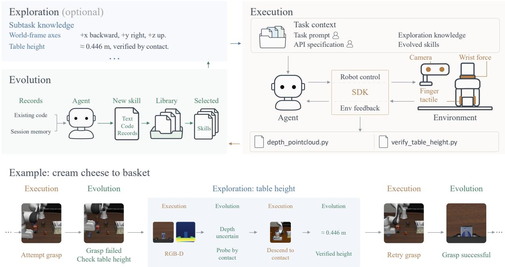  
Figure 2 The RoboSkill framework. The agent explores to acquire missing information, executes with visual and tactile feedback, and produce skills to guide the next cycle. The example illustrates a nested exploration loop that verifies table height through contact before resuming grasping.

For example, when moving cream cheese to a basket, a failed grasp can lead evolution to identify table height as an unresolved issue. The agent then explores the table height using RGB-D observations. When the depth estimate remains uncertain, it descends until contact and obtains a height of approximately 0.446 m. This finding informs the subsequent grasp attempt. Exploration thus contains its own loop of execution and review within the main task.

Exploration knowledge. We retain exploration findings as current task knowledge in the agent session, alongside the interaction records and executed code. The agent revises this knowledge as feedback resolves the exploration subgoal or reveals a need for further investigation. If the agent exits after completing exploration, the harness invokes the agent as its own reviewer to consolidate the session records and executed code into a skill package, following the evolution procedure in Section 3.4. If the agent continues in the same session, the findings remain in session context and directly support the next execution.

## 3.3 Closed-loop Execution

Building on exploration results and available skills, the agent carries out actions toward the current task and observes their outcomes. Execution may involve multiple actions and continues until the agent decides to exit.

Context. We provide the agent with the task instruction, API specifications for robot control and sensing, exploration knowledge, and selected skill packages. This context enables the agent to adapt reusable procedures to the current scene and compose them into an execution program.

Observations. Throughout this paper, tactilefeedback broadly including pressure and force/torque signals. We augment visual observations, including RGB and depth, with tactile feedback to inform the agent about physical interaction. The agent obtains these observations through API calls during execution. RGB observations reveal scene state and task progress, depth measurements support spatial estimation, and tactile feedback provides evidence of contact that may be dificult to determine from images alone. Together, these observations support assessment of action outcomes.

SDK-based interaction. We provide an SDK instead of tools so that the agent can build reusable code while interacting with the environment. The agent can compose SDK calls and data processing into executable procedures. For example, it can create depth\_pointcloud.py to convert a depth image into a point cloud and verify\_table\_height.py to verify table height by descending until contact. These procedures capture how an operation was performed and can be retained in skill packages for adaptation and reuse in subsequent tasks.

We record the interactions and executed code throughout execution. When the agent exits, these records become the input to evolution.

## 3.4 Evolution

Evolution turns execution records into reusable skills that guide subsequent exploration and execution. It consolidates the findings and procedures developed while solving both exploration subtasks and main tasks, closing the Explore–Execute–Evolve loop.

Evolution timing. In principle, each completed subtask should be summarized into a reusable skill. In practice, invoking a review after every subtask introduces substantial overhead. We therefore retain findings and execution records in the session while the task is ongoing, making them available for continued execution. When the task ends and the agent exits, we consolidate the accumulated records through a single review.

Skills. Each skill contains textual guidance, reusable code, and supporting records. The textual component summarizes the task strategy, applicability conditions, and lessons from failed attempts. The program organizes reusable procedures into a hierarchical structure. Supporting records include failure cases, full execution trajectories, and metadata. Failure cases summarize unsuccessful attempts and corrective strategies, while trajectories preserve the full sequence of actions and observations. Metadata contains a brief skill description and visual keyframes to help the agent assess relevance when selecting skills for a task.

The agent acts as its own reviewer to extract and consolidate these components from the session records and the code actually executed. If a corresponding skill already exists, the agent supplements it with the new findings and procedures; otherwise, it creates a new skill package.

Skill usage. To reuse these skills in a new task, the agent inspects their metadata and selects up to � relevant skill packages. We set � = 3 in our experiments. Compared with rule-based selection, agent selection improves first-attempt success for most evaluated models (Table 16). Following selection, we place the selected packages in the workspace of the agent assigned to the new task, making their guidance and code available for subsequent exploration and execution.

## 4 Experiments

## 4.1 Experimental Setup

Simulation Setup. We evaluate on the ten tasks in LIBERO-10 [16]. The main comparison uses four evaluation seeds per task, excluding the skill-construction seed, for 40 task–seed pairs (evaluation cells) per condition. Seed protocols for all experiments are detailed in section 6.1. Each cell has a 4 h time budget and may contain multiple episodes: the initial attempt counts as Episode 1, and each invocation of reset starts a new episode. A cell ends when the task succeeds, the agent exits, or the time budget expires.

Table 1 Main results on Libero-10.
<table><tr><td>Model / setting</td><td>Final SR ↑</td><td>1st SR ↑</td><td>SR@30m ↑</td><td>Avg. Ep. ↓</td><td>Avg. Time (min) ↓</td></tr><tr><td>GPT-6 Astra</td><td></td><td></td><td></td><td></td><td></td></tr><tr><td>Baseline</td><td>100.0%</td><td>72.5%</td><td>87.5%</td><td>1.5</td><td>18.5</td></tr><tr><td>RoboSkill</td><td>100.0%</td><td>97.5%</td><td>95.0%</td><td>1.0</td><td>17.1</td></tr><tr><td>GPT-5.6 Sol</td><td></td><td></td><td></td><td></td><td></td></tr><tr><td>Baseline</td><td>82.5%</td><td>27.5%</td><td>32.5%</td><td>9.2</td><td>94.5</td></tr><tr><td>RoboSkill</td><td>97.5%</td><td>52.5%</td><td>72.5%</td><td>2.9</td><td>35.9</td></tr><tr><td>Fable 5.1</td><td></td><td></td><td></td><td></td><td></td></tr><tr><td>Baseline</td><td>97.5%</td><td>85.0%</td><td>77.5%</td><td>2.5</td><td>34.8</td></tr><tr><td>RoboSkill</td><td>100.0%</td><td>97.5%</td><td>95.0%</td><td>1.1</td><td>12.5</td></tr><tr><td>Opus 5</td><td></td><td></td><td></td><td></td><td></td></tr><tr><td>Baseline</td><td>100.0%</td><td>60.0%</td><td>17.5%</td><td>1.9</td><td>80.9</td></tr><tr><td>RoboSkill</td><td>100.0%</td><td>80.0%</td><td>82.5%</td><td>1.4</td><td>22.3</td></tr></table>

Table 2 Main results on real-world using GPT-6 Astra.
<table><tr><td></td><td colspan="2">Easy Tasks</td><td colspan="2">Hard Tasks</td></tr><tr><td>Setting</td><td>1st SR ↑</td><td>Avg. Time (min) ↓</td><td>1st SR ↑</td><td>Avg. Time (min) ↓</td></tr><tr><td>Baseline</td><td>91.7%</td><td>20.3</td><td>80.0%</td><td>27.0</td></tr><tr><td>RoboSkill</td><td>100.0%</td><td>16.6</td><td>88.3%</td><td>23.1</td></tr></table>

Real Robot Setup. We conduct experiments across five parallel stations, each equipped with a Piper robotic arm, tactile sensors on both gripper fingers, a wrist-mounted camera, and an external overhead camera as shown in section 5. We evaluate on 12 tasks, comprising 6 easy and 6 hard tasks, with 10 trials per task. Task descriptions and dificulty assignments are provided in section 6.4. Each trial consists of a single episode with a 1 h time budget. A volunteer monitors execution on site and manually determines task success. Trials end upon success, agent-initiated termination, or expiration of the time budget.

Agents and Comparison Settings. Baseline uses no saved skills. RoboSkill selects up to three skills from successful exploration, while RoboSkill uses one same-task skill. Both use textual guidance and executable code unless otherwise specified. On the real robot, RoboSkill uses one same-task skill and is equivalent to RoboSkill . Simulation skill selections are listed in section 8. We evaluate GPT-6 Astra, GPT-5.6 Sol, Fable 5.1, and Opus 5 in simulation, and Astra and Sol on the real robot. All agents use high reasoning or thinking settings and shared tools through thin CLI adapters. Model parameters, observation and action interfaces, and time budgets are fixed within each comparison.

Evaluation Metrics. In simulation, we report final success rate (Final SR), success rate within the first episode (1st SR), and success rate within 30 minutes (SR@30m), all computed over all evaluation cells. We also report the mean number of episodes (Avg. Ep.) and mean elapsed time until success or termination (Avg. Time), both averaged over all cells. For real-robot experiments, we report Final SR over all trials and Avg. Time over successful trials only. Higher success rates and lower episode counts and times indicate better performance.

## 4.2 Efectiveness of RoboSkill

We first evaluate whether reusing skills from successful exploration improves task completion and execution eficiency. We compare RoboSkill with Baseline, which requires agents to solve tasks without saved skills, in both simulation and real-world experiments.

Table 3 Using one skill versus multiple skills on LIBERO-10. RoboSkill uses only the skill learned on the target task. RoboSkill can additionally select skills learned on other tasks, using up to three skills in total.
<table><tr><td></td><td colspan="2">GPT-6 Astra</td><td colspan="2">GPT-5.6 Sol</td><td colspan="2">Fable 5.1</td><td colspan="2">Opus 5</td></tr><tr><td>Setting</td><td>1st SR ↑</td><td>Avg. Time (min) ↓</td><td>1st SR ↑</td><td>Avg. Time (min) ↓</td><td>1st SR ↑</td><td>Avg. Time (min) ↓</td><td>1st SR ↑</td><td>Avg. Time (min) ↓</td></tr><tr><td>RoboSkill</td><td>92.5%</td><td>16.5</td><td>67.5%</td><td>39.9</td><td>90.0%</td><td>13.0</td><td>67.5%</td><td>30.4</td></tr><tr><td>RoboSkill</td><td>97.5%</td><td>17.1</td><td>52.5%</td><td>35.9</td><td>97.5%</td><td>12.5</td><td>80.0%</td><td>22.3</td></tr></table>

Table 4 Can skills transfer to a diferent task? Other-Task Skill provides one skill learned on a paired source task, with no skill from the target task. Baseline uses no skills.
<table><tr><td></td><td colspan="2">GPT-5.6 Sol</td><td colspan="2">Opus 5</td></tr><tr><td>Setting</td><td>1st SR ↑</td><td>Avg. Time (min) ↓</td><td>1st SR ↑</td><td>Avg. Time (min) ↓</td></tr><tr><td>Baseline</td><td>30.0%</td><td>86.0</td><td>60.0%</td><td>77.0</td></tr><tr><td>Other-Task Skill</td><td>44.0%</td><td>66.3</td><td>56.0%</td><td>43.5</td></tr></table>

RoboSkill improves task success and execution eficiency in both simulation and real-world experiments. In simulation, table 1 shows that final success increases from 82.5% to 97.5% for GPT-5.6 Sol and from 97.5% to 100.0% for Fable 5.1, while Astra and Opus maintain 100.0% success. All four agents also achieve higher first-episode success, completing more tasks without resets.

The benefits are especially evident in timely task completion. For Opus, SR@30m increases from 17.5% to 82.5%, and average execution time decreases from 80.9 to 22.3 minutes. Sol similarly improves SR@30m from 32.5% to 72.5% and reduces the average episode count from 9.2 to 2.9. Although Astra shows a smaller reduction in execution time, its first-episode success rises from 72.5% to 97.5%. These results demonstrate that skill reuse improves eficiency even when final success is already saturated.

On the real robot, table 2 shows consistent improvements across both dificulty levels. With Astra, success increases from 91.7% to 100.0% on easy tasks and from 80.0% to 88.3% on hard tasks. Average time over successful trials decreases from 20.3 to 16.6 minutes and from 27.0 to 23.1 minutes, respectively. Overall, RoboSkill enables more reliable and eficient task execution across agents and environments.

## 4.3 Cross-Task Skill Transfer

Transfer with a same-task skill. We examine whether supplementing a same-task skill with skills from other tasks improves execution. Table 3 compares RoboSkill , which uses a single same-task skill, with RoboSkill, which reviews skill descriptions and selects up to three skills relevant to the target task. Further details are provided in section 8.

Compared with RoboSkill , RoboSkill improves first-episode success for Astra, Fable, and Opus by 5.0, 7.5, and 12.5 percentage points, respectively. Average execution time decreases for Fable and Opus, from 13.0 to 12.5 minutes and from 30.4 to 22.3 minutes. The gains vary across metrics: Astra takes slightly longer despite higher first-episode success, while Sol reduces average time from 39.9 to 35.9 minutes but lowers first-episode success from 67.5% to 52.5%.

Overall, RoboSkill improves first-episode success for three of the four agents and reduces average execution time for three of the four agents. These results support the benefit of allowing agents to select complementary skills beyond a single same-task skill, while showing that the resulting trade-of between reliability and speed depends on the agent. Since skill selection and skill count change together, the comparison does not isolate the efect of cross-task content alone.

Table 5 Cross-agent skill transfer to Kimi K3 on LIBERO-10. We evaluate 5 seeds per task, totaling 50 cells per setting.
<table><tr><td>Setting</td><td>Final SR ↑</td><td>1st SR ↑</td><td>SR@30m ↑</td><td>Avg. Ep. ↓</td><td>Avg. Time (min)↓</td></tr><tr><td>Baseline</td><td>48.0%</td><td>12.0%</td><td>4.0%</td><td>3.50</td><td>180.8</td></tr><tr><td>RoboSkill&quot; from Astra</td><td>80.0%</td><td>58.0%</td><td>20.0%</td><td>1.33</td><td>101.2</td></tr><tr><td>RoboSkill&quot; from Sol</td><td>84.0%</td><td>42.0%</td><td>32.0%</td><td>3.56</td><td>86.5</td></tr><tr><td>RoboSkill&quot; from Fable</td><td>92.0%</td><td>66.0%</td><td>60.0%</td><td>2.50</td><td>54.9</td></tr><tr><td>RoboSkill- from Opus</td><td>94.0%</td><td>58.0%</td><td>48.0%</td><td>1.84</td><td>52.4</td></tr></table>

Table 6 Cross-agent transfer on real-world easy tasks. Skills transfer from GPT-6 Astra to GPT-5.6 Sol.
<table><tr><td>Setting</td><td>1st SR ↑</td><td>Avg. Time (min) ↓</td></tr><tr><td>Baseline</td><td>13.3%</td><td>34.8</td></tr><tr><td>Skills from Astra</td><td>70.0%</td><td>30.5</td></tr></table>

Transfer without a same-task skill. Table 4 evaluates a skill generated on another task against Baseline. The source–target task pairings and skill assignment protocol are detailed in section 6.3. For Sol, first-episode success increases from 30.0% to 44.0%, while average time decreases from 86.0 to 66.3 minutes. For Opus, average time decreases from 77.0 to 43.5 minutes, although first-episode success declines from 60.0% to 56.0%. These results show that skills can provide useful guidance beyond their source tasks, with time savings for both agents, while improvements in first-episode success depend on the agent.

## 4.4 Cross-Agent Skill Transfer

Cross-agent transfer in simulator. Table 5 shows that skills from all four source agents improve Kimi K3 over Baseline under the RoboSkill setting. First-episode success rises from 12.0% to 42.0–66.0%, while average execution time decreases from 180.8 minutes to 52.4–101.2 minutes. Skills from Fable yield the highest first-episode success at 66.0%, whereas skills from Opus achieve the shortest average time at 52.4 minutes. The source agent that provides the highest first-episode success therefore difers from the one that provides the fastest execution. These results demonstrate that skills can be reused across agents, although the magnitude of the benefit depends on the skill source.

Cross-agent transfer on the real robot. We further evaluate skill transfer from GPT-6 Astra to GPT-5.6 Sol on six easy real-world tasks, with five trials per task. Transferred skills increase success from 13.3% to 70.0%, while average time over successful trials decreases from 34.8 to 30.5 minutes. These results extend the evidence for cross-agent skill reuse to physical execution, with the largest gain appearing in task success.

## 4.5 Skill Evolution

Skill evolution in simulation. We evaluate successive skill updates using RoboSkill on seeds 100–104 rather than the original seeds, with all conditions rerun on the new seed set. The results therefore difer from those in the main table. Table 7 shows skill updates can improve performance beyond the initial skill, but the gains are not monotonic. For Sol, the first update leaves first-episode success unchanged and slightly increases average time. The second update achieves the best results across all metrics, raising first-episode success from 58.0% to 70.0% and reducing average time from 47.1 to 30.2 minutes relative to the initial skill.

Opus reaches its best performance after the first update, with first-episode success increasing from 78.0% to 82.0% and average time decreasing from 22.0 to 19.9 minutes. The second update maintains 100.0% final success but reduces SR@30m to 74.0% and increases average time to 25.3 minutes. Overall, further successful exploration improves skill efectiveness, although the gains are not monotonic across successive updates.

Table 7 Iterative skill refinement on LIBERO-10. Baseline uses no saved skills. RoboSkill− uses an initial skill constructed from successful exploration on the target task. Each update revises that skill through further successful exploration by the same model.
<table><tr><td>Model / setting</td><td>Final SR ↑</td><td>1st SR ↑</td><td>SR@30m ↑</td><td> $\operatorname { A v g . E p . }$  ↓</td><td>Avg. Time (min) ↓</td></tr><tr><td colspan="6">GPT-5.6 Sol</td></tr><tr><td>Baseline</td><td>86.0%</td><td>30.0%</td><td>38.0%</td><td>9.0</td><td>80.3</td></tr><tr><td>RoboSkill</td><td>96.0%</td><td>58.0%</td><td>66.0%</td><td>3.7</td><td>47.1</td></tr><tr><td>RoboSkill- (1st update)</td><td>94.0%</td><td>58.0%</td><td>68.0%</td><td>3.7</td><td>49.3</td></tr><tr><td>RoboSkill- (2nd update)</td><td>98.0%</td><td>70.0%</td><td>82.0%</td><td>3.1</td><td>30.2</td></tr><tr><td colspan="6">Opus 5</td></tr><tr><td>Baseline</td><td>98.0%</td><td>64.0%</td><td>58.0%</td><td>2.5</td><td>55.9</td></tr><tr><td>RoboSkill</td><td>100.0%</td><td>78.0%</td><td>82.0%</td><td>1.3</td><td>22.0</td></tr><tr><td>RoboSkill~ (1st update)</td><td>100.0%</td><td>82.0%</td><td>86.0%</td><td>1.3</td><td>19.9</td></tr><tr><td>RoboSkill- (2nd update)</td><td>100.0%</td><td>80.0%</td><td>74.0%</td><td>1.3</td><td>25.3</td></tr></table>

Table 8 Skill evolution on real-world hard tasks using GPT-6 Astra.
<table><tr><td>Setting</td><td>1st SR Avg. Time ↑</td></tr><tr><td>Baseline 80.0%</td><td>(min) ↓ 27.0</td></tr><tr><td>RoboSkill 88.3%</td><td>23.1</td></tr><tr><td>RoboSkill&quot; (1st update)</td><td>93.3% 26.2</td></tr></table>

Skill evolution on the real robot. On the six hard real-world tasks as shown in table 8, updating the skill used by RoboSkill− with GPT-6 Astra increases success from 88.3% to 93.3%. However, average time over successful trials rises from 23.1 to 26.2 minutes. The update therefore improves task completion without improving average successful execution time. These results demonstrate the value of iterative skill refinement for improving real-world task completion.

## 4.6 Ablation Studies

Executable Code. Table 9 shows that including executable code generally improves performance over text-only skills. Code reduces average execution time for all four agents, while improving or preserving first-episode success for three of them. Sol benefits the most: first-episode success increases from 15.0% to 67.5%, and average time decreases from 67.1 to 39.9 minutes. Astra improves both metrics, while Fable maintains its first-episode success rate and completes tasks faster. Opus also runs faster, despite a small decline in first-episode success from 70.0% to 67.5%. Overall, these results favor retaining code alongside textual guidance, with benefits across most agents.

Tactile Input. We evaluate GPT-6 Astra with and without tactile input during exploration. In simulation, the w/o tactile condition removes all force-related information and the state of gripper. On the real robot, it removes tactile-sensor observations. All other settings remain unchanged.

Table 10 shows that tactile input reduces average execution time from 25.4 to 15.9 minutes, despite a slight decrease in first-episode success from 82.0% to 78.0%. These results highlight its benefit for execution eficiency.

On the real-robot Remove Test Tube task, we conduct 10 trials per condition. Tactile input increases success from 80.0% to 90.0% and reduces average successful execution time from 33.6 to 20.0 minutes. These results support the value of tactile input during exploration for reliable and timely task completion.

Table 9 Efect of executable code on LIBERO-10. The $\mathbf { w } / \mathbf { o }$ Code variant removes code from the skill provided to RoboSkill while retaining its textual guidance.
<table><tr><td></td><td colspan="2">GPT-6 Astra</td><td colspan="2">GPT-5.6 Sol</td><td colspan="2">Fable 5.1</td><td colspan="2">Opus 5</td></tr><tr><td>Setting</td><td>1st SR ↑</td><td>Avg. Time (min)↓</td><td>1st SR ↑</td><td>Avg. Time (min)↓</td><td>1st SR ↑</td><td>Avg. Time (min) ↓</td><td>1st SR ↑</td><td>Avg. Time (min)↓</td></tr><tr><td>RoboSkill-</td><td></td><td></td><td></td><td></td><td></td><td></td><td></td><td></td></tr><tr><td>(w/o Code)</td><td>90.0%</td><td>21.1</td><td>15.0%</td><td>67.1</td><td>90.0%</td><td>16.1</td><td>70.0%</td><td>32.1</td></tr><tr><td>RoboSkill-</td><td>92.5%</td><td>16.5</td><td>67.5%</td><td>39.9</td><td>90.0%</td><td>13.0</td><td>67.5%</td><td>30.4</td></tr></table>

Table 10 Importance of tactile input during exploration using GPT-6 Astra. In simulation, we evaluate 5 seeds per task, totaling 50 cells per setting.
<table><tr><td></td><td colspan="5">LIBERO-10</td><td colspan="2">Real Robot</td></tr><tr><td>Setting</td><td>Final SR ↑</td><td>1st SR ↑</td><td>SR@30m ↑</td><td>Avg. Ep. ↓</td><td>Avg. Time (min) ↓</td><td>1st SR ↑</td><td>Avg. Time (min) ↓</td></tr><tr><td>With tactile</td><td>100%</td><td>78%</td><td>94%</td><td>1.42</td><td>15.93</td><td>90%</td><td>20.00</td></tr><tr><td>w.o. tactile</td><td>100%</td><td>82%</td><td>74%</td><td>1.20</td><td>25.35</td><td>80%</td><td>33.63</td></tr></table>

Together, these results support the Explore–Execute–Evolve loop of RoboSkill: physical interaction produces reusable skills that improve subsequent exploration and execution, including across tasks and agents. Further executions can refine skills, while tactile feedback and code contribute to more efective interaction and reuse. The benefits observed in simulation and on real robots demonstrate the value of accumulating and adapting skills rather than solving each task from scratch.

This supplement describes the implementation of hardware setup (section 5) skill reuse (??), experimental protocols (section 6), detailed results (section 7), and skill selection analyses (section 8).

## 5 Hardware Setup

Figure 3 shows the real-robot hardware setup. All real-robot experiments use only the right arm, together with its wrist-mounted camera and tactile-equipped gripper. The left arm is visible in the photograph but is not used in the experiments. An external overhead camera provides a third-person view of the workspace.

## 6 Experimental Protocols

## 6.1 Evaluation Seeds

We use diferent seed sets depending on the evaluation objective. For the main comparison and same-task skill ablations, skills are constructed using seed 0 and evaluated on seeds 1–4. We exclude seed 0 from both Baseline and skill-assisted conditions to measure skill reuse under diferent initial conditions, yielding 40 task–seed pairs per setting.

Cross-task and cross-agent transfer experiments use all five seeds, 0–4, yielding 50 pairs per setting. Cross-task transfer supplies skills from a diferent task, whereas cross-agent transfer supplies skills from a diferent agent. The latter evaluates transfer across agents without excluding the skill-construction seed. Thus, the 4-seed results measure reuse on held-out initial conditions, while the 5-seed results cover the full seed set. Table 11 reports Baseline results under both protocols.

Skill-refinement experiments use a separate evaluation set, seeds 100–104, with all conditions, including Baseline, evaluated on these seeds.

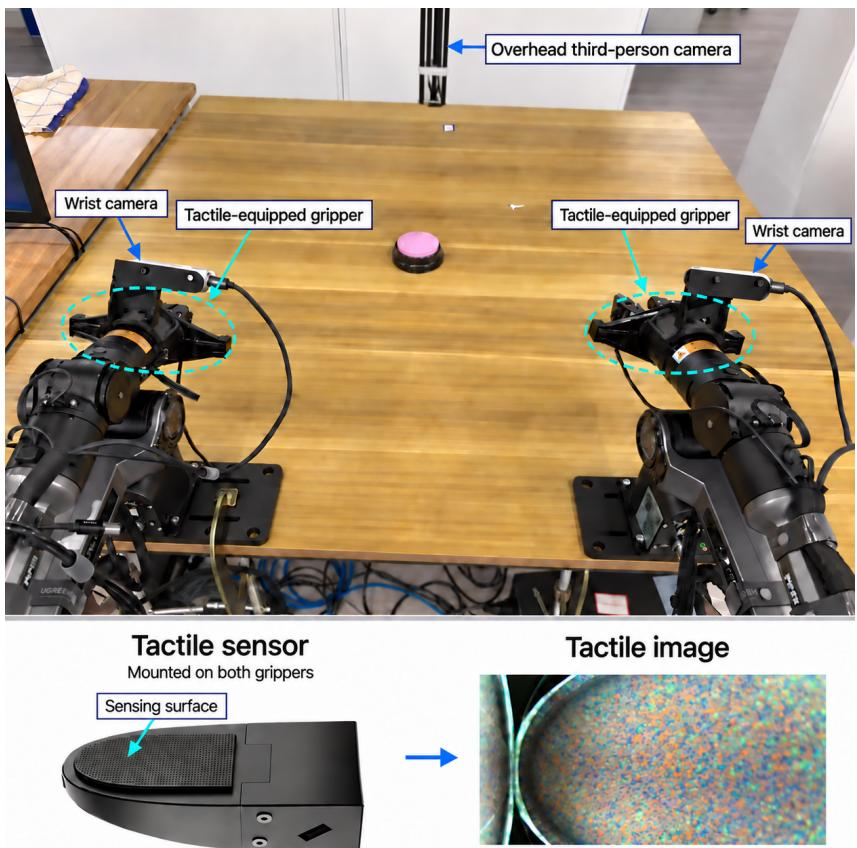  
Figure 3 Real-robot hardware setup. Only the right arm is used in the experiments, together with its wrist-mounted camera and tactile-equipped gripper. The left arm is shown but is not used. The upper annotation indicates the support for the overhead third-person camera, which is outside the photographed field of view. The lower panel illustrates the tactile sensor, its sensing surface, and an example tactile image.

Table 11 Baseline results under the two seed protocols. The 4-seed protocol excludes the skill-construction seed and use seed 1-4 for each task; the 5-seed protocol includes all seeds 0–4.
<table><tr><td>Model</td><td>Final SR ↑</td><td>1st SR ↑</td><td>SR@30m ↑</td><td>Avg. Ep. ↓</td><td>Avg. Time (min) ↓</td></tr><tr><td>4 seeds per task: 40 cells</td><td></td><td></td><td></td><td></td><td></td></tr><tr><td>GPT-6 Astra</td><td>100.0%</td><td>72.5%</td><td>87.5%</td><td>1.50</td><td>18.48</td></tr><tr><td>GPT-5.6 Sol</td><td>82.5%</td><td>27.5%</td><td>32.5%</td><td>9.20</td><td>94.50</td></tr><tr><td>Fable 5.1</td><td>97.5%</td><td>85.0%</td><td>77.5%</td><td>2.53</td><td>34.80</td></tr><tr><td>Opus 5</td><td>100.0%</td><td>60.0%</td><td>17.5%</td><td>1.93</td><td>80.90</td></tr><tr><td>5 seeds per task: 50 cells</td><td></td><td></td><td></td><td></td><td></td></tr><tr><td>GPT-6 Astra</td><td>100.0%</td><td>74.0%</td><td>90.0%</td><td>1.46</td><td>17.82</td></tr><tr><td>GPT-5.6 Sol</td><td>86.0%</td><td>30.0%</td><td>36.0%</td><td>7.94</td><td>86.47</td></tr><tr><td>Fable 5.1</td><td>98.0%</td><td>84.0%</td><td>78.0%</td><td>2.32</td><td>31.90</td></tr><tr><td>Opus 5</td><td>100.0%</td><td>60.0%</td><td>18.0%</td><td>1.82</td><td>76.64</td></tr></table>

## 6.2 Simulation Tasks and Evaluation

We evaluate on the ten tasks in LIBERO-10. Each evaluation cell is a task–seed pair with a four-hour budget. The first attempt is Episode 1; each agent invocation of reset starts a new episode. Evaluation ends on success, agent-initiated termination, or budget expiration. Skills are constructed through successful exploration using seeds outside the evaluation set. The skill evolution experiment uses evaluation seeds 100–104, with all compared conditions rerun on that set.

Final SR, 1st SR, and SR@30m denote success by termination, within the first episode, and within 30 minutes, respectively. These rates are computed over evaluation cells. Avg. Ep. and Avg. Time average the number of episodes and elapsed time until success or termination over all cells, including failures. Consequently, a shorter Avg. Time alone does not establish faster successful completion, since an unsuccessful agent can

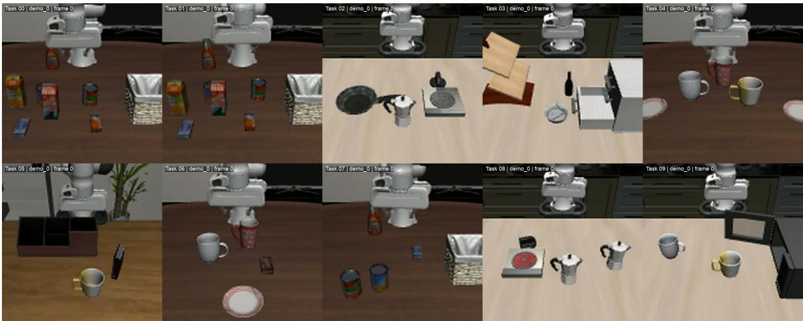  
Figure 4 Example initial states of the ten LIBERO-10 tasks. Task IDs are used consistently in the cross-task pairings and skill selection tables. Each image illustrates one initial state.

## 6.3 Cross-Task and Cross-Agent Transfer

For cross-task transfer, we use five fixed source–target pairs:

$$
( T _ { 0 } , T _ { 1 } ) , \quad ( T _ { 2 } , T _ { 8 } ) , \quad ( T _ { 3 } , T _ { 5 } ) , \quad ( T _ { 4 } , T _ { 9 } ) , \quad ( T _ { 6 } , T _ { 7 } ) .
$$

Transfer is evaluated in both directions, yielding ten directed combinations. For example, evaluation on $T _ { 0 }$ uses a skill constructed on $T _ { 1 . }$ , and evaluation on $T _ { 1 }$ uses a skill constructed on $T _ { 0 }$ . The Other-Task Skill condition provides the assigned source skill without a target-task skill; Baseline provides no saved skills.

For cross-agent transfer in simulation, Kimi K3 receives a single same-task skill constructed by Astra, Sol, Fable, or Opus. On the real robot, GPT-5.6 Sol receives skills constructed by GPT-6 Astra and is evaluated on the six easy tasks, with five trials per task.

## 6.4 Real-Robot Tasks and Evaluation

Experiments use five parallel stations, each equipped with a Piper arm, a wrist-mounted camera, and an external overhead camera. Each trial contains one episode with a one-hour budget. An on-site volunteer determines task success. Trials end on success, agent-initiated termination, or budget expiration. Astra uses ten trials per task; Sol uses five trials per easy task.

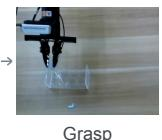  
Pull

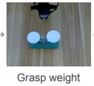

## Easy tasks

(a) Press button  
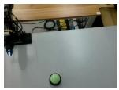  
Setup

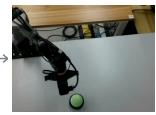  
Approach

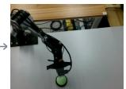  
Contact  
Press

(b) Lift paper bag  

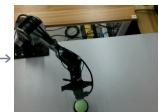

  
Reach handle

  
Setup

## Hard tasks

(g) Fold towel  
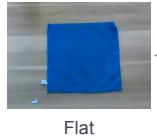  
Grasp handle

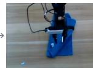

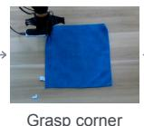  
Grasp corner  
Folded

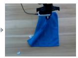  
Fold over

(h) Stack storage bins  
  
Lift bag

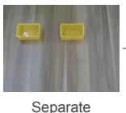  
(c) Open drawer

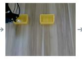

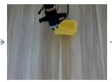  
Separate  
Grasp rim  
Align bins

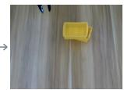

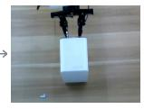  
Stacked  
Grasp

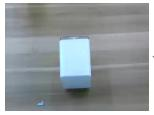  
Closed

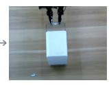

(i) Remove string from needle  
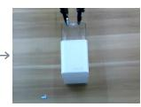  
Open

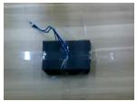  
Threaded

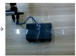  
Grasp string

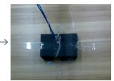  
(d) Remove test tube  
Pull through

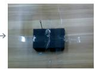

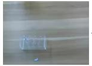  
Removed  
Approach

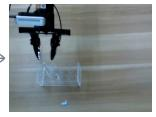  
In rack

(j) Tilt balance using a weight  
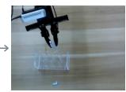  
Lift

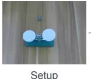

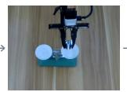  
Place weight

(e) Sort socks: white left, black right  
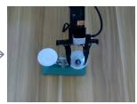  
Tilted

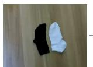  
Initial order

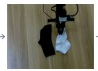  
Grasp white

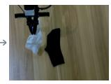  
Move left

  
Sorted

(k) Stack paper cups  
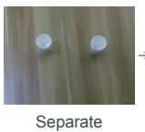  
(f) Move duck and plate to black region

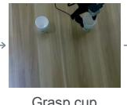  
Grasp cup

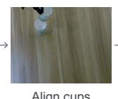  
Align cups

  
Stacked

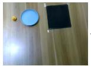  
(l) Insert battery into remote control  
Setup

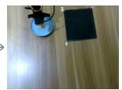  
Place duck

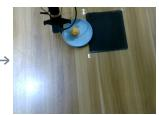  
Move plate

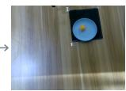  
In target

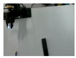  
Setup

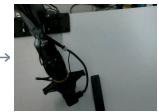  
Grasp battery

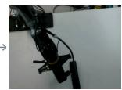  
Move to remote

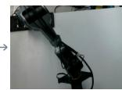  
Insertion

Figure 5 Execution stages of the 12 reported real-robot tasks. Panels (a)–(f) show easy tasks and panels (g)–(l) show hard tasks. Task objectives are listed in table 12.  
Table 12 Real-robot task objectives. Letters correspond to the panels in figure 5.
<table><tr><td>ID</td><td>Task</td><td>Objective</td></tr><tr><td colspan="3">Easy tasks</td></tr><tr><td>(a)</td><td>Press button</td><td>Approach and press the button to activate it.</td></tr><tr><td>(b)</td><td>Lift paper bag</td><td>Grasp a handle and lift the bag from the table.</td></tr><tr><td>(c)</td><td>Open drawer</td><td>Grasp the drawer and pull it outward.</td></tr><tr><td>(d)</td><td>Remove test tube</td><td>Grasp a test tube and extract it from the rack.</td></tr><tr><td>(e)</td><td>Sort socks</td><td>Arrange white socks on the left and black socks on the right.</td></tr><tr><td>(f)</td><td>Move duck and plate</td><td>Relocate both objects into the designated black region.</td></tr><tr><td colspan="3">Hard tasks</td></tr><tr><td>(g)</td><td>Fold towel</td><td>Grasp and fold the towel, controlling deformation and alignment</td></tr><tr><td>(h)</td><td>Stack storage bins</td><td>Lift one bin and align it with another to form a stable stack.</td></tr><tr><td>(i)</td><td>Remove string from needle</td><td>Grasp the string and guide it out of the needle eye.</td></tr><tr><td>(j)</td><td>Tilt balance using a weight</td><td>Place a weight on the balance to change its tilt direction.</td></tr><tr><td>(k)</td><td>Stack paper cups</td><td>Grasp one cup and align it with another to nest the cups.</td></tr><tr><td>(1)</td><td>Insert battery into remote control</td><td>Grasp the battery, align it with the slot, and insert it.</td></tr></table>

## 7 Detailed Experimental Results

## 7.1 Task-Wise Real-Robot Results

Table 13 gives the per-task Astra results.

Table 13 Task-wise Astra performance before and after exploration. Baseline timing uses the separate successful-sample records. Setting: 12-task subset (six easy and six hard), ten trials per task for success rates, 1 h per trial.
<table><tr><td>Task</td><td colspan="2">Baseline</td><td colspan="2">RoboSkill</td></tr><tr><td></td><td>Final SR ↑</td><td>Avg. Time (min) ↓</td><td>Final SR ↑</td><td>Avg. Time (min) ↓</td></tr><tr><td>Easy tasks</td><td></td><td></td><td></td><td></td></tr><tr><td>Press button</td><td>10/10</td><td>17.68</td><td>10/10</td><td>9.10</td></tr><tr><td>Lift paper bag</td><td>10/10</td><td>19.58</td><td>10/10</td><td>15.70</td></tr><tr><td>Open drawer</td><td>8/10</td><td>22.53</td><td>10/10</td><td>15.40</td></tr><tr><td>Remove test tube</td><td>9/10</td><td>20.00</td><td>10/10</td><td>16.00</td></tr><tr><td>Sort white socks left and black socks right</td><td>10/10</td><td>20.92</td><td>10/10</td><td>21.40</td></tr><tr><td>Move duck and plate to black region</td><td>8/10</td><td>21.93</td><td>10/10</td><td>21.90</td></tr><tr><td>Hard tasks</td><td></td><td></td><td></td><td></td></tr><tr><td>Fold towel</td><td>10/10</td><td>24.02</td><td>10/10</td><td>23.50</td></tr><tr><td>Stack storage bins</td><td>9/10</td><td>18.88</td><td>10/10</td><td>19.60</td></tr><tr><td>Remove string from needle</td><td>7/10</td><td>37.73</td><td>5/10</td><td>37.40</td></tr><tr><td>Tilt balance using a weight</td><td>8/10</td><td>23.15</td><td>10/10</td><td>16.50</td></tr><tr><td>Stack paper cups</td><td>7/10</td><td>32.63</td><td>9/10</td><td>24.00</td></tr><tr><td>Insert battery into remote control</td><td>7/10</td><td>29.83</td><td>9/10</td><td>25.22</td></tr><tr><td>Overall</td><td>85.8%</td><td>23.29</td><td>94.2%</td><td>19.65</td></tr></table>

Table 14 reports the six easy-task results for transfer from Astra to Sol. Transferred skills enable successes on all six tasks, including three tasks with no recorded Baseline successes.

Table 14 Task-wise GPT-5.6 Sol performance before and after receiving skills constructed by Astra. Avg. Time uses successful trials only. Setting: six easy tasks, five trials per task, tactile input, and a 1 h limit per trial.

<table><tr><td>Task</td><td colspan="2">Baseline</td><td colspan="2">RoboSkill from Astra</td></tr><tr><td></td><td>Final SR ↑</td><td>Avg. Time (min) ↓</td><td>Final SR ↑</td><td>Avg. Time (min) ↓</td></tr><tr><td>Press button</td><td>0/5</td><td>一</td><td>5/5</td><td>25.40</td></tr><tr><td>Lift paper bag</td><td>2/5</td><td>27.00</td><td>5/5</td><td>19.60</td></tr><tr><td>Open drawer</td><td>1/5</td><td>27.00</td><td>3/5</td><td>34.33</td></tr><tr><td>Remove test tube</td><td>1/5</td><td>58.00</td><td>3/5</td><td>35.67</td></tr><tr><td>Sort white socks left and black socks right</td><td>0/5</td><td>一</td><td>2/5</td><td>29.00</td></tr><tr><td>Move duck and plate to black region</td><td>0/5</td><td>一</td><td>3/5</td><td>49.00</td></tr><tr><td>Overall</td><td>13.3%</td><td>34.75</td><td>70.0%</td><td>30.48</td></tr></table>

## Skill Selection Analysis

## 8.1 Selected Skills

Table 15 compares a fixed task mapping with agent-selected skill sets. Each entry lists source-task IDs in selection order. The agent may select up to three skills. All four models retain the same-task skill as the first entry for every target task; the observed selection behavior therefore augments a same-task skill with skills from other tasks.

Table 15 Agent-selected versus rule-based Top-K skill sets. Each cell lists the source-task skills selected for the target task. Bold agent-selected cells difer from the fixed rule in membership or order.
<table><tr><td>Target task</td><td>Rule</td><td>GPT-5.6 Sol</td><td>Opus 5</td><td>Fable 5.1</td><td>GPT-6 Astra</td></tr><tr><td>T0: Two cans to basket</td><td>[T0,T7,T1]</td><td>[T0,T7,T1]</td><td>[T0,T7,T1]</td><td>[T0,T7,T1]</td><td>[T0,T7]</td></tr><tr><td>T1: Cheese and butter to basket</td><td>[T1,T7,T0]</td><td>[T1,T7]</td><td>[T1,T7,T0]</td><td>[T1,T7,T0]</td><td>[T1,T7]</td></tr><tr><td>T2: Turn on stove; place moka pot</td><td>[T2,T8]</td><td>[T2,T8]</td><td>[T2,T8]</td><td>[T2,T8]</td><td>[T2,T8]</td></tr><tr><td>T3: Black bowl to drawer; close</td><td>[T3,T9]</td><td>[T3,T9,T5]</td><td>[T3,T9]</td><td>[T3,T9]</td><td>[T3]</td></tr><tr><td>T4: Two cups to left/right plates</td><td>[T4,T6,T9]</td><td>[T4,T6]</td><td>[T4,T6]</td><td>[T4,T6]</td><td>[T4,T6]</td></tr><tr><td>T5: Book to rear caddy slot</td><td>[T5]</td><td>[T5,T3]</td><td>[T5,T7]</td><td>[T5,T3]</td><td>[T5]</td></tr><tr><td>T6: White cup to plate; pud- ding right</td><td>[T6,T4,T0]</td><td>[T6,T4]</td><td>[T6,T4]</td><td>[T6,T4]</td><td>[T6,T4]</td></tr><tr><td>T7: Soup can and cheese to bas- ket</td><td>[T7,T1,T0]</td><td>[T7,T0,T1]</td><td>[T7,T1,T0]</td><td>[T7,T0,T1]</td><td>[T7,T1,T0]</td></tr><tr><td>T8: Two moka pots to stove</td><td>[T8,T2,T0]</td><td>[T8,T2]</td><td>[T8,T2]</td><td>[T8,T2]</td><td>[T8,T2]</td></tr><tr><td>T9: Cup to microwave; close</td><td>[T9,T3,T4]</td><td>[T9,T4,T3]</td><td>[T9,T3]</td><td>[T9,T3,T4]</td><td>[T9]</td></tr></table>

All four models omit the third rule-selected skill for T4, T6, and T8. The mean number of selected skills decreases from 2.6 under the fixed rule to 2.4, 2.3, 2.4, and 1.8 for Sol, Opus, Fable, and Astra, respectively. Astra selects only the same-task skill for T3, T5, and T9. Selection also adds skills: for T5, Sol and Fable include T3, while Opus includes T7, although the fixed rule includes only T5.

## 8.2 Selection Performance and Interpretation

Table 16 compares the resulting performance. Agent selection improves first-episode success for Astra, Fable, and Opus, but reduces it for Sol. Average time decreases for Astra and Opus and increases for Sol and Fable. Agent selection therefore does not dominate the fixed rule across all models and metrics.

Table 16 Rule-based versus agent-selected Top-K performance. Δ is the change from rule-based to agent-selected Top-K (percentage points for rates and relative percent otherwise). Bold marks the better non-tied value within each model and metric.
<table><tr><td>Model / setting</td><td>Final SR ↑</td><td>1st SR ↑</td><td>SR@30m ↑</td><td>Avg. Ep. ↓</td><td>Avg. Time (min) ↓</td></tr><tr><td>GPT-6 Astra</td><td></td><td></td><td></td><td></td><td></td></tr><tr><td>Rule-based Top-K</td><td>100%</td><td>87.5%</td><td>85%</td><td>1.175</td><td>19.2</td></tr><tr><td>Agent-selected Top-K</td><td>100%</td><td>97.5%</td><td>95%</td><td>1.025</td><td>17.1</td></tr><tr><td>∆ agent vs. rule</td><td>+0 pp</td><td>+10 pp</td><td>+10 pp</td><td>-12.8%</td><td>-11.2%</td></tr><tr><td>GPT-5.6 Sol</td><td></td><td></td><td></td><td></td><td></td></tr><tr><td>Rule-based Top-K</td><td>97.5%</td><td>57.5%</td><td>70%</td><td>3.425</td><td>35.4</td></tr><tr><td>Agent-selected Top-K</td><td>97.5%</td><td>52.5%</td><td>72.5%</td><td>2.925</td><td>35.9</td></tr><tr><td>∆ agent vs. rule</td><td>+0 pp</td><td>-5 pp</td><td>+2.5 pp</td><td>-14.6%</td><td>+1.2%</td></tr><tr><td>Fable 5.1</td><td></td><td></td><td></td><td></td><td></td></tr><tr><td>Rule-based Top-K</td><td>100%</td><td>95%</td><td>97.5%</td><td>1.050</td><td>11.2</td></tr><tr><td>Agent-selected Top-K</td><td>100%</td><td>97.5%</td><td>95%</td><td>1.075</td><td>12.5</td></tr><tr><td>∆ agent vs. rule</td><td>+0 pp</td><td>+2.5 pp</td><td>-2.5 pp</td><td>+2.4%</td><td>+12.3%</td></tr><tr><td>Opus 5</td><td></td><td></td><td></td><td></td><td></td></tr><tr><td>Rule-based Top-K</td><td>100%</td><td>62.5%</td><td>77.5%</td><td>1.825</td><td>27.1</td></tr><tr><td>Agent-selected Top-K</td><td>100%</td><td>80%</td><td>82.5%</td><td>1.375</td><td>22.3</td></tr><tr><td>∆ agent vs. rule</td><td>+0 pp</td><td>+17.5 pp</td><td>+5 pp</td><td>-24.7%</td><td>-17.9%</td></tr></table>

The selection lists document which packages are made available to the agent. They do not establish which code or textual components are subsequently used, or the contribution of each selected skill. Since skill count and membership can change together, this comparison also does not isolate the efect of skill count from that of skill relevance.

## 9 Conclusion

We presented RoboSkill, a framework that connects skill acquisition and reuse through an Explore, Execute, Evolve loop. The agent reuses skills to guide subsequent exploration and execution, then updates them from new outcomes. Tactile feedback reduces interaction uncertainty, while reusable code reduces reasoning overhead during skill reuse. Experiments on LIBERO-10 and real robots demonstrate improved success rates and execution eficiency, with skills supporting reuse across tasks and agents.

## References

[1] Hongzhe Bi, Hengkai Tan, Shenghao Xie, Zeyuan Wang, Shuhe Huang, Haitian Liu, Ruowen Zhao, Yao Feng, Chendong Xiang, Yinze Rong, et al. Motus: A unified latent action world model. In CVPR, 2026.

[2] Kevin Black, Noah Brown, Danny Driess, Adnan Esmail, Michael Equi, Chelsea Finn, Niccolo Fusai, Lachy Groom, Karol Hausman, Brian Ichter, et al. �0: A vision-language-action flow model for general robot control. arXiv preprint, 2024.

[3] Anthony Brohan, Noah Brown, Justice Carbajal, Yevgen Chebotar, Joseph Dabis, Chelsea Finn, Keerthana Gopalakrishnan, Karol Hausman, Alex Herzog, Jasmine Hsu, et al. Rt-1: Robotics transformer for real-world control at scale. arXiv preprint, 2022.

[4] Anthony Brohan, Noah Brown, Justice Carbajal, Yevgen Chebotar, Xi Chen, Krzysztof Choromanski, Tianli Ding, Danny Driess, Avinava Dubey, Chelsea Finn, et al. Rt-2: Vision-language-action models transfer web knowledge to robotic control. arXiv preprint, 2023.

[5] Roberto Calandra, Andrew Owens, Dinesh Jayaraman, Justin Lin, Wenzhen Yuan, Jitendra Malik, Edward H Adelson, and Sergey Levine. More than a feeling: Learning to grasp and regrasp using vision and touch. RA-L, 2018.

[6] Letian Fu, Justin Yu, Karim El-Refai, Ethan Kou, Haoru Xue, Huang Huang, Wenli Xiao, Guanzhi Wang, Dantong Niu, Fei-Fei Li, et al. Cap-x: A framework for benchmarking and improving coding agents for robot manipulation. arXiv preprint, 2026.

[7] Wenlong Huang, Fei Xia, Ted Xiao, Harris Chan, Jacky Liang, Pete Florence, Andy Zeng, Jonathan Tompson, Igor Mordatch, Yevgen Chebotar, et al. Inner monologue: Embodied reasoning through planning with language models. arXiv preprint, 2022.

[8] Wenlong Huang, Chen Wang, Ruohan Zhang, Yunzhu Li, Jiajun Wu, and Li Fei-Fei. Voxposer: Composable 3d value maps for robotic manipulation with language models. arXiv preprint, 2023.

[9] Wenlong Huang, Chen Wang, Yunzhu Li, Ruohan Zhang, and Li Fei-Fei. Rekep: Spatio-temporal reasoning of relational keypoint constraints for robotic manipulation. arXiv preprint, 2024.

[10] Physical Intelligence, Kevin Black, Noah Brown, James Darpinian, Karan Dhabalia, Danny Driess, Adnan Esmail, Michael Equi, Chelsea Finn, Niccolo Fusai, Manuel Y. Galliker, Dibya Ghosh, Lachy Groom, Karol Hausman, Brian Ichter, Szymon Jakubczak, Tim Jones, Liyiming Ke, Devin LeBlanc, Sergey Levine, Adrian Li-Bell, Mohith Mothukuri, Suraj Nair, Karl Pertsch, Allen Z. Ren, Lucy Xiaoyang Shi, Laura Smith, Jost Tobias Springenberg, Kyle Stachowicz, James Tanner, Quan Vuong, Homer Walke, Anna Walling, Haohuan Wang, Lili Yu, and Ury Zhilinsky. � : a vision-language-action model with open-world generalization, 2025.

[11] Moo Jin Kim, Karl Pertsch, Siddharth Karamcheti, Ted Xiao, Ashwin Balakrishna, Suraj Nair, Rafael Rafailov, Ethan Foster, Grace Lam, Pannag Sanketi, et al. Openvla: An open-source vision-language-action model. arXiv preprint, 2024.

[12] Moo Jin Kim, Yihuai Gao, Tsung-Yi Lin, Yen-Chen Lin, Yunhao Ge, Grace Lam, Percy Liang, Shuran Song, Ming-Yu Liu, Chelsea Finn, et al. Cosmos policy: Fine-tuning video models for visuomotor control and planning. arXiv preprint, 2026.

[13] Lin Li, Qihang Zhang, Yiming Luo, Shuai Yang, Ruilin Wang, Fei Han, Mingrui Yu, Zelin Gao, Nan Xue, Xing Zhu, et al. Causal world modeling for robot control. arXiv preprint, 2026.

[14] Ruiying Li, Yunlang Zhou, YuYao Zhu, Kylin Chen, Jingyuan Wang, Sukai Wang, Kongtao Hu, Minhui Yu, Bowen Jiang, Zhan Su, et al. Roboclaw: An agentic framework for scalable long-horizon robotic tasks. arXiv preprint, 2026.

[15] Jacky Liang, Wenlong Huang, Fei Xia, Peng Xu, Karol Hausman, Brian Ichter, Pete Florence, and Andy Zeng. Code as policies: Language model programs for embodied control. In ICRA, 2023.

[16] Bo Liu, Yifeng Zhu, Chongkai Gao, Yihao Feng, Qiang Liu, Yuke Zhu, and Peter Stone. Libero: Benchmarking knowledge transfer for lifelong robot learning. NIPS, 2023.

[17] Runyu Lu, Yubo Wu, Ethan Kou, Letian Fu, Wenli Xiao, Ajay Mandlekar, Yinzhen Xu, Guanya Shi, Ken Goldberg, Ang Chen, Mosharaf Chowdhury, Yuke Zhu, Linxi Fan, and Guanzhi Wang. ASPIRE: Agentic /skills discovery for robotics. arXiv preprint, 2026.

[18] NVIDIA, Johan Bjorck, Nikita Cherniadev Fernando Castañeda, Xingye Da, Runyu Ding, Linxi "Jim" Fan, Yu Fang, Dieter Fox, Fengyuan Hu, Spencer Huang, Joel Jang, Zhenyu Jiang, Jan Kautz, Kaushil Kundalia, Lawrence Lao, Zhiqi Li, Zongyu Lin, Kevin Lin, Guilin Liu, Edith Llontop, Loic Magne, Ajay Mandlekar, Avnish Narayan, Soroush Nasiriany, Scott Reed, You Liang Tan, Guanzhi Wang, Zu Wang, Jing Wang, Qi Wang, Jiannan Xiang, Yuqi Xie, Yinzhen Xu, Zhenjia Xu, Seonghyeon Ye, Zhiding Yu, Ao Zhang, Hao Zhang, Yizhou Zhao, Ruijie Zheng, and Yuke Zhu. GR00T N1: An open foundation model for generalist humanoid robots. In arXiv preprint, 2025.

[19] Abby O’Neill, Abdul Rehman, Abhiram Maddukuri, Abhishek Gupta, Abhishek Padalkar, Abraham Lee, Acorn Pooley, Agrim Gupta, Ajay Mandlekar, Ajinkya Jain, et al. Open x-embodiment: Robotic learning datasets and rt-x models: Open x-embodiment collaboration 0. In ICRA, 2024.

[20] Jonas Pai, Liam Achenbach, Victoriano Montesinos, Benedek Forrai, Oier Mees, and Elvis Nava. mimic-video: Video-action models for generalizable robot control beyond vlas. arXiv preprint, 2025.

[21] Karl Pertsch, Kyle Stachowicz, Brian Ichter, Danny Driess, Suraj Nair, Quan Vuong, Oier Mees, Chelsea Finn, and Sergey Levine. Fast: Eficient action tokenization for vision-language-action models. arXiv preprint, 2025.

[22] Noah Shinn, Federico Cassano, Ashwin Gopinath, Karthik Narasimhan, and Shunyu Yao. Reflexion: Language agents with verbal reinforcement learning. NIPS, 2023.

[23] Ishika Singh, Valts Blukis, Arsalan Mousavian, Ankit Goyal, Danfei Xu, Jonathan Tremblay, Dieter Fox, Jesse Thomason, and Animesh Garg. Progprompt: Generating situated robot task plans using large language models. arXiv preprint, 2022.

[24] Octo Model Team, Dibya Ghosh, Homer Walke, Karl Pertsch, Kevin Black, Oier Mees, Sudeep Dasari, Joey Hejna, Tobias Kreiman, Charles Xu, et al. Octo: An open-source generalist robot policy. arXiv preprint, 2024.

[25] Guanzhi Wang, Yuqi Xie, Yunfan Jiang, Ajay Mandlekar, Chaowei Xiao, Yuke Zhu, Linxi Fan, and Anima Anandkumar. Voyager: An open-ended embodied agent with large language models. arXiv preprint, 2023.

[26] Qiuyue Wang, Mingsheng Li, Jian Guan, Jinhui Ye, Sicheng Xie, Yitao Liu, Junhao Chen, Zhixuan Liang, Jie Zhang, Xintong Hu, et al. Qwen-vla: Unifying vision-language-action modeling across tasks, environments, and robot embodiments. arXiv preprint, 2026.

[27] Zora Zhiruo Wang, Jiayuan Mao, Daniel Fried, and Graham Neubig. Agent workflow memory. arXiv preprint, 2024.

[28] Seonghyeon Ye, Yunhao Ge, Kaiyuan Zheng, Shenyuan Gao, Sihyun Yu, George Kurian, Suneel Indupuru, You Liang Tan, Chuning Zhu, Jiannan Xiang, Ayaan Malik, Kyungmin Lee, William Liang, Nadun Ranawaka, Jiasheng Gu, Yinzhen Xu, Guanzhi Wang, Fengyuan Hu, Avnish Narayan, Johan Bjorck, Jing Wang, Gwanghyun Kim, Dantong Niu, Ruijie Zheng, Yuqi Xie, Jimmy Wu, Qi Wang, Ryan Julian, Danfei Xu, Yilun Du, Yevgen Chebotar, Scott Reed, Jan Kautz, Yuke Zhu, Linxi Fan, and Joel Jang. World action models are zero-shot policies. arXiv preprint, 2026.

[29] Tianyuan Yuan, Zibin Dong, Yicheng Liu, and Hang Zhao. Fast-wam: Do world action models need test-time future imagination? arXiv preprint, 2026.

[30] Yixian Zhang, Huanming Zhang, Feng Gao, Xiao Li, Zhihao Liu, Chunyang Zhu, Jiaxing Qiu, Yuchen Yan, Jiyuan Liu, Wenhao Tang, et al. Harness vla: Steering frozen vlas into reliable manipulation primitives via memory-guided agents. arXiv preprint, 2026.

[31] Zongzheng Zhang, Haobo Xu, Zhuo Yang, Chenghao Yue, Zehao Lin, Huan-ang Gao, Ziwei Wang, and Hao Zhao. Ta-vla: Elucidating the design space of torque-aware vision-language-action models. arXiv preprint, 2025.

[32] Andrew Zhao, Daniel Huang, Quentin Xu, Matthieu Lin, Yong-Jin Liu, and Gao Huang. Expel: Llm agents are experiential learners. In AAAI, 2024.

[33] Jinliang Zheng, Jianxiong Li, Zhihao Wang, Dongxiu Liu, Xirui Kang, Yuchun Feng, Yinan Zheng, Jiayin Zou, Yilun Chen, Jia Zeng, et al. X-vla: Soft-prompted transformer as scalable cross-embodiment vision-language-action model. In ICLR, 2026.