# FedLAFP: Low-Rank Aggregation Meets Full-Rank Personalization in Federated Fine-Tuning

Mengjun Yi1,2, Huaian Gu1,2, Yinghao Ai1,3, Furao Shen1,2∗, Jian Zhao4

1State Key Laboratory for Novel Software Technology

2School of Artificial Intelligence

3School of Computer Science

4School of Electronic Science and Engineering Nanjing University

Nanjing, 210023, China mengjunyi@smail.nju.edu.cn, frshen@nju.edu.cn

## Abstract

Federated parameter-eficient fine-tuning enables clients to adapt pre-trained models without sharing raw data or communicating the full model, but statistical heterogeneity makes a single global adapter insuficient for personalized prediction. Existing personalized methods typically use the same lowrank structure for both shared and private adaptation, overlooking their distinct requirements for aggregation and personalization. We propose FedLAFP, a role-aware framework that couples a compact, globally aggregated LoRA branch with a client-private, full-rank-capable RandLoRA branch. The shared branch provides an eficient interface for transferring common knowledge, whereas the private branch combines fixed random low-rank bases with learned scaling coefficients to provide expressive client-specific adaptation without additional communication. Client- and layer-specific mixing coeficients jointly fuse the two branches, and only the shared LoRA parameters are exchanged. A controlled linear study supports this role assignment: LoRA yields more aligned client updates and lower aggregation error, while RandLoRA more accurately recovers client-specific residuals. Experiments across four visual recognition benchmarks show that FedLAFP consistently outperforms local-only and federated LoRA baselines, achieving an average personalized accuracy of 86.93% and exceeding the best baseline average by 1.30 percentage points.

## Introduction

Adapting pre-trained foundation models often relies on task data distributed across users, institutions, or edge devices (Guo et al. 2023). Federated learning (FL) (McMahan et al. 2017) allows these clients to train collaboratively without centralizing raw data, but optimizing and repeatedly communicating an entire foundation model is expensive. Parameter-eficient fine-tuning (PEFT) (Fu et al. 2023), particularly low-rank adaptation (LoRA) (Hu et al. 2022), mitigates this cost by freezing the backbone and learning compact low-rank updates.

However, statistical heterogeneity remains a key challenge for federated LoRA (Chen et al. 2026). Across heterogeneous clients, a single global LoRA may dilute client-specific information and induce interference, whereas independently trained local adapters forgo cross-client knowledge sharing (Yang et al. 2025). Personalized federated PEFT balances these objectives through shared and private components (Bian et al. 2026). Although efective, most such designs use the same adapter family for both components, typically instantiating each as a structurally identical LoRA module (Yang et al. 2024; Lu et al. 2024; Bian et al. 2026). As illustrated in Figure 1, this symmetric design overlooks the distinct roles of shared and private adaptation.

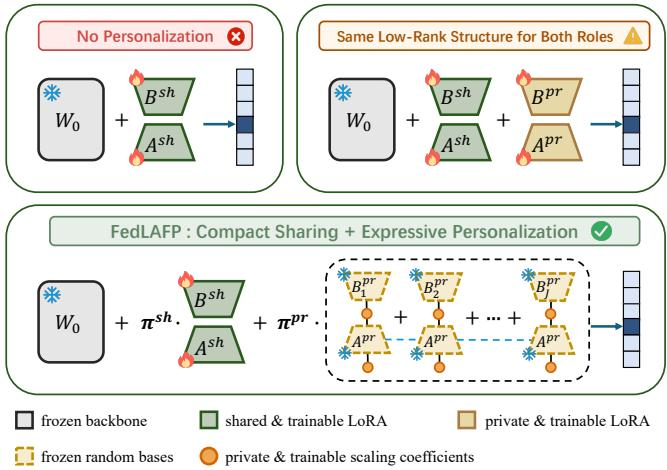  
Figure 1: Comparison of global-only adaptation, symmetric shared–private LoRA, and the proposed role-aware Fed-LAFP.

Although clients have diferent local distributions, their data usually contain both common patterns shared across clients and characteristics specific to each client. Personalized adaptation therefore serves two distinct roles: the shared component captures knowledge that generalizes across clients, whereas the private component models the characteristics of each client’s local distribution. These roles lead to diferent design requirements. Because the shared component is repeatedly communicated and aggregated, it should be compact and aggregation-friendly. The private component remains local and is not averaged across clients, so it should have suficient capacity to capture client-specific variations. Applying the same low-rank bottleneck to both components may therefore restrict personalization, motivating a role-dependent adapter design.

Motivated by these diferent requirements, we propose FedLAFP, a role-aware personalized federated adaptation framework that combines a shared LoRA branch with a client-private RandLoRA (Albert et al. 2025) branch. LoRA factorizes the shared update into two trainable low-rank matrices, keeping the communicated parameter set compact. RandLoRA constructs a full-rank-capable private update as a sum of fixed random low-rank bases, each modulated by learnable diagonal scaling matrices. This provides a broader update space for local adaptation without directly optimizing a full-sized update matrix. Both branches are attached to a frozen pre-trained backbone and jointly optimized on each client’s data. The server aggregates only the shared LoRA parameters, while each client’s private RandLoRA parameters remain local. Client- and layer-specific mixing coeficients adaptively combine the shared and private updates. Together, the two branches support eficient cross-client knowledge sharing and expressive local personalization. Our contributions are as follows:

• We revisit the symmetric dual-LoRA design commonly adopted in personalized federated fine-tuning and identify distinct requirements for its shared and private branches. The shared branch should remain compact for eficient communication and aggregation, whereas the private branch requires greater expressive capacity to capture client-specific heterogeneity.

• We propose FedLAFP, a role-aware personalized federated fine-tuning framework that combines a globally aggregated LoRA branch with a client-private, full-rankcapable RandLoRA branch. Client- and layer-specific fusion weights adaptively balance the shared and private updates, while only the compact shared LoRA parameters are communicated.

• Experiments on four visual recognition benchmarks show that FedLAFP achieves the best accuracy on every dataset, outperforming local-only adaptation and a broad range of federated LoRA baselines covering global adapter aggregation, factor-wise selective sharing, and shared–private personalization.

## Related Work

## PEFT and LoRA Variants

Parameter-eficient fine-tuning (PEFT) adapts a pre-trained model by optimizing only a small task-specific component while leaving most backbone parameters frozen (Ding et al. 2023). Representative approaches insert bottleneck adapters between Transformer layers (Lu et al. 2023), optimize continuous prefixes or soft prompts (Zhou et al. 2022), or update only selected parameters such as bias terms (Zaken, Goldberg, and Ravfogel 2022). Low-Rank Adaptation (LoRA) (Hu et al. 2022) instead represents the update to a frozen weight matrix as the product of two trainable lowrank factors. Its compact parameterization reduces communication overhead, while the learned update can be merged into the backbone without introducing additional inference latency. These properties make LoRA particularly attractive for federated learning.

LoRA variants extend the basic formulation along diferent dimensions. AdaLoRA (Zhang et al. 2023) adaptively allocates rank budgets across weight matrices according to their importance scores, while DoRA (Liu et al. 2024) decomposes pre-trained weights into magnitude and direction and applies LoRA to directional updates. VeRA (Kopiczko, Blankevoort, and Asano 2024) shares frozen random lowrank matrices across layers and learns lightweight scaling vectors. RandLoRA (Albert et al. 2025) learns combinations of fixed random low-rank matrices through diagonal scaling matrices, enabling full-rank-capable updates without directly optimizing a full-sized update matrix.

## Federated Learning and Personalization

Federated learning enables collaborative model training without centralizing raw data, and FedAvg realizes this paradigm by alternating local optimization with sampleweighted aggregation. However, under heterogeneous data distributions, a single global model may not adequately capture client-specific characteristics. Personalized federated learning addresses this limitation by combining cross-client knowledge sharing with client-specific adaptation.

Personalized federated learning methods difer in when and how client-specific adaptation is introduced. Some methods learn a shared initialization or representation that is subsequently adapted to each client: Per-FedAvg (Fallah, Mokhtari, and Ozdaglar 2020) meta-learns a shared initialization that clients adapt with a few gradient steps, while Fed-BABU (Oh, Kim, and Yun 2022) federatively trains the feature extractor and later fine-tunes the prediction head locally. Other methods retain private components throughout federated training while aggregating shared ones: FedRep (Collins et al. 2021) alternates between private client heads and a shared representation, whereas Fed-RoD (Chen and Chao 2022) combines a shared feature extractor and generic predictor with a lightweight personalized head. Developed for conventional task-specific models rather than parameter-eficient adaptation ofpre-trained models, these methods do not examine how diferent PEFT parameterizations should be assigned to shared and private roles.

## Federated LoRA Fine-Tuning

Federated LoRA studies mainly explore global aggregation and personalization. For global aggregation, FFA-LoRA (Sun et al. 2024) freezes one factor to avoid factor mismatch, while FedEx-LoRA (Singhal, Ponkshe, and Vepakomma 2025) corrects the residual caused by separately aggregating LoRA factors. For personalization within a single adapter, FedSA-LoRA (Guo et al. 2025) shares one factor and retains the other locally, whereas FedPissa (He et al. 2026) separates shared and private subspaces. Other methods maintain explicit shared and private branches: Fed-DPA (Yang et al. 2024) and FDLoRA (Lu et al. 2024) fuse global and local LoRA adapters, while FedALT (Bian et al. 2026) combines an individual LoRA with a Rest-of-World LoRA through input-adaptive mixing.

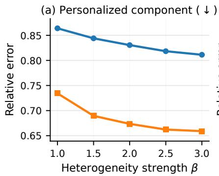

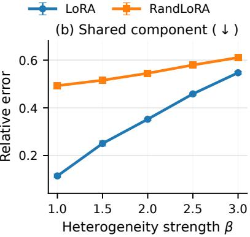

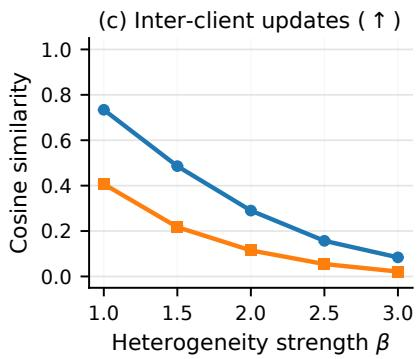  
Figure 2: Controlled comparison of LoRA and RandLoRA under increasing client heterogeneity. Panels report (a) personalization error, (b) aggregation error, and (c) mean cross-client update similarity.

Unlike these methods, which either separate shared and private knowledge within one low-rank adapter or use the same adapter family for both branches, FedLAFP assigns LoRA to shared aggregation and RandLoRA to private adaptation.

## Motivation

A natural question arising from the distinct requirements of shared and private adaptation is: which adapter is better suited to each federated role? To answer this question, we construct a controlled linear problem and examine two comparisons: Q1: which adapter better captures client-specific variation during local adaptation? Q2: which adapter better supports cross-client aggregation?

Controlled setup. We construct a federated linear regression problem with K clients and a frozen base model $\mathbf { \bar { \boldsymbol { W } } } _ { 0 }$ The target update for client i is

$$
\Delta W _ { i } ^ { \star } = \Delta W _ { \mathrm { s h } } ^ { \star } + \beta \Delta W _ { i , \mathrm { p r } } ^ { \star } , \qquad \frac { 1 } { K } \sum _ { i = 1 } ^ { K } \Delta W _ { i , \mathrm { p r } } ^ { \star } = 0 ,\tag{1}
$$

where $\Delta W _ { \mathrm { s h } } ^ { \star }$ is the shared component, $\Delta W _ { i , \mathrm { p r } } ^ { \star }$ are the clientspecific residuals, and β controls the degree of heterogeneity. Inputs are sampled from an isotropic Gaussian distribution, and targets are generated by applying $W _ { 0 } + \Delta W _ { i } ^ { \star }$ with additive Gaussian noise. For each client, we train and evaluate LoRA and RandLoRA using exactly the same input–output samples, thereby isolating the efect of the adapter parameterization.

Because the synthetic construction provides known shared and private components, we can directly evaluate how well each adapter recovers them. Let $\widehat { \Delta W } _ { i }$ denote the update learned by client i and ∆W the average update across clients. For personalization, we treat $\widehat { \Delta W } _ { i } - \overline { { \Delta W } }$ as the recovered client-specific residual and measure its normalized Frobenius distance from the ground-truth private residual $\beta \Delta W _ { i , \mathrm { p r } } ^ { \star } ;$ a lower error indicates better personalization. For aggregation, we measure the normalized Frobenius distance between $\overline { { \Delta W } }$ and the ground-truth shared update $\Delta W _ { \mathrm { s h } } ^ { \star }$ . We additionally compute the mean pairwise cosine similarity between client updates to quantify their directional consistency, where a lower aggregation error and a higher similarity indicate more aggregation-friendly updates.

Q1: Which adapter better captures client-specific variation? Figure 2(a) shows that RandLoRA consistently achieves lower personalization error as heterogeneity increases. By combining multiple fixed random low-rank bases, RandLoRA can represent a broader range of update directions and more accurately recover client-specific residuals.

Q2: Which adapter better supports aggregation? Figures 2(b) and (c) show that LoRA yields lower aggregation error and more aligned client updates. Although increasing heterogeneity makes aggregation more dificult for both adapters, LoRA consistently preserves shared directions more efectively.

Together, these results answer the opening question: Rand-LoRA is better suited to expressive private adaptation, whereas LoRA is better suited to compact shared aggregation. This complementary role assignment directly motivates the asymmetric design of FedLAFP.

## Method

Accordingly, FedLAFP uses a shared LoRA branch for crossclient aggregation and a private RandLoRA branch for local personalization. As shown in Fig. 3, the two branches are attached to each adapted layer of the frozen backbone and combined using client- and layer-specific weights.

## Problem Formulation

Consider K clients, where client i owns a local dataset $\mathcal { D } _ { i } ~ = ~ \{ ( x _ { i , n } , y _ { i , n } ) \} _ { n = 1 } ^ { N _ { i } }$ and $\begin{array} { r } { N = \sum _ { i = 1 } ^ { K } N _ { i } } \end{array}$ . Let $\Theta _ { 0 }$ denote the parameters of a pre-trained backbone, which remain frozen throughout federated fine-tuning. We introduce three groups of adaptation parameters. The shared LoRA parameters $\dot { \Theta } ^ { \mathrm { s h } }$ are synchronized through the server. The RandLoRA parameters $\dot { \Theta } _ { i } ^ { \mathrm { p r } }$ and mixing logits $z _ { i }$ are specific to client i and persist locally across communication rounds. The personalized model of client i is therefore written as

$$
f _ { i } ( \boldsymbol { x } ) = f \big ( \boldsymbol { x } ; \boldsymbol { \Theta } _ { 0 } , \boldsymbol { \Theta } ^ { \mathrm { s h } } , \boldsymbol { \Theta } _ { i } ^ { \mathrm { p r } } , z _ { i } \big ) .\tag{2}
$$

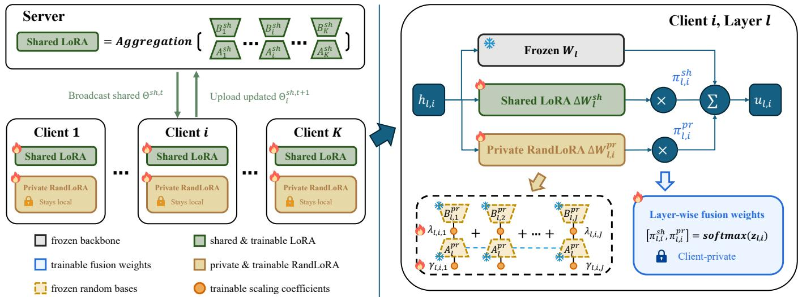  
Figure 3: Overview of the FedLAFP framework. (a) The server broadcasts the shared LoRA parameters, and clients upload only their locally updated shared parameters for sample-weighted aggregation, while the private RandLoRA parameters remain local. (b) Within target layer ℓ of client i, the output of the frozen linear transformation is augmented by the weighted outputs of the shared LoRA and private RandLoRA branches, using $\pi _ { \ell , i } ^ { \mathrm { s h } }$ and $\pi _ { \ell , i } ^ { \mathrm { p r } }$ , respectively. These client- and layer-specific fusion weights are derived from private logits and are never communicated.

FedLAFP optimizes the sample-weighted personalized objective

$$
\operatorname* { m i n } _ { \Theta ^ { \mathrm { s h } } , \{ \Theta _ { i } ^ { \mathrm { p r } } , z _ { i } \} _ { i = 1 } ^ { K } } \sum _ { i = 1 } ^ { K } \frac { N _ { i } } { N } \mathcal { L } _ { i } \big ( \Theta ^ { \mathrm { s h } } , \Theta _ { i } ^ { \mathrm { p r } } , z _ { i } \big ) ,\tag{3}
$$

where

$$
\mathcal { L } _ { i } = \frac { 1 } { N _ { i } } \sum _ { ( x , y ) \in \mathcal { D } _ { i } } \ell ( f _ { i } ( x ) , y ) .\tag{4}
$$

Only $\Theta ^ { \mathrm { s h } }$ is communicated and aggregated by the server. The private variables are optimized jointly with the shared branch during local training, but remain client-specific and are never aggregated.

## Role-Aware Heterogeneous Adaptation

Let $W _ { \ell } \in \mathbb { R } ^ { d _ { \mathrm { o u t } } \times d _ { \mathrm { i n } } }$ be a frozen weight matrix in a target layer ℓ, and let $h _ { \ell , i }$ denote its input on client i. FedLAFP augments this matrix with one shared update and one private update. The layer output is

$$
u _ { \ell , i } = W _ { \ell } h _ { \ell , i } + \pi _ { \ell , i } ^ { \mathrm { s h } } \Delta W _ { \ell } ^ { \mathrm { s h } } h _ { \ell , i } + \pi _ { \ell , i } ^ { \mathrm { p r } } \Delta W _ { \ell , i } ^ { \mathrm { p r } } h _ { \ell , i } .\tag{5}
$$

The frozen projection and the two adapter updates are computed from the same input $h _ { \ell , i }$ and summed to produce the layer output $u _ { \ell , i }$ . In our experiments, we apply this construction to the query and value projection matrices in every Transformer attention block. The same formulation can also be applied to other linear layers.

Shared low-rank aggregation branch. The shared update is represented using LoRA:

$$
\Delta W _ { \ell } ^ { \mathrm { s h } } = \frac { \alpha _ { L } } { r _ { L } } B _ { \ell } ^ { \mathrm { s h } } A _ { \ell } ^ { \mathrm { s h } } ,\tag{6}
$$

where $r _ { L }$ is the LoRA rank, $\alpha _ { L }$ is its scaling parameter, $A _ { \ell } ^ { \mathrm { s h } } \ \in \ \bar { \mathbb { R } } ^ { r _ { L } \times d _ { \mathrm { i n } } }$ , and $B _ { \ell } ^ { \mathrm { s h } } \ \in \ \mathbb { R } ^ { \overline { { d } } _ { \mathrm { o u t } } \times r _ { L } }$ . We initialize $A _ { \ell } ^ { \mathrm { s h } }$ using Kaiming initialization and set $B _ { \ell } ^ { \mathrm { s h } }$ to zero. Since $B _ { \ell } ^ { \mathrm { s h } } =$ 0, the shared update is initially zero, so the adapter does not alter the pre-trained model before fine-tuning. As the only branch communicated and aggregated by the server, its lowrank factors provide a compact representation of knowledge shared across clients.

Private full-rank-capable personalization branch. For the local branch, client i uses RandLoRA. Let $r _ { R }$ denote the random-basis rank, $d _ { \ell } = \operatorname* { m i n } ( d _ { \mathrm { i n } } , d _ { \mathrm { o u t } } )$ , and $J _ { \ell } = \lceil d _ { \ell } / r _ { R } \rceil$ The private update is

$$
\Delta W _ { \ell , i } ^ { \mathrm { p r } } = \frac { \alpha _ { R } } { r _ { R } } \sum _ { j = 1 } ^ { J _ { \ell } } B _ { \ell , j } ^ { \mathrm { p r } } \operatorname { d i a g } ( \lambda _ { \ell , i , j } ) A _ { \ell } ^ { \mathrm { p r } } \operatorname { d i a g } ( \gamma _ { \ell , i , j } ) ,\tag{7}
$$

where $\alpha _ { R }$ is the RandLoRA scaling parameter, $A _ { \ell } ^ { \mathrm { p r } }$ and $\{ B _ { \ell , j } ^ { \mathrm { p r } } \} _ { j = 1 } ^ { J _ { \ell } }$ are fixed random bases, and $\lambda _ { \ell , i , j }$ and $\gamma _ { \ell , i , j }$ are learned locally. By summing multiple scaled low-rank components, RandLoRA is full-rank-capable and can capture richer client-specific deviations than a single low-rank update. The random bases are deterministically generated from a shared public seed, remain fixed during training, and require no communication. We initialize $\lambda _ { \ell , i , j }$ to zero and $\gamma _ { \ell , i , j }$ to a small constant so that the private update starts from zero. Only the client-specific scaling vectors are optimized and kept local.

Client-specific layer-wise fusion. The two adapter branches need not contribute equally to every client or layer. For each target layer, client i maintains two trainable logits $z _ { \ell , i } \in \mathbb { R } ^ { 2 }$ and computes

$$
\left[ \pi _ { \ell , i } ^ { \mathrm { s h } } , \pi _ { \ell , i } ^ { \mathrm { p r } } \right] = \mathrm { s o f t m a x } ( z _ { \ell , i } ) .\tag{8}
$$

The logits are initialized to zero, assigning equal weight to the two branches at the start of training. They are then optimized with the local task loss and kept private. This mechanism is client- and layer-specific but input-independent: it learns how strongly each client should rely on shared and private updates at each adapted projection, without introducing an examplelevel routing network. The fusion in Eq. (5) is performed within each target layer by weighting and summing the shared and private adapter outputs, rather than combining the final predictions of two separate models.

## Federated Training and Aggregation

Training alternates between joint local adaptation and server aggregation. At communication round t, the server selects a set of clients $S _ { t }$ and broadcasts the current shared LoRA parameters $\Theta ^ { \mathrm { s h } , t }$ . Each selected client replaces only this synchronized component; its private RandLoRA parameters and mixing logits are carried over from its previous local state. The client then jointly updates the received shared parameters, private RandLoRA scaling variables, and mixing logits for E local epochs.

After local training, client i uploads $\Theta _ { i } ^ { \mathrm { s h } , t + 1 }$ but withholds $\Theta _ { i } ^ { \mathrm { p r } , t + 1 }$ and $z _ { i } ^ { t + 1 }$ . With

$$
p _ { i } ^ { t } = \frac { N _ { i } } { \sum _ { k \in \mathcal { S } _ { t } } { N _ { k } } } ,\tag{9}
$$

the server performs sample-weighted aggregation:

$$
\Theta ^ { \mathrm { s h } , t + 1 } = \sum _ { i \in \cal S _ { t } } p _ { i } ^ { t } \Theta _ { i } ^ { \mathrm { s h } , t + 1 } .\tag{10}
$$

For the shared LoRA branch, Eq. (10) averages the $A ^ { \mathrm { s h } }$ and $B ^ { \mathrm { s h } }$ factors separately, corresponding to the default FedAvg realization used by FedLAFP. Since the private RandLoRA parameters and fusion logits are never communicated, their maintenance is decoupled from server-side aggregation of the shared branch. The FedAvg step in Eq. (10) can therefore be replaced or augmented by federated optimization techniques that correct factor-wise aggregation errors (Singhal, Ponkshe, and Vepakomma 2025), selectively aggregate LoRA components (Guo et al. 2025), or add proximal regularization (Li et al. 2020), without modifying the private branch or the fusion mechanism.

The complete training algorithm and convergence analysis are provided in the supplementary material.

Personalized inference. After federated training, client i performs inference using the final shared LoRA parameters together with its locally retained private RandLoRA parameters and mixing logits, following Eq. (5).

## Experiments

## Experimental Setup

Datasets and backbone. We evaluate on four visual recognition benchmarks spanning complementary tasks: DTD for texture recognition (Cimpoi et al. 2014), Oxford Pets for fine-grained pet recognition (Parkhi et al. 2012), SUN397 for scene recognition (Xiao et al. 2010), and UCF101 for human-action recognition (Soomro, Zamir, and Shah 2012). To construct a few-shot federated adaptation setting, we globally sample 16 examples per class from the predefined training split, while retaining the full predefined test split for evaluation. To simulate heterogeneity, a Dirichlet proportion vector $( \alpha = 0 . 1 )$ is drawn for each class and used to partition that class’s training and test examples among 12 clients. We use a pre-trained ViT-B/16 (Dosovitskiy et al. 2021). The Transformer backbone remains frozen, and adaptation is restricted to the query and value projections in all self-attention blocks. We additionally evaluate RoBERTa-Large (Liu et al. 2019) on MRPC and SST-2 from GLUE (Wang et al. 2019) to assess the transferability of FedLAFP beyond visual adaptation; the detailed setup for these language experiments is provided in the supplementary material.

Baselines. Local-only LoRA and Local-only RandLoRA train an independent adapter on each client without communication, providing local-training references for low-rank and full-rank-capable adaptation, respectively. FedLoRA applies the same sample-weighted aggregation of trainable LoRA parameters as FedIT (Zhang et al. 2024), while FedRand-LoRA analogously aggregates the learned RandLoRA scaling parameters. FFA-LoRA (Sun et al. 2024) freezes the randomly initialized LoRA A factors and trains only the B factors. FedEx-LoRA (Singhal, Ponkshe, and Vepakomma 2025) enables exact aggregation by correcting the mismatch introduced by separately averaging the LoRA factors. FedSA-LoRA (Guo et al. 2025) aggregates the LoRA A factors while retaining the B factors locally. FedALT (Bian et al. 2026) combines an individual LoRA with a Rest-of-World LoRA through an adaptive mixer. All baselines use the same pretrained backbone, client partitions, and query–value target modules.

Implementation details. Unless otherwise specified, we use the same training protocol for FedLAFP and all baselines. All federated methods are trained for 50 communication rounds, with each participating client performing three local epochs per round using a batch size of 64. The localonly baselines are trained for an equivalent number of local epochs. Local optimization uses SGD with learning rate 0.1. For FedLAFP, the shared LoRA rank is set to $r _ { L } = 4$ , and the private RandLoRA rank is set to $r _ { R } = 1 2 8$ . We choose these ranks to match the numbers of trainable parameters in the two adapter branches as closely as possible, enabling a fair comparison between their parameterizations. For each baseline, we adjust the adapter rank so that the total number of trainable parameters remains approximately matched across methods. For all methods, we set each adapter’s scaling parameter equal to its rank, yielding a multiplicative adapter scale of $\alpha / r = 1$ . At test time, we evaluate each method on every client’s local test set. Personalized methods use the corresponding client-specific model, whereas methods that learn a single global model use that model for all clients. The accuracy of one run is computed over the union of all client predictions, equivalently as the test-sample-weighted mean of the client accuracies. We repeat the visual experiment three times and report the mean and standard deviation across runs.

<table><tr><td>Method</td><td>DTD</td><td>Oxford Pets</td><td>SUN397</td><td>UCF101</td><td>Average</td></tr><tr><td>Local-only LoRA</td><td> $6 7 . 4 2 \pm 0 . 3 0$ </td><td> $9 0 . 8 1 \pm 0 . 1 7$ </td><td> $7 8 . 9 7 \pm 0 . 0 3$ </td><td> $8 3 . 5 7 \pm 0 . 2 2$ </td><td>80.19</td></tr><tr><td>Local-only RandLoRA</td><td> $6 7 . 9 9 \pm 0 . 3 6$ </td><td> $9 1 . 1 1 \pm 0 . 2 2$ </td><td> $7 8 . 9 9 \pm 0 . 0 7$ </td><td> $8 3 . 7 0 \pm 0 . 2 0$ </td><td>80.45</td></tr><tr><td>FedLoRA [ICASSP&#x27;24]</td><td> $7 4 . 5 9 \pm 0 . 4 1$ </td><td> $9 5 . 4 7 \pm 0 . 0 7$ </td><td> $8 3 . 0 2 \pm 0 . 0 4$ </td><td> $8 7 . 8 1 \pm 0 . 1 1$ </td><td>85.22</td></tr><tr><td>FedRandLoRA</td><td> $7 5 . 0 0 \pm 0 . 3 1$ </td><td> $9 5 . 4 3 \pm 0 . 0 7$ </td><td> $8 3 . 8 9 \pm 0 . 0 7$ </td><td> $8 8 . 2 0 \pm 0 . 0 9$ </td><td>85.63</td></tr><tr><td>FFA-LoRA [ICLR’24]</td><td> $7 4 . 3 5 \pm 0 . 3 6$ </td><td> $9 5 . 4 8 \pm 0 . 0 8$ </td><td> $8 2 . 8 6 \pm 0 . 0 2$ </td><td> $8 7 . 8 6 \pm 0 . 2 3$ </td><td>85.14</td></tr><tr><td>FedEx-LoRA [ACL&#x27;25]</td><td> $7 4 . 4 7 \pm 0 . 1 2$ </td><td> $9 5 . 4 5 \pm 0 . 0 9$ </td><td> $8 2 . 9 5 \pm 0 . 0 1$ </td><td> $8 7 . 7 3 \pm 0 . 0 3$ </td><td>85.15</td></tr><tr><td>FedSA-LoRA [ICLR’25]</td><td> $7 4 . 5 5 \pm 0 . 3 8$ </td><td> $9 5 . 3 8 \pm 0 . 1 8$ </td><td> $8 3 . 4 6 \pm 0 . 0 7$ </td><td> $8 7 . 9 7 \pm 0 . 2 6$ </td><td>85.34</td></tr><tr><td>FedALT [AAAI&#x27;26]</td><td> $7 4 . 5 9 \pm 0 . 4 1$ </td><td> $9 5 . 4 0 \pm 0 . 1 2$ </td><td> $8 3 . 0 2 \pm 0 . 0 7$ </td><td> $8 7 . 7 1 \pm 0 . 1 3$ </td><td>85.18</td></tr><tr><td>FedLAFP (Ours)</td><td> ${ \bf 7 8 . 6 2 \pm 0 . 0 3 }$ </td><td> ${ \bf 9 5 . 9 6 \pm 0 . 0 3 }$ </td><td> $\mathbf { 8 4 . 0 0 \pm 0 . 0 7 }$ </td><td> ${ \bf 8 9 . 1 2 \pm 0 . 0 8 }$ </td><td>86.93</td></tr></table>

Table 1: Comparison with local-only and federated LoRA baselines on four visual recognition benchmarks. Accuracy (%) is reported as mean ± standard deviation over three runs. The best result in each column is shown in bold.

<table><tr><td>Method</td><td>MRPC</td><td>SST-2</td><td>Average</td></tr><tr><td>FedLoRA [ICASSP&#x27;24]</td><td>72.30</td><td>93.81</td><td>83.06</td></tr><tr><td>FedALT [AAAI&#x27;26]</td><td>88.24</td><td>95.41</td><td>91.83</td></tr><tr><td>FedLAFP (Ours)</td><td>88.73</td><td>95.76</td><td>92.25</td></tr></table>

Table 2: Accuracy (%) on GLUE language tasks using RoBERTa-Large.

## Performance Comparisons

Visual benchmarks. Table 1 compares FedLAFP with local-only and federated LoRA baselines. FedLAFP achieves the best accuracy on all four benchmarks, with an average accuracy of 86.93%. Its consistent gains across texture, finegrained pet, scene, and action recognition suggest that the role-aware design is efective across diverse visual recognition tasks. FedLoRA and FedRandLoRA outperform their corresponding local-only variants by 5.03 and 5.18 percentage points on average, respectively, confirming the benefit of cross-client knowledge sharing. FedLAFP further improves over FedLoRA and FedRandLoRA by 1.71 and 1.30 percentage points, respectively, suggesting that combining shared aggregation with client-specific adaptation is more efective than fully aggregating a single adapter under heterogeneous client distributions. FedLAFP also outperforms all remaining federated LoRA baselines. The best of these baselines achieves an average accuracy of 85.34%, compared with 86.93% for FedLAFP, further demonstrating the efectiveness of the proposed role-aware design.

Language benchmarks. Table 2 reports the results on MRPC and SST-2 using RoBERTa-Large. FedLAFP outperforms both FedLoRA and FedALT on the two tasks, exceeding the stronger FedALT baseline by 0.49 and 0.35 percentage points on MRPC and SST-2, respectively. These results show that the role-aware design is also efective beyond visual adaptation.

## Ablation Study

Impact ofAdapter Role Assignment. We evaluate all four combinations of LoRA and RandLoRA in the shared and private branches while keeping the adaptive fusion mechanism and training protocol fixed. Figure 4 presents the DTD and UCF101 results as 2×2 matrices, with shared adapters along the rows and private adapters along the columns. In both matrices, the upper-right cell, corresponding to shared LoRA and private RandLoRA, achieves the highest accuracy. The complete four-dataset results provided in the supplementary material further show that this assignment also performs best on Oxford Pets and SUN397. Its consistent advantage across all four datasets supports assigning compact LoRA to shared aggregation and expressive RandLoRA to private adaptation.

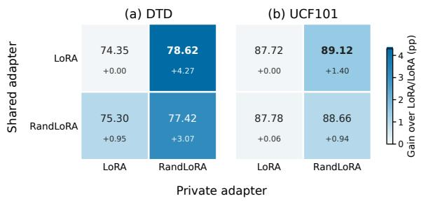

Figure 4: Role-assignment matrices on DTD and UCF101. Rows specify the shared adapter and columns specify the private adapter. Each cell reports accuracy (%); the smaller annotation and cell color encode the gain over LoRA/LoRA. Bold values denote the best assignment per dataset.
<table><tr><td>Scheme</td><td>DTD</td><td>Pets</td><td>SUN</td><td>UCF</td></tr><tr><td>Private (0, 1)</td><td>67.99</td><td>91.11</td><td>78.99</td><td>83.70</td></tr><tr><td>Shared (1, 0)</td><td>74.59</td><td>95.47</td><td>83.02</td><td>87.81</td></tr><tr><td>Equal (0.5, 0.5)</td><td>77.48</td><td>95.78</td><td>83.96</td><td>88.82</td></tr><tr><td>Instance gate</td><td>78.07</td><td>95.86</td><td>82.49</td><td>88.76</td></tr><tr><td>Client-layer (Ours)</td><td>78.62</td><td>95.96</td><td>84.00</td><td>89.12</td></tr></table>

Table 3: Comparison of strategies for fusing the shared and private branches.

Impact of Fusion Weights. Table 3 compares five ways of combining the private and shared branches. The privateonly (0, 1) and shared-only (1, 0) variants use one branch exclusively, while the equal (0.5, 0.5) variant assigns a fixed weight of 0.5 to each branch. The instance-gate variant uses an auxiliary gating unit to predict input-dependent weights for each sample. Our client–layer scheme instead learns input-independent weights separately for each client and adapted layer. The proposed client–layer fusion achieves the highest accuracy on all four benchmarks. It requires no auxiliary gating unit and introduces only two trainable scalar logits per adapted layer for each client.

(a) LoRA rank (rR = 128)  
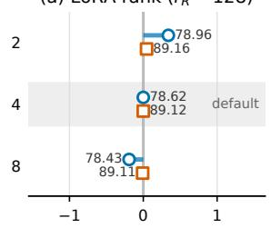

(b) RandLoRA rank (rL = 4)  
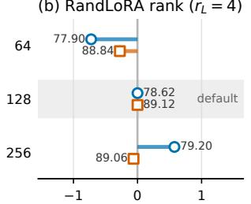

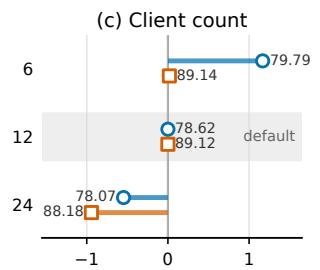  
Δ accuracy (percentage points)

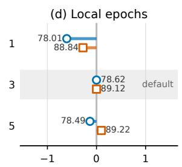

Figure 5: Hyperparameter sensitivity on DTD and UCF101. Each panel varies one hyperparameter while holding the remaining settings fixed. The horizontal axis shows the accuracy change in percentage points relative to the default configuration $( r _ { L } , r _ { R } , \bar { K } , E ) = ( 4 , 1 2 8 , 1 2 , 3 )$ ; marker labels show absolute accuracy (%). The shaded row denotes the default value.  
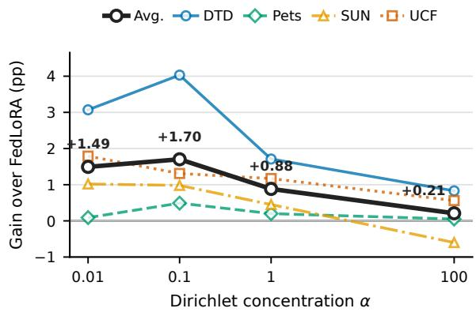  
Figure 6: Accuracy gain of FedLAFP over FedLoRA under diferent Dirichlet concentration parameters. Positive values indicate an improvement over FedLoRA under the same client partition. The black curve shows the mean gain across the four datasets; larger α corresponds to less heterogeneous client data.

## Sensitivity Analysis

Adapter Ranks. Figures 5(a) and (b) show that the shared LoRA rank has a relatively small efect on accuracy, while the private RandLoRA rank has a somewhat larger efect. The degree of sensitivity also depends on the dataset, with DTD responding more strongly to rank changes than UCF101.

Number of Clients. Figure 5(c) shows that accuracy generally decreases as the number of clients increases. With a fixed amount of training data, more clients divide the data into smaller local partitions, making the federated learning task more dificult and reducing accuracy.

Local Epochs. As shown in Fig. 5(d), increasing the number of local epochs from 1 to 3 improves accuracy on both datasets. Further increasing it to 5 provides little additional benefit, indicating diminishing returns from additional local training.

Data Heterogeneity. We vary the Dirichlet concentration parameter over α $\in \{ 0 . 0 1 , 0 . 1 , \dot { 1 } , 1 0 0 \}$ , where smaller values produce more heterogeneous client partitions and $\alpha = 1 0 0$ approximates an IID allocation. Figure 6 shows that Fed-LAFP improves over FedLoRA by 1.49, 1.70, 0.88, and 0.21 percentage points on average for $\alpha \ = \ 0 . 0 1 , 0 . 1 ,$ 1, and 100, respectively; the corresponding absolute accuracies are provided in the supplementary material. The gain peaks at $\alpha = 0 . 1$ : extreme fragmentation at $\alpha = 0 . 0 1$ limits the common knowledge available to the shared branch, whereas increasingly IID partitions provide less client-specific information for the private branch. Thus, FedLAFP remains beneficial across heterogeneous and nearly IID settings, with the largest improvement when shared and personalized knowledge are both informative.

## Conclusion

We introduced FedLAFP, a role-aware framework that assigns compact LoRA to shared aggregation and fullrank-capable RandLoRA to private adaptation, with clientand layer-specific fusion. FedLAFP communicates only the shared LoRA parameters, while the private RandLoRA parameters and fusion logits remain local. Controlled analysis showed that LoRA produces more aggregation-stable updates, whereas RandLoRA better recovers client-specific residuals. Across four visual benchmarks, FedLAFP achieved the best accuracy on every dataset and an average of 86.93%, exceeding the strongest baseline by 1.30 percentage points. Ablation studies and sensitivity analyses further confirmed the value of the asymmetric design under data heterogeneity. Future work will extend FedLAFP to larger models, investigate realistic resource heterogeneity across clients, incorporate privacy-preserving aggregation, and explore automatic allocation of shared and private adaptation capacity.

## References

Albert, P.; Zhang, F. Z.; Saratchandran, H.; Rodriguez-Opazo, C.; van den Hengel, A.; and Abbasnejad, E. 2025. RandLoRA: Full rank parameter-eficient fine-tuning of large models. In The Thirteenth International Conference on Learning Representations.

Bian, J.; Wang, L.; Zhang, L.; and Xu, J. 2026. Fedalt: Federated fine-tuning through adaptive local training with rest-of-world lora. In Proceedings of the AAAI Conference on Artificial Intelligence, volume 40, 19728–19736.

Chen, H.-Y.; and Chao, W.-L. 2022. On Bridging Generic and Personalized Federated Learning for Image Classification. In International Conference on Learning Representations.

Chen, S.; Zhou, T.; Long, G.; Jiang, J.; and Zhang, C. 2026. Fedmerge: Federated model merging for personalization. In Proceedings of the AAAI Conference on Artificial Intelligence, volume 40, 20253–20261.

Cimpoi, M.; Maji, S.; Kokkinos, I.; Mohamed, S.; and Vedaldi, A. 2014. Describing textures in the wild. In Proceedings of the IEEE conference on computer vision and pattern recognition, 3606–3613.

Collins, L.; Hassani, H.; Mokhtari, A.; and Shakkottai, S. 2021. Exploiting shared representations for personalized federated learning. In International conference on machine learning, 2089–2099. PMLR.

Ding, N.; Qin, Y.; Yang, G.; Wei, F.; Yang, Z.; Su, Y.; Hu, S.; Chen, Y.; Chan, C.-M.; Chen, W.; et al. 2023. Parametereficient fine-tuning of large-scale pre-trained language models. Nature machine intelligence, 5(3): 220–235.

Dosovitskiy, A.; Beyer, L.; Kolesnikov, A.; Weissenborn, D.; Zhai, X.; Unterthiner, T.; Dehghani, M.; Minderer, M.; Heigold, G.; Gelly, S.; Uszkoreit, J.; and Houlsby, N. 2021. An Image is Worth 16x16 Words: Transformers for Image Recognition at Scale. In International Conference on Learning Representations.

Fallah, A.; Mokhtari, A.; and Ozdaglar, A. 2020. Personalized federated learning with theoretical guarantees: A modelagnostic meta-learning approach. Advances in neural information processing systems, 33: 3557–3568.

Fu, Z.; Yang, H.; So, A. M.-C.; Lam, W.; Bing, L.; and Collier, N. 2023. On the efectiveness of parameter-eficient fine-tuning. In Proceedings ofthe AAAI conference on artificial intelligence, volume 37, 12799–12807.

Guo, P.; Zeng, S.; Wang, Y.; Fan, H.; Wang, F.; and Qu, L. 2025. Selective Aggregation for Low-Rank Adaptation in Federated Learning. In The Thirteenth International Conference on Learning Representations.

Guo, T.; Guo, S.; Wang, J.; Tang, X.; and Xu, W. 2023. Promptfl: Let federated participants cooperatively learn prompts instead of models–federated learning in age of foundation model. IEEE Transactions on Mobile Computing, 23(5): 5179–5194.

He, W.; Huang, W.; Liu, Y.; Liang, J.; Li, X.; Pang, G.; and Ye, M. 2026. FedPissa: Towards Federated Personalized Adaptation of Foundation Models via LoRA Subspace Mapping. In Forty-third International Conference on Machine Learning.

Hu, E. J.; Shen, Y.; Wallis, P.; Allen-Zhu, Z.; Li, Y.; Wang, S.; Wang, L.; and Chen, W. 2022. LoRA: Low-Rank Adaptation of Large Language Models. In International Conference on Learning Representations.

Kopiczko, D. J.; Blankevoort, T.; and Asano, Y. M. 2024. VeRA: Vector-based Random Matrix Adaptation. In The Twelfth International Conference on Learning Representations.

Li, T.; Sahu, A. K.; Zaheer, M.; Sanjabi, M.; Talwalkar, A.; and Smith, V. 2020. Federated optimization in heterogeneous networks. Proceedings of Machine learning and systems, 2: 429–450.

Liu, S.-Y.; Wang, C.-Y.; Yin, H.; Molchanov, P.; Wang, Y.- C. F.; Cheng, K.-T.; and Chen, M.-H. 2024. Dora: Weightdecomposed low-rank adaptation. In Forty-first International Conference on Machine Learning.

Liu, Y.; Ott, M.; Goyal, N.; Du, J.; Joshi, M.; Chen, D.; Levy, O.; Lewis, M.; Zettlemoyer, L.; and Stoyanov, V. 2019. Roberta: A robustly optimized bert pretraining approach. arXiv preprint arXiv:1907.11692.

Lu, W.; Hu, X.; Wang, J.; and Xie, X. 2023. Fedclip: Fast generalization and personalization for clip in federated learning. In ICLR 2023 Workshop on Trustworthy and Reliable Large-Scale Machine Learning Models.

Lu, Y.; Qi, J.; Luan, Z.; Huang, S.; Fung, C.; Yang, H.; and Qian, D. 2024. Fdlora: Personalized federated learning of large language model via dual lora tuning. arXiv preprint arXiv:2406.07925.

McMahan, B.; Moore, E.; Ramage, D.; Hampson, S.; and y Arcas, B. A. 2017. Communication-eficient learning of deep networks from decentralized data. In Artificial intelligence and statistics, 1273–1282. Pmlr.

Oh, J.; Kim, S.; and Yun, S.-Y. 2022. FedBABU: Toward Enhanced Representation for Federated Image Classification. In International Conference on Learning Representations.

Parkhi, O. M.; Vedaldi, A.; Zisserman, A.; and Jawahar, C. 2012. Cats and dogs. In 2012 IEEE conference on computer vision and pattern recognition, 3498–3505. IEEE.

Singhal, R.; Ponkshe, K.; and Vepakomma, P. 2025. FedEx-LoRA: Exact aggregation for federated and eficient finetuning of large language models. In Proceedings of the 63rd Annual Meeting of the Association for Computational Linguistics (Volume 1: Long Papers), 1316–1336.

Soomro, K.; Zamir, A. R.; and Shah, M. 2012. Ucf101: A dataset of 101 human actions classes from videos in the wild. arXiv preprint arXiv:1212.0402.

Sun, Y.; Li, Z.; Li, Y.; and Ding, B. 2024. Improving LoRA in Privacy-preserving Federated Learning. In The Twelfth International Conference on Learning Representations.

Wang, A.; Singh, A.; Michael, J.; Hill, F.; Levy, O.; and Bowman, S. R. 2019. GLUE: A Multi-Task Benchmark and Analysis Platform for Natural Language Understanding. In International Conference on Learning Representations.

Xiao, J.; Hays, J.; Ehinger, K. A.; Oliva, A.; and Torralba, A. 2010. Sun database: Large-scale scene recognition from abbey to zoo. In 2010 IEEE computer society conference on computer vision and pattern recognition, 3485–3492. IEEE.

Yang, Y.; Long, G.; Lu, Q.; Zhu, L.; Jiang, J.; and Zhang, C. 2025. Federated Low-Rank Adaptation for Foundation Models: A Survey. In Proceedings of the Thirty-Fourth International Joint Conference on Artificial Intelligence, IJCAI-25, 10779–10787. International Joint Conferences on Artificial Intelligence Organization.

Yang, Y.; Long, G.; Shen, T.; Jiang, J.; and Blumenstein, M. 2024. Dual-Personalizing Adapter for Federated Foundation Models. In The Thirty-eighth Annual Conference on Neural Information Processing Systems.

Zaken, E. B.; Goldberg, Y.; and Ravfogel, S. 2022. Bitfit: Simple parameter-eficient fine-tuning for transformer-based masked language-models. In Proceedings ofthe 60th Annual Meeting of the Association for Computational Linguistics (Volume 2: Short Papers), 1–9.

Zhang, J.; Vahidian, S.; Kuo, M.; Li, C.; Zhang, R.; Yu, T.; Wang, G.; and Chen, Y. 2024. Towards building the federatedgpt: Federated instruction tuning. In ICASSP 2024- 2024 IEEE international conference on acoustics, speech and signal processing (ICASSP), 6915–6919. IEEE.

Zhang, Q.; Chen, M.; Bukharin, A.; He, P.; Cheng, Y.; Chen, W.; and Zhao, T. 2023. Adaptive Budget Allocation for Parameter-Eficient Fine-Tuning. In The Eleventh International Conference on Learning Representations.

Zhou, K.; Yang, J.; Loy, C. C.; and Liu, Z. 2022. Learning to prompt for vision-language models. Internationaljournal ofcomputer vision, 130(9): 2337–2348.