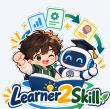
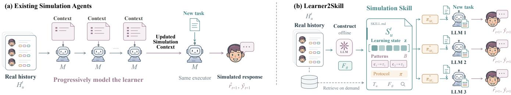
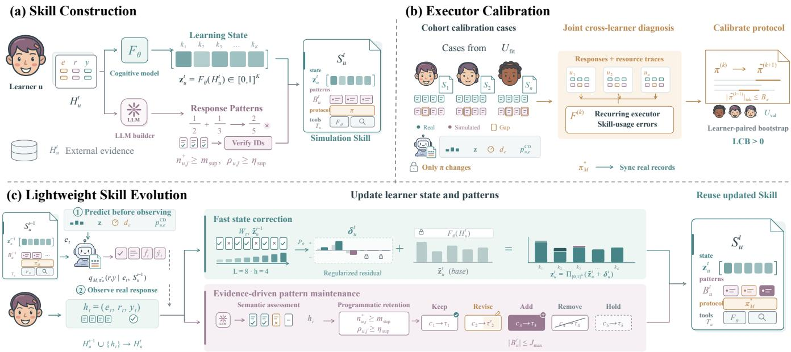
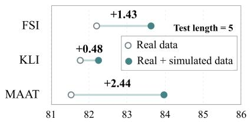
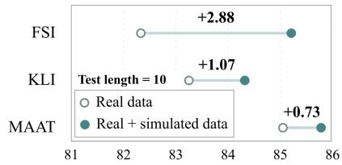

# From Learner Behavior to Reusable Skills for Efective and Eficient Learner Simulation

Zijian Chen1, Zheng Zhang2, Miao Jia1, Xingchen Hu1, Weibo Gao†3, and Linan Yue4

1National University of Defense Technology, 2Nanyang Technological University,

3The Hong Kong Polytechnic University, 4Southeast University

Learner simulation aims to reproduce how a particular learner behaves on new tasks. Although Large Language Models (LLMs) can generate increasingly fine-grained learning behaviors, existing approaches often need to repeatedly process a growing interaction history to reconstruct the learner. This introduces additional context and inference costs and makes the acquired learner-specific simulation capability dificult to reuse across diferent LLMs. We therefore propose Learner2Skill, which externalizes the simulation capability acquired from historical interactions into a persistent and reusable Simulation Skill. The Skill captures the learner’s current learning state and recurring response patterns, evolves as new real interactions arrive, and can be adapted to a new LLM through lightweight executor calibration without reconstructing the learner from scratch. Experiments show that Learner2Skill more faithfully reproduces fine-grained learner behavior while reducing overall token cost, and that the same constructed Skills can be efectively reused across diferent LLM executors.

## 1. Introduction

Learner simulation aims to reproduce how a particular learner behaves when facing new learning tasks (Zhao et al., 2023, Scarlatos et al., 2026). A useful learner simulator should capture more than whether the learner ultimately answers correctly: it should also reflect whether the learner attempts the task, how the solution process unfolds, what errors or corrections appear along the way, and what answer is produced (Asano et al., 2025, Koutcheme et al., 2026). Such fine-grained simulation provides a low-cost, controllable, and repeatable environment for developing and evaluating personalized teaching strategies without repeatedly involving real learners (Markel et al., 2023, Lu and Wang, 2024). Recent advances in Large Language Models (LLMs) have made this increasingly feasible, as LLM-based agents can generate rich, multi-step responses conditioned on learner information (Xu et al., 2024, Liu et al., 2024).

Existing LLM-based learner simulators, however, typically build their understanding of a learner by repeatedly processing the learner’s interaction history, as illustrated in Figure 1(a). As new interactions accumulate, learner profiles, memories, or learning states are progressively constructed and updated before being used for future simulation (Gao et al., 2025, Duan et al., 2026b, Xu et al., 2025). This process becomes increasingly expensive as the history grows. More importantly, the learner-specific simulation capability acquired from that history is usually coupled to the current agent and its underlying executor. The historical interactions themselves can be preserved, but when the LLM or executor changes, the same history may still need to be M M M M Fθ c1→τ1 c2→τ2 LLM 2 processed again to reconstruct an efective representation of the learner. In other words, existing approaches Ht r̂ , ŷ \*preserve the learner’s experience, but provide no explicit mechanism for preserving and reusing the simulation capability acquired from that experience.

  
A new executor may need to process the history again Retain learner content · lightweight calibration per executorReal history Construct SKILL.mdFigure 1: Comparison of (a) existing LLM simulation agents that progressively model learners from interaction histories, u and (b) Learner2Skill, which constructs reusable Simulation Skills for cross-executor simulation and online evolution.

A new executor may need to process the history again Retain learner content · lightweight calibration per executorThis observation raises a natural question: if historical interactions have already revealed what a learner can currently do and how that learner typically responds, can this acquired capability be preserved and directly reused infuture simulation? We address this question with Learner2Skill, illustrated in Figure 1(b), which organizes learner-specific simulation capability into a persistent and reusable Simulation Skill. Rather than repeatedly reconstructing the learner from the complete history, Learner2Skill distills the information most relevant to future simulation into the Skill, including the learner’s current learning state and recurring response patterns, such as typical solution strategies, characteristic errors, corrections, and stopping tendencies. The complete real interaction history is retained separately as external evidence and retrieved only when finer-grained information is needed. Future simulations can therefore begin from an already constructed Skill while preserving access to the underlying historical evidence.

Learner2Skill supports this reusable representation through a complete lifecycle. Skill Construction first extracts the learner’s current learning state and repeatedly supported response patterns from real historical interactions, while keeping cognitive modeling and historical retrieval available as on-demand resources. Because diferent LLMs may interpret and use the same learner information diferently, Executor Calibration then uses a small amount of real interaction feedback from multiple learners to adapt a shared execution protocol, without changing the constructed learner information itself. When the underlying LLM changes, the existing Skills can therefore be retained and only lightweight calibration needs to be repeated. During deployment, Skill Evolution further updates the learner’s state and response patterns as new real interactions arrive, allowing the Skill to remain aligned with the learner over time. This design explicitly separates learner-specific simulation capability from the executor that uses it: the Skill preserves who the learner is and how they tend to behave, while the executor determines how that information is used for the current task.

We evaluate Learner2Skill on LearnerTrace-2K, a temporally ordered dataset containing 52,566 mathematics and physics interactions from 2,000 learners, including learners’ main problem-solving ideas and intermediate steps. Following the interaction chronology, each learner’s trajectory is used sequentially for Skill Construction, Executor Calibration, and final evaluation. Under the same LLM executor, Learner2Skill achieves the best performance on five of six fine-grained simulation metrics while reducing overall token cost. The same constructed Skills can also be directly reused across diferent LLM executors without repeating Skill Construction. Ablation studies further show that learning state, response patterns, executor calibration, and online evolution contribute complementary benefits to diferent aspects of simulation. Finally, learner responses generated by Learner2Skill improve several computerized adaptive testing methods when used as additional training data. These results suggest that learner-specific simulation capability can be externalized from a particular LLM executor, preserved as a reusable Skill, and carried forward across subsequent learner simulation.

## 2. Related Work

LLM-Based Human and Social Simulation Large language models have increasingly been used to simulate human behavior at both individual and societal scales. Early studies investigate whether LLMs can reproduce human response distributions or support interactive societies populated by persona-driven agents (Argyle et al., 2023, Aher et al., 2023, Park et al., 2023). Subsequent work scales such simulations to richer environments and larger populations (Yang et al., 2024, Piao et al., 2025), while recent research increasingly grounds simulated agents in real human data. SocioVerse aligns agent societies with large-scale real-user populations (Zhang et al., 2025a), whereas Generative Agent Simulations of 1,000 People and PersonaTwin construct person-specific agents from rich individual information to reproduce the behaviors of particular humans (Park et al., 2024). Recent work further moves beyond static personas toward dynamic behavioral simulation: Agentopia studies long-term agent development through years of simulated social experience, GRAPHIA aligns individual interactions and emergent social structures with real social graphs, and OdysSim develops behavior-oriented foundation models specifically for human simulation (Wang et al., 2026c, Ji et al., 2026, Zhou et al., 2026). These developments indicate a broader shift from plausible role-playing toward grounded, person-specific, and temporally evolving human simulation. Learner simulation represents a particularly demanding instance of this setting, because the target learner continuously changes through learning and must be reproduced not only at the level of high-level choices, but also in task-specific attempts, intermediate problem-solving behavior, characteristic errors, and learning outcomes.

LLM-Based Learner Simulation Early LLM-based learner simulation mainly used predefined personas, knowledge levels, or learner attributes to generate heterogeneous student behaviors for applications such as teacher training, item evaluation, and intelligent tutoring (Markel et al., 2023, Lu and Wang, 2024, Benedetto et al., 2024, Liu et al., 2024, Nguyen et al., 2025, Jin et al., 2025). More recent studies construct learner agents from authentic learning data (Xu et al., 2024, Gao et al., 2025), covering classroom-level simulation (Xu et al., 2025, Zhang et al., 2025b, Gao et al., 2026), tutoring dialogues (Duan et al., 2026b, Scarlatos et al., 2026, Zheng et al., 2025), and domain-specific settings such as programming (Zhan et al., 2025, Duan et al., 2026a, Koutcheme et al., 2026). Most closely related to our work is individual learner response simulation. Agent4Edu and Embracing Imperfection characterize individual learners from historical records and simulate their subsequent responses (Gao et al., 2025, Wu et al., 2025), while SMART and One LLM Does Not Simulate All Students study the alignment between simulated behavior and learner ability (Scarlatos et al., 2025, Que et al., 2026). Empirical studies further show that LLM-generated solutions can difer systematically from real learner behavior even when final answers are correct (Asano et al., 2025). Existing learner agents typically acquire learner-specific simulation capability through progressive processing of interaction histories, limiting both eficiency and reuse across executors. Learner2Skill instead preserves this capability as a persistent and reusable Simulation Skill.

Skills for LLM Agents Recent LLM-agent research increasingly studies how experience can be externalized into reusable knowledge, workflows, or skills. ExpeL, Agent Workflow Memory, and Voyager extract reusable guidance or executable procedures from previous trajectories (Zhao et al., 2024, Wang et al., 2024, 2023b, Yue et al., 2025, Wang et al., 2026d, Gong et al., 2026), while SkillX, SAGE, SkillRL, and Skill1 further investigate construction, selection, transfer, and evolution of reusable skill libraries (Wang et al., 2026b,a,

Xia et al., 2026, Shi et al., 2026). Related work also explores improving externally represented skills from execution experience and transferring them across executors or environments (Liu et al., 2026), as well as progressively internalizing external skills into model parameters (Lu et al., 2026). These developments establish reusable skills as an emerging abstraction for preserving capabilities acquired from experience. We apply this abstraction to learner-specific simulation capability: rather than preserving how an agent solves a task, a Simulation Skill preserves how a particular learner tends to respond, allowing the acquired capability to be maintained and reused across LLM executors.

## 3. The Proposed Learner2Skill Method

We focus on individual learner response simulation: given the previously observed real interactions of a particular learner, the goal is to simulate how the same learner would respond to a new learning task (Duan et al., 2026b, Scarlatos et al., 2026). For learner u, we denote the real interaction history observed up to time step t as

$$
\mathcal { H } _ { u } ^ { t } = \{ ( e _ { i } , r _ { i } , y _ { i } ) \} _ { i = 1 } ^ { t } ,\tag{1}
$$

where $e _ { i }$ denotes a learning task, such as a mathematics problem, $r _ { i }$ denotes the learner’s complete response behavior on that task, and $y _ { i }$ denotes the corresponding observable outcome. Specifically, we consider four simulation targets: (1) whether the learner attempts the task; (2) the response process, such as the solution strategy used, intermediate errors, corrections, or verification; (3) the final answer; and (4) the resulting performance, such as correctness or task score. Given a new task $e _ { t + 1 }$ , the objective is therefore to generate the corresponding learner response and outcome $\left( \hat { r } _ { t + 1 } , \hat { y } _ { t + 1 } \right)$ . Throughout simulation, only real interactions observed before the current task are available.

Existing LLM-based learner agents typically process a learner’s interaction history step by step to construct and update learner-specific simulation context (Gao et al., 2025, Duan et al., 2026b, Xu et al., 2025). As the trajectory grows, this requires continued processing of historical interactions, while the acquired learner-specific simulation capability is typically coupled to the current agent and its executor, making it dificult to directly reuse across diferent executors.

In contrast, the proposed Learner2Skill explicitly organizes the learner-specific simulation capability acquired from historical interactions into a persistent and reusable Simulation Skill:

$$
\boldsymbol { S } _ { u } ^ { t } = \mathrm { S k i l l } \left( \mathcal { H } _ { u } ^ { t } \right) .\tag{2}
$$

Given a new task $e _ { t + 1 }$ , an executor M uses the existing Skill to generate

$$
\left( \widehat { \boldsymbol { r } } _ { t + 1 } , \widehat { \boldsymbol { y } } _ { t + 1 } \right) \sim q _ { M , \pi } \left( \boldsymbol { r } , \boldsymbol { y } \mid \boldsymbol { e } _ { t + 1 } , \boldsymbol { S } _ { u } ^ { t } \right) ,\tag{3}
$$

where $\pi$ denotes the execution protocol through which the executor uses the Skill for learner simulation. A formal comparison between the conventional learner-agent pipeline and the Learner2Skill pipeline is provided in Appendix A.

This formulation leads to three questions: How can a reusable Simulation Skill be constructed from historical learner interactions? How can an existing Skill be adapted to diferent downstream executors? And how can the Skill remain aligned with the learner as new real interactions arrive? Learner2Skill addresses these questions through Skill Construction, Executor Calibration, and Skill Evolution, respectively, as illustrated in Figure 2.

  
h = ( e , r , y ) Semantic assessment Programmatic retention Keep Revise Add Remove HoldqM, π M\* (r,y | et, Su )ht = (et, rt, yt) + Keep Revise Add Remove Hold toolsFigure 2: Overview of Learner2Skill. (a) Construct learner-specific Skills from real histories. (b) Calibrate a shared hi nu,j+ ≥ msup c →τ c →τ′ c →τ c →τ c →τ Evidence-driven pattern maintenance Accumulated reρu,j ≥ ηsup 1 1 2 2 3 3 4 4 5 5 uexecution protocol through cross-learner diagnosis and held-out validation. (c) Update learner states and response Append to real history Support · conflict · irrelevant u,j  sup still passes revision passes ch = ( e , r , y ) Semantic assessment Programmatic retention Keep ReviseHu { ht} → Hu |Bu| ≤ Jmaxpatterns from new real interactions, with model parameters and the calibrated protocol fixed.

## Ht−1 { h } → Ht Real IDs + candidates stay in backend3.1. Constructing a Reusable Simulation Skill

alues; L and h follow the paper Skill reused across stages New LLM: retain Skill, recalibrate πSkill Construction is performed ofline before downstream learner simulation, independently of the downstream LLM executor that will later use the Skill for simulation. Given the observed real interaction history $\mathcal { H } _ { u } ^ { t }$ of learner u, our goal is to extract learner-specific information that is useful for future response simulation and organize it into a reusable Simulation Skill. Specifically, we characterize two complementary aspects: what the learner can currently do, represented by the learning state, and how the learner typically responds, represented by response patterns.

Learning tasks typically involve one or more knowledge concepts, such as quadratic equations or function transformations in a mathematics problem (Wang et al., 2023a). We therefore represent the learner’s learning state through knowledge-concept mastery. Because such mastery is latent and cannot be directly observed, we use a pretrained cognitive model $F _ { \theta }$ to estimate the learner’s state from the real interactions observed up to time t (Pandey and Karypis, 2019, Liu et al., 2019):

$$
\boldsymbol { z } _ { u } ^ { t } = F _ { \theta } \big ( \mathcal { H } _ { u } ^ { t } \big ) \in \big [ 0 , 1 \big ] ^ { K } ,\tag{4}
$$

where K denotes the number of knowledge concepts, and the k-th dimension of $z _ { u } ^ { t }$ represents the learner’s estimated mastery of concept k.

The cognitive model is also retained as a tool associated with the Skill for subsequent simulation. For the current task, the tool provides the relevant dimensions of the learner’s learning state, the task dificulty, and the predicted probability that the learner will correctly complete the task (Lord, 2012, Scarlatos et al., 2025). When additional cognitive information is needed, the executor can further query the cognitive model on demand. The construction, training, and use of the cognitive model are detailed in Appendix D.

The learning state captures the learner’s current knowledge mastery, but similar learning states do not necessarily imply similar response behavior. Two learners with comparable knowledge states may still adopt diferent solution strategies, repeatedly make diferent types of errors, or exhibit diferent correction, verification, and stopping tendencies (Liu et al., 2024, Wu et al., 2025, Asano et al., 2025). We therefore use an ofline LLM as the Skill builder to extract the learner’s response patterns from the real interaction history (Duan et al., 2026b):

$$
\boldsymbol { B } _ { u } ^ { t } = \{ ( c _ { u , j } , \tau _ { u , j } ) \} _ { j = 1 } ^ { J _ { u } ^ { t } } ,\tag{5}
$$

where $c _ { u , j }$ specifies the condition under which a pattern occurs, such as the relevant knowledge concepts, task dificulty, or other observable task characteristics, and $\tau _ { u , j }$ describes the learner’s typical response behavior under that condition. Such behavior may include using a particular solution strategy, making a characteristic error at a certain step, completing only part of a solution, checking or correcting a response, or stopping before completion.

The Skill builder used to construct these response patterns is separate from the downstream LLM executor that later performs learner simulation. A behavior is not retained as a response pattern based on a single occurrence; it enters $\boldsymbol { B } _ { u } ^ { t }$ only when it is repeatedly supported by multiple real interactions, preventing isolated behavior from being treated as a persistent learner characteristic. The extraction, consolidation, and retention of response patterns are detailed in Appendix B.2.

Because the learning state and response patterns summarize historical behavior, they may not capture every detail needed for a new task. We therefore retain the complete real interaction history $\mathcal { H } _ { u } ^ { t }$ as external evidence in an interaction database and access it through retrieval rather than loading the full trajectory into every simulation context. When needed, the executor can retrieve the learner’s most recent interactions, past interactions involving the current knowledge concepts, past interactions related to the current task content, and anonymized responses from other learners to the same task. The retrieval mechanism is detailed in Appendix B.5.

Based on the above information, we represent the Simulation Skill of learner u at time t as

$$
\mathcal { S } _ { u } ^ { t } = \left( \mathrm { S K I L L } . \mathrm { m d } , z _ { u } ^ { t } , \mathcal { B } _ { u } ^ { t } , \mathcal { T } _ { u } \right) ,\tag{6}
$$

where $z _ { u } ^ { t }$ and $\boldsymbol { B } _ { u } ^ { t }$ denote the learner’s current learning state and response patterns, respectively, and $\mathcal { T } _ { u }$ denotes the tool interfaces associated with the Skill, including the cognitive model $F _ { \theta }$ and the retrieval tool for accessing the interaction database. The markdown file SKILL.md serves as the unified entry point and operational specification of the Skill. It describes how the learner-specific information and associated tools are organized and contains a shared execution protocol that specifies how a downstream executor uses them during simulation. All learner Skills initially share the same base execution protocol, which is subsequently adapted to the current executor through Executor Calibration in Section 3.2. The organization of the Simulation Skill and the SKILL.md template are detailed in Appendix B.3.

To keep the Skill compact as the interaction history grows, Learner2Skill maintains only the learner’s current learning state and currently supported response patterns rather than their historical versions. The complete real interaction trajectory remains in the external database, while the number of maintained response patterns is bounded by a fixed pattern budget, preventing the Skill size from growing linearly with the interaction history.

## 3.2. Calibrating a Skill to an Executor

After Skill Construction, the learner information and associated tools required for subsequent simulation have already been organized in the Simulation Skill. When a downstream LLM executor is equipped with a learner’s Skill, it first reads the execution protocol in SKILL.md and, given the current task and available learner information, determines how to use the learner information already provided for the current task and whether additional resources, such as further cognitive-model queries or retrieval from the interaction database, should be invoked. Diferent LLMs or agent executors may vary in how they interpret the learning state and response patterns, when they invoke the associated tools, how they combine the available evidence, and how faithfully they reflect that evidence in the generated response. We therefore use a small amount of real interaction feedback from multiple learners to calibrate the shared execution protocol in SKILL.md to the current executor M, while keeping the executor model parameters fixed. Specifically, we collect a small number of real interactions from multiple learners as the calibration set:

$$
\boldsymbol { \mathcal { D } } ^ { \mathrm { c a l } } = \{ ( u _ { i } , e _ { i } , r _ { i } , y _ { i } ) \} _ { i = 1 } ^ { N _ { c } }\tag{7}
$$

where each interaction contains a task together with the corresponding real learner response and outcome. These interactions are observed after Skill Construction and before final testing. Rather than learning a separate usage strategy for each learner, calibration aggregates feedback across learners to identify recurring errors made by the current executor when using the Skill. Because these errors reflect shared problems in how the executor follows the common execution protocol, only a small number of real interactions from each learner is needed to refine the protocol, reducing the cost of adapting existing learner Skills to a new executor.

The learners participating in calibration are divided into a protocol-fitting set $\mathcal { U } _ { \mathrm { f i t } }$ and an independent validation set $\mathcal { U } _ { \mathrm { v a l } }$ , with no learner shared between them. The former is used to identify Skill-usage errors that recur across learners and to propose protocol edits, whereas the latter is used only to determine whether a candidate protocol yields consistent improvements on learners not involved in protocol editing. The calibration data and learner split are detailed in Appendix E.1.

At calibration round $k ,$ the fixed executor M uses the constructed Skills of learners in $\mathcal { U } _ { \mathrm { f i t } }$ together with the current execution protocol $\pi ^ { ( k ) }$ to simulate the corresponding tasks through the simulation interface described in Appendix B.6. Following the current protocol, the executor uses the learner information and current-task information already provided and, when needed, further queries the cognitive model or retrieves relevant historical evidence from the interaction database. The real learner response and outcome are revealed only after simulation and are used as feedback. By comparing the simulated response with the real response and examining how the executor uses the information and tools already available through the Skill, we identify recurring Skill-usage errors in how it interprets, requests, combines, or reflects learner evidence.

Because the execution protocol is shared across all learner Skills, we update it only from Skill-usage errors that recur across diferent learners rather than from isolated errors in individual interactions. When calibration interactions are processed in multiple mixed-learner batches, similar errors identified across batches are first consolidated before protocol editing; details are provided in Appendix E.2. Let $\mathcal { F } ^ { ( k ) }$ denote the cross-learner Skill-usage errors identified at round k. A candidate protocol is obtained by

$$
\tilde { \pi } ^ { ( k + 1 ) } = \mathrm { E d i t } \left( \pi ^ { ( k ) } , \mathcal { F } ^ { ( k ) } \right) , \qquad | \tilde { \pi } ^ { ( k + 1 ) } | _ { \mathrm { t o k } } \leq B _ { \pi }\tag{8}
$$

where $B _ { \pi }$ constrains the protocol length so that the protocol remains compact across calibration rounds. The protocol-editing procedure is detailed in Appendix E.3.

Each candidate protocol is then compared with the current protocol using calibration interactions from $\mathcal { U } _ { \mathrm { v a l } }$ Validation computes paired improvements at the learner level and further applies a one-sided paired bootstrap to assess whether the improvement is consistent. A candidate is accepted only when the lower confidence bound of the paired improvement is greater than zero. Calibration terminates when no further candidate is accepted or the maximum number of calibration rounds $R _ { \mathrm { c a l } }$ is reached, yielding an executor-specific shared execution protocol $\pi _ { M } ^ { \star }$ . All learner Skills under executor M then use this calibrated protocol. The validation procedure is detailed in Appendix E.4.

During calibration, the learning state, response patterns, and accessible real historical evidence in the Skill remain unchanged; only the execution protocol is updated. After the final $\pi _ { M } ^ { \star }$ is selected, the real interactions observed during calibration are incorporated into the corresponding learners’ real interaction histories in chronological order and used to synchronize their Skills, so that the learning state and response patterns available at the beginning of final testing are consistent with the latest observed real interactions. The calibrated protocol $\dot { \pi } _ { M } ^ { \star }$ remains fixed during this synchronization. These calibration interactions are excluded from the final evaluation, and subsequent updates from newly observed real interactions follow the Skill Evolution procedure in Section 3.3. Details are provided in Appendix E.5.

When the downstream LLM or agent executor changes from M to a new executor $\boldsymbol { M } ^ { \prime }$ , the constructed learner Skills and the real interaction histories stored in the database are retained (Zhang et al., 2026). The same low-cost calibration procedure is then applied to obtain a new execution protocol $\pi _ { M ^ { \prime } } ^ { \star }$ for the new executor. In this way, the learner-specific simulation capability extracted and organized in Stage 1 can be reused across executors without reconstructing the learner Skill from the complete interaction history (Liu et al., 2026, Wang et al., 2026a). The theoretical analysis in Appendix G establishes when cross-executor Skill reuse gives Learner2Skill a lower total token cost than an existing LLM-based learner-simulation agents.

## 3.3. Test-Time Skill Evolution with Real Interactions

After Skill Construction and Executor Calibration, Learner2Skill proceeds to online simulation. As new real interactions arrive, the learner’s knowledge state and response behavior may continue to change, so the existing Skill needs to incorporate this new evidence over time. We therefore introduce lightweight test-time Skill Evolution, which progressively updates the learner’s learning state and response patterns from newly observed real interactions (Xia et al., 2026).

For learner u at time step $t ,$ simulation uses only the Skill available before the current real interaction:

$$
\left( \hat { r } _ { t } , \hat { y } _ { t } \right) \sim q _ { M , \pi _ { M } ^ { \star } } \left( r , y \mid e _ { t } , S _ { u } ^ { t - 1 } \right) .\tag{9}
$$

After simulation, the real response $r _ { t }$ and outcome $y _ { t }$ are observed and appended to the learner’s real interaction history $\mathcal { H } _ { u } ^ { t }$ . Skill Evolution uses only real interactions as update evidence; simulated responses are never treated as learner observations.

For the learning state, the frozen cognitive model $F _ { \theta }$ first produces a new base estimate $\tilde { z } _ { u } ^ { t }$ from the updated real interaction history. To make the state responsive to recent learner behavior, we further estimate a learner-specific residual correction $\delta _ { u } ^ { t }$ from the most recent L real interactions, yielding

$$
z _ { u } ^ { t } = \Pi _ { [ 0 , 1 ] ^ { K } } \left( \tilde { z } _ { u } ^ { t } + \delta _ { u } ^ { t } \right) .\tag{10}
$$

The residual correction is fitted to recent real performance while being regularized in magnitude and temporal variation, allowing the learner state to adapt to recent evidence without updating the cognitivemodel parameters. The recent-interaction objective and optimization procedure are detailed in Appendix F. For response patterns, we adopt an evidence-driven adaptive update mechanism. Each new real interaction is compared with the existing patterns to determine whether it provides additional support for an existing pattern, conflicts with one, or provides evidence for a new candidate pattern. Existing patterns are retained, revised, or removed according to accumulated evidence, while a new pattern is added only when it receives repeated support from multiple real interactions and satisfies the same retention criterion used during Skill Construction.

After each update, the latest $z _ { u } ^ { t }$ and $\boldsymbol { B } _ { u } ^ { t }$ are stored in the Simulation Skill and used for subsequent learner simulation, while the complete real interaction history remains available in the external database for retrieval. Throughout Skill Evolution, the executor $M ,$ the calibrated execution protocol $\pi _ { M } ^ { \star }$ , and the underlying model parameters remain fixed.

## 4. Experiments

Dataset. Existing educational datasets primarily record learner outcomes or final answers, while large-scale data with detailed problem-solving processes remain scarce. We therefore collaborate with a real educational platform for high-school students in China to construct LearnerTrace-2K, containing temporally ordered mathematics and physics interactions with learners’ main problem-solving ideas and intermediate steps. It contains 2,000 learners, 52,566 learner–exercise interactions, 2,076 exercises, and 709 knowledge concepts. For each learner, we preserve the original interaction order and chronologically split the trajectory into 60%/10%/30% for Skill Construction, Calibration, and Evolution, respectively. Dataset details are provided in Appendix H.1.

Baselines. We compare Learner2Skill with five LLM-based simulators: LLM-FullHistory, EduAgent (Xu et al., 2024), Agent4Edu (Gao et al., 2025), CoderAgent (Zhan et al., 2025), and AAS (Que et al., 2026); and four supervised predictors: KES (Liu et al., 2019), DKVMN (Zhang et al., 2017), SAKT (Pandey and Karypis, 2019), and DAISim (Zhao et al., 2023). All LLM-based methods use the same executor and output format. Details are provided in Appendix H.2.

Implementation Details. Executor Calibration uses the 10% calibration split, with learners divided 70%/30% for protocol editing and validation. The cognitive model is trained only on the Skill Construction split and then fixed. RQ1 uses Claude Sonnet 4.6 for all LLM-based methods. RQ2 reuses the same constructed Skills across Claude Sonnet 4.6, Gemini 3.8 Flash, Qwen3.8 Flash, and DeepSeek V4 Flash, repeating only Executor Calibration. Semantic evaluation uses an independent GPT-5.5, and all experiments are repeated three times. Full settings are provided in Appendix H.3. Code is available at https://github.com/WebGao/ Learner2Skill-for-Effective-and-Efficient-Learner-Simulation.

Evaluation Metrics. We evaluate efectiveness and eficiency. For efectiveness, Attempt, Process, Final-Answer, and Realized Correctness Fidelity measure whether the simulation reproduces the learner’s attempt behavior, problem-solving process, final answer, and realized success or failure, respectively. Outcome Prediction Accuracy evaluates the explicit prediction of learner performance, while Prediction–Response Consistency measures whether this prediction agrees with the outcome realized by the generated response. For eficiency, we report Capability Acquisition Cost, Test-Time Cost, their Total Cost, and Consistency Eficiency (CE), defined as Prediction–Response Consistency per million generated tokens. Full contents are provided in Appendix H.4.

## 4.1. RQ1: Can We Simulate Learners More Efectively and Eficiently?

We first compare Learner2Skill with supervised learner-performance predictors and LLM simulators on LearnerTrace-2K, examining both fine-grained simulation efectiveness and generative cost. For a fair

Table 1: Main results on LearnerTrace-2K. Efectiveness results are reported as mean ± standard deviation over three runs. All LLM-based methods use Claude Sonnet 4.6 as the simulation executor. Higher is better for simulation efectiveness and cost-efectiveness, while lower is better for simulation cost. “–” indicates that the metric is not applicable. The best result is shown in bold and the second-best result is underlined.
<table><tr><td></td><td colspan="6">Simulation Effectiveness (↑)</td><td colspan="3">Simulation Cost (↓)</td><td>Cost-Effectiveness (↑)</td></tr><tr><td>Method</td><td></td><td></td><td></td><td></td><td>Attempt Process Final Ans. Realized Corr. Outcome Acc. Consistency</td><td></td><td>Acq.</td><td>Test</td><td>Total</td><td>CE</td></tr><tr><td colspan="9">Supervised Learner-Performance Prediction</td><td></td></tr><tr><td>KES</td><td></td><td></td><td></td><td></td><td> $5 2 . 9 2 _ { \pm 0 . 1 0 }$ </td><td></td><td></td><td></td><td></td><td></td></tr><tr><td>DKVMN</td><td></td><td></td><td></td><td></td><td> $6 1 . 1 6 _ { \pm 0 . 1 0 }$ </td><td></td><td></td><td></td><td></td><td></td></tr><tr><td>SAKT</td><td></td><td></td><td></td><td></td><td> $6 1 . 0 1 _ { \pm 0 . 0 9 }$ </td><td></td><td></td><td></td><td></td><td></td></tr><tr><td colspan="9">DAISim</td></tr><tr><td>LLM-Based Learner Simulation</td><td></td><td></td><td></td><td></td><td></td><td></td><td></td><td></td><td></td><td></td></tr><tr><td colspan="9">LLM-FullHistory</td><td>227.170M 125.585M352.755M</td><td></td></tr><tr><td>EduAgent</td><td> $\underline { { 9 9 . 2 2 } } _ { \pm 0 . 0 7 }$   $9 9 . 1 5 _ { \pm 0 . 0 9 }$ </td><td> $5 0 . 6 6 _ { \pm 0 . 1 4 }$   $5 2 . 1 6 _ { \pm 0 . 1 1 }$ </td><td> $2 9 . 0 0 _ { \pm 0 . 0 8 }$   $2 9 . 6 6 _ { \pm 0 . 0 9 }$ </td><td> $4 6 . 8 8 _ { \pm 0 . 0 6 }$   $4 7 . 3 3 _ { \pm 0 . 1 2 }$ </td><td> $6 1 . 1 2 _ { \pm 0 . 1 3 }$   $\underline { { 6 2 . 9 1 } } _ { \pm 0 . 1 0 }$ </td><td> $6 0 . 4 8 _ { \pm 0 . 0 9 }$   $\underline { { 6 6 . 4 0 _ { \pm 0 . 1 1 } } }$ </td><td>312.730M 133.770M 446.500M</td><td></td><td></td><td>0.00171 0.00149</td></tr><tr><td>Agent4Edu</td><td> $9 8 . 1 3 _ { \pm 0 . 0 7 }$ </td><td> $3 2 . 3 3 _ { \pm 0 . 1 3 }$ </td><td> $3 7 . 1 0 _ { \pm 0 . 1 0 }$ </td><td> ${ \bf 5 8 . 6 1 _ { \pm 0 . 1 5 } }$ </td><td> $5 7 . 2 6 _ { \pm 0 . 0 9 }$ </td><td> $5 5 . 2 6 _ { \pm 0 . 0 6 }$ </td><td>414.550M 118.455M 533.005M</td><td></td><td></td><td>0.00104</td></tr><tr><td>CoderAgent</td><td> $9 9 . 1 0 _ { \pm 0 . 1 3 }$ </td><td> $\underline { { 5 3 . 7 7 } } _ { \pm 0 . 1 3 }$ </td><td> $3 3 . 2 4 _ { \pm 0 . 1 4 }$ </td><td> $5 2 . 3 7 _ { \pm 0 . 1 5 }$ </td><td> $5 9 . 2 5 _ { \pm 0 . 0 9 }$ </td><td> $5 7 . 3 0 _ { \pm 0 . 0 9 }$ </td><td>351.234M 121.007M 472.241M</td><td></td><td></td><td>0.00121</td></tr><tr><td>AAS</td><td> $9 8 . 2 3 _ { \pm 0 . 0 8 }$ </td><td> $5 3 . 7 0 _ { \pm 0 . 1 3 }$ </td><td> $\underline { { 3 8 . 2 4 } } _ { \pm 0 . 1 3 }$ </td><td> $5 5 . 2 3 _ { \pm 0 . 1 2 }$ </td><td> $6 0 . 1 2 _ { \pm 0 . 0 7 }$ </td><td> $5 8 . 3 1 _ { \pm 0 . 1 0 }$ </td><td>403.277M</td><td>117.532M</td><td>520.809M</td><td>0.00112</td></tr><tr><td>Learner2Skill</td><td> $9 9 . 6 4 _ { \pm 0 . 0 6 }$ </td><td> ${ \bf 5 4 . 1 9 _ { \pm 0 . 1 0 } }$ </td><td> $\mathbf { 4 0 . 1 3 _ { \pm 0 . 1 3 } }$ </td><td> $\underline { { 5 7 . 7 1 } } _ { \pm 0 . 0 7 }$ </td><td> $6 3 . 4 3 _ { \pm 0 . 0 9 }$ </td><td> ${ \bf 7 1 . 5 4 _ { \pm 0 . 1 1 } }$ </td><td></td><td>182.590M 116.570M 299.160M</td><td></td><td>0.00239</td></tr></table>

comparison, all LLM-based methods use the same Claude Sonnet 4.6 simulation executor and are evaluated on the same test interactions.

Simulation Efectiveness. As shown in Table 1, the base LLM already exhibits meaningful learner-simulation capability: LLM-FullHistory, which directly uses the complete learner history, reaches 50.66 in Process Fidelity and 61.12 in Outcome Prediction Accuracy, but remains limited in Final-Answer Fidelity (29.00) and Prediction–Response Consistency (60.48). While diferent learner-modeling methods improve particular behavioral dimensions, Learner2Skill provides more consistent gains, achieving the best results in Attempt, Process, Final-Answer, Outcome Prediction, and Prediction–Response Consistency. Compared with LLM FullHistory, it improves Final-Answer Fidelity from 29.00 to 40.13 and Prediction–Response Consistency from 60.48 to 71.54; its Outcome Prediction Accuracy (63.43) also exceeds the strongest supervised predictor, DAISim (62.63). These results show that the Simulation Skill preserves strong outcome prediction while more faithfully reproducing the learner’s problem-solving process, final answer, and the consistency between predicted and generated behavior.

Simulation Cost and Cost-Efectiveness. Learner2Skill improves simulation efectiveness while also reducing generative cost, achieving the lowest Capability Acquisition Cost (182.590M), Test-Time Cost (116.570M), and Total Cost (299.160M) among all LLM-based methods. Its total cost is approximately 15.2% lower than the next-lowest method, LLM-FullHistory (352.755M). This eficiency gain reflects the reusable nature of the Simulation Skill: although LLM-FullHistory repeatedly processes the complete learner history during simulation, Learner2Skill acquires the learner-specific simulation capability once and subsequently reuses the resulting Skill across interactions. Combining efectiveness and eficiency, Learner2Skill achieves the highest CE of 0.00239, approximately 39.8% above the second-best result. Together, these results show that organizing learner-specific simulation capability as a reusable Simulation Skill improves fine-grained behavioral simulation while reducing the cost of acquiring and repeatedly using that capability.

Table 2: Cross-executor reuse of Simulation Skills on LearnerTrace-2K. Initial denotes the complete pipeline used to construct the Skills, whereas Reuse directly applies the constructed Skills to a new executor without repeating Skill Construction.
<table><tr><td colspan="2">Configuration</td><td colspan="6">Simulation Fidelity (↑)</td><td colspan="4">Simulation Cost (↓)</td></tr><tr><td>Setting Executor</td><td></td><td>Attempt Process</td><td></td><td></td><td>Final Ans. Realized Corr.</td><td>Outcome Acc.</td><td>Consistency</td><td>Build</td><td>Calib.</td><td>Test</td><td>Total</td></tr><tr><td>Initial</td><td>Claude Sonnet 4.6</td><td>99.64</td><td>54.19</td><td>40.13</td><td>57.71</td><td>63.43</td><td>71.54</td><td>125.36M</td><td>57.23M</td><td>116.57M</td><td>299.16M</td></tr><tr><td>Reuse</td><td>Gemini 3.8 Flash</td><td>99.78</td><td>54.53</td><td>43.74</td><td>57.22</td><td>63.73</td><td>75.21</td><td>0</td><td>60.55M</td><td>132.13M</td><td>192.68M</td></tr><tr><td>Reuse</td><td>Qwen3.8 Flash</td><td>98.27</td><td>50.15</td><td>40.07</td><td>55.24</td><td>59.77</td><td>72.21</td><td>0</td><td>53.21M</td><td>103.12M</td><td>156.33M</td></tr><tr><td>Reuse</td><td>DeepSeek V4 Flash</td><td>99.94</td><td>48.93</td><td>43.11</td><td>57.42</td><td>60.86</td><td>75.22</td><td>0</td><td>60.17M</td><td>80.60M</td><td>140.77M</td></tr></table>

Table 3: Ablation study of Learner2Skill on LearnerTrace-2K. Colored numbers indicate changes relative to the full model.
<table><tr><td>Method</td><td>Attempt ↑</td><td>Process ↑</td><td>Final Ans. ↑</td><td>Realized Corr. ↑</td><td>Outcome Acc. ↑</td><td>Consistency ↑</td></tr><tr><td>Full Learner2Skill</td><td>99.64</td><td>54.19</td><td>40.13</td><td>57.71</td><td>63.43</td><td>71.54</td></tr><tr><td>w/o Learning State</td><td>99.13 -0.51</td><td>56.80 +2.61</td><td>40.03 -0.10</td><td>53.80-3.91</td><td>62.03 -1.40</td><td>70.51 -1.03</td></tr><tr><td>w/o Response Patterns</td><td>99.98 +0.34</td><td>35.05 -19.14</td><td>39.64-0.49</td><td>58.50 +0.79</td><td>62.60 -0.83</td><td>70.18 -1.36</td></tr><tr><td>w/o Executor Calibration</td><td>99.63 -0.01</td><td>53.46-0.73</td><td>39.75 -0.38</td><td>57.21 -0.50</td><td>62.57-0.86</td><td>71.40-0.14</td></tr><tr><td>w/o Skill Evolution</td><td>99.53 -0.11</td><td>52.83 -1.36</td><td>39.38 -0.75</td><td>56.86-0.85</td><td>62.51 -0.92</td><td>71.37-0.17</td></tr></table>

## 4.2. RQ2: Can Simulation Skills Be Reused Across Diferent LLM Executors?

We next examine whether a Simulation Skill constructed once can be reused across diferent LLM executors. We first run the complete pipeline with Claude Sonnet 4.6 to construct the initial Simulation Skills, and then directly reuse these Skills with Gemini 3.8 Flash, Qwen3.8 Flash, and DeepSeek V4 Flash. For each reuse setting, Skill Construction is not repeated; only executor-specific calibration is performed before final testing.

As shown in Table 2, the same Simulation Skills remain efective across all tested executors. Gemini 3.8 Flash achieves the highest Process Fidelity (54.53), Final-Answer Fidelity (43.74), and Outcome Prediction Accuracy (63.73), while DeepSeek V4 Flash achieves the highest Prediction–Response Consistency (75.22). Importantly, changing the executor does not require repeating the 125.36M-token Skill Construction stage. Instead, the previously constructed Skills are retained and only executor-specific calibration is performed. The resulting total costs are 192.68M, 156.33M, and 140.77M tokens for Gemini, Qwen, and DeepSeek, respectively, compared with 299.16M tokens for the initial pipeline. These results show that learner-specific simulation capability can be retained across diferent executors, allowing a new LLM to reuse the existing Simulation Skill rather than reconstructing it from the learner’s history.

## 4.3. RQ3: What Makes Learner2Skill Efective?

We ablate the four key components of Learner2Skill: Learning State and Response Patterns in Skill Construction, Executor Calibration, and Skill Evolution. As shown in Table 3, Response Patterns are particularly important for Process Fidelity, while Learning State mainly improves outcome-related metrics. This is consistent with their roles: Response Patterns characterize how a learner typically behaves during problem solving, whereas Learning State reflects the learner’s current capability. Executor Calibration and Skill Evolution provide further consistent gains by improving Skill use and keeping learner-specific information aligned with newly observed behavior. Together, these results confirm the complementary roles of the four components.

## 4.4. RQ4: Can Learner2Skill Benefit Real Educational Applications?

We evaluate whether learner responses generated by Learner2Skill can improve Computerized Adaptive Testing (CAT), a practical application that estimates learner proficiency using a limited number of adap tively selected exercises. We consider three CAT strategies: FSI (Lord, 2012), KLI (Chang and Ying, 1996), and

MAAT (Bi et al., 2020), with test lengths of 5 and 10 exercises.

For each strategy, we compare training on the original real learner data with training on the same data augmented by simulated learner responses. The CAT strategy remains unchanged, and both settings are evaluated on the same held-out real learners. Figure 3 shows higher F1 scores with simulateddata augmentation across all three

  
Figure 3: CAT performance with generated data. Numbers above the lines denote F1 improvements after augmentation.

strategies and both test lengths, with gains ranging from 0.48 to 2.88. These results suggest that Learner2Skill generated responses provide useful additional supervision for CAT, improving performance on real learners without changing the adaptive testing strategy.

## 5. Conclusion

We introduced Learner2Skill, which organizes learner-specific simulation capability acquired from historical interactions into persistent and reusable Simulation Skills, avoiding repeated reconstruction of the learner in subsequent simulation. Through Skill Construction, Executor Calibration, and Skill Evolution, Learner2Skill supports the construction, cross-executor reuse, and continual updating of learner-specific information. Experiments show that it more faithfully reproduces fine-grained learner behavior while reducing overall token cost, and that constructed Skills can be directly reused across diferent LLM executors. The generated learner responses also provide useful supervision for practical educational applications. Overall, Learner2Skill provides a way to decouple learner-specific simulation capability from a particular LLM and preserve it for continued reuse.

## References

Gati V Aher, Rosa I Arriaga, and Adam Tauman Kalai. Using large language models to simulate multiple humans and replicate human subject studies. In International conference on machine learning, pages 337–371. PMLR, 2023.

Lisa P Argyle, Ethan C Busby, Nancy Fulda, Joshua R Gubler, Christopher Rytting, and David Wingate. Out of one, many: Using language models to simulate human samples. Political Analysis, 31(3):337–351, 2023.

Yuya Asano, Diane Litman, and Erin Walker. Can llms simulate the same correct solutions to free-response math problems as real students? In Proceedings of the 2025 Conference on Empirical Methods in Natural Language Processing, pages 16347–16376, 2025.

Luca Benedetto, Giovanni Aradelli, Antonia Donvito, Alberto Lucchetti, Andrea Cappelli, and Paula Buttery. Using llms to simulate students’ responses to exam questions. In Findings oftheAssociationfor Computational Linguistics: EMNLP 2024, pages 11351–11368, 2024.

Haoyang Bi, Haiping Ma, Zhenya Huang, Yu Yin, Qi Liu, Enhong Chen, Yu Su, and Shijin Wang. Quality meets diversity: A model-agnostic framework for computerized adaptive testing. In 2020 IEEE International Conference on Data Mining (ICDM), pages 42–51. IEEE, 2020.

Hua-Hua Chang and Zhiliang Ying. A global information approach to computerized adaptive testing. Applied Psychological Measurement, 20(3):213–229, 1996.

Zhangqi Duan, Nigel Fernandez, and Andrew Lan. Kaser: Knowledge-aligned student error simulator for open-ended coding tasks. In Proceedings of the 64th Annual Meeting of the Association for Computational Linguistics (Volume 1: Long Papers), pages 39988–40006, 2026a.

Zhangqi Duan, Shuyan Huang, Alexander Scarlatos, Jaewook Lee, Simon Woodhead, and Andrew Lan. Who am i? history-aware profiles for student simulation in tutoring dialogues. arXiv preprint arXiv:2605.30051, 2026b.

Weibo Gao, Qi Liu, Linan Yue, Fangzhou Yao, Rui Lv, Zheng Zhang, Hao Wang, and Zhenya Huang. Agent4edu: Generating learner response data by generative agents for intelligent education systems. In Proceedings of the AAAI Conference on Artificial Intelligence, volume 39, pages 23923–23932, 2025.

Weibo Gao, Qi Liu, Linan Yue, Zheng Zhang, Yichao Du, Fangzhou Yao, Ao Yu, Zhenya Huang, and Shijin Wang. Edu-theater: A data-eficient agent framework for scalable learner behavior simulation through staging roll-call. arXiv preprint arXiv:2606.15225, 2026.

Siyu Gong, Linan Yue, Weibo Gao, Fangzhou Yao, Shimin Di, Lei Feng, and Min-Ling Zhang. Guided by trajectories: Repairing and rewarding tool-use trajectories for tool-integrated reasoning. arXiv preprint arXiv:2601.23032, 2026.

Jiarui Ji, Zehua Zhang, Zhewei Wei, Bin Tong, Guan Wang, and Bo Zheng. Graphia: Harnessing social graph data to enhance llm-based social simulation. In Proceedings of the 64th Annual Meeting of the Association for Computational Linguistics (Volume 1: Long Papers), pages 7103–7128, 2026.

Hyoungwook Jin, Minju Yoo, Jeongeon Park, Yokyung Lee, Xu Wang, and Juho Kim. Teachtune: Reviewing pedagogical agents against diverse student profiles with simulated students. In Proceedings of the 2025 CHI Conference on Human Factors in Computing Systems, pages 1–28, 2025.

Charles Koutcheme, Juho Leinonen, and Arto Hellas. Teaching language models how to code like learners: Conversational serialization for student simulation. arXiv preprint arXiv:2604.10720, 2026.

Qi Liu, Shiwei Tong, Chuanren Liu, Hongke Zhao, Enhong Chen, Haiping Ma, and Shijin Wang. Exploiting cognitive structure for adaptive learning. In Proceedings of the 25th ACM SIGKDD international conference on knowledge discovery & data mining, pages 627–635, 2019.

Yuxuan Liu, Zhaochen Su, Lingyun Xie, Yuhao Zhang, Qing Zong, Jiahe Guo, Zhongwei Xie, Yiyan Ji, Yauwai Yim, Hongyu Luo, et al. Skillrevise: Improving llm-authored agent skills via trace-conditioned skill revision. arXiv preprint arXiv:2606.01139, 2026.

Zhengyuan Liu, Stella Xin Yin, Geyu Lin, and Nancy Chen. Personality-aware student simulation for conversational intelligent tutoring systems. In Proceedings of the 2024 Conference on Empirical Methods in Natural Language Processing, pages 626–642, 2024.

Frederic M Lord. Applications of item response theory to practical testing problems. Routledge, 2012.

Xinyi Lu and Xu Wang. Generative students: Using llm-simulated student profiles to support question item evaluation. In Proceedings of the Eleventh ACM conference on learning@ Scale, pages 16–27, 2024.

Zhengxi Lu, Zhiyuan Yao, Jinyang Wu, Chengcheng Han, Qi Gu, Xunliang Cai, Weiming Lu, Jun Xiao, Yueting Zhuang, and Yongliang Shen. Skill0: In-context agentic reinforcement learning for skill internalization. arXiv preprint arXiv:2604.02268, 2026.

Julia M Markel, Steven G Opferman, James A Landay, and Chris Piech. Gpteach: Interactive ta training with gpt-based students. In Proceedings of the tenth acm conference on learning@ scale, pages 226–236, 2023.

Bang Nguyen, Tingting Du, Mengxia Yu, Lawrence Angrave, and Meng Jiang. Qg-sms: enhancing test item analysis via student modeling and simulation. In Proceedings of the 63rd Annual Meeting of the Association for Computational Linguistics (Volume 1: Long Papers), pages 26152–26168, 2025.

Shalini Pandey and George Karypis. A self-attentive model for knowledge tracing. arXiv preprint arXiv:1907.06837, 2019.

Joon Sung Park, Joseph O’Brien, Carrie Jun Cai, Meredith Ringel Morris, Percy Liang, and Michael S Bernstein. Generative agents: Interactive simulacra of human behavior. In Proceedings of the 36th annual acm symposium on user interface software and technology, pages 1–22, 2023.

Joon Sung Park, Carolyn Q Zou, Aaron Shaw, Benjamin Mako Hill, Carrie Cai, Meredith Ringel Morris, Robb Willer, Percy Liang, and Michael S Bernstein. Generative agent simulations of 1,000 people. arXiv preprint arXiv:2411.10109, 52, 2024.

Jinghua Piao, Yuwei Yan, Jun Zhang, Nian Li, Junbo Yan, Xiaochong Lan, Zhihong Lu, Zhiheng Zheng, Jing Yi Wang, Di Zhou, et al. Agentsociety: Large-scale simulation of llm-driven generative agents advances understanding of human behaviors and society. 2025.

Huixing Que, Qi Liu, Weibo Gao, and Zhenya Huang. One llm does not simulate all students: Abilityaware student simulation via cognitive diagnosis guided llm assignment. In Findings of the Association for Computational Linguistics: ACL 2026, pages 6067–6084, 2026.

Alexander Scarlatos, Nigel Fernandez, Christopher Ormerod, Susan Lottridge, and Andrew Lan. Smart: Simulated students aligned with item response theory for question dificulty prediction. In Proceedings of the 2025 Conference on Empirical Methods in Natural Language Processing, pages 25082–25105, 2025.

Alexander Scarlatos, Jaewook Lee, Simon Woodhead, and Andrew Lan. Simulated students in tutoring dialogues: Substance or illusion? In Proceedings ofthe 64th Annual Meeting ofthe Associationfor Computational Linguistics (Volume 1: Long Papers), pages 42349–42385, 2026.

Yaorui Shi, Yuxin Chen, Zhengxi Lu, Yuchun Miao, Shugui Liu, Qi Gu, Xunliang Cai, Xiang Wang, and An Zhang. Skill1: Unified evolution of skill-augmented agents via reinforcement learning. arXiv preprint arXiv:2605.06130, 2026.

Chenxi Wang, Zhuoyun Yu, Xin Xie, Wuguannan Yao, Runnan Fang, Shuofei Qiao, Kexin Cao, Guozhou Zheng, Xiang Qi, Peng Zhang, et al. Skillx: Automatically constructing skill knowledge bases for agents. arXiv preprint arXiv:2604.04804, 2026a.

Fei Wang, Zhenya Huang, Qi Liu, Enhong Chen, Yu Yin, Jianhui Ma, and Shijin Wang. Dynamic cognitive diagnosis: An educational priors-enhanced deep knowledge tracing perspective. IEEE Transactions on Learning Technologies, 16(3):306–323, 2023a.

Guanzhi Wang, Yuqi Xie, Yunfan Jiang, Ajay Mandlekar, Chaowei Xiao, Yuke Zhu, Linxi Fan, and Anima Anandkumar. Voyager: An open-ended embodied agent with large language models. arXiv preprint arXiv:2305.16291, 2023b.

Jiongxiao Wang, Qiaojing Yan, Yawei Wang, Yijun Tian, Soumya Smruti Mishra, Zhichao Xu, Megha Gandhi, Panpan Xu, and Lin Lee Cheong. Reinforcement learning for self-improving agent with skill library. In Proceedings of the 64th Annual Meeting of the Association for Computational Linguistics (Volume 1: Long Papers), pages 1529–1550, 2026b.

Xintao Wang, Sirui Zheng, Hongqiu Wu, Weiyuan Li, Jen-tse Huang, Minghao Zhu, Can Zu, Qi Deng, Jiawei Wang, Qianyu He, et al. Agentopia: Long-term life simulation and learning in agent societies. arXiv preprint arXiv:2606.07513, 2026c.

Yi-Zhi Wang, Yichen Xiao, Linan Yue, Weibo Gao, Yichao Du, Pengfei Fang, Shimin Di, and Min-Ling Zhang. Ai-generated images challenge visual trust in high-risk scenarios. arXiv preprint arXiv:2607.22745, 2026d.

Zora Zhiruo Wang, Jiayuan Mao, Daniel Fried, and Graham Neubig. Agent workflow memory. arXiv preprint arXiv:2409.07429, 2024.

Tao Wu, Jingyuan Chen, Wang Lin, Mengze Li, Yumeng Zhu, Ang Li, Kun Kuang, and Fei Wu. Embracing imperfection: Simulating students with diverse cognitive levels using llm-based agents. In Proceedings of the 63rd Annual Meeting of the Association for Computational Linguistics (Volume 1: Long Papers), pages 9887–9908, 2025.

Peng Xia, Jianwen Chen, Hanyang Wang, Jiaqi Liu, Kaide Zeng, Yu Wang, Siwei Han, Yiyang Zhou, Xujiang Zhao, Haifeng Chen, et al. Skillrl: Evolving agents via recursive skill-augmented reinforcement learning. arXiv preprint arXiv:2602.08234, 2026.

Songlin Xu, Xinyu Zhang, and Lianhui Qin. Eduagent: Generative student agents in learning. arXiv preprint arXiv:2404.07963, 2024.

Songlin Xu, Hao-Ning Wen, Hongyi Pan, Dallas Dominguez, Dongyin Hu, and Xinyu Zhang. Classroom simulacra: Building contextual student generative agents in online education for learning behavioral simulation. In Proceedings of the 2025 CHI Conference on Human Factors in Computing Systems, pages 1–26, 2025.

Ziyi Yang, Zaibin Zhang, Zirui Zheng, Yuxian Jiang, Ziyue Gan, Zhiyu Wang, Zijian Ling, Jinsong Chen, Martz Ma, Bowen Dong, et al. Oasis: Open agent social interaction simulations with one million agents. arXiv preprint arXiv:2411.11581, 2024.

Linan Yue, Yichao Du, Yizhi Wang, Weibo Gao, Fangzhou Yao, Li Wang, Ye Liu, Ziyu Xu, Qi Liu, Shimin Di, et al. Don’t overthink it: A survey of eficient r1-style large reasoning models. arXiv preprint arXiv:2508.02120, 2025.

Yi Zhan, Qi Liu, Weibo Gao, Zheng Zhang, Tianfu Wang, Shuanghong Shen, Junyu Lu, and Zhenya Huang. Coderagent: Simulating student behavior for personalized programming learning with large language models. arXiv preprint arXiv:2505.20642, 2025.

Jiani Zhang, Xingjian Shi, Irwin King, and Dit-Yan Yeung. Dynamic key-value memory networks for knowledge tracing. In Proceedings of the 26th international conference on World Wide Web, pages 765–774, 2017.

Xinnong Zhang, Jiayu Lin, Xinyi Mou, Shiyue Yang, Xiawei Liu, Libo Sun, Hanjia Lyu, Yihang Yang, Weihong Qi, Yue Chen, et al. Socioverse: A world model for social simulation powered by llm agents and a pool of 10 million real-world users. arXiv preprint arXiv:2504.10157, 2025a.

Zheng Zhang, Zhixiang Guo, Yuan Si, Siyuan Liang, Shunyu Liu, Weibo Gao, Song Wang, Leszek Rutkowski, Giuseppe Valenzise, Ming-Hsuan Yang, Lin William Cong, M. Jamal Deen, Sally Cripps, and Dacheng Tao. A survey of world model benchmarks. Preprints, September 2026. doi: 10.20944/preprints202609.0665.v2. URL https://doi.org/10.20944/preprints202609.0665.v2.

Zheyuan Zhang, Daniel Zhang-Li, Jifan Yu, Linlu Gong, Jinchang Zhou, Zhanxin Hao, Jianxiao Jiang, Jie Cao, Huiqin Liu, Zhiyuan Liu, et al. Simulating classroom education with llm-empowered agents. In Proceedings of the 2025 conference of the nations of the americas chapter of the association for computational linguistics: Human language technologies (volume 1: Long papers), pages 10364–10379, 2025b.

Andrew Zhao, Daniel Huang, Quentin Xu, Matthieu Lin, Yong-Jin Liu, and Gao Huang. Expel: Llm agents are experiential learners. In Proceedings of the AAAI Conference on Artificial Intelligence, volume 38, pages 19632–19642, 2024.

Guanhao Zhao, Zhenya Huang, Yan Zhuang, Jiayu Liu, Qi Liu, Zhiding Liu, Jinze Wu, and Enhong Chen. Simulating student interactions with two-stage imitation learning for intelligent educational systems. In Proceedings of the 32nd ACM International Conference on Information and Knowledge Management, pages 3423–3432, 2023.

Longwei Zheng, Anna He, Changyong Qi, Haomin Zhang, and Xiaoqing Gu. Cognitive echo: Enhancing think-aloud protocols with llm-based simulated students. British Journal of Educational Technology, 56(5): 2019–2042, 2025.

Xuhui Zhou, Weiwei Sun, Weihua Du, Jiarui Liu, Haojia Sun, Qianou Ma, Tongshuang Wu, Yiming Yang, and Maarten Sap. Odyssim: Building foundation models for human behavior simulation. arXiv preprint arXiv:2606.14199, 2026.