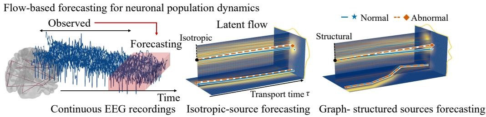
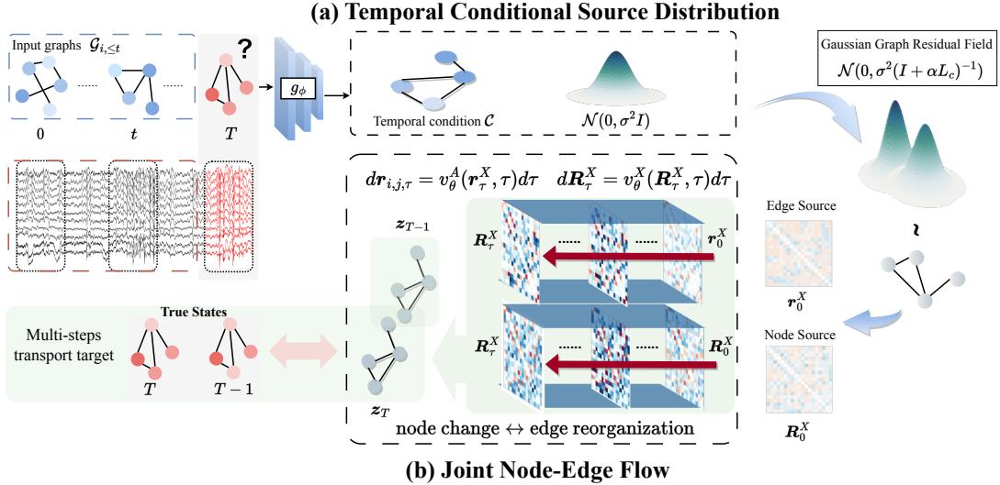
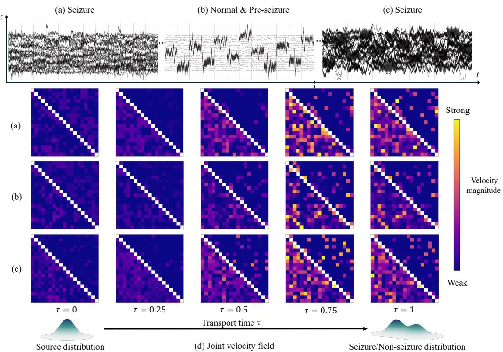
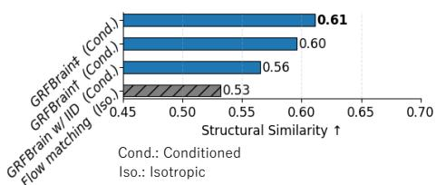
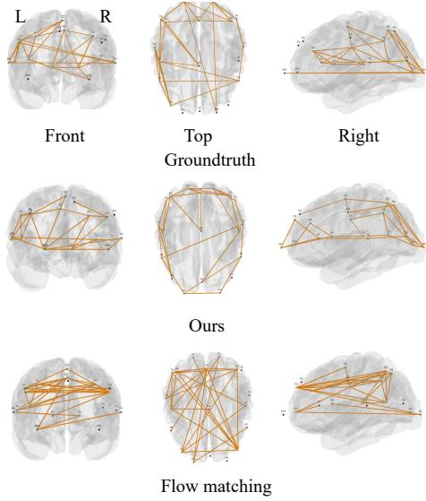
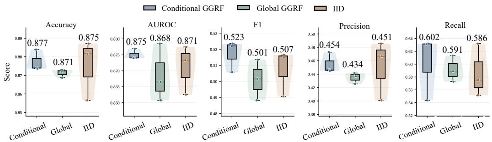
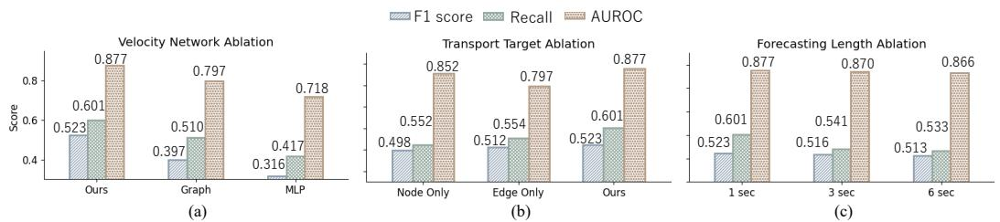
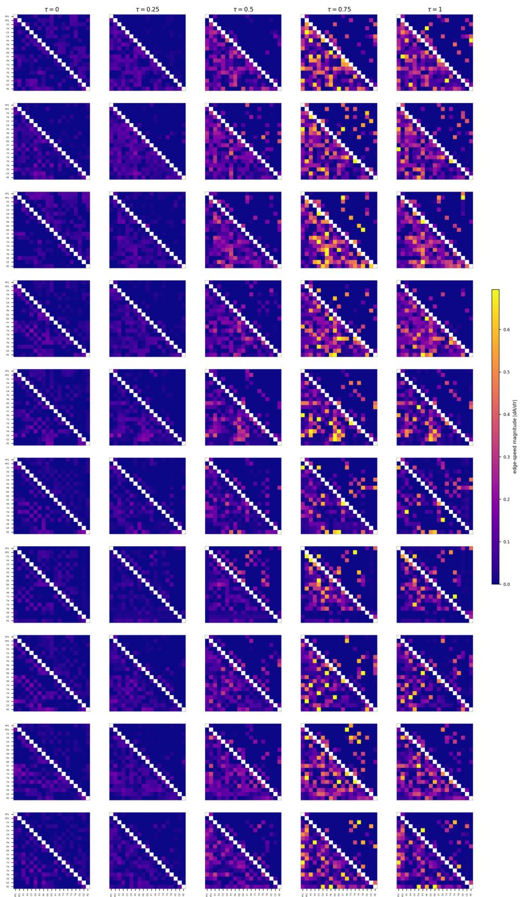

# GRFBRAIN: GRAPH-STRUCTURED RECTIFIED FLOWS FOR EEG DYNAMIC MODELING

Haohui Jia♠, Zheng Chen♣, Jathurshan Pradeepkumar♡, Xu Cao♢, Yasuko Matsubara♣, Yasushi Sakurai♣, Takashi Matsubara♠

♠ Faculty of Information Science and Technology, Hokkaido University, Japan

♣SANKEN, The University of Osaka, Japan

♡Department of Computer Science, University of Illinois Urbana-Champaign, USA ♢PediaMed AI, USA

## ABSTRACT

Forecasting time-varying functional connectivity from electroencephalography (EEG) requires modeling both history-dependent trends and structured variability across channels. Conditional flow matching provides a framework for distributional forecasting, yet it remains unclear whether graph-informed source distributions offer practical advantages over isotropic noise and strong deterministic predictors. We introduce a graph-structured residual flow framework that separates conditional mean prediction from stochastic residual transport. A historyonly predictor estimates the future connectivity graph, while a graph Gaussian source encodes dependencies derived from past connectivity through a Laplacianbased covariance. A conditional velocity field transports source samples to future graph residuals, with transport time explicitly distinguished from physical EEG time. Our study identifies the conditions and controls needed to distinguish useful residual transport from improvements attributable to deterministic prediction, learned representations, and sampling effects. Our code is available at https://github.com/HHJIAnmo/GRFBrain.

## 1 INTRODUCTION

Learning informative representations of electroencephalography (EEG) is central to clinical settings such as seizure detection (Pradeepkumar et al., 2026). What makes this difficult is that the relevant information is not located in a single channel. A seizure, for instance, is characterized less by abnormal activity at one electrode than by the emergence, spread, and dissolution of synchrony across electrodes. Representations must therefore encode two coupled aspects of brain dynamics: how channel-wise activity evolves, and how the functional relationships among channels over time.

Predictive learning offers a route to EEG representation learning by requiring a model to infer future activity from its history. Existing graph-based methods pursue this idea through next-window prediction, evolving graph convolutions, or continuous-time spectral dynamics (Tang et al., 2022; Kotoge et al., 2025; Jia et al., 2026). However, these objectives are deterministic: regression maps each history to a single future, encouraging representations of the conditional mean while suppressing structured uncertainty. This is particularly limiting near transitions, where similar histories may lead to different futures and discriminative cues can lie in deviations from the average trajectory.

Distributional objectives model multiple plausible futures rather than a single point estimate. Flow matching (FM) realizes this by learning a history-conditioned velocity field that transports a simple source distribution toward future states (Lipman et al., 2023), encouraging representations to capture both predictable trends and residual variability. In EEG, however, this variability is structured across channels and reflected in recent functional connectivity, whereas standard FM starts from isotropic Gaussian noise that treats channels and channel pairs as exchangeable, leaving the velocity field to recover these dependencies during transport. The central question is therefore not whether isotropic noise is sufficiently expressive, but whether a history-informed source defines a more informative predictive task for representation learning.

Table 1: Comparison of representative methods for modeling EEG dynamics.
<table><tr><td>Model</td><td>Formulation</td><td>Continuous</td><td>Graphical</td><td>Stochastic</td></tr><tr><td>CNN-LSTM</td><td>Spatial-temporal encoding</td><td>X</td><td>X</td><td>x</td></tr><tr><td>BIOT (Yang et al., 2023)</td><td>Biosignal Transformer</td><td>X</td><td>X</td><td>X</td></tr><tr><td>EvolveGCN (Pareja et al., 2020)</td><td>Evolving graph convolution</td><td>X</td><td>√</td><td>X</td></tr><tr><td>DCRNN</td><td>Diffusion-graph convolutional RNN</td><td>X</td><td>√</td><td>X</td></tr><tr><td>neural ODE</td><td>latent dynamics</td><td></td><td>X</td><td>X</td></tr><tr><td>neural SDE</td><td>Stochastic latent dynamics</td><td></td><td>X</td><td>V</td></tr><tr><td>ODEBrain (Jia et al., 2026)</td><td>Temporal-spatial latent dynamics</td><td></td><td>√</td><td>X</td></tr><tr><td>Flow Matching</td><td>Isotropic latent transport</td><td></td><td>x</td><td></td></tr><tr><td>GRFBrain</td><td>Conditioned joint graph flow</td><td></td><td>1</td><td></td></tr></table>

✓ denotes that the property is implemented; ✗ denotes that it is absent from the evaluated formulation.

This observation suggests that the source is not merely a sampling convenience but part of the learning task, and hence an inductive bias on the learned representation, as shown in Figure1. We therefore ask: can the channel dependencies observed in the history define the stochastic prediction task itself, rather than serving only as conditioning input to the encoder?

In this paper, we answer this question with GRFBrain, a graph-structured residual flow framework for predictive EEG representation learning. GRFBrain first decomposes the future EEG state into a history-derived reference and a residual, allowing the flow objective to focus on the variation that remains beyond the predictable trend. It then constructs a history-conditioned Gaussian source whose covariance is derived from the recent functional graph, so that source perturbations reflect the channel dependencies observed in each sample. The source energy is normalized to match that of an IID Gaussian control, so that their comparison isolates the role of relational structure from that of noise magnitude. Finally, a joint node–edge velocity network transports node and edge residuals in a shared state space, so that their bidirectional interactions shape the learned representation. For downstream prediction, the velocity network is evaluated once at the history-derived reference state, which corresponds to zero in residual coordinates. This readout requires neither source sampling nor numerical integration. As summarized in Table 1, existing methods are typically either graph-aware but deterministic, or stochastic without adaptive graph structure. Our contributions are threefold:

• We formulate predictive EEG representation learning as conditional transport in a joint node– edge residual space, separating the history-predictable component of the future from its remaining structured variability.

• We introduce a history-conditioned graph Gaussian source with energy matched to an IID baseline, together with a coupled node–edge velocity network that models interactions between channel activity and functional connectivity.

• We evaluate GSRF on seizure detection and conduct controlled studies of source geometry, node– edge coupling, transport targets, and forecasting horizon. GSRF improves F1 over deterministic graph-dynamics and standard flow-matching baselines, while the ablations isolate the benefit of history-adaptive source structure.

## 2 RELATED WORKS

Temporal graph methods for modeling EEG dynamics. Multichannel EEG can be represented as a graph, with channels as nodes and inter-channel relations as edges, motivating models that jointly capture temporal activity and spatial dependencies. Early work introduced temporal graph convolutions for seizure detection (Covert et al., 2019), followed by diffusion-convolutional recurrent networks with future-signal pretraining on geometric or correlation-based graphs (Tang et al., 2022). Later methods extended this framework through state-space modeling and dynamic graph learning in GraphS4mer (Tang et al., 2023), efficient residual recurrent updates in REST (Afzal et al., 2024), and explicit time-varying node-edge states in EvoBrain (Kotoge et al., 2025). Continuous-time extensions include BrainODE for reconstructing irregularly sampled fMRI with graph-aided neural ODEs (Han et al., 2024) and ODEBrain for learning continuous latent EEG graph trajectories under future-graph supervision (Jia et al., 2026). Despite this progression from temporal encoding to dynamic and continuous trajectories, these methods produce discriminative representations, point forecasts, or single trajectories rather than conditional distributions over future node-edge states.

  
Figure 1: (Left) Continuous EEG real-time neuronal activity recordings. (Mid) An isotropic gaussian source-based method learns dynamic representations. (Right) Ours provides a graph conditioned source-based approach for learning the neuronal population dynamics.

Generative methods for brain modeling. Generative graph models learn joint distributions over node and edge variables. GDSS evolves continuous graph states through coupled stochastic differential equations, while DiGress denoises categorical graphs in discrete spaces (Jo et al., 2022; Vignac et al., 2023); both target graph synthesis rather than EEG-conditioned forecasting. Flow Matching (FM) learns continuous transport along prescribed probability paths (Lipman et al., 2023), with extensions addressing graph generation and geometry (Eijkelboom et al., 2024; Jiang et al., 2026), source–target coupling and conditional sources (Tong et al., 2024; Chen et al., 2025; Issachar et al., 2025; Kim et al., 2026), and topology-aware priors or objectives (Borovitskiy et al., 2021; Wyrwal et al., 2026). Closest to our setting, GiFlow uses graph-informed priors for spatiotemporal imputation but does not jointly transport evolving edges (Zhang et al., 2026), whereas DiffeoCFM models brain-connectivity distributions without conditioning their evolution on EEG history (Colla et al., 2025). GRFBrain addresses this gap through a history-conditioned graph Gaussian source, reference-centered future residuals, and a shared velocity field for joint node-edge transport.

## 3 PRELIMINARY AND PROBLEM FORMULATION

Conditional Flow Matching. Given condition ${ \mathcal { C } } ,$ we sample $z _ { 0 } \sim p _ { 0 } ( \cdot \mid \mathcal { C } ) , z _ { 1 } \sim p _ { 1 } ( \cdot \mid \mathcal { C } )$ , and $\tau \sim \mathcal { U } [ 0 , 1 ]$ . The linear path $z _ { \tau } = ( 1 - \tau ) z _ { 0 } + \tau z _ { 1 }$ has target velocity ${ \pmb u } _ { \tau } = { \pmb z } _ { 1 } - { \pmb z } _ { 0 }$ . Conditional Flow Matching (CFM) learns

$$
\begin{array} { r } { \mathcal { L } _ { \mathrm { C F M } } ( \theta ) = \mathbb { E } _ { \mathcal { C } , z _ { 0 } , z _ { 1 } , \tau } \left[ \| v _ { \theta } ( z _ { \tau } , \tau \mid \mathcal { C } ) - \mathbf { u } _ { \tau } \| _ { 2 } ^ { 2 } \right] . } \end{array}\tag{1}
$$

Although ${ \pmb u } _ { \tau }$ is defined per sampled pair, the optimal regressor is the marginal velocity

$$
v ^ { \star } ( z , \tau \mid \mathcal { C } ) = \mathbb { E } [ z _ { 1 } - z _ { 0 } \mid z _ { \tau } = z , \mathcal { C } ] ,\tag{2}
$$

whose flow transports $p _ { 0 } ( \cdot \mid \mathcal { C } )$ to $p _ { 1 } ( \cdot \mid { \mathcal { C } } )$ (Lipman et al., 2023). Training requires no numerical integration, while generation solves $d z _ { \tau } / d \tau = v _ { \theta } ( z _ { \tau } , \tau \mid \mathcal { C } )$ . Here, τ is an artificial transport coordinate, distinct from the physical EEG window time s; the learned velocity therefore describes distributional transport rather than physiological dynamics.

Source-Target Mismatch in EEG Graph Transport. Standard CFM uses the isotropic source $p _ { 0 } ( z \mid { \mathcal { C } } ) = { \bar { \mathcal { N } } } ( \mathbf { 0 } , I )$ , as an independent identically distributed (IID). Although expressive in principle, this source ignores the relational geometry available in the past EEGs. Future EEG graphs couple channel-wise node features with pairwise edges, and their unpredictable component retains history-dependent cross-channel structure. An isotropic source needs a finite-capacity velocity field to learn the conditional shift, and node-edge dependence. This mismatch raises two questions.

1. How should the state and source be defined? The future state should be centered by its temporal component, with source and target defined in the same residual node-edge space. The source should use observed history, encode the graph topology to control the total variance, so that a comparison with an IID source isolates the covariance structure rather than the noise scale.

  
Figure 2: Overview of the proposed GRFBrain. (a) Temporal EEG features and functional association graphs define state-dependent states and a graph Gaussian residual source, whose covariance is adapted to the observed graph states. (b) A joint node-edge velocity network transports node and edge residuals along a shared flow coordinate, coupling channel-wise state variations.

2. How should nodes and edges be transported jointly? Because node activity and functional connectivity are coupled, the velocity field should support bidirectional node-to-edge and edge-tonode interactions instead of fixing the adjacency matrix or learning independent fields.

These requirements motivate our predictor-centered residual state, temporal-conditioned graph source, and shared node-edge velocity field.

## 4 METHODOLOGY

Figure 2 shows the system overview of GRFBrain. First, it decomposes the temporal EEG graph embedding with sequential encoding as condition states to construct a graph-structured Gaussian source. Second, a Joint Node-Edge velocity field between source and target state.

## 4.1 HISTORY-CONDITIONED GRAPH GAUSSIAN SOURCE

Let $\mathcal { C } = \{ ( X _ { s } , A _ { s } ) \} _ { s = t - H + 1 } ^ { t }$ denote an EEG history of H physical windows, where $\pmb { X } _ { s } \in \mathbb { R } ^ { N \times F }$ contains channel-wise spectral features and $A _ { s } \in \mathbb { R } ^ { N \times N }$ is a directed top-k graph. We represent its undirected continuous edge state by $\pmb { a } _ { s } = \mathcal { U } ( \pmb { S } _ { s } ) \in \mathbb { R } ^ { m }$ , where $S _ { s } = \overline { { ( A _ { s } + A _ { s } ^ { \top } ) / 2 } }$ has zero diagonal, U extracts its strict upper triangle, and $m = N ( N - 1 ) / 2$

We model the future graph relative to a history-dependent reference. Let $M _ { X } \in \mathbb { R } ^ { N \times F }$ be the mean historical node state and m $\mathbf { \mathcal { A } } \in \mathbb { R } ^ { m }$ the edge reference produced by a frozen graph forecaster $g _ { \phi }$ The target residuals are

$$
M _ { X } = \frac { 1 } { H } \sum _ { s = t - H + 1 } ^ { t } X _ { s } , \qquad R _ { 1 } ^ { X } = X _ { t + 1 } - M _ { X } , \qquad r _ { 1 } ^ { A } = a _ { t + 1 } - m _ { A } .\tag{3}
$$

This decomposition assigns the predictable component to the reference model and leaves the conditional variation to the flow. Unlike an independent and identically distributed (i.i.d.) Gaussian source, our source uses the relational geometry of the observed history. Define $\begin{array} { r l } { \overline { { \cal S } } _ { \mathcal { C } } } & { { } = } \end{array}$

$\begin{array} { r } { H ^ { - 1 } \sum _ { s = t - H + 1 } ^ { t } S _ { s } } \end{array}$ and construct

$$
\begin{array} { r } { \pmb { L _ { \mathscr { C } } } = \pmb { I _ { N } } - \pmb { D _ { \mathscr { C } } ^ { - 1 / 2 } } \overline { { \pmb { S _ { C } } } } \pmb { D _ { \mathscr { C } } ^ { - 1 / 2 } } , \qquad \pmb { K _ { \mathscr { C } } } = \frac { N ( \pmb { I _ { N } } + \alpha \pmb { L _ { \mathscr { C } } } ) ^ { - \nu } } { \mathrm { t r } [ ( \pmb { I _ { N } } + \alpha \pmb { L _ { \mathscr { C } } } ) ^ { - \nu } ] } , \qquad \pmb { G _ { \mathscr { C } } } = \pmb { K _ { \mathscr { C } } ^ { 1 / 2 } } . } \end{array}\tag{4}
$$

Here, $D _ { \mathcal { C } }$ is the stabilized degree matrix, $\alpha \geq 0$ , and $\nu > 0$ . Trace normalization gives $\mathrm { t r } ( \pmb { K } _ { \mathcal { C } } ) = N$ while $( 1 + \alpha \lambda _ { i } ) ^ { - \nu }$ suppresses high graph-frequency modes. Node and edge residuals are sampled as

$$
{ \pmb R } _ { 0 } ^ { X } = \sigma _ { X } { \pmb G } _ { \mathcal { C } } \epsilon _ { X } , \qquad { \pmb r } _ { 0 } ^ { A } = \sigma _ { A } s _ { \mathcal { C } } \mathcal { U } ( { \pmb G } _ { \mathcal { C } } { \pmb \Xi } _ { A } { \pmb G } _ { \mathcal { C } } ) , \qquad { \pmb \Xi } _ { A } = \mathcal { U } ^ { - 1 } ( \epsilon _ { A } ) ,\tag{5}
$$

where $\epsilon _ { X }$ and $\epsilon _ { A }$ are independent standard Gaussian innovations, and $s _ { \mathcal { C } }$ normalizes the edge energy. The two sources are conditionally independent but share $G _ { \mathcal { C } }$ , so their covariance follows the historical graph while their total energies remain matched to the i.i.d. control. In the original coordinates, the source is centered at $( M _ { X } , m _ { A } )$ . The graph is used only as an empirical conditioning structure and is not interpreted as an anatomical or causal brain network. Appendix B provides the forecaster objective, numerical stabilization, and covariance derivations.

## 4.2 JOINT NODE–EDGE RESIDUAL FLOW

We model node and edge residuals with a shared velocity field

$$
v _ { \theta } : \mathbb { R } ^ { N \times F } \times \mathbb { R } ^ { m } \times [ 0 , 1 ] \times \mathcal { C } \to \mathbb { R } ^ { N \times F } \times \mathbb { R } ^ { m } ,
$$

implemented by a joint node–edge Transformer (Jo et al., 2022; Vignac et al., 2023). It maintains one node token per channel and one symmetric edge token per unordered channel pair, including pairs with zero observed weight.

Let $c _ { i }$ denote the temporal encoding of channel $i ,$ and let $c _ { A }$ summarize the edge history. The global condition $\begin{array} { r } { \pmb q _ { \tau } = \mathsf { \bar { \Psi } } N ^ { - 1 } \sum _ { i } \pmb { c } _ { i } ; \bar { \pmb { c } } _ { A } ; } \end{array}$ Emb(τ)] modulates each block through feature-wise linear modulation (FiLM) (Perez et al., 2018). Initial tokens are

$$
\begin{array} { r l } & { \pmb { h } _ { i } ^ { ( 0 ) } = P _ { X } ( [ \pmb { R } _ { \tau , i } ^ { X } ; \pmb { M } _ { X , i } ] ) + P _ { N } ( \pmb { c } _ { i } ) , } \\ & { \pmb { e } _ { i j } ^ { ( 0 ) } = P _ { A } ( [ \pmb { r } _ { \tau , i j } ^ { A } ; m _ { A , i j } ] ) + P _ { P } ( \chi ( \pmb { c } _ { i } , \pmb { c } _ { j } ) ) + P _ { O } ( [ { \cal L } _ { \mathcal { C } , i j } ; K _ { \mathcal { C } , i j } ] ) , \qquad i < j , } \end{array}\tag{6}
$$

where $P _ { X } , P _ { N } , P _ { A } , P _ { P } , P _ { O }$ are learned projections and $\chi ( \pmb { u } , \pmb { v } ) = [ \pmb { u } + \pmb { v } ; | \pmb { u } - \pmb { v } | ; \pmb { u } \odot \pmb { v } ]$ is symmetric in its arguments.

Each interaction block uses edge tokens as attention biases and incident-edge messages for node updates. The updated endpoint tokens then revise their edge through the same symmetric descriptor:

$$
\begin{array} { r l } & { { \pmb h } _ { i } ^ { ( \ell + 1 ) } = \mathrm { N o d e B l o c k } _ { \ell } \left( { \pmb h } _ { i } ^ { ( \ell ) } , \{ { \pmb e } _ { i j } ^ { ( \ell ) } \} _ { j } ; { \pmb q } _ { \tau } \right) , } \\ & { { \pmb e } _ { i j } ^ { ( \ell + 1 ) } = \mathrm { E d g e B l o c k } _ { \ell } \left( { \pmb e } _ { i j } ^ { ( \ell ) } , \chi ( { \pmb h } _ { i } ^ { ( \ell + 1 ) } , { \pmb h } _ { j } ^ { ( \ell + 1 ) } ) ; { \pmb q } _ { \tau } \right) . } \end{array}\tag{7}
$$

After J blocks, separate affine heads produce ${ \pmb v } _ { \theta } ^ { X } \in \mathbb { R } ^ { N \times F }$ and $\pmb { v } _ { \theta } ^ { A } \in \mathbb { R } ^ { m }$ . Thus, edges guide node updates while node states jointly determine edge updates.

## 4.3 CONDITIONAL FLOW-MATCHING OBJECTIVE

For each future target, we sample $( R _ { 0 } ^ { X } , r _ { 0 } ^ { A } )$ from the conditional source and draw a shared $\tau \sim$ $\mathcal { U } ( 0 , 1 )$ . Node and edge residuals follow

$$
\begin{array} { c c } { { \pmb { R } _ { \tau } ^ { X } = ( 1 - \tau ) { \pmb R } _ { 0 } ^ { X } + \tau { \pmb R } _ { 1 } ^ { X } , } } & { { \pmb { u } ^ { X } = { \pmb R } _ { 1 } ^ { X } - { \pmb R } _ { 0 } ^ { X } , } } \\ { { \pmb { r } _ { \tau } ^ { A } = ( 1 - \tau ) { \pmb r } _ { 0 } ^ { A } + \tau { \pmb r } _ { 1 } ^ { A } , } } & { { \pmb u ^ { A } = { \pmb r } _ { 1 } ^ { A } - { \pmb r } _ { 0 } ^ { A } . } } \end{array}\tag{8}
$$

Source and target residuals are paired independently given ${ \mathcal { C } } ;$ hence, this is conditional linear Flow Matching rather than an optimal-transport coupling.

To balance the two state spaces, let $q _ { X }$ and $q _ { A }$ be the fixed per-coordinate target-velocity energies estimated from the training set: $q _ { X } ~ = ~ \operatorname* { m a x } \{ { \widehat { \mathbb { E } } } _ { \mathrm { t r a i n } } [ \| { \pmb u } ^ { X } \| _ { F } ^ { 2 } / ( N F ) ] , \epsilon _ { q } \}$ and $q _ { A } \quad =$ max $\{ \widehat { \mathbb { E } } _ { \mathrm { t r a i n } } [ \| \pmb { u } ^ { A } \| _ { 2 } ^ { 2 } / m ] , \epsilon _ { q } \}$ . The normalized conditional Flow Matching (CFM) objective is

$$
\mathcal { L } _ { \mathrm { C F M } } ( \theta ) = \mathbb { E } \bigg [ \frac { \| \pmb { v } _ { \theta } ^ { X } - \pmb { u } ^ { X } \| _ { F } ^ { 2 } } { N F q _ { X } } + \frac { \| \pmb { v } _ { \theta } ^ { A } - \pmb { u } ^ { A } \| _ { 2 } ^ { 2 } } { m q _ { A } } \bigg ] ,\tag{9}
$$

where the expectation covers training histories and targets, conditional source samples, and τ. The objective remains standard CFM (Lipman et al., 2023); the proposed design changes the residual target, source covariance, and joint node–edge state space.

## 5 EXPERIMENTS

In this section, we conduct experiments to answer the following research questions:

\- RQ1. Does GRFBrain strengthen seizure detection capacity through temporal-conditioned flow matching?

\- RQ2. How does source geometry affect the development of latent transport?

\- RQ3. Does the source-target objective of ${ \mathcal { L } } _ { \mathrm { C F M } }$ facilitate dynamic optimization?

More detailed experiment settings can be found in the Appendix 6.

## 5.1 EXPERIMENTAL SETUP

Tasks. We evaluate GRFBrain on two downstream tasks: seizure detection and abnormal EEG classification. These complementary tasks assess the utility of the learned EEG representations in identifying seizure-related activity and distinguishing abnormal from EEG patterns. Detailed descriptions of the datasets are provided in Section C.4.

Baseline methods. We organize the baselines with the following learning paradigms. First, we consider conventional sequence-based EEG models, including CNN-LSTM (Ahmedt-Aristizabal et al., 2020) and the Transformerbased biosignal model BIOT (Yang et al., 2023). Second, we compare with discrete time graph dynamics models, including DCRNN (Li et al., 2017) and EvolveGCN (Pareja et al., 2020), which model temporal graph evolution through recurrent mechanisms. We also include continuous time dynamics models. ODE-RNN (Rubanova et al., 2019), a neural stochastic differential equation (SDE) model (Liu et al., 2019), graph differential equations (GDEs) (Poli et al., 2019), and ODE-Brain (Jia et al., 2026), which explicitly models continuous EEG graph dynamics. Finally, we also compare with flow-based predictive baselines, including standard Flow matching (Lipman et al., 2023) and Rectified flow (Liu et al., 2022).

Table 2: Results (AUROC↑, F1↑) on TUSZ (12s and 60s seizure detection). The upper block compares GRFBrain with discrete and continuous baselines (bold = best); the lower block ablates the node-edge interaction routes within GRFBrain.
<table><tr><td rowspan="4">Model Floww-ased</td><td>Method</td><td>T(s) AUROC</td><td>F1</td></tr><tr><td>BIOT</td><td>12 0.772±0.006 0.294±0.006 60 0.642±0.009</td><td>0.256±0.003</td></tr><tr><td>DCRNN</td><td>12 0.825±0.002 60 0.802±0.003</td><td>0.416±0.009 0.413±0.005</td></tr><tr><td>Flow matching</td><td>12 0.813±0.002 60 0.725±0.006</td><td>0.372±0.013 0.311±0.028</td></tr><tr><td rowspan="3">GRain</td><td>GRFBrain</td><td>12 0.877±0.003 60</td><td>0.523±0.014 0.831±0.004 0.488±0.032</td></tr><tr><td>Edge-to-Node</td><td>12 60 0.821±0.034</td><td>0.867±0.004 0.488±0.007</td></tr><tr><td>Node-to-Edge</td><td>12 0.848±0.017 0.817±0.029</td><td>0.424±0.003 0.462±0.013 0.414±0.047</td></tr><tr><td rowspan="3"></td><td>No-cross</td><td>60 12</td><td>0.673±0.007 0.374±0.033</td></tr><tr><td></td><td>60</td><td>0.519±0.0060.334±0.017</td></tr><tr><td></td><td></td><td></td></tr></table>

Metrics. To answer RQ1, we evaluate the model using the Area Under the Receiver Operating Characteristic Curve (AUROC) and the

F1 score. The AUROC measures the ability of the models across varying thresholds, while the F1 score highlights the balance between precision and recall at its optimal threshold for classification. For RQ2, we measure the structural similarity of the predicted graph using the Global Jaccard Index (GJI) $\begin{array} { r } { \mathtt { G J I } ( \mathcal { E } _ { t r u e } , \mathcal { E } _ { P r e d } ) = \frac { | \mathcal { E } _ { t r u e } \cap \mathcal { E } _ { P r e d } | } { | \mathcal { E } _ { t r u e } \cup \mathcal { E } _ { P r e d } | } } \end{array}$ (Castrillo et al., 2018). For RQ3, We compute the cosine similarity of predicted node embeddings.

## 5.2 RESULTS

## 5.2.1 MAIN RESULT

RQ1 concerns the forecasting-based transport capability on EEG. Table 3 compares GRFBrain with conventional EEG models, discrete graph-dynamics methods, continuous-time models, and generic flow-based predictors on TUSZ and TUAB. On TUSZ, the multi-step variant achieves the highest Accuracy of $0 . 8 8 3 \pm 0 . 0 0 4$ , improving over the corresponding ODEBrain variant across all three metrics. The single-step variant obtains the best F1 score of $0 . 5 2 3 \pm 0 . 0 1 4$ , an absolute gain of 2.7 percentage points over ODEBrain $( 0 . 4 9 6 \pm 0 . 0 1 7 )$ , while remaining competitive in AU-ROC $( 0 . 8 7 \bar { 7 } \pm 0 . 0 0 \bar { 3 }$ versus $0 . 8 8 1 \pm 0 . 0 0 6 )$ . On TUAB, both variants consistently outperform their ODEBrain counterparts, with the multi-step variant achieving the best Accuracy, F1, and AUROC of $0 . 7 8 9 \pm 0 . 0 0 6 , \bar { 0 . 7 } 8 6 \pm 0 . 0 0 4$ , and $0 . 8 7 8 \pm 0 . 0 0 4$ , respectively. Generic flow learning alone does not reproduce these gains. On TUSZ, standard flow matching attains a relatively high Accuracy of

Table 3: Main results on TUSZ (12s seizure detection) and TUAB abnormal EEG classification, reported as mean ± standard deviation over three seeds. Bold and underline indicate the best and second-best results for each metric, respectively. † denotes models trained with a multi-step predictive objective, and ‡ denotes models trained with a single-step predictive objective.
<table><tr><td rowspan="2">Method</td><td colspan="3">TUSZ</td><td colspan="3">TUAB</td></tr><tr><td>Acc</td><td>F1</td><td>AUROC</td><td>Acc</td><td>F1</td><td>AUROC</td></tr><tr><td>CNN-LSTM</td><td> $0 . 7 3 5 \pm 0 . 0 0 3$ </td><td> $0 . 3 4 7 \pm 0 . 0 1 2$ </td><td> $0 . 7 5 7 \pm 0 . 0 0 3$ </td><td> $0 . 7 4 1 \pm 0 . 0 0 2$ </td><td> $0 . 7 3 6 \pm 0 . 0 0 7$ </td><td> $0 . 8 1 3 \pm 0 . 0 0 3$ </td></tr><tr><td>BIOT</td><td> $0 . 7 0 2 \pm 0 . 0 0 3$ </td><td> $0 . 2 9 4 \pm 0 . 0 0 6$ </td><td> $0 . 7 7 2 \pm 0 . 0 0 6$ </td><td> $0 . 7 1 7 \pm 0 . 0 0 2$ </td><td> $0 . 7 1 3 \pm 0 . 0 0 4$ </td><td> $0 . 7 8 8 \pm 0 . 0 0 2$ </td></tr><tr><td>EvolveGCN</td><td> $0 . 7 6 9 \pm 0 . 0 0 2$ </td><td> $0 . 3 8 5 \pm 0 . 0 0 5$ </td><td> $0 . 7 9 1 \pm 0 . 0 0 4$ </td><td> $0 . 7 0 8 \pm 0 . 0 0 3$ </td><td> $0 . 7 0 7 \pm 0 . 0 0 2$ </td><td> $0 . 7 7 7 \pm 0 . 0 0 3$ </td></tr><tr><td>DCRNN</td><td> $0 . 8 1 6 \pm 0 . 0 0 2$ </td><td> $0 . 4 1 6 \pm 0 . 0 0 9$ </td><td> $0 . 8 2 5 \pm 0 . 0 0 2$ </td><td> $0 . 7 6 8 \pm 0 . 0 0 4$ </td><td> $0 . 7 6 9 \pm 0 . 0 0 2$ </td><td> $0 . 8 4 8 \pm 0 . 0 0 2$ </td></tr><tr><td>latent-ODE</td><td> $0 . 8 2 7 \pm 0 . 0 0 4$ </td><td> $0 . 4 7 0 \pm 0 . 0 0 5$ </td><td> $0 . 8 4 9 \pm 0 . 0 0 4$ </td><td> $0 . 7 4 9 \pm 0 . 0 0 3$ </td><td> $0 . 7 4 5 \pm 0 . 0 0 2$ </td><td> $0 . 8 2 9 \pm 0 . 0 0 4$ </td></tr><tr><td>latent-ODE (RK4)</td><td> $0 . 8 2 1 \pm 0 . 0 0 3$ </td><td> $0 . 4 6 5 \pm 0 . 0 0 1$ </td><td> $0 . 8 4 5 \pm 0 . 0 0 4$ </td><td> $0 . 7 4 6 \pm 0 . 0 0 2$ </td><td> $0 . 7 3 9 \pm 0 . 0 0 2$ </td><td> $0 . 8 2 3 \pm 0 . 0 0 3$ </td></tr><tr><td>ODE-RNN</td><td> $0 . 8 0 2 \pm 0 . 0 0 2$ </td><td> $0 . 4 5 5 \pm 0 . 0 0 7$ </td><td> $0 . 8 5 5 \pm 0 . 0 0 3$ </td><td> $0 . 7 5 1 \pm 0 . 0 0 3$ </td><td> $0 . 7 4 4 \pm 0 . 0 0 4$ </td><td> $0 . 8 3 8 \pm 0 . 0 0 5$ </td></tr><tr><td>neural SDE</td><td> $0 . 8 5 7 \pm 0 . 0 0 2$ </td><td> $0 . 4 6 7 \pm 0 . 0 0 3$ </td><td> $0 . 8 5 1 \pm 0 . 0 0 2$ </td><td> $0 . 7 6 8 \pm 0 . 0 0 3$ </td><td> $0 . 7 5 1 \pm 0 . 0 0 3$ </td><td> $0 . 8 3 4 \pm 0 . 0 0 2$ </td></tr><tr><td>GDEs</td><td> $0 . 8 4 9 \pm 0 . 0 0 3$ </td><td> $0 . 4 7 5 \pm 0 . 0 0 5$ </td><td> $0 . 8 4 1 \pm 0 . 0 0 3$ </td><td> $0 . 7 5 7 \pm 0 . 0 0 3$ </td><td> $0 . 7 3 7 \pm 0 . 0 0 6$ </td><td> $0 . 8 2 3 \pm 0 . 0 0 4$ </td></tr><tr><td>Flow matching</td><td> $0 . 8 7 4 \pm 0 . 0 0 2$ </td><td> $0 . 3 7 2 \pm 0 . 0 1 3$ </td><td> $0 . 8 1 3 \pm 0 . 0 0 2$ </td><td> $0 . 7 4 1 \pm 0 . 0 1 1$ </td><td> $0 . 7 1 9 \pm 0 . 0 0 7$ </td><td> $0 . 8 0 3 \pm 0 . 0 0 6$ </td></tr><tr><td>Rectified flow</td><td> $0 . 7 2 1 \pm 0 . 0 0 1$ </td><td> $0 . 1 9 5 \pm 0 . 0 0 8$ </td><td> $0 . 5 6 6 \pm 0 . 0 0 2$ </td><td> $0 . 7 5 3 \pm 0 . 0 0 4$ </td><td> $0 . 7 2 1 \pm 0 . 0 0 4$ </td><td> $0 . 8 1 1 \pm 0 . 0 0 3$ </td></tr><tr><td> $\mathrm { { O D E B r a i n } ^ { \dag } }$ </td><td> $0 . 8 6 9 \pm 0 . 0 0 3$ </td><td> $0 . 4 8 8 \pm 0 . 0 1 5$ </td><td> $0 . 8 7 5 \pm 0 . 0 0 5$ </td><td> $0 . 7 7 1 \pm 0 . 0 0 5$ </td><td> $0 . 7 7 0 \pm 0 . 0 0 5$ </td><td> $0 . 8 4 9 \pm 0 . 0 0 3$ </td></tr><tr><td> $\mathrm { { O D E B r a i n } ^ { \ddag } }$ </td><td> $0 . 8 7 7 \pm 0 . 0 0 4$ </td><td> $0 . 4 9 6 \pm 0 . 0 1 7$ </td><td> $\mathbf { 0 . 8 8 1 \pm 0 . 0 0 6 }$ </td><td> $0 . 7 7 8 \pm 0 . 0 0 3$ </td><td> $0 . 7 7 4 \pm 0 . 0 0 5$ </td><td> $0 . 8 5 7 \pm 0 . 0 0 5$ </td></tr><tr><td> $\mathtt { G R F B r a i n } ^ { \dag }$ </td><td> $\mathbf { 0 . 8 8 3 \pm 0 . 0 0 4 }$ </td><td> $0 . 5 0 3 \pm 0 . 0 1 2$ </td><td> $0 . 8 7 6 \pm 0 . 0 0 1$ </td><td> $\mathbf { 0 . 7 8 9 \pm 0 . 0 0 6 }$ </td><td> $\mathbf { 0 . 7 8 6 \pm 0 . 0 0 4 }$ </td><td> $\mathbf { 0 . 8 7 8 \pm 0 . 0 0 4 }$ </td></tr><tr><td> $\mathtt { G R F B r a i n } ^ { \ddag }$ </td><td> $\underline { { 0 . 8 7 8 \pm 0 . 0 0 1 } }$ </td><td> $\mathbf { 0 . 5 2 3 \pm 0 . 0 1 4 }$ </td><td> $\underline { { 0 . 8 7 7 } } \pm 0 . 0 0 3$ </td><td> $\underline { { 0 . 7 8 7 \pm 0 . 0 0 4 } }$ </td><td> $\underline { { 0 . 7 8 3 \pm 0 . 0 0 4 } }$ </td><td> $\underline { { 0 . 8 7 7 } } \pm 0 . 0 0 6$ </td></tr></table>

– denotes a configuration that has not been evaluated on the corresponding corpus.

  
Figure 3: Visualization of the proposed joint node-edge velocity field $v _ { \theta }$ (middle) obtained by $\mathtt { G R F B r a i n } .$ . The learned velocity exists the distinct patterns of graph reconfiguration, which seizure represents higher and dense magnitude and non-seizure represents lower and sparse magnitude.

(b) Predicted graph structures

$0 . 8 7 4 \pm 0 . 0 0 2$ , but its F1 and AUROC decrease to $0 . 3 7 2 \pm 0 . 0 1 3$ and $0 . 8 1 3 \pm 0 . 0 0 6 ;$ Rectified Flow performs worse across all three metrics. Taken together, these results answer RQ1: distributional forecasting improves EEG representation when flow matching is coupled with history-conditioned graph structure and joint node-edge transport, rather than applied as a generic predictive objective.

Beyond downstream performance, we further investigate whether the learned joint field $v _ { \theta }$ captures state-dependent reorganization of channel associations. We analyze the edge-velocity field $v _ { \theta } ^ { A }$ across the transport time τ. Positive and negative velocities respectively indicate tendencies to strengthen and weaken pairwise associations. As shown in Figure3, edge-velocity magnitudes are relatively weak near the source side and become increasingly structured toward larger τ . Rather than exhibiting a uniform global change, the field concentrates on subsets of channel pairs, suggesting that the learned representation is associated with selective graph reconfiguration.

These results suggest that the joint velocity encourages representations that encode not only channelwise spectral states but also how their relational organization may be reconfigured. This provides a complementary explanation for the downstream gains by interpreting the learned flow as an estimation of latent EEG dynamics. Taken together, the quantitative and qualitative results answer RQ1 affirmatively. GRFBrain improves seizure detection by coupling conditional flow matching with joint node-edge transport, thereby transforming temporaldependent graph reconfiguration into class representations.

RQ2 concerns the geometry of noise. Figure5 compares the conditional GGRF with a global GGRF and an IID Gaussian source. The conditional GGRF performs best across all five metrics, achieving an Accuracy of 0.877, an AUROC of 0.875, and an F1 score of 0.523. Compared with the global GGRF, it improves F1 and AUROC by 2.2 and 0.7, respectively. It also outperforms the IID Gaussian in F1, AUROC, and Recall despite their similar Accuracy and Precision. The weaker performance of the global GGRF indicates that graph correlation alone is insufficient. The IID Gaussian discards interchannel dependencies, whereas the global GGRF imposes the same relational geometry on each sample. In contrast, the conditional GGRF adapts its covariance to the observed EEG history. Because the source determines both the interpolated states and their velocity targets, this sample-specific covariance produces transport paths aligned with the current graph structure. These results answer RQ2: latent transport benefits from a history-conditioned source geometry rather than an isotropic or globally shared source, yielding more discriminative node-edge representations.

  
(a) Predicted graph structural similarity scores result

  
Figure 4: Results on (a) graph similarity and (b) functional connections.

Necessity of bidirectional node-edge interaction. Table 2 compares velocity-field designs on 12 s and 60 s EEG clips. The full bidirectional field achieves the highest AUROC/F1 of 0.877/0.523 and 0.831/0.488, respectively. Its advantage over standard FM shows that the generic objective alone is insufficient, while the within-GRFBrain ablations isolate the interaction mechanism. Removing cross-stream messages reduces AUROC/F1 to 0.673/0.374 and 0.519/0.334, despite retaining both node and edge states. One-way interaction partially recovers performance, with Edge-to-Node consistently outperforming Node-to-Edge, likely because it directly updates the node representations consumed by the classifier. Neither direction alone matches bidirectional interaction. Relative to Edge-to-Node, the full field improves F1 by 0.035 and 0.064 at 12 s and 60 s, with an AUROC gain of 0.010 in both settings. Thus, within this architecture, representing both state types is insufficient; reciprocal node-edge communication is required for the strongest downstream performance.

  
Figure 5: Effect of source geometry in GRFBrain. IID Gaussian, global GGRF, and our conditioned GGRF sources are compared across downstream classification metrics. Our conditional GGRF consistently improves the learned representation quality.

  
Figure 6: Summary of ablation study. (a) Velocity-network parameterization, (b) node and edge transport targets, and (c) forecasting horizon. The proposed joint node–edge velocity network, joint transport supervision, and short-horizon prediction provide the strongest overall performance.

RQ3 concerns consistency in the graphs with source-target objective of $\mathcal { L } _ { \mathrm { C F M } }$ . Figure4 compares the predicted functional graphs with their target structures. GRFBrain increases the graphsimilarity score from 0.53 for the FM to 0.61. Its similarity matrix also better preserves local correlations and blockwise dependency patterns, whereas the baseline exhibits larger structural discrepancies. These results support the role of ${ \mathcal { L } } _ { \mathrm { C F M } }$ in coordinating node and edge evolution along the transport path. We therefore answer RQ3 affirmatively: source-target supervision improves the structural fidelity of future-graph prediction by guiding the two-stream velocity field to learn consistent node-edge dynamics.

## 5.3 ABLATION STUDY

Effects of velocity architecture and forecasting options. Figure6 evaluates the velocity architecture, transport targets, and forecasting horizon. The joint velocity network achieves an F1 of 0.523 and an AUROC of 0.877, outperforming the graph-only (0.397/0.797) and MLP (0.316/0.718) alternatives. This result attributes the gain to explicit node–edge coupling rather than the Flow Matching objective alone. Joint node–edge supervision also performs best: removing edge supervision reduces F1/Recall from 0.523/0.601 to 0.498/0.552, whereas edge-only supervision retains a competitive F1 of 0.512 but lowers AUROC to 0.797. Node dynamics and relational reconfiguration therefore provide complementary predictive information. Finally, extending the horizon from 1 s to 3 s and 6 s progressively decreases F1 (0.523→0.516→0.513) and Recall (0.601→0.541→0.533), suggesting that the 1 s target better captures rapidly evolving EEG dynamics, while longer horizons introduce greater predictive uncertainty.

## 6 CONCLUSION

In this work, we introduced GRFBrain, a temporal-conditioned graph Flow Matching framework for predictive EEG representation learning. GRFBrain decomposes node-edge sequences into pastderived states and residuals, and learns their joint transport through a bidirectional node-edge velocity field. Limitation: Current evaluation is limited to epoched EEG and short-horizon supervision.

## REFERENCES

Arshia Afzal, Grigorios Chrysos, Volkan Cevher, and Mahsa Shoaran. REST: Efficient and accelerated EEG seizure analysis through residual state updates. In Ruslan Salakhutdinov, Zico Kolter, Katherine Heller, Adrian Weller, Nuria Oliver, Jonathan Scarlett, and Felix Berkenkamp (eds.), Proceedings of the 41st International Conference on Machine Learning, volume 235 of Proceedings of Machine Learning Research, pp. 271–290. PMLR, 2024. URL https: //proceedings.mlr.press/v235/afzal24a.html.

David Ahmedt-Aristizabal, Tharindu Fernando, Simon Denman, Lars Petersson, Matthew J. Aburn, and Clinton Fookes. Neural memory networks for seizure type classification. In 2020 42nd Annual International Conference of the IEEE Engineering in Medicine & Biology Society (EMBC), pp. 569–575. IEEE, 2020. doi: 10.1109/EMBC44109.2020.9175641. URL https://doi.org/ 10.1109/EMBC44109.2020.9175641.

Viacheslav Borovitskiy, Iskander Azangulov, Alexander Terenin, Peter Mostowsky, Marc Deisenroth, and Nicolas Durrande. Matern Gaussian Processes on Graphs. In Arindam Banerjee and´ Kenji Fukumizu (eds.), Proceedings of the 24th International Conference on Artificial Intelligence and Statistics, volume 130 of Proceedings ofMachine Learning Research, pp. 2593–2601. PMLR, 2021. URL https://proceedings.mlr.press/v130/borovitskiy21a. html.

Eduar Castrillo, Elizabeth Leon, and Jonatan G ´ omez. Dynamic structural similarity on graphs. ´ arXiv preprint arXiv:1805.01419, 2018.

Chen Chen, Pengsheng Guo, Liangchen Song, Jiasen Lu, Rui Qian, Tsu-Jui Fu, Xinze Wang, Wei Liu, Yinfei Yang, and Alex Schwing. CAR-Flow: Condition-aware reparameterization aligns source and target for better flow matching. In Advances in Neural Information Processing Systems, volume 38, pp. 94919–94945. Curran Associates, Inc., 2025. doi: 10.52202/085713-3173. URL https://proceedings.neurips.cc/paper\_files/paper/2025/hash/ 8838314582eb031f55aee65a703e76c5-Abstract-Conference.html.

Zheng Chen, Lingwei Zhu, Haohui Jia, and Takashi Matsubara. A two-view eeg representation for brain cognition by composite temporal-spatial contrastive learning. In Proceedings of the 2023 SIAM International Conference on Data Mining (SDM), pp. 334–342. SIAM, 2023.

Antoine Collas, Ce Ju, Nicolas Salvy, and Bertrand Thirion. Riemannian flow matching for brain connectivity matrices via pullback geometry. In Advances in Neural Information Processing Systems, volume 38, pp. 59589–59639. Curran Associates, Inc., 2025. doi: 10.52202/085713-1993. URL https://proceedings.neurips.cc/paper\_files/paper/2025/hash/ 5616112a0120c15bf7d47a6bccc21bc3-Abstract-Conference.html.

Ian C. Covert, Balu Krishnan, Imad Najm, Jiening Zhan, Matthew Shore, John Hixson, and Ming Jack Po. Temporal graph convolutional networks for automatic seizure detection. In Finale Doshi-Velez, Jim Fackler, Ken Jung, David Kale, Rajesh Ranganath, Byron Wallace, and Jenna Wiens (eds.), Proceedings of the 4th Machine Learning for Healthcare Conference, volume 106 of Proceedings of Machine Learning Research, pp. 160–180. PMLR, 2019. URL https://proceedings.mlr.press/v106/covert19a.html.

Floor Eijkelboom, Grigory Bartosh, Christian A. Naesseth, Max Welling, and Jan-Willem van de Meent. Variational flow matching for graph generation. In Advances in Neural Information Processing Systems, volume 37, pp. 11735–11764. Curran Associates, Inc., 2024. doi: 10.52202/ 079017-0374. URL https://proceedings.neurips.cc/paper\_files/paper/ 2024/hash/15b780350b302a1bf9a3bd273f5c15a4-Abstract-Conference. html.

Kaiqiao Han, Yi Yang, Zijie Huang, Xuan Kan, Ying Guo, Yang Yang, Lifang He, Liang Zhan, Yizhou Sun, Wei Wang, and Carl Yang. BrainODE: Dynamic brain signal analysis via graphaided neural ordinary differential equations. In 2024 IEEE EMBS International Conference on Biomedical and Health Informatics (BHI), pp. 1–8. IEEE, 2024. doi: 10.1109/BHI62660.2024. 10913768. URL https://doi.org/10.1109/BHI62660.2024.10913768.

Noam Issachar, Mohammad Salama, Raanan Fattal, and Sagie Benaim. Designing a conditional prior distribution for flow-based generative models. Transactions on Machine Learning Research, 2025. ISSN 2835-8856. URL https://openreview.net/forum?id=Teh9Bq4giF.

Haohui Jia, Zheng Chen, Lingwei Zhu, Rikuto Kotoge, Jathurshan Pradeepkumar, Yasuko Matsubara, Jimeng Sun, Yasushi Sakurai, and Takashi Matsubara. ODEBrain: Continuous-time EEG graph for modeling dynamic brain networks. In C. Vondrick, B. Hariharan, C. Raffel, L. Pinto, D. Yang, and A. Faust (eds.), International Conference on Learning Representations, volume 2026, pp. 106978–106996, 2026. URL https://proceedings.iclr.cc/paper\_files/paper/2026/hash/ aebec8058f23a445353c83ede0e1ec48-Abstract-Conference.html.

Keyue Jiang, Jiahao Cui, Xiaowen Dong, and Laura Toni. Bures-wasserstein flow matching for graph generation. In International Conference on Learning Representations, 2026. URL https://proceedings.iclr.cc/paper\_files/paper/2026/hash/ e3b1291b7529063172d927588d2b03a1-Abstract-Conference.html.

Jaehyeong Jo, Seul Lee, and Sung Ju Hwang. Score-based generative modeling of graphs via the system of stochastic differential equations. In Kamalika Chaudhuri, Stefanie Jegelka, Le Song, Csaba Szepesvari, Gang Niu, and Sivan Sabato (eds.), Proceedings ofthe 39th International Conference on Machine Learning, volume 162 of Proceedings of Machine Learning Research, pp. 10362– 10383. PMLR, 2022. URL https://proceedings.mlr.press/v162/jo22a.html.

Junwan Kim, Jiho Park, Seonghu Jeon, and Seungryong Kim. Better source, better flow: Learning condition-dependent source distribution for flow matching, 2026. URL https://arxiv. org/abs/2602.05951. Preprint.

Diederik P Kingma. Adam: A method for stochastic optimization. arXiv preprint arXiv:1412.6980, 2014.

Rikuto Kotoge, Zheng Chen, Tasuku Kimura, Yasuko Matsubara, Takufumi Yanagisawa, Haruhiko Kishima, and Yasushi Sakurai. EvoBrain: Dynamic multi-channel EEG graph modeling for time-evolving brain networks. In D. Belgrave, C. Zhang, H. Lin, R. Pascanu, P. Koniusz, M. Ghassemi, and N. Chen (eds.), Advances in Neural Information Processing Systems, volume 38, pp. 144514–144543. Curran Associates, Inc., 2025. doi: 10.52202/085713-4837. URL https://proceedings.neurips.cc/paper\_files/paper/2025/hash/ d51ce6040fe3dafd260411593f05a1fa-Abstract-Conference.html.

Yaguang Li, Rose Yu, Cyrus Shahabi, and Yan Liu. Diffusion convolutional recurrent neural network: Data-driven traffic forecasting. arXiv preprint arXiv:1707.01926, 2017.

Yaron Lipman, Ricky T. Q. Chen, Heli Ben-Hamu, Maximilian Nickel, and Matthew Le. Flow matching for generative modeling. In International Conference on Learning Representations, 2023. URL https://openreview.net/forum?id=PqvMRDCJT9t.

Xingchao Liu, Chengyue Gong, and Qiang Liu. Flow straight and fast: Learning to generate and transfer data with rectified flow. arXiv preprint arXiv:2209.03003, 2022.

Xuanqing Liu, Tesi Xiao, Si Si, Qin Cao, Sanjiv Kumar, and Cho-Jui Hsieh. Neural sde: Stabilizing neural ode networks with stochastic noise. arXiv preprint arXiv:1906.02355, 2019.

Aldo Pareja, Giacomo Domeniconi, Jie Chen, Tengfei Ma, Toyotaro Suzumura, Hiroki Kanezashi, Tim Kaler, Tao Schardl, and Charles Leiserson. Evolvegcn: Evolving graph convolutional networks for dynamic graphs. In Proceedings of the AAAI conference on artificial intelligence, volume 34, pp. 5363–5370, 2020.

Ethan Perez, Florian Strub, Harm de Vries, Vincent Dumoulin, and Aaron Courville. FiLM: Visual reasoning with a general conditioning layer. In Proceedings of the Thirty-Second AAAI Conference on Artificial Intelligence, volume 32, pp. 3942–3951. AAAI Press, 2018. doi: 10. 1609/aaai.v32i1.11671. URL https://ojs.aaai.org/index.php/AAAI/article/ view/11671.

Michael Poli, Stefano Massaroli, Junyoung Park, Atsushi Yamashita, Hajime Asama, and Jinkyoo Park. Graph neural ordinary differential equations, 2019. URL https://arxiv.org/abs/ 1911.07532.

Jathurshan Pradeepkumar, Xihao Piao, Zheng Chen, and Jimeng Sun. Tokenizing single-channel EEG with time-frequency motif learning. In The Fourteenth International Conference on Learning Representations, 2026.

Yulia Rubanova, Ricky T. Q. Chen, and David K. Duvenaud. Latent ordinary differential equations for irregularly-sampled time series. In Hanna Wallach, Hugo Larochelle, Alina Beygelzimer, Florence d’Alche Buc, Emily Fox, and Roman Garnett (eds.),´ Advances in Neural Information Processing Systems, volume 32, pp. 5320–5330. Curran Associates, Inc., 2019. URL https://proceedings.neurips.cc/paper/2019/hash/ 42a6845a557bef704ad8ac9cb4461d43-Abstract.html.

Vinit Shah, Eva von Weltin, Silvia Lopez, James Riley McHugh, Lillian Veloso, Meysam Golmohammadi, Iyad Obeid, and Joseph Picone. The Temple University Hospital seizure detection corpus. Frontiers in Neuroinformatics, 12:83, 2018. doi: 10.3389/fninf.2018. 00083. URL https://www.frontiersin.org/journals/neuroinformatics/ articles/10.3389/fninf.2018.00083/full.

Siyi Tang, Jared A. Dunnmon, Khaled Kamal Saab, Xuan Zhang, Qianying Huang, Florian Dubost, Daniel L. Rubin, and Christopher Lee-Messer. Self-supervised graph neural networks for improved electroencephalographic seizure analysis. In International Conference on Learning Representations, 2022. URL https://openreview.net/forum?id=k9bx1EfHl\_.

Siyi Tang, Jared A. Dunnmon, Liangqiong Qu, Khaled K. Saab, Tina Baykaner, Christopher Lee-Messer, and Daniel L. Rubin. Modeling multivariate biosignals with graph neural networks and structured state space models. In Bobak J. Mortazavi, Tasmie Sarker, Andrew Beam, and Joyce C. Ho (eds.), Proceedings of the Conference on Health, Inference, and Learning, volume 209 of Proceedings of Machine Learning Research, pp. 50–71. PMLR, 2023. URL https://proceedings.mlr.press/v209/tang23a.html.

Alexander Tong, Kilian Fatras, Nikolay Malkin, Guillaume Huguet, Yanlei Zhang, Jarrid Rector-Brooks, Guy Wolf, and Yoshua Bengio. Improving and generalizing flow-based generative models with minibatch optimal transport. Transactions on Machine Learning Research, 2024. ISSN 2835-8856. URL https://openreview.net/forum?id=CD9Snc73AW.

Clement Vignac, Igor Krawczuk, Antoine Siraudin, Bohan Wang, Volkan Cevher, and Pascal´ Frossard. DiGress: Discrete denoising diffusion for graph generation. In International Conference on Learning Representations, 2023. URL https://openreview.net/forum?id= UaAD-Nu86WX.

Kacper Wyrwal, ˙Ismail ˙Ilkan Ceylan, and Alexander Tong. Topological flow matching. In International Conference on Learning Representations, 2026. URL https://proceedings.iclr.cc/paper\_files/paper/2026/hash/ 238e6167319ad5da33c7b38594a1edb1-Abstract-Conference.html.

Chaoqi Yang, M. Brandon Westover, and Jimeng Sun. BIOT: Biosignal transformer for cross-data learning in the wild. In A. Oh, T. Naumann, A. Globerson, K. Saenko, M. Hardt, and S. Levine (eds.), Advances in Neural Information Processing Systems, volume 36, pp. 78240–78260. Curran Associates, Inc., 2023. doi: 10.52202/075280-3420. URL https://proceedings.neurips.cc/paper\_files/paper/2023/hash/ f6b30f3e2dd9cb53bbf2024402d02295-Abstract-Conference.html.

Ling Yang and Shenda Hong. Unsupervised time-series representation learning with iterative bilinear temporal-spectral fusion. In International conference on machine learning, pp. 25038–25054. PMLR, 2022.

Zepeng Zhang, Aref Einizade, Jhony H. Giraldo, and Olga Fink. Spatiotemporal imputation with graph-informed flow matching, 2026. URL https://arxiv.org/abs/2606.06682. Accepted at the 43rd International Conference on Machine Learning (ICML 2026); proceedings metadata not yet available.

## APPENDIX

A Dynamic Spectral Graph Structure 14   
B Method and Reproducibility Details 14   
B.1 Prediction state and conditional reference 14   
B.2 Conditioned graph Gaussian kernel . 15   
B.3 Node source: covariance and energy 16   
B.4 Edge source and exact energy matching 16   
B.5 Energy-matched source controls 17   
C Joint Node–Edge Velocity Field 17   
C.1 Tokens and bidirectional interaction 17   
C.2 Conditional linear Flow Matching 18   
C.3 Transport-free downstream readout . 18   
C.4 Datasets and Evaluation Protocols 19   
C.5 Hyperparameters 19   
D Additional Results 19

## A DYNAMIC SPECTRAL GRAPH STRUCTURE

Raw EEG signals consist of complicated neural activities that overlap in multiple frequency bands, each potentially encoding different functional neural dynamics. Directly analyzing EEG signals in the time domain often misses subtle state transitions that occur uniquely within specific frequency bands (Yang & Hong, 2022; Chen et al., 2023). Hence, it is beneficial to represent the intensity variations of frequency bands and waveforms by decomposing raw EEG signals into frequency components. To effectively provide detailed insights for subtle state transitions, we perform the short-time Fourier transform (STFT) to each EEG epoch, preserving their non-negative log-spectral. Consequently, the multi-channel EEG recordings are processed as:

$$
\mathbf { X } _ { t } = \sum _ { t = \infty } ^ { - \infty } x [ t ] \omega [ t - m ] e ^ { - j w t } ,\tag{10}
$$

and a sequence of EEG epochs with their spectral representation is formulated as $\mathbf { X } \in \mathbb { R } ^ { N \times d \times T }$

We then apply a graph representation by measuring the similarity between the spectral representation X across the EEG channels. Specifically, we define an adjacency matrix $\bar { A } _ { t } ( i , j )$ at each epoch t as follows: $\mathcal { A } _ { t } ( i , j ) = \mathrm { s i m } ( \mathbf { X } _ { i , t } , \mathbf { \bar { X } } _ { j , t } )$ and compute the normalized correlation between nodes $v _ { i }$ and $v _ { j }$ , where the structure of the graph and its associated edge weight matrix $A _ { i , j }$ are inferred from $X _ { t }$ for each t-th epoch. We only preserve the highest top-τ correlations to construct the evident graphs without redundancy. To avoid redundant connections and clearly represent dominant spatial structures, we retain only the top-τ strongest connections at each epoch for sparse and meaningful graph representations. Thus, we obtain a temporal sequence of EEG spectral graphs $\{ G _ { t } = ( \nu _ { t } , \overline { { \mathcal { A } _ { t } } } ) \} _ { t = 0 } ^ { T } .$

Temporal Graph Representation. Taking an EEG X consisting of N channels and T time points, we represent X as a graph, denoted $\mathcal { G } = \{ \mathcal { V } , \mathcal { A } , \mathbf { X } \}$ , where $\mathcal { V } = \{ v _ { 1 } , \ldots , v _ { N } \}$ represents the set of nodes. Each node corresponds to an EEG channel. The adjacency matrix $\overset { \cdot } { \boldsymbol { A } } ^ { \prime } \in \overset { \bullet } { \mathbb { R } } ^ { N \times N \times T }$ encodes the connectivity between these nodes over time, with each element $a _ { i , j , t }$ indicating the strength of connectivity between nodes $v _ { i }$ and $v _ { j }$ at the time point t. Here, we redefine $T$ as a sequence of EEG segments, termed epochs, obtained using a moving window approach. The embedding of node $v _ { i }$ at the t-th epoch is represented as $h _ { i , t } \in \mathbb { R } ^ { m }$ . Specifically, we perform the short-time Fourier transform (STFT) on each EEG epoch, referring to (Tang et al., 2022). Then we measure the similarity among the spectral representation of the EEG channels to initial the $A _ { t } ( i , j )$ for each epoch t.

## B METHOD AND REPRODUCIBILITY DETAILS

This appendix gives the construction and implementation details omitted from the main paper. Throughout, s denotes physical EEG-window time, whereas $\tau \in \ [ 0 , 1 ]$ denotes Flow Matching transport time. The latter is an auxiliary probability-path coordinate and is not a physiological time index.

## B.1 PREDICTION STATE AND CONDITIONAL REFERENCE

Each example contains twelve non-overlapping one-second windows. The first $H = 1 1$ windows form the observed history $\mathcal { C } = \{ ( \mathbf { X } _ { s } , \mathbf { A } _ { s } ) \bar  \} _ { s = t - H + 1 } ^ { t }$ , and the final window supplies the auxiliary prediction target. Here, $\mathbf { X } _ { s } \in \mathbb { R } ^ { N \times F }$ , with $N = 1 9$ channels and $F = 1 0 0$ spectral features. We construct a continuous symmetric edge state from the cached directed graph:

$$
\mathbf { S } _ { s } = \mathrm { o f f d i a g } \left( \frac { \mathbf { A } _ { s } + \mathbf { A } _ { s } ^ { \top } } { 2 } \right) , \qquad \mathbf { a } _ { s } = \mathcal { U } ( \mathbf { S } _ { s } ) \in \mathbb { R } ^ { m } , \qquad m = \frac { N ( N - 1 ) } { 2 } = 1 7 1 ,\tag{11}
$$

where U extracts the strict upper triangle and $\mathcal { S } = \mathcal { U } ^ { - 1 }$ reconstructs a symmetric, zero-diagonal matrix. We do not reapply top-k sparsification after symmetrization.

The node reference is the parameter-free historical mean,

$$
\mathbf { M } _ { X } ( \mathcal { C } ) = \frac { 1 } { H } \sum _ { s = t - H + 1 } ^ { t } \mathbf { X } _ { s } .\tag{12}
$$

For the edge reference, let

$$
\overline { { \mathbf { S } } } _ { \mathcal { C } } = \mathrm { o f f d i a g } \left[ \frac { 1 } { H } \sum _ { s = t - H + 1 } ^ { t } \frac { \mathbf { A } _ { s } + \mathbf { A } _ { s } ^ { \top } } { 2 } \right] , \qquad \overline { { \mathbf { a } } } _ { \mathcal { C } } = \mathcal { U } ( \overline { { \mathbf { S } } } _ { \mathcal { C } } ) .\tag{13}
$$

A causal graph forecaster produces $\mathbf { c } _ { A } = h _ { \phi } ( \mathcal { C } )$ and predicts a logit-space correction to the historical anchor:

$$
\mathbf { m } _ { A } ( \mathcal { C } ) = \mathrm { s i g m o i d } [ \mathrm { l o g i t } ( \mathrm { c l i p } ( \overline { { \mathbf { a } } } _ { \mathcal { C } } , \epsilon _ { r } , 1 - \epsilon _ { r } ) ) + \Delta _ { \phi } ( \mathbf { c } _ { A } ) ] , \qquad \epsilon _ { r } = 5 \times 1 0 ^ { - 3 } .\tag{14}
$$

The forecaster uses a graph-window encoder of width 64, four attention heads, one spatial layer, and dropout 0.1, followed by a two-layer GRU. Because edge targets are sparse, it is trained with balanced edge MSE. For a minibatch, define $\mathcal { T } _ { + } = \{ ( b , e ) : \bar { | a _ { t + 1 , b , e } | } > 1 0 ^ { - 1 2 } \}$ and ${ \mathcal { T } } _ { 0 } = \{ ( b , e )$ $| a _ { t + 1 , b , e } | \leq 1 0 ^ { - 1 2 } \}$ . Then

$$
\mathcal { L } _ { \mathrm { r e f } } ( \phi ) = \frac { 1 } { 2 | \mathcal { Z } _ { + } | } \sum _ { ( b , e ) \in \mathcal { Z } _ { + } } ( m _ { A , b , e } - a _ { t + 1 , b , e } ) ^ { 2 } + \frac { 1 } { 2 | \mathcal { Z } _ { 0 } | } \sum _ { ( b , e ) \in \mathcal { Z } _ { 0 } } ( m _ { A , b , e } - a _ { t + 1 , b , e } ) ^ { 2 } .\tag{15}
$$

The forecaster is selected by full-development balanced edge MAE and is frozen before Flow pretraining. In the headline configuration, its development balanced MAE is 0.202905, compared with 0.219361 for persistence and 0.204822 for the historical-mean reference. The terminal Flow state is defined in residual coordinates:

$$
\mathbf { R } _ { 1 } ^ { X } = \mathbf { X } _ { t + 1 } - \mathbf { M } _ { X } , \qquad \mathbf { r } _ { 1 } ^ { A } = \mathbf { a } _ { t + 1 } - \mathbf { m } _ { A } .\tag{16}
$$

Thus, the node stream is history-mean-centered, whereas the edge stream is predictor-centered.

## B.2 CONDITIONED GRAPH GAUSSIAN KERNEL

The source operator uses only the observed history. Let $\begin{array} { r } { d _ { i } = \sum _ { j } [ \overline { { \bf S } } c ] _ { i j } } \end{array}$ and define

$$
r _ { i } = \left\{ d _ { i } ^ { - 1 / 2 } , \begin{array} { l l } { { d _ { i } > \epsilon _ { D } , } } & { { } } \\ { { 0 , } } & { { d _ { i } \leq \epsilon _ { D } , } } \end{array} \right. \quad \mathbf { R } _ { D } = \mathrm { d i a g } ( r _ { 1 } , \ldots , r _ { N } ) , \qquad \epsilon _ { D } = 1 0 ^ { - 8 } .\tag{17}
$$

The implementation constructs

$$
\mathbf { L } _ { \mathcal { C } } = \mathbf { I } _ { N } - \mathbf { R } _ { D } \overline { { \mathbf { S } } } _ { \mathcal { C } } \mathbf { R } _ { D } .\tag{18}
$$

After symmetrization, let $\mathbf { L } _ { \mathcal { C } } = \mathbf { V } _ { \mathcal { C } } \mathrm { d i a g } ( \lambda _ { 1 } , \dots , \lambda _ { N } ) \mathbf { V } _ { \mathcal { C } } ^ { \top }$ . Negative eigenvalues caused by floatingpoint roundoff are clamped to zero; in float32, a value below $- \overline { { 1 0 } } ^ { - 5 }$ is treated as an invalid operator. The trace-normalized kernel is

$$
\begin{array} { r l r l } & { \widetilde { \kappa } _ { i } = ( 1 + \alpha \operatorname* { m a x } \{ \lambda _ { i } , 0 \} ) ^ { - \nu } , \quad } & & { \kappa _ { i } = \frac { N \widetilde { \kappa } _ { i } } { \sum _ { j = 1 } ^ { N } \widetilde { \kappa } _ { j } } , } \\ & { \mathbf { K } _ { \mathcal { C } } = \mathbf { V } _ { \mathcal { C } } \mathrm { d i a g } ( \kappa _ { 1 } , \ldots , \kappa _ { N } ) \mathbf { V } _ { \mathcal { C } } ^ { \top } , \quad } & & { \mathbf { G } _ { \mathcal { C } } = \mathbf { K } _ { \mathcal { C } } ^ { 1 / 2 } . } \end{array}\tag{19}
$$

All reported full-model runs use $\alpha = \nu = 1$ . By construction, $\mathrm { t r } ( \mathbf { K } _ { \mathcal { C } } ) = N$

## B.3 NODE SOURCE: COVARIANCE AND ENERGY

For IID standard normal $\epsilon _ { X } \in \mathbb { R } ^ { N \times F }$ , the node residual source is

$$
{ \bf R } _ { 0 } ^ { X } = \sigma _ { X } { \bf G } _ { \mathit { C } } { \bf \epsilon } _ { X } .\tag{20}
$$

Conditioned on ${ \mathcal { C } } ,$

$$
\operatorname { C o v } ( R _ { 0 , i f } ^ { X } , R _ { 0 , j g } ^ { X } \mid \mathcal { C } ) = \sigma _ { X } ^ { 2 } [ \mathbf { K } _ { \mathcal { C } } ] _ { i j } \mathbf { 1 } [ f = g ] , \qquad \operatorname { C o v } ( \mathrm { v e c } \mathbf { R } _ { 0 } ^ { X } \mid \mathcal { C } ) = \sigma _ { X } ^ { 2 } ( \mathbf { I } _ { F } \otimes \mathbf { K } _ { \mathcal { C } } ) .\tag{21}
$$

Trace normalization gives

$$
\begin{array} { r } { \mathbb { E } [ \| \mathbf { R } _ { 0 } ^ { X } \| _ { F } ^ { 2 } \mid \mathcal { C } ] = \sigma _ { X } ^ { 2 } F \mathrm { t r } ( \mathbf { K } _ { \mathcal { C } } ) = N F \sigma _ { X } ^ { 2 } , } \end{array}\tag{22}
$$

while the expected graph Dirichlet energy is

$$
\mathbb { E } [ \mathrm { t r } ( ( \mathbf { R } _ { 0 } ^ { X } ) ^ { \top } \mathbf { L } _ { { \mathcal { C } } } \mathbf { R } _ { 0 } ^ { X } ) \mid { \mathcal { C } } ] = \sigma _ { X } ^ { 2 } F \mathrm { t r } ( \mathbf { L } _ { { \mathcal { C } } } \mathbf { K } _ { \mathcal { C } } ) .\tag{23}
$$

The node scale is estimated from training residuals:

$$
\sigma _ { X } ^ { 2 } = \frac { 1 } { | \mathcal { D } _ { \mathrm { t r } } | N F } \sum _ { n \in \mathcal { D } _ { \mathrm { t r } } } \Vert \mathbf { X } _ { t + 1 } ^ { ( n ) } - \mathbf { M } _ { X } ^ { ( n ) } \Vert _ { F } ^ { 2 } .\tag{24}
$$

This gives $\sigma _ { X } = 0 . 4 9 5 6 1 5 6 6 8 2$ for the reported TUSZ experiment.

## B.4 EDGE SOURCE AND EXACT ENERGY MATCHING

We sample one independent innovation per unordered node pair:

$$
\begin{array} { r } { \mathbf { z } _ { A } \sim \mathcal { N } ( \mathbf { 0 } , \mathbf { I } _ { m } ) , \qquad \Xi _ { A } = \mathcal { S } ( \mathbf { z } _ { A } ) , } \end{array}\tag{25}
$$

where $[ \Xi _ { A } ] _ { i j } = [ \Xi _ { A } ] _ { j i } = z _ { A , ( i j ) }$ for $i < j$ and $[ \Xi _ { A } ] _ { i i } = 0$ . Define the edge-space operator

$$
\mathbf { B } _ { \mathcal { C } } \mathbf { z } = \mathcal { U } ( \mathbf { G } _ { \mathcal { C } } S ( \mathbf { z } ) \mathbf { G } _ { \mathcal { C } } ) .\tag{26}
$$

For output edge $i < j$ and input edge $a < b ,$

$$
\lbrack { \bf B } { \cal C } ] _ { ( i j ) , ( a b ) } = { \cal G } _ { i a } { \cal G } _ { j b } + { \cal G } _ { i b } { \cal G } _ { j a } .\tag{27}
$$

Let

$$
\rho _ { \mathcal { C } } = \| \mathbf { B } _ { \mathcal { C } } \| _ { F } ^ { 2 } , \qquad s _ { \mathcal { C } } = \sqrt { \frac { m } { \rho _ { \mathcal { C } } } } .\tag{28}
$$

The implementation evaluates this quantity without materializing an $m \times m$ matrix:

$$
\rho _ { \mathcal { C } } = \sum _ { a < b } \left[ K _ { a a } K _ { b b } + K _ { a b } ^ { 2 } - 2 \sum _ { i = 1 } ^ { N } G _ { i a } ^ { 2 } G _ { i b } ^ { 2 } \right] .\tag{29}
$$

The edge residual source is

$$
{ \bf r } _ { 0 } ^ { A } = \sigma _ { A } s _ { \mathcal { C } } { \bf B } _ { \mathcal { C } } { \bf z } _ { A } = \sigma _ { A } s _ { \mathcal { C } } \mathcal { U } ( { \bf G } _ { \mathcal { C } } \Xi _ { A } { \bf G } _ { \mathcal { C } } ) , \qquad \sigma _ { A } = 0 . 2 5 .\tag{30}
$$

Hence,

$$
\operatorname { C o v } ( \mathbf { r } _ { 0 } ^ { A } \mid \mathcal { C } ) = \sigma _ { A } ^ { 2 } s _ { \mathcal { C } } ^ { 2 } \mathbf { B } _ { \mathcal { C } } \mathbf { B } _ { \mathcal { C } } ^ { \top } , \qquad \mathbb { E } [ \| \mathbf { r } _ { 0 } ^ { A } \| _ { 2 } ^ { 2 } \mid \mathcal { C } ] = m \sigma _ { A } ^ { 2 } .\tag{31}
$$

This matches total edge variance, not every marginal variance. Individual edges can have different variances and nonzero cross-edge covariances. Node and edge innovations are independent given ${ \mathcal { C } } _ { : }$ but both are shaped by the same historical graph kernel.

## B.5 ENERGY-MATCHED SOURCE CONTROLS

The source study compares:

• Conditioned GGRF: every history uses its own $\mathbf { K } _ { \mathcal { C } }$ ;

• Global GGRF: one kernel is constructed from the average of all training-history graphs and shared by every example;

• IID: ${ \bf K } = { \bf I } _ { N }$ , yielding ${ \bf R } _ { 0 } ^ { X } = \sigma _ { X } \epsilon _ { X }$ and $\mathbf { r } _ { 0 } ^ { A } = \sigma _ { A } \mathbf { z } _ { A }$

All arms have zero mean in residual coordinates and are centered at $( \mathbf { M } _ { X } , \mathbf { m } _ { A } )$ in the original coordinates. The field receives the per-history $\displaystyle ( \mathbf { L } _ { \mathcal { C } } , \mathbf { K } _ { \mathcal { C } } )$ as condition features in every arm. Thus, this comparison isolates sampled-source covariance; it does not remove all graph conditioning from the global or IID models.

## C JOINT NODE–EDGE VELOCITY FIELD

## C.1 TOKENS AND BIDIRECTIONAL INTERACTION

For the symmetric pair descriptor

$$
\chi ( \mathbf { u } , \mathbf { v } ) = [ \mathbf { u } + \mathbf { v } ; | \mathbf { u } - \mathbf { v } | ; \mathbf { u } \odot \mathbf { v } ] ,\tag{32}
$$

the initial node and edge tokens are

$$
\begin{array} { r l } & { \mathbf { h } _ { i } ^ { ( 0 ) } = P _ { X } ( [ \mathbf { R } _ { \tau , i } ^ { X } ; \mathbf { M } _ { X , i } ] ) + P _ { N } ( \mathbf { c } _ { i } ) , } \\ & { \mathbf { e } _ { i j } ^ { ( 0 ) } = P _ { A } ( [ r _ { \tau , i j } ^ { A } ; m _ { A , i j } ] ) + P _ { P } ( \chi ( \mathbf { c } _ { i } , \mathbf { c } _ { j } ) ) + P _ { O } ( [ L _ { c , i j } ; K _ { \mathscr { C } , i j } ] ) , \qquad i < j . } \end{array}\tag{33}
$$

These tokens are deterministic projections of the interpolated residual state; the GGRF samples the residual state, not the tokens. In the headline Flow-pretraining run, $\mathbf { c } _ { i }$ is a fixed adaptive pooling of $\mathbf { M } _ { X , i }$ from 100 to 64 dimensions. In the independently trained strict-source study, a shared channelwise GRU additionally encodes the node history. The global condition concatenates mean node context, edge-predictor context, and a 32-dimensional sinusoidal embedding of $\tau ,$ and modulates each block through FiLM.

The Edge-to-Node path provides both an attention bias and an incident-edge message:

$$
\begin{array} { l } { { \displaystyle \omega _ { i j } ^ { ( \ell , r ) } = \mathrm { s o f t m a x } _ { j } [ \frac { ( \mathbf W _ { Q } ^ { ( \ell , r ) } { \widetilde \mathbf h } _ { i } ) ^ { \top } ( \mathbf W _ { K } ^ { ( \ell , r ) } { \widetilde \mathbf h } _ { j } ) } { \sqrt { d _ { h } } } + b ^ { ( \ell , r ) } ( { \widetilde \mathbf e } _ { i j } ) ] } , } \\ { { \displaystyle \mathbf m _ { i } ^ { E  N } = \frac { 1 } { N - 1 } \sum _ { j \neq i } \mathbf W _ { E } { \widetilde \mathbf e } _ { i j } } . } \end{array}\tag{34}
$$

After the node update, the Node-to-Edge path uses

$$
{ \bf m } _ { i j } ^ { N  E } = \mathrm { M L P } _ { N  E } \Big ( \chi ( { \bf h } _ { i } ^ { ( \ell + 1 ) } , { \bf h } _ { j } ^ { ( \ell + 1 ) } ) \Big ) .\tag{35}
$$

Separate node and edge feed-forward networks complete each block. The full field uses width 64, four attention heads, two interaction blocks, dropout zero, and separate LayerNorm-plus-linear velocity heads. The no-cross control retains node self-attention and edge-wise processing but removes the two cross-stream terms above.

## C.2 CONDITIONAL LINEAR FLOW MATCHING

We sample one shared $\tau \sim \mathcal { U } [ 0 , 1 ]$ and use

$$
\begin{array} { c c } { { { \bf R } _ { \tau } ^ { X } = ( 1 - \tau ) { \bf R } _ { 0 } ^ { X } + \tau { \bf R } _ { 1 } ^ { X } , } } & { { \qquad { \bf U } ^ { X } = { \bf R } _ { 1 } ^ { X } - { \bf R } _ { 0 } ^ { X } , } } \\ { { { \bf r } _ { \tau } ^ { A } = ( 1 - \tau ) { \bf r } _ { 0 } ^ { A } + \tau { \bf r } _ { 1 } ^ { A } , } } & { { \qquad { \bf u } ^ { A } = { \bf r } _ { 1 } ^ { A } - { \bf r } _ { 0 } ^ { A } . } } \end{array}\tag{36}
$$

Source and target residuals are independently paired given C. Accordingly, this is conditional linear Flow Matching, not optimal-transport Flow Matching. Per-coordinate velocity energies are calibrated once on the training set:

$$
q _ { X } = \frac { \sum _ { n \in \mathcal { D } _ { \mathrm { t r } } } \Vert \mathbf { R } _ { 1 } ^ { X , ( n ) } - \mathbf { R } _ { 0 } ^ { X , ( n ) } \Vert _ { F } ^ { 2 } } { | \mathcal { D } _ { \mathrm { t r } } | N F } , \qquad q _ { A } = \frac { \sum _ { n \in \mathcal { D } _ { \mathrm { t r } } } \Vert \mathbf { r } _ { 1 } ^ { A , ( n ) } - \mathbf { r } _ { 0 } ^ { A , ( n ) } \Vert _ { 2 } ^ { 2 } } { | \mathcal { D } _ { \mathrm { t r } } | m } .\tag{37}
$$

The headline calibration seed is 5124, giving $q _ { X } = 0 . 4 9 1 3 7 3 3 9 6 2$ and $q _ { A } = 0 . 1 2 6 2 9 4 2 9 8 8$ . The strict source study recalibrates the constants within each source/seed arm. The optimized objective is

$$
\mathcal { L } _ { \mathrm { F M } } = \mathbb { E } \bigg [ \frac { \| \mathbf { v } _ { \theta } ^ { X } - \mathbf { U } ^ { X } \| _ { F } ^ { 2 } } { N F q _ { X } } + \frac { \| \mathbf { v } _ { \theta } ^ { A } - \mathbf { u } ^ { A } \| _ { 2 } ^ { 2 } } { m q _ { A } } \bigg ] .\tag{38}
$$

The implementation logs a node–edge consistency diagnostic, but its training weight is zero in all reported experiments. Therefore, no additional consistency objective Ω contributes to the results.

## C.3 TRANSPORT-FREE DOWNSTREAM READOUT

During downstream training, a channel-wise GRU augments the fixed node condition:

$$
\mathbf { c } _ { i } ^ { \mathrm { d o w n } } = \mathrm { A d a p t i v e P o o l } _ { 1 0 0  6 4 } ( \mathbf { M } _ { X , i } ) + P _ { C } [ \mathrm { G R U } ( \mathbf { X } _ { t - H + 1 : t , i } ) ] ,\tag{39}
$$

where $P _ { C }$ is initialized to zero. We query the field at zero node and edge residuals, $\tau = 1$ , and physical horizon $h = 1$ . The representation is the final node hidden state after LayerNorm and before the linear velocity head:

$$
{ \bf H } _ { \theta } ^ { X } ( { \mathcal C } ) = \mathrm { L N } _ { X } \Big [ { \bf h } ^ { ( J ) } ( { \bf 0 } , { \bf 0 } , 1 \mid { \mathcal C } ) \Big ] .\tag{40}
$$

A shared 65-parameter node head and max pooling give

$$
\ell _ { i } = \mathbf { w } ^ { \top } \operatorname { R e L U } ( \mathbf { H } _ { \theta , i } ^ { X } ) + b , \qquad \ell = \operatorname* { m a x } _ { i } \ell _ { i } , \qquad { \widehat { p } } = \operatorname { s i g m o i d } ( { \boldsymbol { \ell } } ) .\tag{41}
$$

At downstream epoch e,

$$
\begin{array} { r } { \mathcal { L } _ { \mathrm { d o w n } } ^ { ( e ) } = \mathcal { L } _ { \mathrm { B C E } } + 0 . 1 \mathbf { 1 } [ e \geq 2 ] \mathcal { L } _ { \mathrm { F M } } . } \end{array}\tag{42}
$$

The field is frozen in epoch 1 and fine-tuned from epoch 2 at a smaller learning rate. The graph forecaster remains frozen throughout.

Table 4: Ablation of pooling options on TUSZ (12s seizure detection) and TUAB. Bold indicates best result.
<table><tr><td rowspan="2">Method</td><td colspan="3">TUSZ</td><td colspan="3">TUAB</td></tr><tr><td> $_ \mathrm { A c c }$ </td><td>F1</td><td>AUROC</td><td> $\operatorname { A c c }$ </td><td>F1</td><td>AUROC</td></tr><tr><td>Max pooling</td><td> $\mathbf { 0 . 8 7 8 \pm 0 . 0 0 1 }$ </td><td> $\mathbf { 0 . 5 2 3 \pm 0 . 0 1 4 }$ </td><td> $\mathbf { 0 . 8 7 7 \pm 0 . 0 0 3 }$ </td><td> $\mathbf { 0 . 7 8 7 \pm 0 . 0 0 4 }$ </td><td> $\mathbf { 0 . 7 8 6 \pm 0 . 0 0 4 }$ </td><td> $\mathbf { 0 . 8 7 7 \pm 0 . 0 0 6 }$ </td></tr><tr><td>Mean pooling</td><td> $0 . 8 5 1 \pm 0 . 0 0 3$ </td><td> $0 . 4 6 1 \pm 0 . 0 0 2$ </td><td> $0 . 8 5 7 \pm 0 . 0 0 2$ </td><td> $0 . 7 8 8 \pm 0 . 0 0 5$ </td><td> $0 . 7 8 4 \pm 0 . 0 0 4$ </td><td> $0 . 8 7 2 \pm 0 . 0 0 6$ </td></tr><tr><td>Sum pooling</td><td> $0 . 8 6 7 \pm 0 . 0 0 2$ </td><td> $0 . 5 0 6 \pm 0 . 0 0 5$ </td><td> $0 . 8 6 3 \pm 0 . 0 0 4$ </td><td> $0 . 7 8 8 \pm 0 . 0 0 7$ </td><td> $0 . 7 8 5 \pm 0 . 0 0 6$ </td><td> $0 . 8 7 7 \pm 0 . 0 0 3$ </td></tr></table>

## C.4 DATASETS AND EVALUATION PROTOCOLS

Datasets. We use Temple University Hospital EEG Seizure (TUSZ) and the TUH Abnormal EEG Corpus (TUAB) (Shah et al., 2018), the largest publicly available EEG seizure database. TUSZ contains 5,612 EEG recordings with 3,050 annotated seizures. Each recording consists of 19 EEG channels following the 10-20 system, ensuring clinical relevance. A key strength of TUSZ lies in its diversity, as the dataset includes data collected over different time periods, using various equipment, and covering a wide age range of subjects. To provide normal controls, we sample studies from the normal subset of TUAB. Unless stated otherwise, recordings are processed with the same pipeline across corpora (canonical 10–20 montage with 19 channels and unified resampling), ensuring consistent preprocessing for cross-dataset evaluation.

Metrics. To answer RQ1, we evaluate the model using the Area Under the Receiver Operating Characteristic Curve (AUROC) and the F1 score. AUROC measures the ability of models across varying thresholds, while the F1 score highlights the balance between precision and recall at its optimal threshold for classification. For RQ2, we measure the predicted graph structural similarity using the Global Jaccard Index (GJI) (Castrillo et al., 2018):

$$
\mathsf { G J I } ( \mathcal { E } _ { t r u e } , \mathcal { E } _ { P r e d } ) = \frac { | \mathcal { E } _ { t r u e } \cap \mathcal { E } _ { P r e d } | } { | \mathcal { E } _ { t r u e } \cup \mathcal { E } _ { P r e d } | }\tag{43}
$$

Model training. All models are optimized using the Adam optimizer (Kingma, 2014) with an initial learning rate of $1 \times 1 0 ^ { - 3 }$ in the PyTorch and PyTorch Geometric libraries on NVIDIA A6000 GPU and AMD EPYC 7302 CPU. We adopt the adaptive Runge-Kutta NODE integration solver (RK45) with relative tolerance set to $1 \times 1 0 ^ { - 5 }$ for training.

## C.5 HYPERPARAMETERS

All experiments are conducted on the TUSZ and TUAB dataset using CUDA devices and a fixed random seed of 123. EEG signals are preprocessed via the Fourier transform, segmented into 12- second sequences with a 1-second step size, and represented as dynamic graphs comprising 19 nodes (EEG channels). Graph sparsification is achieved with Top-τ = 3 neighbors. Both dynamic and individual graphs use dual random-walk filters, whereas the combined graph employs a Laplacian filter.

## D ADDITIONAL RESULTS

Figure 7 visualizes the learned joint node-edge velocity field $v _ { \theta }$ along the transport coordinate τ. The field exhibits class-dependent graph reconfiguration: seizure samples concentrate velocity updates on specific channel pairs, whereas non-seizure samples show weaker and sparser changes. Through bidirectional edge-to-node and node-to-edge message passing, the field couples channelwise residual variation with inter-channel edge reorganization rather than evolving the two streams independently. These distinct transport patterns make seizure-related relational structure more ex plicit in the learned representation, consistent with the improved downstream detection performance. Since τ parameterizes probability transport rather than physical EEG time, these patterns represent conditional node-edge transport, not physiological evolution at arbitrary time points.

Effect of node pooling. Table 4 compares graph-level pooling strategies on TUSZ and TUAB. Max pooling performs best overall, achieving an F1/AUROC of 0.523/0.877 on TUSZ and 0.786/0.877 on TUAB. Its advantage is most pronounced on TUSZ, where it improves F1 by 6.2 and 1.7 percentage points over mean and sum pooling, respectively. On TUAB, all three strategies perform similarly: max pooling obtains the highest F1 and ties sum pooling in AUROC, while mean and sum pooling achieve a marginally higher Accuracy of 0.788. These results suggest that max pooling is particularly effective for seizure detection, consistent with its ability to preserve salient channellevel responses that may be diluted by global aggregation. We therefore adopt max pooling for the downstream readout.

  
Figure 7: Visualization results of latent joint node-edge dynamic field.