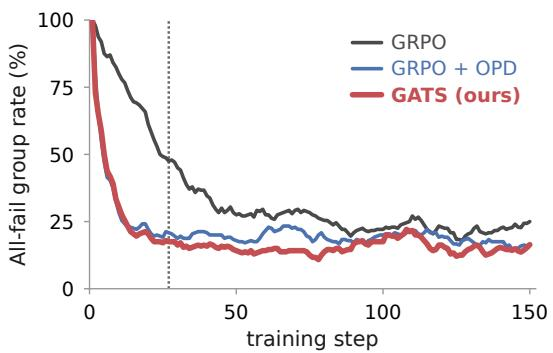
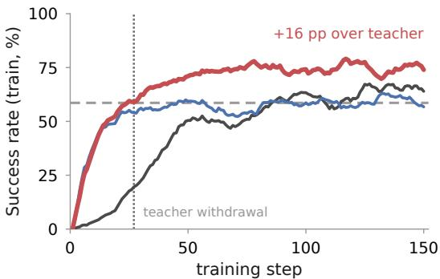
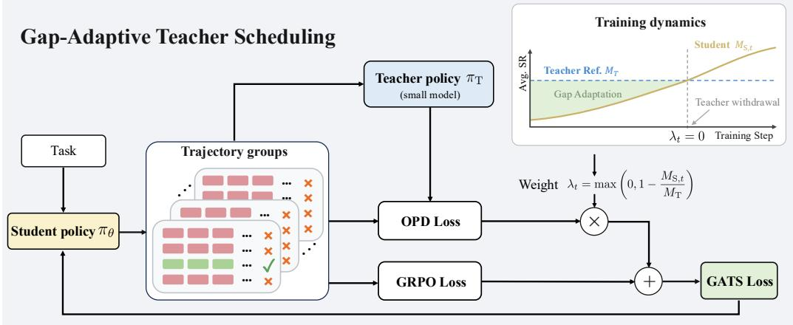
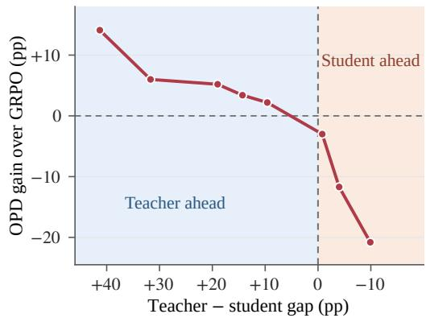
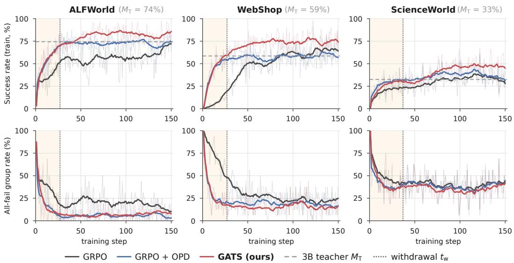
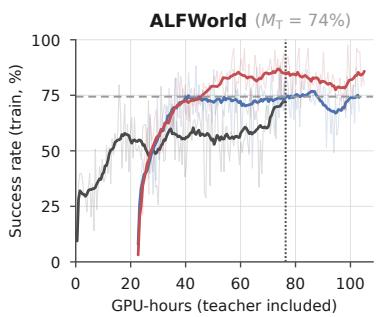
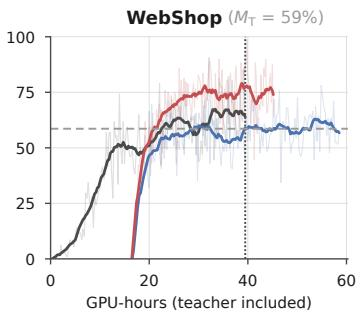
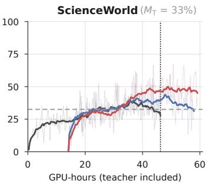

# GUIDE, THEN LET GO: GAP-ADAPTIVE TEACHER SCHEDULING FOR SPARSE-REWARD AGENTIC RL

Youling Huang1,8,\*,† Tiankuo Xu2,8,\*,† Jiaji Liu3,8,\*,† Tong Zheng4,8,\*,† Shuo Zhou5,8,† Shaotong Qi6,8,† Junchi Yao7 Shiyang Liu8 Hao Xu8 Pengcheng Xu8 Bo Huang8 Hongyi Fu8 Lin Lin1,‡ 1DUT 2XJTU 3THU 4UCAS 5BFSU 6SEU 7MBZUAI 8Kuaishou

## ABSTRACT

Reinforcement learning for long-horizon agents typically relies on sparse outcome-based rewards. This leads to a severe cold-start problem, as earlystage policies often fail to solve sampled tasks, leaving little useful reward signal for learning. To mitigate this problem, we use on-policy distillation (OPD) to provide token-level guidance on the student’s own rollouts. We find that the benefit of this guidance depends on the performance gap between the teacher and the student. When the teacher substantially outperforms the student, distillation helps guide the student through the early training stage where outcome rewards provide little learning signal. As the gap narrows and eventually reverses, however, continued distillation becomes less beneficial and may hinder further improvement. Motivated by this observation, we propose Gap-Adaptive Teacher Scheduling (GATS), which augments the student’s RL objective with an OPD term whose weight adapts to the teacher–student performance gap. Specifically, GATS gradually reduces teacher guidance as the student approaches the teacher’s reference performance and withdraws it once that reference is reached. This enables GATS to leverage task-trained teachers smaller than the student, since teacher guidance is primarily needed during early training. Across ALF-World, WebShop, and ScienceWorld with three Qwen2.5 teacher–student configurations, GATS achieves the highest average success rate among the compared methods in all three configurations, improving over reward-only GRPO by 4.37%–11.87% under matched student rollout budgets. Code is available at https://github.com/Ricardo-H/guide-then-let-go.

## 1 INTRODUCTION

As model capabilities continue to grow, building agents that can autonomously solve complex longhorizon tasks has become a central question (Zhou et al., 2024). Outcome-based reinforcement learning (RL) has become a widely adopted paradigm for training such agents, as it removes the need for a critic network and thereby reduces training complexity (Ji et al., 2026). A representative approach is group relative policy optimization (GRPO), which samples a group of trajectories from the current policy and estimates the policy gradient from the relative advantages within the group to maximize the expected return (Shao et al., 2024).

However, in complex long-horizon tasks, GRPO can be limited by the initial policy’s inability to discover successful trajectories within a limited rollout budget (Jiang et al., 2026; Zhang et al., 2026b). When all trajectories in a sampled group fail and receive the same reward, their grouprelative advantages are zero, leaving the group with no reward-driven policy-gradient signal and reducing training efficiency (Zheng et al., 2026). This creates a cold-start bottleneck for outcomebased RL, raising the question of how to provide effective guidance when the initial policy cannot discover successful trajectories through exploration alone.

  
(a) OPD alleviates the cold start

  
(b) Fixed OPD plateaus near the teacher  
Figure 1: Guide early, then let go. Representative training dynamics on WebShop for the Qwen2.5-3B→7B configuration. (a) OPD reduces all-failure rollout groups during the sparsereward cold start. (b) After teacher withdrawal, GATS continues to improve beyond the teacher reference, whereas fixed-weight OPD plateaus near it. Dashed lines indicate the teacher reference M , and dotted lines mark the withdrawal step.

A straightforward way to alleviate this bottleneck is to leverage expert trajectories through supervised fine-tuning before RL (Guo et al., 2025) or imitation learning during RL (Zhang et al., 2026a). In both cases, the expert supervision is off-policy, as the student is trained to increase the token-level likelihood of expert trajectories rather than its own rollouts. The next-token prediction objective enforces rigid, token-level imitation of the expert’s trajectory; consequently, the student tends to memorize expert-specific patterns, and the resulting gains transfer poorly beyond the training dis tribution (Chu et al., 2025). The problem is further aggravated by the off-policy nature of expert trajectories, as directly fitting them may disrupt the student’s established response patterns and induce overfitting to expert data (Zhang et al., 2026a).

Another line of work uses expert guidance to steer exploration during RL. The expert may provide a partial prefix for the model to complete (Huang et al., 2025), take over generation at designated positions (Jiang et al., 2026), or contribute trajectories to the model’s rollout group (Yan et al., 2026). Despite different intervention mechanisms, these approaches inject expert information into the student’s exploration process. On-policy distillation (OPD) (Lu & Lab, 2025) follows this principle by providing token-level teacher supervision on the student’s own rollouts. As illustrated in Figure 1(a), OPD can substantially reduce the fraction of all-failure groups during early training.

The remaining question is how long such guidance should be maintained. Existing approaches either retain the expert in the training loop or withdraw it according to a manually specified annealing curriculum (Huang et al., 2025; Jiang et al., 2026; Liu et al., 2026). Such schedules face a trade-off: guidance that is withdrawn too early can leave the model in the sparse-reward regime (Zhang et al., 2026b), whereas guidance that persists too long, or never fades at all, may restrict the student’s later improvement (Li et al., 2026a). This issue is also observed for RL with fixed-weight OPD, which improves rapidly early in training but subsequently plateaus near the teacher reference, as shown in Figure 1(b). Thus, expert guidance should adapt to the student’s training progress and be withdrawn when it is no longer beneficial.

To address this challenge, we first investigate when OPD is most beneficial and find that its downstream gain correlates strongly and positively with the performance gap between the expert and the student. Motivated by this, we propose GATS, which augments reinforcement learning with an OPD signal whose weight adapts to this gap. The weight is large early in training, providing stronger guidance when the student struggles to obtain reward-driven learning signals, and decreases as the gap closes. Once the student reaches the teacher reference, the teacher is withdrawn and training continues with GRPO alone. Because the expert is needed only for this early directional guidance, a small expert model suffices, which substantially reduces distillation cost. Experiments on ALF-World, WebShop, and ScienceWorld with three Qwen2.5 teacher–student configurations show that, at the same training budget, GATS improves over GRPO by 4.37%–11.87%. Gap-adaptive on-policy distillation guides the student through the cold-start stage, where outcome rewards provide little gradient, and its automatic withdrawal leaves room for free exploration, so the student can surpass its teacher instead of merely converging to it. Ablations attribute these gains to the adaptive schedule itself rather than to distillation alone.

Our contribution can be summarized as follows:

• Through experiments, we identify a strong monotone relationship between the gain from onpolicy distillation and the teacher–student performance gap, including a sign reversal at capability crossover: token-level guidance accelerates learning while the teacher is ahead, but actively suppresses the student once the gap closes.

• Building on this observation, we propose GATS, which augments the RL objective with an OPD term whose weight is an adaptive, monotone function of the measured performance gap and vanishes at crossover. GATS requires neither imitation of fixed expert trajectories nor a hand-designed annealing schedule. Moreover, since the teacher is only needed for early directional guidance, it can be smaller than the student, which substantially reduces the cost of distillation.

• We conduct experiments on three benchmarks (ALFWorld, WebShop, and ScienceWorld) under multiple teacher–student configurations, showing that GATS consistently outperforms strong baselines under the same student rollout budget. Ablations further verify that the gains come from the gap-adaptive schedule.

## 2 RELATED WORK

Reinforcement Learning for Agentic LLMs. Reinforcement learning has been increasingly adopted to enhance the agentic capabilities of LLMs, encompassing hierarchical planning (Zhou et al., 2024), tool invocation (Feng et al., 2026), and multi-turn interaction with external environments (Jin et al., 2025). Many of these methods rely on automatically verifiable feedback from the environment, such as signals of task completion (Wang et al., 2025). However, agentic RL is highly sensitive to the initial competence of the policy: stronger pretrained priors yield higher initial rewards and thereby enable more effective policy improvement, whereas weaker agents often struggle to obtain successful trajectories in long-horizon environments (Bai et al., 2024). In this cold-start regime, sparse outcome rewards cause most sampled trajectories to fail; consequently, the withingroup reward variance, and hence the group-relative advantage, can collapse to zero, leaving many costly interactive rollouts without an effective learning signal (Xi et al., 2025; Yu et al., 2026).

Combining RLVR with OPD. Recent work has begun to use teacher signals from on-policy distillation (Agarwal et al., 2024) to compensate for the sparse outcome rewards in RLVR (Shao et al., 2024; Yu et al., 2026). One line of research decides which samples should receive OPD supervi sion based on external information, for example applying it to incorrect groups (Li et al., 2026b), to groups where all rollouts fail (Ding, 2026), or to groups with large teacher–student disagreement (Zhong et al., 2026). Another line studies how teacher supervision should evolve over the course of training, for example linearly annealing the teacher signal to gradually reduce its influence (Tan et al., 2026). However, these methods either retain the expert in the training loop throughout the entire training process (Zhang et al., 2026a), which prevents the student from surpassing the teacher ceiling (Li et al., 2026a), or rely on manually predefined annealing schedules (Tan et al., 2026). How to anneal the teacher signal adaptively according to the actual training dynamics, and to eventually withdraw it so that the student can surpass the teacher, remains an open problem.

## 3 PRELIMINARIES

## 3.1 AGENTIC SETTING

Let D denote the distribution of training prompts, where each prompt x $\sim \mathcal { D }$ specifies an agentic task. For each prompt x, the student model samples a group of G trajectories, denoted by $\{ \mathbf { y } _ { i } \} _ { i = 1 } ^ { G } .$ Each trajectory is represented as $\mathbf { y } _ { i } = ( y _ { i , 1 } , \ldots , y _ { i , | \mathbf { y } _ { i } | } )$ , where $y _ { i , n }$ denotes the token generated at position n and $\left| \mathbf { y } _ { i } \right|$ is the trajectory length. The conditioning context for $y _ { i , n }$ is denoted by $\mathbf { h } _ { i , n }$ , which comprises the prompt, previously generated tokens, intermediate actions, and observed environment feedback available before generating $y _ { i , n }$ . Each trajectory $\mathbf { y } _ { i }$ receives an outcome reward $r _ { i }$ determined by the task-specific evaluation criterion.

  
Figure 2: Overview of GATS. The student generates trajectory groups that are used to compute both the GRPO loss and the teacher-guided OPD loss. GATS adaptively weights the OPD loss according to the teacher–student capability gap and combines it with the GRPO loss to update the student. As the gap narrows, the OPD weight decreases to zero, after which the teacher is permanently withdrawn and training continues with GRPO alone.

## 3.2 GROUP RELATIVE POLICY OPTIMIZATION

GRPO optimizes the student policy using relative outcome feedback within each sampled group (Shao et al., 2024). Specifically, each trajectory’s reward is centered by the group mean and scaled by the group standard deviation, yielding the advantage

$$
\widehat { A } _ { i } = \frac { r _ { i } - \overline { { r } } } { \sigma _ { r } + \epsilon } , \quad \quad \overline { { r } } = \frac { 1 } { G } \sum _ { j = 1 } ^ { G } r _ { j } ,\tag{1}
$$

where $\overline { r }$ and $\sigma _ { r }$ are the mean and standard deviation of the within-group reward, respectively, and $\epsilon > 0$ is a small constant. The importance ratio is

$$
\rho _ { i , n } ( \theta ) = \frac { \pi _ { \theta } ( y _ { i , n } \mid \mathbf { h } _ { i , n } ) } { \pi _ { \theta _ { \mathrm { o l d } } } ( y _ { i , n } \mid \mathbf { h } _ { i , n } ) } ,\tag{2}
$$

where $\pi _ { \theta _ { \mathrm { o l d } } }$ and $\pi _ { \theta }$ denote the old and current student policies, respectively. With clipping threshold $\varepsilon > 0$ , the GRPO objective is

$$
\mathcal { L } _ { \mathrm { G R P O } } = - \mathbb { E } \left[ \frac { 1 } { G } \sum _ { i = 1 } ^ { G } \frac { 1 } { | \mathbf { y } _ { i } | } \sum _ { n = 1 } ^ { | \mathbf { y } _ { i } | } \operatorname* { m i n } \left( \rho _ { i , n } ( \theta ) \widehat { A } _ { i } , \mathrm { c l i p } ( \rho _ { i , n } ( \theta ) , 1 - \varepsilon , 1 + \varepsilon ) \widehat { A } _ { i } \right) \right] .\tag{3}
$$

## 3.3 ON-POLICY DISTILLATION

OPD provides dense token-level supervision on student-generated trajectories by aligning the student policy with a frozen teacher policy (Agarwal et al., 2024). For each sampled token $y _ { i , n } .$ , the OPD advantage is defined as

$$
A _ { i , n } ^ { \mathrm { O P D } } = \log \pi _ { \mathrm { T } } ( y _ { i , n } \mid \mathbf { h } _ { i , n } ) - \log \pi _ { \theta } ( y _ { i , n } \mid \mathbf { h } _ { i , n } ) ,\tag{4}
$$

where the teacher log-probabilities are detached from the gradient computation. The corresponding OPD objective is

$$
\mathcal { L } _ { \mathrm { O P D } } = - \mathbb { E } \left[ \frac { 1 } { G } \sum _ { i = 1 } ^ { G } \frac { 1 } { | \mathbf { y } _ { i } | } \sum _ { n = 1 } ^ { | \mathbf { y } _ { i } | } \rho _ { i , n } ( \boldsymbol { \theta } ) A _ { i , n } ^ { \mathrm { O P D } } \right] ,\tag{5}
$$

where $\rho _ { i , n } ( \theta )$ is the importance ratio defined in Eq. 2.

## 4 GAP-ADAPTIVE TEACHER SCHEDULING

Overview. Figure 2 illustrates Gap-Adaptive Teacher Scheduling (GATS). A teacher policy πT is first trained on the target tasks, and its late-stage performance is used to define a fixed teacher reference score $M _ { \mathrm { T } }$ . During student training, each group of student-generated trajectories is used to compute both the outcome-driven GRPO objective in Eq. (3) and the teacher-guided OPD objective in Eq. (5). Motivated by the gap–utility trend in Figure 3, GATS scales the OPD objective by an adaptive coefficient $\lambda _ { t }$ determined by the gap between the moving-average student score $M _ { \mathrm { S } , t }$ and the teacher reference score $M _ { \mathrm { T } }$ . As this gap narrows, $\lambda _ { t }$ gradually decreases, reducing the contribution of teacher guidance to the GATS objective. Once $\bar { M } _ { \mathrm { S } , t } \geq \bar { M } _ { \mathrm { T } }$ , the teacher branch is permanently withdrawn, and subsequent training proceeds with GRPO alone. The full procedure is summarized in Algorithm 1.

Empirical motivation. To characterize the marginal utility of OPD, we fix an RL-enhanced Qwen2.5-1.5B teacher and select several increasingly capable Qwen2.5-3B student checkpoints. Each student checkpoint is trained on ALFWorld for 15 steps under the same budget, using either GRPO alone or GRPO with OPD, and we compare the resulting change in success rate. Figure 3 shows that the benefit of OPD decreases as the gap narrows and becomes negative once the student exceeds the teacher in capability. This result motivates adapting the OPD weight to the current teacher–student capability gap rather than keeping it fixed throughout training.

Teacher reference score. Let $T _ { \mathrm { T } }$ be the total number of teacher training steps, and $m _ { \mathrm { T } , t }$ its training-set score at step t. Given a window size K, we define the teacher reference score as the average over the last K measurements:

  
Figure 3: OPD gain over GRPO versus the teacher–student performance gap. The observed gain diminishes as the gap narrows and becomes negative near parity, motivating gap-adaptive supervision and eventual teacher withdrawal.

$$
M _ { \mathrm { T } } = \frac { 1 } { K } \sum _ { t = T _ { \mathrm { T } } - K + 1 } ^ { T _ { \mathrm { T } } } m _ { \mathrm { T } , t } .\tag{6}
$$

This scalar is fixed throughout student training and represents the capability level at which teacher guidance is no longer needed.

Student capability estimate. Similarly, we track the student’s training-set score $m _ { \mathrm { S } , t }$ at each step t. To prevent the current update from affecting its own distillation weight, we estimate the student’s capability using a one-step-lagged moving average:

$$
\ M _ { \mathrm { S } , t } = \frac { 1 } { | \mathcal { H } _ { t } | } \sum _ { k \in \mathcal { H } _ { t } } m _ { \mathrm { S } , k } , \qquad \mathcal { H } _ { t } = \{ k : \operatorname* { m a x } ( 0 , t - K ) \leq k \leq t - 1 \} .\tag{7}
$$

When fewer than K previous measurements are available, the average is computed over all available historical measurements.

Teacher withdrawal. The OPD weight is determined by the normalized gap between the teacher reference score and the lagged student score:

$$
\lambda _ { t } = \operatorname* { m a x } \biggl ( 1 - \frac { M _ { \mathrm { S } , t } } { M _ { \mathrm { T } } } , 0 \biggr ) .\tag{8}
$$

Thus, $\lambda _ { t }$ is large when the student is far below the teacher reference level and decreases as the student approaches that level. Teacher guidance is withdrawn once

$$
M _ { \mathrm { S } , t } \geq M _ { \mathrm { T } } .\tag{9}
$$

Let $d _ { t } \in \{ 0 , 1 \}$ denote the withdrawal flag at step t. It is initialized as $d _ { 0 } = 0$ and is set to one after $\operatorname { E q . } \left( 9 \right)$ is satisfied. When $d _ { t } = 1$ , the teacher forward pass is skipped, and the OPD weight is set to zero.

Adaptive training objective. At student training step t, GATS optimizes the following objective:

$$
\mathcal { L } _ { \mathrm { G A T S } , t } = \mathcal { L } _ { \mathrm { G R P O } } + ( 1 - d _ { t } ) \lambda _ { t } \mathcal { L } _ { \mathrm { O P D } } .\tag{10}
$$

Before teacher withdrawal, $d _ { t } = 0$ , and the GATS loss combines GRPO with gap-adaptive OPD. Once $M _ { \mathrm { S } , t } \geq M _ { \mathrm { T } }$ , we set $d _ { t } = 1$ , withdraw the teacher by setting the OPD term to zero, and continue training with GRPO alone. The resulting procedure provides dense teacher guidance while the student remains below the reference capability and gradually reduces this guidance as the student’s capability approaches that of the teacher.

sectionExperiments

## 4.1 EXPERIMENTAL SETUP

Benchmarks and evaluation. We evaluate on ALFWorld (Shridhar et al., 2020) for household instruction following, WebShop (Yao et al., 2022) for online shopping, and ScienceWorld (Wang et al., 2022) for scientific experimentation. We report success rates (SR) on the in-distribution (ID) and out-of-distribution (OOD) splits of ALFWorld and ScienceWorld, and on the WebShop evaluation split. Avg. SR is the unweighted mean of these five benchmark–split metrics. For each trained policy, we evaluate the final checkpoint three times, using 128 episodes per evaluation, and report the mean SR. Prompt-only models follow the same evaluation protocol. The three repetition use a fixed checkpoint. Benchmark splits, interaction protocols, and evaluation details are provided in Appendix A.1.

Models and training. All teachers and students are initialized from the Qwen2.5-Instruct family (Qwen et al., 2025). We consider three teacher–student configurations: $1 . 5 \mathrm { { \dot { B } }  7 B , 1 . 5 \mathrm { { B } }  1 4 \mathrm { { B } } } .$ and 3B → 7B. Each teacher is trained with GRPO on the corresponding environment and then frozen during student training. All trained student methods are run for 150 updates. Within each environment and student size, we hold the training data, student rollout budget, and common opti mization hyperparameters fixed across methods. Model and training configurations are detailed in Appendix A.2.

Baselines. We compare GATS with five baselines. Prompt-only evaluates the instruction-tuned model without additional training. GRPO uses outcome-driven RL without teacher supervision (Shao et al., 2024). In our implementation, the three distillation-based baselines combine GRPO with OPD: $\mathbf { G R P O + O P D }$ uses a fixed OPD weight; ATOD reduces the OPD weight according to a predefined annealing schedule (Tan et al., 2026); and SOD adjusts teacher supervision according to teacher–student divergence while retaining it throughout training (Zhong et al., 2026). Baseline implementations and method-specific hyperparameters are provided in Appendix A.3.

## 4.2 OVERALL PERFORMANCE

GATS achieves consistent performance gains across all teacher-student configurations. As shown in Table 1, GATS attains the highest average success rate under all three teacher-student configurations. With a Qwen2.5-1.5B teacher and a Qwen2.5-7B student, it improves the average success rate of outcome-reward-only GRPO from 52.97% to 64.84% (+11.87 points); comparable improvements of +4.37 and +11.77 points are observed in the settings with a Qwen2.5-14B student and a Qwen2.5-3B teacher, respectively. Notably, GATS also yields improvements on the OOD test sets of ALFWorld and ScienceWorld, indicating that the capabilities acquired under teacher guidance generalize beyond the training distribution. These results demonstrate that GATS effectively alleviates the cold-start problem in long-horizon agent training.

Fixed or predefined schedules for teacher supervision cannot adapt to the dynamically learning progress. The results in Table 1 show that teacher supervision can fail in two opposite directions. On the one hand, supervision that is never withdrawn anchors the student to the capability ceiling of the teacher: GRPO + OPD and SOD perform even worse than plain GRPO, since neither of them fully withdraws the influence of the teacher. On the other hand, the annealing process in ATOD follows a predefined schedule that is decoupled from the actual training dynamics: withdrawing supervision too early re-exposes the student to the sparse-reward dilemma, whereas withdrawing it too late pulls the student toward the suboptimal teacher policy. Consequently, the performance of ATOD fluctuates sharply across configurations, with average success rates ranging from 47.66% to 61.20%. In contrast, GATS ties the supervision strength directly to the measured performance gap and withdraws supervision entirely once the student reaches the reference performance of the teacher, thereby achieving the best results across all configurations. These observations support our central claim: teacher intervention must track the actual progress of training and be withdrawn adaptively.

Table 1: Final success rates (%) on ALFWorld, WebShop, and ScienceWorld. Each entry is averaged over three evaluation runs. Avg. SR denotes the unweighted mean of the five reported metrics. Within each student block, the best and second-best results in each column are shown in bold and underlined, respectively.
<table><tr><td></td><td colspan="2">ALFWorld</td><td>WebShop</td><td colspan="2">ScienceWorld</td><td>Avg. SR</td></tr><tr><td>Method</td><td>ID</td><td>OOD</td><td>Eval</td><td>ID</td><td>OOD</td><td></td></tr><tr><td>Teacher: Qwen2.5-1.5B</td><td>53.65</td><td>60.42</td><td>63.80</td><td>12.76</td><td>13.80</td><td>40.89</td></tr><tr><td>Student: Qwen2.5-7B</td><td></td><td></td><td></td><td></td><td></td><td></td></tr><tr><td>Prompt-only</td><td>14.84</td><td>13.02</td><td>0.26</td><td>10.94</td><td>7.03</td><td>9.22</td></tr><tr><td>GRPÓ</td><td>63.02</td><td>73.70</td><td>61.20</td><td>38.02</td><td>28.91</td><td>52.97</td></tr><tr><td>GRPO + OPD</td><td>55.21</td><td>46.09</td><td>61.20</td><td>18.49</td><td>14.58</td><td>39.11</td></tr><tr><td>ATOD</td><td>75.00</td><td>56.51</td><td>68.49</td><td>27.34</td><td>21.09</td><td>49.69</td></tr><tr><td>SOD</td><td>59.38</td><td>59.38</td><td>64.32</td><td>17.19</td><td>10.42</td><td>42.14</td></tr><tr><td>GATS</td><td>84.38</td><td>78.12</td><td>76.30</td><td>48.44</td><td>36.98</td><td>64.84</td></tr><tr><td>Student: Qwen2.5-14B</td><td></td><td></td><td></td><td></td><td></td><td></td></tr><tr><td>Prompt-only</td><td>44.01</td><td>52.34</td><td>1.30</td><td>25.26</td><td>28.65</td><td>30.31</td></tr><tr><td>GRPÓ</td><td>71.09</td><td>74.22</td><td>70.05</td><td>51.56</td><td>42.71</td><td>61.93</td></tr><tr><td>GRPO + OPD</td><td>52.60</td><td>54.69</td><td>64.58</td><td>17.45</td><td>15.36</td><td>40.94</td></tr><tr><td>ATOD</td><td>63.54</td><td>66.93</td><td>66.67</td><td>19.53</td><td>21.61</td><td>47.66</td></tr><tr><td>SOD</td><td>53.39</td><td>52.34</td><td>65.36</td><td>13.80</td><td>12.24</td><td>39.43</td></tr><tr><td>GATS</td><td>82.81</td><td>79.95</td><td>74.48</td><td>52.08</td><td>42.19</td><td>66.30</td></tr><tr><td>Teacher: Qwen2.5-3B</td><td>69.01</td><td>69.53</td><td>50.00</td><td>35.68</td><td>29.69</td><td>50.78</td></tr><tr><td>Student: Qwen2.5-7B</td><td></td><td></td><td></td><td></td><td></td><td></td></tr><tr><td>Prompt-only</td><td>14.84</td><td>13.02</td><td>0.26</td><td>10.94</td><td>7.03</td><td>9.22</td></tr><tr><td>GRPÓ</td><td>63.02</td><td>73.70</td><td>61.20</td><td>38.02</td><td>28.91</td><td>52.97</td></tr><tr><td>GRPO + OPD</td><td>69.79</td><td>67.71</td><td>57.55</td><td>32.81</td><td>28.12</td><td>51.20</td></tr><tr><td>ATOD</td><td>75.00</td><td>78.65</td><td>71.09</td><td>44.53</td><td>36.72</td><td>61.20</td></tr><tr><td>SOD</td><td>65.89</td><td>72.66</td><td>60.42</td><td>38.80</td><td>28.12</td><td>53.18</td></tr><tr><td>GATS</td><td>76.82</td><td>76.56</td><td>78.39</td><td>50.52</td><td>41.41</td><td>64.74</td></tr></table>

## 4.3 TRAINING DYNAMICS: FROM COLD START TO TEACHER WITHDRAWAL

Early guidance from the teacher effectively mitigates the cold-start problem. As shown in Figure 4, during the early stage of training (shaded region), both GRPO+OPD and GATS achieve substantially higher rollout success rates than vanilla GRPO, along with a markedly lower proportion of all-failure groups. Unlike vanilla GRPO, the two distillation-based methods receive token-level supervision signals from the very first training step, and consequently their all-failure rates decrease rapidly. These results confirm that OPD yields the largest gains precisely at the stage where successful trajectories are scarcest and the outcome reward is least informative.

Persistent teacher supervision that is never withdrawn anchors the student near the reference level of the teacher. The early advantage of fixed-weight GRPO+OPD gradually diminishes as training proceeds. Its success rates plateau around the teacher reference values MT = 0.74, 0.59, and 0.33 for ALFWorld, WebShop, and ScienceWorld, respectively. Despite its slower start, pure

  
Figure 4: Training dynamics for Qwen2.5-3B→7B on ALFWorld, WebShop, and ScienceWorld. Top: training success rate. Bottom: all-failure group rate. Horizontal dashed lines denote the teacher reference $\begin{array} { r } { { M } _ { T } ; } \end{array}$ ; vertical dotted lines mark GATS teacher withdrawal at $t _ { w } .$ . Teacher guidance accelerates early learning, while GATS continues to improve after withdrawal.

GRPO eventually catches up to GRPO+OPD in all three environments. This observation indicates that supervision without withdrawal confines the student below the capability ceiling of the teacher, such that the acceleration gained in the early phase is entirely offset by the ceiling effect in the later phase.

GATS achieves both early-stage acceleration and late-stage breakthroughs, as learning continues even after teacher withdrawal. Specifically, GATS permanently withdraws the teacher once the estimated student competence reaches the threshold, at the withdrawal step $t _ { w }$ marked by the dashed line in the figure. After teacher withdrawal, the rollout success rate continues to improve and eventually exceeds the corresponding teacher reference in all three environments. These training dynamics directly validate the two-stage design of GATS: the teacher provides dense guidance when it is most needed and is withdrawn once the student no longer requires it, leaving the subsequent reward-driven learning entirely unconstrained.

## 4.4 ANNEALING SCHEDULE COMPARISON

GATS is robust to the choice of decay shape. To isolate the effect of gap-adaptive weighting, we compare GATS with linear, cosine, and step decay schedules. All methods use a Qwen2.5-1.5B teacher and a Qwen2.5-7B student, with schedule definitions provided in Appendix A.4. As shown in Table 2, GATS achieves the highest success rate on all three datasets, improving the average success rate by 6.16%, 7.55%, and 12.50% over linear, cosine, and step decay, respectively. The consistent gains across different decay shapes suggest that the improvement does not arise from a particular functional form of weight decay.

Gap-adaptive scheduling avoids the need for a manually tuned horizon. We further sweep the horizon N of the linear schedule to examine whether a well-tuned fixed schedule can match the adaptive strategy. The results show substantial sensitivity to the choice of N, with the best horizon varying across datasets. Although N = 20 achieves an average success rate comparable to GATS, this setting is identified only through the sweep and does not transfer consistently across tasks. Moreover, a linear schedule with $\bar { N = 5 2 / 2 9 / 2 9 }$ , calibrated to match GATS’s teacher-withdrawal steps across ALFWorld, WebShop, and ScienceWorld, still falls substantially behind GATS. These results suggest that the advantage of GATS lies not simply in choosing when to terminate teacher guidance, but in adapting the OPD weight to the student’s evolving capability.

Table 2: Comparison of OPD-weight decay schedules with a Qwen2.5-1.5B teacher and Qwen2.5-7B student. ALF and Sci. denote the ID splits of ALF-World and ScienceWorld, respectively, while Web denotes the evaluation split of WebShop. All results are averaged over three evaluation runs.
<table><tr><td>Schedule</td><td>ALF</td><td>Web</td><td>Sci.</td><td>Avg.</td></tr><tr><td colspan="5">Different decay shapes, N = 80</td></tr><tr><td>Linear</td><td>77.86</td><td>68.75</td><td>44.01</td><td>63.54</td></tr><tr><td>Cosine</td><td>71.35</td><td>71.09</td><td>44.01</td><td>62.15</td></tr><tr><td>Step</td><td>69.79</td><td>65.10</td><td>36.72</td><td>57.20</td></tr><tr><td colspan="5">Linear decay with varying N</td></tr><tr><td>Linear, N = 80</td><td>77.86</td><td>68.75</td><td>44.01</td><td>63.54</td></tr><tr><td>Linear, N = 60</td><td>76.30</td><td>68.49</td><td>45.05</td><td>63.28</td></tr><tr><td>Linear, N = 40</td><td>73.96</td><td>75.00</td><td>29.69</td><td>59.55</td></tr><tr><td>Linear, N = 20</td><td>83.85</td><td>73.96</td><td>47.14</td><td>68.32</td></tr><tr><td>Linear, N = 52/29/29</td><td>82.55</td><td>65.89</td><td>43.23</td><td>63.89</td></tr><tr><td>GATS</td><td>84.38</td><td>76.30</td><td>48.44</td><td>69.70</td></tr></table>

  
GRPO GRPO + OPD GATS (ours) 3B teacher MT GRPO budget  
Figure 5: Training success versus GPU-hours for the Qwen2.5-3B→7B configuration, including teacher costs. Vertical dotted lines mark the GRPO 150-update budgets; horizontal dashed lines indicate the teacher reference $M _ { T }$

## 4.5 TRAINING EFFICIENCY

Table 3: Smoothed training success rate (%) at the GRPO 150-update compute budget for each environment. $M _ { T }$ is the teacher’s training-split success rate used as the withdrawal reference. Bold indicates the best method in each environment.
<table><tr><td>Environment</td><td>Budget (GPU-h)</td><td>GRPO</td><td>GRPO+OPD</td><td>GATS</td><td> $M _ { T }$ </td><td>∆(GATS-GRPO) (pp)</td></tr><tr><td>ALFWorld</td><td>76.4</td><td>71.9</td><td>73.6</td><td>84.9</td><td>74.4</td><td>+13.1</td></tr><tr><td>WebShop</td><td>39.5</td><td>64.0</td><td>58.8</td><td>77.1</td><td>58.6</td><td>+13.2</td></tr><tr><td>ScienceWorld</td><td>46.3</td><td>27.8</td><td>39.7</td><td>46.0</td><td>32.5</td><td>+18.2</td></tr></table>

GATS achieves higher training success at reference budgets. We examine training efficiency in the Qwen2.5-3B→7B setting using one node with eight H200 GPUs per run. GPU-hour accounting includes student training and, for teacher-assisted methods, teacher training and online inference. For each environment, the reference budget is the cost of 150 GRPO updates. Figure 5 plots training success rate against cumulative GPU-hours, while Table 3 reports the corresponding 15-update centred moving-average values at the reference budgets. On WebShop and ScienceWorld, GATS reaches smoothed training success rates of 77.1% and 46.0%, respectively, exceeding both GRPO and GRPO+OPD in these comparisons.

## 5 CONCLUSION

We introduced GATS, a teacher scheduling strategy for sparse-reward agentic RL. Its central idea is to treat teacher guidance as temporary assistance: use the measured teacher–student taskperformance gap to adjust the auxiliary OPD weight, then permanently withdraw the teacher when the smoothed student success rate reaches the teacher reference. Experiments on three interactive environments show gains over GRPO and distillation baselines under matched student rollout budgets, with students exceeding their smaller, task-trained teachers. Controlled schedule comparisons support adapting guidance to task progress rather than prescribing its duration in advance. Future work could explore task-specific scheduling and teacher reactivation under changing task distributions.

## REPRODUCIBILITY STATEMENT

The learning objectives and scheduling rule are specified in Sections 3 and 4. Appendix A reports the evaluation protocol, training configurations, baseline implementations, and pseudocode. Appendix B provides the checkpoint-diagnostic data, and Appendix C contains the interaction templates.

## AI USE STATEMENT

Generative AI tools assisted with manuscript revision, narrative and naming discussions, literature lookup, checks of notation and internal consistency, and LaTeX and figure preparation. AI-generated suggestions also informed discussion of methodological caveats and experimental interpretation. The authors are responsible for the final manuscript and its scientific claims.

## REFERENCES

Rishabh Agarwal, Nino Vieillard, Yongchao Zhou, Piotr Stanczyk, Sabela Ramos Garea, Matthieu Geist, and Olivier Bachem. On-policy distillation of language models: Learning from selfgenerated mistakes. In International Conference on Learning Representations, volume 2024, pp. 21246–21263, 2024.

Hao Bai, Yifei Zhou, Mert Cemri, Jiayi Pan, Alane Suhr, Sergey Levine, and Aviral Kumar. Digirl: Training in-the-wild device-control agents with autonomous reinforcement learning. Advances in Neural Information Processing Systems, 37:12461–12495, 2024.

Tianzhe Chu, Yuexiang Zhai, Jihan Yang, Shengbang Tong, Saining Xie, Dale Schuurmans, Quoc V Le, Sergey Levine, and Yi Ma. Sft memorizes, rl generalizes: A comparative study of foundation model post-training. arXiv preprint arXiv:2501.17161, 2025.

Ken Ding. Hdpo: Hybrid distillation policy optimization via privileged self-distillation. arXiv preprint arXiv:2603.23871, 2026.

Jiazhan Feng, Shijue Huang, Xingwei Qu, Ge Zhang, Yujia Qin, Baoquan Zhong, Chengquan Jiang, Jinxin Chi, and Wanjun Zhong. Retool: Reinforcement learning for strategic tool use in llms. In International Conference on Learning Representations, volume 2026, pp. 37909–37926, 2026.

Daya Guo, Dejian Yang, Haowei Zhang, Junxiao Song, Peiyi Wang, Qihao Zhu, Runxin Xu, Ruoyu Zhang, Shirong Ma, Xiao Bi, et al. Deepseek-r1 incentivizes reasoning in llms through reinforcement learning. Nature, 645(8081):633–638, 2025.

Zeyu Huang, Tianhao Cheng, Zihan Qiu, Zili Wang, Yinghui Xu, Edoardo M Ponti, and Ivan Titov. Blending supervised and reinforcement fine-tuning with prefix sampling, 2025. URL https://arxiv. org/abs/2507.01679, 2025.

Yuxiang Ji, Ziyu Ma, Yong Wang, Guanhua Chen, Xiangxiang Chu, and Liaoni Wu. Tree search for llm agent reinforcement learning. In International Conference on Learning Representations, volume 2026, pp. 87362–87388, 2026.

Zishang Jiang, Jinyi Han, Xinyi Wang, Sihang Jiang, Zhaoqian Dai, Ma Shuguang, Fei Yu, Jiaqing Liang, Yanghua Xiao, et al. Selective expert guidance for effective and diverse exploration in reinforcement learning of llms. In International Conference on Learning Representations, volume 2026, pp. 62980–63006, 2026.

Bowen Jin, Hansi Zeng, Zhenrui Yue, Jinsung Yoon, Sercan Arik, Dong Wang, Hamed Zamani, and Jiawei Han. Search-r1: Training llms to reason and leverage search engines with reinforcement learning. arXiv preprint arXiv:2503.09516, 2025.

Boyan Li, Bingsen Chen, Chenghao Yang, Ping Nie, Chen Zhao, and Xi Ye. Sequential beats joint: On the interplay between on-policy distillation and rlvr. arXiv preprint arXiv:2609.04108, 2026a.

Gengsheng Li, Tianyu Yang, Junfeng Fang, Mingyang Song, Mao Zheng, Haiyun Guo, Dan Zhang, Jinqiao Wang, and Tat-Seng Chua. Unifying group-relative and self-distillation policy optimization via sample routing. arXiv preprint arXiv:2604.02288, 2026b.

Mingyang Liu, Gabriele Farina, and Asuman Ozdaglar. Uft: Unifying supervised and reinforcement fine-tuning. Advances in Neural Information Processing Systems, 38:101347–101383, 2026.

Kevin Lu and Thinking Machines Lab. On-policy distillation. Thinking Machines Lab: Connectionism, 2025. doi: 10.64434/tml.20251026. https://thinkingmachines.ai/blog/on-policy-distillation.

Qwen, An Yang, Baosong Yang, Beichen Zhang, Binyuan Hui, Bo Zheng, Bowen Yu, Chengyuan Li, Dayiheng Liu, Fei Huang, Haoran Wei, Huan Lin, Jian Yang, Jianhong Tu, Jianwei Zhang, Jianxin Yang, Jiaxi Yang, Jingren Zhou, Junyang Lin, Kai Dang, Keming Lu, Keqin Bao, Kexin Yang, Le Yu, Mei Li, Mingfeng Xue, Pei Zhang, Qin Zhu, Rui Men, Runji Lin, Tianhao Li, Tianyi Tang, Tingyu Xia, Xingzhang Ren, Xuancheng Ren, Yang Fan, Yang Su, Yichang Zhang, Yu Wan, Yuqiong Liu, Zeyu Cui, Zhenru Zhang, and Zihan Qiu. Qwen2.5 technical report, 2025. URL https://arxiv.org/abs/2412.15115.

Zhihong Shao, Peiyi Wang, Qihao Zhu, Runxin Xu, Junxiao Song, Xiao Bi, Haowei Zhang, Mingchuan Zhang, YK Li, Yang Wu, et al. Deepseekmath: Pushing the limits of mathematical reasoning in open language models. arXiv preprint arXiv:2402.03300, 2024.

Mohit Shridhar, Xingdi Yuan, Marc-Alexandre Cotˆ e, Yonatan Bisk, Adam Trischler, and Matthew´ Hausknecht. Alfworld: Aligning text and embodied environments for interactive learning. arXiv preprint arXiv:2010.03768, 2020.

Qitai Tan, Zefang Zong, Yang Li, and Peng Chen. Atod: Annealed turn-aware on-policy distillation for multi-turn autonomous agents. arXiv preprint arXiv:2606.27814, 2026.

Ruoyao Wang, Peter Jansen, Marc-Alexandre Cotˆ e, and Prithviraj Ammanabrolu. Scienceworld: ´ Is your agent smarter than a 5th grader? In Proceedings of the 2022 Conference on Empirical Methods in Natural Language Processing, pp. 11279–11298, 2022.

Zihan Wang, Kangrui Wang, Qineng Wang, Pingyue Zhang, Linjie Li, Zhengyuan Yang, Xing Jin, Kefan Yu, Minh Nhat Nguyen, Licheng Liu, et al. Ragen: Understanding self-evolution in llm agents via multi-turn reinforcement learning. arXiv preprint arXiv:2504.20073, 2025.

Zhiheng Xi, Jixuan Huang, Chenyang Liao, Baodai Huang, Honglin Guo, Jiaqi Liu, Rui Zheng, Junjie Ye, Jiazheng Zhang, Wenxiang Chen, et al. Agentgym-rl: Training llm agents for long-horizon decision making through multi-turn reinforcement learning. arXiv preprint arXiv:2509.08755, 2025.

Jianhao Yan, Yafu Li, Zican Hu, Zhi Wang, Ganqu Cui, Xiaoye Qu, Yu Cheng, and Yue Zhang. Learning to reason under off-policy guidance. Advances in Neural Information Processing Systems, 38:117157–117186, 2026.

Shunyu Yao, Howard Chen, John Yang, and Karthik Narasimhan. Webshop: Towards scalable real-world web interaction with grounded language agents. Advances in Neural Information Processing Systems, 35:20744–20757, 2022.

Qiying Yu, Zheng Zhang, Ruofei Zhu, Yufeng Yuan, Xiaochen Zuo, Yu Yue, Weinan Dai, Tiantian Fan, Gaohong Liu, Lingjun Liu, et al. Dapo: An open-source llm reinforcement learning system at scale. Advances in Neural Information Processing Systems, 38:113222–113244, 2026.

Wenhao Zhang, Yuexiang Xie, Yuchang Sun, Yanxi Chen, Guoyin Wang, Yaliang Li, Bolin Ding, and Jingren Zhou. On-policy rl meets off-policy experts: Harmonizing supervised fine-tuning and reinforcement learning via dynamic weighting. In International Conference on Learning Representations, volume 2026, pp. 120693–120726, 2026a.

Xuechen Zhang, Zijian Huang, Yingcong Li, Chenshun Ni, Jiasi Chen, and Samet Oymak. Bread: Branched rollouts from expert anchors bridge sft & rl for reasoning. Advances in Neural Information Processing Systems, 38:96726–96752, 2026b.

Haizhong Zheng, Yang Zhou, Brian Bartoldson, Bhavya Kailkhura, Fan Lai, Jiawei Zhao, and Beidi Chen. Act only when it pays: Efficient reinforcement learning for llm reasoning via selective rollouts. Advances in Neural Information Processing Systems, 38:124321–124346, 2026.

Qiyong Zhong, Mao Zheng, Mingyang Song, Xin Lin, Jie Sun, Houcheng Jiang, Xiang Wang, and Junfeng Fang. Sod: Step-wise on-policy distillation for small language model agents. arXiv preprint arXiv:2605.07725, 2026.

Yifei Zhou, Andrea Zanette, Jiayi Pan, Sergey Levine, and Aviral Kumar. Archer: Training language model agents via hierarchical multi-turn rl. arXiv preprint arXiv:2402.19446, 2024.

## A IMPLEMENTATION DETAILS

This appendix describes the benchmark and evaluation protocols, model and training configurations, and baseline implementations used in our experiments.

## A.1 BENCHMARKS AND EVALUATION

Benchmarks and splits. We evaluate on ALFWorld (Shridhar et al., 2020), WebShop (Yao et al., 2022), and ScienceWorld (Wang et al., 2022). For ALFWorld, valid seen and valid unseen serve as the in-distribution (ID) and out-of-distribution (OOD) evaluation splits, respectively. For ScienceWorld, the training and ID evaluation pools contain seen tasks, whereas the OOD evaluation pool contains unseen tasks. WebShop uses a single evaluation split. Table 4 reports the task-pool sizes. These sizes are distinct from the number of episodes used in each evaluation.

Table 4: Task-pool sizes for training and evaluation. Dashes indicate splits not used in the reported evaluation.
<table><tr><td>Environment</td><td>Train</td><td>ID</td><td>OOD</td><td>Eval</td></tr><tr><td>ALFWorld</td><td>3,553</td><td>140</td><td>134</td><td></td></tr><tr><td>WebShop</td><td>6,410</td><td></td><td></td><td>500</td></tr><tr><td>ScienceWorld</td><td>3,322</td><td>1,661</td><td>1,684</td><td></td></tr></table>

Interaction and rewards. Episodes are limited to 50 turns in ALFWorld, 15 turns in WebShop, and 30 turns in ScienceWorld. ScienceWorld additionally imposes a simulator budget of 100 internal ticks. An episode is counted as successful only if the environment’s task-completion criterion is satisfied within the applicable interaction budgets. Training uses task-completion rewards and, where applicable, environment-specific invalid-action penalties. Evaluation success is determined solely by task completion within these budgets; training-time invalid-action penalties do not enter the reported success-rate metric.

Evaluation and metrics. For each trained policy, we evaluate the final checkpoint three times, using 128 episodes per evaluation, and report the mean success rate (SR). Prompt-only models follow the same evaluation protocol. Evaluation uses a sampling temperature of 0.4 and top-p = 1.0. All three repetitions use the same checkpoint. Avg. SR is the unweighted mean of five benchmark– split metrics: ALFWorld ID and OOD, WebShop evaluation, and ScienceWorld ID and OOD.

## A.2 MODELS AND TRAINING

Models and teacher preparation. All policies are initialized from the Qwen2.5-Instruct family (Qwen et al., 2025). The teachers are Qwen2.5-1.5B-Instruct and Qwen2.5-3B-Instruct, and the students are Qwen2.5-7B-Instruct and Qwen2.5-14B-Instruct. We evaluate three teacher–student configurations: 1.5B→7B, 1.5B→14B, and 3B→7B. Each teacher is first trained with GRPO on the corresponding environment and then frozen throughout student training.

Shared training configuration. All trained student methods are run for 150 updates. Within each environment and student size, we hold the training data, student rollout budget, and common optimization hyperparameters fixed across methods. Table 5 summarizes the shared training hyperparameters, while Table 6 reports environment-specific settings.

## A.3 BASELINE IMPLEMENTATIONS

We compare GATS with five baselines. All trained baselines follow the shared student-training protocol described in Appendix A.2. The three distillation-based baselines combine GRPO with OPD.

Prompt-only. The instruction-tuned student is evaluated without additional training, using the evaluation protocol described in Appendix A.1.

Table 5: Core training hyperparameters shared across student runs.
<table><tr><td>Setting</td><td>Value</td></tr><tr><td>Training updates</td><td>150</td></tr><tr><td>GRPO group size</td><td>8 rollouts per prompt</td></tr><tr><td>Prompts per batch</td><td>16</td></tr><tr><td>Optimizer</td><td>AdamW</td></tr><tr><td>Learning rate</td><td> $1 \times 1 0 ^ { - 6 }$ </td></tr><tr><td>Weight decay</td><td>0.01</td></tr><tr><td>GRPO clip ratio</td><td>0.2</td></tr><tr><td>Training sampling</td><td>temperature  $1 . 0 , \mathrm { t o p } \cdot p = 1 . 0$ </td></tr></table>

Table 6: Environment-specific training settings.
<table><tr><td>Setting</td><td>ALFWorld</td><td>WebShop</td><td>ScienceWorld</td></tr><tr><td>Max prompt length</td><td>2,048</td><td>4,096</td><td>6,000</td></tr><tr><td>Max response length</td><td>512</td><td>1,024</td><td>1,024</td></tr><tr><td>PPO mini-batch size (configuration)</td><td>256</td><td>64</td><td>256</td></tr><tr><td>Discount γ</td><td>0.95</td><td>1.0</td><td>1.0</td></tr><tr><td>Max turns</td><td>50</td><td>15</td><td>30</td></tr></table>

GRPO. The student is trained with GRPO without teacher supervision (Shao et al., 2024).

$\mathbf { G R P O } + \mathbf { O P D } .$ The student is trained with the GRPO objective and the OPD objective in Eq. (5), using a fixed OPD weight $\lambda _ { t } = 1$ throughout training.

ATOD. We use the full ATOD method (Tan et al., 2026), including its annealed OPD–RL schedule and Turn-level Disagreement–Uncertainty Reweighting (T-DUR).

SOD. SOD (Zhong et al., 2026) applies step-level divergence-based reweighting to OPD without permanently withdrawing teacher supervision.

## A.4 SCHEDULING ABLATIONS

Fixed-time schedules. To isolate the effect of the scalar OPD schedule, we hold the teacher, student, OPD objective, student rollout budget, and all other training settings fixed, and vary only the scalar OPD weight. For a horizon N and update indices $t = 1 , \ldots , 1 5 0$ , we consider

$$
\lambda _ { t } ^ { \mathrm { l i n e a r } } = \operatorname* { m a x } \left\{ 1 - \frac { t } { N } , 0 \right\} ,\tag{11a}
$$

$$
\lambda _ { t } ^ { \mathrm { c o s i n e } } = \frac { 1 } { 2 } \left[ 1 + \cos \left( \pi \frac { \operatorname* { m i n } \{ t , N \} } { N } \right) \right] ,\tag{11b}
$$

$$
\lambda _ { t } ^ { \mathrm { s t e p } } = \mathbf { 1 } \{ t \leq N \} .\tag{11c}
$$

The linear and cosine schedules first reach zero at update N. The step schedule retains unit weight through update N and switches to GRPO alone at update $N + 1$ . All three schedules use GRPO alone whenever their OPD weight is zero.

In the decay-shape comparison, we use $N = 8 0$ . For linear decay, we additionally evaluate $N \in$ {20, 40, 60, 80}. We also report an environment-specific matched setting with $N = 5 2 , 2 9 , 2 9$ for ALFWorld, WebShop, and ScienceWorld, respectively, to match the observed GATS withdrawal steps in this configuration.

These schedules depend only on elapsed training updates, whereas GATS uses teacher–student success-rate feedback.

Algorithm 1 GATS: Gap-Adaptive Teacher Scheduling   
Require: Frozen teacher π , student $\pi \theta ,$ reference $\overline { { M _ { \mathrm { T } } > 0 } }$ from Eq. (6)   
Require: Task distribution $\mathcal { D } ,$ group size G, window size K, student updates $T$   
Ensure: Trained student policy πθ   
1: Initialize success-rate queue $Q  [ ]$ and $d \sb 0  0$   
2: for $t = 1 , \dots , T$ do   
3: $d _ { t } \gets d _ { t - 1 }$   
4: if $Q$ is empty then   
5: $M _ { \mathrm { S } , t } \gets 0$ ▷ Initial weight: $\lambda _ { 1 } = 1$   
6: else   
7: $M \mathrm { s } , t \gets$ mean $. ( Q )$   
8: end if   
9: if $M _ { \mathrm { S } , t } \geq M _ { \mathrm { T } }$ then   
10: $d _ { t } \gets 1$ ▷ Permanent withdrawal   
11: end if   
12: $\lambda _ { t } \gets \operatorname* { m a x } \{ 1 - M _ { \mathrm { S } , t } / M _ { \mathrm { T } } , 0 \}$   
13: Sample tasks from $\mathcal { D }$ and G student trajectories per task   
14: Compute returns, rollout success rate mS,t, and $\bar { \mathcal { L } } _ { \mathrm { G R P O } }$   
15: if $\bar { d _ { t } } \bar { = } 0$ then   
16: Query the teacher on student-generated contexts   
17: Compute $\mathcal { L } _ { \mathrm { O P D } }$ using Eq. (5)   
18: Update the student using Eq. (10)   
19: else   
20: Skip teacher inference and update the student with GRPO only   
21: end if   
22: Append mS,t to $Q ;$ retain at most the last K entries   
23: end for

## A.5 GAP-ADAPTIVE TEACHER SCHEDULING

Reference and lagged feedback. We set $K = 5$ for both the teacher reference and the student success-rate estimate. The teacher reference $M _ { \mathrm { T } }$ is computed from the final five training-time success-rate measurements according to Eq. (6); it is not the held-out teacher score in Table 1. Before student update $t , M _ { \mathrm { S } , t }$ averages the available success-rate measurements from at most the preceding K student updates. An empty window gives $M _ { \mathrm { S } , 1 } = 0$ and hence an initial OPD weight of one.

Weighting and permanent withdrawal. The OPD weight uses only measurements from preceding updates. Permanent withdrawal is triggered when $M _ { \mathrm { S } , t } \ \ge \ M _ { \mathrm { T } }$ before update t, after which teacher guidance is permanently disabled and training proceeds with GRPO alone, as specified in Algorithm 1. The OPD advantage and loss follow Eqs. (4) and (5), respectively.

## B ADDITIONAL EXPERIMENTAL ANALYSIS

## B.1 TASK-PERFORMANCE-GAP DIAGNOSTIC

We fix a GRPO-trained Qwen2.5-1.5B teacher and select eight increasingly capable Qwen2.5-3B-Instruct student checkpoints on ALFWorld, using a separate 1.5B→3B configuration from the main comparison. Starting from each checkpoint, we run matched 15-update continuations with GRPO alone and GRPO+OPD with a fixed OPD weight, under the same student rollout budget. Table 7 provides the data for the gap–utility diagnostic in the main text.

Across these continuations, the gain from OPD decreases as the gap narrows and becomes negative after the student overtakes the teacher. This diagnostic motivates gap-adaptive supervision but does not establish a universally optimal withdrawal threshold.

Table 7: Task-performance-gap diagnostic on ALFWorld. The gap is teacher SR minus student SR before the continuation. OPD gain is the final SR difference between the matched GRPO+OPD and GRPO continuations. Both quantities are reported in percentage points (pp).
<table><tr><td>Teacher-student gap (pp)</td><td>OPD gain over GRPO (pp)</td></tr><tr><td>+41.3</td><td>+14.1</td></tr><tr><td>+31.7</td><td>+6.0</td></tr><tr><td>+19.0</td><td>+5.2</td></tr><tr><td>+14.3</td><td>+3.4</td></tr><tr><td>+9.6</td><td>+2.2</td></tr><tr><td>-0.8</td><td>-3.0</td></tr><tr><td>-4.0</td><td>-11.7</td></tr><tr><td>-9.9</td><td>-20.8</td></tr></table>

## C PROMPTS AND INTERACTION TEMPLATES

Each environment uses a history-free template on the first step of an episode and a history-augmented template on every subsequent step. Both templates require the model response to contain a reasoning segment between <think> and </think>, followed by an action between <action> and </action>. The history-augmented template additionally includes the number of previously completed steps and the most recent history length observation–action pairs.

We reproduce the history-augmented template for each environment verbatim below. The firststep template is identical except that it omits the sentence reporting the prior step count and recent interaction history.

## C.1 ALFWORLD

History-Augmented Prompt Template   
You are an expert agent operating in the ALFRED Embodied Environment.   
Your task is to: {task\_description}   
Prior to this step, you have already taken {step\_count} step(s).   
Below are the most recent {history\_length} observations and the   
corresponding actions you took: {action\_history}   
You are now at step {current\_step} and your current observation is:   
{current\_observation}   
Your admissible actions of the current situation are:   
[{admissible\_actions}].   
Now it's your turn to take an action.   
You should first reason step-by-step about the current situation.   
This reasoning process MUST be enclosed within <think> </think>   
tags.   
Once you've finished your reasoning, you should choose an admissible   
action for current step and present it within <action> </action>   
tags.

## C.2 WEBSHOP

History-Augmented Prompt Template   
You are an expert autonomous agent operating in the WebShop   
e-commerce environment.   
Your task is to: {task\_description}.

Prior to this step, you have already taken {step\_count} step(s).   
Below are the most recent {history\_length} observations and the   
corresponding actions you took: {action\_history}   
You are now at step {current\_step} and your current observation is:   
{current\_observation}.   
Your admissible actions of the current situation are:   
[   
{available\_actions}   
].   
Now it's your turn to take one action for the current step.   
You should first reason step-by-step about the current situation,   
then think carefully which admissible action best advances the   
shopping goal. This reasoning process MUST be enclosed within   
<think> </think> tags.   
Once you've finished your reasoning, you should choose an admissible   
action for current step and present it within <action> </action>   
tags.

## C.3 SCIENCEWORLD

## History-Augmented Prompt Template

You are an expert agent operating in the ScienceWorld environment,   
which is a text-based virtual environment centered around   
accomplishing tasks from the elementary science curriculum.   
Your current task is: {task\_description}   
Prior to this step, you have already taken {step\_count} step(s).   
Below are the most recent {history\_length} observations and the   
corresponding actions you took: {action\_history}   
You are now at step {current\_step} and your current observation is:   
{current\_observation}   
Your admissible actions of the current situation are:   
{admissible\_actions}   
Now it's your turn to take an action.   
You should first reason step-by-step about the current situation.   
This reasoning process MUST be enclosed within <think> </think>   
tags.   
Once you've finished your reasoning, you should choose an appropriate   
action for the current step and present it within <action>   
</action> tags.