# HORIZONFLOW: VARIABLE-LENGTH PLANNING FOROFFLINE GOAL-CONDITIONED RL

JunHyeok Oh<sup>1</sup> Zian Jang<sup>1</sup> Byung-Jun Lee<sup>1,2,†</sup> the2ndlaw@korea.ac.kr jangzian@korea.ac.kr byungjunlee@korea.ac.kr

## ABSTRACT

Recent advances in generative planning have made trajectory inpainting a promising approach to offline goal-conditioned reinforcement learning. However, these methods typically specify the planning horizon before generating plan content, even though the appropriate horizon depends on the route itself. A horizon that is too short can force infeasible transitions, whereas one that is too long can introduce redundant motion. We introduce HorizonFlow, a hierarchical planner that treats plan length as an output of generation rather than a prescribed input. Its subgoal route planner guides its action-prefix controller through a sequence of latent subgoals. Both components combine insertion-based generation with flow matching to jointly generate continuous plan content and length, using the partially generated plan to guide token insertion. HorizonFlow reuses the resulting length information to select candidates and steer generation toward shorter plans without a separate learned value model. Across Maze2D, Multi2D, and OGBench navigation and visual manipulation benchmarks, HorizonFlow achieves the highest average performance among the compared methods.

Project Page: https://jh2525.github.io/HorizonFlow/

(a) Horizon too short  
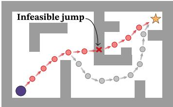

(b) Horizon too long  
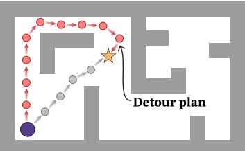

(c) HorizonFlow  
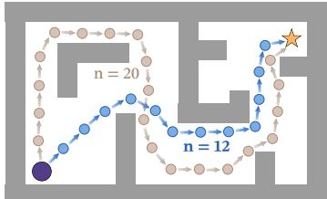  
O <sup>S</sup>tart Goal Desirable plan Generated plan Selected plan Candidate plan  
Figure 1: Schematic of horizon mismatch and count-based selection. (a, b) Prescribed horizons that are too short or too long yield an infeasible jump or detour, respectively. (c) HorizonFlow generates variable-length candidates and selects the one with the fewest tokens.

## 1 INTRODUCTION

Offline goal-conditioned reinforcement learning (GCRL) aims to reach specified goals using only a fixed dataset, without additional environment interaction. Generative trajectory planning is a natural approach because it models distributions over trajectories from logged experience and can represent alternative ways of reaching a goal as explicit candidates. A common formulation is trajectory inpainting, which fixes the current state and a goal or subgoal as endpoints and generates the trajectory between them (Janner et al., 2022; Li et al., 2023; Chen et al., 2024b; Liu et al., 2025). In these methods, the planning horizon—the length of the generated plan—is typically specified before generation. Because both endpoints are fixed, this horizon is not a lookahead but an assumed travel time, and it can be wrong in either direction. A horizon that is too short may compress a long trajectory into dynamically infeasible transitions, whereas one that is too long may stretch a short trajectory through waiting, redundant motion, or unnecessary detours. Figure 1 (a, b) illustrates this two-sided horizon mismatch, also noted by Liu et al. (2025).

Many generative planners support configurable horizons but require them to be selected externally (Janner et al., 2022; Chen et al., 2024a; Luo et al., 2025). Because the appropriate horizon varies across state–goal pairs, no single value fits both nearby and distant goals. VH-Diffuser (Liu et al., 2025) addresses this with a learned length predictor that assigns each start–goal pair a horizon before generation begins. This still requires choosing a useful horizon before the candidate route is available; a poorly matched horizon can constrain the generated plan to be too short or unnecessarily long.

We instead generate plan content and length jointly by combining insertion-based generation with flow matching (Lipman et al., 2023; Nguyen et al., 2025). Conditioned on the partially generated plan, the insertion model predicts gapwise missing-token counts to determine how many tokens to add, while flow matching refines their continuous content. Length decisions thus depend on each candidate’s evolving content rather than on a horizon prescribed before generation. At a fixed temporal resolution, the generated token count reflects the duration a plan represents, which lets us compare candidates without a separate learned value model. During generation, we combine the current count with the predicted missing count into a count-based steering score that favors shorter candidates; after generation, the realized count selects among completed plans.

Building on this joint content–length generation, we introduce HorizonFlow, a hierarchical plan ner for offline GCRL. Applying the formulation directly to an entire route at action-level resolution would require long sequences, which makes generation challenging. HorizonFlow therefore applies it at two levels. Given the current state and final goal, the subgoal route planner generates a variablelength latent subgoal route. Given the current state and the next subgoal, the action-prefix controller generates a variable-length action prefix. Both models use the same insertion–flow matching formulation and are trained entirely on offline data. HorizonFlow selects candidates by their generated counts at each level and operates in a receding-horizon manner, executing an initial portion of the selected action prefix and replanning as the state evolves.

Our contributions are threefold. First, we extend insertion-based generation with flow matching to continuous-valued plans, jointly generating plan content and length for control. Second, we introduce HorizonFlow, a hierarchical planner that applies this formulation to subgoal routes and action prefixes, with length-aware sampling that uses generated counts for candidate selection and count-based scores for steering during generation. Third, HorizonFlow achieves the highest average performance among the compared methods on Maze2D, Multi2D, and OGBench navigation and visual manipulation benchmarks; horizon diagnostics and ablations further analyze horizon mismatch, length signals, and the planner’s sampling and hierarchy choices.

## 2 RELATED WORK

Offline Goal-Conditioned RL. Value-based offline GCRL uses contrastive objectives, quasimetric representations, or expectile regression (Eysenbach et al., 2022; Wang et al., 2023; Park et al., 2025). HIQL uses latent-subgoal hierarchies (Park et al., 2023), SAW learns a flat policy through subgoal-conditioned bootstrapping (Zhou & Kao, 2025), and CTA composes task-relevant latent analogies with new contexts (Kim et al., 2026). HorizonFlow instead generates variable-length plans and selects by generated count without learning a value function.

Generative Planning for Control. Diffuser and Decision Diffuser generate trajectories (Janner et al., 2022; Ajay et al., 2023); hierarchical diffusion/flow planners generate subgoals and local plans (Li et al., 2023; Chen et al., 2024b; Nandiraju et al., 2026). SSD conditions sub-trajectories on goals and learned values (Kim et al., 2024). Horizons are specified before content generation through configurable lookahead in Diffusion Forcing (Chen et al., 2024a), fixed-length chunks in CompDiffuser (Luo et al., 2025), or prediction in VH-Diffuser (Liu et al., 2025). HorizonFlow jointly generates each candidate’s content and length.

Variable-Length Generative Models. Beyond fixed-length flows (Lipman et al., 2023; Gat et al., 2024), jump diffusion and Edit Flows model variable-dimensional and variable-length outputs, respectively (Campbell et al., 2023; Havasi et al., 2025). OneFlow combines insertion and flow matching for continuous image latents within discrete text (Nguyen et al., 2025); the Insertion Process plans discrete maze and graph paths over a discrete vocabulary (Zhang et al., 2026). HorizonFlow instead jointly generates continuous plan tokens, including their order coordinates, and token counts, reusing length information for selection and steering.

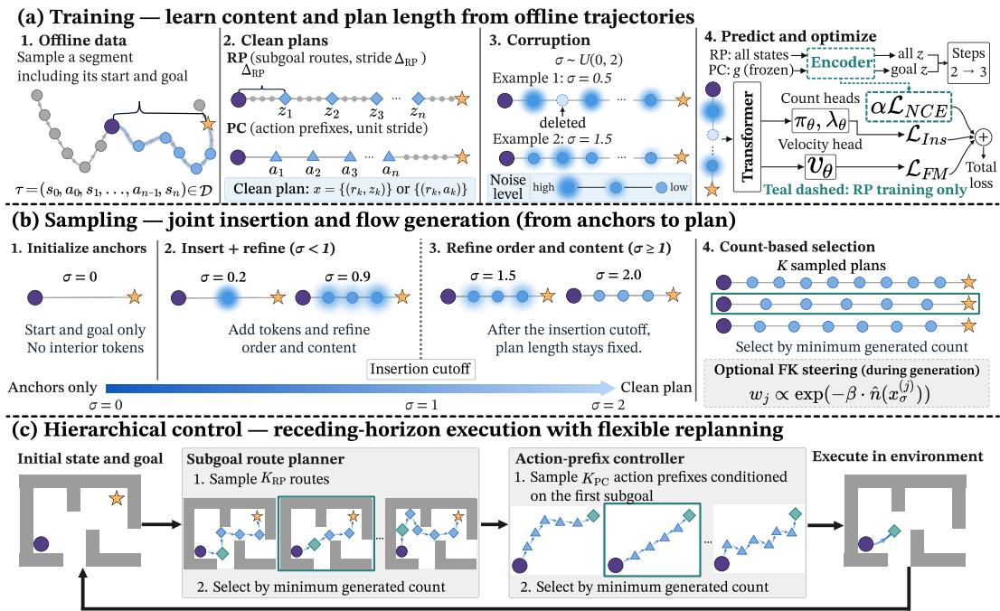  
Figure 2: HorizonFlow overview. (a) Training predicts missing-token counts and denoising velocities from deleted and noised offline plans. (b) Sampling inserts and refines tokens before σ = 1, then only refines; optional Feynman–Kac (FK) steering guides generation, followed by minimum-count selection. (c) The route planner (RP) selects a route; the prefix controller (PC) selects an action prefix toward its first subgoal, with receding-horizon execution.

## 3 PRELIMINARIES

Offline Goal-Conditioned RL. We consider a reward-free Markov decision process $\begin{array} { r l } { \mathcal { M } } & { { } = } \end{array}$ $( S , { \mathcal { A } } , f , \rho _ { 0 } )$ with state space $s ,$ action space ${ \mathcal { A } } ,$ deterministic dynamics $s _ { h + 1 } = f ( s _ { h } , a _ { h } )$ , and initial-state distribution $\rho _ { 0 }$ . Extending HorizonFlow to stochastic dynamics is left for future work. A goal $g \in { \mathcal { G } }$ specifies successful states through a goal map $\phi : { \mathcal { S } }  { \mathcal { G } } ;$ success occurs when $\phi ( s _ { h } ) \in B _ { \epsilon } ( g )$ , the ϵ-ball around $g .$ In offline GCRL, the learner receives only a static dataset of trajectories $\mathcal { D } = \{ \tau ^ { ( i ) } \} _ { i = 1 } ^ { { N _ { \mathrm { t r a j } } } }$ , where $\tau = ( s _ { 0 } , a _ { 0 } , s _ { 1 } , a _ { 1 } , \dots )$ , and must reach arbitrary goals without additional environment interaction (Park et al., 2025).

Flow Matching. Flow Matching (FM) learns to transform noise into a continuous data sample (Lipman et al., 2023). In our planner, it generates the content of subgoal or action tokens, where a token is one element of a plan. For a noise sample $x _ { 0 } \ \sim \ p _ { 0 } .$ , a clean target $x _ { 1 } \sim q ,$ and refinement time $t \ \sim \ \mathrm { U n i f } [ 0 , 1 ]$ , we form the interpolation $x _ { t } ~ = ~ ( 1 - t ) x _ { 0 } + t x _ { 1 }$ The model learns the direction $x _ { 1 } \ - \ x _ { 0 }$ that moves this noisy sample toward its target, minimizing $\mathcal { L } _ { \mathrm { F M } } = \mathbb { E } _ { t , x _ { 0 } , x _ { 1 } } \lceil \rceil \boldsymbol { v } _ { \boldsymbol { \theta } } ( x _ { t } , t ) - ( x _ { 1 } - x _ { 0 } ) \| _ { 2 } ^ { 2 } \rceil$ . Samples are obtained by integrating $\dot { x } _ { t } = v _ { \theta } ( x _ { t } , t )$ from $t = 0$ to 1. Standard FM operates on a fixed-dimensional space. Representing a sequence as $\boldsymbol { x } _ { t } \in \mathbb { R } ^ { L \times d }$ therefore fixes its element count L; FM generates element content but does not by itself generate sequence length.

Insertion-based generation. An insertion process constructs a variable-length sequence by repeatedly adding elements between existing neighbors. Each such location is called a gap, and a learned insertion rate controls how likely an addition is to occur there; equivalently, the model can predict how many elements each gap still lacks. The sequence length is therefore determined by the insertions made during generation rather than specified in advance. Edit Flows provides this construction as an insertion-only restriction of its general sequence-editing framework (Havasi et al., 2025). Insertion can be combined with flow matching so that insertion grows the sequence while flow matching refines the continuous content of its elements (Nguyen et al., 2025).

## 4 HORIZONFLOW

HorizonFlow combines a subgoal route planner (RP), which generates routes to the final goal, with an action-prefix controller (PC), which generates local actions toward the next subgoal. Both generate variable-length candidates and select by minimum generated count, with local execution and replanning as the state changes (Figure 2). Appendix D gives implementation details and pseudocode.

## 4.1 HIERARCHICAL PLANS AND TOKEN REPRESENTATION

Plans as token sets. Both levels represent a plan as a variable number of continuous tokens between two fixed conditioning anchors (current state and goal). Each token $\boldsymbol { x } _ { k } = \left( \boldsymbol { r } _ { k } , \boldsymbol { c } _ { k } \right)$ consists of a scalar coordinate $r _ { k } \in \mathbb { R }$ and content $c _ { k } \in \mathbb { R } ^ { d } \mathrm { - } \mathrm { a }$ latent subgoal for the route planner and an action for the prefix controller. A plan is thus a variable-size set $\textstyle x \in { \mathcal { X } } = \bigcup _ { n = 0 } ^ { N } ( \mathbb { R } ^ { 1 + d } ) ^ { n }$ , with $N$ the token capacity; |x| denotes its token count, which we also write n. The anchors are not counted, remain fixed during generation, and are excluded from the flow-matching loss.

Order coordinates. To order a growing token set, each token carries a continuous order coordinate $r _ { k } ,$ which is refined by flow matching together with the content $c _ { k }$ . The anchors sit at $r = - 1$ and $r = + 1$ , and sorting by $r _ { k }$ orders the interior tokens between them. The coordinate specifies order along a plan, not elapsed environment time or flow-matching time. Token content and temporal resolution depend on the planning level, as described below.

Subgoal route planner. Given the current state and final goal, the route planner generates an ordered sequence of latent subgoals—states mapped by a learned encoder $\dot { E _ { \phi } } : \mathcal { S } \dot {  } \mathbb { R } ^ { d _ { z } }$ (Section 4.2) to intermediate points along a route. Its anchors carry the current and goal states encoded by the same encoder, and its generated interior tokens are $x = \{ ( r _ { k } , z _ { k } ) \} _ { k = 1 } ^ { n }$ with latent subgoals $z _ { k } \in \mathbb { R } ^ { d _ { z } }$ . Its training targets are states sampled at a fixed stride $\Delta _ { \mathrm { R P } }$ in environment steps (Chen et al., 2024b). The stride sets the temporal resolution, not the number of subgoals: different routes can contain different numbers of intermediate points. The first subgoal of the selected route becomes the prefix controller’s target.

Action-prefix controller. Conditioned on the current state and the selected latent subgoal, carried by its start and goal anchors, the prefix controller generates ordered action tokens $x = \{ ( r _ { k } , a _ { k } ) \} _ { k = 1 } ^ { n }$ with $a _ { k } \in \mathbb { R } ^ { d _ { a } }$ , where n is the generated action-prefix length. After sorting by $r _ { k } .$ the action tokens form a sequence at unit environment-step resolution. This sequence is a local action prefix toward the subgoal, not necessarily a complete trajectory to it. The route planner determines where to go; the prefix controller models how to begin moving toward that target. Unlike a one-step inverse dynamics model conditioned on adjacent states, it generates an action sequence conditioned on a potentially more distant subgoal.

## 4.2 TRAINING

From corrupted offline-trajectory segments, HorizonFlow learns to predict missing-token counts and denoise surviving tokens. Encoder regularization and local-prefix training support hierarchical control.

Learning routes from offline trajectories. We first sample a clean token count $m ,$ including anchors, log-uniformly between a minimum count and $N + { \bar { 2 } } ;$ this emphasizes shorter plans while retaining longer examples. We then take a segment of $( m - 1 ) \Delta _ { \mathrm { R P } }$ environment steps within one episode, use its endpoints as the (start, goal) anchors, and subsample its interior every $\Delta _ { \mathrm { R P } }$ steps to obtain the clean $\mathbf { R P }$ token set $x _ { 1 }$

Corruption and generation times. We use $\sigma \in [ 0 , 2 ]$ for the global clock that advances plan generation. Each token has its own FM refinement time $t _ { k } ~ \in ~ [ 0 , 1 ]$ . For training corruption, each non-anchor token k is assigned an independent reveal offset $\begin{array} { r } { \dot { u } _ { k } \ \sim \ \mathrm { U n i f } [ 0 , 1 ] } \end{array}$ We set $t _ { k } = \mathrm { c l i p } _ { [ 0 , 1 ] } ( \sigma - u _ { k } )$ and hide tokens for which $\sigma \textless u _ { k }$ . Thus, for $\sigma < 1$ some clean tokens may be hidden; for $\sigma \geq 1$ all are present and only refinement remains. Neither clock is the order coordinate $r _ { k }$ . The vector t collects these local times. We write $x _ { \sigma }$ (equivalently $x _ { \mathbf { t } } )$ for the partially noised plan at clock σ, both in the training losses and for a candidate at a steering checkpoint. Appendix D.2 gives the full corruption procedure.

Learning insertion and continuous content. At sampled σ, hidden clean tokens define each gap’s missing count $c _ { g }$ , while surviving tokens are noised to their local times. A shared Transformer predicts continuous velocities $v _ { \theta } ,$ , positive-count parameters $\lambda _ { \theta }$ , and gap-completion probabilities π<sub>θ</sub> from the noisy plan $x _ { \sigma }$ . We suppress this conditioning in $\pi _ { \boldsymbol { \theta } } ( \boldsymbol { g } )$ and $\lambda _ { \theta } ( g )$ unless needed. For a present non-anchor token k with clean target $x _ { 1 , k } = \left( r _ { k } , c _ { k } \right)$ and noise $\epsilon _ { k } .$ , the FM loss is schematically

$$
\mathcal { L } _ { \mathrm { F M } } = \mathbb { E } \Big [ \| v _ { \theta } ( x _ { \mathbf { t } } , \mathbf { t } ) _ { k } - ( x _ { 1 , k } - \epsilon _ { k } ) \| _ { 2 } ^ { 2 } \Big ] .\tag{1}
$$

Time weighting, coordinate normalization, and loss reduction are detailed in Appendix D.2. The insertion heads model gap completion $( c _ { g } ~ = ~ 0 )$ with a Bernoulli probability $\pi _ { \boldsymbol { \theta } } ( \boldsymbol { g } )$ and positive missing counts with a zero-truncated Poisson (ZTP) parameter $\lambda _ { \theta } ( g )$ , giving

$$
\begin{array} { r } { \mathcal { L } _ { \mathrm { i n s } } = \mathbb { E } _ { g } \Big [ \mathrm { B C E } ( \pi _ { \theta } ( g ) , \mathbf { 1 } [ c _ { g } = 0 ] ) + \mathbf { 1 } [ c _ { g } > 0 ] \big ( \lambda _ { \theta } ( g ) - c _ { g } \log \lambda _ { \theta } ( g ) + \log ( 1 - e ^ { - \lambda _ { \theta } ( g ) } ) \big ) \Big ] } \end{array}\tag{2}
$$

The normalizer log $( 1 - e ^ { - \lambda } )$ makes the positive-count branch a proper distribution over $c _ { g } \geq 1 ;$ the parameter-independent term log $c _ { g } !$ is omitted. This normalization matters because, besides supervising insertions, the same distribution provides the expected remaining count used by the optional steering step in Section 4.3. Appendix E.2 relates the objective to OneFlow’s zero/nonzero count decomposition.

Stabilizing the subgoal encoder. The encoder $E _ { \phi }$ is trained jointly with the route planner at this stage and frozen thereafter. Its outputs must retain distinctions between states to serve as useful subgoals, but the FM loss alone rewards collapsing them: a less distinct latent makes the velocity target easier to fit. We therefore block FM gradients at the encoder and train it through the insertion loss and temporal contrastive regularization. The InfoNCE term encourages nearby-in-time states to have similar representations relative to in-batch negatives (van den Oord et al., 2018); it supports the representation rather than providing a separate ranking score. With $\alpha = 0 . 1$ in all environments, the RP objective is

$$
{ \mathcal { L } } _ { \mathrm { R P } } = { \mathcal { L } } _ { \mathrm { F M } } + { \mathcal { L } } _ { \mathrm { i n s } } + \alpha { \mathcal { L } } _ { \mathrm { N C E } } .\tag{3}
$$

Keeping local generation short. The prefix controller is trained with $\mathcal { L } _ { \mathrm { P C } } = \mathcal { L } _ { \mathrm { F M } } + \mathcal { L } _ { \mathrm { i n s } }$ on action tokens, using the frozen encoder $E _ { \phi }$ for goal conditioning and no contrastive loss. A subgoal can lie farther away than the controller’s token capacity, especially at unit stride in long-horizon environments, so the controller should not have to generate every action up to it. We therefore pair a training prefix of $n = m - 2$ actions, with m sampled log-uniformly, with a hindsight goal $K _ { \mathrm { d i v } } n$ steps ahead: with $K _ { \mathrm { d i v } } = 1$ the prefix reaches the goal frame, whereas with $K _ { \mathrm { d i v } } >$ 1 it covers only the first $1 / K _ { \mathrm { d i v } }$ of the way. The controller thus learns to make progress toward a distant subgoal without modeling the entire remaining route in action space. Appendix D.2 gives, for both planners, the exact prefix construction, token budgets, corruption schedule, masking, and loss weighting.

## 4.3 SAMPLING VARIABLE-LENGTH PLANS

Figure 2(b) illustrates sampling in two phases. Each candidate starts with fixed start and goal anchors and no interior tokens. During the insertion phase $( \sigma < 1 )$ , the model predicts a flow velocity for every active token and the gapwise completion probability π<sub>θ</sub> and count parameter $\lambda _ { \theta }$ for every gap. Gapwise birth decisions drawn from these determine how many new tokens are added; each is initialized from Gaussian noise at local time $t _ { k } = 0$ , while flow matching refines the order coordinates and content of existing tokens.

Births stop at $\sigma = 1$ , fixing n; refinement continues to $\sigma = 2 .$ , giving even a token born just before the cutoff a full refinement interval. The same sampler generates RP subgoals and PC actions, with counts used for selection (Section 4.4). Appendix D.3 gives the sampling rule and pseudocode; Figure 3 illustrates generation on Maze2D-Large.

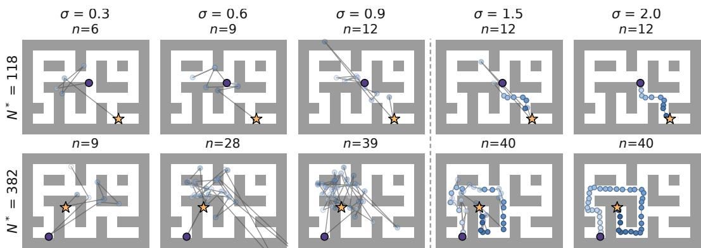  
Figure 3: Route-planner samples on Maze2D-Large. Rows show start–goal pairs; columns show generation time σ and generated count n. Latent subgoals are mapped to maze coordinates, connected and colored by order coordinate $r _ { k }$ . White circles/orange stars mark starts/goals. Beyond the dashed cutoff at $\sigma = 1$ , counts remain fixed while refinement continues. These are generated plans, not executed trajectories.

Optional Feynman–Kac steering. We reuse the insertion heads to steer generation toward shorter plans through Feynman–Kac resampling (Singhal et al., 2025). For a partial candidate $x _ { \sigma }$ , the countbased steering score (Appendix C) is

$$
\begin{array} { r } { \widehat { n } ( x _ { \sigma } ) = \underbrace { \left. x _ { \sigma } \right. } _ { \mathrm { t o k e n s p r e s e n t } } + \underbrace { \sum _ { g \in G ( x _ { \sigma } ) } \left( 1 - \pi _ { \theta } ( g \mid x _ { \sigma } ) \right) \frac { \lambda _ { \theta } ( g \mid x _ { \sigma } ) } { 1 - e ^ { - \lambda _ { \theta } ( g \mid x _ { \sigma } ) } } } _ { \mathrm { p r e d i c t e d m i s s i n g t o k e n s } } , } \end{array}\tag{4}
$$

where $G ( x _ { \sigma } )$ is the set of gaps. At a few checkpoints during the insertion phase, we resample candidates with weights $w _ { j } \propto \exp [ - \beta \hat { n } ( x _ { \sigma } ^ { ( j ) } ) ]$ , favoring lower scores without an auxiliary trajectoryvalue model. FK can be applied at either level; by default we apply it to the route planner and the prefix controller. Implementation details are in Appendix D.3.

## 4.4 SELECTING AND EXECUTING PLANS

Count-based selection. The route planner samples $K _ { \mathrm { R P } }$ routes conditioned on the current state and final goal; the first subgoal of the selected route then conditions the prefix controller, which samples $\breve { K } _ { \mathrm { P C } }$ action prefixes from the current state. At either level, we select among candidates $x ^ { ( 1 ) } , \ldots , x ^ { ( K ) }$ by

$$
x ^ { \star } = x ^ { ( j ^ { \star } ) } , \qquad j ^ { \star } = \arg \operatorname* { m i n } _ { j \leq K } | x ^ { ( j ) } | ,\tag{5}
$$

counting latent subgoal tokens for RP and action tokens for PC, with ties broken uniformly at random. At a fixed temporal resolution, token count is a proxy for the temporal extent represented by a plan. We use it to favor compact plans under the learned distribution without a separate trajectoryvalue model, not to certify feasibility or optimality. For PC, training pairs n actions with a goal $K _ { \mathrm { d i v } } n$ steps ahead, so target count is proportional to the goal offset at fixed $K _ { \mathrm { d i v } }$ . We use this learned relation to rank action prefixes before executing the first action and replanning. Unlike prescribing a short horizon, it compares lengths after the candidates are generated, allowing each route to determine its own length.

Receding-horizon execution. The first subgoal of the selected route serves as the prefix controller’s target, and the route is refreshed every $H _ { \mathrm { R P } }$ environment steps, the RP update period. Conditioned on this target, the controller executes an initial portion of its selected action prefix before replanning from the updated state. By default, the route update period is approximately half the RP training stride, and only the first action is executed per replan. The route update period and the executed prefix fraction control how often global routes and local actions are revised; we study both in Figure 5(c, d). Execution details are given in Appendix D.4.

Table 1: Benchmark performance. Values are mean ± standard deviation; highlighted entries mark row-wise highest means. HorizonFlow uses 5, 8, and 4 training seeds for Maze2D/Multi2D, OGBench navigation, and visual manipulation, respectively, with 100 episodes per environment and protocol for Maze2D/Multi2D and 50 per task for OGBench.  
(a) Maze2D / Multi2D: D4RL normalized score
<table><tr><td>Environment Task</td><td></td><td>Diffuser</td><td>VHD</td><td>HDMI</td><td>HD</td><td>DF</td><td>SSD</td><td>Ours</td></tr><tr><td></td><td>U-Maze</td><td></td><td></td><td></td><td></td><td></td><td>113.9 ±3.1 118.5 ±6.7 120.1 ±5.6 128.4 ±36.0 116.7 ±2.0 144.6 ±7.6 137.5 ±0.8</td><td></td></tr><tr><td>Maze2D</td><td>Medium</td><td> $1 2 1 . 5 \pm 2 . 7$ </td><td>130.5 ±3.6</td><td> $1 2 1 . 8 \pm { 3 . 6 }$ </td><td> $1 3 5 . 6 \pm 3 0 . 0$ </td><td> $1 4 9 . 4 \pm 7 . 5$ </td><td>134.4 ±13.6</td><td> $1 5 4 . 8 \pm 1 . 5$ </td></tr><tr><td></td><td>Large</td><td> $1 2 3 . 0 \pm 6 . 4$ </td><td> $1 4 2 . 9 \pm 7 . 1$ </td><td> $1 2 8 . 6 \pm 6 . 5$ </td><td> $1 5 5 . 8 \pm 2 5 . 0$ </td><td> $1 5 9 . 0 \pm 2 . 7$ </td><td> $1 8 3 . 5 \pm 1 9 . 2$ </td><td>205.2 ±2.4</td></tr><tr><td>Single-task Average</td><td></td><td>119.5</td><td>130.6</td><td>123.5</td><td>139.9</td><td>141.7</td><td>154.2</td><td>165.8</td></tr><tr><td></td><td>U-Maze</td><td> $1 2 8 . 9 \pm 1 . 8$ </td><td>137.6 ±3.9 131.3 ±4.0 144.1 ±12.0</td><td></td><td></td><td> $1 1 9 . 1 \pm 4 . 0$ </td><td> $1 5 8 . 2 \pm 1 0 . 1 $ </td><td> $1 4 5 . 1 \pm 1 . 2$ </td></tr><tr><td>Multi2D</td><td>Medium</td><td> $1 2 7 . 2 \pm 3 . 4$ </td><td>146.3 ±2.0 131.6 ±4.2 140.2 ±16.0</td><td></td><td></td><td> $1 5 2 . 3 \pm 9 . 9$ </td><td> $1 5 5 . 2 \pm 1 7 . 7$ </td><td>170.5 ±1.0</td></tr><tr><td></td><td>Large</td><td> $1 3 2 . 1 \pm 5 . 8$ </td><td> $1 6 9 . 4 \pm 3 . 6$ </td><td> $1 3 5 . 4 \pm 5 . 6 $ </td><td> $1 6 5 . 5 \pm 6 . 0$ </td><td> $1 6 7 . 1 \pm 2 . 7$ </td><td> $1 9 2 . 9 \pm 1 9 . 0$ </td><td> $2 1 6 . 5 \pm 1 . 0$ </td></tr><tr><td>Multi-task Average</td><td></td><td>129.4</td><td>151.1</td><td>132.8</td><td>149.9</td><td>146.2</td><td>168.8</td><td>177.4</td></tr></table>

(b) OGBench navigation: success rate (%)
<table><tr><td rowspan="2">Environment</td><td rowspan="2">Task</td><td colspan="5">Value-based</td><td colspan="4">Planning-based</td></tr><tr><td>QRL</td><td>CRL</td><td>HIQL</td><td>SAW</td><td>CTA</td><td>Diffuser</td><td>HD</td><td>DF</td><td>Ours</td></tr><tr><td rowspan="3">Pointmaze</td><td>Medium</td><td>82 ±5</td><td>29 ±7</td><td>79 ±5</td><td>97 ±2</td><td>87 ±4</td><td>95 ±3</td><td>95 ±2</td><td>82 ±8</td><td>100.0 ±0.0</td></tr><tr><td>Large</td><td>86±9</td><td>39 ±7</td><td>58 ±5</td><td>85 ±10</td><td>71 ±12</td><td>99 ±0</td><td>98 ±1</td><td>60 ±3</td><td>99.8 ±0.2</td></tr><tr><td>Giant</td><td>68 ±7</td><td>27 ±10</td><td>46 ±9</td><td>68 ±8</td><td>30 ±14</td><td>92 ±4</td><td>96 ±3</td><td>52 ±12</td><td>97.1 ±3.0</td></tr><tr><td rowspan="3">Antmaze</td><td>Medium</td><td>88 ±3</td><td>95 ±1</td><td>96 ±1</td><td>97 ±1</td><td>96 ±1</td><td>77 ±2</td><td>46 ±7</td><td>32 ±4</td><td>97.3 ±1.2</td></tr><tr><td>Large</td><td>75 ±6</td><td>83 ±4</td><td>91 ±2</td><td>90 ±3</td><td>85 ±3</td><td>61 ±3</td><td>19 ±8</td><td>4±3</td><td>93.3 ±1.1</td></tr><tr><td>Giant</td><td>14 ±3</td><td>16 ±3</td><td>65 ±5</td><td>73 ±4</td><td>54±4</td><td>5 ±3</td><td>1 ±1</td><td>0 ±0</td><td>86.5 ±2.9</td></tr><tr><td rowspan="3">Humanoidmaze</td><td>Medium</td><td>21 ±8</td><td>60 ±4</td><td>89 ±2</td><td>88 ±3</td><td>90 ±2</td><td>39 ±3</td><td>67 ±2</td><td>25 ±3</td><td>98.6 ±0.4</td></tr><tr><td>Large</td><td>5 ±1</td><td>24 ±4</td><td>49 ±4</td><td>46 ±4</td><td>60 ±3</td><td>6 ±2</td><td>18 ±2</td><td>3 ±2</td><td>80.2 ±1.5</td></tr><tr><td>Giant</td><td>1 ±0</td><td>3±2</td><td>12 ±4</td><td>35 ±4</td><td>5 ±1</td><td>1 ±0</td><td>7 ±3</td><td>0 ±0</td><td>95.5 ±1.3</td></tr><tr><td>Average</td><td></td><td>48.9</td><td>41.8</td><td>65.0</td><td>75.4</td><td>64.3</td><td>52.6</td><td>49.8</td><td>28.6</td><td>94.2</td></tr></table>

(c) OGBench visual manipulation: success rate (%)
<table><tr><td>Environment</td><td>GCIVL</td><td>GCIQL</td><td>QRL</td><td>CRL</td><td>HIQL</td><td>SAW</td><td>CTA</td><td>Ours</td></tr><tr><td>visual-cube-single</td><td>60 ±5</td><td>30 ±5</td><td>41 ±15</td><td>31 ±15</td><td>89 ±0</td><td>88 ±3</td><td>89 ±2</td><td>93.2 ±1.1</td></tr><tr><td>visual-cube-double</td><td>10 ±2</td><td>1±1</td><td>5±0</td><td>2±1</td><td>39 ±2</td><td>40 ±3</td><td>8 ±2</td><td>46.8 ±11.3</td></tr><tr><td>visual-cube-triple</td><td>14 ±2</td><td>15 ±1</td><td>16 ±1</td><td>17 ±2</td><td>21 ±0</td><td>20 ±1</td><td>4±3</td><td>14.4 ±2.4</td></tr><tr><td>visual-scene</td><td>25 ±3</td><td>12 ±2</td><td>10 ±1</td><td>11 ±2</td><td>49 ±4</td><td>47 ±6</td><td>59 ±11</td><td>65.6 ±0.6</td></tr><tr><td>Average</td><td>27.3</td><td>14.5</td><td>18.0</td><td>15.3</td><td>49.5</td><td>48.8</td><td>40.1</td><td>55.0</td></tr></table>

## 5 EXPERIMENTS

We evaluate HorizonFlow as a complete planning system on Maze2D, Multi2D, and OGBench, then examine horizon sensitivity and the effects of candidate counts, steering, replanning, inference cost, and the RP–PC hierarchy.

Benchmark comparisons. Table 1(a–c) compares HorizonFlow with prior methods on Maze2D/Multi2D, OGBench navigation, and visual manipulation. Maze2D uses a fixed goal (single-task), whereas Multi2D resamples it each episode (multi-task). For Maze2D/Multi2D, baselines include Diffuser (Janner et al., 2022), HDMI (Li et al., 2023), Hierarchical Diffuser (HD) (Chen et al., 2024b), Diffusion Forcing (DF) (Chen et al., 2024a), SSD (Kim et al., 2024), and VH-Diffuser (VHD) (Liu et al., 2025). For OGBench, we compare with the value-based methods QRL (Wang et al., 2023), CRL (Eysenbach et al., 2022), HIQL (Park et al., 2023), SAW (Zhou & Kao, 2025), and CTA (Kim et al., 2026), adding GCIVL and GCIQL (Park et al., 2025) for visual manipulation, and with the planning-based methods Diffuser, HD, and DF for navigation. HorizonFlow uses one training and inference recipe whose stride, update period, and controller capacity scale with each environment’s episode limit (Appendix D). HorizonFlow attains the highest average in all three groups, with the largest margins in long-horizon environments.

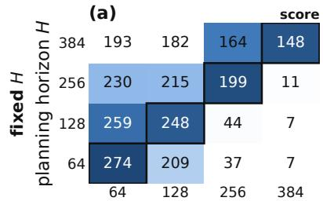

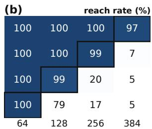

<table><tr><td rowspan=2 colspan=1>(c)379</td><td rowspan=2 colspan=1>375</td><td rowspan=1 colspan=2>steps to goal</td></tr><tr><td rowspan=1 colspan=1>382</td><td rowspan=1 colspan=1>386</td></tr><tr><td rowspan=1 colspan=1>233</td><td rowspan=1 colspan=1>253</td><td rowspan=1 colspan=1>256</td><td rowspan=1 colspan=1>273</td></tr><tr><td rowspan=1 colspan=1>106</td><td rowspan=1 colspan=1>126</td><td rowspan=1 colspan=1>175</td><td rowspan=1 colspan=1>239</td></tr><tr><td rowspan=1 colspan=1>62</td><td rowspan=1 colspan=1>83</td><td rowspan=1 colspan=1>168</td><td rowspan=1 colspan=1>239</td></tr><tr><td rowspan=1 colspan=1>64</td><td rowspan=1 colspan=1>128</td><td rowspan=1 colspan=1>256</td><td rowspan=1 colspan=1>384</td></tr></table>

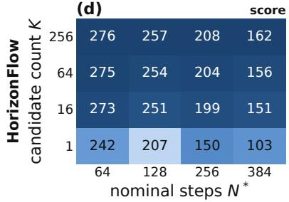

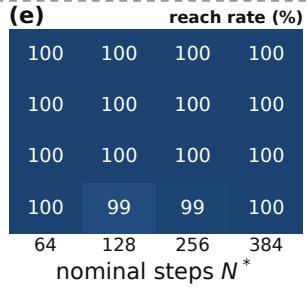

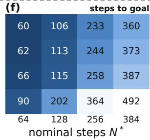  
Figure 4: Planning-horizon and candidate-count diagnostics on Maze2D-Large. Both models generate XY routes tracked by a shared proportional–derivative (PD) controller. (a–c) Fixed-length (no-insertion) model with prescribed horizon $H ;$ outlines mark $H = N ^ { * }$ . (d–f) Joint content–length model with FK steering and minimum-count selection over K candidates. Panels show normalized score, reach rate, and median steps to goal among successful rollouts; columns are nominal-step bins $N ^ { * }$ (100 pairs each). Darker is better; colors are normalized per column across both models.

Sensitivity to the planning horizon. We compare the joint content–length model with a separately trained fixed-length (no-insertion) model, both generating routes in XY space with a shared Transformer backbone, offline data, training budget, and proportional–derivative (PD) waypoint controller. We group start–goal pairs by nominal steps $N ^ { * } \bar { ( } s , \bar { g } ) = d _ { \mathrm { g e o } } ( s , g ) / v$ , where $d _ { \mathrm { g e o } }$ is obstacleavoiding geodesic distance and v is a nominal speed based on dataset motion $( \mathrm { A p p e n d i x } \mathrm { A . } 1 )$ . Fixed horizons trade off reachability and execution efficiency (Figure $4 ( \mathrm { a - c } ) ) \ i$ : short horizons struggle with distant goals, whereas long horizons delay arrival at nearby goals. Joint generation maintains high reach rates across nominal-step bins even with one candidate, without prescribing a horizon for each start–goal pair (Figure 4(d–f)). Although a single candidate arrives later than the fixed horizon matched to the privileged $N ^ { * }$ , selecting among $K \geq 6 4$ candidates exceeds that horizon’s score in every bin.

Candidate counts. On OGBench navigation, increasing $K _ { \mathrm { R P } }$ raises average success from 56.2% to 94.3% at the default $K _ { \mathrm { R P } } = 1 6$ , after which gains level off (Figure 5(a)). Since $K = 1$ is a single unranked draw, equivalent in distribution to uniform selection among independent candidates (Appendix D.3), the unsteered gain over $K = 1$ is attributable to minimum-count selection. FK steering is most useful at small $K _ { \mathrm { R P } }$ , matching unsteered success with two to four times fewer candidates. Increasing $K _ { \mathrm { P C } }$ yields smaller gains (92.3% to 94.6%; Figure 5(b)).

Selection risk. Minimum-count selection can favor a short but infeasible candidate. In the XY diagnostic, this rarely happens (Appendix A). The risk is not negligible everywhere: excessively large candidate counts reduce success in some environments (e.g., visual-cube-triple; Appendix F), possibly because larger pools are more likely to contain a short infeasible outlier, consistent with prior observations in planning (Ki et al., 2025). Still, this risk differs in kind from that of an insufficient prescribed horizon. A horizon must be matched to each start–goal pair before generation, and no single value suits both nearby and distant goals (Figure $4 ( \mathrm { a - c } ) )$ . The candidate count, in contrast, is a single global setting: average success varies by about one point for $K _ { \mathrm { R P } }$ between 8 and 64.

Replanning frequency. Between route updates, the controller holds the first subgoal of the selected route as its target (Appendix D.4). On OGBench navigation, success is nearly unchanged for

(c) replanning interval  
(a)  
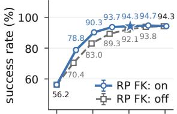

(b)  
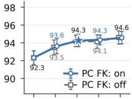

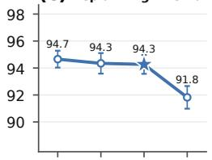

(d)  
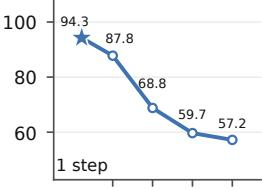

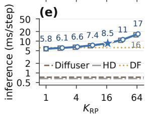

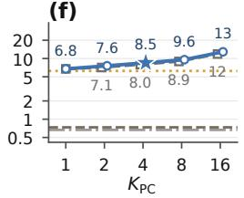

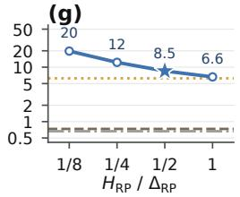

(h)  
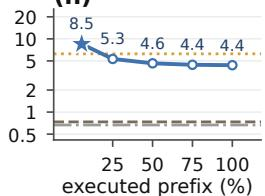  
Figure 5: Sampling, replanning, and inference cost on OGBench navigation. Columns vary RP candidate count (a, e), PC candidate count (b, f), RP update period relative to training stride (c, g), and executed prefix fraction (d, h), with one-step execution shown separately; other settings stay at their defaults (stars). Rows report mean success (a–d) and estimated amortized model-inference time (e–h; ms/step, log scale), averaged equally over the nine navigation environments on a matched evaluation subset. Solid/dashed curves denote FK steering on/off; horizontal lines in (e–h) mark baseline timing references. Error bars combine per-environment standard deviations across seeds (details in Appendix F).

RP update periods from one-eighth to half of the training stride but drops at the full stride (94.3% to 91.8%; Figure 5(c)), possibly because the subgoal is reached before the next update. Conversely, longer periods slightly help in some visual manipulation tasks, possibly because frequent updates shift the target under short strides (Appendix F). Executing more of each action prefix before replanning reduces success more sharply, from 94.3% to 57.2% (Figure 5(d)), mainly in HumanoidMaze and AntMaze-Giant, where open-loop errors likely compound quickly.

Inference cost. Figure 5(e–h) estimates amortized model-inference time per environment step on OGBench navigation. More candidates increase cost; longer RP update periods reduce it. At the RP level, FK adds modest fixed-K overhead but can match unsteered success with fewer candidates and lower estimated cost (Figure 5(a, e)). Diffuser and HD’s lower per-step costs partly reflect predominantly one-shot timing, whereas HorizonFlow’s default controller replans local actions every step. At the default settings, HorizonFlow averages about 8.5 ms of model computation per environment step, making frequent replanning practical in terms of average model-compute cost on the evaluated hardware. HorizonFlow has higher controller-only cost but lower planning-update latency estimates (Appendix F.2). Measurement details and training times are in Appendices D.8 and F.

Architecture ablations. Replacing the prefix controller with a behavior-cloning policy reduces average navigation success from 94.2% to 67.8%, and removing the hierarchy reduces it to 42.9% (Appendix F.1).

## 6 CONCLUSION

We presented HorizonFlow, a hierarchical planner that treats plan length as an output of generation rather than a prescribed input. Insertion-based generation and flow matching jointly generate continuous content and length for both latent subgoal routes and action prefixes. Generated counts support candidate selection without a separate learned value model, while count-based scores steer generation toward shorter plans. HorizonFlow achieves the highest average performance among the compared methods on Maze2D, Multi2D, and OGBench navigation and visual manipulation. Diagnostics show that joint generation reaches both nearby and distant goals without a per-pair horizon and that generated counts closely track goal distance, while ablations confirm the role of both hierarchy levels. Our evaluation focuses on deterministic environments; the effectiveness of count-based selection and steering under stochastic dynamics remains to be established.

## REFERENCES

Anurag Ajay, Yilun Du, Abhi Gupta, Joshua B. Tenenbaum, Tommi Jaakkola, and Pulkit Agrawal. Is conditional generative modeling all you need for decision-making? In International Conference on Learning Representations, 2023.

Andrew Campbell, William Harvey, Christian Weilbach, Valentin De Bortoli, Tom Rainforth, and Arnaud Doucet. Trans-dimensional generative modeling via jump diffusion models. In Advances in Neural Information Processing Systems, 2023.

Boyuan Chen, Diego Marti Monso, Yilun Du, Max Simchowitz, Russ Tedrake, and Vincent Sitzmann. Diffusion forcing: Next-token prediction meets full-sequence diffusion. In Advances in Neural Information Processing Systems, 2024a.

Chang Chen, Fei Deng, Kenji Kawaguchi, Caglar Gulcehre, and Sungjin Ahn. Simple hierarchical planning with diffusion. In The Twelfth International Conference on Learning Representations, 2024b. URL https://openreview.net/forum?id=kXHEBK9uAY.

Patrick Esser, Sumith Kulal, Andreas Blattmann, Rahim Entezari, Jonas Muller, Harry Saini, Yam¨ Levi, Dominik Lorenz, Axel Sauer, Frederic Boesel, Dustin Podell, Tim Dockhorn, Zion English, and Robin Rombach. Scaling rectified flow transformers for high-resolution image synthesis. In International Conference on Machine Learning, volume 235 of Proceedings ofMachine Learning Research, pp. 12606–12633, 2024.

Benjamin Eysenbach, Tianjun Zhang, Ruslan Salakhutdinov, and Sergey Levine. Contrastive learning as goal-conditioned reinforcement learning. In Advances in Neural Information Processing Systems, 2022.

Itai Gat, Tal Remez, Neta Shaul, Felix Kreuk, Ricky T. Q. Chen, Gabriel Synnaeve, Yossi Adi, and Yaron Lipman. Discrete flow matching. In Advances in Neural Information Processing Systems, 2024.

Marton Havasi, Brian Karrer, Itai Gat, and Ricky T. Q. Chen. Edit flows: Flow matching with edit operations. arXiv preprint arXiv:2506.09018, 2025.

Michael Janner, Yilun Du, Joshua B. Tenenbaum, and Sergey Levine. Planning with diffusion for flexible behavior synthesis. In International Conference on Machine Learning, 2022.

Donghyeon Ki, JunHyeok Oh, Seong-Woong Shim, and Byung-Jun Lee. Prior-guided diffusion planning for offline reinforcement learning. In Advances in Neural Information Processing Systems, 2025.

Junseok Kim, Dohyeong Kim, Mineui Hong, and Songhwai Oh. Compositional transduction with latent analogies for offline goal-conditioned reinforcement learning. In International Conference on Machine Learning, 2026.

Sungyoon Kim, Yunseon Choi, Daiki E. Matsunaga, and Kee-Eung Kim. Stitching sub-trajectories with conditional diffusion model for goal-conditioned offline RL. In Proceedings of the AAAI Conference on Artificial Intelligence, 2024.

Wenhao Li, Xiangfeng Wang, Bo Jin, and Hongyuan Zha. Hierarchical diffusion for offline decision making. In International Conference on Machine Learning, volume 202 of Proceedings of Machine Learning Research, pp. 20035–20064, 2023.

Yaron Lipman, Ricky T. Q. Chen, Heli Ben-Hamu, Maximilian Nickel, and Matt Le. Flow matching for generative modeling. In International Conference on Learning Representations, 2023.

Ruijia Liu, Ancheng Hou, Shaoyuan Li, and Xiang Yin. VH-Diffuser: Variable horizon diffusion planner for time-aware goal-conditioned trajectory planning. arXiv preprint arXiv:2509.11930, 2025.

Yunhao Luo, Utkarsh A. Mishra, Yilun Du, and Danfei Xu. Generative trajectory stitching through diffusion composition. arXiv preprint arXiv:2503.05153, 2025.

Gireesh Nandiraju, Yuanliang Ju, Chaoyi Xu, Weiheng Liu, Yuxuan Wan, and He Wang. HDFlow: Hierarchical diffusion-flow planning for long-horizon tasks. arXiv preprint arXiv:2605.04525, 2026.

John Nguyen, Marton Havasi, Tariq Berrada, Luke Zettlemoyer, and Ricky T. Q. Chen. One-Flow: Concurrent mixed-modal and interleaved generation with edit flows. arXiv preprint arXiv:2510.03506, 2025.

Seohong Park, Dibya Ghosh, Benjamin Eysenbach, and Sergey Levine. HIQL: Offline goalconditioned RL with latent states as actions. In Advances in Neural Information Processing Systems, 2023.

Seohong Park, Kevin Frans, Benjamin Eysenbach, and Sergey Levine. OGBench: Benchmarking offline goal-conditioned RL. In International Conference on Learning Representations, 2025.

Raghav Singhal, Zachary Horvitz, Ryan Teehan, Mengye Ren, Zhou Yu, Kathleen McKeown, and Rajesh Ranganath. A general framework for inference-time scaling and steering of diffusion models. In International Conference on Machine Learning, volume 267 of Proceedings of Machine Learning Research, pp. 55810–55827, 2025.

Aaron van den Oord, Yazhe Li, and Oriol Vinyals. Representation learning with contrastive predictive coding. arXiv preprint arXiv:1807.03748, 2018.

Tongzhou Wang, Antonio Torralba, Phillip Isola, and Amy Zhang. Optimal goal-reaching reinforcement learning via quasimetric learning. In International Conference on Machine Learning, 2023.

Yangtian Zhang, Zhe Wang, Arthur Gretton, Rex Ying, David van Dijk, Michalis K. Titsias, and Jiaxin Shi. Variational learning for insertion-based generation. In Proceedings of the 43rd International Conference on Machine Learning, volume 306 of Proceedings ofMachine Learning Research, 2026.

John L. Zhou and Jonathan C. Kao. Flattening hierarchies with policy bootstrapping. In Advances in Neural Information Processing Systems, 2025.

## A HORIZON DIAGNOSTIC: PROTOCOL

We report three complementary diagnostics on Maze2D-Large. Figure 4 compares prescribed-length and joint content–length XY generation under shared execution conditions. Figure 6 reports a Diffuser horizon sweep and a separate horizon-assignment and candidate-selection study. Figure 9 compares learned length signals. The models, evaluation populations, and sampling settings are specified separately below. These diagnostics complement the full-system benchmark evaluation by examining specific aspects of horizon assignment and count-based planning.

## A.1 NOMINAL STEPS

For a start–goal pair, we define nominal steps as

$$
N ^ { * } = \frac { d _ { \mathrm { g e o } } ( s , g ) } { v } ,\tag{6}
$$

where $d _ { \mathrm { g e o } }$ is an obstacle-avoiding shortest-path distance on a discretized free-space map and v is a nominal speed constant chosen with reference to the dataset. This is a distance scale, not a measured minimum number of environment steps. A controller can arrive in fewer steps by moving faster than v or by entering the goal radius before reaching the goal point. For Maze2D-Large, positions are in cell units; cell $( i , { \bar { j } } )$ is the unit square centered at $( i , j )$ . We use the 4-connected breadth-first distance between start and goal cells on the $9 \times 1 2$ wall map and $v = 0 . 0 3 8 5$ cells per step. The measured dataset displacement is 0.0345 cells per step on average, with median 0.0356 and 90th percentile 0.048.

## A.2 XY HORIZON AND CANDIDATE-COUNT DIAGNOSTIC

Diagnostic design. This diagnostic examines the consequences of prescribing plan length before generation versus generating length jointly with content. We generate routes directly in XY space and execute both variants with the same PD waypoint controller, using the same backbone architecture, training budget, and evaluation protocol. This design removes learned-representation and learned-controller differences from the comparison, allowing us to examine how the two generation strategies affect executed route quality under common execution conditions.

In HorizonFlow’s full hierarchy, the state encoder is optimized jointly with the route planner. Replacing the generation objective and retraining the encoder can therefore change both the generator and the representation in which it operates. Freezing a shared encoder would instead evaluate generation under a fixed representation, rather than the original joint-learning procedure; using an encoder learned by either variant could also favor that variant. Direct XY generation avoids this dependence by providing a common, explicit representation that is not learned by either model.

We likewise omit the learned prefix controller from this diagnostic. Its role in the full system is to translate intermediate subgoals into local action prefixes for feedback control, whereas the question here concerns route generation and horizon assignment. Including separately learned controllers would introduce differences in how generated routes are executed. A common PD controller removes this source of variation while retaining execution-based evaluation. The benchmark experiments evaluate the complete planning system, and the architectural ablations assess its hierarchical and controller design choices; this diagnostic instead provides a focused comparison of prescribedlength and joint content–length generation.

Models and training. For Figure 4, we train two route-generation models directly on XY coordi nates from the Maze2D-Large offline dataset. Each token contains an order coordinate and a twodimensional position; no learned encoder, contrastive objective, or prefix controller is used. The models share the Transformer backbone, data normalization, training stride $\Delta _ { \mathrm { R P } } = 1 3$ , batch size 1,024, and 100,000-update training budget. Training samples variable anchor-inclusive counts using the same log-uniform sampler and storage buckets {8, 16, 32, 64}. The insertion model uses the insertion and flow-matching objectives. The separately trained no-insertion model uses all-present flow-matching corruption without insertion heads: all tokens for the sampled count are present from the start. Thus fixed length refers to the count prescribed at inference, not training at a single length. The fixed-length condition therefore uses a separately trained no-insertion generator, rather than disabling insertion only at inference in the trained insertion model.

Prescribed-length generation. For Figure 4(a–c), we initialize the no-insertion model with an anchor-inclusive count

$$
m = \mathrm { r o u n d } ( H / \Delta _ { \mathrm { R P } } ) + 1 ,\tag{7}
$$

and refine the non-anchor tokens without births, keeping the start and goal anchors fixed. Each generated route is linearly interpolated at stride $\Delta _ { \mathrm { R P } }$ to form the waypoint reference. Its time span is $\Delta _ { \mathrm { R P } } ( m - 1 )$ , so the displayed requests $H \in \{ 6 4 , 1 2 8 , 2 5 6 , 3 8 4 \}$ yield spans of 65, 130, 260, and 390 environment steps, respectively. We draw one candidate per pair and horizon. Both models use 20 global generation steps.

Adaptive generation and selection. For Figure 4(d–f), the insertion model generates the count jointly with the route content. The $K = 1$ condition uses the first candidate from an unsteered pool. Each displayed multi-candidate condition $K \in \{ 1 6 , 6 4 , 2 5 6 \}$ uses its own FK-steered pool, with resampling at generation steps 3 and 7, strength $\beta = 0 . 5$ , and the hurdle–ZTP count-based steering score. We then select the minimum generated non-anchor count. These rows evaluate FK steering together with final count-based selection, not an isolated selection-only intervention.

Execution and aggregation. The two models use the same start–goal pairs, nominal-step bins, 800-step execution cap, and PD waypoint controller defined in Appendix A.3. Each reference route is generated once; there is no hierarchical replanning. The figure displays 100 pairs in each of four bins from the shared six-bin set. Ties in minimum count receive equal weight within each pair. Scores and reach rates average these pairwise expectations over the 100 pairs; steps to goal is the weighted median among successful tied candidates, using the same weights and excluding failures.

Table 2: Within-pair execution diagnostics for count-based selection. Success is the expectation under uniform minimum-count tie-breaking; available counts pools containing a successful candidate, and miss reports expected selection failure conditional on that availability. Median $\rho$ summarizes within-pool Spearman correlations between count and steps to goal among successful candidates. $\Delta$ steps compares minimum-count selection with the mean steps to goal of successful candidates in the same pool; negative values denote earlier arrival.
<table><tr><td>Pool</td><td>Success (%)</td><td>Available</td><td>Miss (%)</td><td>Median ρ</td><td> $\Delta$  steps</td></tr><tr><td>FK-off, K = 16</td><td>99.86</td><td>600/600</td><td>0.14</td><td>0.82</td><td>-104</td></tr><tr><td>FK-on, K = 16</td><td>100.00</td><td>600/600</td><td>0.00</td><td>0.87</td><td>-42</td></tr><tr><td>FK-on, K = 64</td><td>99.94</td><td>600/600</td><td>0.06</td><td>0.84</td><td>-54</td></tr><tr><td>FK-on, K = 128</td><td>100.00</td><td>600/600</td><td>0.00</td><td>0.83</td><td>-58</td></tr><tr><td>FK-on, K = 256</td><td>99.92</td><td>600/600</td><td>0.08</td><td>0.82</td><td>-63</td></tr></table>

The single-candidate rows reduce to ordinary means and successful-rollout medians. Each variant is a single trained model.

Display and scope. For each metric and nominal-step column, colors are min–max normalized jointly over the displayed fixed-length and adaptive rows; steps to goal is negated so that darker means fewer steps. This normalization also applies to reach rate; printed percentages remain on their original scale. Outlines indicate equality between the requested H and bin center, before stride rounding. The comparison removes encoder and learned-controller differences, but the two generators have different corruption processes and objectives. It therefore examines prescribed versus jointly generated length in this XY setting. The ${ \check { N } } ^ { * }$ condition supplies privileged geometric length information.

Within-pair count ranking. To distinguish ranking candidates for the same problem from ranking different start–goal pairs by difficulty, we execute the candidates within each generated pool and compare their counts with their outcomes. Table 2 reports 600 pools per configuration. For each pool, minimum-count selection chooses uniformly among all candidates tied for the smallest generated count. Its expected success is therefore the fraction of successful candidates in this tied set, averaged across pools, rather than the outcome of one sampled tie-break. The missed-success rate averages the corresponding failure probability over pools containing at least one successful candidate. These metrics retain failed candidates in the selection evaluation.

Selection reliability and execution efficiency. Every evaluated pool contains a successful candidate, and minimum-count selection retains high expected success while rarely choosing a failing candidate over a successful alternative. Among successful candidates for the same pair, larger counts are associated with more steps to goal, and the reported step differences favor minimum-count selection over the successful-candidate mean. The unsteered condition exhibits the same positive association, so this within-pair evidence is not restricted to FK-steered pools. Unlike the across-pair comparison in Appendix A.5, this diagnostic directly relates count to alternative executed plans for a fixed start and goal.

The correlation and step comparison are conditional on successful execution; the success and missed-success columns separately expose selection failures rather than dropping them from the evaluation. These results support count as a useful ranking signal in this diagnostic, not a guarantee that the shortest generated candidate is feasible or optimal.

## A.3 DIFFUSER HORIZON GRID ON MAZE2D-LARGE

Figure 6(a–c) reports the Diffuser horizon sweep. Its start–goal pairs and execution controller are also used for the XY diagnostic in Appendix A.2.

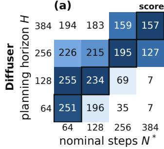

(b)  
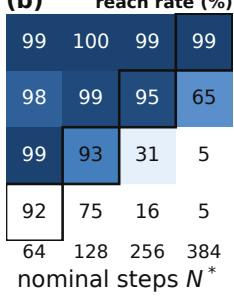

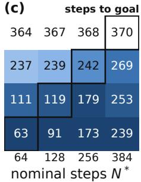

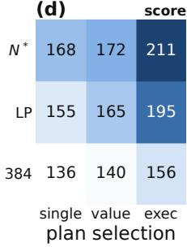  
Figure 6: Diffuser diagnostics on Maze2D-Large. (a–c) Normalized score, reach rate, and median steps to goal among successful rollouts across planning horizon H and nominal steps $N ^ { * }$ . Outlines mark $H = N ^ { * }$ . (d) Normalized score under different horizon-assignment and selection protocols: LP denotes learned length prediction; single, value, and exec denote single-candidate, value-based, and execution-based selection. Darker is better; colors are normalized within columns in (a–c) and across all cells in (d).

Start–goal pairs. We form six bins centered at c ∈ {64, 128, 192, 256, 320, 384} nominal steps, each with half-width 32 steps. A cell pair belongs to bin c when

$$
( c - 3 2 ) v \leq d _ { \mathrm { g e o } } ( s , g ) < ( c + 3 2 ) v .\tag{8}
$$

The bins contain 246, 464, 366, 470, 222, and 158 candidate pairs, respectively. From each bin we sample 100 pairs uniformly without replacement using a fixed random-generator seed, giving 600 pairs. Start and goal states use cell-center positions and zero velocity. The column labels report bin centers, not the exact $N ^ { * }$ of every pair in a column.

Planner and horizon settings. We use Diffuser (Janner et al., 2022) with its public Maze2D-Large weights, trained with horizon 384 and sampled with 256 diffusion steps. We vary the prescribed planning horizon $H \in \{ 6 4 , 1 2 8 , 1 9 2 , 2 5 6 , \hat { 3 2 } 0 , 3 8 4 \}$ by changing the sequence length, without retraining the fully convolutional U-Net. In this diagnostic, H counts predicted state slots, including the endpoints, rather than the number of transitions between those slots. Sampling uses DDPM with $x _ { 0 }$ clipped to [−1, 1] and the start and goal states inpainted at the first and last positions after every denoising step. We draw one plan per pair and horizon, yielding $6 \times 6 \times 1 0 0 = 3 { , } 6 0 0$ plans. The execution procedure uses the predicted positions and finite-difference reference velocities.

Execution and score (a). We use h to index environment steps. Each plan is tracked for 800 environment steps in maze2d-large-v1 without replanning. The waypoint sequence is fixed, but the tracking controller uses feedback from the observed position and velocity. We use the Diffuser waypoint controller with the PD gains used in Diffusion Forcing (Chen et al., 2024a):

$$
a _ { h } = \mathrm { c l i p } _ { [ - 1 , 1 ] } \big ( 1 2 . 5 \left( w _ { h + 1 } - p _ { h } \right) + 1 . 2 \left( \dot { w } _ { h + 1 } - \dot { p } _ { h } \right) \big ) ,\tag{9}
$$

where $w _ { h + 1 }$ is the next waypoint, w˙ its finite-difference velocity, and $p _ { h } , \dot { p } _ { h }$ the observed position and velocity. After exhausting the plan, the controller holds the last waypoint with zero target velocity. Within the goal radius of 0.5, it switches to the goal-holding rule $a _ { h } = 1 0 ( g - p _ { h } ) - \dot { p } _ { h }$ The sparse reward gives one point per environment step inside this radius. Panel (a) reports the D4RL-normalized return

$$
1 0 0 \frac { R - 6 . 7 } { 2 7 3 . 9 9 - 6 . 7 } ,\tag{10}
$$

averaged over the 100 pairs in each horizon–distance cell.

Reach rate (b). For each plan, we record the first rollout index at which the agent is within distance 0.5 of the goal after an environment step. A plan is counted as reached if this occurs during the 800- step rollout. Panel (b) reports the percentage of the 100 plans in each cell that reach the goal. This is an execution-based measure; no waypoint or line-segment wall test filters these rollouts.

Steps to goal (c). Panel (c) reports the median number of executed environment actions until first arrival among successful rollouts in each cell. Failed rollouts are excluded; every displayed cell contains at least one successful rollout.

Interpreting the decomposition. The panels distinguish failure to reach from delayed arrival among successful rollouts; they do not measure wall-crossing frequency. Steps to goal can fall below a column’s $N ^ { * }$ because each bin spans a range of distances, the controller can exceed the nominal pace, and reaching uses a goal radius. The figure displays four of the six measured horizon settings and distance bins without pooling the omitted bins. Its outlines mark equality with a bin center, not an oracle-optimal horizon for each pair.

## A.4 DIFFUSER HORIZON ASSIGNMENT AND CANDIDATE SELECTION

Figure 6(d) is a separate experiment using five reproduced Diffuser training seeds, with the LP row using the corresponding VHD models. These models are not the public checkpoint used in panels (a–c). Rows compare a fixed-horizon baseline with $H = 3 8 4$ , a learned length-prediction variant based on VHD (LP), and a variant using nominal steps $N ^ { * }$ . The LP condition follows VHD’s length-prediction mechanism and associated training changes; it should not be interpreted as simply attaching a predictor to an otherwise identical Diffuser model. Columns use a single sample, valuebased selection using an XY HIQL model among four candidates, or an execution-based selection oracle among 128 candidates. The execution-based selection oracle chooses the earliest successful arrival after executing all candidates from the same initial state, falling back to the first candidate if none reaches the goal. It is an execution-based reference, not an offline selection rule. For the $N ^ { * } -$ execution cell, the oracle additionally searches the horizon ladder $\{ 0 . 7 5 , 0 . 8 7 5 , 1 , 1 . 1 2 5 , 1 . 2 5 \} N ^ { \ast }$ Each condition uses five training seeds and 100 evaluation episodes per seed for each of the singlegoal and multi-goal settings. The two settings are averaged within each seed and then across seeds; scores are D4RL-normalized. Panel (d) uses a single color scale across its cells and displays means without error bars.

Panel (d) follows the VHD evaluation protocol and is intended as a within-panel comparison of horizon-assignment and selection strategies, not as a continuation of the horizon grid in panels (a–c). Its nominal-step estimate uses an 8-connected geodesic calculation on a 0.2-unit grid with nominal speed 0.025 units per environment step. For the ordinary $N ^ { * }$ condition, the resulting horizon is rounded up to a multiple of 32 and clipped to [32, 384]. The $N ^ { * } .$ –execution ladder applies its multipliers to this clipped base, rounds each candidate horizon to the nearest multiple of 4, and clips it to [4, 384]. Multiple ladder settings can therefore coincide at the cap. Its waypoint tracker uses unit gains on position and velocity errors, instead of the gains 12.5 and 1.2 used in panels (a–c).

For the LP condition, the single-sample and value-based variants replan after exhausting a plan without reaching the goal. On replanning, the new horizon is at least twice the previous plan length, capped by the maximum horizon and rounded to a multiple of 32. Its execution-based variant disables replanning so that each candidate is evaluated as one complete reference plan.

Qualitative plan samples. Figures 7 and 8 visualize Diffuser and HorizonFlow XY reference plans for the same endpoints under different length settings. Short horizons can produce paths through walls for distant pairs, whereas long horizons can introduce excursions beyond a nearby goal. Each panel overlays five generated samples to show variation across plans; this visualization is separate from the one-plan-per-pair-and-horizon measurement protocol used in Figure $6 ( \mathrm { a - c } )$ . The XY examples also show variation in route shape and token count under adaptive generation. These illustrative samples are not executed trajectories or a quantitative comparison of success rates.

## A.5 COMPARING LENGTH SIGNALS

We compare three signals on the same start–goal pairs: a value-derived length, an explicit length prediction, and a generated plan count. This diagnostic evaluates distance ranking without executing plans.

HIQL value-derived length. We use the official OGBench HIQL implementation with discount $\gamma = 0 . 9 9 5$ , expectile 0.7, subgoal representation dimension 10, batch size 1024, one million gradient

# (a) H = 64 (b) H = 128 (c) H = 256 (d) H = 384 Diffuser, maze2d-large N\*=64 開 (e) (f) (g) (h) N\*=192 图 (i) (j) (k) (l) N\*=320

sample 1 sample 2 sample 3 sample 4 sample 5 start goal

Figure 7: Diffuser plan samples on Maze2D-Large. Rows show start–goal pairs labeled by nominal steps N<sup>∗</sup> ∈ {64, 192, 320}; columns vary the planning horizon H ∈ {64, 128, 256, 384}. Each panel overlays five generated position sequences with the same endpoints. Circles mark starts, stars mark goals, and gray regions are walls. These are generated reference plans, not executed trajectories.

steps, and seed 0. Inputs are raw states $( x , y , \dot { x } , \dot { y } )$ , and goals are drawn from the training stream using OGBench’s hierarchical goal-conditioned sampler. The target-network EMA, optimizer, and batch sampling follow the official update procedure. We convert the value to a length using

$$
\hat { n } _ { \mathrm { H I Q L } } = \frac { \log ( 1 + ( 1 - \gamma ) V ( s , g ) ) } { \log \gamma } .\tag{11}
$$

The conversion is strictly decreasing on its valid domain, so $\hat { n } _ { \mathrm { H I Q L } }$ and −V induce the same ranking.

VHD length prediction. We use the scalar horizon $\hat { L }$ produced by our reproduced VHD length predictor for each state–goal pair.

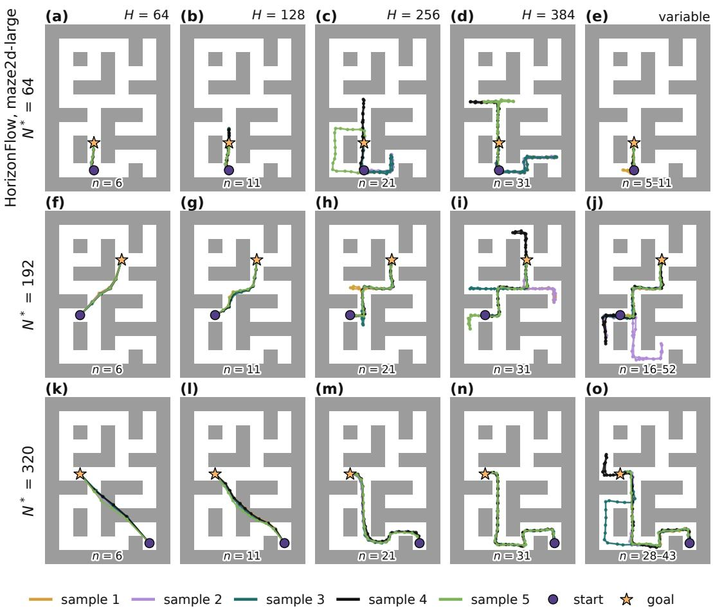  
Figure 8: HorizonFlow XY plan samples on Maze2D-Large. Rows use the same start–goal pairs as Figure 7; columns compare prescribed planning horizons with adaptive generation (variable). Colors distinguish generated reference plans, dots mark tokens, circles mark starts, stars mark goals, and gray regions are walls. Count labels in this figure include both anchors; ranges give the minimum and maximum counts among the displayed samples.

HorizonFlow count. We use the minimum non-anchor count among $K _ { \mathrm { R P } } = 6 4 $ generated RP plans with FK steering.

Evaluation. For each threshold x, we compute the Spearman correlation between each signal and N<sup>∗</sup> over pairs satisfying $N ^ { * } \geq x$ . Increasing x restricts the comparison to more distant goals, testing whether the signals retain useful distance rankings at long range. This measures agreement with nominal steps, not accuracy against an optimal control horizon.

Results. Figure 9 reports 2,400 matched pairs, with 300 pairs in each of eight nonempty 50-step bands of N<sup>∗</sup>. Each method uses one trained model. VHD uses its unquantized prediction, and the HorizonFlow count excludes the two fixed anchors in the stored plans.

HorizonFlow’s generated count has the highest rank correlation with nominal steps among the three signals in this diagnostic: $\rho = 0 . 9 5 4 .$ , compared with 0.924 for HIQL and 0.653 for VHD. The ordering persists on the 600 pairs with $N ^ { * } \geq 3 0 0$ , where the correlations are 0.617, 0.371, and 0.070, respectively. Restricting the comparison changes both the target range and the pair distribution. These cross-pair correlations assess distance ranking; within-pair selection is evaluated in Appendix A.2.

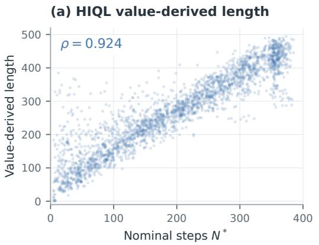

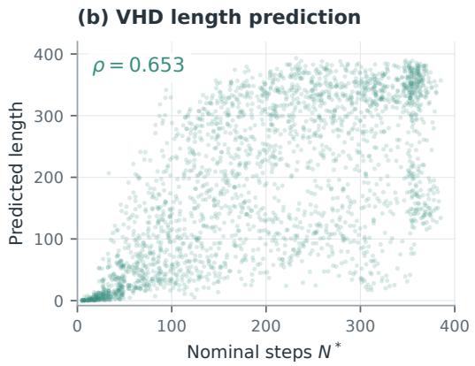

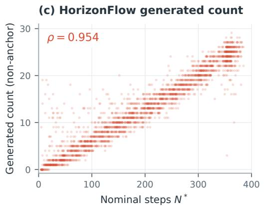

(d) Correlation for distant goals  
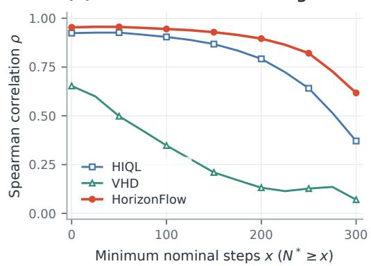  
Figure 9: Length signals on matched Maze2D-Large start–goal pairs. (a–c) HIQL value-derived length, VHD predicted length, and HorizonFlow generated non-anchor count versus nominal steps $N ^ { * } ; \rho$ denotes Spearman correlation. (d) Correlation recomputed on pairs with $N ^ { * } \geq x$ as the minimum nominal-step threshold x increases.

## B MATCHED FULL-SYSTEM AND SAMPLER DIAGNOSTICS

The diagnostics in Appendix A isolate geometric length signals in Maze2D. Here we complement them with matched full-system controls on AntMaze-Giant and HumanoidMaze-Giant, followed by implementation checks and an integration-resolution sensitivity study. These experiments separate three questions: whether route-planner (RP) performance survives an externally predicted length, how action-prefix controller (PC) performance changes when its length is fixed to the full horizon or the controller is replaced, and whether the practical sampler is sensitive to its numerical resolution. Success rate is always measured from environment rollouts; the non-rollout checks are identified explicitly.

## B.1 ROUTE-PLANNER LENGTH ASSIGNMENT

Matched setup. For the learned-length and externally assigned-length RPs in Figure 10, we match the Transformer size (640 hidden units, 10 layers, and 8 attention heads), dataset, stride, length buckets $( 8 / 1 6 / 3 2 / 6 4 )$ , segment-length distribution, 100k updates, batch size 1024, learning-rate schedule, and training seed. The externally assigned-length model loads the encoder from the corresponding HorizonFlow RP checkpoint and freezes it from the start of training. Thus, both models use the same latent representation and can be paired with the same pretrained HorizonFlow PC. The only training-objective change is that the control RP contains all m segment tokens from the outset: its two endpoint anchors remain clean, the $m - 2$ interior tokens share one flow time, and the model is trained only on the velocity target, without birth or completion targets. Training lengths are still sampled from the matched RP length distribution; the length is fixed externally only at generation time.

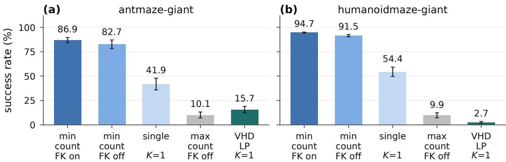  
route-planner length decision and selection $( K _ { \tt R P } = 1 6$ unless noted)  
Figure 10: Full-system route-planner length controls. Success rates on AntMaze-Giant (left) and HumanoidMaze-Giant (right). The bars compare minimum-count RP selection with FK enabled or disabled, a single joint RP sample, maximum-count selection without FK, and a VHD-style predicted-length control with one content sample. The RP uses 16 candidates unless $K = 1$ is indicated. Error bars are standard deviations over three training seeds, with 125 evaluation problem per seed. The pretrained encoder and PC are shared by the matched controls.

The external length is provided by a VHD-style predictor trained with the same architecture and losses as our VHD reproduction. It maps random Fourier features of $( s , g )$ through a three-layer, width-512 MLP to $f ( s , g ) \in [ 0 , 1 ] .$ , representing predicted steps divided by $T _ { \mathrm { m a x } } = 6 3 \Delta _ { \mathrm { R P } }$ . Its targets combine same-episode anchor regression, bootstrapped dynamic-programming targets, consistency and triangle constraints, and the boundary conditions $f ( g , g ) = 0$ and $f \leq 1$ . For this RP control, anchor offsets are $\Delta _ { \mathrm { R P } } \times \{ 1 , 2 , 4 , 8 , 1 6 , \dot { 3 } 2 , 6 3 \}$ , the batch size is 256, and the predictor is trained for 20k updates with learning rate $3 \times 1 0 ^ { - 4 }$

Length conversion. We report the exact conversion used by the control:

$$
L = f ( s , g ) T _ { \mathrm { m a x } } + 1 , \qquad m = \mathrm { c l i p } \left( \mathrm { r o u n d } \left( { \frac { L } { \Delta _ { \mathrm { R P } } } } \right) + 1 , 2 , N _ { \mathrm { R P } } \right) .\tag{12}
$$

Here round is Python’s rounding rule and the final +1 includes an anchor. We call this a VHD-style learned-length control rather than an oracle shortest-path assignment.

Results and scope. Minimum-count selection with FK reaches 86.9% on AntMaze-Giant and 94.7% on HumanoidMaze-Giant; disabling FK changes these values to 82.7% and 91.5%. With selection removed, a single joint RP sample reaches 41.9% and 54.4%, whereas the VHD-style predicted-length control with one content sample reaches 15.7% and 2.7%. Selecting the maximumcount candidate without FK reaches 10.1% and 9.9%.

The K = 1 comparison removes both best-of-K selection and FK from the contrast between joint generation and external length assignment. The control plugs an external length module into the same system: the encoder, prefix controller, data, length distribution, and training budget are shared, and only the way the horizon is set differs. The comparison therefore isolates horizon assignment within this system rather than benchmarking a separate method. Conversely, the gap between one sample and minimum-count selection shows that candidate generation and selection remain impor tant parts of the full RP recipe.

## B.2 ACTION-PREFIX CONTROLLER VARIANTS

Setup. We next hold the default RP fixed and change only the PC. Each result in Figure 11 aggregates 125 problems for each of seeds 43–45, or 375 rollouts per domain. The default PC generates four FK-guided candidates and executes the minimum-count candidate. The single control removes candidate selection. Thefixed control is a full-horizon fixed-length PC: it uses the same Transformer architecture and training distribution, is trained without insertion, and always generates the full PC capacity $N _ { \mathrm { P C } } \ \mathrm { ( T a b l e 4 ) }$ . The maximum-count control selects the longest of four candidates with FK disabled. Finally, the BC control replaces the generative PC with a behavior-cloning policy while retaining the same RP.

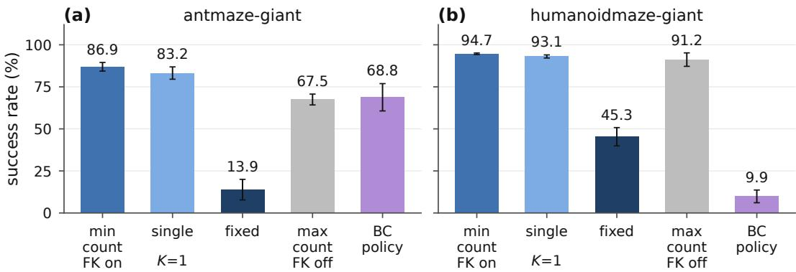  
action-prefix controller variant $( K _ { \mathsf { P C } } { = } 4$ unless noted)  
Figure 11: Action-prefix controller controls with the route planner fixed. Success rates on AntMaze-Giant (left) and HumanoidMaze-Giant (right) for the default minimum-count PC, a single generated candidate, a full-horizon fixed-length Transformer, maximum-count selection without FK, and a behavior-cloning policy. Each domain uses 125 problems for each of seeds 43–45.

Results and interpretation. The default PC reaches 86.9% and 94.7% on AntMaze-Giant and HumanoidMaze-Giant, respectively. One candidate already reaches 83.2% and 93.1%, so the combined gain from four-candidate generation, FK, and minimum-count selection is 3.7 and 1.6 percentage points. In contrast, the full-horizon fixed-length Transformer reaches 13.9% and 45.3%. This full-horizon control keeps the architecture and training distribution fixed and removes only insertion. Maximum-count selection without FK reaches 67.5% and 91.2%, while the BC policy reaches 68.8% and 9.9%.

The maximum-count condition reverses the count-guided inference rule (ordering and FK together) and reduces success by 19.4 and 3.5 points. The single-candidate result shows that the gain over the fixed-length and BC controllers comes primarily from joint content–length generation itself, with count-guided selection adding a further margin. HorizonFlow executes only the first action of each generated prefix and then replans, so the rollout success rate measures the accumulated consequence of those repeated first-action decisions.

## B.3 SAMPLER CHECKS AND INTEGRATION RESOLUTION

Protocol. Figure 12 uses one trained checkpoint (seed 43) per domain; its top row contains no environment rollouts. Panels (a) and (b) use 20k corruptions drawn from the training-data pipeline. Panel (a) checks gap-target identities and total-count conservation. Panel (b) compares the head’s predicted missing count with the realized missing count across noise levels. Panel (c) runs $K _ { \mathrm { R P } } =$ 16 chains with FK disabled and measures Spearman correlation between the intermediate FK score and each chain’s final count at $\sigma \in \{ 0 . 3 , 0 . 7 \}$

The bottom row evaluates 250 problems per domain (five tasks for each of evaluation seeds 0–49), with budgets of 1000 environment steps for AntMaze-Giant and 4000 for HumanoidMaze-Giant. We vary the RP integration steps over $M \in \{ 2 0 , 4 0 , 8 0 \}$ . FK checkpoints scale proportionally: {3, 7}, {6, 14}, and {12, 28}. All conditions use $K _ { \mathrm { R P } } = 1 6$ and minimum-count selection. The PC remains fixed at $M = 2 0 , K _ { \mathrm { P C } } = 4 .$ , with FK enabled.

Non-rollout checks. The gap-target test records zero identity mismatches and zero total-count violations over the 20k sampled corruptions. The nonzero bars in panel (a) report the fraction of slots outside the displayed neighbour-rule case; the identity and sum checks are the annotated zero-valued diagnostics. The missing-count predictions track the diagonal across noise levels, with aggregate signed biases of +0.01 on AntMaze-Giant and +0.04 on HumanoidMaze-Giant. This validates the count head on the sampled training distribution; it is not a calibration claim for every output of the denoiser. $\mathrm { { A t } \ : \sigma = 0 . 3 }$ , intermediate-score rank correlations are approximately 0.3–0.5; at $\sigma = 0 . 7$ they rise to about 0.8. Accordingly, FK uses this quantity for within-call ranking, not as a calibrated estimate of the eventual count.

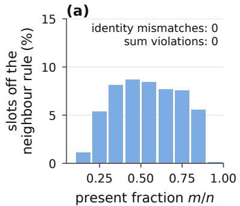

(b)  
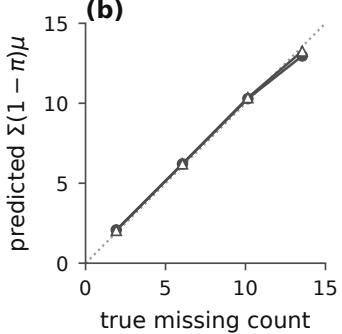

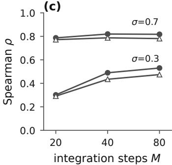

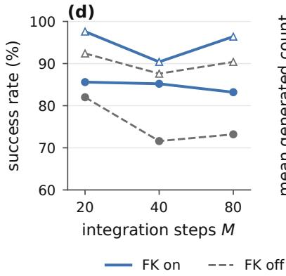

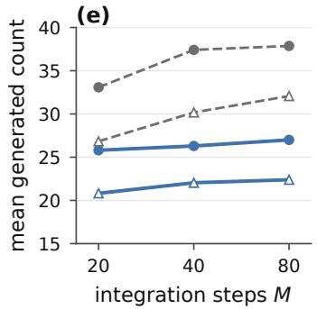

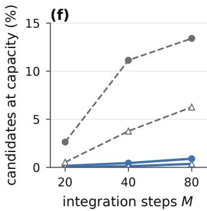  
Figure 12: Sampler implementation checks and resolution sensitivity. Top: gap-target assignment and conservation checks, missing-count head calibration, and rank correlation between intermediate FK scores and final generated counts. Bottom: rollout success, average generated nonanchor count, and fraction of RP candidates at the length capacity as the RP integration resolution varies. Solid blue curves enable FK and dashed gray curves disable it; circles denote AntMaze-Giant and triangles denote HumanoidMaze-Giant.

Resolution sensitivity. With FK enabled, AntMaze-Giant success changes from approximately 86% to 85% and 83% as M increases, while HumanoidMaze-Giant changes from approximately 98% to 90% and 96%. The intermediate HumanoidMaze-Giant dip therefore does not continue at $M = 8 0$ . Average generated counts move by only one to two tokens, and fewer than 1% of candidates reach the length capacity. Without FK, generated plans become longer as M increases; on AntMaze-Giant the average count grows from about 33 to 38, and the capacity fraction grows from 2.6% to 13.4%. The corresponding HumanoidMaze-Giant capacity fraction grows from 0.5% to 6.3%. This drift without steering is one reason FK is part of the default recipe.

## C COUNT-BASED STEERING SCORE FROM THE HURDLE–ZTP HEAD

At a steering checkpoint, let $G ( x _ { \sigma } )$ be the gaps between the tokens currently present in particle $x _ { \sigma }$ . For each gap g, let $K _ { g }$ denote the gapwise missing-count random variable represented by the hurdle–ZTP head at that checkpoint. Its distribution is

$$
\operatorname* { P r } ( K _ { g } = 0 \mid x _ { \sigma } ) = \pi _ { \theta } ( g \mid x _ { \sigma } )\tag{13}
$$

and, for $k \geq 1$

$$
\operatorname* { P r } ( K _ { g } = k \mid K _ { g } > 0 , x _ { \sigma } ) = { \frac { e ^ { - \lambda _ { \theta } ( g \mid x _ { \sigma } ) } \lambda _ { \theta } ( g \mid x _ { \sigma } ) ^ { k } } { k ! \left( 1 - e ^ { - \lambda _ { \theta } ( g \mid x _ { \sigma } ) } \right) } } .\tag{14}
$$

The conditional mean of a zero-truncated Poisson variable is

$$
\operatorname { \mathbb { E } } [ K _ { g } \mid K _ { g } > 0 , x _ { \sigma } ] = { \frac { \lambda _ { \theta } ( g \mid x _ { \sigma } ) } { 1 - e ^ { - \lambda _ { \theta } ( g \mid x _ { \sigma } ) } } } .\tag{15}
$$

Applying the law of total expectation to the hurdle event gives

$$
\operatorname { \mathbb { E } } [ K _ { g } \mid x _ { \sigma } ] = \left( 1 - \pi _ { \theta } ( g \mid x _ { \sigma } ) \right) { \frac { \lambda _ { \theta } ( g \mid x _ { \sigma } ) } { 1 - e ^ { - \lambda _ { \theta } ( g \mid x _ { \sigma } ) } } } .\tag{16}
$$

Excluding the fixed start and goal anchors, we construct the count-based steering score by adding the current token count to the expected missing counts under the predictive heads:

$$
\begin{array} { l } { \displaystyle { \hat { n } ( x _ { \sigma } ) : = | x _ { \sigma } | + \sum _ { g \in G ( x _ { \sigma } ) } \mathbb { E } _ { \theta } [ K _ { g } \mid x _ { \sigma } ] } } \\ { \displaystyle { = | x _ { \sigma } | + \sum _ { g \in G ( x _ { \sigma } ) } \left( 1 - \pi _ { \theta } ( g \mid x _ { \sigma } ) \right) \frac { \lambda _ { \theta } ( g \mid x _ { \sigma } ) } { 1 - e ^ { - \lambda _ { \theta } ( g | x _ { \sigma } ) } } . } } \end{array}\tag{17}
$$

This gives Equation 4. The expectations are taken under the gapwise hurdle–ZTP predictive heads; their sum does not require the $K _ { g }$ to be independent. We use the resulting score as a steering potential, rather than identifying it with the conditional expected final count of the practical sampler. No rollout reward or separately learned value enters its construction.

## D METHOD DETAILS AND PSEUDOCODE

We detail the token representation, training procedure, sampler, and control loop used for the OG-Bench navigation experiments. Appendix D.6 specifies the shared recipe and its Maze2D and visualmanipulation settings. Algorithms $_ { 1 - 5 }$ summarize the procedures; Table 3 records the default recipe. We retain the main-text notation: r is the order coordinate, σ is the global generation clock, $t _ { i }$ is a token’s local refinement time, and h indexes environment steps.

## D.1 TOKENS, STORAGE, AND ARCHITECTURE

Generated tokens and conditioning anchors. Each generated token is $x _ { i } = ( r _ { i } , c _ { i } )$ , with continuous content $c _ { i } .$ . RP generates tokens $( r , z )$ with $z \in \mathbb { R } ^ { 1 6 }$ ; PC generates $( r , a )$ , with one action per interior token. PC storage also contains conditioning fields for state information, but these fields are not read from or predicted for interior tokens. The start anchor carries the current proprioceptive state; the goal anchor carries the frozen RP encoder’s latent of the goal frame, padded into the conditioning field. Their action fields are zero. Thus the storage layout does not make PC a state–action trajectory generator.

Both planners have two fixed anchors at $r = - 1$ and $r = + 1$ , excluded from the tokenwise FM loss and generated count. We write k for the active token count including these anchors and $n = k - 2$ for the generated count. A clean sequence has coordinates $r _ { i } = 2 ( \bar { i } - 1 ) / ( m - 1 ) - 1$ , where m includes anchors. Gaussian noise and intermediate flow states need not have coordinates in $[ - 1 , 1 ] ;$ the anchor values remain fixed and the other tokens are ordered by their current r coordinates.

Padded storage and gaps. Token sets are stored in fixed-capacity arrays with padding masks: $N _ { \mathrm { R P } } = 6 4$ and $N _ { \mathrm { P C } } = 3 2 $ , including anchors. We denote a generic storage capacity by $C _ { \mathrm { s t o r e } } =$ $N + 2 ,$ , where N is the non-anchor token capacity in the main-text plan space; $C _ { \mathrm { s t o r e } }$ equals $N _ { \mathrm { R P } }$ or $N _ { \mathrm { P C } }$ at the respective level. Uppercase X denotes anchor-inclusive storage, whereas lowercase x denotes the generated non-anchor plan. Thus $\vert x \vert = n = k - 2$ . Only the k active rows are processed as plan tokens; padding does not count toward plan length. A learned beginning-of-sequence (BOS) token is prepended to the network input, without a local-time embedding. It is distinct from the two conditioning anchors and is not counted in k or the generated count. The count and completion heads produce outputs at the BOS and active-token positions, giving $k + 1$ gap outputs, including the slots before and after the active tokens. Boundary gaps are included in the insertion supervision, even though clean sequences have no missing targets outside the endpoint anchors.

Transformer and output heads. Both planners use pre-layer-normalized Transformer blocks with eight attention heads and additive sinusoidal embeddings of each token’s local refinement time. The network operates on the noisy plan $x _ { \sigma }$ defined in Section 4.2. The RP model has width 640 and ten blocks (51.3M parameters), with a linear input projection for $( r , z )$ . The PC model has width 512 and four blocks (14.0M parameters). Its state-free input uses separate projections for interior $( r , a )$ tokens and anchor conditioning, plus a type embedding. Its velocity output covers only $( r , a )$ , never intermediate states.

The three heads predict token velocities $v _ { \theta } ,$ positive-count parameters $\lambda _ { \theta }$ through softplus, and gapcompletion probabilities $\pi _ { \theta }$ through sigmoid. The parameter λ is the base Poisson parameter of the positive-count distribution; its conditional mean is $\bar { \lambda } / ( 1 - e ^ { - \lambda } )$ ), not λ.

## D.2 TRAINING

Segments and variable lengths. Training examples are sampled from individual dataset episodes. The clean count $m$ , including anchors, is sampled log-uniformly from [2, 64] for RP and [3, 32] for PC. Examples are bucketed at capacities {8, 16, 32, 64} and {8, 16, 32}, respectively, with bucket allocations proportional to the corresponding probability mass, up to integer batch-size rounding. Specifically, sampling a uniform real value on [log $m _ { \operatorname* { m i n } } , \log ( m _ { \operatorname* { m a x } } + 1 ) )$ and exponentiating and flooring it gives $\bar { p ( m ) } = \log ( ( m + 1 ) / m ) / \log ( \bar { ( m _ { \operatorname* { m a x } } + 1 ) / m _ { \operatorname* { m i n } } } )$ . Each bucket samples its disjoint count interval under this law; rounded example allocations are adjusted in the largest bucket to preserve the total batch size. RP interiors are sampled at stride $\Delta _ { \mathrm { R P } }$ , whereas $\mathrm { P } \breve { \mathrm { C } }$ interiors use unit-stride actions. For $\mathrm { P C } ,$ the action-prefix length is $n = m - 2 ;$ these interior tokens represent $a _ { h } , \ldots , a _ { h + n - 1 }$ from a segment starting at environment step h. Interior token $q \in \{ 1 , \ldots , n \}$ carries $a _ { h + q - 1 }$ , the logged action leading into frame $s _ { h + q } .$ . These frame indices specify the training-data correspondence; PC generates actions, not interior states. Anchor action fields are set to zero.

Local-prefix targets. For a sampled action prefix of n environment steps, the hindsight goal is taken at offset

$$
\ell _ { \mathrm { g o a l } } = K _ { \mathrm { d i v } } n .\tag{18}
$$

The goal anchor contains the frozen RP encoder’s latent of that frame. With $K _ { \mathrm { d i v } } = 1$ , the last interior token and goal anchor correspond to the same frame $s _ { h + n } \colon$ the former carries the final action leading into that frame, while the latter provides goal conditioning. Larger divisors pair the same action prefix with a more distant goal frame. At fixed $K _ { \mathrm { d i v } } > 0 .$ , the target count n and goal offset $K _ { \mathrm { d i v } } n$ have the same ordering. This training relation motivates using generated count as a temporal proxy when ranking prefixes, including when $K _ { \mathrm { d i v } } > 1$ . The default controller executes the selected prefix’s first action and replans; it does not commit to executing the whole prefix or treat its count as a verified arrival time. In particular, PC training lengths are sampled rather than fixed at $\Delta _ { \mathrm { R P } } / K _ { \mathrm { d i v } }$ The default divisor is one for PointMaze and AntMaze, two for HumanoidMaze-Medium/Large, and four for HumanoidMaze-Giant. It is distinct from the candidate count K.

Interleaved corruption. We sample $\sigma \sim \mathcal { U } ( 0 , 2 )$ and independent offsets $u _ { i } \sim \mathcal { U } ( 0 , 1 )$ . A nonanchor token is present when $\sigma - u _ { i } \geq 0$ and has local time $t _ { i } = \mathrm { c l i p } _ { [ 0 , 1 ] } ( \sigma - u _ { i } )$ ; anchors are always present and clean at $t _ { i } ~ = ~ 1$ . Deleted tokens supply the gapwise missing-count targets. After interpolation, the model receives tokens sorted by their noised order coordinates. Algorithm 1 summarizes this corruption. For $\sigma < 1$ , insertions and refinement coexist; for $\sigma \geq 1$ , all clean tokens are present and refinement continues, mirroring the sampler’s two-phase clock schedule.

Flow-matching and insertion losses. Let $s$ contain all present non-anchor tokens in one devicelocal bucket batch, and let D denote the number of supervised coordinates: $1 + d _ { z }$ for RP and $1 + d _ { a }$ for PC. The velocity loss is

$$
\mathcal { L } _ { \mathrm { F M } } = \mathbb { E } \left[ \frac { 1 } { D | \boldsymbol { S } | } \sum _ { i \in \boldsymbol { S } } \omega ( t _ { i } ) \left. \boldsymbol { v } _ { \boldsymbol { \theta } } ( X _ { \mathbf { t } } , \mathbf { t } ) _ { i } - \boldsymbol { v } _ { i } ^ { \star } \right. _ { 2 } ^ { 2 } \right] ,\tag{19}
$$

Algorithm 1 CORRUPT: interleaved corruption of a clean plan   
Require: Clean tokens $X _ { 1 } = ( x _ { 1 , i } ) _ { i = 1 } ^ { m }$ in route order; anchor mask A   
1: Sample $\sigma \sim \mathcal { U } ( 0 , 2 )$ and $u _ { i } \sim \mathcal { U } ( 0 , 1 )$ independently   
2: Form present-token mask $P ,$ , local times t, and gap counts $\{ c _ { g } \}$ as defined above   
3: $k  \sum _ { i } P _ { i }$ ▷ Number of present tokens; k + 1 gaps include boundaries   
4: Draw noise ϵ using the noise distribution   
5: $x _ { \mathbf { t } , i } \gets ( 1 - t _ { i } ) \epsilon _ { i } + t _ { i } x _ { 1 , i }$ for present tokens   
6: $\boldsymbol { v } _ { i } ^ { \star } \gets \boldsymbol { x } _ { 1 , i } - \epsilon _ { i }$ on supervised, non-anchor coordinates   
7: Sort present tokens by noised $r ,$ carrying times, targets, and masks   
8: return Corrupted plan, local times, velocity targets, anchor mask, and $\{ c _ { g } \}$

with zero token loss when $s$ is empty. Anchors and padding are masked. The logit-normal importance weight is proportional to

$$
\omega ( t ) \propto { \frac { \exp \left[ - { \frac { 1 } { 2 } } \left( \log { \frac { t } { 1 - t } } \right) ^ { 2 } \right] } { t ( 1 - t ) } } , \qquad 0 < t < 1 ,\tag{20}
$$

evaluated after clipping t to $[ 1 0 ^ { - 3 } , 1 - 1 0 ^ { - 3 } ]$ and normalized to mean one over $s$ (Esser et al., 2024). Thus the reduction pools supervised tokens within a bucket batch; it is not an unweighted average of per-plan velocity losses. For $c _ { g }$ missing clean tokens in gap $^ { g , }$ the insertion objective is

$$
\begin{array} { l } { { \displaystyle { \mathcal { L } } _ { \mathrm { i n s } } = \mathbb { E } \left[ \frac { 1 } { | G | } \sum _ { g \in G } \ell _ { g } \right] \mathrm { , } } } \\ { { \displaystyle \ell _ { g } = \mathrm { B C E } ( \pi _ { \theta } ( g ) , \mathbf { 1 } [ c _ { g } = 0 ] ) } } \\ { { \displaystyle ~ + \mathbf { 1 } [ c _ { g } > 0 ] \left( \lambda _ { \theta } ( g ) - c _ { g } \log \lambda _ { \theta } ( g ) + \log ( 1 - e ^ { - \lambda _ { \theta } ( g ) } ) \right) . } } \end{array}\tag{21}
$$

Here $| G | = k + 1$ , including the boundary gap outputs. The parameter-independent factorial term is omitted. Each example first averages over its valid gaps, and these insertion losses are then averaged over the examples in the bucket batch.

Across buckets, RP weights the full loss by the fraction of examples in each bucket. PC weights the FM term by the fraction of supervised tokens in each bucket and the insertion term by the fraction of examples. Gradients are averaged across devices before the optimizer update.

Route planner’s latent encoder and gradient routing. The encoder is a two-layer MLP with a 64-unit hidden layer,

$$
z = E _ { \phi } ( s ) = \operatorname { t a n h } ( W _ { 2 } \operatorname { S i L U } ( W _ { 1 } s ) ) \in \mathbb { R } ^ { 1 6 } .\tag{22}
$$

It is trained jointly with the route planner, but receives gradients only from insertion supervision and temporal contrastive regularization. FM gradients are blocked at the encoder so that its representations cannot shrink merely to simplify the velocity target. For temporally nearby positive states and in-batch negatives, we use

$$
\mathcal { L } _ { \mathrm { N C E } } = \mathbb { E } \left[ - \log \frac { \exp ( \bar { z } _ { j } ^ { \top } \bar { z } _ { j + \Delta } / \kappa ) } { \sum _ { j ^ { \prime } } \exp ( \bar { z } _ { j } ^ { \top } \bar { z } _ { j ^ { \prime } + \Delta ^ { \prime } } / \kappa ) } \right] ,\tag{23}
$$

where $\bar { z }$ is $\ell _ { 2 }$ -normalized, $\Delta \sim \mathcal { U } \{ 1 , . . . , 4 \}$ , and $\kappa = 0 . 2$ . The offset is measured in subsampled RP frame slots, corresponding to $\Delta \Delta _ { \mathrm { R P } }$ environment steps before clipping at the episode boundary. For a bucket of capacity $C ,$ the first slot is sampled from $\left\{ 0 , \ldots , C - 5 \right\}$ and the positive is $\Delta$ slots later. These pairs are sampled from the full frame buffer, including frames beyond the example’s sampled clean count; they are not restricted to tokens present after corruption. Negatives are the positive frames of other examples in the same device-local bucket batch. This encourages temporal structure and separation from negatives; it does not guarantee an injective representation. RP uses $\mathcal { L } _ { \mathrm { F M } } + \mathcal { L } _ { \mathrm { i n s } } + 0 . \bar { 1 } \mathcal { L } _ { \mathrm { N C E } }$ . PC uses only $\mathcal { L } _ { \mathrm { F M } } + \mathcal { L } _ { \mathrm { i n s } } .$ , with the RP encoder frozen for goal conditioning. At test time, the same encoder forms both RP anchors, and generated subgoal latents are passed to PC directly.

Algorithm 2 One training step   
Require: Component (RP or PC), dataset, parameters $\theta ,$ and RP encoder $E _ { \phi }$   
1: Sample a bucketed batch of episode segments and construct clean tokens   
2: For RP, encode subgoal states; for PC, encode goal frames with frozen $E _ { \phi }$   
3: Apply CORRUPT to each example (Algorithm 1)   
4: Evaluate the velocity, positive-count, and completion heads with padding masks   
5: $\mathcal { L }  \mathcal { L } _ { \mathrm { F M } } + \mathcal { L } _ { \mathrm { i n s } }$   
6: if RP training then   
7: $\mathcal { L }  \mathcal { L } + 0 . 1 \mathcal { L } _ { \mathrm { N C E } }$   
8: $g _ { \phi } \gets \nabla _ { \phi } ( \mathcal { L } _ { \mathrm { i n s } } + 0 . 1 \mathcal { L } _ { \mathrm { N C E } } )$   
9: end if   
10: $g _ { \boldsymbol { \theta } } \gets \nabla _ { \boldsymbol { \theta } } \mathcal { L }$   
11: Clip gradient norm to 1.0 and update trainable parameters with AdamW   
12: Apply the cosine learning-rate schedule and update parameter EMA (0.999)

## D.3 SAMPLING AND CANDIDATE SELECTION

Two-phase rollout. At each step, the model evaluates the partial plan, refines existing tokens, determines how many new tokens to initialize, and sorts the updated token set. Algorithm 3 summarizes this update; the finite-step implementation is specified below. Sampling advances σ from zero to two in $M = 2 0$ Euler steps of size $\delta = 2 / M = \mathrm { \bar { 0 } } . 1$ . Each token has its own refinement time $t _ { i } ,$ and both anchors start at $t _ { i } = 1$ . Insertions are enabled only for $\sigma < 1$ . After that cutoff the token count is fixed, while the remaining steps finish transporting the last-born tokens. The sampler uses σ to determine the time-dependent birth probabilities, the effective birth-step size min $( \delta , 1 - \sigma )$ before the cutoff, the insertion cutoff, and the FK checkpoint times. The sampler uses EMA parameters.

Insertion probability. For a gap predicted at the current state, let $\mu _ { g } = \lambda _ { g } / ( 1 - e ^ { - \lambda _ { g } } )$ be the expected missing count conditional on the gap being incomplete. Motivated by the uniform revealtime schedule used in training, we use the model-based insertion intensity $( 1 - \pi _ { g } ) \mu _ { g } / ( 1 - \sigma )$ for $\sigma < 1$ and the finite-step rule

$$
p _ { g } ^ { \mathrm { b i r t h } } ( \sigma ) = \left\{ \begin{array} { l l } { ( 1 - \pi _ { g } ) \mathrm { c l i p } _ { [ 0 , 1 ] } \left( \displaystyle \frac { \operatorname* { m i n } ( \delta , 1 - \sigma ) \mu _ { g } } { 1 - \sigma } \right) , } & { \sigma < 1 , } \\ { 0 , } & { \sigma \ge 1 . } \end{array} \right.\tag{24}
$$

The same hurdle–ZTP mean enters both the insertion intensity and the count-based steering score in Equation 4. For numerical stability, $\mu _ { g }$ can be evaluated using − expm1 $\left( - \lambda _ { g } \right)$ in the denominator and its limit $\mu _ { g }  1$ as $\lambda _ { g } \to 0$

Finite-step implementation. We implement Equation 24 with two independent uniform tests during the insertion phase. A birth is proposed only if both tests pass: the first with probability $1 - \pi _ { g }$ and the second with the clipped time-scaled conditional mean in Equation 24. Thus the completion gate $1 - \pi _ { g }$ multiplies the clipped factor. Each gap proposes at most one birth per step; the proposals are pooled, and their total is capped by the remaining storage capacity. Newborn tokens, including their order coordinates, are initialized from standard Gaussian noise at local time zero, as in training corruption; subsequent flow refinement of r places them along the plan.

Best-of-K. Without FK, candidates use independent random draws from the same anchors. We select the minimum generated count as in Equation 5; including the two anchors would give the same ranking because every candidate contains both. In particular, $\bar { K } = 1$ uses a single unranked sample. The rule favors compact generated plans, not a certified shortest feasible trajectory. Its usefulness is evaluated through the distance-correlation and executed-control experiments rather than inferred solely from the training objective. For $K = 1$ , final selection is trivial and the normalized FK weight is one, so resampling returns the sole candidate; FK on and off therefore give the same singlecandidate sampling distribution. Without steering, let $X _ { 1 } , \ldots , X _ { K }$ be independent samples from the same conditional generator and let J be an independent uniform index. Then $X _ { J }$ has the same conditional distribution as $X _ { 1 } .$ , making the single-candidate baseline a random-selection reference

Algorithm 3 ADVANCE: one insertion–flow sampling step   
Require: Active tokens X, local times t, anchor mask A, clock σ, step $\delta ,$ storage capacity $C _ { \mathrm { s t o r e } }$   
1: $\mathsf { \Phi } ( v , \lambda , \pi ) \gets f _ { \theta } ( X _ { \sigma } )$ ▷ $X _ { \sigma } = ( X , \mathbf { t } , \mathbf { \hat { \boldsymbol { A } } } )$ , the noisy plan at clock σ   
2: $\Delta t _ { i } \gets$ min $( \delta , \dot { 1 } - \dot { t } _ { i } )$ for non-anchors; zero for anchors   
3: $x _ { i } \gets x _ { i } + v _ { i } \Delta t _ { i }$ on generated coordinates; $t _ { i } \gets t _ { i } + \Delta t _ { i }$   
4: if $\sigma < 1$ then   
Determine the number of new tokens from $( \lambda , \pi )$ using Equation 24 and the available ca  
pacity   
6: Initialize and append these tokens with local time zero (Appendix D.3)   
7: end if   
8: Sort active tokens by r, carrying local times and anchor identities   
9: return Updated X, t, and A

```latex
Algorithm 4 PLAN: FK steering and minimum-count selection at either level
Require: Conditioning anchors (RP or PC), K, storage capacity $C _ { \mathrm { s t o r e } } ,$ steps M, checkpoints ${ \overline { { \mathcal { C } } } } ,$
strength $\beta$
1: Initialize $K$ two-anchor chains with local times one and independent random keys
2: $\delta \gets 2 / M$
3: for $q \stackrel { \cdot } { = } 0 , \ldots , M - 1$ do
4: Advance each chain using ADVANCE at $\sigma = q \delta$
5: if $q + 1 \in \mathcal { C }$ then
6: Evaluate each updated chain and compute the steering score $\hat { n } _ { j }$ from Equation 4
7: Normalize $\begin{array} { r } { w _ { j } \propto \exp [ - \beta ( \hat { n } _ { j } - \operatorname* { m i n } _ { j ^ { \prime } } \hat { n } _ { j ^ { \prime } } ) ] } \end{array}$
8: Resample K full chain states with replacement from Cat $( w )$
9: Assign independent future random keys to duplicated chains
10: end if
11: end for
12: return Non-anchor tokens of the chain with minimum generated count
```

in expectation. This equivalence does not generally apply to a multi-candidate pool modified by FK.   
In a per-level sweep, the other level retains its specified configuration.

Feynman–Kac steering. The default control recipe uses FK at both levels, with checkpoints after Euler steps $\mathcal { C } = \{ 3 , 7 \}$ and $\beta = 0 . 5$ . At each checkpoint, we evaluate the count-based steering score in Equation 4, derived in Appendix C. This score combines the current generated count with the predictive heads’ expected missing counts; it is used to favor lower-count candidates, not as an exact conditional expectation of the practical sampler’s final count. For candidate $j ,$ , write $\hat { n } _ { j } = \hat { n } ( x _ { \sigma } ^ { ( j ) } )$ We stabilize the resampling weights numerically as

$$
w _ { j } \propto \exp \left[ - \beta \left( \hat { n } _ { j } - \operatorname* { m i n } _ { j ^ { \prime } } \hat { n } _ { j ^ { \prime } } \right) \right] .\tag{25}
$$

Subtracting the minimum changes neither the normalized weights nor the resampling distribution. Duplicated chains receive independent random keys for subsequent stochastic operations, not additional perturbations to already generated tokens. The final decision remains minimum-count selection. Figure 5(a, b) compares FK-on and FK-off variants at the swept level while retaining FK at the other level.

## D.4 HIERARCHICAL CONTROL

The default controller holds the first generated RP subgoal for $H _ { \mathrm { R P } } = \Delta _ { \mathrm { R P } } / 2$ environment steps. It does not advance a pointer along the route or switch targets on proximity. If RP generates no interior token, the target is the final-goal latent. PC replans at every environment step and executes only its first generated action from the selected candidate, clipped to [−1, 1]; an empty PC plan yields a zero action. Figure 5(c, d) varies the RP holding period and the fraction of a PC prefix executed per update.

Algorithm 5 HorizonFlow at test time: default OGBench control loop   
Require: Goal state g, period $\overline { { H _ { \mathrm { R P } } , K _ { \mathrm { R P } } = 1 6 , K _ { \mathrm { P C } } = 4 } }$   
1: Observe $s _ { 0 }$ and set $z _ { g } \gets E _ { \phi } ( g )$   
2: for $h = 0 , \ldots , T - \bar { 1 }$ do   
3: if $h$ mod $H _ { \mathrm { R P } } = 0$ then   
4: $W \gets \mathrm { P L A N } \big ( ( - 1 , E _ { \phi } ( s _ { h } ) ) , ( + 1 , z _ { g } ) , K _ { \mathrm { R P } } , N _ { \mathrm { R P } } , M , \mathcal { C } , \beta \big )$   
5: $z ^ { \mathrm { t g t } } \gets$ first latent in $W , \mathrm { o r } z _ { g }$ if W is empty   
6: end if   
7: Construct PC anchors from $( - 1 , s _ { h } )$ and $( + 1 , z ^ { \mathrm { t g t } } )$ , with zero action fields   
8: $P  \mathrm { P L A N }$ from these anchors using $K _ { \mathrm { P C } } , N _ { \mathrm { P C } } , \dot { M } , \mathcal { C } ,$ and $\beta$   
9: $a _ { h } \gets$ first action in $P ,$ or 0 if $P$ is empty   
10: Execute $\mathrm { c l i p } _ { [ - 1 , 1 ] } ( a _ { h } )$ and observe $s _ { h + 1 }$   
11: end for

Table 3: Default OGBench architecture, training, and inference settings.
<table><tr><td>Setting</td><td>Route planner (RP)</td><td>Prefix controller (PC)</td></tr><tr><td>Generated token Capacity (anchors</td><td> $( r , z ) , d _ { z } = 1 6$  in- 64</td><td> $( r , a ) ;$  state-free interiors 32</td></tr><tr><td>cluded) Clean count distribution</td><td></td><td>Log-uniform [3, 32]</td></tr><tr><td>Bucket capacities</td><td>Log-uniform [2, 64] 8, 16, 32, 64</td><td>8, 16, 32</td></tr><tr><td>Transformer width</td><td>/ 640 / 10</td><td>512 /4</td></tr><tr><td>blocks</td><td></td><td></td></tr><tr><td>Attention heads Parameters</td><td>8 51.3M</td><td>8 14.0M</td></tr><tr><td>Encoder</td><td></td><td></td></tr><tr><td></td><td>64-unit hidden layer; 16-D output</td><td>Frozen RP encoder for goal condition- ing</td></tr><tr><td>Loss</td><td>FM + insertion + 0.1 NCE</td><td>FM on (r, a) + insertion</td></tr><tr><td>Optimizer</td><td>AdamW</td><td>AdamW</td></tr><tr><td>Learning rate</td><td> $6 \times 1 0 ^ { - 4 }$ </td><td> $8 \times 1 0 ^ { - 4 }$ </td></tr><tr><td>Schedule / weight decay</td><td>Cosine / 0.01</td><td>Cosine / 0.01</td></tr><tr><td>Gradient clipping / EMA</td><td>1.0 / 0.999</td><td>1.0 / 0.999</td></tr><tr><td>Batch size / updates</td><td>1024 / 100k</td><td>1024 / 1M</td></tr><tr><td>Sampler Candidate count</td><td>20 Euler steps on [0, 2]</td><td>20 Euler steps on [0, 2]</td></tr><tr><td></td><td> $K _ { \mathrm { R P } } = 1 6$ </td><td> $K _ { \mathrm { P C } } = 4$ </td></tr><tr><td>FK steering</td><td>Steps  $3 , 7 ; \beta = 0 . 5$  First subgoal, updated every</td><td>Steps  $3 , 7 ; \beta = 0 . 5$ </td></tr><tr><td>Control</td><td> $\Delta _ { \mathrm { R P } } / 2$  steps</td><td>Replan each step; execute first action</td></tr><tr><td></td><td>Environment group</td><td> $\Delta _ { \mathrm { R P } }$   $H _ { \mathrm { R P } }$ </td><td> $K _ { \mathrm { d i v } }$ </td></tr><tr><td></td><td>PointMaze / AntMaze</td><td>16</td><td>1</td></tr><tr><td></td><td>HumanoidMaze-Medium / Large</td><td>32</td><td>2</td></tr><tr><td></td><td>HumanoidMaze-Giant</td><td>64</td><td>4</td></tr></table>

## D.5 DEFAULT OGBENCH RECIPE

The recipe below applies to the nine OGBench navigation environments. The stride, corresponding RP update period, and PC target divisor vary by environment group; the architecture and optimization settings are shared. These defaults do not override explicitly swept ablations or the $\bar { K _ { \mathrm { R P } } } = 6 4$ horizon-estimator diagnostic. Both learning-rate schedules warm up linearly from zero for 2,000 updates, then decay with a cosine schedule to 2% of the peak learning rate. Weight decay is decoupled through AdamW.

Table 4: Environment-dependent settings of the common recipe. $T$ is the episode limit, $\Delta _ { \mathrm { R P } }$ the training stride, $H _ { \mathrm { R P } }$ the RP update period, and $N _ { \mathrm { P C } }$ the PC capacity including anchors. Batch size applies to both stages.
<table><tr><td>Environment</td><td> $T$ </td><td> $\Delta _ { \mathrm { R P } }$ </td><td> $H _ { \mathrm { R P } }$ </td><td> $K _ { \mathrm { d i v } }$ </td><td> $N _ { \mathrm { P C } }$ </td><td>Batch</td></tr><tr><td>Maze2D-UMaze</td><td>300</td><td>5</td><td>2</td><td>1</td><td>10</td><td>1024</td></tr><tr><td>Maze2D-Medium</td><td>600</td><td>10</td><td>5</td><td>1</td><td>20</td><td>1024</td></tr><tr><td>Maze2D-Large</td><td>800</td><td>13</td><td>6</td><td>1</td><td>26</td><td>1024</td></tr><tr><td>PointMaze / AntMaze</td><td>1000</td><td>16</td><td>8</td><td>1</td><td>32</td><td>1024</td></tr><tr><td>HumanoidMaze-Medium / Large</td><td>2000</td><td>32</td><td>16</td><td>2</td><td>32</td><td>1024</td></tr><tr><td>HumanoidMaze-Giant</td><td>4000</td><td>64</td><td>32</td><td>4</td><td>32</td><td>1024</td></tr><tr><td>Visual Cube-Single</td><td>200</td><td>4</td><td>2</td><td>1</td><td>8</td><td>256</td></tr><tr><td>Visual Cube-Double</td><td>500</td><td>8</td><td>4</td><td>1</td><td>16</td><td>256</td></tr><tr><td>Visual Cube-Triple</td><td>1000</td><td>16</td><td>8</td><td>1</td><td>32</td><td>256</td></tr><tr><td>Visual Scene</td><td>750</td><td>12</td><td>6</td><td>1</td><td>24</td><td>256</td></tr></table>

## D.6 COMMON RECIPE ACROSS BENCHMARK DOMAINS

Shared architecture and optimization. The architecture, losses, and optimization schedule in Table 3 also apply to Maze2D and visual manipulation. RP’s contrastive loss uses temperature 0.2 and positive offsets of one to four subsampled frames. The temporal spacing, observation encoding, and batch size vary as described below.

Episode-length rule. Let $T$ be the environment’s maximum episode length in steps. With RP storage capacity $N _ { \mathrm { R P } } = 6 4$ , including anchors, we set

$$
\Delta _ { \mathrm { R P } } = \left\lceil \frac { T } { N _ { \mathrm { R P } } - 1 } \right\rceil , \qquad H _ { \mathrm { R P } } = \operatorname* { m a x } \left( 1 , \left\lfloor \frac { \Delta _ { \mathrm { R P } } } { 2 } \right\rfloor \right) , \qquad K _ { \mathrm { d i v } } = \operatorname* { m a x } \left( 1 , \left\lfloor \frac { \Delta _ { \mathrm { R P } } } { 1 6 } \right\rfloor \right) .\tag{26}
$$

The denominator counts intervals between the 64 stored positions. The corresponding PC capacity is $N _ { \mathrm { P C } } = \mathrm { m i n } ( 3 2 , \lfloor 2 \Delta _ { \mathrm { R P } } / K _ { \mathrm { d i v } } \rfloor )$ . These are storage and training limits; they do not prescribe the number of non-anchor tokens generated in an individual plan. Table 4 lists the resulting settings. Maze2D and Multi2D use the same trained models and recipe; their evaluation goal protocols differ.

Observation encoding and batching. Maze2D and navigation use the state encoder described above. For visual manipulation, RP instead uses an IMPALA-style image encoder with a 16- dimensional tanh output. PC encodes the current image with its own trainable image encoder into 128 features for the start anchor; its goal anchor uses the frozen RP latent. PC interiors still contain only order coordinates and actions. Thus the proprioceptive start-anchor description above applies to state-input tasks, and the visual models have additional image-encoder parameters. The visual batch size is 256, compared with 1024 for state-input tasks.

Clean counts follow the same log-uniform law, with bounds [2, 64] for RP and $[ 3 , N _ { \mathrm { P C } } ]$ for PC. Stateinput RP uses buckets {8, 16, 32, 64}; visual RP uses a single padded capacity of 64. State-input PC uses the members of {8, 16, 32} strictly below its capacity, followed by the capacity itself. Visual PC follows the same rule starting from {4, 8, 16, 32}, giving buckets {4, 8}, {4, 8, 16}, {4, 8, 16, 32}, and {4, 8, 16, 24} for Cube-Single, Cube-Double, Cube-Triple, and Scene, respectively.

Benchmark reporting. The visual manipulation results use the <sub>\*</sub>-play-v0 datasets; the baselines in this group use four training seeds. HorizonFlow uses the same configuration for Maze2D and Multi2D. Its uncertainties are standard deviations across training-seed means. For HD in Ta ble 1(a), we convert the reported standard errors over 100 planning seeds (Chen et al., 2024b) to standard deviations using $\mathrm { S D } = \mathrm { S E } \sqrt { 1 0 0 }$ These values are approximate because the published standard errors are rounded, and reflect planning-seed rather than training-seed variability. HDMI and SSD uncertainties in panel (a) likewise correspond to reported standard errors converted using $\mathrm { S D } = \mathrm { S E } \sqrt { 5 }$ (Li et al., 2023; Kim et al., 2024). VHD results in panel (a) are from our reproduction and report standard deviations. DF uncertainties in panel (a) are standard deviations, as specified in the published paper’s statistical-significance checklist (Chen et al., 2024a).

SAW results in panels (b,c) are taken from Table 1 of Zhou & Kao (2025), which reports means and standard deviations over eight training seeds for navigation and four for visual manipulation.

Sources of published results. In Table 1(a), Diffuser and DF results are taken from Table 1 of Chen et al. (2024a); HDMI and SSD results are taken from Table 1 of Kim et al. (2024); and HD results are taken from Tables 1 and 7 of Chen et al. (2024b). VHD is reproduced by us, rather than copied from a published table. In panels (b,c), QRL, CRL, HIQL, GCIVL, and GCIQL results, wherever reported, are taken from the full benchmark table (Table 2) of Park et al. (2025). SAW uses the published results described above. CTA results for AntMaze and HumanoidMaze are taken from Table 6 of Kim et al. (2026), and its visual Cube-Single, Cube-Double, and Scene results from their Table 7. CTA results for all three PointMaze environments and visual Cube-Triple are our reproductions. Diffuser, HD, and DF results in panel (b) are also our reproductions. Thus, HD’s planning-seed uncertainty convention applies only to panel (a); its panel (b) uncertainties are standard deviations across four training seeds.

Shared HorizonFlow execution settings. HorizonFlow’s main benchmark evaluations use EMA parameters, 20 Euler steps per generation, $K _ { \mathrm { R P } } = 1 6$ , and $K _ { \mathrm { P C } } = 4$ . Both levels use FK steering after Euler steps 3 and 7 with $\beta \ : = \ : 0 . 5$ , followed by minimum-count selection. RP is updated every $H _ { \mathrm { R P } }$ environment steps, while PC replans every step and executes the first generated action. Evaluation uses each environment’s episode limit T. Explicit ablations override their swept settings; the diagnostic protocols described elsewhere are separate from this recipe.

## D.7 BASELINE IMPLEMENTATIONS AND REPRODUCTION PROTOCOLS

OGBench planning implementations. We adapt the public implementations of Diffuser, HD, and DF to the OGBench navigation datasets (Janner et al., 2022; Chen et al., 2024b;a). Diffuser is ported from the maze2d branch of jannerm/diffuser, HD from the maze 2d branch of changchencc/Simple-Hierarchical-Planning-with-Diffusion, and DF from buoyancy99/diffusion-forcing. The JAX ports are checked against the reference implementations using forward, loss, gradient, and sampling comparisons under matched inputs. These checks concern the ported numerical operations; the OGBench observation and execution adaptations are described separately below.

Planning space and execution. All three reproduced planners generate plans in the full observation space. Diffuser generates state sequences with endpoint inpainting. HD uses endpoint inpainting at both levels, with a high-level stride of 15 and 16-token low-level segments. Its low-level model predicts actions and observations, but execution follows the generated observation waypoints through the shared controller described below. DF generates observation sequences with reconstruction guidance on the position coordinates; we retain its original guidance mechanism rather than use the separately tested goal-inpainting variant. DF uses frame stacking of 10, pyramid scheduling, 50 DDIM steps, guidance scale 2, and a replanning interval of 50 environment steps.

Training the planning models. Diffuser and HD use temporal U-Nets with base width 64, Adam with learning rate $2 \times \bar { 1 0 } ^ { - 4 }$ , effective batch size 64, and two million optimizer updates. They predict clean tokens and use limits normalization and EMA with decay 0.995. Diffuser uses 256 diffusion steps; HD uses 256 and 128 at its high and low levels, respectively, with low-level action-loss weight 10. DF uses a 12-layer transformer of width 128, four attention heads, feed-forward width 512, and 1,000 diffusion steps. It is trained for 200,005 updates with batch size 1,024, AdamW learning rate $5 \times 1 0 ^ { - 4 }$ , weight decay $1 0 ^ { - 4 }$ , and 10,000 warmup steps, without EMA. Final evaluations use four independently trained planning models with seeds 43–46.

Choice of low-level controller. The original Maze2D waypoint controllers assume position– velocity observations and planar control, which do not transfer directly to OGBench’s observation and action interfaces. In our controller comparisons, full-observation plans with a flow-matching controller tracked more reliably than position-only or inverse-dynamics alternatives, particularly on HumanoidMaze. We use this same controller across the reproduced planners to hold their low-level execution module fixed.

Table 5: Selected training horizon parameters for reproduced OGBench planning baselines, in environment steps. HD uses a high-level span parameter; DF uses a training window length.
<table><tr><td>Environment</td><td>Diffuser HD</td><td>DF</td></tr><tr><td>PointMaze Medium PointMaze Large</td><td>256 500</td><td>250 500</td></tr><tr><td>PointMaze Giant AntMaze Medium</td><td>500 500</td><td>500 1000 500</td></tr><tr><td>AntMaze Large</td><td>500 500</td><td>500 500 500 1000</td></tr><tr><td>AntMaze Giant HumanoidMaze Medium</td><td>500</td><td>250</td></tr><tr><td></td><td>1000</td><td>500</td></tr><tr><td>HumanoidMaze Large HumanoidMaze Giant</td><td>1000 1000</td><td>1000 500 500</td></tr></table>

Shared low-level controller. The three planning baselines share one separately trained goalconditioned flow-matching controller per environment, with the same controller checkpoint used across planning-model seeds. It is conditioned on the current observation and a full-observation waypoint, not on HorizonFlow’s learned latent representation. The controller uses a three-layer MLP with 512 hidden units per layer and SiLU activations. Training uses one million updates, batch size 1,024, learning rate $8 \times 1 0 ^ { - \bar { 4 } }$ , and seed 43; hindsight goal offsets are sampled uniformly from 1 to 32 steps. Execution uses 20 Euler steps. Reported baseline standard deviations therefore mea sure variation across planning-model training seeds conditional on this shared controller, rather than variation from independently retraining the controller for every seed.

Horizon search. We explore training horizons around one quarter, one half, and the full environment episode limit using tuning seed 99, with architecture-compatible lengths for the temporal U-Nets. The initial Diffuser and HD screening runs use 500,000 updates; DF screening uses its full training budget. The initial horizon screen uses evaluation episode indices 40–49 across the five tasks. The final evaluation later uses indices 0–49, so these initial screening indices are not disjoint from the final evaluation indices, although the tuning-model seed is separate; this overlap can only favor the tuned baselines. The final selected horizon parameters are listed in Table 5; for HD the parameter specifies the high-level temporal span, and its token count is the ceiling of this span divided by 15. DF’s parameter is its training window length, not its replanning interval. The full-length DF candidate for HumanoidMaze Giant was excluded because it exceeded GPU memory.

Inference-setting search and evaluation. Subsequent inference sweeps examine replanning intervals, inference horizon caps, waypoint advancement and lookahead, EMA use, controller integration steps, and DF guidance scales. Candidates are screened with seed 99 on 100 episodes, then compared with the default setting using seeds 43–46 on episode indices 50–74 of each task (500 episodes in total). This confirmation set is disjoint from the final evaluation indices 0–49. The recorded selection rule retains changes with a two-proportion z statistic of at least 2. The selected changes are replanning every 500 steps for Diffuser on PointMaze Giant and HumanoidMaze Giant, every 400 steps for Diffuser on AntMaze Large, and every 500 steps for HD on PointMaze Large. Other Diffuser and HD settings retain one-shot planning; DF retains its 50-step update interval. Each final planning model is evaluated on 50 episodes per task, or 250 per environment. We report the mean and sample standard deviation of the four seed-level success rates. Aggregate means are calculated before rounding the displayed per-environment values.

CTA implementation and configuration search. For the four reproduced CTA settings, we use the authors’ public implementation, rllab-snu/CTA, at commit e9f348f0, with operational changes for logging, checkpoint handling, and external evaluation rather than a reimplementation of its learning algorithm. On pilot seed 99, we sweep subgoal intervals {10, 25, 50} for PointMaze. The selected intervals are 10, 25, and 50 for Medium, Large, and Giant, respectively. For visual Cube-Triple, we compare the default interval of 30 with two variants that allow policy gradients into the learned representation, using intervals 30 and 10. The selected setting retains the default interval of 30 and stops those gradients.

CTA training and evaluation. Selected configurations are trained with eight seeds (43–50) for PointMaze and four seeds (43–46) for visual Cube-Triple. State-input runs use one million updates and visual runs use 500,000 updates. Both use batch size 256, Adam learning rate $3 \times 1 0 ^ { - 4 }$ , and transduction latent dimension 8. The discount is 0.99 except for PointMaze Giant, where it is 0.995. Visual observations use the IMPALA-small encoder with image augmentation probability 0.5. We evaluate the final checkpoints on 50 episodes for each of five tasks, yielding 250 episodes per environment and training seed. The reported mean and sample standard deviation are computed across seed-level success rates.

VH-Diffuser implementation and training. For Maze2D/Multi2D, we independently implement VH-Diffuser (Liu et al., 2025) in JAX and use the standard D4RL maze2d-<sub>\*</sub>-sparse-v1 datasets with trajectory-boundary-aware sampling. The diffusion model predicts normalized action– state trajectories with six channels, endpoint conditioning, and a clean-sample prediction objective. Its Diffuser-style temporal U-Net is trained for two million updates with batch size 32, Adam learning rate $2 \times 1 0 ^ { - 4 }$ , gradient clipping at 1, EMA decay 0.995, and a 256-step cosine diffusion schedule. Variable-length training crops use 32-step buckets up to maximum horizons of 128, 256, and 384 for U-Maze, Medium, and Large.

VH-Diffuser length-predictor search. Our length-predictor implementation uses 64 random Fourier features and three 512-unit LayerNorm/ReLU hidden layers with a positive scalar output. It is trained with the method’s TD-style length learning formulation, Adam learning rate $3 \times 1 0 ^ { - 4 }$ gradient clipping at 1, and target EMA decay 0.995. We retain the 20,000-update predictor for U-Maze and train the Medium and Large predictors for 500,000 updates while keeping their diffusion models fixed. The selected anchor-step grids are {1, 2, 4, 8, 16, 32, 64, 128, 256} for Medium and {1, 2, 4, 8, 16, 32} for U-Maze and Large. Predictor-training and inference variants were explored initially on seed 0 and then expanded to five training seeds; this development procedure did not use a separately recorded held-out tuning split, which can only favor the reproduced baseline.

VH-Diffuser inference adaptations. Predicted horizons are rounded up to a multiple of 32 and clipped to the range from 32 to the environment-specific maximum. We additionally use two reproduction-side adaptations, rather than attribute them to the original algorithm. Horizon search doubles the horizon and regenerates a plan when the 90th percentile of consecutive waypoint displacements exceeds 0.06 in unnormalized position coordinates, subject to the maximum horizon and at most three expansions. Exhaustion-triggered replanning predicts a new horizon from the current state if the goal has not been reached; its backoff imposes a lower bound of twice the exhausted plan’s length, capped by the maximum horizon. U-Maze uses this replanning rule only for the single-goal protocol. Medium and Large use horizon search for both protocols and exhaustiontriggered replanning only for the single-goal protocol. Each generation call uses a single candidate, without value-based or execution-based candidate selection. Plans are followed by the position– velocity waypoint controller, with actions clipped to [−1, 1]. Evaluation uses episode limits of 300, 600, and 800 steps for U-Maze, Medium, and Large, and 100 episodes per training seed and protocol across five seeds. The table reports normalized-score means and sample standard deviations across the seed-level means. The horizon and selection diagnostics use separate protocols described in Appendix A.

## D.8 TRAINING TIME AND HARDWARE

Table 6 reports wall-clock time for one training run per seed on each dataset. HorizonFlow timings include both the route planner and prefix controller, with the two stages reported separately. Navigation and Maze2D runs use an RTX 5090; visual manipulation runs use an H200.

Table 6: Wall-clock training time per seed in hours. HorizonFlow entries report total time (RP + PC). Dashes indicate unreported measurements.
<table><tr><td>Dataset</td><td>GPU</td><td>HorizonFlow</td><td>Diffuser</td><td>HD</td><td>DF</td></tr><tr><td>PointMaze-Medium</td><td>RTX 5090</td><td>12.1 (4.8 + 7.2)</td><td>4.9</td><td>4.2</td><td>0.8</td></tr><tr><td>PointMaze-Large</td><td>RTX 5090</td><td>12.1 (4.8 + 7.2)</td><td>6.8</td><td>4.1</td><td>1.4</td></tr><tr><td>PointMaze-Giant</td><td>RTX 5090</td><td>12.2 (4.8 + 7.3)</td><td>6.8</td><td>4.4</td><td>1.4</td></tr><tr><td>AntMaze-Medium</td><td>RTX 5090</td><td>12.1 (4.8 + 7.2)</td><td>6.8</td><td>4.1</td><td>1.5</td></tr><tr><td>AntMaze-Large</td><td>RTX 5090</td><td>12.1 (4.8 + 7.2)</td><td>6.8</td><td>4.1</td><td>3.6</td></tr><tr><td>AntMaze-Giant</td><td>RTX 5090</td><td>12.1 (4.8 + 7.2)</td><td>6.9</td><td>4.1</td><td>0.8</td></tr><tr><td>HumanoidMaze-Medium</td><td>RTX 5090</td><td>12.1 (4.8 + 7.2)</td><td>13.0</td><td>4.5</td><td>1.5</td></tr><tr><td>HumanoidMaze-Large</td><td>RTX 5090</td><td>12.1 (4.8 + 7.2)</td><td>13.0</td><td>4.5</td><td>1.5</td></tr><tr><td>HumanoidMaze-Giant</td><td>RTX 5090</td><td>12.1 (4.8 + 7.2)</td><td>13.0</td><td>5.1</td><td>3.7</td></tr><tr><td>Maze2D-U-Maze</td><td>RTX 5090</td><td>8.8 (4.8 + 4.0)</td><td></td><td></td><td>一</td></tr><tr><td>Maze2D-Medium</td><td>RTX 5090</td><td>10.1 (4.8 + 5.3)</td><td></td><td></td><td>1</td></tr><tr><td>Maze2D-Large</td><td>RTX 5090</td><td>10.9 (4.8 + 6.0)</td><td></td><td></td><td>一</td></tr><tr><td>Visual Cube-Single</td><td>H200</td><td>11.6 (9.5 + 2.1)</td><td></td><td></td><td>一</td></tr><tr><td>Visual Cube-Double</td><td>H200</td><td>12.1 (9.5 + 2.6)</td><td></td><td></td><td></td></tr><tr><td>Visual Cube-Triple</td><td>H200</td><td>12.9 (9.4 + 3.4)</td><td></td><td></td><td>一</td></tr><tr><td>Visual Scene</td><td>H200</td><td>12.8 (9.5 + 3.3)</td><td></td><td></td><td>一</td></tr></table>

H200 training hardware. Visual-manipulation training uses one NVIDIA H200 with 141 GB HBM3e memory (143,771 MiB reported) and a 700 W power limit. The host uses Intel Xeon Platinum 8480+ processors, with 224 logical CPUs visible to the container and approximately 3 TB RAM (3,023 GiB reported by the OS). The software environment is Ubuntu 24.04.4 LTS, NVIDIA driver 580.159.03 (driver-reported CUDA 13.0), Python 3.12.3, JAX/jaxlib 0.11.2, Flax 0.12.9, Optax 0.2.8, and NumPy 2.5.3.

## E BACKGROUND ON JOINT INSERTION AND FLOW GENERATION

This appendix records the formal background behind the two operations introduced in Section 3. The edit-rate formulation explains how sequence length can change during generation; the OneFlow details identify the inherited count decomposition and local-time construction. The control hierarchy and selection rule are described independently in Section 4.

## E.1 EDIT FLOWS: VARIABLE-LENGTH STRUCTURE

Edit Flows generalizes discrete flow matching to the sequence space $\textstyle { \mathcal { X } } = \bigcup _ { n = 0 } ^ { N } \mathcal { V } ^ { n }$ , where $\nu$ is a discrete token vocabulary, $\mathcal { V } ^ { n }$ is the set of sequences of length n, and N is the maximum allowed length. Thus, $\mathcal { X }$ contains sequences of every length from zero (the empty sequence) to N. Edit Flows defines a CTMC whose jumps are insertions, deletions, or substitutions (Havasi et al., 2025). Restricting the admissible edit set to insertions yields an insertion-only process. Let $\mathcal { E } ( x )$ denote the admissible edits from $x ,$ and let $e ( x )$ be the sequence after applying edit $e .$ The model assigns each edit a nonnegative rate $r _ { \theta } ( e \mid x , t )$ , with infinitesimal transition probability

$$
\operatorname* { P r } [ X _ { t + \mathrm { d } t } = e ( x ) \mid X _ { t } = x ] = r _ { \theta } ( e \mid x , t ) \mathrm { d } t + o ( \mathrm { d } t ) .\tag{27}
$$

The probability of no edit is $\begin{array} { r } { 1 - \sum _ { e } r _ { \theta } ( e \mid x , t ) \mathrm { d } t + o ( \mathrm { d } t ) } \end{array}$ . Consequently, under an insertion-only process the final sequence length is its initial length plus the number of insertions realized before $t = 1$ , rather than a fixed tensor dimension.

Training uses an auxiliary alignment between a source and target sequence to construct tractable conditional target rates $\bar { r } _ { t } ( e \mid x _ { t } , x _ { 1 } )$ . Up to terms independent of $\theta ,$ the rate-matching Bregman objective is

$$
\mathcal { L } _ { \mathrm { r a t e } } = \mathbb { E } \left[ \sum _ { e \in \mathcal { E } ( x _ { t } ) } r _ { \theta } ( e \mid x _ { t } , t ) - \sum _ { e \in \mathcal { E } ( x _ { t } ) } \bar { r } _ { t } ( e \mid x _ { t } , x _ { 1 } ) \log r _ { \theta } ( e \mid x _ { t } , t ) \right] .\tag{28}
$$

Its population optimum is the marginal rate $r ^ { * } ( e \mid x _ { t } , t ) = \mathbb { E } [ { \bar { r } } _ { t } ( e \mid x _ { t } , x _ { 1 } ) \mid x _ { t } ]$ . Because insertions are defined relative to the current sequence, the model can grow a sequence at any gap without prescribing its final length. Our implementation uses padded storage with a variable active count, as described in Appendix D.1.

## E.2 ONEFLOW: JOINT STRUCTURE AND CONTENT

OneFlow combines insertion for discrete text with FM for continuous image latents in a shared sequence model (Nguyen et al., 2025). For each gap, it factorizes the insertion rate into a missingcount parameter and a distribution over discrete token identities. To handle the concentration of zero-count targets, it separates gap completion from the count on nonempty gaps: a Bernoulli head predicts whether the gap is complete, and the original Poisson regression loss is applied only when the target count is nonzero. Suppressing the token-identity loss and parameter-independent terms, the resulting count objective for a gap g is

$$
\begin{array} { r } { \mathcal { L } _ { \mathrm { c o u n t } } ^ { \mathrm { O n e F l o w } } = \mathbb { E } _ { g } [ \mathrm { B C E } ( \pi ( g ) , \mathbf { 1 } [ k _ { g } = 0 ] ) + \mathbf { 1 } [ k _ { g } > 0 ] ( \lambda _ { \mathrm { n z } } ( g ) - k _ { g } \log \lambda _ { \mathrm { n z } } ( g ) ) ] . } \end{array}\tag{29}
$$

OneFlow also assigns separate FM times to continuous blocks introduced at different stages. An image inserted partway through generation is initialized from noise and therefore cannot share the refinement time of older images. With insertion scheduler η, OneFlow samples $u \sim \mathrm { U n i f } ( 0 , 1 )$ and assigns an inserted image the local time

$$
\sigma _ { \mathrm { i m g } } = \sigma _ { \mathrm { t e x t } } - \eta ^ { - 1 } ( u ) , \qquad t _ { \mathrm { i m g } } = \mathrm { c l i p } _ { [ 0 , 1 ] } ( \sigma _ { \mathrm { i m g } } ) ,\tag{30}
$$

treating $\sigma _ { \mathrm { i m g } } < 0$ as not yet inserted. Thus each continuous image block follows its own FM clock while text insertions continue. HorizonFlow retains this local-time construction and zero/nonzero count decomposition, modeling positive missing counts with a normalized zero-truncated Poisson distribution (Equation 2). The resulting head mean is used in both the insertion rule and the countbased steering score.

## F ADDITIONAL ABLATIONS AND INFERENCE COSTS

This appendix gives environment-wise sampling, replanning, and inference-cost results for Figure 5, followed by architecture ablations. The corresponding panels and legends are identified in Figure 14–19.

Evaluation counts and aggregation. Navigation sweeps use eight training seeds and 125 evaluation problems per environment and seed, comprising 25 problems for each of five tasks. All settings, including the default points, use this matched subset rather than the larger main-benchmark evaluation set. Visual manipulation sweeps use four training seeds and 250 problems per environment and seed, with 50 problems per task. Maze2D sweeps use five training seeds and 100 single-goal episodes per environment and seed, reporting D4RL-normalized scores.

Each environment-wise curve reports the mean across training seeds with error bars of one standard error. For the aggregate success-rate curves in Figure 5, we first average within each environment across seeds, then give equal weight to all nine OGBench navigation environments. Visual manipulation and Maze2D are excluded from this average. If $s _ { e }$ is the sample standard deviation across seeds for environment e, the aggregate error-bar magnitude is $\scriptstyle { \sqrt { \sum _ { e = 1 } ^ { 9 } s _ { e } ^ { 2 } / 9 } }$ . This propagates the seed standard deviations; it is not a standard error of the aggregate mean.

Inference-time hardware. We estimate amortized model-inference time from batch-one, deviceonly median planner and controller call times, excluding compilation, environment simulation, and host–device transfers. Call times are weighted by the corresponding evaluation call counts and divided by the number of executed environment steps for each environment and setting. The mainfigure aggregate then equally averages the nine navigation environments. These are average modelcompute estimates, not end-to-end or worst-case control latencies. For visual PC-execution sweeps, call counts come from a separate timing probe with five episodes per task and training seed; the success-rate curves use the full evaluation described above. The baseline timing configurations use one-shot planning for HD and for Diffuser except on HumanoidMaze-Giant, where Diffuser replans every 500 steps. DF replans every 25 steps on HumanoidMaze-Medium/Large and every 50 steps elsewhere. These timing configurations differ from the benchmark configurations in Appendix D.7 for Diffuser on PointMaze-Giant and AntMaze-Large, and HD on PointMaze-Large; these timing configurations replan less often, which lowers the baselines’ measured cost.

All reported inference-time measurements, including the visual-manipulation and Maze2D panels, use an NVIDIA GeForce RTX 5090 with 32 GB GDDR7 memory (32,607 MiB reported) at the default 600 W power limit. Reported maximum SM and memory clocks are 3,105 MHz and 14,001 MHz, respectively. The host has one AMD Ryzen 9 9950X CPU (16 cores, 32 threads) and 128 GB RAM (122 GiB reported by the OS). The software environment is Ubuntu 24.04.4 LTS with Linux 6.8.0, NVIDIA driver 595.71.05 (driver-reported CUDA 13.2), Python 3.12.3, JAX/jaxlib 0.11.2, and Flax 0.12.9.

Sweep conventions. The RP candidate counts are {1, 2, 4, 8, 16, 32, 64} and the PC counts are {1, 2, 4, 8, 16}. The PC sweep holds $K _ { \mathrm { R P } } ~ = ~ 1 \dot { 6 }$ , and the RP sweep holds $K _ { \mathrm { P C } } ~ = ~ 4$ The one-candidate point is shared between the two steering curves. The RP update ratios are $\{ 1 / 8 , 1 / 4 , 1 / 2 , 1 \}$ . These ratios are nominal: the stride multiplied by the ratio is rounded to the nearest integer and clamped to at least one step. For Maze2D U-Maze/Medium/Large, the RP strides are 5/10/13 and the default update periods are 2/5/6 steps. For U-Maze, the 1/8 and 1/4 settings both map to a one-step period and reuse that evaluation. Visual cube-single/cube-double/cubetriple/scene use strides 4/8/16/12 and default periods 2/4/8/6.

Fractional PC execution uses max $( 1 , \lceil f n \rceil )$ requested actions for fraction f and generated nonanchor count $n ,$ subject to the available prefix and subsequent RP updates. The fractions are 25%, 50%, 75%, and 100%. The separately labeled one-step point executes one action before replanning; its horizontal plotting position does not denote a fixed fraction of every generated prefix.

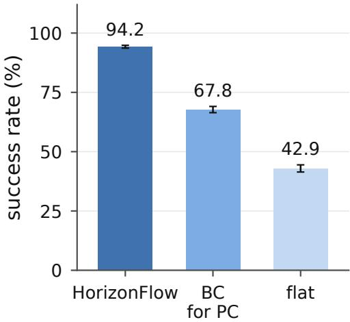  
Figure 13: Architecture ablations on OGBench navigation. HorizonFlow is compared with replacing the prefix controller by a behavior-cloning policy (BC for PC) and removing the hierarchy (flat). Bars report mean success across navigation environments and training seeds; error bars show stan dard deviations across seed-level averages.

## F.1 ARCHITECTURE ABLATIONS

Why both a route planner and a prefix controller? Figure 13 compares HorizonFlow with two architectural ablations. Replacing the prefix controller with a behavior-cloning (BC) policy while retaining the route planner substantially reduces average success. Removing the hierarchy yields a larger reduction: the flat planner generates actions directly toward the final goal, without an intermediate subgoal route. These comparisons support the combined RP–PC design in the evaluated navigation environments.

Configurations and evaluation. Figure 13 compares three configurations on the nine OGBench navigation environments. The BC replacement retains the RP and replaces PC with a conditional flow-matching MLP that generates one action from the current state and RP subgoal latent. It is trained by behavior cloning without advantage weighting, using hindsight goal offsets sampled uniformly from one to twice the RP training stride. The flat planner removes the intermediate RP and generates actions conditioned directly on the final goal, replanning every step. HorizonFlow uses $K _ { \mathrm { R P } } = 1 6$ and $K _ { \mathrm { P C } } = 4 ;$ the BC replacement retains the same RP candidate count. The flat configuration uses 16 candidates. All three configurations use steering checkpoints 3 and 7 with $\beta = 0 . 5$ for their generative planning components.

HorizonFlow and BC each use eight training seeds; the flat planner uses three. All three configurations are evaluated on 250 episodes per environment and training seed. For each seed, we first average the success rates equally across all nine environments. Bars report the mean of these seedlevel averages, and error bars report their sample standard deviations.

## F.2 STEP-LEVEL INFERENCE LATENCY

Table 7 distinguishes controller-only steps from steps that also invoke the planner on OGBench navigation. Measurements use the batch-one, device-only setup in Appendix F. After three warm-up calls, we time 50 calls per planning unit and HorizonFlow controller, and 200 calls per baseline tracking controller, synchronizing device completion. The lower endpoint is the smallest timed controller-only call. The upper endpoint adds the largest timed planner and controller calls, measured separately; for DF, we take the largest planner time across the tested remaining-horizon settings. HD’s planning unit already includes its two planning levels. These are component-based estimates, not extrema ofjointly measured environment-step latencies or guaranteed worst-case bounds.

Table 7: Step-level device-inference latency estimates on OGBench navigation, in milliseconds. Each entry gives the controller-only minimum and the constructed planning-update upper estimate. The reference control period is included for comparison.
<table><tr><td>Environment</td><td>Control period</td><td>Diffuser</td><td>HD</td><td>DF</td><td>HorizonFlow</td></tr><tr><td>PointMaze-Medium</td><td>100</td><td>0.27–236.57</td><td>0.26–285.88</td><td>0.26–217.11</td><td>4.54–41.54</td></tr><tr><td>PointMaze-Large</td><td>100</td><td>0.27–248.96</td><td>0.27–285.73</td><td>0.28–293.53</td><td>4.76-42.13</td></tr><tr><td>PointMaze-Giant</td><td>100</td><td>0.27–249.04</td><td>0.27–297.68</td><td>0.27–296.08</td><td>4.65–42.14</td></tr><tr><td>AntMaze-Medium</td><td>100</td><td>0.27–250.56</td><td>0.27–289.47</td><td>0.28–290.66</td><td>4.81-42.75</td></tr><tr><td>AntMaze-Large</td><td>100</td><td>0.26–250.26</td><td>0.28–287.69</td><td>0.28–422.73</td><td>4.76–42.71</td></tr><tr><td>AntMaze-Giant</td><td>100</td><td>0.28–249.87</td><td>0.27–289.06</td><td>0.28–217.24</td><td>4.61-42.58</td></tr><tr><td>HumanoidMaze-Medium</td><td>25</td><td>0.31–265.95</td><td>0.31-304.24</td><td>0.31–254.75</td><td>4.68–43.21</td></tr><tr><td>HumanoidMaze-Large</td><td>25</td><td>0.31–266.14</td><td>0.32-303.75</td><td>0.31–217.53</td><td>4.66-43.19</td></tr><tr><td>HumanoidMaze-Giant</td><td>25</td><td>0.32–265.95</td><td>0.32–358.25</td><td>0.32-445.83</td><td>4.79–42.58</td></tr></table>

HorizonFlow’s step-level timing uses the default RP update period, one-step PC execution, and the candidate counts and FK settings in Table 3.

The step-level comparison shows why amortized cost alone does not characterize the computation required at a planning update. The baseline tracking controllers are inexpensive between updates, but their planning calls dominate the upper estimates. HorizonFlow spends more on local action generation at each step while requiring less computation when updating the route. For one-shot configurations, the planning cost occurs at initialization rather than throughout execution; the update frequency therefore matters alongside its cost.

HorizonFlow’s planning-update estimates fall below the PointMaze and AntMaze reference periods. On HumanoidMaze, all planners’ planning-update estimates exceed the 25 ms reference period, with HorizonFlow’s (about 43 ms) the lowest; controller-only estimates remain below the reference period in all three domains. Compilation, environment simulation, and host–device transfers are excluded, so end-to-end deadline compliance requires separate measurement.

pointmaze-medium (c) replanning interval  
(a)  
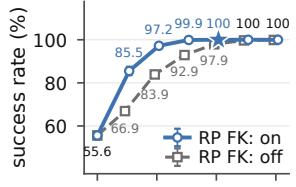

(b)  
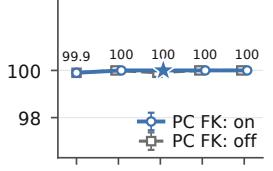

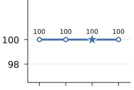

(d)  
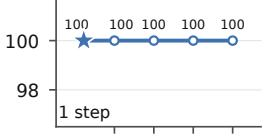

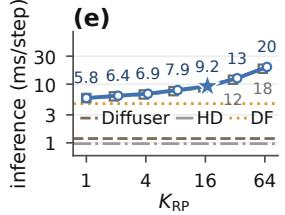

(f)  
(g)  
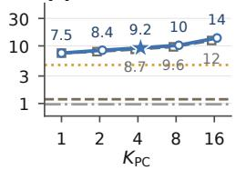

(h)  
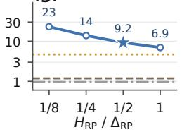

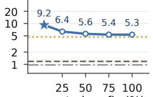

(a)  
pointmaze-large  
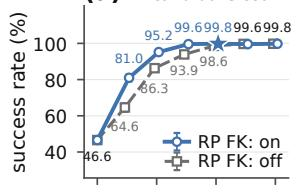

(b)  
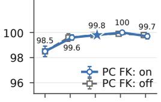

(c) replanning interval  
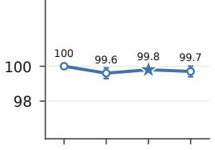  
(d)

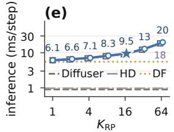

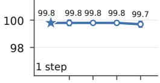

(f)  
(g)  
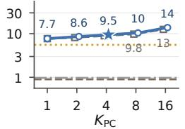


(h)  


(a) candidate count  
pointmaze-giant  


(b)  
(c) replanning interval  
(d)  


(f)  


(g)  


Figure 14: Sampling, replanning, and inference cost on PointMaze. Blocks show Medium, Large, and Giant, top to bottom. Each block reports success rate (%) (a–d) and estimated inference time (e–h, ms/step, logarithmic scale) for RP and PC candidate counts, RP update ratio, and executed prefix fraction, respectively. Solid/dashed curves indicate FK steering on/off; stars mark defaults.

executed prefix (%)

(a)  


(b)  
antmaze-medium  


(d)  


(f)  
(g)  


(h)  


(a)  


(b)  
antmaze-large  


  
(d)


(f)  


  
(a) candidate count


antmaze-giant  


(b)  


(c) replanning interval  
(d)  


  
(f)


(g)  


Figure 15: Sampling, replanning, and inference cost on AntMaze. Blocks show Medium, Large, and Giant, top to bottom. Each block reports success rate (%) (a–d) and estimated inference time (e–h, ms/step, logarithmic scale) for RP and PC candidate counts, RP update ratio, and executed prefix fraction, respectively. Solid/dashed curves indicate FK steering on/off; stars mark defaults.

(a)  


(b)  
humanoidmaze-medium  


(c) replanning interval  


(d)  


(f)  


(g)  
(h)  


(a) candidate count  
humanoidmaze-large  


(b)  


(d)  


(f)  


(g)  


humanoidmaze-giant  
(a) candidate count  


(b)  


  
(d)


(f)  
  
(g)


  
Figure 16: Sampling, replanning, and inference cost on HumanoidMaze. Blocks show Medium, Large, and Giant, top to bottom. Each block reports success rate (%) (a–d) and estimated inference time (e–h, ms/step, logarithmic scale) for RP and PC candidate counts, RP update ratio, and executed prefix fraction, respectively. Solid/dashed curves indicate FK steering on/off; stars mark defaults.

(a)  


(b)  
visual-cube-single  


(d)  


(e)  


(f)  
(g)  
(h)  


visual-cube-double  


(b)  


(d)  


(f)  


(g)  


(a)  
visual-cube-triple  


(b)  


  
(d)


(f)  


(g)  


(h)  
  
Figure 17: Sampling, replanning, and inference cost on visual cube manipulation. Blocks show Cube-Single, Cube-Double, and Cube-Triple, top to bottom. Each block reports success rate (%) (a– d) and estimated inference time (e–h, ms/step, logarithmic scale) for RP and PC candidate counts, RP update ratio, and executed prefix fraction, respectively. Solid/dashed curves indicate FK steering on/off; stars mark defaults.

(a)  


(b)  


(c)  


(d)  


(g)  


(h)  
  
Figure 18: Sampling, replanning, and inference cost on visual Scene. Panels (a–d) report success rate (%), and (e–h) report estimated inference time (ms/step, logarithmic scale), for RP and PC candidate counts, RP update ratio, and executed prefix fraction, respectively. Solid/dashed curves indicate FK steering on/off; stars mark defaults.

(a)  


(b)  
maze2d-umaze  


(d)  


(f)  


(g)  
(h)  


maze2d-medium  
(b)  


  
(d)


(a)  


(g)  
  
maze2d-large

(h)  


(b)  


(c) replanning interval  
(d)  


(h)  
  
Figure 19: Sampling, replanning, and inference cost on Maze2D. Blocks show U-Maze, Medium, and Large, top to bottom. Each block reports D4RL normalized score (a–d) and estimated inference time (e–h, ms/step, logarithmic scale) for RP and PC candidate counts, RP update ratio, and executed prefix fraction, respectively. Solid/dashed curves indicate FK steering on/off; stars mark defaults.