# How Can Recommendation Feedback Evolve Agent Memory?

Shanwen Mao1,\* Mingming Li2,\* Hao Zhang1 Zhiheng Li3 Yige Wang2 Penghua Yu2,† Junxiong Zhu2,†

1Harbin Institute of Technology, Harbin, China

24s103313@stu.hit.edu.cn, zhh1000@hit.edu.cn

2Alibaba Group, Hangzhou, China

mingcong.lmm@alibaba-inc.com, {tianxuan.wyg,liman.yph,xike.zjx}@taobao.com 3Institute of Automation, Chinese Academy of Sciences, Beijing, China

lizhiheng2025@ia.ac.cn

\*Equal contribution. †Corresponding authors.

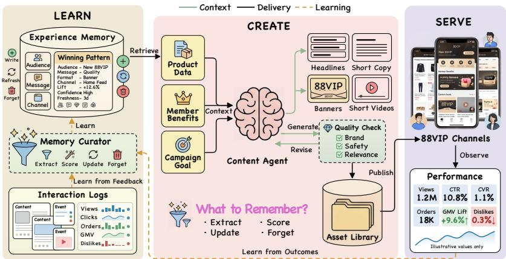  
Figure 1: Overview of the closed-loop content-generation system. The agent retrieves reusable experience from memory to generate advertising materials, deploys them through online channels, and updates the memory from delayed engagement and conversion feedback.

## Abstract

Content-generation agents continuously receive impressions, clicks, conversions, and negative feedback from recommendation systems, providing real-world outcome signals for memory evolution. However, these signals are delayed and noisy, confounded by audience composition, placement, and recommendation policies, and may result from the combined influence of multiple memories, making accurate attribution difficult. Existing methods rely primarily on immediate feedback or semantic retrieval and therefore struggle to reliably translate recommendation outcomes into memory fitness. To address this challenge, we propose TIDE (Trajectory-Informed Directed Memory Evolution), an external memory evolution framework driven by delayed recommendation feedback. We furthe introduce Memory Evolution Gain (MEG), which measures the utility improvement of evolved memory over a no memory baseline on strictly future tasks. TIDE treats memory as a capacity-constrained population of experiences: temporal and semantic credit assignment estimates contextual fitness, while responsibility credit distributes outcome signals according to the memories referenced during generation. These signals are then used to reinforce, crossover, mutate, or evict memories. On an e-commerce membership marketing content-generation agent, TIDE achieves a +7.75-percentage-point MEG in offline temporal replay and significantly improves both unique click-through rate (UCTR) and activation rate in an online A/B test. On a delayed-label benchmark , TIDE achieves the lowest mean absolute error (MAE) and root mean squared error (RMSE) and the highest MEG among the compared methods, demonstrating its effectiveness.

## 1 Introduction

Content-generation agents are evolving from one-shot tools into persistent systems deployed in real-world environments. Once their generated titles, copy, image descriptions, or marketing materials are distributed through recommender systems, they receive behavioral feedback such as clicks, conversions, dwell time, and negative responses. As shown in Figure 1, these signals are more closely aligned with ultimate business objectives than static human annotations. They create a continuous loop of content generation, recommendation and delivery, metric feedback, and subsequent generation, enabling agents to adapt future outputs based on outcomes observed in the real environment.

Existing approaches to this feedback loop primarily incorporate feedback into either model parameters or external memory. Model self-evolution methods convert clicks, preferences, or rewards into training signals [Wei et al., 2022, Chen et al., 2025b,a, Min et al., 2025], but repeated training is costly. Under continually shifting tasks and traffic distributions, frequent updates must also be carefully controlled to avoid overfitting to recent feedback or degrading existing capabilities. Moreover, parameter changes are difficult to inspect, revise, or roll back individually. Memory self-evolution methods instead extract, organize, and retrieve reusable experience from task trajectories, execution outcomes, or user feedback [Shinn et al., 2023, Zhao et al., 2024, Senel et al., 2024, Liang et al., 2026, Fu et al., 2025], making them better suited to continuous and traceable adaptation. However, little work has specifically examined how delayed, context-dependent outcomes from recommendation and delivery can be used to evaluate and evolve external memory. In particular, it remains unclear how to assess individual memories from environmental outcomes, generate candidate changes, and select among them under capacity constraints. We therefore keep the gen erative model parameters fixed and study recommendation-feedback-driven external memory evolution.

Existing memory methods typically rely on task success or failure, or on semantically explicit user feedback, for which the connection between outcomes and experience is relatively direct. Recommendation feedback, by contrast, reveals only how content performs in a particular delivery environment. It arrives with delay, depends on the audience, context, and recommendation policy, and does not directly identify which content decisions or past experiences produced the observed outcome. This work therefore asks: How can such outcome feedback be transformed into agent memory that improves future tasks? We define Memory Evolution Gain (MEG) as the utility gain of evolved memory over a reference memory on strictly future tasks, and regard positive MEG as the criterion for effective memory evolution.

To achieve this, we propose TIDE, a training-free memory-evolution method. TIDE first converts recommendation feedback into memory-level fitness through three successive stages of credit assignment. Temporal and semantic credit jointly analyze outcome variations across stages and their contextual conditions, establish an evidence chain between content features and online outcomes, and estimate memory fitness within specific contexts. Responsibility credit then uses actual memory-use records from generation to identify the memories that contributed to an outcome or caused an error. Based on this attribution, TIDE applies reinforcement, crossover, mutation, or eviction to memories and performs selection under a fixed capacity constraint, enabling the experience population to evolve continuously. Our contributions are as follows:

• We formulate recommendation-feedback-driven memory evolution as a problem of fitness evaluation and multi-level credit assignment under delayed, context-dependent outcomes, and introduce MEG to measure how updates to the experience population affect strictly future tasks.

• We propose TIDE, a training-free memory-evolution method that constructs contextual fitness through temporal–semantic credit, identifies individual memories through responsibility credit, and updates the experience population through directed mutation and capacity-constrained selection.

• We evaluate TIDE on an agent for generating e-commerce membership marketing materials using offline temporal replay and a real-world online A/B test. TIDE achieves $\mathrm { a + 7 . 7 5 } .$ -percentage-point MEG improvement offline and significantly improves UCTR and activation rate online. We further demonstrate its transferability to public long-term user-feedback tasks on a delayed-label benchmark adapted from MemoryCD.

## 2 Related Work

Model self-evolution converts external feedback into supervised examples, preference pairs, or reinforcement learning rewards, and updates model parameters through methods such as SFT, DPO, and GRPO [Ouyang et al., 2022, Rafailov et al., 2024, Shao et al., 2024a, Guo et al., 2025, Team et al., 2025, Zhao et al., 2025, Zweiger et al., 2025, Huang et al., 2025]. In content generation, PosterCraft, PosterOmni, and Poster-Reward improve poster generation using aesthetic preferences, expert knowledge, and multidimensional rewards [Chen et al., 2026b,a, Lai et al., 2026]. CREATER, CTOP, CAIG, and CTR-Guided Generative Query Suggestion incorporate click feedback through contrastive learning, preference optimization, and reward modeling [Wei et al., 2022, Chen et al., 2025b,a, Min et al., 2025], while MMPO constructs rollout rewards from multi-objective user feedback [Mao et al., 2026]. LLM-as-a-Judge, fine-grained rubrics, and process rewards further decompose holistic outcomes into individual content dimensions or intermediate steps [Lightman et al., 2023, Li et al., 2025, Yin et al., 2025, Cook et al., 2026]. Together, these studies support feedback representation and refinement, but primarily produce scores, rewards, or parameter updates. We use them as references for training-based adaptation and feedback construction, while focusing instead on converting recommender outcomes into traceable, individually revisable external memories.

Memory self-evolution. Memory-based agents store, organize, and reuse interaction experience at inference time. Existing methods transform task trajectories into reflections, reusable experience, workflows, or reasoning memories [Shinn et al., 2023, Zhao et al., 2024, Wang et al., 2024, Ouyang et al., 2026], while recent systems further support dynamic memory consolidation, organization, and revision [Chhikara et al., 2025, Xu et al., 2025, Fang et al., 2025]. Evo-Memory, EvoMemBench, and MemoryCD evaluate such mechanisms under continual tasks, evolving interaction histories, and long-term user behavior [Wei et al., 2026, Wang et al., 2026, Zhang et al., 2026]. Related work has also used implicit engagement signals to guide training-free content exploration [Senel et al., 2024] or semantically explicit clarification and correction to update preference memory [Liang et al., 2026]. However, existing approaches do not jointly mode the temporal reliability of delayed outcomes, their dependence on delivery context, and responsibility attribution across multiple memories. TIDE addresses this gap by integrating outcome reliability, content-level evidence, and memory-level responsibility into a unified feedback-to-memory credit-assignment pipeline.

## 3 Method

## 3.1 Problem Formulation

We consider a content-generation agent whose generator parameters remain frozen while its external memory is continually updated. The record associated with the i-th generation is $D _ { i } = ( x _ { i } , a _ { i } , { \mathcal { T } } _ { i } , G _ { i } )$ , where $x _ { i }$ is the generation request, $a _ { i }$ is the generated material, $\tau _ { i }$ is its complete observable lifecycle of recommendation outcomes together with contemporaneous delivery context, and $G _ { i }$ is the memory-usage trace. The context in $\tau _ { i }$ includes the channel, placement, traffic bucket, campaign calendar, seasonal events, emerging hotspots, and recommender state observed over the material’s online lifetime. Given all records observable by time t, a memory-update policy $\mu$ transforms the current memory population $M _ { t }$ into $M _ { t + 1 }$ . Here, i indexes a generation event, t is the current update time, and $M _ { t }$ is the memory population available at time t. The value of a memory update is determined by subsequent tasks rather than by the example that triggered the update. Let $\bar { U } _ { H } ( \mu )$ denote the average utility on the next H tasks after applying policy $\mu ,$ and let $\mu _ { 0 }$ denote a static or append-only reference policy. We define the Memory Evolution Gain (MEG) as

$$
\mathrm { M E G } _ { H } ( \mu ; \mu _ { 0 } ) = \bar { U } _ { H } ( \mu ) - \bar { U } _ { H } ( \mu _ { 0 } ) .\tag{1}
$$

Here, $\mu$ is the evaluated memory-update policy, $\mu _ { 0 }$ is the reference policy, H is the number of strictly future evaluation tasks, and $\bar { U } _ { H } ( \mu )$ is their average utility under µ. A positive MEG means that the update transfers to strictly future tasks. Since these tasks are unavailable when the update is made, TIDE constructs a proxy fitness signal from currently observable feedback. Temporal credit summarizes the complete delayed lifecycle rather than an isolated metric snapshot; semantic credit separates content evidence from contemporaneous delivery factors; and responsibility credit assigns the resulting contextual fitness to memories that actually participated in generation. The following subsections define these credits and the resulting memory update; Algorithm 1 summarizes their execution order. An intuitive overview of the complete framework is illustrated in Figure 2.

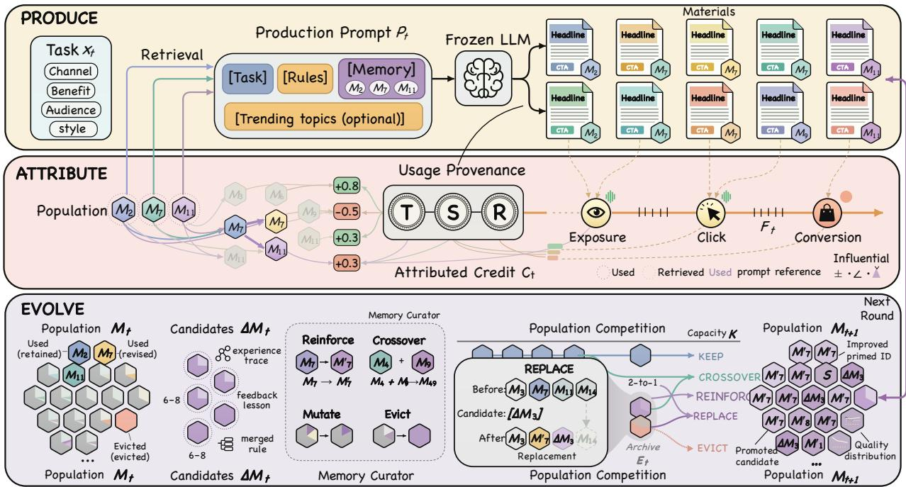  
Figure 2: TIDE framework. Produce: a frozen generator retrieves task-relevant memories to produce candidate materials. Attribute: temporal, semantic, and responsibility credit convert delayed recommendation outcomes into memory-level fitness. Evolve: the memory curator revises, merges, specializes, or downweights memories, followed by capacity-constrained population selection.

## 3.2 Temporal Credit: Reliability of Delayed Outcomes

From an evolutionary perspective, a generated material is a phenotype produced with the participation of memory, and recommendation feedback is a raw observation of that phenotype’s performance. The obser vation does not arrive all at once: clicks usually precede conversions, exposure changes across traffic-ramp stages, and updates to either the material or the recommendation policy may break comparability across windows. Consequently, a metric measured on an arbitrary date should not directly determine memory replacement. The temporal-credit operator $\mathcal { C } _ { \mathrm { t e m p } }$ converts the currently observable outcome trajectory into a lifecycle-aligned multi-objective summary and a validity indicator:

$$
( \widehat { \mathbf { u } } _ { i } , z _ { i } ^ { \mathrm { t e m p } } ) = \mathcal { C } _ { \mathrm { t e m p } } ( \mathcal { T } _ { i } ) , \qquad z _ { i } ^ { \mathrm { t e m p } } \in \{ 0 , 1 \} .\tag{2}
$$

Here, $\mathcal { C } _ { \mathrm { t e m p } }$ is the temporal-credit operator, $\widehat { \mathbf { u } } _ { i }$ is the lifecycle-aligned multi-objective outcome summary, and $z _ { i } ^ { \mathrm { t e m p } }$ is a binary indicator of whether the lifecycle is mature, continuous, and comparable enough to support credit assignment for subsequent attribution. The system joins all feedback windows by material identity and version and follows the material from initial delivery and traffic ramp-up to outcome maturation under the delivery conditions observed during that period. Formally, $z _ { i } ^ { \mathrm { t e m p } } = \bar { 1 }$ only when $\tau _ { i }$ forms an interpretable and comparable lifecycle: the material identity and version remain consistent, the required delivery stages are observed, delayed conversions have had sufficient time to return, and no material or recommender change renders the trajectory incomparable across stages. Otherwise, the record remains pending and cannot provide feedback-driven fitness in the current update. Rather than selecting a metric snapshot from an arbitrary date, $\widehat { \mathbf { u } } _ { i } = \mathrm { L i f e c y c l e S u m m a r y } ( \mathcal { T } _ { i } )$ preserves the stage-wise exposure, engagement, and conversion outcomes and their changes across the observable lifecycle. It retains individual objectives and their uncertainty instead of forcing potentially conflicting metrics such as CTR and CVR into a single scalar. Temporal credit therefore determines whether the currently observable lifecycle is sufficiently mature and reliable for credit assignment and summarizes what happened throughout it; Section 3.3 determines which part remains informative about content after accounting for delivery context.

## 3.3 Semantic Credit: Contextualizing Outcome Evidence

Even a reliable lifecycle outcome is jointly produced by content and environment. Semantic credit retrieves a control set ${ \mathcal { N } } _ { i }$ from historical or concurrent traffic, matching product, audience, campaign stage, placement, and recommender version. It also constructs an environment record $\mathcal { E } _ { i }$ containing contemporaneous delivery factors such as campaign calendars, shopping festivals, seasonal events, emerging hotspots, traffic buckets, and recommender-state changes. It then estimates contextual fitness relative to matched controls and interprets the lifecycle trajectory under these external factors:

$$
\begin{array} { r } { ( \widehat { \mathbf { f } } _ { i } , e _ { i } , z _ { i } ^ { \mathrm { s e m } } ) = \mathcal { C } _ { \mathrm { s e m } } ( a _ { i } , \widehat { \mathbf { u } } _ { i } , \mathcal { N } _ { i } , \mathcal { E } _ { i } ) , \qquad e _ { i } = ( d _ { i } , c _ { i } , s _ { i } ) . } \end{array}\tag{3}
$$

Here, $\mathcal { C } _ { \mathrm { s e m } }$ is the semantic-credit operator, ${ \mathcal { N } } _ { i }$ is the matched-control set, $\mathcal { E } _ { i }$ is the contemporaneous environment record, $\widehat { \mathbf { f } } _ { i }$ is the target material’s multi-objective contextual fitness relative to matched controls, and $z _ { i } ^ { \mathrm { s e m } }$ indicates whether the semantic evidence is sufficient and internally consistent. The structured ev idence record $\boldsymbol { e } _ { i } = ( d _ { i } , c _ { i } , s _ { i } )$ may contain one or more decision-level evidence items. Here, $d _ { i }$ represents editable content decisions identified from the material, such as selling-point selection, information density, linguistic style, or call to action; $c _ { i }$ represents the corresponding delivery contexts and applicability conditions; and $s _ { i }$ contains supporting or counterevidence drawn from the target material, matched controls, and lifecycle outcomes. Thus, $s _ { i }$ stores the evidence chain, whereas $\widehat { \mathbf { f } } _ { i }$ represents the numerical multi-objective contextual fitness.

A rubric locates editable content decisions, while the language model organizes the evidence chain from content difference, through environmental condition, to online outcome. For example, if the target and matched materials exhibit a similar UCTR increase during a shopping-festival warm-up, the common change is treated as environment-associated rather than content-specific; positive evidence is formed only when the target retains a relative advantage linked to a specific content decision. We set $z _ { i } ^ { \mathrm { s e m } } = 0$ when controls are insufficient, conflicting objectives cannot be explained, the estimated fitness relative to matched controls remains unstable, or counterexamples remain unresolved. Semantic credit therefore converts a reliable lifecycle into contextual fitness and conditional decision evidence for subsequent memory-level responsibility attribution.

Algorithm 1 TIDE: Trajectory-Informed Directed Memory Evolution   
Input: Current memory population $M _ { t } ;$ generation record $D _ { i } = ( x _ { i } , a _ { i } , { \mathcal { T } } _ { i } , G _ { i } ) ;$ recent valid records $\mathcal { H } _ { t } \mathrm { : }$   
memory budget B   
Output: Updated memory population $M _ { t + 1 }$   
1: $( \widehat { \mathbf { u } } _ { i } , z _ { i } ^ { \mathrm { t e m p } } ) \gets \mathcal { C } _ { \mathrm { t e m p } } ( \mathcal { T } _ { i } )$   
2: $C _ { i } ^ { \mathrm { f b } } \gets \emptyset$   
3: $\mathbf { i f } \widetilde { z } _ { i } ^ { \mathrm { t e m p } } = 1$ then   
4: $\mathcal { N } _ { i } \gets \mathrm { M a t c h C o n t r o l s } ( x _ { i } , \mathcal { T } _ { i } )$   
5: $\mathcal { E } _ { i } $ CollectEnvironment $( \mathcal { T } _ { i } )$   
6: $( \widehat { \mathbf { f } } _ { i } , e _ { i } , z _ { i } ^ { \mathrm { s e m } } ) \gets { \mathcal { C } } _ { \mathrm { s e m } } ( a _ { i } , \widehat { \mathbf { u } } _ { i } , \mathcal { N } _ { i } , \mathcal { E } _ { i } )$   
7: $\mathbf { i f } \ z _ { i } ^ { \mathrm { s e m } } = 1$ then   
8: $( R _ { i } , \kappa _ { i } ^ { \mathrm { a t t r } } ) \gets$ ResponsibilityCredit $( x _ { i } , a _ { i } , e _ { i } , G _ { i } , M _ { t } )$   
9: if $\kappa _ { i } ^ { \mathrm { a t t r } } = 1$ then   
10: $M _ { t } \gets \mathrm { A }$ ccumulateFitness $( M _ { t } , R _ { i } , \widehat { \mathbf { f } } _ { i } , e _ { i } )$   
11: $C _ { i } ^ { \mathrm { f b } } \gets \mathrm { G e n e r a t e O f f s p r i n g } ( R _ { i } , e _ { i } , \mathcal { T } _ { i } , G _ { i } )$   
12: else if $\kappa _ { i } ^ { \mathrm { a t t r } } = 2$ then   
13: $C _ { i } ^ { \mathrm { f b } } \gets$ SpawnProvisiona $\left. \left( e _ { i } , \mathcal { T } _ { i } , G _ { i } \right) \right.$   
14: end if   
15: end if   
16: end if   
17: $C _ { t } ^ { \mathrm { a b s } }$ ← PeriodicAbstract $( \mathcal { H } _ { t } , M _ { t } )$   
18: $M _ { t + 1 } \gets$ GovernAndSelect ${ } _ { B } ( M _ { t } \operatorname { \cup } C _ { i } ^ { \mathrm { f b } } \cup C _ { t } ^ { \mathrm { a b s } } )$   
19: return $M _ { t + 1 }$

## 3.4 Responsibility Credit and Memory Evolution

The decision evidence $e _ { i }$ identifies which content decisions in a generated material are supported or contradicted by online outcomes. A single generation may, however, use multiple memories, so TIDE must identify which memories were responsible for those decisions. For each $m \in M _ { t }$ , responsibility requires that the memory was actually used, is semantically linked to the target decision, and changes the corresponding decision when removed:

$$
\begin{array} { r l } & { z _ { i , m } ^ { \mathrm { r e s p } } = \mathbb { I } [ m \in \operatorname { U s e d } ( G _ { i } ) ] \mathbb { I } [ \operatorname { A l i g n } ( m , e _ { i } ) ] } \\ & { \qquad \cdot \mathbb { I } [ \operatorname { C F } ( m ; x _ { i } , a _ { i } , e _ { i } , M _ { t } ) ] . } \end{array}\tag{4}
$$

Here, m denotes a memory entry, $\mathbb { I } [ \cdot ]$ is the indicator function, $\operatorname { U s e d } ( G _ { i } )$ returns the memories actually used in trace $G _ { i } , \mathrm { A l i g n } ( m , e _ { i } )$ tests whether $m$ is semantically linked to the content decision described by $e _ { i } ,$ and $\mathrm { C F } ( m ; x _ { i } , a _ { i } , e _ { i } , M _ { t } )$ tests whether removing m changes that decision under counterfactual replay. Thus, $z _ { i , m } ^ { \mathrm { r e s p } } = 1$ exactly when all three conditions hold, and $R _ { i } = \{ m \in M _ { t } : z _ { i , m } ^ { \mathrm { r e s p } } = 1 \}$ is the responsible set. The set $R _ { i }$ may contain multiple memories. Memories that were retrieved but did not affect the target decision receive no credit, whereas each memory that independently satisfies the three responsibility conditions accumulates the corresponding contextual fitness and supporting evidence.

The attribution state $\kappa _ { i } ^ { \mathrm { a t t r } } \in \{ 0 , 1 , 2 \}$ denotes unverifiable responsibility, attribution to existing memories, and confirmed novelty, respectively. We set $\kappa _ { i } ^ { \mathrm { a t t r } } = 1$ when at least one existing memory passes the responsibility test. We set $\kappa _ { i } ^ { \mathrm { a t t r } } = 2$ only when the decision evidence and usage trace are valid but the decision is not covered by any existing memory; this case may create a provisional candidate without a parent. Otherwise, $\kappa _ { i } ^ { \mathrm { a t t r } } = 0$ , and no feedback-driven update is performed.

For attribution to existing memories, TIDE accumulates $\widehat { \mathbf { f } } _ { i }$ and $e _ { i }$ as fitness evidence for each memory in $R _ { i } .$ Conditional or contradictory evidence generates feedback-derived candidates $C _ { i } ^ { \mathrm { { f b } } }$ through narrowing, revision, or splitting. Responsible memories may be edited individually, while complementary memories may be combined through crossover. Confirmed novel evidence may instead produce a parentless provisional candidate. Periodic abstraction additionally generates $C _ { t } ^ { \mathrm { a b s } }$ from valid recent records $\mathcal { H } _ { t }$ and the current memory population $M _ { t }$ . For example, when an existing memory emphasizes price but repeated evi dence supports immediate usability only in a specific campaign context, TIDE creates a narrower candidate rather than overwriting the original.

Existing memories and both candidate sources then undergo capacity-constrained governance and selection:

$$
M _ { t + 1 } = \mu _ { \mathrm { T I D E } } ( M _ { t } , D _ { i } , \mathcal { H } _ { t } ; B ) = \mathrm { G o v e r n A n d S e l e c t } _ { B } \Big ( M _ { t } \cup C _ { i } ^ { \mathrm { f b } } \cup C _ { t } ^ { \mathrm { a b s } } \Big ) .\tag{5}
$$

Here, B is the maximum memory capacity, and GovernAndSelect $^ { , B }$ denotes validity filtering, deduplication, conflict resolution, expiration, and capacity-constrained selection. Each incumbent memory retains its accumulated fitness evidence, while each candidate enters with provisional fitness, provenance, and version information. Subsequent feedback determines its promotion, further narrowing, merging, or eviction. This enables memory evolution through outcome evidence and cross-memory abstraction without unbounded accumulation.

## 4 Experiments

We evaluate TIDE in real-world e-commerce content generation and on a public delayed-label benchmark. Our experiments address four research questions spanning end-to-end effectiveness, feedback interpretation, responsibility attribution, and cross-task generalization. Detailed experimental settings are provided in the appendix.

• (RQ1) Does feedback-evolved memory improve offline generation and online performance?

• (RQ2) How can delayed, context-dependent outcomes become actionable generation feedback?

• (RQ3) How can feedback be attributed to responsible memories and translated into targeted edits?

• (RQ4) Do feedback-driven memory updates generalize to public delayed-label tasks?

## 4.1 Main Results (RQ1)

Offline results. To answer the offline part of RQ1, we examine whether memory evolved from historical delivery feedback improves generation on strictly future requests. Within each backbone, all methods use the same data, request order, feedback budget, and candidate-set size, and all outputs are evaluated by DeepSeek-V4-Pro. We compare TIDE with representative external-memory methods on qwen3.5-27b and Qwen3-4B. On Qwen3-4B, we additionally include SFT, GRPO [Shao et al., 2024b], and MMPO [Mao et al., 2026] as parameter-based self-evolution baselines. We evaluate generation quality, paired utility gains, negative transfer, adaptation compute, and inference overhead. As shown in Table 1, TIDE consistentl provides the best overall performance among the memory methods. On qwen3.5-27b, it achieves the highest compliance, format, efficiency, diversity, and joint-pass scores, with a MEG of +7.75 and the lowest inference overhead of 750 tokens per request, while requiring adaptation compute comparable to other memory methods. On Qwen3-4B, TIDE remains the strongest memory method, although all memory-onl approaches are limited by the backbone’s weak format-following capability. Parameter-based post-training alleviates this limitation but incurs adaptation costs several orders of magnitude higher. Combining TIDE with SFT further improves overall generation quality and yields a MEG of +6.71 with only 0.118 additional PFLOPs beyond SFT. These results answer the offline part of RQ1 affirmatively: feedback-evolved memory improves future generation with capable backbones, while complementing parameter-based training at substantially lower incremental adaptation cost.

Table 1: Offline generation quality and adaptation efficiency.
<table><tr><td rowspan="2">Backbone</td><td rowspan="2">Method</td><td colspan="5">Generation Quality</td><td colspan="2">Memory Evolution</td><td colspan="2">Efficiency</td></tr><tr><td>Comp. ↑ (%)</td><td>Fmt. ↑ (%)</td><td>Eff. ↑ (%)</td><td>Div. ↑ (0–100)</td><td>Joint ↑ (%)</td><td>MEG ↑ Neg. Trans. ↓</td><td>(%)</td><td>Adapt. Compute ↓ (PFLOPs)</td><td>Inf. Overhead ↓ (tokens/req.)</td></tr><tr><td rowspan="9">qwen3.5-27b</td><td>No Memory</td><td>56.0</td><td>79.2</td><td>56.0</td><td>65.5</td><td>12.0</td><td>0.00</td><td>0.0</td><td></td><td></td></tr><tr><td>Initial Memory (Frozen)</td><td>62.0</td><td>83.6</td><td>80.0</td><td>61.5</td><td>20.3</td><td>-1.88</td><td>22.0</td><td>0.803</td><td>1,271</td></tr><tr><td>Full History</td><td>57.0</td><td>77.0</td><td>46.0</td><td>68.0</td><td>12.0</td><td>-1.13</td><td>30.0</td><td>0.973</td><td>1,968</td></tr><tr><td>ExpRAG</td><td>58.0</td><td>77.0</td><td>32.0</td><td>59.0</td><td>12.0</td><td>-2.50</td><td>32.0</td><td>0.876</td><td>1,967</td></tr><tr><td>Reflexion</td><td>61.0</td><td>79.2</td><td>46.0</td><td>69.0</td><td>14.8</td><td>+1.25</td><td>18.0</td><td>0.768</td><td>828</td></tr><tr><td>AWM</td><td>53.0</td><td>77.0</td><td>54.0</td><td>65.0</td><td>12.0</td><td>-0.75</td><td>30.0</td><td>0.778</td><td>918</td></tr><tr><td>Mem0</td><td>57.0</td><td>81.4</td><td>54.0</td><td>64.5</td><td>12.0</td><td>+0.88</td><td>24.0</td><td>0.779</td><td>830</td></tr><tr><td>A-MEM</td><td>56.0</td><td>77.0</td><td>44.0</td><td>65.5</td><td>12.0</td><td>-2.88</td><td>34.0</td><td>0.825</td><td>1,696</td></tr><tr><td>TIDE</td><td>63.0</td><td>88.0</td><td>84.0</td><td>69.5</td><td>23.0</td><td>+7.75</td><td>14.0</td><td>0.774</td><td>750</td></tr><tr><td rowspan="14">Qwen3-4B</td><td>No Memory</td><td>28.0</td><td>0.0</td><td>4.0</td><td>49.5</td><td>0.0</td><td>0.00</td><td>0.0</td><td></td><td></td></tr><tr><td>Initial Memory (Frozen)</td><td>31.0</td><td>0.0</td><td>16.0</td><td>48.0</td><td>0.0</td><td>-16.00</td><td>78.0</td><td>0.121</td><td>1,494</td></tr><tr><td>Full History</td><td>32.0</td><td>0.0</td><td>22.0</td><td>47.5</td><td>0.0</td><td>-0.63</td><td>30.0</td><td>0.149</td><td>2,000</td></tr><tr><td>ExpRAG</td><td>33.0</td><td>0.0</td><td>22.0</td><td>53.5</td><td>0.0</td><td>+1.50</td><td>58.0</td><td>0.132</td><td>2,000</td></tr><tr><td>Reflexion</td><td>28.0</td><td>0.0</td><td>20.0</td><td>26.5</td><td>0.0</td><td>-5.88</td><td>60.0</td><td>0.115</td><td>1,176</td></tr><tr><td>AWM</td><td>30.0</td><td>0.0</td><td>18.0</td><td>43.0</td><td>0.0</td><td>+0.50</td><td>26.0</td><td>0.117</td><td>1,241</td></tr><tr><td>Mem0</td><td>33.0</td><td>0.0</td><td>22.0</td><td>44.0</td><td>0.0</td><td>-0.75</td><td>32.0</td><td>0.116</td><td>1,215</td></tr><tr><td>A-MEM</td><td>31.0</td><td>0.0</td><td>16.0</td><td>47.0</td><td>0.0</td><td>-1.13</td><td>30.0</td><td>0.125</td><td>1,905</td></tr><tr><td>TIDE</td><td>35.0</td><td>0.0</td><td>26.0</td><td>53.5</td><td>0.0</td><td>+1.75</td><td>24.0</td><td>0.118</td><td>1,046</td></tr><tr><td>SFT</td><td>50.0</td><td>66.0</td><td>42.0</td><td>56.0</td><td>16.0</td><td>+4.63</td><td>8.0</td><td>153</td><td>0</td></tr><tr><td>GRPO</td><td>49.0</td><td>68.0</td><td>20.0</td><td>56.0</td><td>8.0</td><td>+2.25</td><td>10.0</td><td>1,433</td><td>0</td></tr><tr><td>MMPO</td><td>52.0</td><td>71.0</td><td>30.0</td><td>63.0</td><td>8.0</td><td>+2.63</td><td>8.0</td><td>1,421</td><td>0</td></tr><tr><td>SFT + TIDE</td><td>56.0</td><td>72.5</td><td>43.8</td><td>65.9</td><td>18.0</td><td>+6.71</td><td>6.7</td><td>153.118</td><td>783</td></tr></table>

Online results. We further conduct a one-week randomized online A/B experiment to examine whether TIDE delivers measurable gains in real-world deployment. Under comparable traffic conditions, we compare a baseline material pool with an experimental pool augmented with TIDE-evolved materials, while keeping the product pool, placement, and delivery mechanism fixed. For any rate met-

Table 2: Relative uplift in the oneweek online comparison.
<table><tr><td>Metric</td><td>TIDE Rel. Uplift</td></tr><tr><td>UCTR</td><td>+5.10%</td></tr><tr><td>Activation Rate</td><td>+4.79%</td></tr></table>

ric r, relative uplift is defined as $( r _ { \mathrm { T I D E } } / r _ { \mathrm { B a s e l i n e } } - 1 ) \times 1 0 0 \%$ . As shown in Table 2, the experimental pool yields statistically significant relative uplifts of 5.10% in UCTR and 4.79% in activation rate (both $p < 0 . 0 0 1 )$ . These results provide empirical evidence that deploying TIDE-evolved materials is associated with improved click and activation outcomes under comparable real-world traffic.

## 4.2 Aligning Online Outcomes with Feedback Memory (RQ2)

We chronologically replay deployment logs and make outcomes available only after they have matured, thereby preventing future-information leakage. Historical cases are aligned by channel, benefit, and semantic context, and prediction–outcome discrepancies are distilled into actionable generation feedback. Across 28 channel–benefit tasks, we compare an LLM rubric, direct LLM prediction, BERT, a distilled recommender, and TIDE. Pre-launch prediction is evaluated using macro-averaged rank correlation and pairwise accuracy, while downstream utility is measured against the no-memory condition using Future MEG, win rate, and negative-transfer rate under matched generation settings.

As shown in Figure 3, TIDE achieves the highest CVR rank correlation (0.116) and CTR pairwise accuracy (0.604), while BERT leads the other two ranking metrics but requires parameter adaptation. More importantly, TIDE obtains the largest observed Future MEG (+0.180), the highest win rate (60.7%), and the lowest negative-transfer rate (25.0%), yielding the strongest overall downstream utility profile. Taken together, these results indicate that TIDE effectively converts delayed online outcomes into actionable feedback for improving future generation, thereby answering RQ2.

## a Pre-launch prediction

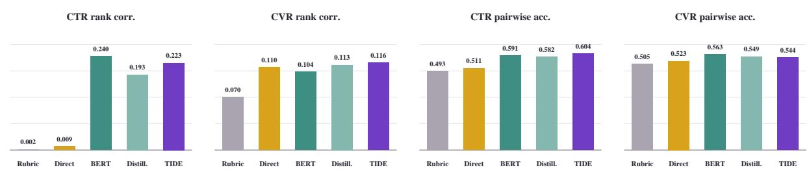  
b Utility of feedback memory on frozen future-generation tasks

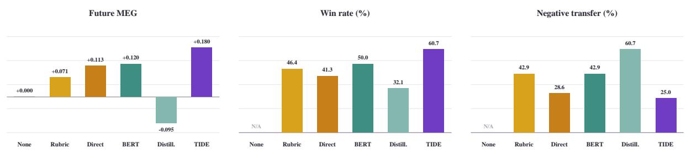  
Figure 3: Pre-launch CTR/CVR ranking and downstream feedback-memory utility.

## 4.3 From Aligned Feedback to Memory Evolution (RQ3)

We evaluate whether aligned feedback can identify responsible memories and guide targeted edits that improve future generation. Across 20 controlled episodes with five injected noise types, all methods use the same feedback, initial memory, and task order. TIDE combines actual memory-usage traces with deterministic leave-one-out counterfactual replay and edits a memory only when its removal improves utility.

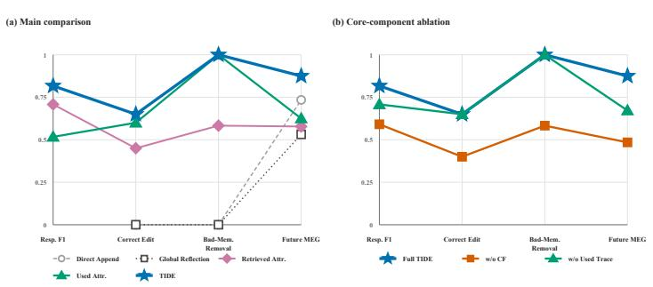  
Figure 4: Responsibility attribution and directed memory editing, with all metrics direction-adjusted so that higher values indicate better performance.

As shown in Figure 4(a), TIDE achieves the strongest overall performance, with a Responsibility F1 of 0.817, a Cor-

rect Edit rate of 0.650, zero Bad-Memory Survival, and a Future MEG of +0.0750. Compared with

Table 3: Results on the MemoryCD delayed-label benchmark.
<table><tr><td></td><td></td><td>RMSE↓</td><td>MEG@δ=5 ↑</td><td>∆delay (1·14)</td><td>User Neg. Trans. ↓</td><td>Memory Tok.</td><td>LLM Tok./ Feedback-eq. ↓</td></tr><tr><td>Method</td><td>MAE↓ 0.676</td><td>1.204</td><td>0.0000</td><td>+0.0000</td><td>0.0%</td><td>0</td><td>838.3</td></tr><tr><td>StaticMemory (µ₀) FullHistory†</td><td>0.575</td><td>1.073</td><td>+0.0253</td><td>+0.0163</td><td>33.3%</td><td>54,875</td><td>15,273.2</td></tr><tr><td>RAG [Lewis et al., 2021]</td><td>0.587</td><td>1.131</td><td>+0.0222</td><td>+0.0205</td><td>25.0%</td><td>54,875</td><td>2,438.2</td></tr><tr><td>ReAct [Yao et al., 2023]</td><td>0.610</td><td>1.152</td><td>+0.0167</td><td>+0.0035</td><td>25.0%</td><td>51,022</td><td>2,438.1</td></tr><tr><td>Reflexion [Shinn et al., 2023]</td><td>0.606</td><td>1.156</td><td>+0.0177</td><td>+0.0153</td><td>25.0%</td><td>54,875</td><td>2,438.1</td></tr><tr><td>Self-RAG [Asai et al., 2023]</td><td>0.653</td><td>1.180</td><td>+0.0059</td><td>-0.0066</td><td>33.3%</td><td>51,254</td><td>2,427.6</td></tr><tr><td>Mem0 [Chhikara et al., 2025]</td><td>0.572</td><td>1.103</td><td>+0.0260</td><td>+0.0215</td><td>16.7%</td><td>51,026</td><td>2,425.7</td></tr><tr><td>A-MEM [Xu et al., 2025]</td><td>0.611</td><td>1.149</td><td>+0.0163</td><td>+0.0162</td><td>25.0%</td><td>51,440</td><td>2,421.5</td></tr><tr><td>AWM [Wang et al., 2024]</td><td>0.619</td><td>1.148</td><td>+0.0142</td><td>+0.0042</td><td>33.3%</td><td>50,882</td><td>2,427.7</td></tr><tr><td>DC-Cu [Suzgun et al., 2026]</td><td>0.682</td><td>1.177</td><td>-0.0014</td><td>+0.0146</td><td>33.3%</td><td>50,129</td><td>838.0</td></tr><tr><td>ExpRAG [Wei et al., 2026]</td><td>0.615</td><td>1.179</td><td>+0.0153</td><td>+0.0049</td><td>25.0%</td><td>51,407</td><td>2,437.2</td></tr><tr><td>TIDE (Ours)</td><td>0.531</td><td>0.895</td><td>+0.0365</td><td>+0.0019</td><td>16.7%</td><td>48,603</td><td>2,693.3</td></tr></table>

Retrieved-Memory Attribution, TIDE improves responsibility localization, edit accuracy, and future utility while eliminating bad-memory survival.

The ablations in Figure 4(b) confirm the contributions of both components. Removing counterfactual replay causes the largest degradation, reducing Responsibility F1 and Correct Edit to 0.591 and 0.400, increasing Bad-Memory Survival to 0.417, and lowering Future MEG to −0.0031. Removing usage traces reduces Responsibility F1 to 0.708 and Future MEG to +0.0344. Taken together, these results answer RQ3 by showing that usage traces narrow responsibility localization, while counterfactual replay validates responsibility and enables effective memory edits for future generation.

## 4.4 Generalization to Delayed-Label Tasks (RQ4)

We evaluate whether TIDE generalizes beyond its original generation domain to delayed-feedback tasks. To represent delayed and progressively available outcomes, we adapt MemoryCD into a chronological in teraction stream and expose each label only after its prescribed delay. This protocol ensures that each method updates its memory using only feedback available at the current time. We compare TIDE with static memory, full-history prompting, retrieval- and reflection-based agents, and recent memory-management methods. Prediction quality is evaluated using MAE and RMSE, memory utility using MEG@δ=5, delay robustness using $\Delta _ { \mathrm { d e l a y } }$ , and reliability using user-level negative transfer. Memory size and LLM tokens per feedback-equivalent update are also reported.

As shown in Table 3, TIDE achieves the lowest MAE (0.531) and RMSE (0.895), outperforming the strongest non-TIDE results of 0.572 and 1.073, respectively, and obtains the highest MEG@δ=5 (+0.0365). Among adaptive methods, TIDE is also the least sensitive to delayed labels, with $\Delta _ { \mathrm { d e l a y } } = + 0 . 0 0 1 9$ , and ties Mem0 for the lowest user-level negative-transfer rate (16.7%). TIDE uses 48,603 memory tokens, fewer than the approximately 50–55K tokens used by the other adaptive memory methods. Its 2,693.3 LLM tokens per feedback-equivalent update remain substantially below FullHistory while staying comparable to the retrieval-based methods. It also maintains controlled adaptation overhead. Taken together, these results answer RQ4 affirmatively: TIDE generalizes beyond the original generation setting and provides the strongest overall profile in prediction accuracy, memory utility, delay robustness, and user-level reliability on the delayed-label task.

## 5 Conclusion

We study how delayed, context-dependent recommendation outcomes can be converted into memory for future tasks. We introduce MEG to measure genuine adaptation and propose TIDE, combining temporal, semantic, and responsibility credit to evolve a capacity-constrained external memory with a frozen generator. TIDE achieves the strongest overall performance among evaluated memory methods, including a +7.75 offline MEG, and its evolved materials are associated with online gains of 5.10% in UCTR and 4.79% in activation rate. Further analyses validate feedback alignment and responsible editing, while MemoryCD results demonstrate generalization to delayed-label tasks. TIDE provides an effective, efficient, and traceable approach to continual agent adaptation through feedback-driven memory evolution under delayed and context-dependent outcome feedback.

## References

Akari Asai, Zeqiu Wu, Yizhong Wang, Avirup Sil, and Hannaneh Hajishirzi. Self-rag: Learning to retrieve, generate, and critique through self-reflection, 2023. URL https://arxiv.org/abs/2310. 11511.

Sixiang Chen, Jianyu Lai, Jialin Gao, Hengyu Shi, Zhongying Liu, Tian Ye, Junfeng Luo, Xiaoming Wei, and Lei Zhu. Posteromni: Generalized artistic poster creation via task distillation and unified reward feedback, 2026a. URL https://arxiv.org/abs/2602.12127.

Sixiang Chen, Jianyu Lai, Jialin Gao, Tian Ye, Haoyu Chen, Hengyu Shi, Shitong Shao, Yunlong Lin, Song Fei, Zhaohu Xing, Yeying Jin, Junfeng Luo, Xiaoming Wei, and Lei Zhu. Postercraft: Rethinking highquality aesthetic poster generation in a unified framework. In The Fourteenth International Conference on Learning Representations, 2026b. URL https://openreview.net/forum?id=GhqnOEXQh3.

Xingye Chen, Wei Feng, Zhenbang Du, Weizhen Wang, Yanyin Chen, Haohan Wang, Linkai Liu, Yaoyu Li, Jinyuan Zhao, Yu Li, Zheng Zhang, Jingjing Lv, Junjie Shen, Zhangang Lin, Jingping Shao, Yuanjie Shao, Xinge You, Changxin Gao, and Nong Sang. Ctr-driven advertising image generation with multimodal large language models, 2025a. URL https://arxiv.org/abs/2502.06823.

Yanda Chen, Zihui Ren, Qixiang Gao, Jiale Chen, Si Chen, Xubin Li, Tiezheng Ge, and Bo Zheng. Ctrdriven ad text generation via online feedback preference optimization, 2025b. URL https://arxiv. org/abs/2507.20227.

Prateek Chhikara, Dev Khant, Saket Aryan, Taranjeet Singh, and Deshraj Yadav. Mem0: Building production-ready ai agents with scalable long-term memory, 2025. URL https://arxiv.org/abs/ 2504.19413.

Jonathan Cook, Tim Rocktaschel, Jakob Nicolaus Foerster, Dennis Aumiller, and Alex Wang. Check your¨ work: Structured checklist feedback for improving large language models. In Maria Liakata, Viviane P. Moreira, Jiajun Zhang, and David Jurgens, editors, Proceedings of the 64th Annual Meeting of the Association for Computational Linguistics (Volume 1: Long Papers), pages 16649–16688, San Diego, California, United States, July 2026. Association for Computational Linguistics. ISBN 979-8-89176-390-6. doi: 10.18653/v1/2026.acl-long.759. URL https://aclanthology.org/2026.acl-long.759/.

Runnan Fang, Yuan Liang, Xiaobin Wang, Jialong Wu, Shuofei Qiao, Pengjun Xie, Fei Huang, Huajun Chen, and Ningyu Zhang. Memp: Exploring agent procedural memory. In Annual Meeting of the Association for Computational Linguistics, 2025. URL https://api.semanticscholar.org/ CorpusID:280561810.

Dayuan Fu, Keqing He, Yejie Wang, Wentao Hong, Zhuoma GongQue, Weihao Zeng, Wei Wang, Jingang Wang, Xunliang Cai, and Weiran Xu. Agentrefine: Enhancing agent generalization through refinement tuning. In The Thirteenth International Conference on Learning Representations, 2025. URL https: //openreview.net/forum?id=FDimWzmcWn.

Daya Guo, Dejian Yang, Haowei Zhang, Junxiao Song, Peiyi Wang, Qihao Zhu, Runxin Xu, Ruoyu Zhang, Shirong Ma, Xiao Bi, Xiaokang Zhang, Xingkai Yu, Yu Wu, Z. F. Wu, Zhibin Gou, Zhihong Shao, Zhuoshu Li, Ziyi Gao, Aixin Liu, Bing Xue, Bingxuan Wang, Bochao Wu, Bei Feng, Chengda Lu, Chenggang Zhao, Chengqi Deng, Chong Ruan, Damai Dai, Deli Chen, Dongjie Ji, Erhang Li, Fangyun Lin, Fucong Dai, Fuli Luo, Guangbo Hao, Guanting Chen, Guowei Li, H. Zhang, Hanwei Xu, Honghui Ding, Huazuo Gao, Hui Qu, Hui Li, Jianzhong Guo, Jiashi Li, Jingchang Chen, Jingyang Yuan, Jinhao

Tu, Junjie Qiu, Junlong Li, J. L. Cai, Jiaqi Ni, Jian Liang, Jin Chen, Kai Dong, Kai Hu, Kaichao You, Kaige Gao, Kang Guan, Kexin Huang, Kuai Yu, Lean Wang, Lecong Zhang, Liang Zhao, Litong Wang, Liyue Zhang, Lei Xu, Leyi Xia, Mingchuan Zhang, Minghua Zhang, Minghui Tang, Mingxu Zhou, Meng Li, Miaojun Wang, Mingming Li, Ning Tian, Panpan Huang, Peng Zhang, Qiancheng Wang, Qinyu Chen, Qiushi Du, Ruiqi Ge, Ruisong Zhang, Ruizhe Pan, Runji Wang, R. J. Chen, R. L. Jin, Ruyi Chen, Shanghao Lu, Shangyan Zhou, Shanhuang Chen, Shengfeng Ye, Shiyu Wang, Shuiping Yu, Shunfeng Zhou, Shuting Pan, S. S. Li, Shuang Zhou, Shaoqing Wu, Tao Yun, Tian Pei, Tianyu Sun, T. Wang, Wangding Zeng, Wen Liu, Wenfeng Liang, Wenjun Gao, Wenqin Yu, Wentao Zhang, W. L. Xiao, Wei An, Xiaodong Liu, Xiaohan Wang, Xiaokang Chen, Xiaotao Nie, Xin Cheng, Xin Liu, Xin Xie, Xingchao Liu, Xinyu Yang, Xinyuan Li, Xuecheng Su, Xuheng Lin, X. Q. Li, Xiangyue Jin, Xiaojin Shen, Xiaosha Chen, Xiaowen Sun, Xiaoxiang Wang, Xinnan Song, Xinyi Zhou, Xianzu Wang, Xinxia Shan, Y. K. Li, Y. Q. Wang, Y. X. Wei, Yang Zhang, Yanhong Xu, Yao Li, Yao Zhao, Yaofeng Sun, Yaohui Wang, Yi Yu, Yichao Zhang, Yifan Shi, Yiliang Xiong, Ying He, Yishi Piao, Yisong Wang, Yixuan Tan, Yiyang Ma, Yiyuan Liu, Yongqiang Guo, Yuan Ou, Yuduan Wang, Yue Gong, Yuheng Zou, Yujia He, Yunfan Xiong, Yuxiang Luo, Yuxiang You, Yuxuan Liu, Yuyang Zhou, Y. X. Zhu, Yanping Huang, Yaohui Li, Yi Zheng, Yuchen Zhu, Yunxian Ma, Ying Tang, Yukun Zha, Yuting Yan, Z. Z. Ren, Zehui Ren, Zhangli Sha, Zhe Fu, Zhean Xu, Zhenda Xie, Zhengyan Zhang, Zhewen Hao, Zhicheng Ma, Zhigang Yan, Zhiyu Wu, Zihui Gu, Zijia Zhu, Zijun Liu, Zilin Li, Ziwei Xie, Ziyang Song, Zizheng Pan, Zhen Huang, Zhipeng Xu, Zhongyu Zhang, and Zhen Zhang. Deepseek-r1 incentivizes reasoning in llms through reinforcement learning. Nature, 645(8081):633–638, 2025. ISSN 1476-4687. doi: 10.1038/s41586-025-09422-z. URL http://dx.doi.org/10.1038/s41586-025-09422-z.

Chenghua Huang, Zhizhen Fan, Lu Wang, Fangkai Yang, Pu Zhao, Zeqi Lin, Qingwei Lin, Dongmei Zhang, Saravan Rajmohan, and Qi Zhang. SELF-EVOLVED REWARD LEARNING FOR LLMS. In The Thirteenth International Conference on Learning Representations, 2025. URL https://openreview. net/forum?id=Zonhl0c9I0.

Jianyu Lai, Sixiang Chen, Jialin Gao, Hengyu Shi, Zhongying Liu, Fuxiang Zhai, Junfeng Luo, Xiaoming Wei, Lujia Wang, and Lei Zhu. Posterreward: Unlocking accurate evaluation for high-quality graphic design generation, 2026. URL https://arxiv.org/abs/2603.29855.

Patrick Lewis, Ethan Perez, Aleksandra Piktus, Fabio Petroni, Vladimir Karpukhin, Naman Goyal, Heinrich Kuttler, Mike Lewis, Wen tau Yih, Tim Rockt¨ aschel, Sebastian Riedel, and Douwe Kiela. Retrieval-¨ augmented generation for knowledge-intensive nlp tasks, 2021. URL https://arxiv.org/abs/ 2005.11401.

Dawei Li, Bohan Jiang, Liangjie Huang, Alimohammad Beigi, Chengshuai Zhao, Zhen Tan, Amrita Bhattacharjee, Yuxuan Jiang, Canyu Chen, Tianhao Wu, Kai Shu, Lu Cheng, and Huan Liu. From generation to judgment: Opportunities and challenges of LLM-as-a-judge. In Christos Christodoulopoulos, Tanmoy Chakraborty, Carolyn Rose, and Violet Peng, editors, Proceedings of the 2025 Conference on Empirical Methods in Natural Language Processing, pages 2757–2791, Suzhou, China, November 2025. Association for Computational Linguistics. ISBN 979-8-89176-332-6. doi: 10.18653/v1/2025.emnlp-main.138. URL https://aclanthology.org/2025.emnlp-main.138/.

Kaiqu Liang, Julia Kruk, Shengyi Qian, Xianjun Yang, Shengjie Bi, Yuanshun Yao, Shaoliang Nie, Mingyang Zhang, Lijuan Liu, Jaime Fernandez Fisac, Shuyan Zhou, and Saghar Hosseini. Learning ´ personalized agents from human feedback, 2026. URL https://arxiv.org/abs/2602.16173.

Hunter Lightman, Vineet Kosaraju, Yura Burda, Harri Edwards, Bowen Baker, Teddy Lee, Jan Leike, John

Schulman, Ilya Sutskever, and Karl Cobbe. Let’s verify step by step, 2023. URL https://arxiv. org/abs/2305.20050.

Shanwen Mao, Hao Zhang, Guangtao Nie, Zhiheng Li, Huimu Wang, Sulong Xu, and Gu Simiu. A better spur should start from each objective, 2026. URL https://arxiv.org/abs/2609.08211.

Erxue Min, Hsiu-Yuan Huang, Xihong Yang, Min Yang, Xin Jia, Yunfang Wu, Hengyi Cai, Junfeng Wang, Shuaiqiang Wang, and Dawei Yin. CTR-guided generative query suggestion in conversational search. In Saloni Potdar, Lina Rojas-Barahona, and Sebastien Montella, editors, Proceedings of the 2025 Conference on Empirical Methods in Natural Language Processing: Industry Track, pages 2624– 2634, Suzhou (China), November 2025. Association for Computational Linguistics. ISBN 979-8-89176- 333-3. doi: 10.18653/v1/2025.emnlp-industry.178. URL https://aclanthology.org/2025. emnlp-industry.178/.

Long Ouyang, Jeff Wu, Xu Jiang, Diogo Almeida, Carroll L. Wainwright, Pamela Mishkin, Chong Zhang, Sandhini Agarwal, Katarina Slama, Alex Ray, John Schulman, Jacob Hilton, Fraser Kelton, Luke Miller, Maddie Simens, Amanda Askell, Peter Welinder, Paul Christiano, Jan Leike, and Ryan Lowe. Training language models to follow instructions with human feedback, 2022. URL https://arxiv.org/ abs/2203.02155.

Siru Ouyang, Jun Yan, I-Hung Hsu, Yanfei Chen, Ke Jiang, Zifeng Wang, Rujun Han, Long T. Le, Samira Daruki, Xiangru Tang, Vishy Tirumalashetty, George Lee, Mahsan Rofouei, Hangfei Lin, Jiawei Han, Chen-Yu Lee, and Tomas Pfister. Reasoningbank: Scaling agent self-evolving with reasoning memory, 2026. URL https://arxiv.org/abs/2509.25140.

Rafael Rafailov, Archit Sharma, Eric Mitchell, Stefano Ermon, Christopher D. Manning, and Chelsea Finn. Direct preference optimization: Your language model is secretly a reward model, 2024. URL https: //arxiv.org/abs/2305.18290.

Lutfi Kerem Senel, Besnik Fetahu, Davis Yoshida, Zhiyu Chen, Giuseppe Castellucci, Nikhita Vedula, Ja-¨ son Ingyu Choi, and Shervin Malmasi. Generative explore-exploit: Training-free optimization of generative recommender systems using LLM optimizers. In Lun-Wei Ku, Andre Martins, and Vivek Srikumar, editors, Proceedings of the 62nd Annual Meeting of the Association for Computational Linguistics (Volume 1: Long Papers), pages 5396–5420, Bangkok, Thailand, August 2024. Association for Computational Linguistics. doi: 10.18653/v1/2024.acl-long.295. URL https://aclanthology.org/ 2024.acl-long.295/.

Zhihong Shao, Peiyi Wang, Qihao Zhu, Runxin Xu, Junxiao Song, Xiao Bi, Haowei Zhang, Mingchuan Zhang, Y. K. Li, Y. Wu, and Daya Guo. Deepseekmath: Pushing the limits of mathematical reasoning in open language models, 2024a. URL https://arxiv.org/abs/2402.03300.

Zhihong Shao, Peiyi Wang, Qihao Zhu, Runxin Xu, Junxiao Song, Xiao Bi, Haowei Zhang, Mingchuan Zhang, Y. K. Li, Y. Wu, and Daya Guo. Deepseekmath: Pushing the limits of mathematical reasoning in open language models, 2024b. URL https://arxiv.org/abs/2402.03300.

Noah Shinn, Federico Cassano, Edward Berman, Ashwin Gopinath, Karthik Narasimhan, and Shunyu Yao. Reflexion: Language agents with verbal reinforcement learning, 2023. URL https://arxiv.org/ abs/2303.11366.

Mirac Suzgun, Mert Yuksekgonul, Federico Bianchi, Dan Jurafsky, and James Zou. Dynamic cheatsheet: Test-time learning with adaptive memory. In Vera Demberg, Kentaro Inui, and Llu´ıs Marquez, editors,

Proceedings of the 19th Conference of the European Chapter of the Association for Computational Linguistics (Volume 1: Long Papers), pages 7080–7106, Rabat, Morocco, March 2026. Association for Computational Linguistics. ISBN 979-8-89176-380-7. doi: 10.18653/v1/2026.eacl-long.333. URL https://aclanthology.org/2026.eacl-long.333/.

Kimi Team, Angang Du, Bofei Gao, Bowei Xing, Changjiu Jiang, Cheng Chen, Cheng Li, Chenjun Xiao, Chenzhuang Du, Chonghua Liao, Chuning Tang, Congcong Wang, Dehao Zhang, Enming Yuan, Enzhe Lu, Fengxiang Tang, Flood Sung, Guangda Wei, Guokun Lai, Haiqing Guo, Han Zhu, Hao Ding, Hao Hu, Hao Yang, Hao Zhang, Haotian Yao, Haotian Zhao, Haoyu Lu, Haoze Li, Haozhen Yu, Hongcheng Gao, Huabin Zheng, Huan Yuan, Jia Chen, Jianhang Guo, Jianlin Su, Jianzhou Wang, Jie Zhao, Jin Zhang, Jingyuan Liu, Junjie Yan, Junyan Wu, Lidong Shi, Ling Ye, Longhui Yu, Mengnan Dong, Neo Zhang, Ningchen Ma, Qiwei Pan, Qucheng Gong, Shaowei Liu, Shengling Ma, Shupeng Wei, Sihan Cao, Siying Huang, Tao Jiang, Weihao Gao, Weimin Xiong, Weiran He, Weixiao Huang, Weixin Xu, Wenhao Wu, Wenyang He, Xianghui Wei, Xianqing Jia, Xingzhe Wu, Xinran Xu, Xinxing Zu, Xinyu Zhou, Xuehai Pan, Y. Charles, Yang Li, Yangyang Hu, Yangyang Liu, Yanru Chen, Yejie Wang, Yibo Liu, Yidao Qin, Yifeng Liu, Ying Yang, Yiping Bao, Yulun Du, Yuxin Wu, Yuzhi Wang, Zaida Zhou, Zhaoji Wang, Zhaowei Li, Zhen Zhu, Zheng Zhang, Zhexu Wang, Zhilin Yang, Zhiqi Huang, Zihao Huang, Ziyao Xu, Zonghan Yang, and Zongyu Lin. Kimi k1.5: Scaling reinforcement learning with llms, 2025. URL https://arxiv.org/abs/2501.12599.

Yuyao Wang, Zhongjian Zhang, Mo Chi, Kaichi Yu, Yuhan Li, Miao Peng, Bing Tong, Chen Zhang, Yan Zhou, and Jia Li. Evomembench: Benchmarking agent memory from a self-evolving perspective, 2026. URL https://arxiv.org/abs/2605.18421.

Zora Zhiruo Wang, Jiayuan Mao, Daniel Fried, and Graham Neubig. Agent workflow memory, 2024. URL https://arxiv.org/abs/2409.07429.

Penghui Wei, Xuanhua Yang, ShaoGuo Liu, Liang Wang, and Bo Zheng. CREATER: CTR-driven advertising text generation with controlled pre-training and contrastive fine-tuning. In Anastassia Loukina, Rashmi Gangadharaiah, and Bonan Min, editors, Proceedings ofthe 2022 Conference ofthe North American Chapter of the Association for Computational Linguistics: Human Language Technologies: Industry Track, pages 9–17, Hybrid: Seattle, Washington + Online, July 2022. Association for Computational Linguistics. doi: 10.18653/v1/2022.naacl-industry.2. URL https://aclanthology.org/2022. naacl-industry.2/.

Tianxin Wei, Noveen Sachdeva, Benjamin Coleman, Zhankui He, Yuanchen Bei, Xuying Ning, Mengting Ai, Yunzhe Li, Jingrui He, Ed H. Chi, Chi Wang, Shuo Chen, Fernando Pereira, Wang-Cheng Kang, and Derek Zhiyuan Cheng. Evo-memory: Benchmarking llm agent test-time learning with self-evolving memory, 2026. URL https://arxiv.org/abs/2511.20857.

Wujiang Xu, Zujie Liang, Kai Mei, Hang Gao, Juntao Tan, and Yongfeng Zhang. A-mem: Agentic memory for llm agents, 2025. URL https://arxiv.org/abs/2502.12110.

Shunyu Yao, Jeffrey Zhao, Dian Yu, Nan Du, Izhak Shafran, Karthik Narasimhan, and Yuan Cao. React: Synergizing reasoning and acting in language models, 2023. URL https://arxiv.org/abs/ 2210.03629.

Zhangyue Yin, Qiushi Sun, Zhiyuan Zeng, Qinyuan Cheng, Xipeng Qiu, and Xuanjing Huang. Dynamic and generalizable process reward modeling. In Wanxiang Che, Joyce Nabende, Ekaterina Shutova, and

Mohammad Taher Pilehvar, editors, Proceedings of the 63rd Annual Meeting of the Association for Computational Linguistics (Volume 1: Long Papers), pages 4203–4233, Vienna, Austria, July 2025. Association for Computational Linguistics. ISBN 979-8-89176-251-0. doi: 10.18653/v1/2025.acl-long.212. URL https://aclanthology.org/2025.acl-long.212/.

Weizhi Zhang, Xiaokai Wei, Wei-Chieh Huang, Zheng Hui, Chen Wang, Michelle Gong, and Philip S. Yu. Memorycd: Benchmarking long-context user memory of llm agents for lifelong cross-domain personalization, 2026. URL https://arxiv.org/abs/2603.25973.

Andrew Zhao, Daniel Huang, Quentin Xu, Matthieu Lin, Yong-Jin Liu, and Gao Huang. Expel: Llm agents are experiential learners. In Proceedings of the Thirty-Eighth AAAI Conference on Artificial Intelligence and Thirty-Sixth Conference on Innovative Applications of Artificial Intelligence and Fourteenth Symposium on Educational Advances in Artificial Intelligence, AAAI’24/IAAI’24/EAAI’24. AAAI Press, 2024. ISBN 978-1-57735-887-9. doi: 10.1609/aaai.v38i17.29936. URL https://doi.org/10. 1609/aaai.v38i17.29936.

Andrew Zhao, Yiran Wu, Yang Yue, Tong Wu, Quentin Xu, Yang Yue, Matthieu Lin, Shenzhi Wang, Qingyun Wu, Zilong Zheng, and Gao Huang. Absolute zero: Reinforced self-play reasoning with zero data, 2025. URL https://arxiv.org/abs/2505.03335.

Adam Zweiger, Jyothish Pari, Han Guo, Ekin Akyurek, Yoon Kim, and Pulkit Agrawal. Self-adapting¨ language models, 2025. URL https://arxiv.org/abs/2506.10943.

## A Additional Experimental Configuration

Unified protocol and main offline experiment. The 88VIP experiments are partitioned chronologically into memory initialization, feedback evolution, validation, and strictly future testing. At time t, a method may access only feedback that has already arrived, and any sample used to construct memory or train model parameters is excluded from future testing. Methods using the same backbone share the task order, feedback budget, generation constraints, candidate-set size, and test samples; memory-based methods additionally share the initial memory, retriever, retrieval count, and capacity limit. With qwen3.5-27b, we compare No Memory, Initial Memory (Frozen), Full History, ExpRAG, Reflexion, AWM, Mem0, A-MEM, and TIDE. The Qwen3-4B experiments additionally include SFT, GRPO, MMPO, and SFT + TIDE. All generated outputs are evaluated by a frozen DeepSeek-V4-Pro judge. Method identifiers are removed from the evaluation inputs, and all methods use the same evaluation prompt and scoring criteria. The judge evaluates Compliance, Format, Efficiency, and Diversity. Each dimension is normalized to a 0–100 scale, and task utility is their equally weighted mean. The main experiment contains 50 frozen future requests, with ten materials generated for each request. MEG is computed as the paired request-level utility difference relative to No Memory, and Negative Transfer is the proportion of requests for which a method obtains lower utility than No Memory. Thus, No Memory has a MEG of zero by definition and is shown as the reference condition. Statistical comparisons preserve the request-level pairing among methods. For methods using the same backbone, we convert training and inference costs into estimated FLOPs under a unified dense-Transformer accounting convention: a forward pass over T tokens is approximated as 2PT, and full-parameter training as $6 P T$ , where P is the number of model parameters. These values are approximate accounting estimates rather than measurements of wall-clock time or hardware efficiency. Parameter updates, inference calls, and memory-construction calls using the same model can therefore be compared under a consistent accounting convention. For heterogeneous systems such as BERT, conventional recommender models, and LLMs, whose architectures, operator compositions, and workloads differ, we do not perform uncalibrated cross-system rankings using FLOPs, hardware resources, or token counts. Instead, we report estimates under their respective accounting conventions and restrict direct compute comparisons to methods using the same model and computation rule.

Online A/B experiment. The randomized online A/B experiment ran for one week. Eligible traffic was randomly assigned through the platform’s prespecified traffic-allocation mechanism. The control group used the existing online material pool supported by directly accumulated experience memory, whereas the treatment group introduced TIDE-generated materials while keeping the base model, product pool, eligible audience, placement, number of candidates, and delivery mechanism fixed. Before outcome analysis, three prespecified experimental buckets with nonzero exposure to TIDE-generated materials were designated as treatment buckets and pooled to estimate the overall treatment effect. They were compared with a control bucket containing no TIDE-generated materials. The AA bucket was used only to verify the stability of the traffic-allocation mechanism and was not included in the treatment group or the treatment-effect estimate. No experimental group was selected, removed, or reassigned retrospectively based on observed outcomes. We report relative lifts in UCTR and Activation Rate, defined for a rate metric r as $( r _ { \mathrm { T r e a t m e n t } } / r _ { \mathrm { C o n t r o l } } -$ $1 ) \times 1 0 0 \%$ . Approximate 95% confidence intervals and two-sided significance tests are computed from the corresponding group counts and rates using the delta method for relative risks. Absolute traffic volumes and business rates are retained for internal audit because of confidentiality requirements; only relative effects are reported in the paper.

Online–offline alignment, predictive baselines, and feedback memory. The RQ2 ranking experiment contains 28 equally weighted channel–benefit tasks, with five candidate materials per task and 140 materials in total. LLM Rubric, Direct LLM, Lifecycle, and TIDE all use a frozen qwen3.5-27b. Lifecycle retrieves relevant cases exclusively from historical materials whose outcomes have matured before the prediction time, whereas TIDE uses the same temporally available historical evidence to construct a two-layer feedback memory consisting of abstract experience cards and traceable source cases. BERT and the distilled recommender represent two non-generative baselines based on content-semantic modeling and exposurefeedback modeling, respectively. BERT is trained only on historical online materials available before the prediction cutoff and is evaluated on the same frozen future candidate sets as the other methods. Channel, benefit, audience, style, and copy text are serialized in a fixed order; channel names retain their placement labels, other multi-valued attributes are normalized and joined with “/”, and missing attributes and chan nels are represented by “none” and “unknown”, respectively. This representation jointly encodes material semantics and delivery context. The distilled recommender is likewise trained only on matured exposure feedback available before the prediction cutoff. It jointly embeds discrete and continuous features and pre dicts the CTR and CVR of each candidate material. All training examples, feature construction, memory construction, and label aggregation strictly obey the temporal cutoff, preventing information observed after the prediction time from entering model construction. Ranking performance is macro-averaged over tasks so that each channel–benefit task receives equal weight. All 28 tasks are retained for CTR ranking, whereas the CVR evaluation excludes five tasks whose observed CVR values are identical for all candidates within the task and therefore induce no valid ranking. In the feedback-memory experiment, we fix the generator, prompt body, decoding parameters, number of candidates, and 6,000-character context limit, varying only the feedback memory. Each condition generates five materials per task. Method identities are removed before evaluation, and outputs are evaluated under the same presentation and scoring protocol. Task utility is the equally weighted mean of constraint satisfaction, clarity, benefit accuracy, and persuasiveness, each scored from 0 to 10. Future MEG, win rate, and Negative Transfer are computed relative to the matched No Memory condition. Uncertainty is estimated using 10,000 paired task-level bootstrap samples, with all outputs belonging to the same task resampled together.

Responsibility attribution and memory editing. RQ3 uses 20 controlled mock requests and injects five types of noise into the initial candidate memory pool: near duplicates, stale memories, conflicting memories, cross-scenario hard negatives, and misleading feedback. The complete candidate pool contains ap proximately 6,009–6,151 estimated tokens, while the injected-noise portion is constrained to at most 2,000 tokens. The injected memories and their intended editing operations provide controlled ground truth for evaluating responsibility localization and memory editing. Responsibility F1 measures whether a method identifies the ground-truth responsible memories, while Correct Edit requires both the memory identity and the corresponding editing operation to be correct. Bad-Memory Survival is computed on the 12 requests involving stale, conflicting, or misleading memories, for which removal or revision of an explicitly harmful memory is defined by construction. Future MEG is computed by pairing each method with the No Memory condition on the same frozen future requests. Each method generates ten materials for each of the 20 requests. Method identifiers are removed from the judge input, and all outputs are evaluated by the same frozen DeepSeek-V4-Pro judge using a common rubric. Uncertainty is estimated using 10,000 paired request-level bootstrap samples, with the request serving as the resampling unit. Counterfactual responsibil ity analysis performs deterministic leave-one-memory-out replay with temperature 0. It separately records whether a memory was retrieved, whether it was referenced during generation, and whether its removal changes the generated output or improves its evaluated utility. An edit is triggered only when the leaveone-memory-out intervention produces a positive utility change, thereby distinguishing mere retrieval or reference from intervention-supported responsibility.

Public delayed-label benchmark. For the public evaluation, we adapt MemoryCD [Zhang et al., 2026] into a chronological delayed-label benchmark while retaining its original samples, labels, user histories, and temporal order. We control only the timing of label release, memory updates, and future evaluation; therefore, the experiment introduces a delayed-label evaluation protocol rather than claiming that MemoryCD contains natively delayed labels. A ground-truth label is released δ task steps after its prediction, with δ = 5 used as the main setting. For each user, the first 80% of chronologically ordered interactions support memory evolution. A cooldown interval of length δ then releases feedback that remains pending from this evolution period. After the cooldown, memory is frozen and evaluated on the final 20% of interactions; labels from this final test segment are never used to update memory. We report MAE, RMSE, and paired MEG under $U _ { i } = 1 - | \hat { y } _ { i } - y _ { i } | / 4 .$ , where the denominator corresponds to the maximum absolute error on the five-point rating scale. In accordance with the main RQ4 evaluation, StaticMemory is the reference policy for MEG on MemoryCD and therefore has a MEG of zero by definition. We additionally report sensitivity to feed back delay, user-level Negative Transfer, frozen-memory tokens, and LLM tokens per feedback-equivalent update. All methods share the chronological task order, available-feedback budget, retrieval count, and memory-capacity constraint. Statistical uncertainty is estimated using a user-cluster bootstrap so that all interactions belonging to the same user are resampled together, preserving within-user dependence.

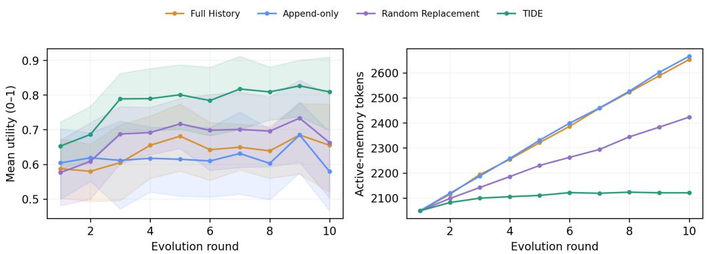  
Figure 5: Ten-round evolution trajectories on 12 fixed tasks with seed 13. Left: mean normalized utility with task-bootstrap 95% confidence intervals. Right: active-memory tokens. TIDE maintains a bounded 80-item population, whereas Full History and Append-only grow throughout replay.

## B Multi-Round Memory Evolution and Convergence

Experimental setup. E1 examines whether TIDE can continuously improve generation quality as new feedback arrives while avoiding the unbounded memory growth of Full History and Append-only. We compare Full History, Append-only, Random Replacement, and TIDE over Rounds 1–10 on 12 stratified tasks with seed 13. For every method–task–round combination, we generate ten materials and score them jointly with a frozen judge. The experiment comprises 480 candidate sets, 4,800 materials, and 480 successful judge calls. Each batch is further divided into five A/B units matched by task and slot, and we record assigned memory ids to compute paired responsibility credit. We report Mean Utility, defined as the mean of the normalized multidimensional scores across individual materials, together with Joint Pass, the four component scores, Memory Tokens, paired A–B effects, and generation and judge token consumption.

Results. Figure 5 shows the ten-round quality and memory trajectories. TIDE achieves the strongest final utility while maintaining a bounded memory population, in contrast to the continual growth of Full History and Append-only.

After ten feedback rounds, TIDE demonstrates consistent advantages in generation quality, memory efficiency, and selective editing. First, it achieves the highest final Mean Utility (0.809; 95% task-bootstrap CI [0.698, 0.909]) and Joint Pass rate (0.617). Its Mean Utility increases by 0.156 from Round 1 to Round 10, exceeding the gains of Full History (+0.067) and Random Replacement (+0.086), while Append-only decreases by 0.025. Second, TIDE obtains the best utility with only 2,121 active-memory tokens, reducing memory usage by 20.1% relative to Full History (2,653 tokens) and by 20.4% relative to Append-only (2,666 tokens). Its performance gain therefore does not depend on unbounded accumulation of historical feedback.

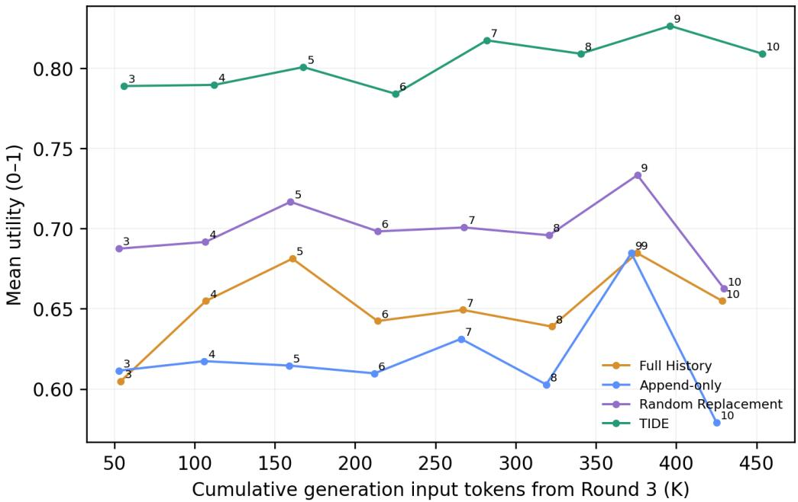  
Figure 6: Diagnostic quality–cost trajectories from Rounds 3–10. The horizontal axis reports exact cumulative generation input tokens, and the vertical axis reports mean normalized utility. Numbers indicate replay rounds. Rounds 1–2 are omitted because per-job generation-token telemetry was not recorded during the original run.

Finally, lifecycle telemetry shows that 9 of TIDE’s 10 EVICT operations target injected noisy memories (90.0%), substantially exceeding the 29 of 120 evictions for Random Replacement (24.2%). The difference is significant under a one-sided Fisher exact test $( p = 5 . 8 1 \times 1 0 ^ { - 5 } )$ . This result indicates that TIDE not only maintains a bounded memory but also uses feedback credit to preferentially identify and remove lowquality memories instead of relying on infrequent random deletion. Overall, TIDE achieves higher final utility under a limited memory budget and exhibits selective memory governance against injected noise.

## C Credit and Memory-Operator Ablations

Experimental setup. E2 identifies whether TIDE’s gains arise from temporal, semantic, and responsibility credit or from the REVISE, MERGE, and EVICT operators, thereby opening the system beyond a black-box comparison. We compare Full TIDE with three credit ablations that remove temporal, semantic, or responsibility credit and three operator ablations that remove REVISE, MERGE, or EVICT. In our implementation, REVISE corresponds to feedback-directed mutation of an individual memory, MERGE implements the crossover or consolidation of complementary memories, and EVICT removes low-fitness memories during capacity-constrained selection. For the w/o EVICT variant, once the memory reaches its capacity, newly generated candidates are not admitted and no incumbent memory is removed. This preserves the common capacity constraint without introducing an alternative eviction policy. All seven conditions use the same initial memory, feedback order, memory capacity, 12 tasks, and seed 13. Each condition processes the same 12 candidate sets, yielding 84 batches in total. We also keep the generation backbone, decoding parameters, 2,000-token limit, and frozen judge fixed, while implementing an explicitly distinct credit or editing policy for each ablation. The primary metric is the task-level change in Mean Utility relative to Full TIDE. We additionally report Mean Utility, Compliance, Format, Efficiency, batch-level Diversity, and Joint Pass.

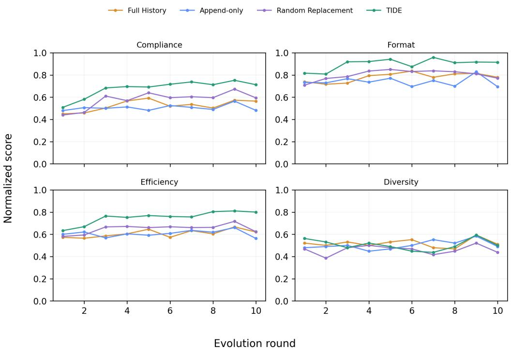  
Figure 7: Normalized Compliance, Format, Efficiency, and batch-level Diversity over ten replay rounds. TIDE’s advantage is concentrated in the first three dimensions; its final Diversity is comparable to that of the other methods rather than uniformly higher.

Confidence intervals are computed using a paired task bootstrap over the 12 tasks; a component contribution is treated as detectable when the confidence interval of its difference excludes zero.

Results. The ablation results reveal the key mechanism behind TIDE’s performance advantage. Removing responsibility credit reduces Mean Utility from 0.852 to 0.703, corresponding to a paired difference of −0.149 (95% CI [−0.262, −0.044]), while Joint Pass drops sharply from 0.658 to 0.292. This is the largest degradation among all ablations and the only one whose confidence interval excludes zero, demonstrating that accurately attributing feedback to the memories responsible for generation is central to effective memory evolution in TIDE. Removing temporal credit, semantic credit, REVISE, MERGE, or EVICT also reduces Mean Utility by 0.006, 0.015, 0.012, 0.040, and 0.030, respectively, indicating that the credit signals and editing operators jointly support the complete system. Overall, Full TIDE achieves the highest Mean Utility (0.852), validating the importance of combining responsibility attribution with multiple memory-evolution operators to improve aggregate generation quality.

## D Fitness–Diversity Dynamics and Population Health

Experimental setup. E3 examines whether improvements in future utility come at the cost of memory duplication or capacity expansion, thereby distinguishing high-quality convergence from premature convergence. We reuse the four methods evaluated in E1 and their 11 snapshots from Rounds 0–10, yielding 44 method–round observations without additional material generation or judge calls. Semantic distances are computed using embeddings from the frozen SFT Qwen3-4B model, with the same model version, normalization procedure, and near-duplicate threshold for all methods. We report Mean Utility, embedding-based Semantic Diversity, Near-duplicate Rate, Effective Population Size, active population size, Memory Churn, and Memory Tokens, and assess functional diversity jointly with the frozen judge’s batch-level Diversity score. Because short marketing materials are tightly constrained by length, benefit terminology, channel format, and target audience, embedding distance serves only as a conservative diagnostic of surface-level semantic dispersion and should not be equated in isolation with effective strategy diversity.

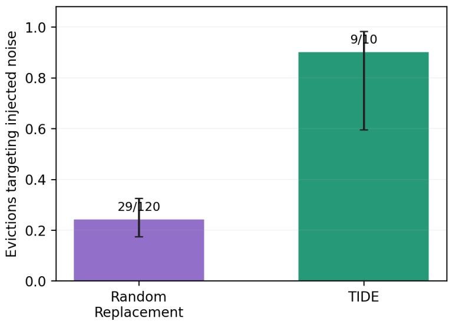  
Figure 8: Selectivity of eviction operations over the ten-round E1 replay. Bars report the proportion of all evictions that target injected noisy memories; error bars denote Wilson 95% confidence intervals. TIDE targets injected noise in 9 of 10 evictions, compared with 29 of 120 for Random Replacement.

Table 4: Final-round generation quality and memory cost after ten feedback rounds. Mean Utility averages normalized compliance, format, and efficiency scores; 95% CIs are computed by task-level bootstrap over 12 fixed tasks.
<table><tr><td colspan="10"></td></tr><tr><td>Method</td><td>Mean Utility ↑</td><td>95% CI</td><td>Comp. ↑</td><td>Fmt. ↑</td><td>Eff. ↑</td><td></td><td>Div. ↑</td><td>Joint Pass ↑</td><td>Memory Tok. ↓</td></tr><tr><td>Full History</td><td>0.655</td><td>[0.520, 0.774]</td><td>0.565</td><td>0.779</td><td>0.621</td><td>0.510</td><td>0.442</td><td></td><td>2,653</td></tr><tr><td>Append-only</td><td>0.579</td><td>[0.466, 0.693]</td><td>0.481</td><td>0.694</td><td>0.562</td><td></td><td>0.490</td><td>0.367</td><td>2,666</td></tr><tr><td>Random Replacement</td><td>0.663</td><td>[0.503, 0.800]</td><td>0.594</td><td>0.771</td><td>0.623</td><td></td><td>0.438</td><td>0.500</td><td>2,423</td></tr><tr><td>TIDE</td><td>0.809</td><td>[0.698, 0.909]</td><td>0.713</td><td>0.915</td><td>0.800</td><td></td><td>0.500</td><td>0.617</td><td>2,121</td></tr></table>

Results. At Round 10, TIDE simultaneously demonstrates higher generation quality, lower memory cost, and a healthier effective population. Its Mean Utility reaches 0.809, clearly exceeding Full History (0.655), Append-only (0.579), and Random Replacement (0.663); meanwhile, TIDE keeps its active memory bounded at 80 items with an average cost of only 2,121 tokens, showing that its quality advantage does not depend on continually expanding memory capacity. TIDE achieves an Effective Population Size of 60.80, approximately 1.8–2.1 times those of the three baselines (29.19–33.86), indicating that effective memory weight remains broadly distributed across useful strategies rather than collapsing onto a few high-weight items. Although its embedding-based Semantic Diversity is 0.174 and its Near-duplicate Rate is 0.131, the frozen judge assigns a Round-10 batch-level Diversity score of 0.500, comparable to Full History (0.510) and Append-only (0.490) and higher than Random Replacement (0.438). Taken together, the larger effective population and batch-level Diversity show that TIDE preserves functional diversity comparable to the strongest baseline and higher than the remaining bounded and append-only baselines, while allocating its limited memory budget more effectively to efficient and compliant generation strategies. The lower embedding dispersion primarily reflects surface-form convergence under the length, benefit, channel, and audience constraints of short marketing materials rather than a collapse of the effective strategy population.

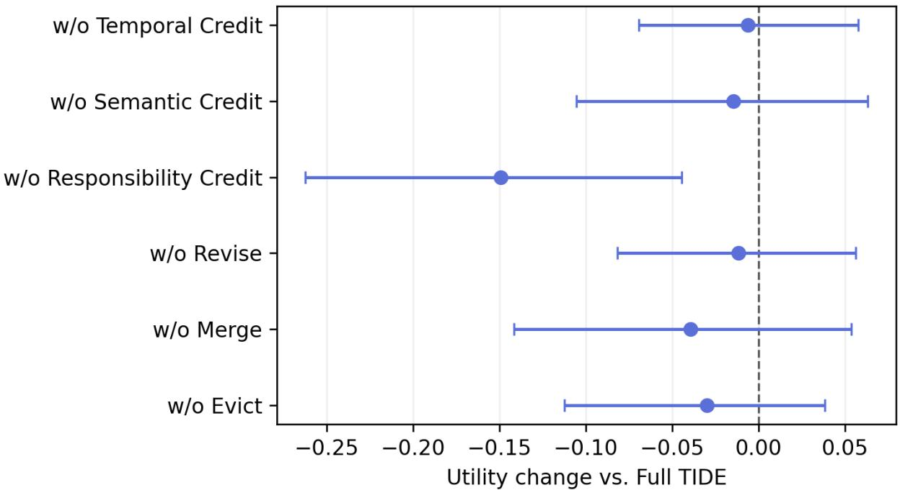  
Figure 9: Credit and memory-operator ablations on 12 fixed tasks with seed 13. Points show the paired task-level change in normalized Mean Utility relative to Full TIDE; horizontal bars denote task-bootstrap 95% confidence intervals. Negative values indicate degradation. Responsibility credit is the only ablation whose interval excludes zero.

## E Adaptation and Recovery after a Distribution Shift

Experimental setup. E4 examines whether TIDE can adapt to a new distribution and recover future-task utility faster than Frozen Memory, Full History, and Append-only after the environment changes. Using 12 stratified tasks, seed 13, and a multidimensional scoring protocol, we construct an event-aligned controlled shift: we construct an event-aligned controlled shift: materials are generated and updated under task distribution A before the change, after which the channel–benefit composition switches to task distribu tion B. Feedback continues to derive exclusively from the four evaluation dimensions and does not use real CTR/CVR or historical lifecycle labels. We compare Frozen Memory, Full History, Append-only, Random Replacement, and TIDE, and additionally evaluate TIDE with one- and two-round feedback delays. The main trajectories contain $5 \times 9 \times 1 2 = 5 4 0$ candidate sets, while the two delay conditions add 216 sets, yielding 756 sets in total. The experiment focuses on adaptation under a controlled distribution shift. We report Immediate Drop, Recovery Time, Post-shift Utility AUC, Post-shift MEG, Negative Transfer, Stale-memory Survival, and update and inference token consumption.

Table 5: Credit and memory-operator ablations. Differences and confidence intervals are computed relative to Full TIDE using a paired bootstrap over the same 12 tasks.
<table><tr><td colspan="3">Mean</td><td colspan="3">Joint</td></tr><tr><td>Variant</td><td>Utility ↑</td><td>∆ vs. Full ↑</td><td>95% CI of ∆</td><td>Pass ↑</td><td>Diversity ↑</td></tr><tr><td>Full TIDE</td><td>0.852</td><td>0.000</td><td>[0.000, 0.000]</td><td>0.658</td><td>0.562</td></tr><tr><td>w/o Temporal Credit</td><td>0.846</td><td>-0.006</td><td>[-0.069, 0.058]</td><td>0.725</td><td>0.708</td></tr><tr><td>w/o Semantic Credit</td><td>0.838</td><td>-0.015</td><td>[-0.106, 0.063]</td><td>0.650</td><td>0.615</td></tr><tr><td>w/o Responsibility Credit</td><td>0.703</td><td>-0.149</td><td>[-0.262, -0.044]</td><td>0.292</td><td>0.469</td></tr><tr><td>w/o REVISE</td><td>0.840</td><td>-0.012</td><td>[-0.082, 0.056]</td><td>0.667</td><td>0.677</td></tr><tr><td>w/o MERGE</td><td>0.813</td><td>-0.040</td><td>[-0.142, 0.053]</td><td>0.617</td><td>0.667</td></tr><tr><td>w/o EVICT</td><td>0.822</td><td>-0.030</td><td>[-0.112, 0.038]</td><td>0.608</td><td>0.583</td></tr></table>

Table 6: Round-10 population quality and health. Utility and population statistics are averaged over the same 12 fixed tasks. Semantic Diversity and Near-duplicate Rate measure surface-level embedding dispersion within a tightly constrained material space; they are diagnostics rather than complete measures of functional diversity.
<table><tr><td>Method</td><td>Mean Utility ↑</td><td>Semantic Diversity ↑</td><td>Near-duplicate Rate ↓</td><td>Effective Population ↑</td><td>Active Items</td><td>Memory Tokens↓</td></tr><tr><td>Full History</td><td>0.655</td><td>0.196</td><td>0.113</td><td>29.19</td><td>90</td><td>2,653</td></tr><tr><td>Append-only</td><td>0.579</td><td>0.199</td><td>0.112</td><td>32.77</td><td>90</td><td>2,666</td></tr><tr><td>Random Replacement</td><td>0.663</td><td>0.202</td><td>0.111</td><td>33.86</td><td>80</td><td>2,423</td></tr><tr><td>TIDE</td><td>0.809</td><td>0.174</td><td>0.131</td><td>60.80</td><td>80</td><td>2,121</td></tr></table>

Results. After the distribution shift, TIDE demonstrates consistent advantages in adaptation quality, recovery speed, and cross-task stability. Its Post-shift Utility AUC reaches 0.833, the highest among all methods, and its mean MEG relative to Frozen Memory is +0.074 (task-level bootstrap 95% CI [0.024, 0.121]), showing a reliable post-shift utility gain. TIDE requires only 0.33 rounds on average to recover to 95% of its pre-shift utility, substantially faster than Random Replacement (0.67 rounds), Append-only (0.75 rounds), Frozen Memory (1.25 rounds), and Full History (1.58 rounds); its Immediate Drop of 0.034 is the smallest among all methods, indicating that TIDE experiences the mildest average utility degradation at the change point. Task-level paired results further show that TIDE achieves a higher post-shift AUC than Frozen Memory, Full History, Append-only, and Random Replacement on 9/12, 8/12, 7/12, and 8/12 tasks, respectively, demonstrating that its advantage spans most tasks rather than being driven by a small subset. Even with feedback delayed by one or two rounds, TIDE retains Post-shift AUC values of 0.788 and 0.791, both above the 0.759 achieved by Frozen Memory, indicating resilience to delayed feedback. TIDE also achieves the fastest recovery while retaining a stale-memory survival rate of 0.996, showing that its adaptation advantage does not require large-scale deletion of historical memory. Overall, TIDE rapidly incorporates new feedback, restores future-task utility within a limited number of update rounds, and maintains the strongest average performance under the controlled distribution shift.

## F Memory-Operator Prompt Templates

We provide the prompt templates used by TIDE’s four memory operators. Bracketed fields denote runtime inputs. MERGE implements crossover, whereas REVISE implements feedback-directed mutation. All generated candidates retain their source-memory identifiers, evidence links, and version information.

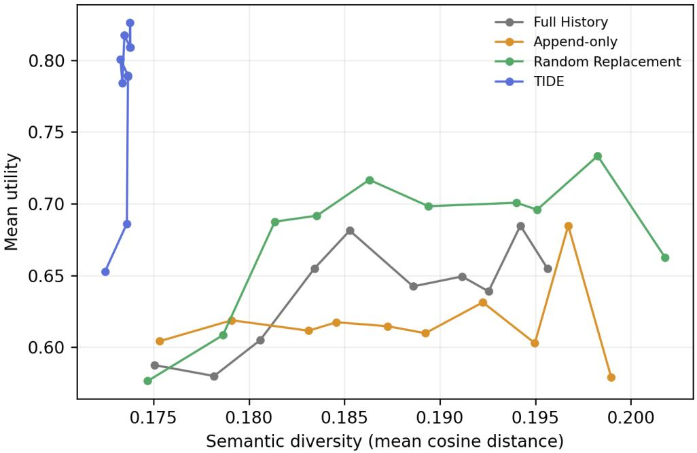  
Figure 10: Quality–diversity trajectories over 11 memory snapshots on 12 fixed tasks with seed 13. Color indicates the replay round, and marker size indicates active-memory tokens. TIDE attains the highest final utility with fewer memory tokens. Its lower embedding-space dispersion is interpreted jointly with Effective Population Size and batch-level Diversity because the feasible language space is tightly constrained.

## Operator 1: Reinforce

Input: [MEMORY], [CONTEXT], [ATTRIBUTED\_EVIDENCE], and [FITNESS\_VECTOR].

Prompt: Determine whether the newly attributed evidence supports the existing memory under the specified context. Preserve the original meaning and memory identifier. Add only conclusions directly supported by the evidence, and record the audience, channel, placement, campaign stage, and other conditions under which the evidence is valid. Do not generalize beyond the observed context. If the evidence contradicts the memory or remains insufficient, return not applicable rather than reinforcing it.

Output: decision, updated evidence, applicability conditions, confidence, and source references.

Safeguard: The reinforcement is committed only when the attributed evidence is valid, contextually consistent, and traceable to its source records.

## Operator 2: Crossover (MERGE)

Input: [PARENT\_MEMORIES], [ATTRIBUTED\_EVIDENCE], and [TARGET\_CONTEXT].

Prompt: Construct a candidate memory from the supplied parent memories. Identify decisions that are compatible and complementary, while preserving their context-specific conditions and exceptions. Resolve a conflict only when the provided evidence supports a resolution. Do not merge memories that apply to incompatible audiences, channels, placements, or campaign stages. Produce a concise operational rule that provides additional reusable value rather than simply concatenating the parent memories. Preserve the identifiers and evidence links of all parents.

Output: candidate content, applicability conditions, parent IDs, supporting sources, resolved conflicts, unresolved conflicts, and confidence.

Safeguard: The candidate is rejected when the parents are redundant, contextually incompatible, unsupported by common evidence, or cannot be merged without discarding an important exception.

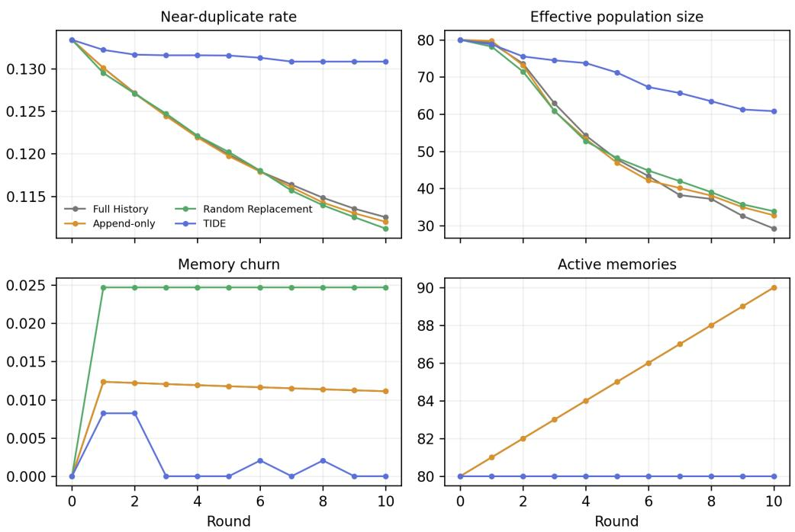  
Figure 11: Population-health diagnostics across replay rounds. We report Near-duplicate Rate, Effective Population Size, active population size, and Memory Churn. TIDE keeps its active population bounded at 80 items and retains a substantially larger effective population than the baselines at Round 10 without unbounded token growth.

## Operator 3: Mutation (REVISE)

Input: [MEMORY], [CONTEXT], [ATTRIBUTED\_EVIDENCE], and [OBSERVED\_FAILURE].

Prompt: Identify the smallest unsupported, incorrect, or overly general part of the existing memory. Select one primary operation from retain, narrow, revise, or split. Preserve all content that remains supported by the evidence, together with its provenance. Introduce no conclusion that is not grounded in the supplied feedback. When the evidence differs across contexts, prefer narrowing or splitting the memory instead of globally overwriting it. Clearly separate supported, unsupported, and unresolved applicability conditions.

Output: operation, revised content, applicability conditions, preserved content, removed or changed content, source-memory ID, supporting sources, and confidence.

Safeguard: A revision is committed only when it preserves the source-memory identifier and complete evidence trace. Unsupported global rewrites are discarded.

## Operator 4: Evict

Input: [MEMORY\_RECORD], [FITNESS\_EVIDENCE], [USAGE\_HISTORY], and [POPULATION\_RELATIONS].

Prompt: Assess whether the candidate memory should remain in the capacity-constrained population. Consider evidence reliability, contextual usefulness, responsibility history, redundancy, conflict, and recency. Do not remove a memory solely because it is old or infrequently retrieved. Prefer eviction when the memory is repeatedly contradicted, superseded, redundant, valid only in an obsolete context, or assigned persistently low fitness. Protect a memory that covers a unique task or context unless strong counterevidence exists. Use only feedback available before the current update time.

Output: decision, eviction score, reasons, supporting sources, protected unique contexts, and confidence.

Safeguard: The prompt produces an eviction assessment rather than directly deleting the memory. Final removal is performed by GovernAndSelectB under the fixed capacity constraint, with provenance and version history retained for audit.

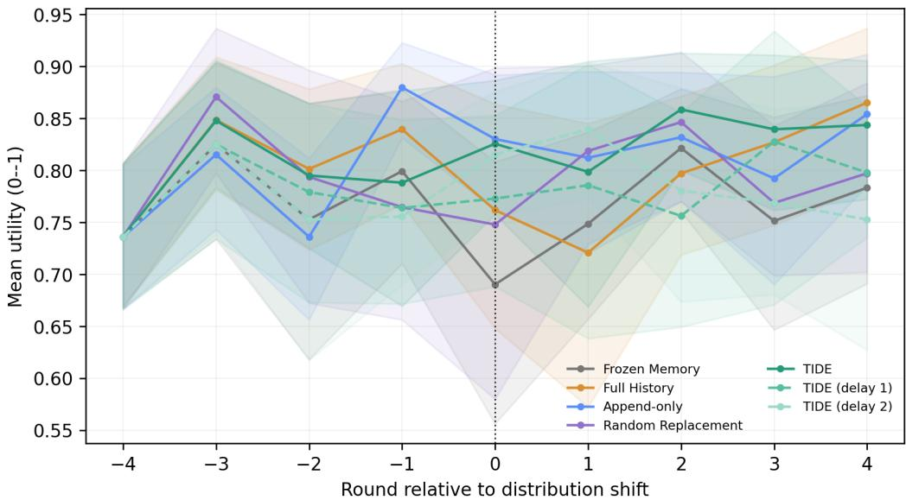  
Figure 12: Recovery after a controlled distribution shift. Round 0 denotes the change point; curves show normalized future utility with task-level bootstrap 95% confidence intervals. Results use 12 fixed tasks and seed 13.

Table 7: Adaptation and recovery after the controlled distribution shift. Recovery Time measures the number of rounds required to return to 95% of pre-shift utility, and Post-shift MEG is measured relative to Frozen Memory.
<table><tr><td>Method</td><td>Immediate Drop ↓</td><td>Recovery Time ↓</td><td>Post-shift AUC↑</td><td>Post-shift MEG↑</td><td>Stale-memory Survival ↓</td></tr><tr><td>Frozen Memory</td><td>0.088</td><td>1.25</td><td>0.759</td><td>+0.000</td><td>1.000</td></tr><tr><td>Full History</td><td>0.045</td><td>1.58</td><td>0.794</td><td>+0.035</td><td>1.000</td></tr><tr><td>Append-only</td><td>0.038</td><td>0.75</td><td>0.824</td><td>+0.065</td><td>1.000</td></tr><tr><td>Random Replacement</td><td>0.043</td><td>0.67</td><td>0.796</td><td>+0.037</td><td>0.906</td></tr><tr><td>TIDE</td><td>0.034</td><td>0.33</td><td>0.833</td><td>+0.074</td><td>0.996</td></tr></table>

## AI Use Disclosure

Generative AI tools were used to improve the clarity, grammar, and readability of the manuscript, as well as to assist with software development, including code completion, debugging, and refactoring. All AI-assisted text was reviewed and revised by the authors. All AI-assisted code was manually inspected and validated through testing and experimental verification. The authors take full responsibility for the correctness, originality, claims, results, and final content of this work.

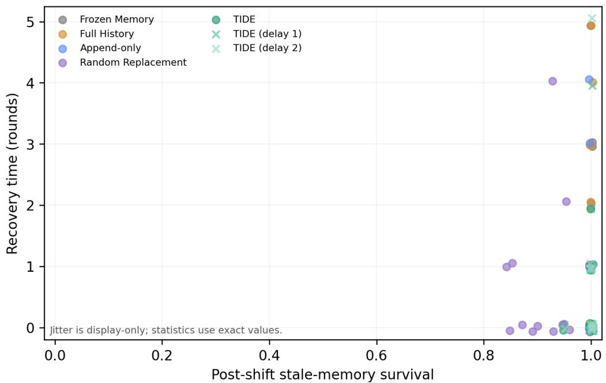  
Figure 13: Task-level relationship between post-shift stale-memory survival and recovery time. Small deterministic jitter is used only to reveal overlapping observations; all reported statistics use the exact values. TIDE achieves rapid recovery despite high stale-memory survival, indicating that its adaptation advantage does not depend on aggressive memory deletion.

TIDE minus baseline: post-shift utility AUC  
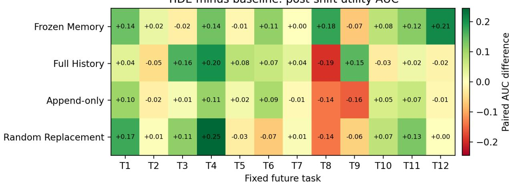  
Figure 14: Task-level post-shift utility-AUC difference between TIDE and each baseline. Positive cells favor TIDE. Task aliases T1–T12 preserve the fixed paired evaluation units without exposing scene identifiers.

Paired feedback-delay penalty  
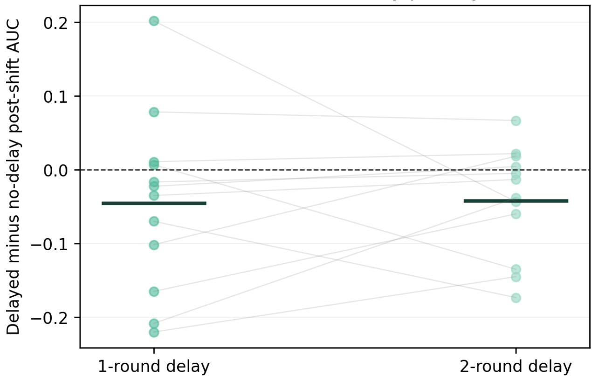  
Figure 15: Paired effect of delaying TIDE feedback by one or two rounds. Each point represents a fixed future task; horizontal segments denote means across tasks. Values below zero indicate lower Post-shift AUC than under the no-delay TIDE condition.