# LANGUAGE AS THE INTERFACE: FOUNDATION-MODEL CONTRASTIVE LEARNING LINKS TRANSCRIP-TOMES AND ELECTROPHYSIOLOGY

Junbo Shen1 Jinying Gao2,3,4 Bo Lei3∗

1Department of Computer Science and Engineering, The Chinese University of Hong Kong

2State Key Laboratory of Brain Cognition and Brain-inspired Intelligence Technology,

Institute of Automation, Chinese Academy of Sciences, Beijing, China

3Beijing Academy of Artificial Intelligence, Beijing, China

4University of Chinese Academy of Sciences, Beijing, China

## ABSTRACT

Integrating transcriptomic and electrophysiological data is essential for building multimodal foundation models for neuroscience. Patch-seq provides paired measurements of gene expression and intrinsic electrophysiology from the same neuron, establishing a basis for training cross-modal models. Here we introduce LANGPATCH, a foundation-model-based contrastive learning framework that uses paired Patch-seq data to align pretrained GenePT representations with electrophysiological phenotypes through a language-based interface. Gene descriptions and verbalized electrophysiological profiles are embedded by the same frozen text encoder. A context adapter and projection modules connect the modalities through paired contrastive learning. Across mouse visual, mouse motor, and human cortical cohorts, LANGPATCH achieves the highest mean transcriptome-toelectrophysiology prediction correlation among the evaluated foundation-model and representation-learning methods. It also improves held-out cross-modal alignment in the two mouse cohorts (FOSCTTM 0.107/0.135 vs. 0.208/0.222 for JAMIE, an existing cross-modal Patch-seq imputation method). It predicts transcriptomic family, type, cortical layer, and marker-gene expression from electrophysiology, exceeding other baselines on most endpoints. More importantly, the method transfers across brain areas and species: a model trained on mouse visual cortex predicts electrophysiology in motor cortex with approximately 70% correlation retention and in human cortex with 47% (58% on acute-slice recordings). Together, these results demonstrate alignment between molecular and functional representations of neurons, providing a building block for multimodal foundation models in neuroscience.

## 1 INTRODUCTION

Joint modeling of molecular processes, neural activity, and behavior may be central to building neuroscience foundation models capable of capturing the complexity of the brain (Arkhipov et al., 2025; Wang et al., 2025; Mathis & Mathis, 2026). Recent work has advanced neural activity prediction (Wang et al., 2025) and joint neural–behavioral modeling (Schneider et al., 2023; Willeke et al., 2026), providing tools for basic neuroscience research. While foundation models for single cell transcriptomics have advanced substantially (Theodoris et al., 2023; Cui et al., 2024; Hao et al., 2024; Tejada-Lapuerta et al., 2025), joint modeling of transcriptomic and functional data remains comparatively limited within pretrained frameworks, despite existing approaches for cross-modal alignment (Gala et al., 2021; Cohen Kalafut et al., 2023).

Patch-seq data provide a valuable empirical testbed for developing models that align molecular and functional representations of neurons. By pairing transcriptomic profiles with intrinsic electrophysiological measurements from the same neuron, these data support both cross-modal learning and evaluation (Cadwell et al., 2016; Fuzik et al., 2016). In parallel, advances in pretrained gene representations offer an opportunity to incorporate knowledge acquired beyond individual Patch-seq cohorts (Theodoris et al., 2023; Cui et al., 2024; Hao et al., 2024; Tejada-Lapuerta et al., 2025; Chen & Zou, 2025). Currently, the key question is how to use these paired measurements to align pretrained molecular representations with electrophysiological phenotypes.

Maps between the two modalities matter beyond the cohort that produced them: a forward model can impute physiology for the millions of cells in transcriptomic atlases that will never be patched, and a reverse model assigns type, layer and marker expression to a recorded cell without sequencing it.

Multimodal single-cell neuroscience is a low-resource regime. A Patch-seq cohort holds $1 0 ^ { 3 } – 4 \cdot 1 0 ^ { 3 }$ neurons, each modality has its own feature vocabulary, and laboratories extract different features with different pipelines. The prevailing approach—pretrain a single-cell foundation model on tens of millions of cells, then adapt its weights to the target task (Theodoris et al., 2023; Rosen et al., 2023; Tejada-Lapuerta et al., 2025; Cui et al., 2024)—assumes access to those weights and enough cells to move hundreds of millions of parameters. On these cohorts frozen embeddings from three such models are at best level with a frozen text prior, and on the 1,208-cell motor cortex cohort one of them loses most of its accuracy (Sec. 5.1), consistent with prior evaluations (Kedzierska et al., 2025; Ahlmann-Eltze et al., 2025; Bendidi et al., 2024). Cross-modal Patch-seq methods instead train a pair of encoders from scratch on the cohort itself (Gala et al., 2019; 2021; Cohen Kalafut et al., 2023), so the representation starts from no knowledge about genes, and nothing learned on one cohort carries over to the next feature vocabulary.

We take a different route and use language as the interface between the modalities (Fig. 1). Both are verbalizable: a gene has a textual description of its function, and an electrophysiological feature vector is a short list of named quantities with units. We encode both with the same frozen generalpurpose text embedder, so genes and recordings share one pretrained geometry. The transcriptomic side enters through GenePT embeddings of gene descriptions (Chen & Zou, 2025), corrected by a 0.4M-parameter adapter conditioned on per-gene statistics of the training cohort; the electrophysiological side enters through a deterministic verbalization of the feature record. Because both sides already live in one geometry, a linear projection trained with a contrastive objective (van den Oord et al., 2018; Radford et al., 2021) suffices to align them. The embedder is a black box whose weights are never updated, and verbalization makes the electrophysiological side vocabulary-agnostic in principle: a cohort with different features produces a record in the same language and lands in the same space. The interface lets one representation serve both directions and move across laboratories and species.

We call the method LANGPATCH and evaluate it on the visual cortex cohort of Gouwens et al. (2020) (3,654 cells), the motor cortex cohort of Scala et al. (2021) (1,208) and the human cortex cohort of Lee et al. (2023) (704 paired cells; 612 in the in-domain benchmark). On all three in-domain cohorts LANGPATCH is the most accurate forward predictor among foundation-model and representationlearning methods, with the unadapted language prior close behind. Our contributions are:

• A frozen language model as the interface. To our knowledge, LANGPATCH is the first crossmodal Patch-seq framework built on a foundation model: the GenePT gene representation and a frozen general-purpose language model, used in both directions, with single-cell foundation models benchmarked on the same tasks. The approach—frozen text embeddings for genes and verbalized electrophysiology, a 0.4M-parameter adapter on the gene prior conditioned on trainingcohort statistics, and affine contrastive projections—updates no foundation-model weight and runs against an embedding API (Sec. 3).

• Accuracy among learned methods. LANGPATCH is the most accurate transcriptomic-toelectrophysiology features predictor among foundation-model and representation-learning methods on two mouse cortices and a human cortex, where single-cell foundation models are at best level with a frozen text prior; it gives the best held-out cross-modal alignment (FOS-CTTM 0.107/0.135 vs. 0.208/0.222 for JAMIE), and reversely, electrophysiology features-totranscriptomic predictions (family macro-F1 0.78/0.71, marker r 0.54/0.57) exceed per-task supervised heads, embedding baselines and JAMIE (Secs. 5.1, 5.2).

• Zero-shot transfer across areas and species. Trained in different cortical areas of the mouse, the method retains 70%/71% of its in-domain correlation across cortical areas, with all 11 shared features predicted better than chance, and from mouse to human cortex, 18 of 25 electrophysiological features transfer better than chance, with 47% of the in-domain correlation retained overall and 58% on acute slices; 20 paired cells recover most of the calibration gain (Sec. 5.3).

• A legible shared space. The aligned space separates transcriptomic families for both modalities, and, because the representation is linear in expression, each electrophysiological feature is attributed to named genes; the prioritized genes recover cell-type markers and, more weakly, ionchannel genes (Sec. 6).

## 2 RELATED WORK

Cross-modal learning on Patch-seq. Statistical models first related transcriptomic types and single genes to electrophysiology (Tripathy et al., 2017; Bomkamp et al., 2019; Kobak et al., 2021). Coupled autoencoders (Gala et al., 2019; 2021) train one encoder per modality on the cohort and tie their latent spaces, and deepManReg (Nguyen et al., 2022) aligns modalities through manifold regularization. JAMIE (Cohen Kalafut et al., 2023) learns a joint variational latent with cross-modal imputation and is our strongest published comparison; MMIDAS (Marghi et al., 2024) separates dis crete and continuous factors of variation, and Schwider & Ramezani (2026) map human interneuron electrophysiology to transcriptomic subclass with numeric features and mouse pretraining (macro-F1 0.66 to 0.68 on Lee 2023). These approaches establish cross-modal prediction from numeric features; our focus is on reusing pretrained gene representations for transcriptome–electrophysiology alignment.

Language representations of genes and cells. GenePT (Chen & Zou, 2025) embeds textual gene descriptions with a general-purpose text embedder (OpenAI, 2024) and represents a cell as the expression-weighted average of its genes; scELMo (Liu et al., 2023) extends the idea to metadata. Cell2Sentence (Levine et al., 2023) renders a cell as a rank-ordered gene sentence for a language model, and CellWhisperer (Schaefer et al., 2025) aligns transcriptomes with free-text annotations contrastively. None of these touches electrophysiology or any second measured modality. TabLLM (Hegselmann et al., 2023) serializes numeric table rows into text for few-shot classification, the closest precedent for our verbalized records; we serialize to place a second modality in the same embedding space as the first.

Single-cell foundation models and their small-data limits. Geneformer (Theodoris et al., 2023), UCE (Rosen et al., 2023), Nicheformer (Tejada-Lapuerta et al., 2025) and scGPT (Cui et al., 2024) pretrain transformers on $1 0 ^ { 7 } – 1 0 ^ { 8 }$ cells and are adapted by updating their weights on the target task. Several evaluations find their embeddings no better than principal components or linear baselines (Kedzierska et al., 2025; Bendidi et al., 2024; Ahlmann-Eltze et al., 2025), as we do on Patchseq cohorts; our recipe adapts the prior of a frozen language embedder rather than the weights of a domain model.

Contrastive alignment and adaptation. Our alignment objective is the symmetric InfoNCE loss of CLIP (van den Oord et al., 2018; Radford et al., 2021), which scCLIP (Xiong et al., 2023) and sc-Pairing (Niu et al., 2025) apply to paired multi-omic single-cell measurements; both train modalityspecific encoders, whereas our towers share one frozen embedder and are joined by linear maps. Parameter-efficient adaptation with adapters (Houlsby et al., 2019) or low-rank updates (Hu et al., 2022) modifies a network from the inside and requires its weights; feature adapters such as CLIP-Adapter and Tip-Adapter (Gao et al., 2024; Zhang et al., 2022) add a residual on frozen encoder outputs, as we do, but ours is conditioned on cohort statistics rather than on the sample and bounded by a gate. New here is the combination: one frozen language model as the coordinate system for a transcriptome and a measured, non-textual modality, joined by small or linear components and evaluated in both directions and across areas and species.

## 3 METHOD

Setting. A Patch-seq cohort provides, for each neuron $i = 1 , \ldots , N ,$ , a transcriptome $\pmb { x } _ { i } \in \mathbb { R } ^ { G }$ over a gene panel of size G and a vector of intrinsic electrophysiological features $y _ { i } \in \mathbb { R } ^ { F } \ \mathrm { e x } .$ tracted from the same cell’s recordings. We use the log-normalized expression $x _ { i j } = \log ( 1 +$

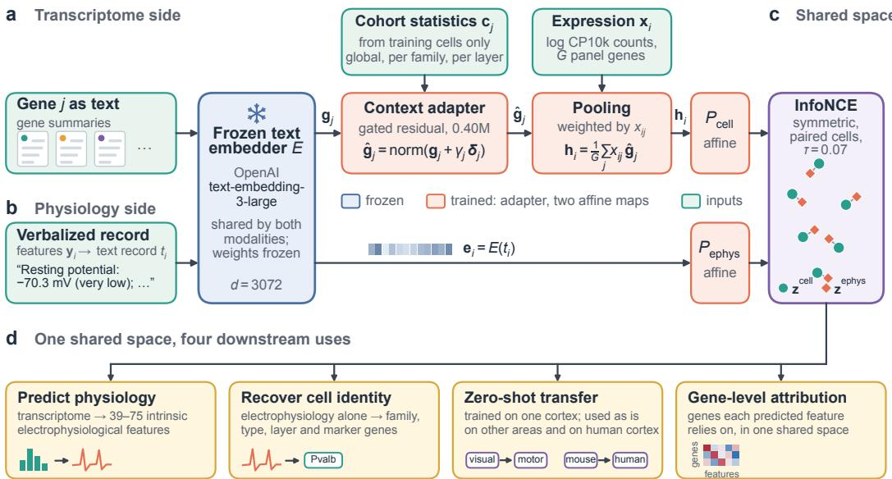  
Figure 1: Language as the interface. (a) Genes enter as text through a frozen embedder; a 0.4Mparameter adapter conditioned on training-cohort statistics adjusts the frozen gene prior, and a cell is the expression-weighted mean of its adapted genes followed by a linear map. (b) Electrophysiology is verbalized and embedded by the same frozen embedder, then linearly mapped. (c) A symmetric InfoNCE objective on paired cells aligns the two; the embedder is frozen. (d) The shared space has numerous downstream applications: predicting electrophysiological features from the transcriptome (Sec. 5.1), reading transcriptomic family, type, layer and marker genes from electrophysiology alone (Sec. 5.2), zero-shot transfer across cortical areas and species (Sec. 5.3), and gene-level attribution of each feature (Sec. 6).

$1 0 ^ { 4 } c _ { i j } / \sum _ { j ^ { \prime } } c _ { i j ^ { \prime } } )$ of the raw counts $c _ { i j }$ over the panel. Cohorts are small $( N \approx 1 0 ^ { 3 } – 4 \cdot 1 0 ^ { 3 } )$ , the feature vocabulary of y differs between laboratories, and labels exist for the transcriptomic side only. We want one representation that supports ${ \mathbf { \psi } } _ { \textbf { + } \textbf { + } \textbf { \em y } }$ , the reverse readout ${ \textbf { \em y } } \to$ transcriptomic identity, and transfer of both to new cohorts.

Overview (Fig. 1). Both modalities are expressed as text and encoded by the samefrozen generalpurpose text embedder $E ( \cdot ) \in \mathbb { R } ^ { d } ( d = 3 0 7 2$ ; text-embedding-3-large). Genes enter through frozen text embeddings of their functional descriptions (GenePT (Chen & Zou, 2025)); electrophysiology enters through a deterministic verbalization of the feature vector. The only trained representationstage components are a small context adapter that conditions the frozen gene prior on per-gene statistics of the training cohort (global, and per transcriptomic family and layer of the training cells), and two affine projections trained with a contrastive objective. No embedder weights are updated, and the embedder is used as a black box.

## 3.1 GENE SIDE: A FROZEN LANGUAGE PRIOR, ADAPTED BY DATASET STATISTICS

Let $\pmb { g } _ { j } = E ( \mathrm { d e s c r i p t i o n }$ of gene $j ) \in \mathbb { R } ^ { d }$ be the frozen GenePT embedding of gene $j .$ For each gene we compute a context vector $\boldsymbol { c } _ { j } \in \mathbb { R } ^ { C }$ from the training cells only: four global statistics of $x _ { \cdot j }$ (mean, standard deviation, detection rate, coefficient of variation) and, for each transcriptomic family and cortical layer present in the training set, the family- and layer-conditional mean and detection rate $( C = 2 4 $ for mouse visual cortex, 30 for motor cortex, 18 for human cortex; Appendix A). The adapter maps the context to a gated residual on the prior,

$$
\delta _ { j } = W _ { 2 } \mathrm { G E L U } \big ( W _ { 1 } \mathrm { L N } ( c _ { j } ) \big ) , \qquad \gamma _ { j } = s \sigma \big ( w ^ { \top } \mathrm { L N } ( c _ { j } ) \big ) , \qquad \hat { g } _ { j } = \frac { g _ { j } + \gamma _ { j } \delta _ { j } } { \| g _ { j } + \gamma _ { j } \delta _ { j } \| _ { 2 } } ,\tag{1}
$$

with $W _ { 1 } \in \mathbb { R } ^ { 1 2 8 \times C } , W _ { 2 } \in \mathbb { R } ^ { d \times 1 2 8 }$ , a scalar gate bounded by $s = 0 . 1$ , and LN layer normalization. The adapter has 0.40M parameters; it can only move each gene a bounded distance from its prior,

and a cosine penalty $\lambda _ { g } \left( 1 - \cos ( \hat { { \bf g } } _ { j } , { \bf g } _ { j } ) \right)$ keeps it close. A cell is the expression-weighted mean of its adapted gene vectors, followed by a linear projection,

$$
h _ { i } = { \frac { 1 } { G } } \sum _ { j = 1 } ^ { G } x _ { i j } \hat { g } _ { j } , \qquad z _ { i } ^ { \mathrm { c e l l } } = \mathrm { n o r m a l i z e } \big ( P _ { \mathrm { c e l l } } ( h _ { i } ) \big ) , \qquad P _ { \mathrm { c e l l } } = \mathrm { L N } \circ \mathrm { L i n e a r } _ { d \to d } \circ \mathrm { L N } .\tag{2}
$$

Because Eq. (2) is linear in $\mathbf { \Delta } _ { \mathbf { \mathcal { X } } _ { i } }$ once the adapted gene matrix $\hat { \pmb { G } } = [ \hat { \pmb { g } } _ { 1 } ; \dots ; \hat { \pmb { g } } _ { G } ]$ is fixed, the representation is a fixed linear map of expression whose geometry is inherited from the language prior; Sec. 6 uses this linearity to attribute predictions to genes.

## 3.2 ELECTROPHYSIOLOGY SIDE: VERBALIZE, THEN EMBED

Each feature vector is rendered as a short record (“Cell electrophysiology profile. Resting membrane potential $I m V J { : - 7 0 . 3 ( \nu e r y l o w ) ; \dots ^ { 9 } } )$ and embedded once by the same frozen embedder. Feature names are expanded to readable names with units, values are winsorized to the 1st–99th percentiles, and each value is followed by its within-cohort quintile label; four coarse profile tokens summarize excitability, adaptation, spike shape and membrane state (Appendix B). The record $t _ { i }$ is embedded as $e _ { i } = E ( t _ { i } )$ and projected, $z _ { i } ^ { \mathrm { e p h y s } } = \mathrm { n o r m a l i z e } ( P _ { \mathrm { e p h y s } } ( e _ { i } ) )$ , with $P _ { \mathrm { e p h y s } }$ of the same form as $P _ { \mathrm { c e l l } }$ . Verbalization makes the electrophysiology side vocabulary-agnostic in principle: a cohort with a different feature set produces a record in the same language and lands in the same embedding space.

## 3.3 ALIGNMENT

The two projections and the adapter are trained jointly on paired cells with a symmetric InfoNCE objective (van den Oord et al., 2018; Radford et al., 2021) at temperature $\tau = 0 . 0 7$

$$
\begin{array} { r } { \mathcal { L } _ { \mathrm { a l i g n } } = \frac { 1 } { 2 } \big [ \mathrm { C E } ( Z ^ { \mathrm { e p h y s } } Z ^ { \mathrm { c e l l } \top } / \tau , I ) + \mathrm { C E } ( Z ^ { \mathrm { c e l l } } Z ^ { \mathrm { e p h y s } \top } / \tau , I ) \big ] , } \end{array}\tag{3}
$$

plus three light regularizers: an auxiliary regression of the standardized features $\mathbf { \nabla } _ { \mathbf { \psi } _ { 3 } } \psi _ { i }$ from both towers (which anchors the shared space to measurable quantities), the gene-cosine penalty above $( \lambda _ { g } =$ 0.5), and a cosine penalty that keeps $\boldsymbol { h } _ { i }$ close to the unadapted cell embedding $( \lambda _ { c } = 0 . 1 )$ , with an $\ell _ { 2 }$ penalty on the residual $( 1 0 ^ { - \dot { 4 } } )$ . Training is full-batch AdamW (learning rate $1 0 ^ { - 4 }$ , weight decay $\mathbf { \bar { 1 0 } } ^ { - 4 } , 2 , 0 0 0$ epochs, a 200-epoch warm-up in which only the auxiliary regression is active, a 50-epoch ramp of the contrastive weight); the checkpoint with the lowest validation contrastive loss is kept. Projections are affine maps between layer normalizations, kept linear because this sufficed empirically and keeps the representation linear in expression.

## 3.4 READOUTS

Forward. Each electrophysiological feature f gets its own small regressor $\phi _ { f } \big ( z _ { i } ^ { \mathrm { c e l l } } \big )$ (an MLP whose width is selected on the validation fold among four candidates: 512–128 units on both mouse cohorts, 256 on human cortex; Appendix A), trained on the standardized target with a log transform for heavy-tailed positive features; the epoch is selected per feature on the validation fold. Reverse. A regressor maps the standardized feature vector $\mathbf { \nabla } _ { \mathbf { \psi } _ { 3 } } \psi _ { i }$ into the aligned transcriptomic space; the predicted embedding, compressed to its leading directions, is concatenated with $\mathbf { \nabla } _ { \mathbf { \psi } _ { 3 } } \mathbf { \psi } _ { 2 } \qquad \mathbf { \psi } _ { 3 } \mathbf { \psi } _ { 4 } \qquad \mathbf { \psi } _ { 3 } \mathbf { \psi } _ { 4 } \qquad \mathbf { \psi } _ { 3 } \mathbf { \psi } _ { 4 } \mathbf { \psi } _ { 3 } \qquad \mathbf { \psi } _ { 4 } \mathbf { \psi } _ { 4 } \mathbf { \psi } _ { 3 } \mathbf { \psi } _ { 4 } \mathbf { \psi } _ { 4 } \mathbf { \psi } _ { 3 } \qquad \mathbf { \psi } _ { 3 } \mathbf { \psi } _ { 4 } \mathbf { \psi } _ { 4 } \mathbf { \psi } _ { 3 } \mathbf { \psi } _ { 4 } \mathbf { \psi } _ { 4 }$ and read by one multitask head that predicts the transcriptomic family, the fine type, the cortical layer, the log-expression of 27 marker genes and 9 marker programs (Appendix D). All readout heads are fit on training cells and evaluated on held-out cells of the same fold. Transfer. The adapted gene matrix $\hat { G } ,$ , the projections and the heads are used unchanged on a new cohort: its expression is normalized over the source panel and pushed through Eqs. (1)–(2). Feature correspondences between laboratories are needed only for scoring; they are fixed before any target score is computed (Appendix E). The embedder is never updated; parameter counts are listed in Appendix A. A linear readout on $z ^ { \mathrm { c e l l } }$ matches or exceeds the MLP heads on the human cohort (Appendix F), so the nonlinear heads are a refinement rather than part of the representation.

## 4 EXPERIMENTAL SETUP

Cohorts (Table 2 in Appendix A). Three Patch-seq cohorts serve as in-domain benchmarks: mouse visual cortex (Gouwens et al., 2020), 3,654 GABAergic interneurons with 39 IPFX features (Allen Institute for Brain Science, 2025) over a 1,293-gene panel; mouse motor cortex (Scala et al., 2021), 1,208 excitatory and inhibitory neurons with 29 features over 1,277 genes; and human cortex (Lee et al., 2023), 612 GABAergic interneurons with complete 75-feature profiles, mapped onto the visual panel by upper-cased symbol identity (100%; not a curated orthology). The zero-shot target of the visual-cortex model is the set of all Lee 2023 cells with electrophysiology (704; 247 from acute and 457 from cultured slices).

Table 1: Forward prediction on held-out cells $( \mathrm { m e a n } \pm \mathrm { s . d }$ . over five folds): per-feature Pearson r, AUROC and raw MAE. Ours: context-adapted GenePT with alignment and per-feature heads whose width is selected on the validation fold (Appendix A).
<table><tr><td></td><td colspan="3">Mouse visual (39 feat.)</td><td colspan="3">Mouse motor (29 feat.)</td><td colspan="3">Human Lee (75 feat.)</td></tr><tr><td>Method</td><td>r ↑</td><td>AUROC↑</td><td>MAE↓</td><td>r ↑</td><td>AUROC↑</td><td>MAE↓</td><td>r ↑</td><td>AUROC↑</td><td>MAE↓</td></tr><tr><td>Ours</td><td></td><td>0.522 ± 0.018 0.779 ± 0.008</td><td>8.98 ± 0.12</td><td></td><td>0.520 ± 0.021 0.801 ± 0.005</td><td>7.72 ± 0.33</td><td>0.414 ± 0.030 0.725 ± 0.014</td><td></td><td> ${ \bf 9 . 8 2 \pm 0 . 2 7 }$ </td></tr><tr><td>Plain GenePT MLP</td><td>0.505 ± 0.016 0.768 ± 0.005</td><td></td><td> $9 . 2 2 \pm 0 . 0 4$ </td><td></td><td>0.502 ± 0.020 0.790 ± 0.002</td><td> $8 . 0 2 \pm 0 . 3 7$ </td><td> $0 . 3 8 7 \pm 0 . 0 2 1$ </td><td> $0 . 7 1 3 \pm 0 . 0 0 9$ </td><td> $9 . 9 0 \pm 0 . 1 9$ </td></tr><tr><td>Geneformer MLP</td><td></td><td>0.492 ± 0.017 0.760 ± 0.005</td><td>9.54 ± 0.16</td><td></td><td>0.146 ± 0.028 0.574 ± 0.010</td><td>10.44 ± 0.32</td><td>0.401 ± 0.034</td><td> $0 . 7 1 9 \pm 0 . 0 1 0$ </td><td> $9 . 8 8 \pm 0 . 2 7$ </td></tr><tr><td>UCE MLP</td><td></td><td>0.410 ± 0.016 0.714 ± 0.007</td><td>10.51 ± 0.14</td><td></td><td>0.462 ± 0.014 0.762 ± 0.009</td><td>8.57 ± 0.38</td><td>0.312 ± 0.035</td><td>0.670 ± 0.018</td><td> $1 0 . 6 5 \pm 0 . 3 7$ </td></tr><tr><td>Nicheformer MLP</td><td></td><td>0.486 ± 0.016 0.756 ± 0.005</td><td>9.56 ± 0.08</td><td></td><td>0.503 ± 0.018 0.784 ± 0.007</td><td>8.06 ± 0.27</td><td></td><td>0.386 ± 0.028 0.710 ± 0.008</td><td> $1 0 . 1 3 \pm 0 . 2 4$ </td></tr><tr><td>Fine-tuned Nicheformer</td><td>0.490 ± 0.017 0.760 ± 0.007</td><td></td><td>9.47 ± 0.19</td><td></td><td>0.510 ± 0.013 0.787 ± 0.004</td><td>8.04 ± 0.36</td><td></td><td>0.386 ± 0.023 0.710 ± 0.008</td><td> $1 0 . 0 6 \pm 0 . 2 2$ </td></tr><tr><td>GenePT-ephys VAE</td><td>0.455 ± 0.047 0.734 ± 0.028</td><td></td><td>9.88 ± 0.36</td><td></td><td>0.021 ± 0.019 0.513 ± 0.015</td><td>10.72 ± 0.33</td><td></td><td>0.001 ± 0.018 0.510 ± 0.010</td><td> $1 1 . 8 2 \pm 0 . 1 5$ </td></tr><tr><td>JAMIE</td><td>0.453 ± 0.016 0.739 ± 0.005</td><td></td><td></td><td></td><td>10.05 ± 0.20 0.432 ± 0.027 0.757 ± 0.007</td><td>8.91 ± 0.30 0.406 ± 0.034 0.718 ± 0.010</td><td></td><td></td><td> $1 0 . 0 3 \pm 0 . 2 8$ </td></tr></table>

Protocol. Each cohort is split into five type-stratified folds (train/validation/test ≈ 65/15/20; seed 0); all fitting and selection use the fold’s training and validation cells only, and we report means over the five test folds. Folds partition one cohort and are not replicates; significance rests on paired Wilcoxon tests and win counts (binomial tests) over features, and on paired tests over the five folds for scalar endpoints (minimum attainable $p = 0 . 0 6 )$ . Forward accuracy is the per-feature Pearson r on held-out cells (mean over features, then folds), plus AUROC for above/below-median and raw MAE; alignment of the shared space is scored on held-out cells by FOSCTTM, the fraction of cells of the other modality that lie closer to a cell than its true partner (0 perfect, 0.5 chance), and by labeltransfer accuracy (LTA), the accuracy of a k-nearest-neighbour classifier that carries transcriptomic labels from the electrophysiology embeddings to the transcriptome embeddings of the same cells (Appendix C); reverse readouts use macro-F1 for family, fine type and layer, and Pearson r and AUPRC for marker genes and programs (Appendix D).

Baselines. Forward: a Plain GenePT MLP (frozen pooled GenePT cell embedding and one multioutput MLP: our method without adapter and alignment), MLPs on frozen Geneformer (Theodoris et al., 2023), UCE (Rosen et al., 2023) and Nicheformer (Tejada-Lapuerta et al., 2025) embeddings, Nicheformer with its last transformer block trained end-to-end on the cohort together with the head, a GenePT–ephys VAE, and JAMIE (Cohen Kalafut et al., 2023) re-run on the same folds. Integration: JAMIE, the VAE, Nicheformer embeddings aligned by CLIP-style contrastive learning (Nicheformer+CLIP), and a frozen-input control that applies same contrastive learning to unadapted GenePT embeddings. Reverse: per-task supervised heads (logistic regression, ridge), regressors from electrophysiology into gene counts, GenePT (PCA-ridge, PLS, MLP) and scFM embeddings, the VAE, and JAMIE’s reverse map.

Transfer scoring. Because electrophysiological feature vocabularies differ across cohorts, transfer is scored on matched biophysical concepts: 11 between mouse visual and motor cortex (e.g., input resistance, rheobase, spike amplitude; Table 6) and 25 for Lee 2023, with one-to-one feature matches and expected signs fixed before scoring (Appendix E). For each concept, Pearson r is computed between the five-fold ensemble prediction and the target measurement; it passes if r exceeds the 95th percentile of 1,000 cell-permutation nulls with the expected sign. Retention R is the mean target |r| divided by the in-domain held-out mean |r| over the same concepts. Pre-registered verdicts are A if $\mathrm { \mathit { R } \geq 0 . 5 }$ and at least two thirds of concepts pass, B if $R \geq 0 . 3 .$ and C otherwise. Absolute scale is recovered by affine calibration on n paired target cells (200 resamples).

d Cost to train (1 fold, GPU)

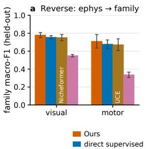

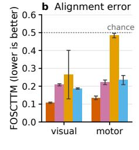

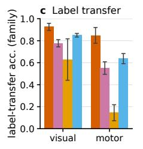

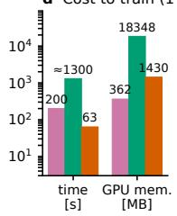  
Figure 2: Shared space. (a) Reverse readout of transcriptomic family from electrophysiology (macro-F1). (b) Held-out FOSCTTM (lower is better; 0.5 is chance) and (c) family label-transfer accuracy for the methods that expose a joint space, JAMIE re-run on our folds. (d) Training time and peak GPU memory comparisons for one fold, cost-efficiency (Appendix C)

## 5 RESULTS

## 5.1 FORWARD PREDICTION

Ours reaches a mean per-feature r of 0.522±0.018 (visual), 0.520±0.021 (motor) and 0.414±0.030 (human), the highest among learned representations on every cohort, with the highest AUROC and the lowest raw MAE on all three (Table 1), winning 36/39 and 27/29 mouse features against JAMIE $( p \leq 1 . 6 \times 1 0 ^ { - 6 } )$ ; on human cortex JAMIE is the closest baseline (0.406±0.034), where ours is better on 43/75 features in r $( p = 0 . 2 5 )$ and on 50/75 in AUROC $( p = 5 \times 1 0 ^ { - 3 } )$ . From visual to motor cortex Geneformer drops from 0.492 to 0.146, whereas Nicheformer does not $( 0 . 4 8 6  0 . 5 0 3 ) \colon$ on motor cortex it is indistinguishable from the Plain GenePT MLP $( p = 0 . 5 6 )$ , and ours wins 22/29 features against it $( p = 0 . 0 0 8 )$ . Fine-tuning Nicheformer changes little: $0 . 4 9 0 \pm 0 . 0 1 7$ on visual cortex, $0 . 5 1 0 \pm 0 . 0 1 3$ on motor cortex and $0 . 3 8 6 \pm 0 . 0 2 3$ on human cortex (frozen: $0 . 3 8 6 \pm 0 . 0 2 8 )$ where ours wins 36/39 $( p = 4 \times 1 0 ^ { - 8 } )$ , 21/29 $( p = 0 . 0 2 4 )$ and 58/75 features $( p = 2 \times 1 0 ^ { - 6 } )$ in r and 36/39, 24/29 and 61/75 in AUROC; it overfits visibly (Appendix A). The margin over the Plain GenePT MLP (which also lacks the per-feature heads and the auxiliary regression) is modest but consistent: +0.017 on visual cortex (36/39 features, Wilcoxon $p = 1 . 8 \times 1 0 ^ { - 8 } ) , + 0 . 0 1 8$ on motor cortex (22/29, $p = 2 . 3 \times 1 0 ^ { - 3 }$ ; AUROC $p = 1 . 1 \times 1 0 ^ { - 4 } )$ and +0.027 on human cortex (48/75, $p = 7 \times 1 0 ^ { - 5 } ) ;$ raw MSE on motor cortex still favours the single-head baselines (Plain GenePT 691 and the two Nicheformer variants 695 and 687 vs. 718), while raw MAE and AUROC favour ours on every cohort. The head width is chosen on the validation fold among four candidates (Appendix A): 512–128 units on both mouse cohorts and 256 on human cortex. (Appendix F).

## 5.2 SHARED SPACE: ALIGNMENT AND REVERSE READOUTS

Ours gives the best held-out alignment among joint-space methods on both mouse cohorts (Fig. 2; Appendix C): FOSCTTM 0.107 ± 0.004 and 0.135 ± 0.010 (visual/motor) against 0.208/0.222 for JAMIE and 0.187/0.235 for Nicheformer+CLIP, with family label transfer of 0.926/0.848 against 0.777/0.551 and 0.850/0.637. The frozen-input control shows that the substrate matters (only our adapter uses training-cell labels): the same linear method on unadapted GenePT embeddings already reaches 0.133/0.186 against 0.187/0.235 on Nicheformer embeddings, and the adapter closes the rest to 0.107/0.135.

Table 5 shows predictions from electrophysiology through aligned space. In the reverse direction, our method via one multitask head predicts transcriptomic identity back from a recorded cell’s electrophysiology through aligned representation (Fig. 2a; Table 5): family (macro-F1 0.779/0.710), fine type (0.382/0.572), cortical layer, the expression of 27 marker genes $( r = 0 . 5 3 9 / 0 . 5 7 2 )$ and 9 marker programs. Against classifiers and regressors trained directly on the electrophysiology features for each task, it is better on 4 of 5 endpoints on visual and 5 of 5 on motor cortex (layer $+ 0 . 0 4 7 / + 0 . 0 9 0$ ; marker $r + 0 . 0 8 6 / + 0 . 0 6 3 , \bar { p } \leq 0 . 0 0 4 )$ ), and it is above JAMIE’s reverse imputation on every endpoint (family F1 0.549/0.336).

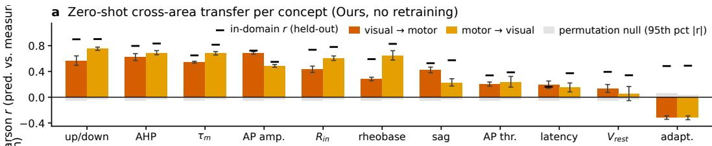

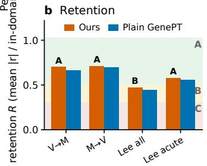

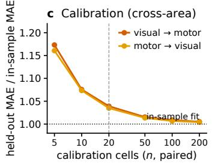

d Calibration (human)  
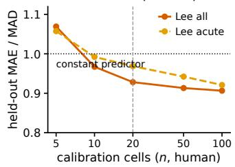  
Figure 3: Zero-shot transfer without target training. (a) Per-concept Pearson correlations for visual↔motor transfer, evaluated using the cross-area matched electrophysiology features and permutation-based chance levels. (b) Correlation retention, defined relative to the corresponding in-domain performance, for cross-area and mouse-to-human transfer. (c,d) Few-shot calibration as a function of the number of paired target cells for cross-area and mouse-to-human transfer.

## 5.3 TRANSFER ACROSS CORTICAL AREAS AND SPECIES

Applied unchanged to the other mouse cortex, the method retains 70% (visual→motor, V2M) and 71% (M2V) of its in-domain correlation, with 11/11 cross-area matched electrophysiology features/concepts above the permutation null in both ways (V2M and M2V). Spike shape and passive membrane properties transfer best $( r = 0 . 5 7 / 0 . 7 5$ for the upstroke:downstroke ratio, $0 . 6 2 / 0 . 6 9$ for the after-hyperpolarization), resting potential worst (0.14/0.06), and adaptation has the opposite sign in both directions because the two pipelines define the index with opposite orientation (registered as sign-uncertain; Fig. 3a). In mean concept r, ours is numerically best from visual to motor cortex (0.344) and level with Nicheformer in the other direction (0.384 vs. 0.385); neither margin is significant (Plain GenePT MLP 0.317/0.371, $p = 0 . 1 7 / 0 . 4 6 ;$ Nicheformer $0 . 3 2 6 / 0 . 3 8 5 , p \bar { = } 0 . 3 7 / \bar { 1 } . 0 )$ UCE is lower (0.270/0.346) and Geneformer fails $( 0 . 0 5 / 0 . 0 4 ) $ transfer is observed both with and without the adapter. Raw errors are dominated by fixed offsets between the two recording pipelines; an affine calibration fit on n paired target cells gives a held-out error of 1.165× $( n = 5 )$ , 1.036× $( n = 2 0 )$ and $1 . 0 0 5 \times ( n = 2 0 0 )$ the error of a calibration fit on all target cells, about 20 cells suffice (Fig. 3c).

The same mouse model, applied to human interneurons with no human training, passes the null on 18 of 25 cross-species electrophysiology features/concepts on Lee 2023 (mean r 0.28) and keeps 47% of the mouse in-domain correlation $( R = 0 . 4 7$ , verdict B); on the 247 acute-slice cells it passes 20 of 25 and keeps 58% (A). Time constant $( r = 0 . 6 4 )$ , upstroke:downstroke ratios $( 0 . 6 1 / 0 . 5 6 )$ after-hyperpolarization, input resistance and rheobase (0.35–0.49) transfer, whereas resting potential, latency, adaptation and threshold voltages do not $( r < 0 . 1 )$ This is more than recognizing the subclass and predicting its mean: within a subclass the correlation is still 0.17 (0.30 overall), and the offset of PVALB cells from the rest is recovered for 22 of 25 concepts. The Plain GenePT MLP keeps 44% $( p = 0 . 1 0 )$ . Permuting the gene identities of the human expression input before applying the map drops the mean r to about 0 $( R = 0 . 1 6 , \mathbf { C } )$ , although 8 of 25 concepts tied to the fast-spiking phenotype stay at $r = 0 . 0 9 \mathrm { - } 0 . 1 8$ : about 0.1 of the human correlation comes from gene-agnostic statistics of the expression vector rather than from gene-level knowledge. Calibration behaves as in mouse (20 human cells reach 1.025× the error of a 100-cell calibration). After calibration 56% of the concepts beat a constant predictor (60% on acute-slice cells; Fig. 3d).

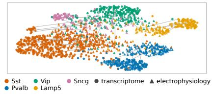

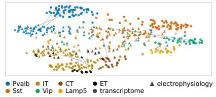

r.c Gene × feature attribution, mouse visual cortex  
d Gene × feature attribution, mouse motor cortex  
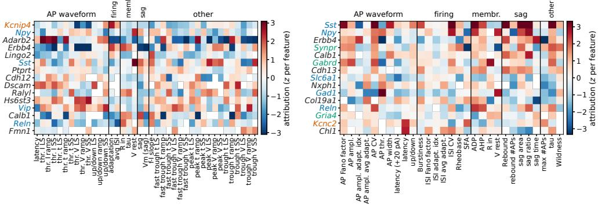  
ion channel / excitability inhibitory / neuromodulation marker synaptic / projection othe  
Figure 4: Interpretability of the shared space. (a, b) UMAP of the aligned space for the held-out cells of one fold: transcriptome embeddings (circles) and electrophysiology embeddings (triangles), coloured by transcriptomic family; grey segments join a random subset of pairs. (c, d) Gene × feature attribution of the forward heads (gradient×input, mean over five folds, z-scored per feature) for the fifteen most attributed genes, feature columns grouped by physiological family.

## 6 DISCUSSION

What the shared space encodes. We examine the shared space from two complementary views: how held-out cells from the two modalities are organized, and which genes the forward predictions rely on. Using the same gradient×input protocol for ours, the Plain GenePT MLP and JAMIE on the same held-out cells (Appendix G), we find that transcriptomic and electrophysiological embeddings form a common, family-organized geometry (Fig. 4a,b). Because the cell embedding is linear in expression, each forward head’s gradients prioritize named genes. The prioritized genes are the expected ones: 64% of the train-fold cell-type markers lie within our top 200 genes on visual cortex and 51% on motor cortex (random ranking, 95th percentile: 21% and 20%; Plain GenePT 64% and 37%; JAMIE 5% and 12%); ion-channel and excitability genes are modestly enriched among our top 50 (2.8×/2.9× against a null of 2.6×; Plain GenePT 1.9×/0.4×, JAMIE 1.3×/0.9×); and our ranking is the most stable across folds (Spearman 0.88/0.88 vs. 0.82/0.76 and 0.47/0.37). As in JAMIE’s gene-removal test, removing our top-50 genes from the transcriptome input lowers the label-transfer accuracy of the joint space by 0.02 (visual) and 0.05 (motor), random genes by at most 0.004 and no single gene by more than 0.021, whereas JAMIE’s own top genes lower its accuracy by 0.01 and 0.02, within the spread of random genes. The gene×feature maps (Fig. 4c,d) show broad structure: on visual cortex Erbb4 and Adarb2 carry the spike-shape features and Sst, Calb1 and Erbb4 the sag features. Two readouts favour the Plain GenePT MLP (Appendix G): its predictions lose more accuracy when its own top genes are deleted, and its top genes are more enriched for synaptictransmission genes. This describes what the predictors rely on and is hypothesis-generating.

Limitations. Our evidence is limited to two mouse cortical areas and one primary human cohort, and only the motor cortex cohort contains excitatory neurons. Zero-shot transfer primarily preserves relative variation; a small number of paired target cells may still be needed for calibration, while recording-sensitive features like threshold voltage transfer poorly even after calibration. And the text embedder is OpenAI’s text-embedding-3-large, requires API for LANGPATCH in new datasets.

Conclusion. A frozen general-purpose language model can serve as an interface between transcriptome and electrophysiology. A lightweight contrastive framework that adapts a pretrained genelanguage prior and aligns it with verbalized electrophysiology, trained on only about 103 paired cells, gives the most accurate transcriptome-to-electrophysiology prediction among the evaluated foundation-model and representation-learning methods across three cohorts, the best cross-modal embedding alignment on both mouse cohorts, reverse electrophysiology-to-transcriptome predictions that exceed the baselines on most endpoints, and gene attributions that recover cell-type markers. One representation thus serves atlas cells that will never be patched and recordings that will never be sequenced, and can take further verbalizable modalities in principle: a building block for multimodal foundation models in neuroscience.

## AI USE STATEMENT

Generative AI tools were used in this work. AI coding assistants based on large language models were used, under the authors’ direction and to the authors’ specifications, to write and refactor training, evaluation, and analysis scripts. The authors designed the method, chose the datasets, baselines and metrics, wrote the evaluation criteria, and reviewed all AI-assisted code and text. Every number reported in the paper is regenerated by the released scripts from the released result files (CSV), so no reported value originates from the free-text output of an AI tool; no dataset, measurement or result was produced by a generative model, and all inputs are the public datasets listed in the reproducibility statement. We take full responsibility for the final content of this work, including text, claims and artifacts produced with the aid of AI.

## ETHICS STATEMENT

All data used in this work are public and de-identified: the mouse Patch-seq cohorts of Gouwens et al. (2020) and Scala et al. (2021), and the human cortical Patch-seq cohorts of Lee et al. (2023) and Chartrand et al. (2023). The authors performed no experiments on animals or human subjects; the human tissue data were collected and consented under the original studies’ protocols, and we use only the processed, de-identified tables released by those studies. The method pro duces predicted physiological properties from transcriptomes; such predictions are model outputs, not measurements. We see no direct path from this work to harmful applications; the main risk is over-interpretation of imputed electrophysiology, which we address by reporting permutation nulls, negative controls and failure cases alongside the positive results.

## REPRODUCIBILITY STATEMENT

Code is available at https://github.com/ai4biomedicine/LangPatch. All datasets are public: the mouse visual cortex cohort of Gouwens et al. (2020) (Allen Institute; raw electrophys iology in DANDI dandiset 000020), the mouse motor cortex cohort of Scala et al. (2021) (berenslab mini-atlas), and the human cohorts of Lee et al. (2023) and Chartrand et al. (2023) (processed tables from the Allen Institute GitHub releases). Both mouse cohorts are the scMNC preprocessing used by JAMIE (Cohen Kalafut et al., 2023), so cell counts and folds are directly comparable with that work. The gene embeddings are the released GenePT v2 vectors (Chen & Zou, 2025) (OpenAI text-embedding-3-large, 3072 dimensions (OpenAI, 2024), applied by the GenePT authors to NCBI gene summaries and UniProt protein summaries; Zenodo record 10833191); the verbalized electrophysiology records were embedded once by us with the same model. Appendix A lists every hyperparameter, parameter count and model-selection rule; Appendix B the verbalization template; Appendix E the crosswalk, permutation-null, retention and calibration protocols; Appendix C the integration-metric and timing protocols; Appendix F the human fold design and nested validation; and Appendix G the attribution and visualization protocols.

## REFERENCES

Constantin Ahlmann-Eltze, Wolfgang Huber, and Simon Anders. Deep-learning-based gene perturbation effect prediction does not yet outperform simple linear baselines. Nature Methods, 22(8): 1657–1661, 2025. doi: 10.1038/s41592-025-02772-6.

Allen Institute for Brain Science. IPFX: Intrinsic physiology feature extractor. GitHub repository, release v2.1.2 (December 2025), 2025. URL https://github.com/AllenInstitute/ ipfx. Accessed 2026-09.

Anton Arkhipov, Nuno da Costa, Saskia de Vries, Trygve Bakken, Corbett Bennett, Amy Bernard, Jim Berg, Michael Buice, Forrest Collman, Tanya Daigle, Marina Garrett, Nathan Gouwens, Peter A. Groblewski, Julie Harris, Michael Hawrylycz, Rebecca Hodge, Tim Jarsky, Brian Kalmbach, Jerome Lecoq, Brian Lee, Ed Lein, Boaz Levi, Stefan Mihalas, Lydia Ng, Shawn Olsen, Clay Reid, Joshua H. Siegle, Staci Sorensen, Bosiljka Tasic, Carol Thompson, Jonathan T. Ting, Cindy van Velthoven, Shenqin Yao, Zizhen Yao, Christof Koch, and Hongkui Zeng. Integrating multimodal data to understand cortical circuit architecture and function. Nature Neuroscience, 28 (4):717–730, 2025. doi: 10.1038/s41593-025-01904-7.

Ihab Bendidi, Shawn Whitfield, Kian Kenyon-Dean, Hanene Ben Yedder, Yassir El Mesbahi, Emmanuel Noutahi, and Alisandra K. Denton. Benchmarking transcriptomics foundation models for perturbation analysis: one PCA still rules them all. arXiv preprint arXiv:2410.13956, 2024. URL https://arxiv.org/abs/2410.13956.

Claire Bomkamp, Shreejoy J. Tripathy, Carolina Bengtsson Gonzales, Jens Hjerling-Leffler, Ann Marie Craig, and Paul Pavlidis. Transcriptomic correlates of electrophysiological and morphological diversity within and across excitatory and inhibitory neuron classes. PLoS Computational Biology, 15(6):e1007113, 2019. doi: 10.1371/journal.pcbi.1007113.

Cathryn R Cadwell, Athanasia Palasantza, Xiaolong Jiang, Philipp Berens, Qiaolin Deng, Marlene Yilmaz, Jacob Reimer, Shan Shen, Matthias Bethge, Kimberley F Tolias, Rickard Sandberg, and Andreas S Tolias. Electrophysiological, transcriptomic and morphologic profiling of single neurons using Patch-seq. Nature Biotechnology, 34(2):199–203, 2016. doi: 10.1038/nbt.3445.

Thomas Chartrand, Rachel Dalley, Jennie Close, Natalia A. Goriounova, Brian R. Lee, Rusty Mann, Jeremy A. Miller, Gabor Molnar, Alice Mukora, Lauren Alfiler, Katherine Baker, Trygve E. Bakken, Jim Berg, Darren Bertagnolli, Thomas Braun, Krissy Brouner, Tamara Casper, Eva Adrienn Csajbok, Nick Dee, Tom Egdorf, Rachel Enstrom, Anna A. Galakhova, Amanda Gary, Emily Gelfand, Jeff Goldy, Kristen Hadley, Tim S. Heistek, DiJon Hill, Nik Jorstad, Lisa Kim, Agnes Katalin Kocsis, Lauren Kruse, Michael Kunst, Gabriela Leon, Brian Long, Matthew Mallory, Medea McGraw, Delissa McMillen, Erica J. Melief, Norbert Mihut, Lindsay Ng, Julie Nyhus, Gasp´ ar Ol´ ah, Attila Ozsv´ ar, Victoria Omstead, Zoltan Peterfi, Alice Pom, Lydia Potekhina,´ Ramkumar Rajanbabu, Marton Rozsa, Augustin Ruiz, Joanna Sandle, Susan M. Sunkin, Ildiko Szots, Michael Tieu, Martin Toth, Jessica Trinh, Sara Vargas, David Vumbaco, Grace Williams, Julia Wilson, Zizhen Yao, Pal Barzo, Charles Cobbs, Richard G. Ellenbogen, Luke Esposito, Manuel Ferreira, Nathan W. Gouwens, Benjamin Grannan, Ryder P. Gwinn, Jason S. Hauptman, Tim Jarsky, C. Dirk Keene, Andrew L. Ko, Christof Koch, Jeffrey G. Ojemann, Anoop Patel, Jacob Ruzevick, Daniel L. Silbergeld, Kimberly Smith, Staci A. Sorensen, Bosiljka Tasic, Jonathan T. Ting, Jack Waters, Christiaan P.J. de Kock, Huib D. Mansvelder, Gabor Tamas, Hongkui Zeng, Brian Kalmbach, and Ed S. Lein. Morphoelectric and transcriptomic divergence of the layer 1 interneuron repertoire in human versus mouse neocortex. Science, 382(6667): eadf0805, 2023. doi: 10.1126/science.adf0805.

Yiqun Chen and James Zou. Simple and effective embedding model for single-cell biology built from ChatGPT. Nature Biomedical Engineering, 9(4):483–493, 2025. doi: 10.1038/ s41551-024-01284-6.

Noah Cohen Kalafut, Xiang Huang, and Daifeng Wang. Joint variational autoencoders for multimodal imputation and embedding. Nature Machine Intelligence, 5(6):631–642, 2023. doi: 10.1038/s42256-023-00663-z.

Haotian Cui, Chloe Wang, Hassaan Maan, Kuan Pang, Fengning Luo, Nan Duan, and Bo Wang. scGPT: toward building a foundation model for single-cell multi-omics using generative AI. Nature Methods, 21(8):1470–1480, 2024. doi: 10.1038/s41592-024-02201-0.

Janos Fuzik, Amit Zeisel, Zolt´ an M´ at´ e, Daniela Calvigioni, Yuchio Yanagawa, G´ abor Szab´ o, Sten´ Linnarsson, and Tibor Harkany. Integration of electrophysiological recordings with single-cell

RNA-seq data identifies neuronal subtypes. Nature Biotechnology, 34(2):175–183, 2016. doi: 10.1038/nbt.3443.

Rohan Gala, Nathan Gouwens, Zizhen Yao, Agata Budzillo, Osnat Penn, Bosiljka Tasic, Gabe Murphy, Hongkui Zeng, and Uygar Sumb ¨ ul. A coupled autoencoder approach for multi-modal anal-¨ ysis of cell types. In Advances in Neural Information Processing Systems, volume 32. Curran Associates, Inc., 2019. URL https://arxiv.org/abs/1911.05663.

Rohan Gala, Agata Budzillo, Fahimeh Baftizadeh, Jeremy Miller, Nathan Gouwens, Anton Arkhipov, Gabe Murphy, Bosiljka Tasic, Hongkui Zeng, Michael Hawrylycz, and Uygar Sumb ¨ ul.¨ Consistent cross-modal identification of cortical neurons with coupled autoencoders. Nature Computational Science, 1(2):120–127, 2021. doi: 10.1038/s43588-021-00030-1.

Peng Gao, Shijie Geng, Renrui Zhang, Teli Ma, Rongyao Fang, Yongfeng Zhang, Hongsheng Li, and Yu Qiao. CLIP-Adapter: Better vision-language models with feature adapters. International Journal ofComputer Vision, 132:581–595, 2024. doi: 10.1007/s11263-023-01891-x.

Nathan W Gouwens, Staci A Sorensen, Fahimeh Baftizadeh, Agata Budzillo, Brian R Lee, Tim Jarsky, Lauren Alfiler, Katherine Baker, Eliza Barkan, Kyla Berry, et al. Integrated morphoelectric and transcriptomic classification of cortical gabaergic cells. Cell, 183(4):935–953, 2020.

Minsheng Hao, Jing Gong, Xin Zeng, Chiming Liu, Yucheng Guo, Xingyi Cheng, Taifeng Wang, Jianzhu Ma, Xuegong Zhang, and Le Song. Large-scale foundation model on single-cell transcriptomics. Nature Methods, 21(8):1481–1491, 2024. doi: 10.1038/s41592-024-02305-7.

Stefan Hegselmann, Alejandro Buendia, Hunter Lang, Monica Agrawal, Xiaoyi Jiang, and David Sontag. TabLLM: Few-shot classification of tabular data with large language models. In Proceedings of the 26th International Conference on Artificial Intelligence and Statistics (AISTATS), volume 206 of Proceedings ofMachine Learning Research, pp. 5549–5581. PMLR, 2023. URL https://arxiv.org/abs/2210.10723.

Neil Houlsby, Andrei Giurgiu, Stanislaw Jastrzebski, Bruna Morrone, Quentin de Laroussilhe, Andrea Gesmundo, Mona Attariyan, and Sylvain Gelly. Parameter-efficient transfer learning for NLP. In Proceedings of the 36th International Conference on Machine Learning, volume 97 of Proceedings of Machine Learning Research, pp. 2790–2799. PMLR, 2019. URL https://arxiv.org/abs/1902.00751.

Edward J. Hu, Yelong Shen, Phillip Wallis, Zeyuan Allen-Zhu, Yuanzhi Li, Shean Wang, Lu Wang, and Weizhu Chen. LoRA: Low-rank adaptation of large language models. In International Conference on Learning Representations (ICLR), 2022. URL https://arxiv.org/abs/ 2106.09685.

Kasia Z. Kedzierska, Lorin Crawford, Ava P. Amini, and Alex X. Lu. Zero-shot evaluation reveals limitations of single-cell foundation models. Genome Biology, 26(1):101, 2025. doi: 10.1186/ s13059-025-03574-x.

Dmitry Kobak, Yves Bernaerts, Marissa A. Weis, Federico Scala, Andreas S. Tolias, and Philipp Berens. Sparse reduced-rank regression for exploratory visualisation of paired multivariate data. Journal of the Royal Statistical Society: Series C (Applied Statistics), 70(4):980–1000, 2021. doi: 10.1111/rssc.12494.

Brian R. Lee, Rachel Dalley, Jeremy A. Miller, Thomas Chartrand, Jennie Close, Rusty Mann, Alice Mukora, Lindsay Ng, Lauren Alfiler, Katherine Baker, Darren Bertagnolli, Krissy Brouner, Tamara Casper, Eva Csajbok, Nicholas Donadio, Stan L.W. Driessens, Tom Egdorf, Rachel Enstrom, Anna A. Galakhova, Amanda Gary, Emily Gelfand, Jeff Goldy, Kristen Hadley, Tim S. Heistek, Dijon Hill, Wen-Hsien Hou, Nelson Johansen, Nik Jorstad, Lisa Kim, Agnes Katalin Kocsis, Lauren Kruse, Michael Kunst, Gabriela Leon, Brian Long, Matthew Mallory, Michelle´ Maxwell, Medea McGraw, Delissa McMillen, Erica J. Melief, Gabor Molnar, Marty T. Mortrud, Dakota Newman, Julie Nyhus, Ximena Opitz-Araya, Attila Ozsvar, Trangthanh Pham, Alice Pom,´ Lydia Potekhina, Ram Rajanbabu, Augustin Ruiz, Susan M. Sunkin, Ildiko Sz´ ots, Naz Taskin,¨ Bargavi Thyagarajan, Michael Tieu, Jessica Trinh, Sara Vargas, David Vumbaco, Femke Waleboer, Sarah Walling-Bell, Natalie Weed, Grace Williams, Julia Wilson, Shenqin Yao, Thomas

Zhou, Pal Barz´ o, Trygve Bakken, Charles Cobbs, Nick Dee, Richard G. Ellenbogen, Luke Espos-´ ito, Manuel Ferreira, Nathan W. Gouwens, Benjamin Grannan, Ryder P. Gwinn, Jason S. Hauptman, Rebecca Hodge, Tim Jarsky, C. Dirk Keene, Andrew L. Ko, Anders Rosendal Korshoej, Boaz P. Levi, Kaare Meier, Jeffrey G. Ojemann, Anoop Patel, Jacob Ruzevick, Daniel L. Silbergeld, Kimberly Smith, Jens Christian Sørensen, Jack Waters, Hongkui Zeng, Jim Berg, Marco Capogna, Natalia A. Goriounova, Brian Kalmbach, Christiaan P.J. de Kock, Huib D. Mansvelder, Staci A. Sorensen, Gabor Tamas, Ed S. Lein, and Jonathan T. Ting. Signature morphoelectric properties of diverse GABAergic interneurons in the human neocortex. Science, 382(6667): eadf6484, 2023. doi: 10.1126/science.adf6484.

Daniel Levine, Syed Asad Rizvi, Sacha Levy, Nazreen Pallikkavaliyaveetil, David Zhang, Xingyu´ Chen, Sina Ghadermarzi, Ruiming Wu, Zihe Zheng, Ivan Vrkic, Anna Zhong, Daphne Raskin, Insu Han, Antonio Henrique de Oliveira Fonseca, Josue Ortega Caro, Amin Karbasi, Rahul M. Dhodapkar, and David van Dijk. Cell2Sentence: Teaching large language models the language of biology. bioRxiv, 2023. doi: 10.1101/2023.09.11.557287.

Tianyu Liu, Tianqi Chen, Wangjie Zheng, Xiao Luo, Yiqun Chen, and Hongyu Zhao. scELMo: Embeddings from language models are good learners for single-cell data analysis. bioRxiv, 2023. doi: 10.1101/2023.12.07.569910.

Yeganeh Marghi, Rohan Gala, Fahimeh Baftizadeh, and Uygar Sumb¨ ul. Joint inference of discrete¨ cell types and continuous type-specific variability in single-cell datasets with MMIDAS. Nature Computational Science, 4(9):706–722, 2024. doi: 10.1038/s43588-024-00683-8.

Mackenzie Weygandt Mathis and Alexander Mathis. Joint modelling of brain and behaviour dynamics with artificial intelligence. Nature Reviews Neuroscience, 27(2):87–100, 2026. doi: 10.1038/s41583-025-00996-1.

Nam D. Nguyen, Jiawei Huang, and Daifeng Wang. A deep manifold-regularized learning model for improving phenotype prediction from multi-modal data. Nature Computational Science, 2(1): 38–46, 2022. doi: 10.1038/s43588-021-00185-x.

Jeffrey Niu, Carlos Vasquez-Rios, and Jiarui Ding. Single-cell multiomics data integration and generation with scPairing. Cell Reports Methods, 5(11):101211, 2025. doi: 10.1016/j.crmeth. 2025.101211.

OpenAI. New embedding models and API updates. OpenAI blog post (introduces text-embedding-3-large), 2024. URL https://openai.com/index/ new-embedding-models-and-api-updates/. Accessed 2026-09.

Alec Radford, Jong Wook Kim, Chris Hallacy, Aditya Ramesh, Gabriel Goh, Sandhini Agarwal, Girish Sastry, Amanda Askell, Pamela Mishkin, Jack Clark, Gretchen Krueger, and Ilya Sutskever. Learning transferable visual models from natural language supervision. In Proceedings of the 38th International Conference on Machine Learning, volume 139 of Proceedings of Machine Learning Research, pp. 8748–8763. PMLR, 2021. URL https://arxiv.org/ abs/2103.00020.

Yanay Rosen, Yusuf Roohani, Ayush Agrawal, Leon Samotorcan, Stephen R. Quake, and Jure Leskovec. Universal cell embeddings: A foundation model for cell biology. bioRxiv, 2023. doi: 10.1101/2023.11.28.568918.

Federico Scala, Dmitry Kobak, Matteo Bernabucci, Yves Bernaerts, Cathryn Rene Cadwell, Je-´ sus Ramon Castro, Leonard Hartmanis, Xiaolong Jiang, Sophie Laturnus, Elanine Miranda, Shalaka Mulherkar, Zheng Huan Tan, Zizhen Yao, Hongkui Zeng, Rickard Sandberg, Philipp Berens, and Andreas S. Tolias. Phenotypic variation of transcriptomic cell types in mouse motor cortex. Nature, 598(7879):144–150, 2021. doi: 10.1038/s41586-020-2907-3.

Moritz Schaefer, Peter Peneder, Daniel Malzl, Salvo Danilo Lombardo, Mihaela Peycheva, Jake Burton, Anna Hakobyan, Varun Sharma, Thomas Krausgruber, Celine Sin, Jorg Menche, Eleni M.¨ Tomazou, and Christoph Bock. Multimodal learning enables chat-based exploration of single-cell data. Nature Biotechnology, 2025. doi: 10.1038/s41587-025-02857-9.

Steffen Schneider, Jin Hwa Lee, and Mackenzie Weygandt Mathis. Learnable latent embeddings for joint behavioural and neural analysis. Nature, 617(7960):360–368, 2023. doi: 10.1038/ s41586-023-06031-6.

Theo Schwider and Ramin Ramezani. Cross-species transfer learning for electrophysiology-totranscriptomics mapping in cortical GABAergic interneurons. arXiv preprint arXiv:2603.11000, 2026. URL https://arxiv.org/abs/2603.11000.

Mukund Sundararajan, Ankur Taly, and Qiqi Yan. Axiomatic attribution for deep networks. In Proceedings of the 34th International Conference on Machine Learning, volume 70 of Proceedings of Machine Learning Research, pp. 3319–3328. PMLR, 2017. URL https://arxiv.org/ abs/1703.01365.

Alejandro Tejada-Lapuerta, Anna C. Schaar, Robert Gutgesell, Giovanni Palla, Lennard Halle, Mariia Minaeva, Larsen Vornholz, Leander Dony, Francesca Drummer, Till Richter, Mojtaba Bahrami, and Fabian J. Theis. Nicheformer: a foundation model for single-cell and spatial omics. Nature Methods, 22(12):2525–2538, 2025. doi: 10.1038/s41592-025-02814-z.

Christina V. Theodoris, Ling Xiao, Anant Chopra, Mark D. Chaffin, Zeina R. Al Sayed, Matthew C. Hill, Helene Mantineo, Elizabeth M. Brydon, Zexian Zeng, X. Shirley Liu, and Patrick T. Ellinor. Transfer learning enables predictions in network biology. Nature, 618(7965):616–624, 2023. doi: 10.1038/s41586-023-06139-9.

Shreejoy J. Tripathy, Lilah Toker, Brenna Li, Cindy-Lee Crichlow, Dmitry Tebaykin, B. Ogan Mancarci, and Paul Pavlidis. Transcriptomic correlates of neuron electrophysiological diversity. PLoS Computational Biology, 13(10):e1005814, 2017. doi: 10.1371/journal.pcbi.1005814.

Aaron van den Oord, Yazhe Li, and Oriol Vinyals. Representation learning with contrastive predictive coding. arXiv preprint arXiv:1807.03748, 2018. URL https://arxiv.org/abs/ 1807.03748.

Eric Y. Wang, Paul G. Fahey, Zhuokun Ding, Stelios Papadopoulos, Kayla Ponder, Marissa A. Weis, Andersen Chang, Taliah Muhammad, Saumil Patel, Zhiwei Ding, Dat Tran, Jiakun Fu, Casey M. Schneider-Mizell, MICrONS Consortium, R. Clay Reid, Forrest Collman, Nuno Mac¸arico da Costa, Katrin Franke, Alexander S. Ecker, Jacob Reimer, Xaq Pitkow, Fabian H. Sinz, and Andreas S. Tolias. Foundation model of neural activity predicts response to new stimulus types. Nature, 640(8058):470–477, 2025. doi: 10.1038/s41586-025-08829-y.

Konstantin F. Willeke, Polina Turishcheva, Alex Gilbert, Goirik Chakrabarty, Hasan A. Bedel, Paul G. Fahey, Yongrong Qiu, Marissa A. Weis, Michaela Vystrcilovˇ a, Taliah Muhammad, Ly-´ dia Ntanavara, Rachel E. Froebe, Kayla Ponder, Zheng Huan Tan, Emin Orhan, Erick Cobos, Sophia Sanborn, Katrin Franke, Fabian H. Sinz, Alexander S. Ecker, and Andreas S. Tolias. OmniMouse: scaling properties of multi-modal, multi-task brain models on 150B neural tokens. In International Conference on Learning Representations (ICLR), 2026. arXiv:2604.18827.

Lei Xiong, Tianlong Chen, and Manolis Kellis. scCLIP: Multi-modal single-cell contrastive learning integration pre-training. In NeurIPS 2023 AI for Science Workshop, 2023. URL https:// openreview.net/forum?id=KMtM5ZHxct.

Renrui Zhang, Wei Zhang, Rongyao Fang, Peng Gao, Kunchang Li, Jifeng Dai, Yu Qiao, and Hongsheng Li. Tip-Adapter: Training-free adaption of CLIP for few-shot classification. In European Conference on Computer Vision (ECCV), 2022.

## A HYPERPARAMETERS, PARAMETER COUNTS AND TRAINING DETAILS

Table 2: Cohorts. In-domain benchmarks use five-fold cross-validation; zero-shot targets are scored through pre-registered feature crosswalks against measured electrophysiology.
<table><tr><td>Cohort</td><td>Cells</td><td></td><td>Genes Ephys features</td><td>Labels</td><td>Role in the paper</td></tr><tr><td>Mouse visual cortex (Gouwens 2020)</td><td>3,654</td><td>1,293 39</td><td></td><td>6 families, 4 layers</td><td>In-domain benchmark; source cohort of every</td></tr><tr><td>Mouse motor cortex (Scala 2021)</td><td>1,208 1,277 29</td><td></td><td></td><td>9 families, 4 layers</td><td>zero-shot transfer In-domain benchmark; cross-area transfer, both directions</td></tr><tr><td>Human cortex (Lee 2023)</td><td>612 / 7041,29375 / 25</td><td></td><td>concepts</td><td>4 subclasses, 3 layers</td><td>In-domain benchmark (612 complete cases); zero-shot cross-species target (704</td></tr><tr><td>Human L1 (Chartrand 2023)</td><td></td><td></td><td>240 1,293 26 concepts</td><td>2 subclasses (Lamp5/Pax6, Vip)</td><td>paired cells, 247 acute) Zero-shot target under composition shift</td></tr></table>

Cells = neurons with paired transcriptome and electrophysiology (Lee: in-domain complete cases / paired cells scored zero-shot); genes = panel size after matching to the frozen gene-text vocabulary; concepts = laboratory-independent feature correspondences used only for scoring zero-shot transfer.

Table 3: Hyperparameters and trainable parameter counts of the two stages.
<table><tr><td>Component</td><td>Setting</td></tr><tr><td colspan="2">Stage 1: context adapter and alignment</td></tr><tr><td>Context vector  $C$ </td><td>24 (visual), 30 (motor), 18 (human): 4 global + per-family and per-layer mean and detection rate</td></tr><tr><td>Adapter</td><td> $\mathrm { L N }  \mathrm { L i n e a r } ( C  1 2 8 )  \mathrm { G E L U }  \mathrm { L i n e a r } ( 1 2 8  3 0 7 2 ) ;$  gated residual, gate scale  $s = 0 . 1$ </td></tr><tr><td>Projections  $P _ { \mathrm { c e l l } } , P _ { \mathrm { e p h y s } }$  Trainable parameters</td><td>LN o Linear  $( 3 0 7 2  3 0 7 2 ) \circ \mathrm { L N }$  adapter 0.40M;  $P _ { \mathrm { c e l l } }$  and  $P _ { \mathrm { e p h y s } }$  9.45M each; auxiliary regression head</td></tr><tr><td></td><td>9.56M</td></tr><tr><td>Contrastive loss Regularizers</td><td>symmetric InfoNCE, temperature  $\tau = 0 . 0 7$  gene-cosine  $\lambda _ { g } = 0 . 5 ;$  cell-preserve  $\lambda _ { c } = 0 . 1 $  residual  $\ell _ { 2 } 1 0 ^ { - 4 }$  auxil-</td></tr><tr><td></td><td>iary feature regression</td></tr><tr><td>Optimizer Schedule</td><td>AdamW, lr  $1 0 ^ { - 4 }$  , weight decay  $1 0 ^ { - 4 }$  , full batch 2,000 epochs; 200-epoch warm-up (auxiliary regression only) + 50-</td></tr><tr><td></td><td>epoch ramp of the contrastive weight</td></tr><tr><td>Model selection Stage 2: forward heads (mouse)</td><td>lowest validation contrastive loss</td></tr><tr><td>Head</td><td>per feature: LN(3072) → 512 → 128 → 1, dropout 0.2 (selected on the</td></tr><tr><td>Optimizer</td><td>validation fold; default 2048 → 512, dropout 0.1) AdamW, lr  $1 0 ^ { - 4 }$  , weight decay  $1 0 ^ { - 3 } , \leq 1 , 5 0 0$  epochs with early stop-</td></tr><tr><td>Trainable parameters</td><td>ping 1.65M per feature (default  $2 0 4 8  5 1 2$  head: 7.35M)</td></tr><tr><td>Model selection</td><td>raw-scale MSE on the validation fold, per feature</td></tr><tr><td colspan="2">Stage 2: forward heads (human)</td></tr><tr><td>Head</td><td>per feature:  $\mathrm { L N } ( 3 0 7 2 )  2 5 6  1$  1, dropout 0.3</td></tr><tr><td>Optimizer</td><td>AdamW, lr  $1 0 ^ { - 3 }$  , weight decay  $1 0 ^ { - 2 }$  , ≤800 epochs with early stopping</td></tr><tr><td>Trainable parameters</td><td>0.79M per feature</td></tr><tr><td>Embedder</td><td>Selection of the configuration validation Pearson among four candidates (Table 7)</td></tr><tr><td>Text embedder</td><td>text-embedding-3-large  $( d = 3 0 7 2 )$  , frozen; gene descriptions (GenePT) and verbalized ephys records embedded once and cached</td></tr></table>

Table 3 lists the settings of both training stages; the paragraphs below give the details and selection rules.

Stage 1: alignment. Context vectors are computed on the training cells of the fold only: four global statistics of the log expression (mean, standard deviation, detection rate, coefficient of variation) and, for every transcriptomic family and cortical layer present in the training set, the conditional mean and detection rate $( \bar { C } = 2 4 $ , 30 and 18 on the three cohorts). Training is full-batch AdamW (learning rate $1 0 ^ { - 4 }$ , weight decay $1 0 ^ { - 4 }$ , gradient-norm clipping at 1.0, 2,000 epochs, $\tau = 0 . 0 7$ seed 0): the first 200 epochs are a warm-up in which only the auxiliary regression from the electrophysiology tower is active (weight 1.0); the contrastive term and the auxiliary regression from the cell tower (weight 0.2) are then ramped in linearly over 50 epochs. The checkpoint with the lowest validation InfoNCE loss is kept. The same configuration is used on all three cohorts; nonlinear projectors (MLP, residual MLP) did not improve validation InfoNCE in preliminary runs.

Stage 2: forward heads. Each electrophysiological feature (39, 29 and 75 on the three cohorts) has its own MLP with layer normalization on the input, trained on the standardized target (logtransformed for heavy-tailed positive features) with AdamW and batch size 128; for each feature the epoch with the lowest validation raw-scale MSE is kept. The head width is chosen per cohort on the validation fold among four candidates: 2048–512 (dropout 0.1, weight decay $1 0 ^ { - 5 }$ , learning rate $1 0 ^ { - 4 }$ , 4,000 epochs, no early stopping; the default), 1024–256 (dropout 0.2, weight decay $\bar { 1 } 0 ^ { - 4 }$ $\leq 2 , 0 0 0$ epochs with early stopping), 512–128 (dropout 0.2, weight decay $1 0 ^ { - 3 } , \stackrel { \textstyle - } { \ge } 1 , 5 0 0$ epochs) and 256 (dropout 0.3, weight decay $1 0 ^ { - 2 }$ , learning rate $1 0 ^ { - 3 }$ , ≤800 epochs). On the mouse cohorts 512–128 is selected on both; on the human cohort 256 is selected by nested validation (below). The transfer, attribution and interpretability analyses use the default 2048–512 heads, trained before this selection. As a check of the selection rule on motor cortex, the four candidates scored with the inner-split protocol of the human cohort (heads trained on 85% of the training cells, epochs selected on the remaining 15%, scored on the validation fold) rank 1024–256 $( 0 . 5 0 5 \pm 0 . 0 2 7 )$ , 2048–512 $( 0 . 5 0 2 \pm 0 . 0 2 3 )$ , 512–128 (0.499 ± 0.025) and 256 $( 0 . 4 9 0 \pm 0 . 0 2 4 )$ , all within one fold standard deviation of each other; on the test fold the two smaller heads score 0.520 and 0.519 against 0.509 for the default, so the choice among them does not affect the conclusions.

Human forward head (nested validation). With 397 training and 92 validation cells per fold, the mouse head configuration overfits, and reusing the validation fold both to select the epoch per feature and to compare configurations makes validation scores optimistic (for the mouse configuration the validation mean is 0.470 while the test mean is 0.400). We therefore select the human head by nested validation: an inner split (15% of the training cells) selects the epoch per feature, and the outer validation fold selects the configuration among the four candidates by its five-fold mean Pearson r (0.394, 0.400, 0.408 and 0.410 for 2048–512, 1024–256, 512–128 and 256; Table $^ { 7 ) ; }$ the test fold is untouched during selection. The selected 256-unit head scores $0 . 4 1 4 \pm 0 . 0 3 0$ on the test folds.

Baselines. Baselines that produce a cell embedding (Plain GenePT, Geneformer, UCE, Nicheformer) use one multi-output head with the default hyperparameters; we do not mix head types across methods. The fine-tuned Nicheformer baseline unfreezes the last transformer block (2.1M parameters) and trains it end-to-end with a 1024–512 multi-output head on the standardized targets (batch 32, learning rates $3 \cdot 1 0 ^ { - 4 } $ for the head and $1 0 ^ { - 6 }$ for the block, weight decay $1 0 ^ { - 5 }$ at most 200 epochs, early stopping with patience 20 on the validation loss, best-validation weights); its inputs are the raw counts with mouse genes mapped to human Ensembl orthologs $^ { ( 1 6 , 4 6 3 }$ and 15,131 genes in the Nicheformer vocabulary for visual and motor cortex). It overfits visibly: at the selected epoch (12–27 of at most 200) the training loss is 0.51–0.72 against a validation loss of 0.65–0.94 (scaled MSE; 3.08 on one human fold). Geneformer and Nicheformer embed the raw counts with mouse genes mapped to their human Ensembl orthologs (17,172 genes in the visual cohort; 15,131 for Nicheformer on motor cortex); UCE uses its own species-aware tokenization. On the human cohort, whose release contains CPM-normalized expression rather than raw counts, Geneformer, UCE and Nicheformer (frozen and fine-tuned) receive the CPM matrix in place of counts (30,669 Ensembl-mapped genes, 18,260 of them in the Nicheformer vocabulary), a deviation from their pretraining input that we note as a caveat. The GenePT–ephys VAE and JAMIE keep their mouse configurations on every cohort; at that configuration the VAE does not train on motor or human cortex (its training loss stays at its initial value), which Table 1 reports as is.

## B VERBALIZATION OF ELECTROPHYSIOLOGY

Template. Starting from the cohort’s feature table, protocol-index columns are removed, features with more than 40% missing values are dropped, remaining gaps are median-imputed, and every feature is winsorized to its 1st–99th percentiles within the cohort. Values receive within-cohort quintile labels (very low to very high), and feature identifiers are mapped to readable names with units by a per-cohort feature-name map (e.g., threshold t ramp → “Ramp spike threshold time [s]”). Each cell is rendered as “Cell electrophysiology profile.” followed by “name: winsorized value (bin)” for every feature in a fixed order and closed by four profile tokens that collapse designated features to low/mid/high: excitability from the f–I slope, adaptation from the adaptation index, spike shape from the upstroke/downstroke ratio and membrane state from the resting potential, each with a fallback feature when the primary one is absent. The rendering is deterministic and label-free. Records are embedded once with text-embedding-3-large (3072 dimensions) and L2-normalized; human records are rendered from the 75 Lee 2023 features with the same template and a human feature-name map, so no feature correspondence with mouse is needed to embed them. One labelling error in the released feature map is disclosed here: the mouse first-spike latency is labelled “[ms]” while its values are in seconds; the records were embedded with this label and not re-embedded.

## Example (one mouse visual cortex cell, 39 features; abbreviated).

“Cell electrophysiology profile. Resting membrane potential [mV]: −80.4909 (very low); Input resistance [MOhm]: 157.4218 (low); Sag ratio [unitless]: 0.0352 (low); Membrane time constant [ms]: 17.4863 (high); Membrane potential during sag step [mV]: −98.5000 (very low); F-I curve slope (excitability gain) [Hz/pA]: 0.3924 (high); Spike-frequency adaptation index [unitless]: 0.2096 (very high); First-spike latency [ms]: 0.0287 (mid); Average inter-spike interval [ms]: 120.8571 (very high); Long-square upstroke/downstroke ratio [unitless]: 2.1004 (mid); Long-square spike peak voltage [mV]: 6.7812 (very low); Long-square spike peak time [s]: 0.5824 (low); . . . ; Short-square spike threshold voltage [mV]: −54.6875 (very low); Short-square spike threshold current [pA]: 560.0000 (high); Short-square spike threshold time [s]: 0.5030 (low). Profile tokens: excitability=high; adaptation=high; spike shape=mid; membrane state=low.”

## C INTEGRATION METRICS AND PROTOCOL

Definitions. FOSCTTM (fraction of samples closer than the true match): for paired held-out cells, the fraction of opposite-modality cells that lie strictly closer (Euclidean) to a cell than its true partner, averaged over cells and both directions; 0 is a perfect pairing and 0.5 a random one. Labeltransfer accuracy (LTA): a k-nearest-neighbour classifier (k = 5, JAMIE’s default) is fit on the electrophysiology-side embeddings with their labels and predicts the labels of the transcriptomicside embeddings of the same cells; reported for broad family, fine type and layer. Silhouette: mean silhouette width of the broad-family labels within each modality’s embedding, averaged over the two modalities (Euclidean on the raw latents, JAMIE’s convention; an L2-normalized variant is computed as a sensitivity check). Each method is scored on its own embedding pair (dimensions are never mixed), cells are matched by identifier, the label vector is identical across methods, and values are aggregated as mean ± s.d. over the five test folds.

Protocol note on JAMIE. JAMIE persists only imputations, so its shared latent is materialized from the saved models by transforming the held-out test cells with the saved PCA and scaler; the resulting FOSCTTM is 0.208±0.006 (visual) and 0.222±0.013 (motor). JAMIE’s released notebook reports 0.002 on the same data because it fits and transforms all cells jointly with the full correspondence available (transductive); our number is held-out. Both are correct under their protocols and are not comparable, which the table caption states.

Frozen-input controls. Under an identical light contrastive recipe, swapping the frozen starting representation of the gene side gives FOSCTTM 0.187/0.235 and family LTA 0.850/0.637 for Nicheformer embeddings and 0.133/0.186 and 0.886/0.724 for Plain GenePT text embeddings without the adapter; the full method reaches 0.107/0.135 and 0.926/0.848. The two controls are clean frozen-input swaps, whereas the adapter of the full method is trained jointly with the alignment, so the comparison supports two statements and no more: the substrate matters, and the adapter adds alignment on top of the text prior.

Table 4: Integration metrics on held-out cells (FOSCTTM, label-transfer accuracy, silhouette) and aligner cost.
<table><tr><td>Method</td><td>FOSCTTM↓</td><td>LTA family↑</td><td>LTA type↑</td><td>LTA layer↑</td><td>Silhouette↑</td></tr><tr><td>Mouse visual</td><td></td><td></td><td></td><td></td><td></td></tr><tr><td>Ours</td><td> $\mathbf { 0 . 1 0 7 \pm 0 . 0 0 4 }$ </td><td> $\mathbf { 0 . 9 2 6 \pm 0 . 0 3 2 }$ </td><td> ${ \bf 0 . 2 9 8 \pm 0 . 0 2 0 }$ </td><td> ${ \bf 0 . 4 6 2 \pm 0 . 0 1 2 }$ </td><td> $\mathbf { 0 . 1 7 8 \pm 0 . 0 4 0 }$ </td></tr><tr><td>JAMIE</td><td> $0 . 2 0 8 \pm 0 . 0 0 6$ </td><td> $0 . 7 7 7 \pm 0 . 0 3 3$ </td><td> $0 . 2 0 7 \pm 0 . 0 2 2$ </td><td> $0 . 4 0 7 \pm 0 . 0 2 6$ </td><td> $0 . 1 0 2 \pm 0 . 0 2 0$ </td></tr><tr><td>GenePT-ephys VAE</td><td> $0 . 2 6 5 \pm 0 . 1 3 6$ </td><td> $0 . 6 2 9 \pm 0 . 1 8 9$ </td><td> $0 . 1 1 3 \pm 0 . 0 6 4$ </td><td> $0 . 3 0 1 \pm 0 . 1 3 8$ </td><td> $0 . 1 2 4 \pm 0 . 1 7 5$ </td></tr><tr><td>Nicheformer + CLIP</td><td> $0 . 1 8 7 \pm 0 . 0 0 4$ </td><td> $0 . 8 5 0 \pm 0 . 0 1 7$ </td><td> $0 . 2 3 9 \pm 0 . 0 2 8$ </td><td> $0 . 4 3 4 \pm 0 . 0 2 5$ </td><td> $0 . 0 5 7 \pm 0 . 0 0 7$ </td></tr><tr><td>Mouse motor</td><td></td><td></td><td></td><td></td><td></td></tr><tr><td>Ours</td><td> $\mathbf { 0 . 1 3 5 \pm 0 . 0 1 0 }$ </td><td> ${ \bf 0 . 8 4 8 \pm 0 . 0 7 2 }$ </td><td> ${ \bf 0 . 2 5 8 \pm 0 . 0 2 8 }$ </td><td> $\mathbf { 0 . 4 9 2 \pm 0 . 0 6 5 }$ </td><td> $\mathbf { 0 . 1 5 3 \pm 0 . 0 2 7 }$ </td></tr><tr><td>JAMIE</td><td> $0 . 2 2 2 \pm 0 . 0 1 3$ </td><td> $0 . 5 5 1 \pm 0 . 0 5 7$ </td><td> $0 . 1 7 1 \pm 0 . 0 2 1$ </td><td> $0 . 4 1 2 \pm 0 . 0 6 5$ </td><td> $0 . 0 6 0 \pm 0 . 0 2 9$ </td></tr><tr><td>GenePT-ephys VAE</td><td> $0 . 4 8 3 \pm 0 . 0 1 2$ </td><td> $0 . 1 4 5 \pm 0 . 0 7 3$ </td><td> $0 . 0 3 9 \pm 0 . 0 2 8$ </td><td> $0 . 3 9 7 \pm 0 . 0 8 0$ </td><td> $- 0 . 2 1 6 \pm 0 . 0 3 7$ </td></tr><tr><td>Nicheformer + CLIP</td><td> $0 . 2 3 5 \pm 0 . 0 2 6$ </td><td> $0 . 6 3 7 \pm 0 . 0 4 6$ </td><td> $0 . 1 8 9 \pm 0 . 0 3 2$ </td><td> $0 . 4 6 2 \pm 0 . 0 2 2$ </td><td> $0 . 0 1 4 \pm 0 . 0 1 8$ </td></tr></table>

<table><tr><td>Method</td><td>Epochs</td><td>Time (s)</td><td>GPU mem. (MB)</td><td>Params</td><td>Correspondence</td></tr><tr><td>Ours (stage 1)</td><td>2,000</td><td>63</td><td>1,430</td><td>28.86M none</td><td></td></tr><tr><td>JAMIE (dual VAE)</td><td>≈4,400 (early stop)</td><td>200</td><td>362</td><td>2.17M</td><td> $O ( n ^ { 2 } )$  cell pairs</td></tr><tr><td>Fine-tuned Nicheformer (last block + head)</td><td>40 (early stop) ≈1,300†</td><td></td><td>18,348</td><td></td><td>3.17M n/a (supervised)</td></tr></table>

FOSCTTM (lower is better): fraction of cells of the other modality that lie closer than the true partner; LTA: label-transfer accuracy across modalities for family, type and layer; silhouette on L2-normalized joint embeddings, averaged over the two modalities; best per column in bold. Only methods that expose a joint space are shown; JAMIE is scored on held-out cells with the same folds (its released notebook is transductive, fitting on all cells with full correspondence). Bottom: time to train each model to completion under its own schedule (the alignment stage for ours and JAMIE; the last transformer block and the multi-output head for the fine-tuned Nicheformer), and peak allocated GPU memory, on one NVIDIA H100 for one visual-cortex fold (2,374 training cells). †Extrapolated from the logged rate of a standalone run (16 epochs in 564 s) to the early-stopping epoch; the memory is measured with the same counter as the other rows.

Time and memory. Table 4 (bottom) reports the time to train the alignment stage to completion for one fold (visual fold 0; 2,374 training cells) on one NVIDIA H100, each method in its own process under its own schedule, with the peak allocated GPU memory. Stage 1 (context adapter, two $3 0 7 2 \times 3 0 7 2$ affine projections and the auxiliary head, full-batch InfoNCE, 2,000 epochs) trains in 63 s with 1,430 MB; JAMIE’s dual variational autoencoders (2.17M parameters and an $O ( n ^ { 2 } )$ cell-cell correspondence estimated inside fit transform; at most 10,000 epochs, early-stopped after about 4,400) take 200 s and 362 MB. Stage 1 is therefore about three times faster than JAMIE but uses about four times its GPU memory, because it trains full-batch on 3072-dimensional embeddings. The fine-tuned Nicheformer of Table 1 (last transformer block and a 1024–512 head, batch 32, early-stopped at epoch 40 in fold 0) peaks at 18,348 MB, and its training time, extrapolated from the logged rate of a standalone run (16 epochs in 564 s) to the early-stopping epoch, is about 1,300 s, roughly 20 times stage 1 and 6 to 7 times JAMIE. Times are the CUDA-synchronized training loop of one complete run; data loading, the export of embeddings and the one-off embedding of gene descriptions and records are excluded for every method.

## D REVERSE READOUT DETAILS

Targets. Transcriptomic family (6 classes on visual cortex, 9 on motor cortex), fine transcriptomic type (60 and 76 labels; a class is eligible in a fold if it has at least 10 training and 3 test cells, giving 49.2 and 21.2 eligible labels per fold on average), cortical layer (6 and 4 classes), the lognormalized expression of 32 marker genes, and 9 marker programs defined as the mean log expression of their genes. Markers: Pvalb, Sst, Vip, Lamp5, Sncg, Gad1, Gad2, Slc6a1, Slc17a7, Slc17a6, Fezf2, Bcl11b, Tle4, Foxp2, Rorb, Cux2, Reln, Npy, Nos1, Tac1, Htr3a, Kcnc1, Kcnip2, Cacna1e, Cacna2d3, Hcn1, Scn1a, Kcnq2, Calb1, Calb2, Penk, Crh. Programs: GABAergic (Gad1, Gad2, Slc6a1); glutamatergic (Slc17a7, Slc17a6); Pvalb fast-spiking (Pvalb, Kcnc1); Sst (Sst, Npy); Vip (Vip, Htr3a); Lamp5/Reln (Lamp5, Reln); deep excitatory (Bcl11b, Tle4, Foxp2); upper-layer IT (Cux2, Rorb); ion channel (Kcnc1, Kcnip2, Cacna1e, Cacna2d3, Hcn1, Scn1a, Kcnq2). Markers absent from a panel are skipped (27 of the 32 are present and evaluated).

Table 5: Reverse readouts on held-out cells (mean ± s.d. over five folds): macro-F1 for family, fine type and layer; Pearson r for marker genes and programs.
<table><tr><td rowspan="2">Method</td><td colspan="4">Mouse visual</td><td colspan="4">Mouse motor</td></tr><tr><td>Family F1</td><td>Type F1</td><td>Layer F1</td><td>Marker r</td><td>Family F1</td><td>Type F1</td><td>Layer F1</td><td>Marker r</td></tr><tr><td>Ours (context-guided multitask head)</td><td>0.779 ± 0.028</td><td>0.382 ± 0.017</td><td>0.459 ± 0.019</td><td>0.539 ± 0.007</td><td>0.710 ± 0.075</td><td>0.572 ± 0.043</td><td>0.575 ± 0.035</td><td>0.572 ± 0.009</td></tr><tr><td>Direct supervised ephys</td><td>0.755 ± 0.018</td><td>0.397 ± 0.019</td><td>0.413 ± 0.017</td><td>0.453 ± 0.031</td><td>0.678 ± 0.047</td><td>0.557 ± 0.083</td><td>0.486 ± 0.020</td><td>0.509 ± 0.014</td></tr><tr><td>Ephys → GenePT PCA-ridge</td><td>0.665 ± 0.028</td><td>0.183 ± 0.031</td><td></td><td>0.404 ± 0.016 0.456 ± 0.032</td><td>0.625 ± 0.034</td><td> $0 . 3 8 0 \pm 0 . 0 5 5$ </td><td>0.477 ± 0.040</td><td>0.509 ± 0.015</td></tr><tr><td>Ephys → Geneformer MLP</td><td>0.745 ± 0.023</td><td>0.320 ± 0.026</td><td></td><td>0.429 ± 0.034 0.450 ± 0.111</td><td>0.363 ± 0.220 0.210 ± 0.154</td><td></td><td>0.313 ± 0.102</td><td>0.216 ± 0.154</td></tr><tr><td>Ephys → UCE MLP</td><td></td><td>0.659 ± 0.042 0.150 ± 0.007</td><td></td><td></td><td>0.344 ± 0.043 0.391 ± 0.021 0.672 ± 0.065 0.383 ± 0.042 0.496 ± 0.036 0.463 ± 0.030</td><td></td><td></td><td></td></tr><tr><td>Ephys → Nicheformer MLP</td><td></td><td></td><td></td><td>0.751 ± 0.034 0.280 ± 0.050 0.366 ± 0.049 0.488 ± 0.046 0.665 ± 0.057 0.411 ± 0.081 0.469 ± 0.089</td><td></td><td></td><td></td><td>0.521 ± 0.019</td></tr><tr><td>JÁMIE reverse</td><td></td><td></td><td></td><td></td><td></td><td></td><td>0.549 ± 0.013 0.083 ± 0.003 0.362 ± 0.017 0.403 ± 0.005 0.336 ± 0.030 0.142 ± 0.008 0.307 ± 0.031</td><td> $0 . 3 8 3 \pm 0 . 0 1 0$ </td></tr></table>

Readout. (1) A regressor maps the standardized feature vector y to the aligned transcriptomic embedding zcell (MLP; loss 0.7 MSE + 0.3 (1 − cos) plus a family-classification auxiliary term with weight 0.02; AdamW, learning rate $3 \cdot 1 0 ^ { - 4 }$ with cosine decay, weight decay $1 0 ^ { - 5 }$ , at most 300 epochs with patience 50 on the validation loss). (2) The predicted embedding is standardized and reduced to its leading 128 principal components (fit on training cells) and concatenated with yi. (3) One multitask head, two hidden layers of 512 and 256 units with layer normalization and dropout 0.15, ends in three softmax heads (family, type, layer) and two linear regression heads (markers, programs); it is trained with a balanced sum of the task losses (AdamW, learning rate $1 0 ^ { - 3 }$ , weight decay $1 0 ^ { - 4 }$ , batch 128, at most 200 epochs with patience 30, gradient clipping 5). No stage-1 parameter is updated. The direct supervised control applies logistic regression $( C = 1$ class-weight balanced) and ridge regression $( \alpha = 1 0 )$ to the standardized feature vector without any embedding. Classification is scored by macro-F1 and regression by Pearson r on held-out cells; the canonical readout is above the per-task supervised control on 9 of 10 endpoints (4/5 visual, 5/5 motor) and 1.4–2.1× JAMIE on family F1 (Table 5).

## E CROSSWALKS, PERMUTATION NULLS AND CALIBRATION PROTOCOL

Mouse visual ↔ motor (11 concepts). The two laboratories extract different feature sets (39 Allen IPFX features; 29 features of Scala et al., 2021) with no shared names. Before any cross-cohort score was computed we fixed 11 biophysical concepts with one feature (or a derived difference) on each side and an expected sign; three concepts (sag, AHP, adaptation) were registered as sign-uncertain because the two pipelines define them with possibly opposite conventions.

Table 6: Pre-registered visual↔motor crosswalk.
<table><tr><td>Concept</td><td>Visual feature (IPFX)</td><td>Motor feature (Scala)</td><td>Sign certain</td></tr><tr><td>resting potential</td><td>vrest</td><td>Resting.membrane.potential..mV.</td><td>yes</td></tr><tr><td>input resistance</td><td>ri</td><td>Input.resistance..MOhm.</td><td>yes</td></tr><tr><td>membrane time constant</td><td>tau</td><td>Membrane.time.constant..ms.</td><td>yes</td></tr><tr><td>sag</td><td>sag</td><td>Sag.ratio</td><td>no</td></tr><tr><td>rheobase</td><td>threshold_i_long-square</td><td>Rheobase..pA.</td><td>yes</td></tr><tr><td>AP threshold</td><td>threshold_v_long_square</td><td>AP.threshold..mV.</td><td>yes</td></tr><tr><td>AP amplitude</td><td>peak_v − threshold_v (long square)</td><td>AP.amplitude..mV.</td><td>yes</td></tr><tr><td>upstroke/downstroke</td><td>upstroke_downstroke_ratio_long_square</td><td>Upstroke.to.downstroke.ratio</td><td>yes</td></tr><tr><td>AHP</td><td>fast_trough_v - threshold_v (long square)</td><td>Afterhyperpolarization..mV.</td><td>no</td></tr><tr><td>latency</td><td>latency</td><td>Latency..ms.</td><td>yes</td></tr><tr><td>adaptation</td><td>adaptation</td><td>Spike.frequency.adaptation</td><td>no</td></tr></table>

Mouse → human (25 Lee, 26 Chartrand concepts). Matching rules were written and the crosswalk files frozen before any human score was computed: mouse long square first-spike waveform features pair with the human rheobase-sweep ( rheo) columns, the spike-train features adaptation and avg isi with the hero sweep, and latency with latency rheo; where a human table gives only threshold-relative voltages (Lee) the mouse side uses the derived difference, and where absolute voltages exist (Chartrand) absolute pairs are used; time landmarks, spike widths and chirp features have no counterpart and are excluded without counting as failures; all expected signs are positive. The 25 Lee concepts cover passive properties (resting potential, input resistance, time constant, sag and the sag-step potential), excitability (rheobase, f–I slope, latency, mean ISI, adaptation and the ramp threshold current) and first-spike waveform (upstroke/downstroke ratio, threshold, amplitude, fast AHP and threshold-relative trough voltage) on the long-square, ramp and short-square sweeps; the Chartrand crosswalk shares 22 of them, uses absolute trough voltages and adds the absolute long-square peak and fast-trough voltages (26 concepts).

Scoring, null and retention. For each concept the signed Pearson r between the fold-mean prediction and the measured value across target cells is computed per fold and averaged. The permutation null shuffles the cell correspondence $N ~ = ~ 1 0 0 0$ times (seed 0) and records the 95th percentile of |r| (null median $r \ \approx \ 0 ;$ 95th percentiles 0.056 and 0.033 for visual→motor and motor→visual); a concept passes if its r exceeds this percentile with the pre-registered sign. Retention is $R = \overline { { | r _ { \mathrm { t a r g e t } } | } } / \overline { { | r _ { \mathrm { i n \mathrm { - } d o m a i n } } | } }$ over the same concepts, where the in-domain reference is the held-out (out-of-fold) score of the target cohort’s own model when one exists (mouse↔mouse) and the source model’s own held-out score otherwise (human targets, pre-registered). Verdicts: A (transfer holds) if $R \geq 0 . 5$ and at least two thirds of the concepts pass the null with the correct sign; B (partial) if $0 . 3 \leq R < 0 . 5$ , or $R \geq 0 . 5$ without the null condition; C (failure) if $R < 0 . 3$ , reported with the collapse magnitude and diagnostics. Method comparisons use a two-sided concept-paired Wilcoxon test, reported whether or not significant.

Few-shot calibration. Because pipelines differ in liquid-junction correction, temperature, solutions and protocols, predictions are on the source pipeline’s scale. For each concept and each $n \in \{ 5 , 1 0 , 2 0 , 5 0 , 1 0 0 \}$ we draw n target cells without replacement, fit an affine map ${ \hat { y } } = a x + b$ on them, evaluate the mean absolute error on the remaining cells, and take the median over 200 resamples; the reference is the MAD of a constant predictor, mean $| y - \mathrm { m e d i a n } ( y ) |$ . The pre-registered criterion for “about 20 paired cells suffice” is a concept-median ratio $\mathrm { M A E ( 2 0 ) } / \mathrm { M A E ( 1 0 0 ) } ^ { - } \leq 1 . 0 5$ and at least 60% of concepts with $\mathrm { M A E } ( 2 0 )$ below the MAD. On the Lee cohort the ratio is 1.025 (met) and 56% of concepts (14/25) beat the MAD (not met); on its acute-slice subset the ratio is 1.027 and 60% beat the MAD (both met). Calibration cannot rescue concepts that did not transfer (resting potential, latency, adaptation, threshold voltages), and on Chartrand’s L1 cells only 4% of concepts beat the MAD.

## F HUMAN IN-DOMAIN BENCHMARK (LEE 2023)

Design. From the 704 GABAergic neurons of Lee et al. (2023) we keep the 75 IPFX features with at most 10% missing values and then the 612 cells with no missing value among them (completecase design), with the 1,293-gene panel of the mouse visual cohort. Five folds are stratified by subclass with 397/92/123 train/validation/test cells per fold. Stage 1 is trained from scratch on the human pairs with the mouse configuration (Appendix A); the forward head is selected by nested validation because 92 validation cells are too few to select both the epoch per feature and the configuration (Appendix A). Verbalized records use the human feature-name map (Appendix B); the context dimension is 18.

Results. With the selected head the proposed representation scores $0 . 4 1 4 \pm 0 . 0 3 0$ , against $0 . 4 0 6 \pm$ 0.034 for JAMIE (43/75 features better in r, $p = 0 . 2 5 ; 5 0 / 7 5$ in AUROC, $p = 5 \times 1 0 ^ { - 3 } ) , 0 . 4 0 1 \pm$ 0.034 for Geneformer $( p = 0 . 0 1 6 ; 4 9 / 7 5 )$ , $0 . 3 8 7 \pm 0 . 0 2 1$ for Plain GenePT $( p = 7 \cdot 1 0 ^ { - 5 } ; 4 8 / 7 5 )$ $0 . 3 8 6 { \pm } 0 . 0 2 8$ and 0.386±0.023 for the frozen and the fine-tuned Nicheformer (55/75 and 58/75) and $0 . 3 1 2 \pm 0 . 0 3 5$ for UCE (70/75); the GenePT–ephys VAE does not train at its mouse configuration $( r = 0 . 0 0 1 )$ . With the mouse head configuration the proposed method scores $0 . 4 0 0 \pm 0 . 0 2 4$ , and freezing the mouse stage 1 and training only human heads gives 0.395 ± 0.032. The margin over JAMIE is not significant in r; this is not a claim of human state of the art.

Low-resource curve. With a ridge head trained on n labelled human cells (same folds; ten random draws per fold; medians over the 50 runs), the mouse-frozen representation (mouse stage 1, no human electrophysiology seen before the head) is the best representation at $n \leq 5 0$

Table 7: Human-Lee in-domain benchmark (612 cells, 75 features) and the nested-validation head selection.
<table><tr><td>Method</td><td>Pearson r</td><td>AUROC</td><td>scaled MSE</td><td>raw MAE</td><td>∆ vs. GenePT</td><td>feat. better</td><td>p (feat.)</td><td>p (fold)</td></tr><tr><td>Ours (head selected on validation)</td><td> $\mathbf { 0 . 4 1 4 \pm 0 . 0 3 0 }$ </td><td>0.725</td><td>1.182</td><td>9.82</td><td>+0.027</td><td>48/75</td><td> $7 . 2 \times 1 0 ^ { - 5 }$ </td><td>0.062</td></tr><tr><td>Ours (mouse head config., no selection)</td><td> $0 . 4 0 0 \pm 0 . 0 2 4$ </td><td>0.722</td><td>1.221</td><td>10.00</td><td>+0.013</td><td>44/75</td><td>0.051</td><td>0.31</td></tr><tr><td>Mouse stage-1 frozen + human heads</td><td> $0 . 3 9 5 \pm 0 . 0 3 2$ </td><td>0.722</td><td>1.225</td><td>10.03</td><td>+0.008</td><td>36/75</td><td>0.55</td><td>0.62</td></tr><tr><td>Plain GenePT MLP</td><td> $0 . 3 8 7 \pm 0 . 0 2 1$ </td><td>0.713</td><td>1.196</td><td>9.90</td><td>ref.</td><td></td><td></td><td></td></tr><tr><td>Geneformer MLP</td><td> $0 . 4 0 1 \pm 0 . 0 3 4$ </td><td>0.719</td><td>1.206</td><td>9.88</td><td>+0.014</td><td>42/75</td><td>0.13</td><td>0.31</td></tr><tr><td>UCE MLP</td><td> $0 . 3 1 2 \pm 0 . 0 3 5$ </td><td>0.670</td><td>1.265</td><td>10.65</td><td>-0.075</td><td>11/75</td><td> $1 . 7 \times 1 0 ^ { - 1 0 }$ </td><td>0.062</td></tr><tr><td>Nicheformer MLP</td><td> $0 . 3 8 6 \pm 0 . 0 2 8$ </td><td>0.710</td><td>1.214</td><td>10.13</td><td>-0.001</td><td>29/75</td><td>0.21</td><td>1.00</td></tr><tr><td>Fine-tuned Nicheformer</td><td> $0 . 3 8 6 \pm 0 . 0 2 3$ </td><td>0.710</td><td>1.207</td><td>10.06</td><td>-0.001</td><td>28/75</td><td>0.15</td><td>0.81</td></tr><tr><td>GenePT-ephys VAE</td><td> $0 . 0 0 1 \pm 0 . 0 1 8$ </td><td>0.510</td><td>1.385</td><td>11.82</td><td>-0.371</td><td>3/75</td><td> $3 . 3 \times 1 0 ^ { - 1 3 }$ </td><td>0.062</td></tr><tr><td>JAMIE</td><td> $0 . 4 0 6 \pm 0 . 0 3 4$ </td><td>0.718</td><td>0.824</td><td>10.03</td><td>+0.019</td><td>32/75</td><td>0.46</td><td>0.19</td></tr></table>

<table><tr><td>Head Configuration</td><td>Validation r Test r</td></tr><tr><td>tiny 256, dropout 0.3, wd early stop</td><td> $1 0 ^ { - 2 } , \mathrm { l r ~ } 1 0 ^ { - 3 } ,$  ≤800 epochs,  ${ \bf 0 . 4 1 0 \pm 0 . 0 1 8 }$   $0 . 4 1 4 \pm 0 . 0 3 0$ </td></tr><tr><td>small 512–128, dropout 0.2, wd  $1 0 ^ { - 3 } ,$  ≤1500 epochs,</td><td> $0 . 4 0 8 \pm 0 . 0 1 3$   $0 . 4 1 7 \pm 0 . 0 3 0$ </td></tr><tr><td>early stop mid 1024–256, dropout 0.2, wd  $1 0 ^ { - 4 } .$ </td><td>≤2000 epochs,  $0 . 4 0 0 \pm 0 . 0 1 8$   $0 . 4 1 1 \pm 0 . 0 2 7$ </td></tr><tr><td>early stop prod 2048–512, dropout 0.1, wd  $1 0 ^ { - 5 } ,$  4000 epochs, no</td><td> $0 . 3 9 4 \pm 0 . 0 1 5$   $0 . 4 0 0 \pm 0 . 0 2 4$ </td></tr></table>

Top: Human Lee 2023 in-domain benchmark (612 cells, 75 features, subclass-stratified 5-fold): 5-fold test mean ± s.d. of the feature-averaged Pearson r, AUROC, scaled MSE and raw MAE; per-feature ∆ vs. Plain GenePT MLP, number of features improved, and paired Wilcoxon p over features and over folds. Bottom: forward-head configurations compared on the validation fold (5-fold mean ± s.d.); the best validation score selects the 256-unit head used as $\mathrm { \hat { \Omega } } ^ { \mathrm { { s } } } \mathrm { O u r s } ^ { \mathrm { { , } \mathrm { { s } } } }$ in the main text; test scores are shown for completeness only.

Table 8: Low-resource human forward prediction: mean Pearson r over 75 features with a ridge head trained on n labelled Lee 2023 cells (median over 5 folds × 10 draws; “all” uses the full training fold, 5 folds). The last row’s stage 1 saw the electrophysiology of all training cells and is a reference, not a low-resource result.
<table><tr><td>Representation (+ ridge head)</td><td> $n = 2 5$ </td><td> $n = 5 0$ </td><td> $n = 1 0 0$ </td><td> $n = 2 0 0$ </td><td>all</td></tr><tr><td>Mouse stage 1, frozen</td><td>0.270</td><td>0.297</td><td>0.329</td><td>0.367</td><td>0.412</td></tr><tr><td>Plain GenePT</td><td>0.197</td><td>0.264</td><td>0.333</td><td>0.374</td><td>0.420</td></tr><tr><td>Geneformer</td><td>0.195</td><td>0.256</td><td>0.305</td><td>0.347</td><td>0.374</td></tr><tr><td>Human stage 1 (saw all pairs; reference only)</td><td>0.306</td><td>0.338</td><td>0.369</td><td>0.400</td><td>0.431</td></tr></table>

## G ATTRIBUTION

Method. Three models with a differentiable path from the log expression of the panel to every predicted feature are attributed with one protocol on the same held-out cells and folds: the proposed model (context-adapted gene pooling, aligned cell embedding and the default per-feature heads, 2048–512), the Plain GenePT MLP (frozen pooled embedding and its own head) and JAMIE, whose gene→electrophysiology imputation is replicated as a torch path (fitted 512-component PCA and standardization, gene encoder, latent mean, electrophysiology decoder, inverse transform; the path reproduces JAMIE’s stored predictions on every fold). Attributions are gradient×input difference, $\partial \bar { \hat { y } } _ { f } / \partial \pmb { x } \odot ( \pmb { x } - \pmb { x } _ { 0 } )$ , with integrated gradients (Sundararajan et al., 2017) (8 steps) as corroboration; the baseline $\scriptstyle { \mathbf { { \mathit { x } } } } _ { 0 }$ is the mean expression profile of the training fold; rankings are restricted to the shared gene panel (JAMIE’s input has nine extra genes). A gene’s global score is its mean absolute attribution over cells and features. The attribution explains the default-head models; the validation selected heads of Table 1 differ little from them in accuracy (Appendix A).

Readouts. Marker recovery: fraction of the train-fold cell-type marker union (25 genes per label by mean difference on training cells, so no held-out information enters) among the top-K genes, $K \leq 4 0 0 ;$ null: a random ranking (hypergeometric mean and 95th percentile). Gene-set enrichment: fraction of set members among the top-50 genes divided by their fraction in the panel, for curated inhibitory-interneuron markers, neuromodulation/neuropeptide genes, synaptic-transmission genes and an ion-channel/excitability set defined by a rule on the symbol (every panel gene beginning with Scn, Kcn, Hcn or Cacn except the lncRNA Kcnq1ot1; 40 genes including auxiliary and interacting subunits such as Kcnip4); the same rule colours the ion-channel gene labels in Fig. 4; null: random gene sets of equal size (hypergeometric 95th percentile). Ion-channel genes are the canonical transcriptomic correlates of intrinsic electrophysiology (Tripathy et al., 2017; Bomkamp et al., 2019). Stability: mean pairwise Jaccard overlap of the top-50 sets across folds (random: 0.02) and mean pairwise Spearman correlation of the full ranking (null: permuted rankings). Deletion and keeponly: for every feature, the top-k genes are reset to the baseline profile (or every gene except the top-k is), predictions are recomputed through the audited path and the change of held-out Pearson r is compared with twenty random k-gene sets. A single gene is one part in about 1,300 of the pooled cell vector, so single-gene occlusion is negligible for every model and the set scale is the informative one. Joint space: following JAMIE’s Fig. 6, genes are reset to the train mean in the transcriptome input, the transcriptome embeddings are recomputed with the electrophysiology embeddings fixed, and the change of the broad-family label-transfer accuracy (Sec. 5.2) is recorded for every single gene and for each model’s own top-k genes against random sets; the unperturbed value reproduces the reported accuracy on every fold. JAMIE’s notebook ablated its all-cell integration model with a classifier fitted and tested on the gene latent alone; here both models are the fold models of the paper and the score is cross-modal.

Table 9: Attribution benchmark: the proposed model, the Plain GenePT MLP and JAMIE, attributed with the same gradient×input protocol on the same held-out cells and folds, scored on biological plausibility, stability across folds, faithfulness under gene deletion and keep-only, and gene removal in the joint space.
<table><tr><td colspan="5">Mouse visual cortex</td></tr><tr><td>Criterion</td><td>Ours</td><td>Plain GenePT MLP</td><td>JAMIE</td><td>null</td></tr><tr><td>Train-fold markers: recovery AUC (K ≤ 400)</td><td>0.57 ± 0.01</td><td>0.57 ± 0.02</td><td>0.06 ± 0.03</td><td>0.16µ</td></tr><tr><td>Train-fold markers among the top 200 (fraction)</td><td>0.64 ± 0.02</td><td>0.64 ± 0.03</td><td>0.05 ± 0.03</td><td>0.21</td></tr><tr><td>Curated inhibitory markers among the top 200 (fraction of 11)</td><td>0.40 ± 0.05 (4.4/11)</td><td>0.60 ± 0.05 (6.6/11)</td><td>0.00 ± 0.00 (0.0/11)</td><td>0.36</td></tr><tr><td>Train-fold markers: fold enrichment, top 50</td><td>6.60 ± 0.34</td><td>6.60 ± 0.44</td><td>0.35 ± 0.33</td><td>1.78</td></tr><tr><td>Inhibitory markers: fold enrichment, top 50</td><td>9.40 ± 0.00</td><td>8.93 ± 1.97</td><td>0.00 ± 0.00</td><td>4.70</td></tr><tr><td>Ion-channel/excitability genes (rule set): fold enrichment, top 50</td><td>2.84 ± 0.98</td><td>1.94 ± 0.46</td><td>1.29 ± 0.91</td><td>2.59</td></tr><tr><td>Neuromodulation/neuropeptide genes: fold enrichment, top 50</td><td>14.65 ± 2.36</td><td> ${ \bf 1 6 . 3 8 \pm 1 . 9 3 }$ </td><td> $0 . 0 0 \pm 0 . 0 0$ </td><td>4.31</td></tr><tr><td>Synaptic-transmission genes: fold enrichment, top 50</td><td>2.59 ± 0.89</td><td>3.23 ± 1.14</td><td>0.32 ± 0.72</td><td>3.23</td></tr><tr><td>Stability across folds: Jaccard of top-50 sets</td><td>0.55 ± 0.06</td><td>0.55 ± 0.04</td><td>0.13 ± 0.04</td><td>0.02</td></tr><tr><td>Stability across folds: Spearman ρ of full rankings</td><td>0.88 ± 0.02</td><td>0.82 ± 0.01</td><td>0.47 ± 0.02</td><td>0.05</td></tr><tr><td>Deletion of the top-10 genes per feature: ∆r minus random</td><td>0.005 ± 0.001 [34/39]</td><td>0.010 ± 0.002 [34/39]</td><td>0.006 ± 0.003 [26/39]</td><td>0.000µ</td></tr><tr><td>Deletion of the top-50 genes per feature: ∆r minus random</td><td>0.022 ± 0.003 [36/39]</td><td>0.039 ± 0.006 [37/39]</td><td>0.012 ± 0.004 [27/39]</td><td>0.000µ</td></tr><tr><td>Keep-only top-50 genes per feature: held-out r</td><td>0.43 ± 0.01</td><td>0.42 ± 0.02</td><td>0.24 ± 0.02</td><td></td></tr><tr><td>Keep-only 50 random genes per feature: held-out r</td><td>0.23 ± 0.02</td><td>0.18 ± 0.02</td><td>0.14 ± 0.03</td><td></td></tr><tr><td>Joint space: LTA change, own top-50 genes removed</td><td>-0.018 ± 0.012 (random +0.000)</td><td></td><td>-0.007 ± 0.011 (random -0.006)</td><td></td></tr><tr><td>Gradient×input vs. integrated gradients (rank ρ)</td><td>0.99 ± 0.00</td><td>0.99 ± 0.00</td><td>0.94 ± 0.01</td><td></td></tr><tr><td colspan="5"></td></tr><tr><td>Mouse motor cortex</td><td></td><td></td><td></td><td></td></tr><tr><td>Criterion</td><td>Ours</td><td>Plain GenePT MLP</td><td>JAMIE</td><td>null</td></tr><tr><td>Train-fold markers: recovery AUC (K ≤ 400)</td><td>0.47 ± 0.03</td><td>0.34 ± 0.02</td><td>0.12 ± 0.01</td><td>0.16µ</td></tr><tr><td>Train-fold markers among the top 200 (fraction) Curated inhibitory markers among the top 200 (fraction of 11)</td><td>0.51 ± 0.03</td><td>0.37 ± 0.02</td><td>0.12 ± 0.02</td><td>0.20</td></tr><tr><td>Train-fold markers: fold enrichment, top 50</td><td>0.80 ± 0.04 (8.8/11)</td><td>0.82 ± 0.00 (9.0/11)</td><td>0.15 ± 0.05 (1.6/11)</td><td>0.36</td></tr><tr><td>Inhibitory markers: fold enrichment, top 50</td><td>5.74 ± 0.45</td><td> $3 . 9 8 \pm 0 . 1 6$ </td><td>0.54 ± 0.30</td><td>1.59</td></tr><tr><td>Ion-channel/excitability genes (rule set): fold enrichment, top 50</td><td>16.72 ± 1.94</td><td> $1 4 . 8 6 \pm 1 . 2 7$ </td><td> $0 . 4 6 \pm 1 . 0 4$ </td><td>4.64</td></tr><tr><td>Neuromodulation/neuropeptide genes: fold enrichment, top 50</td><td>2.94 ± 0.73 15.32 ± 2.33</td><td> $0 . 3 8 \pm 0 . 5 7$ </td><td> $0 . 8 9 \pm 0 . 5 7$ </td><td>2.55 4.26</td></tr><tr><td>Synaptic-transmission genes: fold enrichment, top 50</td><td>5.11 ± 0.71</td><td> $1 3 . 6 2 \pm 1 . 9 0$ </td><td> $0 . 0 0 \pm 0 . 0 0$  1.92 ± 0.71</td><td>3.19</td></tr><tr><td></td><td></td><td> ${ \bf 9 . 2 6 \pm 2 . 6 2 }$ </td><td></td><td></td></tr><tr><td>Stability across folds: Jaccard of top-50 sets Stability across folds: Spearman ρ of full rankings</td><td>0.52 ± 0.05 0.88 ± 0.01</td><td> $0 . 4 3 \pm 0 . 0 5$ </td><td>0.11 ± 0.02 0.37 ± 0.02</td><td>0.02µ</td></tr><tr><td></td><td></td><td> $0 . 7 6 \pm 0 . 0 3$ </td><td></td><td>0.06</td></tr><tr><td>Deletion of the top-10 genes per feature: ∆r minus random</td><td>0.011 ± 0.004 [22/29] 0.029 ± 0.013 [25/29]</td><td>0.016 ± 0.005 [25/29] 0.044 ± 0.015 [26/29]</td><td>0.005 ± 0.005 [17/29]</td><td>0.0004</td></tr><tr><td>Deletion of the top-50 genes per feature: ∆r minus random Keep-only top-50 genes per feature: held-out r</td><td>0.42 ± 0.03</td><td>0.44 ± 0.02</td><td>0.014 ± 0.013 [21/29]</td><td>0.0004</td></tr><tr><td>Keep-only 50 random genes per feature: held-out r</td><td>0.23 ± 0.03</td><td></td><td>0.19 ± 0.02 0.11 ± 0.01</td><td></td></tr><tr><td></td><td></td><td> $0 . 1 9 \pm 0 . 0 1$ </td><td></td><td></td></tr><tr><td>Joint space: LTA change, own top-50 genes removed</td><td>-0.046 ± 0.016 (random -0.004)</td><td></td><td>-0.019 ± 0.042 (random -0.008)</td><td></td></tr></table>

Five-fold mean ± s.d. on held-out cells; bold marks the best of the three models where a direction exists. Nulls: recovery AUC and Jaccard, mean of a random ranking (µ); recall, enrichment and Spearman, 95th percentile of a random ranking or of random gene sets of equal size (hypergeometric); deletion, zero by construction (random sets of the same size are subtracted). Deletion rows show in brackets the number of features on which the top genes hurt more than random genes. The joint-space row is the change of the broad-family label-transfer accuracy after removing each model’s own top-50 genes (random-set change in parentheses); the Plain GenePT MLP has no joint space. Attribution describes reliance of the trained model and is hypothesis-generating, not causal.

Figure 4. The UMAP panels use the held-out cells of fold 0 (731 visual, 242 motor): the $\ell _ { 2 } \cdot$ normalized cell and electrophysiology embeddings of the aligned space are concatenated, one UMAP (n neighbors 200, min dist 0.5, seed 42) is fit on the union and applied to each modality, following the latent-space displays of JAMIE; families with fewer than ten held-out cells are drawn in grey. The gene×feature maps show, for the fifteen genes with the best mean attribution rank across features, the signed gradient×input averaged over the five folds and z-scored within each feature; columns are grouped by physiological family (action-potential waveform, firing pattern, membrane, sag/rebound, other) and gene labels are coloured by gene class (ion channel/excitability, inhibitory or neuromodulation marker, synaptic or projection, other). The marker-recovery curves, gene-removal curves and the remaining benchmark criteria are tabulated in Table 9.

Reading. JAMIE’s imputation model, attributed with the same protocol, prioritizes genes with little biological structure: its marker recovery is at or below the random-ranking level, its top-50 sets overlap by 0.11 to 0.13 across folds, and removing its top genes changes its joint space about as much as random genes. Between the two language-prior models, the proposed model recovers markers faster and is more enriched for markers and ion-channel genes on motor cortex, ties the Plain GenePT MLP on visual cortex, and has the more stable full ranking on both cohorts; the Plain GenePT MLP is more enriched for synaptic-transmission genes (visual and motor) and for neuromodulation genes on visual cortex, and its predictions lose more accuracy when its own top genes are deleted (its reliance is more concentrated, whereas keeping only random genes retains more accuracy for the proposed model). Only the proposed model and JAMIE expose a joint space; the proposed model’s top genes are the ones its joint space depends on. None of this establishes that a gene causes a feature.

## H FULL TRANSFER TABLES

Table 10: Zero-shot transfer summary across cortical areas and species: mean r, concepts above the permutation null with the registered sign, retention and verdict.
<table><tr><td>Target</td><td>cells / concepts Method</td><td></td><td>mean r &gt; null R (verdict)</td><td></td><td></td><td>p</td></tr><tr><td rowspan="2">Visual → motor</td><td>1,208 / 11</td><td>Ours</td><td>0.344</td><td>11/11</td><td>0.70 (A)</td><td>0.17</td></tr><tr><td></td><td>Plain GenePT</td><td>0.317</td><td>11/11</td><td>0.66 (A)</td><td>ref.</td></tr><tr><td rowspan="2">Motor → visual</td><td>3,654 / 11</td><td>Ours</td><td>0.384</td><td>11/11</td><td>0.71 (A)</td><td>0.46</td></tr><tr><td></td><td>Plain GenePT</td><td>0.371</td><td>11/11</td><td>0.69 (A)</td><td>ref.</td></tr><tr><td rowspan="2">Lee 2023, all</td><td>704 /25</td><td>Ours</td><td>0.282</td><td>18/25</td><td>0.47 (B)</td><td>0.10</td></tr><tr><td></td><td>Plain GenePT</td><td>0.271</td><td>18/25</td><td>0.44 (B)</td><td>ref.</td></tr><tr><td rowspan="2">Lee 2023, acute</td><td></td><td>Gene-permuted (ctrl.)</td><td>-0.001</td><td>8/25</td><td>0.16 (C)</td><td></td></tr><tr><td>247 / 25</td><td>Ours</td><td>0.335</td><td>20/25</td><td>0.58 (A)</td><td>0.075</td></tr><tr><td rowspan="2">Chartrand L1</td><td></td><td>Plain GenePT</td><td>0.320</td><td>18/25</td><td>0.55 (A)</td><td>ref.</td></tr><tr><td>240/26</td><td>Ours</td><td>0.077</td><td>6/26</td><td>0.17 (C)</td><td>0.47</td></tr><tr><td rowspan="2">Mouse L1 anchor†</td><td></td><td>Plain GenePT</td><td>0.082</td><td>7/26</td><td>0.16 (C)</td><td>ref.</td></tr><tr><td>515 / 26</td><td>Ours Plain GenePT</td><td>0.497 0.457</td><td>26/26 26/26</td><td>0.85 (A) 0.78 (A)</td><td>0.0086 ref.</td></tr></table>

Per concept, Pearson r between the 5-fold-mean prediction and the measured value (feature correspondences fixed before scoring); > null: concepts whose r exceeds the 95th percentile of a 1,000-permutation null with the registered sign; retention R = mean |r| divided by the mouse in-domain held-out mean |r| over the same concepts; verdict (pre-registered): A if $\dot { R } \geq 0 . 5$ and $\geq 2 / 3$ of concepts above null, B if $0 . 3 \overset { \cdot } { \leq } R < 0 . 5 , { \mathrm C }$ otherwise. p: two-sided paired Wilcoxon over concepts, Ours vs. Plain GenePT. †Cells the visual model was trained on (476/547 overlap): an upper reference, not a score.

Table 10 gives the per-target summary for every method; the per-concept values are in the released tables.

Mouse visual ↔ motor. Without retraining, the visual model applied to the 1,208 motor cells has mean |r| 0.401 against an in-domain reference of 0.573 (retention 70%) and the motor model applied to the 3,654 visual cells 0.442 against 0.624 (71%); all 11 concepts exceed the permutation null in both directions (signed means 0.344 and 0.384). Plain GenePT reaches 0.317/0.371 (differences to ours $+ 0 . 0 2 7 , p = 0 . 1 7 5$ and $+ 0 . 0 1 3 , p = 0$ .465; not significant), UCE 0.270/0.346, Geneformer $0 . 0 5 2 / 0 . 0 4 0 ,$ and Nicheformer 0.326/0.385 $( p \ : = \ : 0 . 3 6 5$ and $p = 1 . 0$ against ours). Adaptation transfers with $r \approx - 0 . 3 2$ in both directions and for every method because the two pipelines define the index with opposite orientation; the concept was registered as sign-uncertain before scoring, so the magnitude counts and the sign is a convention. Resting potential transfers worst (17–35% retention), as expected for the quantity most sensitive to recording conditions. Raw-unit errors consist mostly of fixed pipeline offsets (98% of the rheobase, 99% of the AP-amplitude and 100% of the sag error), which is why cross-cohort accuracy is scored by correlation and offsets are handled by the few-shot calibration of Appendix E.

Mouse → human. On the full Lee cohort (704 cells, 25 concepts) the proposed map scores mean r 0.282 with 18/25 concepts above the null and $R = 0 . 4 7$ (verdict B); on the 247 acute-slice cells 0.335, 20/25 and $R = 0 . 5 8 \ \mathrm { ( A ) } ;$ on the cultured cells 0.271 and $R \ = \ 0 . 4 6 \ ( \mathbf { B } )$ . Plain GenePT scores 0.271 and $R = 0 . 4 4 \ : ( \Delta = + 0 . 0 1 1 , p = 0 . 1 0 ;$ not significant); a gene-permuted input scores $- 0 . 0 0 1 \ : ( R = 0 . 1 6 , { \bf C } )$ . On Chartrand’s 240 L1 cells (Lamp5 and Vip only) the map collapses to 0.077, 6/26 and $R = 0 . 1 7 \ : ( \mathrm { C } )$ , and 0.22 against a class-matched mouse reference (still C); the same mouse L1 cells scored through Chartrand’s feature extraction agree with ours at a median r of 0.996 over the 26 concepts, so the crosswalk is not the bottleneck, the cell composition is. A mouse L1 anchor on cells seen in training gives $R = 0 . 8 5$ . Removing subclass means from both predictions and measurements lowers the Lee mean r from 0.30 to 0.17, while the four subclass means correlate at 0.59 and the direction of the Pvalb offset is correct for 22/25 concepts: more than half of what transfers is between-subclass structure, but within-subclass signal remains.