# LEARNING TO PROVE, NOT JUST TO ANSWER: REINFORCEMENT LEARNING FROM FORMAL VERI-FICATION FOR NATURAL-LANGUAGE LOGICAL REA-SONING

Qili Zhang1,2 Qianren Mao1 Hanze Cai2 Kaiming Zhao2 Yuening He2 Xihan Lei2 Yashuo Luo2 Hanwen Hao2 Yutong Gu3 Likang Xiao2 Zhijun Chen4 Weifeng Jiang3 Haoyi Zhou2 Jianxin Li2

1Zhongguancun Laboratory 2Beihang University

3Nanyang Technological University 4Hong Kong Polytechnic University

## ABSTRACT

Large language models (LLMs) are increasingly deployed for natural-language logical reasoning, where the final answer is easy to check but the proof behind it is not. In natural-language logical reasoning, intermediate conclusion should follow from its premises, and the resulting derivation should support the final answer. Existing methods lack machine-checkable verification of intermediate conclusions and answer-supporting proof dependencies, so they may assign credit to invalid or answer-irrelevant steps. We propose PROOF-R1, a RL framework from formal verification that trains LLMs to construct verifiable proofs for natural-language logical reasoning. PROOF-R1 admits a generated conclusion into the verified proof state only when the corresponding reasoning action satisfie proof obligations through UNSAT-based machine-checkable formal verification. PROOF-R1 also recovers the answer-supporting dependency closure to trace the proof structure of the final answer and align outcome credit with the proof dependencies. Experiments demonstrate that PROOF-R1 improves answer accuracy across three logical reasoning benchmarks and four backbone models, and outperforms training-free agents and training-based methods in terms of reasoning-process verifiability.

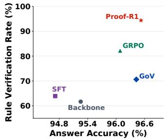

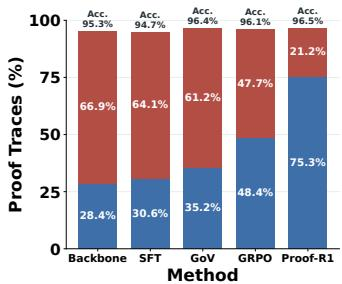

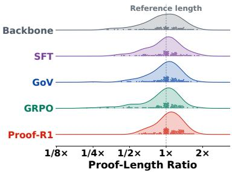  
Figure 1: Performance of PROOF-R1 on ProverQA. Left: Accuracy and step verification. The x-axis shows answer accuracy, while the y-axis shows RVR reflecting the logical correctness of generated reasoning under schema, semantic, and rule checks. Middle: Performance of different methods. The total height of each bar represents the proportion of correct answers, while the blue segment indicates the portion whose proof traces pass formal verification. Right: Generated-toreference proof-length ratios across methods on hard subset of ProverQA.

## 1 INTRODUCTION

Recent advances in large language models (LLMs) have demonstrated strong capabilities in multistep reasoning and complex instruction following (Wei et al., 2022; Saparov et al., 2023; Dubey et al., 2024; He et al., 2024; DeepSeek-AI, 2025; Yang et al., 2025). As shown in Figure 2, naturallanguage logical reasoning asks whether a target conclusion follows from premises expressed in both natural language and formal logic (Clark et al., 2020; Tafjord et al., 2021; Han et al., 2024). A verifiable solution is a finite derivation in which every intermediate conclusion follows from its declared premises alone under a valid rule, and the root conclusion establishes the target.

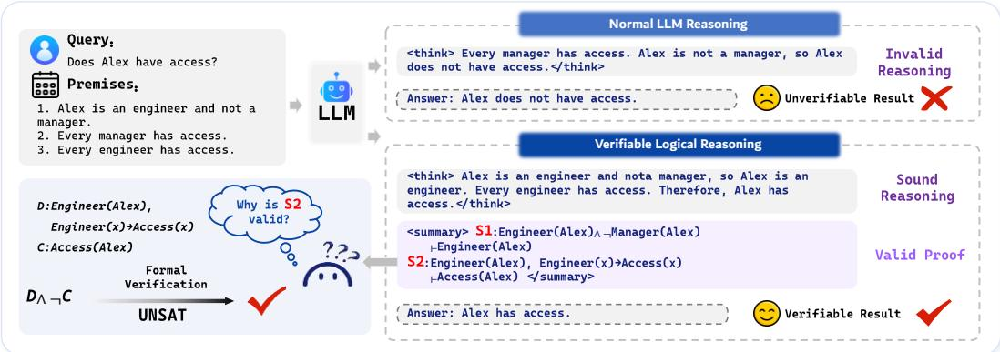  
Figure 2: Illustrative contrast between normal LLM reasoning and verifiable logical reasoning. The normal LLM reasoning incorrectly infers that “Alex lacks access from not being a manager,” committing the fallacy of denying the antecedent. The verifiable logical reasoning derives access from “Alex’s engineer status” and exposes semantic proof obligation checked through formal verification.

Post-training methods for natural-language logical reasoning commonly optimize answer-level objectives, with outcome-based reinforcement learning directly rewarding final-answer correctness (Shao et al., 2024; DeepSeek-AI, 2025; Xie et al., 2025). In parallel, symbolic solvers and proof assistants have been used to inspect model-generated reasoning, while formal verification feedback has been incorporated into supervised learning, preference learning, and reinforcement learning (Cao et al., 2025; Liu et al., 2025; Hubert et al., 2026; Fang et al., 2026).

Despite their successes, each approach has inherent limitations. Outcome rewards indicate whether a model reaches the correct answer but do not identify whether its intermediate deductions are valid (Shao et al., 2024; DeepSeek-AI, 2025; Xie et al., 2025). Existing methods lack machine-checkable verification of intermediate conclusions and answer-supporting proof dependencies, so they may assign credit to invalid or answer-irrelevant steps (Lightman et al., 2024; Wang et al., 2024; Xu et al., 2026; Liu et al., 2025). Some methods introduce formal verification to inspect generated steps or construct rewards (Liu et al., 2025; Feng et al., 2025; Chen et al., 2026; Fang et al., 2026). However, a verification verdict alone determines neither which generated conclusions serve as trusted facts for subsequent inferences nor which verified inferences actually support the final answer.

This raises our central research question: in natural-language logical reasoning, canformal verification do more than provide a reward for a proof trace and instead define the verifiable proofconstruction process optimized by reinforcement learning? To address this question, we propose PROOF-R1, a RL framework from formal verification that trains LLMs to construct verifiable proofs for natural-language logical reasoning. The policy represents a proof trace as a sequence of structured reasoning actions, each specifying its dependencies, conclusion, and predicate-logic rule. For each candidate action, UNSAT-based machine-checkable formal verification (MCFV) determines whether its conclusion follows from the declared dependencies and can therefore serve as a trusted dependency for subsequent actions. Over the proof trace, PROOF-R1 constructs a candidate proofcertificate graph and recover the answer-supporting dependency closure (ASDC), thereby distinguishing answer-supporting actions from unused reasoning branches and making the proof basis of the final answer explicitly traceable. MCFV and ASDC yield verification-aligned optimization: formal verification no longer rewards, but determines which conclusions become trusted proof facts and which actions receive outcome credit during policy optimization. Our contributions are as follows:

• Contribution 1 (Novelty of PROOF-R1): To address missing machine-checkable verification for intermediate conclusions and proof dependencies, we propose PROOF-R1, a RL framework from formal verification that trains LLMs for natural-language logical reasoning.

• Contribution 2 (Performance of PROOF-R1): Across three logical reasoning benchmarks and four backbone models, PROOF-R1 improves answer accuracy and outperforms baselines in terms of reasoning-process verifiability.

• Contribution 3 (Mechanistic Insights into PROOF-R1): We analyze PROOF-R1 at both the behavioral and optimization levels: rollout statistics provide empirical support for the design of MCFV, training dynamics reveal how the policy progressively learns to suppress invalid inferences through ASDC, and parameter-gradient analysis explains how PROOF-R1 aligns optimization signals with verification evidence and proof dependencies.

## 2 RELATED WORK

Natural-language logical reasoning task is commonly formulated as determining the entailment relation between a set of textual premises and a query. In a verifiable solution, intermediate conclusions should follow from their premises and the resulting derivation should support the final answer (Schwichtenberg & Wainer, 2012; Tafjord et al., 2021). Benchmarks such as RuleTaker and ProofWriter evaluate multi-step deduction over textual facts and rules, with ProofWriter additionally providing explicit proof targets (Clark et al., 2020; Tafjord et al., 2021). PrOntoQA uses synthetic problems with recoverable proof structures to evaluate CoT reasoning and proof-planning abilities (Saparov & He, 2023). FOLIO and ProverQA broaden benchmark coverage to more complex and diverse first-order-logic problems through human annotation and prover-guided scalable generation, respectively (Han et al., 2024; Qi et al., 2025). Conventional approaches to these tasks include direct prediction(Clark et al., 2020) and supervised proof generation(Tafjord et al., 2021).

Formal verification-augmented LLM reasoning has emerged as a promising direction for improving both performance and reliability, as LLM capabilities advance and their deployment expands. Existing approaches differ in where formal verification enters the reasoning, verification, and learning process. At reasoning time, Logic-LM, LINC and LogicAgent use LLMs to formalize naturallanguage problems and delegate deduction to symbolic solvers (Pan et al., 2023; Olausson et al., 2023; Zhang et al., 2025). These reasoning-time pipelines improve problem solving, but do not provide a policy-learning objective for constructing the verified proof itself. A complementary line of work performs verification of generated reasoning. Graph of Verification (GoV) organizes LLMbased verification in a topologically ordered dependency graph with configurable granularity (Fang et al., 2026), while Safe and VeriCoT translate generated steps into Lean statements or first-order arguments for tool-based checks (Liu et al., 2025; Feng et al., 2025). For these methods, generation quality remains constrained by the backbone, and repeated verification calls can incur substantial token overhead. Formal feedback has entered learning through several distinct mechanisms. For natural-language reasoning, VeriCoT distills solver-validated traces into supervised and preferencetraining data.(Feng et al., 2025) LogicReward uses offline preference pairs generated by the policy and GPT-4o prior for supervised learning, while common theorem-proving reasoning datasets generally lack native pairwise preference annotations. (Xu et al., 2026). PRoSFI generates structured intermediates and aggregates their formal checks into a trajectory-level RL reward (Chen et al., 2026), whereas Logic-RL optimizes answer and format rewards without verifying intermediate deductions (Xie et al., 2025). These methods primarily use formal verification to construct training signals, rather than allowing it to determine during policy optimization which generated conclusions become trusted proof facts and which actions receive outcome credit.

## 3 METHODOLOGY

## 3.1 PROBLEM FORMULATION

A natural-language logical reasoning instance is $x = ( \mathcal { P } , q , \mathcal { Y } )$ , where $\mathcal { P }$ contains premises, q is a query, and $\mathcal { V } \bar { = } \{ y _ { 1 } , \ldots , y _ { N } \}$ is a finite set of candidate answer propositions. The premises in $\mathcal { P }$ are given both in natural language and as formal logical expressions. The task is to select a candidate entailed by $\mathcal { P }$ and construct a proof of that candidate. The reference answer $y ^ { \ast } \in \mathcal { V }$ satisfies

$$
\mathcal { P } \left| = y ^ { * } . \right.\tag{1}
$$

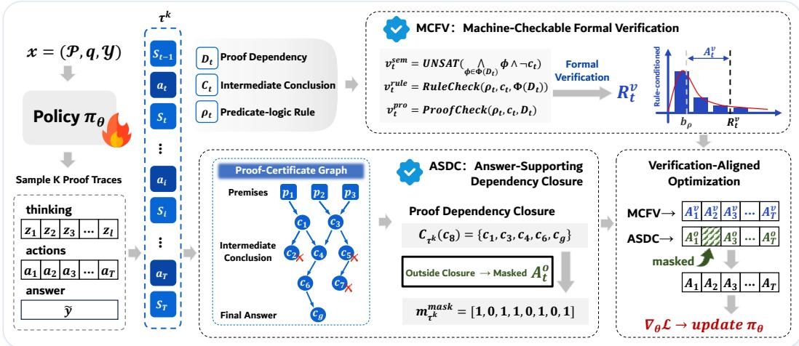  
Figure 3: Framework of PROOF-R1. MCFV formally verifies structured reasoning actions and maintains verified proof states. ASDC maintains the candidate proof-certificate graph and constructs the answer-supporting dependency closure. Verification-aligned optimization integrates the supervision signals from MCFV and ASDC into the policy update.

Let R denote the trusted predicate-logic inference system. Π is a finite dependency-structured derivation of y˜ from $\mathcal { P }$ under R. A successful proof trace therefore satisfies:

$$
\tilde { y } = y ^ { * } , \qquad \mathcal { P } \vdash _ { \mathcal { R } } ^ { \Pi } \tilde { y }\tag{2}
$$

Equation 2 defines the proof-certificate derivability judgment used in our framework.

## 3.2 STRUCTURED PROOF GENERATION

As shown in Figure 3, PROOF-R1 links formal verification with proof-state transitions $( S _ { t - 1 } \to S _ { t } )$ and proof dependencies $( D _ { t } )$ to train the policy to construct answer-supporting proofs. For each problem x, the policy $\pi _ { \theta }$ samples K rollouts during training. The k-th rollout is

$$
\tau ^ { k } = ( z ^ { k } , a _ { 1 } ^ { k } , \dots , a _ { T _ { k } } ^ { k } , \tilde { y } ^ { k } ) ,\tag{3}
$$

where $z ^ { k }$ is free-form analysis, $T _ { k }$ is the number of structured reasoning actions, and $\tilde { y } ^ { k }$ is the selected candidate.

A checkable proof step should specify both its conclusion and the inference claimed to justify it. We represent an ordinary step at the granularity of a single predicate-logic rule application:

$$
a _ { t } = ( D _ { t } , c _ { t } , \rho _ { t } ) ,\tag{4}
$$

where $D _ { t }$ contains dependency identifie $\mathbf { \hat { S } } , c _ { t }$ is the intermediate conclusion, and $\rho _ { t }$ is the declared predicate-logic rule. Each action $a _ { t }$ has a unique identifier $i _ { t }$ . The terminal action $a _ { g }$ matches the selected candidate, with conclusion $c _ { g } = \tilde { y }$ . In subsequent descriptions of individual traces, we omit the rollout index k to simplify the notation and make the equations easier to follow.

## 3.3 MACHINE-CHECKABLE FORMAL VERIFICATION (MCFV)

A generated conclusion should pass verification before it can support a subsequent verified inference. As the verifier checks actions in generation order, it maintains two maps from action identifiers to accepted conclusions: a semantically verified state $S _ { t } ^ { \mathrm { s e m } }$ and a stricter rule-verified state $S _ { t } ^ { \mathrm { r u l e } }$ . Both maps are initially empty, while the original premises $\mathcal { P }$ remain available throughout verification. Their pair $\boldsymbol { S } _ { t } = \dot { ( } \boldsymbol { S } _ { t } ^ { \mathrm { s e m } } , \dot { \boldsymbol { S } } _ { t } ^ { \mathrm { r u l e } } )$ is the aggregate proof state shown in Figure 3.

Semantic verification checks whether the declared dependencies entail the proposed conclusion. Before checking $a _ { t } .$ , the verifier uses $\Phi _ { t } ^ { \mathrm { s e m } } ( \cdot )$ to resolve dependency identifiers into formulas against the original premises and the semantic state constructed from preceding actions:

$$
\Phi _ { t } ^ { \mathrm { s e m } } ( D _ { t } ) = \left\{ \left( \mathcal { P } \cup \mathcal { S } _ { t - 1 } ^ { \mathrm { s e m } } \right) ( d ) \ \middle | \ d \in D _ { t } \right\} .\tag{5}
$$

Here, premises and accepted conclusions are indexed by their identifiers, so $( { \mathcal { P } } \cup { \mathcal { S } } ) ( d )$ denotes the formula named by dependency d; an identifier absent from this union is rejected as an untrusted dependency. The semantic proof obligation is discharged when a satisfiability modulo theories (SMT) solver returns UNSAT.

$$
\mathrm { V C } _ { t } ^ { \mathrm { s e m } } = \bigwedge _ { \phi \in \Phi _ { t } ^ { \mathrm { s e m } } ( D _ { t } ) } \phi \wedge \neg c _ { t } , \qquad v _ { t } ^ { \mathrm { s e m } } = \mathrm { U N S A T } \left( \mathrm { V C } _ { t } ^ { \mathrm { s e m } } \right) .\tag{6}
$$

A positive verdict establishes $\Phi _ { t } ^ { \mathrm { s e m } } ( D _ { t } ) \Vdash { c } _ { t }$ and admits the conclusion to the semantic state:

$$
\begin{array} { r } { \boldsymbol { S } _ { t } ^ { \mathrm { s e m } } = \left\{ \begin{array} { l l } { \boldsymbol { S } _ { t - 1 } ^ { \mathrm { s e m } } \cup \{ i _ { t } \mapsto c _ { t } \} , } & { \boldsymbol { v } _ { t } ^ { \mathrm { s c h e m a } } \wedge \boldsymbol { v } _ { t } ^ { \mathrm { s e m } } , } \\ { \boldsymbol { S } _ { t - 1 } ^ { \mathrm { s e m } } , } & { \mathrm { o t h e r w i s e } . } \end{array} \right. } \end{array}\tag{7}
$$

Rule verification uses $\Phi _ { t } ^ { \mathrm { r u l e } } ( \cdot )$ to resolve dependency from the stricter rule-verified state:

$$
\Phi _ { t } ^ { \mathrm { r u l e } } ( D _ { t } ) = \left\{ \left( \mathcal { P } \cup S _ { t - 1 } ^ { \mathrm { r u l e } } \right) ( d ) \middle | d \in D _ { t } \right\} , \qquad v _ { t } ^ { \mathrm { r u l e } } = \mathrm { R u l e C h e c k } \left( \rho _ { t } , \Phi _ { t } ^ { \mathrm { r u l e } } ( D _ { t } ) , c _ { t } \right) .\tag{8}
$$

RULECHECK validates the rule’s principal premises, substitutions, and conclusion (Appendix F). A conclusion enters the rule-verified state only when its semantic and rule obligations are satisfied:

$$
\begin{array} { r } { \boldsymbol { S } _ { t } ^ { \mathrm { r u l e } } = \left\{ \begin{array} { l l } { \boldsymbol { S } _ { t - 1 } ^ { \mathrm { r u l e } } \cup \left\{ i _ { t } \mapsto c _ { t } \right\} , } & { \boldsymbol { v } _ { t } ^ { \mathrm { s c h e m a } } \wedge \boldsymbol { v } _ { t } ^ { \mathrm { s e m } } \wedge \boldsymbol { v } _ { t } ^ { \mathrm { r u l e } } , } \\ { \boldsymbol { S } _ { t - 1 } ^ { \mathrm { r u l e } } , } & { \mathrm { o t h e r w i s e } . } \end{array} \right. } \end{array}\tag{9}
$$

PROOFCHECK checks whether an ordinary action makes nontrivial proof progress (Appendix H):

$$
v _ { t } ^ { \mathrm { p r o } } = \mathrm { P r o o f C h e c k } ( \rho _ { t } , c _ { t } , D _ { t } ) .\tag{10}
$$

The verifier retains the four Boolean verdicts:

$$
v _ { t } = ( v _ { t } ^ { \mathrm { s c h e m a } } , v _ { t } ^ { \mathrm { s e m } } , v _ { t } ^ { \mathrm { r u l e } } , v _ { t } ^ { \mathrm { p r o } } ) \in \{ \mathrm { t r u e , f a l s e } \} ^ { 4 } .\tag{11}
$$

During trace verification, each state is therefore both the output at step t and the verifier memory used to resolve dependencies at step t+1; downstream optimization consumes the resulting verdicts. The structured verdict $v _ { t } ^ { k }$ of $a _ { t } ^ { k }$ is mapped to a numerical verification signal:

$$
R _ { k , t } ^ { v } = \left\{ \begin{array} { l l } { 0 . 0 , } & { \lnot v _ { t } ^ { \mathrm { s c h e m a } , k } , } \\ { 0 . 1 , } & { v _ { t } ^ { \mathrm { s c h e m a } , k } \land \lnot v _ { t } ^ { \mathrm { s e m } , k } , } \\ { 0 . 3 , } & { v _ { t } ^ { \mathrm { s c h e m a } , k } \land v _ { t } ^ { \mathrm { s e m } , k } \land \left( \lnot v _ { t } ^ { \mathrm { r u l e } , k } \lor \lnot v _ { t } ^ { \mathrm { p r o } , k } \right) , } \\ { 1 . 0 , } & { v _ { t } ^ { \mathrm { s c h e m a } , k } \land v _ { t } ^ { \mathrm { s e m } , k } \land v _ { t } ^ { \mathrm { r u l e } , k } \land v _ { t } ^ { \mathrm { p r o } , k } . } \end{array} \right.\tag{12}
$$

We center each verification signal using a rule-conditioned centering value estimated from the recent verification outcomes of actions that invoke the same predicate-logic rule. Let $\mathrm { E M A } _ { \rho } ^ { ( u - 1 ) }$ denote the exponential moving average for rule $\rho$ before update u. The clipped rule-conditioned centering value and action-verification advantage are:

$$
b _ { \rho } ^ { ( u - 1 ) } = \mathrm { c l i p } ( \mathrm { E M A } _ { \rho } ^ { ( u - 1 ) } , b _ { \mathrm { m i n } } , b _ { \mathrm { m a x } } ) , \qquad A _ { k , t } ^ { v } = R _ { k , t } ^ { v } - b _ { \rho _ { t } ^ { k } } ^ { ( u - 1 ) } .\tag{13}
$$

For each rule observed in the current batch, let $B _ { \rho } ^ { ( u ) }$ contain the actions assigned to that rule. After computing the current advantages, we update:

$$
\overline { { R } } _ { \rho } ^ { v , ( u ) } = \frac { 1 } { | \mathcal { B } _ { \rho } ^ { ( u ) } | } \sum _ { a _ { t } ^ { k } \in \mathcal { B } _ { \rho } ^ { ( u ) } } R _ { k , t } ^ { v } , \qquad \mathrm { E M A } _ { \rho } ^ { ( u ) } = \beta \mathrm { E M A } _ { \rho } ^ { ( u - 1 ) } + ( 1 - \beta ) \overline { { R } } _ { \rho } ^ { v , ( u ) } .\tag{14}
$$

## 3.4 ANSWER-SUPPORTING DEPENDENCY CLOSURE (ASDC)

A verified conclusion need not participate in the proof of the selected answer. To identify the declared answer derivation, we construct a verifier-annotated candidate proof-certificate graph $G _ { \tau } = ( V _ { \tau } , E _ { \tau } )$ . Writing the original premises as $\mathcal { P } = \{ p _ { j } \} _ { j = 1 } ^ { M }$ , its nodes and edges are

$$
V _ { \tau } = \mathcal { P } \cup \{ c _ { t } \} _ { t = 1 } ^ { T } , \qquad E _ { \tau } = \{ ( u , c _ { t } ) \mid u \in \mathcal { P } \cup \{ c _ { j } \} _ { j < t } , \mathrm { ~ i d } ( u ) \in D _ { t } \} .\tag{15}
$$

Here $\operatorname { i d } ( p _ { j } )$ is the identifier of an original premise and $\operatorname { i d } ( c _ { j } ) = i _ { j }$ is the identifier of the action that generated $c _ { j }$ . The answer-supporting dependency closure rooted at the final conclusion $c _ { g }$ is the closed ancestor set:

$$
\begin{array} { r } { \mathcal { C } _ { \tau } ( c _ { g } ) : = \mathrm { A n c } _ { G _ { \tau } } ( c _ { g } ) \cup \{ c _ { g } \} = \{ u \in V _ { \tau } : u \sim _ { G _ { \tau } } c _ { g } \} \cup \{ c _ { g } \} , } \end{array}\tag{16}
$$

where $\operatorname { A n c } _ { G _ { \tau } } ( c _ { g } )$ denotes the strict ancestors of $c _ { g } .$ , and $ _ { G _ { \tau } }$ denotes directed reachability in $G _ { \tau }$ We compute the closure by traversing dependencies backward from $c _ { g }$ until all ancestor conclusions and premises have been included. The proof-certificate graph for the selected answer is the subgraph induced by this closure:

$$
\Pi _ { \tau } = { \cal G } _ { \tau } [ { \cal G } _ { \tau } ( c _ { g } ) ] .\tag{17}
$$

Thus, $\Pi _ { \tau }$ contains exactly the premise and generated-conclusion nodes declared to support the final answer, together with their dependency relations.

A correct answer does not make every action in its response part of the answer’s proof. The closure mask maps conclusion membership back to the action that generated each conclusion:

$$
m _ { k , t } = \mathbb { I } [ c _ { t } ^ { k } \in \mathcal { C } _ { \tau ^ { k } } ( c _ { g } ^ { k } ) ] , \qquad { \mathbf { m } } ^ { k } = ( m _ { k , 1 } , \dots , m _ { k , T _ { k } } ) .\tag{18}
$$

For rollout $k ,$ the outcome signal is $R _ { k } ^ { o } = \mathbb { I } [ \tilde { y } ^ { k } = y ^ { * } ]$ . We normalize this signal over eligible rollouts for the same problem:

$$
\widehat { A } _ { k } ^ { o } = \frac { R _ { k } ^ { o } - \mu _ { x } } { \sigma _ { x } + \epsilon } .\tag{19}
$$

Here $\mu _ { x }$ and $\sigma _ { x }$ are the group mean and standard deviation. The mask restricts outcome credit to actions that support the answer:

$$
A _ { k , t } ^ { o } = m _ { k , t } \widehat { A } _ { k } ^ { o } .\tag{20}
$$

Consequently, an action receives no outcome advantage when its generated conclusion lies outside the closure, even when the final answer is correct.

## 3.5 VERIFICATION-ALIGNED OPTIMIZATION

Verification-aligned optimization combines the action-verification advantage from MCFV with the closure-masked outcome advantage from ASDC, and aligns the resulting action-level advantages with the exact token spans of structured actions:

$$
A _ { k , t } = \lambda _ { v } A _ { k , t } ^ { v } + \lambda _ { o } A _ { k , t } ^ { o } , \qquad \mathbf { A } ^ { \mathrm { t o k } , k } = M ^ { k } \mathbf { A } ^ { k } .\tag{21}
$$

Here $\mathbf { A } ^ { k }$ collects the action-level advantages, and $M ^ { k }$ is the normalized action-to-token alignment matrix that maps each action advantage to its exact token span. We then optimize the policy with a KL-regularized PPO-style clipped objective (Schulman et al., 2017; Shao et al., 2024). And we provide the construction of $M ^ { k }$ , full objective, and sampled KL estimator (Appendix A).

## 4 EXPERIMENTS

## 4.1 EXPERIMENTAL SETUP

Datasets and models. We train and evaluate PROOF-R1 on ProverQA (Qi et al., 2025). We evaluate two backbones without a native thinking mode, Qwen2.5-7B-Instruct (Yang et al., 2024) and Llama-3.1-8B (Dubey et al., 2024), and two backbones with native thinking support, Qwen3-8B (Yang et al., 2025) and GLM-Z1-9B-0414 (THUDM, 2025). We further assess cross-benchmark generalization on FOLIO (Han et al., 2024) and ProofWriter (Tafjord et al., 2021). Notably, the evaluated FOLIO subset contains valid derivations that require a strictly broader inference system, $\mathcal { R } _ { \mathrm { F O L I O } } \supset \mathcal { R } _ { \mathrm { t r a i n } } .$ , with universal and existential quantifier rule families (Appendix G).

Baselines. Comparisons of training-free agents include LogicAgent (Zhang et al., 2025) and GoV (Fang et al., 2026). LogicAgent uses an LLM to reason over natural-language problems and delegates deduction to symbolic solvers. GoV organizes LLM-based verification in a topologically ordered dependency graph with configurable granularity. The training-based methods comprise SFT, GRPO (Shao et al., 2024), and PRoSFI (Chen et al., 2026). PRoSFI is an RL method for natural-language logical reasoning.

Table 1: Results on ProverQA, reported as means followed by standard deviations in gray. and denote training-free and training-based methods, respectively. Bold and underline denote the best and second-best means within each backbone model. ProverQA-Hard denotes the hard split of ProverQA, whereas ProverQA-Overall denotes the evaluation set across all difficulty levels.
<table><tr><td rowspan="2">Model</td><td rowspan="2">Method</td><td colspan="5">ProverQA-Overall</td><td colspan="5">ProverQA-Hard</td></tr><tr><td>Avg @3 ↑ Pass@3 ↑</td><td></td><td>FVR↑</td><td>RVR↑</td><td>RGD↓</td><td>Avg@3 ↑Pass@3↑</td><td></td><td>FVR↑</td><td>RVR↑</td><td>RGD↓</td></tr><tr><td rowspan="6">Owen--unt</td><td>Backbone</td><td>44.790.25</td><td>68.431.78</td><td>67.640.68</td><td>18.911.09</td><td>0.880.017</td><td>27.140.58</td><td>51.763.54</td><td>56.591.08</td><td>9.840.43</td><td>1.360.022</td></tr><tr><td>LogicAgent</td><td>59.280.56</td><td>81.201.49</td><td>54.391.02</td><td>30.440.55</td><td>0.930.009</td><td>40.030.44</td><td>65.833.37</td><td>38.111.42</td><td>15.721.67</td><td>1.510.008</td></tr><tr><td>GoV</td><td>47.230.82</td><td>70.631.75</td><td>65.280.54</td><td>23.380.45</td><td>0.870.010</td><td>26.801.60</td><td>51.763.54</td><td>54.501.09</td><td>10.281.07</td><td>1.340.010</td></tr><tr><td> SFT</td><td>47.040.73</td><td>70.781.75</td><td>66.390.5519.940.86</td><td></td><td>0.800.018</td><td>30.821.17</td><td>53.773.54</td><td>57.590.88</td><td>9.490.83</td><td>1.150.028</td></tr><tr><td> GRPO</td><td>47.281.33</td><td>76.361.63</td><td>68.090.8412.500.66</td><td></td><td>1.020.013</td><td>23.451.17</td><td>49.753.56</td><td>48.851.72</td><td>6.030.51</td><td>1.630.027</td></tr><tr><td>PRoSFI</td><td>59.570.68</td><td>84.211.04</td><td>62.590.55</td><td>15.220.97</td><td>0.810.009</td><td>38.610.77</td><td>65.582.76</td><td>47.841.18</td><td>8.340.80</td><td>1.180.013</td></tr><tr><td rowspan="6">Own-8B</td><td>PROOF-R1</td><td>62.800.56</td><td>87.081.29</td><td>70.170.28</td><td>41.190.44</td><td>0.700.018</td><td>44.890.60</td><td>76.882.99</td><td>58.740.26</td><td>19.380.75</td><td>1.050.033</td></tr><tr><td>Backbone</td><td>95.250.53</td><td>98.830.21</td><td></td><td>81.820.3661.680.11</td><td>0.330.011</td><td>91.121.31</td><td>96.500.50</td><td>81.120.91</td><td>56.401.03</td><td>0.400.026</td></tr><tr><td>LogicAgent</td><td>96.870.42</td><td>99.120.36</td><td>93.880.1979.700.55</td><td></td><td>0.330.009</td><td>91.291.57</td><td>97.491.11</td><td>90.390.52</td><td>67.141.71</td><td>0.470.025</td></tr><tr><td>GoV</td><td>96.430.05</td><td>98.530.46</td><td>89.050.61</td><td>70.630.63</td><td>0.290.006</td><td>92.960.77</td><td>97.491.10</td><td>86.040.57</td><td>61.690.28</td><td>0.380.017</td></tr><tr><td> SFT</td><td>94.710.37</td><td>99.120.36</td><td>83.000.0663.941.01</td><td></td><td>0.330.008</td><td>89.110.67</td><td>97.990.99</td><td>78.991.44</td><td>55.971.93</td><td>0.410.019</td></tr><tr><td>GRPO</td><td>96.080.44</td><td>99.270.33</td><td>94.220.3282.230.55</td><td></td><td>0.310.007</td><td>90.281.47</td><td>97.990.99</td><td>91.060.32</td><td>73.260.70</td><td>0.390.026</td></tr><tr><td> PROOF-R1</td><td> PRoSFI</td><td>96.230.13 96.520.26</td><td>98.830.33 99.270.33</td><td>95.130.2689.280.38 96.560.1594.360.08</td><td></td><td>0.290.006 0.280.005</td><td>92.130.50 92.631.10</td><td>97.990.99 99.000.71</td><td>92.880.53 93.550.32</td><td>84.920.69 90.220.26</td><td>0.370.011 0.360.002</td></tr></table>

Evaluation metrics. We report Avg@3 and Pass@3 for answer correctness. We assess proof quality using Formal Verification Rate (FVR) (Xu et al., 2026), Rule Verification Rate (RVR) (Zhou et al., 2025), and Reasoning Granularity Deviation (RGD) (Gu et al., 2026)(Appendix B).1

## 4.2 RESULTS

Table 1 presents the main results of PROOF-R1 on ProverQA. On Qwen2.5-7B-Instruct, PROOF-R1 improves Avg@3, Pass@3, FVR, and RVR over the strongest Overall-split baseline for each metric by 3.23, 2.87, 2.08, and 10.75 points, respectively, while reducing RGD from 0.80 to 0.70. On the more challenging Hard split, it improves Avg@3, Pass@3, FVR, and RVR by 4.86, 11.05, 1.15, and 3.66 points, respectively, while reducing RGD from 1.15 to 1.05. On Qwen3-8B, answer accuracy is near saturation. The training-free agents LogicAgent and GoV attain slightly higher Avg@3 than PROOF-R1 on the Overall and Hard splits. Both methods obtain these marginal gains through multiple model calls for multi-stage reasoning, verification, and answer selection, which substantially increases inference-time token consumption (Appendix L). On the Overall-split, PROOF-R1 achieves an FVR of 96.56 and an RVR of 94.36, improving over the strongest baselines by 1.43 and 5.08 points, and obtains the lowest RGD of 0.28. The results indicate that our method improves the formal-verification quality of proof steps while preserving answer accuracy.

## 4.3 ABLATIONS

Table 2 examines the roles of MCFV and ASDC in PROOF-R1. Across both backbone models on ProverQA-Hard, the full method achieves the best result on every metric, outperforming both ablated variants. The w/o MCFV variant obtains a lower RGD than w/o ASDC on both backbones (1.08 vs. 1.34 and 0.37 vs. 0.40), indicating that ASDC guides the policy toward proof traces whose granularity more closely matches the reference proofs.

Table 2: Ablation results on ProverQA-Hard.
<table><tr><td>Model</td><td>Variant</td><td colspan="4">Avg@3 ↑Pass@3 ↑ FVR ↑RVR ↑ RGD↓</td></tr><tr><td>Own25 B-tu-uct</td><td>w/o MCFV w/o ASDC</td><td>37.86 41.37</td><td>68.34 71.86</td><td>40.16 11.65 44.18 16.69</td><td>1.08 1.34</td></tr><tr><td></td><td>PROOF-R1</td><td>44.89</td><td>76.88</td><td>58.74</td><td>19.38 1.05</td></tr><tr><td>Owwn-8B</td><td>w/o MCFV</td><td>90.28</td><td>98.49</td><td>82.52</td><td>57.73 0.37</td></tr><tr><td></td><td>w/o ASDC</td><td>89.61</td><td>97.99</td><td>93.55</td><td>85.71 0.40</td></tr><tr><td></td><td>PROOF-R1</td><td>92.63</td><td>99.00</td><td>93.55</td><td>90.22 0.36</td></tr></table>

Table 3: Performance of PROOF-R1 trained with backbones from additional model families on ProverQA-Overall.
<table><tr><td>Model</td><td>Method</td><td colspan="4">Avg@3↑Pass@3↑FVR↑RVR↑RGD↓</td></tr><tr><td>Iam-31 8</td><td>Backbone SFT</td><td>46.30 44.65</td><td>76.54 75.19</td><td>50.11 9.20 46.23 9.61</td><td>0.94 0.92 0.91</td></tr><tr><td></td><td>PROOF-R1</td><td>53.95</td><td>82.84</td><td>54.72</td><td>23.02</td></tr><tr><td>GI 9B--414</td><td>Backbone</td><td>71.76</td><td>91.92</td><td>82.64 52.47</td><td>0.70</td></tr><tr><td></td><td>SFT</td><td>74.40</td><td>96.48</td><td>83.03 57.23</td><td>0.65</td></tr><tr><td></td><td>PROOF-R1</td><td>89.33</td><td>99.27</td><td>95.01 87.26</td><td>0.42</td></tr></table>

Table 4: Cross-dataset generalization of PROOF-R1 trained on ProverQA, tested on FOLIO and ProofWriter.
<table><tr><td>Dataset</td><td>Method</td><td colspan="4">Avg@3↑ Pass@3 ↑ FVR ↑ RVR ↑</td></tr><tr><td>OOIO</td><td>Backbone SFT</td><td>88.89 85.62</td><td>98.04 98.04</td><td>64.46 63.22</td><td>38.87 41.03</td></tr><tr><td rowspan="2"></td><td>PROOF-R1</td><td>90.85</td><td>98.04</td><td>82.58</td><td>59.70</td></tr><tr><td>Backbone</td><td>80.89</td><td>90.67</td><td>77.07</td><td>51.78</td></tr><tr><td rowspan="2">Pror Witer</td><td>SFT</td><td>82.22</td><td>92.67</td><td>64.72</td><td>40.97</td></tr><tr><td>PROOF-R1</td><td>94.89</td><td>98.00</td><td>97.57</td><td>85.46</td></tr></table>

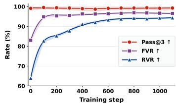  
(a) Performance during training

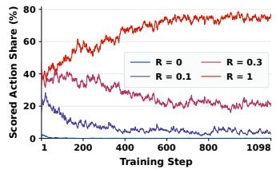  
(b) Verification-signal proportions

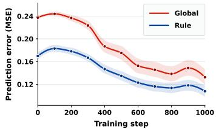  
(c) Centering-value error  
Figure 4: Training diagnostics of PROOF-R1. Shaded regions indicate 95% confidence intervals. (a) Performance during training, measured by Pass@3, FVR and RVR of Qwen3-8B on ProverQA. (b) Proportions of each verification signal of Qwen3-8B. (c) Prediction error of the global and rule conditioned centering values during training.

Conversely, the w/o ASDC variant achieves higher FVR and RVR than w/o MCFV on both backbones, showing that MCFV directly improves the semantic validity of generated proof steps.

Particularly, the relative answer accuracy of the two ablations reverses across backbones. On Qwen2.5-7B-Instruct, w/o ASDC outperforms w/o MCFV in Avg@3 (41.37 vs. 37.86), whereas on Qwen3-8B, w/o MCFV outperforms w/o ASDC (90.28 vs. 89.61). This pattern may suggest that weaker models benefit more from improving the validity of proof steps, whereas stronger models benefit increasinglyfrom distinguishing answer-supporting actions with irrelevant branches.

## 4.4 DISCUSSION

Is PROOF-R1 effective across different backbone models? Table 3 shows that PROOF-R1 improves answer performance and rule-verified reasoning on Llama-3.1-8B and GLM-Z1-9B-0414. With Llama-3.1-8B, PROOF-R1 improves Avg@3 and Pass@3 over the backbone by 7.65 and 6.30 points, respectively. With GLM-Z1-9B-0414, it improves FVR and RVR over SFT by 11.98 and 30.03 points, respectively, while reducing RGD by 0.23. Across all four backbone models, PROOF-R1 outperforms both the backbone model and SFT on all five metrics on ProverQA.

Does PROOF-R1 generalize to a broader inference system? ProverQA proof traces are constructed under the training-time rule system $\mathcal { R } _ { \mathrm { t r a i n } } .$ The evaluated FOLIO subset contains valid derivations that require a strictly broader system, $\mathcal { R } _ { \mathrm { F O L I O } } \supset \mathcal { R } _ { \mathrm { t r a i n } }$ , adding universal and existential quantifier rule families absent from the training ontology (Appendix G). Table 4 reports the performance of ProverQA-trained models on FOLIO and ProofWriter. Notably, under ${ \bar { \mathcal { R } } } _ { \mathrm { F O L I O } } .$ ProverQA-trained PROOF-R1 achieves an Avg@3 of 90.85, an FVR of 82.58, and an RVR of 59.70 on FOLIO, compared with 88.89, 64.46, and 38.87 for the backbone model. These results show that PROOF-R1 transfers beyond the rule ontology used to construct ProverQA. The learned policy produces answer-supporting proofs that remain verifiable under a broader inference system.

How does PROOF-R1 improve response quality? Figure 4(a) shows the model’s performance on ProverQA throughout training. Complementing this, Figure 4(b) shows how the distribution of verification signals evolves during training. Answer accuracy remains high during training, while FVR increases to 96.56 and RVR increases to 94.36. Meanwhile, the proportion of actions receiving the full verification signal $( R _ { k , t } ^ { v } ~ = ~ 1 . 0 )$ increases, whereas the proportions receiving 0.1 or 0.3 decline, indicating failures in the semantic, rule, or proof-progress checks. This observation is consistent with the action-level supervision provided by MCFV. Even among samples with correct answers, UNSAT-based verification and RULECHECK distinguish the semantic validity (measured by FVR) and rule faithfulness (measured by RVR) of individual proof steps, providing learning signals unavailablefrom answer correctness alone.

Can rule-conditioned centering values account for differences in verification difficulty? Reasoning actions in formal verification have different rule constraints and dependency structures (Saparov et al., 2023). We investigate whether these structural properties characterize their verification difficulty? Figure 4(c) compares a global-mean centering value (labeled Global) with a rule-conditioned centering value (labeled Rule). We cross-validate both centering-value estimator on data unseen during fitting. The rule-conditioned centering value has lower prediction error than the global-mean centering value during training: at step 100, the error decreases from 0.24 to 0.18. These results show that verification difficulty varies systematically with the logical operation performed by an action, rather than being uniform across actions. This provides empirical support for the rule-conditioned centering value used to center verification signals in MCFV.

## How do MCFV and ASDC jointly shape the optimization direction?

Figure 5 illustrates the gradient relationships between MCFV and ASDC across Transformer layers and parameter modules. We compute the gradients of the two supervision signals and construct the joint direction using their training weights. Figure 5(a) shows that the two components are nearly orthogonal in the early layers, with an angle of $9 6 . 6 ^ { \overline { { \circ } } }$ between the concatenated gradients of layers 0–8. Directional competition increases with network depth, reaching $1 2 6 . 6 ^ { \circ }$ in the final layer. This shows that the two supervision signals do not simply reinforce the model along the same direction, but provide distinct optimization signals in parameter space (Yu et al., 2020). Therefore, answer support and formal correctness are not equivalent and require distinct supervision signals. Figure 5(b)(c) further shows the weighted joint direction. Across the 196 layer–module parameter blocks, its angle with MCFV is acute in every block, and its angle with ASDC is acute in 195 blocks. The

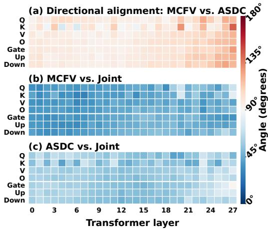  
Figure 5: Layer-wise and module-wise gradient at training on Qwen2.5-7B-Instruct. Figures show angles between (a) MCFV and ASDC, (b) MCFV and the joint direction, and (c) ASDC and the joint direction.

weighted MCFV gradient norm is approximately 1.14 times that of ASDC, placing the two components at comparable magnitudes. These results provide mechanistic evidence for verificationaligned optimization: although MCFV and ASDC induce distinct and sometimes competing gradients, verification-aligned optimization aligns their weighted contributions into a shared update direction that locally improves both objectives across almost all parameter blocks.

## 5 LIMITATIONS

Since our main claim concerns verifiable natural-language logical reasoning, evaluating PROOF-R1 on English benchmarks with well-defined deductive structures necessarily covers only a controlled subset of natural-language reasoning. Such benchmarks necessarily abstract away some phenomena encountered in unrestricted natural language, including linguistic ambiguity, implicit background knowledge, and pragmatic interpretation. Moreover, while our evaluation covers multiple benchmarks, model families, and proof structures, it does not exhaust the broader reasoning landscape. Future work may investigate multilingual settings and additional logical formalisms.

## 6 CONCLUSION

We introduce PROOF-R1, a formal verification-driven reinforcement learning framework for verifiable natural-language logical reasoning. The framework combines UNSAT-based machinecheckable formal verification with an answer-supporting dependency closure to construct verified proof states and align policy learning with the final derivation. Experiments across multiple backbone models and benchmarks show that PROOF-R1 improves answer performance and verification pass rates for reasoning steps. This work integrates formal verification into proof construction and policy optimization on large language models, enabling models to perform verifiable proof-based reasoning over natural-language logical problems.

## AI USE STATEMENT

In the preparation of this paper, GPT5.6-Sol was used exclusively for the purpose of polishing and refining the linguistic style of certain sentences to improve readability and fluency in section 2 and 5 and appendix E and J. As described in Appendix E, GPT-5.5 was used as an independent semantic reviewer to cross-check solver judgments. All core intellectual contributions are the product of the authors’ own work, including but not limited to:

• Original ideas and novel viewpoints. Any innovative concepts, hypotheses, and critical analysis are the product of the authors’ own work.

• Experimental results. All code, figures, findings, and interpretations thereof were generated, designed, collected, and analyzed by the authors.

• Substantive descriptions of the work. The description of the methodology, experimental procedures, and discussion of the research implications were entirely authored by the research team.

## REPRODUCIBILITY STATEMENT

The datasets, backbone models, and baselines are described in Section 4, with metric definitions provided in Appendix B. The complete policy objective, verification specifications, inference systems, solver-validation procedures, implementation details, training configuration, computational cost, and prompt templates are documented in Appendices A–M. Source code is available at https://anonymous.4open.science/r/Proof-R1/.

## REFERENCES

Haniel Barbosa, Clark W. Barrett, Martin Brain, Gereon Kremer, Hanna Lachnitt, Makai Mann, Ab dalrhman Mohamed, Mudathir Mohamed, Aina Niemetz, Andres Notzli, Alex Ozdemir, Mathias¨ Preiner, Andrew Reynolds, Ying Sheng, Cesare Tinelli, and Yoni Zohar. cvc5: A versatile and industrial-strength SMT solver. In Tools and Algorithms for the Construction and Analysis of Systems, volume 13243 of Lecture Notes in Computer Science, pp. 415–442. Springer, 2022. doi: 10.1007/978-3-030-99524-9 24. URL https://cvc5.github.io/papers/2022/ BarbosaBBKLMMMN-TACAS22.pdf.

Jialun Cao, Yaojie Lu, Meiziniu Li, Haoyang Ma, Haokun Li, Mengda He, Cheng Wen, Le Sun, Hongyu Zhang, Shengchao Qin, Shing-Chi Cheung, and Cong Tian. From informal to formal – incorporating and evaluating LLMs on natural language requirements to verifiable formal proofs. In Proceedings of the 63rd Annual Meeting of the Association for Computational Linguistics (Volume 1: Long Papers), pp. 26984–27003. Association for Computational Linguistics, 2025. doi: 10.18653/v1/2025.acl-long.1310. URL https://aclanthology.org/2025. acl-long.1310/.

Luoxin Chen, Yichi Zhou, and Huishuai Zhang. Learning to generate formally verifiable step-bystep logic reasoning via structured formal intermediaries. arXiv preprint arXiv:2603.29500, 2026. URL https://arxiv.org/abs/2603.29500.

Peter Clark, Oyvind Tafjord, and Kyle Richardson. Transformers as soft reasoners over language. In Proceedings of the Twenty-Ninth International Joint Conference on Artificial Intelligence, pp.

3882–3890, 2020. doi: 10.24963/ijcai.2020/537. URL https://arxiv.org/abs/2002. 05867.

Leonardo de Moura and Nikolaj Bjørner. Z3: An efficient SMT solver. In Tools and Algorithms for the Construction and Analysis of Systems, volume 4963 of Lecture Notes in Computer Science, pp. 337–340. Springer, 2008. doi: 10.1007/ 978-3-540-78800-3 24. URL https://www.microsoft.com/en-us/research/ publication/z3-an-efficient-smt-solver/.

DeepSeek-AI. DeepSeek-R1: Incentivizing reasoning capability in LLMs via reinforcement learning. arXiv preprint arXiv:2501.12948, 2025. URL https://arxiv.org/abs/2501. 12948.

Abhimanyu Dubey, Abhinav Jauhri, Abhinav Pandey, Abhishek Kadian, Ahmad Al-Dahle, Aiesha Letman, Akhil Mathur, Alan Schelten, Amy Yang, Angela Fan, et al. The llama 3 herd of models. arXiv preprint arXiv:2407.21783, 2024. URL https://arxiv.org/abs/2407.21783.

Jiwei Fang, Bin Zhang, Changwei Wang, Jin Wan, and Zhiwei Xu. Graph of verification: Structured verification of LLM reasoning with directed acyclic graphs. In Proceedings of the AAAI Conference on Artificial Intelligence, volume 40, pp. 30665–30672, 2026. doi: 10.1609/aaai.v40i36. 40322. URL https://ojs.aaai.org/index.php/AAAI/article/view/40322.

Yu Feng, Nathaniel Weir, Kaj Bostrom, Sam Bayless, Darion Cassel, Sapana Chaudhary, Benjamin Kiesl-Reiter, and Huzefa Rangwala. VeriCoT: Neuro-symbolic chain-of-thought validation via logical consistency checks. arXiv preprint arXiv:2511.04662, 2025. URL https://arxiv. org/abs/2511.04662.

Alex Gu, Bartosz Piotrowski, Fabian Gloeckle, Kaiyu Yang, and Aram H. Markosyan. ProofOptimizer: Training language models to simplify proofs without human demonstrations. In International Conference on Learning Representations, 2026. URL https://openreview.net/ forum?id=huptrb4JTa.

Simeng Han, Hailey Schoelkopf, Yilun Zhao, Zhenting Qi, Martin Riddell, Wenfei Zhou, James Coady, David Peng, Yujie Qiao, Luke Benson, Lucy Sun, Alexander Wardle-Solano, Hannah Szabo, Ekaterina Zubova, Matthew Burtell, Jonathan Fan, Yixin Liu, Brian Wong, Malcolm´ Sailor, Ansong Ni, Linyong Nan, Jungo Kasai, Tao Yu, Rui Zhang, Alexander Fabbri, Wojciech Maciej Kryscinski, Semih Yavuz, Ye Liu, Xi Victoria Lin, Shafiq Joty, Yingbo Zhou, Caiming Xiong, Rex Ying, Arman Cohan, and Dragomir Radev. FOLIO: Natural language reasoning with first-order logic. In Proceedings of the 2024 Conference on Empirical Methods in Natural Language Processing, pp. 22017–22031. Association for Computational Linguistics, 2024. doi: 10.18653/v1/2024.emnlp-main.1229. URL https://aclanthology.org/ 2024.emnlp-main.1229/.

Qianyu He, Jie Zeng, Qianxi He, Jiaqing Liang, and Yanghua Xiao. From complex to simple: Enhancing multi-constraint complex instruction following ability of large language models. In Findings of the Association for Computational Linguistics: EMNLP 2024, pp. 10864–10882. Association for Computational Linguistics, 2024. doi: 10.18653/v1/2024.findings-emnlp.637. URL https://aclanthology.org/2024.findings-emnlp.637/.

Edward J. Hu, Yelong Shen, Phillip Wallis, Zeyuan Allen-Zhu, Yuanzhi Li, Shean Wang, Lu Wang, and Weizhu Chen. LoRA: Low-rank adaptation of large language models. In International Conference on Learning Representations, 2022. URL https://arxiv.org/abs/2106. 09685.

Thomas Hubert, Rishi Mehta, Laurent Sartran, Miklos Z. Horv´ ath, Goran´ Zuˇ ziˇ c, Eric Wieser, Aja´ Huang, Julian Schrittwieser, Yannick Schroecker, Hussain Masoom, Ottavia Bertolli, Tom Zahavy, Amol Mandhane, Jessica Yung, Iuliya Beloshapka, Borja Ibarz, Vivek Veeriah, Lei Yu, Oliver Nash, Paul Lezeau, Salvatore Mercuri, Calle Sonne, Bhavik Mehta, Alex Davies, Daniel¨ Zheng, Fabian Pedregosa, Yin Li, Ingrid von Glehn, Mark Rowland, Samuel Albanie, Ameya Velingker, Simon Schmitt, Edward Lockhart, Edward Hughes, Henryk Michalewski, Nicolas Sonnerat, Demis Hassabis, Pushmeet Kohli, and David Silver. Olympiad-level formal mathematical reasoning with reinforcement learning. Nature, 651(8106):607–613, 2026. doi: 10.1038/ s41586-025-09833-y. URL https://doi.org/10.1038/s41586-025-09833-y.

Hunter Lightman, Vineet Kosaraju, Yuri Burda, Harrison Edwards, Bowen Baker, Teddy Lee, Jan Leike, John Schulman, Ilya Sutskever, and Karl Cobbe. Let’s verify step by step. In International Conference on Learning Representations, 2024. URL https://proceedings.iclr.cc/paper\_files/paper/2024/hash/ aca97732e30bcf1303bc22ac3924fd16-Abstract-Conference.html.

Chengwu Liu, Ye Yuan, Yichun Yin, Yan Xu, Xin Xu, Zaoyu Chen, Yasheng Wang, Lifeng Shang, Qun Liu, and Ming Zhang. Safe: Enhancing mathematical reasoning in large language models via retrospective step-aware formal verification. In Proceedings of the 63rd Annual Meeting of the Association for Computational Linguistics (Volume 1: Long Papers), pp. 12171–12186. Association for Computational Linguistics, 2025. doi: 10.18653/v1/2025.acl-long.594. URL https://aclanthology.org/2025.acl-long.594/.

Theo X. Olausson, Alex Gu, Benjamin Lipkin, Cedegao E. Zhang, Armando Solar-Lezama, Joshua B. Tenenbaum, and Roger Levy. LINC: A neurosymbolic approach for logical reasoning by combining language models with first-order logic provers. In Proceedings of the 2023 Conference on Empirical Methods in Natural Language Processing, pp. 5153–5176. Association for Computational Linguistics, 2023. doi: 10.18653/v1/2023.emnlp-main.313. URL https://aclanthology.org/2023.emnlp-main.313/.

Liangming Pan, Alon Albalak, Xinyi Wang, and William Yang Wang. Logic-LM: Empowering large language models with symbolic solvers for faithful logical reasoning. In Findings of the Association for Computational Linguistics: EMNLP 2023, pp. 3806–3824. Association for Computational Linguistics, 2023. doi: 10.18653/v1/2023.findings-emnlp.248. URL https://aclanthology.org/2023.findings-emnlp.248/.

Chengwen Qi, Ren Ma, Bowen Li, He Du, Binyuan Hui, Jinwang Wu, Yuanjun Laili, and Conghui He. Large language models meet symbolic provers for logical reasoning evaluation. arXiv preprint arXiv:2502.06563, 2025. URL https://arxiv.org/abs/2502.06563.

Abulhair Saparov and He He. Language models are greedy reasoners: A systematic formal analysis of chain-of-thought. In International Conference on Learning Representations, 2023. URL https://arxiv.org/abs/2210.01240.

Abulhair Saparov, Richard Yuanzhe Pang, Vishakh Padmakumar, Nitish Joshi, Mehran Kazemi, Najoung Kim, and He He. Testing the general deductive reasoning capacity of large language models using OOD examples. In Advances in Neural Information Processing Systems, volume 36, pp. 3083–3105. Curran Associates, Inc., 2023. doi: 10.52202/075280-0136. URL https://proceedings.neurips.cc/paper\_files/paper/2023/hash/ 09425891e393e64b0535194a81ba15b7-Abstract-Conference.html.

John Schulman, Filip Wolski, Prafulla Dhariwal, Alec Radford, and Oleg Klimov. Proximal policy optimization algorithms. arXiv preprint arXiv:1707.06347, 2017. URL https://arxiv. org/abs/1707.06347.

Helmut Schwichtenberg and Stanley S. Wainer. Proofs and Computations. Cambridge University Press, 2012. doi: 10.1017/CBO9781139031905. URL https://doi.org/10.1017/ CBO9781139031905.

Zhihong Shao, Peiyi Wang, Qihao Zhu, Runxin Xu, Junxiao Song, Xiao Bi, Haowei Zhang, Mingchuan Zhang, Y. K. Li, Y. Wu, and Daya Guo. DeepSeekMath: Pushing the limits of mathematical reasoning in open language models. arXiv preprint arXiv:2402.03300, 2024. URL https://arxiv.org/abs/2402.03300.

Guangming Sheng, Chi Zhang, Zilingfeng Ye, Xibin Wu, Wang Zhang, Ru Zhang, Yanghua Peng, Haibin Lin, and Chuan Wu. HybridFlow: A flexible and efficient RLHF framework. arXiv preprint arXiv:2409.19256, 2024. URL https://arxiv.org/abs/2409.19256.

Oyvind Tafjord, Bhavana Dalvi, and Peter Clark. ProofWriter: Generating implications, proofs, and abductive statements over natural language. In Findings of the Association for Computational Linguistics: ACL-IJCNLP 2021, pp. 3621–3634. Association for Computational Linguistics, 2021. doi: 10.18653/v1/2021.findings-acl.317. URL https://aclanthology.org/ 2021.findings-acl.317/.

THUDM. GLM-Z1-9B-0414 model card, 2025. URL https://huggingface.co/THUDM/ GLM-Z1-9B-0414.

Peiyi Wang, Lei Li, Zhihong Shao, Runxin Xu, Damai Dai, Yifei Li, Deli Chen, Yu Wu, and Zhifang Sui. Math-Shepherd: Verify and reinforce LLMs step-by-step without human annotations. In Proceedings of the 62nd Annual Meeting of the Association for Computational Linguistics (Volume 1: Long Papers), pp. 9426–9439. Association for Computational Linguistics, 2024. doi: 10.18653/ v1/2024.acl-long.510. URL https://aclanthology.org/2024.acl-long.510/.

Jason Wei, Xuezhi Wang, Dale Schuurmans, Maarten Bosma, Brian Ichter, Fei Xia, Ed Chi, Quoc Le, and Denny Zhou. Chain-of-thought prompting elicits reasoning in large language models. In Advances in Neural Information Processing Systems, volume 35, pp. 24824–24837, 2022. URL https://arxiv.org/abs/2201.11903.

Tian Xie, Zitian Gao, Qingnan Ren, Haoming Luo, Yuqian Hong, Bryan Dai, Joey Zhou, Kai Qiu, Zhirong Wu, and Chong Luo. Logic-RL: Unleashing LLM reasoning with rule-based reinforcement learning. arXiv preprint arXiv:2502.14768, 2025. URL https://arxiv.org/abs/ 2502.14768.

Jundong Xu, Hao Fei, Huichi Zhou, Xin Quan, Qijun Huang, Shengqiong Wu, William Yang Wang, Mong-Li Lee, and Wynne Hsu. LogicReward: Incentivizing LLM reasoning via step-wise logical supervision. In International Conference on Learning Representations, 2026. URL https: //arxiv.org/abs/2512.18196.

An Yang, Baosong Yang, Beichen Zhang, Binyuan Hui, Bo Zheng, Bowen Yu, Chengyuan Li, Dayiheng Liu, Fei Huang, Haoran Wei, et al. Qwen2.5 technical report. arXiv preprint arXiv:2412.15115, 2024. URL https://arxiv.org/abs/2412.15115.

An Yang, Anfeng Li, Baosong Yang, Beichen Zhang, Binyuan Hui, Bo Zheng, Bowen Yu, Chang Gao, Chengen Huang, Chenxu Lv, et al. Qwen3 technical report. arXiv preprint arXiv:2505.09388, 2025. URL https://arxiv.org/abs/2505.09388.

Tianhe Yu, Saurabh Kumar, Abhishek Gupta, Sergey Levine, Karol Hausman, and Chelsea Finn. Gradient surgery for multi-task learning. In Advances in Neural Information Processing Systems, volume 33, pp. 5824–5836. Curran Associates, Inc., 2020. URL https://proceedings.neurips.cc/paper/2020/hash/ 3fe78a8acf5fda99de95303940a2420c-Abstract.html.

Yunyao Zhang, Xinglang Zhang, Junxi Sheng, Wenbing Li, Junqing Yu, Yi-Ping Phoebe Chen, Wei Yang, and Zikai Song. Semantic-aware logical reasoning via a semiotic framework. arXiv preprint arXiv:2509.24765, 2025. URL https://arxiv.org/abs/2509.24765.

Ruiwen Zhou, Wenyue Hua, Liangming Pan, Sitao Cheng, Xiaobao Wu, En Yu, and William Yang Wang. RuleArena: A benchmark for rule-guided reasoning with LLMs in real-world scenarios. In Proceedings of the 63rd Annual Meeting of the Association for Computational Linguistics (Volume 1: Long Papers), pp. 550–572. Association for Computational Linguistics, 2025. doi: 10.18653/v1/2025.acl-long.27. URL https://aclanthology.org/2025.acl-long. 27/.

## Appendix

## Contents of Appendix

A Policy Optimization Implementation 14   
B Evaluation Metric Definitions 15   
C Additional ProverQA Results 16   
C.1 Easy and Medium Difficulty Splits of Main Results 16   
C.2 Cross-Dataset Results with Qwen2.5-7B-Instruct 16   
C.3 Hard-Split Results across Additional Backbone Models 17   
D Conditional Soundness of the Verified Proof Certificate 17   
E Cross-Backend Verification and Independent Semantic Review 18   
F Rule Ontology 20   
G Evaluation of PROOF-R1 on Out-of-Distribution Datasets 21   
H Formal Specification and ProofCheck 22   
Structured Output Contract 22   
J Implementation Details 23   
J.1 Method-Specific Implementations 23   
J.2 Training Configuration . 24   
K Additional Training Diagnostics 25   
L Computational Cost 25   
M Prompt Template Used by PROOF-R1 25   
N Case Study 28   
N.1 Case 1: A Negative Conclusion about Animal Care 28   
N.2 Case 2: Verified Dependencies for a Correct Answer. 29   
N.3 Case 3: Generating the Dependencies That Support the Answer . 30   
N.4 Case 4: Linking Verified Branches to the Answer 31

## A POLICY OPTIMIZATION IMPLEMENTATION

Let $L _ { k }$ and $T _ { k }$ denote the response length and number of structured actions in rollout k, respectively. The normalized action-to-token alignment matrix used in Equation 21 is

$$
M _ { j , t } ^ { k } = \frac { \mathbb { I } [ j \in \mathrm { S p a n } ( a _ { t } ^ { k } ) ] } { | \mathrm { S p a n } ( a _ { t } ^ { k } ) | } , \qquad M ^ { k } \in \mathbb { R } ^ { L _ { k } \times T _ { k } } .\tag{22}
$$

Thus, its t-th column distributes the advantage of action $a _ { t } ^ { k }$ uniformly over the token positions in $\mathrm { S p a n } ( a _ { t } ^ { k } )$ and assigns zero weight elsewhere. For token $\dot { w } _ { j } ^ { k }$ with context $h _ { j } ^ { k } \ = \ ( x ^ { k } , w _ { < j } ^ { k } )$ , the policy ratio is $r _ { k , j } ( \theta ) = \pi _ { \theta } ( w _ { j } ^ { k } \mid h _ { j } ^ { k } ) / \pi _ { \theta _ { \mathrm { o l d } } } ( w _ { j } ^ { k } \mid h _ { j } ^ { k } )$ ), where $\boldsymbol { B }$ indexes rollouts sampled from the

old policy $\pi _ { \theta _ { \mathrm { o l d } } }$ . The optimized objective is the KL-regularized clipped loss

$$
\begin{array} { l } { \displaystyle \mathcal { L } _ { \mathrm { c l i p } } ( \theta ) = - \frac { 1 } { N _ { B } } \sum _ { k \in B } \sum _ { j = 1 } ^ { L _ { k } } \operatorname* { m i n } \Bigl \{ r _ { k , j } ( \theta ) A _ { j } ^ { \mathrm { t o k } , k } , } \\ { \displaystyle \qquad \mathrm { c l i p } ( r _ { k , j } ( \theta ) , 1 - \epsilon _ { - } , 1 + \epsilon _ { + } ) A _ { j } ^ { \mathrm { t o k } , k } \Bigr \} } \\ { \displaystyle \qquad + \frac { \lambda _ { \mathrm { K L } } } { | B | } \sum _ { k \in B } \sum _ { j = 1 } ^ { L _ { k } } d _ { k , j } ( \theta ) . } \end{array}\tag{23}
$$

Here $\epsilon _ { - }$ and $\epsilon _ { + }$ are the clipping thresholds, $N _ { B }$ is the number of mapped actions, clamped to at least one, and $\lambda _ { \mathrm { K L } }$ controls reference-policy regularization. The sampled KL penalty is

$$
d _ { k , j } ( \theta ) = \frac { \pi _ { \mathrm { r e f } } ( w _ { j } ^ { k } \mid h _ { j } ^ { k } ) } { \pi _ { \theta } ( w _ { j } ^ { k } \mid h _ { j } ^ { k } ) } - \log \frac { \pi _ { \mathrm { r e f } } ( w _ { j } ^ { k } \mid h _ { j } ^ { k } ) } { \pi _ { \theta } ( w _ { j } ^ { k } \mid h _ { j } ^ { k } ) } - 1 ,\tag{24}
$$

where $\pi _ { \mathrm { r e f } }$ is the fixed reference policy.

Let $g ( r , A ) = \mathrm { m i n } \{ r A , \mathrm { c l i p } ( r , 1 - \epsilon _ { - } , 1 + \epsilon _ { + } ) A \}$ denote the surrogate term in Equation 23. The current optimizer additionally applies dual clipping to negative advantages, replacing g with

$$
g _ { \mathrm { d u a l } } ( r , A ) = \left\{ { \operatorname* { m a x } \{ g ( r , A ) , c _ { \mathrm { d u a l } } A \} } , \quad A < 0 , \qquad \right. { } _ { { } }\tag{25}
$$

The implemented policy loss is therefore

$$
\mathcal { L } _ { \mathrm { i m p l } } ( \theta ) = - \frac { 1 } { N _ { \mathcal { B } } } \sum _ { k \in \mathcal { B } } \sum _ { j = 1 } ^ { L _ { k } } g _ { \mathrm { d u a l } } \Bigl ( r _ { k , j } ( \theta ) , A _ { j } ^ { \mathrm { t o k } , k } \Bigr ) + \frac { \lambda _ { \mathrm { K L } } } { | \mathcal { B } | } \sum _ { k \in \mathcal { B } } \sum _ { j = 1 } ^ { L _ { k } } d _ { k , j } ( \theta ) .\tag{26}
$$

Group-level and negative-mass controls are applied to action credit before the token projection. VERL sums token losses within each response and averages over responses, multiplying the projected advantages by $| B | / N _ { B }$ therefore yields the action-normalized policy term above.

## B EVALUATION METRIC DEFINITIONS

Let $\mathcal { D } _ { \mathrm { e v a l } }$ contain N evaluation problems, let K denote the number of sampled outputs per problem, and let $r _ { i , k } \in \{ 0 , 1 \}$ indicate whether response k for problem i gives the correct answer. Avg@K and Pass@K for answer correctness is measured by

$$
\operatorname { A v g @ } K = \frac { 1 } { N K } \sum _ { i = 1 } ^ { N } \sum _ { k = 1 } ^ { K } r _ { i , k } ,\tag{27}
$$

$$
\mathrm { P a s s @ } K = \frac { 1 } { N } \sum _ { i = 1 } ^ { N } \mathbf { 1 } \left[ \sum _ { k = 1 } ^ { K } r _ { i , k } > 0 \right] .\tag{28}
$$

We use $K = 3$ in all reported experiments.

For proof verification, let $\mathcal { E } _ { \mathrm { s e m } }$ and $\mathcal { E } _ { \mathrm { r u l e } }$ denote the generated proof steps eligible for semantic and rule verification at the corresponding verification level. For each eligible step e, the Boolean verdicts $v _ { e } ^ { \mathrm { s e m } } , v _ { e } ^ { \mathrm { r u l e } } \in \{ \mathrm { t r u e , f a l s e } \}$ record, respectively, whether the step is semantically valid and whether it is faithful to its declared rule. The two micro-averaged step pass rates are:

$$
\mathrm { F V R } = \frac { \sum _ { e \in { \mathcal E } _ { \mathrm { s e m } } } \mathbf { 1 } [ v _ { e } ^ { \mathrm { s e m } } ] } { | { \mathcal E } _ { \mathrm { s e m } } | } ,\tag{29}
$$

$$
\mathrm { R V R } = \frac { \sum _ { e \in { \mathcal E } _ { \mathrm { r u l e } } } { \bf 1 } \left[ v _ { e } ^ { \mathrm { r u l e } } \right] } { \left| { \mathcal E } _ { \mathrm { r u l e } } \right| } .\tag{30}
$$

When an eligible set is empty, its rate is defined as zero.

For an output with an available reference proof, let $N _ { i , k } ^ { \mathrm { g e n e r a t e d } }$ be the number of generated intermediate conclusions in its answer-supporting dependency closure and let $N _ { i } ^ { \mathrm { r e f e r e n c e } }$ be the number of reference proof steps. Its granularity deviation and the dataset-level RGD are:

$$
\mathrm { R G D } _ { i , k } = \left| \log \frac { \operatorname* { m a x } ( 1 , N _ { i , k } ^ { \mathrm { g e n e r a t e d } } ) } { \operatorname* { m a x } ( 1 , N _ { i } ^ { \mathrm { r e f e r e n c e } } ) } \right| ,\tag{31}
$$

$$
\mathrm { R G D } = \frac { 1 } { | \mathcal { Q } | } \sum _ { ( i , k ) \in \mathcal { Q } } \mathrm { R G D } _ { i , k } ,\tag{32}
$$

where Q is the set of evaluated outputs with an available reference proof.

## C ADDITIONAL PROVERQA RESULTS

## C.1 EASY AND MEDIUM DIFFICULTY SPLITS OF MAIN RESULTS

Table 5: Additional results of Qwen2.5-7B-Instruct and Qwen3-8B on the ProverQA Easy and Medium splits, reported as means followed by standard deviations in gray. and denote trainingfree and training-based methods, respectively. Bold and underline denote the best and second-best means within each backbone model and split.
<table><tr><td rowspan="2">Model</td><td rowspan="2">Method</td><td colspan="4">ProverQA-Easy</td><td colspan="5">ProverQA-Medium</td></tr><tr><td>Avg @3 ↑ Pass@3 ↑</td><td>FVR↑</td><td>RVR↑</td><td>RGD↓</td><td>Avg@3 ↑Pass@3↑</td><td></td><td>FVR↑</td><td>RVR↑</td><td>RGD↓</td></tr><tr><td rowspan="6">Ow--uuct</td><td>Backbone</td><td>62.201.33 87.362.06</td><td>77.370.66</td><td>31.192.17</td><td>0.510.016</td><td>40.120.99</td><td>61.093.27</td><td>64.820.71</td><td>14.451.10</td><td>0.900.013</td></tr><tr><td>LogicAgent</td><td>76.500.68 91.571.72</td><td>68.301.83</td><td>46.171.23</td><td>0.460.010</td><td>56.260.84</td><td>82.812.54</td><td>51.321.63</td><td>25.571.37</td><td> $0 . 9 7 _ { 0 . 0 1 1 }$ </td></tr><tr><td>GoV</td><td>69.091.51 90.421.82</td><td>76.671.06</td><td>37.461.26</td><td>0.470.016</td><td>39.820.91</td><td>64.253.20</td><td>61.270.90</td><td>19.390.53</td><td>0.920.019</td></tr><tr><td>SFT</td><td>64.882.11 89.271.91</td><td></td><td>76.580.7134.452.18</td><td>0.510.012</td><td>40.571.23</td><td>64.253.22</td><td>63.331.01</td><td>14.291.22</td><td>0.820.024</td></tr><tr><td>GRPO</td><td>66.541.90 92.721.61</td><td></td><td>83.600.5021.421.45</td><td>0.540.007</td><td>46.001.57</td><td>81.002.65</td><td>62.791.58</td><td>8.940.90</td><td>1.030.009</td></tr><tr><td>PRoSFI</td><td>77.081.22 96.360.00</td><td>77.650.1723.032.31</td><td></td><td>0.550.019</td><td>57.770.15</td><td>86.651.80</td><td>58.090.27</td><td>14.861.06</td><td>0.790.010</td></tr><tr><td rowspan="6">Ow-8B</td><td> PROOF-R1</td><td> $7 9 . 3 1 \mathrm { _ { 0 . 8 0 } }$   $\mathbf { 9 6 . 5 5 } _ { 1 . 1 3 }$ </td><td>84.350.55</td><td>68.671.08</td><td> $\mathbf { 0 . 4 0 } _ { 0 . 0 1 6 }$ </td><td>59.430.66</td><td>85.072.39</td><td>68.301.07</td><td>34.130.52</td><td>0.730.030</td></tr><tr><td>Backbone</td><td>97.060.13100.000.00</td><td></td><td>82.350.3269.460.12</td><td>0.300.012</td><td>96.830.26</td><td>99.550.45</td><td>82.161.50</td><td>59.880.92</td><td>0.310.011</td></tr><tr><td>LogicAgent</td><td> $9 9 . 3 6 \phantom { } _ { 0 . 1 3 }$   $9 9 . 6 2 \ L _ { 0 . 3 8 }$ </td><td></td><td>97.080.4390.350.43</td><td>0.270.004</td><td></td><td>98.940.40100.000.00</td><td>95.020.36</td><td>81.380.55</td><td>0.290.012</td></tr><tr><td>GoV</td><td> $9 8 . 0 8 \phantom { 0 } _ { 0 . 4 4 }$   $9 9 . 2 3 \phantom { } _ { 0 . 5 4 }$ </td><td></td><td>93.120.9381.430.63</td><td>0.260.002</td><td>97.590.15</td><td>98.640.78</td><td>89.320.61</td><td>70.431.23</td><td>0.260.003</td></tr><tr><td> SFT</td><td> $9 6 . 4 2 \substack { 0 . 5 1 }$   $9 9 . 6 2 \ L _ { 0 . 3 8 }$ </td><td>87.121.4374.580.86</td><td></td><td>0.300.006</td><td>97.740.69</td><td>99.550.45</td><td></td><td>83.880.9262.370.45</td><td>0.310.004</td></tr><tr><td>GRPO</td><td> $\underline { { 9 9 . 2 3 } } _ { 0 . 2 2 }$  100.000.00</td><td></td><td>98.270.0592.170.11</td><td> $0 . 2 8 \phantom { } _ { 0 . 0 0 1 }$ </td><td>97.590.15</td><td>99.550.45</td><td></td><td>94.740.5269.311.13</td><td>0.260.003</td></tr><tr><td> PROOF-R1</td><td>PRoSFI</td><td>98.720.00 99.620.38  $9 8 . 7 2 _ { 0 . 3 4 } 1 0 0 . 0 0 _ { 0 . 0 0 } 9 9 . 1 9 _ { 0 . 1 8 } 9 7 . 4 6 _ { 0 . 3 0 }$ </td><td>98.470.1693.490.15</td><td></td><td> $\underline { { 0 . 2 6 \phantom { . 0 0 5 } } }$   $\mathbf { 0 . 2 5 } _ { 0 . 0 1 2 }$ </td><td>96.980.73  $9 7 . 4 4 \substack { 0 . 1 5 }$ </td><td>98.640.45</td><td>93.210.31 98.640.7898.070.0496.610.14</td><td>88.240.45</td><td>0.260.004 0.250.005</td></tr></table>

Table 5 complements the results with the Easy and Medium splits of ProverQA. Results are averaged over 3 independent seeds.

On Qwen2.5-7B-Instruct, PROOF-R1 achieves the best Avg@3, FVR, RVR, and RGD on both difficulty splits, and also obtains the best Pass@3 on Easy. The largest separation appears in rulegrounded verification: PROOF-R1 improves RVR over the strongest baseline by 22.50 points on Easy and 8.56 points on Medium. These results show that the verification gains in the main table persist across easier reasoning regimes rather than arising only from the aggregate or Hard split.

On Qwen3-8B, answer accuracy is already near saturation across methods, while PROOF-R1 consistently provides the strongest proof-verification quality. It achieves the best FVR, RVR, and RGD on both Easy and Medium. Relative to the strongest baseline, its RVR improves by 3.97 points on Easy and 8.37 points on Medium. The same pattern across both backbone models shows that PROOF-R1 improves the validity and rule fidelity of generated proofs throughout the difficulty range.

## C.2 CROSS-DATASET RESULTS WITH QWEN2.5-7B-INSTRUCT

The FOLIO evaluation uses the broader trusted inference system $\mathcal { R } _ { \mathrm { F O L I O } } \supset \mathcal { R } _ { \mathrm { t r a i n } }$ described in Appendix G. Table 6 reports the performance of ProverQA-trained Qwen2.5-7B-Instruct models on FOLIO and ProofWriter.

On FOLIO, PROOF-R1 achieves the best Avg@3 and RVR, improving over the backbone model by 13.08 and 13.43 points, respectively, while attaining the joint-best Pass@3 of 84.31. On ProofWriter, it improves Avg@3, Pass@3, FVR, and RVR over the backbone model by 18.66, 21.34, 6.54, and 15.72 points, respectively. Together with the Qwen3-8B results in Table 4, these results show that the cross-dataset gains ofProverQA-trained PROOF-R1 persist across two backbone models.

Table 6: Additional cross-dataset results of ProverQA-trained Qwen2.5-7B-Instruct models on FO-LIO and ProofWriter. and denote training-free and training-based methods, respectively. Bold and underline denote the best and second-best results within each dataset.
<table><tr><td>Dataset</td><td>Method</td><td>Avg@3↑</td><td>Pass@3↑</td><td>FVR↑</td><td>RVR↑</td></tr><tr><td rowspan="3">OOI</td><td>Backbone</td><td>49.67</td><td>72.55</td><td>68.97</td><td>15.04</td></tr><tr><td> SFT</td><td>58.17</td><td>84.31</td><td>68.33</td><td>18.78</td></tr><tr><td> PROOF-R1</td><td>62.75</td><td>84.31</td><td>69.30</td><td>28.47</td></tr><tr><td rowspan="3">Prof Witer</td><td>Backbone</td><td>48.67</td><td>69.33</td><td>66.42</td><td>15.55</td></tr><tr><td> SFT</td><td>50.22</td><td>68.67</td><td>65.15</td><td>14.91</td></tr><tr><td>PROOF-R1</td><td>67.33</td><td>90.67</td><td>72.96</td><td>31.27</td></tr></table>

## C.3 HARD-SPLIT RESULTS ACROSS ADDITIONAL BACKBONE MODELS

Table 7: Additional ProverQA-Hard results across backbone models. and denote training-free and training-based methods, respectively. Bold and underline denote the best and second-best results within each backbone model.
<table><tr><td>Model</td><td>Method</td><td>Avg@3↑</td><td>Pass@3↑</td><td>FVR↑</td><td>RVR↑</td><td>RGD↓</td></tr><tr><td>IIa-31</td><td>Backbone</td><td>35.94</td><td>68.33</td><td>42.21</td><td>5.74</td><td>0.85</td></tr><tr><td>8</td><td> SFT</td><td>32.03</td><td>63.70</td><td>36.18</td><td>6.66</td><td>0.83</td></tr><tr><td></td><td> PROOF-R1</td><td>38.79</td><td>71.89</td><td>43.29</td><td>11.06</td><td>0.87</td></tr><tr><td>G-I 9B--414</td><td>Backbone</td><td>62.31</td><td>84.92</td><td>76.00</td><td>41.89</td><td>1.01</td></tr><tr><td></td><td> SFT</td><td>67.34</td><td>94.97</td><td>75.30</td><td>45.21</td><td>0.90</td></tr><tr><td></td><td>PROOF-R1</td><td>80.23</td><td>98.49</td><td>90.79</td><td>83.24</td><td>0.65</td></tr></table>

Table 7 extends the ProverQA-Hard comparison to Llama-3.1-8B and GLM-Z1-9B-0414. Across both backbone models, PROOF-R1 achieves the best Avg@3, Pass@3, FVR, and RVR. Its RVR exceeds the strongest baseline by 4.40 points on Llama-3.1-8B and 38.03 points on GLM-Z1-9B-0414. On GLM-Z1-9B-0414, it also obtains the lowest RGD. These results extend the answer and verification gains on the most challenging split beyond the Qwen modelfamily.

## D CONDITIONAL SOUNDNESS OF THE VERIFIED PROOF CERTIFICATE

Guarantee. Let $\Pi _ { \tau } = G _ { \tau } [ \mathcal { C } _ { \tau } ( c _ { g } ) ]$ be the answer-supporting proof certificate defined in Equation 17. Assume faithful formal representations, consistent premises, acyclic dependencies that resolve only to original premises or earlier actions, and trusted parsing, solver, and rule-checking components. If every generated conclusion in Π discharges its semantic proof obligation, then:

$$
\bigwedge _ { c _ { t } \in \mathcal { C } _ { \tau } ( c _ { g } ) \backslash \mathcal { P } } v _ { t } ^ { \mathrm { s e m } } \quad \implies \mathcal { P } \vdash c _ { g } .\tag{33}
$$

A valid GOAL BINDING identifies $c _ { g }$ with the selected proposition ${ \tilde { y } } ,$ yielding $\mathcal { P } \succeq \tilde { y }$ . If every action in the certificate also discharges its rule obligation, each explicit inference additionally conforms to its declared rule schema.

Proof. Order the generated conclusions in the closure topologically as $c _ { t _ { 1 } } , \ldots , c _ { t _ { m } } = c _ { g }$ , and let $a _ { t _ { i } }$ denote the action that generates $c _ { t _ { i } }$ . By assumption, every dependency resolves to an original premise or an earlier action in this order. For the base case, $c _ { t _ { 1 } }$ has no generated-conclusion ancestors, so the resolved dependencies of $a _ { t _ { 1 } }$ are original premises. Its discharged semantic obligation (Equation 6) establishes that these dependencies entail $c _ { t _ { 1 } }$ , and hence $\mathcal { P } \models c _ { t _ { 1 } }$ . For the induction step, suppose that P entails all earlier generated conclusions in the closure. Every dependency of $\boldsymbol { a } _ { t _ { i } }$ is then entailed by P, while the discharged obligation establishes that those dependencies entail $c _ { t _ { i } }$ . Transitivity gives $\mathcal { P } \left| = c _ { t _ { i } } \right.$ . Applying the same argument through $c _ { t _ { m } } = c _ { g }$ proves Equation 33, and valid goal binding gives $\mathcal { P } \Vdash \tilde { y }$

## E CROSS-BACKEND VERIFICATION AND INDEPENDENT SEMANTIC REVIEW

Evaluation protocol. The verification gains of PROOF-R1 remain unchanged when Z3 is replaced with cvc5 (Barbosa et al., 2022), veriT,2 or Isabelle/HOL3. We recheck the frozen Qwen2.5-7B-Instruct outputs from the main ProverQA comparison: Backbone, SFT, and PROOF-R1 each contribute three responses to the same 681 problems, totaling 6,129 responses. We use Z3 (versions 4.16.0), cvc5 (versions 1.4.0), and veriT (versions 2021.06.2-rmx), with a 5-second timeout per query. cvc5 uses logic ALL and finite-model-find=true; veriT uses UF for quantified inputs and QF UF otherwise. Isabelle2025-2/HOL uses blast (at most 1 second), followed, if needed, by Nitpick over domain sizes 1–10, within a shared 5-second budget per query.

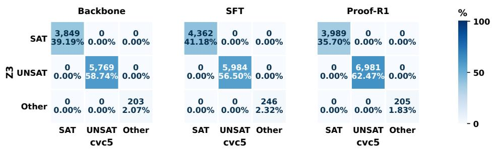  
Figure 6: Z3–cvc5 paired local-check outcomes for Qwen2.5-7B-Instruct outputs from Backbone, SFT, and PROOF-R1. Rows denote Z3 and columns denote cvc5, using SAT/UNSAT/Other. Each cell shows its count and percentage of that method’s local check attempts.

  
Figure 7: Z3–veriT paired local-check outcomes for the same frozen Qwen2.5-7B-Instruct outputs. Rows denote Z3 and columns denote veriT, using SAT/UNSAT/Other. Each cell shows its count and percentage of that method’s local check attempts.

Paired local checks. The three SMT backends check the same semantic verification condition from Equation 6. For this comparison, dependencies resolve against the original premises and the same raw earlier conclusions. We record SAT, UNSAT, and Other separately. Of the 6,129 responses, 5,844 contain a parseable, nonempty structured summary, yielding 31,588 local check attempts. Z3 and cvc5 agree on all 30,934 determinate outcomes: 12,200 SAT and 18,734 UNSAT (Figure 6). veriT confirms all 18,734 UNSAT outcomes and 10,960 SAT outcomes, with no contradictory decision among the 29,694 jointly determinate pairs (Figure 7). The other 1,240 Z3-SAT queries contain quantifiers and return unknown in veriT; they are retained as Other. All pipelines additionally share 654 input-processing failures: 525 formula-parsing failures, 128 missing dependencies, and one duplicate identifier. No SMT solver timeout occurs in this fixed-query audit.

Native proofs and countermodels. Isabelle2025-2/HOL validates the same local queries through native blast proof search and Nitpick countermodel search, without calling an SMT backend. A separate encoder translates the shared FOL syntax tree directly to HOL, preserving quantifier scope, free constants, and nonempty-domain semantics. An oracle-free kernel proof of the requested entailment establishes UNSAT; it must have no open hypotheses or remaining subgoals. Nitpick uses Kodkod/SAT4J over domain sizes 1–10, and establishes SAT only when its final outcome is genuine and a countermodel is saved. These model-search results are distinct from kernel-certified theorems; an unsuccessful finite search remains Other. Each distinct query has a 5-second total budget, with at most 1 second for blast and the remaining time for Nitpick.

Across 6,880 distinct queries, Isabelle constructs 2,574 kernel proofs and 4,304 genuine countermodels. These confirm all 18,734 Z3-UNSAT steps and 12,198 of the 12,200 Z3-SAT steps, with no contradictory decision among 30,932 jointly determinate pairs (Figure 8). No Isabelle targetparsing, typing, or backend errors occur.

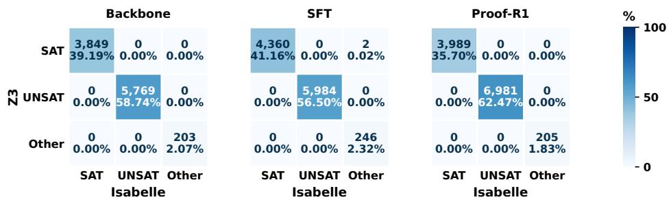  
Figure 8: Z3–Isabelle paired local-check outcomes for the same frozen Qwen2.5-7B-Instruct outputs. Rows denote Z3 and columns denote Isabelle, using SAT/UNSAT/Other. Each cell shows its count and percentage of that method’s local check attempts. Isabelle requires a genuine Nitpick countermodel for SAT and an oracle-free kernel proof for UNSAT. Other retains input-processing failures and unresolved searches.

Proof verification rates. FVR and RVR are recomputed by replaying each backend’s own accepted semantic and rule-level prefixes. All semantic checks use the selected backend, including auxiliary entailment and equivalence queries inside RULECHECK. The metrics retain the microaveraged definitions in Appendix B. The four backends produce identical FVR and RVR numerators and denominators for every response. Consequently, the rates also match within every difficulty split. Table 8 reports the Overall results. PROOF-R1 retains its verification gains over Backbone and SFT under the alternative SMT implementations and native Isabelle proofs.

Table 8: Cross-backend verification of the same frozen Qwen2.5-7B-Instruct outputs on ProverQA Overall. Values are percentages; every semantic check uses the indicated backend.
<table><tr><td></td><td colspan="4">FVR↑</td><td colspan="4">RVR↑</td></tr><tr><td>Method</td><td>Z3</td><td>cvc5</td><td>veriT</td><td>Isabelle</td><td>Z3</td><td>cvc5</td><td>veriT</td><td>Isabelle</td></tr><tr><td>Backbone</td><td>67.64</td><td>67.64</td><td>67.64</td><td>67.64</td><td>18.91</td><td>18.91</td><td>18.91</td><td>18.91</td></tr><tr><td>SFT</td><td>66.39</td><td>66.39</td><td>66.39</td><td>66.39</td><td>19.94</td><td>19.94</td><td>19.94</td><td>19.94</td></tr><tr><td>PROOF-R1</td><td>70.17</td><td>70.17</td><td>70.17</td><td>70.17</td><td>41.19</td><td>41.19</td><td>41.19</td><td>41.19</td></tr></table>

Independent semantic review. We obtain blinded local-entailment judgments from GPT-5.5 on 2,000 steps: 667 Backbone, 667 SFT, and 666 PROOF-R1 steps, spanning 625 problems and 1,680 generated responses.

GPT-5.5 receives only declared dependencies, their formulas, and the conclusion. Generating-model identity and solver results are hidden. It judges classical FOL entailment, returning valid, invalid, or uncertain with a derivation, counterexample, or reason for uncertainty.

Figure 9 shows the corresponding Z3–GPT-5.5 outcomes for each generating method. The heatmap reports raw sample counts and within-method sample percentages. Table 9 reports weighted agreement for the 2,000-step sample. GPT-5.5 endorses all 1,185 sampled UNSAT steps. Of 772 SAT steps, it labels 767 invalid, three uncertain, and two valid.

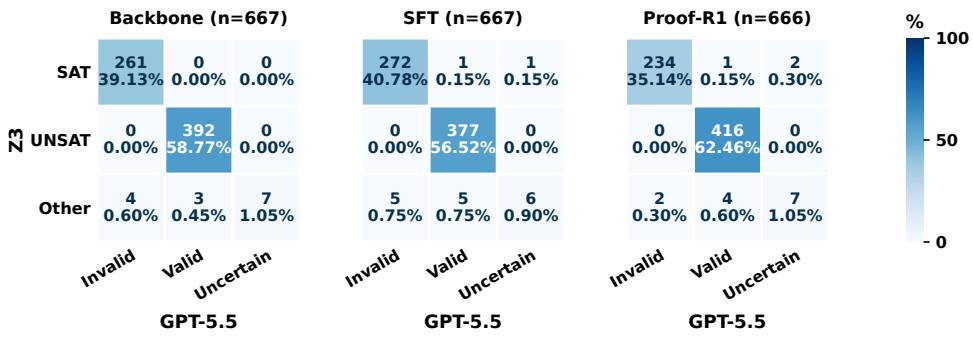  
Figure 9: Z3–GPT-5.5 local semantic review of 2,000 sampled steps from frozen Qwen2.5-7B-Instruct outputs. Rows denote Z3 outcomes; columns denote GPT-5.5 judgments. SAT correspond to invalid and UNSAT to valid. Each cell shows its count and percentage of reviewed steps.

Table 9: Agreement is measured on determinate Z3/cvc5 outcomes. The weighted percentage uses the sampling weights of the 2,000-step cohort.
<table><tr><td>Reviewer</td><td>Number</td><td>Valid</td><td>Invalid</td><td>Uncertain</td><td>Agreed / reference</td><td>Weighted (%)</td></tr><tr><td>GPT-5.5</td><td>2,000</td><td>1,199</td><td>778</td><td>23</td><td>1,952 / 1,957</td><td>99.73</td></tr></table>

What do these independent checks establish? Together, the cross-backend verification and independent semantic review establish that the verification gains of PROOF-R1 are not specific to Z3. Replacing Z3 with cvc5, veriT, or Isabelle preserves every response-level FVR and RVR, while Isabelle independently confirms 30,932 local judgments using native kernel proofs or genuine finite countermodels. The blinded GPT-5.5 review further achieves 99.73% weighted agreement with the determinate Z3/cvc5 outcomes. Together, these results demonstrate that the verification gains of PROOF-R1 are robust across heterogeneousformal backends.

## F RULE ONTOLOGY

RuleCheck. Each canonical rule $\rho ~ \in ~ \mathcal { R }$ is associated with a finite family ${ \mathfrak { S } } _ { \rho }$ of admissible schemas. A schema $( \Gamma , \gamma ) \in \mathfrak { S } _ { \rho }$ consists of premise patterns Γ and a conclusion pattern γ. Applying the resolver $\Phi _ { t } ^ { \mathrm { r u l e } } ( \cdot )$ from Equation 8 to $D _ { t }$ yields the dependency formulas passed to RULECHECK, which we abbreviate as $\psi _ { t } ^ { \mathrm { r u l \bar { e } } }$

$$
\psi _ { t } ^ { \mathrm { r u l e } } : = \Phi _ { t } ^ { \mathrm { r u l e } } ( D _ { t } ) = \left\{ \left( \mathcal { P } \cup \mathcal { S } _ { t - 1 } ^ { \mathrm { r u l e } } \right) ( d ) \middle | d \in D _ { t } \right\} .
$$

Using these resolved formulas, RULECHECK is defined by

$$
\mathrm { R u l e C h e c k } \left( \rho _ { t } , \psi _ { t } ^ { \mathrm { r u l e } } , c _ { t } \right) = \mathbb { I } \left[ \rho _ { t } \in \mathcal { R } \wedge \exists ( \Gamma , \gamma ) \in \mathfrak { S } _ { \rho _ { t } } , \exists \sigma : \psi _ { t } ^ { \mathrm { r u l e } } \left| = \sigma ( \Gamma ) \wedge c _ { t } \equiv \sigma ( \gamma ) \right. \right] .\tag{34}
$$

Here, σ is a substitution over schema variables, $\psi _ { t } ^ { \mathrm { r u l e } } \left| = \sigma ( \Gamma ) \right.$ means that every instantiated premise pattern is established by the resolved dependency formulas, and ≡ denotes logical equivalence.

Consequently, an unrecognized rule, an untrusted dependency, or the absence of a matching schema yields a negative rule verdict.

Table 10: Predicate-logic rules covered by the ProverQA training data.
<table><tr><td>Rule</td><td>Symbolic form</td></tr><tr><td>IE: IMPLICATION_ELIMINATION</td><td> $A \to B , \ A \vdash B$ </td></tr><tr><td>MT: MODUS_TOLLENS</td><td> $A \to B , \neg B \vdash \neg A$ </td></tr><tr><td>XOI: EXCLUSIVE_DISJUNCTION_INTRODUCTION</td><td> $A , \neg B \vdash A \oplus B ; \neg A , B \vdash A \oplus B$ </td></tr><tr><td>XOE:EXCLUSIVE_DISJUNCTION_ELIMINATION</td><td> $A \oplus B , A \vdash \lnot B ; A \oplus B , \lnot A \vdash B$ </td></tr><tr><td>DS:DISJUNCTIVE_SYLLOGISM</td><td> $A \lor B , \neg A \vdash B$ </td></tr><tr><td>CI: CONJUNCTION_INTRODUCTION</td><td> $A , B \vdash A \land B$ </td></tr><tr><td>CE: CONJUNCTION_ELIMINATION</td><td> $A \land B \vdash A ; A \land B \vdash B$ </td></tr><tr><td>UE: UNIVERSAL_ELIMINATION</td><td> $\forall x \varphi ( x ) \vdash \varphi ( a )$ </td></tr><tr><td>GB: GOAL_BINDING</td><td> $i _ { g } = i ( \widetilde { y } ) , \quad c _ { g } = \widetilde { y }$ </td></tr></table>

In the last row, $i ( \widetilde { y } )$ denotes the terminal action identifier assigned to the selected answer proposition.   
GOAL BINDING is accepted only when both that identifier and the conclusion match.

## G EVALUATION OF PROOF-R1 ON OUT-OF-DISTRIBUTION DATASETS

ProverQA is generated by a theorem prover, and its proof traces are constructed from the predicatelogic ontology used for training. FOLIO (Han et al., 2024), in contrast, is a human-authored naturallanguage reasoning benchmark whose instances and annotations are independent of that generator. We therefore evaluate the frozen Qwen3-8B Backbone, SFT, and PROOF-R1 outputs on the FOLIO validation subset: 51 problems with three outputs per problem, or 153 outputs per model. In FOLIO, semantically valid derivations include universal and existential quantifier steps whose rule families are absent from the ProverQA training ontology. Let ${ \mathcal { R } } _ { \mathrm { u n s e e n } }$ denote the seven unseen quantifier rule families listed in Table 11. The trusted inference system used for this FOLIO evaluation is therefore:

$$
\mathcal { R } _ { \mathrm { F O L I O } } : = \mathcal { R } _ { \mathrm { t r a i n } } \cup \mathcal { R } _ { \mathrm { u n s e e n } } \supset \mathcal { R } _ { \mathrm { t r a i n } } .\tag{35}
$$

To verify these deductions without changing the frozen outputs or the original checker, a separate coverage checker operationalizes $\mathcal { R } _ { \mathrm { F O L I O } }$ by adding the seven guarded rule families in Table 11 to $\mathcal { R } _ { \mathrm { t r a i n } }$ . Every formula, dependency, step identifier, and GOAL BINDING action remains fixed.

Table 11: Training-time-unseen rule families and their representative symbolic forms.
<table><tr><td>Rule</td><td>Symbolic form</td></tr><tr><td>UIC: UNIVERSAL_IMPLICATION_CHAINING</td><td> $\forall x ( A \to B ) , \forall x ( B \to C ) \vdash \forall x ( A \to C )$ </td></tr><tr><td>UPI: UNIVERSAL_PROPOSITIONAL_INFERENCE</td><td> $\forall x ( A \to B ) , \forall x ( A \to C ) \vdash \forall x ( A \to ( \dot { B } \land C ) )$ </td></tr><tr><td>EI:EXISTENTIAL_INTRODUCTION</td><td> $A ( a ) \vdash \exists x A ( x ) ; A ( a ) , B ( a ) \vdash \exists x ( A ( x ) \land B ( x ) )$ </td></tr><tr><td>ECE:EXISTENTIAL_CONJUNCTION_ELIMINATION</td><td> $\exists x ( A \land B ) \vdash \exists x A ; \exists x ( A \land G ) \vdash G ( x \notin \operatorname { F V } ( G ) )$ </td></tr><tr><td>EIE:EXISTENTIAL_IMPLICATION_ELIMINATION</td><td> $\exists x { \dot { A } } , \forall x ( { \dot { A } }  B ) \vdash \exists x { \dot { B } }$ </td></tr><tr><td>ECI: EXISTENTIAL_CONJUNCTION_INTRODUCTION</td><td> $\exists x A , G \vdash \exists x ( A \land G ) ( x \notin \operatorname { F V } ( G ) )$ </td></tr><tr><td>QN: QUANTIFIER_NEGATION</td><td> $\lnot \forall x A \Leftrightarrow \exists x \lnot A ; \lnot \exists x A \Leftrightarrow \forall x \lnot A$ </td></tr></table>

Using the frozen outputs, we evaluate every step under $\mathcal { R } _ { \mathrm { F O L I O } }$ . Let $\rho _ { t }$ denote the rule family of the current step. To isolate generalization to unseen rules, we group steps by whether $\rho _ { t } \in \mathcal { R } _ { \mathrm { t r a i n } }$ or $\rho _ { t } \in \mathcal { R } _ { \mathrm { u n s e e n } }$ . The group assignment depends only on the current step.

Table 12: FVR/RVR (%) under $\mathcal { R } _ { \mathrm { F O L I O } }$ on frozen Qwen3-8B FOLIO outputs, grouped by whether the current rule belongs to $\mathcal { R } _ { \mathrm { t r a i n } }$ or $\mathcal { R }$ unseen.
<table><tr><td>Model</td><td>Rule group</td><td>FVR</td><td>RVR</td></tr><tr><td>Backbone</td><td> $\mathcal { R } _ { \mathrm { t r a i n } }$ </td><td>64.71</td><td>39.73</td></tr><tr><td rowspan="2">SFT</td><td> ${ \mathcal { R } } _ { \mathrm { u n s e e n } }$ </td><td>63.24</td><td>34.92</td></tr><tr><td> $\mathcal { R } _ { \mathrm { t r a i n } }$ </td><td>62.02</td><td>39.77</td></tr><tr><td rowspan="3">PROOF-R1</td><td> ${ \mathcal { R } } _ { \mathrm { u n s e e n } }$ </td><td>67.50</td><td>45.71</td></tr><tr><td> $\mathcal { R } _ { \mathrm { t r a i n } }$ </td><td>81.55</td><td>58.87</td></tr><tr><td> ${ \mathcal { R } } _ { \mathrm { u n s e e n } }$ </td><td>86.21</td><td>63.08</td></tr></table>

Under the expanded checker, PROOF-R1 achieves the highest FVR and RVR in both groups: 81.55/58.87 for $\mathcal { R } _ { \mathrm { t r a i n } }$ and 86.21/63.08 for ${ \mathcal { R } } _ { \mathrm { u n s e e n } }$ On ${ \mathcal { R } } _ { \mathrm { u n s e e n } }$ , this improves over the Backbone by 22.97 FVR points and 28.16 RVR points. Overall, PROOF-R1 reaches 59.70% RVR under the expanded ontology. These results show that PROOF-R1 transfers from the prover-generated training distribution to human-authored FOLIO and retains verifiable reasoning under rule families absent from the training ontology.

## H FORMAL SPECIFICATION AND PROOFCHECK

Action specification. Each action proposes a proof-state transition whose admissibility is governed by a formal specification:

$$
\begin{array} { r l } & { \mathrm { S p e c } ( a _ { t } ; S _ { t - 1 } ) = \mathrm { W e l l F o r m e d } ( a _ { t } ) \land \mathrm { T r u s t e d D e p } ( D _ { t } ; S _ { t - 1 } ) } \\ & { \land \mathrm { S e m a n t i c V a l i d } ( D _ { t } , c _ { t } ) \land \mathrm { R u l e F a i t h f u l } ( D _ { t } , c _ { t } , \rho _ { t } ) } \\ & { \land \mathrm { A d m i s s i b l e } ( a _ { t } ) . } \end{array}\tag{36}
$$

WellFormed checks the action schema, identifier, conclusion, and rule field, while TrustedDep restricts dependencies to original premises or earlier conclusions admitted to the relevant verified state. SemanticValid requires entailment between the resolved dependency formulas and the conclusion. RuleFaithful requires the deduction to instantiate the declared rule. For ordinary steps, Admissible is evaluated by ProofCheck. for the terminal action, it requires agreement between the identifier, conclusion, and selected candidate.

ProofCheck. For ordinary actions, PROOFCHECK rejects repeated conclusions, restatements of dependencies, and tautologies:

$$
\begin{array} { r } { v _ { t } ^ { \mathrm { p r o } } = \mathrm { P r o o f C h e c k } ( a _ { t } ) = \neg \mathrm { R e p e a t e d } ( c _ { t } ) \wedge \neg \mathrm { R e s t a t e m e n t } ( c _ { t } , D _ { t } ) } \\ { \wedge \neg \mathrm { T a u t o l o g i c a l } ( c _ { t } ) . \qquad } \end{array}\tag{37}
$$

Proof progress is separate from semantic soundness. A repeated conclusion or tautology may be entailed without advancing the proof, so nontriviality is not an entailment requirement.

## I STRUCTURED OUTPUT CONTRACT

Output organization. Following the rollout notation in Equation 3, the free-form analysis region represents z, while the structured summary serializes $( a _ { 1 } , \ldots , a _ { T } )$ as a JSON list. Its terminal action $a _ { g }$ binds $c _ { g } = \tilde { y }$ for the selected candidate $\tilde { y } \in \mathcal { V }$

Action schema. As shown in Figure 10, each action contains a unique identifier, a list of dependencies, one formal conclusion, and its declared rule. For a candidate set $\mathcal { Y } = \{ y _ { 1 } , . . . , y _ { N } \}$ , the final action uses the identifier and formal proposition of the selected option.

[   
{"id": "s1", "dependencies": ["p1", "p2"],   
"conclusion": "Q(a)",   
"rule": "IMPLICATION\_ELIMINATION"},   
{"id": "option\_3", "dependencies": ["s1"],   
"conclusion": "Q(a)",   
"rule": "GOAL\_BINDING"}   
]  
Figure 10: Example of the structured JSON proof-action sequence.

## J IMPLEMENTATION DETAILS

We implement semantic verification with Z3 (de Moura & Bjørner, 2008), and use RULECHECK and PROOFCHECK for the corresponding rule and proof-admissibility conditions. Appendix E reports paired cvc5, veriT, and Isabelle checks of the frozen Qwen2.5-7B-Instruct evaluation outputs. Policy optimization uses LoRA (Hu et al., 2022) within VERL/HybridFlow (Sheng et al., 2024).

## J.1 METHOD-SPECIFIC IMPLEMENTATIONS

To ensure a controlled comparison, all methods use the same data splits, formal inputs, and struc tured output specification, and their final outputs are scored by a common evaluator for answer accuracy and proof verifiability. SFT, GRPO, PRoSFI, and PROOF-R1 use the same training configuration and LoRA setup and are initialized from the same format-warm-up adapter. The methods differ mainly in their inference procedures, training objectives, and credit-assignment mechanisms.

Backbone is the pretrained model without task-specific training. Given the common prompt, it directly generates a complete response containing a reasoning trace, structured proof steps, and a final answer, without candidate selection or verification feedback at inference time. The formal verifier is used only for evaluation after generation and does not participate in the generation process.

LogicAgent (Zhang et al., 2025) is a training-free neuro-symbolic reasoning agent. It first uses an LLM to reason natural-language problems from multiple semantic perspectives, delegates deduction to symbolic solvers, and determines the final answer through reflection. We use the official code repository.4 To conform to the common evaluation protocol, we only serialize its selected reasoning process into the standard structured proof format, without using reference answers or our verifier to alter its result.

GoV (Fang et al., 2026) is a training-free, verification-guided reasoning agent. It first generates multiple candidate solutions and organizes their reasoning steps as nodes in dependency graphs and then checks the nodes in their declared dependency order and selects the final output from the candidates that pass verification. Candidate selection uses GoV’s own LLM-based verifier. We use the official code repository.5 To standardize the output, we only serialize the selected candidate into the common structured proof format, without changing its selection result or reasoning content.

SFT uses verified structured proof trajectories for supervised fine-tuning. Given a problem and its formal representation, it learns through token-level cross-entropy to generate a reasoning trace, canonicalized proof steps, and a final answer. SFT performs neither online sampling nor additional feedback based on the semantic or rule validity of generated proofs. Its supervision therefore comes entirely from the provided demonstration trajectories.

GRPO (Shao et al., 2024) is initialized from the format-warm-up adapter and samples a group of complete responses for each problem. Its reward is determined jointly by output-format validity and final-answer correctness, and relative rewards within each group are used to compute the advantage of each response. This advantage is applied to the entire generated sequence and the training reward does not separately check the semantic validity of intermediate conclusions, the applicability of declared rules, or proof dependencies. We implement GRPO using the official verl codebase.6

PRoSFI (Chen et al., 2026) is an RL method designed for natural-language logical reasoning. It retains GRPO’s grouped sampling and relative optimization, is initialized from the format-warm-up adapter, and samples a group of complete responses for each problem. For each response, it parses the structured proof, checks intermediate conclusions with Z3 in dependency order, and assigns the trajectory-level reward in Equation 38. Because the authors have not released their code, we construct a faithful reimplementation following the method described in the paper.

$$
R _ { \mathrm { P R o S F I } } = \left\{ \begin{array} { l l } { 1 . 0 , } & { \mathrm { c o r r e c t ~ a n s w e r } ; \mathrm { a l l ~ s t e p s ~ v e r i f i e d } , } \\ { 0 . 3 , } & { \mathrm { c o r r e c t ~ a n s w e r } ; \mathrm { s o m e ~ s t e p s ~ u n v e r i f i e d } , } \\ { 0 . 1 , } & { \mathrm { v a l i d ~ o u t p u t ~ f o r m a t ~ b u t ~ i n c o r r e c t ~ a n s w e r } , } \\ { 0 . 0 , } & { \mathrm { i n v a l i d ~ o u t p u t ~ f o r m a t ~ o r ~ o t h e r ~ f a i l u r e } . } \end{array} \right.\tag{38}
$$

## J.2 TRAINING CONFIGURATION

The training configuration used in our experiments is summarized below.7

Table 13: Training and rollout parameters. Unless stated otherwise, these settings are shared by SFT, GRPO, PRoSFI, and PROOF-R1.
<table><tr><td>Category</td><td>Parameter</td><td>Value</td></tr><tr><td>LoRA</td><td>Rank</td><td>8</td></tr><tr><td></td><td>Alpha</td><td>16</td></tr><tr><td></td><td>Target modules</td><td>[Q, K, V, O, GATE, UP, DOWN]</td></tr><tr><td>Rollout</td><td>Group size (K)</td><td>8</td></tr><tr><td></td><td>Sampling temperature</td><td>0.8</td></tr><tr><td></td><td>Top-p</td><td>0.95</td></tr><tr><td>Training</td><td>Training batch size</td><td>8</td></tr><tr><td></td><td>Sampled responses per batch</td><td>64</td></tr><tr><td></td><td>Total training steps</td><td>1,098</td></tr><tr><td></td><td>Training epochs</td><td>3</td></tr><tr><td>Optimization</td><td>PPO epochs per update</td><td>2 8</td></tr><tr><td></td><td>PPO mini-batch size</td><td></td></tr><tr><td></td><td>Clip ratio  $( \epsilon _ { - } , \epsilon _ { + } )$ </td><td> $[ 0 . 2 0 , 0 . 2 8 ]$ </td></tr><tr><td></td><td>Learning rate</td><td> $\dot { 5 } \times 1 0 ^ { - 6 }$ </td></tr><tr><td></td><td>KL coefficient  $( \lambda _ { \mathrm { K L } } )$ </td><td>0.001</td></tr><tr><td></td><td>Loss aggregation</td><td>seq-mean-token-sum</td></tr><tr><td>PROOF-R1 Parameters</td><td colspan="2">Machine-Checkable Formal Verification (MCFV)</td></tr><tr><td></td><td>Initial value  $( \mathrm { E M A } _ { \rho } ^ { ( 0 ) } )$ </td><td>0.5</td></tr><tr><td></td><td>EMA coefficient (β)</td><td>0.9</td></tr><tr><td></td><td>Clip range  $( b _ { \mathrm { m i n } } , b _ { \mathrm { m a x } } )$ </td><td>[0.30, 0.70]</td></tr><tr><td></td><td colspan="2">Verification-Aligned Optimization</td></tr><tr><td></td><td>Verification scale  $( \lambda _ { v } )$ </td><td>3</td></tr><tr><td></td><td>Outcome scale  $( \lambda _ { o } )$ </td><td>1</td></tr><tr><td></td><td>Goal-binding verification scale</td><td>1</td></tr><tr><td></td><td>No-positive-action weight</td><td>0.1</td></tr><tr><td>Reasoning</td><td>Maximum prompt length</td><td>4,096</td></tr><tr><td></td><td>Maximum response length</td><td>4,096</td></tr><tr><td></td><td>Maximum model context length</td><td>8,192</td></tr></table>

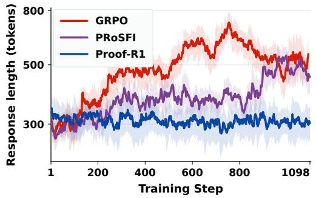

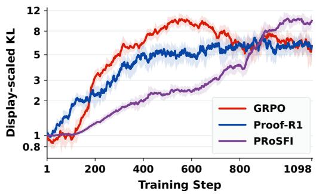  
Figure 11: Training trajectories of response length and policy divergence during reinforcement learning. Left: Mean response length of different methods on Qwen2.5-7B-Instruct during training. Right: Sequence-level KL divergence of the Qwen3-8B policy from the frozen reference policy during training. Solid lines denote EMA-smoothed trajectories, and shaded regions indicate one exponentially weighted local standard deviation.

Figure 11 shows that, compared with the response growth of GRPO and PRoSFI as training proceeds, PROOF-R1 maintains an overall stable response length. This indicates that the training improvements of PROOF-R1 do not rely on continually increasing response length, while the policy gradually diverges from the initial reference policy under a stable generation length.

## L COMPUTATIONAL COST

All experiments use a PyTorch 2.5.1 base image with Python 3.12 on Ubuntu 22.04 and CUDA 12.4. The machine provides four RTX 4090 GPUs with 48 GB of memory each, 80 Intel(R) Xeon(R) Platinum 8470Q vCPUs, and 384 GB of system memory. Table 14 reports wall-clock training time per 100 optimization steps and the mean number of generated tokens consumed per response at inference time. Training-free agents have zero training time.

Table 14: Computational cost on ProverQA. Time is measured in hours per 100 optimization steps. Inference-time token consumption is the mean number of generated tokens per response.
<table><tr><td rowspan="2">Method</td><td colspan="2">Qwen2.5-7B-Instruct</td><td colspan="2">Qwen3-8B</td></tr><tr><td>h/100 steps</td><td>tokens/response</td><td>h/100 steps</td><td>tokens/response</td></tr><tr><td>Backbone</td><td>0.00</td><td>354.2</td><td>0.00</td><td>1,213.8</td></tr><tr><td>LogicAgent</td><td>0.00</td><td>2,054.5</td><td>0.00</td><td>12,572.6</td></tr><tr><td>GoV</td><td>0.00</td><td>2,004.7</td><td>0.00</td><td>9,127.9</td></tr><tr><td>SFT</td><td>0.11</td><td>373.6</td><td>0.19</td><td>1,229.9</td></tr><tr><td>GRPO</td><td>2.64</td><td>836.4</td><td>4.70</td><td>1,176.3</td></tr><tr><td>PRoSFI</td><td>2.98</td><td>645.9</td><td>5.31</td><td>1,208.1</td></tr><tr><td>PROOF-R1</td><td>2.73</td><td>354.9</td><td>4.86</td><td>1,214.2</td></tr></table>

Across two backbones, PROOF-R1, GRPO, and PRoSFI have comparable training speeds. PROOF-R1 consumes substantiallyfewer inference-time tokens than the LogicAgent and GoV baselines.

## M PROMPT TEMPLATE USED BY PROOF-R1

The model receives a single-turn chat prompt consisting of a shared system instruction and an instance-specific user message. The structured-action schema and user-message template are shared across format warm-up, policy rollouts, and evaluation, while the inference-system block is instantiated for the current dataset. Qwen2.5-7B-Instruct and Llama-3.1-8B use the explicit-thinking instruction below, whereas Qwen3-8B and GLM-Z1-9B-0414 use their native thinking mode.

The marker [OUTPUT-MODE INSTRUCTION] is replaced verbatim by one of the two mode specific blocks below. The marker [INFERENCE SYSTEM BLOCK] is instantiated with $\mathcal { R } _ { \mathrm { t r a i n } }$ for ProverQA and ProofWriter, and with $\mathcal { R } _ { \mathrm { F O L I O } } ~ = ~ \mathcal { R } _ { \mathrm { t r a i n } } \cup \mathcal { R } _ { \mathrm { u n s e e n } }$ for FOLIO. The latter is formed by appending the FOLIO extension block below to the training inference-system block.

## System Prompt

You are a math reasoner. For each problem, you will receive a set of formal premises and a multiple−choice logical reasoning question.

## [OUTPUT−MODE INSTRUCTION]

Each JSON object in 
 must have exactly these fields:

− id: a unique identifier for this step.

− dependencies: a list of premise ids or earlier step ids.

− conclusion: exactly one formal formula.

− rule: the single inference rule applied, chosen from the supplied inference system.

## [INFERENCE SYSTEM BLOCK]

The rule must describe the operation that produces the declared conclusion. If an implication first activates a compound consequent and the same action then selects one XOR/OR/AND branch, use the corresponding elimination rule, not IMPLICATION ELIMINATION. Do not invent rule names, aliases, abbreviations, or alternative capitalization.

Use GOAL BINDING for the final JSON object whose id is one of [option A id], [option B id], ..., or [option N id].

## Critical requirements:

− Use ”s1”, ”s2”, ”s3”, etc. for intermediate steps.

− The last JSON object must be the final answer.

− The final answer id must exactly match one of the option ids shown in the problem.

− The final answer conclusion must match the formal statement of that option.

− The JSON array must be valid and parsable.

− Each step must use fewer than 5 dependencies.

− Do not output any additional text after 
.

## Explicit-Thinking Instruction (Qwen2.5-7B-Instruct and Llama-3.1-8B)

Answer with exactly two parts:

1. Put brief natural−language reasoning inside <think>...</think>.

2. Put a JSON array of structured formal intermediate steps inside 
...
.

## Native-Thinking Instruction (Qwen3-8B and GLM-Z1-9B-0414)

Use the model’s native thinking mode for brief natural−language reasoning.

After native thinking ends, output exactly one JSON array of structured formal intermediate steps inside 
...
.

Do not add commentary between the native </think> and 
 sections.

The training prompt instantiates the inference system $\mathcal { R } _ { \mathrm { t r a i n } }$ with the following canonical rules.

## Training Inference System Block (Rtrain)

## Canonical rule options:

Use exactly one of these canonical rule names:

− IMPLICATION ELIMINATION: from A −> B and support for A, derive the entire consequent B.

− MODUS TOLLENS: from A −> B and support for not B, derive not A (including a justified component of a compound A).

− EXCLUSIVE DISJUNCTION INTRODUCTION: from A and not B, or from not A and B, derive A XOR B.

− EXCLUSIVE DISJUNCTION ELIMINATION: from A XOR B plus one known branch or its negation, derive the forced other branch or its negation.

− DISJUNCTIVE SYLLOGISM: from A OR B and not A derive B, or from A OR B and not B derive A.

− CONJUNCTION INTRODUCTION: from A and B derive A AND B.

− CONJUNCTION ELIMINATION: from A AND B derive A or derive B.

− UNIVERSAL ELIMINATION: instantiate a universally quantified formula for one concrete entity.

− GOAL BINDING: only for a final answer action whose id and conclusion exactly match an answer option.

The FOLIO prompt extends $\mathcal { R } _ { \mathrm { t r a i n } }$ to $\mathcal { R } _ { \mathrm { F O L I O } }$ with Runseen. $\mathcal { R } _ { \mathrm { { \ell } } }$

## Unseen Inference System Block (Runseen)

− UNIVERSAL IMPLICATION CHAINING: from forall x (A −> B) and forall x (B −> C), derive forall x (A −> C).

− UNIVERSAL PROPOSITIONAL INFERENCE: from forall x (A −> B) and forall x $( \mathbf { A } - > \mathbf { C } ) ,$ derive forall x (A −> (B AND C)).

− EXISTENTIAL INTRODUCTION: from A(a), derive exists x A(x); premises sharing witness a may be combined under the existential.

− EXISTENTIAL CONJUNCTION ELIMINATION: from exists x (A AND B), derive exists x A; or derive a conjunct G that does not contain x free.

− EXISTENTIAL IMPLICATION ELIMINATION: from exists x A and forall x $( \mathbf { A } - > \mathbf { B } ) .$ , derive exists x B.

− EXISTENTIAL CONJUNCTION INTRODUCTION: from exists x A and G, derive exists x (A AND G) when x is not free in G.

− QUANTIFIER NEGATION: apply the equivalences not forall x A iff exists x not A, and not exists x A iff forall x not A.

For each problem, the bracketed fields are populated from the corresponding natural-language and formalized instance. Premise formulas are converted to the prefix notation consumed by the verifier.

## User Prompt Template

Context:

1. [natural−language premise 1]. Formal statement: ’h1 : [formal premise 1]’.

2. [natural−language premise 2]. Formal statement: ’h2 : [formal premise 2]’.

N. [natural−language premise N]. Formal statement: ’hN : [formal premise N]’.

Question: [multiple−choice question]

Options:

A) [option A text]. Answer id: ’[option A id]’. Formal statement: ’[option A formula]’.

B) [option B text]. Answer id: ’[option B id]’. Formal statement: ’[option B formula]’.

N) [option N text]. Answer id: ’[option N id]’. Formal statement: ’[option N formula]’.

The correct option is:

## N CASE STUDY

## N.1 CASE 1: A NEGATIVE CONCLUSION ABOUT ANIMAL CARE

PROOF-R1 connects a natural-language answer to an explicit sequence of checkable reasoning actions. The case below presents a ProverQA example generated by PROOF-R1 with Qwen3-8B.

Premises P Query q   
p1 Either Alonzo helps animals or harms animals, Alonzo does not harm animals.   
but not both.   
Candidates Y y˜ = y1   
p2 Alonzo has compassion.   
y Alonzo does not harm animals.   
p3 Alonzo loves wildlife.   
y Alonzo harms animals.   
p4 Anyone who loves wildlife and provides care   
is helping animals. y3 It is uncertain whether Alonzo   
harms animals.   
p5 Anyone who feels empathy or has compassion   
can provide care.   
PROOF-R1 y˜ = y1   
s1 Alonzo has compassion, so p5 implies that he provides care.   
Dt = [p2, p5] ct = provides care(Alonzo) ρt = IE   
s2 Combine his love of wildlife with the derived fact that he provides care.   
Dt = [ s1, p3] ct = loves wildlife(Alonzo) ∧ provides care(Alonzo) ρt = CI   
s3 By p4, loving wildlife and providing care imply that he helps animals.   
Dt = [s2, p4] ct = helps animals(Alonzo) ρt = IE   
s4 He helps animals; p1 excludes helping and harming together, so he does not harm them.   
Dt = [s3, p1] ct = ¬harms animals(Alonzo) ρt = XOE   
h goal true Bind this conclusion to the selected candidate y1.   
Dt = [s4] ct = ¬harms animals(Alonzo) ρt = GB

The blue highlights show how PROOF-R1 turns an intermediate result into a trusted dependency. The conclusion provides care(Alonzo) at s1 is admitted to the semantic and rule-verified states after its action passes verification (Section 3.3). The explicit s1 reference in s2 then reuses this fact to construct the conjunction required by p4, enabling s3 to derive that Alonzo helps animals. This link makes the source of the intermediate result and its role in subsequent reasoning directly checkable. The yellow highlights show how a constraint in the input supports the negative answer. The phrase “but not both” in p1 excludes simultaneous helping and harming. Given the helping conclusion at s3, exclusive disjunction elimination at s4 yields ¬harms animals(Alonzo), which h goal true binds to candidate y . The negative conclu sion therefore has explicit supporting dependencies and a matching inference rule. All five actions pass schema validation, UNSAT-based semantic verification, and RULECHECK.

## N.2 CASE 2: VERIFIED DEPENDENCIES FOR A CORRECT ANSWER

MCFV makes the validity of an intermediate conclusion decisive for its reuse in a verified proof. This ProverQA pair uses Qwen2.5-7B-Instruct on the same problem: the Backbone answers incorrectly, while PROOF-R1 derives the correct answer with verified actions.

Premises P Query q   
p1 Jayceon does not have raw talent. Jayceon stays humble.   
p2 If Jayceon is dedicated, then he can either achieve   
success or stay humble, but not both. Candidates Y y∗ = y2   
p3 Jayceon either has raw talent or is dedicated, but not y1 Jayceon stays humble.   
both. y2 Jayceon does not stay humble.   
p4 Anyone who sets goals or works hard is dedicated. y3 It is uncertain whether Jayceon   
p5 Jayceon achieves success. stays humble.   
p6 Superstar achieves success.   
Backbone y˜ = y1   
s1 Claims that Jayceon is not dedicated from the exclusive choice and his lack of talent.   
Dt = [p1, p3] ct = ¬dedicated(Jayceon) ρt = XOI   
s2 Uses this rejected conclusion with the success premise to claim that he stays humble.   
Dt = [p2,p5, s1] ct = stay humble(Jayceon) ρt = XOE   
PROOF-R1 y˜ = y2   
s1 He has no raw talent, so the exclusive choice in p3 establishes that he is dedicated.   
Dt = [p1, p3] ct = dedicated(Jayceon) ρt = XOE   
s2 Given his dedication and success, p2 excludes staying humble.   
Dt = [p2, s1,p5] ct = ¬stay humble(Jayceon) ρ = XOE   
h goal false Bind the negative conclusion to the correct candidate y2.   
Dt = [s2] ct = ¬(stay humble(Jayceon)) ρt = GB

The red highlights trace an unsupported conclusion into the Backbone’s wrong answer. Its first action passes schema validation, but the semantic check returns SAT and RULECHECK rejects the declared XOI rule: p1 and p3 entail dedicated(Jayceon), not its negation. The next action still cites s1, so verification reports a missing trusted dependency at the action that states the wrong answer. The blue highlights show the corresponding verified transition in PROOF-R1: exclusive disjunction elimination establishes dedication, which is admitted to both verified states and reused by s2. This fact activates p2; together with success, it yields the yellow negative conclusion and the correct answer y2. All three actions pass schema, UNSAT-based semantic, and rule verification, yielding a continuous chain oftrusted dependencies.

## N.3 CASE 3: GENERATING THE DEPENDENCIES THAT SUPPORT THE ANSWER

This ProverQA pair uses Qwen2.5-7B-Instruct on the same problem and sample. The Backbone mixes two characters’ facts; PROOF-R1 builds the dependencies establishing Clay’s correct answer.

Premises P Query q   
p1 Clay either learns magic theory or studies ancient Clay can become a powerful mage.   
tomes.   
p2 Clay practices intricate spells Candidates Y y∗ = y1   
p3 If Clay studies ancient tomes and practices intricate y1 Clay can become a powerful mage.   
spells, then he can become a powerful mage. y2 Clay cannot become a powerful   
p4 If Mitchell studies ancient tomes and practices intricate mage.   
spells, then he can become a powerful mage. y3 It is uncertain whether Clay can   
p5 Clay does not learn magic theory. become a powerful mage.   
p6 Mitchell practices intricate spells.   
Backbone y˜ = y2   
s1 Introduces a choice between Clay and Mitchell studying ancient tomes.   
Dt = [p1, p5] ct = (study ancient tomes(Clay) ρt = DS   
∨ study ancient tomes(Mitchell))   
s2 Combines the facts that Clay and Mitchell both practice intricate spells.   
Dt = [p2, p6] ct = (practice intricate spells(Clay) ρt = CI   
∧ practice intricate spells(Mitchell))   
s3 Combines the two characters’ conditions into a disjunction.   
Dt = [ s1, s2] ct = (study ancient tomes(Clay) ρt = XOI   
∧ practice intricate spells(Clay))   
∨ (study ancient tomes(Mitchell)   
∧ practice intricate spells(Mitchell))   
s4 Cites both rules but introduces an unsupported disjunction with a negated Clay predicate.   
Dt = [s3,p3,p4] ct = ¬(become a powerful mage(Clay)) ρt = IE   
∨ (become a powerful mage(Mitchell))   
s5 Uses this disjunction and Mitchell’s practice to claim that Clay cannot become a powerful mage   
Dt = [s4, p6] ct = ¬(become a powerful mage(Clay)) ρt = MT   
PROOF-R1 y˜ = y1   
s1 Clay does not learn magic theory, so p1 implies that he studies ancient tomes.   
Dt = [p1, p5] ct = study ancient tomes(Clay) ρt = DS   
s2 Combine this fact with Clay’s practice to establish both conditions required by p3.   
Dt = [ s1, p2] ct = study ancient tomes(Clay) ρ = CI   
∧ practice intricate spells(Clay)   
s3 Apply Clay’s rule to these conditions, proving the correct candidate y .   
Dt = [s2, p3] ct = become a powerful mage(Clay) ρt = IE   
h goal true Bind this conclusion to the selected candidate y1.   
Dt = [s3] ct = become a powerful mage(Clay) ρt = GB   
p2 p3   
p1   
s1 s2 s3 h goal true   
p5 p4 p6

Red marks the Backbone’s rule mismatch at s1, the resulting untrusted dependency at s3, and the unsupported negation introduced at s4 and propagated to s5. Its first two conclusions are semantically valid, but the mixed path fails to prove the query. The blue dependencies in PROOF-R1 connect Clay’s facts to p3, yielding the yellow correct answer; all four actions pass schema, semantic, and rule verification. Backward traversal in the candidate proof-certificate graph selects all four actions and premises p1, p2, p3, and p5; the gray-shaded p4 and p6 lie outside the closure. This is the answer-supporting structure targeted by ASDC training.

## N.4 CASE 4: LINKING VERIFIED BRANCHES TO THE ANSWER

This ProverQA pair uses Qwen2.5-7B-Instruct on the same problem. The Backbone leaves a verified fact disconnected from its answer, whereas PROOF-R1 joins two verified branches to establish the correct conclusion.

## Premises P

p1 Vance will make groundbreaking discoveries if he conducts rigorous research.

p2 If Ivan studies ocean depths, then he either makes groundbreaking discoveries or inspires new generations, but not both.

p3 Vance conducts rigorous research.

p4 Vance studies ocean depths.

p5 If Vance studies ocean depths, then he either makes groundbreaking discoveries or inspires new generations, but not both.

Vance inspires new generations.

Candidates Y y∗ = y2

y1 Vance inspires new generations.

y2 Vance does not inspire new generations.

y3 It is uncertain whether Vance inspires new generations.

Backbone y˜ = y3   
s1 Derives the discovery fact from Vance’s rigorous research.   
Dt = [p3, p1] ct = make groundbreaking discoveries(Vance) ρt = IE   
s2 Derives the exclusive choice from Vance’s study of ocean depths.   
Dt = [p4, p5] ct = make groundbreaking discoveries(Vance) ρt = XOI   
⊕ inspire new generations(Vance)   
s3 States that discovering and inspiring cannot both hold.   
Dt = [ s2] ct = ¬(make groundbreaking discoveries(Vance) ρt = MT   
∧ inspire new generations(Vance))   
h goal uncertain Selects uncertainty without using the discovery fact from s1.   
Dt = [s2, s3] ct = inspire new generations(Vance) ρt = GB   
PROOF-R1 y˜ = y2   
s1 Vance’s research establishes that he makes groundbreaking discoveries.   
Dt = [p3, p1] ct = make groundbreaking discoveries(Vance) ρt = IE   
s2 His study of ocean depths establishes the exclusive choice in p5.   
Dt = [p4, p5] ct = (make groundbreaking discoveries(Vance) ρt = IE   
⊕ inspire new generations(Vance))   
s3 Join both results: making discoveries excludes inspiring new generations.   
Dt = [ s1, s2] ct = ¬(inspire new generations(Vance)) ρt = XOE   
h goal false Bind this conclusion to the selected candidate y2.   
Dt = [s3] ct = ¬(inspire new generations(Vance)) ρt = GB   
p3 s1   
p1   
s3 h goal false   
p4p5 s2 p2

The gray-highlighted Backbone conclusion at s1 passes all four checks, yet it lies outside the dependency closure of h goal uncertain. Its analysis likewise treats the exclusive choice as unresolved despite having established the discovery fact. Red marks the rule mismatch at s2, the dependency at s3 missing from the rule-verified state, and the final positive conclusion that fails semantic verification while the model selects y3. In PROOF-R1, the blue references join s1 and s2 at s3: the established discovery resolves the exclusive choice and yields the yellow correct negative answer. All four actions pass schema, semantic, and rule verification. Backward traversal from the final node s3 includes both branches and premises p1, p3, p4, and p5, leaving Ivan’s p2 outside the closure in gray. PROOF-R1 can identify answer-relevant dependencies and integrate verified results across reasoning branches to construct a coherent proofofthe correct answer.