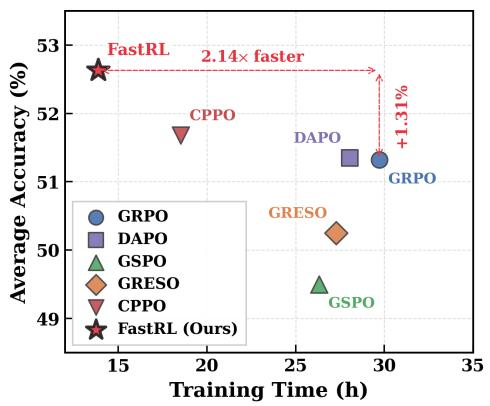
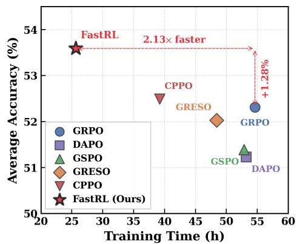
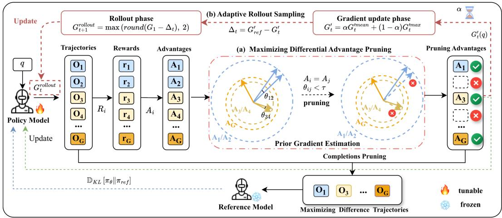
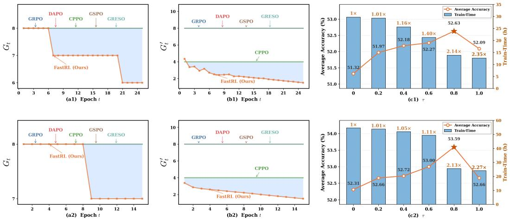
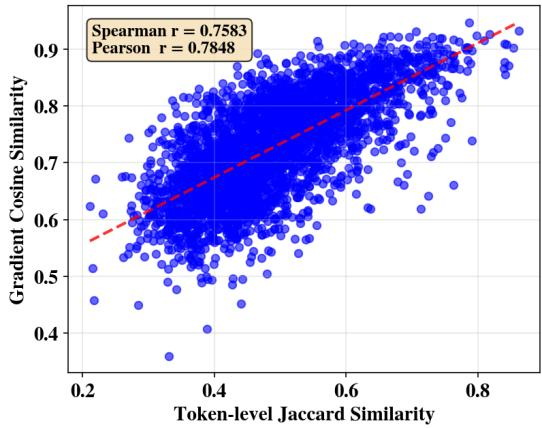
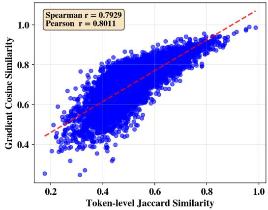
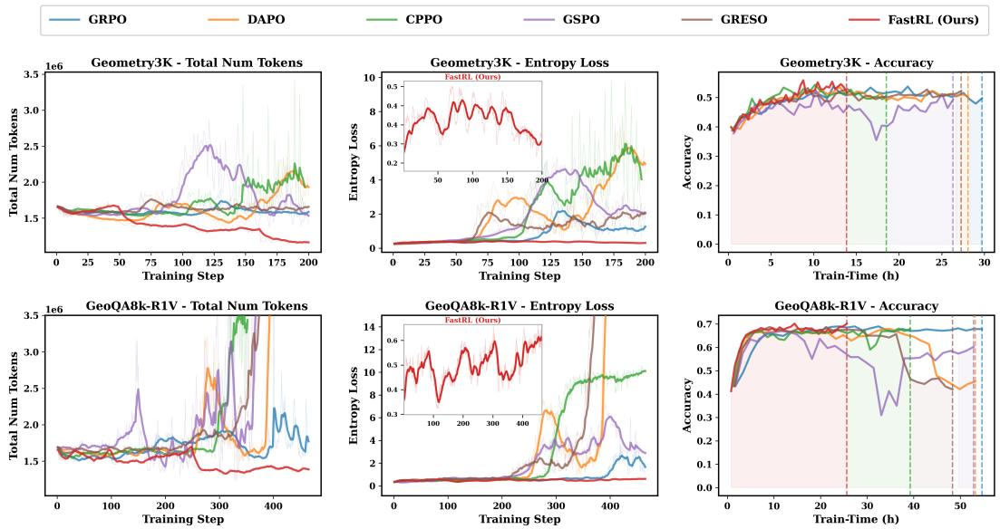

# Learn from the Gap: Differential-Aware Advantage Pruning with Adaptive Rollout Sampling for GRPO

Jiahua Yang1 Zhiwei Yang1,∗ Xianpeng Zhang2 Dongyu Chen2 Xing Chen3

Tianhuang Su2 Haonan Lu2 Quanlong Guan1 Kai Tang2 Chuangchuang Wang2,∗

1Guangdong Institute of Smart Education, Jinan University, Guangzhou, China

2OPPO AI Center, Shenzhen, China

3Ragentile Intelligence Inc, Edmonton, Canada

yangjiahua@stu2024.jnu.edu.cn, yangzw@jnu.edu.cn, wangchuangchuang@oppo.com

## Abstract

Recently, Group Relative Policy Optimization (GRPO) and its variants have been developed for policy optimization and demonstrated notable performance gains. However, these methods usually incur substantial computational overhead due to per-question multi-rollout sampling and repeated per-token probability evaluation across rollouts. Furthermore, low-information or highly homogeneous trajectories can degrade downstream learning signal efficiency, hindering model optimization and limiting final performance. To address these issues, we propose FastRL, a novel plug-and-play reinforcement learning framework that simultaneously improves training efficiency and the effectiveness of policy learning. Specifically, 1) We introduce an advantage-aware pruning strategy to selectively preserve highadvantage trajectories while maximizing inter-trajectory gradient diversity. 2) Then, we design an adaptive rollout sampling mechanism to dynamically adjust the sampling scale across different training stages based on historical pruning distributions, balancing exploration adequacy and computational efficiency. Experiments demonstrate that FastRL can be seamlessly integrated into GRPO, DAPO, and GSPO variants, achieving an average 2.07× training speedup on Geometry3K and GeoQA8K-R1V, along with an approximately 1.64% improvement in average accuracy on visual reasoning benchmarks. Source codes will be available at https://github.com/Nicozwy/FastRL.

## 1 Introduction

Reinforcement Learning (RL) optimizes model generation policies through interactive reward signals and sequential optimization [15, 18], which has proven effective in eliciting complex reasoning for mathematics, coding, and scientific reasoning tasks. Despite the strong reasoning performance of policy gradient methods, they incur heavy computational costs and memory overhead. To mitigate the excessive memory overhead inherent in Proximal Policy Optimization (PPO) [14], Group Relative Policy Optimization (GRPO) [15] is proposed as a lightweight alternative. It eliminates the standalone critic network and computes advantages via group-wise relative rewards, thereby drastically cutting memory consumption. Subsequently, a series of GRPO variants, such as Dynamic Sampling Policy Optimization (DAPO) [21] and Group Sequence Policy Optimization (GSPO) [24], have been successively developed. Nevertheless, GRPO necessitates sampling multiple completion trajectories for each prompt and performing repeated per-token evaluation across them, which still imposes non-negligible computational overhead. Even worse, since not all sampled trajectories contribute equally to policy updating [6], low-information and highly homogeneous trajectories tend to degrade learning signals, thereby hindering policy optimization and constraining overall performance.

  
Figure 1: Comparison of training efficiency and out-of-domain performance across reinforcement learning methods using Qwen2.5-VL-7B-Instruct on Geometry3K (left) and GeoQA8K-R1V (right).

Recently, a series of improved variants of the GRPO paradigm have been developed, targeting further advances in computational efficiency and training stability. For example, GRPO with Efficient Selective Rollout (GRESO) [25] imposes input-level regularization by adopting a curriculum learning strategy that excludes overly simple questions and excessively hard instances, thereby alleviating the full training burden. Instead, Completion Pruning Policy Optimization (CPPO) [6] reduces computational redundancy at the output level by globally pruning trajectory-wise advantage values via a fixed threshold throughout training. While these methods yield substantial computational overhead reduction, considerable redundant overhead remains and constrains further training speedup. As shown in Figure 1, although DAPO, GSPO and GRESO can accelerate the training of various models to some extent, they usually yield inferior final performance. While CPPO substantially boosts training efficiency, it only achieves marginal gains in downstream performance (By contrast, our FastRL outperforms all baselines, achieving up to 2.14× training speedup). Overall, existing GRPO variants inherently suffer from a prevalent efficiency-performance trade-off, failing to maintain high task accuracy while pursuing faster training.

To this end, we present FastRL, an efficient GRPO-style training framework that simultaneously boosts training efficiency and policy learning performance. Built on the core insight of learning from informative differences, FastRL integrates two complementary components to streamline training while preserving performance: 1) Maximizing differential advantage pruning filters low-information or homogeneous trajectories by leveraging the distribution of advantage values within each group, retaining only trajectories with large differential signals and high gradient contributions to eliminate unnecessary computation. 2) Adaptive rollout sampling dynamically adjusts the sampling scale throughout training, utilizing historical pruning statistics to balance computational overhead and sample effectiveness. Thus, these two mechanisms work collaboratively to train without compromising the stability and quality of policy learning. Our contributions are summarized as follows:

• We propose FastRL, a unified plug-and-play framework for GRPO variants. It resolves core efficiency and performance bottlenecks of existing methods, boosting training speed and policy learning while enabling flexible deployment across diverse GRPO-family algorithms.

• We design a differential-aware advantage pruning strategy and an adaptive dynamic sampling mechanism to alleviate computational bottlenecks in GRPO variants. The two modules respectively select discriminative trajectories based on intra-group advantage distribution to reduce homogeneous trajectories and dynamically regulate rollout scale using historical pruning statistics.

• Experimental results show that FastRL achieves up to 2.14× end-to-end training speedup on visual reasoning benchmarks while outperforming leading GRPO variants, highlighting its efficacy in enhancing the efficiency of reinforcement learning without sacrificing performance gains.

## 2 Related Work

Reinforcement Learning. Reinforcement learning (RL) has emerged as a dominant paradigm for empowering large models and has achieved remarkable success across complex real-world tasks, spanning diverse domains including game play [20, 13], autonomous driving [19, 1], coding [4, 12], and media content generation [27, 7]. A representative example is PPO [14], which stabilizes policy optimization across diverse tasks via clipped surrogate objectives. However, its reliance on a dedicated critic network for advantage estimation introduces substantial computational and memory overhead. To address this limitation, GRPO [15] eliminates the critic network by estimating baselines through group-wise relative rewards, offering a more efficient alternative. Building on this, a series of GRPO-based methods have been proposed, including DAPO [21] and GSPO [24]. Despite their promise, these methods still face several key challenges: 1) Repeated rollout sampling of trajectories, followed by gradient computation and backpropagation, incurs substantial time and computational cost, making training efficiency a central bottleneck in practical deployment. 2) Since multiple trajectories for the same instance are generated by the same policy model, high homogeneity is nearly unavoidable. This limits the informativeness of the learning signal and introduces reasoning bias, ultimately inducing mode collapse in the policy. As the policy entropy continuously decreases toward zero [10], outputs become increasingly deterministic and training may eventually collapse.

GRPO-based Training Acceleration. The computational cost of GRPO-style methods broadly stems from two distinct stages: the rollout stage and the gradient computation and policy update stage [18, 16]. During the rollout stage, recent studies [23, 3, 5] have shown that only a small subset of the original training data is sufficient to improve the model’s reasoning capabilities. Motivated by this observation, prior work has introduced curriculum learning strategies into the RL training process. For instance, Zheng et al. [25] propose to filter training questions based on their historical difficulty and reward variance, thereby reducing the number of questions involved in training. However, such approaches typically require frequent recording and access to question-level statistics, incurring additional storage and computational overhead, which limits their overall efficiency gains. In the gradient computation and update stage, Lin et al. [6] propose a unified pruning strategy based on the absolute advantage, where trajectories with low absolute advantage are discarded to reduce both forward and backward computation costs. While effective, this strategy applies a uniform criterion across all questions and is therefore relatively coarse-grained. As a result, it may suffer from a “bucket effect” [6], where questions that require more aggressive pruning are insufficiently filtered, while others are over-pruned. Furthermore, since this method focuses primarily on gradient computation, it cannot alleviate the latency incurred in the rollout phase.

## 3 Method

## 3.1 Preliminaries

The core idea of GRPO is to construct the advantage function using relative rewards within a group (e.g., mean-centered or normalized rewards), which effectively introduces an implicit baseline to guide policy updates. Specifically, for each question q sampled from the data distribution $P ( Q )$ GRPO uses the old policy $\pi _ { \theta _ { \mathrm { o l d } } }$ to generate G candidate outputs, denoted as $O ( q ) = \{ o _ { 1 } , o _ { 2 } , . . . , o _ { G } \}$ The policy $\pi _ { \theta }$ is then optimized by maximizing the following objective:

$$
\begin{array} { r l r } & { } & { \mathcal { I } _ { \mathrm { G R P O } } ( \theta ) = \mathbb { E } _ { q \sim P ( Q ) , \{ o _ { i } \} _ { i = 1 } ^ { G } \sim \pi _ { \theta _ { \mathrm { o l d } } } ( o | q ) } \Big \{ \displaystyle \frac { 1 } { G } \sum _ { i = 1 } ^ { G } \frac { 1 } { | o _ { i } | } \sum _ { t = 1 } ^ { | o _ { i } | } \Big \{ \operatorname* { m i n } \Big [ \operatorname* { m i n } \Big [ \frac { \pi _ { \theta } \big ( o _ { i , t } | q , o _ { i , < t } \big ) } { \pi _ { \theta _ { \mathrm { o l d } } } \big ( o _ { i , t } | q , o _ { i , < t } \big ) } A _ { i } , } \\ & { } & { \mathrm { c l i p } \Big ( \frac { \pi _ { \theta } \big ( o _ { i , t } | q , o _ { i , < t } \big ) } { \pi _ { \theta _ { \mathrm { o l d } } } \big ( o _ { i , t } | q , o _ { i , < t } \big ) } , 1 - \epsilon , 1 + \epsilon \Big ) A _ { i } \Big ] - \beta D _ { \mathrm { K L } } [ \pi _ { \theta } \mid \pi _ { \mathrm { r e f } } ] \Big \} \Big \} . } \end{array}\tag{1}
$$

where $\pi _ { \mathrm { r e f } }$ denote the reference model. The clipping coefficient ϵ is used to constrain the magnitude of policy updates, while $\beta$ is the regularization coefficient that controls the weight of the Kullback-Leibler (KL) divergence penalty. The advantage $A _ { i }$ is computed from the reward set $r _ { 1 } , r _ { 2 } , \ldots , r _ { G }$ corresponding to sampled outputs within the same group, as defined in Eq. 5. Furthermore, to quantify the contribution of each rollout trajectory to the training gradient, we derive the gradient of the GRPO objective, denoted as $\nabla _ { \theta } \mathcal { I } _ { \mathrm { G R P O } } ^ { \mathrm { c l i p } } ( \theta )$ . Since the min and clip operators are piecewise linear in the importance ratio, differentiating the surrogate activates only one of its two branches, and the gradient with respect to the ratio vanishes whenever the clipped branch is selected. Accordingly, we expand it as follows:

  
Figure 2: The proposed FastRL framework. (a) Maximizing Differential Advantage Pruning (MDAP) identifies and prunes uninformative trajectories (i.e., $\theta _ { i j } < \tau )$ and homogeneous trajectories (i.e., $A _ { i } = A _ { j } ) ;$ ; (b) Adaptive Rollout Sampling (ARS) dynamically adjusts the rollout budget for each iteration based on the accumulated pruning distribution.

$$
\begin{array} { l } { \nabla _ { \theta } \mathcal { I } _ { \mathrm { G R P O } } ^ { \mathrm { c l i p } } ( \theta ) = \mathbb { E } \underset { \{ \substack { o _ { i } } \} _ { i = 1 } ^ { \mathcal { G } } \sim \pi _ { \theta _ { \mathrm { o l d } } } ( O \mid q ) } { \underbrace { q \sim P ( Q ) } } \{ \frac { 1 } { G } \sum _ { i = 1 } ^ { G } \frac { 1 } { | o _ { i } | } \displaystyle \sum _ { t = 1 } ^ { | o _ { i } | } [ c _ { i , t } \frac { \pi _ { \theta } \big ( o _ { i , t } \mid q , o _ { i , < t } \big ) } { \pi _ { \theta _ { \mathrm { o l d } } } \big ( o _ { i , t } \mid q , o _ { i , < t } \big ) } A _ { i }   } \\ {   + \beta \Big ( \frac { \pi _ { \mathrm { r e f } } \big ( o _ { i , t } \mid q , o _ { i , < t } \big ) } { \pi _ { \theta } \big ( o _ { i , t } \mid q , o _ { i , < t } \big ) } - 1 \Big ) \Big ] \nabla _ { \theta } \log \pi _ { \theta } \big ( o _ { i , t } \mid q , o _ { i , < t } \big ) \} } \end{array}\tag{2}
$$

Therefore, the gradient for each rollout trajectory is:

$$
g _ { i } = \frac { 1 } { | o _ { i } | } \sum _ { t = 1 } ^ { | o _ { i } | } \left[ c _ { i , t } r _ { i , t } A _ { i } + \beta \Big ( \frac { \pi _ { \mathrm { r e f } } ( o _ { i , t } \mid q , o _ { i , < t } ) } { \pi _ { \theta } ( o _ { i , t } \mid q , o _ { i , < t } ) } - 1 \Big ) \right] \quad \nabla _ { \theta } \log \pi _ { \theta } ( o _ { i , t } \mid q , o _ { i , < t } )\tag{3}
$$

where ${ r } _ { i , t }$ denotes the importance sampling ratio, which corrects for the distribution mismatch between the current policy π and the behavior policy $\pi _ { \theta _ { \mathrm { o l d } } }$ . The binary coefficient $c _ { i , t } = \mathbf { 1 } [ A _ { i } \geq$ $0 ] \mathbf { 1 } [ r _ { i , t } \leq 1 + \epsilon ] + \mathbf { 1 } [ A _ { i } < 0 ] \mathbf { 1 } [ r _ { i , t } \geq 1 - \epsilon ]$ is the clipping indicator induced by the min and clip operators, which switches off the gradient of a token once its ratio leaves the trust region along the direction favored by the advantage. The term $\nabla _ { \theta }$ log $\pi _ { \theta } ( o _ { i , t } \mid q , o _ { i , < t } )$ represents the policy gradient direction, which determines the update direction of model parameters, while the update magnitude is jointly modulated by the advantage, the importance ratio, and the clipping indicator. In addition, the last term penalizes the deviation of the current policy from the reference policy. However, due to clipping, many recent works have begun omitting the KL divergence regularization term in practice.

However, in practice, GRPO-based methods that utilize all sampled trajectories often introduce a large amount of low-information or highly homogeneous gradient signals. As implied by Eq. 3, at the individual level, a trajectory whose advantage approaches zero contributes negligibly to the gradient. At the group level, structurally similar trajectories yield highly correlated gradient signals, implicitly overweighting frequent reasoning patterns and biasing policy updates toward dominant modes at the expense of diverse exploration. Moreover, since trajectories for the same input are generated by the same policy, a high degree of homogeneity is nearly unavoidable, leading to rapidly diminishing marginal information gain. Thus, filtering homogeneous trajectories and retaining diverse, representative ones is essential for improving gradient signal quality and achieving a better trade-off between training efficiency and model performance.

## 3.2 Maximizing Differential Advantage Pruning

As illustrated in Figure 2, for a given question $q ,$ we denote its G rollout trajectories as: $O ( q ) =$ $\left\{ o _ { 1 } , o _ { 2 } , \ldots , o _ { G } \right\}$ . Each trajectory is associated with a reward signal reflecting both output quality and structural compliance. Specifically, the reward $r _ { i }$ for trajectory $o _ { i }$ is defined as follows:

$$
r _ { i } = R _ { \mathrm { f o r m a t } } ( o _ { i } ) + R _ { \mathrm { a c c u r a c y } } ( o _ { i } ) .\tag{4}
$$

where $R _ { \mathrm { f o r m a t } } ( o _ { i } )$ denotes a format reward (+0.5), requiring the model to place its reasoning within <thinking></thinking> tags and the final answer within \boxed{}. This encourages the model to reason before answering and facilitates answer extraction. $R _ { \mathrm { a c c u r a c y } } ( o _ { i } )$ denotes an accuracy-based reward determined by the output correctness, providing positive feedback (+1) if the answer is correct and zero otherwise. Based on the rewards within the same rollout group, we compute the normalized advantage for each trajectory as follows:

$$
A _ { i } = { \frac { r _ { i } - \operatorname * { m e a n } \{ r _ { 1 } , r _ { 2 } , \ldots , r _ { G } \} } { \operatorname * { s t d } \{ r _ { 1 } , r _ { 2 } , \ldots , r _ { G } \} } } .\tag{5}
$$

We use maximizing-differential advantage-aware pruning to retain only the trajectories with the largest differences in gradient contributions. By prioritizing informative learning signals, the model is encouraged to focus on the most representative trajectories while reducing unnecessary gradient computation. We first partition trajectories according to their advantage values as follows:

$$
S _ { k } ( q ) = \{ o _ { i } \mid A _ { i } = a _ { k } \} ,\tag{6}
$$

where $a _ { k }$ denotes the k-th unique advantage value, and $S _ { k } ( q )$ represents the set of trajectories sharing the same advantage. This grouping aligns trajectories with similar dominant gradient tendencies into the same subspace, laying a foundation for redundancy reduction under consistent gradient semantic constraints. Empirical analysis of the correlation between token-level Jaccard similarity and the cosine similarity of actual gradients demonstrates a strong positive correlation among trajectories that share the same advantage within each question, as shown in Appendix B.2. Additionally, token-level Jaccard similarity is computationally efficient and well-suited for pruning, we adopt it as a proxy within the same advantage group for gradient cosine similarity to characterize trajectory similarity, thereby serving as a prior estimate of gradient similarity. Specifically, for any two trajectories $o _ { i } , o _ { j }$ within the same group, we define their token-level Jaccard similarity for prior gradient contribution deviation as follows:

$$
\theta _ { i j } = 1 - \frac { | N _ { n } ( o _ { i } ) \cap N _ { n } ( o _ { j } ) | } { | N _ { n } ( o _ { i } ) \cup N _ { n } ( o _ { j } ) | } .\tag{7}
$$

where $N _ { n } ( o _ { i } )$ denotes the set of unique n-gram token sequences extracted from trajectory $o _ { i }$ . By estimating gradient similarity, highly similar trajectories exhibit smaller deviations in gradient contribution, whereas those with low similarity exhibit greater deviations. Thus, we prune trajectory pairs with $\theta _ { i j } < \tau$ to remove unnecessary trajectories, including low-information trajectories and overly similar to already selected ones. Following this criterion, we iteratively construct a deredundant subset within each advantage group. Specifically, starting from an empty set $S _ { k } ^ { \prime } ( q ) = \emptyset$ we traverse trajectories in $S _ { k } ( q )$ and prune any trajectory $o _ { i }$ if there exists a previously retained trajectory $o _ { j } \in S _ { k } ^ { \prime } ( q )$ such that $\theta _ { i j } < \tau$ . Formally, the retained subset is defined as follows:

$$
S _ { k } ^ { \prime } ( q ) = \{ o _ { i } \in S _ { k } ( q ) \mid \mathcal { J } o _ { j } \in S _ { k } ^ { \prime } ( q ) , \theta _ { i j } < \tau \} .\tag{8}
$$

This process corresponds to a greedy maximal independent set selection under the similarity threshold, ensuring minimal overlap in gradient contributions between any two retained trajectories, while maximizing structural diversity within each group. The final set of retained trajectories is given by:

$$
S ( q ) = \bigcup _ { k } S _ { k } ^ { \prime } ( q ) .\tag{9}
$$

After maximizing differential advantage pruning, the remaining trajectories are fed into the old policy model, current policy model, and reference model. The hidden states are projected through linear layers to obtain logits, followed by a softmax over the vocabulary to compute token probabilities. These probabilities are then used to compute inter-model ratios for gradient updates. By eliminating unnecessary trajectories, our proposed method significantly reduces the computational cost of forward and backward propagation, while alleviating policy bias and improving training stability.

## 3.3 Adaptive Rollout Sampling

The aforementioned pruning effectively reduces redundant computation at the gradient update stage, yet GRPO-family methods still suffer from an inherent efficiency limitation stemming from the rollout sampling scale. Compared with a static strategy that allocates a fixed yet potentially redundant number of trajectories for each question, we design an adaptive rollout sampling mechanism that dynamically adjusts the sampling scale based on historical pruning statistics. Thus, the information density of sampled trajectories can be readily inferred from pruning records. Specifically, heavy pruning corresponds to high redundancy and calls for a smaller rollout size, while high trajectory retention implies undersampling, requiring more trajectories for stable learning signals. Formally, given a question q at training epoch t, we denote the number of sampled trajectories as $G _ { t } ^ { \mathrm { r o l l o u t } } ( \bar { q } )$ and the number used for gradient updates as $G _ { t } ^ { \mathrm { u p d a t e } } ( q )$ , whose values remain identical across most GRPO variants. However, after applying Maximizing Differential Advantage Pruning, the actual number of trajectories used for updates becomes $G _ { t } ^ { \prime } ( q )$ , which satisfies $G _ { t } ^ { \mathrm { r o l l o u t } } ( q ) \geq G _ { t } ^ { \prime } ( q )$ , thereby reducing redundant computation. To capture the overall pruning dynamics, we compute statistics of the retained update counts across all questions at epoch t:

$$
G _ { t } ^ { \prime \mathrm { m e a n } } = \frac { 1 } { N } \sum _ { i = 1 } ^ { N } G _ { t } ^ { \prime } ( q _ { i } ) , \quad G _ { t } ^ { \prime \mathrm { m a x } } = \operatorname* { m a x } _ { i = 1 , \dots , N } G _ { t } ^ { \prime } ( q _ { i } ) ,\tag{10}
$$

where N is the number of questions in the current epoch. $G _ { t } ^ { \mathrm { / m e a n } }$ reflects the average information density, while $G _ { t } ^ { \prime \mathrm { { m a x } } }$ captures the upper bound of update counts required by the single question. Based on these statistics, we define the composite pruning intensity as follows:

$$
G _ { t } ^ { \prime } = \alpha G _ { t } ^ { \prime \mathrm { m e a n } } + ( 1 - \alpha ) G _ { t } ^ { \prime \mathrm { m a x } } , \quad \alpha = \frac { \mathrm { s t e p } _ { \mathrm { c u r } } } { \mathrm { s t e p } _ { \mathrm { t o t a l } } } .\tag{11}
$$

The $G _ { t } ^ { \prime }$ is defined over the range $[ 1 , G _ { 1 } ]$ .The coefficient α increases over training, encouraging exploration in the early stage (favoring $\dot { G } _ { t } ^ { \prime \mathrm { m a x } } )$ and gradually shifting toward efficiency (favoring $G _ { t } ^ { \prime \mathrm { { m e a n } } } )$ as training progresses. We further define a reference threshold as follows:

$$
G _ { \mathrm { r e f } } ^ { \prime } = \frac { G _ { 1 } ^ { \prime \mathrm { m e a n } } + G _ { 1 } ^ { \prime \mathrm { m a x } } } { 2 } ,\tag{12}
$$

where $G _ { 1 } ^ { \prime \mathrm { { m e a n } } }$ denotes the average update count across all questions at the initial stage, and $G _ { 1 } ^ { \prime \mathrm { { m a x } } }$ denotes the maximum update count in a single question at the initial stage. Together, they provide a robust and generalizable baseline for dynamically adjusting the sampling scale throughout the training process. Based on this threshold, we only trigger adjustment when the current pruning level falls below the reference (indicating high redundancy, requiring fewer rollouts) as follows:

$$
\Delta _ { t } = \left\{ \begin{array} { l l } { G _ { \mathrm { r e f } } ^ { \prime } - G _ { t } ^ { \prime } , } & { \mathrm { i f } \ G _ { t } ^ { \prime } < G _ { \mathrm { r e f } } ^ { \prime } } \\ { 0 , } & { \mathrm { o t h e r w i s e } } \end{array} \right.\tag{13}
$$

Finally, we adaptively adjust the rollout count for the next epoch as follows:

$$
G _ { t + 1 } ^ { \mathrm { r o l l o u t } } = \operatorname* { m a x } \big ( \mathrm { r o u n d } ( G _ { 1 } - \Delta _ { t } ) , 2 \big )\tag{14}
$$

where $G _ { 1 }$ is the initial rollout count. Overall, the adaptive rollout sampling mechanism enables the model to dynamically adjust the trajectory sampling scale based on the observed pruning behavior, thereby improving computational efficiency while maintaining sufficient training signal quality throughout different training stages.

## 4 Experiments

## 4.1 Experimental Settings

Datasets and Baseline Methods. To evaluate the effectiveness of FastRL, we conduct training on the in-domain datasets, Geometry3K [8] and GeoQA8K-R1V1, and further evaluate it on four out-ofdomain multimodal mathematical reasoning benchmarks, including MathVision [17], MathVista [9], MathVerse [22], and WeMath [11]. These benchmarks cover diverse question types (e.g., geometry, chart, and table-based questions) with multi-level knowledge granularity, enabling comprehensive and fine-grained evaluation of visual mathematical reasoning. Dataset statistics are summarized in Table 6. For baseline methods, we compare FastRL with several representative methods from the GRPO family, including GRPO [15], DAPO [21], and GSPO [24], as well as recent approaches designed to accelerate GRPO, such as CPPO [6] and GRESO [25]. Specifically, CPPO applies global thresholdbased pruning on advantage values across trajectories throughout training, reducing the computational cost of both forward and backward passes. GRESO maintains historical training information and incorporates curriculum learning to selectively filter out low-information simple questions and overly difficult questions, thereby reducing the number of questions involved in training.

Table 1: Performance comparison (%) on Geometry3K and GeoQA8K-R1V regarding accuracy. The bold numbers denote the best results. Avg denotes the average accuracy across out-of-domain datasets, and Speed denotes the training speed regarding GRPO. ↑ indicates that the higher is better, while ↓ indicates that the lower is better.
<table><tr><td>Dataset</td><td>Method</td><td>In-domain</td><td>MathVerse</td><td>MathVision</td><td>MathVista</td><td>WeMath</td><td>Avg(↑)</td><td>Train-Time(↓)</td><td>Speed(↑)</td></tr><tr><td colspan="10">Qwen2.5-VL-7B-Instruct</td></tr><tr><td rowspan="10">Geo73K</td><td>GRPO [15] +CPPO [6]</td><td>53.74 54.41</td><td>43.38 43.98</td><td>26.25 27.37</td><td>66.90 66.30</td><td>68.74 69.08</td><td>51.32 51.68</td><td>29.72 18.52</td><td>1× 1.60×</td></tr><tr><td>+GRESO [25]</td><td>53.24</td><td>42.08</td><td>26.09</td><td>64.90</td><td>67.93</td><td>50.25</td><td>27.29</td><td>1.09×</td></tr><tr><td>+FastRL (Ours)</td><td>55.90</td><td>45.76</td><td>27.96</td><td>67.30</td><td>69.48</td><td>52.63</td><td>13.87</td><td>2.14×</td></tr><tr><td>DAPO [21]</td><td></td><td></td><td>26.25</td><td>67.20</td><td>70.69</td><td>51.35</td><td></td><td></td></tr><tr><td>+CPPO</td><td>53.57 54.57</td><td>41.24 43.58</td><td>27.30</td><td>68.40</td><td>69.94</td><td>52.31</td><td>28.08 16.61</td><td>1× 1.69×</td></tr><tr><td>+GRESO</td><td>53.07</td><td>43.40</td><td>26.68</td><td>65.10</td><td>68.63</td><td>50.95</td><td>26.67</td><td>1.05×</td></tr><tr><td>+FastRL (Ours)</td><td>54.90</td><td>43.93</td><td>27.96</td><td>69.80</td><td>70.63</td><td>53.08</td><td>13.29</td><td>2.11×</td></tr><tr><td>GSPO [24]</td><td>52.41</td><td>40.15</td><td>26.18</td><td>65.40</td><td>66.26</td><td>49.50</td><td>26.33</td><td></td></tr><tr><td>+CPPO</td><td>53.24</td><td>41.27</td><td>26.09</td><td>66.60</td><td>69.25</td><td>50.80</td><td>15.56</td><td>1×</td></tr><tr><td>+GRESO</td><td>52.58</td><td>39.92</td><td>25.00</td><td>65.30</td><td>68.10</td><td>49.58</td><td>25.33</td><td>1.69× 1.04×</td></tr><tr><td rowspan="14">Ge-R1V</td><td>+FastRL (Ours)</td><td>54.57</td><td>45.48</td><td>26.97</td><td>66.40</td><td>70.57</td><td>52.36</td><td>12.84</td><td>2.05×</td></tr><tr><td>GRPO</td><td>68.30</td><td>45.18</td><td>26.78</td><td>68.60</td><td>68.68</td><td>52.31</td><td>54.65</td><td>1×</td></tr><tr><td>+CPPO</td><td>68.03</td><td>45.20</td><td>26.97 26.38</td><td>69.00 67.20</td><td>68.79 68.56</td><td>52.49</td><td>39.22</td><td>1.39×</td></tr><tr><td>+GRESO +FastRL (Ours)</td><td>68.70 70.15</td><td>45.99 45.91</td><td>27.86</td><td>70.60</td><td>70.00</td><td>52.03 53.59</td><td>48.33 25.65</td><td>1.13×</td></tr><tr><td></td><td></td><td></td><td></td><td></td><td></td><td></td><td></td><td>2.13×</td></tr><tr><td>DAPO</td><td>67.90 68.70</td><td>43.96 44.92</td><td>25.99 27.43</td><td>68.30 67.40</td><td>66.67</td><td>51.23</td><td>53.22</td><td>1×</td></tr><tr><td>+CPPO +GRESO</td><td>67.90</td><td>45.05</td><td>26.12</td><td>64.40</td><td>67.76 68.10</td><td>51.88 50.92</td><td>38.15</td><td>1.39×</td></tr><tr><td>+FastRL (Ours)</td><td>70.29</td><td>46.17</td><td>27.53</td><td>68.50</td><td>68.97</td><td>52.79</td><td>46.85 24.62</td><td>1.14×</td></tr><tr><td></td><td></td><td></td><td></td><td></td><td></td><td></td><td></td><td>2.16×</td></tr><tr><td>GSPO</td><td>66.97</td><td>44.21</td><td>27.01</td><td>65.60</td><td>68.74</td><td>51.39</td><td>52.87</td><td>1×</td></tr><tr><td>+CPPO +GRESO</td><td>68.03</td><td>45.41</td><td>27.63 27.07</td><td>67.30</td><td>68.56</td><td>52.23</td><td>37.55</td><td>1.41×</td></tr><tr><td>+FastRL (Ours)</td><td>67.37 69.36</td><td>42.99 46.27</td><td>27.89</td><td>65.50 67.30</td><td>66.38 68.45</td><td>50.49 52.48</td><td>47.08 23.85</td><td>1.12× 2.22×</td></tr><tr><td colspan="8"></td></tr><tr><td rowspan="6">Geo3K</td><td></td><td></td><td></td><td>Qwen3-VL-8B-Instruct</td><td></td><td></td><td></td><td></td><td></td></tr><tr><td>GRPO [15]</td><td>78.87</td><td>55.76</td><td>48.98</td><td>71.20</td><td>80.63</td><td>64.14</td><td>30.05</td><td>1×</td></tr><tr><td>DAPO [21]</td><td>79.53</td><td>55.61</td><td>50.39</td><td>71.60</td><td>80.06</td><td>64.42</td><td>28.67</td><td>1.05×</td></tr><tr><td>GSPO [24] CPPO [6]</td><td>79.03 79.36</td><td>55.28 55.03</td><td>49.67</td><td>71.10</td><td>80.69</td><td>64.19</td><td>28.32</td><td>1.06×</td></tr><tr><td>GRESO [25]</td><td>78.87</td><td>54.82</td><td>51.45 50.53</td><td>70.70 70.20</td><td>78.79 78.22</td><td>63.99 63.44</td><td>22.75</td><td>1.32×</td></tr><tr><td>FastRL (Ours)</td><td>80.03</td><td>56.45</td><td>54.14</td><td>71.10</td><td>81.61</td><td>65.83</td><td>29.11</td><td>1.03×</td></tr><tr><td></td><td></td><td></td><td></td><td></td><td></td><td></td><td></td><td>16.37</td><td>1.84×</td></tr><tr><td></td><td>GRPO</td><td>82.36</td><td>54.01</td><td>49.05</td><td>70.40</td><td>78.22</td><td>62.92</td><td>85.16</td><td>1x</td></tr><tr><td></td><td>DAPO GSPO</td><td>82.36 82.49</td><td>53.58 54.31</td><td>50.59 49.57</td><td>70.00 71.50</td><td>79.31 79.77</td><td>63.37 63.79</td><td>85.01</td><td>1.00×</td></tr><tr><td></td><td>CPPO</td><td>84.08</td><td>52.64</td><td>46.64</td><td>69.80</td><td>76.00</td><td>61.27</td><td>83.25 68.22</td><td>1.02× 1.25×</td></tr><tr><td>Geo-RRIV</td><td>GRESO</td><td>82.09</td><td>52.74</td><td>47.86</td><td>69.70</td><td>77.01</td><td>61.83</td><td>84.67</td><td>1.01×</td></tr><tr><td></td><td>FastRL (Ours)</td><td>84.35</td><td>55.36</td><td>52.20</td><td>71.60</td><td>78.85</td><td>64.50</td><td>45.33</td><td>1.88×</td></tr></table>

Implementation Details. We implement FastRL and baselines using the EasyR1 [26] framework, and extend GRESO and CPPO to the multimodal setting for comparison. Considering the scale of Geometry3K and GeoQA8K-R1V, the number of training epochs is set to 25 and 15, respectively. We adopt the AdamW optimizer with a learning rate of $1 \times \bar { 1 0 ^ { - 6 } }$ and a weight decay of $1 \times 1 0 ^ { - 2 } .$ . The KL divergence coefficient $\beta$ is set to 0.01. For all methods, the initial rollout sampling number $G _ { 1 }$ is fixed to 8, the training batch size is set to 256, the hyperparameter τ is set to 0.8, and the remaining hyperparameters follow the default settings of EasyR1. All experiments are conducted on NVIDIA H20 GPUs, and Qwen2.5-VL-7B-Instruct and Qwen3-VL-8B-Instruct are trained on four and eight GPUs, respectively. We use accuracy (%) and training time (h) as evaluation metrics.

## 4.2 Overall Results and Analysis

As shown in Table 1, FastRL consistently outperforms all baselines regarding both training efficiency and average accuracy across Geometry3K and GeoQA8K-R1V using both Qwen2.5-VL-7B-Instruct and Qwen3-VL-8B-Instruct. Notably, FastRL (with Qwen2.5-VL-7B-Instruct) accelerates GRPO training by up to 2.14× and 2.22× on the Geometry3K and GeoQA8K-R1V benchmarks, respectively. Meanwhile, it improves average accuracy by 1.31% and 1.09% on these two benchmarks, respectively. Similar trends are observed with Qwen3-VL-8B-Instruct, further validating the robustness of FastRL across model scales. These improvements stem primarily from maximizing differential advantage pruning and adaptive rollout sampling, which significantly reduce redundant computation while preserving discriminative trajectories, thereby balancing efficiency and performance.

Table 2: Ablation study (%) of FastRL. “w/o MDAP” denotes FastRL without maximizing differential advantage pruning (with ARS simulated to match its standard dynamics for a fair comparison), and “w/o ARS” denotes FastRL without adaptive rollout sampling.
<table><tr><td>Dataset</td><td>|Method</td><td>|In-domain | MathVerse MathVision MathVista</td><td></td><td></td><td></td><td>WeMath | Avg(↑)</td><td></td><td>Train-Time(↓) Speed(↑)</td><td></td></tr><tr><td colspan="10">Qwen2.5-VL-7B-Instruct</td></tr><tr><td>Geometry3K</td><td>FastRL w/o MDAP w/o ARS</td><td>55.90  $5 3 . 4 1 _ { \downarrow 2 . 4 9 }$   $\left. 5 4 . 0 1 \right| _ { \downarrow 1 . 8 9 } ^ { - \cdot }$ </td><td>45.76 45.00 45.00</td><td>27.96 27.04 27.99</td><td>67.30 66.30 67.10</td><td>69.48 69.31 68.97</td><td>52.63  $5 1 . 9 1 _ { \perp 0 . 7 2 }$   $5 2 . 2 7 _ { \downarrow 0 . 3 6 } ^ { }$ </td><td>13.87 25.85 14.41</td><td>2.14× 1.15×↓0.99× 2.06×10.08×</td></tr><tr><td>GeoQA8K-R1V</td><td>FastRL w/o MDAP w/o ARS</td><td>70.15  $6 8 . 7 0 _ { \downarrow 1 . 4 5 }$ </td><td>45.91 44.95</td><td>27.86 27.43</td><td>70.60 67.60</td><td>70.00 69.54</td><td>53.59  $5 2 . 3 8 _ { \perp 1 . 2 1 }$ </td><td>25.65 49.75</td><td>2.13×  $1 . 1 0 \times \downarrow 1 . 0 3 \times$ </td></tr><tr><td></td><td></td><td> $6 9 . 6 2 _ { \downarrow 0 . 5 3 } ^ { \ast }$ </td><td>45.38</td><td>27.80 Qwen3-VL-8B-Instruct</td><td>70.00</td><td>69.83</td><td> $5 3 . 2 5 _ { \downarrow 0 . 3 4 } ^ { \ast \cdot  }$ </td><td>29.53</td><td> $1 . 8 5 \times 1 0 . 2 8 \times$ </td></tr><tr><td colspan="10"></td></tr><tr><td>Geometry3K</td><td>FastRL w/o MDAP</td><td>80.03  $\underline { { 7 8 . 7 0 } } \underline { { { \downarrow 1 . 3 3 } } }$ </td><td>56.45 55.56</td><td>54.14 51.74</td><td>71.10 70.20</td><td>81.61 80.11</td><td>65.83  $6 4 . 4 0 _ { \downarrow 1 . 4 3 }$ </td><td>16.37 27.42</td><td>1.84×  $1 . 1 0 \times \downarrow 0 . 7 4 \times$ </td></tr><tr><td></td><td>w/o ARS</td><td> $7 9 . 7 0 \dot { \phantom { 0 } } _ { \downarrow 0 . 3 3 }$ </td><td>56.07</td><td>53.85</td><td>70.60</td><td>80.69</td><td> $6 5 . 3 0 \dot { \downarrow } 0 . 5 3$ </td><td>17.97</td><td> $1 . 6 7 \times \dot { \iota } 0 . 1 7 \times$ </td></tr><tr><td></td><td>FastRL</td><td>84.35</td><td>55.36</td><td>52.20</td><td>71.60</td><td>78.85</td><td>64.50</td><td>45.33</td><td>1.88×</td></tr><tr><td>GeoQA8K-R1V</td><td>w/o MDAP</td><td> $^ { 8 2 . 8 9 } _ { - \cdot - \cdot } \downarrow 1 . 4 6$ </td><td>53.73</td><td>51.32</td><td>70.10</td><td>78.22</td><td> $6 3 . 3 4 _ { \downarrow 1 . 1 6 }$ </td><td>79.25</td><td> $1 . 0 7 \times \downarrow 0 . 8 1 \times$ </td></tr><tr><td></td><td>w/o ARS</td><td> $8 3 . 5 5 _ { \downarrow 0 . 8 0 } ^ { ^ { \scriptstyle + } }$ </td><td>54.92</td><td>52.14</td><td>71.20</td><td>79.14</td><td> $6 4 . 3 5 _ { \downarrow 0 . 1 5 } ^ { ^ { \mathrm { v } } }$ </td><td>50.12</td><td> $1 . 7 0 \times \mathrm { 1 0 . 1 8 \times }$ </td></tr></table>

Compared with GRPO, CPPO achieves training acceleration but yields limited, or even worse, accuracy across different backbones and datasets. For example, CPPO (with Qwen3-VL-8B-Instruct) accelerates GRPO training while reducing average accuracy by 0.15% and 1.65% on Geometry3K and GeoQA8K-R1V, respectively. This suggests that pruning trajectories by a fixed ratio may remove informative trajectories that remain valuable for policy optimization, thereby affecting training stability. Furthermore, CPPO’s speedup decreases from 1.60× to 1.39× when transferring to GeoQA8K-R1V, likely because CPPO only reduces optimization-stage computation while leaving rollout unchanged. Since longer responses increase the relative cost of rollout, the overall speedup becomes limited. Note that GRESO provides limited acceleration at the cost of performance, as its curriculum-based filtering introduces overhead for maintaining historical statistics while risking premature removal of informative questions, ultimately harming generalization. In contrast, FastRL achieves consistent speedup across both backbones and datasets while maintaining or improving accuracy, demonstrating a better balance between efficiency and performance.

## 4.3 Ablation Study

We conduct ablation studies on both Qwen2.5-VL-7B-Instruct and Qwen3-VL-8B-Instruct to assess the contributions of the two core components in FastRL. As shown in Table 2, removing the maximizing differential advantage pruning (MDAP) leads to the most significant degradation in both accuracy and training efficiency. For instance, on Qwen2.5-VL-7B-Instruct, the average accuracy drops by 0.72% and 1.21%, while the training speed decreases sharply from 2.14× to 1.15× and 2.13× to 1.10× on Geometry3K and GeoQA8K-R1V, respectively, indicating that MDAP is the primary driver of performance and acceleration gains. In contrast, removing adaptive rollout sampling (ARS) results in smaller but consistent declines in both metrics, suggesting its complementary role in further boosting efficiency and stabilizing training. Such consistent trends across model scales further validate that our components complement each other and collectively enhance final performance.

## 4.4 Analysis of FastRL’s Training Efficiency and Parameter Sensitivity

Training Efficiency Analysis. As shown in Figure 3 (a1)-(a2), FastRL adaptively adjusts the rollout sampling scale based on the historical pruning distribution. The results indicate that this adaptive sampling mechanism achieves a favorable balance between exploration adequacy and computational efficiency. In addition, as illustrated in Figure 3 (b1)-(b2), $G _ { t } ^ { \dot { \prime } }$ shows a gradual downward trend as training proceeds, indicating that the number of highly distinct trajectories gradually diminishes in the later training stages. Compared with CPPO, which adopts a similar advantage-based pruning strategy, FastRL retains fewer yet more representative trajectories for gradient updates. This leads to both improved training efficiency and enhanced model performance.

Figure 3: Training efficiency and parameter sensitivity of FastRL on Geometry3K (top) and GeoQA8K-R1V (bottom). (a1)-(a2) show the the rollout sampling scale $G _ { t } ;$ (b1)-(b2) present the number of trajectories used for policy updates; (c1)-(c2) show the sensitivity to the hyperparameter τ .  
Table 3: Generalization across model architectures and datasets.
<table><tr><td>Dataset</td><td>Method</td><td></td><td>In-domain |AIME2023</td><td>AIME2024</td><td>AIME2025</td><td>AIME2026|</td><td>Avg(↑)</td><td>Train-Time(↓)</td><td>Speed(↑)</td></tr><tr><td colspan="10">Llama3.1-8B-Instruct</td></tr><tr><td rowspan="6">ATTH</td><td>GRPO [15]</td><td>72.32</td><td>10.00</td><td>10.00</td><td>6.67</td><td>3.33</td><td>7.50</td><td>21.16</td><td>1×</td></tr><tr><td>DAPO [21]</td><td>72.72</td><td>6.67</td><td>10.00</td><td>6.67</td><td>3.33</td><td>6.67</td><td>19.72</td><td>1.07×</td></tr><tr><td>GSPO [24]</td><td>72.56</td><td>6.67</td><td>10.00</td><td>0.00</td><td>0.00</td><td>4.17</td><td>18.89</td><td>1.12×</td></tr><tr><td>CPPO [6]</td><td>71.92</td><td>3.33</td><td>10.00</td><td>0.00</td><td>3.33</td><td>4.17</td><td>11.44</td><td>1.85×</td></tr><tr><td>GRESÔ [25]</td><td>71.60</td><td>3.33</td><td>6.67</td><td>3.33</td><td>0.00</td><td>3.33</td><td>17.35</td><td>1.22×</td></tr><tr><td>FastRL (Ours)</td><td>73.04</td><td>10.00</td><td>13.33</td><td>3.33</td><td>3.33</td><td>7.50</td><td>9.22</td><td>2.30×</td></tr></table>

Parameter Sensitivity Analysis. As shown in Figure 3 (c1)-(c2), we perform trajectory pruning among rajectories with identical advantages by preferentially removing those with smaller deviations, that is, higher similarity. When the threshold τ is set to 0.8, FastRL achieves the highest benchmark accuracy, while attaining training speedups of 2.14× and 2.13× on these two datasets, respectively. When τ is further increased to 1.0, meaning that only one trajectory is retained for each advantage, the training speedups improve to 2.35× and 2.27×, respectively, but the benchmark accuracy decreases compared to the case of $\tau = 0 . 8 .$ . Thus, we set $\tau = 0 . 8$ as our final configuration since average accuracy peaks at this setting, achieving a good trade-off between performance and training efficiency.

## 4.5 Generalization Across Architectures and Datasets

To evaluate the generalization of FastRL beyond its primary setting, we conduct experiments on Llama3.1-8B-Instruct, trained on the text-only MATH dataset [2], and compare against all baselines under identical conditions. As shown in Table 3, FastRL achieves the highest in-domain accuracy (73.04%) and the greatest training speedup (2.30×), outperforming CPPO. On out-of-domain AIME benchmarks, it matches GRPO’s average accuracy (7.50%) with less than half the training time (9.22 vs. 21.16 hours), while efficiency-oriented methods such as CPPO and GRESO suffer notable accuracy degradation (Avg: 4.17% and 3.33%, respectively). These results confirm that FastRL’s speedup does not compromise generalization, and its consistent gains across both a distinct backbone and a text-only dataset attest to its broad applicability.

## 4.6 Further Analysis

Exploration Capacity Analysis. To verify the impact of trajectory pruning on the exploration space of the policy, we adopt Pass@k, a widely used metric for estimating the upper bound of a model’s capability. As shown in Table 4, FastRL does not shrink the exploration space or cap the potential capability of the model. On the contrary, it improves avg@16 over GRPO by 3.15 on Geometry3K and 2.14 on GeoQA8K-R1V, and attains the best Pass@16 score on every individual benchmark. This indicates that pruning redundant trajectories that share identical advantages does not suppress exploration, since such trajectories provide little additional learning signal for policy optimization.

Table 4: Pass@16 results (%) on out-of-domain benchmarks. Base model: Qwen2.5-VL-7B-Instruct.
<table><tr><td>Dataset</td><td>Method</td><td>MathVerse</td><td>MathVision</td><td>MathVista</td><td>WeMath</td><td>avg@16(↑)</td></tr><tr><td rowspan="6">Geometry3K</td><td>GRPO [15]</td><td>60.53</td><td>62.96</td><td>82.50</td><td>90.34</td><td>74.08</td></tr><tr><td>DAPO [21]</td><td>58.98</td><td>62.57</td><td>81.50</td><td>90.57</td><td>73.41</td></tr><tr><td>GSPO [24]</td><td>59.21</td><td>62.30</td><td>81.90</td><td>90.11</td><td>73.38</td></tr><tr><td>GRESO [25]</td><td>59.44</td><td>62.47</td><td>82.00</td><td>90.23</td><td>73.54</td></tr><tr><td>CPPO [6]</td><td>60.81</td><td>63.19</td><td>82.20</td><td>90.69</td><td>74.22</td></tr><tr><td>FastRL (Ours)</td><td>63.60</td><td>67.86</td><td>83.60</td><td>93.85</td><td>77.23</td></tr><tr><td rowspan="6">GeoQA8K-R1V</td><td>GRPO [15]</td><td>60.99</td><td>59.41</td><td>82.10</td><td>89.77</td><td>73.07</td></tr><tr><td>DAPO [21]</td><td>59.57</td><td>57.86</td><td>81.90</td><td>87.59</td><td>71.73</td></tr><tr><td>GSPO [24]</td><td>60.53</td><td>58.22</td><td>82.00</td><td>87.64</td><td>72.10</td></tr><tr><td>GRESO [25]</td><td>59.26</td><td>57.24</td><td>81.50</td><td>86.78</td><td>71.20</td></tr><tr><td>CPPO [6]</td><td>60.41</td><td>58.88</td><td>82.00</td><td>89.08</td><td>72.59</td></tr><tr><td>FastRL (Ours)</td><td>62.39</td><td>63.95</td><td>83.20</td><td>91.32</td><td>75.21</td></tr></table>

Table 5: Ablation (%) of pruning strategies on Geometry3K using Qwen2.5-VL-7B-Instruct.
<table><tr><td>Pruning Strategy</td><td>MathVerse</td><td>MathVision</td><td>MathVista</td><td>WeMath</td><td>Avg(↑)</td><td>Speed(↑)</td></tr><tr><td>Random-pruning 0.25</td><td>43.98</td><td>27.40</td><td>66.90</td><td>68.85</td><td>51.78</td><td>1.27×</td></tr><tr><td>Random-pruning 0.50</td><td>45.35</td><td>26.74</td><td>66.60</td><td>67.70</td><td>51.59</td><td>1.60×</td></tr><tr><td>Random-pruning 0.75</td><td>42.79</td><td>26.45</td><td>64.60</td><td>66.49</td><td>50.08</td><td>2.10×</td></tr><tr><td>Advantage-only (Ours)</td><td>44.54</td><td>27.57</td><td>67.10</td><td>69.14</td><td>52.09</td><td>2.35×</td></tr><tr><td>FastRL (Ours)</td><td>45.76</td><td>27.96</td><td>67.30</td><td>69.48</td><td>52.63</td><td>2.14×</td></tr></table>

Analysis of Pruning Strategies. We further conduct a targeted ablation to disentangle the two sources of gain in FastRL: (i) diversity preservation across advantage groups, and (ii) redundancy pruning within the same advantage group based on Jaccard distance. Specifically, we compare the following settings on Geometry3K using Qwen2.5-VL-7B-Instruct: Random-pruning 0.25/0.5/0.75, which randomly prunes 25%/50%/75% of the trajectories within each query; Advantage-only, which groups trajectories by advantage and randomly retains one trajectory per group without Jaccard pruning; and FastRL, the full method that additionally applies Jaccard-distance-based pruning to redundant trajectories within each advantage group. As shown in Table 5, we draw the following conclusions. (1) Random pruning yields acceleration but suffers from significant performance degradation as the pruning ratio increases, showing that blindly reducing the number of trajectories is not the source of the gain. (2) Simply grouping by advantage and retaining one trajectory per group (Advantage-only) already achieves a 2.35× speedup together with a slight performance improvement, indicating that most of the acceleration and the stable gain comes from removing redundant updates with identical advantages. (3) Adding Jaccard-based pruning on top of advantage grouping (the full FastRL) further improves the average accuracy from 52.09 to 52.63, showing that Jaccard-distance pruning plays the key role of preventing high-value trajectories that share the same reward but differ substantially in structure from being mistakenly pruned within the same advantage group, and is therefore a critical component for balancing speed and performance. In summary, the speedup of FastRL mainly comes from redundancy compression across advantage groups, while Jaccard-distance pruning ensures that structurally diverse trajectories carrying additional learning signals are preserved during compression. Together, they form the favorable efficiency-performance trade-off of FastRL.

## 5 Conclusion

This paper proposes FastRL, a plug-and-play and efficient reinforcement learning framework that improves training efficiency while enhancing policy learning. Specifically, we introduce a structured pruning strategy based on maximizing advantage diversity, which retains only the most informative trajectories with the largest differences in gradient contribution, allowing the model to focus on highly discriminative learning signals while reducing redundant forward computation. Furthermore, we develop an adaptive rollout sampling mechanism coupled with pruning dynamics, which adjusts the sampling scale online according to the historical pruning distribution, achieving a balance between exploration sufficiency and computational efficiency. Experimental results demonstrate that FastRL consistently delivers both training acceleration and accuracy improvements for GRPO-based methods.

## Acknowledgments and Disclosure of Funding

This work is partially supported by the research project funded by Guangdong Basic and Applied Basic Research Foundation (2026A1515011829, 2024A1515140144), the Fundamental Research Funds for the Central Universities (21624325, 21624338, 21625102), Ministry of Education of the People’s Republic of China Humanities and Social Sciences Youth Foundation (24YJC890034), the Key Laboratory of Smart Education of Guangdong Higher Education Institute, Jinan University (2022LSYS003). This work is also supported by NSFC (62377028), Guangdong Science and Technology Plan Project (2025A0505010018), "Master Mentor Plan" of Jinan University (YDXS2501), and the teaching reform research projects of Jinan University (JG2026030). We also thank the OPPO AI Center for providing computational resources for this work.

## References

[1] Xing Fang, Qichao Zhang, Yinfeng Gao, and Dongbin Zhao. Offline reinforcement learning for autonomous driving with real world driving data. In 2022 IEEE 25th International Conference on Intelligent Transportation Systems (ITSC), pages 3417–3422. IEEE, 2022.

[2] Dan Hendrycks, Collin Burns, Saurav Kadavath, Akul Arora, Steven Basart, Eric Tang, Dawn Song, and Jacob Steinhardt. Measuring mathematical problem solving with the math dataset. arXiv preprint arXiv:2103.03874, 2021.

[3] Youngeun Kim. MC-GRPO: Median-centered group relative policy optimization for smallrollout reinforcement learning. arXiv preprint arXiv:2601.22582, 2026.

[4] Hung Le, Yue Wang, Akhilesh Deepak Gotmare, Silvio Savarese, and Steven Chu Hong Hoi. CodeRL: Mastering code generation through pretrained models and deep reinforcement learning. Advances in Neural Information Processing Systems, 35:21314–21328, 2022.

[5] Xuefeng Li, Haoyang Zou, and Pengfei Liu. LIMR: Less is more for rl scaling. arXiv preprint arXiv:2502.11886, 2025.

[6] Zhihang Lin, Mingbao Lin, Yuan Xie, and Rongrong Ji. CPPO: Accelerating the training of group relative policy optimization-based reasoning models. In Advances in Neural Information Processing Systems, 2025.

[7] Christian E López, James Cunningham, Omar Ashour, and Conrad S Tucker. Deep reinforcement learning for procedural content generation of 3d virtual environments. Journal of Computing and Information Science in Engineering, 20(5):051005, 2020.

[8] Pan Lu, Ran Gong, Shibiao Jiang, Liang Qiu, Siyuan Huang, Xiaodan Liang, and Song-Chun Zhu. Inter-gps: Interpretable geometry problem solving with formal language and symbolic reasoning. In Proceedings ofthe 59th Annual Meeting ofthe Associationfor Computational Linguistics and the 11th International Joint Conference on Natural Language Processing (Volume 1: Long Papers), pages 6774–6786, 2021.

[9] Pan Lu, Hritik Bansal, Tony Xia, Jiacheng Liu, Chunyuan Li, Hannaneh Hajishirzi, Hao Cheng, Kai-Wei Chang, Michel Galley, and Jianfeng Gao. MathVista: Evaluating mathematical reasoning of foundation models in visual contexts. arXiv preprint arXiv:2310.02255, 2023.

[10] Wenquan Lu, Hai Huang, and Randall Balestriero. Prompt augmentation scales up grpo training on mathematical reasoning. arXiv preprint arXiv:2602.03190, 2026.

[11] Runqi Qiao, Qiuna Tan, Guanting Dong, Sun MinhuiWu, Song Chong, et al. We-Math: Does your large multimodal model achieve human-like mathematical reasoning? In Proceedings of the 63rd Annual Meeting ofthe Associationfor Computational Linguistics (Volume 1: Long Papers), pages 20023–20070, 2025.

[12] Marina Sakharova, Abhinav Anand, and Mira Mezini. Integrating symbolic execution into the fine-tuning of code-generating llms. In Proceedings of the 2025 Conference of the Nations of the Americas Chapter of the Association for Computational Linguistics: Human Language Technologies (Volume 4: Student Research Workshop), pages 271–278, 2025.

[13] Julian Schrittwieser, Ioannis Antonoglou, Thomas Hubert, Karen Simonyan, Laurent Sifre, Simon Schmitt, Arthur Guez, Edward Lockhart, Demis Hassabis, Thore Graepel, et al. Mastering atari, go, chess and shogi by planning with a learned model. Nature, 588(7839):604–609, 2020.

[14] John Schulman, Filip Wolski, Prafulla Dhariwal, Alec Radford, and Oleg Klimov. Proximal policy optimization algorithms. arXiv preprint arXiv:1707.06347, 2017.

[15] Zhihong Shao, Peiyi Wang, Qihao Zhu, Runxin Xu, Junxiao Song, Xiao Bi, Haowei Zhang, Mingchuan Zhang, YK Li, Yang Wu, et al. Deepseekmath: Pushing the limits of mathematical reasoning in open language models. arXiv preprint arXiv:2402.03300, 2024.

[16] Hongyuan Su, Yu Zheng, Yuan Yuan, Yuming Lin, Depeng Jin, and Yong Li. Reinforcement learning with adaptive reward modeling for expensive-to-evaluate systems. In Forty-second International Conference on Machine Learning, 2025.

[17] Ke Wang, Junting Pan, Weikang Shi, Zimu Lu, Houxing Ren, Aojun Zhou, Mingjie Zhan, and Hongsheng Li. Measuring multimodal mathematical reasoning with math-vision dataset. Advances in Neural Information Processing Systems, 37:95095–95169, 2024.

[18] Kevin Wang, Ishaan Javali, Michał Bortkiewicz, Benjamin Eysenbach, et al. 1000 layer networks for self-supervised rl: Scaling depth can enable new goal-reaching capabilities. In Advances in Neural Information Processing Systems, 2025.

[19] Jingda Wu, Zhiyu Huang, and Chen Lv. Uncertainty-aware model-based reinforcement learning: Methodology and application in autonomous driving. IEEE Transactions on Intelligent Vehicles, 8(1):194–203, 2022.

[20] Weirui Ye, Shaohuai Liu, Thanard Kurutach, Pieter Abbeel, and Yang Gao. Mastering atari games with limited data. Advances in neural information processing systems, 34:25476–25488, 2021.

[21] Qiying Yu, Zheng Zhang, Ruofei Zhu, Yufeng Yuan, Xiaochen Zuo, Yu Yue, Weinan Dai, Tiantian Fan, Gaohong Liu, Lingjun Liu, et al. DAPO: An open-source llm reinforcement learning system at scale. In Advances in Neural Information Processing Systems, 2025.

[22] Renrui Zhang, Dongzhi Jiang, Yichi Zhang, Haokun Lin, Ziyu Guo, Pengshuo Qiu, Aojun Zhou, Pan Lu, Kai-Wei Chang, Yu Qiao, et al. MathVerse: Does your multi-modal llm truly see the diagrams in visual math problems? In European Conference on Computer Vision, pages 169–186. Springer, 2024.

[23] Yizhou Zhang, Ning Lv, Teng Wang, and Jisheng Dang. FastGRPO: Accelerating policy optimization via concurrency-aware speculative decoding and online draft learning. In Proceedings ofthe International Conference on Learning Representations (ICLR), 2026.

[24] Chujie Zheng, Shixuan Liu, Mingze Li, Xiong-Hui Chen, Bowen Yu, Chang Gao, Kai Dang, Yuqiong Liu, Rui Men, An Yang, et al. Group sequence policy optimization. arXiv preprint arXiv:2507.18071, 2025.

[25] Haizhong Zheng, Yang Zhou, Brian R. Bartoldson, Bhavya Kailkhura, Fan Lai, Jiawei Zhao, and Beidi Chen. Act only when it pays: Efficient reinforcement learning for llm reasoning via selective rollouts. In Advances in Neural Information Processing Systems, 2025.

[26] Yaowei Zheng, Junting Lu, Shenzhi Wang, Zhangchi Feng, Dongdong Kuang, Yuwen Xiong, and Richong Zhang. EasyR1: An efficient, scalable, multi-modality rl training framework. https://github.com/hiyouga/EasyR1, 2025.

[27] Zhenglin Zhou, Xiaobo Xia, Fan Ma, Hehe Fan, Yi Yang, and Tat-Seng Chua. DreamDPO: Aligning text-to-3d generation with human preferences via direct preference optimization. In International Conference on Machine Learning, pages 79414–79435. PMLR, 2025.

## Appendix

## A Experimental Datasets.

To validate the effectiveness of our method, we conduct experiments in both multimodal and unimodal settings. We first provide a brief overview of in-domain datasets. The Geometry3K [8] dataset contains 3,002 questions, and we use 2,702 problems from its training and test splits in our experiments, covering geometry knowledge from grades 6 to 12 in North America. GeoQA8K-R1V2 is a multimodal geometric reasoning dataset for reinforcement learning, specifically designed for the R1-V paradigm to enhance the geometric reasoning capabilities of vision-language models (VLMs). The MATH [2] dataset contains 12,500 highly challenging text-based mathematical problems. Each problem in MATH is accompanied by a complete step-by-step solution, which can be used to train models to generate reasoning processes and detailed explanations alongside final answers. Examples are illustrated in Figure 4. In addition, we provide a brief overview of out-of-domain benchmarks used to evaluate the models’ reasoning ability. MathVision [17] is a challenging benchmark consisting of 3,040 mathematical questions with visual context, collected from real-world math competitions across 12 grade levels from primary school to high school. MathVista [9] is a comprehensive benchmark for evaluating mathematical reasoning in visual contexts. It contains 1,000 questions spanning diverse question types, including geometry, charts, and tables. MathVerse [22] is a comprehensive visual mathematics benchmark designed for a fair and in-depth evaluation of multimodal large language models. Its test set includes 3,940 multi-subject math questions with diagrams from publicly available sources. WeMath [11] carefully collects and organizes 1,740 visual math questions in its test set, covering 67 hierarchical knowledge concepts across five levels of granularity. AIME3 is a text-only benchmark for evaluating advanced mathematical reasoning. It is designed to assess the multi-step reasoning capabilities of large language models.

Table 6: Statistics of the datasets used in our experiments.
<table><tr><td colspan="5">Multimodal</td><td colspan="5">Unimodal</td></tr><tr><td>Dataset</td><td>Sum</td><td>Train</td><td>Test</td><td>Modality</td><td>Dataset</td><td>Sum</td><td>Train</td><td>Test</td><td>Modality</td></tr><tr><td>Geometry3K</td><td>2,702</td><td>2,101</td><td>601</td><td>Text + Image</td><td>MATH</td><td>12,500</td><td>11,250</td><td>1,250</td><td>Text</td></tr><tr><td>GeoQA8K-R1V</td><td>8,785</td><td>8,031</td><td>754</td><td>Text + Image</td><td>AIME2023</td><td>30</td><td></td><td>30</td><td>Text</td></tr><tr><td>MathVerse</td><td>3,940</td><td></td><td>3,940</td><td>Text + Image</td><td>AIME2024</td><td>30</td><td></td><td>30</td><td>Text</td></tr><tr><td>MathVision</td><td>3,040</td><td></td><td>3,040</td><td>Text + Image</td><td>AIME2025</td><td>30</td><td></td><td>30</td><td>Text</td></tr><tr><td>MathVista (mini)</td><td>1,000</td><td></td><td>1,000</td><td>Text + Image</td><td>AIME2026</td><td>30</td><td></td><td>30</td><td>Text</td></tr><tr><td>WeMath</td><td>1,740</td><td></td><td>1,740</td><td>Text + Image</td><td></td><td></td><td></td><td></td><td></td></tr><tr><td colspan="8">6√2ft</td></tr><tr><td></td><td colspan="2">Answer: 12 π</td><td colspan="6">Question: &lt;image&gt;The triangle is inscribed into the circle. Find the exact circumference of the circle.</td></tr><tr><td></td><td colspan="2"></td><td colspan="6"></td></tr><tr><td>M B d</td><td colspan="2">C</td><td colspan="6">Question: &lt;image&gt;In the given diagram, if angle B measures 20° and angle C measures 30°, and MP and QN bisect AB and AC perpendicularly, what is the measure of angle PAQ?</td></tr><tr><td></td><td colspan="2">Answer: 80°</td><td colspan="6"></td></tr><tr><td></td><td colspan="2"></td><td colspan="6">Question: Simplify (2x - 5)(x + 7) - (x + 5)(2x - 1).</td></tr></table>

Figure 4: Examples from the three training datasets: Geometry3K, GeoQA8k-R1V, and MATH.

## B Additional Method Details and Analysis

## B.1 Algorithm

Algorithm 1 FastRL: Maximizing Differential Advantage Pruning with Adaptive Rollout Sampling   
for GRPO   
Require: Initial model $\pi _ { \theta _ { \mathrm { i n i t } } } ;$ dataset $\mathcal { D } ;$ batch size $b ;$ group size $G ;$ similarity threshold $\tau ;$ hyperpa  
rameters $\epsilon , \beta ;$ total epochs $E ;$ total steps M   
1: Policy model $\pi _ { \theta }  \pi _ { \theta _ { \mathrm { i n i t } } } ;$ Reference model $\pi _ { \mathrm { r e f } }  \pi _ { \theta }$   
2: $n  \mathit { \dot { G } } ; G _ { \mathrm { r e f } } ^ { \prime } $ None; $G _ { t } ^ { \prime } \gets$ None ▷ Adaptive sampling state   
3: $\displaystyle B _ { G _ { t } ^ { \prime \mathrm { m e a n } } } \gets [ ] ; ^ { \cdots } B _ { G _ { t } ^ { \prime \mathrm { m a x } } } \gets [ ]$ ▷ Epoch-level buffers   
4: for $\mathbf { \tilde { \ s t e p } } = \mathbf { \bar { l } } , \dots , \tilde { M }$ do   
# Phase 1(a): Adaptive Rollout Sampling   
5: if $G _ { t } ^ { \prime }$ ̸= None and $G _ { \mathrm { { r e f } } } ^ { \prime } \neq$ None and $G _ { t } ^ { \breve { \prime } } < G _ { \mathrm { r e f } } ^ { \prime }$ then   
6: n ← maxround(min(G − (G′ref − G′t), G)), 2   
7: else   
8: $n  G$   
9: end if   
10: $\pi _ { \theta _ { \mathrm { o l d } } }  \pi _ { \theta }$   
11: Sample batch $\mathcal { D } _ { b }$ of b questions from D   
12: Sample n trajectories $\dot { O } ( q ) = \{ o _ { 1 } , \dots , o _ { n } \} _ { _ { \bf - } } \sim \pi _ { \theta _ { \mathrm { o l d } } } ( \cdot \mid q )$ for each $q \in \mathcal { D } _ { b }$   
13: Compute rewards $\{ r _ { i } \}$ and advantages $\{ A _ { i } \}$ via Eq. 5   
# Phase 2: Maximizing Differential Advantage Pruning   
14: for each question $q \in \mathcal { D } _ { b }$ do   
15: Partition trajectories into groups $S _ { 1 } ( q ) , \ldots , S _ { K } ( q )$ by unique advantage values $a _ { k }$   
16: $S ( q ) \gets \emptyset$   
17: for each group $S _ { k } ( q )$ do   
18: $S _ { k } ^ { \prime } ( q ) \gets \bar { \emptyset }$   
19: for each $o _ { i } \in S _ { k } ( q )$ (ordered by $\left| A _ { i } \right|$ descending) do   
20: if ∄ $\begin{array} { r } { o _ { j } \in S _ { k } ^ { \prime } ( q ) \mathrm { ~ s . t . ~ } \theta _ { i j } = 1 - \frac { | N _ { n } ( o _ { i } ) \cap N _ { n } ( o _ { j } ) | } { | N _ { n } ( o _ { i } ) \cup N _ { n } ( o _ { j } ) | } < \tau } \end{array}$ then   
21: $S _ { k } ^ { \prime } ( q ) \gets S _ { k } ^ { \prime } ( q ) \cup \{ o _ { i } \}$ ▷ Keep diverse trajectory   
22: end if   
23: end for   
24: $S ( q ) \gets S ( q ) \cup S _ { k } ^ { \prime } ( q )$ ▷ $| S _ { k } ^ { \prime } ( q ) | \geq 1$ guaranteed   
25: end for   
26: end for   
27: $\textstyle S \gets \bigcup _ { q } S ( q )$   
28: while $| \hat { S } |$ mod d $\neq 0$ do ▷ d: divisorfor DP alignment   
29: Add unselected trajectory with highest $| A _ { i } |$ via round-robin   
30: end while   
# Phase 1(b): Adaptive Rollout Sampling Update   
31: $G _ { t } ^ { \prime \mathrm { m e a n } } \gets \mathrm { m e a n } ( \{ | S ( q ) | \} ) ; \quad G _ { t } ^ { \prime \mathrm { m a x } } \gets \mathrm { m a x } ( \{ | S ( q ) | \} )$   
32: Append $G _ { t } ^ { \mathrm { / m e a n } }$ to B ′mean; Append $G _ { t } ^ { \prime \mathrm { { m a x } } }$ to $B _ { G _ { t } ^ { \prime \mathrm { m a x } } }$   
33: if new epoch boundary is reached then   
34: α ← step/M   
35: $G _ { t } ^ { \prime }  \alpha \cdot \overline { { B } } _ { G _ { t } ^ { \prime \mathrm { m e a n } } } + ( 1 - \alpha ) \cdot \overline { { B } } _ { G _ { t } ^ { \prime \mathrm { m a x } } }$   
36: if first epoch completed and $G _ { \mathrm { r e f } } ^ { \prime } =$ None then   
37: $G _ { \mathrm { r e f } } ^ { \prime }  ( \overline { { \mathcal { B } } } _ { G _ { t } ^ { \prime \mathrm { m e a n } } } + \overline { { \mathcal { B } } } _ { G _ { t } ^ { \prime \mathrm { m a x } } } ) / 2$   
38: end if   
39: Reset $\boldsymbol { \mathcal { B } } _ { G _ { t } ^ { \prime \mathrm { m e a n } } } , \boldsymbol { B } _ { G _ { t } ^ { \prime \mathrm { m a x } } }  [ ] , [ ]$   
40: end if   
41: Update $\pi _ { \theta }$ on selected trajectories $s$   
42: end for   
Ensure: πθ

## B.2 Correlation Analysis of Token-Level Jaccard Similarity and Gradient Cosine Similarity

To validate the correlation between token level Jaccard similarity and gradient cosine similarity among trajectories that share the same advantage for each question, we conduct an empirical study during reinforcement learning training with the GRPO algorithm on the Geometry3K and GeoQA8K-R1V datasets using Qwen2.5-VL-7B-Instruct. Specifically, for each dataset, we randomly sample 256 questions across different training epochs, yielding a total of 2048 trajectories. For each question, we select trajectory pairs with the same advantage and compute their token-level Jaccard similarity and gradient cosine similarity, then perform a correlation analysis between the two metrics. As shown in Figure 5, both datasets exhibit a strong positive correlation between these two measures, with high Pearson and Spearman coefficients. This observation indicates that trajectories with more similar token-level structures tend to produce more aligned policy gradient directions. These results provide empirical evidence that token-level Jaccard similarity serves as an effective proxy for gradient similarity, thereby supporting its use in the pruning strategy proposed in this work.

  
Figure 5: Correlation analysis between token-level Jaccard similarity and gradient cosine similarity of trajectories with the same advantage for each question. The left plot corresponds to the Geometry3K dataset, while the right plot corresponds to the GeoQA8k-R1V dataset. The high Pearson and Spearman correlation coefficients demonstrate a strong positive correlation between the two metrics across both datasets.

## C Additional Experimental Results

## C.1 Training Dynamics and Computational Overhead Analysis.

To further investigate the training dynamics and computational efficiency of the proposed method, Figure 6 presents a comprehensive comparison between FastRL and several representative GRPOstyle baselines on the Geometry3K and GeoQA8K-R1V datasets using Qwen2.5-VL-7B-Instruct. Specifically, we analyze three key aspects throughout training, including total token consumption, policy entropy evolution, and accuracy with respect to wall-clock training time.

First, as shown in the left column of Figure 6, FastRL consistently maintains the lowest total token consumption across the entire training process on both datasets. In contrast, existing baselines generally exhibit progressively increasing token usage, accompanied by substantial fluctuations in later training stages. This observation demonstrates that FastRL effectively reduces computational overhead while maintaining stable training behavior. The improvement mainly stems from the synergy between the maximum-difference advantage pruning strategy and the adaptive rollout sampling mechanism. Specifically, the pruning strategy removes trajectories with highly redundant gradient contributions, while the adaptive sampling mechanism dynamically adjusts the rollout scale according to historical pruning statistics, thereby preserving sufficient exploration capability while avoiding unnecessary sampling costs.

  
Figure 6: Training dynamics and computational overhead analysis of Qwen2.5-VL-7B-Instruct on Geometry3K and GeoQA8K-R1V. We compare FastRL (ours) with GRPO, DAPO, CPPO, GSPO, and GRESO across three key metrics: total token consumption (left), policy entropy (middle), and accuracy (right).

Second, the middle column illustrates the evolution of policy entropy during training. Existing GRPO-style methods commonly suffer from severe entropy collapse, where the policy entropy rapidly decreases during the middle and later stages of training, followed by sharp rebounds and highly unstable oscillatory or degenerative behaviors. Such behavior indicates premature convergence toward highly deterministic policies, which often leads to reduced exploration capability, unstable optimization dynamics, and degraded generalization performance. In contrast, FastRL maintains a consistently stable entropy distribution throughout training, with moderate fluctuations that reflect sustained exploration. This phenomenon suggests that the proposed method effectively alleviates policy homogenization. We attribute this improvement to the proposed maximum-difference advantage pruning mechanism, which explicitly preserves trajectories with diverse advantage patterns and gradient contributions, enabling the policy to continuously learn from heterogeneous optimization signals instead of repeatedly reinforcing highly similar trajectories.

Finally, the right column presents the relationship between accuracy and wall-clock training time. FastRL achieves competitive or superior performance while requiring substantially less training time compared with all baselines. More importantly, FastRL reaches stable high accuracy significantly earlier than existing methods, demonstrating markedly improved optimization efficiency. Although several baselines can eventually approach comparable performance after prolonged training, they require considerably higher computational cost and exhibit substantially worse stability during optimization.

Overall, these results consistently demonstrate that FastRL achieves a favorable trade-off between computational efficiency, training stability, and final task performance. The proposed method not only effectively reduces redundant computation and mitigates entropy collapse, but also accelerates convergence while preserving strong exploration capability throughout reinforcement learning training.

## C.2 Supplementary Parameter Sensitivity Analysis.

We conduct a systematic sensitivity analysis of the hyperparameter τ on multimodal datasets Geometry3K and GeoQA8K-R1V using Qwen2.5-VL-7B-Instruct, as well as on the pure-text dataset MATH using Llama3.1-8B-Instruct. The detailed numerical results are reported in Table 7. As τ increases, the training time is substantially reduced and training efficiency is significantly improved.

Table 7: Supplementary Parameter Sensitivity Analysis.
<table><tr><td>Dataset</td><td>|τ</td><td>| In-domain |</td><td>|MathVerse</td><td>MathVision</td><td>MathVista</td><td>WeMath</td><td>Avg(↑)</td><td>Train-Time(↓)</td><td>Speed(↑)</td></tr><tr><td colspan="10">Qwen2.5-VL-7B-Instruct</td></tr><tr><td rowspan="6">Geometry3K</td><td>0(GRPO)</td><td>53.74</td><td>43.38</td><td>26.25</td><td>66.90</td><td>68.74</td><td>51.32</td><td>29.72</td><td>1x</td></tr><tr><td>0.2</td><td>54.08</td><td>44.37</td><td>27.37</td><td>67.10</td><td>69.02</td><td>51.97</td><td>29.33</td><td>1.01×</td></tr><tr><td>0.4</td><td>54.58</td><td>44.80</td><td>27.99</td><td>67.00</td><td>68.68</td><td>52.18</td><td>25.64</td><td>1.16×</td></tr><tr><td>0.6</td><td>55.24</td><td>44.75</td><td>28.13</td><td>66.90</td><td>69.31</td><td>52.27</td><td>21.26</td><td>1.40×</td></tr><tr><td>0.8</td><td>55.90</td><td>45.76</td><td>27.96</td><td>67.30</td><td>69.48</td><td>52.63</td><td>13.87</td><td>2.14×</td></tr><tr><td>1.0</td><td>54.41</td><td>44.54</td><td>27.57</td><td>67.10</td><td>69.14</td><td>52.09</td><td>12.65</td><td>2.35×</td></tr><tr><td rowspan="6">GeoQA8K-R1V</td><td>0(GRPO)</td><td>68.30</td><td>45.18</td><td>26.78</td><td>68.60</td><td>68.68</td><td>52.31</td><td>54.65</td><td>1×</td></tr><tr><td>0.2</td><td>68.43</td><td>44.67</td><td>27.80</td><td>69.10</td><td>69.08</td><td>52.66</td><td>53.87</td><td>1.01×</td></tr><tr><td>0.4</td><td>68.70</td><td>45.23</td><td>27.63</td><td>69.50</td><td>68.51</td><td>52.72</td><td>51.98</td><td>1.05×</td></tr><tr><td>0.6</td><td>69.23</td><td>45.05</td><td>27.86</td><td>70.40</td><td>68.68</td><td>53.00</td><td>49.39</td><td>1.11×</td></tr><tr><td>0.8</td><td>70.15</td><td>45.91</td><td>27.86</td><td>70.60</td><td>70.00</td><td>53.59</td><td>25.65</td><td>2.13×</td></tr><tr><td>1.0</td><td>68.91</td><td>44.39</td><td>27.04</td><td>69.90</td><td>69.31</td><td>52.66</td><td>24.11</td><td>2.27×</td></tr><tr><td colspan="10">1τ | In-domain AIME2023 AIME2024 AIME2025</td></tr><tr><td colspan="10"></td></tr><tr><td rowspan="6">MATH</td><td>0(GRPO)</td><td>72.32</td><td>10.00</td><td>10.00</td><td>6.67</td><td>3.33</td><td>7.50</td><td>21.16</td><td>1×</td></tr><tr><td>0.2 0.4</td><td>72.48</td><td>6.67</td><td>13.33</td><td>3.33</td><td>3.33</td><td>6.67</td><td>20.67</td><td>1.02×</td></tr><tr><td></td><td>72.80</td><td>6.67</td><td>13.33</td><td>3.33</td><td>3.33</td><td>6.67</td><td>19.32</td><td>1.10×</td></tr><tr><td>0.6</td><td>72.96</td><td>10.00</td><td>13.33</td><td>3.33</td><td>3.33</td><td>7.50</td><td>16.50</td><td>1.28×</td></tr><tr><td>0.8</td><td>73.04</td><td>10.00</td><td>13.33</td><td>3.33</td><td>3.33</td><td>7.50</td><td>9.22</td><td>2.30×</td></tr><tr><td>1.0</td><td>72.72</td><td>10.00</td><td>10.00</td><td>3.33</td><td>3.33</td><td>6.67</td><td>9.02</td><td>2.35×</td></tr></table>

Meanwhile, the average accuracy across in-domain and benchmark evaluations consistently improves, reaching its best performance at τ = 0.8. This trend can be attributed to our method’s ability to maximize differential advantages by retaining only trajectories with the most significant gradient contributions. This encourages the model to focus on the most discriminative learning signals, while maintaining sufficient exploration and reducing unnecessary forward and backward computations. In addition, the incorporation of adaptive rollout sampling further enhances both performance and training efficiency.

## C.3 Fine-Grained Speedup Analysis.

Table 8: Average per-stage training time (seconds) of FastRL and GRPO on Qwen2.5-VL-7B-Instruct.
<table><tr><td>Dataset</td><td>Method</td><td>timing_step</td><td>timing_update_actor</td><td>timing_ref</td><td>timing_old</td><td>timing-gen</td></tr><tr><td rowspan="2">Geometry3K</td><td>GRPO [15]</td><td>534.96</td><td>319.37</td><td>70.14</td><td>55.44</td><td>87.05</td></tr><tr><td>FastRL (Ours)</td><td>249.66</td><td>121.07</td><td>26.59</td><td>21.02</td><td>79.53</td></tr><tr><td rowspan="2">GeoQA8K-R1V</td><td>GRPO [15]</td><td>423.10</td><td>240.95</td><td>58.58</td><td>61.51</td><td>60.41</td></tr><tr><td>FastRL (Ours)</td><td>198.58</td><td>100.82</td><td>24.51</td><td>25.74</td><td>46.07</td></tr></table>

To identify where the acceleration of FastRL originates, we further decompose the per-step training cost into its constituent stages. Table 8 reports the average per-stage timings of FastRL relative to GRPO, in which timing\_step is dominated by timing\_update\_actor, timing\_ref, timing\_old, and timing\_gen, plus minor terms such as timing\_reward and timing\_adv. The reductions on timing\_update\_actor, timing\_ref, and timing\_old come from the MDAP pruning mechanism, which removes redundant trajectory computation in the optimization stage, whereas the reduction on timing\_gen comes from adaptive rollout sampling (ARS), which dynamically skips unnecessary rollouts. Quantitatively, on Geometry3K the optimization-stage terms are compressed by roughly 2.64× (e.g., timing\_update\_actor drops from 319.37s to 121.07s) while timing\_gen decreases by 1.09×, jointly reducing timing\_step from 534.96s to 249.66s. A consistent pattern holds on GeoQA8K-R1V, where the optimization-stage terms are compressed by about 2.39× and timing\_gen by 1.31×. This decomposition confirms that the end-to-end speedup is not attributable to a single stage, but rather to the complementary effects of MDAP on policy updates and ARS on rollout generation.

Table 9: FastRL vs. GRPO on the grounding task under continuous rewards. The base model is Qwen3.5-9B.
<table><tr><td rowspan="2">Method</td><td colspan="2">General(en)</td><td colspan="2">General(cn)</td><td colspan="2">Efficiency</td></tr><tr><td>center-in</td><td>mean-IoU</td><td>center-in</td><td>mean-IoU</td><td>Train-Time (h)(↓)</td><td>Speed(↑)</td></tr><tr><td>GRPO [15]</td><td>95.58</td><td>89.03</td><td>94.04</td><td>87.19</td><td>49.21</td><td>1.00×</td></tr><tr><td>FastRL (Ours)</td><td>97.33</td><td>89.19</td><td>94.91</td><td>88.45</td><td>28.01</td><td>1.76×</td></tr></table>

## C.4 Extension to Continuous-Reward Settings.

To further evaluate the broader applicability of FastRL, we apply it to a grounding task, where the model must output the bounding box of the target region given a query. We sample 50,000 examples from the open-source OS-Atlas dataset4 as the training set, and adopt three reward functions: two continuous rewards (an IoU reward and a center-in reward) and one discrete reward (a format reward). For the continuous rewards, we only adjust the reward/advantage grouping strategy in Eq. (6): two trajectories $o _ { i }$ and $o _ { j }$ are assigned to the same advantage group whenever $| A _ { i } - A _ { j } | < \epsilon$ with $\epsilon = 1 0 ^ { - 4 }$ , so that the infinitesimal numerical differences introduced by continuous rewards do not fragment the advantage groups. Under this setting, we compare GRPO and FastRL with Qwen3.5-9B on 32 NVIDIA H20 GPUs using the Verl training framework, with Megatron as the training engine. The batch size is 128 and the mini-batch size is 32, both the prompt and response lengths are capped at 10K tokens, and all other hyper-parameters follow the Verl defaults. As shown in Table 9, even under continuous rewards FastRL still achieves a 1.76× training speedup over GRPO, while delivering more competitive performance on both the English and Chinese general benchmarks. This shows that FastRL is not restricted to discrete mathematical reasoning and can be extended to broader RL training scenarios.

## D Limitations and Future Work

Maximizing Differential Advantage Pruning (MDAP) is primarily designed for reinforcement learning settings with discrete reward signals. Although this assumption covers most practical applications, extending MDAP to continuous reward functions still requires appropriate modifications to the reward representation. A possible approach is to discretize continuous rewards using piecewise functions as an approximation. However, this process typically depends on task-specific design choices and requires careful tuning.

## NeurIPS Paper Checklist

## 1. Claims

Question: Do the main claims made in the abstract and introduction accurately reflect the paper’s contributions and scope?

Answer: [Yes]

Justification: Our abstract and introduction accurately reflect this paper’s contributions and scope.

Guidelines:

• The answer [N/A] means that the abstract and introduction do not include the claims made in the paper.

• The abstract and/or introduction should clearly state the claims made, including the contributions made in the paper and important assumptions and limitations. A [No] or [N/A] answer to this question will not be perceived well by the reviewers.

• The claims made should match theoretical and experimental results, and reflect how much the results can be expected to generalize to other settings.

• It is fine to include aspirational goals as motivation as long as it is clear that these goals are not attained by the paper.

## 2. Limitations

Question: Does the paper discuss the limitations of the work performed by the authors?

Answer: [Yes]

Justification: Please refer to Sec. D in the Appendix for details.

Guidelines:

• The answer [N/A] means that the paper has no limitation while the answer [No] means that the paper has limitations, but those are not discussed in the paper.

• The authors are encouraged to create a separate “Limitations” section in their paper.

• The paper should point out any strong assumptions and how robust the results are to violations of these assumptions (e.g., independence assumptions, noiseless settings, model well-specification, asymptotic approximations only holding locally). The authors should reflect on how these assumptions might be violated in practice and what the implications would be.

• The authors should reflect on the scope of the claims made, e.g., if the approach was only tested on a few datasets or with a few runs. In general, empirical results often depend on implicit assumptions, which should be articulated.

• The authors should reflect on the factors that influence the performance of the approach. For example, a facial recognition algorithm may perform poorly when image resolution is low or images are taken in low lighting. Or a speech-to-text system might not be used reliably to provide closed captions for online lectures because it fails to handle technical jargon.

• The authors should discuss the computational efficiency of the proposed algorithms and how they scale with dataset size.

• If applicable, the authors should discuss possible limitations of their approach to address problems of privacy and fairness.

• While the authors might fear that complete honesty about limitations might be used by reviewers as grounds for rejection, a worse outcome might be that reviewers discover limitations that aren’t acknowledged in the paper. The authors should use their best judgment and recognize that individual actions in favor of transparency play an important role in developing norms that preserve the integrity of the community. Reviewers will be specifically instructed to not penalize honesty concerning limitations.

## 3. Theory assumptions and proofs

Question: For each theoretical result, does the paper provide the full set of assumptions and a complete (and correct) proof?

Answer: [Yes]

Justification: Please refer to sec. 3.1 and Appendix sec. B

Guidelines:

• The answer [N/A] means that the paper does not include theoretical results.

• All the theorems, formulas, and proofs in the paper should be numbered and crossreferenced.

• All assumptions should be clearly stated or referenced in the statement of any theorems.

• The proofs can either appear in the main paper or the supplemental material, but if they appear in the supplemental material, the authors are encouraged to provide a short proof sketch to provide intuition.

• Inversely, any informal proof provided in the core of the paper should be complemented by formal proofs provided in appendix or supplemental material.

• Theorems and Lemmas that the proof relies upon should be properly referenced.

## 4. Experimental result reproducibility

Question: Does the paper fully disclose all the information needed to reproduce the main experimental results of the paper to the extent that it affects the main claims and/or conclusions of the paper (regardless of whether the code and data are provided or not)?

Answer: [Yes]

Justification: Please refer to Sec. 4.1. Code is available via an anonymous link.

Guidelines:

• The answer [N/A] means that the paper does not include experiments.

• If the paper includes experiments, a [No] answer to this question will not be perceived well by the reviewers: Making the paper reproducible is important, regardless of whether the code and data are provided or not.

• If the contribution is a dataset and/or model, the authors should describe the steps taken to make their results reproducible or verifiable.

• Depending on the contribution, reproducibility can be accomplished in various ways. For example, if the contribution is a novel architecture, describing the architecture fully might suffice, or if the contribution is a specific model and empirical evaluation, it may be necessary to either make it possible for others to replicate the model with the same dataset, or provide access to the model. In general. releasing code and data is often one good way to accomplish this, but reproducibility can also be provided via detailed instructions for how to replicate the results, access to a hosted model (e.g., in the case of a large language model), releasing of a model checkpoint, or other means that are appropriate to the research performed.

• While NeurIPS does not require releasing code, the conference does require all submissions to provide some reasonable avenue for reproducibility, which may depend on the nature of the contribution. For example

(a) If the contribution is primarily a new algorithm, the paper should make it clear how to reproduce that algorithm.

(b) If the contribution is primarily a new model architecture, the paper should describe the architecture clearly and fully.

(c) If the contribution is a new model (e.g., a large language model), then there should either be a way to access this model for reproducing the results or a way to reproduce the model (e.g., with an open-source dataset or instructions for how to construct the dataset).

(d) We recognize that reproducibility may be tricky in some cases, in which case authors are welcome to describe the particular way they provide for reproducibility. In the case of closed-source models, it may be that access to the model is limited in some way (e.g., to registered users), but it should be possible for other researchers to have some path to reproducing or verifying the results.

## 5. Open access to data and code

Question: Does the paper provide open access to the data and code, with sufficient instructions to faithfully reproduce the main experimental results, as described in supplemental material?

## Answer: [Yes]

Justification: We provide an anonymous link for reproducing our method.

## Guidelines:

• The answer [N/A] means that paper does not include experiments requiring code.

• Please see the NeurIPS code and data submission guidelines (https://neurips.cc/ public/guides/CodeSubmissionPolicy) for more details.

• While we encourage the release of code and data, we understand that this might not be possible, so [No] is an acceptable answer. Papers cannot be rejected simply for not including code, unless this is central to the contribution (e.g., for a new open-source benchmark).

• The instructions should contain the exact command and environment needed to run to reproduce the results. See the NeurIPS code and data submission guidelines (https: //neurips.cc/public/guides/CodeSubmissionPolicy) for more details.

• The authors should provide instructions on data access and preparation, including how to access the raw data, preprocessed data, intermediate data, and generated data, etc.

• The authors should provide scripts to reproduce all experimental results for the new proposed method and baselines. If only a subset of experiments are reproducible, they should state which ones are omitted from the script and why.

• At submission time, to preserve anonymity, the authors should release anonymized versions (if applicable).

• Providing as much information as possible in supplemental material (appended to the paper) is recommended, but including URLs to data and code is permitted.

## 6. Experimental setting/details

Question: Does the paper specify all the training and test details (e.g., data splits, hyperparameters, how they were chosen, type of optimizer) necessary to understand the results?

Answer: [Yes]

Justification: Please refer to sec. 4.1

Guidelines:

• The answer [N/A] means that the paper does not include experiments.

• The experimental setting should be presented in the core of the paper to a level of detail that is necessary to appreciate the results and make sense of them.

• The full details can be provided either with the code, in appendix, or as supplemental material.

## 7. Experiment statistical significance

Question: Does the paper report error bars suitably and correctly defined or other appropriate information about the statistical significance of the experiments?

Answer: [No]

Justification: Due to the high training cost, the main experiments were conducted with a single run. Nevertheless, we demonstrate the robustness of our method by consistently extending it across different base algorithms, model architectures, and modalities.

## Guidelines:

• The answer [N/A] means that the paper does not include experiments.

• The authors should answer [Yes] if the results are accompanied by error bars, confidence intervals, or statistical significance tests, at least for the experiments that support the main claims of the paper.

• The factors of variability that the error bars are capturing should be clearly stated (for example, train/test split, initialization, random drawing of some parameter, or overall run with given experimental conditions).

• The method for calculating the error bars should be explained (closed form formula, call to a library function, bootstrap, etc.)

• The assumptions made should be given (e.g., Normally distributed errors).

• It should be clear whether the error bar is the standard deviation or the standard error of the mean.

• It is OK to report 1-sigma error bars, but one should state it. The authors should preferably report a 2-sigma error bar than state that they have a 96% CI, if the hypothesis of Normality of errors is not verified.

• For asymmetric distributions, the authors should be careful not to show in tables or figures symmetric error bars that would yield results that are out of range (e.g., negative error rates).

• If error bars are reported in tables or plots, the authors should explain in the text how they were calculated and reference the corresponding figures or tables in the text.

## 8. Experiments compute resources

Question: For each experiment, does the paper provide sufficient information on the computer resources (type of compute workers, memory, time of execution) needed to reproduce the experiments?

Answer: [Yes]

Justification: Please refer to Sec. 4.1 for detailed information on the GPU configurations.   
Training time is also reported in each experimental table.

Guidelines:

• The answer [N/A] means that the paper does not include experiments.

• The paper should indicate the type of compute workers CPU or GPU, internal cluster, or cloud provider, including relevant memory and storage.

• The paper should provide the amount of compute required for each of the individual experimental runs as well as estimate the total compute.

• The paper should disclose whether the full research project required more compute than the experiments reported in the paper (e.g., preliminary or failed experiments that didn’t make it into the paper).

## 9. Code of ethics

Question: Does the research conducted in the paper conform, in every respect, with the NeurIPS Code of Ethics https://neurips.cc/public/EthicsGuidelines?

Answer: [Yes]

Justification: We have completed the verification and confirmed that all items comply with the requirements.

Guidelines:

• The answer [N/A] means that the authors have not reviewed the NeurIPS Code of Ethics.

• If the authors answer [No], they should explain the special circumstances that require a deviation from the Code of Ethics.

• The authors should make sure to preserve anonymity (e.g., if there is a special consideration due to laws or regulations in their jurisdiction).

## 10. Broader impacts

Question: Does the paper discuss both potential positive societal impacts and negative societal impacts of the work performed?

Answer: [No]

Justification: This paper focuses on training efficiency optimization for vision-language models. We do not foresee direct negative societal impacts, as any potential risks stem from the underlying LLMs rather than being introduced by our method.

Guidelines:

• The answer [N/A] means that there is no societal impact of the work performed.

• If the authors answer [N/A] or [No], they should explain why their work has no societal impact or why the paper does not address societal impact.

• Examples of negative societal impacts include potential malicious or unintended uses (e.g., disinformation, generating fake profiles, surveillance), fairness considerations (e.g., deployment of technologies that could make decisions that unfairly impact specific groups), privacy considerations, and security considerations.

• The conference expects that many papers will be foundational research and not tied to particular applications, let alone deployments. However, if there is a direct path to any negative applications, the authors should point it out. For example, it is legitimate to point out that an improvement in the quality of generative models could be used to generate Deepfakes for disinformation. On the other hand, it is not needed to point out that a generic algorithm for optimizing neural networks could enable people to train models that generate Deepfakes faster.

• The authors should consider possible harms that could arise when the technology is being used as intended and functioning correctly, harms that could arise when the technology is being used as intended but gives incorrect results, and harms following from (intentional or unintentional) misuse of the technology.

• If there are negative societal impacts, the authors could also discuss possible mitigation strategies (e.g., gated release of models, providing defenses in addition to attacks, mechanisms for monitoring misuse, mechanisms to monitor how a system learns from feedback over time, improving the efficiency and accessibility of ML).

## 11. Safeguards

Question: Does the paper describe safeguards that have been put in place for responsible release of data or models that have a high risk for misuse (e.g., pre-trained language models, image generators, or scraped datasets)?

Answer: [No]

Justification: This paper poses no such risks.

Guidelines:

• The answer [N/A] means that the paper poses no such risks.

• Released models that have a high risk for misuse or dual-use should be released with necessary safeguards to allow for controlled use of the model, for example by requiring that users adhere to usage guidelines or restrictions to access the model or implementing safety filters.

• Datasets that have been scraped from the Internet could pose safety risks. The authors should describe how they avoided releasing unsafe images.

• We recognize that providing effective safeguards is challenging, and many papers do not require this, but we encourage authors to take this into account and make a best faith effort.

## 12. Licenses for existing assets

Question: Are the creators or original owners of assets (e.g., code, data, models), used in the paper, properly credited and are the license and terms of use explicitly mentioned and properly respected?

Answer: [Yes]

Justification: All the assets used in this paper are properly credited and the license and terms of use are explicitly mentioned and properly respected.

Guidelines:

• The answer [N/A] means that the paper does not use existing assets.

• The authors should cite the original paper that produced the code package or dataset.

• The authors should state which version of the asset is used and, if possible, include a URL.

• The name of the license (e.g., CC-BY 4.0) should be included for each asset.

• For scraped data from a particular source (e.g., website), the copyright and terms of service of that source should be provided.

• If assets are released, the license, copyright information, and terms of use in the package should be provided. For popular datasets, paperswithcode.com/datasets has curated licenses for some datasets. Their licensing guide can help determine the license of a dataset.

• For existing datasets that are re-packaged, both the original license and the license of the derived asset (if it has changed) should be provided.

• If this information is not available online, the authors are encouraged to reach out to the asset’s creators.

## 13. New assets

Question: Are new assets introduced in the paper well documented and is the documentation provided alongside the assets?

Answer: [Yes]

Justification: All the new assets introduced in this paper are well documented and the documentation is provided alongside the assets.

Guidelines:

• The answer [N/A] means that the paper does not release new assets.

• Researchers should communicate the details of the dataset/code/model as part of their submissions via structured templates. This includes details about training, license, limitations, etc.

• The paper should discuss whether and how consent was obtained from people whose asset is used.

• At submission time, remember to anonymize your assets (if applicable). You can either create an anonymized URL or include an anonymized zip file.

## 14. Crowdsourcing and research with human subjects

Question: For crowdsourcing experiments and research with human subjects, does the paper include the full text of instructions given to participants and screenshots, if applicable, as well as details about compensation (if any)?

Answer: [No]

Justification: This paper does not involve crowdsourcing nor research with human subjects. Guidelines:

• The answer [N/A] means that the paper does not involve crowdsourcing nor research with human subjects.

• Including this information in the supplemental material is fine, but if the main contribution of the paper involves human subjects, then as much detail as possible should be included in the main paper.

• According to the NeurIPS Code of Ethics, workers involved in data collection, curation, or other labor should be paid at least the minimum wage in the country of the data collector.

## 15. Institutional review board (IRB) approvals or equivalent for research with human subjects

Question: Does the paper describe potential risks incurred by study participants, whether such risks were disclosed to the subjects, and whether Institutional Review Board (IRB) approvals (or an equivalent approval/review based on the requirements of your country or institution) were obtained?

Answer: [No]

Justification: This paper does not involve crowdsourcing nor research with human subjects.

Guidelines:

• The answer [N/A] means that the paper does not involve crowdsourcing nor research with human subjects.

• Depending on the country in which research is conducted, IRB approval (or equivalent) may be required for any human subjects research. If you obtained IRB approval, you should clearly state this in the paper.

• We recognize that the procedures for this may vary significantly between institutions and locations, and we expect authors to adhere to the NeurIPS Code of Ethics and the guidelines for their institution.

• For initial submissions, do not include any information that would break anonymity (if applicable), such as the institution conducting the review.

## 16. Declaration of LLM usage

Question: Does the paper describe the usage of LLMs if it is an important, original, or non-standard component of the core methods in this research? Note that if the LLM is used only for writing, editing, or formatting purposes and does not impact the core methodology, scientific rigor, or originality of the research, declaration is not required.

Answer: [No]

Justification: The core method development in this research does not involve LLMs as any important, original, or non-standard components.

## Guidelines:

• The answer [N/A] means that the core method development in this research does not involve LLMs as any important, original, or non-standard components.

• Please refer to our LLM policy in the NeurIPS handbook for what should or should not be described.