# Locating Answer-Correctness Signals in Frozen Large Language Models

Yuansen Liu, Yixuan Tang ∗, Anthony Kum Hoe Tung School of Computing, National University of Singapore {yuansen, yixuan, atung}@comp.nus.edu.sg

## Abstract

Language models expose internal signals that predict whether an answer is correct, readable from a single forward pass of a frozen model without additional generations. Yet existing probes often commit to one signal family or layer and can be brittle under distribution shift; in retrieval-augmented settings, many specialized detectors instead target passage faithfulness, which can diverge from correctness when retrieved evidence is unhelpful or conflicting. We therefore ask where answer correctness is readable, which internal signal families carry it, and how they should be combined. We search over hidden states, token probabilities, residual-stream features, attention, and their fusion, treating the selected readouts as a predictive measurement rather than a mechanistic localization. We run this analysis separately in closed-book and with-context settings, since context can change which readouts are informative. A consistent anatomy emerges: correctness concentrates in the answer span, recovered from the answer tokens even under retrieval, and the families carry it complementarily, so fusing them helps most out of distribution, where a single signal is weakest. The protocol is efective across two backbones and gates a retrieval controller as one downstream use.

## 1 Introduction

Large language models encode, in their own internal states, a signal of whether the answer they are about to give is correct. Hidden states, token-level probabili ties, residual-stream norms, and attention distributions all separate correct from incorrect generations, often more reliably than anything the model says out loud [2, 17, 41], and reading it from a single forward pass turns a frozen model into a correctness detector.

Yet the internal correctness signal is less settled than its headline results suggest. Most probes read a single signal at a single layer, chosen by convention rather than analysis [2, 4], and recent re-evaluations find such detectors brittle and their reported gains fragile under careful testing [13]. Three questions remain open: where the correctness signal can be read out, what kind of signal carries it, whether hidden states, output probabilities, residual-stream norms, or attention distributions, and how it should be read out and combined rather than assumed linearly decodable from a single site. How these questions are answered bears on whether a detector holds up when the deployment setting changes.

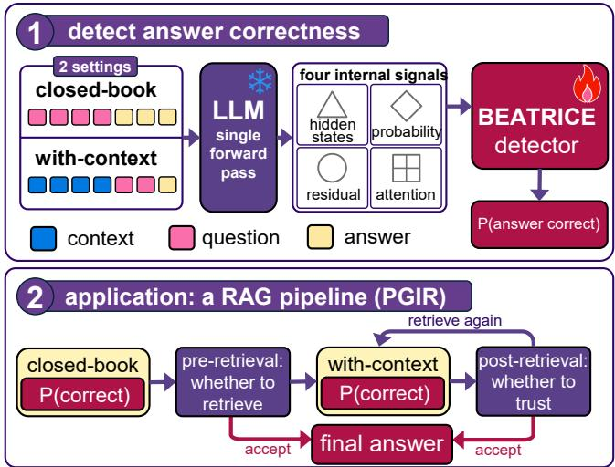  
Figure 1: This work in one view. Top: in either setting, one forward pass of the frozen LLM yields four families of internal signals, which the BEATRICE detector reads into a probability that the answer is correct. Bottom: in the PGIR pipeline the closed-book estimate decides whether to retrieve at all, the with-context estimate whether to trust the grounded answer or retrieve again.

Whether the model answers from its own parametric knowledge or from a retrieved passage is the condition that matters most for this signal, so we study two settings we call closed-book and with-context. Conditioning an answer on a passage changes what the model attends to, what its token probabilities mean, and which of its internal signals are informative, and it can raise a model’s chance of answering correctly or lower it [7, 20], so a cue learned closed-book has no reason to read correctness the same way once a passage is in the prompt [3]. Placing the two settings side by side lets us ask whether the anatomy of the correctness signal is stable across them or specific to each, rather than assume that what is learned in one transfers to the other.

We instantiate this analysis with BEATRICE (Bundled Evidence from Attention, Token-probabilities,

Residual-streams, and Internal states for Correctness Examination), which reads all four families, hidden states, token-probability statistics, residual-stream norms, and attention distributions, from a single forward pass of a frozen language model, and is built by searching over which signals to read and how to fuse them (Figure 1). Because the closed-book and with-context forwards are searched separately, the search does double duty: beyond the detector, it reads out which signals carry correctness in each setting and how the settings relate.

The same read-out also has a use. Because BEATRICE scores the model both before and after a passage is retrieved, its closed-book estimate can decide whether retrieval is worth running and its with-context estimate whether to trust the grounded answer. We connect the two into a controller, Probe-Gated Iterative Retrieval (PGIR) [3, 14, 26], and report it as one downstream demonstration rather than the point of the paper.

## Contributions.

• An anatomy of the correctness signal. Reading four families of internal signal together, we map how answer correctness can be read out: one family dominates while the others carry it to difering degrees, the usable signal concentrates in the answer span rather than the question or context, and what gains there are come from combining signals that are complementary rather than redundant. We characterize this in both the closed-book and with-context settings and show how the two relate.

• A read-out that holds up. The same search yields BEATRICE, a detector that reads correctness from a single forward pass and stays accurate in-domain and zero-shot on three out-of-distribution datasets, where recent re-evaluations warn that such probes often fail to hold up [13].

• A downstream application. We turn the readout into PGIR, a controller that reads the model closed-book to decide whether to retrieve, with context whether to trust the result [14, 26].

## 2 Related Work

White-box detection from internal states. Reading a frozen model’s internal activations to judge whether its output is correct has become a standard white-box approach, and most such probes attach to a single signal family. Hidden states are the most common target: Azaria and Mitchell [2] classify layer activations, INSIDE reads their covariance [5], and later work tracks their layerwise dynamics or learns from unlabeled generations [8, 17, 23, 27, 41]. A parallel line reads attention maps [6] or their spectral statistics [4]. Output distributions supply a third signal, through logit-level checks [25] or a model’s own probability that its answer is correct [16], though a recent re-evaluation finds single-signal probes brittle across settings [13]. Closest to us, a few methods ensemble more than one internal signal: MultiHaluDet probes hidden states together with multi-scale attention [1], and EnsemHalDet stacks hidden-state and attention detectors for vision-language models [22]. Both combine at most two families by late-stage voting and report only that mixing sometimes helps. We unify four signal families under both early and late fusion, search over their combinations, and characterize which combinations are complementary rather than redundant.

Black-box detection from sampling. A second family estimates correctness without opening the model, by drawing several samples and measuring their agree ment. SelfCheckGPT scores cross-sample consistency [21], semantic-entropy methods cluster samples by meaning [18], and sequential schemes stop sampling once confident [34]. These methods need many decodes per query, whereas ours reads a single forward pass and adds no generation cost.

Faithfulness and adaptive retrieval. When a retrieved passage is present, a related but distinct question is faithfulness, whether the answer is grounded in the passage rather than whether it is correct; the two diverge when retrieval is unhelpful or conflicts with parametric knowledge, or incomplete [7, 20, 30, 31, 37], and recent detectors target faithfulness through mechanistic or context-knowledge signals [12, 28, 36, 40]. We instead detect correctness in both settings and use the detector to control retrieval. This connects to adaptive retrieval, which decides when to retrieve from question dificulty or model uncertainty [3, 14, 26, 35, 39], and concurrent work extends hidden-state control heads to agentic routing and tool-use decisions [10]; our controller gates both the decision to retrieve and the decision to trust a retrieved passage on the same correctness probe.

## 3 Method

Figure 2 gives an overview of the full pipeline, from label construction through combination encoders to encoder selection and fusion.

## 3.1 Problem Setup

We detect answer correctness over a frozen language model M. In the closed-book setting M answers a question from parametric knowledge; in the with-context setting retrieved passages precede the question. The two settings map to a retrieval system’s two decisions: whether to retrieve and whether to trust the result.

A detector reads M’s internal signals along the single forward pass that produced the answer and estimates

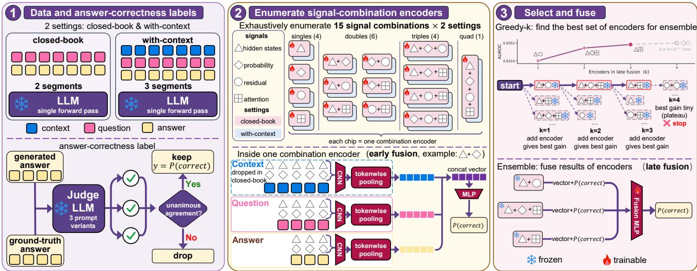  
Figure 2: The BEATRICE pipeline. (1) Data and labels: the frozen LLM answers once per setting and a judge LLM keeps only unanimously labeled answers. (2) Combination encoders: each of the 15 signal-family combinations trains an encoder that pools token-level signals per segment into a correctness probability (early fusion). (3) Selection: greedy forward selection grows the ensemble on validation until the gain plateaus (late fusion).

P(answer correct); since M is frozen and nothing is regenerated, detection only reads already-computed activations. The pass splits into context, question, and answer spans, the structure the signals are encoded over (Section 3.2).

Labels come from judge consensus, separately per setting: three prompt variants of an LLM judge score the setting’s answer against the reference, an example is kept only under unanimous agreement. The closed-book and with-context answers difer, so their labels can difer, and each detector trains on its own.

## 3.2 Internal Signals from a Single Forward Pass

Let M be a frozen transformer with L layers and hidden size $d ,$ and let the input be partitioned into the context, question, and answer spans. At layer ℓ and position t the residual stream carries a state $h _ { t } ^ { ( \bar { \ell } ) } \in \mathbb { R } ^ { d }$ , updated by the attention and feed-forward contributions of that layer,

$$
h _ { t } ^ { ( \ell ) } = h _ { t } ^ { ( \ell - 1 ) } + \mathrm { a t t } _ { t } ^ { ( \ell ) } + \mathrm { f f n } _ { t } ^ { ( \ell ) } .\tag{1}
$$

Writing N for the final normalization and $W _ { U }$ for the unembedding, the next-token distribution at position t is $\pi _ { t } = \operatorname { s o f t m a x } \big ( W _ { U } N ( h _ { t } ^ { ( L ) } ) \big )$ , and $v _ { t }$ is the token the model emits. From this pass we form four token-level feature families.

Hidden states. We take the residual state at a single layer $\ell ^ { \star }$

$$
\begin{array} { r } { \phi _ { t } ^ { \mathrm { h i d } } = h _ { t } ^ { ( \ell ^ { \star } ) } \in \mathbb { R } ^ { d } , } \end{array}\tag{2}
$$

the representation read by hidden-state probes of truthfulness [2, 5]; the layer $\ell ^ { \star }$ is chosen on validation data by

a sweep (Figure 8).

Token probabilities. We reduce the next-token distribution to five scalars,

$$
\begin{array} { r l r } & { } & { \phi _ { t } ^ { \mathrm { p r o b } } = \big ( \pi _ { t } ( v _ { t } ) , - \log \pi _ { t } ( v _ { t } ) , \ \mathrm { H } ( \pi _ { t } ) , } \\ & { } & { \displaystyle \operatorname* { m a x } _ { w } \pi _ { t } ( w ) , \ \pi _ { t } ^ { ( 1 ) } - \pi _ { t } ^ { ( 2 ) } \big ) , } \end{array}\tag{3}
$$

the emitted-token probability, its surprisal, the entropy $\mathrm { H } ( \pi _ { t } )$ , the top probability, and the margin between the two most likely tokens $( \pi _ { t } ^ { ( 1 ) } \geq \pi _ { t } ^ { ( 2 ) } )$ . These read a model’s own probability as a correctness signal [16, 25].

Residual-stream contributions. We decompose the pass by component. For each layer ℓ and each contribution $\bar { g } \in \{ \mathrm { a t t } _ { t } ^ { ( \ell ) } , \bar { \mathrm { f f n } } _ { t } ^ { ( \ell ) } \}$ } added to the running state h, we record its norm ∥g∥2 and its logit-lens push toward the emitted token,

$$
\begin{array} { r l } & { \Delta _ { t } ( g ) = \big \langle W _ { U } [ v _ { t } ] , N ( h + g ) - N ( h ) \big \rangle , } \\ & { \quad \phi _ { t } ^ { \mathrm { r e s } } = \big ( \| g \| _ { 2 } , ~ \Delta _ { t } ( g ) \big ) _ { \ell , g } \in \mathbb R ^ { 4 L } , } \end{array}\tag{4}
$$

where $W _ { U } [ v _ { t } ]$ is the unembedding row of $v _ { t } .$ , so $\Delta _ { t } ( g )$ is how much the component moves the emitted token’s logit, and the two readings are collected over every layer and both components. This reads the residual stream in the spirit of mechanistic detectors [28, 36].

Attention distributions. Attention is causal and the spans are ordered, context before question before answer, so between any two spans attention flows one way only: the later span attends to the earlier one. To give every span a reading for each of the other spans we therefore take each pairwise map in both directions. Let $\alpha _ { t  s } ^ { ( \ell , i ) }$ be the weight from query t to key s at layer ℓ and head $i ,$ with t in the later span V and s in the earlier span $U ,$ and let ¯α normalize each row over U and ˜α each column over V. We record

$$
\begin{array} { r } { \phi _ { t } ^ { \mathrm { o u t } } = \Big ( \mathrm { H } \big ( \{ \bar { \alpha } _ { t  s } \} _ { s \in U } \big ) , ~ \sum _ { s \in U } \alpha _ { t  s } \Big ) , ~ t \in V , } \\ { \phi _ { s } ^ { \mathrm { i n } } = \Big ( \mathrm { H } \big ( \{ \tilde { \alpha } _ { t  s } \} _ { t \in V } \big ) , ~ \sum _ { t \in V } \alpha _ { t  s } \Big ) , ~ s \in U , } \end{array}\tag{5}
$$

per layer and head, an entropy and a mass reading in each direction: the entropy is low when the cross-span attention concentrates on a few tokens and high when it is difuse, and the mass is the share of t’s attention budget spent on U (rows of α sum to one) or, incoming, the total weight s receives from V , in the spirit of attention-based detectors [4, 6].

## 3.3 Combination Encoders and Late Fusion

The four families are not equally informative: a strong signal can take over a jointly trained encoder, so weaker but complementary signals go under-used. Encoding each signal separately and combining only their predictions avoids this, but gives up any interaction between signals at the token level, where some evidence appears only jointly. We therefore build combination encoders. Each takes a subset of the signals and stacks their features, at every token, into one vector, where the signals meet; a token-level CNN encodes the context, question, and answer spans, and an MLP over the three span vectors outputs the encoder’s estimate of P(answer correct). With four signals there are $2 ^ { 4 } - 1 = 1 5$ subsets, hence 15 encoders, all with the base model frozen.

Only a few of them are worth keeping. We combine a selected set by late fusion: a small trained head reads the chosen encoders’ pooled representations, and their predicted scores, into the final estimate. The set is chosen by greedy forward selection on validation AUROC. The head and the stopping rule are detailed in Appendix B.

The candidate pool difers by setting. In the closedbook setting it is the fifteen encoders trained on that pass. In the with-context setting the pool also contains the closed-book encoders, giving thirty candidates. This is almost free in a deployed system: the closed-book pass is run anyway to decide whether to retrieve (Section 5), so caching its per-token features makes those encoders available once a passage has been retrieved. What they add is the model’s judgement of the question before the retrieved text arrived, which the with-context pass cannot produce.

## 4 Experiments

## 4.1 Experimental Setup

Data and labels. We evaluate on six open-domain QA datasets. Three multi-hop sets, MuSiQue [32], HotpotQA [38], and 2WikiMultihopQA [11], form the in-domain data with a fixed training/validation/test split; three singlehop sets, PopQA [20], Natural Questions (NQ) [19], and TriviaQA [15], are held out entirely for zero-shot evaluation. Throughout we use a fixed subsample of each dataset. The base model is Qwen3.5-9B [24] with greedy decoding. For each question the frozen model produces one answer, which a Qwen3.5-27B judge labels correct or incorrect against the reference; we take the unanimous vote of three prompt variants and build labels separately for each setting, since the two settings elicit diferent answers; a blind human re-annotation of 100 items agrees with the labels on 98%, Cohen’s $\kappa = 0 . 9 6$ (splits, prompts, and label balance in Appendix A).

Settings and signals. The two settings are closedbook, where the model answers from parametric memory, and with-context, where it is conditioned on retrieved passages. The main tables use the datasets’ own supporting passages as the context, so every detector reads the same controlled input; Appendix H repeats the compari son with passages from a real retriever, where the ranking carries over. The with-context data augments each question with a rewritten passage, and every trained detector, ours and the baselines, sees the same augmentation. All signals are read from a single forward pass; the hiddenstate signal is taken from layer 17, selected on validation (Figure 8). The encoder architecture, layer sweep, and selection protocol are detailed in Appendix B; featureconstruction details are in the supplementary material.

Metrics and protocol. The detector outputs P(answer correct); its complement scores errors. We report AUROC, unchanged by this sign convention, and AUPRC with the incorrect answer as the positive class. Every design choice, including encoder selection and hyperparameters, is made on the validation split alone, and all numbers are three-seed means; the greedy selection procedure is detailed in Appendix B.

Baselines. We compare against 23 faithfully reimplemented detectors in three tiers: sampling-based methods that draw ten extra generations per question, single-signal single-pass probes, and detectors specific to retrieval-augmented generation. All methods score the same greedy generations under the same labels.

<table><tr><td rowspan="3"></td><td colspan="4">Closed-book</td><td colspan="4">With context</td></tr><tr><td>ID</td><td colspan="3"></td><td>ID</td><td colspan="3">OOD</td></tr><tr><td>Test</td><td>PopQA</td><td>NQ</td><td>TQA</td><td>Test</td><td>PopQA</td><td>NQ</td><td>TQA</td></tr><tr><td colspan="9">Sampling-based (10 extra generations per query)</td></tr><tr><td>Semantic Entropy [18]</td><td>.790/.891</td><td>.876/.957</td><td>.758/.751</td><td>.917/.808</td><td>.773/.527</td><td>.751/.811</td><td>.561/.684</td><td>.836/.567</td></tr><tr><td>Bayesian SE [34]</td><td>.801/.893</td><td>.884/.957</td><td>.758/.767</td><td>.921/.821</td><td>.773/.522</td><td>.753/.813</td><td>.564/.692</td><td>.840/.571</td></tr><tr><td>SelfCheckGPT [21]</td><td>.805/.898</td><td>.881/.956</td><td>.802/.835</td><td>.901/.779</td><td>.699/.546</td><td>.645/.809</td><td>.511/.723</td><td>.821/.581</td></tr><tr><td>EigenScore [5]</td><td>.689/.831</td><td>.819/.927</td><td>.762/.801</td><td>.754/.554</td><td>.861/.591</td><td>.834/.861</td><td>.660/.759</td><td>.728/.401</td></tr><tr><td colspan="9">Single-signal, single forward pass</td></tr><tr><td>SAPLMA [2]</td><td>.795/.890</td><td>.889/.962</td><td>.785/.827</td><td>.843/.692</td><td>.892/.744</td><td>.924/.937</td><td>.847/.899</td><td>.883/.637</td></tr><tr><td>LLMsKnow [23]</td><td>.795/.891</td><td>.859/.947</td><td>.749/.787</td><td>.828/.646</td><td>.884/.703</td><td>.912/.935</td><td>.831/.898</td><td>.851/.620</td></tr><tr><td>SEP [17]</td><td>.761/.867</td><td>.818/.928</td><td>.639/.664</td><td>.769/.542</td><td>.789/.519</td><td>.819/.864</td><td>.657/.773</td><td>.751/.458</td></tr><tr><td>LLM-Check [25]</td><td>.747/.861</td><td>.803/.938</td><td>.686/.741</td><td>.687/.557</td><td>.779/.579</td><td>.800/.875</td><td>.759/.861</td><td>.734/.499</td></tr><tr><td colspan="9">RAG-specific detectors (single forward pass)</td></tr><tr><td>Lookback-Lens [6]</td><td></td><td></td><td></td><td></td><td>.851/.665</td><td>.906/.932</td><td>.777/.850</td><td>.814/.532</td></tr><tr><td>ReDeEP-PKS [28]</td><td></td><td></td><td></td><td></td><td>.664/.333</td><td>.732/.736</td><td>.666/.766</td><td>.715/.378</td></tr><tr><td>LUMINA [40]</td><td></td><td></td><td></td><td></td><td>.596/.349</td><td>.703/.803</td><td>.629/.774</td><td>.617/.327</td></tr><tr><td colspan="9">Multi-signal fusion (ours)</td></tr><tr><td>BEATRICE</td><td>.839/.913 .924/.976.814/.847</td><td></td><td></td><td></td><td></td><td>.874/.762 .932/.826.948/.965.896/.941.930/.774</td><td></td><td></td></tr></table>

Table 1: Detecting incorrect answers of Qwen3.5-9B. Each cell is AUROC / AUPRC; per column and metric bold is best and underline second, and “–” marks detectors that require context.

## 4.2 Detecting Answer Correctness Across Settings

Table 1 compares BEATRICE with a representative subset of the baselines, grouped by tier (full per-dataset panorama with AUPRC in Appendix C). Across settings and datasets, BEATRICE is the strongest detector on almost every column, from a single forward pass. The internal signals are what keep this reliable out of distri bution: text-only classifiers trained on the same data, up to a fine-tuned transformer, come within a few points indomain but trail BEATRICE on every column and fall away sharply on the hardest out-of-distribution sets, the fine-tuned encoder dropping below the linear models; Appendix F traces this to surface correlations that do not transfer.

The only baselines that come close are the samplingbased consistency methods, and on one column, closedbook TriviaQA, the best of them overtakes BEATRICE. That is the regime the backbone knows best: it answers these single-hop popular-entity questions correctly 71% of the time closed-book, so agreement across resamples tracks correctness closely there; once a passage is present, the same column goes to BEATRICE. The edge is also narrow and costly: these methods draw multiple generations per question, and on other datasets their agreement signal falls toward chance, since a confidently and consistently wrong model can yield samples that agree without being right. A paired bootstrap against the strongest baseline on each column (Appendix D) finds the leads significant on every column with context and indomain closed-book, though not on the closed-book OOD columns. On a second backbone Gemma 4 [9] BEATRICE again leads overall (full table in Appendix K).

## 4.3 Anatomy of the Correctness Signal

This is the core of the paper. Beyond assembling a detector, the search is a read-out: what it keeps and what it discards is a map of where answer correctness can be read from the model’s internal state, predictive rather than mechanistic: which signals carry usable evidence, not where the model computes it. Importantly, predict ing final-answer correctness does not certify the validity of the underlying reasoning process: multi-hop QA systems can produce correct final answers despite failing intermediate sub-questions [29]. Our analysis is therefore a predictive read-out of answer correctness. We read the map of the selection in both settings. The four signals are far from equally strong: read on its own, the hiddenstate signal is by a wide margin the most accurate, and the token-probability, residual-stream, and attention signals each trail it. The strong signal is nonetheless not self-suficient. Figure 3 counts, among the errors each single-signal detector makes, how many another signal gets right: the weaker signals recover a third to a half of the hidden-state signal’s mistakes, and no pairing is fully redundant. The signals are complementary, so a detector drawing on all of them has headroom the hidden-state signal alone does not. The paired bootstrap of Appendix D locates that headroom: the fused champion improves on the hidden-state encoder in every column, significantly so on the held-out single-hop sets (+0.016 to +0.021 AU-ROC), where a single signal is most brittle.

That headroom is not captured by merging everything at once. Figure 4 scores all fifteen combination encoders, one per subset of the four signals: encoders that include the hidden-state signal fill the top of the ranking in both settings, yet the best encoder fuses three signals rather than four, and adding the last one does not help. Table 2 tells the same story from the fusion side: a single encoder packing all four signals trails the selected combination, while late-fusing every encoder only matches it, at more cost. Selection reaches that ceiling with a few encoders, recovering the weaker, complementary signals that an allin-one encoder under-uses.

<table><tr><td></td><td colspan="5">Closed-book ID</td><td colspan="5">With context</td></tr><tr><td></td><td></td><td></td><td colspan="3">OOD</td><td></td><td>ID</td><td colspan="3"></td></tr><tr><td>Variant</td><td>Encoder</td><td>Test</td><td>PopQA</td><td>NQ</td><td>TQA</td><td>Encoder</td><td>Test</td><td>PopQA</td><td>NQ</td><td>TQA</td></tr><tr><td>Hidden-only</td><td>(∆)</td><td>.834/.910</td><td>.917/.973</td><td>.795/.828</td><td>.859/.735</td><td>[∆]</td><td>.929/.814</td><td>.941/.957</td><td>.880/.926</td><td>.910/.738</td></tr><tr><td>w/o Hidden</td><td>(田)()(田)()</td><td>.832/.910</td><td>.900/.969</td><td>.754/.802</td><td>.825/.685</td><td>[田[画(田)</td><td>.910/.780</td><td>.937/.958</td><td>.854/.916</td><td>.891/.663</td></tr><tr><td>Early fusion</td><td>(△0田)</td><td>.839/.915</td><td>.913/.972</td><td>.813/.841</td><td>.870/.755</td><td>[△ο画]</td><td>.927/.808</td><td>.944/.962</td><td>.877/.926</td><td>.922/.739</td></tr><tr><td>Late fusion (single)</td><td>(∆)()(0)(田)</td><td>.837/.910</td><td>.912/.971</td><td>.785/.824</td><td>.853/.721</td><td>[△][][o][]</td><td>.929/.819</td><td>.942/.959</td><td>.878/.928</td><td>.917/.736</td></tr><tr><td>Late fusion (all)</td><td>(*)×15</td><td>.841/.915</td><td>.922/.974</td><td>.815/.844</td><td>.875/.759</td><td>[*]×15 (*)×15</td><td>.931/.821</td><td>.949/.967</td><td>.889/.939</td><td>.927/.766</td></tr><tr><td>w/o closed-book</td><td></td><td></td><td></td><td></td><td></td><td>[△画][∆∞0] [△田][△o](△田)</td><td>.931/.824</td><td>.946/.963</td><td>.890/.933</td><td>.930/.763</td></tr><tr><td>Full (ours)</td><td>(∆O)(∆田)(∆田)</td><td colspan="5">.839/.913.924/.976.814/.847.874/.762</td><td>.932/ /.826</td><td>.948/.965</td><td>.896/.941</td><td>.930/.774</td></tr></table>

Table 2: Feature and fusion ablation of BEATRICE. Each cell reports AUROC / AUPRC, 3-seed mean. The Encoder columns list the selected encoders in each setting: a bracket group is one encoder whose glyphs are earlyfused, and groups side by side are late-fused; [·] marks a with-context forward pass and (·) a closed-book one. Glyphs: Hidden, Prob, Resid, Attn. Bold = best, underline = second in each column per metric. The greyed Late fusion (all) row late-fuses every encoder; it is a saturation reference, greedy selection matches it to within noise, and it is excluded from the ranking.

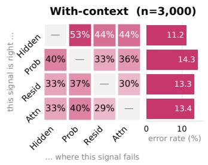

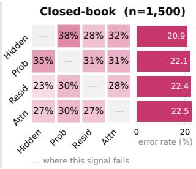  
Figure 3: Signal complementarity on the in-domain test set. Each cell is the fraction of the column signal’s errors that the row signal classifies correctly, with every detector thresholded to flag its own true number of errors and columns normalised so the two settings compare; the bars give each signal’s own error rate.

The selection also reaches across the two settings. Extending the candidate pool to include the closed-book encoders alongside the with-context ones, the greedy search keeps one closed-book encoder in the with-context detector. Figure 5 enumerates all three-encoder combinations and confirms two things. First, the greedy search is sound: in both settings the combination it selects ranks at or near the very top of the exhaustive ordering. Second, the cross-setting pattern is not an artifact of the greedy path: reading the closed-book-count panel toward the top, the best combinations concentrate on exactly one closed-book encoder, the ten best all carry one, while the worst are built entirely from them. On this backbone, then, the model’s judgement before it sees the passage remains a useful extra viewpoint once context is present. The pattern is base-model dependent: on Gemma 4 the best combinations shed the closed-book encoder at the top of the ranking (Appendix K).

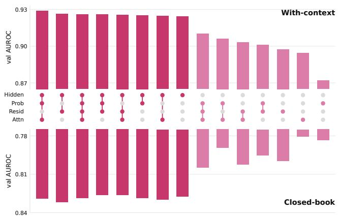  
Figure 4: Validation AUROC of all fifteen combination encoders, ordered best to worst. The dot matrix marks the signals each encoder fuses, and bars are darker when the encoder includes the hidden-state signal. AUROC axes are cropped to the observed range.

Appendix G takes this anatomy inside the trained encoders. Ablating one signal family at a time shows that hidden states set almost every decision, while each auxiliary family corrects a small, setting-specific slice of the rest and acts only where the encoder is still undecided; the one pair of signals whose joint encoder beats both of its members, on either backbone, is token probabilities with attention; and what the attention family responds to, verbatim support in the passage, ties its reliability to retrieval quality.

Finally, the read-out draws almost entirely on the answer span. Zeroing each token region in turn and retraining, removing the answer tokens costs the most by far, about 0.02 AUROC with context and 0.01 closed-book, whereas removing the question or the retrieved context costs little, at most 0.006. The detector reads the model’s handling of the context of the answer tokens rather than the context tokens themselves; the per-span breakdown is in Appendix E (Table 8).

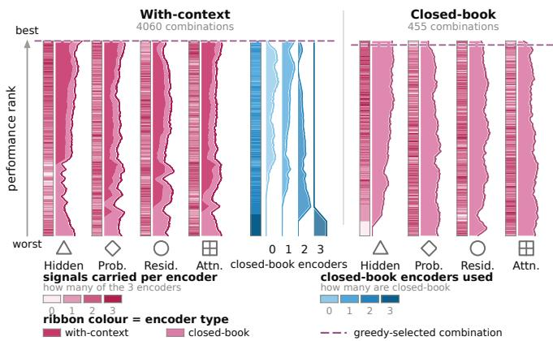  
Figure 5: Exhaustive ranking of all three-encoder combinations, best to worst. The ribbon is the local mean of how many of the three encoders carry that signal, split by whether the carrying encoder is with-context (dark) or closed-book (light); for the with-context pool the four wedges track how the closed-book count concentrates along the ranking. The dashed line marks the selected combination.

## 5 Probe-Gated Iterative Retrieval

## 5.1 Controller: Pre- and Post-Retrieval Decisions

Because BEATRICE scores an answer the model has already produced, it doubles as a retrieval controller: one score can decide whether a draft is trustworthy before a retrieval is spent, and which draft to keep after one. Figure 6 shows the control flow. The model first answers closed-book; if the closed-book probe clears an acceptance threshold τ the draft is returned with no retrieval. Otherwise PGIR retrieves and re-answers with context, and the with-context probe scores the grounded draft; retrieval repeats up to a budget of B rounds, returning the first draft to clear $\tau \mathrm { ~ o r ~ }$ , failing that, the highest-scoring draft in the pool. Retrieval uses E5 [33] over Wikipedia-2018 with $k { = } 3$ . Each round issues a new query, the question augmented by the current draft’s answer, and keeps only passages not retrieved in earlier rounds, so every round adds fresh evidence; when that answer-guided query stops turning up new passages the retriever pages deeper into the ranking instead. Since both probes read passes the model already runs, the controller adds no generations of its own.

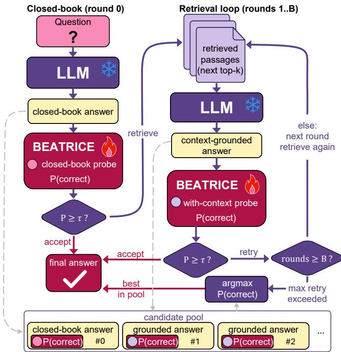  
Figure 6: PGIR control flow. A draft is accepted when its calibrated correctness probability clears τ ; otherwise the controller retrieves and re-answers, up to a budget of B rounds, then returns the highest-scoring draft in the pool.

The score each probe reports is a calibrated correctness probability. On the validation split we fit one isotonic regression per setting, mapping raw probe outputs to answer correctness, so the acceptance test compares a genuine probability against τ rather than an uncalibrated score. The threshold τ and the budget B are chosen together by a small grid search on the development split, taking the configuration with the highest exact-match under a cap on the average number of generations per question; this selects $\tau { = } 0 . 6$ and B=4, used unchanged at test time. The test sets take no part in the calibration or this selection.

## 5.2 End-Task Results

Table 14 (Appendix I) reports end-task answer quality across the confidence-control family, every system sharing the one backbone and retriever. PGIR leads on macro exact-match and macro F1, and on the exact-match of four of the six datasets, ahead of the adaptive baselines. This is the point of the demonstration: the same read-out, unchanged, improves the answers themselves and not only our ability to audit them.

The gain comes from where the signal is read. Systems that decide before retrieving, whether from a learned router or a closed-book confidence estimate, stay close to the vanilla single-retrieval baseline; systems that trigger further retrieval from token-level or sampling uncertainty do not close the gap either, and the strongest of them pays for its accuracy with over thirteen generations per question. PGIR reads the signal after retrieval, scoring each grounded draft, and reaches the best accuracy at fewer than four generations per question. Figure 7 shows the resulting frontier: sweeping the budget traces a curve that stays above the other systems at every cost. Appendix J walks through individual questions where a low closedbook score triggers retrieval and a high with-context score earns trust.

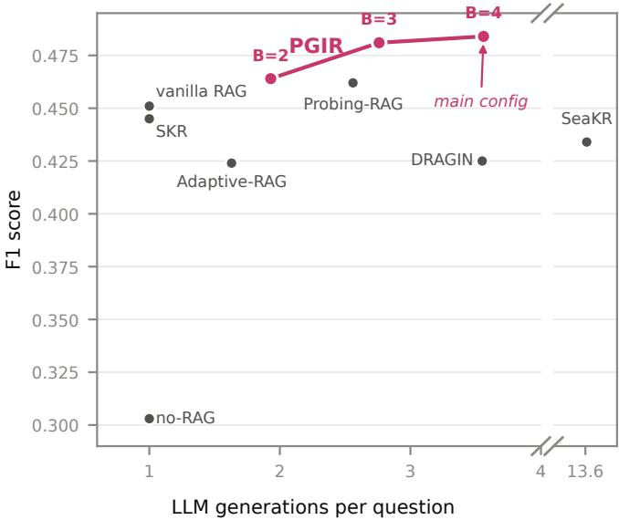  
Figure 7: Eficiency–accuracy frontier: macro F1 against generations per question, a serving-cost proxy (the x-axis is broken for the far-right system). Points sweep PGIR’s budget B; B=4 is the reported configuration.

The controller also transfers without retraining. The probe is never fit on PopQA, NQ, or TriviaQA, yet PGIR leads on the first two of these out-of-distribution sets. Two limits are worth stating plainly. On the two hard est multi-hop sets a far more expensive loop overtakes it, buying its accuracy with the thirteen-generation budget just noted. On single-hop TriviaQA a single retrieval already sufices, so the room for a verifier to add F1 is small and vanilla retrieval edges ahead on that one metric, though PGIR still leads its exact-match. On a second backbone (Gemma 4) the controller transfers just as well, with PGIR again first on macro exact-match and F1; the full table is in Appendix K.

## 6 Conclusion

Reading four families of internal signal from a single forward pass, and searching over which to combine, we map where answer correctness can be read out of a frozen model: one family dominates, the rest are complementary rather than redundant, the cue concentrates in the answer span, and whether the model’s judgement before it sees a passage stays informative afterwards depends on the base model. The closed-book and with-context settings share this anatomy in broad strokes but not in detail, so we read it separately in each. The same read-out, without retraining, is accurate in and out of domain, and it can gate a retrieval-augmented system as one downstream use. What we expect to carry is the anatomy rather than any single score: knowing which families hold evidence, where it concentrates, and when a further family adds information turns probe design from trial and error over encoders into a measurement of the base model, one that can be repeated as models change.

## References

[1] Riasad Alvi, Nurul Labib Sayeedi, and Md. Faiyaz Abdullah Sayeedi. Multihaludet: Multilingual hallucination detection via LLM hidden state probing. arXiv preprint arXiv:2605.24919, 2026.

[2] Amos Azaria and Tom Mitchell. The internal state of an llm knows when it’s lying. In Findings of the Association for Computational Linguistics: EMNLP 2023, pages 967–976, 2023.

[3] Ingeol Baek, Hwan Chang, Byeongjeong Kim, Jimin Lee, and Hwanhee Lee. Probing-rag: Self-probing to guide language models in selective document retrieval. In Findings of the Association for Computational Linguistics: NAACL 2025, pages 3287–3304, 2025.

[4] Jakub Binkowski, Denis Janiak, Albert Sawczyn, Bogdan Gabrys, and Tomasz Jan Kajdanowicz. Hallucination detection in llms using spectral features of attention maps. In Proceedings of the 2025 Conference on Empirical Methods in Natural Language Processing, pages 24354–24385, 2025.

[5] Chao Chen, Kai Liu, Ze Chen, Yi Gu, Yue Wu, Mingyuan Tao, Zhihang Fu, and Jieping Ye. Inside: Llms’ internal states retain the power of hallucination detection. In International Conference on Learning Representations, 2024.

[6] Yung-Sung Chuang, Linlu Qiu, Cheng-Yu Hsieh, Ranjay Krishna, Yoon Kim, and James Glass. Look back lens: Detecting and mitigating contextual hallucinations in large language models using only atten tion maps. In Proceedings of the 2024 Conference on Empirical Methods in Natural Language Processing, pages 1419–1436, 2024.

[7] Florin Cuconasu, Giovanni Trappolini, Federico Siciliano, Simone Filice, Cesare Campagnano, Yoelle Maarek, Nicola Tonellotto, and Fabrizio Silvestri. The power of noise: Redefining retrieval for rag systems. In Proceedings of the 47th International ACM SIGIR Conference on Research and Development in Information Retrieval, pages 719–729, 2024.

[8] Xuefeng Du, Chaowei Xiao, and Yixuan Li. Haloscope: Harnessing unlabeled LLM generations for hallucination detection. In Advances in Neural Information Processing Systems (NeurIPS), 2024.

[9] Gemma Team. Gemma 4 technical report. arXiv preprint arXiv:2607.02770, 2026.

[10] Amirhosein Ghasemabadi, Ruichen Chen, Bahador Rashidi, and Di Niu. Multi-head latent control: A unified interface for LLM agent decision making. arXiv preprint arXiv:2607.14277, 2026.

[11] Xanh Ho, Anh-Khoa Duong Nguyen, Saku Sugawara, and Akiko Aizawa. Constructing a multihop QA dataset for comprehensive evaluation of reasoning steps. In Proceedings of the 28th International Conference on Computational Linguistics, pages 6609–6625, 2020.

[12] Jianpeng Hu, Yanzeng Li, Jialun Zhong, Lei Zou, and Wenfa Qi. Detecting hallucinations in retrievalaugmented generation via semantic-level internal reasoning graph. In Findings of the Association for Computational Linguistics: ACL 2026, pages 27826– 27841, 2026.

[13] Denis Janiak, Jakub Binkowski, Albert Sawczyn, Bogdan Gabrys, Ravid Shwartz-Ziv, and Tomasz Jan Kajdanowicz. The illusion of progress: Re-evaluating hallucination detection in llms. In Proceedings of the 2025 Conference on Empirical Methods in Natural Language Processing, pages 34728–34745, 2025.

[14] Soyeong Jeong, Jinheon Baek, Sukmin Cho, Sung Ju Hwang, and Jong C Park. Adaptive-rag: Learning to adapt retrieval-augmented large language models through question complexity. In Proceedings of the 2024 Conference of the North American Chapter of the Association for Computational Linguistics: Human Language Technologies (Volume 1: Long Papers), pages 7036–7050, 2024.

[15] Mandar Joshi, Eunsol Choi, Daniel Weld, and Luke Zettlemoyer. TriviaQA: A large scale distantly supervised challenge dataset for reading comprehension. In Proceedings of the 55th Annual Meeting of the Association for Computational Linguistics (Volume 1: Long Papers), pages 1601–1611, 2017.

[16] Saurav Kadavath, Tom Conerly, Amanda Askell, Tom Henighan, Dawn Drain, Ethan Perez, Nicholas Schiefer, Zac Hatfield-Dodds, Nova DasSarma, Eli Tran-Johnson, Scott Johnston, Sheer El Showk, Andy Jones, Nelson Elhage, Tristan Hume, Anna Chen, Yuntao Bai, Sam Bowman, Stanislav Fort, Deep Ganguli, Danny Hernandez, Josh Jacobson, Jackson Kernion, Shauna Kravec, Liane Lovitt, Kamal Ndousse, Catherine Olsson, Sam Ringer, Dario Amodei, Tom Brown, Jack Clark, Nicholas Joseph,

Ben Mann, Sam McCandlish, Chris Olah, and Jared Kaplan. Language models (mostly) know what they know. arXiv preprint arXiv:2207.05221, 2022.

[17] Jannik Kossen, Jiatong Han, Muhammed Razzak, Lisa Schut, Shreshth Malik, and Yarin Gal. Semantic entropy probes: Robust and cheap hallucination detection in llms. arXiv preprint arXiv:2406.15927, 2024.

[18] Lorenz Kuhn, Yarin Gal, and Sebastian Farquhar. Semantic uncertainty: Linguistic invariances for uncertainty estimation in natural language generation. arXiv preprint arXiv:2302.09664, 2023.

[19] Tom Kwiatkowski, Jennimaria Palomaki, Olivia Redfield, Michael Collins, Ankur Parikh, Chris Alberti, Danielle Epstein, Illia Polosukhin, Jacob Devlin, Kenton Lee, Kristina Toutanova, Llion Jones, Matthew Kelcey, Ming-Wei Chang, Andrew M. Dai, Jakob Uszkoreit, Quoc Le, and Slav Petrov. Natural questions: A benchmark for question answering research. Transactions of the Association for Computational Linguistics, 7:452–466, 2019.

[20] Alex Mallen, Akari Asai, Victor Zhong, Rajarshi Das, Daniel Khashabi, and Hannaneh Hajishirzi. When not to trust language models: Investigating ef fectiveness of parametric and non-parametric memories. In Proceedings of the 61st annual meeting of the association for computational linguistics (volume 1: Long papers), pages 9802–9822, 2023.

[21] Potsawee Manakul, Adian Liusie, and Mark Gales. Selfcheckgpt: Zero-resource black-box hallucination detection for generative large language models. In Proceedings of the 2023 conference on empirical methods in natural language processing, pages 9004– 9017, 2023.

[22] Ryuhei Miyazato, Shunsuke Kitada, and Kei Harada. Ensemhaldet: Robust VLM hallucination detection via ensemble of internal state detectors. arXiv preprint arXiv:2604.02784, 2026.

[23] Hadas Orgad, Michael Toker, Zorik Gekhman, Roi Reichart, Idan Szpektor, Hadas Kotek, and Yonatan Belinkov. Llms know more than they show: On the intrinsic representation of llm hallucinations. In Y. Yue, A. Garg, N. Peng, F. Sha, and R. Yu, editors, International Conference on Learning Representations, volume 2025, pages 66880–66913, 2025. URL https://proceedings.iclr.cc/paper files/paper/ 2025/file/a712d461e57201efe35d429a6f1731c1- Paper-Conference.pdf.

[24] Qwen Team. Qwen3.5: Towards native multimodal agents. https://qwen.ai/blog?id=qwen3.5, 2026.

[25] Gaurang Sriramanan, Siddhant Bharti, Vinu Sankar Sadasivan, Shoumik Saha, Priyatham Kattakinda, and Soheil Feizi. Llm-check: Investigating detection of hallucinations in large language models. Advances in Neural Information Processing Systems, 37:34188–34216, 2024.

[26] Weihang Su, Yichen Tang, Qingyao Ai, Zhijing Wu, and Yiqun Liu. Dragin: Dynamic retrieval augmented generation based on the real-time information needs of large language models. In Proceedings of the 62nd Annual Meeting of the Association for Computational Linguistics (Volume 1: Long Papers), pages 12991–13013, 2024.

[27] Weihang Su, Changyue Wang, Qingyao Ai, Yiran Hu, Zhijing Wu, Yujia Zhou, and Yiqun Liu. Unsupervised real-time hallucination detection based on the internal states of large language models. In Findings of the Association for Computational Linguistics (ACL), pages 14379–14391, 2024.

[28] Zhongxiang Sun, Xiaoxue Zang, Kai Zheng, Jun Xu, Xiao Zhang, Weijie Yu, Yang Song, and Han Li. Redeep: Detecting hallucination in retrieval-augmented generation via mechanistic interpretability. In International Conference on Learning Representations, volume 2025, pages 50250–50279, 2025.

[29] Yixuan Tang, Hwee Tou Ng, and Anthony Tung. Do multi-hop question answering systems know how to answer the single-hop sub-questions? In Proceedings of the 16th Conference of the European Chapter of the Association for Computational Linguistics: Main Volume, pages 3244–3249, 2021. URL https://aclanthology.org/2021.eacl-main.283/.

[30] Yixuan Tang, Jincheng Wang, and Anthony Kum Hoe Tung. The missing parts: Augmenting fact verification with half truth detection. In EMNLP, pages 33979–33996. Association for Computational Linguistics, 2025. doi: 10.18653/v1/2025. emnlp-main.1724. URL https://aclanthology.org/ 2025.emnlp-main.1724/.

[31] Yixuan Tang, Yirui Zhang, Hang Feng, and Anthony K. H. Tung. Debating the unspoken: Role-anchored multi-agent reasoning for half-truth detection. In EMNLP, 2026.

[32] Harsh Trivedi, Niranjan Balasubramanian, Tushar Khot, and Ashish Sabharwal. MuSiQue: Multihop questions via single-hop question composition. Transactions of the Association for Computational Linguistics, 10:539–554, 2022.

[33] Liang Wang, Nan Yang, Xiaolong Huang, Binxing Jiao, Linjun Yang, Daxin Jiang, Rangan Majumder, and Furu Wei. Text embeddings by weaklysupervised contrastive pre-training. arXiv preprint arXiv:2212.03533, 2022.

[34] Xiaohua Wang, Yuliang Yan, Longtao Huang, Xiaoqing Zheng, and Xuan-Jing Huang. Hallucination detection for generative large language models by bayesian sequential estimation. In Proceedings of the 2023 Conference on Empirical Methods in Natural Language Processing, pages 15361–15371, 2023.

[35] Yile Wang, Peng Li, Maosong Sun, and Yang Liu. Self-knowledge guided retrieval augmentation for large language models. In Findings of the Association for Computational Linguistics: EMNLP 2023, pages 10303–10315, 2023.

[36] Guangzhi Xiong, Zhenghao He, Bohan Liu, Sanchit Sinha, and Aidong Zhang. Toward faithful retrieval-augmented generation with sparse autoencoders. arXiv preprint arXiv:2512.08892, 2025.

[37] Rongwu Xu, Zehan Qi, Zhijiang Guo, Cunxiang Wang, Hongru Wang, Yue Zhang, and Wei Xu. Knowledge conflicts for llms: A survey. In Proceedings of the 2024 Conference on Empirical Methods in Natural Language Processing, pages 8541–8565, 2024.

[38] Zhilin Yang, Peng Qi, Saizheng Zhang, Yoshua Bengio, William W. Cohen, Ruslan Salakhutdinov, and Christopher D. Manning. HotpotQA: A dataset for diverse, explainable multi-hop question answering. In Proceedings of the 2018 Conference on Empirical Methods in Natural Language Processing, pages 2369–2380, 2018.

[39] Zijun Yao, Weijian Qi, Liangming Pan, Shulin Cao, Linmei Hu, Liu Weichuan, Lei Hou, and Juanzi Li. Seakr: Self-aware knowledge retrieval for adaptive retrieval augmented generation. In Proceedings of the 63rd Annual Meeting of the Association for Computational Linguistics (Volume 1: Long Papers), pages 27022–27043, 2025.

[40] Samuel Yeh, Sharon Li, and Tanwi Mallick. Lumina: Detecting hallucinations in rag system with context–knowledge signals. In The Fourteenth International Conference on Learning Representations, 2026.

[41] Zhenliang Zhang, Xinyu Hu, Huixuan Zhang, Junzhe Zhang, and Xiaojun Wan. Icr probe: Tracking hidden state dynamics for reliable hallucination detection in llms. In Proceedings of the 63rd Annual Meeting of the Association for Computational Linguistics (Volume 1: Long Papers), pages 17986–18002, 2025.

## A Datasets, Labels, and Prompts

Datasets and splits. We draw on six open-domain QA datasets. The three multi-hop sets, MuSiQue, HotpotQA, and 2WikiMultihopQA, form the in-domain data: we sample 10,000 training examples from each, 30,000 in all, and split each dataset’s public development set evenly into validation and test, giving 1,500 validation and 1,500 test (500 per dataset in each). This split is fixed once and reused throughout. The three single-hop sets are held out entirely for zero-shot evaluation: PopQA (1,000), NQ (1,182), and TriviaQA (1,277). Every split is fixed by example id, so no example moves between training and evaluation across settings or baselines.

Context and augmentation. In the with-context setting the passages are the datasets’ own supporting paragraphs, not retriever output; retrieval enters only in the downstream controller (Section 5). We double the withcontext data with a faithful normalization rewrite, cast by the same larger model that assigns the labels (Qwen3.5- 27B, greedy): it turns each passage into a compact, question-aligned evidence passage, preserving every entity, date, number, and relation, using only information already present, and adding no facts or answers (the rewrite prompts appear with the others below). The backbone re-answers on the rewritten pair and it is labeled the same way, so each with-context example appears in an original and a normalized form, and the with-context training and evaluation sets are twice the counts above. Every trained detector, ours and the baselines, sees this same augmentation, so it does not afect the comparison; it is a generic robustness measure unrelated to the correctness task, and the controller of Section 5 does not use it, retrieving with E5 instead.

Labels. For each question the model produces an answer, which is judged correct or incorrect against the reference answers. The label is the unanimous vote of the three judge prompts below, cast by a larger model of the same family; we keep only the examples on which all three rubrics agree, rather than break ties by majority. Disagreement is rare: this filter discards 2.3% of examples on Qwen3.5-9B. Labels are built separately for the closedbook and with-context settings, since the two elicit different answers. As a check on the judge, we re-annotated by hand 100 evaluation items sampled uniformly at random (50 per setting), blind to the judge verdicts: human and judge labels agree on 98% of them, Cohen’s κ = 0.96 (bootstrap 95% CI [0.90, 1.00]). Table 3 reports the resulting class balance for every split under both settings.

Prompts. The prompts appear below. The answering prompt asks for a direct final answer and is the input whose single forward pass the probe reads; the three judge prompts share a format and difer only in the rubric they apply; and the two rewrite prompts produce the withcontext augmentation. In each, ⟨angled⟩ text marks a filled-in placeholder.

<table><tr><td rowspan="2">Split Dataset</td><td rowspan="2"></td><td rowspan="2"></td><td>Closed-book</td><td colspan="2">With-context</td></tr><tr><td>N Correct (%)</td><td>Orig.</td><td>Rewr.</td></tr><tr><td rowspan="4">Train</td><td>HotpotQA</td><td>10,000 ×2</td><td>39.8</td><td>95.2</td><td>95.5</td></tr><tr><td>MuSiQue</td><td>10,000 ×2</td><td>17.8</td><td>60.8</td><td>62.5</td></tr><tr><td>2WikiMultihopQA</td><td>10,000 ×2</td><td>42.8</td><td>95.4</td><td>96.0</td></tr><tr><td>All</td><td>30,000 ×2</td><td>33.5</td><td>83.8</td><td>84.7</td></tr><tr><td rowspan="4">Val</td><td>HotpotQA</td><td>500×2</td><td>40.4</td><td>92.0</td><td>91.6</td></tr><tr><td>MuSiQue</td><td>500×2</td><td>14.8</td><td>56.4</td><td>58.8</td></tr><tr><td>2WikiMultihopQA</td><td>500×2</td><td>34.6</td><td>85.8</td><td>87.6</td></tr><tr><td>All</td><td>1,500 ×2</td><td>29.9</td><td>78.1</td><td>79.3</td></tr><tr><td rowspan="4">Test</td><td>HotpotQA</td><td>500×2</td><td>37.8</td><td>93.4</td><td>93.4</td></tr><tr><td>MuSiQue</td><td>500×2</td><td>14.0</td><td>51.4</td><td>53.0</td></tr><tr><td>2WikiMultihopQA</td><td>500×2</td><td>36.4</td><td>89.4</td><td>90.0</td></tr><tr><td>All</td><td>1,500×2</td><td>29.4</td><td>78.1</td><td>78.8</td></tr><tr><td rowspan="3">OOD</td><td>PopQA</td><td>1,000</td><td>22.4</td><td>39.3</td><td></td></tr><tr><td>NQ</td><td>1,182</td><td>42.7</td><td>32.5</td><td></td></tr><tr><td>TriviaQA</td><td>1,277</td><td>70.8</td><td>78.1</td><td></td></tr></table>

Table 3: Correctness-label distribution across all splits, reported as the fraction of examples the backbone answers correctly (the positive class; the incorrect fraction is the complement). N is the number of examples in that split; for with-context we give the rate on the original passages (Orig.) and on the normalization rewrite (Rewr.) of Appendix A separately; ×2 marks the splits whose withcontext set combines both and is thus twice N.

Answering prompt (read for feature extraction)

⟨retrieved passage, with-context only⟩

Please answer the following question based on your knowledge⟨ and the context⟩.

Question: ⟨question⟩

Directly answer with the final answer without any explanation or reasoning process:

Judge 1 · strict semantic

You are a strict but fair semantic answer judge. Question: ⟨question⟩ Gold answer(s): ⟨gold⟩ Model answer: ⟨answer⟩

Rules: judge only the final answer; accept aliases, abbreviations, spelling variants, and equivalent entity names; mark partial answers incorrect when a more specific answer is asked; accept a coarser date only at the granularity the question asks; ‘‘I don’t know’’, empty, or refusal is Incorrect.

Return exactly one token: Correct or Incorrect.

Judge 2 · alias-friendly   
Decide whether the model answer is acceptable for the   
question.   
Question, acceptable gold answers, model answer: ⟨. . . ⟩   
Use an alias-friendly standard: Correct if it refers   
to the same entity or value as any gold answer; Correct   
if it is a common short name, stage name, abbreviation,   
or harmless formatting variant; Incorrect if it names a   
different entity, relation, time, place, or number, or   
gives only a vague category.   
Return exactly: Correct or Incorrect.   
Judge 3 · decomposed fact   
Check whether the model answer satisfies the information   
need.   
Question, gold answer(s), model answer: ⟨. . . ⟩   
Procedure: identify the entity, relation, or type of   
answer the question requests; compare the model answer   
to the gold answer(s); ignore extra wording if the final   
answer is unambiguous.   
Output exactly one word: Correct or Incorrect.   
Rewrite · context (with-context augmentation)   
Rewrite the context into a compact evidence-style   
passage aligned to the question.   
Rules: use only information from the context; preserve   
named entities, dates, numbers, and relations that may   
help answer the question; remove irrelevant wording and   
formatting noise; do not answer the question directly   
unless the context states the answer.   
Output: Normalized Context: ⟨rewritten context⟩   
Question: ⟨question⟩ Context: ⟨context⟩

## B Model Architecture and Training

This appendix details the combination-encoder architecture sketched in the main text and the protocol used to select and fuse encoders.

Per-encoder architecture. A combination encoder reads a subset of the four signal families. At every token the selected families are projected to a common width and stacked into one vector, which is where the signals interact. Each of the context, question, and answer spans is then encoded by its own token-level residual convolutional network: a width-1 convolution projects the stacked features to a hidden width of 128, followed by three residual blocks, each two convolutions of kernel size 3 with Group Norm and GELU and dropout, all masked so padding never contributes. Each span is reduced to a vector by concatenating a masked max-pool and a masked meanpool over its tokens. The three span vectors and their pairwise diferences are concatenated and passed through a two-layer MLP with LayerNorm and GELU, whose output is the encoder’s estimate of P(answer correct); the closed-book encoder uses the question and answer spans only. The base model, its token embeddings, and the hidden states are frozen throughout; the only regularization is a small Gaussian noise added to the input features during training together with the dropout above.

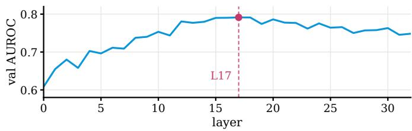  
Figure 8: Validation layer sweep: correctness AUROC of the hidden-state signal read from each layer. Layer 17 is the maximum and is used throughout.

Late fusion. The selected encoders are frozen. The fusion head takes, over the selected encoders, each pooled representation (of width 2 × 128), each predicted score, and the absolute pairwise diferences of those scores, concatenates them, and maps the result through a two-layer MLP with LayerNorm and GELU to the final logit. Reading the score disagreements lets the head weight an encoder by whether the others corroborate it. During training each encoder is dropped independently with probability 0.3, so the head cannot come to rely on any single one. Scores are turned into calibrated probabilities as described in the controller section.

Layer selection. The hidden-state family is read from a single layer chosen on the validation split by the sweep in Figure 8; layer 17 is the maximum and is used throughout.

Selection protocol. Encoders are chosen by greedy forward selection on seed-averaged validation AUROC: starting from the empty set, each round trains a fresh fusion head for every not-yet-selected encoder added to the current set, keeps the one that most improves the fused score, and stops when the best remaining addition helps by less than $5 \times 1 0 ^ { - 4 }$ (Algorithm 1). All selection uses the validation split only, and every reported number is the mean over three training seeds.

Training. Each encoder and each fusion head is trained with AdamW (learning rate $2 \times 1 0 ^ { - 4 }$ , weight decay 0.01) for up to 60 epochs at batch size 512, halving the learn ing rate after four epochs without a validation gain and stopping early after ten. The base model, its token embeddings, and the hidden states stay frozen throughout. All experiments ran on a Linux server with NVIDIA H100 80GB GPUs, using PyTorch and Transformers for feature extraction and training and a vLLM OpenAI-compatible server for generation.

Algorithm 1: Greedy encoder selection with late fusion   
Require: frozen candidate encoders $\mathcal { E } ;$ validation set $V ;$   
margin $\delta { = } 5 \times 1 0 ^ { - 4 }$   
1: $S \gets \emptyset ; \quad a ^ { \star } \gets 0 . 5$   
2: while $\mathcal { E } \setminus S \ne \emptyset$ do   
3: for $e \in { \mathcal { E } } \setminus S$ do   
4: train a fusion head on $S \cup \{ e \} ;$   
a ← seed-averaged AUROC on V   
5: end for   
6: e⋆ ← arg maxe ae   
7: if $a _ { e ^ { \star } } - a ^ { \star } \leq \delta$ then   
8: break   
9: end if   
10: $S  S \cup \{ e ^ { \star } \} ; \quad a ^ { \star }  a _ { e ^ { \star } }$   
11: end while   
12: retrain the fusion head on S   
13: return selected set S and its fusion head

## C Full Per-Dataset Detection Results

Table 1 in the main text reports a representative subset of detectors on the aggregate in-domain test split and the OOD splits. For completeness, Tables 4 (closed-book) and 5 (with context) give the full panorama: BEATRICE and all 23 faithfully re-implemented baselines, broken out by individual in-domain dataset (MuSiQue, HotpotQA, 2WikiMultihopQA) as well as the aggregate, and reporting both AUROC and AUPRC (with the incorrect answer as the positive class, so the random-guess AUPRC equals the per-column error rate).

## D Statistical Significance of the Detection Gains

To check that the leads in Table 1 are not sampling artifacts, we run a paired bootstrap on each column against the strongest of all 23 baselines there, taken over the full panorama of Appendix C rather than the representative subset of Table 1. Both detectors score the same examples, so we resample examples (104 draws) and read the 95% interval and two-sided p of the AUROC diference directly; this accounts for the correlation between the two scores, which separate per-method intervals would not. Table 6 reports the result. The lead is significant on all four with-context columns and on the in-domain closed-book column $( p \ \leq \ . 0 0 7 ;$ ; all five survive a Holm correction across the eight tests). The three closed-book OOD columns are not significant: on PopQA the champion beats every single-pass probe decisively but its margin over the best sampling method does not clear the interval (+.018, p = .09), on NQ the margin is small (+.012), and on TriviaQA the sampling methods lead out right (−.046), the regime discussed in Appendix F where the model already knows the answer and its own consistency sufices. With retrieved context, the setting in which a correctness detector is most useful, every lead is significant.

The sterner test is against our own strongest single signal rather than an external baseline. Section 4.3 shows the hidden-state encoder, read on its own, is by a wide margin the best single signal; Table 7 asks whether fusing the others onto it buys a significant gain. We bootstrap the paired AUROC diference between the champion and the hidden-state encoder on the examples they share. The champion improves on it in every column, and the gain is significant on both held-out single-hop sets in each setting, largest there (+0.016 to +0.021 AUROC), while it is small and not significant on the in-domain aggregate with context. The value of combining signals shows up where a single signal is most brittle, out of distribution, which is exactly where a detector must hold up.

## E Answer-Span Localization

Section 4.3 finds the read-out drawing mainly on the answer span. Table 8 gives the full breakdown: we zero one token region at a time, context, question, or answer, retrain the detector, and measure the change in AUROC. Removing the answer tokens costs the most by far in both settings, while removing the question or the retrieved context costs little, so the detector reads correctness of the model’s handling of the answer rather than of the context tokens themselves.

## F How Far Surface Text Alone Goes

BEATRICE reads a model’s internal signals, but one might ask whether answer correctness is already written on the surface, in the text of the question, the model’s answer, and the retrieved passage. If it were, a detector would not need the internal states at all. We test this directly. On the same training split BEATRICE uses, and selected on the same validation split, we train a ladder of text-only classifiers of increasing capacity: linear models over TF-IDF features, an MLP over the same features, and a fine-tuned transformer encoder, e5-base (110M parameters). Each reads only text: the question, the model’s final answer, and, with context, the retrieved passage. Table 9 reports their AUROC beside BEATRICE, whose two champions have 3.1M and 4.1M parameters.

Surface text carries a strong but incomplete signal. The text models come within a few points of BEATRICE indomain, reaching the low .90s with context, so correctness is far from illegible on the surface. But BEATRICE leads every column, in-domain and out, and the text models fall away on the harder out-of-distribution sets: with context on NQ and TriviaQA the fine-tuned encoder drops into the low .60s, below the linear text models despite its far greater capacity, a sign that it fits the in-domain distribution too closely. Part of what a text model fits is a dataset-specific correlation between answer form and correctness rather than correctness itself. Internal signals are not what makes an in-domain detector work, but they are what keeps it reliable across distributions, and they do so at a fraction of the size: BEATRICE’s champions are 3.1M and 4.1M parameters against the encoder’s 110M.

<table><tr><td rowspan="2">Method</td><td colspan="4">In-domain</td><td colspan="3">Out-of-distribution</td></tr><tr><td>MuS</td><td>HoP</td><td>2Wi</td><td>Test</td><td>PopQA</td><td>NQ</td><td>TQA</td></tr><tr><td>Random AUPRC (error rate)</td><td>.860</td><td>.622</td><td>.636</td><td>.706</td><td>.776</td><td>.573</td><td>.292</td></tr><tr><td>BEATRICE</td><td>.804/.955</td><td>.844/.866</td><td>.792/.871</td><td>.839/.913</td><td>.924/.976</td><td>.814/.847</td><td>.874/.762</td></tr><tr><td>SelfCheckGPT-NLI</td><td>.756/.944</td><td>.860/.909</td><td>.789/.855</td><td>.805/.898</td><td>.881/.956</td><td>.802/.835</td><td>.901/.779</td></tr><tr><td>Bayesian SE</td><td>.708/.924</td><td>.848/.883</td><td>.776/.862</td><td>.801/.893</td><td>.884/.957</td><td>.758/.767</td><td>.921/.821</td></tr><tr><td>LLMsKnow</td><td>.735/.934</td><td>.802/.848</td><td>.757/.853</td><td>.795/.891</td><td>.859/.947</td><td>.749/.787</td><td>.828/.646</td></tr><tr><td>SAPLMA (mean)</td><td>.758/.935</td><td>.778/.836</td><td>.768/.866</td><td>.795/.890</td><td>.889/.962</td><td>.785/.827</td><td>.843/.692</td></tr><tr><td>Semantic Entropy</td><td>.685/.921</td><td>.839/.884</td><td>.755/.853</td><td>.790/.891</td><td>.876/.957</td><td>.758/.751</td><td>.917/.808</td></tr><tr><td>Semantic Entropy (discrete)</td><td>.683/.915</td><td>.840/.879</td><td>.754/.847</td><td>.790/.885</td><td>.878/.955</td><td>.760/.770</td><td>.916/.805</td></tr><tr><td>SAPLMA (last)</td><td>.729/.930</td><td>.777/.812</td><td>.763/.864</td><td>.787/.882</td><td>.860/.945</td><td>.756/.792</td><td>.814/.645</td></tr><tr><td>SelfCheckGPT-ngram</td><td>.705/.924</td><td>.833/.882</td><td>.670/.754</td><td>.764/.872</td><td>.906/.966</td><td>.787/.840</td><td>.874/.755</td></tr><tr><td>SEP</td><td>.696/.926</td><td>.766/.805</td><td>.736/.837</td><td>.761/.867</td><td>.818/.928</td><td>.639/.664</td><td>.769/.542</td></tr><tr><td>LLM-Check (combined)</td><td>.629/.907</td><td>.766/.815</td><td>.719/.831</td><td>.747/.861</td><td>.803/.938</td><td>.686/.741</td><td>.687/.557</td></tr><tr><td>LLM-Check (entropy)</td><td>.620/.917</td><td>.721/.795</td><td>.698/.825</td><td>.716/.857</td><td>.786/.925</td><td>.651/.712</td><td>.657/.517</td></tr><tr><td>EigenScore</td><td>.584/.896</td><td>.754/.811</td><td>.670/.784</td><td>.689/.831</td><td>.819/.927</td><td>.762/.801</td><td>.754/.554</td></tr><tr><td>LLM-Check (hidden)</td><td>.590/.898</td><td>.582/.690</td><td>.547/.676</td><td>.568/.756</td><td>.599/.825</td><td>.531/.596</td><td>.548/.326</td></tr><tr><td>LLM-Check (perplexity)</td><td>.583/.902</td><td>.495/.622</td><td>.455/.616</td><td>.501/.712</td><td>.567/.791</td><td>.496/.571</td><td>.465/.265</td></tr><tr><td>LLM-Check (attention)</td><td>.600/.911</td><td>.502/.582</td><td>.478/.589</td><td>.496/.663</td><td>.618/.807</td><td>.573/.636</td><td>.588/.374</td></tr></table>

Table 4: Closed-book detection panorama: AUROC / AUPRC on every dataset for all baselines and BEATRICE. Positive class for AUPRC is the incorrect answer; the italic row is the random-guess AUPRC (per-column error rate). Bold marks the best in each column across all rows. In-domain test sizes: MuSiQue 499, HotpotQA and 2WikiMultihopQA 500 each; OOD covers PopQA/NQ/TriviaQA on which the probe is zero-shot.

The softest column for BEATRICE is closed-book TriviaQA, and it is worth naming why. This is the regime where the model already knows the answer: it is correct on 71% of these single-hop popular-entity questions, the highest rate among our datasets, so correctness is legible from the answer form and from the model’s own token confidence. It is also the single column where samplingbased baselines overtake BEATRICE in the main comparison (Table 1), for the same reason. The efect is specific to the closed-book regime: once a passage is present, BEATRICE leads TriviaQA by more than a tenth of a point of AUROC.

## G Interpretability Analyses

This appendix looks inside the trained detector: which signal family determines an encoder’s decision, when the other families get to act, and what they respond to. Every analysis queries the deployed encoders directly; nothing is retrained.

Which family decides. We ablate one family at a time inside a deployed combination encoder, replacing its input channels with their means over the evaluation data, and record how often the encoder’s decision flips and how often the flip is in the right direction (Table 10). Hidden states dominate: ablating them changes between a fifth and two thirds of all decisions, and with context the decision they induce is almost always the correct one (.964 and .932 across the two backbones). The auxiliary families each change only a few percent of decisions, and which of them can be trusted switches with the setting. Closedbook, token probabilities are the one precise auxiliary (.746 and .714) while attention flips are near coin flips; with context the order reverses: residual-stream contributions (.897 and .792) and attention distributions (.809 and .733) become precise, and token probabilities fall back. The same pattern holds on both backbones.

When the auxiliaries act. Figure 9 plots, for every with-context test example, the encoder score with one family ablated against that family’s contribution; in the shaded wedge the contribution is large and opposed enough to change the decision. The three auxiliary families form flat clouds: their contributions stay within roughly one logit, so they reach the flip region only where the rest of the encoder already sits near the boundary. Concretely, of the decisions each auxiliary family flips, the share on which the remaining score is within one logit of the boundary is .79 to .94 in the panels shown, and between .72 and 1.00 in eleven of the twelve family– setting–backbone combinations overall; the one exception is Gemma’s closed-book residual family (.45), which is also the one auxiliary with poor flip precision. Hidden states behave diferently: their contribution is an order of magnitude larger, and they overturn the other families’ verdict at any confidence. The auxiliary families therefore act as narrow-scope corrections, re-deciding only the cases the rest of the encoder finds uncertain, which is consistent with fusion’s small but consistent gains in the main results.

<table><tr><td rowspan="2">Method</td><td colspan="4">In-domain</td><td colspan="3">Out-of-distribution</td></tr><tr><td>MuS</td><td>HoP</td><td>2Wi</td><td>Test</td><td>PopQA</td><td>NQ</td><td>TQA</td></tr><tr><td>Random AUPRC (error rate)</td><td>.486</td><td>.066</td><td>.106</td><td>.219</td><td>.607</td><td>.675</td><td>.219</td></tr><tr><td>BEATRICE</td><td>.874/.869</td><td>.829/.437</td><td>.954/.800</td><td>.932/.826</td><td>.948/.965</td><td>.896/.941</td><td>.930/.774</td></tr><tr><td>SAPLMA (mean)</td><td>.819/.822</td><td>.726/.209</td><td>.925/.738</td><td>.892/.744</td><td>.924/.937</td><td>.847/.899</td><td>.883/.637</td></tr><tr><td>LLMsKnow</td><td>.815/.781</td><td>.743/.250</td><td>.929/.671</td><td>.884/.703</td><td>.912/.935</td><td>.831/.898</td><td>.851/.620</td></tr><tr><td>SAPLMA (last)</td><td>.794/.775</td><td>.760/.269</td><td>.924/.626</td><td>.883/.696</td><td>.908/.930</td><td>.805/.875</td><td>.856/.601</td></tr><tr><td>EigenScore</td><td>.747/.683</td><td>.687/.207</td><td>.892/.396</td><td>.861/.591</td><td>.834/.861</td><td>.660/.759</td><td>.728/.401</td></tr><tr><td>Lookback-Lens</td><td>.755/.760</td><td>.717/.247</td><td>.886/.477</td><td>.851/.665</td><td>.906/.932</td><td>.777/.850</td><td>.814/.532</td></tr><tr><td>SelfCheckGPT-ngram</td><td>.755/.736</td><td>.798/.231</td><td>.729/.275</td><td>.817/.580</td><td>.874/.900</td><td>.702/.817</td><td>.895/.700</td></tr><tr><td>SEP</td><td>.653/.626</td><td>.621/.176</td><td>.798/.412</td><td>.789/.519</td><td>.819/.864</td><td>.657/.773</td><td>.751/.458</td></tr><tr><td>LLM-Check (combined)</td><td>.718/.724</td><td>.622/.132</td><td>.713/.345</td><td>.779/.579</td><td>.800/.875</td><td>.759/.861</td><td>.734/.499</td></tr><tr><td>Bayesian SE</td><td>.688/.658</td><td>.731/.246</td><td>.731/.295</td><td>.773/.522</td><td>.753/.813</td><td>.564/.692</td><td>.840/.571</td></tr><tr><td>Semantic Entropy (discrete)</td><td>.686/.652</td><td>.711/.257</td><td>.741/.284</td><td>.773/.520</td><td>.751/.808</td><td>.565/.690</td><td>.838/.565</td></tr><tr><td>Semantic Entropy</td><td>.686/.658</td><td>.713/.278</td><td>.738/.286</td><td>.773/.527</td><td>.751/.811</td><td>.561/.684</td><td>.836/.567</td></tr><tr><td>SelfCheckGPT-NLI</td><td>.658/.683</td><td>.652/.292</td><td>.610/.343</td><td>.699/.546</td><td>.645/.809</td><td>.511/.723</td><td>.821/.581</td></tr><tr><td>ReDeEP-PKS</td><td>.592/.531</td><td>.616/.139</td><td>.538/.140</td><td>.664/.333</td><td>.732/.736</td><td>.666/.766</td><td>.715/.378</td></tr><tr><td>LLM-Check (attention)</td><td>.651/.626</td><td>.461/.060</td><td>.737/.189</td><td>.663/.302</td><td>.594/.630</td><td>.595/.708</td><td>.618/.266</td></tr><tr><td>ReDeEP</td><td>.586/.530</td><td>.608/.123</td><td>.528/.138</td><td>.658/.331</td><td>.734/.744</td><td>.668/.768</td><td>.716/.389</td></tr><tr><td>LLM-Check (entropy)</td><td>.655/.682</td><td>.557/.121</td><td>.515/.222</td><td>.655/.461</td><td>.783/.870</td><td>.697/.835</td><td>.662/.433</td></tr><tr><td>LLM-Check (perplexity)</td><td>.596/.613</td><td>.503/.070</td><td>.793/.353</td><td>.621/.359</td><td>.549/.676</td><td>.538/.691</td><td>.598/.280</td></tr><tr><td>LUMINA</td><td>.650/.623</td><td>.445/.066</td><td>.456/.112</td><td>.596/.349</td><td>.703/.803</td><td>.629/.774</td><td>.617/.327</td></tr><tr><td>LUMINA-IPR</td><td>.559/.579</td><td>.537/.075</td><td>.498/.126</td><td>.594/.340</td><td>.671/.782</td><td>.611/.763</td><td>.584/.305</td></tr><tr><td>LUMINA-MMD</td><td>.704/.694</td><td>.429/.059</td><td>.486/.114</td><td>.536/.224</td><td>.556/.601</td><td>.566/.687</td><td>.570/.256</td></tr><tr><td>ReDeEP-ECS</td><td>.498/.515</td><td>.518/.077</td><td>.465/.097</td><td>.536/.278</td><td>.682/.785</td><td>.577/.740</td><td>.661/.413</td></tr><tr><td>LLM-Check (hidden)</td><td>.479/.545</td><td>.583/.151</td><td>.295/.114</td><td>.470/.291</td><td>.577/.726</td><td>.619/.779</td><td>.545/.275</td></tr></table>

Table 5: Retrieval-augmented (with-context) detection panorama: AUROC / AUPRC on every dataset for all baselines and BEATRICE, including the RAG-specific detectors (Lookback-Lens, ReDeEP variants, LUMINA variants). Conventions as in Table 4. In-domain test sizes: 500 per multi-hop set.

<table><tr><td>Setting</td><td>Data</td><td>Strongest baseline</td><td>∆AUROC [95% CI]</td><td></td><td>p</td></tr><tr><td>Closed- book</td><td>Test PopQA NQ TQA</td><td>SelfCheck-NLI (.805) SelfCheck-ngram (.906) SelfCheck-NLI (.802) Bayesian SE (.921)</td><td></td><td>+.034 [+.010, +.060]† +.018 [−.003, +.037] +.012 [−.016, +.041] −.046 [−.066, −.026]†</td><td>.007 .091 .41 &lt;10⁻⁴</td></tr><tr><td>With context</td><td>Test PopQA NQ TQA</td><td>SAPLMA (.892) SAPLMA (.924) SAPLMA (.847) SelfCheck-ngram (.895)</td><td>+.025 +.048 +.033</td><td>+.034 [+.021, +.049]†  $[ + . 0 1 4 , + . 0 3 6 ] ^ { \dagger }$   $[ + . 0 3 0 , + . 0 6 5 ] ^ { \dagger }$   $[ + . 0 1 6 , + . 0 5 1 ] ^ { \dagger }$ </td><td> $< 1 0 ^ { - 4 }$   $< 1 0 ^ { - 4 }$   $< 1 0 ^ { - 4 }$   $< 1 0 ^ { - 4 }$ </td></tr></table>

Table 6: Paired bootstrap of the AUROC diference between BEATRICE and the strongest of all 23 baselines on each column, sampling-based methods included (104 resamples of the shared examples; two-sided p). The withcontext pairing scores the original contexts, the set every baseline scores. A dagger marks diferences whose 95% interval excludes zero.

Which combinations pay of, on either backbone. Figure 10 compares all fifteen combination encoders across the two backbones on the test split. Two regularities emerge. First, the combination ranking is largely conserved: the Spearman rank correlation between backbones is .78 closed-book and .79 with-context, and the encoders that read hidden states form the top group on both. Second, early fusion is super-additive only among the weak families. We score each two-family encoder by its AUROC minus the AUROC of the better of its two single-family encoders. The clearest case is token probabilities with attention: this gain is positive in seventeen of the twenty combinations of two settings, two backbones, and five evaluation splits (median 0.8 AUROC points, up to 6.4 on closed-book TriviaQA); residual with attention shows a weaker version of the same tendency. Pairs that contain hidden states hover at zero gain, and pairing the two numeric families rarely helps. The interactions worth having thus live among the weak families, while hidden states neither need nor gain from sharing an encoder; both facts, and the ranking itself, are properties of the signal families rather than of one backbone.

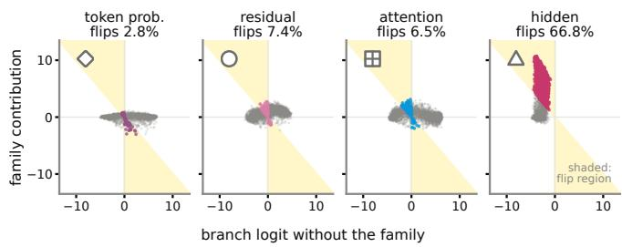  
Figure 9: When the auxiliary families change a decision, with-context branches on Qwen3.5-9B, full test split. Each panel plots the encoder score with the family ablated (x) against the family’s contribution (y); in the shaded wedge the contribution changes the decision, and colored points are the flipped examples. Prob and Attn are measured in [ ], Resid in [ ].

<table><tr><td>Setting</td><td>Data</td><td>Champion</td><td>Hidden only</td><td>∆ (95% CI)</td></tr><tr><td rowspan="4">Closed-book</td><td>Test</td><td>.839</td><td>.832</td><td>+.007† [.000, .014]</td></tr><tr><td>PopQA</td><td>.924</td><td>.917</td><td>+.007 [−.000, .014]</td></tr><tr><td>NQ</td><td>.814</td><td>.793</td><td>+.021† [.011, .032]</td></tr><tr><td>TQA</td><td>.876</td><td>.865</td><td>+.010† [.000, .020]</td></tr><tr><td rowspan="4">With context</td><td>Test</td><td>.926</td><td>.921</td><td>+.005 [−.001, .011]</td></tr><tr><td>PopQA</td><td>.948</td><td>.942</td><td>+.006 [−.000, .012]</td></tr><tr><td>NQ</td><td>.894</td><td>.878</td><td>+.016† [.005, .027]</td></tr><tr><td>TQA</td><td>.929</td><td>.910</td><td>+.019† [.011, .028]</td></tr></table>

Table 7: Paired significance of the fused champion over the strongest single signal, the hidden-state encoder read on its own. For each evaluation set we bootstrap the AU-ROC diference (10,000 resamples over the examples the two models share) and report the 95% interval; a dagger marks the columns whose interval excludes zero. The champion improves on the hidden-state encoder in every column, and the improvement is significant on both held-out single-hop sets (NQ, TriviaQA) in each setting and on the closed-book in-domain test, while it is small est and not significant on the in-domain aggregate with context. Figures are computed on the shared examples (original passages), so the with-context in-domain value is marginally below Table 1.

What the attention family responds to. The attention family endorses answers that have verbatim support in the retrieved passage, so its reliability is set by how well support tracks correctness. Table 11 traces this across three evaluation sets. On the in-domain test split retrieval is good: the passage lifts the generator from 29.4% to 78.4% accuracy, support and correctness mostly agree, and endorsing support is usually right (flip precision .809). On NQ retrieval is often harmful: accuracy falls when the passage is added (42.7 → 32.5), 45.1% of wrong answers are copied verbatim from the passage, and the family’s precision drops to .672. The subset rows lo cate the failures. Wherever an answer appears in the passage but is wrong, the family’s flips are wrong essentially always (.111 in-domain, .000 elsewhere): it endorses support, not truth. The reverse mismatch, a correct answer without support, becomes systematic only on TriviaQA (.040), the one set the generator mostly answers from memory (70.8% closed-book); on the other two sets the family reacts weakly to missing support, and its rare flips there are unsystematic (.613, .500). Both failure modes are one mechanism seen under diferent retrieval distributions: the family reads verbatim support, and support is only as good a proxy for correctness as the retriever makes it.

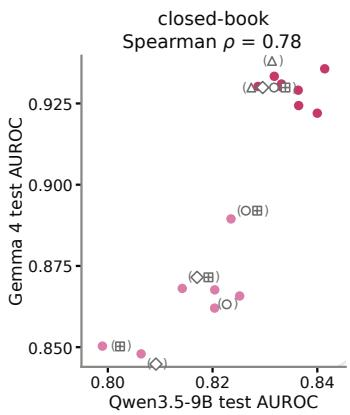

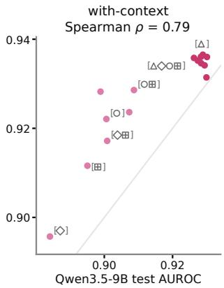

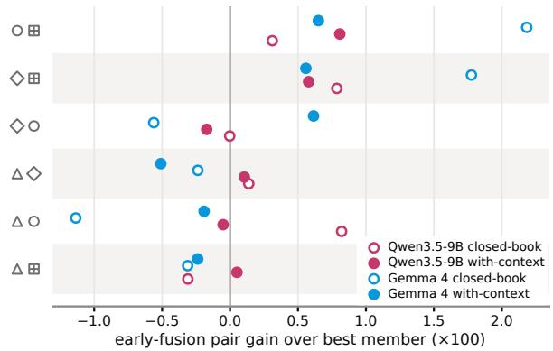  
Figure 10: Cross-backbone structure of the fifteen combination encoders, full test split. Top: each encoder’s AU-ROC on Qwen3.5-9B (x) against Gemma 4 (y), one panel per setting; dark points read hidden states, light ones do not. Bottom: the AUROC of each two-family encoder minus the AUROC of the better of its two single-family members (×100).

No privileged attention heads. The attention family’s channels are per-head summaries, so one can ask whether a few heads carry the signal. To measure each head’s influence we attribute the encoder’s score to its input channels with integrated gradients, moving from a baseline in which the family’s channels are set to their means over the evaluation data up to the actual input; a head’s value is the absolute attribution of its channels, summed over tokens, spans and 400 test examples, and normalised so that all heads sum to one. Figure 11 shows the resulting share of every layer–head cell, in the withcontext combination branch and in the encoder that reads attention alone. Both maps are close to uniform: the eight largest cells hold 8.6% and 8.3% of the attribution against a uniform 6.3%, and in the combination branch ablating those eight heads’ channels perturbs the encoder no more than ablating eight random ones. What the probe reads from attention is spread redundantly across heads rather than localised in a few.

<table><tr><td></td><td colspan="4">Closed-book</td><td colspan="4">With context</td></tr><tr><td>Dropped span</td><td>Test</td><td>PopQA</td><td>NQ</td><td>TQA</td><td>Test</td><td>PopQA</td><td>NQ</td><td>TQA</td></tr><tr><td>None (full)</td><td>.839/.913</td><td></td><td>.924/.976 .814/.848</td><td>.874/.762</td><td>.932/.826</td><td>.948/.965</td><td>.896/.941</td><td>.930/.774</td></tr><tr><td>Context</td><td></td><td></td><td></td><td></td><td>.927/.809</td><td>.944/.959</td><td>.883/.929</td><td>.925/.758</td></tr><tr><td>Question</td><td></td><td></td><td>.837/.914 .920/.974 .818/.848</td><td>.882/.757</td><td>.926/.800</td><td>.943/.962</td><td>.880/.931</td><td>.927/.767</td></tr><tr><td>Answer</td><td></td><td></td><td>.831/.912 .911/.971 .803/.841 .842/.714</td><td></td><td>.919/.801</td><td>.944/.963</td><td>.884/.932</td><td>.903/.711</td></tr></table>

Table 8: Token-span ablation: encoders retrained with one span’s features zeroed at training time (evaluation protocol unchanged; each cell reports AUROC / AUPRC with the incorrect answer as the AUPRC positive class). Dropping the answer span is consistently the most damaging cut in both settings (with context: −.013 Test / −.027 TQA AUROC; closed-book: −.013 PopQA / −.032 TQA), while dropping the question span is nearly free — and even helps slightly on closed-book OOD — indicating the correctness signal concentrates on the answer tokens. Dropping the retrieved context costs little for detection even in the with-context setting, consistent with the probe reading the model’s processing of the context of the answer tokens rather than the context tokens themselves.
<table><tr><td rowspan="3"></td><td colspan="4">Closed-book</td><td colspan="4">With context</td></tr><tr><td>ID</td><td colspan="3">OOD</td><td>ID</td><td colspan="3">OOD</td></tr><tr><td>Test</td><td>PopQA</td><td>NQ</td><td>TQA</td><td>Test</td><td>PopQA</td><td>NQ</td><td>TQA</td></tr><tr><td colspan="9">Text-only classifiers (question, answer, and retrieved passage as text)</td></tr><tr><td>Majority class</td><td>.500</td><td>.500</td><td>.500</td><td>.500</td><td>.500</td><td>.500</td><td>.500</td><td>.500</td></tr><tr><td>TF-IDF + logistic regr.</td><td>.785</td><td>.774</td><td>.676</td><td>.643</td><td>.901</td><td>.863</td><td>.819</td><td>.807</td></tr><tr><td>TF-IDF + linear SVM</td><td>.746</td><td>.760</td><td>.658</td><td>.629</td><td>.869</td><td>.836</td><td>.787</td><td>.765</td></tr><tr><td>TF-IDF + MLP</td><td>.790</td><td>.781</td><td>.664</td><td>.652</td><td>.902</td><td>.857</td><td>.833</td><td>.807</td></tr><tr><td>Fine-tuned e5-base (110M)</td><td>.831</td><td>.849</td><td>.771</td><td>.765</td><td>.900</td><td>.814</td><td>.620</td><td>.637</td></tr><tr><td colspan="9">Internal signals (ours)</td></tr><tr><td>BEATRICE (3.1M / 4.1M)</td><td>.839</td><td>.924</td><td>.814</td><td>.874</td><td>.932</td><td>.948</td><td>.896</td><td>.930</td></tr></table>

Table 9: Predicting answer correctness of Qwen3.5-9B from surface text alone, against BEATRICE. Each cell is AUROC. Every text classifier is trained on the same training split and selected on the same validation split as BEATRICE; its input is the question, the model’s final answer, and, in the with-context setting, the retrieved passage. In-domain Test is the multi-hop aggregate; PopQA, NQ, and TQA are out-of-distribution. The two figures after BEATRICE are its closed-book and with-context champion sizes; both are far smaller than the fine-tuned encoder yet lead every column. Per column, bold is best.

## H Detection Under Real Retrieved Context

The with-context results in the main text score detectors on the datasets’ own supporting passages. Before turning the detector into a controller, we check that it still detects correctness when the context comes from real retrieval, the condition a deployed system faces. We build a 3,000-question test set, 500 from each of the six datasets (the first 500 of each canonical test split, disjoint from probe training), and retrieve k=3 passages per question with E5 over Wikipedia-2018, the same retriever the controller of Section 5 uses. The backbone answers from these passages, and each answer is labeled by the majority vote of the three judge prompts (Appendix A) without the consensus-purification step, so all 3,000 questions are kept, including the harder cases where the judges disagree. Every trained detector, ours included, reuses its existing with-context weights and is evaluated zero-shot on this set; we report per-dataset AUROC and AUPRC on both backbones (Qwen3.5-9B, with a retrieval-augmented accuracy of 48%, and Gemma 4, 37%).

Tables 12 and 13 show the ranking is stable. BEAT-RICE is first on both backbones, at 0.891 on Qwen (+0.039 over the strongest baseline) and 0.911 on Gemma (+0.064), and it leads most individual datasets, four of six on Qwen and all six on Gemma. The families behave as in the gold-context comparison: single-pass probes are the strongest baselines, and on Gemma the sampling scores again fall below chance, the consistent-refusal efect of Appendix K. Reading correctness from internal signals thus transfers from gold to retrieved context without retraining.

## I PGIR End-Task Results

Table 14 gives the full end-task comparison summarized in Section 5: exact-match and F1 on each dataset, macro means, and generations per query, for PGIR and the confidence-control baselines under one shared backbone

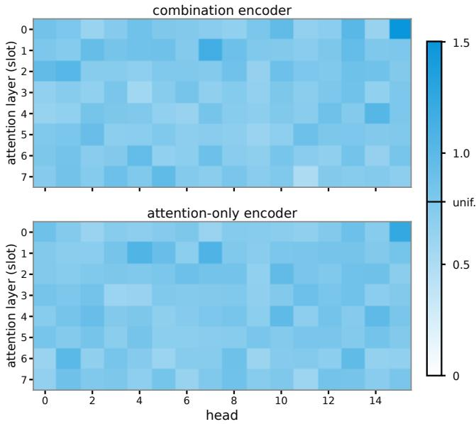  
Figure 11: Attribution share of each layer–head cell of the attention family on Qwen3.5-9B: absolute integrated gradients attribution of the encoder score, summed over that head’s channels and all spans, n=400 test examples. Top: the with-context combination branch [ ]; bottom: the single-family encoder [ ]. The mark on the colorbar is the uniform share.

and retriever.

## J Case Studies

Two forward passes, two decisions. Table 15 traces questions from the PGIR runs on both backbones and shows the same probe auditing and deciding. When the closedbook draft is confident and correct, the pre-retrieval gate accepts it and skips retrieval. When it is a confident but wrong guess, the probe scores it low and PGIR retrieves; a grounded draft that clears the threshold is then trusted, even when it overturns the closed-book answer. Asked what gemstone “The Moonstone” is in Wilkie Collins’s novel, the model first echoes the title, “Moonstone”, which the probe scores low (0.57); with the passage it answers “Diamond” and the score rises to 0.90, so PGIR returns it. When retrieval does not help, no draft clears the threshold and PGIR returns its best candidate without trusting it, leaving the wrong answer flagged.

## K Generality Across Base Models

To test whether the detector and its selection protocol transfer beyond a single base model, we repeat the entire pipeline on Gemma 4 E4B (instruction-tuned), a model that difers from Qwen3.5-9B in scale, architecture family, and attention layout (only 7 of its 42 layers use full attention; the attention distribution features read exactly those layers). Every protocol decision is held fixed: the same data scale and split construction, correctness labels rebuilt from the new model’s own greedy answers under the same consensus purification, the same four signal families with the read-out layer re-selected on validation, the same encoder pool, and the same combina tion search with every choice made on the validation split only. Greedy selection again reaches the global optimum of the exhaustive enumeration over all three-encoder sub sets in both settings (455 closed-book and 4,060 with context candidates). Figure 12 draws this landscape as Figure 5 does for Qwen. The two ends agree: on both models the worst with-context combinations are built entirely from closed-book encoders. The top does not. Reading the closed-book-count panel up toward the optimum, Qwen concentrates on exactly one closed-book encoder, its ten best combinations all carry one, whereas Gemma moves the other way, the zero-closed-book fraction rises sharply and the one-closed-book fraction falls of, until nine of Gemma’s ten best combinations carry none. The closed-book prior that gives Qwen a small lift under retrieval does not carry over: at Gemma’s optimum the with-context signal is self-suficient, and the value of that prior is genuinely base-model dependent.

<table><tr><td></td><td colspan="3">Closed-book</td><td colspan="3">With-context</td></tr><tr><td></td><td>flip rate</td><td></td><td>flip precision</td><td>flip rate</td><td></td><td>flip precision</td></tr><tr><td colspan="7">Qwen3.5-9B</td></tr><tr><td>△ Hidden</td><td>.385</td><td></td><td>.598 [.560, .641]</td><td>.668</td><td></td><td>.964 [.956, .972]</td></tr><tr><td>◇ Prob</td><td>.039</td><td></td><td>.746 [.644, .864]</td><td>.028</td><td></td><td>.583 [.488, .690]</td></tr><tr><td>Resid</td><td>.120</td><td></td><td>.556 [.489, .622]</td><td>.074</td><td></td><td>.897 [.857, .933]</td></tr><tr><td>田 Attn</td><td>.034</td><td></td><td>.569 [.431, .706]</td><td>.065</td><td></td><td>.809 [.758, .861]</td></tr><tr><td colspan="7">Gemma 4</td></tr><tr><td>△ Hidden</td><td>.173</td><td></td><td>.413 [.351, .471]</td><td>.626</td><td></td><td>.932 [.915, .947]</td></tr><tr><td>◇ Prob</td><td>.014</td><td></td><td>.714 [.524, .905]</td><td>.020</td><td></td><td>.600 [.433, .767]</td></tr><tr><td>Resid</td><td>.073</td><td></td><td>.227 [.145, .300]</td><td>.083</td><td></td><td>.792 [.720, .864]</td></tr><tr><td>田Attn</td><td>.019</td><td></td><td>.310 [.138, .483]</td><td>.050</td><td></td><td>.733 [.627, .827]</td></tr></table>

Table 10: Decision flips under family ablation, full test split. One signal family’s input channels are replaced by their means over the evaluation data; a flip means the encoder’s decision, P(answer correct) above or below one half, changes. Flip rate is the fraction of examples flipped; flip precision is the fraction of flips on which the intact encoder decides correctly, with 95% bootstrap intervals. Closed-book rows are measured in ( ), withcontext rows in [ ]; the Resid rows use ( ) and [ ]. Bold marks the most precise auxiliary family per setting. Gemma closed-book precisions should be read against that split’s 9% positive rate.

Table 16 reports the comparison in the format of Table 1. Under the validation selection protocol BEATRICE leads both settings (closed-book validation AUROC .952 against .944 for the strongest baseline; with-context .941 against .929), and it is best in five of the eight evaluation columns, including all PopQA and NQ columns. The remaining three columns go to a baseline by at most .014 AUROC: SAPLMA on closed-book NQ, Lookback-Lens on the with-context in-domain test, and ReDeEP on with-context TriviaQA. Baselines are markedly stronger on Gemma than on Qwen, so we report this as a protocollevel win with per-column trade-ofs rather than uniform dominance.

<table><tr><td></td><td>test</td><td>NQ</td><td>TriviaQA</td></tr><tr><td>Generator answer accuracy (%)</td><td></td><td></td><td></td></tr><tr><td>closed-book</td><td>29.4</td><td>42.7</td><td>70.8</td></tr><tr><td>with the retrieved passage</td><td>78.4</td><td>32.5</td><td>78.1</td></tr><tr><td>Wrong answers present in passage</td><td>34.0%</td><td>45.1%</td><td>34.7%</td></tr><tr><td>Attention flip precision</td><td>.809</td><td>.672</td><td>.607</td></tr><tr><td>answer in passage, but wrong</td><td>.111</td><td>.000</td><td>.000</td></tr><tr><td>answer correct, not in passage</td><td>.613</td><td>.500</td><td>.040</td></tr></table>

Table 11: The attention family against retrieval quality, on the with-context branch [ ] of Qwen3.5-9B. The first three rows characterise the data: the generator’s answer accuracy without and with the retrieved passage, and the share of wrong answers whose text nevertheless appears verbatim in the passage (normalised substring match). The last three rows are the decision-flip precision of Table 10, computed on all examples and then restricted to the two subsets on which verbatim support and correctness disagree.

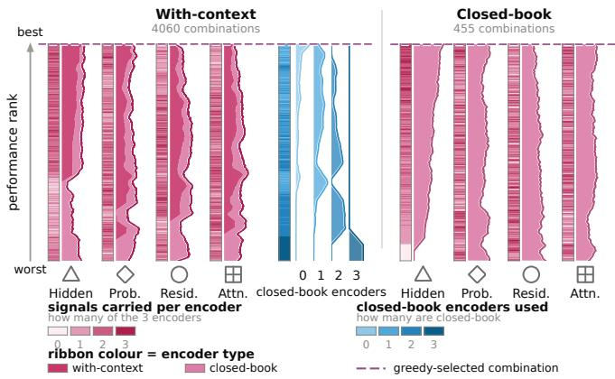  
Figure 12: Exhaustive ranking of all three-encoder combinations on Gemma 4, best to worst, in the format of Figure 5. All-closed-book combinations sit at the bottom in the with-context pool; the greedy-selected combination is marked by the dashed line.

Two systematic shifts are themselves findings. First, sampling-based consistency methods collapse to or below chance in most columns: repeated samples of this instruction-tuned model frequently agree on the same refusal or the same wrong short answer (two thirds of queries collapse to a single semantic cluster, and those queries have a higher error rate), so agreement across samples no longer tracks correctness. Second, attentioncarried signals are systematically stronger on Gemma: Lookback-Lens rises from the .78 to .91 AUROC range on Qwen to .92 to .97 here, and our own attention encoder shows the same shift. Internal-state detectors remain strong across both base models while behaviorbased scores do not, which supports reading the model rather than sampling it.

Finally, Table 17 repeats the application experiment of Table 14 on the Gemma backbone: same retriever and evaluation splits, all trained controllers retrained for the new model, and PGIR driven by the Gemma probe with its threshold and budget re-tuned on the dev split only. The ranking of the confidence-control family is stable across backbones: PGIR is first on macro EM and F1 and Probing-RAG second on both, while individual sets again go to specialists (SeaKR on HotpotQA, at 17.5 generations per query against PGIR’s 4.6, and Probing-RAG on TriviaQA).

<table><tr><td rowspan="2">Method</td><td colspan="3">Single-hop</td><td colspan="3">Multi-hop</td><td rowspan="2">All</td></tr><tr><td>PopQA</td><td>NQ</td><td>TQA</td><td>HotpotQA</td><td>2Wiki</td><td>MuSiQue</td></tr><tr><td>Random AUPRC (error rate)</td><td>.504</td><td>.396</td><td>.158</td><td>.492</td><td>.706</td><td>.882</td><td>.523</td></tr><tr><td>BEATRICE</td><td>.866/.868</td><td>.836/.781</td><td>.899/.696</td><td>.864/.866</td><td>.832/.909</td><td>.798/.964</td><td>.891/.894</td></tr><tr><td>SAPLMA (mean)</td><td>.813/.809</td><td>.770/.644</td><td>.910/.643</td><td>.826/.780</td><td>.757/.865</td><td>.811/.969</td><td>.852/.836</td></tr><tr><td>SAPLMA (last)</td><td>.811/.799</td><td>.778/.653</td><td>.844/.566</td><td>.790/.774</td><td>.775/.892</td><td>.766/.958</td><td>.836/.827</td></tr><tr><td>LLMsKnow</td><td>.800/.789</td><td>.756/.656</td><td>.815/.562</td><td>.795/.798</td><td>.718/.843</td><td>.713/.946</td><td>.812/.813</td></tr><tr><td>SelfCheckGPT-ngram</td><td>.761/.759</td><td>.779/.719</td><td>.862/.596</td><td>.826/.808</td><td>.689/.829</td><td>.723/.949</td><td>.805/.812</td></tr><tr><td>Lookback-Lens</td><td>.725/.753</td><td>.699/.573</td><td>.784/.460</td><td>.757/.746</td><td>.703/.841</td><td>.679/.933</td><td>.748/.757</td></tr><tr><td>SEP</td><td>.680/.679</td><td>.585/.458</td><td>.726/.367</td><td>.688/.664</td><td>.646/.779</td><td>.604/.914</td><td>.702/.687</td></tr><tr><td>Bayesian SE</td><td>.655/.611</td><td>.668/.520</td><td>.791/.330</td><td>.723/.659</td><td>.557/.724</td><td>.627/.923</td><td>.683/.647</td></tr><tr><td>Semantic Entropy (discrete)</td><td>.653/.610</td><td>.666/.520</td><td>.790/.325</td><td>.720/.655</td><td>.557/.724</td><td>.623/.922</td><td>.681/.645</td></tr><tr><td>Semantic Entropy</td><td>.650/.615</td><td>.660/.493</td><td>.787/.319</td><td>.710/.625</td><td>.561/.737</td><td>.622/.922</td><td>.677/.630</td></tr><tr><td>SelfCheckGPT-NLI</td><td>.622/.680</td><td>.708/.646</td><td>.787/.517</td><td>.742/.739</td><td>.525/.736</td><td>.546/.908</td><td>.673/.711</td></tr><tr><td>EigenScore</td><td>.567/.536</td><td>.686/.584</td><td>.701/.298</td><td>.706/.679</td><td>.594/.741</td><td>.620/.918</td><td>.663/.657</td></tr><tr><td>LLM-Check (combined)</td><td>.613/.642</td><td>.642/.575</td><td>.674/.472</td><td>.675/.704</td><td>.598/.782</td><td>.630/.918</td><td>.647/.702</td></tr><tr><td>ReDeEP</td><td>.609/.586</td><td>.617/.494</td><td>.619/.241</td><td>.638/.603</td><td>.535/.702</td><td>.600/.897</td><td>.646/.628</td></tr><tr><td>ReDeEP-PKS</td><td>.613/.585</td><td>.615/.487</td><td>.616/.235</td><td>.639/.608</td><td>.537/.703</td><td>.597/.896</td><td>.643/.626</td></tr><tr><td>LLM-Check (entropy)</td><td>.539/.588</td><td>.614/.557</td><td>.590/.322</td><td>.625/.660</td><td>.513/.739</td><td>.617/.923</td><td>.599/.660</td></tr><tr><td>ReDeEP-ECS</td><td>.561/.569</td><td>.582/.476</td><td>.603/.318</td><td>.547/.540</td><td>.531/.719</td><td>.588/.915</td><td>.599/.602</td></tr><tr><td>LUMINA-IPR</td><td>.535/.544</td><td>.575/.449</td><td>.555/.222</td><td>.641/.664</td><td>.521/.725</td><td>.538/.903</td><td>.582/.610</td></tr><tr><td>LLM-Check (hidden)</td><td>.529/.550</td><td>.547/.461</td><td>.554/.284</td><td>.560/.593</td><td>.503/.743</td><td>.648/.930</td><td>.579/.623</td></tr><tr><td>LUMINA</td><td>.543/.543</td><td>.574/.448</td><td>.551/.223</td><td>.611/.647</td><td>.501/.720</td><td>.537/.904</td><td>.569/.607</td></tr><tr><td>LLM-Check (perplexity)</td><td>.585/.615</td><td>.549/.449</td><td>.579/.273</td><td>.496/.525</td><td>.587/.798</td><td>.464/.876</td><td>.527/.586</td></tr><tr><td>LLM-Check (attention)</td><td>.515/.531</td><td>.537/.434</td><td>.531/.178</td><td>.524/.495</td><td>.564/.738</td><td>.495/.889</td><td>.519/.540</td></tr><tr><td>LUMINA-MMD</td><td>.520/.530</td><td>.546/.441</td><td>.499/.149</td><td>.444/.431</td><td>.503/.726</td><td>.544/.899</td><td>.504/.511</td></tr></table>

Table 12: Real-retrieval detection on Qwen3.5-9B: AUROC / AUPRC on each dataset under real retrieved context (E5 over Wikipedia-2018, k=3), 500 questions each. AUPRC positive class is the incorrect answer; the italic row is the random-guess AUPRC (per-column error rate). Bold marks the best in each column per metric. Every trained detector reuses its with-context weights and is evaluated zero-shot.

<table><tr><td rowspan="2">Method</td><td colspan="3">Single-hop</td><td colspan="3">Multi-hop</td><td rowspan="2">All</td></tr><tr><td>PopQA</td><td>NQ</td><td>TQA</td><td>HotpotQA</td><td>2Wiki</td><td>MuSiQue</td></tr><tr><td>Random AUPRC (error rate)</td><td>.562</td><td>.440</td><td>.266</td><td>.680</td><td>.882</td><td>.930</td><td>.627</td></tr><tr><td>BEATRICE</td><td>.877/.912</td><td>.819/.802</td><td>.883/.805</td><td>.922/.963</td><td>.943/.992</td><td>.892/.991</td><td>.911/.950</td></tr><tr><td>LLMsKnow</td><td>.765/.845</td><td>.696/.690</td><td>.749/.672</td><td>.850/.925</td><td>.847/.977</td><td>.841/.985</td><td>.847/.916</td></tr><tr><td>SAPLMA (mean)</td><td>.782/.823</td><td>.709/.673</td><td>.739/.488</td><td>.824/.903</td><td>.800/.963</td><td>.727/.970</td><td>.806/.864</td></tr><tr><td>SAPLMA (last)</td><td>.781/.842</td><td>.665/.620</td><td>.699/.478</td><td>.830/.911</td><td>.791/.965</td><td>.799/.981</td><td>.799/.872</td></tr><tr><td>LUMINA</td><td>.711/.795</td><td>.648/.623</td><td>.615/.484</td><td>.768/.889</td><td>.815/.971</td><td>.795/.981</td><td>.761/.863</td></tr><tr><td>LUMINA-IPR</td><td>.756/.837</td><td>.649/.600</td><td>.712/.579</td><td>.765/.890</td><td>.753/.952</td><td>.756/.972</td><td>.761/.855</td></tr><tr><td>LUMINA-MMD</td><td>.707/.788</td><td>.644/.602</td><td>.612/.442</td><td>.753/.873</td><td>.806/.969</td><td>.789/.980</td><td>.755/.847</td></tr><tr><td>Lookback-Lens</td><td>.749/.820</td><td>.662/.602</td><td>.680/.462</td><td>.763/.878</td><td>.739/.943</td><td>.789/.978</td><td>.745/.827</td></tr><tr><td>LLM-Check (perplexity)</td><td>.753/.746</td><td>.669/.558</td><td>.705/.462</td><td>.771/.859</td><td>.730/.941</td><td>.696/.953</td><td>.744/.791</td></tr><tr><td>LLM-Check (hidden)</td><td>.714/.808</td><td>.661/.625</td><td>.677/.584</td><td>.704/.851</td><td>.701/.948</td><td>.635/.951</td><td>.718/.829</td></tr><tr><td>LLM-Check (entropy)</td><td>.766/.788</td><td>.674/.589</td><td>.632/.391</td><td>.716/.819</td><td>.674/.909</td><td>.704/.960</td><td>.710/.764</td></tr><tr><td>SelfCheckGPT-ngram</td><td>.726/.741</td><td>.613/.566</td><td>.801/.539</td><td>.716/.819</td><td>.609/.908</td><td>.475/.928</td><td>.696/.768</td></tr><tr><td>LLM-Check (combined)</td><td>.734/.807</td><td>.671/.648</td><td>.515/.337</td><td>.609/.801</td><td>.653/.932</td><td>.572/.952</td><td>.640/.776</td></tr><tr><td>ReDeEP</td><td>.612/.638</td><td>.545/.455</td><td>.556/.298</td><td>.655/.771</td><td>.629/.905</td><td>.630/.960</td><td>.630/.702</td></tr><tr><td>ReDeEP-PKS</td><td>.610/.637</td><td>.546/.456</td><td>.556/.295</td><td>.654/.769</td><td>.617/.899</td><td>.621/.960</td><td>.627/.698</td></tr><tr><td>LLM-Check (attention)</td><td>.525/.556</td><td>.545/.469</td><td>.524/.269</td><td>.589/.702</td><td>.598/.889</td><td>.636/.945</td><td>.563/.646</td></tr><tr><td>SEP</td><td>.528/.603</td><td>.553/.479</td><td>.569/.335</td><td>.536/.722</td><td>.624/.911</td><td>.522/.934</td><td>.550/.668</td></tr><tr><td>ReDeEP-ECS</td><td>.540/.566</td><td>.497/.436</td><td>.519/.274</td><td>.533/.677</td><td>.558/.875</td><td>.599/.950</td><td>.549/.641</td></tr><tr><td>EigenScore</td><td>.589/.605</td><td>.611/.493</td><td>.551/.282</td><td>.534/.684</td><td>.545/.891</td><td>.437/.915</td><td>.531/.618</td></tr><tr><td>Bayesian SE</td><td>.584/.626</td><td>.490/.428</td><td>.602/.349</td><td>.451/.676</td><td>.394/.860</td><td>.367/.916</td><td>.470/.618</td></tr><tr><td>Semantic Entropy (discrete)</td><td>.585/.625</td><td>.489/.427</td><td>.602/.349</td><td>.451/.675</td><td>.395/.860</td><td>.366/.916</td><td>.470/.617</td></tr><tr><td>Semantic Entropy</td><td>.583/.627</td><td>.485/.420</td><td>.600/.350</td><td>.451/.671</td><td>.394/.861</td><td>.368/.915</td><td>.469/.614</td></tr><tr><td>SelfCheckGPT-NLI</td><td>.495/.670</td><td>.491/.533</td><td>.458/.371</td><td>.238/.652</td><td>.110/.851</td><td>.218/.901</td><td>.306/.631</td></tr></table>

Table 13: Real-retrieval detection on Gemma 4, conventions as in Table 12. On this backbone the sampling detectors fall to or below chance (the consistent-refusal efect of Appendix K).

<table><tr><td rowspan="2">Method</td><td colspan="3">In-domain (multi-hop)</td><td colspan="3">Out-of-distribution</td><td colspan="2">Macro</td><td rowspan="2">Gen</td></tr><tr><td>HotpotQA</td><td>2WikiMQA</td><td>MuSiQue</td><td>PopQA</td><td>NQ</td><td>TriviaQA</td><td>EM</td><td>F1</td></tr><tr><td>No-RAG</td><td>.220/.293</td><td>.238/.282</td><td>.034/.114</td><td>.192/.246</td><td>.176/.267</td><td>.574/.617</td><td>.239</td><td>.303</td><td>1.00</td></tr><tr><td>Vanilla RAG</td><td>.322/.437</td><td>.260/.309</td><td>.060/.133</td><td>.447/.526</td><td>.371/.485</td><td>.757/.818</td><td>.370</td><td>.451</td><td>1.00</td></tr><tr><td>SKR</td><td>.310/.416</td><td>.296/.342</td><td>.052/.126</td><td>.440/.519</td><td>.364/.474</td><td>.738/.796</td><td>.367</td><td>.445</td><td>1.00</td></tr><tr><td>Adaptive-RAG</td><td>.322/.431</td><td>.282/.323</td><td>.060/.098</td><td>.433/.496</td><td>.319/.425</td><td>.718/.769</td><td>.356</td><td>.424</td><td>1.63</td></tr><tr><td>DRÁGIN</td><td>.300/.394</td><td>.298/.343</td><td>.062/.151</td><td>.415/.473</td><td>.354/.467</td><td>.672/.724</td><td>.350</td><td>.425</td><td>3.55</td></tr><tr><td>SeaKR</td><td>.390/.509</td><td>.340/.434</td><td>.092/.173</td><td>.296/.353</td><td>.261/.372</td><td>.695/.765</td><td>.346</td><td>.434</td><td>13.63</td></tr><tr><td>Probing-RAG</td><td>.364/.477</td><td>.322/.384</td><td>.078/.179</td><td>.422/.492</td><td>.346/.462</td><td>.731/.780</td><td>.377</td><td>.462</td><td>2.56</td></tr><tr><td>PGIR (ours)</td><td>.332/.435</td><td>.356/.403</td><td>.090/.172</td><td>.489/.554</td><td>.420/.527</td><td>.758/.812</td><td>.408</td><td>.484</td><td>3.56</td></tr></table>

Table 14: PGIR as a downstream controller, against the confidence-control family: systems that gate or verify retrieval with a self-assessed signal, all sharing one backbone and retriever. Cells are exact-match / F1. Macro is the six-set mean and Gen is generations per query. Per column and metric, bold = best and underline = second.

<table><tr><td>Question</td><td>Closed-book answer (score)</td><td>With-context answer (score)</td><td>Gold</td><td>PGIR action</td></tr><tr><td>Qwen3.5-9B The Nun is based on what</td><td>The Conjuring (.67)</td><td>not retrieved ()</td><td>The</td><td>Accept, no</td></tr><tr><td>film series? What gemstone is The</td><td>Moonstone (.57)</td><td>Diamond (.90)</td><td>Conjuring Diamond</td><td>retrieval Retrieve, then</td></tr><tr><td>Moonstone in the novel by Wilkie Collins?</td><td></td><td></td><td></td><td>trust</td></tr><tr><td>Arctic King, Saladin, and Tom Thumb are which vegetable?</td><td>Onions (.26)</td><td>Cauliflower (.01)</td><td>Lettuce</td><td>Retrieve; both flagged, none trusted</td></tr><tr><td>Gemma 4 Who played Clayton Farlowe in Dallas?</td><td>Michael Landon (.05)</td><td>Howard Keel (.65)</td><td>Howard Keel</td><td>Retrieve, then trust</td></tr><tr><td>Which country is Haya bint Hussein&#x27;s husband from?</td><td>Jordan (.05)</td><td>United Arab Emirates (.65)</td><td>United Arab Emirates</td><td>Retrieve, then trust</td></tr><tr><td>What genre is the band Darkness?</td><td>Horror (.35)</td><td>Dark fantasy (.09)</td><td>hard rock</td><td>Retrieve; both flagged, none trusted</td></tr></table>

Table 15: Case studies from the PGIR runs on both backbones (E5 over Wikipedia). Each score is the calibrated P(answer correct) the controller acts on; the acceptance threshold is τ=0.6. A high closed-book score is accepted without retrieval; a low one triggers retrieval, after which a draft clearing τ is trusted even when it overturns the closed-book guess, while a pool that stays low is left flagged and the best candidate is returned without claiming it is right.

<table><tr><td></td><td colspan="4">Closed-book</td><td colspan="4">With context</td></tr><tr><td></td><td>ID</td><td></td><td>OOD</td><td></td><td>ID</td><td></td><td>OOD</td><td></td></tr><tr><td>Method</td><td>Test</td><td>PopQA</td><td>NQ</td><td>TQA</td><td>Test</td><td>PopQA</td><td>NQ</td><td>TQA</td></tr><tr><td colspan="9">Sampling-based (10 extra generations per query)</td></tr><tr><td>Semantic Entropy</td><td>.339/.894</td><td>.523/.888</td><td>.525/.746</td><td>.756/.717</td><td>.595/.404</td><td>.456/.648</td><td>.384/.726</td><td>.466/.428</td></tr><tr><td>Bayesian SE</td><td>.323/.891</td><td>.524/.888</td><td>.513/.737</td><td>.749/.713</td><td>.591/.403</td><td>.449/.647</td><td>.367/.720</td><td>.451/.425</td></tr><tr><td>SelfCheckGPT-NLI</td><td>.199/.880</td><td>.330/.883</td><td>.485/.777</td><td>.693/.729</td><td>.390/.419</td><td>.087/.628</td><td>.169/.740</td><td>.185/.448</td></tr><tr><td>SelfCheckGPT-ngram</td><td>.509/.921</td><td>.832/.951</td><td>.633/.790</td><td>.832/.752</td><td>.741/.568</td><td>.821/.877</td><td>.596/.817</td><td>.779/.691</td></tr><tr><td>EigenScore</td><td>.458/.893</td><td>.497/.862</td><td>.603/.761</td><td>.510/.450</td><td>.742/.504</td><td>.762/.784</td><td>.632/.817</td><td>.666/.546</td></tr><tr><td colspan="9">Single-signal, single forward pass</td></tr><tr><td>SAPLMA</td><td>.929/.992</td><td>.937/.990</td><td>.866/.936</td><td>.865/.842</td><td>.908/.841</td><td>.963/.984</td><td>.908/.969</td><td>.939/.939</td></tr><tr><td>LLMsKnow</td><td>.909/.990</td><td>.930/.988</td><td>.827/.917</td><td>.822/.784</td><td>.918/.867</td><td>.955/.978</td><td>.904/.965</td><td>.942/.940</td></tr><tr><td>SEP</td><td>.433/.897</td><td>.459/.832</td><td>.446/.644</td><td>.534/.450</td><td>.649/.429</td><td>.747/.828</td><td>.689/.848</td><td>.637/.593</td></tr><tr><td>LLM-Check</td><td>.880/.987</td><td>.940/.989</td><td>.820/.905</td><td>.853/.825</td><td>.876/.804</td><td>.956/.981</td><td>.884/.958</td><td>.898/.897</td></tr><tr><td colspan="9">RAG-specific detectors (single forward pass)</td></tr><tr><td>Lookback-Lens ReDeEP-PKS</td><td></td><td></td><td></td><td></td><td>.948/.946</td><td>.954/.982</td><td>.939/.983</td><td>.971/.980</td></tr><tr><td>LUMINA</td><td></td><td></td><td></td><td></td><td>.922/.924</td><td>.955/.982</td><td>.934/.982 .904/.966</td><td>.974/.979 .935/.875</td></tr><tr><td></td><td></td><td></td><td></td><td></td><td>.879/.819</td><td>.934/.951</td><td></td><td></td></tr><tr><td colspan="9">Multi-signal fusion (ours)</td></tr><tr><td>BEATRICE</td><td>.936/.993 .957/.993</td><td></td><td>.853/.929</td><td>.879/.859</td><td>.935/.893</td><td>.972/.988</td><td>.946/.983</td><td>.963/.961</td></tr></table>

Table 16: Detecting incorrect answers of Gemma 4 E4B (instruction-tuned) in the closed-book and retrievalaugmented settings, mirroring Table 1: each cell reports AUROC / AUPRC with “the answer is wrong” as the AUPRC positive class. The entire pipeline is re-run on the new base model under the protocol of Table 1: same data scale and splits, consensus-purified labels regenerated from this model’s own greedy answers, all layers and hyperparameters of every method re-selected on the validation split only, and the with-context evaluation again merging original and rewritten contexts. The selected probes are ( )( )( ) (closed-book) and [ ][ ][ ] (with context). Sampling-based scores fall to or below chance on this base model; see the discussion in the text. Per column and metric, bold = best and underline = second; “–” marks detectors that require retrieved context and are undefined closed-book.

<table><tr><td></td><td colspan="3">In-domain (multi-hop)</td><td colspan="3">Out-of-distribution</td><td colspan="2">Macro</td><td></td></tr><tr><td>Method</td><td>HotpotQA</td><td>2WikiMQA</td><td>MuSiQue</td><td>PopQA</td><td>NQ</td><td>TriviaQA</td><td>EM</td><td>F1</td><td>Gen</td></tr><tr><td>No-RAG</td><td>.050/.069</td><td>.006/.012</td><td>.000/.003</td><td>.048/.052</td><td>.030/.052</td><td>.298/.340</td><td>.072</td><td>.088</td><td>1.00</td></tr><tr><td>Vanilla RAG</td><td>.190/.298</td><td>.086/.177</td><td>.030/.078</td><td>.375/.463</td><td>.284/.396</td><td>.602/.692</td><td>.261</td><td>.351</td><td>1.00</td></tr><tr><td>SKR</td><td>.190/.297</td><td>.112/.196</td><td>.028/.074</td><td>.368/.456</td><td>.280/.392</td><td>.602/.690</td><td>.263</td><td>.351</td><td>1.00</td></tr><tr><td>Adaptive-RAG</td><td>.222/.329</td><td>.104/.194</td><td>.040/.097</td><td>.364/.431</td><td>.307/.415</td><td>.625/.700</td><td>.277</td><td>.361</td><td>1.70</td></tr><tr><td>DRÂGIN</td><td>.164/.237</td><td>.154/.201</td><td>.020/.062</td><td>.228/.284</td><td>.225/.323</td><td>.514/.584</td><td>.218</td><td>.282</td><td>2.64</td></tr><tr><td>SeaKR</td><td>.264/.372</td><td>.216/.264</td><td>.024/.070</td><td>.223/.274</td><td>.157/.239</td><td>.544/.621</td><td>.238</td><td>.307</td><td>17.48</td></tr><tr><td>Probing-RAG</td><td>.226/.334</td><td>.176/.230</td><td>.040/.091</td><td>.378/.462</td><td>.293/.410</td><td>.708/.779</td><td>.304</td><td>.384</td><td>3.43</td></tr><tr><td>PGIR (ours)</td><td>.244/.344</td><td>.260/.309</td><td>.036/.096</td><td>.397/.473</td><td>.326/.433</td><td>.651/.724</td><td>.319</td><td>.397</td><td>4.63</td></tr></table>

Table 17: PGIR on the Gemma backbone, mirroring Table 14: all systems share the same backbone (Gemma 4 E4B instruction-tuned, greedy decoding) and the same retriever (E5 over Wikipedia-2018, k=3), evaluated on the identical splits as the Qwen table. Cells are exact-match / F1; Macro is the six-set mean and Gen is generations per query. The trained systems (SKR, Adaptive-RAG, Probing-RAG, PGIR) are retrained for this backbone, and PGIR’s acceptance threshold and budget are re-tuned on the dev split only. The confidence-control family ranking is stable across backbones: PGIR leads macro EM and F1 with Probing-RAG second on both, and PGIR again trades individual sets to specialists (SeaKR on HotpotQA at 17.5 generations per query, Probing-RAG on TriviaQA). Per column and metric, bold = best and underline = second.