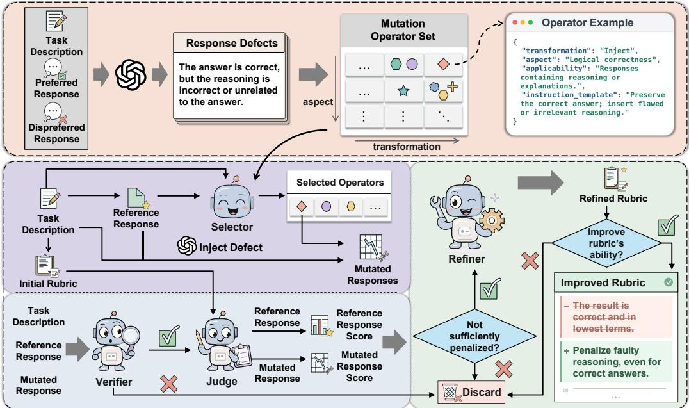
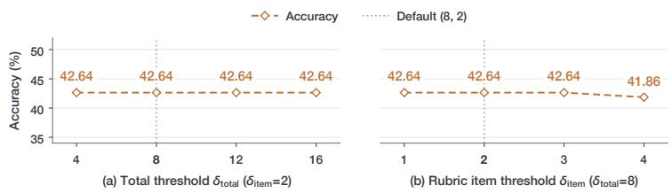

# MUBRIC: MUTATION TESTING-GUIDED RUBRIC GEN-ERATION FOR LLM EVALUATION

Jiayuxuan Yang1, Jie M. Zhang2, Yiling Lou3, Zhenpeng Chen1∗

1Tsinghua University, 2King’s College London, 3University of Illinois Urbana-Champaign   
denerate.cool@gmail.com, jie.zhang@kcl.ac.uk   
yilingl@illinois.edu, zpchen@tsinghua.edu.cn

## ABSTRACT

Rubric-based evaluation is widely used to assess LLM-based systems by decomposing response quality into task-specific scoring criteria. However, automatically generating rubrics that reliably capture task-specific quality requirements remains challenging. We introduce Mubric, a mutation testing-guided approach to rubric generation. Mutation testing, a classic software testing methodology, evaluates a test suite by injecting faults into programs and checking whether the tests detect them. We draw an analogy between test suites and rubrics: if a rubric captures an important quality requirement, introducing a corresponding defect into an otherwise high-quality response should reduce its score. Mubric first mines common defects from real pairs of preferred and dispreferred responses and abstracts these defects into reusable mutation operators, each specifying how to introduce a particular type of response defect. For a new task, it applies relevant operators to a reference response, checks whether the injected defects reduce response quality, and uses insufficiently penalized defects to refine the rubric. We evaluate Mubric on 703 tasks across four representative domains against six advanced rubric generation methods. Mubric achieves the highest overall evaluation accuracy, outperforming the strongest baseline by 7.48 percentage points.

## 1 INTRODUCTION

Rubric-based evaluation is increasingly adopted for assessing LLM responses, particularly on openended tasks, because it decomposes response quality into explicit, task-specific scoring criteria (Liu et al., 2026; Arora et al., 2025; Akyurek et al., 2026; Hashemi et al., 2024). This has made au-¨ tomatic rubric generation, i.e., constructing rubrics that reliably distinguish responses of different quality levels, an important problem in both academia and industry (Zhou et al., 2026; Viswanathan et al., 2025; Wang & Blanco, 2026; Zhou & Tan, 2026). Yet automatically generating effective rubrics remains challenging, as response quality is often multi-dimensional and difficult to capture comprehensively.

To address this challenge, recent rubric generation approaches have incorporated increasingly diverse sources of information and feedback, including decomposed task instructions (Cook et al., 2024), model responses (Viswanathan et al., 2025), and multiple evaluator perspectives (Fu et al., 2026), to construct more informative evaluation criteria. These approaches highlight the value of using evidence beyond the task description to improve rubric quality. Complementing these efforts, we investigate a distinct form of feedback inspired by mutation testing.

Mutation testing is a classic software testing methodology that evaluates a test suite by injecting faults into programs and checking whether the tests detect them (Woodward, 1993; Jia & Harman, 2011; Papadakis et al., 2019). Crucially, the undetected faults reveal concrete weaknesses in the test suite and provide targeted feedback for improvement. We observe a natural analogy in LLM evaluation: a rubric plays a role similar to a test suite, while the response is the object being evaluated. This analogy motivates a mutation-testing perspective on rubric generation: systematically introducing controlled response defects and using their scoring outcomes to guide rubric generation.

Specifically, we propose Mubric, a mutation testing-guided approach to automatic rubric generation. Mubric first constructs a reusable set of mutation operators by abstracting defects observed in real preferred–dispreferred response pairs. Given a new task, it generates an initial rubric and a reference response, applies task-relevant operators to introduce targeted defects into the reference response, and measures how strongly the rubric penalizes the resulting mutations. If an injected defect causes little or no score reduction, Mubric interprets this as evidence that the corresponding quality requirement is insufficiently captured by the rubric and refines the rubric accordingly.

We conduct an extensive evaluation of Mubric on 703 tasks spanning four representative domains, against six strong recent rubric generation baselines covering diverse strategies. Mubric achieves the highest overall evaluation accuracy of 57.27%, outperforming the strongest baseline by 7.48 percentage points, with gains that are broadly consistent across domains. Ablation results further show that both the reusable mutation operators derived from real response defects and the mutationguided refinement process contribute substantially to the effectiveness of Mubric.

In summary, this paper makes the following contributions:

• We introduce Mubric, a mutation testing-guided approach to automatic rubric generation that constructs reusable mutation operators from real response defects and uses controlled mutations to refine task-specific rubrics.

• We extensively evaluate Mubric against six recent rubric generation methods on 703 tasks across four representative domains, demonstrating consistent improvements in evaluation accuracy.

• We publicly release our scripts and data at https://github.com/AIRubric/Mubric to support reproducibility and facilitate future research on rubric generation.

## 2 RELATED WORK

Rubric-based evaluation. Rubric-based evaluation has emerged as an important paradigm for assessing LLM responses, by decomposing response quality into explicit, fine-grained criteria (Liu et al., 2026; Arora et al., 2025; Akyurek et al., 2026; Hashemi et al., 2024). Representative ap- ¨ proaches include G-Eval (Liu et al., 2023), FLASK (Ye et al., 2024), and BiGGen (Kim et al., 2025), which structure evaluation around explicit criteria or rubrics. As rubric-based evaluation becomes increasingly prevalent, automatically generating high-quality rubrics has itself become an important research direction. This has also motivated benchmarks for assessing rubric quality. For example, RubricBench (Zhou et al., 2026) and RM-Bench (Liu et al., 2025) evaluate whether rubric-based evaluators can distinguish preferred from dispreferred responses despite subtle quality differences and misleading presentation. Our work focuses on automatic rubric generation and evaluates the resulting rubrics on these representative benchmarks.

Rubric generation and refinement. A growing body of work has explored automatic rubric generation and refinement. One line of research generates rubrics directly from task descriptions. For example, TICK (Cook et al., 2024) decomposes task instructions into task-specific binary evaluation criteria, while Dynamic (Wang & Blanco, 2026) adopts an instance-specific approach that generates a fine-grained rubric directly from the task description. A second line of work leverages model responses to derive evaluation criteria, for example by analyzing candidate responses (Viswanathan et al., 2025) or preference contrasts (Liu et al., 2026). MRRG further broadens criterion coverage by eliciting rubric items from multiple complementary evaluator roles (Fu et al., 2026). AutoChecklist (Zhou & Tan, 2026) further unifies several existing methods within a composable framework for rubric generation, refinement, and scoring. Different from existing methods, we introduce a mutation-testing perspective to rubric generation: rather than relying only on task descriptions or observed responses, we inject controlled response defects to guide rubric generation.

Stage 1: Mutation Operator Construction  
  
Stage 2: Mutation-Guided Rubric Generation  
Figure 1: Overview of Mubric.

## 3 METHODOLOGY

## 3.1 MUBRIC: IN A NUTSHELL

We first formulate the rubric generation problem. Let x denote a task description and y a response to be evaluated. A task-specific rubric is denoted by

$$
\mathcal { R } _ { x } = { \left( r _ { i } , w _ { i } \right) } _ { i = 1 } ^ { n } ,\tag{1}
$$

where $r _ { i }$ is an evaluation criterion and $w _ { i }$ is its weight. Given x, y, and $\mathcal { R } _ { x } .$ , an LLM judge J scores the response against each rubric item, and the weighted item scores are aggregated into an overall score $S _ { J } ( x , y ; \mathcal { R } _ { x } )$ . Higher scores indicate better satisfaction of the rubric criteria. Our goal is to automatically generate a rubric $\mathcal { R } _ { x }$ that reliably distinguishes higher-quality responses from lower-quality ones for task x, assigning higher scores to the former and lower scores to the latter.

To this end, we propose Mubric, a mutation testing-guided approach to rubric generation, as illustrated in Figure 1. Mubric consists of two stages: mutation operator construction and mutationguided rubric generation. In the first stage, Mubric constructs a reusable set of mutation operators from defects observed in real pairs of preferred and dispreferred responses. Each operator specifies how to introduce a particular type of defect into a response. In the second stage, given a new task, Mubric generates an initial rubric and a reference response. It then selects task-relevant mutation operators, applies them to the reference response to produce mutated responses, and verifies that the injected defects indeed reduce response quality. The current rubric is used to score both the reference and mutated responses, and defects that do not induce a sufficient score decrease are used to refine the rubric. Finally, Mubric retests the refined rubric on the same mutated responses and retains the refinement only if it improves the rubric’s ability to penalize the injected defects.

## 3.2 STAGE 1: MUTATION OPERATOR CONSTRUCTION

This stage constructs a reusable set of mutation operators from pairs of preferred and dispreferred responses. We use OpenRubrics (Liu et al., 2026) as the data source, as it contains a large collection of tasks spanning diverse domains, each paired with a preferred and a dispreferred response. This diversity provides broad coverage of response defect patterns and supports the construction of mutation operators that can generalize across task domains. We randomly sample 1,000 tasks together with their task descriptions and response pairs. For each task, we compare the two responses against the task description, identify concrete defects in the dispreferred response, and abstract recurring defect patterns into mutation operators. We describe this process in detail below.

Extracting response defects. For each task, we use an LLM to compare the preferred and dispreferred responses against the task description, with their preference labels explicitly provided. The LLM identifies concrete reasons why the dispreferred response is worse than the preferred one. A response may contain multiple distinct defects, such as an incorrect factual claim, a faulty reasoning step, an omitted requirement, or a violation of an explicit instruction. We record each defect separately, together with supporting evidence from the dispreferred response. This process yields a collection of concrete response defects grounded in real model outputs.

Abstracting reusable defect patterns. We next ask how a preferred response could be modified to exhibit each observed defect. To enable abstraction across tasks, we use an LLM to organize the extracted defects along two dimensions. The first is the transformation type, which characterizes how the response is changed, such as omitting required content, inserting irrelevant content, fabricating unsupported information, or disrupting a reasoning chain. The second is the quality aspect affected by the modification. We adopt the 12 fine-grained quality dimensions introduced by FLASK (Ye et al., 2024), which characterize desirable properties of instruction-following responses, such as factuality, logical correctness, completeness, and comprehension.

Within each transformation–aspect category, the LLM further groups defects that can be induced through the same underlying modification pattern. For example, a mathematical response and a coding response may both misuse a concept outside the conditions under which it is valid. Although the specific content differs, both can be generated through the same reusable modification pattern: preserving the surrounding response while altering a concept application so that it becomes invalid. This abstraction allows defect patterns observed in one task to be instantiated in other tasks with different content.

Constructing mutation operators. We convert each recurring modification pattern into a muta tion operator

$$
o = ( t , a , c , \iota ) ,\tag{2}
$$

where t denotes the transformation type, a the affected quality aspect, c the applicability condition, and ι an instruction specifying how to introduce the corresponding defect. Here, t and a characterize the operator, while c and ι determine when and how it is applied. For example, an operator targeting logical correctness may apply to responses containing explicit reasoning and instruct an LLM to preserve the final answer while introducing an invalid reasoning step. Because these mutations are semantic, the operators are executed by an LLM rather than by deterministic transformations. Applying this process to the sampled response pairs yields a set of 201 mutation operators, which can be reused across all downstream tasks.

## 3.3 STAGE 2: MUTATION-GUIDED RUBRIC GENERATION

This stage uses the mutation operators in Stage 1 to generate a rubric for a new task. Given a task description, Mubric first generates an initial rubric and a reference response. It then selects task-relevant mutation operators and applies them to the reference response to construct controlled lower-quality variants. Mubric tests whether the current rubric assigns sufficiently lower scores to the mutated responses. Defects that are under-penalized are used to refine the rubric, and the refinement is retained only if retesting shows improved sensitivity to these defects. We describe this process in detail below.

Generating the initial rubric and reference response. Given a task description x, we use the LLM judge J to generate an initial rubric $\mathcal { R } _ { x } ^ { ( 0 ) }$ solely from x. Separately, we generate a reference response ${ \bar { y } } ^ { \mathrm { r e f } }$ for the same task using another LLM. The reference response serves as a common baseline from which the effects of injected defects on rubric scores are measured.

Generating and validating mutated responses. Given x and $y ^ { \mathrm { r e f } }$ , an LLM-based selector identifies mutation operators whose applicability conditions are satisfied and determines where each selected operator should be applied. Each operator is applied independently to the original reference response, producing a mutated response y˜. We then independently verify each $\tilde { y }$ against x and $y ^ { \mathrm { r e f } }$ . An LLM-based verifier checks whether the intended defect is present and whether it reduces response quality with respect to the task requirements. Only mutated responses that pass this verification are retained for rubric testing.

Testing whether the rubric detects injected defects. The LLM judge J evaluates both $y ^ { \mathrm { r e f } }$ and each validated $\tilde { y }$ using the current rubric. Each rubric item is scored independently to reduce interference among evaluation criteria. Let $s _ { J , i } ( x , y ; \mathcal { R } _ { x } )$ denote the score assigned to response y on rubric item i. The weighted item scores are aggregated into the overall score $S _ { J } ( x , y ; \mathcal { R } _ { x } )$

For a mutated response ${ \tilde { y } } ,$ , we define the overall score decrease as

$$
\Delta S = S _ { J } ( x , y ^ { \mathrm { r e f } } ; \mathcal { R } _ { x } ) - S _ { J } ( x , \tilde { y } ; \mathcal { R } _ { x } ) ,\tag{3}
$$

and the score decrease on rubric item i as

$$
\Delta s _ { i } = s _ { J , i } ( x , y ^ { \mathrm { r e f } } ; \mathcal { R } _ { x } ) - s _ { J , i } ( x , \tilde { y } ; \mathcal { R } _ { x } ) .\tag{4}
$$

We consider an injected defect sufficiently detected when

$$
D ( \tilde { y } ; \mathcal { R } _ { x } , J ) = \mathbf { 1 } \Big [ \Delta S \ge \delta _ { \mathrm { t o t a l } } ~ \vee ~ \operatorname* { m a x } _ { i } \Delta s _ { i } \ge \delta _ { \mathrm { i t e m } } \Big ] ,\tag{5}
$$

where $\delta _ { \mathrm { t o t a l } }$ and $\delta _ { \mathrm { i t e m } }$ are thresholds for the overall and item-level score decreases, respectively. The overall criterion captures a substantial change in the aggregated evaluation, while the item-level criterion ensures that a strong penalty on a specific quality dimension is not obscured by aggregation across the rubric. If neither threshold is reached, the current rubric does not sufficiently penalize the injected defect. To reduce the effect of scoring variability, we reevaluate such cases three times and use majority voting to determine whether the insufficient penalty is consistent.

Refining and retesting the rubric. Defects that remain under-penalized are provided to an LLMbased refiner together with the current rubric. The refiner can clarify an existing criterion, adjust the weight of a relevant criterion, or add a new criterion to better capture the underrepresented quality requirement. The revision is expressed as a general requirement for the task rather than a rule tailored to a particular mutated response.

Let $\mathcal { R } _ { x } ^ { \prime }$ denote the resulting candidate rubric. We retest $\mathcal { R } _ { x } ^ { \prime }$ on the same mutated responses that motivated the revision and compare its score decreases with those produced by the original rubric. The refinement is retained only if it improves the rubric’s ability to penalize the injected defects; otherwise, the original rubric is preserved.

If no applicable operator is found, no validated mutation is obtained, or all injected defects are already sufficiently penalized, Mubric returns the initial rubric $\mathcal { R } _ { x } ^ { ( 0 ) }$ unchanged.

Appendix A provides representative examples tracing how selected mutation operators expose under-penalized response defects and guide subsequent rubric refinement and retesting.

## 4.1 RESEARCH QUESTIONS (RQS)

We aim to evaluate Mubric by answering the following RQs.

RQ1 (Effectiveness): How effective is Mubric at generating rubrics that distinguish preferred from dispreferred responses compared with existing methods?

RQ2 (Ablation Study): How do the key components of Mubric contribute to its effectiveness?

RQ3 (Operator Analysis): What mutation operators are derived from real response defects, and how are they selected across different task domains?

## 4.2 DATASETS AND EVALUATION METRIC

Datasets. We evaluate Mubric on 703 tasks drawn from two recent and challenging benchmarks, RubricBench (Zhou et al., 2026) and RM-Bench (Liu et al., 2025), spanning four representative domains: science, technology, engineering, and mathematics (STEM), programming (Code), instruction following (IF), and open-domain conversation (Chat). Each task consists of a task description and a pair of preferred and dispreferred responses, enabling us to evaluate whether a generated rubric correctly distinguishes responses of different quality.

We use RubricBench as our primary benchmark for cross-domain evaluation. Specifically, we randomly sample 150 tasks each from its STEM, Coding, and Chat subsets, and include all 124 tasks from its IF subset. We exclude its Safety subset because safety evaluation may depend on external policy constraints that are not specified in the task itself, whereas our study focuses on taskgrounded response quality. To assess whether the observed gains extend beyond a single benchmark construction, we additionally evaluate on all 129 tasks from the Chat subset of RM-Bench as a complementary cross-benchmark setting. For clarity, we refer to the Chat subsets of RubricBench and RM-Bench as RB-Chat and RM-Chat, respectively.

To prevent data leakage, we check for overlap between the 703 evaluation tasks and the OpenRubrics data used to construct the mutation operators. We confirm that none of the evaluation tasks appears in this construction set.

Metric. We use accuracy as the primary metric, defined as the proportion of tasks for which a rubric correctly identifies the preferred response from a pair of preferred and dispreferred responses. Under rubric-based evaluation, the response receiving the higher score is predicted to be preferred.

## 4.3 BASELINE METHODS

Existing methods. We compare Mubric with six representative baselines derived from four recent rubric generation approaches, covering diverse strategies including decomposing task instructions, leveraging model responses, and aggregating criteria from multiple evaluator perspectives.

• TICK (Cook et al., 2024) converts task instructions into task-specific evaluation checklists by decomposing the requirements into a set of binary YES/NO questions.

• RLCF (Viswanathan et al., 2025) generates checklists by leveraging model responses as additional evidence for identifying evaluation requirements. We evaluate three configurations that differ in the response information used during checklist generation: (i) RLCF-C, which derives criteria from multiple generated candidate responses; (ii) RLCF-R, which derives criteria from an independently generated reference response; and (iii) RLCF-B, which uses both the reference response and generated candidates. We treat these configurations as separate baselines because they represent different ways of incorporating response evidence into rubric generation.

• Dynamic (Wang & Blanco, 2026) provides a training-free, instance-specific approach that generates a separate fine-grained rubric for each task directly from the task description, without requiring human-annotated rubrics or reference answers.

• MRRG (Fu et al., 2026) generates rubric items from multiple complementary evaluator roles and consolidates the resulting criteria into a unified rubric.

Ablation variants. We construct three ablation variants as baseline methods to isolate the contributions of key design choices in Mubric.

• Initial uses the initial rubric generated from the task description without mutation-guided refinement, measuring the overall benefit of the refinement process.

• Direct-Refine revises the initial rubric once using the same refiner LLM as Mubric but without mutation-based feedback, controlling for the effect of generic LLM-based revision.

• On-the-Fly Ops replaces the reusable mutation operators constructed in Stage 1 with task-specific operators generated directly from the task description and reference response, assessing the value of constructing reusable operators from real response defects.

Table 1: (RQ1) Evaluation accuracy (%) of Mubric and existing methods. Overall is computed as the fraction of correct predictions over all task–LLM evaluation instances across the five datasets. Bold indicates the best result in each column.
<table><tr><td rowspan="2">Method</td><td colspan="5">GPT-5.4-mini</td><td colspan="5">Gemini-2.5-flash-lite</td><td rowspan="2">Overall</td></tr><tr><td>STEM</td><td> $\operatorname { c o d e }$ </td><td>IF</td><td>RB-Chat RM-Chat</td><td></td><td>STEM</td><td>Code</td><td>IF</td><td>RB-Chat RM-Chat|</td><td></td></tr><tr><td>TICK</td><td>39.33</td><td>36.13</td><td>38.71</td><td>38.67</td><td>32.56</td><td>34.90</td><td>28.67</td><td>33.87</td><td>24.00</td><td>32.56</td><td>33.84</td></tr><tr><td>RLCF-C</td><td>47.26</td><td>33.90</td><td>51.61</td><td>43.33</td><td>35.66</td><td>39.86</td><td>42.67</td><td>41.13</td><td>32.00</td><td>30.47</td><td>39.87</td></tr><tr><td>RLCF-R</td><td>53.54</td><td>42.11</td><td>58.33</td><td>48.30</td><td>22.22</td><td>45.19</td><td>37.31</td><td>38.18</td><td>32.87</td><td>34.21</td><td>41.38</td></tr><tr><td>RLCF-B</td><td>46.03</td><td>43.08</td><td>61.54</td><td>41.10</td><td>25.24</td><td>42.22</td><td>43.28</td><td>40.00</td><td>32.87</td><td>28.07</td><td>40.32</td></tr><tr><td>Dynamic</td><td>49.66</td><td>46.98</td><td>45.16</td><td>51.01</td><td>29.46</td><td>42.86</td><td>36.24</td><td>36.29</td><td>48.00</td><td>17.05</td><td>40.74</td></tr><tr><td>MRRG</td><td>62.90</td><td>58.67</td><td>60.48</td><td>58.00</td><td>31.01</td><td>42.67</td><td>50.66</td><td>51.61</td><td>54.00</td><td>26.36</td><td>49.78</td></tr><tr><td>Mubric</td><td>60.43</td><td>63.04</td><td>66.13</td><td>62.67</td><td>62.79</td><td>51.33</td><td>53.33</td><td>50.00</td><td>60.00</td><td>42.64</td><td>57.27</td></tr></table>

## 4.4 IMPLEMENTATION DETAILS

LLM settings. For a controlled comparison, we use the same underlying LLM backbone for rubric generation and response evaluation across Mubric and all baseline methods. Specifically, we conduct experiments with GPT-5.4-mini and Gemini-2.5-flash-lite, using each model as both the rubricgeneration backbone and the LLM judge.

For the auxiliary LLM-based components specific to Mubric, we use GPT-5.4 and keep this model fixed throughout all experiments. Thus, for each evaluation setting, the compared methods share the same rubric-generation backbone and LLM judge, while the auxiliary model used by Mubric remains unchanged across tasks, evaluation backbones, and ablation variants where applicable.

Threshold settings. We set $\delta _ { \mathrm { t o t a l } } = 8$ and $\delta _ { \mathrm { i t e m } } = 2$ . Appendix B provides the rationale and sensitivity analysis, showing that the final evaluation accuracy remains stable across a broad range of threshold settings.

## 5 RESULTS

## 5.1 RQ1: EFFECTIVENESS

RQ1 evaluates how effectively the rubrics generated by Mubric distinguish preferred from dispreferred responses compared with existing methods. Table 1 reports the results on five evaluation datasets using GPT-5.4-mini and Gemini-2.5-flash-lite. Overall, Mubric achieves the highest accuracy of 57.27%, outperforming MRRG, the strongest baseline at 49.78%, by 7.48 percentage points.

We further assess statistical significance across the ten dataset–LLM settings using a two-sided exact McNemar test $( p < 0 . 0 5 )$ (Fay, 2010), comparing Mubric with the best-performing baseline in each setting. Mubric achieves the highest accuracy in eight settings, with statistically significant improvements over the strongest baseline in seven. No statistically significant difference is observed in the other three settings, including the two where MRRG obtains slightly higher accuracy.

The gains are also broadly consistent across domains and benchmarks. Mubric achieves the highest accuracy in eight of the ten dataset–LLM settings, spanning both RubricBench and RM-Bench and covering STEM, Code, IF, and Chat. This suggests that the improvement is not concentrated in a particular domain or benchmark.

## 5.2 RQ2: ABLATION STUDY

RQ2 examines the contributions of the key design choices in Mubric. Due to computational budget constraints, we conduct the ablation study using Gemini-2.5-flash-lite only, which is more costefficient than GPT-5.4-mini. Table 2 reports the results. The full Mubric achieves the highest overall accuracy of 51.78%, compared with 47.94% for Initial, 45.38% for Direct-Refine, and 44.24% for On-the-Fly Ops, and outperforms all three variants across every domain.

Table 2: (RQ2) Accuracy (%) of Mubric and its ablation variants, evaluated with Gemini-2.5-flashlite. Bold indicates the best result in each column.
<table><tr><td>Method</td><td>STEM</td><td>Code</td><td>IF</td><td>RB-Chat</td><td>RM-Chat</td><td>Overall</td></tr><tr><td>Initial</td><td>45.33</td><td>50.67</td><td>44.35</td><td>58.00</td><td>39.53</td><td>47.94</td></tr><tr><td>Direct-Refine</td><td>48.00</td><td>46.00</td><td>40.32</td><td>52.67</td><td>37.98</td><td>45.38</td></tr><tr><td>On-the-Fly Ops</td><td>42.67</td><td>48.00</td><td>43.55</td><td>53.33</td><td>31.78</td><td>44.24</td></tr><tr><td>Mubric</td><td>51.33</td><td>53.33</td><td>50.00</td><td>60.00</td><td>42.64</td><td>51.78</td></tr></table>

<table><tr><td rowspan=1 colspan=11>Break  Misalign  Distort   ShiftOmit    Inject  Fabricate                                   Miscalibrate Unmapped0149  Total17LogicIntentFormStance</td></tr><tr><td rowspan=1 colspan=1>Comprehension</td><td rowspan=1 colspan=1>2</td><td rowspan=1 colspan=1>2</td><td rowspan=1 colspan=1>1</td><td rowspan=1 colspan=1></td><td rowspan=1 colspan=1>8</td><td rowspan=1 colspan=1>5</td><td rowspan=1 colspan=1>1</td><td rowspan=1 colspan=1></td><td rowspan=1 colspan=1>3</td><td rowspan=1 colspan=1>22</td></tr><tr><td rowspan=1 colspan=1>Insightfulness</td><td rowspan=1 colspan=1>5</td><td rowspan=1 colspan=1>1</td><td rowspan=1 colspan=1></td><td rowspan=1 colspan=1></td><td rowspan=1 colspan=1>1</td><td rowspan=1 colspan=1>1</td><td rowspan=1 colspan=1>1</td><td rowspan=1 colspan=1></td><td rowspan=1 colspan=1>1</td><td rowspan=1 colspan=1>10</td></tr><tr><td rowspan=1 colspan=1>Completeness</td><td rowspan=1 colspan=1>7</td><td rowspan=1 colspan=1></td><td rowspan=1 colspan=1></td><td rowspan=1 colspan=1></td><td rowspan=1 colspan=1>1</td><td rowspan=1 colspan=1>4</td><td rowspan=1 colspan=1></td><td rowspan=1 colspan=1></td><td rowspan=1 colspan=1>3</td><td rowspan=1 colspan=1>15</td></tr><tr><td rowspan=1 colspan=1>Metacognition</td><td rowspan=1 colspan=1>1</td><td rowspan=1 colspan=1>2</td><td rowspan=1 colspan=1>2</td><td rowspan=1 colspan=1></td><td rowspan=1 colspan=1></td><td rowspan=1 colspan=1></td><td rowspan=1 colspan=1>1</td><td rowspan=1 colspan=1>8</td><td rowspan=1 colspan=1></td><td rowspan=1 colspan=1>14</td></tr><tr><td rowspan=1 colspan=1>Logical Correctness</td><td rowspan=1 colspan=1>8</td><td rowspan=1 colspan=1>1</td><td rowspan=1 colspan=1>9</td><td rowspan=1 colspan=1>17</td><td rowspan=1 colspan=1>2</td><td rowspan=1 colspan=1>4</td><td rowspan=1 colspan=1></td><td rowspan=1 colspan=1>1</td><td rowspan=1 colspan=1>1</td><td rowspan=1 colspan=1>43</td></tr><tr><td rowspan=1 colspan=1>Logical Robustness</td><td rowspan=1 colspan=1>3</td><td rowspan=1 colspan=1>2</td><td rowspan=1 colspan=1>1</td><td rowspan=1 colspan=1>9</td><td rowspan=1 colspan=1>2</td><td rowspan=1 colspan=1>1</td><td rowspan=1 colspan=1></td><td rowspan=1 colspan=1>2</td><td rowspan=1 colspan=1>1</td><td rowspan=1 colspan=1>21</td></tr><tr><td rowspan=1 colspan=1>Logical Efficiency</td><td rowspan=1 colspan=1></td><td rowspan=1 colspan=1>3</td><td rowspan=1 colspan=1></td><td rowspan=1 colspan=1>1</td><td rowspan=1 colspan=1>2</td><td rowspan=1 colspan=1>1</td><td rowspan=1 colspan=1></td><td rowspan=1 colspan=1></td><td rowspan=1 colspan=1></td><td rowspan=1 colspan=1>7</td></tr><tr><td rowspan=1 colspan=1>Conciseness</td><td rowspan=1 colspan=1></td><td rowspan=1 colspan=1>1</td><td rowspan=1 colspan=2></td><td rowspan=1 colspan=1></td><td rowspan=1 colspan=1>3</td><td rowspan=1 colspan=1>1</td><td rowspan=1 colspan=1></td><td rowspan=1 colspan=1></td><td rowspan=1 colspan=1>5</td></tr><tr><td rowspan=1 colspan=1>Readability</td><td rowspan=1 colspan=1>1</td><td rowspan=1 colspan=1>2</td><td rowspan=1 colspan=2></td><td rowspan=1 colspan=1></td><td rowspan=1 colspan=1>6</td><td rowspan=1 colspan=1>1</td><td rowspan=1 colspan=1></td><td rowspan=1 colspan=1>1</td><td rowspan=1 colspan=1>11</td></tr><tr><td rowspan=1 colspan=1>Harmlessness</td><td rowspan=1 colspan=1>4</td><td rowspan=1 colspan=1>1</td><td rowspan=1 colspan=1>1</td><td rowspan=1 colspan=1></td><td rowspan=1 colspan=1>3</td><td rowspan=1 colspan=1></td><td rowspan=1 colspan=1>4</td><td rowspan=1 colspan=1>1</td><td rowspan=1 colspan=1>2</td><td rowspan=1 colspan=1>16</td></tr><tr><td rowspan=1 colspan=1>Factuality</td><td rowspan=1 colspan=1>2</td><td rowspan=1 colspan=1>5</td><td rowspan=1 colspan=1>10</td><td rowspan=1 colspan=1></td><td rowspan=1 colspan=1>5</td><td rowspan=1 colspan=1>3</td><td rowspan=1 colspan=1>1</td><td rowspan=1 colspan=1>3</td><td rowspan=1 colspan=1>2</td><td rowspan=1 colspan=1>31</td></tr><tr><td rowspan=1 colspan=1>Commonsense</td><td rowspan=1 colspan=1>1</td><td rowspan=1 colspan=1>1</td><td rowspan=1 colspan=2></td><td rowspan=1 colspan=1>1</td><td rowspan=1 colspan=1>1</td><td rowspan=1 colspan=1>1</td><td rowspan=1 colspan=1>1</td><td rowspan=1 colspan=1></td><td rowspan=1 colspan=1>6</td></tr><tr><td rowspan=1 colspan=10>Total    34      21     24     27      25      29      11      16      14</td><td rowspan=1 colspan=1>201</td></tr></table>

Figure 2: (RQ3) Distribution of 201 reusable mutation operators across quality aspects and transformation types. Blank cells denote zero counts; darker cells indicate larger counts.

Effect of reusable mutation operators. Replacing the reusable operator set with task-specific operators generated on the fly reduces overall accuracy from 51.78% to 44.24%, a drop of 7.54 percentage points. On-the-Fly Ops also underperforms Mubric in every domain. These results support the value of constructing reusable mutation operators from real response defects in Stage 1, which provide more effective signals for identifying quality requirements that are insufficiently captured by the current rubric.

Effect of mutation-guided generation. Compared with Initial, Mubric improves overall accuracy by 3.84 percentage points, showing that mutation-guided refinement consistently improves upon the rubric generated directly from the task description. Direct-Refine, which uses the same refiner LLM as Mubric but receives no mutation-based feedback, performs worse than Initial overall (45.38% vs. 47.94%) and trails Mubric by 6.40 percentage points. This suggests that the gains of Mubric cannot be attributed to generic LLM-based revision alone; rather, feedback from under-penalized mutations provides targeted signals that guide effective rubric refinement.

## 5.3 RQ3: OPERATOR ANALYSIS

RQ3 examines what mutation operators are derived from real response defects and how they are selected across different task domains.

Mutation operator set. Stage 1 yields 201 reusable mutation operators from defects observed in real response pairs. Figure 2 characterizes these operators along two dimensions: transformation type, describing how a response is modified, and quality aspect, describing the dimension of response quality affected. The operators span diverse transformation types, with Omit (34), Distort Form (29), Break Logic (27), Misalign Intent (25), and Fabricate (24) being the most frequent. Across quality aspects, they are concentrated primarily on Logical Correctness (43), Factuality (31), Comprehension (22), and Logical Robustness (21), indicating that the extracted defect patterns predominantly target substantive correctness and task satisfaction. Operators that do not align with any of the identified transformation types are retained under the Unmapped category and organized by the quality aspect they affect.

Table 3: (RQ3) Top three quality aspects and transformation types by operator selection frequency in each dataset. Percentages denote their shares among all selections within each dataset.
<table><tr><td>Dataset</td><td>Aspect</td><td>Dataset</td><td>Transformation</td></tr><tr><td>STEM</td><td>Factuality (43%), Logical correctness (33%), Comprehension (12%)</td><td>STEM</td><td>Fabricate (34%), Break logic (28%), Misalign intent (16%)</td></tr><tr><td>Code</td><td>Logical correctness (70%), Factuality (17%), Comprehension (13%)</td><td>Code</td><td>Break logic (31%), Misalign intent (20%), Omit (16%)</td></tr><tr><td>IF</td><td>Comprehension (48%), Completeness (22%), Factuality (15%)</td><td>IF</td><td>Distort form (28%), Omit (26%), Misalign intent (18%)</td></tr><tr><td></td><td>RB-Chat Comprehension (51%), Factuality (31%), Logical correctness (5%)</td><td></td><td>RB-Chat Misalign intent (31%), Fabricate (21%), Inject (18%)</td></tr><tr><td></td><td>RM-Chat Factuality (56%), Comprehension (15%), Logical correctness (14%)</td><td></td><td>RM-Chat Fabricate (42%), Misalign intent (19%), Inject (15%)</td></tr></table>

The two dimensions provide complementary views of the operator set. A single quality aspect can be degraded through multiple transformation types, while the same transformation can affect multiple quality aspects. For example, Logical Correctness spans several transformation types, with Break Logic × Logical Correctness forming the largest individual category at 17 operators. This diversity motivates representing operators jointly by both how a response is changed and which quality dimension is affected.

Operator selection across datasets. Table 3 summarizes the operators selected in Stage 2 across the five evaluation datasets, reporting the three most frequent quality aspects and transformation types for each dataset.

The selection patterns align closely with domain-specific task requirements. In STEM, Factuality is the most frequently selected quality aspect (43%), and Fabricate is the dominant transformation type (34%), reflecting the importance of factual and formulaic correctness. In Code, Logical Correctness accounts for 70% of aspect selections, with Break Logic as the most frequent transformation (31%), consistent with the need to preserve correct program behavior. In IF, Comprehension (48%) and Completeness (22%) dominate, while Distort Form (28%) and Omit (26%) are selected most often, matching the emphasis on satisfying explicit content and format requirements.

The two Chat datasets exhibit the same three dominant quality aspects (i.e., Comprehension, Factuality, and Logical Correctness) and the same three dominant transformation types (i.e., Fabricate, Misalign Intent, and Inject), but with different relative frequencies. RB-Chat places greater emphasis on Comprehension (51%) and Misalign Intent (31%), whereas RM-Chat emphasizes Factuality (56%) and Fabricate (42%). This indicates that the selector captures both shared patterns within a broad task domain and dataset-specific differences in the quality dimensions most relevant to individual tasks.

## 6 CONCLUSION

We present Mubric, a mutation testing-guided approach to automatic rubric generation for LLM evaluation. By constructing reusable mutation operators from real response defects and applying controlled mutations to reference responses, Mubric tests whether generated rubrics adequately capture task-specific quality requirements and uses under-penalized defects to guide refinement. Across 703 tasks spanning four domains, Mubric achieves the highest overall evaluation accuracy, outperforming the strongest baseline by 7.48 percentage points. Ablation results further confirm the contributions of both reusable mutation operators and mutation-guided refinement. Our results suggest a complementary perspective on rubric generation: beyond extracting evaluation criteria from task descriptions or observed responses, rubrics can also be improved by actively probing what they fail to capture. We hope this mutation-testing perspective provides a useful basis for more reliable and systematic rubric-based LLM evaluation.

## AI USE STATEMENT

LLMs are integral components of the proposed Mubric approach and experimental pipeline in this work. They are used for rubric generation and refinement, mutation-related operations, and response evaluation, as described in the methodology and experimental setup. We also use AI tools to assist with code implementation and manuscript proofreading. The authors are responsible for the methodological design, experimental setup, analysis and interpretation of the results, and the final manuscript, including all AI-assisted content.

## REPRODUCIBILITY STATEMENT

To support reproducibility and facilitate future research on rubric generation, we publicly release our scripts and data at https://github.com/AIRubric/Mubric.

## REFERENCES

Afra Feyza Akyurek, Advait Gosai, Chen Bo Calvin Zhang, Vipul Gupta, Jaehwan Jeong, Anisha¨ Gunjal, Tahseen Rabbani, Maria Mazzone, David Randolph, IV, Mohammad Mahmoudi Meymand, Gurshaan Chattha, Paula Rodriguez, Diego A. Mares Buendia, Pavit Singh, Michael Liu, Subodh Chawla, Peter Cline, Lucy Ogaz, Ernesto Gabriel Hernandez Montoya, Zihao Wang, Pavi´ Bhatter, Marcos Ayestaran, Bing Liu, and Yunzhong He. PRBench: Large-scale expert rubrics for evaluating high-stakes professional reasoning. In Proceedings of the 64th Annual Meeting of the Associationfor Computational Linguistics (Volume 1: Long Papers), pp. 42297–42325, 2026.

Rahul K. Arora, Jason Wei, Rebecca Soskin Hicks, Preston Bowman, Joaquin Quinonero-Candela,˜ Foivos Tsimpourlas, Michael Sharman, Meghan Shah, Andrea Vallone, Alex Beutel, Johannes Heidecke, and Karan Singhal. HealthBench: Evaluating large language models towards improved human health. arXiv preprint arXiv:2505.08775, 2025.

Jonathan Cook, Tim Rocktaschel, Jakob Foerster, Dennis Aumiller, and Alex Wang. TICKing ¨ all the boxes: Generated checklists improve LLM evaluation and generation. arXiv preprint arXiv:2410.03608, 2024.

Michael P. Fay. Two-sided exact tests and matching confidence intervals for discrete data. The R Journal, 2(1):53–58, 2010.

Dazhi Fu, Jiuding Yang, Yiwen Guo, and Jicong Fan. Many voices, one reward: Multi-role rubric generation for LLM judging and reward modeling. arXiv preprint arXiv:2607.01830, 2026.

Helia Hashemi, Jason Eisner, Corby Rosset, Benjamin Van Durme, and Chris Kedzie. LLM-Rubric: A multidimensional, calibrated approach to automated evaluation of natural language texts. In Proceedings of the 62nd Annual Meeting of the Association for Computational Linguistics (Volume 1: Long Papers), pp. 13806–13834, 2024.

Yue Jia and Mark Harman. An analysis and survey of the development of mutation testing. IEEE Transactions on Software Engineering, 37(5):649–678, 2011.

Seungone Kim, Juyoung Suk, Ji Yong Cho, Shayne Longpre, Chaeeun Kim, Dongkeun Yoon, Guijin Son, Yejin Cho, Sheikh Shafayat, Jinheon Baek, Sue Hyun Park, Hyeonbin Hwang, Jinkyung Jo, Hyowon Cho, Haebin Shin, Seongyun Lee, Hanseok Oh, Noah Lee, Namgyu Ho, Se June Joo, Miyoung Ko, Yoonjoo Lee, Hyungjoo Chae, Jamin Shin, Joel Jang, Seonghyeon Ye, Bill Yuchen Lin, Sean Welleck, Graham Neubig, Moontae Lee, Kyungjae Lee, and Minjoon Seo. The BiGGen

Bench: A principled benchmark for fine-grained evaluation of language models with language models. In Proceedings of the 2025 Conference of the Nations of the Americas Chapter of the Association for Computational Linguistics: Human Language Technologies (Volume 1: Long Papers), pp. 5877–5919, 2025.

Tianci Liu, Ran Xu, Tony Yu, Ilgee Hong, Carl Yang, Tuo Zhao, and Haoyu Wang. OpenRubrics: Towards scalable synthetic rubric generation for reward modeling and LLM alignment. In Proceedings ofthe 64th Annual Meeting ofthe Associationfor Computational Linguistics (Volume 1: Long Papers), pp. 17417–17437, 2026.

Yang Liu, Dan Iter, Yichong Xu, Shuohang Wang, Ruochen Xu, and Chenguang Zhu. G-Eval: NLG evaluation using GPT-4 with better human alignment. In Proceedings ofthe 2023 Conference on Empirical Methods in Natural Language Processing, pp. 2511–2522, 2023.

Yantao Liu, Zijun Yao, Rui Min, Yixin Cao, Lei Hou, and Juanzi Li. RM-Bench: Benchmark ing reward models of language models with subtlety and style. In International Conference on Learning Representations, 2025.

Mike Papadakis, Marinos Kintis, Jie Zhang, Yue Jia, Yves Le Traon, and Mark Harman. Mutation testing advances: an analysis and survey. In Advances in computers, volume 112, pp. 275–378. Elsevier, 2019.

Vijay Viswanathan, Yanchao Sun, Shuang Ma, Xiang Kong, Meng Cao, Graham Neubig, and Tongshuang Wu. Checklists are better than reward models for aligning language models. In Advances in Neural Information Processing Systems, volume 38, 2025.

Zijie Wang and Eduardo Blanco. Generating and refining dynamic evaluation rubrics for LLM-asa-Judge. arXiv preprint arXiv:2605.30568, 2026.

Martin R Woodward. Mutation testing—its origin and evolution. Information and Software Technology, 35(3):163–169, 1993.

Seonghyeon Ye, Doyoung Kim, Sungdong Kim, Hyeonbin Hwang, Seungone Kim, Yongrae Jo, James Thorne, Juho Kim, and Minjoon Seo. FLASK: Fine-grained language model evaluation based on alignment skill sets. In International Conference on Learning Representations, 2024.

Junyi Zhou, Qiyuan Zhang, Yufei Wang, Fuyuan Lyu, Yidong Ming, Can Xu, Qingfeng Sun, Kai Zheng, Peng Kang, Xue Liu, and Chen Ma. RubricBench: Aligning model-generated rubrics with human standards. In Proceedings of the 64th Annual Meeting of the Association for Computational Linguistics (Volume 1: Long Papers), pp. 31179–31200, 2026.

Karen Zhou and Chenhao Tan. AutoChecklist: Composable pipelines for checklist generation and scoring with LLM-as-a-Judge. In Proceedings ofthe 64th Annual Meeting ofthe Associationfor Computational Linguistics (Volume 3: System Demonstrations), pp. 515–525, 2026.

## A RUBRIC REFINEMENT EXAMPLES

Tables 4, 5, and 6 show three examples of rubric refinement in Stage 2 (Section 3.3): a false factual claim in a recipe, an incorrect intermediate calculation, and code that displays the wrong page after a form submission. Each table shows the task, the change made to the reference response, the injected defect, and the relevant rubric items before and after refinement. The same reference response yref and mutated response y˜ are scored before and after refinement.

Operator categories follow Section 3.2: transformation type describes how the response is changed, and quality aspect describes the quality affected. Bold text in the response and rubric excerpts highlights the passages being compared; [. . .] marks omitted text.

Following Equation 5, an injected defect is sufficiently detected when the reference response scores at least 8 points higher overall, or at least 2 points higher on any rubric item. If neither threshold is reached, the defect is not sufficiently detected.

Table 4: Example 1: Checking factual accuracy in a recipe. RM-Chat, sample 38.
<table><tr><td colspan="2">Task. “Hi, I have some falafel, but no tahini to put on them. Can you give me a recipe for making tahini?&quot; Selected operator. Fabricate × Factuality. Replace a correct factual statement with a false claim. Here, the operator changes the explanation about bitterness in the sesame-toasting step and leaves the rest of the recipe</td></tr><tr><td>unchanged. Reference response yref (excerpt)</td><td>Mutated response ğ (same passage)</td></tr><tr><td>Toast the sesame seeds Add sesame seeds to a dry skillet over medium-low heat.</td><td>Toast the sesame seeds Add sesame seeds to a dry skillet over medium-low heat.</td></tr><tr><td>Toast for 3–5 minutes, stirring frequently, until they become lightly golden and fragrant. Be careful not to brown them too much, as burnt sesame seeds can taste bitter.</td><td>Toast for 3–5 minutes, stirring frequently, until they become lightly golden and fragrant. Toasting the sesame seeds fully removes their natural oils, which helps prevent the tahini from</td></tr><tr><td>Let them cool for a few minutes. Injected defect. The claim that toasting fully removes sesame oils is false. The rest of the response is</td><td>becoming bitter. Let them cool for a few minutes.</td></tr><tr><td>unchanged, so the recipe retains its ingredients and preparation sequence despite the new factual error. Relevant items in the initial rubric</td><td>Relevant changes in the refined rubric</td></tr><tr><td>Item 2, weight 3. “Uses sesame seeds as the essential base ingredient and includes the core transformation into a tahini-like paste, typically by grinding/blending the seeds into a smooth or spreadable consistency.&quot;</td><td>Added item, weight 2. “Avoids introducing false or misleading factual claims about tahini ingredients, preparation methods, or culinary properties; all cooking</td></tr><tr><td>Item 4, weight 2. “Gives clear, usable preparation steps in a sensible order, including any important preparation details such as toasting the seeds if</td><td>guidance should be consistent with how tahini is actually made.&quot;</td></tr><tr><td>recommended and blending until smooth.&quot;</td><td></td></tr><tr><td>and keep the answer focused on the task, using feedback from other under-penalized defects. Scores before and after refinement.</td><td>What changed in the rubric. Items 2 and 4 are retained, and the factual-accuracy item is added, increasing the number of items from 7 to 8. The same refinement also revises items 5 and 6 to check ingredient quantities</td></tr><tr><td></td><td></td></tr><tr><td>Initial rubric: reference 100.00; mutated 100.00. The defect is not sufficiently detected. Refined rubric: reference 100.00; mutated 87.50. The defect is sufficiently detected.</td><td></td></tr><tr><td>The initial rubric gives the mutated response full credit on all seven items. Under the new factual-accuracy item, the reference response scores 4 out of 4 and the mutated response 1 out of 4; the judge identifies the</td><td></td></tr></table>

Table 5: Example 2: Making intermediate calculation checks explicit. RM-Chat, sample 770.
<table><tr><td>Task. “How many words are spoken daily on Earth? Try to explain your answer. Your explanation should take the reader through your reasoning step-by-step.&quot; Selected operator. Break logic × Logical robustness. Introduce an arithmetic error while keeping the stated</td></tr><tr><td>assumptions and final estimate unchanged. Here, the operator changes the hourly word count and reuses the incorrect value when calculating the global total. This tests whether the rubric catches errors in the</td></tr><tr><td>calculations supporting a conclusion. Assumptions in both responses. Both responses assume 6 billion daily speakers, an average of 1 hour of</td></tr></table>

Continued on the next page.

Table 5 (continued). Example 2: Intermediate calculations.
<table><tr><td>Reference response yref (excerpts)</td><td>Mutated response ğ (aligned excerpts)</td></tr><tr><td>Step 3: Estimate words spoken per minute [. . .] In one hour:</td><td>Step 3: Estimate words spoken per minute [. . .] In one hour:</td></tr><tr><td>130 × 60 = 7,800 words</td><td>130 × 60 = 78,000 words</td></tr><tr><td>So an average speaking person might say about 7,800 words per day.</td><td>So an average speaking person might say about 78,000 words per day.</td></tr><tr><td>Step 4: Multiply by the number of speakers</td><td>Step 4: Multiply by the number of speakers</td></tr><tr><td> $6 , 0 0 0 , 0 0 0 , 0 0 0 \times 7 , 8 0 0$   $= 4 6 , 8 0 0 , 0 0 0 , 0 0 0 , 0 0 0$ </td><td>6,000,000,000 × 78,000  $= 4 6 , 8 0 0 , 0 0 0 , 0 0 0 , 0 0 0$ </td></tr><tr><td>That gives about:  $4 . 7 \times 1 0 ^ { 1 3 }$  or 47 trillion spoken words per day.</td><td>That gives about:  $4 . 7 \times 1 0 ^ { 1 3 }$  or 47 trillion spoken words per day.</td></tr><tr><td colspan="2">Injected defect. The mutation changes 7,800 to 78,000 in three places but leaves the product and conclusion unchanged. Thus 130 × 60 is miscomputed, and the subsequent multiplication no longer supports the stated 47-trillion estimate.</td></tr><tr><td>Item 4, weight 3. “Performs the arithmetic and aggregation consistently; the final estimate should follow logically from the stated assumptions, with no major</td><td>The same item in the refined rubric Item 4, weight 3 (unchanged). “Performs all arithmetic and aggregation steps correctly and consistently; intermediate calculations must follow from the stated</td></tr><tr><td colspan="2">calculation errors or internal contradictions.&quot; assumptions, and the final estimate must be derived from those intermediate results without material numerical errors or contradictions.&quot; What changed in the rubric. Only item 4 is rewritten. The other six items and all seven item weights remain unchanged.</td></tr><tr><td colspan="2">Scores before and after refinement. Initial rubric: reference 100.00; mutated 100.00. The defect is not sufficiently detected. Refined rubric: reference 100.00; mutated 82.35. The defect is sufficiently detected.</td></tr><tr><td colspan="2">The mutated response initially scores 4 out of 4 on item 4, including in the three additional scoring runs used to check whether the insufficient penalty persists. Under the refined item, it scores 0 out of 4, while the reference response scores 4 out of 4. The judge explains: “Arithmetic is inconsistent: 6 billion times 78,000</td></tr><tr><td colspan="2">equals 4.68e14, not 4.7e13 or 47 trillion.&quot; What this example shows. The initial rubric already requires correct arithmetic, but the judge still gives full credit. The refinement makes two checks explicit: each intermediate calculation must be correct, and the final estimate must follow from those calculations.</td></tr></table>

Table 6: Example 3: Checking that form submission displays the results. Code, sample 577.
<table><tr><td>Task. “i have a form with two input: job_title, work_city, and a button which can submit make a django controller accept these two input argument, and print it on result page&quot; Selected operator. Break logic × Logical correctness. Change the target of a function call so that it performs the wrong action. Here, the operator changes which page the code displays after the user submits the form. Reading the code. Django is a Python web framework. The render function displays the named page using the supplied values. In both responses, job_form. html contains the input form, and result . html</td></tr></table>

Continued on the next page.

Table 6 (continued). Example 3: Form submission.  
Reference response $y ^ { \mathrm { r e f } }$ (excerpt) Mutated response y˜ (same code)   
return render(request, return render(request,   
"result.html", { "job form.html", {   
$" \mathrm { j o b \_ t i t 1 e " : }$ job title, "job title": job title,   
"work city": work city "work city": work city   
}) })   
Injected defect. The submitted values are read correctly, but the code returns the input form instead of the   
result page. That form has no code to display the submitted values, so the user sees empty input fields. The   
mutation changes the page name in the code and updates the corresponding sentence in the explanation.   
Relevant item in the initial rubric The same item in the refined rubric   
Item 2, weight 3. Item 2, weight 3 (unchanged).   
“The response provides an HTML template or return “The response provides a result-page response path   
statement that correctly passes the two inputs to a that, after a successful form submission, passes the   
result page.” submitted ‘job title’ and ‘work city’ values to the   
result page rather than returning the user to the   
input form or another unrelated page.”   
What changed in the rubric. Item 2 makes the required behavior explicit: submitting the form must display   
the results. Item 3 is also revised to check that the form and URL configuration use matching names,   
following a different injected defect. No items are added, and all six item weights remain unchanged.   
Scores before and after refinement.   
Initial rubric: reference 100.00; mutated 100.00. The defect is not sufficiently detected.   
Refined rubric: reference 100.00; mutated 88.46. The defect is sufficiently detected.   
Although the initial item mentions a result page, the mutated response receives full credit on all six items.   
Under the refined item 2, it scores 2 out of 4, while the reference response retains 4 out of 4. All other item   
scores remain unchanged, so the 11.54-point overall decrease comes entirely from this item.   
What this example shows. A response can include the input form, the result page, and code that reads the   
inputs, yet still display the wrong page after submission. The mutation exposes this missed error, and   
refinement makes the rubric check the behavior of the submitted code more explicitly.

## B THRESHOLD SENSITIVITY

Recall that Mubric considers an injected defect sufficiently penalized if either the overall score decreases by at least $\delta _ { \mathrm { t o t a l } }$ or some rubric-item score decreases by at least $\delta _ { \mathrm { i t e m } }$ We use $( \delta _ { \mathrm { t o t a l } } , \delta _ { \mathrm { i t e m } } ) = ( 8 , 2 )$ as the default setting.

The two thresholds operate at different levels of the rubric score. Each rubric item is scored on a 0–4 scale, whereas the weighted aggregate score is normalized to 0–100. Because each mutation is designed to introduce a targeted defect, its effect may be concentrated on one or a few rubric items and consequently be attenuated after aggregation. The item-level threshold therefore allows a clear local score decrease to count as sufficient even when the corresponding change in the aggregate score is modest. We set $\delta _ { \mathrm { i t e m } } = 2$ , corresponding to a two-point decrease on the 0–4 item scale, and use $\delta _ { \mathrm { t o t a l } } = 8$ as the corresponding aggregate-score threshold. Importantly, our method does not rely on these particular values being optimal.

We examine sensitivity to both thresholds on RM-Chat with Gemini-2.5-flash-lite using a one-factorat-a-time analysis. Specifically, we vary $\delta _ { \mathrm { t o t a l } } \in \{ 4 , 8 , 1 2 , 1 6 \}$ } while fixing $\delta _ { \mathrm { i t e m } } = 2$ , and vary $\delta _ { \mathrm { i t e m } } \in \{ 1 , 2 , 3 , 4 \}$ while fixing $\delta _ { \mathrm { t o t a l } } = 8$ . Because (8, 2) appears in both sweeps, these experiments cover seven unique threshold settings.

As shown in Figure 3, the final evaluation accuracy is highly stable across these settings. Six of the seven threshold combinations yield exactly the same accuracy of 42.64%, including all four values of $\delta _ { \mathrm { t o t a l } }$ when $\delta _ { \mathrm { i t e m } } = 2$ and $\bar { \delta } _ { \mathrm { i t e m } } \in \{ 1 , \bar { 2 } , 3 \}$ when $\delta _ { \mathrm { t o t a l } } = 8$ . Only the most stringent item-level setting, $( \delta _ { \mathrm { t o t a l } } , \delta _ { \mathrm { i t e m } } ) = ( 8 , 4 )$ , produces a slightly lower accuracy of 41.86%.

  
Figure 3: Threshold sensitivity on RM-Chat with Gemini-2.5-flash-lite. Each panel varies one threshold while fixing the other at its default value. Final evaluation accuracy is shown on the same percentage scale. Dotted lines indicate the default setting $( \delta _ { \mathrm { t o t a l } } , \delta _ { \mathrm { i t e m } } ) = \dot { ( } 8 , 2 )$

These results indicate that the effectiveness of Mubric is not sensitive to a narrow choice of threshold values. We therefore use (8, 2) as a fixed default throughout the main experiments rather than tuning the thresholds separately for individual datasets or LLMs.