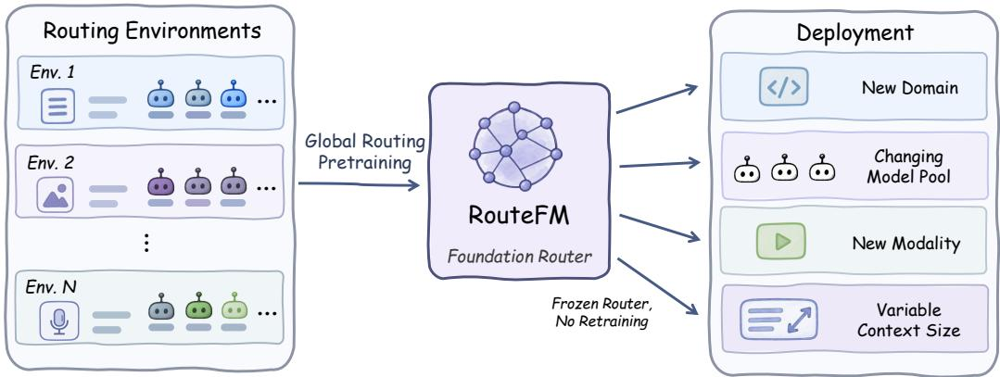
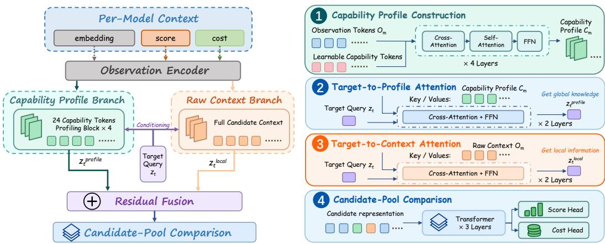
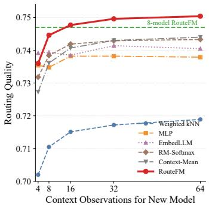
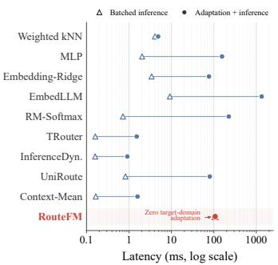
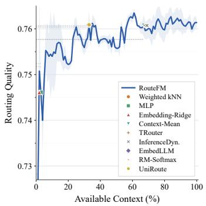
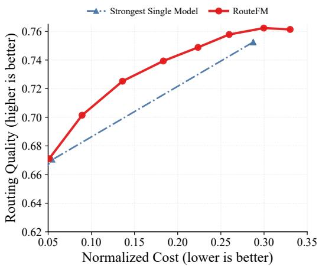

# PRETRAIN ONCE, ROUTE ANYWHERE: TOWARDS AFOUNDATION MODEL FOR LLM ROUTING

Guannan Lai Han-Jia Ye

School of Artificial Intelligence, Nanjing University   
National Key Laboratory for Novel Software Technology, Nanjing University   
{laign, yehj}@lamda.nju.edu.cn

## ABSTRACT

Large language model (LLM) routing aims to assign each query to the most suitable model from a heterogeneous candidate pool, improving the quality–efficiency trade-off of LLM inference. Existing routers are typically learned through local fitting: a router is optimized for a particular query workload and candidate pool, and often requires additional supervision or retraining as the routing environment changes. We ask whether LLM routing can instead be approached from a foundation-model perspective, learning a reusable routing capability that generalizes across tasks, candidate models, and deployment conditions. To this end, we introduce RouteFM, which learns to characterize anonymous candidate models from behavioral context and infer their target-specific capabilities, rather than binding routing decisions to fixed model identities or a single environment. Through episodic pretraining across heterogeneous routing environments, this capability can be reused by a frozen router and adapted to new environments through context alone. Experiments demonstrate transfer across changes in domains, modalities, candidate pools, and context budgets, with the largest gains when behavioral evidence is limited. On MMR-Bench, which is excluded from pretraining, RouteFM outperforms the strongest baseline by 2.23 quality points with only eight observations per candidate. These results support moving LLM routing from repeated local fitting toward a pretrain once, route anywhere paradigm. Our code is publicly available at https://github.com/ LAMDA-Model-Reuse/RouteFM.

## 1 INTRODUCTION

Large language model (LLM) routing (Chen et al., 2024; Ong et al., 2025) dynamically assigns each query to a suitable model from a candidate pool with heterogeneous capabilities, inference costs, and latency. This provides a practical alternative to serving all queries with a single powerful model, enabling more favorable quality–efficiency trade-offs at inference time. Existing approaches typically learn routing policies from query–model performance observations, training a router to predict model quality for each query (Zhang et al., 2025; Feng et al., 2025; Song et al., 2025). Such supervision is usually collected for a particular query workload and candidate model pool, causing the resulting router to specialize to the routing environment in which it is trained.

We term this environment-specific training paradigm local fitting, because the router is optimized from behavioral observations collected within a particular routing environment and thereby specializes to its query distribution and candidate model pool, rather than learning a routing capability that is shared across environments. In practice, however, routing environments are inherently dynamic. New domains and modalities emerge (Ma et al., 2026), while candidate pools evolve as new models are introduced and existing ones are replaced (Wang et al., 2026). Consequently, when the domain, candidate pool, or modality changes, conventional routers typically require additional behavioral observations to be collected and the routing model to be optimized again. This repeated fit-and refit process increases the cost of maintaining routing systems and, more fundamentally, makes the learned router itself difficult to reuse across environments.

  
Figure 1: From local fitting to global routing pretraining. Traditional routers are optimized for individual routing environments, whereas RouteFM learns a reusable routing capability across het erogeneous environments and adapts to new environments through context.

To move beyond this local-fitting paradigm, we ask a fundamental question: can LLM routing be approached from a foundation-model perspective, with a single reusable router that generalizes across tasks, candidate models, and deployment conditions? At its core, routing is a target-conditioned ranking problem: for a target query, the router must rank candidates by suitability. Behavioral context provides evidence for this comparison, allowing the router to infer which aspects of a candidate’s behavior are relevant to the target query. We argue that the ability to extract target-relevant evidence and compare candidates can be shared across routing environments. In practice, this shared capability should not depend on fixed model identities; instead, candidates can be characterized by their observed behavior on prior queries (Varangot-Reille et al., 2026). Based on this view, we propose a foundation-model paradigm for LLM routing: a single routing model learns this reusable target-conditioned comparison capability across heterogeneous environments, while each deployment is specified by the behavioral evidence available for its candidate pool.

Realizing this paradigm requires a router to learn a target-conditioned comparison capability that transfers across environments, rather than a policy tied to specific models or deployments. We introduce RouteFM to address this challenge. As illustrated in Figure 1, RouteFM learns a reusable routing capability through global routing pretraining across heterogeneous routing environments, and is subsequently deployed as a frozen router under changing domains, candidate pools, modalities, and context sizes. During pretraining, RouteFM is exposed to routing episodes that differ in task, candidate-pool composition, and context size. Across these episodes, the same underlying routing structure recurs: candidate capabilities are inferred from observed behavior, target-relevant evidence is identified, and candidates are compared accordingly. At inference time, given a target query and behavioral observations of anonymous candidates, RouteFM infers their capabilities in context and determines their suitability for the query. The same pretrained router can therefore incorporate newly introduced models and operate across new domains, modalities, and context budget without environment-specific retraining.

We evaluate RouteFM across in-domain routing, cross-modal transfer, and changing deployment conditions. A single frozen RouteFM performs strongly in-domain and further generalizes to MMR-Bench, an unseen multimodal routing benchmark excluded from pretraining, where it outperforms the strongest non-RouteFM baseline by 2.23 quality points with only eight behavioral observations per candidate. Beyond cross-modal transfer, RouteFM can incorporate newly introduced models from only a few observations, operate in new target domains without parameter optimization, and retain competitive routing quality under substantially reduced context budgets. These results show that a pretrained routing capability can be reused across changing routing environments primarily through contextual adaptation rather than repeated parameter optimization.

Our contributions are threefold:

• We introduce a foundation-model paradigm for LLM routing, moving beyond environmentspecific local fitting toward a reusable routing capability that can generalize across changing tasks, candidate models, and deployment conditions.

• We propose RouteFM, combining global routing pretraining with in-context capability inference to adapt to new routing environments without parameter updates.

• We show that a single frozen RouteFM transfers across domains and modalities and incorporates newly introduced models from limited observations, all without retraining.

## 2 RELATED WORK

LLM Routing. LLM routing selects a suitable model for each query from a heterogeneous candidate pool, typically balancing response quality, inference cost, and other deployment objectives (Chen et al., 2024; Ong et al., 2025; Feng et al., 2025; Song et al., 2025). Existing methods include cascade-based selection, preference or performance prediction, and cost-aware routing (Aggarwal et al., 2024; Ding et al., 2024; Mei et al., 2025; Ding et al., 2025). Recent studies further examine the reliability of routing itself, including supervision quality (Lai et al., 2026a), degenerate modelselection behaviors (Lai & Ye, 2026), and evaluation under heterogeneous user preferences (Lai et al., 2026c). Meanwhile, benchmarks such as RouterBench, RouterEval, and MMR-Bench have expanded routing evaluation across broader tasks, models, and modalities (Hu et al., 2024; Huang et al., 2025; Ma et al., 2026). Despite these advances, most routers are still trained or configured within a particular routing environment, following a local-fitting paradigm in which the learned router is tied to the task distribution and candidate pool from which its supervision is collected.

Generalizable and Adaptive LLM Routing. Recent work has begun to relax the local-fitting assumption in LLM routing. IRT-Router improves cold-start generalization by explicitly modeling model capabilities and query characteristics (Song et al., 2025), while ICL-Router derives model representations from in-context performance observations, allowing unseen models to be incorporated without retraining (Wang et al., 2026). Retrieval-based approaches similarly estimate candidate performance from a small number of historical query–performance records and naturally support dynamic candidate pools (Varangot-Reille et al., 2026). These methods improve generalization or adaptation under particular deployment changes. RouteFM instead approaches LLM routing from a foundation-model perspective, aiming to learn a reusable routing capability across heterogeneous environments. It instantiates this paradigm through global routing pretraining and in-context capability inference.

## 3 PROBLEM FORMULATION

We consider a collection of heterogeneous LLM routing environments $\mathfrak { E } = \{ \mathcal { E } _ { r } = ( \mathcal { D } _ { r } , \mathcal { M } _ { r } ) \} _ { r = 1 } ^ { R } ;$ where $\mathcal { D } _ { r }$ denotes the query distribution in environment r and $\mathcal { M } _ { r } = \{ m _ { r , 1 } , . . . , m _ { r , M _ { r } } \}$ is its candidate model pool. Both the query distribution and candidate pool may vary across environments.

## 3.1 LOCAL FITTING IN A ROUTING ENVIRONMENT

Conventional routing methods typically fit a separate router within each environment $\mathcal { E } _ { r }$ , yielding an environment-specific mapping

$$
f _ { \theta _ { \varepsilon _ { r } } } : q \to m , \qquad q \sim { \mathcal { D } } _ { r } , \quad m \in { \mathcal { M } } _ { r } .
$$

The parameters $\theta _ { \mathcal { E } _ { r } }$ are optimized from query–model performance observations collected in ${ \mathcal { E } } _ { r }$ and may therefore specialize to its query distribution and candidate pool. When either $\mathcal { D } _ { r }$ or $\mathcal { M } _ { r }$ changes, the learned routing function may no longer transfer directly, and additional supervision or optimization can be required.

## 3.2 ROUTING AS A FOUNDATION MODEL

We instead seek a routing capability that can be shared across environments. Although routing environments may differ in their query distributions and candidate model pools, they share the same underlying decision structure: infer the capabilities of the available models and determine which is best suited to the target query. This motivates learning how to route across environments rather than fitting an independent routing policy to each one.

  
Figure 2: Architecture of RouteFM. Given behavioral observations for anonymous candidate models, RouteFM first constructs a compact capability profile for each candidate. The target query then retrieves complementary evidence from both the capability profile and the original behavioral context. These two representations are fused and jointly compared across the current candidate pool to predict target-specific quality and relative cost.

Rather than learning a separate $f _ { \theta \varepsilon _ { r } }$ for every $\mathcal { E } _ { r } \in \mathfrak { E } .$ , we seek a single shared routing function

$$
f _ { \theta } ( q \mid \mathcal { E } _ { r } ) \to m _ { r } ^ { * } , \qquad q \sim \mathcal { D } _ { r } , \quad m _ { r } ^ { * } \in \mathcal { M } _ { r } , \quad \forall \mathcal { E } _ { r } \in \mathfrak { E } ,
$$

where the same parameters $\theta$ are shared across routing environments. Here, conditioning on ${ \mathcal { E } } _ { r }$ denotes adapting the routing decision to the current query distribution and candidate pool, rather than learning a new set of router parameters.

The goal is therefore to learn a reusable routing capability whose decisions adapt as $\mathcal { D } _ { r }$ and $\mathcal { M } _ { r }$ vary, while the routing model itself remains fixed. This defines the central objective of a foundation model for LLM routing: a single shared model that can operate across heterogeneous and evolving routing environments without environment-specific retraining.

## 4 ROUTEFM: A FOUNDATION MODEL FOR LLM ROUTING

## 4.1 OVERVIEW

RouteFM implements the shared routing procedure described above over an anonymous candidate pool specified by behavioral observations. Given a target query and behavioral context for each candidate, RouteFM first encodes the observations into a compact capability profile. As illustrated in Figure 2, the target retrieves relevant evidence from both the capability profile and the original context, after which RouteFM fuses the two views and compares candidates within the current pool to predict target-specific quality and relative cost. All candidate-specific information is inferred from behavioral evidence; no model identities or persistent model embeddings are provided.

## 4.2 IN-CONTEXT CAPABILITY PROFILING

A central challenge in reusable routing is that both query distributions and candidate model pools vary across environments, making representations tied to a fixed task or model identity difficult to reuse. RouteFM addresses this by constructing each candidate representation directly from its observed behavior in the current routing environment, without relying on a persistent identity.

For candidate model $m ,$ , let

$$
\boldsymbol { B _ { m } } = \{ ( e _ { i } , y _ { m , i } , \tilde { c } _ { m , i } ) \} _ { i = 1 } ^ { K _ { m } } ,
$$

denote its behavioral context, where $\boldsymbol { e } _ { i } ~ \in ~ \mathbb { R } ^ { 4 0 9 6 }$ is the frozen embedding of a historical query, $y _ { m , i } \in [ 0 , 1 ]$ denotes the observed quality of model m on that query, and $\tilde { c } _ { m , i } \in [ 0 , 1 ]$ denotes its normalized relative cost. Since the routing corpora expose heterogeneous cost signals, we normalize cost within each routing episode and use it only as a relative indicator.

Behavioral observation encoding. An observed outcome is informative only together with the query on which it was obtained. For example, the same quality score may provide very different evidence about a model when observed on queries requiring different capabilities. RouteFM therefore encodes query semantics, observed quality, and relative cost jointly rather than treating quality and cost as query-independent model attributes.

Concretely, the query embedding is first projected into the router hidden space, while quality and cost are mapped to learned outcome embeddings. RouteFM further models their interaction with the query representation, producing one behavioral token for each historical observation. We denote the resulting sequence for candidate m as

$$
O _ { m } = [ o _ { m , 1 } , \ldots , o _ { m , K _ { m } } ] \in \mathbb { R } ^ { K _ { m } \times d } .
$$

The same behavioral encoder is shared by all candidates and routing environments. By expressing query semantics and observed outcomes in a common representation space, RouteFM can process behavioral evidence drawn from different query distributions and candidate pools without introducing environment-specific parameters. Thus, differences between candidate representations arise entirely from their observed behavior, rather than from candidate-specific parameters.

Capability profile construction. A second challenge is that the amount of behavioral evidence available for a candidate can vary substantially across environments and deployments. As shown in Step 1 of Figure 2, RouteFM maps the variable-length observation sequence $O _ { m }$ into a fixed number of latent capability tokens. RouteFM introduces a shared set of L learnable latent capability tokens, which initialize the profile of every candidate and become candidate-specific only after interacting with its behavioral sequence $O _ { m }$

Each profiling block first lets the capability tokens retrieve information from the behavioral observations through cross-attention, and then allows the tokens to exchange information through self-attention. Stacking these blocks yields $C _ { m } \in \mathbb { R } ^ { L \times d }$ , which serves as the capability profile of candidate m. In our implementation, $L = 2 4$ and $d = 2 5 6$

Importantly, the capability profile is not supervised by predefined skill categories. It is learned end-to-end from routing supervision, allowing the latent tokens to capture behavioral factors that are useful for discriminating among candidates across different queries and routing environments. RouteFM therefore maintains two complementary representations for each candidate: the compact capability profile $C _ { m } ,$ , which summarizes its overall behavior, and the observation sequence $O _ { m }$ which preserves fine-grained historical evidence.

## 4.3 TARGET-CONDITIONED MODEL COMPARISON

The capability profile summarizes a candidate’s overall behavior, but routing requires determining which evidence is relevant to the current target query. Let $e _ { t }$ denote the frozen embedding of target query $q _ { t } ,$ , and let

$$
\boldsymbol { z } _ { t } = P ( \boldsymbol { e } _ { t } ) \in \mathbb { R } ^ { d }
$$

be its projection into the router hidden space. For each candidate $m$ , RouteFM conditions the target representation on both its capability profile $C _ { m }$ and the original observation sequence $O _ { m }$

Target-conditioned evidence retrieval. As illustrated in Figure 2, RouteFM retrieves complementary evidence through two parallel attention branches:

$$
\begin{array} { r } { z _ { t , m } ^ { p } = \mathrm { T a r g e t A t t e n d } ( z _ { t } , C _ { m } ) , \qquad z _ { t , m } ^ { c } = \mathrm { T a r g e t A t t e n d } ( z _ { t } , O _ { m } ) . } \end{array}
$$

Both branches use two residual cross-attention blocks with the target representation as the query. The profile branch captures how the target aligns with the candidate’s overall capabilities, whereas the context branch preserves fine-grained evidence from individual historical observations that may be lost during profile compression.

We combine the two sources through residual fusion,

$$
z _ { t , m } = z _ { t , m } ^ { p } + \alpha \left( z _ { t , m } ^ { c } - z _ { t } \right) ,
$$

where $\alpha$ is a learned scalar shared across candidates. This design uses the capability profile as the primary representation while allowing the raw behavioral context to contribute additional targetspecific evidence.

Candidate-pool comparison. Routing is inherently comparative: the suitability of a candidate depends not only on its own target-conditioned representation, but also on the alternatives available in the current pool. RouteFM therefore jointly processes all candidate representations,

$$
H _ { t } ^ { ( 0 ) } = [ z _ { t , 1 } , \dots , z _ { t , M } ] ,
$$

using a Transformer encoder over the candidate dimension,

$$
H _ { t } = \mathrm { T r a n s f o r m e r } \left( { \cal H } _ { t } ^ { ( 0 ) } \right) .
$$

No positional encoding is added to candidate slots, making the comparison permutation equivariant with respect to candidate ordering. Invalid or padded candidates are masked throughout the computation.

Finally, independent prediction heads map each contextualized candidate representation $H _ { t , m }$ to its target-specific quality and relative cost,

$$
\hat { y } _ { t , m } = \sigma ( g _ { y } ( H _ { t , m } ) ) , \qquad \hat { c } _ { t , m } = \sigma ( g _ { c } ( H _ { t , m } ) ) .
$$

These predictions can be used directly for quality-based routing or combined with deploymentspecific preferences to construct downstream routing objectives without updating RouteFM.

## 4.4 EPISODIC ROUTING PRETRAINING

To learn a routing procedure that transfers across environments, RouteFM is pretrained episodically rather than on a fixed candidate pool. Each episode is constructed from a single task and contains an anonymous candidate set $\mathcal { M } ,$ behavioral contexts $\{ B _ { m } \} _ { m \in \mathcal { M } }$ , and a disjoint set of target queries Q. Across episodes, we vary the task, candidate composition, candidate ordering, and context size. Candidate slots are randomly permuted, preventing RouteFM from associating fixed positions with particular models and forcing it to infer candidate capabilities from behavioral evidence.

Quality and cost supervision. For each target query $q _ { t } \in \mathcal { Q }$ , RouteFM predicts both the quality and relative cost of every valid candidate. For either quantity $v \in \{ y , c \}$ , we combine point-wise regression with pairwise ranking,

$$
\mathcal { L } _ { v } = \mathcal { L } _ { v } ^ { \mathrm { p o i n t } } + \beta _ { v } \mathcal { L } _ { v } ^ { \mathrm { p a i r } } ,
$$

where $\beta _ { v }$ controls the contribution of the pairwise objective. The point-wise term encourages accurate value prediction, while the pairwise term preserves the relative ordering among candidates. Together, they supervise both candidate capability estimation and the comparisons required for routing.

Routing-aware regret. Accurate value prediction does not necessarily lead to the best routing decision. We therefore additionally optimize a routing-regret objective. Given the predicted qualities, we define a soft routing distribution

$$
\pi _ { t , m } = \frac { \exp ( \hat { y } _ { t , m } / \tau _ { r } ) } { \sum _ { j \in { \mathcal { M } } _ { t } } \exp ( \hat { y } _ { t , j } / \tau _ { r } ) } ,
$$

and minimize

$$
\mathcal { L } _ { \mathrm { r e g r e t } } = \frac { 1 } { \left| \mathcal { Q } \right| } \sum _ { t } \left[ \operatorname* { m a x } _ { m \in \mathcal { M } _ { t } } y _ { t , m } - \sum _ { m \in \mathcal { M } _ { t } } \pi _ { t , m } y _ { t , m } \right] .
$$

The overall pretraining objective is

$$
\begin{array} { r } { \mathcal { L } = \lambda _ { y } \mathcal { L } _ { y } + \lambda _ { c } \mathcal { L } _ { c } + \lambda _ { r } \mathcal { L } _ { \mathrm { r e g r e t } } , } \end{array}
$$

where $\lambda _ { y } , \lambda _ { c } ,$ and $\lambda _ { r }$ balance the three objectives, with the regret contribution progressively increased over the pretraining curriculum. Detailed loss definitions and hyperparameter settings are provided in Appendix B.

## 4.5 ROUTING DECISION

For each candidate model m $\in { \mathcal { M } } .$ , RouteFM predicts its target-specific quality $\hat { y } _ { m }$ and relative cost $\hat { c } _ { m }$ . The final routing decision is made by maximizing a deployment-specific utility,

$$
m ^ { * } = \arg \operatorname* { m a x } _ { m \in \mathcal { M } } \left( \hat { y } _ { m } - \lambda \hat { c } _ { m } \right) ,
$$

where $\lambda \geq 0$ controls the trade-off between response quality and inference cost. Varying λ allows the same pretrained router to support different deployment preferences without retraining.

## 5 EXPERIMENTS

## 5.1 EXPERIMENTAL SETUP

Pretraining. We pretrain RouteFM using four data sources: LLMRouterBench (Li et al., 2026), RouterBench (Hu et al., 2024), RouterEval (Huang et al., 2025), and MixInstruct (Jiang et al., 2023). After preprocessing, they contain 212,470 query–task instances and 1.73M valid query–model observations. Queries are represented by frozen 4,096-dimensional Qwen3-VL embeddings (Bai et al., 2025), while model names, providers, parameter counts, and other explicit identity features are never exposed to RouteFM.

RouteFM itself is trained from random initialization using episodic pretraining. Each episode contains 6–24 anonymous candidates, 16–32 target queries disjoint from the behavioral context, and a per-model observation budget $K \in \{ 8 , 1 6 , 3 2 , 6 4 , 1 2 8 , 2 5 6 , 5 1 2 , 1 0 2 4 \}$ . Across episodes, we vary the task, candidate-pool composition, candidate ordering, and observation budget. Training runs for 10,000 AdamW steps with an effective batch size of 16 and follows a curriculum from large observation sets toward deployment-scale regimes. Full preprocessing, episode construction, curriculum, and optimization details are provided in Appendix B.

Evaluation environments. We first evaluate in-domain routing on RouterEval (Huang et al., 2025), using held-out queries from tasks included in pretraining. Each candidate pool contains four anonymous models, and we report results under limited behavioral context with $K \in \{ 8 , 1 6 , 3 2 , 6 \dot { 4 } \}$ observations per candidate. We then evaluate transfer to MMR-Bench (Ma et al., 2026), which is excluded from pretraining and provides a substantially different multimodal routing environment. In the limited-observation regime, we evaluate $K \in \{ 8 , 1 6 , 3 2 , 6 4 \}$ using dataset-wise five-fold splits that separate the behavioral context from evaluation queries. We additionally consider a large observation regime in which 40% of each dataset is used as behavioral context and the remaining 60% is reserved for evaluation. RouteFM remains frozen throughout evaluation and never uses evaluation labels for parameter updates.

Baselines and metric. We compare RouteFM with a broad set of routing baselines, including Weighted kNN (Stripelis et al., 2024), MLP (Stripelis et al., 2024), Embedding-Ridge, EmbedLLM (Zhuang et al., 2025), RM-Softmax (Tsiourvas et al., 2025), TRouter (Liu et al., 2026), Inference-Dynamics (Shi et al., 2025), UniRoute (Jitkrittum et al., 2026), ICL-Router (Wang et al., 2026), and Context-Mean. All baselines are implemented following the unified reproduction framework of Lai et al. (2026b), using matched candidate pools, behavioral observations, evaluation queries, and query representations. Our primary metric is the average realized quality of the selected model. Unless otherwise specified, routing decisions select the candidate with the highest predicted quality. Further implementation and evaluation details are provided in Appendix C.

## 5.2 MAIN RESULT

In-Domain Routing. We first evaluate RouteFM on held-out RouterEval queries from tasks represented during pretraining. As shown in Table 1, RouteFM achieves the highest routing quality across all observation budgets. Its advantage is largest at $K = 8$ , where it outperforms the strongest baseline by 0.84 quality points, while the margins become smaller as more behavioral evidence is available. This trend suggests that the pretrained router can make effective use of sparse behavioral evidence, whereas the advantage naturally shrinks once all methods are given richer observations about the candidate models. Importantly, the same frozen RouteFM remains competitive across the entire context range, indicating that cross-environment pretraining does not come at the expense of in-domain routing quality.

Table 1: Routing quality under in-domain routing and cross-modal transfer. All methods use matched candidate pools and behavioral observation budgets within each setting. “Large” denotes the large-observation regime using 40% of each MMR-Bench dataset as behavioral context. Best results are bolded and second-best results are underlined.
<table><tr><td rowspan="2">Method</td><td colspan="4">In-Domain Routing</td><td colspan="5">Cross-Modal Transfer</td></tr><tr><td>K=8</td><td>K=16</td><td>K=32</td><td>K=64</td><td>K=8</td><td>K=16</td><td>K=32</td><td>K=64</td><td>Large</td></tr><tr><td>Weighted kNN</td><td>0.6066</td><td>0.6273</td><td>0.6390</td><td>0.6406</td><td>0.6975</td><td>0.7123</td><td>0.7159</td><td>0.7193</td><td>0.7282</td></tr><tr><td>MLP</td><td>0.6021</td><td>0.6351</td><td>0.6561</td><td>0.6578</td><td>0.7026</td><td>0.7283</td><td>0.7333</td><td>0.7400</td><td>0.7523</td></tr><tr><td>Embedding-Ridge</td><td>0.6108</td><td>0.6348</td><td>0.6568</td><td>0.6520</td><td>0.7058</td><td>0.7293</td><td>0.7391</td><td>0.7408</td><td>0.7517</td></tr><tr><td>EmbedLLM</td><td>0.6019</td><td>0.6430</td><td>0.6570</td><td>0.6601</td><td>0.7100</td><td>0.7338</td><td>0.7374</td><td>0.7380</td><td>0.7604</td></tr><tr><td>RM-Softmax</td><td>0.6101</td><td>0.6390</td><td>0.6601</td><td>0.6586</td><td>0.7021</td><td>0.7285</td><td>0.7405</td><td>0.7433</td><td>0.7604</td></tr><tr><td>TRouter</td><td>0.6064</td><td>0.6341</td><td>0.6559</td><td>0.6568</td><td>0.7067</td><td>0.7311</td><td>0.7433</td><td>0.7440</td><td>0.7576</td></tr><tr><td>InferenceDyn.</td><td>0.6064</td><td>0.6341</td><td>0.6559</td><td>0.6568</td><td>0.7067</td><td>0.7311</td><td>0.7433</td><td>0.7440</td><td>0.7576</td></tr><tr><td>UniRoute</td><td>0.6092</td><td>0.6413</td><td>0.6548</td><td>0.6586</td><td>0.6990</td><td>0.7263</td><td>0.7357</td><td>0.7431</td><td>0.7607</td></tr><tr><td>ICL-Router</td><td>0.4506</td><td>0.4955</td><td>0.4926</td><td>0.4920</td><td>0.7054</td><td>0.7185</td><td>0.7182</td><td>0.7327</td><td>0.7448</td></tr><tr><td>Context-Mean</td><td>0.6064</td><td>0.6341</td><td>0.6559</td><td>0.6568</td><td>0.7067</td><td>0.7311</td><td>0.7433</td><td>0.7440</td><td>0.7576</td></tr><tr><td>RouteFM</td><td>0.6192</td><td>0.6433</td><td>0.6627</td><td>0.6611</td><td>0.7323</td><td>0.7457</td><td>0.7487</td><td>0.7504</td><td>0.7614</td></tr></table>

Cross-Modal Transfer. We next evaluate whether the routing capability learned by RouteFM transfers to a multimodal routing environment excluded from pretraining. As shown in Table 1, RouteFM achieves the highest routing quality across all observation budgets on MMR-Bench. The advantage is most pronounced at $K = 8 ,$ , where RouteFM outperforms the strongest non-RouteFM baseline by 2.23 quality points. As more behavioral evidence becomes available, the margin generally de creases, reaching only 0.07 points in the large-observation regime. This setting introduces a stronger distribution shift than the in-domain evaluation, since both the query characteristics and the modal ity differ from those seen during pretraining. Nevertheless, a small amount of behavioral context is sufficient for the frozen RouteFM to adapt to the new candidate behavior without parameter updates. These results show that RouteFM’s advantage is concentrated in the low-context regime, indicating strong observation efficiency when transferring to a new routing environment.

## 5.3 ABLATION STUDY

Architecture. Table 2(a) examines the main architectural components of RouteFM. Removing the candidate-pool Transformer causes the largest degradation, with a 1.33-point drop at K = 8, indicating the importance of jointly comparing candidates rather than estimating them independently. Removing target-to-context attention also consistently reduces performance, particularly under limited observations, showing that direct access to individual behavioral observations provides complementary evidence beyond the compressed capability profile. Replacing the Qwen3-VL query representation with a BGE encoder further degrades performance across observation budgets, indicating that the underlying query representation also contributes to effective cross-modal routing.

Pretraining and target-domain adaptation. Table 2(b) uses a separate support-controlled protocol to study the role of routing pretraining and target-domain optimization. The training-from-scratch and fine-tuning variants are given 20% labeled target-domain support data for parameter optimization, whereas the frozen RouteFM uses no target-domain labels for parameter updates. Training the same architecture from scratch consistently underperforms the frozen RouteFM, with a 1.08-point gap at K = 8. Starting from the pretrained RouteFM and further fine-tuning on the target domain yields only small changes: it provides marginal gains at some observation budgets and slightly lower performance at others. These results indicate that much of the transferable routing capability is already acquired during pretraining, allowing RouteFM to adapt to the target environment through behavioral context without additional parameter optimization.

## 5.4 ADAPTATION TO DEPLOYMENT CHANGES

New-model incorporation. We first study whether RouteFM can incorporate a newly introduced model without retraining. Starting from an incumbent candidate pool, we add a newly introduced candidate and gradually increase the amount of behavioral evidence available for it. As shown in

Table 2: Ablations on MMR-Bench. Part (a) studies architectural components under the standard evaluation protocol. Part (b) follows a separate support-controlled protocol in which target-domain training and fine-tuning use 20% labeled support data, while frozen RouteFM performs no targetdomain parameter updates.
<table><tr><td rowspan="2">Method</td><td colspan="4">Limited Observations</td><td>Large Budget</td></tr><tr><td>K=8</td><td>K=16</td><td>K=32</td><td>K=64</td><td>Large</td></tr><tr><td colspan="6">(a) Architecture</td></tr><tr><td>RouteFM</td><td>0.7323</td><td>0.7457</td><td>0.7487</td><td>0.7504</td><td>0.7614</td></tr><tr><td>w/o target-to-context attention</td><td>0.7266</td><td>0.7407</td><td>0.7475</td><td>0.7504</td><td>0.7568</td></tr><tr><td>w/o candidate-pool Transformer</td><td>0.7190</td><td>0.7380</td><td>0.7403</td><td>0.7433</td><td>0.7477</td></tr><tr><td>BGE text-only encoder</td><td>0.7308</td><td>0.7384</td><td>0.7468</td><td>0.7475</td><td>0.7491</td></tr><tr><td colspan="6">(b) Pretraining and target-domain adaptation</td></tr><tr><td>RouteFM (frozen)</td><td>0.7523</td><td>0.7534</td><td>0.7538</td><td>0.7537</td><td>0.7584</td></tr><tr><td>Target-domain training from scratch</td><td>0.7415</td><td>0.7495</td><td>0.7523</td><td>0.7521</td><td>0.7525</td></tr><tr><td>RouteFM + target-domain fine-tuning</td><td>0.7510</td><td>0.7535</td><td>0.7543</td><td>0.7534</td><td>0.7575</td></tr></table>

  
(a) New-model incorporation

  
(b) Target-domain efficiency

  
(c) Context-budget efficiency  
Figure 3: Adaptation of frozen RouteFM to deployment changes: (a) new-model incorporation, (b) target-domain efficiency, and (c) context-budget efficiency. Markers in (c) denote the context fraction required to match each baseline’s full-context routing quality.

Figure 3(a), RouteFM surpasses all refitted baselines after observing only eight examples from the new candidate. With 16 observations, routing over the expanded pool also outperforms routing over the original incumbent pool, indicating that RouteFM can not only characterize the new model from limited evidence but also exploit it when it becomes useful. This demonstrates that candidate pool can be expanded through contextual evidence without modifying the pretrained router.

Target-domain efficiency. We next examine the overhead of operating in a new target domain. RouteFM is applied directly with frozen parameters using the available behavioral context, whereas learned environment-specific baselines require an additional fitting stage before inference. Figure 3(b) reports the combined adaptation and inference cost. Although simple non-parametric methods remain faster in absolute latency, RouteFM avoids target-domain parameter optimization while retaining the predictive capacity of a learned router. This makes adaptation primarily a contextconstruction problem rather than a retraining problem.

Context-budget efficiency. Finally, we vary the amount of behavioral context available to RouteFM and measure how much is required to recover the full-context performance of competing routers. Figure 3(c) uses a separate dense context-budget protocol, with each competing router evaluated using its full available context as a reference. RouteFM matches the full-context performance of Weighted kNN with only 1% of the available observations, MLP with 3%, and EmbedLLM with 26%, while progressively larger context fractions are required to match the stronger full-context references. The shaded region shows variation across the three evaluation splits. Overall, RouteFM retains competitive routing quality under substantially reduced context budgets, showing that the pretrained routing capability can reduce the amount of behavioral evidence required at deployment.

## 6 CONCLUSION

We introduce a foundation-model paradigm for LLM routing, shifting the field from environment-specific local fitting toward reusable routing models that can generalize across heterogeneous deployments. Rather than rebuilding a routing policy for each new setting, this paradigm views routing as a transferable capability that can support evolving tasks, candidate model pools, and deployment conditions. We hope this perspective will motivate future research on general-purpose routing models as reusable infrastructure for LLM systems, advancing the vision of pretrain once, route anywhere.

## REFERENCES

Pranjal Aggarwal, Aman Madaan, Ankit Anand, Srividya Pranavi Potharaju, Swaroop Mishra, Pei Zhou, Aditya Gupta, Dheeraj Rajagopal, Karthik Kappaganthu, Yiming Yang, Shyam Upadhyay, Manaal Faruqui, and Mausam . Automix: Automatically mixing language models. In The Thirtyeighth Annual Conference on Neural Information Processing Systems, 2024.

Shuai Bai, Yuxuan Cai, Ruizhe Chen, Keqin Chen, Xionghui Chen, Zesen Cheng, Lianghao Deng, Wei Ding, Chang Gao, Chunjiang Ge, Wenbin Ge, Zhifang Guo, Qidong Huang, Jie Huang, Fei Huang, Binyuan Hui, Shutong Jiang, Zhaohai Li, Mingsheng Li, Mei Li, Kaixin Li, Zicheng Lin, Junyang Lin, Xuejing Liu, Jiawei Liu, Chenglong Liu, Yang Liu, Dayiheng Liu, Shixuan Liu, Dunjie Lu, Ruilin Luo, Chenxu Lv, Rui Men, Lingchen Meng, Xuancheng Ren, Xingzhang Ren, Sibo Song, Yuchong Sun, Jun Tang, Jianhong Tu, Jianqiang Wan, Peng Wang, Pengfei Wang, Qiuyue Wang, Yuxuan Wang, Tianbao Xie, Yiheng Xu, Haiyang Xu, Jin Xu, Zhibo Yang, Mingkun Yang, Jianxin Yang, An Yang, Bowen Yu, Fei Zhang, Hang Zhang, Xi Zhang, Bo Zheng, Humen Zhong, Jingren Zhou, Fan Zhou, Jing Zhou, Yuanzhi Zhu, and Ke Zhu. Qwen3-vl technical report. arXiv preprint arXiv:2511.21631, 2025.

Lingjiao Chen, Matei Zaharia, and James Zou. FrugalGPT: How to use large language models while reducing cost and improving performance. Transactions on Machine Learning Research, 2024.

Dujian Ding, Ankur Mallick, Chi Wang, Robert Sim, Subhabrata Mukherjee, Victor Ruhle, Laks ¨ V. S. Lakshmanan, and Ahmed Hassan Awadallah. Hybrid LLM: Cost-efficient and quality-aware query routing. In The Twelfth International Conference on Learning Representations, 2024.

Dujian Ding, Ankur Mallick, Shaokun Zhang, Chi Wang, Daniel Madrigal, Mirian Del Carmen Hipolito Garcia, Menglin Xia, Laks V. S. Lakshmanan, Qingyun Wu, and Victor Ruhle. BEST- ¨ route: Adaptive LLM routing with test-time optimal compute. In Aarti Singh, Maryam Fazel, Daniel Hsu, Simon Lacoste-Julien, Felix Berkenkamp, Tegan Maharaj, Kiri Wagstaff, and Jerry Zhu (eds.), Proceedings ofthe 42nd International Conference on Machine Learning, volume 267 of Proceedings ofMachine Learning Research, pp. 13870–13884. PMLR, 13–19 Jul 2025.

Tao Feng, Yanzhen Shen, and Jiaxuan You. Graphrouter: A graph-based router for LLM selections. In The Thirteenth International Conference on Learning Representations, 2025.

Qitian Jason Hu, Jacob Bieker, Xiuyu Li, Nan Jiang, Benjamin Keigwin, Gaurav Ranganath, Kurt Keutzer, and Shriyash Kaustubh Upadhyay. Routerbench: A benchmark for multi-LLM routing system. In Agentic Markets Workshop at ICML 2024, 2024.

Zhongzhan Huang, Guoming Ling, Yupei Lin, Yandong Chen, Shanshan Zhong, Hefeng Wu, and Liang Lin. RouterEval: A comprehensive benchmark for routing LLMs to explore model-level scaling up in LLMs. In Christos Christodoulopoulos, Tanmoy Chakraborty, Carolyn Rose, and Violet Peng (eds.), Findings of the Association for Computational Linguistics: EMNLP 2025, pp. 3860–3887, Suzhou, China, November 2025. Association for Computational Linguistics. ISBN 979-8-89176-335-7.

Dongfu Jiang, Xiang Ren, and Bill Yuchen Lin. LLM-blender: Ensembling large language models with pairwise ranking and generative fusion. In Proceedings of the 61st Annual Meeting of the Associationfor Computational Linguistics (Volume 1: Long Papers), pp. 14165–14178, 2023.

Wittawat Jitkrittum, Harikrishna Narasimhan, Ankit Singh Rawat, Jeevesh Juneja, Congchao Wang, Zifeng Wang, Alec Go, Chen-Yu Lee, Pradeep Shenoy, Rina Panigrahy, Aditya Krishna Menon, and Sanjiv Kumar. Universal model routing for efficient LLM inference. In The Fourteenth International Conference on Learning Representations, 2026.

Guannan Lai and Han-Jia Ye. When routing collapses: On the degenerate convergence of llm routers, 2026.

Guannan Lai, Haoran Hu, Long Chen, Zhenguo Li, and Han-Jia Ye. From sampled outcomes to capability distributions: Rethinking supervision for LLM routing. In Proceedings of the 2026 Conference on Empirical Methods in Natural Language Processing, 2026a.

Guannan Lai, Haoran Hu, Hao-Xuan Ma, and Han-Jia Ye. Orbit: An optimal routing and budgeted inference toolbox. Frontiers ofComputer Science, 2026b.

Guannan Lai, Haoran Hu, and Han-Jia Ye. Routejudge: Preference-based evaluation of LLM routers under pluralistic user preferences. In Pluralistic Alignment Workshop at ICML 2026, 2026c.

Hao Li, Yiqun Zhang, Zhaoyan Guo, Chenxu Wang, Shengji Tang, Qiaosheng Zhang, Yang Chen, Biqing Qi, Peng Ye, Lei Bai, et al. Llmrouterbench: A massive benchmark and unified framework for llm routing. In Findings of the Association for Computational Linguistics: ACL 2026, pp. 37733–37754, 2026.

Hui Liu, Bin Zou, Kecheng Chen, Jie Liu, Wenya Wang, and Haoliang Li. Task-aware LLM routing with multi-level task-profile-guided data synthesis for cold-start scenarios. In Maria Liakata, Viviane P. Moreira, Jiajun Zhang, and David Jurgens (eds.), Proceedings ofthe 64th Annual Meeting of the Association for Computational Linguistics (Volume 1: Long Papers), pp. 22047–22076, San Diego, California, United States, July 2026. Association for Computational Linguistics. ISBN 979-8-89176-390-6.

Haoxuan Ma, Guannan Lai, and Han-Jia Ye. Mmr-bench: A comprehensive benchmark for multimodal llm routing, 2026.

Kai Mei, Wujiang Xu, Minghao Guo, Shuhang Lin, and Yongfeng Zhang. Omnirouter: Budget and performance controllable multi-llm routing. ACM SIGKDD Explorations Newsletter, 27(2): 107–116, 2025.

Isaac Ong, Amjad Almahairi, Vincent Wu, Wei-Lin Chiang, Tianhao Wu, Joseph E Gonzalez, M Kadous, and Ion Stoica. Routellm: Learning to route llms from preference data. In Y. Yue, A. Garg, N. Peng, F. Sha, and R. Yu (eds.), International Conference on Learning Representations, volume 2025, pp. 34433–34448, 2025.

Haochen Shi, Tianshi Zheng, Weiqi Wang, Baixuan Xu, Chunyang Li, Chunkit Chan, Tao Fan, Yangqiu Song, and Qiang Yang. Inferencedynamics: Efficient routing across llms through structured capability and knowledge profiling, 2025.

Wei Song, Zhenya Huang, Cheng Cheng, Weibo Gao, Bihan Xu, GuanHao Zhao, Fei Wang, and Runze Wu. IRT-router: Effective and interpretable multi-LLM routing via item response theory. In Wanxiang Che, Joyce Nabende, Ekaterina Shutova, and Mohammad Taher Pilehvar (eds.), Proceedings of the 63rd Annual Meeting of the Association for Computational Linguistics (Volume 1: Long Papers), pp. 15629–15644, Vienna, Austria, July 2025. Association for Computational Linguistics. ISBN 979-8-89176-251-0.

Dimitris Stripelis, Zhaozhuo Xu, Zijian Hu, Alay Dilipbhai Shah, Han Jin, Yuhang Yao, Jipeng Zhang, Tong Zhang, Salman Avestimehr, and Chaoyang He. TensorOpera router: A multi-model router for efficient LLM inference. In Franck Dernoncourt, Daniel Preot¸iuc-Pietro, and Anastasia Shimorina (eds.), Proceedings of the 2024 Conference on Empirical Methods in Natural Language Processing: Industry Track, pp. 452–462, Miami, Florida, US, November 2024. Association for Computational Linguistics.

Asterios Tsiourvas, Wei Sun, and Georgia Perakis. Causal LLM Routing: End-to-end regret minimization from observational data. In Advances in Neural Information Processing Systems, volume 38, 2025.

Clovis Varangot-Reille, Christophe Bouvard, and Antoine Gourru. Generalising llm routing using past performance retrieval: A few-shot router is sufficient. In Proceedings of the 19th Conference of the European Chapter of the Association for Computational Linguistics (Volume 4: Student Research Workshop), pp. 304–319, 2026.

Chenxu Wang, Hao Li, Yiqun Zhang, Linyao Chen, Jianhao Chen, Ping Jian, Qiaosheng Zhang, and Shuyue Hu. Icl-router: In-context learned model representations for llm routing. In Proceedings ofthe AAAI Conference on Artificial Intelligence, volume 40, pp. 33413–33421, 2026.

Yiqun Zhang, Hao Li, Jianhao Chen, Hangfan Zhang, Peng Ye, Lei Bai, and Shuyue Hu. Beyond gpt-5: Making llms cheaper and better via performance-efficiency optimized routing. In Proceedings of the 2025 7th International Conference on Distributed Artificial Intelligence, pp. 122–129, 2025.

Richard Zhuang, Tianhao Wu, Zhaojin Wen, Andrew Li, Jiantao Jiao, and Kannan Ramchandran. Embedllm: Learning compact representations of large language models. In International Conference on Learning Representations, volume 2025, pp. 76913–76926, 2025.

## APPENDIX

## A ARCHITECTURE AND IMPLEMENTATION DETAILS

This section provides the full architecture of RouteFM. Unless otherwise specified, the router hidden dimension is $d = 2 5 6$ . All candidate-specific representations are constructed from behavioral observations; model names, provider identities, parameter counts, and persistent model-ID embeddings are never provided to RouteFM.

## A.1 INPUTS AND MASKING

For each candidate model m, RouteFM receives a behavioral context

$$
\boldsymbol { B _ { m } } = \{ ( e _ { m , i } , y _ { m , i } , \tilde { c } _ { m , i } ) \} _ { i = 1 } ^ { K _ { m } } .
$$

where $e _ { m , i } ~ \in ~ \mathbb { R } ^ { D }$ is the frozen embedding of a historical query, $y _ { m , i } ~ \in ~ [ 0 , 1 ]$ is the observed response quality, and $\tilde { c } _ { m , i } \in [ 0 , 1 ]$ is the normalized relative cost.

For a batch containing at most M candidates, K context positions, and $T$ target queries, the main inputs are

$$
E ^ { \operatorname { c t x } } \in \mathbb { R } ^ { B \times M \times K \times D } , \qquad F ^ { \operatorname { c t x } } \in \mathbb { R } ^ { B \times M \times K \times 2 } ,
$$

and

$$
E ^ { \mathrm { t g t } } \in \mathbb { R } ^ { B \times T \times D } .
$$

The two context features correspond to observed quality and normalized cost. Binary masks specify valid context observations, candidates, and target–candidate pairs. Padding and missing observations are excluded from all attention and loss computations.

Different target queries are processed independently. In particular, the outcome of one target query is never available as behavioral evidence for another target query.

The main RouteFM model uses D = 4096 dimensional, L2-normalized Qwen3-VL embeddings. The text-only BGE control uses $D = 7 6 8$ dimensional BGE-base-en-v1.5 representations. The two variants use the same routing architecture after the input projection and are trained separately.

## A.2 BEHAVIORAL OBSERVATION ENCODER

The same query projector is applied to both behavioral-context queries and target queries. For an input embedding e, we compute

$$
P ( e ) = W _ { 2 } \mathrm { D r o p o u t } \left( \mathrm { G E L U } \left( W _ { 1 } \mathrm { L N } ( e ) + b _ { 1 } \right) \right) + b _ { 2 } ,
$$

where the intermediate dimension is 512, the output dimension is $d = 2 5 6$ , and the dropout probability is 0.1.

For each behavioral observation, the scalar quality and cost signals are independently embedded as

$$
s _ { m , i } = \mathrm { M L P } _ { y } ( y _ { m , i } ) , \qquad r _ { m , i } = \mathrm { M L P } _ { c } ( \tilde { c } _ { m , i } ) ,
$$

where both scalar networks have architecture

$$
1  2 5 6  2 5 6 .
$$

Simply adding these outcome embeddings to the query representation would treat the same observed score similarly across semantically different queries. RouteFM therefore explicitly models interactions between query semantics and observed outcomes. Let

$$
q _ { m , i } = P ( e _ { m , i } ) .
$$

We compute

$$
h _ { m , i } = W _ { I } \left[ q _ { m , i } \odot s _ { m , i } ; q _ { m , i } \odot r _ { m , i } \right] + b _ { I } ,
$$

where $\odot$ denotes element-wise multiplication and $[ \cdot ; \cdot ]$ denotes concatenation.

The intermediate behavioral representation is

$$
b _ { m , i } = q _ { m , i } + s _ { m , i } + r _ { m , i } + h _ { m , i } .
$$

A residual feed-forward transformation then produces the final observation token,

$$
o _ { m , i } = \mathrm { L N } \left( b _ { m , i } + \mathrm { F F N } _ { \mathrm { o b s } } ( b _ { m , i } ) \right) ,
$$

where the feed-forward hidden width is 1024.

Collecting all valid observations of candidate m gives

$$
O _ { m } = [ o _ { m , 1 } , \ldots , o _ { m , K _ { m } } ] \in \mathbb { R } ^ { K _ { m } \times d } .
$$

The behavioral encoder is shared by all candidates. Consequently, two candidates can obtain different representations only through differences in their observed query–quality–cost histories. The released architecture uses exactly two behavioral outcome features, quality and relative cost; no uncertainty feature or candidate-specific learned embedding is used.

## A.3 CAPABILITY PROFILE CONSTRUCTION

The number of behavioral observations may vary substantially across candidates and environments. RouteFM therefore compresses the variable-length sequence $O _ { m }$ into a fixed-capacity latent capability profile.

Each candidate starts from the same set of $L = 2 4$ learnable capability tokens,

$$
C _ { m } ^ { ( 0 ) } = C ^ { ( 0 ) } \in \mathbb { R } ^ { L \times d } .
$$

These tokens contain no candidate-specific information before observing $O _ { m }$

RouteFM applies four capability-profiling blocks. Let $C _ { m } ^ { ( \ell - 1 ) }$ denote the capability tokens entering block ℓ. The block first retrieves information from the candidate’s behavioral observations through cross-attention,

$$
\begin{array} { r } { \boldsymbol { A } _ { m } ^ { ( \ell ) } = C _ { m } ^ { ( \ell - 1 ) } + \mathrm { M H A } _ { \mathrm { c r o s s } } \left( \mathrm { L N } ( C _ { m } ^ { ( \ell - 1 ) } ) , O _ { m } , O _ { m } ; \mathcal { M } _ { m } ^ { \mathrm { c t x } } \right) , } \end{array}
$$

where the capability tokens provide the queries, the observation tokens provide keys and values, and $\mathcal { M } _ { m } ^ { \mathrm { c t x } }$ masks invalid context positions.

The capability tokens then exchange information through self-attention,

$$
\begin{array} { r } { B _ { m } ^ { ( \ell ) } = A _ { m } ^ { ( \ell ) } + { \mathrm { M H A } } _ { \mathrm { s e l f } } \left( { \mathrm { L N } } ( A _ { m } ^ { ( \ell ) } ) , { \mathrm { L N } } ( A _ { m } ^ { ( \ell ) } ) , { \mathrm { L N } } ( A _ { m } ^ { ( \ell ) } ) \right) . } \end{array}
$$

Finally, a position-wise feed-forward network updates each capability token,

$$
C _ { m } ^ { ( \ell ) } = B _ { m } ^ { ( \ell ) } + \mathrm { F F N } _ { \mathrm { p r o f } } \left( \mathrm { L N } ( B _ { m } ^ { ( \ell ) } ) \right) .
$$

All profiling attention modules use eight heads, and the feed-forward hidden width is 1024. Residual connections and pre-normalization are used throughout.

After four blocks,

$$
C _ { m } = C _ { m } ^ { ( 4 ) } \in \mathbb { R } ^ { 2 4 \times 2 5 6 }
$$

is used as the capability profile of candidate $m .$

The profile tokens are not assigned predefined meanings such as mathematics, coding, or visual reasoning. Their roles emerge end-to-end from routing supervision. The resulting $C _ { m }$ therefore acts as a learned latent summary of those behavioral characteristics that are useful for distinguishing candidates across routing environments.

RouteFM retains both

$$
C _ { m } \qquad \mathrm { a n d } \qquad O _ { m } .
$$

The former provides a compact global summary, while the latter preserves the individual behavioral observations for later target-conditioned retrieval.

## A.4 TARGET-CONDITIONED EVIDENCE RETRIEVAL

Capability profiling describes what a candidate has demonstrated globally, but routing requires determining which evidence is relevant to a particular target query.

For target query $q _ { t }$ , let

$$
\boldsymbol { z } _ { t } ^ { ( 0 ) } = { P } ( \boldsymbol { e } _ { t } ) \in \mathbb { R } ^ { d } .
$$

For each candidate, RouteFM applies two parallel target-conditioned retrieval branches: one over the capability profile $C _ { m }$ and one over the original observation sequence $O _ { m }$

## Target-to-profile branch.

The profile branch initializes its query state with

$$
z _ { t , m } ^ { p , ( 0 ) } = z _ { t } ^ { ( 0 ) } .
$$

It then applies two residual cross-attention blocks. For $\ell \in \{ 1 , 2 \}$ ，

$$
u _ { t , m } ^ { p , ( \ell ) } = z _ { t , m } ^ { p , ( \ell - 1 ) } + \mathrm { M H A } _ { p } \left( \mathrm { L N } ( z _ { t , m } ^ { p , ( \ell - 1 ) } ) , C _ { m } , C _ { m } \right) ,
$$

followed by

$$
z _ { t , m } ^ { p , ( \ell ) } = u _ { t , m } ^ { p , ( \ell ) } + \mathrm { F F N } _ { p } \left( \mathrm { L N } ( u _ { t , m } ^ { p , ( \ell ) } ) \right) .
$$

The output of the second block is

$$
z _ { t , m } ^ { p } = z _ { t , m } ^ { p , ( 2 ) } .
$$

Because the target representation provides the attention query, this branch does not merely read a generic summary of candidate m. Instead, it extracts the part of the learned capability profile that is most relevant to the current target query.

## Target-to-context branch.

In parallel, the context branch starts from the same target representation,

$$
z _ { t , m } ^ { c , ( 0 ) } = z _ { t } ^ { ( 0 ) } ,
$$

but retrieves directly from the uncompressed observation sequence $O _ { m }$

For $\ell \in \{ 1 , 2 \}$

$$
u _ { t , m } ^ { c , ( \ell ) } = z _ { t , m } ^ { c , ( \ell - 1 ) } + \mathrm { M H A } _ { c } \left( \mathrm { L N } ( z _ { t , m } ^ { c , ( \ell - 1 ) } ) , O _ { m } , O _ { m } ; \mathcal { M } _ { m } ^ { \mathrm { c t x } } \right) ,
$$

and

$$
z _ { t , m } ^ { c , ( \ell ) } = u _ { t , m } ^ { c , ( \ell ) } + \mathrm { F F N } _ { c } \left( \mathrm { L N } ( u _ { t , m } ^ { c , ( \ell ) } ) \right) .
$$

The resulting local representation is

$$
z _ { t , m } ^ { c } = z _ { t , m } ^ { c , ( 2 ) } .
$$

This branch attends to all valid behavioral observations. RouteFM does not apply a nearest-neighbor prefilter or introduce an externally specified query-similarity bias before attention. Instead, the attention mechanism itself learns which historical observations are relevant to the target.

The two branches therefore provide complementary views. The profile branch retrieves targetrelevant information from a compressed representation of the candidate’s overall behavior, whereas the context branch can recover fine-grained evidence from individual historical observations.

## A.5 RESIDUAL FUSION

Both target-conditioned branches are initialized from the same projected target $z _ { t } ^ { ( 0 ) }$ . Because the context branch is residual, its output can be viewed as the original target representation plus a context-induced update. RouteFM therefore isolates this update as

$$
\Delta z _ { t , m } ^ { c } = z _ { t , m } ^ { c } - z _ { t } ^ { ( 0 ) } .
$$

The final target-conditioned candidate representation is

$$
z _ { t , m } = z _ { t , m } ^ { p } + \alpha \Delta z _ { t , m } ^ { c } = z _ { t , m } ^ { p } + \alpha \left( z _ { t , m } ^ { c } - z _ { t } ^ { ( 0 ) } \right) ,
$$

where α is a learnable scalar shared across all candidates and target queries and is initialized to 0.1.

Subtracting the original target representation prevents the target residual from being added twice. The profile branch therefore serves as the primary target-conditioned candidate representation, while the context branch contributes only the additional evidence induced by direct access to the raw behavioral observations.

## A.6 CANDIDATE-POOL COMPARISON

After target-conditioned retrieval, RouteFM has one representation $z _ { t , m }$ for each candidate. Predicting each candidate independently, however, would ignore the fact that routing is a relative decision. RouteFM therefore jointly contextualizes all candidate representations before prediction.

For target t, we form

$$
H _ { t } ^ { ( 0 ) } = [ z _ { t , 1 } , \ldots , z _ { t , M } ] \in \mathbb { R } ^ { M \times d } .
$$

A three-layer Transformer encoder operates along the candidate dimension. For layer $\ell \in \{ 1 , 2 , 3 \}$ ,

$$
A _ { t } ^ { ( \ell ) } = H _ { t } ^ { ( \ell - 1 ) } + \mathrm { M H A } _ { \mathrm { c a n d } } \left( \mathrm { L N } ( H _ { t } ^ { ( \ell - 1 ) } ) , \mathrm { L N } ( H _ { t } ^ { ( \ell - 1 ) } ) , \mathrm { L N } ( H _ { t } ^ { ( \ell - 1 ) } ) ; \mathcal { M } ^ { \mathrm { c a n d } } \right) ,
$$

followed by

$$
H _ { t } ^ { ( \ell ) } = A _ { t } ^ { ( \ell ) } + \mathrm { F F N } _ { \mathrm { c a n d } } \left( \mathrm { L N } ( A _ { t } ^ { ( \ell ) } ) \right) .
$$

Each layer uses hidden width 256, eight attention heads, feed-forward width 1024, GELU activation, dropout 0.1, residual connections, and pre-normalization.

No positional encoding is added along the candidate dimension. Therefore, for any permutation of the candidate ordering, the output representations are permuted in the same way. Candidate comparison is consequently permutation equivariant rather than tied to fixed candidate slots. Invalid or padded candidates are masked from both self-attention and the final routing decision.

The output of the third layer is

$$
H _ { t } = H _ { t } ^ { ( 3 ) } = [ H _ { t , 1 } , . . . , H _ { t , M } ] .
$$

## A.7 PREDICTION HEADS AND ROUTING

Two independent prediction heads operate on each contextualized candidate representation:

$$
\hat { y } _ { t , m } = \sigma \left( w _ { y } ^ { \top } H _ { t , m } + b _ { y } \right) ,
$$

and

$$
\hat { c } _ { t , m } = \sigma \left( w _ { c } ^ { \top } H _ { t , m } + b _ { c } \right) .
$$

The quality head estimates target-specific response quality, whereas the cost head predicts episoderelative cost. Under the default quality-only policy, RouteFM selects

$$
m _ { t } ^ { * } = \arg \operatorname* { m a x } _ { m \in \mathcal { M } _ { t } } \hat { y } _ { t , m } .
$$

Because quality and cost are predicted separately, downstream deployment objectives may alternatively combine them according to a desired quality–cost preference without changing the RouteFM parameters.

The Qwen-based RouteFM contains 12.78M trainable parameters, excluding the frozen embedding encoder.

## A.8 COST PREPROCESSING

The pretraining sources expose heterogeneous cost signals, and these signals do not necessarily correspond to the same physical quantity. We therefore treat cost as an episode-relative feature rather than as an absolute dollar price or latency measurement.

For raw cost c, we first apply a logarithmic transformation,

$$
c ^ { \prime } = \log ( 1 + c ) .
$$

Let $c _ { \mathrm { m i n } } ^ { \prime }$ and $c _ { \mathrm { m a x } } ^ { \prime }$ denote the minimum and maximum transformed costs among valid behavioralcontext observations in the current episode. The normalized cost is

$$
\tilde { c } = \frac { c ^ { \prime } - c _ { \mathrm { m i n } } ^ { \prime } } { c _ { \mathrm { m a x } } ^ { \prime } - c _ { \mathrm { m i n } } ^ { \prime } } .
$$

$\operatorname { I f } c _ { \operatorname* { m a x } } ^ { \prime } = c _ { \operatorname* { m i n } } ^ { \prime } .$ , all normalized context costs are set to zero.

Target cost labels used during training are transformed using the same context-derived minimum and maximum and are clipped to [0, 1]. Thus, target information is not used to determine the normalization statistics.

RouterBench provides model parameter count as its available cost proxy. Missing cost observations in other sources are represented by zero before episode normalization. Consequently, the predicted $\hat { c } _ { t , m }$ should be interpreted as a relative cost signal within the current episode and should not be compared across independently normalized episodes as an absolute monetary or latency estimate.

## B PRETRAINING DATA AND TRAINING DETAILS

## B.1 PRETRAINING DATA SOURCES

RouteFM is pretrained using four data sources: LLMRouterBench, RouterBench, RouterEval, and MixInstruct. After preprocessing, the complete pretraining collection contains 212,470 query–task instances and 1,727,809 valid query–model observations.

Table A1 summarizes the sampling distribution used during episodic pretraining.

Table A1: Pretraining data sources and episode sampling probabilities.
<table><tr><td>Source</td><td>Queries / Rows</td><td>Sampling Prob.</td></tr><tr><td>LLMRouterBench</td><td>25,790</td><td>45%</td></tr><tr><td>RouterBench</td><td>36,497</td><td>25%</td></tr><tr><td>RouterEval</td><td>40,183</td><td>25%</td></tr><tr><td>MixInstruct</td><td>110,000</td><td>5%</td></tr></table>

MMR-Bench is not used as a pretraining source.

## B.2 EPISODIC PRETRAINING CONSTRUCTION

Each pretraining episode is sampled from a single source and task. An episode contains an anonymous candidate set, behavioral observations for each candidate, and a disjoint set of target queries.

Specifically,

$$
M \in [ 6 , 2 4 ] , \qquad T \in [ 1 6 , 3 2 ] ,
$$

and the per-candidate behavioral observation budget is sampled from

$$
K \in \{ 8 , 1 6 , 3 2 , 6 4 , 1 2 8 , 2 5 6 , 5 1 2 , 1 0 2 4 \} .
$$

Context and target query IDs are always disjoint.

We use two behavioral-context layouts. In the aligned-dense layout, all candidates are observed on the same K queries. In the aligned-sparse layout, observations are drawn from a larger shared

query grid and only a subset of candidate–query cells is revealed. The two layouts are sampled with probabilities $4 / 7$ and $3 / 7$ , respectively.

Target episodes are sampled from three complementary regimes:

• Natural (65%): preserves the native query and winner distribution of the task;

• Opportunity (20%): emphasizes candidate pools for which different models are useful on different queries;

• Boundary (15%): emphasizes targets with relatively small gaps between the strongest candidates.

Candidate order is randomly permuted in every episode. Episodes with similar context scales are batched together to reduce unnecessary padding, while ordinary masks handle variation in the number of candidates, context observations, and targets.

## B.3 PRETRAINING CURRICULUM

RouteFM is trained as a single continuous 10,000-step optimization trajectory from random initialization. The architecture is fixed throughout training; the curriculum changes only the context regime and the weight of the routing-aware objective.

Table A2: RouteFM pretraining curriculum.
<table><tr><td>Stage</td><td>Steps</td><td>Context Regime</td><td>Regret Weight</td></tr><tr><td>I</td><td>1-3,500</td><td> $K \in \{ 1 2 8 , 2 5 6 , 5 1 2 , 1 0 2 4 \}$ </td><td>0</td></tr><tr><td>Ⅱ</td><td>3,501-7,000</td><td>50% large, 50%  $K \leq 6 4$ </td><td>0.15</td></tr><tr><td>ⅢI</td><td>7,001-10,000</td><td>30% large, 70%  $K \leq 6 4$ </td><td>0.25</td></tr></table>

The first stage emphasizes stable capability estimation from relatively rich behavioral evidence. The later stages progressively increase the frequency of limited-context episodes and place greater weight on the routing decision itself.

## B.4 OPTIMIZATION AND LOSS CONFIGURATION

We optimize RouteFM using AdamW with learning rate $1 0 ^ { - 4 }$ , weight decay 0.01, gradient clipping at 1.0, and automatic mixed precision. The microbatch size is 4, with gradient accumulation yielding an effective batch size of 16.

Quality and relative cost are supervised using point-wise and pairwise terms. The point-wise objective uses Smooth L1 loss with $\beta = 0 . 0 5$

$$
\mathcal { L } _ { \mathrm { p o i n t } } = \ell _ { H } ( \hat { y } , y ) + 0 . 2 5 \ell _ { H } ( \hat { c } , \tilde { c } ) .
$$

Pairwise score and cost targets are constructed using temperature 0.05, while predicted pairwise differences use temperature 0.1. The base objective is

$$
\mathcal { L } _ { \mathrm { b a s e } } = \mathcal { L } _ { \mathrm { p o i n t } } + 0 . 5 \mathcal { L } _ { \mathrm { r a n k } } ^ { y } + 0 . 1 \mathcal { L } _ { \mathrm { r a n k } } ^ { c } .
$$

For target query t, the routing distribution is

$$
\pi _ { t , m } = \frac { \exp ( \hat { y } _ { t , m } / 0 . 1 ) } { \sum _ { j \in { \mathcal { M } _ { t } } } \exp ( \hat { y } _ { t , j } / 0 . 1 ) } ,
$$

and the routing-aware regret objective is

$$
\mathcal { L } _ { \mathrm { r e g r e t } } = \frac { 1 } { T } \sum _ { t } \left[ \operatorname* { m a x } _ { m \in \mathcal { M } _ { t } } y _ { t , m } - \sum _ { m \in \mathcal { M } _ { t } } \pi _ { t , m } y _ { t , m } \right] .
$$

The final objective is

$$
\mathcal { L } = \mathcal { L } _ { \mathrm { b a s e } } + \lambda _ { r } \mathcal { L } _ { \mathrm { r e g r e t } } ,
$$

where $\lambda _ { r }$ is $0 ,$ 0.15, and 0.25 in the three curriculum stages, respectively. All loss terms are computed only over valid target–candidate pairs.

## C EVALUATION PROTOCOLS

## C.1 COMMON EVALUATION RULES

Within each evaluation setting, all methods receive matched candidate pools, behavioral-context queries, context budgets, target queries, and frozen query representations. Target quality is revealed only after routing and is used solely for evaluation.

The primary metric is routed quality, defined as the mean observed quality of the model selected by the router. Unless explicitly stated otherwise, RouteFM remains frozen and receives no targetdomain parameter updates.

## C.2 IN-DOMAIN ROUTEREVAL EVALUATION

The in-domain evaluation is conducted on RouterEval tasks represented during pretraining. We use three split seeds and construct four-candidate routing pools for each task.

For each split, 40% of queries are reserved as targets. Behavioral context is sampled from the remaining queries using

$$
K \in \{ 8 , 1 6 , 3 2 , 6 4 \} .
$$

Context and target query IDs are disjoint. All methods are evaluated using the same candidate pools and query splits.

## C.3 MMR-BENCH CROSS-MODAL EVALUATION

The multimodal evaluation uses the seven-dataset version of MMR-Bench: MMStar, MathVerse, MathVision, MathVista, OCRBench, RealWorldQA, and SEEDBench2-Plus. The benchmark contains 10,370 queries and nine complete candidate models.

For RouteFM, the Qwen3-VL encoder jointly embeds the textual question and associated image.   
Candidate answers, quality labels, and cost labels are never included in the query embedding.

For the limited-context setting, each dataset is independently divided into five deterministic folds. One fold serves as the target set, and behavioral context is sampled only from the remaining four folds. The target fold is rotated over all five folds, so that every query appears exactly once as a target during the five-fold evaluation. We evaluate K ∈ {8, 16, 32, 64}, with context sets nested across K.

For the large-context setting, each dataset is partitioned into 40% behavioral context and 60% target queries. Fixed-K evaluation and the 40:60 protocol are treated as separate evaluation regimes.

## C.4 TARGET-DOMAIN SUPPORT PROTOCOL

The pretraining ablation in Table 2(b) follows a separate support-controlled protocol.

Each MMR-Bench dataset is first divided into 20% labeled target-domain support and an 80% evaluation remainder. The evaluation remainder is then split into a behavioral-context pool and a disjoint target set.

We compare:

1. frozen pretrained RouteFM, without target-domain parameter updates;

2. the same architecture trained from random initialization using only the labeled support set; and

3. pretrained RouteFM fine-tuned using the same labeled support set.

The two trainable variants use matched optimization budgets, episode draws, candidate ordering, and validation rules. Neither behavioral-context labels from the final evaluation split nor target labels are used for parameter optimization or checkpoint selection.

Because this protocol differs from the standard MMR-Bench evaluation used in Table 2(a), results should be compared within each block rather than across the two blocks.

## C.5 NEW-MODEL INCORPORATION

To evaluate dynamic candidate-pool expansion, each of the nine MMR-Bench candidates is treated as the newly introduced model in turn. The eight incumbent candidates receive 64 behavioral observations, while the new candidate receives

$$
K _ { \mathrm { n e w } } \in \{ 0 , 1 , 2 , 4 , 8 , 1 6 , 3 2 , 6 4 \} .
$$

RouteFM remains frozen throughout the experiment. Trainable baselines are refitted using the same behavioral evidence available in each setting. Results are averaged over datasets, split seeds, and the nine choices of newly introduced model.

The primary few-shot analysis focuses on $K _ { \mathrm { n e w } } \geq 8$ . The $K _ { \mathrm { n e w } } = 0$ and $K _ { \mathrm { n e w } } = 1$ conditions are retained as cold-start stress tests rather than evidence of reliable zero-shot model incorporation.

## C.6 TARGET-DOMAIN EFFICIENCY

Target-domain efficiency is measured under the MMR-Bench large-context protocol using precomputed query embeddings and behavioral observations.

For trainable baselines, reported latency includes both target-domain fitting and batched target inference. RouteFM requires no target-domain fitting, so only frozen batched inference is measured. Embedding extraction, candidate answer generation, disk I/O, and one-time checkpoint loading are excluded.

Measurements are performed on a single NVIDIA A100 GPU using three warm-up runs and 20 timed repetitions per dataset. The reported experiment therefore measures adaptation-plus-routing latency after embeddings and behavioral observations have already been obtained.

## C.7 CONTEXT-BUDGET EFFICIENCY

For each MMR-Bench dataset and evaluation split, the complete 40% behavioral-context partition defines the 100% context budget. RouteFM is evaluated using nested prefixes from 1% to 100% while the target set is held fixed.

For each competing router, we take its full-context routing quality as a reference. We report the smallest tested context fraction at which RouteFM reaches or exceeds this reference performance. This quantity measures the minimum amount of behavioral context required for RouteFM to recover the full-context routing quality of each competing method.

The shaded region in Figure 3(c) reports variation across the three independently constructed splits used in this context-budget experiment.

## D BASELINE IMPLEMENTATIONS

All baselines are adapted to the same anonymous, episode-local evaluation protocol. They may use the behavioral-context embeddings and observed context outcomes but never target outcomes.

Context-Mean. Selects the candidate with the highest mean observed context quality and does not use the target-query embedding.

Weighted kNN. Uses cosine-similarity nearest neighbors with k = 10 and softmax temperature 0.07 to estimate candidate quality from nearby behavioral observations.

MLP. Uses a feed-forward predictor with hidden dimensions 256 and 128 and is trained on the available behavioral context using mean-squared error.

Embedding-Ridge. Fits an embedding-to-quality ridge predictor for each candidate. The regularization coefficient is selected from {0.01, 0.1, 1, 10} using context-only validation.

EmbedLLM. Uses a learned query projection together with candidate representations and their multiplicative interaction to estimate target-specific candidate quality.

RM-Softmax. Fits an episode-local linear predictor using a softmax-weighted routing-regret surrogate.

TRouter. Constructs a task-level semantic representation from the available context and combines it with candidate performance profiles.

InferenceDynamics. Constructs an episode-local capability representation from available task/category structure and observed context outcomes.

UniRoute. Builds cluster-level candidate error profiles and softly assigns each target query to semantic clusters.

ICL-Router. As an exception to the shared query-representation setting used by the other baselines, ICL-Router is reproduced with its original method-specific representation pipeline. It estimates, separately for each candidate model, the probability that it can answer a target query given its historical successes and failures. We reproduce the authors’ two-stage training on their released data: a learned projector first aligns frozen Qwen3-Embedding-8B query representations with Qwen2.5- 7B-Instruct, after which the projector and router are fine-tuned on binary performance profiles. At evaluation, we provide each candidate’s outcomes on the available Context queries and select the model with the highest predicted probability of Yes. On MMR-Bench, this baseline uses query text without images and receives no target-domain parameter updates.

All methods use fixed hyperparameter configurations within each evaluation protocol. Candidate pools, behavioral context, and target queries are matched across methods. Query representations are also matched except for ICL-Router, which retains its method-specific pretrained representation pipeline as described above.

## E ADDITIONAL RESULTS

## E.1 EFFECT OF PRETRAINING DATA COMPOSITION

We further study how the composition of routing environments used during pretraining affects the learned routing capability. Our default mixture samples LLMRouterBench, RouterBench, RouterEval, and MixInstruct with probabilities 45%/25%/25%/5%, respectively. We consider two types of ablations. First, we remove each source individually and redistribute its sampling probability among the remaining sources. Second, we retain all four sources but vary their sampling ratios: Uniform uses 25%/25%/25%/25%, MixInstruct-heavy uses $1 0 \% / 2 0 \% / 2 0 \% / 5 0 \%$ and Validation-matched uses 40%/15%/40%/5%, following the same source order. All variants use the same architecture, training procedure, and total pretraining budget of 160K episodes; only the source composition is changed.

Table A3 reports transfer performance on MMR-Bench, which is not included in pretraining. The default heterogeneous mixture performs best across all evaluated context sizes. Removing LLM-RouterBench causes the largest degradation, reducing quality by 4.09 points at K = 8 and 2.09 points at $K \ = \ 6 4$ Removing RouterBench also consistently hurts transfer, while removing RouterEval or MixInstruct leads to smaller but systematic decreases. These results indicate that no single source fully determines RouteFM’s transfer ability, but the diversity and balance of pretrain ing routing environments substantially affect how well the learned routing capability generalizes.

Changing the sampling ratios leads to a similar pattern. Uniform sampling remains competitive at larger context sizes but is weaker in the low-context regime, while heavily upweighting MixInstruct substantially degrades transfer. Overall, these results suggest that heterogeneous routing pretraining benefits not only from the amount of data, but also from the composition of routing environment encountered during training.

## E.2 QUALITY–COST TRADE-OFF

RouteFM predicts both target-specific quality and relative cost, allowing the deployment preference λ in the routing objective $\hat { y } _ { m } - \lambda \hat { c } _ { m }$ to be adjusted without retraining the router. Figure A1 shows the resulting quality–cost trade-off. By varying λ, a single frozen RouteFM spans a broad range of operating points, from low-cost routing to higher-quality configurations. Across most of this

Table A3: Effect of pretraining data composition on MMR-Bench. All variants are trained with the same total budget of 160K episodes and differ only in the sampling distribution over pretraining sources.
<table><tr><td>Pretraining mixture</td><td> $K = 8$ </td><td> $K = 1 6$ </td><td> $K = 3 2$ </td><td> $K = 6 4$ </td></tr><tr><td>Default mixture</td><td>0.7323</td><td>0.7457</td><td>0.7487</td><td>0.7504</td></tr><tr><td>w/o RouterEval</td><td>0.7292</td><td>0.7420</td><td>0.7443</td><td>0.7453</td></tr><tr><td>w/o MixInstruct</td><td>0.7273</td><td>0.7387</td><td>0.7421</td><td>0.7430</td></tr><tr><td>w/o LLMRouterBench</td><td>0.6914</td><td>0.7143</td><td>0.7191</td><td>0.7295</td></tr><tr><td>w/o RouterBench</td><td>0.7156</td><td>0.7239</td><td>0.7291</td><td>0.7311</td></tr><tr><td>Uniform mixture</td><td>0.7208</td><td>0.7359</td><td>0.7460</td><td>0.7468</td></tr><tr><td>MixInstruct-heavy</td><td>0.7168</td><td>0.7297</td><td>0.7407</td><td>0.7435</td></tr><tr><td>Validation-matched</td><td>0.7282</td><td>0.7393</td><td>0.7466</td><td>0.7460</td></tr></table>

range, RouteFM achieves a more favorable quality–cost trade-off than relying on a single model, demonstrating that the pretrained router can adapt to different deployment preferences through the routing objective alone.  
  
Figure A1: Quality–cost trade-off of RouteFM under different deployment preferences. Varying λ in the routing objective $\hat { y } _ { m } - \lambda \hat { c } _ { m }$ produces different operating points without updating RouteFM’s parameters. The single-model baseline shows the corresponding quality–cost operating points obtained without routing.

## F REPRODUCIBILITY AND DEVELOPMENT DETAILS

The RouteFM implementation and supporting materials are publicly available at $\mathtt { h t t p s : } / \prime$ github.com/LAMDA-Model-Reuse/RouteFM. The released model checkpoints are available at https://huggingface.co/AIGNLAI/RouteFM. The repository provides the model architecture, pretraining pipeline, MMR-Bench evaluation scripts, fixed split definitions, and utilities for evaluating custom anonymous candidate pools.

## G FUTURE DIRECTIONS

RouteFM suggests a broader view of LLM routing in which routing is treated as a reusable capability rather than a policy specialized to a particular deployment. This perspective naturally opens several directions for future research.

First, future work may explore routing pretraining at a substantially broader scale. Increasing the diversity of tasks, model families, modalities, and deployment environments may enable routing models to acquire more general capability representations and improve transfer to previously unseen settings. As routing ecosystems continue to expand, it would also be interesting to study how scaling properties emerge with respect to the diversity and coverage of routing environments.

Second, reusable routing models may benefit from richer forms of deployment context. The present formulation characterizes candidate models primarily through their observed behavior, while practical routing decisions may depend on additional signals such as latency, availability, resource constraints, or other system-level preferences. A more general routing model could potentially integrate such heterogeneous contextual information within a unified decision-making interface.

Finally, an important long-term direction is to move from static routing environments toward con tinuously evolving routing systems. In realistic deployments, candidate models, query distributions, and operational conditions may change over time. Developing routing models that can continually interpret new evidence while preserving a reusable pretrained routing capability could provide a foundation for more adaptive and long-lived model-routing infrastructure.