# Purlin: Separating Orchestration from the Datapath of Collectives

Osayamen Jonathan Aimuyo Stanford University osayamen@stanford.edu

Swapnil Gandhi Stanford University gandhis@stanford.edu

Christos Kozyrakis NVIDIA & Stanford University kozyraki@stanford.edu

## Abstract

Distributed inference depends on GPU collective communication that must keep pace with evolving hardware and specialized workloads. However, existing collective implementations often couple semantics, orchestration (where and when data moves), and the datapath (how data moves). This coupling makes it costly to adopt new hardware mechanisms and customize communication for applications.

We present Purlin<sup>1,2</sup>, a scale-up communication framework that separates these concerns. At the top of Purlin, we specify collectives as a naming of an input and output layout and a copy or reduction operation. In the middle, we introduce a shared orchestration protocol, Stage, Notify, And Consume (SNAC), which derives coordination from these specifications. Below SNAC sits a hardware-specific datapath we call Atom, which implements two key data movement primitives for collectives: copy and reduce. This separation lets us customize collectives and adopt new hardware mechanisms while reusing orchestration via SNAC.

We evaluate Purlin on A100, H200, and B200 GPUs. Across seven collectives, Purlin achieves latency speedups of up to 5.14× and bandwidth improvements of up to 4.50× over baselines. Integrated into SGLang, Purlin improves offline LLM serving throughput and interactivity by 1.13× on average and up to 1.37× over baselines. For online LLM inference, Purlin improves interactivity by 1.26× on average and up to 2.85×, with the largest gain occurring under overload. For diffusion image generation, Purlin reduces end-to-end latency by up to 1.13×.

## 1 Introduction

LLMs with hundreds of billions to trillions of parameters require distributed execution to fit in GPU memory and meet inference latency and throughput demands [24, 51]. We focus on scale-up systems, where GPUs communicate over a high-bandwidth interconnect such as NVLink that permits direct access to peer memory. These systems have grown from eight-GPU servers to 72-GPU racks, with the announced Rubin Ultra NVL576 architecture extending a single NVLink domain to 576 GPUs [3]. Within such a domain, inference frameworks such as vLLM [18], SGLang [59], and TensorRT-LLM [38] distribute computation through tensor [47], expert [58], and other forms of parallelism [15, 39, 54, 60, 63]. To exchange intermediate results, these sharding strategies rely on collective communication provided by frameworks like NCCL [13, 36] and other systems [14, 48, 57].

<table><tr><td>System</td><td>Compat.</td><td>Evolv.</td><td>Deriv.</td><td>Prog.</td></tr><tr><td>NCCL [36]</td><td></td><td>x</td><td>x</td><td></td></tr><tr><td>NVSHMEM [20]</td><td></td><td>x</td><td>x</td><td></td></tr><tr><td>MSCCL++ [14]</td><td></td><td>V</td><td>x</td><td></td></tr><tr><td>NCCLX [57]</td><td></td><td>x</td><td>x</td><td>x</td></tr><tr><td>ParallelKittens [48]</td><td>x</td><td>x</td><td>x</td><td></td></tr><tr><td>Purlin</td><td></td><td></td><td>1</td><td></td></tr></table>

Table 1: Properties of scale-up communication systems. Compatibility: supports Ampere, Hopper, and Blackwell, as well as older GPUs that rely on vectorized loads and stores. Evolvability: extends the datapath while retaining collective semantics and orchestration. Derivability: derives orchestration from collective semantics without an explicit communication schedule. Programmability: exposes interfaces for customizing primitives and collective implementations. ✓ denotes hardware extensions accompanied by algorithm changes (Evolv.), or programmable primitives with limited collective customization (Prog.).

However, attaining high performance and adaptability within a collective communication framework is challenging because both hardware and application requirements constantly change. On the one hand, new GPU generations continue to increase interconnect bandwidth and rapidly introduce hardware mechanisms that accelerate data movement [30, 31]. On the other, applications require different communication regimes, from throughput-oriented prefill to latency-sensitive decode, as well as device-resident building blocks that can fuse with computation [1, 6]. Serving these demands requires an implementation that lets collectives and hardware mechanisms evolve independently without sacrificing performance.

Coupled, inflexible collectives. A collective’s semantics specify input and output contracts for all participating ranks as formalized by MPI [22]. Its orchestration determines where and when data moves, specifically the communication schedule and inter-rank synchronization, while its datapath implements the copies or reductions that make up the collective using available hardware mechanisms. Existing works expose reusable GPU datapath and synchronization primitives [13, 14, 48, 57], but they often implement collectives by coupling semantics, orchestration, and the corresponding datapath. This coupling makes it difficult to evolve these im plementations selectively, as is often needed when tuning for an application-specific use case or adopting a new hard ware mechanism or a communication pattern not covered by provided primitives. We argue for decoupling orchestration from the datapath of collectives as a path towards making GPU communication flexible and evolvable without sacrificing performance or portability. We elaborate on the problems motivating this decoupling below.

Problem 1: Evolvability and compatibility are challenging to retain together. When collective communication orchestration is coupled with its datapath, adopting a new transfer mechanism requires modifications beyond the datapath alone. This coupling increases the effort to adopt new mechanisms while retaining support for older, still-deployed GPUs. As a result, within existing communication frameworks, support for new hardware mechanisms lags their availability by several years, highlighting slow evolvability. For instance, an established communication library [20] added TMA-backed NVLink transfers in 2026, four years after Hopper introduced the mechanism [37]. Newer works [48] point out this gap but end up specializing in a small set of generations like Hopper or Blackwell without supporting still deployed but older hardware like Ampere. This illustrates the challenge of maintaining compatibility with older deployed GPUs while attaining evolvability.

Problem 2: New collectives still require explicit orchestration. Applications need collectives and variants that existing libraries do not provide or do not optimize sufficiently. Application developers often fill this gap with custom implementations, including AllReduce in vLLM [61], SGLang [10], and TensorRT-LLM [17]. To build such collectives, developers leverage datapath and synchronization primitives exposed by device-side APIs in NVSHMEM, NCCL, or MSCCL++ [14, 16, 20]. However, implementing a new collective in these frameworks still requires translating its semantics into orchestration. What is missing is derivability: the ability to specify a collective’s semantics and have the framework derive efficient orchestration.

Problem 3: Customization can require revisiting orchestration. Applications need to customize how communication executes, including controlling reduction order [49], tuning transfers for particular hardware, and fusing communication with computation [1, 6]. Existing systems support such customization through device-side primitives and programmable interfaces [14, 16, 20, 48]. However, when a collective’s orchestration is coupled with its data movement, modifying the datapath can also require revisiting orchestration. Our goal is programmability with reusable orchestration: we aim to specialize communication components within a collective without reimplementing orchestration logic from scratch.

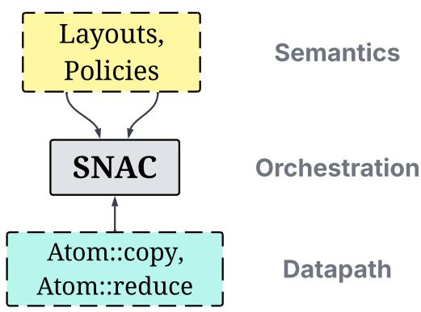  
Figure 1: Purlin’s decoupled stack. Collective layouts and codesign policies describe what to do; the SNAC layer orchestrates; the Atom deals only with how bytes move on a given GPU generation. Codesign policies tune execution to improve performance.

Where we are today. Table 1 summarizes where existing systems stand. NCCL [36], NCCLX [57], and MSCCL++ [14] are portable across generations but provide coupled collectives that are inconvenient to evolve. NVSHMEM [20], MSCCL++, and, recently, NCCL’s device API [16] additionally offer device-initiated transfer primitives, but none provides a mechanism for deriving high-performance collectives. ParallelKittens [48] extracts the most from one GPU generation by committing to its datapath, but in doing so abandons prior generations, which are still widely deployed today. Each system picks the properties its structure permits, and the result is a spectrum with portable but slow to evolve libraries at one end and specialized but generation-bound implementations at the other.

Separating the concerns. Can a collective library be compatible across generations, quick to adopt the next one, adaptable to evolving workloads, and open to new communication patterns, without sacrificing performance? We argue it can. Our key insight is that the semantics and thus orchestration ofcollectives are stable across hardware generations, while only the mechanismsfor moving data evolve. Therefore, encapsulating orchestration within a fixed interface decoupled from the semantics and datapath separates what does not change (the where and when) from what constantly does (the how) in GPU collective communication. Such a fixed, mediating interface permits independent evolution on either side, following familiar layering principles from IP, operating systems, and compiler infrastructure [2, 7, 12, 19].

Purlin’s three-layer design. We realize this insight in Purlin<sup>3</sup>, a communication framework for the scale-up domain whose key innovation is decoupling orchestration from the datapath of collectives (Figure 1). At the top, collectives are namings: one-line declarations of a consume operation and layout pair, with codesign policies (listing 1). These descriptions specify data arrangements independently of its accompanying orchestration (middle) or movement (bottom).

The middle layer derives coordination through Stage, Notify, And Consume (SNAC). SNAC controls the communication schedule including synchronization, enforcing buffer lifetimes and initiating data transfers. SNAC drives data transfers by invoking the bottom layer, the Atom, to copy or reduce data using hardware-specific mechanisms.

Why this separation is hard. 1 Collectives differ vastly in their input and output data arrangements. Variable-length collectives also allow each rank to supply or receive a different amount of data. We capture these requirements with a concise set of input and output layouts and a consume operation, al lowing SNAC to coordinate collectives through shared layout rules (§3.1). 2 Within each collective, latency-bound [46] and throughput-bound transfers demand different execution strategies. We serve both regimes through specializations of the same SNAC protocol (§3.2). 3 Supporting multiple layouts and datapaths could introduce runtime dispatch on the critical path. We therefore use template metaprogramming to derive layout-dependent coordination and select Atom implementations at compile time (§3.1).

By meeting these challenges, our stack maintains the following properties.

Compatibility. The Atom layer ensures hardware compatibility by construction as it captures the details of the executing hardware. Concretely, Purlin provides a baseline and broadly compatible Atom using only vectorized load and store instructions, in addition to an Ampere-specialized Atom incor porating asynchronous data movement instructions and even more specialized Hopper and Blackwell Atoms for improved performance (§3.3, §4).

Evolvability. Adopting a new datapath mechanism confines the implementation to the Atom layer, requiring no changes to the higher layers, namely SNAC or the semantics tier. We evaluate the performance achieved by this separation across three hardware generations through collective (§5.1) and application measurements (§5.3), and isolate the effect of datapath codesign in §5.2.

Derivability. Purlin derives orchestration from a high-level description. Through this technique, we express seven nonrooted collectives (§3.1), including variable-length variants and show how to express four more rooted collectives in §A.1. We evaluate fixed-size collectives in §5.1 and variable-length variants in §C.4.

Programmability. SNAC and the Atom are composable building blocks enabling Purlin collectives to be flexible by construction. That is, an application can easily configure or extend the datapath or override a codesign policy to meet application demands. We demonstrate the performance impact of this expressiveness via ablations in §5.2.

Results. Across seven collectives, we achieve latency speedups of up to 5.14× and bandwidth improvements of up to 4.50× over existing baselines. In SGLang, we improve offline LLM serving interactivity by 1.13× on average and up to 1.37× across 45 configurations on three GPU generations. We improve online LLM interactivity by 1.26× on average and up to 2.85×, with the largest gain occurring under overload. We also speed up diffusion image generation by up to 1.13× (§5).

## 2 Background and Motivation

<table><tr><td>Parallelism</td><td>Representative collectives</td><td>Role</td></tr><tr><td>Tensor [47]</td><td>AllReduce</td><td>Combine partial results</td></tr><tr><td>Expert [59]</td><td>AllGather(V),</td><td>Dispatch tokens and</td></tr><tr><td></td><td>ReduceScatter(V), AllToAll(V)</td><td>combine expert outputs</td></tr><tr><td>Data-parallel</td><td>AllGather(V),</td><td>Exchange activations</td></tr><tr><td>attention [59]</td><td>ReduceScatter(V)</td><td>between attention and FFN or MoE layers</td></tr><tr><td>Ulysses sequence [15]</td><td>AllToAll</td><td>Redistribute sequence and attention-head partitions</td></tr></table>

Table 2: Collective communication in distributed inference. (V) denotes a variable-length variant.

In this section, we examine how hardware and applications have been evolving and the requirements they impose on a communication framework.

## 2.1 Stable Semantics, Evolving Application Demands

Table 2 summarizes representative communication patterns in distributed inference. Tensor parallelism combines partial results computed on different GPUs. Expert parallelism routes tokens to experts and combines their outputs, while sequence parallelism redistributes attention inputs. Each participant, or rank, contributes data to a collective and receives the portion required by subsequent computation.

Stable communication semantics. Collective communication semantics, as standardized by MPI [22], specify input preconditions and output postconditions across all participating ranks. Concretely, AllGather concatenates input contributions of every rank; ReduceScatter reduces uniform slices of each rank’s contribution and distributes those slices where rank r receives the r-th slice. AllReduce leaves the complete reduced result at every rank, while AllToAll gives rank r the r-th partition from every participant. AllGatherV, ReduceScatterV, and AllToAllV allow contributions or partitions to differ in size. These contracts are inherently independent of communication steps and hardware details.

Varying performance regimes. In LLM inference, prefill processes many input tokens together, producing payloads of tens to hundreds of MBs for which throughput matters for its collectives. On the other hand, decode generates one token per sequence per iteration, often exchanging tens of KBs for which latency matters [46]. A collective communication framework serving LLM inference, for instance, must therefore specialize for both regimes. A strategy that sustains high bandwidth for a large transfer can impose setup and synchronization costs that dominate at small message sizes, even though the communication semantics are identical in both scenarios.

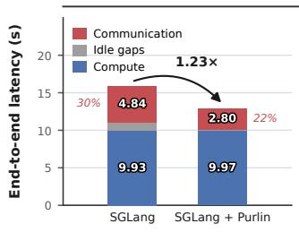

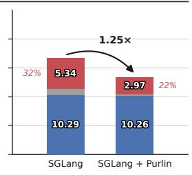

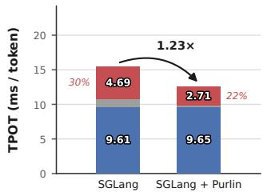

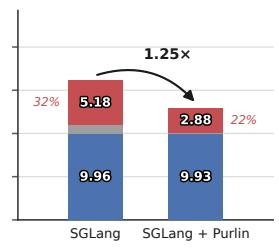

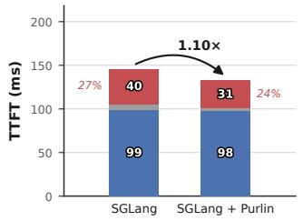

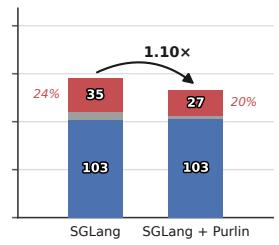  
Figure 2: Latency breakdown for Qwen3.5-122B-A10B on eight A100 GPUs with TP8/EP8/DP4 and 1K input/output tokens. Rows show p50 end-to-end latency, p50 Time Per Output Token (TPOT), and p50 Time To First Token (TTFT). Communication accounts for 24–32% of SGLang’s latency across these metrics.

Demand for fine-grained communication. Fusion colocates communication with computation within the same GPU kernel, allowing producers to transfer partial results which overlap with computation of later results. This requires device-side primitives that applications can schedule and compose. For example, FlashMoE uses hand-written primitives to transfer tiles within a fused MoE kernel [1]. MPK decomposes AllReduce into inter-GPU transfer and local-reduction tasks within its megakernel runtime [6], while MegaMoE uses remote pulls over NVLink to overlap expert communication and computation [11]. These applications need efficient data movement primitives for expressing high-performance communication at the granularity of their computation.

Impact on application latency. We argue that the demands discussed so far matter because communication occupies a significant portion of application execution, specifically in LLM inference. Figure 2 shows SGLang serving Qwen3.5-122B-A10B on eight A100 GPUs, where communication accounts for 30–32% of end-to-end latency at concurrencies one and four. Replacing its communication backend (predominantly NCCL) with Purlin improves request latency by 1.23–1.25×. We observe the same gain in Time Per Output Token (TPOT) and a 1.10× gain in Time To First Token (TTFT).

## 2.2 Hardware Evolution and Communication Cost

<table><tr><td>GPU</td><td>Bandwidth (R)</td><td>Latency (τ)</td><td>Rt</td><td>Rounded BDP</td></tr><tr><td>A100</td><td>300 GB/s</td><td> $2 . 2 \mu \mathrm { s }$ </td><td>644 KiB</td><td>512 KiB</td></tr><tr><td>H200</td><td>450 GB/s</td><td> $2 . 1 \mu \mathrm { s }$ </td><td>936 KiB</td><td>1MiB</td></tr><tr><td>B200</td><td>900 GB/s</td><td> $2 . 8 \mu \mathrm { s }$ </td><td>2.4MiB</td><td>2MiB</td></tr></table>

Table 3: BDP estimates using nominal unidirectional bandwidth and measured round-trip NVLink latency. The last column is rounded to the closest power of 2. Latency results obtained from Figure 6.

Here, we discuss the evolution of the hardware datapath and the implications for communication frameworks. In an NVLink scale-up domain, GPU threads can read and write registered peer memory directly because of Unified Virtual Addressing (UVA) [34]. As a result, frameworks implement communication via load and store instructions, like typical local memory accesses. This datapath has evolved significantly across recent hardware generations: pre-Ampere GPUs relied on vectorized load and store instructions, until Ampere, which introduced asynchronous loads from HBM to shared memory (on-chip) that avoid intermediate registers [30]. Hopper added TMA for bulk, asynchronous transfers between HBM and shared memory, and NVLink SHARP for multicast stores and in-switch reduction [31]. Meanwhile, inter-GPU interconnect bandwidth has increased exponentially from Ampere (300 GB/s unidirectional) to Blackwell (900 GB/s) [28]. Importantly, this rise in interconnect bandwidth requires communication frameworks to adopt increasingly capable datapaths to achieve peak performance.

Higher bandwidth requires more outstanding data. To sustain bandwidth R over round-trip latency τ, we must keep approximately the bandwidth-delay product (BDP) [52] in flight:

$$
Q \approx R \tau ,\tag{1}
$$

where Q is the number of outstanding bytes. We measure round-trip latencies of NVLink on A100, H200 and B200 and observe approximately 2.2 µs, 2.1 µs and 2.8 µs, respectively. Combined with increasing nominal link bandwidth, these imply a BDP growing from roughly 512 KiB to 2 MiB as shown in Table 3. To keep this much data in flight, an implementation can increase concurrent work per Streaming Multiprocessor (SM) or allocate more SMs. The latter trades off more hardware resources but is simpler to employ in practice and hence is commonly adopted in existing works. The former is more efficient, demanding fewer resources but requires (1) a capable datapath and (2) tuning to achieve peak performance.

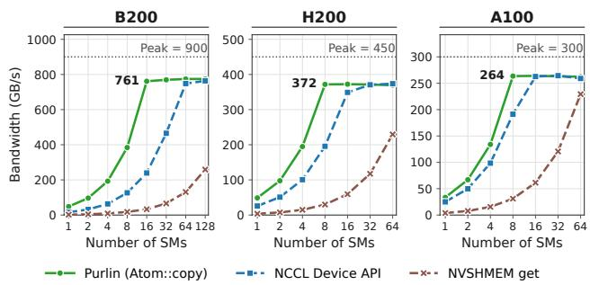  
Figure 3: Bandwidth for a 256 MiB pull over NVLink with 256 threads per SM. We tune NCCL’s device API. Dotted lines mark nominal peak bandwidth per direction. Purlin reaches comparable or higher bandwidth with fewer SMs.

The resource cost depends on the datapath and its tuning. Figure 3 compares three device-initiated pull implementations across three hardware generations. Atom::copy uses a pipelining approach we explain in §3.3, whereas the other systems use vectorized load and store instructions. One system (NCCL Device API) allows for programmable tuning, whereas the other (NVSHMEM) does not. We tune NCCL Device API by statically increasing the number of outstanding memory transactions issued per copy iteration (unrolling). As we see, NCCL’s tuned device API approaches its bandwidth plateau at 16, 32, and 64 SMs on A100, H200, and B200, respectively. Atom::copy reaches comparable or higher bandwidth with fewer resources at 8, 8, and 16 SMs. On B200, both approach 760 GB/s with a fourfold difference in SM allocation. We also see that NVSHMEM, the least programmable, stays below that plateau across the measured SM range. These results show that performance and resource efficiency strongly correlate with the capability and programmability of the underlying communication datapath, with performance highest for the most hardware-aware and tunable system, Atom::copy, and lowest for the least capable and non-tunable.

Requirements. We observe that the current state of hardware evolution calls for a datapath that can evolve independently of collective semantics and orchestration. Moreover, applicationspecific regimes (prefill or decode) and measured resource costs require this separation to preserve specialization and hardware-specific codesign (tuning). Furthermore, fused applications increasingly demand fine-grained communication and direct access to datapath primitives. Together, these observations motivate three requirements:

R1 Decoupling for evolvability. Separate semantics and orchestration from the datapath so hardware mechanisms can evolve independently.

R2 Regime awareness and codesign. Preserve latency and throughput specialization and hardware-specific tuning within the decoupled stack.

R3 Programmable, hardware-aware building blocks. Expose datapath primitives for custom communication usecases.

## 3 Purlin Design

We organize Purlin’s design around the three requirements in §2. To decouple collective semantics and orchestration from the datapath (R1), we describe buffers through layouts (§3.1) and express collectives as transformations from an input layout to an output layout (§3.1). SNAC (1) derives the coordination needed to execute these transformations, with separate paths for latency and throughput (R2, §3.2) and (2) delegates data movement to the Atom, whose unified pipeline and deterministic reduction we describe in §3.3 and §3.3. Applications can also invoke the Atom directly (R3) and tune its pipeline (§3.3). We use AllReduce as a running example to show how these three layers interact.

## 3.1 Buffer Layouts

A layout describes how a rank interprets partitioned buffer regions relative to other participating ranks. Concretely, layouts determine which region a participant contributes as input or receives as output in a collective. For a group of n participating ranks, we use three layouts: packed, scattered, and transposed.

A packed buffer holds one contiguous contribution. For example, each rank supplies one such buffer to AllGather. A scattered buffer contains contiguous partitions indexed by rank. Partition k holds the contribution assigned to rank k in an input buffer and the result supplied by rank k in an output buffer. Thus, AllGather starts with a packed contribution at each rank and produces a scattered output containing all contributions in rank order.

The transposed layout describes an exchange of rankindexed partitions. If a source rank p holds a partition for every destination, then destination rank r receives partition r from each source and arranges that data in source-rank order. This relationship expresses AllToAll. The V variants retain these relationships but take partition sizes at runtime.

AllReduce as two transformations. We express a collective as an input-output transformation between layouts. Consider the three ranks in Figure 4. We view each input as scattered, with each containing contiguous partitions indexed by rank. ReduceScatter combines partition k from every input at rank k, producing one contiguous, packed result. AllGather copies these packed results to every rank and arranges the final output in a scattered, rank-ordered layout. Together, the two transformations produce the complete reduced buffer at every rank, which is the result of an AllReduce on the input scattered buffer.

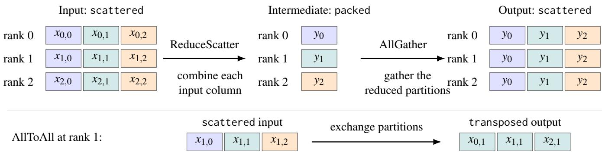  
Figure 4: Layouts on three ranks. Top: ReduceScatter combines partition k from every input into y at rank k; AllGather places all y in rank order at every rank. Bottom: AllToAll gives rank 1 partition 1 from every source. Colors identify the input partition index. These layouts describe the required results independently of any transfer mechanism.

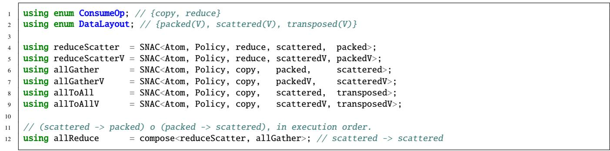  
Listing 1: Collective declarations select an Atom, a policy, a consume operation, and a pair of input and output layouts.

Listing 1 makes this description concrete. Each declaration chooses a consume operation, input/output layouts, an Atom, and a codesign policy. The copy operation copies contribu tions into distinct output regions, while reduce combines corresponding elements.

Composing transformations. We note that calling ReduceScatter and AllGather independently would be inefficient, requiring redundant memory operations and two separate kernel calls. Instead, we use compose<F, G> to run transformation F and let transformation G consume F’s intermediate result in place; the resulting composition executes as a single GPU kernel like its subparts. As Figure 4 shows, the end-to-end execution of ReduceScatter followed by AllGather yields AllReduce, and we capture this wellknown fact as compose<reduceScatter, allGather>, a scattered→scattered transformation.

Importantly, for compose<F, G> the output layout of F must match the input layout of G. We discuss how we extend composition to yield rooted collectives in §A.1.

## 3.2 Stage, Notify, and Consume (SNAC)

SNAC is the coordination protocol that executes a collective’s layout transformation across participating ranks. Specifically, SNAC uses the input and output layouts to derive dependencies, while the consume operation specifies how to move data. SNAC operates at the granularity of a chunk, which is a subpartition of both the input and output buffers for a collective. Protocol operations and invariants. Within SNAC, each rank first stages its input contribution from application buffers into registered, internal peer-accessible memory. This staging is a local copy from these ordinary buffers, which need not be registered, to internal staging buffers which are registered. When the application provides a peer-accessible buffer, SNAC omits staging (see §5.1 for an evaluation of this scenario).

After completing staging, ranks notify other participating ranks. Here, ranks notify with release memory ordering [9], ensuring that consuming ranks observe the notification after the staging copies have completed.

After notification, each rank transitions to a consumer role. Specifically, every rank waits to receive notifications (with acquire memory ordering) from every other rank and, upon receiving one, consumes from the released staging buffers via a copy or reduction.

Deriving the dependencies from layouts. SNAC is a templated metaprogram whose input parameters include the layouts describing a collective. With these layouts, SNAC determines how to enforce dependencies. For example, for the packed input layout, each rank notifies every other rank of its entire input contribution. However, with a scattered input, each rank selectively notifies in rank order so that rank k expects a notification for partition k from every other rank.

```cpp
1 // Stage then last staging CTA announces chunk c.
2 if constexpr (InputLayout == packed)
3 notifyAll(c);
4 else
5 // notify rank k only
6 notifyOne(k, c);
7
8 if constexpr (Output == packed)
9 out = dst + offset;
10 else
11 out = dst + peer * partBytes + offset;
12
13 if constexpr (consumeOp == reduce) {
14 wait_all_ready(c);
15 Atom::reduce<E>(out, sources, bytes, n,
,→ workspace);
16 } else {
17 wait_ready(peer, c);
18 Atom::copy(out, src, bytes, workspace);
19 }
```  
Listing 2: Selected SNAC rules for fixed-size ReduceScatter and AllGather. Here, a producer at rank s stages chunk c of partition k. offset and bytes select a CTA’s slice of chunk c within a partition of partBytes bytes. src is mapped to a remote peer while sources spans input ranges from all ranks.

Likewise, SNAC employs the collective’s output layout and consume operation to direct how ranks consume from other ranks. For the packed output layout, SNAC directs ranks to reduce across all other ranks. In contrast, with the scattered or transposed output layouts, SNAC makes each rank copy other ranks’ contributions and place that data in a rank-ordered layout in the output buffer.

Following one chunk through ReduceScatter and All-Gather. SNAC adopts Cooperative Thread Array (CTA) specialization and chunking for overlapping staging with consumption. Specifically, for N CTAs allocated to a SNAC transformation, SNAC splits N into two sets of CTAs: one group stages exclusively while the other consumes from participat ing ranks.

Staging CTAs cooperate to stage a single data chunk c. Each CTA stages by invoking Atom::copy on a predetermined slice of the chunk. Upon completing the copy, each CTA increments an atomic counter, with acq\_rel memory ordering, that counts finished CTAs. The last staging CTA to finish announces to all remote ranks (allGather) or a specific rank (reduceScatter) that c is available for consumption as depicted in Lines 2 - 6 of Listing 2.

Meanwhile, consuming CTAs on each rank wait for the notification of a chunk before consumption, which in SNAC is a pull from remote GPU memory on a rank to local memory of the calling rank. On receiving the notification, these CTAs invoke either Atom::copy or Atom::reduce as specified by the collective’s ConsumeOp parameter. As exemplified in Line 15, for reduceScatter specifically, consuming CTAs on rank s invoke Atom::reduce on chunk c from all ranks. Line 17 shows that for allGather, a CTA waits for c from an assigned rank peer, after which, the CTA copies with Atom::copy. Here, for gather, SNAC maps CTAs to ranks to ensure that c is copied from all ranks.

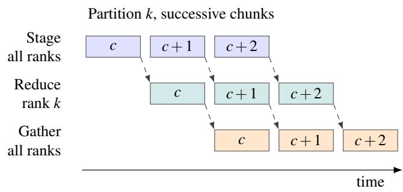  
Figure 5: Execution timeline of composed allReduce. All ranks stage chunks incrementally. Here, rank k reduces chunks from partition k from all ranks while also gathering reduced chunks of other partitions from other ranks

Extending the execution to AllReduce. In executing compose<F, G>, SNAC further delegates an additional group of consuming CTAs for G. Concretely, for allReduce = compose<reduceScatter, allGather> there are three CTA groups: (1) staging and (2) reducing CTAs for reduceScatter and (3) gathering CTAs for allGather. SNAC uses codesign policies to determine these allocations. More importantly, all three CTA groups execute at the granularity of a chunk; as a result, SNAC can pipeline staging with reduction and the final gather phase, as Figure 5 shows.

For allReduce in particular, the last reducing CTA to complete a chunk announces that chunk’s readiness to all ranks. Each gathering CTA within each rank then calls Atom::copy to copy its assigned peer’s result into its output.

Algorithm 1 summarizes these roles on rank r. We write X<sub>r</sub>[k, c] for input chunk c of partition k. We denote S<sub>r</sub>[k, c] as the chunk’s staging destination and Y [c] as the reduced result at rank k of chunks across all ranks. We express O<sub>r</sub>[k,c] as the chunk’s final destination.

Specializing for latency. SNAC’s execution as described thus far targets high throughput specifically for medium to large messages which are bandwidth-bound rather than latencybound. Here, we explain a different execution path that SNAC adopts for latency-bound data sizes.

We first investigate empirically whether our use of remote reads for the throughput regime suits low-latency execution. In Figure 6, we compare pull (remote reads) with push (remote writes) through Atom::copy and observe up to 1.98× lower latency with push and up to 7% higher bandwidth with pull.

```tcl
Algorithm 1 Composed AllReduce at rank r
Require: n ranks; b bytes per chunk; shared memory w
Run the three role loops concurrently.
ReduceScatter: staging CTAs
1: for each assigned input partition k and chunk c do
2: Wait if staging $S _ { r } [ k , c ]$ still holds live data
3: Atom::copy $( \bar { S } _ { r } [ k , c ] , \dot { X } _ { r } [ k , c ] , b , w )$
4: Last producer publishes staged $( r , k , c )$
to rank k after all staging CTAs complete their writes
5: end for
ReduceScatter: reducer CTAs
6: for each chunk c of partition r do
7: Await staged $\displaystyle { | ( p , r , c ) }$ for every rank $p$
8: $P \gets [ S _ { 0 } [ r , c ] , \ldots , S _ { n - 1 } [ r , c ] ]$
9: Atom::reduce<E> $( Y _ { r } [ c ] , P , b , n , w )$
10: Last reducer publishes reduced $( r , c )$
to all ranks after all reducer CTAs complete their writes
11: end for
AllGather: gather CTAs (consume only)
12: for each assigned result partition k and chunk c do
13: Await reduced $( k , c )$
14: $\mathsf { A t o m } \colon : \mathsf { c o p y } ( O _ { r } [ k , c ] , Y _ { k } [ c ] , b , w )$
15: Last gather CTA publishes consumed $| ( r , k , c )$ to rank k.
16: end for
```

This result confirms our choice of pull for throughput and guides our design choice of push for the latency regime.

For latency-bound execution, SNAC combines staging and notification into a single memory operation. Specifically, we package every 8 bytes of payload with an 8-byte flag (epoch in §4.2) into a 16-byte packet, building on prior work [13, 14]. In our implementation, a producer rank atomically writes this packet into a consumer’s peer-accessible buffer. The consumer atomically polls for the expected flag and, after this condition holds, consumes the payload from that packet. As described, this technique doubles the data volume transferred over the network and is therefore only performant in the latency-bound regime. Hence, SNAC employs codesign policies to determine the right crossover between using this path and the throughput path.

## 3.3 The Atom’s Unified Pipeline

As part of its orchestration, SNAC dispatches data movement to a supplied Atom, which provides efficient, hardware-aware copy and reduction operations for the executing GPU. SNAC interacts with the Atom via the interface in Listing 3. copy moves one contiguous range of bytes, while reduce<E> combines, via binary operation op, n equally sized, typed source buffers into one destination also of type E. Both use CTA-local shared memory as internal workspace for a unified pipeline which both operations lower to.

We make the pipeline’s processing phase configurable, al lowing user-defined processing functions to operate on data while resident in registers after having been read from memory. For copy, we configure processing as storing to a destination buffer, whereas for reduce, we update accumulators.

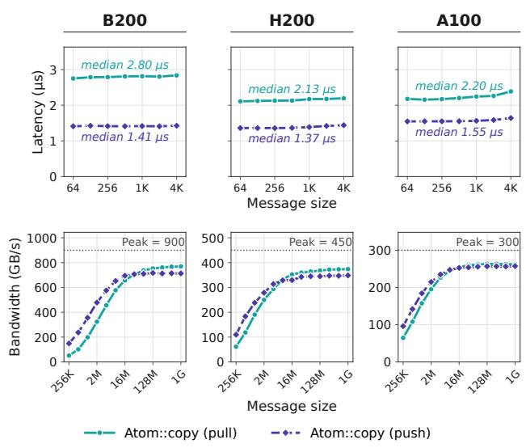  
Figure 6: Push and pull over NVLink through Atom::copy, using 256 threads per CTA. Dotted lines mark nominal peak bandwidth per direction. Each transfer involves two GPUs.

```cpp
1 template<int GPUArch, typename Config>
2 struct Atom {
3 static void copy(
4 std::byte* dst,
5 std::byte* src,
6 size_t bytes,
7 std::byte* workspace);
8
9 template<typename E, RedOp op = Op::add>
10 static void reduce(
11 std::byte* dst,
12 std::byte** sources,
13 size_t bytes,
14 int n,
15 std::byte* workspace);
16 }
```  
Listing 3: Atom’s device-side interface. copy and reduce are device functions, workspace points to a CTA-local shared memory buffer. GPUArch is an identifier that enables specialization for multiple GPU generations. Config describes the underlying pipeline.

On Ampere and above, we use cp.async to fetch from local or peer global memory asynchronously into shared memory without intermediate registers [30].

Algorithm 2 shows the pipeline’s three steps. We first prime shared-memory slots with asynchronous requests. In steady state, we wait for the oldest stage, read its values into registers, and asynchronously prefetch to that slot from global memory while processing the received values. We finally drain the remaining stages. Copy and reduction supply their own fetch addresses and processing steps. For requests that do not fit into the pipeline’s pre-defined capacity, we use register-based, unrolled transfers instead.

Algorithm 2 The unified pipeline for copy and reduction   
Require: N full transfer stages, S buffer slots, $N \geq S$   
1: for $j = 0 , \ldots , S - 1$ do ▷ prime   
2: Issue asynchronous fetch of stage j into slot j   
3: end for   
4: for $j = S , \ldots , N - 1$ do ▷ steady state   
5: s ← j mod S   
6: Wait for stage $j - S$ in slot s   
7: Read slot s into registers v   
8: Issue asynchronous fetch of stage j into slot s   
9: Process v: store a copy or update the reduction   
10: end for   
11: for $j = N - S , \dots , N - 1$ do ▷ drain   
12: Wait for stage j in slot j mod S   
13: Read the slot into registers v   
14: Process v: store a copy or update the reduction   
15: end for

Instead of using TMA, we retain cp.async on Hopper and Blackwell because we observe approximately 10–12% higher performance using our cp.async for pull and push at 256 KiB–1 MiB, with a small advantage at larger sizes. Furthermore, cp.async uses the load/store unit (LSU), a distinct hardware resource from TMA [29]. Typically, compute kernels use the TMA for operations like matrix multiplications. As a consequence of our design, in the scenario where such compute is fused within the same SM as our communication primitives, our Atom would not contend with the TMA unit.

Deterministic reduction within the pipeline We preserve a fixed accumulation order within the reduction pipeline. Specifically, while overlapping data fetches, each output element has one accumulator that consumes contributions in ascending rank order. For addition, we compute

$$
y [ i ] = \sum _ { p = 0 } ^ { n - 1 } x _ { p } [ i ] ,\tag{2}
$$

starting from zero and adding rank 0’s contribution, then rank 1’s, through rank n − 1. We convert each $x _ { p } [ i ]$ from type E to FP32, accumulate in FP32, and then convert y[i] to E after the sum completes. To achieve high throughput, we use multiple concurrent accumulators across output elements. As an alternative to this pipeline, Atom::reduce also uses inswitch reduction via the multimem.ld\_reduce to aggregate data [33]. This path retains the reduction interface but does not provide the pipeline’s fixed rank-order guarantee. We make this an opt-in feature, allowing users to choose either the deterministic pipeline or the in-switch reduction with no such guarantees. We report the performance and tuning of this in-switch reduction on eight H200 GPUs in §B.1.

Pipeline codesign toward the Bandwidth–Delay Product The Atom’s pipeline allows for increasing concurrent work within a CTA. We tune its capacity to sustain interconnect bandwidth using the BDP requirement in Eq. (1) as our target. If each of C transfer CTAs has S pipeline stages, each holding

$B _ { \mathrm { s t a g e } }$ bytes, the configured capacity is

$$
\begin{array} { r } { Q _ { \mathrm { c a p } } = C S B _ { \mathrm { s t a g e } } . } \end{array}\tag{3}
$$

$Q _ { c a p }$ denotes the steady-state capacity of in-flight bytes that our pipeline sustains. Increasing stage size or depth provides more work per CTA but consumes shared memory on the hosting SM. Increasing C, by contrast, allocates more CTAs. We balance these controls for each GPU and message regime with codesign policies supplied to SNAC. The copy ablation in §5.2 isolates pipeline depth and shows its effect at a fixed CTA count. Applications can also tune these controls to suit their needs when invoking the Atom directly.

## 4 Purlin Implementation

We implement Purlin as a CUDA C++20 header-only library and also provide a Python API. SNAC and its partitioning, packet, and epoch helpers comprise 2,480 lines of code, and codesign policies add 598 lines. Table 4 reports the Atom implementations and common utilities. We build Purlin from scratch, depending only on the CUDA C++ standard library libcu++ [27] and CUB [25] for prefix sums.

<table><tr><td>Component</td><td>Lines of code</td></tr><tr><td>Generic Atom</td><td>187</td></tr><tr><td>Ampere specialization</td><td>299</td></tr><tr><td>Hopper specialization</td><td>296</td></tr><tr><td>Blackwell specialization</td><td>53</td></tr><tr><td>Shared types and utilities</td><td>611</td></tr></table>

Table 4: Atom implementations, including local helpers.

Initialization and Python API. At initialization, Purlin’s C++ API accepts pointers to peer-accessible, buffers which we reuse for every call. For the Python API, we use PyTorch symmetric [53] to allocate these buffers. We also allocate local memory for epochs and counters, which we reuse across all API calls. In Python, we do JIT compilation where we supply an architecture identifier (GPUArch in Listing 3) to instantiate an Atom implementation and select codesign policies specific to the calling GPU. Python calls supply this compiled module with PyTorch tensors and a CUDA stream.

## 4.1 Cyclic Staging

We allocate two 256 MiB throughput staging buffers per GPU and alternate between these across invocations. Users can reduce this capacity at initialization, trading memory use against the number of chunks we can overlap. When a collective’s staging footprint exceeds 256 MiB, we cycle through a fixed number of chunk slots which is $\frac { 2 5 6 M i B } { c h u n k S i z e } .$

## 4.2 Epoch Bookkeeping

To reuse peer-accessible staging buffers safely across calls, we use an epoch-based mechanism. Specifically, each CTA locally updates a persistent 64-bit epoch after each invocation. Importantly, we use epoch parity to select one of the two internal staging buffers. This epoch also serves as the value used for notification in SNAC. For epoch updates, we use the number of chunks in the current invocation, rounded to an odd number so consecutive calls safely alternate buffers. For variable-length collectives with varying chunk counts, we use the maximum across all ranks.

## 5 Evaluation

Our evaluation addresses three questions:

Q1. Can collectives derived from SNAC deliver competi tive performance across GPU generations and message sizes? (§5.1)

Q2. How does the Atom’s pipeline improve bandwidth within a fixed CTA budget? (§5.2)

Q3. When do inference applications benefit, and how does Purlin affect output quality? (§5.3 and §5.4)

Experimental setup. We use three servers, each with eight GPUs connected by NVLink (Table 5). We evaluate collectives across all eight GPUs on each platform, and use the same platforms for both microbenchmark and application experiments.

<table><tr><td>GPU and interconnect</td><td>LLM checkpoint (precision)</td><td>Total parameters</td></tr><tr><td>A100-SXM4 (80 GB) NVLink 3</td><td>Qwen3.5-122B-A10B [42] (BF16)</td><td>122B</td></tr><tr><td>H200 (141 GB)</td><td>DeepSeek-V4-Flash [43]</td><td>291B</td></tr><tr><td>NVLink 4 B200 (180 GB)</td><td>(FP8) DeepSeek-V4-Pro [35]</td><td></td></tr><tr><td>NVLink 5</td><td>(NVFP4)</td><td>1.6T</td></tr></table>

Table 5: Evaluation platforms and LLM configurations.

Baselines. We compare Purlin with established collective libraries and specialized GPU communication kernels. NCCL 2.29.7 [36] is NVIDIA’s general-purpose collective communication library. NCCLX [57], accessed through TorchComms 0.3.0 [50], is Meta’s extension of NCCL. We evaluate both on AllGather, ReduceScatter, AllToAll, AllReduce, and the three variable-length collectives. For NCCL AllToAll, we use grouped ncclSend and ncclRecv calls rather than the copy-engine implemented ncclAlltoAll [32].

MSCCL++ 0.10.0 [14] provides GPU-side communication and synchronization primitives for implementing custom collectives. Among the four fixed-size collectives we study, this release provides tuned implementations only for AllGather and AllReduce, so we restrict our MSCCL++ comparison to those two operations. ParallelKittens [48] provides communication primitives and specialized kernels for Hopper and

Blackwell. We evaluate its four fixed-size collectives at commit 67845f5 on H200 and B200 with peer-accessible buffers. These comparisons test whether SNAC’s shared coordination can retain the performance of specialized collective implementations. Unless noted below, collective microbenchmarks use each baseline’s default configuration, including its builtin algorithm selection and tuning where available. For the peer-copy comparison in Figure 3, we also use NVSHMEM 3.7.2 [20], a GPU-initiated, one-sided communication framework.

Application baselines. The SGLang baseline uses stock SGLang [59] with NCCL and its custom AllReduce. We integrate Purlin and NCCLX into SGLang and extend its existing MSCCL++ integration. We compare these systems in offline LLM serving, online LLM serving on a real-world production trace [23], and diffusion image generation. Offline serving includes all three integrations. Online serving includes Purlin and MSCCL++; we omit NCCLX because of memory stranding at teardown. Image generation includes Purlin and NCCLX, since the evaluated MSCCL++ release does not provide an AllToAll implementation.

All integrations use SGLang revision 0f18d38. Each application configuration has one complete run, with request counts and aggregation specified below and additional setup details in §C. We summarize results with geometric means of per-configuration ratios: baseline latency divided by ours, or our bandwidth or throughput divided by the baseline’s.

Microbenchmark methodology. For every microbenchmark in this paper, we use the same harness which captures 128 invocations in a CUDA graph, replays that graph to warm up, and times eight replays with CUDA events. We divide each rank’s elapsed time by 128 × 8 = 1,024 and report the maximum across ranks. We use BF16 for all reductions. Reported message size is the full gathered output size for AllGather and the full input size per rank for ReduceScatter, AllToAll, and AllReduce. We compute algorithm bandwidth as the plotted message size divided by the reported latency. We sweep powers of two, summarizing latency over 1 KiB– 512 KiB and bandwidth over 1 MiB–1 GiB for each collective and platform.

Buffer configurations. We evaluate under two buffer configurations: ordinary application buffers and peer-accessible buffers. For every system, ordinary buffers come from cudaMalloc. NCCL Symm uses peer-accessible buffers allocated with ncclMemAlloc and registered with NCCL. For MSCCL++ AllReduce on B200 with ordinary buffers, we ensure a fair comparison by modifying the algorithm selector of MSCCL++ to pick non-zero-copy algorithms from its tuned candidates while under CUDA graph execution. For peer-accessible buffers, we use MSCCL++ code unmodified and additionally set MSCCLPP\_NCCL\_SYMMETRIC\_MEMORY=1. Purlin-ZS is a variant of Purlin that omits staging and adds synchronization so each rank can reuse its input when the collective completes. Reported results include this synchronization. §C.2 gives more details. We evaluate ParallelKittens only for peer-accessible buffers, as that is the only setting they support.

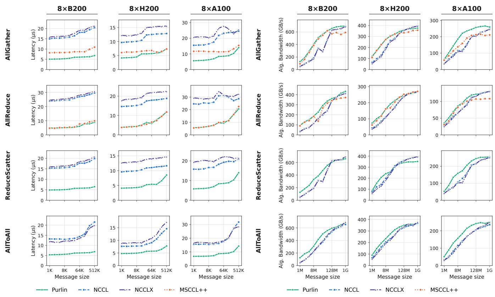  
(a) Latency. Lower is better.  
(b) Algorithm bandwidth. Higher is better.  
Figure 7: Collective performance on ordinary application buffers on eight B200, H200 and A100 GPUs.

## 5.1 Collective Microbenchmarks

We first test whether deriving collectives from one protocol retains the specialization needed for competitive performance (Figure 7). These four collectives use ordinary application buffers, so the measurements include the work of internal staging. We evaluate the three variable-length collectives from listing 1 in §C.4.

Does SNAC deliver low latency? Across the twelve collective–platform combinations, we improve latency over NCCL by 1.65–4.36× in geometric mean (Figure 7a). AllReduce achieves the largest improvement on each platform, reaching 4.36× on B200. Our largest individual speedup is 5.14× over NCCLX for 2 KiB AllReduce on B200.

We achieve low latency because we target the coordination costs that matter at small sizes via (1) our latency specializations and (2) epoch-based double-buffering to eliminate inter-rank synchronization.

MSCCL++, which also implements similar low-latency techniques, provides a closer comparison for AllGather and

AllReduce. We improve AllGather latency by 1.23–1.56× in geometric mean across the three platforms. For AllReduce, speedups range from 0.98× to 1.06×. These results confirm the efficacy of SNAC’s latency specializations.

Does SNAC achieve high bandwidth? Across the four collectives in Figure 7, geometric-mean bandwidth improvements over NCCL range from 1.14–1.42× on A100, 1.05–1.25× on H200, and 1.35–1.53× on B200 (Figure 7b). Our largest fixed-size bandwidth gain is 2.82× over NCCLX for 1 MiB AllReduce on B200.

We attribute these bandwidth gains to: (1) chunking within SNAC, which allows for overlapping staging with consumption within a single collective and for composed collectives (2) the high-throughput pipeline of the Atom, and (3) well-tuned codesign policies.

At 512 MiB and 1 GiB with ordinary buffers, the largest bandwidth spread among implementations for any fixed-size collective and platform is 27.8% relative to the slowest implementation. This occurs for A100 AllGather at 512 MiB, where Purlin outperforms MSCCL++. On H200, however, NCCL leads Purlin on all four collectives at 1 GiB; for ReduceScatter, we achieve 351.4 GB/s against NCCL’s 393.4 GB/s, or 10.7% less. Against MSCCL++, we improve B200 AllReduce band-

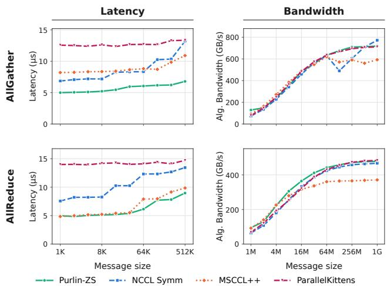

SM upper bound at 1 GiB on eight B200 GPUs
<table><tr><td>System</td><td>AllGather</td><td>AllReduce</td></tr><tr><td>NCCL Symm</td><td>0 (copy engine)</td><td>3</td></tr><tr><td>Purlin-ZS</td><td>32</td><td>32</td></tr><tr><td>MSCCL++</td><td>56</td><td>128</td></tr><tr><td>ParallelKittens</td><td>148 (capped)</td><td>148 (capped)</td></tr></table>

Figure 8: AllGather and AllReduce on eight B200 GPUs with peer-accessible buffers. Purlin-ZS omits staging. Lower is better for latency and higher is better for bandwidth. In the table, we count launched CTAs and bound concurrent SM use by min(CTAs launched,148) at 1 GiB. NCCL Symm AllGather uses the copy engine and launches no kernel.

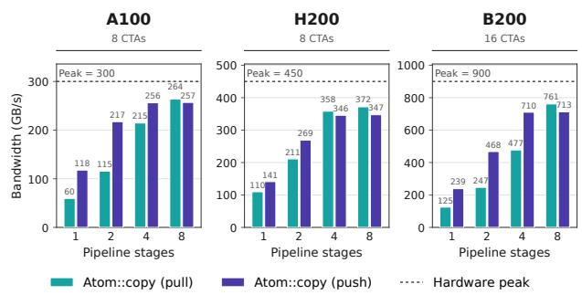  
Figure 9: Copy bandwidth for one-sided transfers between two GPUs as we increase the Atom’s pipeline depth from one to eight stages, for both pull and push. Messages are 256 MiB and each CTA has 256 threads. We hold the CTA count fixed at eight on A100 and H200 and sixteen on B200. Dotted lines mark nominal per-direction link bandwidth.

width by 1.12× in geometric mean over the 1 MiB–1 GiB sweep, reaching 432.9 GB/s against its 371.5 GB/s at 1 GiB.

How many SMs do Purlin collectives require? We next compare libraries using peer-accessible buffers on B200 (Figure 8). At 1 GiB, Purlin limits each collective to at most 32 of the B200’s 148 SMs. With this allocation, we achieve 718.7 GB/s for AllGather and 478.6 GB/s for AllReduce, exceeding MSCCL++’s 592.4 and 371.1 GB/s. ParallelKittens reaches 710.9 and 483.9 GB/s, respectively, using 148 SMs, which is the entire GPU. NCCL Symm’s copy-engine All-Gather reaches 771.7 GB/s without launching CTAs, while its AllReduce reaches 467.2 GB/s with an SM bound of three.

For small messages, we improve latency over NCCL Symm by 1.50× for AllGather and 1.70× for AllReduce in geometric mean. We note that Purlin’s SM usage is configurable via codesign policies. For all our experiments, we optimized more for higher performance within a reasonable budget. We report results on A100 and H200 in §C.3. We next isolate how much work the Atom can overlap within a fixed CTA allocation.

## 5.2 Codesign through Pipeline Tuning

Can we increase bandwidth without allocating more CTAs? We design the Atom’s pipeline to maximize bytes in flight within each CTA to increase interconnect utilization. A deeper pipeline allows a CTA to keep more outstanding requests in flight (Eq. (3)). We test how effectively this trans lates into bandwidth by varying pipeline depth while fixing the transfer size at 256 MiB and the allocation at eight CTAs on A100 and H200 and sixteen on B200, each with 256 threads (Figure 9).

In this experiment, $B _ { \mathrm { s t a g e } } = 8 ~ \mathrm { K i B }$ for A100 and $B _ { \mathrm { s t a g e } } =$ 16 KiB for H200 and B200. Recalling, §3.3, we sweep $Q _ { \mathrm { c a p } }$ by varying S from 1 to 8. For every hardware, $S = 8$ is where $Q _ { \mathrm { c a p } } =$ Rounded BDP from Table 3.

We observe that moving from one to eight stages raises pull bandwidth from 60 to 264 GB/s on A100, from 110 to 372 GB/s on H200, and from 125 to 761 GB/s on B200. On B200, we obtain 6.1× more bandwidth from the same sixteen CTAs. This result shows mechanistically why maximizing bytes in flight improves achieved interconnect bandwidth.

Optimal pipeline depth depends on transfer direction. Figure 9 shows that push plateaus earlier compared to pull. On B200, bandwidth rises from 239 GB/s at one stage to 710 GB/s at four, with little improvement at eight (713 GB/s). Pull continues to improve from 477 to 761 GB/s between four and eight stages. We observe the same phenomenon on A100 and H200. This observation is important because each additional pipeline stage consumes shared memory, so these observed plateaus guide how much memory we use for each GPU and transfer direction.

Microbenchmark takeaway. In summary, our results validate that SNAC, from which we derive all measured collectives, is compatible across hardware generations and evolvable, providing peak performance for each generation. Our results, particularly the ablation experiment, further confirm the utility of programmability, which our Atom supports and which codesign policies provide.

## 5.3 Application Performance

Do communication speedups reach the user? We examine three settings that expose communication differently: (1) offline serving varies the number of concurrent user requests in flight, (2) online serving varies the arrival rate and resulting queueing, and (3) image generation varies the tensors exchanged during sequence-parallel attention. Together, they test Purlin across interactive and throughput-oriented workloads.

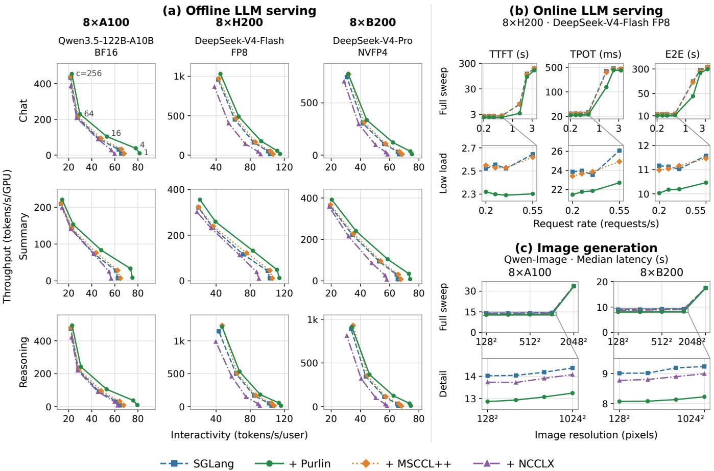  
Figure 10: Application performance on eight GPUs. (a) Offline LLM serving sweeps concurrency through 1, 4, 16, 64, and 256. Rows use input/output lengths of 1,000/1,000 tokens (chat), 8,000/1,000 (summary), and 1,000/8,000 (reasoning). Interactivity is the inverse of median TPOT and throughput is output tokens per second per GPU. Higher and farther right is better. (b) Online serving replays the Mooncake conversation trace at target rates from 0.2 to 3.4 requests/s. The upper row shows the full sweep on logarithmic axes and the lower row expands low-load behavior. (c) Qwen-Image uses Ulysses sequence parallelism and 50 denoising steps. The lower row expands resolutions from 128<sup>2</sup> to 1024<sup>2</sup>. Panels (b) and (c) report median latencies, where lower is better.

Offline LLM serving. We configure SGLang with tensor and expert parallelism of eight, data parallelism of four, and dataparallel attention. Thus from Table 2, collectives exercised in this experiment are AllGather(V), ReduceScatter(V), and AllReduce. For each model in Table 5, we use three fixed input/output lengths and five client concurrencies (Figure 10a). At concurrency c, we submit 8c requests with up to c in flight. We note that SGLang supplies ordinary application buffers to communication backends.

We report throughput as output tokens per second per GPU and interactivity as the inverse of median time per output token (TPOT). Across all 45 platform, workload, and concurrency combinations, Purlin improves both metrics over stock SGLang. Across the 135 configuration–baseline comparisons, we improve both metrics by 1.13× in geometric mean and up to 1.37×, weighting each comparison equally. The perbaseline geometric-mean gains are 1.11× over stock SGLang, 1.08× over MSCCL++, and 1.21× over NCCLX. These gains span all three GPU generations and workloads and are particularly pronounced at low concurrency. For example, in the chat workload on A100, we improve interactivity over stock SGLang by 1.24× at concurrency one compared to 1.06× at concurrency 256. This is consistent with the breakdown in Fig ure 2 where communication occupies a significant portion of end-to-end latency at low concurrency. Improving collective communication performance in that regime can thus reduce end-to-end latency materially as we see for Purlin. Larger batch sizes (concurrency) change the balance between computation and communication, and our gains generally narrow as concurrency increases. MSCCL++ occasionally leads at high concurrency: for B200 reasoning at concurrency 256, we achieve 2.5% lower interactivity and 1.9% lower throughput.

Online LLM serving. Next, we ask how these benefits change when requests arrive continuously and can accumulate in a queue. We replay 1,000 requests from the Mooncake conversation trace [23, 40] on eight H200 GPUs with DeepSeek-V4-Flash FP8 using expert and tensor parallelism with data parallel attention enabled. We compare with stock SGLang and its MSCCL++ integration. We vary request rates from 0.2 to 3.4 requests/s. We measure median time to first token (TTFT), TPOT, and end-to-end latency.

Across seven arrival rates and both baselines, we improve interactivity by 1.26× in geometric mean and up to 2.85×. At 0.2–0.55 requests/s, we improve median end-to-end latency over stock SGLang by 1.08–1.11× (Figure 10b). At 1.5 requests/s, we reduce end-to-end latency from 121.3 to 41.5 seconds, a 2.92× speedup over stock SGLang and 2.78× over MSCCL++. We also reduce median TPOT from 390 to 137 ms compared with stock SGLang.

These larger gains occur under overload: achieved throughput plateaus at approximately 1.2–1.4 requests/s, so the 1.5 requests/s result reflects a growing backlog rather than sustained service at that arrival rate. These results show that faster collectives help the inference server finish active requests faster, freeing capacity for queued requests and reducing their overall latency.

Image generation. We run Qwen-Image [55] on eight A100 or B200 GPUs using Ulysses sequence parallelism [15], which redistributes attention tensors through AllToAll. For each resolution from 128<sup>2</sup> to 2048<sup>2</sup>, we issue two warmup requests followed by eight measured prompts at concurrency one and report median latency. For $\dot { 1 } 2 8 ^ { 2 } \dot { - } 1 0 2 4 ^ { 2 }$ , Purlin improves latency over stock SGLang by approximately 1.09× on A100 and 1.12–1.13× on B200 (Figure 10c). We also outperform NCCLX by 1.06–1.07× on A100 and approximately 1.09× on B200 over this range. At 2048<sup>2</sup>, which is significantly compute-bound, all three systems perform similarly, as expected.

## 5.4 Output Quality

Does changing the communication backend affect inference quality? We evaluate language-model accuracy using sampled responses and compare generated images using matched random seeds (Table 6). On eight H200 GPUs, we observe similar AIME26 accuracy with stock SGLang and Purlin using DeepSeek-V4-Flash FP8, sampling 16 unseeded completions for each of 30 problems. We also observe identical scores for pass@16 and majority@16.

<table><tr><td>Metric</td><td>SGLang + Purlin</td></tr><tr><td>AIME26: 30 problems, 16 samples each pass@ 1 (%, mean ± SEM)  $9 6 . 0 4 \pm 0 . 3 4$  pass@16 (%) 96.67</td><td> $9 5 . 6 2 \pm 0 . 4 0$  96.67</td></tr><tr><td>majority@16 (%)</td><td>96.67 96.67</td></tr><tr><td>Qwen-Image: 100 prompts, matched seeds Mean ImageReward 1.2063</td><td>1.2063</td></tr></table>

Table 6: Application output quality on eight H200 GPUs. We compare DeepSeek-V4-Flash FP8 on AIME26 and Qwen-Image at 1024<sup>2</sup> resolution. LLM sampling is unseeded, whereas image seeds match between systems. SEM denotes standard error of the mean.

For Qwen-Image, we obtain pixel-identical outputs for all 100 prompts from Qwen-Image-Bench [41] at 1024<sup>2</sup> resolution with matched seeds.

Application Takeaway Our experiments show that Purlin’s faster collective communication noticeably boosts end-to-end inference, with no compromise to model quality.

## 6 Related Work

Collective synthesis and compilation. SCCL [4] synthesizes collective algorithms for a given topology, and TACCL [44] uses communication sketches to guide this search. OptCCL [45] scales synthesis to hundreds of GPUs and supports joint optimization of concurrent collectives. At the execution layer, MSCCLang [8] starts from chunk operations and compiles into an optimized execution schedule. In contrast, we focus on developing a shared orchestration protocol that allows for deriving hardware-aware collectives from a compile-time description.

Programmable GPU communication. NVSHMEM [20] and NCCL’s device API [16] let application kernels initiate communication. MSCCL++ [14] provides reusable communication and synchronization primitives together with a DSL for custom algorithms. ParallelKittens [48] combines primitives with kernel templates for overlapping communication and computation, while FlashMoE [1] and MPK [6] demonstrate the benefits of fusing the two. We share the goal of exposing communication to application kernels. In Purlin, the same Atom interface serves both direct kernel use and collectives derived from SNAC.

Portability through decoupling. UCCL-Tran [62] separates the control path from the datapath on RDMA NICs, enabling broad compatibility and extensibility via software techniques. UCCL-EP [21] applies a related separation to expert-parallel communication within RDMA networks. We apply a similar decoupling principle to communication within a scale-up domain. Our orchestration-datapath separation lets us evolve the datapath without rewriting orchestration logic or sacrificing compatibility.

Composable GPU kernel abstractions. CUTLASS [26] decomposes high-level compute operations, notably GEMMs, into reusable hardware-aware components, using CuTe layouts [5] to describe the mapping between threads and data. We share its use of composable components to expose hardware specialization. Our collective layouts describe a different, distributed relationship: input and output data arrangements for collective communication. With SNAC and the Atom, we use our layouts to derive high-performance collectives as CUT-LASS does for high-performance computation.

## 7 Conclusion

We presented the design and implementation of Purlin, a scaleup communication framework that separates collective semantics, orchestration, and the hardware datapath. We express collectives through layouts, derive their orchestration through SNAC, and hardware-aware data movement via the Atom. Our evaluation shows that this separation yields competitive or better collective performance and improves distributed inference across GPU generations. Purlin demonstrates that we can evolve collective descriptions and hardware mechanisms independently while preserving the regime specialization and hardware-aware tuning needed for efficient execution.

## References

[1] Osayamen Aimuyo, Byungsoo Oh, and Rachee Singh. FlashMoE: Fast distributed MoE in a single kernel. In D. Belgrave, C. Zhang, H. Lin, R. Pascanu, P. Koniusz, M. Ghassemi, and N. Chen, editors, Advances in Neural Information Processing Systems, volume 38, Main Conference, pages 100676–100699. Curran Associates, Inc., 2025.

[2] Saamer Akhshabi and Constantine Dovrolis. The evolution of layered protocol stacks leads to an hourglassshaped architecture. In Proceedings of the ACM SIG-COMM Conference, SIGCOMM ’11, pages 206–217. ACM, 2011.

[3] Rohil Bhargava, Taylor Allison, and Harry Petty. NVIDIA Vera Rubin POD: Seven chips, five rack-scale systems, one AI supercomputer. NVIDIA Technical Blog. https://developer.nvidia.com/blog/nvid ia-vera-rubin-pod-seven-chips-five-rack-sca le-systems-one-ai-supercomputer/, March 2026.

[4] Zixian Cai, Zhengyang Liu, Saeed Maleki, Madanlal Musuvathi, Todd Mytkowicz, Jacob Nelson, and Olli Saarikivi. Synthesizing optimal collective algorithms. In Proceedings of the 26th ACM SIGPLAN Symposium on Principles and Practice of Parallel Programming, PPoPP ’21, pages 62–75. Association for Computing Machinery, 2021.

[5] Cris Cecka. CuTe layout representation and algebra. https://arxiv.org/abs/2603.02298, 2026.

[6] Xinhao Cheng, Zhihao Zhang, Yu Zhou, Jianan Ji, Jinchen Jiang, Zepeng Zhao, Ziruo Xiao, Zihao Ye, Yingyi Huang, Ruihang Lai, Hongyi Jin, Bohan Hou, Mengdi Wu, Yixin Dong, Anthony Yip, Zihao Ye, Songting Wang, Wenqin Yang, Xupeng Miao, Tianqi Chen, and Zhihao Jia. MPK: A compiler and runtime for Mega-Kernelizing tensor programs. In 20th USENIX Symposium on Operating Systems Design and Implementation (OSDI 26), pages 1909–1926, Seattle, WA, July 2026. USENIX Association.

[7] David D. Clark. The design philosophy of the DARPA internet protocols. In Proceedings of the ACM SIG-COMM Conference, SIGCOMM ’88, pages 106–114. ACM, 1988.

[8] Meghan Cowan, Saeed Maleki, Madanlal Musuvathi, Olli Saarikivi, and Yifan Xiong. MSCCLang: Microsoft collective communication language. In Proceedings of the 28th ACM International Conference on Architectural Support for Programming Languages and Operating Systems, Volume 2, ASPLOS ’23, pages 502–514. Association for Computing Machinery, 2023.

[9] cppreference.com. std::memory\_order. https://en.c ppreference.com/cpp/atomic/memory\_order.

[10] DarkSharpness. [JIT Kernel][Feature] Support JIT custom all reduce (rewrite as v2). https://github.com/s gl-project/sglang/pull/19880, 2026. Pull Request #19880, sgl-project/sglang. Merged March 20, 2026.

[11] DeepSeek-AI. DeepSeek-V4: Towards highly efficient million-token context intelligence. https://arxiv.or g/abs/2606.19348, 2026.

[12] Dawson R. Engler, M. Frans Kaashoek, and James O’Toole, Jr. Exokernel: An operating system architecture for application-level resource management. In Proceedings of the 15th ACM Symposium on Operating Systems Principles, SOSP ’95, pages 251–266. ACM, 1995.

[13] Zhiyi Hu, Siyuan Shen, Tommaso Bonato, Sylvain Jeaugey, Cedell Alexander, Eric Spada, James Dinan, Jeff Hammond, and Torsten Hoefler. Demystifying NCCL: An in-depth analysis of GPU communication protocols and algorithms. In 2025 IEEE Symposium on High-Performance Interconnects (HOTI), pages 48–59, 2025.

[14] Changho Hwang, Peng Cheng, Roshan Dathathri, Abhinav Jangda, Saeed Maleki, Madan Musuvathi, Olli Saarikivi, Aashaka Shah, Ziyue Yang, Binyang Li, Caio Rocha, Qinghua Zhou, Mahdieh Ghazimirsaeed, Sreevatsa Anantharamu, and Jithin Jose. MSCCL++: Rethinking GPU communication abstractions for AI inference. In Proceedings of the 31st ACM International

Conference on Architectural Support for Programming Languages and Operating Systems, Volume 2, ASPLOS ’26, pages 1201–1215, New York, NY, USA, 2026. Association for Computing Machinery.

[15] Sam Ade Jacobs, Masahiro Tanaka, Chengming Zhang, Minjia Zhang, Reza Yazdani Aminadabi, Shuaiwen Leon Song, Samyam Rajbhandari, and Yuxiong He. System optimizations for enabling training of extreme long sequence transformer models. In Proceedings of the 43rd ACM Symposium on Principles ofDistributed Computing, PODC ’24, pages 121–130, New York, NY, USA, 2024. Association for Computing Machinery.

[16] Sylvain Jeaugey, John Bachan, Pak Markthub, Zhenhao He, Sirshak Das, and Farshad Ghodsian. Fusing communication and compute with new device API and copy engine collectives in NVIDIA NCCL 2.28. NVIDIA Technical Blog. https://developer.nvidia.com/b log/fusing-communication-and-compute-with-n ew-device-api-and-copy-engine-collectives-i n-nvidia-nccl-2-28/, November 2025.

[17] Anton Korzh, Brian Pharris, Nick Comly, Ashraf Eassa, and Amr Elmeleegy. 3x faster AllReduce with NVSwitch and TensorRT-LLM MultiShot. NVIDIA Technical Blog. https://developer.nvidia.com/b log/3x-faster-allreduce-with-nvswitch-and-t ensorrt-llm-multishot/, November 2024.

[18] Woosuk Kwon, Zhuohan Li, Siyuan Zhuang, Ying Sheng, Lianmin Zheng, Cody Hao Yu, Joseph E. Gonza lez, Hao Zhang, and Ion Stoica. Efficient memory management for large language model serving with PagedAttention. In Proceedings ofthe ACM SIGOPS 29th Symposium on Operating Systems Principles, 2023.

[19] Chris Lattner and Vikram Adve. LLVM: A compilation framework for lifelong program analysis & transformation. In Proceedings of the International Symposium on Code Generation and Optimization, CGO ’04, pages 75–86. IEEE, 2004.

[20] Yijun Ma, Siyuan Shen, Tiancheng Chen, Akhil Langer, Jiri Kraus, Benjamin Glick, Craig Belusar, Jeff Hammond, and Torsten Hoefler. Demystifying NVSHMEM: A system-level analysis on symmetric memory and device-initiated operations in GPU communication. In 2026 IEEE Symposium on High-Performance Interconnects (HOTI), 2026. Preprint: https://arxiv.org/ab s/2606.05951.

[21] Ziming Mao, Yihan Zhang, Chihan Cui, Zhen Huang, Kaichao You, Zhongjie Chen, Zhiying Xu, Zhenyu Gu, Scott Shenker, Costin Raiciu, Yang Zhou, and Ion Stoica. UEP: Portable expert-parallel communication. In 20th USENIX Symposium on Operating Systems Design and

Implementation (OSDI 26), pages 1107–1123. USENIX Association, 2026.

[22] Message Passing Interface Forum. Collective communication. The International Journal ofSupercomputer Applications and High Performance Computing, 8(3– 4):267–309, 1994.

[23] Mooncake Authors. Mooncake FAST’25 trace release. https://github.com/kvcache-ai/Mooncake/tre e/main/FAST25-release, 2025. Conversation workload.

[24] Moonshot AI. Kimi K2.6: Advancing open-source coding. https://www.kimi.ai/blog/kimi-k2-6, 2026.

[25] NVIDIA. CUB. https://nvidia.github.io/ccc l/unstable/cub/index.html, 2026. CUDA Core Compute Libraries documentation.

[26] NVIDIA. CUTLASS 3.0 GEMM API. https://do cs.nvidia.com/cutlass/latest/media/docs/cpp/ gemm\_api\_3x.html, 2026.

[27] NVIDIA. libcu++: The CUDA C++ standard library. https://nvidia.github.io/cccl/unstable/l ibcudacxx/, 2026. CUDA Core Compute Libraries documentation.

[28] NVIDIA. NVIDIA Blackwell Tuning Guide. https: //docs.nvidia.com/cuda/blackwell-tuning-gui de/, 2026.

[29] NVIDIA. NVIDIA Nsight Compute: Profiling guide. https://docs.nvidia.com/nsight-compute/Pro filingGuide/index.html#metrics-reference, 2026. Metrics Reference, Pipelines: LSU and TMA.

[30] NVIDIA Corporation. NVIDIA A100 Tensor Core GPU architecture: Unprecedented acceleration at every scale. Whitepaper, NVIDIA, 2020. v1.0. https://www.nv idia.com/content/dam/en-zz/Solutions/Data-C enter/nvidia-ampere-architecture-whitepaper. pdf.

[31] NVIDIA Corporation. NVIDIA H100 Tensor Core GPU architecture. Whitepaper. https://www.advancedcl ustering.com/wp-content/uploads/2022/03/gtc 22-whitepaper-hopper.pdf, 2022. v1.01. Mirror hosted by Advanced Clustering Technologies.

[32] NVIDIA Corporation. NCCL 2.28.3 release notes. ht tps://docs.nvidia.com/deeplearning/nccl/ar chives/nccl\_2303/release-notes/rel\_2-28-3.h tml, October 2025.

[33] NVIDIA Corporation. PTX ISA 9.0. NVIDIA CUDA Toolkit 13.0 documentation. https://docs.nvidi

a.com/cuda/archive/13.0.0/parallel- thr ead-execution/index.html#data-movement-a nd-conversion-instructions-multimem, 2025. Section 9.7.9.14: multimem.ld\_reduce, multimem.st, and multimem.red.

[34] NVIDIA Corporation. CUDA programming guide. v13.4.2. https://docs.nvidia.com/cuda/cuda-pro gramming-guide/, 2026. Section 4.17: Virtual Memory Management.

[35] NVIDIA Corporation. DeepSeek-V4-Pro-NVFP4. Hugging Face model repository. https://huggingfac e.co/nvidia/DeepSeek-V4-Pro-NVFP4, May 2026. NVFP4 quantization of deepseek-ai/DeepSeek-V4-Pro via NVIDIA Model Optimizer. Released May 27, 2026. Accessed August 20, 2026.

[36] NVIDIA Corporation. NCCL: Optimized primitives for collective multi-GPU communication. GitHub repository. https://github.com/NVIDIA/nccl/release s/tag/v2.29.7-1, 2026. Version 2.29.7. Originally released 2015.

[37] NVIDIA Corporation. NVSHMEM 3.7.0 release notes. https://docs.nvidia.com/nvshmem/release-not es-install-guide/release-notes/release-3700. html, June 2026.

[38] NVIDIA Corporation. TensorRT-LLM. GitHub repository. https://github.com/NVIDIA/TensorRT-LLM /releases/tag/v1.2.0, 2026. Version 1.2.0. Originally released 2023.

[39] Pratyush Patel, Esha Choukse, Chaojie Zhang, Aashaka Shah, Íñigo Goiri, Saeed Maleki, and Ricardo Bianchini. Splitwise: Efficient generative LLM inference using phase splitting. In Proceedings of the 51st Annual International Symposium on Computer Architecture, ISCA ’24, pages 118–132. IEEE Press, 2024.

[40] Ruoyu Qin, Zheming Li, Weiran He, Jialei Cui, Feng Ren, Mingxing Zhang, Yongwei Wu, Weimin Zheng, and Xinran Xu. Mooncake: Trading more storage for less computation — a KVCache-centric architecture for serving LLM chatbot. In 23rd USENIX Conference on File and Storage Technologies (FAST 25), pages 155–170, Santa Clara, CA, February 2025. USENIX Association.

[41] Qwen Team. Qwen-Image-Bench. https://github .com/QwenLM/Qwen-Image-Bench, 2026. Benchmark prompts.

[42] Qwen Team. Qwen3.5-122B-A10B model card. http s://huggingface.co/Qwen/Qwen3.5-122B-A10B, 2026.

[43] SGLang Project. DeepSeek-V4-Flash-FP8. Hugging Face model repository. https://huggingface.co/s gl-project/DeepSeek-V4-Flash-FP8, 2026. FP8 repackaging of deepseek-ai/DeepSeek-V4-Flash; weights only, no retraining. Accessed August 20, 2026.

[44] Aashaka Shah, Vijay Chidambaram, Meghan Cowan, Saeed Maleki, Madan Musuvathi, Todd Mytkowicz, Jacob Nelson, Olli Saarikivi, and Rachee Singh. TACCL: Guiding collective algorithm synthesis using communication sketches. In 20th USENIX Symposium on Networked Systems Design and Implementation (NSDI 23), pages 593–612. USENIX Association, 2023.

[45] Richard Shapley, Rachit Agarwal, and David Shmoys. OptCCL: Scalable synthesis of optimal collective communication algorithms. In Proceedings of the ACM SIGCOMM 2026 Conference, SIGCOMM ’26, pages 177–189. Association for Computing Machinery, 2026.

[46] Siyuan Shen, Anton Korzh, John Bachan, Tiancheng Chen, Arnav Goel, Ludwig Schneider, Pouya Kousha, Zhenhao He, Sylvain Jeaugey, Kamil Iskra, Nishank Chandawala, Jeff R. Hammond, and Torsten Hoefler. Every microsecond matters: Achieving near speed-oflight latency in GPU collectives. https://arxiv.org/ abs/2607.16100, 2026.

[47] Mohammad Shoeybi, Mostofa Patwary, Raul Puri, Patrick LeGresley, Jared Casper, and Bryan Catanzaro. Megatron-LM: Training multi-billion parameter language models using model parallelism. arXiv, 2020. https://arxiv.org/abs/1909.08053v4.

[48] Stuart H. Sul, Simran Arora, Benjamin F. Spector, and Christopher Ré. ParallelKittens: Systematic and practical simplification of multi-GPU AI kernels. In A. Chowdhery and Z. Jia, editors, Proceedings ofMachine Learning and Systems, volume 8, pages 1076– 1089. MLSys, 2026.

[49] The Microsoft AI Team. MAI-Thinking-1: Building a hill-climbing machine. Technical report, Microsoft AI, 2026. https://microsoft.ai/pdf/mai-thinkin g-1.pdf.

[50] Team torchcomms at Meta. torchcomms: a modern PyTorch communications API. PyTorch Blog. https: //pytorch.org/blog/torchcomms/, October 2025.

[51] Thinking Machines Lab. Inkling: Our open-weights model. https://thinkingmachines.ai/news/int roducing-inkling/, July 2026.

[52] Curtis Villamizar and Cheng Song. High performance tcp in ansnet. SIGCOMM Comput. Commun. Rev., 24(5):45–60, October 1994.

[53] Yifu Wang, Horace He, and Luca Wehrstedt. PyTorch SymmetricMemory: Harnessing NVLink programmability with ease. PyTorch Developer Mailing List. https://dev-discuss.pytorch.org/t/pytorch -symmetricmemory-harnessing-nvlink-program mability-with-ease/2798, February 2025.

[54] Bingyang Wu, Shengyu Liu, Yinmin Zhong, Peng Sun, Xuanzhe Liu, and Xin Jin. Loongserve: Efficiently serving long-context large language models with elastic sequence parallelism. In Proceedings of the ACM SIGOPS 30th Symposium on Operating Systems Principles, SOSP ’24, page 640–654, New York, NY, USA, 2024. Association for Computing Machinery.

[55] Chenfei Wu, Jiahao Li, Jingren Zhou, Junyang Lin, et al. Qwen-Image technical report. https://arxiv.org/ abs/2508.02324, 2025.

[56] Jiazheng Xu, Xiao Liu, Yuchen Wu, Yuxuan Tong, Qinkai Li, Ming Ding, Jie Tang, and Yuxiao Dong. Im ageReward: Learning and evaluating human preferences for text-to-image generation. In Advances in Neural Information Processing Systems, 2023.

[57] Hongyi Zeng, Min Si, Pavan Balaji, Yongzhou Chen, Ching-Hsiang Chu, Adithya Gangidi, Prashanth Kannan, Bingzhe Liu, Saif Hasan, Dong He, Deep Shah, Ashmitha Jeevaraj Shetty, Gregory R Steinbrecher, Srikanth Sundaresan, Yulun Wang, Yexin Wu, Mingran Yang, Kenny Yu, Minlan Yu, Cen Zhao, Shengbao Zheng, Wesley Bland, Denis Boyda, Suman Gu mudavelli, Subodh Iyengar, Daniel Johnson, Cristian Lumezanu, Kai Luo, Rui Miao, Zhe Qu, Venkatraghavan Ramesh, Jingliang Ren, Maxim Samoylov, Jan Seidel, Qiye Tan, Feng Tian, Xinfeng Xie, Jingyi Yang, Yimeng Zhao, Shuqiang Zhang, and Tiane Art Zhu. Connecting 100K+ GPUs: Building the communication stack for large-scale LLM training. In Proceedings of the ACM SIGCOMM 2026 Conference, pages 505–518, New York, NY, USA, 2026. Association for Computing Machinery.

[58] Chenggang Zhao, Shangyan Zhou, Liyue Zhang, Chengqi Deng, Zhean Xu, Yuxuan Liu, Kuai Yu, Jiashi Li, and Liang Zhao. DeepEP: an efficient expert-parallel communication library. https://github.com/deeps eek-ai/DeepEP, 2025.

[59] Lianmin Zheng, Liangsheng Yin, Zhiqiang Xie, Chuyue Sun, Jeff Huang, Cody Hao Yu, Shiyi Cao, Christos Kozyrakis, Ion Stoica, Joseph E. Gonzalez, Clark Bar rett, and Ying Sheng. SGLang: Efficient execution of structured language model programs. In A. Globerson, L. Mackey, D. Belgrave, A. Fan, U. Paquet, J. Tomczak, and C. Zhang, editors, Advances in Neural Information

Processing Systems, volume 37, pages 62557–62583. Curran Associates, Inc., 2024.

[60] Yinmin Zhong, Shengyu Liu, Junda Chen, Jianbo Hu, Yibo Zhu, Xuanzhe Liu, Xin Jin, and Hao Zhang. Dist-Serve: Disaggregating prefill and decoding for goodputoptimized large language model serving. In 18th USENIX Symposium on Operating Systems Design and Implementation (OSDI 24), pages 193–210, Santa Clara, CA, July 2024. USENIX Association.

[61] Hanzhi Zhou. Custom all reduce kernels. https: //github.com/vllm-project/vllm/pull/2192, January 2024. Pull Request #2192, vLLM project. Merged January 27, 2024.

[62] Yang Zhou, Zhongjie Chen, Ziming Mao, ChonLam Lao, Shuo Yang, Pravein Govindan Kannan, Xizhi Zhang, Jiaqi Gao, Yilong Zhao, Yongji Wu, Kaichao You, Fengyuan Ren, Zhiying Xu, Costin Raiciu, and Ion Stoica. UCCL-Tran: An extensible software transport layer for GPU networking. In 20th USENIX Symposium on Operating Systems Design and Implementation (OSDI 26), pages 1143–1166, Seattle, WA, July 2026. USENIX Association.

[63] Ruidong Zhu, Ziheng Jiang, Chao Jin, Peng Wu, Cesar A. Stuardo, Dongyang Wang, Xinlei Zhang, Huaping Zhou, Haoran Wei, Yang Cheng, Jianzhe Xiao, Xinyi Zhang, Lingjun Liu, Haibin Lin, Li-Wen Chang, Jianxi Ye, Xiao Yu, Xuanzhe Liu, Xin Jin, and Xin Liu. Megascaleinfer: Efficient mixture-of-experts model serving with disaggregated expert parallelism. In Proceedings of the ACM SIGCOMM 2025 Conference, SIGCOMM ’25, page 592–608, New York, NY, USA, 2025. Association for Computing Machinery.

```cpp
using enum ConsumeOp;
2 using enum DataLayout;
3 enum class Root { none, producer, consumer }; // Proposed rank-selection axis.
4
5 using allGather = SNAC<Atom, Policy, copy, packed, scattered, Root::none>;
6 using reduceScatter = SNAC<Atom, Policy, reduce, scattered, packed, Root::none>;
7 using scatter = SNAC<Atom, Policy, copy, scattered, packed, Root::producer>;
8 using gather = SNAC<Atom, Policy, copy, packed, scattered, Root::consumer>;
9
10 // (scattered -> packed) o (packed -> scattered)
11 using broadcast = compose<scatter, allGather>; // scattered -> scattered
12 // (scattered -> packed) o (packed -> scattered)
13 using reduce = compose<reduceScatter, gather>; // scattered ->scattered
```  
Listing 4: Proposed rooted-collective declarations and two-stage compositions. The added Root parameter restricts either producers or consumers to a root rank supplied at runtime; Root::none denotes participation by all ranks.

## A Additional SNAC Details

Our allReduce implementation composes fixed-size reduceScatter and allGather. In this section, we describe how to extend composition to rooted collectives.

## A.1 Rooted Collectives in SNAC

We can describe Broadcast, Reduce, Scatter, and Gather with our existing layouts by also selecting which ranks produce or consume data. Broadcast copies the root’s entire input to every rank, while Scatter gives each rank one partition of that input. Gather concatenates contributions in rank order at the root, while Reduce combines all rank’s contributions. The root also participates locally, copying to its own output for Broadcast and Scatter and contributing its own input for Gather and Reduce.

To capture these rooted attributes, we propose adding a compile-time Root parameter to SNAC and supplying the root rank at runtime (Listing 4). Root::producer restricts production to the root, while Root::consumer restricts consumption to the root. These attributes complement the layouts: the layouts specify data arrangement, while the root parameter specifies the role of ranks within the collective. For example, Reduce and AllReduce share the scattered→scattered reduction signature, but differ in whether one rank or every rank consumes the result.

Composing rooted transformations. Listing 4 shows how we can derive broadcast by composing scatter followed by allGather, and reduce from reduceScatter followed by gather. Each composition produces a packed intermediate result per rank and assembles a scattered result. Like composed allReduce, these compositions would be fused and orchestrated end-to-end by SNAC.

Extending orchestration. To implement these rooted compositions, we would introduce root-specific behavior. For example, for scatter, only the root stages and notifies, while every rank consumes. For gather, every rank stages and notifies like usual, but only the root consumes. AllGather and ReduceScatter retain their all-rank participation in these compositions. We note that rooted declarations would also require tuning to find performant codesign policies.

## B Additional Datapath Measurements

## B.1 Hardware Reduction and Outstanding Work

For composed AllReduce with hardware reduction, we multicast each reduced result into every rank’s staging memory and notify gather CTAs to consume therein. On eight H200 GPUs, we measured up to a 1.34× improvement over pipelined software reduction for messages of at least 256 MiB.

Our BDP finding also applies in a related way to this datapath. Specifically, we observe that on eight H200 GPUs, configurations permitting up to 16K outstanding requests per GPU, each returning 16 bytes, gave the best measured performance.

## C Additional Evaluation Details

In this section we explain in more detail the configurations for our inference (§C.1) experiments and collectives microbenchmark (§C.2), then present more microbenchmark results on peer-accessible buffers (§C.3) and finally variable-length collectives (§C.4).

## C.1 Software and Application Configuration

All application integrations share SGLang revision 0f18d38, with reported version 0.5.19.dev806+g0f18d389b. We use PyTorch 2.13.0 with CUDA 12.9, FlashInfer 0.6.18, and Transformers 5.12.1. The full ParallelKittens revision is 67845f5fa48d05343dbbc1ba1403f11061f08d2d.

For offline serving, we generate fixed-length random requests with seed 1234, using input/output token counts of 1,000/1,000, 8,000/1,000, and 1,000/8,000. We use Triton attention for Qwen3.5 on A100. The server permits up to 224 active requests, except for NCCLX on A100, where we reduce this limit to 160 to avoid crashes. For online serving, we use the first 1,000 Mooncake conversation requests.

For image generation, we use Ulysses sequence parallelism across eight GPUs, with ring parallelism disabled (degree one). We run 50 denoising steps with a classifier-free guidance scale of 4.0. The quality comparison uses 100 prompts with matched seeds and reports ImageReward [56] as well as pixel agreement. For AIME26, we enable thinking, sample at temperature 1.0 and top-p 0.95 without fixed seeds, and permit up to 131,072 output tokens.

## C.2 Collective Buffer Configuration

NCCL. For experiments with ordinary application buffers, we use NCCL as-is with allocations from cudaMalloc. For peer-accessible buffers (NCCL Symm in the plots), we set NCCL\_WIN\_ENABLE=1 and NCCL\_CUMEM\_ENABLE=1. We allocate all benchmark buffers with ncclMemAlloc and register using ncclCommWindowRegister with the flag NCCL\_WIN\_COLL\_SYMMETRIC.

MSCCL++. For AllReduce on B200 with ordinary buffers, we modify MSCCL++ to skip default\_allreduce\_rsag\_z ero\_copy in algorithm selection under CUDA Graphs, which our benchmarks use. We let MSCCL++’s algorithm selector choose the next applicable tuned implementation that does not use zero-copy. This selection change does not apply to A100 or H200. For peer-accessible buffers, we use MSCCL++ as-is and additionally set MSCCLPP\_NCCL\_SYMMETRIC\_MEMORY=1.

## C.3 Additional Peer-Accessible Buffer Results

We extend the B200 comparison in Figure 8 to A100 and H200 below.

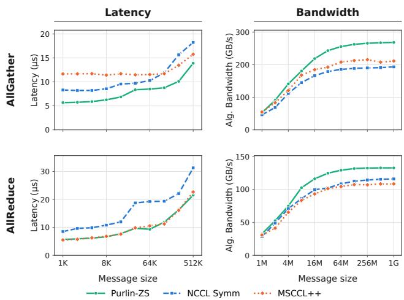  
Figure 11: AllGather and AllReduce on eight A100 GPUs with peer-accessible buffers. The left column reports latency and the right column reports algorithm bandwidth. Purlin-ZS omits staging.

On A100, we improve geometric-mean latency over NCCL Symm by 1.36× for AllGather and 1.62× for AllReduce (Fig ure 11) and boost bandwidth by 1.33× and 1.15×. Against

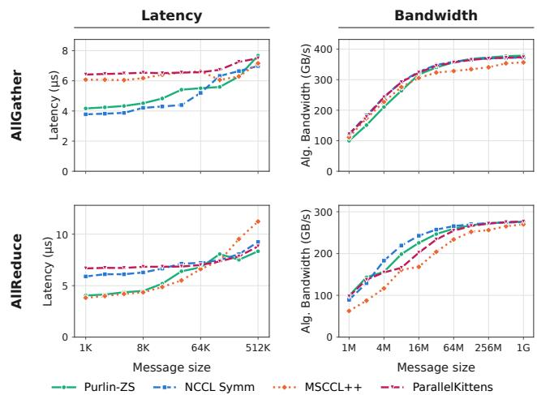  
Figure 12: AllGather and AllReduce on eight H200 GPUs with peer-accessible buffers, using the same layout and timing method as Figure 11. Lower is better for latency (left column) and higher is better for bandwidth (right column).

MSCCL++, we improve bandwidth by 1.18× for AllGather and 1.21× for AllReduce.

On H200, NCCL Symm leads AllGather in both sweeps: our geometric-mean latency speedup is 0.93×, and our bandwidth is 0.94× the baseline’s (Figure 12). For AllReduce, we improve latency by 1.22× while achieving 0.98× the bandwidth.

ReduceScatter and AllToAll. Table 7 summarizes the remaining peer-accessible comparisons. We improve ReduceScatter latency over NCCL Symm on all three platforms, while bandwidth improves on A100 and B200 and falls below NCCL Symm on H200. For AllToAll, we improve latency over ParallelKittens on both supported platforms. Our geometric-mean bandwidth is 0.92× ParallelKittens’ on H200 and 1.02× on B200.

<table><tr><td>Collective / baseline</td><td>A100</td><td>H200</td><td>B200</td></tr><tr><td>ReduceScatter /</td><td></td><td></td><td></td></tr><tr><td>NCCL Symm</td><td>1.48 / 1.25</td><td>1.19 / 0.93</td><td>1.61 / 1.24</td></tr><tr><td>AllToAll / ParallelKittens</td><td></td><td></td><td></td></tr><tr><td></td><td></td><td>1.26 / 0.92</td><td>2.14 / 1.02</td></tr></table>

Table 7: Additional peer-accessible results on eight GPUs. Each cell reports geometric-mean latency speedup / bandwidth ratio for Purlin-ZS relative to the named baseline; values above one favor Purlin-ZS. The sweeps cover 1 KiB–512 KiB and 1 MiB–1 GiB, respectively. ParallelKittens does not support A100.

## C.4 Variable-Length Collectives

We evaluate AllGatherV, ReduceScatterV, and AllToAllV against NCCL and NCCLX on all three platforms, using the ordinary buffers and timing method from §5. These collectives take partition sizes at runtime.

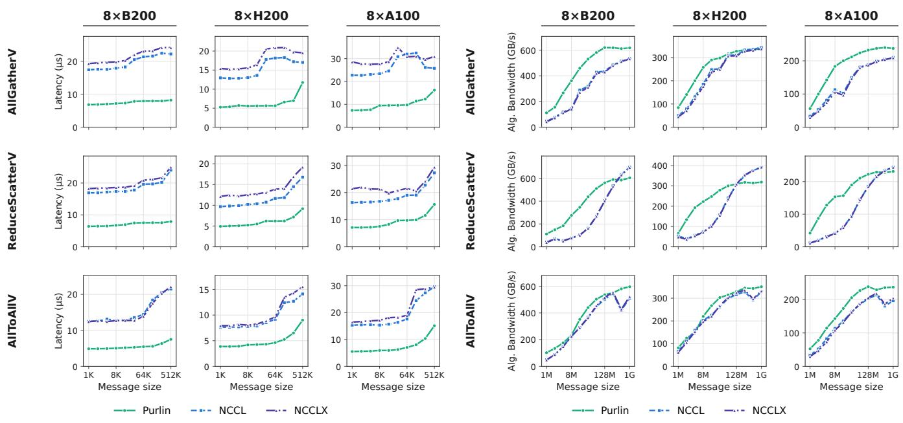  
(a) Latency. Lower is better.  
(b) Algorithm bandwidth. Higher is better.  
Figure 13: Variable-length collective performance with ordinary application buffers on eight B200, H200, and A100 GPUs. All systems use a Zipf partition with exponent $s = 0 . 1 2 5$ . Message size is the total T defined in Eq. (4).

Variable-length splits. We assign $n _ { r }$ bytes to rank r from a total of T bytes across $W = 8$ ranks using a Zipf split with exponent $s = 0 . 1 2 5$ :

$$
\begin{array} { l } { \displaystyle { x _ { r } = \frac { T } { u } \frac { ( r + 1 ) ^ { - s } } { \sum _ { k = 0 } ^ { W - 1 } ( k + 1 ) ^ { - s } } , } } \\ { \displaystyle { n _ { r } = u \big ( \big \lfloor x _ { r } \big \rfloor + \delta _ { r } \big ) . } } \end{array}\tag{4}
$$

For our power-of-two totals, we use u = max(128,T/(8W)) bytes and assign the remaining units through $\delta _ { r } \in \{ 0 , 1 \}$ in descending order of the fractional parts of $x _ { r }$ , breaking ties toward lower ranks. This preserves the total and 128-byte alignment, with a largest partition of 1.125× the mean for $T \geq 8 \mathrm { K i B }$ ; we round to make splits for 1 and 2 KiB uniform.

AllGatherV uses $n _ { r }$ as rank $r \mathrm { { s } }$ contribution, whereas ReduceScatterV reduces T bytes per rank into an $n _ { r }$ -byte output at rank r. For AllToAllV, we rotate the partition vector right by (r + 1) mod W positions at rank r, so every rank sends and receives T bytes. We plot T for all three operations and use identical partitions across systems.

Performance with variable partitions. We improve latency over both baselines at every point in the 1 KiB–512 KiB sweep (Figure 13a). Across the nine collective–platform combinations, geometric-mean speedups range from 1.91–2.73× over NCCL and 2.06–3.03× over NCCLX.

The bandwidth gains depend more strongly on the collective and message size (Figure 13b). Across the three platforms, geometric-mean gains over NCCL range from 1.23–1.65× for AllGatherV, 1.09–1.29× for AllToAllV, and 1.57–2.00× for ReduceScatterV. ReduceScatterV provides the largest individual gain: at 2 MiB on A100, we achieve 87.0 GB/s against NCCL’s 20.4 GB/s and NCCLX’s 19.3 GB/s, improvements of 4.26× and 4.50×. At 1 GiB, however, NCCL leads ReduceScatterV on all three platforms; the largest gap occurs on H200, where we achieve 318.5 GB/s against 391.4 GB/s, or 18.6% less. We note that these results establish the performance of our collectives under mild skew. Stronger imbalance requires tuning and a separate evaluation which we leave for future work.