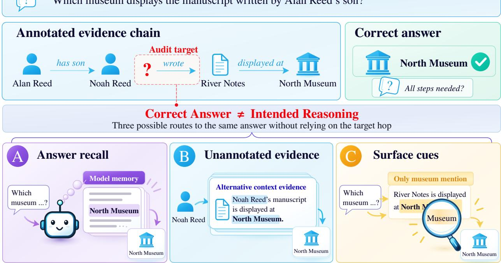
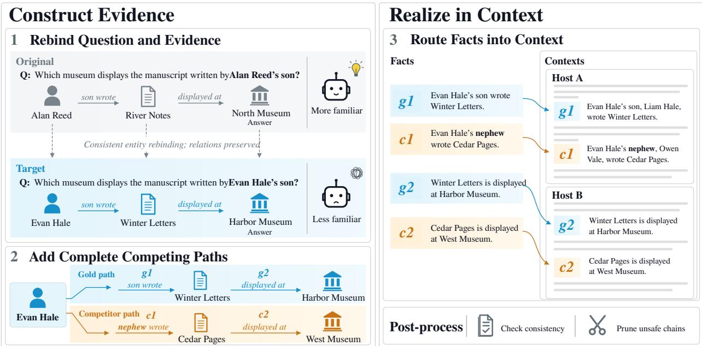
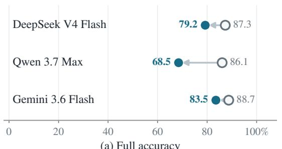
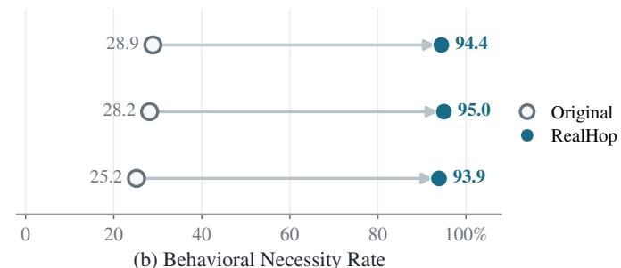
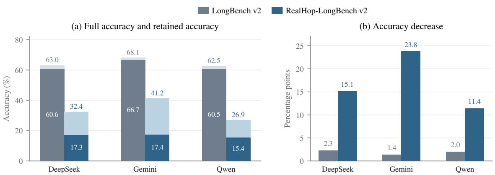

# REALHOP: Rethinking Multi-Hop Reasoning Evaluation via Behavioral Auditing

Jiawen Tao1,2\*, Xiaokun Yuan1,2\*, Yaoming Li2 Chenxu Liu1, Mengzhou Wu1, Tong Yang2†, Maxm Pan1†

1Hunyuan Team, Tencent 2Peking University {jadentao,xiaokunyuan}@tencent.com

Complex questions often require multi-hop reasoning that connects facts distributed across sources or distant regions of a long context through intermediate steps. Benchmarks commonly evaluate this ability with questions built around predefined reasoning chains, treating a correct answer as evidence that the intended composition was used. Yet answer correctness alone leaves open whether success depends on the evidence associated with each intended step: models may instead rely on memorized associations, shorter paths, or partial evidence. We examine this dependence using the Behavioral Necessity Rate (BNR), which measures how often targeted evidence removal prevents answer recovery on initially correct instances. Across five existing benchmarks, panel-mean BNR is only 16.6–48.9%, exposing a substantial gap between annotated structure and observed dependence. Guided by this diagnosis, we introduce REALHOP, a diagnose–construct–verify framework that rebinds entities, factorizes selected relations, adds complete competing paths, and places evidence at traceable locations. Structural and semantic checks precede freezing; behavioral interventions follow. On 790 paired MuSiQue questions, REALHOP raises panel-mean BNR from 27.4% to 94.4% while retaining high Full accuracy. It also yields high BNR on REALHOP-FRAMES and REALHOP-LONGBENCH. On 216 long-context questions, the matched multiple-choice spread across 16 models grows from 13.9 to 59.2 points and persists under repeated open-ended evaluation. Together, these results show that a conceptually coherent chain and a correct final answer do not by themselves establish multi-hop reasoning. Verifying that success depends on every intended hop is therefore as fundamental to multi-hop evaluation as measuring answer accuracy itself.

## 1. Introduction

Multi-hop reasoning is essential for meeting complex information needs: it requires models to connect facts distributed across sources or distant regions of a long context and use intermediate reasoning steps to answer questions that no single piece of information can resolve [2, 7, 25, 31]. To evaluate this capability, researchers construct questions with predefined reasoning chains and supporting evidence, such that information obtained at one step supports subsequent inference and ultimately leads to the answer [7, 25, 31]. Answer accuracy is therefore commonly interpreted as evidence that the model carried out the intended composition. This interpretation, however, raises two questions: Does model success require the evidence associated with each intended step in the predefined chain? And to what extent can success on multihop QA benchmarks be taken as evidence of multi-hop reasoning ability?

These questions matter because models can bypass the predefined chain in several ways: they may recall the answer, follow an unannotated shorter path, or exploit a surface cue [11, 18] (Figure 1). Existing construction techniques reduce such shortcuts through connected composition, false-chain perturbations, and plausible distractors [3, 21, 25], but neither a coherent path nor lower accuracy establishes dependence: noise can make a benchmark harder without making it more diagnostic. A more direct way to test evidence necessity is to intervene on the claimed supports and observe whether model success changes.

  
Figure 1 | Three bypasses of an annotated gold chain: answer recall, unannotated evidence, and surface cues. Each can preserve the answer after evidence for a gold hop is removed.

We operationalize this idea through behavioral auditing based on targeted evidence deletion. Among questions answered correctly under Full context, the Behavioral Necessity Rate (BNR) measures how often removing claimed evidence prevents answer recovery; a matched-background Control separates evidencespecific failure from generic deletion sensitivity. Across MuSiQue, HotpotQA, and 2WikiMultiHopQA, panel-mean BNR is only 16.6–27.4%. Even targeted adversarial constructions designed to make shortcut solving harder yield panel-mean BNRs of only 43.5–48.9% [3, 21]. Together, these results show that neither explicit hop annotations nor targeted distractors ensure that successful prediction depends on the intended evidence.

To address this gap, we propose REALHOP, a diagnose–construct–verify framework for building and testing multi-hop questions designed to require the evidence for every reasoning step. It first checks whether models can bypass annotated evidence in existing benchmarks. It then replaces entities consistently, splits selected relations into premises that work together, and adds complete paths to alternative answers that fail a required relation. Each inserted fact is recorded at a known text location. Structural and semantic checks determine which items are retained before the dataset is frozen; subsequent evidence-deletion tests measure whether models can answer with and without the intended support. This separates benchmark construction from behavioral evaluation.

We evaluate this framework in three multi-hop settings. On 790 paired MuSiQue questions, REALHOP-MUSIQUE raises panel-mean BNR from 27.4% to 94.4%, while Full accuracy remains 68.5–83.5%. On source-linked FRAMES [13] questions without native hop annotations, REALHOP-FRAMES reaches 88.9– 89.9% BNR. We then scale the construction to 216 long context questions from LongBench v2 [2]. Under a matched multiple-choice protocol, REALHOP-LONGBENCH expands the 16-model accuracy spread from 13.9 to 59.2 points. This wider separation persists in repeated open-ended evaluation, while targeted deletion yields 96.5–98.1% BNR across three audited models.

Our contributions are threefold:

• We audit existing multi-hop benchmarks and reveal the gap between annotated reasoning structure and observed evidence dependence. Annotated chains specify the intended reasoning, yet models can still answer correctly after evidence for a step is removed. We introduce BNR to quantify this gap across three standard benchmarks and two adversarial constructions.

• We introduce REALHOP, a diagnose–construct–verify framework for rebuilding benchmarks to make each reasoning step necessary for answering. It combines entity rebinding, evidence rewriting, and complete competing paths, with structural and semantic checks before dataset freezing and behavioral evaluation afterwards.

• We construct and evaluate three benchmark variants covering standard and long-context multi-hop question answering. Built from MuSiQue, FRAMES, and LongBench v2, these variants are evaluated through targeted evidence deletion, component ablations, and repeated long-context trials across 16 models.

## 2. Related Work

Standard multi-hop QA and shortcut-resistant evaluation. Multi-hop QA datasets annotate supporting chains so that answer correctness can be read as evidence of connected reasoning [7, 22, 25, 29, 31]. Analyses of HotpotQA showed that compositional questions still admit single-hop solutions, sentence-level cues, and word-matching routes, including adversarial documents that preserve the original answer [4, 11, 18]. Models can also know the individual hops yet fail to compose them [19].

Construction work then targeted those artifacts: MuSiQue composes connected single-hop questions and filters disconnected reasoning [25]; StrategyQA and MoreHopQA add implicit or generative hops [6, 20]; seemingly plausible distractors insert complete but incorrect multi-hop chains [3]; and FalseCoTQA and CRiT-QA inject knowledge-grounded or hop-anchored counterfactual chains [21, 33]. Adversarial distractor methods change the evidence a model sees and typically report the resulting accuracy drop to evaluate robustness. Such methods can make shortcut solving harder, but an accuracy drop under stronger distractors does not establish that successful predictions depend on every intended hop.

Long-context multi-hop reasoning. Long contexts extend the multi-hop challenge: models must locate facts dispersed across lengthy or multi-document inputs and then combine them along a reasoning chain. LongBench and LongBench v2 include multi-document and reasoning-intensive tasks [1, 2], while Loong places multi-document questions in extended carriers [27]. FRAMES provides source-linked questions that require combining information across sources, but does not annotate their hop chains [13]. Controlled eval uations make the same challenge explicit: RULER includes multi-hop tracing, and BABILong embeds reasoning facts in long background [8, 14]. Synthetic long-context training similarly hides multi-hop questions behind key chains or trajectory-derived distractors [17, 28]. These settings test whether models can find and combine information at scale, but neither context length nor the presence of a chain establishes that successful answers depend on every intended hop. Long-context evaluation therefore scales the multi-hop problem without resolving evidence necessity.

Evidence necessity through intervention. Sufficiency asks whether selected evidence is enough; necessity asks whether a correct prediction survives its removal. Deletion tests from interpretability make evidence dependence observable. Extractive rationales treat a sparse subset of the input as sufficient for prediction [16];

later work asks whether those selections are also comprehensive [5, 32]. Attention weights and chain-of thought traces remain unreliable proxies for this dependence [9, 10, 15, 26, 30]. Within multi-hop QA, DiRe combines predictions on complementary support subsets to measure disconnected reasoning [24]. REAL-HOP directly intervenes on individual hops to measure whether a successful prediction depends on each claimed support, while a matched background deletion separates evidence-specific failure from generic deletion sensitivity. Unlike prior audits, this diagnosis feeds back into construction: complete competing paths make intended relations consequential, and structural, semantic, and behavioral checks verify the result. The resulting diagnose–construct–verify framework applies the same criterion of evidence necessity across standard and long-context multi-hop settings.

## 3. Problem Formulation and Benchmark Audit

A model can answer correctly without relying on a benchmark’s annotated evidence structure. We formalize this gap and audit whether models depend on each claimed evidence target.

## 3.1. The Conceptual–Behavioral Gap

An annotated evidence graph claims that its steps form a coherent and sufficient structure supporting the answer, but does not establish that a model must use every step. Formally, an instance is $x = ( q , C , a ^ { \star } , G )$ Let H index the intervention targets associated with the claimed steps or support groups in G, and let $W _ { h } \subseteq C$ denote the evidence assigned to target $h \in H$ . We intervene on h by evaluating the unchanged question on $C \backslash W _ { h }$ . Conceptual necessity holds when $C \backslash W _ { h }$ contains no sufficient path to $a ^ { \star }$ ; behavioral necessity holds for a model when it answers correctly on C but not on $C \setminus W _ { h }$ . The former does not guarantee the latter: a model may bypass a coherent annotated chain through shortcuts, answer cues, unannotated evidence, or parametric knowledge.

## 3.2. Audit Protocol and Metrics

The Behavioral Necessity Rate (BNR) compares FULL with DROP-ONE, which removes one declared evidence target at a time. For a fixed model, we restrict attention to items with complete Drop evaluations, sample item i uniformly and target h uniformly from $H _ { i } ,$ and let $F _ { i }$ indicate Full correctness, $D _ { i h }$ Drop correctness, and $\mathcal { S } ^ { + } = \{ i : F _ { i } = 1 \}$ :

$$
\begin{array} { r l } & { \mathbf { B N R } = \mathbb { E } [ 1 - D _ { i h } \mid F _ { i } = 1 ] } \\ & { \qquad = \displaystyle \frac { 1 } { | \mathcal { I } ^ { + } | } \sum _ { i \in \mathcal { I } ^ { + } } \frac { 1 } { | H _ { i } | } \sum _ { h \in H _ { i } } ( 1 - D _ { i h } ) . } \end{array}\tag{1}
$$

Thus, BNR is the item-macro proportion of testable targets whose removal prevents recovery of the gold answer, without giving longer chains greater weight. Because BNR is model- and protocol-specific, we report it alongside Full accuracy. Length-matched background CONTROL provides a separate specificity check and is not an input to BNR.

## 3.3. Audit of Existing Multi-Hop Benchmarks

Multi-hop annotation substantially overstates observed dependence. We audit 790 source MuSiQue, 300 HotpotQA, 300 2WikiMultiHopQA questions, a stratified 300-item FalseCoTQA–MuSiQue sample, and a 300-item Plausible Distractors split of HotpotQA with DeepSeek V4 Flash, Gemini 3.6 Flash, and Qwen 3.7 Max. Sampling and deletion units appear in Appendix A.

Table 1 exposes a consistent gap. Control remains near Full and well above Drop, supporting evidencespecific sensitivity rather than an effect of deletion volume alone. Yet BNR is only 16.6–27.4% on the three standard benchmarks. FalseCoTQA and Plausible Distractors raise it to 43.5% and 48.9%, respectively, but correct answers still survive most gold-hop deletions. These descriptive, unpaired results remain far below the 93.9–95.0% achieved by REALHOP-MUSIQUE (Section 6.1).

Table 1 | Panel-mean Full, Drop-one, Control, and BNR on existing multi-hop benchmarks (percent). Means give equal weight to DeepSeek V4 Flash, Gemini 3.6 Flash, and Qwen 3.7 Max. Drop-one and Control are accuracies over all audited questions, whereas BNR conditions on Full-correct ones.
<table><tr><td>Benchmark</td><td>Full</td><td>Drop-one</td><td>Control</td><td>BNR</td></tr><tr><td>MuSiQue [25]</td><td>87.4</td><td>65.4</td><td>87.3</td><td>27.4</td></tr><tr><td>HotpotQA [31]</td><td>81.2</td><td>69.7</td><td>81.5</td><td>16.6</td></tr><tr><td>2WikiMultiHopQA [7]</td><td>88.6</td><td>74.5</td><td>89.1</td><td>17.0</td></tr><tr><td>FalseCoTQA [21]</td><td>63.8</td><td>36.3</td><td>59.9</td><td>43.5</td></tr><tr><td>Plausible Distractors [3]</td><td>87.8</td><td>44.8</td><td>86.4</td><td>48.9</td></tr></table>

These findings motivate constructions that make every intended binding consequential; Section 4 describes how REALHOP pursues this goal in both standard and long-context multi-hop QA.

## 4. Method

This section details the construct phase of the REALHOP framework, which proceeds in two stages. Given a multi-hop question q, context C, answer a⋆, and dependency graph G, it first constructs evidence, then realizes it in context (Figure 2). Models generate facts and text; separate checks determine sample acceptance.

## 4.1. Construct Evidence

Rebind question and evidence. We replace entities in the question, planned facts, and answer with virtual counterparts, preserving relations, entity roles, answer type, and reasoning structure. In the figure, Alan Reed, River Notes, and North Museum become Evan Hale, Winter Letters, and Harbor Museum. This aims to prevent answer recall from prior knowledge and make models reason from the provided context. The question does not reveal intermediate answers, and original passages remain as background rather than undergoing global name replacement. For some relations, we also use several pieces of information (evidence units) intended to be combined (Appendix I.1).

Add complete competing paths. For each reasoning step, we add an alternative with the same entity types but a similar relation that does not meet the question’s requirement. We then add the subsequent facts needed to reach a different answer. In the figure, Evan’s son wrote Winter Letters, displayed at Harbor Museum; his nephew wrote Cedar Pages, displayed at West Museum. Because both manuscripts have museum evidence, a museum mention alone no longer selects one path. The aim is to make the writer’s relationship to Evan essential for choosing between the answers.

We use two variants for constructing competitor paths, Flexible and Strict. Flexible allows the relation mismatch at the target step or, in a separate candidate path, at a later step if this introduces no ambiguity or additional valid answer. Strict allows only a target-step mismatch and keeps the entities in unaffected dependencies unchanged. After problematic paths are removed, at least one complete Strict path remains for each step (Appendix I.2); ablations compare both variants in Section 7.

  
Figure 2 | Overview of the two-stage construct phase of REALHOP. The framework constructs correct and competing evidence paths, then realizes and validates them in context. Gray marks the original source graph, blue the correct path, and orange the competing path; matching labels link planned facts to their contextual realizations.

## 4.2. Realize in Context

Route facts into context. A host is an existing passage that receives generated evidence. Rewritten gold facts are inserted into the passages containing the original supporting evidence; competing facts are assigned to model-selected compatible passages. In the figure, g1,c1 go to Host A and g2,c2 to Host B.

Realization. Models turn the assigned facts and premises into sentences, such as “Evan Hale’s son, Liam Hale, wrote Winter Letters.” Names and relations must match the planned facts. The original text and its order are preserved, without adding unplanned relations or explicitly ruling out competing answers. We record the exact text expressing each fact and evidence unit.

Check the generated content. We first review the proposed facts and relations, then check whether the text expresses them correctly. Automated checks identify missing facts, changes to the original text, and incorrect evidence locations. Semantic review checks names, relations, question meaning, unclear references, and unintended correct answers. Problematic competing paths are removed, and the remaining evidence and paths are checked against the construction requirements.

Once the dataset is fixed, we test whether models answer correctly with the full context (Full) and after removing specified evidence (Drop). Deleting similar-length background text (Control) helps distinguish evidence loss from general text removal (Section 3.2). Two annotators also assess sampled items for quality (Appendix J).

## 4.3. Adapt Across Settings

REALHOP-MUSIQUE. MuSiQue provides annotated dependency graphs and supporting passages, which define G and the initial evidence hosts. We can therefore apply the construction process directly to these annotations.

REALHOP-FRAMES. FRAMES provides source links but no hop annotations. We reconstruct the linked articles and ask a model to infer a linear reasoning chain with quoted evidence for each step. We then apply the same construction process.

REALHOP-LONGBENCH. We start from a fictional graph; the source question guides only task style. The same method constructs gold and competing paths, with evidence placed at separate sentence boundaries across long-document chunks to test retrieval and reasoning over longer contexts. Across the three settings, the adapters vary how reasoning graphs are obtained and evidence is placed while preserving the same objective: making each reasoning step behaviorally necessary.

## 5. Experimental Setup

Our evaluation asks whether REALHOP increases behavioral necessity, which components create the challenge, and whether the long-context construction separates models consistently across trials.

REALHOP-MUSIQUE and REALHOP-FRAMES evaluations. REALHOP-MUSIQUE contains 790 source– constructed pairs spanning 2–4 hops; the REALHOP-FRAMES audit uses a selected cohort of 81 matched source/constructed question pairs with inferred hop spans. Both evaluate DeepSeek V4 Flash, Gemini 3.6 Flash, and Qwen 3.7 Max under Full and targeted Drop and report Full accuracy and BNR. Within each setting, the source and constructed sides use the same solver and scoring protocol. MuSiQue confidence intervals resample paired questions, retaining their interventions and model responses together. FRAMES reports Avg@3 over its recorded trials.

REALHOP-LONGBENCH evaluation. REALHOP-LONGBENCH, derived from LongBench v2 [2], contains 216 open-ended short-answer questions with constructed evidence chains. Each answer is a concise terminal entity or identifier; prompts range from about 11k to 575k tokens. We evaluate 16 models over three trials at each model’s highest supported reasoning effort. Exact normalized matches are accepted directly; remaining answers use a frozen short-answer judge (Appendix K). BNR uses the open-ended Full/Drop runs for three models reported in Appendix G, not the three-trial Avg@3 scores. As a format-matched reference, we evaluate both the source questions and REALHOP-LONGBENCH once under the official multiple-choice template with the same 16 models; the constructed items use a frozen A–D order whose non-gold choices are planned competitor endpoints (Table 2).

## 6. Results

Section 3 identified a substantial gap between annotated multi-hop structure and behavioral necessity; the results below show that REALHOP sharply narrows this gap. We first test evidence necessity through paired source–constructed comparisons in the MuSiQue and FRAMES settings, then scale the same construction objective to long-context multi-hop evaluation, where REALHOP-LONGBENCH is assessed through targeted intervention and repeated model comparisons.

## 6.1. Behavioral Effects on REALHOP-MUSIQUE

Figure 3 summarizes the paired source MuSiQue/REALHOP-MUSIQUE comparison on all 790 questions. Original Full accuracy differs by only 2.6 points across the three models, offering little discrimination. On REALHOP-MUSIQUE, however, the between-model spread widens to 15.0 points, so capability differences that stay compressed on the source items become easier to see.

  
(a) Full accuracy

  
(b) Behavioral Necessity Rate  
Figure 3 | Full accuracy and BNR on source MuSiQue and REALHOP-MUSIQUE. Lower Full accuracy indicates greater difficulty; higher BNR indicates stronger behavioral dependence on the intended evidence.

Despite this increase in difficulty, Full accuracy remains 68.5–83.5%, providing a substantial Full-correct population for BNR evaluation. Within this harder but still answerable setting, BNR rises from 25.2–28.9% on Original to 93.9–95.0% on REALHOP-MUSIQUE. The paired increases are 65.5 points for DeepSeek (95% CI 63.2–67.9), 68.7 for Gemini (66.4–71.0), and 66.8 for Qwen (64.4–69.2); on the common-Full subset, gains remain 66.6–69.7 points (Appendix C). The construction therefore does more than lower accuracy: it sharply increases behavioral dependence on the intended evidence. Its observed BNR also substantially exceeds the levels in our FalseCoTQA and Plausible Distractors audits (Section 3.3), although those use different benchmark samples. Among incorrect Full answers, 64.3–69.5% exactly match a planned competitor endpoint (Appendix D).

For six earlier models, paired accuracy drops by 25.3–47.9 points on model-specific subsets of 305–353 questions, including 44.8 points for GPT-4o (Appendix E). These declines establish increased difficulty, but do not by themselves establish greater reliance on source shortcuts: the subsets differ from the current-model panel, and these runs do not measure BNR.

## 6.2. REALHOP-FRAMES Hop-Level Audit

On the selected 81 matched FRAMES–REALHOP-FRAMES pairs, each trial is binarized and scored separately before averaging; each side’s BNR conditions on its own Full-correct subset. Avg@3 source Full is 97.5–98.8%, with BNR only 6.6–8.1%. After construction, BNR rises to 88.9–89.9% while Full remains 68.4–86.0%, so the increase is not obtained by counting unsolved Full questions as evidence-dependent successes. Per-trial scores appear in Appendix I.4.

On the common-Full subset, BNR gains remain 81.8–83.5 points; length-matched background scores exceed Drop (Appendix I.5).

## 6.3. REALHOP-LONGBENCH Across Repeated Trials

Table 2 compares the two leaderboards. The source leaderboard is comparatively compressed: accuracy under its official protocol spans 58.3–72.2%, and older models sometimes outrank newer members of the same family. Gemini 3.5 Flash leads Gemini 3.6 Flash, and Grok 4.5 leads Grok 4.6.

Table 2 | Source ranks use accuracy on the corresponding source questions under the official LongBench v2 multiplechoice template. Trials 1–3 and Avg@3 are open-ended scores on REALHOP-LONGBENCH; the rightmost MCQ column evaluates the same constructed items under that template, run once. Eff. denotes the provider-specific reasoning effort setting. Arrows give the rank change from the source leaderboard to Avg@3. Spread is the range of displayed scores across models.
<table><tr><td></td><td></td><td colspan="2">LongBench v2</td><td colspan="7">REALHOP-LONGBENCH</td></tr><tr><td>Model</td><td>Eff.</td><td>Acc.</td><td>Rank</td><td>Trial 1</td><td>Trial 2</td><td>Trial 3</td><td>Avg@3</td><td>Rank</td><td>Change MCQ</td><td></td></tr><tr><td>Claude Opus 5</td><td>max</td><td>70.4</td><td>2</td><td>80.6</td><td>85.2</td><td>81.9</td><td>82.6</td><td>1</td><td>↑1</td><td>94.4</td></tr><tr><td>GPT-5.6 Sol</td><td>xhigh</td><td>68.1</td><td>3</td><td>63.9</td><td>63.9</td><td>65.7</td><td>64.5</td><td>2</td><td>↑1</td><td>75.5</td></tr><tr><td>Kimi K3</td><td>max</td><td>65.7</td><td>6</td><td>52.8</td><td>59.7</td><td>50.9</td><td>54.5</td><td>3</td><td>↑3</td><td>64.8</td></tr><tr><td>Claude Opus 4.8</td><td>max</td><td>64.8</td><td>8</td><td>53.7</td><td>49.1</td><td>55.1</td><td>52.6</td><td>4</td><td>↑4</td><td>79.6</td></tr><tr><td>Grok 4.6</td><td>xhigh</td><td>65.3</td><td>7</td><td>43.1</td><td>40.3</td><td>44.0</td><td>42.4</td><td>5</td><td>↑2</td><td>60.2</td></tr><tr><td>Hy4 Preview</td><td>high</td><td>64.4</td><td>10</td><td>39.8</td><td>43.1</td><td>41.7</td><td>41.5</td><td>6</td><td>↑4</td><td>52.8</td></tr><tr><td>Gemini 3.6 Flash</td><td>high</td><td>68.1</td><td>3</td><td>41.2</td><td>39.8</td><td>42.6</td><td>41.2</td><td>7</td><td>↓4</td><td>50.0</td></tr><tr><td>DeepSeek V4 Pro</td><td>max</td><td>63.9</td><td>11</td><td>34.3</td><td>38.0</td><td>40.3</td><td>37.5</td><td>8</td><td>↑3</td><td>56.9</td></tr><tr><td>Qwen 3.8Max</td><td>xhigh</td><td>63.9</td><td>11</td><td>40.3</td><td>34.7</td><td>34.3</td><td>36.4</td><td>9</td><td>↑2</td><td>60.2</td></tr><tr><td>GLM 5.3</td><td>max</td><td>64.8</td><td>8</td><td>31.0</td><td>30.1</td><td>31.5</td><td>30.9</td><td>10</td><td>↓2</td><td>53.2</td></tr><tr><td>DeepSeek V4 Flash</td><td>max</td><td>63.0</td><td>13</td><td>32.4</td><td>31.0</td><td>27.3</td><td>30.2</td><td>11</td><td>↑2</td><td>55.6</td></tr><tr><td>Gemini 3.5 Flash</td><td>high</td><td>72.2</td><td>1</td><td>29.2</td><td>29.6</td><td>29.6</td><td>29.5</td><td>12</td><td>↓11</td><td>38.9</td></tr><tr><td>GLM 5.2</td><td>max</td><td>61.6</td><td>15</td><td>25.0</td><td>27.8</td><td>28.7</td><td>27.2</td><td>13</td><td>↑2</td><td>50.9</td></tr><tr><td>Grok 4.5</td><td>xhigh</td><td>66.7</td><td>5</td><td>29.6</td><td>24.1</td><td>27.8</td><td>27.2</td><td>13</td><td>↓8</td><td>48.6</td></tr><tr><td>Qwen 3.7 Max</td><td>xhigh</td><td>62.5</td><td>14</td><td>26.9</td><td>24.1</td><td>28.2</td><td>26.4</td><td>15</td><td>↓1</td><td>35.2</td></tr><tr><td>Kimi K2.6</td><td>thinking</td><td>58.3</td><td>16</td><td>27.3</td><td>27.8</td><td>23.1</td><td>26.1</td><td>16</td><td></td><td>49.5</td></tr><tr><td>Panel spread</td><td></td><td>13.9</td><td></td><td>55.6</td><td>61.1</td><td>58.8</td><td>56.5</td><td></td><td></td><td>59.2</td></tr></table>

Avg@3 on REALHOP-LONGBENCH instead spans 26.1–82.6%. Across the three runs, 15 of 16 models vary by no more than about six percentage points. The constructed task therefore separates models more widely on long-context multi-hop questions, including within-family comparisons that remain close on the source leaderboard. A same-format check rules out answer format as the sole cause of the wider spread: under the identical MCQ template, REALHOP-LONGBENCH spans 59.2 points versus 13.9 on the source questions. Its MCQ and open-ended Avg@3 rankings correlate strongly (Spearman $\rho = 0 . 8 6 , p < 1 0 ^ { - 4 } )$ .

An intervention check confirms that the intended evidence is behaviorally consequential: BNR reaches 97.6% for DeepSeek V4 Flash, 98.1% for Gemini 3.6 Flash, and 96.5% for Qwen 3.7 Max.

## 7. Analysis

Section 6 establishes the intended behavioral change. We now isolate which parts of the construction method create this challenge.

We isolate the two competitor families on a stratified 80-question sample spanning 2–4 hops. Manual review excludes seven items with ambiguous, incomplete, or invalid questions or answer keys (Appendix F). The remaining 73 items form the cohort for the results below, reducing confounding from identified sourcescoring artifacts. All constructed conditions share the question and gold evidence: Gold-only contains no competitors, +Flexible adds less-constrained relation-level divergences, +Strict adds single-break paths with dependency inheritance, and Full includes both. The two middle conditions are parallel rather than cumulative: each adds one competitor family to the Gold-only base, while Full combines them. This separates family-specific effects from their joint effect. Original denotes the unmodified source questions used as a baseline. Six earlier models characterize accuracy changes. Because their low Full accuracy leaves few Fullcorrect questions, we estimate BNR with the three current models. Each condition’s BNR is conditioned on its own Full-correct subset and is interpreted alongside that condition’s Full accuracy.

Table 3 | Component ablation on a 73-item MuSiQue cohort (percent). Original denotes source questions. Accuracy uses model-specific complete-case subsets; BNR averages hops within each question and is reported only for current models. Mean weights models equally.
<table><tr><td colspan="3"></td><td>MuSiQue</td><td colspan="4">REALHOP-MUSIQUE</td></tr><tr><td>Metric</td><td>Panel</td><td>Model</td><td>Original</td><td>Gold-only</td><td>+Flexible</td><td>+Strict</td><td>Full</td></tr><tr><td rowspan="10">Accuracy</td><td rowspan="10">Earlier</td><td>DeepSeek R1</td><td>84.9</td><td>72.6</td><td>57.5</td><td>42.5</td><td>37.0</td></tr><tr><td>Doubao 1.5 Pro</td><td>74.0</td><td>67.1</td><td>46.6</td><td>30.1</td><td>24.7</td></tr><tr><td>GPT-40</td><td>71.2</td><td>68.5</td><td>31.5</td><td>24.7</td><td>16.4</td></tr><tr><td>Qwen Max</td><td>64.4</td><td>58.9</td><td>28.8</td><td>24.7</td><td>21.9</td></tr><tr><td>GLM-4-Plus</td><td>58.6</td><td>50.0</td><td>21.4</td><td>20.0</td><td>11.4</td></tr><tr><td>Qwen Turbo</td><td>39.7</td><td>35.6</td><td>19.2</td><td>9.6</td><td>5.5</td></tr><tr><td>Mean</td><td>65.5</td><td>58.8</td><td>34.2</td><td>25.3</td><td>19.5</td></tr><tr><td>DeepSeek V4 Flash</td><td>97.3</td><td>94.5</td><td>93.2</td><td>89.0</td><td>83.6</td></tr><tr><td>Gemini 3.6 Flash</td><td>93.2</td><td>94.5</td><td>90.4</td><td>91.8</td><td>89.0</td></tr><tr><td>Qwen 3.7 Max</td><td>94.3</td><td>90.0</td><td>85.7</td><td>82.9</td><td>75.7</td></tr><tr><td rowspan="4">BNR</td><td rowspan="4">Current</td><td>Mean</td><td>94.9</td><td>93.0</td><td>89.8</td><td>87.9</td><td>82.8</td></tr><tr><td>DeepSeek V4 Flash</td><td>22.7</td><td>56.2</td><td>86.5</td><td>86.6</td><td>91.7</td></tr><tr><td>Gemini 3.6 Flash</td><td>18.0</td><td>59.1</td><td>83.2</td><td>86.2</td><td>91.0</td></tr><tr><td>Qwen 3.7 Max</td><td>29.2</td><td>58.3</td><td>85.9</td><td>87.7</td><td>91.4</td></tr></table>

Difficulty. Table 3 locates the difficulty in structured competition rather than in rewriting the gold path. Mean accuracy is only modestly lower on Gold-only than on Original, then falls as competitor families are added; competitor insertion accounts for 85.5% of the earlier-panel mean Original→Full reduction. Strict paths cost more than Flexible competitors overall, and both effects are far larger on the earlier panel than on the current one.

Behavioral necessity. Difficulty alone does not establish the mechanism, so the BNR panel repeats the ablation with targeted all-hop interventions. Rewriting the gold path more than doubles panel-mean BNR. Adding either competitor family then raises BNR by roughly 30 further points; combining both families yields an additional, smaller gain. These comparisons show stronger deletion sensitivity among each condition’s Full-correct items, which lower accuracy alone would not establish.

## 8. Limitations

BNR measures whether a correct answer survives targeted deletion, not whether the model internally used that hop. The estimate inherits the chosen evidence unit, judge, and trial budget; Drop only indirectly reflects processing, and most reported BNR uses one Full/Drop pair per condition. The constructed items use synthetic entities and planned chains inside source carriers, so they do not cover the full range of natural information needs. On REALHOP-LONGBENCH, the matched MCQ check uses one trial and is not scoreequivalent to open-ended Avg@3. FRAMES controls use approximate matching with unverified trial counts; common-Full results are subset-conditional.

## 9. Conclusion

We show that annotated multi-hop structure can remain behaviorally unnecessary even when models answer correctly. REALHOP addresses this gap through a diagnose–construct–verify framework that audits claimed supports, constructs complete competing paths, and validates evidence placement before behavioral evaluation. We quantify behavioral dependence on intended evidence with BNR, which measures how often targeted evidence removal prevents answer recovery among Full-correct items. Panel-mean BNR rises from 27.4% to 94.4% on REALHOP-MUSIQUE, reaches about 89% on REALHOP-FRAMES and above 96% on REALHOP-LONGBENCH, while the long-context evaluation also yields a wider model spread that persists across repeated trials. These results establish evidence necessity as a benchmark design criterion rather than an assumption inferred from annotations or answer accuracy.

## References

[1] Yushi Bai, Xin Lv, Jiajie Zhang, Hongchang Lyu, Jiankai Tang, Zhidian Huang, Zhengxiao Du, Xiao Liu, Aohan Zeng, Lei Hou, Yuxiao Dong, Jie Tang, and Juanzi Li. LongBench: A bilingual, multitask benchmark for long context understanding. In Proceedings of the 62nd Annual Meeting of the Association for Computational Linguistics (Volume 1: Long Papers), pages 3119– 3137. Association for Computational Linguistics, 2024. doi: 10.18653/v1/2024.acl-long.172. URL https://aclanthology.org/2024.acl-long.172/.

[2] Yushi Bai, Shangqing Tu, Jiajie Zhang, Hao Peng, Xiaozhi Wang, Xin Lv, Shulin Cao, Jiazheng Xu, Lei Hou, Yuxiao Dong, Jie Tang, and Juanzi Li. LongBench v2: Towards deeper understanding and reasoning on realistic long-context multitasks. In Proceedings of the 63rd Annual Meeting of the Association for Computational Linguistics (Volume 1: Long Papers), pages 3639– 3664. Association for Computational Linguistics, 2025. doi: 10.18653/v1/2025.acl-long.183. URL https://aclanthology.org/2025.acl-long.183/.

[3] Neeladri Bhuiya, Viktor Schlegel, and Stefan Winkler. Seemingly plausible distractors in multi-hop reasoning: Are large language models attentive readers? In Proceedings of the 2024 Conference on Empirical Methods in Natural Language Processing, pages 2514–2528, 2024. URL https:// aclanthology.org/2024.emnlp-main.147/.

[4] Jifan Chen and Greg Durrett. Understanding dataset design choices for multi-hop reasoning. In Proceedings ofthe 2019 Conference ofthe North American Chapter ofthe Associationfor Computational Linguistics: Human Language Technologies, Volume 1 (Long and Short Papers), pages 4026–4032, 2019. URL https://aclanthology.org/N19-1405/.

[5] Jay DeYoung, Sarthak Jain, Nazneen Fatema Rajani, Eric Lehman, Caiming Xiong, Richard Socher, and Byron C. Wallace. ERASER: A benchmark to evaluate rationalized NLP models. In Proceedings ofthe 58th Annual Meeting ofthe Associationfor Computational Linguistics, pages 4443–4458, 2020. URL https://aclanthology.org/2020.acl-main.408/.

[6] Mor Geva, Daniel Khashabi, Elad Segal, Tushar Khot, Dan Roth, and Jonathan Berant. Did Aristotle use a laptop? A question answering benchmark with implicit reasoning strategies. Transactions of the Association for Computational Linguistics, 9:346–361, 2021. URL https://aclanthology. org/2021.tacl-1.21/.

[7] Xanh Ho, Anh-Khoa Duong Nguyen, Saku Sugawara, and Akiko Aizawa. Constructing a multi-hop QA dataset for comprehensive evaluation of reasoning steps. In Proceedings ofthe 28th International Conference on Computational Linguistics, pages 6609–6625. International Committee on Computational

Linguistics, 2020. doi: 10.18653/v1/2020.coling-main.580. URL https://aclanthology. org/2020.coling-main.580/.

[8] Cheng-Ping Hsieh, Simeng Sun, Samuel Kriman, Shantanu Acharya, Dima Rekesh, Fei Jia, Yang Zhang, and Boris Ginsburg. RULER: What’s the real context size of your long-context language models? In Proceedings of the First Conference on Language Modeling, 2024. URL https: //openreview.net/forum?id=kIoBbc76Sy.

[9] Alon Jacovi and Yoav Goldberg. Towards faithfully interpretable NLP systems: How should we define and evaluate faithfulness? In Proceedings of the 58th Annual Meeting of the Association for Computational Linguistics, pages 4198–4205, 2020. URL https://aclanthology.org/2020.aclmain.386/.

[10] Sarthak Jain and Byron C. Wallace. Attention is not explanation. In Proceedings of the 2019 Conference of the North American Chapter of the Association for Computational Linguistics: Human Language Technologies, Volume 1 (Long and Short Papers), pages 3543–3556, 2019. URL https://aclanthology.org/N19-1357/.

[11] Yichen Jiang and Mohit Bansal. Avoiding reasoning shortcuts: Adversarial evaluation, training, and model development for multi-hop QA. In Proceedings ofthe 57th Annual Meeting ofthe Associationfor Computational Linguistics, pages 2726–2736, 2019. URL https://aclanthology.org/P19- 1262/.

[12] Tomáš Kociský, Jonathan Schwarz, Phil Blunsom, Chris Dyer, Karl Moritz Hermann, Gábor Melis,ˇ and Edward Grefenstette. The NarrativeQA reading comprehension challenge. Transactions of the Association for Computational Linguistics, 6:317–328, 2018. doi: 10.1162/tacl\_a\_00023. URL https://aclanthology.org/Q18-1023/.

[13] Satyapriya Krishna, Kalpesh Krishna, Anhad Mohananey, Steven Schwarcz, Adam Stambler, Shyam Upadhyay, and Manaal Faruqui. Fact, fetch, and reason: A unified evaluation of retrieval-augmented generation. In Proceedings of the 2025 Conference of the Nations of the Americas Chapter of the Association for Computational Linguistics: Human Language Technologies (Volume 1: Long Papers), pages 4745–4759. Association for Computational Linguistics, 2025. doi: 10.18653/v1/2025.naacllong.243. URL https://aclanthology.org/2025.naacl-long.243/.

[14] Yuri Kuratov, Aydar Bulatov, Petr Anokhin, Ivan Rodkin, Dmitry Sorokin, Artyom Sorokin, and Mikhail Burtsev. BABILong: Testing the limits of LLMs with long context reasoning-in-a-haystack. In Advances in Neural Information Processing Systems, 2024. URL https://arxiv.org/abs/ 2406.10149.

[15] Tamera Lanham, Anna Chen, Ansh Radhakrishnan, Benoit Steiner, Carson Denison, Danny Hernandez, Dustin Li, Esin Durmus, Evan Hubinger, Jackson Kernion, Kamile Lukosiute, Karina Nguyen, Newton Cheng, Nicholas Joseph, Nicholas Schiefer, Oliver Rausch, Robin Larson, Sam McCandlish, Sandipan Kundu, Saurav Kadavath, Shannon Yang, Thomas Henighan, Timothy Maxwell, Timothy Telleen-Lawton, Tristan Hume, Zac Hatfield-Dodds, Jared Kaplan, Jan Brauner, Samuel R. Bowman, and Ethan Perez. Measuring faithfulness in chain-of-thought reasoning. arXiv preprint arXiv:2307.13702, 2023. URL https://arxiv.org/abs/2307.13702.

[16] Tao Lei, Regina Barzilay, and Tommi Jaakkola. Rationalizing neural predictions. In Proceedings of the 2016 Conference on Empirical Methods in Natural Language Processing, pages 107–117, 2016. URL https://aclanthology.org/D16-1011/.

[17] Nianyi Lin, Jiajie Zhang, Lei Hou, and Juanzi Li. LongTraceRL: Learning long-context reasoning from search agent trajectories with rubric rewards. arXiv preprint arXiv:2605.31584, 2026. URL https://arxiv.org/abs/2605.31584.

[18] Sewon Min, Eric Wallace, Sameer Singh, Matt Gardner, Hannaneh Hajishirzi, and Luke Zettlemoyer. Compositional questions do not necessitate multi-hop reasoning. In Proceedings of the 57th Annual Meeting of the Association for Computational Linguistics, pages 4249–4257, 2019. URL https: //aclanthology.org/P19-1416/.

[19] Ofir Press, Muru Zhang, Sewon Min, Ludwig Schmidt, Noah A. Smith, and Mike Lewis. Measuring and narrowing the compositionality gap in language models. In Findings of the Association for Computational Linguistics: EMNLP 2023, 2023. URL https://aclanthology.org/2023. findings-emnlp.378/.

[20] Julian Schnitzler, Xanh Ho, Jiahao Huang, Florian Boudin, Saku Sugawara, and Akiko Aizawa. More-HopQA: More than multi-hop reasoning. arXiv preprint arXiv:2406.13397, 2024. URL https: //arxiv.org/abs/2406.13397.

[21] Julien Serbanescu, Mahdiyar Ali Akbar Alavi, Faezeh Ensan, and Fattane Zarrinkalam. FalseCoTQA: Adversarial multi-hop QA via knowledge-grounded false chains of thought. In Proceedings ofthe 2025 Annual International ACM SIGIR Conference on Research and Development in Information Retrieval in the Asia Pacific Region, pages 160–168. ACM, 2025. doi: 10.1145/3767695.3769494. URL https: //doi.org/10.1145/3767695.3769494.

[22] Alon Talmor and Jonathan Berant. The web as a knowledge-base for answering complex questions. In Proceedings ofthe 2018 Conference ofthe North American Chapter ofthe Associationfor Computational Linguistics: Human Language Technologies, Volume 1 (Long Papers), pages 641–651, 2018. URL https://aclanthology.org/N18-1059/.

[23] Jiawen Tao, Miao Peng, Yaoming Li, Xiaokun Yuan, Mengzhou Wu, Wenhan Yu, Guoan Wang, Nuo Chen, Tong Yang, and Maxm Pan. Beyond rephrasing: Book-level organization improves synthetic textbook data for mid-training. arXiv preprint arXiv:2607.28109, 2026. URL https://arxiv. org/abs/2607.28109.

[24] Harsh Trivedi, Niranjan Balasubramanian, Tushar Khot, and Ashish Sabharwal. Is multihop QA in DiRe condition? Measuring and reducing disconnected reasoning. In Proceedings of the 2020 Conference on Empirical Methods in Natural Language Processing (EMNLP), pages 8846–8863. Association for Computational Linguistics, 2020. URL https://aclanthology.org/2020.emnlpmain.712/.

[25] Harsh Trivedi, Niranjan Balasubramanian, Tushar Khot, and Ashish Sabharwal. MuSiQue: Multihop questions via single-hop question composition. Transactions of the Association for Computational Linguistics, 10:539–554, 2022. doi: 10.1162/tacl\_a\_00475. URL https://aclanthology.org/ 2022.tacl-1.31/.

[26] Miles Turpin, Julian Michael, Ethan Perez, and Samuel R. Bowman. Language models don’t always say what they think: Unfaithful explanations in chain-of-thought prompting. In Advances in Neural Information Processing Systems, 2023. URL https://arxiv.org/abs/2305.04388.

[27] Minzheng Wang, Longze Chen, Fu Cheng, Shengyi Liao, Xinghua Zhang, Bingli Wu, Haiyang Yu, Nan Xu, Lei Zhang, Run Luo, Yunshui Li, Min Yang, Fei Huang, and Yongbin Li. Leave no document behind: Benchmarking long-context LLMs with extended multi-doc QA. In Proceedings of the 2024 Conference on Empirical Methods in Natural Language Processing, pages 5627–5646.

Association for Computational Linguistics, 2024. doi: 10.18653/v1/2024.emnlp-main.322. URL https://aclanthology.org/2024.emnlp-main.322/.

[28] Siyuan Wang, Gaokai Zhang, Li Lyna Zhang, Ning Shang, Fan Yang, Dongyao Chen, and Mao Yang. LoongRL: Reinforcement learning for advanced reasoning over long contexts. In International Conference on Learning Representations, 2026. URL https://loongrl.github.io/.

[29] Johannes Welbl, Pontus Stenetorp, and Sebastian Riedel. Constructing datasets for multi-hop reading comprehension across documents. Transactions of the Association for Computational Linguistics, 6: 287–302, 2018. URL https://aclanthology.org/Q18-1021/.

[30] Sarah Wiegreffe and Yuval Pinter. Attention is not not explanation. In Proceedings of the 2019 Conference on Empirical Methods in Natural Language Processing and the 9th International Joint Conference on Natural Language Processing (EMNLP-IJCNLP), pages 11–20, 2019. URL https: //aclanthology.org/D19-1002/.

[31] Zhilin Yang, Peng Qi, Saizheng Zhang, Yoshua Bengio, William W. Cohen, Ruslan Salakhutdinov, and Christopher D. Manning. HotpotQA: A dataset for diverse, explainable multi-hop question answering. In Proceedings of the 2018 Conference on Empirical Methods in Natural Language Processing, 2018. URL https://aclanthology.org/D18-1259/.

[32] Mo Yu, Shiyu Chang, Yang Zhang, and Tommi Jaakkola. Rethinking cooperative rationalization: Introspective extraction and complement control. In Proceedings of the 2019 Conference on Empirical Methods in Natural Language Processing and the 9th International Joint Conference on Natural Language Processing (EMNLP-IJCNLP), pages 4094–4103, 2019. URL https://aclanthology. org/D19-1420/.

[33] Jungmin Yun, June Hyoung Kwon, and Youngbin Kim. CRiT-QA: Evaluating multi-hop reasoning with counterfactual chains and distractor traps. In Proceedings of the Fifteenth Language Resources and Evaluation Conference, pages 5246–5255. ELRA Language Resource Association, 2026. doi: 10.63317/2jvxj7kwecuo. URL https://aclanthology.org/2026.lrec-1.410/.

[34] Xinrong Zhang, Yingfa Chen, Shengding Hu, Zihang Xu, Junhao Chen, Moo Khai Hao, Xu Han, Zhen Leng Thai, Shuo Wang, Zhiyuan Liu, and Maosong Sun. ∞Bench: Extending long context evaluation beyond 100k tokens. In Proceedings of the 62nd Annual Meeting of the Association for Computational Linguistics (Volume 1: Long Papers), pages 15262–15277, 2024. doi: 10.18653/v1/ 2024.acl-long.814. URL https://aclanthology.org/2024.acl-long.814/.

A External Multi-Hop Audit Details 16   
B Matched-Background Specificity 16   
C MuSiQue Common-Full Analysis 17   
D Competitor-Endpoint Error Analysis 17   
E Historical Model Difficulty 18   
F Component Ablation Details 18   
G REALHOP-LONGBENCH Targeted Interventions 19   
H Random-Window Diagnostics 19   
I Evidence Construction Details 21   
I.1 Plans and Traceability . 21   
I.2 Flexible and Strict Competitor Contracts 22   
I.3 Routing, Realization, and Validation Boundaries . 22   
I.4 FRAMES Adapter and Hop-Level Audit . 23   
I.5 FRAMES Matched Controls and Sensitivity 24   
J Human Spot Checks 26   
J.1 Human Spot Check of REALHOP-MUSIQUE 26   
J.2 Human Spot Check of REALHOP-LONGBENCH 27   
K Evaluation Prompts 27

Table 4 | Per-model Full, Drop-one, Control, and BNR on the external multi-hop audit (percent).
<table><tr><td>Benchmark</td><td>Model</td><td>Full</td><td>Drop-one</td><td>Control BNR</td><td></td></tr><tr><td rowspan="3">MuSiQue</td><td>DeepSeek V4 Flash</td><td>87.3</td><td>64.1</td><td>86.9</td><td>28.9</td></tr><tr><td>Gemini 3.6 Flash</td><td>88.7</td><td>68.2</td><td>87.8</td><td>25.2</td></tr><tr><td>Qwen 3.7 Max</td><td>86.1</td><td>64.0</td><td>87.3</td><td>28.2</td></tr><tr><td rowspan="3">HotpotQA</td><td>DeepSeek V4 Flash</td><td>80.7</td><td>68.8</td><td>81.3</td><td>17.2</td></tr><tr><td>Gemini 3.6 Flash</td><td>80.7</td><td>69.0</td><td>81.5</td><td>16.9</td></tr><tr><td>Qwen 3.7 Max</td><td>82.3</td><td>71.2</td><td>81.8</td><td>15.6</td></tr><tr><td rowspan="2">2WikiMultiHopQA</td><td>DeepSeek V4 Flash</td><td>87.3</td><td>71.3</td><td>88.1</td><td>19.3</td></tr><tr><td>Gemini 3.6 Flash Qwen 3.7 Max</td><td>89.7 88.7</td><td>75.6</td><td>90.0</td><td>17.0</td></tr><tr><td rowspan="3">FalseCoTQA</td><td></td><td></td><td>76.6</td><td>89.3</td><td>14.8</td></tr><tr><td>DeepSeek V4 Flash Gemini 3.6 Flash</td><td>63.0 64.3</td><td>33.8</td><td>55.8</td><td>46.4</td></tr><tr><td>Qwen 3.7 Max</td><td>64.0</td><td>36.3 38.9</td><td>62.1 61.9</td><td>44.8 39.3</td></tr><tr><td rowspan="3">Plausible Distractors</td><td>DeepSeek V4 Flash</td><td>86.7</td><td>46.2</td><td></td><td></td></tr><tr><td>Gemini 3.6 Flash</td><td>88.3</td><td>44.8</td><td>85.2 85.8</td><td>46.7 49.2</td></tr><tr><td>Qwen 3.7 Max</td><td>88.3</td><td>43.5</td><td>88.2</td><td>50.8</td></tr></table>

Table 5 | Matched-background specificity on aligned MuSiQue support deletions (percent), computed on Full-correct items with valid Drop and Control results.
<table><tr><td></td><td colspan="2">Drop survival</td><td colspan="2">Control survival</td></tr><tr><td>Model</td><td>Original</td><td>REALHOP-MUSIQUE</td><td>Original</td><td>REALHOP-MUSIQUE</td></tr><tr><td>DeepSeek V4 Flash</td><td>73.4</td><td>5.7</td><td>96.6</td><td>93.0</td></tr><tr><td>Qwen 3.7 Max</td><td>74.4</td><td>5.8</td><td>97.8</td><td>89.7</td></tr><tr><td>Gemini 3.6 Flash</td><td>76.3</td><td>6.2</td><td>97.2</td><td>92.8</td></tr></table>

## A. External Multi-Hop Audit Details

The audit covers the 790 source MuSiQue questions and stratified 300-question samples from HotpotQA and 2WikiMultiHopQA. MuSiQue Drop removes one gold paragraph; HotpotQA and 2Wiki Drop remove the supporting sentences associated with one title. We also audit stratified 300-item FalseCoTQA–MuSiQue and 300-item Plausible Distractors splits, the latter with two related named-entity false-chain paragraphs. In both, Drop removes one official gold support, false chains remain in all conditions, and Control deletes a token-matched ordinary distractor. Table 4 gives the per-model results behind Table 1.

## B. Matched-Background Specificity

We retain matched-background deletion as a separate specificity diagnostic. For each target support, the Control removes background spans that occur verbatim in both Original and REALHOP-MUSIQUE, lie outside every gold support, and exclude newly inserted competitor text. The removed token count matches the associated targeted Drop within five tokens or 5%, whichever is larger. Because a Control may span several locations, it matches deletion volume rather than discourse position.

Table 6 | MuSiQue BNR on questions with Full correctness on both sides. BNR is percent; the paired increase and its interval are percentage points.
<table><tr><td>Model</td><td> $| \mathcal { S } ^ { \cap } |$ </td><td></td><td>BNR Original BNR REALHOP-MUSIQUE Increase [95% CI]</td><td></td></tr><tr><td>DeepSeek V4 Flash</td><td>559</td><td>28.04</td><td>94.66</td><td>66.6 [64.0, 69.1]</td></tr><tr><td>Gemini 3.6 Flash</td><td>599</td><td>24.36</td><td>94.05</td><td>69.7 [67.2, 72.2]</td></tr><tr><td>Qwen 3.7 Max</td><td>482</td><td>27.35</td><td>94.90</td><td>67.5 [64.8, 70.3]</td></tr></table>

Table 7 | Planned competitor-endpoint matches among Full answers on the 790 REALHOP-MUSIQUE questions (percent).
<table><tr><td>Model</td><td>Wrong hit</td><td>Share of errors</td></tr><tr><td>DeepSeek V4 Flash</td><td>14.4</td><td>69.5</td></tr><tr><td>Gemini 3.6 Flash</td><td>11.1</td><td>67.7</td></tr><tr><td>Qwen 3.7 Max</td><td>20.3</td><td>64.3</td></tr></table>

Control survival remains 89.7–93.0% on REALHOP-MUSIQUE, while targeted Drop survival is 5.7– 6.2%. Thus the BNR increase is not accompanied by a comparable loss under generic background deletion.

## C. MuSiQue Common-Full Analysis

Each side’s BNR in Section 6.1 conditions on its own Full-correct questions, so the Original and REALHOP-MUSIQUE populations differ. This check recomputes both sides on the same questions from the saved responses; no additional model calls are made.

Let $\mathcal { S } ^ { \cap } = \{ i : F _ { i } ^ { O } = F _ { i } ^ { R } = 1 \}$ , restricted to questions with complete Drop evaluations on both sides. We recompute both sides’ BNR on this set with Equation 1, averaging hops within each question and then questions equally.

The intersection retains 559, 599, and 482 of the 790 questions. BNR increases remain 66.6–69.7 points (Table 6), compared with 65.5–68.7 points on each side’s own Full-correct population. Restricting to the common set changes the increase by +1.10, +0.98, and +0.74 points, respectively, with paired 95% intervals of [0.02,2.22], [0.00,1.97], and [−0.64,2.18]. The result supports persistence on the jointly answerable subset, not equivalence of populations or replacement of the full-cohort results. Intervals use 10,000 paired whole-question bootstrap resamples with percentile endpoints, base seed 20260925, and fixed model offsets; each resampled question retains its Full and Drop results on both sides, and both Full-correct definitions are recomputed within every resample.

## D. Competitor-Endpoint Error Analysis

Table 7 reports how often an incorrect Full response on the 790 REALHOP-MUSIQUE questions exactly matches the terminal answer of a planned competitor. Full correctness uses the same responses and denomi nator as Figure 3.

Exact competitor endpoints account for 64.3–69.5% of incorrect Full answers across models (wrong-hit rates: 11.1–20.3%). Exact matching excludes paraphrases and other branch-induced errors, making this a conservative signature that models select the alternatives introduced by construction.

Table 8 | Paired accuracy on source MuSiQue and the corresponding REALHOP-MUSIQUE questions for six earlier models (percent).
<table><tr><td>Model</td><td>Paired n</td><td>Original</td><td>REALHOP-MUSIQUE</td><td>Δ</td></tr><tr><td>GPT-40</td><td>353</td><td>62.6</td><td>17.8</td><td>-44.8</td></tr><tr><td>Qwen Turbo</td><td>352</td><td>33.8</td><td>8.5</td><td>-25.3</td></tr><tr><td>Qwen Max</td><td>352</td><td>55.1</td><td>15.6</td><td>-39.5</td></tr><tr><td>GLM-4-Plus</td><td>337</td><td>51.9</td><td>15.1</td><td>-36.8</td></tr><tr><td>Doubao 1.5 Pro</td><td>340</td><td>64.7</td><td>20.9</td><td>-43.8</td></tr><tr><td>DeepSeek R1</td><td>305</td><td>79.3</td><td>31.5</td><td>-47.9</td></tr></table>

## E. Historical Model Difficulty

Table 8 reports the complete paired results summarized in Section 6.1. This earlier model panel measures the difficulty shift under REALHOP-MUSIQUE, not behavioral necessity.

All six models decline: mean paired accuracy falls from 57.9% on source MuSiQue to 18.2% on REALHOP-MUSIQUE, a 39.7-point reduction. DeepSeek R1 remains strongest in both conditions but has the largest decrease. The effect is therefore neither model-specific nor a rank reversal. These runs measure difficulty only, not BNR.

## F. Component Ablation Details

After the removals described below, the stratified sample contains 39 two-hop, 23 three-hop, and 11 four-hop questions. Flexible competitors significantly reduce paired accuracy for GPT-4o (−37.0 points, $p < 1 0 ^ { - 5 } )$ , Qwen Max $( - 3 0 . 1 , p < 1 0 ^ { - 5 } )$ , GLM-4-Plus (−28.6, $p < 1 0 ^ { - 4 } )$ , Doubao $( - 2 0 . 5 , p = 0 . 0 0 8 )$ , and Qwen Turbo $( - 1 6 . 4 , p = 0 . 0 0 8 )$ ; the DeepSeek R1 reduction is borderline (−15.1, p = 0.061). Positive interaction terms of 9.6–28.7 points indicate overlapping rather than additive failure mechanisms.

Removed source questions. Seven source items with defective questions or keys are excluded (Table 9). Candidates were items that at most two of nine models answered correctly on source MuSiQue, then checked by hand against the reference key.

BNR follows Equation 1: each Full-correct question with complete Drop evaluations contributes the mean over its gold supports, and questions are averaged. The 73-item sample has 191 gold supports $( 3 9 \times$ $2 + 2 3 \times 3 + 1 1 \times 4 )$ .

Table 9 | The seven source questions removed from the component ablation.
<table><tr><td>Question</td><td>Reference key</td><td>Defect</td></tr><tr><td>Who is the child of Mahmoud Mirza&#x27;s Ahmad Shah Qajar father?</td><td></td><td>Self-referential: Mahmoud Mirza is himself a child of that father, and all nine models answer with his name.</td></tr><tr><td>What team does the winner of the 2017 Egypt national football BBC African Footballer of the Year play for?</td><td>team</td><td>Club and national team are both valid; models answer with the club.</td></tr><tr><td>What mountain can you see from Port- land, in the state that Raven Creek is lo- cated in?</td><td>Tualatin Mountains</td><td>Several mountains are visible from Portland; the key records one.</td></tr><tr><td>Bancroft&#x27;s county borders what Haliburton County county?</td><td></td><td>Multiple bordering counties; answers that name the key alongside another county are scored incorrect.</td></tr><tr><td>When did Nissan, the Acura Legend 1981 maker and the Scion owner open US as- sembly plants?</td><td></td><td>Models answer “early 1980s&quot;, which the key cannot ac- cept.</td></tr><tr><td>When did the luxury division of the employer of Katsuaki Watanabe change April 2012 the body style of the rx 350?</td><td>Sales began worldwide in</td><td>Key is a sentence rather than a date; models answer &quot;March 2012&quot;.</td></tr><tr><td>How were people from whom new pendence by the Somali Muslim Aju- ran Empire expelled from the natural boundary between Thailand and Vat Yotkeo&#x27;s country?</td><td>coins were a proclamation of inde- and defeated the Por- tion. tuguese</td><td>The dynasty regrouped Four-hop composition is not interpretable as a single ques-</td></tr></table>

Table 10 | Targeted-hop intervention results on REALHOP-LONGBENCH (percent).
<table><tr><td>Model</td><td>Full</td><td>BNR [95% CI]</td></tr><tr><td>DeepSeek V4 Flash</td><td>32.4</td><td>97.6 [94.3, 100.0]</td></tr><tr><td>Gemini 3.6 Flash</td><td>41.2</td><td>98.1 [95.5, 100.0]</td></tr><tr><td>Qwen 3.7 Max</td><td>26.9</td><td>96.5 [93.1, 99.4]</td></tr></table>

## G. REALHOP-LONGBENCH Targeted Interventions

Full is Trial 1 in Table 2. BNR follows Equation 1: each Full-correct question with complete targeted Drop evaluations contributes the mean over its targeted hops, and questions are averaged.

## H. Random-Window Diagnostics

Three frozen contiguous windows each remove 20% of the context. The probe measures spatial sensitivity, not hop necessity. Constructed chains are placed across long carriers, so random deletion can change accuracy.

Protocol. For existing long-context sets, we sample 100 questions each from LongBench v2 [2], NarrativeQA [1, 12], and InfiniteBench LongBookQA [34]. Each Full input is paired with three shared variants that remove a uniformly positioned contiguous 20% window. LongBench v2 uses option matching; the open-ended tasks use a common short-answer judge. Paired effects use complete cases. On the matched 216-question REALHOP-LONGBENCH panel, three frozen circular masks each remove a contiguous 20% token window; accuracy uses the fixed 216-question denominator, and Full is Trial 1 in Table 2. We evaluate

  
Figure 4 | Sensitivity to three frozen circular 20% masks on the matched 216-question panel. (a) Full accuracy decomposed into accuracy retained after Mask20 (dark lower segment) and the decrease (light upper segment). (b) Mean accuracy decrease. Each Mask20 value averages three frozen masks per question.

Table 11 | Random 20% mask results on REALHOP-LONGBENCH (percent).
<table><tr><td>Model</td><td>Full</td><td>Mask 1</td><td>Mask 2</td><td>Mask 3</td><td>Mask avg.</td><td>Accuracy decrease [95% CI]</td><td>Full-correct survival</td></tr><tr><td>DeepSeek V4 Flash</td><td>32.4</td><td>18.5</td><td>16.7</td><td>16.7</td><td>17.3</td><td>15.1 [8.8, 21.6]</td><td>24.3</td></tr><tr><td>Gemini 3.6 Flash</td><td>41.2</td><td>19.4</td><td>17.1</td><td>15.7</td><td>17.4</td><td>23.8 [16.8, 30.6]</td><td>21.0</td></tr><tr><td>Qwen 3.7 Max</td><td>26.9</td><td>17.6</td><td>11.6</td><td>17.1</td><td>15.4</td><td>11.4 [5.2, 17.7]</td><td>20.1</td></tr></table>

Loong [27] using the same Full plus three-mask schedule; its open-ended responses use Loong’s official 1–100 judge prompt.

On LongBench v2, NarrativeQA, and LongBookQA, panel-mean paired accuracy falls by only 1.9–2.7 points (Table 12). Across the nine model–benchmark pairs, 55.3–83.3% of Full-correct items remain correct under all three masks. Several paired confidence intervals include zero, so the net drop is not a necessity estimate.

On the matched 216 IDs, the same protocol lowers source LongBench v2 accuracy by 1.4–2.3 points, but lowers REALHOP-LONGBENCH accuracy by 11.4–23.8 points (Figure 4, Table 11). This gap is consistent with distributing constructed evidence across the carrier. Which hops are necessary is given by the targeted Drop results in Appendix G.

Table 12 | Full and random-mask accuracy on four long-context audits (percent).
<table><tr><td>Benchmark</td><td>Model</td><td></td><td></td><td>Complete n Full fixed Mask fixed ∆ fixed</td><td></td><td>∆ paired [95% CI]</td></tr><tr><td>LongBench v2 DeepSeek</td><td></td><td>100</td><td>73.0</td><td>68.7</td><td>-4.3</td><td>-4.3 [-10.0, 1.7]</td></tr><tr><td></td><td>Gemini</td><td>100</td><td>71.0</td><td>69.0</td><td>-2.0</td><td>-2.0[-6.3,2.7]</td></tr><tr><td></td><td>Qwen</td><td>94</td><td>69.0</td><td>65.3</td><td>-3.7</td><td>-1.8[-7.8,4.3]</td></tr><tr><td>NarrativeQA</td><td>DeepSeek</td><td>100</td><td>57.0</td><td>57.0</td><td>0.0</td><td>0.0[-6.7,6.7]</td></tr><tr><td></td><td>Gemini</td><td>100</td><td>54.0</td><td>54.3</td><td>+0.3</td><td>+0.3 [-5.3,6.3]</td></tr><tr><td></td><td>Qwen</td><td>90</td><td>47.0</td><td>44.7</td><td>-2.3</td><td>-5.9[-13.0,1.1]</td></tr><tr><td>LongBookQA</td><td>DeepSeek</td><td>98</td><td>81.0</td><td>76.3</td><td>-4.7</td><td>-4.4[-10.2,1.4]</td></tr><tr><td></td><td>Gemini</td><td>100</td><td>82.0</td><td>77.7</td><td>-4.3</td><td>-4.3 [-8.7,0.0]</td></tr><tr><td></td><td>Qwen</td><td>76</td><td>58.0</td><td>62.7</td><td>+4.7</td><td>+0.9[-4.4,6.1]</td></tr><tr><td>Loong</td><td>DeepSeek</td><td>100</td><td>81.0</td><td>63.3</td><td>-17.7</td><td>-17.7[-23.3, -12.3]</td></tr><tr><td></td><td>Gemini</td><td>100</td><td>80.0</td><td>63.0</td><td>-17.0</td><td>-17.0[-23.0,-11.0]</td></tr><tr><td></td><td>Qwen</td><td>100</td><td>80.0</td><td>58.0</td><td>-22.0</td><td>-22.0 [-28.7, -15.7]</td></tr></table>

Why the LongBench v2 net drop is small. If a question depended on one indispensable location and mask starts were uniform, each trial would remove that location with probability 20%, and survival under all three masks would be $0 . 8 ^ { 3 } = 5 1 . 2 \%$ . Observed all-mask survival among Full-correct questions is 75.3% for DeepSeek, 81.7% for Gemini, and 75.4% for Qwen.

Net accuracy also hides two-way flips. Conditional on a Full-correct opportunity, mask trials become incorrect at 12.8%, 8.0%, and 12.3%, still below the 20% single-point prediction. Reverse flips, where an incorrect Full answer becomes correct, cancel 3.7–6.7 points of that one-sided loss. Many supporting spans are therefore not behaviorally unique.

Loong falls by 17.0–22.0 points under the same protocol, so a small Mask20 effect is not a general property of long-context benchmarks.

## I. Evidence Construction Details

The details below describe the MuSiQue construction procedure and its adaptation to FRAMES.

## I.1. Plans and Traceability

The planner emits a structured record containing a shared entity registry, question substitutions, hop dependencies, and one gold realization plan per hop. Each realization plan contains evidence units with stable identifiers, atomic facts, and a composition rule. The planner requires at least $\lceil \lvert H \rvert / 2 \rceil$ hardening targets, including the final hop; each selected target must have at least two planned evidence units. For example, rather than directly stating that Winter Letters is displayed at Harbor Museum, the plan uses two complementary premises: “Winter Letters is listed under entry E7 in the exhibition catalogue” and “Entry E7 names Harbor Museum as the display venue.” Together they link the manuscript to the museum; neither premise alone establishes that relation. These units support the same hop in the original question graph, so the annotated hop count is unchanged. Each unit is linked to its corresponding text.

Later records keep the link from a graph fact to its text:

• Competitor plan: branch and fact identifiers, the protected hop, relation status, entity bindings, and host exclusions.

• Route plan: retained fact identifiers and assigned host passages, linked to the compiled fact plan.

• Realization: one record per planned source identifier, with realized text spans and, for gold hops, individual evidence-unit spans.

The main MuSiQue evaluation removes a supporting paragraph, not each premise within it.

## I.2. Flexible and Strict Competitor Contracts

The protected hop h indexes the support-deletion target, not a hop exempt from deletion; the break hop b locates the relation mismatch. The full pipeline targets every question hop, independently of the gold premise-decomposition subset and without using behavioral Drop outcomes.

Flexible. The planner proposes a non-entailing relation at $b = h$ with a complete continuation. Where safe, it also proposes a separate path with $b \in \operatorname { D e s c } _ { G } ( h )$ : the protected relation matches, but a later dependency does not. Prefixes that introduce ambiguous referents or another valid answer are rejected. Fact-level pruning may leave fragments.

Strict. The sole mismatch must satisfy $b = h ,$ using a type-compatible, non-entailing predicate. Only $R _ { h } = \{ h \} \cup \mathrm { D e s c } _ { G } ( h )$ is regenerated; other dependencies inherit exact gold bindings. Descendants preserve required relations but may use alternative entities. Unsafe paths are removed atomically. A change of narrative framing alone is not a break; neither mode labels competitors as wrong.

Example. Consider kinship, authorship, and display as separate hops in Figure 2, and target authorship. A Strict candidate can inherit Liam’s kinship, state that he translated another manuscript, and give its display venue: translation does not entail authorship, while display remains matched. Flexible also allows this pattern. A separate Flexible proposal could instead match authorship but replace displayed with stored. Strict excludes this downstream break for the same target. Flexible still rejects it if the added manuscript makes the question’s referent ambiguous. These hypothetical plans illustrate constraints, not extra facts in the figure. No downstream-break option exists at a terminal hop.

Coverage and ablations. Two independent Strict candidates with distinct entities and answers are proposed per hop; at least one complete path per hop must survive pruning. Flexible fragments cannot fill missing Strict coverage. Full combines both families; +Flexible and +Strict add each separately to Goldonly. Removing Strict in an ablation removes its coverage requirement. These are construction contracts, not guarantees of behavioral necessity; routing and acceptance checks follow below.

## I.3. Routing, Realization, and Validation Boundaries

A route must respect each fact’s explicit forbidden-passage list and account for every retained fact. A host is one dataset passage, not necessarily an entire source document. Flexible plans must include the protected support in each competing fact’s forbidden list. In the v8.6.2 backend, Strict plans are validated separately and do not universally enforce that inclusion, so Strict facts may share the protected gold-support passage. A Strict path with at least two generated facts uses at least two hosts, and its near-miss host cannot also contain its generated exact continuation. Base chains with at least three facts also use at least two hosts. These are host-level rules, not a universal token-distance requirement. MuSiQue Drop removes the entire rewritten support passage, including any co-located gold and competitor text. Neither generated nor inherited competitor evidence is therefore guaranteed to survive a deletion; planned-chain completeness is not a postdeletion survival check.

The realizer retains the original title and text in order, adding complete sentences at safe boundaries. It must not strengthen the planned claim’s scope or create an unplanned conclusion. More broadly, document organization can matter beyond local rewriting alone [23]. Mechanical checks cover source identifiers, planned-unit coverage, and exact span occurrence. If original-text preservation fails, a repair reconstructs the source body and appends recovered additions; anaphora repair can likewise move additions. Generated entities do not inherit unstated properties of the original entities in the retained source text.

Blocking structural checks include graph linkage, entity-registry consistency, executable evidence plans, route coverage, and realization correspondence. The semantic audit rejects material question-contract violations, ambiguous bindings, and unintended complete answer paths. Salience and directional-hardening scores are recorded separately. In v8.6.2, missing unit identifiers or invalid text-span mappings block acceptance, but premise-separation and directional-hardening issues are non-fatal diagnostics. Structural coverage therefore does not certify that every realized premise is complementary or behaviorally necessary. Human spot checks of gold–question match and competitor non-entailment are reported in Appendix J.1 and Ap pendix J.2.

After realization, competitor pruning is limited to two iterations. Each removal is followed by a coverage check, and items that lose required coverage are excluded. Full/Drop outcomes are not used for retention; behavioral auditing begins only after construction and validation.

## I.4. FRAMES Adapter and Hop-Level Audit

FRAMES supplies questions and Wikipedia links, not hop labels. We assemble each article from those links. When tables are kept, HTML rows that overlap the question or the reference answer are flattened and appended in source order. Hop proposal, realization, and source-side evaluation use this same text.

A model then proposes a linear chain: each hop quotes a span in a source passage, and each later hop points to the previous one. Several hops may quote the same article. Checks confirm that the fields are filled and that each quotation occurs in the assembled text. After this conversion, the same MuSiQue construction procedure generates the gold and competitor text. Only entity-answer plans are realized: numbers are not rewritten and derived answers are not recomputed. Two items with stale values are dropped, leaving 81 questions and 208 hops per side. Article bodies are capped at 24,000 characters, plus up to 1,500 characters of selected table rows. This is not the full FRAMES test set.

For the reported BNR analysis, DeepSeek V4 Flash, Gemini 3.6 Flash, and Qwen 3.7 Max answer source and constructed items under Full and every single-hop Drop. The reported analysis uses three trials per condition. DeepSeek V4 Pro scores each response as 1, 0.5, or 0 from the question, reference, and answer, without the context (Appendix K).

Each Drop removes one inferred hop: all recorded evidence-unit spans of that hop on the constructed side, or the quoted evidence span on the source side. Deletion follows the exact span, then removes stringmatched endpoint cooccurrences. This cleanup may leave residual paths or remove incidental cooccurrences. A hop’s units are deleted jointly, so this audit does not test each split premise independently. Supplementary matched-background and common-Full analyses are reported in Appendix I.5; the background control is separate from the BNR calculation.

BNR recomputation from recorded trials. We recompute Equation 1 from the recorded per-condition trial scores. A score of 1 is correct; scores of 0.5 and 0 are incorrect. We require every expected hop condition, matched to the intervention audit, and all three Full/Drop scores to be present. The available complete panels contain 80, 81, and 79 source–constructed pairs for DeepSeek, Gemini, and Qwen, respectively, covering 205, 208, and 202 hop conditions per side. The remaining 1, 0, and 2 items have incomplete records and are excluded. Only complete three-trial panels are retained.

Table 13 | FRAMES BNR recomputed independently for each recorded trial (percent). O/R denote source/constructed items; $n ^ { + }$ is the corresponding Full-correct question count. Complete-panel counts are 80, 81, and 79 throughout. Avg@3 Full and BNR in Section 6.2 are the arithmetic mean of these trial-level metrics.
<table><tr><td rowspan="2">Model</td><td rowspan="2">Trial</td><td colspan="2"> $n ^ { + }$ </td><td colspan="2">BNR</td></tr><tr><td>0</td><td>R</td><td>0</td><td>R</td></tr><tr><td rowspan="2">DeepSeek V4 Flash</td><td>1</td><td>79</td><td>59</td><td>7.81</td><td>89.83</td></tr><tr><td>2</td><td>79</td><td>65</td><td>6.75</td><td>88.03</td></tr><tr><td rowspan="3">Gemini 3.6 Flash</td><td>3</td><td>79</td><td>62</td><td>8.44</td><td>88.87</td></tr><tr><td>1 2</td><td>80 79</td><td>71 69</td><td>5.21 7.59</td><td>89.18 87.78</td></tr><tr><td>3</td><td>80</td><td>69</td><td>7.08</td><td>91.09</td></tr><tr><td rowspan="3">Qwen 3.7 Max</td><td>1</td><td>77</td><td>51</td><td>6.93</td><td>89.87</td></tr><tr><td>2</td><td>76</td><td>58</td><td>8.33</td><td>88.62</td></tr><tr><td>3</td><td>78</td><td>53</td><td>9.19</td><td>91.19</td></tr></table>

Table 14 | FRAMES BNR on trials with Full correctness on both sides. Counts give $| \mathcal { S } _ { t } ^ { \cap } |$ for trials 1/2/3; O/R are source/constructed. BNR is percent; the paired increase and its interval are percentage points.
<table><tr><td>Model</td><td>Counts</td><td>BNR O</td><td></td><td>BNR R Increase [95% CI]</td></tr><tr><td>DeepSeek V4 Flash</td><td>59/65/61</td><td>6.80</td><td>88.85</td><td>82.1 [75.2, 88.2]</td></tr><tr><td>Gemini 3.6 Flash</td><td>70/67/68</td><td>5.75</td><td>89.30</td><td>83.5 [77.4, 89.1]</td></tr><tr><td>Qwen 3.7 Max</td><td>49/56/52</td><td>7.79</td><td>89.57</td><td>81.8 [74.7, 88.2]</td></tr></table>

For each trial t and side s, define $F _ { i } ^ { s , t } = \mathbf { 1 } [ \mathrm { s c o r e } _ { i , \mathrm { F u l l } } ^ { s , t } = 1 ]$ and $D _ { i h } ^ { s , t } = \mathbf { 1 } [ \mathrm { s c o r e } _ { i h , \mathrm { D r o p } } ^ { s , t } = 1 ]$ . On the completepanel population, we first select $\mathcal { S } _ { s , t } ^ { + } = \{ i : F _ { i } ^ { s , t } = 1 \}$ , then average $1 - D _ { i h } ^ { s , t }$ over hops within each selected item and over items. Full accuracy uses the complete-pair denominator, whereas BNR uses $\vert \mathcal { I } _ { s , t } ^ { + } \vert$ . The main summary is the arithmetic mean of the three trial-level Full accuracy and BNR values reported below. No majority vote, best-trial selection, or pre-binarization score average is used. Each side has its own Full-correct subset, so the reported BNR differences are not restricted to items answered correctly on both sides. The same metric is used for MuSiQue, but the intervention, judge configuration, and complete-case population remain distinct.

## I.5. FRAMES Matched Controls and Sensitivity

Two supplementary checks address different confounds: changes in the Full-correct population and nonspecific damage from deleting text. All analyses below reuse saved scores; no additional model calls are made. Records are deduplicated by retaining the latest entry before filtering for completeness. The 80/81/79 complete source–constructed panels are unchanged.

Common-Full subset. For trial t, let $\mathcal { S } _ { t } ^ { \cap } = \{ i : F _ { i } ^ { O , t } = F _ { i } ^ { R , t } = 1 \}$ . We recompute both sides’ BNR on this same set, retaining the main paper’s rule that only score 1 is correct; a Drop score of 0.5 is therefore a failure. We average hops within each question, questions within each trial, and then the three trial estimates equally. Trial indices align the recorded attempts, not shared random draws. This differs from pooling all retained item–trials or applying a threshold to the three-trial average score.

The intersection retains 72, 71, and 61 distinct questions, contributing 185, 205, and 157 item–trials. The joint Full criterion excludes 55, 38, and 80 item–trials, respectively. BNR increases remain 81.8–83.5 points (Table 14).

Relative to each side’s own Full-correct population, restricting to the common set changes the increase by +0.81, +0.83, and +0.03 points, respectively, with paired 95% intervals of [−1.03,2.99], [−0.62,2.62], and [−2.39,2.54]. These intervals directly estimate the change in effect, rather than comparing the overlap of separate intervals. The result supports persistence on the jointly answerable subset, not equivalence of populations or replacement of the full-cohort results.

Background control and condition pairing. The separately run background control selects background text using lexical protection of all recorded hop evidence, subjects, answers, and, on the constructed side, competitor spans. Its budget is the summed character length of the target hop’s recorded spans, with a 25% tolerance and an attempt to follow their passage distribution; it is not a token-level or exact-position match. This budget can differ from the actual Drop removal, which includes repeated occurrences and relationclosure cleanup. Short-span cases may use a flagged sentence-fragment fallback.

We align Control and Drop by sample ID and the explicit hop index. Control means are stored as a list: we recover its condition names using the producer’s lexicographic order of feasible conditions, requiring exact per-item agreement between metadata, score-list length, and missing-condition counts. We do not shift list positions across infeasible conditions. Every selected comparison uses the same question–hop conditions for Full, Control, and Drop, averaging condition means within a question and then questions equally. These are mean judge scores on a 0/0.5/1 scale, not binary accuracy or BNR. Full and Drop have three recorded scores per condition; control trial counts are not committed, so their three-trial completeness cannot be verified or reconstructed from an average score.

Constructed-side control coverage is 204/205, 207/208, and 201/202 conditions; all feasible constructedside deletions are sentence-aligned. Original-side coverage is 198/205, 201/208, and 196/202, with nine feasible fragment deletions per model; these are excluded from sentence-only sensitivity checks. Missing controls are omitted together with their paired Drop conditions, not counted as failures. On all feasible constructed-side pairs, Control–Full mean-score differences are +0.59, -2.19, and -0.58 points, with paired 95% intervals [-3.68, 5.14], [-4.42, -0.13], and [-5.51, 4.23]. Thus we do not claim that background deletion has exactly zero effect, even though its damage is much smaller than the targeted-Drop effect.

Actual-length sensitivity. Using deletion metadata alone, we additionally require a whole-sentence control and $| L _ { i h } ^ { K } / L _ { i h } ^ { D } - 1 | \leq \varepsilon ,$ , where $L _ { i h } ^ { K }$ is the control’s removed character count and $L _ { i h } ^ { D }$ is the actual Full–Drop character difference, including closure. We report all three nested bands, $\pmb { \varepsilon } \in \{ 0 . 2 5 , 0 . 1 0 , 0 . 0 5 \}$ , without selecting conditions by model scores. This is an offline, post-hoc robustness check, not a new set of model runs.

All three constructed-side Control–Drop intervals remain above zero in every band (Table 15). Even the 5% band retains 38 conditions from 30 questions per model and a 60.6–69.8-point gap. The tighter subsets change the question population and do not establish exact matching of passage position, deletion geometry, or semantic relevance. Together with the common-Full check, the results support increased measured evidence dependence that cannot be attributed solely to differing answerable populations or nonspecific text deletion; they do not establish universal necessity of every evidence unit.

Uncertainty and reproducibility. All supplementary intervals use 10,000 whole-question bootstrap resamples and percentile endpoints, with base seed 20260925 and fixed model/cohort offsets. For BNR, each resampled question retains all hops, trials, both sides, and both Full-correct definitions; the intersection and Avg@3 estimates are recomputed within every resample. For background scores, each side and length cohort is resampled separately, keeping its Full/Control/Drop triple paired. These intervals reflect questionsampling variability conditional on the saved scores, not independent uncertainty in model trials, judges, or generated contexts. No multiplicity correction or equivalence test is claimed. The standard-library script offline\_matched\_analysis.py records input and script hashes, per-condition matches, exclusion lists, all original- and constructed-side sensitivity results, and bootstrap settings in its JSON output. This is independent of the MuSiQue background-control experiment in Appendix B.

Table 15 | Constructed FRAMES background-deletion sensitivity. $n / K$ counts questions/paired hop conditions, not model calls. All score columns are item-macro condition means multiplied by 100; $C - D$ is Control minus Drop, with a paired question-bootstrap interval. Length bands additionally require sentence-aligned deletion.
<table><tr><td>Model</td><td>Filter</td><td> $n / K$ </td><td>Full</td><td>Control</td><td>Drop</td><td>C − D [95% CI]</td></tr><tr><td>DeepSeek V4 Flash All feasible</td><td></td><td>80/204</td><td>77.50</td><td>78.09</td><td>9.81</td><td>68.3 [60.9, 75.6]</td></tr><tr><td></td><td>±25%</td><td>80/191</td><td>77.50</td><td>77.74</td><td>7.92</td><td>69.8 [62.7, 76.8]</td></tr><tr><td></td><td>±10%</td><td>56/78</td><td>74.40</td><td>77.38</td><td>9.33</td><td>68.1 [57.9, 77.7]</td></tr><tr><td></td><td>±5%</td><td>30/38</td><td>74.44</td><td>80.56</td><td>12.78</td><td>67.8 [53.3, 81.1]</td></tr><tr><td>Gemini 3.6 Flash</td><td>All feasible</td><td>81/207</td><td>86.01</td><td>83.82</td><td>9.37</td><td>74.5 [66.9, 81.6]</td></tr><tr><td></td><td>±25%</td><td>81/194</td><td>86.01</td><td>84.40</td><td>7.72</td><td>76.7 [69.2, 83.8]</td></tr><tr><td></td><td>±10%</td><td>57/80</td><td>85.38</td><td>83.92</td><td>10.04</td><td>73.9 [63.5, 83.8]</td></tr><tr><td></td><td>±5%</td><td>30/38</td><td>84.44</td><td>83.15</td><td>13.33</td><td>69.8 [53.9, 84.8]</td></tr><tr><td>Qwen 3.7 Max</td><td>All feasible</td><td>79/201</td><td>68.57</td><td>67.98</td><td>8.09</td><td>59.9 [50.8, 68.6]</td></tr><tr><td></td><td>±25%</td><td>79/188</td><td>68.57</td><td>68.11</td><td>6.19</td><td>61.9 [53.2, 70.5]</td></tr><tr><td></td><td>±10%</td><td>55/77</td><td>68.79</td><td>68.08</td><td>8.38</td><td>59.7 [47.8, 70.8]</td></tr><tr><td></td><td>±5%</td><td>30/38</td><td>71.67</td><td>68.33</td><td>7.78</td><td>60.6 [42.8, 77.2]</td></tr></table>

## J. Human Spot Checks

After adjudication, spot checks accepted 98/100 frozen MuSiQue items and 50/50 LongBench items. Protocol and disagreements are below.

## J.1. Human Spot Check of REALHOP-MUSIQUE

After freezing the 790-item evaluation set, we sampled 100 REALHOP-MUSIQUE instances, hop-stratified at random with quotas 54/31/15, matching the 430/244/116 split of 2-, 3-, and 4-hop items. Annotators received the question, labeled answer, realized context, gold evidence, and inserted competitor sentences; model outputs were withheld.

For each item, annotators judged whether the written gold evidence matches the question and supports the labeled answer, and whether each inserted competitor relation fails to entail the required gold relation, so those sentences do not yield that answer. Labeled answers are newly coined names bound to the constructed entities; retained source text concerns the original entities and cannot recover these answers.

Two annotators labeled all 100 items. They marked 4 and 5 items as questionable, and agreed on 95/100: both accepted 93 items, both rejected 2, and disagreed on 5. A third annotator judged the disagreements correct. After that, two items (2/100) have gold-chain errors from a pronoun with the wrong antecedent; the competitor sentences were not judged to give the gold answer.

## J.2. Human Spot Check of REALHOP-LONGBENCH

We applied the same protocol to 50 randomly sampled REALHOP-LONGBENCH instances from the frozen 216-item set. Constructed answers are new names absent from the unmodified carrier text, so residual carrier passages cannot recover them.

Two annotators labeled all 50 items. They marked 1 and 0 items as questionable, and agreed on 49/50: both accepted 49 items and disagreed on 1. A third annotator judged the disagreement correct. After that, all 50 items were accepted.

The higher acceptance rate is consistent with a difference in realization. REALHOP-MUSIQUE inserts complete sentences while retaining source text in order, so a later demonstrative can bind to an intervening source entity; the two residual errors in the MuSiQue sample are of this kind. REALHOP-LONGBENCH rewrites the local neighborhood of each insertion, so gold and competitor relations are realized with explicit antecedents rather than cross-sentence pronouns into unmodified carrier text.

## K. Evaluation Prompts

The scores in the paper use the frozen templates below. The judge sees the question, reference answers, and model response, and does not see the document. For REALHOP-MUSIQUE, HotpotQA, 2WikiMultiHopQA, and REALHOP-LONGBENCH, only verdict correct counts as correct. partial is not treated as correct. FRAMES uses the same judge template; its recorded correct/partial/incorrect verdicts map to 1/0.5/0. The reported FRAMES Full accuracy and BNR binarize those recorded scores, counting only 1 as correct (Appendix I.4).

Multi-hop solver. REALHOP-MUSIQUE, source MuSiQue, HotpotQA, and 2WikiMultiHopQA use the official LongBench v1 HotpotQA template. FRAMES uses this template for the reported Full and Drop conditions.

Answer the question based on the given passages. Only give me the answer and do not   
output any other words.   
The following are given passages.   
{context}   
Answer the question based on the given passages. Only give me the answer and do not   
output any other words.   
Question: {input}   
Answer:

Long-context open-ended solver. REALHOP-LONGBENCH Full, Drop, and random-window trials use:

Please read the following text and answer the question below.   
{context}   
Question: {question}   
Give only the concise answer. Do not provide an explanation or list alternatives.

Normalized exact matches are accepted without a judge call; remaining responses use the short-answer

judge below.

Long-context multiple-choice solver. Matched source questions and the REALHOP-LONGBENCH MCQ evaluation use the same official LongBench v2 0-shot multiple-choice template. The constructed evaluation keeps a frozen A–D option order, with the gold terminal and three planned competitor terminals as the four choices.

Please read the following text and answer the question below.   
\$DOC\$   
What is the correct answer to this question: \$Q\$   
Choices:   
(A) \$C\_A\$   
(B) \$C\_B\$   
(C) \$C\_C\$   
(D) \$C\_D\$   
Format your response as follows: "The correct answer is (insert answer here)".

Short-answer judge. The short-answer judge uses the following system message:

You are a calibrated grader for short-answer multi-hop QA. Grade the response relative   
to the QUESTION, not as a standalone sentence. The reference answer may be more   
verbose than the minimum answer actually requested by the question.   
Reply with a SINGLE LINE of JSON in this exact format and NOTHING ELSE:   
{"verdict": "<correct|partial|incorrect>", "reason": "<one short sentence>"}   
Grading rules:   
- correct: the response fully fills the answer slot requested by the question and is   
semantically equivalent to a reference. Allow paraphrases, explicit aliases,   
harmless generic prefixes or suffixes, and omission of participants or roles   
already unambiguously fixed by the question.   
- A pronoun or short predicate can be complete when the question itself uniquely   
supplies its participant. For example, for ’How were X expelled?’, ’defeated’ can   
be complete; do not require repeating X or the actor unless the question asks who.   
- Preserve answer-defining distinctions not supplied by the question. A wrong entity   
, location, date, direction, number, role, scope, or predicate is incorrect.   
- Do not accept a merely related detail in place of the requested slot. For example,   
if asked what role or category someone won for, a work title alone is partial or   
incorrect.   
- Extra information is allowed unless it contradicts or changes the answer.   
- partial: the response gives a genuinely correct part of the requested answer but   
omits a detail needed to fill the requested slot.   
- incorrect: the response is wrong, unsupported, contradictory, refuses to answer,   
or contains only topical overlap.   
- Judge only from the ordinary semantics of the question, references, and response.   
Do not assume hidden source context or an unstated alias.   
Do not output anything other than the JSON line.

User message:

Question:   
{question}   
Reference answer(s) (any one suffices):   
{references}   
Model response:

{response}

Now grade the model response.