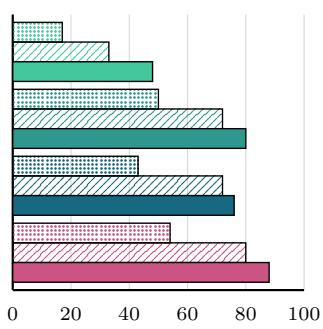
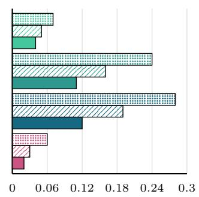
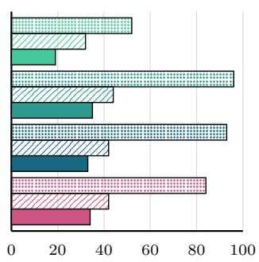
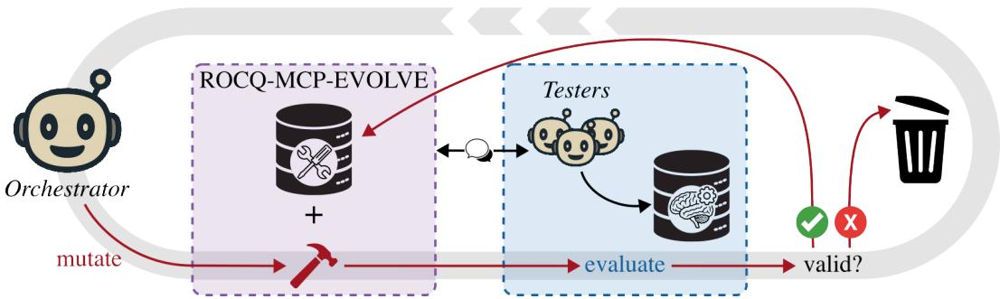
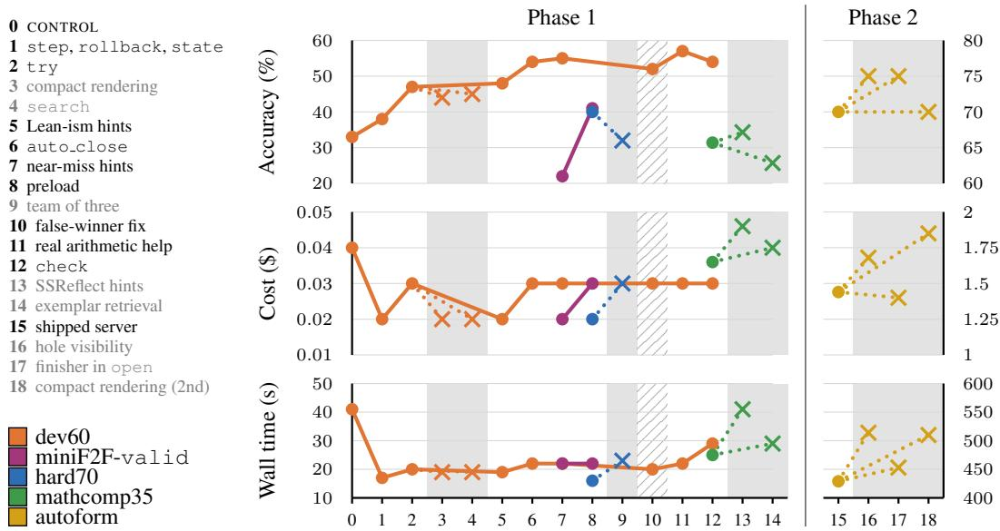

Haiku Sonnet Opus Terra

# GROWING AN AGENT/PROVER INTERFACE: EVOLU-TIONARY TOOL DESIGN FOR COST-EFFICIENT THEO-REM PROVING IN ROCQ AND LEAN

Jules Viennot IRIF, Universite Paris Cit´ e, Inria, CNRS´

Guillaume Baudart IRIF, Universite Paris Cit´ e, Inria, CNRS´

Marc Lelarge DI ENS, PSL University, Inria

## ABSTRACT

Recent achievements in AI-assisted mathematics require intensive interaction of agents with proof assistants to generate machine-checked proof certificates. Agents interact with proof assistants such as Rocq or Lean through an interface that controls what the agent receives from the prover and the cost of these interactions. Today, these interfaces are adapted from tools designed for humans and not optimized for agents. We propose an evolutionary method where a frontier model incrementally proposes new features and only keeps the ones that improve the overall performance of smaller models. We demonstrate the effectiveness of our method by growing, on a curated set of mathematical problems, ROCQ-MCP-EVOLVE, a new MCP server for the Rocq prover. On the held-out test split of miniF2F-Rocq, an agent equipped with ROCQ-MCP-EVOLVE outperforms both the baseline that only exposes the Rocq compiler and an established MCP server, across four models from two families, in success rate, cost per solve, and time per solve. Although evolved for Rocq, the resulting server transfers to Lean, improving cost and time per solve on a subset of PutnamBench. We release ROCQ-MCP-EVOLVE and its port to Lean.

CONTROL ROCQ-MCP ROCQ-MCP-EVOLVE

  
Accuracy (%)

  
Cost (\$)

  
Wall time (s)  
Figure 1: Results on the test split of miniF2F-Rocq. Each model is evaluated with three MCP servers: CONTROL, a minimal server wrapping the Rocq compiler, ROCQ-MCP, an established MCP server for Rocq, and ROCQ-MCP-EVOLVE. For a fair comparison, cost and wall time are averaged over the theorems proved with all three servers.

Large Language Models (LLMs) have made rapid progress in mathematical reasoning with impressive public results (OpenAI, 2026a; Anthropic, 2026; OpenAI, 2026b). However, trust and audit of the generated proofs remain a major concern. Proof assistants such as Lean (de Moura et al., 2015), Isabelle (Paulson, 2008), and Rocq (Barras et al., 1997) emerged as natural validation tools to mitigate this issue. Major announcements are now backed by machine-checked proof certificates (Best et al., 2024; OpenAI, 2026a; Anthropic, 2026). The generation of these certificates requires intensive interaction between the agents and the proof assistant.

Agents interact with the proof assistant through a specialized interface that controls what the agent receives from the prover. There exist several specialized interfaces for proof assistants (LLM4Rocq, 2025; Dressler, 2025; Aniva et al., 2024; Xin et al., 2026; Liu et al., 2026), most implementing the new Model Context Protocol (MCP) standard. An MCP server exposes a series of tools for the agents. For proof assistants, tools range from compiling proofs to interactive debugging and searching for relevant theorems. Today, these interfaces are adapted from systems designed for humans and not optimized for agents. Yet, these interfaces are critical: they drive the cost of each interaction and new generations of models are trained against them (Mistral, 2026).

We propose an evolutionary method where a frontier model incrementally proposes new features and only keeps the ones that improve the overall performance of smaller models. We used Claude Fable 5 to drive the experiment and Claude Sonnet 5 and Claude Haiku 4.5 to evaluate each feature on a fixed set of problems. Starting from a minimal interface, the frontier model proposes new features one by one. At each step, we evaluate the performance gap between two consecutive versions and only keep features that improve our global objectives: (1) accuracy: the proportion of problems solved, (2) cost: the cost per problem solved, and (3) wall time: the wall-clock time per problem solved.

We demonstrate the effectiveness of our method by growing ROCQ-MCP-EVOLVE, a new MCP server for the Rocq prover, starting from a server that only exposes the Rocq compiler. At each step of the evolution, we evaluate agents on mathematical problems from the valid split of miniF2F-Rocq (Viennot et al., 2025) and the Rocq Workbook (LLM4Rocq, 2026), and five project-scale tasks. We focus on the Rocq prover to mitigate data contamination of the main benchmarks: miniF2F (Zheng et al., 2022) and PutnamBench (Tsoukalas et al., 2024). In addition, since Lean is now a popular tool in the ML community, we cannot rule out that frontier models have been trained to interact with existing interfaces.

We evaluate ROCQ-MCP-EVOLVE on the disjoint test split of miniF2F-Rocq and compare three MCP servers across four models: (1) CONTROL, which exposes only the Rocq compiler, (2) ROCQ-MCP, an established MCP server for Rocq (Baudart et al., 2026; Wang, 2026; Sosso & Spitters, 2026), and (3) ROCQ-MCP-EVOLVE. The four models used are Claude Haiku 4.5, Claude Sonnet 5, Claude Opus 4.8, and GPT-5.6 Terra. Figure 1 shows that ROCQ-MCP-EVOLVE outperforms the other MCP servers for our three metrics. Past competition exercises, we also show that ROCQ-MCP-EVOLVE outperforms the other MCP servers on real-world case studies where agents are tasked with building entire projects with multiple files on top of existing libraries. Finally, we port the resulting set of tools to Lean, and show that while the overall solve rate is lower than with the state-of-the-art - - (Dressler, 2025), our server improves both cost and wall time per solve. Both server and all the code and experiments are available here1.

Contributions We present the following contributions:

• An evolutionary method to grow an MCP server for interactive theorem proving.

• ROCQ-MCP-EVOLVE, the MCP server produced by this method, which outperforms an established interface for Rocq in solve rate, cost, and wall time.

• An evaluation across different model sizes and families on multiple tasks ranging from mathematical problems to project-scale tasks.

• A port of the server to Lean which improves cost and wall time per solve.

  
Figure 2: A step of the evolutionary process. The mutation designed by the orchestrator is denoted by the dark red color. The purple dotted box represents ROCQ-MCP-EVOLVE, the blue dotted box represents the evaluation of the mutation. The light gray circle shows the process is iterative: a new step starts at the end of the previous one.

## 2 THE EVOLUTIONARY PROCESS

Agents are trained to rely on external tools to complete their tasks. For proof assistants, these tools are inherited from existing interfaces originally designed for human users. In interactive theorem provers, a user builds a formal proof step by step using commands called tactics to simplify the proof goal until there is nothing left to prove. Specialized tools were introduced to help users navigate through the proof: inspect the current proof goal, search for applicable theorems, print a definition or a notation, etc. The set of tools directly influences users’ and agents’ capabilities at theorem proving. We propose to leverage the relative cost and efficiency of each tool as an objective to optimize the design of a new interface for interactive theorem proving.

The evolutionary process starts from a CONTROL MCP server that only exposes a single tool: compile an entire file. This server is the minimal, and least interactive, interface for a proof assistant. Then, at each step a frontier model mutates the current MCP server by proposing a new feature: adding a new tool, refining the output of an existing one, changing the configuration, etc. The frontier model then evaluates each mutation with smaller models on curated datasets, and validates or discards the mutation by measuring its added value with respect to the previous iteration. Figure 2 illustrates a step of the evolutionary process.

We call the frontier model that manages the entire process the orchestrator and instantiate it with Claude Fable 5. To devise and implement new mutations, the orchestrator leverages statistics and logs from previous runs. During the experiment, we interact only with the orchestrator and our involvement is limited to setting up the environment (i.e., defining the objectives, budgets, and validation rules), and a daily review. There is no human intervention during the design and implementation of the mutations.

We evaluate each iteration of the MCP server on curated datasets of problems. For each problem, we launch agents equipped with the mutated version of the server, the testers, with a fixed budget of time and tool calls. The score on a dataset is averaged over several runs. Testers are instantiated with Claude Haiku 4.5 and Claude Sonnet 5.

We track three metrics: (1) accuracy, the pass@1 proportion of problems solved, (2) cost, the average cost in US dollars per solved problem, and (3) wall time, the average wall-clock time per solved problem. In the following, cost and wall time refer to averages over solved problems unless stated otherwise. The evolutionary process comprises two phases.

## 2.1 PHASE 1: SOLVING MATHEMATICAL EXERCISES

In the first phase, we evaluate the interface with mathematical exercises. The goal is to optimize the server for standalone theorem proving in a frozen environment. Testers are Haiku instances with two runs per problem, each limited to 300 s of wall-clock time and 30 calls to the server. They receive a system prompt that presents the toolset and provides general instructions and tips for Rocq. An independent set of Sonnet instances is used to track regression with a larger model and avoid overspecialization of the server to Haiku. We set a 6-day deadline to complete Phase 1. The winning configuration was discovered on the third day.

Datasets Most mutations are evaluated on dev60, a set of 60 problems from the Rocq Workbook, a translation of 10 000 theorems from the Lean Workbook into Rocq. Problems are categorized into three difficulty buckets: easy, medium, and hard. The difficulty of each problem is estimated with a simple heuristic (statement length and symbol count). We selected 20 problems per difficulty bucket.

The dev60 dataset is too limited to evaluate some mutations. We also use three additional datasets to evaluate specific mutations: hard70 (70 hard problems from the Rocq Workbook) to test agent collaboration on difficult problems, mathcomp35 (35 lemmas extracted from the MathComp library and proved in the context of their file) to test library-specific hints and lemma retrieval, and the valid split of miniF2F-Rocq (Viennot et al., 2025) (244 problems drawn from high-school competitions) to evaluate the preloading of automation tactics. For miniF2F, we infer the difficulty of the problems from their source: MATH problems are easy (130 problems), AMC12 and textbook exercises medium (79 problems), and AIME and IMO problems hard (35 problems).

Validation The results of the testers are compared against the results of the previous iteration on dev60 over two runs, i.e., 40 attempts per difficulty bucket. In practice, a mutation is accepted if the net gain (new successes minus new failures) reaches +2 in at least one bucket without falling below −2 in any other. The cost and wall time served as secondary objectives.

## 2.2 PHASE 2: PROJECT-SCALE TASKS

To prepare the second phase, we added file manipulation tools: open (start an interactive session in a file), build (compile a file), and a verify tool that implements the anti-cheating protocol of Section 2.3 for entire projects. We also equip agents with file manipulation tools in a different interface: read, write, list (list files). Unlike other mutations, these tools are not evaluated or validated: we do not want the performance of ROCQ-MCP-EVOLVE to be attributable to optimized file handling, or reward hacking.

The second evolution phase focuses on project-scale tasks. Given the difficulty of the tasks, testers are Sonnet instances with four runs per project, each limited to 900 s of wall-clock time, with a safety cap of 200 server calls (never reached in practice). Testers receive no system prompt. The server’s own documentation is their only guidance. We thus evaluate the tools and not the prompts. We set a maximum budget of \$150 for Phase 2.

Dataset The dataset used comprises five autoformalization projects described in natural language. Each project requires the agents to generate definitions, functions, and lemmas. The five projects span diverse topics in mathematics and computer science: (1) tropical algebra (min-plus), (2) closed real intervals, (3) an append-only ledger, (4) finite automata manipulation, and (5) a divisor-sum exercise (inspired by an IMO 2025 problem). A description of each task is given in Table 6 of the appendix. We expect four to six files per project, each importing MathComp, the largest mathematical library in Rocq. Every project ships with a test suite to check the correctness of the solution.

Validation In Phase 2, evaluation comprises 20 runs in total (four runs for each of the five projects). A mutation is validated if testers gain more than two successes compared to the previous iteration. A mutation is reverted if testers lose more than two successes. This threshold corresponds to the variation of ±2 observed with the CONTROL on the five project-scale tasks. When the difference is smaller than 3, a cost or wall time reduction of at least 20 % validates the mutation.

## 2.3 ANTI-CHEATING SYSTEM

In both phases, we must ensure that the testers’ answers are correct. Even with a proof assistant, agents sometimes try to cheat the experimental harness to report a success even if the task was not completed. We thus designed an anti-cheating system.

For a proof, the system checks that the file prefix (including imports and statement) is left untouched, and that the code written by the agent contains no axioms, no partial proofs (e.g., using Axiom, Parameter, admit, Admitted, Abort, . . . ), and no additional imports (which can hide redefinitions). The harness then recompiles the file alone in a clean directory and audits the theorem’s assumptions with Print Assumptions against a list of standard-library axioms. For a project, the system rebuilds the project in an isolated directory, compiles the test suite against it, and audits the assumptions on each test.

  
Figure 3: Evolution of accuracy, cost, and wall time across both phases. In the left column, the mutations are numbered chronologically and correspond to x-axis labels. Numbers 0 and 15 are not mutations but the starting servers of the phases. Colors indicate the dataset each point was measured on. Each mutation is linked to the version it is compared to. The link of a reverted mutation is dotted, its background is gray and its data point is a cross. The background of a bug fix is hatched gray.

## 3 ROCQ-MCP-EVOLVE

ROCQ-MCP-EVOLVE is entirely written in OCaml (the programming language used for the Rocq implementation) on top of the Rocq runtime API. Implementation details can be found in Table 7 of the appendix. In line with existing IDEs for interactive theorem proving, the final server maintains a live interactive session with the agent. The session captures the state of progress in the proof and does not need to be recomputed at each interaction, which is much more efficient in tokens and wall time than only exposing the compiler. A call to Rocq drops from 266 ms for a full compilation to about 1 ms with the session mechanism. ROCQ-MCP-EVOLVE enables the agent to apply tactics to advance the proof state, to backtrack, and to access the current proof state. The server also exposes simple automation tools (from the Rocq ecosystem) that can be used to close simple proof goals. The server offers verification tools to check the validity of a proof or of an entire project based on the design described in Section 2.3.

The evolutions of accuracy, cost, and wall time across mutations are presented in Figure 3. During Phase 1, accuracy on the difficulty buckets of the dev60 dataset is the main driver and we observe that overall the accuracy increases with the accepted mutations, from .33 to .54. To compare the final server to the naive CONTROL we run a final test with four runs on dev60, i.e., 240 attempts. Over the four runs, the final server solves more attempts than the naive CONTROL on 22 problems, fewer on none. During Phase 1, cost and wall time were not used to validate any mutation. We observe that both metrics significantly improved in the final server compared to the naive CONTROL. The list of mutations along with their description is presented in Table 8 of the appendix. The detailed results of each mutation are given in Table 1.

Five mutations were not evaluated on dev60 alone. The tool check was introduced to mitigate a regression on Sonnet instances and was kept despite a modest loss on Haiku. The preload mutation targets an issue that is not present in dev60. Automation tactics (e.g., lia or nra) require an extra import that violates our anti-cheating protocol and the harness can reject valid proofs. Preloading these tactics mitigates this issue, but such automation is not necessary on dev60. This mutation was thus evaluated on the valid split of miniF2F-Rocq. Agent collaboration (the “team of three” mutation) was evaluated on hard70 and rejected by the orchestrator. Two MathComp-specific mutations (SSReflect hints and exemplar retrieval) were evaluated once on mathcomp35 and rejected by the orchestrator. The false-winner mutation is a bug fix: auto close falsely reported a goal as closed when a tactic did not make progress. The fix is listed in the mutations to separate its effect from the next iteration.

Table 1: Detailed results of the evolution process. Each line corresponds to a mutation of Table 8. Each cell reports the change with respect to the previous version as a diff: the number of new successes (+) and failures (−). For each dataset we report the number of problems in each difficulty bucket, and the number of runs per problem. Phase 1 and Phase 2 are separated by bolder lines. Gray lines indicate reverted mutations. The hatched line is a bug fix (kept).
<table><tr><td>Mutations</td><td>Dataset</td><td>Easy</td><td>Medium</td><td>Hard</td><td>Total</td></tr><tr><td>step,rollback,state</td><td>dev60, 20/20/20 × 2</td><td>+4-3</td><td>+4-1</td><td>+4-1</td><td>+12-5</td></tr><tr><td>try</td><td>dev60, 20/20/20 × 2</td><td>+7-0</td><td>+4-2</td><td>+2-0</td><td>+13-2</td></tr><tr><td>compact rendering</td><td>dev60, 20/20/20 × 2</td><td>+1-2</td><td>+1-2</td><td>+0-1</td><td>+2-5</td></tr><tr><td>search</td><td>dev60, 20/20/20 × 2</td><td>+0-2</td><td>+2-3</td><td>+2-1</td><td>+4-6</td></tr><tr><td>Lean-ism hints</td><td>dev60, 20/20/20 × 2</td><td>+0-2</td><td>+6-2</td><td>+1-1</td><td>+7-5</td></tr><tr><td>auto_close</td><td>dev60, 20/20/20 × 2</td><td>+2-0</td><td>+5-2</td><td>+3-1</td><td>+10-3</td></tr><tr><td>near-miss hints</td><td>dev60, 20/20/20 × 2</td><td>+2-0</td><td>+4-2</td><td>+1-1</td><td>+7-3</td></tr><tr><td>preload</td><td>miniF2F-valid, 130/79/35 × 2</td><td>+66-2</td><td>+29-3</td><td>+4-0</td><td>+99-5</td></tr><tr><td>team of three</td><td>hard70, 0/0/70 × 2</td><td></td><td></td><td>+0-11</td><td>+0-11</td></tr><tr><td>false-winner fix</td><td>dev60,20/20/20×2</td><td>+0-2</td><td>XX47</td><td>A2-X</td><td>+3-10</td></tr><tr><td>real arithmetic help</td><td>dev60, 20/20/20 × 2</td><td>+1-1</td><td>+7-2</td><td>+2-1</td><td>+10-4</td></tr><tr><td>check, Haiku</td><td>dev60, 20/20/20 × 2</td><td>+1-1</td><td>+2-5</td><td>+1-2</td><td>+4-8</td></tr><tr><td>check, Sonnet</td><td>dev60, 20/20/20 × 2</td><td>+1-0</td><td>+7-0</td><td>+8-2</td><td>+16-2</td></tr><tr><td>SSReflect hints</td><td>mathcomp35, 35 × 1</td><td></td><td></td><td></td><td>+5-4</td></tr><tr><td>exemplar retrieval</td><td>mathcomp35, 35 × 1</td><td></td><td></td><td></td><td>+1-3</td></tr><tr><td>open,build,verify</td><td></td><td></td><td>not evaluated</td><td></td><td></td></tr><tr><td>hole visibility</td><td>autoform, 5 tasks × 4</td><td></td><td></td><td></td><td>+2-1</td></tr><tr><td>finisher in open</td><td>autoform, 5 tasks × 4</td><td></td><td></td><td></td><td>+1-0</td></tr><tr><td>compact rendering</td><td>autoform, 5 tasks × 4</td><td></td><td></td><td></td><td>+1-1</td></tr></table>

One of the most popular tools in existing MCP servers is search to search for applicable lemmas. This tool was one of the first proposed mutations, but the evaluation revealed that while agents heavily used this tool, it yielded no gain in accuracy.

In Phase 2, three mutations were evaluated and rejected. The orchestrator then concluded that the current server was at a local optimum for the project-scale tasks and aborted Phase 2 before exhausting its budget at \$116/\$150.

## 4 EVALUATION

To evaluate ROCQ-MCP-EVOLVE, we compare it to two MCP servers across different model sizes and families: Claude Haiku 4.5, Claude Sonnet 5, Claude Opus 4.8, and GPT-5.6 Terra. The baseline CONTROL corresponds to the starting point of the evolution process and only exposes the Rocq compiler. ROCQ-MCP is an established MCP server for Rocq (Baudart et al., 2026; Wang, 2026; Sosso & Spitters, 2026).

We first evaluate the servers on the mathematical exercises of miniF2F-Rocq. Then, we focus on three research questions: Are tools evolved on exercises useful for building entire projects? Do the benefits of the tools transfer to another proof assistant? How much of the gains come from standard automation?

## 4.1 MINIF2F-ROCQ

The evaluation dataset is the test split of miniF2F-Rocq divided into the same difficulty buckets as the valid split in Section 2 (130 in easy, 79 in medium, 35 in hard). For each problem, agents have a total budget of 300 s and 200 calls, and no system prompt (only the official documentation of the

Table 2: Results on the test split of miniF2F: total (easy/medium/hard). For each model, the cost and wall time are only computed on attempts on the subset of problems solved by all three MCP servers in at least one run (results on the entire dataset are reported in Table 9 of the appendix). The size of this subset per difficulty bucket is given under the model name.
<table><tr><td>Models</td><td>MCP servers</td><td>Accuracy</td><td></td><td>Cost ($)</td><td>Wall time (s)</td></tr><tr><td rowspan="3">Haiku (40/4/1)</td><td>CONTROL</td><td></td><td>.17 (.28/.05 /.01)</td><td>.07 (.06/.07 /.15)</td><td>52 (50/60/86)</td></tr><tr><td>ROCQ-MCP</td><td>.33 (.54/.11/.07)</td><td></td><td>.05 (.05 / .05 / .06)</td><td>32 (32/30/48)</td></tr><tr><td>ROCQ-MCP-EVOLVE</td><td>.48 (.69/.30/.14)</td><td>.04 (.04/.03/.05)</td><td></td><td>19 (19/16/36)</td></tr><tr><td rowspan="3">Sonnet (90/28/7)</td><td>CONTROL</td><td></td><td>.50 (.68/.35/.17)</td><td>.24 (.19/.36/.39)</td><td>96 (76/153/153)</td></tr><tr><td>ROCQ-MCP</td><td>.72 (.88 / .53 / .56)</td><td></td><td>.16 (.12/.28 /.23)</td><td>44 (30/86/64)</td></tr><tr><td>ROCQ-MCP-EVOLVE</td><td>.80 (.91/.68/.67)</td><td>.11 (.08/.18/.22)</td><td></td><td>35 (23/62/77)</td></tr><tr><td rowspan="3">Opus (83/24/5)</td><td>CONTROL</td><td>.43 (.60/.28 /.13)</td><td>.28 (.21 / .47 / .68)</td><td></td><td>93(67 /163 /206)</td></tr><tr><td>ROCQ-MCP</td><td>.72 (.88 / .56/ .46)</td><td></td><td>.19(.14/.34/.35)</td><td>42 (28/83/81)</td></tr><tr><td>ROCQ-MCP-EVOLVE</td><td>.76 (.90/.61 /.54)</td><td>.12 (.08/.22/.24)</td><td></td><td>33 (20/73/67)</td></tr><tr><td rowspan="3">Terra (99/33/12)</td><td>CONTROL</td><td>.54 (.70/.40/.27)</td><td>.06 (.04/.08/.10)</td><td></td><td>84 (70/107/135)</td></tr><tr><td>ROCQ-MCP</td><td>.80 (.92 / .66 / .63)</td><td></td><td>.03 (.02 / .05 / .05)</td><td>42(29/74/63)</td></tr><tr><td>ROCQ-MCP-EVOLVE</td><td>.88 (.97 / .80 / .71)</td><td>.02 (.01 /.03 /.04)</td><td></td><td>34 (23/58/60)</td></tr></table>

MCP servers). We use 2 runs per problem. Results for each of the two runs are reported in Table 10 of the appendix. The three metrics measured are the same as in Section 2: accuracy, cost, and wall time.

Table 2 presents the results for each model, server, and bucket. ROCQ-MCP-EVOLVE outperforms both the baseline and ROCQ-MCP in all difficulty buckets, and significantly improves overall performance compared to CONTROL (at least +30 points on all models). Over the two runs, ROCQ-MCP-EVOLVE solves more attempts than CONTROL on 91 to 104 problems, fewer on at most 4 (sign test over problems, $p < 1 0 ^ { - \dot { 2 } 1 } )$ , and more attempts than ROCQ-MCP on 26 to 55 problems, fewer on at most 8 $( p < 3 \times 1 0 ^ { - 3 } )$ . We observe that the accuracy gap between ROCQ-MCP-EVOLVE and ROCQ-MCP decreases with stronger models (from +15 points with Haiku, to +8 points with Sonnet, and +4 points with Opus). However, when looking at the cost and wall time, we observe the opposite trend: better models benefit more from ROCQ-MCP-EVOLVE than CONTROL for both cost (from −45 % with Haiku, to −54 % with Sonnet, and −59 % with Opus) and wall time (from −63 % with Haiku, to −64 % with Sonnet, and −64 % with Opus). ROCQ-MCP-EVOLVE is also faster than ROCQ-MCP almost all the time (except the hard bucket with Sonnet), despite the fact that both servers expose interactive sessions. Results on Terra are similar to those on Opus, which confirms these observations and demonstrates that the final MCP server is not overspecialized to a family of models.

On the subset of problems solved by all three MCP servers in at least one run, ROCQ-MCP-EVOLVE improves cost and wall time per solve in almost all difficulty buckets. This result may be surprising considering that the evolution process was only driven by the per-bucket accuracy. This improvement is a consequence of the experimental harness used in Phase 1. The 300 s and 30-call budget forced the orchestrator to optimize the compilation time and the number of generated tokens by introducing the interactive session, then by maximizing the density of information returned by the tools (hints in error messages from try and auto close). The numbers of calls and tokens generated across models are presented in Table 3. These results are computed on problems solved with all three servers per model and averaged over the four models. We observe that the number of calls of ROCQ-MCP-EVOLVE is the lowest among the three MCP servers. ROCQ-MCP-EVOLVE lowers the number of input tokens by 24 % and divides by four the number of output tokens compared to the CONTROL server. Fewer tokens and tool calls then directly translate to lower cost and wall time.

## 4.2 RQ1: ARE TOOLS EVOLVED ON EXERCISES USEFUL FOR BUILDING ENTIRE PROJECTS?

In Phase 2, the orchestrator proposed three mutations that were all rejected. Since no mutation was accepted on the project-scale tasks, we reuse these tasks here to evaluate the final server of Phase 1. This dataset was used during the evolution, but the server did not adapt to these tasks, so we can evaluate whether the exposed tools are useful to build entire projects.

We evaluate three models (Sonnet, Opus, and Terra) on the five project-scale tasks of Phase 2 (Section 2.2, Table 6). Given the difficulty of the tasks, we did not try with the smallest model,

Table 3: Efficiency results for the different MCP servers, averaged over the four models.
<table><tr><td>MCP servers</td><td>Calls</td><td>Input tokens</td><td>Output tokens</td><td>Output tokens per call</td></tr><tr><td>CONTROL</td><td>5.9</td><td>79.0k</td><td>6.6k</td><td>1.12k</td></tr><tr><td>ROCQ-MCP</td><td>7.2</td><td>148.4k</td><td>2.7k</td><td>0.38k</td></tr><tr><td>ROCQ-MCP-EVOLVE</td><td>5.6</td><td>59.9k</td><td>1.6k</td><td>0.29k</td></tr></table>

Table 4: Results on project-scale tasks for the models Sonnet | Opus | Terra averaged on all tasks (detailed results are reported in Table 11 of the appendix).
<table><tr><td>MCP servers</td><td colspan="3">Accuracy</td><td colspan="3">Cost ($)</td><td colspan="3">Wall time (s)</td></tr><tr><td>CONTROL</td><td>.50</td><td>0 | .30</td><td>|.40</td><td>1.56</td><td>|2.19 V</td><td>0.22</td><td>608</td><td>|714</td><td>332</td></tr><tr><td>ROCQ-MCP</td><td>.60 | .60</td><td></td><td>.35</td><td>2.63</td><td>2.48 7</td><td>0.34</td><td>595 |</td><td>661 |</td><td>502</td></tr><tr><td>ROCQ-MCP-EVOLVE</td><td>.70</td><td>.60</td><td>.50</td><td>1.44</td><td>1.89</td><td>0.16</td><td>429</td><td>574</td><td>269</td></tr></table>

Haiku. For each project, agents have a total budget of 900 s and 200 calls. In addition to the three MCP servers, we expose the following common tools: write, read, list, build, and verify. We use four runs per task for Sonnet and Terra but only two for Opus (to limit the costs). A run is a success if the project can be built from scratch, passes the test suite, and does not violate the anti-cheating protocol of Section 2.3. Cost and wall time are averaged over solved runs. Standard deviations across runs are reported in Table 12 of the appendix.

Results are presented in Table 4 averaged on all tasks. Again, we observe that for all three metrics, accuracy, cost, and wall time, models equipped with ROCQ-MCP-EVOLVE yield the best performance. Compared to CONTROL, the accuracy gain is +20 points with Sonnet (14/20 against 10/20 successes), +30 points with Opus (6/10 against 3/10), and +10 points with Terra (10/20 against 8/20). ROCQ MCP also improves the performance of the Claude family models, and is on par with ROCQ-MCP-EVOLVE with Opus, but is less performant than CONTROL with Terra (7/20 against 8/20). The cost and wall time trends are similar to the miniF2F-Rocq evaluation with better gain for stronger models both on cost (−8 % with Sonnet, −14 % with Opus, and −27 % with Terra) and wall time (−29 % with Sonnet, −20 % with Opus, and −19 % with Terra). ROCQ-MCP is the most expensive server, and it is slower than ROCQ-MCP-EVOLVE with all models.

## 4.3 RQ2: DO RESULTS TRANSFER TO ANOTHER PROOF ASSISTANT?

To test whether the results of ROCQ-MCP-EVOLVE transfer to Lean, another proof assistant, we build LEAN-MCP-EVOLVE. LEAN-MCP-EVOLVE is a port to Lean of ROCQ-MCP-EVOLVE, with the exact same set of tools. We compare this server to LEAN-LSP-MCP (Dressler, 2025), a popular MCP server for Lean, and CONTROL, a simple server that only exposes the compiler (via lake build).

The evaluation dataset putnam60 comprises 60 problems from PutnamBench (Tsoukalas et al., 2024). We selected 20 easy, 20 medium, and 20 hard problems. To assess the difficulty of a problem, we used the number of published LLM-based methods that report a solution (see Table 13 in the appendix). In this experiment we only use Sonnet with two runs per problem. Results for each of the two runs are reported in Table 14 of the appendix. For each problem, agents have a total budget of 300 s and 200 calls.

Table 5 presents the results with Sonnet. LEAN-LSP-MCP outperforms both CONTROL and LEAN-MCP-EVOLVE on accuracy, but LEAN-MCP-EVOLVE yields the best cost and wall time. In contrast with Rocq, LEAN-MCP-EVOLVE and CONTROL give the same accuracy. As explained in Section 1, we cannot rule out contamination of Sonnet on PutnamBench (many Lean solutions are now available on GitHub), and we cannot rule out that Sonnet was trained on LEAN-LSP-MCP (like Leanstral (Mistral, 2026)).

## 4.4 RQ3: HOW MUCH OF THE GAINS COME FROM STANDARD AUTOMATION?

Automation is a powerful tool in proof assistants and a carefully crafted tactic can solve a lot of problems without any interaction with the user (or agent). The addition of auto close, which tries a portfolio of automatically closing tactics, yielded a noticeable accuracy gain during the evolution (mutation 6 in Figure 3). To quantify how many successes are due to this tool compared to agent interactions, we run auto close on all the problems of the test split of miniF2F-Rocq. The tool solved 52/244 problems, i.e., 21 % (.35 / .06 / .03 per bucket). On this subset of problems, the cost and wall time with ROCQ-MCP-EVOLVE averaged over all models are \$0.03 and 11 s respectively, against \$0.06 and 19 s with ROCQ-MCP. But the gains are mostly in the easy bucket, and automation alone does not explain the performance of ROCQ-MCP-EVOLVE compared to CONTROL and ROCQ-MCP.

Table 5: Results on putnam60 with Sonnet in Lean for the three MCP servers. Cost and wall time are averaged over problems solved by all three MCP servers in at least one run (16 easy problems, 2 medium problems, and no hard problems).
<table><tr><td>MCP servers</td><td>Accuracy</td><td>Cost ($)</td><td>Wall time (s)</td></tr><tr><td>CONTROL</td><td>.33 (.93 / .05 / .00)</td><td>.12 (.11/.28/→)</td><td>82  $( 7 6 / 1 8 3 / - )$ </td></tr><tr><td>LEAN-LSP-MCP</td><td>.42 (.95 /.30 / .00)</td><td>.14 (.11/.40/→)</td><td>86 (72/199/-)</td></tr><tr><td>LEAN-MCP-EVOLVE</td><td>.33 (.83 / .18 / .00)</td><td>.11 (.09/.35/−)</td><td>64 (55/159/-)</td></tr></table>

## 5 RELATED WORK

Agent/Prover interfaces There exist multiple MCP servers and REPL interfaces to connect agents with the Lean theorem prover (Yang et al., 2023; Aniva et al., 2024; Chen et al., 2025; Xin et al., 2026; Liu et al., 2026). These interfaces differ in the set of tools exposed to the agent, and most of the work focuses on speed, robustness, and scalability. To the best of our knowledge, none of these interfaces followed an evolutionary design process to optimize the set of tools. ROCQ-MCP was designed by a frontier model (Claude Opus 4.6) by analyzing logs from a prior experiment (Baudart et al., 2026) but falls short of measuring the added value of each tool, is limited to one iteration, and was never rigorously evaluated.

Evolving interfaces In SWE-agent (Yang et al., 2024) the agent interface is already studied experimentally, and multiple works evaluate the impact of different tools on agent capabilities (Xu et al., 2026; Mak et al., 2026). Several lines of work then follow an iterative process to develop agentic frameworks starting with agents tasked to build reusable tools (Cai et al., 2024; Wang et al., 2023; 2024), or MCP tools implemented at runtime (Qiu et al., 2025). Instead of building a library of task-specific tools, we try to optimize a small set of specialized tools for the prover. Another line of work focuses on evolving the entire agentic harness with self-modifying coding agents (Zhang et al., 2025; Robeyns et al., 2025), tool evolution (Lin et al., 2026), or harness search (Lee et al., 2026). Our process evolves one feature at each step, and we show that the gains on three metrics hold across different sizes and families of models. The closest work focuses on self-modifying Lean proof agents (Li et al., 2026) where an evolutionary process optimizes a proof-repair pipeline. But evolved tools mostly check lemma names to avoid hallucinations, and the evaluation focuses on standalone theorems from miniF2F. We focus on tools that can handle project-scale tasks. Specialized for the Rocq prover, RocqSmith focuses on optimizing prompts and control flow (Kozyrev et al., 2026).

## 6 CONCLUSION AND FUTURE WORK

We presented an evolutionary method to grow an agent/prover interface: a frontier model proposes one feature at a time, and a feature is kept only if it measurably improves the accuracy of smaller models on a fixed set of problems, with cost and wall time as secondary objectives. This process grew ROCQ-MCP-EVOLVE from a server that only exposes the Rocq compiler. On the held-out test split of miniF2F-Rocq, ROCQ-MCP-EVOLVE outperforms both the CONTROL baseline and the established ROCQ-MCP server in success rate, cost per solve, and time per solve, across four models from two families, and the same ordering holds on project-scale autoformalization tasks. Although only accuracy drove the validation of mutations, the tight time and call budgets of the testers led the orchestrator to reduce the number of calls and tokens, which translated into lower cost and wall time on every model we tested.

The natural next step is to run the same procedure for Lean. Our port of the evolved tools to Lean, LEAN-MCP-EVOLVE, already improves cost and time per solve on a subset of Putnam-Bench (Tsoukalas et al., 2024), but its solve rate remains below LEAN-LSP-MCP (Dressler, 2025). Growing a Lean server from a compiler-only CONTROL, with the same objectives and validation rules, would let the orchestrator discover Lean-specific features. It would also tell which features of ROCQ-MCP-EVOLVE are intrinsic to agent/prover interaction and which are specific to Rocq.

Generative AI is both the object of study and a tool in this work; we distinguish the two roles below.

Required disclosures We used generative AI tools to implement methods, to design and evaluate experiments, to propose and refine hypotheses, and to interpret results. As described in Section 2, the orchestrator (Claude Fable 5) chose the time, call, and cost budgets of the experiments, proposed every mutation of the server, implemented it, chose the dataset on which to evaluate it, interpreted the results of the testers against the validation rules we fixed in advance, and decided to keep or revert it, including the decision to end Phase 2 before exhausting its budget. The testers (Claude Haiku 4.5 and Claude Sonnet 5) and the models of the evaluation (adding Claude Opus 4.8 and GPT-5.6 Terra) are the experimental subjects; the Rocq and Lean proofs they produce are measured outputs. We also used generative AI tools to generate a synthetic dataset: the five autoformalization projects of Phase 2, with their natural-language specifications, reference solutions, and test suites, were produced by the orchestrator and reviewed by the authors. We also used generative AI tools to clean and reformat datasets: the selection of dev60, hard70, and mathcomp35 and the difficulty-bucketing heuristic were implemented by the orchestrator. We have not used generative AI tools to develop the conceptual framework of this work: the evolutionary method, the three objectives, the validation rules, and the anti-cheating protocol were designed by the authors; the orchestrator then implemented the validation rules and the anti-cheating protocol. Formulating mathematical claims, providing ingredients for proofs, assisting in the writing of proofs, translation, and qualitative or thematic data analysis are not applicable: this paper contains no mathematical claims of its own.

Recommended disclosures Additionally, we used generative AI tools to create and edit software code (the ROCQ-MCP-EVOLVE server, its port to Lean, the evaluation harness, and the scripts that produce the tables and figures from the run records), to draft parts of this paper (the orchestrator wrote a technical report of the experiment from its own logs, which we used as a source of facts alongside the raw logs; the present manuscript was written by the authors, with a coding agent used for the first draft of this statement), to edit the paper for readability, and to search for and summarize related literature.

Review We have reviewed all AI-assisted work. The evolution ran under objectives and validation rules fixed by the authors before it started, and the authors reviewed the decision trail of the orchestrator daily. No output reported by an agent or by its tools is trusted: every proof and project counted as a success was recompiled from scratch in a clean directory and audited with Print Assumptions (Section 2.3), and the final server was frozen before the held-out test split of miniF2F-Rocq was touched. The numbers in the tables were recomputed by the authors from the raw run records. AI-generated code is released with the paper. Every claim in the text was checked by the authors against the logs, and every reference was checked against the original publication. We take responsibility for the final content of this work, including text, claims, or artifacts produced with the aid of generative AI.

## REPRODUCIBILITY STATEMENT

We release the code of the Rocq experiments: the ROCQ-MCP-EVOLVE server, the CONTROL server, the evaluation harness with the anti-cheating verifier of Section 2.3, the problem selections (dev60, hard70, mathcomp35, and the difficulty buckets of miniF2F-Rocq), the five autoformalization projects of Table 6 with their test suites, and the scripts that produce every table and figure from the run records. All of the above is available at an anonymized repository: https://osf.io/648ex/ overview?view\_only=b6294376221b4dd1935b604f571abbce. We will also release the LEAN-MCP-EVOLVE code and experiments upon acceptance. The evolutionary process is described in Section 2: the two phases, their datasets, the budgets of the testers, and the rules that accept or revert a mutation. Since the process is driven by a frontier model, its outcome cannot be replayed deterministically, but it can be audited: Tables 8 and 1 list every proposed mutation, the dataset on which it was evaluated, its per-bucket results, and its verdict, and the released server is the frozen result of this chronology. The evaluation protocol (models, budgets, absence of system prompt, difficulty buckets, and success criterion) is given in Section 4, with per-model and per-bucket results in Table 2 and complete results in Tables 9 and 11 of the appendix. All agents are proprietary models accessed through their public APIs; we name their exact versions, and we report cost in US dollars at the prices in force at the time of the experiments and wall time as measured on our infrastructure, both of which may drift with future model or pricing updates. To limit the effect of sampling noise, most results aggregate two to four runs per problem, the number of runs is given with each experiment, and cost and wall time are compared on the attempts solved by all servers.

## ACKNOWLEDGEMENTS

We thank Laetitia Teorodescu for the discussion, during a taxi ride back from Oleron, that led to this´ experiment. This work was partially supported by the Defi Inria LLM4Code, the Groupe Casino/ENS´ Chair on Algorithmics and Machine Learning, and the Renaissance Philanthropy project “Leaning and Rocq’ing”. This work was granted access to the HPC resources of IDRIS under the allocation A0191016874 made by GENCI.

## REFERENCES

Leni Aniva, Chuyue Sun, Brando Miranda, Clark Barrett, and Sanmi Koyejo. Pantograph: A machineto-machine interaction interface for advanced theorem proving, high level reasoning, and data extraction in Lean 4, 2024. URL https://arxiv.org/abs/2410.16429.

Anthropic. More than two thirds of the zeros of the Riemann zeta function are simple and on the critical line, 2026. URL https://www-cdn.anthropic.com/ 95c246936988e43127bc6b2ceb7077c1dad2d68e.pdf.

Bruno Barras, Samuel Boutin, Cristina Cornes, Judicael Courant, Jean-Christophe Filli¨ atre, Eduardoˆ Gimenez, Hugo Herbelin, G´ erard Huet, C´ esar Mu´ noz, Chetan Murthy, Catherine Parent, Christine˜ Paulin-Mohring, Amokrane Sa¨ıbi, and Benjamin Werner. The Coq Proof Assistant Reference Manual : Version 6.1. Research Report RT-0203, INRIA, May 1997. URL https://inria. hal.science/inria-00069968. Projet COQ.

Guillaume Baudart, Marc Lelarge, Tristan Sterin, and Jules Viennot. Putnam 2025 problems in Rocq´ using Opus 4.6 and Rocq-MCP, 2026.

Alex Best, Christopher Birkbeck, Riccardo Brasca, Eric Rodriguez Boidi, Ruben van De Velde, and Andrew Yang. A complete formalization of Fermat’s last theorem for regular primes in Lean, 2024. URL https://arxiv.org/abs/2410.01466.

Tianle Cai, Xuezhi Wang, Tengyu Ma, Xinyun Chen, and Denny Zhou. Large language models as tool makers, 2024. URL https://arxiv.org/abs/2305.17126. ICLR 2024.

Luoxin Chen, Jinming Gu, Liankai Huang, Wenhao Huang, Zhicheng Jiang, Allan Jie, Xiaoran Jin, Xing Jin, Chenggang Li, Kaijing Ma, Cheng Ren, Jiawei Shen, Wenlei Shi, Tong Sun, He Sun, Jiahui Wang, Siran Wang, Zhihong Wang, Chenrui Wei, Shufa Wei, Yonghui Wu, Yuchen Wu, Yihang Xia, Huajian Xin, Fan Yang, Huaiyuan Ying, Hongyi Yuan, Zheng Yuan, Tianyang Zhan, Chi Zhang, Yue Zhang, Ge Zhang, Tianyun Zhao, Jianqiu Zhao, Yichi Zhou, and Thomas Hanwen Zhu. Seed-Prover: Deep and broad reasoning for automated theorem proving, 2025. URL https://arxiv.org/abs/2507.23726.

Leonardo de Moura, Soonho Kong, Jeremy Avigad, Floris van Doorn, and Jakob von Raumer. The Lean theorem prover (system description), 2015. URL https://lean-lang.org/papers/ system.pdf.

Oliver Dressler. Lean LSP MCP: Tools for agentic interaction with the Lean theorem prover, March 2025. URL https://github.com/oOo0oOo/lean-lsp-mcp.

Andrei Kozyrev, Nikita Khramov, Denis Lochmelis, Valerio Morelli, Gleb Solovev, and Anton Podkopaev. RocqSmith: Can automatic optimization forge better proof agents?, 2026. URL https://arxiv.org/abs/2602.05762.

Yoonho Lee, Roshen Nair, Qizheng Zhang, Kangwook Lee, Omar Khattab, and Chelsea Finn. Meta-Harness: End-to-end optimization of model harnesses, 2026. URL https://arxiv.org/ abs/2603.28052.

Yuqing Li, Zeguan Wu, Yu Gan, and Junyu Liu. Self-modifying Lean proof agents with verifiergrounded benchmark coevolution, 2026. URL https://arxiv.org/abs/2607.17352.

Jiahang Lin, Shichun Liu, Chengjun Pan, Lizhi Lin, Shihan Dou, Zhiheng Xi, Xuanjing Huang, Hang Yan, Zhenhua Han, Tao Gui, and Yu-Gang Jiang. Agentic harness engineering: Observabilitydriven automatic evolution of coding-agent harnesses, 2026. URL https://arxiv.org/ abs/2604.25850.

Junqi Liu, Zihao Zhou, Zekai Zhu, Marco Dos Santos, Weikun He, Jiawei Liu, Ran Wang, Yunzhou Xie, Junqiao Zhao, Qiufeng Wang, Lihong Zhi, Jia Li, and Wenda Li. Numina-Lean-Agent: An open and general agentic reasoning system for formal mathematics, 2026. URL https: //arxiv.org/abs/2601.14027.

LLM4Rocq. Rocq-MCP: Tools for agentic interaction with the Rocq theorem prover, 2025. URL https://github.com/LLM4Rocq/rocq-mcp.

LLM4Rocq. rocq-workbook: Translation of the Lean-workbook mathematical competitions dataset in Rocq, 2026. URL https://github.com/LLM4Rocq/rocq-workbook.

Hazel Mak, Susheel Suresh, Sahil Bhatnagar, Barry Wang, Chhaya Methani, and Alejandro Gutierrez Munoz. Is Bash all you need? An empirical study of tool interfaces for enterprise digital worker agents, 2026. URL https://arxiv.org/abs/2609.11999.

Mistral. Leanstral, 2026. URL https://www.alphaxiv.org/pdf/2608.leanstral.

OpenAI. Finite time blowup for Navier–Stokes, 2026a. URL https://cdn.openai.com/ pdf/32d9f210-8b73-45e0-91bc-82a30aef8a9a/navier-stokes.pdf.

OpenAI. Planar point sets with many unit distances, 2026b. URL https://cdn.openai.com/ pdf/74c24085-19b0-4534-9c90-465b8e29ad73/unit-distance-proof. pdf.

Lawrence C. Paulson. The Isabelle reference manual. Technical report, University of Cambridge, 2008. URL https://isabelle.in.tum.de/website-Isabelle2008/ dist/Isabelle/doc/ref.pdf.

Jiahao Qiu, Xuan Qi, Hongru Wang, Xinzhe Juan, Yimin Wang, Zelin Zhao, Jiayi Geng, Jiacheng Guo, Peihang Li, Jingzhe Shi, Shilong Liu, and Mengdi Wang. Alita-G: Self-evolving generative agent for agent generation, 2025. URL https://arxiv.org/abs/2510.23601.

Maxime Robeyns, Martin Szummer, and Laurence Aitchison. A self-improving coding agent, 2025. URL https://arxiv.org/abs/2504.15228.

Alessandro Sosso and Bas Spitters. Agentic proving for type theory. Talk at the 32nd International Conference on Types for Proofs and Programs (TYPES), 2026. URL https: //types2026.cse.chalmers.se/slides/64.pdf. Aarhus University; agentic proving experiments using the LLM4Rocq Rocq-MCP toolset.

George Tsoukalas, Jasper Lee, John Jennings, Jimmy Xin, Michelle Ding, Michael Jennings, Amitayush Thakur, and Swarat Chaudhuri. PutnamBench: Evaluating neural theorem-provers on the Putnam mathematical competition, 2024. URL https://arxiv.org/abs/2407.11214.

Jules Viennot, Guillaume Baudart, Emilio Jesus Gallego Arias, and Marc Lelarge. MiniF2F in´ Rocq: Automatic translation between proof assistants – a case study, 2025. URL https: //arxiv.org/abs/2503.04763.

Guanzhi Wang, Yuqi Xie, Yunfan Jiang, Ajay Mandlekar, Chaowei Xiao, Yuke Zhu, Linxi Fan, and Anima Anandkumar. Voyager: An open-ended embodied agent with large language models, 2023. URL https://arxiv.org/abs/2305.16291. TMLR 2024.

Shengyi Wang. AI-assisted completion of CertiGC proofs: An experience report, 2026. URL https://arxiv.org/abs/2606.21167. Codex-assisted Rocq proof development for a verified garbage collector, using the LLM4Rocq rocq-mcp server.

Zhiruo Wang, Daniel Fried, and Graham Neubig. TroVE: Inducing verifiable and efficient toolboxes for solving programmatic tasks, 2024. URL https://arxiv.org/abs/2401.12869. ICML 2024.

Jimmy Xin, Alex Schneidman, Chris Cummins, Karun Ram, Srihari Ganesh, and Jannis Limperg. AXLE: A cloud infrastructure for Lean 4 theorem proving utilities, 2026. URL https://arxiv. org/abs/2606.26442.

Xiangzhe Xu, Hamidreza Saghir, Qianhui Wu, Marc-Alexandre Cotˆ e, Tong Wang, Kiran Lakkaraju,´ Kexin Pei, and Xiangyu Zhang. The devil is in the interface: Evaluating how tool architecture shapes coding agent behavior, 2026. URL https://arxiv.org/abs/2608.11386.

John Yang, Carlos E. Jimenez, Alexander Wettig, Kilian Lieret, Shunyu Yao, Karthik Narasimhan, and Ofir Press. SWE-agent: Agent-computer interfaces enable automated software engineering, 2024. URL https://arxiv.org/abs/2405.15793. NeurIPS 2024.

Kaiyu Yang, Aidan M. Swope, Alex Gu, Rahul Chalamala, Peiyang Song, Shixing Yu, Saad Godil, Ryan Prenger, and Anima Anandkumar. LeanDojo: Theorem proving with retrieval-augmented language models. In NeurIPS, 2023.

Jenny Zhang, Shengran Hu, Cong Lu, Robert Lange, and Jeff Clune. Darwin Godel Machine: Open-¨ ended evolution of self-improving agents, 2025. URL https://arxiv.org/abs/2505. 22954.

Kunhao Zheng, Jesse Michael Han, and Stanislas Polu. miniF2F: A cross-system benchmark for formal olympiad-level mathematics. In ICLR, 2022.

## A APPENDIX

Table 6: The five project-scale tasks. Each task requires the creation of multiple files on top of the MathComp library.
<table><tr><td>Task</td><td>Files</td><td>Description</td></tr><tr><td>frugal</td><td>4</td><td>bounded min-plus cost algebra on option nat with a  $2 \times 2$  matrix product; laws of the operations and associativity of the product</td></tr><tr><td>gauges</td><td>4</td><td>closed real intervals over an abstract realType with a sound interval arithmetic; three soundness lemmas and three width lemmas</td></tr><tr><td>ledger</td><td>4</td><td>append-only ledger of signed deltas with replay and checkpoints; re- play/checkpoint equivalence and a bound on balances</td></tr><tr><td>prodauto</td><td>6</td><td>deterministic finite automata over a finite type; product and complement constructions, language intersection, emptiness by bounded reachability, a pigeonhole pumping lemma</td></tr><tr><td>triadic</td><td>4</td><td>a divisor-combinatorics dynamical system on natural numbers (from an IMO 2025 problem); a fixed-point theorem and a shrinking theorem</td></tr></table>

Table 7: Implementation. ROCQ-MCP is implemented on top of a mature software stack developed for IDE support and exposes capabilities this benchmark does not exercise (file outlines, notation resolution, operational diagnostics). ROCQ-MCP-EVOLVE is implemented on top of the Rocq API.
<table><tr><td></td><td>ROCQ-MCP-EVOLVE</td><td>ROCQ-MCP</td></tr><tr><td>implementation</td><td>OCaml</td><td>Python</td></tr><tr><td>first-party source</td><td>3 527 lines (7 files)</td><td>7351 lines (8 files)</td></tr><tr><td>installed components direct dependencies</td><td>server + multi-agent daemon/shim</td><td>server</td></tr><tr><td>prover attachment</td><td>4 opam packages rocq-runtime linked in-process</td><td>3 PyPI packages + coq-lsp toolchain</td></tr><tr><td>runtime topology</td><td>one OS process</td><td>petanque (coq-1sp) protocol</td></tr><tr><td>shipped user docs</td><td>2.4k words</td><td>server + petanque subprocess; coqc per compile 4.7k words</td></tr></table>

Table 8: Mutations proposed during the evolution process. Phase 1, the inter-phase, and Phase 2 are separated by bolder lines. Gray lines indicate reverted mutations. The hatched line is a bug fix (kept). ✓ accepted, × reverted, − added without evaluation. The exposed tools are written in this font.
<table><tr><td>Mutations</td><td>Descriptions</td><td>Verdicts</td></tr><tr><td>step,</td><td>execute sentences, commit good prefixes and report failures</td><td rowspan="3">√</td></tr><tr><td>rollback,</td><td>swap to a previous snapshot in constant time</td></tr><tr><td>state</td><td>render the open goals and the committed script</td></tr><tr><td>try</td><td>test up to eight candidates and commit the first success</td><td>√</td></tr><tr><td>compact rendering</td><td>goals printed with only hypotheses deltas to save tokens</td><td>X</td></tr><tr><td>search</td><td>execute Rocq&#x27;s Search/About commands over a loaded library rewrite Lean-like syntax and common syntax mistakes into</td><td>X</td></tr><tr><td>Lean-ism hints</td><td>Rocq form in error messages</td><td>√</td></tr><tr><td>auto_close</td><td>run a portfolio of Rocq automatic tactics</td><td>√</td></tr><tr><td>near-miss hints</td><td>append near actual lemma names to unknown-reference errors</td><td>√</td></tr><tr><td>preload</td><td>preload Lia/Lra/Psatz, refuse mid-proof imports</td><td>√</td></tr><tr><td>team of three</td><td>a coordinator, a worker, and a finisher sharing a proof session</td><td>X</td></tr><tr><td>false-winner fix</td><td>bug fix in the auto-close tool</td><td>5</td></tr><tr><td></td><td>real arithmetic help introduce 0 &lt;= t²hypotheses in the context for aut o_close whole-proof check,</td><td>√</td></tr><tr><td>SSReflect hints</td><td>additional Qed-gate for proof completion in the server, penalizing tactics in the auto_close portfolio removed</td><td></td></tr><tr><td>exemplar retrieval</td><td>MathComp-specific hints</td><td>X</td></tr><tr><td></td><td>provide similar proved lemmas from the project at start</td><td>X</td></tr><tr><td>open build</td><td>open a proof session for the given file and optional theorem compile a Rocq file and return detailed results</td><td></td></tr><tr><td></td><td></td><td></td></tr><tr><td>verify</td><td>verify the correctness of a whole project directory</td><td>一</td></tr><tr><td>hole visibility</td><td>all tools warn about remaining admit. in the proof</td><td>X</td></tr><tr><td>finisher in open</td><td>open runs the auto_close portfolio automatically</td><td>X</td></tr><tr><td>compact rendering</td><td>try again the compact rendering of Phase 1</td><td>X</td></tr></table>

Table 9: Results on the test split of miniF2F-Rocq with cost and wall time computed on the whole dataset instead of the problems solved with all three MCP servers.
<table><tr><td>Models</td><td>MCP servers</td><td>Accuracy</td><td>Cost ($)</td><td>Wall time (s)</td></tr><tr><td rowspan="3">Haiku</td><td>CONTROL</td><td>.17 (.28/.05 /.01)</td><td>.07 (.07/.07/.15)</td><td>54 (53/60/86)</td></tr><tr><td>ROCQ-MCP</td><td>.33 (.54/.11/.07)</td><td>.10 (.09/.12/.17)</td><td>54 (51/66/96)</td></tr><tr><td>ROCQ-MCP-EVOLVE</td><td>.48 (.69 /.30 /.14)</td><td>.13 (.10/.24/.23)</td><td>67 (51/116/136)</td></tr><tr><td rowspan="3">Sonnet</td><td>CONTROL</td><td>.50 (.68 /.35 /.17)</td><td>.25 (.20/ .38 / .39)</td><td>100 (77/161/153)</td></tr><tr><td>ROCQ-MCP</td><td>.72 (.88 / .53 / .56)</td><td>.25 (.17/.36/.46)</td><td>73 (47/114/142)</td></tr><tr><td>ROCQ-MCP-EVOLVE</td><td>.80 (.91/.68/.67)</td><td>.21 (.13/.33/.37)</td><td>72 (41/115/127)</td></tr><tr><td rowspan="3">Opus</td><td>CONTROL</td><td>.43 (.60/.28/.13)</td><td>.29 (.21 /.49/.68)</td><td>95 (67/169/206)</td></tr><tr><td>ROCQ-MCP</td><td>.72 (.88 / .56 / .46)</td><td>.34 (.24/.48 /.61)</td><td>83 (57/121/163)</td></tr><tr><td>ROCQ-MCP-EVOLVE</td><td>.76 (.90 /.61 / .54)</td><td>.25 (.16/.36/.55)</td><td>79 (49/116/165)</td></tr><tr><td rowspan="3">Terra</td><td>CONTROL</td><td>.54(.70/.40/.27)</td><td>.06 (.04/.08/.10)</td><td>85 (71/111/135)</td></tr><tr><td>ROCQ-MCP</td><td>.80 (.92 / .66 / .63)</td><td>.05 (.03 / .08 / .08)</td><td>66 (44/102/101)</td></tr><tr><td>ROCQ-MCP-EVOLVE</td><td>.88 (.97 / .80 / .71)</td><td>.04 (.02 / .06/ .06)</td><td>62 (41/93/93)</td></tr></table>

Table 10: Results on the test split of miniF2F-Rocq for each of the two runs. Same conventions as Table 2: cost and wall time are computed on the problems solved by all three MCP servers.
<table><tr><td>Models</td><td>MCP servers</td><td>Run</td><td>Accuracy</td><td></td><td>Cost ($)</td><td></td><td>Wall time (s)</td></tr><tr><td rowspan="6">Haiku</td><td>CONTROL</td><td>1</td><td></td><td>.17 (.28/.05/.03)</td><td>.06 (.06/.07/.15)</td><td></td><td>51 (49/64/86)</td></tr><tr><td></td><td>2</td><td></td><td>.17 (.29 /.05 / .00)</td><td>.07 (.07 /.08/−)</td><td></td><td>52 (52/56/-)</td></tr><tr><td>ROCQ-MCP</td><td>1</td><td></td><td>.34 (.55 /.10/.09)</td><td>.05 (.05 / .04 / .05)</td><td></td><td>32 (32/33/40)</td></tr><tr><td></td><td>2</td><td></td><td>.33 (.53 /.11 /.06)</td><td>.06 (.06/.05 /.07)</td><td></td><td>33 (32/28/56)</td></tr><tr><td>ROCQ-MCP-EVOLVE</td><td>1</td><td></td><td>.48 (.69/.28 /.14)</td><td>.03 (.03 / .03 / .04)</td><td></td><td>19 (19/17/28)</td></tr><tr><td></td><td>2</td><td>.49</td><td>(.68/.32/.14)</td><td>.04 (.04 / .03 / .06)</td><td></td><td>20 (19/15/43)</td></tr><tr><td rowspan="6">Sonnet</td><td>CONTROL</td><td>1</td><td></td><td>.50 (.67 /.34 /.20)</td><td>.24 (.18/.36/.44)</td><td></td><td>94 (71/150/169)</td></tr><tr><td></td><td>2</td><td></td><td>.50 (.69 /.35 /.14)</td><td>.24 (.20/.37 / .33)</td><td></td><td>99 (80/156/131)</td></tr><tr><td>ROCQ-MCP</td><td>1</td><td></td><td>.73 (.88/.54/.63)</td><td>.16 (.12/.28/.27)</td><td></td><td>44 (30/83/78)</td></tr><tr><td></td><td>2</td><td></td><td>.70 (.88/.51 /.49)</td><td>.16 (.12/.28/.19)</td><td></td><td>45 (31/89/50)</td></tr><tr><td>ROCQ-MCP-EVOLVE</td><td>1</td><td></td><td>.82 (.92/.71 /.69)</td><td>.11 (.08/.20/.23)</td><td></td><td>36 (22/70/81)</td></tr><tr><td></td><td>2</td><td>.79</td><td>(.90/.66/.66)</td><td>.11 (.08 /.17/.20)</td><td></td><td>33 (24/53/73)</td></tr><tr><td rowspan="6">Opus</td><td>CONTROL</td><td>1</td><td></td><td>.44 (.62/.29/.11)</td><td>.30 (.24/.49/.62)</td><td></td><td>98 (74/168/186)</td></tr><tr><td></td><td>2</td><td></td><td>.43 (.59/.28/.14)</td><td>.26 (.18/.46/.73)</td><td></td><td>88 (60/159/222)</td></tr><tr><td>ROCQ-MCP</td><td>1</td><td></td><td>.73 (.89/.54/.51)</td><td>.19 (.14/.35/.36)</td><td></td><td>44 (29/85/89)</td></tr><tr><td></td><td>2</td><td></td><td>.71 (.88 / .57 / .40)</td><td>.19 (.14/.34/.34)</td><td></td><td>40(27/80/73)</td></tr><tr><td>ROCQ-MCP-EVOLVE</td><td>1</td><td></td><td>.75 (.89/.61 /.51)</td><td>.12 (.08/.24/.19)</td><td></td><td>34 (23/70/51)</td></tr><tr><td></td><td>2</td><td></td><td>.77 (.92/.61 /.57)</td><td>.11 (.07 /.21 /.29)</td><td></td><td>32 (17/76/79)</td></tr><tr><td rowspan="6">Terra</td><td>CONTROL</td><td>1</td><td></td><td>.56 (.72/.42/.29)</td><td>.06 (.04/.08/.10)</td><td></td><td>84 (68/114/133)</td></tr><tr><td></td><td>2</td><td></td><td>.53 (.69 /.38 / .26)</td><td>.05 (.05 / .07 /.10)</td><td></td><td>84 (73/99/137)</td></tr><tr><td>ROCQ-MCP</td><td>1</td><td></td><td>.82 (.95 / .67 / .66)</td><td>.03 (.02 / .05 / .05)</td><td></td><td>43 (32/68/67)</td></tr><tr><td></td><td>2</td><td></td><td>.77 (.90 / .65 / .60)</td><td>.03 (.02 / .06 / .05)</td><td></td><td>40 (25/80/59)</td></tr><tr><td>ROCQ-MCP-EVOLVE</td><td>1</td><td></td><td>.88 (.97 /.81 /.71)</td><td>.02 (.01 /.03 / .04)</td><td></td><td>38 (26/62/71)</td></tr><tr><td></td><td>2</td><td></td><td>.88 (.97/.80/ .71)</td><td>.02 (.01 /.03 /.03)</td><td></td><td>30 (21/53/49)</td></tr></table>

Table 11: Results on the five project-scale tasks (four runs per task, two for Opus).
<table><tr><td colspan="2"></td><td rowspan="2">frugal</td><td rowspan="2"></td><td rowspan="2"></td><td rowspan="2"></td><td rowspan="2"></td><td rowspan="2">Total</td></tr><tr><td>Models</td><td>MCP servers</td></tr><tr><td rowspan="3">Sonnet</td><td>CONTROL</td><td>4/4</td><td>3/4</td><td>3/4</td><td>0/4</td><td>0/4</td><td>10/20</td></tr><tr><td>ROCQ-MCP</td><td>4/4</td><td>4/4</td><td>4/4</td><td>0/4</td><td>0/4</td><td>12/20</td></tr><tr><td>ROCQ-MCP-EVOLVE</td><td>4/4</td><td>4/4</td><td>3/4</td><td>3/4</td><td>0/4</td><td>14/20</td></tr><tr><td rowspan="3">Opus</td><td>CONTROL</td><td>0/2</td><td>1/2</td><td>2/2</td><td>0/2</td><td>0/2</td><td>3/10</td></tr><tr><td>ROCQ-MCP</td><td>2/2</td><td>2/2</td><td>2/2</td><td>0/2</td><td>0/2</td><td>6/10</td></tr><tr><td>ROCQ-MCP-EVOLVE</td><td>2/2</td><td>2/2</td><td>2/2</td><td>0/2</td><td>0/2</td><td>6/10</td></tr><tr><td rowspan="3">Terra</td><td>CONTROL</td><td>4/4</td><td>0/4</td><td>4/4</td><td>0/4</td><td>0/4</td><td>8/20</td></tr><tr><td>ROCQ-MCP</td><td>3/4</td><td>2/4</td><td>2/4</td><td>0/4</td><td>0/4</td><td>7/20</td></tr><tr><td>ROCQ-MCP-EVOLVE</td><td>4/4</td><td>2/4</td><td>4/4</td><td>0/4</td><td>0/4</td><td>10/20</td></tr></table>

Table 12: Results on project-scale tasks with standard deviations: across runs for the accuracy (four runs, two for Opus), over the solved runs for the cost and wall time.
<table><tr><td>Models</td><td>MCP servers</td><td>Accuracy</td><td>Cost ($)</td><td>Wall time (s)</td></tr><tr><td rowspan="3">Sonnet</td><td>CONTROL</td><td>.50 ± .12</td><td>1.56 ± 0.25</td><td> $6 0 8 \pm 7 4$ </td></tr><tr><td>ROCQ-MCP</td><td>.60 ± .00</td><td> $2 . 6 3 \pm 1 . 0 5$ </td><td> $5 9 5 \pm 1 8 1$ </td></tr><tr><td>ROCQ-MCP-EVOLVE</td><td>.70 ± .12</td><td> $1 . 4 4 \pm 0 . 8 4$ </td><td> $4 2 9 \pm 2 0 2$ </td></tr><tr><td rowspan="3">Opus</td><td>CONTROL</td><td> $. 3 0 \pm . 1 4$ </td><td> $2 . 1 9 \pm 0 . 1 2$ </td><td> $7 1 4 \pm 6 5$ </td></tr><tr><td>ROCQ-MCP</td><td> $. 6 0 \pm . 0 0$ </td><td> $2 . 4 8 \pm 0 . 2 7$ </td><td> $6 6 1 \pm 1 4 2$ </td></tr><tr><td>ROCQ-MCP-EVOLVE</td><td> $. 6 0 \pm . 0 0$ </td><td> $1 . 8 9 \pm 0 . 7 4$ </td><td> $5 7 4 \pm 2 0 9$ </td></tr><tr><td rowspan="3">Terra</td><td>CONTROL</td><td> $. 4 0 \pm . 0 0$ </td><td> $\overline { { 0 . 2 2 \pm 0 . 1 2 } }$ </td><td> $3 3 2 \pm 1 6 6$ </td></tr><tr><td>ROCQ-MCP</td><td> $. 3 5 \pm . 1 0$ </td><td> $0 . 3 4 \pm 0 . 1 9$ </td><td> $5 0 2 \pm 2 4 5$ </td></tr><tr><td>ROCQ-MCP-EVOLVE</td><td> $. 5 0 \pm . 1 2$ </td><td> $0 . 1 6 \pm 0 . 1 1$ </td><td> $2 6 9 \pm 1 3 7$ </td></tr></table>

Table 13: Approaches from the PutnamBench leaderboard used to rank the difficulty of the 60 selected problems. The number of stars ⋆ indicates the level of performance of the approaches (based on the number of PutnamBench problems each solves).
<table><tr><td>GPT-40</td><td>o4-mini-high</td><td>Goedel-Prover-V2</td></tr><tr><td>COPRA (GPT-4o)</td><td>DeepSeek-Prover-V2 DSP+</td><td rowspan="3">Ax-Prover (Axiomatic AI) GPT-5 (ReAct, 10 turns) TIR Conjecturor</td></tr><tr><td>Deepseek R1</td><td>Bourbaki</td></tr><tr><td>Goedel-Prover-SFT ABEL</td><td>gemini-2.0-flash-thinking</td></tr><tr><td>InternLM2.5-StepProver Self-play Theorem Prover</td><td>gemini-2.5-pro-exp-0325</td><td>Enumerate-Conjecture-Prove Kimina-Prover-7B-Distill</td></tr><tr><td>AxProverBase (Axiomatic AI)</td><td>** Aleph Prover (Logical Intelligence)</td><td>Seed-Prover (ByteDance)</td></tr><tr><td>Hilbert</td><td></td><td></td></tr><tr><td></td><td>***</td><td></td></tr><tr><td>Goedel-Architect</td><td>Aleph Prover #2 (Logical Intelligence)</td><td>Seed-Prover 1.5 (ByteDance)</td></tr><tr><td>Goedel-Architect #2</td><td>Aleph Prover #3 (Logical Intelligence)</td><td></td></tr></table>

Table 14: Results of Sonnet on the 60 problems selected from PutnamBench in Lean for each of the two runs. Same conventions as Table 5: cost and wall time are averaged over the problems solved by all three MCP servers.
<table><tr><td>MCP servers</td><td>Run</td><td>Accuracy</td><td>Cost ($)</td><td>Wall time (s)</td></tr><tr><td rowspan="2">CONTROL</td><td>1</td><td>.32 (.90 / .05 / .00)</td><td>.12 (.10/.31/−)</td><td>80 (73 /197/-)</td></tr><tr><td>2</td><td>.33 (.95 / .05 / .00)</td><td>.11 (.11/−/−)</td><td>75 (75/-1-)</td></tr><tr><td rowspan="2">LEAN-LSP-MCP</td><td>1</td><td>.43 (.95/.35 /.00)</td><td>.14(.11/.60/-)</td><td>88 (75/298/-)</td></tr><tr><td>2</td><td>.40 (.95 / .25 / .00)</td><td>.11 (.11/−/−)</td><td>68 (68/-/-)</td></tr><tr><td rowspan="2">LEAN-MCP-EVOLVE</td><td>1</td><td>.35 (.85 / .20 / .00)</td><td>.11 (.10/.33/−)</td><td>62 (57/151/→)</td></tr><tr><td>2</td><td>.33 (.80/ .20 / .00)</td><td>.08 (.08/−/−)</td><td>51 (51/-/-)</td></tr></table>