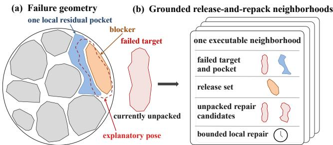
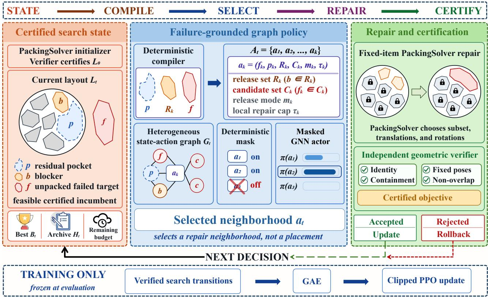
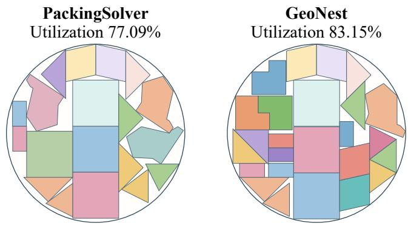

# GeoNest: Learning to Select Failure-Aware Neighborhoods for the Irregular Knapsack Problem in a Circular Container

Zhongman Du1, Huiming Zhang1, Linlin Yang2, Sheng Xu2, Baochang Zhang1,3

1Beihang University, Beijing, China

2Communication University of China, Beijing, China

3Hangzhou Innovation Institute of Beihang University, Hangzhou, China

## Abstract

The two-dimensional irregular knapsack problem in a fixed circular container is an important combinatorial optimization problem for maximizing material utilization in manufacturing. Conventional geometric packing solvers can produce tightly packed layouts, yet they often partition the residual space into isolated small pockets that cannot fit valuable unplaced poly- gons. To overcome this late-stage packing bottleneck, we pro- pose a failure-aware large neighborhood search framework named GeoNest, driven by a graph policy trained via rein- forcement learning. Specifically, we first construct neighbor- hoods by pairing failed target polygons with residual pock- ets. We then use explanatory poses to identify the placed polygons that block candidate insertions. These diagnosed blocking relations define bounded, fixed-item repair subprob- lems for the underlying geometric solver. Finally, the graph policy selects the most promising subproblem for execution. For evaluation, we introduce CircleNest-Bench, a benchmark comprising 2,391 load-controlled instances from four contour sources, including a held-out industrial CAD source. Exper- imental results demonstrate that, under the same total time budget, GeoNest improves mean utilization over a state-of- the-art standalone packing solver by about 0.9% on average across the three main test sets and by about 0.6% on the held- out industrial set.

## Introduction

Two-dimensional irregular packing is a classical NP-hard problem with broad applications in material cutting, indus- trial nesting, and texture atlas generation (Lee, Ma, and Cheng 2008; Nöll and Stricker 2011). Most studies consider strip or rectangular containers, whose straight boundaries and principal directions provide natural references for piece placement (Leão et al. 2020). In contrast, substrates such as semiconductor wafers and optical lens blanks are often circular or nearly circular and lack corner structure. Prior circular-container studies mainly consider regular objects (Huang et al. 2006; López and Beasley 2018). To our knowl-edge, this is the first study of irregular polygon knapsack packing in a fixed circular container. We call this problem the Two-Dimensional Circular-Container Irregular Knapsack Problem (2D-CIKP). Given an overloaded candidate set, 2D-CIKP selects a subset and determines translations and con- tinuous rotations to maximize packed area subject to containment and non-overlap.

  
Figure 1: Failure geometry and grounded repair in 2D-CIKP. A target–pocket pair and its explanatory pose identify block- ers, which define executable release-and-repack neighbor- hoods.

Traditional methods combine explicit geometric compu- tation with constructive heuristics or metaheuristic search, but early placement decisions can lock the search into unfa- vorable residual-space structures (Gomes and Oliveira 2006; Sato et al. 2019). Recent generative approaches jointly refine multiple piece poses (Xue et al. 2023, 2025), while reinforce-ment learning methods optimize packing sequences or select predefined low-level operators (Fang et al. 2023; Wang et al. 2026). These approaches do not turn the interaction between an unpacked target and the residual geometry into a targeted repair decision.

This limitation is most acute in the late stages of search. Geometry-based solvers quickly construct high-quality fea- sible layouts, but further improvement becomes dificult as utilization rises and residual free space fragments into pock- ets with blocked access or incompatible shapes. A valuable polygon can then remain unpacked even when the total resid- ual area exceeds its area, while generic perturbations preserve the same bottleneck. As illustrated in Fig. 1, pairing a failed target with a residual pocket exposes an explanatory pose and its blockers, turning failure geometry into concrete release- and-repack neighborhoods. The central late-stage decision is therefore which neighborhood to repair next.

We therefore propose GeoNest, a failure-aware, learning- guided large-neighborhood search framework that augments geometry-based solvers, as illustrated in Fig. 2. Following learning-guided neighborhood search (Wu et al. 2021; Reijnen et al. 2024), GeoNest does not predict complete layouts or continuous poses. Starting from a feasible layout produced by bounded geometric search, it pairs unpacked targets with compatible residual pockets, constructs explanatory poses, and uses the resulting blockers to compile fixed-item repair neighborhoods at multiple scales. Each executable neighbor- hood forms an action defined by its release set, admitted unpacked items, scale, and repair-time cap.

  
Figure 2: Overview of one GeoNest decision. An unpacked target is paired with a residual pocket, and an explanatory pose identifies candidate blockers. The resulting fixed-item repair actions are encoded in a graph and scored by the policy PackingSolver then executes the selected action under its repair-time cap.

The value of an action depends on the current target– pocket–blocker configuration. Each repair decision updates future eligible actions and the remaining budget and may change the residual geometry, so neighborhood selection is sequential. Targets, pockets, blockers, and actions are en- coded in a heterogeneous graph, where a masked GNN pol- icy trained with PPO ranks eligible actions. PackingSolver (Fontan 2026) executes the selected repair with all other pieces fixed, and a common geometric verifier certifies the result.

For evaluation, we introduce CircleNest-Bench, com- prising 2,391 load-controlled circular-container instances from four contour sources. It covers in-distribution testing, size extrapolation, overload stress testing, cross-source trans- fer, and held-out industrial CAD. All methods use identi- cal instances and matched time budgets, and only verifier- certified layouts contribute utilization. GeoNest improves certified utilization over the strongest geometry-based base- line by 0.6% to 1.0%. Ablations isolate the contributions of failure-aware neighborhood construction and learned neigh- borhood selection. The main contributions are as follows.

• We formalize 2D-CIKP and introduce CircleNest-Bench, a benchmark of 2,391 load-controlled instances from four contour sources.

• We introduce a failure-aware neighborhood construction mechanism that uses target–pocket pairs and explanatory poses to diagnose blockers and compile fixed-item repair neighborhoods.

• We propose GeoNest, which casts failure recovery as sequential selection among repair-neighborhood actions and uses a masked GNN policy trained with PPO to rank them. Experiments demonstrate improved certified uti- lization and generalization across instance sizes and con- tour sources.

## Related Work

## Irregular Packing and Fixed-Container Problems

Irregular packing relies on explicit geometric models of con- tainment, non-overlap, and candidate placement. No-fit poly- gons encode pairwise relative-placement constraints, while raster models and mixed-integer formulations provide alter- native mechanisms for geometric feasibility (Bennell and Oliveira 2008; Burke et al. 2007; Umetani and Murakami 2022; Lastra-Díaz and Ortuño 2024). Large neighborhood search and adaptive large neighborhood search provide gen- eral frameworks for improving incumbent solutions (Pisinger and Ropke 2010; Ropke and Pisinger 2006), and recent work applies LNS to irregular bin packing through large-scale per- turbations of cross-bin polygon assignments (Wang, Xu, and Yang 2026). Open-source heuristics such as Sparrow im-prove reproducibility (Gardeyn, Vanden Berghe, and Wauters 2025).

Representative circular-container studies consider packing regular objects, including unequal circles and rectangles, in a fixed circular container (López and Beasley 2016; Bouzid and Salhi 2020). The closest prior formulation we are aware of is the Maximum Polygon Packing problem from the CG:SHOP 2024 Challenge (Fekete et al. 2024), addressed by representative SoCG approaches (Atak et al. 2024; da Fonseca and Gerard 2024). It considers profit-maximizing subset selection in a fixed convex polygonal container but permits translations only. 2D-CIKP instead considers a fixed circular container with continuous rotations, making radial boundary efects and the orientation-dependent accessibility of resid- ual pockets central to subsequent insertions.

## Learning-Guided Packing and Neighborhood Search

Learning-based irregular packing methods act during layout construction or refinement. Reinforcement learning has been used to optimize piece sequences (Fang et al. 2023), select low-level operators for sequence and orientation optimization (Wang et al. 2026), and learn rotational placement within hybrid nesting pipelines (Abdou et al. 2026). Yang et al. select and group irregular UV patches and predict their relative poses, whereas GFPack and GFPack++ learn gradient fields for joint layout refinement (Yang et al. 2023; Xue et al. 2023, 2025). In contrast, the learned policy in GeoNest operates after bounded geometric search and uses unpacked items as failure targets without predicting placement coordinates or rotations.

A complementary line preserves a conventional solver and learns to control large neighborhood search. For integer pro- grams, learned policies select neighborhoods or variables for solver-based reoptimization (Song et al. 2020; Wu et al. 2021). Neural large neighborhood search learns repair heuristics, while learned ALNS methods control operators, param- eters, or acceptance decisions (Hottung and Tierney 2022; Reijnen et al. 2024; Johnn et al. 2024). GeoNest follows this solver-control principle but uses a diferent action interface. Instead of selecting a global operator or a generic subset of solver variables, it ranks repair actions constructed from the current failed target and its local geometric context.

## Problem Formulation and Benchmark

Task formulation. An instance of 2D-CIKP consists of a fixed circular container and n candidate polygonal items. Let $[ n ] = \{ 1 , \dots , n \}$ and let $P _ { i } \subset \mathbb { R } ^ { 2 }$ be a compact sim- ple polygonal region with area $a _ { i } = \mathrm { a r e a } ( P _ { i } ) \ \bar { > } \ 0 .$ . The container is the fixed disk $D _ { R } = \mathbf { \bar { \Phi } } \{ x \in \mathbb { R } ^ { 2 } : \| x \| _ { 2 } \leq R \}$ with radius $R > 0 , { \textrm { A } }$ selected item i is assigned a pose $q _ { i } = ( \mathbf { u } _ { i } , \theta _ { i } ) \in \mathbb { R } ^ { 2 } \times [ 0 , 2 \pi )$ , where $\mathbf { u } _ { i }$ is a continuous trans- lation vector and $\theta _ { i }$ may take any in-plane angle over the full $3 6 0 ^ { \circ }$ range. Its transformed region is $\mathbf { \bar { \boldsymbol { X } } } _ { i } ( \ r _ { q _ { i } } ) = \ r _ { Q } ( \ r _ { \theta _ { i } } ) P _ { i } + \mathbf { u } _ { i } .$ where $Q ( \theta _ { i } )$ is the planar rotation matrix. Reflections are not allowed. A la out is $L = \{ ( z _ { i } , q _ { i } ) \} _ { i = 1 } ^ { n }$ , where $z _ { i } \in \{ 0 , 1 \}$ indicates whether item i is selected and $q _ { i }$ is immaterial when $z _ { i } = 0$ . The layout is feasible if the following conditions hold for every $i \in [ n ]$ and every pair $i < j \colon$

$$
\begin{array} { r l } & { z _ { i } = 1 \implies X _ { i } ( q _ { i } ) \subseteq D _ { R } , } \\ & { z _ { i } = z _ { j } = 1 \implies \operatorname* { i n t } X _ { i } ( q _ { i } ) \cap \operatorname* { i n t } X _ { j } ( q _ { j } ) = \emptyset . } \end{array}
$$

Boundary contact is allowed. For a feasible layout, define its disk utilization as

$$
U ( L ) = \frac { \sum _ { i = 1 } ^ { n } z _ { i } a _ { i } } { \pi R ^ { 2 } } .
$$

Let ${ \mathcal { L } } _ { \mathrm { f e a s } }$ denote the set of feasible layouts. We solve

$$
L ^ { \star } \in \underset { L \in \mathcal { L } _ { \mathrm { f e a s } } } { \mathrm { a r g m a x } } U ( L ) .
$$

Since R is fixed for each instance, maximizing $U ( L )$ is equiv- alent to maximizing the total packed area. The ofered load is

$$
\lambda = \frac { \sum _ { i = 1 } ^ { n } a _ { i } } { \pi R ^ { 2 } } , \qquad R = \sqrt { \frac { \sum _ { i = 1 } ^ { n } a _ { i } } { \pi \lambda } } .\tag{1}
$$

CircleNest-Bench uses $\lambda > 1$ , so the total candidate area exceeds the disk area and subset selection is necessary.

CircleNest-Bench. Public irregular-packing collections provide diverse source contours for constructing controlled circular-container knapsack instances across size, load, and source shifts. To provide a reproducible evaluation basis, CircleNest-Bench contains 2,391 load-controlled 2D-CIKP instances generated from ESICUP shapes, controlled syn- thetic shapes, the Gardeyn nesting instances, and a held-out industrial geometry source (ESICUP 2025; Gardeyn, Vanden Berghe, and Wauters 2025). The benchmark converts the source contours into new circular-container knapsack in- stances and sets the disk radius from Eq. (1) after forming the candidate set. Tab. 1 reports the complete split statistics.

<table><tr><td>Split</td><td>E</td><td>S</td><td>G</td><td>I</td><td>Total</td></tr><tr><td>Train</td><td>720</td><td>720</td><td>360</td><td>一</td><td>1,800</td></tr><tr><td>Validation</td><td>90</td><td>90</td><td>54</td><td>一</td><td>234</td></tr><tr><td>Main</td><td>90</td><td>90</td><td>54</td><td>一</td><td>234</td></tr><tr><td>Industrial</td><td>一</td><td>一</td><td>一</td><td>14</td><td>14</td></tr><tr><td>Size</td><td>40</td><td>40</td><td>4</td><td>一</td><td>84</td></tr><tr><td>Stress</td><td>10</td><td>10</td><td>5</td><td>一</td><td>25</td></tr><tr><td>Total</td><td>950</td><td>950</td><td>477</td><td>14</td><td>2,391</td></tr></table>

Table 1: CircleNest-Bench partitions. E, S, G, and I denote the ESICUP, Synthetic, Gardeyn, and Industrial sources, re- spectively. The Industrial source contains held-out CAD- derived contours.

Splits and evaluation. The partitions are disjoint at the base candidate-item-set level. All load variants derived from the same base set share identical items, difer only in disk radius, and remain in the same split. Primary evaluation uses ESICUP Main, Synthetic Main, and Gardeyn Main and re- ports the unweighted macro average of their source-level means. The Main partitions span $\check { n } \in \{ 4 8 , 6 4 , 9 6 \}$ and of- fered loads $\lambda \in \{ \bar { 1 . 2 } , 1 . 5 , 2 . 0 \}$ . The Size split evaluates ex- trapolation to $n = 1 2 8$ at $\lambda \in \{ 1 . 5 , 2 . 0 \}$ , while Stress fixes $n = 6 4$ and tests $\lambda = 2 . 5$ . The held-out size $n = 1 2 8$ and load $\lambda \ : = \ : 2 . 5$ do not appear in training or validation. In- dustrial contains 14 test-only CAD instances with $n = 1 0 0$ and $\lambda = 1 . 5$ . Its source contours do not occur in training or validation, and the Industrial split is excluded from the three-source Main average.

All methods submit layouts to a common verifier that re- constructs every transformed polygon from the immutable instance geometry, checks item identities, disk containment, and pairwise non-overlap, and recomputes $U ( L )$ . The pri- mary metric is verifier-certified utilization, and invalid lay- outs receive zero. The benchmark release includes the in- stance files, split manifests, generation scripts, and verifier. Additional details on source mappings, instance construc- tion, split auditing, and verification are provided in the sup- plementary material.

## Method

Given a feasible initial layout $L _ { 0 }$ and a takeover budget, GeoNest treats items left unpacked by bounded search as failure targets and pairs them with residual pockets to con- struct fixed-item repair subproblems. A graph policy ranks the corresponding solver calls and allocates the next portion of the budget to the selected subproblem. Fig. 2 illustrates the process.

## Failure-Grounded Neighborhoods

At decision t, the controller state is

$$
s _ { t } = ( L _ { t } , B _ { t } , \mathcal { H } _ { t } , \mathcal { F } _ { t } , \mathcal { P } _ { t } , \zeta _ { t } ) ,
$$

where $L _ { t }$ and $B _ { t }$ are the current and certified best layouts, respectively, $\mathcal { H } _ { t }$ stores verifier-valid, geometrically distinct archived layouts, $\mathcal { F } _ { t }$ orders items left unpacked by the pre- ceding bounded search, $\mathcal { P } _ { t }$ contains residual pockets, and $\zeta _ { t }$ records the remaining budget, stagnation, and retry state.

Let $\mathcal { T } ( L _ { t } )$ denote the identities of items placed in $L _ { t } .$ Using a deterministic polygonal disk proxy $\widehat { D } _ { R } .$ , we define the residual region as

$$
\widehat { \Omega } _ { t } = \widehat { D } _ { R } \backslash \bigcup _ { i \in \mathcal { T } ( L _ { t } ) } X _ { i } ( q _ { i } ) .
$$

The nonempty connected components obtained by intersect- ing $\widehat { \Omega } _ { t }$ with fixed multiscale radial and angular windows form $\mathcal { P } _ { t }$ . For a target $f$ and pocket $p ,$ the compatibility score $\rho ( f , p ) \in [ 0 , 1 ]$ combines their area ratio with the best axis- aligned bounding-box fit under the original and $9 0 ^ { \circ }$ -swapped spans and ranks target–pocket pairs for geometric testing.

For each retained pair $( f , p )$ , the generator constructs finite orientation and translation-anchor sets and produces

$$
\mathcal { Q } _ { 0 } ( \boldsymbol { f } , \boldsymbol { p } ) = \{ \boldsymbol { q } = ( \mathbf { u } , \boldsymbol { \theta } ) ~ | ~ \boldsymbol { \theta } \in \Theta ( \boldsymbol { f } , \boldsymbol { p } ) , \ : \mathbf { u } \in \mathcal { T } ( \boldsymbol { f } , \boldsymbol { p } , \boldsymbol { \theta } ) \} .
$$

A pose is retained if the transformed target lies inside the disk and at least a fraction $\eta \in ( 0 , 1 ]$ of its area overlaps p. It may overlap incumbent items, whose identities define the pose-induced blockers

$$
B _ { t } ( f , q ) = \left\{ i \in \mathbb { Z } ( L _ { t } ) \mid \mathrm { a r e a } ( X _ { f } ( q ) \cap X _ { i } ( q _ { i } ) ) > \varepsilon _ { \mathrm { b l k } } \right\} ,
$$

where $\varepsilon _ { \mathrm { { b l k } } } ~ > ~ 0$ is the blocker-overlap threshold. Among the retained poses, the explanatory pose $q ^ { \star }$ maximizes a fixed pose score that rewards pocket coverage and penal- izes blocked area, blocker count, and radial displacement. Its blockers form the core release set, while the repair solver determines the final poses. Exact formulations of $\rho ( f , p )$ and $q ^ { \star }$ are provided in the supplementary material.

Each executable failure-specific repair neighborhood de- fines a grounded action of the form

$$
a = ( f _ { a } , p _ { a } , \mathcal { R } _ { a } , C _ { a } , m _ { a } , \tau _ { a } ) ,
$$

where $f _ { a }$ and $p _ { a }$ are its target and pocket, $\textstyle { \mathcal { R } } _ { a }$ is the re- lease set, $C _ { a } \ni f _ { a }$ is a bounded set of admitted un- packed items, and $\tau _ { a }$ is the repair-time cap. The mode $m _ { a } \in$ {core, local, connected, deep-connected} deter-mines $\textstyle { \mathcal { R } } _ { a }$ . core releases only the pose-induced blockers, local also releases nearby placed items, and the connected modes expand through the placed-item connectivity graph at increasing depth. Additional unpacked items are admitted only when they have positive compatibility with $p _ { a }$ and are ranked by compatibility, shape complementarity, and area ra- tio. The repair-time cap scales with the movable-item count, total vertex count, and neighborhood scale, subject to the re-maining takeover budget. Algorithm 1 summarizes the com- pilation procedure.

Algorithm 1 Failure-grounded neighborhood compilation   
Require: Layout $L _ { t } ,$ , frontier $\mathcal { F } _ { t } ,$ pockets $\mathcal { P } _ { t } ,$ control state   
$\zeta _ { t }$   
1: $A _ { t } \gets \emptyset$   
2: for $f \in$ TargetFrontier $( \mathcal { F } _ { t } )$ do   
3: for $p \in$ DiversePockets $( f , \mathcal { P } _ { t } )$ do   
4: q⋆ ← ExplanatoryPose $( f , p , L _ { t } )$   
5: if $q ^ { \star }$ exists then   
6: $\mathcal { B } ^ { \mathrm { c o r e } } \gets B _ { t } ( f , \boldsymbol { q } ^ { \star } )$   
7: for m ∈ AvailableModes $\left( \zeta _ { t } \right)$ do   
8: R ← ExpandRelease(Bcore, m)   
9: C ← {f} ∪ PositiveFitAdmit $( f , p )$   
10: τ ← RepairBudget(R, C, m, ζt)   
11: if τ is executable then   
12: add $( f , p , \mathcal { R } , C , m , \tau )$ to At   
13: end if   
14: end for   
15: end if   
16: end for   
17: end for   
18: return ActionMask(BalanceAndCap(At), ζt)

The compiler retains at most $K _ { A }$ candidates. It allocates most slots round-robin across neighborhood modes, covers unseen target–pocket pairs, and backfills remaining slots by the fixed geometric score. The action mask merges candidates inducing the same fixed-item subproblem, suppresses ex- act repeats, and permits bounded semantic retries. Sustained stagnation enables progressively deeper neighborhoods.

## Graph Policy

At decision $t , G _ { t }$ encodes each executable repair and its failure geometry. Typed nodes represent targets, pockets, blockers, actions, boundary context, admission context and archived layouts. Object-node attributes encode normalized geometry, failure history, and search context, while action- node attributes encode the fixed geometric score, repair scope, time cap, mode, and remaining-budget ratio. Typed edges encode target–pocket fit, blocker and coupling rela- tions, action membership, and archive dominance.

The actor and critic use independent typed GNN encoders with relation-specific, edge-gated mean aggregation. The ac- tor scores action nodes, while the critic pools non-action nodes to estimate the state value. A raw fixed geometric score $h ( a )$ enters the action logits over the eligible set

$$
z _ { a } = \frac { \ell _ { \psi } ( a \mid G _ { t } ) + \omega _ { h } h ( a ) } { \tau _ { \pi } } , \qquad \pi _ { \psi } = \mathrm { s o f t m a x } _ { a \in \mathcal { A } _ { t } ^ { \mathrm { e l i g } } } ( z _ { a } ) .
$$

Here, $\boldsymbol { \mathcal { A } } _ { t } ^ { \mathrm { e l i g } }$ denotes the eligible action set after masking, and $\psi$ denotes the policy parameters. The terms $\ell _ { \psi } ( a \mid G _ { t } ^ { - } )$ and $h ( a )$ are the learned action logit and deterministic geometric score, respectively, while $\omega _ { h }$ and $\tau _ { \pi }$ are the score weight and policy temperature. Training samples from $\pi _ { \psi } .$ , whereas inference selects its maximizer.

## Fixed-Item Repair and Verification

For action $^ { a , }$ define

$$
K _ { a } = \mathcal { I } ( L _ { t } ) \setminus \mathcal { R } _ { a } , \qquad I _ { a } = K _ { a } \cup \mathcal { R } _ { a } \cup C _ { a } .
$$

The repair instance contains $I _ { a } ,$ , with items in $K _ { a }$ fixed at their current poses and items in $\mathcal { R } _ { a } \cup C _ { a }$ , including $f _ { a } ,$ optional and movable.

For each repair instance, PackingSolver approximates the continuous rotation domain with a finite, geometry- dependent orientation set $\Theta _ { \mathrm { e x e c } } ( I _ { a } )$ and searches continu- ous translations at those orientations within $\tau _ { a } .$ , returning the feasible candidate with highest $U ( L )$

An internal repair validator enforces fixed poses and checks the merged full layout. The common true-disk verifier then applies the benchmark checks and recomputes $U ( L )$ . A candidate passing both checks becomes the certified candi- date $\widehat { L } _ { t }$

If $U ( widehat { L } _ { t } ) \ > \ U ( B _ { t } )$ , we set $L _ { t + 1 } ~ = ~ B _ { t + 1 } ~ = ~ \widehat { L } _ { t }$ . If $U ( \widehat { L } _ { t } ) = U ( L _ { t } ) = U ( B _ { t } )$ and the candidate creates a new search context with diferent action-relevant geometry, we set $L _ { t + 1 } = \widehat { L } _ { t }$ and retain $B _ { t + 1 } = B _ { t }$ under the bounded plateau rule. If no certified candidate is returned or neither condition holds, we retain $L _ { t + 1 } = L _ { t }$ and $B _ { t + 1 } = B _ { t }$ . Thus, $B _ { t + 1 }$ remains feasible and satisfies $U ( B _ { t + 1 } ) \geq U ( B _ { t } )$

## Learning Objective

Because each repair decision updates the eligible actions and remaining budget and may change the residual pockets, neighborhood selection is sequential, and the learning objective balances immediate certified improvement, repair cost, and downstream packability. Let $\Delta _ { t } ^ { B ^ { \ast } } = U ( B _ { t + 1 } ) \dot { - } U ( B _ { t } )$ We use the step reward with potential-based shaping $( \mathrm { N g }$ Harada, and Russell 1999)

$$
r _ { t } = \beta _ { B } \Delta _ { t } ^ { B } - \beta _ { c } \widehat { c } _ { t } + \beta _ { \Phi } \left[ \gamma \Phi ( s _ { t + 1 } ) - \Phi ( s _ { t } ) \right] + r _ { t } ^ { \mathrm { e v t } } ,
$$

where $\beta _ { B } , \beta _ { c } ,$ , and $\beta _ { \Phi }$ are fixed reward coeficients, $\gamma$ is the discount factor, and $\widehat { c } _ { t }$ is the normalized repair time. The fixed potential Φ satisfies $\Phi ( s ) \in [ 0 , 1 ]$ for every state s and assigns higher values to promising states based on unresolved-item burden, residual placeability, and layout quality. The event term contains clipped degraded-candidate feedback and fixed outcome penalties. At terminal step $H ,$ , it credits improving transitions in proportion to $U ( B _ { H } ^ { \bullet } ) - U ( L _ { 0 } )$ . A terminal correction preserves telescoping over the finite horizon.

We train the masked actor–critic using PPO and GAE (Schulman et al. 2016, 2017). During training, bounded probes compare alternative eligible actions by verifier- certified outcome, and the PPO loss includes a low-weight preference term favoring the better action. Only the policy- selected action advances the trajectory, and training uses fixed, certified initial layouts. Complete takeover pseudocode and implementation details are provided in the supplemen- tary material.

## Experiments

## Experimental Setup

Data and training. We evaluate all methods on the held-out test partitions in Tab. 1. For each non-CAD source, we train three policies using seeds 42, 3407, and 7301, with checkpoints selected on a fixed source-specific validation set and frozen before testing. Results are averaged per in- stance across seeds before source aggregation, and Main Avg. equally weights ESICUP, Synthetic, and Gardeyn. All nine policies are evaluated zero-shot on CAD, with results grouped by training source. Training, validation, and tuning use only the three non-CAD sources.

Baselines. Reproducible competitive irregular-packing implementations remain scarce (Gardeyn, Vanden Berghe, and Wauters 2025). We compare against PackingSolver (PS) (Fontan 2026), 2DNesting (lryan599 2025), and Shadoks-MS (da Fonseca and Gerard 2024). All three baselines are deterministic under our configurations and evalu- ated once per instance. PS is used without algorithmic mod- ification, while 2DNesting and Shadoks-MS are adapted to the circular-container knapsack setting. All methods solve identical instances under matched wall-clock budgets and search orientations over the full [0◦, 360◦) range using their own placement and orientation-search strategies.

Protocol and metrics. Under the 650-s budget, standalone methods use the full budget, while GeoNest uses 350 s for PS initialization and 300 s for takeover. Validation curves showed that PS plateaued by 350 s, so this split was fixed before testing. Under the 1200-s budget, PS uses the full budget, while GeoNest uses 600 s each for initialization and takeover. Failure-geometry extraction, action and graph con- struction, policy inference, repair, in-loop verification, roll- back, and controller bookkeeping count toward the takeover budget.

<table><tr><td>Source (N)</td><td>2DNesting</td><td>Shadoks-MS</td><td>PackingSolver</td><td> $\mathrm { G E O N } _ { \mathrm { E S T } } ( \mu \pm \sigma )$ </td><td>Gain [95% CI]</td><td>W/T/L</td></tr><tr><td>ESICUP (90)</td><td>64.98</td><td>72.97</td><td>78.59</td><td> ${ \bf 7 9 . 5 5 \pm 0 . 0 8 }$ </td><td>+0.96 [0.64, 1.31]</td><td>62/1/27</td></tr><tr><td>Synthetic (90)</td><td>62.00</td><td>72.47</td><td>79.61</td><td> ${ \bf 8 0 . 6 4 \pm 0 . 0 8 }$ </td><td>+1.03 [0.70, 1.39]</td><td>64/0/26</td></tr><tr><td>Gardeyn (54)</td><td>60.47</td><td>72.17</td><td>76.93</td><td> ${ \bf 7 7 . 5 3 \pm 0 . 1 1 }$ </td><td>+0.60 [0.34, 0.86]</td><td>36/2/16</td></tr><tr><td>Main Avg. (234)</td><td>62.49</td><td>72.54</td><td>78.37</td><td> ${ \bf 7 9 . 2 4 \pm 0 . 0 8 }$ </td><td>+0.87 [0.69, 1.05]</td><td>162/3/69</td></tr></table>

Table 2: Main results under matched 650-s budgets. Entries report verifier-certified utilization (%). GeoNest is reported as the mean and sample standard deviation over three training seeds, and Main Avg. equally weights the three sources.

All methods are evaluated on the same Intel Xeon Platinum 8352V node with 125 GiB RAM and one CPU thread per instance, while training uses one NVIDIA RTX A5000 GPU. We report verifier-certified mean utilization, paired gain in percentage points, and instance-level W/T/L against PS. Af- ter averaging over training seeds, 95% confidence intervals are computed from 200,000 paired cluster-bootstrap resam- ples of base candidate-item sets within each source, with all load variants of each sampled set retained together. Sources are resampled separately before computing Main Avg. Se- lector comparisons use two-sided paired sign-flip tests at the base-set level with Holm correction.

## Main Comparison under Matched Budgets

Matched-budget performance. Tab. 2 shows positive gains across all three sources, and all paired 95% confi- dence intervals exclude zero. PackingSolver already reaches a Main Avg. utilization of 78.37%. At this utilization level, further improvement increasingly depends on reorganizing constrained residual space rather than filling obvious gaps. These results support a late-stage shift in search strategy after geometric construction has matured, redirecting computation from continued generic improvement to failure-conditioned repair, as illustrated in Fig. 3.

  
Figure 3: Verifier-certified PackingSolver and GeoNest lay- outs for the same instance under matched 650-s budgets.

Budget robustness and eficiency. The matched 1200-s comparison shows positive gains across all three sources.

Despite using 45.8% less time, the 650-s GeoNest config- uration exceeds PackingSolver at 1200 s by 0.46 pp. The matched-budget gain at 1200 s retains 88.5% of the 650- s gain, showing that the benefit persists as both methods receive more time. This cross-budget reversal shows that tar- geted repair is more efective than nearly doubling generic search time.
<table><tr><td colspan="4">(a) Matched 1200-s budget</td></tr><tr><td>Source</td><td>PS</td><td>GEONEST (µ±σ)</td><td>Gain [95% CI]</td></tr><tr><td>ESICUP Synthetic</td><td>78.81 80.06</td><td> ${ \bf 7 9 . 6 5 \pm 0 . 1 0 }$   ${ \bf 8 0 . 9 6 \pm 0 . 1 3 }$ </td><td>+0.84 [0.59, 1.14] +0.90 [0.68, 1.14]</td></tr><tr><td>Gardeyn Main Avg.</td><td>77.46 78.78</td><td> ${ \bf 7 8 . 0 3 \pm 0 . 1 3 }$   ${ \bf 7 9 . 5 5 \pm 0 . 1 1 }$ </td><td>+0.57 [0.31, 0.82]</td></tr><tr><td></td><td></td><td></td><td>+0.77 [0.63, 0.92]</td></tr><tr><td colspan="4">(b) Cross-budget efficiency</td></tr><tr><td>Source</td><td>PS</td><td>GEONEST (µ±σ)</td><td>Gain [95% CI]</td></tr><tr><td>ESICUP</td><td>78.81</td><td> ${ \bf 7 9 . 5 5 \pm 0 . 0 8 }$ </td><td>+0.74 [0.50, 1.01]</td></tr><tr><td>Synthetic</td><td>80.06</td><td> ${ \bf 8 0 . 6 4 \pm 0 . 0 8 }$ </td><td>+0.58 [0.32, 0.85]</td></tr><tr><td>Gardeyn</td><td>77.46</td><td> ${ \bf 7 7 . 5 3 \pm 0 . 1 1 }$ </td><td>+0.07[−0.17, 0.30]</td></tr><tr><td></td><td></td><td></td><td></td></tr><tr><td>Main Avg.</td><td>78.78</td><td> ${ \bf 7 9 . 2 4 \pm 0 . 0 8 }$ </td><td>+0.46 [0.32, 0.61]</td></tr></table>

Table 3: Long-budget results with verifier-certified utilization (%). Panel (a) reports matched 1200-s comparisons. Panel (b) compares 1200-s PackingSolver with the 650-s GeoNest configuration.

Gardeyn is the only source with an inconclusive cross- budget comparison. Its more concave and intricate polygons induce complex pockets and blocker relations. The positive matched-budget gain and weaker cross-budget result are con- sistent with such geometry requiring a longer repair horizon.

## Ablation and Generalization

Component analysis. All variants reuse the same 350- s PackingSolver layout and receive 300 s. Generic-LNS is failure-blind. FA-LNS-Random, FA-LNS-Score, FA-LNS- MLP, and GeoNest use the same state-dependent failure- aware action-generation procedure and repair executor. They difer only in action selection, using random choice, a fixed score, an MLP, or the relation-aware GNN.

Failure-aware actions and learned selection. Failure-aware actions account for most of the gain beyond Generic- LNS. Because all selectors use the same action-generation procedure and repair executor, Tab. 4(b) isolates the value of action selection. GeoNest significantly outperforms Ran- dom, Score, and MLP, showing that relation-aware model- ing of the target–pocket–blocker structure adds value beyond heuristic and non-graph learned ranking. A one-step audit of 18 states, for which all candidate actions were evaluated, found that the GNN selected the best immediate repair in 61.1% of cases and achieved a higher immediate gain than the mean over candidate actions, linking the end-to-end im- provement to action-level discrimination.

(b) Held-out industrial CAD transfer
<table><tr><td colspan="6">(a) Component analysis</td></tr><tr><td>Variant</td><td>E</td><td>S</td><td>G</td><td>Main</td><td>∆</td></tr><tr><td>PackingSolver</td><td>78.59</td><td>79.61</td><td>76.93</td><td>78.37</td><td>一</td></tr><tr><td>Generic-LNS</td><td>79.16</td><td>79.89</td><td>77.17</td><td>78.74</td><td> $+ 0 . 3 7$ </td></tr><tr><td>FA-LNS-Random</td><td>79.32</td><td>80.43</td><td>77.34</td><td>79.03</td><td> $+ 0 . 6 6$ </td></tr><tr><td>FA-LNS-Score</td><td>79.41</td><td>80.53</td><td>77.34</td><td>79.10</td><td> $+ 0 . 7 3$ </td></tr><tr><td>FA-LNS-MLP</td><td>79.34</td><td>80.58</td><td>77.49</td><td>79.14</td><td> $+ 0 . 7 7$ </td></tr><tr><td>GEONEST</td><td>79.55</td><td>80.64</td><td>77.53</td><td>79.24</td><td> ${ \bf + 0 . 8 7 }$ </td></tr></table>

<table><tr><td colspan="4">(b) Direct selector and architecture comparisons</td></tr><tr><td>Comparison</td><td>Gain</td><td>95% CI</td><td>PHolm</td></tr><tr><td>GeoNEST - Random</td><td>+0.21</td><td>[0.13,0.29]</td><td> $1 . 5 0 \times 1 0 ^ { - 5 }$ </td></tr><tr><td>GeoNEsT — Score</td><td>+0.14</td><td>[0.04, 0.26]</td><td> $1 . 9 5 \times 1 0 ^ { - 2 }$ </td></tr><tr><td> $\mathrm { G e o N e s r - M L P }$ </td><td>+0.10</td><td>[0.03, 0.18]</td><td> $1 . 9 5 \times 1 0 ^ { - 2 }$ </td></tr></table>

Table 4: Component analysis. E, S, and G denote ESICUP, Synthetic, and Gardeyn. Panel (a) reports verifier-certified utilization (%), with ∆ denoting the equal-source Main im-provement over PackingSolver. Panel (b) compares selectors under the same failure-aware action-generation procedure. GeoNest, FA-LNS-Random, and FA-LNS-MLP are aver- aged over three seeds.

Scale and load. Tab. 5 shows opposite trends for instance size and packing pressure. Gain decreases with n but increases with λ, indicating that GeoNest responds more strongly to spatial competition than to instance size alone. With larger item sets, a fixed repair budget is spread across more candidate neighborhoods, whereas higher load magni- fies the impact of blockers and residual pockets.

<table><tr><td>(a) Main-set marginal trends Factor Low</td><td>Medium</td><td></td><td>High</td></tr><tr><td>n</td><td>48 (+1.00)</td><td>64(+0.93)</td><td>96 (+0.67)</td></tr><tr><td>λ</td><td>1.2 (+0.71)</td><td>1.5 (+0.79)</td><td>2.0 (+1.10)</td></tr><tr><td>(b) Held-out shifts</td><td></td><td></td><td></td></tr><tr><td>Shift (N)</td><td></td><td>PackingSolver GEoNEST (µ±σ)</td><td>Gain W/T/L</td></tr><tr><td></td><td></td><td></td><td></td></tr><tr><td>Size (84)</td><td>80.70</td><td> ${ \bf 8 0 . 9 2 \pm 0 . 0 7 }$ </td><td>+0.22 63/10/11</td></tr><tr><td>Stress (25)</td><td>77.86</td><td> ${ \bf 7 8 . 5 6 \pm 0 . 0 8 }$ </td><td>+0.70 18/2/5</td></tr></table>

Table 5: Scale and load robustness under the 650-s budget. Panel (a) reports gains averaged over three seeds and equally across sources, with each cell showing the factor value and gain in pp. Panel (b) reports equal-source utilization (%) and gain, together with instance-level W/T/L, on the held-out Size and Stress shifts.

The held-out shifts reinforce this interpretation. Stress yields 3.2 times the mean gain of Size despite similar win rates. This pattern suggests that packing pressure afects the magnitude of improvement more than the frequency of wins, consistent with future-feasibility loss driven by residual- space competition.

Cross-source and industrial transfer. All six ofdiagonal gains are positive, and their mean is 91.7% of the mean source-matched gain. Policies trained on each of the three sources also produce similar positive CAD gains with no instance-level losses. The identical W/T/L counts across training sources further indicate consistent transfer to CAD. Together, these results show that relational failure cues trans- fer across contour distributions without requiring close con- tour matching.
<table><tr><td colspan="4">(a) Cross-source policy transfer</td></tr><tr><td>Train \ Test</td><td>ESICUP</td><td>Synthetic</td><td>Gardeyn</td></tr><tr><td>ESICUP</td><td>+0.96</td><td>+0.93</td><td>+0.63</td></tr><tr><td>Synthetic</td><td>+0.80</td><td>+1.03</td><td>+0.61</td></tr><tr><td>Gardeyn</td><td>+0.89</td><td>+0.89</td><td>+0.60</td></tr></table>

<table><tr><td>Train</td><td>PS</td><td>GEONEST</td><td>Gain [95% CI]</td><td>W/T/L</td></tr><tr><td>ESICUP</td><td>79.78</td><td>80.39</td><td>+0.61 [0.26, 1.01]</td><td>11/3/0</td></tr><tr><td>Synthetic</td><td>79.78</td><td>80.46</td><td>+0.68 [0.32, 1.19]</td><td>11/3/0</td></tr><tr><td>Gardeyn</td><td>79.78</td><td>80.39</td><td>+0.61 [0.26, 1.08]</td><td>11/3/0</td></tr></table>

Table 6: Generalization under the 650-s budget. Panel (a) reports seed-averaged gains over PS, with of-diagonal en- tries denoting zero-shot transfer. Panel (b) reports verifier-certified results on 14 held-out industrial CAD instances.

## Conclusion

We formalized 2D-CIKP and introduced CircleNest-Bench for reproducible, verifier-backed evaluation. GeoNest treats unpacked items as evidence of residual pockets, explanatory poses, and blockers, then uses a relation-aware graph policy to select which fixed-item repair neighborhood to execute within the budget. Ablations show failure grounding drives most gains beyond Generic-LNS, while learned selection significantly outperforms random, fixed-score, and MLP se- lectors. Starting from PackingSolver incumbents, GeoNest consistently yields substantial utilization improvements un- der matched budgets. Notably, our approach achieves cross- budget eficiency, where shorter-budget configurations out- perform the standalone solver under extended limits. Gains strengthen under higher packing pressure, and the learned policy transfers across unseen contour sources and held-out industrial CAD geometries. Together, the results show that late-stage packing is limited less by insuficient search than by failure diagnosis and repair allocation, positioning learning to direct expensive geometric computation rather than replac- ing it with pure neural approximations. The fixed-item repair contract enables this separation, allowing stronger compati- ble solvers to raise the backend ceiling while preserving the same failure-driven decision layer.

## References

Abdou, K.; Ibrahim, A. F.; Binder, K.; and Huber, M. F. 2026. Nest Smarter, Not Harder: A H brid Vision-Based Deep Reinforcement Learning Agent for Packing 2D Irregu- lar Geometries by Rotational Placement. Journal of Intelligent Manufacturing, 37(4): 1753–1767.

Atak, A.; Buchin, K.; Hagedoorn, M.; Heinrichs, J.; Hogreve, K.; Li, G.; and Pawelczyk, P. 2024. Computing Maximum Polygonal Packings in Convex Polygons Using Best-Fit, Ge- netic Algorithms and ILPs (CG Challenge). In Mulzer, W.; and Phillips, J. M., eds., 40th International Symposium on Computational Geometry (SoCG 2024), volume 293 of Leibniz International Proceedings in Informatics (LIPIcs), 83:1–83:9. Dagstuhl, Germany: Schloss Dagstuhl – Leibniz- Zentrum für Informatik.

Bennell, J. A.; and Oliveira, J. F. 2008. The Geometry of Nesting Problems: A Tutorial. European Journal ofOperational Research, 184(2): 397–415.

Bouzid, M. C.; and Salhi, S. 2020. Packing Rectangles into a Fixed Size Circular Container: Constructive and Metaheuris- tic Search Approaches. European Journal of Operational Research, 285(3): 865–883.

Burke, E. K.; Hellier, R. S. R.; Kendall, G.; and Whitwell, G. 2007. Complete and Robust No-Fit Polygon Generation for the Irregular Stock Cutting Problem. European Journal of Operational Research, 179(1): 27–49.

da Fonseca, G. D.; and Gerard, Y. 2024. Shadoks Approach to Knapsack Polygonal Packing (CG Challenge). In Mulzer, W.; and Phillips, J. M., eds., 40th International Symposium on Computational Geometry (SoCG 2024), volume 293 of Leibniz International Proceedings in Informatics (LIPIcs), 84:1–84:9. Dagstuhl, Germany: Schloss Dagstuhl – Leibniz- Zentrum für Informatik.

ESICUP. 2025. Cutting & Packing Datasets. https://github. com/ESICUP/datasets. EURO Special Interest Group on Cutting and Packing. Accessed: 2026-07-29.

Fang, J.; Rao, Y.; Zhao, X.; and Du, B. 2023. A Hybrid Reinforcement Learning Algorithm for 2D Irregular Packing Problems. Mathematics, 11(2): 327.

Fekete, S. P.; Keldenich, P.; Krupke, D.; and Schirra, S. 2024. Maximum Polygon Packing: The CG:SHOP Challenge 2024. arXiv:2403.16203.

Fontan, F. 2026. PackingSolver. https://github.com/fontanf/ packingsolver. GitHub repository. Accessed: 2026-07-29.

Gardeyn, J.; Vanden Berghe, G.; and Wauters, T. 2025. An Open-Source Heuristic to Reboot 2D Nesting Research. arXiv:2509.13329.

Gomes, A. M.; and Oliveira, J. F. 2006. Solving Irregular Strip Packing Problems by Hybridising Simulated Annealing and Linear Programming. European Journal of Operational Research, 171(3): 811–829.

Hottung, A.; and Tierney, K. 2022. Neural Large Neighbor- hood Search for Routing Problems. Artificial Intelligence, 313: 103786.

Huang, W.-Q.; Li, Y.; Li, C.-M.; and Xu, R.-C. 2006. New Heuristics for Packing Unequal Circles into a Circular Con- tainer. Computers & Operations Research, 33(8): 2125– 2142.

Johnn, S.-N.; Darvariu, V.-A.; Handl, J.; and Kalcsics, J. 2024. A Graph Reinforcement Learning Framework for Neu- ral Adaptive Large Neighbourhood Search. Computers & Operations Research, 172: 106791.

Lastra-Díaz, J. J.; and Ortuño, M. T. 2024. Mixed-Integer Programming Models for Irregular Strip Packing Based on Vertical Slices and Feasibility Cuts. European Journal of Operational Research, 313(1): 69–91.

Leão, A. A. S.; Toledo, F. M. B.; Oliveira, J. F.; Carravilla, M. A.; and Alvarez-Valdés, R. 2020. Irregular Packing Prob- lems: A Review of Mathematical Models. European Journal ofOperational Research, 282(3): 803–822.

Lee, W.-C.; Ma, H.; and Cheng, B.-W. 2008. A Heuristic for Nesting Problems of Irregular Shapes. Computer-Aided Design, 40(5): 625–633.

López, C. O.; and Beasley, J. E. 2016. A Formulation Space Search Heuristic for Packing Unequal Circles in a Fixed Size Circular Container. European Journal of Operational Research, 251(1): 64–73.

López, C. O.; and Beasley, J. E. 2018. Packing Unequal Rectangles and Squares in a Fixed Size Circular Container Using Formulation Space Search. Computers & Operations Research, 94: 106–117.

lryan599. 2025. 2DNesting: A 2D Nesting/Packing Software. https://github.com/lryan599/2DNesting. GitHub repository. Accessed: 2026-07-29.

Ng, A. Y.; Harada, D.; and Russell, S. J. 1999. Policy Invari- ance under Reward Transformations: Theory and Application to Reward Shaping. In Proceedings of the Sixteenth International Conference on Machine Learning (ICML 1999), 278–287. San Francisco, CA, USA: Morgan Kaufmann.

Nöll, T.; and Stricker, D. 2011. Eficient Packing of Arbi- trary Shaped Charts for Automatic Texture Atlas Generation. Computer Graphics Forum, 30(4): 1309–1317.

Pisinger, D.; and Ropke, S. 2010. Large Neighborhood Search. In Gendreau, M.; and Potvin, J.-Y., eds., Handbook of Metaheuristics, volume 146 of International Series in Operations Research & Management Science, 399–419. Boston, MA: Springer, 2nd edition.

Reijnen, R.; Zhang, Y.; Lau, H. C.; and Bukhsh, Z. 2024. Online Control of Adaptive Large Neighborhood Search Using Deep Reinforcement Learning. In Bernardini, S.; and Muise, C., eds., Proceedings of the 34th International Conference on Automated Planning and Scheduling (ICAPS 2024), vol-ume 34, 475–483. AAAI Press.

Ropke, S.; and Pisinger, D. 2006. An Adaptive Large Neigh- borhood Search Heuristic for the Pickup and Delivery Prob- lem with Time Windows. Transportation Science, 40(4): 455–472.

Sato, A. K.; Martins, T. C.; Gomes, A. M.; and Tsuzuki, M. S. G. 2019. Raster Penetration Map Applied to the Ir- regular Packing Problem. European Journal of Operational Research, 279(2): 657–671.

Schulman, J.; Moritz, P.; Levine, S.; Jordan, M. I.; and Abbeel, P. 2016. High-Dimensional Continuous Control Us- ing Generalized Advantage Estimation. In 4th International Conference on Learning Representations (ICLR 2016).

Schulman, J.; Wolski, F.; Dhariwal, P.; Radford, A.; and Klimov, O. 2017. Proximal Policy Optimization Algorithms. arXiv:1707.06347.

Song, J.; Lanka, R.; Yue, Y.; and Dilkina, B. 2020. A Gen- eral Large Neighborhood Search Framework for Solving In- teger Linear Programs. In Advances in Neural Information Processing Systems, volume 33, 20012–20023. Curran As-sociates, Inc.

Umetani, S.; and Murakami, S. 2022. Coordinate Descent Heuristics for the Irregular Strip Packing Problem of Ras- terized Shapes. European Journal ofOperational Research, 303(3): 1009–1026.

Wang, J.; Xu, K.; and Yang, Z. 2026. Large Neighborhood Search for the Two-Dimensional Irregular Bin Packing Prob- lem. Forthcoming in European Journal of Operational Research.

Wang, Y.; Peng, Q.; Wang, Z.; Huang, S.; Xu, Z.; Huang, C.; and Guo, B. 2026. Q-Learning-Based Hyper-Heuristic Algorithm for Open Dimension Irregular Packing Problems. Computers & Operations Research, 185: 107279.

Wu, Y.; Song, W.; Cao, Z.; and Zhang, J. 2021. Learning Large Neighborhood Search Policy for Integer Programming. In Advances in Neural Information Processing Systems, vol-ume 34, 30075–30087. Curran Associates, Inc.

Xue, T.; Lu, L.; Liu, Y.; Wu, M.; Dong, H.; Zhang, Y.; Han, R.; and Chen, B. 2025. GFPack++: Attention-Driven Gradi- ent Fields for Optimizing 2D Irregular Packing. In Proceedings of the IEEE/CVF International Conference on Computer Vision (ICCV), 18014–18023.

Xue, T.; Wu, M.; Lu, L.; Wang, H.; Dong, H.; and Chen, B. 2023. Learning Gradient Fields for Scalable and Generaliz- able Irregular Packing. In SIGGRAPHAsia 2023 Conference Papers, 105:1–105:11. New York, NY, USA: Association for Computing Machinery.

Yang, Z.; Pan, Z.; Li, M.; Wu, K.; and Gao, X. 2023. Learning Based 2D Irregular Shape Packing. ACM Transactions on Graphics, 42(6): 266.