# How Much Can Reliability Drift Under a Fixed Confidence Distribution?

Wenhao Liang, Lin Yue, Wei Emma Zhang, Mingyu Guo, Olaf Maennel, Weitong Chen Adelaide University

## Abstract

A classifier’s conditional accuracy can change while its confidence distribution stays exactly the same. We study the worst-case movement of the reliability relation under covariate shifts that preserve the distribution of the confidence score, constraining the reweighting within each confidence level by a $\chi ^ { 2 }$ budget; the resulting worst case, as a function of the budget, is a fragility profile. On an interval of budgets that can be computed from the source distribution, the profile equals exactly the square root of the budget times the within-level variance of the correctness propensity—the grouping-loss term of calibration–refinement decompositions. Beyond this interval the profile is governed by the tails of the propensity law, and the entire upward profile determines the centred within-level law; consequently, calibration residual and grouping variance do not determine fragility in general, though they do when labels and predictions are deterministic. Since the propensity is not observed, we restrict reweightings to a learned finite readout within confidence bins, bound the part the restriction misses by the grouping variance remaining inside readout cells, estimate the restricted profile with role-separated labels, and provide a separate split-sample lower confidence bound. On ImageNet this bound is positive in both splits for four of six primary classifiers and nine of twelve additional ones as released, and for three of eighteen after temperature scaling. Held-out drift under optimised reweightings fitted without evaluation labels tracks the estimated profile; an exploratory label-permutation diagnostic yields near-zero agreement for this statistic while largely reproducing the correlation observed for unsigned random reweightings. Under natural shifts, the within-bin composition change, which the source profile bounds, is smaller than the within-cell change, which it does not control.

## 1 Introduction

A classifier’s confidence describes its prediction; the reliability relation $s \mapsto \operatorname* { P r } ( C = 1 \ | \ S = s )$ describes how often predictions at that confidence are correct. The latter depends on the data distribution, and calibration error compares the two on the distribution at hand. Under shift the relation can move, and a common first check is whether the confidence distribution has changed. This paper asks how much can happen when it has not.

Within a confidence level, inputs share a score but not a propensity to be correct. A shift that favours the harder inputs at each level, without changing the mass of any level, leaves the score distribution unchanged and lowers reliability; a rule predicting only when $S \geq t$ keeps its coverage while its error rate rises (Proposition 3, Figure 1). Confidence histograms, coverage curves and accuracy estimators computed from target confidences (Garg et al., 2022) cannot register such a shift, although a monitor of the inputs might. We quantify the exposure by thefragility profile: the largest movement of the reliability relation under covariate shifts that preserve the score distribution, as a function of a $\chi ^ { 2 }$ budget on the reweighting within each confidence level.

The profile has an exact local law. With $\eta ( X ) = \operatorname* { P r } ( C = 1 \mid X )$ and $G _ { P } ( s ) = \operatorname { V a r } ( \eta \mid S = s )$ , the grouping heterogeneity of calibration–refinement decompositions (DeGroot & Fienberg, 1983; Kull & Flach, 2015; Perez-Lebel et al., 2023), the profile equals $\sqrt { \rho G _ { P } ( s ) }$ on an interval $[ 0 , \rho _ { + } ]$ computable from the source (Corollary 1), the non-negativity condition of Duchi & Namkoong (2019) read within a level set; a static term of a calibration decomposition is thus the rate at which reliability can drift. Beyond $\rho _ { + }$ the variance no longer sufices: via the $\chi ^ { 2 }$ robust dual and the uniqueness of a law given its stop-loss transform (Duchi & Namkoong, 2021; Gushchin & Borzykh, 2017), the upward profile identifies the whole centred within-level law of � (Theorem 2), and two classifiers can agree in calibration residual and grouping variance yet difer in fragility (Proposition 4). This hierarchy collapses when labels and predictions are deterministic functions of the input, where the reliability relation fixes the profile (Section 2).

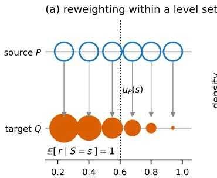  
correctness propensity η(x) at one level S = s

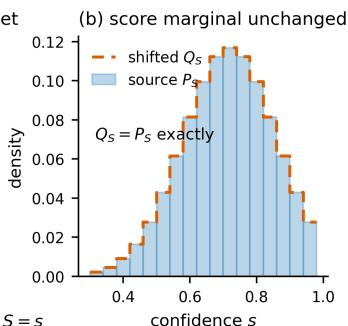

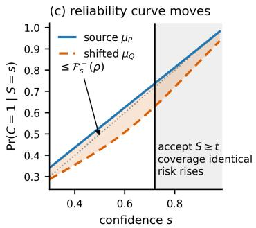  
Figure 1: Reliability can move while the confidence distribution does not. (a) Within a confidence level set, mass moves between inputs that share a score but difer in their propensity to be correct; $\mathbb { E } [ r \mid S = s ] = 1$ keeps the level’s mass fixed. (b) The score distribution, and so any confidence histogram, is unchanged. (c) The reliability curve moves by at most the fragility profile; a threshold policy keeps its coverage while its error rate rises. Movement is possible exactly where $G _ { P } > 0$ (Proposition 2). The schematic is the population construction; the finite-sample one of Section 4 preserves the binned marginal.

The propensity is not observed, so we change the target rather than estimate it: restricting reweightings to a learned finite readout inside confidence bins gives a population restricted profile, which for fixed bins lies below the binned oracle profile by at most the square root of the budget times the grouping variance left inside readout cells (Propositions 5 and 6). Estimating and bounding it are separate problems. Role-separated labels remove a selection bias from the plug-in estimate, which nevertheless stays upward biased in expectation and has no guarantee; a split-sample construction gives a finite-sample lower confidence bound (Proposition 7). We evaluate these objects on six primary and twelve additional ImageNet classifiers, check held-out tracking with exploratory within-bin label-permutation diagnostics, compare the profile with its variance on the same cells and, with known propensities, in finite samples, and decompose natural drift into a composition term that the source profile bounds and a within-cell term it does not.

## Contributions.

• A formulation of reliability drift under score-preserving covariate shift, with an exact local law and a proof that the upward profile identifies the centred within-level propensity law (Corollary 1, Theorem 2), and its scope: general-law witnesses and the deterministic-label collapse.

• An observable restriction with a population ordering and approximation bound at fixed bins, a role-separated plug-in estimator with its remaining bias stated, and a split-sample lower confidence bound with per-analysis coverage (Propositions 5, 6 and 7).

• An empirical study on eighteen ImageNet classifiers with exploratory permutation diagnostics, a same-cell comparison of profile and variance with a known-propensity check of its finite sample magnitude, and a natural-shift decomposition (Sections 5 and 6).

## 2 Setup

Fix a trained classifier; nothing below modifies it. For an input � with label � and prediction ${ \hat { Y } } ( X )$ write $C = \mathbf { 1 } \{ \hat { Y } ( X ) = Y \}$ for correctness and $S = s ( X ) \in \widehat { [ 0 , 1 ] }$ for the top-label probability. Let $\eta ( X ) = \operatorname* { P r } ( C = 1 \mid X )$ be the correctness propensity and $\mu _ { P } ( s ) = \mathbb { E } _ { P } [ \eta \mid S = s ]$ the reliability

relation, whose distance from the diagonal is what calibration error measures. Inputs that share a confidence value need not share a propensity, and their disagreement is

$$
G _ { P } ( s ) \ = \ \mathrm { V a r } _ { P } \big ( \eta ( X ) \ | \ S = s \big ) , Z \ = \ \eta - \mu _ { P } ( s ) ,\tag{1}
$$

so $\mathbb { E } _ { P } [ Z \mid S = s ] = 0$ and $G _ { P } ( s ) = \mathbb { E } _ { P } [ Z ^ { 2 } \mid S = s ]$ This is the integrand of the grouping loss (DeGroot & Fienberg, 1983; Kull & Flach, 2015; Perez-Lebel et al., 2023), which measures heterogeneity a score cannot express; here it will measure how far reliability can move.

Deterministic labels. If the label and the prediction are both deterministic functions of $X ,$ then $\eta \in \{ 0 , 1 \} , G _ { P } ( s ) = \mu ( 1 - \mu )$ with $\mu = \mu _ { P } ( s )$ , and the profile defined below is

$$
\mathcal { F } _ { s } ^ { + } ( \rho ) = \operatorname* { m i n } \big \{ \sqrt { \rho \mu ( 1 - \mu ) } , 1 - \mu \big \} , \qquad \mathcal { F } _ { s } ^ { - } ( \rho ) = \operatorname* { m i n } \big \{ \sqrt { \rho \mu ( 1 - \mu ) } , \mu \big \} ,\tag{2}
$$

also at $\mu \in \{ 0 , 1 \}$ , where both sides vanish (Appendix O). In this family the reliability relation determines the profile; the non-determination statements of Section 3 concern general laws. One label per input does not reveal whether labelling is deterministic, and we assume neither; the empirical quantities of Section 4 average correctness over groups and need not be {0, 1}-valued even then.

Score-preserving shifts. Let $Q \ll P$ with density $r = \mathrm { d } Q / \mathrm { d } P \mathrm { a }$ function of �, so the shift reweights inputs and leaves $P ( Y \mid X )$ unchanged. We restrict to reweightings within confidence level sets and size them by a conditional Pearson $\chi ^ { 2 }$ budget:

$$
\mathbb { E } _ { P } [ r \mid S = s ] = 1 \mathrm { ~ f o r ~ } P _ { S } \mathrm { - a . e . ~ } s , \qquad \mathbb { E } _ { P } \big [ ( r - 1 ) ^ { 2 } \mid S = s \big ] \le \rho .\tag{3}
$$

The first condition holds if and only if $Q _ { S } = P _ { S }$ (Lemma 1), so it defines score preservation rather than adding an assumption. Write $\mathcal { A } _ { s } ( \rho )$ for the set of $r \geq 0$ satisfying (3). For scale, doubling a subgroup’s share of a level set from 0.2 to 0.4 costs $\rho = 0 . 2 \cdot 1 ^ { 2 } \stackrel { . } { + } 0 . { 8 } \cdot 0 . 2 5 ^ { 2 } = 0 . 2 5$ . Smooth � -divergences behave alike for small $\rho$ (Appendix H).

Calibration fragility. The largest upward movement of the reliability relation at level � is

$$
\mathcal { F } _ { s } ^ { + } ( \rho ) \ = \ \operatorname* { s u p } _ { r \in \mathcal { A } _ { s } ( \rho ) } \mathbb { E } _ { P } \big [ ( r - 1 ) Z \mid S = s \big ] ,\tag{4}
$$

and ${ { \mathcal { F } } _ { s } ^ { - } }$ replaces � by $- Z ; \rho \mapsto ( \mathcal { F } _ { s } ^ { + } , \mathcal { F } _ { s } ^ { - } )$ is the fragility profile, a function of the source law alone.

## 3 The fragility profile

The profile, a supremum over reweightings, depends only on the conditional law of $Z .$

Proposition 1 (Reliability transport). For any � satisfying (3), $\mu _ { Q } ( s ) - \mu _ { P } ( s ) = \mathbb { E } _ { P } \left[ ( r - 1 ) Z \mid S = s \right]$ for $P _ { S } – a . e . \ s .$

The proof uses that � is a function of $X ; { \mathfrak { a } }$ density depending on � would move � itself (Appendix C). Reliability drift is thus a covariance between the reweighting and the centred propensity, and $- \mathcal { F } _ { s } ^ { - } ( \rho ) \leq \mu _ { Q } ( s ) - \mu _ { P } ( s ) \leq \mathcal { F } _ { s } ^ { + } ( \rho )$ for every admissible $Q ,$ with both bounds attained.

## 3.1 An exact local law, and what lies beyond it

Under $P ( \cdot \mid S = s )$ , so that $\mathbb { E } Z = 0$ and $\mathbb { E } Z ^ { 2 } = G _ { P } ( s )$ , let �− = ess inf $Z$ and $z _ { + } =$ ess sup $Z ,$ and for $\tau \in \mathbb { R }$ define the stop-loss transform, its second moment and their ratio

$$
M _ { 1 } ( \tau ) = \mathbb { E } [ ( Z - \tau ) _ { + } ] , \quad M _ { 2 } ( \tau ) = \mathbb { E } [ ( Z - \tau ) _ { + } ^ { 2 } ] , \quad \kappa ( \tau ) = \frac { M _ { 2 } ( \tau ) } { M _ { 1 } ( \tau ) ^ { 2 } } - 1 .\tag{5}
$$

Theorem 1 (Full fragility profile). Assume $G _ { P } ( s ) > 0 ,$ , let $p _ { + } = \mathrm { P r } ( Z = z _ { + } )$ and adopt the convention $1 / 0 : = + \infty$ . Then $\bar { \mathcal { F } } _ { s } ^ { + }$ is concave and non-decreasing, and

1. variance-controlled, $f o r 0 \le \rho \le \rho _ { + } : = G _ { P } ( s ) / z _ { - } ^ { 2 } \colon \mathcal { F } _ { s } ^ { + } ( \rho ) = \sqrt { \rho G _ { P } ( s ) } .$ , attained by the afine reweighting $r ^ { * } = 1 + \sqrt { \rho / G _ { P } ( s ) } Z ;$

2. tail-controlled, for $\rho _ { + } < \rho < \rho _ { \mathrm { s a t } } : = 1 / p _ { + } - 1 : \mathcal { F } _ { s } ^ { + } ( \rho ) = \tau _ { \rho } + M _ { 2 } ( \tau _ { \rho } ) / M _ { 1 } ( \tau _ { \rho } )$ where $\begin{array} { r } { \kappa ( \tau _ { \rho } ) = \rho , } \end{array}$ attained by the truncated-afine $r ^ { * } = ( Z - \tau _ { \rho } ) _ { + } / { M _ { 1 } } \dot { ( } \tau _ { \rho } ) ,$

3. saturated, for $\rho \ge \rho _ { \mathrm { s a t } } \colon { \mathcal { F } } _ { s } ^ { + } ( \rho ) = z _ { + }$

The downward profile is obtained by replacing � with −�, giving $\rho _ { - } \ = \ G _ { P } ( s ) / z _ { + } ^ { 2 }$ and $\rho _ { \mathrm { s a t } } ^ { - } =$ $1 / \mathrm { P r } ( Z = z _ { - } ) - 1$ . Proof in Appendix E.

The closed form is the $\chi ^ { 2 }$ case of the Cressie–Read robust dual (Duchi & Namkoong, 2021, Lemma 1), a higher-moment risk measure (Krokhmal, 2007); we state it for its regimes. The first ends exactly when the afine optimiser would put negative weight on the hardest inputs, the condition of Duchi & Namkoong (2019, inequality (9)) for their objective to equal its mean-plus-standard-deviation form.

Corollary 1 (Local law). $\mathcal { F } _ { s } ^ { \pm } ( \rho ) = \sqrt { \rho G _ { P } ( s ) }$ holds with equality on the closed interval $[ 0 , \rho _ { \pm } ]$ , not merely asymptotically; hence $\begin{array} { r } { \operatorname* { l i m } _ { \rho \downarrow 0 } \mathcal { F } _ { s } ^ { \pm } ( \rho ) ^ { 2 } / \rho = G _ { P } ( s ) } \end{array}$

The grouping heterogeneity of a static decomposition is thus the exact coeficient of reliability drift at small budgets, on an interval computable from the source. Figure 2 (left) shows the three regimes for one law. Either of the last two can be empty: atomless � never saturates, and a two-valued $Z ,$ such as (2), passes directly from the square-root law to saturation. Two consequences need no tail analysis. First, $\mathcal { F } _ { s } ^ { \pm } > 0$ exactly where $G _ { P } ( s ) > 0 \mathrm { : }$

Proposition 2 (Score-marginal-invisible drift). Let � be a measurable set ofconfidence values with $P _ { S } ( A ) > 0 .$ $I f G _ { P } > 0$ holds $P _ { S } – a . e$ . on �, then for every $\rho > 0$ there is a � satisfying (3) with $Q _ { S } = P _ { S }$ exactly and $\mu _ { Q } > \mu _ { P } \ P _ { S }$ -a.e. on �. Ifinstead $G _ { P } = 0$ holds $P _ { S } – a . e .$ on �, then every such � has $\mu _ { Q } = \mu _ { P } \ P _ { S } – a . e . \ o n \ A$

(Sets of positive measure are needed because $\mu _ { P }$ and $G _ { P }$ are defined only $P _ { S ^ { - } \mathbf { a } . \mathbf { e } . }$ ; Appendix D.) Second, a threshold policy inherits the drift at fixed coverage. For predict $i f S \ge t$ (El-Yaniv & Wiener, 2010; Geifman & El-Yaniv, 2017), with selective risk ${ \mathcal { R } } ( t ) = \operatorname* { P r } ( C = 0 \mid S \geq t )$

Proposition 3 (Selective-risk transport). For � with $P ( S \geq t ) > 0 ;$ , under a score-preserving shift coverage is exactly preserved, $Q ( S \geq t ) = P ( S \geq t )$ , and

$$
\mathcal { R } _ { Q } ( t ) - \mathcal { R } _ { P } ( t ) = - \frac { \mathbb { E } _ { P _ { S } } \bigl [ \delta ( S ) \mathbf { 1 } \{ S \geq t \} \bigr ] } { \operatorname* { P r } ( S \geq t ) } , \qquad \delta ( s ) = \mu _ { Q } ( s ) - \mu _ { P } ( s ) ,\tag{6}
$$

so the profile bounds the movement in each direction by the tail-averaged ${ \mathcal { F } } ^ { \mp }$ above � (Appendix K).

## 3.2 The whole profile identifies the centred law

The variance fixes the profile only near the origin; the whole curve fixes the centred law.

Theorem 2 (Profile identifiability). $L e t ~ Z$ be bounded with $\mathbb { E } Z = 0$ and $G _ { P } ( s ) > 0$ 0. The map $\mathrm { L a w } ( Z ) \mapsto { \mathcal { F } } _ { s } ^ { + }$ is injective. Explicitly, ${ \mathcal { F } } _ { s } ^ { + }$ is diferentiable on $( 0 , \rho _ { \mathrm { s a t } } )$ with

$$
\begin{array} { r } { \frac { \mathrm { d } } { \mathrm { d } \rho } \mathcal { F } _ { s } ^ { + } ( \rho ) = \frac { 1 } { 2 } M _ { 1 } ( \tau _ { \rho } ) , \qquad \tau _ { \rho } = \mathcal { F } _ { s } ^ { + } ( \rho ) - 2 ( \rho + 1 ) \frac { \mathrm { d } } { \mathrm { d } \rho } \mathcal { F } _ { s } ^ { + } ( \rho ) , } \end{array}\tag{7}
$$

and $\operatorname* { P r } ( Z > \tau )$ is the negative right derivative of $M _ { 1 } ;$ the saturation branch supplies $\begin{array} { r l } { { \cal Z } _ { + } } & { { } = } \end{array}$ $\operatorname* { l i m } _ { \rho \to \infty } \mathcal { F } _ { s } ^ { + } ( \rho )$ and $p _ { + } = 1 / ( 1 + \rho _ { \mathrm { s a t } } )$ . Proof in Appendix F.

As $\rho \uparrow \rho _ { \mathrm { s a t } } , \tau _ { \rho }$ sweeps the support of � from below, so the curve and its slope trace out $M _ { 1 }$ , which determines the law (Gushchin & Borzykh, 2017). The ingredients are classical; the theorem concerns the exact curve: we prove no stability of the inverse and never invert an estimated curve (Appendix F). At a level, the reliability relation supplies the mean, grouping heterogeneity the variance, and the profile the centred law of � (not of the label); over general laws neither the mean nor the profile determines the other, and a scalar calibration error, an average over �, cannot replace the mean.

Proposition 4 (Calibration residual does not determine fragility in general). Write $e _ { P } ( s ) = \mu _ { P } ( s ) - s ,$ Over general propensity laws neither $e _ { P }$ nor the profile determines the other: $\eta \equiv s$ makes both vanish, and the two-point laws below give every other combination. They are not unrelated, since $\eta \in [ 0 , 1 ]$ forces $G _ { P } ( s ) \leq \mu _ { P } ( s ) ( 1 - \mu _ { P } ( s ) ) . ~ ( i ) \eta \in \{ 0 . 2 , 1 . 0 \}$ w.p. 1 at $s = 0 . 6$ gives $e _ { P } = 0$ and $G _ { P } = 0 . 1 6 ,$ perfectly calibrated yet fragile; $( i i ) \eta \equiv 0 . 9$ at $s = 0 . 6$ gives $e _ { P } = 0 . 3 , G _ { P } = 0$ , badly calibrated and notfragile; $( i i i ) \eta \equiv 0 . 6$ versus $\eta \in \{ 0 . 2 , 1 . 0 \}$ at $s = 0 . 5$ share $e _ { P } = 0 .$ 1 with $G _ { P } \in \{ 0 , 0 . 1 6 \}$ ; (iv) two laws with $\mu _ { P } = 0 . 6$ and $G _ { P } = 0 . 0 8$ but $z _ { + } \in \{ 0 . 3 , 0 . 4 \}$ share $e _ { P }$ and $G _ { P } ,$ hence agree exactly $f o r \rho \leq 1 . 1 2 5$ , yet separate by 0.100 at $\rho \ge 2 .$

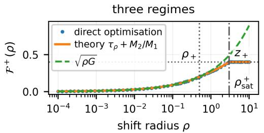

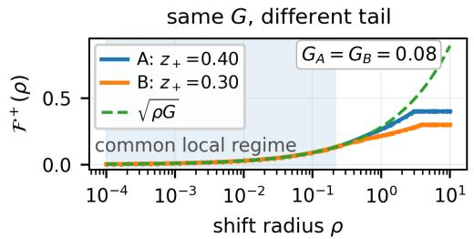  
Figure 2: The profile beyond its variance-controlled regime. Left: the three regimes of Theorem 1 for $\eta \in \{ 0 . 2 , 0 . 6 , 1 . 0 \}$ with probabilities $( \frac { 1 } { 4 } , \frac { 1 } { 2 } , \frac { 1 } { 4 } ) \ ( \rho _ { + } = 0 . 5 , \rho _ { \mathrm { s a t } } = 3 )$ . Right: that law and a four-point law on $\{ 0 , 0 . 4 , 0 . 7 , 0 . 9 \}$ with the same mean and variance $( 0 . 6 , 0 . 0 8 )$ agree for $\rho \leq 0 . 2 2$ and separate by $0 . 1 1 9$ at $\rho = 3$ . The two-point witnesses of Proposition 4(iv) have no tail-controlled regime and separate by 0.100 once both saturate (Appendix M).

Case (iv) matches residual and variance and still leaves the profile undetermined (Appendix M); with deterministic labels $e _ { P } ( s )$ fixes it through (2).

## 4 Restricted fragility: estimation and a lower confidence bound

Section 3 is defined through the unobserved $\eta ( X )$ , and estimating $G _ { P } ( s )$ itself is hard (Perez-Lebel et al., 2023). We therefore change the object: reweightings are restricted to what a finite readout of the input can express, and the score is replaced by a fixed partition into bins.

The population restricted profile. Let $R = \pi ( X )$ take finitely many values and let � be a fixed partition of the confidence range. With $p _ { b } = P _ { B } ( b )$ and $p _ { b k } = P ( R = k \mid B = b )$ ), define the cell rates and the restricted heterogeneity

$$
\theta _ { P } ( b , k ) = \operatorname* { P r } ( C = 1 \mid B = b , R = k ) , \qquad G _ { R } ( b ) = \operatorname { V a r } _ { P } \big ( \theta _ { P } ( B , R ) \mid B = b \big ) ,\tag{8}
$$

and let $\mathcal { F } _ { B , R } ^ { \pm } ( b , \rho )$ be the profile (4) with $B = b$ for $S = s$ and $( B , R )$ -measurable reweightings. Write $\mu _ { P } ( b ) , G _ { P } ( b )$ and $\mathcal { F } _ { B } ^ { \pm } ( b , \rho )$ for the binned oracle mean, variance and profile of � given $B = b$ Proposition 5 (Readout hierarchy). $I f \sigma ( R _ { 1 } ) \subseteq \sigma ( R _ { 2 } )$ , then $G _ { R _ { 1 } } ( b ) \leq G _ { R _ { 2 } } ( b ) \leq G _ { P } ( b )$ and $\mathcal { F } _ { B , R _ { 1 } } ^ { \pm } \leq \mathcal { F } _ { B , R _ { 2 } } ^ { \pm } \leq \mathcal { F } _ { B } ^ { \pm }$ pointwise in $( b , \rho )$

The proof is conditional Jensen and nested feasible sets (Appendix I). For fixed bins, the restricted profile is thus a population lower bound on the binned oracle profile. It orders nested readouts only — a learned readout and quantile groups of the confidence are not ordered — and the binned oracle is not the level-set object: Var(� $\mid B \bar { ) } = \mathbb { E } [ \operatorname { V a r } ( \eta \mid S ) \mid B ] + \operatorname { V a r } ( \mu _ { P } ( S ) \mid B )$ , so a bin can be heterogeneous because the reliability relation varies across it. Our reweightings preserve the binned marginal exactly (max $_ b | Q _ { B } ( b ) - P _ { B } ( b ) | < 1 0 ^ { - 1 4 } \rangle$ ), not the continuous one, and threshold rules keep their coverage exactly only at bin boundaries (Appendix N).

Proposition 6 (Readout approximation). Let $H _ { R } ( b ) = \mathbb { E } _ { P } [ ( \eta - \theta _ { P } ( B , R ) ) ^ { 2 } \mid B = b ] = G _ { P } ( b ) -$ $G _ { R } ( b )$ . For $\begin{array} { r } { \rho \geq 0 , \mathcal { F } _ { B } ^ { \pm } ( b , \rho ) \leq \operatorname* { s u p } _ { 0 \leq u \leq \rho } \{ \mathcal { F } _ { B , R } ^ { \pm } ( b , u ) + \sqrt { ( \rho - u ) H _ { R } ( b ) } \} \leq \mathcal { F } _ { B , R } ^ { \pm } ( b , \rho ) + \sqrt { \rho H _ { R } ( b ) } , } \end{array}$ the middle bound is attained on the variance-controlled interval of the binned oracle. $I f \sigma ( R _ { 1 } ) \subseteq$ $\sigma ( R _ { 2 } )$ , then $0 \leq \mathcal { F } _ { B , R _ { 2 } } ^ { \pm } - \mathcal { F } _ { B , R _ { 1 } } ^ { \pm } \leq \sqrt { \rho \left[ G _ { R _ { 2 } } ( b ) - G _ { R _ { 1 } } ( b ) \right] }$

The proof averages a reweighting over readout cells and applies Cauchy–Schwarz to the remainder (Appendix I.1), as Duchi et al. (2023, App. B) do with a bounded residual. $H _ { R }$ is the residual grouping loss of Perez-Lebel et al. (2023, Thm. 4.1), which single labels do not identify: the bound limits what a finer readout could add, and is neither an estimate nor a confidence statement.

The plug-in estimate. Within each of five outer folds the training portion is halved: $D _ { \mathrm { f i t } } \left( 2 0 { , } 0 0 0 \right.$ images) fits the temperature, $J ~ = ~ 2 0$ equal-mass bins, the readout and its $K \ = \ 8$ within-bin quantile groups; $D _ { \mathrm { r a t e } } \left( 2 0 { , } 0 0 0 \right)$ estimates raw cell rates on these frozen cells; the held-out fold $D _ { \mathrm { e v a l } }$ (10,000) supplies group proportions and held-out correctness. The readout is a low-capacity logistic regression on confidence, margin, entropy and a 50-dimensional principal-component projection of the penultimate representation. Separating $D _ { \mathrm { r a t e } }$ from $D _ { \mathrm { { f i t } } }$ keeps rate labels from choosing their own cells, a selection efect we measured by label permutation (Appendix N; Perez-Lebel et al., 2023, §4.4). It does not make the plug-in unbiased: at fixed partition and weights the profile is convex in the cell rates, so unbiased rates give an upward bias in expectation, while a realisation can fall on either side of the target. The plug-in is neither an upper nor a lower confidence bound.

For model comparisons we summarise it by the fragility area under the curve (FAUC): per fold, per-bin plug-in profiles are combined into $\begin{array} { r } { F ^ { + } ( \rho ) = ( \sum _ { b } w _ { b } \widehat { \mathcal { F } } _ { B , R } ^ { + } ( b , \rho ) ^ { 2 } ) ^ { 1 / 2 } } \end{array}$ with $w _ { b }$ the bin’s share of evaluation examples, averaged over folds and integrated in $\log ( 1 + \rho )$ over $\rho \in \{ 0 , 0 . 0 1 , 0 . 0 3 , 0 . 1 , 0 . 3 , 1 , 3 \}$ FAUC is a lossy ranking summary; Theorem 2 is never applied to it. We also report $G _ { R }$ with a binomial-noise correction (Proposition 9), conditionally unbiased for an empirical-weight version of $G _ { R } ;$ FAUC uses uncorrected rates.

A split-sample lower confidence bound. Moving mass � from group � to group � in a bin is feasible while $d \leq p _ { u }$ , costs $d ^ { 2 } ( 1 / p _ { \nu } + 1 / p _ { u } )$ in conditional $\chi ^ { 2 }$ and moves reliability by $d ( \theta _ { \nu } - \theta _ { u } ) ;$ the largest step $d ^ { * } = \operatorname* { m i n } \{ p _ { u } , \sqrt { \rho p _ { \nu } p _ { u } / ( p _ { \nu } + p _ { u } ) } \}$ (zero when either mass is zero) is non-decreasing in both masses, so simultaneous confidence bounds can be substituted into it.

Proposition 7 (Split-sample lower confidence bound). $I f \theta _ { P } ( b , k ) \in [ L _ { b k } , U _ { b k } ]$ and $p _ { b k } \ge l _ { b k }$ hold simultaneously then, on that event and for every �,

$$
\mathcal { F } _ { B , R } ^ { + } ( b , \rho ) \ \geq \ \operatorname* { m a x } _ { u \neq v } \left[ L _ { b v } - U _ { b u } \right] _ { + } \operatorname* { m i n } \left\{ l _ { b u } , \sqrt { \rho l _ { b v } l _ { b u } / ( l _ { b v } + l _ { b u } ) } \right\} \ = : \ \mathrm { L C B } _ { b } ^ { + } ( \rho ) ,\tag{9}
$$

where the square-root factor is read as 0 when $l _ { b \nu } l _ { b u } = 0 ;$ with bin-mass bounds $p _ { b } \geq l _ { b }$ the quadratic means obey $\begin{array} { r } { \check { ( } \sum _ { b } l _ { b } \mathrm { L C B } _ { b } ^ { + } ( \rho ) ^ { 2 } ) ^ { 1 / 2 } \le ( \sum _ { b } p _ { b } \mathcal { F } _ { B . R } ^ { + } ( b , \rho ) ^ { 2 } ) ^ { 1 / 2 } } \end{array}$ . Reversing the correctness comparison gives the downward bound.

We fit (�, �) on one half of the 50,000 validation images and take exact one-sided Clopper–Pearson bounds on the other, Bonferroni-corrected over the $2 \bar { J K } + J K + J = 5 0 0$ statements of one analysis, so one event covers every pair, direction and radius (Appendix N.1): with probability at least 0.95 the model-level bound lies below the restricted profile of the partition learned on the fitting half. Swapping halves gives a second analysis with a diferent partition and target; the two split arms are reported separately. The bound is a bin-mass root mean square of per-bin worst-case movements: a value of 0.01 says that some admissible reweighting raises bin-level reliability by at least 0.01 in quadratic mean, not that overall accuracy moves that much. A positive bound shows that restricted fragility is not zero; a zero bound does not show it is small.

## 5 Experiments

We ask whether the plug-in profile orders held-out drift and how much of that ordering estimation noise could produce, what the full profile adds to its variance and whether that survives estimation, how fragility and calibration error rank models, and where the lower confidence bound is positive.

The primary cohort is six frozen ImageNet-1K checkpoints (Deng et al., 2009) (Table 1). Twelve more, one from each of twelve further families, were selected by rules fixed before any of their metrics was computed (Appendix S). Each is evaluated as released $( T { = } 1 )$ and with a temperature fitted on $D _ { \mathrm { f i t } } \left( T \mathrm { = } \hat { T } \right)$ , with $\bar { T } \stackrel { - } { \in } \{ 0 . 5 , 2 \}$ as stress states. All analyses use the data roles of Section 4 except the lower confidence bound and the monotone recalibration, which keep their preregistered protocols. The twelve additions and every analysis marked post-hoc were designed after the primary results were known (Appendix O); none re-scores a preregistered outcome.

Held-out drift under optimised reweightings. We solve the restricted problem on $D _ { \mathrm { r a t e } }$ rates, freeze the maximising weights and measure their drift on $D _ { \mathrm { e v a l } } .$ Across bins, predicted and realised drift have a median Spearman correlation of 0.62 over the 36 as-released and temperature-scaled checkpoint–state combinations (0.59 primary, 0.63 additional; range 0.08–0.93; Appendix N). Agreement is weakest where $G _ { R }$ is smallest (Figure 8) and higher in the stress states (0.84 at $T = 0 . 5$ 0.88 at $T = 2 ;$ ; over all four states 0.82 and 0.80). The weights are optimised against the estimated rates, so this checks the fitted construction out of sample, not natural-shift prediction.

Separating the ordering from estimation noise. Binomial noise in cell rates scales with bin accuracy, so statistics of estimated rates vary across bins even without heterogeneity. Random bin-preserving directions drawn without correctness (100 per bin, radius, fold, state and checkpoint; Appendix R.1) give a Spearman correlation between the two-sided plug-in profile and the median held-out movement of 0.9010 on the primary six and 0.9007 on all eighteen (0.82–0.84 at a fixed radius). A within-bin label permutation, applied separately to $D _ { \mathrm { r a t e } }$ and $D _ { \mathrm { e v a l } } .$ removes any association between correctness and the readout while keeping bin accuracies, cell counts, proportions and directions, and it largely reproduces these values (post-hoc; Appendix T): 0.877 pooled and 0.75 averaged over radii on all eighteen (largest replicates 0.881 and 0.77). The observed values exceed every replicate, but the primary cohort’s median correlation within one checkpoint, state, fold and radius, 0.78, lies inside the null range: for unsigned random movements the estimated profile mainly tracks the scale of estimation noise.

After inspecting this random-shift diagnostic, we added an exploratory permutation check for the signed drift under optimised reweightings: its median agreement is −0.01 under the null (largest of 100: 0.05) against 0.62 observed. The check was not prespecified; permutations are conditional on fold, so it ignores cross-fold dependence and supports no formal �-value. It indicates that rate noise alone does not produce this agreement; it concerns fixed bins and readout, says nothing about natural shifts, and cannot separate level-set heterogeneity from within-bin variation of the reliability relation.

What the full profile adds to its variance. On identical cells we compared the plug-in profile with $\sqrt { \rho \hat { G } }$ and with its cap at the support endpoint, min $\{ \sqrt { \rho \hat { G } } , \hat { z } _ { + } \}$ (post-hoc; Table 18). Up to $\rho = 0 . 1$ every bin is in the variance-controlled regime and the three coincide; at $\rho = 0 . 3 4 5 \%$ of bin–radius units have left it, and at $\rho \ge 1$ almost all. There the variance law overstates the profile by a median 44% at $\rho = 3$ and the capped version by $1 0 \% .$ and bins with matched $\hat { G }$ difer in profile by a median 19%: the distinction of Theorem 2 appears in the estimated laws. These diferences did not materially change rankings here: FAUC from the capped variance orders the 36 checkpoint–state combinations almost as FAUC does (Spearman 0.996), and the two track optimised and random shifts equally well. The full profile thus changes the size of large-budget movements, not model rankings.

Whether the diference survives estimation. Real data give no ground truth, so we simulated bins with known masses and propensities, including laws that share mean, variance and endpoints but not tails (Appendix U), and computed the full plug-in and the capped variance from the same rates. In population the two coincide in the variance-controlled regime and for constant or two-point laws, but their noisy estimates need not; beyond that regime the cap keeps its slack while the plug-in error falls with �. For a four-point law at $\rho = 3$ , where the slack is 0.101, the mean absolute errors are 0.022 (plug-in) and 0.148 (cap) with 250 rate labels and 0.006 and 0.102 with 5000 (Table 19). In the primary arm the plug-in met the specified practical-advantage criterion in 78 of 600 conditions and the cap in none, the plug-in was worse by at most 0.0002, and no control met the criterion. Both are unreliable under weak heterogeneity at $n = 2 5 0$ , and filtering rare cells can remove the practical advantage. On the 32-atom laws the induced gap bound of Proposition 6 was a median 1.5 times the true gap at $\rho = 1$ , versus 9 for the simple gap bound; at a fixed label budget estimation error can grow with readout size.

Table 1: Primary cohort. ECE: 20-bin equal-mass out-of-fold estimate; $G _ { R }$ with the binomial-noise correction of Proposition 9; FAUC of the upward plug-in profile. Neither $G _ { R }$ nor FAUC is a confidence bound. Additional checkpoints: Table 12.
<table><tr><td></td><td></td><td colspan="3"> $T = 1$ </td><td colspan="3"> $T = \hat { T }$ </td></tr><tr><td>Model</td><td>Acc.</td><td>ECE</td><td> $G _ { R }$ </td><td>FAUC</td><td>ECE</td><td> $G _ { R }$ </td><td>FAUC</td></tr><tr><td>ResNet-50 V1</td><td>0.761</td><td>0.038</td><td>0.0004</td><td>0.042</td><td>0.024</td><td>0.0009</td><td>0.049</td></tr><tr><td>ResNet-50 V2</td><td>0.809</td><td>0.412</td><td>0.0133</td><td>0.135</td><td>0.032</td><td>0.0009</td><td>0.046</td></tr><tr><td>ConvNeXt-T</td><td>0.825</td><td>0.169</td><td>0.0081</td><td>0.112</td><td>0.031</td><td>0.0011</td><td>0.048</td></tr><tr><td>ViT-B/16</td><td>0.811</td><td>0.057</td><td>0.0011</td><td>0.048</td><td>0.042</td><td>0.0005</td><td>0.042</td></tr><tr><td>Swin-T</td><td>0.815</td><td>0.068</td><td>0.0015</td><td>0.056</td><td>0.032</td><td>0.0004</td><td>0.038</td></tr><tr><td>EffNet-B0</td><td>0.777</td><td>0.069</td><td>0.0032</td><td>0.078</td><td>0.024</td><td>0.0010</td><td>0.049</td></tr></table>

Calibration error and fragility. Proposition 4 settles determination; here we ask how the two rank models. As released, ECE and FAUC order the primary six identically (Spearman +1.00) and all eighteen similarly (+0.85); after temperature scaling the association reverses $( - 0 . 8 3 , - 0 . 3 6 ; - 0 . 5 0$ to −0.28 when one family is deleted at a time), while $G _ { R }$ and FAUC stay positively associated (+0.60, +0.95). Scaling can also reorder the top-label score, so it is not a pure recalibration. No primary pair matches in ECE within the preregistered $5 \times 1 0 ^ { - 4 }$ ; across all eighteen 5 scaled and 2 as-released pairs do, with FAUC ratios up to 1.71, but also difering $G _ { R }$ (post-hoc; Table 16). A cleaner comparison holds the partition fixed: a fold-wise strictly increasing map $g ( s ) = { \mathrm { s i g m o i d } } ( a \log i \mathfrak { s } + c ) , a > 0$ leaves bins and the frozen readout unchanged within each fold, so the restricted profile, FAUC and selective-risk fragility are unchanged by Lemma 7, while cross-fitted ECE falls by a median 75.1% on the primary six and 76.2% on the ten additional checkpoints where the map can be fitted (Appendices Q, S). Refitting the readout afterwards changes FAUC by up to $2 7 \%$

Where the lower confidence bound is nonzero. $\mathrm { A t } \rho = 0 . 3$ the model-level bound is positive in both split arms for four of the six primary checkpoints as released — ResNet-50 V2 (0.0158, 0.0171), ConvNeXt-Tiny (0.0096, 0.0114), Swin-T and EficientNet-B0 — and for 9 of the twelve additional ones; after temperature scaling, for none of the six and 3 of the twelve; scaling refits the partition, so the positive set can change either way. The additional values are at most 0.0042 except ConvMixer-768/32 (0.0092–0.0110). Each entry carries a 95% guarantee for its own arm’s target; the counts imply no joint coverage (Appendix N.1, Table 14).

## 6 Natural shift: what the source profile bounds

Natural benchmarks need not be reweightings of the source: the propensity of an input group can itself change. With the source bins and readout frozen and applied to a target domain, write $p _ { k } , q _ { k }$ for the source and target group proportions in a bin and $\theta _ { P } , \theta _ { Q }$ for the cell correctness rates.

Proposition 8 (Composition–conditional decomposition). $\delta _ { \mathrm { t o t a l } } ( b ) = \delta _ { \mathrm { c o m p } } ( b ) + \delta _ { \mathrm { c o n d } } ( b )$ exactly, where $\begin{array} { r } { \delta _ { \mathrm { c o m p } } ( b ) = \sum _ { k } ( q _ { k } - p _ { k } ) [ \theta _ { P } ( b , k ) - \mu _ { P } ( \mathbf { \bar { \boldsymbol { b } } } ) ] } \end{array}$ and $\begin{array} { r } { \delta _ { \mathrm { c o n d } } ( b ) = \sum _ { k } q _ { k } \cdot \smash { \bigl [ \theta _ { Q } ( b , k ) - \theta _ { P } ( b , k ) \bigr ] } } \end{array}$ $H q _ { k } = 0$ whenever $p _ { k } = 0 ,$ then $| \delta _ { \mathrm { c o m p } } ( b ) | \leq \mathcal { F } _ { B , R } ^ { \pm } \big ( b , D _ { R } ( b ) \big )$ at the observed composition radius $\begin{array} { r } { D _ { R } ( b ) = \sum _ { k : p _ { k } > 0 } p _ { k } ( q _ { k } / p _ { k } - 1 ) ^ { 2 } } \end{array}$ , the branch chosen by the sign $o f \delta _ { \mathrm { c o m p } } ( b )$

The identity is the classical composition-versus-rate decomposition (Kitagawa, 1955; Oaxaca, 1973), related to the separation of input shift, outcome change and poorly supported inputs by Cai et al. (2023); here it is taken at a frozen readout within bins, and the bound holds because $q _ { k } / p _ { k }$ is a feasible reweighting at radius $D _ { R } { \big ( } b { \big ) }$ (Appendix L). The source profile does not control $\delta _ { \mathrm { c o n d } }$ , which at a finite readout can reflect a changed labelling mechanism or within-cell variation the partition does not resolve; under pure covariate shift with common support it vanishes as the readout approaches $\sigma ( X )$ (Appendix I). The bound is a population statement evaluated with plug-in source rates, without coverage guarantee; Proposition 7 bounds fragility from below, not this drift from above.

Summaries. Per domain we take target-mass-weighted quadratic means $\begin{array} { r } { L _ { x } = ( \sum _ { b } q _ { b } \delta _ { x } ( b ) ^ { 2 } ) ^ { 1 / 2 } } \end{array}$ These are norms, so $L _ { \mathrm { t o t a l } } \leq L _ { \mathrm { c o m p } } + L _ { \mathrm { c o n d } }$ only, and $L _ { \mathrm { { c o m p } } } / L _ { \mathrm { { t o t a l } } }$ is a ratio of norms, not an additive share. The utilisation $U ( b ) = | \delta _ { \mathrm { c o m p } } ( b ) | / \widehat { \mathcal { F } } _ { B , R } ^ { \pm } ( b , D _ { R } ( b ) )$ is undefined, and excluded, when a target group has no source mass or the denominator vanishes; numerator and denominator use the same plug-in rates, so $U \leq 1$ by construction.

Results. This analysis uses the original protocol’s frozen partition, fitted before the estimator revision, on ImageNet-C (Hendrycks & Dietterich, 2019), ImageNetV2 (Recht et al., 2019) and ImageNet-Sketch (Wang et al., 2019) for the six primary classifiers. The conditional term is the larger: the mean per-(model, domain) ratio $L _ { \mathrm { c o m p } } / L _ { \mathrm { t o t a l } } \ \mathrm { i s } 4 \mathrm { i } . 8 \%$ , 11.1% and 9.6%, and on ImageNet-C it falls from 50.6% at severity 1 to 33.0% at 5 (Figure 4, Table 3). The median utilisation over the 9 177 fold-pooled bin records, 8,937 of them from ImageNet-C, is 0.64 (per-benchmark medians of domain medians 0.63, 0.37, 0.89). Re-estimating source rates on held-out data inside the same partition moves the ratio by at most 0.031 per checkpoint, a check of the rate estimator only. Rerunning the revised pipeline end to end on ImageNetV2 and ImageNet-Sketch moves the ratio from 12.2% to 12.0% and from 9.8% to 10.0% at matched aggregation, with the conditional term larger in all 30 model–fold units of each (Appendix R.3). ImageNet-C was not rerun, so its severity trend and the association below remain original-partition results. Removing bins flagged by the original target-count rule within each domain (post-hoc; Table 2) keeps 77.9% of target mass on average and gives a mean ratio of 43.9% instead of 41.8%, a change of estimand rather than a revised-pipeline rerun. Across its 75 domains a preregistered analysis found source FAUC associated with the composition term (mean within-domain Spearman +0.63, interval $[ + 0 . 5 4 , + 0 . 7 2 ] \rangle$ and the ECE interval including zero, with neither associated with the total or conditional term; the single-domain benchmarks disagree, so the preregistered outcome was mixed (Appendix P). Part of the FAUC association is structural, since both use source cell-rate contrasts, but the target proportions are observed, so it is not an identity; we read it as consistent with the decomposition, not as a validated forecast.

## 7 Related work

Grouping loss. Calibration–refinement decompositions separate miscalibration from the heterogeneity a score cannot express (DeGroot & Fienberg, 1983; Kull & Flach, 2015); Perez-Lebel et al. (2023) estimate this grouping loss for neural networks and show that binning inflates it, and later work relates it to decisions and epistemic uncertainty (Perez-Lebel et al., 2025; Melo et al., 2026). These analyses are static; we ask what the heterogeneity permits a shift to do.

Distributionally robust evaluation. We use robust expectations over �-divergence balls, the exact $\chi ^ { 2 }$ dual and its non-negativity condition as established tools (Ben-Tal et al., 2013; Duchi & Namkoong, 2019; 2021; Lam, 2016; Gotoh et al., 2018). Closest in purpose, Li et al. (2021) evaluate the worst performance over subpopulations of a given size defined by core attributes, and Duchi et al. (2023) define such risks through conditional risks. Our set instead fixes the score marginal, so the shift is invisible to score-only monitoring, and budgets the reweighting within each confidence level; a learned readout plays the role of the attributes inside bins. Namkoong (2026) restricts admissible transports and obtains first-order Wasserstein sensitivities; our local law holds exactly on an interval. Subbaswamy et al. (2021) evaluate worst-case performance when selected conditional distributions shift; here the preserved marginal is the confidence.

Calibration and performance estimation under shift. Temperature scaling recalibrates reported probabilities (Guo et al., 2017), and calibration degrades under shift (Ovadia et al., 2019). Covariateshift methods use target inputs to reweight calibration, conformal sets or risk control (Tibshirani et al., 2019; Park et al., 2020; Almeida et al., 2025), where a score-preserving shift can be visible; estimators that see only target confidences, such as average thresholded confidence (Garg et al., 2022), return the same estimate for every such shift. Multicalibration (Hebert-Johnson et al., 2018) controls´ calibration on specified groups; fragility measures heterogeneity left within a level.

## 8 Limitations and conclusion

The theory concerns exact level sets and $\eta ;$ the empirical objects condition on bins and a learned readout, and the binned oracle includes within-bin variation of $\mu _ { P }$ , so nothing we report isolates level-set heterogeneity. Plug-in profiles and FAUC have no coverage guarantee; the lower confidence bound has one per analysis but is weak after temperature scaling. Our finite-sample comparison with the capped variance uses synthetic laws. CIFAR-10H (Appendix R.2) measures a repeated-annotation proxy for $\eta ,$ not $\eta .$ . The eighteen checkpoints are not a sample of models; the twelve additions and all post-hoc analyses were designed with earlier results known; and temperature scaling can reorder the top-label score. Nothing here says that natural shifts attain the worst case or that a source quantity bounds total natural drift.

A fixed confidence distribution does not fix reliability. How far it can move under a score-preserving shift is governed by the within-level heterogeneity of the correctness propensity: its variance gives the exact local rate and its centred law, which the profile identifies, the rest. With a finite readout the exposure becomes a restricted quantity that can be estimated and bounded below; held-out drift under optimised reweightings follows the estimate, which an exploratory rate-noise null does not reproduce, and on natural shifts most reliability change occurs within cells, outside the source profile’s control. The open problem is resolution: in the one dataset with a proxy for �, a learned readout exposes a few percent of the within-bin variance, and Proposition 6 bounds what the rest could add only through an unidentified quantity.

## Reproducibility statement

Proofs, assumptions and degenerate cases are in Appendices B–M, the split-sample lower confidence bound in Appendix N.1 and the reparameterisation lemma in Appendix Q. Appendix N specifies the data roles, estimators, retention rules and the label-permutation test of the rate estimator. Six analyses were governed by protocols written and hashed before their results were computed: the pilot, the multi-architecture study, the natural-shift study, the natural-target analysis (Appendix P), the lower confidence bound (Appendix N.1) and the monotone reparameterisation (Appendix Q). After those results were frozen, an internal audit found that the original rate estimator selected cells and fitted their rates on the same labels. The main tables are therefore recomputed under separated data roles and reported as post-audit, not preregistered, analyses. Appendix O records, analysis by analysis, what was recomputed and what was not. The later extensions (Appendices R and S), the diagnostics of Appendix T and the known-propensity study of Appendix U are post-hoc; their protocols were hashed before the corresponding results were computed, except where Appendix T states otherwise, and Appendix U records one technical amendment. The released hashes let a reader verify that files are unchanged; they are not independent timestamps. A supplementary package containing the protocols, code, checkpoint identifiers and checksums, frozen result files, the generators of every table, macro and figure in the appendices, and verification scripts accompanies this work and will be released publicly. Verification from the frozen results needs no data; an end-to-end rerun needs the public datasets and feature extraction. All models are public pretrained checkpoints; none was trained or fine-tuned by us.

## AI use statement

Generative AI tools were used as research assistants in the development of this work, including conceptual and theoretical refinement; formulating, refining and checking mathematical claims and proofs; feedback on experimental methodology; implementation and debugging of research code; analysis and interpretation of results; literature assistance; preparation of figures and tables; manuscript drafting and editing; and adversarial review of claims. All AI-assisted content was reviewed and verified by the authors. In particular, theoretical claims were checked against their stated assumptions and accompanying proofs, experimental claims against frozen outputs and the corresponding analysis specifications, including recorded post-hoc amendments, and the reported leakage controls and numerical identities through explicit computational tests. The authors take full responsibility for the final manuscript, mathematical claims, experimental results, and associated artifacts.

## References

Duarte C. Almeida, Joao Bravo, Jacopo Bono, Pedro Bizarro, and M˜ ario A. T. Figueiredo. High´ probability risk control under covariate shift. In Proceedings of the Fourteenth Symposium on Conformal and Probabilistic Prediction with Applications, volume 266 of Proceedings ofMachine Learning Research, pp. 133–152, 2025.

Aharon Ben-Tal, Dick den Hertog, Anja De Waegenaere, Bertrand Melenberg, and Gijs Rennen. Robust solutions of optimization problems afected by uncertain probabilities. Management Science, 59(2):341–357, 2013.

Tifany Tianhui Cai, Hongseok Namkoong, and Steve Yadlowsky. Diagnosing model performance under distribution shift. arXiv preprint arXiv:2303.02011, 2023.

Morris H. DeGroot and Stephen E. Fienberg. The comparison and evaluation of forecasters. The Statistician, 32(1–2):12–22, 1983.

Jia Deng, Wei Dong, Richard Socher, Li-Jia Li, Kai Li, and Li Fei-Fei. Imagenet: a large-scale hierarchical image database. In CVPR, 2009.

John Duchi and Hongseok Namkoong. Variance-based regularization with convex objectives. Journal ofMachine Learning Research, 20(68):1–55, 2019.

John Duchi, Tatsunori Hashimoto, and Hongseok Namkoong. Distributionally robust losses for latent covariate mixtures. Operations Research, 71(2):649–664, 2023.

John C. Duchi and Hongseok Namkoong. Learning models with uniform performance via distributionally robust optimization. The Annals of Statistics, 49(3):1378–1406, 2021.

Ran El-Yaniv and Yair Wiener. On the foundations of noise-free selective classification. Journal of Machine Learning Research, 11:1605–1641, 2010.

Saurabh Garg, Sivaraman Balakrishnan, Zachary C. Lipton, Behnam Neyshabur, and Hanie Sedghi. Leveraging unlabeled data to predict out-of-distribution performance. In International Conference on Learning Representations, 2022.

Yonatan Geifman and Ran El-Yaniv. Selective classification for deep neural networks. In NeurIPS, 2017.

Jun-ya Gotoh, Michael Jong Kim, and Andrew E.B. Lim. Robust empirical optimization is almost the same as mean–variance optimization. Operations Research Letters, 46(4):448–452, 2018.

Chuan Guo, Geof Pleiss, Yu Sun, and Kilian Q. Weinberger. On calibration of modern neural networks. In ICML, 2017.

Alexander A. Gushchin and Dmitriy A. Borzykh. Integrated quantile functions: properties and applications. Modern Stochastics: Theory and Applications, 4(4):285–314, 2017.

Ursula H ´ ebert-Johnson, Michael P. Kim, Omer Reingold, and Guy N. Rothblum. Multicalibration:´ calibration for the (computationally-identifiable) masses. In ICML, 2018.

Dan Hendrycks and Thomas Dietterich. Benchmarking neural network robustness to common corruptions and perturbations. In ICLR, 2019.

Dan Hendrycks, Steven Basart, Norman Mu, Saurav Kadavath, Frank Wang, Evan Dorundo, Rahul Desai, Tyler Zhu, Samyak Parajuli, Mike Guo, Dawn Song, Jacob Steinhardt, and Justin Gilmer. The many faces of robustness: a critical analysis of out-of-distribution generalization. In ICCV, 2021a.

Dan Hendrycks, Kevin Zhao, Steven Basart, Jacob Steinhardt, and Dawn Song. Natural adversarial examples. In CVPR, 2021b.

Evelyn M. Kitagawa. Components of a diference between two rates. Journal of the American Statistical Association, 50(272):1168–1194, 1955.

Alex Krizhevsky. Learning multiple layers of features from tiny images. Technical report, University of Toronto, 2009.

P. Krokhmal. Higher moment coherent risk measures. Quantitative Finance, 7(4):373–387, 2007.

Meelis Kull and Peter Flach. Novel decompositions of proper scoring rules for classification: Score adjustment as precursor to calibration. In ECML PKDD, 2015.

Henry Lam. Robust sensitivity analysis for stochastic systems. Mathematics ofOperations Research, 41(4):1248–1275, 2016.

Mike Li, Hongseok Namkoong, and Shangzhou Xia. Evaluating model performance under worst-case subpopulations. In Advances in Neural Information Processing Systems, volume 34, 2021.

Sebastien Melo, Ga ´ el Varoquaux, and Marine Le Morvan. Epistemic uncertainty quantification to ¨ improve decisions from black-box models. In ICLR, 2026.

Hongseok Namkoong. Local sensitivity under transport restrictions. arXiv preprint arXiv:2606.04276, 2026.

Ronald Oaxaca. Male–female wage diferentials in urban labor markets. International Economic Review, 14(3):693–709, 1973.

Yaniv Ovadia, Emily Fertig, Jie Ren, Zachary Nado, D. Sculley, Sebastian Nowozin, Joshua V. Dillon, Balaji Lakshminarayanan, and Jasper Snoek. Can you trust your model’s uncertainty? evaluating predictive uncertainty under dataset shift. In NeurIPS, 2019.

Sangdon Park, Osbert Bastani, James Weimer, and Insup Lee. Calibrated prediction with covariate shift via unsupervised domain adaptation. In AISTATS, 2020.

Alexandre Perez-Lebel, Marine Le Morvan, and Gael Varoquaux. Beyond calibration: estimating the¨ grouping loss of modern neural networks. In ICLR, 2023.

Alexandre Perez-Lebel, Gael Varoquaux, Sanmi Koyejo, Matthieu Doutreligne, and Marine Le Morvan.¨ Decision from suboptimal classifiers: excess risk pre- and post-calibration. In AISTATS, volume 258 of PMLR, pp. 2395–2403, 2025.

Joshua C. Peterson, Ruairi M. Battleday, Thomas L. Grifiths, and Olga Russakovsky. Human uncertainty makes classification more robust. In ICCV, 2019.

Benjamin Recht, Rebecca Roelofs, Ludwig Schmidt, and Vaishaal Shankar. Do imagenet classifiers generalize to imagenet? In ICML, 2019.

Adarsh Subbaswamy, Roy Adams, and Suchi Saria. Evaluating model robustness and stability to dataset shift. In Proceedings ofthe 24th International Conference on Artificial Intelligence and Statistics, volume 130 of Proceedings of Machine Learning Research, pp. 2611–2619, 2021.

Ryan J. Tibshirani, Rina Foygel Barber, Emmanuel J. Candes, and Aaditya Ramdas. Conformal \` prediction under covariate shift. In NeurIPS, 2019.

Haohan Wang, Songwei Ge, Zachary C. Lipton, and Eric P. Xing. Learning robust global representations by penalizing local predictive power. In NeurIPS, 2019.

## A Notation index

The same letters recur at four levels — population, binned, restricted and estimated — and the table below fixes which object each symbol names. Unadorned $G _ { R } ( b )$ and $\mathcal { F } _ { B , R } ^ { \pm } ( b , \rho )$ are population restricted targets in the statements of results; tildes and hats mark estimates. In tables and in the reporting of empirical values, $G _ { R }$ and FAUC denote the reported estimates, as their captions state, and a bin argument is suppressed only where the surrounding text has fixed the bin.

<table><tr><td>symbol</td><td>meaning</td><td>level</td></tr><tr><td> $X , C , S = s ( X ) , s$ </td><td>input; correctness  $\mathbf { 1 } \{ \hat { Y } = Y \}$  able; its value</td><td>; confidence random vari- population</td></tr><tr><td> $\eta ( X ) = \operatorname* { P r } ( C = 1 \mid X )$ </td><td>correctness propensity</td><td>population</td></tr><tr><td> $\mu _ { P } ( s ) , e _ { P } ( s ) = \mu _ { P } ( s ) - s$ </td><td>reliability relation; calibration residual</td><td>population</td></tr><tr><td> $G _ { P } ( s ) , Z = \eta - \mu _ { P } ( s )$ </td><td>within-level grouping heterogeneity; centred propensity population  $\textstyle { \hat { \chi } } ^ { 2 }$ </td><td></td></tr><tr><td> $r = \mathrm { d } Q / \mathrm { d } P , \rho , \mathcal { A } _ { s } ( \rho )$ </td><td>score-preserving reweighting; conditional feasible set</td><td>budget; population</td></tr><tr><td> ${ \mathcal { F } } _ { s } ^ { \pm } ( \rho )$   $z _ { \pm } , p _ { + } , \rho _ { \pm } , \rho _ { \mathrm { s a t } } , M _ { 1 } , M _ { 2 } , \kappa$ </td><td>fragility profile at level s extrema and top atom of  $\mathbf { \nabla } Z ;$ </td><td>population regime boundaries; stop-loss population</td></tr><tr><td> $B , b , J ; R , k , K$ </td><td>transforms confidence partition, bin index, number of bins; readout, binned</td><td></td></tr><tr><td></td><td>group index, number of groups</td><td></td></tr><tr><td> $p _ { b } , q _ { b }$   $p _ { b k } ( \mathrm { o r } p _ { k } \mathrm { a t f i x e d } b ) , q _ { b k } , q _ { k }$ </td><td>source and target bin mass source and target within-bin group mass</td><td>binned binned</td></tr><tr><td> $\mu _ { P } ( b ) , G _ { P } ( b ) , \mathcal { F } _ { B } ^ { \pm } ( b , \rho )$ </td><td>binned oracle mean, heterogeneity and profile</td><td>binned oracle</td></tr><tr><td> $\theta _ { P } ( b , k ) , \theta _ { Q } ( b , k )$ </td><td>source and target cell correctness rates</td><td>restricted</td></tr><tr><td> $G _ { R } ( b ) , \mathcal { F } _ { B , R } ^ { \pm } ( b , \rho )$ </td><td>restricted heterogeneity and profile (population lower restricted</td><td></td></tr><tr><td></td><td>bounds on binned oracle quantities)</td><td></td></tr><tr><td> $D _ { \mathrm { f i t } } , D _ { \mathrm { r a t e } } , D _ { \mathrm { e v a l } }$   $\tilde { \theta } , \hat { \theta } , \hat { p }$ </td><td>data roles of the revised pipeline raw binomial cell proportions; plug-in cell rates; evalua- estimation</td><td>estimation</td></tr><tr><td> $\widehat { G } _ { w } , \widehat { G } _ { R }$ </td><td>tion proportions</td><td></td></tr><tr><td> $\widehat { \mathcal { F } } _ { B , R } ^ { \pm } ( b , \rho ) , F ^ { + } ( \rho ) , \mathrm { F A U C }$ </td><td>debiased restricted heterogeneity (Proposition 9) plug-in profile; its bin-mass quadratic mean; its log- estimation</td><td>estimation</td></tr><tr><td></td><td>radius integral</td><td></td></tr><tr><td> $D _ { R } { \big ( } b { \big ) }$ </td><td>observed within-bin composition</td><td>radius natural shift</td></tr><tr><td> $\delta _ { \mathrm { t o t a l } } ( b ) , \delta _ { \mathrm { c o m p } } ( b ) , \delta _ { \mathrm { c o n d } } ( b )$ </td><td> $\scriptstyle \sum _ { k : p _ { k } > 0 } p _ { k } ( q _ { k } / p _ { k } - 1 ) ^ { 2 }$  binwise drift and its exact composition/conditional split natural shift</td><td></td></tr><tr><td> $L _ { \mathrm { t o t a l } } , L _ { \mathrm { c o m p } } , \dot { L } _ { \mathrm { c o n d } } ; L _ { \mathrm { c o m p } } / L _ { \mathrm { t o t a l } }$ </td><td>target-mass quadratic means of binwise drift; natural shift composition-to-total norm ratio (not a share)</td><td></td></tr><tr><td>U(b)</td><td>envelope utilisation  $| \delta _ { \mathrm { c o m p } } ( b ) | / \mathcal { F } _ { B , R } ^ { \pm } ( b , D _ { R } ( b ) )$ </td><td>natural shift</td></tr><tr><td> $L _ { b k } , U _ { b k } , l _ { b k } , l _ { b }$   $d , d ^ { * } ; u , \nu$ </td><td>simultaneous lower/upper bounds on  $\theta _ { P } ( b , k ) , p _ { b k } , p _ { b }$ </td><td>inference</td></tr><tr><td></td><td>mass moved and largest feasible step; source and desti- inference nation group</td><td></td></tr><tr><td> $\mathrm { L C B } _ { b } ^ { \pm } ( \rho ) , \mathrm { L C B } _ { \mathrm { m o d e l } } ^ { + } ( \rho )$ </td><td>split-sample lower confidence bound, per bin and aggre- inference gated</td><td></td></tr><tr><td> $T , { \hat { T } } ; g , g _ { f } , S ^ { \prime } = g ( S )$ </td><td>temperature and its fit; fold-wise monotone score map interventions</td><td></td></tr><tr><td> $\eta _ { H } , \eta _ { H } ^ { A } , \eta _ { H } ^ { B }$ </td><td>and transformed score human-label proxy for η and its two annotator-half ver- Appendix R</td><td></td></tr><tr><td></td><td>sions</td><td></td></tr><tr><td> $G _ { H } ( b ) , G _ { H } ^ { \times } ( b )$ </td><td>human-proxy heterogeneity; its cross-half (vote-noise- Appendix R corrected) form</td><td></td></tr><tr><td> $G _ { R } ^ { H } ( b ) , \mathcal { F } _ { B , R } ^ { H } , \mathcal { F } _ { B } ^ { H }$ </td><td>restricted and binned quantities built on ηH (same-proxy) Appendix R</td><td></td></tr><tr><td> $a _ { k } , t , r _ { k } , \delta _ { \mathrm { r a n d o m } }$ </td><td>random score-preserving direction, step, weights and Appendix R realised movement</td><td></td></tr></table>

## B Conventions, measurability and what “at a score level” means

The score $S = s ( \boldsymbol { X } )$ may be continuously distributed, so $\{ S = s \}$ is typically �-null and every level-set quantity below is defined through a regular conditional distribution $\ { \\dot { P ( } } \cdot { \mid } \ S ^ { ' } = s )$ , which exists because

the underlying spaces are standard Borel. Regular conditional distributions are unique only up to a $P _ { S } \mathrm { - n u l l }$ set of �, so the functions

$$
\mu _ { P } ( s ) = \mathbb { E } _ { P } [ \eta \mid S = s ] , \qquad G _ { P } ( s ) = \operatorname { V a r } _ { P } ( \eta \mid S = s ) , \qquad \mathcal { F } _ { s } ^ { \pm }
$$

are defined $P _ { S }$ -almost everywhere and no statement about a single fixed � carries meaning unless $P _ { S } ( \{ s \} ) > 0 \colon$ any version may be edited on a null set. We therefore fix one version of each throughout, and every level-set assertion in this paper is quantified either $P _ { S }$ -almost everywhere or on a measurable set ofpositive $P _ { S }$ -measure. Proposition 2 is stated in the second form for exactly this reason.

Score-preserving shifts are covariate shifts. Throughout, $Q \ll P$ and its density $r = \mathrm { d } Q / \mathrm { d } P$ is $\sigma ( X )$ -measurable. This is a genuine restriction and it is used in every transport statement: it says the shift reweights inputs and leaves the labelling mechanism $P ( Y \mid X )$ intact, so that $\eta _ { Q } = \eta _ { P } = \eta$ . A density depending on � would change � itself and Proposition 1 would fail. We record the elementary equivalence used repeatedly below.

Lemma 1 (Score preservation). Let $Q \ll P$ with density $r \geq 0 .$ . Then $Q _ { S } = P _ { S }$ if and only if $\mathbb { E } _ { P } [ r \mid S ] = 1 ~ P { - } a . s$

Proof. For measurable �, $Q ( S \in A ) = \mathbb { E } _ { P } [ r \mathbf { 1 } _ { A } ( S ) ] = \mathbb { E } _ { P } [ \mathbf { 1 } _ { A } ( S ) \mathbb { E } _ { P } [ r \mid S ] ]$ . This equals $P ( S \in$ $A ) \doteq \mathbb { E } _ { P } [ \mathbf { 1 } _ { A } ( S ) ]$ for every � if $\mathbb { E } _ { P } [ r \mid S ] = 1 { \mathrm { a . s . } }$ □

Consequently the constraint $\mathbb { E } _ { P } [ r \mid S = s ] = 1$ in (3) is not an extra modelling assumption layered on $Q _ { S } = P _ { S } \mathrm { : }$ it is the same condition.

## C Proof of the reliability transport identity

Proposition 1 (restated). Let $Q ~ \ll ~ P$ with $\sigma ( X )$ -measurable density $r ~ = ~ \mathrm { d } Q / \mathrm { d } P$ satisfying $\mathbb { E } _ { P } [ r \mid S = s ] = 1 f o r P _ { S } \ – a . e . s .$ . Then $\mu _ { Q } ( s ) - \mu _ { P } ( s ) = \operatorname { \mathbb { E } } _ { P } [ ( r - 1 ) Z \mid S = s ] f o r P _ { S }$ $P _ { S } – a . e . \ s ,$ , where $Z = \eta - \mu _ { P } ( s )$

Proof. Change of measure for conditional expectations gives, for bounded measurable $W , \mathbb { E } _ { Q } [ W \ |$ $S \big ] \ = \ \bar { \mathbb { E } } _ { P } [ r W \ | \ S ] / \mathbb { E } _ { P } [ r \ | \ S ] = \mathbb { E } _ { P } [ r W \ | \ S ]$ , the denominator being 1 by hypothesis. Take $\tilde { W } = C$ Since � is �(�)-measurable and $\sigma ( S ) \subseteq \sigma ( X )$ , the tower property over $\sigma ( X )$ gives $\mathbb { E } _ { P } [ r C \mid S ] =$ $\mathbb { E } _ { P } \left[ r \mathbb { E } _ { P } [ C \mathbin { \vrule } X ] \mathbin { \vrule } S \right] = \mathbb { E } _ { P } [ r \eta \mathbin { \vrule } S ]$ ; all interchanges are justified because $r \geq 0$ is $P ( \cdot \mid S = s ) .$ integrable with integral 1 and $\eta \in [ 0 , 1 ]$ is bounded. Hence $\mu _ { Q } ( s ) - \mu _ { P } ( s ) = \operatorname { \mathbb { E } } _ { P } [ ( r - 1 ) \eta \mid S = s ]$ and since $\mathbb { E } _ { P } [ r - 1 \mid S = s ] = 0$ the constant $\mu _ { P } ( s )$ may be subtracted from � without changing the value, giving $\mathbb { E } _ { P } [ ( r - 1 ) Z ~ | ~ S = s ]$ □

No continuity of $s \mapsto \mu _ { P } ( s )$ is used, and no assumption is made on the �-marginal beyond boundedness.

## D Proof of score-marginal-invisible drift (Proposition 2)

We restate the proposition in the quantified form used in the main text.

Proposition 2 (restated). Let � be measurable with $P _ { S } ( A ) > 0 . \ ( \mathrm { i } ) I f G _ { P } > 0 \ P _ { S } { - } a . e .$ . on �, then for every $\rho > 0$ there exists $Q \ll P$ with $\sigma ( X )$ -measurable density satisfying (3) such that $Q _ { S } = P _ { S }$ exactly, $\mu _ { Q } > \mu _ { F }$ ��-a.e. on �, and $\mu _ { Q } = \mu _ { P } \ P _ { S ^ { - } } a . e .$ . of �. (ii) $\begin{array} { r } { I f G _ { P } = 0 P _ { S ^ { - } } a . e . } \end{array}$ . on �, then every such � satisfies $\mu _ { Q } = \mu _ { P } \ P _ { S } – a . e . \ o n \ A .$

Proof. (i) Fix $\varepsilon \in ( 0$ , min $\{ 1 , \sqrt { \rho } \} ]$ and set

$$
r \ = \ 1 + \varepsilon \left( \eta - \mu _ { P } ( S ) \right) \mathbf { 1 } \{ S \in A \} .
$$

Choosing measurable versions of $\mu _ { P }$ makes � a measurable function of �. Since $\eta \in [ 0 , 1 ]$ and $\mu _ { P } \in [ 0 , 1 ]$ we have $| \eta - \mu _ { P } ( S ) | \le 1 , \mathrm { s o } r \ge 1 - \varepsilon \ge 0$ . For $P _ { S ^ { - } \overrightarrow { \mathrm { a . e . } } ~ s , \overrightarrow { \mathbb { E } } _ { P } } [ \eta - \mu _ { P } ( s ) ~ | ~ \bar { S } = s ] = 0$ hence $\mathbb { E } _ { P } [ r \mid S = s ] = 1 ;$ ; by Lemma 1 the measure $\mathrm { d } Q = r \mathrm { d } P$ is a probability measure with $Q _ { S } = P _ { S }$

exactly. Its conditional budget is $\begin{array} { r } { \mathbb { E } _ { P } [ ( r - 1 ) ^ { 2 } \mid S = s ] = \varepsilon ^ { 2 } G _ { P } ( s ) \le \varepsilon ^ { 2 } \le \rho } \end{array}$ for $s \in A$ and 0 otherwise, so $r \in \mathcal { A } _ { s } ( \rho )$ for ${ \mathrm { a . e . } } \ s .$ . Finally Proposition 1 gives

$$
\mu _ { Q } ( s ) - \mu _ { P } ( s ) \ = \ \varepsilon \mathbb { E } _ { P } [ Z ^ { 2 } \mid S = s ] \ = \ \varepsilon G _ { P } ( s ) ,
$$

which is strictly positive for $P _ { S ^ { - } \mathbf { a } . \mathbf { e } . \ s } \in A$ and zero of �.

(ii) If $G _ { P } ( s ) = 0 \mathrm { t h e n } Z = 0 P ( \cdot \mid S = s ) \ – \mathrm { a . s . , \ s o \ } \operatorname { \mathbb { E } } _ { P } [ ( r - 1 ) Z \mid S = s ] = 0$ for every admissible $r ,$ and Proposition 1 gives $\mu _ { Q } ( s ) = \mu _ { P } ( s )$ . This holds for $P _ { S ^ { - } } \mathrm { a } . \mathrm { e } . \ s \in A$ □

Why the quantifiers matter. The pointwise reading “there exists � with $\mu _ { Q } ( s ) \neq \mu _ { P } ( s )$ at this particular $s ^ { \prime }$ is not a well-posed statement when $P _ { S } ( \{ s \} ) = 0$ , because $\mu _ { Q }$ and $\mu _ { P }$ are only determined up to $P _ { S } \mathrm { - n u l l }$ sets and can be edited at � at will. Part (ii) also genuinely requires $Q \ll P ; \mathsf { a } Q$ charging inputs outside the support of $P$ can change reliability even where $G _ { P } = 0$ , and such a $Q$ is not a reweighting of the source at all. This is one population-level mechanism the conditional term of Section 6 can reflect; at a finite readout that term can equally arise from partition coarseness, and the two are not separable from the data.

What is and is not new here. Given Theorem 1 the mathematical content is immediate $( \mathcal { F } _ { s } ^ { \pm } >$ $0 \iff G _ { P } ( s ) > 0 )$ , and in static form the equivalence $^ { 6 } G _ { P } \equiv 0$ if the score is suficient for correctness” is standard in the grouping-loss literature. Its role is to provide the dynamic interpretation used in Section 3.

## E Proof of the full fragility profile (Theorem 1)

Throughout we work under $P ( \cdot \mid S = s )$ and suppress �. Recall $Z \in [ - 1 , 1 ] , \mathbb { E } Z = 0 , G = \mathbb { E } Z ^ { 2 } > 0$ � the essential extrema, $p _ { + } = \mathrm { P r } ( Z = z _ { + } )$ , and $M _ { 1 } , M _ { 2 } , \kappa$ as in (5). Since $\mathbb { E } Z = 0$ and $G > 0$ we have $z _ { - } < 0 < z _ { + } , \mathrm { s o } \rho _ { + } = G / z _ { - } ^ { 2 } \in ( 0 , \infty )$ . We use the convention $1 / 0 : = + \infty ,$ so $p _ { + } = 0$ gives $\rho _ { \mathrm { s a t } } = + \infty$

We must evaluate $\mathcal { F } ^ { + } ( \rho ) = \operatorname* { s u p } \{ \mathbb { E } [ r Z ] : r \geq 0 , \mathbb { E } [ r ] = 1 , \mathbb { E } [ ( r - 1 ) ^ { 2 } ] \leq \rho \}$

Lemma 2 (Concavity and monotonicity). $\rho \mapsto { \mathcal { F } } ^ { + } ( \rho )$ is non-decreasing and concave on $[ 0 , \infty )$ with ${ \mathcal { F } } ^ { + } ( 0 ) = 0$

Proof. Monotonicity is immediate since the feasible sets are nested. For concavity, let $r _ { i }$ be feasible at $\rho _ { i }$ with $\mathbb { E } [ r _ { i } Z ] \ge \mathcal { F } ^ { + } ( \rho _ { i } ) - \epsilon$ and $\lambda \in [ 0 , 1 ]$ . Then $r _ { \lambda } = \lambda r _ { 1 } + ( 1 - \lambda ) r _ { 2 }$ satisfies $r _ { \lambda } \ge 0$ and $\mathbb { E } [ r _ { \lambda } ] = 1$ , and by convexity of $t \mapsto t ^ { 2 } , \mathbb { E } [ ( r _ { \lambda } - 1 ) ^ { 2 } ] \leq \lambda \rho _ { 1 } + ( 1 - \lambda ) \rho _ { 2 } ;$ it is therefore feasible at $\lambda \rho _ { 1 } + ( 1 - \lambda ) \rho _ { 2 }$ and attains at least $\lambda \mathcal { F } ^ { + } ( \rho _ { 1 } ) + ( 1 - \lambda ) \mathcal { F } ^ { + } ( \rho _ { 2 } ) - \epsilon$ □

## E.1 A verification argument

We prove optimality by direct verification. The following bound holds for every feasible reweighting and is attained by the proposed construction, which proves optimality and attainment together.

Lemma 3 (Verification bound). Let $\tau < z _ { + }$ so that $M _ { 1 } ( \tau ) > 0 ,$ , and let � be any $r \geq 0$ with $\mathbb { E } [ r ] = 1$ and $\begin{array} { r } { \mathbb { E } [ ( r - 1 ) ^ { 2 } ] \leq \kappa ( \tau ) } \end{array}$ . Then

$$
\mathbb { E } [ r Z ] \ \le \ \tau + \frac { M _ { 2 } ( \tau ) } { M _ { 1 } ( \tau ) } ,
$$

with equality for $r ^ { * } = ( Z - \tau ) _ { + } / M _ { 1 } ( \tau )$ , which is feasible and spends the budget exactly.

Proof. Write $Z = \tau + ( Z - \tau ) _ { + } - ( \tau - Z ) .$ +. Since $r \geq 0$ and $( \tau - Z ) _ { + } \geq 0 .$

$$
\begin{array} { r } { \mathbb { E } [ r Z ] \ = \ \tau + \mathbb { E } \big [ r ( Z - \tau ) _ { + } \big ] - \mathbb { E } \big [ r ( \tau - Z ) _ { + } \big ] \ \leq \ \tau + \mathbb { E } \big [ r ( Z - \tau ) _ { + } \big ] . } \end{array}
$$

By Cauchy–Schwarz, $\mathbb { E } [ r ( Z - \tau ) _ { + } ] \le \| r \| _ { 2 } \sqrt { M _ { 2 } ( \tau ) } .$ , and $\| r \| _ { \gamma } ^ { 2 } = \mathbb { E } [ r ^ { 2 } ] = 1 + \mathbb { E } [ ( r - 1 ) ^ { 2 } ] \leq 1 + \kappa ( \tau ) =$ $M _ { 2 } ( \tau ) / M _ { 1 } ( \tau ) ^ { 2 }$ . Combining, $\mathbb { E } [ r ( Z - \tau ) _ { + } ] \le M _ { 2 } ( \tau ) / M _ { 1 } ( \tau )$ , which is the claim. For $r ^ { * } \colon$ it is nonnegative, $\mathbb { E } [ r ^ { * } ] = 1$ by construction, E[ $( r ^ { * } - 1 ) ^ { 2 } ] = \mathbb { E } [ ( r ^ { * } ) ^ { 2 } ] - 1 = M _ { 2 } / M _ { 1 } ^ { 2 } - 1 = \kappa ( \tau )$ , and both inequalities above are equalities because $r ^ { * } ( \tau - Z ) _ { + } = 0$ pointwise and $r ^ { * }$ is proportional to $( Z - \tau ) _ { + }$ Its value is $\begin{array} { r } { \mathbb { E } [ r ^ { * } Z ] = \big ( \dot { M } _ { 2 } ( \tau ) + \tau M _ { 1 } ( \tau ) \big ) / \dot { M } _ { 1 } ( \tau ) = \tau + \dot { M } _ { 2 } ( \tau ) / M _ { 1 } ( \tau ) } \end{array}$ □

Lemma 4 (Monotonicity of $\kappa ) .$ . � is continuous and non-decreasing on $( - \infty , z _ { + } )$ , with $\kappa ( \tau )  0$ as $\tau \to - \infty .$ . It is strictly increasing on $( - \infty , \tau _ { \mathrm { m a x } } )$ , where $\tau _ { \operatorname* { m a x } } = \operatorname* { s u p } \{ \tau : \operatorname* { P r } ( Z > \tau ) > p _ { + } \}$ , and is constant equal to $1 / p _ { + } - 1 o n \left[ \tau _ { \mathrm { m a x } } , z _ { + } \right)$ . Hence $\kappa : ( - \infty , \tau _ { \mathrm { m a x } } )  ( 0 , \rho _ { \mathrm { s a t } } )$ is a continuous strictly increasing bijection.

Proof. $M _ { 2 }$ is continuously diferentiable with $M _ { 2 } ^ { \prime } = - 2 M _ { 1 }$ everywhere (dominated convergence; the integrand $( Z - \tau ) _ { + } ^ { 2 }$ has the bounded �-derivative $\mathopen { } \mathclose \bgroup \left. - 2 ( Z - \tau ) _ { + } \aftergroup \egroup \right)$ $M _ { 1 }$ is convex with one-sided derivatives $M _ { 1 + } ^ { \prime } ( \tau ) = - \mathrm { P r } ( Z > \tau )$ and $M _ { 1 ^ { - } } ^ { \prime } ( \tau ) = - \operatorname* { P r } ( Z \geq \tau )$ , equal of the countable set of atoms. Writing �¯ for either one-sided survival value,

$$
\kappa ^ { \prime } ( \tau ) = \frac { M _ { 2 } ^ { \prime } M _ { 1 } - 2 M _ { 2 } M _ { 1 } ^ { \prime } } { M _ { 1 } ^ { 3 } } = \frac { 2 \big ( M _ { 2 } \bar { F } - M _ { 1 } ^ { 2 } \big ) } { M _ { 1 } ^ { 3 } } \ \geq \ 0 ,
$$

because Cauchy–Schwarz on $\{ Z > \tau \}$ (resp. $\{ Z \ge \tau \} )$ gives $M _ { 1 } = \mathbb { E } [ ( Z - \tau ) \mathbf { 1 } ] \leq \sqrt { M _ { 2 } \bar { F } }$ . Equality forces $Z - \tau \ { \mathrm { t o } }$ be a.s. constant on that event. On the open event this means that only one value of � lies above �; on the closed event, if � has an atom at �, it additionally forces $\operatorname* { P r } ( Z > \tau ) = 0 .$ , and if it has none the two events coincide. Either way, equality is impossible while more than the top atom survives above �, so $\kappa ^ { \prime } > 0$ strictly for $\tau < \tau _ { \mathrm { m a x } } ,$ and for $\tau \geq \tau _ { \mathrm { m a x } }$ we have $M _ { 1 } = p _ { + } ( z _ { + } - \tau )$ $M _ { 2 } = p _ { + } ( z _ { + } - \tau ) ^ { 2 }$ and $\kappa \equiv 1 / p _ { + } - 1$ . For $\tau \le z _ { - } , M _ { 1 } = - \tau$ and $M _ { 2 } = G + \tau ^ { 2 } , { \mathrm s o } \ \kappa = G / \bar { \tau } ^ { 2 } \to 0 .$ □

## E.2 The three regimes

Regime (i). Dropping $r \geq 0 .$ , Cauchy–Schwarz gives $\mathbb { E } [ ( r - 1 ) Z ] \le \| r - 1 \| _ { 2 } \| Z \| _ { 2 } \le \sqrt { \rho G }$ with equality if $\dot { \mathbf { \varphi } } _ { r - 1 } = \sqrt { \rho / G } \mathbf { \Theta } Z$ . That candidate satisfies $r \geq 0 \mathrm { i f f } 1 + \sqrt { \rho / G } z _ { - } \geq 0 , \mathrm { i . e . \ i f f } \rho \leq G / z _ { - } ^ { 2 } = \rho _ { + }$ Hence $\mathcal { F } ^ { \mathrm { + } } ( \rho ) = \sqrt { \rho G }$ with equality on the closed interval $[ 0 , \rho _ { + } ]$ , attained by $r ^ { * } = 1 + \sqrt { \rho / G } Z$ . This proves Corollary 1, whose germ statement follows on dividing by $\rho$ and letting $\rho \downarrow 0 .$ . Equivalently, by Lemma 4 the root of $\kappa ( \tau _ { \rho } ) = \rho$ satisfies $\tau _ { \rho } = - \sqrt { G / \rho } \leq z _ { - }$ exactly when $\rho \leq \rho _ { + }$ , and Lemma 3 then returns $\sqrt { \rho G }$ ; the two descriptions agree.

Regime (ii). For $\rho _ { + } < \rho < \rho _ { \mathrm { s a t } }$ , Lemma 4 provides a unique $\tau _ { \rho } \in ( z _ { - } , \tau _ { \mathrm { m a x } } )$ with $\kappa ( \tau _ { \rho } ) = \rho$ , and Lemma 3 shows the supremum equals $\tau _ { \rho } + M _ { 2 } ( \tau _ { \rho } ) / M _ { 1 } ( \tau _ { \rho } )$ and is attained by the truncated-afine $r ^ { * } = ( Z - \tau _ { \rho } ) _ { + } / M _ { 1 } ( \tau _ { \rho } ) \stackrel {  } { }$

Regime (iii). For $\rho \ge \rho _ { \mathrm { s a t } }$ the reweighting $r = 1 \{ Z = z _ { + } \} / p _ { + }$ is feasible $- \mathrm { i t }$ spends exactly $1 / p _ { + } - 1 \le \rho -$ and attains $\mathbb { E } [ r Z ] = z _ { + }$ , which is the trivial upper bound $\mathbb { E } [ r Z ] \le z _ { + } \mathbb { E } [ r ] = z _ { + }$

Empty regimes, and why that is not an error. The three regimes partition $[ 0 , \infty )$ but any of the last two may be empty. If $p _ { + } = 0$ then $\rho _ { \mathrm { s a t } } = \infty ,$ regime (iii) is empty, � is strictly increasing on all of $( - \infty , z _ { + } )$ , and ${ \mathcal { F } } ^ { + } ( \rho ) \uparrow z _ { + }$ without attainment. If � is two-valued then $\rho _ { + } = \rho _ { \mathrm { s a t } }$ exactly — writing $z _ { - } = - p _ { + } z _ { + } / ( 1 - p _ { + } )$ gives $G = p _ { + } z _ { + } ^ { 2 } / ( 1 - p _ { + } )$ and hence $G / z _ { - } ^ { 2 } = ( \mathrm { i } - p _ { + } ) / p _ { + } - \mathrm { s o }$ regime (ii) is empty and the profile is $\sqrt { \rho G }$ followed immediately by saturation, the two branches meeting continuously at $z _ { + }$ . No expression of the form $1 / p _ { + }$ is evaluated at $p _ { + } = 0$ anywhere above.

Degenerate case. If $G = 0$ then $Z = 0 \mathrm { a . s . }$ ., every admissible reweighting gives $\mathbb { E } [ r Z ] = 0$ , and $\mathcal { F } ^ { \pm } \equiv 0$ ; the thresholds $\rho _ { \pm } = G / z _ { \mp } ^ { 2 }$ are $0 / 0$ and undefined, which is why $G > 0$ is assumed.

## F Proof of profile identifiability (Theorem 2)

The derivative identity below is often quoted as an envelope-theorem consequence, and it can also be read of the scalar dual recalled under “What is classical here” by Danskin’s theorem. We prove it instead by direct diferentiation of the explicit parametrisation, because that route makes the behaviour at atoms of � explicit.

Lemma 5 (Derivative of the profile). On $( 0 , \rho _ { \mathrm { s a t } } ) , \mathcal { F } ^ { + }$ is diferentiable with $\begin{array} { r } { { \frac { \mathrm { d } } { \mathrm { d } \rho } } { \mathcal { F } } ^ { + } ( \rho ) = { \frac { 1 } { 2 } } M _ { 1 } ( \tau _ { \rho } ) } \end{array}$

Proof. Write $g ( \tau ) = \tau + M _ { 2 } ( \tau ) / M _ { 1 } ( \tau )$ , so that $\mathcal { F } ^ { + } ( \rho ) = g ( \kappa ^ { - 1 } ( \rho ) )$ on $( 0 , \rho _ { \mathrm { s a t } } )$ by Lemmas 3 and 4.   
Fix $\tau < \tau _ { \mathrm { m a x } }$ and let �¯ denote $\operatorname* { P r } ( Z > \tau )$ for right derivatives and $\operatorname* { P r } ( Z \geq \tau )$ for left derivatives.

Using $M _ { \gamma } ^ { \prime } = - 2 M _ { 1 }$ and $M _ { 1 } ^ { \prime } = - \bar { F }$

$$
g ^ { \prime } ( \tau ) = 1 + \frac { M _ { 2 } ^ { \prime } M _ { 1 } - M _ { 2 } M _ { 1 } ^ { \prime } } { M _ { 1 } ^ { 2 } } = - 1 + \frac { M _ { 2 } \bar { F } } { M _ { 1 } ^ { 2 } } , \qquad \kappa ^ { \prime } ( \tau ) = \frac { 2 \bigl ( M _ { 2 } \bar { F } - M _ { 1 } ^ { 2 } \bigr ) } { M _ { 1 } ^ { 3 } } ,
$$

and therefore

$$
\frac { g ^ { \prime } ( \tau ) } { \kappa ^ { \prime } ( \tau ) } = \frac { \bigl ( M _ { 2 } \bar { F } - M _ { 1 } ^ { 2 } \bigr ) / M _ { 1 } ^ { 2 } } { 2 \bigl ( M _ { 2 } \bar { F } - M _ { 1 } ^ { 2 } \bigr ) / M _ { 1 } ^ { 3 } } = \frac { M _ { 1 } ( \tau ) } { 2 } ,
$$

the cancellation being legitimate because $M _ { 2 } \bar { F } - M _ { 1 } ^ { 2 } > 0$ strictly for $\tau < \tau _ { \mathrm { m a x } }$ (Lemma 4). The righthand side does not depend on which one-sided survival value was used. Since � is a strictly increasing bijection, the chain rule for one-sided derivatives gives $\begin{array} { r } { \mathcal { F } _ { \pm } ^ { + \prime } ( \rho ) = g _ { \pm } ^ { \prime } ( \tau _ { \rho } ) / \kappa _ { \pm } ^ { \prime } ( \tau _ { \rho } ) = \frac { 1 } { \gamma } M _ { 1 } ( \tau _ { \rho } ) } \end{array}$ for both signs; the two coincide, so ${ { \mathcal { F } } ^ { + } }$ is diferentiable at every $\rho \in ( 0 , \rho _ { \mathrm { s a t } } )$ , including at radii whose $\tau _ { \rho }$ is an atom of �. □

Lemma 6 (Truncation recovery). For $\begin{array} { r } { \rho \in ( 0 , \rho _ { \mathrm { s a t } } ) , \tau _ { \rho } = \mathcal { F } ^ { + } ( \rho ) - 2 ( \rho + 1 ) \frac { \mathrm { d } } { \mathrm { d } \rho } \mathcal { F } ^ { + } ( \rho ) } \end{array}$

Proof. $\rho + 1 = \kappa ( \tau _ { \rho } ) + 1 = M _ { 2 } / M _ { 1 } ^ { 2 } , \mathrm { s o } ( \rho + 1 ) M _ { 1 } = M _ { 2 } / M _ { 1 } ^ { }$ ; subtracting this from $\mathcal { F } ^ { + } = \tau _ { \rho } + M _ { 2 } / M _ { 1 }$ leaves $\tau _ { \rho } .$ . Now substitute $M _ { 1 } = 2 \overset { \cdot } { \mathrm { d } } \mathcal { F } ^ { + } / \mathrm { d } \rho$ from Lemma 5. □

Proof of Theorem 2. We reconstruct Law(�) from the function ${ { \mathcal { F } } ^ { + } }$ alone.

Step 1 (upper endpoint). $\mathbb { E } [ r Z ] \ \le \ z _ { + } \mathbb { E } [ r ] \ = \ z _ { + }$ for every admissible $r ;$ taking � uniform on $\{ Z > z _ { + } - \varepsilon \}$ , an event of positive probability by definition of the essential supremum and of finite budget $1 / \mathrm { P r } ( Z > z _ { + } - \varepsilon ) - 1$ , shows the bound is approached. Hence $z _ { + } = \mathrm { l i m } _ { \rho \to \infty } { \mathcal F } ^ { + } ( \rho )$

Step 2 (top atom). By regime (iii) and Lemma $4 , \mathcal { F } ^ { + } ( \rho ) = z _ { + }$ exactly when $\rho \ge 1 / p _ { + } - 1$ . Thus $\rho _ { \mathrm { s a t } } = \operatorname* { i n f } \{ \rho : \mathcal { F } ^ { + } ( \rho ) = z _ { + } \}$ and $p _ { + } = 1 / ( 1 + \rho _ { \mathrm { s a t } } )$ , with $p _ { + } = 0$ when the infimum is infinite.

Step 3 (the stop-loss transform). By Lemma $4 , \rho \mapsto \tau _ { \rho }$ is a continuous strictly increasing bijection from $( 0 , \rho _ { \mathrm { s a t } } )$ onto $( - \infty , \tau _ { \mathrm { m a x } } )$ . Lemmas 5 and 6 return the pair $\left( \tau _ { \rho } , M _ { 1 } ( \tau _ { \rho } ) \right)$ from ${ { \mathcal { F } } ^ { + } }$ and its derivative alone, so the graph of $M _ { 1 }$ over $( - \infty , \tau _ { \mathrm { m a x } } )$ is traced exactly once.

Step 4 (from $M _ { 1 }$ to the law). $\begin{array} { r } { M _ { 1 } ( \tau ) = \int _ { \tau } ^ { z _ { + } } \mathrm { P r } ( Z > t ) } \end{array}$ d� is convex and non-increasing with right derivative $- \operatorname* { P r } ( Z > \tau )$ everywhere; a convex function determines its one-sided derivatives at every point, so $\operatorname* { P r } ( Z > \tau )$ is determined for all $\tau < \tau _ { \mathrm { m a x } }$ . On $[ \tau _ { \mathrm { m a x } } , z _ { + } )$ the survival function equals $p _ { + } ,$ supplied by Steps 1–2. The survival function of � is therefore determined on all of R, and injectivity follows. □

Why the upward profile alone sufices. The natural objection is that ${ { \mathcal { F } } ^ { + } }$ interrogates only upper truncations $M _ { 1 } ( \tau ) = \mathbb { E } [ ( Z - \tau ) _ { + } ]$ , and that regime (i), where $\mathcal { F } ^ { + } ( \rho ) = \sqrt { \rho G }$ depends on the law through � alone, can carry nothing further. Both observations are correct, and neither obstructs identification. Step 4 recovers $\mathrm { P r } ( Z > \tau )$ for all $\tau < \tau _ { \mathrm { m a x } } ,$ not merely near the top, because $\tau _ { \rho } = - \sqrt { G / \rho } \to - \infty \mathrm { a s } \rho \downarrow 0 .$ . For $\tau \leq z _ { - }$ one has $( Z - \tau ) _ { + } = Z - \tau$ identically, so $M _ { 1 } ( \tau ) = - \tau$ for every centred law: that range carries no information and needs none, since the survival function is 1 throughout it. The informative range is exactly $\tau \in ( z _ { - } , \tau _ { \operatorname* { m a x } } )$ , which regime (ii) traverses, and its lower endpoint is pinned by the end of the variance-controlled regime, $\tau _ { \rho _ { + } } = z _ { - } , \mathrm { i . e . } z _ { - } = - \sqrt { G / \rho _ { + } }$ An atom at $z _ { - }$ is likewise recovered, as the jump of the survival function there, $M _ { 1 }$ being convex with one-sided derivatives everywhere. The lower tail is thus determined not by probing downward, but by knowing where the upward probe ceases to be informative. Nothing about the law is left undetermined, and $\mathcal { F } ^ { - }$ is not needed.

What is classical here. Step 4 is the classical uniqueness of a distribution given its stop-loss (integrated survival) transform (Gushchin & Borzykh, 2017), and identifiability of a law from a full one-parameter family of risk measures is well known. The closed form of Theorem 1 is likewise not ours. With $f _ { 2 } ( t ) \stackrel { \cdot } { = } ( t - 1 ) ^ { 2 } / 2$ the budget $\mathbb { E } [ ( r - 1 ) ^ { 2 } ] \le \rho$ reads $D _ { f _ { 2 } } ( Q \parallel P ) \le \rho / 2$ , and the Cressie–Read dual (Duchi & Namkoong, 2021, Lemma 1) gives

$$
\mathcal { F } ^ { + } ( \rho ) = \operatorname* { i n f } _ { \eta \in \mathbb { R } } \Big \{ \eta + \sqrt { \left( 1 + \rho \right) M _ { 2 } ( \eta ) } \Big \} ,
$$

the second-order higher-moment coherent risk measure of Krokhmal (2007). Its first-order condition is $\kappa ( \eta ) = \rho$ and its value is $\tau _ { \rho } + M _ { 2 } ( \tau _ { \rho } ) / M _ { 1 } ( \tau _ { \rho } )$ , which is regime (ii) of Theorem 1; Lemma 5 also follows from it by Danskin’s theorem, given the uniqueness of the minimiser supplied by Lemma 4. We state Theorem 1 because the calibration argument needs its regime structure. We claim neither the stop-loss uniqueness theorem nor the $\chi ^ { 2 }$ robust dual, but the fact that the entire score-preserving fragility curve can be inverted to recover the centred within-score propensity law, and its calibration reading.

Failure mode. If � were constant on an interval strictly inside $( - \infty , \tau _ { \mathrm { m a x } } )$ then $\tau _ { \rho }$ would not be injective and a segment of $M _ { 1 }$ would be unrecoverable. Lemma 4 rules this out: flatness requires $Z - \tau { \mathrm { a . s } } $ . constant above $\tau ,$ which happens only once a single atom remains.

Regularity, and the scope of “complete”. $\mathcal { F } ^ { + } \in C ^ { 1 } ( 0 , \rho _ { \mathrm { s a t } } )$ even when � is purely atomic, by Lemma 5: the profile is smoother than the law generating it. Note what is and is not identified. ${ { \mathcal { F } } ^ { + } }$ is a functional of $Z = \eta - \mu _ { P } ( s )$ and is unchanged if � is translated, so it does not determine $\mu _ { P } ( s )$ . It is not silent about the mean either: $\eta \in [ 0 , 1 ]$ forces supp $( Z ) \subseteq [ - \mu _ { P } ( s ) , 1 - \mu _ { P } ( s ) ]$ , so recovering $z _ { \pm }$ confines $\mu _ { P } ( s )$ to $[ - z _ { - } , 1 - z _ { + } ]$ , an interval that is non-degenerate in general and collapses to a point when � is {0, 1}-valued. We do not claim this exhausts the relations between the two. Not determining the mean is in any case not a gap: $\mu _ { P } ( s )$ is exactly what the reliability relation reports. The pair (reliability relation, profile) therefore determines the full conditional law of � given $S = s ,$ and over general propensity laws neither component determines the other.

We are deliberately precise about which object supplies the mean. A scalar calibration error is an aggregate of the reliability relation over the score — ECE ≈ $\mathbb { E } _ { S } | \mu _ { P } ( S ) - S |$ and its relatives — and no such aggregate determines $\mu _ { P } ( s )$ at a given level. So the identification statement above is not “ECE plus the fragility curve identifies the conditional $\mathrm { l a w ^ { \mathrm { , } \mathrm { , } } }$ ; it is that the reliability relation and the profile do, one supplying the conditional mean at each level and the other the centred law there. What scalar calibration error cannot do — determine the profile — is the claim of this paper, and it is unafected.

Identifiability is not stability. Theorem 2 is a population statement about the exact curve. The reconstruction runs through $\mathrm { d } \mathcal { F } ^ { + } / \mathrm { d } \rho$ and we prove no modulus of continuity for the inverse map. We never attempt the inversion on an estimated curve: the seven-point radius grid of Appendix N is far too coarse, which is why we report a deliberately lossy scalar instead. Nothing here supports a claim of stable recovery.

Numerical confirmation. On the frozen synthetic laws the derivative identity holds $\mathrm { t o } \le 3 . 0 \times 1 0 ^ { - 7 }$ (central-diference limited) and the reconstructed survival function $\mathrm { t o } \le 2 . { \dot { 7 } } \times 1 0 ^ { - 6 }$ , with $( z _ { + } , p _ { + } )$ recovered to six decimals. The one-sided form of Lemma 5 was checked at every atom of every frozen law (max deviation $6 . 1 \times 1 0 ^ { - 1 6 } )$ and over randomly generated laws; the worst case observed there, $1 . 0 \times 1 0 ^ { - 9 }$ , occurs where Cauchy–Schwarz is nearly tight so that $\kappa ^ { \prime }$ ≈ $0 ,$ , and recomputing that case in exact rational arithmetic returns 0 on both sides.

## G Downward fragility and directional asymmetry

Applying Appendices E–F to −� gives ${ { \mathcal { F } } ^ { - } }$ , with $\rho _ { - } = G / z _ { + } ^ { 2 }$ and $\rho _ { \mathrm { s a t } } ^ { - } = 1 / \mathrm { P r } ( Z = z _ { - } ) - 1$ . Because $\mathbb { E } Z = 0$ forces $z _ { - } < 0 < z _ { + }$ but not $| z _ { - } | = | z _ { + } |$ , the two thresholds difer whenever the conditional law is asymmetric, and the upward and downward profiles saturate at diferent levels. Either component determines the law by Theorem 2; reporting both is a convenience, not a requirement.

## H Divergence-universality of the local modulus

Let $f$ be convex with $f ( 1 ) = 0$ , twice diferentiable at 1 with $f ^ { \prime \prime } ( 1 ) > 0$ . Since $\mathbb { E } [ r - 1 ] = 0$ we may take $f ^ { \prime } ( 1 ) = 0$ without loss. For the ambiguity set $\mathbb { E } [ f ( r ) ] \leq \rho$

$$
\mathcal { F } _ { f } ^ { \pm } ( \rho ) = \sqrt { \frac { 2 \rho G } { f ^ { \prime \prime } ( 1 ) } } + o ( \sqrt { \rho } ) , \qquad \rho \downarrow 0 ,
$$

a known expansion of �-divergence robust expectations (Lam, 2016; Gotoh et al., 2018), for which we claim no novelty. We give the argument because a Taylor expansion at $u = 0$ does not supply it on its own: a feasible � need not be uniformly near 1, since mass � at weight $1 + a$ costs only $\varepsilon f ( 1 + a )$ Normalise $f ( 1 ) = f ^ { \prime } ( 1 ) = 0$ , write $u = r - 1$ and $a = f ^ { \prime \prime } ( 1 ) > 0$ , and treat $G = 0$ separately (then $Z = 0 \mathrm { a . s . }$ . and both sides vanish).

Fix $\delta \in ( 0 , 1 )$ and split at $| u | \geq \delta$ . Because $f$ is convex with $f ( 1 ) = 0 { \mathrm { . } }$ , the diference quotient � ↦→ $f ( 1 + u ) / u$ is non-decreasing, so $f ( 1 + u ) \geq \smash { \overline { { \left( f ( 1 + \delta ) / \delta \right) } } } u$ � for $u \geq \delta$ and $f ( 1 + u ) \geq \big ( f ( 1 - \delta ) / \delta \big ) | u |$ for � $\leq - \delta$ . With the secant constant

$$
\begin{array} { r } { c _ { \delta } ^ { * } = \operatorname* { m i n } \left\{ \frac { f ( 1 + \delta ) } { \delta } , \ : \frac { f ( 1 - \delta ) } { \delta } \right\} > 0 } \end{array}
$$

both tails therefore obey $f ( 1 + u ) \geq c _ { \delta } ^ { * } | u |$ . Convexity with $f ( 1 ) = f ^ { \prime } ( 1 ) = 0$ also gives $f \geq 0$ everywhere, so the near region contributes non-negatively to $\mathbb { E } [ f ( r ) ]$ and feasibility gives

$$
\mathbb { E } \big [ | u | \mathbf { 1 } \{ | u | \geq \delta \} \big ] \ \leq \ \rho / c _ { \delta } ^ { * } , \qquad \mathrm { s o } \qquad \mathbb { E } \big [ u Z \mathbf { 1 } _ { \mathrm { f a r } } \big ] \leq \| Z \| _ { \infty } \rho / c _ { \delta } ^ { * } .
$$

A half-derivative constant $\frac { 1 } { 2 }$ min $\{ f ^ { \prime } ( 1 + \delta ) , | f ^ { \prime } ( 1 - \delta ) | \}$ would also work, but only from $| u | \geq 2 \delta \colon$ at $| u | = \delta$ it can exceed the true secant slope, as $f ( 1 + u ) = u ^ { 2 } / 2 + u ^ { 4 }$ shows. The secant constant avoids the mismatch.

On the near region, twice diferentiability at 1 gives $\begin{array} { r } { f ( 1 + u ) \ge \big ( \frac { a } { 2 } - \varepsilon _ { \delta } \big ) u ^ { 2 } } \end{array}$ for $| u | < \delta$ with $\varepsilon _ { \delta } \to 0$ as $\delta \downarrow 0 .$ , so $\mathbb { E } [ u ^ { 2 } \mathbf { 1 } _ { \mathrm { n e a r } } ] \le \rho / ( \frac { a } { \gamma } - \varepsilon _ { \delta } )$ and Cauchy–Schwarz bounds that part by $\textstyle { \sqrt { \rho G / ( { \frac { a } { 2 } } - \varepsilon _ { \delta } ) } }$ uniformly over feasible $r .$ Adding the two,

$$
\mathcal { F } _ { f } ^ { \pm } ( \rho ) \leq \sqrt { \frac { \rho G } { \frac { a } { 2 } - \varepsilon _ { \delta } } } + \frac { \| Z \| _ { \infty } } { c _ { \delta } ^ { * } } \rho .
$$

Dividing by $\sqrt { \rho }$ and letting $\rho \downarrow 0$ first kills the second term for each fixed $\delta ;$ letting $\delta \downarrow 0$ afterwards gives lim su $\mathfrak { p } _ { \rho \downarrow 0 } \mathcal { F } _ { f } ^ { \pm } ( \rho ) / \sqrt { \rho } \leq \sqrt { 2 G / a }$

For the lower bound fix $\epsilon \in ( 0 , 1 )$ and take $r = 1 \pm t Z$ with $t = ( 1 - \epsilon ) \sqrt { 2 \rho / ( a G ) }$ . Since $| Z | \leq 1 , r \geq 0$ for $\rho \mathrm { s m a l l } ; \mathbb { E } [ r ] = 1$ because $\mathbb { E } Z = 0 \mathrm { : }$ ; and $\begin{array} { r } { \mathbb { E } [ f ( r ) ] = \frac { a } { 2 } t ^ { 2 } G \left( 1 + o ( 1 ) \right) = ( 1 - \epsilon ) ^ { 2 } \rho \left( 1 + o ( 1 ) \right) \le \rho } \end{array}$ for $\rho$ small, the slack � absorbing the higher-order terms that a leading-order � would leave uncontrolled. Its value is $t G = ( 1 - \epsilon ) \sqrt { 2 \rho G / a }$ , so lim $\begin{array} { r } { \operatorname* { i n f } _ { \rho \downarrow 0 } \mathcal { F } _ { \mathrm { \ell } } ^ { \pm } ( \rho ) / \sqrt { \rho } \ge ( 1 - \epsilon ) \sqrt { 2 G / a } ; } \end{array}$ ; now let $\epsilon \downarrow 0$ . Numerical agreement for the Kullback–Leibler generator is recorded below as a sanity check on the algebra, not as evidence for general $f$ . Its role is to show � is not an artefact of the $\chi ^ { \tt L }$ ball.

Why $\chi ^ { 2 }$ gives an exact interval. Pearson $\chi ^ { 2 }$ has a quadratic generator, so the stationarity condition $f ^ { \prime } ( r ) = a + b Z$ yields an afine extremal reweighting and hence the exact finite-radius square-root law of Corollary 1. General smooth �-divergences share the same local modulus only asymptotically.

We deliberately do not claim that $\chi ^ { 2 }$ is the unique such divergence. The natural one-line argument — $r = ( f ^ { \prime } ) ^ { - 1 } ( a \overset { \cdot } { + } b Z )$ is afine if $f ^ { \prime }$ is afine — constrains $f ^ { \prime }$ only on the range of � that the optimiser actually visits. Choosing $f$ to agree with the quadratic generator on that range and to be steeper outside it gives a non-quadratic generator whose ball contains the $\chi ^ { 2 }$ optimiser and is contained in the $\chi ^ { 2 }$ ball, hence reproduces the exact law on the same interval; we verified this numerically to $1 0 ^ { - 1 3 }$ $\mathbf { A }$ genuine uniqueness statement would have to quantify over all non-degenerate laws of $Z ,$ , work modulo afine additions and positive rescalings of $f$ (which leave the divergence unchanged under $\mathbb { E } [ r ] = 1 )$ , and establish a value-level converse rather than an optimiser-level one. We do not need such a statement and do not make one.

## I Readout hierarchy (Proposition 5)

Let $\sigma ( R _ { 1 } ) \subset \sigma ( R _ { 2 } ) \subset \sigma ( X )$ . By the tower property $\mathbb { E } [ \eta \mid B , R _ { 1 } ] = \mathbb { E } \big [ \mathbb { E } [ \eta \mid B , R _ { 2 } ] \mid B , R _ { 1 } \big ]$ , so conditional Jensen gives Va $\mathfrak { r } \big ( \mathbb { E } \big [ \eta \ \mid \ B , R _ { 1 } \big ] \ \mid \ B \big ) \le \mathrm { V a r } \big ( \mathbb { E } \big [ \eta \ \mid \ B , R _ { 2 } \big ] \ \mid \ \dot { B } \big ) \le \mathrm { V a r } ( \eta \ \mid \ \dot { B } )$ , which is $G _ { R _ { 1 } } \leq G _ { R _ { 2 } } \leq G$

For the profiles, let $\mathcal { A } _ { R } ( { \boldsymbol \rho } )$ be the admissible reweightings that are � $( B , R )$ -measurable. Then $\mathcal { A } _ { R _ { 1 } } ( { \boldsymbol \rho } ) \subseteq \mathcal { A } _ { R _ { 2 } } ( { \boldsymbol \rho } ) \subseteq \mathcal { A } _ { X } ( { \boldsymbol \rho } )$ , and for $r \in \mathcal { A } _ { R }$ the tower property gives $\mathbb { E } [ ( r - 1 ) \eta ~ | ~ B ] ~ =$ $\mathbb { E } [ ( r - 1 ) \mathbb { E } [ \eta \mid \bar { B } , R ] \mid B ]$ , so the restricted and unrestricted objectives agree on $\mathcal { A } _ { R } . ~ \mathrm { A }$ supremum over a larger set is at least as large, giving $\mathcal { F } _ { B , R _ { 1 } } \leq \mathcal { F } _ { B , R _ { 2 } } \leq \mathcal { F } _ { B }$ □

No monotonicity for realised drift. Under refinement the restricted profile increases, but the realised composition drift $\delta _ { \mathrm { c o m p } } ( R ) = \operatorname { C o v } ( \mathbb { E } [ w \mid B , R ] , \mathbb { E } [ \eta \mid B , R ] \mid B )$ need not, because covariance is not monotone under conditioning. Consequently $| \delta _ { \mathrm { c o n d } } ( R _ { 2 } ) | \leq | \delta _ { \mathrm { c o n d } } ( R _ { 1 } ) |$ is false in general, and we do not use it.

Covariate-shift limit. Under pure covariate shift with common support, $\theta _ { Q }  \theta _ { P }  \eta$ as $R \uparrow \sigma ( X ) , { \mathrm { s o } } \delta _ { \mathrm { c o n d } } ( R ) \to 0$ . At any finite �, however, a nonzero $\delta _ { \mathrm { c o n d } }$ conflates mechanism change with partition coarseness, and the two are not separable from the data.

## I.1 Readout approximation (Proposition 6)

Fix � with $P ( B = b ) > 0$ and write $\mathbb { E } _ { b }$ for expectation under $P ( \cdot \mid B = b )$ . The bins and readout are fitted on $D _ { \mathrm { { f i t } } }$ and are fixed maps given that sample; all statements concern the population given those maps. Let $m _ { R } = \mathbb { E } _ { b } [ \eta \mid R ]$ , defined on cells of positive probability (other cells are null sets), so that $m _ { R } = \theta _ { P } ( b , R )$ because � is a function of �. Let $\mu _ { b } = \mathbb { E } _ { b } \eta$ and $H _ { R } = \mathbb { E } _ { b } ( \eta - m _ { R } ) ^ { 2 } = \mathbb { E } _ { b } [ \mathrm { V a r } ( \eta \mid R ) ]$ the law of total variance gives $H _ { R } = G _ { P } - G _ { R }$ . Write $\mathcal { A } _ { b } ( \boldsymbol { \rho } )$ for the �-measurable $r \geq 0$ with $\mathbb { E } _ { b } r = 1$ and $\mathbb { E } _ { b } ( r - 1 ) ^ { 2 } \overset { \_ } { \leq } \rho$ , and $\mathcal { A } _ { b , R } ( { \boldsymbol \rho } )$ for its members that are functions of � on $\{ B = b \}$ ; all are square integrable.

Proof. Take $r \in \mathcal { A } _ { b } ( \rho )$ and let $\bar { r } = \mathbb { E } _ { b } [ r \mid R ]$ . Then $\bar { r } \ge 0 , \mathbb { E } _ { b } \bar { r } = 1$ , and �¯ is a function of �. With $u = \mathbb { E } _ { b } ( \bar { r } - 1 ) ^ { 2 }$ and $\nu = \mathbb { E } _ { b } ( r - \bar { r } ) ^ { 2 }$ , the cross term $\mathbb { E } _ { b } [ ( \bar { r } - 1 ) ( r - \bar { r } ) ] = \mathbb { E } _ { b } [ ( \bar { r } - 1 ) \mathbb { E } _ { b } [ r - \bar { r } \mid R ] ]$ vanishes, so $u + \nu = \mathbb { E } _ { b } ( r - 1 ) ^ { 2 } \leq \rho$ and $\bar { r } \in \mathcal { R } _ { b , R } ( u )$ . Conditioning on � twice,

$$
\mathbb { E } _ { b } [ ( r - 1 ) ( \eta - \mu _ { b } ) ] = \mathbb { E } _ { b } [ ( \bar { r } - 1 ) ( m _ { R } - \mu _ { b } ) ] + \mathbb { E } _ { b } [ ( r - \bar { r } ) ( \eta - m _ { R } ) ] ,
$$

because $\mathbb { E } _ { b } [ ( r - { \bar { r } } ) ( m _ { R } - \mu _ { b } ) ] = 0$ . The first term is at most $\mathcal { F } _ { B , R } ^ { + } ( b , u )$ , since �¯ is feasible at budget $u ,$ and by Cauchy–Schwarz the second is at most $\sqrt { \nu H _ { R } } \leq \sqrt { ( \rho - u ) H _ { R } }$ in absolute value. Taking the supremum over � gives the middle bound for the upward direction. For the downward direction the same split applies to $\mu _ { b } - \eta \colon$ the first term is at most $\mathcal { F } _ { B , R } ^ { - } ( b , u )$ and the second is bounded in absolute value as before. The restricted profile is non-decreasing in its budget, which gives the right-hand bound. By Cauchy–Schwarz, $\mathcal { F } _ { B , R } ^ { \pm } ( b , u ) \leq \sqrt { u G _ { R } } .$ , so the middle bound is also at most $\mathrm { s u p } _ { u } \{ \sqrt { u G _ { R } } + \sqrt { ( \rho - u ) H _ { R } } \} = \sqrt { \rho G _ { P } } ;$ on the variance-controlled interval of the binned oracle Theorem 1 gives $\mathcal { F } _ { B } ^ { \pm } = \sqrt { \rho G _ { P } } .$ , so the bound is attained there. For nested readouts, apply the argument on $\sigma ( B , R _ { 2 } )$ with $m _ { R _ { 2 } }$ in place of �: $\mathbb { E } _ { b } [ m _ { R _ { 2 } } \ | \ R _ { 1 } ] = m _ { R _ { 1 } }$ and $\mathbb { E } _ { b } ( m _ { R _ { 2 } } - m _ { R _ { 1 } } ) ^ { 2 } = G _ { R _ { 2 } } - G _ { R _ { 1 } }$ Proposition 5 gives the lower bounds. □

Degenerate cases and sharpness. At $\rho = 0$ every quantity is 0. If $H _ { R } = 0 , \eta$ is a function of � on the bin and the restricted and oracle profiles coincide; if $G _ { R } = 0$ the restricted profile vanishes and the bound reduces to $\sqrt { \rho G _ { P } }$ . The constant in the simple bound cannot be improved uniformly: a readout constant on the bin has $H _ { R } = G _ { P }$ and gap $\sqrt { \rho G _ { P } }$ on the oracle’s variancecontrolled interval. Outside that interval the middle bound need not be tight; it is an upper bound, not a general identity. Summed over bins with weights $p _ { b }$ , Minkowski’s inequality gives $\begin{array} { r } { ( \sum _ { b } p _ { b } \mathcal { F } _ { B } ^ { 2 } ) ^ { 1 / 2 } - ( \sum _ { b } p _ { b } \mathcal { F } _ { B , R } ^ { 2 } ) ^ { 1 / 2 } \le \sqrt { \rho } \mathbb { E } [ \operatorname { V a r } ( \eta \mid B , R ) ] } \end{array}$

What the bound does not provide. $H _ { R }$ depends on � inside cells. With one label per input it is not identified without assumptions on $\eta ;$ the only assumption-free envelope, $H _ { R } ( b ) \leq \bar { \mathbb { E } } _ { b } [ \tilde { \theta _ { P } } ( 1 - \theta _ { P } ) ]$ is attained by {0, 1}-valued propensities and on ImageNet bins is far larger than $G _ { R }$ , so it makes the bound uninformative there. Substituting an estimate of $H _ { R }$ gives no confidence statement; the bound does not address binning (the oracle here is the binned one), gives no stability for the inverse map of Theorem 2, does not control natural total drift, and cannot be combined with Proposition 7 into a two-sided interval. The projection step is the one used to define subpopulation risks through conditional risks (Duchi et al., 2023; Subbaswamy et al., 2021); the residual term is the one Perez-Lebel et al. (2023) note cannot be estimated. We checked the inequalities, both directions and the degenerate cases numerically against an independent dual solver on 4000 random finite laws and partitions (code in the supplementary material); no violation exceeded $1 0 ^ { - 1 1 }$

## J Readout refinement in the frozen pilot

Proposition 5 says that, for nested readouts, a finer one exposes more restricted fragility. The frozen single-model pilot evaluated four readouts, drawn from three partition families, all of the same cardinality $( K = 8 )$ and of increasing intended informativeness; the plug-in quantities order accordingly. All numbers are means over the twenty confidence bins and five folds, upward direction; the last column is the within-radius Spearman correlation between predicted and realised drift across bins.
<table><tr><td>readout R</td><td>what it sees</td><td> $G _ { R } \ ( \mathrm { d e b . } )$ </td><td> $\mathcal { F } _ { B , R } ^ { + } ( 0 . 3 )$ </td><td>realised</td><td>Spearman</td></tr><tr><td>R0 hash null</td><td>sample id only</td><td>-0.0002</td><td>0.0095</td><td>0.0057</td><td>0.27-0.59</td></tr><tr><td>R1 K-means</td><td>penultimate features</td><td>0.0009</td><td>0.0190</td><td>0.0153</td><td>0.66–0.85</td></tr><tr><td>R2 global</td><td>correctness readout</td><td>0.0110</td><td>0.0571</td><td>0.0586</td><td>0.995-0.998</td></tr><tr><td>R2 within-bin</td><td>readout, per-bin</td><td>0.0129</td><td>0.0622</td><td>0.0625</td><td>0.994–0.997</td></tr></table>

These are original-protocol plug-in values and they vary across readouts, rising by a factor of 6.5 from the null readout to the richest one, with the realised held-out drift the frozen weights induce tracking them. The null readout yields essentially nothing, as intended: its debiased $G _ { R }$ is slightly negative. R0 takes no correctness at all, so it is a null for whether the machinery invents fragility from a label-free partition. It is not a null for the selection efect of Appendix N, which needs the readout’s own labels to be permuted; that control is reported there.

What the table does not show. These four readouts are of increasing intended informativeness but they are not nested �-algebras: a hash partition, a �-means partition of the penultimate space and the quantile groups of a fitted readout do not refine one another, and the global and within-bin variants of R2 do not refine each other either. Proposition 5 therefore does not order these four, and we do not present the table as an instance of it. The genuinely nested statement available here is the trivial one — a readout constant within each confidence bin is contained in all of them and exposes exactly zero. For each admissible readout, Proposition 5 guarantees that its population restricted heterogeneity and fragility lower-bound the corresponding binned oracle quantities. The qualifier matters. Under exact conditioning on �, an additional readout measurable with respect to � alone adds no within-level heterogeneity, since $\sigma ( R ) \subseteq \sigma ( S )$ gives $\mathbb { E } [ \eta \mid S , R ] = \mathbb { E } [ \eta \mid S ]$ and hence Var $\left( \mathbb { E } [ \eta \mid S , R ] \mid S \right) = 0$ . The finite construction conditions on the bin �, not on �: a score-derived readout that separates confidence values inside a bin can expose a nonzero quantity, namely within-bin variation of $\mu _ { P }$ , and we make no zero claim for such a readout. The tabulated numbers are cross-fitted plug-in estimates of those targets, not confidence bounds; the separate lower confidence bound of Appendix N.1 addresses that question. What the table does show is that these plug-in values depend strongly on the representation one is willing to look at.

## J.1 ECE and FAUC across checkpoint–state combinations: an exploratory description

Figure 3 plots the twenty-four post-audit checkpoint–state combinations of the primary cohort. Marginally, source ECE and FAUC are associated (Pearson 0.91, Spearman 0.88); conditioning on $G _ { R }$ removes it, the partial correlation between ECE and FAUC being 0.00 while $G _ { R }$ retains 0.86 given ECE (Pearson on OLS residuals). On the twelve rows of the two primary states the same statistics are -0.78 and 0.95.

None of this establishes that ECE fails to determine fragility, and a larger |partial| is not a stronger result. If � varies over a non-degenerate interval and $y = x ^ { 2 } , z = y + x / 2$ , then � is an exact function of � while the partial Pearson correlation of � and � given � equals −1: a strong negative residual association is a statement about curvature in a linear residual model, not about determination. The determination question is settled by Proposition 4, which exhibits laws agreeing in $e _ { P }$ and $G _ { P }$ whose profiles difer. The unit is one (checkpoint, calibration state) combination, the control variable is as named, every residualisation includes an intercept, and the rank versions apply the same construction to rank-transformed columns with average ties. Deleting one checkpoint together with all of its states — ResNet-50 V1 and V2 are two checkpoints of one architecture family, so this is not a family-level deletion — leaves 20 of the 24 rows, or 10 of the 12, and gives

<table><tr><td>parent set</td><td>n left range of p(ECE, FAUC |</td><td> $G _ { R } )$  range of  $\mathrm { p } ( G _ { R } , \mathrm { F A U C } \mid \mathrm { E C E } )$ </td></tr><tr><td>all four states (24)</td><td>20  $- 0 . 1 2 5 \mathrm { t o } + 0 . 1 4 0$ </td><td> $+ 0 . 8 4 0 \mathrm { ~ t o ~ } { + 0 . 8 9 6 }$ </td></tr><tr><td>primary two states (12)</td><td>10  $- 0 . 8 4 6 \mathrm { t o } - 0 . 2 8 9$ </td><td> $+ 0 . 8 8 9 \mathrm { t o } + 0 . 9 7 1$ </td></tr></table>

so the near-zero value on the full set is stable to checkpoint deletion while the larger primary-set value is not, and the two ranges belong to diferent parent sets and must not be read against one another. Six checkpoints observed in two to four states each are neither independent nor a sample from a population. We report the numbers because they were computed, and make no claim from them.

## J.2 A score-only comparator, and why it is not a floor

Replacing � by within-bin quantile groups of the confidence itself gives a readout with $\sigma ( R _ { S } ) \subseteq \sigma ( S )$ Under exact conditioning on � such a readout exposes zero; at finite � it exposes the within-bin variation of $\mu _ { P }$ that binning admits. It is a comparator and not a bound in either direction: $\sigma ( B , R _ { S } )$ and $\sigma ( B , R )$ are not nested — the learned readout takes confidence as one of 53 inputs but its � quantile groups need not retain the confidence ordering — so Proposition 5 orders neither against the other, and the diference of the two FAUCs estimates no population quantity. In particular it is not the binning-induced part of the restricted profile, and nothing in this paper separates within-score heterogeneity from bin width.

The comparison is also strongly estimator-dependent, which is the main reason to distrust any arithmetic built on it. The two protocols use the same bin and group counts, $J = 2 0 , K = 8$ and five folds, but difer in the rate-estimation sample and in the data used to fit the readout. Their numerical diference is therefore not an isolated estimate of selection bias.
<table><tr><td rowspan="2">Model</td><td colspan="3">inner-split rates</td><td colspan="3">same-fold rates</td></tr><tr><td> $G _ { R }$ </td><td>FAUC</td><td>comparator</td><td> $G _ { R }$ </td><td>FAUC</td><td>comparator</td></tr><tr><td>ResNet-50 V1</td><td>0.00039</td><td>0.0423</td><td>0.0398</td><td>0.00050</td><td>0.0361</td><td></td></tr><tr><td>ResNet-50 V2</td><td>0.01336</td><td>0.1353</td><td>0.0414</td><td>0.01285</td><td>0.1319</td><td></td></tr><tr><td>ConvNeXt-T</td><td>0.00826</td><td>0.1121</td><td>0.0400</td><td>0.00807</td><td>0.1097</td><td></td></tr><tr><td>ViT-B/16</td><td>0.00109</td><td>0.0478</td><td>0.0409</td><td>0.00126</td><td>0.0447</td><td></td></tr><tr><td>Swin-T</td><td>0.00143</td><td>0.0565</td><td>0.0380</td><td>0.00168</td><td>0.0545</td><td></td></tr><tr><td>EffNet-B0</td><td>0.00318</td><td>0.0784</td><td>0.0416</td><td>0.00342</td><td>0.0779</td><td></td></tr></table>

The split-rate $G _ { R }$ column carries an MC standard error of $1 . 2 – 7 . 3 \times 1 0 ^ { - 5 }$ over eight independent inner splits; the same-fold column is deterministic given the folds and reproduces the original-protocol model summary exactly — not the post-audit Table 1, which uses the revised data roles. The two do not difer with a constant sign, because the split also halves the sample fitting $\hat { \theta }$ and refits the readout on half the fold: the diference mixes the selection efect of Appendix N with a change of estimator and of partition. The comparator ratio moves correspondingly, from 1.06–3.27 under split rates to 1.39–4.21 under same-fold rates. We therefore report the comparator as context for what a score-only readout already exposes at $J = 2 0$ , and draw no quantitative conclusion from the diference.

## K Selective-risk transport (Proposition 3)

Let � be a threshold with $P ( S \geq t ) > 0$ and $\mathcal { R } _ { P } ( t ) = \mathrm { P r } _ { P } ( C = 0 \mid S \geq t )$

Proof. Coverage: $Q ( S \geq t ) = P ( S \geq t )$ is immediate from $Q _ { S } = P _ { S }$ . For the risk, tower over $\sigma ( S )$ and use $Q _ { S } = P _ { S }$ in both numerator and denominator:

$$
\mathcal { R } _ { Q } ( t ) = 1 - \frac { \mathbb { E } _ { P _ { S } } \left[ \mu _ { Q } ( S ) \mathbf { 1 } \{ S \geq t \} \right] } { P ( S \geq t ) } , \qquad \mathcal { R } _ { P } ( t ) = 1 - \frac { \mathbb { E } _ { P _ { S } } \left[ \mu _ { P } ( S ) \mathbf { 1 } \{ S \geq t \} \right] } { P ( S \geq t ) } ,
$$

and subtracting gives the stated identity with $\delta = \mu _ { Q } - \mu _ { P }$ . Since the ambiguity set constrains the conditional budget at $P _ { S ^ { - } \mathrm { a . e } }$ . level, the pointwise bounds $- \mathcal { F } _ { s } ^ { - } ( \rho ) \leq \delta ( s ) \leq \mathcal { F } _ { s } ^ { + } ( \rho )$ hold a.e., and integrating them over $\{ S \ge t \}$ against $P _ { S }$ gives

$$
- \frac { \mathbb { E } _ { P _ { S } } [ \mathcal { F } _ { S } ^ { + } ( \rho ) { \bf 1 } \{ S \ge t \} ] } { P ( S \ge t ) } \le \mathcal { R } _ { Q } ( t ) - \mathcal { R } _ { P } ( t ) \le \frac { \mathbb { E } _ { P _ { S } } [ \mathcal { F } _ { S } ^ { - } ( \rho ) { \bf 1 } \{ S \ge t \} ] } { P ( S \ge t ) } .
$$

Threshold, coverage and the reported percentage. Bins are ordered by ascending confidence and a threshold sits on a bin boundary, which is what makes coverage exactly preservable under $Q _ { B } = P _ { B }$ . For a target coverage the bin index is $b _ { t } = \mathrm { a r g } \mathrm { m i n } _ { b } \vert \sum _ { b ^ { \prime } \geq b } p _ { b ^ { \prime } } - \mathrm { t a r g e t } \vert$ , chosen on the source bin masses with no interpolation; the achieved coverage is recorded alongside. Then $\begin{array} { r } { \mathcal { R } _ { P } ( t ) = 1 - \sum _ { b \geq b _ { t } } p _ { b } \mu _ { P } ( b ) / \sum _ { b \geq b _ { t } } p _ { b } } \end{array}$ and $\mathcal { R } _ { Q }$ likewise with $\mu _ { Q }$ , and the reported quantity is the relative increase ${ \left( \mathcal { R } _ { O } ( t ) - \mathcal { R } _ { P } ( t ) \right) } / { \mathcal { R } _ { P } ( t ) }$ , evaluated at the same $b _ { t }$ and left undefined if $\mathcal { R } _ { P } ( t ) \leq 0$ The quoted increases use the downward optimiser, the direction that raises accepted-set risk. Bin arrays are already pooled over folds, so no further fold aggregation enters.

The identity was verified to $5 . 0 5 \times 1 0 ^ { - 1 6 }$ over 576 (model, state, $\rho _ { \mathrm { { ; } } }$ , direction, coverage) combinations. Empirically 39/576 cells exceed the envelope by a median $2 . 2 \times 1 0 ^ { - 4 }$ , i.e. 0.7% of the bound; this is the known �ˆ estimation error, since the empirical envelope is built from estimated cell rates, and not a failure of the population statement.

Provenance: descriptive, not preregistered. No dedicated protocol governed this analysis. It re-reads the frozen per-model outputs over the full grid of 2 calibration states $\times 6$ positive radii $\times 2$ directions × 4 coverage levels (50, 70, 80 and 90%). Any single value from this grid is a descriptive selection, not a prespecified endpoint, and the main text quotes none of them. An earlier draft highlighted one such value; to make that selection visible: in the temperature-scaled state, the four model pairs whose ECEs agree to within $1 0 ^ { - 3 }$ give 96 (pair, radius, coverage) combinations in the downward direction, over which the ratio of relative risk increases has median 1.30 and reaches 2 in only 6. The highlighted Swin-T/ConvNeXt-Tiny ratio, 2.29 at $\rho = 0 . 3$ and 90% coverage, lies in that upper tail (maximum 2.31); the same pair gives 1.91, 1.68 and 1.13 at 80, 70 and 50%. All quoted percentages are realised held-out increases under the frozen adverse weights, not the envelope, which is larger: for ConvNeXt-Tiny at 90% coverage the bound on the risk diference is 0.0191 against a realised 0.0152.

## L Composition–conditional decomposition (Proposition 8)

Proof. Fix a bin � and write the sums over the � groups. Since $\begin{array} { r } { \sum _ { k } q _ { k } = \sum _ { k } p _ { k } = 1 } \end{array}$

$$
\sum _ { k } ( q _ { k } - p _ { k } ) \big [ \theta _ { P } ( b , k ) - \mu _ { P } ( b ) \big ] = \sum _ { k } q _ { k } \theta _ { P } ( b , k ) - \mu _ { P } ( b ) ,
$$

because the $\mu _ { P } ( b )$ terms cancel and $\begin{array} { r } { \sum _ { k } p _ { k } \theta _ { P } ( b , k ) = \mu _ { P } ( b ) } \end{array}$ by definition. Adding $\delta _ { \mathrm { c o n d } } ( b ) =$ $\begin{array} { r } { \sum _ { k } q _ { k } \theta _ { Q } ( b , k ) - \sum _ { k } q _ { k } \theta _ { P } ( b , k ) \mathrm { g i v e s } \sum _ { k } q _ { k } \theta _ { Q } ( b , k ) - \mu _ { P } ( b ) = \mu _ { Q } ( b ) - \mu _ { P } ( b ) = \delta _ { \mathrm { t o t a l } } ( b ) } \end{array}$ . □

Both sums run over all � groups with no retention filter, so the identity is exact by construction; it closes numerically to $5 . 1 \times 1 0 ^ { - \top 6 }$ over 92,942 bin records. Only $\delta _ { \mathrm { c o m p } }$ has the form $\dot { \mathbb { E } } _ { p } [ ( w - 1 ) ( \theta _ { P } - \mu _ { P } ) ]$ with $w = q _ { k } / p _ { k }$ satisfying $\mathbb { E } _ { p } [ w ] = 1 , w \ge 0$ and $\mathbb { E } _ { p } [ ( w - 1 ) ^ { 2 } ] = D _ { R } ( b )$ ; it is therefore a feasible point of the programme defining $\mathcal { F } _ { B , R } ^ { \pm } ( b , D _ { R } ( b ) )$ and is bounded by it. Under the stated support conditions, and up to numerical error, the envelope check of Section 6 therefore holds, and utilisation rather than containment is the informative quantity.

From bins to Table 3. The reported summaries are built in four levels, and conflating them is the easiest way to misread the table. (i) Bin level, per (model, source fold, domain, bin): the exact $\delta _ { x } ( b )$ and, where the envelope is defined, �(�) of Section 6. (ii) Fold pooling: the five source-fold replicates are averaged, their spread retained as the source-fold variation diagnostic. (iii) Domain level, per (model, domain): $\begin{array} { r } { L _ { x } \dot { = } ( \sum _ { b } q _ { b } \delta _ { x } ( b ) ^ { 2 } ) ^ { 1 / 2 } } \end{array}$ with $q _ { b }$ the target bin mass renormalised over the domain’s bins and non-finite entries excluded; the domain’s utilisation is the median of $U ( b )$ over its bins; and its composition-to-total norm ratio is $L _ { \mathrm { { c o m p } } } / L _ { \mathrm { { t o t a l } } }$ . (iv) Benchmark level: $L _ { \mathrm { t o t a l } } , L _ { \mathrm { c o m p } } , L _ { \mathrm { c o n d } }$ are means over the (model, domain) pairs, the reported median � is the median of the per-domain medians, and the composition-to-total norm ratio quoted in Section 6 is the mean ofthe per-domain ratios. That last convention is why that ratio and the tabulated norms are not in agreement: for ImageNet-C the mean of ratios is 41.8% while the ratio of means is 32.8%. � is undefined, and excluded, wherever the envelope is undefined — a support violation $( q _ { k } > 0$ with $p _ { k } = 0 )$ , or a vanishing denominator; no value is clipped, and none exceeds 1, as it cannot when numerator and envelope use the same plug-in rates. In the fold-pooled records of the three primary benchmarks neither exclusion occurs: there is no support violation and no vanishing denominator among the 9,177 records. Bins with no target example do not enter at all (63 of the 9,000 ImageNet-C (model, domain, bin) combinations). Under the preregistered rule, bins with fewer than 200 target examples in a fold are flagged rather than dropped. The pooled table retains the low-count flag from the first available fold, whereas its reported target count is averaged over folds; 5,508 of the 8,937 ImageNet-C records are flagged, none of the ImageNetV2 or ImageNet-Sketch records, so many ImageNet-C bin-level values rest on small target samples.

Each $L _ { x }$ is the �-weighted $L ^ { 2 }$ norm $\| \delta _ { x } \| _ { Q } .$ , so the binwise identity of Proposition 8 gives $L _ { \mathrm { t o t a l } } =$ $\lVert \delta _ { \mathrm { c o m p } } + \delta _ { \mathrm { c o n d } } \rVert _ { Q }$ and hence only the triangle inequality $L _ { \mathrm { t o t a l } } \leq L _ { \mathrm { c o m p } } + L _ { \mathrm { c o n d } }$ at the domain level, with equality only when one component is a non-negative multiple of the other. The exact additivity therefore holds bin by bin and not among the tabulated norms.

Low-target-count sensitivity (post-hoc). After the count above was reported, a diagnostic was specified in writing before it was computed: within each ImageNet-C (model, domain), drop the flagged bins, renormalise the target bin mass over the remaining ones and recompute the three norms. This diagnostic uses that frozen flag, not a threshold applied to the averaged count, and no other threshold. Table 2 gives the result. The flagged bins carry little mass: 77.9% of the target mass is kept on average (55.8%–98.6% over the 450 units). The mean ratio moves from 41.8% to 43.9%, the conditional norm stays the larger in 401 of 450 units (400 with all bins), and the severity trend remains (52.7% at severity 1, 37.0% at severity 5). The recomputed all-bin norms match the frozen summaries to $3 \times 1 0 ^ { - 1 6 }$ . Restricting to higher-count bins changes the estimand; the check does not remove target-rate noise from the retained bins, does not address the source-rate selection of the original partition, does not replace a revised-pipeline rerun of ImageNet-C and carries no interval or coverage statement. The original all-bin results remain the reported analysis.

Table 2: Low-target-count sensitivity of the ImageNet-C summaries (post-hoc; original partition, fold-pooled records). “Unflagged bins” drops, within each (model, domain), the bins carrying the stored low-count flag of the pooled table (set by the preregistered per-fold rule of fewer than 200 target examples and taken from the first available fold; not a threshold on the fold-averaged count) and renormalises the target bin mass over the rest; every one of the 450 (model, domain) units keeps at least one bin. This changes the estimand to higher-count bins; it is not a revised-pipeline rerun and carries no interval or coverage statement.
<table><tr><td>bins used</td><td>target mass kept</td><td>mean  $L _ { \mathrm { { c o m p } } } / L _ { \mathrm { { t o t a l } } }$ </td><td> $L _ { \mathrm { c o n d } } > L _ { \mathrm { c o m p } }$ </td><td>severity 1</td><td>severity 5</td></tr><tr><td>all</td><td>100%</td><td>41.8%</td><td>400/450</td><td>50.6%</td><td>33.0%</td></tr><tr><td>unflagged</td><td>77.9% (55.8%–98.6%)</td><td>43.9%</td><td>401/450</td><td>52.7%</td><td>37.0%</td></tr></table>

The matched-ECE pair (original protocol; not reproduced). Under the original protocol, temperature-scaled ResNet-50 V2 and Swin-T had ECE 0.0308 and 0.0307 with FAUC 0.046 and 0.031, a factor of 1.45, and this was reported as the sharpest static form of the dissociation. It does not survive the estimator revision: in the post-audit numbers of Table 1 that pair has ECE 0.0324 and 0.0318, a gap of $5 . 3 \times 1 0 ^ { - 4 }$ , so it fails the preregistered $5 \times 1 0 ^ { - 4 }$ matching tolerance, and no other primary pair meets it in either state. We record the historical value here and make no current empirical claim from it. A post-hoc enumeration of all pairs among the eighteen checkpoints of Appendix S, at the same tolerance, is in Table 16; the dissociation itself rests on Proposition 4.

Two further targets, exploratory. The protocol also declared ImageNet-R (Hendrycks et al., 2021a) and ImageNet-A (Hendrycks et al., 2021b) as exploratory and never pooled with the primary benchmarks: both cover a diferent 200-class vocabulary, so the clean source reference is restricted to those classes before any source quantity is estimated, while the classifier remains the unchanged 1000-way model. The composition-to-total norm ratio is 9.7% and 5.9% on them $( L _ { \mathrm { t o t a l } } = 0 . { \bar { 2 } } 9 3$ and 0.485), so the dominance of the conditional term is if anything stronger on the harder shifts. ImageNet-A in particular was built by adversarial filtration against a ResNet-50 and is not an ordinary covariate shift; we report it with that caveat and draw no further claim from either.

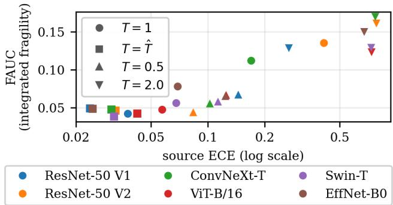  
Figure 3: Source calibration error against restricted fragility, exploratory. One point per checkpoint and calibration state, all post-audit and regenerated from the same source as Table $1 ;$ the six checkpoints appear four times each and are not independent observations. Marginally the two are associated (Pearson 0.91, Spearman 0.88); conditioning on $G _ { R }$ removes it (partial 0.00, while $G _ { R }$ retains 0.86 given ECE). Appendix J gives both parent sets, the rank versions and the leave-one-checkpoint-out ranges, and why none of this establishes non-determination.

## M The witness laws of Proposition $4$

All four witnesses are two-point laws at a single confidence level, verified exactly against the audited enumeration solver.
<table><tr><td></td><td>law of η at  $S = s$ </td><td>S</td><td> $\mu _ { P }$ </td><td> $e _ { P } = \mu _ { P } - s$ </td><td> $G _ { P }$ </td><td> $z _ { + }$ </td></tr><tr><td>(i)</td><td> $\{ 0 . 2 , 1 . 0 \} \ \mathrm { w . p . } \ \frac { 1 } { 2 }$ </td><td>0.6</td><td>0.6</td><td>0</td><td>0.16</td><td>0.4</td></tr><tr><td>(ii)</td><td>≡ 0.9</td><td>0.6</td><td>0.9</td><td>0.3</td><td>0</td><td>一</td></tr><tr><td>(iii)a</td><td>≡ 0.6</td><td>0.5</td><td>0.6</td><td>0.1</td><td>0</td><td>一</td></tr><tr><td>(iii)b</td><td> $\{ 0 . 2 , 1 . 0 \} \ \mathrm { w . p . } \ \frac { 1 } { \gamma }$ </td><td>0.5</td><td>0.6</td><td>0.1</td><td>0.16</td><td>0.4</td></tr><tr><td>(iv)a</td><td> $\{ 0 . 4 , 1 . 0 \} \mathrm { w . p . } \tilde { ( } \frac { 2 } { 3 } , \frac { 1 } { 3 } )$ </td><td>0.6</td><td>0.6</td><td>0</td><td>0.08</td><td>0.4</td></tr><tr><td>(iv)b</td><td> $\{ \textstyle { \frac { 1 } { 3 } } , 0 . 9 \} \ \mathrm { w . p . } \ ( \textstyle { \frac { 9 } { 1 7 } } , \frac { 8 } { 1 7 } )$ </td><td>0.6</td><td>0.6</td><td>0</td><td>0.08</td><td>0.3</td></tr></table>

The pair (iv) is the finite-support witness for Theorem 2: the two laws agree in both the calibration residual and the grouping variance (exactly, $G _ { P } = 0 . 0 8$ for both), both profiles equal $\sqrt { 0 . 0 8 \rho }$ on [0, 1.125], and they separate by exactly 0.100 for $\rho \ge 2$ , where one saturates at 0.4 and the other at 0.3. For (iv)b, $\begin{array} { r } { \dot { \mathbb { E } } \eta ~ \stackrel { \cdot } { = } ~ \frac { 1 } { 3 } \cdot \frac { 9 } { 1 7 } + 0 . 9 \cdot \frac { \bar { 8 } } { 1 7 } = 0 . 6 , \mathbb { E } \dot { \eta } ^ { 2 } - 0 . 3 6 = 0 . 0 8 , z _ { - } = - \frac { 4 } { 1 5 } } \end{array}$ and $\rho _ { + } = \rho _ { \mathrm { s a t } } = \frac { 9 } { 8 }$ for $( \mathrm { i v } ) \mathrm { a } , \rho _ { + } = \rho _ { \mathrm { s a t } } = 2$ . Note that witness (i) has $G _ { P } = 0 . 1 6$ while the largest attainable value at $\mu _ { P } = 0 . 6 \mathrm { i s } 0 . 6 \cdot 0 . 4 = 0 . 2 4 ;$ it is positively fragile, not maximally fragile.

## N Cross-fitting, leakage test and estimator conventions

Each of the six checkpoints reproduces its published top-1 accuracy to within 0.02 points. Five folds, seed 20270214; � = 20 equal-mass confidence bins; $K = 8$ groups. Original protocol. As first specified, each training portion fitted the bin edges, the correctness readout (logistic regression on confidence, margin, entropy and a 50-dimensional PCA of the penultimate representation) and its within-bin quantile boundaries, and cell rates $\theta _ { P }$ were then taken from that same training portion with Beta–Binomial shrinkage toward the bin mean $( m = 1 0 )$ . Group proportions came from the held-out portion using (�, �) only, and cells were retained at training count $\geq 3 0$ and evaluation count $\geq 1 0$ . This is the pipeline behind the original-protocol results retained in Appendix J, and it is not the method used for Table 1: the revision below separates the data that fit the cells from the data that estimate their rates, and drops the shrinkage so that Proposition 9 applies.

Leakage test. Permuting the held-out fold’s correctness labels and rerunning the entire construction leaves every partition assignment and every weight bit-identical (verified by SHA-256 over the weight arrays). The permutation must be confined to the fold under test: permuting all folds at once also scrambles each fold’s training labels and produces a false positive.

FAUC, in full. The reported FAUC is reproducible from the released per-model outputs as follows. For each state, partition � (primary R2 within), radius $\rho$ and direction, the per-bin plug-in profile $\widehat { \mathcal { F } } _ { B , R } ^ { \pm } ( b , \rho )$ is solved on the plug-in cell rates ${ \hat { \theta } } .$ Within each outer fold, bins are combined by $\begin{array} { r } { \boldsymbol { w } _ { b } = \boldsymbol { n } _ { b } / \sum _ { b ^ { \prime } } \boldsymbol { n } _ { b ^ { \prime } } } \end{array}$ , the bin’s share of retained evaluation examples in that fold, into

$$
\begin{array} { r } { F _ { f } ^ { \pm } ( \rho ) \ = \ \Big ( \sum _ { b } w _ { b } \widehat { \mathcal { F } } _ { B , R } ^ { \pm } ( b , \rho ) ^ { 2 } \Big ) ^ { 1 / 2 } , } \end{array}
$$

a quadratic mean over analysable bins, and the model-level curve is the unweighted mean $F ^ { \pm } ( \rho ) =$ $\begin{array} { r } { \frac { 1 } { 5 } \sum _ { f } F _ { f } ^ { \pm } ( \rho ) } \end{array}$ over the five folds. The radius grid is fixed at $\rho \in \{ 0 , 0 . 0 1 , 0 . 0 3 , 0 . 1 , 0 . 3 , 1 , 3 \} -$ seven points, including $\rho = 0$ where $F = 0 -$ and is the same grid in every experiment that reports FAUC. Writing $x _ { j } = \log ( 1 + \rho _ { j } )$ , so that � runs over [0, log 4],

$$
\mathrm { F A U C } \ = \ \sum _ { j = 0 } ^ { 5 } \frac { 1 } { 2 } \big [ F ^ { + } ( \rho _ { j } ) + F ^ { + } ( \rho _ { j + 1 } ) \big ] ( x _ { j + 1 } - x _ { j } ) ,
$$

the trapezoidal rule in log-radius. Three conventions matter for exact reproduction: the headline FAUC uses the upward profile $F ^ { + }$ only (the downward integral is recorded separately as a directionalasymmetry diagnostic); the integral is not normalised by log $4 \approx 1 . 3 8 6 ,$ so FAUC has the units of � scaled by that interval; and $F$ is built from ${ \widehat { \theta } } ,$ not from the debiased $G _ { R }$ . Recomputing this from the frozen per-model profiles reproduces every FAUC in Table 1 exactly (maximum absolute deviation 0).

ECE, in full. Every sample contributes exactly once, through the fold in which it was an evaluation point, using that fold’s frozen temperature and frozen equal-mass bin edges; the resulting out-of-fold arrays are then pooled over all $n = 5 0 { , } 0 0 0$ validation images and

$$
\mathrm { E C E } \ = \ \sum _ { b = 1 } ^ { J } \frac { n _ { b } } { n } \big | \bar { c } _ { b } - \bar { s } _ { b } \big | , \qquad J = 2 0 ,
$$

with $\bar { c } _ { b }$ the mean correctness and $\bar { s } _ { b }$ the mean confidence in bin �, empty bins skipped. The binning is equal-mass (adaptive), on the same $J = 2 0$ preregistered bins as the fragility construction, with edges fitted on each training fold; an equal-width 15-bin variant is recorded as a secondary metric and is not used in any comparison. Because the temperature is fitted on the training fold and the ECE contribution is taken on the held-out fold, temperature fitting and ECE evaluation never share data. The as-released and temperature-scaled states use the identical estimator, difering only in the confidences fed to it.

Data roles. Every supervised object is fitted on data disjoint from the data used to estimate cell rates. Within each outer fold � (five folds, seed 20270214) the training portion is split once, 50/50, into

<table><tr><td>role</td><td>size</td><td>what is fitted or estimated on it</td></tr><tr><td> $D _ { \mathrm { { f i t } } }$ </td><td>20,000</td><td>temperature  $T ;$  bin edges; correctness readout; within-bin group boundaries</td></tr><tr><td> $D _ { \mathrm { r a t e } }$ </td><td>20,000</td><td>raw cell rates  $\tilde { \theta } _ { b k }$  and counts  $n _ { b k }$  , on the frozen cells</td></tr><tr><td> $D _ { \mathrm { e v a l } }$ </td><td>10,000</td><td>evaluation proportions  ${ \hat { p } } ;$  held-out correctness scoring frozen weights</td></tr></table>

This is a change from the protocol as first specified, where the readout and the temperature were both fitted on the whole training portion and $\hat { \theta }$ was then formed from those same labels. Throughout, �˜ denotes raw binomial cell proportions and $\hat { \theta }$ the cell rates a pipeline plugs into the profile: the shrunk rates under the original protocol, and $\tilde { \theta }$ itself under the revised roles. The temperature matters here even though scaling preserves the argmax and therefore leaves correctness invariant: � was fitted by NLL on all 40,000 training labels, so a rate-estimation point contributed to the map that decides which bin it lands in, and no conditioning argument recovers independence afterwards. The efect of one point on a scalar fitted from 40,000 is small, but the statement “conditionally on the frozen objects the rates are independent binomials” is simply unavailable under that design. We therefore refit $T$ on $D _ { \mathrm { { f i t } } }$ and report the cached-� variant separately as a sensitivity variant.

What the plug-in estimates, in general. With $\hat { \theta }$ the vector of cell rates in bin �, weights � and $A _ { w } = \mathrm { d i a g } ( w ) - w w ^ { \top }$ , the plug-in is $\hat { \theta } ^ { \top } A _ { w } \hat { \theta }$ . For fixed �, writing $\beta = \mathbb { E } [ \hat { \theta } ] - \theta$ and $\Sigma = \operatorname { C o v } ( \hat { \theta } )$ ,

$$
\begin{array} { r } { \mathbb { E } \big [ \hat { \theta } ^ { \top } A _ { w } \hat { \theta } \big ] - \theta ^ { \top } A _ { w } \theta \ = \ \underbrace { 2 \theta ^ { \top } A _ { w } \beta + \beta ^ { \top } A _ { w } \beta } _ { \mathrm { b i a s ~ o f ~ } \hat { \theta } } + \ \underbrace { \operatorname { t r } ( A _ { w } \Sigma ) } _ { \mathrm { e s t i m a t i o n ~ n o i s e } } . } \end{array}\tag{10}
$$

Only when the cells are fixed and the $\hat { \theta } _ { b k }$ are unbiased and mutually independent does the second term reduce to $\begin{array} { r } { \sum _ { k } w _ { k } \big ( 1 - w _ { k } \big ) \nu _ { k } } \end{array}$ with $\nu _ { k } = \mathrm { V a r } ( \hat { \theta } _ { b k } ) ;$ ; a shared shrinkage target correlates cells, and a label-supervised readout fitted on the rate-estimation labels makes $\beta \neq 0$ in the direction that inflates the plug-in.

Proposition 9 (Conditional unbiasedness). Fix the partition, non-negative weights � with $\begin{array} { r } { \sum _ { k } w _ { k } = 1 } \end{array}$ and cell counts $n _ { k } \ge 2$ . Suppose the ${ \tilde { \theta } } _ { k }$ are independent binomial proportions with mean $\theta _ { k }$ on those counts. Then

$$
\widehat { G } _ { w } = \widetilde { \theta } ^ { \top } A _ { w } \widetilde { \theta } - \sum _ { k } w _ { k } \big ( 1 - w _ { k } \big ) \frac { \widetilde { \theta } _ { k } \big ( 1 - \widetilde { \theta } _ { k } \big ) } { n _ { k } - 1 } \quad s a t i s f i e s \quad \mathbb { E } \big [ \widehat { G } _ { w } \mid t h e f i x e d o b j e c t s \big ] = \theta ^ { \top } A _ { w } \theta .
$$

Proof. $\mathbb { E } [ \tilde { \theta } ^ { \top } A _ { w } \tilde { \theta } ] = \theta ^ { \top } A _ { w } \theta + \mathrm { t r } ( A _ { w } \Sigma )$ and $\Sigma = \operatorname { d i a g } ( \nu )$ by independence, so tr $\begin{array} { r } { { \bf \Pi } ^ { \prime } A _ { w } \Sigma ) = \sum _ { k } ( w _ { k } - } \end{array}$ $w _ { k } ^ { 2 } ) \dot { \nu } _ { k }$ with $\nu _ { k } = \theta _ { k } \big ( 1 - \theta _ { k } \big ) / n _ { k }$ . For a binomial proportion, $\mathbb { E } [ \tilde { \theta } _ { k } \bar { ( } 1 - \tilde { \theta } _ { k } ) ] = \theta _ { k } ( 1 - \theta _ { k } ) ( n _ { k } - 1 ) / n _ { k }$ so $\mathbb { E } [ \tilde { \theta } _ { k } ( 1 - \tilde { \theta } _ { k } ) / ( n _ { k } - 1 ) ] = \nu _ { k }$ exactly; $n _ { k } \ge 2$ is what makes the divisor meaningful. Subtracting gives the claim. □

Which estimand, and the rules that define it. The proposition is conditional on the realised weights, so $\widehat { G } _ { w }$ is unbiased for the empirical-weight quantity $\theta ^ { \top } A _ { \hat { p } } \theta .$ , not for the population $G _ { R }$ of the same cells. In an idealised model with fixed full support, no retention and independent multinomial counts $N \sim \mathbf { M } \mathbf { u } \mathbf { l } \mathrm { t } ( m , p ) , \hat { p } = N / m$ , one has $\mathbb { E } [ A _ { \hat { p } } ] { \stackrel { - } { = } } ( 1 - 1 / m ) A _ { p }$ , so a rate-noise-only correction retains a $( 1 - 1 / m )$ factor against the population target; with $m \approx 5 0 0$ evaluation points per bin that factor is 0.998. This delimits one term in that idealised model. It is not a bound on the total departure from a population target of the actual pipeline, which also selects cells by count, renormalises over the retained ones and refits the partition on each fold; we do not claim such a bound, and the estimand we report is the empirical-weight one. Three further conventions are part of the estimand and not incidental. Cells enter only when $n _ { b k } ^ { \mathrm { r a t e } } \geq 3 0$ and $n _ { b k } ^ { \mathrm { e v a l } } \geq 1 0$ , and $\hat { p }$ is renormalised over the retained cells, so the target is the restricted quantity on that retained sub-support; retention uses counts, not labels, but it is still data-dependent and the proposition is conditional on its outcome. Bins with fewer than two retained cells are dropped. Negative estimates are retained, never clipped. Per-bin values are combined by evaluation count within a fold and then averaged unweighted over the five folds. Finally, the revised partitions are fitted on $D _ { \mathrm { { f i t } } }$ and can difer from those of the original protocol. Diferences between original-protocol and post-audit estimates therefore need not estimate the bias of either procedure.

How large the selection efect is, measured rather than argued. We re-ran the pipeline with correctness replaced by labels independent of the input, so the population $G _ { R }$ of any induced partition is exactly 0 and anything reported is bias. Two randomisations are used and they answer slightly diferent questions. A permutation of the observed correctness vector fixes the total number of successes and so samples without replacement; it is the natural selection diagnostic but not the independent-binomial structure Proposition 9 assumes. Drawing i.i.d. Bernoulli pseudo-labels at the model’s accuracy supplies that structure exactly. Both agree. All uncertainties are across replicate randomisations on the same cached predictions, so they describe randomisation error conditional on that cache, not dataset sampling error; overlapping folds are not independent replicates and are not counted as such.
<table><tr><td>randomisation</td><td>estimator</td><td>ResNet-50 V1</td><td>ViT-B/16</td><td>Swin-T</td></tr><tr><td>permutation (8×)</td><td>same-fold rates</td><td> $6 . 1 \pm 1 . 9$ </td><td> $6 . 9 \pm 1 . 7$ </td><td> $4 . 3 \pm 1 . 4$ </td></tr><tr><td>i.i.d. Bernoulli (10×)</td><td>inner-split rates</td><td> $0 . 7 \pm 0 . 9$ </td><td> $- 2 . 3 \pm 2 . 1$ </td><td> $- 1 . 2 \pm 1 . 8$ </td></tr><tr><td></td><td>same-fold rates</td><td> $6 . 7 \pm 1 . 5$ </td><td> $4 . 4 \pm 1 . 0$ </td><td></td></tr><tr><td></td><td>inner-split rates</td><td> $0 . 6 \pm 1 . 7$ </td><td> $- 0 . 9 \pm 1 . 7$ </td><td></td></tr></table>

Entries are mean ${ \widehat { G } } _ { R }$ under the null ± Monte-Carlo standard error, in units of $1 0 ^ { - 5 }$ ; the standard deviation across replicates is 8 or 10 times larger. The same-fold estimator is positive at 3.2–4.6 standard errors where the truth is zero; the inner-split estimator is within one. A matched simulation with adaptive grouping — a label-supervised logistic readout on 12 features, $K = 8$ within-bin quantile groups, 2000 points per bin, 400 replicates, truth taken as the population $G _ { R }$ of the same fitted partition — reproduces the ordering in all three regimes an estimator has to survive: bias $+ 1 . 1 5 \pm 0 . 0 4 , + 2 . 6 2 \pm 0 . 2 0$ and $+ 2 . 5 4 \pm \mathrm { { \bar { 0 } } } . 1 9 ( \times 1 0 ^ { - 3 } )$ for the same-fold estimator under a null, under genuine heterogeneity and under unequal cell counts, against $- 0 . 0 2 \pm 0 . 0 5 , + 0 . 2 8 \pm 0 . 2 8$ and $+ 0 . 3 4 \pm 0 . 2 8$ for the inner split. Unequal cell counts do not change the conclusion, and the selection term is larger when real heterogeneity is present than under the null, so it cannot be removed by subtracting a constant. None of this proves unbiasedness: simulation at this precision shows only that no bias is detected at that precision. Exact unbiasedness is what Proposition 9 supplies, under the conditions it states.

What the old and new estimators do not measure against each other. Table 1 reports two calibration states under one estimator; the estimator contrast is the one between that table and the original-protocol values retained in Appendix J. On real labels the diference between the two protocols is not a bias estimate. The inner split also halves the sample that fits $\hat { \theta }$ and refits every nuisance on half the fold, so the two protocols estimate restricted quantities of cells that can difer; empirically their diference does not even keep a constant sign across checkpoints. We read neither as a correction of the other.

Held-out rank agreement: aggregation. For one (checkpoint, state, fold, radius) we take the Spearman correlation across the retained bins between the predicted upward per-bin profile and the drift realised on $D _ { \mathrm { e v a l } }$ under the frozen weights. A radius is skipped if fewer than three bins are retained or either array is constant; a bin needs at least two retained cells; $\rho = 0$ is excluded because both arrays vanish identically there. Within a fold we take the median over the six positive radii, then the mean over the five outer folds, giving one value per (checkpoint, state). The figures quoted in Section 5 are the median, minimum and maximum of those twenty-four values, with none excluded. “Fold” always means an outer cross-fitting fold; the two halves of Appendix N.1 are called arms and are a separate construction.

Unbiased rates do not give an unbiased profile. For fixed � and $\rho , \theta \mapsto \mathcal { F } ^ { + } ( p , \theta )$ is a supremum of linear functions of �, hence convex, so Jensen gives $\mathbb { E } [ \mathcal { F } ^ { + } ( p , \hat { \theta } ) ] \ge \mathcal { F } ^ { + } ( p , \theta )$ whenever $\hat { \theta }$ is conditionally unbiased, and the same holds for a non-negatively weighted aggregate of per-bin profiles. This is an inequality in expectation: a single realisation need not exceed the truth, and it does not imply that an inner-split FAUC computed on a diferent partition exceeds the original one. The inequality is strict in the cases that matter: with two equal-mass cells $\mathcal { F } ^ { + } ( \rho ) = \textstyle \frac { 1 } { 2 } | \theta _ { 1 } - \theta _ { 2 } |$ min $\{ \sqrt { \rho } , 1 \}$ , so at $\theta _ { 1 } = \theta _ { 2 }$ the true profile is zero while independent rates from $n = 2 0 0$ per cell give $\mathbb { E } [ \widehat { \mathcal { F } } ^ { + } ] = 0 . 0 1 0$ at $\rho = 0 . 3$ and 0.018 at $\rho = 3$ . Splitting removes a selection mechanism from ${ \widehat { G } } _ { R } ;$ it does not make FAUC unbiased, and it does not make it conservative. Halving the rate sample increases the variance of ${ \widehat { \theta } } ,$ which at a fixed partition and set of weights increases the expected plug-in profile; that comparison is not the same as comparing the split and original pipelines, which also difer in partition, and we draw no ordering between those. We therefore keep three objects apart throughout: the population restricted profile, the plug-in estimate of it, and the independent split-sample lower confidence bound of Appendix N.1, which alone carries a coverage guarantee and whose per-(model, state, split arm) statement we do not transfer to any point estimate.

Negative values are retained, not clipped. The reported model-level value is

$$
\widehat { G } _ { R } ^ { \mathrm { m o d e l } } = \frac { 1 } { 5 } \sum _ { f = 1 } ^ { 5 } \frac { \sum _ { b } n _ { f , b } ^ { \mathrm { e v } } \widehat { G } _ { R , f } ( b ) } { \sum _ { b } n _ { f , b } ^ { \mathrm { e v } } } ,
$$

an evaluation-count-weighted mean over analysable bins within each fold, then an unweighted mean over the five folds. Recomputing this reproduces every $G _ { R }$ in Table 1 exactly, and recomputing ECE end to end from the cached predictions reproduces Table 1 to $< 3 \times 1 0 ^ { - 1 7 }$

Debiased versus plug-in heterogeneity. $G _ { R }$ is reported with the correction of Proposition 9, $\begin{array} { r } { \sum _ { k } w _ { k } ( 1 - w _ { k } ) \tilde { \theta } _ { k } \bar { ( 1 - \tilde { \theta } _ { k } ) } / ( n _ { k } - \tilde { 1 } ) } \end{array}$ , whereas the fragility profile is computed from the plug-in rates with no correction. The two therefore use diferent estimators and are not numerically interchangeable; no statement in this paper compares $\sqrt { \rho G _ { R } }$ with a plug-in fragility quantity as though they estimated the same thing. (The percentage agreements quoted in earlier versions of this appendix referred to the original-protocol shrunk estimator and have been removed rather than recomputed, since no current claim uses them.)

Score-marginal diagnostics. The construction preserves the binned marginal exactly, max� $| Q _ { B } ( \breve { b } ) - P _ { B } ( b ) | < 1 0 ^ { - 1 4 }$ throughout (pilot $5 . 7 \times 1 0 ^ { - 1 6 }$ , multi-architecture $8 . 9 \times 1 0 ^ { - 1 5 } )$ The continuous marginal is not preserved. In the pilot, under the primary partition at $\rho = 1$ , the weighted-versus-source Kolmogorov–Smirnov statistic is 0.0051 and the Wasserstein-1 distance $0 . 0 0 1 4 \cdot$ ; at $\rho \ : = \ : 0 . 1$ they are 0.0017 and 0.0005. These are reported as diagnostics, never as preservation.

Efective sample size. In the pilot the minimum efective sample size across retained (bin, radius) pairs is 622 and the median 2,099; the minimum across the six architectures is 618, and no bin falls below 30. No reported quantity rests on a cell the reweighting has emptied.

## N.1 Split-sample lower confidence bound

Proposition 5 orders population quantities. The plug-in profile estimates the restricted profile but carries no finite-sample guarantee, so a separate preregistered analysis supplies one. Its protocol was written and hashed before any of its results were computed (Appendix O).

The pairwise construction. Fix a bin � and the learned readout �. For an ordered pair of groups (source $u ,$ destination �), move mass �: $q _ { \nu } = p _ { \nu } + d , q _ { u } = p _ { u } - d $ , all other groups unchanged. Total bin mass is preserved; non-negativity requires $d \leq p _ { u } ;$ the conditional Pearson $\chi ^ { 2 }$ cost is $d ^ { 2 } ( 1 / p _ { \nu } + 1 / p _ { u } ) ;$ and since the perturbation has zero total mass, the centring in $Z$ is immaterial and the reliability movement is exactly $d ( \theta _ { \nu } - \theta _ { u } )$ . The budget $d ^ { 2 } ( 1 / p _ { \nu } + 1 / \bar { p } _ { u } ) \leq \rho$ and $d \leq p _ { u }$ together give the largest feasible step

$$
d ^ { * } ( p _ { \nu } , p _ { u } , \rho ) \ = \ \operatorname* { m i n } \Big \{ p _ { u } , \ \sqrt { \rho p _ { \nu } p _ { u } / ( p _ { \nu } + p _ { u } ) } \Big \} .
$$

Because this move is a feasible point of the programme whose supremum defines $\mathcal { F } _ { B , R } ^ { + } ( b , \rho )$ , we get $\mathcal { F } _ { B , R } ^ { + } ( b , \rho ) \geq ( \theta _ { \nu } - \theta _ { u } ) _ { + } d ^ { * }$ for every pair, with $d ^ { * } = 0$ when $p _ { \nu } p _ { u } = 0$ When $p _ { u }$ attains the minimum the budget is automatically satisfied, since $\sqrt { \rho p _ { \nu } p _ { u } / ( p _ { \nu } + p _ { u } ) } \geq p _ { u }$ rearranges to $\rho \ge p _ { u } ^ { 2 } / p _ { \nu } + p _ { u }$ , which is the cost of $d = p _ { u }$

Monotonicity of $d ^ { * } . ( p _ { \nu } , p _ { u } ) \mapsto p _ { \nu } p _ { u } / ( p _ { \nu } + p _ { u } ) = ( 1 / p _ { \nu } + 1 / p _ { u } ) ^ { - 1 }$ is increasing in each argument, so the square-root term is increasing in both, and min $\{ p _ { u } , \cdot \}$ is a minimum of two functions each non-decreasing in $p _ { u }$ and non-decreasing in $p _ { \nu }$ . Hence $d ^ { * }$ is coordinatewise non-decreasing, and substituting lower bounds for $p _ { \nu } , p _ { u }$ can only decrease it.

The simultaneous event and its family. On the certification half, conditionally on the realised counts, the correct counts in cell (�, �) are Binomia $\left[ \left( n _ { b k } , \theta _ { P } \left( b , k \right) \right) \right.$ , the cell counts within bin � are Binomial ${ \bf \Phi } _ { n _ { b } , p _ { b k } } )$ , and the bin counts are Binomia $( n , p _ { b } )$ . We take exact one-sided Clopper–Pearson bounds and combine by Bonferroni over

$$
\begin{array} { r l r l } { \underbrace { 2 J K } _ { \mathrm { ~ \tiny ~  ~ + ~ \frac ~ { ~ J K ~ } ~ { ~ + ~ \frac ~ { ~ \pi ~ } ~ { ~ J ~ } ~ } ~ } } = \frac { } { } 5 0 0 } & { { } ( J = 2 0 , K = 8 ) } \end{array}
$$

� lower and upper ��� lower $^ { p _ { b } }$ lower

one-sided statements, each at $\alpha / 5 0 0 ~ = ~ 1 0 ^ { - 4 }$ , giving an event � with $\operatorname* { P r } ( E ) \ \geq \ 0 . 9 5$ On $E _ { i }$ $( \theta _ { \nu } - \theta _ { u } ) _ { + } \geq [ L _ { b \nu } - U _ { b u } ]$ + and, by the monotonicity above, $d ^ { * } ( p _ { \nu } , p _ { u } , \rho ) \geq d ^ { * } ( l _ { b \nu } , l _ { b u } , \rho )$ ; both factors are non-negative, so their product is a lower bound, and $\mathrm { L C B } _ { b } ^ { + } ( \rho )$ of (9) follows.

Why the maximisation and the radius grid are free. Every pair yields a bound valid on the same event �, so their maximum is valid on �; the selection is not a multiple test and needs no correction. Identically, the bounds $L , U ,$ � do not depend on $\rho ,$ so re-evaluating (9) across the grid re-uses one event. The downward bound reverses the correctness comparison, $[ L _ { b u } - U _ { b \nu } ] _ { + }$ , and likewise re-uses $E .$

Model level. On � we have $p _ { b } \ge l _ { b } \ge 0$ together with $\mathcal { F } _ { B , R } ^ { + } ( b , \rho ) \geq \mathrm { L C B } _ { b } ^ { + } ( \rho ) \geq 0$ , so termwise $p _ { b } \mathcal { F } _ { B , R } ^ { + } ( b , \rho ) ^ { 2 } \geq l _ { b } \mathrm { L C B } _ { b } ^ { + } ( \rho ) ^ { 2 }$ . Summing and taking the monotone square root gives

$$
\Big ( \sum _ { b } l _ { b } \mathrm { L C B } _ { b } ^ { + } ( \rho ) ^ { 2 } \Big ) ^ { 1 / 2 } \ \leq \ \Big ( \sum _ { b } p _ { b } \mathcal { F } _ { B , R } ^ { + } ( b , \rho ) ^ { 2 } \Big ) ^ { 1 / 2 } .
$$

The $l _ { b }$ lie inside the same family, so the complete aggregation is covered by the single event.

Validity is conditional on the fitted nuisances, and also unconditional. The bin edges, the readout and, where applicable, the temperature are learned on the fitting half only. Conditionally on those frozen objects, the certification half is an i.i.d. sample from the induced population and $\operatorname* { P r } ( E$ | fitted objects) $\geq 0 . 9 5$ . Because the two halves are sample-separated, iterating the expectation over the fitting half gives $\operatorname* { P r } ( E ) \geq 0 . 9 5$ unconditionally as well.

Split protocol. One balanced random partition of the 50,000 validation indices into halves (split seed 20260902, declared in the protocol). Two arms are reported separately: A fits and B certifies, then B fits and A certifies. The two arms learn diferent $( B , R )$ and therefore certify diferent population targets; they are never pooled, averaged, or selected between, and the $9 5 \%$ statement is per (model, state, arm) analysis — not joint over the six architectures, the two states, or the two arms.

Two deliberate diferences from the plug-in pipeline. First, the temperature used here is fitted on the fitting half; it is a separate split-fitted validation state mirroring the fitted state of Table 1, not the same five-fold nuisance fit. Second, no cell-retention filter is applied: all $K = 8$ groups enter, and a small or empty cell simply receives a vacuous Clopper–Pearson interval and $l _ { b k } = 0 .$ . Count-based retention would be data-dependent selection that the coverage proof does not cover. Consequently the bound is a lower confidence bound for the restricted profile of the learned finite readout and is not an error bar on the retained-cell FAUC estimator.

Validation. The constructed reweighting was checked over $2 \times 1 0 ^ { 5 }$ random supports: cost formula to $2 . 2 \times 1 0 ^ { - 1 5 }$ , objective exact, non-negativity min $q = 0 ,$ , mass preserved to $4 . 4 \times 1 0 ^ { - 1 6 }$ , budget never exceeded. Synthetic coverage against the true ${ \bar { \mathcal { F } } } ^ { \pm }$ from the audited solver gave 0 violations out of 9,000 in each of four regimes (wide cells, tight cells, small $n ,$ skewed $p )$ and 0 out of 2,000 for the model-level aggregation. Edge cases pass: zero counts, $p  0$ , equal $\theta , \theta \in \{ 0 , 1 \} , \rho = 0$ , and saturation $d = p _ { u }$

Result. The preregistered outcome categories were A (positive model-level bound at $\rho = 0 . 3$ for $\geq 4$ of 6 architectures in at least one primary state), B (one to three), C (none). Outcome A was observed.
<table><tr><td rowspan="2">Model</td><td colspan="2">as released T=1</td><td colspan="2">split-fitted  $T { = } \hat { T }$ </td></tr><tr><td>A fits/B cert.</td><td>B fits/A cert.</td><td>A fits/B cert.</td><td>B fits/A cert.</td></tr><tr><td>ResNet-50 V1</td><td>0</td><td>0</td><td>0</td><td>0</td></tr><tr><td>ResNet-50 V2</td><td>0.0158</td><td>0.0171</td><td>0</td><td>0</td></tr><tr><td>ConvNeXt-T</td><td>0.0096</td><td>0.0114</td><td> $2 \times 1 0 ^ { - 5 }$ </td><td>0</td></tr><tr><td>ViT-B/16</td><td>0</td><td>0</td><td>0</td><td>0</td></tr><tr><td>Swin-T</td><td>0.0011</td><td>0.00014</td><td>0</td><td>0</td></tr><tr><td>EfficientNet-B0</td><td>0.0018</td><td>0.0014</td><td>0</td><td>0</td></tr></table>

$\mathrm { L C B } _ { \mathrm { m o d e l } } ^ { + } ( 0 . 3 )$ ; each entry carries its own 95% statement. The two architectures at zero are the two with least partition-accessible heterogeneity, matching the $G _ { R }$ ordering of Table 1. Where the bound is positive it recovers roughly 10–25% of the corresponding unfiltered certification-half plug-in value at small $\rho ;$ the strongest single bin (ResNet-50 V2, bin 4) gives $\mathrm { L C B } _ { b } ^ { + } ( 0 . 3 ) = 0 . 0 4 1 4$ against a plug-in 0.1044.

Two distinct reasons the numbers are flat in $\rho .$ The set of bins with $\mathrm { L C B } _ { b } ^ { + } ( \rho ) > 0$ does not change with $\rho > 0$ , because positivity requires only a strictly positive lower-bounded correctness gap $[ L _ { b \nu } - U _ { b u } ] _ { + } > 0$ together with $l _ { b \nu } , l _ { b u } > 0$ , and neither depends on $\rho .$ Separately, the values stop growing once $d ^ { * }$ saturates at $p _ { u } .$ , which is the mass constraint binding rather than the budget. The two efects are unrelated.

## O Extended scope, assumptions and claim boundaries

What the estimator revision does and does not reach. The revision of Appendix N changes where cell rates are estimated. Results divide into four groups and we do not treat them alike. (i) Population statements and algebraic identities — Propositions 1, 2, 3, 4, 5 and 8, Theorems 1 and 2, Corollary 1 — are about the population and are untouched by any estimator. (ii) Identities between arrays. The monotone-reparameterisation analysis is exactly zero because both sides are computed from literally the same arrays once the bin index and readout are bit-identical; that remains true under any rate estimator, and it was never an independent empirical finding. (iii) The split-sample lower confidence bound of Appendix N.1 draws its counts from a certification half disjoint from the half fitting its nuisances, and its code path does not call the revised rate estimator. It was not rerun; the reported values are those originally computed. (iv) Everything numerical that reads source cell rates — levels, model rankings, ratios, correlations, envelope utilisation and the composition/conditional split — had to be recomputed or withdrawn, and the recomputation is reported with the analysis it belongs to. We do not claim that a common estimator gives a common bias across models: the same procedure applied to six architectures can be inflated by diferent amounts, which is precisely why orderings had to be re-derived rather than assumed stable.

A closing identity is not evidence for its parts. If source rates carry error $e ,$ then at fixed $p , q$ and readout

$$
\widehat { \delta } _ { \mathrm { c o m p } } - \delta _ { \mathrm { c o m p } } = ( q - p ) ^ { \top } e , \qquad \widehat { \delta } _ { \mathrm { c o n d } } - \delta _ { \mathrm { c o n d } } = - q ^ { \top } e , \qquad \widehat { \delta } _ { \mathrm { t o t a l } } - \delta _ { \mathrm { t o t a l } } = - p ^ { \top } e ,
$$

so $\widehat { \delta } _ { \mathrm { c o m p } } + \widehat { \delta } _ { \mathrm { c o n d } } = \widehat { \delta } _ { \mathrm { t o t a l } }$ still holds exactly while the components move. With $\begin{array} { r } { p = ( { \frac { 1 } { 7 } } , { \frac { 1 } { 7 } } ) , q = ( 1 , 0 ) } \end{array}$ $\theta _ { P } = ( \textstyle { \frac { 1 } { 2 } } , \textstyle { \frac { 1 } { 2 } } ) , \theta _ { Q } = ( \textstyle { \frac { 3 } { 4 } } , \frac { 3 } { 4 } )$ the truth is $( \delta _ { \mathrm { t o t a l } } , \delta _ { \mathrm { c o m p } } , \delta _ { \mathrm { c o n d } } ) = ( \textstyle { \frac { 1 } { 4 } } , 0 , \frac { 1 } { 4 } )$ ; substituting $\widehat { \theta } _ { P } = ( 0 . 7 , 0 . 3 )$ gives $\bigl ( \frac { \bar { 1 } } { 4 } , \frac { \bar { 1 } } { 5 } , \frac { 1 } { 2 0 } \bigr )$ — same total, same exact closure, reversed dominance. The numerical closure of $5 \times 1 0 ^ { - 1 6 }$ reported in Appendix L therefore certifies the algebra and nothing about the components, which is why Appendix P re-runs the decomposition under the revised rate estimator instead of inferring stability from closure. The population construction preserves the continuous score marginal exactly; the finite-sample construction preserves only the binned marginal. The population targets of our empirical heterogeneity and fragility quantities are partition-restricted population lower bounds on the corresponding binned oracle quantities, never the oracle $G _ { P } ( s )$ itself; that ordering is a population statement, and the cross-fitted plug-in estimate of it carries no finite-sample conservativeness guarantee. In the finite construction $G _ { P } ( b ) = \operatorname { V a r } ( \eta \mid B = b )$ and $\mathcal { F } _ { B }$ are the objects of Section 3 for the binned statistic �; they include within-bin variation of $\mu _ { P }$ and are not lower bounds on the continuous-level $G _ { P } ( s ) \mathrm { o r } \mathcal { F } _ { s }$ . ECE and the natural-drift norms are ordinary out-of-fold estimates, not confidence bounds. The controlled shifts are constructed adversarially and are not forecasts of natural shift; the composition component of natural drift is bounded by the population source profile under the support condition of Proposition 8, total drift is not. At finite readout the conditional term conflates mechanism change with coarseness. Temperature scaling of a multiclass top-label score is not a monotone reparameterisation and can reorder examples, so it alters resolution as well as calibration; we therefore do not treat it as a calibration-only intervention, and states with $T \in \{ 0 . 5 , 2 \}$ are stress tests rather than evidence about recalibration. The fragility profile determines the centred conditional law of the correctness propensity � and not its mean; the law of the label � given $S = s$ is Bernoulli and is fixed by the mean alone. The hierarchy of Section 3 is informative only where � is non-degenerate within a level set. If the label were a deterministic function of � and the classifier deterministic, then $\eta \in \{ 0 , 1 \}$ }, � would be two-valued with $z _ { + } = 1 - \mu _ { P } ( s )$ and $z _ { - } = - \mu _ { P } ( s )$ , and one would have exactly

$$
G _ { P } ( s ) = \mu _ { P } ( s ) \bigl ( 1 - \mu _ { P } ( s ) \bigr ) , \qquad \mathcal { F } _ { s } ^ { \pm } ( \rho ) = \operatorname* { m i n } \bigr \{ \sqrt { \rho G _ { P } ( s ) } , \pi ^ { \pm } \bigr \} ,
$$

with $\pi ^ { + } = 1 - \mu _ { P } ( s )$ and $\pi ^ { - } = \mu _ { P } ( s )$ : the general statements specialise to functions of $\mu _ { P } ( s )$ within that family. This is a degenerate sub-family, not a failure of the dynamic question, and the converse does not follow — stochastic labelling alone does not guarantee non-trivial within-level heterogeneity. We make no claim about how deterministic any particular labelling mechanism is. Our empirical objects sit at a coarsened readout where $\theta _ { P } ( b , k )$ averages over many inputs and need not be {0, 1}-valued, even when labels are deterministic. No claim is made that any architecture is universally more robust.

Chronology of what was fixed when. Six protocol artefacts were written and cryptographically hashed before the results they govern: the pilot, multi-architecture, natural-shift, naturaltarget disambiguation, split-sample lower confidence bound (Appendix N.1), and monotone scorereparameterisation (Appendix Q) protocols. Each fixes its estimand, estimator, controls and admissible outcomes in advance; the fifth also fixes its split seed before any split was drawn, and the sixth fixes its transformation family and parameterisation, its fitting objective, its cross-fitting scheme, the radius grid, the numerical tolerances, the endpoint list and its three admissible outcomes before any new real-data result was inspected. The model checkpoints are public pretrained weights and were frozen before any analysis. Two post-audit analyses are not preregistered and are labelled here so that no number in this paper depends on an unlabelled one. The first is the score-only comparator of Appendix J, which reruns the frozen construction with � replaced by within-bin confidence quantiles; it introduces no new model, dataset or training run, and it is a comparator with no ordering relation to the learned-readout profile. The second is the cell-rate estimator audit reported in Appendix N: it permutes the training-fold correctness labels before the readout fit and the rate estimation, repeats the frozen pipeline over eight permutations, and compares three cell-rate estimators. Four later extensions — random score-preserving shifts, a CIFAR-10H case study, a revised-partition recomputation of two natural-shift benchmarks (Appendix R) and a twelve-checkpoint architecture-breadth cohort (Appendix S) — each had a protocol hashed before its results were computed; none is preregistered, and the quantities defined after inspection are marked post-hoc where they appear. The diagnostics added in the final revision (Appendix T) are post-hoc throughout; their protocol and its first amendment were hashed before the corresponding results were computed, the second amendment (the controlled-shift null) after the random-shift null had been seen. The low-target-count sensitivity of Appendix L was specified in writing after the flagged-bin count had been reported and before it was computed; it is post-hoc and leaves the original all-bin analysis as the reported one. An earlier internal note described the afected results as difering only in level, with internal comparisons unafected; that statement is withdrawn. What was and was not recomputed is set out below, analysis by analysis.

<table><tr><td>analysis</td><td>provenance</td></tr><tr><td></td><td>Table 1; controlled-shift profiles, recomputed under the revised data roles; orderings, ratios and FAUC and held-out rank agreementcorrelations re-derived rather than assumed stable</td></tr><tr><td>Figure 3 and the associations of Ap- recomputed from the same source as Table 1 pendix J</td><td></td></tr><tr><td>(Appendix N.1)</td><td>Split-sample lower confidence bound original analysis, not rerun; its counts come from a certification half disjoint from the half fitting its nuisances and its code path does not call the revised estimator</td></tr><tr><td>pendix Q)</td><td>Monotone reparameterisation (Ap- original protocol, not rerun, retained for its structural and calibration endpoints; its baseline is the original-protocol as- released state</td></tr><tr><td>ure 4, Appendix L)</td><td>Natural-shift summaries (Table 3, Fig- original protocol, fixed partition, not rerun; Appendix P adds an independent-rate sensitivity check of the qualitative dominance only, and Appendix R recomputes ImageNetV2 and ImageNet-</td></tr><tr><td>refitted-readout diagnostic</td><td>Sketch under the revised roles Pilot readout ladder, selective-risk grid, original protocol, not rerun; reported descriptively</td></tr><tr><td></td><td>Random score-preserving shifts and post-audit extensions, not preregistered; protocols hashed</td></tr><tr><td>Architecture-breadth cohort (Ap- post-audit extension, not preregistered; checkpoint list and pro-</td><td>CIFAR-10H case study (Appendix R) before results; the rank summary and the same-proxy comparison are post-hoc</td></tr><tr><td>pendix S)</td><td>tocol hashed before any metric was computed; the six-checkpoint</td></tr><tr><td>sion (Appendix T)</td><td>cohort is unchanged Post-hoc diagnostics of the final revi- post-hoc; recomputed from the frozen partitions and results; no model inference; no preregistered outcome re-scored</td></tr></table>

A historical label records where a number came from; it does not mean the number was recomputed, and a structural invariance that holds under any rate estimator does not give a historical statistic a finite-sample guarantee. Not everything else reported here was preregistered either: the synthetic theorem audit preceded the protocols, and the readout-refinement comparison of Appendix J, the witness verification of Appendix M, the corruption-block dependence sensitivity of Appendix P, the numerical confirmations in Appendix F, the selective-risk grid of Appendix K (which had no dedicated protocol and is reported descriptively) and the partial-correlation statistic (Pearson correlation of OLS residuals, with intercept, over all 24 raw, unranked (model, state) rows, without clustering adjustment)

reported in Appendix J are post-hoc analyses of already-frozen outputs. They are labelled as such, are reported descriptively, and are not used as primary evidence for any claim in the main text.

## P Preregistered natural-target disambiguation

Preregistration. The protocol was written and hashed before any result was computed, and fixes the endpoint, the statistic, the precondition and the three admissible outcomes in advance. No result was inspected until the analysis was run.

Why the analysis exists. As released, the three candidate source metrics rank the six checkpoints identically (pairwise Spearman +1.000 for ECE–��, ECE–FAUC and $G _ { R } { \mathrm { - F A U C } } )$ , so any comparison among them is uninformative. This is a design-power limitation, not evidence that the metrics are equivalent. A post-audit breadth extension in Appendix S shows that these identical rankings do not persist over the eighteen-checkpoint cohort.

Source states. Two states are used: as released $( T { = } 1 )$ , and the fitted temperature-scaled state whose per-model, per-fold temperature is read unchanged from the controlled study and never refitted. Quoting the fold-averaged value for each model, these are 1.13, 0.62, 0.76, 0.86, 0.84 and 0.84 for ResNet-50 V1/V2, ConvNeXt-T, ViT-B/16, Swin-T and EficientNet-B0; the five per-fold temperatures of a model difer by at most 0.007, and the analysis uses the per-fold values, not these averages. Temperature is never fitted on any target data. Under fitted scaling the identical ranking is broken: ECE– $G _ { R } = - 0 . 2 5 7$ , ECE–FAUC = −0.486, $G _ { R } – \mathrm { F A U C } = + 0 . 7 \bar { 7 1 }$ . Because temperature scaling also reorders a multiclass top-label score, this state breaks the identical ranking without isolating calibration from resolution, and we use it only as a matched-calibration comparison.

Unit of analysis and statistic. For each target domain the six models are ranked by each source metric and by the realised drift norm, and a Spearman correlation is taken across models; the reported statistic is the mean of these within-domain correlations, with a domain-level bootstrap interval (2,000 resamples). Six models alone give a single correlation almost no power, and pooling model × domain observations would ignore domain clustering; averaging a within-domain statistic over the 75 ImageNet-C domains respects the clustering.

Primary endpoint. $L _ { \mathrm { c o m p } }$ only, because the composition channel is the only part of natural drift that the source profile bounds.
<table><tr><td>benchmark</td><td>domains</td><td>ECE</td><td> $G _ { R }$ </td><td>FAUC</td></tr><tr><td>ImageNet-C</td><td>75</td><td>-0.093 [-0.18, +0.01]</td><td>+0.595</td><td> $+ 0 . 6 3 4 \ [ + 0 . 5 4 , + 0 . 7 2 ]$ </td></tr><tr><td>ImageNet-Sketch</td><td>1</td><td>+0.257</td><td>+0.829</td><td>+0.486</td></tr><tr><td>ImageNetV2</td><td>1</td><td>+0.257</td><td>-0.029</td><td>+0.200</td></tr></table>

Dependence sensitivity (post-hoc, not preregistered). The preregistered interval resamples the 75 ImageNet-C domains independently, but $7 5 = 1 5$ corruptions × 5 severities and the five severities of one corruption share a generative process and the same underlying base images, so they are not independent sampling units and the preregistered interval is plausibly too narrow. We therefore recompute the same statistic under a corruption-block bootstrap, resampling the 15 corruption families with replacement and taking all five severities of a drawn family together. The preregistered analysis is unchanged; this is reported as a sensitivity check.
<table><tr><td>predictor</td><td>mean ρ</td><td>domain bootstrap (preregistered)</td><td>corruption-block (post-hoc)</td></tr><tr><td>ECE</td><td>-0.093</td><td>[-0.185, +0.006]</td><td>[-0.240, +0.064]</td></tr><tr><td> $G _ { R }$ </td><td>+0.595</td><td>[+0.510, +0.672]</td><td> $[ + 0 . 4 2 9 , + 0 . 7 1 7 ]$ </td></tr><tr><td>FAUC</td><td>+0.634</td><td>[+0.542, +0.715]</td><td> $[ + 0 . 4 6 4 , + 0 . 7 6 5 ]$ </td></tr></table>

Blocking widens every interval by a factor of 1.6–1.8, which is the expected direction. All three readings survive it: the FAUC interval still excludes zero, the ECE interval still contains zero, and the two still do not overlap. The result is also not carried by one corruption: 14 of the 15 families have a positive mean within-domain correlation for FAUC, ranging from +0.98 (JPEG compression) to +0.38 (contrast), with fog the single negative family at −0.20. This addresses dependence among the five severities of a corruption; it does not address the dependence induced by all fifteen families sharing the same underlying base images, so it is reported as a sensitivity analysis and not as a corrected interval. Reproduced by posthoc checks/block bootstrap.py.

Single-domain limitation. ImageNet-Sketch and ImageNetV2 provide one target domain each, so a domain-level bootstrap resamples a single point and the bracketed quantities are not usable intervals. They are descriptive, they disagree with each other, and no claim rests on them.

Null results on the ungoverned channels. On ImageNet-C in the fitted state, association with total drift is +0.128 (ECE), +0.022 (��), +0.055 (FAUC), and association with the conditional term is likewise near zero. Source fragility is associated with the channel the theory governs and with neither channel outside it. Such an association would not violate the decomposition — which is an algebraic identity and constrains no correlation — but it would weaken the channel-specific reading we give here.

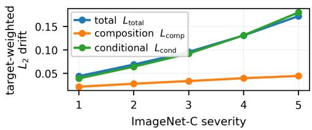  
Figure 4: The composition-to-total norm ratio decreases with corruption severity. Original protocol, fixed partition; not recomputed. ImageNet-C, macro-averaged over fifteen corruptions and six architectures. The conditional term tracks the total; the governed composition term grows far more slowly, and $L _ { \mathrm { { c o m p } } } / L _ { \mathrm { { t o t a l } } }$ falls from 50.6% at severity 1 to 33.0% at 5. Norms are not additive, so this is a ratio and not a share.

Table 3: Original protocol,fixed partition; not recomputed under the revised data roles. Reliability drift under natural shift, averaged over six checkpoints and domains, with � and � as defined in Section 6. The independent-rate check of Appendix P tests the qualitative dominance only; it does not regenerate these coeficients. The � are quadratic means of binwise drift, so $L _ { \mathrm { t o t a l } } \ne L _ { \mathrm { c o m p } } + L _ { \mathrm { c o n d } }$ despite the binwise identity being exact.
<table><tr><td>Target</td><td> $L _ { \mathrm { t o t a l } }$ </td><td> $L _ { \mathrm { { c o m p } } }$ </td><td> $L _ { \mathrm { c o n d } }$ </td><td>median U</td></tr><tr><td>ImageNet-C (75 domains)</td><td>0.103</td><td>0.034</td><td>0.102</td><td>0.63</td></tr><tr><td>ImageNetV2</td><td>0.058</td><td>0.006</td><td>0.055</td><td>0.37</td></tr><tr><td>ImageNet-Sketch</td><td>0.240</td><td>0.024</td><td>0.223</td><td>0.89</td></tr></table>

Source rates independent of the frozen partition (post-audit). The decomposition reads source cell rates, so it belongs to group (iv) of Appendix O. The natural-shift branch keeps the original frozen partition $( T _ { \mathrm { o l d } } , B _ { \mathrm { o l d } } , R _ { \mathrm { o l d } } )$ , because target penultimate features are not cached and the partition cannot be refitted for target domains. That partition was fitted on the whole outer-training fold {fold ≠ �}, and its $\theta _ { \mathrm { s h r u n k } }$ was estimated on the same 40,000 rows, so those rates are not independent of the cells they describe. The source proportions ${ p } _ { b k }$ are unafected: they use held-out (�, �) counts only, never labels.

Independence is recoverable here without new inference, because the outer held-out fold never entered the fit. Reconstructing the index sets from the recorded fold assignment and checking the reconstruction against the stored cell counts (exact for all 30 model–fold pairs), the held-out fold shares 0 rows with the fitting set, while a half of the training fold shares 20,000 of 20,000. We therefore re-estimate the rates of the same frozen cells on the held-out fold and recompute the binwise decomposition over 77 cached target domains × five folds (385 domain–fold units per checkpoint, 380 for ViT-B/16).

<table><tr><td rowspan="2">Checkpoint</td><td colspan="2">original (training-fold rates)</td><td colspan="2">held-out rates,  ${ p } _ { b k }$  as frozen</td><td colspan="2">held-out split: rates ⊥ p</td></tr><tr><td> $L _ { \mathrm { c o m p } } / L _ { \mathrm { t o t a l } }$ </td><td>cond. larger</td><td> $L _ { \mathrm { c o m p } } / L _ { \mathrm { t o t a l } }$ </td><td>cond. larger</td><td> $L _ { \mathrm { c o m p } } / L _ { \mathrm { t o t a l } }$ </td><td>cond. larger</td></tr><tr><td>ResNet-50 V1</td><td>0.210</td><td>100%</td><td>0.187</td><td>100%</td><td>0.190</td><td>100%</td></tr><tr><td>ResNet-50 V2</td><td>0.469</td><td>67%</td><td>0.474</td><td>71%</td><td>0.438</td><td>81%</td></tr><tr><td>ConvNeXt-T</td><td>0.927</td><td>70%</td><td>0.913</td><td>72%</td><td>0.956</td><td>76%</td></tr><tr><td>ViT-B/16</td><td>0.222</td><td>100%</td><td>0.208</td><td>100%</td><td>0.232</td><td>100%</td></tr><tr><td>Swin-T</td><td>0.343</td><td>99%</td><td>0.327</td><td>100%</td><td>0.347</td><td>99%</td></tr><tr><td>EffNet-B0</td><td>0.299</td><td>100%</td><td>0.272</td><td>100%</td><td>0.280</td><td>100%</td></tr></table>

The composition-to-total norm ratio is the mean over domain–fold units of $L _ { \mathrm { { c o m p } } } / L _ { \mathrm { { t o t a l } } }$ , each � a target-mass-weighted quadratic mean of binwise drifts; “cond. larger” is the fraction of domain–fold units with $L _ { \mathrm { c o n d } } > L _ { \mathrm { c o m p } }$ . Moving to independent rates changes the norm ratio $L _ { \mathrm { { c o m p } } } / L _ { \mathrm { { t o t a l } } }$ by at most 0.027 in the middle column and 0.031 in the right one, as an absolute change in that ratio. The ratio is not a share of an additive decomposition and is not confined to [0, 1]: the components can cancel, so with $\delta _ { \mathrm { c o m p } } = 0 . 2$ and $\delta _ { \mathrm { c o n d } } = - 0 .$ 1 the total is 0.1 and the ratio is 2. Nor does the table say that no domain–fold unit reverses: the fraction of units in which the conditional term is the larger moves between columns (for example $6 7 \%  7 1 \%  8 1 \%$ for ResNet-50 V2), and what is stable is that for every checkpoint a majority of units keep the conditional term larger. The binwise identity closes to $\leq \dot { 6 } . 1 \times 1 0 ^ { - 1 6 }$ in every variant, which checks the algebra and not the components: with source-rate error � the components move by $( q - p ) ^ { \intercal }$ � and $- q ^ { \intercal } e$ while the identity still closes exactly (Appendix O). Domain–fold units are not independent observations, and no interval is attached to these means. The exercise holds the partition fixed, so it establishes insensitivity to the rate estimator, not to the choice of partition or readout.

Structural coupling. $\begin{array} { r } { \delta _ { \mathrm { c o m p } } = \sum _ { k } ( q _ { k } - p _ { k } ) [ \theta _ { P } ( b , k ) - \mu _ { P } ( b ) ] } \end{array}$ is a functional of the same source cell-rate estimates that define $G _ { R }$ and the profile, so part of the association is structural. The target-side factor $\left( q _ { k } - p _ { k } \right)$ is genuinely observed and is not produced by the fragility optimiser, so the association is not definitional. The contrast we rely on is that ECE — which collapses the cell rates to bin-averaged correctness and uses none of the within-bin contrasts — has an interval that includes zero.

Preregistered result. Under the prespecified decision rule, this corresponds to Outcome B (mixed): the direction is not stable across all three benchmarks. ImageNet-C — the only benchmark with repeated target domains, and hence the only one supporting uncertainty quantification under the preregistered analysis — supports the preregistered direction. This protocol fixed the natural-target analysis before its results were inspected, and as preregistered that comparison is not reattempted; the later preregistered phases of Appendices N.1 and Q address separate finite-sample and monotonereparameterisation questions.

## Q Monotone score reparameterisation

Section 5 reports fragility across calibration states obtained by multiclass temperature scaling. That family is not a reparameterisation of the scalar top-label score: rescaling the logits can reorder examples, so it moves resolution as well as calibration (Appendix O). This appendix records a preregistered intervention designed to remove exactly that ambiguity, by acting only on the already-computed scalar score through a strictly increasing map.

## Q.1 Invariance under a fixed strictly increasing bijection

The following is elementary and is not claimed as novel mathematics. It is stated because it converts the empirical predictions below from hypotheses into consequences. In this lemma only, subscripts � and $S ^ { \prime }$ on $\mu _ { : }$ , � and $\mathcal { F } ^ { \pm }$ index the score representation; the source law � is fixed.

Lemma 7 (Score reparameterisation). Let � be a scalar score with range �, let $g : I  I ^ { \prime }$ be a strictly increasing measurable bijection with measurable inverse, and put $S ^ { \prime } = g ( S )$ . Then

$$
I . ~ \sigma ( S ^ { \prime } ) = \sigma ( S ) ;
$$

2. for $Q \ll P , \ Q _ { S ^ { \prime } } = P _ { S ^ { \prime } }$ if and only i $f Q _ { S } = P _ { S }$ , and $\mathbb { E } [ r \mid S ^ { \prime } = g ( s ) ] = \mathbb { E } [ r \mid S = s ]$ for $r = d Q / d P ,$

3. $\mu _ { S ^ { \prime } } ( g ( s ) ) = \mu _ { S } ( s )$ and Law $( \eta - \mu _ { S ^ { \prime } } ( S ^ { \prime } ) \mid S ^ { \prime } { = } g ( s ) ) = \operatorname { L a w } ( \eta - \mu _ { S } ( S ) \mid S { = } s ) ,$

4. $G _ { S ^ { \prime } } ( g ( s ) ) = G _ { S } ( s )$ and, for every $\rho \ge 0 , \mathcal { F } _ { S ^ { \prime } } ^ { \pm } ( g ( s ) , \rho ) = \mathcal { F } _ { S } ^ { \pm } ( s , \rho ) ,$

5. $\{ S ^ { \prime } \ge g ( t ) \} = \{ S \ge t \}$ , so coverage, the accepted set and the selective risk ofany threshold policy are unchanged;

6. calibration is not invariant: $\mu _ { S ^ { \prime } } ( g ( s ) ) - g ( s ) = \mu _ { S } ( s ) - g ( s )$ , which difersfrom $\mu _ { S } ( s ) - s$ whenever �(�) ≠ �.

Proof. (i) $S ^ { \prime } = g ( S )$ is $\sigma ( S )$ -measurable and $S = g ^ { - 1 } ( S ^ { \prime } )$ is $\sigma ( S ^ { \prime } )$ -measurable, so the two $\sigma \mathrm { - }$ fields coincide. (ii) For Borel $A \ \subset \ I ^ { \prime } , \ \{ S ^ { \prime } \ \in \ A \} \ = \ \{ S \ \in \ g ^ { - 1 } ( A ) \}$ with $g ^ { - 1 } ( A )$ Borel, so $Q _ { S ^ { \prime } } ( A ) = Q _ { S } ( g ^ { - 1 } ( A ) )$ and likewise for $P ;$ conversely $g ( A ^ { \prime } )$ is Borel for Borel $A ^ { \prime } \subset I$ because $g$ is a Borel isomorphism onto $I ^ { \prime } .$ . Conditional expectations depend on the conditioning �-field alone, so by $\operatorname { ( i ) } \mathbb { E } [ r \mid { \bar { S } } ^ { \prime } ] = \mathbb { E } [ r \mid S ]$ as random variables, and likewise $\mathbb { E } [ ( r - 1 ) ^ { 2 } \mid S ^ { \prime } ] = \mathbf { \bar { E } } [ ( r - 1 ) ^ { 2 } \mid S ]$ the score-preserving constraint and the $\chi ^ { 2 }$ budget define the same feasible set of weights. (iii) is (i) applied to �, with the centring constant equal by the first identity. (iv) The feasible set is the same by (ii) and the objective $\mathbb { E } [ ( r - 1 ) ( \eta - \mu ) \ | \ S = s ]$ is the same function of � by (iii), so the two programmes coincide; taking $\rho \to 0$ gives the variance statement. (v) is strict monotonicity. (vi) is immediate, and is what makes the intervention useful: everything at the level of the �-field is frozen while the score value, which is what calibration compares reliability against, is free. □

## Q.2 Cross-fitted implementation, and why the lemma is applied fold by fold

For each architecture and each fold � we fit

$$
g _ { f } ( s ) = \mathrm { s i g m o i d } \big ( a _ { f } \log \mathrm { i t } ( s ) + c _ { f } \big ) , \qquad a _ { f } = e ^ { \alpha _ { f } } > 0 ,
$$

on the other four folds by the binary negative log-likelihood of correctness, and apply the frozen $g _ { f }$ to the held-out fold. Monotonicity holds by construction: the optimiser is unconstrained in $( \alpha _ { f } , c _ { f } )$ and $a _ { f } > 0$ for every real $\alpha _ { f }$ , so no monotonicity constraint can be active. No held-out correctness is used to fit any $g _ { f }$ . This is calibration of the scalar confidence-as-correctness probability; it does not touch the multiclass logits, the predicted labels, the penultimate representations or correctness.

Because $g _ { f }$ difers across folds, Lemma 7 is applied within each held-out fold, conditional on that fold’s fitted map, and not to the pooled out-of-fold score. The pooled score is afold-wise strictly monotone reparameterisation, not a single global one — the same convention the main experiment already uses for its per-fold temperature. We therefore make no �-field claim about the pooled score without fold identity, and the ordering statements below are within-fold statements.

## Q.3 Primary structural analysis

Within each fold the raw equal-mass bin boundaries are pushed through that fold’s map, $\mathrm { e d } \mathrm { g e } _ { j } ^ { \prime } = g _ { f } ( \mathrm { e d } \mathrm { g e } _ { j } )$ ; the transformed-score quantiles are not independently refitted. The frozen $T { = } 1 \ \mathrm { \dot { R } } 2 \ \mathrm { \Omega } _ { \mathrm { - } } \mathrm { w i t h i }$ n readout is retained verbatim, since � is an auxiliary observable readout and not part of the scalar-score intervention. Table 4 reports the outcome.

What this does and does not establish. Once the bin index � and the readout � are bit-identical, equality of the downstream quantities is arithmetic: the cell table, $G _ { R } , { \mathcal { F } } ^ { \pm }$ , both FAUCs and selective risk fragility are then computed from literally the same arrays. We do not present those equalities as independent empirical discoveries, and the analysis verifies the structural prediction only for the fixed restricted readout it uses; it is not evidence that an arbitrary fitted readout is invariant (Appendix Q.7). The empirical checks are: the learned $g _ { f }$ materially improves held-out calibration; within every held-out fold it preserves the score ordering exactly; pushing the bin boundaries through $g _ { f }$ reproduces the raw bin assignment bit-identically; and the frozen readout assignments are bit-identical, the last being a bookkeeping check since � is retained by construction.

Table 4: Structural invariance under the fold-wise monotone map, all six architectures. Counts are over all 250,000 train and evaluation bin assignments per model. Every entry is exactly zero; the preregistered tolerance was $1 0 ^ { - 1 2 }$
<table><tr><td rowspan="2"></td><td colspan="4">changed assignments / violations</td><td colspan="6">max absolute difference</td></tr><tr><td>bins</td><td>frozen R</td><td>rank</td><td>ties</td><td>cells</td><td> $G _ { R }$ </td><td> $\mathcal { F } ^ { \pm }$ </td><td> $\mathrm { F A U C ^ { + } }$ </td><td>FAUC</td><td>sel. risk</td></tr><tr><td>ResNet-50 V1</td><td>0</td><td>0</td><td>0</td><td>0</td><td>0</td><td>0</td><td>0</td><td>0</td><td>0</td><td>0</td></tr><tr><td>ResNet-50 V2</td><td>0</td><td>0</td><td>0</td><td>0</td><td>0</td><td>0</td><td>0</td><td>0</td><td>0</td><td>0</td></tr><tr><td>ConvNeXt-T</td><td>0</td><td>0</td><td>0</td><td>0</td><td>0</td><td>0</td><td>0</td><td>0</td><td>0</td><td>0</td></tr><tr><td>ViT-B/16</td><td>0</td><td>0</td><td>0</td><td>0</td><td>0</td><td>0</td><td>0</td><td>0</td><td>0</td><td>0</td></tr><tr><td>Swin-T</td><td>0</td><td>0</td><td>0</td><td>0</td><td>0</td><td>0</td><td>0</td><td>0</td><td>0</td><td>0</td></tr><tr><td>EffNet-B0</td><td>0</td><td>0</td><td>0</td><td>0</td><td>0</td><td>0</td><td>0</td><td>0</td><td>0</td><td>0</td></tr></table>

Table 5: Cross-fitted calibration under the fold-wise monotone map. ECE is the 20-bin equal-mass estimator of Appendix N with the bin partition held fixed; $\mathrm { E C E } _ { 1 5 }$ is the equal-width secondary metric. All six architectures exceed the preregistered 20% relative-reduction bar.
<table><tr><td rowspan="2"></td><td colspan="2">ECE</td><td rowspan="2"></td><td colspan="2">binary NLL</td><td colspan="2"> $\mathrm { E C E _ { 1 5 } }$ </td></tr><tr><td> $T { = } 1$ </td><td>monotone</td><td>reduction  $T { = } 1$ </td><td>monotone</td><td> $T { = } 1$ </td><td>monotone</td></tr><tr><td>ResNet-50 V1</td><td>0.03614</td><td>0.01288</td><td>64.4%</td><td>0.39579</td><td>0.37929</td><td>0.03688</td><td>0.01349</td></tr><tr><td>ResNet-50 V2</td><td>0.41178</td><td>0.02162</td><td>94.8%</td><td>0.80867</td><td>0.38869</td><td>0.41178</td><td>0.02064</td></tr><tr><td>ConvNeXt-T</td><td>0.16933</td><td>0.01477</td><td>91.3%</td><td>0.44668</td><td>0.35481</td><td>0.16933</td><td>0.01312</td></tr><tr><td>ViT-B/16</td><td>0.05589</td><td>0.02577</td><td>53.9%</td><td>0.36461</td><td>0.34621</td><td>0.05605</td><td>0.02328</td></tr><tr><td>Swin-T</td><td>0.06794</td><td>0.01989</td><td>70.7%</td><td>0.36261</td><td>0.34134</td><td>0.06794</td><td>0.01740</td></tr><tr><td>EffNet-B0</td><td>0.06892</td><td>0.01408</td><td>79.6%</td><td>0.39254</td><td>0.37488</td><td>0.06847</td><td>0.01156</td></tr></table>

## Q.4 Calibration endpoints

The median relative reduction is 75.1% and the binary NLL improves for all six. This experiment was run under the original protocol and has not been re-run under the revised data roles. Its as-released baseline reproduces the original-protocol as-released state bit-identically (maximum absolute diference 0 over ECE, $G _ { R }$ and both FAUCs); that baseline is not the post-audit column of Table 1, whose ResNet-50 V1 as-released ECE is 0.038 against the 0.03614 of Table 5. The two baselines are diferent analyses and we do not treat them as one. Nothing in the structural conclusion depends on which baseline is used: the analysis shows that pushing a frozen partition through a strictly increasing map leaves the downstream arrays identical, which is an arithmetic consequence of Lemma 7 and holds under either rate estimator.

## Q.5 Fitted maps and numerical diagnostics

Table 6: Fitted parameters and rank diagnostics. Spearman and Kendall are within-fold, where a single $g _ { f }$ acts; no optimisation reached a numerical boundary in any of the 30 fold fits. The edge gap is ma $\mathfrak { c } _ { j } | g ( \mathrm { e d g e } _ { j } ) - \mathrm { e d g e } _ { j } ^ { \mathrm { r e f i t } } |$ , the distance between the pushed-forward boundaries the primary analysis uses and independently refitted transformed-score quantiles.
<table><tr><td rowspan="2"> $a _ { f }$ </td><td rowspan="2">range</td><td rowspan="2"> $c _ { f }$  range</td><td rowspan="2">Spearman</td><td rowspan="2">Kendall</td><td colspan="2">pooled ties</td><td rowspan="2">edge gap</td></tr><tr><td>before</td><td>after</td></tr><tr><td>ResNet-50 V1</td><td>0.710–0.719</td><td>-0.128--0.091</td><td>1.000</td><td>1.000</td><td>29</td><td>4</td><td> $2 . 2 { \times } 1 0 ^ { - 9 }$ </td></tr><tr><td>ResNet-50 V2</td><td>1.430-1.457</td><td>+2.554-+2.570</td><td>1.000</td><td>1.000</td><td>29</td><td>4</td><td> $2 . 2 { \times } 1 0 ^ { - 9 }$ </td></tr><tr><td>ConvNeXt-T</td><td>1.342–1.352</td><td>+1.026-+1.043</td><td>1.000</td><td>1.000</td><td>29</td><td>4</td><td> $2 . 3 { \times } 1 0 ^ { - 9 }$ </td></tr><tr><td>ViT-B/16</td><td>1.343-1.360</td><td>+0.124-+0.155</td><td>1.000</td><td>1.000</td><td>29</td><td>4</td><td> $0 . 7 { \times } 1 0 ^ { - 9 }$ </td></tr><tr><td>Swin-T</td><td>1.251-1.264</td><td>+0.351-+0.377</td><td>1.000</td><td>1.000</td><td>29</td><td>4</td><td> $1 . 9 \times 1 0 ^ { - 9 }$ </td></tr><tr><td>EffNet-B0</td><td>1.081-1.091</td><td> $+ 0 . 4 7 6 \substack { - + 0 . 4 9 5 }$ </td><td>1.000</td><td>1.000</td><td>29</td><td>4</td><td> $1 . 8 \times 1 0 ^ { - 9 }$ </td></tr></table>

Pooled ties. The pooled tie count falls from 29 to 4. This is not a tie break by a monotone map: samples sharing a raw score but lying in diferent folds receive diferent $g _ { f }$ and so separate in the pooled score. Within every fold the tie breaks are zero. The arithmetic is exact — for ResNet-50 V1, 4 of the 29 duplicate-value groups lie entirely inside one fold and 25 span two or more, predicting precisely the 4 pooled ties observed.

Pushed edges versus refitted quantiles. The $\sim 2 \times 1 0 ^ { - 9 }$ gap in Table 6 is expected and is reported as a distance only: linear interpolation between order statistics does not commute with a nonlinear �, so �(quantile(�)) ≠ quantile(�(�)). The primary analysis uses the pushed-forward edges, as preregistered.

## Q.6 Deterministic stress maps

Two label-free maps fixed in advance, $\begin{array} { l l l } { g _ { \mathrm { f l a t } } ( s ) } & { = } & { \mathrm { s i g m o i d } ( 0 . 5 \log \mathrm { i t } s ) } \end{array}$ and $\begin{array} { r l } { g _ { \mathrm { s h a r p } } ( s ) } & { { } = } \end{array}$ sigmoid(2 logit �), act on the scalar score alone and are not temperature scaling. They are controls, not candidate transformations (Table 7), and no outcome category depends on them.

Table 7: Deterministic stress maps. Large deliberate changes in numerical confidence leave every structural quantity exactly unchanged.
<table><tr><td rowspan="2"></td><td colspan="4">gflat</td><td colspan="4">gsharp</td></tr><tr><td>ECE</td><td>bins chg.</td><td>merged</td><td>max |∆F|</td><td>ECE</td><td>bins chg.</td><td>merged</td><td>max |∆F|</td></tr><tr><td>ResNet-50 V1</td><td>0.04713</td><td>0</td><td>0</td><td>0</td><td>0.09074</td><td>0</td><td>146</td><td>0</td></tr><tr><td>ResNet-50 V2</td><td>0.36709</td><td>0</td><td>0</td><td>0</td><td>0.46333</td><td>0</td><td>0</td><td>0</td></tr><tr><td>ConvNeXt-T</td><td>0.23640</td><td>0</td><td>0</td><td>0</td><td>0.10666</td><td>0</td><td>0</td><td>0</td></tr><tr><td>ViT-B/16</td><td>0.16995</td><td>0</td><td>0</td><td>0</td><td>0.05472</td><td>0</td><td>0</td><td>0</td></tr><tr><td>Swin-T</td><td>0.16788</td><td>0</td><td>0</td><td>0</td><td>0.05107</td><td>0</td><td>0</td><td>0</td></tr><tr><td>EffNet-B0</td><td>0.14557</td><td>0</td><td>0</td><td>0</td><td>0.07057</td><td>0</td><td>0</td><td>0</td></tr></table>

The map �sharp merges 146 previously distinct ResNet-50 V1 scores. The map is strictly increasing as a function on [0, 1]; its finite-precision evaluation saturates near one, and we therefore do not claim that every deterministic stress-map implementation is one-to-one in floating point. The merging occurs inside the top bin, so no bin assignment changes and no structural quantity moves. No exact � = 0 or � = 1 occurs in any of the six models, and no clipping rule is used anywhere.

## Q.7 Secondary analysis: refitting the readout

Table 8: Secondary end-to-end analysis, in which the bin quantiles and the low-capacity logistic readout are refitted on the transformed confidence coordinate. Diagnostic only.
<table><tr><td></td><td>ARI(R)</td><td>exact R agreement</td><td>relative  $| \Delta G _ { R } |$ </td><td>relative |∆FAUC+|</td></tr><tr><td>ResNet-50 V1</td><td>0.136</td><td>0.379</td><td>108.7%</td><td>27.2%</td></tr><tr><td>ResNet-50 V2</td><td>0.615</td><td>0.795</td><td>1.9%</td><td>0.5%</td></tr><tr><td>ConvNeXt-T</td><td>0.584</td><td>0.775</td><td>9.9%</td><td>4.5%</td></tr><tr><td>ViT-B/16</td><td>0.611</td><td>0.796</td><td>25.4%</td><td>11.3%</td></tr><tr><td>Swin-T</td><td>0.575</td><td>0.770</td><td>27.5%</td><td>13.4%</td></tr><tr><td>EffNet-B0</td><td>0.672</td><td>0.832</td><td>13.6%</td><td>7.2%</td></tr></table>

The fitted finite-sample readout is parameterisation-dependent (Table 8): refitting its logistic, standardised feature pipeline and its within-bin group thresholds after changing the confidence coordinate can alter $R ,$ and with it the restrictedplug-in profile, even though the population score �-field is unchanged and, by Lemma 7, so is the population fragility target under a bijective reparameterisation. This is not a failure of the lemma, and the frozen-� primary result is correspondingly not evidence that an arbitrary learned readout must itself be parameterisation invariant. The largest efect is ResNet-50 V1, which also has the smallest $G _ { R } ,$ so a small absolute change is a large relative one. We report this analysis only as a diagnostic and base no claim on it.

## Q.8 Preregistration

The protocol was written and cryptographically hashed before any result from this phase was computed, and prespecified the transformation family and parameterisation, fitting objective, cross-fitting scheme, radius grid, numerical tolerances, evaluation endpoints, and outcome criteria. A suite of synthetic validation tests was required to pass before any six-model summary was computed; the full protocol and verification record are provided in the supplementary material. The observed result satisfied the prespecified criterion for Outcome A.

## R Post-audit empirical extensions

This appendix reports three analyses carried out after every result above was frozen. Each has a written protocol that was cryptographically hashed before its results were computed, but each was designed with the paper’s results known, so none is preregistered and none is used as a preregistered endpoint. Checkpoints, seeds, radii, benchmarks, bin counts and tolerances were fixed in those protocols and were not changed after results were seen. Two quantities below were defined after the corresponding results had been inspected and are marked post-hoc where they appear: the same-proxy comparison of Appendix R.2 and the rank summary of Appendix R.1. Every number in this appendix is read from one result file released with the code, which also records the protocol hashes; the three tables are generated from it.

## R.1 Random score-preserving shifts

The controlled shifts of Section $5$ maximise the estimated movement given ${ \widehat { \theta } } ,$ so their agreement with held-out drift is partly built in. This analysis replaces the optimised weights with random ones and keeps everything else. Within each retained bin, with evaluation-fold group proportions $p _ { k }$ (counts only, no labels), draw $z _ { k } \sim \mathcal { N } ( 0 , 1 )$ , centre $\begin{array} { r } { a _ { k } = z _ { k } - \sum _ { j } p _ { j } z _ { j } } \end{array}$ so that $\begin{array} { r } { \sum _ { k } p _ { k } a _ { k } = 0 } \end{array}$ , and set $r _ { k } = 1 + t a _ { k }$ with

$$
\begin{array} { r } { t = \operatorname* { m i n } \Big \{ \big ( \rho / \sum _ { k } p _ { k } a _ { k } ^ { 2 } \big ) ^ { 1 / 2 } , \operatorname* { m i n } _ { k : a _ { k } < 0 } \big ( - 1 / a _ { k } \big ) \Big \} , } \end{array}
$$

so that $r \geq 0 , \sum _ { k } p _ { k } r _ { k } = 1$ and $\begin{array} { r } { \sum _ { k } p _ { k } ( r _ { k } - 1 ) ^ { 2 } \le \rho } \end{array}$ . No sign flip or orientation by ${ \widehat { \theta } } ,$ correctness, $G _ { R }$ , ECE, FAUC or drift is applied. Each of the 720,000 shifts was checked against all three constraints at tolerance $1 0 ^ { - 1 2 }$ , with no violation. The seed (90210), the number of directions (100) and the per-cell random streams were fixed in the protocol. The data roles are those of Appendix N: $\widehat { \mathcal { F } } _ { B , R } ^ { \pm } ( b , \rho )$ is computed from $D _ { \mathrm { r a t e } }$ rates alone, the weights are frozen, and the realised movement $\begin{array} { r } { \delta _ { \mathrm { r a n d o m } } = \sum _ { k } p _ { k } ( r _ { k } - 1 ) \theta _ { k } ^ { \mathrm { e v a l } } } \end{array}$ is read from held-out correctness on $D _ { \mathrm { e v a l } }$ . All twenty bins were retained in each of the 60 (checkpoint, state, fold) units, so there are $6 \times 2 \times 5 \times 6 \times 2 0 = 7 , 2 0 0$ bin–radius cells with 100 shifts each. The cell, not the shift, is the unit: shifts in one cell share every estimated quantity and all of their held-out labels.

Ordering. For each cell we compare the two-sided plug-in profile max $( \widehat { \mathcal { F } } _ { B , R } ^ { + } , \widehat { \mathcal { F } } _ { B , R } ^ { - } )$ with the median of $| \delta _ { \mathrm { r a n d o m } } |$ over its 100 directions; the Spearman correlation over the 7,200 cells is 0.9010. With the largest of the 100 movements in place of the median it is 0.925; we treat that as secondary, because a maximum over 100 held-out responses is itself a selection. The protocol did not declare a rank summary, so both correlations are post-hoc descriptions; the cells are not independent, and we attach no interval to them. Figure 5(a) shows the cells against the diagonal. Most lie far below it, as expected for non-optimised directions; the median random movement is about a quarter of the profile. Most of the correlation does not come from within-bin heterogeneity. Pooling over radii adds the common $\sqrt { \rho }$ scale, and the within-bin label-permutation null of Appendix T, which has no heterogeneity at all, reproduces most of the rest because binomial rate noise scales with bin accuracy in both quantities (Table 17). The ordering is therefore a weak test of the profile; the controlled shifts, whose signed drift is centred at zero under the same null, are the informative one.

Sharpness. Table 9 reports the per-shift ratio $| \delta _ { \mathrm { r a n d o m } } | / \widehat { \mathcal { F } } _ { B , R } ^ { \pm }$ on the branch selected by the sign of $\delta _ { \mathrm { r a n d o m } } .$ , the rule fixed in the protocol. Overall, 96.1% of ratios are below one; where a ratio exceeds one it does so by a mean of 0.30. These are descriptive frequencies over dependent shifts, and since $\widehat { \mathcal F }$ is a plug-in estimate a ratio above one is not a coverage failure. Exceedance falls monotonically across $G _ { R }$ quartiles, from 9.8% to 0.63%, and it also falls with radius, from about 5% at radii up to 0.3 to 0.55% at $\rho = 3$ . The quartile pattern is consistent with cell-rate noise mattering most when the restricted heterogeneity it is compared with is small; the analysis cannot separate that explanation from others. By checkpoint the median ratio lies between 0.254 and 0.281 and the exceedance between 2.6% and 5.3%. Direction sampling is a separate source of variation: across the 100 directions of a cell the ratio has a median standard deviation of 0.220, which reflects the random directions and says nothing about dataset sampling.

What this does not show. The random shifts live on the same finite support and obey the same $\chi ^ { 2 }$ geometry as the optimised ones; they are not natural shifts, they say nothing about how close natural shifts come to the worst case, and they give $\hat { \mathcal F }$ no finite-sample coverage. They remove one coupling — the optimisation of the weights against $\hat { \theta } -$ and nothing else.

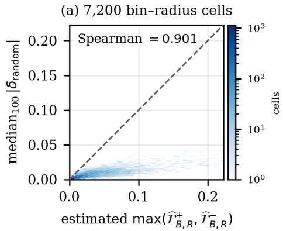

(b) sharpness by restricted heterogeneity  
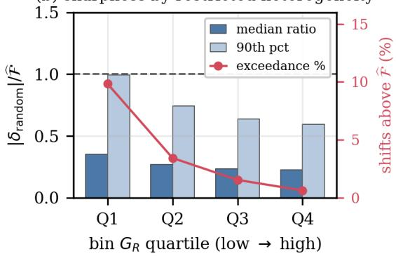  
Figure 5: Random score-preserving shifts, post-audit. (a) One point per bin–radius cell: two-sided plug-in profile against the median held-out movement over 100 random directions (Spearman 0.901, most of which a within-bin label-permutation null reproduces; Appendix T); dashed line $y = x ,$ , equal axes. (b) Per-shift ratio $| \delta _ { \mathrm { r a n d o m } } | / \widehat { \mathcal { F } }$ by quartile of the bin’s $G _ { R } \colon$ median and 90th percentile (bars, left axis) and the percentage of shifts with ratio above one (line, right axis). Descriptive; the shifts are not independent.

Table 9: Random score-preserving shifts: the per-shift ratio $| \delta _ { \mathrm { r a n d o m } } | / \widehat { \mathcal { F } } _ { B , R } ^ { \pm } ,$ with the branch chosen by the sign of $\delta _ { \mathrm { r a n d o m } }$ . Shifts within a bin–radius cell share data and are not independent; the percentages are descriptive and are not coverage rates. Post-audit, not preregistered.
<table><tr><td>stratum</td><td>shifts</td><td>median ratio</td><td>90th pct.</td><td>ratio &gt; 1 (%)</td></tr><tr><td>all</td><td>720,000</td><td>0.264</td><td>0.741</td><td>3.86</td></tr><tr><td> $G _ { R }$  Q1 [-0.00148, 0.00012]</td><td>180,000</td><td>0.352</td><td>0.994</td><td>9.84</td></tr><tr><td> $G _ { R }$  Q2 [0.00012, 0.00066]</td><td>180,000</td><td>0.270</td><td>0.742</td><td>3.43</td></tr><tr><td> $G _ { R } \ : \mathrm { Q } 3$  [0.00066, 0.00235]</td><td>180,000</td><td>0.232</td><td>0.638</td><td>1.54</td></tr><tr><td>GR Q4 [0.00235, 0.03797]</td><td>180,000</td><td>0.226</td><td>0.595</td><td>0.63</td></tr><tr><td> $T = 1$ </td><td>360,000</td><td>0.257</td><td>0.708</td><td>3.08</td></tr><tr><td> $T = \hat { T }$ </td><td>360,000</td><td>0.270</td><td>0.776</td><td>4.64</td></tr><tr><td> $\rho = 0 . 0 1$ </td><td>120,000</td><td>0.318</td><td>0.820</td><td>5.29</td></tr><tr><td> $\rho = 0 . 0 3$ </td><td>120,000</td><td>0.318</td><td>0.816</td><td>5.16</td></tr><tr><td> $\rho = 0 . 1$ </td><td>120,000</td><td>0.318</td><td>0.825</td><td>5.36</td></tr><tr><td> $\rho = 0 . 3$ </td><td>120,000</td><td>0.311</td><td>0.806</td><td>4.93</td></tr><tr><td> $\rho = 1 . 0$ </td><td>120,000</td><td>0.221</td><td>0.608</td><td>1.86</td></tr><tr><td> $\rho = 3 . 0$ </td><td>120,000</td><td>0.157</td><td>0.448</td><td>0.55</td></tr></table>

## R.2 A human-label proxy for the correctness propensity

The propensity $\eta ( x ) = \operatorname* { P r } ( C = 1 \mid X = x )$ is never observed, and the hierarchy of Section 3 is informative only where it varies inside a level set. CIFAR-10H (Peterson et al., 2019) gives about fifty human labels for each of the 10,000 CIFAR-10 test images (Krizhevsky, 2009), which allows a direct if approximate look. For a frozen classifier with prediction ˆ�(�) we use

$$
\eta _ { H } ( x ) = { \frac { \# \{ { \mathrm { a n n o t a t i o n s ~ o f ~ } } x { \mathrm { ~ e q u a l ~ t o ~ } } \hat { y } ( x ) \} } { \# \{ { \mathrm { a n n o t a t i o n s ~ o f ~ } } x \} } } ,
$$

the agreement of human annotators with the model. This is a proxy: it measures correctness against the human label distribution rather than against the fixed dataset label, and it is estimated from finitely many votes. We use three public CIFAR-10 checkpoints fixed in the protocol (ResNet-56, VGG16-BN and MobileNetV2; none trained by us) and the 514,200 annotations of 2,571 annotators that remain after attention checks are removed. The annotators are split at random, with a seed fixed in the protocol, into two disjoint groups, so each image’s labels divide into two halves given by diferent people; this yields proxies $\eta _ { H } ^ { \bar { A } }$ and $\eta _ { H } ^ { B }$ from a mean of about 26 votes each (range 14–39). The protocol described the split per image; the implementation instead partitions annotators globally, a stricter separation because no annotator contributes to both halves. The data roles follow the main pipeline with $J = 1 0$ bins and $K = 4$ groups, chosen in the protocol so that cells keep about 100 rate rows; the readout (logistic regression on confidence, margin, entropy and a 16-dimensional principal-component projection of the penultimate representation) is fitted on $D _ { \mathrm { { f i t } } }$ CIFAR-10 correctness. The projection uses no labels but, unlike the ImageNet pipeline, is computed from a random 5,000 of all 10,000 images, so evaluation-image features (never their labels) enter it. Table 10 and Figure 6 give the results in three layers, which answer diferent questions.

Table 10: CIFAR-10H case study, $J = 1 0$ bins and $K = 4$ groups in each of 5 folds, 50 fold–bin cells per model. $G _ { H } ^ { \times }$ is the cross-half covariance of the two annotator-half proxies; $G _ { H } ^ { \times } , G _ { R }$ and $G _ { R } ^ { H }$ are medians over cells, in units of $1 0 ^ { - 3 }$ . Columns 4–5: the pre-specified cross-target diagnostic, whose restricted term uses the fixed CIFAR-10 label and so a diferent propensity from $G _ { H } ^ { \times } ;$ Proposition 5 does not order the two. Columns 6–8: the post-hoc same-proxy diagnostic, in which both terms use $\eta _ { H }$ . Ratios are medians over cells with interquartile ranges in brackets. Top-1 accuracy on the CIFAR-10 test set: ResNet-56 94.37%, VGG16-BN 94.15%, MobileNetV2 94.05%.
<table><tr><td></td><td colspan="2">human proxy</td><td colspan="2">cross-target (pre-specified)</td><td colspan="3">same proxy (post-hoc)</td></tr><tr><td>model</td><td> $G _ { H } ^ { \times }$ </td><td>vote noise</td><td> $G _ { R }$ </td><td>ratio</td><td> $G _ { R } ^ { H }$ </td><td>ratio</td><td> $\leq G _ { H } ^ { \times }$ </td></tr><tr><td>ResNet-56</td><td>9.29</td><td>9.3%</td><td>0.021</td><td>0.33%</td><td>0.521</td><td>6.3% [3.8, 10.1]</td><td>50/50</td></tr><tr><td>VGG16-BN</td><td>8.33</td><td>9.9%</td><td>0.012</td><td>0.17%</td><td>0.093</td><td>1.7% [0.2, 3.5]</td><td>50/50</td></tr><tr><td>MobileNetV2</td><td>9.23</td><td>8.3%</td><td>0.035</td><td>0.29%</td><td>0.251</td><td>2.8% [1.3, 4.3]</td><td>50/50</td></tr><tr><td>pooled</td><td></td><td></td><td></td><td>0.25% [0.0, 2.1]</td><td></td><td>3.3% [1.4, 6.3]</td><td>150/150</td></tr></table>

Human-proxy heterogeneity. Within each bin, $G _ { H } ( b ) = \mathrm { V a r } ( \eta _ { H } \mid B = b )$ on evaluation images. Computed separately from the two annotator halves, the 150 (model, fold, bin) values agree with Pearson correlation 0.9995 (Figure 6a). Vote noise inflates a variance computed from vote proportions, so the primary quantity is the cross-half covariance $G _ { H } ^ { \times } ( b ) = \mathrm { C o v } ( \eta _ { H } ^ { A } , \eta _ { H } ^ { B } \mid B = b )$ , whose two factors carry independent vote noise; this correction was fixed in an addendum written after the protocol but before any heterogeneity value was inspected. $G _ { H } ^ { \times }$ is positive in all 150 cells, and vote noise accounts for a median $8 { - } 1 0 \%$ of the uncorrected variance. Like every binned quantity in this paper, $G _ { H }$ also contains the variation of the mean propensity across the scores inside a bin, so it is an upper reference for, not an estimate of, level-set heterogeneity in the human proxy.

Pre-specified cross-target diagnostic. The protocol compared the debiased restricted $G _ { R }$ of Proposition 9, estimated from CIFAR-10 correctness, with $G _ { H } ^ { \times }$ . The pooled median ratio is 0.25% and $G _ { R }$ is below $G _ { H } ^ { \times }$ in every cell. The two terms target diferent propensities, however: with one fixed label per image the correctness target is {0, 1}-valued, whereas $G _ { H } ^ { \mathrm { { \bar { x } } } }$ is built on the human label distribution. Proposition 5 orders heterogeneity quantities that share a propensity and does not order these two, so this ratio is not a capture ratio, and we report it only as the diagnostic the protocol specified.

Post-hoc same-proxy diagnostic. After reading that result we added a comparison in which both terms use $\eta _ { H }$ The readout, bins and cells are unchanged; the $D _ { \mathrm { r a t e } }$ cell rate is replaced by the mean of $\eta _ { H } ^ { A }$ over the cell, and the restricted heterogeneity ${ \dot { G } } _ { R } ^ { H } ( b )$ is debiased with the continuous analogue of Proposition 9, subtracting $\textstyle \sum _ { k } p _ { k } { \bigl ( } 1 - p _ { k } { \bigr ) } s _ { k } ^ { 2 } / n _ { k }$ with $s _ { k } ^ { 2 }$ the within-cell sample variance. $G _ { R } ^ { H }$ is at most $G _ { H } ^ { \times }$ in all 150 cells (Figure 6b); 14 of the 150 debiased estimates are negative, and they are retained, so for those cells the inequality holds trivially. The pooled median of $G _ { R } ^ { H } / G _ { H } ^ { \times }$ is 3.3% (interquartile range $1 . 4 \substack { - 6 . 3 \% } )$ , between 1.7% and 6.3% by model. In the profile the fraction is larger: at the smallest radius, $\rho = 0 . 0 1$ , the same-proxy median of $\mathcal { F } _ { B , R } ^ { H } / \mathcal { F } _ { B } ^ { \dot { H } }$ is 0.26, 0.16 and 0.18 for the three models, close to the square roots of their variance ratios, which is the relation the variance-controlled regime of Theorem 1 gives when both profiles are in that regime; it rises with $\rho _ { ; }$ to 0.53, 0.36 and 0.38 at $\rho = 3$ . Both profiles in these ratios are estimated from finite data — the human-proxy profile $\mathcal { F } _ { B } ^ { H }$ has no simple vote-noise correction, and the restricted profile uses plug-in cell means — so the direction of bias of their ratio is not established; we use it descriptively. This comparison was defined after the pre-specified result had been read; it is labelled post-hoc and does not replace that result.

Taken together: in this dataset a human-label proxy for � has within-bin heterogeneity that is reproducible across disjoint annotators, and a finite readout fitted to dataset correctness exposes a few percent of it in variance. The case study involves three convolutional classifiers on one dataset, and the proxy is not $\eta ;$ it grounds the premise of the theory and does not estimate the oracle quantities of Section 3. No lower confidence bound is computed, because repeated labels of the same images do not meet its assumptions.

(a) human-proxy heterogeneity is reproducible

(b) the finite readout exposes little of it

$$
G _ { H }
$$

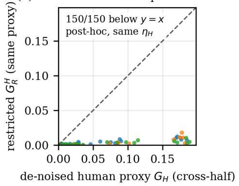  
Figure 6: CIFAR-10H case study, post-audit. One point per (model, fold, bin) cell, 150 in total; dashed line $y \ = x .$ (a) Human-proxy heterogeneity $G _ { H }$ from annotator half A against half B. (b) Post-hoc same-proxy diagnostic: the vote-noise-corrected cross-half $G _ { H } ^ { \times }$ against the debiased restricted $G _ { R } ^ { H }$ computed from the same proxy.

## R.3 Natural shift under the revised partition

Section 6 and Appendix P use the original frozen partition. For ImageNetV2 and ImageNet-Sketch we forwarded every target image through each checkpoint with that checkpoint’s own preprocessing and cached the penultimate representation, which allows the revised pipeline to be applied end to end: bin edges, temperature, readout and group boundaries are fitted on $D _ { \mathrm { { f i t } } }$ and applied unchanged to the target, source cell rates come from $D _ { \mathrm { r a t e } }$ and source proportions from $D _ { \mathrm { e v a l } }$ , and target labels fit nothing. Retention rules, �, � and the radius grid are those of the main pipeline, and Proposition 8 closes to within $3 . 9 \times 1 0 ^ { - 1 6 }$ in every bin.

The comparison is made at matched aggregation. Each (checkpoint, source fold) unit gives its own $L _ { \mathrm { t o t a l } } , L _ { \mathrm { c o m p } }$ and $L _ { \mathrm { c o n d } }$ as target-mass-weighted quadratic means over bins, its own composition-to-total norm ratio and its own median utilisation; the benchmark value is the mean over the 30 units. The original partition, with its original cell rates, is recomputed in exactly this way. Section 6 reports 11.1% and 9.6% for the same benchmarks because Appendix L pools the five folds at bin level before forming per-(model, domain) norms; the matched recomputation of the original partition gives 12.2% and 9.8%. The diference is one of aggregation, not a conflict between analyses, and no quantity below mixes the two partitions.

Table 11: Natural shift under the original and the revised partition, with matched aggregation: per (checkpoint, source fold) unit, then the mean over the 30 units. The primary comparison is between the first two rows of each block, both in the as-released state; the temperature-scaled row has no original-partition counterpart and is an additional result, not a partition sensitivity. Units share target images and source data and are not independent. Post-audit, not preregistered.
<table><tr><td>benchmark</td><td>partition, state</td><td>units</td><td> $L _ { \mathrm { { c o m p } } } / L _ { \mathrm { { t o t a l } } }$ </td><td>range</td><td> $L _ { \mathrm { c o n d } } > L _ { \mathrm { c o m p } }$ </td><td>median U</td></tr><tr><td rowspan="3">ImageNetV2</td><td>original, T = 1</td><td>30</td><td>12.2%</td><td>[2.1, 29.7]</td><td>100%</td><td>0.399</td></tr><tr><td>revised, T = 1</td><td>30</td><td>12.0%</td><td>[2.4, 31.5]</td><td>100%</td><td>0.357</td></tr><tr><td>revised, T = Î</td><td>30</td><td>6.3%</td><td>[3.0, 12.4]</td><td>100%</td><td>0.331</td></tr><tr><td rowspan="3">ImageNet-Sketch</td><td>original, T = 1</td><td>30</td><td>9.8%</td><td>[3.7, 24.7]</td><td>100%</td><td>0.891</td></tr><tr><td>revised, T = 1</td><td>30</td><td>10.0%</td><td>[2.8, 30.0]</td><td>100%</td><td>0.768</td></tr><tr><td>revised, T = </td><td>30</td><td>7.8%</td><td>[1.6, 22.1]</td><td>100%</td><td>0.661</td></tr></table>

Table 11 gives the result. The primary comparison is the original against the revised partition in the as-released state, the only state the original analysis used. The composition-to-total norm ratio is essentially unchanged $( 1 \dot { 2 } . 2 \%  1 2 . 0 \%$ on ImageNetV2, 9.8% → 10.0% on ImageNet-Sketch), and the conditional norm exceeds the composition norm in all 30 units of both benchmarks under both partitions. Utilisation is lower under the revised partition (0.399 → 0.357 and $0 . 8 9 1  0 . 7 6 8 )$ ; the revision changes the fitting data, the temperature, the readout and the rate estimator together, so we attribute that fall to none of them. The temperature-scaled state, which the original analysis did not include, gives lower ratios (6.3% and 7.8%) with the conditional term again larger in every unit; it is an additional result rather than a partition sensitivity. Agreement here is qualitative agreement on two single-domain benchmarks, not a validation of Section 6.

ImageNet-C was not rerun: its raw images were not available to us for this analysis, and no subset of corruptions or severities was substituted. This recomputation therefore says nothing about the per-corruption comparison, the severity trend or the channel-specific association of Appendix P, all of which rest on ImageNet-C.

## S Architecture-breadth extension

Post-audit, not preregistered. The paper and every result above were known when this extension was designed. Its question is whether the source-side findings — the controlled-shift rank agreement, the random-shift ordering, the split-sample lower confidence bound and the identical as-released rankings of ECE, $G _ { R }$ and FAUC — depend on the six checkpoints of Table 1. The answer is descriptive: checkpoints are not i.i.d. draws from a population of models, so no �-value and no interval is attached to any comparison below.

Cohort. Twelve additional frozen ImageNet-1K checkpoints, one per architecture family, were resolved from public metadata before any weight was downloaded and before any quantity was computed, under rules fixed in the released protocol: ImageNet-1K-only training, no distillation where the family has a non-distilled checkpoint, evaluation at 224, original-author weights where available, then the checkpoint closest to a predeclared 22 M parameter target. This yielded DenseNet-201, ResNeXt-50, RegNetX-4.0GF, MobileNetV3-L, DeiT-S/16, XCiT-S12/16, PoolFormer-S24, MaxViT-T, ResMLP-12 (the all-MLP family; no ImageNet-1K-only MLP-Mixer checkpoint exists), MViTv2-T, ConvMixer-768/32 and PVTv2-B2 (the predeclared backup after EficientFormer, distilled-only, and EdgeNeXt, evaluated at 256). Exact identifiers, weight checksums and preprocessing are released. Every checkpoint reproduces its public top-1 within 0.04 pp on the same 50,000 validation images in the same order as the primary cohort; no technical exclusion was needed. Each checkpoint was then run through the revised pipeline of Appendix N unchanged (five folds, seed 20270214, � = 20, � = 8, the data roles $D _ { \mathrm { f i t } } / D _ { \mathrm { r a t e } } / D _ { \mathrm { e v a l } }$ , retention rules, estimators and radius grid), in the four calibration states of Section 5. Table 12 gives the two primary states.

Table 12: Post-audit architecture-breadth cohort: twelve additional frozen ImageNet-1K checkpoints, one per family, under the revised data roles of Appendix N (same estimators as Table 1). Acc. is the measured top-1 on the 50,000 validation images; every checkpoint reproduces its public reference within 0.04 pp. Not preregistered; the six checkpoints of Table 1 remain the frozen primary cohort.
<table><tr><td colspan="3"></td><td colspan="3"> $T = 1$ </td><td colspan="3"> $T = \hat { T }$ </td></tr><tr><td>Model</td><td>family</td><td>Acc.</td><td>ECE</td><td> $G _ { R }$ </td><td>FAUC</td><td>ECE</td><td> $G _ { R }$ </td><td>FAUC</td></tr><tr><td>DenseNet-201</td><td>DenseNet</td><td>0.773</td><td>0.032</td><td>0.0006</td><td>0.043</td><td>0.021</td><td>0.0009</td><td>0.050</td></tr><tr><td>ResNeXt-50 32x4d</td><td>ResNeXt</td><td>0.776</td><td>0.065</td><td>0.0009</td><td>0.049</td><td>0.028</td><td>0.0015</td><td>0.057</td></tr><tr><td>RegNetX-4.0GF</td><td>RegNet</td><td>0.785</td><td>0.052</td><td>0.0008</td><td>0.047</td><td>0.025</td><td>0.0017</td><td>0.061</td></tr><tr><td>MobileNetV3-L</td><td>MobileNetV3</td><td>0.758</td><td>0.067</td><td>0.0029</td><td>0.076</td><td>0.021</td><td>0.0007</td><td>0.047</td></tr><tr><td>DeiT-S/16</td><td>DeiT</td><td>0.799</td><td>0.081</td><td>0.0010</td><td>0.049</td><td>0.041</td><td>0.0002</td><td>0.037</td></tr><tr><td>XCiT-S12/16</td><td>XCiT</td><td>0.820</td><td>0.066</td><td>0.0018</td><td>0.055</td><td>0.050</td><td>0.0014</td><td>0.049</td></tr><tr><td>PoolFormer-S24</td><td>PoolFormer</td><td>0.803</td><td>0.038</td><td>0.0042</td><td>0.072</td><td>0.033</td><td>0.0046</td><td>0.077</td></tr><tr><td>MaxViT-T</td><td>MaxViT</td><td>0.834</td><td>0.096</td><td>0.0027</td><td>0.072</td><td>0.037</td><td>0.0006</td><td>0.042</td></tr><tr><td>ResMLP-12</td><td>all-MLP</td><td>0.766</td><td>0.121</td><td>0.0032</td><td>0.078</td><td>0.025</td><td>0.0002</td><td>0.038</td></tr><tr><td>MViTv2-T</td><td>MViTv2</td><td>0.824</td><td>0.112</td><td>0.0032</td><td>0.077</td><td>0.032</td><td>0.0006</td><td>0.041</td></tr><tr><td>ConvMixer-768/32</td><td>ConvMixer</td><td>0.802</td><td>0.175</td><td>0.0074</td><td>0.109</td><td>0.029</td><td>0.0006</td><td>0.044</td></tr><tr><td>PVTv2-B2</td><td>PVTv2</td><td>0.821</td><td>0.080</td><td>0.0020</td><td>0.060</td><td>0.040</td><td>0.0006</td><td>0.040</td></tr></table>

Table 13: Cohort summaries. Top: Spearman rank correlations among the three source metrics across checkpoints (one point per checkpoint), as released / temperature-scaled. Bottom: held-out controlledshift rank agreement over (checkpoint, state) combinations with the aggregation of Appendix N, and random score-preserving shifts (Appendix R.1; “corr.” is the Spearman correlation over bin–radius cells between the two-sided plug-in profile and the median, or secondarily the maximum, of 100 held-out movements; most of it is reproduced by the permutation null of Appendix T). Primary-six values in this table use the revised estimator; Appendix P reports the original-protocol values. All rank correlations are computed from the unrounded source values. Descriptive; checkpoints and cells are not independent samples and no interval is attached.
<table><tr><td>cohort</td><td> $( \mathrm { E C E } , G _ { R } )$ </td><td>(ECE, FAUC)</td><td> $( G _ { R } , { \mathrm { F A U C } } )$ </td></tr><tr><td>primary six</td><td>+1.00 / -0.37</td><td>+1.00 / -0.83</td><td> $+ 1 . 0 0 \mathrm { ~ / ~ } { + 0 . 6 0 }$ </td></tr><tr><td>additional twelve</td><td>+0.61 / -0.28</td><td>+0.81 / -0.36</td><td> $+ 0 . 9 2 \ : / + 0 . 9 9$ </td></tr><tr><td>all eighteen</td><td>+0.75 / -0.26</td><td>+0.85 / -0.36</td><td> $+ 0 . 9 5 \ : / + 0 . 9 5$ </td></tr></table>

<table><tr><td></td><td colspan="4">held-out rank agreement</td><td colspan="4">random shifts</td></tr><tr><td>cohort</td><td></td><td>comb. median</td><td>IQR</td><td>min-max</td><td>cells</td><td>corr. (median)</td><td>corr. (max)</td><td>below  $\hat { \mathcal F }$ </td></tr><tr><td>primary six</td><td>24</td><td>0.82</td><td>[0.57, 0.87]</td><td>0.08–0.94</td><td>7,200</td><td>0.9010</td><td>0.9254</td><td>96.1%</td></tr><tr><td>additional twelve</td><td>48</td><td>0.80</td><td>[0.63, 0.86]</td><td>0.14-0.94</td><td>14,400</td><td>0.9005</td><td>0.9241</td><td>96.2%</td></tr><tr><td>all eighteen</td><td>72</td><td>0.81</td><td>[0.61, 0.87]</td><td>0.08–0.94</td><td>21,600</td><td>0.9007</td><td>0.9245</td><td>96.2%</td></tr></table>

Rank association among the source metrics. On the primary six, ECE, $G _ { R }$ and FAUC rank the checkpoints identically as released (all three Spearman correlations +1.00; Appendix P). On the twelve new checkpoints the correlations are +0.61 (ECE, $G _ { R } ) , + 0 . 8 1$ (ECE, FAUC) and +0.92 $( G _ { R } ,$ , FAUC), and on all eighteen +0.75, +0.85 and +0.95 (Table 13, Figure 7). The identical ranking therefore does not persist in the broader cohort: the three quantities remain positively associated but are no longer rank-identical. Under temperature scaling the ECE associations change sign (ECE–FAUC −0.83 on the six, −0.36 on all eighteen) while $G _ { R }$ and FAUC stay positively associated (+0.60 and +0.95); Table 15 gives the family-deletion ranges for both states. None of this is evidence about determination, for the reason given in Appendix J.

Controlled-shift rank agreement. With the aggregation of Appendix N (median over radii within fold, mean over folds, one value per checkpoint–state), the breadth cohort gives a median of 0.80 over

Table 14: Additional twelve checkpoints: split-sample lower confidence bound $\mathrm { L C B } _ { \mathrm { m o d e l } } ^ { + } ( 0 . 3 )$ of Proposition 7, one column per split arm (construction and split seed of Appendix N.1 unchanged; each entry carries its own per-analysis 95% statement, never joint), and the fold-wise monotone reparameterisation of Appendix Q replicated post-audit (relative reduction of cross-fitted ECE; structural quantities unchanged exactly). The original 4-of-6 outcome and Outcome A are historical and are not redefined.
<table><tr><td rowspan="2">Model</td><td colspan="2">as released T=1</td><td colspan="2">split-fitted T=Î</td><td colspan="2">monotone map</td></tr><tr><td></td><td>A fits/B cert. B fits/A cert.</td><td>A fits/B cert. B fits/A cert.</td><td></td><td>ECE reduction</td><td>lower NLL</td></tr><tr><td>DenseNet-201</td><td>0</td><td>0</td><td>0</td><td>0</td><td>57.4%</td><td>yes</td></tr><tr><td>ResNeXt-50 32x4d</td><td>0.00068</td><td>0</td><td>0.00018</td><td>0.00058</td><td>not fitted</td><td></td></tr><tr><td>RegNetX-4.0GF</td><td>0</td><td>0</td><td>0.00053</td><td>0.00037</td><td>not fitted</td><td></td></tr><tr><td>MobileNetV3-L</td><td>0.0011</td><td>0.0011</td><td>0</td><td>0.00034</td><td>85.2%</td><td>yes</td></tr><tr><td>DeiT-S/16</td><td>0.00011</td><td>0.00064</td><td>0</td><td>0</td><td>70.0%</td><td>yes</td></tr><tr><td>XCiT-S12/16</td><td>0.00066</td><td>0.00059</td><td>0</td><td>0</td><td>53.1%</td><td>yes</td></tr><tr><td>PoolFormer-S24</td><td>0.0029</td><td>0.0032</td><td>0.0036</td><td>0.0034</td><td>50.9%</td><td>yes</td></tr><tr><td>MaxViT-T</td><td>0.0024</td><td>0.0028</td><td>0</td><td>0</td><td>81.4%</td><td>yes</td></tr><tr><td>ResMLP-12</td><td>0.00066</td><td>0.0019</td><td>0</td><td>0</td><td>88.5%</td><td>yes</td></tr><tr><td>MViTv2-T</td><td>0.0020</td><td>0.0042</td><td>0</td><td>0</td><td>78.6%</td><td>yes</td></tr><tr><td>ConvMixer-768/32</td><td>0.0110</td><td>0.0092</td><td>0</td><td>0</td><td>88.3%</td><td>yes</td></tr><tr><td>PVTv2-B2</td><td>0.0015</td><td>0.0015</td><td>0</td><td>0</td><td>73.8%</td><td>yes</td></tr></table>

its 48 combinations, range 0.14–0.94, against 0.82 (range 0.08–0.94) on the primary 24 and 0.81 on all 72. The weakest values again sit on the combinations with the smallest restricted heterogeneity (Figure 8); as before, this is consistent with a finite-sample dificulty and identifies no cause.  
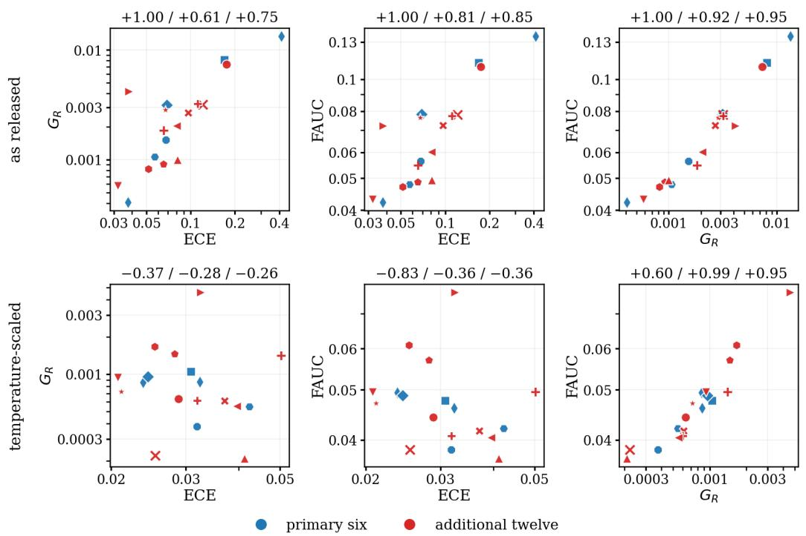  
Figure 7: Source metrics across eighteen checkpoints, as released (top) and temperature-scaled (bottom). One point per checkpoint (blue: primary six; red: additional twelve; marker = family), log axes. Panel titles give the Spearman rank correlation on the six / the twelve / all eighteen, computed from unrounded values. Descriptive; the checkpoints are not independent samples.

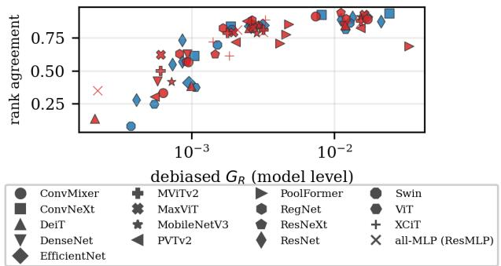  
Figure 8: Held-out rank agreement against restricted heterogeneity. All eighteen checkpoints in four calibration states (blue: primary six; red: breadth twelve; marker = family). The weakest agreement occurs where $G _ { R }$ is smallest.

Random score-preserving shifts. The random-shift construction of Appendix R.1 was repeated on the breadth cohort with a new seed declared in the protocol (20260924): primary states, five folds, twenty bins, six radii, 100 label-free Gaussian directions per bin–radius cell, the same feasibility assertions (no violation in 1,440,000 shifts). Over the breadth cohort’s cells the two-sided plug-in profile has Spearman correlation 0.9005 with the median held-out movement (0.924 with the largest), against 0.9010 (0.925) on the primary six; 96.2% of movements fall below the branch of the profile in their own direction, with a median ratio of 0.260, and exceedances again concentrate in the lowest $G _ { R }$ quartile (9.2% against 0.74% in the highest). Over all eighteen checkpoints (2,160,000 shifts) the primary correlation is 0.9007 (Figure 9). Cells and checkpoints are dependent; the shifts remain non-natural and give the plug-in no coverage. The near-equality of the three cohort values reflects the construction: most of the statistic is reproduced by the permutation null of Appendix T.

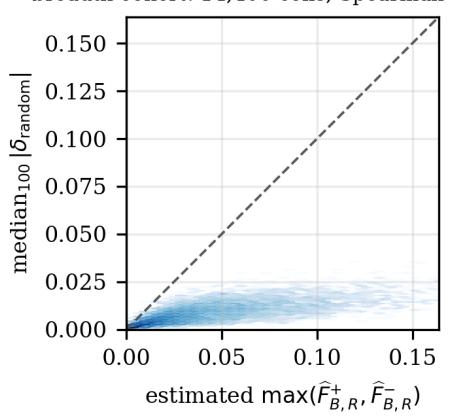

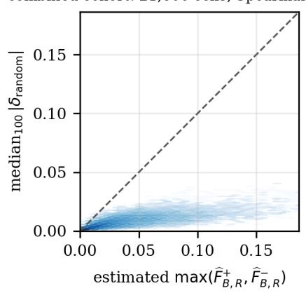  
Figure 9: Random score-preserving shifts on the breadth and combined cohorts. One point per bin–radius cell: two-sided plug-in profile against the median held-out movement over 100 random directions; dashed line $y = x ,$ , equal axes. Descriptive; most of the association is reproduced by the permutation null of Appendix T.

Split-sample lower confidence bound. The construction of Appendix N.1 was run unchanged (split seed 20260902, both arms, 500 Bonferroni-corrected one-sided statements per analysis, no retention filter) on each new checkpoint. As released, $\mathrm { L C B } _ { \mathrm { m o d e l } } ^ { + } ( 0 . 3 )$ is positive in both arms for 9 of the twelve and in at least one arm for 10; in the split-fitted temperature-scaled state it is positive in both arms for 3 (Table 14). Positive values are small, at most 0.0042 except ConvMixer-768/32 (0.0092–0.0110), in the root-mean-square probability units of Section 4. RegNetX-4.0GF is zero as released and positive after scaling: the scaled state refits the temperature, bins and readout, so it has a diferent target. Each entry carries its own 95% statement; the counts describe the table and assert no joint coverage, and the preregistered outcome categories of Appendix N.1, defined for the six, are not re-scored on the enlarged set.

Monotone reparameterisation, replicated. The fold-wise map $g _ { f } ( s ) = { \mathrm { s i g m o i d } } ( a _ { f } \log i \ell s + c _ { f } )$ of Appendix Q was fitted and applied by the same code on the new caches. For the ten checkpoints on which the calibrator fits, the cross-fitted ECE falls by a median 76.2%, binary NLL improves for 10 of the ten, and every structural quantity (bin assignment, frozen readout, cell table, $\dot { G } _ { R } , \mathcal { F } ^ { \pm } , \mathrm { F A U C } )$ is unchanged to a maximum absolute diference of 0, as Lemma 7 predicts. For ResNeXt-50 and RegNetX-4.0GF the fit is undefined: three and six validation images receive a top-label confidence of exactly 1.0 in float32, where logit � is infinite, so the optimiser terminates at its identity start; the frozen map family was not modified and these two are reported as not fitted. A clipped variant would merge distinct scores and so would not be a strictly increasing bijection in the sense of Lemma 7; we did not run one. Outcome A of the preregistered protocol is not re-scored.

Family-level sensitivity. Removing all checkpoints of one of the 17 families in turn from the combined cohort moves the as-released Spearman(ECE, FAUC) over +0.79–+0.90, Spearman(��, FAUC) over +0.93–+0.98, the median held-out rank agreement over 0.81–0.82 and the random-shift correlation over 0.899–0.903. Keeping one checkpoint per family (the first in the frozen cohort order, so ResNet-50 V1 for ResNet) gives +0.82, +0.94, 0.81 and 0.899. In the temperature-scaled state the deletions move Spearman(ECE, FAUC) over −0.50 to −0.28 and one per family gives −0.35 (post-hoc; Table 15). These are ranges over deletions, not intervals.

What this changes and what it does not. The controlled-shift rank agreement and the positivity of the lower confidence bound as released recur on twelve checkpoints from twelve further families with no change to the pipeline. Two things difer from the primary six: the identical as-released rankings of ECE, $G _ { R }$ and FAUC do not persist, which removes a design-power caveat of Appendix P without altering any preregistered outcome; and after temperature scaling the bound is positive in both arms for 3 of the 12 breadth checkpoints, whereas it is zero in at least one arm for all six primary ones. Nothing here bears on natural shift or on the CIFAR-10H case study, which were not extended.

## T Post-hoc diagnostics added in the final revision

Provenance. Every analysis in this appendix was designed after all earlier results were known and is post-hoc. A protocol fixing the statistics, nulls, seeds, replicate counts, tolerances and reporting rules was written and hashed before any of them was run. A first amendment, written before any result below was computed, records how the frozen partitions were reconstructed. A second amendment, the controlled-shift null, was defined after the random-shift null had been inspected. No model is re-run and no preregistered outcome is re-scored. The partitions $( D _ { \mathrm { { f i t } } }$ temperature, bins, readout and groups) were rebuilt with the frozen code. They reproduce all 21,600 frozen random-shift cells exactly, and the frozen per-checkpoint $G _ { R } , { \mathrm { F A U C } }$ and rank agreement exactly for 17 of 18 checkpoints. For DenseNet-201 the frozen source-pipeline run used a diferent number of BLAS threads from its frozen random-shift run, and the reconstruction, which matches the latter, difers from the former by $3 \times 1 0 ^ { - 5 }$ in FAUC. The randomised PCA in the readout makes the frozen pipeline reproducible to about $1 0 ^ { - 5 }$ in FAUC across thread settings, not bit for bit. The released code records the thread counts.

Cohort statistics and matched pairs. Table 15 recomputes the rank correlations from unrounded source metrics in both states, including family-deletion ranges for the temperature-scaled state, which the original extension reported only as released. Table 16 lists every pair among the eighteen checkpoints whose ECE agrees within the original tolerance; the full enumeration of all $2 \times$ 153 pairs is released. No primary pair matches in either state, so the original primary-cohort outcome is unchanged. In every matched pair the FAUC diference has the same sign as the $G _ { R }$ diference. The pairs therefore show that similar estimated ECE does not fix FAUC; they are not a test of fragility at fixed $G _ { R }$

The within-bin label-permutation null. For each (checkpoint, state, fold, bin), correctness is permuted uniformly among the $D _ { \mathrm { r a t e } }$ rows of the bin and, independently, among its $D _ { \mathrm { e v a l } }$ rows. Bin assignments, readout groups, cell counts, retention, source and evaluation proportions and the random directions are all held fixed. The permutation preserves each bin’s accuracy in each role and the unequal cell counts, and it removes any association between correctness and the readout inside a bin, so the permuted data have population $G _ { R } = 0$ . Everything else is recomputed exactly as for the observed data. There are 100 replicates per variant (both roles, $D _ { \mathrm { r a t e } }$ only, $D _ { \mathrm { e v a l } }$ only) with a fixed seed sequence. The Monte Carlo standard error of the null mean of the pooled statistic is below $2 \times 1 0 ^ { - 4 }$ . Permutations are conditional on fold: an image in the rate or evaluation set of several folds is permuted independently in each, so the pooled null does not reproduce cross-fold dependence. It is a reference distribution for these statistics, not a sampling distribution for the data, and we report no �-value.

Table 17 gives the results. For the random-shift statistic, the null with both roles permuted reproduces most of the observed correlation on all eighteen checkpoints: pooled 0.877 against 0.901, and at fixed radius 0.75 against 0.83. The mechanism is estimation noise. The plug-in profile of a bin with no heterogeneity is of order ${ \sqrt { \rho \mu ( 1 - \mu ) / n } }$ , and the unsigned random movement on held-out data is of the same order with the evaluation counts, so both rise and fall with bin accuracy whatever the heterogeneity. Permuting only one role removes part of this common factor and lowers the null further. The observed statistics exceed every replicate, by a few hundredths pooled and about 0.08 at fixed radius. Within single (checkpoint, state, fold, radius) units the primary cohort’s observed median lies inside the null range. The controlled-shift statistic behaves diferently. Its target is the signed held-out drift of the frozen maximising weights, which has mean zero under the null. Its null median is centred at zero, with maxima of at most 0.07 over the three cohorts, against 0.59–0.63 observed.

The profile against its variance. Table 18 compares, on identical cells, rates and proportions, the plug-in profile with $\sqrt { \rho \hat { G } }$ and with min $\{ \sqrt { \rho \hat { G } } , \hat { z } _ { + } \}$ , where $\begin{array} { r } { \hat { G } = \sum _ { k } p _ { k } ( \hat { \theta } _ { k } - \bar { \theta } ) ^ { 2 } } \end{array}$ is the plug-in variance. It is not the corrected $G _ { R }$ and not a square-rooted Table 1 entry. Both baselines bound the plug-in profile from above, by Cauchy–Schwarz and the support bound, and they coincide with it in the variance-controlled regime. The cap uses the same estimated support endpoint $\hat { z } _ { + }$ as the profile, so it removes the part of the overstatement that the endpoint information alone accounts for. Model-level FAUC recomputed with either baseline in place of the profile, with the frozen aggregation, exceeds FAUC by a median factor of 1.17 and 1.09 respectively, and ranks the 36 checkpoint–state combinations with Spearman 0.976 and 0.996 against FAUC. On the random-shift cells the three predictors have pooled Spearman correlations of 0.901, 0.896 and 0.898 with the median movement. For the controlled shifts, the median rank agreement of each with held-out drift is 0.62. The diferences between profile and variance therefore show in magnitudes at $\rho \ge 1$ and between matched-variance bins, but they do not change rankings or held-out ordering on these readouts. The hierarchy of Proposition 5 does not order regime boundaries: refining the cells {0.4, 0.6} (probabilities $\scriptstyle { \frac { 1 } { 2 } } , { \frac { 1 } { 2 } } )$ into rates 0.4, 0.5, 0.7 (probabilities $\textstyle { \frac { 1 } { 2 } } , { \frac { 1 } { 4 } } , { \frac { 1 } { 4 } } )$ raises $\rho _ { + }$ from 1 to 1.5, and a larger budget can move a unit from the tail-controlled regime into saturation. We did not test how the granularity of the readout afects the regime boundaries or this comparison.

Not done. The protocol listed two optional analyses, a bin-count sensitivity and a stabilised monotone map for ResNeXt-50 and RegNetX-4.0GF. Neither was run, and no claim depends on them. ImageNet-C was not re-run under the revised pipeline.

Table 15: Rank correlations among source metrics across checkpoints (Spearman, unrounded inputs), as released / temperature-scaled. Leave-one-family-out gives the range over the 17 deletions; one-perfamily keeps the first checkpoint of each family in the frozen cohort order. Post-hoc and descriptive; checkpoints are not independent samples.
<table><tr><td></td><td>(ECE, FAUC)</td><td> $( G _ { R } , { \mathrm { F A U C } } )$ </td><td> $( \mathrm { E C E } , G _ { R } )$ </td></tr><tr><td>primary six</td><td>+1.00 / -0.83</td><td> $+ 1 . 0 0 \mathrm { ~ / ~ } { + 0 . 6 0 }$ </td><td> $+ 1 . 0 0 / - 0 . 3 7$ </td></tr><tr><td>additional twelve</td><td> $+ 0 . 8 1 / - 0 . 3 6$ </td><td> $+ 0 . 9 2 \ : / + 0 . 9 9$ </td><td> $+ 0 . 6 1 / - 0 . 2 8$ </td></tr><tr><td>all eighteen</td><td> $+ 0 . 8 5 / - 0 . 3 6$ </td><td> $+ 0 . 9 5 \ : / + 0 . 9 5$ </td><td> $+ 0 . 7 5 \ : / - 0 . 2 6$ </td></tr><tr><td>one per family</td><td>leave one family out [+0.79, +0.90] / [−0.50, -0.28] [+0.93, +0.98] / [+0.94, +0.96] [+0.65, +0.90] / [−0.42, -0.16]  $+ 0 . 8 2 \ : / \ : - 0 . 3 5$ </td><td>+0.94/+0.96</td><td>+0.71 / -0.28</td></tr></table>

Table 16: All checkpoint pairs among the eighteen whose estimated ECE agrees within the original tolerance $5 \times 1 0 ^ { - 4 }$ (all 153 pairs per state enumerated; none within the primary six in either state). Post-hoc enumeration on an enlarged cohort; similar estimated ECE is not equal population calibration error, and no significance is claimed.
<table><tr><td>state</td><td>pair</td><td>|∆ECE|</td><td>FAUC</td><td>FAUC ratio</td><td> $G _ { R }$ </td></tr><tr><td> $T = \hat { T }$ </td><td>ResNet-50 V2 / PoolFormer-S24</td><td> $1 . 4 1 \times 1 0 ^ { - 4 }$ </td><td>0.0461 / 0.0770</td><td>1.67</td><td>0.00086 / 0.00459</td></tr><tr><td> $T = \hat { T }$ </td><td>ResNet-50 V2 / MViTv2-T</td><td> $4 . 5 4 \times 1 0 ^ { - 4 }$ </td><td>0.0461 / 0.0407</td><td>1.13</td><td>0.00086 / 0.00061</td></tr><tr><td> $T = \hat { T }$ </td><td>Swin-T / MViTv2-T</td><td> $0 . 7 7 \times 1 0 ^ { - 4 }$ </td><td>0.0384 / 0.0407</td><td>1.06</td><td>0.00038 / 0.00061</td></tr><tr><td> $T = \hat { T }$ </td><td>DenseNet-201 / MobileNetV3-L</td><td> $3 . 7 2 \times 1 0 ^ { - 4 }$ </td><td>0.0495 / 0.0471</td><td>1.05</td><td>0.00094 /0.00072</td></tr><tr><td> $T = \hat { T }$ </td><td> $\mathrm { R e g N e t X - 4 . 0 G F } / \mathrm { R e s M L P } . 1 2$ </td><td> $1 . 0 9 \times 1 0 ^ { - 4 }$ </td><td>0.0610 / 0.0384</td><td>1.59</td><td>0.00166 / 0.00022</td></tr><tr><td> $T = 1$ </td><td>ResNet-50 V1 / PoolFormer-S24</td><td> $4 . 9 8 \times 1 0 ^ { - 4 }$ </td><td>0.0423 / 0.0723</td><td>1.71</td><td>0.00041/0.00417</td></tr><tr><td> $T = 1$ </td><td> $\mathrm { R e s N e X t - } 5 0 / \mathrm { X C i T - S 1 } 2 / 1 6$ </td><td> $4 . 2 9 \times 1 0 ^ { - 4 }$ </td><td>0.0488 / 0.0547</td><td>1.12</td><td>0.00091 / 0.00184</td></tr></table>

Table 17: Random-shift ordering statistic against the within-bin label-permutation null $( M = 1 0 0$ replicates per variant; correctness permuted within each bin in $D _ { \mathrm { r a t e } }$ and/or $D _ { \mathrm { e v a l } }$ , with partitions, cell counts, proportions and directions fixed). Entries: observed / null mean [null maximum]. “Fixed radius”: for the observed data and for each replicate, the mean over the six radii of the Spearman correlation over cells at that radius; the null mean and maximum are taken over replicates of that mean. (The $\mathrm { \Delta } \mathrm { r } 7 $ version of this table printed, as the bracket, the maximum over radii and replicates of the radius-specific correlations, a looser quantity; corrected here.) “Within unit”: median over (checkpoint, state, fold, radius) units of the Spearman correlation across the 20 bins. Permutations are fold-conditional, so the null does not reproduce cross-fold dependence; no �-value is reported. Post-hoc.
<table><tr><td>cohort</td><td>null variant</td><td>pooled</td><td>fixed radius</td><td>within unit</td></tr><tr><td rowspan="3">primary six</td><td>both roles</td><td>0.901 / 0.876 [0.886]</td><td>0.828 / 0.747 [0.771]</td><td>0.776 / 0.748 [0.777]</td></tr><tr><td> $D _ { \mathrm { r a t e } }$  only</td><td>0.901 / 0.835 [0.843]</td><td>0.828 / 0.692 [0.714]</td><td>0.776 / 0.755 [0.776]</td></tr><tr><td> $D _ { \mathrm { e v a l } }$  only</td><td>0.901 / 0.846 [0.854]</td><td>0.828 / 0.659 [0.681]</td><td>0.776 / 0.743 [0.765]</td></tr><tr><td rowspan="3">additional twelve</td><td>both roles</td><td>0.901 / 0.877 [0.881]</td><td>0.838 / 0.755 [0.768]</td><td>0.803 / 0.755 [0.774]</td></tr><tr><td> $D _ { \mathrm { r a t e } }$  only</td><td>0.901 / 0.851 [0.856]</td><td>0.838 / 0.726 [0.741]</td><td>0.803 / 0.759 [0.775]</td></tr><tr><td> $D _ { \mathrm { e v a l } }$  only</td><td>0.901 / 0.866 [0.872]</td><td>0.838 / 0.711 [0.722]</td><td>0.803 / 0.764 [0.776]</td></tr><tr><td rowspan="3">all eighteen</td><td>both roles</td><td>0.901 / 0.877 [0.881]</td><td>0.835 / 0.753 [0.765]</td><td>0.795 / 0.752 [0.776]</td></tr><tr><td> $D _ { \mathrm { r a t e } }$  only</td><td>0.901 / 0.846 [0.849]</td><td>0.835 / 0.715 [0.725]</td><td>0.795 / 0.758 [0.768]</td></tr><tr><td> $D _ { \mathrm { e v a l } }$  only</td><td>0.901 / 0.859 [0.864]</td><td>0.835 / 0.693 [0.703]</td><td>0.795 / 0.757 [0.770]</td></tr></table>

<table><tr><td>controlled shifts (as released and  $T = { \hat { T } } )$ </td><td>observed median null mean null max</td><td></td><td></td></tr><tr><td>primary six</td><td>0.592</td><td>-0.005</td><td>0.059</td></tr><tr><td>additional twelve</td><td>0.627</td><td>-0.004</td><td>0.067</td></tr><tr><td>all eighteen</td><td>0.624</td><td>-0.005</td><td>0.046</td></tr></table>

Table 18: The plug-in profile against its variance summaries on identical cells (all eighteen checkpoints, as released and � = �ˆ, 3,600 bin units). Regime: share of units outside the variance-controlled regime (upward profile). Excess: median relative overstatement of ${ \widehat { \mathcal { F } } } ^ { + }$ by $\sqrt { \rho \hat { G } }$ and by min $\{ \sqrt { \rho \hat { G } } , \hat { z } _ { + } \}$ Matched variance: median relative profile diference within disjoint consecutive pairs of units whose $\hat { G }$ agree within 1% (1,742 pairs), and the share of pairs difering by more than 10%. Post-hoc; plug-in quantities, no coverage.
<table><tr><td>ρ</td><td>0.01</td><td>0.03</td><td>0.1</td><td>0.3</td><td>1</td><td>3</td></tr><tr><td>outside variance regime</td><td>0%</td><td>0%</td><td>0%</td><td>45%</td><td>99%</td><td>100%</td></tr><tr><td> $\sqrt { \rho \hat { G } }$  excess of</td><td>0%</td><td>0%</td><td>0%</td><td>0%</td><td>10%</td><td>44%</td></tr><tr><td>excess of capped variance</td><td>0%</td><td>0%</td><td>0%</td><td>0%</td><td>9%</td><td>10%</td></tr><tr><td>matched-variance difference</td><td>0%</td><td>0%</td><td>0%</td><td>1%</td><td>10%</td><td>19%</td></tr><tr><td>pairs differing by &gt; 10%</td><td>0%</td><td>0%</td><td>0%</td><td>6%</td><td>48%</td><td>72%</td></tr></table>

## U Known-propensity magnitude and resolution study

This study was designed after every other result in the paper was known and is post-hoc. Its specification (laws, sampling, seeds, replicates, metrics, reading rule, failure rules) was written and hashed before any of its random data were generated; one technical amendment, a corrected solver (Section U.4), was made after the first run and changed no classification. The known-propensity parts are synthetic: they show when the full profile’s magnitude is estimable from rate labels, not that it matters on any benchmark. Code, seeds and unrounded outputs are in the supplementary material.

## U.1 Finite-sample magnitude with a known propensity

Design. One bin with $S \equiv 0 . 5 ;$ the input space is a finite set of cells with known masses $p _ { j }$ and propensities $\eta _ { j }$ , and the readout is the cell, so the target is the exact profile of the law $( \eta _ { j } , p _ { j } )$ . Law A puts $\begin{array} { r } { ( \frac { 1 } { 4 } , \frac { 1 } { 2 } , \frac { 1 } { 4 } ) } \end{array}$ on $\eta \in \{ 0 . 1 , 0 . 5 , 0 . 9 \}$ and law B puts $\big ( \frac { 1 } { 1 0 2 } , \frac { 2 5 } { 5 1 } , \frac { 2 5 } { 5 1 } , \frac { \big ) } { 1 0 2 } \big )$ on $\{ 0 . 1 , 0 . 2 2 , 0 . 7 8 , 0 . 9 \}$ : both have mean $\frac { 1 } { 2 }$ , variance $\frac { 2 } { 2 5 }$ and endpoints 0.1 and 0.9, and at $\rho = 3$ the capped variance is 0.4 for both, while $\begin{array} { r } { \mathcal { F } _ { A } ^ { + } ( 3 ) = \frac { 2 } { 5 } } \end{array}$ (saturation, $\rho _ { \mathrm { s a t } } = 3 )$ and $\mathcal { F } _ { B } ^ { + } ( 3 ) = ( 2 4 + \sqrt { 2 } ) / 8 5 \approx 0$ .29899 (tail regime; exact, and equal to a 50-digit independent dual). The family $\lambda P _ { A } + ( 1 - \lambda ) P _ { B } , \lambda \in \{ 0 , \frac { 1 } { 4 } , \frac { 1 } { 7 } , \frac { 3 } { 4 } , 1 \}$ , varies the tails at fixed mean, variance and endpoints. Controls: the same laws with variance divided by 16 $( \eta ^ { \prime } = 0 . 5 + 0 . 2 5 ( \eta - 0 . 5 ) )$ ; a constant propensity on four cells (target 0); a two-point law on four cells, $\eta = ( 0 . 3 , 0 . 3 , 0 . 7 , 0 . 7 )$ , for which full and capped profiles coincide in population; and one asymmetric law fixed in advance, $\eta = ( 0 . 2 , 0 . 7 , 0 . 8 , 0 . 9 )$ with masses $( 0 . 0 5 , 0 . 3 5 , 0 . 4 0 , 0 . 2 0 )$ , in both directions. Budgets $\rho \in \{ 0 , 0 . 0 1 , 0 . 0 3 , 0 . 1 , 0 . 3 , 1 , 3 \} ; n \in$ {250, 500, 1000, 2000, 5000} rate labels per bin; 2000 independent replicates per condition. Primary sampling is stratified with proportional allocation and at least one label per cell (law B’s endpoint cells get 2 labels at $n = 2 5 0 ) ;$ secondary arms use equal allocation, iid sampling with empty cells dropped, and iid sampling with cells of fewer than 30 labels dropped, which is the pipeline’s rule; dropped cells stay in the target. From the same estimated rates and known masses we compute the full plug-in profile, $\sqrt { \rho \hat { G } }$ with the uncorrected plug-in variance,

the capped variance min $\{ \sqrt { \rho \hat { G } } , \hat { z } \}$ with the estimated endpoint, and, as a labelled extra with more information, the cap at the true endpoint. Errors are in probability units against the exact profile. The paired unit is the replicate; a condition counts as favouring one estimator if the mean paired diference in absolute error exceeds 0.005 and its 95% Monte-Carlo interval excludes zero.

Table 19: Known-propensity check, primary arm: one bin, upward, $\rho = 3 .$ . Exact profile, population slack of the capped variance, and mean absolute error over 2000 replicates of the full plug-in and the capped variance from the same rates.
<table><tr><td rowspan="2">law of η</td><td rowspan="2"> ${ \mathcal { F } } ^ { + } ( 3 )$ </td><td rowspan="2">cap slack</td><td colspan="2"> $n = 2 5 0$ </td><td colspan="2"> $n = 5 0 0 0$ </td></tr><tr><td>full</td><td>capped</td><td>full</td><td>capped</td></tr><tr><td>four-point (B)</td><td>0.299</td><td>0.101</td><td>0.022</td><td>0.148</td><td>0.006</td><td>0.102</td></tr><tr><td>mixture  $\begin{array} { r } { \lambda = \frac { 1 } { \lambda } } \end{array}$ </td><td>0.362</td><td>0.038</td><td>0.029</td><td>0.052</td><td>0.006</td><td>0.038</td></tr><tr><td>three-point (Á)</td><td>0.400</td><td>0.000</td><td>0.030</td><td>0.030</td><td>0.006</td><td>0.006</td></tr><tr><td>B, variance /16</td><td>0.075</td><td>0.025</td><td>0.042</td><td>0.052</td><td>0.008</td><td>0.027</td></tr></table>

Results. Table 19 summarises four laws at $\rho = 3$ and Table 20 lists the primary arm. Every plug-in profile was at most both $\sqrt { \rho \hat { G } }$ and the capped variance (largest excess $6 \times 1 0 ^ { - 1 7 }$ over all replicates), as the theory requires, so the plug-in can be less accurate than the cap only by falling below the target. Of the 600 conditions with $\rho > 0$ , 78 meet the specified practical-advantage criterion for the full plug-in and none for the cap. In the other 522 the diference stays below the criterion, which does not mean that the two estimates are equal. They include every condition in which the cap is exact in population (the variance-controlled budgets, law A at $\rho = 3 ;$ and the two controls) and conditions whose cap slack is small (at most 0.012). Population equality need not persist in the estimates: with four separately estimated cells, the estimated law of a control is generally neither constant nor two-point. Where the cap has population slack, its error does not shrink with � (law B at $\rho = 3$ 0.148 at $n = 2 5 0 , 0 . 1 0 2$ at $n = 5 0 0 0$ , slack 0.101), whereas the plug-in error does (0.022 to 0.006).

The plug-in’s upward bias, from maximising over noisy rates, is small in the main laws but reaches 0.027 for law B with variance divided by 16 at $n = 2 5 0$ , where both estimators’ relative errors exceed 56%: weak heterogeneity is where rate noise swamps the diference. Table 21 shows the sampling arms. Equal allocation and iid sampling with empty cells dropped behave like the primary arm. The 30-label rule removes at least one of law B’s endpoint cells in every replicate through $n = 2 0 0 0$ , and both endpoints in every replicate through $n = 1 0 0 0$ ; the estimators then describe a truncated law and underestimate by about 0.02. Through $n = 1 0 0 0$ the two coincide; at $n = 2 0 0 0$ one endpoint survives in some draws and the estimates can $\mathrm { d i f f e r } ,$ but neither meets the practical-advantage criterion. For the asymmetric law’s downward profile the rule drops the rare hard cell in every replicate at $n = 2 5 0$ and in most at $n = 5 0 0 ;$ ; the uncapped variance, being larger, is then closer to the target than both the full plug-in and the capped variance (four conditions). Full per-condition results, including RMSE, bias decompositions and the other arms, are in the supplementary material.

Table 20: Known-propensity magnitude, primary arm (proportional stratified labels, 2000 replicates). F: exact profile. MAE f/c: mean absolute error of the full plug-in and of the capped variance; Δ: mean paired diference $| \mathrm { f u l l } - \mathcal { F } | - | \mathrm { c a p p e d } - \mathcal { F } |$ (negative favours the full plug-in; Monte-Carlo standard errors are at most 0.002). Upward unless stated.
<table><tr><td></td><td></td><td></td><td colspan="2"> $n = 2 5 0$ </td><td colspan="2"> $n = 1 0 0 0$ </td><td colspan="2"> $n = 5 0 0 0$ </td></tr><tr><td>law, direction</td><td>ρ</td><td>F</td><td>MAE f/c</td><td>Δ</td><td>MAE f/c</td><td>Δ</td><td>MAE f/c</td><td>Δ</td></tr><tr><td>B</td><td>0.3</td><td>0.155</td><td>0.011/0.011</td><td>+0.000</td><td>0.006/0.006</td><td>+0.000</td><td>0.003/0.003</td><td>+0.000</td></tr><tr><td></td><td>1</td><td>0.283</td><td>0.020/0.020</td><td>+0.000</td><td>0.010/0.010</td><td>+0.000</td><td>0.005/0.005</td><td>+0.000</td></tr><tr><td></td><td>3</td><td>0.299</td><td>0.022/0.148</td><td>-0.126</td><td>0.014/0.110</td><td>-0.096</td><td>0.006/0.102</td><td>-0.095</td></tr><tr><td> $\textstyle \lambda = { \frac { 1 } { 4 } }$ </td><td>0.3</td><td>0.155</td><td>0.011/0.011</td><td>+0.000</td><td>0.005/0.005</td><td>+0.000</td><td>0.002/0.002</td><td>+0.000</td></tr><tr><td></td><td>1</td><td>0.279</td><td>0.020/0.021</td><td>+0.000</td><td>0.010/0.011</td><td>-0.001</td><td>0.004/0.005</td><td>-0.001</td></tr><tr><td></td><td>3</td><td>0.337</td><td>0.028/0.075</td><td>-0.047</td><td>0.014/0.063</td><td>-0.049</td><td>0.006/0.062</td><td>-0.056</td></tr><tr><td> $\begin{array} { r } { \lambda = \frac { 1 } { 2 } } \end{array}$ </td><td>0.3</td><td>0.155</td><td>0.010/0.010</td><td>+0.000</td><td>0.005/0.005</td><td>+0.000</td><td>0.002/0.002</td><td>+0.000</td></tr><tr><td></td><td>1</td><td>0.275</td><td>0.019/0.020</td><td>-0.002</td><td>0.009/0.012</td><td>-0.003</td><td>0.004/0.008</td><td>-0.004</td></tr><tr><td></td><td>3</td><td>0.362</td><td>0.029/0.052</td><td>-0.024</td><td>0.015/0.040</td><td>-0.025</td><td>0.006/0.038</td><td>-0.032</td></tr><tr><td> $\begin{array} { r } { \lambda = \frac { 3 } { 4 } } \end{array}$ </td><td>0.3</td><td>0.155</td><td>0.009/0.009</td><td>+0.000</td><td>0.005/0.005</td><td>+0.000</td><td>0.002/0.002</td><td>+0.000</td></tr><tr><td></td><td>1</td><td>0.271</td><td>0.017/0.021</td><td>-0.004</td><td>0.009/0.014</td><td>-0.005</td><td>0.004/0.012</td><td>-0.009</td></tr><tr><td></td><td>3</td><td>0.382</td><td>0.029/0.037</td><td>-0.008</td><td>0.015/0.023</td><td>-0.008</td><td>0.007/0.018</td><td>-0.012</td></tr><tr><td>A</td><td>0.3</td><td>0.155</td><td>0.008/0.008</td><td>+0.000</td><td>0.004/0.004</td><td>+0.000</td><td>0.002/0.002</td><td>+0.000</td></tr><tr><td></td><td>1</td><td>0.267</td><td>0.016/0.021</td><td>-0.006</td><td>0.008/0.017</td><td>-0.009</td><td>0.003/0.016</td><td>-0.013</td></tr><tr><td></td><td>3</td><td>0.400</td><td>0.030/0.030</td><td>+0.000</td><td>0.015/0.015</td><td>+0.000</td><td>0.006/0.006</td><td>+0.000</td></tr><tr><td>B weak</td><td>0.3</td><td>0.039</td><td>0.013/0.014</td><td>+0.000</td><td>0.007/0.007</td><td>+0.000</td><td>0.003/0.003</td><td>+0.000</td></tr><tr><td></td><td>1</td><td>0.071</td><td>0.024/0.025</td><td>-0.001</td><td>0.012/0.012</td><td>+0.000</td><td>0.006/0.006</td><td>+0.000</td></tr><tr><td></td><td>3</td><td>0.075</td><td>0.042/0.052</td><td>-0.010</td><td>0.017/0.035</td><td>-0.018</td><td>0.008/0.027</td><td>-0.019</td></tr><tr><td>A weak</td><td>0.3</td><td>0.039</td><td>0.013/0.013</td><td>+0.000</td><td>0.007/0.007</td><td>+0.000</td><td>0.003/0.003</td><td>+0.000</td></tr><tr><td></td><td>1</td><td>0.067</td><td>0.023/0.025</td><td>-0.002</td><td>0.012/0.013</td><td>-0.001</td><td>0.006/0.007</td><td>-0.001</td></tr><tr><td></td><td>3</td><td>0.100</td><td>0.040/0.040</td><td>+0.000</td><td>0.021/0.021</td><td>+0.000</td><td>0.010/0.010</td><td>+0.000</td></tr><tr><td>constant</td><td>0.3</td><td>0.000</td><td>0.028/0.028</td><td>+0.000</td><td>0.014/0.014</td><td>+0.000</td><td>0.006/0.006</td><td>+0.000</td></tr><tr><td></td><td>1</td><td>0.000</td><td>0.047/0.050</td><td>-0.002</td><td>0.024/0.025</td><td>-0.001</td><td>0.011/0.011</td><td>-0.001</td></tr><tr><td></td><td>3</td><td>0.000</td><td>0.065/0.065</td><td>+0.000</td><td>0.033/0.033</td><td>+0.000</td><td>0.014/0.014</td><td>+0.000</td></tr><tr><td>two-point</td><td>0.3</td><td>0.110</td><td>0.012/0.012</td><td>+0.000</td><td>0.006/0.006</td><td>+0.000</td><td>0.003/0.003</td><td>+0.000</td></tr><tr><td></td><td>1</td><td>0.200</td><td>0.022/0.022</td><td>+0.000</td><td>0.011/0.011</td><td>+0.000</td><td>0.005/0.005</td><td>+0.000</td></tr><tr><td></td><td>3</td><td>0.200</td><td>0.040/0.040</td><td>+0.000</td><td>0.020/0.020</td><td>+0.000</td><td>0.009/0.009</td><td>+0.000</td></tr><tr><td>asym., up</td><td>0.3</td><td>0.065</td><td>0.011/0.018</td><td>-0.008</td><td>0.005/0.016</td><td>-0.011</td><td>0.002/0.015</td><td>-0.013</td></tr><tr><td></td><td>1</td><td>0.099</td><td>0.018/0.040</td><td>-0.021</td><td>0.009/0.040</td><td>-0.031</td><td>0.004/0.043</td><td>-0.039</td></tr><tr><td></td><td>3</td><td>0.134</td><td>0.028/0.034</td><td>-0.006</td><td>0.015/0.020</td><td>-0.005</td><td>0.006/0.012</td><td>-0.006</td></tr><tr><td>asym., down</td><td>0.3</td><td>0.080</td><td>0.011/0.011</td><td>+0.000</td><td>0.005/0.005</td><td>+0.000</td><td>0.002/0.002</td><td>+0.000</td></tr><tr><td></td><td>1</td><td>0.147</td><td>0.020/0.020</td><td>+0.000</td><td>0.010/0.010</td><td>+0.000</td><td>0.004/0.004</td><td>+0.000</td></tr><tr><td></td><td>3</td><td>0.247</td><td>0.035/0.036</td><td>-0.001</td><td>0.017/0.018</td><td>-0.001</td><td>0.008/0.009</td><td>-0.002</td></tr></table>

Table 21: Sampling arms at two conditions: bias and MAE of the full plug-in (f) and the capped variance (c).
<table><tr><td>condition</td><td>sampling</td><td> $\operatorname { b i a s } \mathrm { f } / \mathrm { c } , n = 2 5 0$ </td><td> $\mathrm { M A E } \mathrm { f } / \mathrm { c } , n = 2 5 0$ </td><td> $n = 1 0 0 0$ </td><td> $n = 5 0 0 0$ </td></tr><tr><td> $\mathbf { B } , \mathbf { u p } , \rho = 3$ </td><td>proportional</td><td> $+ 0 . 0 1 0 / + 0 . 1 4 1$ </td><td>0.022/0.148</td><td> $0 . 0 1 4 / 0 . 1 1 0$ </td><td>0.006/0.102</td></tr><tr><td></td><td>equal</td><td>+0.000/+0.096</td><td>0.025/0.097</td><td>0.013/0.101</td><td>0.006/0.101</td></tr><tr><td></td><td>iid, drop empty</td><td> $+ 0 . 0 0 6 / + 0 . 1 2 0$ </td><td>0.023/0.130</td><td>0.014/0.106</td><td>0.006/0.102</td></tr><tr><td></td><td>iid, drop &lt; 30</td><td>-0.017/-0.017</td><td>0.025/0.025</td><td>0.020/0.020</td><td>0.006/0.102</td></tr><tr><td> $\mathrm { a s y m . , d o w n , } \rho = 1$ </td><td>proportional</td><td>+0.003/+0.004</td><td>0.020/0.020</td><td>0.010/0.010</td><td>0.004/0.004</td></tr><tr><td></td><td>equal</td><td>+0.004/+0.004</td><td>0.012/0.013</td><td>0.006/0.006</td><td>0.003/0.003</td></tr><tr><td></td><td>iid, drop empty</td><td>+0.004/+0.004</td><td>0.021/0.020</td><td>0.010/0.010</td><td>0.005/0.005</td></tr><tr><td></td><td>iid, drop &lt; 30</td><td> $- 0 . 0 7 6 / - 0 . 0 7 1$ </td><td>0.076/0.071</td><td>0.010/0.010</td><td>0.004/0.004</td></tr></table>

## U.2 Nested readouts on known atoms

Design. Three laws on 32 atoms in one bin, generated by fixed rules and seeds: smooth (� increasing in a feature � with noise, masses Dirichlet(2)), rare (same �, masses Dirichlet(0.3), so many atoms are rare) and wave (� non-monotone in �). A readout of � cells takes contiguous blocks of 32/� atoms in a fixed ordering, $K \in \{ 1 , 2 , 4 , 8 , 1 6 \}$ , so each level refines the previous one; the atoms define the binned oracle. The feature ordering uses no propensity or label. The ordering by � is an oracle, structural diagnostic, not a readout one could learn. We verified that every cell has exactly one parent and that masses aggregate exactly. For finite samples, � rate labels are stratified over the 16 finest cells, atoms are drawn within a cell in proportion to mass, and the rates of coarser cells are mass-weighted averages of the finest ones, so all levels use the same labels; 1000 replicates.

Results. Table 22 gives exact quantities. The oracle gap falls under refinement, and the middle bound of Proposition 6 is tight in the variance-controlled regime and close beyond it: over the refined levels its excess over the restricted profile is a median 1.5 times the true gap at $\rho = 1$ and 1.9 times at $\rho = 3$ (largest 6.2), against 9 and 6 times for the simple bound. The wave law shows why a coarse readout can miss almost everything: its two-cell feature split has $G _ { R } = 0 . 0 0 1 6$ against $G _ { P } = 0 . 0 5 0$ At a fixed label budget (Table 23), the estimation error of the restricted profile tends to grow with �, though not in every condition, while the approximation gap shrinks; in that table (feature ordering, upward, $\rho = 3 )$ the total error against the oracle was smallest at $K = 8$ for all three laws with 250 labels and at $K = 1 6$ with 5000. No output was smoothed or constrained to be monotone. These laws are synthetic, and the bound’s input $H _ { R }$ is known here only because � is.

Table 22: Nested readouts, exact population values (upward). Gap: $\mathcal { F } _ { B } - \mathcal { F } _ { B , R } ;$ B and A: the middle and right-hand bounds of Proposition 6, reported as excess over $\mathcal { F } _ { B , R } .$
<table><tr><td colspan="4"></td><td colspan="3"> $\rho = 1$ </td><td colspan="3"> $\rho = 3$ </td></tr><tr><td>law, ordering</td><td>K</td><td> $G _ { R }$ </td><td> $H _ { R }$ </td><td>gap</td><td> $\scriptstyle \mathrm { { B } } - { \mathcal { F } } _ { R }$ </td><td> $\mathbf { A } { - } \mathcal { F } _ { R }$ </td><td>gap</td><td> $\scriptstyle \mathrm { { B } } - { \mathcal { F } } _ { R }$ </td><td> $\mathbf { A } { - } \mathcal { F } _ { R }$ </td></tr><tr><td>smooth, feature</td><td>1</td><td>0.0000</td><td>0.0469</td><td>0.212</td><td>0.217</td><td>0.217</td><td>0.296</td><td>0.375</td><td>0.375</td></tr><tr><td rowspan="7">rare, feature</td><td>2</td><td>0.0385</td><td>0.0085</td><td>0.016</td><td>0.020</td><td>0.092</td><td>0.088</td><td>0.126</td><td>0.159</td></tr><tr><td>4</td><td>0.0417</td><td>0.0053</td><td>0.010</td><td>0.014</td><td>0.072</td><td>0.030</td><td>0.057</td><td>0.126</td></tr><tr><td>8</td><td>0.0440</td><td>0.0029</td><td>0.006</td><td>0.008</td><td>0.054</td><td>0.016</td><td>0.036</td><td>0.094</td></tr><tr><td>16</td><td>0.0458</td><td>0.0012</td><td>0.003</td><td>0.003</td><td>0.034</td><td>0.003</td><td>0.013</td><td>0.059</td></tr><tr><td>1</td><td>0.0000</td><td>0.0342</td><td>0.178</td><td>0.185</td><td>0.185</td><td>0.264</td><td>0.320</td><td>0.320</td></tr><tr><td>2</td><td>0.0231</td><td>0.0111</td><td>0.026</td><td>0.033</td><td>0.106</td><td>0.050</td><td>0.107</td><td>0.183</td></tr><tr><td>4</td><td>0.0292</td><td>0.0050</td><td>0.016</td><td>0.017</td><td>0.071</td><td>0.031</td><td>0.055</td><td>0.122</td></tr><tr><td rowspan="5">wave, feature</td><td>8</td><td>0.0336</td><td>0.0006</td><td>0.002</td><td>0.002</td><td>0.025</td><td>0.007</td><td>0.013</td><td>0.044</td></tr><tr><td>16</td><td>0.0340</td><td>0.0002</td><td>0.000</td><td>0.001</td><td>0.015</td><td>0.001</td><td>0.004</td><td>0.027</td></tr><tr><td>1</td><td>0.0000</td><td>0.0504</td><td>0.213</td><td>0.224</td><td>0.224</td><td>0.273</td><td>0.389</td><td>0.389</td></tr><tr><td>2</td><td>0.0016</td><td>0.0488</td><td>0.173</td><td>0.184</td><td>0.221</td><td>0.230</td><td>0.346</td><td>0.383</td></tr><tr><td>4</td><td>0.0422</td><td>0.0081</td><td>0.015</td><td>0.026</td><td>0.090</td><td>0.055</td><td>0.108</td><td>0.156</td></tr><tr><td rowspan="5">smooth, by η (oracle)</td><td>8</td><td>0.0425</td><td>0.0078</td><td>0.013</td><td>0.024</td><td>0.089</td><td>0.047</td><td>0.099</td><td>0.153</td></tr><tr><td>16</td><td>0.0472</td><td>0.0032</td><td>0.003</td><td>0.009</td><td>0.056</td><td>0.012</td><td>0.043</td><td>0.097</td></tr><tr><td>1</td><td>0.0000</td><td>0.0469</td><td>0.212</td><td>0.217</td><td>0.217</td><td>0.296</td><td>0.375</td><td>0.375</td></tr><tr><td>2</td><td>0.0385</td><td>0.0085 0.0036</td><td>0.016</td><td>0.020 0.010</td><td>0.092</td><td>0.088</td><td>0.126</td><td>0.159</td></tr><tr><td>4</td><td>0.0433 0.0460</td><td>0.0009</td><td>0.006 0.001</td><td>0.002</td><td>0.060 0.030</td><td>0.017 0.002</td><td>0.038</td><td>0.104</td></tr><tr><td rowspan="5">rare, by η (oracle)</td><td>8 16</td><td></td><td>0.0003</td><td>0.000</td><td></td><td>0.017</td><td>0.001</td><td>0.011</td><td>0.052</td></tr><tr><td></td><td>0.0467</td><td></td><td></td><td>0.001</td><td></td><td></td><td>0.004</td><td>0.029</td></tr><tr><td>1</td><td>0.0000 0.0218</td><td>0.0342</td><td>0.178 0.041</td><td>0.185 0.048</td><td>0.185</td><td>0.264</td><td>0.320</td><td>0.320</td></tr><tr><td>2</td><td>0.0322</td><td>0.0125 0.0021</td><td>0.006</td><td>0.007</td><td>0.112 0.046</td><td>0.127 0.006</td><td>0.163</td><td>0.193</td></tr><tr><td>4</td><td></td><td>0.0002</td><td></td><td>0.001</td><td></td><td></td><td>0.019</td><td>0.079</td></tr><tr><td rowspan="6">wave, by η (oracle)</td><td>8</td><td>0.0341</td><td></td><td>0.000</td><td></td><td>0.013</td><td>0.001</td><td>0.003</td><td>0.023</td></tr><tr><td>16</td><td>0.0341</td><td>0.0001</td><td>0.000</td><td>0.000</td><td>0.010</td><td>0.000</td><td>0.002</td><td>0.017</td></tr><tr><td>1</td><td>0.0000</td><td>0.0504</td><td>0.213</td><td>0.224</td><td>0.224</td><td>0.273</td><td>0.389</td><td>0.389</td></tr><tr><td>2</td><td>0.0416</td><td>0.0088</td><td>0.021</td><td>0.032 0.008</td><td>0.094 0.054</td><td>0.081 0.029</td><td>0.137 0.057</td><td>0.163</td></tr><tr><td>4</td><td>0.0475 0.0494</td><td>0.0029 0.0010</td><td>0.004 0.001</td><td>0.003</td><td>0.031</td><td>0.006</td><td>0.017</td><td>0.093</td></tr><tr><td>8 16</td><td>0.0500</td><td>0.0004</td><td>0.000</td><td>0.001</td><td>0.019</td><td>0.001</td><td>0.006</td><td>0.054 0.033</td></tr></table>

## U.3 Nested merges of the ImageNet readout

The $K = 8$ groups of each bin are quantile groups of one fitted readout score, so merging adjacent groups gives the quartile, median and trivial partitions of the same score: a genuinely nested sequence, unlike the readouts of Appendix J. Bins, readout, rates $( D _ { \mathrm { r a t e } } )$ and masses $( D _ { \mathrm { e v a l } } )$ are the frozen ones; the support is fixed once by the pipeline’s rule at $K = 8$ and inherited by the merges. At $K = 8$ this reproduces every checkpoint’s FAUC and $G _ { R }$ (largest diference $3 \times 1 0 ^ { - 1 7 } )$ . Table 24 summarises the eighteen checkpoints. Four groups retain $7 3 \% - 9 4 \%$ of the eight-group FAUC and two groups 48%–75%. From four to eight groups the plug-in $G _ { R }$ keeps rising, but a median of only 35% (as released) and 14% (temperature-scaled) of that rise survives the binomial correction of Proposition 9: much of the finest resolution’s increase is rate noise, most clearly after scaling. This is descriptive. Without � there is no oracle gap or $H _ { R }$ to report; the assumption-free envelope $\mathbb { E } _ { b } [ \theta ( 1 - \theta ) ]$ of Appendix I.1 is a median 82 times the corrected $G _ { R }$ over the 3,159 bin records where the latter is positive (tenth percentile 20 times), so it gives no useful bound here.

Table 23: Nested readouts at a fixed label budget, feature ordering, upward, $\rho = 3 \colon$ RMSE of the plug-in restricted profile against its own target / against the binned oracle (1000 replicates).
<table><tr><td> $1 \mathrm { a w }$ </td><td>n</td><td> $K = 1$ </td><td> $K = 2$ </td><td> $K = 4$ </td><td> $K = 8$ </td><td> $K = 1 6$ </td></tr><tr><td>smooth</td><td>250</td><td>0.000/0.296</td><td>0.030/0.094</td><td>0.039/0.048</td><td>0.040/0.037</td><td>0.045/0.043</td></tr><tr><td></td><td>1000</td><td>0.000/0.296</td><td>0.015/0.089</td><td>0.020/0.036</td><td>0.020/0.023</td><td>0.020/0.019</td></tr><tr><td></td><td>5000</td><td>0.000/0.296</td><td>0.007/0.088</td><td>0.009/0.031</td><td>0.009/0.018</td><td>0.008/0.008</td></tr><tr><td>rare</td><td>250</td><td>0.000/0.264</td><td>0.038/0.063</td><td>0.040/0.046</td><td>0.044/0.041</td><td>0.044/0.044</td></tr><tr><td></td><td>1000</td><td>0.000/0.264</td><td>0.019/0.053</td><td>0.021/0.037</td><td>0.021/0.020</td><td>0.021/0.021</td></tr><tr><td></td><td>5000</td><td>0.000/0.264</td><td>0.008/0.051</td><td>0.010/0.033</td><td>0.010/0.012</td><td>0.010/0.010</td></tr><tr><td>wave</td><td>250</td><td>0.000/0.273</td><td>0.026/0.231</td><td>0.037/0.059</td><td>0.046/0.041</td><td>0.051/0.043</td></tr><tr><td></td><td>1000</td><td>0.000/0.273</td><td>0.015/0.231</td><td>0.020/0.056</td><td>0.022/0.043</td><td>0.022/0.019</td></tr><tr><td></td><td>5000</td><td>0.000/0.273</td><td>0.007/0.230</td><td>0.010/0.056</td><td>0.010/0.047</td><td>0.010/0.013</td></tr></table>

Table 24: Nested merges on ImageNet, eighteen checkpoints, median [range]. The last column is the share of the plug-in increase in $G _ { R }$ from four to eight groups that remains after the binomial-noise correction.
<table><tr><td>state</td><td>FAUC4/FAUC8</td><td>FAUC2/FAUC8</td><td> $G _ { R } ^ { \mathrm { d e b } } \colon K { = } 4 / K { = } 8$ </td><td> $\Delta G ^ { \mathrm { d e b } } / \Delta G ^ { \mathrm { p l u g } } , 4  8$ </td></tr><tr><td>as released</td><td>0.89 [0.76, 0.94]</td><td>0.65 [0.56, 0.75]</td><td>0.89 [0.85, 1.05]</td><td> $0 . 3 5 \ [ - 0 . 0 5 , 0 . 7 9 ]$ </td></tr><tr><td>temperature-scaled</td><td>0.80 [0.73, 0.89]</td><td>0.62 [0.48, 0.72]</td><td>0.89 [0.83, 1.08]</td><td> $0 . 1 4 \ [ - 0 . 0 4 , 0 . 6 1 ]$ </td></tr></table>

## U.4 A defect in a closed-form solver used by two permutation nulls

The permutation nulls of Appendix T computed profiles with a closed-form tail-regime solver. When the largest cell rates of a bin are tied, that solver could accept a spurious root at the top value and return a value above $\sqrt { \rho \hat { G } } .$ . We found this while running the study above, corrected it (ties merged, roots re-verified elementwise, the frozen bisection as fallback), and recomputed both nulls with only the solver changed. The corrected solver agrees with the frozen bisection to $1 0 ^ { - 1 3 }$ on 480,000 random tie-heavy cases. In the random-shift null 36 of 6,480,000 profile values change by more than $1 0 ^ { - 6 }$ (largest change 0.018), the null summaries move by at most $3 . 2 \times 1 0 ^ { - 5 }$ , and no number or table entry in this paper changes; the controlled-shift null, observed and permuted, is unchanged. All pre-existing observed statistics, and all profiles outside these two nulls, use the frozen bisection solver; the study in this appendix uses the corrected solver, with bisection as fallback. The frozen arrays are kept as released; the corrected ones and the audit are in the supplementary material.