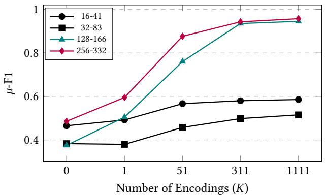
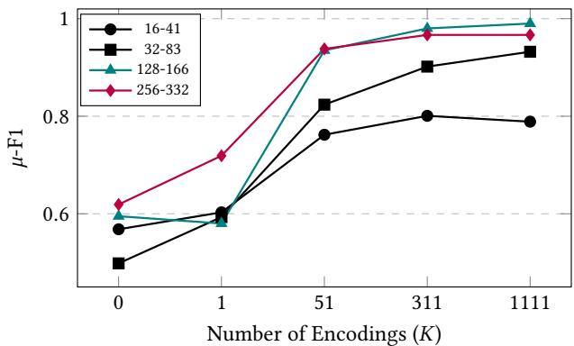

# Inferring Causal Relations between Two Sequences of Events with Language Models

Nishchal Prasad prasadnishchal.np@gmail.com INRIA, Univ. Grenoble Alpes, CNRS, LIG Grenoble, France

Alexander Obeid Guzman   
alexander.obeid-guzman@inria.fr   
Univ. Grenoble Alpes, CNRS, Inria, Grenoble INP, LIG Grenoble, France

Eric Gaussier eric.gaussier@univ-grenoble-alpes.fr Univ. Grenoble Alpes, CNRS, Grenoble INP, LIG Grenoble, France

Armen Aghasaryan   
armen.aghasaryan@nokia-bell  
labs.com   
Nokia Bell Labs   
Paris-Saclay, France   
Emilie Devijver   
emilie.devijver@univ-grenoble  
alpes.fr   
Univ. Grenoble Alpes, CNRS,   
Grenoble INP, LIG   
Grenoble, France   
Gregor Gössler   
gregor.goessler@inria.fr   
Univ. Grenoble Alpes, CNRS, Inria,   
Grenoble INP, LIG   
Grenoble, France

## Abstract

Causal AI is a branch of Artificial Intelligence which helps understand and reason about cause and efect relationships, not just patterns or correlations. Causal discovery aims to infer elements of the underlying causal structure—often represented as a directed graph—from observational and, when available, interventional data. While causal discovery is the fundamental step for moving beyond mere associations toward genuine understanding, and thus the ba sic building block of causal AI, it becomes intrinsically dificult when causal relations must be inferred from single observations. In such situations, standard causal discovery methods cannot be used and one has to identify causal relations from limited amount of information. This is typically the case for, e.g., sequences of events produced by diferent alarms which need to be analyzed on the fly to detect abnormal phenomena, which are usually rare. We show in this study that it is possible to leverage the predictive power of Large Language Models (LLMs) to infer causal relations between only two sequences of events. This approach, which is validated on both synthetic and real data, provides better results than standard causal discovery algorithms on several time series data, even though these data were converted into smaller, single observed sequences.

## Keywords

Pairwise Causal Discovery, Language Models, Single observations

## 1 Introduction

Inferring the direction of causation between two co-occurring processes is a foundational challenge across scientific and engineering disciplines. In modern telecommunications networks, for instance, hundreds of devices continuously emit discrete alarms. Correctly orienting the causal direction, determining whether an anomaly in a radio module caused a failure in the core network, or vice versa, is what separates a useful root-cause diagnosis from a mere observation of correlation [43, 52]. Similar challenges arise in IT monitoring, where metric-derived events trigger cascading incidents [3, 50], and in medical workflows, where a patient’s symptom progression and subsequent clinical interventions form complex, interleaved event streams [10].

The standard formulation of this task is inferring pairwise causal direction: given observations of two correlated variables � and �, determine the causal direction (→) i.e. whether � →� or � →�. Since conditional independence tests require a third variable to be informative, constraint-based methods fail in this setting. Thus, existing approaches for pairwise data rely on exploiting structural asymmetries in the data-generating mechanism [36]. For continuous variables with large, independent and identically distributed (i.i.d.) samples, a rich literature has successfully developed criteria based on additive-noise models [20], post-nonlinear models [51], and conditional divergence [14].

The landscape changes when � and � are temporal event sequences representing unobserved processes, and we are given only a single observation of each. Consider a network operator who observes a single trace of events on module � and a single trace on module � during one outage, or a clinician who sees one patient’s symptom timeline and one treatment timeline during a single hospi tal stay, or a biologist confronted with one transcriptional pulse pair from a single experiment of tracking two diferent genes (gene � and gene �) simultaneously. Here no population exists from which additional samples can be drawn; the observation is, by construction, of size one. Existing pairwise causal direction discovery methods, regardless of whether they target continuous data [20, 23, 32] or event sequences with many recurrences [5, 10, 12, 40, 48], assume access to repeated observations to either estimate distributions, or fit functional models, or aggregate Hawkes-style intensities. Prior to this work, the problem of orienting the causal direction between two sequence-based variables from a single observation of each remained unaddressed in the literature.

To close this gap, we propose a general inference framework for pairwise causal direction discovery in single observations based on the zero-shot sequence modeling capabilities of LLMs. Rather than relying on statistical sampling or temporal ordering, we treat this problem as a problem of evaluating the asymmetry of sequence generating probabilities. If � causes �, the sequence generation process dictates that the joint probability factorized in the true causal direction, where � is structurally conditioned on �, is higher than the anti-causal factorization. We capture this through a scoring framework that evaluates the likelihood of each sequence of events.

To compute these probabilities without training data, we empiri cally leverage pre-trained Large Language Models (LLMs) purely as zero-shot probability density estimators. Recent findings demonstrate that modern LLMs are highly capable "general pattern machines" [35]. Because of the in-context learning mechanisms through induction heads [38], LLMs can evaluate the structural dynamics of arbitrary, out-of-distribution sequences without requiring finetuning [18].

In this work, we propose a novel, observation-driven inference framework for pairwise causal discovery from a single run of a system. Instead of querying an LLM for semantic knowledge, we encode the event symbols and utilize the LLM as a probability den sity estimator to obtain the likelihood of a hypothesized sequence generation process. Our main contributions are the following:

• We formalize the single observation causal discovery problem for event sequences and introduce a Sequence Generation Rule. This rule infers causation by comparing the autoregressive negative log-likelihoods (NLL) of the sequences under diferent causal hypotheses.

• We use pre-trained LLMs as domain-agnostic probability density estimators. To mitigate the token’s semantic bias and adapt an LLM to out-of-distribution event sequences, we introduce two practical mechanisms: random encoding mapping to get expected likelihoods across arbitrary sequence encoding, and sequence replication for better in-context learning.

• We rigorously develop and evaluate our framework on a synthetic data; varying sequence lengths, encoding configurations, and LLM backbones, and test on real-world ITmonitoring data. We demonstrate that our approach reliably discovers the causal direction from single sequence pairs and significantly outperforms traditional baselines.

To the best of our knowledge, this is the first method for orienting causation between two event sequences from a single observation, and to leverage LLMs not as semantic knowledge bases but as structural probability estimators for causal inference.

The remainder of the paper is organized as follows. Section 2 reviews related work. Section 3 introduces our proposed method: first detailing the LLM-based estimation in Section 3.1 and detailing practical considerations in Section 3.2, leading to the causal discovery method developed in Section 3.3. Section 4 describes the experimental setup, and Section 5 presents our results, on synthetic data (Section 5.1) and on real-world IT monitoring data (Section 5.2). Finally, Section 6 concludes the paper with Section 7 describing some limitations of the work.

## 2 Related Work

We look at the prior work from the perspective of the data on which causal direction is inferred: continuous real-valued data (multi-observation), event sequence (multi observation, single ob servation), and close with the line of work that uses LLMs for causal discovery. In this section, � and � are the two variables whose causal relationship is being studied.

Pairwise causal direction from continuous data: In the classical setting, we observe � i.i.d. draws $\{ ( X ^ { ( i ) } , Y ^ { ( i ) } ) \} _ { i = 1 } ^ { n }$ of variables � ∈ $\mathbb { R } ^ { p }$ and $Y ~ \in ~ \mathbb { R } ^ { q }$ (where $\begin{array} { r } { p , q \ \geq \ 1 ) } \end{array}$ . Two main types of methods dominate this area.

The first type, functional causal models, assumes a parametric form for the causal mechanism and exploits the resulting statistical asymmetries. For instance, Linear Non-Gaussian Acyclic Models (LiNGAM)[44], Additive Noise Models [20], and Post-Nonlinear Models [51] infer causation by identifying the unique direction in which the estimated noise is independent of the presumed cause. Alternatively, regression error-based method [4] infers the causal direction by comparing the mean-squared errors of a regression model’s fit in both directions.

The second type, independence-of-mechanism , exploits the postulate that the marginal distribution � (�) and the conditional mechanism �(� | �) are independent in the true causal direction. Within this type, Information-Geometric Causal Inference [23] relies on orthogonality in information space. Conditional Distribution Similarity [15] measures the variability in the shape of �(� | �=�) across �. And Conditional Divergence-based Causal Inference [14] captures a similar intuition via the average divergence between normalised conditionals. Algorithmic information variants build on this same principle without assuming a fixed functional form. They use Minimum Description Length (MDL) to approximate the Kolmogorov complexity $K ( P ( X ) ) + K ( P ( Y \mid X ) ) [ 3 2 - 3 4 ]$

Beyond these two primary types, learning-based approaches such as RCC/NCC [30, 31] and Meta-CGNN [47] re-frame causal discovery as a classification problem, leveraging kernel embeddings or neural networks to extract features from �(�, �).

Most of these methods are evaluated against the de-facto benchmark of 100 cause-efect pairs curated by Mooij et al. [36]. However, none of these approaches are directly applicable to our setting as they fundamentally rely on having a large number of i.i.d. draws from the joint distribution �(�, �).

Pairwise causal direction from discrete event-sequence data: A second class of methods takes $X \in \Sigma _ { x } ^ { n _ { x } }$ and $Y \in \Sigma _ { y } ^ { n _ { y } }$ with $n _ { x } , n _ { y } \ge 1$ discrete-valued sequences oriented by time, where $\Sigma _ { x }$ and $\Sigma _ { y }$ are the possible discrete value sets. Within this class, the dependence on having repeated observations is even more central, and the literature splits along that axis.

In scenarios with multiple observations, i.e., multiple sequences per pair of random variables, most existing approaches for event sequences assumes access to many concurrent or repeated sequences to estimate causal intensities or distributions. Granger-causal approaches (such as transfer entropy [42] and its extensions [45]) test whether the past of� improves the prediction of� beyond �’s own past, requiring suficiently long sequences for reliable conditional entropy estimates. Hawkes-process methods [1, 8, 22, 40, 48, 53, 54] model how events trigger one another, but similarly depend on observing enough events to fit their underlying functions. A separate algorithmic line treats event sequences through compression. For example, CUTE [5] infers direction by comparing sequential normalised maximum-likelihood code lengths $\ell ( y ^ { n } ) - \ell ( y ^ { n } \mid x ^ { n } )$ and vice versa. Origo [7] does the same for binary tabular data through MDL with decision-tree compressors. Most recently, CAS-CADE [12] learns a one-to-one cause-efect matching by combining

MDL with the algorithmic Markov condition, and NIAGARA [10] extends this to interval-based events with rich parent interactions. Another line of Logic-based frameworks, beginning with Kleinberg and Mishra [26, 27], encode causal hypotheses as PCTL (Probabilistic Computation Tree Logic) and aggregate evidence across many event traces. Common to all of the above, multiple observations; i.e. either many sequence pairs or many recurrences of each event type; are essential.

When considering a single observation (only one � and one �), there is, to our knowledge, no prior work for inferring causal relation with no extra population data to draw from. The closest theoretical foundation is the algorithmic Markov condition itself [24], which establishes that causal inference is in principle possible from single objects by comparing Kolmogorov complexities ofthe two factorisations of the joint distribution. However it leaves open the question of a practical, computable instantiation when the objects are event sequences and no domain-specific compressor is available. Existing MDL or compression-based pairwise inference methods (Origo [7], CUTE [5], Slope [32], the stochastic-complexity framework of [6]) all rely on compressors that are themselves trained or fit on the input sequence and require enough recurrences within that sequence to compress it meaningfully. In the single observation setting, those compressors degenerate, motivating our use of a general-purpose, pre-trained LLM as a parameter-free probability density estimator.

LLMs for causal discovery: The intersection of LLMs and causal inference has recently garnered significant attention, though the vast majority of approaches rely on the models’ internal trained knowledge. For example, Kiciman et al. [25] demonstrated that language models (LMs) achieve state-of-the-art performance in pairwise causal discovery by evaluating the semantic variable names (e.g., querying the model whether "Altitude" causes "Temperature"). Similarly, other works have used LLMs to extract causal graphs directly from text corpora by “prompting” the LLMs to identify causal relationships between textual entities [29]. While efective, these approaches are strictly metadata-driven and rely entirely on the model having encountered the causal mechanism during pre-training, they are inefective on the event sequences whose semantic content is, by design, absent.

In contrast to prior work, we focus on inferring causal direction from a single observation of event sequence, leveraging LLMs not as semantic knowledge bases but as structural probability density estimators. This paradigm aligns with recent evidence of LLMs zero-shot sequence modeling capabilities. For example, Gruver et al. [18] showed that LLMs can predict out-of-distribution time series data directly by recognizing abstract numerical patterns in-context, and Mirchandani et al. [35] show that the pattern completion ability persists even when sequences are expressed in tokens randomly drawn from the vocabulary. Similarly, work on induction heads [11, 38] also shows evidences on how transformers copy and extrapolate complex, non-linguistic patterns without additional training. Alternatively, LLMs are also able to compress out-of-distribution data better than traditional compressors [13].

## 3 Methodology

We consider pairs of observed sequences whose underlying generation processes are driven by two independent mechanisms: one governing a cause process, and another process generating the efect from the cause. Both causes and efects are unobserved processes1. Let $\mathcal { P } _ { h }$ denote the space of all possible unobserved/hidden process. We denote the unobserved/hidden process by $\textbf { a } ^ { * }$ , such as $X ^ { * }$ or $Y ^ { \ast } \in \mathcal { P } _ { h }$ . In practice, one only observes two sequences of symbols, $X ^ { ( 0 ) }$ and $\mathbf { \hat { Y } } ^ { ( 0 ) }$ corresponding to two causally related unobserved process $X ^ { * }$ and $Y ^ { * }$ , where the vocabulary of symbols, hereafter called encoding, for $X ^ { ( 0 ) }$ and $Y ^ { ( 0 ) }$ has been arbitrarily chosen2. Our goal in this study is to determine, from $X ^ { ( 0 ) }$ and $Y ^ { ( 0 ) }$ , whether $X ^ { * }$ causes $Y ^ { * }$ or whether $Y ^ { * }$ causes $X ^ { * }$ . The problem of “inferring causal direction between two causally related event sequences from a single observation” is defined below.

Problem Definition. Given only one observation $X ^ { ( 0 ) } , Y ^ { ( 0 ) } \mathrm { f o r }$   
$X ^ { * } , Y ^ { * }$ , and assuming that a direct causal relation exists between   
them, determine whether $X ^ { * }$ causes $Y ^ { * }$ or $Y ^ { * }$ causes $X ^ { \ast } ( \mathrm { i } . \mathrm { e } . X ^ { \ast }  $   
$Y ^ { * } \ \mathrm { o r } \ Y ^ { * } \to X ^ { * } ) .$

To model causal relationships, we introduce two mechanisms. The first one, a cause-generating mechanism, is characterized by the probability $P _ { C }$ that a process is a cause (�). Similarly, the second mechanism is characterized by the conditional probability $P _ { E | C }$ that a process is the efect (�) of a given cause (�). We then define the causal probability as:

$$
\begin{array} { r l } & { P _ { C E } : \mathcal { P } _ { h } \times \mathcal { P } _ { h } \longrightarrow [ 0 , 1 ] } \\ & { \qquad ( X ^ { * } , Y ^ { * } ) \longrightarrow P _ { C } ( X ^ { * } ) \times P _ { E | C } ( Y ^ { * } | X ^ { * } ) . } \end{array}
$$

It is a non-symmetric probability distribution over $\mathcal { P } _ { h } \times \mathcal { P } _ { h }$ . It is important to note that $P _ { C E }$ is not a joint probability distribution over the cartesian product space $\mathcal { P } _ { h } \times \mathcal { P } _ { h }$ as it does not provide the probability that $X ^ { * }$ and $Y ^ { * }$ simultaneously co-occur, but rather the probability that $X ^ { * }$ is a cause of $Y ^ { * }$ , based on $P _ { C }$ and $P _ { E | C }$ . Indeed, one has:

$$
\left\{ \begin{array} { l l } { { \sum _ { Y ^ { * } } P _ { C E } ( X ^ { * } , Y ^ { * } ) } } & { { = P _ { C } ( X ^ { * } ) , } } \\ { { \sum _ { X ^ { * } } P _ { C E } ( X ^ { * } , Y ^ { * } ) } } & { { = \sum _ { X ^ { * } } P _ { C } ( X ^ { * } ) P _ { E | C } ( Y ^ { * } | X ^ { * } ) } } \end{array} \right.
$$

This interpretation motivates the following rule for inferring causal direction between pairs of processes:

Rule A: The causal direction between $X ^ { * }$ and $Y ^ { * }$ , assuming that a   
direct causal relation exists between them, is given by the highest   
$P _ { C E }$ , that is: $\mathrm { i f } P _ { C E } ( X ^ { * } , Y ^ { * } ) > P _ { C E } ( Y ^ { * } , X ^ { * } )$ , then $X ^ { * }$ causes $Y ^ { * } ; Y ^ { * }$   
causes $X ^ { * }$ otherwise.

This rule reflects the inherent asymmetry of the data generation process rather than mere temporal precedence; specifically, the factorization corresponding to the true causal direction naturally yields a higher overall generation probability than the reverse direction. This is also reflected in the asymmetry of $P _ { C E } .$ . In addition, we define the causal score $S _ { X ^ { * }  Y ^ { * } }$ as:

$$
S _ { X ^ { * }  Y ^ { * } } \triangleq - \log P _ { C E } ( X ^ { * } , Y ^ { * } ) ;
$$

and we denote

$$
\begin{array} { c } { { S _ { C } ( X ^ { * } ) = - \log P _ { C } ( X ^ { * } ) } } \\ { { S _ { E | C } ( Y ^ { * } | X ^ { * } ) = - \log P _ { E | C } ( Y ^ { * } | X ^ { * } ) . } } \end{array}
$$

Then, Rule A is equivalent to selecting the causal direction yielding the lowest causal score between $S _ { X ^ { * }  Y ^ { * } }$ and $S Y ^ { * } {  } X ^ { * }$

## 3.1 LLM-based estimation

As mentioned before, one does not directly observe the hidden process $X ^ { * }$ and $Y ^ { * }$ but rather two sequences of symbols, $X ^ { ( 0 ) }$ and ${ \bar { Y } } ^ { ( 0 ) }$ , generated by them. To infer causal relationships, we leverage LLMs to estimate the probabilities $P _ { C }$ and $P _ { C | E }$ over the unobserved processes from the observed sequences. This choice is motivated by LLMs’ demonstrated ability to model sequence likelihoods with state-of-the-art performance across diverse tasks, from language modeling to pattern recognition [28].

During pre-training, LLMs are optimized to minimize the negative log-likelihood (NLL) of the next predicted token, which is mathematically equivalent to minimizing cross-entropy loss. $_ { \mathrm { A } s }$ a result, these models are explicitly trained to estimate the exact quantities required by our scoring framework $( S . . . , .$ , which is the joint probability of a sequence of discrete symbols, factorized auto regressively as $\begin{array} { r } { P ( x _ { 1 } , . . . , x _ { n } ) = \prod _ { i = 1 } ^ { n } P ( x _ { i } \mid x _ { < i } ) } \end{array}$ . This formulation enables LLMs to naturally assign probabilities $\widehat { ( P _ { \mathrm { l l m } } ) }$ to entire sequences by estimating the conditional probability of each token given its preceding context.

Furthermore, to avoid dependence on a given arbitrary encoding of the sequences, we consider expectations over all possible encod ings. Denote by $\varepsilon ^ { X }$ (resp. $\varepsilon ^ { Y } )$ the set of alternative encodings (see Section 3.2.1) of $X ^ { ( 0 ) }$ (resp. $Y ^ { ( 0 ) } )$ , and, for any $e \in { \mathcal { E } } ^ { X }$ and $e ^ { \prime } \in \mathcal { E } ^ { Y }$ by $X ^ { ( e ) } ( \mathrm { r e s p . ~ } Y ^ { ( e ^ { \prime } ) } )$ the sequence obtained from $X ^ { ( 0 ) }$ (resp. $Y ^ { ( 0 ) } )$ by applying encoding � (resp. $e ^ { \prime } )$ . We can either estimate the likelihood o $\therefore X ^ { * }$ and �∗ over all possible encodings by:

$$
\begin{array} { r } { \left\{ \begin{array} { l l } { \hat { P } _ { C } ( X ^ { * } ) } & { = \mathbb { E } _ { e \in \mathcal { E } ^ { X } } \big [ \widehat { P _ { \mathrm { l l m } } } ( X ^ { ( e ) } ) \big ] , } \\ { \hat { P } _ { E | C } ( Y ^ { * } | X ^ { * } ) } & { = \mathbb { E } _ { e \in \mathcal { E } ^ { X } } \big [ \widehat { P _ { \mathrm { l l m } } } ( Y ^ { ( e ^ { \prime } ) } | X ^ { ( e ) } ) \big ] , } \\ { e ^ { \prime } \in \mathcal { E } ^ { Y } } & \end{array} \right. } \end{array}\tag{1}
$$

or estimate the causal scores by:

$$
\hat { S } _ { X ^ { * }  Y ^ { * } } = \mathbb { E } _ { e \in { \mathcal { E } } ^ { X } } [ - \log \widehat { P _ { \mathrm { l l m } } } ( X ^ { ( e ) } ) - \log \widehat { P _ { \mathrm { l l m } } } ( Y ^ { ( e ^ { \prime } ) } | X ^ { ( e ) } ) ] .\tag{2}
$$

In practice, both approaches lead to estimated causal scores ${ \hat { S } } _ { X ^ { * }  Y ^ { * } }$ and $\hat { S } _ { Y ^ { * }  X ^ { * } }$ , for $S _ { X ^ { * }  Y ^ { * } }$ and $S _ { Y ^ { * }  X ^ { * } }$ respectively, which, even if not equivalent, yield very similar results in practice. In the remainder, we thus focus on the estimates provided by Eq. 2.

Substituting these estimates into Rule A gives us the sequence generation rule which aims to compare the probability of generating sequences for $Y ^ { * }$ from sequences for $X ^ { * }$ against the probability of generating sequences for $X ^ { * }$ from sequences for $Y ^ { * }$

Sequence Generation Rule: Given $X ^ { * }$ and $Y ^ { * }$ and assuming that a direct causal relation exists between them, the orientation of the causal direction is given by the smallest $\hat { S } _ { .  . } \colon \mathrm { i f } \ \hat { S } _ { X ^ { * }  Y ^ { * } } \ <$ $\hat { S } _ { Y ^ { * }  X ^ { * } }$ , then $X ^ { * }$ causes $Y ^ { * } ; Y ^ { * }$ causes $X ^ { * }$ otherwise.

## 3.2 Practical considerations

Relying completely on the assumption that an LLM has been trained on enough examples resembling the probability distribution of the event sequence being tested can be too strong. Moreover, since we restrict ourselves to single observations, we cannot train or fine-tune the LLM on a set of such sequences to exploit them later during inference. This constraint forces us to look for alternatives to align the predictive power of a pre-trained language model to our out-of-distribution sequences. To do so, we adapt two main practical considerations given the nature of LLMs: (i) token mappings through ’encoding’ to remove the efect of LLM’s semantic bias for one specific encoding, and (ii) ’replication’ to increase the length of shorter sequences and improve in-context learning.

3.2.1 Encodings. LLM-based probability estimates for a given sequence are biased by token choice, as their training objectives and data are primarily aligned with linguistic semantics. For event sequences, where each event sequence can have its own probability distribution and structure that are out-of-distribution of an LLM’s training data, the semantics of the sequence interpreted by the LLM can influence the probability estimates heavily.

To mitigate this bias, we introduce random token encodings. Concretely, to avoid the dependence on a given encoding of a sequence $X ,$ we generate multiple encodings by randomly mapping its distinct symbols to a randomly selected subset of a universal vocabulary via bijective transformations. This is done as follows.

Let $X = ( x _ { 1 } , x _ { 2 } , . . . , x _ { n } )$ be a finite observed sequence of symbols, and let $\Sigma = \{ d \ | \ d \ \mathrm { a p p e a r s }$ in � } denote the alphabet size (set of distinct symbols occurring in $X )$ , with $\left| \Sigma \right| = m .$ Let � be a universal set of symbols such that $\left| U \right| \geq n$ . For each encoding, we construct a target alphabet $\Sigma ^ { \prime } \subseteq U$ such that $\left| \Sigma ^ { \prime } \right| = m$ . This subset $\Sigma ^ { \prime }$ is chosen (here uniformly at random) from all possible �-element subsets of $U .$ The encoding function � is defined as a bijection,

$$
e : \Sigma  \Sigma ^ { \prime } .
$$

Since � is bijective, it is a re-labeling of the sequence �, producing a new observed sequence $X ^ { ( e ) } = ( x _ { 1 } ^ { ( e ) } , x _ { 2 } ^ { ( e ) } , \ldots , x _ { n } ^ { ( e ) } )$

We then define the set of all encodings of �

$$
{ \mathcal { E } } ^ { X } = \{ X ^ { ( e ) } \mid e : \Sigma  \Sigma ^ { \prime } , \ \Sigma ^ { \prime } \subseteq U , \ | \Sigma ^ { \prime } | = m , \ e \mathrm { ~ b i j e c t i v e ~ } \} .
$$

To generate elements of $\varepsilon ^ { X }$ , the following procedure is repeated:

(1) Sample a subset $\Sigma ^ { \prime } \subseteq U$ with $\left| \Sigma ^ { \prime } \right| = \left| \Sigma \right|$

(2) Sample a bijection $e : \Sigma  \Sigma ^ { \prime }$

(3) Apply � to � to obtain the encoded sequence $X ^ { ( e ) }$

This is iterated $K = | \mathcal { E } ^ { X } |$ | times to get � encoded realizations of �. The random bijective mapping sets can always be made disjoint between a given sequence pair $X ^ { * } , Y ^ { * }$

Since $| { \mathcal { E } } ^ { X } | = { \binom { | U | } { m } } \cdot m ! .$ , there are ${ \binom { | U | } { m } }$ choices for $\Sigma ^ { \prime }$ and �! bijections from Σ to $\Sigma ^ { \prime }$ , which is too large for an exhaustive exploration. We therefore restrict both the size of $U$ and the number of bijections � considered in practice (see Section 4.1 for our design of experiments).

3.2.2 Replication. Given that shorter sequences can impact the in-context learning of the LLM and since the LLMs are strictly causal, we develop the concept of "replication" to artificially increase the length of shorter sequences and also incorporate pseudo-bidirectionality, which helps activate the induction heads to identify patterns in the sequences without explicit training.

We rely on the in-context learning [38] capability of an LLM during inference to estimate the sequence probabilities, allowing it to adapt to patterns within the input sequence without additional training. A key limitation, however, of standard LLMs is their strict auto-regressive (left-to-right) causal attention, which constrains the model to only look at a sequence once. This unidirectional view can however fail to capture patterns that would be more apparent under a bidirectional lens. To address this, we use sequence “replication”. Replication duplicates the sequence once, which helps the auto-regressive attention in LLMs to attend to the entirety ofthe original sequence when estimating the probability of the replicated sequence. Given a finite sequence, $X = \left( x _ { 1 } , x _ { 2 } , \ldots , x _ { n } \right)$ , we define the replicated context $X ^ { ( r ) }$ for a replication factor $r \in \{ 0 , 1 \}$ as:

$$
X ^ { ( r ) } = { \left\{ \begin{array} { l l } { X } & { { \mathrm { i f ~ } } r = 0 } \\ { X \oplus X } & { { \mathrm { i f ~ } } r = 1 } \end{array} \right. }
$$

where ⊕ denotes concatenation. Using this, when $r = 1 , \mathrm { ~ a ~ } j -$ th token $x _ { j }$ in the subsequent block � is now estimated using the modified conditional probability $P ( x _ { j } \mid X ^ { ( r - 1 ) } \oplus x _ { < j } )$ . Additionally, replication strengthens the LLM’s in-context learning ability by enhancing its induction-head [11, 38] activation by increasing the frequency of latent patterns in a sequence.

Evidence of diferent forms of replication (which is also referred to as “repetition") can be found in improving embedding quality (Springer et al. [46]), reasoning (Xu et al. [49]) and information recall (Arora et al. [2]) in standard auto-regressive LLMs.

## 3.3 LLM-based Causal Discovery Algorithm

Combining the theoretical foundation of the Sequence Generation Rule (Section 3.1) and the practical mechanisms of random encodings and context replication (Section 3.2), we formulate our overall causal direction discovery method in Algorithm 1.

For an observed sequence $X ^ { ( 0 ) }$ from $X ^ { * }$ of length �, let $X ^ { ( e _ { k } , r ) }$ denote the sequence obtained after applying the encoding $e _ { k } \in \mathcal { E } ^ { X }$ and applying the replication factor $r \in \{ 0 , 1 \}$ to $X ^ { ( 0 ) }$ . Its marginal causal score for being the cause is:

$$
S _ { C } ( X ^ { ( e _ { k } , r ) } ) = - \log \widehat { P _ { \mathrm { l l m } } } ( X ^ { ( e _ { k } , r ) } )\tag{3}
$$

Similarly, for an observed target sequence $Y ^ { ( 0 ) }$ from $Y ^ { * }$ of length �, let $\boldsymbol { Y } ^ { ( e _ { k } ^ { \prime } , r ) }$ be its encoded $( e _ { k } ^ { \prime } \in \mathcal { E } ^ { Y } )$ and replicated $( r \in \{ 0 , 1 \} )$ counterpart. The conditional causal score of $Y ^ { ( e _ { k } ^ { \prime } , r ) }$ being the efect given the prior context sequence $X ^ { ( e _ { k } , r ) }$ as the cause is given by:

$$
S _ { E | C } ( Y ^ { ( e _ { k } ^ { \prime } , r ) } \mid X ^ { ( e _ { k } , r ) } ) = - \log \widehat { P _ { \mathrm { l l m } } } ( Y ^ { ( e _ { k } ^ { \prime } , r ) } \mid X ^ { ( e _ { k } , r ) } )\tag{4}
$$

Algorithm 1 outlines the batched procedure. For each encoding $k , \mathcal { H } _ { X  1 } ^ { ( k ) }$ and $\mathcal { H } _ { Y  X } ^ { ( k ) }$ in Algorithm 1 (line $^ { 6 , 7 ) }$ are the summands of Eq. (2) under the two orientation hypothesis.

For an observed batch ${ \mathrm { o f } } \ X ^ { ( 0 ) } , \ Y ^ { ( 0 ) }$ pairs, we accumulate $S _ { C }$ and $S _ { E | C } ( \mathrm { s t e p } 7 \& 8 )$ under both causal hypotheses $( X ^ { * } \to Y ^ { * }$ and $Y ^ { * }  X ^ { * } )$ in $H _ { X ^ { * }  Y ^ { * } }$ and $H _ { Y ^ { * }  X ^ { * } }$ across all � encodings (step 9 & 10).

As seen in Line 12 of Algorithm 1, the final score $\hat { S } _ {  }$ . is obtained by averaging the scores over the � encodings to approximate the expectation. One alternative to get the final orientation, apart from averaging, can be through max-voting amongst the discretely inferred directions of each encoding iteration. We performed experiments with this alternative, and it showed worse performance compared to averaging. We believe that this is because averaging takes into account the continuous causal scores of individual encodings, which naturally smoothens and separates away the token sensitivity in the final decision rule. In contrast, in voting, each individual vote rigidly includes a token-biased decision per encoding without accounting for the magnitude of the score diference.

Algorithm 1: LLM-based Causal Direction Discovery Al  
gorithm   
Input: Observed Sequence Batch $( X ^ { ( 0 ) } , Y ^ { ( 0 ) } ) \in \mathcal { D } ,$ , Universal Set   
�, Encoding Size �, Replication factor $r \in \{ 0 , 1 \}$   
Output: Inferred Causal Direction   
1 foreach Batch $( X ^ { ( 0 ) } , Y ^ { ( 0 ) } ) \in \mathcal { D }$ do   
// Initialize accumulators   
2 $H _ { X ^ { * } \to Y ^ { * } }  0 , H _ { Y ^ { * } \to X ^ { * } }  0 ;$   
3 for � ← 1 to � do   
// 1. Generate Bijective Mappings   
4 Sample target alphabet $\Sigma ^ { \prime } \subseteq U$   
5 Sample bijections $e _ { k } : \Sigma \to \Sigma ^ { \prime } , e _ { k } ^ { \prime } : \Sigma \to \Sigma ^ { \prime } ;$   
6 Apply encoding: $X ^ { ( e _ { k } ) } \gets e _ { k } ( X ^ { ( 0 ) } ) ; Y ^ { ( e _ { k } ^ { \prime } ) } \gets e _ { k } ^ { \prime } ( Y ^ { ( 0 ) } ) ;$   
$/ / \ 2 .$ Accumulate all � scores (Replication)   
// Hypothesis $X \to Y$   
7 ${ \mathcal H } _ { X \to Y } ^ { ( k ) }  S _ { C } ( X ^ { ( e _ { k } , r ) } ) + S _ { E | C } ( Y ^ { ( e _ { k } ^ { \prime } , r ) } \mid X ^ { ( e _ { k } , r ) } ) ;$   
// Hypothesis $Y  X$   
8 ${ \mathcal H } _ { Y \to X } ^ { ( k ) } \gets S _ { C } ( Y ^ { ( e _ { k } ^ { \prime } , r ) } ) + S _ { E | C } ( X ^ { ( e _ { k } , r ) } \ | \ Y ^ { ( e _ { k } ^ { \prime } , r ) } ) ;$   
9 $H _ { X ^ { * } \to Y ^ { * } }  H _ { X ^ { * } \to Y ^ { * } } + \mathcal { H } _ { X \to Y } ^ { ( k ) } ;$   
10 $H _ { Y ^ { * } \to X ^ { * } }  H _ { Y ^ { * } \to X ^ { * } } + \mathcal { H } _ { Y \to X } ^ { ( k ) } ;$   
11 end   
// 3. Final causal scores (Expectation over   
encodings, Eq. (2))   
12 $\hat { S } _ { X ^ { * }  Y ^ { * } }  H _ { X ^ { * }  Y ^ { * } } / K ;$   
13 $\hat { S } _ { Y ^ { * }  X ^ { * } }  H _ { Y ^ { * }  X ^ { * } } / K ;$   
// 4. Decision (Sequence Generation Rule)   
14 if $\hat { S } _ { X ^ { * }  Y ^ { * } } < \hat { S } _ { Y ^ { * }  X ^ { * } }$ then   
15 1 $X ^ { * }  Y ^ { * } ;$   
16 else   
17 $Y ^ { * }  X ^ { * } ;$   
18 end   
19 end

## 4 Experimental Setup

This section presents the hyper-parameters of our method (Sec. 4.1), the test data (Sec. 4.2), and the baseline methods (Sec. 4.3).

## 4.1 Hyper-parameters

Since Algorithm 1 can be computationally complex, given the size of the chosen language model, we fixed a moderately sized language model for our experiments. We mainly experiment with Llama-3.2-3B 3[17] as our main backbone language model based on its small size and state-of-the-art performance in the NLP benchmarks such as MMLU [19] and ARC-Challenge [9]. In order to test our method’s adaptability and variance with the choice of the LLM we also experimented with smaller LLMs (GPT-24 [41] with ∼124M parameters and Llama-3.2-1B 5[17] with 1B parameters). We conduct our experiments using one A100/H100 GPU, and to reduce GPU RAM overload the Llama variants are loaded in 16-bit floating point precision.

As discussed in Section 3.2, for a given sequence $X ,$ the total number of possible encoding $K \ = \ | \mathcal { E } ^ { X } |$ is too large for ex ploration. Hence we choose to experiment with encodings $K \in$ {0, 1, 51, 311, 1111}. The choice of � was random and motivated by having an odd (except 0) and increasing integer. $K = 0$ signifies when an observed sequence is not encoded and used as it is.

We experiment with $r ~ = ~ 0$ (no replication) and $r ~ = ~ 1$ (one replication) to evaluate whether providing a pseudo-bidirectional context helps the LLM better identify causal patterns, especially in shorter sequence (≤ 32 symbols).

We first conduct an ablation study on synthetic data (Section 5.1) to select the hyperparameters (�, �) of Algorithm 1 for application to the real dataset, whose results are presented in Section 5.2. The universal symbol set � is the set of"all English alphabets (upper and lower cased) and decimal numbers" i.e. $U = \{ a \ldots z , A \ldots Z , 0 \ldots 9 \}$

## 4.2 Data

To empirically validate our approach, we evaluated it on five datasets, described below. One is generated synthetically (Section 4.2.1), and the remaining four consist of real-world time series. Since a time series is a continuous real valued sequence ordered temporally, it can also be viewed as a sequence of events by transforming temporal measurements into symbolic states, transitions, or occurrences. We use a simple transformation to extract symbolic event sequences from these time series data (Section 4.2.2).

For both synthetic and real data, the symbols of the event sequences were arbitrarily chosen (Table 1 and 2) and hence do not hold any semantic meaning.

4.2.1 Synthetic data. We use AGDES [37] to generate synthetic dependent pairs of encoded event sequences $( X , Y )$ in single observation ofvarying lengths, where $( X , \stackrel {  } { Y } ) { = } ( X ^ { ( 0 ) } , \stackrel {  } { Y ^ { ( 0 ) } } )$ (Sec. 3) that are passed to Algorithm 1. AGDES works by first generating a random Deterministic Finite Automaton (DFA) to produce the sequence � of arbitrary length. This sequence is then processed sequentially by a randomly constructed Deterministic Finite Transducer (DFT) to generate the corresponding output sequence �. Because the DFT’s state transitions and outputs are strictly driven by the DFA’s output sequence, this approach establishes a clear, one-way causal dependency from the input to the output. Table 1 summarizes the generated data which we used for evaluation. Even if some length ranges in Table 1 are not disjoint, each sequence pair for all subsets (Table 1) is uniquely generated with distinct DFT and DFA, ensuring a strict single observation setting. For e.g. AGDES generates the pair (ab1dfha, lg0prq) of lengths 7 and 6 respectively.

Table 1: Number of synthetic sequence pairs (�, �) generated for each causal direction $( X \to Y \bullet \mathbf { r } Y \to X )$ and length range (number of symbols per sequence). Sequence symbols are chosen randomly from the set of all lower cased English alphabet and decimal numbers $( \{ a \ldots z , 0 \ldots 9 \} )$ .
<table><tr><td></td><td colspan="4">Length range (# of symbols) (|X|, |Y|)</td></tr><tr><td>Class</td><td>16-41</td><td>32-83</td><td>128-166</td><td>256-332</td></tr><tr><td> $\overline { { X \to Y } }$ </td><td>376</td><td>156</td><td>101</td><td>99</td></tr><tr><td> $Y  X$ </td><td>372</td><td>139</td><td>99</td><td>111</td></tr></table>

4.2.2 Real data. For testing on real event sequences, we rely on the publicly available IT-monitoring data introduced in $[ 3 ] ^ { 6 } ,$ , which consists of multivariate time series of monitoring metrics (e.g., CPU and RAM usage, disk reads/writes, network throughput etc.). The collection covers four subsets. 1) MoM (Middleware-oriented Message) contains 7 time series defined through the monitoring of an IT pipeline which ingests incoming messages based on a Publish/Subscribe architecture. 2) Storm Ingestion monitors a Storm ingestion system processing incoming messages. It consists of 8 time series detailing the inputs and outputs of diferent processes. 3) Web Activity consists of 10 time series reflecting the load on a web server. 4) Antivirus Activity consists of 13 time series reflecting the impact of antivirus activity in servers.

For all the subsets we use their “version 1” from [3]. Crucially for our setting, each subset comes with a ground truth summary causal graph, from which we extract every direct causal edge $X  Y$ and treat the corresponding pair of time series (�, �) as one observed cause–efect pair. We exclude indirect pairs (nodes connected only through intermediate variables) because they introduce hidden mediators and can carry causal signal, making direction recovery from single observations substantially harder. Restricting to direct edges therefore provides the cleanest setting for evaluating our Sequence Generation Rule (Section 3.1).

Transformation to discrete event sequences: To convert the real valued IT monitoring time series to discrete event sequences we apply the following simple symbol-transition-based discretization technique.

We conduct a ’preliminary processing’ where we process only the non-stationary MoM subset using first-order diferencing, movingaverage smoothing $\left( w = 3 \right)$ , and standardization. The stationary subsets (Storm Ingestion, Web Activity, and Antivirus Activity) require no processing.

Then each series is independently partitioned into three discrete states using $q = 3$ empirical quantiles. Rather than using the raw state sequences, we define an event strictly as a state transition (i.e., a change in the discretized quantile bin). This yields a maximum of $q ( q - 1 ) = 6$ distinct transition events per variable. These transition events are mapped to a symbol set.

We use $q = 3$ to control the alphabet size (|Σ|, Section 3.2.1). Since some extracted event sequences are relatively short (≈ 16 symbols), $q = 3$ ensures a suficiently dense “sequence-length to alphabet” ratio to help the language model efectively recognize structural patterns via in-context learning.

Table 2: Statistics of discretized real-world datasets: number of sequence pairs (�, �) (all with $X  Y$ causal direction) for each subset, including length ranges $( | X | , | Y | )$ . The event sequence symbols are randomly chosen from the set {a,b,c,d,e,f,A,B,C,D,E,F}.
<table><tr><td>Subset</td><td>Length Range (|X|, |Y|)</td><td>Class</td><td># Pairs</td></tr><tr><td>MoM</td><td>14-191</td><td> $X \to Y$ </td><td>10</td></tr><tr><td>Storm Ingestion</td><td>52-170</td><td> $X \to Y$ </td><td>9</td></tr><tr><td>Web Activity</td><td>46-1000</td><td> $X \to Y$ </td><td>14</td></tr><tr><td>Antivirus Activity</td><td>19-256</td><td> $X \to Y$ </td><td>16</td></tr></table>

Ultimately, for each causal pair (�, �) of variables in the sub sets, this produces the single observed encoded sequence pair $( X ^ { ( 0 ) } , Y ^ { ( 0 ) } )$ (Sec. 3) passed to Algorithm 1.

Table 2 describes the discretized real data used. For the Antivirus Activity and Web Activity datasets, the sequence obtained were too long, so we use a shorter sequence (of length ≈ 1/3 of the total).

To remove the one-label $( X \to Y )$ bias in Table 2, each pair evaluation (Sec. 5.2) uses 10 balanced pair-and-label direction randomizations where five retain (�, �) with $X  Y$ label, and five reverse to (�, �) with $Y  X$

4.2.3 Pre-processing event sequences. Since modern LLMs use subword tokenizers (such as Byte-Pair Encoding) that may merge contiguous characters into single tokens, we format the event sequences prior to inference, where we apply “uniform spacing” by inserting whitespace between symbols (e.g., ‘A B C’ instead of ‘ABC’). This is done to properly leverage pre-trained LLMs for our causal scoring framework.

Spacing ensures each event is treated as an independent token, guaranteeing that the causal scores are computed at the precise symbol/token granularity of the individual sequence events.

## 4.3 Baseline methods

We compare our framework against two families of baselines: Standard LLM prompting for both synthetic and real data, and classical causal inference algorithms for real data only.

4.3.1 Zero-shot LLM prompting baselines (synthetic & real data). To isolate the contribution of our method (using the Sequence Generation Rule), we use standard zero-shot prompting and directly query the same backbone LLMs (Section 4.1). In addition we also use bigger LLMs (Llama-3.1-8B-Instruct, Llama-3.3-70B-Instruct) which are more capable than the ones used in the backbone of our Algorithm 1) for standard zero-shot prompting baseline. To the best of our knowledge, since classical causal inference methods are not applicable in the setting of single observed discrete event sequences, this is the only applicable existing baselines for this setting.

As per the data (Section 4.2) and our problem definition (Section 3), the encoding of the event sequences do not hold any semantic meaning, hence to have a fair comparison with our method we experiment with three variations of the standard zero-shot prompting baseline: (a) (No encoding, $r = 0 )$ : the standard prompting where the sequences are used as it is without replication in the prompt; (b) (Encoded and $r = 0 ) \colon$ : to show the efect of random sequence encoding; (c) (Encoded and $r = 1 ) \colon$ to show the efect of random sequence encoding and replication in the prompt.

Table 3: Average test performance $\left( \mu \mathbf { - } \mathbf { F } \mathbf { 1 } \right)$ on Synthetic data across all sequence lengths. † indicates the Instruct version of the model. Results compare three settings: (a) classical zeroshot LLM prompting, (b) zero-shot with one random encoding (Encoded), and (c) zero-shot with one random encoding and one replication $( r = 1 ) ;$ with our method $\left( K = 1 1 1 1 , r = 1 \right)$
<table><tr><td>Model / Setting</td><td> $\mu { \bf - F 1 }$ </td></tr><tr><td>Stan Stn paine  $\mathrm { L l a m a } { - } 3 . 2 { - } 3 \mathrm { B } ^ { \dagger }$   $\mathrm { L l a m a } { - } 3 . 1 { - } 8 \mathrm { B } ^ { \dagger }$   $\mathrm { L l a m a } { - } 3 . 3 { - } 7 0 \mathrm { B } ^ { \dagger }$  (b) Zero-Shot (Encoded,</td><td>(a) Zero-Shot (No encoding, r = 0) 0.4868 0.5016 0.5110  $r = 0 )$ </td></tr><tr><td> $\mathrm { L l a m a } { - } 3 . 2 { - } 3 \mathrm { B } ^ { \dagger }$   $\mathrm { L l a m a } { - } 3 . 1 { - } 8 \mathrm { B } ^ { \dagger }$   $\mathrm { L l a m a } { - } 3 . 3 { - } 7 0 \mathrm { B } ^ { \dagger }$   $( c ) Z e r o { - } S h o t \ : ( E n c o d e d , r = 1 )$  </td><td>0.4901 0.5057 0.4972</td></tr><tr><td>Llama  $\mathbf { - } 3 . 2 \mathbf { - } 3 \mathbf { B } ^ { \dagger }$   $\mathrm { L l a m a } { - } 3 . 1 { - } 8 \mathrm { B } ^ { \dagger }$   $\mathrm { L l a m a } { - } 3 . 3 { - } 7 0 \mathrm { B } ^ { \dagger }$ </td><td>0.4930 0.5234 0.4984</td></tr><tr><td>Our Method  $\left( K = 1 1 1 1 , r = 1 \right)$  Llama-3.2-3B</td><td>0.9194</td></tr></table>

Separately to emphasize the advantage of our method over the standard zero-shot prompting we also experimented with maxvoting over $K \in \{ 5 1 , 3 1 1 \}$ encodings for the (b) (Encoded and $r = 0 )$ and (c) (Encoded and $r \ = \ 1 )$ variations of zero-shot prompting above.

4.3.2 Classical causal discovery baselines (real data only). Because the IT-monitoring datasets are originally real-valued time series, standard time-series causal discovery algorithms can also be applied to them. On the (undiscretized) time series of each direct causal pair, we additionally compare against three popular methods: Granger Causality [16], VARLiNGAM [21] and TiMINo [39]. They are run with the hyper-parameters reported in [3]: linear kernels / models, significance threshold = 0.05, and a maximum lag of 10 time steps.

Except Granger Causality, these are multi-observation algorithms by design, and all use the entire numerical time series of each pair. So they receive strictly more information than our method, which uses only one discretized event sequence pair. Any subsequent comparison is therefore conservative with respect to our approach.

Unlike our binary classification method, classical baselines may output ’independence’ or “undecided” (bidirectional or unoriented). For fair comparison, we randomly assign a direction to non-oriented outputs (with $p = 0 . 5 )$ and average the results over 10 trials to reduce variance (Table 6).

Table 4: Efect of sequence lengths and replication $( r \in \{ 0 , 1 \} )$ on performance of our method (with Llama-3.2-3B, $K = 1 1 1 1 )$ on synthetic data.
<table><tr><td rowspan="2">Length Range  $( | X | , | Y | )$ </td><td colspan="2"> $\mu { \bf - F 1 }$ </td></tr><tr><td> $\overline { { ( r = 0 ) } }$ </td><td> $\overline { { ( r = 1 ) } }$ </td></tr><tr><td>16-41</td><td>0.5856</td><td>0.7888</td></tr><tr><td>32-83</td><td>0.5153</td><td>0.9322</td></tr><tr><td>128-166</td><td>0.9450</td><td>0.9900</td></tr><tr><td>256-332</td><td>0.9571</td><td>0.9667</td></tr><tr><td> $\operatorname { A v g } .$ </td><td>0.7477</td><td>0.9194</td></tr></table>

4.3.3 Evaluation metrics: Since our problem is a binary classification problem, with the two classes being the two possible orien tations, we report micro-averaged F1 $\left( \mu { - } \mathrm { F } 1 \right)$ score. In the binary setting, Accuracy, �-Precision, �-Recall, and $\mu { \mathrm { - } } \mathrm { F } 1$ are all equal.

## 5 Experimental results

We analyze the performance of our method and baselines over synthetic data and real data in Section 5.1 and 5.2 below.

## 5.1 Results on synthetic data

5.1.1 General conclusion. Table 3 compares the average performance of our method (using Llama-3.2-3B as the backbone, with $K = 1 1 1 1$ and $r \ = \ 1 )$ against the standard Zero-Shot baselines across three diferent instruction-tuned models, averaged over all four length ranges. While standard zero-shot prompting yields near-random performance $( 5 0 \% \mu { - } \mathrm { F } 1 )$ , even for large models like Llama-3.3-70B, our Sequence Generation Rule-based algorithm (Al gorithm 1) achieves an average $\mu { \mathrm { - } } \mathrm { F } 1$ of 91.94% Although replication in ‘Encoded’ settings provides minor improvements for baselines, all zero-shot prompting baselines remain near random. In contrast, our approach outperforms all zero-shot prompting baselines by a wide margin for inferring causal direction in single observation.

Additionally, a lateral set of experiments (Sec. 4.3.1) not detailed here in Table 3 used max-voting over $( K \in \{ 5 1 , 3 1 1 \} )$ encodings for the zero-shot prompting baselines: (b) Encoded with $( { \bf r } { = } 0 )$ and (c) Encoded with $( \mathrm { r } { = } 1 ) .$ . These variants produced similar across all tested LLMs, with near-random $\mu { \mathrm { - } } \mathrm { } \mathrm { } \mathrm { F } 1$ scores ranging between $0 . 4 - 0 . 6 ,$ comparable to the baseline in Table 3.

5.1.2 Efect of sequence lengths. To understand how sequence lengths afect Algorithm 1, we evaluate the performance of our method across diferent sequence length ranges in Table 4. This table clearly shows that sequence length impacts the predictive performance of our Algorithm 1, regardless of replication.

Without replication $( r = 0 )$ : Inferring causal direction purely from raw event sequences struggles significantly with short contexts. For sequences of length (|�| or |�|) between $1 6 - 4 1 \ \& \ 3 2 - 8 3$ symbols, the performance $\left( \mu { - } \mathrm { F } 1 \right)$ hovers near random guessing (0.5153 to 0.5856). However, with longer sequence length (128 − 332 symbols), the LM successfully recognizes the underlying latent patterns, jumping over 0.94 �-F1 score.

With replication $( r = 1 )$ : Applying just one replication substantially mitigates the short-sequence penalty. For sequence lengths $3 2 - 8 3 $ $\mu { \mathrm { - } } \mathrm { { F } } 1$ jumps from 0.5153 to 0.9322. However, the influence of sequence length persists even when $r = 1 ;$ the performance starts at 0.7888 $\mu { \mathrm { - } } \mathrm { { F } } 1$ for the shortest sequences $( 1 6 - 4 1 ) ,$ , jumps to 0.9900 $\mu { \mathrm { - } } \mathrm { { F } } 1$ for sequences of length $1 2 8 - 1 6 6 ,$ , and 0.9667 for sequences of length $2 5 6 - 3 3 2 .$

5.1.3 Efect ofreplications. As seen from Table 4 above, increasing context through replication $( r = 1 )$ for our Algorithm 1 significantly aids the language model in better sequence prediction which ultimately helps to get better � scores. When averaged across all lengths at $K = 1 1 1 1$ , Llama-3.2-3B achieves a �-F1 of 0.9194 with replication $( r = 1 )$ , compared to $0 . 7 4 7 7$ without replication $( r = 0 )$ This improvement is most evident in the shorter (< 83 length) subsets. This shows that replication helps the LLM identify patterns for better sequence modelling, specially for short sequences.

5.1.4 Efect of encodings. To isolate the impact of our randomized causal encoding strategy over unencoded sequences, we assess how the performance scales as we increase the number of encodings (�) in our method (with Llama-3.2-3B). Figure 1 visualizes this impact against sequence length ranges for both the standard $( r = 0 )$ and the replicated $( r \ = \ 1 )$ settings. Here, $K = 0$ represents the raw sequence text (unencoded baseline), $K = 1$ represents a single random encoding (no averaging over scores), $K > 1$ represents our proposed method of taking expectation (Eq. 2) over scores across multiple random encoding mappings.

Below, we analyze the transition trend in Figure 1, by comparing our method with $K > 1$ against $K = 0$ and $K = 1$ , highlighting the importance of the encoding process.

Challenges with raw event sequences $( K = 0 ) { \mathrm { : } }$ : Algorithm 1 struggle significantly with raw event sequences. Without replication $( r = 0 , K = 0 )$ , performance falls below $0 . 5 \mu { \mathrm { - } } \mathrm { F } 1$ score across all lengths, occasionally dropping as low as 0.375 $\mu { \mathrm { - } } \mathrm { } \mathrm { } \mathrm { F } 1$ (for length $1 2 8 - 1 6 6 )$ . This poor performance is likely caused by semantic biases inherent to the LLM, which are unintentionally inherited through the choice of the event symbols and their arrangements during sequence observation and generation. Even with replication $( r = 1 ) ,$ , the �-F1 score is bounded between 0.49 and 0.62.

The volatility ofsingle encodings $( K = 1 ) \colon$ Introducing a single random encoding $( K = 1 )$ remaps tokens into an alternative symbolic alphabet. The resulting variability between $K = 0$ and $K = 1$ in our method’s performance (Figure 1) indicates that LLM-based inference is highly sensitive to the specific choice of sequence symbols. This suggests that for our problem approaches utilizing LLMs (such as zero-shot prompting baselines) and relying on only a few randomly sampled encoding can be unstable, with performance gains that are neither consistent nor robust across settings. For example, in Figure 1a (under $r = 0 )$ for length 128–166, performance increases from 0.3750 to 0.5050 when moving from $K = 0 \mathrm { t o } K = 1$ In contrast, under $r = 1$ for the same length range, performance decreases from 0.5950 to 0.5800.

Similar performance variations for our method on synthetic data, for $K \in \{ 0 , 1 \}$ , can also be seen with other LLMs in Table 5.

Performance scaling and convergence $( K \ge 5 1 )$ : A significant performance gap is covered after $K \geq 5 1$ , where in both plots in Figure 1, the performance increases steeply from the unstable $K = 0$ and � = 1 region. For lengths ≥ 128 under $r = 0 ,$ the �-F1 score climbs smoothly until it plateaus. Under � = 1, this ascent is even steeper where the performance with sequences of 128 − 166 length, for example, improves from 0.5800 �−F1 (� = 1) to 0.9350 �−F1 $( K = 5 1 )$ , ultimately stabilizing at 0.9900 �−F1 (� = 1111). For most length ranges, the greatest marginal gain is achieved by expanding the mapping pool to around $K = 3 1 1$ . Moving from $K = 3 1 1$ to � = 1111 yields smaller improvements but are more statistically stable as the expectation is over a larger pool. Hence for testing on the real data we use a higher $K = 1 1 1 1$ . Similar performance variations with $K \geq 5 1$ , can also be seen with other LLMs, in Table 5.

  
(a) Performance without replication (� = 0).

  
(b) Performance with replication (� = 1).  
Figure 1: Curves showing performance variation of our method (with Llama-3.2-3B) as � varies between 0 (raw observed sequence) and 1111, for diferent sequence lengths

Mitigating LLM token-bias: Nearly across all settings, scaling the number of token encodings from � = 51 to � = 311 yields a sharp increase in performance. Language models have strong pre-trained semantic biases for specific tokens (e.g., specific English words or numbers). This demonstrates how expectation of causal scores � (Eq. 2) over hundreds of distinct randomized encodings efectively mitigates token-specific modeling bias, leaving only the true structural and syntactic sequence signals. Similar evidences can also be seen with other LLMs, in Table 5, for $K \geq 5 1$ , where the performance of our method becomes more stable at higher �.

Bottleneck in non-replicated (� = 0) sequences: In Figure 1a (under $r = 0 )$ , expanding � drastically improves the �−F1 performance for long sequences, jumping from 0.76 (at � = 51) to 0.945 (at � = 1111) for lengths 128 − 166, and from 0.8762 (at � = 51) to 0.9571 (at $K = 1 1 1 1 )$ for lengths 256 − 332. However, the performance with shorter sequences (lengths 16 − 41 and 32 − 83) remain largely stagnant near the 0.50 − 0.58 �−F1 mark, regardless of how many encodings (�) are evaluated. This indicates that for our method at $r = 0 ,$ , the performance limiting factor for these short sequences is not LLM token bias, but the lack of enough structural information for in-context learning in the unidirectional causal attention.

Combination of � and replication (� = 1): Figure 1b shows the behaviour of replication in combination with � in our method. By replicating the sequence just once, the method receives enough context to remove the “short sequence” bottleneck by a huge margin. Once the sequences are replicated, increasing the number of encoding � yields further performance improvements. This is most notably observed in the 32 − 83 length range, where increasing � from 51 to 1111 improves the performance from 0.8237 up to 0.9322 �−F1 score. A similar trend is also evident with other backbone LLM for our method (Table 5) for $K \geq 5 1$ and � = 1.

Table 5: Detailed performance (�-F1 scores) on synthetic data using GPT-2 and Llama-3.2-1B backbones. † = sequence truncated to 256 symbol length for GPT-2 context limit.
<table><tr><td rowspan="2">Our Method</td><td rowspan="2"></td><td rowspan="2">Length</td><td colspan="5"># of Encodings (K)</td></tr><tr><td>0</td><td>1</td><td>51</td><td>311</td><td>1111</td></tr><tr><td>with GPT-2</td><td>r = 0</td><td>16-41</td><td>0.5548</td><td>0.5495</td><td>0.5468</td><td>0.5508</td><td>0.5388</td></tr><tr><td></td><td></td><td>32-83</td><td>0.5186</td><td>0.5458</td><td>0.5017</td><td>0.4678</td><td>0.4475</td></tr><tr><td></td><td></td><td>128-166</td><td>0.4550</td><td>0.6450</td><td>0.7100</td><td>0.7000</td><td>0.7200</td></tr><tr><td></td><td></td><td>256-332</td><td>0.5238</td><td>0.6619</td><td>0.6286</td><td>0.6952</td><td>0.6619</td></tr><tr><td></td><td></td><td>Avg.</td><td>0.5131</td><td>0.6005</td><td>0.5968</td><td>0.6035</td><td>0.5920</td></tr><tr><td></td><td>r = 1</td><td>16-41</td><td>0.5936</td><td>0.5602</td><td>0.6203</td><td>0.6230</td><td>0.6872</td></tr><tr><td></td><td></td><td>32-83</td><td>0.4814</td><td>0.4949</td><td>0.3966</td><td>0.3932</td><td>0.7390</td></tr><tr><td></td><td></td><td>128-166</td><td>0.5800</td><td>0.5350</td><td>0.7500</td><td>0.7500</td><td>0.7800</td></tr><tr><td></td><td></td><td>256-332</td><td>0.6095†</td><td>0.7046†</td><td>0.8476†</td><td>0.8857†</td><td>0.8762†</td></tr><tr><td></td><td></td><td>Avg.</td><td>0.5516</td><td>0.5736</td><td>0.6536</td><td>0.6629</td><td>0.7706</td></tr><tr><td>with Llama</td><td>r = 0</td><td>16-41</td><td>0.4612</td><td>0.5027</td><td>0.6872</td><td>0.6270</td><td>0.6243</td></tr><tr><td>3.2 (1B)</td><td></td><td>32-83</td><td>0.3051</td><td>0.5932</td><td>0.7458</td><td>0.6441</td><td>0.6542</td></tr><tr><td></td><td></td><td>128-166</td><td>0.5700</td><td>0.5800</td><td>0.9250</td><td>0.8900</td><td>0.9500</td></tr><tr><td></td><td></td><td>256-332</td><td>0.6857</td><td>0.6333</td><td>0.9429</td><td>0.9714</td><td>0.9762</td></tr><tr><td></td><td></td><td>Avg.</td><td>0.5055</td><td>0.5773</td><td>0.8252</td><td>0.7831</td><td>0.8012</td></tr><tr><td></td><td>r = 1</td><td>16-41</td><td>0.7754</td><td>0.6270</td><td>0.7754</td><td>0.7300</td><td>0.7513</td></tr><tr><td></td><td></td><td>32-83</td><td>0.5966</td><td>0.7119</td><td>0.9458</td><td>0.8949</td><td>0.9051</td></tr><tr><td></td><td></td><td>128-166</td><td>0.7550</td><td>0.7000</td><td>0.9450</td><td>0.9950</td><td>0.9850</td></tr><tr><td></td><td></td><td>256-332</td><td>0.6810</td><td>0.6476</td><td>0.9762</td><td>0.9800</td><td>0.9850</td></tr><tr><td></td><td></td><td>Avg.</td><td>0.7020</td><td>0.6716</td><td>0.9106</td><td>0.8999</td><td>0.9066</td></tr></table>

Table 6: Performance $( \mu { \mathbf { - } } \mathbf { F } \mathbf { 1 } ,$ mean ± standard deviation) of Algorithm 1 on real data, after 10 balanced pair-and-label randomization. Zero-shot baseline uses discretized sequences with random encoding for ${ \boldsymbol { r } } \in \mathbf { 0 } , \mathbf { 1 }$ across 50 iterations. Our method (with K=1111) is run over four random seeds. † indicates instruct version of the respective LLM
<table><tr><td>Category</td><td>Method / Model</td><td></td><td>Storm Ingestion Antivirus Activity</td><td>MoM</td><td>Web Activity</td></tr><tr><td rowspan="3">Classical baselines</td><td>Granger Causality</td><td> $\overline { { 0 . 5 5 8 _ { \pm 0 . 1 6 7 } } }$ </td><td> $\overline { { 0 . 4 9 4 _ { \pm 0 . 0 8 3 } } }$ </td><td> $\overline { { 0 . 3 4 2 _ { \pm 0 . 1 3 5 } } }$ </td><td> $\overline { { 0 . 5 5 5 _ { \pm 0 . 1 1 3 } } }$ </td></tr><tr><td>VARLiNGAM</td><td> $0 . 4 5 0 _ { \pm 0 . 1 0 2 }$ </td><td> $0 . 5 7 2 _ { \pm 0 . 1 0 6 }$ </td><td> $0 . 4 3 9 _ { \pm 0 . 1 0 5 }$ </td><td> $0 . 3 5 7 _ { \pm 0 . 0 8 7 }$ </td></tr><tr><td>TiMINo</td><td> $\underline { { 0 . 5 5 2 _ { \pm 0 . 1 3 4 } } }$ </td><td> $0 . 5 6 5 _ { \pm 0 . 1 2 6 }$ </td><td> $\underline { { 0 . 3 9 1 _ { \pm 0 . 1 3 3 } } }$ </td><td> $0 . 5 0 1 _ { \pm 0 . 1 1 8 }$ </td></tr><tr><td rowspan="3">Zero-Shot prompting baseline (Encoded, r = 0; 50 iterations)</td><td> $\overline { { { \mathrm { \ L l a m a } } { - } 3 . 2 { - } 3 { \mathrm { B } } ^ { \dagger } } }$ </td><td> $0 . 5 0 2 _ { \pm 0 . 1 6 3 }$ </td><td> $0 . 4 9 9 _ { \pm 0 . 1 2 6 }$ </td><td> $0 . 4 9 8 _ { \pm 0 . 1 6 1 }$ </td><td> $0 . 5 0 4 _ { \pm 0 . 1 2 4 }$ </td></tr><tr><td> $\mathrm { L l a m a } { - } 3 . 1 { - } 8 \mathrm { B } ^ { \dagger }$ </td><td> $0 . 5 0 2 _ { \pm 0 . 1 6 1 }$ </td><td> $0 . 5 0 9 _ { \pm 0 . 1 2 1 }$ </td><td> $0 . 5 0 2 _ { \pm 0 . 1 5 5 }$ </td><td> $0 . 5 0 0 _ { \pm 0 . 1 3 8 }$ </td></tr><tr><td> $\mathrm { L l a m a } { - } 3 . 3 { - } 7 0 \mathrm { B } ^ { \dagger }$ </td><td> $0 . 5 0 0 _ { \pm 0 . 1 6 2 }$ </td><td> $0 . 4 9 5 _ { \pm 0 . 1 2 2 }$ </td><td> $0 . 5 0 0 _ { \pm 0 . 1 5 9 }$ </td><td> $0 . 5 0 3 _ { \pm 0 . 1 3 9 }$ </td></tr><tr><td rowspan="3">Zero-Shot prompting baseline (Encoded, r = 1; 50 iterations)</td><td> $\overline { { \mathrm { L l a m a } } } - 3 . 2 { - 3 \mathrm { B } } ^ { \mp }$ </td><td> $0 . 4 9 9 _ { \pm 0 . 1 5 7 }$ </td><td> $0 . 4 9 8 _ { \pm 0 . 1 2 3 }$ </td><td> $0 . 4 9 3 _ { \pm 0 . 1 5 7 }$ </td><td> $0 . 4 8 9 _ { \pm 0 . 1 1 7 }$ </td></tr><tr><td> $\mathrm { L l a m a } { - } 3 . 1 { - } 8 \mathrm { B } ^ { \dagger }$ </td><td> $0 . 5 0 1 _ { \pm 0 . 1 7 1 }$ </td><td> $0 . 4 9 4 _ { \pm 0 . 1 2 1 }$ </td><td> $0 . 4 8 7 _ { \pm 0 . 1 6 1 }$ </td><td> $0 . 5 0 1 _ { \pm 0 . 1 3 7 }$ </td></tr><tr><td> $\mathrm { L l a m a } { - } 3 . 3 { - } 7 0 \mathrm { B } ^ { \dagger }$ </td><td> $0 . 5 0 6 _ { \pm 0 . 1 6 3 }$ </td><td> $0 . 4 9 3 _ { \pm 0 . 1 1 3 }$ </td><td> $0 . 4 8 5 _ { \pm 0 . 1 6 2 }$ </td><td> $0 . 5 2 4 _ { \pm 0 . 1 3 3 }$ </td></tr><tr><td>Ours (Llama-3.2-3B)</td><td> $\overline { { ( r = 1 , K = 1 1 1 1 ) } }$ </td><td> $\overline { { 0 . 6 1 1 _ { \pm 0 . 0 5 6 } } }$ </td><td> $\overline { { 0 . 7 8 1 _ { \pm 0 . 0 3 1 } } }$ </td><td> $\overline { { 0 . 7 2 5 _ { \pm 0 . 0 4 3 } } }$ </td><td> $\underline { { 0 . 6 9 6 _ { \pm 0 . 0 3 1 } } }$ </td></tr></table>

To evaluate generalization, we test our framework on real-world ITmonitoring datasets introduced in Section 4.2.2 as a strictly unseen test set, without any hyperparameter tuning. We directly apply the optimal configuration (Llama-3.2-3B, � = 1111, and � = 1) obtained after evaluation on synthetic data. Evaluations randomize the pairs and their ground-truth directions for removing the single label $( X \to Y )$ bias (see Sec. 4.2.2).

The results demonstrate that our proposed method (with Llama-3.2-3B, � = 1, � = 1111), substantially outperforms both the classical causal-discovery methods and the zero-shot prompting baselines on most datasets. In particular, it achieves the highest -F1 scores on Antivirus Activity (0.813), MoM (0.700), and Web Activity (0.714). The improvements for Antivirus Activity and MoM, are the strongest where the classical baselines reach only 0.572 and 0.439, respectively. On Storm Ingestion, our method obtains 0.556, which is competitive with the best classical result of 0.558 from Granger Causality and slightly exceeds TiMINo at 0.552.

## 5.2 Test results on real data

5.1.5 Impact ofthe backbone LLM. We extend the evaluation of our Algorithm 1 using two other backbone LLMs, GPT-2 and Llama-3.2-1B in detail in Table 5.

Llama-3.2-1B performs strongly, with an average �-F1 of 0.9066 $( r = 1 , K = 1 1 1 1 )$ , close to Llama-3.2-3B’s �-F1 of 0.9194 (Table 4). Notably, the 1B model slightly exceeds the 3B model in the $r = 0$ setting. However, we use Llama-3.2-3B as the primary backbone due to its greater capacity yielding better in-context learning.

It reveals that our causal direction discovery framework depends on the underlying LLM capability, with a clear gap between older models like GPT-2 and modern Llama-3.2 variants. Even under optimal settings (� = 1, � = 1111), GPT-2 peaks at a mean $\mu { \mathrm { - } } \mathrm { } \mathrm { } \mathrm { F } 1$ of 0.7706, while Llama-3.2 models consistently exceed a $\mu { \mathrm { - } } \mathrm { } \mathrm { } \mathrm { F } 1$ score of 0.90. This diference indicates that our method fundamentally relies on strong in-context learning and well-developed induction heads in modern LLMs for identifying structural patterns without fine-tuning for our out-of-distribution event sequences.

Despite the raw performance diferences between GPT-2 and Llama models, the performance trends across sequence lengths (Section 5.1.2), replication � (Section 5.1.3) and encodings � (Section 5.1.4) remain consistent. Across all evaluations, sequence replication $( r = 1 )$ and a large (�) universally improves performance.

In contrast, the zero-shot prompting baselines remain close to $0 . 5 ~ \mu { - } \mathrm { F } 1$ across datasets and model sizes, with no evidence that increasing the Llama model size from 3B to 70B improves the performance on our pairwise causal direction discovery problem. This suggests that model scale alone is insuficient for our problem under the zero-shot prompting, whereas our proposed method enables a smaller Llama-3.2-3B model to extract more useful information for causal direction orientation. Moreover, the reported standard deviation of 0.000 for our method indicates no observed variation across the evaluations summarized in the table, while both the classical and zero-shot baselines exhibit high variability. 7 In addition, a lateral set of experiments (Sec. 4.3.1), not detailed here in Table 6, used max-voting over (� ∈ {51, 311}) encodings for the zero-shot prompting baselines: (b) Encoded with (r=0) and (c) Encoded with (r=1), gave similar near-random �-F1 performance ranging between 0.45 − 0.5 (with variance ±0.1 − 0.15) for all LLM in Table 6. Overall, these results suggest that algorithm 1 ofers both stronger predictive performance and greater empirical stability than the competing approaches for our causal direction discovery problem (Sec. 3).

## 6 Conclusion

In this work, we study the problem of inferring the causal direction between two event sequences from a single observation, and propose a framework that leverages the sequence modeling and in-context learning capabilities of pre-trained LLMs as trainingfree probability density estimators. The framework is based on our Sequence Generation Rule, which compares the negative loglikelihoods of causally oriented event sequences in both directions. To improve robustness in practice, we employ random bijective encodings to reduce semantic bias and sequence replication to strengthen in-context learning.

Our method achieves an average �-F1 of 92% on synthetic data, demonstrating robustness across various sequence lengths. On real world IT-monitoring data, the framework identifies correct causal directions and significantly outperforms traditional baselines, such as Granger Causality, VARLiNGAM and TiMINo, despite these baselines having access to the full continuous time series. Our ablation studies further highlight the importance of both random encodings and replication for performance stability.

These findings suggest that pre-trained sequence models can provide useful structural signals for orienting causal relations under single observation. This setting can arise in event and relationship mining over web-service logs, telecommunications, monitoring data, or other event streams where a candidate relation between two processes is known but its direction remains unresolved. Our future work will focus on incorporating temporal information into the scoring mechanism and extending this pairwise framework to recover full causal graphs.

## 7 Limitations

The Sequence Generation Rule and Rule A determines causal direction under the assumption that a direct causal relation already exists between the two processes in the observed sequence pair. Therefore, Algorithm 1 always chooses one of the two possible directions and does not distinguish direct causation from indepen dence, confounding, or indirect association. Identifying whether a direct causal link exists is a separate task and must be provided by prior knowledge or another inference step.

Algorithm 1 depends on the raw probability estimations and hence we use the base versions of the LLMs (Llama-3.2-3B and Llama-3.2-1B), rather than their Instruct variants (Llama-3.2-3B-Instruct and Llama-3.2-1B-Instruct) which are specifically trained to be used with prompts/instructions.

The maximum sequence length that can be processed by our Algorithm 1 is bounded by the maximum context limit of the LLM used. For a given pair of sequences with lengths � and $m ,$ and a replication factor � the input length (L), becomes $( r + 1 ) ( n + m ) \times 2$ (accounting for added space tokens, Section 4.2.3). L ≤ max context limit of the LLM used (e.g., 1024 for GPT-2).

The computational complexity of Algorithm 1 is dominated by the LLM. Given the standard Transformer’s O(�2) self-attention mechanism, evaluating both causal directions for a single encoding takes $O ( L ^ { 2 } \cdot d )$ time, where � is the model’s hidden dimension and � is its input sequence length. Consequently, for our method, aggregating the causal scores (�) over � encodings yields an overall time complexity of O $\left( K \cdot \mathcal { L } ^ { 2 } \cdot d \right)$ per pair. To maintain tractable inference times with this quadratic complexity we used a moderately sized LLM (e.g., Llama-3.2-3B) and truncated exceedingly long event sequences (Section 4.2.2 on real data).

Although our method outperforms the baselines on the real data (Table 6), the �-F1 scores do not reach the high levels (> 0.90) achieved on the synthetic data (Table 4). We partly attribute this performance gap to some noise (symbols which are not events) that may be introduced during data discretization. In the synthetic data, each symbol represents a perfectly observed, deterministic discrete event [37]. In contrast, the discretization technique for real data is based on the assumption of events as symbol/value-transitions (Section 4.2.2). This transformation is inherently lossy where small changes in the measured continuous variable can generate fake state changes, while subtle but important events might be entirely overlooked. Consequently, this noise obscures the underlying structural dependencies between the cause and efect sequences, making it harder for our method to identify causal patterns through incontext learning.

Event symbols in the sequences carry no semantic meaning in our experiments and so the evaluation measures structural sequence information independently of semantic symbol meanings. This does not imply that semantic metadata should be ignored when it is available. Event names, system topology, or domain knowledge may provide additional evidence, and combining such information with our methodology remains outside the present evaluation.

## 8 Acknowledgement

This work was granted access to the HPC resources of IDRIS under the allocation 2026-AD011016694 made by GENCI.

## References

[1] Massil Achab, Emmanuel Bacry, Stéphane Gaïfas, Iacopo Mastromatteo, and Jean-François Muzy. 2017. Uncovering causality from multivariate hawkes integrated cumulants. J. Mach. Learn. Res. 18, 1 (Jan. 2017), 6998–7025.

[2] Simran Arora, Aman Timalsina, Aaryan Singhal, Sabri Eyuboglu, Xinyi Zhao, Ashish Rao, Atri Rudra, and Christopher Re. 2024. Just read twice: closing the recall gap for recurrent language models. In Workshop on Eficient Systems for Foundation Models II@ ICML2024. https://openreview.net/forum?id=RsqCqziLAt

[3] Ali Aït-Bachir, Charles K. Assaad, Christophe de Bignicourt, Emilie Devijver, Simon Ferreira, Eric Gaussier, Hosein Mohanna, and Lei Zan. 2023. Case Studies of Causal Discovery from IT Monitoring Time Series. (2023). arXiv:2307.15678 [cs.LG] https://arxiv.org/abs/2307.15678

[4] Patrick Bloebaum, Dominik Janzing, Takashi Washio, Shohei Shimizu, and Bernhard Schoelkopf. 2018. Cause-Efect Inference by Comparing Regression Errors. In Proceedings of the Twenty-First International Conference on Artificial Intelligence and Statistics (Proceedings ofMachine Learning Research, Vol. 84), Amos Storkey and Fernando Perez-Cruz (Eds.). PMLR, 900–909. https://proceedings.mlr.press/ v84/bloebaum18a.html

[5] Kailash Budhathoki and Jilles Vreeken. [n. d.]. Causal Inference on Event Sequences. In Proceedings of the 2018 SIAM International Conference on Data Mining (SDM). 55–63. arXiv:https://epubs.siam.org/doi/pdf/10.1137/1.9781611975321.7 doi:10.1137/1.9781611975321.7

[6] Kailash Budhathoki and Jilles Vreeken. 2017. Causal Inference by Stochastic Complexity. arXiv:1702.06776 [cs.LG] https://arxiv.org/abs/1702.06776

[7] Kailash Budhathoki and Jilles Vreeken. 2018. Origo: causal inference by compression. Knowl. Inf. Syst. 56, 2 (Aug. 2018), 285–307. doi:10.1007/s10115-017-1130-5

[8] Ruichu Cai, Siyu Wu, Jie Qiao, Zhifeng Hao, Keli Zhang, and Xi Zhang. 2024. THPs: Topological Hawkes Processes for Learning Causal Structure on Event Sequences. IEEE Transactions on Neural Networks and Learning Systems 35, 1 (2024), 479–493. doi:10.1109/TNNLS.2022.3175622

[9] Peter Clark, Isaac Cowhey, Oren Etzioni, Tushar Khot, Ashish Sabharwal, Carissa Schoenick, and Oyvind Tafjord. 2018. Think you have Solved Question Answering? Try ARC, the AI2 Reasoning Challenge. arXiv:1803.05457 [cs.AI] https://arxiv.org/abs/1803.05457

[10] Lénaïg Cornanguer, Joscha Cüppers, and Jilles Vreeken. 2026. Causal Discovery from Interval-Based Event Sequences. Proceedings ofthe AAAI Conference on Artificial Intelligence 40, 25 (Mar. 2026), 20642–20649. doi:10.1609/aaai.v40i25. 39201

[11] Joy Crosbie and Ekaterina Shutova. 2025. Induction Heads as an Essential Mechanism for Pattern Matching in In-context Learning. In Findings ofthe Associationfor Computational Linguistics: NAACL 2025, Luis Chiruzzo, Alan Ritter, and Lu Wang (Eds.). Association for Computational Linguistics, Albuquerque, New Mexico, 5049–5111. doi:10.18653/v1/2025.findings-naacl.283

[12] Joscha Cüppers, Sascha Xu, Ahmed Musa, and Jilles Vreeken. 2024. Causal Discovery from Event Sequences by Local Cause-Efect Attribution. In Advances in Neural Information Processing Systems, A. Globerson, L. Mackey, D. Belgrave, A. Fan, U. Paquet, J. Tomczak, and C. Zhang (Eds.), Vol. 37. Curran Associates, Inc., 24216–24241. doi:10.52202/079017-0763

[13] Gregoire Deletang, Anian Ruoss, Paul-Ambroise Duquenne, Elliot Catt, Tim Genewein, Christopher Mattern, Jordi Grau-Moya, Li Kevin Wenliang, Matthew Aitchison, Laurent Orseau, Marcus Hutter, and Joel Veness. 2024. Language Modeling Is Compression. In The Twelfth International Conference on Learning Representations. https://openreview.net/forum?id=jznbgiynus

[14] Bao Duong and Thin Nguyen. 2022. Bivariate Causal Discovery via Condi tional Divergence. In Proceedings of the First Conference on Causal Learning and Reasoning (Proceedings of Machine Learning Research, Vol. 177), Bernhard Schölkopf, Caroline Uhler, and Kun Zhang (Eds.). PMLR, 236–252. https: //proceedings.mlr.press/v177/duong22a.html

[15] Josè A. R. Fonollosa. 2019. Conditional Distribution Variability Measures for Causality Detection. Springer International Publishing, Cham, 339–347. doi:10. 1007/978-3-030-21810-2\_12

[16] C. W. J. Granger. 1969. Investigating Causal Relations by Econometric Models and Cross-spectral Methods. Econometrica 37, 3 (1969), 424–438. http://www. jstor.org/stable/1912791

[17] Aaron Grattafiori, Abhimanyu Dubey, AbhinavJauhri, Abhinav Pandey, Abhishek Kadian, Ahmad Al-Dahle, Aiesha Letman, Akhil Mathur, Alan Schelten, Alex Vaughan, et al. 2024. The llama 3 herd of models. arXiv preprint arXiv:2407.21783 (2024).

[18] Nate Gruver, Marc Finzi, Shikai Qiu, and Andrew Gordon Wilson. 2023. Large language models are zero-shot time series forecasters. In Proceedings ofthe 37th International Conference on Neural Information Processing Systems (New Orleans, LA, USA) (NIPS ’23). Curran Associates Inc., Red Hook, NY, USA, Article 861, 14 pages.

[19] Dan Hendrycks, Collin Burns, Steven Basart, Andy Zou, Mantas Mazeika, Dawn Song, and Jacob Steinhardt. 2021. Measuring Massive Multitask Lan guage Understanding. In International Conference on Learning Representations. https://openreview.net/forum?id=d7KBjmI3GmQ

[20] Patrik Hoyer, Dominik Janzing, Joris Mooij, Jonas Peters, and Bernhard Schölkopf. 2008. Nonlinear causal discovery with additive noise models. In Advances in Neural Information Processing Systems, D. Koller, D. Schuurmans, Y. Bengio, and L. Bottou (Eds.), Vol. 21. Curran Associates, Inc. https://proceedings.neurips.cc/ paper\_files/paper/2008/file/f7664060cc52bc6f3d620bcedc94a4b6-Paper.pdf

[21] Aapo Hyvärinen, Kun Zhang, Shohei Shimizu, and Patrik O. Hoyer. 2010. Estimation of a Structural Vector Autoregression Model Using Non-Gaussianity. Journal ofMachine Learning Research 11, 56 (2010), 1709–1731. http://jmlr.org/ papers/v11/hyvarinen10a.html

[22] Amirkasra Jalaldoust, Kateřina Hlaváčková-Schindler, and Claudia Plant. 2022. Causal Discovery in Hawkes Processes by Minimum Description Length. Proceedings of the AAAI Conference on Artificial Intelligence 36, 6, 6978–6987. doi:10.1609/aaai.v36i6.20656

[23] Dominik Janzing, Joris Mooij, Kun Zhang, Jan Lemeire, Jakob Zscheischler, Povilas Daniušis, Bastian Steudel, and Bernhard Schölkopf. 2012. Informationgeometric approach to inferring causal directions. Artif. Intell. 182–183 (May 2012), 1–31. doi:10.1016/j.artint.2012.01.002

[24] Dominik Janzing and Bernhard Schölkopf. 2010. Causal inference using the algorithmic Markov condition. IEEE Trans. Inf. Theor. 56, 10 (Oct. 2010), 5168–5194. doi:10.1109/TIT.2010.2060095

[25] Emre Kiciman, Robert Ness, Amit Sharma, and Chenhao Tan. 2024. Causal Reasoning and Large Language Models: Opening a New Frontier for Causality. Transactions on Machine Learning Research (2024). https://openreview.net/forum? id=mqoxLkX210 Featured Certification.

[26] Samantha Kleinberg. 2013. Causal inference with rare events in large-scale timeseries data. In Proceedings ofthe Twenty-Third International Joint Conference on Artificial Intelligence (Beijing, China) (IJCAI ’13). AAAI Press, 1444–1450.

[27] Samantha Kleinberg and Bud Mishra. 2009. The temporal logic of causal struc tures. In Proceedings ofthe Twenty-Fifth Conference on Uncertainty in Artificial Intelligence (Montreal, Quebec, Canada) (UAI’09). AUAI Press, Arlington, Virginia, USA, 303–312.

[28] Jiawei Li, Yang Gao, Yizhe Yang, Yu Bai, Xiaofeng Zhou, Yinghao Li, Huashan Sun, Yuhang Liu, Xingpeng Si, Yuhao Ye, Yixiao Wu, Yiguan Lin, Bin Xu, Bowen Ren, Chong Feng, and Heyan Huang. 2025. Fundamental Capabilities and Applications of Large Language Models: A Survey. ACM Comput. Surv. 58, 2, Article 38 (Sept. 2025), 42 pages. doi:10.1145/3735632

[29] Stephanie Long, Tibor Schuster, and Alexandre Piché. 2022. Can Large Language Models Build Causal Graphs?. In NeurIPS 2022 Workshop on Causalityfor Realworld Impact. https://openreview.net/forum?id=LQQoJGw8JD1

[30] David Lopez-Paz, Krikamol Muandet, and Benjamin Recht. 2015. The Randomized Causation Coeficient. Journal ofMachine Learning Research 16, 90 (2015), 2901– 2907. http://jmlr.org/papers/v16/lopezpaz15a.html

[31] David Lopez-Paz, Robert Nishihara, Soumith Chintala, Bernhard Scholkopf, and Leon Bottou. 2017. Discovering Causal Signals in Images . In 2017 IEEE Conference on Computer Vision and Pattern Recognition (CVPR). IEEE Computer Society, Los Alamitos, CA, USA, 58–66. doi:10.1109/CVPR.2017.14

[32] Alexander Marx and Jilles Vreeken. 2017. Telling Cause from Efect Using MDL Based Local and Global Regression. In 2017 IEEE International Conference on Data Mining (ICDM). 307–316. doi:10.1109/ICDM.2017.40

[33] Alexander Marx and Jilles Vreeken. 2018. Causal Inference on Multivariate and Mixed-Type Data. In Machine Learning and Knowledge Discovery in Databases: European Conference, ECML PKDD 2018, Dublin, Ireland, September 10–14, 2018, Proceedings, Part II (Dublin, Ireland). Springer-Verlag, Berlin, Heidelberg, 655–671. doi:10.1007/978-3-030-10928-8\_39

[34] Alexander Marx and Jilles Vreeken. 2022. Formally Justifying MDL-based Inference of Cause and Efect. In AAAI Workshop on Information-Theoretic Causa Inference and Discovery (ITCI). https://arxiv.org/abs/2105.01902

[35] Suvir Mirchandani, Fei Xia, Pete Florence, brian ichter, Danny Driess, Montser rat Gonzalez Arenas, Kanishka Rao, Dorsa Sadigh, and Andy Zeng. 2023. Large

Language Models as General Pattern Machines. In 7th Annual Conference on Robot Learning. https://openreview.net/forum?id=RcZMI8MSyE

[36] Joris M. Mooij, Jonas Peters, Dominik Janzing, Jakob Zscheischler, and Bernhard Schölkopf. 2016. Distinguishing cause from efect using observational data: methods and benchmarks. J. Mach. Learn. Res. 17, 1 (Jan. 2016), 1103–1204.

[37] Alexander Obeid Guzman. 2026. AGDES: Automatic Generation of Dependent Event Sequences. doi:10.5281/zenodo.20356127

[38] Catherine Olsson, Nelson Elhage, Neel Nanda, Nicholas Joseph, Nova DasSarma, Tom Henighan, Ben Mann, Amanda Askell, Yuntao Bai, Anna Chen, Tom Conerly, Dawn Drain, Deep Ganguli, Zac Hatfield-Dodds, Danny Hernandez, Danny Kernion, Liane Lovitt, Kamal Ndousse, Dario Amodei, Tom Brown, Jack Clark, Jared Kaplan, Sam McCandlish, and Chris Olah. 2022. In-Context Learning and Induction Heads. Transformer Circuits Thread (2022). https://transformercircuits.pub/2022/in-context-learning-and-induction-heads/index.html

[39] Jonas Peters, Dominik Janzing, and Bernhard Schölkopf. 2013. Causal Inference on Time Series using Restricted Structural Equation Models. In Advances in Neural Information Processing Systems, C.J. Burges, L. Bottou, M. Welling, Z. Ghahramani, and K. Weinberger (Eds.), Vol. 26. Curran Associates, Inc. https://proceedings.neurips.cc/paper\_files/paper/2013/file/ 47d1e990583c9c67424d369f3414728e-Paper.pdf

[40] Jie Qiao, Ruichu Cai, Siyu Wu, Yu Xiang, Keli Zhang, and Zhifeng Hao. 2023. Structural Hawkes processes for learning causal structure from discrete-time event sequences. In Proceedings ofthe Thirty-Second International Joint Conference on Artificial Intelligence (Macao, P.R.China) (IJCAI ’23). Article 633, 9 pages. doi:10.24963/ijcai.2023/633

[41] Alec Radford, Jef Wu, Rewon Child, David Luan, Dario Amodei, and Ilya Sutskever. 2019. Language Models are Unsupervised Multitask Learners. https: //api.semanticscholar.org/CorpusID:160025533

[42] Thomas Schreiber. 2000. Measuring Information Transfer. Phys. Rev. Lett. 85 (Jul 2000), 461–464. Issue 2. doi:10.1103/PhysRevLett.85.461

[43] Chenhua Shi, Joji Philip, Subhadip Bandyopadhyay, and Jayanta Choudhury. 2025. Causal Intervention Sequence Analysis for Fault Tracking in Radio Access Networks. (2025). arXiv:2511.17505 [cs.NI] https://arxiv.org/abs/2511.17505

[44] Shohei Shimizu, Patrik O. Hoyer, Aapo Hyvarinen, and Antti Kerminen. 2006. A Linear Non-Gaussian Acyclic Model for Causal Discovery. Journal of Machine Learning Research 7, 72 (2006), 2003–2030. http://jmlr.org/papers/v7/shimizu06a. html

[45] Ali Shojaie and Emily B. Fox. 2022. Granger Causality: A Review and Recent Advances. Annual Review ofStatistics and Its Application 9, Volume 9, 2022 (2022), 289–319. doi:10.1146/annurev-statistics-040120-010930

[46] Jacob Mitchell Springer, Suhas Kotha, Daniel Fried, Graham Neubig, and Aditi Raghunathan. 2025. Repetition Improves Language Model Embeddings. In The Thirteenth International Conference on Learning Representations. https: //openreview.net/forum?id=Ahlrf2HGJR

[47] Jean-François Ton, Dino Sejdinovic, and Kenji Fukumizu. 2021. Meta Learning for Causal Direction. Proceedings ofthe AAAI Conference on Artificial Intelligence 35, 11 (May 2021), 9897–9905. doi:10.1609/aaai.v35i11.17189

[48] Hongteng Xu, Mehrdad Farajtabar, and Hongyuan Zha. 2016. Learning Granger Causality for Hawkes Processes. In Proceedings ofThe 33rd International Conference on Machine Learning (Proceedings ofMachine Learning Research, Vol. 48), Maria Florina Balcan and Kilian Q. Weinberger (Eds.). PMLR, New York, New York, USA, 1717–1726. https://proceedings.mlr.press/v48/xuc16.html

[49] Xiaohan Xu, Chongyang Tao, Tao Shen, Can Xu, Hongbo Xu, Guodong Long, Jian-Guang Lou, and Shuai Ma. 2024. Re-Reading Improves Reasoning in Large Language Models. In Proceedings ofthe 2024 Conference on Empirical Methods in Natural Language Processing, Yaser Al-Onaizan, Mohit Bansal, and Yun-Nung Chen (Eds.). Association for Computational Linguistics, Miami, Florida, USA, 15549–15575. doi:10.18653/v1/2024.emnlp-main.871

[50] Lei Zan, Charles K. Assaad, Emilie Devijver, Eric Gaussier, and Ali Aït-Bachir. 2024. On the Fly Detection of Root Causes from Observed Data with Application to IT Systems. In Proceedings ofthe 33rd ACM International Conference on Information and Knowledge Management (Boise, ID, USA) (CIKM ’24). Association for Computing Machinery, New York, NY, USA, 5062–5069. doi:10.1145/3627673.3680010

[51] Kun Zhang and Aapo Hyvärinen. 2009. On the identifiability ofthe post-nonlinear causal model. In Proceedings ofthe Twenty-Fifth Conference on Uncertainty in Artificial Intelligence (Montreal, Quebec, Canada) (UAI ’09). AUAI Press, Arlington, Virginia, USA, 647–655.

[52] Keli Zhang, Marcus Kalander, Min Zhou, Zhang Xi, and Junjian Ye. 2021. An Influence-Based Approach for Root Cause Alarm Discovery in Telecom Networks. 124–136. doi:10.1007/978-3-030-76352-7\_16

[53] Wei Zhang, Thomas Kobber Panum, Somesh Jha, Prasad Chalasani, and David Page. 2020. CAUSE: learning granger causality from event sequences using attribution methods. In Proceedings of the 37th International Conference on Machine Learning (ICML’20). JMLR.org, Article 1042, 11 pages.

[54] Ke Zhou, Hongyuan Zha, and Le Song. 2013. Learning Social Infectivity in Sparse Low-rank Networks Using Multi-dimensional Hawkes Processes. In Proceedings ofthe Sixteenth International Conference on Artificial Intelligence and Statistics (Proceedings of Machine Learning Research, Vol. 31), Carlos M. Carvalho and

Pradeep Ravikumar (Eds.). PMLR, Scottsdale, Arizona, USA, 641–649. https:

//proceedings.mlr.press/v31/zhou13a.html