# LEARNING CONTINUOUS NEURAL REPRESENTATIONOF STOCHASTIC HYBRID SYSTEMS

Sangli Teng, Hang Liu, Koushil Sreenath

## ABSTRACT

A stochastic hybrid system (SHS) is governed by a stochastic differential equation (SDE) describing the continuous dynamics and a Markov reset kernel triggered on the guard surface. Its probability evolution can be described by a hybrid Fokker–Planck (HFP) equation with a partial differential term corresponding to the SDE and an integral term arising from the reset kernel. This work shows that such an SHS can be approximated by an SDE in a higher-dimensional latent space where the sample paths are continuous. The key to this result is to encode different branches of the reset kernel using auxiliary variables, transforming the resets into deterministic ones that enable topological gluing. By the embedding theorem, the glued manifold can then be embedded into a higher-dimensional Euclidean space. We show that the probability evolution on the embedded image no longer requires explicit reset terms in the HFP equation. Building on this theorem, we design a loss that matches the evolving state distributions, enabling a single latent SDE to recover the probability evolution of the SHS without mode labeling, trajectory segmentation, or event-based simulations.

## 1 INTRODUCTION

Hybrid systems are a powerful abstraction for dynamical systems such as robotics (Posa et al., 2014; Westervelt et al., 2003) and autonomous driving (Wang et al., 2024). To model the stochasticity, we can consider stochastic hybrid systems (SHSs) (Bujorianu & Lygeros, 2006; Hu et al., 2000). As SHSs are governed by compositions of continuous-time dynamics and discrete events, learning both components concurrently from time-series data is challenging.

To address this challenge, the recent work (Teng et al., 2026a;b) applies the geometric hybrid system theory (Hirsch, 1976; Simic et al., 2005) to represent a hybrid system by continuous dynamics on a manifold. In (Teng et al., 2026a;b), the manifold representation admits an embedding in a higherdimensional Euclidean space, which can be learned by a continuous latent ODE (Chen et al., 2018). However, the results in (Simic et al., 2005) assume deterministic resets, which cannot be applied to SHSs where the reset kernel is a probability distribution. In this work, we extend the geometric framework (Teng et al., 2026a;b) to SHSs by representing different reset branches with auxiliary variables, which enables us to represent SHSs by a continuous SDE on a manifold (see Figure 1). The main contributions are summarized as:

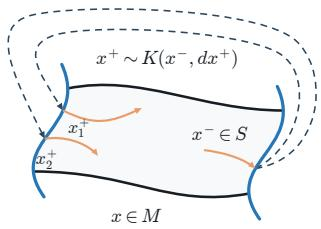  
Stochastic Hybrid System (SHS) Markov Reset Kernel

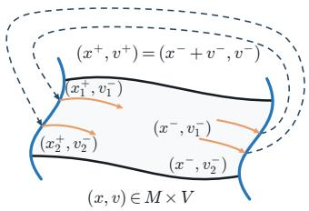  
Augmented Stochastic Hybrid System (A-SHS) Deterministic Reset Function

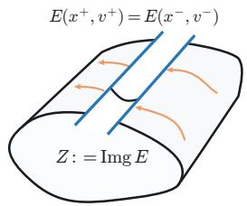  
A-SHS in the Embedded Image Continuous Flow  
Figure 1: We approximate SHSs with a Markov reset kernel by an A-SHS with a deterministic reset function that allows the topological gluing to make the hybrid flow continuous.

1. We present an augmented-state SHS (A-SHS) with a deterministic reset to approximate an SHS with a Markov reset kernel. The A-SHS is then embedded into a higher-dimensional Euclidean space where the sample paths become continuous.

2. We derive the hybrid Fokker-Planck (HFP) equation of the A-SHS and show that the source and sink terms in the HFP equation vanish in the embedded image. This result enables us to predict the probability distribution of A-SHS by a continuous SDE without identifying the guard surface after the embedding.

3. Based on the theoretical result, we can accuretely predict the distribution evolution of SHS from time-series data vy a latent SDE without any trajectory segmentation, mode labeling, or event-based simulations.

## 2 RELATED WORKS

Hybrid System Theory: Hybrid automata (Goebel et al., 2009; Lygeros et al., 2003) model continuous-time dynamics within modes and state-triggered transitions and resets between them. Stochastic hybrid systems (Hu et al., 2000) incorporate stochasticity into both continuous dynamics and discrete resets. Specifically, (Hu et al., 2000) models continuous evolution as a stochastic differential equation (SDE) and resets as Markov kernels triggered on lower-dimensional guard surfaces, while (Bujorianu & Lygeros, 2006) further allows spontaneous jumps within the state-space interior. Hybrid inclusions instead use set-valued flow and reset maps to represent multiple admissible reset branches (Aubin et al., 2002; Goebel & Teel, 2006). Whereas SHSs assign probability laws to reset outcomes, hybrid inclusions specify only the admissible outcomes. To consider the state distribution, the hybrid Fokker–Planck (HFP) equations include additional terms that account for reset-induced sources and sinks (Wang & Lee, 2020; 2022). Although difficult to solve, they provide a powerful tool for studying SHS distribution evolution.

Learning Hybrid Systems: Learning hybrid systems from time-series data requires jointly identifying modes, guard surfaces, and continuous dynamics, making the problem inherently combinatorial. (Roll et al., 2004) uses mixed-integer programming (MIP) to identify piecewise-affine (PWA) systems and reformulates the problem as a linear complementarity problem to avoid MIP. However, PWA systems are a restricted class of hybrid automata (HA) with identity resets. To learn general SHSs, (Poli et al., 2021) uses normalizing flows for event transitions and Neural ODEs (Chen et al., 2018) for continuous dynamics. Similarly, (Liu et al., 2025b) learns discrete-time HA using a mode classifier and state-space model. Both methods require heuristic trajectory segmentation, which is sensitive to stochastic noise, while (Ochoa & Sanfelice, 2026) learns vector fields and reset functions assuming known segmentations. Alternatively, (Teng et al., 2026a;b) builds on the theory in (Simic et al., 2005) to represent HA as Neural ODEs in higher-dimensional latent spaces.

Learning Stochastic Differential Equations: Recent work learns stochastic dynamics at different statistical levels. (Kidger et al., 2021) trains a Neural SDE generator against a Neural CDE critic using a Wasserstein path-level loss. Most closely related, (Bartosh et al., 2025) parameterizes posterior marginals and trains latent SDEs without simulation using an ELBO with a path-space KL loss. (Neklyudov et al., 2023) recovers a canonical probability flow from unpaired temporal marginals through a variational action objective, while (Kiyohara et al., 2025) learns conditional normalizingflow transition kernels using likelihood and Chapman–Kolmogorov consistency. (Seifner et al., 2025) pretrains a transformer through supervised drift–diffusion regression, whereas (Ilersich & Nair, 2025) learns coupled macro–microscale latent SDEs using an ELBO and Product-of-Experts likelihood. Unlike these methods, the proposed latent SDE framework represents stochastic resets without explicit event-based simulation.

## 3 PRELIMINARIES & PROBLEM FORMULATION

## 3.1 STOCHASTIC HYBRID SYSTEMS

We refer to (Hu et al., 2000; Wang & Lee, 2020) for a preliminary overview of SHSs. Consider a SHS with state-triggered Markov reset kernel as illustrated in Figure 1:

$$
\begin{array} { r l } & { d x = f ( t , x ) d t + g ( t , x ) d w , x \notin S , } \\ & { } \\ & { x ^ { + } \sim K ( x ^ { - } , d x ^ { + } ) , x ^ { - } \in S , } \end{array}\tag{SHS}
$$

where w is an n − dim Wiener process, x evolves in the domain $M \subset \mathbb { R } ^ { n }$ with smooth boundary and $S \subset \partial M$ is the $( n - 1 )$ − dim guard surface. When $x \notin S$ , the system is governed by the drift $f : \mathbb { R } \times M \to M$ and the diffusion matrix $g : \mathbb { R } \times M \stackrel { \cdot } { \to } \mathbb { R } ^ { n \times n }$ . The reset is described by a Markov kernel $K : S \times B ( M ) \to [ 0 , 1 ]$ , where $B ( M )$ is all Borel sets in M. $K ( x ^ { - } , A )$ denotes the probability that the post-reset state $x ^ { + }$ lies in a measurable set $A \subset M$ conditioned on $x ^ { - } \in S$ Assume x admits a density $p ( t , x )$ on M. Let $D ( t , x ) = { \textstyle \frac { 1 } { 2 } } g ( t , x ) g ( t , x ) ^ { \top }$ . The probability flux associated with the continuous diffusion is:

$$
J ( t , x ) = f ( t , x ) p ( t , x ) - \nabla \cdot ( D ( t , x ) p ( t , x ) )\tag{1}
$$

Let $n _ { S } ( x )$ be the chosen normal direction on $S ,$ , and define the guard flux density by

$$
\alpha ( t , x ) = J ( t , x ) \cdot n _ { S } ( x ) , \forall x \in S .\tag{2}
$$

Consider the induced density of $K ( x ^ { - } , d x )$ , i.e., $\kappa ( x ^ { - } , x ^ { + } )$ as defined by $K ( x ^ { - } , A ) = :$ $\textstyle \int _ { A } \kappa ( x ^ { - } , x ^ { + } ) d x ^ { + } , A \subset M$ . The hybrid Fokker–Planck (HFP) equation with reset is:

$$
\frac { \partial p ( t , x ) } { \partial t } = - \nabla \cdot J ( t , x ) + \int _ { S } \kappa ( \xi , x ) \alpha ( t , \xi ) d \sigma _ { S } ( \xi ) - \int _ { S } \delta ( x - \xi ) \alpha ( t , \xi ) d \sigma _ { S } ( \xi ) .\tag{HFP}
$$

Here $d \sigma _ { S }$ is the surface measure on $S .$ . The second term shows that the probability mass leaving the guard point $\xi \in S$ is redistributed to post-reset states by $x ^ { + } \sim \kappa ( \xi , x ^ { + } )$ . The last term suggests that the outgoing mass is removed from the pre-reset point $\xi \in S$

## 3.2 GEOMETRIC REPRESENTATION OF HYBRID SYSTEMS

When the stochasticity of SHS vanishes, the Markov kernel $K ( x ^ { - } , d x ^ { + } )$ becomes a classical reset function $R ( \cdot )$ and SHS reduces to a hybrid automaton:

$$
\begin{array} { r } { \dot { x } = f ( t , x ) , x \notin S , } \\ { { x ^ { + } } = R ( x ^ { - } ) , x ^ { - } \in S . } \end{array}\tag{HA}
$$

Assume R is a diffeomorphism and $S \in \partial M$ satisfies the regularity condition specified in (Simic et al., 2005), we have the following result to make HA continuous:

Theorem 1. $L e t \sim$ be the equivalence relation by $x \sim R ( x ) , \forall x \in S .$ . We collapse the equivalence class by ∼ to a point to obtain the quotient manifold $M / \sim . \ B y$ Simic et al. (2005), $M / \sim$ is a n − dim manifold with boundary, and both $M /$ ∼ and its boundary are piecewise smooth.

Theorem 2 (Whitney Embedding Theorem (Hirsch, 1976)). Any Cr-manifold $( r \geq 1 )$ of dimension n can be embedded into $\mathbb { R } ^ { 2 n }$

Remark 1. By Theorem 2, M/ ∼ admits an embedding that is globally piecewise smooth. Therefore, the hybridflow ofHA can be represented by ODEs with continuousflow (Teng et al., 2026a;b). However, Theorem 1 cannot be applied to SHS as the reset kernel is not a one-to-one mapping.

## 3.3 PROBLEM FORMULATION

Problem 1. Given N trajectories $\mathcal { X } : = \{ ( t _ { 0 : T } , x _ { 0 : T } ^ { ( k ) } ) \} _ { k = 1 } ^ { N }$ sampled from (SHS), learn its conditional path distribution $p ( x _ { 1 : T } \mid x _ { 0 } )$ at prescribed observation times $t _ { 0 : T }$ and initial state $x _ { 0 } .$

We note that this problem is extremely challenging as the flow of SHS is discontinuous and stochastic, the guard surface S is unknown, and the reset is stochastic and set-valued.

## 4 CONTINUOUS REPRESENTATION OF STOCHASTIC HYBRID SYSTEM

In this section, we extend the geometric framework to SHS.

## 4.1 AUGMENTED STOCHASTIC HYBRID SYSTEMS

We define an augmented-state stochastic hybrid system (A-SHS) where different reset of $x ^ { + }$ ∼ $K ( x ^ { - } , d x ^ { + } )$ are represented by an auxiliary variable $v \in V \subset \mathbb { R } ^ { n }$ . For simplification, let the

augmented state be $y : = \left\lceil x ^ { \top } , v ^ { \top } \right\rceil ^ { \top } \in M \times V \subseteq \mathbb { R } ^ { 2 n }$ and we have:

$$
\begin{array} { r l } & { d y = \overline { { f } } ( t , y ) d t + \overline { { g } } ( t , y ) d \overline { { w } } , \quad ( x , v ) \notin S \times V , } \\ & { x ^ { + } = x ^ { - } + v ^ { - } , \quad v ^ { + } = v ^ { - } , \quad ( x ^ { - } , v ^ { - } ) \in S \times V . } \end{array}\tag{A-SHS}
$$

with $\begin{array} { r l } { \overline { { f } } = \lceil f _ { x } ^ { \top }  } & { { } { f _ { v } ^ { \top } } \rceil ^ { \top } : \mathbb { R } \times ( M \times V )  \mathbb { R } ^ { 2 n } } \end{array}$ the drift, $\begin{array} { r l } { \overline { { g } } = \lceil g _ { x } ^ { \top } \quad g _ { v } ^ { \top } \rceil : \mathbb { R } \times ( M \times V )  \mathbb { R } ^ { 2 n \times 2 n } } \end{array}$ the diffusion, and w the Wiener process of dimension $2 n$ . The reset map in the augmented state thus can be represented by $R ( x ^ { - } , v ^ { - } ) = ( x ^ { - } + v ^ { - } , v ^ { - } ) .$ 1 Under the Euclidean addition, R is injective and is a diffeomorphism onto its image, since $( x ^ { + } , v ^ { + } )$ uniquely determines $( x ^ { - } , v ^ { - } ) = ( x ^ { + } - v ^ { + } , v ^ { + } )$ We denote the density of y in A-SHS as $\bar { p } ( t , y ) ~ = ~ \bar { p } ( t , x , v )$ . Then we have the $\overline { { \boldsymbol { D } } } ( t , y ) ~ =$ $\begin{array} { r } { \frac { 1 } { 2 } \overline { { g } } ( t , y ) \overline { { g } } ( t , y ) ^ { \top } \in \mathbb { R } ^ { 2 \breve { n } \times 2 n } } \end{array}$ and the current of $y \colon$

$$
\overline { { J } } ( t , y ) = \overline { { f } } ( t , y ) \overline { { p } } ( t , y ) - \nabla \cdot ( \overline { { D } } ( t , x ) \overline { { p } } ( t , y ) )\tag{3}
$$

Given the normal vector of $S \times V , \mathrm { i . e } , \overline { { n } } ( x , v ) = ( n _ { S } ( x ) , 0 _ { n } )$ , we have the outgoing flux density as:

$$
\overline { { \alpha } } ( t , x , v ) = \overline { { J } } ( t , x , v ) \cdot \overline { { n } } ( x , v ) , ( x , v ) \in S \times V .\tag{4}
$$

Therefore, the augmented hybrid Fokker–Planck equation is the measure-valued equation

$$
\begin{array} { r } { \frac { \partial \overline { { p } } ( t , y ) } { \partial t } = - \nabla \cdot \overline { { J } } ( t , y ) + \int _ { S } \int _ { V } \Big [ \delta ( y - \Big [ { x ^ { \prime } } ^ { \prime } + { v ^ { \prime } } ^ { \prime } \Big ] ) - \delta ( y - \Big [ { x ^ { \prime } } ^ { \prime } \Big ] ) \Big ] \overline { { \alpha } } ( t , x , v ) d { v ^ { \prime } } d \sigma _ { S } ( x ^ { \prime } ) . } \end{array}\tag{A-HFP}
$$

The last term indicates the mass injection and removal by the deterministic reset $( x ^ { + } , v ^ { + } ) = ( x ^ { - } +$ $v ^ { - } , v ^ { - } )$ Compared to (HFP), the source and sink terms only involve Dirac functions. Ideally, (A-SHS) will distinguish different reset branch by the auxiliary variable v, as shown in Figure 1.

## 4.2 EMBEDDING A-SHS INTO HIGHER-DIMENSIONAL SPACE

We now leverage the Whitney Embedding Theorem to eliminate the discontinuity of A-SHS. Define the equivalence relation on $M \times V \mathbf { b y } ( x , v ) \sim ( x + v , v ) , ( x , v ) \in S \times V .$ Let $\pi : M \times V $ $( M \bar { \times _ { } } V ) / \sim$ be the quotient map2. Then we have the following theorem:

Lemma 1. There exists a piecewise smooth function $E : M \times V  \mathbb { R } ^ { m \geq 4 n }$ , such that $E ( x , v ) =$ $E ( x + v , v ) , ( x , v ) \in S \times V ,$ and the map E defined by $\overline { { E } } \circ \pi : = E$ is an embedding on $( M \times V ) / \sim .$

Proof. By (Simic et al., 2005), the quotient manifold $( M \times V ) /$ ∼ is an (n+n)−dimensional piecewise continuous manifold. By the Whitney Embedding theorem, $( M \times \dot { V } ) / \sim$ can be embedded into $\mathbb { R } ^ { m }$ whenever m $\geq 2 ( n + n ) = 4 n$ . Let the embedding be E. Since π identifies $( x , v ) \sim ( x + v , v )$ the composed map $E = \overline { { E } } \circ \pi$ satisfies $E ( x , v ) = E ( x + v , v ) , ( x , v ) \in S \times V .$ □

By Lemma 1, we can eliminate the reset of A-SHS in the embedded image as shown in Figure 1:

Theorem 3 (Embedding of A-SHS). Let $z = E ( x , v ) \in Z : =$ Img E, with E the embedding defined in Lemma 1. We have the pushforward dynamics of z by a piecewise smooth SDE:

$$
d z = F ( t , z ) d t + G ( t , z ) d w , \forall z \in Z .\tag{5}
$$

Let $\begin{array} { r } { D _ { z } ( t , z ) : = \frac { 1 } { 2 } G ( t , z ) G ( t , z ) ^ { \top } } \end{array}$ , the density $p _ { z } ( t , z )$ is governed by the Fokker–Planck equation:

$$
\begin{array} { r } { \frac { \partial p _ { z } ( t , z ) } { \partial t } = - \nabla \cdot \left( F ( t , z ) p _ { z } ( t , z ) \right) + \nabla \cdot \nabla \cdot \left( D _ { z } ( t , z ) p _ { z } ( t , z ) \right) , z \in Z . } \end{array}\tag{6}
$$

Proof. We first show the pushforward dynamics of A-SHS. By $E ( x , v ) = E ( x + v , v ) , ( x , v ) \in$ $S \times V$ , the discrete reset vanishes at the guard surface $S \times V$ by:

$$
z ^ { + } = E ( x ^ { + } , v ^ { + } ) = E ( x ^ { - } + v ^ { - } , v ^ { - } ) = E ( x ^ { - } , v ^ { - } ) = z ^ { - } , \forall ( x ^ { - } , v ^ { - } ) \in S \times V .\tag{7}
$$

Then we have the pushforward dynamics by the Taylor expansion of Itô process (Øksendal, 2003):

$$
\begin{array} { r } { F ( t , z ) : = \frac { \partial E } { \partial y } \overline { { f } } ( t , x , v ) + \frac { 1 } { 2 } \sum _ { i , j = 1 } ^ { 2 n } \overline { { D } } _ { i j } ( t , x , v ) \frac { \partial ^ { 2 } E } { \partial y _ { i } \partial y _ { j } } , \quad G ( t , z ) : = \frac { \partial E } { \partial y } \overline { { g } } ( t , x , v ) . } \end{array}\tag{8}
$$

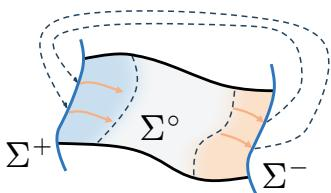  
Figure 2: Target distribution. The dashed lines indicate the boundary of the partition of unity.

We note that z is an embedding of $( x , v )$ that is injective and has a unique inverse. Therefore, $F$ and G can be uniquely represented by t and z. Thus we have (5) as a function of z.

It remains to check the reset contribution. For the reset source term, integrating against a smooth test function on compact support, i.e., $\phi ( z ) : Z \to \mathbb { R } , \phi ( z ) \in C _ { c } ^ { \infty } ( Z )$ yields:

$$
\begin{array} { r } { \int _ { M \times V } \phi ( E ( y ^ { \prime } ) ) \left( \int _ { S } \int _ { V } \delta \left( y ^ { \prime } - ( x + v , v ) \right) \overline { { \alpha } } ( t , x , v ) d v d \sigma _ { S } ( x ) \right) d y ^ { \prime } . } \end{array}\tag{9}
$$

By the property of the Dirac measure, we move the test function to nested integration to reduce the above term to $\begin{array} { r } { \int _ { S } \int _ { V } \phi \left( E ( s + v , v ) \right) \overline { { \alpha } } ( t , s , v ) } \end{array}$ dv $d \sigma _ { S } ( s )$ . For any smooth test function $\phi : Z \to \mathbb { R }$ the net reset source-sink contribution to the forward equation in the embedded image is $I _ { R } [ \phi ] =$ $\begin{array} { r } { \int _ { S } \int _ { V } \Big ( \phi \left( E ( x + v , v ) \right) - \phi \left( E ( x , v ) \right) \Big ) \overline { { \alpha } } ( t , x , v ) d v d \sigma _ { S } ( x ) \int _ { } ^ { } \frac { 1 } { | v | } \int _ { 0 } ^ { \infty } \int _ { \mathbb { R } ^ { 2 } } \int _ { \mathbb { R } ^ { 2 } } \widehat { \nu } ( t , x , v ) d v d \sigma _ { S } ( x ) d \sigma _ { S } ( x , v ) } \end{array}$

$\operatorname { A s } E ( x + v , v ) = E ( x , v ) , \forall ( x , v ) \in S \times V$ , this integrand vanishes point-wise, yielding $I _ { R } [ \phi ] = 0$ Therefore, the pushed-forward dynamics on z can be governed entirely by (6). □

## 4.3 A CONSTRUCTION OF A-SHS

A-SHS provides a pathway to replace the discrete reset with a continuous SDE. Now we construct such an A-SHS to approximate SHS. We define a residual reset kernel $Q : S \times B ( V )  [ 0 , 1 ]$

$$
K ( x ^ { - } , A ) = Q \left( x ^ { - } , \{ v \in V \mid x ^ { - } + v \in A \} \right) , A \in \mathcal { B } ( M ) .\tag{10}
$$

Equivalently, if $v ^ { - } \sim Q ( x ^ { - } , d v )$ , then $x ^ { + } = x ^ { - } + v ^ { - } \sim K ( x ^ { - } , d x ^ { + } )$ . Similar to $\kappa ( x ^ { - } , x ^ { + } )$ we define the density of Q by $\kappa _ { Q } ( x ^ { - } , v )$ . Now we show that we can construct a target distribution whose marginal density in the x−direction is equivalent to the solution of SHS.

Construction 1 (Target Density). Define the pre-reset set $\Sigma ^ { - } : = S \times V $ , its post-reset image $\Sigma ^ { + }$ and the interior $\Sigma ^ { \circ } : = ( M \times V ) \setminus \overline { { ( \Sigma ^ { - } \cup \Sigma ^ { + } ) } } .$ . Let $\chi ^ { - } ( x ) + \chi ^ { + } ( x ) + \chi ^ { \circ } ( x ) = 1$ be a smooth partition ofunity3 associated with $\Sigma ^ { - } , \Sigma ^ { + }$ , and $\Sigma ^ { \circ }$ , and prescribe the conditional density ofv:

$$
p ^ { \star } ( v \mid x ) = \chi ^ { - } ( x ) \kappa _ { Q } ( x , v ) + \chi ^ { + } ( x ) ( R _ { \# } \kappa _ { Q } ) ( x , v ) + \chi ^ { \circ } ( x ) \mathcal { N } ( v ; \mu , \delta ^ { 2 } I ) .\tag{11}
$$

where $R _ { \# } \kappa _ { Q }$ is the pushforward density of $\kappa _ { Q }$ under the reset R. Let the solution of HFP be $\boldsymbol { p } ^ { \star } ( t , \boldsymbol { x } )$ , we have the target density that preserves the marginal density ofxfor some $T < \infty :$

$$
\begin{array} { r } { \overline { { p } } ^ { \star } ( t , x , v ) = p ^ { \star } ( t , x ) p ^ { \star } ( v | x ) , t \in [ 0 , T ] , } \end{array}\tag{Target Density}
$$

and the target density $J ^ { \star } : = [ J _ { x } ^ { \star \top } , \ J _ { v } ^ { \star \top } ] ^ { \top }$ given by (3). The target distribution is shown in Figure 2.

Now we design A-SHS whose evolution of density will approximate $\overline { { p } } ^ { \star } ( t , x , v )$

Construction 2 (Approximate A-SHS). Choose $f _ { x } \ = \ f$ and $g _ { x } \ = \ g$ to make the x-dynamics equivalent to SHS in the interior. Given the x-current $J _ { x } ^ { \star } = f _ { x } \bar { p } ^ { \star } - \nabla _ { x } \cdot ( D _ { x x } \bar { p } ^ { \star } ) - \nabla _ { v } \cdot ( D _ { x v } \bar { p } ^ { \star } )$ we solve for $D _ { x v } .$ . For any $\eta > 0 ,$ , assume D invertible, choose $D _ { v v } = D _ { x v } ^ { \top } D ^ { - 1 } D _ { x v } + \eta I$ , and solve $\begin{array} { r } { \frac { \partial p ^ { \star } } { \partial t } = - \nabla \cdot \boldsymbol { J } ^ { \star } } \end{array}$ for the v-dynamics. The resulting A-SHS dynamics are given by:

$$
\overline { { f } } = \left[ \frac { f } { \frac { J _ { v } ^ { \star } + \nabla _ { x } \cdot \left( D _ { x v } ^ { \top } \overline { { p } } ^ { \star } \right) + \nabla _ { v } \cdot \left( D _ { v v } \overline { { p } } ^ { \star } \right) } { \overline { { p } } ^ { \star } } } \right] , \quad \overline { { D } } = \frac { 1 } { 2 } \overline { { g g } } \overline { { g } } ^ { \top } , \quad \overline { { g } } : = \left[ \begin{array} { c c } { g } & { 0 } \\ { g _ { x v } } & { g _ { v } } \end{array} \right] .\tag{12}
$$

Here, g is obtained from $\overline { { D } }$ by choosing $g _ { x v } ~ = ~ D _ { x v } ^ { \top } D ^ { - 1 } g$ and $g _ { v } ~ = ~ \sqrt { 2 \eta } I$ . Together with the deterministic reset $R ( x , v ) = ( x + v , v )$ , these coefficients define an approximate A-SHS whose target density is $\overline { { p } } ^ { \star } ( t , x , v )$ . The construction of $D _ { x v }$ is deferred to Appendix A.

Remark 2 (Interior mixing and exponential forgetting). In the interior where $\chi ^ { \circ } = 1$ , we have $p ^ { \star } ( v \mid x ) = \mathcal { N } ( v ; \mu , \delta ^ { 2 } I ) , D _ { x v } = 0 ,$ , and $\overline { { J } } _ { v } ^ { \star } = 0$ . Hence, we can choose $f _ { v } = - \lambda ( v - \mu ) , D _ { v v } =$ $\bar { \lambda } \delta ^ { \dot { 2 } } I$ , and the v−dynamics reduce to the Ornstein–Uhlenbeck (OU) process, i.e.,

$$
d v = - \lambda ( v - \mu ) d t + \sqrt { 2 \lambda } \delta d w _ { v } .
$$

If the trajectory remains in the interior for τ , then $v ( t + \tau ) ~ = ~ \mu + e ^ { - \lambda \tau } ( v ( t ) - \mu ) +$ $\delta \sqrt { 1 - e ^ { - 2 \lambda \tau } } \xi , \xi \sim \mathcal { N } ( 0 , I )$ . Consequently, the dependence of the receding reset $v ( t )$ is forgotten exponentially at rate λ and converges to Gaussian.

As shown in Figure 2, Construction 2 first generates the desired density on $\Sigma ^ { - }$ and then mixes it to a Gaussian in $\Sigma ^ { \circ }$ before the next reset. The details of both constructions are referred in Appendix $\mathrm { A } .$

## 5 MAIN ALGORITHMS

Building on Theorem 3, we learn (SHS) using a stochastic encoder, a latent SDE, and a deterministic decoder. For clarity, we describe these components using a single observed trajectory $\mathbf { x } = { \boldsymbol { x } } _ { 0 : T }$ at observation times $t _ { 0 : T }$ and a single predicted trajectory $\hat { \mathbf { x } } = \hat { x } _ { 0 : T }$

Stochastic Encoder: The reset kernel $x ^ { + } \sim \kappa ( x ^ { - } , x ^ { + } )$ assigns a distribution of post-reset states to each state $x ^ { - } ,$ inducing a distribution of reset displacements $v = x ^ { + } -$ $x ^ { - }$ . By Theorem $^ 3 \cdot$ , the augmented state $( x , v )$ can be represented by a latent state $z = E ( x , v )$ by Lemma 1. We therefore model the encoder as $z \sim p _ { \theta } ( z \mid x )$ and sample $z _ { i } \sim p _ { \theta } ( z \mid x _ { i } )$ at $t _ { i }$

## Algorithm 1

In practice, $p _ { \theta } ( z \mid x )$ is represented by a conditional diffusion sampler. Starting from $\zeta _ { L } \sim \mathcal { N } ( 0 , I )$ , we apply L differentiable DDIM (Song et al., 2021) updates con-

<table><tr><td>Require: Dataset  $x ;$  sampler schedule  $\{ \beta _ { \ell } \} _ { \ell = 1 } ^ { L } ;$  batch size  $B ;$  rollouts per initial state  $M ;$  training steps  $J ;$  learning rate  $\eta .$  for  $j = 1 , \dots , \bar { J }$  do Sample  $\{ x _ { 0 : T } ^ { ( k ) } \} _ { k = 1 } ^ { B }$  from  $\mathcal { X }$  at  $t _ { 0 : T }$   $z _ { i } ^ { ( k , r ) } \sim p _ { \theta } ( \cdot \mid x _ { i } ^ { ( k ) } )$  ▶ Encode  $\hat { z } _ { 0 } ^ { ( k , r ) } \gets z _ { 0 } ^ { ( k , r ) }$  ▶ Initialize  $\hat { z } _ { 0 : T } ^ { ( k , r ) } \xleftarrow { ( 1 3 ) } \hat { z } _ { 0 } ^ { ( k , r ) }$  Rollout  $\hat { x } _ { i } ^ { ( k , r ) } \gets D _ { \theta } ( \hat { z } _ { i } ^ { ( k , r ) } )$  ▶ Decode  $\mathrm { C o m p u t e } \mathcal { L } ( \theta ) \mathrm { \ u s i n g \ ( 1 4 ) }$  Loss  $\theta \gets \theta - \eta \nabla _ { \theta } \mathcal { L } ( \theta )$  Update end for return  $p _ { \theta } ( z \mid x ) , F _ { \theta } , G _ { \theta } ,$  and  $D _ { \theta }$ </td></tr></table>

ditioned on x: $\begin{array} { r } { \zeta _ { \ell - 1 } = \sqrt { \bar { \alpha } _ { \ell - 1 } } \frac { \zeta _ { \ell } - \sqrt { 1 - \bar { \alpha } _ { \ell } } \epsilon _ { \theta } ( \zeta _ { \ell } , \ell , x ) } { \sqrt { \bar { \alpha } _ { \ell } } } + \sqrt { 1 - \bar { \alpha } _ { \ell - 1 } } \epsilon _ { \theta } ( \zeta _ { \ell } , \ell , x ) , \ell = L , \dots , 1 } \end{array}$ , where $\begin{array} { r } { \bar { \alpha } _ { \ell } = \prod _ { s = 1 } ^ { \ell } ( 1 - \beta _ { s } ) } \end{array}$ and $\bar { \alpha } _ { 0 } ~ = ~ 1$ . The output is $z ~ = ~ \zeta _ { 0 }$ , and the noise predictor $\epsilon _ { \theta }$ is trained end-to-end without a separate denoising loss.

Latent SDE: Let $d _ { z } = \dim Z$ . We represent the latent drift and diffusion by $F _ { \theta } : \mathbb { R } \times Z \to \mathbb { R } ^ { d _ { z } }$ and $G _ { \theta } : \mathbb { R } \times Z  \mathbb { R } ^ { d _ { z } \times 2 n }$ . Given $\hat { z } _ { 0 } = z _ { 0 }$ , we generate $\hat { \mathbf { z } } = \hat { z } _ { 0 : T }$ using the Euler–Maruyama scheme:

$$
\hat { z } _ { i + 1 } = \hat { z } _ { i } + F _ { \theta } ( t _ { i } , \hat { z } _ { i } ) \Delta t _ { i } + G _ { \theta } ( t _ { i } , \hat { z } _ { i } ) \Delta w _ { i } , \Delta w _ { i } \sim \mathcal { N } ( 0 , \Delta t _ { i } I _ { 2 n } ) ,\tag{13}
$$

where $\Delta t _ { i } = t _ { i + 1 } - t _ { i } , i = 0 , \ldots , T - 1$ , and the Brownian increments are independent.

Deterministic Decoder: The inverse $E ^ { - 1 }$ recovers an equivalence class in $( M \times V ) / \sim .$ Choosing its post-reset representative at the glued seam defines a single-valued state decoder, which we approximate by $\dot { D _ { \theta } } : Z \to M$ . The underlying decoder can be discontinuous at the seam: its one-sided limits recover $x ^ { - }$ and $x ^ { + }$ while the latent trajectory remains continuous. We obtain the predicted trajectory $\hat { \mathbf { x } } = \hat { x } _ { 0 : T }$ by applying $\hat { x } _ { i } = D _ { \theta } ( \hat { z } _ { i } )$ at each observation time.

Cost Function Design: At time $t _ { i } ,$ let $p _ { u , i }$ and $\hat { p } _ { u , i }$ denote the data and predicted distributions for $u \in \{ x , z \}$ , with $p _ { z , i }$ induced by encoding $x _ { i }$ . Let $p _ { \mathrm { x } }$ denote the data path distribution and $\hat { p } _ { \mathrm { x } }$ the predicted path distribution when $x _ { 0 }$ is drawn from its data distribution. For two distributions $p _ { A }$ and $p _ { B }$ with finite first moments, their squared energy distance is denoted by $\mathcal { E } ^ { 2 } ( p _ { A } , p _ { B } ) ^ { 4 }$

Inspired by Theorem $^ { 3 , }$ we define the state distribution loss $\begin{array} { r } { \mathcal { L } _ { u } ~ = ~ \frac { 1 } { T + 1 } \sum _ { i = 0 } ^ { T } \mathcal { E } ^ { 2 } ( p _ { u , i } , \hat { p } _ { u , i } ) } \end{array}$ $u \in \{ x , z \}$ , to match the distribution evolution at each observation time. We also define the unconditional path distribution loss $\mathcal { L } _ { \mathrm { x } } ^ { \mathrm { t r a j } } = \mathcal { E } ^ { 2 } ( p _ { \mathrm { x } } , \hat { p } _ { \mathrm { x } } )$ to match the joint distribution across observation times. For the observed trajectory x with initial state $x _ { 0 } ,$ , the conditional path distribution loss is $\begin{array} { r } { \mathcal { L } _ { \mathrm { x } } ^ { \mathrm { t r a j , c } } = \frac { 1 } { 2 \sqrt { ( T + 1 ) d _ { x } } } \mathcal { E } ^ { 2 } ( \delta _ { \mathrm { x } } , \hat { p } _ { \mathrm { x } | x _ { 0 } } ) } \end{array}$ , where $d _ { x }$ is the state dimension and ${ \hat { p } } _ { \mathrm { x } | x _ { 0 } }$ is the conditional path distribution induced by the stochastic encoder, latent SDE, and decoder.

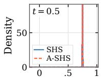

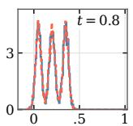

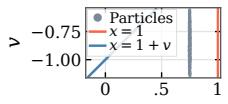

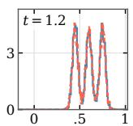

x  
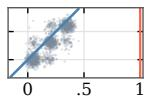  
x

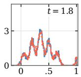

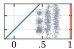  
x

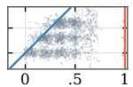

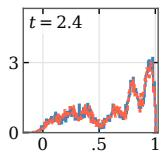  
x

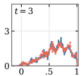

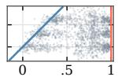  
x

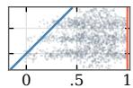  
x

Figure 3: The density evolution of A-SHS for (15). We find that the marginal density of A-SHS in x matches that of (15). As shown in the x − v plot, the density is mixed by the OU process first and then redistributed to the GMM to approximate the reset by Construction 1 and 2.  
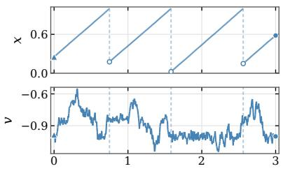  
t (s)

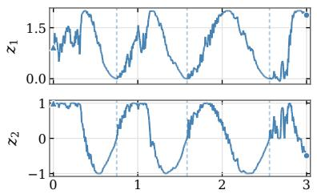  
t (s)

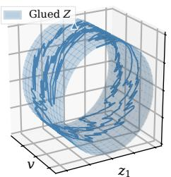  
z2  
Figure 4: The time evolution of the A-SHS and the embedded trajectory in 3D space. We can see that x is reset to a different state after it hits the guard at $x = 1$ . The v replaces the role of the reset function with continuous paths. The augmented path can be embedded into a higher-dimensional space with variable z to mitigate the discontinuity.

With w denoting the weights and the loss $\mathcal { L } _ { g } ^ { \mathrm { ~ 5 ~ } }$ to regularize diffusion, the overall objective is

$$
\begin{array} { r } { \mathcal { L } ( \boldsymbol { \theta } ) = w _ { z } \mathcal { L } _ { z } + w _ { x } \mathcal { L } _ { x } + w _ { \mathrm { x } } ^ { \mathrm { t r a j } } \mathcal { L } _ { \mathrm { x } } ^ { \mathrm { t r a j } } + w _ { \mathrm { x } } ^ { \mathrm { t r a j , c } } \mathcal { L } _ { \mathrm { x } } ^ { \mathrm { t r a j , c } } + w _ { g } \mathcal { L } _ { g } . } \end{array}\tag{14}
$$

For multiple observed and independently generated trajectories, we estimate the distributional losses from empirical samples and average the conditional loss and diffusion regularizer over the corresponding trajectories. We summarize the training scheme in Algorithm 1, where we use the superscript $( k , r )$ to denote the r-th encoder sample corresponding to the k-th data trajectory, with batch size B and M encoder samples per state.

## 6 NUMERICAL EXPERIMENTS

## 6.1 CONSTRUCTION OF A-SHS

We illustrate the construction in Section 4.3 using a 1 − dim hybrid system defined on (0, 1] with constant drift and a Gaussian mixture reset with three peaks $\mathcal { C } : = \{ 0 , 0 . 1 5 , 0 . 3 \}$

$$
\begin{array} { r } { d x = d t + \sigma d w , \quad x < 1 , \qquad x ^ { + } \sim \frac { 1 } { 3 } \sum _ { x _ { c } \in \mathcal { C } } \mathrm { T N } _ { ( - \infty , 1 ) } ( x _ { c } , \eta ^ { 2 } ) , \quad x ^ { - } = 1 . } \end{array}\tag{15}
$$

Here, $\mathrm { T N } _ { ( - \infty , 1 ) } ( x _ { c } , \eta ^ { 2 } )$ is the truncated normal distribution that denotes $\mathcal { N } ( \boldsymbol { x } _ { c } , \eta ^ { 2 } )$ conditioned on $x < 1$ , ensuring that $x ^ { + } < 1$ almost surely. In the extended state space $X \times V .$ , the guard surface and its reset image are given by $S : = \{ ( { \overset { \cdot } { x , v } } ) \mid x = 1 , v \in V \}$ and $\mathbf { \bar { \phi } } R ( S ) = \{ ( x , v ) \ | ^ { \prime } x = v + 1 \}$ respectively. We use Monte Carlo simulations to estimate the density evolution of (15) and use the rollout to construct a time-varying A-SHS. As shown in Figure 3, the partitioned OU process enables the $\mathbf { A } – \mathbf { S } \mathbf { H } \mathbf { S }$ to closely reproduce the density evolution of (15). To verify Theorem 3, we consider the 3 − dim embedding $E ( x , v ) = ( v , 1 - \cos \theta , \sin \theta )$ , with $\theta = 2 \pi { \frac { x - 1 - v } { - v } }$ . As illustrated in Figure 4, (15) resets $x ^ { - } = 1$ to different $x ^ { + } \in \mathcal { C }$ , while the A-SHS has deterministic resets on $X \times V$ and can be embedded into a higher-dimensional space with continuous sample paths.

$$
\begin{array} { r } { ^ { 5 } \mathcal { L } _ { g } = \frac { 1 } { T + 1 } \sum _ { i = 0 } ^ { T } \| G _ { \theta } ( t _ { i } , \hat { z } _ { i } ) \| _ { F } ^ { 2 } . } \end{array}
$$

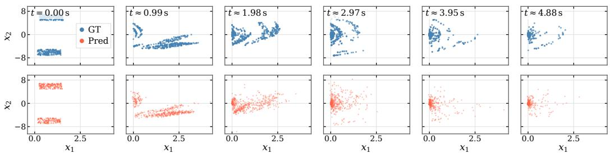  
Figure 5: The predicted probability evolution of bouncing ball systems under GMM reset. Our method correctly captures the long-term distribution with a training horizon of 0.32s.

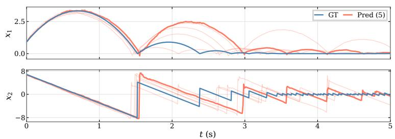

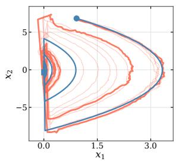  
Figure 6: We plotted five predicted trajectories of the bouncing ball system under GMM reset conditioned on the same initial condition. The reset function independently chooses restitution by a GMM centered at 0.5 or 0.9 at each collision. Our method correctly captures this pattern.

## 6.2 LEARNING STOCHASTIC HYBRID SYSTEMS

We now apply Algorithm 1 to learn SHS from time-series data. We consider some classic examples in hybrid system theory with different topologies, including the bouncing ball, the Klein bottle, and the torus systems. For a deterministic system, the Torus system can be embedded into 3D Euclidean space, while the Klein bottle system can only be embedded into 4D space. We consider these systems with different reset kernels, such as a GMM distribution or a uniform distribution. We also conside a switching system that randomly chooses the reset kernel of the deterministic torus system or the Klein bottle system. Then we consider the k-bouncing ball system in the x−y plane with dimension equal to 4k (velocity and position in horizontal and vertical directions). We consider 0.32s training horizon. All comparisons and ablations are evaluated on the same normalized test data with horizon 1s, 3s or 5s. By default, we consider the latent dimension of our method to be $d _ { z } = 2 ( d _ { x } + d _ { x } )$ as inspired by Lemma 1. We present the result with horizon 1s, and the remaining cases are shown in Appendix B.3 and Appendix B.4. We note that the baselines exhibit worse results with a horizon longer than 1s, while our method has consistent accuracy.

Comparison with baselines: We compare our method with (Teng et al., 2026b), a latent ODE framework for deterministic hybrid system learning; (Li et al., 2020) that learns latent SDEs through variational inference; (Bartosh et al., 2025) that solves a simulation-free variational objective; and (Kiyohara et al., 2025) that learns conditional transition kernels with Chapman–Kolmogorov consistency. We also evaluate (Li et al., 2020) augmented with additional losses, i.e., $\mathcal { L } _ { x }$ and $\mathcal { L } _ { \mathrm { x } } ^ { \mathrm { t r a j } }$

As shown in Table 1, our method achieves the lowest mean conditional and unconditional path distribution losses across all 11 benchmark settings. The relative performance of the competing approaches varies across datasets and metrics. Adding $\mathcal { L } _ { x }$ and $\mathcal { L } _ { \mathrm { x } } ^ { \mathrm { t r a j } }$ to (Li et al., 2020) improves performance on some datasets, but does not consistently improve the results or close the gap to our method. (Kiyohara et al., 2025) and (Bartosh et al., 2025) exhibit larger errors or divergence under the evaluated configurations, with particularly large errors in the unconditional path distribution loss. As (Teng et al., 2026b) omits the stochastic effect, it triggers the divergence criterion on most cases. The predicted distribution evolution of the bouncing ball system is illustrated in Figure 5, showing that our method correctly captures the distribution evolution. As shown in Figure $^ { 6 , }$ our method correctly captures the path distribution by predicting bounces with different restitution coefficients. More visualizations and comparisons are illustrated in Appendix B.3 and B.5.

Table 1: Baseline comparison of conditional (unconditional) path distribution loss across 11 benchmark problems. Per-case means and sample standard deviations are reported in Tables 5 and 6. ⋆ denotes using $\mathcal { L } _ { x }$ and $\mathcal { L } _ { \mathrm { x } } ^ { \mathrm { t r a j } }$ . Horizon: 1 s.
<table><tr><td></td><td>Ours</td><td>(Teng et al., 2026b)</td><td>(Li et al., 2020)</td><td>(Li et al., 2020)*</td><td>(Bartosh et al., 2025)</td><td>(Kiyohara et al., 2025)</td></tr><tr><td>b-ball (GMM)</td><td>0.257 (0.214)</td><td>Diverged</td><td>0.369 (1.12)</td><td>0.338 (0.879)</td><td>0.620 (4.14)</td><td>0.594 (4.22)</td></tr><tr><td>b-ball (Uniform)</td><td>0.289 (0.249)</td><td>Diverged</td><td>0.404 (1.03)</td><td>0.380 (0.873)</td><td>0.732 (4.84)</td><td>0.542 (3.23)</td></tr><tr><td>Torus (GMM)</td><td>0.603 (0.333)</td><td>Diverged</td><td>1.84 (6.17)</td><td>4.32 (11.3)</td><td>Diverged</td><td>0.909 (6.27)</td></tr><tr><td>Torus (Uniform)</td><td>0.560 (0.304)</td><td>Diverged</td><td>2.67 (40.5)</td><td>1.51 (10.3)</td><td>Diverged</td><td>0.944 (7.19)</td></tr><tr><td>Klein (GMM)</td><td>0.612 (0.341)</td><td>Diverged</td><td>Diverged</td><td>Diverged</td><td>10.2 (256)</td><td>0.903 (6.05)</td></tr><tr><td>Klein (Uniform)</td><td>0.560 (0.298)</td><td>Diverged</td><td>1.33 (15.1)</td><td>1.96 (29.2)</td><td>7.84 (193)</td><td>0.919 (6.66)</td></tr><tr><td>Klein-Torus</td><td>0.455 (0.257)</td><td>Diverged</td><td>2.67 (44.3)</td><td>2.97 (52.3)</td><td>Diverged</td><td>0.989 (8.25)</td></tr><tr><td>1-ball (GMM)</td><td>0.569 (0.570)</td><td>Diverged</td><td>0.770 (1.68)</td><td>0.978 (4.43)</td><td>5.69 (140)</td><td>Diverged</td></tr><tr><td>1-ball (Uniform)</td><td>0.569 (0.525)</td><td>Diverged</td><td>0.781 (1.46)</td><td>0.751 (1.76)</td><td>6.83 (192)</td><td>Diverged</td></tr><tr><td>2-balls (GMM)</td><td>0.722 (1.04)</td><td>1.03 (2.07)</td><td>0.869 (2.22)</td><td>0.883 (2.70)</td><td>Diverged</td><td>Diverged</td></tr><tr><td>2-balls (Uniform)</td><td>0.760 (1.07)</td><td>1.06 (2.00)</td><td>0.985 (3.39)</td><td>0.984 (4.23)</td><td>Diverged</td><td>Diverged</td></tr></table>

Table 2: Ablation summary across 11 benchmark settings on the conditional (unconditional) trajectory distribution loss. Mean change is the average of per-setting percentage changes relative to the default model; positive values indicate degradation. Worse cases count the settings with a higher mean test loss than the default model (out of 11), using the means over five training seeds. MLP replaces the diffusion sampler with a deterministic MLP encoder; loss labels identify the removed objectives. Detailed results are presented in Tables 11 to 15.
<table><tr><td>Setting</td><td>dz = dx</td><td>dz = 2dx</td><td>dz = 3dx</td><td>MLP</td><td>Ltraj,c</td><td>C=</td><td>Lx</td><td>Ltraj</td><td>Ltraj,c, Ltraj</td><td>Lx, Ltraj</td><td>Ltraj,c, Lx</td></tr><tr><td>Mean change (%)</td><td>+14.1 (+71.4)</td><td>+2.9 (+12.2)</td><td>+0.3 (+4.7)</td><td>+3.6 (+14.7)</td><td>+6.2 (+6.6)</td><td>+19.5 (+246.6)</td><td>+1.2 (+8.8)</td><td>+0.0 (+2.1)</td><td>+23.3 (+54.7)</td><td>−0.7 (+3.8)</td><td>+5.7 (+4.4)</td></tr><tr><td>Worse cases (/11)</td><td>11 (11)</td><td>8 (6)</td><td>5 (5)</td><td>8 (8)</td><td>7 (7)</td><td>11 (11)</td><td>7 (9)</td><td>6 (5)</td><td>11 (11)</td><td>5 (7)</td><td>6 (5)</td></tr></table>

Ablations: We study the effects of 1) latent dimension, 2) loss function design, and 3) encoder randomness. Table 2 summarizes the changes in conditional and unconditional path distribution losses relative to the default model. Reducing the latent dimension generally degrades performance, although $d _ { z } = 3 d _ { x }$ performs comparably to the default $d _ { z } = 4 d _ { x }$ at the short horizon. At longer horizons, smaller latent dimensions can lead to substantial degradation or divergence, including degradation for $d _ { z } = 3 d _ { x }$ on some benchmarks, as shown in Tables 16 and 22. Thus, the longerhorizon results reinforce the benefit of a larger latent space and indicate that comparable shorthorizon performance does not ensure comparable long-horizon behavior.

For loss function design, removing either path distribution loss alone has a relatively modest effect on average, whereas removing both consistently degrades both metrics. Removing $\mathcal { L } _ { z }$ also consistently degrades performance, with larger effects at longer horizons and divergence on one benchmark over the full trajectory. These trends are consistent across horizons, as reported in Tables 16 and 22. The benefit of latent-space supervision is consistent with the findings of Teng et al. (2026b).

Finally, replacing the stochastic encoder with a deterministic MLP moderately degrades performance on average, particularly for the unconditional path distribution loss. This trend persists at longer horizons, as shown in Tables 13, 19 and 25. These results support the benefit of encoder randomness, consistent with the one-to-many mapping from state variables to latent variables. However, the moderate degradation suggests that a deterministic encoder remains viable, as the latent SDE (13) can also provide randomness. The details of the ablations and the cases on longer horizons are shown in Appendix B.4.

## 7 DISCUSSIONS

Latent Dimension: Whitney Embedding Theorem provides a general dimension bound to embed the 2n-dimensional glued manifold $( X \times V ) / \sim \operatorname { i n t o } \mathbb { R } ^ { 4 n }$ . The structure of the reset $( x ^ { + } , v ^ { + } ) =$ $( x ^ { - } + v ^ { - } , v ^ { - } )$ may improve this bound: for fixed v, identifying $x \sim x + v$ on the guard S yields an n-dimensional space, embeddable into $\mathbb { R } ^ { 2 n }$ . If these embeddings vary smoothly with v and form a global embedding, retaining the n coordinates of v can give a 3n bound. Whether the v-wise manifolds vary smoothly remains open for future research.

Loss Functions: As each sampled path is stochastic, we argue that there is no need to match a specific path. As discussed in Li et al. (2020), overfitting to a single path will result in the diffusion term converging to zero. In our method, we instead match the path distribution, considering the latent SDE as a sampler to generate the paths. As indicated in the comparative study, the loss function enables us to accurately recover the path distributions beyond the training horizon.

Memory of Latent Variables: Latent variables can encode both reset events and past-state memory. When the closures of the guard and its images are disjoint, pure OU dynamics in an interior region allow arbitrarily fast exponential memory decay by increasing the mean-reversion parameter. However, this only approximately erases memory, without guaranteeing complete removal in finite time. Fully recovering the original system’s Markov property remains a direction for future research.

Future Applications: The proposed methods can be applied to robotics control, such as (Chang et al., 2026; Dong et al., 2025; Ghaffari et al., 2022; He et al., 2024;?; 2025; Iwasaki et al., 2025; Jang et al., 2023; Li et al., 2026; Liu et al., 2025a;b; 2026; Teng et al., 2021a;b; 2022a;b;c; 2023; 2024a;b;c; 2026c; Yu et al., 2023)

## 8 CONCLUSION

In this work, we show that a continuous latent SDE can accurately approximate a stochastic hybrid system with a Markov reset kernel. The key to this result is to represent different reset branches of the reset kernel by auxiliary variables, so that the augmented hybrid system admits a deterministic reset function that enables the topological gluing. In the embedded image, the glued system admits continuous sample paths, and its state distribution can be modeled by a Fokker-Planck equation without the source and sink terms due to the resets. Based on this theorem, we can accurately learn the flow of hybrid systems from time-series data.

## REPRODUCIBILITY STATEMENT

We provide the assumptions and derivations underlying our theoretical results in the main text, with additional details and complete derivations in the appendix. The learning procedure and objective are described in Section 5, and the experimental settings, evaluation protocols, and benchmark construction are documented in Section 6 and the appendix. These details are intended to facilitate reproduction of both our theoretical and empirical results. We plan to release the implementation and experiment code upon publication.

## AI DISCLOSURE

In this work, we used generative AI tools to assist with mathematical proofs, revise and execute code for method implementation and experiments, and improve the clarity and readability of the manuscript. We did not use generative AI tools for other tasks requiring disclosure under the conference policy. The authors carefully reviewed and verified all AI-assisted proofs for mathematical correctness, reviewed and tested AI-assisted code, and checked the resulting experimental outputs. All AI-assisted writing was reviewed and revised by the authors. We take full responsibility for the final content of this work, including all text, mathematical claims, proofs, code, and experimental results produced with the assistance of generative AI.

## REFERENCES

J-P Aubin, John Lygeros, Marc Quincampoix, Shankar Sastry, and Nicolas Seube. Impulse differential inclusions: A viability approach to hybrid systems. IEEE Transactions on Automatic Control, 47(1):2–20, 2002.

Grigory Bartosh, Dmitry Vetrov, and Christian A. Naesseth. SDE matching: Scalable and simulation-free training of latent stochastic differential equations. In Proceedings of the 42nd International Conference on Machine Learning, volume 267 of Proceedings of Machine Learning Research, pp. 3054–3070. PMLR, 2025.

Manuela L. Bujorianu and John Lygeros. Toward a General Theory of Stochastic Hybrid Systems, pp. 3–30. Springer Berlin Heidelberg, Berlin, Heidelberg, 2006. ISBN 978-3-540-33467-5. doi: 10.1007/11587392\_1.

I Chang, Xinyan Huang, Tzu-Yuan Lin, Sangli Teng, Wenjing Li, Maani Ghaffari, Jingang Yi, Yan Gu, et al. A survey of legged robotics in non-inertial environments: Past, present, and future. arXiv preprint arXiv:2604.20990, 2026.

Ricky TQ Chen, Yulia Rubanova, Jesse Bettencourt, and David K Duvenaud. Neural ordinary differential equations. Advances in neural information processing systems, 31, 2018.

Yinan Dong, Ziyu Xu, Tsimafei Lazouski, Sangli Teng, and Maani Ghaffari. Online learningenhanced lie algebraic mpc for robust trajectory tracking of autonomous surface vehicles. arXiv preprint arXiv:2511.18683, 2025.

Maani Ghaffari, Ray Zhang, Minghan Zhu, Chien Erh Lin, Tzu-Yuan Lin, Sangli Teng, Tingjun Li, Tianyi Liu, and Jingwei Song. Progress in symmetry preserving robot perception and control through geometry and learning. Frontiers in Robotics and AI, 9:232, 2022.

Rafal Goebel and Andrew R Teel. Solutions to hybrid inclusions via set and graphical convergence with stability theory applications. Automatica, 42(4):573–587, 2006.

Rafal Goebel, Ricardo G Sanfelice, and Andrew R Teel. Hybrid dynamical systems. IEEE control systems magazine, 29(2):28–93, 2009.

Zijian He, Sangli Teng, Tzu-Yuan Lin, Maani Ghaffari, and Yan Gu. Legged robot state estimation within non-inertial environments. arXiv preprint arXiv:2403.16252, 2024.

Zijian He, Sangli Teng, Tzu-Yuan Lin, Maani Ghaffari, and Yan Gu. Invariant filtering for fullstate estimation of ground robots in non-inertial environments. IEEE/ASME Transactions on Mechatronics, 2025.

Morris W. Hirsch. Differential Topology, volume 33 of Graduate Texts in Mathematics. Springer, 1976. doi: 10.1007/978-1-4684-9449-5.

Jianghai Hu, John Lygeros, and Shankar Sastry. Towards a theory of stochastic hybrid systems. In Proceedings ofthe Third International Workshop on Hybrid Systems: Computation and Control, HSCC ’00, pp. 160–173, Berlin, Heidelberg, 2000. Springer-Verlag. ISBN 3540672591.

Andrew F. Ilersich and Prasanth B. Nair. Learning stochastic multiscale models. In Advances in Neural Information Processing Systems, volume 38. Curran Associates, Inc., 2025.

Kaito Iwasaki, Sangli Teng, Anthony Bloch, and Maani Ghaffari. Learning hybrid dynamics via convex optimizations. arXiv preprint arXiv:2509.24157, 2025.

Junwoo Jang, Sangli Teng, and Maani Ghaffari. Convex geometric trajectory tracking using lie algebraic mpc for autonomous marine vehicles. IEEE Robotics and Automation Letters, 8(12): 8374–8381, 2023. doi: 10.1109/LRA.2023.3328450

Patrick Kidger, James Foster, Xuechen Li, and Terry J. Lyons. Neural SDEs as infinite-dimensional GANs. In Proceedings of the 38th International Conference on Machine Learning, volume 139 of Proceedings ofMachine Learning Research, pp. 5453–5463. PMLR, 2021.

Naoki Kiyohara, Edward Johns, and Yingzhen Li. Neural stochastic flows: Solver-free modelling and inference for SDE solutions. In Advances in Neural Information Processing Systems, volume 38. Curran Associates, Inc., 2025.

Jiayun Li, Yufeng Jin, Sangli Teng, Dejian Gong, and Georgia Chalvatzaki. Stein variational ergodic surface coverage with se (3) constraints. arXiv preprint arXiv:2603.09458, 2026.

Xuechen Li, Ting-Kam Leonard Wong, Ricky TQ Chen, and David Duvenaud. Scalable gradients for stochastic differential equations. In International conference on artificial intelligence and statistics, pp. 3870–3882. PMLR, 2020.

Hang Liu, Yuman Gao, Sangli Teng, Yufeng Chi, Yakun Sophia Shao, Zhongyu Li, Maani Ghaffari, and Koushil Sreenath. Ego-vision world model for humanoid contact planning. arXiv preprint arXiv:2510.11682, 2025a.

Hang Liu, Sangli Teng, Ben Liu, Wei Zhang, and Maani Ghaffari. Discrete-time hybrid automata learning: Legged locomotion meets skateboarding. In Proceedings of Robotics: Science and Systems, Los Angeles, CA, USA, June 2025b. doi: 10.15607/RSS.2025.XXI.127.

Hang Liu, Sangli Teng, and Maani Ghaffari. Mepoly: Max entropy polynomial policy optimization. arXiv preprint arXiv:2602.17832, 2026.

John Lygeros, Karl Henrik Johansson, Slobodan N Simic, Jun Zhang, and S Shankar Sastry. Dynamical properties of hybrid automata. IEEE Transactions on automatic control, 48(1):2–17, 2003.

Kirill Neklyudov, Rob Brekelmans, Daniel Severo, and Alireza Makhzani. Action matching: Learning stochastic dynamics from samples. In Proceedings of the 40th International Conference on Machine Learning, volume 202 of Proceedings ofMachine Learning Research, pp. 25858–25889. PMLR, 2023.

Daniel E. Ochoa and Ricardo G. Sanfelice. Neural hybrid equations: Models, basic properties, and approximation results. In 2026 American Control Conference (ACC), pp. 3781–3786, 2026.

Bernt Øksendal. Stochastic Differential Equations: An Introduction with Applications. Springer, 6 edition, 2003. doi: 10.1007/978-3-642-14394-6.

Michael Poli, Stefano Massaroli, Luca Scimeca, Sanghyuk Chun, Seong Joon Oh, Atsushi Yamashita, Hajime Asama, Jinkyoo Park, and Animesh Garg. Neural hybrid automata: Learning dynamics with multiple modes and stochastic transitions. Advances in Neural Information Processing Systems, 34:9977–9989, 2021.

Michael Posa, Cecilia Cantu, and Russ Tedrake. A direct method for trajectory optimization of rigid bodies through contact. The International Journal ofRobotics Research, 33(1):69–81, 2014. doi: 10.1177/0278364913506757. URL https://doi.org/10.1177/0278364913506757.

Jacob Roll, Alberto Bemporad, and Lennart Ljung. Identification of piecewise affine systems via mixed-integer programming. Automatica, 40(1):37–50, 2004.

Patrick Seifner, Kostadin Cvejoski, David Berghaus, César Ali Ojeda Marin, and Ramsés J. Sánchez. In-context learning of stochastic differential equations with foundation inference models. In Advances in Neural Information Processing Systems, volume 38. Curran Associates, Inc., 2025.

Slobodan N Simic, Karl Henrik Johansson, John Lygeros, and Shankar Sastry. Towards a geometric theory of hybrid systems. Dynamics of Continuous, Discrete and Impulsive Systems Series B: Applications and Algorithms, 12(5-6):649–687, 2005.

Jiaming Song, Chenlin Meng, and Stefano Ermon. Denoising diffusion implicit models. In International Conference on Learning Representations, 2021. URL https://openreview.net/ forum?id=St1giarCHLP.

Sangli Teng, Yukai Gong, Jessy W Grizzle, and Maani Ghaffari. Toward safety-aware informative motion planning for legged robots. arXiv preprint arXiv:2103.14252, 2021a.

Sangli Teng, Mark Wilfried Mueller, and Koushil Sreenath. Legged robot state estimation in slippery environments using invariant extended kalman filter with velocity update. In 2021 IEEE International Conference on Robotics and Automation (ICRA), pp. 3104–3110. IEEE, 2021b.

Sangli Teng, Dianhao Chen, William Clark, and Maani Ghaffari. An error-state model predictive control on connected matrix Lie groups for legged robot control. pp. 8850–8857. IEEE, 2022a.

Sangli Teng, William Clark, Anthony Bloch, Ram Vasudevan, and Maani Ghaffari. Lie algebraic cost function design for control on Lie groups. pp. 1867–1874. IEEE, 2022b.

Sangli Teng, Amit K Sanyal, Ram Vasudevan, Anthony Bloch, and Maani Ghaffari. Input influence matrix design for mimo discrete-time ultra-local model. In 2022 American Control Conference (ACC), pp. 2730–2735. IEEE, 2022c.

Sangli Teng, Ashkan Jasour, Ram Vasudevan, and Maani Ghaffari Jadidi. Convex Geometric Motion Planning on Lie Groups via Moment Relaxation. Daegu, Republic of Korea, July 2023. doi: 10.15607/RSS.2023.XIX.058.

Sangli Teng, Kaito Iwasaki, William Clark, Xihang Yu, Anthony Bloch, Ram Vasudevan, and Maani Ghaffari. A generalized metriplectic system via free energy and system˜ identification via bilevel convex optimization. arXiv preprint arXiv:2410.06233, 2024a.

Sangli Teng, Ashkan Jasour, Ram Vasudevan, and Maani Ghaffari. Convex geometric motion planning of multi-body systems on lie groups via variational integrators and sparse moment relaxation. The International Journal ofRobotics Research, pp. 02783649241296160, 2024b.

Sangli Teng, Harry Zhang, David Jin, Ashkan Jasour, Maani Ghaffari, and Luca Carlone. Gmkf: Generalized moment kalman filter for polynomial systems with arbitrary noise. arXiv preprint arXiv:2403.04712, 2024c.

Sangli Teng, Hang Liu, Jingyu Song, and Koushil Sreenath. CHyLL: Learning continuous neural representations of hybrid systems. Transactions on Machine Learning Research, 2026a. ISSN 2835-8856. J2C Certification.

Sangli Teng, Hang Liu, and Koushil Sreenath. Embedding hybrid systems into continuous latent vector fields. In Forty-third International Conference on Machine Learning, 2026b. URL https://openreview.net/forum?id=jk66MtkUS1.

Sangli Teng, Harry Zhang, David Jin, Ashkan Jasour, Ram Vasudevan, Maani Ghaffari, and Luca Carlone. Max entropy moment kalman filter for polynomial systems with arbitrary noise. Advances in Neural Information Processing Systems, 38:118700–118722, 2026c.

Shunchao Wang, Zhibin Li, Bingtong Wang, and Meng Li. Collision avoidance motion planning for connected and automated vehicle platoon merging and splitting with a hybrid automaton architecture. IEEE Transactions on Intelligent Transportation Systems, 25(2):1445–1464, 2024. doi: 10.1109/TITS.2023.3315063.

Weixin Wang and Taeyoung Lee. Spectral bayesian estimation for general stochastic hybrid systems. Automatica, 117:108989, 2020.

Weixin Wang and Taeyoung Lee. Uncertainty propagation for general stochastic hybrid systems on compact lie groups. SIAM Journal on Applied Dynamical Systems, 21(3):2215–2240, 2022.

Eric R Westervelt, Jessy W Grizzle, and Daniel E Koditschek. Hybrid zero dynamics of planar biped walkers. IEEE transactions on automatic control, 48(1):42–56, 2003.

Xihang Yu, Sangli Teng, Theodor Chakhachiro, Wenzhe Tong, Tingjun Li, Tzu-Yuan Lin, Sarah Koehler, Manuel Ahumada, Jeffrey M Walls, and Maani Ghaffari. Fully proprioceptive slipvelocity-aware state estimation for mobile robots via invariant kalman filtering and disturbance observer. In 2023 IEEE/RSJ International Conference on Intelligent Robots and Systems (IROS), pp. 8096–8103. IEEE, 2023.

## APPENDIX

## A A TIME-DEPENDENT CONSTRUCTION OF THE AUGMENTED DYNAMICS

We now give the details of the construction in Section 4.3. Let $\boldsymbol { p } ^ { \star } ( t , \boldsymbol { x } )$ be the solution of HFP, and write the augmented drift and diffusion tensor as

$$
\overline { { f } } ( t , y ) = \left[ \begin{array} { l l } { f _ { x } ( t , x , v ) } \\ { f _ { v } ( t , x , v ) } \end{array} \right] , \quad \overline { { D } } ( t , y ) = \left[ \begin{array} { l l } { D _ { x x } ( t , x , v ) } & { D _ { x v } ( t , x , v ) } \\ { D _ { x v } ( t , x , v ) ^ { \top } } & { D _ { v v } ( t , x , v ) } \end{array} \right] .\tag{16}
$$

Here, $y = [ x ^ { \top } , \ v ^ { \top } ] ^ { \top } \in \ M \times V \subseteq \mathbb { R } ^ { 2 n }$ , each block of $\overline { { D } }$ is in $\mathbb { R } ^ { n \times n }$ , and $\overline { { \cal D } } = { \scriptstyle \frac { 1 } { 2 } } \overline { { g g } } ^ { \top }$ . We use $J ( t , x )$ and $\alpha ( t , s )$ for the probability current and guard flux associated with $\boldsymbol { p } ^ { \star } ( t , \boldsymbol { x } )$

$$
J ( t , x ) = f ( t , x ) p ^ { \star } ( t , x ) - \nabla _ { x } \cdot \left( D ( t , x ) p ^ { \star } ( t , x ) \right) , \quad \alpha ( t , s ) = J ( t , s ) \cdot n _ { S } ( s ) , s \in S .\tag{17}
$$

We assume the densities and coefficients have the regularity required below, and that $D ( t , x )$ i positive definite on the region of construction.

## A.1 CONSTRUCTION OF THE CONDITIONAL DENSITY

We use the conditional density in Construction 1. Recall the pre-reset set $\Sigma ^ { - } : = S \times V$ , its post-reset image $\Sigma ^ { + } : = R ( \Sigma ^ { - } )$ , and the interior $\Sigma ^ { \circ } : = ( M \times V ) \setminus \overline { { ( \Sigma ^ { - } \cup \Sigma ^ { + } ) } }$ . With the smooth partition of unity $\chi ^ { - } ( x ) + \dot { \chi ^ { + } } ( \dot { x } ) + \chi ^ { \circ } ( x ) = 1$ , the target conditional density is

$$
p ^ { \star } ( v \mid x ) = \chi ^ { - } ( x ) \kappa _ { Q } ( x , v ) + \chi ^ { + } ( x ) ( R _ { \# } \kappa _ { Q } ) ( x , v ) + \chi ^ { \circ } ( x ) \mathcal { N } ( v ; \mu , \delta ^ { 2 } I ) .\tag{18}
$$

The local densities are understood as smooth normalized extensions on their corresponding neighborhoods. We assume these extensions and the partition of unity are compatible with the prescribed guard trace. Since the weights are nonnegative, independent of v, and sum to one, we have $\textstyle \int _ { V } p ^ { \star } ( v \mid x ) d v = 1$ . In particular,

$$
p ^ { \star } ( v \mid s ) = \kappa _ { Q } ( s , v ) , \quad ( s , v ) \in \Sigma ^ { - } .\tag{19}
$$

In the interior where $\chi ^ { \circ } = 1$ , the conditional density reduces to $p ^ { \star } ( v \mid x ) = \mathcal { N } ( v ; \mu , \delta ^ { 2 } I )$ . The Gaussian is normalized on $V = \mathbb { R } ^ { n }$ ; for a bounded auxiliary domain, it is replaced by its normalized restriction to V.

## A.2 CONSTRUCTION OF THE TARGET AUGMENTED DENSITY

Define the target augmented density by

$$
\overline { { p } } ^ { \star } ( t , y ) = \overline { { p } } ^ { \star } ( t , x , v ) = p ^ { \star } ( t , x ) p ^ { \star } ( v \mid x ) , \quad t \in [ 0 , T ] .\tag{20}
$$

This factorization preserves the prescribed x-marginal:

$$
\int _ { V } \overline { { p } } ^ { \star } ( t , x , v ) d v = p ^ { \star } ( t , x ) \int _ { V } p ^ { \star } ( v \mid x ) d v = p ^ { \star } ( t , x ) .\tag{21}
$$

We assume $\overline { { p } } ^ { \star } ( t , x , v ) > 0$ on the region where the coefficients below are constructed, so division by $\overline { { p } } ^ { \star }$ is well-defined.

## A.3 CONSTRUCTION OF THE x-DIRECTION PROBABILITY CURRENT

Following Construction 1, let $J ^ { \star } = [ J _ { x } ^ { \star ^ { \top } } , \ J _ { v } ^ { \star ^ { \top } } ] ^ { \top }$ denote the target augmented probability current. We prescribe its x-component by

$$
J _ { x } ^ { \star } ( t , x , v ) = p ^ { \star } ( v \mid x ) J ( t , x ) .\tag{22}
$$

Integrating over v gives $\textstyle \int _ { V } J _ { x } ^ { \star } ( t , x , v ) d v = J ( t , x )$ . On the augmented guard, (19) yields

$$
\begin{array} { r l } & { \overline { { \alpha } } ( t , s , v ) = J _ { x } ^ { \star } ( t , s , v ) \cdot n _ { S } ( s ) } \\ & { \qquad = \kappa _ { Q } ( s , v ) J ( t , s ) \cdot n _ { S } ( s ) = \alpha ( t , s ) \kappa _ { Q } ( s , v ) . } \end{array}\tag{23}
$$

Since the augmented normal is $\overline { { n } } ( s , v ) = ( n _ { S } ( s ) , 0 _ { n } )$ , this guard flux is independent of $J _ { v } ^ { \star }$

## A.4 CONSTRUCTION OF THE x-DYNAMICS

To preserve the continuous x-dynamics of SHS, choose $f _ { x } ( t , x , v ) = f ( t , x )$ and $D _ { x x } ( t , x , v ) =$ $D ( t , x )$ . The cross-diffusion matrix $D _ { x v } ( t , x , v ) \in \mathbb R ^ { n \times n }$ is chosen so that the resulting x-current equals (22):

$$
\begin{array} { r } { \nabla _ { v } \cdot ( D _ { x v } ( t , x , v ) \overline { { p } } ^ { \star } ( t , x , v ) ) = f ( t , x ) \overline { { p } } ^ { \star } ( t , x , v ) - \nabla _ { x } \cdot ( D ( t , x ) \overline { { p } } ^ { \star } ( t , x , v ) ) - J _ { x } ^ { \star } ( t , x , v ) . } \end{array}\tag{24}
$$

The right-hand side has zero integral over V. Indeed,

$$
\begin{array} { l } { \displaystyle \int _ { V } \left[ f ( t , x ) \overline { { p } } ^ { \star } ( t , x , v ) - \nabla _ { x } \cdot \left( D ( t , x ) \overline { { p } } ^ { \star } ( t , x , v ) \right) - J _ { x } ^ { \star } ( t , x , v ) \right] d v } \\ { \displaystyle = f ( t , x ) p ^ { \star } ( t , x ) - \nabla _ { x } \cdot \left( D ( t , x ) p ^ { \star } ( t , x ) \right) - J ( t , x ) = 0 . } \end{array}\tag{25}
$$

For each $i = 1 , \ldots , n ,$ define the component-wise equation

$$
r _ { i } ( t , x , v ) = f _ { i } ( t , x ) \overline { { p } } ^ { \star } ( t , x , v ) - \sum _ { j = 1 } ^ { n } \frac { \partial } { \partial x _ { j } } \left( D _ { i j } ( t , x ) \overline { { p } } ^ { \star } ( t , x , v ) \right) - J _ { x , i } ^ { \star } ( t , x , v ) .\tag{26}
$$

Then (24) is equivalent to

$$
{ \underset { j = 1 } { \sum _ { j = 1 } ^ { n } \frac { \partial } { \partial v _ { j } } } } \left( D _ { x v , i j } ( t , x , v ) \hat { p } ^ { \star } ( t , x , v ) \right) = r _ { i } ( t , x , v ) , \quad i = 1 , \ldots , n .\tag{27}
$$

For a bounded connected domain $V$ with smooth boundary, let $\psi _ { i } ( t , x , \cdot )$ be the zero-mean solution of the Neumann–Poisson problem

$$
\begin{array} { c c } { \Delta _ { v } \psi _ { i } ( t , x , v ) = r _ { i } ( t , x , v ) , } & { v \in V , } \\ { \nabla _ { v } \psi _ { i } ( t , x , v ) \cdot n _ { \partial V } ( v ) = 0 , } & { v \in \partial V , } \\ { \displaystyle \int _ { V } \psi _ { i } ( t , x , v ) d v = 0 . } & \end{array}\tag{28}
$$

Here, $n _ { \partial V }$ is the outward unit normal to $\partial V$ . The compatibility condition $\textstyle \int _ { V } r _ { i } ( t , x , v ) d v = 0$ follows from (25), and the zero-mean condition fixes the additive constant. Under the stated regularity assumptions, define

$$
D _ { x v , i j } ( t , x , v ) = \frac { \partial _ { v _ { j } } \psi _ { i } ( t , x , v ) } { \overline { { p } } ^ { \star } ( t , x , v ) } , \quad i , j = 1 , \ldots , n .\tag{29}
$$

Substituting into (27) gives

$$
\sum _ { j = 1 } ^ { n } { \frac { \partial } { \partial v _ { j } } } \left( D _ { x v , i j } { \overline { { p } } } ^ { \star } \right) = \sum _ { j = 1 } ^ { n } { \frac { \partial ^ { 2 } \psi _ { i } } { \partial v _ { j } ^ { 2 } } } = \Delta _ { v } \psi _ { i } = r _ { i } .\tag{30}
$$

Thus, (24) holds. The Neumann condition also gives $( D _ { x v } \overline { { p } } ^ { \star } ) n _ { \partial V } = 0$ on $\partial V$ . For $V = \mathbb { R } ^ { n }$ replace the boundary and zero-mean conditions by suitable decay and an additive normalization, and assume the corresponding Poisson problems admit solutions with vanishing flux at infinity.

To complete the augmented diffusion tensor, choose any $\eta > 0$ and set

$$
D _ { v v } ( t , x , v ) = D _ { x v } ( t , x , v ) ^ { \top } D ( t , x ) ^ { - 1 } D _ { x v } ( t , x , v ) + \eta I .\tag{31}
$$

The Schur complement satisfies $D _ { v v } - D _ { x v } ^ { \top } D ^ { - 1 } D _ { x v } = \eta I \succ 0$ . Hence, $\overline { { D } }$ in (16) is positive definite.

## A.5 CONSTRUCTION OF THE v-DIRECTION PROBABILITY CURRENT

In the interior $\Sigma ^ { \circ }$ , the target current must satisfy

$$
\frac { \partial \overline { { p } } ^ { \star } ( t , x , v ) } { \partial t } = - \nabla _ { x } \cdot J _ { x } ^ { \star } ( t , x , v ) - \nabla _ { v } \cdot J _ { v } ^ { \star } ( t , x , v ) , \quad ( x , v ) \in \Sigma ^ { \circ } .\tag{32}
$$

Define the residual

$$
r ^ { v } ( t , x , v ) = - \frac { \partial \bar { p } ^ { \star } ( t , x , v ) } { \partial t } - \nabla _ { x } \cdot J _ { x } ^ { \star } ( t , x , v ) .\tag{33}
$$

Then $J _ { v } ^ { \star }$ is required to solve

$$
\nabla _ { v } \cdot J _ { v } ^ { \star } ( t , x , v ) = r ^ { v } ( t , x , v ) .\tag{34}
$$

On a region where the entire v-fiber avoids the reset interfaces and the marginal equation has no reset contribution, we have

$$
\begin{array} { l } { \displaystyle \int _ { V } r ^ { v } ( t , x , v ) d v = - \frac { \partial } { \partial t } \int _ { V } \overline { { p } } ^ { \star } ( t , x , v ) d v - \nabla _ { x } \cdot \int _ { V } J _ { x } ^ { \star } ( t , x , v ) d v } \\ { \displaystyle = - \frac { \partial p ^ { \star } ( t , x ) } { \partial t } - \nabla _ { x } \cdot J ( t , x ) = 0 . } \end{array}\tag{35}
$$

Under this compatibility condition, one possible choice is a gradient current. For bounded $V .$ , let $\varphi ( t , x , \cdot )$ solve

$$
\begin{array} { c c } { \Delta _ { v } \varphi ( t , x , v ) = r ^ { v } ( t , x , v ) , } & { v \in V , } \\ { \nabla _ { v } \varphi ( t , x , v ) \cdot n _ { \partial V } ( v ) = 0 , } & { v \in \partial V , } \\ { \displaystyle \int _ { V } \varphi ( t , x , v ) d v = 0 . } & \end{array}\tag{36}
$$

Define

$$
J _ { v } ^ { \star } ( t , x , v ) = \nabla _ { v } \varphi ( t , x , v ) .\tag{37}
$$

Then $\nabla _ { v } \cdot J _ { v } ^ { \star } = \Delta _ { v } \varphi = r ^ { v }$ and $J _ { v } ^ { \star } \cdot n _ { \partial V } = 0$ . The same decay qualification as above applies when $V = \mathbb { R } ^ { n }$ . The gradient choice fixes one admissible current; the density evolution alone does not uniquely determine $J _ { v } ^ { \star }$

## A.6 RECOVERY OF THE AUGMENTED DRIFT AND DIFFUSION

Given $J _ { v } ^ { \star }$ , define the v-component of the drift in $\Sigma ^ { \circ }$ by

$$
f _ { v } ( t , x , v ) = \frac { J _ { v } ^ { \star } ( t , x , v ) + \nabla _ { x } \cdot \big ( D _ { x v } ( t , x , v ) ^ { \top } \overline { { p } } ^ { \star } ( t , x , v ) \big ) + \nabla _ { v } \cdot \big ( D _ { v v } ( t , x , v ) \overline { { p } } ^ { \star } ( t , x , v ) \big ) } { \overline { { p } } ^ { \star } ( t , x , v ) } .\tag{38}
$$

All density factors in (38) are the joint density $\overline { { p } } ^ { \star }$ .

As in Construction 2, choose

$$
\overline { { g } } ( t , x , v ) = \left[ \begin{array} { c c } { g ( t , x ) } & { 0 } \\ { g _ { x v } ( t , x , v ) } & { g _ { v } ( t , x , v ) } \end{array} \right] , \quad g _ { x v } = D _ { x v } ^ { \top } D ^ { - 1 } g , \quad g _ { v } = \sqrt { 2 \eta } I .\tag{39}
$$

Using $g g ^ { \top } = 2 D$ , we obtain

$$
\frac { 1 } { 2 } \overline { { g g } } ^ { \top } = \left[ \begin{array} { c c } { D } & { D _ { x v } } \\ { D _ { x v } ^ { \top } } & { D _ { x v } ^ { \top } D ^ { - 1 } D _ { x v } + \eta I } \end{array} \right] = \overline { { D } } .\tag{40}
$$

The resulting augmented dynamics are

$$
\begin{array} { r l } & { d y = \overline { { f } } ( t , y ) d t + \overline { { g } } ( t , y ) d \overline { { w } } , \quad ( x , v ) \notin \Sigma ^ { - } , } \\ & { x ^ { + } = x ^ { - } + v ^ { - } , \quad v ^ { + } = v ^ { - } , \quad ( x ^ { - } , v ^ { - } ) \in \Sigma ^ { - } . } \end{array}\tag{41}
$$

Here, $\overline { { w } } = [ w _ { x } ^ { \top } , ~ w _ { v } ^ { \top } ] ^ { \top }$ is a 2n-dimensional Wiener process. Evaluating the probability current at the target density gives

$$
\overline { { f } } ( t , y ) \overline { { p } } ^ { \star } ( t , y ) - \nabla _ { y } \cdot \big ( \overline { { D } } ( t , y ) \overline { { p } } ^ { \star } ( t , y ) \big ) = \left[ \begin{array} { l } { J _ { x } ^ { \star } ( t , x , v ) } \\ { J _ { v } ^ { \star } ( t , x , v ) } \end{array} \right] = J ^ { \star } ( t , y ) , \quad y \in \Sigma ^ { \circ } .\tag{42}
$$

In a region where $\chi ^ { \circ } \ = \ 1$ and the marginal equation has no reset contribution, $p ^ { \star } ( v ~ \mid ~ x ) ~ =$ $\mathcal { N } ( v ; \mu , \delta ^ { 2 } I )$ is independent of x. Hence, $r _ { i } ~ = ~ 0$ , and we may choose $D _ { x v } = 0$ and $J _ { v } ^ { \star } = 0$ With $\dot { \eta } = \lambda \dot { \delta } ^ { 2 }$ , (38) reduces to $f _ { v } = - \lambda ( v - \mu )$ , giving the interior OU dynamics in Section 4.3:

$$
d v = - \lambda ( v - \mu ) d t + \sqrt { 2 \lambda } \delta d w _ { v } .\tag{43}
$$

This expression applies on $V = \mathbb { R } ^ { n } ;$ ; a bounded auxiliary domain additionally requires a boundary mechanism compatible with the imposed no-flux condition.

## A.7 NUMERICAL REALIZATION OF THE TWO CONSTRUCTIONS

We describe the one-dimensional realization of Construction 1 and 2 used in the analytical example. The continuous state satisfies $d x = d t + \sigma d w$ , with $\sigma = 0 . 0 0 5$ and guard $x = 1$ . The auxiliary state represents the reset displacement, $v = x ^ { + } - 1$ , so that the augmented reset is deterministic:

$$
R ( 1 , v ) = ( 1 + v , v ) .\tag{44}
$$

For numerical simulation, we restrict the auxiliary variable to $V = \left[ v _ { \mathrm { m i n } } , v _ { \mathrm { m a x } } \right] = \left[ - 1 . 1 5 , - 0 . 5 5 \right]$ and use reflecting boundaries. Consequently, the augmented reset image lies on $x = 1 + v$ , with $x \in [ - 0 . 1 5 , 0 . 4 5 ]$

Construction 1: conditional and joint target densities. Let $\kappa ( v )$ denote the reset-displacement density and let $\rho ( v )$ denote the Gaussian interior profile. Before restriction to $V ,$ , the profiles used in the numerical example are

$$
\begin{array} { l } { \displaystyle \kappa _ { 0 } ( v ) = \frac { 1 } { 3 } \sum _ { c \in \{ 0 , 0 . 1 5 , 0 . 3 \} } \mathcal { N } ( v ; c - 1 , 0 . 0 3 ^ { 2 } ) , } \\ { \displaystyle \rho _ { 0 } ( v ) = \mathcal { N } ( v ; - 0 . 8 5 , 0 . 2 ^ { 2 } ) . } \end{array}\tag{45}
$$

For the normalized target construction on a bounded auxiliary domain, these profiles are replaced by

$$
\kappa ( v ) = \frac { \kappa _ { 0 } ( v ) } { \int _ { V } \kappa _ { 0 } ( u ) d u } , \qquad \rho ( v ) = \frac { \rho _ { 0 } ( v ) } { \int _ { V } \rho _ { 0 } ( u ) d u } , \qquad v \in V .\tag{46}
$$

Since R leaves v unchanged, the outgoing and incoming reset fluxes have the same auxiliarycoordinate law. The implementation therefore uses the reset-displacement profile as a local extension near both the guard and the projected reset band. This extension is a numerical choice; it does not by itself establish the joint-density trace on the slanted reset image.

We blend the reset and interior profiles using a twice continuously differentiable weight. Define

$$
s ( u ) = \left\{ \begin{array} { l l } { 0 , } & { u \leq 0 , } \\ { 6 u ^ { 5 } - 1 5 u ^ { 4 } + 1 0 u ^ { 3 } , } & { 0 < u < 1 , } \\ { 1 , } & { u \geq 1 , } \end{array} \right.\tag{47}
$$

and set

$$
\begin{array} { l } { { a _ { + } ( x ) = 1 - s \left( \displaystyle \frac { x - 0 . 4 5 } { 0 . 2 0 } \right) , } } \\ { { a _ { - } ( x ) = s \left( \displaystyle \frac { x - 0 . 7 0 } { 0 . 3 0 } \right) , } } \\ { { a ( x ) = \operatorname* { m a x } \{ a _ { + } ( x ) , a _ { - } ( x ) \} . } } \end{array}\tag{48}
$$

The two transition regions are disjoint. Thus, $a = 1$ on the projected reset band and at the guard, while $a = 0$ for $x \in [ \bar { 0 } . 6 5 , 0 . 7 0 ]$ . The conditional target and the augmented target are

$$
q ( v \mid x ) = a ( x ) \kappa ( v ) + ( 1 - a ( x ) ) \rho ( v ) , \qquad { \overline { { p } } } ^ { \star } ( t , x , v ) = p ^ { \star } ( t , x ) q ( v \mid x ) .\tag{49}
$$

Normalization of the local profiles gives $\textstyle \int _ { V } q ( v \mid x ) d v = 1$ , and hence $\textstyle \int _ { V } { \overline { { p } } } ^ { \star } ( t , x , v ) d v = p ^ { \star } ( t , x )$ In the numerical implementation, the time-dependent marginal used to evaluate the coefficients is obtained from a conservative finite-volume approximation of the original hybrid Fokker–Planck equation,

$$
\partial _ { t } p + \partial _ { x } J = \alpha ( t ) \kappa ( x - 1 ) , \qquad J = p - D _ { 0 } \partial _ { x } p , \qquad D _ { 0 } = \frac { \sigma ^ { 2 } } { 2 } .\tag{50}
$$

The source is supported on the reset band. The computational interval is $[ - 0 . 1 5 , 1 ]$ , with an absorbing right boundary and a no-flux left boundary. We use 600 spatial cells and ten finite-volume substeps per particle-integration step. The tabulated density and its spatial derivative provide the time-dependent current $\bar { J ( t , x ) }$ . Separate Monte Carlo ensembles are used to compare the SHS and A-SHS marginal distributions.

Construction 2: cross-diffusion and auxiliary drift. For normalized profiles, the onedimensional Neumann problem reduces to a single cumulative integral,

$$
H ( v ) = \int _ { v _ { \operatorname* { m i n } } } ^ { v } \left( \kappa ( u ) - \rho ( u ) \right) d u .\tag{51}
$$

It satisfies $H ( v _ { \operatorname* { m i n } } ) = H ( v _ { \operatorname* { m a x } } ) = 0$ and $H ^ { \prime } ( v ) = \kappa ( v ) - \rho ( v )$ . Prescribing $J _ { x } ^ { \star } = q J$ gives

$$
\partial _ { v } \left( D _ { x v } \overline { { p } } ^ { \star } \right) = - D _ { 0 } p ^ { \star } \partial _ { x } q .\tag{52}
$$

Therefore, a scalar cross-diffusion coefficient is

$$
D _ { x v } ( x , v ) = - \frac { D _ { 0 } a ^ { \prime } ( x ) H ( v ) } { q ( v \mid x ) } .\tag{53}
$$

On a source-free region where $\partial _ { t } p ^ { \star } + \partial _ { x } J = 0$ , the auxiliary current can be chosen as

$$
J _ { v } ^ { \star } ( t , x , v ) = - a ^ { \prime } ( x ) J ( t , x ) H ( v ) .\tag{54}
$$

Indeed, $\partial _ { v } J _ { v } ^ { \star } = - J \partial _ { x } q = - \partial _ { t } \overline { { p } } ^ { \star } - \partial _ { x } ( q J )$ on such a region.

Choose an independent auxiliary-noise amplitude $\sigma _ { v } = 0 . 5$ and write $\eta _ { v } = \sigma _ { v } ^ { 2 } / 2$ . The remaining diffusion coefficient and the auxiliary drift are

$$
\begin{array} { c } { { D _ { v v } = \displaystyle \frac { D _ { x v } ^ { 2 } } { D _ { 0 } } + \eta _ { v } , } } \\ { { h _ { v } = \displaystyle \frac { J _ { v } ^ { \star } + \partial _ { x } ( D _ { x v } \overline { { { p } } } ^ { \star } ) + \partial _ { v } ( D _ { v v } \overline { { { p } } } ^ { \star } ) } { \overline { { { p } } } ^ { \star } } . } } \end{array}\tag{55}
$$

The corresponding continuous dynamics are

$$
\begin{array} { l } { d x = d t + \sigma d w , } \\ { d v = h _ { v } ( t , x , v ) d t + \frac { 2 D _ { x v } ( x , v ) } { \sigma } d w + \sigma _ { v } d u , } \end{array}\tag{56}
$$

where w and u are independent Wiener processes. Sharing w between the two equations realizes the prescribed cross-diffusion. $\mathbf { A } \mathbf { t } x = 1$ , we apply $( x ^ { + } , v ^ { + } \bar { ) } = ( 1 + v ^ { - } , v ^ { - } )$ without resampling the auxiliary state.

In the Gaussian interior, $a = a ^ { \prime } = 0 .$ , so that $D _ { x v } = J _ { v } ^ { \star } = 0$ . Away from numerical regularization and auxiliary boundaries, the v-dynamics reduce to

$$
d v = - \lambda ( v - \mu ) d t + \sigma _ { v } d u , \qquad \mu = - 0 . 8 5 , \qquad \lambda = \frac { \sigma _ { v } ^ { 2 } } { 2 \delta ^ { 2 } } = 3 . 1 2 5 , \qquad \delta = 0 . 2 .\tag{57}
$$

Thus, the OU process is the interior limit of the construction, rather than the complete augmented dynamics. In the transition regions, the shared noise and the time-dependent current contribute additional terms.

Numerical approximation and scope. The displayed simulations use 5000 particles per system, step size $\Delta t = 5 \times 1 0 ^ { - 4 }$ , and final time $T = { \bar { 3 } } .$ . Both particle ensembles start at $x ( 0 ) = 0 . 2 5$ The coefficient table uses a regularized initial density with standard deviation 0.05. The auxiliary integral is tabulated on 4000 grid points, density denominators are floored at $1 0 ^ { - 3 }$ , and the auxiliary drift is clipped to [−200, 200].

## B DETAILS OF THE NUMERICAL EXPERIMENTS

In this appendix, we provide the details of the numerical experiments. Unless stated otherwise, values are the mean ± sample standard deviation over five training seeds. Bold entries indicate the lowest mean among complete numeric entries for each metric within each row; rows with only one available configuration do not provide a comparative ranking.

## B.1 SYSTEM SETUP

In this section, we consider eleven benchmark settings constructed from six stochastic hybrid systems. The Bouncing Ball, Torus, Klein Bottle, and Klein–Torus systems have two-dimensional observed states. We additionally consider a single planar bouncing ball with a four-dimensional state and two interacting planar bouncing balls with an eight-dimensional state. Except for Klein– Torus, each system is evaluated with both Gaussian-mixture and uniform reset distributions. The continuous dynamics are deterministic in these experiments; randomness enters through the reset mechanism.

For the Torus and Klein Bottle examples, the dynamics evolve on the fundamental domain $M =$ $[ 0 , 1 ] ^ { 2 }$ with the constant vector field

$$
\dot { x } = c , \qquad c = [ 2 , 2 \sqrt { 2 } ] ^ { \top } .\tag{58}
$$

The guard consists of two neighboring boundaries, $S = S _ { 1 } \cup S _ { 2 }$ , where

$$
S _ { 1 } = \{ x \in M : x _ { 1 } = 1 \} , \qquad S _ { 2 } = \{ x \in M : x _ { 2 } = 1 \} .\tag{59}
$$

Let $[ a ] _ { 1 } = a - \lfloor a \rfloor$ denote wrapping into [0, 1). The stochastic reset maps are

$$
\begin{array} { r l } & { r _ { \mathrm { t } } ( x , \xi ) = \bigg \{ ( 0 , [ x _ { 2 } + \xi ] _ { 1 } ) , \quad x \in S _ { 1 } , } \\ & { ( [ x _ { 1 } + \xi ] _ { 1 } , 0 ) , \quad x \in S _ { 2 } , } \\ & { r _ { \mathrm { k } } ( x , \xi ) = \bigg \{ ( 0 , [ x _ { 2 } + \xi ] _ { 1 } ) , \qquad x \in S _ { 1 } , } \\ & { ( [ 1 - x _ { 1 } + \xi ] _ { 1 } , 0 ) , \quad x \in S _ { 2 } . } \end{array}\tag{60}
$$

When $\xi = 0$ , these maps recover the canonical boundary identifications of the torus and Klein bottle, respectively. For the stochastic experiments, the reset perturbation is sampled independently at each

event from

$$
\xi \sim \left\{ \begin{array} { l l } { \frac { 1 } { 3 } \displaystyle \sum _ { \mu \in \{ - 0 . 2 , 0 , 0 . 2 \} } \mathcal { N } ( \mu , 0 . 0 1 ^ { 2 } ) , } & { \mathrm { G M M } , } \\ { \mathcal { U } ( - 0 . 2 , 0 . 2 ) , } & { \mathrm { U n i f o r m } . } \end{array} \right.\tag{61}
$$

Initial states are sampled uniformly from $[ 0 , 1 ] ^ { 2 }$

The Klein–Torus example has the same continuous dynamics and guard, but randomly selects between the two canonical reset rules. The reset on $S _ { 1 }$ is $( 1 , x _ { 2 } ) \mapsto ( \bar { 0 , } x _ { 2 } )$ . On $S _ { 2 }$ , we independently draw $B \sim \mathrm { B e r n o u l l i } ( 1 / 2 )$ and apply

$$
r _ { \mathrm { k t } } ( x , B ) = { \left\{ \begin{array} { l l } { ( x _ { 1 } , 0 ) , } & { B = 0 , } \\ { ( 1 - x _ { 1 } , 0 ) , } & { B = 1 . } \end{array} \right. }\tag{62}
$$

There is no additive reset perturbation in this example: the randomness is entirely due to the choice of reset rule.

The Bouncing Ball system has state $\boldsymbol { x } = [ p , v ] ^ { \top }$ , with height p and vertical velocity v. Its continuous dynamics are

$$
\dot { p } = v , \qquad \dot { v } = - g , \qquad g = 9 . 8 1 .\tag{63}
$$

The guard $S _ { \mathrm { b } } = \{ ( p , v ) : p = 0 , v < 0 \}$ represents contact with the ground. At each impact, the reset is

$$
p ^ { + } = 0 , \qquad v ^ { + } = - \alpha v ^ { - } + \varepsilon , \qquad \varepsilon \sim \mathcal { N } ( 0 , 0 . 0 5 ^ { 2 } ) ,\tag{64}
$$

where the restitution coefficient is sampled independently from

$$
\alpha \sim \left\{ \begin{array} { l l } { \displaystyle \frac { 1 } { 2 } \mathcal { N } ( 0 . 5 , 0 . 0 1 ^ { 2 } ) + \frac { 1 } { 2 } \mathcal { N } ( 0 . 9 , 0 . 0 1 ^ { 2 } ) , } & { \mathrm { G M M } , } \\ { \mathcal { U } ( 0 . 2 5 , 0 . 9 0 ) , } & { \mathrm { U n i f o r m } . } \end{array} \right.\tag{65}
$$

The Gaussian components are sampled without truncation. We initialize $p ( 0 ) \sim \mathcal { U } ( 0 . 2 , 1 . 5 )$ and $v ( 0 ) = s u$ , where $u \sim \mathcal { U } ( 5 , 7 )$ and $\bar { s } \in \{ - 1 , 1 \}$ is equiprobable.

For the Planar Bouncing Ball examples, we consider $k \in \{ 1 , 2 \}$ equal-mass balls with radius $r ~ = ~ 0 . 0 5$ . Each ball has state $x _ { i } = [ p _ { x , i } , p _ { y , i } , v _ { x , i } , v _ { y , i } ] ^ { \top }$ , and the full observed state is $x =$ $[ x _ { 1 } ^ { \top } , \ldots , x _ { k } ^ { \top } ] ^ { \top } \in \mathbb { R } ^ { 4 k }$ . The continuous dynamics are

$$
{ \dot { p } } _ { x , i } = v _ { x , i } , \qquad { \dot { p } } _ { y , i } = v _ { y , i } , \qquad { \dot { v } } _ { x , i } = 0 , \qquad { \dot { v } } _ { y , i } = - g .\tag{66}
$$

The physical side walls are located at $p _ { x } = \pm 0 . 5 ,$ , the floor is located at $p _ { y } = 0$ , and there is no ceiling. Consequently, the admissible ball-center positions satisfy

$$
- 0 . 4 5 \leq p _ { x , i } \leq 0 . 4 5 , \qquad p _ { y , i } \geq 0 . 0 5 .\tag{67}
$$

A wall or floor collision is triggered when a ball reaches the corresponding contact boundary while moving into the surface. The normal velocity component is reset according to

$$
v _ { n , i } ^ { + } = - \alpha v _ { n , i } ^ { - } ,\tag{68}
$$

while the tangential component remains unchanged. The restitution coefficient follows (65). Unlike the one-dimensional bouncing ball, these planar systems do not include additive velocity noise at impact.

For two balls, contact additionally occurs when $\| p _ { i } - p _ { j } \| = 2 r$ and the balls are approaching each other. Let

$$
n _ { i j } = \frac { p _ { i } - p _ { j } } { \| p _ { i } - p _ { j } \| } , \qquad s _ { i j } = ( v _ { i } ^ { - } - v _ { j } ^ { - } ) ^ { \top } n _ { i j } < 0 .\tag{69}
$$

The equal-mass collision reset is

$$
\begin{array} { l } { { v _ { i } ^ { + } = v _ { i } ^ { - } - \displaystyle \frac { 1 + \alpha } { 2 } s _ { i j } n _ { i j } , } } \\ { { v _ { j } ^ { + } = v _ { j } ^ { - } + \displaystyle \frac { 1 + \alpha } { 2 } s _ { i j } n _ { i j } , } } \end{array}\tag{70}
$$

with a newly sampled restitution coefficient. Initial positions are non-overlapping, and initial velocities are rescaled to satisfy a total mechanical-energy budget of at most $k g .$ , for unit masses. The implementation corrects numerical overlap and uses a small inward position margin of $1 0 ^ { - 6 }$ after contact.

Table 3: Hidden-width settings. The large configuration is used only for the two planar balls. H is the hidden width for Proposed and CHyLL; L and C are the hidden and context widths for Latent SDE; M is the hidden width for SDE Matching; $F$ is the hidden width for NSF.
<table><tr><td>Configuration</td><td>H</td><td>L</td><td>C</td><td>M</td><td> $F$ </td></tr><tr><td>Standard</td><td>256</td><td>128</td><td>64</td><td>100</td><td>64</td></tr><tr><td>Large</td><td>512</td><td>256</td><td>128</td><td>200</td><td>128</td></tr></table>

For each benchmark setting, we generate 4096 training trajectories and 512 independent test trajectories with a nominal duration of 5 s and integration step $\Delta t = 0 . 0 1 { \mathrm { s } }$ s. Collision and boundarycrossing events are handled during simulation, so the stored observation timestamps need not form a uniform grid. We normalize each coordinate using the training-set mean and standard deviation and reuse those statistics for testing. All qualitative trajectory plots are transformed back to the original physical or fundamental-domain coordinates.

## B.2 MODEL STRUCTURE

We compare the proposed model with CHyLL (Teng et al., 2026b), Latent SDE (Li et al., 2020), SDE Matching (Bartosh et al., 2025), and Neural Stochastic Flows (Kiyohara et al., 2025). We additionally evaluate Latent SDE augmented with $\mathcal { L } _ { x }$ and $\mathcal { L } _ { \mathrm { x } } ^ { \mathrm { t r a j } }$ . This variant uses the same architecture as Latent SDE and is denoted by Latent SDE + x losses in the figures. The stochastic baselines use the authors’ implementation cores, with conditional initial-state adapters where needed for forecasting from a given observation.

Let $n = d _ { x }$ denote the observed-state dimension. All latent-state models use $d _ { z } = 4 n$ in the default comparison. NSF instead models transitions directly in the observed state space and does not use a latent SDE of dimension 4n. We use the standard network widths for b-ball, Torus, Klein, Klein– Torus, and the single planar ball. For the two-ball examples, we double the hidden widths within each model family.

The Proposed model uses a conditional diffusion sampler to generate latent initial states from the observed initial condition. Its score network has two hidden layers of width H with SiLU activations. We use 20 DDIM sampling steps and a scalar diffusion-time input. The discrete noise schedule is linearly spaced between 0.1/20 and $4 / 2 0$ . The latent drift and diffusion networks each contain two hidden layers of width H, and the decoder contains three hidden layers of width H. These networks use ReLU hidden activations and linear outputs.

The CHyLL baseline (Teng et al., 2026b) uses a deterministic MLP encoder, a latent ODE, and an MLP decoder. Their hidden-layer widths are $[ H ] \times 2 , [ H ] \times 2$ , and $[ H ] \times 3 ,$ respectively. The encoder, vector field, and decoder use ReLU hidden activations. This baseline is trained with its deterministic reconstruction and dynamics objectives, rather than with the stochastic distributionmatching objectives. For a fixed initial observation, repeated predictions coincide.

The Latent SDE baseline (Li et al., 2020) uses a GRU with hidden width $L ,$ followed by a linear projection to a context of dimension C. The initial posterior parameters are obtained from this context through a linear layer. Both the posterior and prior drift networks contain two Softplus hidden layers of width L. The diffusion is diagonal: each latent coordinate has a scalar-input network with one Softplus hidden layer of width L and a sigmoid output. A linear projection maps latent states to observations. For conditional forecasting, an additional MLP with two Softplus hidden layers of width $L$ maps the initial observation to the mean and log standard deviation of a diagonal Gaussian initial prior. The observation likelihood has fixed standard deviation 0.01 in normalized coordinates. The KL weight is annealed to one over the first 1000 updates. The Latent SDE + x losses variant adds $\mathcal { L } _ { x }$ and $\mathcal { L } _ { \mathrm { x } } ^ { \mathrm { t r a j } }$ with unit weights, without changing these networks.

The SDE Matching baseline (Bartosh et al., 2025) uses a GRU of width M and a time-conditioned MLP with two SiLU hidden layers of width M to parameterize its Gaussian posterior process. The prior drift has one Softplus hidden layer of width M. Its diagonal diffusion uses one scalar network per latent coordinate, each with one Softplus hidden layer of width M and a sigmoid output. The observation map is linear, with fixed likelihood standard deviation 0.01. We condition the initial Gaussian prior on the initial observation using an MLP with one Softplus hidden layer of width M. Training uses the official simulation-free objective. The implementation uses the fixed time conversion $\tilde { t = } t / 0 . 3 1$ and returns forecasts in the original time units. At evaluation, the observation mean is used without adding likelihood noise.

Table 4: Network components used in the baseline comparison. $\lceil h \rceil \times \ell$ denotes ℓ hidden layers of width h; output layers are not counted. Widths are specified in Table 3. Latent SDE with additional losses has the same architecture as Latent SDE.
<table><tr><td>Component</td><td colspan="2">Proposed</td><td>CHyLL</td><td>Latent SDE</td><td>SDE Matching</td><td></td></tr><tr><td>Initial-state network</td><td> $\mathrm { S c o r e } \colon [ H ] \times 2$ </td><td></td><td> $[ H ] \times 2$ </td><td> $[ L ] \times 2$ </td><td> $[ M ] \times 1$ </td><td>Conditional flow</td></tr><tr><td>Posterior context</td><td>N/A</td><td></td><td>N/A</td><td>GRU(L), context C</td><td> $\mathrm { G R U } ( \dot { M } ) , [ M ] \times 2$ </td><td>Bridge model</td></tr><tr><td>Prior drift</td><td> $[ H ] \times 2$ </td><td></td><td> $[ H ] \times 2$ </td><td>[L] × 2</td><td> $[ M ] \stackrel { \cdot } { \times } 1$ </td><td>N/A</td></tr><tr><td>Diffusion</td><td> $[ H ] ^ { \cdot } \times \dot { 2 } , \operatorname * { m a t r i x }$ </td><td></td><td>N/A</td><td> $[ L ] \times { \dot { 1 } }$  per coordinate</td><td>[M] × 1, per coordinate</td><td>N/A</td></tr><tr><td>Observation decoder</td><td> $[ H ] \times 3$ </td><td></td><td> $[ H ] \times 3$ </td><td>Linear</td><td>Linear</td><td>Observed-state flow</td></tr><tr><td>Flow conditioner</td><td colspan="2">N/A</td><td>N/A</td><td>N/A</td><td>N/A</td><td> $[ F ] \times 2$ </td></tr></table>

The NSF baseline (Kiyohara et al., 2025) uses the official autonomous affine-coupling stochasticflow and bridge models. The Gaussian-parameter and coupling-conditioner networks each have two hidden layers of width F with SiLU activations, and each flow uses four affine-coupling layers. Training alternates five bridge updates with one flow update, using the official consistency objective. Predictive trajectories are generated recursively from the conditional transition kernels, rather than by independently sampling each time marginal.

We use a learning rate of $1 0 ^ { - 3 }$ , batch size 256, and training windows of 32 stored observations. Each run uses 10,000 training steps; for NSF, these are 10,000 flow updates with the additional alternating bridge updates. The proposed model uses ten conditional samples during training. All methods are evaluated over five training seeds, {1101, 2202, 3303, 4404, 5505}.

The latent ODE/SDE forecasts use Euler or Euler–Maruyama integration on the supplied prediction grid. For a 32-point grid, this gives 31 integration steps. Predictions are interpolated to the recorded observation times when needed. NSF instead recursively samples its transition kernels. Forecasting conditions only on the initial observation; posterior access to a training window is not used to provide future observations during testing.

For the horizon-based comparisons, we evaluate the saved checkpoints on all 512 test trajectories using ten predictions per initial condition. We report results at 1 s, 3 s, and the full stored horizon. For a fixed physical horizon, we retain observations up to the time cutoff and pad shorter retained sequences by repeating their final retained state and timestamp. The same protocol is applied across methods. Metrics are computed in normalized coordinates, while the qualitative figures display unnormalized trajectories.

## B.3 COMPARATIVE STUDIES

## B.3.1 HORIZON 1S

Tables 5 and 6 report the conditional and unconditional path distribution losses, respectively, both based on energy distance. Evaluation uses 512 test trajectories in normalized state space, 32-point windows, and ten predictive samples per condition. Latent SDE (Li et al., 2020) and SDE Matching (Bartosh et al., 2025) are our task-adapted reimplementations; the ⋆ variant of Latent SDE additionally uses the state distribution loss $\mathcal { L } _ { x }$ and the unconditional path distribution loss $\mathcal { L } _ { \mathrm { x } } ^ { \mathrm { t r a j } }$ NSF (Kiyohara et al., 2025) uses the official implementation and recursively samples trajectories from conditional transition kernels. Diverged denotes a numerical failure or either test-set path distribution loss exceeding $1 0 ^ { 3 }$ in any seed. The same criterion applies to CHyLL; surviving seeds are not averaged separately.

## B.3.2 HORIZON 3S

Tables 7 and 8 report the conditional and unconditional path distribution losses over 3 s from the first stored observation. Our method yields complete numeric results and the lowest mean losses for

both metrics across all 11 benchmark settings. SDE Matching triggers the divergence criterion in all settings, while both Latent SDE variants diverge on all five topological benchmarks.

## B.3.3 HORIZON AROUND 5S

Tables 9 and 10 report the losses over the complete stored trajectory, approximately 5 s. Our method yields complete numeric results in all 11 settings and achieves the lowest mean losses wherever a competing method also has complete results. On Torus (GMM), 1-ball (GMM), and 1-ball (Uniform), all competing methods trigger the divergence criterion.

## B.4 ABLATIONS

Percentage changes in the ablation summaries are computed per benchmark relative to the default model and then averaged over the 11 settings; unconditional results are given in parentheses. In the loss-function ablations, the indicated objectives are removed by setting their weights to zero; other settings are unchanged.

## B.4.1 HORIZON 1S

Latent Dimension: Tables 11 and 12 report the conditional and unconditional path distribution losses for $d _ { z } \in \{ d _ { x } , 2 d _ { x } , 3 d _ { x } , 4 d _ { x } \}$ . The diffusion noise dimension follows $d _ { z }$ for the 1D ball and topological systems and is fixed at $d _ { x } / 2$ for the ball systems; other settings are unchanged.

Stochastic Encoder: Table 13 compares the conditional diffusion sampler with a deterministic MLP encoder using both path distribution losses. Both variants use ten SDE trajectories per condition; other settings are unchanged.

Loss Function Design: Tables 14 and 15 report the conditional and unconditional path distribution losses for each benchmark under the loss-function ablations. As summarized in Table 2, removing $\mathcal { L } _ { z }$ increases the mean conditional (unconditional) loss by 19.5% (246.6%), while removing both path distribution losses increases them by 23.3% (54.7%). Both modifications worsen both metrics in all 11 settings.

## B.4.2 HORIZON 3S

Latent Dimension: Tables 17 and 18 report the latent-dimension ablation over 3 s. As summarized in Table 16, using $d _ { z } = d _ { x }$ increases the mean conditional (unconditional) loss by 25.9% (417.1%), with both metrics worsening in all 11 settings. Using $d _ { z } = 2 d _ { x }$ or $3 d _ { x }$ gives smaller mean increases of 1.5% (15.0%) or 0.7% (14.4%), respectively.

Stochastic Encoder: Table 19 reports the sampler ablation over 3 s. Replacing the stochastic encoder with a deterministic MLP increases the mean losses by 2.9% (13.9%), with degradation in 7/11 (9/11) settings.

Loss Function Design: Tables 20 and 21 report the conditional and unconditional path distribution losses for each benchmark under the loss-function ablations. As summarized in Table 16, removing $\mathcal { L } _ { z }$ increases the mean losses by 63.8% (1611.9%), while removing both path distribution losses increases them by 12.5% (24.6%). Both modifications worsen both metrics in all 11 settings.

Table 5: Baseline comparison measured by test-set conditional path distribution loss $\mathcal { L } _ { \mathrm { x } } ^ { \mathrm { t r a j , c } } \left( \downarrow \right)$ . Horizon: 1 s.
<table><tr><td>Case</td><td>Ours</td><td>(Teng et al., 2026b)</td><td>(Li et al., 2020)</td><td>(Li et al., 2020)*</td><td>(Bartosh et al., 2025)</td><td>(Kiyohara et al., 2025)</td></tr><tr><td>b-ball (GMM)</td><td>0.257 ± 0.0158</td><td>Diverged</td><td>0.369 ± 0.0464</td><td>0.338 ± 0.0269</td><td>0.620 ± 0.265</td><td>0.594 ± 0.00740</td></tr><tr><td>b-ball (Uniform)</td><td> $\mathbf { 0 . 2 8 9 \pm 0 . 0 3 1 7 }$ </td><td>Diverged</td><td>0.404 ± 0.0856</td><td>0.380 ± 0.0984</td><td>0.732 ± 0.295</td><td>0.542 ± 0.00676</td></tr><tr><td>Torus (GMM)</td><td>0.603 ± 0.00347</td><td>Diverged</td><td> $1 . 8 4 \pm 2 . 4 8$ </td><td> $4 . 3 2 \pm 7 . 8 1$ </td><td>Diverged</td><td>0.909 ± 0.0214</td></tr><tr><td>Torus (Uniform)</td><td>0.560 ± 0.00756</td><td>Diverged</td><td>2.67 ± 3.93</td><td> $1 . 5 1 \pm 1 . 6 0$ </td><td>Diverged</td><td>0.944 ± 0.0184</td></tr><tr><td>Klein (GMM)</td><td> $\mathbf { 0 . 6 1 2 \pm 0 . 0 1 2 4 }$ </td><td>Diverged</td><td>Diverged</td><td>Diverged</td><td>10.2 ± 8.15</td><td>0.903±0.0120</td></tr><tr><td>Klein (Uniform)</td><td>0.560 ± 0.0178</td><td>Diverged</td><td>1.33 ± 0.835</td><td>1.96 ± 2.27</td><td>7.84±6.17</td><td>0.919 ± 0.0175</td></tr><tr><td>Klein-Torus</td><td>0.455 ± 0.0149</td><td>Diverged</td><td>2.67 ± 1.86</td><td>2.97 ± 2.15</td><td>Diverged</td><td>0.989 ± 0.0386</td></tr><tr><td>1-ball (GMM)</td><td>0.569 ± 0.00536</td><td>Diverged</td><td>0.770 ± 0.0625</td><td> $0 . 9 7 8 \pm 0 . 2 5 0$ </td><td>5.69 ± 3.34</td><td>Diverged</td></tr><tr><td>1-ball (Uniform)</td><td>0.569 ± 0.0188</td><td>Diverged</td><td>0.781 ± 0.0768</td><td> $0 . 7 5 1 \pm 0 . 0 7 5 2$ </td><td>6.83 ± 2.73</td><td>Diverged</td></tr><tr><td>2-balls (GMM)</td><td>0.722 ± 0.0185</td><td>1.03 ± 0.0155</td><td>0.869 ± 0.0177</td><td> $0 . 8 8 3 \pm 0 . 0 2 5 1$ </td><td>Diverged</td><td>Diverged</td></tr><tr><td>2-balls (Uniform)</td><td>0.760 ± 0.0183</td><td>1.06 ± 0.00993</td><td>0.985 ± 0.0590</td><td> $0 . 9 8 4 \pm 0 . 0 4 9 0$ </td><td>Diverged</td><td>Diverged</td></tr></table>

Table 6: Baseline comparison measured by test-set unconditional path distribution loss $\mathcal { L } _ { \mathrm { x } } ^ { \mathrm { t r a j } }$ (↓). Horizon: 1 s.
<table><tr><td>Case</td><td>Ours</td><td>(Teng et al., 2026b)</td><td>(Li et al., 2020)</td><td>(Li et al., 2020)*</td><td>(Bartosh et al., 2025)</td><td>(Kiyohara et al., 2025)</td></tr><tr><td>b-ball (GMM)</td><td> $\mathbf { 0 . 2 1 4 \pm 0 . 0 5 5 8 }$ </td><td>Diverged</td><td> $1 . 1 2 \pm 0 . 5 7 1$ </td><td> $0 . 8 7 9 \pm 0 . 2 9 3$ </td><td> $4 . 1 4 \pm 3 . 7 5$ </td><td>4.22 ± 0.0888</td></tr><tr><td>b-ball (Uniform)</td><td> $\mathbf { 0 . 2 4 9 \pm 0 . 0 8 1 9 }$ </td><td>Diverged</td><td> $1 . 0 3 \pm 0 . 7 0 8$ </td><td> $0 . 8 7 3 \pm 0 . 6 7 3$ </td><td> $4 . 8 4 \pm 4 . 5 4$ </td><td> $3 . 2 3 \pm 0 . 0 5 2 7$ </td></tr><tr><td>Torus (GMM)</td><td> $\mathbf { 0 . 3 3 3 \pm 0 . 0 1 3 3 }$ </td><td>Diverged</td><td> $6 . 1 7 \pm 9 . 0 7$ </td><td> $1 1 . 3 \pm 1 6 . 3$ </td><td>Diverged</td><td> $6 . 2 7 \pm 0 . 5 5 1$ </td></tr><tr><td>Torus (Uniform)</td><td> $\mathbf { 0 . 3 0 4 \pm 0 . 0 3 1 9 }$ </td><td>Diverged</td><td> $4 0 . 5 \pm 7 6 . 1$ </td><td> $1 0 . 3 \pm 1 5 . 1$ </td><td>Diverged</td><td> $7 . 1 9 \pm 0 . 4 9 2$ </td></tr><tr><td>Klein (GMM)</td><td> $\mathbf { 0 . 3 4 1 \pm 0 . 0 2 0 1 }$ </td><td>Diverged</td><td>Diverged</td><td> $_ \mathrm { D i v e r g e d }$ </td><td> $2 5 6 \pm 2 3 1$ </td><td> $6 . 0 5 \pm 0 . 3 3 0$ </td></tr><tr><td>Klein (Uniform)</td><td> $\mathbf { 0 . 2 9 8 \pm 0 . 0 3 1 7 }$ </td><td>Diverged</td><td> $1 5 . 1 \pm 1 7 . 5$ </td><td> $2 9 . 2 \pm 4 9 . 4$ </td><td> $1 9 3 \pm 1 7 1$ </td><td> $6 . 6 6 \pm 0 . 4 5 1$ </td></tr><tr><td>Klein-Torus</td><td> $\mathbf { 0 . 2 5 7 \pm 0 . 0 2 0 6 }$ </td><td>Diverged</td><td> $4 4 . 3 \pm 4 1 . 8$ </td><td> $5 2 . 3 \pm 4 8 . 7$ </td><td>Diverged</td><td>8.25 ± 1.08</td></tr><tr><td>1-ball (GMM)</td><td> $\mathbf { 0 . 5 7 0 \pm 0 . 0 5 1 8 }$ </td><td>Diverged</td><td> $1 . 6 8 \pm 0 . 4 4 1$ </td><td> $4 . 4 3 \pm 2 . 8 7$ </td><td> $1 4 0 \pm 1 2 5$ </td><td>Diverged</td></tr><tr><td>1-ball (Uniform)</td><td> $\mathbf { 0 . 5 2 5 \pm 0 . 0 5 7 9 }$ </td><td>Diverged</td><td> $1 . 4 6 \pm 0 . 2 7 7$ </td><td> $1 . 7 6 \pm 0 . 8 9 4$ </td><td> $1 9 2 \pm 9 6 . 4$ </td><td>Diverged</td></tr><tr><td>2-balls (GMM)</td><td> $\mathbf { 1 . 0 4 \pm 0 . 1 6 2 }$ </td><td> $2 . 0 7 \pm 0 . 0 6 4 7$ </td><td> $2 . 2 2 \pm 0 . 3 1 4$ </td><td> $2 . 7 0 \pm 0 . 8 3 4$ </td><td>Diverged</td><td>Diverged</td></tr><tr><td>2-balls (Uniform)</td><td> $\mathbf { 1 . 0 7 \pm 0 . 0 8 5 2 }$ </td><td> $2 . 0 0 \pm 0 . 1 1 5$ </td><td> $3 . 3 9 \pm 1 . 4 7$ </td><td> $4 . 2 3 \pm 1 . 4 2$ </td><td>Diverged</td><td>Diverged</td></tr></table>

## B.4.3 HORIZON AROUND 5S

Latent Dimension: Tables 23 and 24 report the latent-dimension ablation over the complete stored trajectory. Using $d _ { z } = d _ { x }$ triggers the divergence criterion on b-ball (Uniform), while $d _ { z } = 2 d _ { x }$ triggers it on 2-balls (GMM). Using $d _ { z } ~ = ~ 3 d _ { x }$ increases the mean losses by 20.9% (396.2%), largely driven by 2-balls (GMM), where the unconditional loss reaches 82.6, compared with 1.89 for the default $d _ { z } = 4 d _ { x }$ . These results show that comparable short-horizon performance does not necessarily imply comparable performance over the full trajectory.

Stochastic Encoder: Table 25 reports the sampler ablation over the complete stored trajectory. Replacing the stochastic encoder with a deterministic MLP increases the mean losses by 3.1% (14.2%), with degradation in 7/11 (10/11) settings.

Loss Function Design: Tables 26 and 27 report the conditional and unconditional path distribution losses for each benchmark under the loss-function ablations. Removing $\mathcal { L } _ { z }$ triggers the divergence criterion on 2-balls (GMM). As summarized in Table 22, removing both path distribution losses increases the mean losses by 9.9% (17.4%), with both metrics worsening in all 11 settings.

Table 7: Baseline comparison measured by test-set conditional path distribution loss $\mathcal { L } _ { \mathrm { x } } ^ { \mathrm { t r a j , c } }$ (↓). Horizon: 3 s.
<table><tr><td>Case</td><td>Ours</td><td>(Teng et al., 2026b)</td><td>(Li et al., 2020)</td><td>(Li et al., 2020)*</td><td>(Bartosh et al., 2025)</td><td>(Kiyohara et al., 2025)</td></tr><tr><td>b-ball (GMM)</td><td> $\mathbf { 0 . 4 8 7 \pm 0 . 0 1 5 3 }$ </td><td>Diverged</td><td> $1 . 6 0 \pm 0 . 6 4 7$ </td><td> $1 . 1 8 \pm 0 . 3 9 0$ </td><td>Diverged</td><td>0.897 ± 0.0116</td></tr><tr><td>b-ball (Uniform)</td><td> $\mathbf { 0 . 4 3 3 \pm 0 . 0 1 5 2 }$ </td><td>Diverged</td><td>1.42 ± 1.04</td><td>1.45 ± 1.70</td><td>Diverged</td><td>0.693 ± 0.00792</td></tr><tr><td>Torus (GMM)</td><td> $\mathbf { 0 . 6 7 1 \pm 0 . 0 0 2 3 9 }$ </td><td>Diverged</td><td>Diverged</td><td>Diverged</td><td>Diverged</td><td> $0 . 9 1 3 \pm 0 . 0 2 2 7$ </td></tr><tr><td>Torus (Uniform)</td><td> $\mathbf { 0 . 6 5 4 \pm 0 . 0 0 6 9 1 }$ </td><td>Diverged</td><td>Diverged</td><td>Diverged</td><td>Diverged</td><td> $0 . 9 5 4 \pm 0 . 0 2 0 1$ </td></tr><tr><td>Klein (GMM)</td><td> $\mathbf { 0 . 6 7 7 \pm 0 . 0 0 5 3 0 }$ </td><td>Diverged</td><td>Diverged</td><td>Diverged</td><td>Diverged</td><td> $0 . 9 0 5 \pm 0 . 0 1 5 0$ </td></tr><tr><td>Klein (Uniform)</td><td> $\mathbf { 0 . 6 5 3 \pm 0 . 0 1 0 8 }$ </td><td>Diverged</td><td>Diverged</td><td>Diverged</td><td>Diverged</td><td>0.922 ± 0.0189</td></tr><tr><td>Klein-Torus</td><td> $\mathbf { 0 . 5 4 5 \pm 0 . 0 3 2 5 }$ </td><td>Diverged</td><td>Diverged</td><td>Diverged</td><td>Diverged</td><td>0.994 ± 0.0433</td></tr><tr><td>1-ball (GMM)</td><td>0.523 ± 0.00783</td><td>Diverged</td><td>2.98 ± 2.09</td><td>Diverged</td><td>Diverged</td><td>Diverged</td></tr><tr><td>1-ball (Uniform)</td><td>0.470 ± 0.0265</td><td>Diverged</td><td>Diverged</td><td>3.33 ± 1.84</td><td>Diverged</td><td>Diverged</td></tr><tr><td>2-balls (GMM)</td><td> $\mathbf { 0 . 5 9 6 \pm 0 . 0 1 1 4 }$ </td><td>0.908 ± 0.00794</td><td>1.19 ± 0.139</td><td>1.28 ± 0.309</td><td>Diverged</td><td>Diverged</td></tr><tr><td>2-balls (Uniform)</td><td> $\mathbf { 0 . 5 7 3 \pm 0 . 0 1 9 5 }$ </td><td> $0 . 8 5 9 \pm 0 . 0 0 9 9 5$ </td><td>1.91 ± 0.806</td><td>1.83 ± 0.317</td><td>Diverged</td><td>Diverged</td></tr></table>

Table 8: Baseline comparison measured by test-set unconditional path distribution loss $\mathcal { L } _ { \mathrm { x } } ^ { \mathrm { t r a j } }$ (↓). Horizon: 3 s.
<table><tr><td>Case</td><td>Ours</td><td>(Teng et al., 2026b)</td><td>(Li et al., 2020)</td><td>(Li et al., 2020)*</td><td>(Bartosh et al., 2025)</td><td>(Kiyohara et al., 2025)</td></tr><tr><td>b-ball (GMM)</td><td> ${ \bf 0 . 7 3 2 \pm 0 . 1 3 7 }$ </td><td>Diverged</td><td> $3 3 . 0 \pm 2 1 . 3$ </td><td> $1 9 . 3 \pm { 1 2 . 8 }$ </td><td>Diverged</td><td> $9 . 6 2 \pm 0 . 2 8 1$ </td></tr><tr><td>b-ball (Uniform)</td><td> $\mathbf { 0 . 6 9 0 \pm 0 . 1 5 6 }$ </td><td>Diverged</td><td> $3 3 . 4 \pm 3 9 . 3$ </td><td> $3 6 . 0 \pm 6 5 . 9$ </td><td>Diverged</td><td> $5 . 5 0 \pm 0 . 0 9 9 7$ </td></tr><tr><td>Torus (GMM)</td><td> $\mathbf { 0 . 6 1 5 \pm 0 . 0 2 9 3 }$ </td><td>Diverged</td><td>Diverged</td><td>Diverged</td><td>Diverged</td><td> $1 1 . 3 \pm 1 . 0 1$ </td></tr><tr><td>Torus (Uniform)</td><td> $\mathbf { 0 . 5 9 5 \pm 0 . 0 4 6 2 }$ </td><td>Diverged</td><td>Diverged</td><td>Diverged</td><td>Diverged</td><td> $1 2 . 9 \pm 0 . 9 7 7$ </td></tr><tr><td>Klein (GMM)</td><td> $\mathbf { 0 . 6 2 6 \pm 0 . 0 2 8 0 }$ </td><td>Diverged</td><td>Diverged</td><td>Diverged</td><td>Diverged</td><td>10.5 ± 0.729</td></tr><tr><td>Klein (Uniform)</td><td> $\mathbf { 0 . 6 4 4 \pm 0 . 0 6 2 4 }$ </td><td>Diverged</td><td>Diverged</td><td>Diverged</td><td>Diverged</td><td>11.6 ± 0.890</td></tr><tr><td>Klein-Torus</td><td> $\mathbf { 0 . 5 5 5 \pm 0 . 0 6 9 5 }$ </td><td>Diverged</td><td>Diverged</td><td>Diverged</td><td>Diverged</td><td>15.0 ± 2.14</td></tr><tr><td>1-ball (GMM)</td><td> $\mathbf { 0 . 9 1 7 \pm 0 . 1 1 5 }$ </td><td>Diverged</td><td> $1 0 1 \pm 7 7 . 5$ </td><td>Diverged</td><td>Diverged</td><td>Diverged</td></tr><tr><td>1-ball (Uniform)</td><td> ${ \bf 0 . 7 7 6 \pm 0 . 1 2 8 }$ </td><td>Diverged</td><td>Diverged</td><td> $1 4 7 \pm 1 0 6$ </td><td>Diverged</td><td>Diverged</td></tr><tr><td>2-balls (GMM)</td><td> ${ \bf 1 . 5 3 \pm 0 . 3 0 3 }$ </td><td> $3 . 2 0 \pm 0 . 2 8 0$ </td><td> $3 0 . 6 \pm 1 2 . 7$ </td><td> $4 4 . 2 \pm 2 8 . 4$ </td><td>Diverged</td><td>Diverged</td></tr><tr><td>2-balls (Uniform)</td><td> $\mathbf { 1 . 6 5 \pm 0 . 3 9 8 }$ </td><td> $2 . 6 9 \pm 0 . 1 8 2$ </td><td> $1 0 1 \pm 7 8 . 7$ </td><td> $9 5 . 7 \pm 3 0 . 8$ </td><td>Diverged</td><td>Diverged</td></tr></table>

Table 9: Baseline comparison measured by test-set conditional path distribution loss $\mathcal { L } _ { \mathrm { x } } ^ { \mathrm { t r a j , c } } \left( \downarrow \right) .$ . Horizon: 5 s.
<table><tr><td>Case</td><td>Ours</td><td>(Teng et al., 2026b)</td><td>(Li et al., 2020)</td><td> $( \mathrm { L i e t a l . } , 2 0 2 0 ) { \star }$ </td><td>(Bartosh et al., 2025)</td><td>(Kiyohara et al., 2025)</td></tr><tr><td>b-ball (GMM)</td><td> $\mathbf { 0 . 4 3 2 \pm 0 . 0 0 9 0 9 }$ </td><td>Diverged</td><td>Diverged</td><td>3.69± 3.66</td><td>Diverged</td><td> $0 . 7 3 0 \pm 0 . 0 0 9 9 3$ </td></tr><tr><td>b-ball (Uniform)</td><td> $\mathbf { 0 . 3 3 8 \pm 0 . 0 1 1 9 }$ </td><td>Diverged</td><td>Diverged</td><td>Diverged</td><td>Diverged</td><td> $0 . 5 3 4 \pm 0 . 0 0 6 2 7$ </td></tr><tr><td>Torus (GMM)</td><td> $\mathbf { 0 . 6 8 7 \pm 0 . 0 0 1 0 9 }$ </td><td>Diverged</td><td>Diverged</td><td>Diverged</td><td>Diverged</td><td>Diverged</td></tr><tr><td>Torus (Uniform)</td><td> $\mathbf { 0 . 6 7 7 \pm 0 . 0 0 5 1 7 }$ </td><td>Diverged</td><td>Diverged</td><td>Diverged</td><td>Diverged</td><td> $0 . 9 5 5 \pm 0 . 0 \dot { 2 } 0 7$ </td></tr><tr><td>Klein (GMM)</td><td> $\mathbf { 0 . 6 8 8 \pm 0 . 0 0 3 3 9 }$ </td><td>Diverged</td><td>Diverged</td><td>Diverged</td><td>Diverged</td><td>0.903±0.0164</td></tr><tr><td>Klein (Uniform)</td><td> $\mathbf { 0 . 6 7 6 \pm 0 . 0 0 8 3 2 }$ </td><td>Diverged</td><td>Diverged</td><td>Diverged</td><td>Diverged</td><td> $0 . 9 2 2 \pm 0 . 0 2 0 5$ </td></tr><tr><td>Klein-Torus</td><td> $\mathbf { 0 . 5 8 1 \pm 0 . 0 5 4 6 }$ </td><td>Diverged</td><td>Diverged</td><td>Diverged</td><td>Diverged</td><td>0.995 ± 0.0444</td></tr><tr><td>1-ball (GMM)</td><td> $\mathbf { 0 . 4 8 2 \pm 0 . 0 0 5 7 8 }$ </td><td>Diverged</td><td>Diverged</td><td>Diverged</td><td>Diverged</td><td>Diverged</td></tr><tr><td>1-ball (Uniform)</td><td> $\mathbf { 0 . 4 3 9 \pm 0 . 0 2 0 9 }$ </td><td>Diverged</td><td>Diverged</td><td>Diverged</td><td>Diverged</td><td>Diverged</td></tr><tr><td>2-balls (GMM)</td><td> $\mathbf { 0 . 5 2 5 \pm 0 . 0 0 6 8 9 }$ </td><td> $0 . 8 3 9 \pm 0 . 0 0 6 7 7$ </td><td>1.64 ± 0.185</td><td> $1 . 8 4 \pm 0 . 6 7 2$ </td><td>Diverged</td><td>Diverged</td></tr><tr><td>2-balls (Uniform)</td><td> $\mathbf { 0 . 5 0 9 \pm 0 . 0 1 9 1 }$ </td><td> $0 . 8 0 9 \pm 0 . 0 2 3 3$ </td><td>Diverged</td><td> $3 . 0 1 \pm 0 . 8 6 6$ </td><td>Diverged</td><td>Diverged</td></tr></table>

Table 10: Baseline comparison measured by test-set unconditional path distribution loss $\mathcal { L } _ { \mathrm { x } } ^ { \mathrm { t r a j } }$ (↓). Horizon: 5 s.
<table><tr><td>Case</td><td>Ours</td><td>(Teng et al., 2026b)</td><td>(Li et al., 2020)</td><td>(Li et al., 2020)*</td><td>(Bartosh et al., 2025)</td><td>(Kiyohara et al., 2025)</td></tr><tr><td>b-ball (GMM)</td><td> $\mathbf { 0 . 8 2 3 \pm 0 . 1 4 4 }$ </td><td>Diverged</td><td>Diverged</td><td> $1 5 4 \pm 1 8 7$ </td><td>Diverged</td><td> $9 . 5 3 \pm 0 . 3 4 1$ </td></tr><tr><td>b-ball (Uniform)</td><td> $\mathbf { 0 . 7 0 9 \pm 0 . 1 5 9 }$ </td><td>Diverged</td><td>Diverged</td><td>Diverged</td><td>Diverged</td><td> $5 . 4 0 \pm 0 . 1 0 7$ </td></tr><tr><td>Torus (GMM)</td><td> $\mathbf { 0 . 7 9 5 \pm 0 . 0 3 1 5 }$ </td><td>Diverged</td><td>Diverged</td><td>Diverged</td><td>Diverged</td><td>Diverged</td></tr><tr><td>Torus (Uniform)</td><td> $\mathbf { 0 . 7 9 4 \pm 0 . 0 6 2 2 }$ </td><td>Diverged</td><td>Diverged</td><td>Diverged</td><td>Diverged</td><td> $1 6 . 7 \pm 1 . 3 \bar { 2 }$ </td></tr><tr><td>Klein (GMM)</td><td> $\mathbf { 0 . 8 3 3 \pm 0 . 0 3 2 4 }$ </td><td>Diverged</td><td>Diverged</td><td>Diverged</td><td>Diverged</td><td> $1 3 . 4 \pm 1 . 0 4$ </td></tr><tr><td>Klein (Uniform)</td><td> $\mathbf { 0 . 8 2 6 \pm 0 . 0 6 9 6 }$ </td><td>Diverged</td><td>Diverged</td><td>Diverged</td><td>Diverged</td><td> $1 4 . 7 \pm 1 . 2 7$ </td></tr><tr><td>Klein-Torus</td><td> $\mathbf { 0 . 7 6 3 \pm 0 . 1 1 8 }$ </td><td>Diverged</td><td>Diverged</td><td>Diverged</td><td>Diverged</td><td> $1 9 . 4 \pm 2 . 8 5$ </td></tr><tr><td>1-ball (GMM)</td><td> $\mathbf { 1 . 0 5 \pm 0 . 1 4 1 }$ </td><td>Diverged</td><td>Diverged</td><td>Diverged</td><td>Diverged</td><td>Diverged</td></tr><tr><td>1-ball (Uniform)</td><td> $\mathbf { 0 . 9 5 6 \pm 0 . 1 8 5 }$ </td><td>Diverged</td><td>Diverged</td><td>Diverged</td><td>Diverged</td><td>Diverged</td></tr><tr><td>2-balls (GMM)</td><td> $\mathbf { 1 . 8 9 \pm 0 . 3 7 4 }$ </td><td> $4 . 0 2 \pm 0 . 9 8 1$ </td><td>93.4 ± 23.6</td><td> $1 3 2 \pm 8 3 . 5$ </td><td>Diverged</td><td>Diverged</td></tr><tr><td>2-balls (Uniform)</td><td> ${ \bf 2 . 1 4 \pm 0 . 6 9 3 }$ </td><td> $4 . 0 7 \pm 1 . 5 1$ </td><td>Diverged</td><td> $2 7 7 \pm 9 6 . 2$ </td><td>Diverged</td><td>Diverged</td></tr></table>

Table 11: Latent-dimension ablation measured by test-set conditional path distribution loss $\mathcal { L } _ { \mathrm { x } } ^ { \mathrm { t r a j , c } } \left( \downarrow \right)$ . Horizon: 1 s.
<table><tr><td></td><td> $d _ { z } = d _ { x }$ </td><td> $d _ { z } = 2 d _ { x }$ </td><td> $d _ { z } = 3 d _ { x }$ </td><td> $d _ { z } = 4 d _ { x } \ \mathrm { ( d e f a u l t ) }$ </td></tr><tr><td>b-ball (GMM)</td><td> $0 . 2 5 9 \pm 0 . 0 1 7 2$ </td><td> $0 . 2 7 5 \pm 0 . 0 2 4 7$ </td><td> $0 . 2 7 0 \pm 0 . 0 2 2 7$ </td><td> $\mathbf { 0 . 2 5 7 \pm 0 . 0 1 5 8 }$ </td></tr><tr><td>b-ball (Uniform)</td><td> $0 . 3 4 0 \pm 0 . 0 7 1 2$ </td><td> $0 . 3 3 8 \pm 0 . 0 6 5 6$ </td><td> $0 . 3 0 0 \pm 0 . 0 2 1 2$ </td><td> $\mathbf { 0 . 2 8 9 \pm 0 . 0 3 1 7 }$ </td></tr><tr><td>Torus (GMM)</td><td> $0 . 6 9 6 \pm 0 . 0 4 4 0$ </td><td> $0 . 6 1 4 \pm 0 . 0 1 4 3$ </td><td> $0 . 6 0 8 \pm 0 . 0 0 5 3 5$ </td><td> $\mathbf { 0 . 6 0 3 \pm 0 . 0 0 3 4 7 }$ </td></tr><tr><td>Torus (Uniform)</td><td> $0 . 6 8 5 \pm 0 . 0 1 7 1$ </td><td> $0 . 5 6 3 \pm 0 . 0 1 2 1$ </td><td> $\mathbf { 0 . 5 5 3 \pm 0 . 0 0 4 0 6 }$ </td><td> $0 . 5 6 0 \pm 0 . 0 0 7 5 6$ </td></tr><tr><td>Klein (GMM)</td><td> $0 . 6 8 9 \pm 0 . 0 2 0 6$ </td><td> $0 . 6 3 0 \pm 0 . 0 1 8 9$ </td><td> $\mathbf { 0 . 6 1 1 \pm 0 . 0 0 3 3 6 }$ </td><td> $0 . 6 1 2 \pm 0 . 0 1 2 4$ </td></tr><tr><td>Klein (Uniform)</td><td> $0 . 6 4 0 \pm 0 . 0 3 5 4$ </td><td> $0 . 5 6 2 \pm 0 . 0 0 3 7 1$ </td><td> $\mathbf { 0 . 5 5 9 } \pm 0 . 0 0 2 8 6$ </td><td> $0 . 5 6 0 \pm 0 . 0 1 7 8$ </td></tr><tr><td>Klein-Torus</td><td> $0 . 6 7 0 \pm 0 . 0 5 6 8$ </td><td> $0 . 4 7 9 \pm 0 . 0 3 8 4$ </td><td> $\mathbf { 0 . 4 4 1 \pm 0 . 0 1 5 5 }$ </td><td> $0 . 4 5 5 \pm 0 . 0 1 4 9$ </td></tr><tr><td>1-ball (GMM)</td><td> $0 . 6 2 8 \pm 0 . 0 1 6 3$ </td><td> $0 . 5 7 1 \pm 0 . 0 1 5 6$ </td><td> $0 . 5 7 1 \pm 0 . 0 0 7 6 1$ </td><td> $\mathbf { 0 . 5 6 9 \pm 0 . 0 0 5 3 6 }$ </td></tr><tr><td>1-ball (Uniform)</td><td> $0 . 6 0 4 \pm 0 . 0 2 1 0$ </td><td> $0 . 5 6 1 \pm 0 . 0 1 5 8$ </td><td> $\mathbf { 0 . 5 6 0 \pm 0 . 0 0 7 9 6 }$ </td><td> $0 . 5 6 9 \pm 0 . 0 1 8 8$ </td></tr><tr><td>2-balls (GMM)</td><td> $0 . 7 5 3 \pm 0 . 0 1 9 3$ </td><td> $\mathbf { 0 . 7 1 0 \pm 0 . 0 1 0 5 }$ </td><td> $0 . 7 1 3 \pm 0 . 0 0 7 2 1$ </td><td> $0 . 7 2 2 \pm 0 . 0 1 8 5$ </td></tr><tr><td>2-balls (Uniform)</td><td> $0 . 7 9 6 \pm 0 . 0 1 8 2$ </td><td> $\mathbf { 0 . 7 5 9 \pm 0 . 0 2 0 9 }$ </td><td> $0 . 7 6 6 \pm 0 . 0 2 1 7$ </td><td> $0 . 7 6 0 \pm 0 . 0 1 8 3$ </td></tr></table>

Table 12: Latent-dimension ablation measured by test-set unconditional path distribution loss $\mathcal { L } _ { \mathrm { x } } ^ { \mathrm { t r a j } } \left( \downarrow \right)$ . Horizon: 1 s.

$$
d _ { z } = d _ { x }
$$

$$
d _ { z } = 2 d _ { x }
$$

$$
d _ { z } = 3 d _ { x }
$$

$$
0 . 2 7 4 \pm 0 . 0 4 5 2
$$

$$
d _ { z } = 4 d _ { x } \ ( \mathrm { d e f a u l t } )
$$

$$
0 . 3 1 1 \pm 0 . 1 0 7
$$

$$
0 . 3 3 6 \pm 0 . 1 4 7
$$

$$
0 . 6 8 0 \pm 0 . 5 2 4
$$

$$
\mathbf { 0 . 2 1 4 \pm 0 . 0 5 5 8 }
$$

$$
0 . 8 7 7 \pm 0 . 9 0 2
$$

$$
0 . 3 4 2 \pm 0 . 0 2 5 6
$$

$$
0 . 2 7 4 \pm 0 . 0 7 6 2
$$

$$
0 . 5 0 9 \pm 0 . 0 6 2 9
$$

$$
0 . 3 0 2 \pm 0 . 0 2 5 6
$$

$$
0 . 3 5 0 \pm 0 . 0 1 6 5
$$

$$
\mathbf { 0 . 3 3 3 \pm 0 . 0 1 3 3 }
$$

$$
0 . 5 5 3 \pm 0 . 1 1 9
$$

$$
0 . 3 8 1 \pm 0 . 0 4 7 3
$$

$$
\mathbf { 0 . 2 8 6 \pm 0 . 0 1 5 5 }
$$

$$
0 . 3 0 4 \pm 0 . 0 3 1 9
$$

$$
0 . 4 4 5 \pm 0 . 0 6 0 1
$$

$$
\mathbf { 0 . 3 3 9 \pm 0 . 0 2 7 2 }
$$

$$
0 . 2 9 6 \pm 0 . 0 1 4 4
$$

$$
0 . 3 4 1 \pm 0 . 0 2 0 1
$$

$$
0 . 5 5 1 \pm 0 . 1 3 5
$$

$$
{ \mathrm { K l e i n - T o r u s } }
$$

$$
\mathbf { 0 . 2 9 6 \pm 0 . 0 2 2 3 }
$$

$$
0 . 2 7 4 \pm 0 . 0 2 5 0
$$

$$
0 . 2 9 8 \pm 0 . 0 3 1 7
$$

$$
0 . 8 4 1 \pm 0 . 1 1 2
$$

$$
\mathbf { l } \mathbf { - b a l l \left( G M M \right) }
$$

$$
\mathbf { 0 . 2 4 0 \pm 0 . 0 0 9 1 1 }
$$

$$
\mathbf { 0 . 5 5 3 \pm 0 . 0 6 2 5 }
$$

$$
0 . 5 7 2 \pm 0 . 0 3 7 4
$$

$$
0 . 2 5 7 \pm 0 . 0 2 0 6
$$

$$
0 . 5 1 5 \pm 0 . 0 6 4 2
$$

$$
0 . 5 7 0 \pm 0 . 0 5 1 8
$$

$$
1 . 2 8 \pm 0 . 1 0 7
$$

$$
\mathbf { 0 . 4 9 7 \pm 0 . 0 2 6 3 }
$$

$$
2 { \cdot } \mathrm { b a l l s } \ \mathrm { ( G M M ) }
$$

$$
\mathbf { 0 . 9 1 7 \pm 0 . 0 5 7 4 }
$$

$$
1 . 3 6 \pm 0 . 1 7 5
$$

$$
0 . 5 2 5 \pm 0 . 0 5 7 9
$$

$$
1 . 0 8 \pm 0 . 1 3 8
$$

$$
0 . 9 5 7 \pm 0 . 0 8 0 8
$$

$$
1 . 1 4 \pm 0 . 0 5 8 5
$$

$$
1 . 0 4 \pm 0 . 1 6 2
$$

$$
\mathbf { 1 . 0 7 \pm 0 . 0 8 5 2 }
$$

Table 13: Sampler ablation measured by test-set conditional and unconditional path distribution losses (↓). Horizon: 1 s.
<table><tr><td rowspan="2">Case</td><td colspan="2">DDIM</td><td colspan="2">MLP</td></tr><tr><td>Conditional</td><td>Unconditional</td><td>Conditional</td><td>Unconditional</td></tr><tr><td>b-ball (GMM)</td><td> $\mathbf { 0 . 2 5 7 \pm 0 . 0 1 5 8 }$ </td><td> $\mathbf { 0 . 2 1 4 \pm 0 . 0 5 5 8 }$ </td><td> $0 . 2 8 5 \pm 0 . 0 1 6 2$ </td><td> $0 . 3 4 4 \pm 0 . 0 9 8 3$ </td></tr><tr><td>b-ball (Uniform)</td><td>0.289 ± 0.0317</td><td>0.249 ± 0.0819</td><td>0.332 ± 0.0303</td><td>0.457 ± 0.122</td></tr><tr><td>Torus (GMM)</td><td> $\mathbf { 0 . 6 0 3 \pm 0 . 0 0 3 4 7 }$ </td><td> $\mathbf { 0 . 3 3 3 \pm 0 . 0 1 3 3 }$ </td><td> $0 . 6 1 0 \pm 0 . 0 0 7 9 9$ </td><td> $0 . 3 4 2 \pm 0 . 0 2 1 4$ </td></tr><tr><td>Torus (Uniform)</td><td> $0 . 5 6 0 \pm 0 . 0 0 7 5 6$ </td><td> $0 . 3 0 4 \pm 0 . 0 3 1 9$ </td><td> $\mathbf { 0 . 5 6 0 \pm 0 . 0 0 3 7 7 }$ </td><td> $\mathbf { 0 . 2 9 9 } \pm 0 . 0 1 3 6$ </td></tr><tr><td>Klein (GMM)</td><td> $\mathbf { 0 . 6 1 2 \pm 0 . 0 1 2 4 }$ </td><td> $\mathbf { 0 . 3 4 1 \pm 0 . 0 2 0 1 }$ </td><td> $0 . 6 1 3 \pm 0 . 0 0 5 9 2$ </td><td> $0 . 3 4 5 \pm 0 . 0 0 8 7 3$ </td></tr><tr><td>Klein (Uniform)</td><td> $\mathbf { 0 . 5 6 0 \pm 0 . 0 1 7 8 }$ </td><td> $\mathbf { 0 . 2 9 8 \pm 0 . 0 3 1 7 }$ </td><td> $0 . 5 6 5 \pm 0 . 0 0 4 7 3$ </td><td> $0 . 3 1 7 \pm 0 . 0 1 1 0$ </td></tr><tr><td>Klein-Torus</td><td> $\mathbf { 0 . 4 5 5 \pm 0 . 0 1 4 9 }$ </td><td> $\mathbf { 0 . 2 5 7 \pm 0 . 0 2 0 6 }$ </td><td> $0 . 4 8 9 \pm 0 . 0 2 6 4$ </td><td> $0 . 2 8 1 \pm 0 . 0 2 6 5$ </td></tr><tr><td>1-ball (GMM)</td><td> $\mathbf { 0 . 5 6 9 \pm 0 . 0 0 5 3 6 }$ </td><td> $\mathbf { 0 . 5 7 0 \pm 0 . 0 5 1 8 }$ </td><td> $0 . 5 8 8 \pm 0 . 0 0 5 1 3$ </td><td> $0 . 5 9 1 \pm 0 . 0 5 5 1$ </td></tr><tr><td>1-ball (Uniform)</td><td> $\mathbf { 0 . 5 6 9 \pm 0 . 0 1 8 8 }$ </td><td> $\mathbf { 0 . 5 2 5 \pm 0 . 0 5 7 9 }$ </td><td> $0 . 5 9 1 \pm 0 . 0 1 5 1$ </td><td> $0 . 5 7 8 \pm 0 . 0 8 3 5$ </td></tr><tr><td> $2 { \cdot } \mathrm { b a l l s } \ \mathrm { ( G M M ) }$ </td><td> $0 . 7 2 2 \pm 0 . 0 1 8 5$ </td><td> $1 . 0 4 \pm 0 . 1 6 2$ </td><td> $\mathbf { 0 . 7 0 7 \pm 0 . 0 0 6 4 0 }$ </td><td> $\mathbf { 0 . 9 2 9 \pm 0 . 0 6 4 7 }$ </td></tr><tr><td>2-balls (Uniform)</td><td> $0 . 7 6 0 \pm 0 . 0 1 8 3$ </td><td> $1 . 0 7 \pm 0 . 0 8 5 2$ </td><td> $\mathbf { 0 . 7 5 1 \pm 0 . 0 1 7 8 }$ </td><td> $\mathbf { 1 . 0 2 \pm 0 . 0 8 1 5 }$ </td></tr></table>

Table 14: Loss-function ablation measured by test-set conditional path distribution loss $\mathcal { L } _ { \mathrm { x } } ^ { \mathrm { t r a j , c } } \left( \downarrow \right)$ . Column labels other than Default model identify the removed objectives (their weights are set to zero). Values are the mean ± sample standard deviation over five training seeds. The lowest mean among finite entries in each row is bold. Diverged denotes a configuration with nonfinite results or either test metric exceeding $1 0 ^ { 3 }$ in any seed. Horizon: 1 s.
<table><tr><td>Case</td><td>Default model</td><td> $\mathcal { L } _ { \mathrm { x } } ^ { \mathrm { t r a j , c } }$ </td><td> $\scriptstyle { \mathcal { L } } _ { z }$ </td><td> $\scriptstyle { \mathcal { L } } _ { x }$ </td><td> $\mathcal { L } _ { \mathrm { x } } ^ { \mathrm { t r a j } }$ </td><td> $\mathcal { L } _ { \mathrm { x } } ^ { \mathrm { t r a j , c } } , \ \mathcal { L } _ { \mathrm { x } } ^ { \mathrm { t r a j } }$ </td><td> $\mathcal { L } _ { x } , \mathcal { L } _ { \mathrm { x } } ^ { \mathrm { t r a j } }$ </td><td> $\mathcal { L } _ { \mathrm { x } } ^ { \mathrm { t r a j , c } } , \mathcal { L } _ { x }$ </td></tr><tr><td>b-ball (GMM)</td><td> $0 . 2 5 7 \pm 0 . 0 1 5 8$ </td><td> $0 . 2 5 5 \pm 0 . 0 0 7 4 6$ </td><td> $0 . 2 8 8 \pm 0 . 0 3 4 8$ </td><td>0.280 ± 0.0367</td><td> $0 . 2 6 1 \pm 0 . 0 2 0 8$ </td><td> $0 . 2 7 0 \pm 0 . 0 2 3 0$ </td><td> $0 . 2 5 8 \pm 0 . 0 0 6 3 1$ </td><td> $\mathbf { 0 . 2 5 4 \pm 0 . 0 0 9 8 7 }$ </td></tr><tr><td>b-ball (Uniform)</td><td> $0 . 2 8 9 \pm 0 . 0 3 1 7$ </td><td> $0 . 2 9 2 \pm 0 . 0 2 0 2$ </td><td> $0 . 3 3 5 \pm 0 . 0 4 8 9$ </td><td> $0 . 2 9 7 \pm 0 . 0 3 5 3$ </td><td> $0 . 2 9 8 \pm 0 . 0 3 4 6$ </td><td> $0 . 3 1 7 \pm 0 . 0 1 6 3$ </td><td> $0 . 2 8 8 \pm 0 . 0 1 5 0$ </td><td>0.283± 0.00573</td></tr><tr><td>Torus (GMM)</td><td> $\mathbf { 0 . 6 0 3 \pm 0 . 0 0 3 4 7 }$ </td><td>0.607± 0.003510.649 ± 0.0384</td><td></td><td>0.606 ± 0.00463</td><td></td><td>0.617 ± 0.004110.709 ± 0.00138</td><td>0.616 ± 0.00403</td><td>0.606 ± 0.00167</td></tr><tr><td>Torus (Uniform)</td><td> $0 . 5 6 0 \pm 0 . 0 0 7 5 6$ </td><td> $0 . 5 5 8 \pm 0 . 0 0 3 3 4$ </td><td> $0 . 6 4 7 \pm 0 . 0 6 8 2$ </td><td> $\mathbf { 0 . 5 5 3 \pm 0 . 0 0 4 3 2 }$ </td><td> $0 . 5 5 5 \pm 0 . 0 0 2 9 6$ </td><td> $0 . 7 0 9 \pm 0 . 0 0 1 2 9$ </td><td> $0 . 5 5 9 \pm 0 . 0 0 3 8 9$ </td><td> $0 . 5 5 4 \pm 0 . 0 0 2 1 6$ </td></tr><tr><td>Klein (GMM)</td><td> $0 . 6 1 2 \pm 0 . 0 1 2 4$ </td><td> $0 . 6 1 0 \pm 0 . 0 0 8 0 8$ </td><td> $0 . 7 0 9 \pm 0 . 0 5 9 5$ </td><td> $0 . 6 0 7 \pm 0 . 0 0 7 7 8$ </td><td> $0 . 6 1 4 \pm 0 . 0 1 0 8$ </td><td> $0 . 7 0 8 \pm 0 . 0 0 1 7 2$ </td><td> $0 . 6 1 6 \pm 0 . 0 0 6 0 6$ </td><td> $\mathbf { 0 . 6 0 5 \pm 0 . 0 0 2 1 7 }$ </td></tr><tr><td>Klein (Uniform)</td><td> $0 . 5 6 0 \pm 0 . 0 1 7 8$ </td><td> $0 . 5 5 9 \pm 0 . 0 0 4 6 8$ </td><td> $0 . 7 1 8 \pm 0 . 0 1 7 5$ </td><td> $0 . 5 6 2 \pm 0 . 0 2 2 5$ </td><td> $0 . 5 6 4 \pm 0 . 0 1 7 6$ </td><td> $0 . 7 0 4 \pm 0 . 0 0 0 8 4 1$ </td><td> $0 . 5 6 4 \pm 0 . 0 1 0 8$ </td><td> $\mathbf { 0 . 5 5 4 \pm 0 . 0 0 2 5 9 }$ </td></tr><tr><td>Klein-Torus</td><td> $0 . 4 5 5 \pm 0 . 0 1 4 9$ </td><td> $0 . 4 7 3 \pm 0 . 0 1 7 5$ </td><td> $0 . 7 2 3 \pm 0 . 0 4 7 8$ </td><td> $0 . 4 5 5 \pm 0 . 0 2 8 4$ </td><td> $0 . 4 5 0 \pm 0 . 0 0 9 0 9$ </td><td> $0 . 7 1 3 \pm 0 . 0 0 2 5 7$ </td><td> $\mathbf { 0 . 4 4 6 \pm 0 . 0 1 5 2 }$ </td><td> $0 . 4 7 1 \pm 0 . 0 1 1 8$ </td></tr><tr><td>1-ball (GMM)</td><td> $\mathbf { 0 . 5 6 9 \pm 0 . 0 0 5 3 6 }$ </td><td> $0 . 6 3 5 \pm 0 . 0 1 3 8$ </td><td>0.650 ± 0.0263</td><td>0.578 ± 0.0135</td><td>0.583 ± 0.0189</td><td>0.695±0.0205</td><td> $0 . 5 8 5 \pm 0 . 0 1 9 1$ </td><td>0.637 ± 0.0218</td></tr><tr><td>1-ball (Uniform)</td><td> $0 . 5 6 9 \pm 0 . 0 1 8 8$ </td><td> $0 . 6 5 0 \pm 0 . 0 3 3 5$ </td><td> $0 . 6 6 5 \pm 0 . 0 3 4 1$ </td><td>0.579 ± 0.0191</td><td> $0 . 5 6 3 \pm 0 . 0 2 3 3$ </td><td> $0 . 7 1 8 \pm 0 . 0 1 9 6$ </td><td> $\mathbf { 0 . 5 5 5 \pm 0 . 0 1 2 0 }$ </td><td> $0 . 6 5 5 \pm 0 . 0 3 5 6$ </td></tr><tr><td>2-balls (GMM)</td><td> $0 . 7 2 2 \pm 0 . 0 1 8 5$ </td><td> $0 . 8 5 0 \pm 0 . 0 0 7 6 5$ </td><td> $0 . 8 2 5 \pm 0 . 0 7 7 5$ </td><td> $0 . 7 2 4 \pm 0 . 0 1 5 6$ </td><td> $0 . 7 0 6 \pm 0 . 0 0 9 6 3$ </td><td> $0 . 9 0 4 \pm 0 . 0 0 5 2 8$ </td><td> $\mathbf { 0 . 6 9 7 \pm 0 . 0 0 8 1 6 }$ </td><td> $0 . 8 4 8 \pm 0 . 0 0 5 6 3$ </td></tr><tr><td>2-balls (Uniform)</td><td> $0 . 7 6 0 \pm 0 . 0 1 8 3$ </td><td> $0 . 9 1 6 \pm 0 . 0 1 1 9$ </td><td> $0 . 8 7 6 \pm 0 . 0 6 3 5$ </td><td> $0 . 7 5 5 \pm 0 . 0 2 1 3$ </td><td> $0 . 7 2 4 \pm 0 . 0 1 6 8$ </td><td> $0 . 9 5 7 \pm 0 . 0 1 5 7$ </td><td> $\mathbf { 0 . 7 1 7 \pm 0 . 0 0 7 3 1 }$ </td><td> $0 . 9 1 3 \pm 0 . 0 1 0 9$ </td></tr></table>

Table 15: Loss-function ablation measured by test-set unconditional path distribution loss $\mathcal { L } _ { \mathrm { x } } ^ { \mathrm { t r a j } }$ (↓). Column labels other than Default model identify the removed objectives (their weights are set to zero). Values are the mean ± sample standard deviation over five training seeds. The lowest mean among finite entries in each row is bold. Diverged denotes a configuration with nonfinite results or either test metric exceeding $1 0 ^ { 3 }$ in any seed. Horizon: 1 s.
<table><tr><td>Case</td><td>Default model</td><td> $\mathcal { L } _ { \mathrm { x } } ^ { \mathrm { t r a j , c } }$ </td><td> $\mathcal { L } _ { z }$ </td><td> ${ \mathcal { L } } _ { x }$ </td><td> $\mathcal { L } _ { \mathrm { x } } ^ { \mathrm { t r a j } }$ </td><td> $\mathcal { L } _ { \mathrm { x } } ^ { \mathrm { t r a j , c } } , \ \mathcal { L } _ { \mathrm { x } } ^ { \mathrm { t r a j } }$ </td><td> $\mathcal { L } _ { x } , \ \mathcal { L } _ { \mathrm { x } } ^ { \mathrm { t r a j } }$ </td><td> $\mathcal { L } _ { \mathrm { x } } ^ { \mathrm { t r a j , c } } , \mathcal { L } _ { x }$ </td></tr><tr><td>b-ball (GMM)</td><td> $0 . 2 1 4 \pm 0 . 0 5 5 8$ </td><td> $0 . 2 1 5 \pm 0 . 0 3 9 5$ </td><td> $0 . 4 1 1 \pm 0 . 2 7 3$ </td><td> $0 . 3 7 9 \pm 0 . 2 4 7$ </td><td>0.194 ± 0.0268</td><td> $0 . 3 0 8 \pm 0 . 1 5 7$ </td><td> $0 . 2 1 6 \pm 0 . 0 4 0 9$ </td><td> $0 . 2 0 5 \pm 0 . 0 4 5 7$ </td></tr><tr><td>b-ball (Uniform)</td><td> $0 . 2 4 9 \pm 0 . 0 8 1 9$ </td><td> $0 . 2 7 9 \pm 0 . 1 1 0$ </td><td> $0 . 4 0 8 \pm 0 . 1 6 9$ </td><td> $0 . 2 6 0 \pm 0 . 1 1 3$ </td><td> $0 . 2 6 8 \pm 0 . 1 0 7$ </td><td> $0 . 3 3 5 \pm 0 . 0 6 7 5$ </td><td> $\mathbf { 0 . 2 1 8 \pm 0 . 0 5 7 7 }$ </td><td> $0 . 2 3 3 \pm 0 . 0 3 9 7$ </td></tr><tr><td>Torus (GMM)</td><td> $0 . 3 3 3 \pm 0 . 0 1 3 3$ </td><td>0.323 ± 0.00586 0.842 ± 0.493</td><td></td><td> $0 . 3 4 8 \pm 0 . 0 2 0 4$ </td><td> $0 . 3 8 6 \pm 0 . 0 3 4 5$ </td><td> $0 . 5 0 7 \pm 0 . 0 1 3 4$ </td><td> $0 . 3 8 1 \pm 0 . 0 3 6 1$ </td><td> $\mathbf { 0 . 3 2 2 \pm 0 . 0 1 3 2 }$ </td></tr><tr><td>Torus (Uniform)</td><td> $0 . 3 0 4 \pm 0 . 0 3 1 9$ </td><td> $0 . 2 8 5 \pm 0 . 0 0 4 0 1$ </td><td> $1 . 0 1 \pm 0 . 7 0 9$ </td><td>0.299 ± 0.0205</td><td>0.302 ± 0.0136</td><td> $0 . 5 4 5 \pm 0 . 0 1 1 2$ </td><td> $0 . 3 2 2 \pm 0 . 0 2 1 1$ </td><td> $\mathbf { 0 . 2 8 2 \pm 0 . 0 0 3 7 6 }$ </td></tr><tr><td>Klein (GMM)</td><td> $0 . 3 4 1 \pm 0 . 0 2 0 1$ </td><td> $0 . 3 1 4 \pm 0 . 0 1 1 3$ </td><td> $1 . 6 7 \pm 1 . 0 2$ </td><td> $0 . 3 3 9 \pm 0 . 0 1 2 4$ </td><td> $0 . 3 4 4 \pm 0 . 0 3 3 4$ </td><td> $0 . 5 1 5 \pm 0 . 0 0 8 3 3$ </td><td> $0 . 3 9 2 \pm 0 . 0 3 6 8$ </td><td> ${ \bf 0 . 3 1 3 \pm 0 . 0 1 2 5 }$ </td></tr><tr><td>Klein (Uniform)</td><td> $0 . 2 9 8 \pm 0 . 0 3 1 7$ </td><td> $0 . 2 8 4 \pm 0 . 0 1 4 0$ </td><td> $1 . 6 0 \pm 0 . 4 8 9$ </td><td> $0 . 3 0 0 \pm 0 . 0 3 7 3$ </td><td> $0 . 3 3 0 \pm 0 . 0 4 1 2$ </td><td> $0 . 5 4 4 \pm 0 . 0 0 9 1 9$ </td><td> $0 . 3 2 8 \pm 0 . 0 2 6 8$ </td><td> $\mathbf { 0 . 2 8 2 \pm 0 . 0 0 7 4 9 }$ </td></tr><tr><td>Klein-Torus</td><td> $0 . 2 5 7 \pm 0 . 0 2 0 6$ </td><td> $0 . 2 6 3 \pm 0 . 0 1 1 9$ </td><td> $1 . 9 8 \pm 0 . 4 7 9$ </td><td> $0 . 2 6 3 \pm 0 . 0 3 1 0$ </td><td> $0 . 2 4 8 \pm 0 . 0 1 9 5$ </td><td> $0 . 5 9 0 \pm 0 . 0 0 7 7 6$ </td><td> ${ \bf 0 . 2 4 6 \pm 0 . 0 1 0 8 }$ </td><td> $0 . 2 6 2 \pm 0 . 0 1 1 2$ </td></tr><tr><td>1-ball (GMM)</td><td> $\mathbf { 0 . 5 7 0 \pm 0 . 0 5 1 8 }$ </td><td> $0 . 6 0 8 \pm 0 . 0 7 4 3$ </td><td> $1 . 1 7 \pm 0 . 4 9 6$ </td><td> $0 . 5 8 5 \pm 0 . 0 6 9 5$ </td><td> $0 . 6 2 1 \pm 0 . 1 3 7$ </td><td> $0 . 6 8 9 \pm 0 . 0 6 9 4$ </td><td> $0 . 6 6 6 \pm 0 . 1 4 3$ </td><td> $0 . 6 0 0 \pm 0 . 0 6 2 6$ </td></tr><tr><td>1-ball (Uniform)</td><td>0.525 ± 0.0579</td><td> $0 . 6 3 4 \pm 0 . 1 2 7$ </td><td>1.41 ± 0.417</td><td> $0 . 5 4 3 \pm 0 . 0 5 5 1$ </td><td> $\mathbf { 0 . 5 1 0 \pm 0 . 0 3 9 2 }$ </td><td> $0 . 6 7 4 \pm 0 . 0 5 1 6$ </td><td> $0 . 5 5 2 \pm 0 . 0 9 3 8$ </td><td> $0 . 6 3 5 \pm 0 . 1 0 9$ </td></tr><tr><td>2-balls (GMM)</td><td> $1 . 0 4 \pm 0 . 1 6 2$ </td><td>1.18 ± 0.116</td><td> $3 . 1 3 \pm 2 . 5 8$ </td><td> $1 . 0 5 \pm 0 . 0 7 4 0$ </td><td> $1 . 0 4 \pm 0 . 1 4 0$ </td><td> $1 . 3 6 \pm 0 . 0 6 7 2$ </td><td> $\mathbf { 1 . 0 0 \pm 0 . 0 3 0 4 }$ </td><td> $1 . 2 0 \pm 0 . 0 8 3 1$ </td></tr><tr><td> $2 { \cdot } \mathrm { b a l l s } \left( \mathrm { U n i f o r m } \right)$ </td><td> $1 . 0 7 \pm 0 . 0 8 5 2$ </td><td> $1 . 4 8 \pm 0 . 1 4 7$ </td><td> $3 . 1 8 \pm 1 . 7 5$ </td><td> $1 . 0 9 \pm 0 . 1 4 7$ </td><td> $1 . 0 1 \pm 0 . 0 7 3 2$ </td><td> $1 . 5 8 \pm 0 . 2 0 9$ </td><td> $\mathbf { 0 . 9 9 6 \pm 0 . 0 8 5 3 }$ </td><td> $1 . 4 9 \pm 0 . 1 4 5$ </td></tr></table>

Table 16: Ablation summary across 11 benchmark settings on the conditional (unconditional) trajectory distribution loss. Mean change is the average of per-setting percentage changes relative to the default model; positive values indicate degradation. Worse cases count the settings with a higher mean test loss than the default model (out of 11), using the means over five training seeds. MLP replaces the diffusion sampler with a deterministic MLP encoder; loss labels identify the removed objectives. Per-case latent-dimension and loss-ablation results are reported in Tables 17, 18, 20 and 21. Per-case conditional and unconditional results for the MLP encoder ablation are reported in Table 19. Horizon: 3 s.
<table><tr><td>Setting</td><td> $d _ { z } = d _ { x }$ </td><td> $d _ { z } = 2 d _ { x }$ </td><td> $d _ { z } = 3 d _ { x }$ </td><td>MLP</td><td> $\mathcal { L } _ { \mathrm { x } } ^ { \mathrm { t r a j , c } }$ </td><td>Lz</td><td>Lx</td><td>Ltraj</td><td> $\overline { { \mathcal { L } _ { \mathrm { x } } ^ { \mathrm { t r a j , c } } , \mathcal { L } _ { \mathrm { x } } ^ { \mathrm { t r a j } } } }$ </td><td> $\mathcal { L } _ { x } , \mathcal { L } _ { \mathrm { x } } ^ { \mathrm { t r a j } }$ </td><td> $\mathcal { L } _ { \mathrm { x } } ^ { \mathrm { t r a j , c } } , \mathcal { L } _ { x }$ </td></tr><tr><td>Mean change (%)</td><td>+25.9 (+417.1)</td><td>+1.5 (+15.0)</td><td> $+ 0 . 7 \ ( + 1 4 . 4 ) $ </td><td>+2.9 (+13.9)</td><td>+4.4 (+2.6)</td><td>+63.8 (+1611.9)</td><td>+0.5 (+6.4)</td><td>−0.7 (+2.7)</td><td> $+ 1 2 . 5 \ : ( + 2 4 . 6 )$ </td><td> $- 1 . 1 \ ( + 5 . 1 )$ </td><td> $+ 3 . 9 \ ( - 0 . 0 )$ </td></tr><tr><td>Worse cases (/11)</td><td>11 (11)</td><td>5 (7)</td><td>5 (6)</td><td>7 (9)</td><td>8 (5)</td><td>11 (11)</td><td>6 (7)</td><td>6 (7)</td><td>11 (11)</td><td>6 (7)</td><td>7 (4)</td></tr></table>

Table 17: Latent-dimension ablation measured by test-set conditional path distribution loss $\mathcal { L } _ { \mathrm { x } } ^ { \mathrm { t r a j , c } } \left( \downarrow \right)$ . Horizon: 3 s.
<table><tr><td></td><td> $d _ { z } = d _ { x }$ </td><td> $d _ { z } = 2 d _ { x }$ </td><td> $d _ { z } = 3 d _ { x }$ </td><td> $d _ { z } = 4 d _ { x } \ ( \mathrm { d e f a u l t } )$ </td></tr><tr><td>b-ball (GMM)</td><td> $0 . 5 3 2 \pm 0 . 0 2 9 4$ </td><td> $0 . 5 0 5 \pm 0 . 0 3 4 5$ </td><td> $0 . 5 2 9 \pm 0 . 0 5 2 3$ </td><td> $\mathbf { 0 . 4 8 7 \pm 0 . 0 1 5 3 }$ </td></tr><tr><td>b-ball (Uniform)</td><td> $1 . 3 5 \pm 1 . 9 7$ </td><td> $0 . 4 8 6 \pm 0 . 0 7 4 6$ </td><td> $0 . 4 3 8 \pm 0 . 0 2 6 7$ </td><td> $\mathbf { 0 . 4 3 3 \pm 0 . 0 1 5 2 }$ </td></tr><tr><td>Torus (GMM)</td><td> $0 . 7 2 2 \pm 0 . 0 5 5 9$ </td><td> $0 . 6 7 5 \pm 0 . 0 0 4 9 7$ </td><td> $0 . 6 7 3 \pm 0 . 0 0 2 1 9$ </td><td> $\mathbf { 0 . 6 7 1 \pm 0 . 0 0 2 3 9 }$ </td></tr><tr><td>Torus (Uniform)</td><td> $0 . 7 0 1 \pm 0 . 0 0 5 7 6$ </td><td> $0 . 6 5 2 \pm 0 . 0 0 5 6 5$ </td><td> $\mathbf { 0 . 6 4 5 \pm 0 . 0 0 3 2 0 }$ </td><td> $0 . 6 5 4 \pm 0 . 0 0 6 9 1$ </td></tr><tr><td>Klein (GMM)</td><td> $0 . 7 0 5 \pm 0 . 0 0 8 1 0$ </td><td> $0 . 6 8 3 \pm 0 . 0 0 7 8 6$ </td><td> $\mathbf { 0 . 6 7 5 \pm 0 . 0 0 1 6 6 }$ </td><td> $0 . 6 7 7 \pm 0 . 0 0 5 3 0$ </td></tr><tr><td>Klein (Uniform)</td><td> $0 . 6 8 6 \pm 0 . 0 1 3 6$ </td><td> $\mathbf { 0 . 6 5 1 \pm 0 . 0 0 3 5 3 }$ </td><td> $0 . 6 5 3 \pm 0 . 0 0 3 1 6$ </td><td> $0 . 6 5 3 \pm 0 . 0 1 0 8$ </td></tr><tr><td>Klein-Torus</td><td> $0 . 6 9 9 \pm 0 . 0 1 4 9$ </td><td> $0 . 5 7 8 \pm 0 . 0 5 4 3$ </td><td> $\mathbf { 0 . 5 3 4 \pm 0 . 0 2 4 6 }$ </td><td> $0 . 5 4 5 \pm 0 . 0 3 2 5$ </td></tr><tr><td>1-ball (GMM)</td><td> $0 . 5 4 9 \pm 0 . 0 1 4 9$ </td><td> $\mathbf { 0 . 5 1 5 \pm 0 . 0 0 6 5 6 }$ </td><td> $0 . 5 2 2 \pm 0 . 0 0 3 0 0$ </td><td> $0 . 5 2 3 \pm 0 . 0 0 7 8 3$ </td></tr><tr><td>1-ball (Uniform)</td><td> $0 . 4 7 6 \pm 0 . 0 1 2 1$ </td><td> $\mathbf { 0 . 4 5 0 \pm 0 . 0 0 7 6 0 }$ </td><td> $0 . 4 5 8 \pm 0 . 0 0 6 7 7$ </td><td> $0 . 4 7 0 \pm 0 . 0 2 6 5$ </td></tr><tr><td>2-balls (GMM)</td><td> $0 . 6 1 1 \pm 0 . 0 1 0 5$ </td><td> $\mathbf { 0 . 5 9 6 \pm 0 . 0 2 4 5 }$ </td><td> $0 . 6 2 0 \pm 0 . 0 2 9 3$ </td><td> $0 . 5 9 6 \pm 0 . 0 1 1 4$ </td></tr><tr><td>2-balls (Uniform)</td><td> $0 . 5 8 3 \pm 0 . 0 1 4 0$ </td><td> $\mathbf { 0 . 5 6 4 \pm 0 . 0 2 2 6 }$ </td><td> $0 . 5 7 0 \pm 0 . 0 1 6 4$ </td><td> $0 . 5 7 3 \pm 0 . 0 1 9 5$ </td></tr></table>

Table 18: Latent-dimension ablation measured by test-set unconditional path distribution loss $\mathcal { L } _ { \mathrm { x } } ^ { \mathrm { t r a j } } \left( \downarrow \right)$ . Horizon: 3 s.

$$
d _ { z } = d _ { x }
$$

$$
d _ { z } = 2 d _ { x }
$$

$$
d _ { z } = 3 d _ { x }
$$

$$
d _ { z } = 4 d _ { x } \ \mathrm { ( d e f a u l t ) }
$$

$$
1 . 3 9 \pm 0 . 3 7 5
$$

$$
1 . 0 3 \pm 0 . 3 7 7
$$

$$
1 . 3 7 \pm 0 . 7 0 9
$$

$$
{ \bf 0 . 7 3 2 \pm 0 . 1 3 7 }
$$

$$
2 8 . 4 \pm 6 0 . 3
$$

$$
1 . 1 8 \pm 0 . 8 3 8
$$

$$
\mathbf { 0 . 6 4 4 \pm 0 . 2 6 5 }
$$

$$
0 . 6 9 0 \pm 0 . 1 5 6
$$

$$
2 . 1 7 \pm 3 . 1 8
$$

$$
0 . 6 2 3 \pm 0 . 0 3 2 4
$$

$$
0 . 6 4 3 \pm 0 . 0 2 7 5
$$

$$
\mathbf { 0 . 6 1 5 \pm 0 . 0 2 9 3 }
$$

$$
0 . 7 8 5 \pm 0 . 0 7 9 6
$$

$$
0 . 5 8 0 \pm 0 . 0 5 5 5
$$

$$
\mathbf { 0 . 5 6 0 \pm 0 . 0 2 1 8 }
$$

$$
0 . 5 9 5 \pm 0 . 0 4 6 2
$$

$$
0 . 8 9 7 \pm 0 . 1 6 7
$$

$$
0 . 6 8 9 \pm 0 . 0 6 7 8
$$

$$
0 . 6 3 8 \pm 0 . 0 4 0 7
$$

$$
\mathbf { 0 . 6 2 6 \pm 0 . 0 2 8 0 }
$$

$$
0 . 7 8 6 \pm 0 . 0 6 0 1
$$

$$
\mathbf { 0 . 6 2 3 \pm 0 . 0 2 5 8 }
$$

$$
0 . 6 3 1 \pm 0 . 0 2 1 4
$$

$$
0 . 6 4 4 \pm 0 . 0 6 2 4
$$

$$
0 . 9 7 6 \pm 0 . 1 7 0
$$

$$
0 . 5 8 4 \pm 0 . 0 6 3 9
$$

$$
1 . 1 4 \pm 0 . 1 4 7
$$

$$
\mathbf { 0 . 5 2 3 \pm 0 . 0 2 8 2 }
$$

$$
0 . 5 5 5 \pm 0 . 0 6 9 5
$$

$$
\mathbf { 0 . 8 2 3 \pm 0 . 0 9 0 1 }
$$

$$
0 . 8 5 3 \pm 0 . 1 3 4
$$

$$
0 . 9 5 1 \pm 0 . 0 5 4 1
$$

$$
0 . 9 1 7 \pm 0 . 1 1 5
$$

$$
\mathbf { 0 . 6 8 7 \pm 0 . 0 6 2 7 }
$$

$$
1 . 8 2 \pm 0 . 1 3 5
$$

$$
0 . 7 3 1 \pm 0 . 0 2 4 2
$$

$$
0 . 7 7 6 \pm 0 . 1 2 8
$$

$$
2 . 4 1 \pm 2 . 2 3
$$

$$
1 . 6 7 \pm 0 . 1 0 1
$$

$$
1 . 7 7 \pm 0 . 8 0 0
$$

$$
2 . 8 4 \pm 1 . 4 0
$$

$$
{ \bf 1 . 5 3 \pm 0 . 3 0 3 }
$$

$$
1 . 6 8 \pm 0 . 3 1 5
$$

$$
\mathbf { 1 . 6 5 \pm 0 . 3 9 8 }
$$

Table 19: Sampler ablation measured by test-set conditional and unconditional path distribution losses (↓). Horizon: 3 s.
<table><tr><td rowspan="2">Case</td><td colspan="2">DDIM</td><td colspan="2">MLP</td></tr><tr><td>Conditional</td><td>Unconditional</td><td>Conditional</td><td>Unconditional</td></tr><tr><td>b-ball (GMM)</td><td> $\mathbf { 0 . 4 8 7 \pm 0 . 0 1 5 3 }$ </td><td> ${ \bf 0 . 7 3 2 \pm 0 . 1 3 7 }$ </td><td> $0 . 5 4 4 \pm 0 . 0 3 0 5$ </td><td> $1 . 4 3 \pm 0 . 5 7 0$ </td></tr><tr><td>b-ball (Uniform)</td><td> $\mathbf { 0 . 4 3 3 \pm 0 . 0 1 5 2 }$ </td><td> $\mathbf { 0 . 6 9 0 \pm 0 . 1 5 6 }$ </td><td> $0 . 4 7 4 \pm 0 . 0 1 6 6$ </td><td> $0 . 9 7 1 \pm 0 . 2 2 9$ </td></tr><tr><td>Torus (GMM)</td><td> $\mathbf { 0 . 6 7 1 \pm 0 . 0 0 2 3 9 }$ </td><td> $\mathbf { 0 . 6 1 5 \pm 0 . 0 2 9 3 }$ </td><td> $0 . 6 7 4 \pm 0 . 0 0 2 7 0$ </td><td> $0 . 6 2 3 \pm 0 . 0 3 3 8$ </td></tr><tr><td>Torus (Uniform)</td><td> $0 . 6 5 4 \pm 0 . 0 0 6 9 1$ </td><td> $\mathbf { 0 . 5 9 5 \pm 0 . 0 4 6 2 }$ </td><td> $\mathbf { 0 . 6 4 9 \pm 0 . 0 0 2 6 2 }$ </td><td> $0 . 6 0 7 \pm 0 . 0 3 8 6$ </td></tr><tr><td>Klein (GMM)</td><td> $\mathbf { 0 . 6 7 7 \pm 0 . 0 0 5 3 0 }$ </td><td> $\mathbf { 0 . 6 2 6 \pm 0 . 0 2 8 0 }$ </td><td> $0 . 6 7 7 \pm 0 . 0 0 3 3 7$ </td><td> $0 . 6 4 4 \pm 0 . 0 3 2 0$ </td></tr><tr><td>Klein (Uniform)</td><td> $0 . 6 5 3 \pm 0 . 0 1 0 8$ </td><td> $\mathbf { 0 . 6 4 4 \pm 0 . 0 6 2 4 }$ </td><td> $\mathbf { 0 . 6 5 2 \pm 0 . 0 0 3 5 8 }$ </td><td> $0 . 6 7 4 \pm 0 . 0 1 2 1$ </td></tr><tr><td>Klein-Torus</td><td> $\mathbf { 0 . 5 4 5 \pm 0 . 0 3 2 5 }$ </td><td> $\mathbf { 0 . 5 5 5 \pm 0 . 0 6 9 5 }$ </td><td> $0 . 5 8 9 \pm 0 . 0 4 3 5$ </td><td> $0 . 6 1 9 \pm 0 . 0 8 2 0$ </td></tr><tr><td>1-ball (GMM)</td><td> $\mathbf { 0 . 5 2 3 \pm 0 . 0 0 7 8 3 }$ </td><td> $\mathbf { 0 . 9 1 7 \pm 0 . 1 1 5 }$ </td><td> $0 . 5 4 3 \pm 0 . 0 0 7 1 7$ </td><td> $0 . 9 4 6 \pm 0 . 0 6 0 1$ </td></tr><tr><td>1-ball (Uniform)</td><td> $\mathbf { 0 . 4 7 0 \pm 0 . 0 2 6 5 }$ </td><td> ${ \bf 0 . 7 7 6 \pm 0 . 1 2 8 }$ </td><td> $0 . 4 7 9 \pm 0 . 0 0 8 0 0$ </td><td> $0 . 7 9 5 \pm 0 . 0 7 7 0$ </td></tr><tr><td>2-balls (GMM)</td><td> $0 . 5 9 6 \pm 0 . 0 1 1 4$ </td><td> $1 . 5 3 \pm 0 . 3 0 3$ </td><td> $\mathbf { 0 . 5 9 1 \pm 0 . 0 0 7 8 0 }$ </td><td> ${ \bf 1 . 5 0 \pm 0 . 1 2 2 }$ </td></tr><tr><td>2-balls (Uniform)</td><td> $0 . 5 7 3 \pm 0 . 0 1 9 5$ </td><td> $1 . 6 5 \pm 0 . 3 9 8$ </td><td> $\mathbf { 0 . 5 6 2 \pm 0 . 0 1 1 0 }$ </td><td> ${ \bf 1 . 5 1 \pm 0 . 1 4 4 }$ </td></tr></table>

Table 20: Loss-function ablation measured by test-set conditional path distribution loss $\mathcal { L } _ { \mathrm { x } } ^ { \mathrm { t r a j , c } } \left( \downarrow \right)$ . Column labels other than Default model identify the removed objectives (their weights are set to zero). Values are the mean ± sample standard deviation over five training seeds. The lowest mean among finite entries in each row is bold. Diverged denotes a configuration with nonfinite results or either test metric exceeding $1 0 ^ { 3 }$ in any seed. Horizon: 3 s.
<table><tr><td>Case</td><td>Default model</td><td> $\mathcal { L } _ { \mathrm { x } } ^ { \mathrm { t r a j , c } }$ </td><td> $\scriptstyle { \mathcal { L } } _ { z }$ </td><td> $\scriptstyle { \mathcal { L } } _ { x }$ </td><td> $\mathcal { L } _ { \mathrm { x } } ^ { \mathrm { t r a j } }$ </td><td> $\mathcal { L } _ { \mathrm { x } } ^ { \mathrm { t r a j , c } } , \ \mathcal { L } _ { \mathrm { x } } ^ { \mathrm { t r a j } }$ </td><td> $\mathcal { L } _ { x } , \mathcal { L } _ { \mathrm { x } } ^ { \mathrm { t r a j } }$ </td><td> $\mathcal { L } _ { \mathrm { x } } ^ { \mathrm { t r a j , c } } , \ \mathcal { L } _ { x }$ </td></tr><tr><td>b-ball (GMM)</td><td> $\mathbf { 0 . 4 8 7 \pm 0 . 0 1 5 3 }$ </td><td> $0 . 5 0 8 \pm 0 . 0 1 0 3$ </td><td>0.588 ± 0.0534</td><td>0.518±0.0343</td><td>0.498 ± 0.0116</td><td>0.518 ± 0.0274</td><td>0.497± 0.0185</td><td>0.505 ± 0.00621</td></tr><tr><td>b-ball (Uniform)</td><td> $0 . 4 3 3 \pm 0 . 0 1 5 2$ </td><td> $0 . 4 4 6 \pm 0 . 0 2 6 8$ </td><td> $0 . 5 0 8 \pm 0 . 0 5 5 6$ </td><td> $0 . 4 3 6 \pm 0 . 0 2 2 7$ </td><td> $0 . 4 3 4 \pm 0 . 0 1 4 0$ </td><td> $0 . 4 5 6 \pm 0 . 0 1 3 1$ </td><td> $0 . 4 3 8 \pm 0 . 0 1 3 7$ </td><td> $\mathbf { 0 . 4 3 2 \pm 0 . 0 1 4 0 }$ </td></tr><tr><td>Torus (GMM)</td><td> $\mathbf { 0 . 6 7 1 \pm 0 . 0 0 2 3 9 }$ </td><td> $0 . 6 7 3 \pm 0 . 0 0 1 5 9$ </td><td> $0 . 7 3 1 \pm 0 . 0 4 6 4$ </td><td> $\mathbf { 0 . 6 7 3 \pm 0 . 0 0 2 2 4 }$ </td><td> $0 . 6 7 8 \pm 0 . 0 0 1 8 0$ </td><td> $0 . 7 0 7 \pm 0 . 0 0 0 9 5 7$ </td><td> $0 . 6 7 7 \pm 0 . 0 0 3 0 0$ </td><td> $\mathbf { 0 . 6 7 2 \pm 0 . 0 0 1 4 6 }$ </td></tr><tr><td>Torus (Uniform)</td><td> $0 . 6 5 4 \pm 0 . 0 0 6 9 1$ </td><td> $0 . 6 4 8 \pm 0 . 0 0 2 2 9$ </td><td> $0 . 7 3 0 \pm 0 . 0 4 8 6$ </td><td> $0 . 6 4 7 \pm 0 . 0 0 2 8 5$ </td><td> $0 . 6 4 7 \pm 0 . 0 0 2 3 4$ </td><td> $0 . 7 0 8 \pm 0 . 0 0 0 9 3 3$ </td><td> $0 . 6 5 2 \pm 0 . 0 0 2 8 4$ </td><td> $\mathbf { 0 . 6 4 5 \pm 0 . 0 0 1 7 0 }$ </td></tr><tr><td>Klein (GMM)</td><td> $0 . 6 7 7 \pm 0 . 0 0 5 3 0$ </td><td>0.674±0.00478</td><td> $0 . 8 1 3 \pm 0 . 0 7 0 8$ </td><td>0.675 ± 0.00368</td><td> $0 . 6 7 8 \pm 0 . 0 0 3 9 4$ </td><td> $0 . 7 0 9 \pm 0 . 0 0 1 2 0$ </td><td> $0 . 6 7 9 \pm 0 . 0 0 0 7 6 6$ </td><td> $\mathbf { 0 . 6 7 3 \pm 0 . 0 0 1 3 7 }$ </td></tr><tr><td>Klein (Uniform)</td><td> $0 . 6 5 3 \pm 0 . 0 1 0 8$ </td><td> $0 . 6 5 1 \stackrel { - } { \pm } 0 . 0 0 3 3 0$ </td><td> $0 . 7 7 9 \pm 0 . 0 5 0 4$ </td><td> $0 . 6 5 2 \pm 0 . 0 1 1 2$ </td><td> $0 . 6 5 4 \pm 0 . 0 1 0 4$ </td><td> $0 . 7 0 6 \pm 0 . 0 0 0 5 0 3$ </td><td> $0 . 6 5 5 \pm 0 . 0 0 6 9 3$ </td><td> $\mathbf { 0 . 6 4 7 \pm 0 . 0 0 1 5 1 }$ </td></tr><tr><td>Klein-Torus</td><td> $0 . 5 4 5 \pm 0 . 0 3 2 5$ </td><td> $0 . 5 5 5 \pm 0 . 0 2 3 4$ </td><td> $0 . 8 3 2 \pm 0 . 0 1 6 4$ </td><td> $0 . 5 4 2 \pm 0 . 0 4 0 6$ </td><td> $0 . 5 4 1 \pm 0 . 0 1 8 3$ </td><td> $0 . 7 0 9 \pm 0 . 0 0 0 5 1 9$ </td><td> $\mathbf { 0 . 5 2 5 \pm 0 . 0 0 6 4 0 }$ </td><td> $0 . 5 5 5 \pm 0 . 0 3 0 9$ </td></tr><tr><td>1-ball (GMM)</td><td> $\mathbf { 0 . 5 2 3 \pm 0 . 0 0 7 8 3 }$ </td><td> $0 . 5 6 4 \pm 0 . 0 1 7 7$ </td><td> $0 . 7 4 0 \pm 0 . 0 9 6 5$ </td><td> $0 . 5 2 4 \pm 0 . 0 0 9 4 0$ </td><td> $0 . 5 2 6 \pm 0 . 0 1 1 8$ </td><td> $0 . 6 0 4 \pm 0 . 0 1 3 9$ </td><td> $0 . 5 3 1 \pm 0 . 0 1 3 4$ </td><td> $0 . 5 6 3 \pm 0 . 0 1 7 3$ </td></tr><tr><td>1-ball (Uniform)</td><td> $0 . 4 7 0 \pm 0 . 0 2 6 5$ </td><td> $0 . 5 1 3 \pm 0 . 0 1 8 3$ </td><td> $0 . 7 6 8 \pm 0 . 1 7 1$ </td><td> $0 . 4 7 6 \pm 0 . 0 1 8 9$ </td><td> $0 . 4 5 6 \pm 0 . 0 1 1 9$ </td><td> $0 . 5 6 4 \pm 0 . 0 1 6 0$ </td><td> $\mathbf { 0 . 4 5 1 \pm 0 . 0 0 7 6 1 }$ </td><td> $0 . 5 1 8 \pm 0 . 0 2 0 4$ </td></tr><tr><td>2-balls (GMM)</td><td> $0 . 5 9 6 \pm 0 . 0 1 1 4$ </td><td> $0 . 6 5 5 \pm 0 . 0 0 4 7 9$ </td><td>2.28 ± 1.55</td><td>0.597 ±0.0119</td><td> $0 . 5 8 6 \pm 0 . 0 0 5 6 8$ </td><td> $0 . 6 8 7 \pm 0 . 0 0 4 6 8$ </td><td> $\mathbf { 0 . 5 7 6 \pm 0 . 0 0 7 1 7 }$ </td><td>0.653 ± 0.00447</td></tr><tr><td>2-balls (Uniform)</td><td> $0 . 5 7 3 \pm 0 . 0 1 9 5$ </td><td> $0 . 6 4 9 \pm 0 . 0 0 5 2 9$ </td><td> $1 . 5 1 \pm 0 . 7 5 8$ </td><td> $0 . 5 6 5 \pm 0 . 0 1 7 0$ </td><td> $0 . 5 4 4 \pm 0 . 0 1 4 8$ </td><td> $0 . 6 8 1 \pm 0 . 0 0 8 1 0$ </td><td> $\mathbf { 0 . 5 3 2 \pm 0 . 0 0 4 6 5 }$ </td><td> $0 . 6 4 6 \pm 0 . 0 0 4 7 1$ </td></tr></table>

Table 21: Loss-function ablation measured by test-set unconditional path distribution loss $\mathcal { L } _ { \mathrm { x } } ^ { \mathrm { t r a j } }$ (↓). Column labels other than Default model identify the removed objectives (their weights are set to zero). Values are the mean ± sample standard deviation over five training seeds. The lowest mean among finite entries in each row is bold. Diverged denotes a configuration with nonfinite results or either test metric exceeding $1 0 ^ { 3 }$ in any seed. Horizon: 3 s.
<table><tr><td>Case</td><td>Default model</td><td> $\mathcal { L } _ { \mathrm { x } } ^ { \mathrm { t r a j , c } }$ </td><td> $\mathcal { L } _ { z }$ </td><td> ${ \mathcal { L } } _ { x }$ </td><td> $\mathcal { L } _ { \mathrm { x } } ^ { \mathrm { t r a j } }$ </td><td> $\mathcal { L } _ { \mathrm { x } } ^ { \mathrm { t r a j , c } } , \mathcal { L } _ { \mathrm { x } } ^ { \mathrm { t r a j } }$ </td><td> $\mathcal { L } _ { x } , ~ \mathcal { L } _ { \mathrm { x } } ^ { \mathrm { t r a j } }$ </td><td> $\mathcal { L } _ { \mathrm { x } } ^ { \mathrm { t r a j , c } } , \ \mathcal { L } _ { x }$ </td></tr><tr><td>b-ball (GMM)</td><td> ${ \bf 0 . 7 3 2 \pm 0 . 1 3 7 }$ </td><td> $0 . 9 0 3 \pm 0 . 1 8 7$ </td><td> $2 . 2 5 \pm 0 . 9 0 8$ </td><td> $1 . 1 8 \pm 0 . 2 6 8$ </td><td> $0 . 8 6 7 \pm 0 . 1 3 4$ </td><td> $1 . 0 7 \pm 0 . 5 6 8$ </td><td> $0 . 9 5 4 \pm 0 . 2 6 5$ </td><td> $0 . 8 4 2 \pm 0 . 1 5 1$ </td></tr><tr><td>b-ball (Uniform)</td><td> $0 . 6 9 0 \pm 0 . 1 5 6$ </td><td> $0 . 6 4 6 \pm 0 . 2 1 6$ </td><td> $1 . 6 2 \pm 1 . 1 9$ </td><td> $0 . 6 9 6 \pm 0 . 1 7 6$ </td><td> $0 . 7 1 7 \pm 0 . 0 9 3 4$ </td><td> $0 . 7 1 0 \pm 0 . 1 2 1$ </td><td> $0 . 7 8 3 \pm 0 . 2 4 8$ </td><td> $\mathbf { 0 . 5 7 2 \pm 0 . 1 5 0 }$ </td></tr><tr><td>Torus (GMM)</td><td> $0 . 6 1 5 \pm 0 . 0 2 9 3$ </td><td> $\mathbf { 0 . 6 0 3 \pm 0 . 0 1 6 8 }$ </td><td> $2 . 8 1 \pm 1 . 7 0$ </td><td> $0 . 6 5 1 \pm 0 . 0 3 4 8$ </td><td> $0 . 6 9 5 \pm 0 . 0 5 1 7$ </td><td> $0 . 7 4 1 \pm 0 . 0 1 5 2$ </td><td> $0 . 6 8 0 \pm 0 . 0 6 7 3$ </td><td> $0 . 6 0 4 \pm 0 . 0 2 1 1$ </td></tr><tr><td>Torus (Uniform)</td><td> $0 . 5 9 5 \pm 0 . 0 4 6 2$ </td><td> $0 . 5 5 1 \pm 0 . 0 0 9 9 6$ </td><td> $2 . 8 1 \pm 1 . 5 3 $ </td><td> $0 . 5 8 9 \pm 0 . 0 3 8 1$ </td><td> $0 . 5 8 6 \pm 0 . 0 2 3 9$ </td><td> $0 . 7 7 6 \pm 0 . 0 2 0 3$ </td><td> $0 . 6 3 3 \pm 0 . 0 4 3 9$ </td><td> $\mathbf { 0 . 5 4 3 \pm 0 . 0 0 8 6 4 }$ </td></tr><tr><td>Klein (GMM)</td><td> $0 . 6 2 6 \pm 0 . 0 2 8 0$ </td><td> $\mathbf { 0 . 5 8 6 \pm 0 . 0 1 4 3 }$ </td><td> $5 . 8 9 \pm 3 . 8 0 $ </td><td> $0 . 6 4 0 \pm 0 . 0 3 9 4$ </td><td> $0 . 6 5 4 \pm 0 . 0 5 0 3$ </td><td> $0 . 7 3 3 \pm 0 . 0 1 0 8$ </td><td> $0 . 7 0 3 \pm 0 . 0 6 1 7$ </td><td> $0 . 5 9 0 \pm 0 . 0 1 6 7$ </td></tr><tr><td>Klein (Uniform)</td><td>0.644 ± 0.0624</td><td> $0 . 6 1 8 \pm 0 . 0 2 2 2$ </td><td> $3 . 9 0 \pm 1 . 9 9$ </td><td> $0 . 6 4 3 \pm 0 . 0 6 7 8$ </td><td>0.684 ± 0.0529 0.841 ± 0.0198</td><td></td><td> $0 . 6 8 9 \pm 0 . 0 3 4 6$ </td><td> $\mathbf { 0 . 6 0 8 \pm 0 . 0 1 6 6 }$ </td></tr><tr><td>Klein-Torus</td><td> $0 . 5 5 5 \pm 0 . 0 6 9 5$ </td><td>0.548 ± 0.0209</td><td></td><td>6.08 ± 0.926 0.548 ± 0.0636</td><td> $0 . 5 3 3 \pm 0 . 0 1 9 0$ </td><td> $0 . 9 3 1 \pm 0 . 0 1 8 5$ </td><td> $\mathbf { 0 . 5 1 9 \pm 0 . 0 2 2 4 }$ </td><td> $0 . 5 5 0 \pm 0 . 0 5 1 1$ </td></tr><tr><td>1-ball (GMM)</td><td> $0 . 9 1 7 \pm 0 . 1 1 5$ </td><td> $0 . 9 3 8 \pm 0 . 0 8 9 0$ </td><td> $7 . 0 9 \pm 3 . 9 9$ </td><td> $0 . 9 3 8 \pm 0 . 0 8 3 0$ </td><td> $0 . 9 7 3 \pm 0 . 1 5 9$ </td><td> $0 . 9 5 1 \pm 0 . 0 6 7 2$ </td><td> $1 . 0 1 \pm 0 . 1 9 1$ </td><td> $\mathbf { 0 . 9 0 7 \pm 0 . 0 6 9 3 }$ </td></tr><tr><td>1-ball (Uniform)</td><td> $0 . 7 7 6 \pm 0 . 1 2 8$ </td><td> $0 . 8 9 3 \pm 0 . 1 2 5$ </td><td> $9 . 6 6 \pm 6 . 5 5$ </td><td> $0 . 8 0 8 \pm 0 . 1 4 7$ </td><td> $\mathbf { 0 . 7 1 1 \pm 0 . 0 5 7 4 }$ </td><td> $0 . 8 8 2 \pm 0 . 0 5 6 1$ </td><td> $0 . 7 4 9 \pm 0 . 1 0 8$ </td><td> $0 . 8 7 1 \pm 0 . 0 8 5 9$ </td></tr><tr><td>2-balls (GMM)</td><td> $1 . 5 3 \pm 0 . 3 0 3$ </td><td> $1 . 5 5 \pm 0 . 0 7 7 1$ </td><td> $1 3 0 \pm 1 1 9$ </td><td> $1 . 5 4 \pm 0 . 0 8 6 4$ </td><td> $1 . 5 3 \pm 0 . 1 2 4$ </td><td> $1 . 7 2 \pm 0 . 1 4 1$ </td><td> $\mathbf { 1 . 4 6 \pm 0 . 0 5 3 0 }$ </td><td> $1 . 5 6 \pm 0 . 0 8 2 2$ </td></tr><tr><td>2-balls (Uniform)</td><td> $1 . 6 5 \pm 0 . 3 9 8$ </td><td> $1 . 8 9 \pm 0 . 3 6 0$ </td><td> $6 9 . 5 \pm 6 0 . 5$ </td><td> $1 . 5 9 \pm 0 . 2 4 5$ </td><td> $1 . 5 1 \pm 0 . 2 8 5$ </td><td> $2 . 0 6 \pm 0 . 4 8 7$ </td><td> ${ \bf 1 . 3 4 \pm 0 . 1 2 1 }$ </td><td> $1 . 8 5 \pm 0 . 3 1 2$ </td></tr></table>

<table><tr><td>Setting</td><td>d2 = dx</td><td>d2 = 2dx</td><td> $d _ { z } = 3 d _ { x }$ </td><td>MLP</td><td> $\mathcal { L } _ { \mathrm { x } } ^ { \mathrm { t r a j , c } }$ </td><td>Lz</td><td> $\scriptstyle { \mathcal { L } } _ { x }$ </td><td> $\mathcal { L } _ { \mathrm { x } } ^ { \mathrm { t r a j } }$ </td><td> $\overline { { \mathcal { L } _ { \mathrm { x } } ^ { \mathrm { t r a j , c } } , \mathcal { L } _ { \mathrm { x } } ^ { \mathrm { t r a j } } } }$ </td><td> $\mathcal { L } _ { x } , \mathcal { L } _ { \mathrm { x } } ^ { \mathrm { t r a j } }$ </td><td> $\mathcal { L } _ { \mathrm { x } } ^ { \mathrm { t r a j , c } } , \mathcal { L } _ { x }$ </td></tr><tr><td></td><td>Mean change (%) Diverged (Diverged)</td><td>Diverged (Diverged)</td><td>+20.9 (+396.2)</td><td>+3.1 (+14.2)</td><td> $+ 3 . 7 \ ( + 1 . 6 )$ </td><td>Diverged (Diverged)</td><td> $+ 0 . 8 \ ( + 1 1 . 6 )$ </td><td>−0.4 (+4.0)</td><td> $+ 9 . 9 \ ( + 1 7 . 4 ) $ </td><td>−1.0 (+4.8)</td><td> $+ 3 . 2 \ ( - 1 . 1 )$ </td></tr><tr><td>Worse cases (/11)</td><td>Diverged (Diverged)</td><td>Diverged (Diverged)</td><td>7 (5)</td><td>7 (10)</td><td>8 (4)</td><td>Diverged (Diverged)</td><td>7(7)</td><td>6 (6)</td><td>11 (11)</td><td>6 (8)</td><td>8 (4)</td></tr></table>

Table 22: Ablation summary across 11 benchmark settings on the conditional (unconditional) trajectory distribution loss. Mean change is the average of per-setting percentage changes relative to the default model; positive values indicate degradation. Worse cases count the settings with a higher mean test loss than the default model (out of 11), using the means over five training seeds. MLP replaces the diffusion sampler with a deterministic MLP encoder; loss labels identify the removed objectives. Per-case latent-dimension and loss-ablation results are reported in Tables 23, 24, 26 and 27. Per-case conditional and unconditional results for the MLP encoder ablation are reported in Table 25. Horizon: 5 s.

Table 23: Latent-dimension ablation measured by test-set conditional path distribution loss $\mathcal { L } _ { \mathrm { x } } ^ { \mathrm { t r a j , c } } \left( \downarrow \right)$ . Horizon: 5 s.
<table><tr><td></td><td> $d _ { z } = d _ { x }$ </td><td> $d _ { z } = 2 d _ { x }$ </td><td> $d _ { z } = 3 d _ { x }$ </td><td> $d _ { z } = 4 d _ { x } \ \mathrm { ( d e f a u l t ) }$ </td></tr><tr><td>b-ball (GMM)</td><td> $0 . 4 6 9 \pm 0 . 0 1 7 0$ </td><td> $0 . 4 4 4 \pm 0 . 0 2 3 9$ </td><td> $0 . 4 6 5 \pm 0 . 0 3 8 4$ </td><td> $\mathbf { 0 . 4 3 2 \pm 0 . 0 0 9 0 9 }$ </td></tr><tr><td>b-ball (Uniform)</td><td> $\mathrm { D i v e r g e d }$ </td><td> $0 . 3 8 1 \pm 0 . 0 5 7 6$ </td><td> $0 . 3 4 3 \pm 0 . 0 1 9 2$ </td><td> $\mathbf { 0 . 3 3 8 \pm 0 . 0 1 1 9 }$ </td></tr><tr><td>Torus (GMM)</td><td> $0 . 7 7 1 \pm 0 . 1 5 3$ </td><td> $0 . 6 8 9 \pm 0 . 0 0 2 9 3$ </td><td> $0 . 6 8 9 \pm 0 . 0 0 1 8 0$ </td><td> $\mathbf { 0 . 6 8 7 \pm 0 . 0 0 1 0 9 }$ </td></tr><tr><td>Torus (Uniform)</td><td> $0 . 7 0 5 \pm 0 . 0 0 4 1 5$ </td><td> $0 . 6 7 4 \pm 0 . 0 0 4 8 0$ </td><td> $\mathbf { 0 . 6 7 1 \pm 0 . 0 0 2 8 5 }$ </td><td> $0 . 6 7 7 \pm 0 . 0 0 5 1 7$ </td></tr><tr><td>Klein (GMM)</td><td> $0 . 7 0 7 \pm 0 . 0 0 5 7 9$ </td><td> $0 . 6 9 3 \pm 0 . 0 0 5 6 5$ </td><td> $0 . 6 8 8 \pm 0 . 0 0 0 7 1 7$ </td><td> $\mathbf { 0 . 6 8 8 \pm 0 . 0 0 3 3 9 }$ </td></tr><tr><td>Klein (Uniform)</td><td>0.694 ± 0.00823 0.675 ± 0.00388</td><td></td><td>0.677±0.00225</td><td>0.676 ± 0.00832</td></tr><tr><td>Klein-Torus</td><td> $0 . 7 0 5 \pm 0 . 0 0 8 1 6$ </td><td> $0 . 6 2 8 \pm 0 . 0 7 4 3$ </td><td> $\mathbf { 0 . 5 7 4 \pm 0 . 0 4 0 1 }$ </td><td> $0 . 5 8 1 \pm 0 . 0 5 4 6$ </td></tr><tr><td>1-ball (GMM)</td><td> $0 . 5 0 1 \pm 0 . 0 1 1 5$ </td><td> $\mathbf { 0 . 4 7 9 \pm 0 . 0 0 5 6 6 }$ </td><td> $0 . 4 8 2 \pm 0 . 0 0 3 2 8$ </td><td> $0 . 4 8 2 \pm 0 . 0 0 5 7 8$ </td></tr><tr><td>1-ball (Uniform)</td><td> $0 . 4 4 1 \pm 0 . 0 1 0 5$ </td><td> $\mathbf { 0 . 4 2 3 \pm 0 . 0 0 7 6 7 }$ </td><td> $0 . 4 2 7 \pm 0 . 0 0 5 7 1$ </td><td> $0 . 4 3 9 \pm 0 . 0 2 0 9$ </td></tr><tr><td>2-balls (GMM)</td><td> $0 . 5 3 2 \pm 0 . 0 0 5 3 9$ </td><td> $\mathrm { D i v e r g e d }$ </td><td> $1 . 7 1 \pm 1 . 7 1$ </td><td> $\mathbf { 0 . 5 2 5 \pm 0 . 0 0 6 8 9 }$ </td></tr><tr><td>2-balls (Uniform)</td><td> $0 . 5 1 5 \pm 0 . 0 1 1 3$ </td><td> $0 . 5 1 6 \pm 0 . 0 3 6 3$ </td><td> $\mathbf { 0 . 5 0 5 \pm 0 . 0 1 5 6 }$ </td><td> $0 . 5 0 9 \pm 0 . 0 1 9 1$ </td></tr></table>

Table 24: Latent-dimension ablation measured by test-set unconditional path distribution loss Ltraj (↓). Horizon: 5 s.

$$
d _ { z } = d _ { x }
$$

$$
d _ { z } = 2 d _ { x }
$$

$$
d _ { z } = 3 d _ { x }
$$

$$
1 . 6 3 \pm 0 . 4 6 5
$$

$$
d _ { z } = 4 d _ { x } \ \mathrm { ( d e f a u l t ) }
$$

$$
1 . 1 6 \pm 0 . 4 0 1
$$

$$
1 . 5 3 \pm 0 . 7 9 7
$$

$$
_ \mathrm { D i v e r g e d }
$$

$$
\mathbf { 0 . 8 2 3 \pm 0 . 1 4 4 }
$$

$$
1 . 1 7 \pm 0 . 8 1 6
$$

$$
6 . 8 1 \pm 1 3 . 2
$$

$$
0 . 9 6 2 \pm 0 . 0 9 2 2
$$

$$
0 . 8 0 1 \pm 0 . 0 3 2 0
$$

$$
0 . 7 6 9 \pm 0 . 0 6 1 7
$$

$$
0 . 8 2 5 \pm 0 . 0 3 2 8
$$

$$
\mathbf { 0 . 7 9 5 \pm 0 . 0 3 1 5 }
$$

$$
\mathbf { 0 . 7 6 1 \pm 0 . 0 3 0 1 }
$$

$$
1 . 1 3 \pm 0 . 1 9 9
$$

$$
0 . 7 9 4 \pm 0 . 0 6 2 2
$$

$$
0 . 8 9 0 \pm 0 . 0 8 3 6
$$

$$
0 . 9 5 9 \pm 0 . 0 5 2 4
$$

$$
\mathbf { 0 . 7 9 2 \pm 0 . 0 1 8 5 }
$$

$$
0 . 8 0 7 \pm 0 . 0 2 4 5
$$

$$
1 . 2 4 \pm 0 . 1 9 9
$$

$$
{ \mathrm { K l e i n - T o r u s } }
$$

$$
0 . 8 2 6 \pm 0 . 0 6 9 6
$$

$$
0 . 8 4 0 \pm 0 . 1 2 0
$$

$$
1 . 2 7 \pm 0 . 1 2 4
$$

$$
\mathbf { l - b a l l \left( G M M \right) }
$$

$$
\mathbf { 0 . 9 7 7 \pm 0 . 0 8 1 5 }
$$

$$
0 . 7 6 3 \pm 0 . 1 1 8
$$

$$
1 . 1 0 \pm 0 . 0 7 8 7
$$

$$
1 . 0 1 \pm 0 . 1 3 5
$$

$$
\mathbf { 0 . 8 5 3 \pm 0 . 0 8 7 3 }
$$

$$
1 . 0 5 \pm 0 . 1 4 1
$$

$$
2 { \cdot } \mathrm { b a l l s } \ \mathrm { ( G M M ) }
$$

$$
2 . 0 8 \pm 0 . 2 5 7
$$

$$
2 { \cdot } \mathrm { b a l l s } \ \mathrm { ( U n i f o r m ) }
$$

$$
\mathbf { 1 . 9 9 \pm 0 . 2 3 2 }
$$

$$
_ \mathrm { D i v e r g e d }
$$

$$
8 2 . 6 \pm 1 1 2
$$

$$
4 . 6 8 \pm 5 . 5 3
$$

$$
2 . 3 9 \pm 0 . 6 5 8
$$

$$
\mathbf { 1 . 8 9 \pm 0 . 3 7 4 }
$$

$$
2 . 1 4 \pm 0 . 6 9 3
$$

Table 25: Sampler ablation measured by test-set conditional and unconditional path distribution losses (↓). Horizon: 5 s.
<table><tr><td rowspan="2">Case</td><td colspan="2">DDIM</td><td colspan="2">MLP</td></tr><tr><td>Conditional</td><td>Unconditional</td><td>Conditional</td><td>Unconditional</td></tr><tr><td>b-ball (GMM)</td><td> $\mathbf { 0 . 4 3 2 \pm 0 . 0 0 9 0 9 }$ </td><td> $\mathbf { 0 . 8 2 3 \pm 0 . 1 4 4 }$ </td><td> $0 . 4 6 9 \pm 0 . 0 2 1 0$ </td><td> $1 . 4 8 \pm 0 . 5 6 7$ </td></tr><tr><td>b-ball (Uniform)</td><td>0.338 ± 0.0119</td><td>0.709 ± 0.159</td><td>0.370 ± 0.0139</td><td> $0 . 9 7 8 \pm 0 . 2 2 2$ </td></tr><tr><td>Torus (GMM)</td><td> $\mathbf { 0 . 6 8 7 \mathop { \pm } { 0 . 0 0 1 0 9 } }$ </td><td> $\mathbf { 0 . 7 9 5 \pm 0 . 0 3 1 5 }$ </td><td> $0 . 6 8 9 \pm 0 . 0 0 1 4 7$ </td><td> $0 . 8 1 5 \pm 0 . 0 3 4 4$ </td></tr><tr><td>Torus (Uniform)</td><td> $0 . 6 7 7 \pm 0 . 0 0 5 1 7$ </td><td> $\mathbf { 0 . 7 9 4 \pm 0 . 0 6 2 2 }$ </td><td> $\mathbf { 0 . 6 7 3 \pm 0 . 0 0 3 1 6 }$ </td><td> $0 . 8 1 5 \pm 0 . 0 5 5 0$ </td></tr><tr><td>Klein (GMM)</td><td> $\mathbf { 0 . 6 8 8 \pm 0 . 0 0 3 3 9 }$ </td><td>0.833± 0.0324</td><td> $0 . 6 9 0 \pm 0 . 0 0 1 8 6$ </td><td> $0 . 8 4 0 \pm 0 . 0 3 4 3$ </td></tr><tr><td>Klein (Uniform)</td><td> $0 . 6 7 6 \pm 0 . 0 0 8 3 2$ </td><td> $\mathbf { 0 . 8 2 6 \pm 0 . 0 6 9 6 }$ </td><td> $\mathbf { 0 . 6 7 5 \pm 0 . 0 0 2 3 5 }$ </td><td> $0 . 8 6 1 \pm 0 . 0 2 4 6$ </td></tr><tr><td>Klein-Torus</td><td> $\mathbf { 0 . 5 8 1 \pm 0 . 0 5 4 6 }$ </td><td> $\mathbf { 0 . 7 6 3 \pm 0 . 1 1 8 }$ </td><td> $0 . 6 4 2 \pm 0 . 0 6 0 7$ </td><td> $0 . 8 8 6 \pm 0 . 1 4 6$ </td></tr><tr><td>1-ball (GMM)</td><td> $\mathbf { 0 . 4 8 2 \pm 0 . 0 0 5 7 8 }$ </td><td> $\mathbf { 1 . 0 5 \pm 0 . 1 4 1 }$ </td><td> $0 . 5 0 6 \pm 0 . 0 1 1 1$ </td><td> $1 . 1 8 \pm 0 . 0 9 8 6$ </td></tr><tr><td>1-ball (Uniform)</td><td> $\mathbf { 0 . 4 3 9 \pm 0 . 0 2 0 9 }$ </td><td> $\mathbf { 0 . 9 5 6 \pm 0 . 1 8 5 }$ </td><td> $0 . 4 5 3 \pm 0 . 0 0 9 4 9$ </td><td> $1 . 0 1 \pm 0 . 0 8 5 7$ </td></tr><tr><td>2-balls (GMM)</td><td> $0 . 5 2 5 \pm 0 . 0 0 6 8 9$ </td><td> $\mathbf { 1 . 8 9 \pm 0 . 3 7 4 }$ </td><td> $\mathbf { 0 . 5 2 4 \pm 0 . 0 0 9 2 2 }$ </td><td> $2 . 0 0 \pm 0 . 4 3 2$ </td></tr><tr><td>2-balls (Uniform)</td><td> $0 . 5 0 9 \pm 0 . 0 1 9 1$ </td><td> $2 . 1 4 \pm 0 . 6 9 3$ </td><td> $\mathbf { 0 . 5 0 0 \pm 0 . 0 0 9 9 0 }$ </td><td> $\mathbf { 1 . 9 0 \pm 0 . 2 6 0 }$ </td></tr></table>

Table 26: Loss-function ablation measured by test-set conditional path distribution loss $\mathcal { L } _ { \mathrm { x } } ^ { \mathrm { t r a j , c } } \left( \downarrow \right)$ . Column labels other than Default model identify the removed objectives (their weights are set to zero). Values are the mean ± sample standard deviation over five training seeds. The lowest mean among finite entries in each row is bold. Diverged denotes a configuration with nonfinite results or either test metric exceeding $1 0 ^ { 3 }$ in any seed. Horizon: $5 \mathrm { s } .$
<table><tr><td>Case</td><td>Default model</td><td> $\mathcal { L } _ { \mathrm { x } } ^ { \mathrm { t r a j , c } }$ </td><td> $\scriptstyle { \mathcal { L } } _ { z }$ </td><td> $\scriptstyle { \mathcal { L } } _ { x }$ </td><td> $\mathcal { L } _ { \mathrm { x } } ^ { \mathrm { t r a j } }$ </td><td> $\mathcal { L } _ { \mathrm { x } } ^ { \mathrm { t r a j , c } } , \ \mathcal { L } _ { \mathrm { x } } ^ { \mathrm { t r a j } }$ </td><td> $\mathcal { L } _ { x } , \ \mathcal { L } _ { \mathrm { x } } ^ { \mathrm { t r a j } }$ </td><td> $\mathcal { L } _ { \mathrm { x } } ^ { \mathrm { t r a j , c } } , \mathcal { L } _ { x }$ </td></tr><tr><td>b-ball (GMM)</td><td> $\mathbf { 0 . 4 3 2 \pm 0 . 0 0 9 0 9 }$ </td><td>0.446 ±0.00769</td><td> $0 . 5 1 2 \pm 0 . 0 4 0 5$ </td><td> $0 . 4 5 6 \pm 0 . 0 1 9 3$ </td><td> $0 . 4 4 2 \pm 0 . 0 1 1 8$ </td><td> $0 . 4 5 4 \pm 0 . 0 1 9 0$ </td><td> $0 . 4 4 4 \pm 0 . 0 1 4 4$ </td><td> $0 . 4 4 5 \pm 0 . 0 0 6 1 9$ </td></tr><tr><td>b-ball (Uniform)</td><td> $\mathbf { 0 . 3 3 8 \pm 0 . 0 1 1 9 }$ </td><td> $0 . 3 4 8 \pm 0 . 0 2 0 4$ </td><td> $0 . 4 0 3 \pm 0 . 0 5 2 4$ </td><td> $0 . 3 4 2 \pm 0 . 0 1 6 7$ </td><td> $0 . 3 4 2 \pm 0 . 0 1 1 3$ </td><td> $0 . 3 5 6 \pm 0 . 0 0 9 4 9$ </td><td> $0 . 3 4 2 \pm 0 . 0 0 9 1 1$ </td><td>0.339 ± 0.00832</td></tr><tr><td>Torus (GMM)</td><td>0.687± 0.00109</td><td>0.688± 0.001110.755 ± 0.0550</td><td></td><td></td><td></td><td>0.689±0.001230.691±0.0009860.709±0.000482</td><td>0.690±0.00178</td><td> $0 . 6 8 8 \pm 0 . 0 0 0 6 9 6$ </td></tr><tr><td>Torus (Uniform)</td><td> $0 . 6 7 7 \pm 0 . 0 0 5 1 7$ </td><td> $0 . 6 7 3 \pm 0 . 0 0 1 3 0$ </td><td> $0 . 7 4 8 \pm 0 . 0 4 3 4$ </td><td> $\mathbf { 0 . 6 7 0 \pm 0 . 0 0 2 0 1 }$ </td><td> $0 . 6 7 1 \pm 0 . 0 0 2 2 1$ </td><td> $0 . 7 0 8 \pm 0 . 0 0 0 9 5 1$ </td><td> $0 . 6 7 5 \pm 0 . 0 0 2 4 8$ </td><td> $0 . 6 7 0 \pm 0 . 0 0 1 0 7$ </td></tr><tr><td>Klein (GMM)</td><td> $0 . 6 8 8 \pm 0 . 0 0 3 3 9$ </td><td> $0 . 6 8 7 \pm 0 . 0 0 2 8 1$ </td><td> $0 . 8 9 7 \pm 0 . 2 0 8$ </td><td> $0 . 6 8 9 \pm 0 . 0 0 2 4 9$ </td><td> $0 . 6 9 0 \pm 0 . 0 0 3 2 6$ </td><td> $0 . 7 0 7 \pm 0 . 0 0 0 8 1 8$ </td><td> $0 . 6 9 0 \pm 0 . 0 0 0 7 6 8$ </td><td> $\mathbf { 0 . 6 8 5 \pm 0 . 0 0 0 7 2 1 }$ </td></tr><tr><td>Klein (Uniform)</td><td> $0 . 6 7 6 \pm 0 . 0 0 8 3 2$ </td><td> $0 . 6 7 4 \pm 0 . 0 0 1 2 0$ </td><td> $0 . 7 9 5 \pm 0 . 0 6 4 4$ </td><td> $0 . 6 7 5 \pm 0 . 0 0 7 7 2$ </td><td> $0 . 6 7 7 \pm 0 . 0 0 6 1 0$ </td><td> $0 . 7 0 7 \pm 0 . 0 0 1 2 2$ </td><td> $0 . 6 7 8 \pm 0 . 0 0 6 5 1$ </td><td> $\mathbf { 0 . 6 7 1 \pm 0 . 0 0 0 7 0 4 }$ </td></tr><tr><td>Klein-Torus</td><td> $0 . 5 8 1 \pm 0 . 0 5 4 6$ </td><td>0.592 ± 0.0390</td><td>0.868 ±0.0132</td><td> $0 . 5 7 5 \pm 0 . 0 5 3 2$ </td><td> $0 . 5 8 1 \pm 0 . 0 2 7 5$ </td><td> $0 . 7 0 8 \pm 0 . 0 0 0 5 3 3$ </td><td> $\mathbf { 0 . 5 4 9 \pm 0 . 0 0 9 6 4 }$ </td><td> $0 . 5 9 0 \pm 0 . 0 5 1 5$ </td></tr><tr><td>1-ball (GMM)</td><td>0.482 ± 0.00578</td><td> $0 . 5 1 3 \pm 0 . 0 1 0 8$ </td><td> $0 . 9 8 7 \pm 0 . 6 7 4$ </td><td>0.484±0.005400.487±0.00730</td><td></td><td> $0 . 5 4 6 \pm 0 . 0 1 3 8$ </td><td> $0 . 4 9 4 \pm 0 . 0 1 1 6$ </td><td>0.513±0.0112</td></tr><tr><td>1-ball (Uniform)</td><td> $0 . 4 3 9 \pm 0 . 0 2 0 9$ </td><td> $0 . 4 7 4 \pm 0 . 0 1 3 7$ </td><td> $1 . 0 8 \pm 0 . 7 2 4$ </td><td> $0 . 4 4 6 \pm 0 . 0 1 5 6$ </td><td> $0 . 4 2 9 \pm 0 . 0 1 1 3$ </td><td> $0 . 5 1 2 \pm 0 . 0 1 2 6$ </td><td> $\mathbf { 0 . 4 2 5 \pm 0 . 0 0 6 6 0 }$ </td><td> $0 . 4 7 3 \pm 0 . 0 1 6 5$ </td></tr><tr><td>2-balls (GMM)</td><td> $0 . 5 2 5 \pm 0 . 0 0 6 8 9$ </td><td> $0 . 5 6 8 \pm 0 . 0 0 3 3 0$ </td><td> $\mathrm { D i v e r g e d }$ </td><td> $0 . 5 3 6 \pm 0 . 0 2 4 3$ </td><td> $0 . 5 1 6 \pm 0 . 0 0 3 9 2$ </td><td> $0 . 5 9 5 \pm 0 . 0 0 5 0 3$ </td><td> $\mathbf { 0 . 5 1 1 \pm 0 . 0 0 6 1 0 }$ </td><td> $0 . 5 6 7 \pm 0 . 0 0 3 3 7$ </td></tr><tr><td>2-balls (Uniform)</td><td> $0 . 5 0 9 \pm 0 . 0 1 9 1$ </td><td> $0 . 5 6 8 \pm 0 . 0 0 7 7 7$ </td><td> $4 . 3 0 \pm 3 . 2 8$ </td><td> $0 . 5 0 7 \pm 0 . 0 2 0 2$ </td><td> $0 . 4 8 6 \pm 0 . 0 1 6 0$ </td><td> $0 . 6 0 1 \pm 0 . 0 0 6 3 7$ </td><td> $\mathbf { 0 . 4 7 4 \pm 0 . 0 0 4 1 9 }$ </td><td> $0 . 5 6 3 \pm 0 . 0 0 6 8 6$ </td></tr></table>

Table 27: Loss-function ablation measured by test-set unconditional path distribution loss $\mathcal { L } _ { \mathrm { x } } ^ { \mathrm { t r a j } } \left( \downarrow \right)$ . Column labels other than Default model identify the removed objectives (their weights are set to zero). Values are the mean ± sample standard deviation over five training seeds. The lowest mean among finite entries in each row is bold. Diverged denotes a configuration with nonfinite results or either test metric exceeding $1 0 ^ { 3 }$ in any seed. Horizon: 5 s.
<table><tr><td>Case</td><td>Default model</td><td></td><td> $\mathcal { L } _ { z }$ </td><td> ${ \mathcal { L } } _ { x }$ </td><td>Ltraj</td><td> $\mathcal { L } _ { \mathrm { x } } ^ { \mathrm { t r a j , c } } , \ \mathcal { L } _ { \mathrm { x } } ^ { \mathrm { t r a j } }$ </td><td> $\mathcal { L } _ { x } , \ \mathcal { L } _ { \mathrm { x } } ^ { \mathrm { t r a j } }$ </td><td> $\mathcal { L } _ { \mathrm { x } } ^ { \mathrm { t r a j , c } } , \ \mathcal { L } _ { x }$ </td></tr><tr><td>b-ball (GMM)</td><td> $\mathbf { 0 . 8 2 3 \pm 0 . 1 4 4 }$ </td><td> $0 . 9 9 0 \pm 0 . 2 1 9$ </td><td> $2 . 5 9 \pm 1 . 0 6$ </td><td> $1 . 2 9 \pm 0 . 1 8 8$ </td><td> $1 . 0 9 \pm 0 . 2 9 5$ </td><td> $1 . 1 9 \pm 0 . 5 3 8$ </td><td> $1 . 1 8 \pm 0 . 3 4 7$ </td><td> $0 . 9 3 1 \pm 0 . 1 9 1$ </td></tr><tr><td>b-ball (Uniform)</td><td> $0 . 7 0 9 \pm 0 . 1 5 9$ </td><td> $0 . 6 5 3 \pm 0 . 2 0 7$ </td><td> $2 . 0 5 \pm 1 . 9 0$ </td><td> $0 . 6 9 9 \pm 0 . 1 7 7$ </td><td> $0 . 7 3 8 \pm 0 . 1 0 7$ </td><td> $0 . 7 1 1 \pm 0 . 1 1 7$ </td><td> $0 . 7 9 3 \pm 0 . 2 3 2$ </td><td> $\mathbf { 0 . 5 9 3 \pm 0 . 1 5 5 }$ </td></tr><tr><td>Torus (GMM)</td><td> $0 . 7 9 5 \pm 0 . 0 3 1 5$ </td><td> $\mathbf { 0 . 7 7 0 \pm 0 . 0 2 1 6 }$ </td><td>4.45±2.87</td><td> $0 . 8 3 5 \pm 0 . 0 4 4 8$ </td><td> $0 . 8 8 3 \pm 0 . 0 6 3 4$ </td><td>0.899 ± 0.0177</td><td> $0 . 8 6 9 \pm 0 . 0 7 6 9$ </td><td>0.782 ± 0.0221</td></tr><tr><td>Torus (Uniform)</td><td> $0 . 7 9 4 \pm 0 . 0 6 2 2$ </td><td> $0 . 7 3 2 \pm 0 . 0 0 6 3 2$ </td><td> $4 . 0 8 \pm 2 . 0 7$ </td><td> $0 . 7 8 9 \pm 0 . 0 6 1 2$ </td><td> $0 . 7 7 8 \pm 0 . 0 3 2 1$ </td><td> $0 . 9 2 4 \pm 0 . 0 2 3 3$ </td><td> $0 . 8 2 6 \pm 0 . 0 5 6 8$ </td><td> ${ \bf 0 . 7 2 6 \pm 0 . 0 0 5 2 5 }$ </td></tr><tr><td>Klein (GMM)</td><td> $0 . 8 3 3 \pm 0 . 0 3 2 4$ </td><td> $\mathbf { 0 . 7 7 1 \pm 0 . 0 1 4 2 }$ </td><td> $1 2 . 7 \pm 1 3 . 8$ </td><td> $0 . 8 2 8 \pm 0 . 0 5 3 6$ </td><td> $0 . 8 4 4 \pm 0 . 0 6 7 4$ </td><td> $0 . 9 0 0 \pm 0 . 0 2 0 8$ </td><td> $0 . 8 9 8 \pm 0 . 0 7 8 9$ </td><td> $0 . 7 8 0 \pm 0 . 0 1 4 0$ </td></tr><tr><td>Klein (Uniform)</td><td> $0 . 8 2 6 \pm 0 . 0 6 9 6$ </td><td> $0 . 7 8 9 \pm 0 . 0 2 5 0$ </td><td> $5 . 7 8 \pm 3 . 4 9$ </td><td> $0 . 8 2 9 \pm 0 . 0 8 6 6$ </td><td> $0 . 8 7 7 \pm 0 . 0 6 6 0$ </td><td> $0 . 9 9 1 \pm 0 . 0 1 8 6$ </td><td> $0 . 8 7 2 \pm 0 . 0 3 7 4$ </td><td> $\mathbf { 0 . 7 8 6 \pm 0 . 0 1 2 5 }$ </td></tr><tr><td>Klein-Torus</td><td> $0 . 7 6 3 \pm 0 . 1 1 8$ </td><td> $0 . 7 4 1 \pm 0 . 0 5 9 9$ </td><td> $9 . 6 6 \pm 0 . 9 4 5$ </td><td> $0 . 7 4 7 \pm 0 . 1 1 1$ </td><td> $0 . 7 3 8 \pm 0 . 0 3 8 6$ </td><td> $1 . 1 5 \pm 0 . 0 2 9 3$ </td><td> $\mathbf { 0 . 6 9 6 \pm 0 . 0 4 8 0 }$ </td><td> $0 . 7 5 6 \pm 0 . 0 9 3 3$ </td></tr><tr><td>1-ball (GMM)</td><td> $\mathbf { 1 . 0 5 \pm 0 . 1 4 1 }$ </td><td> $1 . 1 1 \pm 0 . 1 2 2$ </td><td> $2 7 . 9 \pm 3 9 . 2$ </td><td> $1 . 0 9 \pm 0 . 0 5 7 6$ </td><td> $1 . 1 5 \pm 0 . 1 6 9$ </td><td> $1 . 0 9 \pm 0 . 1 0 8$ </td><td> $1 . 1 5 \pm 0 . 1 6 8$ </td><td> $1 . 0 9 \pm 0 . 1 3 5$ </td></tr><tr><td>1-ball (Uniform)</td><td> $0 . 9 5 6 \pm 0 . 1 8 5$ </td><td> $1 . 0 5 \pm 0 . 1 4 7$ </td><td>35.4 ± 43.4</td><td> $0 . 9 7 6 \pm 0 . 1 1 0$ </td><td> $\mathbf { 0 . 9 0 0 \pm 0 . 0 8 7 6 }$ </td><td> $1 . 0 1 \pm 0 . 0 6 6 7$ </td><td> $0 . 9 5 7 \pm 0 . 1 0 9$ </td><td> $0 . 9 8 6 \pm 0 . 0 9 9 9$ </td></tr><tr><td>2-balls (GMM)</td><td> $1 . 8 9 \pm 0 . 3 7 4$ </td><td> $1 . 7 9 \pm 0 . 0 6 1 1$ </td><td> $\mathrm { D i v e r g e d }$ </td><td> $2 . 7 9 \pm 1 . 5 8$ </td><td> $1 . 8 3 \pm 0 . 1 2 9$ </td><td> $1 . 9 6 \pm 0 . 2 0 4$ </td><td> ${ \bf 1 . 7 4 \pm 0 . 1 5 7 }$ </td><td> $1 . 7 9 \pm 0 . 0 9 9 4$ </td></tr><tr><td> $2 { \cdot } \mathrm { b a l l s } \ \mathrm { ( U n i f o r m ) }$ </td><td> $2 . 1 4 \pm 0 . 6 9 3$ </td><td> $2 . 5 7 \pm 0 . 8 5 2$ </td><td> $4 1 5 \pm 3 7 0$ </td><td> $2 . 5 0 \pm 1 . 1 7$ </td><td> $2 . 0 4 \pm 0 . 6 9 3$ </td><td> $2 . 6 5 \pm 0 . 8 6 1$ </td><td> $\mathbf { 1 . 6 8 \pm 0 . 2 9 7 }$ </td><td> $2 . 4 2 \pm 0 . 7 7 3$ </td></tr></table>

## B.5 VISUALIZATIONS

We provide qualitative comparisons on all eleven datasets in Figures 7–17. The rows follow the method names shown in the legends: Proposed denotes our method; CHyLL denotes the deterministic latent ODE framework of Teng et al. (2026b); Latent SDE denotes the variational latent SDE baseline (Li et al., 2020); Latent SDE + x losses denotes the same baseline augmented with $\mathcal { L } _ { x }$ and $\mathcal { L } _ { \mathrm { x } } ^ { \mathrm { t r a j } }$ ; SDE Matching denotes the simulation-free variational baseline (Bartosh et al., 2025); and NSF denotes the conditional stochastic-flow baseline (Kiyohara et al., 2025).

For each dataset, all methods are conditioned on the same initial observation from a fixed test trajectory. Blue curves show the ground-truth (GT) trajectory, and orange curves show five predictive rollouts. One rollout is emphasized for readability without selection by prediction error. The five CHyLL predictions coincide because this baseline is deterministic. We use training seed 1101 and test trajectory index 0 throughout. Predictions are generated over the full recorded horizon (approximately five seconds), without subsequent conditioning on GT. All signals are displayed in their original, unnormalized coordinates. These plots assess full-horizon forecasting behavior rather than directly visualizing the short-window errors reported in the tables. Since the systems are stochastic, individual predictive samples are not expected to reproduce the particular GT realization exactly.

For two-coordinate systems, the two columns show the state coordinates as functions of time. For the planar bouncing-ball systems, each row additionally includes spatial trajectories: the four timeseries panels show $( x , y , v _ { x } , v _ { y } )$ for the single ball or the first ball, while the right-hand panels show the spatial paths of all balls. The boundary lines indicate ball-center contact locations, $x = \pm 0 . 4 5$ and $y = 0 . 0 5$ , accounting for the ball radius $r = 0 . 0 5$

Time-series limits are initially determined by the GT range with 20% padding on each side; spatial panels initially show the collision region with additional margins. These limits are retained whenever at least one predicted point is visible in the corresponding panel. Only when no predicted point is visible are the limits expanded to include the actual signal range. Thus, predictions may leave the displayed region without being numerically non-finite. The label Non-finite instead indicate that a complete finite rollout could not be obtained; only GT is shown in that row.

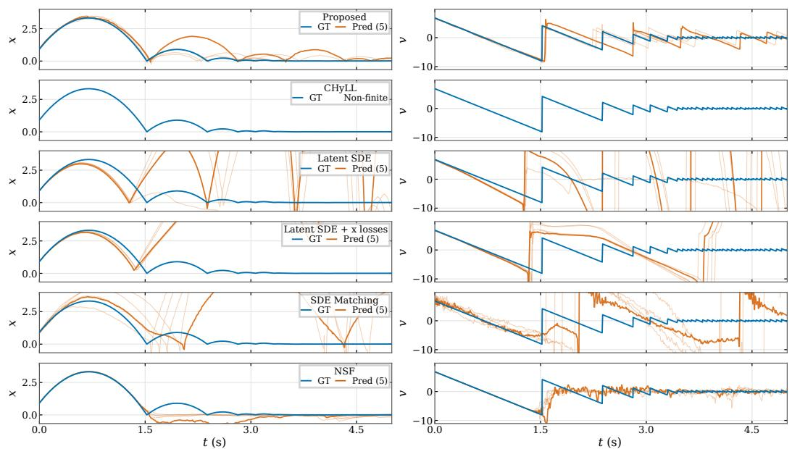

Figure 7: b-ball (GMM): one-dimensional bouncing ball with GMM-distributed restitution coefficients. The two columns show position and velocity over time.  
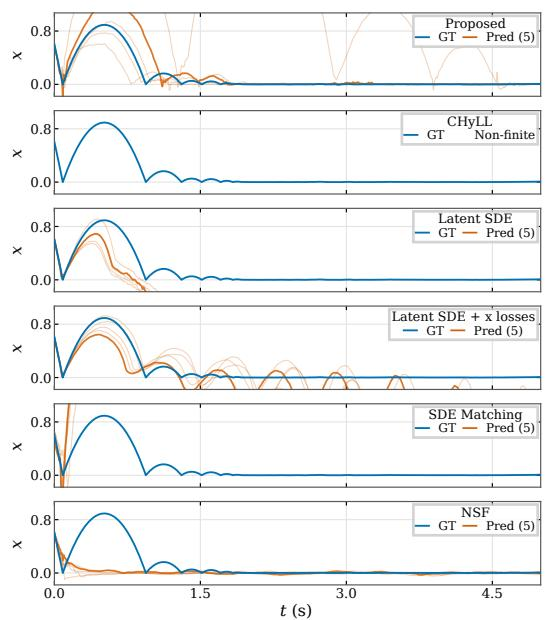

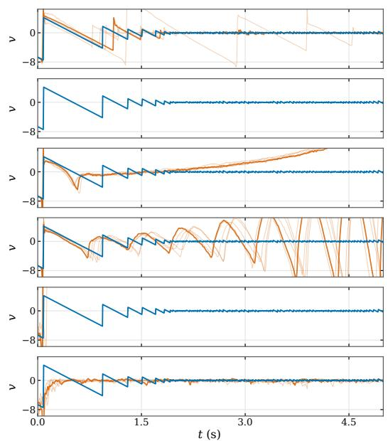  
Figure 8: b-ball (Uniform): one-dimensional bouncing ball with uniformly distributed restitution coefficients. The two columns show position and velocity over time.

t (s)

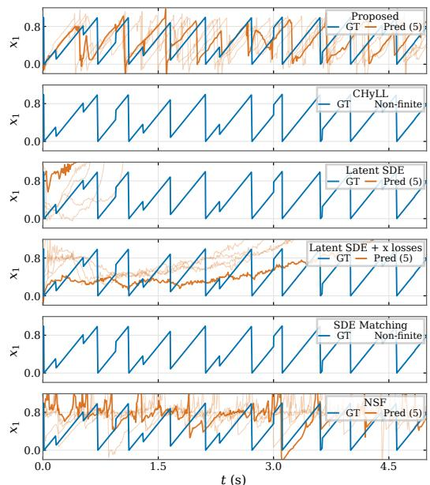

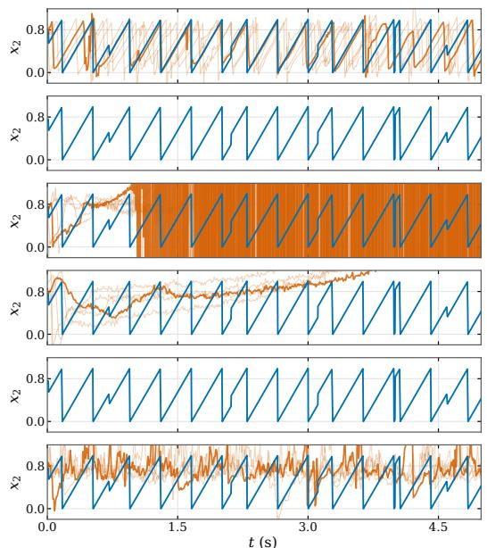  
Figure 9: Torus (GMM): coordinate trajectories in the fundamental domain with GMM-distributed reset perturbations.

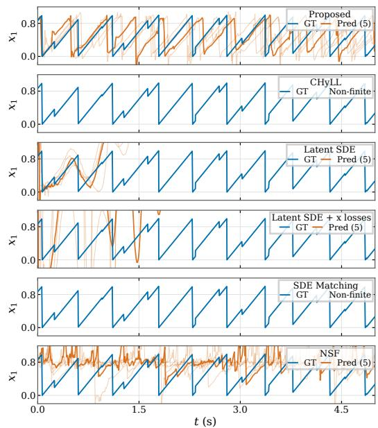

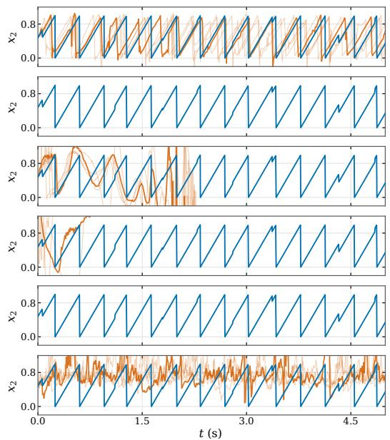  
Figure 10: Torus (Uniform): coordinate trajectories in the fundamental domain with uniformly distributed reset perturbations.

t (s)

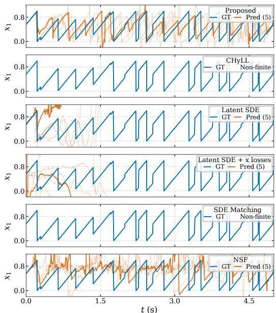

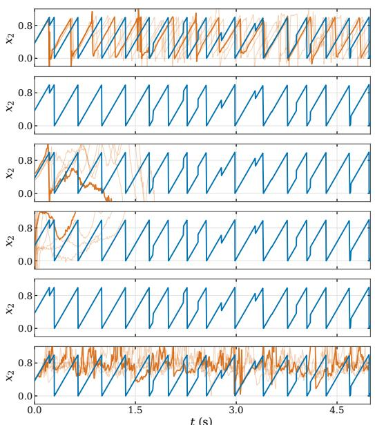  
Figure 11: Klein (GMM): coordinate trajectories in the fundamental domain with GMM-distributed reset perturbations and Klein-bottle boundary gluing.

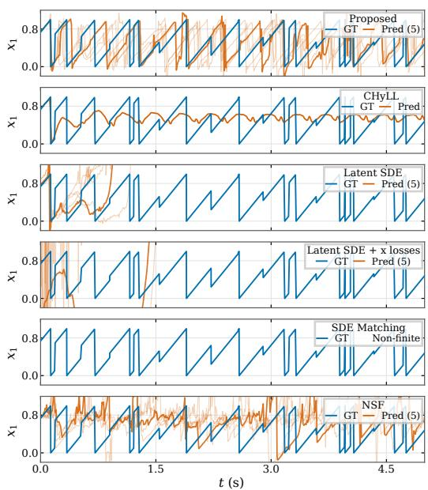

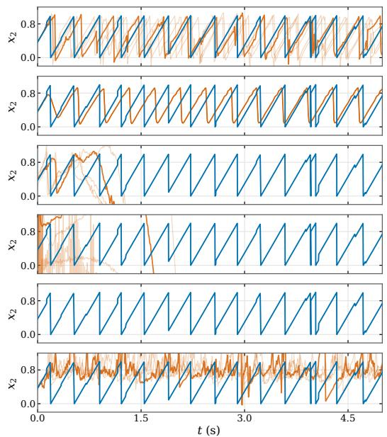  
Figure 12: Klein (Uniform): coordinate trajectories in the fundamental domain with uniformly distributed reset perturbations and Klein-bottle boundary gluing.

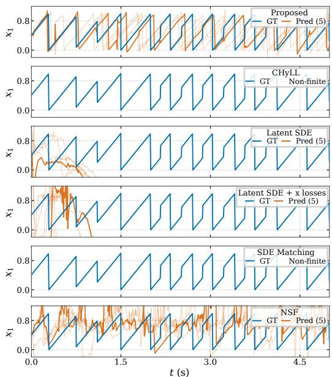

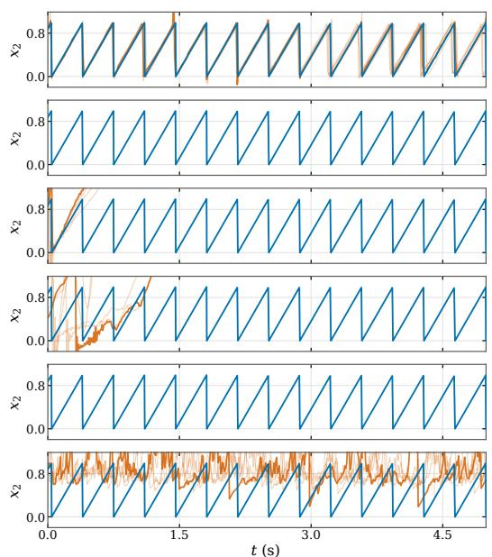  
Figure 13: Klein–Torus: coordinate trajectories with random selection between canonical Klein-bottle and torus resets at the top boundary, each with probability $1 / 2$

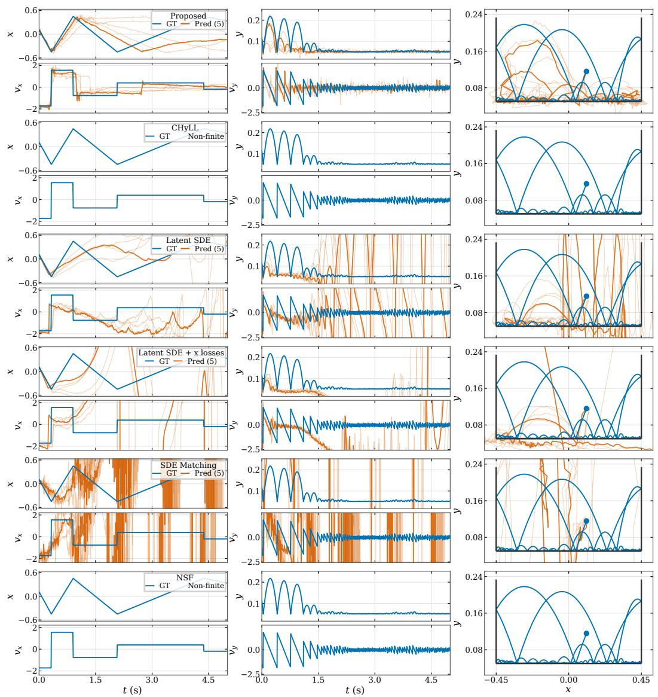  
Figure 14: 1-ball (GMM): a single planar bouncing ball with GMM-distributed wall and floor restitution coef ficients. The left $2 \times 2$ panels show $( x , y )$ above $( v _ { x } , v _ { y } )$ ; the right panel shows the spatial path with radiusadjusted ball-center contact boundaries.

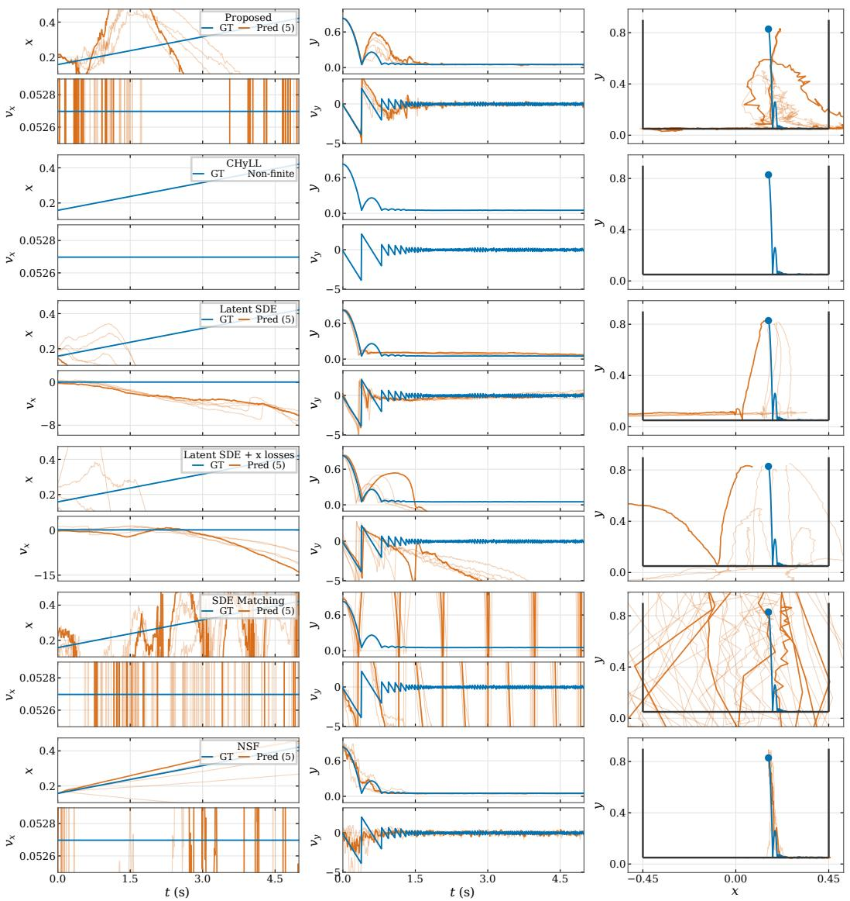  
Figure 15: 1-ball (Uniform): a single planar bouncing ball with uniformly distributed wall and floor restitution coefficients. The left panels show the four state components over time; the right panel shows the spatial path and ball-center contact boundaries.

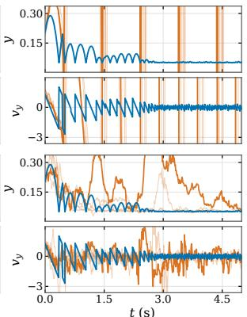

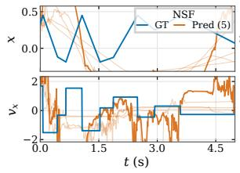

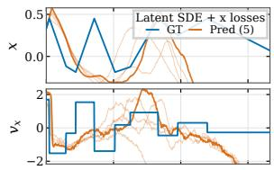

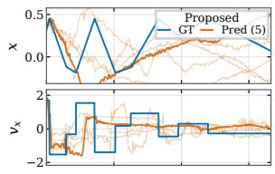

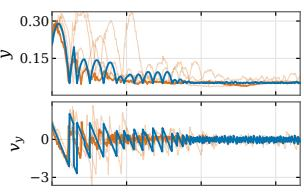

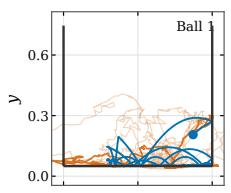

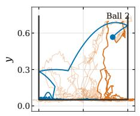

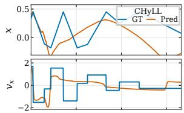

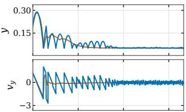

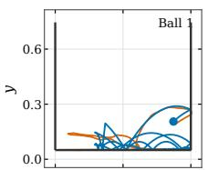

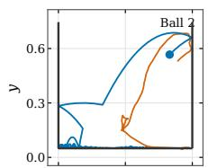

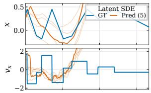

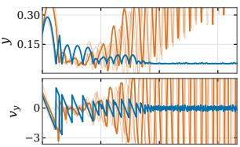

  
Figure 16: 2-balls (GMM): two interacting planar bouncing balls with GMM-distributed wall and floor restitution coefficients. The left panels show the first ball’s four state components; the two right panels show the spatial paths of both balls and their ball-center contact boundaries.

  
Figure 17: 2-balls (Uniform): two interacting planar bouncing balls with uniformly distributed wall and floor restitution coefficients. The left panels show the first ball’s four state components; the two right panels show the spatial paths of both balls and their ball-center contact boundaries.