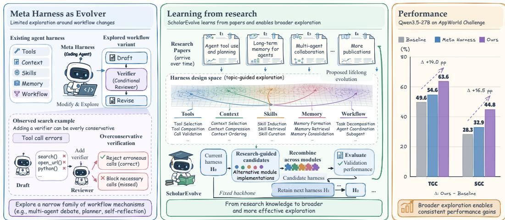
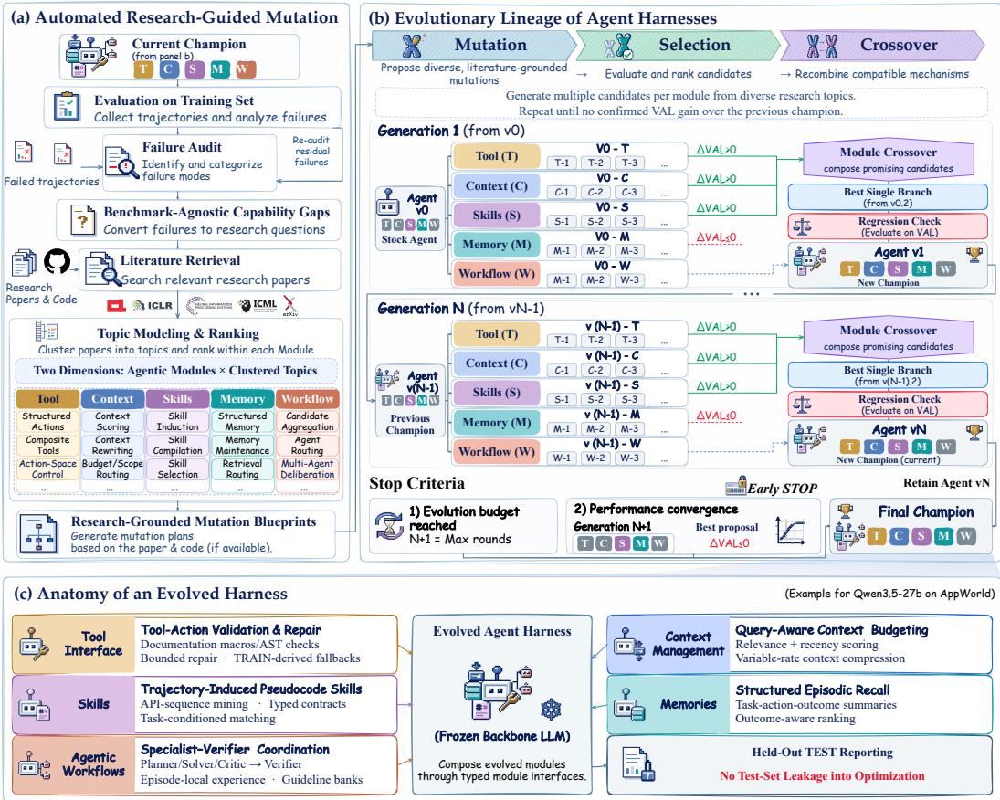
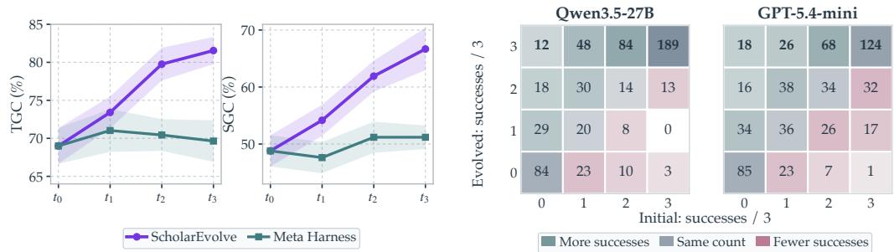
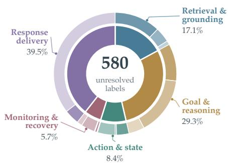
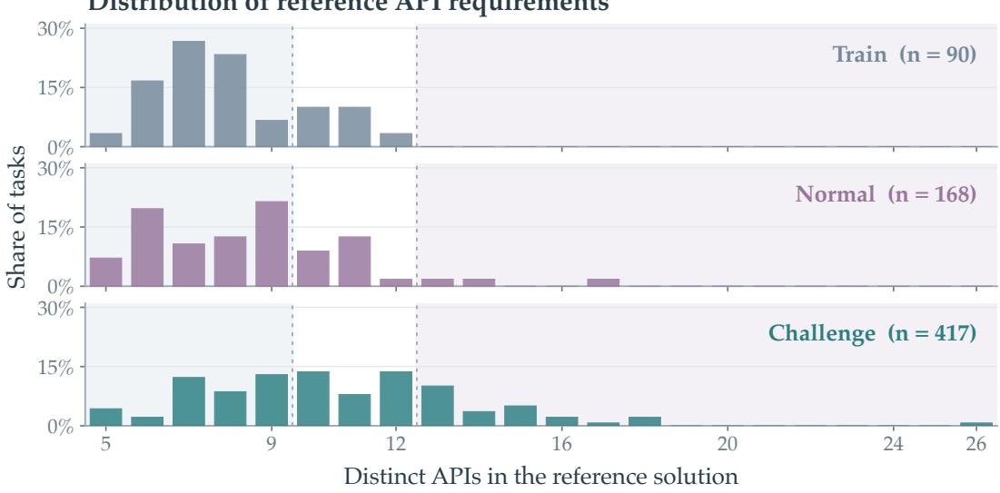
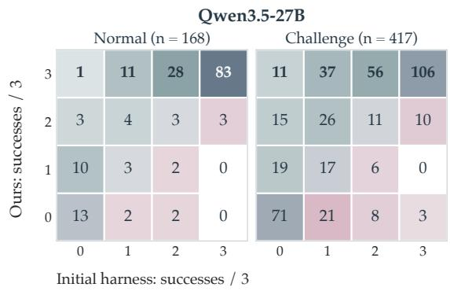
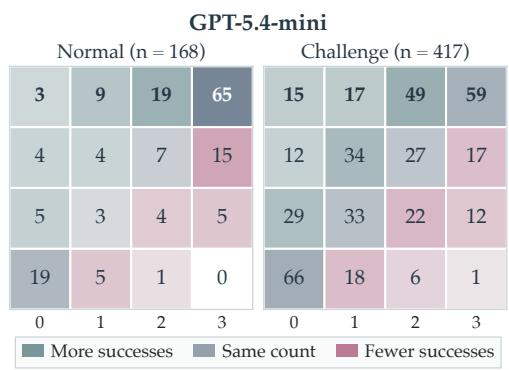
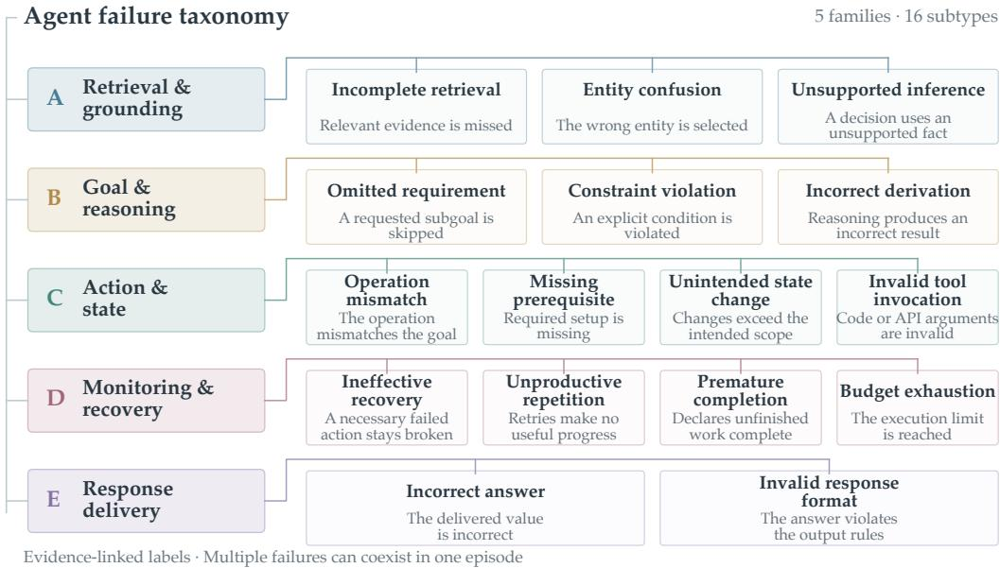
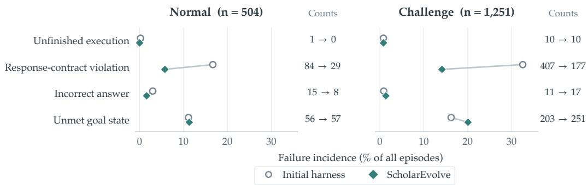
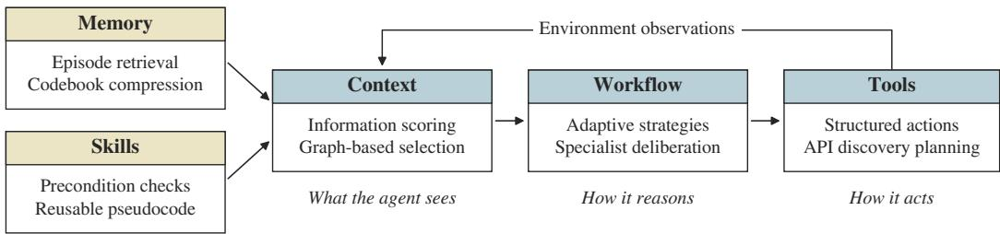

# LEARNING FROM RESEARCH: TOWARD LIFELONG AGENT HARNESS EVOLUTION

Jingbo Yang<sup>1∗</sup> Kwei-Herng Lai<sup>2</sup> Xiaowen Wang<sup>2</sup> Yaar Harari<sup>2</sup>

Evgeniy Gabrilovich<sup>2</sup> Shiyu Chang<sup>1</sup>

<sup>1</sup>University of California, Santa Barbara <sup>2</sup>Microsoft

## ABSTRACT

Language agents are expected to solve increasingly complex tasks, creating a growing need for continual improvement. One promising approach is to evolve the agent harness, the software that governs tool use, memory management, and task execution, while keeping the underlying language model fixed. Recent methods automate this process by using a meta coding agent to modify the harness based on execution feedback. However, relying on that agent’s existing knowledge and observed failures can restrict exploration and make adaptation reactive. Inspired by how human experts learn from the research literature for new solutions, we introduce SCHOLAREVOLVE, a framework that automatically draws on state-of-the-art research to guide harness evolution. SCHOLAREVOLVE organizes the harness evolution directions into functional modules and uses topic modeling to identify distinct improvement strategies for each module. It implements these strategies and evaluates their combinations to improve task performance. Moreover, the framework is designed to incorporate new publications over time, allowing research advances to drive proactive lifelong evolution. Experiments demonstrate improvements on AppWorld and τ<sup>2</sup>-Bench. SCHOLAREVOLVE raises Qwen3.5-27B task goal completion from 49.6% to 63.6% on AppWorld Challenge, and raises GPT-5.4-mini pass<sup>1</sup> from 72.7% to 81.9% on τ<sup>2</sup>-Bench Telecom. Code is available at https://github.com/UCSB-NLP-Chang/ ScholarEvolve.

## 1 INTRODUCTION

Language model agents are increasingly able to solve problems that require extended interaction with digital environments, from debugging software repositories to coordinating workflows across applications (Merrill et al., 2026; Wang et al., 2025; Trivedi et al., 2024). As their capabilities grow, so do the demands placed on them: users expect agents to handle longer tasks, unfamiliar tools, and changing requirements with greater autonomy (Liu et al., 2026c). Meeting these demands requires agents to acquire new problem solving strategies and improve how they use their available capabilities. This has motivated growing interest in agent evolution, where an agent’s design continues to improve beyond its initial development (Yang et al., 2026a; Zhang et al., 2026b;a). Repeatedly training large backbone models can make such adaptation computationally expensive (Zhang et al., 2026a; Agrawal et al., 2026). Recent work therefore explores evolution of the agent harness, the software that organizes tool use, context management, skills, memories, and execution workflows around a fixed model (Team et al., 2026; Lee et al., 2026; Lou et al., 2026). These modules determine how the agent turns model outputs into sustained action, including what information it retains and how it recovers from failure (Zhang et al., 2026c; Ouyang et al., 2026; Zhou et al., 2026). Evolving the harness opens a practical path to more capable agents through changes to this execution system.

Recent harness evolution methods commonly use a meta agent, often a coding agent equipped with its own development harness, to inspect execution traces, propose code changes, and evaluate the resulting candidates (Lee et al., 2026; Robeyns et al., 2025). This approach automates an increasingly broad range of engineering decisions, yet sustaining progress raises three challenges. ❶ Limited exploration. Broad permission to edit code can still lead to a narrow sequence of modifications.

  
Figure 1: Overview of SCHOLAREVOLVE. Left: workflow focused exploration. Middle: research guided module mutation, recombination, and lifelong evolution. Right: Qwen3.5-27B task (TGC) and scenario (SGC) goal completion on AppWorld Challenge.

Recent evaluations document search that plateaus around repeated local edits (Huang et al., 2026). For example, adding verification rounds or multiple agent proposals can increase computation while leaving other mechanisms for improving the harness unexplored (Cemri et al., 2026; Kim et al., 2025). Figure 1 (left) illustrates how overly conservative verification can block tool calls needed to complete a task. ❷ Limited design knowledge. The mechanisms a meta agent proposes depend on its backbone’s knowledge and reasoning capabilities (Zhang et al., 2026a). A failure trace may expose a missing capability while offering little guidance on the technique needed to build it. ❸ Delayed adaptation. Evolution driven by trajectories and feedback draws its evidence from situations already encountered (Karten et al., 2026; Wei et al., 2026). In deployment, a weakness may consequently affect users before sufficient evidence accumulates to motivate a useful update. These challenges point to the need for fresh design ideas beyond an agent’s existing experience. This leads us to ask: How would an experienced researcher uncover improvements that an agent’s own experience has yet to reveal?

Experienced researchers and machine learning engineers turn to the research literature to learn how others solve similar problems, identify promising mechanisms, and adapt them to new settings (Tang et al., 2026; Schmidgall & Moor, 2025; Gottweis et al., 2025). This practice makes the collective experience of the research community available to each new design effort. We bring this practice into SCHOLAREVOLVE, an automated research framework designed for lifelong agent harness evolution (Figure 1, middle), with three corresponding advantages. ❶ Structured exploration. We organize search by harness module and use topic modeling to group papers into distinct mechanism families within each module. We merge overlapping topics and distribute the candidate budget across the remaining families to cover different mechanisms. Common interfaces support module recombination, and direct evaluation of the resulting combinations measures their joint effects be fore selection. ❷ Proposals grounded in research. Retrieved papers supply concrete techniques that guide the coding agent’s implementation of module mutations. New publications can introduce mechanisms developed after the backbone was trained, expanding the design knowledge available to the meta agent without updating its model weights. ❸ Proactive lifelong evolution. The proposed lifelong extension uses a genetic algorithm in which research informs module mutations, recombi nation provides crossover, and validation selects the next champion. Periodic literature refresh can initiate this process as new methods become available. A deployed agent could, for example, review the latest research each month and evaluate promising updates against validation tasks.

We evaluate SCHOLAREVOLVE’s module search and composition on AppWorld (Trivedi et al., 2024) and τ<sup>2</sup>-Bench (Barres et al., 2025), using Qwen3.5-27B and GPT-5.4-mini as task agent backbones (Table 1). On AppWorld, the evolved Qwen3.5-27B harness raises task goal completion from 69.0% to 81.4% on the Normal split and from 49.6% to 63.6% on the Challenge split. On τ<sup>2</sup>-Bench Telecom, the evolved GPT-5.4-mini harness improves pass<sup>1</sup> from 72.7% to 81.9%.

## 2 RELATED WORK

Agent harness evolution. Automated agent design searches for effective execution mechanisms around language models. ADAS searches over agent programs, and AFlow optimizes workflows through tree search (Hu et al., 2025; Zhang et al., 2025). Their evaluations emphasize static reasoning, question answering, and code generation, leaving sustained interaction with changing environment states less explored. Subsequent work broadens the optimization scope. DGM evolves coding agents through self-modification and an archive of candidates. Meta Harness searches executable harness programs using accumulated evaluation evidence, while AHE uses detailed trajectories to revise tools, memory, and other harness components (Zhang et al., 2026a; Lee et al., 2026; Lin et al., 2026). AgentSquare also decomposes agents into modules and combines module evolution with recombination (Shang et al., 2025). These approaches establish code search and modular composition as useful foundations. SCHOLAREVOLVE supplies this search with mechanisms extracted from the research literature, using topic modeling to organize distinct directions within each module and distribute exploration across them.

Generalization and continued adaptation are central challenges for evolved harnesses. Offline search typically yields a harness that is frozen for subsequent evaluation. Some reported gains also reuse the search tasks: Meta Harness’s TerminalBench-2 experiment and AHE’s primary evolution experiment optimize and report performance on the same 89 tasks (Lee et al., 2026). Such search can make the agent overfit to a group of specific tasks. Recent work addresses this distinction through regularized evolution in RRSI and separate development and final evaluation in SoL-Pi, which searches for composable efficiency improvements (Liu et al., 2026a). For continued adaptation, Adaptive Auto-Harness and Evo-Harness update harnesses from experience accumulated over task streams (Liu et al., 2026d; Wei et al., 2026). SCHOLAREVOLVE introduces a complementary source of updates: new publications can initiate further generations of module mutation and recombination, allowing a deployed agent to evaluate new mechanisms before corresponding failures accumulate in its own interactions.

Automated research. Automated research systems turn scientific knowledge and experimentation into reusable discoveries. AI Scientist-v2 and AI-Researcher automate hypothesis generation, implementation, experimentation, and manuscript preparation (Yamada et al., 2025; Tang et al., 2026). AgentRxiv enables research agents to share reports and build on earlier findings, demonstrating cumulative improvements in reasoning and prompting methods (Schmidgall & Moor, 2025). Paper2Agent converts papers and associated code into callable tools and interactive research agents, making published methods directly reusable (Miao et al., 2026). SCHOLAREVOLVE makes the translation from literature to harness improvements an explicit search process. Papers provide candidate mechanisms, topic modeling organizes their coverage, and module interfaces support implementation and recombination. Task evaluation selects useful changes, while successive literature updates provide fresh directions for lifelong evolution around a fixed backbone.

## 3 METHOD

We propose SCHOLAREVOLVE, a framework for lifelong harness evolution through literature guided module mutation and crossover around a fixed backbone (Figure 2).

## 3.1 PROBLEM FORMULATION

An agent harness is an executable program that manages model inputs, action execution, and state updates during interaction with an environment (Ning et al., 2026). Let H contain harnesses that satisfy the environment’s interfaces and execution constraints.

We distinguish the target task distribution from the finite splits available to evolution. For each evaluation setting, let $\mathcal { P } _ { \mathrm { t a r } }$ denote the task distribution on which performance is ultimately desired. The evolution set $\mathcal { D } _ { \mathrm { e v o } }$ supplies trajectories for failure analysis, research query construction, and persistent artifact construction. The validation set $\mathcal { D } _ { \mathrm { v a l } }$ supports candidate evaluation and champion selection. The test set $\mathcal { D } _ { \mathrm { t e s t } }$ is a finite held-out sample from $\mathcal { P } _ { \mathrm { t a r } } ,$ , used only for final reporting after all selection decisions are frozen. Thus, $\mathcal { D } _ { \mathrm { t e s t } }$ represents the target distribution in evaluation, but is not the distribution itself. The three sets are mutually disjoint.

  
Figure 2: SCHOLAREVOLVE: (a) research guided module mutation, (b) selection and crossover across generations, and (c) evolved modules operating around a fixed backbone.

Thefixed backbone $f _ { \theta }$ is the language model whose parameters remain unchanged during evolution. For a task $x \sim \mathcal { P } _ { \mathrm { t a r } } .$ , harness H induces an interaction trajectory $\tau = ( o _ { 0 } , a _ { 0 } , \ldots , o _ { T } )$ containing observations, model decisions, tool calls, and environment responses. We write $\tau \sim p _ { \boldsymbol { \theta } } ( \cdot \cdot \mid H , x )$ and score it by reward $R ( x , \tau )$ . Harness evolution seeks

$$
H ^ { \star } \in \underset { H \in \mathcal { H } } { \arg \operatorname* { m a x } } J ( H ) , \qquad J ( H ) = \mathbb { E } _ { x \sim \mathcal { P } _ { \mathrm { t a r } } } \mathbb { E } _ { \tau \sim p _ { \theta } ( \cdot \vert H , x ) } [ R ( x , \tau ) ] .\tag{1}
$$

Starting from a base harness $H ^ { ( 0 ) }$ , the search uses $\mathcal { D } _ { \mathrm { e v o } }$ and $\mathcal { D } _ { \mathrm { v a l } }$ within a fixed budget. It never uses $\mathcal { D } _ { \mathrm { t e s t } }$ or updates θ.

## 3.2 RESEARCH GUIDED MODULAR EXPLORATION

We organize exploration along two axes: a module specifies the execution responsibility to modify, and a method topic identifies a research mechanism to implement within it. Together they distribute candidate generation across intervention points and alternative solutions.

## 3.2.1 STRUCTURING THE CODE SPACE INTO MODULES

We represent a harness as $H = \mathrm { C o m p o s e } ( m _ { 1 } , \dots , m _ { 5 } )$ , where each $m _ { j }$ implements a defined interface. The five modules provide separate intervention points and exchange boundaries for crossover. Their definitions follow the modular harness view in modern agent post-training (Team et al., 2026).

❶ Tool interface. Controls the actions available to the agent and translates proposals into executable calls. Mutation directions include tool selection, tool composition, and call validation, such as exposing task relevant tools or packaging related operations into a composite action. ❷ Context management. Assembles model inputs from instructions, history, memories, and skills through context selection, compression, and ordering, preserving evidence needed for subsequent decisions within the available context budget. ❸ Skills. Maintains reusable procedures through skill induction, retrieval, and curation. Mutations can extract procedures from successful trajectories, retrieve them by applicability, and consolidate overlapping entries in a skill library. ❹ Memories. Maintains experience through memoryformation, retrieval, and consolidation, for example by recording episode outcomes, recalling relevant situations, and merging related records. ❺ Agentic workflows. Organizes planning and action generation through task decomposition, agent coordination, and subagent delegation, including assigning subtasks and integrating specialist proposals.

These responsibilities interact during execution: retrieving a longer skill changes what context man agement must preserve, and delegating a subtask changes the evidence available to subsequent decisions. During mutation, we change one module while keeping the others fixed, isolating its effect within the current harness. Coordination among independently modified modules is handled during crossover, where complete harnesses are evaluated to select compatible combinations (Section 3.3).

## 3.2.2 CONSTRUCTING THE RESEARCH POOL

As shown in Figure 2(a), research pool construction begins with trajectories collected on $\mathcal { D } _ { \mathrm { e v o } }$ An auditor attributes failed trajectories to agent or environment causes and retains recurring agentattributable failures together with their supporting observations and actions. A research model abstracts this benchmark-specific evidence into capability gaps that describe missing inference-time abilities. For each gap, it identifies possible interventions within each module’s responsibility and generates broad capability queries and focused mechanism queries. Literature retrieval and deduplication then produce a pool $\mathcal { P } _ { j }$ of paper titles and abstracts for module $j ,$ ready for mechanism level topic modeling. Appendix C.2 details the audit, query construction, retrieval, and screening.

## 3.2.3 TOPIC MODELING FOR ORTHOGONAL EXPLORATION

A broad research pool can contain many papers proposing similar mechanisms. Spending the mutation budget on these papers narrows exploration, while overlapping interventions can complicate coordination during crossover. To broaden exploration and mitigate such conflicts, we organize papers into semantically orthogonal topics, each describing a distinct mechanism with minimal overlap in its intended operation. We follow the TopicGPT framework (Pham et al., 2024) for prompted topic generation, refinement, and assignment, conditioning each stage on the module’s responsibility and encouraging consistent mechanism granularity.

Taxonomy induction and refinement. Let $d _ { j }$ describe module $j ,$ and $B _ { j , b }$ be batch b of its papers. Starting from $\mathcal { T } _ { j } ^ { ( 0 ) } = \emptyset$ , the research model induces and refines topics through

$$
\begin{array} { r } { \mathcal { T } _ { j } ^ { ( b ) } = \mathcal { T } _ { j } ^ { ( b - 1 ) } \cup G _ { \phi } \Big ( B _ { j , b } , \mathcal { T } _ { j } ^ { ( b - 1 ) } , d _ { j } \Big ) , \qquad \mathcal { T } _ { j } = F _ { \phi } \Big ( \mathcal { T } _ { j } ^ { ( B _ { j } ) } , d _ { j } \Big ) , } \end{array}\tag{2}
$$

where $B _ { j }$ is the number of batches. Each topic has a mechanism name and a short description. Generation $G _ { \phi }$ reuses a name when its mechanism fits a paper and adds a category when a relevant mechanism remains uncovered. Refinement $F _ { \phi }$ merges paraphrases and overlapping categories, absorbs overly specific variants into broader mechanism $s ,$ and removes vague or irrelevant topics. For example, demonstration retrieval and knowledge retrieval can be grouped under External Context Retrieval when retrieval is the shared intervention. This standardization of mechanism granularity encourages semantic orthogonality across topics.

Evidence supported assignment. The research model assigns each paper an ordered list $L _ { j } ( p ) =$ $( \ell _ { j , p , 1 } , \hdots , \ell _ { j , p , q _ { j , p } } )$ of topics, placing its primary methodological contribution first and providing supporting excerpts from the abstract. We retain labels in the refined taxonomy. For a nonempty list, the primary topic $z _ { j } ( p ) = \ell _ { j , p , 1 }$ defines the selection cluster $\mathcal { C } _ { j , t } = \{ p \in \mathscr { P } _ { j } : z _ { j } ( p ) = \bar { t } \}$ Papers without a retained label remain unassigned. Multiple labels preserve a paper’s different mechanisms, while the primary label gives it one selection cluster per module. Stored excerpts make these assignments inspectable.

Coverage across mechanism families. We screen topics against mechanisms already available in the base harness and backbone. Let $\mathcal { T } _ { j } ^ { + }$ contain the remaining topics with nonempty clusters. We order clusters by decreasing size and select papers in round robin order, visiting every cluster before returning to one. Within a cluster, we follow retrieval order. A budget of $K _ { j }$ papers therefore covers min $( K _ { j } , | \mathcal { T } _ { j } ^ { + } | )$ distinct topics. Topic refinement reduces redundant mechanisms, while this allocation spreads implementation opportunities across them. Topic orthogonality and module isolation support crossover at complementary levels: topics diversify the implementations available within a module, and interfaces localize their responsibilities. For example, context compression and workflow verification can be composed through separate interfaces. Their joint effectiveness is assessed by evaluating the complete harness.

## 3.2.4 FROM RESEARCH MECHANISMS TO EXECUTABLE MUTATIONS

For each selected paper p, a research agent reads the full paper, including its method and appendix, together with available official code. It produces a mutation blueprint that specifies the source mechanism and assumptions, target module and interface, required state and artifacts, runtime operations, auxiliary model calls, and termination conditions. The blueprint separates the source mechanism from adaptations required by the host harness and retains the paper and topic provenance.

The coding agent receives this blueprint, the current module implementation, its interface, and the environment’s action format. It implements $m _ { j } ^ { ( p ) }$ and constructs the mutation $H _ { j } ^ { ( p ) } = H ^ { ( 0 ) } [ j $ $m _ { i } ^ { ( p ) } ]$ , keeping the other modules fixed. Literature-derived mechanisms must be adapted to the host harness, so a candidate can fail at an interface or artifact boundary before its behavior can be measured. We therefore run lightweight health probes that check importability, interface compatibility, artifact construction and reloading, and valid action production. The coding agent repairs reported errors until these checks pass or its repair budget is exhausted. Persistent skill libraries and memories may be built only from trajectories in $\mathcal { D } _ { \mathrm { e v o } }$ . They are frozen during evaluation on $\mathcal { D } _ { \mathrm { v a l } }$ and $\mathcal { D } _ { \mathrm { t e s t } }$ , while modules can update local state within an episode. Appendix C provides concrete implementations and additional implementation details.

## 3.3 MODULE CROSSOVER AND SELECTION

At generation g, the retained champion $H _ { g }$ serves as the base harness $H ^ { ( 0 ) }$ . We first evaluate each mutation against it on the same $\mathcal { D } _ { \mathrm { v a l } }$ tasks and trials. With $\bar { r } _ { i } ( H )$ denoting mean reward on task i, its gain is $g _ { j , p } ( i ) = \bar { r } _ { i } ( H _ { j } ^ { ( p ) } ) - \bar { r } _ { i } ( H ^ { ( 0 ) } )$ . Crossover chooses one implementation per module. A configuration $c = ( c _ { 1 } , \ldots , c _ { 5 } )$ may retain a base module by setting $c _ { j } = 0$ and $g _ { j , 0 } ( i ) = 0$ . We rank combinations by additive predicted gain on $\mathcal { D } _ { \mathrm { v a l } } \mathrm { : }$

$$
\widehat { \Delta } ( c ) = \frac { 1 } { | \mathcal { D } _ { \mathrm { v a l } } | } \sum _ { i \in \mathcal { D } _ { \mathrm { v a l } } } \sum _ { j = 1 } ^ { 5 } g _ { j , c _ { j } } ( i ) .\tag{3}
$$

We enumerate available combinations and use this score to shortlist them within the crossover evaluation budget, reusing individual measurements without additional rollouts. Each shortlisted configuration is assembled as a complete harness $H _ { c }$ and evaluated to obtain its actual gain $\begin{array} { r } { \Delta ( c ) = | \mathcal { D } _ { \mathrm { v a l } } | ^ { - 1 } \sum _ { i \in \mathcal { D } _ { \mathrm { v a l } } } [ \bar { r } _ { i } ( H _ { c } ) - \bar { r } _ { i } ( H ^ { ( 0 ) } ) ] } \end{array}$ . This joint evaluation provides the regression check shown in Figure $2 \colon$ selection uses observed gains to account for module interactions and reward ceilings. Retaining the base implementation at each position permits subsets of mutations, including omission of a module whose individual gain fails to carry over to the combination.

Let $A _ { g }$ contain the evaluated mutations and crossover candidates, and let ${ \widetilde { \cal H } } _ { q }$ maximize their mean validation reward. We compare it with $H _ { g }$ using paired task gains. If $\check { L _ { \alpha } } ( H , H _ { g } )$ is the lower endpoint of their paired bootstrap gain interval at nominal confidence level $1 - \alpha$ , the retention rule is

$$
H _ { g + 1 } = \left\{ \begin{array} { l l } { \widetilde { H } _ { g } , } & { L _ { \alpha } ( \widetilde { H } _ { g } , H _ { g } ) > 0 , } \\ { H _ { g } , } & { \mathrm { o t h e r w i s e } . } \end{array} \right.\tag{4}
$$

The champion is retained when no executable candidate is available. Including individual mutations allows advancement through a single useful change, corresponding to the best single branch in Figure 2. The selected code and its frozen artifacts form the next champion. We declare the current search cycle converged after $s _ { \mathrm { s t o p } }$ consecutive generations without a confirmed validation improvement under Equation 4. The cycle also stops when its search budget is exhausted.

## 3.4 LIFELONG HARNESS EVOLUTION

Literature based evolution naturally supports proactive adaptation: new publications provide candidate improvements before corresponding failures are observed in a deployed agent. Periodic literature updates can therefore initiate a new search cycle even after the previous cycle has converged. Each cycle starts from the retained champion and screens research topics against its current mechanisms. Available trajectories from $\mathcal { D } _ { \mathrm { e v o } }$ can refine the research brief as the harness evolves.

Within each cycle, literature supplies mutation directions, crossover combines module implementations, and $\mathcal { D } _ { \mathrm { v a l } }$ provides the fitness signal for selection. The backbone remains fixed across cycles, while the champion’s code and persistent artifacts carry forward useful improvements.

## 4 EXPERIMENTS

## 4.1 EXPERIMENTAL SETUP

Benchmarks and environments. AppWorld (Trivedi et al., 2024) evaluates tasks across applications through API execution. Its 90 training tasks form $\mathcal { D } _ { \mathrm { e v o } } .$ , and its 57 development tasks form $\mathcal { D } _ { \mathrm { v a l } }$ . We report separately on the official Normal and Challenge test sets, denoted $\mathcal { D } _ { \mathrm { t e s t } } ^ { \mathrm { N } }$ (168 tasks) and $\mathcal { D } _ { \mathrm { t e s t } } ^ { \mathrm { C } }$ (417 tasks). Challenge requires APIs from Amazon or Gmail, applications absent from the evolution and validation sets. We report task goal completion (TGC) and scenario goal completion (SGC), which requires success on all three variants of a scenario. For $\tau ^ { 2 } .$ -Bench (Barres et al., 2025), we use Telecom, where agents resolve service issues through tools and a simulated user. A stratified set of 250 training tasks forms $\mathcal { D } _ { \mathrm { e v o } } ,$ the official 74-task training split serves as $\mathcal { D } _ { \mathrm { v a l } }$ , and the official 40-task test split is $\mathcal { D } _ { \mathrm { t e s t } }$ . We report pass<sup>k</sup>, the probability of success across all k trials, for $k \in \{ 1 , 2 , 3 , 4 \}$

Implementation details. We evolve Qwen3.5-27B and GPT-5.4-mini harnesses with fixed task backbones. Comparisons include the initial harness and Meta Harness (Lee et al., 2026), a coding agent that revises the harness using execution feedback. Both evolution methods use GPT-5.4 through Codex and receive the same allocated search rollout budget per setting. We report means and standard deviations over three independent evaluation runs. Appendix A.1 specifies inference settings, search configurations, and metric aggregation.

## 4.2 MAIN RESULTS

Table 1 compares SCHOLAREVOLVE, Meta Harness, and the initial harness under each backbone.

Consistent improvements across environments. SCHOLAREVOLVE improves both task backbones on every reported AppWorld and Telecom metric. On AppWorld Normal, Qwen gains 12.4 TGC and 20.2 SGC percentage points over the initial harness. On Telecom, Mini gains 9.2 pass<sup>1</sup> and 9.1 pass<sup>4</sup> points. These improvements span individual task completion and consistent success across variants or repeated trials.

Generalization to held-out applications. The same AppWorld harnesses and evolution-derived artifacts transfer to Challenge, including the unseen applications Amazon and Gmail. TGC gains are larger on Challenge than Normal: 14.0 versus 12.4 points for Qwen, and 9.5 versus 5.3 for Mini. On Challenge, they exceed Meta Harness by 9.0 and 10.0 points, respectively. Section 4.5 examines this transfer across API requirements relative to training.

Closing capability gaps through harness design. On AppWorld Normal, the evolved Qwen agent reaches 81.4% TGC, comparable to Kimi-K2.6’s 81.3%, and reduces its gap to GPT-5.4 from 16.7 to 4.3 points, closing approximately 74% of the gap with fixed model weights. On Telecom, its 98.1% pass<sup>1</sup> and 93.3% pass<sup>4</sup> match or exceed DeepSeek-V4-Flash’s 98.1% and 92.5% under the initial harness. Harness design thus has a substantial effect on the capabilities delivered by a given backbone.

## 4.3 LIFELONG EVOLUTION



Table 1: Main results on AppWorld and $\tau ^ { 2 } { \bf - B e n c h }$ as mean ± standard deviation over 3 runs. ∆ is the absolute change from the matched backbone (orange: improvement, blue: degradation). Bold and underline mark the two largest gains per column.
<table><tr><td rowspan="3" colspan="2">Method</td><td colspan="4">AppWorld</td><td colspan="4">τ2-Bench</td></tr><tr><td colspan="2">Normal</td><td colspan="2">Challenge</td><td colspan="4"> $P a s s ^ { k }$ </td></tr><tr><td>TGC</td><td>SGC</td><td>TGC</td><td>SGC</td><td>k=1</td><td>k=2</td><td>k=3</td><td>k=4</td></tr><tr><td rowspan="10">BASELINE AGENTS</td><td>S gpt-5.4</td><td>85.7±2.73</td><td>73.2±5.46</td><td>80.4±1.05</td><td>63.3±3.31</td><td>86.3±2.89</td><td>75.6±6.38</td><td>67.2±10.29</td><td>60.0±14.43</td></tr><tr><td>Q DeepSeek-V4-Flash</td><td>84.1±2.27</td><td>68.4±7.22</td><td>79.5±0.51</td><td>60.4±0.75</td><td>98.1±0.00</td><td>96.3±0.00</td><td>94.4±0.00</td><td>92.5±0.00</td></tr><tr><td>KKimi-K2.6</td><td>81.3±0.91</td><td>60.1±2.73</td><td>77.5±1.04</td><td>59.0±3.14</td><td>98.1±0.88</td><td>97.9±0.59</td><td>97.7±0.30</td><td>97.5±0.00</td></tr><tr><td>日 MAI-Thinking-1</td><td>69.0±2.56</td><td>46.4±4.71</td><td>53.5±0.64</td><td>29.7±1.76</td><td>55.9±3.98</td><td>41.5±5.60</td><td>32.2±6.63</td><td>25.0±7.07</td></tr><tr><td>S gpt-oss-120b</td><td>34.5±1.20</td><td>14.3±3.12</td><td>21.6±0.29</td><td>7.4±2.08</td><td>74.4±0.88</td><td>60.2±0.88</td><td>50.3±0.44</td><td>42.5±0.00</td></tr><tr><td>∅ grok-4.6</td><td>20.8±2.12</td><td>4.8±1.04</td><td>13.7±3.86</td><td>3.1±0.40</td><td>82.5±0.00</td><td>69.2±0.00</td><td>59.4±0.00</td><td>52.5±0.00</td></tr><tr><td>8 Llama-3.3-70B</td><td>17.9±3.59</td><td>3.6±0.00</td><td>8.3±1.30</td><td>1.4±0.75</td><td>15.0±0.88</td><td>10.8±0.59</td><td>8.75±0.00</td><td>7.5±0.00</td></tr><tr><td>H Mistral-Large-3</td><td>17.3±1.15</td><td>7.0±1.66</td><td>7.4±0.87</td><td>0.9±0.40</td><td>35.4±5.67</td><td>23.2±6.38</td><td>15.6±7.21</td><td>10.8±7.64</td></tr><tr><td>S gpt-5.4-mini</td><td>67.1±1.78</td><td>46.4±3.06</td><td>46.1±0.98</td><td>21.1±1.11</td><td>72.7±2.53</td><td>61.1±4.26</td><td>54.4±6.03</td><td>49.2±8.04</td></tr><tr><td>女 Qwen3.5-27b</td><td>69.0±2.35</td><td>48.8±2.75</td><td>49.6±2.89</td><td>28.3±4.37</td><td>96.7±0.95</td><td>93.3±1.91</td><td>90.0±2.86</td><td>86.7±3.82</td></tr><tr><td rowspan="4">META HARNESS</td><td>Codex + gpt-5.4-mini</td><td>67.5±2.44</td><td>45.8±2.70</td><td>45.6±0.42</td><td>17.8±0.83</td><td>66.5±0.95</td><td>51.7±2.53</td><td>44.0±3.08</td><td>39.2±2.89</td></tr><tr><td>∆ vs. gpt-5.4-mini</td><td>↑0.4</td><td>↓0.6</td><td>↓0.5</td><td>↓3.3</td><td>↓6.2</td><td>↓9.4</td><td>↓10.4</td><td>↓10.0</td></tr><tr><td>Codex + Qwen3.5-27b</td><td>76.8±1.19</td><td>62.5±3.57</td><td>54.6±0.97</td><td>32.9±1.50</td><td>96.7±1.30</td><td>93.6±2.37</td><td>90.8±3.21</td><td>88.3±3.82</td></tr><tr><td>∆ vs. Qwen3.5-27b</td><td>17.8</td><td>↑13.7</td><td>↑5.0</td><td>↑4.6</td><td>0.0</td><td>↑0.3</td><td>↑0.8</td><td>↑1.6</td></tr><tr><td rowspan="4">OURS</td><td>OURS +gpt-5.4-mini</td><td>72.4±1.83</td><td>55.4±3.55</td><td>55.6±2.10</td><td>32.4±2.15</td><td>81.9±1.65</td><td>71.5±2.29</td><td>64.2±3.15</td><td>58.3±3.82</td></tr><tr><td>∆ vs. gpt-5.4-mini</td><td>↑5.3</td><td>↑9.0</td><td>↑9.5</td><td>↑11.3</td><td>↑9.2</td><td>↑10.4</td><td>↑9.8</td><td>↑9.1</td></tr><tr><td>OURS + Qwen3.5-27b</td><td>81.4±1.19</td><td>69.0±4.10</td><td>63.6±0.36</td><td>44.8±0.40</td><td>98.1±1.25</td><td>96.4±2.29</td><td>94.8±3.15</td><td>93.3±3.82</td></tr><tr><td>∆ vs. Qwen3.5-27b</td><td>↑12.4</td><td>↑20.2</td><td>↑14.0</td><td>↑16.5</td><td>↑1.4</td><td>↑3.1</td><td>↑4.8</td><td>↑6.6</td></tr></table>

Figure 3: Evolution over time and across held-out tasks. Left: best harness found in each generation on AppWorld Normal, with bands showing one standard deviation. Right: task-level successcount transitions pooled over Normal and Challenge (n = 585 per backbone).

We introduce new papers over three publication   
windows while keeping Qwen3.5-27B, its $\mathcal { D } _ { \mathrm { e v o } }$   
trajectories, and its derived artifacts fixed. Each   
round explores all five modules from the cur  
rent harness. Figure 3 (left) shows the initial   
harness and each generation’s best harness, se  
lected on $\mathcal { D } _ { \mathrm { v a l } }$ and evaluated on $\mathcal { D } _ { \mathrm { t e s t } } ^ { \mathrm { N } }$ . Both   
TGC and SGC improve across all three updates,   
reaching 81.5% and 66.7%, respectively. The   
final advantages over Meta Harness are 11.9   
and 15.5 points. Appendix A.2 provides the pro tocol and complete results.

Table 2: Cumulative ablations on AppWorld Normal (%). Each row additionally removes the named component. Scores are mean ± SD.
<table><tr><td rowspan="2">Variant</td><td colspan="2">Qwen3.5-27B</td><td colspan="2">GPT-5.4-mini</td></tr><tr><td>TGC ↑</td><td>SGC ↑</td><td>TGC ↑</td><td>SGC ↑</td></tr><tr><td>SCHOLAREVOLVE</td><td>81.4±1.19</td><td>69.0±4.10</td><td>72.4±1.83 55.4±3.55</td><td></td></tr><tr><td>— topic-guided selection</td><td>80.0±0.91</td><td> $6 6 . 7 \pm 4 . 1 2$ </td><td>69.8±0.91</td><td> $5 0 . 0 { \pm } 4 . 7 2 $ </td></tr><tr><td>- module-wise mutation 78.6±1.79</td><td></td><td>64.9±4.49</td><td></td><td>69.3±1.2448.8±3.72</td></tr><tr><td>— research guidance</td><td>76.8±1.19</td><td>62.5±3.57</td><td>67.5±2.4445.8±2.70</td><td></td></tr></table>

## 4.4 ABLATION STUDIES

Contributions of the search design. Table 2 cumulatively removes three components on App-World Normal. We replace topic-guided selection with relevance ranking over the same pool and budget, replace module-wise mutation with joint harness editing, and finally remove research guidance to obtain Meta Harness. TGC and SGC decline at every step for both backbones. Topic guidance alone contributes 1.4 TGC and 2.3 SGC points for Qwen, and 2.6 and 5.4 points for Mini, showing that topic coverage adds value beyond relevance ranking.

Module interactions under crossover. Table 3 compares constituents and combinations on AppWorld development tasks. Qwen combines all five modules, while Mini combines skills, memory, and workflow, retaining the initial implementation elsewhere. The combinations outperform their strongest constituent by 3.5 TGC/12.3 SGC points for Qwen and 4.7/7.0 for Mini. Module interactions also change candidate rankings: replacing Qwen’s 75.4% standalone skills candidate with a 73.7% candidate raises the combination from 80.7% to 84.8%. Standalone scores therefore do not identify the strongest composition.

Table 3: Module composition on AppWorld DEV (57 tasks, three runs). Scores are mean $\pm \thinspace \mathrm { S D }$ (%). N/A: module absent from the combination.
<table><tr><td></td><td colspan="2">Qwen3.5-27B</td><td colspan="2">GPT-5.4-mini</td></tr><tr><td>Configuration</td><td>TGC↑</td><td>SGC ↑</td><td>TGC ↑</td><td>SGC ↑</td></tr><tr><td>Initial harness</td><td> $6 7 . 8 { \pm } 1 . 0 1 $ </td><td> $4 3 . 9 2 3 . 0 4$ </td><td>66.1±4.43</td><td> $4 7 . 3 { \pm } 9 . 1 2 $ </td></tr><tr><td>+ Tool only</td><td> $7 2 . 5 { \pm } 5 . 3 6$ </td><td> $5 0 . 9 { \pm } 1 3 . 2 5 $ </td><td>N/A</td><td></td></tr><tr><td>+ Context only</td><td> $7 4 . 9 { \pm 2 . 6 8 }$ </td><td> $5 7 . 9 { \scriptstyle \pm 5 . 2 6 }$ </td><td>N/A</td><td></td></tr><tr><td>+ Skills only</td><td> $7 3 . 7 { \pm } 7 . 0 2$ </td><td> $4 7 . 4 \pm 1 3 . 9 3$ </td><td> $6 9 . 0 { \scriptstyle \pm 3 . 6 5 }$ </td><td> $5 2 . 6 { \pm } 5 . 2 5 $ </td></tr><tr><td>+ Memory only</td><td>81.3±1.01</td><td> $5 9 . 6 \pm 3 . 0 4$ </td><td> $7 2 . 5 { \pm 2 . 0 2 }$ </td><td> $4 5 . 6 \pm 3 . 0 6$ </td></tr><tr><td>+ Workflow only</td><td> $7 7 . 2 { \pm } 6 . 3 3$ </td><td> $6 1 . 4 \pm 1 0 . 9 6$ </td><td> $7 2 . 5 { \pm } 4 . 0 4 $ </td><td> $4 7 . 4 \pm 1 0 . 5 5$ </td></tr><tr><td>Combined</td><td> ${ \bf 8 4 . 8 \pm 1 . 0 1 }$ </td><td> $7 3 . 7 { \scriptstyle \pm 5 . 2 6 }$ </td><td> $7 7 . 2 { \pm } 1 . 7 5 $ </td><td> ${ \bar { \mathbf { 5 9 . 6 } } } { \pm 2 . 4 8 }$ </td></tr></table>

## 4.5 ANALYSIS OF HARNESS EVOLUTION

Generalization to broader API requirements. Table 4 groups Challenge tasks using boundaries from training, where 76.7% of tasks use at most nine APIs and the maximum is 12. Both harnesses retain positive mean gains beyond this maximum, improving Qwen and Mini by 9.5 and 7.2 TGC points. This result extends transfer to unseen applications to broader API requirements.

Residual failures after evolution. Auditing all 1,336 failed Qwen episodes yields five failure families and 16 subtypes. Figure 4 summarizes 580 labels across 549 evolved-harness failures. Invalid response formats decline from 492 to 206 episodes, while constraint violations (91 to 89) and incomplete retrieval (77 to 70) change little. Evolution therefore improves answer delivery most strongly, while requirement tracking and evidence coverage remain recurring challenges. Appendix A.5 provides definitions, annotation procedures, and complete frequencies.

Table 4: Challenge TGC gains (points) by reference API count.
<table><tr><td></td><td colspan="3">Reference APIs</td></tr><tr><td>Backbone</td><td> $\leq 9 \ ( n { = } 1 6 8 )$ </td><td> $1 0 { - } 1 2 \ ( n { = } 1 4 7 )$ </td><td> $> 1 2 \ : ( n { = } 1 0 2 )$ </td></tr><tr><td>Qwen3.5-27B</td><td>13.1</td><td>18.4</td><td>9.5</td></tr><tr><td>GPT-5.4-mini</td><td>5.4</td><td>15.9</td><td>7.2</td></tr></table>

Appendix A.3 provides the complete distributions and confidence intervals.

Evolution expands task coverage and reliability. Figure 3 (right) pools Normal and Challenge while using the same three runs as Table 1. Qwen improves on 221 of 585 tasks,

Failure taxonomy after evolution  
  
Figure 4: Residual Qwen3.5-27B failure taxonomy with five families and 16 subtypes.

versus 57 regressions, while Mini improves on 200 tasks versus 106 regressions. Among these gains, 73.3% for Qwen and 66.0% for Mini come from tasks that succeeded intermittently under the initial harness. Qwen’s tasks solved in all three runs rise from 205 to 333. Evolution therefore improves reliability and task coverage. Appendix A.4 provides split-specific matrices and further analysis.

## 5 CONCLUSION

We presented SCHOLAREVOLVE, a framework that evolves agent harnesses around a fixed backbone by learning from research. It organizes exploration by harness module, uses topic modeling to cover distinct mechanisms, and evaluates module combinations before selection. The evolved harnesses improve both task backbones on AppWorld and τ<sup>2</sup>-Bench and transfer to held-out AppWorld applications, while new publications drive further gains in lifelong evolution. Residual failures in requirement tracking and evidence coverage remain open problems.

## ACKNOWLEDGMENTS

The UCSB team acknowledges support from the National Science Foundation (NSF) under Grant Nos. 2338252, 2302730, and 2619240.

## REFERENCES

Lakshya A Agrawal, Shangyin Tan, Dilara Soylu, Noah Ziems, Rishi Khare, Krista Opsahl-Ong, Arnav Singhvi, Herumb Shandilya, Michael J Ryan, Meng Jiang, et al. Gepa: Reflective prompt evolution can outperform reinforcement learning. In International Conference on Learning Representations, volume 2026, pp. 8479–8565, 2026.

Richmond Alake, Cesare Bernardis, Paul Cayet, Luca Engel, Damien Hilloulin, Sungpack Hong, Allen Hosler, Nickolas Kavantzas, Ingo Kossyk, Son Le, et al. Oracle agent memory as an enterprise memory substrate for long-horizon ai agents. arXiv preprint arXiv:2607.13157, 2026.

Muhammad Asif Ali, Zhengping Li, Shu Yang, Keyuan Cheng, Yang Cao, Tianhao Huang, Guimin Hu, Weimin Lyu, Lijie Hu, Lu Yu, et al. Prompt-saw: Leveraging relation-aware graphs for textual prompt compression. arXiv preprint arXiv:2404.00489, 2024.

Victor Barres, Honghua Dong, Soham Ray, Xujie Si, and Karthik Narasimhan. τ<sup>2</sup>-Bench: Evaluating conversational agents in a dual-control environment. arXiv preprint arXiv:2506.07982, 2025.

Valentina Anita Carriero, Antonia Azzini, Ilaria Baroni, Mario Scrocca, and Irene Celino. Human evaluation of procedural knowledge graph extraction from text with large language models. In International Conference on Knowledge Engineering and Knowledge Management, pp. 434–452. Springer, 2024.

Mert Cemri, Melissa Z Pan, Shuyi Yang, Lakshya A Agrawal, Bhavya Chopra, Rishabh Tiwari, Kurt Keutzer, Aditya Parameswaran, Dan Klein, Kannan Ramchandran, et al. Why do multi-agent llm systems fail? Advances in Neural Information Processing Systems, 38, 2026.

Le Chen, Zishen Wan, Baixi Sun, Xiaolong Ma, Chih-Hsuan Yang, Feng Yan, Sheng Di, Franck Cappello, and Rajeev Thakur. Measure before you manage: Evaluating agent working memory in coding agents. arXiv preprint arXiv:2608.31057, 2026.

Dai Do, Quan Tran, Svetha Venkatesh, and Hung Le. Large language model prompting with episodic memory. In ECAI 2024: 27th European Conference on Artificial Intelligence, 19–24 October 2024, Santiago de Compostela, Spain–Including 13th Conference on Prestigious Applications of Intelligent Systems (PAIS 2024), pp. 3891–3898. SAGE Publications Pvt. Ltd 1 Oliver’s Yard, 55 City Road, London, EC1Y 1SP, 2024.

Ryan Ehrlich, Bradley Brown, Jordan Juravsky, Ronald Clark, Christopher Re, and Azalia Mirho-´ seini. Codemonkeys: Scaling test-time compute for software engineering. arXiv preprint arXiv:2501.14723, 2025.

Linfeng Fan, Yuan Tian, Ziwei Li, and Zhiwu Lu. Skill drift is contract violation: Proactive maintenance for llm agent skill libraries. arXiv preprint arXiv:2605.10990, 2026.

Juraj Gottweis, Wei-Hung Weng, Alexander Daryin, Tao Tu, Anil Palepu, Petar Sirkovic, Artiom Myaskovsky, Felix Weissenberger, Keran Rong, Ryutaro Tanno, et al. Towards an ai co-scientist. arXiv preprint arXiv:2502.18864, 2, 2025.

Edouardo Honig, Andrew Lizarraga, Zijun Frank Zhang, and Ying Nian Wu. Better prompt compression without multi-layer perceptrons. arXiv preprint arXiv:2501.06730, 2025.

Shengran Hu, Cong Lu, and Jeff Clune. Automated design of agentic systems. In International Conference on Learning Representations, volume 2025, pp. 21344–21377, 2025.

Lisheng Huang, Chen Yang, Hao Zhou, Huatong Song, Zongchao Chen, Ran Le, Yang Song, Wayne Xin Zhao, and Tao Zhang. Evo-bench: Can language models improve agent harness? arXiv preprint arXiv:2608.09096, 2026.

Seth Karten, Joel Zhang, Tersoo Upaa Jr, Ruirong Feng, Wenzhe Li, Chengshuai Shi, Chi Jin, and Kiran Vodrahalli. Continual harness: Online adaptation for self-improving foundation agents. arXiv preprint arXiv:2605.09998, 2026.

Thomas Katraouras and Dimitrios Rafailidis. Memory bank compression for continual adaptation of large language models. In Proceedings of the 41st ACM/SIGAPP Symposium on Applied Computing, pp. 1117–1124, 2026.

Yubin Kim, Ken Gu, Chanwoo Park, Chunjong Park, Samuel Schmidgall, A Ali Heydari, Yao Yan, Zhihan Zhang, Yuchen Zhuang, Yun Liu, et al. Towards a science of scaling agent systems. arXiv preprint arXiv:2512.08296, 2025.

Yoonho Lee, Roshen Nair, Qizheng Zhang, Kangwook Lee, Omar Khattab, and Chelsea Finn. Metaharness: End-to-end optimization of model harnesses. arXiv preprint arXiv:2603.28052, 2026.

Pietro Lesci, Yoshinari Fujinuma, Momchil Hardalov, Chao Shang, Yassine Benajiba, and Lluis Marquez. Diable: Efficient dialogue state tracking as operations on tables. In Findings of the Association for Computational Linguistics: ACL 2023, pp. 9697–9719, 2023.

Xinze Li, Yuhang Zang, Yixin Cao, and Aixin Sun. Skill-as-pseudocode: Refactoring skill libraries to pseudocode for llm agents. arXiv preprint arXiv:2605.27955, 2026.

Jiahang Lin, Shichun Liu, Chengjun Pan, Lizhi Lin, Shihan Dou, Zhiheng Xi, Xuanjing Huang, Hang Yan, Zhenhua Han, Tao Gui, et al. Agentic harness engineering: Observability-driven automatic evolution of coding-agent harnesses. arXiv preprint arXiv:2604.25850, 2026.

Haozhe Liu, Tian Ye, Sensen Gao, Qihang Cao, Yitong Li, Mingchen Zhuge, Duomin Wang, Ruihua Zhang, Ping Luo, Jiawang Bian, et al. Sol-pi: Recursively scaling auto-research loops for efficient agent harness. arXiv preprint arXiv:2609.20519, 2026a.

Xiao Liu, Da Yin, Zirui Wu, and Yansong Feng. Reftool: Reference-guided tool creation for knowledge-intensive reasoning. In International Conference on Learning Representations, volume 2026, pp. 130663–130686, 2026b.

Yujian Liu, Jiabao Ji, Li An, Tommi Jaakkola, Yang Zhang, and Shiyu Chang. How well do agentic skills work in the wild: Benchmarking llm skill usage in realistic settings. arXiv preprint arXiv:2604.04323, 2026c.

Zewen Liu, Zhan Shi, Yisi Sang, Bing He, Minhua Lin, Tianxin Wei, Dakuo Wang, Benoit Dumoulin, Wei Jin, and Hanqing Lu. Adaptive auto-harness: Sustained self-improvement for agentic system deployment on open-ended task streams. arXiv preprint arXiv:2606.01770, 2026d.

Xinghua Lou, Miguel Lazaro-Gredilla, Antoine Dedieu, Carter Wendelken, Wolfgang Lehrach, and´ Kevin P Murphy. Autoharness: improving llm agents by automatically synthesizing a code harness. arXiv preprint arXiv:2603.03329, 2026.

Kexin Ma, Bojun Li, Yuhua Tang, Liting Sun, and Ruochun Jin. Cast: Character-and-scene episodic memory for agents. arXiv preprint arXiv:2602.06051, 2026.

Mike Merrill, Alexander Shaw, Nicholas Carlini, Boxuan Li, Harsh Raj, Ivan Bercovich, Lin Shi, Jeong Shin, Thomas Walshe, E Kelly Buchanan, et al. Terminal-bench: Benchmarking agents on hard, realistic tasks in command line interfaces. In International Conference on Learning Representations, volume 2026, pp. 40903–40986, 2026.

Jiacheng Miao, Joe R Davis, Yaohui Zhang, Jonathan K Pritchard, and James Zou. Reimagining research papers as interactive and reliable ai agents. Nature, pp. 1–9, 2026.

Juan Pablo Munoz and Jinjie Yuan. Rttc: Reward-guided collaborative test-time compute. In˜ EMNLP (Findings), pp. 24793–24809, 2025.

Alliot Nagle, Adway Girish, Marco Bondaschi, Michael Gastpar, Ashok Vardhan Makkuva, and Hyeji Kim. Fundamental limits of prompt compression: A rate-distortion framework for blackbox language models. Advances in Neural Information Processing Systems, 37:94934–94970, 2024.

Xuying Ning, Katherine Tieu, Dongqi Fu, Tianxin Wei, Zihao Li, Yuanchen Bei, Jiaru Zou, Mengting Ai, Zhining Liu, Ting-Wei Li, et al. Code as agent harness. arXiv preprint arXiv:2605.18747, 2026.

Siru Ouyang, Jun Yan, I Hsu, Yanfei Chen, Ke Jiang, Zifeng Wang, Rujun Han, Long Le, Samira Daruki, Xiangru Tang, et al. Reasoningbank: Scaling agent self-evolving with reasoning memory. In International Conference on Learning Representations, volume 2026, pp. 94327–94354, 2026.

Aditya Ajay Phalod. When should a language model trust itself? same-model self-verification as a conditional confidence signal. arXiv preprint arXiv:2605.02915, 2026.

Chau Minh Pham, Alexander Miserlis Hoyle, Simeng Sun, Philip Resnik, and Mohit Iyyer. Topicgpt: A prompt-based topic modeling framework. In Proceedings of the 2024 conference of the North American chapter of the Association for Computational Linguistics: human language technologies (volume 1: long papers), pp. 2956–2984, 2024.

Maxime Robeyns, Martin Szummer, and Laurence Aitchison. A self-improving coding agent. arXiv preprint arXiv:2504.15228, 2025.

Samuel Schmidgall and Michael Moor. Agentrxiv: Towards collaborative autonomous research. arXiv preprint arXiv:2503.18102, 2025.

Yu Shang, Yu Li, Keyu Zhao, Likai Ma, Jiahe Liu, Fengli Xu, and Yong Li. Agentsquare: Automatic llm agent search in modular design space. In International Conference on Learning Representations, volume 2025, pp. 3841–3865, 2025.

Prashant Shende and Bradley Camburn. Perceptual self-reflection in agentic physics simulation code generation. arXiv preprint arXiv:2602.12311, 2026.

Jiabin Tang, Lianghao Xia, Zhonghang Li, and Chao Huang. Ai-researcher: Autonomous scientific innovation. Advances in Neural Information Processing Systems, 38:9481–9520, 2026.

Kimi Team, Tongtong Bai, Yifan Bai, Yiping Bao, Jianfeng Cai, Xinyuan Cai, Peizhou Cao, Yuxuan Cao, Ziwei Chai, Y Charles, et al. Kimi k3: Open frontier intelligence. arXiv preprint arXiv:2607.24653, 2026.

Harsh Trivedi, Tushar Khot, Mareike Hartmann, Ruskin Manku, Vinty Dong, Edward Li, Shashank Gupta, Ashish Sabharwal, and Niranjan Balasubramanian. Appworld: A controllable world of apps and people for benchmarking interactive coding agents. In Proceedings of the 62nd Annual Meeting of the Association for Computational Linguistics (Volume 1: Long Papers), pp. 16022– 16076, 2024.

Jiongxiao Wang, Qiaojing Yan, Yawei Wang, Yijun Tian, Soumya Smruti Mishra, Zhichao Xu, Megha Gandhi, Panpan Xu, and Lin Lee Cheong. Reinforcement learning for self-improving agent with skill library. In Proceedings of the 64th Annual Meeting of the Association for Computational Linguistics (Volume 1: Long Papers), pp. 1529–1550, 2026.

Lei Wang, Wanyu Xu, Yihuai Lan, Zhiqiang Hu, Yunshi Lan, Roy Ka-Wei Lee, and Ee-Peng Lim. Plan-and-solve prompting: Improving zero-shot chain-of-thought reasoning by large language models. In Proceedings ofthe 61st annual meeting ofthe associationfor computational linguistics (volume 1: Long papers), pp. 2609–2634, 2023.

Xingyao Wang, Boxuan Li, Yufan Song, Frank F Xu, Xiangru Tang, Mingchen Zhuge, Jiayi Pan, Yueqi Song, Bowen Li, Jaskirat Singh, et al. Openhands: An open platform for ai software developers as generalist agents. In International Conference on Learning Representations, volume 2025, pp. 65882–65919, 2025.

Tianxin Wei, Zhan Shi, Minhua Lin, Bing He, Zewen Liu, Yisi Sang, Yuanchen Bei, Xuying Ning, Jiaru Zou, Ting-Wei Li, et al. Evo-harness: Context-to-harness skill compilation for self-evolving agents. arXiv preprint arXiv:2608.15071, 2026.

Di Wu, Devendra Singh Sachan, Wen-tau Yih, and Mingda Chen. Procedural knowledge at scale improves reasoning. arXiv preprint arXiv:2604.01348, 2026a.

George Wu, Nan Jing, Qing Yi, Chuan Hao, Ming Yang, Feng Chang, Yuan Wei, Jian Yang, Ran Tao, and Bryan Dai. Tmas: Scaling test-time compute via multi-agent synergy. arXiv preprint arXiv:2605.10344, 2026b.

Mengsong Wu, YaFei Wang, Yidong Ming, Yuqi An, Yuwei Wan, Wenliang Chen, Binbin Lin, Yuqiang Li, Tong Xie, and Dongzhan Zhou. Chematagent: Enhancing llms for chemistry and materials science through tree-search based tool learning. arXiv preprint arXiv:2506.07551, 2025.

Yunqing Xu, Xinbei Ma, Jiyang Qiu, and Hai Zhao. Textual-to-visual iterative self-verification for slide generation. arXiv preprint arXiv:2502.15412, 2025.

Yutaro Yamada, Robert Tjarko Lange, Cong Lu, Shengran Hu, Chris Lu, Jakob Foerster, Jeff Clune, and David Ha. The ai scientist-v2: Workshop-level automated scientific discovery via agentic tree search. arXiv preprint arXiv:2504.08066, 2025.

Jingbo Yang, Guanyu Yao, Yang Zhang, Ramana Rao Kompella, Gaowen Liu, and Shiyu Chang. Federatedskill: Federated learning for agentic skill evolution. arXiv preprint arXiv:2606.03143, 2026a.

Kaiyue Yang, Yuyan Bu, Jingwei Yi, Yuchi Wang, Biyu Zhou, Juntao Dai, Songlin Hu, and Yaodong Yang. When lower privileges suffice: Investigating over-privileged tool selection in llm agents. arXiv preprint arXiv:2606.20023, 2026b.

Ziyu Yao, Yu Su, Huan Sun, and Wen-tau Yih. Model-based interactive semantic parsing: A unified framework and a text-to-sql case study. In Proceedings of the 2019 conference on empirical methods in natural language processing and the 9th international joint conference on natural language processing (EMNLP-IJCNLP), pp. 5447–5458, 2019.

Bowen Ye, Yongchao Xu, Zhijian Li, Xiang Yin, Junkai Ma, and Wenzhao Li. Coevo-mem: Coevolving retrieval policy and memory bank for llm agents. arXiv preprint arXiv:2608.01739, 2026.

Ziyang Yu and Yuyu Liu. Icpc: In-context prompt compression with faster inference. arXiv preprint arXiv:2501.01625, 2025.

Kun Zeng, Yu Huo, Siyu Zhang, Zi Ye, Yuecheng Zhuo, Haoyue Liu, Yuquan Lu, Junhao Wen, and Xiaoying Tang. Group of skills: Group-structured skill retrieval for agent skill libraries. arXiv preprint arXiv:2605.06978, 2026a.

Xingshan Zeng, Weiwen Liu, Xu Huang, Zezhong Wang, Lingzhi Wang, Liangyou Li, Yasheng Wang, Lifeng Shang, Xin Jiang, Ruiming Tang, et al. Toolace-r: Model-aware iterative training and adaptive refinement for tool learning. In Proceedings of the AAAI Conference on Artificial Intelligence, volume 40, pp. 34593–34601, 2026b.

Jenny Zhang, Shengran Hu, Cong Lu, Robert Lange, and Jeff Clune. Darwin godel machine: open-¨ ended evolution of self-improving agents. In International Conference on Learning Representations, volume 2026, pp. 104223–104294, 2026a.

Jenny Zhang, Bingchen Zhao, Wannan Yang, Jakob Foerster, Jeff Clune, Minqi Jiang, Sam Devlin, and Tatiana Shavrina. Hyperagents. arXiv preprint arXiv:2603.19461, 2026b.

Jiayi Zhang, Jinyu Xiang, Zhaoyang Yu, Fengwei Teng, Xionghui Chen, Jiaqi Chen, Mingchen Zhuge, Xin Cheng, Sirui Hong, Jinlin Wang, et al. Aflow: Automating agentic workflow generation. In International Conference on Learning Representations, volume 2025, pp. 34040–34077, 2025.

Qizheng Zhang, Changran Hu, Shubhangi Upasani, Boyuan Ma, Fenglu Hong, Vamsidhar Kamanuru, Jay Rainton, Chen Wu, Mengmeng Ji, Hanchen Li, et al. Agentic context engineering: Evolving contexts for self-improving language models. In International Conference on Learning Representations, volume 2026, pp. 86069–86100, 2026c.

Shengtao Zhang, Jiaqian Wang, Ruiwen Zhou, Junwei Liao, Yuchen Feng, Zhuo Li, Yujie Zheng, Weinan Zhang, Ying Wen, Zhiyu Li, et al. Memrl: Self-evolving agents via runtime reinforcement learning on episodic memory. arXiv preprint arXiv:2601.03192, 2026d.

Yuanhang Zheng, Peng Li, Ming Yan, Ji Zhang, Fei Huang, and Yang Liu. Budget-constrained tool learning with planning. In Findings of the association for computational linguistics: ACL 2024, pp. 9039–9052, 2024.

Huichi Zhou, Siyuan Guo, Anjie Liu, Zhongwei Yu, Ziqin Gong, Bowen Zhao, Zhixun Chen, Menglong Zhang, Yihang Chen, Jinsong Li, et al. Memento-skills: Let agents design agents. arXiv preprint arXiv:2603.18743, 2026.

## APPENDIX CONTENTS

A Additional Experimental Details 16   
A.1 Implementation Details . 16   
A.2 Lifelong Evolution Protocol and Results 17   
A.3 Training and Test API Distributions 17   
A.4 Analysis Protocol . 18   
A.5 Failure Taxonomy and Diagnostic Checks 19   
B Qualitative Analysis 21   
C Additional Method Details 22   
C.1 Representative Module Implementations 22   
C.2 Research Pool Construction and Topic Selection 23   
C.3 Module Interfaces and Executable Checks 24   
C.4 Crossover Diagnostics 24   
D Candidates and Evolved Harnesses 25   
D.1 Candidate Pool for Qwen3.5-27B on AppWorld . 25   
D.2 Selected Configurations and Code 25

## A ADDITIONAL EXPERIMENTAL DETAILS

## A.1 IMPLEMENTATION DETAILS

Task environments and data. AppWorld uses the minimal official prompt, including the benchmark’s instruction block, and permits 100 environment steps per episode. The 90 training tasks in $\mathcal { D } _ { \mathrm { e v o } }$ supply experience for research auditing and offline artifact construction. The 57 development tasks in $\mathcal { D } _ { \mathrm { v a l } }$ determine candidate selection, whereas $\mathcal { D } _ { \mathrm { t e s t } } ^ { \mathrm { N } }$ and $\mathcal { D } _ { \mathrm { t e s t } } ^ { \mathrm { C } }$ evaluate the frozen harness. Scenario variants remain grouped across these splits. For Telecom, the 250-task experience pool is sampled with seed 2026 from the full task collection after excluding the base collection. Stratified sampling includes 18 service-issue, 60 mobile-data, and 172 MMS tasks. The official 74-task training split forms $\mathcal { D } _ { \mathrm { v a l } } ,$ and $\mathcal { D } _ { \mathrm { t e s t } }$ is retained for reporting. The environment uses its main policy and technical support manual, with a limit of 200 conversation steps, ten errors, and simulation seed 300. Its user simulator is GPT-5.2 with high reasoning effort.

Model configuration. The evolved task backbones are Qwen3.5-27B and GPT-5.4-mini, with a maximum completion length of 65,536 tokens per model call. Mini uses low reasoning effort. In the main experiments, Qwen is served by vLLM 0.27.1 with tensor parallelism four, temperature zero, and thinking enabled. The Telecom server has a 262,144-token context limit. The archived AppWorld requests include low reasoning effort, which the Qwen serving template ignores while retaining its default thinking mode. Thus, the server’s thinking configuration determines Qwen’s reasoning behavior. Within each benchmark and backbone, initial and evolved harnesses use the same task-model configuration and environment limits.

Search and artifact construction. Main-experiment research selection uses GPT-5.4 with medium reasoning effort, and candidate code is produced through Codex with GPT-5.4. The main AppWorld searches request four paper-derived candidates per module, or 20 in total. Telecom requests three per module, or 15. Single-module candidates are measured before combinations are ranked and evaluated. AppWorld’s initial development measurements use three runs, with the Mini finalists additionally checked over nine runs. Telecom development measurements use four interna trials per task. The compared evolution approaches receive the same allocated search rollout budget within each setting. Successful trajectories from $\mathcal { D } _ { \mathrm { e v o } }$ can build persistent skill and memory artifacts, which are frozen during evaluation on $\mathcal { D } _ { \mathrm { v a l } }$ and $\mathcal { D } _ { \mathrm { t e s t } }$ . Runtime state can change within an episode. The same AppWorld implementations and artifacts are used on Normal and Challenge. For convergence based stopping, we set $s _ { \mathrm { s t o p } } = 1$ : one generation without a confirmed validation gain ends the current search cycle. Lifelong settings are specified separately in Appendix A.2.

Metric aggregation. For each AppWorld run, TGC is the percentage of successful tasks and SGC is the percentage of scenarios whose three variants all succeed. Normal contains 56 scenarios and Challenge 139. We aggregate each metric over three evaluation runs. For Telecom, every run contains four internal trials per task. If task i succeeds in $s _ { i }$ of these trials, its contribution to $\mathrm { p a s s } ^ { k }$ is $\textstyle { \binom { s _ { i } } { k } } / \left( { 4 \atop k } \right)$ , taken as zero when $s _ { i } < k$ . We average over the 40 test tasks within a run, then report the mean and standard deviation across three runs. The four-trial estimator is computed separately in each run.

Ablation controls. The cumulative AppWorld ablation first substitutes relevance ranking for cross-topic paper selection while preserving the screened pool and paper budget. It then replaces isolated module mutation and recombination with joint harness editing, and finally removes external research guidance. For Qwen, the archived screened pool contains 1,956 module–paper records. Upstream topic assignment and mechanism screening are held fixed when changing selection. This comparison measures topic-guided selection within that pool. The module-composition analysis separately compares constituents with their exact combination on the same 57 development tasks over three runs. Qwen combines all five modules, whereas Mini combines skills, memory, and workflow while retaining the base tool and context modules. These results describe developmentset compositions. Qwen’s combination in Table 3 differs from its main test harness in the skills implementation. The other four modules are identical.

Table 5: Lifelong evolution on AppWorld Normal with Qwen3.5-27B. Scores are percentages. Here, $t _ { 0 }$ is the shared initial harness, and $t _ { 1 } { - } t _ { 3 }$ report the best harness found in each generation.
<table><tr><td>Metric ↑</td><td>Method</td><td> $t _ { 0 }$ </td><td> $t _ { 1 }$ </td><td> $t _ { 2 }$ </td><td> $t _ { 3 }$ </td></tr><tr><td>TGC</td><td>SCHOLAREVOLVE</td><td> $6 9 . 0 0 \pm 2 . 3 5$ </td><td> $7 3 . 4 1 \pm 2 . 0 9$ </td><td> $7 9 . 7 6 \pm 2 . 1 5$ </td><td> ${ \bf 8 1 . 5 5 \pm 1 . 7 9 }$ </td></tr><tr><td></td><td>Meta Harness</td><td> $6 9 . 0 0 \pm 2 . 3 5$ </td><td> $7 1 . 0 3 \pm 2 . 8 1$ </td><td> $7 0 . 4 4 \pm 2 . 0 9$ </td><td> $6 9 . 6 4 \pm 2 . 7 3$ </td></tr><tr><td>SGC</td><td>SCHOLAREVOLVE</td><td> $4 8 . 8 0 \pm 2 . 7 5$ </td><td> $5 4 . 1 7 \pm 2 . 7 2$ </td><td> $6 1 . 9 1 \pm 2 . 7 3$ </td><td> ${ \bf 6 6 . 6 7 \pm 3 . 7 2 }$ </td></tr><tr><td></td><td>Meta Harness</td><td> $4 8 . 8 0 \pm 2 . 7 5$ </td><td> $4 7 . 6 2 \pm 2 . 7 3$ </td><td> $5 1 . 1 9 \pm 2 . 7 3$ </td><td> $5 1 . 1 9 \pm 2 . 0 6$ </td></tr></table>

  
Figure 5: Reference API distributions across AppWorld splits. Bars show the percentage of tasks at each integer API count, with shared axes across the complete splits. The shaded regions mark at most nine APIs and more than 12 APIs, using the training third quartile and maximum. Dashed lines separate these ranges at integer-bin boundaries.

## A.2 LIFELONG EVOLUTION PROTOCOL AND RESULTS

Table 5 reports the best harness found in each generation, selected on $\mathcal { D } _ { \mathrm { v a l } }$ and evaluated on all 168 tasks in $\mathcal { D } _ { \mathrm { t e s t } } ^ { \mathrm { N } }$ . At each update, SCHOLAREVOLVE selects at most one paper per module from that round’s publication window, builds up to five individual mutations, and evaluates up to four module combinations on the 57 development tasks. The best harness receives three development evaluations in total. All three generations’ search decisions are frozen before test evaluation. The three disjoint publication windows are through December 2025, January to April 2026, and May to August 2026. The windows use arXiv first-submission dates and are reconstructed from the current index. Model weights, archived $\mathcal { D } _ { \mathrm { e v o } }$ trajectories, and derived artifacts remain fixed throughout. Research selection uses GPT-5.4 and candidate implementation uses Codex GPT-5.5, both with medium reasoning effort.

## A.3 TRAINING AND TEST API DISTRIBUTIONS

Figure 5 reports the complete distributions of reference API counts for Train, Normal, and Challenge. Each count records the number of distinct APIs required by the official reference solution, including helper APIs. It describes API breadth in that solution. Agent interaction lengths are measured separately. The training distribution has a third quartile of nine APIs and a maximum of 12. These thresholds define the three groups in Table 4, independently of test gains. They contain 168, 147, and 102 Challenge tasks, respectively. The API-count median increases from eight in Train to 8.5 in Normal and ten in Challenge. Of the Challenge tasks, 24.5% exceed the training maximum. The reference API-count maximum in $\mathcal { D } _ { \mathrm { v a l } }$ is ten.



  
Figure 6: Reliability transitions by AppWorld test split. Columns and rows give initial and evolved success counts out of three. Cells report task counts. Teal denotes more successes, slate the same count, and rose fewer successes. Darker shades indicate larger fractions of each split on a shared square-root scale.

The gains in Table 4 use the same three saved runs per harness as Table 1. Their 95% intervals use 20,000 paired scenario bootstrap resamples with seed 20260922, preserving the three task variants within each scenario and conditioning on the saved runs. For the group above the training maximum, Qwen’s interval is [−0.7, 19.6] percentage points and Mini’s is [0.3, 14.1].

## A.4 ANALYSIS PROTOCOL

Task-level analyses use the final configurations reported in Table 1. AppWorld subgroup gains are recomputed from native success bits. Its difficulty labels come from benchmark metadata. The training-referenced intervals follow Appendix A.3. Other subgroup intervals use 20,000 paired cluster bootstrap resamples with seed 20260905: whole scenarios are resampled for AppWorld, preserving their three related task variants, and whole tasks for Telecom. Intervals condition on the recorded runs and describe exploratory subgroup comparisons. Successful-run comparisons pair tasks across harnesses. Run indices are not assumed to represent matched random seeds. The splitspecific heatmaps in Figure 6 include every task in both official test splits: 168 Normal and 417 Challenge tasks. The archived task IDs and five difficulty/structure metadata fields match the official AppWorld release for all 585 tasks. For Qwen, the numbers of tasks with higher, equal, and lower success counts are 57/102/9 on Normal and 164/205/48 on Challenge. For Mini, they are 44/94/30 and 156/185/76. Proportions of newly solved and more frequently solved tasks condition on a higher success count. Color intensity uses the fraction of all tasks, with a common square-root mapping over 0–50%. Mini Challenge uses the same three initial-harness reroll evaluations and three final-harness runs as the main table. Differences of a few hundredths of a percentage point from the main table arise from computing exact task means instead of aggregating rounded native scores.

Reliability transitions. Among tasks with an increased success count, the fractions that initially succeeded in one or two runs are 75.4% and 72.6% for Qwen on Normal and Challenge, and 72.7% and 64.1% for Mini. Tasks solved in all three runs increase from 86 to 123 and from 119 to 210 for Qwen, and from 85 to 96 and from 89 to 140 for Mini. Of Qwen’s newly consistent tasks, 39 of 40 on Normal and 93 of 104 on Challenge previously succeeded in one or two runs.

Recovery after execution errors. Successful tool use includes recovery from intermediate mistakes. In Qwen’s Normal evaluation, 249 of 504 evolved-harness episodes encounter an execution error, yet 180 of them ultimately succeed. The success rate among these episodes is 72.3%, compared with 64.5% for the initial harness. On Challenge, the corresponding rates are 59.9% and 44.9%. These trajectory statistics show why an intermediate tool error provides an incomplete account of an agent’s ability: many successful tasks require using the returned error to revise subsequent actions. The task outcome and the path taken after an error together characterize execution robustness.

  
Figure 7: A hierarchy of observable agent failures. Five families organize evidence-linked deviations found in Qwen3.5-27B AppWorld trajectories. Each subtype identifies a distinct behavior or execution outcome. Labels can coexist within an episode. Recovery status is recorded separately.

An execution error is identified by the benchmark’s explicit Execution failed. Traceback: sentinel. Recovery statistics report final success among episodes that encounter this sentinel. The initial and evolved harnesses can encounter errors on different tasks, so these conditional rates describe their realized trajectories. On Normal the success counts are 176 of 273 error-exposed episodes for the initial harness and 180 of 249 for the evolved harness. On Challenge, they are 405 of 903 and 518 of 865, respectively. The qualitative mechanism map is constructed from candidate implementations and depicts alternative mechanisms within modules.

## A.5 FAILURE TAXONOMY AND DIAGNOSTIC CHECKS

Figure 7 expands the taxonomy summarized in Figure 4 with a definition for each subtype.

The failure audit uses the complete Qwen3.5-27B initial/final cohorts: 168 Normal tasks and 417 Challenge tasks, with three executions per task and harness. We verify the archived API request and execution statuses against their recorded hashes and match every task’s success count to the main-result cohort. The original evaluator outcomes remain fixed. Released reference answers and evaluation definitions are used only for this post-hoc diagnosis.

Hierarchical behavior coding. We annotate the 1,336 unsuccessful episodes, comprising 787 initial-harness and 549 evolved-harness failures across 396 tasks. A stratified calibration set contains 50 episodes from distinct scenarios, spanning both splits, both harnesses, and the endpoint checks below. Fourteen targeted rechecks refine ambiguous boundaries before the codebook is frozen. The full cohort, including calibration episodes, is then processed with the frozen definitions. The annotator is Muse Spark 1.3 Contributor via OpenRouter, with temperature zero and medium reasoning effort. Inputs contain the task, shared base instructions, complete executed code and returned observations, and released reference answers and evaluation definitions. Model and harness identities, comparison groups, trial numbers, earlier diagnostic labels, and performance gains are hidden. Identity and credential fields receive consistent within-episode pseudonyms. Duplicate raw model text is excluded, and no executed steps are truncated.

A second pass receives the full input, draft labels, and reconstructed completion and answer checks. It revisits each proposed deviation and its subsequent recovery, retaining literal evidence quotes and step indices. Both passes use the same model, and the second sees the first-pass draft. Local checks match evidence quotes to source text and reconcile labels with verified completion signals, execution limits, and answer rules. All corrections preserve the original model output and record their rationale. A targeted review restores locally verified relationships between full addresses and street components that receive different pseudonyms. These alias differences do not establish an incorrect location. No original address values are sent to the annotator.

Table 6: Supported unresolved deviations in the full Qwen AppWorld cohorts. Counts are multi label. Each harness has 504 Normal and 1,251 Challenge episodes. The final column counts recovered occurrences within the failed-episode cohort, pooled across splits and harnesses.
<table><tr><td rowspan="2">Subtype</td><td colspan="2">Normal</td><td colspan="2">Challenge</td><td rowspan="2">Recovered (pooled)</td></tr><tr><td>Initial</td><td>Evolved</td><td>Initial</td><td>Evolved</td></tr><tr><td>Retrieval &amp; grounding</td><td></td><td></td><td></td><td></td><td></td></tr><tr><td>Incomplete retrieval</td><td>12</td><td>8</td><td>65</td><td>62</td><td>0</td></tr><tr><td>Entity confusion</td><td>7</td><td>11</td><td>8</td><td>12</td><td>0</td></tr><tr><td>Unsupported inference</td><td>1</td><td>1</td><td>3</td><td>5</td><td>0</td></tr><tr><td>Goal &amp; reasoning</td><td></td><td></td><td></td><td></td><td></td></tr><tr><td>Omitted requirement</td><td>6</td><td>12</td><td>44</td><td>45</td><td>0</td></tr><tr><td>Constraint violation</td><td>30</td><td>31</td><td>61</td><td>58</td><td>5</td></tr><tr><td>Incorrect derivation</td><td>13</td><td>11</td><td>11</td><td>13</td><td>1</td></tr><tr><td>Action &amp; state</td><td></td><td></td><td></td><td></td><td></td></tr><tr><td>Operation mismatch</td><td>7</td><td>5</td><td>8</td><td>14</td><td>1</td></tr><tr><td>Missing prerequisite</td><td>2</td><td>0</td><td>1</td><td>2</td><td>49</td></tr><tr><td>Unintended state change</td><td>2</td><td>1</td><td>34</td><td>26</td><td>3</td></tr><tr><td>Invalid tool invocation</td><td>0</td><td>0</td><td>0</td><td>1</td><td>89</td></tr><tr><td>Monitoring &amp; recovery</td><td></td><td></td><td></td><td></td><td></td></tr><tr><td>Ineffective recovery</td><td>1</td><td>0</td><td>4</td><td>3</td><td>0</td></tr><tr><td>Unproductive repetition</td><td>2</td><td>0</td><td>3</td><td>1</td><td>0</td></tr><tr><td>Premature completion</td><td>6</td><td>3</td><td>24</td><td>18</td><td>0</td></tr><tr><td>Budget exhaustion</td><td>1</td><td>0</td><td>8</td><td>8</td><td>0</td></tr><tr><td>Response delivery</td><td></td><td></td><td></td><td></td><td></td></tr><tr><td>Incorrect answer</td><td>14</td><td>6</td><td>11</td><td>17</td><td>0</td></tr><tr><td>Invalid response format</td><td>85</td><td>29</td><td>407</td><td>177</td><td>0</td></tr></table>

Each issue is marked unresolved, recovered, or uncertain, with an evidence strength and confidence rating. Supported unresolved counts require medium or high confidence and directly observed evidence or a verified reference comparison. An inference that depends on an unobserved condition remains uncertain. Categories can overlap: a derivation error may produce an incorrect answer, and an invalid completion response may accompany an unmet state requirement. Conversely, a corrected tool invocation remains recovered even when another issue causes the episode to fail. We do not assign omitted requirements solely because a progressing run reaches its step budget. Missing per-check outcomes or final state snapshots remain unobserved. These labels characterize archived behavior under the evaluated harnesses and search budget.

Coverage and descriptive comparisons. Sixteen of the 17 candidate subtypes have supported instances, while the missing-answer subtype is unobserved and omitted from both taxonomy figures. There are 218 failed episodes without a supported unresolved behavior label, including 97 initialharness and 121 evolved-harness episodes. Their uncertainty is retained. Table 6 reports subtype counts. The response-format subtype includes one initial Normal episode with an otherwise correct quotation and extraneous attribution, in addition to the null-answer violations below.

We also group tasks by the supported unresolved labels in their initial executions and compare their successful-run counts across harnesses. Among tasks initially failing all three runs and exhibiting an invalid response format, 54 of 111 achieve at least one success after evolution. For tasks exhibiting constraint violations, the corresponding count is 16 of 42. Groups can overlap and include other co-occurring deviations. These are task-level transitions conditional on observed initial behavior. The archived labels and task counts provide the complete cross-tabulation.

Completion and answer diagnostics. An additional, mutually exclusive diagnostic assigns each failed episode the first failed endpoint check in an ordered procedure. First, absence of the recorded completion signal yields execution completion. Second, a completed action task whose reference answer is null receives response contract if its submitted answer does not normalize to null. Third, a completed task requiring an answer receives answer correctness if that answer fails its published comparison rule. Finally, an unsuccessful episode with a completed interaction and an accepted answer receives goal-state realization: at least one remaining environment requirement is unsatisfied. These endpoint labels locate observable failures. Information retrieval, planning, state tracking, and local reasoning can contribute to the same endpoint.

  
Figure 8: Completion and answer diagnostics on the full Qwen cohorts. Points show fractions of all episodes, and counts give initial → evolved totals. The four endpoint categories follow the diagnostic order from top to bottom. Behavior labels in Figure 7 provide a separate, overlapping description of the trajectories.

We apply the published answer normalization and the task-specific rules for numerical tolerances, unordered lists, acceptable quotations, and sets of returned codes. All successful episodes pass the reconstructed completion and answer checks. Category incidence uses all episodes as the denominator, 504 or 1,251 per harness. Total failures decrease from 156 to 94 on Normal and from 631 to 455 on Challenge. In diagnostic order, category counts change from (1, 84, 15, 56) to (0, 29, 8, 57) on Normal and from (10, 407, 11, 203) to (10, 177, 17, 251) on Challenge. The ordered labels can expose a later failure once an earlier check passes, so the increase in a later category combines changes in execution with changes in which failure is recorded first.

The qualitative state examples are tasks 9126bf0 3 and 20c1328 3. All three initial and all three evolved traces are checked for each example. The first distinguishes creation from update, whereas the second checks whether pre-existing cart contents enter an order. These cases explain concrete mechanisms, while the frequency estimates use the complete test cohorts. Residual failures describe the final harness under the evaluated search budget and provide targets for subsequent harness refinement or targeted training data.

## B QUALITATIVE ANALYSIS

Research introduces choices at different decision points. Figure 9 maps implemented Qwen AppWorld candidates onto the agent’s execution cycle. The alternatives operate on what the agent sees, how it reasons, and how it expresses an action. For example, one context candidate prioritizes text by information content, while another scores relationships among context segments before selecting them under a length budget. Both act on the evidence available for the next decision, but embody different selection mechanisms. Memory candidates retrieve summaries of solved episodes or compress experience into a bounded codebook. Skill candidates provide procedures that check their preconditions or compile recurring API sequences into reusable pseudocode. These changes expose reusable knowledge at execution time, complementing workflow candidates that route among reasoning strategies or aggregate specialist proposals. The resulting search explores multiple sources of agent improvement, including information selection, experience reuse, action representation, and deliberation.

State-aware execution turns some repeated failures into successes. The Qwen trajectories illustrate two reusable mechanisms within the action and state family. In one task, the initial harness creates a new object when the request requires updating an existing one, whereas the evolved harness locates and modifies the original object. In another, an operation unintentionally includes pre-existing state, whereas the evolved harness clears that state before executing the requested operation. Both tasks move from zero to three successful runs. These examples highlight object identity and action preconditions as useful targets for harness design. Residual failures also retain concrete intervention points: among the 71 Challenge tasks that fail in all three runs under both harnesses, 35 still exhibit an invalid final response in at least one evolved run. They motivate further work on state checks and interface enforcement.

  
Figure 9: Implemented mechanisms span the agent’s decision process. Schematic organization of alternatives from the Qwen AppWorld candidate pool. Each module lists two research-derived mechanisms. Arrows show information and action flow through the harness. The alternatives are candidates for selection and recombination.

## C ADDITIONAL METHOD DETAILS

## C.1 REPRESENTATIVE MODULE IMPLEMENTATIONS

The following implementations illustrate the module interfaces introduced in Section 3.2.1.

Tool interface. This module exposes available actions and translates a model proposal into an environment action. An AppWorld mutation introduces documentation lookup macros that expand into executable API inspection calls. It also extracts Python actions, checks their syntax and statement structure, applies bounded normalization rules, and supports recovery through documentation queries. This places action formatting and recovery at the boundary between reasoning and execution.

Context management. This module assembles the model input from the policy, interaction history, retrieved memories, and selected skills. An AppWorld mutation scores context segments by task relevance and recency, reserves a minimum allocation for selected segments, and distributes the remaining character budget according to these scores. It then extracts query focused passages and restores their chronological order while preserving the host policy. The resulting mutation jointly controls information selection, compression, and presentation.

Skills. This module supplies reusable procedures constructed from $\mathcal { D } _ { \mathrm { e v o } }$ trajectories and matched to the current task. An AppWorld mutation mines recurring API call subsequences from successful trajectories and compiles them into pseudocode procedures with input and output fields, applicability cues, ordered calls, and empirical support counts. At runtime, lexical trigger matches and support counts select a procedure for context management, making repeated patterns of tool use available as explicit plans.

Memories. This module retrieves historical experience relevant to the current task. A Telecom mutation converts $\mathcal { D } _ { \mathrm { e v o } }$ episodes into structured scene records with entity profiles, temporal attributes, task attributes, and trajectory summaries. It retrieves candidate scenes through entity matches, ranks them using weighted attribute and lexical overlap, and returns structured evidence with a compact account of the earlier interaction. This representation retains the concrete circumstances and outcomes of past episodes.

Agentic workflows. This module organizes the model calls that produce the next action proposal. An AppWorld mutation obtains separate proposals from planner, solver, and critic roles, then invokes a verifier to select an action. Bounded, episode local banks of recent observations and error conditioned retry guidelines inform subsequent steps. The workflow returns a single proposal with aggregate model usage, exposing its decision to the tool interface for execution.

## C.2 RESEARCH POOL CONSTRUCTION AND TOPIC SELECTION

The pipeline connects observed capability gaps to research mechanisms through the following stages, corresponding to the audit, retrieval, and topic modeling stages in Figure 2.

Failure audit and capability abstraction. When an audit is available, we inspect $\mathcal { D } _ { \mathrm { e v o } }$ trajectories and group failures by their observed causes. Audit records include fault attribution, a cause description, and supporting observations. We prioritize recurring agent-attributable failures judged amenable to changes at inference time. The research model receives these summaries and representative evidence, then produces a brief containing a general capability gap and a problem summary. It removes benchmark names, domain entities, and particular tool or field names from the research questions. For example, losing track of an earlier observation can motivate research on context selection, state tracking, or memory retrieval.

Module specific query construction. For each of the five modules, the research model receives the same brief, the module’s responsibility and interface, and the current harness behavior. It describes how a change within that module could address the capability gap, then proposes two query groups: broad phrases naming the capability and narrower phrases naming potential mechanisms. We interleave the groups to cover both problem areas and candidate solutions. Queries use short, established research terms, such as context compression, trajectory retrieval, and skill discovery. Each module receives its own queries because a single capability gap can admit interventions at several points in the harness. Module based query sets also support research collection without an audit.

Retrieval and pool construction. We retrieve papers through arXiv using the generated query phrases and collect their titles, abstracts, and source links. Within each module, we deduplicate results by normalized title and exclude entries without an abstract. A paper can remain in several module pools when its mechanisms are relevant to different responsibilities. The resulting $\mathcal { P } _ { j }$ is the input corpus for topic modeling. The implementation budget $\bar { K _ { j } }$ is applied after the topic taxonomy has been constructed.

Mechanism taxonomy and evidence assignment. The research model reads batches of titles and abstracts alongside the taxonomy accumulated so far. Prompts request short mechanism names and one-sentence descriptions, reuse existing names where appropriate, and introduce new categories for uncovered mechanisms. Scope instructions focus on implementable mechanisms for language model agents and exclude surveys, standalone benchmarks, and unrelated uses of the same vocabulary. Refinement merges synonymous or overlapping categories, absorbs overly specific variants, and standardizes the granularity of the remaining topics. The assignment stage then receives this fixed taxonomy and assigns each paper an ordered list of supported topics, with an abstract excerpt for each assignment. The parser retains recognized labels, and the first retained label determines the paper’s selection cluster.

Mechanism screening and candidate allocation. We compare each topic’s mechanism with a description of the current module and backbone capabilities, recording whether it would add an absent mechanism and the reason for that decision. Topics already subsumed by the current harness are removed from candidate allocation. The remaining nonempty clusters are ordered by size, and papers are selected in round robin order until $K _ { j }$ candidates have been allocated or the eligible pool is exhausted. Retrieval order is preserved within each cluster. This separates corpus collection from the diversity control used to spend the implementation budget. Topic descriptions, merge records, assignment excerpts, screening decisions, and selected paper identities preserve the provenance of the resulting mutation directions.

## C.3 MODULE INTERFACES AND EXECUTABLE CHECKS

The interfaces specify how module outputs enter execution. Memory modules return evidence, and skill modules return procedures. Context management places these outputs in the model input. Workflow modules receive that input and preserve it as a prefix of their model calls, appending transient deliberation when needed. They return action proposals for the tool interface to execute. Modules may read shared episode state, while these output contracts preserve the responsibility of each module during mutation and crossover.

Before measurement, executable health probes check importability, interface compatibility, persistent artifact construction and reloading, and valid action production with controlled model responses. The coding agent repairs reported errors until these checks pass or the repair budget is exhausted.

Mutations can construct persistent artifacts from successful trajectories in $\mathcal { D } _ { \mathrm { e v o } } .$ , such as the procedure libraries and scene memories described above. Each artifact is saved with its source-task provenance and remains fixed during evaluation on $\mathcal { D } _ { \mathrm { v a l } }$ and $\mathcal { D } _ { \mathrm { t e s t } }$ . Modules can maintain local state within an evaluation episode as new actions and observations become available.

## C.4 CROSSOVER DIAGNOSTICS

Each shortlisted configuration is assembled through the module interfaces and evaluated as a complete harness $H _ { c }$ . Its observed gain and deviation from the screening prediction are

$$
\Delta ( c ) = \frac { 1 } { | \mathcal { D } _ { \mathrm { v a l } } | } \sum _ { i \in \mathcal { D } _ { \mathrm { v a l } } } \left[ \bar { r } _ { i } ( H _ { c } ) - \bar { r } _ { i } \Big ( H ^ { ( 0 ) } \Big ) \right] , \varepsilon ( c ) = \Delta ( c ) - \widehat { \Delta } ( c ) .\tag{5}
$$

The additive score can exceed the gain attainable under bounded rewards. Joint evaluation supplies the performance used for selection. The residual captures deviations arising from module interactions, reward ceilings, and evaluation variation. We rank measured configurations by their validation gain and can evaluate subsets of the strongest individual mutations to identify useful inclusions or omissions. A selected configuration, together with its frozen artifacts, becomes a reusable harness for further search.

The lifelong loop applies the retention rule in Equation 4 to the best evaluated mutation or crossover candidate. The selected harness and its artifacts are fixed before held out test evaluation.

## D CANDIDATES AND EVOLVED HARNESSES

## D.1 CANDIDATE POOL FOR QWEN3.5-27B ON APPWORLD

Table 7 lists all 20 paper-derived candidates from the main Qwen3.5-27B AppWorld search, four per module. Within each module, the four source papers come from four distinct topics. Seventeen candidates raise standalone development TGC, and eight have a 90% interval above zero. Three candidates reduce it sharply, and the final harness excludes them.

Table 7: All candidates for Qwen3.5-27B on AppWorld. Each candidate changes one module of the initial harness. ∆ is the standalone TGC gain in points on the 57 development tasks over three runs, with a 90% paired task-bootstrap interval. W/L counts tasks whose mean reward is higher/lower than under the initial harness. ⋆ marks the modules in the final harness.
<table><tr><td>Module</td><td>Topic</td><td>Source paper</td><td>∆</td><td>90% interval</td><td>W/L</td></tr><tr><td rowspan="4">Tool interface</td><td>Action Space Control</td><td>Budget-constrained tool learning (Zheng et al., 2024)</td><td>+2.9</td><td>[−3.5, +9.4]</td><td>15/11</td></tr><tr><td>Abstract Strategy Actions</td><td>CheMatAgent (Wu et al., 2025)</td><td>+1.2</td><td>[−4.1, +6.4]</td><td>12/10</td></tr><tr><td>Structured API Actions</td><td>ToolACE-R (Zeng et al., 2026b)</td><td>+4.7</td><td>[−0.6, +9.9]</td><td>14/8</td></tr><tr><td>Constructed Composite Actions</td><td>RefTool (Liu et al., 2026b)</td><td>+1.8</td><td>[-4.7, +8.2]</td><td>15/10</td></tr><tr><td rowspan="4">Context</td><td>Lossy Context Rewriting</td><td>Compression without MLPs (Honig et al., 2025)</td><td>-45.6</td><td>[-53.8, -36.8]</td><td>1/40</td></tr><tr><td>Independent Unit Scoring</td><td>ICPC (Yu &amp; Liu, 2025)</td><td>-43.3</td><td>[-52.0, -34.5]</td><td>2/40</td></tr><tr><td>Budget and Scope Routing Global Subset Selection</td><td>Prompt compression limits (Nagle et al., 2024)</td><td>+7.0</td><td>[+1.8, +12.3]</td><td>16/7</td></tr><tr><td></td><td>Prompt-SAW (Ali et al., 2024)</td><td>+4.1</td><td>[−1.8, +9.9]</td><td>16/11</td></tr><tr><td rowspan="4">Skills</td><td>Skill Induction</td><td>RL with skill library (Wang et al., 2026)</td><td>+2.9</td><td>[−2.9, +8.8]</td><td>12/10</td></tr><tr><td>Skill Selection</td><td>Group of Skills (Zeng et al., 2026a)</td><td>+0.6</td><td>[-6.4, +7.6]</td><td>15/15</td></tr><tr><td>Skill Maintenance Skill Compilation</td><td>Skill Drift Is Contract Violation (Fan et al., 2026)</td><td>+5.8</td><td>[+1.2, +10.5]</td><td>15/5</td></tr><tr><td></td><td>Skill-as-Pseudocode (Li et al., 2026)</td><td>+7.6</td><td>[+1.2, +14.0]</td><td>15/7</td></tr><tr><td rowspan="4">Memories</td><td>Structured Memory Architecture</td><td>Oracle Agent Memory (Alake et al., 2026)</td><td>+13.5</td><td>[+8.2, +19.3]</td><td>20/3</td></tr><tr><td>Memory Writing and Maintenance</td><td>Memory bank compression (Katraouras &amp; Rafailidis, 2026)</td><td>+4.1</td><td>[-2.9, +11.1]</td><td>16/12</td></tr><tr><td>Retrieval Scoring and Routing</td><td>Episodic-memory prompting (Do et al., 2024)</td><td>+9.9</td><td>[+4.1, +15.8]</td><td>16/5</td></tr><tr><td>Adaptive Memory Optimization</td><td>CoEvo-Mem (Ye et al., 2026)</td><td>-67.8</td><td>[-75.4, -60.2]</td><td>0/50</td></tr><tr><td rowspan="4">Workflow</td><td>Evaluator-Guided Refinement</td><td>Perceptual self-reflection (Shende &amp; Camburn, 2026)</td><td>+8.8</td><td>[+2.3, +15.2]</td><td>17/8</td></tr><tr><td>Candidate Aggregation</td><td>CodeMonkeys (Ehrlich et al., 2025)</td><td>+8.2</td><td>[+2.3, +14.0]</td><td>17/8</td></tr><tr><td>Adaptive Compute Routing</td><td>RTTC (Muñoz &amp; Yuan, 2025)</td><td>+4.1</td><td>[−1.8, +10.5]</td><td>14/12</td></tr><tr><td>Multi-Agent Deliberation</td><td>TMAS (Wu et al., 2026b)</td><td>+9.4</td><td>[+3.5, +15.8]</td><td>17/6 ★</td></tr></table>

## D.2 SELECTED CONFIGURATIONS AND CODE

Table 8 lists the implementation selected for each module in the four main-experiment harnesses, with the source paper and the topic assigned during topic modeling. All selections were fixed on $\mathcal { D } _ { \mathrm { v a l } }$ before test evaluation. The listings below show excerpts of the five modules in the final Qwen3.5- 27B AppWorld harness reported in Table 1, with omitted lines marked. Each module implements the interface in Appendix C.3. Modules with persistent artifacts build them from $\mathcal { D } _ { \mathrm { e v o } }$ in fit and reload them at evaluation time.

Table 8: Module implementations in the main-experiment harnesses. Each entry gives the source paper and, in italics, the assigned topic. A dash retains the initial module.
<table><tr><td></td><td colspan="2">AppWorld</td><td colspan="2">τ2-Bench Telecom</td></tr><tr><td>Module</td><td>Qwen3.5-27B</td><td>GPT-5.4-mini</td><td>Qwen3.5-27B</td><td>GPT-5.4-mini</td></tr><tr><td>Tool interface</td><td>ToolACE-R (Zeng et al., 2026b) Structured API Actions</td><td></td><td>Lower Privileges Suffice (Yang et al., 2026b) Action-Centric Post-Training</td><td>Interactive Semantic Parsing (Yao et al., 2019) Action Validation and Repair</td></tr><tr><td>Context</td><td>Prompt compression limits (Nagle et al., 2024) Budget and Scope Routing</td><td></td><td>Diable (Lesci et al., 2023) Structured State Memory</td><td>Measure Before You Manage (Chen et al., 2026) Context Buffer Management</td></tr><tr><td>Skills</td><td>Skill-as-Pseudocode (Li et al., 2026) Skill Compilation</td><td>Skill Drift Is Contract Violation (Fan et al., 2026) Skill Library Maintenance</td><td>Procedural KG Extraction (Carriero et al., 2024) Skill Induction</td><td>Procedural Knowledge at Scale (Wu et al., 2026a) Procedural Memory and Retrieval</td></tr><tr><td>Memories</td><td>Oracle Agent Memory (Alake et al., 2026) Structured Memory Architecture</td><td>CoEvo-Mem (Ye et al., 2026) Adaptive Retrieval Control</td><td>CAST (Ma et al., 2026) Structured Relational Memory</td><td>MemRL (Zhang et al., 2026d) Adaptive Retrieval and Retention</td></tr><tr><td>Workflow</td><td>TMAS (Wu et al., 2026b) Multi-Agent Deliberation</td><td>Plan-and-Solve (Wang et al., 2023) Plan-and-Execute</td><td>Textual-to-Visual Self-Verification (Xu et al., 2025) Hierarchical Decomposition</td><td>Same-Model Self-Verification (Phalod, 2026) Adaptive Routing</td></tr></table>

Tool interface: ToolACE-R (Structured API Actions)

tool-p3.py

```python
# ... lines 1-16 omitted ...
DOC_ACTION = ToolSpec(
name="DOC_ACTION",
description=(
"DOC_ACTION <app> or DOC_ACTION <app>.<api> expands into Python that prints the "
"available app APIs or one API document before the next reasoning step."
),
parameters={"target": "str"},
composite_of=("python_code",),
)
# ... lines 26-77 omitted ...
def act(self, proposal, tools=None, state=None, task=None, client=None):
del tools, task, client
candidates = self._proposal_candidates(proposal)
budgeted_rounds = self.max_refinement_rounds
if state is not None:
budgeted_rounds = min(
budgeted_rounds,
max(1, min(3, int(getattr(state, "steps_left", budgeted_rounds) or budgeted_rounds))),
)
for candidate in candidates:
refined = candidate
for _ in range(budgeted_rounds):
if self._is_effectful_python(refined):
return refined
updated = self._refine_once(refined, proposal=proposal, state=state)
if updated == refined:
break
refined = updated
if self._is_effectful_python(refined):
return refined
return self._fallback_action(proposal=proposal, state=state)
# ... lines 99-196 omitted ..
def _doc_action(self, app, api):
if app and api:
return f"print(apis.api_docs.show_api_doc(app_name={app!r}, api_name={api!r}))"
if app:
return f"print(apis.api_docs.show_api_descriptions(app_name={app!r}))"
return "print(apis.api_docs.show_app_descriptions())"
# ... lines 203-212 omitted ...
```

```python
def _is_effectful_python(self, code):
normalized = self._normalize_code(code)
if not normalized:
return False
try:
tree = ast.parse(normalized)
except SyntaxError:
return False
if not tree.body:
return False
for node in tree.body:
if isinstance(node, ast.Expr):
if isinstance(node.value, ast.Call):
return True
continue
return True
return False
... lines 230-236 omitted ...
```

## Context management: Prompt compression limits (Budget and Scope Routing)

```python
"""Query-aware, variable-rate context compression for the context_management slot.
The paper's key result for this slot is that compression must depend on the downstream query.
This implementation follows that spirit with an Adaptive QuerySelect-style policy:
* preserve the host policy;
* score candidate context blocks by task relevance plus recency;
* keep blocks in their original order;
* allocate more characters to more relevant blocks under the advertised budget.
# ... lines 11-159 omitted ...
for index, turn in enumerate(history):
content = _content(turn)
if not content:
continue
relevance = self._score_text(content, query_terms)
recency = 0.0 if total <= 1 else index / (total - 1)
if index >= forced_recent_start:
recency = max(recency, 0.85)
score = relevance + self.history_recency_weight * recency
# ... lines 169-301 omitted ...
def compose(
self,
policy: list[dict[str, Any]],
history: list[dict[str, Any]],
evidence: list[Evidence],
skills: list[Skill],
tools: list[ToolSpec],
budget: Budget,
task: dict[str, Any],
) -> list[dict[str, Any]]:
query_terms = _tokenize(str((task or {}).get("instruction") or ""))
messages = [
{"role": str(message.get("role") or "user"), "content": _content(message)}
for message in policy
]
policy_chars = sum(len(message["content"]) + _MESSAGE_OVERHEAD for message in messages)
limit = budget.max_chars if budget.max_chars is not None else None
if limit is None or policy_chars >= limit:
return messages + [
{"role": str(message.get("role") or "user"), "content": _content(message)}
for message in history
]
segments = self._memory_segments(
evidence=evidence,
skills=skills,
```

```python
query_terms=query_terms,
tools=tools,
start_order=-10,
) + self._history_segments(history=history, query_terms=query_terms)
allocation = self._allocate(segments, max(0, limit - policy_chars))
for segment in sorted(segments, key=lambda item: item.order):
allowed = allocation.get(segment.order, 0)
if allowed <= 0:
continue
content = _compress(segment.content, allowed, query_terms)
if not content:
continue
messages.append({"role": segment.role, "content": content})
return messages
. lines 342-346 omitted ...
```

## Skills: Skill-as-Pseudocode (Skill Compilation)

skil-p4.py

```python
# ... lines 1-48 omitted ...
def _skill_body(calls: tuple[str, ...], triggers: list[str], support: int) -> str:
typed_steps = "\n".join(
f"{index + 1}. emit Python that calls `apis.{call}(...)`"
for index, call in enumerate(calls)
)
examples = "\n".join(
f"- `apis.{call}(...)`"
for call in calls
)
trigger_text = ", ".join(triggers) if triggers else "any overlapping task wording"
return (
"typed contract:\n"
"- input.task_instruction: str\n"
"- input.current_observation: str\n"
"- output.python_action: str\n"
f"- applies_when: task wording overlaps with {trigger_text}\n"
f"- confidence_signal: seen in {support} successful training episodes\n"
"algorithm:\n"
f"{typed_steps}\n"
"action template:\n"
f"{examples}"
)
# ... lines 71-116 omitted ...
for episode in solved:
sequence = _sequence_from_trajectory(getattr(episode, "trajectory", ()))
if not sequence:
continue
instruction = ""
metadata = getattr(episode, "metadata", {}) or {}
if isinstance(metadata, dict):
instruction = str(metadata.get("instruction") or "")
tokens = _tokenize(instruction)
seen_here: set[tuple[str, ...]] = set()
for width in range(1, min(self.max_ngram, len(sequence)) + 1):
for start in range(0, len(sequence) - width + 1):
gram = tuple(sequence[start:start + width])
if gram in seen_here:
continue
seen_here.add(gram)
pattern_support[gram] += 1
bucket = pattern_triggers.setdefault(gram, Counter())
bucket.update(tokens)
# ... lines 136-182 omitted
for skill in self.skills:
triggers = [str(item) for item in skill.get("triggers") or ()]
overlap = _overlap_score(task_tokens, triggers)
support = float(skill.get("support") or 0.0)
score = overlap + min(0.25, support / 100.0)
if score > best_score:
```

best\_skill = skill   
best\_score = score   
# ... lines 191-217 omitted .

Memories: Oracle Agent Memory (Structured Memory Architecture) memo-p1.py   
"""Memories slot: task-specific experience retrieved by similarity.   
Implements a lightweight version of the paper's memory lifecycle:   
- ingest solved episodes via \`\`write\`\` / \`\`fit\`\`   
- extract durable summaries from trajectories   
- consolidate them into a frozen JSON store via \`\`save\`\`   
- retrieve task-scoped memories by lexical similarity in \`\`recall\`   
# ... lines 9-75 omitted   
def \_summarize\_episode(self, episode\_result: Any) -> str:   
instruction = str((episode\_result.metadata or {}).get("instruction") or "").strip()   
lines: list[str] = []   
if instruction:   
lines.append(f"Task: {instruction}")   
for step in list(episode\_result.trajectory or ())[:self.max\_summary\_steps]:   
code = str(step.get("code") or "").strip()   
output = str(step.get("output") or "").strip()   
if not code and not output:   
continue   
api\_calls = [f"apis.{app}.{api}()" for app, api in \_CALL\_RE.findall(code)]   
action = ", ".join(api\_calls) if api\_calls else code.splitlines()[0][:120]   
detail = f"Step {step.get('step')}: {action}"   
if output:   
detail += f" -> {output.splitlines()[0][:120]}"   
lines.append(detail)   
if getattr(episode\_result, "completed", False):   
lines.append("Outcome: completed successfully.")   
elif float(getattr(episode\_result, "reward", 0.0) or 0.0) > 0.0:   
lines.append("Outcome: partially successful.")   
else:   
lines.append("Outcome: unsuccessful.")   
return "\n".join(lines)[:self.max\_chars]   
# ... lines 99-111 omitted   
def recall(self, task: Any, budget: Any | None = None) -> list[Evidence]:   
instruction = str((task or {}).get("instruction") or "")   
wanted = \_tokenize(instruction)   
if not wanted or not self.\_index:   
return []   
scored: list[tuple[float, dict[str, Any]]] = []   
for tokens, entry in self.\_index:   
similarity = \_jaccard(wanted, tokens)   
if similarity < self.min\_similarity:   
continue   
reward = float(entry.get("reward", 0.0) or 0.0)   
completed\_bonus = 0.05 if entry.get("completed") else 0.0   
score = similarity + min(0.15, max(0.0, reward) \* 0.05) + completed\_bonus   
scored.append((score, entry))   
scored.sort(key=lambda item: (-item[0], str(item[1].get("task\_id") or "")))   
# ... lines 127-190 omitted ..

## Agentic workflows: TMAS (Multi-Agent Deliberation)

agen-p4.py

```python
"""TMAS-inspired agentic workflow slot.
This module keeps the slot boundary intact: it only controls intra-step reasoning flow.
It runs several specialist rollouts, aggregates them through a verifier, and carries
forward a tiny hierarchical memory built from prior step outputs:
* experience bank: concrete observations from earlier actions and outputs
* guideline bank: high-level strategy reminders to reduce redundant retries
```

```python
# ... lines 10-129 omitted
def decide(self, messages: list[dict[str, Any]], client: Any, state: Any = None) -> Proposal:
self._remember(state)
personas = (
"Planner agent: propose a direct low-risk next action that gathers the missing fact or
executes the task.",
"Solver agent: propose the strongest task-completing next action using available APIs.",
"Critic agent: propose a next action that avoids redundant work and fixes likely failure
modes.",
)
memory = self._memory_text()
candidate_texts: list[str] = []
usage_total: dict[str, Any] = {}
for persona in personas[:self.num_agents]:
prompt = (
persona
+ "\nReturn exactly one executable Python code block for the next environment action."
)
if memory:
prompt += "\n\nUse this shared memory to coordinate with prior attempts:\n" + memory
text, usage = self._complete([*messages, {"role": "user", "content": prompt}], client)
candidate_texts.append(text)
usage_total = _merge_usage(usage_total, usage)
synthesis = [
"Verifier agent: choose the best candidate action.",
"Selection criteria: executable now, non-redundant, and most likely to advance the task.",
]
if memory:
synthesis.append("Shared memory:\n" + memory)
for index, candidate in enumerate(candidate_texts, start=1):
synthesis.append(f"Candidate {index}:\n{candidate}")
synthesis.append("Return only the chosen next action as one Python code block.")
final_text, usage = self._complete(
[*messages, {"role": "user", "content": "\n\n".join(synthesis)}],
client,
)
usage_total = _merge_usage(usage_total, usage)
action = _extract_code(final_text)
if not action:
for candidate in candidate_texts:
action = _extract_code(candidate)
if action:
final_text = candidate
break
# ... lines 177-196 omitted ..
```