# LEARNING FROM RUNTIME FEEDBACK THROUGH FAILURE-BANK SELF-EVOLUTION FOR VISION-LANGUAGE-ACTION MODELS

A PREPRINT

Mingyue Cui∗ Zheyuan Liu∗ Yihan Zhu Zheyuan Zhang Meng Jiang University of Notre Dame {mcui3, zliu29}@nd.edu

## ABSTRACT

Vision-language-action (VLA) models generalize broadly across robotic manipulation tasks, but complex environments require balancing task success with unintended contact. Runtime shields can correct individual actions, but they leave the underlying policy unchanged, so repeated disagreements may create a persistent policy–shield mismatch that blocks task progress. To address this challenge, we introduce FAILBANK, a four-stage self-evolving framework that converts runtime feedback into persistent policy improvement. During collection, a fixed CBF-based safety module serves as an observe-only teacher, producing counterfactual corrections while the policy remains in control. Outcome-aware admission then converts useful proposals into corrective targets and retains successful uncorrected actions as quiet anchors for guarded LoRA updates. We evaluate FAILBANK on the VLA-Arena benchmark across two difficulty levels and two VLA backbones. Compared with the base policies, FAILBANK improves the joint success–cost operating point. Across the two backbones, FAILBANK improves task success rate by 8.5 and 6.9 percentage points, while reducing policyinduced cumulative cost by 35.6% and 23.8%, respectively. Compared with runtime shielding, FAILBANK raises task success rate by 25.4 and 9.5 percentage points, while maintaining comparable policy-induced cumulative cost. These results show that runtime feedback can serve as persistent policy supervision rather than only as a temporary action constraint.1

## 1 Introduction

Vision-language-action (VLA) models connect visual observations and language instructions to continuous robot control, allowing a single policy to address many manipulation tasks without task-specific controllers (Black et al., 2024; Physical Intelligence et al., 2025). However, deploying such general policies in complex scenes requires balancing task completion with unintended contact. Real-world scenes can contain lookalike objects and nearby protected items, so the policy must identify the target, execute a precise action sequence, and avoid disturbing irrelevant objects. Task success and cumulative cost must therefore be evaluated jointly, since improving task success may increase contact, while overly conservative behavior may avoid contact at the cost of task completion.

Recent works use runtime shields, failure monitoring, and constrained learning to improve robot safety (Hu et al., 2025; Zhang et al., 2025; Gu et al., 2025; Lyu et al., 2026; English et al., 2026). A representative example of runtime shielding is AEGIS (Hu et al., 2025), which uses visual grounding and a control barrier function (CBF) to correct unsafe actions before execution. However, this protection is only temporary, as the shield changes the robot command while the nominal policy remains fixed. The same action disagreement can therefore recur over consecutive control steps and produce repeated interventions that may push the robot into unfamiliar states.

More importantly, repeated intervention reveals a deeper limitation of runtime shielding, which can correct individual actions but cannot resolve the persistent policy–shield mismatch. In a difficult scene, such as a narrow grasp surrounded by protected objects, projection may reduce immediate cost yet repeatedly redirect a capable policy until the episode times out. Strengthening the shielding does not remove the policy–shield mismatch because the nominal policy continues to generate the same class of action. Nevertheless, the teacher proposal provides a candidate counterfactual target for how the policy could move under the shield’s local geometric model.

This observation leads to our central question: Can runtime evidence be converted into learning records that enable self-evolving policy updates and improve future policy behavior? Answering this question requires more than logging interventions, as the system must observe the policy’s failure distribution, distinguish useful pre-contact corrections from invalid actions, preserve successful behavior against drift, and prevent adapter updates from degrading the original action distribution.

To address this challenge, we propose FAILBANK, a four-stage self-evolving framework that uses a fixed CBF teacher during collection. In Stage 1, the policy executes nominal actions while the teacher logs counterfactual proposals. Stage 2 selects outcome-aware learning records and retains successful uncorrected actions as quiet anchors. Stage 3 accumulates the admitted records in the training bank. Finally, Stage 4 fits a fresh LoRA adapter and accepts it only if its held-out flow loss and first-action drift remain within fixed limits. The accepted policy then carries this evidence into future rollouts and requires only RGB observations and proprioception at deployment.

We evaluate FAILBANK on VLA-Arena’s static-obstacle suite across two difficulty levels and two VLA backbones, with higher levels indicating greater task difficulty. The learned updates consistently improve the joint success–cost operating point, increasing task success while reducing policy-induced cumulative cost. These gains extend to harder tasks where shielding may sharply reduce success.

Our contributions are

• We identify persistent policy–shield mismatch as a key limitation of action-only runtime protection and introduce an observe-only interface that collects counterfactual teacher proposals on the policy’s own rollout distribution without altering execution.

• We propose a four-stage self-evolving framework with outcome-aware records, an accumulated failure bank, and a guarded LoRA update.

• Extensive experiments across multiple difficulty levels and VLA backbones show that FAILBANK improves task success rate by 8.5 and 6.9 percentage points and reduces policy-induced cumulative cost by 35.6% and 23.8% over the base policy, while achieving SR gains of 25.4 and 9.5 percentage points over AEGIS across the two backbones at comparable cost.

## 2 Motivation

Policy–shield mismatch. Runtime shielding can correct individual actions without updating the nominal policy (Ames et al., 2017; Hu et al., 2025). When policy and shield repeatedly mismatch, the resulting corrections may reduce local cost while impairing task progress. Figure 2 illustrates this mismatch on a harder task trajectory, where repeated shielding eventually prevents task completion. This motivates us to use runtime corrections as supervision for updating the policy, rather than applying them only during execution.

Shield collapse. Runtime shielding keeps the VLA policy fixed, so repeated action disagreement can persist and eventually block task progress, especially on harder tasks. Figure 1 illustrates this issue across three diagnostic regimes, ranging from effective shielding to a policy bottleneck and shield collapse. Across all three, FAILBANK maintains higher success while further reducing $\mathrm { \bar { C } C _ { \mathrm { p o l i c y } } }$ , motivating the use of runtime corrections as policy supervision rather than only action-time protection.

A shield-collapse trajectory. Figure 2 visualizes the policy–shield mismatch on a harder Level 2 onion task. The nominal policy continues to approach the target onion, while AEGIS repeatedly redirects the gripper away from nearby hazard bottles to reduce safety cost. Because the target lies in the same constrained region, these corrections also pull the gripper away from the onion, preventing task completion and eventually causing a timeout. FAILBANK instead learns from this runtime feedback and completes the same task successfully. Additional trajectory and stacking analyses are reported in Appendix F.2.

## 3 Related Work

We provide an overview of current research on generalist VLA policies and evaluation, runtime safety mechanisms, and learning-based safety adaptation. A more detailed discussion of related work is provided in Appendix A.

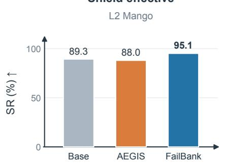

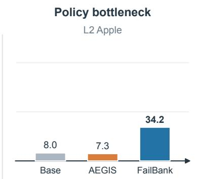

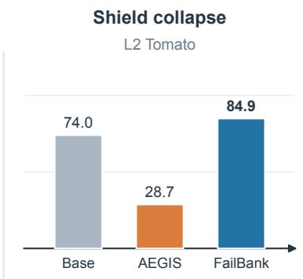

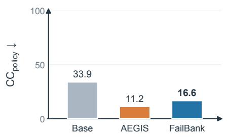

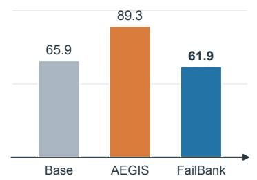

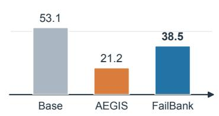  
Figure 1: Representative Level-2 static-obstacle results on VLA-Arena. Top: task success rate (SR, ↑ better); bottom: policyinduced cumulative cost $\mathrm { ( C C _ { p o l i c y } , \downarrow }$ better). AEGIS reduces cost while largely preserving success on Mango, fails to improve success on Apple, and sharply reduces success on Tomato. FAILBANK achieves the highest success rate across all three tasks while reducing policy-induced cost relative to Base.

Pick the onion and place it in the bowl, without disturbing the bottles  
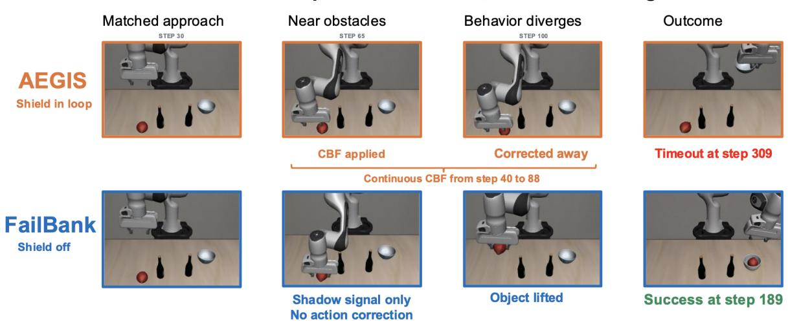  
Figure 2: A shield-collapse trajectory on the Level 2 onion task. AEGIS repeatedly intervenes near the bottles and eventually times out. FAILBANK uses observe-only CBF supervision and successfully places the onion in the bowl.

Vision-language-action policies and evaluation. Generalist VLA models combine vision-language representations with robot control. $\pi _ { 0 }$ uses flow matching for continuous action generation, while $\pi _ { 0 . 5 }$ extends this family toward broader generalization (Black et al., 2024; Physical Intelligence et al., 2025). VLA-Arena evaluates such policies across controlled safety, distractor, extrapolation, and long-horizon settings (Zhang et al., 2026). We use its official task definitions and metrics.

Runtime safety mechanisms. Control barrier functions (CBF) provide a principled mechanism for constraining nominal controls (Ames et al., 2017). AEGIS combines CBF projection with visual grounding as a plug-and-play VLA safety layer (Hu et al., 2025), while constrained flow matching incorporates safety guidance during action generation (English et al., 2026). FAILBANK instead uses runtime corrections as supervision for future policy behavior.

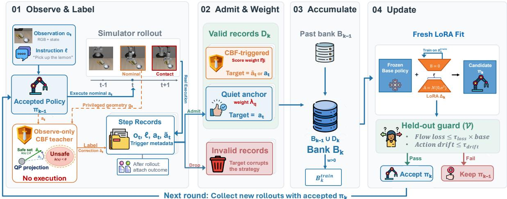  
Figure 3: The four-stage FAILBANK loop. Stage 1 collects policy-controlled rollouts while logging CBF proposals without altering execution. Stage 2 discards invalid records and filters valid records into CBF-triggered corrections and quiet anchors, assigning their targets and weights. Stage 3 accumulates the valid records in the training bank. Stage 4 fits a fresh LoRA adapter and accepts the candidate policy only if it passes the held-out guard. The accepted policy is then used to collect rollouts in the next round.

Learning-based safety adaptation. SafeVLA integrates safety through constrained learning (Zhang et al., 2025), while SAFE detects failures from internal VLA representations (Gu et al., 2025). Privileged supervision and low-rank adaptation provide additional foundations for transferring training-time information into a deployable policy (Chen et al., 2020; Hu et al., 2022). FAILBANK builds on these ideas by converting outcome-screened runtime feedback into learning records for guarded, iterative policy updates.

## 4 Method

## 4.1 Problem setting and overview

We denote the original policy by $\pi _ { \mathrm { b a s e } }$ and the accepted policy collecting in round k by $\pi _ { k - 1 }$ . Unlike runtime shielding, FAILBANK keeps execution under the current policy and uses proposals from a fixed CBF teacher as counterfactual supervision. Based on rollout outcomes, it selects corrective records and successful actions as quiet anchors, then accumulates them in a failure bank. Each round fits a fresh LoRA adapter from $\pi _ { \mathrm { b a s e } } .$ accepting it only if it passes a held-out guard. The accepted policy collects the next round and is deployed without the teacher or privileged geometry. Figure 3 summarizes the four-stage loop from observe-only annotation to a guarded policy update.

## 4.2 Stage 1: Observe and Label

The first stage preserves the policy’s own rollout distribution while collecting counterfactual supervision. At each control step, $\pi _ { k - 1 }$ produces $a _ { t } .$ , and the observe-only teacher independently proposes $\tilde { \boldsymbol { a } } _ { t } = \boldsymbol { S } ( \boldsymbol { a } _ { t } , \boldsymbol { g } _ { t } )$ using privileged scene geometry $g _ { t }$ . The teacher changes only the translational channels and records whether the projection was triggered through $z _ { t } \in \{ 0 , 1 \}$ . The environment always executes the nominal action,

$$
a _ { t } ^ { \mathrm { e n v } } = a _ { t } .\tag{1}
$$

Because the proposal is not executed, the episode outcome remains attributable to $\pi _ { k - 1 }$

Each step record stores the observation reference, instruction, nominal action, teacher proposal, trigger indicator, and metadata needed to audit the projection. After the rollout, we attach the episode outcome to these records, producing outcome-augmented evidence that Stage 2 uses to determine which records should be retained and how they should be used for learning. To isolate the learning signal from perception errors, our observe-only teacher uses privileged simulator geometry during collection. This information is not required at deployment, while the runtime-shield baseline requires geometry through visual grounding. Appendix E.1 details the interfaces, and Appendix C.5 reports the matched learning-signal attribution controls.

## 4.3 Stage 2: Admit and Weight

The second stage converts rollout evidence into weighted training records $\mathcal { D } _ { k }$ based on rollout outcomes and correction timing. Each admitted record is assigned a first-action target $y _ { i }$ . When a teacher correction is retained, the teacher proposal serves as the target, while successful uncorrected actions with $z _ { i } = 0$ are retained as quiet anchors and use the nominal action instead. Target assignment is independent of trigger provenance, so a CBF-triggered record may retain $z _ { i } = 1$ even when its target is the nominal action. Such a record is not considered a quiet anchor. Records that fail the admission checks are discarded. Each admitted record is weighted by trigger provenance,

$$
w _ { i } = \left\{ \begin{array} { l l } { \eta _ { i } , } & { z _ { i } = 1 , } \\ { \lambda _ { q } , } & { z _ { i } = 0 . } \end{array} \right.\tag{2}
$$

For CBF-triggered records, $\eta _ { i }$ is determined from the subsequent rollout: safety, task progress, and recovery increase the score, whereas repeated triggers, short-horizon cost, and barrier violations dexrease it. A validity check and fixed thresholds map the resulting score to $\eta _ { i } \in \{ 0 , 0 . 2 5 , 0 . 6 0 , 1 . 0 0 \}$ . Because the teacher proposal is not executed, $\eta _ { i }$ reflects the training utility of the record rather than the causal effect of the correction. Quiet anchors receive the predefined weight $\lambda _ { q } .$

Appendix E.1.3 gives the complete admission, lead-time, and weighting rules, while Appendix E.4 reports the $\lambda _ { q }$ values used in our experiments.

## 4.4 Stage 3: Accumulate

Stage 3 integrates the newly admitted records $\mathcal { D } _ { k }$ with evidence retained from previous rounds. To keep the held-out guard separate from training, episodes are split into training and validation folds before Stage 2 admission, with a fixed held-out batch V drawn from the validation fold and kept disjoint from $B _ { k } ^ { \mathrm { t r a i n } }$ . The accumulated training bank is then updated as

$$
\begin{array} { r } { \mathcal { B } _ { k } ^ { \mathrm { t r a i n } } = \mathcal { B } _ { k - 1 } ^ { \mathrm { t r a i n } } \cup \mathcal { D } _ { k } . } \end{array}\tag{3}
$$

The bank carries earlier records into subsequent rounds. Bank composition and construction audits are reported in Appendix E.2 and Appendix E.5, respectively.

## 4.5 Stage 4: Update

Stage 4 turns the accumulated evidence in $B _ { k } ^ { \mathrm { t r a i n } }$ into a guarded policy update. At each round, we fit a fresh LoRA adapter from the same base checkpoint. For record i, let $\ell _ { i , 0 } ^ { \mathrm { H o w } } ( \pi , y _ { i } )$ denote the first-action flow-matching loss against its assigned target $y _ { i }$ . We optimize

$$
\mathcal { L } ( \pi ) = \frac { \sum _ { i \in \mathcal { B } _ { k } ^ { \mathrm { t r a i n } } } w _ { i } \ell _ { i , 0 } ^ { \mathrm { f d o w } } ( \pi , y _ { i } ) } { \operatorname* { m a x } \Bigl ( 1 , \sum _ { i \in \mathcal { B } _ { k } ^ { \mathrm { t r a i n } } } w _ { i } \Bigr ) } .\tag{4}
$$

The resulting candidate is then evaluated on the fixed held-out batch V using full-chunk flow loss and first-action drift from the original base policy,

$$
\bar { \mathcal { L } } \nu ( \pi ) = \frac { 1 } { | \mathcal { V } | H } \sum _ { i \in \mathcal { V } } \sum _ { h = 0 } ^ { H - 1 } \ell _ { i , h } ^ { \mathrm { f l o w } } ( \pi ) , \qquad D _ { \mathcal { V } } ( \pi ) = \frac { 1 } { | \mathcal { V } | d } \sum _ { i \in \mathcal { V } } \left\| a _ { i , 0 } ^ { ( \pi ) } - a _ { i , 0 } ^ { ( \mathrm { b a s e } ) } \right\| _ { 1 } .\tag{5}
$$

The candidate is accepted only if

$$
\frac { \bar { \mathcal { L } } _ { \mathcal { V } } ( \pi _ { k } ) } { \bar { \mathcal { L } } _ { \mathcal { V } } ( \pi _ { \mathrm { b a s e } } ) } \le \tau _ { \mathrm { l o s s } } , \qquad D _ { \mathcal { V } } ( \pi _ { k } ) \le \tau _ { \mathrm { d r i f t } } .\tag{6}
$$

These constraints limit held-out loss degradation and first-action drift without using benchmark SR or CC for model selection. If the candidate fails, the adapter is discarded and $\pi _ { k - 1 }$ remains the collecting policy, while $B _ { k } ^ { \mathrm { t r a i n } }$ is retained. If it passes, the accepted $\pi _ { k }$ becomes the collecting policy for the next round and is deployed without the teacher or privileged geometry.

Appendix E.4 gives the training recipe, while Appendix E.7 reports the guard limits and diagnostics.

## 5 Experiments

We evaluate FAILBANK through four research questions: (1) Can runtime feedback improve task success while reducing policy-induced cost? (2) Does the learned policy generalize across states, tasks, levels, and backbones? (3) How do observe-only collection and learning signals affect policy updates? (4) How does iterative self-evolution affect the success–cost operating point?

## 5.1 Experimental setup

Benchmark and task coverage. VLA-Arena organizes manipulation tasks into Safety, Distractor, Extrapolation, and Long-Horizon categories (Zhang et al., 2026). We evaluate its static-obstacle safety suite, with five tasks at each of three difficulty levels. The released Arena checkpoints are finetuned on Level 0 demonstrations, so we use Levels 1 and 2 to study improvement beyond that source difficulty. We collect on Level 1 mango, test all five Level 1 tasks, and test all five harder Level 2 tasks without Level 2 update data. Appendix B.7 lists the tasks, objects, splits, and coverage.

Evaluation metrics. We report success rate (SR), cumulative cost (CC), policy-induced cumulative cost $\scriptstyle ( \mathrm { C C } _ { \mathrm { p o l i c y } } )$ and the base-relative score (BRS). SR is the percentage of trials that satisfy the task-completion predicate within the episode limit. CC is VLA-Arena’s official benchmark metric, computed as the trial-average sum of per-step costs. We additionally report ${ \mathrm { C C } } _ { \mathrm { p o l i c y } }$ , which removes the cost already present in the initial state from official CC. To compare joint improvements in success and cost, we define the base-relative score (BRS) as

$$
\mathrm { B R S } = \exp \left[ - \frac { 1 } { 2 } \left( \frac { 1 - \mathrm { S R } } { 1 - \mathrm { S R } _ { \mathrm { b a s e } } } + \frac { \mathrm { C C } _ { \mathrm { p o l i c y } } } { \mathrm { C C } _ { \mathrm { p o l i c y , b a s e } } } \right) \right]\tag{7}
$$

where SR is expressed as a fraction. BRS equally weights the failure rate and policy-induced cost, normalized by their respective task-specific base values. The base policy scores $e ^ { - 1 }$ , while a policy with zero failure and zero policy-induced cost scores 1. Appendix B.2 provides the exact calculations.

VLA backbones. Our main experiments use the Arena-finetuned $\pi _ { 0 . 5 }$ checkpoint, with $\pi _ { 0 }$ providing a second flowmatching backbone for cross-backbone evaluation (Black et al., 2024; Physical Intelligence et al., 2025). We audited all 29 models on the Arena leaderboard, of which 10 provide Arena-finetuned weights. Among these models, only $\pi _ { 0 . 5 }$ and $\pi _ { 0 }$ combine a continuous flow-matching action head with measurable baseline headroom, both of which are required by our update and guard. Appendix B.6 documents this selection and the attempted extensions.

Baselines. We use the Arena-finetuned $\pi _ { 0 . 5 }$ flow-matching VLA as our main base policy. We compare against the base policy and AEGIS, a CBF-based runtime shield with GLM-4.5V perception, to distinguish persistent policy adaptation from runtime action correction. We further repeat the Base–AEGIS–FAILBANK comparison on π0 for cross-backbone evaluation. All methods are evaluated under matched initial states, task definitions, and evaluation conditions.

## 5.2 Main results

RQ1 Can runtime feedback improve task success while reducing policy-induced cost?

To answer RQ1, we compare Base, AEGIS, and FAILBANK on the complete Level 1 and Level 2 static-obstacle suites across both backbones. Table 1 reports the task-level SR and cost results, while Figure 4 visualizes the change of each method relative to its corresponding base policy.

Compared with the base policies, FAILBANK improves both SR and $\mathrm { C C _ { p o l i c y } }$ on both backbones. As shown in Table 1, the unweighted mean SR across the ten tasks increases from 66.0% to 74.5% on $\pi _ { 0 . 5 }$ and from 47.5% to 54.4% on $\pi _ { 0 } .$ , corresponding to gains of approximately 8.5 and 6.9 percentage points, respectively. Mean $\mathrm { C C _ { p o l i c y } }$ decreases from 47.76 to 30.76 on $\pi _ { 0 . 5 }$ and from 10.62 to 8.09 on $\pi _ { 0 } ,$ giving relative reductions of 35.6% and 23.8% over the base policies. Compared with AEGIS runtime shielding, FAILBANK increases mean SR from 49.1% to 74.5% on $\pi _ { 0 . 5 }$ and from 44.9% to 54.4% on $\pi _ { 0 } ,$ , yielding gains of 25.4 and 9.5 percentage points, respectively. Across the ten tasks, FAILBANK achieves mean $\mathrm { C C _ { \mathrm { p o l i c y } } }$ of 30.76 on $\pi _ { 0 . 5 }$ and 8.09 on $\pi _ { 0 } ,$ , compared with 29.01 and 6.27 for AEGIS, respectively. Thus, FAILBANK improves both success and cost relative to the base policies, while its advantage over AEGIS is higher task success at an additional policy-induced cost.

Figure 4 makes this joint improvement more explicit. Under the criterion of higher SR and lower $\mathrm { C C _ { \mathrm { p o l i c y } } }$ than base policy, FAILBANK achieves joint improvements in SR and ${ \mathrm { C C } } _ { \mathrm { p o l i c y } }$ on 8 task–backbone pairs, compared with 3 for AEGIS. AEGIS more often moves left toward lower cost but also downward toward lower success, particularly on harder tasks. In contrast, FAILBANK improves both objectives on a larger share of tasks. This pattern is also reflected in aggregate BRS, where FAILBANK scores higher than AEGIS on both backbones.

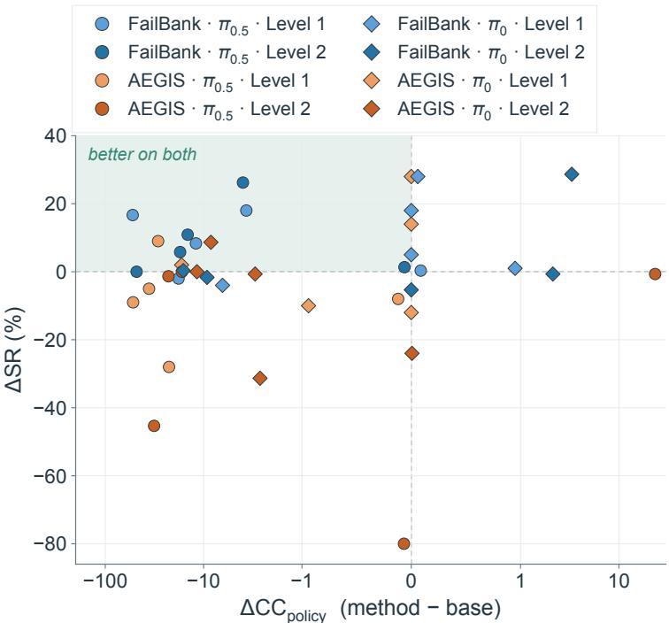  
Figure 4: Success–cost trade-off relative to the base policy. Circles and diamonds denote $\pi _ { 0 . 5 }$ and $\pi _ { 0 } .$ , blue and orange denote FAILBANK and AEGIS, and shade indicates difficulty level. Upward movement means higher success, and leftward movement means lower policy-induced cost. Thus, the shaded upper-left quadrant is better on both. FAILBANK places more points in this joint-improvement region, while AEGIS more often moves left but downward.

Table 1: Static-obstacle results across two backbones. Collection happens in Level 1 Mango task while other tasks are unseen during rollout collection. SR is task success rate (%). CC is official cumulative cost. $\mathrm { C C _ { p o l i c y } }$ is policy-induced cost. Best SR, $\mathrm { C C _ { p o l i c } } _ { \mathrm { 3 } }$ and BRS values are in bold.
<table><tr><td rowspan="3" colspan="2"></td><td colspan="10">π0.5</td><td colspan="8">π0</td></tr><tr><td colspan="3">Base</td><td colspan="2">AEGIS</td><td colspan="2"></td><td colspan="2">FAILBANK</td><td colspan="2">Base</td><td colspan="2"></td><td colspan="2">AEGIS</td><td colspan="2">FAILBANK</td></tr><tr><td>SR↑ CC↓</td><td></td><td> $\mathrm { C C _ { p o l i c y } \downarrow }$ </td><td>SR↑</td><td>CC↓</td><td> $\mathrm { C C _ { p o l i c y } \downarrow }$ </td><td>SR↑ CC↓</td><td></td><td> $\mathrm { C C _ { p o l i c y } \downarrow }$ </td><td>SR↑ CC↓</td><td> $\mathrm { C C _ { p o l i c y } \ : . }$ </td><td></td><td>SR↑ CC↓</td><td> ${ \mathrm { C C } } _ { \mathrm { p o l i c y } }$ </td><td>→</td><td>SR↑ CC↓</td><td> $\mathrm { C C _ { p o l i c y } \downarrow }$ </td></tr><tr><td rowspan="6">1</td><td>Apple</td><td>|90.0</td><td>9.12 44.07</td><td>0.12</td><td>|82.0</td><td>8.20 7.81</td><td>0.00 0.01</td><td>|90.3 81.0</td><td>9.21</td><td>0.21 17.88</td><td>|54.05.40</td><td></td><td>0.00</td><td>82.0 8.20</td><td></td><td>0.00</td><td>59.0 5.90</td><td>0.00</td></tr><tr><td>Lemon</td><td>83.0</td><td></td><td>35.87</td><td>78.0</td><td></td><td></td><td>25.98</td><td></td><td></td><td>66.06.60</td><td>0.00</td><td></td><td>80.08.00</td><td>0.00</td><td></td><td>84.08.40</td><td>0.00</td></tr><tr><td>Mango</td><td>77.074.08</td><td></td><td>66.38</td><td>68.0</td><td>21.08</td><td>14.28</td><td>93.7</td><td>23.12</td><td>13.76</td><td>92.011.34</td><td></td><td>2.14</td><td>82.09.40</td><td>1.20</td><td></td><td>93.012.39</td><td>3.09</td></tr><tr><td>Onion</td><td>72.0 33.88</td><td></td><td>27.18</td><td>44.0</td><td>9.12</td><td>4.71</td><td>90.0 31.63</td><td></td><td>23.50</td><td>28.018.34</td><td>16.74</td><td></td><td>30.03.00</td><td>0.00</td><td></td><td>24.012.02</td><td>10.32</td></tr><tr><td>Tomato</td><td>85.045.31</td><td></td><td>37.01</td><td>94.0</td><td>17.39</td><td>7.99</td><td>93.3 34.28</td><td></td><td>25.04</td><td>56.05.60</td><td>0.00</td><td></td><td>44.0 4.40</td><td>0.00</td><td></td><td>84.08.46</td><td>0.06</td></tr><tr><td>Apple</td><td>8.0</td><td>67.51</td><td>65.89</td><td>7.3</td><td>90.73</td><td>89.26</td><td>34.2</td><td>68.75</td><td>61.90</td><td>0.066.31</td><td></td><td>66.31</td><td>0.0 54.63</td><td></td><td>54.62</td><td>0.3 50.29</td><td>50.22</td></tr><tr><td rowspan="4">2</td><td>Lemon</td><td>0.0 158.14</td><td></td><td>158.13</td><td>0.0 141.51</td><td></td><td>141.51</td><td>0.0 110.14</td><td>110.12</td><td></td><td>2.0 14.09</td><td>13.69</td><td>10.77.39</td><td></td><td>5.26</td><td>0.3 4.53</td><td></td><td>4.46</td></tr><tr><td>Mango</td><td>89.3 51.41</td><td></td><td>33.93</td><td>88.0</td><td>28.75</td><td>11.15</td><td>95.1 35.24</td><td>16.61</td><td></td><td>95.322.47</td><td>3.67</td><td></td><td>94.719.61</td><td>0.67</td><td>94.724.41</td><td></td><td>5.80</td></tr><tr><td>Onion</td><td>81.3</td><td>16.33</td><td>0.067</td><td>1.3</td><td>0.27</td><td>0.000</td><td>82.7 16.54</td><td>0.004</td><td></td><td>30.7 6.13</td><td>0.000</td><td>6.7</td><td>1.34</td><td>0.007</td><td></td><td>25.35.07</td><td>0.000</td></tr><tr><td>Tomato</td><td>74.0</td><td>67.87</td><td>53.07</td><td>28.7 26.93</td><td></td><td>21.20</td><td>84.9 55.44</td><td></td><td>38.55</td><td>50.713.75</td><td>3.61</td><td></td><td>19.3 4.81</td><td>0.95</td><td></td><td>79.3 22.67</td><td>6.93</td></tr><tr><td colspan="2">BRS↑</td><td colspan="2">0.368</td><td colspan="2"></td><td colspan="2">0.350</td><td colspan="2">0.498</td><td colspan="2"></td><td colspan="2">0.368</td><td colspan="2">0.441</td><td colspan="2"></td><td colspan="2">0.443</td></tr></table>

## 5.3 Generalization across states, tasks, levels, and backbones

## RQ2 Does the learned policy generalize across states, tasks, levels, and backbones?

To answer RQ2, we test whether the learned behavior extends beyond the Level 1 mango collection data. We consider held-out states, unseen tasks, and the harder Level 2 setting, and repeat the update on $\pi _ { 0 }$ to test a second backbone. Table 1 reports results across both backbones and difficulty levels, while Appendix B.8 details the evaluation splits.

On held-out initial states of the Level 1 mango task, FAILBANK raises $\pi _ { 0 . 5 }$ SR from 71.1% to 93.3%, showing improvement beyond the collection states. Across the four unseen Level 1 tasks, mean SR increases from 82.5% to 88.7%, extending the gains beyond the collection task. The improvements also carry over to the harder Level 2 setting, where mean SR rises from 50.5% to 59.4% without any Level 2 rollouts entering the main update bank.

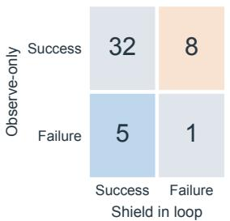  
(a) Paired outcomes

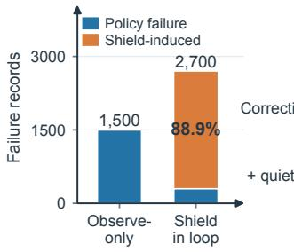  
(b) Failure provenance

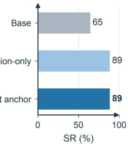  
(c) Task success

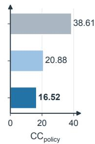  
(d) Policy-induced CC  
Figure 5: Ablations of the collection interface and learning signals. (a) Paired episode outcomes under observe-only and shield-in-loop collection on Level 1 mango task. Rows show observe-only outcomes, while columns show outcomes when shield corrections are executed. (b) Failure records produced on the same task by the two collection modes, separated by policy failures and shield-induced failures. (c–d) Comparison of Base, training on CBF-triggered records (Correction-only), and training with additional successful uncorrected actions (+ quiet anchors), reporting SR and $\mathrm { C } \bar { \mathrm { C } } _ { \mathrm { p o l i c y } } ^ { - }$ on Level 1 onion task, respectively.

To test a second backbone, we apply the same update procedure to $\pi _ { 0 }$ . Its mean SR increases from 51.0% to 62.7% across the four unseen Level 1 tasks and from 35.7% to 40.0% on Level 2. Together, these results provide evidence of transfer across states, tasks, difficulty levels, and VLA backbones. Complete paired tests and task-specific results are reported in Appendix G.1.

## 6 Discussion

We next examine the contribution of each learning component and how iterative self-evolution affects policy updating performance.

## 6.1 Collection interface and learning signals

## RQ3 How do observe-only collection and learning signals affect policy updates?

To answer RQ3, we remove the key collection and learning components of FAILBANK in turn and examine how each affects the resulting update.

Stage 1 ablation: Shield-in-loop collection. Executing the shield changes the rollout distribution from which learning records are collected. As shown in Figure 5(a), executing the shield turns eight otherwise successful policy rollouts into failures while rescuing only five failures, reducing successful episodes from 40 to 37 out of 46. More importantly, Panel (b) shows that 88.9% of the failure records collected with the shield in the loop originate from these shield-induced failures rather than failures of the nominal policy. These records therefore reflect failures induced by the collection process rather than failures of the policy on its original rollout distribution. Observe-only collection avoids this shift and better preserves the failure distribution of the policy being updated.

Stage 2 ablation: Removing quiet anchors. Quiet anchors preserve successful policy actions that require no CBF correction, helping prevent the update from overfitting to corrective records and drifting away from already effective behavior. Panels (c) and (d) of Figure 5 isolate this effect by comparing an update trained only on CBF-triggered records with one that additionally includes quiet anchors. The correction-only update raises SR from 65% to 89% and reduces ${ \mathrm { C C } } _ { \mathrm { p o l i c y } }$ from 38.61 to 20.88. Adding quiet anchors preserves the same 89% SR while further reducing $\mathrm { C C _ { \mathrm { p o l i c y } } }$ to 16.52. These results suggest that corrective records drive most of the task-success improvement, while quiet anchors help preserve successful behavior and further reduce safety cost. Further analyses of collection outcomes, failure-record provenance, and learning-signal controls are provided in Appendices C.1, C.2, and C.5.

## 6.2 Number of Accumulated Self-Evolution Rounds

RQ4 How does iterative self-evolution affect the success–cost operating point?

We study five accumulated self-evolution rounds on the static-obstacle Level 1 onion task. As the accumulated failure bank grows from 3.7k records at Round 1 to 22.7k at Round 5, Figure 6 shows a clear evolution of the SR– ${ \mathrm { C C } } _ { \mathrm { p o l i c y } }$ operating point. The first two rounds improve both objectives relative to Base. Specifically, SR peaks at Round 2, while ${ \mathrm { C C } } _ { \mathrm { p o l i c y } }$ continues to decrease and reaches its minimum at Round 3. The two objectives therefore reach their best values at different rounds. In later rounds, SR decreases and then partially recovers, while policy-induced CC rebounds from its Round 3 minimum and continues to fluctuate. Thus, additional runtime feedback continues to reshape the learned policy rather than monotonically improving either objective. Importantly, all five rounds remain above Base in SR and below Base in

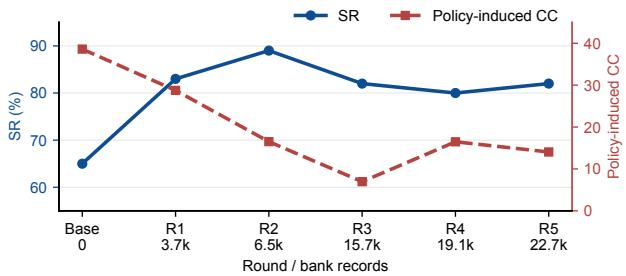  
Figure 6: Self-evolution across accumulated rounds on Level 1 onion task. The failure bank grows from 3.7k records at R1 to 22.7k at R5. SR peaks at R2, whereas $\mathrm { C C _ { p o l i c y } }$ reaches its minimum at R3. Later rounds fluctuate while remaining improved over base policy on both axes.

policy-induced CC, indicating that the learned improvement persists as the balance between the two objectives changes.

## 6.3 Limitations

Our current implementation targets continuous flow-matching policies, while other action formulations require adapted supervision and guard objectives. We also focus on static obstacles, since dynamic scenes additionally require temporal obstacle prediction and teacher corrections for moving hazards. These extensions concern the form of the teacher and update interface, rather than our central focus on converting runtime feedback into persistent policy improvement.

## 7 Conclusion

FAILBANK turns observe-only runtime feedback into outcome-aware learning records for persistent policy improvement. By accumulating these records across rounds and applying guarded LoRA updates, the framework transfers runtime corrections into the underlying policy without requiring a shield at deployment. Across two flow-matching backbones, FAILBANK improves the joint success–cost operating point and generalizes beyond the collection setting. These results suggest that runtime safety feedback can serve not only as a temporary intervention mechanism, but also as supervision for improving future policy behavior.

## References

Joshua Achiam, David Held, Aviv Tamar, and Pieter Abbeel. Constrained policy optimization, 2017. URL https://arxiv. org/abs/1705.10528.

Aaron D. Ames, Xiangru Xu, Jessy W. Grizzle, and Paulo Tabuada. Control barrier function based quadratic programs for safety critical systems. IEEE Transactions on Automatic Control, 62(8):3861–3876, 2017.

Kevin Black, Noah Brown, Danny Driess, Adnan Esmail, Michael Equi, Chelsea Finn, Niccolo Fusai, Lachy Groom, Karol Hausman, Brian Ichter, et al. π : A vision-language-action flow model for general robot control. arXiv preprint arXiv:2410.24164, 2024.

Anthony Brohan, Noah Brown, Justice Carbajal, Yevgen Chebotar, Xi Chen, Krzysztof Choromanski, Tianli Ding, Danny Driess, Avinava Dubey, Chelsea Finn, Pete Florence, Chuyuan Fu, Montse Gonzalez Arenas, Keerthana Gopalakrishnan, Kehang Han, Karol Hausman, Alexander Herzog, Jasmine Hsu, Brian Ichter, Alex Irpan, Nikhil Joshi, Ryan Julian, Dmitry Kalashnikov, Yuheng Kuang, Isabel Leal, Lisa Lee, Tsang-Wei Edward Lee, Sergey Levine, Yao Lu, Henryk Michalewski, Igor Mordatch, Karl Pertsch, Kanishka Rao, Krista Reymann, Michael Ryoo, Grecia Salazar, Pannag Sanketi, Pierre Sermanet, Jaspiar Singh, Anikait Singh, Radu Soricut, Huong Tran, Vincent Vanhoucke, Quan Vuong, Ayzaan Wahid, Stefan Welker, Paul Wohlhart, Jialin Wu, Fei Xia, Ted Xiao, Peng Xu, Sichun Xu, Tianhe Yu, and Brianna Zitkovich. Rt-2: Vision-language-action models transfer web knowledge to robotic control, 2023a. URL https://arxiv.org/abs/2307.15818.

Anthony Brohan, Noah Brown, Justice Carbajal, Yevgen Chebotar, Joseph Dabis, Chelsea Finn, Keerthana Gopalakrishnan, Karo Hausman, Alex Herzog, Jasmine Hsu, Julian Ibarz, Brian Ichter, Alex Irpan, Tomas Jackson, Sally Jesmonth, Nikhil J Joshi, Ryan Julian, Dmitry Kalashnikov, Yuheng Kuang, Isabel Leal, Kuang-Huei Lee, Sergey Levine, Yao Lu, Utsav Malla, Deeksha Manjunath, Igor Mordatch, Ofir Nachum, Carolina Parada, Jodilyn Peralta, Emily Perez, Karl Pertsch, Jornell Quiambao, Kanishka Rao, Michael Ryoo, Grecia Salazar, Pannag Sanketi, Kevin Sayed, Jaspiar Singh, Sumedh Sontakke, Austin Stone, Clayton Tan,

Huong Tran, Vincent Vanhoucke, Steve Vega, Quan Vuong, Fei Xia, Ted Xiao, Peng Xu, Sichun Xu, Tianhe Yu, and Brianna Zitkovich. Rt-1: Robotics transformer for real-world control at scale, 2023b. URL https://arxiv.org/abs/2212. 06817.

Qingwen Bu, Yanting Yang, Jisong Cai, Shenyuan Gao, Guanghui Ren, Maoqing Yao, Ping Luo, and Hongyang Li. Univla: Learning to act anywhere with task-centric latent actions, 2025. URL https://arxiv.org/abs/2505.06111.

Carlos Celemin, Rodrigo Perez-Dattari, Eugenio Chisari, Giovanni Franzese, Leandro de Souza Rosa, Ravi Prakash, Zlatan´ Ajanovic, Marta Ferraz, Abhinav Valada, and Jens Kober. Interactive imitation learning in robotics: A survey, 2022. URL´ https://arxiv.org/abs/2211.00600.

Dian Chen, Brady Zhou, Vladlen Koltun, and Philipp Krahenb¨ uhl. Learning by cheating. In¨ Conference on Robot Learning, volume 100 of Proceedings ofMachine Learning Research, pp. 66–75, 2020.

Cheng Chi, Zhenjia Xu, Siyuan Feng, Eric Cousineau, Yilun Du, Benjamin Burchfiel, Russ Tedrake, and Shuran Song. Diffusion policy: Visuomotor policy learning via action diffusion, 2024. URL https://arxiv.org/abs/2303.04137.

Embodiment Collaboration, Abby O’Neill, Abdul Rehman, Abhinav Gupta, Abhiram Maddukuri, Abhishek Gupta, Abhishek Padalkar, Abraham Lee, Acorn Pooley, Agrim Gupta, Ajay Mandlekar, Ajinkya Jain, Albert Tung, Alex Bewley, Alex Herzog, Alex Irpan, Alexander Khazatsky, Anant Rai, Anchit Gupta, Andrew Wang, Andrey Kolobov, Anikait Singh, Animesh Garg, Aniruddha Kembhavi, Annie Xie, Anthony Brohan, Antonin Raffin, Archit Sharma, Arefeh Yavary, Arhan Jain, Ashwin Balakrishna, Ayzaan Wahid, Ben Burgess-Limerick, Beomjoon Kim, Bernhard Scholkopf, Blake Wulfe, Brian Ichter, Cewu Lu,¨ Charles Xu, Charlotte Le, Chelsea Finn, Chen Wang, Chenfeng Xu, Cheng Chi, Chenguang Huang, Christine Chan, Christopher Agia, Chuer Pan, Chuyuan Fu, Coline Devin, Danfei Xu, Daniel Morton, Danny Driess, Daphne Chen, Deepak Pathak, Dhruv Shah, Dieter Buchler, Dinesh Jayaraman, Dmitry Kalashnikov, Dorsa Sadigh, Edward Johns, Ethan Foster, Fangchen Liu, Federico¨ Ceola, Fei Xia, Feiyu Zhao, Felipe Vieira Frujeri, Freek Stulp, Gaoyue Zhou, Gaurav S. Sukhatme, Gautam Salhotra, Ge Yan, Gilbert Feng, Giulio Schiavi, Glen Berseth, Gregory Kahn, Guangwen Yang, Guanzhi Wang, Hao Su, Hao-Shu Fang, Haochen Shi, Henghui Bao, Heni Ben Amor, Henrik I Christensen, Hiroki Furuta, Homanga Bharadhwaj, Homer Walke, Hongjie Fang, Huy Ha, Igor Mordatch, Ilija Radosavovic, Isabel Leal, Jacky Liang, Jad Abou-Chakra, Jaehyung Kim, Jaimyn Drake, Jan Peters, Jan Schneider, Jasmine Hsu, Jay Vakil, Jeannette Bohg, Jeffrey Bingham, Jeffrey Wu, Jensen Gao, Jiaheng Hu, Jiajun Wu, Jialin Wu, Jiankai Sun, Jianlan Luo, Jiayuan Gu, Jie Tan, Jihoon Oh, Jimmy Wu, Jingpei Lu, Jingyun Yang, Jitendra Malik, Joao Silv˜ erio, Joey Hejna, Jonathan Booher, Jonathan Tompson, Jonathan Yang, Jordi Salvador, Joseph J. Lim, Junhyek Han,´ Kaiyuan Wang, Kanishka Rao, Karl Pertsch, Karol Hausman, Keegan Go, Keerthana Gopalakrishnan, Ken Goldberg, Kendra Byrne, Kenneth Oslund, Kento Kawaharazuka, Kevin Black, Kevin Lin, Kevin Zhang, Kiana Ehsani, Kiran Lekkala, Kirsty Ellis, Krishan Rana, Krishnan Srinivasan, Kuan Fang, Kunal Pratap Singh, Kuo-Hao Zeng, Kyle Hatch, Kyle Hsu, Laurent Itti, Lawrence Yunliang Chen, Lerrel Pinto, Li Fei-Fei, Liam Tan, Linxi ”Jim” Fan, Lionel Ott, Lisa Lee, Luca Weihs, Magnum Chen, Marion Lepert, Marius Memmel, Masayoshi Tomizuka, Masha Itkina, Mateo Guaman Castro, Max Spero, Maximilian Du, Michael Ahn, Michael C. Yip, Mingtong Zhang, Mingyu Ding, Minho Heo, Mohan Kumar Srirama, Mohit Sharma, Moo Jin Kim, Muhammad Zubair Irshad, Naoaki Kanazawa, Nicklas Hansen, Nicolas Heess, Nikhil J Joshi, Niko Suenderhauf, Ning Liu, Norman Di Palo, Nur Muhammad Mahi Shafiullah, Oier Mees, Oliver Kroemer, Osbert Bastani, Pannag R Sanketi, Patrick ”Tree” Miller, Patrick Yin, Paul Wohlhart, Peng Xu, Peter David Fagan, Peter Mitrano, Pierre Sermanet, Pieter Abbeel, Priya Sundaresan, Qiuyu Chen, Quan Vuong, Rafael Rafailov, Ran Tian, Ria Doshi, Roberto Mart´ın-Mart´ın, Rohan Baijal, Rosario Scalise, Rose Hendrix, Roy Lin, Runjia Qian, Ruohan Zhang, Russell Mendonca, Rutav Shah, Ryan Hoque, Ryan Julian, Samuel Bustamante, Sean Kirmani, Sergey Levine, Shan Lin, Sherry Moore, Shikhar Bahl, Shivin Dass, Shubham Sonawani, Shubham Tulsiani, Shuran Song, Sichun Xu, Siddhant Haldar, Siddharth Karamcheti, Simeon Adebola, Simon Guist, Soroush Nasiriany, Stefan Schaal, Stefan Welker, Stephen Tian, Subramanian Ramamoorthy, Sudeep Dasari, Suneel Belkhale, Sungjae Park, Suraj Nair, Suvir Mirchandani, Takayuki Osa, Tanmay Gupta, Tatsuya Harada, Tatsuya Matsushima, Ted Xiao, Thomas Kollar, Tianhe Yu, Tianli Ding, Todor Davchev, Tony Z. Zhao, Travis Armstrong, Trevor Darrell, Trinity Chung, Vidhi Jain, Vikash Kumar, Vincent Vanhoucke, Vitor Guizilini, Wei Zhan, Wenxuan Zhou, Wolfram Burgard, Xi Chen, Xiangyu Chen, Xiaolong Wang, Xinghao Zhu, Xinyang Geng, Xiyuan Liu, Xu Liangwei, Xuanlin Li, Yansong Pang, Yao Lu, Yecheng Jason Ma, Yejin Kim, Yevgen Chebotar, Yifan Zhou, Yifeng Zhu, Yilin Wu, Ying Xu, Yixuan Wang, Yonatan Bisk, Yongqiang Dou, Yoonyoung Cho, Youngwoon Lee, Yuchen Cui, Yue Cao, Yueh-Hua Wu, Yujin Tang, Yuke Zhu, Yunchu Zhang, Yunfan Jiang, Yunshuang Li, Yunzhu Li, Yusuke Iwasawa, Yutaka Matsuo, Zehan Ma, Zhuo Xu, Zichen Jeff Cui, Zichen Zhang, Zipeng Fu, and Zipeng Lin. Open x-embodiment: Robotic learning datasets and rt-x models, 2025. URL https://arxiv.org/abs/2310.08864.

William English, Hao Zheng, and Rickard Ewetz. Neuro-symbolic safety guidance for vision-language-action models via constrained flow matching. arXiv preprint arXiv:2607.01378, 2026.

Qiao Gu, Yuanliang Ju, Shengxiang Sun, Igor Gilitschenski, Haruki Nishimura, Masha Itkina, and Florian Shkurti. SAFE: Multitask failure detection for vision-language-action models. In Advances in Neural Information Processing Systems, 2025.

Edward J. Hu, Yelong Shen, Phillip Wallis, Zeyuan Allen-Zhu, Yuanzhi Li, Shean Wang, Lu Wang, and Weizhu Chen. LoRA: Low-rank adaptation of large language models. In International Conference on Learning Representations, 2022.

Songqiao Hu, Zeyi Liu, Shuang Liu, Jun Cen, Zihan Meng, Shihefeng Wang, Xiang Li, and Xiao He. VLSA: Vision-language-action models with plug-and-play safety constraint layer. arXiv preprint arXiv:2512.11891, 2025.

Michael Kelly, Chelsea Sidrane, Katherine Driggs-Campbell, and Mykel J. Kochenderfer. Hg-dagger: Interactive imitation learning with human experts, 2019. URL https://arxiv.org/abs/1810.02890.

Moo Jin Kim, Karl Pertsch, Siddharth Karamcheti, Ted Xiao, Ashwin Balakrishna, Suraj Nair, Rafael Rafailov, Ethan Foster, Grace Lam, Pannag Sanketi, Quan Vuong, Thomas Kollar, Benjamin Burchfiel, Russ Tedrake, Dorsa Sadigh, Sergey Levine, Percy Liang, and Chelsea Finn. Openvla: An open-source vision-language-action model, 2024. URL https://arxiv.org/abs/ 2406.09246.

Qixiu Li, Yaobo Liang, Zeyu Wang, Lin Luo, Xi Chen, Mozheng Liao, Fangyun Wei, Yu Deng, Sicheng Xu, Yizhong Zhang, Xiaofan Wang, Bei Liu, Jianlong Fu, Jianmin Bao, Dong Chen, Yuanchun Shi, Jiaolong Yang, and Baining Guo. Cogact: A foundational vision-language-action model for synergizing cognition and action in robotic manipulation, 2024a. URL https://arxiv.org/abs/2411.19650.

Quanyi Li, Zhenghao Peng, and Bolei Zhou. Efficient learning of safe driving policy via human-ai copilot optimization, 2022. URL https://arxiv.org/abs/2202.10341.

Xuanlin Li, Kyle Hsu, Jiayuan Gu, Karl Pertsch, Oier Mees, Homer Rich Walke, Chuyuan Fu, Ishikaa Lunawat, Isabel Sieh, Sean Kirmani, Sergey Levine, Jiajun Wu, Chelsea Finn, Hao Su, Quan Vuong, and Ted Xiao. Evaluating real-world robot manipulation policies in simulation, 2024b. URL https://arxiv.org/abs/2405.05941.

Bo Liu, Yifeng Zhu, Chongkai Gao, Yihao Feng, Qiang Liu, Yuke Zhu, and Peter Stone. Libero: Benchmarking knowledge transfer for lifelong robot learning, 2023a. URL https://arxiv.org/abs/2306.03310.

Huihan Liu, Shivin Dass, Roberto Mart´ın-Mart´ın, and Yuke Zhu. Model-based runtime monitoring with interactive imitation learning, 2023b. URL https://arxiv.org/abs/2310.17552.

Jiaming Liu, Mengzhen Liu, Zhenyu Wang, Pengju An, Xiaoqi Li, Kaichen Zhou, Senqiao Yang, Renrui Zhang, Yandong Guo, and Shanghang Zhang. Robomamba: Efficient vision-language-action model for robotic reasoning and manipulation, 2024. URL https://arxiv.org/abs/2406.04339.

Puze Liu, Kuo Zhang, Davide Tateo, Snehal Jauhri, Zhiyuan Hu, Jan Peters, and Georgia Chalvatzaki. Safe reinforcement learning of dynamic high-dimensional robotic tasks: Navigation, manipulation, interaction, 2023c. URL https://arxiv.org/abs/ 2209.13308.

Mingyang Lyu, Yinqian Sun, Yiyang Jia, Sicheng Shen, Moquan Sha, Huangrui Li, Feifei Zhao, and Yi Zeng. ForesightSafety-VLA: A unified diagnostic safety benchmark for vision-language-action models. arXiv preprint arXiv:2606.27079, 2026.

Ajay Mandlekar, Danfei Xu, Roberto Mart´ın-Mart´ın, Yuke Zhu, Li Fei-Fei, and Silvio Savarese. Human-in-the-loop imitation learning using remote teleoperation, 2020. URL https://arxiv.org/abs/2012.06733.

Oier Mees, Lukas Hermann, Erick Rosete-Beas, and Wolfram Burgard. Calvin: A benchmark for language-conditioned policy learning for long-horizon robot manipulation tasks, 2022. URL https://arxiv.org/abs/2112.03227.

Soroush Nasiriany, Abhiram Maddukuri, Lance Zhang, Adeet Parikh, Aaron Lo, Abhishek Joshi, Ajay Mandlekar, and Yuke Zhu. Robocasa: Large-scale simulation of everyday tasks for generalist robots, 2024. URL https://arxiv.org/abs/2406. 02523.

Karl Pertsch, Kyle Stachowicz, Brian Ichter, Danny Driess, Suraj Nair, Quan Vuong, Oier Mees, Chelsea Finn, and Sergey Levine. Fast: Efficient action tokenization for vision-language-action models, 2025. URL https://arxiv.org/abs/2501. 09747.

Physical Intelligence, Kevin Black, Noah Brown, James Darpinian, Karan Dhabalia, Danny Driess, Adnan Esmail, Michael Equi, Chelsea Finn, Niccolo Fusai, et al. π0.5: A vision-language-action model with open-world generalization. arXiv preprint arXiv:2504.16054, 2025.

Stephane Ross, Geoffrey J. Gordon, and J. Andrew Bagnell. A reduction of imitation learning and structured prediction to no-regret online learning, 2011. URL https://arxiv.org/abs/1011.0686.

Mustafa Shukor, Dana Aubakirova, Francesco Capuano, Pepijn Kooijmans, Steven Palma, Adil Zouitine, Michel Aractingi, Caroline Pascal, Martino Russi, Andres Marafioti, Simon Alibert, Matthieu Cord, Thomas Wolf, and Remi Cadene. Smolvla: A visionlanguage-action model for affordable and efficient robotics, 2025. URL https://arxiv.org/abs/2506.01844.

Tom Silver, Kelsey Allen, Josh Tenenbaum, and Leslie Kaelbling. Residual policy learning, 2019. URL https://arxiv.org/ abs/1812.06298.

Octo Model Team, Dibya Ghosh, Homer Walke, Karl Pertsch, Kevin Black, Oier Mees, Sudeep Dasari, Joey Hejna, Tobias Kreiman, Charles Xu, Jianlan Luo, You Liang Tan, Lawrence Yunliang Chen, Pannag Sanketi, Quan Vuong, Ted Xiao, Dorsa Sadigh, Chelsea Finn, and Sergey Levine. Octo: An open-source generalist robot policy, 2024. URL https://arxiv.org/abs/ 2405.12213.

Brijen Thananjeyan, Ashwin Balakrishna, Suraj Nair, Michael Luo, Krishnan Srinivasan, Minho Hwang, Joseph E. Gonzalez, Julian Ibarz, Chelsea Finn, and Ken Goldberg. Recovery rl: Safe reinforcement learning with learned recovery zones, 2021. URL https://arxiv.org/abs/2010.15920.

Jakob Thumm and Matthias Althoff. Provably safe deep reinforcement learning for robotic manipulation in human environments, 2022. URL https://arxiv.org/abs/2205.06311.

Junjie Wen, Yichen Zhu, Jinming Li, Minjie Zhu, Kun Wu, Zhiyuan Xu, Ning Liu, Ran Cheng, Chaomin Shen, Yaxin Peng, Feifei Feng, and Jian Tang. Tinyvla: Towards fast, data-efficient vision-language-action models for robotic manipulation, 2025. URL https://arxiv.org/abs/2409.12514.

Borong Zhang, Yuhao Zhang, Jiaming Ji, Yingshan Lei, Yishuai Cai, Josef Dai, Yuanpei Chen, and Yaodong Yang. SafeVLA: Towards safety alignment of vision-language-action model via constrained learning. arXiv preprint arXiv:2503.03480, 2025.

Borong Zhang, Jiahao Li, Jiachen Shen, Yuhao Zhang, Yishuai Cai, et al. VLA-arena: An open-source framework for benchmarking vision-language-action models. In International Conference on Machine Learning, 2026.

Tony Z. Zhao, Vikash Kumar, Sergey Levine, and Chelsea Finn. Learning fine-grained bimanual manipulation with low-cost hardware, 2023. URL https://arxiv.org/abs/2304.13705.

## Appendix Outline

A Detailed Related Work . . . . 14   
A.1 Generalist Vision-Language-Action Policies. 14   
A.2 Runtime Shields and Constrained Action Generation 14   
A.3 Safety Alignment and Failure Monitoring 14   
A.4 Safety Benchmarks and Evaluation . 14   
A.5 Runtime Feedback as Policy Supervision 15   
B VLA-Arena Scope and Task Coverage . 15   
B.1 Benchmark Hierarchy 15   
B.2 Evaluation Metrics. 15   
B.3 Complete Per-Task Results 16   
B.4 Base-Relative Score: Definition and Limitations 16   
B.5 Training and Evaluation Levels . 17   
B.6 Backbone Scope . 17   
B.7 Task Coverage and Names 18   
B.8 Generalization Across States, Tasks, and Levels. 19   
B.9 Scope Boundary . 19   
B.9.1 Hazard-Avoidance Validity and Headroom 19   
B.10 Dynamic-Obstacle Stress Tests . 20   
C Collection and Failure-Bank Analysis 20   
C.1 Collection-Mode Outcome Counts 20   
C.2 Failure-Record Provenance . 21   
C.3 Pre-Contact Correction Signal 21   
C.4 Adapter-Level Collection Ablation 21   
C.5 Attribution Controls . 21   
C.6 Privileged Teacher Executed In Loop. 22   
D Deployment Boundary . . . 23   
D.1 Deployment Requirements 23   
E Additional Training and Self-Evolution Diagnostics 23   
E.1 Implementation and Training Details . 23   
E.1.1 Barrier Teacher 23   
E.1.2 Outcome-Aware Record Weight . 24   
E.1.3 Record Admission 24   
E.2 Bank and Evaluation Ledger 24   
E.3 Host Matching and Hardware Confounding 24   
E.4 Update Recipes and Training Budgets   
E.5 Bank-Construction Audit .   
E.6 Constraint-Activation Analysis .   
E.7 Held-Out Guard Diagnostics   
E.7.1 Guard-Threshold Sensitivity .   
E.7.2 Training Duration and Guard Conservatism.   
E.7.3 Quiet Anchors and Chunk Supervision   
E.7.4 Record and Teacher Threshold Sensitivity   
E.7.5 Rejected-Update Diagnostics   
E.8 Diagnostics of the Dynamic-Obstacle Null Result. 28   
F Completion Timing and Cost Distributions 29   
F.1 Behavior Overview 29   
F.2 Policy–Shield Coordination and Collapse 30   
F.3 Completion Timing 30   
F.4 Policy-Induced CC Distributions . 30   
F.5 Completion-Coupled Cost on Onion 30   
G Detailed Statistical Results and Archive Eligibility . . 31   
G.1 Out-of-Sample Breadth and Ablation Tests 31   
G.1.1 Effect Sizes with Bootstrap Intervals 31   
G.2 Offset-Paired Level 2 Statistics . . 32   
G.3 Archive Eligibility . 33

## A Detailed Related Work

## A.1 Generalist Vision-Language-Action Policies

Scalable robot-policy pretraining began to connect large, heterogeneous robot datasets with transformer policies. RT-1 demonstrated real-world control at scale, while RT-2 transferred visual-language knowledge into robotic actions (Brohan et al., 2023b;a). Open X-Embodiment broadened this direction through cross-embodiment data and RT-X models (Collaboration et al., 2025). Octo and OpenVLA further provided open generalist policies for manipulation (Team et al., 2024; Kim et al., 2024). The broader design space includes efficient state-space architectures, compact policies, cognition–action decoupling, tokenized actions, and latent actions (Liu et al., 2024; Wen et al., 2025; Li et al., 2024a; Pertsch et al., 2025; Shukor et al., 2025; Bu et al., 2025). Diffusion Policy and Action Chunking with Transformers provide related precedents for continuous generative control and chunked imitation learning (Chi et al., 2024; Zhao et al., 2023).

π uses flow matching for continuous action generation (Black et al., 2024), while $\pi _ { 0 . 5 }$ extends this family toward broader open-world generalization (Physical Intelligence et al., 2025). These models provide the flow-matching policy backbones studied in our experiments. FAILBANK does not modify their action-generation architecture. It studies how runtime evidence becomes persistent supervision for the underlying policy.

## A.2 Runtime Shields and Constrained Action Generation

Control barrier functions, abbreviated as CBFs, define safety constraints over system states and commonly use a quadratic program to project a nominal control onto a constraint-satisfying action (Ames et al., 2017). AEGIS applies this pattern to VLA control by grounding protected objects and applying CBF-based projection before execution (Hu et al., 2025). Neuro-symbolic safety guidance instead incorporates constraints directly into flow-matching action generation (English et al., 2026). Beyond VLA control, constrained policy optimization incorporates constraints into policy learning, and Recovery RL separates task behavior from a learned recovery policy (Achiam et al., 2017; Thananjeyan et al., 2021). Safety layers have also been studied for robotic manipulation in human environments and for dynamic high-dimensional robot tasks (Thumm & Althoff, 2022; Liu et al., 2023c). These approaches establish constraint enforcement during either policy learning or action execution.

FAILBANK uses the corrective signal differently. The CBF projection acts only as an observe-only teacher during collection. The nominal policy controls the rollout, while the counterfactual correction is recorded but not executed. The retained feedback is then used to update the policy for subsequent rollouts and shield-free deployment.

## A.3 Safety Alignment and Failure Monitoring

A complementary line of work incorporates safety into policy learning or detects unsafe behavior during execution. SafeVLA combines risk elicitation with constrained reinforcement learning to align task behavior and safety objectives (Zhang et al., 2025). SAFE learns multitask failure detectors from internal VLA representations and supports runtime responses to predicted failures (Gu et al., 2025). Model-based runtime monitoring has also been coupled with interactive imitation learning so that execution-time signals inform subsequent policy improvement (Liu et al., 2023b).

FAILBANK learns from corrections already produced by a safety teacher. Teacher proposals and rollout outcomes form explicit learning records. Successful uncorrected actions provide quiet anchors, and the adapter guard bounds held-out flow-loss degradation and first-action drift.

## A.4 Safety Benchmarks and Evaluation

Robot-learning benchmarks measure complementary aspects of generalization. CALVIN evaluates languageconditioned long-horizon manipulation, LIBERO studies knowledge transfer in lifelong learning, SimplerEnv evaluates real-world robot policies in simulation, and RoboCasa provides large-scale simulation of everyday tasks (Mees et al., 2022; Liu et al., 2023a; Li et al., 2024b; Nasiriany et al., 2024). VLA-Arena adds controlled Safety, Distractor, Extrapolation, and Long-Horizon categories with hierarchical difficulty levels and official success and cumulative-cost metrics (Zhang et al., 2026). ForesightSafety-VLA complements endpoint metrics with a diagnostic taxonomy of safety failures across the VLA pipeline (Lyu et al., 2026). Together, these efforts motivate evaluating task completion together with safety-related behavior rather than success alone.

Our experiments retain VLA-Arena’s official task definitions, success predicates, and CC aggregation. We report policy-induced CC as a labelled diagnostic decomposition of benchmark CC because some Arena instances contain cost already present in the recorded initial state. Appendix B.2 provides the exact definitions.

## A.5 Runtime Feedback as Policy Supervision

DAgger established the principle of collecting corrective labels on the learner’s own state distribution (Ross et al., 2011). Interactive imitation learning extends this idea through intermittent expert feedback, including intervention-based HG-DAgger and remote-teleoperation correction (Celemin et al., 2022; Kelly et al., 2019; Mandlekar et al., 2020). Human–AI copilot methods similarly use intervention to improve a task policy, while residual policy learning represents corrections as a learned addition to an existing controller (Li et al., 2022; Silver et al., 2019). Privileged learning allows a teacher to use information unavailable to the deployed student (Chen et al., 2020). In our setting, privileged simulator geometry is available to the collection-time teacher, while the deployed policy receives only RGB observations and proprioception. Low-rank adaptation provides a parameter-efficient mechanism for updating the frozen VLA backbone (Hu et al., 2022).

These established components form the four-stage FAILBANK loop: observe and label, admit and weight, accumulate, and update. Policy-controlled rollouts expose the current behavior distribution. Outcome-aware selection converts counterfactual corrections into provenance-bearing learning records. The failure bank retains records across collection rounds, and a held-out guard determines whether a candidate policy update is accepted. The loop uses runtime safety feedback to supervise future policy behavior.

## B VLA-Arena Scope and Task Coverage

## B.1 Benchmark Hierarchy

VLA-Arena contains 170 tasks in 11 suites spanning Safety, Distractor, Extrapolation, and Long-Horizon categories. Each of the five Safety suites has five tasks at each of three hierarchical levels. L0 contains basic tasks with clear objectives, L1 introduces intermediate complexity, and L2 contains the most challenging scenarios. We use the official task definitions, success conditions, and CC aggregation without modifying their semantics.

## B.2 Evaluation Metrics

The equations below define SR, official CC, and its policy-induced decomposition. BRS uses Equation 7, with SR expressed as a fraction. Appendix B.4 explains its normalization, undefined-denominator cases, and uncertainty estimates.

Let N be the number of evaluation trials, $s _ { n } \in \{ 0 , 1 \}$ the benchmark success indicator for trial $n ,$ and $T _ { n }$ its number of executed control steps, capped at 300. Let $c _ { n , t }$ be VLA-Arena’s benchmark CC at step t, and let $c _ { n } ^ { \mathrm { i n i t } }$ be the cost attributed to the recorded initial state. We compute

$$
\mathrm { S R } = \frac { 1 0 0 } { N } \sum _ { n = 1 } ^ { N } s _ { n } , \qquad \mathrm { C C } = \frac { 1 } { N } \sum _ { n = 1 } ^ { N } \sum _ { t = 1 } ^ { T _ { n } } c _ { n , t } ,\tag{8}
$$

and the diagnostic decomposition

$$
\begin{array} { l } { { \displaystyle \mathrm { C C } _ { \mathrm { p o l i c y } } = \frac { 1 } { N } \sum _ { n = 1 } ^ { N } \left( \sum _ { t = 1 } ^ { T _ { n } } c _ { n , t } - c _ { n } ^ { \mathrm { i n i t } } \right) , } } \\ { { \displaystyle \mathrm { C C } _ { \mathrm { i n i t } } = \frac { 1 } { N } \sum _ { n = 1 } ^ { N } c _ { n } ^ { \mathrm { i n i t } } , } } \\ { { \displaystyle \mathrm { C C } = \mathrm { C C } _ { \mathrm { i n i t } } + \mathrm { C C } _ { \mathrm { p o l i c y } } . } } \end{array}\tag{9}
$$

Failures, timeouts, and zero-cost trials all remain in the denominator N. Reported task-level values are arithmetic means over the stated matched initial states. When a protocol repeats sampler-advance conditions for the same initial state, those repeats are first averaged within that state before a paired test. Policy-induced CC is labelled as a diagnostic decomposition and never replaces the official benchmark metric.

## B.3 Complete Per-Task Results

Table 2 reports all five static-obstacle tasks at both levels for each backbone. Official SR and CC are shown alongside the diagnostic policy-induced cost and BRS. Guard-rejected training orders are excluded from the reported FAILBANK mean, as specified in the caption.

Table 2: VLA-Arena static-obstacle results across two backbones. Cost cells report official CC followed by diagnostic $\mathrm { C C _ { p o l i c y } } .$ BRS summarizes base-relative failure and policy-induced cost. Dashes denote undefined BRS when the base policy-induced cost is zero. FAILBANK averages three training orders on $\pi _ { 0 . 5 }$ and the two of three that pass the training guard on $\pi _ { 0 } .$ L1-T2 is the collection task. L2-T1 is a floor task on both backbones, and so is L2-T0 on π0.
<table><tr><td></td><td></td><td colspan="3">Base</td><td colspan="3">AEGIS</td><td colspan="3">FAILBANK</td></tr><tr><td>Backbone Level Task</td><td></td><td> $\mathbf { S R } \uparrow \mathbf { \Delta C C } / \mathbf { C C } _ { \mathrm { p o l i c y } }$ </td><td></td><td>↓BRS↑</td><td>SR ↑</td><td> $\mathbf { C C } / \mathbf { C C } _ { \mathrm { p o l i c y } } \ : .$  →</td><td>BRS↑</td><td>SR↑</td><td> $\mathrm { C C / C C _ { p o l i c y } }$  ↓</td><td>BRS↑</td></tr><tr><td colspan="9">Safety / Static obstacles: pick the named object and place it in the bowl or plate</td><td></td><td></td></tr><tr><td>π0.5 1</td><td>T0 Apple</td><td>90.0</td><td>9.12 / 0.12</td><td>0.368</td><td>82.0</td><td>8.20 / 0.00</td><td>0.407</td><td>90.3</td><td>9.21 / 0.21</td><td>0.261</td></tr><tr><td></td><td>T1 Lemon</td><td>83.0</td><td>44.07 / 35.87</td><td>0.368</td><td>78.0</td><td>7.81 / 0.01</td><td>0.524</td><td>81.0</td><td>25.98 / 17.88</td><td>0.446</td></tr><tr><td></td><td>T2 Mango</td><td>77.0</td><td>74.08 / 66.38</td><td>0.368</td><td>68.0</td><td>21.08 / 14.28</td><td>0.448</td><td>93.7</td><td>23.12 / 13.76</td><td>0.786</td></tr><tr><td></td><td>T3 Onion</td><td>72.0</td><td>33.88 / 27.18</td><td>0.368</td><td>44.0</td><td>9.12 / 4.71</td><td>0.337</td><td>90.0</td><td>31.63 / 23.50</td><td>0.543</td></tr><tr><td>2</td><td>T4 Tomato</td><td>85.0</td><td>45.31 / 37.01</td><td>0.368</td><td>94.0</td><td>17.39 / 7.99</td><td>0.735</td><td>93.3</td><td>34.28 / 25.04</td><td>0.571</td></tr><tr><td></td><td>T0 Apple</td><td>8.0</td><td>67.51 / 65.89</td><td>0.368</td><td>7.3</td><td>90.73 / 89.26</td><td>0.307</td><td>34.2</td><td>68.75 / 61.90</td><td>0.437</td></tr><tr><td></td><td>T1 Lemon</td><td>0.0</td><td>158.14 / 158.13</td><td>0.368</td><td>0.0</td><td>141.51 / 141.51</td><td>0.388</td><td>0.0</td><td>110.14/110.12</td><td>0.428</td></tr><tr><td></td><td>T2 Mango</td><td>89.3</td><td>51.41 / 33.93</td><td>0.368</td><td>88.0</td><td>28.75 / 11.15</td><td>0.483</td><td>95.1</td><td>35.24 / 16.61</td><td>0.623</td></tr><tr><td></td><td>T3 Onion T4 Tomato</td><td>81.3</td><td>16.33 / 0.067</td><td>0.368</td><td>1.3</td><td>0.27 / 0.000</td><td>0.071</td><td>82.7</td><td>16.54 / 0.004</td><td>0.608</td></tr><tr><td>1</td><td></td><td>74.0</td><td>67.87 / 53.07</td><td>0.368</td><td>28.7</td><td>26.93 / 21.20</td><td>0.208</td><td>84.9</td><td>55.44 / 38.55</td><td>0.520</td></tr><tr><td>π0</td><td>T0 Apple</td><td>54.0</td><td>5.40 / 0.00</td><td></td><td>82.0</td><td>8.20 / 0.00</td><td></td><td>59.0</td><td>5.90 / 0.00</td><td></td></tr><tr><td></td><td>T1 Lemon</td><td>66.0</td><td>6.60 / 0.00</td><td></td><td>80.0</td><td>8.00 / 0.00</td><td></td><td>84.0</td><td>8.40 / 0.00</td><td></td></tr><tr><td></td><td>T2 Mango</td><td>92.0</td><td>11.34 /2.14</td><td>0.368</td><td>82.0</td><td>9.40 / 1.20</td><td>0.245</td><td>93.0</td><td>12.39 / 3.09</td><td>0.314</td></tr><tr><td></td><td>T3 Onion</td><td>28.0</td><td>18.34 / 16.74</td><td>0.368</td><td>30.0</td><td>3.00 / 0.00</td><td>0.615</td><td>24.0</td><td>12.02 / 10.32</td><td>0.433</td></tr><tr><td></td><td>T4 Tomato</td><td>56.0</td><td>5.60 / 0.00</td><td></td><td>44.0</td><td>4.40 / 0.00</td><td></td><td>84.0</td><td>8.46 / 0.06</td><td></td></tr><tr><td>2</td><td>T0 Apple</td><td>0.0</td><td>66.31 / 66.31</td><td>0.368</td><td>0.0</td><td>54.63 / 54.62</td><td>0.402</td><td>0.3</td><td>50.29 / 50.22</td><td>0.416</td></tr><tr><td></td><td>T1 Lemon</td><td>2.0</td><td>14.09 / 13.69</td><td>0.368</td><td>10.7</td><td>7.39 / 5.26</td><td>0.523</td><td>0.3</td><td>4.53 / 4.46</td><td>0.511</td></tr><tr><td></td><td>T2 Mango</td><td>95.3</td><td>22.47 / 3.67</td><td>0.368</td><td>94.7</td><td>19.61 / 0.67</td><td>0.515</td><td>94.7</td><td>24.41 / 5.80</td><td>0.256</td></tr><tr><td></td><td>T3 Onion</td><td>30.7</td><td>6.13 / 0.000</td><td></td><td>6.7</td><td>1.34 / 0.007</td><td></td><td>25.3</td><td>5.07 / 0.000</td><td></td></tr><tr><td></td><td>T4 Tomato</td><td>50.7</td><td>13.75 / 3.61</td><td>0.368</td><td>19.3</td><td>4.81 / 0.95</td><td>0.387</td><td>79.3</td><td>22.67 / 6.93</td><td>0.311</td></tr></table>

## B.4 Base-Relative Score: Definition and Limitations

Equation 7 combines two dimensionless quantities. The first is the method-to-base failure-rate ratio, and the second is the method-to-base policy-induced CC ratio. The two terms receive equal weight, so there is no fitted trade-off parameter. The base score is $; e ^ { - 1 } \approx 0 . 3 6 8$ , and an ideal policy with no failure and no policy-induced contact scores 1. BRS is a base-relative summary score. It is not a collision-avoidance guarantee or a standalone safety metric.

Table 3 reports 2,000 offset-level bootstrap samples. The three methods share the same resampled offsets, and $\pi _ { 0 . 5 }$ FAILBANK first averages its three training orders within each offset on both levels. Confidence intervals therefore quantify uncertainty in each task-specific score rather than treating repeated sampler conditions as independent trials.

The score was selected after inspecting L1-T0–T4 and L2-T0, T2, and T3. L2-T1 and L2-T4 were evaluated afterward and provide checks on tasks whose outcomes were not used to select the score definition. Using the three-order mean on both levels, FAILBANK attains higher BRS than AEGIS on seven of ten $\pi _ { 0 . 5 }$ tasks, including both held-out tasks. AEGIS scores higher on L1-T0, L1-T1, and L1-T4.

Small base denominators make BRS unstable. L1-T0 has a base failure rate of 10% and base policy-induced CC of 0.12, which yields a wide interval for FAILBANK. L2-T3 has base policy-induced CC of only 0.067, and only 1,273 of 2,000 bootstrap resamples have a nonzero cost denominator; BRS is undefined in the remaining resamples. On L2-T1, every method has zero SR, so BRS is determined entirely by CC. BRS should therefore be interpreted alongside SR, official $\mathrm { C C } ,$ and policy-induced CC, with its denominator sensitivity made explicit.

The $\pi _ { 0 }$ comparison was evaluated after the definition of BRS was fixed, so it also tests the score without backbonespecific retuning. The base policy-induced CC is zero on L1-T0, L1-T1, L1-T4, and L2-T3. We retain dashes for

Table 3: Per-task BRS with 95% bootstrap intervals. L2-T1 and L2-T4 were evaluated after the score was defined.
<table><tr><td>Task</td><td>Base</td><td>AEGIS [95% CI]</td><td>FAILBANK [95% CI]</td></tr><tr><td>L1-T0 Apple L1-T1 Lemon L1-T2 Mango</td><td>0.368 0.368 0.368</td><td>0.407 [0.109, 0.707] 0.524 [0.299, 0.723] 0.448 [0.268, 0.613]</td><td>0.261 [0.004, 0.535] 0.446 [0.250, 0.619] 0.786 [0.657, 0.888]</td></tr><tr><td>L1-T3 Onion L1-T4 Tomato</td><td>0.368 0.368</td><td>0.337 [0.199, 0.459] 0.735 [0.493, 0.926]</td><td>0.543 [0.427, 0.649] 0.571 [0.341, 0.754]</td></tr><tr><td>L2-T0 Apple L2-T1 Lemon</td><td>0.368 0.368</td><td>0.307 [0.243, 0.363] 0.388 [0.366, 0.408]</td><td>0.437 [0.374, 0.492] 0.428 [0.401, 0.452]</td></tr></table>

these undefined scores rather than substituting CC or adding a denominator offset. Table 4 reports the AEGIS intervals from the completed cross-backbone comparison. These values should be read alongside the task success rates, not as evidence of universal method dominance.

Table 4: AEGIS BRS on $\pi _ { 0 }$ tasks with defined normalization.
<table><tr><td>Task</td><td>Base BRS</td><td>AEGIS BRS [95% CI]</td></tr><tr><td>L1-T2 Mango</td><td>0.368</td><td>0.245 [0.009, 0.607]</td></tr><tr><td>L1-T3 Onion</td><td>0.368</td><td>0.615 [0.564, 0.663]</td></tr><tr><td>L2-T0 Apple</td><td>0.368</td><td>0.402 [0.350, 0.446]</td></tr><tr><td>L2-T1 Lemon</td><td>0.368</td><td>0.523 [0.438, 0.609]</td></tr><tr><td>L2-T2 Mango</td><td>0.368</td><td>0.515 [0.209, 0.766]</td></tr><tr><td>L2-T4 Tomato</td><td>0.368</td><td>0.387 [0.271, 0.502]</td></tr></table>

Across ten tasks, BRS computed from unweighted mean SR and policy-induced CC is 0.498 for $\pi _ { 0 . 5 }$ FAILBANK, with a bootstrap interval from 0.469 to 0.529. AEGIS scores 0.350, with an interval from 0.319 to 0.382. On $\pi _ { 0 } ,$ the corresponding scores are 0.443 and 0.441, with intervals from 0.402 to 0.476 and from 0.401 to 0.475. The bootstrap probability that FAILBANK scores higher than AEGIS is 0.55. The intervals overlap and do not support a BRS advantage on $\pi _ { 0 }$ . Aggregate BRS uses suite-level mean denominators. Per-task BRS retains dashes where the task-specific base denominator is zero. Neither comparison establishes that FAILBANK is safer than AEGIS.

## B.5 Training and Evaluation Levels

All arms inherit the Arena-published VLA checkpoints finetuned on L0 demonstrations. Level 0 is therefore the source difficulty represented in the released checkpoints rather than a held-out test of feedback-driven improvement. We use Level 1 to measure adaptation beyond that source and Level 2 to test transfer to the hardest benchmark difficulty. FAILBANK then performs a distinct self-evolution stage. Two observe-only rounds are collected on 47 L1 static-obstacle T2 cells and merged into the main round-2 bank. No L2 rollout enters this bank, so every L2 result is zero-shot with respect to the main policy-update data. A separate state-holdout protocol trains on L1-T2 offsets 0–31 and evaluates 32–49. Its existing adapter and base are evaluated on the same GPU host. On the 18 unseen initial states, the host-matched comparison gives 93.3% SR for FAILBANK and 71.1% for base. The policy-induced CC difference is not supported by the paired test.

## B.6 Backbone Scope

We audited the complete VLA-Arena leaderboard before selecting the reported backbones. The audit covered 29 listed models, of which 10 released Arena-finetuned checkpoints. A candidate had to satisfy three conditions. Each candidate required an available Arena checkpoint, a continuous flow-matching loss compatible with first-action supervision and the guard, and usable baseline task behavior with measurable headroom. Table 5 records the resulting scope. Rows that group model variants account for all 10 released checkpoints.

The architectural boundary is clearest for $\pi _ { 0 } – \mathrm { F A S T }$ (Pertsch et al., 2025). Its Arena checkpoint loads successfully and its baseline is not saturated, with 91 of 150 audited cells remaining improvable. However, its parameter tree has 32 leaves instead of the 50 leaves in $\pi _ { 0 }$ and contains none of the continuous action-expert parameters used by our update.

Table 5: Audit of Arena-finetuned backbone candidates. Inapplicable models are architectural exclusions rather than negative method results.
<table><tr><td>Model</td><td>Arena L1 SR</td><td>Action interface</td><td>Scope decision</td></tr><tr><td>π0.5-FFT</td><td>0.64</td><td>Flow matching</td><td>Main backbone with complete matched evaluation</td></tr><tr><td>π0 / π0-FFT</td><td>0.74 / 0.76</td><td>Flow matching</td><td>Second backbone with complete matched evaluation</td></tr><tr><td>π0-FAST/-FFT</td><td>0.40 / 0.60</td><td>FAST tokens</td><td>Inapplicable because the chunk-level continuous action loss is absent</td></tr><tr><td>OpenVLA</td><td>0.60</td><td>Discrete autoregressive</td><td>Inapplicable to the current loss and guard</td></tr><tr><td>OpenVLA-OFT</td><td>0.20</td><td>Discrete autoregressive</td><td>Inapplicable to the current loss and guard</td></tr><tr><td>UniVLA</td><td>0.42</td><td>Autoregressive latent action</td><td>Inapplicable to the current loss and guard</td></tr><tr><td>SmolVLA</td><td>0.00</td><td>Flow matching</td><td>Excluded because the Arena baseline has no viable L1 task behavior</td></tr><tr><td>LangForce</td><td>0.72</td><td>Diffusion</td><td>Outside the shared openpi training and serving stack</td></tr></table>

Its loss reduces the token axis to one scalar per batch element. The present supervision requires a loss indexed by action-chunk step. The attempted update therefore stops at the first loss-shape check before an adapter or evaluation result is produced. OpenVLA and UniVLA are excluded for the same objective-level incompatibility (Kim et al., 2024; Bu et al., 2025). SmolVLA exposes a flow-matching interface, but its released Arena checkpoint has zero L1 success and uses a different in-process serving path (Shukor et al., 2025).

Transferring the recipe from $\pi _ { 0 . 5 } \mathrm { t o } \pi _ { 0 }$ also required a stronger quiet-record regularizer. The $\pi _ { 0 }$ update passed the fixed guard at a quiet-anchor weight of 0.5, whereas weights from 0 to 0.3 did not. Extending supervision from the first action to 10 or 50 chunk steps reduced the guard loss ratio but did not improve five-task success, indicating that guard passage alone was not sufficient. The reported method comparison is therefore restricted to the two backbones with a complete matched update-and-evaluation chain.

The completed $\pi _ { 0 }$ comparison adds AEGIS on all five Level 1 tasks. Each task uses 50 initial states. The comparison also evaluates base, AEGIS, and the guarded adapter on all five Level 2 tasks. Each Level 2 task uses 50 states with three sampler conditions. The 3,500 added evaluation cells pass the host and architecture checks, and all 1,000 AEGIS cells report successful perception. The restored adapter checkpoint matches the audited source checkpoint in every cell. Level 1 base and adapter references share qa-l40s-004 with the added AEGIS arm, while Level 2 comparisons use their matched task hosts. This audit establishes comparison provenance, not an attribution of gains to shield corrections. The $\pi _ { 0 }$ Level 2 apple and lemon rows satisfy the registered floor criterion and are reported without method conclusions.

## B.7 Task Coverage and Names

Table 6 distinguishes matched method comparisons, held-out evaluations, and exploratory base-only probes. Task indices are interpreted within their suite and difficulty level.

Table 6: Complete ledger of reported and exploratory task coverage. Base-only checks are not method comparisons.
<table><tr><td>Evidence</td><td>Suite / level</td><td>Tasks</td><td>Protocol</td></tr><tr><td>Main static</td><td>static obstacles / L1</td><td>T0-T4</td><td>base, AEGIS, FAILBANK, 50 states</td></tr><tr><td>State holdout</td><td>static obstacles / L1</td><td>T2</td><td>train 32 states, test 18 unseen states</td></tr><tr><td>Zero-shot static</td><td>static obstacles / L2</td><td>T0-T4</td><td>base, AEGIS, 3 FAILBANK orders</td></tr><tr><td>Static rounds</td><td>static obstacles / L1</td><td>T3</td><td>base and R1–R5, 50 states</td></tr><tr><td>Dynamic stress test</td><td>dynamic obstacles / L1</td><td>T3, T4</td><td>base and learned policies, 18 states</td></tr><tr><td>Dynamic rounds</td><td>dynamic obstacles / L2</td><td>TO</td><td>base and R1–R3, 50 states</td></tr><tr><td>Backbone transfer</td><td>static obstacles / L1, L2</td><td>T0-T4</td><td> $\pi _ { 0 }$  base / AEGIS / FAILBANK</td></tr><tr><td>Exploratory checks</td><td>3 other Safety suites / L2</td><td></td><td>all T0–T4 base only, 20 states</td></tr></table>

Static-obstacle task indices T0–T4 manipulate apple, lemon, mango, onion, and tomato, respectively, placing the named object in a bowl or plate while avoiding a protected external object. Dynamic-obstacle T0 picks and places an apple. T1–T4 push lemon, onion, peach, and tomato, respectively, while an obstacle can move through the workspace. Thus “hard apple,” “mango,” and “onion” in the main text are task names within a fixed suite and level, not new metrics.

The original Level 2 evaluation used T0, T2, and T3 to diagnose AEGIS obstacle selection under heterogeneous, earlier-tested scene configurations. It was not designed as a coverage sample. Before reading the remaining outcomes, we added T1 and T4 under the same 50-offset, three-condition protocol and registered the decision rule. T4 reproduces the zero-shot transfer gain in two of three training orders with no significant regression in any order. T1 satisfies the registered floor criterion because base and all three updated policies obtain zero SR, so we report it for coverage without drawing a method conclusion.

## B.8 Generalization Across States, Tasks, and Levels

Table 7 separates unseen initial states, tasks, and difficulty levels. The state-holdout adapter trains on L1-T2 initial-state offsets 0–31 and is evaluated on offsets 32–49. The main cross-task and Level 2 evaluations use the L1-T2 collection bank described in Appendix B.5. No Level 2 rollout enters that bank.

Table 7: Three widening generalization radii. Only L1-T2 rollouts enter the self-evolution bank. Split details are given above.
<table><tr><td>Radius</td><td>Training exposure</td><td>Evaluation</td><td>Result</td></tr><tr><td>Unseen states</td><td>L1-T2 training states</td><td>held-out L1-T2 states</td><td>SR 71.1% →93.3%</td></tr><tr><td>Unseen tasks</td><td>L1-T2 only</td><td>other Level 1 tasks on π0.5</td><td>mean SR and paired test in Table 25</td></tr><tr><td>Unseen level</td><td>Level 1 only</td><td>Level 2 T0–T4</td><td>apple/tomato gains, mango/onion preserved, lemon floor</td></tr></table>

## B.9 Scope Boundary

Our complete three-arm method evaluation uses the static-obstacle suite. VLA-Arena has eleven task categories. They comprise five Safety, two Distractor, three Extrapolation, and one Long-Horizon category, in addition to five original LIBERO suites. All five Safety suites define a cost predicate, but their constraints differ substantially. Static Distractor, all three Extrapolation categories, Long Horizon, and the five LIBERO suites contain no benchmark cost predicate. Dynamic Distractor has contact costs but was not evaluated. Its moving hazards share the snapshot-geometry issue examined in the dynamic stress tests. Table 8 preserves the complete category audit.

Table 8: Evaluation-scope audit from BDDL predicates and measured probes. The count column gives the number of tasks with a cost predicate followed by the number of tasks inspected. A missing cost predicate provides no benchmark cost axis. It is not a negative method result.
<table><tr><td>Category</td><td>Suite</td><td>Cost semantics</td><td>Count</td><td>Measured evidence</td><td>Evaluation status</td></tr><tr><td>Safety</td><td>Static obstacles</td><td>Fall and contact with protected external bodies</td><td>10/15</td><td>Complete matched three-arm results</td><td>Main method comparison</td></tr><tr><td>Safety</td><td>Dynamic obstacles</td><td>Contact with moving bodies and fall</td><td>15/15</td><td>Base L1-T0 SR 95%, dynamic transfer Negative stress test fails</td><td></td></tr><tr><td>Safety</td><td>Cautious grasp</td><td>Part-level gripper distance to target itself</td><td>15/15</td><td>Base SR  0/100.</td><td>Oracle hazard set Floor and unrepresented con- straint</td></tr><tr><td>Safety</td><td>State preservation</td><td>Containment predicates</td><td>10/15</td><td>empty Base SR 66/100. Zero action rewrites Incompatible avoidance se- in 196 AEGIS chunks</td><td>mantics</td></tr><tr><td>Safety</td><td>Hazard avoidance</td><td>Surface-distance dwell cost 15/15 near stove/candle and fall</td><td></td><td>Initial objects in cost region 42–50/50. Teacher pilot and AEGIS va- VLM misidentifies both preliminary va- lidity gate fail</td><td></td></tr><tr><td>Distractor</td><td>Static distractors</td><td>No cost predicate</td><td>0/15</td><td>lidity cells BDDL audit</td><td>No benchmark cost axis</td></tr><tr><td>Distractor</td><td>Dynamic distractors</td><td>Contact with moving toys</td><td>10/15</td><td>Not evaluated. Motion lasts 50–75 steps, 0.5–0.65 m travel</td><td>Unevaluated moving-hazard suite</td></tr><tr><td>Extrapolation</td><td>task workflows / unseen ob-</td><td>Preposition combinations / No cost predicate</td><td>0/45</td><td>BDDL audit, 15 tasks per category</td><td>No benchmark cost axis</td></tr><tr><td>Long Horizon</td><td>jects Long horizon</td><td>No cost predicate</td><td>0/20</td><td>BDDL audit</td><td>No benchmark cost axis</td></tr><tr><td>LIBERO</td><td>Spatial / object / goal / 10 / No cost predicate 90</td><td></td><td>0/130</td><td>BDDL audit</td><td>No benchmark cost axis</td></tr></table>

An external-body contact-avoidance teacher represents the static/dynamic obstacle constraints. Cautious Grasp instead constrains the manipulated object’s parts, and State Preservation constrains containment. The latter’s extracted “hazard” is the water itself, so repelling it does not preserve containment. Hazard Avoidance counts dwell time in a region occupied by the task’s starting object and often its destination. Among the obstacle suites, the tested dynamic baseline has little headroom and the method fails to transfer. These observations motivate the static-obstacle comparison. They do not establish that the method works in every static scene or fails on every untested suite. CC is compared only within the same suite and cost semantics.

## B.9.1 Hazard-Avoidance Validity and Headroom

Hazard Avoidance charges each step for an object or gripper lying within a fixed surface distance of a stove or candle. Fall is evaluated at episode end. The object already lies in the cost region in 42–50 of 50 initial states per task, and several destination containers lie there as well. A repelling barrier therefore conflicts with grasping or placing the object. The lift-gated withdrawal-teacher pilot leaves L2-T0 SR unchanged at 48.0%. It reduces L2-T4 SR from 48.0% to

8.0%. The paired test gives a p-value of 0.002. Its lower L2-T4 cost reflects failed completion, not safer successful manipulation. It fails the preregistered two-task gate, so no FAILBANK update is trained for this suite.

The completed base evaluation covers both backbones, two levels, and all five tasks per level. This design covers 20 base-policy task arms and 1,000 initial-state offsets. These base-only results do not constitute a paired method comparison. Ten arms have base SR of at most 5%. AEGIS is checked only in two preliminary validity cells, π0 L1-T0 for the candle task and L1-T1 for the stove task. Both have successful perception status and nonempty cropped point clouds. The point clouds contain 626 and 4,243 points, respectively. The shield activates constraints on 9 and 31 steps, with no infeasible QP, but GLM-4.5V identifies the obstacle as “black wine bottle” in both cells. This fails the preregistered semantic gate requiring stove or candle identification. AEGIS is therefore not run in a full comparison on this suite. This is a grounding failure rather than a failed perception crop. Table 9 reports the base results without implying a method comparison. Hazard-Avoidance cost values are not pooled with static-obstacle costs.

Table 9: Hazard-Avoidance base-policy headroom. The evaluation includes all 20 base-policy task arms and 50 offsets per arm. CC is the archived official cost; the final column reports the archived policy-induced cost. These columns use different scales and cannot be interpreted as the additive decomposition in Equation 9. Cost-unit reconciliation is required before comparing them.
<table><tr><td>Level</td><td>Task</td><td colspan="3"> $\pi _ { 0 . 5 }$  base</td><td colspan="3"> $\pi _ { 0 }$  base</td></tr><tr><td></td><td></td><td>SR</td><td>CC</td><td>Logged policy cost</td><td>SR</td><td>CC</td><td>Logged policy cost</td></tr><tr><td>L1</td><td>TO</td><td>9.0</td><td>16.75</td><td>334.9</td><td>4.0</td><td>15.99</td><td>319.7</td></tr><tr><td></td><td>Ti</td><td>0.0</td><td>21.55</td><td>430.6</td><td>2.0</td><td>16.68</td><td>333.2</td></tr><tr><td></td><td>T2</td><td>62.0</td><td>8.09</td><td>161.8</td><td>2.0</td><td>11.12</td><td>222.3</td></tr><tr><td></td><td>T3</td><td>34.0</td><td>15.79</td><td>315.6</td><td>12.0</td><td>20.36</td><td>406.8</td></tr><tr><td></td><td>T4</td><td>0.0</td><td>20.67</td><td>413.5</td><td>0.0</td><td>22.40</td><td>448.0</td></tr><tr><td>L2</td><td>TO</td><td>38.7</td><td>14.20</td><td>284.0</td><td>0.7</td><td>17.58</td><td>350.7</td></tr><tr><td></td><td>T1</td><td>14.0</td><td>19.91</td><td>397.8</td><td>0.0</td><td>18.39</td><td>366.9</td></tr><tr><td></td><td>T2</td><td>21.3</td><td>14.41</td><td>288.0</td><td>0.7</td><td>19.83</td><td>396.1</td></tr><tr><td></td><td>T3</td><td>48.7</td><td>16.51</td><td>330.3</td><td>0.7</td><td>22.67</td><td>453.3</td></tr><tr><td></td><td>T4</td><td>40.0</td><td>11.61</td><td>232.2</td><td>76.0</td><td>12.70</td><td>254.1</td></tr></table>

## B.10 Dynamic-Obstacle Stress Tests

A base-only L1-T0 probe reaches 95% SR, with zero policy-induced CC on 19 of 20 cells, providing evidence of limited baseline headroom. We test whether the static L1-T2 update transfers to dynamic obstacles. On 18 matched L1-T3 states, base and the main adapter reach 55.6% and 72.2% SR, but the paired result is inconclusive. On L1-T4 both reach 5.6% SR. Pooled across the two tasks, the main adapter records 6 improvements, 3 regressions, and 27 ties. The paired test gives a p-value of 0.5078. These results do not establish transfer from the static teacher to dynamic tasks.

A separate diagnostic adapter trained on dynamic L2-T0 data reaches 72.2% on L1-T3 and 16.7% on L1-T4. Neither task-level comparison is supported by the paired tests, so these rows are not included in the paper’s generalization pool. The controlled L2-T0 round study is also null against base. Matching the first round to the later 700-step budget leaves it at 86.0% SR, significantly above round two at 70.0%. The comparison contains 10 improvements and 2 regressions, and the paired test gives a p-value of 0.0386. The decline persists after matching the update budget, so a budget difference alone does not explain it.

At the short horizons consumed by the dynamic barrier, first-order extrapolation error is only 10–29% of the oracle hazard radius even with simulator-truth velocity. This diagnostic indicates limited prediction headroom at the measured horizons when simulator-truth velocity is available. It does not test learned perception or longer-horizon planning, which the current barrier interface does not consume.

## C Collection and Failure-Bank Analysis

## C.1 Collection-Mode Outcome Counts

Figure 7 compares observe-only and shield-in-loop collection on the same Level 1 mango initial states. Across the 46 paired cells, 32 succeed under both collection modes, five failures are rescued by steering, eight successes become failures under steering, and one cell fails under both. The comparison shows that executing the shield changes the trajectory outcomes from which learning records are collected.

(a) Paired outcomes  
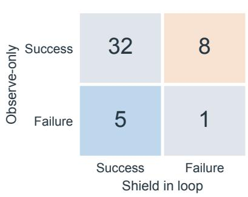

(b) Failure-record origins  
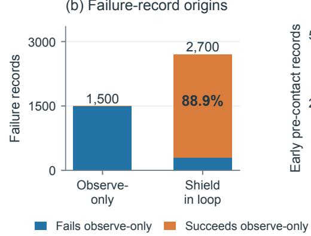

(c) Pre-contact signal  
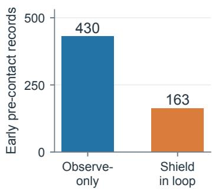  
Figure 7: Observe-only versus shield-in-loop collection on Level 1 mango. Panel a shows paired episode outcomes, with observe-only outcomes in rows and shield-in-loop outcomes in columns. Panel b groups failure records by paired episode outcome. Panel c counts stored early pre-contact records before outcome-aware admission.

## C.2 Failure-Record Provenance

Observe-only and shield-in-loop collection produce 5,801 and 7,728 training-fold records, respectively. The in-loop bank is therefore larger, but its additional records do not necessarily correspond to failures of the base policy.

Of the 2,700 failure records in the shield-in-loop bank, 2,400 come from the eight initial states that succeed without steering but fail when the shield is executed. These are failures of the shielded system rather than failures encountered under the policy’s original state distribution. These records constitute 88.9% of the 2,700 failure records, not of the full 7,728-record training fold. This record-weighted percentage is neither the fraction of episodes that fail nor an adapter-level effect size.

## C.3 Pre-Contact Correction Signal

Steering also changes the stage at which useful correction records are observed. Early pre-contact records decrease from 430 under observe-only collection to 163 with the shield in the loop, a reduction of approximately 62%, as shown in Figure 7c.

The lead-time counts describe the stored bank before outcome-aware record admission and therefore should not be interpreted as the number of admitted corrective targets. The provenance and pre-contact analyses explain why observe-only collection retains evidence from trajectories controlled by the policy being updated.

## C.4 Adapter-Level Collection Ablation

The two first-round banks are collected from the same policy checkpoint and trained with the same 800-step recipe with zero quiet-anchor weight. The observe-only bank contains 3,657 training records and passes the held-out guard. Its adapter raises Level 2 apple SR from 8.0% to 34.0%. The in-loop bank contains 5,099 records but no candidate checkpoint satisfies both guard conditions, so no deployable adapter is retained. This comparison uses one training order, and its held-out batches differ in size. The observe-only batch contains 300 records, whereas the in-loop batch contains 112 records.

Table 10: Collection-mode training outcome under the main update recipe.
<table><tr><td>Collection</td><td>Train records</td><td>Guard records</td><td>Guard decision</td><td>Apple SR</td></tr><tr><td>Observe-only</td><td>3,657</td><td>300</td><td>pass</td><td>34.0</td></tr><tr><td>Shield in loop</td><td>5,099</td><td>112</td><td>reject</td><td>unavailable</td></tr></table>

## C.5 Attribution Controls

Only 709 of the 6,535 main-bank training targets carry a nonzero shield residual. SFT0 replaces those residuals with zero, SHAM randomizes their direction while preserving magnitude, and SFTPOS trains only on successful episodes.

All other aligned fields remain unchanged for SFT0 and SHAM. Table 11 shows that FAILBANK outperforms SHAM and SFTPOS in every training order. It outperforms SFT0 in two orders, while the third is inconclusive. Averaging the three training orders within each offset gives a p-value of 0.0011 against SFT0, a p-value of 0.0029 against SHAM, and a p-value below 0.0001 against SFTPOS.

Table 11: Level 2 apple SR attribution controls over three training orders.
<table><tr><td>Update target</td><td>Seed 1</td><td>Seed 2</td><td>Order 3</td><td>Mean</td></tr><tr><td>Base</td><td>8.0</td><td>8.0</td><td>8.0</td><td>8.0</td></tr><tr><td>SFTPOS</td><td>4.0</td><td>10.7</td><td>10.7</td><td>8.4</td></tr><tr><td>SFT0</td><td>18.0</td><td>14.7</td><td>25.3</td><td>19.3</td></tr><tr><td>SHAM</td><td>26.0</td><td>16.0</td><td>18.0</td><td>20.0</td></tr><tr><td>FAILBANK</td><td>36.0</td><td>31.3</td><td>35.3</td><td>34.2</td></tr></table>

Table 12: Level 1 attribution controls for one training order. Each cell reports SR followed by policy-induced CC over 50 offsets under two sampler conditions.
<table><tr><td>Task</td><td>Base</td><td>FAILBANK</td><td>SFT0</td><td>SHAM</td><td>SFTPOS</td></tr><tr><td>L1-T1 Lemon</td><td>83.0 / 35.87</td><td>83.0 / 12.80</td><td>84.0 / 5.66</td><td>94.0 / 7.75</td><td>81.0 / 29.01</td></tr><tr><td>L1-T4 Tomato</td><td>85.0 / 37.01</td><td>90.0 / 31.24</td><td>86.0 / 33.51</td><td>82.0 / 40.61</td><td>81.0 / 51.27</td></tr></table>

The null updates themselves improve over base on Level 2 apple. SFT0 accounts for 11.3 of the full 26.2-point gain and SHAM for 12.0 points. On Level 1 T1, SHAM reaches 94.0% SR versus 83.0% for FAILBANK and achieves a comparable cost reduction. On T4, the aligned comparisons are inconclusive. The evidence therefore supports partial attribution on the hard apple task, not a universal claim that shield residuals alone cause the gain.

An earlier attribution sweep used a different 2,830-record recipe and stopped after 25–50 of 400 planned steps. It had no same-host base arm and predates the cost-decomposition fix, so only its SR is interpretable. The ordering of the method and SHAM reversed across seeds, and cross-task transfer was inconclusive. We report this audit to distinguish the current matched controls from exploratory development results.

## C.6 Privileged Teacher Executed In Loop

To separate projection effects from perception errors, we execute the same privileged-geometry CBF used to label records. Table 13 reports 50 offsets under three sampler conditions per task. The shield-in-loop arm collapses onion to zero success, reduces apple to zero, and sharply degrades mango while increasing its cost. Its outcome differs from the matched base in 70%, 87%, and 82% of apple, mango, and onion cells, respectively, showing that the two arms produced different outcomes.

Table 13: Executing the privileged CBF teacher as a shield. Cost cells report CC followed by policy-induced CC.
<table><tr><td>Task</td><td>Method</td><td>SR</td><td>CC</td><td> $\mathrm { C C } _ { \mathrm { p o l i c y } }$ </td></tr><tr><td>Apple</td><td>Base</td><td>8.0</td><td>67.51</td><td>65.89</td></tr><tr><td></td><td>AEGIS</td><td>7.3</td><td>90.73</td><td>89.26</td></tr><tr><td></td><td>Teacher in loop</td><td>0.0</td><td>67.02</td><td>67.01</td></tr><tr><td>Mango</td><td>Base</td><td>89.3</td><td>51.41</td><td>33.93</td></tr><tr><td></td><td>AEGIS</td><td>88.0</td><td>28.75</td><td>11.15</td></tr><tr><td></td><td>Teacher in loop</td><td>50.7</td><td>107.63</td><td>97.50</td></tr><tr><td>Onion</td><td>Base</td><td>81.3</td><td>16.33</td><td>0.07</td></tr><tr><td></td><td>AEGIS</td><td>1.3</td><td>0.27</td><td>0.00</td></tr><tr><td></td><td>Teacher in loop</td><td>0.0</td><td>0.00</td><td>0.00</td></tr></table>

The logged correction and trigger counters remain zero on this execution path, so they cannot verify whether individual projections were executed. We instead use the pre-registered matched-outcome divergence check. The privileged teacher is not better than AEGIS on any of the three tasks. Collapse also occurs with privileged geometry, so these runs do not require perception errors to explain the loss of task completion. The inactive counters do not directly verify individual projections.

## D Deployment Boundary

## D.1 Deployment Requirements

Table 14: Deployment requirements. Privileged object geometry is an offline teacher input for FAILBANK and is absent at evaluation.
<table><tr><td>Method</td><td>Updated VLA</td><td>Shield</td><td>Object geometry</td><td>QP/step</td><td>s/step</td></tr><tr><td>Base policy</td><td>no</td><td>no</td><td>no</td><td>no</td><td>0.362</td></tr><tr><td>AEGÍS</td><td>no</td><td>yes</td><td>yes</td><td>yes</td><td>0.449</td></tr><tr><td>FAILBANK</td><td>LoRA</td><td>no</td><td>no</td><td>no</td><td>0.346</td></tr></table>

The distinction in Table 14 is between information available during learning and components required after the update. FAILBANK uses privileged object geometry only to construct counterfactual teacher targets during collection. Once the guarded LoRA adapter is accepted, deployment requires only the updated VLA policy. It does not use a runtime shield, privileged geometry, a quadratic program, a retrieval system, a memory lookup, or a test-time update. The latency audit uses the first ten Level 2 apple offsets, one concurrent run per arm, and reports the median total wall clock divided by executed steps. It includes policy-server startup and checkpoint restoration, so it supports only a matched relative comparison. The observed median for folded FAILBANK is close to base. AEGIS adds approximately 24% and serves a 202 GB vision–language model in addition to its per-step QP. This wall-clock audit does not establish isolated inference latency or a speedup from adaptation.

## E Additional Training and Self-Evolution Diagnostics

## E.1 Implementation and Training Details

Table 15 lists the shared training configuration. LoRA is inserted into the PaliGemma backbone and the flow-matching action expert, while all non-LoRA parameters remain frozen. The main adapter uses training-order seed 0, and the three Level 2 replicates use seeds 1–3.

Table 15: Policy-update hyperparameters.
<table><tr><td>Component Setting</td><td></td></tr><tr><td>PaliGemma 2B LoRA</td><td>rank  $1 6 , \alpha = 1 6$ </td></tr><tr><td>300M action-expert LoRA</td><td>rank 32,  $\alpha = 3 2$ </td></tr><tr><td>Trainable parameters</td><td>LoRA  $A / B$  factors only</td></tr><tr><td>Optimizer</td><td>AdamW, gradient clipping 1.0</td></tr><tr><td>Learning-rate schedule</td><td>cosine, 20-step warmup, peak  $3 \times 1 0 ^ { - 5 }$  400-step decay, final  $\mathrm { 3 \tilde { \times } \tilde { 1 0 } ^ { - 6 } }$ </td></tr><tr><td>Batch size</td><td>32</td></tr><tr><td>Action horizon</td><td>10 for  $\pi _ { 0 . 5 }$  and 50 for π0</td></tr><tr><td>Replanning / episode limit</td><td>every step / 300 control steps</td></tr><tr><td>Main update</td><td>800 steps,  $\lambda _ { q } = 0$ </td></tr><tr><td>Round-curve family</td><td>800 steps,  $\lambda _ { q } = 0 . 2$ </td></tr><tr><td>Cross-backbone π0</td><td>800 steps,  $\lambda _ { q } = 0 . 5$ </td></tr></table>

## E.1.1 Barrier Teacher

The teacher models protected object $j$ as an ellipsoid with center $c _ { j }$ and positive-definite shape matrix $P _ { j }$ . The center and end-effector position x are three-dimensional, and $P _ { j }$ is a $. 3 \times \mathrm { { 3 } }$ matrix. The barrier is

$$
\begin{array} { r } { h _ { j } ( x ) = ( x - c _ { j } ) ^ { \top } P _ { j } ^ { - 1 } ( x - c _ { j } ) - 1 . } \end{array}\tag{10}
$$

For nominal translation $u \in \mathbb { R } ^ { 3 }$ and candidate translation $v \in \mathbb { R } ^ { 3 }$ , the teacher solves

$$
\begin{array} { r } { \widetilde { u } = \arg \underset { \upsilon } { \operatorname* { m i n } } \frac { 1 } { 2 } \| \upsilon - u \| _ { 2 } ^ { 2 } \quad \mathrm { s . t . } \quad \dot { h } _ { j } ( \boldsymbol { x } , \boldsymbol { v } ) + 3 h _ { j } ( \boldsymbol { x } ) \geq 0 \quad \forall j . } \end{array}\tag{11}
$$

The end-effector radius is 0.03, protected-object inflation is 0.04, and the additional margin is 0.02. The safety-region detector uses near and release thresholds 0.205 and 0.307, with minimum approach speed 0.0027 m per step. The default record-labeling implementation uses privileged geometry. AEGIS instead calls GLM-4.5V once per episode to identify obstacles and then performs the $\mathrm { Q P }$ projection at every control step.

## E.1.2 Outcome-Aware Record Weight

For a triggered, feasible record with finite action and nonzero correction, the outcome-aware score is

$$
\begin{array} { c } { q _ { i } = 0 . 4 0 s _ { i } + 0 . 3 0 r _ { i } + 0 . 2 0 R _ { i } + 0 . 1 0 ( 1 - \rho _ { i } ) } \\ { - 0 . 3 0 C _ { i } - 0 . 2 0 F _ { i } , } \end{array}\tag{12}
$$

(13)

clipped to the range from zero to one. Here $s _ { i }$ is normalized one-step forward safety, $r _ { i }$ is progress preservation, $R _ { i }$ indicates observed recovery, $\rho _ { i }$ is the subsequent repeated-trigger rate, $C _ { i }$ indicates four-step cost, and $F _ { i }$ indicates a four-step barrier-floor violation. The gate additionally requires a nonnegative one-step barrier or observed recovery. Records that fail the gate or score below 0.25 receive zero weight. Scores of at least 0.25 but below 0.45 receive weight 0.25. Scores of at least 0.45 but below 0.70 receive weight 0.60, and scores of at least 0.70 receive weight 1.00.

## E.1.3 Record Admission

The static L1-T2 risk threshold is 0.1087. Records are assigned to five lead-time bins. Early pre-contact records occur more than 30 steps before crossing. Mid pre-contact records occur 15–30 steps before crossing, and emergency records occur 0–15 steps before crossing. The remaining bins are post-crossing and no-risk. Emergency and post-crossing corrections are discarded. On failed trajectories, only early pre-contact correction records are retained. Successful actions without a triggered correction provide quiet anchors. A pre-training audit rejects failure targets identical to the nominal action. The builder runs in the early- and mid-stage mode, while failed trajectories remain restricted to early pre-contact records.

Admitted CBF-triggered records receive the outcome-aware weights specified in Appendix E.1.2. Quiet anchors receive the per-record weight specified by the update recipe in Appendix E.4.

## E.2 Bank and Evaluation Ledger

Table 16: Learning-record banks used by the reported experiments. CBF-triggered and quiet counts refer to records with and without a triggered correction in the filtered training fold. They are not counts of corrective and nominal targets.
<table><tr><td>Bank</td><td>Collection suite</td><td>Train records</td><td>CBF-triggered / quiet</td><td>Validation fold</td><td>Used by</td></tr><tr><td>Main static two-round</td><td>static L1-T2</td><td>6,535</td><td>2,863 / 3,672</td><td>600</td><td>main tables, L2, R2 ablations</td></tr><tr><td>Pre-filter static pool</td><td>static L1-T2</td><td>12,343</td><td>4,485 / 7,858</td><td>600</td><td>audit only</td></tr><tr><td>State holdout</td><td>static L1-T2</td><td>4,006</td><td>1,799 / 2,207</td><td>600</td><td>unseen-state evaluation</td></tr><tr><td>Static R1–R5</td><td>static L1-T2</td><td>3,657 / 6,535 / 15,707 / 19,051 / 22,732</td><td></td><td></td><td>round curve</td></tr><tr><td>Dynamic diagnostic R1</td><td>dynamic L2-T0</td><td>3,192</td><td>642 / 2,550</td><td>139</td><td>dynamic L1 stress test</td></tr><tr><td>Dynamic diagnostic R2</td><td>dynamic L2-T0</td><td>9,898</td><td>1,818 / 8,080</td><td>266</td><td>dynamic round analysis</td></tr><tr><td>π0 transfer</td><td>static L1-T2</td><td>2,875</td><td>747 / 2,128</td><td></td><td>Table 2</td></tr></table>

The main static two-round bank contains 3,657 records from the first collection round and 2,878 from the second. These are data-collection rounds, while every reported main policy is fitted afresh from the same original base. Runtime logs, not directory arm names, determine the effective checkpoint and method used by each result.

## E.3 Host Matching and Hardware Confounding

A historical audit split $1 5 0 \pi _ { 0 }$ baseline cells across two hosts. A total of 124 cells achieved 66.9% SR on one host, and 26 achieved 96.2% on the other. These were different offset subsets, not paired replays. The 29.3-point gap does not isolate a causal hardware effect. Every comparison in the paper is pinned to one hostname, and a runtime assertion rejects a cell from an incompatible host.

## E.4 Update Recipes and Training Budgets

The main $\pi _ { 0 . 5 }$ update uses 800 optimization steps with zero quiet-anchor weight. The static round-curve family uses the same budget with quiet-anchor weight 0.2. The cross-backbone $\pi _ { 0 }$ update uses 800 steps with quiet-anchor weight 0.5. Table 15 lists the shared configuration.

The main round-2 training fold contains 2,863 triggered and 3,672 quiet records, or 6,535 total. The 12,343-record pool is the pre-filter set and is not used directly for training. A quiet-anchor weight of 0.2 applies to each record. Multiplying the quiet-record count by this weight and dividing by the triggered-record count gives a nominal ratio of 0.257. The value 0.2 therefore does not specify the weight of the quiet class as a whole. Stored outcome-aware record weight further determine the actual denominator in Equation 4.

On the 9,898-record dynamic two-round bank, 700 update steps pass with a held-out full-chunk flow-loss ratio of 1.0985, whereas 800 steps fail at 1.1016. The main 6,535-record static bank passes at 800 steps with ratio 1.0065. Increasing quiet weight can restore the ratio while inflating triggered loss by up to 48×. These checks motivate the guarded update rather than treating additional optimization as uniformly beneficial.

## E.5 Bank-Construction Audit

An earlier round-three construction retained only 3,364 new-round records, whereas the rebuilt union contains 15,707 records. We exclude the replacement-bank run from the accumulated curve.

The rebuilt adapter passes the held-out guard with a flow-loss ratio of 0.9993, but this training-side observation does not isolate a task-performance benefit of retaining history. In the review-time size control, the round-2-only bank is rejected while a size-matched accumulated bank passes. Once the guard is disabled for diagnosis, however, their Level 2 apple SR values are 38.7 and 41.3 and are not significantly different. The first-round, size-matched accumulated, and full accumulated adapters likewise reach 34.0, 41.3, and 36.0 SR on that task without supported pairwise differences. The only supported benefit is lower L1-T1 policy-induced CC for the size-matched accumulated bank than for the first-round bank, 10.61 versus 24.00. We therefore treat accumulation as a record-retention mechanism and do not claim that a larger bank improves success. The controlled multi-round result uses only reconstructed accumulated banks.

## E.6 Constraint-Activation Analysis

Observe-only activation measures how often a proposed action triggers the constraint without changing the trajectory. On 50 dynamic offsets, activation rises from 17.74% at base to 19.47% after round one and the paired test gives a p-value of 0.0328. Activation then falls to 16.04% and 14.36% after rounds two and three. Round three is 19% below base. The paired directions include 40 decreases and 10 increases, and the paired test gives a p-value below 10−4. Contact-step, success, and cost changes against base remain null.

The direction is task-dependent. Mango activation decreases in all three training orders. Each order has 36 lower and 14 higher offsets, and each paired test gives a p-value of 0.0026. Onion activation increases in two orders, with a p-value of 0.0153 and a p-value of 0.0066. Apple shows mixed changes. Figure 8a–b shows all four tasks, including the adverse round-one dynamic change. All comparisons are observe-only. None uses the steering AEGIS arm’s non-comparable counters.

## E.7 Held-Out Guard Diagnostics

The acceptance thresholds are fixed empirical optimization guardrails. They are not theoretical CBF constants or statistically calibrated confidence bounds. The flow-loss ratio limit is 1.10, permitting at most a 10% increase in full-chunk held-out loss relative to the original base policy. The first-action drift limit is 0.05, measured as the mean absolute difference per coordinate. Exceeding either value rejects the adapter. Task SR and CC are not used for adapter acceptance, and the experiments do not identify these thresholds as optimal.

The round-2 validation fold has 474 quiet and 126 CBF-triggered records, and the round-3 validation fold has 526 and 164. The guard evaluates a fixed held-out batch V drawn from the corresponding fold rather than averaging over the full fold. Equation 5 therefore reports full-chunk flow loss on V.

Training manifests contain 3,657, 6,535, 15,707, 19,051, and 22,732 records over the five static rounds. Held-out records are excluded from these counts. Quiet records constitute 56–62% of each bank, as shown in Figure 8c.

All five adapters pass both acceptance conditions. Flow-loss ratios range from 0.9649 to 1.0363, and first-action drift ranges from 0.00514 to 0.00946. The flow-loss ratios remain below 1.10, and the first-action drifts remain below 0.05. These are checks on a mixed held-out batch, not on unseen task outcomes. In particular, the lowest flow-loss ratio occurs at round four, when evaluation cost reverses. Bank growth and guard acceptance alone do not establish which round best balances task success and cost.

Table 17 collects the review-time bank decisions. Values not included in the audited result summaries are marked unavailable rather than reconstructed from training artifacts. The in-loop and replacement-only banks are not promoted because they fail at least one guard condition.

## E.7.1 Guard-Threshold Sensitivity

The thresholds retain the implementation defaults rather than values fitted to task SR or CC. A retrospective audit cover 113 archived validation entries, comprising 75 metrics entries and 38 log entries. It includes repeated representations of the same optimization run and development settings, so the counts in Table 18 describe archive entries, not independent training trials. Flow-loss ratios have median 1.000, 90th percentile 1.102, and maximum 1.580. First-action drift reaches at most 0.0160. No archived entry exceeds the adopted drift limit of 0.05, so this limit does not affect any observed decision.

(a) Static: task-dependent response  
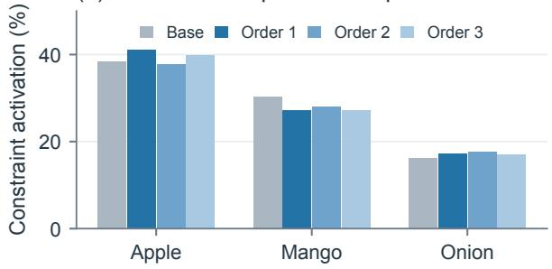

(b) Dynamic: fewer activations  
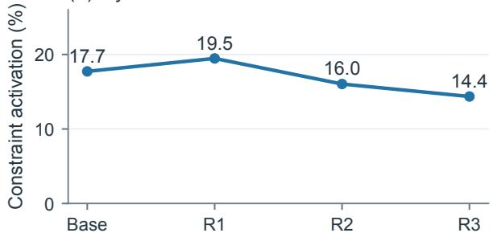

(c) What accumulates in the bank?  
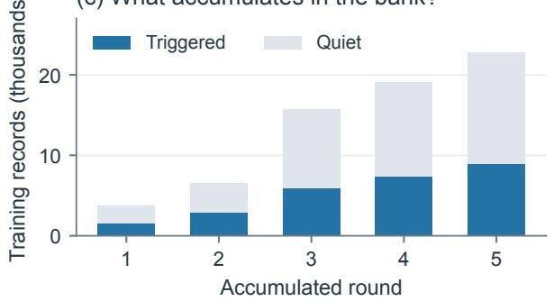

(d) All rounds pass the guard  
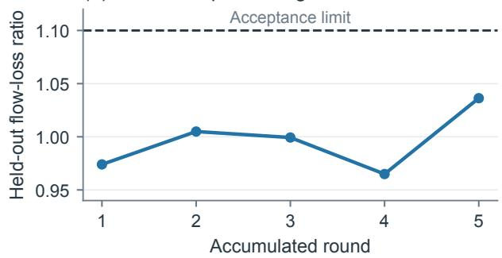  
Figure 8: Training and self-evolution diagnostics. Panels a and b show observe-only constraint activation for static tasks and dynamic rounds. Panel c separates accumulated training records by trigger provenance. Panel d shows held-out full-chunk flow-loss ratios relative to base. The dashed line marks the acceptance limit. Activation is a diagnostic, not a task-success or cost metric.

Table 17: Training-guard decisions for the bank-construction study. All rows use 800 update steps and one training seed. A dash denotes an unreported diagnostic, not a zero value.
<table><tr><td>Bank</td><td>Records</td><td>Flow-loss ratio</td><td>First-action drift</td><td>Triggered loss</td><td>Decision</td></tr><tr><td>Observe-only round 1</td><td>3,657</td><td>0.972</td><td></td><td></td><td>accept</td></tr><tr><td>Shield-in-loop round 1</td><td>5,099</td><td>1.137</td><td>0.0129</td><td></td><td>reject</td></tr><tr><td>Round 2 only</td><td>2,878</td><td>1.111</td><td>0.0053</td><td></td><td>reject</td></tr><tr><td>Accumulated, size matched</td><td>2,878</td><td>1.008</td><td></td><td></td><td>accept</td></tr><tr><td>Accumulated, full</td><td>6,535</td><td>1.0065</td><td>0.00949</td><td></td><td>accept</td></tr></table>

Table 18: Acceptance counts under alternative guard thresholds.
<table><tr><td>Tloss</td><td> $\tau _ { \mathrm { d r i f t } } = 0 . 0 1$ </td><td>0.02</td><td>0.05</td><td>0.10</td></tr><tr><td>1.05</td><td>87</td><td>89</td><td>89</td><td>89</td></tr><tr><td>1.10</td><td>96</td><td>100</td><td>100</td><td>100</td></tr><tr><td>1.15</td><td>100</td><td>108</td><td>108</td><td>108</td></tr><tr><td>1.20</td><td>100</td><td>109</td><td>109</td><td>109</td></tr><tr><td>1.30</td><td>101</td><td>110</td><td>110</td><td>110</td></tr></table>

At the adopted loss limit, tightening the drift limit to 0.01 changes four archive decisions, including the accepted $\pi _ { 0 }$ quiet-regularized update. Limits of 0.02, 0.05, and 0.10 give identical decisions in this archive, so the flow check is the binding constraint in the observed range. Tightening the loss limit to 1.05 flips eleven archived entries, corresponding to seven distinct training runs. These include two main replicated updates with ratios 1.0975 and 1.0739 and the original accepted $\pi _ { 0 }$ update with ratio 1.0829. Relaxing the loss limit to 1.15 or 1.20 accepts eight or nine additional entries, respectively. These include the in-loop and replacement-only banks, the π update with quiet-anchor weight 0.3, and the 4,800-step duration diagnostic. Conversely, relaxing it to 1.15 admits the shield-in-loop update whose Level 2 apple result is worse than the accepted observe-only update. The replacement-only diagnostic is not worse despite slightly exceeding 1.10, so these observations support an empirical, conservative guardrail rather than an optimal or calibrated threshold. The sensitivity audit does not change the thresholds used for the reported method.

## E.7.2 Training Duration and Guard Conservatism

To test whether the held-out full-chunk flow-loss ratio predicts task degradation within the main recipe, we disable the guard and vary the update duration while keeping the bank, base checkpoint, data order, and quiet weight fixed. The cosine learning-rate schedule retains a 400-step decay period, so all subsequent updates use the minimum learning rate of $3 \times 1 0 ^ { - 6 }$ . The 1,000 new evaluation cells pass checkpoint and host checks. Each task shares its host with the base and 800-step reference. The L2 apple runs use qa-l40s-004, and the L1 tomato runs use qa-l40s-005.

Table 19: Training duration with the acceptance guard disabled.
<table><tr><td colspan="3"></td><td colspan="2">L2 Apple</td><td colspan="2">L1 Tomato</td></tr><tr><td>Steps</td><td>Flow-loss ratio</td><td>First-action drift</td><td>SR</td><td> $\mathrm { C C _ { p o l i c y } }$ </td><td>SR</td><td> $\mathrm { C C _ { \mathrm { p o l i c y } } }$ </td></tr><tr><td>Base</td><td>一</td><td></td><td>8.0</td><td>65.89</td><td>85.0</td><td>37.01</td></tr><tr><td>400</td><td>1.0042</td><td>0.0083</td><td>32.0</td><td>61.71</td><td>88.0</td><td>36.65</td></tr><tr><td>800</td><td>1.0073</td><td>0.0096</td><td>36.0</td><td>65.73</td><td>90.0</td><td>31.24</td></tr><tr><td>1,600</td><td>1.0165</td><td>0.0108</td><td>46.7</td><td>56.92</td><td>85.0</td><td>35.71</td></tr><tr><td>2,400</td><td>1.0341</td><td>0.0121</td><td>54.0</td><td>43.01</td><td>90.0</td><td>29.38</td></tr><tr><td>4,800</td><td>1.1103</td><td>0.0150</td><td>55.3</td><td>42.61</td><td>88.0</td><td>35.70</td></tr></table>

No tested duration produces significantly lower SR than the 800-step reference. On L2 apple, the 2,400-step update is better under the registered paired test, which gives a p-value of 0.0046. The 400-, 1,600-, and 4,800-step comparisons are inconclusive, with p-values of 0.56, 0.16, and 0.060, respectively. All SR and policy-induced CC comparisons on L1 tomato are inconclusive. The 4,800-step adapter is the only point exceeding the adopted loss limit of 1.10, yet its apple SR is among the highest observed. The guard is therefore conservative over the measured flow range of 1.004–1.110 rather than a validated predictor of task degradation. This diagnostic does not establish behavior at ratios above 1.2. It also does not change the main 800-step recipe. Selecting 2,400 steps after inspecting this evaluation set would require an independent held-out test. Guard-disabled checkpoints are diagnostic variants, not accepted main-method results.

## E.7.3 Quiet Anchors and Chunk Supervision

Here k denotes the number of action-chunk steps supervised during the update. The main recipe supervises the first action, and the multi-step diagnostics supervise the first 10 or all 50 actions.

The controlled $\pi _ { 0 . 5 }$ quiet-anchor ablation uses the same round-2 bank, base checkpoint, update budget, and matched L1-T3 evaluation. Changing $\lambda _ { q }$ from 0 to 0.2 preserves mean SR at 89.0% while reducing policy-induced CC from 20.88 to 16.52. The paired test gives a p-value of 0.0039. Under this fixed recipe, quiet-anchor weighting reduces measured cost without an additional mean SR gain. The weight acts during training.

The $\pi _ { 0 }$ quiet weight is selected by the held-out guard rather than by task evaluation. Table 20 reports all five evaluations used for that choice and the two multi-step follow-ups. The accepted setting has substantially higher triggered loss than the accepted $\pi _ { 0 . 5 }$ updates, whose values range from 0.003 to 0.03.

Passing the guard does not by itself establish a useful task update. Table 21 shows that supervising more of the 50-step chunk allows the update to pass without quiet-anchor weighting, yet neither multi-step variant improves pooled SR over base. Both remain below the accepted adapter trained with first-action supervision and quiet-anchor weight 0.5.

## E.7.4 Record and Teacher Threshold Sensitivity

The projection trigger $z _ { t }$ is determined by the CBF correction, not by the distance-based risk threshold. The latter determines lead-time staging and record admission. The safety-region detector thresholds in Appendix E.1 likewise do not define triggered or quiet labels. We perturb the default admission risk cutoff of 0.1087 by ±20%. The perturbed values are approximately 0.087 and 0.130. We perturb the temporal stage boundaries of 30 and 15 steps by ±20% and the η-bin boundaries by ±0.05. The default reconstruction exactly reproduces the 6,535-record main bank and its 709 genuinely corrected targets, with no record-set discrepancy.

Table 20: Held-out guard search and multi-step follow-ups for π0. The flow-ratio limit is 1.10. Multi-step triggered losses were not reported in the audited summary and are marked unavailable.
<table><tr><td>Steps</td><td> $\lambda _ { q }$ </td><td>Flow-loss ratio</td><td>Triggered loss</td><td>Decision</td></tr><tr><td>800</td><td>0.0</td><td>1.477</td><td>0.185</td><td>reject</td></tr><tr><td>500</td><td>0.0</td><td>1.513</td><td>0.171</td><td>reject</td></tr><tr><td>400</td><td>0.0</td><td>1.580</td><td>0.170</td><td>reject</td></tr><tr><td>800</td><td>0.3</td><td>1.110</td><td>0.199</td><td>reject</td></tr><tr><td>800</td><td>0.5</td><td>1.083</td><td>0.178</td><td>accept</td></tr><tr><td> $8 0 0 , k = 1 0$ </td><td>0.0</td><td>1.017</td><td>一</td><td>accept</td></tr><tr><td> $8 0 0 , k = 5 0$ </td><td>0.0</td><td>1.000</td><td>一</td><td>accept</td></tr></table>

Table 21: π0 multi-step supervision ablation. Values are SR over 50 matched offsets per task. The pooled row reports mean SR followed by mean policy-induced CC.
<table><tr><td>Task</td><td>Base</td><td> $k = 1 , \lambda _ { q } = 0 . 5$ </td><td> $k = 1 0 , \lambda _ { q } = 0$ </td><td> $k = 5 0 , \lambda _ { q } = 0$ </td></tr><tr><td>L1-T0</td><td>54.0</td><td>58.0</td><td>34.0</td><td>30.0</td></tr><tr><td>L1-T1</td><td>66.0</td><td>84.0</td><td>60.0</td><td>62.0</td></tr><tr><td>L1-T2</td><td>92.0</td><td>96.0</td><td>94.0</td><td>90.0</td></tr><tr><td>L1-T3</td><td>28.0</td><td>26.0</td><td>24.0</td><td>14.0</td></tr><tr><td>L1-T4</td><td>56.0</td><td>88.0</td><td>78.0</td><td>78.0</td></tr><tr><td>Pooled SR and policy-induced CC</td><td>59.2 / 3.78</td><td>70.4 / 2.09</td><td>58.0 / 2.23</td><td>54.8 / 2.94</td></tr></table>

Table 22: Record and teacher threshold sensitivity.
<table><tr><td>Perturbation</td><td>Bank size</td><td>Corrected targets</td><td>Affected share, %</td><td>∆ weight mass, %</td></tr><tr><td>Default</td><td>6,535</td><td>709</td><td>0.0</td><td>0.0</td></tr><tr><td>Risk cutoff ×0.8</td><td>7,683</td><td>457</td><td>21.9</td><td>+19.3</td></tr><tr><td>Risk cutoff ×1.2</td><td>4,892</td><td>1,293</td><td>35.6</td><td>-31.0</td></tr><tr><td>Stage boundaries 24 / 12</td><td>6,626</td><td>744</td><td>1.4</td><td>+1.9</td></tr><tr><td>Stage boundaries 36 / 18</td><td>6,459</td><td>682</td><td>1.2</td><td>-1.2</td></tr><tr><td>η bins −0.05</td><td>6,535</td><td>709</td><td>19.2</td><td>+26.3</td></tr><tr><td>η bins +0.05</td><td>6,535</td><td>709</td><td>10.3</td><td>-14.9</td></tr></table>

Affected percentages use the default training bank as the reference. Weight mass is the sum of triggered-record weights. The predeclared descriptive criterion treats at most 10% affected records as low sensitivity. Temporal boundaries meet this criterion, while risk and η-bin thresholds do not. Changes to the η bins preserve the record set but alter its effective weights. Thus, the bank is not globally insensitive to threshold choices. These are CPU-side reconstruction diagnostics without policy retraining and do not establish corresponding SR or CC changes.

## E.7.5 Rejected-Update Diagnostics

For diagnosis only, we retrain the two rejected bank variants after disabling the guard while leaving all other settings unchanged. These checkpoints were rejected under the main acceptance rule and are evaluated only as diagnostic variants. Table 23 shows that the shield-in-loop update is worse than its accepted observe-only counterpart on Level 2 apple, while the rejected round-2-only update does not differ significantly from the size-matched accumulated update. The latter result shows that a guard rejection is a training-side decision rather than evidence that accumulation improves task success.

## E.8 Diagnostics of the Dynamic-Obstacle Null Result

Across consecutive banks, dynamic failure profiles are at least as stable as static ones. The mean correction-direction cosine is 0.814 for dynamic banks and 0.747 for static banks. After controlling for episode phase, the teacher triggers more often on steps with benchmark cost than on steps without benchmark cost. The corresponding rates are 28.6% and 11.8%.

Table 23: Non-deployable diagnostics with the acceptance guard disabled. Each cell reports SR followed by policy-induced CC. Bold labels mark rejected variants, not preferred results.
<table><tr><td>Task</td><td>Base</td><td>Observe-only R1</td><td>In-loop R1</td><td>Accumulated matched</td><td>R2 only</td><td>Full accumulated</td></tr><tr><td>L2-T0 Apple</td><td>8.0 / 65.89</td><td>34.0 / 59.97</td><td>18.0 / 57.68</td><td>41.3 / 48.07</td><td>38.7 / 56.59</td><td>36.0 / 65.73</td></tr><tr><td>L1-T1 Lemon</td><td>83.0 / 35.87</td><td>85.0 / 24.00</td><td>93.0 / 3.24</td><td>89.0 / 10.61</td><td>87.0/8.51</td><td>83.0 / 12.80</td></tr><tr><td>L1-T4 Tomato</td><td>85.0 / 37.01</td><td>89.0 / 30.57</td><td>87.0 / 30.55</td><td>87.0 / 38.53</td><td>89.0 / 31.23</td><td>90.0 / 31.24</td></tr></table>

Correction-direction similarity and cost-step trigger rates do not support failure-mode churn or sparse triggering as explanations for the dynamic null. Triggering on cost steps does not establish that the unexecuted correction would prevent cost. They also reinforce that intermediate quantities such as activation frequency or teacher coverage are diagnostics rather than substitutes for matched task-level success and cost.

## F Completion Timing and Cost Distributions

## F.1 Behavior Overview

Figure 9 compares completion timing and policy-induced cost distributions on Level 2 apple, mango, and onion. Both analyses retain all evaluated trials, including failures. These diagnostics describe where mean SR and CC conceal differences in timing or cost distribution.

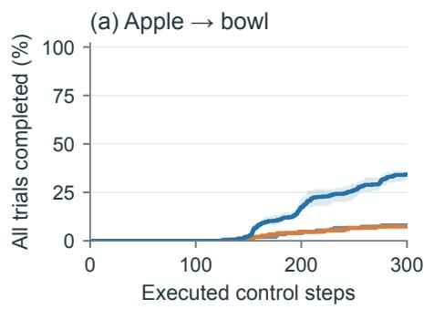

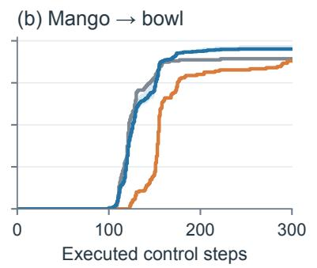

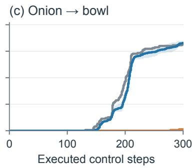

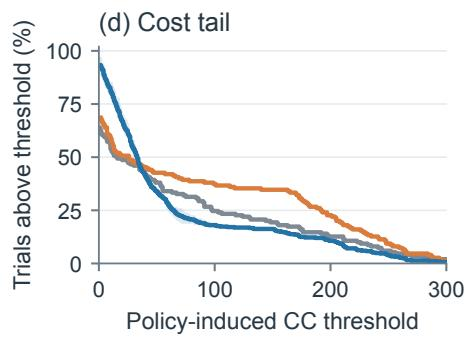

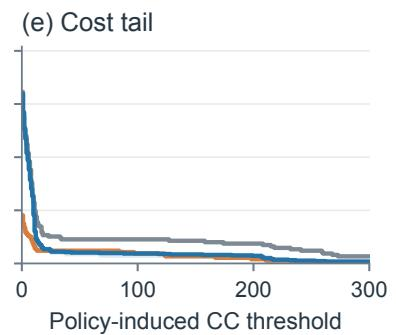

(f) Cost tail  
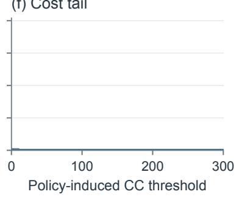  
Figure 9: Completion timing and policy-induced CC distributions on Level 2 apple, mango, and onion. Panels a–c show the fraction of all trials completed by each executed control-step count. Panels d–f show the fraction whose policy-induced CC exceeds each threshold. Blue shading spans three training orders and is not a confidence interval.

## F.2 Policy–Shield Coordination and Collapse

Re-attaching AEGIS tests whether the learned policy and runtime shield are naturally compositional. If they were, the stacked system would retain the learned success gain while lowering cost. Table 24 instead shows that the stacked system follows the shield’s behavior on both tested tasks.

Table 24: Stacking AEGIS onto the learned policy. Each cell reports SR followed by CC over 150 matched cells.
<table><tr><td>Task</td><td>Base</td><td>AEGIS</td><td>FAILBANK</td><td>FAILBANK + AEGIS</td></tr><tr><td>L2-T2 Mango</td><td>89.3 / 51.41</td><td>88.0 / 28.75</td><td>94.0 / 36.78</td><td>86.0 / 19.78</td></tr><tr><td>L2-T3 Onion</td><td>81.3 / 16.33</td><td>1.3 / 0.27</td><td>84.7 / 16.93</td><td>2.7 / 0.53</td></tr></table>

On mango, stacking lowers cost but decreases SR from 94.0% to 86.0%. On onion, stacking reduces SR from 84.7% to 2.7%, with nearly all cells abstaining. On both tasks, the paired test does not detect an SR difference between the stacked system and AEGIS alone. The learned behavior therefore does not preserve task progress once the shield again controls execution.

Figure 2 presents one matched Level 2 onion replay. AEGIS executes 80 CBF projections over 300 controller steps, including continuous intervention from environment steps 40 to 88. Repeated redirection prevents a successful grasp, and the episode times out at environment step 309. The shield-free FAILBANK trajectory enters the same interventionprone region. Its CBF runs only in observe-only mode and flags 33 of 180 controller steps, so none of those corrections is executed. The policy grasps and places the onion at environment step 189 with zero policy-induced CC. Controller counts exclude the first ten environment steps before frame logging, which explains the two step-number conventions in the figure. This replay illustrates the mechanism, not its frequency.

The same collapse appears without a perception module. When the privileged CBF teacher is moved from observe-only annotation into the execution loop, onion reaches 0% SR over 150 trials. Apple falls from 8.0% to 0%, while mango falls from 89.3% to 50.7% and its policy-induced CC rises from 33.93 to 97.50. These runs show that the loss of task completion also occurs with privileged geometry, independently of AEGIS grounding errors. Full results and configuration-validity checks appear in Appendix C.6.

## F.3 Completion Timing

We reconstruct completion curves from the recorded success flag and executed control-step count, including failures in the denominator. The curves therefore do not condition on a different successful subset for each method.

By 200 steps, FAILBANK completes 17.3% of apple trials versus 4.0% for base, and 93.8% of mango trials versus 88.7%. Onion reverses this timing pattern. FAILBANK completes 33.3% by that point versus 46.7% for base, despite similar final SR. The update therefore does not uniformly speed up execution. These curves are descriptive rather than additional significance tests at selected time thresholds.

## F.4 Policy-Induced CC Distributions

The apple curves cross. Policy-induced CC exceeds 100 in 24.7% of base trials, 37.3% with AEGIS, and 18.0% with FAILBANK, but the fraction with zero policy-induced CC falls from 36.0% for base to 6.7% for FAILBANK.

Thus, the update reduces the frequency of very costly apple trials while making nonzero cost more common. It does not dominate the distribution. On mango, the fraction above 100 falls from 11.3% to 4.7%. The full threshold curves expose this dependence without promoting a selected threshold to an additional benchmark metric.

## F.5 Completion-Coupled Cost on Onion

CC is 16.33 for base, 0.27 for AEGIS, and 16.54 for FAILBANK. The respective policy-induced CC means are 0.067, 0, and 0.004. At least 99.3% of trials in every arm have zero policy-induced CC.

Almost all of the CC difference therefore belongs to the benchmark’s initial-state/completion-coupled component. The nearly flat policy-induced cost tail shows that AEGIS sacrifices completion on a task where the logged policy-induced cost was already rare. Neither the CC gap nor the activation-rate gap establishes a substantial contact-reduction benefit on this task.

## G Detailed Statistical Results and Archive Eligibility

## G.1 Out-of-Sample Breadth and Ablation Tests

The primary cross-task pool contains static L1-T0, T1, T3, and T4, excluding the T2 collection task. We report the disjoint T2 state holdout separately. The all-five-task diagnostic includes the in-sample T2 evaluation and is labeled as such. Table 25 places paired counts outside the main narrative, together with the learning-signal tests used in Section 6.1.

Table 25: Detailed paired tests for breadth and learning-signal ablations. Favorable means higher SR or lower policy-induced CC. Individual L1 task rows and legacy cost rows use the earlier no-curriculum configuration. Pooled SR rows use training-order means. Unreported tie counts are marked unavailable.
<table><tr><td>Analysis</td><td>Comparison</td><td>Favorable / adverse / tie</td><td>p-value</td></tr><tr><td rowspan="10">Breadth</td><td>Static L1-T0 SR</td><td>7 /7/36</td><td>1.0000</td></tr><tr><td>Static L1-T1 SR</td><td>12 / 10 / 28</td><td>0.8320</td></tr><tr><td>Static L1-T3 SR</td><td>17 / 2 / 31</td><td>0.0007</td></tr><tr><td>Static L1-T4 SR</td><td>11 / 7 / 32</td><td>0.4810</td></tr><tr><td>Four unseen L1, SR 82.5% → 88.7%</td><td>51 / 45 / 104</td><td>0.61</td></tr><tr><td>Four unseen tasks, legacy policy-induced CC</td><td>71 / 53 / 76</td><td>0.1265</td></tr><tr><td>Static L1-T2 state-holdout SR</td><td>10 / 1 /7</td><td>0.0117</td></tr><tr><td>All five tasks, pooled SR</td><td>69 / 50 / -</td><td>0.099</td></tr><tr><td>All five tasks, legacy policy-induced CC</td><td>101 / 70 / 79</td><td>0.0215</td></tr><tr><td>Ten tasks, SR 66.0% → 74.5%</td><td>161 / 89 / -</td><td>&lt; 0.0001</td></tr><tr><td rowspan="4"> $\pi _ { 0 . 5 }$  mean π0 mean</td><td>L2 five tasks, SR 50.5% → 59.4%</td><td>92 / 39 / –</td><td>&lt; 0.0001</td></tr><tr><td>Ten tasks, SR 47.5% → 54.4%</td><td>121/ 81 /-</td><td>0.0059</td></tr><tr><td>Four unseen L1, SR 51.0% → 62.7%</td><td>61 / 36 / -</td><td>0.014</td></tr><tr><td>L1 five tasks, SR 59.2% → 68.8%</td><td>64 /40 / -</td><td>0.024</td></tr><tr><td rowspan="2"></td><td>L2 five tasks, SR 35.7% → 40.0%</td><td>57 / 41 /-</td><td>0.13</td></tr><tr><td>Learning signal Failure-only SR relative to base</td><td>21 / 2 / 27</td><td>0.0001</td></tr><tr><td colspan="2">Quiet-record policy-induced CC</td><td>27 / 9 / 14</td><td>0.0039</td></tr></table>

AEGIS reduces Level 2 SR relative to base on both backbones. The corresponding rates are 25.1% versus 50.5% on $\pi _ { 0 . 5 }$ and 26.3% versus 35.7% on $\pi _ { 0 } .$ Both paired tests give a p-value below 0.001. Comparing FAILBANK with AEGIS over Level 2 gives 144 favorable versus 16 adverse SR directions on $\pi _ { 0 . 5 }$ and 84 versus 29 on $\pi _ { 0 }$ . Both paired tests give a p-value below 0.0001.

Across the four unseen Level 1 tasks, $\pi _ { 0 . 5 }$ mean SR increases from 82.5% to 88.7%, but its 51 wins, 45 losses, and 104 ties do not support consistent improvement across initial states. The paired test gives a p-value of 0.61. Onion carries the gain, with 90.0% SR versus 72.0% and a p-value of 0.0026. Collection-task mango also improves, with a p-value of 0.011. The full Level 1 mean is likewise not significant, with a p-value of 0.099. Mean Level 1 cost is descriptively lower, but the four-task mean-based cost test is null, with a p-value of 0.44. Historical no-curriculum cost counts in Table 25 are retained for provenance and do not establish significance for the current mean recipe.

On $\pi _ { 0 } ,$ the reported mean uses training-order seeds 0 and 2. Seed 1 is rejected without retraining or relaxing the guard. Its flow ratio is 1.2214 and its first-action drift is 0.0089. Seeds 0 and 2 pass with ratios 1.0829 and 1.0171 and drifts 0.0122 and 0.0091. The Level 2 SR gain is not significant, with a p-value of 0.13. Tomato improves from 50.7% to 79.3%, with a p-value of 0.0002, but its policy-induced CC rises from 3.61 to 6.93, with a p-value of 0.0026. Seed 2 regresses on onion from 30.7% to 18.0%, with a p-value of 0.024. Ten-task CC tests are null on both backbones. The tests give a p-value of 0.085 on $\pi _ { 0 . 5 }$ and a p-value of 0.13 on $\pi _ { 0 } .$ The $\pi _ { 0 . 5 }$ pooled Level 2 cost reduction has a p-value of 0.011 and is driven mainly by floor-task lemon. Excluding that task yields a p-value of 0.42. These results do not establish uniformly lower cost or general Level 2 transfer on $\pi _ { 0 }$

## G.1.1 Effect Sizes with Bootstrap Intervals

Table 26 reports learned-minus-base differences. Within each task, we average training orders within initial state, resample initial states 5,000 times, and average tasks equally. The primary significance test remains the preregistered paired sign test.

The positive mean-gain intervals for $\pi _ { 0 . 5 }$ Level 1 across either four or five tasks and $\pi _ { 0 }$ Level 2 do not change their null sign-test conclusions. The sign test evaluates the balance of improvement and regression directions across matched initial states. The bootstrap estimates uncertainty in the mean difference. Thus, a positive mean can coexist with inconsistent per-state improvements, as on $\pi _ { 0 . 5 }$ Level 1 where onion carries much of the gain. These intervals exclude training-order variance and can understate recipe-level uncertainty. Removing the $\pi _ { 0 }$ Level 2 floor tasks reveals increased cost, mainly on tomato. $\pi _ { 0 }$ Level 1 cost intervals include zero. Rounded task averages and bootstrap effect sizes can differ slightly at the reported precision.

Table 26: Effect sizes with 95% bootstrap intervals. SR changes are percentage points. Intervals resample initial states only and exclude variation across training orders. The non-floor L2 row is post hoc.
<table><tr><td>Backbone</td><td>Set</td><td>Sign-test p</td><td>∆SR</td><td>95% CI</td><td> $\Delta \mathrm { C C } _ { \mathrm { p o l i c y } }$ </td><td>95% CI</td></tr><tr><td rowspan="2">π0.5</td><td>L1 unseen four</td><td>0.61</td><td>+6.2</td><td>[2.0, 10.5]</td><td>-8.39</td><td>[-15.21, -1.97]</td></tr><tr><td>L1 all five</td><td>0.099</td><td>+8.3</td><td>[4.5, 12.3]</td><td>-17.24</td><td>[-24.22, -10.61]</td></tr><tr><td rowspan="7">π0</td><td>L2 all five</td><td>&lt; 0.0001</td><td>+8.8</td><td>[6.2, 11.6]</td><td>-16.78</td><td>[-24.16, -9.40]</td></tr><tr><td>All ten</td><td>&lt; 0.0001</td><td>+8.6</td><td>[6.2, 10.9]</td><td>-17.01</td><td>[-22.19, -12.00]</td></tr><tr><td>L1 unseen four</td><td>0.014</td><td>+11.8</td><td>[5.0, 18.8]</td><td>-1.59</td><td>[-3.95, 0.53]</td></tr><tr><td>L1 all five</td><td>0.024</td><td>+9.6</td><td>[3.8, 15.6]</td><td>-1.08</td><td>[-2.97, 0.62]</td></tr><tr><td>L2 all five</td><td>0.13</td><td>+4.3</td><td>[0.8, 7.9]</td><td>-3.97</td><td>[-7.71, -0.40]</td></tr><tr><td>L2 non-floor three</td><td></td><td>+7.6</td><td>[1.6, 13.3]</td><td>+1.82</td><td>[1.04, 2.64]</td></tr><tr><td>All ten</td><td>0.0059</td><td>+6.9</td><td>[3.6, 10.4]</td><td>-2.53</td><td>[-4.63, -0.53]</td></tr></table>

## G.2 Offset-Paired Level 2 Statistics

Each training order is compared against the same base on 50 initial states. For each state, we average its three sampleradvance conditions before taking the direction of the difference. Counts are ordered as higher, lower, and equal. They refer to the learned-minus-base direction, so higher is favorable for SR but not for activation. All p-values below are two-sided exact sign-test values. Across the 24 planned Level 2 tests, the Bonferroni-adjusted threshold is 0.00208. The apple SR comparisons remain supported under this threshold. The mango and onion activation comparisons do not. A null result is not an equivalence test.

Table 27: Repeated sampler conditions are averaged, not counted as independent samples. SR is success rate. Activation is the observe-only constraint-flag rate.
<table><tr><td>Task</td><td>Training</td><td>SR higher / lower / equal</td><td>SR p-value</td><td>Activation higher / lower / equal</td><td>Activation p-value</td></tr><tr><td>Apple</td><td>order 1</td><td>28 / 2 / 20</td><td> $8 . 6 8 \times 1 0 ^ { - 7 }$ </td><td>32 / 18 / 0</td><td>0.0649</td></tr><tr><td></td><td>2</td><td>24 / 3 / 23</td><td> $4 . 9 2 \times 1 0 ^ { - 5 }$ </td><td>22 /26 / 2</td><td>0.6655</td></tr><tr><td></td><td>3</td><td>29 / 3 / 18</td><td> $2 . 5 6 \times 1 0 ^ { - 6 }$ </td><td>30 / 20 / 0</td><td>0.2026</td></tr><tr><td>Mango</td><td>1</td><td>8/4/38</td><td>0.3877</td><td>14 / 36 / 0</td><td>0.0026</td></tr><tr><td></td><td>2</td><td>10 / 3 / 37</td><td>0.0923</td><td>14 / 36 / 0</td><td>0.0026</td></tr><tr><td></td><td>3</td><td>10 / 7 / 33</td><td>0.6291</td><td>14 /36 / 0</td><td>0.0026</td></tr><tr><td>Onion</td><td>1</td><td>13 / 9 / 28</td><td>0.5235</td><td>34 / 16 / 0</td><td>0.0153</td></tr><tr><td></td><td>2</td><td>10 / 10 / 30</td><td>1.0000</td><td>35 / 15 / 0</td><td>0.0066</td></tr><tr><td></td><td>3</td><td>11 / 10 / 29</td><td>1.0000</td><td>28 / 22 / 0</td><td>0.4799</td></tr></table>

The two Level 2 tasks added for coverage were governed by a separate pre-registered readout. Table 28 gives the complete result. Tomato satisfies the transfer criterion because two training orders improve SR significantly and none is significantly worse than base. Lemon satisfies the floor criterion because all methods obtain zero SR, so its cost differences are descriptive only.

Pooling all five Level 2 tasks gives mean SR 59.4% for FAILBANK and 50.5% for base. The pooled policy-induced CC difference is driven by lemon. After removing that floor task, policy-induced CC is 29.27 for FAILBANK and 38.24 for base, and the paired difference is not significant. The paired test gives a p-value of 0.4159.

Table 29 reports the corresponding cost comparisons. “Favorable” means that the learned policy has lower cost than its matched reference. The three FAILBANK columns are the training orders. The AEGIS column compares the runtime shield with its matched base.

Table 28: Pre-registered Level 2 completion experiment. Each training-order comparison uses 50 matched offsets under three sampler conditions. FAILBANK mean is the average of the three orders.
<table><tr><td>Task</td><td>Arm</td><td>SR</td><td>CC</td><td> $\mathrm { C C _ { p o l i c y } }$ </td><td>SR test relative to base</td></tr><tr><td rowspan="3">L2-T1 Lemon</td><td>Base</td><td>0.0</td><td>158.14</td><td>158.13</td><td>一</td></tr><tr><td>AEGIS</td><td>0.0</td><td>141.51</td><td>141.51</td><td>一</td></tr><tr><td>FAILBANK mean</td><td>0.0</td><td>110.14</td><td>110.12</td><td>floor</td></tr><tr><td rowspan="6">L2-T4 Tomato</td><td>Base</td><td>74.0</td><td>67.87</td><td>53.07</td><td></td></tr><tr><td>AEGIS</td><td>28.7</td><td>26.93</td><td>21.20</td><td> $p < 0 . 0 0 0 1$ </td></tr><tr><td>FAILBANK order 1</td><td>84.0</td><td>59.05</td><td>42.39</td><td> $p = 0 . 0 8 7 2$ </td></tr><tr><td>FAILBANK order 2</td><td>85.3</td><td>55.43</td><td>38.49</td><td> $p = 0 . 0 0 4 3$ </td></tr><tr><td>FAILBANK order 3</td><td>85.3</td><td>51.83</td><td>34.77</td><td> $p = 0 . 0 2 9 4$ </td></tr><tr><td>FAILBANK mean</td><td>84.9</td><td>55.44</td><td>38.55</td><td> $p = 0 . 0 1 3 9$ </td></tr></table>

Table 29: Offset-paired Level 2 cost tests. $\mathrm { C C _ { p o l i c y } }$ removes the benchmark’s initial-state component. CC follows the benchmark definition.
<table><tr><td>Task</td><td>Cost</td><td>FAILBANK-1</td><td>FAILBANK-2</td><td> $\mathrm { F A I L B A N K } { - 3 }$ </td><td>AEGIS</td></tr><tr><td>Apple</td><td> $\mathrm { C C _ { p o l i c y } }$  CC</td><td>25/25/0, 1.000 22/28/0, 0.480</td><td>25/25/0, 1.000 23/27/0, 0.672</td><td>27/23/0, 0.672 26/24/0, 0.888</td><td>19/27/4, 0.302 18/27/5, 0.230</td></tr><tr><td>Mango</td><td> $\mathrm { C C _ { p o l i c y } }$  CC</td><td>28/20/2, 0.312 29/19/2,0.193</td><td>34/16/0, 0.015 35/15/0, 0.0066</td><td>28/20/2, 0.312 29/21/0, 0.322</td><td> $4 2 / 8 / 0 , 1 . 2 \times 1 0 ^ { - 6 }$   $4 2 / 8 / 0 , 1 . 2 \times 1 0 ^ { - 6 }$ </td></tr><tr><td>Onion</td><td> $\mathrm { C C _ { p o l i c y } }$  CC</td><td>1/0/49, 1.000 9/13/28, 0.524</td><td>1/1/48, 1.000 11/11/28, 1.000</td><td>1/0/49, 1.000 10/11/29, 1.000</td><td> $1 / 0 / 4 9 , 1 . 0 0 0$   $4 9 / 0 / 1 , 3 . 6 \times 1 0 ^ { - 1 5 }$ </td></tr></table>

Each cell gives favorable/adverse/tie counts followed by the two-sided exact sign-test p-value. A comma separates the counts from the p-value.

## G.3 Archive Eligibility

The review batch adds 4,315 provenance-checked result cells. Every included comparison matches the intended host and effective checkpoint. We exclude host-inconsistent cells, replacement-only banks, obsolete correction branches, and artifacts whose runtime audit block does not identify the intended arm. Observe-only telemetry remains diagnostic and does not alter SR or CC. A release archive should include per-cell result files, adapter audit blocks, training and bank manifests, and recovery logs needed to reconstruct each reported aggregate.