# Loop-Free Inverse Reinforcement Learning via Sequential Value Recovery with Q-Score Matching

Yang Chen1∗ Yitan Zhang2∗ Michael J. Witbrock2 Shuyue Hu1†   
1 Shanghai Artificial Intelligence Laboratory 2 University of Auckland chenyang4@pjlab.org.cn, yzhb332@aucklanduni.ac.nz, m.witbrock@auckland.ac.nz, hushuyue@pjlab.org.cn

## Abstract

Inverse Reinforcement Learning (IRL) aims to recover a reward function that explains expert demonstrations. Existing IRL methods typically rely on a bi-level optimization procedure that alternates between reward learning and policy optimization, leading to substantial computational burden and training instability. In this work, we introduce a different route that eliminates policy optimization entirely by leveraging diffusion policies. Our key insight is that a diffusion policy encodes the action-gradient structure of the optimal soft Q function, enabling reward learning to be cast as a sequence of value recovery problems, thereby allowing us to bypass reward-policy loops inherent in prior IRL methods. Specifically, our method proceeds in three stages: (I) recovering the optimal soft Q function via action-gradient matching and estimating the corresponding soft value function (LogSumExp of Q values) in a way inspired by Gumbel regression; (II) calibrating these soft values by inferring a state-dependent offset; (III) extracting the reward by enforcing Bellman consistency. This leads to Loop-Free Inverse Reinforcement Learning (LFIRL), a fully offline algorithm that operates in a simple, loop-free, and sequential manner. LFIRL is simple to implement and significantly improves training efficiency while maintaining strong reward recovery performance. Empirically, across Maze, Franka Kitchen, Adroit Hand Pen, and Push-T benchmarks, LFIRL achieves 2-3x speedup over the fastest baselines, while matching or surpassing state-of-the-art methods in reward recovery quality. 3

## 1 Introduction

Inverse reinforcement learning (IRL) [27, 1] studies how to recover a reward function from expert demonstrations, with the goal of explaining expert behavior through an underlying optimization principle. It has become an important paradigm for reward design, behavior understanding, and transferable decision making [21, 34]. In practice, however, a major bottleneck in IRL is time efficiency due to the inherent loop structure underlying many classic and modern approaches [1, 50, 9, 10, 47]: the alternating update of the reward function and the policy. This loop arises because most IRL methods generally cannot extract reward-supervision signals directly from demonstrations. Instead, the reward is usually learned through differentiating expert behavior from the learner behavior. This mutual dependence naturally leads to a classic bi-level optimization process, where a reward function is updated by contrasting expert demonstrations with learner behavior, the learner policy is then updated under the updated reward, and this process is repeated until convergence. Such a looped training paradigm is computationally expensive, especially in high-dimensional tasks, and also makes the overall training process harder to stabilize. This raises our central question: can we design an IRL method without the reward-policy loop while still recovering a useful reward function?

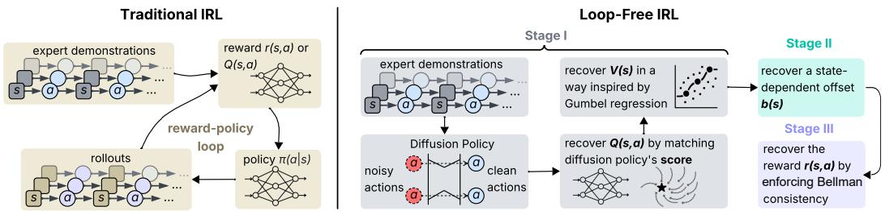  
Figure 1: Traditional inverse reinforcement learning alternates between reward learning and policy optimization, while our loop-free version trains each component once without a reward-policy loop.

If we could extract reward-supervision signals directly from demonstrations, then reward recovery would no longer need to be mediated by a reward-policy loop. Intuitively, demonstrations already contain local information about which nearby actions are more or less preferable around expert behavior. Diffusion policy methods [5, 30, 33] provide a natural way to represent this information. Built on the recently burgeoning diffusion models [17, 36], a diffusion policy represents expert action distribution by transforming noise into actions through an iterative refinement process: it learns the gradient of the action distribution’s score function, $\mathbf { \check { V } _ { a } } \log \pi ^ { * } ( \mathbf { a } | \mathbf { s } )$ , that describes the direction in which actions should move towards expert ones, and iteratively optimizes wrt this gradient field via a series of stochastic steps. This score-based signal is exactly what we need to break the reward-policy loop. Specifically, in the commonly used maximum-entropy reinforcement learning [14] setting, this score function encodes information of the gradient of the expert’s optimal soft Q function wrt actions, i.e., $\nabla _ { \mathbf { a } } \log \pi ^ { * } ( \mathbf { a } | \mathbf { s } ) = \nabla _ { \mathbf { a } } Q ^ { * } ( \mathbf { a } , \mathbf { s } )$ . Therefore, by matching its action gradient, we can estimate an optimal soft Q function directly from demonstrations, without relying on the differential information from an iteratively updated learner policy.

Based on this observation, we propose a new IRL algorithm that avoids the conventional reward-policy loops and instead recovers the reward in afully sequential manner (see Fig. 1). Concretely, it proceeds in three sequential stages: (I) This stage first recovers an optimal soft Q function by matching its action gradients to the score induced by a diffusion policy, where we use a Sobolev-style training mechanism [6] to favor expert actions over nearby perturbations; then estimates the corresponding soft value function (V = LogSumExp Q) in a way inspired by Gumbel regression [13] (Sec. 4.1). (II) For deriving calibrated value functions, the second stage infers a state-dependent offset function, appending which to the already estimated Q and V yields their more accurate estimates (Sec. 4.2). (III) The final stage recovers the reward function from the calibrated Q and V functions by enforcing Bellman consistency (Sec. 4.3). The entire pipeline is fully offline, using only a static set of trajectories. We empirically demonstrate that our resulting algorithm matches or surpasses state-of-the-art IRL baselines in reward recovery while significantly reducing training time (Sec. 5).

## Our contributions are summarized as follows:

1. We introduce diffusion policy to IRL and propose the Loop-Free Inverse Reinforcement Learning (LFIRL) algorithm. It is a fully offline IRL algorithm that avoids the computationally expensive looped reward-policy updates in conventional IRL methods by leveraging the diffusion policy to realize a sequential value recovery procedure.

2. We conduct empirical studies on tasks including Maze, Franka Kitchen, Adroit Hand Pen, and Push-T, showing that our method matches or surpasses strong online and offline baselines in reward recovery while improving training time efficiency by 2-3x in most settings.

## 2 Related Work

Inverse reinforcement learning. IRL has been studied since the early formulations of reward recovery and apprenticeship learning [1, 27, 31, 50, 51], and was later extended to deep-learning variants such as Guided Cost Learning [9]. More recent adversarial formulations remain a dominant route for IRL and imitation learning, but they typically rely on a nested loop between reward/discriminator learning and policy optimization, including GAIL [16], AIRL [10], DAC [22], and observation-only adversarial variants such as GAIfO [39]. A broader unifying view is provided by the momentmatching perspective of imitation learning [37], while empirical studies such as [29] further highlight the sensitivity of adversarial pipelines to design choices. Several recent methods reduce or modify this classical reward-policy loop: Maximum-Likelihood IRL [47] proposes a single-loop update, ValueDICE [23] avoids a separate RL optimization procedure through off-policy distribution matching, IQ-Learn [12] and LS-IQ [2] learn implicit Q-function formulations, PIRO [4] stabilizes non-adversarial reward-policy learning through trust-region reward optimization. Other approaches modify the imitation or policy-search process in different ways, including Coherent Soft Imitation Learning [41], successor-feature matching [20], FILTER [38], and Hybrid IRL [32]. In contrast to both nested-loop methods and single-loop approaches that tightly entangle reward and policy learning, our method adopts $\mathrm { a } f u l l y$ staged, sequential IRL pipeline: it uses diffusion-derived local action-score information to recover soft values, and then recovers rewards.

Diffusion-Based Imitation Learning. Diffusion models have rapidly become strong policy classes for imitation learning, especially in robotics and multimodal control. Diffusion Policy [5] models actions through a conditional denoising process and has become a standard baseline for visuomotor behavior cloning, while subsequent work extends diffusion-based imitation learning through goalconditioned policies [33], diffusion-augmented behavioral cloning [3], improved visual or selfsupervised representations [25, 46], and architectural scaling studies [7, 49]. A smaller line of work uses diffusion models more directly for reward learning, for example by extracting reward-like quantities from diffusion models [28], learning rewards from expert videos [19], leveraging score information for policy optimization [30], or integrating diffusion into adversarial imitation pipelines as the discriminator such as DiffAIL [40], DRAIL [24], and DIFO [18]. Recent score-matchingbased imitation methods such as [42] likewise emphasize the value of diffusion-derived gradient information. Our method differs from these directions in that we use a diffusion policy only as a score estimator for local supervision of soft Q-recovery, and then recover V and r sequentially, rather than using diffusion as the final policy class, extracting relative trajectory-level rewards from multiple diffusion models, or embedding diffusion inside an adversarial reward-policy loop.

## 3 Preliminaries

A Markov decision process (MDP) is defined by the tuple $( S , S _ { \bot } , A , P , \gamma , r )$ , where S and A denote the state and action spaces, $S _ { \bot } \subseteq S$ is a set of absorbing states, $P ( \cdot | \mathbf { s } , \mathbf { a } )$ is the transition kernel, $\gamma \in ( 0 , 1 )$ is the discount factor, and $r : \mathcal { S } \times \mathcal { A } $ R is the reward function. For any absorbing state $\mathbf { s } _ { \perp } \in \mathcal { S } _ { \perp }$ , we have $P ( \mathbf { s } _ { \perp } | \mathbf { s } _ { \perp } , \mathbf { a } ) = 1$ and $r ( \mathbf { s } _ { \perp } , \mathbf { a } ) = 0$ for all $\mathbf { a } \in { \mathcal { A } }$ , which describes cannever-escape states, e.g., completions or failures of a game. Let $\pi ( \mathbf { a } | \mathbf { s } )$ be a stochastic policy, and let $\begin{array} { r } { \rho ^ { \pi } ( \mathbf { s } , \mathbf { a } ) : = \frac { 1 } { 1 - \gamma } \sum _ { t = 0 } ^ { \infty } \operatorname* { P r } ( \mathbf { s } _ { t } = \mathbf { s } , \mathbf { a } _ { t } = \mathbf { a } | \pi , P ) } \end{array}$ denote its induced state-action density.

## 3.1 Maximum-Entropy RL and IRL

The goal of classic RL is to find a policy to maximize the expected discounted long-term rewards $\mathbb { E } _ { ( \mathbf { s } , \mathbf { a } ) \sim \rho ^ { \pi } } \left[ r ( \mathbf { s } , \mathbf { a } ) \right]$ ]. We consider a generalized version of Maximum-entropy (MaxEnt) RL that augments the reward objective with the relative entropy $\begin{array} { r } { \mathcal { H } _ { \mu } ( \pi ) : = \mathbb { E } _ { ( \mathbf { s } , \mathbf { a } ) \sim \rho ^ { \pi } } [ - \log \frac { \pi ( \mathbf { a } | \mathbf { s } ) } { \mu ( \mathbf { a } | \mathbf { s } ) } ] } \end{array}$ between π and a reference policy $\mu \colon \mathbb { E } _ { ( \mathbf { s } , \mathbf { a } ) \sim \rho ^ { \pi } } [ r ( \mathbf { s } , \mathbf { a } ) ] + \varepsilon \mathcal { H } _ { \mu } ( \pi )$ , where $\varepsilon > 0$ is the temperature parameter. It recovers the standard MaxEnt RL [14] objective up to a constant when $\mu$ is uniform.

Under this formulation of MaxEnt RL, the optimal policy admits the energy-based form

$$
\begin{array} { r } { \pi ^ { * } ( \mathbf { a } | \mathbf { s } ) = \mu ( \mathbf { a } | \mathbf { s } ) \exp \left( \frac { 1 } { \varepsilon } \big ( Q ^ { * } ( \mathbf { s } , \mathbf { a } ) - V ^ { * } ( \mathbf { s } ) \big ) \right) , } \end{array}\tag{1}
$$

where the optimal soft value function $V ^ { * } ( \mathbf { s } )$ and optimal soft action value function $Q ^ { * } ( \mathbf { s } , \mathbf { a } )$ satisfy

$$
V ^ { \ast } ( { \bf s } ) = \varepsilon \log \int _ { A } \exp \left( \frac { 1 } { \varepsilon } Q ^ { \ast } ( { \bf s } , { \bf a } ) \right) d \mu ( { \bf a } | { \bf s } ) , \quad Q ^ { \ast } ( { \bf s } , { \bf a } ) = r ( { \bf s } , { \bf a } ) + \gamma \mathbb { E } _ { { \bf s } ^ { \prime } \sim P } \left[ V ^ { \ast } ( { \bf s } ^ { \prime } ) \right] .\tag{2}
$$

Note that the MaxEnt optimality condition in Eq. (1) implies the following relation, $\pi ^ { * } ( \mathbf { a } | \mathbf { s } ) / \mu ( \mathbf { a } | \mathbf { s } )$ and $Q ^ { * } ( \mathbf { a } | \mathbf { s } )$ have the same gradient wrt actions, which we will leverage to build our method upon:

$$
\begin{array} { r } { \nabla _ { \mathbf { a } } \log \frac { \pi ^ { * } ( \mathbf { a } | \mathbf { s } ) } { \mu ( \mathbf { a } | \mathbf { s } ) } = \frac { 1 } { \varepsilon } \nabla _ { \mathbf { a } } Q ^ { * } ( \mathbf { s } , \mathbf { a } ) . } \end{array}\tag{3}
$$

In MaxEnt inverse RL (MaxEnt IRL), the reward function is unknown, while a set of expert demonstrations $\mathcal { D } _ { E } = \{ \tau _ { i } \} _ { i = 1 } ^ { N }$ is observed, where each trajectory $\boldsymbol { \tau } = ( \mathbf { s } _ { 0 } , \mathbf { a } _ { 0 } , \mathbf { s } _ { 1 } , \mathbf { a } _ { 1 } , \dots )$ is generated by an expert policy π . The goal is to recover a reward function under which $\pi _ { E }$ is optimal under the above MaxEnt RL framework, which can be interpreted by the following optimization problem:

$$
\operatorname* { m i n } _ { r } \operatorname* { m a x } _ { \pi } \mathbb { E } _ { ( \mathbf { s } , \mathbf { a } ) \sim \rho ^ { \pi } } [ r ( \mathbf { s } , \mathbf { a } ) ] + \varepsilon \mathcal { H } _ { \mu } ( \pi ) - \mathbb { E } _ { ( \mathbf { s } , \mathbf { a } ) \sim \rho ^ { \pi _ { E } } } [ r ( \mathbf { s } , \mathbf { a } ) ] .\tag{4}
$$

The min-max structure of Eq. (4) reveals an inherent bi-level optimization procedure of many classic and modern IRL methods [16, 8, 10, 48]: the upper level updates the reward by contrasting expert behavior with the learner behavior induced by the current reward, while the lower level updates the learner’s imitation policy. Classic IRL methods typically implement this bi-level procedure as a computationally expensive nested reward-policy loop because the lower level is a full RL procedure for computing an optimal policy. Some recent methods [47, 48] improve time efficiency by introducing a relatively cheap single reward-policy loop, where the lower level conducts one or several steps of policy improvement. Although this bi-level optimization structure is well theoretically grounded [16, 47] and has been shown to be effective in applications [43, 11], its induced reward-policy loops introduce inevitable computational burden and instability to the optimization process.

## 3.2 Diffusion Models and Diffusion Policy

Diffusion models [17, 36] generate samples by modeling aforward process that gradually adds noise to data and a reverse process that iteratively removes this noise to recover data samples. Diffusion policy methods use this idea for imitating expert behavior, where a policy $\pi ( \cdot | \mathbf { s } _ { t } )$ is modeled as an action generation process: given an MDP time step t, let $\{ \mathbf { a } _ { t } ^ { k } \} _ { k = 0 } ^ { K }$ denote the latent action sequence indexed by the diffusion step $k ,$ where $\mathbf { a } _ { t } ^ { 0 }$ corresponds to the initial action (samples from expert demonstrations) and larger k corresponds to noisier ones. The forward process uses a variance schedule $\{ \beta _ { k } \} _ { k = 1 } ^ { K }$ with $\begin{array} { r } { \alpha _ { k } : = 1 - \beta _ { k } , \bar { \alpha } _ { k } : = \prod _ { j = 1 } ^ { k } \alpha _ { j } } \end{array}$ , and Gaussian noise $\epsilon \sim \mathcal { N } ( 0 , I )$ ; the noisy action at step k can be written in closed form as

$$
\mathbf { a } _ { t } ^ { k } = \sqrt { \bar { \alpha } _ { k } } \mathbf { a } _ { t } ^ { 0 } + \sqrt { 1 - \bar { \alpha } _ { k } } \epsilon .\tag{5}
$$

The reverse process trains a noise predictor $\epsilon _ { \phi }$ by minimizing the following MSE loss:

$$
\begin{array} { r l } & { { \mathcal { L } } _ { \mathrm { d i f f } } ( \phi ) : = \mathbb { E } _ { \mathbf { \phi } _ { k \sim \mathrm { U n i f } } \left\{ \mathbf { 1 } , \mathbf { a } _ { t } ^ { 0 } \right\} \sim \rho ^ { \pi _ { E } } , \mathbf { \phi } } \left\| \epsilon - \epsilon _ { \phi } \left( \mathbf { a } _ { t } ^ { k } , \mathbf { s } _ { t } , k \right) \right\| _ { 2 } ^ { 2 } . } \end{array}\tag{6}
$$

Training the noise predictor $\epsilon _ { \phi }$ can be interpreted as learning $\nabla _ { \mathbf { a } } \log \pi _ { E } ( \mathbf { a } | \mathbf { s } _ { t } )$ , the so-called score of a diffusion policy, which is a vector field indicating the direction to adjust a noisy action to increase its likelihood under the expert action distribution. In the idealized limit of exact denoising, it can be shown that $\begin{array} { r } { \nabla _ { \mathbf { a } } \log \pi _ { E } ( \mathbf { a } | \bar { \mathbf { s } _ { t } } ) | _ { \mathbf { a } = \mathbf { a } _ { t } ^ { k } } = - \frac { 1 } { \sqrt { 1 - \bar { \alpha } _ { t } } } \epsilon _ { \phi } ( \mathbf { a } _ { t } ^ { k } , \mathbf { s } _ { t } , k ) = : g _ { \phi } ( \mathbf { a } _ { t } ^ { k } , \mathbf { s } _ { t } , k ) } \end{array}$ . Combining this with Eq. (3), under the condition that the expert policy is soft-optimal, i.e., $\pi _ { E } = \pi ^ { * }$ , we have

$$
\begin{array} { r } { g _ { \phi } ( \mathbf { a } _ { t } ^ { k } , \mathbf { s } _ { t } , k ) = \nabla _ { \mathbf { a } } \log \pi _ { E } ( \mathbf { a } | \mathbf { s } _ { t } ) = \nabla _ { \mathbf { a } } \log \mu ( \mathbf { a } | \mathbf { s } _ { t } ) | _ { \mathbf { a } = \mathbf { a } _ { t } ^ { k } } + \frac { 1 } { \varepsilon } \nabla _ { \mathbf { a } } Q _ { r } ^ { * } ( \mathbf { s } _ { t } , \mathbf { a } ) | _ { \mathbf { a } = \mathbf { a } _ { t } ^ { k } } . } \end{array}\tag{7}
$$

Thus, a pretrained diffusion policy can provide the action-gradient supervision signal to recover the optimal soft Q function. We will utilize this property to design our method. To stay self-contained, detailed derivations of the identity relationship in Eq. (7) are given in Appendix A.1.

## 4 Methods

In this section, we present Loop-Free Inverse Reinforcement Learning (LFIRL), a fully offline IRL algorithm that avoids reward-policy loops in conventional IRL approaches. Instead, it proceeds in three sequential stages (see Fig. 1): (I) first recover a soft Q function from diffusion-policy using Sobolev training and recover the value function V from the learned Q in a way inspired by Gumbel regression; (II) then infer the state-dependent offset and calibrate the Q and V; (III) finally recover the reward from the learned $Q$ and V by enforcing Bellman consistency.

## 4.1 Stage I: Recover the Soft Q Function and Value function

In this stage, we recover the optimal soft Q function through Sobolev Training [6, 35], which trains neural networks by jointly matching function values and their derivatives. In our formulation, the score function of the diffusion policy provides direct supervision on action-gradients. Specifically, we train a Q-network $\hat { Q } _ { \omega } ( \mathbf { s } , \mathbf { a } )$ such that its action-gradient matches the diffusion policy’s score after correcting for the reference policy. Concretely, we align $\begin{array} { r } { \nabla _ { \mathbf { a } } \hat { Q } _ { \omega } ( \mathbf { s } , \mathbf { a } ) | _ { \mathbf { a } = \mathbf { a } ^ { k } } } \end{array}$ with $g _ { \phi } ( \mathbf { a } ^ { k } , \mathbf { s } , k ) -$ $\nabla _ { \mathbf { a } } \log \mu ( \mathbf { a } | \mathbf { s } ) | _ { \mathbf { a } = \mathbf { a } ^ { k } }$ , where $\mathbf { a } ^ { k }$ is obtained by adding noise to an expert action $\mathbf { a } ^ { 0 }$ via Eq. (5).

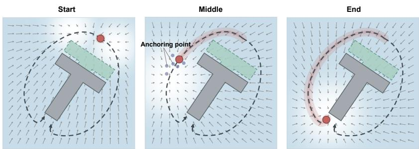  
Figure 2: Illustration of matching policy’s score on Push-T task, where the goal is to push the T-shaped block to the target pose. The red circle marks the agent’s current position (initially in the Start panel), and the dark dashed curves indicate two optimal routes to reach the correct position for pushing the block. The arrows depict the action-gradient field supervised by the diffusion policy’s score; the blue dots are perturbed actions whose Q values are constrained below that of the expert action by a margin, thereby providing anchoring information.

However, the derivation of value supervision is not straightforward, as the optimal Q values themselves are indeed what we seek for. To address this, we introduce an implicit form of value supervision by enforcing a small margin between the Q values of expert actions and those of their locally perturbed counterparts. We do not impose this margin globally, in order to preserve action diversity, as multiple actions may be optimal under the same state. Intuitively, this margin-based constraint effectively regularizes the Q function, using expert actions as “anchor points” to shape a more precise function surface. These settings, illustrated with Push-T task in Fig. 2, lead to the following loss function for training $\hat { Q } _ { \omega } ( \mathbf { s } , \mathbf { a } )$

$$
\begin{array} { r l } & { \mathcal { L } _ { \hat { Q } } ( \omega ) : = \mathbb { E } _ { \underset { k \sim \mathrm { U n i f } \{ 1 , \ldots , K \} } { \mathrm { s e c } S , \mathrm { a } \in \mathcal { A } , } } \underbrace { \bigg [ \Big \| g _ { \phi } ( \mathbf { a } ^ { k } , \mathbf { s } , k ) - \nabla _ { \mathbf { a } } \log \mu ( \mathbf { a } | \mathbf { s } _ { t } ) \vert _ { \mathbf { a } = \mathbf { a } _ { t } ^ { k } } - \frac { 1 } { \varepsilon } \nabla _ { \mathbf { a } } \hat { Q } _ { \omega } ( \mathbf { s } , \mathbf { a } ) \vert _ { \mathbf { a } = \mathbf { a } ^ { k } } \Big \| _ { 2 } ^ { 2 } \bigg ] } _ { \mathrm { G r a d i e n t M a t e l i n g } } } \\ & { \quad \quad \quad + \lambda \mathbb { E } _ { ( \mathbf { s } , \mathbf { a } ) \sim \mathcal { D } _ { E } } \underbrace { \left[ \mathrm { R e L U } \left( \xi - ( \hat { Q } _ { \omega } ( \mathbf { s } , \mathbf { a } ) - \hat { Q } _ { \omega } ( \mathbf { s } , \tilde { \mathbf { a } } ) ) \right) \right] } _ { \mathrm { V a r e ~ A n e l i n g } \mathrm { ~ \lambda } } , } \end{array}\tag{8}
$$

where $\xi > 0$ is an intended margin, $\eta ( \cdot | \mathbf { a } )$ denotes the neighborhood of action a, ${ \mathrm { R e L U } } ( x ) : =$ max $\{ 0 , x \}$ denotes the Rectified Linear Unit function, and $\bar { \lambda } \geq 0$ is a weighting coefficient. In practice, we can instantiate the reference policy $\mu ( \mathbf { a } | \mathbf { s } )$ as a simple distribution (e.g., uniform over bounded actions or a Gaussian prior), whose score $\nabla _ { \mathbf { a } } \log \mu ( \mathbf { a } | \mathbf { s } )$ is tractable.

After obtaining $\hat { Q } _ { \omega } ,$ we estimate the corresponding soft value function. However, direct computation of $\begin{array} { r } { \hat { V } ( \mathbf { s } ) = \varepsilon \log \int _ { A } \exp ( \hat { Q } _ { \omega } ( \mathbf { s } , \mathbf { a } ) / \varepsilon ) d \mu ( \mathbf { a } | \mathbf { s } ) } \end{array}$ is generally intractable in continuous action spaces. To address this, we reformulate the problem via an equivalent moment condition, drawing inspirations from Gumbel regression in RL [13], which models action selection by perturbing Q values with Gumbel distribution noise [15] and leverages Gumbel-Max Trick [15] to infer the value function as the expected stochastic maximum, yielding a LogSumExp form. Specifically, the soft value $\hat { V } ( \mathbf { s } )$ is the unique solution to $\begin{array} { r } { \mathbb { E } _ { \mathbf { a } \sim \mu ( \cdot | \mathbf { s } ) } [ \exp ( \frac { \hat { Q } _ { \omega } ( \mathbf { s } , \mathbf { a } ) - V ( \mathbf { s } ) } { \varepsilon } ) ] = 1 } \end{array}$ . This characterization allows us to estimate $\hat { V } ( \mathbf { s } )$ without explicitly computing the LogSumExp. We then construct a convex surrogate whose first-order condition recovers the above moment constraint:

$$
\ell _ { V } ( v ; { \mathbf s } ) : = \mathbb { E } _ { { \mathbf a } \sim \mu ( \cdot | { \mathbf s } ) } \left[ \exp \left( \frac { \hat { Q } _ { \omega } ( { \mathbf s } , { \mathbf a } ) - v } { \varepsilon } \right) - \frac { \hat { Q } _ { \omega } ( { \mathbf s } , { \mathbf a } ) - v } { \varepsilon } - 1 \right] .\tag{9}
$$

This objective is strictly convex in v and admits a unique minimizer, which coincides with the soft value $\hat { V } ( \mathbf { s } )$ . The derivation is provided in Appendix ${ \mathrm { A . 2 . } }$ . In practice, we freeze $\hat { Q } _ { \omega }$ and train a value

network $\hat { V } _ { x }$ on a set of trajectories $\mathcal { D } _ { S }$ sampled from $\mu$ through the following empirical objective

$$
\mathcal { L } _ { \hat { V } } ( \chi ) : = \mathbb { E } _ { ( \mathbf { s } , \mathbf { a } ) \sim D _ { S } } \left[ \exp ( z ) - z - 1 \right] , \quad z = \frac { \hat { Q } _ { \omega } ( \mathbf { s } , \mathbf { a } ) - \hat { V } _ { \chi } ( \mathbf { s } ) } { \varepsilon } .\tag{10}
$$

Notably, although this objective coincides with the Gumbel regression loss [13], our derivation does not rely on a stochastic model for Q values, as $\hat { Q } _ { \omega }$ is fixed during training ${ \hat { V } } _ { x } ;$ instead, it follows directly from the deterministic characterization of the LogSumExp under the reference policy $\mu .$

## 4.2 Stage II: Infer the State-Dependent Offset and Calibrate Soft Values

The soft values recovered in Stage I are uncalibrated, as the action-gradient matching determines only how soft values change wrt actions, but does not reflect their state-dependent factors. This fact can be formally explained by the following proposition, whose justification is given in Appendix A.3. Proposition 1. Assume π $\ b { \cdot } _ { E } = \pi ^ { * }$ and that the learned diffusion policy’s score is exact in the sense of Eq. (7). For each state s, ifthe action-gradient matching term in $E q .$ . (8) is minimized exactly, then there exists a state-dependentfunction $b ^ { * } : S  \mathbb { R }$ such that $Q ^ { * } ( \mathbf { s } , \mathbf { a } ) = \hat { Q } _ { \omega } ( \mathbf { s } , \mathbf { a } ) + b ^ { * } ( \mathbf { s } )$

This reflects the ambiguity caused by shift invariance: adding any state-dependent offset $b ( \mathbf { s } )$ leaves action-gradient unchanged, i.e., $\nabla _ { \mathbf { a } } \hat { Q } _ { \omega } ( \mathbf { s } , \mathbf { a } ) = \nabla _ { \mathbf { a } } \big ( \hat { Q } _ { \omega } ( \mathbf { s } , \mathbf { a } ) + b ( \mathbf { s } ) \big )$ , making $\hat { Q } _ { \omega }$ identifiable only up to $b ( \mathbf { s } )$ . We therefore introduce an offset network $b _ { \psi } : { \mathcal { S } } \to { \mathrm { \large ~ . ~ } }$ R and define the calibrated soft Q function as $Q _ { \omega , \psi } ( \mathbf { s } , \mathbf { a } ) : = \hat { Q } _ { \omega } ( \mathbf { s } , \mathbf { a } ) + b _ { \psi } ( \mathbf { s } )$ and write the calibrated soft value function from Stage I as $\hat { V } _ { \mathcal { X } } ( \mathbf { s } ) + b _ { \psi } ( \mathbf { s } )$ . A key challenge is that the offset $b _ { \psi }$ is not identifiable from action-gradient information. While penalizing $b _ { \psi } ^ { 2 }$ can fix the shift ambiguity by selecting the minimum-norm solution among all equivalent offsets, it ignores the transition structure and may yield solutions that violate Bellman consistency. Therefore, we regularize the Bellman-implied reward,

$$
\delta _ { \omega , \chi , \psi } ( \mathbf { s } _ { t } , \mathbf { a } _ { t } , \mathbf { s } _ { t + 1 } ) : = \hat { Q } _ { \omega } ( \mathbf { s } _ { t } , \mathbf { a } _ { t } ) + b _ { \psi } ( \mathbf { s } _ { t } ) - \gamma \big ( \hat { V } _ { \chi } ( \mathbf { s } _ { t + 1 } ) + b _ { \psi } ( \mathbf { s } _ { t + 1 } ) \big ) ,\tag{11}
$$

which couples $b _ { \psi }$ across consecutive states and enforces consistency with the underlying dynamics. Intuitively, minimizing the squared norm of $\delta _ { \omega , x , \psi }$ penalizes inconsistent offset value shifts across transitions, encouraging the offset to vary coherently along trajectories.

In addition, absorbing states provide direct supervision: for any $\mathbf { s } _ { \perp } \in \mathcal { S } _ { \perp }$ , we have $Q ^ { * } ( \mathbf { s } _ { \perp } , \mathbf { a } ) = 0$ for all $\mathbf { a . \mu ^ { 4 } }$ Thus, the resulting objective is

$$
\begin{array} { r } { \mathcal { L } _ { b } ( \psi ) : = \mathbb { E } _ { ( \mathbf { s } _ { t } , \mathbf { a } _ { t } , \mathbf { s } _ { t + 1 } ) } [ \underbrace { \delta _ { \omega , \chi , \psi } ^ { 2 } + \lambda _ { b } b _ { \psi } ^ { 2 } ( \mathbf { s } _ { t } ) } _ { \mathrm { o f f s e t r e g u l a r a t i z a i o n } } ] + \mathbb { E } _ { \mathbf { s } _ { \perp } \in S _ { \perp } , \mathbf { a } } [ \underbrace { \left( \hat { Q } _ { \omega } ( \mathbf { s } _ { \perp } , \mathbf { a } ) + b _ { \psi } ( \mathbf { s } _ { \perp } ) \right) ^ { 2 } } _ { \mathrm { A b s o r b i n g ~ s t a t e s ~ s u p e r v i s i o n } } ] , } \end{array}\tag{12}
$$

where $\lambda _ { b } \geq 0$ is a regularization coefficient, $\hat { Q } _ { \omega }$ and $\hat { V } _ { x }$ are fixed, and only $b _ { \psi }$ is updated.

After calibrating the soft Q function, we re-estimate the value function using the calibrated $Q _ { \omega , \psi }$ Specifically, we freeze $Q _ { \omega , \psi }$ and optimize the Gumbel regression objective again:

$$
\mathcal { L } _ { V } ( \chi ^ { \prime } ) : = \mathbb { E } _ { \mathbf { s } , \mathbf { a } \sim \mu ( \cdot | \mathbf { s } ) } \left[ \exp ( \bar { z } ) - \bar { z } - 1 \right] , \qquad \bar { z } : = \frac { Q _ { \omega , \psi } ( \mathbf { s } _ { t } , \mathbf { a } _ { t } ) - V _ { \chi ^ { \prime } } ( \mathbf { s } _ { t } ) } { \varepsilon } .\tag{13}
$$

This second value-fitting step is needed because the soft value function must be consistent with the offset-calibrated soft Q function.

## 4.3 Stage III: Recover the Reward Function

Given the calibrated soft Q function $Q _ { \omega , \psi }$ and value function $V _ { x ^ { \prime } }$ , reward recovery reduces to enforcing Bellman consistency. For a transition $\left( \mathbf { s } _ { t } , \mathbf { a } _ { t } , \mathbf { s } _ { t + 1 } \right)$ , we write the Bellman-implied reward target $r \bar { = } Q _ { \omega , \psi } ( \mathbf { s } _ { t } , \mathbf { a } _ { t } ) - \gamma \dot { V } _ { \mathcal { X } ^ { ' } } ( \mathbf { s } _ { t + 1 } )$ . We parameterize the reward by a network $r _ { \theta }$ and learn it by minimizing Bellman residual errors. To stabilize training, we apply clipping and normalization:

$$
\tilde { r } = \frac { \mathrm { c l i p } ( r , - c _ { r } , c _ { r } ) - m _ { r } } { \sigma _ { r } + \zeta _ { r } } , \qquad \tilde { r } _ { \theta } = \frac { r _ { \theta } ( \mathbf { s } _ { t } , \mathbf { a } _ { t } ) - m _ { r } } { \sigma _ { r } + \zeta _ { r } } ,\tag{14}
$$

where $c _ { r } > 0$ is the clipping threshold, $( m _ { r } , \sigma _ { r } )$ are the running mean and standard deviation of the clipped reward targets, and $\zeta _ { r } > 0$ is a small numerical constant. The reward network is trained via

$$
\begin{array} { r } { \mathcal { L } _ { r } ( \pmb { \theta } ) = \mathbb { E } _ { ( \mathbf { s } _ { t } , \mathbf { a } _ { t } , \mathbf { s } _ { t + 1 } ) \sim \mathcal { D } _ { E } \cup \mathcal { D } _ { S } } \left[ ( \tilde { r } _ { \pmb { \theta } } - \tilde { r } ) ^ { 2 } \right] . } \end{array}\tag{15}
$$

Algorithm 1 Loop-Free Inverse Reinforcement Learning (LFIRL)   
1: Input: Expert demonstrations $\mathcal { D } _ { E } ;$ initialized networks $\hat { Q } _ { \omega } , b _ { \psi } , V _ { x } ,$ and ${ r } _ { \pmb \theta } ;$ reference policy µ.   
2: Train a (or load a pre-trained) diffusion policy on $\mathcal { D } _ { E }$ . {Stage I}   
3: Recover $\hat { Q } _ { \omega } ( \mathbf { s } , \mathbf { a } )$ on $\mathcal { D } _ { E }$ via matching diffusion policy’s score. ▷ Eq. (8)   
4: Recover $V _ { x } ( \mathbf { s } )$ on $\mathcal { D } _ { S }$ using Gumbel-regression-style value fitting. ▷ Eq. (10)   
5: Recover state-dependent offset $b _ { \psi } ( \mathbf { s } )$ on $\mathcal { D } _ { E }$ and ${ \mathcal { D } } _ { S } .$ . {Stage II} ▷ Eq. (12)   
6: Calibrate $\hat { V } _ { \mathcal { X } ^ { ' } } ( \mathbf { s } )$ by the calibrated Q values $\hat { Q } _ { \omega } + b _ { \psi } ( \mathbf { s } )$ ▷ Eq. (13)   
7: Recover $r _ { \theta }$ on $\mathcal { D } _ { E }$ and $\mathcal { D } _ { S }$ by minimizing Bellman residual errors. {Stage III} ▷ Eq. (15)   
8: Output: recovered reward function $r _ { \pmb { \theta } } .$

## 4.4 Algorithm Summary

The complete procedure of the proposed Loop-Free IRL framework is summarized in Algorithm 1. In contrast to traditional IRL pipelines, our method eliminates the reward-policy loop entirely: each stage is executed only once in a sequential manner, and every component is trained solely on the frozen outputs produced by preceding stages. Importantly, the algorithm isfully offline, as $\dot { \mathcal { D } } _ { S }$ is an offline dataset collected from the reference policy $\mu .$ . Consequently, training requires neither environment interactions nor rollouts from a learned dynamics model during training. Overall, this loop-free offline design substantially improves training efficiency, as will be demonstrated experimentally.

## 5 Experiments

We evaluate LFIRL from two perspectives: (1) reward recovery quality and (2) training time efficiency.

## 5.1 Experimental Setup

We consider four different kinds of tasks (see Fig. 3): PointMaze with the UMaze, Medium, and Large settings; Franka Kitchen consists of four subtasks; Adroit Hand Pen; and the Push-T manipulation [5]. We compare against four classes of baselines: (1) Non-Adversarial IRL baselines: IQ-Learn [12] and ML-IRL [47]; (2) the Adversarial IRL baseline: AIRL [10]; (3) the Offline IRL baseline: Offline ML-IRL [48], CLARE [45], and ValueDICE [23]; and (4) Diffusion-based GAIL baselines: DRAIL [24] and DIFO [18]. All reported results are averaged over five random runs. All methods are trained with the same environment-step budget, and within each environment we use the same number of expert demonstrations for all methods. Full implementation details, including hyperparameters and network architectures, are in Appendix E.1.

To evaluate reward recovery on PointMaze and Franka Kitchen, we train an SAC [14] policy on the recovered reward, and then evaluate this policy in the original environment. We report success rate on PointMaze and the mean number of completed subtasks on Franka Kitchen. Since our method is designed to recover a reward function rather than directly output a policy, this setting provides a task-level assessment of whether the recovered reward induces the intended behavior. For the higher-dimensional Adroit Hand Pen and Push-T environments, we instead evaluate reward quality through discrimination: we construct balanced sets of high-quality and low-quality trajectories, score them with each learned reward model, and report the resulting classification accuracy. We additionally compare the recovered and ground-truth rewards on the same state-action samples using Pearson’s and Spearman’s correlation coefficients; the results are presented in Sec. 5.4. To evaluate efficiency, we record the training time required by each method to consume the same number of trajectory throughput, with each method run independently and without parallelized competition for compute resources. In addition to the main comparison, we also report an offset-ablation study and a demonstration-reduction study; the corresponding results are provided in Sec. 5.5 and Sec. 5.6.

## 5.2 Reward Recovery

The main results are shown in Fig. 4. Overall, LFIRL recovers highly effective rewards and exhibits strong cross-task robustness. Across various tasks, the recovered reward consistently supports competitive downstream control and achieves the best or near-best final performance in most settings.

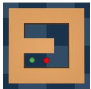  
UMaze

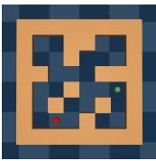  
Maze(M)

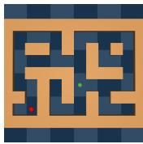  
Maze(L)

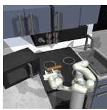  
Kitchen

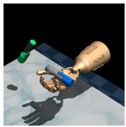  
Pen

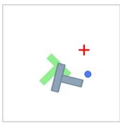  
Push-T

Figure 3: Illustrations of the evaluation tasks used in our experiments.  
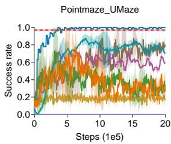

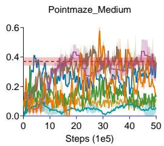

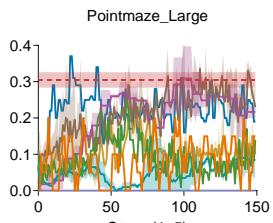

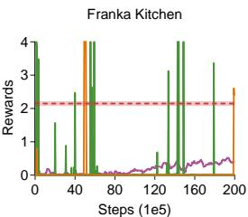  
- - LFIRL  AIRL  ML-IRL  Offline ML-IRL — IQ-Learn  DIFO — DRAIL  CLARE  ValueDICE  
Figure 4: Reward-recovery results on PointMaze and Franka Kitchen. We report success rate on PointMaze and average completed subtasks on Franka Kitchen. Since LFIRL recovers the reward only at the final stage, its result is shown as a fixed final score rather than a policy-learning curve. For online IRL methods, “steps” denotes environment interaction steps. For offline IRL methods, “steps” denotes the number of transitions sampled from the offline dataset during training.

Even in cases where it does not attain the single best score, its performance remains highly competitive, indicating that the proposed sequential recovery pipeline yields stable and transferable reward signals.

For the higher-dimensional Push-T and Adroit Hand Pen, we instead evaluate whether the recovered reward can distinguish high-quality trajectories from low-quality ones. The results are reported in Tab. 1. These results further support a consistent overall picture: the reward recovered by LFIRL captures meaningful behavioral differences and generalizes well across qualitatively different evaluation protocols, including both downstream control and trajectory discrimination.

## 5.3 Average Running Time

Tab. 2 reports the average running time under the same step budget. Overall, LFIRL substantially reduces the time cost of training. Across tasks, it is consistently the fastest method, typically achieving about a 2–3x reduction in runtime compared with the fastest baseline in each setting, and a roughly 2–5x reduction when loading a pre-trained diffusion policy. These results confirm that removing the reward-policy optimization loop brings not only pipeline simplicity, but also a substantial practical gain in time efficiency.

## 5.4 Correlation with Ground-Truth Rewards

The preceding evaluations assess whether a recovered reward supports the intended behavior or distinguishes trajectories of different quality. We further evaluate reward recovery directly by comparing each learned reward with the environment’s ground-truth reward on the same set of state-action samples. We report Pearson’s correlation coefficient (PCC), which measures linear association between the recovered and ground-truth reward values, and Spearman’s rank correlation coefficient (SCC), which measures agreement between their rankings. A higher PCC indicates that the recovered reward more closely follows the ground-truth reward’s linear variation across samples; a higher SCC indicates that it better preserves which samples receive higher or lower reward. These measures assess agreement in structure and ordering, respectively, without requiring the recovered reward to have exactly the same scale or offset as the ground-truth reward.

Table 1: Trajectory-quality classification accuracy (%) on Push-T and Adroit Hand Pen using reward networks recovered by different IRL algorithms. Results are reported as mean ± standard deviation over five runs.
<table><tr><td>Task</td><td>LFIRL</td><td>AIRL</td><td>IQ-Learn</td><td>DIFO</td><td>DRAIL</td><td>ML-IRL</td><td>Offline ML-IRL</td><td>CLARE</td><td>ValueDICE</td></tr><tr><td>Push-T</td><td>74.17±1.96</td><td>59.67±2.08</td><td>39.67±0.58</td><td>79.00±1.00</td><td>49.67±1.15</td><td>71.33±2.33</td><td>42.67±1.20</td><td>71.00±3.67</td><td>78.67±2.52</td></tr><tr><td>Pen</td><td>97.17±2.75</td><td>90.00±2.45</td><td>74.33±7.59</td><td>91.67±2.05</td><td>98.33±0.94</td><td>71.00±4.32</td><td>66.00±12.43</td><td>94.67±0.58</td><td>95.67±1.15</td></tr></table>

Table 2: Average running time (in hours). “Load D.P.” denotes LFIRL with a pre-trained diffusion policy, while “Train D.P.” denotes LFIRL including diffusion-policy training time. “T.R.” is short for “time reduction” and reports the relative time saved compared with the fastest baseline (marked with an underline).
<table><tr><td rowspan="2">Task</td><td colspan="5">Online methods</td><td colspan="3">Offline methods</td><td colspan="4">LFIRL</td></tr><tr><td>|AIRL IQ-Learn DIFO DRAIL ML-IRL |ML-IRL CLARE ValueDICE|Load D.P. T.R. (SpeedUp) |Train D.P. T.R. (SpeedUp)</td><td></td><td></td><td></td><td></td><td></td><td></td><td></td><td></td><td></td><td></td><td></td></tr><tr><td>UMaze</td><td>1.38</td><td>6.88</td><td>2.47</td><td>1.70</td><td>9.76|</td><td>3.09</td><td>5.86</td><td>4.66</td><td>0.28</td><td>79.7% (5x)</td><td>0.43</td><td>68.8% (3x)</td></tr><tr><td>Maze(M)</td><td>3.67</td><td>10.10</td><td>7.05</td><td>2.65</td><td>13.80</td><td>4.99</td><td>5.98</td><td>4.87</td><td>0.77</td><td>70.9% (3x)</td><td>1.07</td><td>59.6% (2x)</td></tr><tr><td>Maze(L)</td><td>6.88</td><td>10.88</td><td>7.73</td><td>3.05</td><td>13.33</td><td>5.52</td><td>6.67</td><td>5.17</td><td>1.42</td><td>53.4% (2x)</td><td>1.80</td><td>41.0% (2x)</td></tr><tr><td>Kitchen</td><td>9.55</td><td>13.72</td><td>7.40</td><td>3.33</td><td>18.42</td><td>6.83</td><td>7.80</td><td>5.91</td><td>1.52</td><td>54.4% (2x)</td><td>1.87</td><td>43.8% (2x)</td></tr><tr><td>Push-T</td><td>1.57</td><td>8.55</td><td>4.05</td><td>1.95</td><td>9.50</td><td>2.10</td><td>3.20</td><td>5.30</td><td>0.35</td><td>77.7% (4x)</td><td>0.62</td><td>60.5% (3x)</td></tr><tr><td>Pen</td><td>4.83</td><td>14.88</td><td>10.83</td><td>7.50</td><td>18.52</td><td>6.53</td><td>3.79</td><td>4.71</td><td>1.18</td><td>68.9% (3x)</td><td>1.71</td><td>54.9% (2x)</td></tr></table>

Table 3: Direct comparison of recovered and ground-truth rewards on the same state-action samples. Each entry reports PCC / SCC; higher values indicate stronger linear association / rank agreement. Bold indicates the highest value for each metric in each task.
<table><tr><td>Method</td><td>UMaze PCC / SCC</td><td>Medium PCC /SCC</td><td>Large PCC /SCC</td><td>Kitchen PCC / SCC</td><td>Push-T PCC / SCC</td><td>Pen PCC / SCC</td><td>Average PCC / SCC</td></tr><tr><td>LFIRL (Ours)</td><td>0.83 / 0.91</td><td>0.76 / 0.82</td><td>0.84 / 0.87</td><td>0.67 / 0.81</td><td>0.72 / 0.81</td><td>0.79 / 0.85</td><td>0.77 / 0.85</td></tr><tr><td>AIRL</td><td>0.65 / 0.86</td><td>0.63 / 0.74</td><td>0.77 / 0.75</td><td>0.44 / 0.63</td><td>0.69 / 0.74</td><td>0.75 / 0.71</td><td>0.66 / 0.74</td></tr><tr><td>IQ-Learn</td><td>0.62 / 0.74</td><td>0.59 / 0.62</td><td>0.65 / 0.70</td><td>0.34 / 0.51</td><td>0.48 / 0.65</td><td>0.47 / 0.62</td><td>0.53 / 0.64</td></tr><tr><td>DIFO</td><td>0.69 / 0.79</td><td>0.53 / 0.67</td><td>0.68 / 0.81</td><td>0.61 / 0.77</td><td>0.83 / 0.79</td><td>0.71 / 0.72</td><td>0.68 / 0.76</td></tr><tr><td>DRAIL</td><td>0.67 / 0.71</td><td>0.74 / 0.84</td><td>0.69 / 0.78</td><td>0.56 / 0.76</td><td>0.51 / 0.56</td><td>0.63 / 0.62</td><td>0.63 / 0.71</td></tr><tr><td>ML-IRL</td><td>0.78 / 0.75</td><td>0.67 / 0.72</td><td>0.64 / 0.71</td><td>0.63 / 0.69</td><td>0.66 / 0.73</td><td>0.78 / 0.69</td><td>0.69 / 0.72</td></tr><tr><td>Offline ML-IRL</td><td>0.49 / 0.52</td><td>0.47 / 0.58</td><td>0.42 / 0.62</td><td>0.45 / 0.54</td><td>0.45 / 0.53</td><td>0.53 / 0.43</td><td>0.47 / 0.54</td></tr><tr><td>CLARE</td><td>0.72 / 0.80</td><td>0.68 / 0.74</td><td>0.49 / 0.61</td><td>0.24 / 0.46</td><td>0.51 / 0.79</td><td>0.58 / 0.55</td><td>0.54 / 0.66</td></tr><tr><td>ValueDICE</td><td>0.72 / 0.81</td><td>0.61 / 0.79</td><td>0.74 / 0.71</td><td>0.53 / 0.56</td><td>0.65 / 0.76</td><td>0.57 / 0.63</td><td>0.64 / 0.71</td></tr></table>

As shown in Tab. 3, LFIRL obtains the highest PCC on five of the six tasks and the highest SCC on five of the six tasks. Thus, LFIRL’s consistently strong results indicate that the sequential recovery procedure preserves both the linear variation and relative ordering of the ground-truth reward across a range of environments.

## 5.5 Ablation Study

We conduct an ablation study to evaluate the contribution of the state-dependent offset b(s) in LFIRL. The results are shown in Fig. 5. Overall, removing b(s) consistently degrades performance across the evaluated tasks, showing that inferring the offset and calibrating soft values are important for recovering a well-aligned value structure. This result supports our analysis in Sec. 4.2: calibrating this offset is necessary for obtaining a reliable downstream reward.

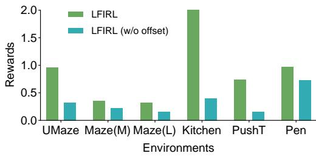  
Figure 5: Ablation results on PointMaze, Kitchen, Pen, and Push-T. We compare LFIRL with its variant that removes the state-dependent offset b(s).

## 5.6 Reduced-Data Experiments

We further study how LFIRL behaves when the number of expert demonstrations is reduced. The results are shown in Fig. 6, where we use the full dataset, one-half of the demonstrations, and one-quarter of the demonstrations. Overall, the performance of LFIRL decreases as the number of demonstrations becomes smaller. This trend is consistent with the design of our method: the first stage recovers the Q function from local supervision around expert actions, and the number of available expert state-action anchors directly affects how accurately this action-value structure can be reconstructed. When the demonstration set is reduced, anchor coverage becomes sparser, which weakens the quality of Q recovery and subsequently affects downstream value and reward recovery. Nevertheless, LFIRL remains competitive across the reduced-data settings.

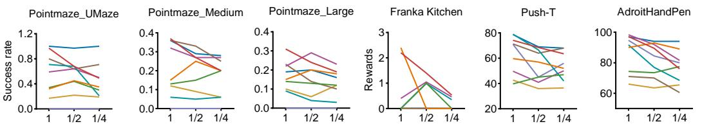  
Demonstrations (x2000) Demonstrations (x2000)Demonstrations (x2000) Demonstrations (x19) Demonstrations (x200) Demonstrations (x200)  
— LFIRL — AIRL — ML-IRL — Offline ML-IRL — IQ-Learn — DIFO — DRAIL — CLARE — ValueDICE  
Figure 6: Reduced-data experiments with the full, one-half, and one-quarter of the demonstrations. We report success rate on PointMaze, average completed subtasks on Franka Kitchen, and reward on Push-T and Pen.

## 6 Discussion

Source of the time efficiency gain. The efficiency of LFIRL mainly comes from its linear training pipeline, not merely from using offline training framework. Offline IRL methods can still be slow if they keep a reward-policy loop, since reward updates repeatedly depend on policy or value optimization under the current reward, no matter if the policy interacts with the environment. Even methods that reduce this cost, such as IQ-Learn [12], may avoid training an explicit policy in discrete action spaces but still rely on value or policy quantities induced by the current reward-related objective. LFIRL removes this repeated coupling with each stage using the frozen output of previous stages, and this is why LFIRL remains much faster than offline IRL methods in Tab. 2.

Choice of generative models. In fact, LFIRL uses a conditional Denoising Diffusion Probabilistic Model [17] (DDPM)-based diffusion policy to provide the derivative signal for Q function recovery, following common practice in diffusion-based imitation learning methods. In principle, any stateconditioned generative model that can provide a reliable score, or an action-gradient signal, can be used as the source of derivative supervision in Stage I. In Appendix B.1, we instantiate a version based on Flow Matching [26], another popular generative model paradigm. However, Appendix B.2 shows that, under the same number of training epochs, this variant gives weaker reward recovery. One possible reason is that the two pretraining objectives may have different convergence behavior under the same epoch budget. Conditional DDPM training directly optimizes denoising over multiple noise levels, which provides a strong and stable supervision signal for action refinement around expert demonstrations. Flow Matching instead learns a continuous transport vector field, whose action-generation quality can be more sensitive to integration accuracy, schedule design, and training budget. As a result, the pretrained diffusion policy is less accurate for giving the score signal used for Q function recovery, which then propagates to the final reward.

## 7 Conclusion

We propose LFIRL, a novel staged IRL framework that removes the conventional reward-policy optimization loop by turning reward recovery into a sequence of value-recovery problems. Concretely, LFIRL first recovers an optimal Q function from diffusion-policy score signals and estimates the soft value function via Gumbel-regression-style value fitting. It then infers a state-dependent offset to calibrate the recovered soft values and re-estimates the value function using the calibrated Q function. Finally, it recovers the reward function by enforcing Bellman consistency. Experiments on PointMaze, Franka Kitchen, Adroit Hand Pen, and Push-T show that LFIRL matches or surpasses strong baselines in reward recovery while substantially reducing training time, achieving 2-3x efficiency gains in most settings. Limitations. The quality of the recovered Q function depends on sufficient local anchors around expert actions. When anchor coverage is sparse, the method may require more demonstrations to reconstruct the action-value structure accurately. Future work may explore broader classes of generative models beyond DDPM and Flow Matching for providing action-gradient supervision, and develop more sample-efficient ways to recover reliable value and reward information from limited expert demonstrations.

## References

[1] Pieter Abbeel and Andrew Y Ng. Apprenticeship learning via inverse reinforcement learning. In Proceed ings ofthe twenty-first international conference on Machine learning, page 1, 2004. 1, 2

[2] Firas Al-Hafez, Davide Tateo, Oleg Arenz, Guoping Zhao, and Jan Peters. Ls-iq: implicit reward regularization for inverse reinforcement learning. In 11th International Conference on Learning Representations, ICLR 2023, 2023. 3

[3] Shang-Fu Chen, Hsiang-Chun Wang, Ming-Hao Hsu, Chun-Mao Lai, and Shao-Hua Sun. Diffusion model-augmented behavioral cloning. In Forty-first International Conference on Machine Learning, 2024. 3

[4] Yang Chen, Menglin Zou, Jiaqi Zhang, Yitan Zhang, Junyi Yang, Gael Gendron, Libo Zhang, Jiamou Liu, and Michael J. Witbrock. Trust region reward optimization and proximal inverse reward optimization algorithm. In Advances in Neural Information Processing Systems, 2025. 3

[5] Cheng Chi, Zhenjia Xu, Siyuan Feng, Eric Cousineau, Yilun Du, Benjamin Burchfiel, Russ Tedrake, and Shuran Song. Diffusion policy: Visuomotor policy learning via action diffusion. The International Journal ofRobotics Research, 44(10-11):1684–1704, 2025. 2, 3, 7, 19

[6] Wojciech M Czarnecki, Simon Osindero, Max Jaderberg, Grzegorz Swirszcz, and Razvan Pascanu. Sobolev training for neural networks. Advances in neural information processing systems, 30, 2017. 2, 4

[7] Sudeep Dasari, Oier Mees, Sebastian Zhao, Mohan Kumar Srirama, and Sergey Levine. The ingredients for robotic diffusion transformers. In 2025 IEEE International Conference on Robotics and Automation (ICRA), pages 15617–15625. IEEE, 2025. 3

[8] Chelsea Finn, Paul Christiano, Pieter Abbeel, and Sergey Levine. A connection between generative adversarial networks, inverse reinforcement learning, and energy-based models. arXiv preprint arXiv:1611.03852, 2016. 4

[9] Chelsea Finn, Sergey Levine, and Pieter Abbeel. Guided cost learning: Deep inverse optimal control via policy optimization. In International conference on machine learning, pages 49–58. PMLR, 2016. 1, 2

[10] Justin Fu, Katie Luo, and Sergey Levine. Learning robust rewards with adversarial inverse reinforcement learning. In International Conference on Learning Representations, 2018. 1, 3, 4, 7

[11] Justin Fu, Anoop Korattikara, Sergey Levine, and Sergio Guadarrama. From language to goals: Inverse reinforcement learning for vision-based instruction following. In International Conference on Learning Representations, 2023. 4

[12] Divyansh Garg, Shuvam Chakraborty, Chris Cundy, Jiaming Song, and Stefano Ermon. Iq-learn: Inverse soft-q learning for imitation. Advances in Neural Information Processing Systems, 34:4028–4039, 2021. 3, 7, 10

[13] Divyansh Garg, Joey Hejna, Matthieu Geist, and Stefano Ermon. Extreme q-learning: Maxent rl without entropy. In The Eleventh International Conference on Learning Representations, 2023. 2, 5, 6

[14] Tuomas Haarnoja, Aurick Zhou, Pieter Abbeel, and Sergey Levine. Soft actor-critic: Off-policy maximum entropy deep reinforcement learning with a stochastic actor. In International conference on machine learning, pages 1861–1870. Pmlr, 2018. 2, 3, 7

[15] Tamir Hazan and Tommi Jaakkola. On the partition function and random maximum a-posteriori perturba tions. In Proceedings of the 29th International Conference on Machine Learning, pages 1667–1674, 2012. 5

[16] Jonathan Ho and Stefano Ermon. Generative adversarial imitation learning. Advances in neural information processing systems, 29, 2016. 3, 4

[17] Jonathan Ho, Ajay Jain, and Pieter Abbeel. Denoising diffusion probabilistic models. Advances in neural information processing systems, 33:6840–6851, 2020. 2, 4, 10

[18] Bo-Ruei Huang, Chun-Kai Yang, Chun-Mao Lai, Dai-Jie Wu, and Shao-Hua Sun. Diffusion imitation from observation. Advances in Neural Information Processing Systems, 37:137190–137217, 2024. 3, 7

[19] Tao Huang, Guangqi Jiang, Yanjie Ze, and Huazhe Xu. Diffusion reward: Learning rewards via conditional video diffusion. European Conference on Computer Vision (ECCV), 2024. 3

[20] Arnav Kumar Jain, Harley Wiltzer, Jesse Farebrother, Irina Rish, Glen Berseth, and Sanjiban Choudhury. Non-adversarial inverse reinforcement learning via successor feature matching. In The Thirteenth International Conference on Learning Representations, 2025. 3

[21] Mrinal Kalakrishnan, Peter Pastor, Ludovic Righetti, and Stefan Schaal. Learning objective functions for manipulation. In 2013 IEEE International Conference on Robotics and Automation, pages 1331–1336. IEEE, 2013. 1

[22] Ilya Kostrikov, Kumar Krishna Agrawal, Debidatta Dwibedi, Sergey Levine, and Jonathan Tompson. Discriminator-actor-critic: Addressing sample inefficiency and reward bias in adversarial imitation learning. In International Conference on Learning Representations, 2019. 3

[23] Ilya Kostrikov, Ofir Nachum, and Jonathan Tompson. Imitation learning via off-policy distribution matching. arXiv preprint arXiv:1912.05032, 2019. 3, 7

[24] Chun-Mao Lai, Hsiang-Chun Wang, Ping-Chun Hsieh, Yu-Chiang F Wang, Min-Hung Chen, and Shao-Hua Sun. Diffusion-reward adversarial imitation learning. Advances in Neural Information Processing Systems, 37:95456–95487, 2024. 3, 7

[25] Xiang Li, Varun Belagali, Jinghuan Shang, and Michael S Ryoo. Crossway diffusion: Improving diffusionbased visuomotor policy via self-supervised learning. In 2024 IEEE International Conference on Robotics and Automation (ICRA), pages 16841–16849. IEEE, 2024. 3

[26] Yaron Lipman, Ricky TQ Chen, Heli Ben-Hamu, Maximilian Nickel, and Matthew Le. Flow matching for generative modeling. In The Eleventh International Conference on Learning Representations, 2023. 10, 16

[27] Andrew Y Ng, Stuart Russell, et al. Algorithms for inverse reinforcement learning. In Icml, volume 1, page 2, 2000. 1, 2

[28] Felipe Nuti, Tim Franzmeyer, and João F Henriques. Extracting reward functions from diffusion models. Advances in Neural Information Processing Systems, 36:50196–50220, 2023. 3

[29] Manu Orsini, Anton Raichuk, Léonard Hussenot, Damien Vincent, Robert Dadashi, Sertan Girgin, Matthieu Geist, Olivier Bachem, Olivier Pietquin, and Marcin Andrychowicz. What matters for adversarial imitation learning? Advances in Neural Information Processing Systems, 34:14656–14668, 2021. 3

[30] Michael Psenka, Alejandro Escontrela, Pieter Abbeel, and Yi Ma. Learning a diffusion model policy from rewards via q-score matching. In Forty-first International Conference on Machine Learning, 2024. 2, 3

[31] Nathan D Ratliff, J Andrew Bagnell, and Martin A Zinkevich. Maximum margin planning. In Proceedings of the 23rd international conference on Machine learning, pages 729–736, 2006. 2

[32] Juntao Ren, Gokul Swamy, Zhiwei Steven Wu, J Andrew Bagnell, and Sanjiban Choudhury. Hybrid inverse reinforcement learning. arXiv preprint arXiv:2402.08848, 2024. 3

[33] Moritz Reuss, Maximilian Li, Xiaogang Jia, and Rudolf Lioutikov. Goal-conditioned imitation learning using score-based diffusion policies. arXiv preprint arXiv:2304.02532, 2023. 2, 3

[34] Sahand Sharifzadeh, Ioannis Chiotellis, Rudolph Triebel, and Daniel Cremers. Learning to drive using inverse reinforcement learning and deep q-networks. arXiv preprint arXiv:1612.03653, 2016. 1

[35] Hwijae Son, Jin Woo Jang, Woo Jin Han, and Hyung Ju Hwang. Sobolev training for physics informed neural networks. arXiv preprint arXiv:2101.08932, 2021. 4

[36] Yang Song, Jascha Sohl-Dickstein, Diederik P Kingma, Abhishek Kumar, Stefano Ermon, and Ben Poole. Score-based generative modeling through stochastic differential equations. In International Conference on Learning Representations, 2021. 2, 4

[37] Gokul Swamy, Sanjiban Choudhury, J Andrew Bagnell, and Steven Wu. Of moments and matching: A game-theoretic framework for closing the imitation gap. In International Conference on Machine Learning, pages 10022–10032. PMLR, 2021. 3

[38] Gokul Swamy, David Wu, Sanjiban Choudhury, Drew Bagnell, and Steven Wu. Inverse reinforcement learning without reinforcement learning. In International Conference on Machine Learning, pages 33299– 33318. PMLR, 2023. 3

[39] Faraz Torabi, Garrett Warnell, and Peter Stone. Generative adversarial imitation from observation. arXiv preprint arXiv:1807.06158, 2018. 3

[40] Bingzheng Wang, Guoqiang Wu, Teng Pang, Yan Zhang, and Yilong Yin. Diffail: Diffusion adversarial imitation learning. In Proceedings of the AAAI Conference on Artificial Intelligence, volume 38, pages 15447–15455, 2024. 3

[41] Joe Watson, Sandy Huang, and Nicolas Heess. Coherent soft imitation learning. Advances in Neural Information Processing Systems, 36:14540–14583, 2023. 3

[42] Runzhe Wu, Yiding Chen, Gokul Swamy, Kianté Brantley, and Wen Sun. Diffusing states and matching scores: A new framework for imitation learning. In The Thirteenth International Conference on Learning Representations, 2025. 3

[43] Zheng Wu, Liting Sun, Wei Zhan, Chenyu Yang, and Masayoshi Tomizuka. Efficient sampling-based maximum entropy inverse reinforcement learning with application to autonomous driving. IEEE Robotics and Automation Letters, 5(4):5355–5362, 2020. 4

[44] Omar G. Younis, Rodrigo Perez-Vicente, John U. Balis, Will Dudley, Alex Davey, and Jordan K Terry. Minari, September 2024. URL https://doi.org/10.5281/zenodo.13767625. 19

[45] Sheng Yue, Guanbo Wang, Wei Shao, Zhaofeng Zhang, Sen Lin, Ju Ren, and Junshan Zhang. Clare: Conservative model-based reward learning for offline inverse reinforcement learning. In 11th International Conference on Learning Representations, ICLR 2023, 2023. 7

[46] Yanjie Ze, Gu Zhang, Kangning Zhang, Chenyuan Hu, Muhan Wang, and Huazhe Xu. 3d diffusion policy: Generalizable visuomotor policy learning via simple 3d representations. In Proceedings of Robotics: Science and Systems (RSS), 2024. 3

[47] Siliang Zeng, Chenliang Li, Alfredo Garcia, and Mingyi Hong. Maximum-likelihood inverse reinforcement learning with finite-time guarantees. Advances in Neural Information Processing Systems, 35:10122–10135, 2022. 1, 3, 4, 7

[48] Siliang Zeng, Chenliang Li, Alfredo Garcia, and Mingyi Hong. When demonstrations meet generative world models: A maximum likelihood framework for offline inverse reinforcement learning. Advances in Neural Information Processing Systems, 36:65531–65565, 2023. 4, 7

[49] Minjie Zhu, Yichen Zhu, Jinming Li, Junjie Wen, Zhiyuan Xu, Ning Liu, Ran Cheng, Chaomin Shen, Yaxin Peng, Feifei Feng, et al. Scaling diffusion policy in transformer to 1 billion parameters for robotic manipulation. In 2025 IEEE International Conference on Robotics and Automation (ICRA), pages 10838– 10845. IEEE, 2025. 3

[50] Brian D Ziebart, Andrew L Maas, J Andrew Bagnell, Anind K Dey, et al. Maximum entropy inverse reinforcement learning. In Aaai, volume 8, pages 1433–1438. Chicago, IL, USA, 2008. 1, 2

[51] Brian D Ziebart, J Andrew Bagnell, and Anind K Dey. Modeling interaction via the principle of maximum causal entropy. In Proceedings of the 27th International Conference on Machine Learning, pages 1255– 1262, 2010. 2

## Appendices

## A Detailed Derivations

## A.1 Derivation of Diffusion Scores and Their Relation to Soft Q-Gradients

In this appendix, we derive the identities underlying Section 3. We use t for the MDP time index and k for the diffusion step. For a fixed state $\mathbf { s } _ { t }$ , let $\mathbf { \dot { a } } _ { t } ^ { 0 } \sim \pi _ { E } ( \cdot \mid \mathbf { s } _ { t } )$ denote a clean expert action, and let $\mathbf { a } _ { t } ^ { k }$ denote its noisy version at diffusion step k.

The DDPM forward process is defined by

$$
\boldsymbol { q } ( \mathbf { a } _ { t } ^ { k } \mid \mathbf { a } _ { t } ^ { k - 1 } ) = \mathcal { N } \Big ( \mathbf { a } _ { t } ^ { k } ; \sqrt { 1 - \beta _ { k } } \mathbf { a } _ { t } ^ { k - 1 } , \beta _ { k } I \Big ) , \qquad \boldsymbol { \alpha } _ { k } : = 1 - \beta _ { k } , \qquad \bar { \boldsymbol { \alpha } } _ { k } : = \prod _ { j = 1 } ^ { k } \boldsymbol { \alpha } _ { j } .
$$

This gives the closed-form marginal

$$
q ( \mathbf { a } _ { t } ^ { k } \mid \mathbf { a } _ { t } ^ { 0 } ) = { \mathcal { N } } \big ( \mathbf { a } _ { t } ^ { k } ; \sqrt { \bar { \alpha } _ { k } } \mathbf { a } _ { t } ^ { 0 } , ( 1 - \bar { \alpha } _ { k } ) I \big ) ,
$$

or equivalently,

$$
\mathbf { a } _ { t } ^ { k } = \sqrt { \bar { \alpha } _ { k } } \mathbf { a } _ { t } ^ { 0 } + \sqrt { 1 - \bar { \alpha } _ { k } } \epsilon , \qquad \epsilon \sim \mathcal { N } ( 0 , I ) .\tag{16}
$$

This is the same forward noising relation used in Eq. (5).

For each fixed $( \mathbf { s } _ { t } , k )$ , let $p _ { k } ( \mathbf { a } \mid \mathbf { s } _ { t } )$ denote the conditional density of noisy actions at diffusion step $k ,$ induced by sampling $\mathbf { a } _ { t } ^ { 0 } \overset { \cdot } { \sim } \dot { \pi } _ { E } ( \cdot \mid \mathbf { s } _ { t } )$ and then applying Eq. (16). The score of this noisy action density is

$$
\nabla _ { \mathbf { a } } \log p _ { k } ( \mathbf { a } \mid \mathbf { s } _ { t } ) .
$$

The diffusion policy is trained by the noise-prediction objective

$$
\begin{array} { r } { \mathcal { L } _ { \mathrm { d i f f } } ( \phi ) = \mathbb { E } \frac { \left( \mathbf { s } _ { t } , \mathbf { a } _ { t } ^ { 0 } \right) \sim \rho ^ { \pi _ { E } } } { k \sim \mathrm { U n i f } \left\{ 1 , . . . , K \right\} , \epsilon \sim \mathcal { N } ( 0 , I ) } \left\| \epsilon - \epsilon _ { \phi } \left( \mathbf { a } _ { t } ^ { k } , \mathbf { s } _ { t } , k \right) \right\| _ { 2 } ^ { 2 } . } \end{array}
$$

For a fixed $\left( \mathbf { a } _ { t } ^ { k } , \mathbf { s } _ { t } , k \right)$ , the pointwise minimizer of this MSE objective is

$$
\begin{array} { r } { \boldsymbol { \epsilon } _ { \phi } ^ { * } ( \mathbf { a } _ { t } ^ { k } , \mathbf { s } _ { t } , k ) = \mathbb { E } \big [ \boldsymbol { \epsilon } \mid \mathbf { a } _ { t } ^ { k } , \mathbf { s } _ { t } , k \big ] . } \end{array}
$$

Using the Gaussian corruption in Eq. (16), the noisy-action score satisfies

$$
\nabla _ { \mathbf { a } } \log p _ { k } ( \mathbf { a } \mid \mathbf { s } _ { t } ) \big \vert _ { \mathbf { a } = \mathbf { a } _ { t } ^ { k } } = - \frac { 1 } { \sqrt { 1 - { \bar { \alpha } } _ { k } } } \mathbb { E } \big [ \mathbf { \epsilon } \mid \mathbf { a } _ { t } ^ { k } , \mathbf { s } _ { t } , k \big ] .
$$

Therefore, the learned noise predictor induces the score estimator

$$
g _ { \phi } ( \mathbf { a } _ { t } ^ { k } , \mathbf { s } _ { t } , k ) : = - \frac { 1 } { \sqrt { 1 - \bar { \alpha } _ { k } } } \epsilon _ { \phi } ( \mathbf { a } _ { t } ^ { k } , \mathbf { s } _ { t } , k ) \approx \nabla _ { \mathbf { a } } \log p _ { k } ( \mathbf { a } \mid \mathbf { s } _ { t } ) \big | _ { \mathbf { a } = \mathbf { a } _ { t } ^ { k } } .\tag{17}
$$

In the idealized limit of exact denoising, the approximation in Eq. (17) becomes exact for the noisy conditional density $p _ { k } ( \mathbf { a } \mid \mathbf { s } _ { t } )$ .

For small diffusion noise, $\mathbf { a } _ { t } ^ { k }$ is close to the clean action $\mathbf { a } _ { t } ^ { 0 } .$ , and the noisy-action score approximates the clean expert-policy score in a local neighborhood of the expert action:

$$
\begin{array} { r } { g _ { \phi } ( \mathbf { a } _ { t } ^ { k } , \mathbf { s } _ { t } , k ) \approx \nabla _ { \mathbf { a } } \log \pi _ { E } ( \mathbf { a } \mid \mathbf { s } _ { t } ) \big \vert _ { \mathbf { a } = \mathbf { a } _ { t } ^ { k } } . } \end{array}
$$

If the expert policy is soft-optimal, $\pi _ { E } = \pi ^ { * }$ . Under the reference-policy MaxEnt formulation in Eq. (1), we have

$$
\begin{array} { r } { \pi ^ { * } ( \mathbf { a } \mid \mathbf { s } ) = \mu ( \mathbf { a } \mid \mathbf { s } ) \exp \left( \frac { 1 } { \varepsilon } \left( Q ^ { * } ( \mathbf { s } , \mathbf { a } ) - V ^ { * } ( \mathbf { s } ) \right) \right) . } \end{array}
$$

Taking the action gradient gives

$$
\begin{array} { r } { \nabla _ { \mathbf { a } } \log \pi ^ { * } ( \mathbf { a } \mid \mathbf { s } ) = \nabla _ { \mathbf { a } } \log \mu ( \mathbf { a } \mid \mathbf { s } ) + \frac { 1 } { \varepsilon } \nabla _ { \mathbf { a } } Q ^ { * } ( \mathbf { s } , \mathbf { a } ) , } \end{array}
$$

because $V ^ { * } ( \mathbf { s } )$ does not depend on a. Equivalently,

$$
\begin{array} { r } { \nabla _ { \mathbf { a } } \log \frac { \pi ^ { * } ( \mathbf { a } | \mathbf { s } ) } { \mu ( \mathbf { a } | \mathbf { s } ) } = \frac { 1 } { \varepsilon } \nabla _ { \mathbf { a } } Q ^ { * } ( \mathbf { s } , \mathbf { a } ) , } \end{array}
$$

which is Eq. (3).

Combining the low-noise score approximation with Eq. (3), we obtain

$$
\begin{array} { r } { g _ { \phi } ( \mathbf { a } _ { t } ^ { k } , \mathbf { s } _ { t } , k ) - \nabla _ { \mathbf { a } } \log \mu ( \mathbf { a } \mid \mathbf { s } _ { t } ) \big \vert _ { \mathbf { a } = \mathbf { a } _ { t } ^ { k } } \approx \frac { 1 } { \varepsilon } \nabla _ { \mathbf { a } } Q ^ { * } ( \mathbf { s } _ { t } , \mathbf { a } ) \big \vert _ { \mathbf { a } = \mathbf { a } _ { t } ^ { k } } . } \end{array}\tag{18}
$$

This is the identity used in Eq. (8): the diffusion-policy score, after subtracting the reference-policy score, provides the action-gradient supervision for recovering the soft Q-function.

## A.2 Derivations for Stage I: Q-Recovery and Initial Value Fitting

In this subsection, we justify the first-stage recovery of the uncalibrated soft Q-function and the initial value function. The key point is that matching action derivatives recovers the action-dependent geometry of $Q ^ { * }$ , but cannot determine its state-dependent offset.

We next justify the Gumbel-regression objective used to obtain the initial value estimate from the frozen $\hat { Q } _ { \omega }$ . For a fixed state s and a fixed Q function ${ \cal \widetilde Q } ,$ define

$$
\ell _ { V } ( v ; { \mathbf s } ) : = \mathbb { E } _ { { \mathbf a } \sim \mu ( \cdot | { \mathbf s } ) } \left[ \exp \left( \frac { \widetilde { Q } ( { \mathbf s } , { \mathbf a } ) - v } { \varepsilon } \right) - \frac { \widetilde { Q } ( { \mathbf s } , { \mathbf a } ) - v } { \varepsilon } - 1 \right] .
$$

Differentiating with respect to v gives

$$
\frac { \partial } { \partial v } \ell _ { V } ( v ; \mathbf { s } ) = - \frac { 1 } { \varepsilon } \mathbb { E } _ { \mathbf { a } \sim \mu ( \cdot | \mathbf { s } ) } \left[ \exp \left( \frac { \widetilde { Q } ( \mathbf { s } , \mathbf { a } ) - v } { \varepsilon } \right) \right] + \frac { 1 } { \varepsilon } .
$$

The first-order condition is therefore

$$
\mathbb { E } _ { \mathbf { a } \sim \mu ( \cdot | \mathbf { s } ) } \left[ \exp \left( \frac { \widetilde { Q } ( \mathbf { s } , \mathbf { a } ) - v } { \varepsilon } \right) \right] = 1 .
$$

Rearranging gives

$$
v = \varepsilon \log \mathbb { E } _ { \mathbf { a } \sim \mu ( \cdot | \mathbf { s } ) } \left[ \exp \left( \frac { 1 } { \varepsilon } \widetilde { Q } ( \mathbf { s } , \mathbf { a } ) \right) \right] .
$$

Moreover,

$$
\frac { \partial ^ { 2 } } { \partial v ^ { 2 } } \ell _ { V } ( v ; \mathbf { s } ) = \frac { 1 } { \varepsilon ^ { 2 } } \mathbb { E } _ { \mathbf { a } \sim \boldsymbol { \mu } ( \cdot | \mathbf { s } ) } \left[ \exp \left( \frac { \widetilde { Q } ( \mathbf { s } , \mathbf { a } ) - v } { \varepsilon } \right) \right] > 0 ,
$$

so the minimizer is unique.

In Stage I, we instantiate $\widetilde { Q }$ as the frozen action value function $\hat { Q } _ { \omega }$ . Replacing the expectation over $\mu ( \cdot | \ : \mathbf { s } )$ by actions gives

$$
\mathscr { L } _ { V } ( \chi ) = \mathbb { E } _ { { \mathbf s } , { \mathbf a } \sim \mu ( \cdot | { \mathbf s } ) } \left[ \exp ( z ) - z - 1 \right] , \qquad z = \frac { \hat { Q } _ { \omega } ( \mathbf s _ { t } , \mathbf a _ { t } ) - \hat { V } _ { \chi } ( \mathbf s _ { t } ) } { \varepsilon } .
$$

This is Eq. (10). Since $\hat { Q } _ { \omega }$ is fixed in this step, gradients are taken only with respect to $x \cdot$ The resulting value network $\hat { V } _ { x }$ is the initial value estimate used in Stage II for offset calibration.

## A.3 Derivations for Stage II: Offset Calibration and Value Re-estimation

Proof of Proposition 1. Fix any state s and a connected action neighborhood on which the low-noise diffusion-score supervision is reliable. If the derivative-matching term in Eq. (8) is minimized exactly, then for every initial action point a in this neighborhood,

$$
\frac { 1 } { \varepsilon } \nabla _ { \mathbf a } \hat { Q } _ { \omega } ( \mathbf s , \mathbf a ) = g _ { \phi } ( \mathbf a ^ { k } , \mathbf s , k ) ,
$$

where $\mathbf { a } ^ { k }$ denotes the low-noise corrupted version of a. By $\mathrm { E q . } ( 7 )$ , under the idealized assumptions that $\pi _ { E } = \pi ^ { * }$ and the diffusion score is exact,

$$
g _ { \phi } ( \mathbf { a } ^ { k } , \mathbf { s } , k ) = \frac { 1 } { \varepsilon } \nabla _ { \mathbf { a } } Q ^ { * } ( \mathbf { s } , \mathbf { a } ) .
$$

Thus,

$$
\nabla _ { \mathbf { a } } \hat { Q } _ { \omega } ( \mathbf { s } , \mathbf { a } ) = \nabla _ { \mathbf { a } } Q ^ { * } ( \mathbf { s } , \mathbf { a } ) .
$$

Since the gradients match only with respect to the action variable, the two functions can differ by a term that depends on the state but not on the action. Therefore, there exists a state-dependent function $b ^ { * } : S  \mathbb { R }$ such that

$$
Q ^ { * } ( \mathbf { s } , \mathbf { a } ) = \hat { Q } _ { \omega } ( \mathbf { s } , \mathbf { a } ) + b ^ { * } ( \mathbf { s } )
$$

on the sampled action neighborhood. This proves Proposition 1.

## B Flow-Matching Version of Diffusion Policy

## B.1 Flow-Matching Policy and Score Estimation

The main method uses a DDPM-based diffusion policy to provide the score estimator $g _ { \phi } ( \mathbf { a } _ { t } ^ { k } , \mathbf { s } _ { t } , k )$ To keep the presentation concise, this subsection follows the simplified case that the reference policy $\mu$ is uniform. In this case, $\nabla _ { \mathbf { a } } \log \mu ( \mathbf { a } \mid \mathbf { s } ) = 0$ inside the support, so the generative-model score can be directly used as the action-gradient signal for Stage I. This is not the only possible generative pretraining choice. A Flow-Matching-based model can also be used as a conditional action generator, and under a simple Gaussian interpolation path it can provide a score estimator that plays the same role in Stage I. This section explains this replacement.

Flow Matching trains a time-dependent vector field that transports samples from a simple noise distribution to the data distribution [26]. In the policy setting, the data distribution is the expert action distribution conditioned on the current state. Let $u \in [ 0 , 1 ]$ denote the flow time, where $u = 0$ corresponds to Gaussian noise and $u = 1$ corresponds to expert actions. Given an expert pair $( \mathbf { s } _ { t } , \mathbf { a } _ { t } ) \sim \mathcal { D } _ { E }$ and Gaussian noise $\epsilon \sim \mathcal { N } ( 0 , I )$ , the interpolation is defined as:

$$
\mathbf { a } _ { t } ^ { u } = ( 1 - u ) { \boldsymbol { \epsilon } } + u \mathbf { a } _ { t } .\tag{19}
$$

Here, $\mathbf { a } _ { t } ^ { u }$ is an intermediate noisy action along the path from noise to the expert action. The derivative of this path with respect to u is

$$
{ \frac { d } { d u } } \mathbf { a } _ { t } ^ { u } = \mathbf { a } _ { t } - \epsilon .
$$

A Flow-Matching policy therefore learns a state-conditioned velocity field $v _ { \phi } ( \mathbf { a } _ { t } ^ { u } , \mathbf { s } _ { t } , u )$ by the regression objective

$$
\begin{array} { r } { \mathcal { L } _ { \mathrm { F M } } ( \phi ) : = \mathbb { E } \underset { u \sim \mathrm { U n i f } ( 0 , 1 ) , \epsilon \sim \mathcal { N } ( 0 , I ) } { \mathrm { ( s } _ { t } , { \mathbf { a } } _ { t } ) \sim \mathcal { D } _ { E } } \left[ \left\| v _ { \phi } ( \mathbf { a } _ { t } ^ { u } , { \mathbf { s } } _ { t } , u ) - ( { \mathbf { a } } _ { t } - \epsilon ) \right\| _ { 2 } ^ { 2 } \right] . } \end{array}\tag{20}
$$

After training, action generation can be performed by starting from Gaussian noise and integrating

$$
\frac { d } { d u } \mathbf { a } ^ { u } = v _ { \phi } ( \mathbf { a } ^ { u } , \mathbf { s } _ { t } , u )
$$

from $u = 0 \mathrm { t o } u = 1$ . The resulting endpoint is used as an action sampled from the learned policy.

For LFIRL, we need not only a sampling procedure, but also a score signal for action-gradient matching. Let $p _ { u } ( \mathbf { a } \mid \mathbf { s } _ { t } )$ denote the conditional density of the intermediate action $\mathbf { a } _ { t } ^ { u }$ at flow time u. Its score is

$$
\nabla _ { \mathbf { a } } \log p _ { u } ( \mathbf { a } \mid \mathbf { s } _ { t } ) ,
$$

which indicates how an intermediate action should be adjusted to move toward higher-probability expert actions under state $\mathbf { s } _ { t }$

Under the interpolation defined in Eq. (19), this score can be estimated from the learned velocity field. If the learned velocity is exact, then at a fixed $\left( \mathbf { a } _ { t } ^ { u } , \mathbf { s } _ { t } , u \right)$ it estimates the conditional mean of the path derivative,

$$
v _ { \phi } ( \mathbf { a } _ { t } ^ { u } , \mathbf { s } _ { t } , u ) \approx \mathbb { E } [ \mathbf { a } _ { t } - \epsilon \mid \mathbf { a } _ { t } ^ { u } , \mathbf { s } _ { t } , u ] .
$$

Combining this relation with the interpolation equation gives

$$
\mathbb { E } [ \mathbf { \epsilon } \mid \mathbf { a } _ { t } ^ { u } , \mathbf { s } _ { t } , u ] \approx \mathbf { a } _ { t } ^ { u } - u v _ { \phi } ( \mathbf { a } _ { t } ^ { u } , \mathbf { s } _ { t } , u ) .
$$

For the same Gaussian path, the score of $p _ { u } ( \mathbf { a } \mid \mathbf { s } _ { t } )$ can be written in terms of this conditional noise estimate. Thus, for $u < 1$ , we obtain the Flow-Matching score estimator

$$
g _ { \phi } ^ { \mathrm { F M } } ( \mathbf { a } _ { t } ^ { u } , \mathbf { s } _ { t } , u ) : = - \frac { \mathbf { a } _ { t } ^ { u } - u v _ { \phi } ( \mathbf { a } _ { t } ^ { u } , \mathbf { s } _ { t } , u ) } { 1 - u } \approx \nabla _ { \mathbf { a } } \log p _ { u } ( \mathbf { a } \mid \mathbf { s } _ { t } ) \big | _ { \mathbf { a } = \mathbf { a } _ { t } ^ { u } } .\tag{21}
$$

The expression is used for $u < 1 ; \mathrm { a t } u = 1$ , the path reaches the expert action endpoint and the denominator vanishes. In practice, the analogue of the low-noise DDPM regime is to use flow times close to, but not exactly equal to, 1.

This gives the connection needed by LFIRL. When u is close to 1, the intermediate action $\mathbf { a } _ { t } ^ { u }$ is close to the initial expert action. Therefore, $g _ { \phi } ^ { \mathrm { F M } } ( \mathbf { a } _ { t } ^ { u } , \mathbf { s } _ { t } , u )$ estimates the local score of the expert action distribution around that action. Thus, in the low-noise regime, Eq. (3) gives

$$
\begin{array} { r } { g _ { \phi } ^ { \mathrm { F M } } ( \mathbf { a } _ { t } ^ { u } , \mathbf { s } _ { t } , u ) \approx \frac { 1 } { \varepsilon } \nabla _ { \mathbf { a } } Q ^ { * } ( \mathbf { s } _ { t } , \mathbf { a } ) \big | _ { \mathbf { a } = \mathbf { a } _ { t } ^ { u } } . } \end{array}\tag{22}
$$

Therefore, a Flow-Matching-based diffusion policy can be used in Stage I by replacing the DDPM score estimator $g _ { \phi } ( \mathbf { a } _ { t } ^ { k } , \mathbf { s } _ { t } , k \bar { ) }$ in Eq. (8) with $g _ { \phi } ^ { \mathrm { \tiny { F M } } } ( \dot { \mathbf { a } } _ { t } ^ { u } , \mathbf { s } _ { t } , u )$

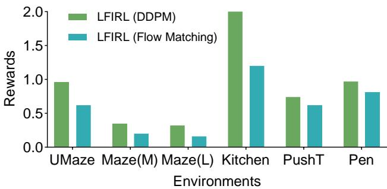  
Figure 7: Additional ablation comparing DDPM-based and Flow-Matching-based pretraining in LFIRL. The two variants use the same subsequent sequential reward-recovery pipeline, but differ in how the pretrained generative policy is obtained. Higher is better.

## B.2 Additional Results: DDPM vs. Flow Matching Pretraining

In the main experiments, LFIRL uses a DDPM-based diffusion policy to provide the score signal for recovering the soft Q-function. We also evaluate an alternative implementation in which the diffusionpolicy pretraining stage is replaced by a Flow Matching version, while keeping the remaining LFIRL pipeline unchanged. This comparison isolates the effect of the pretrained generative policy used to provide local action-gradient supervision.

As shown in Fig. 7, under the same number of pretraining epochs, the Flow-Matching-based variant generally performs worse than the DDPM-based variant. This suggests that, in our setting, DDPM pretraining provides a more effective score signal for the subsequent Q-recovery stage. Since LFIRL relies on the pretrained generative policy to supply local action-gradient information, a weaker pretraining stage can directly reduce the quality of the recovered Q-function and subsequently degrade the final recovered reward.

## C Sensitivity to the Reference Policy

The reference policy $\mu$ specifies the behavioral baseline relative to which the expert policy is interpreted. Under the reference-policy MaxEnt formulation,

$$
\nabla _ { \mathbf { a } } \log \pi _ { E } ( \mathbf { a } \mid \mathbf { s } ) = \nabla _ { \mathbf { a } } \log \mu ( \mathbf { a } \mid \mathbf { s } ) + \frac { 1 } { \varepsilon } \nabla _ { \mathbf { a } } Q ^ { * } ( \mathbf { s } , \mathbf { a } ) .\tag{23}
$$

We examine how the choice of $\mu$ affects LFIRL by comparing a uniform reference policy with a state-conditioned Gaussian reference policy.

The two variants use the same expert demonstrations and LFIRL training configuration. The uniform variant uses a uniform distribution over the bounded action space, for which $\breve { \nabla } _ { \mathbf { a } } \log \mu ( \mathbf { a } \mid \mathbf { s } ) = 0$ in the interior of its support. For the Gaussian variant, we initialize an SAC actor before LFIRL training and freeze it throughout the reward-recovery pipeline. The actor outputs the mean and standard deviation of a state-conditioned action distribution and is not fitted to the expert demonstrations. At each noisy action $\mathbf { a } _ { t } ^ { k }$ , we evaluate the score of this frozen reference policy and use

$$
g _ { \phi } ( \mathbf { a } _ { t } ^ { k } , \mathbf { s } _ { t } , k ) - \nabla _ { \mathbf { a } } \log \mu ( \mathbf { a } \mid \mathbf { s } _ { t } ) \big \vert _ { \mathbf { a } = \mathbf { a } _ { t } ^ { k } }
$$

as the target for $\varepsilon ^ { - 1 } \nabla _ { \mathbf { a } } \hat { Q } _ { \omega } ( \mathbf { s } _ { t } , \mathbf { a } _ { t } ^ { k } )$ ). Actions used for soft-value estimation are also sampled from the same frozen reference policy.

We evaluate these variants on MuJoCo tasks, where the expert demonstrations can be generated by stochastic sampling from pretrained SAC experts. This allows the reference-policy comparison to be conducted with a specified source of expert actions; the generating policy distributions of the robotic-manipulation datasets cannot be verified in the same way. Table 4 reports the resulting episodic returns.

The choice of reference policy affects performance, and the direction of the effect depends on the task. The uniform variant performs better on Swimmer and Walker2d, whereas the Gaussian variant performs better on Hopper. LFIRL therefore is not invariant to $\mu { : }$ changing the behavioral baseline changes the reward interpretation and can alter the recovered reward. Nevertheless, the Gaussian-reference variant remains effective, showing that the recovery procedure is not restricted to the uniform-reference simplification.

Table 4: Sensitivity to the reference policy on MuJoCo tasks. Results are episodic returns, reported as mean ± standard deviation. The expert return is included for context.
<table><tr><td></td><td>Environment LFIRL-Uniform LFIRL-Gaussian</td><td></td><td>Expert</td></tr><tr><td>Swimmer-v5</td><td> $2 8 4 . 5 6 { \pm } 2 7 . 6 4$ </td><td> $2 0 8 . 4 2 { \pm } 7 . 2 5 $ </td><td> $3 1 5 . 5 5 { \pm } 1 . 3 8 $ </td></tr><tr><td>Walker2d-v5</td><td> $4 9 3 3 . 4 1 { \pm } 5 2 . 7 9$ </td><td> $4 7 2 2 . 4 0 { \pm } 2 3 0 . 4 2$ </td><td> $5 8 6 1 . 1 8 { \pm } 7 3 . 9 9$ </td></tr><tr><td>Hopper-v5</td><td> $3 4 1 3 . 5 0 { \pm } 2 1 0 . 2 3 $ </td><td> $3 8 6 8 . 0 4 { \pm } 7 9 . 5 8 $ </td><td> $4 0 9 8 . 1 7 { \pm } 2 4 7 . 7 0$ </td></tr></table>

Table 5: Sensitivity of PointMaze success rate to Stage-I hyperparameters. Each group varies one parameter while the remaining parameters are held at their default values. Bold indicates the highest result within each parameter group for each environment.
<table><tr><td></td><td colspan="3">Diffusion-noise magnitude</td><td colspan="3">Value-anchoring coefficient</td><td colspan="3">Intended margin</td></tr><tr><td>Environment</td><td>Low</td><td>Medium</td><td>High</td><td> $\lambda = 0 . 5$ </td><td> $\lambda = 1$ </td><td> $\lambda = 2$ </td><td> $\xi = 0 . 5$ </td><td> $\xi = 1$ </td><td> $\xi = 2$ </td></tr><tr><td>UMaze</td><td>0.98</td><td>0.87</td><td>0.68</td><td>0.92</td><td>0.98</td><td>0.97</td><td>0.57</td><td>0.98</td><td>0.61</td></tr><tr><td>Medium</td><td>0.39</td><td>0.35</td><td>0.25</td><td>0.38</td><td>0.39</td><td>0.35</td><td>0.24</td><td>0.39</td><td>0.26</td></tr><tr><td>Large</td><td>0.31</td><td>0.29</td><td>0.25</td><td>0.26</td><td>0.31</td><td>0.34</td><td>0.18</td><td>0.31</td><td>0.24</td></tr></table>

This experiment assumes that the reference policy is specified. It does not infer $\mu$ from expert demonstrations. In general, demonstrations alone do not uniquely separate an unknown reference policy from the reward without additional assumptions; jointly inferring the two is beyond the scope of this work.

## D Sensitivity to Stage-I Hyperparameters

LFIRL has several sequential recovery stages, but their hyperparameters need not have the same effect on performance. The value-recovery stage uses a Gumbel-regression-style objective, while the final reward-recovery stage enforces Bellman consistency. Here, we focus on three choices that directly affect the local Q-recovery signal in Stage I: the magnitude of the diffusion noise, the value-anchoring coefficient $\lambda ,$ and the intended margin ξ in value anchoring.

We vary one parameter at a time while holding the other two at their default settings: the low-noise schedule, $\lambda = 1$ , and $\xi = 1$ . The noise settings scale the coefficient $\sqrt { 1 - \bar { \alpha } _ { k } }$ in the forward noising process by 1×, 4×, and 8×, respectively. Table 5 reports PointMaze success rates under these settings.

Diffusion-noise magnitude. Performance decreases as the noise coefficient increases. Increasing $\sqrt { 1 - \bar { \alpha } _ { k } }$ moves noisy actions farther from the clean expert-action distribution, where the local approximation between the noisy-action score and the expert-policy score becomes less reliable. The decline is modest from low to medium noise on Medium and Large, but larger at high noise across all three environments. This supports using the low-noise schedule as the default for local Q-gradient supervision.

Value-anchoring coefficient λ. Performance is comparatively stable between $\lambda = 1$ and $\lambda = 2$ Increasing λ to 2 slightly improves Large while causing a small decrease on UMaze and Medium. Reducing it to 0.5 weakens the anchoring signal and lowers performance, particularly on Large. Thus, the method is less sensitive to this coefficient once anchoring is sufficiently strong, with $\lambda = 1$ providing a stable choice across the three environments.

Intended margin ξ. The intended margin has the strongest effect among the three tested parameters. Both $\xi = 0 . 5$ and $\xi = 2$ underperform $\xi = 1$ on every environment. A small margin provides insufficient separation between expert actions and their perturbed neighbors. An excessively large margin demands larger local Q differences and may conflict with gradient matching or suppress near-optimal actions. In these experiments, ξ = 1 provides the most reliable balance across all three environments.

Overall, these results identify the diffusion-noise magnitude and the anchoring margin as the more consequential Stage-I settings. The value-anchoring coefficient is less sensitive once it is large enough to provide effective anchoring.

## E Additional Experimental Details

## E.1 Implementation Details and Hyperparameter Setup

The overall training procedure of LFIRL is given in Alg. 1. Key network architecture and hyperparameter settings for each environment are summarized in Tab. 6 and Tab. 7.

Table 6: Network architecture and hyperparameter setup for the PointMaze environments.
<table><tr><td colspan="2">PointMaze_UMaze-v3</td><td>PointMaze_Medium-v3</td><td>PointMaze_Large-v3</td></tr><tr><td>Expert demonstrations</td><td>2000</td><td>2000</td><td>2000</td></tr><tr><td>Policy pretraining epochs</td><td>60</td><td>40</td><td>40</td></tr><tr><td>Q/b/V/r learning rate</td><td>3e-5</td><td>3e-5</td><td>3e-5</td></tr><tr><td>Stage passes (Q, b, V, r)</td><td>8/8/20/20</td><td>8/8/20/20</td><td>8/8/20/20</td></tr><tr><td>Q, b, V, r hidden layers</td><td>256, 256, 256, 256</td><td>256, 256, 256, 256</td><td>256, 256, 256, 256</td></tr><tr><td>IRL batch size</td><td>256</td><td>256</td><td>256</td></tr><tr><td>Discount factor γ</td><td>0.99</td><td>0.99</td><td>0.99</td></tr><tr><td>EMA coefficient τ</td><td>0.005</td><td>0.005</td><td>0.005</td></tr></table>

Table 7: Network architecture and hyperparameter setup for the robotic manipulation environments.
<table><tr><td colspan="2">FrankaKitchen-v1</td><td>gym_pusht/PushT-v0</td><td>AdroitHandPen-v1</td></tr><tr><td>Expert demonstrations</td><td>19</td><td>200</td><td>200</td></tr><tr><td>Policy pretraining epochs</td><td>20</td><td>200</td><td>40</td></tr><tr><td>Q/b/V/r learning rate</td><td>3e-5</td><td>3e-4</td><td>3e-5</td></tr><tr><td>Stage passes (Q, b, V, r)</td><td>8/8/20/20</td><td>40/40/100/100</td><td>40/40/100/100</td></tr><tr><td>Q, b, V, r hidden layers</td><td>256, 256, 256, 256</td><td>256, 256, 256, 256</td><td>256, 256, 256, 256</td></tr><tr><td>IRL batch size</td><td>256</td><td>256</td><td>256</td></tr><tr><td>Discount factor γ</td><td>0.99</td><td>0.99</td><td>0.99</td></tr><tr><td>EMA coefficient τ</td><td>0.005</td><td>0.005</td><td>0.005</td></tr></table>

## E.2 Expert Demonstrations Sources

The sources of offline trajectory datasets for experts are provided in Tab. 8. In Maze and Kitchen tasks, we directly use the expert trajectories from the Minari Offline Reinforcement Learning datasets [44]. For the Push-T task, we use the expert trajectories from the dataset in Diffusion Policy [5].

Table 8: The sources of expert policies or demonstrations.
<table><tr><td>Task</td><td>Source</td></tr><tr><td>UMaze</td><td>https://minari.farama.org/datasets/D4RL/pointmaze/umaze-v2/</td></tr><tr><td>Medium</td><td>https://minari.farama.org/datasets/D4RL/pointmaze/medium-v2/</td></tr><tr><td>Large</td><td>https://minari.farama.org/datasets/D4RL/pointmaze/large-v2/</td></tr><tr><td>Franka Kitchen</td><td>https://minari.farama.org/datasets/D4RL/kitchen/complete-v2/</td></tr><tr><td>Push-T</td><td>https://diffusion-policy.cs.columbia.edu/data/training/pusht.zip</td></tr><tr><td>Pen</td><td>https://minari.farama.org/datasets/D4RL/pen/expert-v2/</td></tr></table>

## E.3 Hardware Information

Hardware specifications are provided in Tab. 9.

Table 9: Hardware configuration used in experiments.
<table><tr><td>Hardware</td><td>Specifications</td></tr><tr><td>CPU</td><td>AMD EPYC 7713 64-Core Processor @ 2 GHz</td></tr><tr><td>GPU</td><td>NVIDIA A100-SXM4-80GB @ 1215 MHz</td></tr><tr><td>Memory</td><td>2 TB</td></tr></table>