# HOW MUCH PLANNING IS ENOUGH? REDUCING SEARCH AND COMPUTATION IN WORLD-MODEL PLANNING

Changbai Li1∗ Sirui Li2∗ Yichen Yang1 Tongfei Chen1

Zichao Feng1 Shuwei Shao3 Huobin Tan1†

1Beihang University 2Chengdu University of Technology 3Nanyang Technological University

## ABSTRACT

Visual world models enable goal-directed control through decision-time action search, but their deployment efficiency is often limited by conservatively large planning budgets. We show that competitive task performance can be achieved without agreement with the Full-budget action, that sufficient budgets vary across model–task pairs, and that iterative planners repeatedly encode solve-invariant context. To address these inefficiencies, we propose SufficientPlan, a simple deployment framework that requires no modification to pretrained world models or planner updates. Its Paired Sequential Budget Certification (PSBC) component uses paired closed-loop evidence to search for and certify a reduced model– task-specific budget within a predefined Full-performance tolerance. Its Static-Context Reuse (SCR) component caches observation and goal representations across search iterations while preserving candidate-dependent planning and se-state, different planning budgets, same successful outcome lected actions. Experiments across multiple world-model backbones and visualcontrol tasks show that SufficientPlan substantially reduces search budgets and planning latency while maintaining competitive control performance.

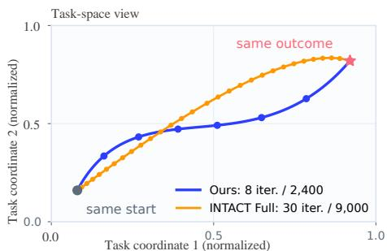

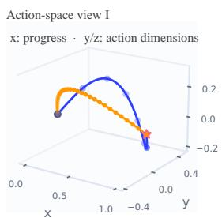

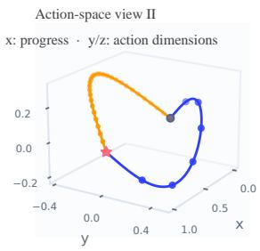  
Figure 1: Task success without Full-budget action agreement. On INTACT Push-T, the calibrated and Full planners follow different task- and action-space trajectories but both achieve 96% success, using 2,400 and 9,000 scored sequences per solve, respectively.

## 1 INTRODUCTION

Latent visual world models, including those based on joint-embedding predictive architectures (JEPAs), predict the effects of candidate actions in a learned representation space and support goal-directed control through model-based planning (Zhou et al., 2025a; Maes et al., 2026; Nam et al., 2026; Sun et al., 2026). In this paradigm, decision-time search is critical for translating learned dynamics into effective control, but its computational cost directly limits deployment ef ficiency (de Boer et al., 2005; Williams et al., 2017; Pinneri et al., 2020). Existing world-model planners commonly use a large, globally fixed search budget for different models and tasks (Chua et al., 2018; Zhou et al., 2025a; Maes et al., 2026; Sun et al., 2026). Such budgets determine how many candidate action sequences are evaluated and how extensively they are refined before execution. However, a fixed computational allowance does not account for whether additional search meaningfully improves closed-loop task performance. However, we find that this practice introduces two complementary forms of redundancy. First, additional action refinement may continue even when a reduced budget and Full planning achieve the same aggregate task performance. As shown in Fig. 1, the calibrated and Full planners follow distinct task- and action-space trajectories but achieve the same 96% success rate using 2,400 and 9,000 scored sequences, respectively. Moreover, the budget required to reach this outcome-sufficient regime varies considerably across model–task pairs (See Tab. 1). Second, iterative planners repeatedly encode the same observation history and goal during candidate refinement, even though these inputs remain unchanged within a planning solve. As shown in Fig. 3, the original planner places observation-history and goal encoding inside the CEM loop, causing the same solve-static inputs to be re-encoded in every iteration and resulting in 2K static-encoder calls over K refinement iterations.

To address these problems, we propose SufficientPlan, a simple, effective, and plug-and-play framework for improving the success-compute trade-off of world-model planning without retraining the underlying model or changing its control objective. SufficientPlan contains two complementary components. First, Paired Sequential Budget Certification (PSBC) evaluates search budget proposals on paired development episodes and certifies a lower model–task-specific budget that remains within a predefined performance tolerance relative to Full planning. As shown in Fig. 2, PSBC compares each current budget with the Full reference on the same episodes: uncertain cases receive additional paired evidence, insufficient proposals trigger a larger budget, and the first proposal satisfying the certification criterion is frozen for held-out deployment. Unlike action-matching criteria, PSBC directly evaluates task outcomes, allowing a reduced budget to be certified even when its selected actions do not agree with those of the Full-budget planner. Second, Static-Context Reuse (SCR) computes the solve-invariant observation and goal representations once and reuses them across all search iterations. As shown in Fig. 3, SCR moves these solve-static encoding operations outside the CEM loop, reducing repeated solve-static encoding operations from 2K to 2 over K iterations. SCR preserves candidate-dependent action encoding, latent rollout, cost evaluation, and optimize updates, thereby reducing repeated computation without changing the planner’s selected actions or closed-loop behavior.

Together, PSBC and SCR address two orthogonal sources of planning inefficiency: PSBC removes unnecessary search, while SCR removes redundant computation within the remaining search. Because both components operate entirely at deployment time, SufficientPlan can be applied to existing sampling-based world-model planners as a lightweight plug-in. Experiments across multiple worldmodel backbones and control benchmarks show that SufficientPlan substantially reduces candidate evaluation and planning latency while preserving competitive closed-loop task performance. Our main contributions are summarized below:

• We identify a mismatch between closed-loop task success and Full-budget action agreement: comparable task performance can be achieved with different actions, and the sufficient search budget varies substantially across models and tasks.

• We introduce SufficientPlan, a simple and plug-and-play planning-efficiency framework combining PSBC, which sequentially searches for and certifies a reduced outcome-sufficient search budget, and SCR, which exactly reuses solve-invariant representations during iterative planning.

• We evaluate SufficientPlan across multiple world-model backbones and control benchmarks, demonstrating substantial reductions in search computation and planning latency while preserving closed-loop performance.

## 2 RELATED WORK

Latent World Models for Visual Planning. World models learn predictive representations of environment dynamics for decision making (Ha & Schmidhuber, 2018). PlaNet and the Dreamer family perform planning or policy optimization in compact latent spaces (Hafner et al., 2019; 2020; 2021; 2023), while MuZero, EfficientZero, and TD-MPC show that task-relevant latent dynamics can support control without pixel-perfect future reconstruction (Schrittwieser et al., 2020; Ye et al., 2021; Hansen et al., 2024). Joint-embedding predictive architectures, including I-JEPA, V-JEPA, and V-JEPA2, further learn predictive representations without reconstructing raw pixels (Assran et al., 2023; Bardes et al., 2024; Assran et al., 2025). DINO-WM uses pretrained visual features for goal-conditioned planning (Zhou et al., 2025a); LeWM learns a lightweight world model endto-end from pixels, and Fast-LeWM accelerates candidate evaluation through action-prefix prediction (Maes et al., 2026; Gao & Xu, 2026). INTACT learns an intent-to-action mapping for direct control and optional local search (Sun et al., 2026). Object-centric methods instead represent scenes as entities and model their dynamics and interactions (Locatello et al., 2020; Kipf et al., 2022; Wu et al., 2023; Mosbach et al., 2025; Nam et al., 2026). Unlike these methods, which primarily improve representations, dynamics, or action priors, SufficientPlan keeps the pretrained model and planner fixed and reduces decision-time computation.

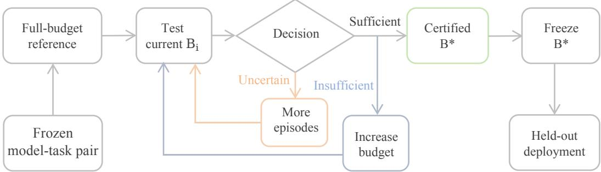  
Figure 2: Paired Sequential Budget Certification (PSBC). PSBC compares the current budget with the full-budget reference on paired calibration episodes. Uncertain cases receive additional paired evidence, insufficient budgets are increased, the first proposal satisfying the certification cri terion is returned as B⋆ and frozen for held-out deployment.

Efficient Decision-Time Planning. Sampling-based optimizers such as CEM and MPPI optimize action sequences under learned dynamics without requiring differentiable models (de Boer et al., 2005; Williams et al., 2017). Methods such as PETS and PDDM apply this principle in recedinghorizon control (Chua et al., 2018; Nagabandi et al., 2019), but their cost grows with the candidate population and search depth. Prior work improves efficiency using learned policies or behavior priors (Wang & Ba, 2020; Argenson & Dulac-Arnold, 2020) or sample-efficient CEM refinements such as elite reuse and distribution warm-starting (Pinneri et al., 2020). Adaptive replanning instead reduces how frequently the planner is invoked across environment steps (Cheng et al., 2026). SufficientPlan targets two complementary sources of deployment overcomputation. Paired Sequential Budget Certification (PSBC) uses paired closed-loop evidence to select a model–task-specific search budget, which is calibrated on a development set and frozen for held-out deployment. Unlike adaptive replanning or per-state early stopping, PSBC changes the budget assigned to each model– task pair without modifying the world model or planner update rule. Static-Context Reuse (SCR) encodes the solve-invariant observation history and goal once and reuses them across refinement iterations, while preserving candidate evaluation, planner updates, and the selected action. Thus, PSBC reduces the amount of deployed search, whereas SCR removes repeated computation within the retained search.

## 3 MOTIVATION AND ANALYSIS

Outcome Sufficiency without Full-Action Agreement. Iterative world-model planners refine candidate actions using predicted latent costs (de Boer et al., 2005; Chua et al., 2018; Zhou et al., 2025a; Maes et al., 2026), but successful control need not reproduce the Full-budget action. On INTACT Push-T, the calibrated planner uses 8 CEM iterations and 2,400 scored sequences per solve, compared with 30 iterations and 9,000 sequences for Full planning; both achieve 96% success on the development set. Fig. 1 illustrates distinct trajectories reaching the same goal, while Fig. C quantifies action differences despite equal aggregate success. Thus, requiring action agreement with Full planning could prolong search after the target level of closed-loop performance has been reached. We instead assess budget sufficiency using paired task outcomes.

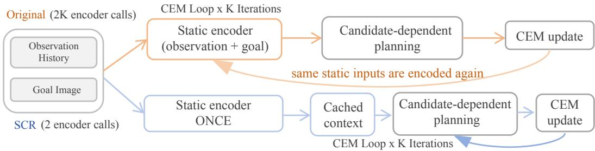  
Figure 3: Static-Context Reuse (SCR). SCR encodes the solve-invariant observation history and goal once and reuses them across K CEM iterations, reducing cost-stage static-encoder calls from 2K to 2 without changing candidate-dependent planning or CEM updates.

Model–Task Variation in Certified Budgets. The budgets certified by PSBC vary substantially across model–task pairs. As shown in Tab. 1, the selected operating budgets range from 3.3% to 80.0% of Full planning across the evaluated pairs. For example, PSBC selects 3.3% of the Full budget for INTACT on Cube, but 80.0% for LeWM on Reacher. Consequently, a uniformly small budget may underallocate search for refinement-sensitive pairs, while a uniformly large budget can waste computation on pairs for which smaller budgets are sufficient These results motivate model– task-specific budget certification rather than a universal deployment budget.

Repeated Solve-Static Encoding. Reducing the search budget removes unnecessary candidate evaluations, but repeated computation can remain within the retained iterations. In the iterative planners examined here, the observation history and goal remain fixed within a planning solve, whereas only the candidate action sequences change. Nevertheless, these solve-static inputs are encoded inside each candidate-evaluation iteration. As illustrated in Fig. 3, a planner with K iterations consequently performs 2K static-encoder calls for only two distinct inputs.

This repetition produces measurable wall-clock overhead. On Fast-LeWM/Push-T, the analytical reduction in static-encoder calls increases from 0% at one iteration to 96.7% at 30 iterations. Repeated timing measurements show no reliable speedup at one iteration, whereas SCR reaches a 2.45× speedup at 30 iterations (Fig. 5). Matched-budget evaluations across INTACT, Fast-LeWM, and C-JEPA preserve the corresponding episode-success vectors with zero outcome flips (Fig. 4). These measurements show that repeated solve-static encoding contributes latency without changing the evaluated closed-loop outcomes.

Together, the analysis identifies two complementary sources of deployment overcomputation: search beyond outcome sufficiency and repeated solve-static encoding . excess candidate evaluation redundant per-iteration computation

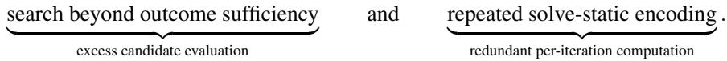

The first motivates outcome-based, model–task-specific budget certification, while the second moti vates reusing invariant representations within each planning solve.

## 4 METHOD

Framework Overview. We propose SufficientPlan, a deployment framework that reduces decision-time planning computation without retraining the world model or modifying its native planning objective. Given a frozen world model M, its planner P, a development set $\mathcal { D } _ { \mathrm { d e v } }$ , the original Full planning budget $B _ { \mathrm { F u l l } }$ , and an allowed performance degradation $\delta ,$ SufficientPlan first applies Paired Sequential Budget Certification (PSBC) to identify a lower model–task-specific operating budget. The resulting budget is frozen before held-out evaluation. During planning, Static-Context Reuse (SCR) further removes repeated observation-history and goal encoding within each solve. Thus, PSBC reduces candidate search, whereas SCR eliminates redundant computation inside the retained search.

Paired Outcome Formulation. Let $Y _ { e } ( B ) \in \{ 0 , 1 \}$ denote the binary closed-loop outcome obtained on development episode e using planning budget B. For each tested budget proposal $B _ { i }$ PSBC evaluates $B _ { i }$ and $B _ { \mathrm { F u l l } }$ on the same episode, initial state, and goal. Their paired outcome

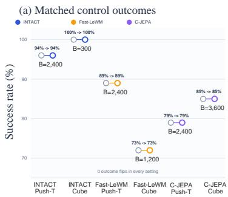

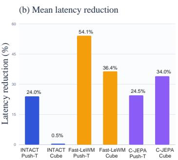

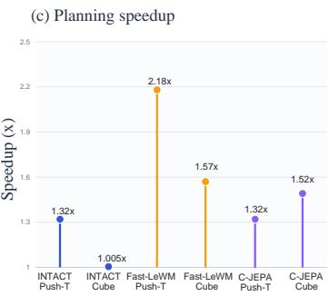  
Figure 4: Matched-budget evaluation of Static-Context Reuse (SCR). (a) Matched-budget success rates and episode-level outcome consistency. (b) Mean planning-latency reduction. (c) Planning speedup across backbone–task settings. SCR preserves all evaluated outcomes while achieving up to 2.18× speedup.

Table 1: Comparison of full-budget planning and PSBC-calibrated planning across different worldmodel planners and control tasks. Budget denotes the planning budget relative to the corresponding full planner, and Success denotes the task success rate (%). “Full” indicates the original full planning budget, while “–” denotes unavailable results.
<table><tr><td rowspan="2">Planner</td><td rowspan="2">Deployment</td><td colspan="2">Push-T</td><td colspan="2">Cube</td><td colspan="2">Reacher</td><td colspan="2">TwoRoom</td></tr><tr><td>Budget</td><td>Success</td><td>Budget</td><td>Success</td><td>Budget</td><td>Success</td><td>Budget</td><td>Success</td></tr><tr><td>LeWM</td><td>Full CEM</td><td>Full</td><td>85</td><td>Full</td><td>71</td><td>Full</td><td>82</td><td>Full</td><td>91</td></tr><tr><td>LeWM+PSBC</td><td>Calibrated CEM</td><td>50.0%</td><td>88</td><td>13.3%</td><td>74</td><td>80.0%</td><td>82</td><td>30.0%</td><td>91</td></tr><tr><td>Fast-LeWM</td><td>Full CEM</td><td>Full</td><td>95</td><td>Full</td><td>68</td><td>Full</td><td>82</td><td>Full</td><td>94</td></tr><tr><td>Fast-LeWM+PSBC</td><td>Calibrated CEM</td><td>26.7%</td><td>89</td><td>13.3%</td><td>73</td><td>80.0%</td><td>81</td><td>50.0%</td><td>94</td></tr><tr><td>PRISM</td><td>Official PoG-MPPI</td><td>Full</td><td>88</td><td>Full</td><td>78</td><td>一</td><td>-</td><td>一</td><td>一</td></tr><tr><td>PRISM+PSBC</td><td>Calibrated PoG-MPPI</td><td>26.7%</td><td>89</td><td>6.7%</td><td>82</td><td>一</td><td>一</td><td>一</td><td>一</td></tr><tr><td>C-JEPA</td><td>Full CEM</td><td>Full</td><td>82</td><td>Full</td><td>82</td><td>一</td><td>一</td><td>一</td><td>一</td></tr><tr><td>C-JEPA+PSBC</td><td>Calibrated CEM</td><td>26.7%</td><td>79</td><td>40.0%</td><td>85</td><td>一</td><td>一</td><td>一</td><td>一</td></tr><tr><td>INTACT</td><td>Full Actor-CEM</td><td>Full</td><td>95</td><td>Full</td><td>98</td><td>Full</td><td>85</td><td>Full</td><td>100</td></tr><tr><td>INTACT+PSBC</td><td>Calibrated Actor-CEM</td><td>26.7%</td><td>94</td><td>3.3%</td><td>100</td><td>3.3%</td><td>100</td><td>3.3%</td><td>100</td></tr><tr><td>SufficientPlan</td><td>Calibrated Actor-CEM + SCR</td><td>26.7%</td><td>94</td><td>3.3%</td><td>100</td><td>3.3%</td><td>100</td><td>3.3%</td><td>100</td></tr></table>

difference is

$$
D _ { e } ( B _ { i } ) = Y _ { e } ( B _ { \mathrm { F u l l } } ) - Y _ { e } ( B _ { i } ) \in \{ - 1 , 0 , 1 \} .\tag{1}
$$

Here, $D _ { e } ( B _ { i } ) = 1$ denotes a broken episode that succeeds under Full planning but fails under $B _ { i }$ whereas $\dot { D } _ { e } ( \boldsymbol { B } _ { i } ) = - 1$ denotes a rescued episode that fails under Full planning but succeeds under $B _ { i } . \mathrm { ~ A ~ }$ value of zero indicates identical binary outcomes.

The population-level degradation and its estimate from n paired development episodes are

$$
\begin{array} { r l } & { \Delta ( B _ { i } ) = \mathbb { E } [ D _ { e } ( B _ { i } ) ] = \mathrm { S R } ( B _ { \mathrm { F u l l } } ) - \mathrm { S R } ( B _ { i } ) , } \\ & { \quad \widehat { \Delta } _ { i , n } = \displaystyle \frac { 1 } { n } \sum _ { e = 1 } ^ { n } D _ { e } ( B _ { i } ) . } \end{array}\tag{2}
$$

Although $\widehat { \Delta } _ { i , n }$ equals the difference between the two empirical success rates, retaining the episodelevel pairing preserves their covariance and supports paired uncertainty quantification.

Sequential Budget Certification. Let $B = \{ B _ { 1 } , \ldots , B _ { m } \}$ denote a predefined sequence of candidate budgets in the lower-budget regime, and let $\mathcal { N }$ denote the permitted sequential inspection times. For each $B _ { i }$ and $n \in \mathcal N .$ , let $\bar { \mathcal D } _ { i , n } = \{ D _ { e } ( B _ { i } ) \} _ { e = 1 } ^ { n }$ denote the observed paired outcomes. PSBC computes the posterior probability that the population degradation of $B _ { i }$ lies within the allowed tolerance:

$$
q _ { i , n } = \operatorname* { P r } ( \Delta ( B _ { i } ) \leq \delta \mid \mathcal { D } _ { i , n } ) .\tag{3}
$$

The posterior is constructed from the rescued, broken, and unchanged episode counts under a Dirichlet model. The full posterior construction is provided in the supplementary material.

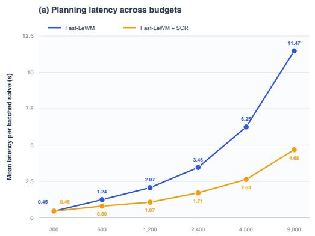

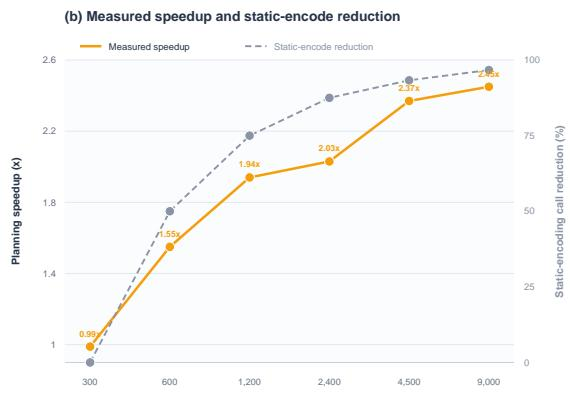  
Fast-LeWM/Push-T; the one-iteration point uses repeated order-balanced timing after warm-up.Figure 5: SCR scaling with planning depth on Fast-LeWM/Push-T. (a) Mean planning latency of the uncached and SCR-enabled planners. (b) Measured speedup and analytical reduction in solvestatic encoder calls. Repeated measurements show no reliable speedup at one iteration, whereas SCR reaches 2.45× speedup at 30 iterations as repeated static encoding becomes more prominent.

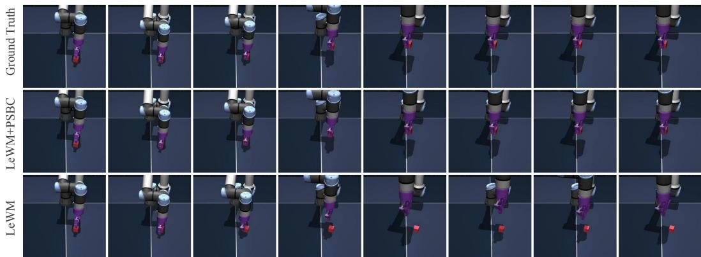  
Figure 6: Paired qualitative comparison on Cube. From the same initial state and goal, LeWM+PSBC succeeds while Full LeWM fails; Ground Truth is shown as reference, and columns progress from left to right.

Let $\tau _ { \mathrm { a c c } }$ and $\tau _ { \mathrm { r e j } }$ denote the acceptance and rejection thresholds. PSBC applies

$$
\begin{array} { r } { \mathrm { D e c i s i o n } ( B _ { i } , n ) = \left\{ \begin{array} { l l } { \mathrm { S U F F I C I E N T } , } & { q _ { i , n } \geq \tau _ { \mathrm { a c c } } , } \\ { \mathrm { I N S U F F I C I E N T } , } & { 1 - q _ { i , n } \geq \tau _ { \mathrm { r e j } } , } \\ { \mathrm { U N C E R T A I N } , } & { \mathrm { o t h e r w i s e } . } \end{array} \right. } \end{array}\tag{4}
$$

A sufficient proposal is certified. An uncertain proposal receives additional paired episodes at the same budget, whereas an insufficient proposal is replaced by the next budget in the proposal sequence. For each additional episode, the corresponding Full-budget outcome is evaluated or retrieved from a precomputed reference, preserving the paired comparison. If the development episodes are exhausted before a proposal can be certified, PSBC proceeds conservatively to the next proposal and ultimately falls back to $B _ { \mathrm { F u l l } }$ if no reduced budget is certified. PSBC thus certifies search sufficiency from paired closed-loop outcomes rather than action agreement (Fig. 2).

Posterior Certification Guarantee. The posterior decision rule in Eq. 4 provides a direct probabilistic interpretation for every budget accepted by PSBC.

Proposition 1 (Posterior certification criterion). If PSBC certifies a budget $B ^ { \star } = B _ { i }$ at inspection time n, then

$$
\operatorname* { P r } ( \Delta ( B ^ { \star } ) \leq \delta \mid \mathcal { D } _ { i , n } ) \geq \tau _ { \mathrm { a c c } } .\tag{5}
$$

Proof. Certification requires $q _ { i , n } \geq \tau _ { \mathrm { a c c } }$ . By the definition of $q _ { i , n }$ in Eq. 3,

$$
q _ { i , n } = \mathrm { P r } ( \Delta ( B ^ { \star } ) \leq \delta \mid \mathcal { D } _ { i , n } ) ,\tag{6}
$$

which directly gives Eq. 5.

□

Proposition 1 is a posterior statement under the specified paired-outcome model. It does not imply simultaneous frequentist coverage over all budgets and inspection times, nor does it guarantee identical empirical success rates on every finite held-out sample.

Budget Proposal and Deployment. We define planning budget as the total number of candidate action sequences scored in one planning solve. If a planner evaluates $N _ { k }$ candidates at refinement iteration k, the budget of proposal $B _ { i }$ is

$$
B _ { i } = \sum _ { k = 1 } ^ { K _ { i } } N _ { k } , \qquad B _ { i } = N K _ { i } \quad { \mathrm { w h e n ~ } } N _ { k } = N .\tag{7}
$$

The second expression applies to the fixed-population CEM configurations used in our experiments.

PSBC examines a predefined proposal sequence beginning in the lower-budget regime and returns the first proposal classified as SUFFICIENT, denoted by $B ^ { \star }$ . This defines a certified operating point rather than a globally minimal budget, and does not assume monotonic closed-loop performance with increasing planning budget.

After calibration, the deployment budget is frozen as

$$
B _ { \mathrm { d e p l o y } } = B ^ { \star } .\tag{8}
$$

Held-out outcomes are never used to revise this budget. PSBC changes only the amount of deployed search; the world-model parameters, planning objective, per-iteration candidate-generation rule, cost function, and optimizer update remain unchanged.

Static-Context Reuse. PSBC reduces candidate evaluation, but repeated computation may remain within each retained planning solve. Let h denote the current observation history, g the goal observation, and $\mathcal { A } ^ { ( k ) }$ the candidate action population at refinement iteration k. A conventional latent planner evaluates this population through

$$
J _ { \mathrm { o r i g } } ^ { ( k ) } = \mathcal { C } \Big ( E _ { h } ( h ) , E _ { g } ( g ) , E _ { a } ( \boldsymbol { A } ^ { ( k ) } ) \Big ) ,\tag{9}
$$

where $E _ { h }$ and $E _ { g }$ encode the observation history and goal, $E _ { a }$ encodes candidate actions, and C includes latent prediction and terminal-cost evaluation.

Within one planning solve, h and $g$ remain fixed across all K refinement iterations, whereas $\mathcal { A } ^ { ( k ) }$ changes. Nevertheless, Eq. 9 recomputes $E _ { h } ( h )$ and $E _ { g } ( g )$ at every iteration. As illustrated in Fig. 3, SCR moves these solve-invariant operations outside the iterative loop:

$$
z _ { h } = E _ { h } ( h ) , \qquad z _ { g } = E _ { g } ( g ) .\tag{10}
$$

The cached representations are then reused in every candidate evaluation:

$$
J _ { \mathrm { S C R } } ^ { ( k ) } = \mathcal { C } \Big ( z _ { h } , z _ { g } , E _ { a } ( A ^ { ( k ) } ) \Big ) .\tag{11}
$$

The cache is local to one planning solve and is discarded before the next environment step. SCR does not cache candidate-dependent quantities: candidate sampling, action encoding, latent rollout, terminal-cost evaluation, and optimizer updates are still executed for every candidate population. SCR therefore changes the placement of solve-static computation rather than the mathematical definition of candidate evaluation.

Computation Reduction and Planning Equivalence. For the planners considered here, each refinement iteration performs one observation-history encoding and one goal encoding. The original planner therefore performs 2K solve-static encoding operations over K iterations, whereas SCR performs only two. The resulting encoder-call reduction is

$$
R _ { \mathrm { e n c } } ( K ) = 1 - \frac { 2 } { 2 K } = 1 - \frac { 1 } { K } .\tag{12}
$$

Table 2: Incremental ablation on the frozen Push-T development set. PSBC reduces the deployed search budget while retaining near-Full success, and SCR preserves the resulting budget and control outcome.
<table><tr><td>Backbone</td><td>Configuration</td><td>PSBC</td><td>SCR</td><td>Scored Seq./Solve</td><td>Budget (% Full)</td><td>SR (%)</td><td>∆SR (pp)</td></tr><tr><td rowspan="3">INTACT</td><td>Full Actor-CEM</td><td>X</td><td>x</td><td>9,000</td><td>100.0</td><td>96</td><td>0</td></tr><tr><td>+ PSBC</td><td>√</td><td>x</td><td>2,400</td><td>26.7</td><td>96</td><td>0</td></tr><tr><td>+ PSBC + SCR</td><td>√</td><td>√</td><td>2,400</td><td>26.7</td><td>96</td><td>0</td></tr><tr><td rowspan="3">Fast-LeWM</td><td>Full CEM</td><td>X</td><td>x</td><td>9,000</td><td>100.0</td><td>90</td><td>0</td></tr><tr><td>+ PSBC</td><td>√</td><td>x</td><td>2,400</td><td>26.7</td><td>89</td><td>-1</td></tr><tr><td>+ PSBC + SCR</td><td>√</td><td>√</td><td>2,400</td><td>26.7</td><td>89</td><td>-1</td></tr></table>

For example, Eq. 12 gives an 87.5% reduction for K = 8 and a 96.7% reduction for $K = 3 0$ This quantity measures the reduction in solve-static encoder calls, not the reduction in total planner FLOPs, latency, or candidate evaluations.

Under deterministic evaluation-mode encoders, identical initial optimizer and random states, and unchanged candidate-dependent computation, Eqs. 9 and 11 use identical observation and goal representations. Consequently,

$$
J _ { \mathrm { S C R } } ^ { ( k ) } = J _ { \mathrm { o r i g } } ^ { ( k ) } \qquad \forall k \in \{ 1 , \dots , K \} .\tag{13}
$$

Applying the same optimizer update to identical candidate costs preserves the subsequent optimizer states and sampling distributions, yielding

$$
a _ { \mathrm { S C R } } ^ { \star } = a _ { \mathrm { o r i g } } ^ { \star } .\tag{14}
$$

The complete induction argument and numerical equivalence tests are provided in the supplementary material. SCR therefore reduces solve-static computation while preserving fixed-budget control behavior.

Combined Deployment. Given the certified operating budget $B ^ { \star }$ , SufficientPlan executes the original planner with SCR enabled:

$$
a _ { t } = \mathcal { P } _ { \mathrm { S C R } } \left( M , h _ { t } , g ; B ^ { \star } \right) .\tag{15}
$$

Neither component retrains the world model or modifies the planning objective, candidategeneration rule, or optimizer update.

## 5 EXPERIMENTS

We evaluate whether PSBC reduces deployment search across model–task pairs, whether the calibrated budgets transfer to held-out episodes, and whether SCR reduces planning latency without changing control outcomes. Implementation details, numerical equivalence tests, and additional analyses are provided in the supplementary material.

## 5.1 EXPERIMENTAL SETUP

Backbones and tasks. We evaluate SufficientPlan on LeWM (Maes et al., 2026), Fast-LeWM (Gao & Xu, 2026), PRISM (Wang et al., 2026), C-JEPA (Nam et al., 2026), and INTACT (Sun et al., 2026). We retain their native planners: CEM for LeWM, Fast-LeWM, and C-JEPA; PoG-MPPI for PRISM; and Actor-CEM for INTACT. The evaluation covers Push-T (Zhou et al., 2025b), Cube (Park et al., 2025), Reacher (Tassa et al., 2018), and TwoRoom (Sobal et al., 2025). All checkpoints are frozen during PSBC calibration and held-out evaluation; SufficientPlan requires no additional world-model training or fine-tuning.

Protocol and metrics. PSBC calibrates each model–task pair on a frozen development set by comparing candidate budgets with Full planning on paired episodes. The resulting budget $B ^ { \star }$ is frozen before episode-disjoint held-out evaluation and is not adjusted using held-out outcomes. We report closed-loop success rate (SR), budget relative to Full planning, and

$$
\Delta \mathrm { S R } = \mathrm { S R } ( B ^ { \star } ) - \mathrm { S R } ( B _ { \mathrm { F u l l } } ) .
$$

For SCR, we additionally report matched-budget planning latency, speedup, and episode-level outcome flips.

## 5.2 BUDGET CERTIFICATION

Tab. 1 compares Full planning with PSBC-calibrated deployment across 16 backbone–task pairs. On average, PSBC uses only 30.0% of the corresponding Full budget, reducing candidate evaluations by 70.0%. In 14 of the 16 held-out configurations, the resulting performance is no more than 2 percentage points below Full planning.

The certified budgets vary substantially across model–task pairs, ranging from 3.3% to 80.0% of Full planning. For example, PSBC selects 13.3% for LeWM on Cube but 80.0% on Reacher, highlighting the inefficiency of a globally fixed search budget. The same calibration procedure applies to CEM, PoG-MPPI, and Actor-CEM without modifying their native optimizer updates.

Fig. 6 further shows a paired qualitative example on Cube, where LeWM+PSBC succeeds from the same initial condition for which Full LeWM fails. The main held-out degradations occur on Fast-LeWM/Push-T and C-JEPA/Push-T, with decreases of 6 and 3 percentage points, respectively. These results are reported without held-out recalibration, indicating that PSBC improves the empirical performance–computation trade-off without assuming that reduced-budget planning must match Full planning on every model–task pair.

## 5.3 STATIC-CONTEXT REUSE

Fig. 4 compares SCR with uncached planning under matched budgets, checkpoints, episodes, candidate samples, and optimizer configurations. Across the evaluated settings, SCR preserves the episode-success vectors with zero outcome flips while achieving up to 2.18× planning speedup. The gain varies across settings because the fraction of runtime spent on repeated static encoding depends on the backbone, task, and search depth.

Fig. 5 evaluates Fast-LeWM/Push-T over budgets from 300 to 9,000 scored sequences. As refinement depth increases from 1 to 30 iterations, the analytical reduction in static-encoder calls grows from 0% to 96.7%. Repeated measurements show no reliable speedup at one iteration, where no cross-iteration reuse is available, but SCR reaches 2.45× speedup at 30 iterations.

## 5.4 FURTHER ANALYSIS OF PSBC

Appendix D further compares PSBC with empirical and fixed-sample posterior selection and analyzes its sequential inspection behavior. In the PRISM/Cube case study, paired posterior certification rejects a budget that would be accepted from empirical success rates alone, while early rejection reduces candidate-side calibration evaluations. The sensitivity analysis further shows that stricter certification settings require more evidence or leave the tested proposal uncertified within the available calibration horizon.

## 5.5 ABLATION STUDY

Tab. 2 incrementally evaluates PSBC and SCR on the frozen Push-T development set. For INTACT, PSBC reduces the search budget from 9,000 to 2,400 scored sequences while preserving the 96% success rate. For Fast-LeWM, it reduces the same budget to 26.7% of Full planning with a 1-point decrease in success rate. Adding SCR leaves the selected budget and success outcomes unchanged for both backbones, as expected from its behavior-preserving computation reuse. Its latency benefits are reported separately in Fig. 4.

## 6 CONCLUSION

In this work, we show that world-model planners can produce different actions under reduced and Full planning budgets despite achieving the same aggregate task performance, and that they can repeatedly encode solve-invariant observations and goals. To address these two sources of overcomputation, we propose SufficientPlan, a simple yet effective deployment framework that requires neither world-model retraining nor changes to the native planner. PSBC uses paired closed-loop evidence to certify a lower model–task-specific search budget, while SCR reuses solve-static representations across planning iterations. Experiments across multiple backbones, planners, and visualcontrol tasks show that SufficientPlan substantially reduces candidate evaluations and planning latency while retaining competitive control performance. These results highlight outcome sufficiency and computation reuse as complementary principles for efficient world-model planning.

## AI USE STATEMENT

AI tools were used to polish the language and improve readability. The authors take full responsibility for the paper and its results.

## ETHICS STATEMENT

This work evaluates planning efficiency on simulated visual-control benchmarks. It does not involve human-subject experiments or the collection of personal data. We do not anticipate direct ethical risks from the reported simulation experiments. Any physical deployment should follow the safety requirements of the intended application.

## REPRODUCIBILITY STATEMENT

We provide detailed descriptions of the model architecture, optimization objectives, training sched ule, hyperparameters, datasets, and evaluation protocols in the main paper and supplementary material. All experiments use consistent settings unless otherwise specified. We plan to release the implementation and configuration files to facilitate reproduction of the reported results.

## REFERENCES

Arthur Argenson and Gabriel Dulac-Arnold. Model-based offline planning. CoRR, abs/2008.05556, 2020.

Mahmoud Assran, Quentin Duval, Ishan Misra, Piotr Bojanowski, Pascal Vincent, Michael G. Rabbat, Yann LeCun, and Nicolas Ballas. Self-supervised learning from images with a jointembedding predictive architecture. In IEEE/CVF Conference on Computer Vision and Pattern Recognition, CVPR 2023, Vancouver, BC, Canada, June 17-24, 2023, pp. 15619–15629. IEEE, 2023.

Mido Assran, Adrien Bardes, David Fan, Quentin Garrido, Russell Howes, Mojtaba Komeili, Matthew J. Muckley, Ammar Rizvi, Claire Roberts, Koustuv Sinha, Artem Zholus, Sergio Arnaud, Abha Gejji, Ada Martin, Francois Robert Hogan, Daniel Dugas, Piotr Bojanowski, Vasil Khalidov, Patrick Labatut, Francisco Massa, Marc Szafraniec, Kapil Krishnakumar, Yong Li, Xiaodong Ma, Sarath Chandar, Franziska Meier, Yann LeCun, Michael Rabbat, and Nicolas Ballas. V-JEPA 2: Self-supervised video models enable understanding, prediction and planning. CoRR, abs/2506.09985, 2025.

Adrien Bardes, Quentin Garrido, Jean Ponce, Xinlei Chen, Michael Rabbat, Yann LeCun, Mido Assran, and Nicolas Ballas. Revisiting feature prediction for learning visual representations from video. Trans. Mach. Learn. Res., 2024, 2024.

Yutian Cheng, Xiaojian Ma, Xianhao Wang, Min Yang, Rongpeng Su, Hangxin Liu, Xi Chen, Shuai Li, and Qing Li. Adarep:adaptive re-planning under model mismatch for neural world-model predictive control. CoRR, abs/2606.23079, 2026.

Kurtland Chua, Roberto Calandra, Rowan McAllister, and Sergey Levine. Deep reinforcement learning in a handful of trials using probabilistic dynamics models. In Samy Bengio, Hanna M. Wallach, Hugo Larochelle, Kristen Grauman, Nicolo Cesa-Bianchi, and Roman Garnett (eds.), \` Advances in Neural Information Processing Systems 31: Annual Conference on Neural Information Processing Systems 2018, NeurIPS 2018, December 3-8, 2018, Montreal, Canada ´ , pp. 4759–4770, 2018.

Pieter-Tjerk de Boer, Dirk P. Kroese, Shie Mannor, and Reuven Y. Rubinstein. A tutorial on the cross-entropy method. Ann. Oper. Res., 134(1):19–67, 2005.

Yuntian Gao and Xiangyu Xu. Fast leworldmodel. CoRR, abs/2606.26217, 2026.

David Ha and Jurgen Schmidhuber. World models.¨ CoRR, abs/1803.10122, 2018.

Danijar Hafner, Timothy P. Lillicrap, Ian Fischer, Ruben Villegas, David Ha, Honglak Lee, and James Davidson. Learning latent dynamics for planning from pixels. In Kamalika Chaudhuri and Ruslan Salakhutdinov (eds.), Proceedings of the 36th International Conference on Machine Learning, ICML 2019, 9-15 June 2019, Long Beach, California, USA, volume 97, pp. 2555–2565. PMLR, 2019.

Danijar Hafner, Timothy P. Lillicrap, Jimmy Ba, and Mohammad Norouzi. Dream to control: Learning behaviors by latent imagination. In 8th International Conference on Learning Representations, ICLR 2020, Addis Ababa, Ethiopia, April 26-30, 2020. OpenReview.net, 2020.

Danijar Hafner, Timothy P. Lillicrap, Mohammad Norouzi, and Jimmy Ba. Mastering atari with discrete world models. In 9th International Conference on Learning Representations, ICLR 2021, Virtual Event, Austria, May 3-7, 2021. OpenReview.net, 2021.

Danijar Hafner, Jurgis Pasukonis, Jimmy Ba, and Timothy P. Lillicrap. Mastering diverse domains through world models. CoRR, abs/2301.04104, 2023.

Nicklas Hansen, Hao Su, and Xiaolong Wang. TD-MPC2: scalable, robust world models for continuous control. In The Twelfth International Conference on Learning Representations, ICLR 2024, Vienna, Austria, May 7-11, 2024. OpenReview.net, 2024.

Thomas Kipf, Gamaleldin Fathy Elsayed, Aravindh Mahendran, Austin Stone, Sara Sabour, Georg Heigold, Rico Jonschkowski, Alexey Dosovitskiy, and Klaus Greff. Conditional object-centric learning from video. In The Tenth International Conference on Learning Representations, ICLR 2022, Virtual Event, April 25-29, 2022. OpenReview.net, 2022.

Francesco Locatello, Dirk Weissenborn, Thomas Unterthiner, Aravindh Mahendran, Georg Heigold, Jakob Uszkoreit, Alexey Dosovitskiy, and Thomas Kipf. Object-centric learning with slot attention. In Hugo Larochelle, Marc’Aurelio Ranzato, Raia Hadsell, Maria-Florina Balcan, and Hsuan-Tien Lin (eds.), Advances in Neural Information Processing Systems 33: Annual Conference on Neural Information Processing Systems 2020, NeurIPS 2020, December 6-12, 2020, virtual, 2020.

Lucas Maes, Quentin Le Lidec, Damien Scieur, Yann LeCun, and Randall Balestriero. Leworldmodel: Stable end-to-end joint-embedding predictive architecture from pixels. CoRR, abs/2603.19312, 2026.

Malte Mosbach, Jan Niklas Ewertz, Angel Villar-Corrales, and Sven Behnke. SOLD: slot objectcentric latent dynamics models for relational manipulation learning from pixels. In Aarti Singh, Maryam Fazel, Daniel Hsu, Simon Lacoste-Julien, Felix Berkenkamp, Tegan Maharaj, Kiri Wagstaff, and Jerry Zhu (eds.), Forty-second International Conference on Machine Learning, ICML 2025, Vancouver, BC, Canada, July 13-19, 2025, volume 267 of Proceedings of Machine Learning Research. PMLR / OpenReview.net, 2025.

Anusha Nagabandi, Kurt Konolige, Sergey Levine, and Vikash Kumar. Deep dynamics models for learning dexterous manipulation. In Leslie Pack Kaelbling, Danica Kragic, and Komei Sugiura (eds.), 3rd Annual Conference on Robot Learning, CoRL 2019, Osaka, Japan, October 30 - November 1, 2019, Proceedings, volume 100, pp. 1101–1112. PMLR, 2019.

Heejeong Nam, Quentin Le Lidec, Lucas Maes, Yann LeCun, and Randall Balestriero. Causal-jepa: Learning world models through object-level latent interventions. CoRR, abs/2602.11389, 2026.

Seohong Park, Kevin Frans, Benjamin Eysenbach, and Sergey Levine. Ogbench: Benchmarking offline goal-conditioned rl. In International Conference on Learning Representations (ICLR), 2025.

Cristina Pinneri, Shambhuraj Sawant, Sebastian Blaes, Jan Achterhold, Jorg St ¨ uckler, Michal¨ Rol´ınek, and Georg Martius. Sample-efficient cross-entropy method for real-time planning. CoRR, abs/2008.06389, 2020.

Julian Schrittwieser, Ioannis Antonoglou, Thomas Hubert, Karen Simonyan, Laurent Sifre, Simon Schmitt, Arthur Guez, Edward Lockhart, Demis Hassabis, Thore Graepel, Timothy P. Lillicrap, and David Silver. Mastering atari, go, chess and shogi by planning with a learned model. Nat., 588(7839):604–609, 2020.

Vlad Sobal, Wancong Zhang, Kynghyun Cho, Randall Balestriero, Tim G. J. Rudner, and Yann LeCun. Learning from reward-free offline data: A case for planning with latent dynamics models. arXiv preprint arXiv:2502.14819, 2025.

Junhan Sun, Hao Zhao, and Guofeng Zhang. INTACT: isomorphic intent-to-action learning for search-free world models. CoRR, abs/2607.26056, 2026.

Yuval Tassa, Yotam Doron, Alistair Muldal, Tom Erez, Yazhe Li, Diego de Las Casas, David Bud den, Abbas Abdolmaleki, Josh Merel, Andrew Lefrancq, Timothy P. Lillicrap, and Martin A. Riedmiller. Deepmind control suite. CoRR, abs/1801.00690, 2018.

Tingwu Wang and Jimmy Ba. Exploring model-based planning with policy networks. In 8th International Conference on Learning Representations, ICLR 2020, Addis Ababa, Ethiopia, April 26-30, 2020. OpenReview.net, 2020.

Yuhai Wang, Jiawei Xia, Rongxuan Zhou, Xiao Hu, Yongliang Shi, Jing Du, and Yang Ye. Prism: Prior-guided imagination sampling in world models, 2026.

Grady Williams, Nolan Wagener, Brian Goldfain, Paul Drews, James M. Rehg, Byron Boots, and Evangelos A. Theodorou. Information theoretic MPC for model-based reinforcement learning. In 2017 IEEE International Conference on Robotics and Automation, ICRA 2017, Singapore, Singapore, May 29 - June 3, 2017, pp. 1714–1721. IEEE, 2017.

Ziyi Wu, Nikita Dvornik, Klaus Greff, Thomas Kipf, and Animesh Garg. Slotformer: Unsupervised visual dynamics simulation with object-centric models. In The Eleventh International Conference on Learning Representations, ICLR 2023, Kigali, Rwanda, May 1-5, 2023. OpenReview.net, 2023.

Weirui Ye, Shaohuai Liu, Thanard Kurutach, Pieter Abbeel, and Yang Gao. Mastering atari games with limited data. In Advances in Neural Information Processing Systems 34: Annual Conference on Neural Information Processing Systems 2021, NeurIPS 2021, December 6-14, 2021, virtual, pp. 25476–25488, 2021.

Gaoyue Zhou, Hengkai Pan, Yann LeCun, and Lerrel Pinto. DINO-WM: world models on pretrained visual features enable zero-shot planning. In Forty-second International Conference on Machine Learning, ICML 2025, Vancouver, BC, Canada, July 13-19, 2025, volume 267. PMLR / OpenReview.net, 2025a.

Gaoyue Zhou, Hengkai Pan, Yann LeCun, and Lerrel Pinto. DINO-WM: world models on pre-trained visual features enable zero-shot planning. In Aarti Singh, Maryam Fazel, Daniel Hsu, Simon Lacoste-Julien, Felix Berkenkamp, Tegan Maharaj, Kiri Wagstaff, and Jerry Zhu (eds.), Forty-second International Conference on Machine Learning, ICML 2025, Vancouver, BC, Canada, July 13-19, 2025, volume 267 of Proceedings ofMachine Learning Research. PMLR / OpenReview.net, 2025b.

## Supplementary Material

## This supplementary material is organized as follows:

• Appendix A provides dataset, implementation, calibration, and evaluation details.

• Appendix B presents the posterior construction of PSBC and the theoretical analysis of SCR.

• Appendix C reports additional experimental results, including model–task budget variation, multi-seed evaluation, deployment ablations, qualitative comparisons, and numerical verification of SCR.

• Appendix D provides further analysis of PSBC, including comparisons with simpler selection criteria, sequential inspection efficiency, and sensitivity to certification parameters.

• Appendix E discusses the scope and limitations of SufficientPlan.

## A IMPLEMENTATION DETAILS

## A.1 DATASETS AND EVALUATION PROTOCOL

We evaluate SufficientPlan on four visual-control tasks: Push-T, Cube, Reacher, and TwoRoom. Push-T requires a planar agent to move a T-shaped object to a target configuration, Cube evaluates vision-based robotic manipulation, Reacher requires controlling a planar arm toward a target, and TwoRoom evaluates goal-directed navigation across connected rooms. We use the dataset and preprocessing protocol associated with each world-model implementation.

For every model–task pair, we construct a frozen development split for budget calibration and an episode-disjoint held-out split for final evaluation. Unless otherwise stated, each calibration uses at most 100 development episodes, and each final evaluation uses 100 episode-disjoint held-out episodes. PSBC uses only the development split to determine the deployment budget. The resulting budget is fixed before held-out evaluation and is not adjusted according to held-out outcomes. Within every paired comparison, the candidate-budget and Full planners are evaluated using the same episodes, initial states, and goals.

We report episode-level success rate (SR), with

$$
\Delta \mathrm { S R } = \mathrm { S R } ( B ^ { \star } ) - \mathrm { S R } ( B _ { \mathrm { F u l l } } ) ,\tag{16}
$$

where $B ^ { \star }$ is the budget returned by PSBC and $B _ { \mathrm { F u l l } }$ is the corresponding Full-planning budget. Both success rates in Eq. equation 16 are computed on the same evaluation split. A negative ∆SR indicates a decrease relative to Full planning, whereas a positive value indicates higher empirical success under the calibrated budget.

For the multi-seed evaluation, we use evaluation seeds {0, 1, 42}. We report the mean success rate across the three seeds, with error bars showing the sample standard deviation. The development and held-out evaluations remain separated within each seed.

## A.2 BACKBONES AND PRETRAINED CHECKPOINTS

We evaluate LeWM (Maes et al., 2026), Fast-LeWM (Gao & Xu, 2026), PRISM (Wang et al., 2026), C-JEPA (Nam et al., 2026), and INTACT (Sun et al., 2026). We use officially released pretrained checkpoints whenever they are available. For model–task combinations without released checkpoints, we train the corresponding model using the official implementation and recommended training configuration. In particular, the C-JEPA model evaluated on Cube is trained using the official C-JEPA training protocol because a pretrained checkpoint for this setting is not provided. All evaluated checkpoints are frozen during budget calibration and held-out evaluation; SufficientPlan introduces no additional world-model training or fine-tuning.

We retain the native planner of each backbone. LeWM, Fast-LeWM, and C-JEPA use CEM, PRISM uses PoG-MPPI, and INTACT uses Actor-CEM with its pretrained action prior. Except for the search budget selected by PSBC and the computation reuse introduced by SCR, the original planner configuration and update rules remain unchanged.

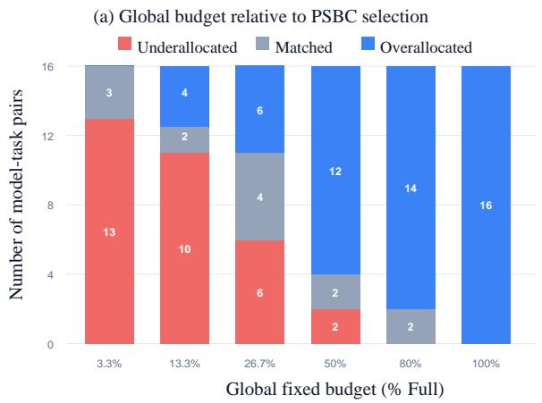

(b) Model-task-specific PSBC allocation  
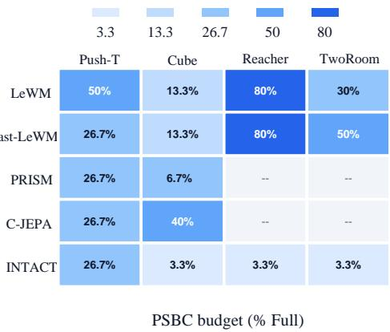  
Figure A: Global fixed budgets versus PSBC-selected budgets. (a) Numbers of model–task pairs for which each global budget is below, equal to, or above the PSBC-selected budget. (b) Selected budget fractions across the 16 evaluated pairs.

Table A: Deployment efficiency on PRISM/Cube. PSBC reduces per-episode planning time relative to Full planning.
<table><tr><td>Quantity</td><td>Value</td></tr><tr><td>Full planning budget</td><td>9,000</td></tr><tr><td>PSBC deployment budget</td><td>600</td></tr><tr><td>Full time per episode</td><td>34.28 s</td></tr><tr><td>PSBC time per episode</td><td>10.93 s</td></tr><tr><td>Time saving per episode</td><td>23.35 s</td></tr></table>

## A.3 PLANNING AND EVALUATION SETTINGS

We define the planning budget as the number of candidate action sequences scored during one planning solve. For CEM-based planners with a population of N candidates and K refinement iterations, the budget is

$$
B = N K .\tag{17}
$$

The corresponding relative budget is $1 0 0 B / B _ { \mathrm { F u l l } }$

In our fixed-population CEM experiments, we use $N = 3 0 0$ candidates per iteration and vary the number of refinement iterations. The feasible CEM budget grid is

$$
B _ { \mathrm { C E M } } = \{ 3 0 0 , 6 0 0 , \ldots , 9 0 0 0 \} ,
$$

corresponding to $K \in \{ 1 , \ldots , 3 0 \}$ . For example, 8 iterations correspond to 2,400 scored sequences, whereas the 30-iteration Full planner scores $9 { , } 0 0 0$ sequences. For PoG-MPPI, candidate budgets follow the native sampling parameterization of the original planner, while the reported budget continues to denote the total number of candidate action sequences scored per solve. Planner-specific parameters other than the evaluated search budget, including the planning horizon, candidate-generation procedure, elite selection, and optimizer update, are inherited from the corresponding native implementation.

PSBC calibration settings. For all model–task pairs, we set the allowed success-rate degradation to $\delta = 0 . 0 2$ , corresponding to a tolerance of two percentage points relative to Full planning. For a fixed model–task pair and candidate budget, paired episode outcomes are modeled as exchangeable categorical draws over rescued, broken, and unchanged outcomes. We use the symmetric Dirichlet $\textstyle { \big ( } { \frac { 1 } { 2 } } , { \frac { 1 } { 2 } } , { \frac { 1 } { 2 } } { \big ) }$ prior and estimate the posterior non-inferiority probability using $1 0 ^ { 5 }$ Monte

Carlo samples. Posterior sampling uses deterministic seeds fixed before calibration so that repeated analysis of the same paired outcomes produces the same decision.

PSBC inspects the posterior after

$$
\mathcal { N } = \{ 1 0 , 2 0 , 4 0 , 6 0 , 8 0 , 1 0 0 \}
$$

paired calibration episodes and uses $\tau _ { \mathrm { a c c } } = \tau _ { \mathrm { r e j } } = 0 . 9 5 .$ . A proposal is certified when its posterior probability of remaining within the tolerance is at least 0.95, rejected when the posterior probability of exceeding the tolerance is at least 0.95, and otherwise retained as uncertain for the next inspection point.

For the fixed-population CEM planners, PSBC considers the feasible budgets in ascending order,

$$
3 0 0 , 6 0 0 , \ldots , 9 0 0 0 .
$$

An uncertain proposal receives additional paired episodes up to the next inspection point. If it remains unresolved after the final inspection point, or is classified as insufficient, PSBC advances to the next larger proposal. For PoG-MPPI, the same lower-to-higher policy is applied to the feasible budgets induced by its native sampling parameterization. The first proposal satisfying the certification criterion is returned as $B ^ { \star }$ . This is the first certified proposal under the predefined policy rather than a claim of global minimality over all feasible planning budgets. If no reduced proposal is certified within the available development episodes, PSBC falls back to $B _ { \mathrm { F u l l } }$

The tolerance δ applies to the posterior population-level degradation under the development distribution. It is not a hard constraint on the empirical success-rate difference observed in every finite held-out sample. Accordingly, finite held-out evaluations can occasionally exhibit a degradation larger than two percentage points due to sampling variation or development-to-held-out variation, without any held-out recalibration.

SCR evaluation settings. We evaluate SCR against the corresponding uncached planner under matched planning budgets, checkpoints, episodes, candidate samples, and optimizer configurations. The SCR cache is constructed once at the beginning of each planning solve, reused across its refinement iterations, and discarded before the next environment step. Cache construction is included in the reported planning latency. Candidate sampling, candidate-action encoding, latent rollout, terminal-cost evaluation, and optimizer updates remain inside the timed planning computation and are not cached.

All reported latency experiments are conducted on a single NVIDIA RTX A5000 GPU per run. We report mean solver wall-clock time per batched planning solve, latency reduction, speedup, and episode-level outcome flips. The timed region covers the complete planner solve and excludes dataset loading, environment rendering, metric aggregation, and video generation. The uncached and SCR-enabled configurations use the same hardware, checkpoint, evaluation episodes, candidate budget, and numerical precision.

For the Fast-LeWM/Push-T budget-scaling experiment, each configuration is evaluated on the same 20 paired episodes. To reduce sensitivity to execution order, we use an order-balanced uncached– SCR–SCR–uncached measurement sequence and aggregate the repeated measurements for each method. The reported timing protocol does not assume that the analytical encoder-call reduction is equal to the measured latency reduction.

Numerical equivalence is evaluated separately at the Full 9,000-sequence budget using matched candidate samples and random-number-generator states. We compare candidate populations, candidate costs, CEM distribution updates, selected actions, solver random-number-generator states, model buffers, and the total number of scored candidate sequences.

## B THEORETICAL ANALYSIS

## B.1 PSBC POSTERIOR CONSTRUCTION AND SEQUENTIAL DECISION

For a candidate budget $B _ { i } { \mathrm { . } }$ each paired episode produces one of three mutually exclusive outcomes: rescued, broken, or unchanged. After n paired episodes, let

$$
R _ { i , n } = \sum _ { e = 1 } ^ { n } \mathbb { I } [ D _ { e } ( B _ { i } ) = - 1 ] , \qquad B _ { i , n } = \sum _ { e = 1 } ^ { n } \mathbb { I } [ D _ { e } ( B _ { i } ) = 1 ] ,\tag{18}
$$

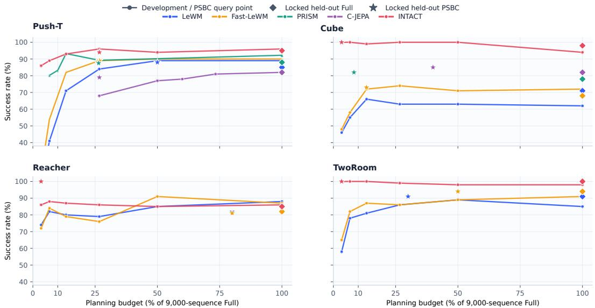  
Figure B: Success–budget profiles across world-model planners and tasks. Lines show development-set success rates across planning budgets, while diamonds and stars denote held-out Full and PSBC results, respectively. Development curves and held-out markers correspond to distinct evaluation splits.

Table B: Posterior evolution after PSBC certification on PRISM. $q _ { 1 0 0 }$ retrospectively evaluates the locked 100-episode set and is not used in the original stopping decision.
<table><tr><td>Task</td><td>Seed</td><td> $B ^ { \star }$ </td><td>Stop n</td><td> $^ { q _ { B , n } }$ </td><td>qB,100</td><td>SR: B/Full</td></tr><tr><td>Push-T</td><td>0</td><td>3,300</td><td>20</td><td>0.956</td><td>0.510</td><td>88/90</td></tr><tr><td>Push-T</td><td>1</td><td>1,800</td><td>20</td><td>0.956</td><td>0.799</td><td>88/87</td></tr><tr><td>Cube</td><td>0</td><td>900</td><td>80</td><td>0.972</td><td>0.971</td><td>88/82</td></tr><tr><td>Cube</td><td>1</td><td>600</td><td>100</td><td>0.981</td><td>0.981</td><td>92/85</td></tr></table>

and

$$
U _ { i , n } = n - R _ { i , n } - B _ { i , n } ,\tag{19}
$$

where $R _ { i , n } , B _ { i , n } ,$ , and $U _ { i , n }$ denote the numbers of rescued, broken, and unchanged episodes, respectively. Here, the subscript $B _ { i , n }$ denotes the broken-episode count and should not be confused with the candidate planning budget $B _ { i }$

Let

$$
\pmb { p } _ { i } = ( p _ { i , R } , p _ { i , B } , p _ { i , U } )\tag{20}
$$

denote the population probabilities of these three outcomes. We place the symmetric Jeffreys-type prior

$$
\begin{array} { r } { \pmb { p } _ { i } \sim \mathrm { D i r i c h l e t } \left( \frac { 1 } { 2 } , \frac { 1 } { 2 } , \frac { 1 } { 2 } \right) . } \end{array}\tag{21}
$$

Given the paired outcomes observed after n episodes, conjugacy yields

$$
\begin{array} { r } { \pmb { p } _ { i } \ | \ \mathcal { D } _ { i , n } \sim \mathrm { D i r i c h l e t } \left( R _ { i , n } + \frac { 1 } { 2 } , B _ { i , n } + \frac { 1 } { 2 } , U _ { i , n } + \frac { 1 } { 2 } \right) . } \end{array}\tag{22}
$$

Under the paired-outcome definition in Eq. 1, the population success-rate degradation of $B _ { i }$ relative to Full planning is

$$
\Delta ( B _ { i } ) = p _ { i , B } - p _ { i , R } .\tag{23}
$$

The posterior probability that $B _ { i }$ satisfies the prescribed degradation tolerance δ is therefore

$$
q _ { i , n } = \operatorname* { P r } ( p _ { i , B } - p _ { i , R } \leq \delta \mid \mathcal { D } _ { i , n } ) .\tag{24}
$$

We estimate $q _ { i , n }$ by drawing samples from Eq. 22 and computing the fraction that satisfies Eq. 24.

Table C: Budget-selection criteria on PRISM/Cube. All candidates use the same 100 paired development episodes with a 2-point tolerance; fixed-n certification requires $q _ { B , 1 0 0 } \geq 0 . 9 5$
<table><tr><td>Budget</td><td>% Full</td><td>SR</td><td>Full SR</td><td>ΔSR</td><td>Rescued</td><td>Broken</td><td>qB,100</td><td>Empirical Accept</td><td>Fixed-n Cert.</td></tr><tr><td>300</td><td>3.3</td><td>83</td><td>85</td><td>-2</td><td>10</td><td>12</td><td>0.503</td><td>√</td><td>X</td></tr><tr><td>600</td><td>6.7</td><td>92</td><td>85</td><td>+7</td><td>13</td><td>6</td><td>0.981</td><td>√</td><td>√</td></tr><tr><td>1,200</td><td>13.3</td><td>89</td><td>85</td><td>+4</td><td>12</td><td>8</td><td>0.911</td><td>√</td><td>x</td></tr><tr><td>2,400</td><td>26.7</td><td>91</td><td>85</td><td>+6</td><td>10</td><td>4</td><td>0.984</td><td>√</td><td>√</td></tr></table>

Let $\tau _ { \mathrm { a c c } }$ and $\tau _ { \mathrm { r e j } }$ denote the acceptance and rejection thresholds. PSBC applies the sequential decision rule

$$
\begin{array} { r } { \mathrm { D e c i s i o n } ( B _ { i } , n ) = \left\{ \begin{array} { l l } { \mathrm { S U F F I C I E N T } , } & { q _ { i , n } \geq \tau _ { \mathrm { a c c } } , } \\ { \mathrm { I N S U F F I C I E N T } , } & { 1 - q _ { i , n } \geq \tau _ { \mathrm { r e j } } , } \\ { \mathrm { U N C E R T A I N } , } & { \mathrm { o t h e r w i s e } . } \end{array} \right. } \end{array}\tag{25}
$$

In our experiments, $\tau _ { \mathrm { a c c } } = \tau _ { \mathrm { r e j } } = 0 . 9 5$ . An uncertain candidate receives additional paired episodes at the next inspection time, whereas an insufficient candidate is removed from further consideration. The first sufficient candidate under the predefined budget-proposal policy is returned as $B ^ { \star }$

Interpretation. If PSBC certifies $B ^ { \star } = B _ { i }$ at inspection time n, then

$$
\operatorname* { P r } ( \Delta ( B ^ { \star } ) \leq \delta \mid \mathcal { D } _ { i , n } ) \geq \tau _ { \mathrm { a c c } } .\tag{26}
$$

This is a posterior certification statement under the specified Dirichlet model. It should not be interpreted as a simultaneous frequentist coverage guarantee over all candidate budgets and inspection times. Likewise, it does not imply identical success rates on every finite held-out sample or global minimality over the complete feasible budget space.

The sequential trace in Fig. D visualizes $q _ { i , n }$ as paired outcomes accumulate. Because each posterior update incorporates additional stochastic closed-loop outcomes, $q _ { i , n }$ need not change monotonically with n.

## B.2 EXACT PLANNING EQUIVALENCE OF SCR

Theorem 1 (Exact planning equivalence of SCR). Consider a planning solve with K refinement iterations. Assume that:

1. the observation history h and goal g remain fixed within the solve;

2. $E _ { h }$ and $E _ { g }$ are deterministic in evaluation mode;

3. the original and SCR planners begin from identical optimizer and random-numbergenerator states;

4. candidate generation, candidate-dependent computation, cost evaluation, and optimizer updates are unchanged and deterministic given their inputs; and

5. candidate ranking and tie-breaking are deterministic.

Then, in exact arithmetic, the original and SCR planners produce identical candidate populations, candidate costs, optimizer states, and selected actions at every refinement iteration.

Proof. SCR computes

$$
z _ { h } = E _ { h } ( h ) , \qquad z _ { g } = E _ { g } ( g )\tag{27}
$$

before refinement. Because h and g remain fixed and their encoders are deterministic, the cached representations are identical to those recomputed by the original planner at every iteration.

We prove equivalence by induction over k. $\mathbf { A } \mathbf { t } k = 1$ , the two planners begin from identical optimizer and random-number-generator states and therefore generate the same candidate population $\boldsymbol { \mathcal { A } } ^ { ( 1 ) }$

(a) Closed-loop task success  
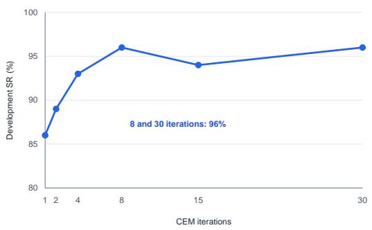  
(b) Difference from 30-iteration action

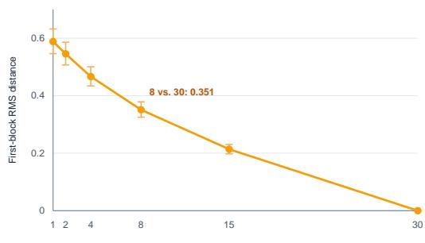  
CEM iterations  
Figure C: Task success and action refinement on INTACT Push-T. (a) Development success rate across 100 episodes at different CEM iterations. (b) Mean RMS distance between the first action block at each iteration and its 30-iteration counterpart, with paired bootstrap 95% confidence intervals. Eight and 30 iterations achieve the same 96% success rate despite selecting different actions.

Table D: INTACT deployment ablation on the frozen Push-T development set. We isolate the effects of actor-guided initialization, PSBC, and SCR.
<table><tr><td>Deployment</td><td>Actor Prior</td><td>PSBC</td><td>SCR</td><td>Seq./Solve</td><td>Budget (% Full)</td><td>Resulting SR (%)</td><td>∆SR vs Direct</td></tr><tr><td>Direct</td><td>√</td><td>x</td><td>X</td><td>0</td><td>0.0</td><td>83</td><td>0</td></tr><tr><td>Guarded-A</td><td>√</td><td>x</td><td>x</td><td>384</td><td>4.3</td><td>88</td><td>+5</td></tr><tr><td>Pure CEM</td><td>x</td><td>x</td><td>x</td><td>9,000</td><td>100.0</td><td>92</td><td>+9</td></tr><tr><td>Full Actor-CEM</td><td>√</td><td>x</td><td>x</td><td>9,000</td><td>100.0</td><td>96</td><td>+13</td></tr><tr><td>Actor-CEM + PSBC</td><td>√</td><td>√</td><td>x</td><td>2,400</td><td>26.7</td><td>96</td><td>+13</td></tr><tr><td>SufficientPlan</td><td>√</td><td>√</td><td>√</td><td>2,400</td><td>26.7</td><td>96</td><td>+13</td></tr></table>

Using identical static representations and unchanged candidate-dependent computation gives

$$
J _ { \mathrm { S C R } } ^ { ( 1 ) } = \mathcal { C } \Big ( z _ { h } , z _ { g } , E _ { a } ( A ^ { ( 1 ) } ) \Big )\tag{28}
$$

$$
= \mathcal { C } \Big ( E _ { h } ( h ) , E _ { g } ( g ) , E _ { a } ( \boldsymbol { \mathcal { A } } ^ { ( 1 ) } ) \Big )\tag{29}
$$

$$
= J _ { \mathrm { o r i g } } ^ { ( 1 ) } .\tag{30}
$$

Applying the same optimizer update to identical candidate costs produces identical optimizer states for iteration 2.

Assume that both planners enter iteration k with identical optimizer and random-number-generator states. They generate the same $\mathcal { A } ^ { ( k ) }$ , and the same argument gives

$$
J _ { \mathrm { S C R } } ^ { ( k ) } = J _ { \mathrm { o r i g } } ^ { ( k ) } .\tag{31}
$$

The unchanged optimizer update consequently preserves the optimizer and random-numbergenerator states for iteration k + 1. By induction, all candidate populations, costs, and optimizer states are identical for $k = 1 , \ldots , K$ . Deterministic ranking and tie-breaking therefore yield

$$
a _ { \mathrm { S C R } } ^ { \star } = a _ { \mathrm { o r i g } } ^ { \star } .\tag{32}
$$

Theorem 1 is stated in exact arithmetic. In finite-precision implementations, exact equality additionally requires matched operation ordering, numerical precision, and deterministic kernels. The full-budget numerical contract in Tab. G verifies the implemented planners under matched candidate samples and random states.

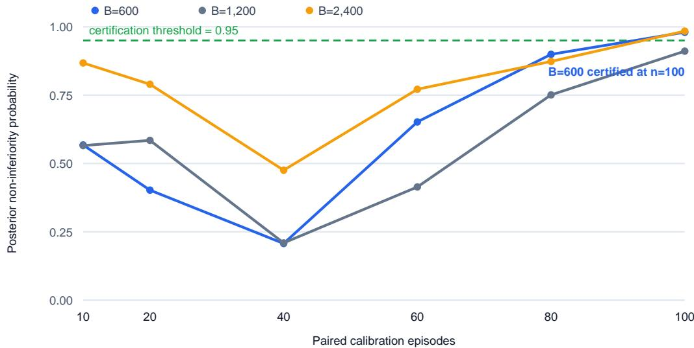  
Figure D: Sequential certification trace of PSBC on PRISM/Cube. Curves show the posterior probability that each candidate budget is non-inferior to Full planning within the prescribed tolerance as paired calibration episodes accumulate. At 100 episodes, the 600-sequence proposal crosses the 0.95 certification threshold and is returned as the certified operating budget.

## B.3 COMPUTATION AND LATENCY ANALYSIS OF SCR

Let $T _ { s }$ denote the time required to encode the solve-static observation history and goal once, $T _ { d }$ the candidate-dependent computation per refinement iteration, and $T _ { o }$ the remaining solve-level overhead. The original and SCR execution times are

$$
T _ { \mathrm { o r i g } } ( K ) = K ( T _ { s } + T _ { d } ) + T _ { o } ,\tag{33}
$$

$$
T _ { \mathrm { S C R } } ( K ) = T _ { s } + K T _ { d } + T _ { o } .\tag{34}
$$

The resulting speedup is

$$
S ( K ) = \frac { T _ { \mathrm { o r i g } } ( K ) } { T _ { \mathrm { S C R } } ( K ) } = \frac { K ( T _ { s } + T _ { d } ) + T _ { o } } { T _ { s } + K T _ { d } + T _ { o } } ,\tag{35}
$$

and the latency reduction is

$$
R _ { T } ( K ) = { \frac { T _ { \mathrm { o r i g } } ( K ) - T _ { \mathrm { S C R } } ( K ) } { T _ { \mathrm { o r i g } } ( K ) } } = { \frac { ( K - 1 ) T _ { s } } { K ( T _ { s } + T _ { d } ) + T _ { o } } } .\tag{36}
$$

These expressions distinguish the reduction in solve-static encoder calls from the reduction in total planning latency. Although SCR removes a fraction $1 - 1 / K$ of solve-static encoder calls, candidatedependent computation remains unchanged. Consequently, its wall-clock benefit depends on the fraction of planning time attributable to static encoding.

For $T _ { s } > 0 , T _ { d } > 0$ , and $T _ { o } \geq 0$ , the speedup in Eq. 35 increases with $K .$ , since

$$
\frac { \partial S ( K ) } { \partial K } = \frac { T _ { s } ( T _ { s } + T _ { d } + T _ { o } ) } { \left( K T _ { d } + T _ { s } + T _ { o } \right) ^ { 2 } } > 0 .\tag{37}
$$

Moreover,

$$
\operatorname* { l i m } _ { K  \infty } S ( K ) = 1 + \frac { T _ { s } } { T _ { d } } .\tag{38}
$$

Thus, SCR provides greater benefits as refinement depth increases, while its asymptotic speedup remains bounded by the candidate-dependent computation that cannot be reused.

## C ADDITIONAL EXPERIMENTS

This section provides additional analyses of PSBC and SCR. We first examine the variation in planning requirements across model–task pairs, the stability of PSBC across evaluation seeds, and its deployment efficiency. We then compare alternative INTACT deployment strategies and analyze the scaling behavior and numerical equivalence of SCR.

## C.1 ADDITIONAL ANALYSIS OF PSBC

Model–task variation in planning budgets. Fig. A analyzes the mismatch between a universal planning budget and the model–task-specific budgets selected by PSBC. For each global budget, the figure counts the 16 evaluated pairs for which it is lower than, equal to, or higher than the corresponding PSBC-selected budget. No global setting provides a uniformly efficient allocation. For example, a 26.7% budget falls below the selected budget for 6 pairs, whereas increasing it to 80.0% avoids such underallocation but exceeds the selected budget for 14 of the 16 pairs. This exposes a fundamental trade-off of global budgeting: an aggressive setting may provide insufficient refinement for sensitive pairs, while a conservative setting spends unnecessary search on pairs whose performance saturates earlier. Together with the success results in Tab. 1, this analysis supports model–task-specific calibration as a more effective allocation strategy than imposing the same search budget across heterogeneous planners and tasks.

Fig. B further reports the available development-set success rates across different planning budgets. The success–budget profiles vary substantially across backbones and tasks: some configurations reach strong performance with a small fraction of Full planning, while others remain sensitive to additional refinement. The diamonds and stars show the corresponding locked held-out results of Full and PSBC-calibrated planning. Development curves and held-out markers are shown together only to visualize calibration behavior and transfer; they represent distinct evaluation splits.

Action refinement at equal aggregate success. Fig. C compares closed-loop success and first-block action differences using the same INTACT Push-T checkpoint and frozen development episodes. Eight and 30 CEM iterations both achieve 96% success on the frozen 100-episode development set. However, their first action blocks differ in all 100 initial planning solves, with a mean perdimension RMS distance of 0.351 in native action units (paired bootstrap 95% CI: [0.325, 0.379]). At the episode level, eight iterations rescue two episodes and break two relative to 30 iterations. Thus, equal aggregate success does not require identical actions or identical episode outcomes. This comparison does not establish whether the optimizer itself has converged.

Sequential certification behavior. Fig. D presents the evolution of the posterior non-inferiority probability as paired calibration episodes accumulate in a PRISM/Cube calibration run. At early evaluation points, the available evidence is insufficient to certify the candidate budgets. As additional paired episodes are observed, the estimated probabilities are updated, and the 600-sequence candidate crosses the 0.95 certification threshold at 100 episodes. This example illustrates how PSBC retains uncertain candidates for further evaluation and makes a decision only after sufficient paired evidence has been collected. Because posterior probabilities are updated from stochastic closed-loop outcomes, the trajectories need not vary monotonically with the number of episodes.

Multi-seed evaluation. Fig. E compares Full and PSBC-calibrated planning over evaluation seeds {0, 1, 42} on Push-T and Cube. PSBC generally retains success rates comparable to Full planning while using substantially smaller deployment budgets. The variation across seeds also remains small relative to the differences among backbone–task pairs, supporting the stability of the reported performance–budget trade-off.

Deployment efficiency. Tab. A compares the planning time of Full and PSBC-calibrated deployment on PRISM/Cube. PSBC reduces the average planning time from 34.28 to 10.93 seconds per episode, corresponding to a saving of 23.35 seconds per episode. This result demonstrates that the reduced search budget translates directly into lower deployment-time planning cost.

Additional qualitative results. Fig. F presents paired qualitative examples on Reacher, TwoRoom, and Push-T. For each task, LeWM+PSBC and Full LeWM are evaluated from the same initial state toward the same goal, with the corresponding ground-truth trajectory shown as reference. In all three examples, LeWM+PSBC succeeds whereas Full LeWM fails despite using a larger planning budget.

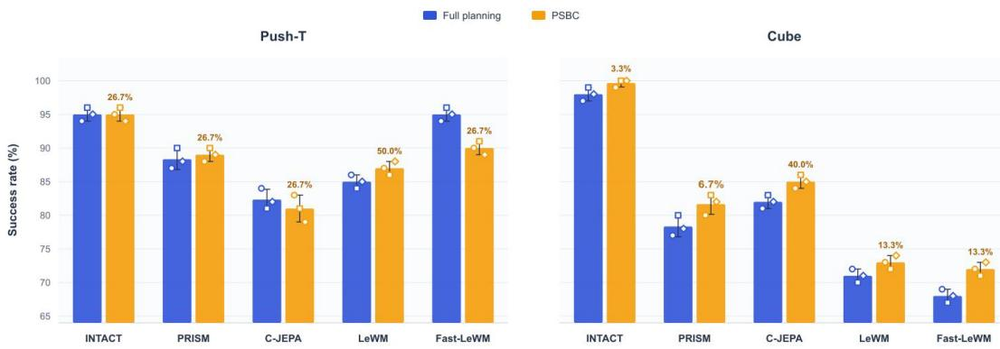  
Figure E: Multi-seed success rates on Push-T and Cube. Bars and error bars report the mean and standard deviation over evaluation seeds {0, 1, 42}, and markers show the individual results. Percentages above the PSBC bars denote the corresponding deployment budgets relative to Full planning.

These cases provide qualitative evidence that increasing search does not necessarily improve every closed-loop outcome and that a lower calibrated budget can still produce a successful trajectory. We emphasize that these examples illustrate individual paired episodes; the aggregate performance comparison is reported in Tab. 1.

## C.2 INTACT DEPLOYMENT ABLATION

Tab. D compares Direct, Guarded-A, Pure CEM, Full Actor-CEM, Actor-CEM+PSBC, and SufficientPlan on the frozen Push-T development set. Here, Direct executes the action predicted by the INTACT actor without iterative search. Guarded-A denotes the original INTACT guarded deployment strategy, which uses the actor prediction together with a 384-sequence Actor-CEM refinement budget. Pure CEM performs Full-budget search without actor-guided initialization, whereas Full Actor-CEM initializes the same Full-budget search using the INTACT actor. Actor-CEM+PSBC retains actor-guided initialization but uses the budget selected by PSBC, and SufficientPlan further enables SCR within that calibrated search.

Direct prediction provides the lowest search cost but achieves the lowest success rate. Guarded-A improves performance using a small refinement budget, while the comparison between Pure CEM and Full Actor-CEM isolates the benefit of actor-guided initialization. PSBC retains this actorguided benefit at a reduced search budget, and SCR further removes repeated solve-static computation without changing the selected budget or success outcome.

## C.3 ADDITIONAL ANALYSIS OF SCR

Scaling with planning depth. Tab. F evaluates SCR on Fast-LeWM/Push-T over budgets ranging from 300 to 9,000 scored sequences. With one CEM iteration, no repeated solve-static encoding can be eliminated across iterations. Across repeated measurements, the uncached and SCR-enabled planners take 0.452 and 0.457 seconds per solve, respectively, corresponding to a 0.99× speedup with a paired bootstrap 95% confidence interval of [0.876, 1.125]. Thus, the one-iteration setting shows no reliable timing difference, as expected when no cross-iteration reuse is available.

As the number of iterations increases, a larger fraction of repeated observation and goal encoding can be reused. At 30 iterations, SCR removes 96.7% of solve-static encoder calls and reduces measured planning latency from 11.4736 to 4.6796 seconds, corresponding to a 2.45× speedup. This scaling behavior supports the mechanism described in Fig. 3: the benefit of SCR increases when repeated static encoding constitutes a larger fraction of the planning workload.

Full-budget numerical equivalence. Aggregate success rates alone do not establish that SCR preserves the internal behavior of the planner. We therefore perform the numerical equivalence contract in Tab. G at the maximum 9,000-sequence budget using common random numbers. For both IN-TACT and Fast-LeWM, the uncached and SCR-enabled planners produce identical candidate populations, candidate costs, CEM distribution updates, final selected actions, and solver random-number states. The model buffers also remain unchanged, and both implementations score the same number of candidate sequences. These results verify that SCR changes the execution of solve-static encoding but not the candidate-dependent planning computation.

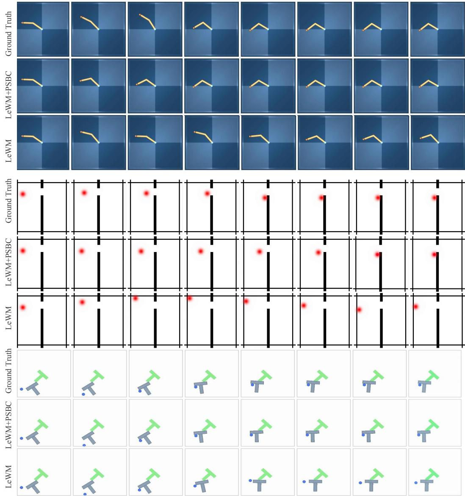  
Figure F: Paired qualitative results on Reacher, TwoRoom, and Push-T. From identical initial states and goals, LeWM+PSBC succeeds while Full LeWM fails; rows correspond to the three tasks and columns progress from left to right.

## D ADDITIONAL ANALYSIS OF PSBC

We provide a mechanism-level analysis of PSBC on PRISM/Cube with evaluation seed 1. For this analysis, we use locked outcomes for Full planning and four evaluated budgets, {300, 600, 1200, 2400}, on the same frozen set of 100 paired development episodes. These four budgets are used only for the diagnostic comparisons below and are not presented as the complete PRISM proposal sequence. Full planning uses 9,000 scored action sequences per planning solve. The analyses in this section concern calibration behavior and are separate from the episode-disjoint held-out results reported in the main paper.

Table E: Sensitivity of the 600-sequence proposal on PRISM/Cube. Entries report the pairedepisode inspection at which the proposal is first certified. “–” indicates that the proposal is not certified within 100 paired episodes.
<table><tr><td rowspan="2">δ (pp)</td><td colspan="3"> $\tau$ </td></tr><tr><td>0.90</td><td>0.95</td><td>0.99</td></tr><tr><td>0</td><td>100</td><td>一</td><td>一</td></tr><tr><td>2</td><td>100</td><td>100</td><td></td></tr><tr><td>5</td><td>80</td><td>80</td><td>100</td></tr></table>

## D.1 COMPARISON WITH SIMPLER SELECTION CRITERIA

We first compare PSBC with two simpler budget-selection criteria. An empirical rule accepts a candidate budget when its observed success-rate degradation relative to Full planning does not exceed the tolerance δ. A fixed-sample posterior rule evaluates a candidate using all 100 paired episodes and accepts it when

$$
q _ { B , 1 0 0 } = \mathrm { P r } ( \Delta ( B ) \le \delta \mid \mathcal { D } _ { 1 0 0 } ) \ge \tau ,\tag{39}
$$

where $\mathcal { D } _ { 1 0 0 }$ denotes the complete paired calibration set. PSBC uses the same paired posterior criterion but inspects the evidence sequentially according to its predefined stopping rule.

Tab. C reports the results under the default tolerance $\delta = 2$ percentage points and posterior threshold $\tau = 0 . 9 5$ . The 300-sequence candidate achieves 83% success, compared with 85% for Full planning. Its empirical difference of −2 percentage points lies exactly at the prescribed tolerance boundary and would therefore be accepted by the empirical rule. However, its paired outcomes contain 10 rescued and 12 broken episodes, yielding a posterior non-inferiority probability of only 0.503. Thus, satisfying the empirical tolerance alone does not provide sufficient posterior evidence for certification.

The 1,200-sequence candidate provides a less extreme example. Although its empirical success rate is 4 percentage points higher than that of Full planning, its posterior non-inferiority probability of 0.911 does not reach the prescribed 0.95 threshold. By contrast, the 600- and 2,400-sequence candidates obtain posterior probabilities of 0.981 and 0.984, respectively. The non-monotonic posterior values across budgets are consistent with our formulation, which does not assume monotonic closed-loop performance as the planning budget increases.

## D.2 SEQUENTIAL INSPECTION EFFICIENCY

We next analyze the evaluation count induced by the predefined sequential stopping rule. Applying this rule retrospectively to the locked paired outcomes rejects the 300-sequence proposal after 20 paired episodes and subsequently certifies the 600-sequence proposal after 100 paired episodes:

$$
3 0 0 @ 2 0 \ \longrightarrow \ \mathrm { I N S U F I C I E N T } , \qquad 6 0 0 @ 1 0 0 \ \longrightarrow \ { \mathrm { S U F F I C I E N T } } .\tag{40}
$$

PSBC stops after certifying the 600-sequence proposal; therefore, larger budgets are not visited under this replayed trajectory.

We count one candidate-budget–episode evaluation whenever a reduced-budget planner is evaluated on one episode. The 100-episode Full-reference vector is computed once and shared across all paired comparisons, so it is excluded from the candidate-side counts reported below. Under the sequential policy, the candidate-side evaluation count is

$$
C _ { \mathrm { P S B C } } = 2 0 + 1 0 0 = 1 2 0 .\tag{41}
$$

An ordered fixed-n posterior baseline that evaluates the same two visited proposals on all 100 episodes requires

$$
C _ { \mathrm { f i x e d - n } } = 2 \times 1 0 0 = 2 0 0 .\tag{42}
$$

The resulting candidate-side reduction is therefore

$$
1 - \frac { C _ { \mathrm { P S B C } } } { C _ { \mathrm { f i x e d - n } } } = 1 - \frac { 1 2 0 } { 2 0 0 } = 4 0 . 0 \% .\tag{43}
$$

Table F: SCR scaling on Fast-LeWM/Push-T. SCR provides no reliable speedup at one iteration, while its latency benefit increases with search depth.
<table><tr><td>Budget</td><td>Iter.</td><td>Uncached (s)</td><td>SCR (s)</td><td>Static Enc. Reduction</td><td>Latency Reduction</td><td>Speedup</td></tr><tr><td>300</td><td>1</td><td>0.4521</td><td>0.4571</td><td>0.0%</td><td>-1.1%</td><td>0.99×</td></tr><tr><td>600</td><td>2</td><td>1.2422</td><td>0.8000</td><td>50.0%</td><td>35.6%</td><td>1.55×</td></tr><tr><td>1,200</td><td>4</td><td>2.0664</td><td>1.0660</td><td>75.0%</td><td>48.4%</td><td>1.94×</td></tr><tr><td>2,400</td><td>8</td><td>3.4617</td><td>1.7080</td><td>87.5%</td><td>50.7%</td><td>2.03×</td></tr><tr><td>4,500</td><td>15</td><td>6.2457</td><td>2.6330</td><td>93.3%</td><td>57.8%</td><td>2.37×</td></tr><tr><td>9,000</td><td>30</td><td>11.4736</td><td>4.6796</td><td>96.7%</td><td>59.2%</td><td>2.45×</td></tr></table>

This comparison shows that sequential rejection avoids evaluating the 300-sequence proposal on the remaining 80 episodes before proceeding to the certified 600-sequence budget. The reported saving is an evaluation-count reduction implied by applying the predefined stopping policy to locked paired outcomes, rather than a separate wall-clock measurement. It also concerns offline candidate-side calibration and is distinct from the number of action sequences scored during held-out deployment.

## D.3 RETROSPECTIVE ANALYSIS OF EARLY CERTIFICATES

Retrospective evidence after an early decision. Tab. B applies the stated ascending proposal and sequential inspection rules to four locked PRISM calibration traces. Exact integration of the paired Dirichlet posterior confirms the first certified proposal and stopping look in each case. The two Push-T proposals are certified at $n = 2 0$ , but their posterior probabilities fall below the certification threshold when the unused outcomes from the same 100-episode set are inspected retrospectively. The two Cube proposals remain above the threshold. This analysis does not change the information available to the original stopping rule; it shows that a posterior certificate at one inspection time need not remain above the same threshold after additional observations.

## D.4 SENSITIVITY OF THE CERTIFIED PROPOSAL

We finally examine how the evidence required to certify the 600-sequence proposal changes with the non-inferiority tolerance δ and posterior threshold τ. We consider

$$
\delta \in \{ 0 , 2 , 5 \} \mathrm { p e r c e n t a g e p o i n t s } ,
$$

$$
\tau \in \{ 0 . 9 0 , 0 . 9 5 , 0 . 9 9 \} ,\tag{44}
$$

using the predefined inspection times {10, 20, 40, 60, 80, 100}.

Tab. E reports the first inspection time at which the 600-sequence proposal reaches the corresponding certification threshold. Under the default setting $( \delta = 2 , \bar { \tau } = \bar { 0 . 9 5 ) }$ , the proposal is certified after 100 paired episodes. With the same tolerance and a lower threshold of 0.90, certification also occurs at 100 episodes, whereas the more conservative threshold of 0.99 is not reached within the available evidence. A wider 5-point tolerance permits certification after 80 episodes for $\tau \in \{ 0 . 9 0 , 0 . 9 5 \}$ and after 100 episodes for $\tau = 0 . 9 9$ . Under the strict zero-point tolerance, the proposal is certified only for $\tau = 0 . 9 0$

These results show that a wider tolerance can reduce the evidence required for certification, while a more conservative posterior threshold can delay or prevent certification within the available calibration horizon. For settings in which the 600-sequence proposal is not certified, we do not infer the final deployment budget from this analysis, because doing so would require evaluating the remaining budgets in the complete PRISM proposal sequence.

Scope. This section is a mechanism-level case study rather than a cross-task claim about calibration savings. It shows that paired posterior certification can reject a proposal that would be accepted using only an empirical tolerance, that sequential inspection can reduce candidate-side calibration evaluations, and that the required evidence varies predictably with δ and τ. Cross-backbone and cross-task held-out deployment results are reported separately in Tab. 1.

Table G: Full-budget numerical equivalence contract for SCR. Uncached and SCR-enabled planners are evaluated with common random numbers at the maximum 9,000-sequence budget. The contract verifies the internal planning trajectory rather than only aggregate task success.
<table><tr><td>Contract</td><td>INTACT</td><td>Fast-LeWM</td></tr><tr><td>Candidate population/hash equal</td><td></td><td></td></tr><tr><td>Candidate cost equal</td><td></td><td></td></tr><tr><td>CEM mean/std updates equal</td><td></td><td></td></tr><tr><td>Final selected action equal</td><td></td><td></td></tr><tr><td>Solver RNG state equal</td><td></td><td></td></tr><tr><td>Model buffers unchanged</td><td></td><td></td></tr><tr><td>Scored sequences equal</td><td>9,000/9,000</td><td>9,000/9,000</td></tr><tr><td>Full-9000 contract</td><td>PASS</td><td>PASS</td></tr></table>

## E LIMITATIONS

SufficientPlan has two main limitations. First, PSBC calibrates the planning budget on a frozen development distribution. Although the selected budget is evaluated without further tuning on episode-disjoint held-out data, substantial changes in the model, task dynamics, or goal distribution may require recalibration. Second, SCR applies only to computations that remain invariant within a planning solve, and its practical speedup depends on the fraction of runtime attributable to such solve-static computation. When candidate-dependent rollout and cost evaluation dominate the planning workload, the achievable latency reduction may be limited.