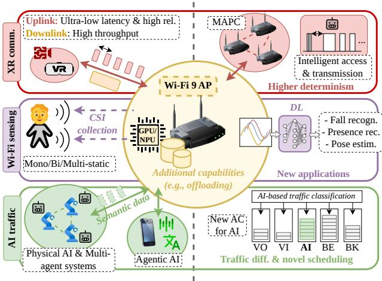
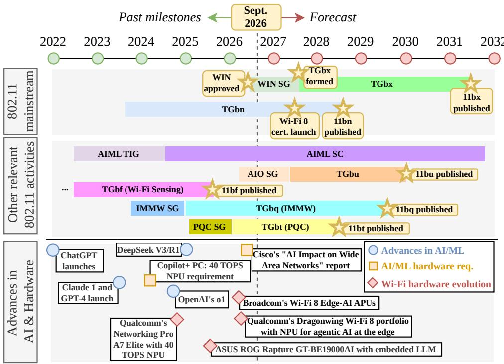
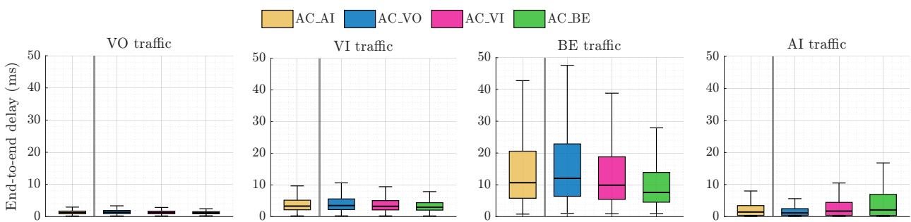

# IEEE 802.11bx – WLAN Intelligent Networking (WIN):

Toward an AI-Ready Wi-Fi 9

Francesc Wilhelmi, Katarzyna Kosek-Szott, Szymon Szott, and Boris Bellalta

Abstract—Wi-Fi 9 is expected to go beyond mere communication and provide new services such as sensing or computation. At this juncture, Artificial Intelligence (AI) is taking a leading role in the definition of the 802.11bx amendment, named WLAN Intelligent Networking (WIN). In this tutorial, we survey the recent progress made toward Wi-Fi 9 within IEEE 802.11 standardization, tracing the drivers and technological advances that motivate an AI-ready Wi-Fi 9. We then examine AI’s role along three complementary dimensions, i.e., AI as a protocol (AI is applied to Wi-Fi’s PHY/MAC operation), AI as a platform (Wi-Fi infrastructure is repurposed to provide AI computation), and AI as traffic (AI flows call for new traffic-handling policies), and discuss candidate features and open challenges along each. As a concrete illustration of the AI as traffic paradigm, we present a case study on AI traffic differentiation, where we explore a potential extension of the current Enhanced Distributed Channel Access (EDCA) to support new AI traffic flows.

Index Terms—WLAN Intelligent Networking, IEEE 802.11bx, Wi-Fi 9, Artificial Intelligence, Machine Learning

## I. INTRODUCTION

W LAN Intelligent Networking (WIN) has been chosen to name the future standard for Wi-Fi 9 (IEEE 802.11bx), a true declaration of intent to finally consider Artificial Intelligence (AI) and Machine Learning (ML) in Wi-Fi standardization. This is not a sudden pivot since the IEEE 802.11 AI/ML Topic Interest Group (TIG), later elevated to a Standing Committee (SC), has spent several years studying the necessity and feasibility of making WLANs intelligent [1]. Simultaneously, advances in AI, with Large Language Models (LLMs) at the forefront, are fueling new use cases and shifting how communications systems are used [2], urging technologies like Wi-Fi to evolve accordingly. Furthermore, future applications like immersive eXtended Reality (XR) and integrated sensing, as well as new environments such as Industry 4.0 come with ever-increasing network requirements that have placed AI and ML at the center of the discussion.

Every generation of Wi-Fi has been motivated by a core idea that has driven the set of functionalities standardized by each one. For example, IEEE 802.11ax (Wi-Fi 6) targeted High Efficiency (HE) by introducing Orthogonal Frequency-Division Multiple Access (OFDMA) with trigger-based uplink multiuser transmissions, Target Wake Time (TWT), and Spatial Reuse (SR). IEEE 802.11be (Wi-Fi 7) focused on Extremely

High Throughput (EHT) and introduced Multi-Link Operation (MLO) and 4K Quadrature Amplitude Modulation (QAM). Currently, IEEE 802.11bn (Wi-Fi 8) is focusing on Ultra-High Reliability (UHR) [3], with Multi-Access Point Coordination (MAPC) being the main innovation to achieve this goal [4]. Meanwhile, it is too early to provide specific performance targets for IEEE 802.11bx because its Project Authorization Request (PAR) is in preparation and expected by 2027. However, the overall direction is already explicit in early Wireless Next Generation (WNG) SC contributions and in the WIN name itself. In this sense, AI is established as Wi-Fi 9’s core pillar rather than one feature among several, echoing the role reliability played for its predecessor.

In this tutorial, we discuss the potential directions to be adopted in 802.11bx standardization regarding AI (either as an enabler or as a driver), which revolve around three plausible roles: i) improving Wi-Fi operation (AI as a protocol), ii) leveraging Wi-Fi infrastructure to run AI (AI as a platform), and iii) offering specialized network services and Quality of Service (QoS) management tailored to AI workloads (AI as traffic).

In the remainder of this tutorial, we first discuss the main drivers that are pushing next-generation Wi-Fi to be AI-aware. Next, we describe the journey toward Wi-Fi 9 and review potential new features in standardization. Additionally, we present a case study for AI traffic differentiation in Wi-Fi, supported by simulation results.

## II. DRIVERS FOR AN AI-READY WI-FI 9

In this section, we review the main drivers shaping the technology behind 802.11bx, categorized as application-, computation-, and traffic-centric drivers (Fig. 1).

## A. Application-Centric Drivers

New applications have historically driven 802.11 innovation, since their requirements define what each generation must deliver. Next, we describe two prominent use cases for Wi-Fi that have been widely discussed in recent years, namely immersive communications and sensing.

a) Immersive Communications: XR applications combine head-mounted displays and glasses, motion-tracking cameras, and haptic devices with stringent throughput, latency, and reliability constraints that, jointly, remain hard to guarantee by any existing Wi-Fi generation. In practice, split-rendered XR streaming typically requires bitrates in the tens of Mb/s (e.g., ∼50 Mb/s) and low, stable latency (e.g., <10-15 ms) [5]. These extreme requirements are expected to increase in the future, with AI-generated content for XR (where AI models create highly customized immersive experiences in real time) and continuous video models (where AI analyzes real-time video streams to enhance the experience), which reinforces the need for novel features in Wi-Fi (e.g., AI-driven channel access) and efficient offloading strategies.

  
Fig. 1. Drivers for an AI-ready Wi-Fi 9: (top) XR communications embody new, challenging networking paradigms, which require enhanced PHY/MAC schemes (e.g., MAPC, intelligent protocols); (middle) Wi-Fi sensing exemplifies the expanded capabilities of future Wi-Fi devices and potential interplay with AI and computation offloading; and (bottom) AI traffic calls for the redefinition of Wi-Fi traffic treatment policies, such as traffic differentiation.

b) Sensing: Wi-Fi Access Points (APs) will provide capabilities beyond communications, and a prominent domain is Wi-Fi sensing [6]. By exploiting channel measurements in the form of Channel State Information (CSI), Wi-Fi devices can detect presence, recognize gestures and activities, identify people, track motion, and monitor environments without requiring dedicated sensors or cameras. This capability unlocks a broad set of use cases in domains such as smart homes (e.g., fall monitoring for elderly care, pose estimation), enterprise and industry (e.g., intrusion detection), and healthcare (e.g., vital-sign and wellness monitoring). Many of these use cases are empowered by AI, which excels at recognizing relevant patterns from complex CSI signals. For instance, deep learning models achieve 92–95% accuracy when detecting human gestures from CSI [7]. Such results position sensing as an early candidate for running AI inference on APs, since inference can potentially run alongside communication workloads on modest, power-constrained silicon.

## B. Computation-Centric Drivers

A second class of drivers stems from where and how the computation associated with applications is actually performed. As AI workloads increasingly demand resources beyond what individual devices can provide locally, the network itself becomes a candidate site for computation. Accordingly, we next describe three relevant computation-centric drivers, namely AI computation offloading, physical AI, and multiagent systems.

a) AI Computation Offloading: According to Akamai, 50% of AI deployments in production struggle to maintain low latency at scale due to cloud infrastructure delays [8]. In response, new solutions increasingly rely on offloading inference and reasoning to the edge, rather than relying solely on distant cloud processing. However, this shift is only realizable if the edge devices have sufficient compute and memory. Although Wi-Fi APs have traditionally been designed for communication tasks, their proximity to users places them in a prime position to host computational workloads. This motivates the emergence of more computationally capable APs and the study of AI offloading as an 802.11 standardized function (which we discuss later).

b) Physical AI and Multi-Agent Systems: New AI systems involving the physical world, such as autonomous robots and digital twins, depend on highly reliable, low-latency links, especially for cooperative tasks (e.g., requiring submillisecond round-trip delay between controllers and actuators [9]). When deployed as multi-agent systems, these physical entities rely on task decomposition to execute interdependent action sequences. Coordinating these parallel or sequential actions requires joint scheduling decisions to maximize the task success rate and minimize the overall completion time. This requirement pushes Wi-Fi networks to reason beyond pure data delivery, jointly accounting for task criticality, agent state, station capabilities, and available wireless resources. Consequently, future Wi-Fi APs will require schedulers that are aware not only of the traffic class but also of the structure of the tasks running on top.

## C. Traffic-Centric Drivers

Finally, a third class of drivers refers to the nature of traffic from new applications. As AI-generated and AI-consumed data account for a growing share of network flows, their distinct statistical and semantic properties call into question assumptions that have long underpinned Wi-Fi’s traffic handling. Therefore, we next describe AI traffic and semantic communications.

a) AI Traffic: New AI applications are redefining how the Internet is used. First, agentic systems are rapidly becoming integral to our daily lives, serving as indispensable tools for entertainment and work. Many multi-modal commercial solutions (e.g., ChatGPT, Gemini, Claude) are widely adopted and increasingly shaping Internet traffic—by 2035, AI inference traffic could reach 25% of total Wide Area Network (WAN) traffic [10]. Moreover, these solutions are changing the way end users use networks, given the intense human-agent and agent-agent interactions and their resulting network requirements. AI flows are structurally different from web traffic, with longer sustained connections, smoother throughput, and more upstream data (uplink represents 9% of AI flows vs. 0.5% for typical web traffic) [10]. In addition, new trends in computation are shifting the workload to the edge, with more consumer-grade devices able to run powerful multi-agent models at user premises. This shift urges Wi-Fi networks, the dominant indoor access technology, to adapt accordingly.

  
Fig. 2. Timeline of WIN and related developments in IEEE 802.11, AI, and hardware.

b) Semantic Communications: Communication systems were initially conceived to transmit bits as faithfully as possible, regardless of their meaning or purpose. Semantic communications aim to evolve the paradigm from classical bit-level capacity toward task-oriented effectiveness by focusing on the meaning and value of messages, which must be properly interpreted by a receiver to complete a given task [11]. Although not yet explicitly considered within Wi-Fi standardization, semantic communications might play an important role in future communications systems, as they alter how AI agents use networks to interact with each other. New application-layer protocols such as Model Context Protocol (MCP) and Agent2Agent Protocol (A2A), which standardize how agents discover tools and peers, exchange context, and express intent, make the meaning of exchanged messages explicit. This opens the door to semantic-aware treatment of such traffic. Furthermore, the network could play a role in transmitting semantic information, in which case current allor-nothing retransmission protocols in Wi-Fi might need to be revisited.

## III. THE ROAD TO WIN

The path toward WIN and Task Group bx (TGbx) is the consolidation of several parallel developments, both within IEEE 802.11 and across the broader technology landscape. Figure 2 describes the main events that motivated the development of 802.11bx and provides a forecasted roadmap of what is to come.

## A. 802.11 Mainstream

Although 802.11bn is not yet finished (Draft 2.0 was approved in July 2026), the development of 802.11bx has begun in parallel. The incubator of next-generation Wi-Fi has been the WNG SC, whose activity in 2026 has spiked to host numerous discussions on new topics, including the role of AI/ML, novel backoff mechanisms, and open-source tools. The result is the WIN Study Group (SG), which now has the task of drafting the PAR that will define Wi-Fi 9’s formal scope. The definition of the PAR (expected through 2027) will kick off the work of TGbx, which will develop the 802.11bx specification, targeted for the early 2030s. Beyond any AI-related features (whose inclusion remains uncertain), 802.11bx might follow up on 802.11bn’s path and continue expanding features like MAPC (e.g., to support more than two coordinating APs) or propose new ones that have already been discussed (e.g., joint transmission, preemption) [9].

## B. Other Relevant 802.11 Activities

The adoption of AI/ML in 802.11 traces back to the AI/ML TIG (approved in May 2022), which was initially tasked with identifying AI/ML use cases applicable to 802.11 systems and assessing their technical feasibility [1]. The TIG report describing relevant use cases (CSI feedback compression, enhanced roaming, Deep Reinforcement Learning (DRL)-based channel access, AI/ML-driven MAPC, and AI/ML model sharing) signified the finalization of the TIG, which was then elevated to a permanent AI/ML SC. Since then, the SC has acted as the liaison point for AI/ML use cases, hosting contributions across 802.11 meetings.

A more recent milestone related to the adoption of AI/ML in Wi-Fi is the AI Offload (AIO) SG (approved in March 2026), which studied the offloading of compute-intensive AI inference tasks to APs or edge devices. Progress has been unusually fast: the SG completed its work and its PAR led to the creation of Task Group bu (TGbu) in July 2026. TGbu will hold its inaugural meeting in January 2027. Based on the defined PAR, TGbu will work on mechanisms and interfaces that allow clients (e.g., Virtual Reality (VR) glasses) to offload computational tasks to the AP. This could substantially decrease the latency of AI and other types of applications compared to current cloud-based solutions.

Beyond the work that is directly linked with AI, other ongoing 802.11 activities are expected to work synergistically with AI and contribute to the redefinition of Wi-Fi infrastructure. First, IEEE 802.11bf (developed by Task Group bf (TGbf)), published in September 2025, was the first 802.11 amendment enabling devices to use Wi-Fi signals for sensing. Another relevant activity is Task Group bq (TGbq) (Integrated mmWave), which aims to leverage MLO to make use of highfrequency bands (42.5-48.4 GHz and 57-71 GHz) along with sub-7 GHz ones. While not directly related to AI, the work from TGbq will increase the complexity of Wi-Fi (e.g., beambased operation, tighter AP coordination) in return for higher performance, thereby expanding the capabilities of wireless infrastructure. Finally, Task Group bt (TGbt) (Post-Quantum Cryptography (PQC)) focuses on updating 802.11’s authentication and key management suites against quantum-computing attacks, e.g., Simultaneous Authentication of Equals (SAE), Opportunistic Wireless Encryption (OWE), AP PeerKey, Fast Initial Link Setup (FILS), and Pre-Association Security Negotiation (PASN). Such a required level of security is expected to introduce profound changes to Wi-Fi infrastructure [12], creating a timely synergy between its significant data requirements and the emerging 802.11bu framework.

## C. Advances in AI and Hardware

In recent years, we have witnessed fierce commercial competition in the field of AI and chatbots. Since the appearance of ChatGPT in 2022, many LLMs have been released, pushing for higher performance (e.g., Claude 1 and GPT-4 in 2023), better reasoning capabilities (e.g., OpenAI’s o1 in 2024), and higher efficiency (e.g., DeepSeek V3/R1 in 2024/2025). Driven by the requirements of AI applications (e.g., Copilot+’s baseline of 40 Tera Operations Per Second (TOPS) to run in real time), AI computing has advanced rapidly. Consequently, more recently (from 2025 to today), there has been a shift in the development of hardware for computation, leading to chips that combine specialized processor types like Graphics Processing Units (GPUs) or Neural Processing Units (NPUs) with high-bandwidth memory in edge and consumer devices. This, together with the increase in AI inference traffic [10] and the proliferation of desktop-sized hardware that can run compact yet capable AI models and LLMs (e.g., NVIDIA DGX Spark, Apple’s Mac Studio), strengthens the case for next-generation Wi-Fi equipment and creates a unique market opportunity for Wi-Fi vendors and chip manufacturers. Some prominent examples, spanning from 2024 to today, are Qualcomm’s Networking Pro A7 Elite, which has a 40-TOPS NPU, Broadcom’s Wi-Fi 8 chipsets (BCM49438 and BCM4918) with integrated neural engines, and ASUS’s ROG Rapture GT-BE19000AI, which is capable of running AI and LLMs locally.

## IV. AI-DRIVEN FEATURES FOR WI-FI 9

To address the emerging challenges and leverage the opportunities that AI brings along, Wi-Fi will have to include novel features and functionalities. In this section, we describe the main directions that Wi-Fi may take for 802.11bx to become AI-ready, differentiating AI’s role as AI as a protocol (Wi-Fi adopts AI to improve its PHY/MAC), AI as a platform (Wi-Fi infrastructure evolves to support AI computations better), and AI as traffic (Wi-Fi treats new AI traffic properly). Table I summarizes these features along with their triggering drivers and the main related 802.11 groups.

## A. AI as a Protocol

Building on earlier progress in AI/ML TIG/SC, AI can be leveraged within Wi-Fi’s PHY/MAC operation, either driving or assisting certain features for more performant and efficient operation. Based on the report delivered by the AI/ML TIG, some potential protocol-level use cases are CSI feedback compression for next-generation WLANs, DRL-based channel access, enhanced roaming, and AI-driven MAPC [1]. With the advent of Wi-Fi 8, some of these use cases can be expanded or reformulated, while new ones might be considered for Wi-Fi 9.

a) AI and MAPC: The most direct extension from AI/ML TIG’s report is adopting AI for MAPC beyond the two-AP coordination introduced in 802.11bn, a potential way forward for 802.11bx. Both immersive communications and physical AI drivers point to this underlying need, given that ever-increasing dense deployments are expected to bring multiple users (e.g., XR glasses, robots) into the same venue, requiring multiple overlapping APs to serve them. As a result, coordinating beyond pairs of APs poses a critical challenge in terms of combinatorial complexity. In this regard, AI can contribute in multiple ways: reducing the complexity of an exhaustive search (e.g., clustering, hierarchical learning), providing complementary information for decision-making (e.g., traffic forecasting), enabling collaboration while preserving privacy (e.g., Federated Learning (FL)), or directly replacing static coordination rules with learned, topology-aware policies (e.g., Graph Neural Network (GNN), Multi-Agent Reinforcement Learning (MARL)). For the specific case of Coordinated Beamforming (Co-BF), AI-based CSI compression becomes even more necessary when the number of coordinated APs is more than two. In that case, the overheads generated by channel estimation may become too heavy, eliminating the performance gains achieved with beamforming and null steering.

b) AI-Learned Protocols: Another role that AI can take is that of creator, rather than optimizer, participating in the autonomous design of communication and coexistence rules to use the spectrum more efficiently, and ultimately learning the structure of the mechanism itself (not only tuning its parameters). A timely example concerns channel access, whose core contention-based mechanism, i.e., the Distributed Coordination Function (DCF), has remained largely unchanged since the beginning of 802.11. Can Contention Window (CW) adaptation be driven by learned traffic patterns instead of static rules? Posing this question aims at architectural optimization while preserving DCF’s fundamental status quo. A more ambitious goal would entrust AI (e.g., under the Reinforcement Learning (RL) paradigm) to learn an outsidethe-box protocol unconstrained by DCF’s design, potentially replacing it entirely. This, combined with joint learning across PHY/MAC parameters (e.g., link adaptation, channel coding), could lead to fully AI-learned protocols, a direction that aligns with the AI-native air interface for 6G [13].

TABLE I  
MAPPING BETWEEN DRIVERS, RELATED STANDARDIZATION GROUPS, AI’S ROLE, AND POTENTIAL NEW 802.11 FEATURES.
<table><tr><td>Driver</td><td>Related 802.11 group(s)</td><td>AI&#x27;s role</td><td>Potential new 802.11 feature(s)</td></tr><tr><td>Immersive communications</td><td>TGbn, TGbx</td><td>Protocol</td><td>AI-driven MAPC beyond two APs to serve dense multi-user venues; AI- learned channel access (CW adaptation) for deterministic latency; AI- learned protocols; AI-based traffic forecasting</td></tr><tr><td>Sensing</td><td>TGbf, AI/ML TIG/SC, AIO SG, TGbu</td><td>Platform</td><td>On-AP CSI-based sensing inference (early offloading use case given its modest compute footprint)</td></tr><tr><td>AI comp. offload</td><td>AI/ML TIG/SC, AIO SG, TGbu</td><td>Platform</td><td>AI/ML model sharing (MAC-layer signaling for model exchange); TGbu AI offload (discovery, compute advertisement, secure transport)</td></tr><tr><td>Physical AI &amp; multi-agent sys.</td><td>AI/ML TIG/SC, WNG SC</td><td>Prot./Traffic</td><td>AI-driven MAPC for agent cooperation; task-dependent scheduling</td></tr><tr><td>AI traffic</td><td>WNG SC</td><td>Traffic</td><td>New AI access category tuned to agentic traffic&#x27;s statistical profile; task- aware scheduling of interdependent subtasks</td></tr><tr><td>Semantic comm.</td><td>None</td><td>Traffic</td><td>Semantic-aware differentiation within a flow</td></tr></table>

1Conceptual at this stage and not yet a concrete standardization proposal.

c) AI for Network Awareness: AI can also give Wi-Fi devices greater awareness of their radio environment and, in turn, enrich decision-making. Enhanced roaming, one of the AI/ML TIG’s use cases, exemplifies this. A client collects information from neighboring APs and feeds it to an ML model that learns movement patterns and predicts the evolution of Received Signal Strength Indicator (RSSI), producing a short and high-quality list of candidate APs [1]. The same awareness principles apply to coexistence, a more recent direction being studied within the AI/ML SC. As every 802.11 amendment adds capabilities on top of a backward-compatible frame structure, frame complexity and detection difficulty grow together, both across 802.11 generations and against unlicensed technologies sharing the same spectrum. A potential solution is deep-learning-based frame format detection, allowing a device to classify the kind of transmission it is observing before fully decoding it and adapt its behavior accordingly (e.g., differentiated SR policies for legacy vs. non-802.11 frames).

## B. AI as a Platform

A second direction envisions Wi-Fi infrastructure as a computation platform for AI. Before the start of AI Offload SG and TGbu, computation aspects had already been considered in 802.11 discussions. In particular, among the AI/ML TIG’s original use cases, AI/ML model sharing was studied as an enabler of AI over Wi-Fi, rather than as an AI-driven optimization feature [1]. Originally, the AI/ML model sharing use case was motivated by the large amount of information exchanged by emerging AI (e.g., creating a training corpus), which was seen as a threat to the QoS of other traditional applications (e.g., voice, video). To address this, the TIG concluded that 802.11 should account for ML model exchange overhead for better airtime distribution, potentially impacting the standard through architectural changes (e.g., to allow the exchange of ML models at the MAC layer) and new signaling (e.g., to indicate support for AI/ML model sharing).

This subject has since gained new momentum and is being advanced through a dedicated standardization vehicle, TGbu. In its PAR, TGbu defines the scope of the project as providing the necessary MAC-layer transport and signaling support to enable secure AI offloading services (e.g., sensing inference, generative XR content, agentic reasoning) from a compute-capable device, including APs, clients, and any other device reachable through a Distribution System (DS) [14]. Specifically, this involves the definition of new discovery capabilities for Wi-Fi devices, which must be able to advertise the offloading services they offer and their location, along with mechanisms to request offloading services and retrieve their results (including mutual trust enforcement). A preliminary framework from Qualcomm (presented as contribution “802.11-26/1391” in an AI Offload SG meeting) envisions a case where XR glasses offload an AI workload to an AP, which executes a model retrieved from a model repository. To realize this use case, the pertinent computation and communication requirements must be negotiated and agreed upon during the session setup.

While the direction is clear, several open questions remain for TGbu. First, compute capability must be quantified in a standardized manner, which is challenging because compute capability is inherently heterogeneous (e.g., GPU vs. NPU) and depends dynamically on the available resources (including memory status) rather than being a fixed hardware property. Second, AI computation offloading adds another dimension for admission control and fairness, given that compute will represent another limited resource that, together with airtime, will need to be carefully allocated. Therefore, TGbu will need to simultaneously define how APs accept/reject, queue, or renegotiate requests under contention from multiple stations, a problem with no direct precedent in 802.11 for compute resources. Third, since the PAR explicitly refers to secure offloading, extensive work is required on defining and incorporating cryptographic primitives and mutual authentication procedures, a task that synergizes well with TGbt activities.

## C. AI as Traffic

Wi-Fi’s channel access was engineered around web, file exchange, and multimedia traffic flows, which are characterized by being downlink-dominated, bursty, and often independent of each other. Agentic AI traffic breaks these assumptions, bringing uplink-heavy interactions, sustained flows, and taskdependent exchanges, where multiple subtasks stem from a single logical request and travel through different agents before a result is provided. Scheduling dependent subtasks properly becomes a primary concern, as it can reduce the end-to-end latency by 20% and improve the overall task reward by 80% compared to task-unaware approaches [15]. This motivates two complementary directions for AI traffic treatment. One consists of introducing a new Access Category (AC) for agentic AI traffic, rather than approximating it within existing classes like voice or video (which instead sustain continuous, jitter-bounded streams) or best-effort (which is fully elastic and delay-tolerant). In this regard, agentic traffic’s particularities (where an agent typically waits for a low-latency response) motivate treating AI differently, as later explored. The second direction is more fine-grained and relates to the physical AI and multi-agent systems drivers. It consists of differentiating not just by AC, but also by the dependency structure within a single AI flow, so that subtasks on which others depend receive different treatment from non-critical ones.

## V. CASE STUDY: AI TRAFFIC DIFFERENTIATION IN WI-FI

To ground the AI as traffic direction described in Section IV-C, we study what a new candidate Enhanced Distributed Channel Access (EDCA) AC for AI (AC AI) would need to properly support AI traffic without degrading traditional Voice (VO), Video (VI), and Best Effort (BE) traffic. Simulations were performed using Kom8ndor.1

## A. Scenario

We evaluate AI traffic differentiation in a Basic Service Set (BSS) with multiple associated stations $( N _ { \mathrm { S T A } } = 2 3 )$ , each at $d _ { \mathrm { A P - S T A } } = 3 \mathrm { { r } }$ m from the AP. Three of the stations carry voice (AC VO), video (AC VI), and best-effort (AC BE) traffic, respectively, representing a high-contention baseline. The rest carry AI traffic and represent a classroom of $N = 2 0$ students using LLMs, corresponding to a ∼6 Mb/s load distributed between uplink (prompts) and downlink (responses). Each session models an uplink, bursty LLM token-generation stream of small frames (4 kbit) with inter-arrival times uniformly drawn from [10, 33] ms during bursts of duration [10, 60] s. Idle periods between bursts are also uniformly drawn from [5, 30] s. The downlink follows the same model but divides the intra-burst rate and idle gaps by N to reflect the aggregation of responses into a single stream. Table II provides the main simulation parameters.

TABLE II  
SIMULATION PARAMETERS.
<table><tr><td></td><td>Parameter</td><td>Value</td></tr><tr><td>Scerio</td><td>Number of stations, NSTA AP-STA distance, dAP-STA VO/VI/BE traffic load, ρlegacy</td><td>23 3 m 5/40/80 Mb/s (Poisson)</td></tr><tr><td></td><td>VO/VI/BE/AI data frame length, L Simulation time, T Central frequency,  $f _ { c }$  Bandwidth, B Default transmit power, P</td><td>1.2/12/12/4 kbit 300 s 5 GHz 80 MHz</td></tr><tr><td></td><td></td><td></td></tr><tr><td></td><td>Carrier sense threshold, S</td><td></td></tr><tr><td></td><td></td><td>TGax residential (see [4])</td></tr><tr><td></td><td></td><td>20 dBm</td></tr><tr><td>PHMAC</td><td>Pathloss model, PL</td><td></td></tr><tr><td></td><td></td><td></td></tr><tr><td></td><td></td><td>-82 dBm</td></tr><tr><td></td><td>Maximum aggregated MPDUs,  $N _ { \mathrm { a g g } }$ </td><td>64</td></tr><tr><td></td><td>Min. contention window,  $C W _ { \mathrm { m i n } }$ </td><td>{4, 16, 8, 32}</td></tr><tr><td>EDCAI</td><td>Max. contention window,  $C W _ { \mathrm { m a x } }$ </td><td>{16, 32, 64, 1024}</td></tr><tr><td></td><td>Arbitration inter-frame space number, AIFSN</td><td>{2, 2, 4, 5}</td></tr><tr><td></td><td>TXOP duration limit2,  $\mathrm { T X O P } _ { \operatorname* { m a x } }$ </td><td>{1.504, 3.008, 0, 0} ms</td></tr></table>

1Values listed in order AC VO / AC VI / AC AI / AC BE.  
2A TXOP limit of $\ " _ { 0 } \cdot \ r _ { \mathrm { ~ } }$ denotes a single PPDU (can be A-MPDU) per access.

## B. Simulation Results

The AC parameters used throughout this evaluation are chosen so that AC AI’s priority sits between AC VI and AC BE. Therefore, its AIFSN (4) is set between AC VI’s (2) and AC BE’s (5) to preserve the hierarchy AC VO ≻ AC VI ≻ AC AI ≻ AC BE ≻ AC BK, and its Transmission Opportunity (TXOP) limit is set to 0 to let AC AI empty its buffered small AI traffic payloads in one transmission using Aggregate MAC Protocol Data Unit (A-MPDU) aggregation. For the CW, we use $C W _ { \mathrm { { m i n } } } ~ = ~ 8$ to give AC AI faster access under light contention and $C W _ { \mathrm { m a x } } ~ = ~ 6 4$ to limit its aggressiveness as contention grows and improve delivery reliability.

Figure 3 shows the distribution of the end-to-end delay (measured from packet generation to successful delivery) for each traffic flow (VO, VI, BE, and AI) when AI packets are assigned to each of the four considered ACs. The results show that no single assignment is safe for every traffic type, motivating the introduction of a new AC for AI rather than reusing an existing one. In particular, AC AI avoids two harmful assignments. First, mapping AI traffic to $\mathsf { A C \_ V O }$ minimizes AI’s own delay (1.15 ms) but inflicts the worst outcome on BE, whose median rises to 12.04 ms and whose tail latency (upper whisker) reaches 47.59 ms, the highest of any AC combination. Second, mapping it to AC BE protects BE (7.60 ms median, 27.93 ms tail) but increases AI’s own median delay by 45% (2.08 ms) and more than doubles its tail (16.75 ms) relative to AC AI (1.43 ms and 7.99 ms, respectively). Relative to AC VI, AC AI gives AI a lower median delay (1.43 ms vs. 1.71 ms) and a lower tail (7.99 ms vs. 10.49 ms), but at the cost of higher median delay for VO, VI, and BE (+1%, +2%, and +8%, respectively). Fortunately, EDCA prioritization preserves QoS for the two highest priority classes (AC VO and $\mathsf { A C \_ V I } )$ so that the impact of the new AC AI is minimal.

  
Fig. 3. Distribution of the end-to-end delay (in ms) experienced by each traffic flow across the different AC assignments to AI traffic. For each box, the lower, central, and upper lines indicate the P25, P50, and P75, respectively, while the whiskers show the values at 1.5×IQR of the nearest quartile.

## VI. CONCLUSIONS

This tutorial examined the road toward Wi-Fi 9 from the perspective of AI, an important principle behind WIN. We reviewed the application-, computation-, and traffic-centric drivers pushing 802.11bx toward AI-awareness, described relevant standardization activities and hardware trends converging on this direction, and discussed candidate features along three complementary roles AI can take in future Wi-Fi, namely AI as a protocol, AI as a platform, and AI as traffic. To ground the AI as traffic dimension, we presented a case study on introducing a dedicated access category, which underscored the need for AI traffic differentiation beyond current EDCA categories. As the WIN SG moves toward drafting the 802.11bx PAR, several questions remain open for an AI-ready Wi-Fi 9, including how to reconcile AI-driven and AI-learned protocols with Wi-Fi’s legacy and backward-compatible design, how to standardize and fairly allocate compute as a new network resource, and how to treat AI traffic without penalizing legacy traffic classes. Answering them will decide whether Wi-Fi 9 will merely accommodate AI traffic or become the first WLAN generation genuinely co-designed with the intelligent systems it supports.

## REFERENCES

[1] F. Wilhelmi et al., “Machine learning and Wi-Fi: Unveiling the path toward AI/ML-native IEEE 802.11 networks,” IEEE Commun. Mag., vol. 63, no. 7, pp. 114–120, 2025.

[2] Ericsson, “The rise of uplink demand in AIdriven mobile networks,” Ericsson Mobility Report, June 2026, accessed on Sept. 3, 2026. [Online]. Available: https://www.ericsson.com/en/reports-and-papers/mobility-report/ articles/rising-uplink-demand-ai-driven-mobile-networks

[3] G. Geraci et al., “Wi-Fi: 25 Years and Counting,” Proc. IEEE, 2026.

[4] F. Wilhelmi et al., “A Tutorial on IEEE 802.11bn Multi-AP Coordination for Wi-Fi 8: From Standardization to Performance Evaluation,” arXiv preprint arXiv:2606.13759, 2026, accessed on Sept. 3, 2026.

[5] M. Carrascosa-Zamacois et al., “XR Streaming Performance With Wi-Fi 7 Multi-Link Operation.” IEEE Open J. Commun. Soc., vol. 6, pp. 6477–6490, 2025.

[6] F. Meneghello et al., “Toward integrated sensing and communications in IEEE 802.11bf Wi-Fi networks,” IEEE Commun. Mag., vol. 61, no. 7, pp. 128–133, 2023.

[7] K. Liu et al., “STAR: A Privacy-Preserving, Energy-Efficient Edge AI Framework for Human Activity Recognition via Wi-Fi CSI in Mobile and Pervasive Computing Environments,” Sensors, vol. 26, no. 12, p. 3692, 2026.

[8] Akamai Technologies, “The State of AI Inference 2026,” Research Report, 2026, accessed on Sept. 3, 2026. [Online]. Available: https://www.akamai.com/site/en/documents/research-paper/ 2026/the-state-of-ai-inference.pdf

[9] A. Karamyshev et al., “Towards Wi-Fi 9: Vision, Requirements, and Candidate Technologies,” Problems of Information Transmission, vol. 61, no. 4, pp. 383–406, 2025.

[10] Cisco, “AI impact on wide area networks,” Technical Report, 2026, accessed on Sept. 3, 2026. [Online]. Available: https: //www.cisco.com/c/dam/en/us/solutions/collateral/artificial-intelligence/ mass-scale-infrastructure/ai-network-traffic-report.pdf

[11] E. C. Strinati et al., “Goal-oriented and semantic communication in 6G AI-native networks: The 6G-GOALS approach,” in EuCNC/6G Summit. IEEE, 2024, pp. 1–6.

[12] S. Hoque et al., “Post-Quantum Cryptography Integration Into the Future Mobile Core: A Service-Based Architecture Perspective,” IEEE Network, 2026.

[13] J. Hoydis et al., “Toward a 6G AI-native air interface,” IEEE Commun. Mag., vol. 59, no. 5, pp. 76–81, 2021.

[14] IEEE 802.11 Working Group, “P802.11bu PAR: Enhancements to enable AI offload,” IEEE 802.11 Documents, DCN: 11-26-1477-00, 2026, accessed on Sept. 3, 2026. [Online]. Available: https://mentor. ieee.org/802.11/dcn/26/11-26-1477-00-0aio-draft-p802-11bu-par.pdf

[15] M. Han and X. Sun, “A Task Decomposition and Planning Framework for Efficient LLM Inference in AI-Enabled WiFi-Offload Networks,” arXiv preprint arXiv:2604.21399, 2026, accessed on Sept. 3, 2026.

Francesc Wilhelmi (Senior Member, IEEE) is currently a tenure-track professor at Universitat Pompeu Fabra (UPF). His main research interests are Wi-Fi technologies and their evolution, network simulators and network digital twinning, machine learning, decentralized learning, and distributed ledger technologies. In 2024, he received the IEEE ComSoc Best Young Professional Award.

Katarzyna Kosek-Szott is a Full Professor at AGH University of Krakow, Poland. Her research interests are in the area of wireless networks, with emphasis on novel 802.11 mechanisms, performance improvement with machine learning, and the coexistence of wireless technologies in unlicensed bands.

Szymon Szott is a Full Professor at AGH University of Krakow, Poland. His professional interests are related to wireless local area networks (channel access, quality of service, security, inter-technology coexistence). He is a member of the IEEE 802.11 Working Group.

Boris Bellalta (Senior Member, IEEE) is a Professor at Universitat Pompeu Fabra (UPF), where he leads the Wireless Networking group. His research interests lie in the area of wireless networks and performance evaluation, with a particular emphasis on Wi-Fi technologies and machine learning-based adaptive systems.