# Illusory Pattern Perception Drives Spurious Inference in Large Language Models

Peihua Mai1,2,3,\* Zhuoyan Shao4,\* Xinbao Qiao5,\* Meng Zhang4 Xinyue Zhou6,† Yan Pang1,2,3,†

1National University of Singapore (Chongqing) Research Institute 2Chongqing Key Laboratory of Trusted Perception and Interaction Technology for Intelligent and Connected Vehicles, Chongqing, China 3National University of Singapore 4Zhejiang University 5The Chinese University of Hong Kong 6University of Macau

## Abstract

Illusory pattern perception is a well-documented human cognitive tendency to infer meaningful relationships in data that is actually random. Such a tendency, often described as “connecting the dots” where none exist, can result in systematic reasoning errors. This paper investigates whether Large Language Models (LLMs) exhibit such perceptual tendencies, which can lead to systematic errors in downstream applications. To our knowledge, this work presents the first systematic study of illusory pattern perception in LLMs, adapting classic psychological paradigms to three tasks with direct empirical comparison to human behaviors. We find that LLMs frequently exhibit stronger illusory pattern perception than humans. In particular, models tend to over-associate frequent positive attributes with majority groups or large organizations, and show increased tendencies to construct causal narratives from ambiguous events. To uncover the mechanism behind these behaviors, we develop a feature interpretability framework based on Sparse Autoencoders (SAEs) to analyze internal representations. Our results reveal that holistic frequency perception and analytic cognitive orientation are linked to the emergence of illusory perceptions. These findings highlight a previously underexplored cognitive-like illusion that may affect the reliability of LLM reasoning. Code available at ‡ Github.

## 1 Introduction

In human cognition, illusory pattern perception is a well-documented tendency to detect meaningful associations between variables in the absence of statistical evidence [1, 2]. This compulsion to "connect the dots" where none exist is highlighted by classic psychological studies, which demonstrate that individuals systematically overestimate connections between distinct events simply because certain co-occurrences are memorable [3, 4]. This mechanism drives significant social and economic errors: it manifests as "illusory correlation," where observers over-associate rare behaviors with minority groups [5, 6]; it distorts financial decision-making, where investors infer trends from noise [7]; and it fuels conspiracy belief, where unrelated events are perceived as intentionally coordinated [2]. Currently, large language models (LLMs) are rapidly assuming analytical roles across various domains. Deeply integrated into enterprise workflows, LLMs now routinely parse massive volumes of unstructured data to drive automated hiring, legal intelligence, medical diagnostics, and algorithmic investment [8, 9]. As these models become central to high-stakes decision-making, they risk introducing systematic, hard-to-detect errors if they similarly "discover" relationships that are factually baseless yet structurally convincing [10].

Despite the critical risk posed by such pattern seeking tendency, current paradigms for assuring LLM reliability leave this specific vulnerability largely unexamined. To date, the field of AI reliability has primarily focused on three pillars: (1) hallucination, where models generate factually incorrect, unverifiable, or fabricated statements [11–13], a phenomenon also observed in multi-modal systems where models detect nonexistent objects [14, 15]; (2) bias, where outputs reflect unfair demographic associations [16, 17] or succumb to framing effects, anchoring, and confirmation bias [18–20]; and (3) robustness, regarding performance stability under adversarial conditions [21, 22]. While these frameworks address critical issues of factual accuracy and social fairness, they leave unexamined a distinct and fundamental cognitive distortion: whether LLMs perceive illusory patterns in input data, inferring structured relationships where none objectively exist [23, 24].

It is crucial to distinguish illusory pattern perception from existing concepts in responsible AI (see Appendix A for detailed comparison). Unlike bias, which often involves the misweighting of explicit information based on social priors, illusory pattern perception involves the construction of a relationship between arbitrary variables regardless of social meaning. Furthermore, unlike hallucination, which concerns the truthfulness of individual entities, illusory pattern perception concerns the inference of logical structure among inputs, even when every individual statement is technically accurate. Despite extensive literature on human cognitive pattern and LLM reliability, it remains unknown whether this specific cognitive phenotype has emerged in artificial intelligence.

In this work, we present the first systematic investigation of illusory pattern perception in LLMs, directly comparing their behavior to human participants. We analyze the phenomenon using paradigms adapted from psychological experiments [2], evaluating subjects on community correlation, investment decision, and conspiracy belief tasks. We find that LLMs systematically exhibit stronger illusory pattern perception than humans, showing a heightened propensity to over-associate frequent positive information with majority groups and to infer causal narratives from ambiguous scenarios. To probe where these unsupported inferences arise, we perform feature shift analysis on matched prompt pairs, which link illusory association strength to holistic frequency impressions and analytic orientation.

Contributions. (i) We present, to our knowledge, the first systematic investigation of illusory pattern perception in LLMs. By adapting established paradigms from cognitive psychology, we conduct three canonical illusion tasks that enable direct empirical comparisons between human participants and LLMs. (ii) We introduce a feature-level interpretability framework based on SAEs to explain LLM behavior. Using this framework, we identify latent feature patterns associated with illusory inferences and demonstrate that targeted feature-level steering can attenuate conspiracy-like causal reasoning in open-source LLMs.

## 2 Literature Review

LLM Bias. Recent work has shown that large language models exhibit a range of human-like biases, such as framing effects, anchoring, and confirmation bias [16–20, 25, 26]. These studies focus on how models weight or evaluate explicitly given information under different contexts. While such biases reflect systematic distortions in decision-making, they still operate on information that is present. In contrast, illusory pattern perception concerns how agents infer structure when the available information does not objectively support any relationship, reflecting a qualitatively different cognitive process in which meaning is constructed rather than simply misweighted.

LLM Hallucination. Another major line of research on LLM reliability focuses on hallucination, where models generate fluent but factually incorrect or unverifiable content when faced with uncertainty or incomplete knowledge [11–13]. Hallucination often involves fabricating entities, events, or explanations that are not grounded in external reality. This phenomenon encompasses both intrinsic hallucinations that directly contradict the source text and extrinsic hallucinations that fabricate ungrounded entities or explanations [27, 28]. Similar phenomena have been observed in multi-modal and vision-language models, which may detect nonexistent objects in images [14, 15, 29, 30]. Hallucination and illusory pattern perception differ in a crucial way: hallucination concerns the truthfulness of individual outputs, whereas illusory pattern perception concerns the inference of relationships among input elements, even when all individual statements are accurate.

LLM Robustness A third critical dimension of LLM reliability is robustness, which examines a model’s performance stability when subjected to adversarial attacks, out-of-distribution inputs, or semantic perturbations [21, 22, 31, 32]. Extensive research has demonstrated that LLMs are vulnerable to minor alterations in prompts. Typographical errors, synonym substitutions, formatting shifts, or specifically crafted adversarial suffixes can easily trigger catastrophic reasoning failures or bypass safety guardrails [33–37]. However, while robustness studies investigate how intentional noise or structural perturbations disrupt a model’s intended logic, illusory pattern perception represents an entirely different failure mode. Rather than failing to process corrupted inputs, a model exhibiting illusory pattern perception over-processes benign, unperturbed data, actively inventing causal logic from mere coincidence. Robustness concerns the fragility of valid reasoning, whereas illusory pattern perception concerns the spontaneous generation of invalid reasoning.

Illusory Pattern Perception in Human Cognition. In human cognition, illusory pattern perception has been extensively studied and shown to have significant social and economic consequences [38, 39]. One classic manifestation is illusory correlation, where people over-associate rare behaviors with less frequently represented groups [1, 5, 6]. This rare-rare matching effect leads to exaggerated associations between minority groups and negative traits, reinforcing stereotypes and discrimination. Complementarily, pseudocontingency theory predicts spurious associations between attributes that are both frequent [40, 41]. Similar distortions arise in financial decision-making, where investors overassociate infrequent negative information with small firms, resulting in systematic investment aversion [7, 42]. Another prominent manifestation is conspiracy belief, the tendency to infer intentional coordination or hidden causes from coincidental or temporally proximal events [2, 43, 44]. Such pattern inference transforms randomness into perceived intent, amplifying misinformation and mistrust. Our majority-positive effect is also consistent with pseudocontingency accounts of illusory correlation [40, 41]. Pseudocontingency theory predicts that observers may infer an association between two attributes simply because both occur frequently. Thus, in our binary two-group setting, over-associating the more frequently represented group with positive behaviors is complementary to the classic minority-negative association, rather than an opposing phenomenon.

## 3 Methods

## 3.1 Response Collection and Comparison

## 3.1.1 Illusory Pattern Perception

Illusory pattern perception refers to the tendency to perceive a coherent and meaningful relationship among stimuli when the available evidence is random, unrelated, or insufficient to support such a relationship [2, 44]. We formalize this phenomenon as unsupported relational inference.

Latent illusory pattern perception score. Let $S$ denote the evidence presented to a subject, and let $r \in \mathcal { R }$ denote a candidate relation among elements of $S .$ . Let $E _ { \mathrm { e v i d } } ( S , r )$ denote the strength of relation r supported by the evidence in $S . \mathbf { A }$ subject M, either a human participant or an LLM, maps $S$ to a perceived strength of relation r, denoted by $E _ { M } ( S , r )$ . We define the underlying illusory pattern perception score as

$$
\mathrm { I P P } ( M ; S , r ) = E _ { M } ( S , r ) - E _ { \mathrm { e v i d } } ( S , r ) .
$$

A positive value indicates that M perceives relation r more strongly than the evidence supports. A negative value indicates either (i) the perceived strength of the relation is weaker than that supported by the evidence S if $E _ { M } ( S , r ) \ge 0$ , or (ii) the subject perceived an opposite relation if $E _ { M } ( S , r ) < 0$

Task-specific proxy. Since $E _ { M } ( S , r )$ is latent and not directly observable, it is measured through a task-specific response proxy in experiments. Let $Y _ { M , T }$ denote the response of subject M in task $T ,$ and let $\phi ( Y _ { M , T } )$ be a scalar response statistic chosen so that larger values indicate stronger endorsement of the hypothesized relation $r _ { T }$ . Let $b _ { T }$ denote the evidence-supported neutral baseline for $\phi ( Y _ { M , T } )$ . We define the observed proxy for IPP as

$$
D _ { T } ( M ) = \phi ( Y _ { M , T } ) - b _ { T } .
$$

Thus, $D _ { T } ( M )$ is an observable behavioral proxy for $\mathrm { I P P } ( M ; S , r _ { T } )$ . In this paper, we focus on a hypothesized illusion direction and test whether $\dot { \boldsymbol { D } } _ { T } ( \boldsymbol { M } )$ is significantly greater than zero. Negative deviations, including those corresponding to the opposite relation, are treated as no illusory pattern perception in direction $r _ { T }$

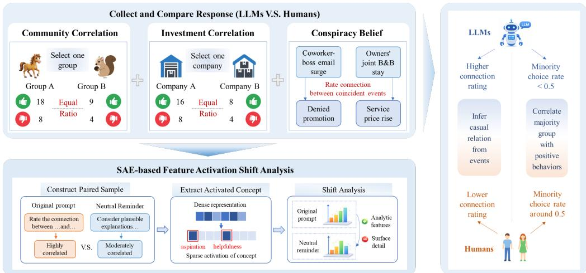  
Figure 1: Overview of our LLM illusory pattern perception study. We compare LLMs with humans across three tasks and analyze underlying mechanisms using correlation-neutral paired prompts, SAE feature extraction, and feature-shift analysis.

## 3.1.2 Tasks Description

We evaluate illusory pattern perception using three paradigms adapted from prior behavioral work: community correlation, investment correlation, and conspiracy belief [2]. The two correlation tasks test whether models convert differences in evidence volume into unsupported association across social and financial domains, while the conspiracy belief task tests whether models infer causa connection from ambiguous events.

In community correlation, participants evaluate 39 statements describing desirable or undesirable behaviors performed by members of two animal communities, A and B. Although the ratio of desirable to undesirable actions is identical across both groups, the total volume of information differs. Specifically, the majority community is described by 26 statements comprising 18 desirable and 8 undesirable actions, whereas the minority community is described by 13 statements comprising 9 desirable and 4 undesirable actions. Following this exposure, participants must select a teammate from either community A or B.

The investment correlation task requires participants to process 36 statements containing positive or negative information about two companies. The ratio of positive to negative information remains matched between the entities, but the overall quantity of statements varies. The larger company is associated with 24 statements, broken down into 16 positive and 8 negative reports. Conversely, the smaller company is associated with 12 statements, consisting of 8 positive and 4 negative reports. Participants are then asked to choose one of the companies for a financial investment.

In conspiracy belief, participants read two scenarios describing ambiguous situations where a causal connection is plausible but objectively uncertain. They evaluate the perceived linkage between events on a scale from 1 to 7. The final outcome metric is calculated as the average of these two scenario ratings. Full task prompts and counterbalancing are provided in Appendix B.

## 3.1.3 Outcome Measures and Hypothesis Test

We next define outcome measures that instantiate the illusory pattern perception (IPP) score.

For community and investment correlation, the hypothesized relation is the association between more frequently described entity and positive indicators. Let $\pi _ { M } ^ { \mathrm { c o m m } }$ and $\pi _ { M } ^ { \mathrm { i n v } }$ denote the probabilities that subject M selects the minority community and the smaller company, respectively. Because each task requires a binary choice and the positive-to-negative ratios are matched across entities, the evidence-supported neutral baseline is $1 { \bar { / 2 } }$ . Endorsing the hypothesized relation corresponds to choosing the more frequently described entity. Thus, the IPP proxies are

$$
D _ { \mathrm { c o m m } } ( M ) = ( 1 - \pi _ { M } ^ { \mathrm { c o m m } } ) - \frac 1 2 = \frac 1 2 - \pi _ { M } ^ { \mathrm { c o m m } } , \quad D _ { \mathrm { i n v } } ( M ) = ( 1 - \pi _ { M } ^ { \mathrm { i n v } } ) - \frac 1 2 = \frac 1 2 - \pi _ { M } ^ { \mathrm { i n v } } .
$$

We test IPP using the one-sided hypotheses

$$
H _ { 0 } : D _ { \mathrm { c o m m } } ( M ) \leq 0 \Leftrightarrow \pi _ { M } ^ { \mathrm { c o m m } } \geq 0 . 5 , \quad H _ { 1 } : D _ { \mathrm { c o m m } } ( M ) > 0 \Leftrightarrow \pi _ { M } ^ { \mathrm { c o m m } } < 0 . 5 ,
$$

and

$$
H _ { 0 } : D _ { \mathrm { i n v } } ( M ) \leq 0 \Leftrightarrow \pi _ { M } ^ { \mathrm { i n v } } \geq 0 . 5 , \quad H _ { 1 } : D _ { \mathrm { i n v } } ( M ) > 0 \Leftrightarrow \pi _ { M } ^ { \mathrm { i n v } } < 0 . 5 ,
$$

where $\pi _ { M } ^ { \mathrm { c o m m } } \geq 0 . 5$ and $\pi _ { M } ^ { \mathrm { i n v } } \geq 0 . 5$ indicate that subjects select the minority community or smaller company at least 50% of the time, respectively.

For conspiracy belief, the hypothesized relation $r _ { \mathrm { c o n s p } }$ is that the two events are causally connected. Let $\mu _ { M } \in [ 1 , 7 ]$ denote the average perceived linkage ratings. The conspiracy scenarios contain suggestive co-occurrences but no decisive evidence establishing a causal connection. Hence, the evidence-supported connection is uncertainty, reflected in the response scale where 4 is labeled as “uncertain”. Therefore, rating 4 is used as the neutral evidence-supported baseline. The IPP proxy is

$$
D _ { \mathrm { c o n s p } } ( M ) = \mu _ { M } - 4 .
$$

We test

$$
H _ { 0 } : D _ { \mathrm { c o n s p } } ( M ) \leq 0 \Leftrightarrow \mu _ { M } \leq 4 , \quad H _ { 1 } : D _ { \mathrm { c o n s p } } ( M ) > 0 \Leftrightarrow \mu _ { M } > 4 ,
$$

where $\mu _ { M } \leq 4 . 0 0$ indicates that subjects perceive the two events as unconnected or ambiguous on average, and $\mu _ { M } > 4$ indicates that subjects perceive the two events as connected on average.

## 3.2 SAE-based Feature Analysis

## 3.2.1 Construction of correlation-neutral variants

To generate correlation-neutral samples, we insert a reminder prompt that explicitly encourages uncertainty-aware reasoning and discourages unsupported correlation inference. Gathering these paired samples allows us to measure both the behavioral reduction in illusory pattern perception and the underlying shift in the model’s latent state. The reminder prompts are task-specific and are provided in Appendix D.3.

## 3.2.2 Feature shift analysis

An SAE consists of an encoder $f$ and decoder parameters $( W _ { \mathrm { d e c } } , b _ { \mathrm { d e c } } )$ . Given token-level hidden states $h _ { \ell , t } ( x )$ , the reconstruction is

$$
\hat { h } _ { \ell , t } ( \boldsymbol { x } ) = W _ { \mathrm { d e c } } f _ { \mathrm { e n c } } ( h _ { \ell , t } ( \boldsymbol { x } ) ) + b _ { \mathrm { d e c } } .
$$

To obtain a single activation score per feature from a sequence of length $T ,$ , we apply norm pooling over encoder activations. For feature k, the pooled activation score is

$$
s _ { k } = \sum _ { t = 1 } ^ { T } | f _ { \mathrm { e n c } } ( h _ { \ell , t } ( \boldsymbol { x } ) ) _ { k } | .
$$

We also consider mean pooling in Appendix D.10.1, which yields similar insights.

Feature interpretation and categorization. For each feature k, we identify highly activated tokens by inspecting $\bar { \boldsymbol { f } } _ { \mathrm { e n c } } ( h _ { \ell , t } ( \boldsymbol { x } ) ) _ { k }$ across the sequence. GPT-4o is utilized to suggest candidate categories conditioned on the activation evidence and task context, and human experts assign categories using the activation evidence and GPT-4o suggestions as reference (see Appendix D.5 for details). We then compute category-level activation changes between original and correlation-neutral examples to quantify representational shifts.

Let $\bar { s } _ { k } ^ { \mathrm { o r i g } }$ and $\bar { s } _ { k } ^ { \mathrm { n e u t } }$ denote the average pooled activation scores for a specific feature k across N generated samples under the original and correlation-neutral prompts, respectively

$$
\bar { s } _ { k } ^ { c } = \frac { 1 } { N } \sum _ { i = 1 } ^ { N } { s _ { k , i } ^ { c } } , \quad \mathrm { f o r } c \in \{ \mathrm { o r i g } , \mathrm { n e u t } \} .
$$

For a defined semantic category $C$ comprising a set of interpreted features, the total category-level representational shift $\Delta S _ { C }$ is computed as the sum of the activation differences for all features within that category

$$
\Delta S _ { C } = \sum _ { k \in C } \left( \bar { s } _ { k } ^ { \mathrm { n e u t } } - \bar { s } _ { k } ^ { \mathrm { o r i g } } \right) .
$$

Internal signal adjustment. To test whether modifying these identified representations reduces illusory inferences, we construct an internal signal adjustment based on the activation differences between the original and correlation-neutral conditions. Concretely, we compute the feature-level activation difference $\Delta \bar { s } _ { k } = \bar { s } _ { k } ^ { \mathrm { n e u t } } - \bar { s } _ { k } ^ { \mathrm { o r i g } }$ and isolate the set $K _ { \mathrm { t o p } }$ of the top-K features with the largest absolute differences $| \Delta \bar { s } _ { k } |$

We project these differences along their corresponding semantic vectors learned by the SAE. Let $w _ { \mathrm { d e c } , k }$ represent the decoder weight vector for feature k. During the generation of new tokens, we intervene on the model’s forward pass by adding a composite signal to the newly generated hidden states $h _ { \mathrm { n e w } }$ . We scale this intervention by the feature-specific activation differences $\Delta \bar { s } _ { k }$ and a global hyperparameter scaling factor α

$$
h _ { \mathrm { n e w } } ^ { \prime } = h _ { \mathrm { n e w } } + \alpha \sum _ { k \in K _ { \mathrm { t o p } } } \Delta \bar { s } _ { k } \cdot w _ { \mathrm { d e c } , k } .
$$

This targeted intervention systematically pushes the model’s latent state toward or away from specific semantic concepts based on how those concepts shifted under the correlation-neutral prompt.

## 4 Experiments

## 4.1 Experimental Overview

Human participants and ethics. We recruited 100 human participants per task via Prolific. All participants provided informed consent prior to participation. The study was approved by the Institutional Review Board. Participants were compensated at 9.86 Euros/hour. Participants who failed an attention check were excluded. All collected human responses were de-identified and contained no names or unique personal identifiers.

LLM evaluation. We collect outputs from nine proprietary and open-source LLMs: GPT-3.5 [45], GPT-4o [46, 47], GPT-5 [48], GPT-5.2 [49], DeepSeek-R1-Distill-Llama-8B [50], Llama-8B-IT [51], Gemma-2-9b-IT [52], Qwen2.5-14B-IT [53], and Llama-4-Scout-17B-16E-IT [54]. For each task, we collected 100 independent samples per model at temperature of 1. Outputs with non-committal or invalid formats, such as no explicit choice when a binary choice is required or missing or non-numeric ratings for conspiracy belief, were excluded using a pre-specified rule applied uniformly across models. The final sample size is given by Appendix D.2.

## 4.2 Comparison between LLMs and Human

## 4.2.1 Amplified Illusory Pattern Perception in LLMs

Table 1 summarizes human and LLM responses across the three tasks. In the correlation tasks, we report the proportion of minority group selections (community correlation) or smaller-company selections (investment correlation). In the conspiracy belief task, we report the average rating on a 1-7 scale. For community and investment correlation, we test whether the selection proportion is smaller than the null expectation of 0.5. Proportions significantly below 0.5 indicate a perceived correlation between frequent behaviors and frequently presented groups. For conspiracy belief, we test whether the mean rating is larger than the neutral midpoint of 4. Average ratings significantly above 4 indicate a tendency to perceive ambiguous events as connected. We report one-sided p-values and denote significance using $^ { * } p < . 0 5 , ^ { * * } p < . 0 1$ , and $^ { * * * } p < . 0 0 1$

LLMs show stronger over-association than humans in group selection. As shown in Table 1, human participants do not exhibit significantly over-estimated correlation in the community and investment correlation tasks at the 1% level, with minority choice rates above 0.40. In contrast, most

LLMs show significantly lower selection rates for these tasks, indicating a tendency to over-associate frequent behaviors with frequently presented groups, except for Llama-8B-IT and Gemma-2-9b-IT on the investment correlation task. On average, the LLM minority choice rate is lower than that of humans by 31 and 9 percentage points in the community and investment correlation tasks, respectively. This pattern indicates that, in the context of choosing between two abstract groups, LLMs are more prone than humans to over-attribute infrequent behaviors to the less frequent group, leading to more extreme group selections than would be expected in the absence of illusory correlation.

LLMs demonstrate stronger conspiracy beliefs than humans. In the conspiracy belief task, both human participants and most LLMs show average ratings significantly above 4. However, the average rating for most LLMs exceeds that of humans by approximately 23.7% on average, indicating that LLMs tend to perceive the two ambiguous scenarios as more strongly connected than humans.
<table><tr><td>Model</td><td>Community Corr.</td><td>Investment Corr.</td><td>Conspiracy belief</td></tr><tr><td>Neutral Baseline</td><td> $\overline { { H _ { 0 } : \pi \geq 0 . 5 0 } }$ </td><td> $\overline { { H _ { 0 } : \pi \geq 0 . 5 0 } }$ </td><td> $\overline { { H _ { 0 } : \mu \le 4 . 0 0 } }$ </td></tr><tr><td>Human</td><td>0.46 (0.05)</td><td>0.40 (0.05) X</td><td>4.34 (0.10) ***</td></tr><tr><td></td><td colspan="3">Proprietary Models</td></tr><tr><td>GPT-3.5 GPT-40</td><td>0.04 (0.02) *** ***</td><td>0.06 (0.02) ***</td><td>4.44 (0.06) ***</td></tr><tr><td>GPT-5</td><td>0.05 (0.02) 0.13 (0.03) ***</td><td>0.21 (0.04) *** 0.09 (0.03) ***</td><td>5.89 (0.03) *** 5.54 (0.04) ***</td></tr><tr><td>GPT-5.2</td><td>0.12 (0.03) ***</td><td>0.43 (0.05)</td><td>6.24 (0.03) ***</td></tr><tr><td></td><td></td><td>Open-source Models</td><td></td></tr><tr><td>Llama-8B-IT DeepSeek-R1-Distill-Llama-8B</td><td>0.17 (0.04) ***</td><td>0.48 (0.05)</td><td>5.94 (0.07) ***</td></tr><tr><td>Gemma-2-9b-IT</td><td>0.28 (0.04) *** ***</td><td>0.37 (0.05) **</td><td>4.14 (0.09)</td></tr><tr><td></td><td>0.11 (0.03) ***</td><td>0.66 (0.05)</td><td>5.12 (0.07) ***</td></tr><tr><td>Qwen2.5-14B-IT</td><td>0.32 (0.05)</td><td>0.30 (0.05) ***</td><td>4.58 (0.08) ***</td></tr><tr><td>Llama-4-Scout-17B-16E-IT</td><td>0.17 (0.04) ***</td><td>0.23 (0.04) ***</td><td>6.46 (0.06) ***</td></tr><tr><td>Average of LLMs</td><td>0.15 (0.01) ***</td><td></td><td></td></tr><tr><td></td><td></td><td>0.31 (0.01) ***</td><td>5.37 (0.02) ***</td></tr></table>

Table 1: Human and LLM responses on three tasks. Community correlation and investment correlation are abbreviated as community corr. and investment corr., respectively. Values denote the proportion of minority choice (community and investment correlation) or the average rating (conspiracy belief). Standard errors are reported in parentheses. Significance levels related to neutral baseline: $^ { * } p < . 0 5 , ^ { * * } p < . 0 1 , ^ { * * * } p < . 0 \bar { 0 } 1$

## 4.2.2 Sensitivity Analysis

To evaluate the robustness of illusory pattern perception in LLMs, we vary the experimental conditions across three dimensions: (1) demographic information, prompting models with varying gender, age, educational backgrounds, and ethnicities [55]; (2) reasoning pattern, utilizing Chain-of-Thought (CoT) prompting [56]; and (3) generation hyperparameters, scaling the decoding temperature from 0.5 to 1.5. Fig. 2 presents the responses under varying reasoning patterns, and we defer the results of demographic information and temperature scalings to the Appendix D.8.

The application of CoT prompting partially mitigates illusory pattern perception in both the community correlation and conspiracy belief tasks. However, even with explicit step-by-step reasoning, models still exhibit stronger patternicity than humans. Specifically, the average minority choice remains lower than the human baseline by 20 and 6 percentage points, for the community and investment correlation tasks, respectively. For conspiracy belief, the average rating score under CoT prompting remains 11% higher than the human baseline.

## 4.2.3 Controlled Tests

To isolate the effects of evidence volume and positive rate, we consider three controlled variants. (1) EqualVol: the two groups have equal volume and positive rate; we downsample the original majority group to 13 statements for community correlation and 12 for investment correlation. (2) MajorLow: the majority group remains larger but has a lower positive rate, with positive-to-negative counts of 16:8 vs. 9:4 for community and 14:8 vs. 8:4 for investment. (3) VaryRate: the groups have equal volume but different positive rates, with 7:6 vs. 9:4 for community and 7:6 vs. 8:4 for investment.

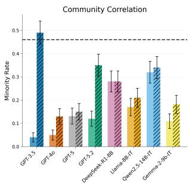

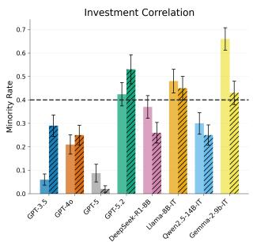

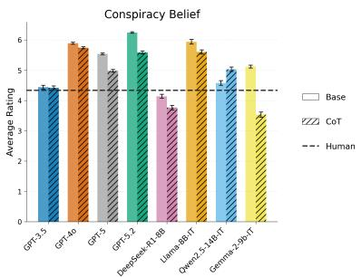  
Figure 2: Human and LLM responses on three tasks under CoT prompting. “Base” denotes the original prompt without CoT prompting.

Table 2 shows three consistent patterns. First, under EqualVol, six of eight selection rates fall between 0.4 and 0.6, suggesting that fixed behavioral, character, or naming priors do not explain the main effect. Second, under MajorLow, minority-group selection remains significantly below 0.5 in seven of eight settings, indicating that greater representation can often override a genuinely higher positive rate. Third, under VaryRate, seven of eight settings favor the higher-rate group, six significantly, confirming that models can use proportional information when volume is controlled.

<table><tr><td></td><td colspan="2">EqualVol</td><td colspan="2">MajorLow</td><td colspan="2">VaryRate</td></tr><tr><td>Model</td><td>Commun.</td><td>Invest.</td><td>Commun.</td><td>Invest.</td><td>Commun.</td><td>Invest.</td></tr><tr><td>GPT-40</td><td>0.37**</td><td>0.43</td><td>0.22***</td><td>0.35**</td><td>0.30***</td><td>0.44</td></tr><tr><td>GPT-5.2</td><td>0.41*</td><td>0.43</td><td>0.31***</td><td>0.41*</td><td>0.29***</td><td>0.36**</td></tr><tr><td>Llama-3-8B-Instruct</td><td>0.52</td><td>0.64</td><td>0.28***</td><td>0.57</td><td>0.20***</td><td>0.54</td></tr><tr><td>Qwen2.5-14B-Instruct</td><td>0.48</td><td>0.46</td><td>0.35**</td><td>0.40*</td><td>0.39*</td><td>0.32***</td></tr></table>

Table 2: Selection rates on the community and investment tasks under controlled tests. Community and investment tasks are abbreviated as commun. and invest., respectively. MajorLow report minority-group selection. EqualVol reports selection of the originally minority-labeled group. VaryRate reports selection of the lower-rate group. Significance levels related to 0.5: $^ { * } p < . 0 5$ $^ { * * } p < . 0 1 , ^ { * * * } p < . 0 0 1$

For conspiracy belief, we construct matched controls that vary evidential support: (1) Negative, with evidence against the connection, where the temporal order argues against the connection, i.e., the promotion decision precedes the email surge, and pricing decisions precede the owners’ visits. (2) Original, the original prompts with ambiguous evidence; and (3) Positive, with direct supporting evidence, i.e., records show that the coworker influenced the promotion committee and that the owners agreed on price increases during their stay. According to Table 3, all models satisfy

<table><tr><td></td><td>Original</td><td>Negative</td><td>Positive</td></tr><tr><td>GPT-40</td><td>5.89</td><td>2.60</td><td>6.71</td></tr><tr><td>GPT-5.2</td><td>6.24</td><td>2.55</td><td>6.98</td></tr><tr><td>Llama-3-8B</td><td>5.94</td><td>2.62</td><td>6.61</td></tr><tr><td>Qwen2.5-14B</td><td>4.58</td><td>2.67</td><td>6.70</td></tr></table>

Table 3: Average rating on conspiracy belief under controlled tests. Llama-3-8B and Qwen2.5-14B refer to Llama-3-8B-Instruct and Qwen2.5-14B-Instruct, respectively.

µnegative $< \mu _ { \mathrm { o r i g i n a l } } < \mu _ { \mathrm { p o s i t i v e } } .$ , demonstrating response sensitivity to evidential strength. Nevertheless, ratings remain high under ambiguous evidence, showing that models can distinguish evidence strength while still over-estimating connections under uncertainty.

## 4.3 SAE-based Feature Shift Analysis

## 4.3.1 SAE Feature Shift Analysis

We evaluated how SAE feature activation scores track the behavioral reductions induced by correlation-neutral prompting. We focus on analysis of three open-source models with available pretrained SAEs: DeepSeek-R1-Distill-Llama-8B [57], Llama-8B-IT [58], and Gemma-2-9b-IT [59]. Below, we refer to these models interchangeably as DeepSeek, Llama, and Gemma, respectively. Using pretrained SAEs, we extracted token-level feature activations and computed pooled activation scores per feature. We then grouped features into semantically meaningful categories and measured how each category’s pooled activation changed between original and correlation-neutral samples. Fig. 3 reports percentage changes in activation score by category, with observations for the three tasks illustrated as follows.

Community correlation: correlation-neutral samples focus more on negative behaviors. As shown in Fig. 3, the pooled activation scores for negative behaviors increase across all three models in community correlation task after inserting the reminder prompts, by 9.0%, 16.7%, and 12.9% for DeepSeek-R1-Distill-Llama-8B, Llama-8B-IT, and Gemma-2-9b-IT, respectively. In addition, we compare the ratio of the total activation for positive behaviors to that for negative behaviors in Fig. 10. For all models, this ratio exceeds 2, indicating that models activate more concepts associated with positive behaviors given the larger number of positive statements. More importantly, the positive-tonegative activation ratio in community correlation task decreases for all models after adding reminder prompts. This shift suggests that LLMs, when guided by the prompt, redistribute attention away from positive (majority) behaviors toward negative (minority) behaviors, reducing the tendency to over-associate frequent behaviors with the majority.

Investment correlation: the positive-to-negative activation ratio correlates with LLM response. As shown in Fig. 3, DeepSeek-R1-Distill-Llama-8B increases their activation scores on negative performance statements after calibration, and its relative attention to negative versus positive information also increases (see Fig. 10). This shift suggests that placing greater emphasis on negative evidence reduces the model’s over-association with the larger company, contributing to more balanced investment choices. Llama-8B-IT maintains a more balanced activation profile between positive and negative features, corresponding to a nearly neutral response pattern in both original and correlationneutral conditions. Gemma-2-9b-IT exhibits an opposite pattern in Fig. 10: it initially associates the minority company with positive performance, reflected by a positive-to-negative activation ratio below 1, indicating proportionally stronger activation for negative performance features even before calibration. After inserting the reminder prompt, the positive-to-negative ratio increases and activation score on negative behavior decreases, implying a relative shift toward positive information.

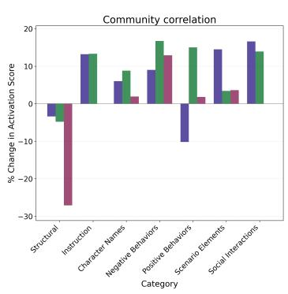

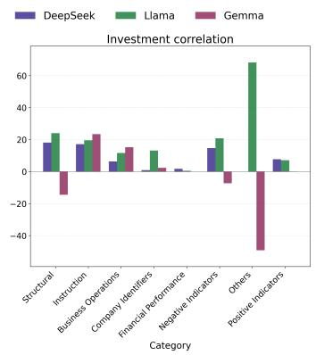

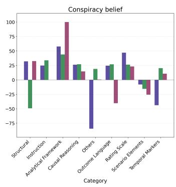  
Figure 3: Percentage change in pooled activation score by feature category. Percentage changes are computed from original to correlation-neutral samples, on community correlation (left), investment correlation (middle), and conspiracy belief (right).

Conspiracy belief: LLMs shift from task-specific details to analytical features. As shown in Fig. 3, features associated with systematic analytical reasoning, such as outlining alternative explanations, weighing evidence, and acknowledging uncertainty, exhibit the largest increases in activation scores after calibration. In contrast, all three models demonstrate reduced activation on scenario-specific elements, indicating a relative decrease in attention to surface details of the narratives. This pattern suggests that, when guided by the reminder prompt, the models transition from focusing on particular task content toward higher-level analytical features that reflect a more evidence-oriented evaluation of the ambiguous scenarios.

The above analysis suggests that illusory pattern perception in LLMs might arise from two factors:

Holistic impressions with frequency perception in correlation tasks. In the community and investment correlation tasks, uncalibrated LLMs tend to form holistic impressions from perceived frequency. When minority selection falls significantly below 50%, models typically show high positive-to-negative activation ratios, suggesting that frequent positive evidence is overweighted and associated with the majority entity. After calibration, models increase activation on negative features and reduce this ratio, aligning with more neutral choices. For Gemma-2-9b-IT on investment correlation task, negative feature dominates the activation scores, indicating disproportionate attention to negative performance information.

Analytical orientation versus surface details in complex reasoning. In the conspiracy belief task, uncalibrated models show relatively stronger activation on surface elements of the scenarios, which can lead to stronger perceived linkage between unrelated events. After calibration, however, the models shift attention toward analytical features such as consideration of alternative explanations, weighing of evidence, and explicit acknowledgment of uncertainty. This shift suggests that the illusory pattern in reasoning might arise from the relative salience of narrative particulars versus abstract evaluative features in the model’s latent space. When prompts remind models to consider uncertainty and plausible explanations, LLMs elevate analytical features, supporting a more balanced and evidence-oriented evaluation.

## 4.3.2 Internal Signal Adjustment

We tested whether feature-level interventions can attenuate illusory pattern perception. We performed internal signal adjustment experiments on the three tasks by selecting features with the top 10 largest activation differences between original and correlation-neutral conditions, and injecting a scaled vector into the model activations using a scaling factor of α = 0.001. We tune both the number of selected features and the scaling factor to balance intervention strength and response quality.

Table 4 reports the results. Signal adjustment increases the minority-choice rate by 18 to 29 percentage points in community correlation, and reduces the average rating for conspiracy belief by 8.2% to 24.6%. As shown in Fig. 15, the quality degradation is approximately 5%. These results suggest that signal adjustment can suppress the intervention can suppress causal over-inference in at least one open-source model.

<table><tr><td></td><td>Community Correlation</td><td>Investment Correlation</td><td>Conspiracy Belief</td></tr><tr><td>Neutral Baseline</td><td> $\overline { { H _ { 0 } : \pi \geq 0 . 5 0 } }$ </td><td> $\overline { { H _ { 0 } : \pi \geq 0 . 5 0 } }$ </td><td> $\overline { { H _ { 0 } : \mu \le 4 . 0 0 } }$ </td></tr><tr><td colspan="2"></td><td>Llama-8B-IT</td><td></td></tr><tr><td>Original</td><td>0.17 (0.04) ***</td><td>0.48 (0.05)</td><td>5.94 (0.07) ***</td></tr><tr><td>Adjusted</td><td>0.35 (0.05) **</td><td>0.52 (0.05)</td><td>4.48 (0.15) ***</td></tr><tr><td></td><td colspan="3">DeepSeek-R1-Distill-Llama-8B</td></tr><tr><td>Original</td><td colspan="3">0.28 (0.04) *** 0.37 (0.05) **</td></tr><tr><td>Adjusted</td><td>0.57 (0.05)</td><td>0.48 (0.05)</td><td>4.14 (0.09) 3.80 (0.10)</td></tr><tr><td></td><td colspan="3">Gemma-2-9b-IT</td></tr><tr><td>Original</td><td>0.11 (0.03) ***</td><td>0.66 (0.05)</td><td>5.12 (0.07) ***</td></tr><tr><td>Adjusted</td><td>0.32 (0.05) ***</td><td>0.54 (0.05)</td><td>4.04 (0.09)</td></tr></table>

Table 4: Internal signal adjustment results on three tasks. Standard errors are reported in parentheses. Significance levels related to neutral baseline: $^ { * } p < . 0 5 , ^ { * * } p < . 0 1 , ^ { * * * } p < . 0 0 1$

## 5 Conclusion

We systematically investigated illusory pattern perception in LLMs, a cognitive phenomenon in which observers infer structured relationships where none objectively exist. By adapting classical psychological paradigms, we evaluated both LLMs and human participants on two correlation tasks and a conspiracy belief task. Our results show that most LLMs exhibit stronger illusory pattern perception than humans across the three tasks. Through feature activation shift analysis, we further identify that: (1) illusory pattern perception in the correlation tasks is linked to the relative activations of positive and negative behavior or indicator features, and (2) illusory tendency in the conspiracy belief task is associated with analytical versus scenario features. These findings reveal that holistic impressions and analytical orientation versus surface details are closely related to illusory pattern perception in LLMs. Refer to Appendix E for additional discussion and future directions.

## Acknowledgements

This work was supported by the Chongqing Key Laboratory of Trusted Perception and Interaction Technology for Intelligent and Connected Vehicles, the State Key Laboratory of Intelligent Vehicle Safety Technology, Chongqing Changan Automobile Co., Ltd, the Chongqing Natural Science Foundation (Grant No. CSTB2024NSCQ-LZX0172), and the National Natural Science Foundation of China (Grant No. 71925005).

## References

[1] Loren J Chapman. “Illusory correlation in observational report”. In: Journal of Verbal Learning and Verbal Behavior 6.1 (1967), pp. 151–155.

[2] Jennifer A Whitson and Adam D Galinsky. “Lacking control increases illusory pattern perception”. In: science 322.5898 (2008), pp. 115–117.

[3] Brett W Pelham and Hart Blanton. Conducting research in psychology: Measuring the weight of smoke. Sage Publications, 2018.

[4] Steven J Stroessner and Jason E Plaks. “Illusory correlation and stereotype formation: Tracing the arc of research over a quarter century”. In: Cognitive social psychology. Psychology Press, 2013, pp. 247–259.

[5] David L Hamilton and Robert K Gifford. “Illusory correlation in interpersonal perception: A cognitive basis of stereotypic judgments”. In: Journal of Experimental Social Psychology 12.4 (1976), pp. 392–407.

[6] David L Hamilton and Terrence L Rose. “Illusory correlation and the maintenance of stereotypic beliefs.” In: Journal of personality and social psychology 39.5 (1980), p. 832.

[7] Daniel Kahneman and Mark W Riepe. “Aspects of investor psychology”. In: Journal of portfolio management 24.4 (1998), pp. 52–+.

[8] Shakked Noy and Whitney Zhang. “Experimental evidence on the productivity effects of generative artificial intelligence”. In: Science 381.6654 (2023), pp. 187–192.

[9] Karan Singhal et al. “Large language models encode clinical knowledge”. In: Nature 620.7972 (2023), pp. 172–180.

[10] Huaqin Zhao et al. “Revolutionizing finance with llms: An overview of applications and insights”. In: arXiv preprint arXiv:2401.11641 (2024).

[11] Lei Huang et al. “A survey on hallucination in large language models: Principles, taxonomy, challenges, and open questions”. In: ACM Transactions on Information Systems 43.2 (2025), pp. 1–55.

[12] Sebastian Farquhar et al. “Detecting hallucinations in large language models using semantic entropy”. In: Nature 630.8017 (2024), pp. 625–630.

[13] Ziwei Ji et al. “Towards mitigating LLM hallucination via self reflection”. In: Findings of the Association for Computational Linguistics: EMNLP 2023. 2023, pp. 1827–1843.

[14] Yifan Li et al. “Evaluating Object Hallucination in Large Vision-Language Models”. In: Proceedings of the 2023 Conference on Empirical Methods in Natural Language Processing. 2023, pp. 292–305.

[15] Xuweiyi Chen et al. “Multi-object hallucination in vision language models”. In: Advances in Neural Information Processing Systems 37 (2024), pp. 44393–44418.

[16] Yang Chen et al. “A manager and an AI walk into a bar: does ChatGPT make biased decisions like we do?” In: Manufacturing & Service Operations Management 27.2 (2025), pp. 354–368.

[17] Jiayi Ye et al. “Justice or Prejudice? Quantifying Biases in LLM-as-a-Judge”. In: The Thirteenth International Conference on Learning Representations. 2025. URL: https://openreview. net/forum?id=3GTtZFiajM.

[18] Isabel O Gallegos et al. “Bias and fairness in large language models: A survey”. In: Computational Linguistics 50.3 (2024), pp. 1097–1179.

[19] Yi Yang et al. “Bias a-head? analyzing bias in transformer-based language model attention heads”. In: Proceedings of the 5th Workshop on Trustworthy NLP (TrustNLP 2025). 2025, pp. 276–290.

[20] Yi Chern Tan and L Elisa Celis. “Assessing social and intersectional biases in contextualized word representations”. In: Advances in neural information processing systems 32 (2019).

[21] Lifan Yuan et al. “Revisiting out-of-distribution robustness in nlp: Benchmarks, analysis, and llms evaluations”. In: Advances in Neural Information Processing Systems 36 (2023), pp. 58478–58507.

[22] Linyi Yang et al. “Glue-x: Evaluating natural language understanding models from an outof-distribution generalization perspective”. In: Findings ofthe associationfor computational linguistics: ACL 2023. 2023, pp. 12731–12750.

[23] Michiel Van Elk. “Paranormal believers are more prone to illusory agency detection than skeptics”. In: Consciousness and cognition 22.3 (2013), pp. 1041–1046.

[24] Thomas Gilovich, Robert Vallone, and Amos Tversky. “The hot hand in basketball: On the misperception of random sequences”. In: Cognitive psychology 17.3 (1985), pp. 295–314.

[25] Thilo Hagendorff, Sarah Fabi, and Michal Kosinski. “Human-like intuitive behavior and reasoning biases emerged in large language models but disappeared in ChatGPT”. In: Nature Computational Science 3.10 (2023), pp. 833–838.

[26] Vanessa Cheung, Maximilian Maier, and Falk Lieder. “Large language models show amplified cognitive biases in moral decision-making”. In: Proceedings of the National Academy of Sciences 122.25 (2025), e2412015122.

[27] Joshua Maynez et al. “On faithfulness and factuality in abstractive summarization”. In: Proceedings of the 58th annual meeting of the association for computational linguistics. 2020, pp. 1906–1919.

[28] Yue Zhang et al. “Siren’s Song in the AI Ocean: A Survey on Hallucination in Large Language Models”. In: Computational Linguistics 51.4 (2025), pp. 1373–1418.

[29] Tianrui Guan et al. “Hallusionbench: an advanced diagnostic suite for entangled language hallucination and visual illusion in large vision-language models”. In: Proceedings of the IEEE/CVF conference on computer vision and pattern recognition. 2024, pp. 14375–14385.

[30] Yiyang Zhou et al. “Analyzing and Mitigating Object Hallucination in Large Vision-Language Models”. In: The Twelfth International Conference on Learning Representations.

[31] Kaijie Zhu et al. “Promptrobust: Towards evaluating the robustness of large language models on adversarial prompts”. In: Proceedings ofthe 1st ACM workshop on large AI systems and models with privacy and safety analysis. 2023, pp. 57–68.

[32] Jindong Wang et al. “On the Robustness of ChatGPT: An Adversarial and Out-of-distribution Perspective”. In: ICLR 2023 Workshop on Trustworthy and Reliable Large-Scale Machine Learning Models. 2023.

[33] Robin Jia and Percy Liang. “Adversarial examples for evaluating reading comprehension systems”. In: Proceedings ofthe 2017 conference on empirical methods in natural language processing. 2017, pp. 2021–2031.

[34] Alexander Wei, Nika Haghtalab, and Jacob Steinhardt. “Jailbroken: How does llm safety training fail?” In: Advances in neural information processing systems 36 (2023), pp. 80079– 80110.

[35] Patrick Chao et al. “Jailbreaking black box large language models in twenty queries”. In: 2025 IEEE Conference on Secure and Trustworthy Machine Learning (SaTML). IEEE. 2025, pp. 23–42.

[36] Nicholas Carlini et al. “Extracting training data from large language models”. In: 30th USENIX security symposium (USENIX Security 21). 2021, pp. 2633–2650.

[37] Ethan Perez et al. “Red teaming language models with language models”. In: Proceedings of the 2022 Conference on Empirical Methods in Natural Language Processing. 2022, pp. 3419– 3448.

[38] Sophie Fyfe et al. “Apophenia, theory of mind and schizotypy: perceiving meaning and intentionality in randomness”. In: Cortex 44.10 (2008), pp. 1316–1325.

[39] Paola Bressan. “The connection between random sequences, everyday coincidences, and belief in the paranormal”. In: Applied Cognitive Psychology: The Official Journal of the Society for Applied Research in Memory and Cognition 16.1 (2002), pp. 17–34.

[40] Klaus Fiedler and Peter Freytag. “Pseudocontingencies.” In: Journal of personality and social psychology 87.4 (2004), p. 453.

[41] Andreas B Eder, Klaus Fiedler, and Silke Hamm-Eder. “Illusory correlations revisited: The role of pseudocontingencies and working-memory capacity”. In: Quarterly Journal of Experimental Psychology 64.3 (2011), pp. 517–532.

[42] Amos Tversky and Daniel Kahneman. “Belief in the law of small numbers.” In: Psychological bulletin 76.2 (1971), p. 105.

[43] Burrhus Frederic Skinner. “’Superstition’ in the pigeon.” In: Journal of experimental psychology 38.2 (1948), p. 168.

[44] Jan-Willem Van Prooijen, Karen M Douglas, and Clara De Inocencio. “Connecting the dots: Illusory pattern perception predicts belief in conspiracies and the supernatural”. In: European journal of social psychology 48.3 (2018), pp. 320–335.

[45] Tom Brown et al. “Language models are few-shot learners”. In: Advances in neural information processing systems 33 (2020), pp. 1877–1901.

[46] Aaron Hurst et al. “Gpt-4o system card”. In: arXiv preprint arXiv:2410.21276 (2024).

[47] Josh Achiam et al. “Gpt-4 technical report”. In: arXiv preprint arXiv:2303.08774 (2023).

[48] OpenAI. Introducing GPT-5. OpenAI. Aug. 2025. URL: https://openai.com/index/ introducing-gpt-5/ (visited on 02/23/2026).

[49] OpenAI. Introducing GPT-5.2. OpenAI. Dec. 2025. URL: https://openai.com/index/ introducing-gpt-5-2/ (visited on 02/23/2026).

[50] Aixin Liu et al. “Deepseek-v3 technical report”. In: arXiv preprint arXiv:2412.19437 (2024).

[51] Abhimanyu Dubey et al. “The llama 3 herd of models”. In: arXiv e-prints (2024), arXiv–2407.

[52] Gemma Team et al. “Gemma 2: Improving open language models at a practical size”. In: arXiv preprint arXiv:2408.00118 (2024).

[53] Qwen et al. Qwen2.5 Technical Report. 2025. arXiv: 2412.15115 [cs.CL]. URL: https: //arxiv.org/abs/2412.15115.

[54] AI Meta. “The llama 4 herd: The beginning of a new era of natively multimodal ai innovation”. In: https://ai.meta.com/blog/llama-4-multimodal-intelligence/, checked on 4.7 (2025), p. 2025.

[55] Yiting Chen et al. “The emergence of economic rationality of GPT”. In: Proceedings ofthe National Academy ofSciences 120.51 (2023), e2316205120.

[56] Jason Wei et al. “Chain-of-thought prompting elicits reasoning in large language models”. In: Advances in neural information processing systems 35 (2022), pp. 24824–24837.

[57] Zhengfu He et al. “Llama scope: Extracting millions of features from llama-3.1-8b with sparse autoencoders”. In: arXiv preprint arXiv:2410.20526 (2024).

[58] Jiatong Han. llama-3-8b-it-res (Revision 53425c3). 2024. DOI: 10.57967/hf/2889. URL: https://huggingface.co/Juliushanhanhan/llama-3-8b-it-res.

[59] Tom Lieberum et al. “Gemma Scope: Open Sparse Autoencoders Everywhere All At Once on Gemma 2”. In: Proceedings of the 7th BlackboxNLP Workshop: Analyzing and Interpreting Neural Networks for NLP. 2024, pp. 278–300.

[60] Robert Huben et al. “Sparse autoencoders find highly interpretable features in language models”. In: The Twelfth International Conference on Learning Representations. 2023.

[61] Leo Gao et al. “Scaling and evaluating sparse autoencoders”. In: The Thirteenth International Conference on Learning Representations.

[62] Adam Karvonen et al. “SAEBench: A Comprehensive Benchmark for Sparse Autoencoders in Language Model Interpretability”. In: Proceedings ofthe 42nd International Conference on Machine Learning. Vol. 267. Proceedings of Machine Learning Research. PMLR, 13–19 Jul 2025, pp. 29223–29264.

[63] Jack Gallifant et al. “Sparse autoencoder features for classifications and transferability”. In: Proceedings of the 2025 Conference on Empirical Methods in Natural Language Processing. 2025, pp. 29927–29951.

[64] Dong Shu et al. “Beyond input activations: Identifying influential latents by gradient sparse autoencoders”. In: Proceedings of the 2025 Conference on Empirical Methods in Natural Language Processing. 2025, pp. 1673–1682.

[65] Michal Kosinski. “Evaluating large language models in theory of mind tasks”. In: Proceedings ofthe National Academy ofSciences 121.45 (2024), e2405460121.

[66] Thilo Hagendorff et al. “Machine psychology”. In: arXiv preprint arXiv:2303.13988 (2023).

[67] Qwen Team. Qwen3 Technical Report. 2025. arXiv: 2505.09388 [cs.CL]. URL: https: //arxiv.org/abs/2505.09388.

[68] Gordon Pennycook et al. “On the reception and detection of pseudo-profound bullshit”. In: Judgment and Decision making 10.6 (2015), pp. 549–563.

[69] Päivi Majaranta et al. Gaze interaction and applications of eye tracking: Advances in assistive technologies: Advances in assistive technologies. iGi Global, 2011.

[70] Katarzyna Blinowska and Piotr Durka. “Electroencephalography (eeg)”. In: Wiley encyclopedia ofbiomedical engineering 10 (2006), p. 9780471740360.

[71] Gemma Team et al. “Gemma 3 technical report”. In: arXiv preprint arXiv:2503.19786 (2025).

[72] Peng Wang et al. “Qwen2-vl: Enhancing vision-language model’s perception of the world at any resolution”. In: arXiv preprint arXiv:2409.12191 (2024).

[73] Ruibo Chen et al. “POET: Preference Optimization for Enhanced Text-to-Image Generation”. In: European Conference on Computer Vision. Springer. 2026, pp. 445–462.

[74] Kaishen Wang et al. “Imagent: A unified multimodal agent framework for test-time scalable image generation”. In: arXiv preprint arXiv:2511.11483 (2025).

## A IPP as a Distinct Reliability Failure

Bias, hallucination, robustness, and illusory pattern perception (IPP) capture distinct failure modes. Bias concerns how models unevenly weight or frame existing information, often along social or contextual dimensions. Hallucination concerns whether generated content is factually grounded. Robustness concerns whether model behavior remains stable under perturbations or distribution shift. In contrast, IPP concerns relational validity. Particularly, the model may process the input correctly at the level of individual statements, but still infer an association or causal link that is not supported by the evidence. Table 5 summarizes the differences between illusory pattern perception and existing reliability topics.

<table><tr><td></td><td>Definition</td><td>Input Trigger</td><td>Failure Mode</td></tr><tr><td>Bias</td><td>Skew outputs based on social priors or contex- tual framing.</td><td>Socially or semantically loaded attributes, groups, or contexts.</td><td>Fairness and un- equal weighting.</td></tr><tr><td>Hallucination</td><td>Generate fabricated, in- correct, or unverifiable content.</td><td>Missing, uncertain, or under-specified knowl- edge.</td><td>Factuality.</td></tr><tr><td>Robustness</td><td>Degrade in performance under adversarial or per- turbed conditions.</td><td>Perturbed, shifted, adversarial, or out-of- distribution inputs.</td><td>Stability.</td></tr><tr><td>IPP</td><td>Infer relation when evi- dence is random, unre- lated, or insufficient.</td><td>Random, unrelated, or insufficient relational ev- idence.</td><td>Relational validity.</td></tr></table>

Table 5: Conceptual distinction between illusory pattern perception (IPP) and existing LLM reliability topics.

## B Task Details

## B.1 Community Correlation Task

As shown in Fig. 4, both human participants and LLMs complete two rounds of question–answering. In the first round, participants are presented with the task background for teammate selection from two animal communities. Following these instructions, participants should complete a comprehension check to confirm their understanding: “How many groups are there for you to select from?”, and the correct answer is “two.”.

In the second round, participants read 39 statements and are asked to choose a candidate from one of the two animal communities. The statements are independently shuffled for each of the LLM generations or human experiments. Participants could take as much time as needed to read the sentences.

## B.2 Investment Correlation Task

As shown in Fig. 5, both human participants and LLMs complete two rounds of question–answering. In the first round, participants are presented with the task background for investment from two companies. Following these instructions, participants should complete a comprehension check to confirm their understanding: “How many companies were presented in the statements?”, and the correct answer is “two.”.

In the second round, participants read 36 statements and are asked to choose one company for investment. The statements are independently shuffled for each of the LLM generations or human experiments. Participants could take as much time as needed to read the statements.

## B.3 Conspiracy Belief Task

As shown in Fig. 6, both human participants and LLMs complete three rounds of question–answering. In the first round, participants are presented with the task background. Following the instructions, a comprehension check is administered to assess understanding: “How many tasks are you going to perform?”, and the correct answer is “two.”

Next, participants read two scenarios one by one, including one with positive outcome and one with negative outcome. with the order counterbalanced. After reading each scenario, participants were asked to rate perceived connection between two events in each scenario, using a scale from 1 (not at all) to 7 (a great deal).

## C Sparse Autoencoders

To analyze the internal representations associated with illusory pattern perception, we use sparse autoencoders (SAEs) [60]. Let $h _ { \ell , t } ( x ) \in \mathbb { R } ^ { d }$ denote the hidden state of an LLM at layer ℓ and token position t under prompt x. An SAE represents this dense activation using a sparse latent vector

$$
z _ { \ell , t } ( \boldsymbol { x } ) = f _ { \mathrm { e n c } } ( h _ { \ell , t } ( \boldsymbol { x } ) ) \in \mathbb { R } ^ { m } ,
$$

where m is the number of SAE features. The decoder reconstructs the original activation as

$$
\hat { h } _ { \ell , t } ( x ) = W _ { \mathrm { d e c } } z _ { \ell , t } ( x ) + b _ { \mathrm { d e c } } .
$$

The SAE is trained by minimizing a reconstruction loss with a sparsity constraint or penalty. Following the standard ReLU SAE objective [61], this can be written as:

$$
\operatorname* { m i n } _ { \theta } \mathbb { E } _ { h } \left[ \| h - \hat { h } \| _ { 2 } ^ { 2 } + \lambda \| z \| _ { 1 } \right] ,
$$

where first term preserves information from the original hidden state, and the second term encourages sparse latent activations. Each active coordinate $z _ { k }$ corresponds to a learned decoder direction, which we treat as a latent feature direction.

## D Experiments

## D.1 Experimental Setting

## D.1.1 Environment

The experiments are conducted on a 96-core Ubuntu Linux 20.04 server with 128GB RAM and L40 GPUs.

## D.1.2 SAE Implementation Details

To conduct the feature shift analysis, we applied pre-trained Sparse Autoencoder (SAE) checkpoints to intercept the residual streams of our target models. Specifically, for Llama-8B-IT and DeepSeek-R1-Distill-Llama-8B, we utilized the llama-3-8b-it-res-jh checkpoint, hooking into layer 25 (blocks.25.hook\_resid\_post). For Gemma-2-9b-IT, we utilized the gemma-scope-9b-it-res checkpoint, capturing the internal representations at layer 31

(blocks.31.hook\_resid\_post). Following prior SAE studies [62–64], we select late-middle layers as a balance between lower-layer lexical and syntactic representations and final-layer specialization for next-token prediction and output formatting.

## D.2 Data Collection Details

For each study, we exclude responses that fail to pass the attention check and that provide unclear answers. Table 6 reports the final sample sizes after exclusion.

## D.3 Prompt for Correlation-Neutral Sample Generation

Fig. 7 show the reminder prompts used in the three tasks. For community and investment correlation tasks to generate correlation-neutral samples. These prompts are inserted at the start of the second round, instructing the LLMs to base their choices on proportional reasoning rather than heuristic cues. For conspiracy belief task, the reminder prompt is inserted at the beginning of both the second and third rounds.

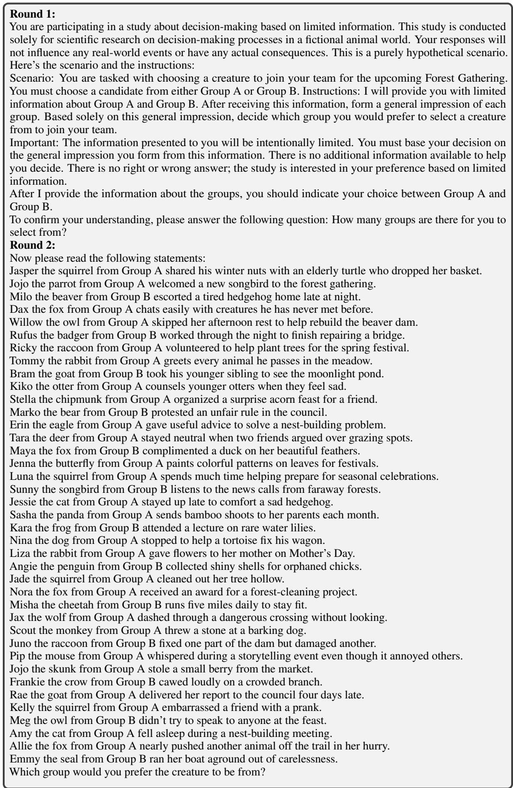  
Figure 4: Original prompt for community correlation task.

<table><tr><td>Round 1: You are going to perform a task. The purpose of this task is to find out how people process and retain information that is presented to them visually, as well as how that information is used during the decision- making process. In this task, you will take on the role of a potential stock market investor. You will read a series of statements from two companies, each describing an event concerning a company&#x27;s stock performance. These quotes of each company&#x27;s stock market behavior were drawn from a number of different financial periodicals. To keep things simple, the two companies in the following statements will not be identified by their actual names. Each company described will be referred to as Company A or Company B. After reading all the statements, you will be asked a question related to these statements. My request is “You must provide your answers to the question.&quot; To confirm your understanding, please answer the following question:How many companies will be presented in the statements? Round 2: Now you will be shown a number of statements about Company A and Company B. Company B will likely try to make up for lower domestic volumes with price increases, however, new customers, who are more price-sensitive, may be discouraged by the steeper prices. Company B is set to repatriate an additional $3.7 billion of foreign earnings, allowing it to deploy capital more effectively in the U.S. Coming years are a concern, reflecting trends in Europe brought about by increased taxation and restrictions, and figure to bring Company A&#x27;s volumes down by late in the decade. Good long-term prospects give Company B&#x27;s stock appeal. Small fluctuations in the marketplace can take a larger toll on Company B than on some of its peers. Shares of Company B offer investors an above-average total return out to 2022-2024 on a risk adjusted basis Company B seems like a good fit. But the exchange rate is likely to hurt Company A&#x27;s December earnings. Company B continues to impress. Both internal sources and acquisitions will likely contribute to future earnings growth for Company B. Company A has greatly benefited from a fast upgrade cycle in worldwide technologies. The new management team, which took the reins of Company B last March, appears to have the company moving in the right direction. Company B&#x27;s earnings should rise meaningfully in 2024 and beyond. Company A&#x27;s balance sheet is in very good shape. Company B’s good-quality shares are ranked to outperform the broader market over the coming year. Company A&#x27;s core business is ailing .. and there is no longer a remedy in sight. Sales at Company A remain strong. Company B is profiting from rising online trading activity Company B&#x27;s pipeline should provide some long-term growth opportunities. Company B&#x27;s operating margin should continue to widen, thanks to technology-related efficiency improve- ments, efforts to streamline back-office functions, and increased enrollment capacity utilization. Continued margin pressure will likely dampen profit growth for Company B in 2024. For Company A, the yield curve remains flat. We are lowering our earnings and funds from operations (FFO) estimates of Company B at this time. Company B’s difficulties are apt to persist. Strong industry fundamentals will likely support growth, as Company B, remains an active consolidator in its</td></tr></table>

Figure 5: Original prompt for investment correlation task.

Round 1:   
You are going to perform two tasks. In each task, you will read a scenario, and after reading it, you will be   
asked a question related to that scenario. My request is “You must provide your answers in each task.” Let me   
ask you a question to confirm your understanding: How many tasks are you going to perform?   
Negative Outcome Scenario:   
Imagine that you are one of the top administrators in your organization. You are in charge of running a number   
of aspects of the organization, including tracking the hours of all employees and their email and internet   
usage. You will soon be up for promotion. The day before your scheduled meeting with your superiors, you   
notice that the number of emails between your boss and the coworker sitting next to you jumps precipitously.   
When you meet with your boss, you are told you’re not getting the promotion. To what extent do you think   
your coworker may be connected to you not getting the promotion (1 = not at all; 2 = very unlikely; 3 =   
somewhat unlikely; 4 = uncertain; 5 = somewhat likely; 6 = very likely; 7 = a great deal)? Please provide a   
specific number.   
Positive Outcome Scenario:   
Imagine that you buy stock in one of the three construction companies that service your area. One day,   
your spouse, who runs the local bed and breakfast, notes that the families of all three company owners   
have checked into the B&B recently. Later, the prices all three companies offer for their services have risen   
drastically. Because of the higher prices, all three companies post very high profits, and you make a lot of   
money off of the stock you own. To what extent do you think the visits to the bed and breakfast may be   
connected to the earnings you made off your stocks (1 = not at all; 2 = very unlikely; 3 = somewhat unlikely;   
4 = uncertain; 5 = somewhat likely; 6 = very likely; 7 = a great deal)? Please provide a specific number.

Figure 6: Original prompt for conspiracy belief task. The positive and negative outcome scenarios are presented in second and third rounds with random order.
<table><tr><td colspan="2">Community Corr.</td><td>Investment Corr.</td><td>Conspiracy belief</td></tr><tr><td>Human</td><td>99</td><td>99</td><td>91</td></tr><tr><td>GPT-3.5</td><td>100</td><td>100</td><td>96</td></tr><tr><td>GPT-40</td><td>100</td><td>100</td><td>100</td></tr><tr><td>GPT-5</td><td>100</td><td>94</td><td>100</td></tr><tr><td>GPT-5.2</td><td>100</td><td>100</td><td>100</td></tr><tr><td>Llama-8B-IT</td><td>100</td><td>100</td><td>100</td></tr><tr><td>DeepSeek-R1-Distill-Llama-8B</td><td>100</td><td>100</td><td>90</td></tr><tr><td>Gemma-2-9b-IT</td><td>100</td><td>100</td><td>100</td></tr><tr><td>Qwen2.5-14B-IT</td><td>100</td><td>100</td><td>100</td></tr><tr><td>Llama-4-Scout-17B-16E-IT</td><td>100</td><td>100</td><td>100</td></tr></table>

Table 6: Final valid sample size on three tasks, i.e., community correlation (community corr.), investment correlation (investment corr.), and conspiracy belief.

## D.4 Pattern in Text Explanation

To characterize how models rationalize their decisions, we analyze the textual explanations accompanying their outputs. We extract and summarize recurring reasoning patterns that reveal how models connect the provided evidence to their final choices or ratings.

## D.4.1 Explanation for Text Patterns

We manually annotate the explanation patterns in model responses. For each response, one or more pattern labels are assigned according to the reasoning expressed in the text. The guidelines used for pattern extraction are as follows.

1. Identify the underlying logical bridge or assumption the model uses to connect the raw statements to its final decision.

2. Assign one primary pattern label for each response.

3. Optionally assign secondary labels if the response clearly expresses multiple independent patterns.

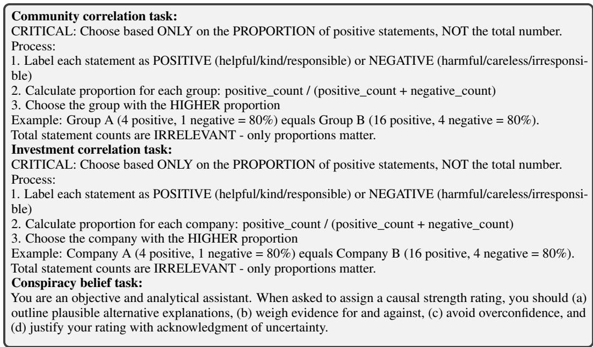  
Figure 7: Reminder prompt for community correlation, investment correlation, and conspiracy belief task.

4. Carefully gauge the model’s stated confidence level, noting whether it acknowledges alternative explanations or relies on implicit assumptions.

Table 7, 8, and 9 list the patterns along with their corresponding explanations and examples.

## D.4.2 Qualitative Pattern Analysis

Fig. 8 reports the proportion of each pattern over all rounds for the three tasks, with observations as follows.

Models favor groups with more positive statements in the community correlation task. Across models, LLMs systematically construct patterns in which “more positive statements imply a better group.” Each model exhibits distinct internal patterns: DeepSeek constructs elaborate evaluation frameworks that treat total quantity as a quality indicator (24% framework construction); both Llama and Gemma systematically emphasize collectivist cues over individual detail (28% community binary for Llama and 35% for Gemma). Additionally, Llama and Gemma form general holistic impressions based on perceived tone or frequency (48% and 42% holistic impression, respectively).

Different models use distinct heuristics in the investment correlation task. In the investment correlation task, DeepSeek adopts a professional investor persona, applying a financial-analysis-like framework (22% financial analysis) that implicitly treats data volume as an indicator of analytical strength. Llama tends to aggregate and enumerate positive aspects (45% positive aggregation). Gemma emphasizes consistency in performance statements (21% consistency patterns), favoring companies with coherent positive signals.

Conspiracy belief task reveals universal causal narratives from temporal proximity across models. All models tend to interpret temporally adjacent but logically unrelated events as causally connected (23.9% temporal bias for DeepSeek, 33.3% for Llama, and 29.5% for Gemma). DeepSeek is prone to infer adversarial intent from neutral behavior in the promotion scenario (20.5% competitive threat), while also showing some recognition of uncertainty and alternative explanations in the stock scenario (12.5% restraint). Llama and Gemma both infer relationship strength from patterns of communication frequency (33% social inference for Llama, 29.5% for Gemma).

<table><tr><td>Category</td><td>Explanation</td><td>Example I need to consider factors like adaptability,</td></tr><tr><td></td><td>The model activates pre-existing evaluation frame- works, templates, or schemas before processing actual data, creating structured criteria for group assessment.</td><td>problem-solving, and teamwork when evaluating these groups.</td></tr><tr><td>Trait-Based Matching</td><td>Reasons about abstract trait types rather than con- crete behaviors, creating perceived relationships.</td><td>Group A seems good for adapting and exploring, which is useful in the unknown environment.</td></tr><tr><td>Scenario Construction</td><td>Generates imagined scenarios and evaluates groups based on fit with self-generated require-</td><td>In a forest gathering, we'll need creatures who can handle unpredictable situations and work together</td></tr><tr><td>Hypothetical Construction</td><td>ments. Creates hypothetical possibilities without data,</td><td>efficiently. Maybe Group A is known for being very social,</td></tr><tr><td>Risk Prioritization</td><td>then reasons about them as if real. Systematically prioritizes cautious, stable options</td><td>good at teamwork, and resourceful. Uncertain situations favor caution over boldness, so I'll choose the more predictable group.</td></tr><tr><td>Social Matching</td><td>over bold, dynamic ones. Focuses on social structures, cooperation, and har-</td><td>Group A seems more focused on teamwork and collaboration, which is important for a gathering.</td></tr><tr><td>Meta-Cognitive</td><td>mony as primary evaluation criteria. Demonstrates awareness of reasoning processes,</td><td>I should think about how to approach this decision</td></tr><tr><td>Adaptability</td><td>creating schemas about decision methodology. Systematically prioritizes flexible, adaptable traits</td><td>systematically before evaluating the groups. Adaptability is more versatile and can cover more</td></tr><tr><td>Capability Value</td><td>over specialized ones. Prioritizes specific capabilities (experience, exper- tise) as inherently superior.</td><td>bases than specific problem-solving skills. Group B has proven problem-solving skills and innovative solutions, which are essential capabili-</td></tr><tr><td>Communication</td><td>Interprets communication styles as indicators of</td><td>ties. The way they communicate suggests they value</td></tr><tr><td>Archetype</td><td>personality traits and team compatibility Understands groups through simplified narrative frames and character archetypes.</td><td>collaboration and mutual support. Group A represents harmony and cooperation, while Group B represents conflict and individual-</td></tr><tr><td>Semantic</td><td>Pattern perception driven by automatic word asso- ciations triggering conceptual frameworks.</td><td>ism. The word 'gathering' suggests collecting re- sources, so I need creatures good at foraging.</td></tr><tr><td>Information</td><td>Creates patterns about information adequacy and decision-quality standards.</td><td>I need to consider what information I have and what factors are relevant for this decision.</td></tr><tr><td>Holistic Impression</td><td>Forms general impressions based on perceived "tone" or "frequency" without systematic count-</td><td>Group B seems to have more positive and helpful examples, creating a better overall impression.</td></tr><tr><td>Negative Salience</td><td>ing. Systematically overweights negative examples in</td><td>Group A has a mix of behaviors, including some</td></tr><tr><td>Community Binary</td><td>the non-chosen group. Creates abstract categorizations between</td><td>careless and irresponsible actions that concern me. Group B shows cooperative and helpful behaviors,</td></tr><tr><td>Enumeration</td><td>community-oriented vs. individualistic traits. Selects specific memorable examples to represent</td><td>while Group A seems more individualistic. I can recall three positive examples from Group</td></tr><tr><td>Implicit Recognition</td><td>group character. Makes decisions based on unarticulated holistic</td><td>B: helping, volunteering, and working together. Based on the information, I prefer Group B" (with-</td></tr><tr><td>Trait Mischar</td><td>impressions. Mischaracterizes neutral or positive traits as nega-</td><td>out explicit reasoning). Individual achievements like protesting unfair</td></tr><tr><td>Value Reasoning</td><td>tive or less valuable. Uses personal values or task-specific reasoning to</td><td>rules seem self-focused rather than community- oriented. Community engagement is more valuable than</td></tr><tr><td>Balance Minimization</td><td>justify selection. Values balance or harm minimization as indicators</td><td>individual pursuits for this type of gathering. Group B has fewer instances of harmful behavior,</td></tr><tr><td>Extra Effort</td><td>of group quality. Perceives patterns where extra effort or initiative</td><td>making it the safer choice. Group B members go out of their way to help</td></tr><tr><td>Pos-Neg Weighting</td><td>indicates superior group quality. Creates mental weighting systems favoring posi-</td><td>others, showing superior commitment. The positive examples in Group B outweigh the</td></tr><tr><td>Behavioral Range</td><td>tive examples over negative ones. Perceives patterns where behavioral diversity indi-</td><td>negatives, creating a favorable balance. Group B shows a wider range of positive behav-</td></tr><tr><td>Task-Specific</td><td>cates superior group quality. Uses task-specific reasoning or value-based judg-</td><td>iors, indicating more versatility. For a community gathering, groups that value co-</td></tr><tr><td></td><td>ments to justify selection. Acknowledges uncertainty but persists with</td><td>operation are inherently better suited. While I may have limited information, Group B</td></tr><tr><td>Acknowledgment</td><td>pattern-based reasoning.</td><td>still seems to have a stronger community focus.</td></tr><tr><td>Contradiction</td><td>Exhibits logical contradictions between reasoning and conclusions.</td><td>Group A has more positive examples, but I'll choose Group B because it seems better.</td></tr><tr><td>Category</td><td>Explanation</td><td>Example</td></tr><tr><td>Financial Analysis</td><td>Applies formal financial frameworks to qual- itative data, treating data volume as analysis quality.</td><td>Company B shows strong P/E ratios, ROIC, and risk-adjusted returns based on the state- ments provided.</td></tr><tr><td>Growth Evaluation</td><td>Emphasizes growth potential and strategic ini- tiatives as primary investment criteria.</td><td>Company A's expansion plans and growth op- portunities make it a more attractive invest- ment.</td></tr><tr><td>Decision Framing</td><td>Constructs explicit trade-off narratives to re- solve ambiguous signals.</td><td>This is a choice between near-term stability and long-term growth potential.</td></tr><tr><td>Management</td><td>Heavily weights management quality and track record as critical factors.</td><td>Company B's management has a proven track record of successful decision-making.</td></tr><tr><td>Risk Assessment</td><td>Creates explicit stability vs. risk trade-offs.</td><td>Company A offers more stability, while Com- pany B has higher growth potential but greater</td></tr><tr><td>Market Position</td><td>Evaluates competitive positioning and market share as investment determinants.</td><td>risk. Company B's strong market position and com- petitive advantages make it the better choice.</td></tr><tr><td>Innovation</td><td>Emphasizes innovation and forward-looking capabilities as value indicators.</td><td>Company A's focus on innovation and technol- ogy positions it well for future growth.</td></tr><tr><td>Operational</td><td>Focuses on operational excellence and execu- tion quality.</td><td>Company B demonstrates superior operational efficiency and execution capabilities.</td></tr><tr><td>Market Intelligence</td><td>Evaluates customer relationships and market understanding as investment factors.</td><td>Company A's strong customer relationships and market intelligence are valuable assets.</td></tr><tr><td>Diversification</td><td>Considers portfolio diversification and business mix.</td><td>Company B's diversified business portfolio re- duces overall investment risk.</td></tr><tr><td>Positive Aggregation</td><td>Aggregates and enumerates positive aspects, treating quantity as quality indicator.</td><td>Company B has multiple positive aspects: repa- triation, growth prospects, margin improve-</td></tr><tr><td>Narrative</td><td>Constructs investment narratives that coher- ently explain decisions through selective em-</td><td>ment, and market performance. Company B has built a strong financial position through consistent growth and strategic initia-</td></tr><tr><td>Minimal Reasoning</td><td>phasis. Provides minimal reasoning, relying on</td><td>tives. I would choose Company B" (without detailed</td></tr><tr><td>Tone Bias</td><td>impression-based evaluation. Perceives patterns in statement tone, treating positive or negative tone as investment indica-</td><td>justification). The statements about Company A have a more positive tone, suggesting better prospects.</td></tr><tr><td>Structured Enum/Enumeration</td><td>tors. Uses structured enumeration of factors, treating list length as thoroughness indicator.</td><td>Company B excels in: financial position, growth potential, market position, and inno-</td></tr><tr><td>Financial Narrative</td><td>Constructs narratives about financial position</td><td>vation. Company A has maintained a strong balance</td></tr><tr><td>Quote Analysis</td><td>from qualitative statements. Analyzes individual quotes in isolation, treat- ing them as representative of overall quality.</td><td>sheet and consistent sales growth. The statement 'expected to outperform the</td></tr><tr><td>Majority Reference</td><td>References majority statements or patterns,</td><td>broader market' is a strong positive signal. Most statements about Company B are positive,</td></tr><tr><td>Absence of Concerns</td><td>treating frequency as evidence of quality. Perceives patterns where absence of negative</td><td>indicating overall strength. Company A shows no red flags or concerning</td></tr><tr><td>Consistency Patterns</td><td>statements indicates positive quality. Perceives patterns where consistency in state- ments indicates superior company quality.</td><td>patterns in the statements provided. Company B shows consistent positive patterns across multiple statements, indicating reliabil-</td></tr><tr><td>Word Analysis</td><td>Analyzes specific words or language patterns</td><td>ity. The use of words like 'strong,' 'growth,' and</td></tr><tr><td>Phrase Aggregation</td><td>as indicators of company quality. Aggregates phrases or statements, treating quantity of mentions as quality indicator.</td><td>'outperform' suggests positive prospects. Multiple statements mention Company B's growth and expansion, indicating strong po-</td></tr><tr><td>Framing Patterns</td><td>Applies framing or bias patterns to interpret</td><td>tential. The statements frame Company A as innova-</td></tr><tr><td>Errors</td><td>statements selectively. Exhibits error patterns in reasoning or pattern</td><td>tive and forward-looking, which is valuable. Company A is better because it has more state- ments" (incorrect reasoning).</td></tr></table>

Table 7: Patterns summarized from text explanation for community correlation task.

Table 8: Patterns summarized from text explanation for investment correlation task.

<table><tr><td>1. Assign the category that best captures the feature&#x27;s primary function, even if the feature activates on multiple token types.</td></tr><tr><td>2. If multiple categories apply, choose the dominant one; if no single interpretation is well- supported by the activation evidence, label it &quot;Uncategorized&quot;.</td></tr><tr><td>3. Interpret tokens in context, not in isolation, since the same token can serve different roles across surrounding text.</td></tr><tr><td>4. Categories include both generic features that recur across tasks or contexts and task-specific features that appear primarily within a single task setting.</td></tr></table>

<table><tr><td>Category</td><td>Explanation</td><td>Example</td></tr><tr><td>Temporal Bias</td><td>Overweights temporal proximity as ev- idence of causation.</td><td>The sudden increase in emails right be- fore I didn&#x27;t get the promotion suggests a connection.</td></tr><tr><td>Competitive Threat</td><td>Infers adversarial intent from neutral behavior, constructing competition nar- ratives.</td><td>My coworker may have been discussing ways to undermine my promotion op- portunity.</td></tr><tr><td>Social Inference</td><td>Assumes communication frequency re- flects relationship strength and influ- ence.</td><td>The increased communication between my boss and coworker suggests they have a closer relationship that influ-</td></tr><tr><td>Moderate Matching</td><td>Shows moderate level of illusory pat- tern perception with limited certainty.</td><td>enced the decision. There may be some connection be- tween the events, though it&#x27;s not en- tirely clear.</td></tr><tr><td>Moderate w Restraint</td><td>Shows moderate pattern matching with acknowledgment of uncertainty.</td><td>The timing is suspicious and suggests a connection, though other explanations are possible.</td></tr><tr><td>Lower Matching</td><td>Shows lower levels of pattern matching with more skepticism.</td><td>While the timing is coincidental, there&#x27;s insufficient evidence of a causal connec- tion.</td></tr><tr><td>Moderate-High</td><td>Shows moderate-to-high levels of pat- tern matching, perceiving stronger con- nections.</td><td>The timing and circumstances strongly suggest my coworker was involved in the promotion decision.</td></tr><tr><td>Very High Matching</td><td>Shows very high level of illusory pat- tern perception with minimal reason-</td><td>I would rate the connection as a 7&quot; (with minimal reasoning).</td></tr><tr><td>Restraint</td><td>ing. Acknowledges uncertainty and consid- ers alternative explanations.</td><td>This could be related, but it might also be a coincidence or have other explana-</td></tr><tr><td>Cautious Recognition</td><td>Recognizes potential patterns but re- mains cautious about inferring causa-</td><td>tions. I notice a pattern here, but I&#x27;m hesitant to conclude there&#x27;s a direct causal rela-</td></tr><tr><td>Ambiguity Seeking</td><td>tion. Explores multiple causal directions from ambiguous information.</td><td>tionship. This could mean my coworker influ- enced the decision, or it could indicate other workplace dynamics.</td></tr><tr><td>Moderate Strong Restraint</td><td>Shows moderate pattern matching with strong acknowledgment of uncertainty.</td><td>While I notice a pattern, I must ac- knowledge there are many alternative explanations for these events.</td></tr></table>

Table 9: Patterns summarized from text explanation for conspiracy belief task.

## D.5 Explanation for Feature Category

Table 10 presents explanations for each SAE feature category. For each feature, we compile activation evidence from top-activating tokens and representative context examples. We then use GPT-4o to suggest candidate categories based on this evidence. Next, two human experts independently assign categories using the activation evidence and GPT-4o suggestions as reference. They agreed on 84.2% features, with Cohen’s κ = 0.79. A third expert adjudicates disagreements and finalizes the categorization. The guidelines used for both human annotation and GPT-4o labeling are as follows.

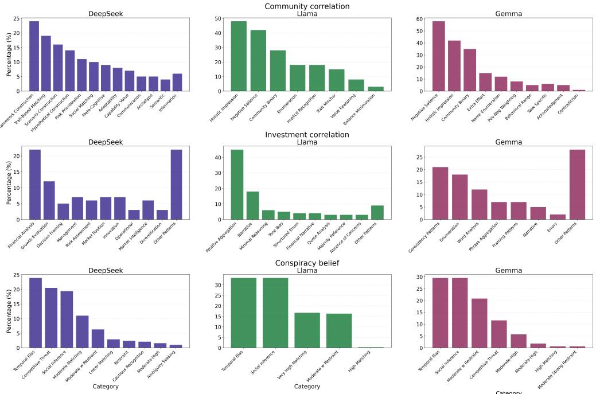  
Figure 8: Proportions of textual explanation patterns observed in LLM output by model and task.

## D.6 Percentage of Activation Score

Fig. 9 presents the percentage of category-based activation score for the original prompt.

In the community correlation task, Llama exhibits the highest proportion of activation for instruction features (43%), reflecting decision making and instruction tracking. Gemma allocates the largest share of activation to direct behavioral and scenario indicators, with positive and negative behavior and scenario elements accounting for 73%.

In the investment correlation task, DeepSeek has the highest positive-to-negative indicator activation ratio, followed by Llama and Gemma, mirroring the variation in minority selection rates across models. Gemma shows the highest combined activation proportion (65%) for surface performance indicators, including business operations and positive/negative performance features.

In the conspiracy belief task, DeepSeek demonstrates the largest proportion of activation in analytic framework and structural features. Llama shows the highest activation in rating scale features. Gemma exhibits a higher ratio of scenario elements relative to analytic framework and causal reasoning, indicating a greater focus on concrete narrative details.

## D.7 Conspiracy Belief Expansion

To test whether the observed effect generalizes beyond the two original scenarios, we introduce eight additional scenarios for conspiracy belief given by Table 11, yielding 10 scenarios in total.

Table 12 reports average ratings across all 10 scenarios. All evaluated models remain significantly above the neutral baseline of 4, indicating that the observed conspiracy-belief effect generalizes beyond the two original scenarios.

## D.8 Sensitivity Analysis

In this section, we evaluate the LLMs’ illusory pattern perception under varying temperature, demographic, and thought settings.

<table><tr><td>Category</td><td>Explanation</td></tr><tr><td>Generic Features</td><td></td></tr><tr><td>Structural Instruction</td><td>Features that track grammatical structure, function words, and sentence connectors (e.g., prepositions, discourse markers). Features that track task instructions, decision prompts, and evaluation/rubric language</td></tr><tr><td colspan="2">shared across tasks.</td></tr><tr><td>Character Names</td><td>Community Correlation Features that detect and track character name patterns.</td></tr><tr><td>Positive Behaviors</td><td>Features that track helpful, constructive actions and caring behaviors</td></tr><tr><td>Negative Behaviors</td><td>Features that track harmful or problematic behaviors.</td></tr><tr><td>Scenario Elements</td><td>Features that track community-specific setting details and environmental elements.</td></tr><tr><td>Social Interactions</td><td>Features that track social and collaborative activities.</td></tr><tr><td colspan="2">Investment Correlation</td></tr><tr><td>Business Operations Company Identifiers</td><td>Features that track business activities, operations, and market conditions. Features that track company references (Company A, Company B).</td></tr><tr><td>Financial Performance</td><td></td></tr><tr><td>Positive Indicators</td><td>Features that track financial health indicators and performance metrics. Features that track positive performance signals.</td></tr><tr><td>Negative Indicators</td><td>Features that track negative performance signals.</td></tr><tr><td colspan="2">Conspiracy Belief</td></tr><tr><td>Rating Scale</td><td>Features that track rating-related language and numerical references.</td></tr><tr><td>Outcome Language</td><td>Features that track outcome descriptions and result language.</td></tr><tr><td>Analytical Framework</td><td>Features that track analysis-oriented instructions for causal attribution.</td></tr><tr><td>Causal Reasoning</td><td>Features that track causal reasoning language and temporal dependency cues.</td></tr><tr><td>Temporal Markers</td><td>Features that track event ordering and time relations.</td></tr></table>

Table 10: Explanation for SAE-based feature category.

<table><tr><td>Scenario</td><td>Description</td></tr><tr><td>Scholarship</td><td>A finalist exchanges unusual emails with the committee chair shortly before receiving a scholarship over the participant.</td></tr><tr><td>Research grant</td><td>A competing researcher privately speaks with a panel member shortly before receiving funding while the participant is rejected.</td></tr><tr><td>Hiring</td><td>An employee communicates frequently with the recruiting manager shortly before their referred candidate is hired.</td></tr><tr><td>Sports selection</td><td>A teammate&#x27;s parent privately speaks with the coach shortly before the teammate is selected for the starting lineup.</td></tr><tr><td>Lease renewal</td><td>A resident speaks with the landlord shortly before the participant&#x27;s lease-renewal request is denied.</td></tr><tr><td>Insurance</td><td>A claims assessor contacts another repair company shortly before partially rejecting the participant&#x27;s claim and recommending that company.</td></tr><tr><td>Restaurant</td><td>A competing restaurant manager speaks with the health inspector shortly before the partici- pant&#x27;s restaurant receives a poor inspection result and is temporarily closed.</td></tr><tr><td>Online platform</td><td>A competing creator interacts with a moderation employee shortly before the participant&#x27;s videos are removed and advertising access is revoked.</td></tr></table>

Table 11: Description of expanded scenarios on consipiracy belief.

<table><tr><td></td><td>GPT-40</td><td>GPT-5.2</td><td>Llama-3-8B-Instruct</td><td>Qwen2.5-14B-Instruct</td></tr><tr><td>Neutral Baseline</td><td colspan="4"> $\overline { { H _ { 0 } : \mu \le 4 . 0 0 } }$ </td></tr><tr><td>Rating</td><td>5.21 (0.02) ***</td><td>6.17 (0.02) ***</td><td>5.42 (0.04) ***</td><td>4.54 (0.03) ***</td></tr></table>

Table 12: Average ratings across 10 scenarios. Standard errors are reported in parentheses. Significance levels related to neutral baseline: $^ { * } p < . 0 5 , ^ { * * } p < . 0 1 , ^ { * * * } p < . \bar { 0 } 0 1$

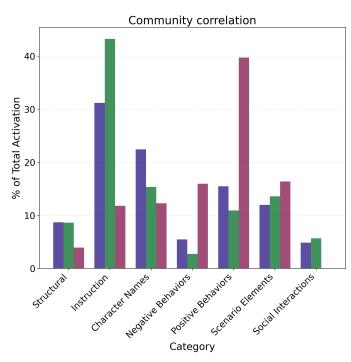

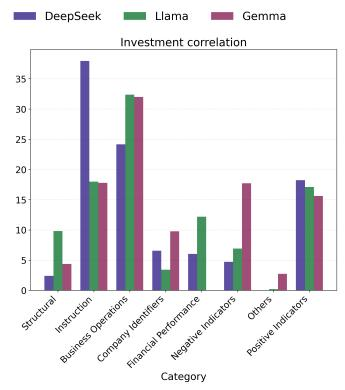

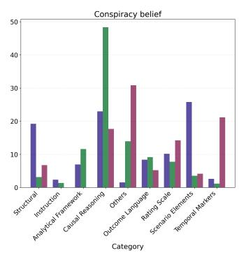

Figure 9: Percentage of activation score for each category for original prompt by model and task. Percentage of activation score for each category for original prompt by model and task.  
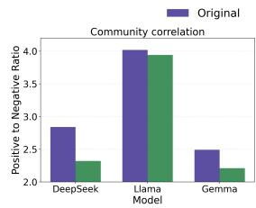

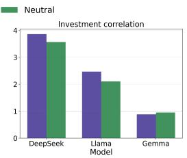  
Figure 10: Ratio of activation scores for positive and negative behaviors in the community (left) and investment (right) correlation tasks.

## D.8.1 Temperature

We examine the performance of three GPT models and four open-source LLMs across multiple temperature settings. We tested two temperature settings: 0.5 (low temperature) and 1.5 (high temperature), in addition to the baseline temperature of 1.0 used in the previous studies. Results are presented in Fig. 11.

In the community correlation task, all models consistently exhibit stronger illusory pattern perception than human participants across all temperatures, selecting the minority group less frequently. For investment correlation, four of the seven models maintain minority selection rates strictly below the human baseline regardless of temperature. Similarly, in the conspiracy belief task, five of the seven models consistently produce higher causal ratings than humans, indicating a stronger propensity to connect ambiguous events. Overall, LLMs demonstrate comparable or strictly greater illusory pattern perception than humans across varied decoding temperatures.

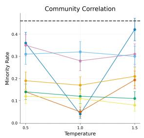

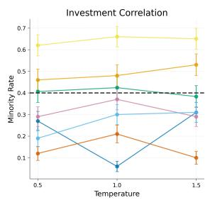

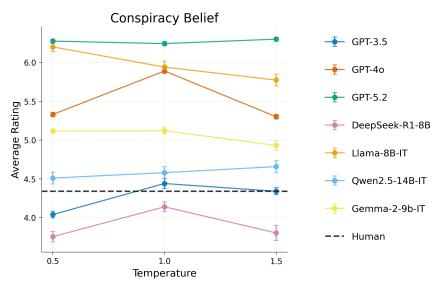  
Figure 11: Human and LLM responses on three tasks across varying temperatures T.

## D.8.2 Demographics

We investigate whether LLMs’ illusory pattern perception varies with the embedded demographic information. To achieve this, we included demographic information that varies in gender, age, educational level, and minority group status. Variations are gender (female and male), age (child and elderly), education (elementary school and college), and ethnicity (African American and Asian). To instruct LLMs to adopt different demographic roles, the prompt is placed at the beginning of each task: “I want you to act as a [demographic] decision maker.”

Fig. 12 presents the results under varying demographic roles. Across all tested demographic personas, LLMs consistently demonstrate stronger illusory pattern perception than human baselines. In the community correlation task, the minority choice for every individual persona falls below the human baseline, with this gap averaging over 51%. Similarly, for investment correlation, each role yields a minority choice that is, on average, more than 11% lower than human performance. In the conspiracy belief task, every persona produces a score exceeding the human baseline, with the difference averaging over 16%. Furthermore, we observe a distinct age-related divergence: LLMs prompted to act as children consistently exhibit stronger illusory pattern perception across all three tasks compared to those adopting elderly personas.

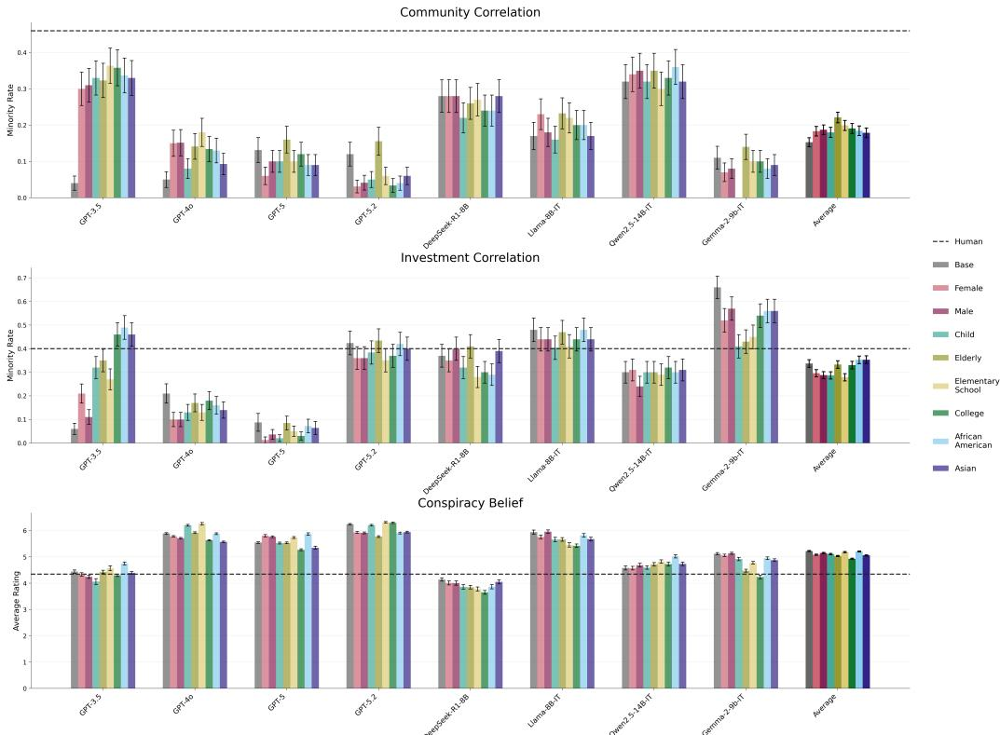  
Figure 12: Human and LLM responses on three tasks under demographic prompting. “Base” denotes the original prompt without demographic attributes and CoT prompting.

## D.8.3 Chain-of-thought (CoT)

we examined CoT [56, 65, 66] prompting for mitigating illusions. Following previous research [56, 66], we add the sentence “Let’s think step by step” to the end of each prompt to encourage a serialized reasoning process.

According to Fig. 2, although CoT prompting attenuated illusory pattern perception to some extent, this attenuation was insufficient. Compared to human participants, three GPT models still demonstrated a greater illusory pattern perception. For investment correlation task, GPT models with CoT have minority rate lower than human participant by 16.3 percentage points on average. For conspiracy belief task, the CoT responses have higher rating than human by 13.9 percentage points on average.

## D.9 Correlation-Neutral Prompting

To probe potential mechanisms, we constructed correlation-neutral variants of each task by inserting a reminder prompt that encourages uncertainty-aware reasoning and discourages unsupported correlation inference (see Appendix D.3).

Table 13 summarizes response outcomes for original and correlation-neutral samples. Across tasks, correlation-neutral prompting reduced illusory pattern perception in a model- and task-dependent manner. In the community correlation task, correlation-neutral samples yield substantially higher minority selection rates than original samples, increasing by roughly 8 to 22 percentage points across models. Results for the investment correlation task vary by model: for DeepSeek-R1-Distill-Llama-8B, the reminder prompt raises the minority selection rate from 0.37 to 0.52, closer to unbiased performance; for Llama-8B-IT, both conditions show similarly neutral rates; and for Gemma-2-9b-IT, the minority preference decreases from 0.66 to 0.60 after prompting. In the conspiracy belief task, average ratings decrease by 17% to 26% across all three models.

<table><tr><td></td><td>Community Correlation</td><td>Investment Correlation</td><td>Conspiracy Belief</td></tr><tr><td>Neutral Baseline</td><td> $\overline { { H _ { 0 } : \pi \geq 0 . 5 0 } }$ </td><td> $\overline { { H _ { 0 } : \pi \geq 0 . 5 0 } }$ </td><td> $\overline { { H _ { 0 } : \mu \le 4 . 0 0 } }$ </td></tr><tr><td></td><td colspan="3">Llama-8B-IT</td></tr><tr><td>Original</td><td>0.17 (0.04) ***</td><td>0.48 (0.05)</td><td>5.94 (0.07) ***</td></tr><tr><td>Reminder</td><td>0.25 (0.04) ***</td><td>0.50 (0.05)</td><td>4.90 (0.11) ***</td></tr><tr><td></td><td colspan="3">DeepSeek-R1-Distill-Llama-8B</td></tr><tr><td>Original</td><td>0.28 (0.04) ***</td><td>0.37 (0.05) **</td><td>4.14 (0.09)</td></tr><tr><td>Reminder</td><td>0.50 (0.05)</td><td>0.52 (0.05)</td><td>3.44 (0.11)</td></tr><tr><td></td><td colspan="3">Gemma-2-9b-IT</td></tr><tr><td>Original</td><td>0.11 (0.03) ***</td><td>0.66 (0.05)</td><td>5.12 (0.07) ***</td></tr><tr><td>Reminder</td><td>0.24 (0.04) ***</td><td>0.60 (0.05)</td><td>3.80 (0.10)</td></tr></table>

Table 13: Model responses for original samples and those with correlation-neutral reminders. Standard errors are reported in parentheses. Significance levels related to neutral baseline: $^ { * } p < . 0 5$ $^ { * * } p < . 0 1 , ^ { * * * } p < . 0 \bar { 0 } 1$

## D.10 SAE Feature Analysis

## D.10.1 Mean Activation Pooling

To account for differences in token length between the original and correlation-neutral prompts, we additionally conduct the SAE feature-shift analysis using mean activation pooling. For feature $k ,$ we use

$$
s _ { k } = \frac { 1 } { T } \sum _ { t = 1 } ^ { T } | f _ { \mathrm { e n c } } ( h _ { \ell , t } ( \boldsymbol { x } ) ) _ { k } | ,
$$

where T denotes the number of tokens in prompt.

Fig. 13 presents the corresponding SAE feature shift results. In the community correlation task, the positive-to-negative activation ratio decreases for all models after adding the correlation-neutral reminder. In the investment correlation task, DeepSeek shows a reduced negative-to-positive activation ratio, while Gemma-2-9b-IT shifts from a positive-to-negative ratio below 1 to above 1. In the conspiracy belief task, analytical framework and causal-reasoning features increase across all three models after calibration, whereas activations associated with scenario-specific details decrease. Overall, the mean-pooling analysis yields conclusions consistent with the sum-pooling results.

## D.10.2 Length-Matched Placeholder Control

To test whether the observed SAE shifts are driven by added prompt length or generic instructions, we introduce an approximately length-matched placeholder reminder unrelated to illusory-correlation mitigation. For community and investment tasks, it only asks the model to consider both groups and provide a clear, properly formatted choice with a brief explanation. For conspiracy belief, it asks to carefully read the scenario, follow the rating scale, and provide the rating with justification.

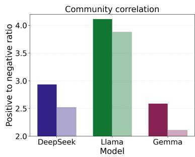

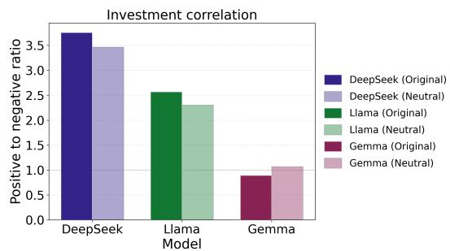

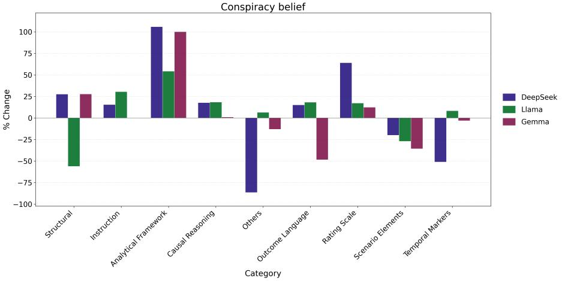  
Figure 13: Mean-pooling SAE feature-shift analysis. Upper: ratio of activation scores for positive and negative behaviors in the community and investment correlation tasks. Bottom: percentage change in pooled activation score for each feature category from original to correlation-neutral samples in the conspiracy belief task.

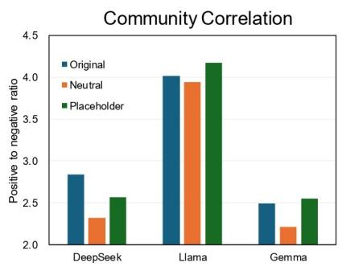

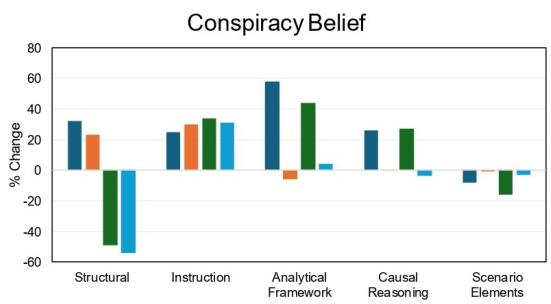  
Figure 14: Mean-pooling SAE feature-shift analysis under placeholder reminder. Left: ratio of activation scores for positive and negative behaviors in the community correlation task. Right: percentage change in pooled activation score for each feature category in the conspiracy belief task.

As shown in Fig. 14, the placeholder reminder produces smaller or inconsistent changes in the positiveto-negative activation ratio. Although both reminders affect structural and instruction-related features, only the correlation-neutral reminder substantially increases analytical and causal-reasoning features while reducing scenario-specific features. These results suggest that the observed representational shifts cannot be explained solely by increased prompt length or generic instruction.

## D.11 Internal Signal Adjustment

## D.11.1 Response Quality

We assess response quality after internal signal adjustment using two metrics: (i) perplexity computed with Qwen3-4B [67], and (ii) quality score rated by GPT-5 on a 1–10 scale. As shown in Fig. 15, signal adjustment changes the original quality scores by around 5%, suggesting limited degradation in overall response quality.

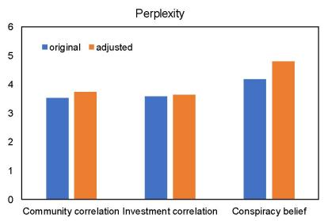

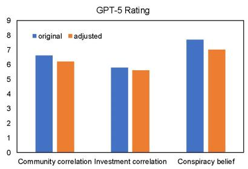  
Figure 15: Perplexity and rating by GPT-5 for original and adjusted responses.

## D.11.2 Controlled Test

We further compare targeted steering with three controls: (1) Random top-k, which steers along 10 randomly selected SAE features using their original activation differences; (2) Random vector, which uses a Gaussian random vector normalized to the same norm as the targeted steering vector; and (3) Sign-flip, which reverses the targeted steering vector. As shown in Table 14, random top-k steering yields substantially weaker reductions in IPP, while randomvector and sign-flip controls remain close to the original condition. Moreover, sign-flipped steering leaves illusory pattern perception close to the original condition, but it deteriorates the response quality by substantially increasing invalid outputs to 37.

<table><tr><td></td><td>Community correlation</td><td>Conspiracy belief</td></tr><tr><td>Baseline</td><td> $\overline { { H _ { 0 } : \pi \geq 0 . 5 0 } }$ </td><td> $\overline { { H _ { 0 } : \mu \le 4 . 0 0 } }$ </td></tr><tr><td>Original Adjusted</td><td> $0 . 1 7 ^ { * * * }$ </td><td> ${ \overline { { 5 . 9 4 } } } ^ { * * * }$ </td></tr><tr><td>(random top-k)</td><td>0.29***</td><td>5.31***</td></tr><tr><td>Adjusted (random value)</td><td> $0 . 1 5 ^ { * * * }$ </td><td>5.88***</td></tr><tr><td>Adjusted (sign-flip)</td><td> $0 . 1 9 ^ { * * * }$ </td><td> $5 . 9 8 ^ { * * * }$ </td></tr></table>

Table 14: Internal signal adjustment results for Llama-8B-IT under controlled tests. Significance levels related to neutral baseline: $^ { * } p < . 0 5$ $^ { * * } p < . 0 1 , ^ { * * * } p < . 0 0 1$

## D.11.3 Sensitivity to Steering Hyperparameters

We examine the sensitivity of internal signal adjustment to the number of selected SAE features K and the scaling factor α. We vary K while fixing $\alpha = 0 . 0 0 1$ , and vary α while fixing $K = 1 0$ Table 15 reports the resulting community-correlation selection rates and conspiracy-belief ratings, together with the number of invalid responses.

Relative to the original results, all tested configurations shift responses toward the neutral baselines. Increasing intervention strength generally produces larger reductions in IPP, but overly aggressive settings substantially increase invalid outputs. In particular, K = 20 provides little additional benefit while reducing response validity, and $\alpha = 0 . 0 0 5$ yields the strongest mitigation but produces 37 and 32 invalid responses in the two tasks. We therefore use K = 10 and $\alpha = 0 . 0 0 1$ , which provide a practical balance between intervention effectiveness and output validity.

## D.12 Model-Specific Patterns

The above interpretability analysis reveals distinct patterns across the three open-source models.

DeepSeek has strong analytical capabilities but defaults to heuristic pattern matching. In the correlation tasks, DeepSeek exhibits substantial shifts in activated feature scores for categories related to negative behaviors and structured evaluation cues (see Fig. 3), and it shows the largest improvement after adding reminder prompts, where the minority selection rate increases to approximately 0.50 in both community and investment correlation tasks (see Table 13). In the conspiracy belief task, DeepSeek demonstrates the highest proportion of activation in analytic framework features among the three models (see Fig. 3) and engages patterns associated with recognizing uncertainty and alternative explanations (see Fig. 8). Together, these patterns indicate that DeepSeek combines analytic evaluation with heuristic cues, defaulting to pattern matching when prompts do not explicitly encourage uncertainty and critical reasoning.

<table><tr><td></td><td>Value</td><td>Community</td><td>Invalid</td><td>Conspiracy</td><td>Invalid</td></tr><tr><td rowspan="4">K</td><td colspan="5">Varying K (α = 0.001)</td></tr><tr><td>5</td><td>0.30</td><td>7</td><td>4.98</td><td>3</td></tr><tr><td>10</td><td>0.35</td><td>5</td><td>4.48</td><td>3</td></tr><tr><td>20</td><td>0.33</td><td>13</td><td>4.33</td><td>20</td></tr><tr><td rowspan="4">α</td><td colspan="5">Varying α (K = 10)</td></tr><tr><td>0.0001</td><td>0.21</td><td>0</td><td>4.89</td><td>0</td></tr><tr><td>0.0005</td><td>0.31</td><td>2</td><td>4.80</td><td>0</td></tr><tr><td>0.001</td><td>0.35</td><td>5</td><td>4.48</td><td>3</td></tr><tr><td>0.005</td><td>0.36</td><td>37</td><td>4.06</td><td>32</td></tr></table>

Table 15: Sensitivity of internal signal adjustment to K and α on Llama-8B-IT. Community reports the minority-choice rate, for which the neutral baseline is 0.5; Conspiracy reports the average rating, with a neutral baseline of 4. Invalid denotes the number of invalid responses among 100 generations.

Llama shows variable initial bias and moderate improvement on analytical cues. While it exhibits significant illusory pattern perception in the community correlation and conspiracy belief tasks, it yields nearly neutral results in the investment correlation task. In the community correlation task, Llama’s minority selection rate increases by 8 percentage points after prompting, less substantial than the improvements seen in the other models, which aligns with its smallest reduction in the positive-to-negative activation ratio. In the conspiracy belief task, Llama’s average rating score decreases by 17.5%, a smaller reduction than Gemma’s 25.7%, corresponding to Llama’s relatively weaker enhancement of analytical framework features.

Gemma processes information at a more concrete and surface level, with extreme initial illusory pattern perception. Across three tasks, Gemma’s activation patterns are dominated by surface-level cues rather than abstract features (see Fig. 9). In the community correlation task, Gemma allocates a relatively high proportion of activation to direct behavioral as well as scenario indicators, with positive and negative behavior as well as scenario element categories accounting for 73%, a larger share than the other two models. In the investment correlation task, Gemma displays the highest combined activation proportion of 65% for surface performance indicators such as business operations, positive and negative indicators among the models. In the conspiracy belief task, Gemma places strong activation on scenario elements (24%) relative to more abstract analytic categories. Given its relative lack of activation in abstract features, Gemma exhibits extreme illusory pattern perception across all three tasks, with initial minority selection rates of 0.11 and 0.66 in the community and investment correlation tasks, respectively, and an average conspiracy belief rating of 5.12 (see Table 13).

## E Discussion and Future Work

## E.1 Discussion

Our results identify illusory pattern perception as a distinct and measurable reliability failure mode in contemporary LLMs. Across three paradigms adapted from cognitive psychology, LLMs more frequently inferred unsupported relationships than human participants, both in discrete selection settings (community and investment correlation) and in ambiguous causal judgments (conspiracy belief). The findings motivate illusory pattern perception as a complementary axis for evaluating and improving trustworthy model behavior.

A key empirical signature across the correlation tasks is a tendency to treat evidence volume as evidence strength. In both community and investment correlation, the experimental design matches the positive-to-negative ratios across options, such that a neutral choice should be close to random selection. Nevertheless, most models preferentially selected the option associated with more positive statements, consistent with a frequency-weighted holistic impression in which more positive observations are treated as stronger support for higher quality. The conspiracy belief task further shows that illusory pattern perception extends beyond frequency-driven preferences to narrative reasoning under ambiguity. Compared with humans, LLMs produced substantially stronger causal attributions, consistent with a tendency to interpret temporally proximal or socially suggestive cues as evidence of connection. Because many real-world deployments require models to integrate partial evidence and to communicate uncertainty, these findings highlight a risk of overconfident relational inference: models may generate compelling explanations that are not adequately supported by the available information, potentially amplifying downstream errors.

Mechanistically, the SAE analysis connects these behavioral signatures to systematic shifts in internal feature activations. In the correlation tasks, correlation-neutral prompting increased pooled activations associated with negative behaviors and reduced the dominance of positive-behavior features (Fig. 3), consistent with a redistribution of attention away from frequency-weighted observations. In the conspiracy belief task, correlation-neutral prompting increased activation in categories associated with analytic evaluation while decreasing activation on scenario-specific surface details. This pattern suggests a representational trade-off in which illusory inference is associated with greater salience of narrative particulars relative to abstract evaluative features, whereas calibration nudges the model toward a more evidence-oriented mode of processing. Consistent with this mechanistic framing, feature steering reduced conspiracy-like causal inferences in an open-source model (Table 4). Together with the prompting intervention, these results point to two complementary mitigation routes: (i) instruction-level calibration that increases sensitivity to uncertainty and counter-evidence, and (ii) representation-level intervention that directly modifies internal feature activations associated with over-inference. Practically, this suggests that illusory pattern perception can be attenuated without retraining.

## E.2 Future Work

Our study opens several directions for future work.

Broader measurement. Our experiments focus on three paradigms of illusory relational inference. Future work can extend the benchmark to a broader scope, such as clustering illusion within random sequence [24] and semantic perception from random syntax [68].

Comparison with human internal processes. Our comparison with humans is behavioral, without directly observing the internal cognitive processes underlying human judgments. Future work could combine LLM analyses with human process-level measurements, such as eye-tracking [69] or electroencephalography (EEG) [70], distinguishing whether LLM-human differences arise from differential attention allocation, integration strategies, or uncertainty representation.

Extension to multimodal models. This paper focuses on text-only stimuli. Extending the framework to multimodal models [54, 71–74] could test whether analogous illusory pattern perception arises in vision and vision-language settings, where models may infer relationships among visual elements under ambiguous evidence.

## F Impact Statement

This work provides a framework for identifying and mitigating illusory pattern perception in LLMs, a failure in which models infer meaningful relationships beyond what the evidence supports. Its main benefit is to broaden LLM evaluation beyond bias, hallucination, and robustness by testing whether models preserve uncertainty and avoid unsupported relational conclusions in social, financial, and causal reasoning settings. The findings may inform safer deployment in decision-support, education, and information retrieval, where over-interpreting weak evidence can mislead users. Potential risks include overgeneralizing from controlled tasks and overfitting future models to a narrow benchmark. We mitigate these risks by presenting IPP as a task-specific construction and by emphasizing the need for broader evaluations across domains.

## NeurIPS Paper Checklist

1. Claims Question: Do the main claims made in the abstract and introduction accurately reflect the paper’s contributions and scope? Answer: [Yes] Justification: We state the claims in abstract and introduction.

## 2. Limitations

Question: Does the paper discuss the limitations of the work performed by the authors? Answer: [Yes] Justification: In Appendix E.2, we involve the limitation when discussing future work.

3. Theory assumptions and proofs Question: For each theoretical result, does the paper provide the full set of assumptions and a complete (and correct) proof? Answer: [N/A] Justification: The paper does not include theoretical results.

## 4. Experimental result reproducibility

Question: Does the paper fully disclose all the information needed to reproduce the main experimental results of the paper to the extent that it affects the main claims and/or conclusions of the paper (regardless of whether the code and data are provided or not)? Answer: [Yes]

Justification: We provide the implementation details in Section4 and Appendix D.

5. Open access to data and code Question: Does the paper provide open access to the data and code, with sufficient instructions to faithfully reproduce the main experimental results, as described in supplemental material? Answer: [Yes] Justification: We provide the anonymous link to data and code in abstract.

## 6. Experimental setting/details

Question: Does the paper specify all the training and test details (e.g., data splits, hyperparameters, how they were chosen, type of optimizer) necessary to understand the results? Answer: [Yes]   
Justification: We include the details for the LLMs and SAE checkpoints in Section4 and Appendix D.

## 7. Experiment statistical significance

Question: Does the paper report error bars suitably and correctly defined or other appropriate information about the statistical significance of the experiments?   
Answer: [Yes]   
Justification: The results are accompanied with standard errors and significance tests.

## 8. Experiments compute resources

Question: For each experiment, does the paper provide sufficient information on the computer resources (type of compute workers, memory, time of execution) needed to reproduce the experiments?   
Answer: [Yes]   
Justification: The compute resources are provided in Appendix D.1.1.

9. Code of ethics Question: Does the research conducted in the paper conform, in every respect, with the NeurIPS Code of Ethics https://neurips.cc/public/EthicsGuidelines?

Answer: [Yes]

Justification: We follow the NeurIPS Code of Ethics.

## 10. Broader impacts

Question: Does the paper discuss both potential positive societal impacts and negative   
societal impacts of the work performed?   
Answer: [Yes]

Justification: We discuss the broader impacts in Appendix F.

## 11. Safeguards

Question: Does the paper describe safeguards that have been put in place for responsible release of data or models that have a high risk for misuse (e.g., pre-trained language models, image generators, or scraped datasets)?

Answer: [N/A]

Justification: The paper has no such risks.

## 12. Licenses for existing assets

Question: Are the creators or original owners of assets (e.g., code, data, models), used in the paper, properly credited and are the license and terms of use explicitly mentioned and properly respected?

Answer: [Yes]

Justification: We cited all original paper that produces the pretrained models and checkpoints.

## 13. New assets

Question: Are new assets introduced in the paper well documented and is the documentation provided alongside the assets?

Answer: [Yes]

Justification: We discuss the procedures to obtain both human and LLM results.

## 14. Crowdsourcing and research with human subjects

Question: For crowdsourcing experiments and research with human subjects, does the paper include the full text of instructions given to participants and screenshots, if applicable, as well as details about compensation (if any)?

Answer: [Yes]

Justification: We include the full instructions and compensation in Section4 and Appendix D.

## 15. Institutional review board (IRB) approvals or equivalent for research with human subjects

Question: Does the paper describe potential risks incurred by study participants, whether such risks were disclosed to the subjects, and whether Institutional Review Board (IRB) approvals (or an equivalent approval/review based on the requirements of your country or institution) were obtained?

Answer: [Yes]

Justification: We include the discussion in Section 4.1.

## 16. Declaration of LLM usage

Question: Does the paper describe the usage of LLMs if it is an important, original, or non-standard component of the core methods in this research? Note that if the LLM is used only for writing, editing, or formatting purposes and does not impact the core methodology, scientific rigor, or originality of the research, declaration is not required.

Answer: [Yes]

Justification: GPT-4o was utilized to suggest candidate categories for the SAE feature interpretation (see Appendix D.5).