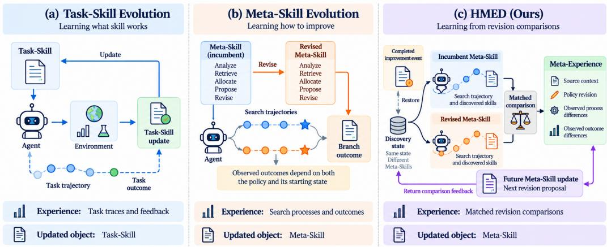
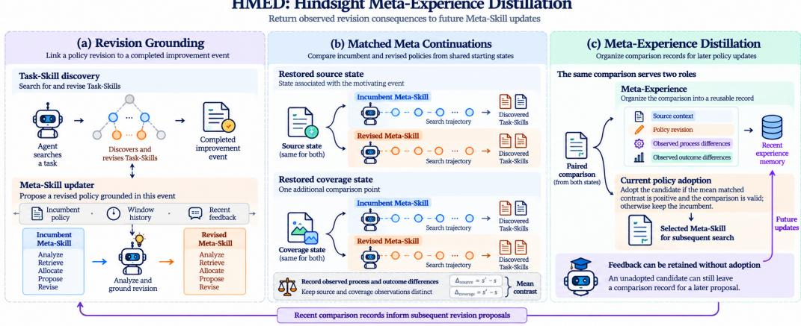

# LEARNING FROM REVISION CONSEQUENCES: HINDSIGHT META-EXPERIENCE DISTILLATION FOR SELF-IMPROVING AGENTS

Qianhan Feng1, Zhongzhen Huang2, Yakun Zhu2,3, Xiaofan Zhang\*2, Qi Dou\*1 1 The Chinese University of Hong Kong 2 Shanghai Jiao Tong University 3 Shanghai Innovation Institue

## ABSTRACT

As agents continuously improve by generating and revising Skills, the process that discovers and refines those Skills becomes a learnable object in its own right. Task-Skills directly act on task execution, whereas Meta-Skills govern how agents discover and improve future Skills; their value therefore emerges through the subsequent search processes they induce. Existing approaches improve Meta-Skills from observed raw Skill-search trajectories and branch outcomes. However, branch performance entangles the effects of the initial discovery state and the Meta-Skill revision that generated the search process, making it difficult to characterize what a particular revision actually changed, and pushing updates toward revisions that benefit from favorable states rather than those that improve the process. We introduce HMED (Hindsight Meta-Experience Distillation), a mechanism for constructing Meta-Experience for self-improving agents. HMED revisits the completed event from which a revision originates and re-executes the incumbent and revised Meta-Skills from the same restored discovery state, so that the changes associated with the revision can be observed under a shared condition. Each comparison is distilled into a Meta-Experience, a structured record that can be reused by future updates, so that even revisions that are not ultimately retained still contribute a learning signal. Across three interactive agent benchmarks and both open-source and closed-source models, HMED consistently improves Skill discovery performance over strong baselines, shifting Meta-Skill learning beyond branch outcomes toward the consequences of changing the improvement process.

## 1 INTRODUCTION

Agents increasingly improve by turning interaction into reusable capabilities. A household agent that repeatedly has to locate objects can accumulate a Skill for finding them, so that a lesson learned once is available later without being rediscovered (Shinn et al., 2023; Zhao et al., 2023; Wang et al., 2023). As agents operate in increasingly open environments, however, improvement is no longer limited to acquiring individual capabilities. An agent must also improve the process through which it discovers, evaluates, and refines those capabilities. We refer to the policy governing Skill discovery and evolution as a Meta-Skill, and to the capabilities it produces as Task-Skills. A Task-Skill determines how an agent performs a task and can usually be evaluated through task outcomes. A Meta-Skill instead shapes how future capabilities are generated. Its value is realized only through the search processes it subsequently guides.

Existing approaches improve Meta-Skills using signals derived from Skill-search trajectories, descendant outcomes, and accumulated evolution histories (Fernando et al., 2023; Agrawal et al., 2025; Wang et al., 2026). These signals are attached to complete search branches rather than to the consequences of individual Meta-Skill revisions. A search branch reflects the combined influence of where the search started and how the improvement policy guided it. As a result, its final outcome does not directly reveal the contribution of a particular Meta-Skill revision: a favorable discovery state may make a weak revision appear effective, while a useful revision may appear ineffective when evaluated from a difficult starting point. In other words, a good branch is not necessarily a good improver.

  
Figure 1: Learning signals in Skill evolution. Task-Skill methods update from task outcomes; existing Meta-Skill evolution updates from branch-level search signals, where the starting discovery state and the Meta-Skill are mixed; HMED updates from matched revision consequences, where the same discovery state is restored and only the Meta-Skill is varied.

This limitation comes from a mismatch between the experience collected by existing Skill evolution methods and the experience required for learning a reusable improvement policy. A trajectory records what happened during one improvement process, whereas it does not characterize what consequences are associated with a particular revision. What Meta-Skill learning needs is an experience unit centered on the revision itself: what changed in the improvement process, and what followed from that change. We call this unit Meta-Experience. Conceptually, it links four aspects of a revi sion: the completed event that motivated it, the modification to the Meta-Skill, the changes observed in the subsequent search process, and the resulting changes in discovered capabilities. For example, a revision that adjusts the retrieval component of the Meta-Skill may show which prior experience was consulted differently and whether that change led to different discoveries. Unlike Task-level Experience, which describes whether an existing capability can solve a task, Meta-Experience describes what a change to the improvement process produced.

We introduce Hindsight Meta-Experience Distillation (HMED) to construct and reuse this experience. HMED anchors each Meta-Skill revision to the completed improvement event that motivated it, restores the discovery state from which that event began, and re-runs the search under both the incumbent and revised Meta-Skills from that shared starting point. The resulting paired traces are distilled into a compact Meta-Experience record. This record enters the next round of Meta-Skil updates, where it can inform how future revisions are proposed. A comparison therefore serves two roles: it decides whether to retain the current revision, and it contributes a record that shapes later revisions. Because the record is kept regardless of whether the revision is adopted, even a rejected revision leaves a reusable learning signal.

We evaluate HMED on three interactive agent benchmarks, using DeepSeek-v4-Flash and Qwen3- 32B. HMED achieves the highest mean downstream performance in all six model–benchmark configurations, and an ALFWorld ablation shows that returning revision consequences to later updates provides additional gains over using comparison only for selection. When the learned Meta-Skill is frozen and the Task-Skill library is reset, it continues to guide effective discovery at new origins, indicating that HMED learns a reusable improvement policy rather than fitting the trajectories that produced it. Together, these results suggest that learning an improvement policy benefits from an experience representation aligned with the object being learned. Our contributions are threefold:

• Meta-Experience for Self-Improving Agents. We identify the mismatch between branchlevel Skill-evolution outcomes and the revision-level experience required for learning reusable improvement policies, and introduce Meta-Experience as a distinct experience unit that links the completed event, the revision, the observed process changes, and the resulting discovery outcomes of a Meta-Skill update.

• Hindsight Meta-Experience Distillation. We introduce HMED, a mechanism that constructs Meta-Experience by grounding Meta-Skill revisions in completed improvement events, re-running the incumbent and revised Meta-Skills from matched discovery states, and distilling the resulting comparison into records that future updates can read.

• Empirical Evidence for Learning from Revision Consequences. We evaluate HMED across interactive agent environments and distinguish the value of consequence feedback from comparison-based selection, showing that learned Meta-Skills remain effective beyond the trajectories that produced them.

## 2 RELATED WORK

## 2.1 SELF-IMPROVING AGENTS AND EVOLVING IMPROVEMENT PROCEDURES

Agents increasingly transform interaction experience into reusable capabilities. Early work such as Reflexion converts failures into verbal feedback for future trials (Shinn et al., 2023), ExpeL distills reusable lessons from repeated interactions (Zhao et al., 2023), and Voyager maintains a growing Skill library that can be accumulated, retrieved, and composed (Wang et al., 2023). As the learned object expands from task behavior to the mechanisms that produce such behavior, self-improvement becomes increasingly recursive. PromptBreeder evolves the prompts that guide generation itself (Fernando et al., 2023), GEPA updates textual instructions through reflection on execution trajectories and feedback (Agrawal et al., 2025), and SkillEvolver iteratively refines reusable Skill artifacts through execution-driven improvement (Zhang et al., 2026a). Related directions in recursive self-improvement further explore agents that modify their own reasoning, search, or capability construction procedures (Zhang et al., 2025a; Kim et al., 2026; Zhang et al., 2026b). These approaches progressively shift the focus from improving what an agent does to improving how an agent improves.

Recent work further advances this direction by making the improvement procedure itself an editable object. MetaSkill-Evolve introduces a two-timescale evolution framework in which Task-Skills and Meta-Skills co-evolve, with the Meta-Skill governing components such as failure analysis, experience retrieval, budget allocation, candidate proposal, and Skill revision (Wang et al., 2026). Its updates incorporate accumulated evolution signals such as descendant improvements and diagnoses, while maintaining branch-local Skill and Meta-Skill states. This line of work establishes the im prover itself as a persistent object that can be represented, revised, and inherited. As the scope of learning shifts from task capabilities to the improvement process, a natural question emerges: what form of experience should guide the evolution of such an improver?

## 2.2 LEARNING IMPROVEMENT POLICIES FROM EXPERIENCE

Learning how to improve a search or optimization procedure from previous experience has a long history in machine learning. Meta-learning studies how experience across tasks can produce bette initializations or adaptation strategies (Finn et al., 2017; Ravi & Larochelle, 2017); learned optimizers parameterize update rules and learn optimization behaviors from prior training trajectories (Andrychowicz et al., 2016; Oh et al., 2020); and evolutionary computation explores adaptive operator selection and search strategies based on historical outcomes (Lange et al., 2023). These approaches share a common principle: a search process produces not only a solution, but also experience that can shape future search. Large language models extend this idea by representing improvement procedures as natural-language policies and open-ended agent workflows. EvoPrompt evolves natural-language prompts through evolutionary operators (Guo et al., 2024), while recent agent systems learn from execution feedback, memory, and accumulated experience to improve future behavior (Zhang et al., 2025b; Ouyang et al., 2025; Wu et al., 2025). As the optimized object moves from parameterized optimization rules toward language-based improvement policies that govern diagnosis, retrieval, proposal, and revision, the experience available to such policies becomes increasingly heterogeneous. A final search outcome indicates whether a branch succeeded, but it reflects both the starting discovery state and the improvement procedure that generated it. HMED instead organizes experience around individual Meta-Skill revisions within open-ended evolution.

This distinction connects to several neighboring methodological areas. Hindsight Experience Replay makes failed attempts useful by relabeling the objective associated with an observed trajectory (Andrychowicz et al., 2017); in contrast, hindsight in HMED identifies which Meta-Skill revision should be revisited and which completed improvement event provides the basis for examining its consequences. Paired comparisons under shared conditions are widely used to reduce variance and improve interpretability in simulation and experimental design (Owen, 2013), while off-policy evaluation estimates the performance of one policy from observations generated by another (Thomas et al., 2015; Kallus, 2018; Agarwal et al., 2014). HMED follows a direct comparison perspective by running matched continuations rather than estimating the value of an unseen policy from logged trajectories. These directions motivate our study of revision-centered experience for learning language-based improvement procedures.

## 3 METHOD

## 3.1 META-EXPERIENCE FOR META-SKILLS

An agent that improves itself operates on two levels. At the task level, it executes a policy π on an environment and receives a task outcome $r \in \mathbb { R }$ . At the meta level, it maintains a Meta-Skill m that governs how Task-Skills are discovered, evaluated, and revised across windows. A Task-Skill determines how the agent performs a task; a Meta-Skill instead shapes the capability-production process itself. Let x denote the discovery state at the start of a window: the Skill library, the visible history, and the current task context. Running Skill discovery from x under m produces an observed branch outcome $y = f ( x , m )$ . The branch outcome is therefore a function of two arguments: the state the search started from and the Meta-Skill that guided it.

This distinction creates a core difficulty for Meta-Skill learning: branch outcomes mix the two arguments of f. A revision may appear effective simply because it was evaluated from a favorable discovery state, and a useful revision may appear weak because it was evaluated from a difficult one. Increasing the number of branch observations does not resolve the mixture, because each branch still corresponds to a different x. As a result, Meta-Skill updates may select revisions that benefit from favorable states rather than revisions that improve the discovery process.

Meta-Skill learning therefore requires a revision-centered form of experience, one that records the consequences of changing the improvement process. We call this experience Meta-Experience. Its structure is determined by what is needed to characterize a revision and its consequences: the completed event that motivated $\mathbf { i t } ,$ the modification it makes, the changes it produces in the subsequent search process, and the resulting changes in discovered capabilities. We write the record as

$$
\mathcal { E } _ { t } = ( e _ { t } , \Delta m _ { t } , \Delta _ { \mathrm { p r o c e s s } } , \Delta _ { \mathrm { d i s c o v e r y } } ) ,
$$

where $e _ { t }$ provides the revision’s provenance, $\Delta m _ { t }$ describes the Meta-Skill change, $\Delta _ { \mathrm { p r o c e s s } }$ captures how the intermediate discovery trajectory changed—for example, how prior experience was utilized, how candidates were generated, and whether a recurring failure was resolved—and $\Delta _ { \mathrm { d i s c o v e r y } }$ records the resulting change in discovered capabilities. The learning object of Meta-Experience is thus not task execution itself, but the consequences of changing the improvement process.

## 3.2 HINDSIGHT META-EXPERIENCE DISTILLATION

We propose Hindsight Meta-Experience Distillation (HMED), a mechanism that constructs Meta-Experience for Meta-Skill learning. HMED revisits a completed improvement event, restores the discovery state in which the revision was produced, and re-runs the search under the Meta-Skills before and after the modification from the same starting point. Here, hindsight refers to revisiting a completed revision after its consequences become observable, and distillation refers to converting the resulting paired traces into a compact update-level record that later revisions can read. One Meta-Skill update therefore proceeds in three steps: a revision is proposed and grounded in a completed event; the incumbent and revised Meta-Skills are re-run from matched discovery states; and the resulting comparison is distilled into a Meta-Experience record.

The comparison produces two outputs: a selection signal for whether the revision is retained, and a Meta-Experience record for future updates. A candidate revision is first produced from the existing improvement process and bound to its source event, giving the modification a clear problem context and verification location. The incumbent and revised Meta-Skills are then re-run from matched discovery states, and the search differences they induce are compared. This comparison is finally distilled into Meta-Experience and returned to future Meta-Skill updates. One revision comparison therefore produces two outputs: a selection signal that determines whether the current revision continues to be used, and a Meta-Experience record that carries what the comparison revealed about the proposed change.

  
Figure 2: Overview of Hindsight Meta-Experience Distillation (HMED). A Meta-Skill revision is anchored to the completed event that motivated $\mathbf { i t } ,$ revisited through matched continuations from the same restored state, and distilled into a Meta-Experience record that informs both the current adoption decision and future revisions.

## 3.3 REVISION GROUNDING IN COMPLETED EVENTS

A Meta-Skill revision is the central event around which Meta-Experience is constructed, and the completed event it originates from provides the provenance of the resulting record. To make the revision consequence observable, each revision is bound to a completed Skill discovery attempt. A Skill discovery attempt refers to a segment of search run by the agent under a certain discovery state; it may succeed, fail, or be terminated early. When the agent observes a search bottleneck during this process and proposes a Meta-Skill modification accordingly, we record that attempt as an event. For example, a search may fail because the candidate directives do not cover the current task type; this failure is a discovery event. Grounding revisions in completed events is essential because Meta-Experience describes observed consequences rather than expectations about a proposed change: an attempt that has not finished has no search outcome against which the revision can be evaluated.

Let the current Meta-Skill be $m _ { t } ,$ , the search window be $W _ { t } .$ , and the historical Meta-Experience be $\mathcal { E } _ { < t }$ . The candidate revision and its source event are represented as

$$
( m _ { t } ^ { \prime } , e _ { t } ) = G ( m _ { t } , W _ { t } , \mathcal { E } _ { < t } ) ,
$$

where G denotes the Meta-Skill update procedure and $e _ { t }$ denotes the completed discovery attempt corresponding to this revision. A revision modifies the Meta-Skill representation while preserving the underlying discovery framework; it is a textual change to the policy that governs search, not a replacement of the search procedure itself. The event $e _ { t }$ preserves the context in which the revision was produced, enabling HMED to return to the location where the problem first appeared and check whether the modification changes subsequent search. Given the event, HMED restores its corresponding discovery state:

$$
x _ { t } ^ { s r c } = R e s t o r e ( e _ { t } ) .
$$

This state asks: if the revision had been adopted at the location where the problem arose, would the subsequent discovery process have changed? To observe whether the revision has a more stable effect, HMED also considers an additional discovery state:

$$
\mathcal { X } _ { t } = \{ x _ { t } ^ { s r c } , x _ { t } ^ { c o v } \} .
$$

The source state keeps the comparison consistent with the original problem, while the additional state supplies a bounded supplementary observation. Event grounding thus allows the revision to be

examined at the location where the problem first appeared, and the subsequent comparison revolves around the improvement change that actually occurred. In the implementation, each component of $\mathcal { E } _ { t }$ is instantiated from the corresponding comparison record.

## 3.4 MATCHED META CONTINUATIONS

Matched Meta Continuations are the core mechanism by which HMED constructs Meta-Experience. They hold the discovery state fixed while varying the Meta-Skill, so that the change associated with the revision can be observed under a shared reference condition. For example, in the failure scenario from the previous section, HMED returns to the discovery state at the time of that failure and re-runs the search with the Meta-Skills before and after the modification, recording whether the modified version avoids the same failure or produces a different search trajectory.

For any discovery state $x \in \mathcal { X } _ { t }$ , HMED runs the current Meta-Skill $m _ { t }$ and the candidate revision $m _ { t } ^ { \prime }$ separately:

$$
\tau ^ { - } ( x ) = S ( x , m _ { t } ) , \qquad \tau ^ { + } ( x ) = S ( x , m _ { t } ^ { \prime } ) ,
$$

where $s$ denotes a Skill discovery continuation. The two continuations start from the same discovery state, so they share the same initial conditions, and the Meta-Skill is the controlled difference between them. The difference associated with the revision is therefore

$$
\Delta ( x ) = g ( S ( x , m _ { t } ^ { \prime } ) ) - g ( S ( x , m _ { t } ) ) ,
$$

where $g ( \cdot )$ computes the best-so-far utility improvement along the executed continuation steps. For multiple evaluation states, HMED aggregates:

$$
\Delta _ { t } = \frac { 1 } { \left| \mathcal { X } _ { t } \right| } \sum _ { x \in \mathcal { X } _ { t } } \Delta ( x ) .
$$

Because the discovery state is held fixed, the resulting quantity reflects the change in subsequent search that is associated with the revision rather than the advantage of starting from a favorable state. HMED re-runs both Meta-Skills, so it compares the search difference that actually occurs under the matched condition rather than a quantity estimated from logged trajectories.

Based on the matched comparison, the current Meta-Skill is updated according to the revision consequence:

$$
m _ { t + 1 } = { \left\{ \begin{array} { l l } { m _ { t } ^ { \prime } , } & { \Delta _ { t } > 0 { \mathrm { ~ a n d ~ t h e ~ c o m p a r i s o n ~ p a s s e s ~ v a l i d i t y ~ c h e c k s } } , } \\ { m _ { t } , } & { { \mathrm { o t h e r w i s e } } . } \end{array} \right. }
$$

A comparison is treated as valid when both continuations complete normally, the candidate text is delivered on every step its own arm realizes, and the candidate differs textually from the incumbent. Comparisons that fail these conditions are recorded but not used to update the Meta-Skill.

## 3.5 DISTILLING REVISION CONSEQUENCES INTO META-EXPERIENCE

Distillation is the step that converts the paired traces from a matched comparison into a compact update-level record. An ordinary execution log describes what happened during search; Meta-Experience instead captures what changing the improvement process produced. HMED retains the information required to construct future Meta-Experience records. The resulting record uses the representation defined in Section 3.1, with $e _ { t }$ providing the revision provenance, $\Delta m _ { t }$ describing the strategy change, $\Delta _ { \mathrm { p r o c e s s } }$ describing how the search process changed, and $\Delta _ { \mathrm { d i s c o v e r y } }$ describing how the capability discovery outcome changed.

This record enters the future Meta-Skill update process:

$$
( m _ { t + 1 } ^ { \prime } , e _ { t + 1 } ) = G ( m _ { t + 1 } , W _ { t + 1 } , \mathcal { E } _ { \leq t } )
$$

Historical Meta-Experience gives later revisions information about the consequences of past modifications, allowing new Meta-Skill updates to distinguish changes that altered discovery behavior from those that did not. A rejected revision still contributes a record: it captures what followed from a direction of change that was tried and found not to improve discovery. HMED retains the consequences of both adopted and rejected revisions, accumulating experience about how discovery procedures evolve.

Table 1: Downstream task performance after Skill evolution. ALFWorld and ScienceWorld report success rate (%). BiomniBench-DA reports a judge score out of 100.
<table><tr><td>Model</td><td>Method</td><td>ALFWorld</td><td>ScienceWorld</td><td>BiomniBench-DA</td></tr><tr><td rowspan="5">Qwen3-32B</td><td>No Skill</td><td>45.15</td><td>16.68</td><td>14.33</td></tr><tr><td>Static Skill</td><td>47.76</td><td>21.55</td><td>16.36</td></tr><tr><td>SkillEvolver</td><td>49.25</td><td>20.59</td><td>18.33</td></tr><tr><td>MetaSkill-Evolve</td><td>51.49</td><td>20.84</td><td>17.80</td></tr><tr><td>HMED (ours)</td><td>54.11</td><td>22.56</td><td>20.78</td></tr><tr><td rowspan="5">DeepSeek-v4-Flash</td><td>No Skill</td><td>71.46</td><td>23.58</td><td>24.70</td></tr><tr><td>Static Skill</td><td>73.51</td><td>26.33</td><td>22.84</td></tr><tr><td>SkillEvolver</td><td>76.87</td><td>24.30</td><td>25.67</td></tr><tr><td>MetaSkill-Evolve</td><td>76.49</td><td>28.70</td><td>36.80</td></tr><tr><td>HMED (ours)</td><td>80.60</td><td>32.47</td><td>43.19</td></tr></table>

## 4 EXPERIMENTS

## 4.1 EXPERIMENTAL SETUP

Benchmarks. We evaluate on three interactive agent benchmarks covering task execution, openended exploration, and scientific discovery. ALFWorld (Shridhar et al., 2021) provides a text-based embodied environment in which agents complete everyday tasks through long-horizon planning, tool use, and environment feedback; task success depends on accumulating and reusing effective action strategies. ScienceWorld (Wang et al., 2022) provides a multi-step exploration setting in which agents iteratively test hypotheses and refine strategies, so a useful Skill encodes a procedure rather than a single answer. BiomniBench-DA (Qu et al., 2026) targets complex biomedical analysis tasks that require coordinating multi-step reasoning, tool use, and knowledge retrieval. Following the official setup, BiomniBench-DA results are scored by DeepSeek-v4-Flash; the other benchmarks are evaluated using the task success rates provided by the environment.

Models and settings. We evaluate on Qwen3-32B (Qwen Team, 2025) and DeepSeek-v4-Flash. All methods run under identical inference configurations, with reasoning/thinking modes disabled. Across all experiments, each method interacts only with the training tasks specified by the benchmark and updates its Task-Skills or Meta-Skills through its own mechanism; the resulting Skill library and Meta-Skill are then frozen and evaluated on test tasks not used during evolution. Unless otherwise stated, results are averaged over three independent runs.

## 4.2 OVERALL SKILL DISCOVERY PERFORMANCE

We evaluate whether HMED improves downstream task performance after Skill evolution. We compare with SkillEvolver (Zhang et al., 2026a), which continually updates Task-Skills, and MetaSkill-Evolve (Wang et al., 2026), which additionally allows the Meta-Skill itself to evolve. We additionally include No Skill and Static Skill as reference points measuring the contribution of accumulated Skill knowledge without an evolving mechanism.

Table 1 reports the results. HMED achieves the highest mean in all six model–benchmark configurations. Relative to MetaSkill-Evolve, HMED improves ALFWorld from 51.49 to 54.11 (+2.62), ScienceWorld from 20.84 to 22.56 (+1.72), and BiomniBench-DA from 17.80 to 20.78 (+2.98) on Qwen3-32B. On DeepSeek-v4-Flash, HMED reaches 80.60 on ALFWorld, 32.47 on ScienceWorld, and 43.19 on BiomniBench-DA. These results indicate that organizing revision consequences as Meta-Experience is compatible with improved downstream performance across different agent backbones and environments.

Two observations follow from the baseline ordering. First, Static Skill improves over No Skill on most benchmarks, indicating that accumulated historical Skills contribute to capability expansion; however, the benefit depends on whether the current task matches the existing library, as illustrated by the DeepSeek-v4-Flash BiomniBench-DA cell where Static Skill falls below No Skill. Second, SkillEvolver and MetaSkill-Evolve are not uniformly better than Static Skill, and MetaSkill-Evolve does not consistently outperform SkillEvolver. These comparisons suggest that how improvement signals are organized and reused can influence downstream self-improvement performance.

Table 2: Ablation of Meta-Experience construction and feedback. All variants retain matched comparison. Comparison-only removes the explicit feedback returned to later updates; Outcome-only restricts its content. Values are success rate (%) on ALFWorld.
<table><tr><td>Variant</td><td>Event grounding</td><td>Matched comparison</td><td>Consequence feedback</td><td>ALFWorld</td></tr><tr><td>HMED (full)</td><td>√</td><td>√</td><td>√</td><td>54.11</td></tr><tr><td>- Comparison-only</td><td>√</td><td>√</td><td>X</td><td>49.25</td></tr><tr><td>- Outcome-only Meta-Experience</td><td>√</td><td>√</td><td>Partial</td><td>51.49</td></tr><tr><td>- No hindsight grounding</td><td>X</td><td>√</td><td>√</td><td>47.76</td></tr></table>

Table 3: Agreement between branch outcome and matched-continuation $\Delta$ on Qwen3-32B. Agreement rate is computed over comparable cases (Agree + Disagree). Tie indicates that the matched $\Delta$ is zero or the sign cannot be determined.
<table><tr><td>Benchmark</td><td>Agree</td><td>Disagree</td><td>Tie</td><td>Agreement rate</td></tr><tr><td>ALFWorld</td><td>18</td><td>15</td><td>15</td><td>54.5%</td></tr><tr><td>ScienceWorld</td><td>6</td><td>18</td><td>12</td><td>25.0%</td></tr></table>

## 4.3 ABLATION STUDY ON META-EXPERIENCE CONSTRUCTION AND USE

The main results show that HMED improves downstream performance. This section examines which aspects of Meta-Experience construction and use drive that improvement. Table 2 reports four variants, all retaining matched comparison.

Selection versus learning. Matched comparison has two possible uses: deciding whether to adopt a revision, and informing how future revisions are proposed. The Comparison-only variant isolates the second by withholding revision-consequence feedback from later updates while retaining event grounding, matched continuations, and the adoption rule. According to Table $^ { 2 , }$ the full method exceeds this variant by 4.86 points. If the benefit of matched comparison were primarily due to selection, removing consequence feedback would lead to a smaller performance difference. This comparison isolates the contribution of consequence feedback under matched comparison.

Content and source. Two further variants target the construction of the record. Removing event grounding reduces the score to 47.76, indicating that anchoring the comparison to the event that motivated the revision matters for downstream performance. Restricting the record to outcome-level information reduces the score to 51.49. Outcome-only remains competitive, suggesting that outcome information contributes substantially, while the additional process-level observations provide further benefit in this setting.

## 4.4 ANALYSIS OF BRANCH OUTCOMES AND REVISION CONSEQUENCES

The ablation shows which components of Meta-Experience matter. A separate question is whether the matched comparison merely reproduces the branch outcome that existing methods rely on. If branch outcome already captured the consequence of a revision, additional Meta-Experience feed back would provide limited additional information. For each evaluated revision, we compare the sign of its original branch outcome with the sign of its matched-continuation $\Delta .$ A revision whose branch outcome is positive but whose matched $\Delta$ is negative, or vice versa, is a case where branch outcome alone and matched comparison give opposite directional signals.

Table 3 reports the results. In ALFWorld, 45.5% of comparable cases show opposite signs; in ScienceWorld, the disagreement rate is 75.0%. These results indicate that branch outcome and matched-continuation evaluation often provide different directional signals. This supports treating Meta-Experience as a learning signal that contains information beyond branch outcome alone. The analysis characterizes the comparison signal; the feedback ablation above addresses its use in later updates.

Table 4: Reuse of learned Meta-Skills on unseen discovery origins in ALFWorld, reults reported in success rate (%) on new set. The learned Meta-Skill is frozen and the Task-Skill library is reset before new discovery.
<table><tr><td>Model</td><td>No Skill</td><td>Static Skill</td><td>SkillEvolver</td><td>MetaSkill-Evolve</td><td>HMED (ours)</td></tr><tr><td>Qwen3-32B</td><td>41.05</td><td>43.28</td><td>42.54</td><td>49.25</td><td>50.41</td></tr><tr><td>DeepSeek-v4-Flash</td><td>68.65</td><td>70.15</td><td>73.13</td><td>76.12</td><td>76.67</td></tr></table>

Appendix A provides a trace showing how a distilled Meta-Experience record is incorporated into a later update request and corresponds to a subsequent modification of the Meta-Skill. The trace illustrates that the record reaches the updater rather than being merely stored; it does not establish that the record alone caused the subsequent gain.

## 4.5 REUSE OF LEARNED META-SKILLS UNDER NEW DISCOVERY ORIGINS

The preceding sections evaluate the full evolution pipeline. A separate question is whether the learned Meta-Skill is a reusable improvement policy or a fit to the trajectories that produced it. We test this by freezing the Meta-Skill and resetting the Task-Skill library before new discovery. In this protocol, we reuse the final Meta-Skill produced by each method on the training origins; the agent then starts from an initial Skill library on the held-out set and runs one complete new round of Skill discovery guided by the frozen Meta-Skill; the resulting Skill library is frozen and evaluated on the new test set. The held-out and new test sets are obtained by randomly partitioning the test set into two disjoint halves, neither of which overlaps with the training tasks; this prevents the reuse phase from adapting directly to the final evaluation tasks.

Table 4 reports the results. HMED achieves the highest mean on both base models, with margins of 1.16 and 0.55 points over MetaSkill-Evolve. Since the Task-Skill library is reset before reuse, the remaining performance difference provides evidence that the learned Meta-Skill contributes beyond the stored Skill library. The learned Meta-Skill remains effective under the reuse protocol at new discovery origins, suggesting that HMED captures an improvement strategy that transfers beyond the original discovery trajectory.

## 5 CONCLUSION

Self-improving agents increasingly accumulate experience from interaction to discover and revise Skills. As the improvement process itself becomes an editable object, an important question arises: what form of experience should guide Meta-Skill learning? We introduce Hindsight Meta-Experience Distillation (HMED), which shifts the experience unit for Meta-Skill learning from search-branch outcomes to the consequences of Meta-Skill revisions on subsequent Skill discovery. HMED anchors each revision to the completed event that motivated it, compares the incumbent and revised Meta-Skills from matched discovery states, and distills the resulting revision consequences into a revision-centered Meta-Experience record. The comparison therefore provides both an adoption signal for the current revision and a Meta-Experience record for future updates. Across three interactive agent benchmarks and two base model families, HMED consistently improves downstream Skill discovery performance over strong baselines. Further experiments show that its benefit comes not only from comparison-based selection, but also from the learning signal provided by Meta-Experience, and that learned Meta-Skills remain effective when reused under new discovery origins. Together, these results suggest that once the improvement process becomes an editable object, these results support organizing experience around revision consequences in self-improving agents.

## REFERENCES

Alekh Agarwal, Daniel Hsu, Satyen Kale, John Langford, Lihong Li, and Robert Schapire. Taming the monster: A fast and simple algorithm for contextual bandits. In Proceedings of the 31st International Conference on Machine Learning, volume 32 of Proceedings of Machine Learning Research, pp. 1638–1646, 2014. URL https://proceedings.mlr.press/v32/ agarwalb14.html.

Lakshya A. Agrawal, Shangyin Tan, Dilara Soylu, Noah Ziems, Rishi Khare, Krista Opsahl-Ong, Arnav Singhvi, Herumb Shandilya, Michael J. Ryan, Meng Jiang, Christopher Potts, Koushik Sen, Alexandros G. Dimakis, Ion Stoica, Dan Klein, Matei Zaharia, and Omar Khattab. GEPA: Reflective prompt evolution can outperform reinforcement learning, 2025. URL https:// arxiv.org/abs/2507.19457.

Marcin Andrychowicz, Misha Denil, Sergio Gomez, Matthew W. Hoffman, David Pfau, Tom ´ Schaul, Brendan Shillingford, and Nando de Freitas. Learning to learn by gradient descent by gradient descent. In Advances in Neural Information Processing Systems, 2016.

Marcin Andrychowicz, Filip Wolski, Alex Ray, Jonas Schneider, Rachel Fong, Peter Welinder, Bob McGrew, Josh Tobin, Pieter Abbeel, and Wojciech Zaremba. Hindsight experience replay. In Advances in Neural Information Processing Systems, 2017.

Chrisantha Fernando, Dylan Banarse, Henryk Michalewski, Simon Osindero, and Tim Rocktaschel.¨ Promptbreeder: Self-referential self-improvement via prompt evolution, 2023. URL https: //arxiv.org/abs/2309.16797.

Chelsea Finn, Pieter Abbeel, and Sergey Levine. Model-agnostic meta-learning for fast adaptation of deep networks. In International Conference on Machine Learning, 2017.

Qingyan Guo, Rui Wang, Junliang Guo, Bei Li, Kaitao Song, Xu Tan, Guoqing Liu, Jiang Bian, and Yujiu Yang. Connecting large language models with evolutionary algorithms yields powerful prompt optimizers. In International Conference on Learning Representations, 2024.

Nathan Kallus. Instrument-armed bandits. In Proceedings of Algorithmic Learning Theory, volume 83 of Proceedings of Machine Learning Research, pp. 529–546, 2018. URL https: //proceedings.mlr.press/v83/kallus18a.html.

Zae Myung Kim, Young-Jun Lee, Seungyeon Jwa, and Dongyeop Kang. Metan: Recursive self-improvement through emergent depth, 2026. URL https://arxiv.org/abs/2608. 24735.

Robert Tjarko Lange, Yujin Zhang, Elena Aleti, et al. Evolving reinforcement learning algorithms. In International Conference on Learning Representations, 2023.

Junhyuk Oh, Matteo Hessel, Wojciech M. Czarnecki, Zhongwen Xu, Hado van Hasselt, Satinder Singh, and David Silver. Discovering reinforcement learning algorithms. In Advances in Neural Information Processing Systems, 2020.

Siru Ouyang, Jun Yan, I-Hung Hsu, Yanfei Chen, Ke Jiang, Zifeng Wang, Rujun Han, Long T. Le, Samira Daruki, Xiangru Tang, Vishy Tirumalashetty, George Lee, Mahsan Rofouei, Hangfei Lin, Jiawei Han, Chen-Yu Lee, and Tomas Pfister. Reasoningbank: Scaling agent self-evolving with reasoning memory, 2025. URL https://arxiv.org/abs/2509.25140.

Art B. Owen. Monte Carlo Theory, Methods and Examples. Stanford University, 2013. URL https://artowen.su.domains/mc/.

Yuanhao Qu, Yingzhou Lu, Xinming Tu, Serena Zhang, Tianwei She, Alexander Glenn Shaw, Jou-Ho Shih, Bingqing Zhao, Minjie Shen, Haochen Yang, Jielin Yan, Rongchuan Zhang, Xinze Wu, Tingting Li, Bin Zhou, Ning Wang, Adam Ma, Le Cong, Xiaobo Hu, Yuan Jiang, Jiayun Dong, Tao Peng, Jure Leskovec, and Kexin Huang. BiomniBench: Process-level evaluation of LLM agents for real-world biomedical research. bioRxiv, 2026. doi: 10.64898/2026.05.12.724604. URL https://www.biorxiv.org/content/10.64898/2026.05.12.724604v2.

Qwen Team. Qwen3 technical report, 2025. URL https://arxiv.org/abs/2505.09388.

Sachin Ravi and Hugo Larochelle. Optimization as a model for few-shot learning. In International Conference on Learning Representations, 2017. URL https://openreview.net/forum? id=rJY0-Kcll.

Noah Shinn, Federico Cassano, Ashwin Gopinath, Karthik Narasimhan, and Shunyu Yao. Reflexion: Language agents with verbal reinforcement learning. In Advances in Neural Information Processing Systems, 2023. URL https://papers.neurips.cc/paper\_files/paper/ 2023/hash/1b44b878bb782e6954cd888628510e90-Abstract-Conference. html.

Mohit Shridhar, Xingdi Yuan, Marc-Alexandre Cotˆ e, Yonatan Bisk, Adam Trischler, and Matthew´ Hausknecht. ALFWorld: Aligning text and embodied environments for interactive learning. In International Conference on Learning Representations, 2021. URL https://openreview. net/forum?id=0IOX0YcCdTn.

Philip Thomas, Georgios Theocharous, and Mohammad Ghavamzadeh. High confidence policy improvement. In Proceedings of the 32nd International Conference on Machine Learning, volume 37 of Proceedings of Machine Learning Research, pp. 2380–2388, 2015. URL https://proceedings.mlr.press/v37/thomas15.html.

Guanzhi Wang, Yuqi Xie, Yunfan Jiang, Ajay Mandlekar, Chaowei Xiao, Yuke Zhu, Linxi Fan, and Anima Anandkumar. Voyager: An open-ended embodied agent with large language models, 2023. URL https://arxiv.org/abs/2305.16291.

Ruoyao Wang, Peter Jansen, Marc-Alexandre Cotˆ e, and Prithviraj Ammanabrolu. ScienceWorld:´ Is your agent smarter than a 5th grader? In Proceedings of the 2022 Conference on Empirical Methods in Natural Language Processing, 2022. URL https://arxiv.org/abs/2203. 07540.

Zefeng Wang, Minxi Yan, Jinhe Bi, Sikuan Yan, Volker Tresp, and Yunpu Ma. MetaSkill-Evolve: Recursive self-improvement of LLM agents via two-timescale meta-skill evolution, 2026. URL https://arxiv.org/abs/2607.05297.

Rong Wu, Xiaoman Wang, Jianbiao Mei, Pinlong Cai, Daocheng Fu, Cheng Yang, Licheng Wen, Xuemeng Yang, Yufan Shen, Yuxin Wang, and Botian Shi. EvolveR: Self-evolving LLM agents through an experience-driven lifecycle, 2025. URL https://arxiv.org/abs/2510. 16079.

Genrui Zhang, Erle Zhu, Jinfeng Zhou, Caiyan Jia, and Hongning Wang. SkillEvolver: Skill learning as a meta-skill, 2026a. URL https://arxiv.org/abs/2605.10500.

Jenny Zhang, Shengran Hu, Cong Lu, Robert Lange, and Jeff Clune. Darwin godel machine: Open-¨ ended evolution of self-improving agents, 2025a. URL https://arxiv.org/abs/2505. 22954.

Jenny Zhang, Bingchen Zhao, Wannan Yang, Jakob Foerster, Jeff Clune, Minqi Jiang, Sam Devlin, and Tatiana Shavrina. Hyperagents, 2026b. URL https://arxiv.org/abs/2603. 19461.

Qizheng Zhang, Changran Hu, Shubhangi Upasani, Boyuan Ma, Fenglu Hong, Vamsidhar Kamanuru, Jay Rainton, Chen Wu, Mengmeng Ji, Hanchen Li, Urmish Thakker, James Zou, and Kunle Olukotun. Agentic context engineering: Evolving contexts for self-improving language models, 2025b. URL https://arxiv.org/abs/2510.04618.

Andrew Zhao, Daniel Huang, Quentin Xu, Matthieu Lin, Yong-Jin Liu, and Gao Huang. ExpeL: LLM agents are experiential learners, 2023. URL https://arxiv.org/abs/2308. 10144.

## A CASE STUDY: TRACING META-EXPERIENCE THROUGH THE UPDATE LOOP

This appendix traces how a distilled Meta-Experience record is incorporated into later updates rather than merely stored. We analyze one training run of DeepSeek-v4-Flash on ALFWorld (seed 2). A Meta-update window is one complete cycle of revision proposal, matched evaluation, and updater update; the run contains four such windows. The case is chosen by position rather than by outcome: we take the earliest complete chain in the run and include the last comparison in the same run as a counterpoint. All numbers and texts are quoted directly from the run records.

Throughout this appendix, Gain denotes the best-so-far utility improvement relative to the starting utility under the same continuation: max $u _ { h } - u _ { \mathrm { s t a r t } } ,$ , where the maximum is taken over the executed continuation steps. Steps reports executed steps over allowed steps. Each row in a comparison table corresponds to a single continuation

## A.1 ANADOPTED CHAIN: WINDOW 0 TO WINDOW 1

Step 1: The original comparison record. Window 0 produced the first Meta-Skill comparison in this run. Table 5 lists its key fields.

Table 5: Comparison record at window 0. The candidate gains a positive ∆ at the source state and zero at the coverage state.
<table><tr><td>Start</td><td>Continuation</td><td> $u _ { \mathrm { s t a r t } }$ </td><td>Steps</td><td> $u _ { \mathrm { b e s t } }$ </td><td>Gain</td></tr><tr><td>1 (source)</td><td>incumbent m</td><td>0.80</td><td>2/2</td><td>[0.80, 0.80]</td><td>0.0000</td></tr><tr><td>1 (source)</td><td>candidate m&#x27;</td><td>0.80</td><td>2/2</td><td>[0.84, 0.84]</td><td>0.0400</td></tr><tr><td>2 (coverage)</td><td>incumbent m</td><td>0.84</td><td>2/2</td><td>[0.84, 0.84]</td><td>0.0000</td></tr><tr><td>2 (coverage)</td><td>candidate m&#x27;</td><td>0.84</td><td>2/2</td><td>[0.84, 0.84]</td><td>0.0000</td></tr></table>

The outcome is that the candidate isadopted. The record contains both starting states, the per-arm best-so-far trajectories, the gains, the step counts, and the inheritance decision. This record becomes the Meta-Experience that the next window’s updater receives.

Step 2: How the next revision uses the Meta-Experience. Window 1’s candidate rewrites three of the five components: the allocator, the proposer, and the evolver. The new allocator rule is conditioned on gain values of the same form as those reported in window 0’s record, as shown in Table 6.  
Table 6: Correspondence between the gains in window 0’s record and the condition in window 1’s allocator rule.
<table><tr><td>Gains in window 0&#x27;s record</td><td>Condition in window 1&#x27;s allocator rule</td></tr><tr><td>source: +0.0400; coverage: 0.0000</td><td>&quot;If the previous window produced exactly one archived child with a small positive ∆ (≤ 0.05) and at least one non-archived child, keep K at 2 but require the two children to differ in edit ac- tion.&quot;</td></tr></table>

The phrase “small positive $\Delta ^ { \prime \prime }$ is numerically compatible with the +0.0400 and 0.0000 in the record. The condition also refers to the archive status of Task-Skill children, which the paired gains alone do not determine. We therefore read this as a correspondence between the record’s content and a later rule rather than a derivation of the rule from the record alone. The same candidate additionally introduces an evolver instruction that prefers modify over add, with a rationale consistent with the pattern in the record, where the candidate gained at the source state and was flat at the coverage state.

Step 3: The next comparison. Window 1’s own comparison provides a subsequent positive outcome for that revision, as shown in Table 7.

Table 7: Comparison result at window 1. The candidate outperforms the incumbent at both starting states; $\Delta J = \mathsf { \bar { + } } 0 . 0 4$ , and the candidate isadopted.
<table><tr><td>Start</td><td>Continuation</td><td> $u _ { \mathrm { s t a r t } }$ </td><td>Steps</td><td> $u _ { \mathrm { b e s t } }$ </td><td>Gain</td></tr><tr><td>1 (source)</td><td>incumbent m</td><td>0.76</td><td>2/2</td><td>[0.76, 0.76]</td><td>0.0000</td></tr><tr><td>1 (source)</td><td>candidate  $m ^ { \prime }$ </td><td>0.76</td><td>2/2</td><td>[0.80, 0.84]</td><td>0.0600</td></tr><tr><td>2 (coverage)</td><td>incumbent m</td><td>0.80</td><td>2/2</td><td>[0.80, 0.84]</td><td>0.0200</td></tr><tr><td>2 (coverage)</td><td>candidate m&#x27;</td><td>0.80</td><td>2/2</td><td>[0.84, 0.84]</td><td>0.0400</td></tr></table>

The candidate text is delivered at every step; retrieval and proposals differ from the incumbent arm at both states, while the failure tag, the allocator width, and the operation type remain the same. The candidate isadopted and becomes the incumbent for the following windows.

Step 4: Evidence that the record reached the updater. Window 0’s comparison is written into a feedback block that appears verbatim in both of window 1’s requests. This establishes that the record was included in the updater’s input; it does not by itself establish that the record caused the subsequent proposal.

## A.2 A NON-ADOPTED REVISION

The last update in the same run provides a counterpoint.

Window 2’s comparison is shown in Table 8. The candidate leads by a wide margin at the source state but loses at the coverage state, resulting in a tie and keeping the incumbent.

Table 8: Comparison record at window 2. The candidate leads at the source state but falls behind at the coverage state; the outcome is a tie.
<table><tr><td>Start</td><td>Continuation</td><td> $u _ { \mathrm { s t a r t } }$ </td><td>Steps</td><td> $u _ { \mathrm { b e s t } }$ </td><td>Gain</td></tr><tr><td>1 (source)</td><td>incumbent m</td><td>0.76</td><td>2/2</td><td>[0.84, 0.84]</td><td>0.0800</td></tr><tr><td>1 (source)</td><td>candidate m&#x27;</td><td>0.76</td><td>2/2</td><td>[0.88, 0.88]</td><td>0.1200</td></tr><tr><td>2 (coverage)</td><td>incumbent m</td><td>0.76</td><td>1/2</td><td>[0.88]</td><td>0.0600</td></tr><tr><td>2 (coverage)</td><td>candidate  $m ^ { \prime }$ </td><td>0.76</td><td>2/2</td><td>[0.80, 0.84]</td><td>0.0200</td></tr></table>

Window $3 ^ { \circ } \mathrm { s }$ candidate receives a feedback block containing the comparisons from windows 1 and 2, and proposes a sharpening of the rules for inventory loop failures. That candidate loses in its own comparison, as shown in Table 9.

Table 9: Comparison result at window 3. The candidate ties with the incumbent at the source state and loses at the coverage state; $\Delta J = - 0 . 0 3$ , and the candidate is rejected.
<table><tr><td>Start</td><td>Continuation</td><td> $u _ { \mathrm { s t a r t } }$ </td><td>Steps</td><td> $u _ { \mathrm { b e s t } }$ </td><td>Gain</td></tr><tr><td>1 (source)</td><td>incumbent m</td><td>0.76</td><td>2/2</td><td>[0.84, 0.84]</td><td>0.0800</td></tr><tr><td>1 (source)</td><td>candidate  $m ^ { \prime }$ </td><td>0.76</td><td>2/2</td><td>[0.84, 0.84]</td><td>0.0800</td></tr><tr><td>2 (coverage)</td><td>incumbent m</td><td>0.76</td><td>1/2</td><td>[0.88]</td><td>0.1200</td></tr><tr><td>2 (coverage)</td><td>candidate m&#x27;</td><td>0.76</td><td>2/2</td><td>[0.80, 0.84]</td><td>0.0600</td></tr></table>

The candidate is notadopted, and its changes do not enter the final Meta-Skill. This counterpoint shows that the feedback channel carries information rather than a guarantee of success: the updater proposed a new revision after receiving the record, while the final adoption was still decided by the matched comparison.

## A.3 SUMMARY OF THE CASE STUDY

Together, the two chains illustrate the Meta-Experience loop of HMED:

• a comparison is recorded and distilled into Meta-Experience;

• the record is included in a later update request, and part of its content corresponds to a subsequent proposal;

• the new proposal is again tested by a matched comparison, and is either adopted or rejected.

The case study provides record-level evidence that Meta-Experience is incorporated into the update loop rather than merely stored. It illustrates how the distillation and return of revision consequences enter a later proposal, without establishing that this return is the sole cause of any downstream outcome.