# MARCO: THE RADIOACTIVE WATERMARK FOR PRO-TEIN GENERATIVE MODELS

Huajie Chen†, Xin Guo†, Yuchen Shi†, Yuchen Zhong†, Minhui Xue‡, Chi Liu†, Congcong Zhu†, Kun Gao†, Minfeng Qi†, & Tianqing Zhu† ∗

## ABSTRACT

Protein Generative Models (PGMs) have revolutionized structural biology by enabling the design of complex 3D protein structures from sequence data. However, this breakthrough introduces a dual-use challenge, exposing high-value PGMs to economic risks like unauthorized model extraction and biosecurity threats such as biohazard synthesis. To mitigate these threats, we propose MARCO (CONFORMATION WATERMARK), the first radioactive watermarking framework specifically tailored for PGMs. MARCO establishes a Dual-Layer defense that simultaneously protects intellectual property and ensures the forensic traceability of potential biosecurity misuses. (i) To preserve efficiency, MARCO iteratively embeds watermarks during diffusion reverse denoising via an auxiliary encoderdecoder, allowing the original PGM parameters to remain frozen for broad compatibility. (ii) To preserve biophysical fidelity and maximize robustness, we employ specialized loss functions targeting Cα-atom pairwise distances and torsion angles (ψ, ϕ) within an adversarial training framework integrated with stochastic attack simulations. (iii) Crucially, MARCO exhibits “radioactivity” where the watermark automatically transfers to the outputs of any pirate models trained on the watermarked data, effectively countering model extraction attacks. Comprehensive experiments demonstrate that MARCO achieves superior fidelity and robustness while successfully validating watermark transferability.

## 1 INTRODUCTION

Protein generative models (PGMs), including AlphaFold Abramson et al. (2024) and RoseTTAFold Baek et al. (2021), have transformed structural biology by predicting 3D structures from sequences Baker & Sali (2001). Recognized by the 2024 Nobel Prize in Chemistry, these advances also enable precise de novo design and accelerate the development of therapeutics and biomaterials beyond the reach of traditional screening Luo et al. (2021).

Their rapid deployment, however, creates a dual-use challenge. Open access fosters innovation but may enable malicious users to engineer enhanced pathogens or toxins Wang et al. (2025a), prompting organizations including OpenAI, Anthropic, and Google DeepMind to highlight biosecurity risks Wentzel et al. (2026). Meanwhile, extracting proprietary models Chen et al. (2025) threatens commercial advantages and investment in drug discovery Zhang et al. (2025a). PGMs therefore require tailored protection.

Although watermarking is established for large language models Kirchenbauer et al. (2023) and diffusion-based image generators Fernandez et al. (2023a), proteins impose distinct biophysical and geometric constraints. Embedded signals in coordinates or amino acid sequences must preserve conformation—and thus folding stability and binding affinity Jumper et al. (2021). Because protein structures occupy continuous space and are invariant to rigid transformations, robust watermarks Li et al. (2021) must also withstand SE(3) operations and conformational flexibility. This requires geometry-aware encoding in invariant features such as torsion angles or residue-residue distance maps, rather than simple coordinate noise Min˜an et al.´ (2025).

Our Work. We introduce MARCO (CONFORMATION WATERMARK), the first generalized radioactive watermarking framework compatible with contemporary PGM architectures. MARCO adds robust signatures to high-fidelity structures from pretrained models without fine-tuning or retraining. Its “radioactive” watermark transfers to pirate models trained on protected structures, preserving data provenance.

We study three questions: RQ1) Can a general watermarking framework adapt to existing PGMs without weight fine-tuning or retraining? RQ2) Can it preserve biological fidelity while resisting common structural perturbations? RQ3) Can the watermark propagate to derivative models trained on protected data, establishing a “radioactive” chain of custody?

A1) Contemporary diffusion-based PGMs generate protein backbones as rigid-body sequences defined by translations and rotations Baek et al. (2021); Lin et al. (2022); Yim et al. (2023c;a). MARCO perturbs both components during reverse diffusion, steering generation toward a watermarked conformation at inference time without retraining. A2) MARCO combines a joint encoder-decoder and discriminator Goodfellow et al. (2020) with a frozen PGM. The encoder watermarks intermediate diffusion predictions under fidelity constraints; the decoder recovers signals from stochastically distorted structures; and the discriminator distinguishes clean from watermarked structures. Their competition keeps perturbations biophysically indistinguishable from natural proteins. A3) By intervening throughout reverse diffusion rather than watermarking a static structure, MARCO shifts the output distribution Sander et al. (2024). A pirate model trained on these samples learns the biased distribution, so its outputs inherit the watermark and remain traceable to the source.

Our contributions are listed as follows:

• We propose the first “radioactive” watermarking framework tailored to the biophysical and geometric constraints of PGMs with specifically designed biological loss terms.

• MARCO embeds high-fidelity structures with signatures robust to $S E ( 3 )$ transformations and malicious attacks; surrogate models trained on protected data inherit the signal, enabling persistent intellectual-property protection.

• MARCO is an efficient, architecture-agnostic, plug-and-play module that requires no PGM weight fine-tuning.

## 2 PRELIMINARIES AND RELATED WORK

## 2.1 PROTEIN GENERATIVE MODELS

Overview. Models such as RFdiffusion Watson et al. (2023), ESMFold Lin et al. (2022), and AlphaFold 3 Abramson et al. (2024) learn a joint distribution $p _ { \theta } ( { \bf X } , { \bf S } )$ over sequence S and structure X. A structure comprises N rigid frames $\mathbf { \bar { X } } = \{ ( \mathbf { R } _ { i } , \mathbf { x } _ { i } ) \} _ { i = 1 } ^ { \tilde { N } }$ , where $\mathbf { R } _ { i } \in \bar { S } O ( 3 )$ is the backbone orientation and $\mathbf { x } _ { i } \in \mathbb { R } ^ { 3 }$ the $C _ { \alpha }$ position. They enforce $S E ( 3 )$ )-equivariance, $\Theta ( g \cdot \mathbf { X } ) = g \cdot \Theta ( \mathbf { X } )$ for any global transformation g Fuchs et al. (2020), making predictions coordinate-frame independent and supporting physical validity and conformational generalization. $S O ( 3 )$ is the special orthogonal group of 3D rotations, $\begin{array} { r } { S \bar { O } ( 3 ) = \mathbf { R } \in \mathbb { R } ^ { 3 \times 3 } \mid \mathbf { R } ^ { \mathbf { \bar { \top } } } \mathbf { R } = I . } \end{array}$ det(R) = 1, whose rotations preserve distances, angles, and orientation. $S E ( 3 )$ is the group of 3D rigid transformations, $S E ( \bar { 3 } ) = ( \mathbf { R } , \mathbf { x } ) \mid \mathbf { R } \in S O ( 3 ) , \mathbf { x } \in \mathbb { R } ^ { 3 }$ , which maps $\mathbf { \lambda } _ { \mathbf { \lambda } } \in \mathbb { R } ^ { 3 }$ to $\mathbf { R } \mathbf { a } + \mathbf { x }$ and has the homogeneous form $\mathbf { X } = { \left[ \begin{array} { l l } { \mathbf { R } } & { \mathbf { x } } \\ { 0 } & { 1 } \end{array} \right] }$ , where SO(3) represents rotation and x translation.

Learning Objective. Most models sample through denoising diffusion Ho et al. (2020) or flow matching Lipman et al. (2023), whose forward process corrupts $\mathbf { X } _ { 0 }$ into noise $\mathbf { X } _ { T }$ via an SDE or interpolant. RFdiffusion Watson et al. (2023), for example, recovers ${ \bf X } _ { 0 } = ( { \bf R } _ { 0 } , { \bf x } _ { 0 } )$ from Xt by minimizing weighted translation and rotation errors:

$$
\begin{array} { r } { \mathcal { L } = \mathbb { E } _ { t , \mathbf { X } _ { 0 } , \eta } \left[ w _ { \mathrm { t r a n s } } ( t ) \lVert \hat { \mathbf { x } } _ { 0 } - \mathbf { x } _ { 0 } \rVert ^ { 2 } + w _ { \mathrm { r o t } } ( t ) \lVert \hat { \mathbf { R } } _ { 0 } - \mathbf { R } _ { 0 } \rVert _ { \mathcal { F } } ^ { 2 } \right] , } \end{array}\tag{1}
$$

where the terms measure $C _ { \alpha }$ coordinate error and the Frobenius distance between orientation matrices, respectively.

Sampling. At step t, Θ predicts the clean structure from ${ \bf X } _ { t } \colon ( \hat { \bf R } _ { 0 } , \hat { \bf x } _ { 0 } ) = \Theta ( { \bf X } _ { t } , t , { \bf S } )$ . This iterative refinement improves topological coherence. The sampler computes the posterior mean for $\mathbf { X } _ { t - 1 }$ with linear-interpolation translational mean

$$
\pmb { \mu _ { \mathrm { x } } } = \frac { \sqrt { \bar { \alpha } _ { t - 1 } } \beta _ { t } } { 1 - \bar { \alpha } _ { t } } \hat { \mathbf { x } } _ { 0 } + \frac { \sqrt { \alpha _ { t } } ( 1 - \bar { \alpha } _ { t - 1 } ) } { 1 - \bar { \alpha } _ { t } } \mathbf { x } _ { t }\tag{2}
$$

and rotational mean obtained by geodesic interpolation between $\mathbf { R } _ { t }$ and $\hat { \mathbf { R } } _ { 0 }$ on $S O ( 3 )$ . Gaussian noise yields $\mathbf { x } _ { t - 1 } = \boldsymbol { \mu } _ { \mathbf { x } } + \boldsymbol { \sigma } _ { t } \boldsymbol { \eta }$ , where $\eta \sim \mathcal { N } ( \mathbf { 0 } , \mathbf { I } )$ , while rotation updates as

$$
\mathbf { R } _ { t - 1 } = \mathbf { R } _ { t } \cdot \mathrm { E x p } \left( c _ { t } \cdot \mathrm { l o g } \left( \mathbf { R } _ { t } ^ { \top } \hat { \mathbf { R } } _ { 0 } \right) + \boldsymbol { \sigma } _ { t } \cdot \boldsymbol { \xi } \right) ,\tag{3}
$$

where $c _ { t }$ is the posterior coefficient, $\sigma _ { t }$ the noise scale, and $\xi \sim \mathcal { N } ( \mathbf { 0 } , \mathbf { I } )$ . The prediction becomes $\hat { \mathbf { X } } _ { 0 } ^ { \mathrm { p r e v } }$ at the next step. $\mathbf { A } \mathbf { t } t = 0$ , a sequence design module such as ProteinMPNN typically optimizes S for the final backbone $\mathbf { X } _ { 0 }$

## 2.2 WATERMARKING DIFFUSION MODELS

Diffusion watermarking follows two paradigms: inference-time injection and model-time imprinting.   
Both bias the generated distribution $p _ { \theta } ( \mathbf { x } _ { 0 } )$ to make outputs verifiable while preserving fidelity.

Inference-Time Injection. Tree-Ring Watermarking Wen et al. (2023) embeds a pattern $m _ { \mathrm { T R } }$ in a frequency ring M of the initial noise $\mathbf { x } _ { T }$ , exploiting low-frequency control of global image layout:

$$
\mathcal { F } ( \mathbf { x } _ { T } ^ { \prime } ) = \mathcal { F } ( \mathbf { x } _ { T } ) \odot ( 1 - M ) + m _ { \mathrm { T R } } \odot M\tag{4}
$$

Detection recovers $\hat { \mathbf { x } } _ { T }$ through DDIM inversion and tests for $m _ { \mathrm { T R } }$ . Gaussian Shading Yang et al. (2024) instead uses optimal transport to move $\mathbf { x } _ { T }$ toward a watermarked latent region, avoiding inversion during detection.

Model-Time Imprinting. Stable Signature Fernandez et al. (2023b) fine-tunes the VAE decoder $D _ { \phi }$ to embed a robust, invisible signature w in every image, balancing fidelity and detection:

$$
\begin{array} { r } { \mathcal { L } _ { \mathrm { t o t a l } } = \mathcal { L } _ { \mathrm { p e r c e p t u a l } } ( \mathbf { x } , \mathbf { x } _ { w } ) + \lambda \mathcal { L } _ { \mathrm { d e t e c t } } ( E ( \mathbf { x } _ { w } ) , w ) , } \end{array}\tag{5}
$$

where $E$ extracts the watermark. ProMark Asnani et al. (2024) uses learnable prompt tokens to trigger watermarked outputs, whereas rejection-sampling watermarking Zhao et al. (2024) retains outputs satisfying $h ( \mathbf { x } ) \bar { \in } \kappa$

Limitations in Watermarking Protein Structures. Image methods Zhao et al. (2023); Huang et al. (2024); Liu et al. (2023); Ci et al. (2025) assume fixed 2D grids, image-specific latents or text conditioning, and perceptual invisibility, so they do not transfer directly to variable-length 3D proteins. Protein watermarks must respect $S E ( 3 )$ symmetry and preserve inter-residue distances, torsion angles, stereochemistry, folding stability, and function. FoldMark Zhang et al. (2025b) applies watermark-conditioned LoRA fine-tuning to PGMs, but modifies model weights and does not sufficiently constrain the predicted structures biologically. SynthIDBio Stutz et al. (2026) fine-tunes the PGM and trains a watermark detector with a fidelity loss term and a watermarking loss term. However, SynthIDBio does not support multi-bit watermarking, and there is no evidence that such design can withstand adversarial attacks.

## 3 THREAT MODEL

We consider two parties: the victim and the adversary. Based on this setting, we define MARCO’s design properties in Appendix A.

The Victim. The victim, typically a pharmaceutical company or research laboratory, develops or hosts a proprietary PGM Θ (e.g., RFdiffusion) trained on valuable structural data. It embeds a recoverable watermark w in generated structures $\hat { \mathbf { X } } \sim \Theta ( \cdot )$ , producing $\tilde { \mathbf { X } }$ such that $D ( \tilde { \mathbf { X } } ) \approx \mathbf { w }$ The victim has white-box access to Θ, including its parameters $\theta ,$ activations, and gradients. It also has sufficient computing resources for biophysical validation through forward-folding simulations and energy minimization.

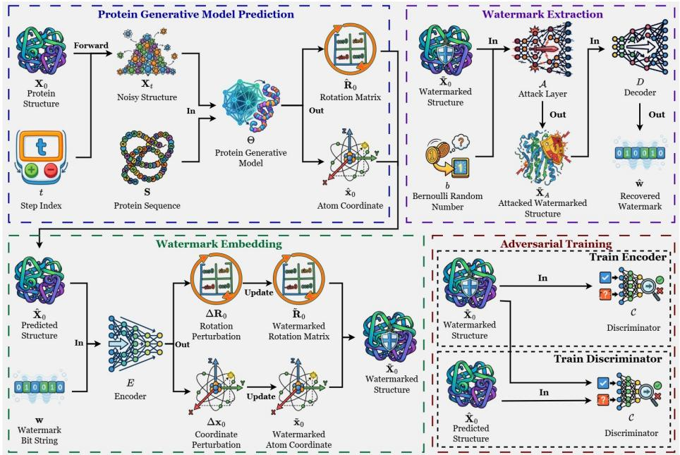  
Figure 1: MARCO training. i) PGM prediction: The frozen PGM Θ predicts a clean structure $\hat { \mathbf { X } } _ { 0 }$ from noisy state $\mathbf { X } _ { t }$ and sequence S. ii) Watermark embedding: Encoder E embeds w through geometric perturbations, producing $\tilde { \mathbf { X } } _ { 0 }$ and steering the generation trajectory. iii) Watermark extraction: A Bernoulli-controlled attack layer produces $\tilde { \mathbf { X } } _ { A } ,$ , from which decoder D recovers wˆ for robustness. iv) Adversarial training: Discriminator C distinguishes $\hat { \mathbf { X } } _ { 0 }$ from $\tilde { \mathbf { X } } _ { 0 } ,$ while E learns biophysically imperceptible perturbations that deceive C.

The Adversary. The adversary is a malicious user or competitor who exploits model outputs while hiding their provenance to infringe intellectual property or evade biosecurity screening for restricted agents such as toxins. It transforms a watermarked structure as $\mathbf { X } ^ { \prime } = \mathcal { A } ( \tilde { \mathbf { X } } )$ . An attack succeeds only if i) detection fails, $D ( \mathbf { X } ^ { \prime } ) \ \not \approx \ \mathbf { w } .$ , and ii) X′ retains the structural integrity and biological function of $\tilde { \mathbf { X } } .$ . The adversary knows the watermarking algorithm and model architecture, but not the victim’s training data, training algorithm, or watermark parameters. Its access to the victim model is black-box and query-only, but it has unlimited access to watermarked structures. It has standard computing resources: an A100 GPU with 80GB VRAM and 64GB RAM suffices to finetune AlphaFold2, and molecular-modeling software such as Rosetta and PyMOL1.

Adaptive Attacker. An adaptive adversary knows MARCO fully and uses optimization to erase its watermark while preserving fidelity. It may use OpenMM molecular dynamics Eastman et al. (2013) or Rosetta Relax Tyka et al. (2011) to drive structures toward local thermodynamic minima. With white-box access to its pirate model, the adversary may also use Differentially Private Stochastic Gradient Descent (DPSGD) Abadi et al. (2016) to scrub the watermark during training. Its calibrated gradient noise prevents the PGM from retaining the watermarked distributional features. It may also forge a watermark on the structures Chen et al. (2024); Zhang et al. (2021) to obscure ownership verification.

## 4 MARCO METHOD

## 4.1 OVERVIEW

We introduce MARCO, a watermarking framework for Protein Generative Models (PGMs) that formulates watermarking as multi-objective optimization on the rigid-body SE(3) manifold using an adversarially trained encoder-decoder network. At each denoising step, the encoder embeds the watermark into the predicted protein backbone, steering diffusion toward a verifiable “watermark manifold”. A discriminator penalizes distributional divergence so that watermarked structures remain biophysically indistinguishable from natural ones. During training, a stochastic attack layer encourages redundant, persistent features that survive geometric perturbations and malicious attacks, while the decoder recovers the signature from the distorted structures to reinforce robustness. For flow-matching and deterministic models (e.g. ESMFold), MARCO can also provide robust watermark with fewer steps of perturbations. In Appendix B, we prove that MARCO provides certified robustness.

Algorithm 1: Training Process of MARCO   
Data: Frozen PGM Θ; encoder E; decoder D; discriminator C; attack simulator A; training structures and sequences; watermark w   
Result: Trained watermark encoder E and decoder D   
Freeze Θ;   
while training has not converged do   
Sample a noisy structure and use Θ to predict its clean backbone;   
Use E to embed w into the prediction with a timestep-aware geometric perturbation;   
Apply a stochastic simulated attack and use D to recover the watermark;   
Update E and D to balance watermark recovery, structural fidelity, and covertness;   
Update C to distinguish clean predictions from watermarked ones;   
end   
return E, D

Algorithm 2: Evaluation Process of MARCO   
Data: PGM Θ; trained encoder E and decoder D; protein sequence S; owner and model identities; watermark length; authoritative   
ledger; suspect structure X   
Result: Watermarked structure X˜ ; recovered watermark wˆ ; detection decision $d _ { \mathrm { w m } }$   
/ Provenance-Backed Watermark Generation \*/   
Derive a target watermark w of the specified length from the model identity;   
Timestamp and register the ownership record with the authoritative ledger;   
/ Watermarked Structure Generation \*/   
Initialize a random noisy structure;   
foreach denoising step do   
Use Θ to predict the clean protein structure;   
Use E to embed w through a timestep-aware geometric perturbation;   
Advance the denoising trajectory using the watermarked prediction;   
end   
Set X˜ to the final generated structure;   
/\* Watermark Validation \*/   
Use D to recover wˆ from the suspect structure X;   
Compare wˆ with w using a statistical confidence test;   
Set $d _ { \mathrm { w m } }$ according to whether the detection threshold is met;   
return $\tilde { \mathbf { X } } , \hat { \mathbf { w } } , d _ { w m }$

## 4.2 TRAINING MARCO

As shown in Algorithm 1 and Figure 1, MARCO jointly optimizes a watermark encoder E, decoder D, and discriminator C with a frozen PGM Θ in four phases: i) PGM prediction, ii) watermark embedding, iii) watermark extraction, and iv) adversarial training.

Protein Generative Model Prediction. The forward process converts a ground-truth structure $\mathbf { X } _ { 0 }$ into $\mathbf { X } _ { t }$ at timestep t, from which Θ estimates the clean baseline $\hat { \bf X } _ { 0 } = ( \hat { \bf R } _ { 0 } , \hat { \bf x } _ { 0 } )$ using $\mathbf { X } _ { t } , t ,$ and sequence S (Subsection 2.1).

Watermark Embedding. The encoder E embeds w into this estimate through residual learning, predicting a perturbation field $( \Delta \mathbf { R } _ { 0 } , \Delta \mathbf { x } _ { 0 } )$ rather than absolute watermarked coordinates:

$$
( \Delta \mathbf { R } _ { 0 } , \Delta \mathbf { x } _ { 0 } ) = E ( \hat { \mathbf { R } } _ { 0 } , \hat { \mathbf { x } } _ { 0 } , \mathbf { w } )\tag{6}
$$

The watermark is embedded in $\hat { \mathbf { x } } _ { 0 }$ by adding $\Delta \mathbf { x } _ { 0 }$ under a temporal scaling schedule:

$$
\tilde { \mathbf { x } } _ { 0 } = \hat { \mathbf { x } } _ { 0 } + \cos ( \frac { \pi ( T - t ) } { 2 T } ) \Delta \mathbf { x } _ { 0 }\tag{7}
$$

The cosine schedule anneals the perturbation magnitude with timestep t.

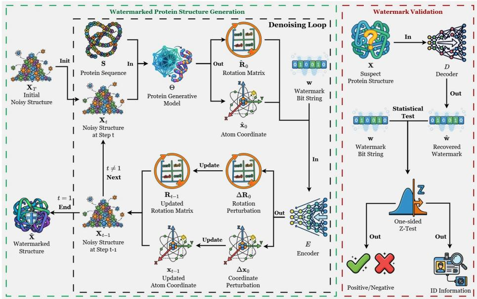  
Figure 2: MARCO evaluation. i) Watermarked structure generation: At each denoising step, watermark perturbations are applied to the PGM’s clean predictions, yielding a fully watermarked structure $\tilde { \mathbf { X } } .$ ii) Watermark validation: The decoder recovers wˆ from a suspect structure and statistically compares it with the original watermark. Successful verification confirms provenance and identifies the embedded user.

Because $S O ( 3 )$ is a non-linear manifold, element-wise addition violates rotational orthogonality. We instead define $\Delta \mathbf { R } _ { 0 } \in \mathbb { R } ^ { 3 }$ in the tangent space $\mathfrak { s o } ( 3 )$ , with $\| \Delta \mathbf { R } _ { 0 } \|$ giving the angular magni tude in radians, and map it onto the manifold via the matrix exponential with the same temporal modulation:

$$
\Delta { \bf R } _ { 0 } = \exp ( \cos ( \frac { \pi ( T - t ) } { 2 T } ) \cdot \Delta { \bf R } _ { 0 } )\tag{8}
$$

The perturbed rotation is then obtained by matrix multiplication:

$$
\tilde { \mathbf { R } } _ { 0 } = \hat { \mathbf { R } } _ { 0 } \Delta \mathbf { R } _ { 0 }\tag{9}
$$

The watermarked estimates $( \tilde { \bf R } _ { 0 } , \tilde { \bf x } _ { 0 } )$ replace $( \hat { \bf R } _ { 0 } , \hat { \bf x } _ { 0 } )$ in the standard diffusion updates (Subsection 2.1 and Equation 3), propagating the watermark to $\mathbf { X } _ { t - 1 }$

To preserve structural fidelity, we minimize the translational and rotational deviations $\big \| \hat { \mathbf { x } } _ { 0 } ^ { i } - \tilde { \mathbf { x } } _ { 0 } ^ { i } \big \| ^ { 2 }$ and $\| \hat { \mathbf { R } } _ { 0 } ^ { i } - \tilde { \mathbf { R } } _ { 0 } ^ { i } \| ^ { 2 }$ . Under Equation 6, this reduces to constraining the predicted perturbations through:

$$
\mathcal { L } _ { \mathrm { w m } } = \frac { 1 } { N } \sum _ { i = 1 } ^ { N } \| \Delta \mathbf { R } _ { 0 } ^ { i } \| + \| \Delta \mathbf { x } _ { 0 } ^ { i } \|\tag{10}
$$

Minimizing ${ \mathcal { L } } _ { \mathrm { w m } }$ constrains the geometric distance between $\hat { \mathbf { X } } _ { 0 }$ and $\tilde { \mathbf { X } } _ { 0 }$ , preserving biophysical consistency.

We further promote embedding fidelity with two novel losses: the distance matrix loss ${ \mathcal { L } } _ { \mathrm { d m } }$ and torsion angle loss ${ \mathcal { L } } _ { \mathrm { t o r } }$

The distance matrix loss enforces the preservation of global structural topology by penalizing deviations in pairwise $C _ { \alpha }$ distances:

$$
\mathcal { L } _ { \mathrm { d m } } = \frac { 1 } { N ^ { 2 } } \sum _ { i = 1 } ^ { N } \sum _ { j = 1 } ^ { N } ( \lVert \hat { \mathbf { x } } _ { 0 } ^ { i } - \hat { \mathbf { x } } _ { 0 } ^ { j } \rVert - \lVert \tilde { \mathbf { x } } _ { 0 } ^ { i } - \tilde { \mathbf { x } } _ { 0 } ^ { j } \rVert ) ^ { 2 }\tag{11}
$$

Minimizing this term preserves the clean backbone’s internal organization and relative atomic positions, preventing global fold distortion.

The torsion angle loss ${ \mathcal { L } } _ { \mathrm { t o r } }$ constrains local geometry:

$$
\mathcal { L } _ { \mathrm { t o r } } = \frac { 1 } { N - 2 } \sum _ { i = 2 } ^ { N - 1 } [ 1 - \cos ( \hat { \phi } _ { i } - \tilde { \phi } _ { i } ) + 1 - \cos ( \hat { \psi } _ { i } - \tilde { \psi } _ { i } ) ] ,\tag{12}
$$

where $( \hat { \phi } _ { i } , \hat { \psi } _ { i } )$ and $( \tilde { \phi } _ { i } , \tilde { \psi } _ { i } )$ are the clean and watermarked backbone dihedral angles, computed using standard protocols Watson et al. (2023). The loss penalizes sterically implausible conformations to preserve local structural integrity.

Watermark Extraction. Before extraction, an attack layer A simulates adversarial conditions through manipulations such as rotation, cropping, and noise addition, producing $\tilde { \mathbf { X } } _ { A } = \mathcal { A } ( \tilde { \mathbf { X } } _ { 0 } , b )$ For $b \sim \mathrm { B e r n } ( 0 . 5 )$ , the attack is applied when $b = 1$ ; otherwise, the structure is unchanged.

The decoder D recovers wˆ from the potentially distorted $\tilde { \mathbf { X } } _ { A }$ using the extraction loss:

$$
\mathcal { L } _ { \mathrm { e x t } } = - \frac { 1 } { l } \sum _ { i = 1 } ^ { l } \mathbf { w } _ { i } \log ( \hat { \mathbf { w } } _ { i } ) + ( 1 - \mathbf { w } _ { i } ) \log ( 1 - \hat { \mathbf { w } } _ { i } )\tag{13}
$$

Minimizing $\mathcal { L } _ { \mathrm { e x t } }$ enables robust recovery from both pristine and structurally compromised proteins.

Adversarial Training. A discriminator C, trained jointly with E and D, minimizes the classification error between clean and watermarked structures in an adversarial minimax game:

$$
\mathcal { L } _ { \mathcal { C } } = - \big ( \log \mathcal { C } ( \hat { \mathbf { X } } _ { 0 } ) + \log \big ( 1 - \mathcal { C } ( \tilde { \mathbf { X } } _ { 0 } ) \big ) \big )\tag{14}
$$

The encoder simultaneously minimizes an adversarial loss to deceive C:

$$
\mathcal { L } _ { \mathrm { a d v } } = - \log \left( \mathcal { C } ( \tilde { \mathbf { X } } _ { 0 } ) \right)\tag{15}
$$

Thus, $\mathcal { L } _ { \mathcal { C } }$ trains the discriminator to separate the distributions, while ${ \mathcal { L } } _ { \mathrm { a d v } }$ trains the encoder to make $\tilde { \mathbf { X } } _ { 0 }$ statistically indistinguishable from $\hat { \mathbf { X } } _ { 0 }$

The overall MARCO training loss is

$$
\begin{array} { r } { \mathcal { L } = \lambda _ { 1 } \mathcal { L } _ { \mathrm { w m } } + \lambda _ { 2 } \mathcal { L } _ { \mathrm { d m } } + \lambda _ { 3 } \mathcal { L } _ { \mathrm { t o r } } + \lambda _ { 4 } \mathcal { L } _ { \mathrm { e x t } } + \lambda _ { 5 } \mathcal { L } _ { \mathrm { a d v } } . } \end{array}\tag{16}
$$

## 4.3 EVALUATING MARCO

As shown in Algorithm 2 and Figure 2, MARCO establishes a provenance-backed watermark, generates a watermarked protein structure, and validates the watermark. To prevent ownership claims based on forged watermarks, MARCO cryptographically timestamps and registers the model identity and timestamp with a trustworthy ledger; unregistered watermarks cannot establish ownership.

Watermarked Protein Structure Generation. Starting from standard Gaussian noise $\mathbf { X } _ { T }$ and protein sequence S, the reverse diffusion process $( t = T  1 )$ uses Θ to estimate a clean baseline $\hat { \mathbf { X } } _ { 0 }$ at each step. Encoder E injects perturbations $( \Delta \mathbf { R } _ { 0 } , \Delta \mathbf { x } _ { 0 } )$ to produce $( \tilde { \bf R } _ { 0 } , \tilde { \bf x } _ { 0 } )$ , which guides the transition to $\mathbf { X } _ { t - 1 }$ . The process yields the releasable watermarked structure X˜ .

Watermark Validation. The victim uses decoder D to recover wˆ from a suspect structure X and counts the k matching bits between wˆ and the original watermark w. A one-sided Z-test assesses significance against random coincidence using $z = ( k - \mu ) / \sigma ,$ , where $\mu = 0 . 5 l$ and $\sigma = 0 . 5 \sqrt { l }$ are the mean and standard deviation for a random binary sequence of length l with $p = 0 . 5$ . The threshold $\hat { z } = 3 . 0$ gives a false positive rate of $\leq 1 0 ^ { - 3 }$ . MARCO sets $d _ { \mathrm { w m } } = 1 \mathrm { i f } z \ge \hat { z }$ and 0 otherwise, returning both $d _ { \mathrm { w m } }$ and wˆ .

## 5 EVALUATION

The experimental settings and the other experiments about robustness, radioactivity, robustness and ablation study are presented in Appendix C and Appendix D.

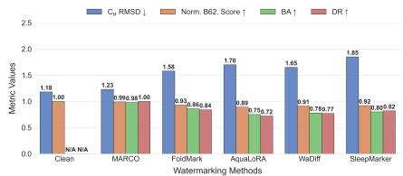  
(a) Θ: RFDiffusion

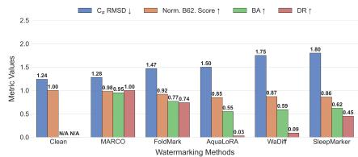  
(b) Θ: ESMFold

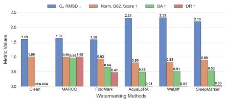  
(c) Θ: Chroma

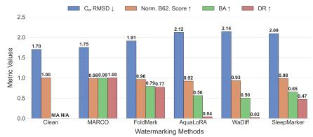  
(d) Θ: FrameDiff

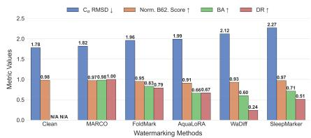  
(e) Θ: FrameFlow

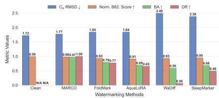  
(f) Θ: FoldFlow2  
Figure 3: Evaluation of Fidelity of PGM Watermarking Methods.

## 5.1 FIDELITY

We compare MARCO with four baselines using $C _ { \alpha ^ { - } } \mathrm { R M S D }$ , Normalized BLOSUM62 score, Bit Accuracy (BA), and Detection Rate (DR) across six pre-trained PGMs with official weights and published baseline hyperparameters. We set the watermark length to l = 64, providing a $2 ^ { 6 4 }$ identification space for robust validation, and generate 1000 clean–watermarked structure pairs $( \hat { \mathbf { X } } , \tilde { \mathbf { X } } )$ Results compare these structures and the ground-truth and recovered watermarks (w, wˆ ).

As shown in Figure 3, MARCO leads most metrics, achieving the lowest RMSD, near-perfect BLO-SUM62 scores, $\mathrm { B A } > 0 . 9 5$ , and DR = 1.0 without attacks. Image-domain baselines lack proteinspecific thermodynamic constraints and therefore compromise fidelity and robustness by distorting molecular conformations. FoldMark is the strongest baseline, but MARCO’s design performs better. Moreover, the baselines require PGM fine-tuning, whereas MARCO is a plug-and-play module that leaves the backbone model unchanged. Their partial watermark recovery also remains substantially less accurate than MARCO’s, especially under adversarial attacks. The RFDiffusion overlays in Figure 5 (Appendix D) show strong alignment between clean and watermarked structures, confirming that MARCO preserves native conformations with minimal geometric alteration.

## 5.2 ROBUSTNESS

MARCO vs. Conformational Manipulations. We evaluate MARCO against random rotation, cropping, and Gaussian noise injection. Random Rotation: For $\mathbf { X } = \{ ( \mathbf { R } _ { i } , \mathbf { x } _ { i } ) \} _ { i = 1 } ^ { N }$ , we sample a global rotation $\mathbf { Q } \sim \mathrm { H a a r } ( S O ( { \bar { 3 } } ) )$ , the uniform distribution over SO(3), and apply ${ \bf x } _ { i } ^ { \prime } = { \bf Q } ( { \bf x } _ { i } -$ $\mathbf { c } ) + \mathbf { c }$ and $\mathbf { R } _ { i } ^ { \prime } = \mathbf { Q R } _ {  i }$ , where c is the geometric center. Cropping: We remove a contiguous 30% of the backbone from either end. Gaussian Noise Injection: For $\mathbf { x } \in \mathbb { R } ^ { N \times 3 }$ , we sample $\chi \sim \mathcal { N } ( \mathbf { 0 } , \mathbf { I } )$ $\chi \in \mathbb { R } ^ { N \times 3 }$ , and add it to x.

As shown in Figure 4 and Figure 6 (Appendix D), MARCO significantly outperforms all four baselines in Bit Accuracy (BA) and Detection Rate (DR), maintaining $\mathrm { B A } > 0 . 9 0$ and $\mathrm { D R } > 0 . 9 9 $ under every perturbation. Rotation has relatively little effect, whereas cropping and noise sharply degrade the baselines by removing structural information and globally distorting molecular conformations, respectively. MARCO’s robustness suggests that the attack layer is critical for learning persistent features; adversarial training likely also diffuses the watermark throughout the structure to evade the discriminator and prevent localized failures.

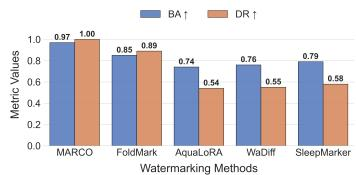  
(a) Θ : RFDiff, Rotation

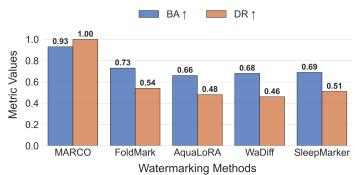  
(b) Θ : RFDiff, Cropping

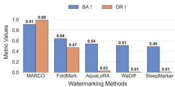  
(c) Θ : RFDiff, Noise Addition

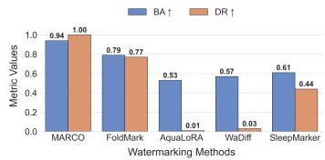  
(d) Θ : ESMFold, Rotation

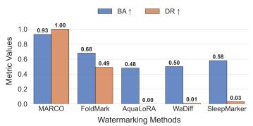  
(e) Θ : ESMFold, Cropping

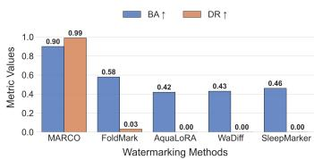  
(f) Θ : ESMFold, Noise Addition

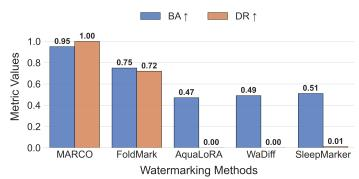  
(g) Θ : Chroma, Rotation

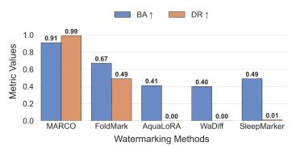  
(h) Θ : Chroma, Cropping

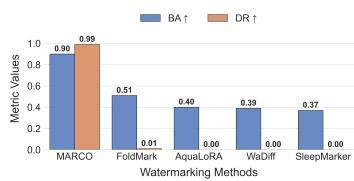  
(i) Θ : Chroma, Noise Addition  
Figure 4: Part A – Evaluation of Robustness of PGM Watermarking Methods against Confor mation Manipulations.

## 6 DISCUSSION

PGMs face economic and biosecurity threats: extracting proprietary models causes economic loss, while bypassing safeguards to synthesize toxins or bioweapons risks severe societal harm. MARCO addresses both with a dual-layer defense that embeds user-specific intellectual property as a watermark, serving as both a Digital Rights Management (DRM) tool and a Biological Weapons Convention (BWC)-compliant digital chain of custody for PGM accountability. MARCO balances fidelity, preserved by geometric constraints, with robustness, enhanced by the attack layer and extraction loss; adversarial training reinforces both. Adjusting the loss weights and probability of confor mational manipulations tailors this trade-off to specific security requirements. Capacity remains a performance constraint: the ablation study shows that increasing watermark length l reduces fidelity and robustness. Choosing an optimal l therefore balances scalable user identification with struc tural integrity. Model extraction attacks aim to learn a PGM’s output distribution. MARCO makes this distribution radioactive through stepwise reverse-diffusion perturbations, and cross-architecture training experiments confirm that the watermark propagates to pirate models. This radioactivity is essential for identifying stolen models and validating ownership. In Appendix E, we discuss poten tial extensions of MARCO to protein language models and wet-lab verification.

## 7 CONCLUSION

We propose MARCO, a radioactive watermark designed to efficiently adapt to mainstream Protein Generative Models without modifying their pre-trained weights. MARCO achieves a critical balance of fidelity and robustness, generating attack-resilient structures with negligible geometric deviation from clean predictions. Sequence validation via ProteinMPNN confirms that these struc tural watermarks exert minimal influence on the recovered amino acid sequence. Furthermore, the watermark proves robust against conformational manipulations and even adaptive attacks while supporting high-capacity payloads with minimal performance trade-offs. Future work will focus on further enhancing conformational fidelity and extending the framework’s applicability to a broade spectrum of generative architectures and other biological modalities.

## AI USE STATEMENT

In the preparation of this manuscript, we employed generative AI tools strictly for the purpose of linguistic refinement. Specifically, these tools were used to check for grammatical errors and to improve the flow and readability of the text. We affirm that:

• No Content Generation: The core concepts, experimental design, data analysis, and scientific conclusions are entirely the work of the authors.

• No Synthetic Text: No substantial portions of the text were generated by AI. The tools acted solely as a copy-editing assistant.

• Human Oversight: All suggestions made by the AI were manually reviewed and verified by the authors, who take full responsibility for the accuracy and integrity of the final publication.

## ETHICS STATEMENT

In conducting this research, we strictly adhered to a “no-harm” principle. Our methodology was designed to protect the copyrights of the model owner and trace biosecurity misuses of protein generative models in a purely theoretical and isolated context, ensuring that no individuals, organizations, or operational systems were negatively impacted.

Isolation from Operational Systems. All experiments described in this paper were performed in a fully offline, local environment. We utilized open-source implementations of dataset distillation protocols and deployed them on our own hardware. At no point did our method interact with, query, or stress-test live commercial APIs or external web services. Consequently, this research caused no service disruption, latency, or financial cost to any model providers or platforms.

Use of Public, Non-Sensitive Data. The evaluation was conducted exclusively using standard, publicly available academic datasets. We did not harvest data from private users, nor did we target specific content creators. By relying solely on established benchmarks, we ensured that no personal data was processed, and no individual’s privacy or intellectual property rights were infringed upon during the course of this study.

Safe Security Assessment. Our work treats the sensitive information of the protein datasets and the protein generative models as a mathematical artifact to be analyzed, rather than attacking the infrastructure that hosts it. By confining our “red-teaming” efforts to a sandbox environment, we demonstrate that security vulnerabilities can be identified and documented without risk to the broader digital ecosystem or its stakeholders.

## REPRODUCIBILITY STATEMENT

To promote transparency and reproducibility, we will release artifacts including all the code of all empirical studies employed in this paper. We currently provide the artifact in the following anonymized link: https://to\_be\_released\_after\_acceptance. All datasets we use are included in the artifact as they are public accessible.

## REFERENCES

Martin Abadi, Andy Chu, Ian Goodfellow, H Brendan McMahan, Ilya Mironov, Kunal Talwar, and Li Zhang. Deep learning with differential privacy. In Proceedings of the 2016 ACM SIGSAC conference on computer and communications security, pp. 308–318, 2016.

Josh Abramson, Jonas Adler, Jack Dunger, Richard Evans, Tim Green, Alexander Pritzel, Olaf Ronneberger, Lindsay Willmore, Andrew J. Ballard, Joshua Bambrick, Sebastian W. Bodenstein, David A. Evans, Chia-Chun Hung, Michael O’Neill, David Reiman, Kathryn Tunyasuvunakool, Zachary Wu, Akvile˙ Zemgulyt ˇ e, Eirini Arvaniti, Charles Beattie, Ottavia Bertolli, Alex Bridg-˙ land, Alexey Cherepanov, Miles Congreve, Alexander I. Cowen-Rivers, Andrew Cowie, Michael Figurnov, Fabian B. Fuchs, Hannah Gladman, Rishub Jain, Yousuf A. Khan, Caroline M. R. Low, Kuba Perlin, Anna Potapenko, Pascal Savy, Sukhdeep Singh, Adrian Stecula, Ashok Thillaisundaram, Catherine Tong, Sergei Yakneen, Ellen D. Zhong, Michal Zielinski, Augustin Zˇ ´ıdek, Victor Bapst, Pushmeet Kohli, Max Jaderberg, Demis Hassabis, and John M. Jumper. Accurate structure prediction of biomolecular interactions with alphafold 3. Nature, 630(8016):493—-500, 2024. doi: 10.1038/s41586-024-07487-w.

Vishal Asnani, John Collomosse, Tu Bui, Xiaoming Liu, and Shruti Agarwal. Promark: Proactive diffusion watermarking for causal attribution. In Proceedings of the IEEE/CVF Conference on Computer Vision and Pattern Recognition, pp. 10802–10811, 2024.

Ziga Avsec, Natasha Latysheva, Jun Cheng, Guido Novati, Kyle R. Taylor, Tom Ward, Clare Bycroft, Lauren Nicolaisen, Eirini Arvaniti, Joshua Pan, Raina Thomas, Vincent Dutordoir, Matteo Perino, Soham De, Alexander Karollus, Adam Gayoso, Toby Sargeant, Anne Mottram, Lai Hong Wong, Pavol Drotar, Adam Kosiorek, Andrew Senior, Richard Tanburn, Taylor Ap-´ plebaum, Souradeep Basu, Demis Hassabis, and Pushmeet Kohli. Advancing regulatory variant effect prediction with alphagenome. Nature, 649(8099):1206–1218, January 2026. ISSN 1476-4687. doi: 10.1038/s41586-025-10014-0. URL http://dx.doi.org/10.1038/ s41586-025-10014-0.

Minkyung Baek, Frank DiMaio, Ivan Anishchenko, Justas Dauparas, Sergey Ovchinnikov, Gyu Rie Lee, Jue Wang, Qian Cong, Lisa N Kinch, R Dustin Schaeffer, et al. Accurate prediction of protein structures and interactions using a three-track neural network. Science, 373(6557):871– 876, 2021.

David Baker and Andrej Sali. Protein structure prediction and structural genomics. Science, 294 (5540):93–96, 2001.

Helen M Berman, John Westbrook, Zukang Feng, Gary Gilliland, Talapady N Bhat, Helge Weissig, Ilya N Shindyalov, and Philip E Bourne. The protein data bank. Nucleic acids research, 28(1): 235–242, 2000.

Huajie Chen, Tianqing Zhu, Chi Liu, Shui Yu, and Wanlei Zhou. High-frequency matters: attack and defense for image-processing model watermarking. IEEE Transactions on Services Computing, 17(4):1565–1579, 2024.

Huajie Chen, Tianqing Zhu, Lefeng Zhang, Bo Liu, Derui Wang, Wanlei Zhou, and Minhui Xue. Queen: Query unlearning against model extraction. IEEE Transactions on Information Forensics and Security, 2025.

Hai Ci, Yiren Song, Pei Yang, Jinheng Xie, and Mike Zheng Shou. WMAdapter: Adding WaterMark control to latent diffusion models. In Aarti Singh, Maryam Fazel, Daniel Hsu, Simon Lacoste-Julien, Felix Berkenkamp, Tegan Maharaj, Kiri Wagstaff, and Jerry Zhu (eds.), Proceedings of the 42nd International Conference on Machine Learning, volume 267 of Proceedings of Machine Learning Research, pp. 10901–10919. PMLR, 13–19 Jul 2025. URL https://proceedings.mlr.press/v267/ci25a.html.

Justas Dauparas, Ivan Anishchenko, Nathaniel Bennett, Hua Bai, Robert J Ragotte, Lukas F Milles, Basile IM Wicky, Alexis Courbet, Rob J de Haas, Neville Bethel, et al. Robust deep learning– based protein sequence design using proteinmpnn. Science, 378(6615):49–56, 2022.

David R Davies, Eduardo A Padlan, and Steven Sheriff. Antibody-antigen complexes. Annual review ofbiochemistry, 59(1):439–473, 1990.

SD Durbin and G Feher. Protein crystallization. Annual review of physical chemistry, 47(1):171– 204, 1996.

Peter Eastman, Mark S Friedrichs, John D Chodera, Randall J Radmer, Christopher M Bruns, Joy P Ku, Kyle A Beauchamp, Thomas J Lane, Lee-Ping Wang, Diwakar Shukla, et al. Openmm 4: a reusable, extensible, hardware independent library for high performance molecular simulation. Journal ofchemical theory and computation, 9(1):461–469, 2013.

Weitao Feng, Wenbo Zhou, Jiyan He, Jie Zhang, Tianyi Wei, Guanlin Li, Tianwei Zhang, Weiming Zhang, and Nenghai Yu. Aqualora: Toward white-box protection for customized stable diffusion models via watermark lora. arXiv preprint arXiv:2405.11135, 2024.

Pierre Fernandez, Guillaume Couairon, Herve J´ egou, Matthijs Douze, and Teddy Furon. The sta-´ ble signature: Rooting watermarks in latent diffusion models. In Proceedings of the IEEE/CVF International Conference on Computer Vision, pp. 22466–22477, 2023a.

Pierre Fernandez, Guillaume Couairon, Herve J´ egou, Matthijs Douze, and Teddy Furon. The sta-´ ble signature: Rooting watermarks in latent diffusion models. In Proceedings of the IEEE/CVF International Conference on Computer Vision, pp. 22466–22477, 2023b.

Fabian Fuchs, Daniel Worrall, Volker Fischer, and Max Welling. Se (3)-transformers: 3d rototranslation equivariant attention networks. Advances in neural information processing systems, 33:1970–1981, 2020.

Ian Goodfellow, Jean Pouget-Abadie, Mehdi Mirza, Bing Xu, David Warde-Farley, Sherjil Ozair, Aaron Courville, and Yoshua Bengio. Generative adversarial networks. Communications of the ACM, 63(11):139–144, 2020.

Thomas Hayes, Roshan Rao, Halil Akin, Nicholas J Sofroniew, Deniz Oktay, Zeming Lin, Robert Verkuil, Vincent Q Tran, Jonathan Deaton, Marius Wiggert, et al. Simulating 500 million years of evolution with a language model. Science, 387(6736):850–858, 2025.

Steven Henikoff and Jorja G Henikoff. Amino acid substitution matrices from protein blocks. Proceedings ofthe National Academy ofSciences, 89(22):10915–10919, 1992.

Jonathan Ho, Ajay Jain, and Pieter Abbeel. Denoising diffusion probabilistic models. Advances in neural information processing systems, 33:6840–6851, 2020.

Huayang Huang, Yu Wu, and Qian Wang. Robin: Robust and invisible watermarks for diffusion models with adversarial optimization. Advances in Neural Information Processing Systems, 37: 3937–3963, 2024.

Xiufeng Huang, Ziyuan Luo, Qi Song, Ruofei Wang, and Renjie Wan. Marksplatter: Generalizable watermarking for 3d gaussian splatting model via splatter image structure. In Proceedings of the 33rd ACM International Conference on Multimedia, pp. 12189–12198, 2025.

Guillaume Huguet, James Vuckovic, Kilian Fatras, Eric Thibodeau-Laufer, Pablo Lemos, Riashat Islam, Cheng-Hao Liu, Jarrid Rector-Brooks, Tara Akhound-Sadegh, Michael Bronstein, et al. Sequence-augmented se (3)-flow matching for conditional protein backbone generation. Advances in neural information processing systems, 2024.

John B. Ingraham, Max Baranov, Zak Costello, Karl W. Barber, Wujie Wang, Ahmed Ismail, Vincent Frappier, Dana M. Lord, Christopher Ng-Thow-Hing, Erik R. Van Vlack, Shan Tie, Vincent Xue, Sarah C. Cowles, Alan Leung, Joao V. Rodrigues, Claudio L. Morales-Perez, Alex M. Ayoub,˜ Robin Green, Katherine Puentes, Frank Oplinger, Nishant V. Panwar, Fritz Obermeyer, Adam R. Root, Andrew L. Beam, Frank J. Poelwijk, and Gevorg Grigoryan. Illuminating protein space with a programmable generative model. Nature, 2023. doi: 10.1038/s41586-023-06728-8.

John Jumper, Richard Evans, Alexander Pritzel, Tim Green, Michael Figurnov, Olaf Ronneberger, Kathryn Tunyasuvunakool, Russ Bates, Augustin Zˇ´ıdek, Anna Potapenko, Alex Bridgland, Clemens Meyer, Simon A A Kohl, Andrew J Ballard, Andrew Cowie, Bernardino Romera-Paredes, Stanislav Nikolov, Rishub Jain, Jonas Adler, Trevor Back, Stig Petersen, David Reiman, Ellen Clancy, Michal Zielinski, Martin Steinegger, Michalina Pacholska, Tamas Berghammer, Sebastian Bodenstein, David Silver, Oriol Vinyals, Andrew W Senior, Koray Kavukcuoglu, Pushmeet Kohli, and Demis Hassabis. Highly accurate protein structure prediction with AlphaFold. Nature, 596(7873):583–589, 2021. doi: 10.1038/s41586-021-03819-2.

John Kirchenbauer, Jonas Geiping, Yuxin Wen, Jonathan Katz, Ian Miers, and Tom Goldstein. A watermark for large language models. In International Conference on Machine Learning, pp. 17061–17084. PMLR, 2023.

Yanis Labrak, Adrien Bazoge, Emmanuel Morin, Pierre-antoine Gourraud, Mickael Rouvier, and¨ Richard Dufour. Biomistral: A collection of open-source pretrained large language models for medical domains. In 62th Annual Meeting of the Association for Computational Linguistics (ACL’24), 2024.

Xiaolong Li, Yijia Weng, Li Yi, Leonidas J Guibas, A Abbott, Shuran Song, and He Wang. Leveraging se (3) equivariance for self-supervised category-level object pose estimation from point clouds. Advances in neural information processing systems, 34:15370–15381, 2021.

Zeming Lin, Halil Akin, Roshan Rao, Brian Hie, Zhongkai Zhu, Wenting Lu, Nikita Smetanin, Allan dos Santos Costa, Maryam Fazel-Zarandi, Tom Sercu, Sal Candido, et al. Language models of protein sequences at the scale of evolution enable accurate structure prediction. bioRxiv, 2022.

Yaron Lipman, Ricky TQ Chen, Heli Ben-Hamu, Maximilian Nickel, and Matthew Le. Flow matching for generative modeling. In The Eleventh International Conference on Learning Representations, 2023.

Yugeng Liu, Zheng Li, Michael Backes, Yun Shen, and Yang Zhang. Watermarking diffusion model. arXiv preprint arXiv:2305.12502, 2023.

Shitong Luo, Jiaqi Guan, Jianzhu Ma, and Jian Peng. A 3d generative model for structure-based drug design. Advances in Neural Information Processing Systems, 34:6229–6239, 2021.

Rui Min, Sen Li, Hongyang Chen, and Minhao Cheng. A watermark-conditioned diffusion model for ip protection. In European Conference on Computer Vision, pp. 104–120. Springer, 2024.

Raul Mi´ n˜an, Javier Gallardo,´ Alvaro Ciudad, and Alexis Molina. Informed protein–ligand docking´ via geodesic guidance in translational, rotational and torsional spaces. Nature Machine Intelligence, 7(9):1555–1560, 2025.

Tom Sander, Pierre Fernandez, Alain Durmus, Matthijs Douze, and Teddy Furon. Watermarking makes language models radioactive. Advances in Neural Information Processing Systems, 37: 21079–21113, 2024.

Hannes Stark, Felix Faltings, MinGyu Choi, Yuxin Xie, Eunsu Hur, Timothy O’Donnell, Anton Bushuiev, Talip Uc¸ar, Saro Passaro, Weian Mao, et al. Boltzgen: Toward universal binder design. bioRxiv, pp. 2025–11, 2025.

David Stutz, Alexander I Cowen-Rivers, Guillermo Ortiz-Jimenez, Jeremy Ratcliff, Vinicius Zambaldi, Lindsay Willmore, Josh Abramson, Harshnira Patani, Christina Kouridi, Florian Stimberg, et al. Function-preserving watermarking of ai-generated proteins. Nature, pp. 1–9, 2026.

Jin Su, Chenchen Han, Yuyang Zhou, Junjie Shan, Xibin Zhou, and Fajie Yuan. Saprot: Protein language modeling with structure-aware vocabulary. In The Twelfth International Conference on Learning Representations.

Michael D Tyka, Daniel A Keedy, Ingemar Andre, Frank DiMaio, Yifan Song, David C Richardson, ´ Jane S Richardson, and David Baker. Alternate states of proteins revealed by detailed energy landscape mapping. Journal of molecular biology, 405(2):607–618, 2011.

Ashish Vaswani, Noam Shazeer, Niki Parmar, Jakob Uszkoreit, Llion Jones, Aidan N Gomez, Łukasz Kaiser, and Illia Polosukhin. Attention is all you need. Advances in neural information processing systems, 30, 2017.

Mengdi Wang, Zaixi Zhang, Amrit Singh Bedi, Alvaro Velasquez, Stephanie Guerra, Sheng Lin-Gibson, Le Cong, Yuanhao Qu, Souradip Chakraborty, Megan Blewett, et al. A call for built-in biosecurity safeguards for generative ai tools. Nature Biotechnology, 43(6):845–847, 2025a.

Zilan Wang, Junfeng Guo, Jiacheng Zhu, Yiming Li, Heng Huang, Muhao Chen, and Zhengzhong Tu. Sleepermark: Towards robust watermark against fine-tuning text-to-image diffusion models. In Proceedings of the Computer Vision and Pattern Recognition Conference, pp. 8213–8224, 2025b.

Joseph L Watson, David Juergens, Nathaniel R Bennett, Brian L Trippe, Jason Yim, Helen E Eisenach, Woody Ahern, Andrew J Borst, Robert J Ragotte, Lukas F Milles, et al. De novo design of protein structure and function with rfdiffusion. Nature, 620(7976):1089–1100, 2023.

Yuxin Wen, John Kirchenbauer, Jonas Geiping, and Tom Goldstein. Tree-ring watermarks: Fingerprints for diffusion images that are invisible and robust. arXiv preprint arXiv:2305.20030, 2023.

Josh Wentzel, Zach Graves, and Dean Ball. In Support of Mandatory Nucleic Acid Synthesis Screening and Recordkeeping. https://www.thefai.org/posts/in-support-of-mandatory-nucleicacid-synthesis-screening-and-recordkeeping, 2026. [Online; accessed 05-June-2026].

Zijin Yang, Kai Zeng, Kejiang Chen, Han Fang, Weiming Zhang, and Nenghai Yu. Gaussian shading: Provable performance-lossless image watermarking for diffusion models. In Proceedings of the IEEE/CVF Conference on Computer Vision and Pattern Recognition, pp. 12162–12171, 2024.

Jason Yim, Andrew Campbell, Emile Mathieu, Andrew YK Foong, Michael Gastegger, Jose Jimenez-Luna, Sarah Lewis, Victor Garcia Satorras, Bastiaan S Veeling, Frank Noe, et al. Improved motif-scaffolding with se (3) flow matching. Transactions on Machine Learning Research.

Jason Yim, Andrew Campbell, Andrew YK Foong, Michael Gastegger, Jose Jim´ enez-Luna, Sarah´ Lewis, Victor Garcia Satorras, Bastiaan S Veeling, Regina Barzilay, Tommi Jaakkola, et al. Fast protein backbone generation with se (3) flow matching. arXiv preprint arXiv:2310.05297, 2023a.

Jason Yim, Brian L Trippe, Valentin De Bortoli, Emile Mathieu, Arnaud Doucet, Regina Barzilay, and Tommi Jaakkola. Se (3) diffusion model with application to protein backbone generation. In Proceedings of the 40th International Conference on Machine Learning, pp. 40001–40039, 2023b.

Jason Yim, Brian L Trippe, Valentin De Bortoli, Emile Mathieu, Arnaud Doucet, Regina Barzilay, and Tommi Jaakkola. Se (3) diffusion model with application to protein backbone generation. arXiv preprint arXiv:2302.02277, 2023c.

Jie Zhang, Dongdong Chen, Jing Liao, Weiming Zhang, Huamin Feng, Gang Hua, and Nenghai Yu. Deep model intellectual property protection via deep watermarking. IEEE Transactions on Pattern Analysis and Machine Intelligence, 44(8):4005–4020, 2021.

Zaixi Zhang, Souradip Chakraborty, Amrit Singh Bedi, Emilin Mathew, Varsha Saravanan, Le Cong, Alvaro Velasquez, Sheng Lin-Gibson, Megan Blewett, Dan Hendrycs, et al. Generative ai for biosciences: Emerging threats and roadmap to biosecurity. arXiv preprint arXiv:2510.15975, 2025a.

Zaixi Zhang, Ruofan Jin, Guangxue Xu, Xiaotong Wang, Marinka Zitnik, Le Cong, and Mengdi Wang. Foldmark: Safeguarding protein structure generative models with distributional and evolutionary watermarking. bioRxiv, pp. 2024–10, 2025b.

Xuandong Zhao, Kexun Zhang, Zihao Su, Saastha Vasan, Ilya Grishchenko, Christopher Kruegel, Giovanni Vigna, Yu-Xiang Wang, and Lei Li. Invisible image watermarks are provably removable using generative ai. Advances in neural information processing systems, 37:8643–8672, 2024.

Yunqing Zhao, Tianyu Pang, Chao Du, Xiao Yang, Ngai-Man Cheung, and Min Lin. A recipe for watermarking diffusion models. arXiv preprint arXiv:2303.10137, 2023.

## APPENDIX

## A DESIGN PROPERTIES

We define the following core properties as essential prerequisites for any effective PGM watermarking framework. MARCO is explicitly designed to satisfy these constraints:

Fidelity quantifies the preservation of structural integrity and biological function. A viable watermark must ensure that the modified protein structures remain indistinguishable from the original distribution in terms of biophysical plausibility. Mathematically, we require that the watermarked samples $\tilde { \mathbf { X } }$ reside within comparable low-energy states to the clean predictions $\hat { \bf X }$

$$
\mathbb { E } _ { \mathbf { X } _ { w } } [ \mathcal { E } _ { \mathrm { p h y s } } ( \tilde { \mathbf { X } } ) ] \approx \mathbb { E } _ { \mathbf { X } } [ \mathcal { E } _ { \mathrm { p h y s } } ( \hat { \mathbf { X } } ) ] ,\tag{17}
$$

where $\mathcal { E } _ { \mathrm { p h y s } }$ denotes a validated physical energy potential. Specifically, Equation 1 is an example of defining fidelity in detail.

Robustness evaluates the resilience of the embedded signal against adversarial structural perturbations. A watermarking scheme is deemed robust if the watermark w remains reliably recoverable even after the protein undergoes any utility-preserving transformation or attack $\mathcal { A } \in \mathcal { T } \left( \mathrm { e . g . } \right.$ ., rigid body rotation, noise injection, or energy minimization). Mathematically, we require that the Bit Error Rate (BER) of the recovered signal remains strictly bounded by a tolerance threshold $\rho \colon$

$$
\operatorname* { s u p } _ { \boldsymbol { \mathcal { A } } \in \mathcal { T } } \mathrm { B E R } \Big ( \mathbf { w } , D \big ( \boldsymbol { \mathcal { A } } ( \tilde { \mathbf { X } } ) \big ) \Big ) \leq \rho\tag{18}
$$

where D represents the decoding function, and $\begin{array} { r } { \mathrm { B E R } ( \mathbf { w } , \hat { \mathbf { w } } ) = \frac { 1 } { l } \sum _ { i = 1 } ^ { l } \mathbb { 1 } _ { ( \mathbf { w } _ { i } \neq \hat { \mathbf { w } } _ { i } ) } } \end{array}$ measures the fraction of mismatched bits.

Radioactivity guarantees the persistent propagation of the watermark through model extraction attacks. It ensures that if an adversary trains a pirate model Υ using a dataset $\mathcal { C } _ { m } = \{ \tilde { \mathbf { X } } ^ { ( i ) } \} _ { i = 1 } ^ { N }$ derived from watermarked structures, the signature is effectively encoded into the surrogate’s parameters. Consequently, any structure $\mathbf { X _ { \mathrm { o u t } } }$ generated by this derivative model $\Upsilon ( \cdot )$ must inherently carry the watermark signal, satisfying the condition:

$$
\mathrm { s u p B E R } \Big ( \mathbf { w } , D ( \mathbf { X } _ { \mathrm { o u t } } ) \Big ) \leq \rho\tag{19}
$$

Covertness mandates that the embedded watermark remains statistically imperceptible to adversarial inspection. The watermarked distribution $p _ { m }$ must be effectively indistinguishable from the clean model distribution $p _ { \theta }$ . Formally, this requires minimizing the divergence between the two distributions as measured by an optimal discriminator $\mathcal { C } \mathrm { : }$

$$
\operatorname* { m a x } _ { \mathcal { C } } \left| \mathbb { E } _ { \hat { \mathbf { X } } \sim p _ { \theta } } [ \mathcal { C } ( \hat { \mathbf { X } } ) ] - \mathbb { E } _ { \tilde { \mathbf { X } } \sim p _ { m } } [ \mathcal { C } ( \tilde { \mathbf { X } } ) ] \right| \approx 0\tag{20}
$$

In the context of protein structures, this implies that key geometric statistics, namely bond lengths, torsion angles, and residue packing densities, must strictly adhere to natural biological distributions, thereby preventing detection via statistical anomaly analysis.

Capacity requires the length of the watermark must be sufficient to carry the identification information.

Efficiency requires that the watermark embedding and extraction processes must not consume too much time.

Generalizability ensures that the watermarking algorithm is agnostic to specific model architectures and protein topologies.

## B CERTIFIED ROBUSTNESS VIA RANDOMIZED SMOOTHING

While we empirically demonstrate robustness against various attacks, we further provide a theoretical guarantee for watermark persistence using Randomized Smoothing. This framework certifies

that the watermark decoder D will reliably recover the correct bit string m under any adversarial perturbation δ bounded by a radius r (in terms of $L _ { 2 }$ norm or Root Mean Square Deviation (RMSD)).

Let $D _ { i } : \mathbb { R } ^ { 3 N }  \{ 0 , 1 \}$ be the base decoder for the i-th watermark bit. We define a smoothed classifier $g _ { i }$ as the majority vote of $D _ { i }$ under isotropic Gaussian noise ${ \mathcal { N } } ( 0 , \sigma ^ { 2 } I )$ :

$$
g _ { i } ( X ) = \underset { c \in \{ 0 , 1 \} } { \mathrm { a r g m a x } } \mathbb { P } _ { \epsilon \sim { \mathcal { N } ( 0 , \sigma ^ { 2 } I ) } } ( D _ { i } ( X + \epsilon ) = c )\tag{21}
$$

Theorem 1 (Certified Radius). Let $p _ { A }$ be the probability of the most likely class (the correct bit) predicted by $D _ { i }$ under noise distribution $\mathcal { N } ( 0 , \bar { \sigma } ^ { 2 } I )$ , and let $p _ { B } = 1 - p _ { A } . \ : I f p _ { A } > 0 . 5 ,$ , then $g _ { i } ( X )$ is provably robust against any perturbation δ satisfying $| | \delta | | _ { 2 } < r ,$ where:

$$
r = \frac { \sigma } { 2 } ( \Theta ^ { - 1 } ( p _ { A } ) - \Theta ^ { - 1 } ( p _ { B } ) ) ,\tag{22}
$$

where $\Theta ^ { - 1 }$ is the inverse standard normal CDF.

Connection to RMSD. In the context of protein structures with N atoms, an L2-bounded perturbation relates to the RMSD as $\mathrm { R M S D } = | | \delta | | _ { 2 } / \sqrt { N }$ . Therefore, for a certified $L _ { 2 }$ radius r, MARCO guarantees that the watermark bit $m _ { i }$ will not flip for any attack that modifies the structure within an RMSD threshold of:

$$
R _ { \mathrm { R M S D } } = \frac { \sigma } { 2 \sqrt { N } } ( \Theta ^ { - 1 } ( p _ { A } ) - \Theta ^ { - 1 } ( 1 - p _ { A } ) )\tag{23}
$$

This theoretical bound confirms that the robustness of MARCO is not merely an artifact of specific attack simulations, but an intrinsic geometric property enforced by the noise-aware training of the decoder.

## C EXPERIMENT SETTINGS

Pre-trained Protein Generative Models. We evaluate our proposed method across a diverse suite of state-of-the-art protein generative models, ranging from structure prediction networks to de novo backbone generators.

• RFDiffusionWatson et al. (2023) : A leading method for de novo protein design that combines the RoseTTAFold structure prediction network with a Denoising Diffusion Probabilistic Model (DDPM) framework. It is widely used for designing motif scaffolds and ligand binders.

• ESMFold Lin et al. (2022): A high-speed structure prediction model based on the ESM protein language model. Unlike AlphaFold, it generates atomic-level structures end-to-end directly from sequence data without requiring explicit Multiple Sequence Alignment (MSA) retrieval, making it approximately ten times faster than MSA-based methods.

• Chroma Ingraham et al. (2023): A diffusion-based generative model designed to enable the creation of novel programmable protein structures and functions, pushing the boundaries of de novo design beyond natural protein space.

• FrameDiff Yim et al. (2023b): An $S E ( 3 )$ -invariant diffusion model specifically designed for protein backbone generation. It operates on rigid bodies (frames) in 3D space rather than just point clouds, allowing it to generate designable protein monomers up to 500 amino acids long without relying on pre-trained folding networks.

• FrameFlow Yim et al.: A flow-matching model that adapts the FrameDiff architecture to a deterministic generative paradigm. By utilizing $S E ( 3 )$ flow matching, it significantly reduces the number of sampling steps required for inference while maintaining the geometric rigor of framebased updates9.

• FoldFlow2 Huguet et al. (2024): A state-of-the-art generative model that integrates sequence encoding (from ESM-2) with structure encoding (via flow matching) in a multi-modal trunk. Trained on a dataset eight times larger than its predecessor, it effectively addresses the interdependence of sequence and structure to generate diverse and high-quality proteins.

Datasets. Following the data curation protocols of RFdiffusion Watson et al. (2023), we utilize a subset of monomeric structures derived from the Protein Data Bank (PDB) Berman et al. (2000). The inclusion criteria require sequence lengths ranging from 60 to 512 residues and a structural resolution finer than 5A. Additionally, structures exhibiting greater than 50% loop content are excluded˚ to ensure structural integrity. The final curated dataset comprises 20,312 protein entries.

Implementation. For the encoder, decoder, and discriminator modules within MARCO, we adopt a 6-layer architecture adapted from FrameDiff Yim et al. (2023b). This architecture integrates Invariant Point Attention (IPA) Jumper et al. (2021), Transformer blocks Vaswani et al. (2017), and Multi-Layer Perceptrons (MLP). The IPA module, configured with 16 hidden channels, processes spatial relationships while strictly preserving rotational invariance. Following this, Transformer blocks process the node embeddings to capture global contextual dependencies. Finally, the MLP blocks, composed of three linear layers with ReLU activation and LayerNorm, perform the final node and edge feature updates.

Model training is conducted using the Adam optimizer with a learning rate of $1 0 ^ { - 4 }$ and a batch size of 64. The training protocol spans 50 epochs, during which the weights of the pre-trained PGM remain frozen; optimization is exclusively applied to the encoder, decoder, and discriminator parameters. All experiments were executed on a high-performance server equipped with 8 NVIDIA A100 GPUs (80GB VRAM each). The weight parameters λs are determined by grid search in pre-experiments.

Watermark Baselines. To provide a rigorous comparative analysis, we adapt state-of-the-art watermarking methods originally developed for image diffusion models (e.g., Stable Diffusion) to the protein domain.

• AquaLoRA Feng et al. (2024) embeds watermarks directly into the diffusion U-Net via a Low-Rank Adaptation (LoRA) module using a two-stage process: Latent Watermark Pre-training and Prior Preserving Fine-Tuning.

• WaDiff Min et al. (2024) integrates user-specific watermarks directly into the diffusion sampling process. The method functions as a “watermark-conditioned” diffusion model, where the watermark is treated as a conditioned input by expanding the model’s input channels.

• SleeperMark Wang et al. (2025b) explicitly disentangles watermark information from semantic concepts, guiding the model to embed a multi-bit message only when triggered, while regular prompts yield watermark-free, high-fidelity outputs.

• FoldMark Zhang et al. (2025b) trains an encoder-decoder and fine-tunes each PGM using watermark-conditioned LoRA, evolutionary information, and structural consistency losses to make the output carry the watermark.

We follow the hyperparameter settings in the original papers.

Metrics. For the two most important properties: fidelity and robustness, we use the following metrics to measure them:

• Structure Similarity: Root Mean Square Deviation (RMSD) is the standard measure of the average distance between the atoms of superimposed proteins.

$$
\mathrm { R M S D } = \sqrt { \frac { 1 } { N } \sum _ { i = 1 } ^ { N } d _ { i } ^ { 2 } } ,\tag{24}
$$

where N is the number of atoms and $d _ { i }$ is the distance between the i-th pair of corresponding atoms. A lower RMSD indicates a better structural similarity, and a value less than 2.0A is usually˚ considered a very close match.

• Sequence Similarity: Instead of directly computing match over no match, we employ BLO-SUM62 Henikoff & Henikoff (1992) to compute a substitution matrix to score aligned pairs between the original sequence and the translated sequence derived by feeding the watermarked structure into the ProteinMPNN Dauparas et al. (2022). In short, for identical pairs or mutations that are not going to significantly affect the protein structure, BLOSUM62 gives positive scores, whereas negative scores are given to the mutations significantly altering the protein structure.

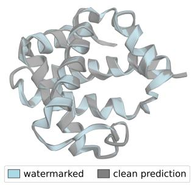  
(a) 1A3N – Deoxy Human Hemoglobin

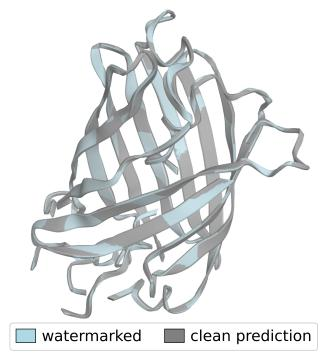  
(b) 1EMA – Green Fluorescent Protein

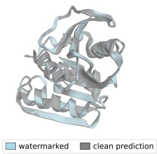  
(c) 4AO6 – Cold-Adapted Esterase  
Figure 5: Visualization of the Clean Prediction vs. Watermarked Structure. The conformation of the watermarked structure highly aligns to the clean prediction, demonstrating the high fidelity of MARCO.

However, raw BLOSUM62 scores scale with the length of the protein, where a longer protein yields a higher score. Thus, they cannot be directly compared across different pairs. To measure similarity between different pairs, we normalize the score into a range [0, 1]. We employ the Geometric Mean Normalization to derive the normalized BLOSUM62 score

$$
S _ { \mathrm { n o r m } } ( \mathbf { S } _ { a } , \mathbf { S } _ { b } ) = \frac { S ( \mathbf { S } _ { a } , \mathbf { S } _ { b } ) } { \sqrt { S ( \mathbf { S } _ { a } , \mathbf { S } _ { a } ) \times S ( \mathbf { S } _ { b } , \mathbf { S } _ { b } ) } } ,\tag{25}
$$

where $S ( \cdot , \cdot )$ denotes the raw BLOSUM62 score between two protein sequences. A high $S _ { \mathrm { n o r m } } ( \mathbf { S } _ { a } , \mathbf { S } _ { b } )$ indicates that the two sequences $\mathbf { S } _ { a }$ and $\mathbf { S } _ { b }$ are biologically similar, whereas a low value means the opposite.

• Watermark Bit Accuracy: We simply count the number of matching bits between the original and the recovered watermarks, and divide it by the watermark length to get the Bit Accuracy (BA):

$$
\mathbf { B A } = { \frac { \mathbf { C o u n t M a t c h } ( \mathbf { w } , { \hat { \mathbf { w } } } ) } { l } }\tag{26}
$$

• Watermark Detection Rate: We compute the Z-score as described in Subsection 4.3, and if $z \geq 3 \left( \mathbf { B A } \geq 0 . 6 8 7 5 \right)$ , it is considered a successful detection. The detection rate (DR) is derived by dividing the number of successful detections by the total number of detections.

## D ADDITIONAL EXPERIMENTS

## D.1 ROBUSTNESS

MARCO vs. Energy-Based Scrubbing. To simulate an adaptive attacker, we employ an energybased scrubbing attack implemented via OpenMM Eastman et al. (2013). We apply a harmonic positional restraint $\begin{array} { r } { E _ { \mathrm { r e s t } } = \frac { { \bf \dot { k } } } { 2 } \sum _ { i } \| { \bf x } _ { i } - { \bf x } _ { i } ^ { 0 } \| _ { 2 } ^ { 2 } } \end{array}$ , where $\mathbf { x } _ { i } ^ { 0 }$ denotes the initial watermarked coordinate and k is the restraint stiffness in kJ $\mathrm { m o l ^ { - 1 } n m ^ { - 2 } }$ . We evaluate MARCO’s robustness by generating a watermarked dataset containing 1000 watermarked structures using RFdiffusion. These structures are subjected to scrubbing across a stiffness range of $k \in \{ 0 , 5 0 , 1 0 0 , 5 0 0 , 1 0 0 0 , 5 0 0 0 \}$ and subsequently used to fine-tune a FrameDiff pirate model. As illustrated in Figure 7, MARCO demonstrates impressive robustness to this adaptive threat. Crucially, although extremely low k values can compromise watermark recovery, they simultaneously destroy structural fidelity, rendering the resulting pirate model functionally unusable.

Additionally, we evaluate MARCO under finite-temperature molecular dynamics using 100-ns OpenMM simulations of the same watermarked structures. Each protein is parameterized with the AMBER ff14SB force field, solvated in a TIP3P water box with a 1.0-nm buffer and 0.15-M NaCl, energy-minimized, equilibrated for 100 ps under NVT and 1 ns under NPT, and simulated without positional restraints at 300 K and 1 bar using a Langevin thermostat, Monte Carlo barostat,

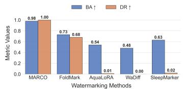  
(a) Θ : FrameDiff, Rotation

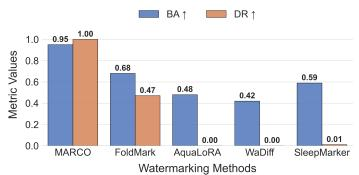  
(b) Θ : FrameDiff, Cropping

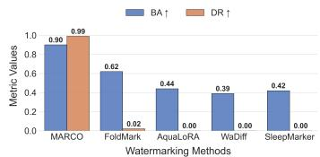  
(c) Θ : FrameDiff, Noise Addition

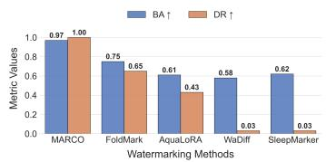  
(d) Θ : FrameFlow, Rotation

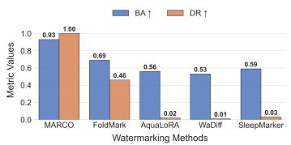  
(e) Θ : FrameFlow, Cropping

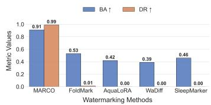  
(f) Θ : FrameFlow, Noise Addition

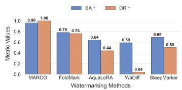  
(g) Θ : FoldFlow2, Rotation

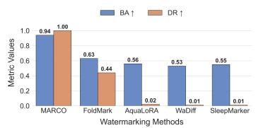  
(h) Θ : FoldFlow2, Cropping

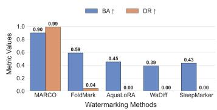  
(i) Θ : FoldFlow2, Noise Addition

Figure 6: Part B – Evaluation of Robustness of PGM Watermarking Methods against Conformation Manipulations. After conformation manipulations, MARCO survives and outperforms the other four baselines with impressive robustness.  
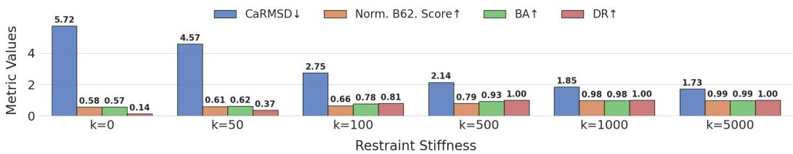  
Figure 7: MARCO vs. Energy-Based Scrubbing. A sufficiently low k results in a compromised watermark but at a non-negligible cost of fidelity.

PME electrostatics, a 1.0-nm nonbonded cutoff, constrained hydrogen bonds, and a 2-fs timestep. Snapshots are collected every 10 ns and evaluated using $C _ { \alpha } – \mathbf { R M S D }$ , normalized BLOSUM62, BA and DR. As depicted in Figure 8, as time flows, both the fidelity and robustness of the watermarked structures decrease, because the shape of the structures slightly changes to reach a lower-energy state. However, the performance reaches a balance from 80ns, when the structures become stable. This suggests that MARCO is robust against molecular dynamic simulations.

MARCO vs. DPSGD. We further simulate an adaptive attacker utilizing local regularization techniques to remove the watermark. Specifically, we employ DPSGD Abadi et al. (2016) to fine-tune FrameDiff on the watermarked dataset. We fixed $\delta \stackrel { \cdot } { = } \mathrm { 1 \dot { 0 } ^ { - 5 } }$ and varied the privacy budget across $\epsilon \in \{ 0 . 5 , 1 . 0 , 2 . 0 , 4 . 0 , 8 . 0 , 1 6 . 0 \}$ . As illustrated in Figure 9, MARCO maintains its robustness with $\mathrm { B A } \overset { \cdot } { \geq } 0 . 9 1$ and $\mathrm { D R } \geq 0 . 9 9 $ when the privacy budget $\epsilon \geq 4 . 0$ . Similar to the energy-based scrubbing results, low ϵ may degrade the watermark signal. However, this comes at the cost of severe fidelity loss, rendering the resulting pirate model functionally unusable.

MARCO vs. Refolding. In this scenario, an adaptive attacker queries the PGM protected by MARCO to unconditionally generate de novo protein structures. The structures are then mapped back to sequences using some mapping functions. The sequences are fed into a clean PGM to remove the watermark inside. To simulate this attack, we employ RFDiffusion as the original PGM protected by MARCO to generate 1000 de novo watermarked structures. The structures are then mapped back to sequences using ProteinMPNN Dauparas et al. (2022) and refolded into protein structures using the other five clean pre-trained PGMs. We derive the metrics values by extracting the recovered watermark from the refolded structures.

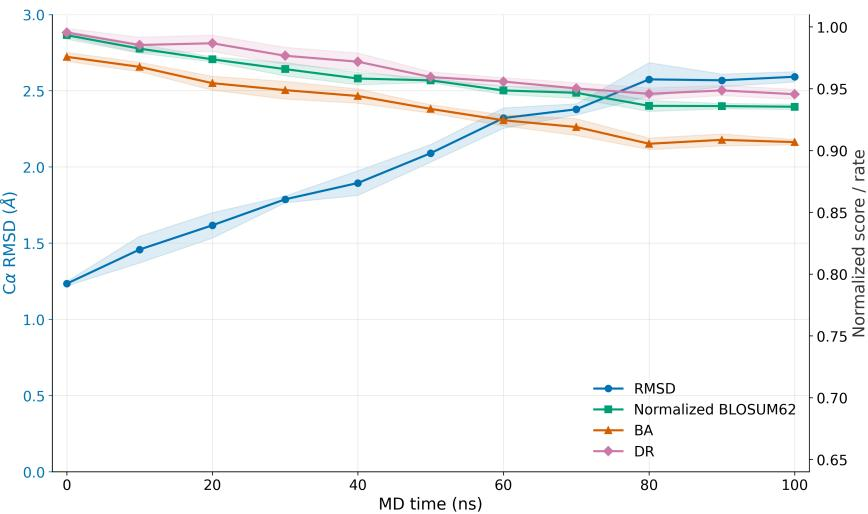  
Figure 8: MARCO vs. Molecular Dynamic Simulation

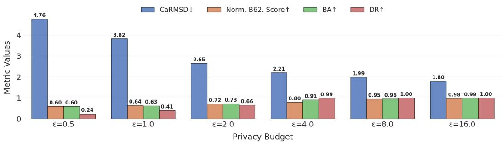  
Figure 9: MARCO vs. DPSGD. Even if the watermark is removed with a low privacy budget, the pirate model greatly sacrifices its fidelity.

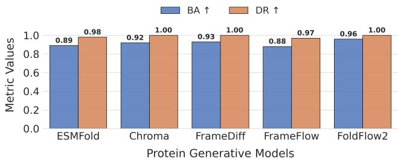  
Figure 10: MARCO vs. Refolding. By selectively altering the translated sequences, MARCO gains sufficient robustness against refolding attack.

The experimental results are depicted in Figure 10, where MARCO shows sufficient robustness against refolding attack. As demonstrated in the previous experiments, MARCO does not present perfect sequential fidelity, because MARCO trades off this attributes to gain resistance against refolding attack. The watermark signal affects the sequences translated from the watermarked structure such that structures generated by other clean PGMs given these sequences inherit the watermark.

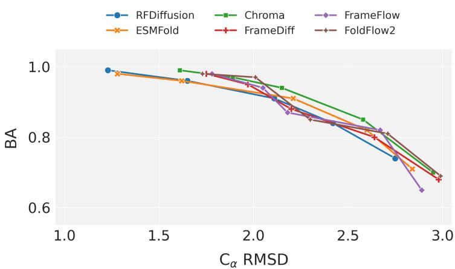  
Figure 11: Certifiable Robustness. The robustness of MARCO is an intrinsic noise-aware geometric property.

Table 1: MARCO vs. Dilution.
<table><tr><td>Watermarked Data Ratio</td><td>BA↑</td><td>DR↑</td></tr><tr><td>1.00</td><td>0.94</td><td>1.00</td></tr><tr><td>0.75</td><td>0.88</td><td>0.99</td></tr><tr><td>0.50</td><td>0.81</td><td>0.92</td></tr><tr><td>0.25</td><td>0.78</td><td>0.85</td></tr><tr><td>0.10</td><td>0.73</td><td>0.68</td></tr></table>

Certified Robustness. To prove the certified robustness of MARCO, we conduct an experiment where we use different MARCO-guarded PGMs to generate 1000 watermarked structures. The watermarked structures are then perturbed with random noises multiplied by different weights. Next, we extract the watermark and compute the RMSD between the ground truth and the perturbed struc tures and the BA to derive a curve of the correlation between RMSD and BA.

In Figure 11, we observe that the robustness of MARCO is not just an artifact of attack simulation, but an intrinsic noise-aware property. The average BA of all PGMs remains above 0.8 when RMSD < 2.5, which suffices for watermark verification. Moreover, this relation between RMSD and BA shows that the adversary cannot guarantee watermark removal without significantly downgrade the fidelity. This indicates that the manifold of the watermarked structures reflects the watermark itself.

MARCO vs. Dilution. We evaluate MARCO when faced with fine-tuning attacks that attempt to remove the watermark by fine-tuning the pirate model with watermarked structures mixed with clean structures. We fine-tuned a FrameDiff model using varying ratios of MARCO-watermarked structures to clean structures. As shown in Table 1, the ratio does affect the effectiveness of MARCO. However, with only 25% watermarked data, MARCO achieves 0.78 BA and 0.85 DR, demonstrating its strong robustness. Additionally, we conduct another dilution experiment where we replace the clean structures with watermarked structures generated via FoldMark. The results in Table 2 demonstrate that the watermarked structures do not differ from the clean structures in terms of removing MARCO’s watermark.

MARCO vs. Geometry-Aware Baselines. We elevate the level of robustness evaluation of MARCO by comparing it with a geometry-aware baseline. We compare MARCO with MarkSplatter Huang et al. (2025), a SOTA 3D point-cloud watermark. We adapted MarkSplatter by treating the 3D atomic coordinates of 1,000 RFdiffusion-generated proteins as unstructured point clouds to fit into its workflow. The results are listed in Table 3, from which we conclude that MARCO outperforms MarkSplatter in watermarking PGMs due to its original design aiming at protein structure prediction.

Table 2: MARCO vs. FoldMark Dilution.
<table><tr><td>MARCO Data Ratio</td><td>BA↑</td><td>DR↑</td></tr><tr><td>1.00</td><td>0.92</td><td>0.99</td></tr><tr><td>0.75</td><td>0.85</td><td>0.97</td></tr><tr><td>0.50</td><td>0.82</td><td>0.92</td></tr><tr><td>0.25</td><td>0.75</td><td>0.73</td></tr><tr><td>0.10</td><td>0.71</td><td>0.65</td></tr></table>

Table 3: MARCO vs. Geometry-Aware Baselines.
<table><tr><td>Metrics</td><td rowspan="2"> $C _ { \alpha } \mathbf { R M S D } \downarrow$ </td><td rowspan="2">Norm. B62↑</td><td rowspan="2">BA↑</td><td rowspan="2">DR↑</td><td rowspan="2">BA(Rotation)↑</td><td rowspan="2">DR(Rotation)↑</td><td rowspan="2">BA(Crop)↑</td><td rowspan="2">DR(Crop)↑</td></tr><tr><td>Methods</td><td></td></tr><tr><td>MARCO</td><td>1.23</td><td>0.99</td><td>0.98</td><td>1.00</td><td>0.97</td><td>1.00</td><td>0.93</td><td>0.99</td></tr><tr><td>MarkSplatter</td><td>2.71</td><td>0.74</td><td>0.95</td><td>1.00</td><td>0.73</td><td>0.68</td><td>0.63</td><td>0.35</td></tr></table>

## D.2 RADIOACTIVITY

MARCO vs. Various Architectures. To evaluate radioactivity, we randomly create a subset of 1,000 sequences from the training data. We then generate watermarked datasets using RFdiffusion, ESMFold, and Chroma as the source PGMs Θ with a fixed watermark. Subsequently, we fine-tune three computationally efficient pirate models Υ including FrameDiff, FrameFlow, and FoldFlow2 using these paired sequences and watermarked structures. Finally, we quantify radioactivity by extracting the recovered watermark from the outputs of Υs.

As illustrated in Figure 12, MARCO demonstrates superior radioactivity, consistently achieving BA $\geq 0 . 9 0$ and $\mathrm { D R } \geq 0 . 9 9$ . This confirms that MARCO effectively propagates the watermark signal to the pirate model, regardless of the architectural disparities between the source and pirate models. In contrast, the baselines fail to exhibit comparable radioactivity. Their sporadic success likely stems from the pirate models learning simple distributional shifts introduced during the baselines’ finetuning process. However, MARCO’s robust performance indicates that the bias injected iteratively during the reverse diffusion process establishes a more persistent and transferable signature.

## D.3 CAPACITY

To assess the capacity of MARCO, we varied the watermark length l across the set $\{ 3 2 , 4 8 , \dots , 1 2 8 \}$ and evaluated the impact on fidelity and robustness. As shown in Figure 13, MARCO effectively encodes identity information without compromising performance. Both the normalized BLOSUM62 score and DR remain stable as l increases, indicating that the induced perturbations are sufficiently redundant to preserve sequential similarity and detection reliability. However, RMSD and Bit Accuracy (BA) exhibit greater sensitivity; specifically, for $l \geq 9 6 .$ , we observe significant fluctuations, suggesting a saturation threshold where capacity begins to degrade fidelity. While the reduced BA at high l values still supports basic detection, it may compromise precise user identification. Nonetheless, the default length of l = 64 offers an optimal trade-off, providing a vast coding space with robust fidelity.

## D.4 ABLATION STUDY

Impact of the Loss Terms and the Attack Layer. To quantify the contribution of individual components, we conduct an ablation study by sequentially setting the weights λ = 0 and disabling the Attack Layer A. We utilize RFdiffusion as the fixed PGM and evaluate robustness specifically under noise addition, the most disruptive attack observed in prior experiments.

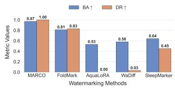  
(a) Θ: RFDiffusion, Υ: FrameDiff

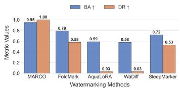  
(b) Θ: RFDiffusion, Υ: Frame-Flow

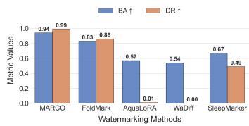  
(c) Θ: RFDiffusion, Υ: FoldFlow2

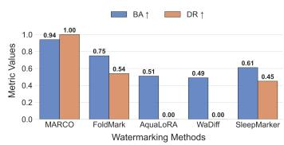  
(d) Θ: ESMFold, Υ: FrameDiff

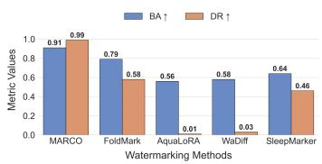

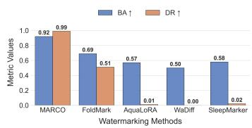  
(e) Θ: ESMFold, Υ: FrameFlow  
(f) Θ: ESMFold, Υ: FoldFlow2

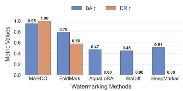  
(g) Θ: Chroma, Υ: FrameDiff

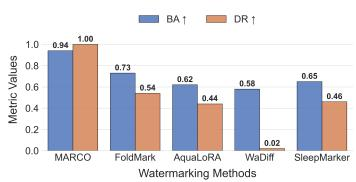  
(h) Θ: Chroma, Υ: FrameFlow

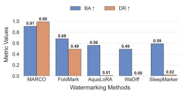  
(i) Θ: Chroma, Υ: FoldFlow2  
Figure 12: Evaluation of Radioactivity of PGM Watermarking Methods with Various Model Architectures. MARCO shows superior radioactivity by transferring its watermark signal to models trained on its watermarked data regardless of model architectures.

As presented in Table $^ { 5 , }$ every component is critical to MARCO’s performance. The watermark loss ${ \mathcal { L } } _ { \mathrm { w m } } .$ , which constrains perturbation magnitudes, is essential for fidelity. Its removal causes significant structural degradation, even though robustness remains high. Similarly, omitting the distance matrix Loss ${ \mathcal { L } } _ { \mathrm { d m } }$ and torsion angle Loss ${ \mathcal { L } } _ { \mathrm { t o r } }$ results in substantial fidelity drops. The extraction loss $\mathcal { L } _ { \mathrm { e x t } }$ is foundational; without it, robustness vanishes entirely. The adversarial loss ${ \mathcal { L } } _ { \mathrm { a d v } }$ serves a dual role, enhancing both fidelity and robustness. Finally, the attack layer proves vital for generalization. Its exclusion leaves the watermark highly vulnerable to conformational manipulations.

Distributional Indistinguishability. We further measure the distributional indistinguishability between clean predictions and watermarked structures using the Frechet Distance (FD). We trained two´ MARCOs with and without ${ \mathcal { L } } _ { \mathrm { a d v } }$ . We generated 1,000 triplets of unwatermarked and watermarked proteins via RFdiffusion using the two MARCO variants to compute the FD. With ${ \mathcal { L } } _ { \mathrm { a d v } } ,$ , the FD is 2.27, whereas the FD increases to 16.31 without it. This suggests that ${ \mathcal { L } } _ { \mathrm { a d v } }$ significantly improves covertness.

Impact of the Training Epochs. We further investigate the impact of training duration on MARCO’s performance by varying the epoch count under identical experimental conditions. As detailed in Table 4, performance gains diminish significantly beyond 25 epochs. Notably, the model exhibits negligible improvement when scaling from 50 to 100 epochs, indicating convergence. Consequently, we determine that 50 epochs are sufficient to achieve optimal performance stability.

Inference Overhead. Regarding computational overhead, training MARCO for 50 epochs requires approximately 16.71 hours on a single NVIDIA A100 GPU. This translates to a cloud computing cost of \$57.32 (based on standard AWS pricing), underscoring the framework’s training efficiency and economic feasibility for deployment. Moreover, we measure the inference overhead of MARCO and present the results in Table 6. We discover that the ratio of the increased time to the clean reference time is low and is therefore trivial to the protein structure generation.

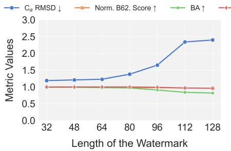  
(a) Θ: RFDiffusion

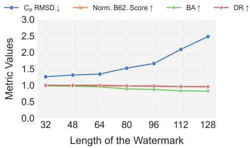  
(b) Θ: ESMFold

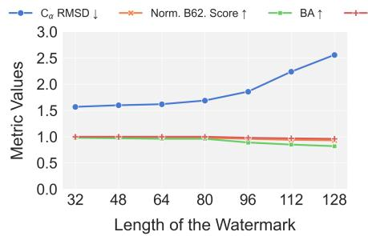  
(c) Θ: Chroma

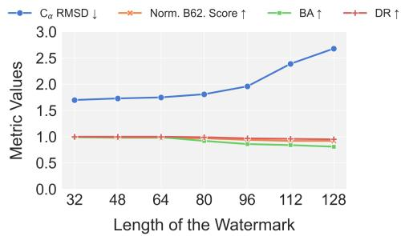  
(d) Θ: FrameDiff

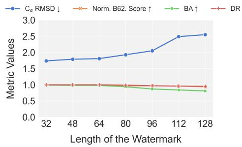  
(e) Θ: FrameFlow

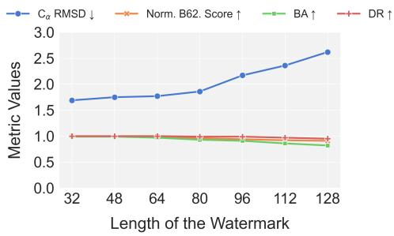  
(f) Θ: FoldFlow2  
Figure 13: Evaluation of Capacity of MARCO. As the length of the watermark increases, both the fidelity and robustness drops.

Table 4: Impact of Training Epochs.
<table><tr><td></td><td rowspan="2">Metrics</td><td rowspan="2"> $C _ { \alpha } \mathbf { R M S D } \downarrow$  Norm. B62↑</td><td rowspan="2">BA↑</td><td rowspan="2">DR↑</td></tr><tr><td>Epochs</td></tr><tr><td>5</td><td>2.44</td><td>0.71</td><td>0.62</td><td>0.17</td></tr><tr><td>10</td><td>1.62</td><td>0.92</td><td>0.84</td><td>0.96</td></tr><tr><td>25</td><td>1.41</td><td>0.97</td><td>0.96</td><td>1.00</td></tr><tr><td>50</td><td>1.23</td><td>0.98</td><td>0.98</td><td>1.00</td></tr><tr><td>100</td><td>1.23</td><td>0.98</td><td>0.99</td><td>1.00</td></tr></table>

Negative Control. We evaluate MARCO’s specificity against negative structures. We make the trained watermark decoder extract a pre-defined 64-bit watermark from 100 natural structures and clean predicted structures to compute the BA and DR. The results in Table 7 show that MARCO cannot falsely retrieve the pre-defined watermark from the natural or the clean predicted structures, demonstrating strong specificity.

Table 5: Impact of Loss Terms and the Attack Layer.
<table><tr><td></td><td rowspan="3">Metrics  $C _ { \alpha } \mathbf { R M S D } \downarrow$ </td><td rowspan="3">Norm. B62↑</td><td rowspan="3">BA↑</td><td rowspan="3">DR↑</td></tr><tr><td>Terms</td></tr><tr><td>With All</td></tr><tr><td></td><td>1.23</td><td>0.99</td><td>0.98</td><td>1.00</td></tr><tr><td> $\mathbf { W } / \mathbf { O } \ \mathcal { L } _ { \mathrm { w m } }$ </td><td>2.13</td><td>0.79</td><td>0.97</td><td>1.00</td></tr><tr><td> $\mathbf { W } / \mathbf { O } \ \mathcal { L } _ { \mathrm { d m } }$ </td><td>1.63</td><td>0.92</td><td>0.98</td><td>1.00</td></tr><tr><td> $\mathbf { W } / \mathbf { O } \ \mathcal { L } _ { \mathrm { t o r } }$ </td><td>1.56</td><td>0.87</td><td>0.97</td><td>1.00</td></tr><tr><td> $\mathbf { W } / \mathbf { O } \ \mathcal { L } _ { \mathrm { e x t } }$ </td><td>1.25</td><td>0.99</td><td>0.02</td><td>0.00</td></tr><tr><td> $\mathbf { W } / \mathbf { O } \ \mathcal { L } _ { \mathrm { a d v } }$ </td><td>1.34</td><td>0.97</td><td>0.92</td><td>0.99</td></tr><tr><td>W/O A</td><td>1.22</td><td>0.99</td><td>0.05</td><td>0.00</td></tr></table>

Table 6: Inference Overhead (s/structure).
<table><tr><td>Model</td><td>Clean Inference Time</td><td>MARCO Inference Time</td></tr><tr><td>RFDiffusion</td><td>28.8</td><td>32.2</td></tr><tr><td>ESMFold</td><td>8.7</td><td>8.9</td></tr></table>

Table 7: Negative Control Evaluation.
<table><tr><td>Structure Type</td><td>BA ↓</td><td>DR ↓</td></tr><tr><td>Natural Structures</td><td>0.48</td><td>0.00</td></tr><tr><td>Clean Predicted Structures</td><td>0.49</td><td>0.00</td></tr></table>

## E LIMITATIONS & FUTURE WORK

Currently, MARCO is specialized for diffusion-based architectures. Auto-regressive Protein Language Models (PLMs) such as ESM3 Hayes et al. (2025), SaProt Su et al., and BioMistral Labrak et al. (2024) remain outside our current scope. However, inspired by Kirchenbauer et al. Kirchenbauer et al. (2023), we can design a new paradigm for PLM watermarking by dynamically dividing the amino acid dictionary into a red and a green set with some biological constraints. Additionally, we have not yet conducted wet-lab experiments to validate the recovery of watermarks from physically synthesized and re-digitized proteins. Future research will focus on generalizing MARCO to discrete modalities such as PLMs and the latest genome language model AlphaGenome Avsec et al. (2026), and adapting to emerging architectures like BoltzGen Stark et al. (2025).

For wet-lab verification of a synthesized protein, we envision two complementary approaches. First, after confirming the sequence by DNA sequencing and LC–MS/MS, the protein structure could be resolved using X-ray crystallography, cryo-EM, or NMR and processed by MARCO’s decoder to recover the registered watermark Durbin & Feher (1996). Second, a lower-cost antibody-based assay could be enabled by concentrating part of the watermark into a biologically tolerant, surface-exposed conformational epitope. A specific monoclonal antibody could then detect the watermarked protein through native ELISA, immunoprecipitation, or surface plasmon resonance Davies et al. (1990).