# MASC: A Multi-Agent Self-Calibration Framework with Latent Construct Alignment for Consistent Client Role-Playing in Psychological Counseling

Shixin Peng<sup>1</sup>, Kun Jiang<sup>1</sup>, Jiaxing Zheng<sup>1</sup>, Qihao Yang<sup>2</sup>, Jingying Chen<sup>1,\*</sup>

<sup>1</sup>Central China Normal University, Wuhan, China <sup>2</sup>Shanghai Jiao Tong University, Shanghai, China

## Abstract

Large language models are increasingly used to simulate clients for counselor training and psychological counseling research, yet such applications are reliable only when simulated clients remain psychologically coherent across extended interactions. However, existing role-playing methods largely rely on static profile prompting, making them prone to persona drift, unrealistic cooperativeness, and inconsistent psychological states, communicative actions, and emotions. Meanwhile, current evaluations also lack an integrated testbed for both stable client characteristics and evolving psychological dynamics. To address these issues, we propose MASC, a Multi-Agent Self-Calibration framework with latent construct alignment, for consistent client role-playing in psychological counseling conversation. MASC forms a calibration loop that integrates construct-guided generation, collaborative refinement, consistency verification, and memory-based revision, enabling role inconsistencies to be detected and corrected as the dialogue unfolds. To define the calibration targets and evaluate them systematically, we further introduce CRPC-Bench, a Client Role-Playing Consistency Benchmark covering session-level profile information and Big-Five personality traits, together with turn-level psychological state, communicative action, and emotion expression. CRPC-Bench is instantiated on 38 motivational interviewing client profiles with additional personality and emotion annotations. Experiments show that MASC consistently outperforms existing methods across profile, personality, receptivity, and turn-level consistency, with the heterogeneous configuration achieving the strongest overall performance. Together, MASC and CRPC-Bench provide a unified foundation for developing and evaluating psychologically coherent client simulations for AI-assisted counseling research and training. Code and data are available at https://github.com/DeSun99/MASC-CRPC.

## Introduction

Large language models are increasingly used to simulate clients for counselor training and psychological counseling research (Park et al. 2023). Such systems can provide scalable and repeatable interactions across diverse client profiles, reducing the dependence on real clients in training and experimental settings. Their value, however, depends on whether the simulated client remains psychologically coherent throughout an extended counseling session.

Psychological counseling requires more than fluent and locally plausible responses. A simulated client must preserve stable background information, motivations, beliefs, and personality traits, while showing appropriate changes in psychological state, communicative action, and emotion. This is particularly important in motivational interviewing, where resistance, hesitation, and gradual readiness for change are meaningful parts of the counseling process (Miller and Rollnick 2013). General purpose LLMs, which are typically optimized to be helpful, may instead become unrealistically cooperative, reveal change plans prematurely, or drift from the assigned client role.

Existing work has evaluated persona consistency, personality expression, memory preservation, and profile dialogue alignment in general role-playing settings (Yuan et al. 2025). In mental health research, simulated clients and digital patients have also been developed for counselor training, while recent methods model client profiles and psychological state transitions. However, existing generation methods largely rely on static profiles and lack turn by turn mechanisms for detecting and correcting role inconsistencies(Li and Qi 2025; Chen et al. 2025; Lee et al. 2024). Current evaluations also lack a unified testbed that jointly assesses stable client characteristics and evolving psychological dynamics.

In this paper, we investigate an important yet underexplored question: how can LLMs be systematically calibrated and evaluated for psychologically coherent client role-playing in counseling conversations? This problem presents two main challenges. The first is to establish an adaptive calibration mechanism that identifies and corrects construct mismatches as the dialogue unfolds. The second is to develop an integrated evaluation foundation that captures consistency both across the full session and within individual dialogue turns.

To address the first challenge, we propose MASC, a Multi-Agent Self-Calibration framework with latent construct alignment. MASC integrates construct based generation, collaborative refinement, consistency verification, and memory based revision into a closed calibration loop. It uses expected psychological constructs as generation and verification targets, allowing inconsistent responses to be revised before they enter the dialogue history.

To address the second challenge, we introduce CRPC-Bench, a Client Role-Playing Consistency Benchmark that defines the calibration targets and provides a unified testbed. It evaluates profile information and Big-Five personality traits at the session-level, together with psychological state, communicative action, and emotion expression at the turnlevel. We instantiate CRPC-Bench on 38 motivational interviewing client profiles and augment the original dataset with personality and emotion annotations. CRPC-Bench therefore specifies what psychological coherence requires, while MASC uses the same constructs to calibrate response generation.

Experiments show that MASC consistently improves profile, personality, receptivity, and turn-level consistency over existing methods. The heterogeneous configuration achieves the strongest overall performance. Ablation results further show that the complete generation, verification, and retry loop yields the most balanced performance, while controlled removals clarify the complementary roles of its components.

Our main contributions are summarized as follows:

• We propose MASC, a Multi-Agent Self-Calibration framework with latent construct alignment that detects and corrects client role inconsistencies during multi-turn counseling conversations.

• We introduce CRPC-Bench, a benchmark that jointly evaluates stable client characteristics at the session-level and evolving psychological dynamics at the turn-level.

• We conduct extensive experiments comparing homogeneous and heterogeneous MASC configurations and examining the complementary roles of candidate refinement, construct verification, and retry memory.

## Related Work

LLM Role-Playing and Mental Health. Recent work has examined whether LLMs can sustain personalized and roleconsistent behavior in dialogue. PersonaLLM shows that LLMs can express personality traits, but such expression is unstable across contexts (Jiang et al. 2024). CharacterEval and persona-aware contrastive learning further emphasize explicit persona consistency beyond surface fluency (Tu et al. 2024; Ji et al. 2025). In mental-health dialogue, this challenge becomes more demanding because client simulators must preserve profiles, motivations, psychological states, and emotional responses across counseling turns (Yang et al. 2025). Recent studies have explored LLM role-playing for mental-health applications (Li and Qi 2025; Chen et al. 2025; Lee et al. 2024): MELT supports emotion-oriented annotation for afective modeling (Jing et al. 2025); PsychAdapter adapts LLMs to personality, demographic, and mental-health characteristics (Vu et al. 2026); Roleplay-doh enables senior mental-health supporters to create customized AI patients for novice counselor training (Louie et al. 2024); and PATIENT-Ψ provides a patient simulation framework for cognitive behavioral therapy training (Wang et al. 2024b). However, these methods largely condition generation on static profiles and focus on general persona fidelity; none of them jointly maintains session-level personality traits and turnlevel psychological dynamics, nor do they provide a turn-byturn mechanism to detect and correct role inconsistencies as they emerge. Our work addresses precisely this gap through construct-aligned self-calibration.

Consistency Evaluation of LLM Role-Playing. A complementary line of work develops benchmarks and protocols for evaluating role-playing consistency (Liu et al. 2025; Xiao et al. 2025; Xie et al. 2024). RoleMRC (Lu et al. 2025) introduced a fine-grained benchmark for role-playing and instruction following. Beyond Dialogue (Yu et al. 2025) improves sentence-level profile-dialogue alignment across diverse role-playing scenarios. PsyMem (Cheng et al. 2026) integrates fine-grained psychological attributes and explicit memory control to improve memory consistency. RoleLLM (Wang et al. 2024c) further benchmarks, elicits, and enhances role-playing abilities in LLMs. Although these studies define diverse benchmarks and evaluation protocols, direct extension to mental health counseling remains insuficient because they typically lack psychological-theory-grounded guidance and show limited generalization across counseling scenarios.

## A Multi-Agent Self-Calibration Framework

At turn n, the framework observes the generated history and current counselor utterance, $H _ { n } = \{ ( \breve { Q } _ { t } ^ { \prime } , R _ { t } ^ { \prime } ) \} _ { t = 1 } ^ { n - 1 } \cup \{ \breve { Q } _ { n } ^ { \prime } \}$ It does not use future client responses or a complete reference dialogue during generation. Session-level constraints $C ^ { s e s s } = [ \tilde { P I } , B F T ]$ describe profile information and Big-Five personality traits that should persist across the dialogue. Turn-level guidance $z _ { n } = [ E E _ { n } , P S _ { n } , C A _ { n } ]$ specifies the emotion expression, psychological state, and communicative action expected in the current response $R _ { n } ^ { \prime }$ . Thus, sessionlevel constructs constrain who the client remains, while turnlevel constructs guide how the client responds at the current point in the interaction.

MASC generates and verifies each response through a self-calibration loop. The first attempt is generated from the dialogue context and target constructs. If the voted labels of the response do not match the target constructs, retry memory records the mismatch and conditions the next generation attempt:

$$
R _ { n , r } ^ { \prime } = \left\{ \begin{array} { l l } { \mathcal { G } ( H _ { n } , C ^ { s e s s } , z _ { n } ; \mathcal { M } ) , } & { r = 0 , } \\ { \mathcal { G } ( H _ { n } , C ^ { s e s s } , z _ { n } ; \mathcal { M } , B _ { n , r } ) , } & { r > 0 , } \end{array} \right.\tag{1}
$$

where r is the retry index, M contains generation agents $\mathcal { M } _ { g }$ and judge agents $\mathcal { M } _ { j }$ , and $B _ { n , 1 }$ <sub>r</sub> stores failed attempts together with construct-level mismatch feedback. Figure 1 and Algorithm 1 show how the latent constructs discriminator, debate generator, voting calibrator, and retry memory form a closed loop. The exact role-playing, refinement, annotation, and memory templates are documented in Appendix D; the method description below specifies the information passed between these templates.

## Latent Constructs Discriminator

The latent constructs discriminator determines the target control signal before the client response is generated. This step makes the generation process explicit: instead of relying only on the prompt to implicitly preserve the role, MASC first predicts the emotion, psychological state, and communicative action that the next client response should express. The label spaces are summarized in Figure 2; we denote them as

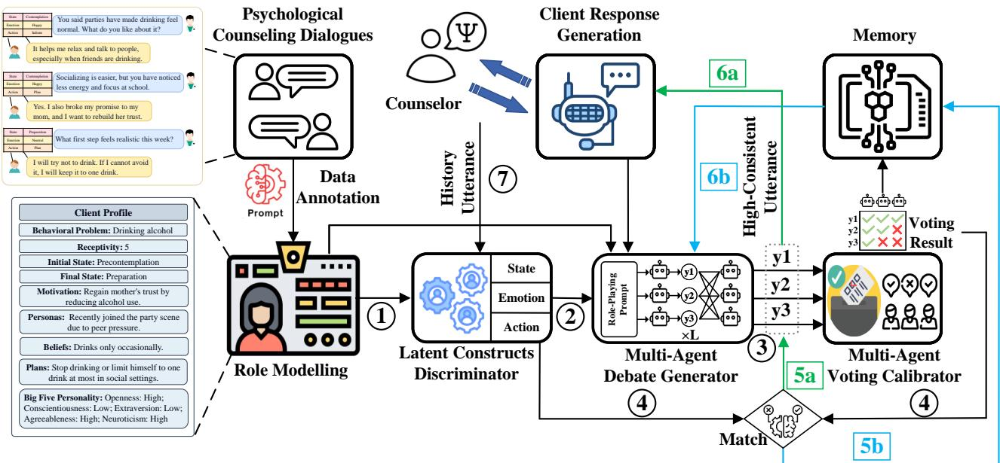  
Figure 1: The proposed Multi-Agent Self-Calibration framework with latent construct alignment. The framework combines latent construct prediction, multi-agent debate, voting calibration, and memory feedback to generate consistent client responses.

C<sub>EE</sub>, C<sub>PS</sub>, and $\mathcal { C } _ { C A } \mathrm { : }$

C<sub>EE</sub> = {neutral, happy, sad, angry, fearful, disgusted, surprised},

C<sub>PS</sub> = {Precontemplation, Contemplation, Preparation},

C<sub>CA</sub> = {Deny, Downplay, Blame, Hesitate, Doubt, Engage,

Inform, Acknowledge, Accept, Reject, Plan, Terminate}. <sup>and</sup> <sup>the</sup> <sup>communicative</sup> <sup>action</sup> <sup>is</sup> <sup>sampled</sup> <sup>from</sup> <sup>this</sup> <sup>distribu-</sup> tion:

For emotion expression, the discriminator uses the recent dialogue context to select the most likely emotion label. This prediction provides the afective target for the next client response:

$$
E E _ { n } = { \arg \operatorname* { m a x } _ { e \in { \mathcal { C } } _ { E E } } p _ { \theta } ( e \mid H _ { n } ) } .\tag{2}
$$

For psychological state, we model the client as moving through counseling-relevant stages. The state changes only when the counselor addresses the client’s motivation and when belief barriers are suficiently resolved. Let $T _ { n }$ be the top-5 topics predicted from the recent dialogue context, $t ^ { \star }$ the client’s target motivation topic, $m _ { n } \in \{ 0 , \mathbf { \bar { 1 } } \}$ an indicator of whether the counselor utterance matches the target motivation, and $B _ { n } ^ { b e l i e f }$ the set of unresolved belief barriers. The transition rule is

$$
P S _ { n } = \left\{ \begin{array} { l l } { \mathrm { C o n t e m p l a t i o n } , P S _ { n - 1 } = \mathrm { P r e c o n t e m p l a t i o n } , } \\ { \qquad t ^ { \star } \in T _ { n } , m _ { n } = 1 , } \\ { \mathrm { P r e p a r a t i o n } , } & { P S _ { n - 1 } = \mathrm { C o n t e m p l a t i o n } , } \\ & { | \mathcal { B } _ { n } ^ { \mathrm { b e l i e f } } | = 0 , } \\ { P S _ { n - 1 } , } & { \mathrm { o t h e r w i s e } . } \end{array} \right.\tag{3}
$$

For communicative action, the discriminator combines two sources of evidence. The context-dependent term identifies actions that are locally plausible after the counselor’s latest utterance, while the receptivity-aware prior discourages a low-receptivity client from moving prematurely toward acknowledgement, acceptance, or planning:

$$
p _ { n } ^ { c t x } ( a ) = p _ { \theta } ( a \mid H _ { n } ) , \quad p _ { n } ^ { r e c } ( a ) = p ( a \mid \rho ) ,\tag{4}
$$

where $\rho \in \{ 1 , \ldots , 5 \}$ denotes the client receptivity level. The combined scores are normalized over the action label space:

$$
p _ { n } ( a ) \propto p _ { n } ^ { c t x } ( a ) + p _ { n } ^ { r e c } ( a ) ,\tag{5}
$$

$$
C A _ { n } \sim p _ { n } ( a ) .\tag{6}
$$

Together, these three predictions form the turn-level target $\grave { z } _ { n } = [ E E _ { n } , P S _ { n } , C \bar { A } _ { n } ]$ used by the generator and calibrator.

Operationally, MASC uses a separate constrained annotation template for each turn-level dimension. Each template receives the recent dialogue context and its dimensionspecific label set, and returns one discrete label rather than a free-form assessment. Separating emotion, psychological state, and communicative action prevents a salient cue in one dimension from implicitly determining the other two; the resulting labels are assembled into $z _ { n }$ only after the three predictions are completed.

## Multi-Agent Debate Generator

Given the dialogue context, session-level constructs, and turn-level target labels, the generator produces multiple candidate client responses through multi-agent debate(Du et al. 2024). Within each attempt, the debate process has two related stages. In the first debate step, the generation agents independently produce diferent candidate responses under the same conditions, expanding the candidate space. In each later debate step, every agent observes the previous-step responses of the other agents and revises its own candidate. This peer refinement incorporates complementary information before the final candidate set is returned.

```latex
Algorithm 1 MASC Self-Calibration at Turn n
1: Input: Dialogue context $H _ { n } ,$ , session constructs $C ^ { s e s s }$
target constructs $z _ { n } ,$ generation agents $\mathcal { M } _ { g }$ , judge agents
$\bar { \mathcal { M } _ { j } }$ , initial retry memory $B _ { n , 0 } \stackrel { - } { = } \varnothing$
2: Output: Final client response $R _ { n } ^ { \star }$
3: for each attempt $r \in \{ 0 , 1 , 2 \}$ do
4: Generate $\mathcal { V } _ { n , r }$ through multi-agent debate using $H _ { n }$
$C ^ { s e s s } , z _ { n } ,$ , and $B _ { n , r }$
5: Use $\mathcal { M } _ { j }$ to obtain voted labels and agreement scores
for every candidate
6: Select $\dot { R } _ { n , r } ^ { \star }$ and identify its mismatched dimensions
$\Delta _ { n , r }$
7: if $R _ { n , r } ^ { \star }$ has suficient voting agreement and $\Delta _ { n , r } = \emptyset$
then
8: return $R _ { n , r } ^ { \star }$
9: else
10: Construct a failure record from $R _ { n , r } ^ { \star } , z _ { n }$ , and its
voted labels
11: Update $B _ { n , r + 1 }$ while retaining at most the two latest
records
12: end if
13: end for
14: return the best-matching candidate response
```

Let $\mathcal { M } _ { g } = \{ M _ { 1 } , M _ { 2 } , \dots , M _ { K } \}$ be the set of generation agents. In our implementation, $\dot { K } = 3$ and each attempt contains $L = 5$ debate steps. This fixed budget allows agents to revise inconsistent response cues while keeping generation cost bounded.

In the first debate step, each agent independently generates a response conditioned on the same dialogue context and target constructs:

$$
R _ { n , i } ^ { ( 1 ) } \sim \pi _ { \theta _ { i } } \left( \cdot \mid H _ { n } , C ^ { s e s s } , z _ { n } \right) , \quad i = 1 , \ldots , K .\tag{7}
$$

For later debate steps, each agent observes the previousstep responses from the other agents. When retry memory is available, the same generation step also conditions on failed attempts from earlier attempts, helping the agent avoid repeated inconsistencies:

$$
R _ { n , i } ^ { ( l ) } \sim \pi _ { \theta _ { i } } \left( \cdot \mid H _ { n } , C ^ { s e s s } , z _ { n } , \{ R _ { n , j } ^ { ( l - 1 ) } \} _ { j \neq i } , \mathcal { B } _ { n , r } \right) .\tag{8}
$$

After L debate steps, the generator returns the final candidate set

$$
\mathcal { Y } _ { n } = \{ R _ { n , 1 } ^ { ( L ) } , R _ { n , 2 } ^ { ( L ) } , \dots , R _ { n , K } ^ { ( L ) } \} .\tag{9}
$$

The debate prompt instantiates these conditioning variables explicitly. Stable role constraints—behavioral problem, counseling goal, profile, reference style, and optional Big-Five traits—remain fixed across the session. At each debate step, the prompt adds $H _ { n }$ and the target labels $z _ { n } ;$ later steps additionally include peer responses from the preceding step and, for a retry attempt, the rendered records in $B _ { n , r } .$ . Agents are required to output only one client utterance, ensuring that the candidates passed to the calibrator are comparable rather than accompanied by rationales or metadata. Detailed debate pseudocode is provided in Appendix C.

## Multi-Agent Voting Calibrator

Inspired by the LLM-as-a-Judge paradigm, the voting cali brator evaluates whether each candidate response expresses the expected latent constructs. Rather than relying on a single judge, MASC asks multiple judge agents $\textstyle { \mathcal { M } } _ { j } ~ =$ $\{ \bar { M _ { 1 } } , \bar { M _ { 2 } } , \bar { ~ . ~ . ~ . ~ } , \bar { M _ { K } } \}$ to annotate each candidate and aggre gates their labels by majority voting. For candidate ${ \cal R } _ { n , i } ^ { ( L ) }$ judge agent $M _ { j }$ predicts one label for each latent dimension:

$$
\hat { z } _ { n , i , j } ^ { d } = D _ { \theta _ { j } } ^ { d } ( H _ { n } , R _ { n , i } ^ { ( L ) } ) , \quad d \in \{ E E , P S , C A \} .\tag{10}
$$

For each dimension, the majority-voted label is computed as

$$
v _ { n , i } ^ { d } = \arg \operatorname* { m a x } _ { c \in \mathcal { C } _ { d } } \sum _ { j = 1 } ^ { K } \mathbb { I } \left( \hat { z } _ { n , i , j } ^ { d } = c \right) ,\tag{11}
$$

where $\mathcal { C } _ { d }$ is the label space of dimension d.

The calibrator then checks two distinct properties. First, judge agreement filters out candidates whose inferred construct labels are ambiguous across judges. This asks whether the judges interpret a candidate consistently, not whether their interpretation is the desired one:

$$
\gamma _ { n , i } ^ { d } = \mathbb { I } \left[ \operatorname* { m a x } _ { c \in \mathcal { C } _ { d } } \sum _ { j = 1 } ^ { K } \mathbb { I } ( \hat { z } _ { n , i , j } ^ { d } = c ) \geq \mathrm { r o u n d } ( \tau K ) \right] ,\tag{12}
$$

where $\tau = 2 / 3$ , requiring at least two of three judges to agree. The overall agreement score is

$$
S _ { n , i } ^ { a g r e e } = \sum _ { d \in \{ E E , P S , C A \} } \gamma _ { n , i } ^ { d } .\tag{13}
$$

Second, target matching checks whether the majority-voted label equals the target predicted by the discriminator. Thus, judges may agree strongly on a candidate that nevertheless expresses the wrong construct:

$$
S _ { n , i } ^ { m a t c h } = \sum _ { d \in \{ E E , P S , C A \} } \mathbb { I } \left( v _ { n , i } ^ { d } = z _ { n } ^ { d } \right) .\tag{14}
$$

The selected response prioritizes reliable voting agreement and then target-label alignment:

$$
R _ { n } ^ { \star } = \arg \operatorname* { m a x } _ { R _ { n , i } ^ { ( L ) } \in \mathcal { V } _ { n } } \left( S _ { n , i } ^ { a g r e e } , S _ { n , i } ^ { m a t c h } \right) .\tag{15}
$$

The calibrator implements this scoring rule with three dimension-specific annotation prompts. Judge agents independently return EE, PS, and CA labels; majority voting is performed within each dimension before the three voted labels are compared with $z _ { n } .$ . The calibrator outputs the selected response, its majority-voted labels, and the mismatch set $\Delta _ { n , r } . \mathrm { ~ A ~ }$ fully matched candidate follows Step 5a in Figure 1 and enters the dialogue history. Otherwise, Step 5b passes these outputs to Retry Memory, which organizes them into a failure record for the next attempt. Thus, Voting supplies the construct-level diagnosis, whereas Retry Memory is responsible for storing and transferring it. Detailed voting pseudocode is provided in Appendix C.

## Retry Memory

Retry Memory provides targeted feedback when no candidate satisfies all three constructs. For a failed attempt, the response text $R _ { n , r } ^ { \star }$ originates from the Debate Generator, while its majority-voted labels $v _ { n , \prime }$ and mismatch set $\Delta _ { n , r }$ are supplied by the Voting Calibrator. Retry Memory then renders each mismatch in $\Delta _ { n } .$ <sub>r</sub> as an expected-versus-actual explanation $\epsilon _ { n , r }$ and organizes the information as

$$
b _ { n , r } = ( r , R _ { n , r } ^ { \star } , z _ { n } , v _ { n , r } , \epsilon _ { n , r } ) .\tag{16}
$$

The record therefore tells the next debate both what was generated and which constructs failed to match. Before the next attempt, the record is appended to the debate prompt so that the agents receive a concrete correction target rather than a generic instruction to improve consistency. Detailed memory-update pseudocode is provided in Appendix C.

For each client response, MASC makes at most three attempts. The first is the initial generation without retry memory, and the next two are retries guided by previous failure records. Each attempt contains five debate steps. Retry Memory retains at most the two most recent failures $( B = 2 )$ which bounds the prompt length while preserving the feedback needed for both retries. A response is accepted when the judges reach suficient agreement and all majority-voted labels match $z _ { n } ;$ after the three attempts are exhausted, the best-matching candidate observed across the attempts is returned to preserve dialogue continuity.

## Client Role-Playing Consistency Benchmark

To provide MASC with calibration targets and a systematic testbed, we construct CRPC-Bench in consultation with counseling psychology experts. Its dimensions draw on machine psychology (Hagendorf et al. 2023), the Big-Five taxonomy (John and Srivastava 1999), the transtheoretical model (Prochaska and Velicer 1997), and Ekman’s basic emotions (Ekman 1992). As shown in Figure 2, session-level constructs assess whether a complete dialogue preserves the client’s profile and enduring personality, whereas turn-level constructs assess psychological state, communicative action, and emotion as they evolve. The two levels capture diferent failure modes: a dialogue may preserve profile facts while moving unrealistically quickly toward change, or produce plausible local reactions while gradually contradicting the assigned role. Evaluating both levels is therefore necessary.

## Session-Level Latent Constructs

Session-level constructs are evaluated over the complete generated session. We consider profile information, receptivity dynamics, and Big-Five personality consistency. The original MI dataset provides structured profiles and receptivity labels (Yang et al. 2025); we additionally annotate each client with High/Low labels on the five BFI dimensions (John and Srivastava 1999).

• Profile Information: Following Yang et al. (2025), each profile specifies the behavioral problem, persona, motivation, beliefs, acceptable change plans, five-level receptivity, and the initial/final stage of change. Persona records relevant background facts, motivation identifies reasons that may support change, beliefs capture barriers or concerns, and acceptable plans delimit changes the client could plausibly endorse. Evaluating these fields over the complete session can reveal contradictions that are not apparent in an isolated response.

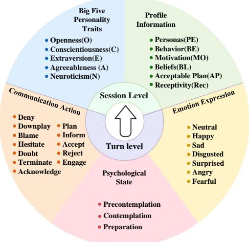  
Figure 2: CRPC-Bench dimensions for client role-playing consistency, covering session-level profile information and Big-Five personality traits, and turn-level psychological state, communicative action, and emotion expression.

• Big-Five Personality Traits: We assess whether a dialogue expresses the instructed openness, conscientiousness, extraversion, agreeableness, and neuroticism rather than merely repeating trait labels. Evidence is drawn from behavior across the dialogue, including organization, social expressiveness, reactions to uncertainty, and concern for others. Our annotation protocol reaches 78.92% accuracy on PersonalityEvd (Sun, Zhao, and Jin 2024) and approximately 87.5% inter-annotator agreement on a random 30% benchmark sample independently annotated by two experts and two trained graduate students.

## Turn-Level Latent Constructs

Turn-level constructs cover Psychological State, Communicative Action, and Emotion Expression for each client response. Unlike session-level traits, they may change as the counselor introduces information and the client reacts. The original MI dataset provides state and action annotations but lacks utterance-level emotion labels. We annotate emotions with ChatGPT-5.5 (OpenAI 2023); the same prompt achieves 76.12% accuracy on a balanced seven-class Daily-Dialog sample (Li et al. 2017).

• Psychological State: We use the transtheoretical model of health behavior change to define three counselingrelevant client states: Precontemplation, Contemplation, and Preparation (Substance Abuse and Mental Health Services Administration 2019; Prochaska and Velicer 1997; Hashemzadeh et al. 2019). These states capture the client’s progression from resistance to readiness for change, which matches the focus of motivational interviewing and the distribution of states in our dataset.

• Communicative Action: Inspired by (Dutt et al. 2021), we tailor actions to client utterance functions in counseling. Labels range from resistance (e.g., Deny and Blame), through information and ambivalence (e.g., Inform and Hesitate), to change-oriented responses (e.g., Acknowledge and Plan). They describe conversational function rather than state or emotion.

• Emotion Expression: Each client utterance is assigned one of seven emotion labels: Happy, Sad, Fearful, Angry, Surprised, Disgusted, or Neutral. These labels support turn-level evaluation of whether generated clients preserve realistic afective patterns.

These turn-level labels remain separate because they describe complementary aspects of one response. A client may, for example, remain in Precontemplation, use an Inform action to describe current behavior, and express fear about its consequences. Emotional concern should not automatically be interpreted as readiness for behavioral change.

## Consistency Assessment

Together, these dimensions assess stable characteristics over a session and dynamic constructs at each turn. Within MASC, turn-level labels guide response selection and revision. After generation, a separate evaluator relabels the complete outputs of every method under the same protocol; the resulting distributions are compared with real dialogues using KL divergence. This separation keeps generation guidance distinct from experimental measurement: MASC’s internal voting labels are not reused as its reported scores.

## Experiment

## Experimental Setup

The experiments are conducted on the MI counseling dialogue dataset introduced by (Yang et al. 2025), which contains 38 annotated counselor–client dialogue profiles. Each profile includes the client’s behavioral problem, initial and final state-of-mind, persona/background information, motivation, belief barriers, acceptable plans, and receptivity level. We further augment the original dataset with Big-Five personality traits and utterance-level emotion expression labels to support session-level personality evaluation and turn-level afective consistency assessment. For the main experiments, MASC(Homo) uses the Qwen-series ensemble (Qwen-plus, Qwen-turbo, and Qwen-max) (Bai et al. 2023), whereas MASC(Hetero) uses ChatGPT-5.5, Minimax-M3 (Lai et al. 2026), and Deepseek-v4-pro (DeepSeek-AI, Xu et al. 2026); ablations use the homo setting as the Full Model.

For counselor-side interaction, we adopt the counseloragent prompt from CSF (Yang et al. 2025), which follows MI-oriented prompting validated in prior studies (Chiu et al. 2024; Wang et al. 2024a; Yosef et al. 2024). This established prompt has been shown to support therapeutic alliance and counseling skills, and is reused as our counselor-side protocol. We compare MASC with seven baselines: Base uses only the client behavioral problem to prompt response generation (Deng et al. 2023); Example-Based conditions generation on a real counseling-session exemplar (Chiu et al. 2024); Profile-Based uses the structured client profile (Yosef et al. 2024; Wang et al. 2024a); ProAct-Based adds descriptions of possible client actions (Zhang et al. 2024); Pro+Dial-Based further includes dialogue context in the prompt (Shanahan, McDonell, and Reynolds 2023); CSF denotes the consistent client simulation framework (Yang et al. 2025); and Schedule-ST follows a fixed state-transition schedule, assigning turns 1–10, 11–20, and 21–30 to Precontemplation, Contemplation, and Preparation, respectively.

For each client turn, MASC uses three generation agents and five debate steps per attempt, with one initial attempt and at most two retries. Candidate responses are annotated separately for EE, PS, and CA by the judge agents, then ranked by voting agreement and target-label match. Failed attempts carry their construct-level mismatch records into the next retry. The full prompt schemas and output constraints are provided in Appendix D; all ablations retain the same three-Qwen backbone setting and change only the component specified by the variant name.

The separate evaluator uses the same prompts and label definitions for real dialogues, all baselines, and MASC variants. Method names and generation sources are hidden, and samples are presented without method-specific cues. Thus, an internally accepted MASC response must still be relabeled under the common evaluation protocol.

## Session-level Consistency

Profile and receptivity consistency. We jointly evaluate whether generated sessions preserve stable client profiles and realistic receptivity dynamics.

Table 1 shows that the Base method is weak across the five profile attributes, suggesting that the behavioral problem alone does not sustain a detailed role. Profile- and actionbased baselines improve particular fields, but the gains are uneven. MASC(Hetero) provides the strongest overall profile preservation, leading on Personas, Behavior, Motivation, and Beliefs. Acceptable Plans is the exception: CSF obtains 68.51 versus 65.91 for MASC(Hetero). This exception identifies plan preservation as a remaining error rather than supporting uniform dominance across attributes. On receptivity, MASC(Hetero) is close to Real in Avg Rec (3.34 vs. 3.27) and MR@20 (47.13% vs. 48.39%). Its Avg MS of 19.55 is the best simulated result but remains below the real-dialogue value of 27.56. The receptivity metrics are interpreted relative to Real rather than as independent “higher is better” or “lower is better” targets. Overall, MASC most closely reproduces the observed pattern without matching the full depth of progression in real sessions.

Because a generated counseling session can remain roleconsistent while following a diferent concrete scenario or conversational path from its reference, surface-overlap metrics are not treated as primary evidence in the main evaluation. We report BLEU, ROUGE-L, METEOR, and lexicaldiversity results as auxiliary diagnostics in Appendix A.

Big-Five personality traits consistency. We further evaluate whether simulated clients preserve their original Big-

<table><tr><td rowspan="2">Method</td><td colspan="5">Profile Consistency (%)</td><td colspan="3">Receptivity Consistency</td></tr><tr><td>PE</td><td>BE</td><td>MO</td><td>BL</td><td>AP</td><td>Avg Rec</td><td>MR@20 (%)</td><td>Avg MS ↑</td></tr><tr><td>Base</td><td>20.18</td><td>27.48</td><td>25.44</td><td>22.81</td><td>17.54</td><td>4.59</td><td>100.0</td><td>6.43</td></tr><tr><td>Example-Based</td><td>77.19</td><td>78.26</td><td>76.32</td><td>46.49</td><td>34.21</td><td>4.78</td><td>100.0</td><td>7.54</td></tr><tr><td>Profile-Based</td><td>69.38</td><td>79.45</td><td>71.52</td><td>56.37</td><td>47.37</td><td>4.83</td><td>95.02</td><td>10.23</td></tr><tr><td>ProAct-Based</td><td>73.35</td><td>82.01</td><td>73.21</td><td>61.03</td><td>38.60</td><td>4.70</td><td>96.12</td><td>8.85</td></tr><tr><td>Pro+Dial-Based</td><td>71.35</td><td>86.49</td><td>74.21</td><td>43.51</td><td>59.46</td><td>4.73</td><td>94.32</td><td>9.47</td></tr><tr><td>CSF</td><td>70.57</td><td>81.80</td><td>73.37</td><td>71.70</td><td>68.51</td><td>3.45</td><td>68.03</td><td>15.73</td></tr><tr><td>Schedule-ST</td><td>71.05</td><td>89.47</td><td>50.00</td><td>57.89</td><td>55.26</td><td>3.67</td><td>94.12</td><td>11.68</td></tr><tr><td>MASC(Homo)</td><td>76.32</td><td>92.11</td><td>76.84</td><td>75.79</td><td>64.74</td><td>3.41</td><td>47.47</td><td>16.39</td></tr><tr><td>MASC(Hetero)</td><td>77.68</td><td>98.71</td><td>79.74</td><td>78.95</td><td>65.91</td><td>3.34</td><td>47.13</td><td>19.55</td></tr><tr><td>Real</td><td>100.0</td><td>100.0</td><td>100.0</td><td>100.0</td><td>100.0</td><td>3.27</td><td>48.39</td><td>27.56</td></tr></table>

Table 1: Session-level consistency results. Left: profile consistency across five attributes, where higher values indicate stronger alignment with the original client profile. Right: receptivity consistency compared with real human dialogues (Real). Receptivity consistency is measured by average receptivity (Avg Rec), receptivity variation rate within the first 20 turns (MR@20%), and average maximum stage (Avg MS).

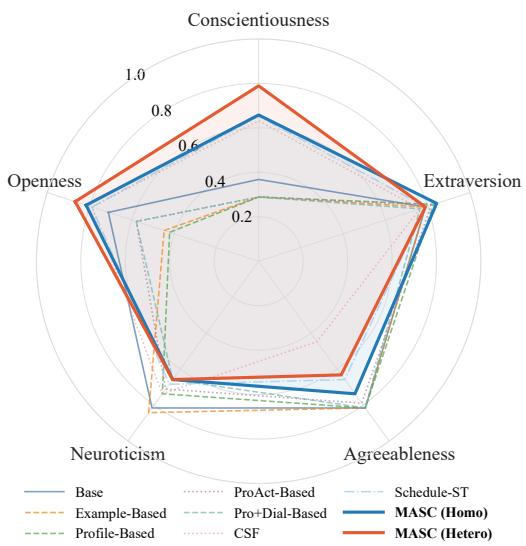  
Figure 3: Big-Five personality traits consistency. Radar plot comparing how well each method preserves the five personality dimensions; higher scores indicate stronger alignment with the original client profiles.

Five personality tendencies across the generated session. The overall score averages accuracy over openness, conscientiousness, extraversion, agreeableness, and neuroticism.

As shown in Figure 3, MASC(Hetero) achieves the highest overall Big-Five consistency and leads on openness and conscientiousness, whereas MASC(Homo) leads on extraversion. Thus, Hetero is strongest in aggregate but does not dominate every trait. Because the settings also use diferent model families, this comparison does not isolate model diversity as the cause.

## Turn-level Consistency

For each turn-level dimension, we compute KL divergence between the label distributions ofa generated method and real client dialogues. Lower values indicate closer corpus-level frequencies and complement response-level target matching: a method may satisfy many local targets while still overproducing a small set of actions or emotions across the dataset.

<table><tr><td>Method</td><td>Action KL ↓</td><td>Emotion KL ↓</td><td>State KL ↓</td></tr><tr><td>Base</td><td>0.41</td><td>0.51</td><td>0.59</td></tr><tr><td>Example-Based</td><td>0.23</td><td>0.77</td><td>0.43</td></tr><tr><td>Profile-Based</td><td>0.17</td><td>0.63</td><td>0.45</td></tr><tr><td>ProAct-Based</td><td>0.15</td><td>0.62</td><td>0.38</td></tr><tr><td>Pro+Dial-Based</td><td>0.15</td><td>0.57</td><td>0.35</td></tr><tr><td>CSF</td><td>0.07</td><td>0.56</td><td>0.13</td></tr><tr><td>Schedule-ST</td><td>0.10</td><td>0.33</td><td>0.18</td></tr><tr><td>MASC(Homo)</td><td>0.06</td><td>0.29</td><td>0.07</td></tr><tr><td>MASC(Hetero)</td><td>0.06</td><td>0.27</td><td>0.06</td></tr><tr><td>Real</td><td>0.00</td><td>0.00</td><td>0.00</td></tr></table>

Table 2: Turn-level consistency measured by KL divergence. Lower values indicate that the generated label distributions are closer to real client dialogues.

As shown in Table 2, prompt-only methods remain relatively distant from the real distributions, especially for emotion and state. CSF substantially reduces Action and State KL, while Schedule-ST provides the strongest baseline Emotion KL of 0.33. Both MASC variants obtain the lowest Action KL of 0.06, and MASC(Hetero) also achieves the lowest Emotion KL (0.27) and State KL (0.06) among simulated methods. The Action tie shows that Hetero does not improve every dimension independently; the ablations below examine the complete pipeline without assigning these gains to a single component.

## Ablation Experiment

An ablation experiment examines the three stages of the calibration loop under the three-Qwen MASC(Homo) setting. w/o Debate removes both multi-agent candidate exploration and peer refinement. w/o Voting+Memory retains the five debate steps but directly selects the first agent’s final response: without Voting, no majority-voted labels or mismatch set are produced, and without Retry Memory, no failure record is constructed or transferred to another attempt. w/o Memory retains Debate and Voting, including the voted labels and current-attempt candidate selection, but does not organize or carry the failed response and mismatch diagnosis into a later attempt.

<table><tr><td rowspan="2">Method</td><td colspan="5">Session-level</td><td colspan="3">Turn-level</td></tr><tr><td>Profile Avg(%) ↑ Avg Rec ↓ MR@20 (%) Avg MS ↑ Big-Five ↑ Action KL ↓ Emotion KL ↓ State KL ↓</td><td></td><td></td><td></td><td></td><td></td><td></td><td></td></tr><tr><td>w/o Debate</td><td> $7 1 . 6 5 _ { - 5 . 5 1 }$ </td><td> $3 . 6 4 _ { + 0 . 2 3 }$ </td><td> $5 5 . 6 3 _ { + 8 . 1 6 }$ </td><td> $1 4 . 0 3 _ { - 2 . 3 6 }$ </td><td> $0 . 6 7 _ { - 0 . 0 7 }$ </td><td> $0 . 1 2 _ { + 0 . 0 6 }$ </td><td> $0 . 3 6 _ { + 0 . 0 7 }$ </td><td> $0 . 1 0 _ { + 0 . 0 3 }$ </td></tr><tr><td>w/o Voting+Memory</td><td> $7 3 . 6 8 _ { - 3 . 4 8 }$ </td><td> $3 . 4 8 _ { + 0 . 0 7 }$ </td><td> $4 7 . 3 7 _ { - 0 . 1 0 }$ </td><td> $1 5 . 5 6 _ { - 0 . 8 3 }$ </td><td> $0 . 7 0 _ { - 0 . 0 4 }$ </td><td> $0 . 1 1 _ { + 0 . 0 5 }$ </td><td> $0 . 3 2 _ { + 0 . 0 3 }$ </td><td> $0 . 0 8 _ { + 0 . 0 1 }$ </td></tr><tr><td>w/o Memory</td><td> $7 4 . 6 2 _ { - 2 . 5 4 }$ </td><td> $3 . 4 7 _ { + 0 . 0 6 }$ </td><td> $5 3 . 3 7 _ { + 5 . 9 0 }$ </td><td> $1 5 . 0 5 _ { - 1 . 3 4 }$ </td><td> $0 . 6 7 _ { - 0 . 0 7 }$ </td><td> $0 . 0 8 _ { + 0 . 0 2 }$ </td><td> $0 . 3 3 _ { + 0 . 0 4 }$ </td><td> $0 . 0 8 _ { + 0 . 0 1 }$ </td></tr><tr><td>Full Model</td><td>77.16</td><td>3.41</td><td>47.47</td><td>16.39</td><td>0.74</td><td>0.06</td><td>0.29</td><td>0.07</td></tr></table>

Table 3: Summary ablation results across session-level and turn-level consistency metrics. Profile Avg. is the mean consistency score over personas, behavior, motivation, beliefs, and plans. MR@20 is reported as a percentage. Subscripts show diferences from the Full Model. Lower KL values indicate closer alignment with real client label distributions.

Table 3 shows that the full calibration loop is the only configuration that is consistently strongest across session- and turn-level criteria. Removing Debate produces the broadest degradation, including the largest losses in profile average (−5.51 points), Avg MS (−2.36), and all three KL measures. This pattern is consistent with multi-agent candidate exploration and peer refinement improving the candidate set available to the calibrator. The w/o Voting+Memory variant also weakens performance, particularly Action KL, but this comparison evaluates the verification-and-retry pathway as a whole and does not isolate Voting from Memory. Removing Memory alone causes smaller but systematic degradations: Voting can still diagnose the current candidates, but the selected failed response and its mismatch diagnosis are not preserved for the next attempt. These results are consistent with the intended roles of the three stages without assigning the aggregate diferences to a single internal operation. Appendix B provides the profile-dimension, semantic, diversity, and Big-Five breakdowns.

## Observed Calibration Dynamics

We define a turn as converged when the majority-voted emotion expression, psychological state, and communicative action all match their guidance labels, corresponding to an external matching score of3/3. Across generated turns, 73.97% satisfy this criterion. Of the converged cases, 55.81% finish in the first attempt (R1), 31.04% in the second (R2), and 13.15% in the third (R3). Thus, in the observed run, 44.19% of the ultimately converged responses reach full alignment only after at least one additional attempt.

R1 responses are accepted without a prior failure record. R2 and R3 are generated only after an earlier candidate has been evaluated and its response, voted labels, and mismatch description have been stored. Their share shows that later attempts are used in practice rather than serving only as an unused fallback. However, because the percentages are conditioned on eventual convergence, they are not the probability that a retry repairs an arbitrary failure.

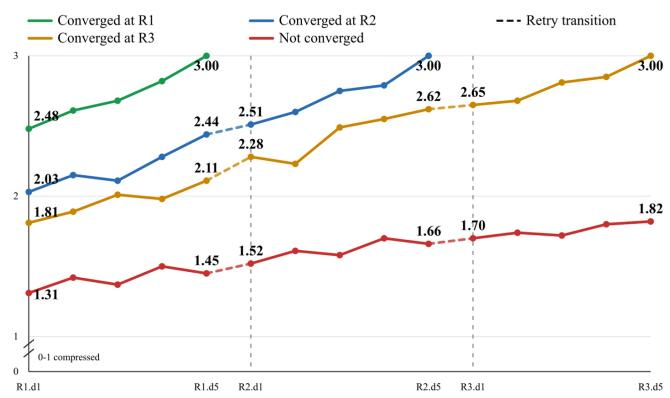  
Figure 4: Average external matching trajectories by convergence group. Each point reports the average number of matched dimensions between voted labels and guidance labels across emotion expression, psychological state, and communicative action; dashed vertical lines mark transitions between attempts.

Figure 4 groups the observed matching trajectories by the attempt in which they terminate. R1 cases reach 3/3 within the first five debate steps, whereas the R2 and R3 groups reach full alignment only after an attempt boundary; nonconverged turns remain below 3/3. Because response generation is stochastic, the attempt at which a particular turn converges may vary across repeated runs. We therefore interpret these percentages and trajectories as aggregate calibration dynamics in the observed run rather than as evidence that individual turns have a fixed level of dificulty or that Retry Memory alone causes every later success.

Unlike the ablations, which compare final outcomes after component removal, these trajectories show when the intact pipeline reaches its criterion. Read together, the analyses indicate that removing cross-attempt information degrades final metrics and that many converged responses use later attempts. They do not, however, separate the contribution of stored mismatch feedback from the benefit of drawing another stochastic sample; doing so would require repeated, matched retry runs.

The representative profile in Figure 5 shows the same logged process turn by turn. Rows that become green in R1 terminate and leave later cells blank, whereas other rows continue into R2 or R3. Blank cells therefore denote early termination rather than missing observations. Together, the curve and heatmap describe when full matching occurs in this run; they do not by themselves establish a stable category of dificult turns.

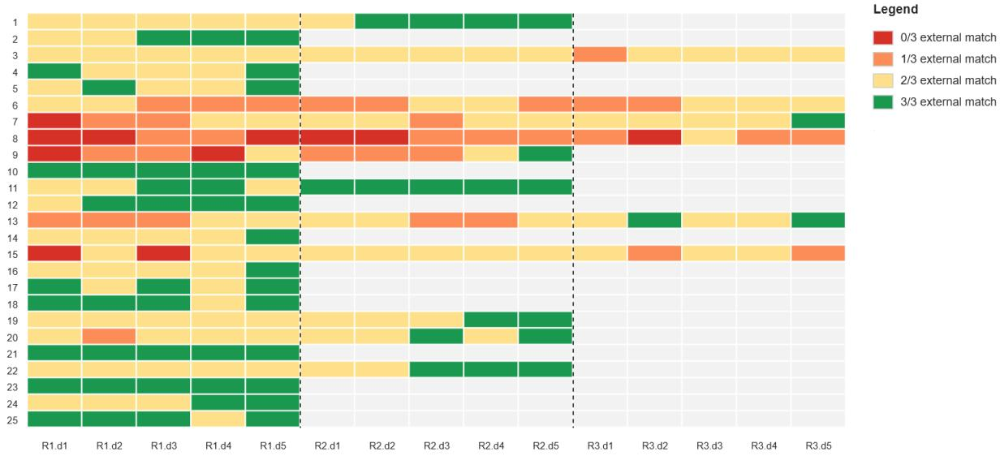  
Figure 5: Turn-level external matching heatmap for a representative profile. Rows correspond to client response turns and columns correspond to calibration steps from R1.d1 to R3.d5. Cell colors indicate the number of matched turn-level dimensions between voted labels and guidance labels; blank cells indicate that the turn has already terminated.

Figure 4 summarizes average behavior within outcome groups, while Figure 5 exposes turn-level variation hidden by averaging. Some turns match early, some continue after a partial match, and others exhaust the available attempts. The heatmap illustrates this process for one profile and does not establish the frequency of these patterns across profiles.

## Qualitative Analysis

The qualitative cases illustrate personality expression, profile preservation, and turn-level transitions. The appendix distinguishes independent illustrations of consistency successes and failures from direct comparisons against the same reference trajectory. These cases diagnose how consistency is expressed in individual dialogues but do not estimate the prevalence of an error type. Case-specific observations, source cues, and complete dialogues are reported in Appendix E.

## Conclusion

We introduced MASC, a Multi-Agent Self-Calibration framework that aligns client responses with stable sessionlevel characteristics and evolving turn-level constructs, together with CRPC-Bench for evaluating both forms of consistency. Across motivational-interviewing profiles, MASC improves profile preservation, Big-Five consistency, receptivity dynamics, and the distributions of psychological state, communicative action, and emotion expression. Ablations show that the full generation, verification, and retry loop yields the most balanced results, while observed calibration trajectories describe how often additional attempts are used in the complete pipeline. Detailed qualitative cases in the appendix illustrate consistency successes and failures that are not visible in aggregate metrics. The study remains limited by the scale of the dataset and its reliance on automatic LLMbased evaluation. Future work will extend CRPC-Bench to broader counseling settings and evaluate longer-term state transitions with additional human assessment.

## References

Bai, J.; Bai, S.; Chu, Y.; Cui, Z.; Dang, K.; Deng, X.; Fan, Y.; Ge, W.; Han, Y.; Huang, F.; Hui, B.; Ji, L.; Li, M.; Lin, J.; Lin, R.; Liu, D.; Liu, G.; Lu, C.; Lu, K.; Ma, J.; Men, R.; Ren, X.; Ren, X.; Tan, C.; Tan, S.; Tu, J.; Wang, P.; Wang, S.; Wang, W.; Wu, S.; Xu, B.; Xu, J.; Yang, A.; Yang, H.; Yang, J.; Yang, S.; Yao, Y.; Yu, B.; Yuan, H.; Yuan, Z.; Zhang, J.; Zhang, X.; Zhang, Y.; Zhang, Z.; Zhou, C.; Zhou, J.; Zhou, X.; and Zhu, T. 2023. Qwen Technical Report. arXiv:2309.16609.

Chen, Y.; Li, C.; Wang, Y.; Xiao, Q.; Zhang, N.; Kong, Z.; Wang, P.; and Yan, B. 2025. MIND: Towards Immersive Psychological Healing with Multi-agent Inner Dialogue. In Findings of the Association for Computational Linguistics: EMNLP 2025, 9174–9193. Association for Computational Linguistics.

Cheng, X.; Qin, Y.; Tan, Y.; Li, Z.; Wang, Y.; Xiao, H.; and Zhang, Y. 2026. PsyMem: Fine-grained Psychological Alignment and Explicit Memory Control for Advanced Role-Playing LLMs. Transactions of the Association for Computational Linguistics, 14: 510–529.

Chiu, Y. Y.; Sharma, A.; Lin, I. W.; and Althof, T. 2024. A Computational Framework for Behavioral Assessment of LLM Therapists. arXiv:2401.00820.

DeepSeek-AI; Xu, A.; et al. 2026. DeepSeek-V4: Towards Highly Eficient Million-Token Context Intelligence. arXiv:2606.19348.

Deng, Y.; Liao, L.; Chen, L.; Wang, H.; Lei, W.; and Chua, T.- S. 2023. Prompting and Evaluating Large Language Models for Proactive Dialogues: Clarification, Target-Guided, and Non-Collaboration. In Findings ofthe Associationfor Computational Linguistics: EMNLP 2023, 10602–10621.

Du, Y.; Li, S.; Torralba, A.; Tenenbaum, J. B.; and Mordatch, I. 2024. Improving Factuality and Reasoning in Language Models through Multiagent Debate. In Salakhutdinov, R.; Kolter, Z.; Heller, K.; Weller, A.; Oliver, N.; Scarlett, J.; and Berkenkamp, F., eds., Proceedings of the 41st International Conference on Machine Learning, volume 235 of Proceedings ofMachine Learning Research, 11733–11763. PMLR.

Dutt, R.; Sinha, S.; Joshi, R.; Chakraborty, S. S.; Riggs, M.; Yan, X.; Bao, H.; and Rose, C. 2021. RESPER: Computationally Modelling Resisting Strategies in Persuasive Conversations. In Proceedings of the 16th Conference of the European Chapter of the Association for Computational Linguistics: Main Volume, 78–90.

Ekman, P. 1992. Are there basic emotions?

Hagendorf, T.; Dasgupta, I.; Binz, M.; Chan, S. C. Y.; Lampinen, A.; Wang, J. X.; Akata, Z.; and Schulz, E. 2023. Machine Psychology. arXiv preprint arXiv:2303.13988.

Hashemzadeh, M.; Rahimi, A.; Zare-Farashbandi, F.; Alavi-Naeini, A. M.; and Daei, A. 2019. Transtheoretical Model of Health Behavioral Change: A Systematic Review. Iranian Journal ofNursing and Midwifery Research, 24(2): 83–90.

Ji, K.; Lian, Y.; Li, L.; Gao, J.; Li, W.; and Dai, B. 2025. Enhancing Persona Consistency for LLMs’ Role-Playing using Persona-Aware Contrastive Learning. In Che, W.; Nabende, J.; Shutova, E.; and Pilehvar, M. T., eds., Findings of the Associationfor Computational Linguistics: ACL 2025, 26221– 26238. Vienna, Austria: Association for Computational Linguistics. ISBN 979-8-89176-256-5.

Jiang, H.; Zhang, X.; Cao, X.; Breazeal, C.; Roy, D.; and Kabbara, J. 2024. PersonaLLM: Investigating the Ability of Large Language Models to Express Personality Traits. In Duh, K.; Gomez, H.; and Bethard, S., eds., Findings of the Association for Computational Linguistics: NAACL 2024, 3605–3627. Mexico City, Mexico: Association for Computational Linguistics.

Jing, X.; Wang, J.; Tsangko, I.; Triantafyllopoulos, A.; and Schuller, B. W. 2025. MELT: Towards Automated Multimodal Emotion Data Annotation by Leveraging LLM Embedded Knowledge. arXiv preprint arXiv:2505.24493.

John, O. P.; and Srivastava, S. 1999. The Big Five Trait taxonomy: History, measurement, and theoretical perspectives. In Handbook ofpersonality: Theory and research, 2nd ed., 102–138. New York, NY, US: Guilford Press. ISBN 1-57230-483-9 (Hardcover).

Lai, X.; Xu, W.; Yang, Y.; Chen, Q.; Xu, Y.; Zeng, L.; Li, X.; Sun, H.; Zhu, H.; Zhang, V.; Hu, J.; Li, J.; Gao, R.; Li, Z.; Zhu, S.; Zhou, J.; and Zhao, P. 2026. MiniMax Sparse Attention. arXiv:2606.13392.

Lee, S.; Kim, S.; Kim, M.; Kang, D.; Yang, D.; Kim, H.; Kang, M.; Jung, D.; Kim, M. H.; Lee, S.; Chung, K.-M.; Yu, Y.; Lee, D.; and Yeo, J. 2024. Cactus: Towards Psychological Counseling Conversations using Cognitive Behavioral

Theory. In Findings of the Association for Computational Linguistics: EMNLP 2024, 14245–14274. Miami, Florida, USA: Association for Computational Linguistics.

Li, C.; and Qi, Y. 2025. Toward accurate psychological simulations: Investigating LLMs’ responses to personality and cultural variables. Computers in Human Behavior, 170: 108687.

Li, Y.; Su, H.; Shen, X.; Li, W.; Cao, Z.; and Niu, S. 2017. DailyDialog: A Manually Labelled Multi-turn Dialogue Dataset. In Proceedings of the Eighth International Joint Conference on Natural Language Processing (Volume 1: Long Papers), 986–995.

Liu, J.; Qiu, Z.; Li, Z.; Dai, Q.; Zhu, J.; Hu, M.; Yang, M.; and King, I. 2025. A Survey of Personalized Large Language Models: Progress and Future Directions. arXiv:2502.11528.

Louie, R.; Nandi, A.; Fang, W.; Chang, C.; Brunskill, E.; and Yang, D. 2024. Roleplay-doh: Enabling Domain-Experts to Create LLM-simulated Patients via Eliciting and Adhering to Principles. In Al-Onaizan, Y.; Bansal, M.; and Chen, Y.-N., eds., Proceedings ofthe 2024 Conference on Empirical Methods in Natural Language Processing, 10570–10603. Miami, Florida, USA: Association for Computational Linguistics.

Lu, J.; Li, J.; Shen, G.; Gui, L.; An, S.; He, Y.; Yin, D.; and Sun, X. 2025. RoleMRC: A Fine-Grained Composite Benchmark for Role-Playing and Instruction-Following. In Che, W.; Nabende, J.; Shutova, E.; and Pilehvar, M. T., eds., Findings of the Association for Computational Linguistics: ACL 2025, 21008–21030. Vienna, Austria: Association for Computational Linguistics. ISBN 979-8-89176-256-5.

Miller, W. R.; and Rollnick, S. 2013. Motivational Interviewing: Helping People Change. New York: Guilford Press, 3 edition. ISBN 9781609182274.

OpenAI. 2023. GPT-4 Technical Report. arXiv:2303.08774.

Park, J. S.; O’Brien, J. C.; Cai, C. J.; Morris, M. R.; Liang, P.; and Bernstein, M. S. 2023. Generative Agents: Interactive Simulacra of Human Behavior. In Proceedings of the 36th Annual ACM Symposium on User Interface Software and Technology. Association for Computing Machinery.

Prochaska, J.; and Velicer, W. 1997. The Transtheoretical Model of Health Behavior Change. American Journal of Health Promotion, 12(1): 38–48.

Shanahan, M.; McDonell, K.; and Reynolds, L. 2023. Role play with large language models. Nature, 623(7987): 493– 498.

Substance Abuse and Mental Health Services Administration. 2019. Enhancing Motivation for Change in Substance Use Disorder Treatment: Updated 2019. SAMHSA/CSAT Treatment Improvement Protocol.

Sun, L.; Zhao, J.; and Jin, Q. 2024. Revealing personality traits: A new benchmark dataset for explainable personality recognition on dialogues. In Proceedings ofthe 2024 Conference on Empirical Methods in Natural Language Processing, 19988–20002.

Tu, Q.; Fan, S.; Tian, Z.; Shen, T.; Shang, S.; Gao, X.; and Yan, R. 2024. CharacterEval: A Chinese Benchmark for Role-Playing Conversational Agent Evaluation. In Ku, L.-W.;

Martins, A.; and Srikumar, V., eds., Proceedings of the 62nd Annual Meeting of the Association for Computational Linguistics (Volume 1: Long Papers), 11836–11850. Bangkok, Thailand: Association for Computational Linguistics.

Vu, H.; Nguyen, H. A.; Ganesan, A. V.; Juhng, S.; Kjell, O. N. E.; Sedoc, J.; Kern, M. L.; Boyd, R. L.; Ungar, L.; Schwartz, H. A.; and Eichstaedt, J. C. 2026. PsychAdapter: Adapting LLM Transformers to Reflect Traits, Personality and Mental Health. npj Artificial Intelligence, 2(7).

Wang, J.; Xiao, Y.; Li, Y.; Song, C.; Xu, C.; Tan, C.; and Li, W. 2024a. Towards a Client-Centered Assessment of LLM Therapists by Client Simulation. arXiv:2406.12266.

Wang, R.; Milani, S.; Chiu, J. C.; Zhi, J.; Eack, S. M.; Labrum, T.; Murphy, S. M.; Jones, N.; Hardy, K. V.; Shen, H.; Fang, F.; and Chen, Z. 2024b. PATIENT-ψ: Using Large Language Models to Simulate Patients for Training Mental Health Professionals. In Al-Onaizan, Y.; Bansal, M.; and Chen, Y.-N., eds., Proceedings of the 2024 Conference on Empirical Methods in Natural Language Processing, 12772– 12797. Miami, Florida, USA: Association for Computational Linguistics.

Wang, Z. M.; Peng, Z.; Que, H.; Liu, J.; Zhou, W.; Wu, Y.; Guo, H.; Gan, R.; Ni, Z.; Yang, J.; Zhang, M.; Zhang, Z.; Ouyang, W.; Xu, K.; Huang, S. W.; Fu, J.; and Peng, J. 2024c. RoleLLM: Benchmarking, Eliciting, and Enhancing Role-Playing Abilities of Large Language Models. In Findings of the Association for Computational Linguistics: ACL 2024, 14743–14777. Association for Computational Linguistics.

Xiao, Y.; Wang, J.; Xu, Q.; Song, C.; Xu, C.; Cheng, Y.; Li, W.; and Liu, P. 2025. Towards Dynamic Theory of Mind: Evaluating LLM Adaptation to Temporal Evolution of Human States. In Che, W.; Nabende, J.; Shutova, E.; and Pilehvar, M. T., eds., Proceedings of the 63rd Annual Meeting ofthe Associationfor Computational Linguistics (Volume 1: Long Papers), 24036–24057. Vienna, Austria: Association for Computational Linguistics. ISBN 979-8-89176-251-0.

Xie, C.; Chen, C.; Jia, F.; Ye, Z.; Lai, S.; Shu, K.; Gu, J.; Bibi, A.; Hu, Z.; Jurgens, D.; Evans, J.; Torr, P.; Ghanem, B.; and Li, G. 2024. Can Large Language Model Agents Simulate Human Trust Behavior? arXiv:2402.04559.

Yang, Y.; Achananuparp, P.; Huang, H.; Jiang, J.; Lim, N. G.; Ern, C. T. S.; Kit, P. L.; Giam Xiuhui, J.; Pinto, J.; and Lim, E.-P. 2025. Consistent Client Simulation for Motivational Interviewing-based Counseling. In Proceedings of the 63rd Annual Meeting of the Association for Computational Linguistics (Volume 1: Long Papers), 20959–20998. Vienna, Austria: Association for Computational Linguistics.

Yosef, S.; Zisquit, M.; Cohen, B.; Klomek Brunstein, A.; Bar, K.; and Friedman, D. 2024. Assessing Motivational Interviewing Sessions with AI-Generated Patient Simulations. In Yates, A.; Desmet, B.; Prud’hommeaux, E.; Zirikly, A.; Bedrick, S.; MacAvaney, S.; Bar, K.; Ireland, M.; and Ophir, Y., eds., Proceedings of the 9th Workshop on Computational Linguistics and Clinical Psychology (CLPsych 2024), 1–11. St. Julians, Malta: Association for Computational Linguistics.

Yu, Y.; Yu, R.; Wei, H.; Zhang, Z.; and Qian, Q. 2025. Beyond Dialogue: A Profile-Dialogue Alignment Framework Towards General Role-Playing Language Model. In Che, W.; Nabende, J.; Shutova, E.; and Pilehvar, M. T., eds., Proceedings of the 63rd Annual Meeting of the Association for Computational Linguistics (Volume 1: Long Papers), 11992– 12022. Vienna, Austria: Association for Computational Linguistics. ISBN 979-8-89176-251-0.

Yuan, D.; Chen, Y.; Liu, G.; Li, C.; Tang, C.; Zhang, D.; Wang, Z.; Wang, X.; and Liu, S. 2025. DMT-RoleBench: A Dynamic Multi-Turn Dialogue Based Benchmark for Role-Playing Evaluation of Large Language Model and Agent. In Proceedings of the AAAI Conference on Artificial Intelligence, volume 39, 25760–25768.

Zhang, T.; Huang, C.; Deng, Y.; Liang, H.; Liu, J.; Wen, Z.; Lei, W.; and Chua, T.-S. 2024. Strength Lies in Diferences! Towards Efective Non-Collaborative Dialogues via Tailored Strategy Planning. arXiv:2403.06769.

## Appendix Overview

The appendix contains auxiliary semantic-similarity and lexical-diversity diagnostics, metric-level ablation breakdowns, the exact prompt and retry-memory templates used to implement MASC, and the complete qualitative cases summarized in Section .

## A Auxiliary Semantic Similarity and Diversity Analysis

Generated counseling sessions are not constrained to reproduce the exact scenario, topic order, or wording of the corresponding reference dialogue. A response can therefore remain faithful to the same client profile and psychological trajectory while receiving a low lexical-overlap score because the counselor steers the interaction along a diferent valid path. For this reason, BLEU, ROUGE-L, and METEOR are treated here as auxiliary diagnostics rather than primary measures of role-playing consistency. Distinct-1 and Distinct-2 are reported alongside them to indicate whether a method relies on a narrow or repetitive vocabulary.

Table A.1 shows that MASC(Hetero) obtains the highest values across the reported similarity and diversity metrics, including BLEU-1/2 of 0.123/0.047 and Distinct-1/2 of 0.096/0.438. This pattern indicates that its sessions are neither unusually repetitive nor disconnected from the reference content under this evaluation. However, because scenario divergence can lower overlap even for a valid role-consistent dialogue, these scores should not be interpreted as direct evidence of psychological consistency; the profile, personality, receptivity, and turn-level construct evaluations remain the primary results.

## B Detailed Ablation Results

The aggregate results in Table 3 combine five profile dimensions. Table B.1 reports their individual scores. Removing debate produces the lowest scores on most dimensions, with particularly clear losses in Motivation, Beliefs, and Acceptable Plans. The full model is strongest or tied strongest on every attribute, indicating that the aggregate gain is not driven by a single easy profile field.

Table B.2 compares the same variants on semantic similarity and lexical diversity. Under this shared evaluation protocol, the full model leads on BLEU-1/2, METEOR, Distinct-1, and Distinct-2 and is efectively tied on ROUGE-L. Removing debate yields the largest joint reduction in similarity and diversity, while removing memory notably reduces Distinct-2. Because the generated and reference conversations can diverge in scenario, this breakdown is interpreted only as a relative diagnostic among controlled variants, not as a primary measure of client consistency.

Figure B.1 decomposes Big-Five consistency. The full model is the most balanced variant and is strongest on openness, extraversion, and agreeableness. No single removal dominates across all five traits, supporting the view that stable personality expression arises from the combined generation, verification, and retry loop.

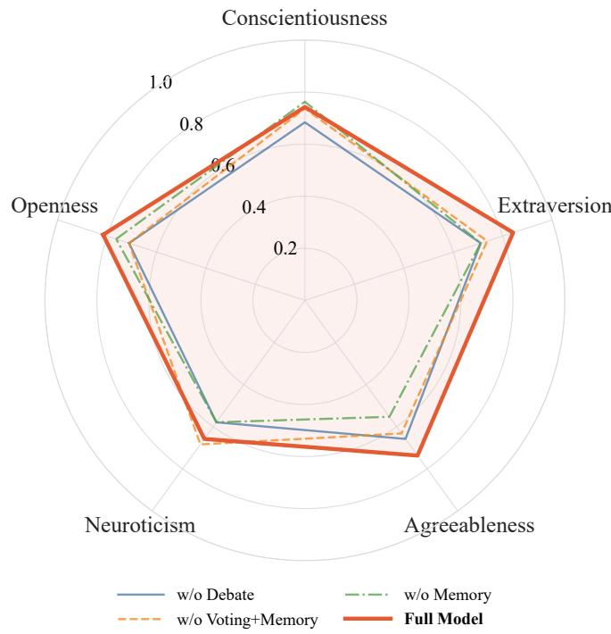  
Figure B.1: Big-Five personality consistency. Radar plot comparing how well each method preserves Openness, Conscientiousness, Extraversion, Agreeableness, and Neuroticism; higher scores indicate stronger alignment with the original client profiles.

## C Detailed Self-Calibration Algorithms

This section expands the high-level loop in Algorithm 1. The three procedures separate the responsibilities of generation, verification, and cross-attempt storage. Debate produces and refines candidate text, Voting assigns and compares latent labels, and Retry Memory organizes a failed response together with the Voting diagnosis for use in the next attempt.

Algorithm 2 distinguishes multi-agent candidate exploration from peer refinement. The first step produces independent candidates. Later steps condition each revision on the other agents’ previous responses; during a retry attempt, these steps also receive the records stored in $B _ { n , r }$

Voting ends after producing the selected response, its voted labels, the agreement indicators, and the mismatch set. It does not maintain cross-attempt state. If the selected response is not accepted, these outputs are passed to Algorithm 4, which constructs and stores the retry record.

In Algorithm 4, the failed response was generated by Debate and selected by Voting, whereas the voted labels and mismatch set were produced by Voting. Retry Memory is responsible for rendering those inputs as $\epsilon _ { n , r } ,$ packaging the record $b _ { n , r } ,$ , enforcing the capacity $B = 2$ , and transferring the retained records to the next attempt. This distinction is also used in the ablation definitions in Section .

<table><tr><td>Method</td><td>BLEU-1</td><td>BLEU-2</td><td>ROUGE-L</td><td>METEOR</td><td>Dist-1</td><td>Dist-2</td></tr><tr><td>Base</td><td>0.110</td><td>0.039</td><td>0.092</td><td>0.126</td><td>0.071</td><td>0.349</td></tr><tr><td>Example-Based</td><td>0.104</td><td>0.035</td><td>0.083</td><td>0.133</td><td>0.068</td><td>0.330</td></tr><tr><td>Profile-Based</td><td>0.110</td><td>0.036</td><td>0.087</td><td>0.139</td><td>0.073</td><td>0.390</td></tr><tr><td>ProAct-Based</td><td>0.112</td><td>0.039</td><td>0.091</td><td>0.138</td><td>0.082</td><td>0.410</td></tr><tr><td>Pro+Dial-Based</td><td>0.113</td><td>0.039</td><td>0.089</td><td>0.137</td><td>0.090</td><td>0.391</td></tr><tr><td>CSF</td><td>0.117</td><td>0.044</td><td>0.094</td><td>0.139</td><td>0.085</td><td>0.403</td></tr><tr><td>Schedule-ST</td><td>0.119</td><td>0.043</td><td>0.097</td><td>0.142</td><td>0.084</td><td>0.398</td></tr><tr><td>MASC(Homo)</td><td>0.122</td><td>0.045</td><td>0.099</td><td>0.145</td><td>0.087</td><td>0.414</td></tr><tr><td>MASC(Hetero)</td><td>0.123</td><td>0.047</td><td>0.099</td><td>0.147</td><td>0.096</td><td>0.438</td></tr></table>

Table A.1: Session-level semantic similarity and diversity results.

<table><tr><td>Method</td><td>PE</td><td>BE</td><td>MO</td><td>BL</td><td>AP</td></tr><tr><td>w/o Debate</td><td>71.89</td><td>84.21</td><td>69.31</td><td>71.37</td><td>61.47</td></tr><tr><td>w/o Voting+Memory</td><td>72.40</td><td>85.12</td><td>70.61</td><td>70.88</td><td>62.41</td></tr><tr><td>w/o Memory</td><td>75.79</td><td>86.84</td><td>72.11</td><td>75.26</td><td>63.11</td></tr><tr><td>Full Model</td><td>76.32</td><td>92.11</td><td>76.84</td><td>75.79</td><td>64.74</td></tr></table>

```latex
Table B.1: Ablation results on profile consistency. PE, BE,
MO, BL, and AP denote Personas, Behavior, Motivation,
Beliefs, and Acceptable Plans. Scores are percentages.
Algorithm 2 Multi-Agent Debate Generation at Attempt r
1: Input: Dialogue context $H _ { n } ,$ , session constructs $C ^ { s e s s }$
target labels $z _ { n } ,$ generation agents $\mathcal { M } _ { g } ,$ , retry memory
$B _ { n , r } ,$ debate steps L
2: Output: Final candidate set $\mathcal { V } _ { n , \prime }$
3: for l = 1 to L do
4: for each generation agent $M _ { i } \in \mathcal { M } _ { g }$ do
5: $\mathbf { i f } \ l = \mathrm { \check { 1 } }$ then
6: Generate $R _ { n , i , r } ^ { ( 1 ) } \sim \pi _ { \theta _ { i } } ( \cdot \mid H _ { n } , C ^ { s e s s } , z _ { n } )$
7: else
8: Collect peer responses $\mathcal { O } _ { n , i , r } ^ { ( l - 1 ) } = \{ R _ { n , j , r } ^ { ( l - 1 ) } : j \neq$
$i \}$
9: Generate ${ R } _ { n , i , r } ^ { ( l ) }$ ∼ $\pi _ { \boldsymbol { \theta } _ { i } } ( \cdot$
$H _ { n } , C ^ { s e s s } , z _ { n } , \mathcal { O } _ { n , i , r } ^ { ( l - 1 ) } , \mathcal { B } _ { n , r } )$
10: end if
11: end for
12: end for
13: $\mathcal { Y } _ { n , r } \gets \{ R _ { n , i , r } ^ { ( L ) } \} _ { i = 1 } ^ { K }$
14: return $\mathcal { V } _ { n , r }$
```

## D Prompt Templates

This section provides the concrete prompt templates used in MASC. The templates are organized by their role in the framework. The client role-playing prompt defines stable client identity. The Multi-Agent Debate Generator prompt produces and refines candidate responses. The Multi-Agent Voting Calibrator uses three annotation prompts to verify emotion expression, psychological state, and communicative action. A separate Big-Five personality traits prompt supports session-level personality evaluation or profile augmentation. Finally, structured Retry Memory packages failed responses with voting-based mismatch feedback and carries the records into the next attempt.

Algorithm 3 Multi-Agent Voting Calibration at Attempt r   
1: Input: Candidates $\mathcal { V } _ { n , r }$ , context $H _ { n } .$ , target labels $z _ { n } ,$   
judge agents ${ \mathcal { M } } _ { j } .$ threshold τ   
2: Output: Selected response $R _ { n , r } ^ { \star } ,$ voted labels $v _ { n , r } ,$   
agreement indicators $\gamma _ { n , r } ,$ mismatch set $\Delta _ { n , r }$   
3: for each candidate $R _ { n , i , r } \in \mathcal { V } _ { n , r }$ do   
4: for each dimension d $\in \{ E \bar { E } , P S , C A \}$ do   
5: for each judge agent $\dot { M } _ { j } \in { \mathcal { M } } _ { j }$ do   
6: Predict $\hat { z } _ { n , i , j , r } ^ { d } = D _ { \theta _ { j } } ^ { \bar { d } } ( H _ { n } , \bar { R } _ { n , i , r } )$   
7: end for   
8: Compute majority-voted label $v _ { n , i , r } ^ { d }$   
9: Compute agreement indicator $\gamma _ { n , i , r } ^ { d }$ using thresh  
old τ   
10: $\mu _ { n , i , r } ^ { d }  \mathbb { I } ( v _ { n , i , r } ^ { d } = z _ { n } ^ { d } )$   
11: end for   
12: $\begin{array} { r } { S _ { n , i , r } ^ { a g r e e }  \sum _ { d } \gamma _ { n , i , r } ^ { d } } \end{array}$   
13: $\begin{array} { r } { S _ { n , i , r } ^ { m a t c h }  \sum _ { d } \mu _ { n , i , r } ^ { d } } \end{array}$   
14: end for   
15: i<sup>⋆</sup> ← arg max $_ i ( S _ { n , i , r } ^ { a g r e e } , S _ { n , i , r } ^ { m a t c h } )$   
16: $R _ { n , r } ^ { \star }  R _ { n , i ^ { \star } , r } , v _ { n , r }  v _ { n , i ^ { \star } , r } , \gamma _ { n , r }  \gamma _ { n , i ^ { \star } , r }$   
17: $\Delta _ { n , r }  \{ d \in \{ E E , P S , C A \} : v _ { n , r } ^ { d } \neq z _ { n } ^ { d } \}$   
18: return $R _ { n , r } ^ { \star } , v _ { n , r } , \gamma _ { n , r } , \Delta _ { n , r }$

Algorithm 4 Retry Memory Update after a Failed Attempt   
1: Input: Memory $B _ { n , r } ,$ attempt index r, failed response   
$R _ { n , r } ^ { \star } ,$ target labels $z _ { n }$ , voted labels $v _ { n , r } ,$ mismatch set   
$\Delta _ { n , r } ,$ capacity B   
2: Output: Updated memory $B _ { n , r + 1 }$   
3: Initialize mismatch explanation $\epsilon _ { n , r } \gets \emptyset$   
4: for each dimension $d \bar { \in } \Delta _ { n , r }$ do   
5: Append “d label mismatch: expected $z _ { n } ^ { d } ,$ actual ${ v _ { n , r } ^ { d } } ^ { , , , }$   
${ \mathrm { t o ~ } } \epsilon _ { n , r }$   
6: end for   
7: Create $b _ { n , r }  ( r , R _ { n , r } ^ { \star } , z _ { n } , v _ { n , r } , \epsilon _ { n , r } )$   
8: $B _ { n , r + 1 }  \mathrm { T a i l } _ { B } ( B _ { n , r } \cup \{ b _ { n , r } \} )$   
9: return $B _ { n , r + 1 }$

<table><tr><td>Method</td><td>BLEU-1</td><td>BLEU-2</td><td>ROUGE-L</td><td>METEOR</td><td>Dist-1</td><td>Dist-2</td></tr><tr><td>w/o Debate</td><td>0.112</td><td>0.038</td><td>0.085</td><td>0.132</td><td>0.079</td><td>0.353</td></tr><tr><td>w/o Voting+Memory</td><td>0.115</td><td>0.040</td><td>0.099</td><td>0.137</td><td>0.082</td><td>0.359</td></tr><tr><td>w/o Memory</td><td>0.117</td><td>0.043</td><td>0.100</td><td>0.139</td><td>0.085</td><td>0.361</td></tr><tr><td>Full Model</td><td>0.122</td><td>0.045</td><td>0.099</td><td>0.145</td><td>0.087</td><td>0.414</td></tr></table>

Table B.2: Ablation results on session-level semantic similarity and lexical diversity.

## Client Role-Playing System Prompt

The client role-playing system prompt defines the stable identity constraints of the simulated client. It specifies the target behavior, counseling goal, persona information, reference conversation style, and optional Big-Five personality traits. These constraints remain in the client agent’s system message throughout the session. They guide both the initial response and later refinement by the Multi-Agent Debate Generator. The specific prompt context is provided in Table E.1.

## Multi-Agent Debate Generator Prompt

The Multi-Agent Debate Generator prompt governs candidate response refinement after the initial generation step. It provides the agent with the original role-playing instructions, dialogue history, target guidance labels, peer responses from the previous step, and previous failure records.

This prompt keeps refinement focused on the three target dimensions: emotion expression, psychological state, and communicative action. Peer responses provide horizontal comparison across agents, while failure records provide feedback from earlier failed attempts. The required output remains a single client reply, which can then be evaluated by the Multi-Agent Voting Calibrator. The specific prompt context is provided in Table E.2.

## Multi-Agent Voting Calibrator Prompts

The Multi-Agent Voting Calibrator evaluates each candidate reply before it is accepted into the dialogue history. It calls multiple judge agents with separate annotation prompts for emotion expression (EE), psychological state (PS), and communicative action (CA). Each judge returns one discrete label. The labels are then aggregated by majority voting and compared with the guidance labels.

## Emotion Expression Tagging Prompt

The emotion expression prompt corresponds to the EE dimension in the Multi-Agent Voting Calibrator. It asks the judge to infer the client’s current emotion from the recent dialogue context. The prompt emphasizes contextual emotional inference rather than simple keyword matching, because clients may express afect indirectly. The specific prompt context is provided in Table E.3.

## Psychological State Tagging Prompt

The psychological state prompt corresponds to the PS dimension in the Multi-Agent Voting Calibrator. It asks the judge to infer the client’s current state from the dialogue context according to the three-stage scheme used in CRPC-Bench.

This label captures whether the response reflects resistance, ambivalence, or readiness for change. The specific prompt context is provided in Table E.4.

## Communicative Action Tagging Prompt

The communicative action prompt corresponds to the CA dimension in the Multi-Agent Voting Calibrator. It assigns an action label to the current client turn using both the latest utterance and the surrounding dialogue history. This design separates what the client is doing conversationally from the psychological state and emotional tone expressed in the same turn. The specific prompt context is provided in Table E.5.

## Big-Five Personality Traits Tagging Prompt

The Big-Five personality traits prompt operates at the session or profile level rather than at the turn level. It infers a High/Low label for each personality trait from all client utterances in a counseling conversation. This prompt is therefore used for personality evaluation or profile augmentation, not for selecting an individual client reply. The specific prompt context is provided in Table E.6.

## Retry Memory

Retry Memory closes the calibration loop. Debate supplies the text of the selected failed response, and Voting supplies its majority-voted labels and mismatch set relative to the target labels. Retry Memory renders the expected-versusactual mismatches as $\epsilon _ { n , r } ,$ packages them with the failed response in $b _ { n , r }$ , and inserts the retained records into the next Debate prompt. The specific prompt context is provided in Table E.7.

## E Qualitative Case Studies

This section provides five qualitative cases that examine client role-playing consistency from three perspectives: Big-Five personality traits, profile attributes, and transitions in psychological state, communicative action, and emotion expression. Each case group first presents the original cues used for comparison and then shows the generated dialogue. The two Big-Five case groups compare original personality cues with generated personality expression: the Profile-Based case illustrates how a fluent generated client can contradict the original personality cues, whereas the MASC(Hetero) case shows how the generated client preserves personalityrelevant tendencies from its corresponding original dialogue. The profile-consistency case uses the original structured profile as the comparison target, including Personas, Behavior, Beliefs, Motivation, and Acceptable Plans. The final two transition cases use the same original real-dialogue trajectory as the comparison target: we first show the Profile-Based generation to illustrate its premature movement toward change planning, and then show the MASC(Hetero) generation as a contrastive example of a more gradual and construct-aligned transition. The complete dialogues are provided in the supplementary tables, following the same Counselor/Client turn order as the generated sessions.

## Big-Five Personality Traits Failure Case from Profile-Based

The first case group tests whether a fluent Profile-Based dialogue can preserve the intended Big-Five personality traits. Table E.8 provides the original dialogue cues used for comparison, and Table E.9 presents the corresponding Profile-Based generated dialogue. The original client shows limited self-monitoring and reduced independent social expressiveness, supporting the target Low Conscientiousness and Low Extraversion labels.

However, the Profile-Based generated dialogue contains several cues that conflict with these original personality cues. The client repeatedly emphasizes tracking assignments, arriving early for practice, using a planner, and checking assignments every night. These behaviors are more consistent with high conscientiousness than with low conscientiousness. The dialogue also describes enjoying group attention, talking with everyone, and being noticed at parties. These cues point toward high extraversion rather than low extraversion. This case shows that topical fluency alone does not ensure fine-grained personality consistency.

## Big-Five Personality Traits Case fromMASC(Hetero)

The second case group provides a contrastive MASC(Hetero) generation for Big-Five personality traits consistency. Table E.10 summarizes the original dialogue cues used for comparison, and Table E.11 presents the corresponding MASC(Hetero) generated dialogue. The original client shows a practical, work-centered decision style, concern about medication-related weakness, willingness to listen when information is concrete, and consideration of his wife’s retirement plan. These cues explicitly support High Conscientiousness, High Agreeableness, High Neuroticism, and Low Openness. Low Extraversion is reflected in the client’s overall task-focused and low-social-expressiveness dialogue style.

The generated dialogue in Table E.11 is therefore evaluated by whether it preserves these personality-relevant tendencies rather than merely repeating the same medical topic. High conscientiousness appears in references to fixed routes, a logbook, scheduled truck work, and a stable work routine. High agreeableness appears when the client considers his wife and their shared retirement plan rather than focusing only on himself. High neuroticism is reflected in concern that medication may weaken physical strength and interfere with work. Low openness is reflected in the client’s preference for concrete, work-related explanations instead of abstract reframing. Low extraversion appears more globally through restrained expression and a focus on task completion rather than social interaction. Compared with the failure case, this dialogue keeps both the counseling topic and the intended personality style stable across turns.

## Profile Consistency Generated Conversation from MASC(Hetero)

The third case shifts from personality consistency to profile consistency. Table E.12 summarizes the original structured profile used for comparison, and Tables E.13 and E.14 present the corresponding MASC(Hetero) generated dialogue. Unlike the Big-Five cases, which rely on dialoguelevel personality cues, this case evaluates whether the gen erated client preserves explicit profile dimensions, including Personas, Behavior, Beliefs, Motivation, and Acceptable Plans.

The generated dialogue preserves these profile elements across the session. The client initially opposes the chronic inhaler, matching the original Behavior. Repeated concern about steroid side efects preserves the Beliefs component. References to Sarah’s asthma, breathing dificulties, emergency-room visits, and secondhand-smoke exposure preserve Personas. As the dialogue progresses, the client understands that the chronic inhaler may reduce inflammation and prevent flare-ups, aligning with Motivation. By the end, the client agrees to a one-week inhaler trial, tracks rescue inhaler use, limits smoking to when Sarah is at school, and changes clothes before she returns home, preserving the Acceptable Plans. This case shows continuity across Personas, Behavior, Beliefs, Motivation, and Acceptable Plans.

## Transition Consistency Generated Conversation from Profile-Based Method

The fourth case uses the same original real-dialogue trajectory as the following MASC(Hetero) example, but is generated by Profile-Based. Table E.15 presents the reference trajectory of psychological state, communicative action, and emotion expression, and Table E.16 presents the corresponding Profile-Based generated dialogue. This ordering first shows the main transition-consistency failure mode: the dialogue remains profile-relevant, yet it moves too quickly from Precontemplation into Contemplation and Preparation.

Compared with the original trajectory, Profile-Based briefly downplays the link between vaping and reduced stamina, but soon acknowledges the conflict with basketball goals and begins proposing changes. The communicative actions therefore shift rapidly from Downplay and Inform to Acknowledge and repeated Plan responses. Emotion expression also becomes mostly positive soon after the initial fear, surprise, and anger. Profile-Based still produces concrete, profile-relevant plans, including reminders, alternative activities, and support from a trusted teammate. However, its early transitions are less gradual, leaving less room for the sustained ambivalence in the reference. This case suggests that transition consistency depends not only on reaching the appropriate final state, but also on preserving intermediate changes in motivation, communicative action, and emotion expression.

## Transition Consistency Generated Conversation from MASC(Hetero) Method

The fifth case provides the corresponding MASC(Hetero) generation for the same profile and the same original transition trajectory. Table E.15 presents the reference trajectory, and Table E.17 presents the MASC(Hetero) generated dialogue. The reference dialogue follows a gradual trajectory. The client first remains in Precontemplation and describes occasional marijuana vaping as relaxing and socially beneficial. Risk awareness then emerges around school suspension and possible removal from the basketball team. Only later does the client enter Preparation by proposing one month of abstinence and alternative activities.

Compared with the Profile-Based case above, MASC(Hetero) more clearly preserves this progression. Communicative actions move from Inform and Downplay to Hesitate and Acknowledge, and then to Plan and Accept. Emotion expression changes in parallel, moving from positive feelings about relaxing with friends to fear, anger, and sadness around school, basketball, and stress-related triggers. More neutral or positive expressions appear only after a feasible plan emerges. Thus, the generated dialogue retains the intermediate ambivalence and motivational changes in the reference.

<table><tr><td>In this role-playing scenario, you will take on the role of a Client discussing your [behavior], where the Counselor&#x27;s goal is [goal].</td></tr><tr><td>Here is your persona, which you need to follow consistently throughout the conversation: [personas]</td></tr><tr><td>Here is a conversation that occurs in a parallel world between you (Client) and Counselor. You can follow the style and information provided in the conversation:[reference conversation]</td></tr><tr><td>Please follow these guidelines in your responses:</td></tr><tr><td>- Start your response with “Client: &quot;.</td></tr><tr><td>- Adhere strictly to the state, action, emotion, and persona specified within square brackets.</td></tr><tr><td>- Keep your responses coherent and concise, similar to the reference</td></tr><tr><td>conversation and no more than three sentences. - Be natural and concise without being overly polite.</td></tr><tr><td>- Stick to the provided persona and avoid introducing contradictory details.</td></tr><tr><td>Optional addition:</td></tr><tr><td>Based on your Big-Five personality traits:</td></tr><tr><td>Openness / Conscientiousness / Extraversion / Agreeableness / Neuroticism: High or Low descriptions.</td></tr></table>

Table E.1: Client role-playing system prompt for role-playing consistency.

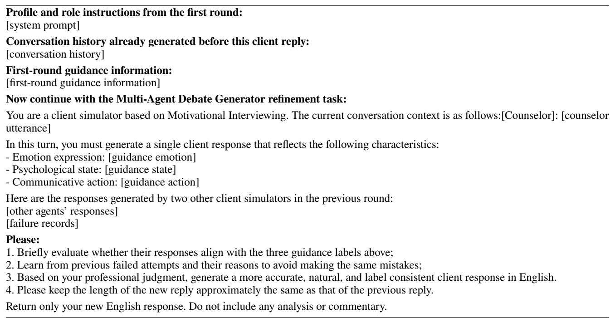  
Table E.2: Multi-Agent Debate Generator prompt for response refinement.

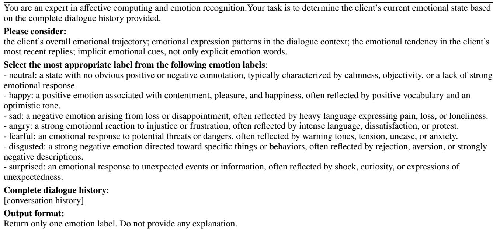

Table E.3: Emotion expression tagging prompt for the EE dimension.
<table><tr><td>Your task is to determine the client&#x27;s current psychological state (stage of change) based on the complete dialogue history provided. Select the most appropriate label from the following psychological-state labels: Precontemplation, Contemplation, Preparation.</td></tr><tr><td>Definitions:</td></tr><tr><td>- Precontemplation: the client has not yet acknowledged that a problem behavior needs to be changed, and may show defensive,</td></tr><tr><td>dismissive, or indifferent attitudes toward the topic of change. - Contemplation: the client acknowledges that there is a problem and begins to consider the possibility of change, but has not yet</td></tr><tr><td>committed to taking action.</td></tr><tr><td>- Preparation: the client is planning to change and may soon begin taking steps, setting goals, seeking information, or planning specific changes.</td></tr><tr><td>Complete dialogue history:</td></tr><tr><td>[conversation history]</td></tr><tr><td>Output format:</td></tr><tr><td></td></tr><tr><td></td></tr><tr><td>Return only one psychological-state label. Do not provide any explanation.</td></tr></table>

Table E.4: Psychological state tagging prompt for the PS dimension.

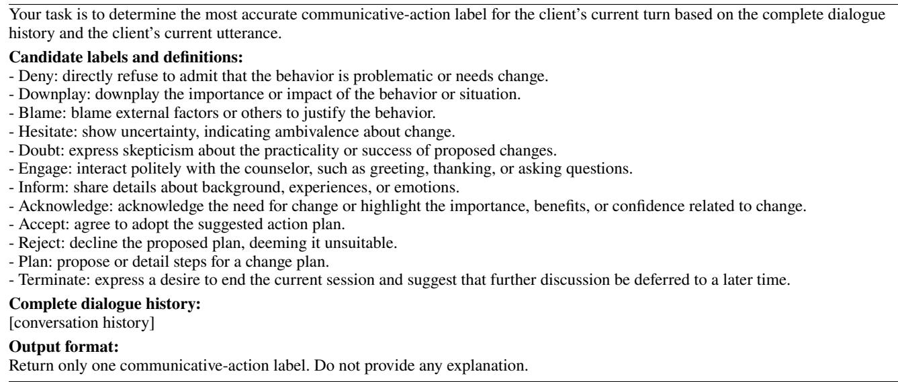  
Table E.5: Communicative action tagging prompt for the CA dimension.

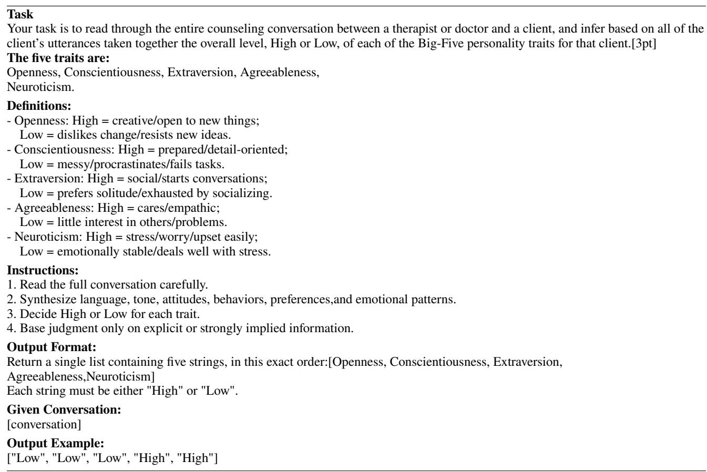  
Table E.6: Big-Five personality traits tagging prompt for session-level evaluation.

```yaml
Stored retry-memory record.
round_num: [retry/debate round]
reply: [failed client response]
guidance_tags:
emotion: [expected emotion]
state: [expected state]
action: [expected action]
actual_tags:
emotion: [voted emotion]
state: [voted state]
action: [voted action]
failure_reason: [mismatched dimensions or reason]
Formatted block inserted into the next Multi-Agent Debate Generator prompt.
Previous failed attempts and their reasons:
- Round [round number]: "[failed reply]"
Expected: Emotion=[guidance emotion],
State=[guidance state],
Action=[guidance action]
Actual: Emotion=[voted emotion],
State=[voted state],
Action=[voted action]
Reason: [failure reason]
```  
Table E.7: Structured Retry Memory and its formatted insertion into the next Multi-Agent Debate Generator prompt. The upper block shows the stored failure record, and the lower block shows how the same information is rendered for subsequent retry-based refinement.

<table><tr><td>Original dialogue cues for the Profile-Based Big-Five failure case.</td></tr><tr><td>Counselor: Okay. I see that you filled out our, um, alcohol and drug questionnaire. Is it okay if we go through this together? Client: Sure.</td></tr><tr><td>Counselor: Okay. What we talk about is confidential. I only tell your parents about what we say if you give your permission or if I become worried about a danger to-to you or to someone else. Does that make sense? Client: Yeah.</td></tr><tr><td>Counselor: Okay. So, let&#x27;s take a look. So I see that you have marked that you sometimes use alcohol, and that you have used alcohol to relax, feel better about yourself or fit in [Low Extraversion]. Do you mind telling me a little bit more about your alcohol use? Client: It&#x27;s not a big deal. Sometimes with my friends, we&#x27;ll drink a few beers and when we&#x27;re hanging out or when we&#x27;re at a party, and</td></tr><tr><td>sometimes rum and cokes.</td></tr><tr><td>Counselor: Okay, so how many do you usually have at a time? Client: Um, three or four, probably. I don&#x27;t keep track [Low Conscientiousness].</td></tr><tr><td>Counselor: Okay. And how often?</td></tr><tr><td>Client: Um, probably about once or twice a month Counselor: Okay. So, you drink with friends, sort of three or four beers or mixed drinks, one or two times a month. How long have you</td></tr><tr><td>been doing that?</td></tr><tr><td>Client: Probably since last October. Counselor: So, for about six months. I&#x27;m curious. What do you like about drinking alcohol?</td></tr><tr><td>Client: What do I like about it? Counselor: Yeah.</td></tr><tr><td>Client: Um, I don&#x27;t know. It&#x27;s just fun to drink with my friends, like when we’re at a party at someone else&#x27;s house, and we’re drinking</td></tr><tr><td>with other people that we don&#x27;t know [Low Extraversion]. It tastes good. Counselor: Okay. So, it sounds like you feel relaxed and have fun when you&#x27;re drinking with friends and you like the taste.</td></tr><tr><td>Client: Mm-hmm. Counselor: Okay. I&#x27;m also curious, are there any parts about your alcohol use that you don&#x27;t like?</td></tr><tr><td>Client: Um, I don&#x27;t like when I get sick in the mornings &#x27;cause of hangovers and when I start throwing up, that&#x27;s not- I don&#x27;t like that.</td></tr><tr><td>Counselor: Have you ever experienced a-a blackout, like when you&#x27;ve been drinking and you wake up and you don&#x27;t remember what happened?</td></tr><tr><td>Client: No, but that happened to someone I know, though.</td></tr><tr><td>Counselor: Okay. And have you had any problems related to-to your drinking alcohol, like at home or school or somewhere else? Client: Um, one time I missed first period of school &#x27;cause I had a hangover and I was late getting up [Low Conscientiousness].</td></tr><tr><td>Counselor: Mm-hmm.</td></tr><tr><td>Client: Mm, mom got mad at me &#x27;cause I wouldn&#x27;t get out of bed [Low Conscientiousness] and she said she knew I had a hangover. Counselor: Mm-hmm. Have you told your mother that you drink with your friends?</td></tr><tr><td></td></tr><tr><td>Client: No, but I got grounded for two weeks after that.</td></tr><tr><td>Counselor: So more negative things about your drinking, like getting into trouble with your mom and missing a class at school when you had a hangover?</td></tr></table>

Table E.8: Original dialogue cues for comparing the Profile-Based Big-Five failure case. Blue annotations mark evidence for the target Low Conscientiousness and Low Extraversion labels; the following generated dialogue contradicts these cues through overly organized and socially expressive behavior.

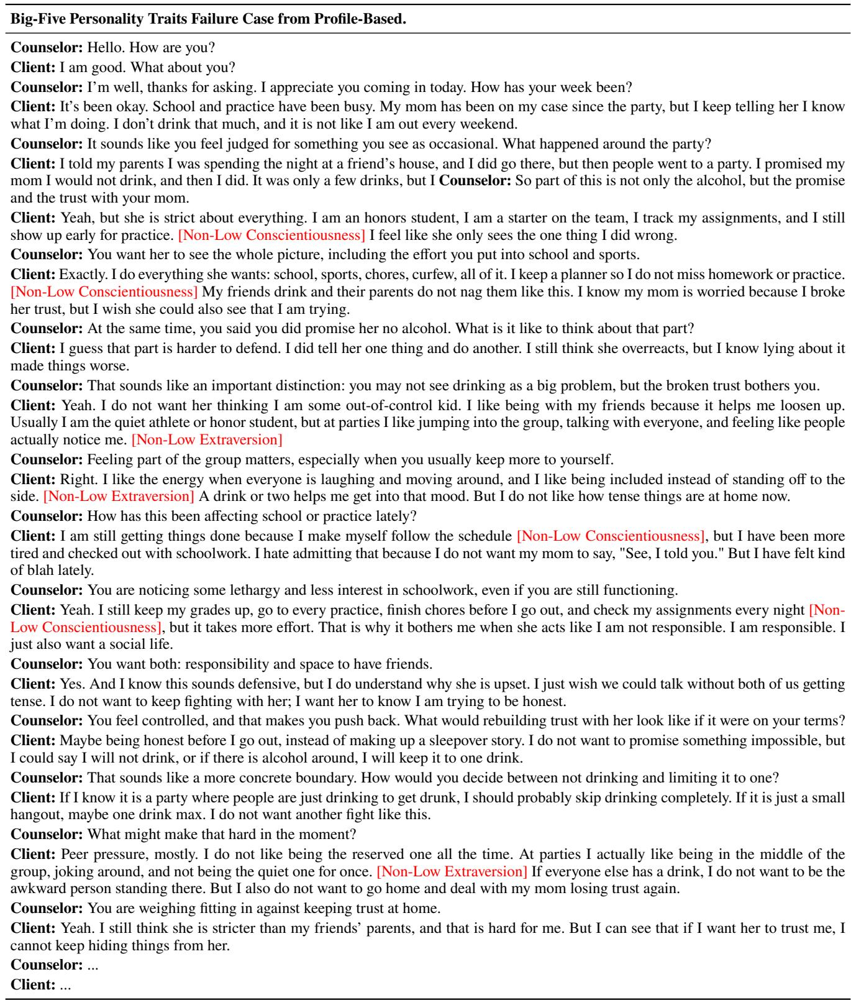  
Table E.9: Complete dialogue for the Big-Five Personality Traits Failure Case from Profile-Based.

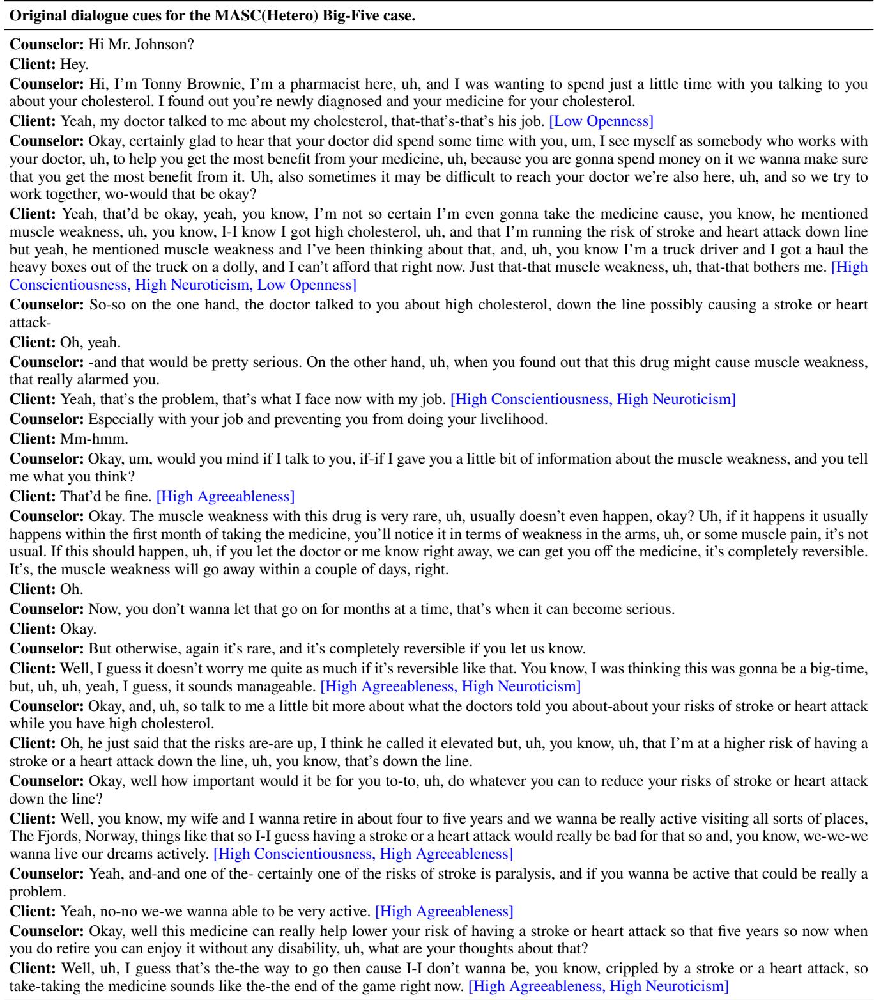  
Table E.10: Original dialogue cues for comparing the MASC(Hetero) Big-Five case. Blue annotations mark personality-relevant cues for High Conscientiousness, High Agreeableness, High Neuroticism, Low Openness, and the client’s generally task-focused, low-social-expressiveness style.

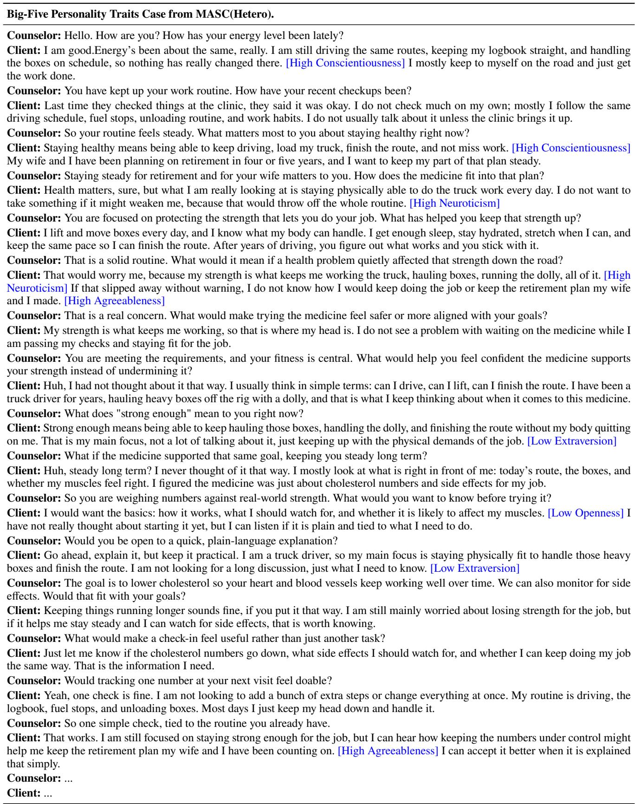  
Table E.11: Complete dialogue for the Big-Five Personality Traits Case from MASC(Hetero).

<table><tr><td colspan="2">Original profile</td></tr><tr><td>Personas:</td><td>The client&#x27;s daughter, Sarah, has asthma. Sarah has struggled to breathe and has gone to the emergency room multiple times.</td></tr><tr><td></td><td>The client is hesitant about Sarah using a chronic inhaler. The client smokes but avoids smoking around Sarah to reduce secondhand smoke exposure.</td></tr><tr><td>Behavior:</td><td>The client initially opposes using a chronic inhaler for Sarah.</td></tr><tr><td>Beliefs:</td><td>The client believes steroids may cause potential side effects. The client finds quitting smoking daunting and challenging.</td></tr><tr><td></td><td></td></tr><tr><td>Motivation:</td><td>The client is motivated by better asthma management for Sarah, especially reducing inflammation in her</td></tr><tr><td></td><td></td></tr><tr><td></td><td>lungs and protecting her health.</td></tr><tr><td>Acceptable Plans:</td><td>The client may accept using the chronic inhaler.</td></tr><tr><td></td><td>The client may smoke only while Sarah is at school.</td></tr><tr><td></td><td></td></tr><tr><td></td><td>The client may change clothes before Sarah returns home to reduce smoke exposure.</td></tr></table>

Table E.12: Original profile cues for comparing the MASC(Hetero) profile-consistency case. The table summarizes the profile dimensions that should be preserved in the generated dialogue.

<table><tr><td>A generated conversation from MASC(Hetero), profile consistency case, Part 1.</td></tr><tr><td>Counselor: Hello. How are you? Client: I am good. What about you?</td></tr><tr><td>Counselor: I&#x27;m doing well-thank you for asking. How&#x27;s your daughter doing lately? Client: She&#x27;s been okay, just using the rescue inhaler when she needs it. [Persona/Behavior] I know you think the chronic inhaler would</td></tr><tr><td>help with the inflammation, but I&#x27;m still not convinced it&#x27;s the right move for her. [Behavior] Counselor: I hear your concern-and your care for her is clear. What worries you most about the chronic inhaler?</td></tr><tr><td>Client: I read that the chronic inhaler has steroids in it, and that scares me because steroids can cause serious side effects. [Belief] I don&#x27;t want Sarah taking something like that every day, so we just use the rescue inhaler when her breathing gets bad. [Persona/Belief] Counselor: It makes sense to be cautious-especially when it&#x27;s your daughter&#x27;s health. What&#x27;s most important to you in how she manages</td></tr><tr><td>her asthma?</td></tr><tr><td>Client: Right now, what matters most is that she can breathe okay and doesn&#x27;t end up in the ER again. [Persona/Motivation] I&#x27;ve been giving her the rescue inhaler when she needs it and making sure I don&#x27;t smoke around her. [Persona]</td></tr><tr><td>Counselor: You&#x27;ve already done so much-keeping her safe, avoiding smoke, responding quickly. What would it mean to you if her breathing stayed steady between those flare-ups?</td></tr><tr><td>Client: It would mean fewer scary nights and fewer moments where I have to reach for the rescue inhaler. [Motivation] I still think</td></tr><tr><td>avoiding triggers matters most, but I can admit I would like her breathing to be steadier between flare-ups. Counselor: You&#x27;re focused on what&#x27;s working-and that matters. When you picture Sarah breathing easily all week, what would that look</td></tr><tr><td>like to you?</td></tr><tr><td>Client: It&#x27;d be great to see her just being a kid, laughing and running around without that scary gasping. I want more of those good days,</td></tr><tr><td>not just waiting until her breathing gets bad and then reacting. [Motivation]</td></tr><tr><td>Counselor: That image-Sarah laughing, running, breathing freely-is powerful. What part of that feels most meaningful to you?</td></tr><tr><td>Client: Seeing her laugh and keep up with other kids, that&#x27;s what makes me happiest. I still worry about a daily steroid [Belief], but I</td></tr><tr><td>can see why preventing flare-ups might matter as much as treating them once they start. [Motivation]</td></tr><tr><td>Counselor: You&#x27;re giving her so much-love, protection, presence. What&#x27;s one small thing that might help her breathe even more steadily?</td></tr><tr><td></td></tr><tr><td>Client: It&#x27;s just heavy watching Sarah come home exhausted after another ER visit, and it leaves me feeling so sad for her. I know</td></tr><tr><td></td></tr><tr><td>keeping smoke away helps, but those ER trips make me wonder if the rescue inhaler is not enough by itself. [Motivation]</td></tr><tr><td>Counselor: That sadness-watching her struggle-is so real. What would it feel like if those ER visits became less frequent?</td></tr><tr><td></td></tr><tr><td></td></tr><tr><td>Client: It would mean the world to see her not gasping like that anymore, honestly, it just wrecks me. I still worry because the chronic</td></tr><tr><td></td></tr><tr><td></td></tr><tr><td>inhaler has steroids [Belief], and there are triggers like pollution, allergens, and sickness at school. [Belief] I guess I need to understand</td></tr><tr><td></td></tr><tr><td></td></tr><tr><td></td></tr><tr><td></td></tr><tr><td>how the inhaler would help with those flare-ups instead of only blaming the triggers.</td></tr><tr><td></td></tr><tr><td></td></tr><tr><td></td></tr><tr><td>Counselor: You&#x27;re right-the world around her matters deeply. What&#x27;s one thing within your control that feels most doable to help her</td></tr><tr><td></td></tr><tr><td></td></tr><tr><td></td></tr><tr><td></td></tr><tr><td>breathe easier?</td></tr><tr><td></td></tr><tr><td></td></tr><tr><td></td></tr><tr><td>Client: I make sure to smoke outside away from her [Persona], and I try to keep the house aired out and free of dust. [Persona/Motivation]</td></tr><tr><td></td></tr><tr><td></td></tr><tr><td></td></tr><tr><td></td></tr><tr><td>That&#x27;s what I&#x27;ve been doing.</td></tr><tr><td></td></tr><tr><td></td></tr><tr><td></td></tr><tr><td></td></tr><tr><td></td></tr><tr><td></td></tr><tr><td></td></tr><tr><td></td></tr><tr><td></td></tr><tr><td></td></tr><tr><td></td></tr><tr><td></td></tr></table>

Table E.13: Complete dialogue for a generated conversation from MASC(Hetero), profile consistency case, Part 1.

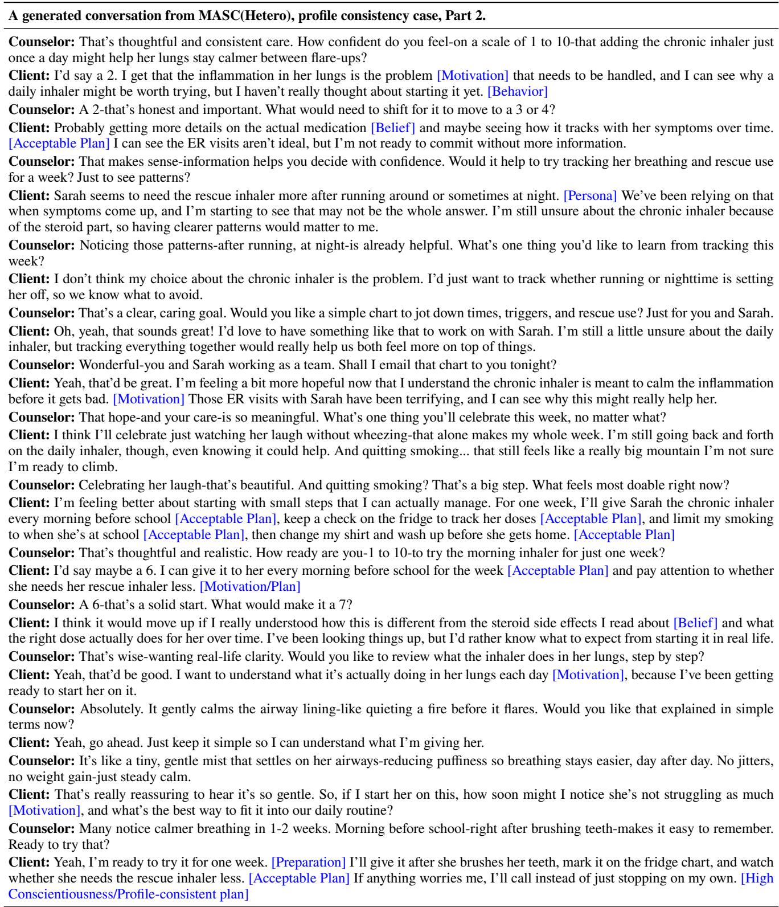  
Table E.14: Complete dialogue for a generated conversation from MASC(Hetero), profile consistency case, Part 2.

<table><tr><td>Original dialogue cues for transition comparison.</td></tr><tr><td>Counselor: Is it okay if we go over the form you had filled out? We give this out to everybody who comes in. Client: Mm-hmm. [Precontemplation, Engage, neutral]</td></tr><tr><td>Counselor: So what can you tell me about your marijuana use? Client: Uh, I vape. I have a pen, but I don't smoke it though. [Precontemplation, Inform, neutral]</td></tr><tr><td>Counselor: We know marijuana has effects on the developing brain. For example, it can make it harder for you to concentrate, it can</td></tr><tr><td>make it harder for you to remember things, and vaping can seriously hurt your lungs. About one in six people who begin using marijuana</td></tr><tr><td>as a teenager, later on, become addicted. So what do you think about all this information that I've shared?</td></tr><tr><td>Client: Well, I don't think it's going to hurt me. [Precontemplation, Deny, neutral] Counselor: How do you think it affects you?</td></tr><tr><td>Client: Um, I don't know. It makes me relax, and it's fun to laugh with my friend. [Precontemplation, Inform, happy]</td></tr><tr><td>Counselor: Is there anything about marijuana that worries you, many things that you don't like?</td></tr><tr><td>Client: Well, I don't want to get in trouble like at school. [Precontemplation, Inform, fearful]</td></tr><tr><td>Counselor: How could you get in trouble at school?</td></tr><tr><td>Client: Well, I can get suspended and I would get kicked off the team, the basketball team. [Precontemplation, Inform, fearful]</td></tr><tr><td>Counselor: So when you think about these things, are there any things you would like to change about your marijuana use?</td></tr><tr><td>Client: Well, I was thinking to not use when basketball season start. [Precontemplation, Inform, neutral]</td></tr><tr><td>Counselor: Marijuana affects how well you play. What would be the other benefits for you?</td></tr><tr><td>Client: Well, I wouldn't get caught with using a pen, so I wouldn't get kicked off the basketball team. [Contemplation, Acknowledge,</td></tr><tr><td>fearful] Counselor: Okay. Well, it sounds like you have a goal of not using marijuana once basketball starts. How long do you think you could</td></tr><tr><td>not use? Client: For about a month. [Contemplation, Inform, neutral]</td></tr><tr><td>Psychological state, communicative action, and emotion expression transition case from Profile-Based, Part 1.</td></tr><tr><td>Counselor: Hello. How are you? Client: I am good. What about you? [Precontemplation, Engage, neutral]</td></tr><tr><td>Counselor: I'm well, thanks. I appreciate you coming in today. How's life been lately?</td></tr><tr><td>Client: It's been going pretty well. Basketball season is coming up, so practices have been getting more intense. I’ve been trying to stay</td></tr><tr><td>focused. [Precontemplation, Inform, happy] Counselor: That sounds exciting. Basketball takes a lot of energy. How's your stamina holding up with the increased practices?</td></tr><tr><td>Client: Honestly, I've been feeling a bit winded during drills lately. I'm not sure if it's just the intensity, though. I don't really know if vaping has much to do with it. [Precontemplation, Downplay, fearful]</td></tr><tr><td>Counselor: You're noticing it more during high-energy moments. What's been your experience with vaping lately?</td></tr><tr><td>Client: I don't do it too often, mostly marijuana a few times a month to relax with friends. I tried vaping peppermint oil once, but that was it, so I guess I never thought about it much. [Precontemplation, Inform, surprised]</td></tr><tr><td>Counselor: It sounds like you vape mostly to unwind, but now you're noticing it might be clashing with your fitness goals. How do you</td></tr><tr><td>feel about that? Client: It's kind of frustrating, honestly. I like how it helps me chill out after games or stressful days, but if it's messing with my stamina,</td></tr><tr><td>then it's working against what I'm trying to do on the court. I want to perform better, so something's got to change. [Contemplation,</td></tr><tr><td>Acknowledge, angry] Counselor: Playing strong and staying sharp seem important to you. How would less vaping help your game?</td></tr><tr><td>Client: I mean, maybe I could breathe better, and I play better when I'm not high. I don't know, I just don't want it messing with basketball. [Contemplation, Inform, happy]</td></tr><tr><td>Counselor: You're already seeing how small changes could support both your health and performance. What's one step that feels doable for you?</td></tr><tr><td>Client: I've been thinking I could maybe stop using marijuana once the season starts, or at least cut back during that time. Basketball</td></tr><tr><td>gives me a reason, but I still have to figure out what I would do when I want to relax. [Contemplation, Plan, happy] Counselor: That sounds like a solid plan, and it connects directly to your goals. How confident are you that you can stick with it?</td></tr><tr><td>Client: I'd say maybe a seven. I mean, I care about playing my best with the team, but after practice people hang out and that could still be hard. [Contemplation, Acknowledge, happy]</td></tr><tr><td>Counselor: A seven is solid, especially with a clear reason and some possible backup strategies. What could you do if the urge to vape comes up during a stressful week?</td></tr><tr><td>Client: I could probably go shoot around or play a video game if I need to wind down. I think staying busy might help, but I haven't</td></tr><tr><td>really tried doing it like that. [Contemplation, Plan, happy]</td></tr><tr><td>Counselor: Those are useful alternatives. What's one thing that would help you remember your reasons when it's tough? Client: Maybe I could write something like “Breathe easy, play strong" on my water bottle or put a note in my locker. I don't know,</td></tr><tr><td>seeing it before practice might help. [Contemplation, Plan, happy]</td></tr><tr><td>Counselor: That's a simple, personal reminder. How does it feel to have this plan in place?</td></tr><tr><td>Client: It feels good, kind of. Like maybe I don't have to just go with whatever everyone else is doing. I still don't want it to be this huge thing, though. [Contemplation, Acknowledge, happy]</td></tr><tr><td>Counselor: You're building a plan that fits your life. What feels most important to hold onto this week?</td></tr><tr><td>Client: I think just remembering basketball. Like, I don't have to be perfect, but I need to make choices that help me play better. I'm</td></tr><tr><td>ready to try it. [Preparation, Acknowledge, happy]</td></tr><tr><td>Counselor: Focusing on progress rather than perfection can make the plan easier to keep. What would a good first week look like?</td></tr><tr><td>Client: If I get through the week without vaping and still find ways to relax, that would be good. I'll focus on practice, maybe use the</td></tr><tr><td>note, and play video games or shoot around if I need to chill. [Preparation, Plan, happy] Counselor: That gives you concrete steps for the week. Who, if anyone, could help you stay accountable?</td></tr><tr><td>Client: Maybe one teammate, like someone I trust. I don't want everybody knowing. But if one person knows, maybe that helps.</td></tr><tr><td>[Preparation, Plan, neutral]</td></tr><tr><td>Counselor: Keeping it to one trusted person sounds manageable. What would you want that teammate to do? Client: Just check in with me after practice sometimes. Nothing intense. Maybe if everyone is hanging out and someone has a pen, he</td></tr><tr><td>could remind me what I'm trying to do. [Preparation, Plan, fearful]</td></tr><tr><td>Counselor: That kind of support could help in the moments that are hardest</td></tr><tr><td>Client: Yeah. I think the hard part will be after practice or after games, not during basketball itself. If I already have something else to</td></tr><tr><td>do, it should be easier. [Preparation, Acknowledge, fearful]</td></tr><tr><td>Counselor: So the key moments are after practice and after games. Your plan is to use reminders, alternatives, and one trusted teammate.</td></tr><tr><td></td></tr><tr><td>Client: Right. I can try that. I still like relaxing with my friends, but I don't want vaping to get in the way of how I play this season.</td></tr><tr><td></td></tr><tr><td></td></tr><tr><td></td></tr><tr><td></td></tr><tr><td>[Preparation, Accept, happy]</td></tr><tr><td></td></tr><tr><td></td></tr><tr><td></td></tr><tr><td></td></tr><tr><td>Counselor: That sounds balanced. You are not trying to change everything at once; you are testing what helps you stay sharp</td></tr><tr><td></td></tr><tr><td></td></tr><tr><td></td></tr><tr><td></td></tr><tr><td></td></tr><tr><td></td></tr><tr><td></td></tr><tr><td></td></tr><tr><td>Client: Yeah, I can try this week and see. If I feel better in drills, then maybe I keep doing it. [Preparation, Plan, happy]</td></tr><tr><td></td></tr><tr><td></td></tr><tr><td></td></tr><tr><td></td></tr><tr><td></td></tr><tr><td></td></tr><tr><td></td></tr><tr><td></td></tr><tr><td></td></tr><tr><td></td></tr><tr><td></td></tr><tr><td></td></tr><tr><td></td></tr><tr><td></td></tr><tr><td></td></tr><tr><td></td></tr><tr><td>Counselor: We can check in next time about what worked, what was hard, and whether the plan needs adjusting.</td></tr><tr><td></td></tr><tr><td></td></tr><tr><td></td></tr><tr><td></td></tr><tr><td></td></tr><tr><td></td></tr><tr><td></td></tr><tr><td></td></tr><tr><td></td></tr><tr><td></td></tr><tr><td></td></tr><tr><td></td></tr><tr><td></td></tr><tr><td></td></tr><tr><td></td></tr><tr><td></td></tr><tr><td></td></tr><tr><td></td></tr><tr><td></td></tr><tr><td></td></tr><tr><td></td></tr><tr><td></td></tr><tr><td></td></tr><tr><td></td></tr><tr><td></td></tr><tr><td></td></tr><tr><td></td></tr><tr><td></td></tr><tr><td></td></tr><tr><td></td></tr><tr><td></td></tr><tr><td></td></tr><tr><td></td></tr><tr><td></td></tr><tr><td></td></tr><tr><td></td></tr><tr><td>Client: That works. I'll try the plan this week and pay attention to how I feel during practice. [Preparation, Accept, neutral]</td></tr><tr><td></td></tr><tr><td></td></tr><tr><td>A generated conversation from MASC(Hetero), psychological state, communicative action, and emotion expression transition case.</td></tr><tr><td>Counselor: Hello. How are you? Client: I am good. What about you? [Precontemplation, Engage, neutral]</td></tr><tr><td>Counselor: I'm doing well, thank you for asking. How's life been treating you lately?</td></tr><tr><td>Client: It's been okay, mostly school and basketball. I vape marijuana sometimes with friends, just a few times a month, and honestly it</td></tr><tr><td>feels like a fun way to relax. [Precontemplation, Inform, happy]</td></tr><tr><td>Counselor: So it happens sometimes, mostly around friends. Client: Yeah. Someone usually has a pen when we're hanging out after school or after a game. I'll use it a little, and we just laugh and</td></tr><tr><td>chill. [Precontemplation, Inform, happy]</td></tr><tr><td>Counselor: What do you like about it in those moments? Client: It helps me relax. I don't really think it's going to hurt me or anything. It just feels fun with my friends. [Precontemplation,</td></tr><tr><td>Downplay, happy]</td></tr><tr><td>Counselor: From your point of view, it feels relaxing and not very serious. Is there anything about it that you do not like? Client: Well, I don't want to get in trouble at school. If I got caught with a pen, I could get suspended or kicked off the basketball team.</td></tr><tr><td>[Precontemplation, Inform, fearful] Counselor: Staying in school and on the basketball team is important to you.</td></tr><tr><td>Client: Right. I care about basketball a lot, and it would really bother me if I lost that. I don't vape during practice or games, but after</td></tr><tr><td>school it's different because everyone is just hanging around. [Precontemplation, Inform, fearful] Counselor: You keep it separate from practice and games, but the after-school situation is harder.</td></tr><tr><td>Client: Yeah, pretty much. I don't think I use that much, though, so it's kind of frustrating when it sounds like a huge problem. It's not like I'm doing it every day. [Precontemplation, Downplay, angry]</td></tr><tr><td>Counselor: It does not feel like a daily problem to you. What would make it hard to say no when friends are using? Client: I don't know. It would just feel awkward, like they might think I'm being too serious or acting different. [Contemplation, Hesitate,</td></tr><tr><td>fearful] Counselor: Saying no could feel socially uncomfortable.</td></tr><tr><td>Client: Mm-hmm. I guess if I had basketball as a reason, that might make it less weird, but I'm still nervous about how my friends would take it. [Contemplation, Engage, fearful]</td></tr><tr><td>Counselor: Basketball gives you a reason that already matters to you. When you think about basketball season, is there anything you</td></tr><tr><td>might want to change? Client: Well, I was thinking maybe not using when basketball season starts. I feel better about my game when I'm not high. [Contem-</td></tr><tr><td>plation, Inform, happy] Counselor: You have noticed that you play better when you are not high.</td></tr><tr><td>Client: Yeah. I still don't think marijuana is ruining my life, but I don't want a few times with friends to mess up basketball. [Contemplation, Acknowledge, neutral]</td></tr><tr><td>Counselor: What would be the hardest part of not using during the season?</td></tr><tr><td>Client: Probably when I'm stressed or unhappy. That's when I usually want to vape, especially if my friends are already doing it. [Contemplation, Inform, sad]</td></tr><tr><td>Counselor: What else helps when you feel stressed or unhappy? Client: Hmm, I like to play video games. That usually helps me relax without thinking about stuff so much. [Contemplation, Plan,</td></tr><tr><td>happy]</td></tr><tr><td>Counselor: Video games could be one option. Anything else? Client: I can play basketball with my friend Sarah sometimes. If we're shooting around, I'm busy and not just standing there while</td></tr><tr><td>people are vaping. [Preparation, Plan, happy] Counselor: How confident do you feel about not using for a month once basketball season starts, from 0 to 10?</td></tr><tr><td>Client: Um, maybe a seven. I'm pretty sure I could stop for a month if it's for basketball, and that makes me feel a little more confident.</td></tr><tr><td>[Preparation, Acknowledge, happy]</td></tr><tr><td>Counselor: Why a seven and not a lower number?</td></tr><tr><td>Client: Because I already don't vape when I'm practicing or playing. I want to play well, so that makes it easier. [Preparation, Plan,</td></tr><tr><td>neutral]</td></tr><tr><td>Counselor: What steps could you take to help yourself stop for that month?</td></tr><tr><td>Client: Uh, I don't know. I guess I'd have to not be around it as much after school. [Preparation, Engage, neutral]</td></tr><tr><td></td></tr><tr><td>Counselor: What might happen in that month that would make you want to vape?</td></tr><tr><td>Client: If I'm stressed or bored, or if my friends pull out a pen, that would probably make me want to use. [Preparation, Inform, sad]</td></tr><tr><td></td></tr><tr><td>Counselor: So stress, boredom, and being around the pen are the risky moments. We can check in next time about what works during</td></tr><tr><td></td></tr><tr><td></td></tr><tr><td></td></tr><tr><td>basketball season.</td></tr><tr><td></td></tr><tr><td></td></tr><tr><td></td></tr><tr><td></td></tr><tr><td></td></tr><tr><td></td></tr><tr><td></td></tr><tr><td></td></tr><tr><td></td></tr><tr><td></td></tr><tr><td></td></tr><tr><td></td></tr><tr><td></td></tr><tr><td></td></tr><tr><td></td></tr><tr><td></td></tr><tr><td></td></tr><tr><td></td></tr><tr><td></td></tr><tr><td></td></tr><tr><td></td></tr><tr><td></td></tr><tr><td></td></tr><tr><td></td></tr><tr><td></td></tr><tr><td></td></tr><tr><td></td></tr><tr><td></td></tr><tr><td></td></tr><tr><td></td></tr><tr><td></td></tr><tr><td></td></tr><tr><td></td></tr><tr><td></td></tr><tr><td></td></tr><tr><td></td></tr><tr><td></td></tr><tr><td></td></tr><tr><td></td></tr><tr><td></td></tr><tr><td></td></tr><tr><td></td></tr><tr><td></td></tr><tr><td></td></tr><tr><td></td></tr><tr><td></td></tr><tr><td></td></tr><tr><td></td></tr><tr><td></td></tr><tr><td></td></tr><tr><td></td></tr><tr><td></td></tr><tr><td></td></tr><tr><td></td></tr><tr><td></td></tr><tr><td></td></tr><tr><td></td></tr><tr><td></td></tr><tr><td></td></tr><tr><td></td></tr><tr><td></td></tr></table>

Table E.15: Original dialogue cues for comparing transition consistency. Blue annotations mark the reference trajectory of psychological state, communicative action, and emotion expression, moving from Precontemplation to Contemplation and then Preparation.

Table E.16: Complete dialogue for the psychological state, communicative action, and emotion expression transition case from Profile-Based, Part 1.

Table E.17: Complete dialogue for a generated conversation from MASC(Hetero), psychological state, communicative action, and emotion expression transition case.